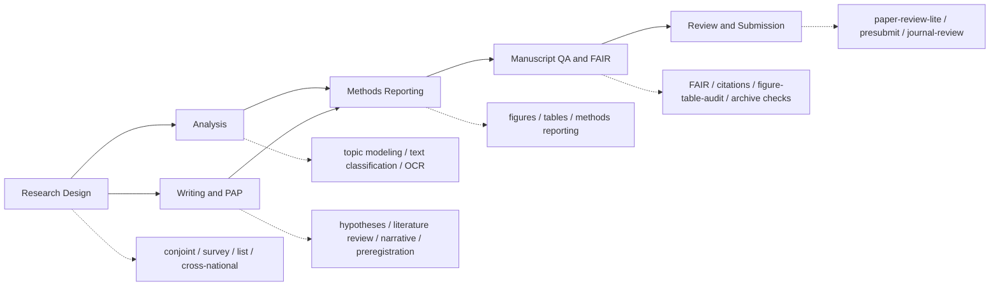

# Open Science Skills

[](https://github.com/scdenney/open-science-skills/releases)
[](LICENSE)
[](#skills)
[](https://code.claude.com/docs/en/skills)
[](https://github.com/scdenney/open-science-skills/commits/main)
[](SOURCES.md)
[](#contributing)

A library of [Claude Code skills](https://code.claude.com/docs/en/skills) for experimental social science, computational text analysis, manuscript QA, and transparent reporting. Install as a plugin to get AI assistance from research design through citation, figure/table, and final submission checks. The skills are available both as auto-triggered context and as explicit `/skill-name` slash commands.

Skills were developed using a curated library of methodology texts. They are iteratively expanded as new sources, ideas, and skills are incorporated. This is a living and breathing kind of repo. Skill building and editing is author-driven with the help of Opus 4.6, Gemini 3.0, and Chat GPT 5.4.

Design follows Anthropic's [skill authoring best practices](https://platform.claude.com/docs/en/agents-and-tools/agent-skills/best-practices): concise procedural guidance (no textbook definitions), trigger-rich YAML descriptions for auto-invocation, and progressive disclosure (instructions in skills, bibliography in SOURCES.md). Skills are periodically audited against both the [Claude Code skills reference](https://code.claude.com/docs/en/skills) and the [skill authoring guide](https://platform.claude.com/docs/en/agents-and-tools/agent-skills/best-practices) to keep descriptions, frontmatter, and substantive content current.

> These skills are meant to support, not supplant, the research and writing process. They adhere to APSA, JARS, DA-RT, TOP, and FAIR open-science expectations. All guidance is grounded in 160+ published sources and documented workflow patterns — see [**SOURCES.md**](SOURCES.md) for the full bibliography.

---

## Skill Map



Use the domain skills when designing or analyzing a study. Use the manuscript-QA skills when a draft exists and you need to check whether FAIR availability, citations, figures, tables, reporting, and replication materials can survive review.

---

## How Skills Work

Each skill is available in two ways:

| Mode | How | When to use |
|------|-----|-------------|
| **Auto-trigger** | Claude reads your prompt and loads the relevant skill silently | Working naturally — Claude detects context |
| **Slash command** | Type `/oss:skill-name` (or just `/skill-name` when there is no ambiguity) | When you want to invoke a skill explicitly |

Both modes are available when installed as a plugin. Individual skills can also be installed manually (auto-trigger only).

---

## Installation

### Option 1 — Plugin (recommended, installs all skills + slash commands)

**Permanent install** (user-wide, persists across all projects):

```bash
# Step 1: Register the marketplace (one-time)
claude plugin marketplace add scdenney/open-science-skills

# Step 2: Install the plugin
claude plugin install oss@open-science-skills

# Project-only install
claude plugin install oss@open-science-skills --scope project
```

The plugin's slash-command prefix is `oss:` (short for **o**pen **s**cience **s**kills). The marketplace and GitHub repo are still named `open-science-skills`.

**Session-only** (no install required, active for the current session):

```bash
git clone https://github.com/scdenney/open-science-skills.git
cd open-science-skills && claude --plugin-dir ./plugin
```

All 23 skills auto-trigger based on your prompts. All 23 slash commands (`/oss:conjoint-design`, `/oss:fair-check`, `/oss:figures`, `/oss:tables`, `/oss:figure-table-audit`, etc.) are immediately available. The prefix can be omitted when there is no ambiguity with other installed plugins.

### Option 2 — Selective install (choose specific skills, auto-trigger only)

Use the interactive install script to pick only the skills you want:

```bash
git clone https://github.com/scdenney/open-science-skills.git
cd open-science-skills
bash plugin/scripts/install.sh
```

The script lists available skills and lets you choose interactively. Skills are installed to `./.claude/skills/` by default (current project only). Options:

```bash
# Install to user-wide skills directory (all projects)
bash plugin/scripts/install.sh --target ~/.claude/skills

# Install specific skills non-interactively
bash plugin/scripts/install.sh --skill conjoint-design survey-design list-experiment

# Install all skills
bash plugin/scripts/install.sh --all --target ~/.claude/skills
```

Restart Claude Code after installing to load the new skills.

### Option 3 — Manual copy (single skill, auto-trigger only)

```bash
git clone https://github.com/scdenney/open-science-skills.git

# Project-level (current project only)
mkdir -p your-project/.claude/skills/conjoint-design
cp open-science-skills/plugin/skills/conjoint-design/SKILL.md \
   your-project/.claude/skills/conjoint-design/SKILL.md

# User-wide (all projects)
mkdir -p ~/.claude/skills/list-experiment
cp open-science-skills/plugin/skills/list-experiment/SKILL.md \
   ~/.claude/skills/list-experiment/SKILL.md
```

> **Note:** Manual install gives you auto-trigger only. Slash commands (`/skill-name`) require the plugin.

---

## Skills

### Research Design

| Skill | Slash command | What it does |
|-------|--------------|-------------|
| [**conjoint-design**](plugin/skills/conjoint-design/SKILL.md) | `/conjoint-design` | Attribute architecture, AMCE/AMIE estimation, power analysis (`cjpowR`), BART heterogeneity detection, design variants |
| [**conjoint-diagnostics**](plugin/skills/conjoint-diagnostics/SKILL.md) | `/conjoint-diagnostics` | Diagnostic checklist: design, estimation, measurement error (IRR), external validity, interpretation |
| [**conjoint-cleaning**](plugin/skills/conjoint-cleaning/SKILL.md) | `/conjoint-cleaning` | Qualtrics export to analysis-ready format: column conventions, reshaping, choice mapping, translation, pilot detection, validation |
| [**survey-design**](plugin/skills/survey-design/SKILL.md) | `/survey-design` | Question construction, scale design, survey flow, pretesting, respondent burden, social desirability mitigation |
| [**cross-national-design**](plugin/skills/cross-national-design/SKILL.md) | `/cross-national-design` | Cross-national survey experiments: per-country power, sensitivity bias auditing, instrument localization |
| [**list-experiment**](plugin/skills/list-experiment/SKILL.md) | `/list-experiment` | Item count technique: pre-design sensitivity assessment, control list design, NLSreg/MLreg estimation, assumption testing, placebo diagnostics |

### Analysis

| Skill | Slash command | What it does |
|-------|--------------|-------------|
| [**topic-modeling**](plugin/skills/topic-modeling/SKILL.md) | `/topic-modeling` | STM with metadata covariates, topic count selection via coherence-exclusivity diagnostics, reporting |
| [**text-classification**](plugin/skills/text-classification/SKILL.md) | `/text-classification` | LLM-based classification: codebook design, learning regime selection, human-LLM hybrid workflows, validation |

### Corpus Processing

| Skill | Slash command | What it does |
|-------|--------------|-------------|
| [**vlm-ocr-pipeline**](plugin/skills/vlm-ocr-pipeline/SKILL.md) | `/vlm-ocr-pipeline` | VLM-based OCR: model selection, image handling, prompt engineering, batch strategy, accuracy evaluation, reproducibility |
| [**post-ocr-cleanup**](plugin/skills/post-ocr-cleanup/SKILL.md) | `/post-ocr-cleanup` | Post-OCR cleanup: LLM and rule-based correction, quality diagnostics, multilingual considerations, corpus-level QA, provenance |

### Writing & Reporting

| Skill | Slash command | What it does |
|-------|--------------|-------------|
| [**hypothesis-building**](plugin/skills/hypothesis-building/SKILL.md) | `/hypothesis-building` | Falsifiability, counterfactuals, DAGs, FPCI, three-level hypothesis specification, equivalence testing, SESOI |
| [**literature-review**](plugin/skills/literature-review/SKILL.md) | `/literature-review` | Evidence maps, closest-prior-work assessment, gap verdicts, literature clusters, synthesis plans |
| [**narrative-building**](plugin/skills/narrative-building/SKILL.md) | `/narrative-building` | Introduction logic, literature reviews, the "Why-to-If-Then" funnel, cumulative framing, multi-experiment coherence |
| [**pre-registration-writing**](plugin/skills/pre-registration-writing/SKILL.md) | `/pre-registration-writing` | PAP structure, registry selection, analytical strategy specification, code pre-registration, deviation documentation |
| [**methods-reporting**](plugin/skills/methods-reporting/SKILL.md) | `/methods-reporting` | 40-item reporting checklist: CONSORT standards, JARS preregistration elements, DA-RT transparency |

### Figures & Tables

| Skill | Slash command | What it does |
|-------|--------------|-------------|
| [**figures**](plugin/skills/figures/SKILL.md) | `/figures` | Design publication-quality figures: chart choice from comparison, scales, color, legend ordering matched to visual order, self-contained captions, reproducibility |
| [**tables**](plugin/skills/tables/SKILL.md) | `/tables` | Design publication-quality tables: column order matching the argument, row grouping, precision and uncertainty conventions, self-contained titles and notes, code-generated workflows |

### Manuscript QA

| Skill | Slash command | What it does |
|-------|--------------|-------------|
| [**fair-check**](plugin/skills/fair-check/SKILL.md) | `/fair-check` | FAIR audit for completed manuscripts: data/code/material availability, repository metadata, persistent identifiers, licenses, access restrictions, reuse conditions |
| [**citation-check**](plugin/skills/citation-check/SKILL.md) | `/citation-check` | In-text/reference parity, DOI and source-status checks, stale working papers, citation-style and support audits |
| [**figure-table-audit**](plugin/skills/figure-table-audit/SKILL.md) | `/figure-table-audit` | End-stage QA of the finished figure/table set: inventory, cross-references, text-to-table consistency, accessibility, SI and replication linkage. Pairs with `figures` and `tables` (production-stage). |

### Review & Submission

| Skill | Slash command | What it does |
|-------|--------------|-------------|
| [**paper-review-lite**](plugin/skills/paper-review-lite/SKILL.md) | `/paper-review-lite` | Critical-Reviewer-style pre-submission audit: parallel quote-grounded sub-agents, verification cross-check, CONSORT + pre-reg audit for experimental papers. Lite counterpart to the standalone [`presubmit`](https://github.com/scdenney/presubmit) CLI. |
| [**presubmit**](plugin/skills/presubmit/SKILL.md) | `/presubmit` | Activator + setup wizard for the standalone [`presubmit`](https://github.com/scdenney/presubmit) Python CLI: walks first-time users through install (venv + `pip install -e .`), Anthropic API key setup, and output location, then runs the heavier 30+ stage adversarial pipeline (resumable, cost-tracked, optional `--math` and `--code-dir` add-ons). Heavier API-driven counterpart to `paper-review-lite`. |
| [**journal-review**](plugin/skills/journal-review/SKILL.md) | `/journal-review` | Drafts a senior-peer referee report on **someone else's** manuscript for a social-science journal. Five parallel finder sub-agents (Breaker, Butcher, Shredder, Void, Situator) + Blue Team filter + Chief Reviewer synthesis + Tone Guard sanitization produce a tight 1,200–2,000 word report (Recommendation + Summary + Major Concerns + Additional Concerns + Suggestions for Revision). Different role from `paper-review-lite` and `presubmit`, which are calibrated for SELF-AUDIT; this one is third-party referee work appropriate to send to a journal editor. |

---

## Contributing

PRs welcome. To add a new skill:

1. Create `plugin/skills/<name>/SKILL.md` following the [skill authoring best practices](https://platform.claude.com/docs/en/agents-and-tools/agent-skills/best-practices)
2. Add `plugin/commands/<name>.md` (see existing examples — one paragraph activation prompt + `$ARGUMENTS`)
3. Add sources to `SOURCES.md` under a new or existing section
4. Update badges and table in this README
5. Run `bash plugin/scripts/check.sh` before opening a PR

## License

This project is licensed under [Creative Commons Attribution-NonCommercial 4.0 International](LICENSE). The skills are intended for noncommercial scholarly and educational use.

The `citation-check`, `literature-review`, `figures`, `tables`, and `figure-table-audit` skills remix workflow ideas from [Cheng-I Wu's Academic Research Skills for Claude Code](https://github.com/Imbad0202/academic-research-skills), also licensed CC BY-NC 4.0. The instructions here are rewritten for this repository's open-science and experimental-social-science scope.
