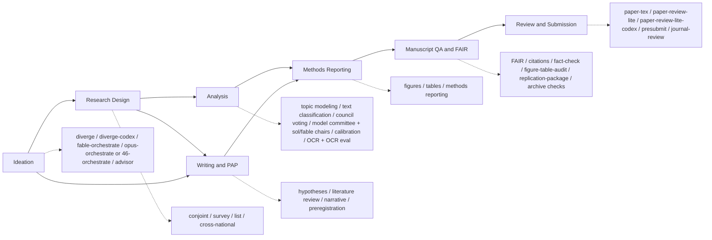

<p align="center">
  
</p>

# Open Science Skills

[](https://code.claude.com/docs/en/skills)
[](codex/README.md)
[](https://github.com/scdenney/open-science-skills/releases)
[](LICENSE)
[](#skills)
[](https://github.com/scdenney/open-science-skills/commits/main)
[](SOURCES.md)
[](#contributing)

Reusable agent workflows for experimental social science, computational text analysis, manuscript QA, and transparent reporting. The same research methods are packaged natively for both Claude Code and OpenAI Codex.

| Platform | Package | Invoke |
|---|---|---|
| [Claude Code](https://code.claude.com/docs/en/skills) | 39 skills in the [`oss` plugin](plugin/skills) | `/oss:skill-name` |
| [OpenAI Codex](https://developers.openai.com/codex/skills) | 37 skills in the [`codex/` library](codex/README.md) | `$skill-name` |

The two libraries track each other closely. On the Codex side there is no `presubmit`.

This is the toolkit I use in my own research. It is built from a curated corpus of methodology texts and grows as I add new sources, ideas, and skills. Authoring and editing are mine, with help from Opus 4.8, Gemini 3.0, and ChatGPT 5.4+.

Both libraries follow the official authoring guidance for [Claude Code](https://platform.claude.com/docs/en/agents-and-tools/agent-skills/best-practices) and [Codex](https://developers.openai.com/codex/skills): procedural workflows over definitions, with trigger-rich descriptions and progressive disclosure. The methods stay aligned across platforms; only invocation and tooling adapt to each runtime.

> These skills support the research and writing process. They do not replace it. They follow APSA, JARS, DA-RT, TOP, and FAIR open-science expectations, and all guidance is grounded in 150+ published sources and documented workflow patterns. See [**SOURCES.md**](SOURCES.md) for the full bibliography.

---

## Contents

[Skill Map](#skill-map) · [How Skills Work](#how-skills-work) · [Installation](#installation) · [Skills](#skills) · [Contributing](#contributing) · [License](#license)

**Skills:** [Project Setup](#project-setup) · [Ideation](#ideation) · [Research Design](#research-design) · [Analysis](#analysis) · [Corpus Processing](#corpus-processing) · [Writing &amp; Reporting](#writing--reporting) · [Figures &amp; Tables](#figures--tables) · [Manuscript QA](#manuscript-qa) · [Review &amp; Submission](#review--submission)

---

## Skill Map



Use the domain skills when designing or analyzing a study. Use the manuscript-QA skills when a draft exists and you need to check whether FAIR availability, citations, figures, tables, reporting, and replication materials can survive review.

---

## How Skills Work

Invocation depends on the platform:

| Platform | Implicit | Explicit | Source |
|---|---|---|---|
| Claude Code | Loads matching skills from prompt context | `/oss:skill-name` | [`plugin/skills/`](plugin/skills) |
| Codex | Loads matching skills from their descriptions | `$skill-name` | [`codex/`](codex) |

Orchestration and delegated-review variants require explicit invocation because they start subagents or external model calls.

---

## Installation

### Claude Code

#### Option 1 — Plugin (recommended, installs all skills + slash commands)

**Permanent install** (user-wide, persists across all projects):

```bash
# Step 1: Register the marketplace (one-time)
claude plugin marketplace add scdenney/open-science-skills

# Step 2: Install the plugin
claude plugin install oss@open-science-skills

# Project-only install
claude plugin install oss@open-science-skills --scope project
```

The plugin's slash-command prefix is `oss:` (short for **o**pen **s**cience **s**kills). The marketplace and GitHub repo are still named `open-science-skills`.

**Session-only** (no install required, active for the current session):

```bash
git clone https://github.com/scdenney/open-science-skills.git
cd open-science-skills && claude --plugin-dir ./plugin
```

All 39 skills auto-trigger based on your prompts. All 39 slash commands (`/oss:research-repo`, `/oss:conjoint-design`, `/oss:fair-check`, `/oss:figures`, `/oss:tables`, `/oss:paper-tex`, `/oss:figure-table-audit`, `/oss:replication-package`, and so on) are immediately available. The prefix can be omitted when no other installed plugin claims the same name.

<details>
<summary><b>Option 2 — Selective install</b> (choose specific skills, auto-trigger only)</summary>

Use the interactive install script to pick only the skills you want:

```bash
git clone https://github.com/scdenney/open-science-skills.git
cd open-science-skills
bash plugin/scripts/install.sh
```

The script lists available skills and lets you choose interactively. Skills are installed to `./.claude/skills/` by default (current project only). Options:

```bash
# Install to user-wide skills directory (all projects)
bash plugin/scripts/install.sh --target ~/.claude/skills

# Install specific skills non-interactively
bash plugin/scripts/install.sh --skill conjoint-design survey-design list-experiment

# Install all skills
bash plugin/scripts/install.sh --all --target ~/.claude/skills
```

Restart Claude Code after installing to load the new skills.

</details>

<details>
<summary><b>Option 3 — Manual copy</b> (single skill, auto-trigger only)</summary>

```bash
git clone https://github.com/scdenney/open-science-skills.git

# Project-level (current project only) — copy the whole skill folder:
# many skills ship reference/, assets/, or scripts/ files their SKILL.md points at
mkdir -p your-project/.claude/skills
cp -R open-science-skills/plugin/skills/conjoint-design \
   your-project/.claude/skills/

# User-wide (all projects)
mkdir -p ~/.claude/skills
cp -R open-science-skills/plugin/skills/list-experiment ~/.claude/skills/
```

> **Note:** Manual install gives you auto-trigger only. Slash commands (`/skill-name`) require the plugin.

</details>

### Codex

Codex discovers repository skills under `.agents/skills` and user-wide skills under `~/.agents/skills`. From the repository root, install all 36 native skills user-wide:

```bash
mkdir -p "$HOME/.agents/skills"
for skill in "$PWD"/codex/*/; do
  ln -sfn "${skill%/}" "$HOME/.agents/skills/$(basename "$skill")"
done
```

For selective and repository-scoped installation, plus the compact Codex catalog, see [`codex/README.md`](codex/README.md).

---

## Skills

The detailed catalog shows Claude Code commands by default. Platform-specific entries are labeled: **Codex** means a Codex-native skill, while **Claude Code → Codex** means a Claude Code skill that calls Codex. Unmarked research workflows also have counterparts in the [Codex catalog](codex/README.md), except for `presubmit`.

### Project Setup

<table width="100%">
<thead>
<tr>
<th width="18%">Skill</th>
<th width="16%">Invoke</th>
<th width="66%">What it does</th>
</tr>
</thead>
<tbody>
<tr>
<td><a href="plugin/skills/research-repo/SKILL.md"><strong>research-repo</strong></a></td>
<td><code>/research-repo</code></td>
<td>Scaffold or audit a research project repository organized around its source library. For a new repo, build the <code>sources/{og,md,unprocessed}</code> + <code>references.bib</code> spine (PDF to Markdown via <a href="https://github.com/opendataloader-project/opendataloader-pdf">OpenDataLoader PDF</a>), a <code>process-source</code> intake command, <code>CLAUDE.md</code>/<code>AGENTS.md</code>, <code>.gitignore</code>, and the archetype-appropriate analysis/manuscript/review folders, then smoke-test the pipeline; for an existing repo, audit against the convention with detection recipes for orphan PDFs, bib drift, and naming. Pairs with <code>process-source</code> (per-PDF intake) and <code>replication-package</code> (publication output).</td>
</tr>
</tbody>
</table>

### Workflow & Orchestration

<table width="100%">
<thead>
<tr>
<th width="18%">Skill</th>
<th width="16%">Invoke</th>
<th width="66%">What it does</th>
</tr>
</thead>
<tbody>
<tr>
<td><a href="plugin/skills/fable-orchestrate/SKILL.md"><strong>fable-orchestrate</strong></a><br><sub>Claude Code</sub></td>
<td><code>/fable-orchestrate</code></td>
<td>Multi-model orchestration with Fable 5 as tech lead. Routes reasoning-heavy work to a deep-reasoner subagent (Opus), mechanical work to a fast-worker subagent (Sonnet), and fresh-perspective or high-stakes work to Codex, a different-vendor GPT-5 peer. High-stakes tasks run Opus and Codex in parallel, then synthesize. Ships the two agent definitions and a <code>codex-peer.sh</code> driver.</td>
</tr>
<tr>
<td><a href="plugin/skills/opus-orchestrate/SKILL.md"><strong>opus-orchestrate</strong></a><br><sub>Claude Code</sub></td>
<td><code>/opus-orchestrate</code></td>
<td>The same multi-model orchestration with <strong>Claude Opus 4.8 as the lead, driven by ultracode</strong> (xhigh reasoning + dynamic <code>Workflow</code> fan-out). The inversion from <code>fable-orchestrate</code>: the lead is itself the deep reasoner, so compact hard problems stay with it and reasoning is delegated only to fan out, stay context-lean, or get a blind independent line. Mechanical work routes to a fast-worker (Sonnet); the decorrelated peer is Codex (GPT-5.5). Ultracode's Workflow fan-out replaces Fable's cheap-lead economics. Ships the same agent definitions and <code>codex-peer.sh</code> driver.</td>
</tr>
<tr>
<td><a href="codex/46-orchestrate/SKILL.md"><strong>46-orchestrate</strong></a><br><sub>Codex</sub></td>
<td><code>$46-orchestrate</code></td>
<td>Sol-led Codex orchestration for complex work. Routes bounded research, implementation, and verification to role-based subagents; uses blind parallel review for high-blast-radius work that is difficult to verify; and keeps planning, integration, and final accountability with the lead.</td>
</tr>
<tr>
<td><a href="plugin/skills/advisor/SKILL.md"><strong>advisor</strong></a><br><sub>Claude Code</sub></td>
<td><code>/advisor</code></td>
<td>Single-turn independent second-reviewer consult with <strong>Fable 5</strong>, matched to the calling session's current reasoning effort via the live <code>$CLAUDE_EFFORT</code> environment variable. Fallback for when the native <code>advisor()</code> tool reports itself unavailable; unlike that tool, it has no automatic transcript access, so the caller composes a self-contained briefing before consulting. Read-only advisory — never edits files. Ships a <code>fable-advisor.sh</code> driver.</td>
</tr>
<tr>
<td><a href="codex/advisor/SKILL.md"><strong>advisor</strong></a><br><sub>Codex</sub></td>
<td><code>$advisor</code></td>
<td>Same single-turn independent second-reviewer pattern, consulting <strong>GPT-5.6</strong> — <code>gpt-5.6-terra</code> by default (<code>gpt-5.6-sol</code>, the flagship tier, is rejected outright under this account's Codex auth; pass it explicitly once that gate lifts). Since Codex does not expose its own live reasoning effort as an inheritable environment variable, the caller reads its own effort from its session banner and passes it explicitly. Read-only advisory. Ships a <code>sol-advisor.sh</code> driver.</td>
</tr>
</tbody>
</table>

### Ideation

<table width="100%">
<thead>
<tr>
<th width="18%">Skill</th>
<th width="16%">Invoke</th>
<th width="66%">What it does</th>
</tr>
</thead>
<tbody>
<tr>
<td><a href="plugin/skills/diverge/SKILL.md"><strong>diverge</strong></a></td>
<td><code>/diverge</code></td>
<td>Brainstorm-then-select: before implementing, generate 3–5 conceptually distinct approaches labeled by creativity dimension ([Novel], [Surprising], [Diverse], [Conventional]) and hold for selection. Resists defaulting to the most obvious solution. After Creative Preference Optimization (Ismayilzada et al., 2025).</td>
</tr>
<tr>
<td><a href="plugin/skills/diverge-codex/SKILL.md"><strong>diverge-codex</strong></a><br><sub>Claude Code → Codex</sub></td>
<td><code>/diverge-codex</code></td>
<td>Cross-model variant of <code>diverge</code>. Delegates the brainstorm to Codex (GPT-5.5) via <code>codex exec</code>, presents its approaches for selection, then has Codex implement the chosen one. A second model family widens the space of approaches.</td>
</tr>
</tbody>
</table>

### Research Design

<table width="100%">
<thead>
<tr>
<th width="18%">Skill</th>
<th width="16%">Invoke</th>
<th width="66%">What it does</th>
</tr>
</thead>
<tbody>
<tr>
<td><a href="plugin/skills/conjoint-design/SKILL.md"><strong>conjoint-design</strong></a></td>
<td><code>/conjoint-design</code></td>
<td>Attribute architecture, AMCE/AMIE estimation, power analysis (<code>cjpowR</code>), BART heterogeneity detection, design variants</td>
</tr>
<tr>
<td><a href="plugin/skills/conjoint-diagnostics/SKILL.md"><strong>conjoint-diagnostics</strong></a></td>
<td><code>/conjoint-diagnostics</code></td>
<td>Diagnostic checklist: design, estimation, measurement error (IRR), external validity, interpretation</td>
</tr>
<tr>
<td><a href="plugin/skills/conjoint-cleaning/SKILL.md"><strong>conjoint-cleaning</strong></a></td>
<td><code>/conjoint-cleaning</code></td>
<td>Qualtrics export to analysis-ready format: column conventions, reshaping, choice mapping, translation, pilot detection, validation</td>
</tr>
<tr>
<td><a href="plugin/skills/survey-design/SKILL.md"><strong>survey-design</strong></a></td>
<td><code>/survey-design</code></td>
<td>Question construction, scale design, survey flow, pretesting, respondent burden, social desirability mitigation</td>
</tr>
<tr>
<td><a href="plugin/skills/cross-national-design/SKILL.md"><strong>cross-national-design</strong></a></td>
<td><code>/cross-national-design</code></td>
<td>Cross-national survey experiments: per-country power, sensitivity bias auditing, instrument localization</td>
</tr>
<tr>
<td><a href="plugin/skills/list-experiment/SKILL.md"><strong>list-experiment</strong></a></td>
<td><code>/list-experiment</code></td>
<td>Item count technique: pre-design sensitivity assessment, control list design, NLSreg/MLreg estimation, assumption testing, placebo diagnostics</td>
</tr>
</tbody>
</table>

### Analysis

<table width="100%">
<thead>
<tr>
<th width="18%">Skill</th>
<th width="16%">Invoke</th>
<th width="66%">What it does</th>
</tr>
</thead>
<tbody>
<tr>
<td><a href="plugin/skills/topic-modeling/SKILL.md"><strong>topic-modeling</strong></a></td>
<td><code>/topic-modeling</code></td>
<td>STM with metadata covariates, topic count selection via coherence-exclusivity diagnostics, reporting</td>
</tr>
<tr>
<td><a href="plugin/skills/text-classification/SKILL.md"><strong>text-classification</strong></a></td>
<td><code>/text-classification</code></td>
<td>LLM-based classification: codebook design, learning regime selection, human-LLM hybrid workflows, validation</td>
</tr>
<tr>
<td><a href="plugin/skills/model-council-voting/SKILL.md"><strong>model-council-voting</strong></a></td>
<td><code>/model-council-voting</code></td>
<td>Panel of models as independent coders: consensus rules, chance-corrected agreement (Cohen/Fleiss/Krippendorff), correlated-error diagnostics, validation beyond the panel</td>
</tr>
<tr>
<td><a href="plugin/skills/model-committee/SKILL.md"><strong>model-committee</strong></a><br><sub>Claude Code + Codex</sub></td>
<td><code>/model-committee</code><br><code>$model-committee</code></td>
<td>GPT-5.5 and Claude Opus 4.8 as a deliberative committee: use-case gate, blind proposals, cross-critique and revision, blinded cross-ranking, and a precommitted rule for one decision. The <strong>Opus-chaired</strong> member of a three-variant family (below); the chair runs the tally and compatible-component synthesis under the rubric</td>
</tr>
<tr>
<td><a href="plugin/skills/model-committee-sol/SKILL.md"><strong>model-committee-sol</strong></a><br><sub>Claude Code + Codex</sub></td>
<td><code>/model-committee-sol</code><br><code>$model-committee-sol</code></td>
<td>Same GPT-5.5 + Opus 4.8 committee, <strong>chaired by GPT-5.6 "Sol"</strong> (via Codex). The chair is neither deliberating member — cross-family to Opus, a newer sibling of the GPT-5.5 member</td>
</tr>
<tr>
<td><a href="plugin/skills/model-committee-fable/SKILL.md"><strong>model-committee-fable</strong></a><br><sub>Claude Code + Codex</sub></td>
<td><code>/model-committee-fable</code><br><code>$model-committee-fable</code></td>
<td>Same GPT-5.5 + Opus 4.8 committee, <strong>chaired by Fable 5</strong> — a lightweight, fast, procedurally disciplined chair that cannot vote its own prior a third time</td>
</tr>
<tr>
<td><a href="plugin/skills/llm-calibration-logprobs/SKILL.md"><strong>llm-calibration-logprobs</strong></a></td>
<td><code>/llm-calibration-logprobs</code></td>
<td>Within-model confidence from token log-probabilities: aggregation, triage, calibration (ECE, Brier, reliability diagrams) against human ground truth</td>
</tr>
</tbody>
</table>

### Corpus Processing

<table width="100%">
<thead>
<tr>
<th width="18%">Skill</th>
<th width="16%">Invoke</th>
<th width="66%">What it does</th>
</tr>
</thead>
<tbody>
<tr>
<td><a href="plugin/skills/vlm-ocr-pipeline/SKILL.md"><strong>vlm-ocr-pipeline</strong></a></td>
<td><code>/vlm-ocr-pipeline</code></td>
<td>VLM-based OCR: model selection, image handling, prompt engineering, batch strategy, accuracy evaluation, reproducibility</td>
</tr>
<tr>
<td><a href="plugin/skills/post-ocr-cleanup/SKILL.md"><strong>post-ocr-cleanup</strong></a></td>
<td><code>/post-ocr-cleanup</code></td>
<td>Post-OCR cleanup: LLM and rule-based correction, quality diagnostics, multilingual considerations, corpus-level QA, provenance</td>
</tr>
<tr>
<td><a href="plugin/skills/vlm-ocr-evaluation/SKILL.md"><strong>vlm-ocr-evaluation</strong></a></td>
<td><code>/vlm-ocr-evaluation</code></td>
<td>Compare OCR systems before bulk runs: candidate set, stratified ground truth, CER/WER with declared normalization, per-language and per-stratum accuracy</td>
</tr>
</tbody>
</table>

### Writing & Reporting

<table width="100%">
<thead>
<tr>
<th width="18%">Skill</th>
<th width="16%">Invoke</th>
<th width="66%">What it does</th>
</tr>
</thead>
<tbody>
<tr>
<td><a href="plugin/skills/hypothesis-building/SKILL.md"><strong>hypothesis-building</strong></a></td>
<td><code>/hypothesis-building</code></td>
<td>Falsifiability, counterfactuals, DAGs, FPCI, three-level hypothesis specification, equivalence testing, SESOI</td>
</tr>
<tr>
<td><a href="plugin/skills/literature-review/SKILL.md"><strong>literature-review</strong></a></td>
<td><code>/literature-review</code></td>
<td>Evidence maps, closest-prior-work assessment, gap verdicts, literature clusters, synthesis plans</td>
</tr>
<tr>
<td><a href="plugin/skills/narrative-building/SKILL.md"><strong>narrative-building</strong></a></td>
<td><code>/narrative-building</code></td>
<td>Introduction logic, literature reviews, the "Why-to-If-Then" funnel, cumulative framing, multi-experiment coherence</td>
</tr>
<tr>
<td><a href="plugin/skills/pre-registration-writing/SKILL.md"><strong>pre-registration-writing</strong></a></td>
<td><code>/pre-registration-writing</code></td>
<td>PAP structure, registry selection, analytical strategy specification, code pre-registration, deviation documentation</td>
</tr>
<tr>
<td><a href="plugin/skills/methods-reporting/SKILL.md"><strong>methods-reporting</strong></a></td>
<td><code>/methods-reporting</code></td>
<td>40-item reporting checklist: CONSORT standards, JARS preregistration elements, DA-RT transparency</td>
</tr>
<tr>
<td><a href="plugin/skills/paper-tex/SKILL.md"><strong>paper-tex</strong></a></td>
<td><code>/paper-tex</code></td>
<td>Typeset a working paper or journal submission in house-style LaTeX from any draft (Markdown, Word, TeX, ODT, HTML): pandoc conversion, EB Garamond template, <code>\figcap</code> title+note captions, <code>[H]</code> floats, single-spaced title block with the introduction on its own page, and journal-specific prep (spacing, page limit, anonymization, disclosures). Bundles a tested convert-and-build driver.</td>
</tr>
</tbody>
</table>

### Figures & Tables

<table width="100%">
<thead>
<tr>
<th width="18%">Skill</th>
<th width="16%">Invoke</th>
<th width="66%">What it does</th>
</tr>
</thead>
<tbody>
<tr>
<td><a href="plugin/skills/figures/SKILL.md"><strong>figures</strong></a></td>
<td><code>/figures</code></td>
<td>Design publication-quality figures: chart choice from comparison, scales, color, legend ordering matched to visual order, self-contained captions, reproducibility</td>
</tr>
<tr>
<td><a href="plugin/skills/tables/SKILL.md"><strong>tables</strong></a></td>
<td><code>/tables</code></td>
<td>Design publication-quality tables: column order matching the argument, row grouping, precision and uncertainty conventions, self-contained titles and notes, code-generated workflows</td>
</tr>
</tbody>
</table>

### Manuscript QA

<table width="100%">
<thead>
<tr>
<th width="18%">Skill</th>
<th width="16%">Invoke</th>
<th width="66%">What it does</th>
</tr>
</thead>
<tbody>
<tr>
<td><a href="plugin/skills/fair-check/SKILL.md"><strong>fair-check</strong></a></td>
<td><code>/fair-check</code></td>
<td>FAIR audit for completed manuscripts: data/code/material availability, repository metadata, persistent identifiers, licenses, access restrictions, reuse conditions</td>
</tr>
<tr>
<td><a href="plugin/skills/citation-check/SKILL.md"><strong>citation-check</strong></a></td>
<td><code>/citation-check</code></td>
<td>In-text/reference parity, DOI and source-status checks, fabrication/existence verification (Crossref/OpenAlex), stale working papers, citation-style and support audits</td>
</tr>
<tr>
<td><a href="plugin/skills/fact-check/SKILL.md"><strong>fact-check</strong></a></td>
<td><code>/fact-check</code></td>
<td>Verify each in-text claim is actually supported by its cited source. Runs <code>citation-check</code> first, then locates each source's knowledge-base Markdown (<code>sources/md/</code>) and audits claim support, overclaiming, direction, scope, and misattribution. Pairs with <code>process-source</code>.</td>
</tr>
<tr>
<td><a href="plugin/skills/figure-table-audit/SKILL.md"><strong>figure-table-audit</strong></a></td>
<td><code>/figure-table-audit</code></td>
<td>End-stage QA of the finished figure/table set: inventory, cross-references, text-to-table consistency, accessibility, SI and replication linkage. Pairs with <code>figures</code> and <code>tables</code> (production-stage).</td>
</tr>
<tr>
<td><a href="plugin/skills/replication-package/SKILL.md"><strong>replication-package</strong></a></td>
<td><code>/replication-package</code></td>
<td>Scaffold or audit a replication package at a target directory. Generates folder structure, README, <code>master.R</code>, figure/table crosswalk, codebook template, LICENSE placeholder, <code>.gitignore</code>, and a pre-release checklist. Platform-neutral (Harvard Dataverse, OSF, Zenodo, GitHub releases). Adapted from Yusaku Horiuchi's <a href="https://github.com/yhoriuchi/replication-package-guide">replication-package-guide</a> with FAIR-principle integration. Pair with <code>fair-check</code>.</td>
</tr>
</tbody>
</table>

### Review & Submission

<table width="100%">
<thead>
<tr>
<th width="18%">Skill</th>
<th width="16%">Invoke</th>
<th width="66%">What it does</th>
</tr>
</thead>
<tbody>
<tr>
<td><a href="plugin/skills/paper-review-lite/SKILL.md"><strong>paper-review-lite</strong></a></td>
<td><code>/paper-review-lite</code></td>
<td>Critical-Reviewer-style pre-submission audit. Parallel quote-grounded sub-agents, verification cross-check, CONSORT and pre-reg audit for experimental papers. Single-model, in-session counterpart to the standalone <a href="https://github.com/scdenney/presubmit"><code>presubmit</code></a> CLI.</td>
</tr>
<tr>
<td><a href="plugin/skills/paper-review-lite-codex/SKILL.md"><strong>paper-review-lite-codex</strong></a><br><sub>Claude Code → Codex</sub></td>
<td><code>/paper-review-lite-codex</code></td>
<td>Cross-model adversarial variant of <code>paper-review-lite</code>. Claude and Codex (GPT-5.5) independently apply the same review specification, then each cross-checks the other's findings; surviving issues are annotated by confidence (mutual, asymmetric-confirmed, single-model-adjudicated). Roughly 22 model calls. Use before submission for maximum pressure and a second model family's blind spots.</td>
</tr>
<tr>
<td><a href="plugin/skills/presubmit/SKILL.md"><strong>presubmit</strong></a></td>
<td><code>/presubmit</code></td>
<td>Activator and setup wizard for the standalone <a href="https://github.com/scdenney/presubmit"><code>presubmit</code></a> Python CLI. Walks first-time users through install (venv + <code>pip install -e .</code>), Anthropic API key setup, and output location, then runs the heavier 30+ stage adversarial pipeline (resumable, cost-tracked, optional <code>--math</code> and <code>--code-dir</code> add-ons). Heavier API-driven counterpart to <code>paper-review-lite</code>.</td>
</tr>
<tr>
<td><a href="plugin/skills/journal-review/SKILL.md"><strong>journal-review</strong></a></td>
<td><code>/journal-review</code></td>
<td>Drafts a senior-peer referee report on <strong>someone else's</strong> manuscript for a social-science journal. Five parallel finder sub-agents (Breaker, Butcher, Shredder, Void, Situator), a Blue Team filter, Chief Reviewer synthesis, and Tone Guard sanitization produce a 1,200–2,000-word report (Recommendation, Summary, Major Concerns, Additional Concerns, Suggestions for Revision). Different role from <code>paper-review-lite</code> and <code>presubmit</code>, which are calibrated for self-audit. This one acts as a third-party referee and is meant to support, not replace, your own assessment of a manuscript.</td>
</tr>
</tbody>
</table>

---

## Contributing

PRs welcome. To add a new skill:

1. Create `plugin/skills/<name>/SKILL.md` following the [skill authoring best practices](https://platform.claude.com/docs/en/agents-and-tools/agent-skills/best-practices)
2. Add `plugin/commands/<name>.md` (see existing examples — one paragraph activation prompt + `$ARGUMENTS`)
3. Add the Codex-native package at `codex/<name>/` with `SKILL.md` and `agents/openai.yaml`, unless the workflow is intentionally platform-specific
4. Add sources to `SOURCES.md` under a new or existing section
5. Update the platform catalogs and badges
6. Run `bash plugin/scripts/check.sh` and validate each changed Codex skill before opening a PR

## License

This project is licensed under [Creative Commons Attribution-NonCommercial 4.0 International](LICENSE). The skills are intended for noncommercial scholarly and educational use.

The `citation-check`, `literature-review`, `figures`, `tables`, and `figure-table-audit` skills remix workflow ideas from [Cheng-I Wu's Academic Research Skills for Claude Code](https://github.com/Imbad0202/academic-research-skills), also licensed CC BY-NC 4.0. The instructions here are rewritten for this repository's open-science and experimental-social-science scope.

The `replication-package` skill adapts the structural conventions in [Yusaku Horiuchi's replication-package-guide](https://github.com/yhoriuchi/replication-package-guide) (the source for single-entry-point, compact vs. build/analyze layouts, figure/table crosswalk, paper-consistency check, correction workflow, and pre-release checklist). FAIR-principle integration and Claude Code/Codex skill packaging are added on top; Harvard Dataverse and other platform-specific upload mechanics are not included. Cite Horiuchi's guide if you publish a package built with this skill.
