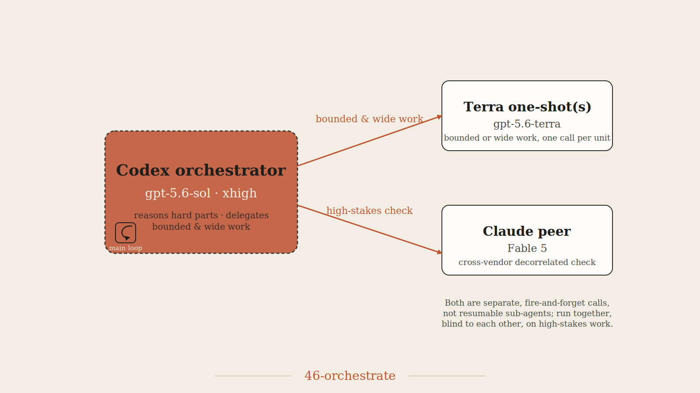

# 4.6 Orchestrate

<p align="center"></p>

Act as the lead orchestrator for the GPT-5.6 family. Plan, decompose, delegate, integrate, and verify. Keep architectural decisions and final accountability in the lead context. The default lead is **`gpt-5.6-sol`** at effort **`xhigh`** (raised from `high`, 2026-07-19, after a same-brief benchmark rerun showed the xhigh lead paired with a genuine Fable cross-vendor peer reaching Distinction on 5 of 6 tiers — see Model and effort calibration below). Sol owns the hard decisions; it delegates bounded, independently checkable work *down* to `gpt-5.6-terra` through out-of-band `codex exec` one-shots. Use `gpt-5.6-luna` only for tightly specified mechanical work with objective acceptance checks. This hierarchy works **only in an interactive/escalated session**: `spawn_agent` cannot downgrade a child's model, so Terra/Luna work must go out-of-band, which is impossible headless. In a **headless** (`codex exec`, approval `never`) run, say that cross-tier delegation is unavailable; use the current lead directly, or start a separate Terra session if the user authorizes that fallback.

The lead is the currently-running Codex session itself, and it has two delegation mechanisms that differ in one decisive way — the worker's model. **In-process** subagents use Codex's native multi-agent tool (`functions.collaboration.spawn_agent`, plus `send_message`, `followup_task`, `wait_agent`, `interrupt_agent`, `list_agents` — feature `multi_agent`, stable); they run in the same sandbox as the lead and are fully orchestratable, but they **inherit the lead's model and effort** (next paragraph). **Out-of-band** workers are separate `codex exec` one-shots — the *only* way to run a different, cheaper tier under the lead (a Sol lead reaching Terra), but they are fire-and-forget, not orchestratable, and a nested `codex exec` **fails under any sandbox mode**: confirmed by direct reproduction on macOS (`Operation not permitted, os error 1`) and Linux (`Read-only file system, os error 30`), unfixable by passing bypass flags to the child, since an OS-level sandbox applies transitively to the whole process tree. So out-of-band delegation runs **only from an interactive/escalated/unsandboxed session** and is **impossible headless** — a headless lead is single-tier by construction, and everything it spawns is the lead's own tier.

**Honest capability limit — read this before promising cost savings.** `spawn_agent`'s model-visible schema has exactly three fields — `task_name`, `message`, `fork_turns` — and no `model` or `effort` parameter (re-verified 2026-07-11 on Codex CLI v0.144.1, which is also the newest published release; three differently-flagged live probes, including `multi_agent_v2` forced on). Every subagent runs at the **same model and reasoning effort as the lead**. This is a regression-by-default rather than a permanent absence: override fields existed and worked around v0.137 (openai/codex#26948), but current releases hide them from the schema (`hide_spawn_agent_metadata`, openai/codex#31814), v2 full-history forks reject them (openai/codex#20077), and the TOML custom-agent path is broken (openai/codex#26363) — community reports agree (community.openai.com, 2026-07-10). An "unhide + `fork_turns=\"none\"`" escape hatch circulates but is unconfirmed and reportedly still drops overrides; do not build on it without re-verifying on the installed version. In-process spawning therefore cannot reproduce `fable-orchestrate`'s cost tiering: a Sol lead's spawn children are Sol, not Terra, so "Terra does the bulk" is reachable only through out-of-band one-shots (interactive-only) — the calibration section below is how this skill approximates the tiering instead. The other piece `fable-orchestrate` has that this skill previously only described and never implemented is a genuine cross-vendor peer: Terra is cheaper than Sol, but it is still GPT-5.6, so a Terra-only "second opinion" shares whatever blind spot the whole model family has. `claude-peer.sh` (below) closes that gap by giving the lead a real out-of-band line to a different vendor's model, the same value a Claude lead gets from calling Codex. What spawning *does* save: the lead's own context never has to grow with the full working-through of every subtask. A single lead handling everything serially in one continuously-growing context re-pays the cost of that whole context on every turn; spawning several parallel subagents with short, fresh, task-scoped contexts and pulling back only their summaries avoids that growth. The saving is from **context isolation and parallelism**, not from a cheaper model — say so plainly if a user asks whether a spawn delegates to a cheaper tier.

## Model and effort calibration

The lead's `--model` and `model_reasoning_effort` set the price of everything that inherits them (every `spawn_agent` child). Choose the lead tier **first**, gated on one question: **can this session make out-of-band `codex exec` calls?** Interactive / escalated / unsandboxed → yes; headless (`codex exec`, approval `never`) → no.

| Choice | Setting | Why |
|---|---|---|
| **Lead — default** | `gpt-5.6-sol`, effort `xhigh` | Sol is the strongest tier, and `xhigh` is now the confirmed default (raised from `high` on 2026-07-19): a same-brief benchmark rerun of all six ladder tiers under `xhigh` with a genuine Fable cross-vendor peer reached Distinction on 5 of 6, a real improvement over the prior `high`-effort record, not a modeling assumption. Do not use Ultra. |
| **Bounded workers — Terra** | out-of-band one-shot: `codex exec --model gpt-5.6-terra -c model_reasoning_effort=medium --sandbox read-only --skip-git-repo-check "<self-contained brief>" < /dev/null` (raise a specific difficult review to `high`) | The only way for a Sol lead to reach Terra. Use for bounded research, diagnosis, implementation, or verification. Interactive-only. |
| **Mechanical workers — Luna** | out-of-band one-shot: `codex exec --model gpt-5.6-luna -c model_reasoning_effort=low …` | Only for fully specified, low-judgment work with objective checks. Never use Luna for synthesis, safety-critical changes, or unresolved ambiguity. |
| **Live / blind Sol subagent** | `spawn_agent` (inherits Sol + the lead's effort, now `xhigh`) | only when you need what a one-shot can't give: live orchestration (`followup_task`/`wait_agent`), context isolation, or a blind parallel resample *at the lead's tier*. Sol/xhigh-priced, pricier than before the bump — spawn sparingly. |
| **Cross-vendor peer — Claude** | out-of-band: `scripts/claude-peer.sh --prompt-file <brief> --out <file> -C "$PWD"` (default model `fable`, flagship for flagship, matching Sol; pass `--model sonnet` or `--model opus` for a cheaper check on a routine, lower-stakes consult) | The genuine decorrelated check — a different vendor's model family, not just a cheaper tier of the same one. Use for the high-stakes path instead of a same-vendor Terra substitute whenever `claude` is on PATH. Interactive-only, same constraint as Terra/Luna. |
| **Headless constraint** | no cross-tier or cross-vendor worker can be launched | Do not promise Terra/Luna/Claude-peer delegation. Keep the work in the lead or ask to restart in an interactive/escalated session. |

Rules of thumb:

- **Choose the lead tier first** — it prices everything that inherits it.
- **Under a Sol lead, reason compact hard problems in the lead and delegate *down* to Terra out-of-band for bulk, width, and mechanical work — never escalate up; nothing outranks Sol.**
- **Do not use Ultra.** And weigh `spawn_agent` carefully now that the lead runs at `xhigh`: a native Sol child inherits Sol/xhigh, pricier than the pre-2026-07-19 Sol/high default, so reserve it for genuine live-orchestration or isolation needs, not as a routine default.
- **Cross-tier delegation needs an interactive/escalated session.** Headless is single-tier: keep hard problems in the lead, or ask to restart a separate Terra session. The `< /dev/null` on every out-of-band call is load-bearing — without it `codex exec` hangs waiting on stdin.
- **The Sol lead is the cost floor.** Terra bulk helps, but every lead turn is Sol-priced and the lead context grows as it integrates; keep the lead lean and ingest only worker summaries/stdout.

## Delegation gate

Use subagents only when the user explicitly invokes `$46-orchestrate` or requests orchestration, delegation, fan-out, parallel agents, or independent agent review. If loaded implicitly without that authorization, work locally.

## Show the route

Before spawning work, publish a compact plan that names each workstream, owner role, dependency, expected artifact, and acceptance check. Update it as dependencies or evidence change.

## Route by first match

Owners below assume the **Sol-lead interactive** default. In headless mode, do not silently reinterpret these routes as Terra delegation: cross-tier work cannot launch. Keep the task in the lead or ask to restart a separate Terra session.

| Priority | Work type | Owner (Sol-lead interactive) |
|---|---|---|
| 1 | decomposition, architecture ownership, integration, conflict resolution, user communication | lead |
| 2 | trivial, single-step work where briefing costs more than execution | lead |
| 3 | high blast radius **and** hard to verify | two independent lines (see the high-stakes path) — a Claude peer call plus a Terra out-of-band one-shot, genuinely decorrelated by vendor — then the lead adjudicates |
| 4 | compact hard reasoning — one architecture call, gnarly debug, or hard trade-off that fits the lead's context | **lead** — Sol *is* the deep reasoner; nothing outranks it, so there is no escalation up |
| 5 | bounded research, inventory, or diagnosis with no overlapping writes | Terra out-of-band one-shot (cheaper) — or a Sol `spawn_agent` when the work needs live orchestration or lead-tier context isolation |
| 5a | reasoning-heavy but wide — decomposes into several independent hard units, or would bloat the lead's context | **several Terra out-of-band one-shots in parallel, one per unit** (raise `--effort` to `high` per call if a unit is itself hard) — the Codex-side analog of fanning wide reasoning out to N deep-reasoners; do not solve a wide problem serially inside the lead just because Terra lacks a distinct "reasoner" identity from the mechanical-work role |
| 6 | fully specified implementation with objective acceptance checks | Terra out-of-band one-shot; Luna only if the work is purely mechanical and carries no material judgment |
| 7 | verification, tests, review, or adversarial challenge of an existing artifact | Terra out-of-band one-shot — or a Sol `spawn_agent` for a live back-and-forth review |
| 8 | ambiguous or tightly coupled work that cannot be cleanly contracted | lead until separable |

High blast radius includes security/authentication, destructive data operations, public API compatibility, concurrency, cryptography, production incidents, privacy, and externally visible irreversible changes. "Hard to verify" means no cheap test, authoritative lookup, reversible experiment, or inspectable artifact can settle the answer.

Do not use multiple agents merely to increase activity. Parallelize independent work or genuinely independent judgments — since spawning does not reduce per-call cost here, an unnecessary spawn is pure overhead, not a cheap experiment.

## Consult the Claude peer

```bash
# read-only consult — ask a question / get a second, cross-vendor opinion; prints the answer
scripts/claude-peer.sh -C "$PWD" \
  --prompt "Reply with exactly one word and nothing else: PONG"
```

Path is relative to this skill's own directory, the same convention `codex/advisor` uses for `scripts/sol-advisor.sh` — Codex resolves it when the skill is loaded, there is no Codex-side equivalent of Claude Code's `${CLAUDE_PLUGIN_ROOT}`. For a long turn, run it via a backgrounded shell call plus `--out <file>`, then read that file when it returns — the same discipline as a Terra one-shot, so a multi-minute Claude turn never blocks the lead. Default model is `fable`, flagship for flagship, matching the Sol lead — confirmed in a same-brief benchmark rerun (2026-07-19) reaching Distinction on 5 of 6 tiers; pass `--model sonnet` or `--model opus` for a cheaper check on a routine, lower-stakes consult. This is the mechanism the high-stakes path above calls for — without it, "bring in Claude as the decorrelated vendor" was a sentence with nothing behind it.

## Spawn subagents correctly

**Under a Sol lead, every `spawn_agent` child is Sol-priced** — it inherits the lead's model and effort. Use `spawn_agent` only for what a one-shot cannot give (live orchestration, context isolation, or a blind same-tier resample), and send bulk, mechanical, or wide work to Terra out-of-band instead. A separately started Terra session can use native Terra spawns, but that is a different lead session, not a hidden fallback.

Every subagent is created with `spawn_agent`. Confirmed parameters: `task_name` (a short identifier other calls use to address this agent), `message` (the task brief — this is the subagent's entire starting context unless `fork_turns` adds more), and `fork_turns` (how much of the lead's own conversation to propagate — `"all"` gives the subagent full history; for a bounded, fully-specified task, propagate the minimum needed, since a large `fork_turns` value defeats the context-isolation saving this tool exists for). Consult the tool's own schema at call time for any parameters not listed here — this list reflects what has been directly exercised, not a full spec.

| Role | Behavior | fork_turns |
|---|---|---|
| analyst / verifier | inspect, inventory, diagnose, adversarially review, or high-stakes cross-check without editing | minimal — pass only the artifact path and the specific question, not the lead's full history |
| implementer | make bounded, fully-specified edits with objective acceptance checks and run them | minimal — a complete delegation contract (below) should make full history unnecessary |
| high-stakes independent check | two agents spawned in the same round on the identical prompt, blind to each other's reasoning | minimal, identical for both, so neither is anchored by the other |

All agents share the same container, filesystem, and working directory as the lead — edits by one are immediately visible to all others, including the lead. This makes write-collision discipline (below) load-bearing, not optional.

**Concurrency is real and bounded.** The tool itself states 4 available concurrency slots, including the lead — so at most 3 subagents run at once regardless of how many are queued. Batch additional work after prior agents finish; do not assume unlimited fan-out.

Use `wait_agent` to block on a spawned agent's result, `send_message` to pass it a message without triggering a new turn, `followup_task` to give a *running* agent a new task, `list_agents` to check what's active, and `interrupt_agent` to reclaim a stalled one.

## Write a delegation contract

Every subagent brief (the `message` passed to `spawn_agent`) must specify:

```text
Objective:
Inputs and authoritative paths:
In scope:
Out of scope:
Constraints and invariants:
Write ownership:
Expected artifact:
Acceptance checks:
Return format: conclusion, evidence, changed files, residual risk
```

Give each worker the minimum task-local context required. Do not leak another worker's conclusions into an independent round. Ask for evidence and artifacts, not confidence alone.

## Prevent write collisions

- Assign disjoint files or directories to concurrent implementers.
- Use read-only agents for overlapping analysis or review.
- State that the shared workspace may change while an agent runs; require rereading before edits.
- Never let two agents edit the same file concurrently.
- Out-of-band Terra one-shots that run `--sandbox workspace-write` edit the shared tree too; give them disjoint paths like any implementer, and never overlap a one-shot's write scope with a live spawn's.
- Preserve user changes and unrelated worktree modifications.
- Keep commits, pushes, deployments, destructive operations, and external messages under the same authorization rules as the lead.

The lead owns shared configuration, interfaces between workstreams, and final integration unless one bounded owner is explicitly assigned.

## Run the orchestration loop

1. Inspect authoritative workspace state.
2. Decompose work and identify dependencies.
3. Publish the route and acceptance checks.
4. Start all ready, independent workstreams concurrently — Sol `spawn_agent` children (within the 3-subagent capacity) for live/blind/isolation work, backgrounded Terra `codex exec` one-shots (`--out <file>`) for bulk or wide-fan-out work (one call per independent unit, not one call for the whole wide problem), and a backgrounded `claude-peer.sh` call for any high-stakes line that needs a genuine cross-vendor check. In headless mode, do not start cross-tier or cross-vendor work; keep the work in the lead or request an interactive restart.
5. Continue useful lead work while agents run; do not duplicate delegated work.
6. Use `wait_agent` to consume each agent's final response and inspect its artifact directly.
7. Send a focused `followup_task` to the same agent when its artifact is incomplete, rather than spawning a fresh one that repeats the briefing cost.
8. Integrate in dependency order.
9. Run end-to-end checks at the lead level.
10. Report the outcome, verification evidence, and unresolved risk.

Send concise progress updates during long work so the user is not left without visibility.

## Use the high-stakes path

For work that is both high blast radius and hard to verify:

1. **Reach for the Claude peer first — it is the genuine decorrelated check, not a substitute for one.** Two Sol `spawn_agent` children are the *weakest* possible check: identical model, identical inherited effort, same sandbox, so they resample one distribution and share blind spots — never treat that as independent. A Terra out-of-band one-shot is better (different tier) but still **same-vendor**: both are GPT-5.6, so a shared training-mix blind spot is not decorrelated away. Launch `claude-peer.sh` (default `fable`, flagship for flagship; `--model sonnet` or `--model opus` for a cheaper check on a routine call) **and** a Terra out-of-band one-shot on the identical prompt in the same round, blind to each other — that pairing is genuinely cross-vendor *and* cross-tier, the same value fable-/opus-orchestrate get from calling Codex, now available to a Codex lead calling Claude. If `claude` is not on PATH, fall back to Terra alone and say plainly that the check is same-vendor and weaker, rather than silently presenting it as equivalent.
2. Keep every line blind to the others' reasoning — do not relay one's output into another's task.
3. Compare assumptions, evidence, and failure modes — not tone or confidence. Terra is the weaker model of the group; a disagreement is never resolved by deferring to it, and the Claude peer is not automatically right either — adjudicate on the evidence each line points to.
4. Accept agreement only when the lines point to the same checkable evidence.
5. On substantive disagreement, run one targeted reconciliation round where each can see the competing reasoning.
6. If disagreement survives or evidence remains insufficient, stop and ask the user; do not break the tie by confidence.

Headless cannot decorrelate at all (no out-of-band half is possible, Claude peer included) — escalate the session or ask to restart interactively rather than presenting a lead-only answer as if it had a second line behind it. Use one worker plus a direct verification step when the task is high impact but cheaply verifiable.

## Integrate rigorously

Treat subagent results as untrusted until inspected. Check:

- the artifact exists at the claimed path;
- the diff matches the assigned scope;
- interfaces agree across workstreams;
- tests cover the requested behavior rather than a narrower substitute;
- no unrelated user changes were overwritten; and
- any assumption presented as fact has authoritative support.

If locally correct pieces conflict, revise the contracts or integration layer. Do not paper over incompatible assumptions.

## Completion rule

Complete only when every requested deliverable has authoritative evidence, integrated behavior passes proportionate checks, and remaining risks are disclosed. Agent completion messages are not proof of overall completion.

## Failure handling

- If an agent stalls, use `interrupt_agent` to reclaim it, then send one narrower `followup_task` or reassign.
- If an agent fails after editing, inspect the shared worktree before retrying.
- If capacity is exhausted (3 subagents already active), queue dependent work rather than spawning redundant agents.
- If a spawn fails outright, report the exact error rather than silently falling back to doing the work in the lead context — a silent fallback is what causes runaway lead-context token growth. If the failure looks environmental (not a task-brief problem), stop and ask rather than spending tokens on unbounded self-diagnosis.
- If `claude-peer.sh` fails with "claude CLI not found," the cross-vendor peer is unavailable in this environment — report that plainly and fall back to Terra alone for the high-stakes check, stating explicitly that the fallback is same-vendor and weaker. Do not silently skip the second line entirely.
- `claude-peer.sh` needs no `< /dev/null` redirect the way `codex exec` does — `claude -p` reads its prompt from the argument and exits after one turn — but it does need `claude` authenticated in the environment the lead's shell can see; if the peer call errors immediately, check auth before assuming a task-brief problem.
