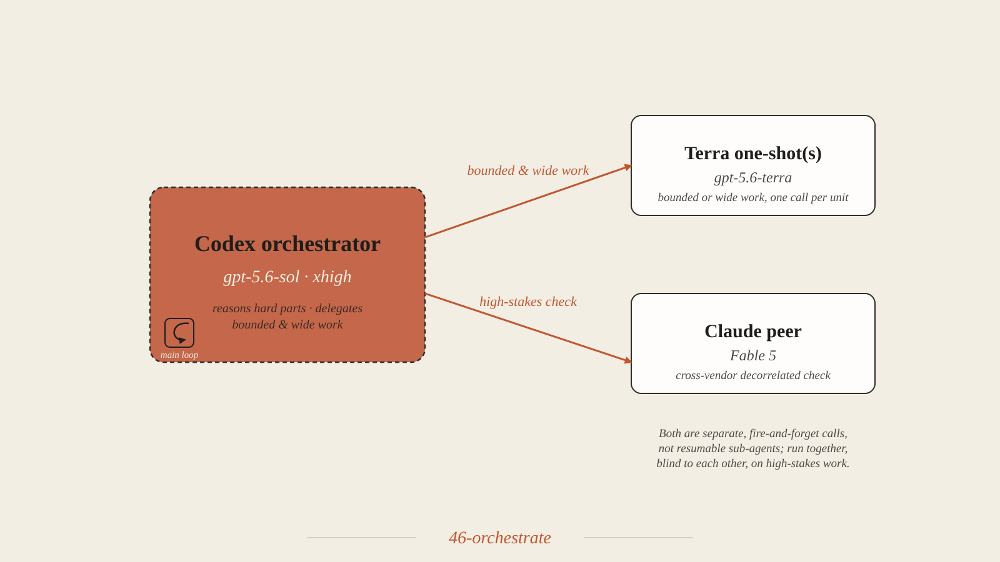

# 4.6 Orchestrate

<p align="center"></p>

## Preflight the lead runtime first

Before reading the task brief, inspecting the workspace, planning, or delegating, resolve `SKILL_DIR` as the directory containing this `SKILL.md` and run:

```bash
"$SKILL_DIR/scripts/check-lead-runtime.sh"
```

This is fail-closed. It uses the current process's `CODEX_THREAD_ID` to locate that exact thread's rollout, reads the latest recorded `turn_context` for the current turn's model and effort, and rejects any model-reroute event recorded for that turn. Proceed only when it prints `46-orchestrate preflight OK: gpt-5.6-sol at xhigh`. If it reports a mismatch or cannot establish the runtime, stop immediately, quote the result to the operator, and ask them to select Sol with Extra High reasoning in `/model` (or restart with `--model gpt-5.6-sol -c model_reasoning_effort=xhigh`), verify with `/status`, and invoke `$46-orchestrate` again. Never infer the runtime from this skill's prose, the launch command the operator says they used, `config.toml`, or the newest session file.

Act as the lead orchestrator for the GPT-5.6 family: plan, decompose, delegate, integrate, verify, and keep architectural decisions and final accountability in the lead context. The lead is the currently-running Codex session itself — `gpt-5.6-sol` at effort `xhigh`. It has two delegation mechanisms, differing in the one thing that matters, the worker's model.

**In-process** subagents use Codex's native multi-agent tool (`functions.collaboration.spawn_agent`, plus `send_message`, `followup_task`, `wait_agent`, `interrupt_agent`, `list_agents` — feature `multi_agent`, stable). They run in the lead's sandbox and are fully orchestratable, but they inherit the lead's model *and* reasoning effort. `spawn_agent`'s model-visible schema has exactly three fields — `task_name`, `message`, `fork_turns` — and no `model` or `effort` parameter (re-verified 2026-07-11 on Codex CLI v0.144.1, also the newest published release; three differently-flagged live probes, including `multi_agent_v2` forced on). This is a regression-by-default rather than a permanent absence: override fields existed and worked around v0.137 (openai/codex#26948), current releases hide them from the schema (`hide_spawn_agent_metadata`, openai/codex#31814), v2 full-history forks reject them (openai/codex#20077), and the TOML custom-agent path is broken (openai/codex#26363) — community reports agree (community.openai.com, 2026-07-10). An "unhide + `fork_turns=\"none\"`" escape hatch circulates but is unconfirmed and reportedly still drops overrides; do not build on it without re-verifying on the installed version. So a Sol lead's spawn children are Sol, not Terra. What spawning saves is **context isolation and parallelism** — the lead's own context never grows with the full working-through of every subtask — never a cheaper model. Say so plainly if a user asks whether a spawn delegates to a cheaper tier.

**Out-of-band** workers are separate `codex exec` one-shots, the only way to run a cheaper tier under the lead. They are fire-and-forget, not orchestratable, and a nested `codex exec` fails under any sandbox mode: confirmed by direct reproduction on macOS (`Operation not permitted, os error 1`) and Linux (`Read-only file system, os error 30`), and unfixable by passing bypass flags to the child, since an OS-level sandbox applies transitively to the whole process tree. Out-of-band delegation therefore runs only from an interactive/escalated/unsandboxed session. A **headless** lead (`codex exec`, approval `never`) is single-tier by construction: say that cross-tier and cross-vendor delegation is unavailable, then keep the work in the lead, or start a separate Terra session if the user authorizes that fallback.

Terra is cheaper than Sol but still GPT-5.6, so a Terra "second opinion" shares whatever blind spot the whole model family has. `scripts/claude-peer.sh` gives the lead a real out-of-band line to a different vendor's model — the same value a Claude lead gets from calling Codex.

## Model and effort calibration

The lead's `--model` and `model_reasoning_effort` set the price of everything that inherits them. Choose the lead tier **first**, gated on one question: **can this session make out-of-band `codex exec` calls?** Interactive / escalated / unsandboxed → yes; headless → no. Set model and effort before substantive work, or start a fresh correctly configured session: a controlled Codex CLI continuation test on 2026-07-20 showed that switching either one mid-thread made the next request lose most session-specific prompt-cache reuse, although a shorter stable prefix could remain cached.

| Choice | Setting | Why |
|---|---|---|
| **Lead — default** | `gpt-5.6-sol`, effort `xhigh` | Sol is the strongest tier. `xhigh` was raised from `high` on 2026-07-19 after a same-brief benchmark rerun of all six ladder tiers under `xhigh`, paired with a genuine Fable cross-vendor peer, reached Distinction on 5 of 6 — measured, not a modeling assumption. Never Ultra. |
| **Bounded workers — Terra** | out-of-band one-shot: `codex exec --model gpt-5.6-terra -c model_reasoning_effort=medium --sandbox read-only --skip-git-repo-check "<self-contained brief>" < /dev/null` (raise a specific difficult review to `high`) | The only way for a Sol lead to reach Terra. Bounded research, diagnosis, implementation, or verification. Interactive-only. The `< /dev/null` on every out-of-band `codex exec` call is load-bearing — without it `codex exec` hangs waiting on stdin. |
| **Mechanical workers — Luna** | out-of-band one-shot: `codex exec --model gpt-5.6-luna -c model_reasoning_effort=low …` | Only for fully specified, low-judgment work with objective checks. Never Luna for synthesis, safety-critical changes, or unresolved ambiguity. |
| **Live / blind Sol subagent** | `spawn_agent` (inherits Sol + the lead's `xhigh`) | Only when you need what a one-shot can't give: live orchestration (`followup_task`/`wait_agent`), context isolation, or a blind parallel resample *at the lead's tier*. Sol/xhigh-priced — spawn sparingly. |
| **Cross-vendor peer — Claude** | out-of-band: `scripts/claude-peer.sh --prompt-file <brief> --out <file> -C "$PWD"` (default model `fable`, flagship for flagship, matching Sol; pass `--model sonnet` or `--model opus` for a cheaper check on a routine, lower-stakes consult) | The genuine decorrelated check — a different vendor's family, not a cheaper tier of the same one. Use it on the high-stakes path instead of a same-vendor Terra substitute whenever `claude` is on PATH. Interactive-only. |
| **Headless constraint** | no cross-tier or cross-vendor worker can be launched | Do not promise Terra/Luna/Claude-peer delegation. Keep the work in the lead or ask to restart in an interactive/escalated session. |

Choose the lead tier first; it prices everything that inherits it. Under a Sol lead, reason compact hard problems in the lead and delegate *down* to Terra out-of-band for bulk, width, and mechanical work — never escalate up, since nothing outranks Sol. Sol is also the cost floor: Terra bulk helps, but every lead turn is Sol-priced and the lead context grows as it integrates, so keep the lead lean and ingest only worker summaries and stdout.

## Delegation gate

Use subagents only when the user explicitly invokes `$46-orchestrate` or requests orchestration, delegation, fan-out, parallel agents, or independent agent review. If loaded implicitly without that authorization, work locally.

## Show the route

Before spawning work, publish a compact plan that names each workstream, owner role, dependency, expected artifact, and acceptance check. Update it as dependencies or evidence change.

## Route by first match

Owners below assume the **Sol-lead interactive** default; in headless mode these routes cannot be reinterpreted as Terra delegation.

| Priority | Work type | Owner (Sol-lead interactive) |
|---|---|---|
| 1 | decomposition, architecture ownership, integration, conflict resolution, user communication | lead |
| 2 | trivial, single-step work where briefing costs more than execution | lead |
| 3 | high blast radius **and** hard to verify | two independent lines — a Claude peer call plus a Terra out-of-band one-shot, decorrelated by vendor *and* tier — then the lead adjudicates (see the high-stakes path) |
| 4 | compact hard reasoning — one architecture call, gnarly debug, or hard trade-off that fits the lead's context | **lead** — Sol *is* the deep reasoner |
| 5 | bounded research, inventory, or diagnosis with no overlapping writes | Terra out-of-band one-shot (cheaper) — or a Sol `spawn_agent` when the work needs live orchestration or lead-tier context isolation |
| 5a | reasoning-heavy but wide — decomposes into several independent hard units, or would bloat the lead's context | **several Terra out-of-band one-shots in parallel, one per unit** (raise effort to `high` per call if a unit is itself hard). Do not solve a wide problem serially inside the lead just because Terra lacks a distinct "reasoner" identity from the mechanical-work role |
| 5b | a full peer session is the point — the work must **survive this session**, run long beside it, stay **user-steerable in its own pane**, or needs **its own worktree** | **`$spawn`** — a full peer session (Codex or Claude) in its own worktree pane; the sandbox gate applies (see the spawn subsection and Variant notes) |
| 6 | fully specified implementation with objective acceptance checks | Terra out-of-band one-shot; Luna only if the work is purely mechanical and carries no material judgment |
| 7 | verification, tests, review, or adversarial challenge of an existing artifact | Terra out-of-band one-shot — or a Sol `spawn_agent` for a live back-and-forth review |
| 8 | ambiguous or tightly coupled work that cannot be cleanly contracted | lead until separable |

High blast radius includes security/authentication, destructive data operations, public API compatibility, concurrency, cryptography, production incidents, privacy, and externally visible irreversible changes. "Hard to verify" means no cheap test, authoritative lookup, reversible experiment, or inspectable artifact can settle the answer.

Parallelize independent work or genuinely independent judgments. Since spawning does not reduce per-call cost here, an unnecessary spawn is pure overhead, not a cheap experiment.

## Consult the Claude peer

```bash
# read-only consult — ask a question / get a second, cross-vendor opinion; prints the answer
scripts/claude-peer.sh -C "$PWD" \
  --prompt "Reply with exactly one word and nothing else: PONG"
```

The path is relative to this skill's own directory, the same convention `codex/advisor` uses for `scripts/sol-advisor.sh` — Codex resolves it when the skill is loaded, and there is no Codex-side equivalent of Claude Code's `${CLAUDE_PLUGIN_ROOT}`. For a long turn, run it via a backgrounded shell call plus `--out <file>` and read that file when it returns, the same discipline as a Terra one-shot, so a multi-minute Claude turn never blocks the lead.

## Spawn subagents correctly

A separately started Terra session can use native Terra spawns, but that is a different lead session, not a hidden fallback under a Sol lead.

`spawn_agent`'s three parameters: `task_name` (a short identifier other calls use to address this agent), `message` (the task brief — the subagent's entire starting context unless `fork_turns` adds more), and `fork_turns` (how much of the lead's own conversation to propagate — `"all"` gives full history; propagate the minimum a bounded task needs, since a large `fork_turns` defeats the context-isolation saving this tool exists for).

| Role | Behavior | fork_turns |
|---|---|---|
| analyst / verifier | inspect, inventory, diagnose, adversarially review, or high-stakes cross-check without editing | minimal — pass only the artifact path and the specific question, not the lead's full history |
| implementer | make bounded, fully-specified edits with objective acceptance checks and run them | minimal — a complete delegation contract (below) should make full history unnecessary |
| high-stakes independent check | two agents spawned in the same round on the identical prompt, blind to each other's reasoning | minimal, identical for both, so neither is anchored by the other |

All agents share the same container, filesystem, and working directory as the lead — edits by one are immediately visible to all others, including the lead. This makes the write-collision discipline below load-bearing, not optional.

**Concurrency is real and bounded.** The tool itself states 4 available concurrency slots, including the lead — so at most 3 subagents run at once regardless of how many are queued. Batch additional work after prior agents finish.

Use `wait_agent` to block on a spawned agent's result, `send_message` to pass it a message without triggering a new turn, `followup_task` to give a *running* agent a new task, `list_agents` to check what's active, and `interrupt_agent` to reclaim a stalled one.

## Spawn a full peer session (cross-session delegation)

When row 5b fires, delegate to a **full peer session**, not a `spawn_agent` child. `$spawn` creates a git worktree on `spawn/<slug>`, starts a peer (Codex or Claude) in a new herdr pane, and kicks it off against a `.spawn/brief.md` written with the same delegation contract below. The herdr socket sits outside the workspace, so under `workspace-write` the connect fails (verified 2026-08-06, `PermissionDenied`); an explicitly authorized `danger-full-access` session connects. Otherwise the lead prints the exact command sequence for the user to run. The peer commits to its branch and stops, and the lead reviews and merges — the worktree dissolves the write-collision problem, not the merge-discipline one.

## Write a delegation contract

Every subagent brief (the `message` passed to `spawn_agent`) must specify:

```text
Objective:
Inputs and authoritative paths:
In scope:
Out of scope:
Constraints and invariants:
Write ownership:
Expected artifact:
Acceptance checks:
Return format: conclusion, evidence, changed files, residual risk
```

Give each worker the minimum task-local context required. Do not leak another worker's conclusions into an independent round. Ask for evidence and artifacts, not confidence alone.

## Prevent write collisions

- Assign disjoint files or directories to concurrent implementers; never let two agents edit the same file concurrently.
- Use read-only agents for overlapping analysis or review.
- State that the shared workspace may change while an agent runs; require rereading before edits.
- Out-of-band Terra one-shots that run `--sandbox workspace-write` edit the shared tree too; give them disjoint paths like any implementer, and never overlap a one-shot's write scope with a live spawn's.
- Preserve user changes and unrelated worktree modifications.
- Keep commits, pushes, deployments, destructive operations, and external messages under the same authorization rules as the lead.

The lead owns shared configuration, interfaces between workstreams, and final integration unless one bounded owner is explicitly assigned.

## Run the orchestration loop

1. Inspect authoritative workspace state.
2. Decompose work and identify dependencies.
3. Publish the route and acceptance checks.
4. Start all ready, independent workstreams concurrently — Sol `spawn_agent` children (within the 3-subagent capacity) for live/blind/isolation work, backgrounded Terra `codex exec` one-shots (`--out <file>`) for bulk or wide fan-out (one call per independent unit, not one call for the whole wide problem), and a backgrounded `claude-peer.sh` call for any high-stakes line needing a cross-vendor check.
5. Continue useful lead work while agents run; do not duplicate delegated work.
6. Use `wait_agent` to consume each agent's final response and inspect its artifact directly.
7. Send a focused `followup_task` to the same agent when its artifact is incomplete, rather than spawning a fresh one that repeats the briefing cost.
8. Integrate in dependency order.
9. Run end-to-end checks at the lead level.
10. Report the outcome, verification evidence, and unresolved risk.

Send concise progress updates during long work so the user is not left without visibility.

## Use the high-stakes path

For work that is both high blast radius and hard to verify:

1. Launch `claude-peer.sh` (default `fable`, flagship for flagship) **and** a Terra out-of-band one-shot on the identical prompt in the same round, blind to each other — that pairing is cross-vendor *and* cross-tier. Two Sol `spawn_agent` children are the *weakest* possible check: identical model, identical inherited effort, same sandbox, so they resample one distribution and share blind spots. Never treat that as independent. If `claude` is not on PATH, fall back to Terra alone and say plainly that the check is same-vendor and weaker.
2. Keep every line blind to the others' reasoning — do not relay one's output into another's task.
3. Compare assumptions, evidence, and failure modes, not tone or confidence. Terra is the weaker model of the group, so a disagreement is never resolved by deferring to it — and the Claude peer is not automatically right either.
4. Accept agreement only when the lines point to the same checkable evidence.
5. On substantive disagreement, run one targeted reconciliation round where each can see the competing reasoning.
6. If disagreement survives or evidence remains insufficient, stop and ask the user; do not break the tie by confidence.

Headless cannot decorrelate at all (no out-of-band half is possible, Claude peer included) — escalate the session or ask to restart interactively rather than presenting a lead-only answer as if it had a second line behind it. Use one worker plus a direct verification step when the task is high impact but cheaply verifiable.

## Integrate rigorously

Treat subagent results as untrusted until inspected. Check:

- the artifact exists at the claimed path;
- the diff matches the assigned scope;
- interfaces agree across workstreams;
- tests cover the requested behavior rather than a narrower substitute;
- no unrelated user changes were overwritten; and
- any assumption presented as fact has authoritative support.

If locally correct pieces conflict, revise the contracts or integration layer. Do not paper over incompatible assumptions.

## Completion rule

Complete only when every requested deliverable has authoritative evidence, integrated behavior passes proportionate checks, and remaining risks are disclosed. Agent completion messages are not proof of overall completion.

## Failure handling

- If an agent stalls, use `interrupt_agent` to reclaim it, then send one narrower `followup_task` or reassign.
- If an agent fails after editing, inspect the shared worktree before retrying.
- If capacity is exhausted (3 subagents already active), queue dependent work rather than spawning redundant agents.
- If a spawn fails outright, report the exact error rather than silently falling back to doing the work in the lead context — a silent fallback is what causes runaway lead-context token growth. If the failure looks environmental rather than a task-brief problem, stop and ask.
- If `claude-peer.sh` fails with "claude CLI not found," the cross-vendor peer is unavailable here — report that and fall back to Terra alone, stating explicitly that the fallback is same-vendor and weaker. Do not silently skip the second line.
- `claude-peer.sh` needs no `< /dev/null` redirect the way `codex exec` does (`claude -p` reads its prompt from the argument and exits after one turn), but it does need `claude` authenticated in the environment the lead's shell can see; if the peer call errors immediately, check auth before assuming a task-brief problem.
