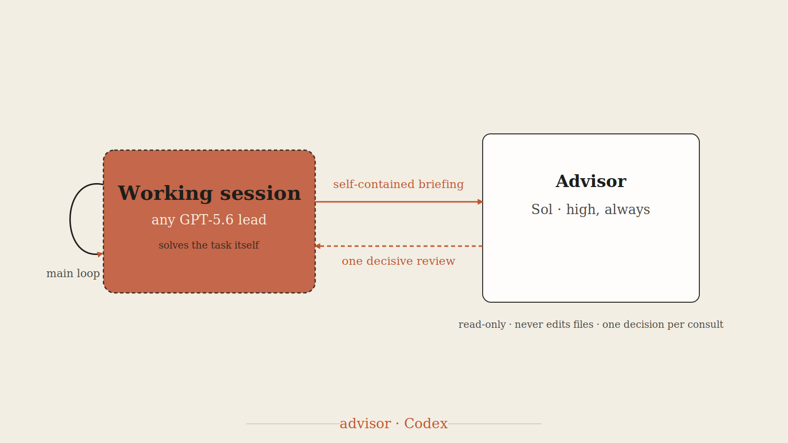

# Advisor (GPT-5.6)

This is the Codex-native advisor maintained in this library. It is a single-turn, independent, read-only consult — not delegated implementation and not a substitute for the lead's judgment.

<p align="center"></p>

## Default

| Advisor | Effort | Use when |
|---|---|---|
| `gpt-5.6-sol` | `xhigh` (Extra high) | A substantive interpretation, approach, draft, analysis, or completion check needs an independent review. |

Do **not** match the calling session's effort. This skill has an owned, predictable policy: Sol/xhigh, always. Do not use Max or Ultra (they consume usage limits faster for no established benefit here). Pass `--model gpt-5.6-terra` explicitly only if cost is a hard constraint for a routine, low-stakes consult — the default is the flagship tier at its strongest routine effort because this is meant to be a stronger reviewer, not a cheap one.

Luna is not an advisor tier. It is appropriate only for tightly specified mechanical work with objective acceptance checks, not for judgment or synthesis.

## When to consult

- Before committing to a substantive interpretation, writing/analysis strategy, or change of approach.
- When stuck: repeated errors, a non-converging approach, or results that do not fit.
- Before declaring a multi-step task complete, after the deliverable is durable.
- Before high-impact decisions that are hard to verify cheaply.

Do not consult for simple orientation or routine, cheaply verifiable work. On longer work, use one focused consultation before committing to the approach and one before final sign-off when the residual risk warrants it.

## Sandbox constraint

[`scripts/sol-advisor.sh`](scripts/sol-advisor.sh) launches a nested `codex exec`. It works only from an unsandboxed or escalated interactive parent session. A nested call from a sandboxed or headless `codex exec` fails structurally; do not retry it indefinitely or pretend that a self-review was independent.

- In an interactive session, request escalation for this one command if needed.
- In a headless/non-interactive session, report that the independent consult is unavailable and ask whether to continue without it or restart in an interactive session.

## Run a consult

1. Write a self-contained briefing: task, key evidence and paths, current approach or claim, alternatives considered, exact question, and any irreversible or high-impact consequences. The advisor has no access to the original conversation.
2. Make any deliverable durable before a completion review.
3. Run the Sol/xhigh default:

   ```bash
   scripts/sol-advisor.sh --prompt-file <briefing-path> --out <output-path> -C "$PWD" --model gpt-5.6-sol --effort xhigh
   ```

4. Read the output, verify factual claims where possible, and record why you follow or decline any material recommendation.

The spawned session is `--sandbox read-only` and `--ephemeral`; it must not edit files. `scripts/sol-advisor.sh --check` verifies that the Codex CLI is available.

## Decision rules

- Ask one decision-focused question per consult; do not turn the advisor into an unbounded co-worker.
- Treat advice as evidence, not authority. Primary evidence and direct checks outrank confidence or rhetoric.
- If the advisor identifies an unresolved material conflict, run one focused follow-up consult rather than broadening the first prompt.
- If the advisor's recommendation conflicts with authoritative evidence, state the conflict and follow the evidence.
- If high-impact uncertainty remains after a consult, stop and ask the human rather than manufacturing certainty.
