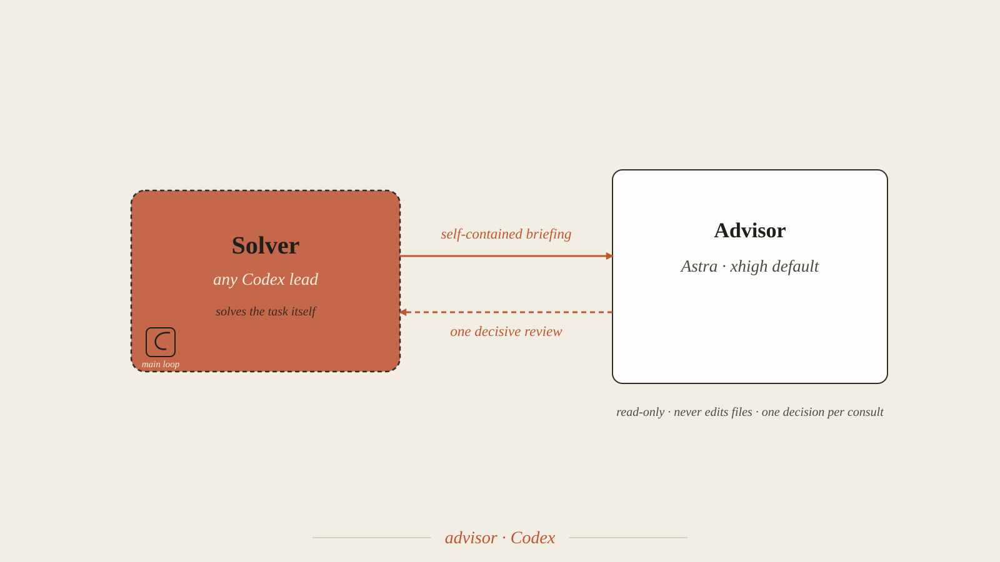

# Advisor (GPT-6 Astra)

This is the Codex-native advisor maintained in this library. It is a single-turn, independent, read-only consult — not delegated implementation and not a substitute for the lead's judgment.

<p align="center"></p>

Use a new output path or directory for each run; preserve earlier results and existing user edits.

## Default

| Advisor | Effort | Use when |
|---|---|---|
| `gpt-6-astra` | `xhigh` (Extra high) | A substantive interpretation, approach, draft, analysis, or completion check needs an independent review. |

Use Astra at `xhigh` for demanding consults. For a routine question, lower the effort or explicitly choose Terra when the review remains adequate. Reserve `max` for a demonstrated need; Astra does not support `none`. A fresh Astra session is a separate review context, not an independent model family when the caller also uses Astra.

Luna is not an advisor tier. It is appropriate only for tightly specified mechanical work with objective acceptance checks, not for judgment or synthesis.

## When to consult

- Before committing to a substantive interpretation, writing/analysis strategy, or change of approach.
- When stuck: repeated errors, a non-converging approach, or results that do not fit.
- Before declaring a multi-step task complete, after the deliverable is durable.
- Before high-impact decisions that are hard to verify cheaply.

Do not consult for simple orientation or routine, cheaply verifiable work. On longer work, use one focused consultation before committing to the approach and one before final sign-off when the residual risk warrants it.

## Sandbox constraint

[`scripts/sol-advisor.sh`](scripts/sol-advisor.sh) keeps its legacy filename for existing callers and defaults to Astra. Nested CLI calls depend on the parent sandbox, network access, and authentication; headless execution or approval `never` alone does not rule them out. Use the session's authorized permissions. If a restricted parent blocks initialization, the child cannot bypass it. Request escalation only when supported and necessary; otherwise report the missing independent consult and continue the authorized work without claiming it was reviewed.

## Run a consult

1. Write a self-contained briefing: task, key evidence and paths, current approach or claim, alternatives considered, exact question, and any irreversible or high-impact consequences. The advisor has no access to the original conversation.
2. Make any deliverable durable before a completion review.
3. Run the Astra/xhigh default:

   ```bash
   scripts/sol-advisor.sh --prompt-file <briefing-path> --out <output-path> -C "$PWD" --model gpt-6-astra --effort xhigh
   ```

4. Read the output, verify factual claims where possible, and record why you follow or decline any material recommendation.

Codex-plugin result-handling guidance (stop after presenting review findings) applies to code-review handoffs, not here: this skill's contract is that the caller reads the advice, weighs it against primary evidence, and acts — presenting the advisor's text and stopping is not a completed consult.

The spawned session is `--sandbox read-only` and `--ephemeral`; it must not edit files. `scripts/sol-advisor.sh --check` verifies that the Codex CLI is available.

## Decision rules

- Ask one decision-focused question per consult; do not turn the advisor into an unbounded co-worker.
- Treat advice as evidence, not authority. Primary evidence and direct checks outrank confidence or rhetoric.
- If the advisor identifies an unresolved material conflict, run one focused follow-up consult rather than broadening the first prompt.
- If the advisor's recommendation conflicts with authoritative evidence, state the conflict and follow the evidence.
- If high-impact uncertainty remains after a consult, stop and ask the human rather than manufacturing certainty.
