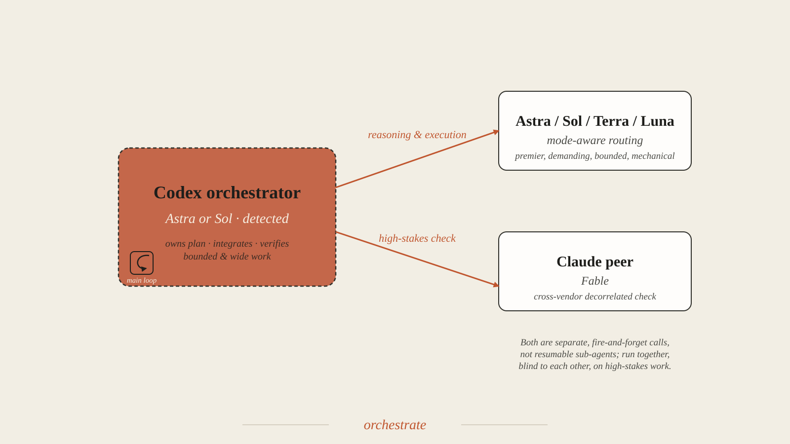

# Orchestrate

<p align="center"></p>

## Preflight the lead runtime first

Before reading the task brief, inspecting the workspace, planning, or delegating, resolve `SKILL_DIR` as the directory containing this `SKILL.md` and run:

```bash
"$SKILL_DIR/scripts/check-lead-runtime.sh"
```

This verifies the current thread through `CODEX_THREAD_ID`, its latest `turn_context`, and any recorded reroute. Proceed when it reports `gpt-6-astra` and the actual effort. Preserve the user's selected effort; `xhigh` is not required. Missing runtime metadata, an incorrect lead model, or a current-turn reroute still blocks the workflow. Report the exact failure; if the lead is not Astra, ask the user to select Astra in `/model` while keeping their chosen effort. Do not infer the current runtime from configuration defaults, the newest session file, or model self-identification.

Act as the lead orchestrator: own decomposition, difficult coupled decisions, integration, and final verification. Astra leads at the session's selected effort; worker effort is assigned separately by task.

## Model and effort calibration

Inspect the actual `spawn_agent` schema and session permissions before selecting a route. If model and reasoning overrides are exposed, use them with a self-contained brief and the supported `fork_turns` value (`"none"` where available). Full-history forks may require inheritance. If overrides are unavailable, native workers inherit the lead; use explicit CLI one-shots for other tiers only when the environment permits them.

| Role | Default | Use |
|---|---|---|
| Lead | `gpt-6-astra`, current session effort | Difficult reasoning, integration, and final review. |
| Demanding worker | `gpt-5.6-sol`, `high` | Separable difficult reasoning, implementation, and review. |
| Bounded worker | `gpt-5.6-terra`, `medium` | Independently checkable research, diagnosis, implementation, or verification; raise effort for a difficult unit. |
| Mechanical worker | `gpt-5.6-luna`, `low` | Fully specified tasks with objective checks. |
| Lead-tier worker | `gpt-6-astra`, explicitly chosen effort | An unusually difficult independent unit that warrants Astra rather than Sol. |
| Cross-vendor peer | `scripts/claude-peer.sh` | A separate Claude review for difficult, consequential judgments. Different vendors can still share errors. |

Prefer a native worker when it supports the required model and interaction. For a self-contained task, pass `model="gpt-5.6-sol", reasoning_effort="high", fork_turns="none"` for Sol; use Terra/medium or Luna/low from the table for simpler work. Full-history forks inherit the lead in runtimes that prohibit overrides; do not use them for cheaper routing. Keep routine work local when briefing and integration cost more than execution. Otherwise, a bounded read-only CLI call can use:

```bash
codex exec --model gpt-5.6-terra -c model_reasoning_effort=medium \
  --sandbox read-only --skip-git-repo-check "<self-contained brief>" < /dev/null
```

Close stdin when the prompt is an argument; when supplying a prompt file, redirect that file instead. Use `--output-last-message <new-file>` for the final response. Use workspace-write only for authorized implementation and assign disjoint paths.

Headless execution and approval `never` do not by themselves prohibit nested calls. The parent sandbox, network access, authentication, and available tools determine what works. Earlier restricted macOS/Linux runs failed on nested Codex initialization; a child cannot relax its parent's restrictions. Use already authorized permissions, request escalation only if the runtime permits it and the task needs it, and report unavailable delegation without inventing a worker response.

Keep briefs and returned evidence compact. Delegate only when the isolation, parallel work, or lower worker cost justifies briefing and integration. Start with the chosen effort; change it only for a demonstrated need using mechanisms the runtime supports. Do not infer current cache behavior from old CLI experiments.

## Delegation gate

Use subagents only when the user explicitly invokes `$orchestrate` or requests orchestration, delegation, fan-out, parallel agents, or independent agent review. If loaded implicitly without that authorization, work locally.

## Show the route

Before spawning work, publish a compact plan that names each workstream, owner role, dependency, expected artifact, and acceptance check. Update it as dependencies or evidence change.

## Route by first match

Owners below assume an Astra lead. Use native model overrides where supported; otherwise use permitted CLI one-shots.

| Priority | Work type | Owner |
|---|---|---|
| 1 | decomposition, architecture ownership, integration, conflict resolution, user communication | lead |
| 2 | trivial, single-step work where briefing costs more than execution | lead |
| 3 | high blast radius **and** hard to verify | two independent lines — a Claude peer call plus a Sol worker, separate by vendor and tier — then the lead adjudicates (see the high-stakes path) |
| 4 | compact hard reasoning — one architecture call, gnarly debug, or hard trade-off that fits the lead's context | **lead** — Astra *is* the deep reasoner |
| 5 | bounded research, inventory, or diagnosis with no overlapping writes | Terra worker; Sol for a difficult unit |
| 5a | difficult reasoning that separates into independent units | Sol workers at `high`, one per unit; Terra for the ordinary units |
| 5b | a full peer session is the point — the work must **survive this session**, run long beside it, stay **user-steerable in its own pane**, or needs **its own worktree** | **`$spawn`** — a full peer session (Codex or Claude) in its own worktree pane; the sandbox gate applies (see the spawn subsection and Variant notes) |
| 6 | fully specified implementation with objective acceptance checks | Terra worker; Luna only if the work is purely mechanical and carries no material judgment |
| 7 | verification, tests, review, or adversarial challenge of an existing artifact | Terra for routine verification; Sol for demanding or adversarial review |
| 8 | ambiguous or tightly coupled work that cannot be cleanly contracted | lead until separable |

High blast radius includes security/authentication, destructive data operations, public API compatibility, concurrency, cryptography, production incidents, privacy, and externally visible irreversible changes. "Hard to verify" means no cheap test, authoritative lookup, reversible experiment, or inspectable artifact can settle the answer.

Parallelize independent work or genuinely independent judgments. Account for briefing and integration overhead as well as the worker model’s cost.

## Consult the Claude peer

```bash
# read-only consult — ask a question / get a second, cross-vendor opinion; prints the answer
scripts/claude-peer.sh -C "$PWD" \
  --prompt "Reply with exactly one word and nothing else: PONG"
```

The path is relative to this skill's own directory, the same convention `codex/advisor` uses for `scripts/sol-advisor.sh` — Codex resolves it when the skill is loaded, and there is no Codex-side equivalent of Claude Code's `${CLAUDE_PLUGIN_ROOT}`. For a long turn, run it via a backgrounded shell call plus `--out <file>` and read that file when it returns, the same discipline as a CLI worker, so a multi-minute Claude turn never blocks the lead.

## Spawn subagents correctly

Use `task_name` for a stable identifier and `message` for the complete brief. Pass the minimum context the task needs through `fork_turns`; choose `"none"` for an independent review when supported. Set model and effort only through fields actually exposed by the tool. If the tool only supports inheritance, state that the child uses the lead's model and effort.

| Role | Behavior | fork_turns |
|---|---|---|
| analyst / verifier | inspect, inventory, diagnose, adversarially review, or high-stakes cross-check without editing | minimal — pass only the artifact path and the specific question, not the lead's full history |
| implementer | make bounded, fully-specified edits with objective acceptance checks and run them | minimal — a complete delegation contract (below) should make full history unnecessary |
| high-stakes independent check | two agents spawned in the same round on the identical prompt, blind to each other's reasoning | minimal, identical for both, so neither is anchored by the other |

All agents share the same container, filesystem, and working directory as the lead — edits by one are immediately visible to all others, including the lead. This makes the write-collision discipline below load-bearing, not optional.

Respect the concurrency limit reported by the current runtime; batch additional work after earlier agents finish.

Use `wait_agent` to block on a spawned agent's result, `send_message` to pass it a message without triggering a new turn, `followup_task` to give an existing agent a new task and wake it if idle, `list_agents` to check what's active, and `interrupt_agent` to reclaim a stalled one.

## Spawn a full peer session (cross-session delegation)

When row 5b fires, delegate to a **full peer session**, not a `spawn_agent` child. `$spawn` creates a git worktree on `spawn/<slug>`, starts a peer (Codex or Claude) in a new herdr pane, and kicks it off against a `.spawn/brief.md` written with the same delegation contract below. The herdr socket sits outside the workspace, so under `workspace-write` the connect fails (verified 2026-08-06, `PermissionDenied`); an explicitly authorized `danger-full-access` session connects. Otherwise the lead prints the exact command sequence for the user to run. The peer commits to its branch and stops, and the lead reviews and merges — the worktree dissolves the write-collision problem, not the merge-discipline one.

## Write a delegation contract

Every subagent brief (the `message` passed to `spawn_agent`) must specify:

```text
Objective:
Inputs and authoritative paths:
In scope:
Out of scope:
Constraints and invariants:
Write ownership:
Expected artifact:
Acceptance checks:
Return format: conclusion, evidence, changed files, residual risk
```

Give each worker the minimum task-local context required. Do not leak another worker's conclusions into an independent round. Demand a **checkable artifact, not a verdict** — a test that runs, a diff that applies, a cited line, a reproduction — plus the worker's confidence and an explicit "what would make this wrong" note. A task that cannot produce a checkable artifact is the signal that it belongs on the high-stakes path instead of with a single worker. Unspecified design decisions route back up to the lead; they are never guessed down by a cheaper tier.

## Prevent write collisions

- Assign disjoint files or directories to concurrent implementers; never let two agents edit the same file concurrently.
- Use read-only agents for overlapping analysis or review.
- State that the shared workspace may change while an agent runs; require rereading before edits.
- Out-of-band Terra one-shots that run `--sandbox workspace-write` edit the shared tree too; give them disjoint paths like any implementer, and never overlap a one-shot's write scope with a live spawn's.
- Preserve user changes and unrelated worktree modifications.
- Keep commits, pushes, deployments, destructive operations, and external messages under the same authorization rules as the lead.

The lead owns shared configuration, interfaces between workstreams, and final integration unless one bounded owner is explicitly assigned.

## Run the orchestration loop

1. Inspect authoritative workspace state.
2. Decompose work and identify dependencies.
3. Publish the route and acceptance checks.
4. Start all ready, independent workstreams concurrently — native Sol/high, Terra/medium, or Luna/low workers (within the runtime’s capacity), using CLI one-shots only when native routing is unavailable, and a backgrounded `claude-peer.sh` call for any high-stakes line needing a cross-vendor check.
5. Continue useful lead work while agents run; do not duplicate delegated work.
6. Use `wait_agent` to consume each agent's final response and inspect its artifact directly.
7. Send a focused `followup_task` to the same agent when its artifact is incomplete, rather than spawning a fresh one that repeats the briefing cost.
8. Integrate in dependency order.
9. Run end-to-end checks at the lead level.
10. Report the outcome, verification evidence, and unresolved risk.

Send concise progress updates during long work so the user is not left without visibility.

## Use the high-stakes path

For work that is both high blast radius and hard to verify:

1. Launch `claude-peer.sh` (default `fable`, flagship for flagship) **and** a Sol worker on the identical prompt in the same round, blind to each other — that pairing is cross-vendor *and* cross-tier. Two Astra workers provide separate samples from the same model, not independent model families. If `claude` is not on PATH, use Sol alone and say plainly that the check is same-vendor and weaker.
2. Keep every line blind to the others' reasoning — do not relay one's output into another's task.
3. Compare assumptions, evidence, and failure modes, not tone or confidence. Resolve disagreements through evidence, not model tier or provider.
4. Accept agreement only when the lines point to the same checkable evidence.
5. On substantive disagreement, run one targeted reconciliation round where each can see the competing reasoning.
6. If disagreement survives or evidence remains insufficient, stop and ask the user; do not break the tie by confidence.

If the environment cannot run a separate reviewer, report that limitation; do not present a lead-only answer as independently checked. Use one worker plus a direct verification step when the task is high impact but cheaply verifiable.

## Integrate rigorously

Treat subagent results as untrusted until inspected. Check:

- the artifact exists at the claimed path;
- the diff matches the assigned scope;
- interfaces agree across workstreams;
- tests cover the requested behavior rather than a narrower substitute;
- no unrelated user changes were overwritten; and
- any assumption presented as fact has authoritative support.

Read each deliverable as the domain expert the lead is, not just as a checklist. A cheaper tier returns work that is correct but *thin* — an approximate figure where precision matters, a result asserted where the mechanism behind it should be explained, a lone headline where a careful reader needs the comparison or the bound. Add that depth rather than shipping the worker's summary as-is.

Two named failure modes bracket this step. **Fragmentation**: locally correct pieces conflict once stitched together — revise the contracts or the integration layer, and do not paper over incompatible assumptions. **Over-trusting the lead's own line**: Astra is the strongest tier here, so the lead's trap is not rubber-stamping a worker but skipping the independent check and shipping its own first line of reasoning. On a high blast radius call the lead cannot cheaply verify, run the decorrelated line anyway and weigh it — do not wave it through because it agrees, or dismiss it because it does not.

## Completion rule

Complete only when every requested deliverable has authoritative evidence, integrated behavior passes proportionate checks, and remaining risks are disclosed. Agent completion messages are not proof of overall completion.

## Failure handling

- If an agent stalls, use `interrupt_agent` to reclaim it, then send one narrower `followup_task` or reassign.
- If an agent fails after editing, inspect the shared worktree before retrying.
- If the runtime’s concurrency capacity is exhausted, queue dependent work rather than spawning redundant agents.
- If a spawn fails outright, report the exact error rather than silently falling back to doing the work in the lead context — a silent fallback is what causes runaway lead-context token growth. If the failure is environmental, use an available authorized route or report the limitation and continue useful local work.
- If `claude-peer.sh` fails with "claude CLI not found," the cross-vendor peer is unavailable here — report that and use Sol alone, stating explicitly that the fallback is same-vendor and weaker. Do not silently skip the second line.
- `claude-peer.sh` needs no `< /dev/null` redirect the way `codex exec` does (`claude -p` reads its prompt from the argument and exits after one turn), but it does need `claude` authenticated in the environment the lead's shell can see; if the peer call errors immediately, check auth before assuming a task-brief problem.
