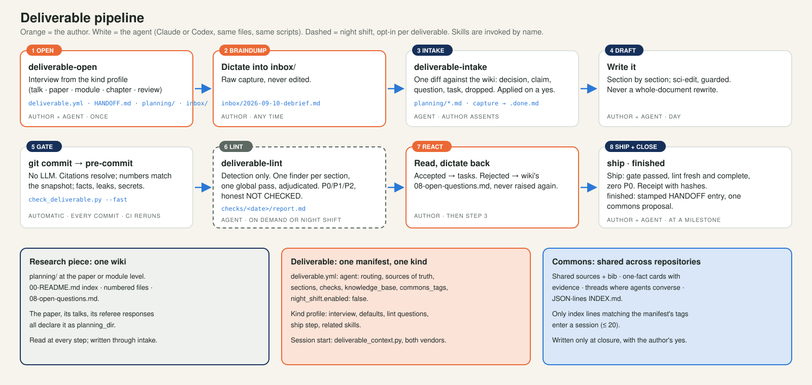

# The deliverable pipeline

How this library supports a piece of creative, knowledge-based work — a talk, a paper, a course module, a book chapter, a referee report — across many sessions and two agent vendors, without losing context, without letting an unchecked draft ship, and without loading everything into every session. Written as a guide for others and as the author's own reference for how to think about the architecture.

<p align="center"></p>

## Five principles

1. **One wiki per piece of research, one manifest per deliverable, one profile per kind.** The paper, its talks, and its referee responses share one `planning/` wiki; each deliverable has its own `deliverable.yml` and `HANDOFF.md`; the deliverable's kind selects the advice (what to ask at open, which checks apply, what lint looks for, how it ships) so an agent holds one profile at a time, not all of them.
2. **Deterministic before generative.** A script that resolves citations, checks numbers against the snapshot of record, and catches leaks runs at every commit in seconds and costs nothing. The language-model review runs after it and stops if it failed. Every defect that shipped from this estate before the pipeline was a fabricated source or a stale number, and each was catchable by a lookup.
3. **Detection is parallel; revision is serial.** Many cheap readers can look at sections at once; nothing rewrites more than one section at a time, and never a whole document in one prompt. A finding is a claim about a line, with a verbatim quote and, for anything blocking, evidence the reader can check. Two models agreeing is not evidence.
4. **Repository files are the authority; nothing lives only in an agent's memory.** State is an append-only `HANDOFF.md` whose top entry is the present. Raw captures are never edited. A session's context comes from a script both vendors run, not from a vendor's hook.
5. **On demand, by name.** The pipeline's skills do not fire from phrases. The repository's `AGENTS.md` says when to invoke which; the author or the agent types the name. This costs one line of habit and buys predictability.

## The eight steps

| Step | Who | What happens | Files |
|---|---|---|---|
| 1 Open | author + agent, once | `/oss:deliverable-open`: an interview driven by the kind profile | `deliverable.yml`, `HANDOFF.md`, `planning/`, `inbox/`, `checks/` |
| 2 Braindump | author | dictate or type into a new `inbox/` file; never edited | `inbox/YYYY-MM-DD-slug.md` |
| 3 Intake | agent, author assents | `/oss:deliverable-intake`: one diff against the wiki, every statement classified and traced; unknown sources stay UNRESOLVED and go to `process-source` | `planning/*.md`, capture → `.done.md` |
| 4 Draft | author + agent | the source, section by section (`sci-edit` for prose, guarded) | `content.md`, `.tex`, `.md` |
| 5 Gate | automatic | `check_deliverable.py --fast` at every commit; CI reruns it | `.githooks/pre-commit`, `checks/citations.json` |
| 6 Lint | agent, on demand or night shift | `/oss:deliverable-lint`: `lint_prepare.py` freezes inputs and writes one brief per section; finders in parallel; one global pass; `lint_adjudicate.py` verifies anchors and derives the verdict | `checks/<date>/findings.json`, `report.md` |
| 7 React | author | dictate reactions; accepted findings become tasks, rejected ones are recorded so they are not raised again | `inbox/`, `08-open-questions.md` |
| 8 Ship, close | author + agent | `check_deliverable.py ship` (gate passed, lint fresh and complete, zero P0; modules may waive with a prompt); `/finished` prepends the stamped handoff entry and asks once about the commons | `checks/release.json`, `HANDOFF.md` |

## The files

```
paper/                        the piece of research
  planning/                   ONE wiki: 00-README.md (index, sources of truth, decisions), numbered files, 08-open-questions.md
  manuscript/                 the paper (an Overleaf submodule, say); its own deliverable.yml + HANDOFF.md
  talks/apsa-2026/            a talk: deliverable.yml (planning_dir: ../../planning), HANDOFF.md, inbox/, checks/, content.md, src/
  sources/{og,md}/, references.bib   the knowledge base (research-repo layout)
AGENTS.md  (CLAUDE.md -> symlink)    rules only, with a "Deliverable pipeline" paragraph saying when to invoke what
```

`deliverable.yml` names the audience, deadline, claim, done-test, sources of truth, logical sections (never a physical split), which checks apply, the knowledge base, commons tags, and an `agent:` routing block that both vendors read. `HANDOFF.md`: two-line header, dated `## YYYY-MM-DD (topic)` entries newest first, each stamped with agent and time, with Decision, Completed, Finding, Next actions; another session's entry is never revised.

## Kind profiles

One file per kind in `project_hygiene/kinds/`: the interview questions beyond the common five, manifest defaults, the lint questions `lint_prepare.py` appends, the ship step, the related skills. A talk asks about the slot and what stays off the slides and ships to a URL; a paper asks about the venue and the pre-registration and ships through `paper-review-lite` and `presubmit`; a module asks about the calendar and the students and ships per session without a required lint; a chapter answers to the book map; a review answers to the manuscript version it read.

## Integration with the rest of the library

| Kind | Before drafting | While drafting | Before shipping |
|---|---|---|---|
| paper | `research-grill`, `research-wayfinder`, `pre-registration-writing` | `paper-tex`, `figures`, `tables`, `sci-edit manuscript` | `deliverable-lint`, then `citation-check`, `fact-check`, `methods-reporting`, `paper-review-lite`, `presubmit`, `replication-package` |
| talk | the deck template (`resources/deck-template/`) | `figures` | `deliverable-lint` |
| module | `research-repo` for a corpus companion | `sci-edit` for guides | `deliverable-lint` (optional), the site's own CI |
| review | `journal-review` | `sci-edit lint` | `deliverable-lint` |
| any | `process-source` feeds the knowledge base that the gate and lint read | `deliverable-intake` after every braindump | `orchestrate` when a disputed finding needs a decorrelated check |

## Two vendors, one infrastructure

Claude and Codex read and write the same files through the same scripts in `project_hygiene/scripts/`: `deliverable_context.py` (session start; Claude via a hook, Codex via the `AGENTS.md` paragraph), `check_deliverable.py` (the gate), `lint_prepare.py` and `lint_adjudicate.py` (the review), `commons.py` (the shared layer). The Codex library carries the same three skills (`$deliverable-open`, `$deliverable-intake`, `$deliverable-lint`). The design was reviewed blind by a Codex session and reconciled; the exchange is the first thread in the commons.

## The commons

`research/commons/`: shared sources and bibliography, one-fact cards with evidence and `supersedes`, threads where agents leave notes for each other, and a JSON-lines index. A session sees only the index lines matching its manifest's tags. Writes happen at closure, as a proposal the author approves; a rejected proposal leaves a trace in the deliverable, not in the commons.

## What to watch

Whether the manifests keep being updated after creation (if not, the manifest is ceremony and `HANDOFF.md` alone suffices); whether section fan-out finds more than a single whole-document pass (if not, collapse it); whether the pre-commit gate gets bypassed (if so, CI is the only gate); whether fabricated *claims about real sources* dominate over fabricated *sources* (if so, weight moves from the citation gate to `fact-check` against the knowledge base).
