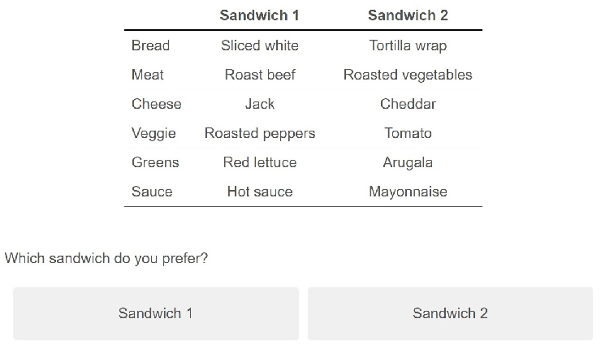
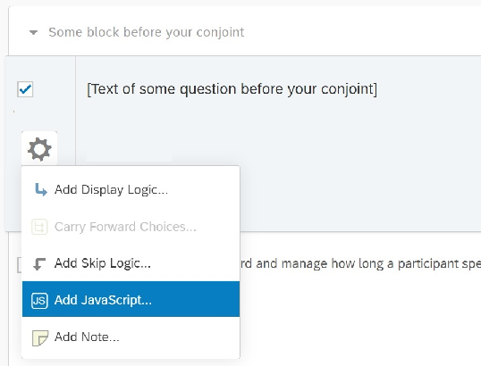
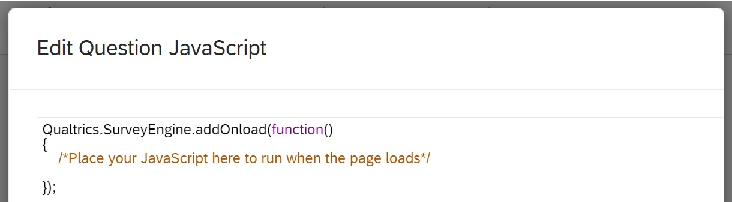
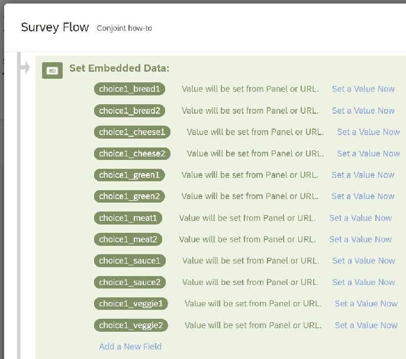
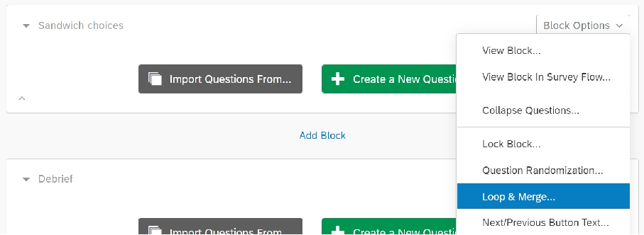
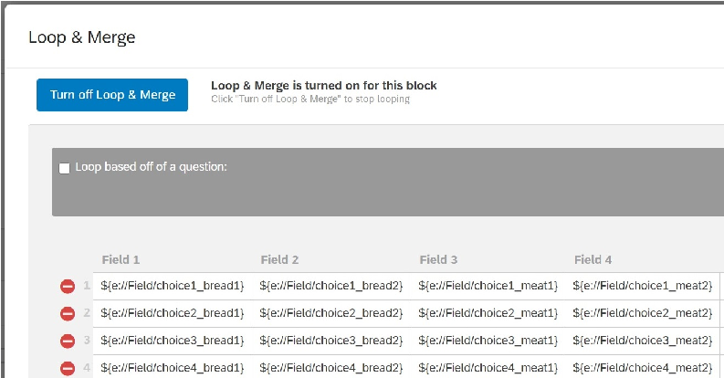
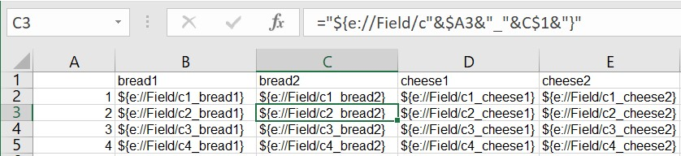
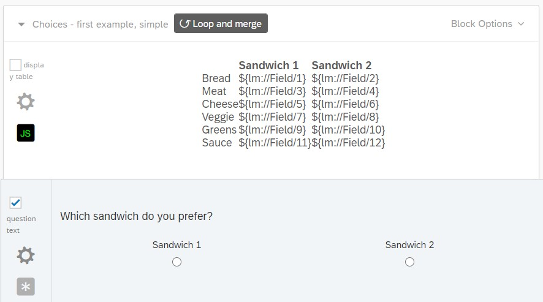
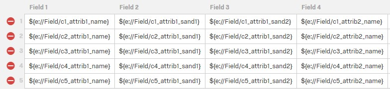
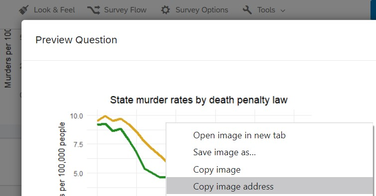

## Programming Choice Experiments in Qualtrics

#### Matthew H. Graham November 22, 2020

This document explains how to program a choice or conjoint experiment in Qualtrics. The approach is designed with two features in mind: (1) easy customization and (2) no dependence on remote servers to conduct the randomization.

The document’s first two sections present step-by-step instructions on a simple setup in which all choice attributes are assigned with equal probability. The third section describes methods of customizing the randomization scheme. The final section presents R code for preparing the resulting Qualtrics dataset for analysis.

The running example will be a choice between two randomly-generated sandwiches:

Figure 1: Screen shot of conjoint task.

This is the first version of this document. If it doesn’t explain how to do something you want to do, please contact me at matthew.graham@yale.edu. I’ll do my best to assist and will consider adding an answer to your question to the document.

### Contents

##### 1 Randomize 3

- 1.1 Choose a question early in the survey. . . . . . . . . . . . . . . . . . . . . . . . . . . . . . . . 3
- 1.2 Find the JavaScript console. . . . . . . . . . . . . . . . . . . . . . . . . . . . . . . . . . . . . . 3
- 1.3 Add the randomization code. . . . . . . . . . . . . . . . . . . . . . . . . . . . . . . . . . . . . 4
- 1.4 Adapt the code to your application. . . . . . . . . . . . . . . . . . . . . . . . . . . . . . . . . 5
- 1.5 Store the results of your randomization. . . . . . . . . . . . . . . . . . . . . . . . . . . . . . . 6

##### 2 Display 7

- 2.1 Create a loop and merge block. . . . . . . . . . . . . . . . . . . . . . . . . . . . . . . . . . . . 7
- 2.2 Populate the loop and merge fields. . . . . . . . . . . . . . . . . . . . . . . . . . . . . . . . . . 8
- 2.3 Create the question. . . . . . . . . . . . . . . . . . . . . . . . . . . . . . . . . . . . . . . . . . 9
- 2.4 Change the appearance of your table. . . . . . . . . . . . . . . . . . . . . . . . . . . . . . . . 10

##### 3 Customize 13

- 3.1 Randomize the attribute order. . . . . . . . . . . . . . . . . . . . . . . . . . . . . . . . . . . . 13
- 3.2 Randomize with unequal probability. . . . . . . . . . . . . . . . . . . . . . . . . . . . . . . . . 14
- 3.3 Randomly choose from a range of integers. . . . . . . . . . . . . . . . . . . . . . . . . . . . . . 15
- 3.4 Randomize and record the order in which the choices appear. . . . . . . . . . . . . . . . . . . 16
- 3.5 Randomize images. . . . . . . . . . . . . . . . . . . . . . . . . . . . . . . . . . . . . . . . . . . 17
- 3.6 Use vignettes instead of tables. . . . . . . . . . . . . . . . . . . . . . . . . . . . . . . . . . . . 19

##### 4 Analyze 20

- 4.1 Prepare the data. . . . . . . . . . . . . . . . . . . . . . . . . . . . . . . . . . . . . . . . . . . . 20
- 4.2 Reshape the data. . . . . . . . . . . . . . . . . . . . . . . . . . . . . . . . . . . . . . . . . . . 21
- 4.3 Perform analysis. . . . . . . . . . . . . . . . . . . . . . . . . . . . . . . . . . . . . . . . . . . . 22

# 1. Randomize

#### STEP 1.1. Choose a question early in the survey.

Start by choosing question that appears somewhere before the conjoint in the survey flow. It can be any question that appears to all respondents (e.g., the consent form, a demographic variable that is asked of all respondents). All that matters is that the randomization code comes before the conjoint experiment.

#### STEP 1.2. Find the JavaScript console.

In the current version of Qualtrics, click the settings icon next to the question text, then choose the “Add JavaScript...” option.

Figure 2: Location of the JavaScript console.

By default, Qualtrics pre-populates some functions: that are needed to add your JavaScript code to the survey. All of the JavaScript for the randomization goes inside the Qualtrics.SurveyEngine.addOnload() function, as indicated below:

Figure 3: Default code appearing in the JavaScript console.

#### STEP 1.3. Add the randomization code.

###### The following code performs all randomization for ten choices between randomly-generated sandwiches. We’ll first examine how this code works, then how to customize it for other applications.

- 1 Qualtrics.SurveyEngine.addOnload(function(){

- 2 // Set number of choices;

- 3 var numChoice = 5;

- 4

- 5 // Vectors containing all attribute levels:

- 6 var breadArray = ["Bagel", "Hero", "Roll", "Sliced white", "Tortilla", "Lettuce wrap"];

- 7 var cheeseArray = ["Cheddar", "Gouda", "Jack", "Mozzarella", "Provolone", "None"];

- 8 var greenArray = ["Arugala", "Green lettuce", "Red lettuce", "Spinach"];

- 9 var meatArray = ["Ham", "Roast beef", "Turkey", "Portobello", "Egg", "Bean patty"];

- 10 var sauceArray = ["Hot sauce", "Mayonnaise", "Mustard", "Oil and vinegar", "None"];

- 11 var veggieArray = ["Tomato", "Jalapenos", "Roasted peppers", "Onion", "Olives", "Bean sprouts", "Pickles", "Avocado"];

- 12

- 13 // Fisher -Yates shuffle:

- 14 function shuffle(array){

- 15 for (var i = array.length - 1; i > 0; i--){

- 16 var j = Math.floor(Math.random() * (i + 1));

- 17 var temp = array[i];

- 18 array[i] = array[j];

- 19 array[j] = temp;

- 20 }

- 21 return array;

- 22 }

- 23

- 24 // Shuffle a vector , choose the first entry:

- 25 function shuffle_one(theArray){

- 26 var out = shuffle(theArray);

- 27 var out = out[0];

- 28 return(out)

- 29 };

- 30

- 31 // Perform the randomization and save the result:

- 32 for(i = 1; i <= numChoice; i++){

- 33 Qualtrics.SurveyEngine.setEmbeddedData("choice"+i+"_bread1", shuffle_one(breadArray));

- 34 Qualtrics.SurveyEngine.setEmbeddedData("choice"+i+"_bread2", shuffle_one(breadArray));

- 35 Qualtrics.SurveyEngine.setEmbeddedData("choice"+i+"_cheese1", shuffle_one(cheeseArray));

- 36 Qualtrics.SurveyEngine.setEmbeddedData("choice"+i+"_cheese2", shuffle_one(cheeseArray));

- 37 Qualtrics.SurveyEngine.setEmbeddedData("choice"+i+"_green1", shuffle_one(greenArray));

- 38 Qualtrics.SurveyEngine.setEmbeddedData("choice"+i+"_green2", shuffle_one(greenArray));

- 39 Qualtrics.SurveyEngine.setEmbeddedData("choice"+i+"_meat1", shuffle_one(meatArray));

- 40 Qualtrics.SurveyEngine.setEmbeddedData("choice"+i+"_meat2", shuffle_one(meatArray));

- 41 Qualtrics.SurveyEngine.setEmbeddedData("choice"+i+"_sauce1", shuffle_one(sauceArray));

- 42 Qualtrics.SurveyEngine.setEmbeddedData("choice"+i+"_sauce2", shuffle_one(sauceArray));

- 43 Qualtrics.SurveyEngine.setEmbeddedData("choice"+i+"_veggie1", shuffle_one(veggieArray));

- 44 Qualtrics.SurveyEngine.setEmbeddedData("choice"+i+"_veggie2", shuffle_one(veggieArray));

- 45 }

- 46 }); Figure 4: Randomization JavaScript: fixed attribute order.

We want to randomly assign six attributes: bread, cheese, meat (and other hearty things one builds sandwiches around), greens, other vegetables, and sauce. The top of the code block, lines 4-9, creates a vector of levels for each of these six attributes.

We want to randomly select exactly one of these levels for each sandwich. The middle of the code block contains two functions for doing this. The first, shuffle(), shuffles the vector by implementing the FisherYates shuffle. The second, shuffle one(), is a wrapper that runs shuffle() and chooses only the first element. For example, shuffle one(breadArray) chooses a random bread.

The final section of the code randomizes and saves the attributes. To embed the randomized variable into the survey, we’ll use the function Qualtrics.SurveyEngine.setEmbeddedData(). It takes two arguments: first the new variable’s name, then its value. For example, to assign a bagel to the first sandwich in the first choice, one would write

- 1 Qualtrics.SurveyEngine.setEmbeddedData("choice1_bread1", "Bagel");

To do this more efficiently, the code loops over all of the sandwiches. Lines 30 through 43 contain a JavaScript for loop. Rather than "choice1 bread1", lines 31 through 42 of the code use the formulation "choice"+i+" bread1" to automatically do the same randomization for every choice.

#### STEP 1.4. Adapt the code to your application.

To adapt the code to your own purpose, begin by setting the number of choice tasks (line 3) and the changing the attribute levels (lines 6-11). There is no requirement that each attribute have the same number of levels, or limit on the number of levels. If you change the names of the arrays — you probably should — don’t forget to make corresponding changes in lines 33-44.

The shuffle functions on lines 14-29 do not need to be edited, unless you want to change the randomization scheme.

The names of the embedded variables that you set in lines 33-44 will eventually appear in your data. For example, in line 33, the text "choice"+i+" bread1" means that the variables choice1 bread1, choice2 bread1,

..., choice5 bread1 will be created. You can change this format to match your preferences. Just remember to carry it all the way through in subsequent steps.

Plenty more can be customized within this framework, but this is all you need to do to if you’d like the attributes to display in a fixed order and for each to be drawn with equal probability. Several options for altering the randomization scheme are discussed in section 3.

#### STEP 1.5. Store the results of your randomization.

Above, the attributes for all of the conjoint tasks are saved using the Qualtrics.SurveyEngine.setEmbeddedData() function on lines 31-42. This is enough to display these variables later in your survey. However, in order to have the levels appear in your data, you need to take one additional step. If you forget to do this, everything will still seem fine in Qualtrics but you won’t be able to analyze the data.

To make sure the variables appear in your data, click the ”survey flow” link in the upper-left corner of your Qualtrics screen.

Once you are in the survey flow, add a new embedded data element to it by clicking ”add below” or ”add a new element here.” Click and drag this element so that it is placed near the beginning of your survey. Crucially, it must be above the question block that includes your randomization JavaScript. I usually put these at the very top of my survey flow.

In your set of embedded data fields, enter the same names from the for loop in lines 30-42 of the code above. For the first pair of sandwiches, the variables look like Figure 5. Leave the values blank, or write something like “error” in them if you prefer. They’ll be filled in when the respondent reaches the survey question that contains your randomization code.

- Figure 5: Embedded data fields in the survey flow.

This must be repeated for every conjoint task. For example, if there are 10 tasks you would need to repeat this block 10 times, changing the variable names to begin with choice2, choice3, etc. This may be the most tiresome step. It goes a little faster if you create all of the variables for one choice or attribute, then duplicate the block and get in a rhythm changing them. But this is step of the process is way too manual for my taste. If you know a better way, please contact me.

# 2. Display

Now that the randomization is finished, the choices need to be displayed. We will make use of a Qualtrics feature called loop and merge. Loop and merge makes it easy to display a series of identically formatted questions.

#### STEP 2.1. Create a loop and merge block.

Loop and merge repeats blocks of a Qualtrics survey over and over again, changing only the variables that appear in a table on the back end. In the loop and merge table, each column is a variable and each row is a “loop” through the block. For our purposes, “loop” is a funny term because the block is only one screen long. To take advantage of the loop and merge feature, we’ll need to create a table that has the names of all the embedded variables we created above.

To start, create a new block and place it where you want your choices to appear in the survey. Open the block options menu and select loop and merge, as shown below.

- Figure 6: Location of the loop and merge option.

#### STEP 2.2. Populate the loop and merge fields.

A pop-up containing the loop and merge table will appear (Figure 7). Fill in the names of your embedded variables using the following syntax: {e://Field/variable}. In place of variable, you’ll use whatever syntax you used in lines 33-44 of the JavaScript in Figure 4.

Each row of the table is a choice/conjoint task. This is why all of the entries in the first row of Figure 7 begin with “choice1.” Each column is an attribute-option combination. In the first column, the suffix “bread1” indicates that it is the bread for sandwich option #1, while the suffix “bread2” indicates that it is the bread for sandwich option #2.

- Figure 7: Entries in the loop and merge table.

The placement of all the “choice1” variables in the first row, “choice2” in the second row, etc. is very intentional. Alignment between these variables and the loop and merge table will make it easier to prepare your data for analysis.

To fill in the loop and merge table, it may help to create a spreadsheet in Excel or Google Sheets that automatically creates your grid of variable names. Then you can simply paste that grid into the loop and merge interface.

Figure 8: Using spreadsheet software to create a grid of embedded variable names.

Once you’ve filled in the loop and merge fields, Qualtrics will automatically run through the question once for every row in the table, regardless of whether you actually use the variables. Below, we’ll use the syntax

{lm://Field/1} to display the values entered in the loop and merge table to the respondent.

#### STEP 2.3. Create the question.

Now we’re ready to start displaying the choices to the respondents. To do this, we need two things: a table that displays the choices, and a question that records the choices. The formatting of the table behaves better when the the table and the question are programmed as two separate questions on the same page.

Figure 9: Displaying the table and the response options as two separate questions within the same loop and merge block.

The following describes how to code up the table in HTML. You can also use the Qualtrics rich text editor or create a table in some other software and paste it into Qualtrics and see how it handles the formatting. HTML is better because it’s easy to create a cleanly-formatted table that behaves exactly as you tell it to. If you can handle the statistical software you’ll use to analyze your results, you shouldn’t have much trouble figuring this out.

The code for a basic HTML table is very simple. Start the table with <table> and end it with </table>. Within your table, start each row with <tr> and end it with </tr>. Within each row, start a cell with <td> and end it with </td>. Here we want a 3 x 7 tables, so we’ll have three <td></td> pairs nested inside seven <tr></tr> pairs. This block of code creates the table displayed in Figure 9:

To add this code to a question, just click the “HTML View” tab inside the text editor. It’s better to edit your HTML in a separate program like NotePad, then paste it into the HTML view tab each time you want to make a change. This is because Qualtrics automatically adds a bunch of unnecessary tags that will clutter up your code.

This code doesn’t set any of its own formatting, other than to center the table (the 
 tags) and make the column headers bold (the <b> tags). In practice, the appearance of the resulting table will depend on your survey’s look and feel settings and the respondent’s web browser.

- 1 [Place any introductory text here.]

- 2

- 3 

- 4 <table >

- 5 <tr><td ></td> <td><b>Sandwich 1</b></td> <td><b>Sandwich 2</b></td ></tr>

- 6 <tr><td>Bread </td> <td> {lm://Field /1}</td> <td> {lm:// Field /2}</td ></tr>

- 7 <tr><td>Meat </td> <td> {lm://Field /3}</td> <td> {lm:// Field /4}</td ></tr>

- 8 <tr><td>Cheese </td> <td> {lm://Field /5}</td> <td> {lm:// Field /6}</td ></tr>

- 9 <tr><td>Veggie </td> <td> {lm://Field /7}</td> <td> {lm:// Field /8}</td ></tr>

- 10 <tr><td>Greens </td> <td> {lm://Field /9}</td> <td> {lm:// Field /10}</td ></tr>

- 11 <tr><td>Sauce </td> <td> {lm://Field /11}</td> <td> {lm:// Field /12}</td ></tr>

- 12 </table >

- 13 
 Figure 10: HTML table, unformatted.

#### STEP 2.4. Change the appearance of your table.

To make the table look more professional, we’ll take advantage of cascading style sheets (CSS), a simple syntax for editing the appearance of elements in a web page. Again, you can accomplish some of the same things using the Qualtrics rich text editor, but CSS is a fairly straightforward way to get a lot more control.

There are two ways to add CSS to an HTML table. First, you can hard-code the style of each element. For example, the tag <td style = "text-align:center"> will center the text within your cell. Second, you can create a style sheet that defines classes that you can use over and over again. For example, below we’ll define a class called normalrow, then use the tag <tr class = "normalrow"> to apply the same formatting to as many rows as we want.

Adding CSS to your table requires two steps. First, open the “Look & Feel” menu, then the “Style” tab. Inside the box labelled “Custom CSS,” insert the code that appears in Figure 11.

Second, replace the basic HTML code from Figure 10 with the block of HTML code appearing below in Figure 12. The code is identical, with the exception that each element of the table has now been assigned a class. Line 2 also has an example of how to hard-code a style with style.

If you’re happy with the appearance of the table as it appears in Figure 1, all you need to do to customize the table is change the names of the row and column headers in lines 5, 6, 9, 14, 18, 24, 29, and 34.

If you also want to change the appearance of the table, you’ll need to edit the style sheet. As you can see in Figure 11, CSS syntax is quite intuitive. The comprehensive guide available on w3schools.com is a good resource.

- 1 .wholetable{

- 2 column -gap: 10px;

- 3 padding: 2%;

- 4 border -left: none;

- 5 border -top: none;

- 6 border -bottom: solid;

- 7 border -collapse:collapse;

- 8 vertical -align: top;

- 9 text -align: center;

- 10 }

- 11 .toprow {

- 12 border -bottom: 2px solid #000000 ;

- 13 }

- 14 .normalrow{

- 15 vertical -align: top;

- 16 border -bottom: 1px solid #ddd;

- 17 }

- 18 .bottomrow {

- 19 border -bottom: 2px solid #000000 ;

- 20 }

- 21 .normalrow:hover{

- 22 background -color: #f5f5f5 ;

- 23 }

- 24 .bottomrow:hover{

- 25 background -color: #f5f5f5 ;

- 26 }

- 27 .attr {

- 28 padding -left: 5%;

- 29 padding -right: 2%;

- 30 padding -top: 1%;

- 31 padding -bottom: 1%;

- 32 }

- 33 .name {

- 34 padding -left: 2%;

- 35 padding -right: 2%;

- 36 padding -top: 1%;

- 37 padding -bottom: 1%;

- 38 text -align: left;

- 39 }

###### Figure 11: A custom style sheet.

1 
 2 <table class="wholetable" style="min -width :60%"> 3 <tr class="toprow"> 4 <td ></td> 5 <td class="attr"><b>Sandwich 1</b></td> 6 <td class="attr"><b>Sandwich 2</b></td> 7 </tr> 8 <tr class="normalrow"> 9 <td class="name">Bread </td>

10 <td class="attr"> {lm://Field /1}</td> 11 <td class="attr"> {lm://Field /2}</td> 12 </tr> 13 <tr class="normalrow"> 14 <td class="name">Meat </td> 15 <td class="attr"> {lm://Field /3}</td> 16 <td class="attr"> {lm://Field /4}</td> 17 </tr> 18 <tr class="normalrow"> 19 <td class="name">Cheese </td> 20 <td class="attr"> {lm://Field /5}</td> 21 <td class="attr"> {lm://Field /6}</td> 22 </tr> 23 <tr class="normalrow"> 24 <td class="name">Veggie </td> 25 <td class="attr"> {lm://Field /7}</td> 26 <td class="attr"> {lm://Field /8}</td> 27 </tr> 28 <tr class="normalrow"> 29 <td class="name">Greens </td> 30 <td class="attr"> {lm://Field /9}</td> 31 <td class="attr"> {lm://Field /10}</td> 32 </tr> 33 <tr class="normalrow"> 34 <td class="name">Sauce </td> 35 <td class="attr"> {lm://Field /11}</td> 36 <td class="attr"> {lm://Field /12}</td> 37 </tr> 38 </table > 39 

###### Figure 12: HTML table, formatted.

# 3. Customize

Within the architecture laid out so far, it is possible to program the survey to execute a wide range of randomization procedures. This section describes several options for doing so.

#### 3.1. Randomize the attribute order.

In some applications, researchers may want to randomize the order in which the choice attributes appear to the respondents. Doing this requires two key steps: modifying lines 30-45 of the randomization JavaScript displayed in Figure 4, and adopting a new naming convention for the embedded variables.

- 1 var attribNames = ["Bread", "Cheese", "Greens", "Meat", "Sauce", "Veggie"];

- 2

- 3 function randomize(i){

- 4 // Randomly draw the attributes for each sandwich

- 5 var s1 = [shuffle_one(breadArray), shuffle_one(cheeseArray), shuffle_one(greenArray), shuffle_one(meatArray), shuffle_one(sauceArray), shuffle_one(veggieArray)];

- 6 var s2 = [shuffle_one(breadArray), shuffle_one(cheeseArray), shuffle_one(greenArray), shuffle_one(meatArray), shuffle_one(sauceArray), shuffle_one(veggieArray)];

- 7

- 8 // Randomize the display order

- 9 var attribOrder = shuffle([1,2,3,4,5,6]);

- 10

- 11 // Save the results

- 12 for(var k = 1; k <= attribOrder.length; k++){

- 13 var index = attribOrder[k-1]-1;

- 14 Qualtrics.SurveyEngine.setEmbeddedData(’c’+i+’_attrib’+k+’_name’, attribNames[index]);

- 15 Qualtrics.SurveyEngine.setEmbeddedData(’c’+i+’_attrib’+k+’_sand1’, s1[index]);

- 16 Qualtrics.SurveyEngine.setEmbeddedData(’c’+i+’_attrib’+k+’_sand2’, s2[index]);

- 17 };

- 18 };

- 19

- 20 for(var i=1; i <= numChoice; i++){

- 21 randomize(i);

- 22 }; Figure 13: Randomization JavaScript: random attribute order.

To account for the fact that the attributes (bread, meat, cheese, etc.) are going to appear in random order, we need to modify the naming convention for the attributes, which had previously hard-coded bread, cheese, etc. Figure 13 implements an alternate naming convention this in lines 14-16. For the first choice, the first attribute of sandwich 1 is c1 attrib1 sand1. The first attribute of sandwich 2 is c1 attrib1 sand2. There is also a new set of fields, c1 attrib1 name, that contain the names of the attributes.

You’ll also need to use this variable naming convention in your survey flow (Figure 5) and your loop and merge table (Figure 7). For example, here is how the first four columns of your loop and merge table would look with this modified naming conventions:

Figure 14: Loop and merge table with naming convention for randomized attribute order.

#### 3.2. Randomize with unequal probability.

So far, all of the attributes have been assigned with equal probability. We’ve accomplished this by creating vectors, shuffling them, and choosing the first element. Researchers sometimes want to randomize attributes with unequal probability. To do this for bread, we can create a new function called return bread() to carry out a different randomization scheme. Then we’ll replace of all the instances of shuffle one(breadArray) with return bread().

Suppose, for whatever reason, that we would like 40 percent of our sandwiches to be lettuce wraps, 20 percent to be tortilla wraps, and 10 percent each to come from the other four categories of bread. The following function returns a type of bread with these probabilities:

- 1 function return_bread(){

- 2 var num = Math.random();

- 3 if(num < .4){var out = "Lettuce wrap"

- 4 } else if(num < .6){var out = "Tortilla"

- 5 } else if(num < .7){var out = "Bagel"

- 6 } else if(num < .8){var out = "Hero"

- 7 } else if(num < .9){var out = "Roll"

- 8 } else {var out = "Sliced white"};

- 9 return out

- 10 }; Figure 15: Function to choose attributes with unequal probability.

###### The function return bread() uses Math.random() to draw a random number between 0 and 1, then uses the if statements to specify the desired CDF of the randomization distribution.

#### 3.3. Randomly choose from a range of integers.

Researchers sometimes want to assign numerical values as attributes. This can be accomplished using the tools above by simply creating a vector containing all of the numerical values. It can also be accomplished by writing a specialized function to return a number.

Departing from the sandwich example, suppose that we would like to assign a fake candidate an age between 40 and 65. The following function returns these integers with equal probability. It can be accommodated into the code in the same way as the return bread() function above.

- 1 function return_age(){

- 2 var out = Math.floor(Math.random()*26) + 40;

- 3 return out

- 4 }; Figure 16: Function to draw a random integer between 40 and 65.

The function return age() produces a random integer between 40 and 65 by drawing a random number between [0,1) using Math.random(), multiplying it by 26 (i.e., the desired number of integers), rounding it down with Math.floor(), and adding 40.

Making this function more flexible adds only a bit of complexity. Suppose we want to be able to use the same function to generate multiple integer ranges. We can do this as follows:

- 1 function return_integer(low , high){

- 2 var multiplier = high - low + 1;

- 3 var out = Math.floor(Math.random()*multiplier) + low;

- 4 return out

- 5 }; Figure 17: Function to draw a random integer between specified values.

###### In return integer(), the variables low and high play the roles that 40 and 65 played in return age().

#### 3.4. Randomize and record the order in which the choices appear.

If your choices are all generated using the same randomization scheme, the order in which they appear doesn’t really matter. In these cases, it’s better not to randomize the order of the choices. That way, the choice number that appears in each of your embedded variables already tells you the order in which the choices appeared.

Researchers sometimes want to use different randomization schemes for different choices. In these cases, it’s really handy to hard-code the choice number, then randomize the order in which the choices appear. For example, in some of my research, I have coded custom randomization schemes that over-sample more realistic scenarios in a subset of the choices. In these situations, the choice number tells me which randomization scheme was used, and randomizing the choice order allows me to ensure that choice order isn’t correlated with the probability of assignment.

To randomize and record the order of the choices, one can take the following steps:

- 1. Inside the loop and merge table, check the ”Randomize loop order” box.
- 2. Add a column to your loop and merge table containing choice number.
- 3. Add an embedded variable called choice order to the survey flow.

- 4. Add the following JavaScript to one of the slides on the page with the candidate choice:

- 1 var order = " {e://Field/choice_order} " + "; " + " {lm://Field /20}"

- 2 Qualtrics.SurveyEngine.setEmbeddedData("choice_order", order); Figure 18: Recording choice order.

###### This code works by (1) reading the order of the previous choices out of choice order, (2) appending the number assigned to the current choice, and (3) writing the result back onto choice order. In place of the 20 in line 1, input the number of the column you created to store the choice numbers.

#### 3.5. Randomize images.

Randomizing images is easier than you might think. You can insert an image anywhere in your Qualtrics survey using the HTML code . This means that at the end of the day, all you really have to do to randomize an image is replace one the arrays of attribute names at the top of the code (lines 6-11 in Figure 4) with an array of URLs. Make sure to include the full URL, including the http://.

Though the images can be stored anywhere on the web, the best place to store them is your Qualtrics library, which will be accessible to anyone who can access your survey. One way to retrieve the URL is to (1) create a new graphic question, (2) upload a graphic from your computer or choose one from your library, (3) preview the question, and (4) right click the image to copy the URL. The last step of this process is shown in Figure 19. You’ll get a URL that looks something like

https://yalesurvey.ca1.qualtrics.com/WRQualtricsControlPanel/Graphic.php?IM=IM 0e67RxsPjQCPhsh

Figure 19: Locating the URL of an image from your library.

However you choose to host your images, what matters is that you get a set of URLs that corresponds to the images you want to randomize. For example, you could change line 6 in Figure 4 to:

- 1 var breadArray = ["http:// website.com/chart1.jpg", "http:// website.com/chart2.jpg",

- 2 "http:// website.com/chart3.jpg", "http:// website.com/chart4.jpg"] Figure 20: An array of image URLs.

You can then save these URLs in the same way you saved text before. You can also put complete HTML tags inside of embedded variables if you prefer.

The only other thing that’s different is adding the image to your display. For example, if we wanted to change the cell entries in the top row of Figure 1 to pictures of bread, we could replace lines 9-12 of Figure 12 with

The code in Figure 21 displays the two images centered within their cells. Each image is set to take up 90 percent of the cell’s width. You can also set this using CSS with the syntax 

- 2 <td class="name">Bread </td>

- 3 <td class="attr">

</td>

- 4 <td class="attr">

</td>

- 5 </tr> Figure 21: Adding images to a row of the choice table.

Of course, you probably don’t want to put a picture of bread into a row in your choice table. For example, you might want to put a person’s face above each column. To accomplish this, you’d want to put a new row at the top of your table and style it in a way that suits your needs. To add an image at the top of each column, centered and with 10 pixels of padding below each image, one would use the following code:

- 1 <tr style="padding -bottom :10px; text -align:center">

- 2 <td ></td>

- 3 <td></td>

- 4 <td></td>

- 5 </tr> Figure 22: Adding images to a row of the choice table and specifying a different style for that row.

Ultimately, you have a lot of flexibility in terms of how you format a table, or images within it. The images don’t have to be in the table, either.

In general, the only tricky part about inserting images via your own HTML tags is giving the page good instructions about how to deal with variable screen widths. It can be helpful to supplement the width with the min-width or max-width CSS attribute. For example, suppose you want an image to shrink to fit small screens but not expand beyond the image file’s actual width, 500 pixels. The code  accomplishes this. If you wanted to apply the same rule to a lot of images, you could create a class and add it to your custom CSS file (Figure 11).

#### 3.6. Use vignettes instead of tables.

Conjoint experiments are typically presented as tables, but the same machinery can be used to randomly generate variables in a vignette experiment. For example, one could replace the HTML table with the following:

1 {lm://Field /3} and {lm:// Field /5} on {lm:// Field /1} with {lm:// Field/7}, {lm:// Field /9}, and {lm:// Field /11}.

Figure 23: Using the same randomization code to program a vignette.

Researchers running vignette experiments often prefer to show only one vignette to each respondent. If so, you can skip the loop and merge business altogether and directly program in embedded fields, like so:

1 {e://Field/meat} and {e:// Field/cheese} on {e:// Field/bread} with {e:// Field/greens}, { e:// Field/veggie}, and {e:// Field/sauce}.

###### Figure 24: Using the same randomization code to program a vignette with no loop and merge fields.

# 4. Analyze

When you download your data from Qualtrics, each row will represent a respondent. You probably want your unit of analysis to be either a sandwich or a choice between two sandwiches. This section describes how to prepare your data for analysis.

The code here uses the R statistical programming language. It requires the dplyr and magrittr packages, both of which are installed as part of the tidyverse package.

#### 4.1. Prepare the data.

Reshaping the data will require three sets of variables: a unique respondent identifier, the variables containing the characteristics, and the variables containing the respondents’ choices. To keep things simple, let’s assume you have reduced your data to contain only these variables. We’ll also keep the examples a bit more concise by getting rid of the sauce and the greens.

If you follow the suggested naming conventions at the randomization and display stages, your dataset will look something like this:

- 1 id choice1_bread1 ... choice5_veggie2 1_pref 2_pref 3_pref ...

- 2 1 1 Sliced white Roasted peppers Sandwich 2 Sandwich 2 Sandwich 1

- 3 2 2 Roll Avocado Sandwich 1 Sandwich 1 Sandwich 2

- 4 3 3 Roll Onion Sandwich 1 Sandwich 1 Sandwich 2

- 5 4 4 Bagel Avocado Sandwich 2 Sandwich 1 Sandwich 2

- 6 5 5 Tortilla Onion Sandwich 1 Sandwich 1 Sandwich 1

- 7 6 6 Hero Avocado Sandwich 1 Sandwich 1 Sandwich 2 Figure 25: Data structure.

id is the respondent identifier. You can create this yourself or use the identifiers supplied by Qualtrics or your vendor. Wherever id comes from, make sure it takes a unique value in each row and that there are no missing values. Duplicates or missingness in id will mess up the code below.

The variables prefixed choice contain the sandwich attributes that were displayed to the respondent. These follow the naming scheme established in the randomization JavaScript and carried through to the display table.

The variables prefixed with numbers contain the respondents’ preferences. Loop and merge blocks automatically attach these prefixes, e.g., 1 pref is the first instance of the question called “pref.” If you set up your loop and merge table so that variables prefixed choice1 always appear in the first row, etc., then the numbering of the choice and pref variables will be aligned. The code below assumes that the numbers align.

4.2. Reshape the data. There’s more than one way to reshape the data. Figure 26 shows one good way to do it in three steps. It assumes that the data.frame printed in Figure 25 is stored as an object called d.

- 1 # Reshape the sandwich attributes so each sandwich gets its own row.

- 2 d_sand = d %>% select(id, starts_with("choice"))

- 3 d_sand = d_sand %>%

- 4 gather(variable , value , -id) %>%

- 5 mutate(

- 6 choiceNum = gsub("[A-Za-z]|_.+", "", variable),

- 7 sandNum = gsub(".+(. )", "\\1", variable),

- 8 attribute = gsub(".+_|. ", "", variable)

- 9 ) %>%

- 10 select(-variable) %>%

- 11 spread(attribute , value)

- 12

- 13 # Reshape the respondent’s preferences so each choice gets its own row.

- 14 d_pref = d %>% select(id, ends_with("pref"))

- 15 d_pref = d_pref %>%

- 16 gather(variable , preference , -id) %>%

- 17 mutate(

- 18 choiceNum = gsub("_pref", "", variable),

- 19 preference = as.numeric(gsub("Sandwich ", "", preference))

- 20 ) %>%

- 21 select(-variable)

- 22

- 23 # Merge the attributes and preferences.

- 24 d_stack = left_join(d_sand , d_pref)

- 25 d_stack = d_stack %>%

- 26 mutate(

- 27 Y = as.numeric(sandNum == preference)

- 28 )

- 29

- 30 # Check that you did not create any extra rows.

- 31 nrow(d_stack) == (nrow(d) * max(d_stack sandNum) * max(d_stack choiceNum))

Figure 26: R code for reshaping the data.

The first step is to split off the sandwich attributes and turn these into a dataset in which each row corresponds to a sandwich. To begin, line 2 splits off id and the choice attributes. Next, line 4 stacks the data so that each sandwich × characteristic combination gets its own row. Using regular expressions, lines 5-9 break each variable name into its component parts: the choice number (in our example before, 1 to 5), the sandwich number (1 or 2), and the attribute name. Finally, line 10 drops the original variable name and line 11 spreads the attributes back out into the columns. This yields a data.frame with the following structure:

- 1 id choiceNum sandNum bread cheese meat veggie

- 2 1 1 1 1 Sliced white Jack Ham Tomato

- 3 2 1 1 2 Tortilla Mozzarella Roast beef Bean sprouts

- 4 3 1 2 1 Bagel Jack Turkey Roasted peppers

- 5 4 1 2 2 Lettuce wrap Mozzarella Portobello Bean sprouts Figure 27: Structure of d sand as of line 11 in Figure 26.

The second step is to split off the respondent’s preferences and turn these into a dataset in which each row corresponds to a choice between two sandwiches. To begin, line 14 splits off id and the respondent’s preferences. Line 16 stacks the data, line 18 removes the pref suffix from each variable name and stores the prefix as the choice number, and line 19 removes the word “Sandwich” from the variables containing the respondent’s choices. This yields a data.frame with the following structure:

- 1 id choiceNum preference

- 2 1 1 1 2

- 3 2 2 1 1 Figure 28: Structure of d pref as of line 21 in Figure 26.

The third step is to join d sand and d pref together. Comparing Figure 27 and Figure 28, you’ll notice two common variables: id and choiceNum. This reflects the structure of the two datasets. d sand should have twice as many rows as d pref.

Line 24 binds these two datasets together. left join() will automatically find the common variables and duplicate the rows so that each entry in d pref is matched to both corresponding entries in d sand. If you’re a purist, you can also use the by argument to tell left join() which variables to use. The resulting dataset, d stack, is at the sandwich level, just like d sand. Line 27 creates a new variable, Y, that indicates whether the respondent preferred that sandwich. This yields a data.frame with the following structure:

- 1 id choiceNum sandNum bread cheese meat veggie preference Y

- 2 1 1 1 1 Sliced white Jack Ham Tomato 2 0

- 3 2 1 1 2 Tortilla Mozzarella Roast beef Bean sprouts 2 1

- 4 3 2 1 1 Roll Jack Turkey Tomato 1 1

- 5 4 2 1 2 Bagel Cheddar Roast beef Bean sprouts 1 0 Figure 29: Structure of d stack as of line 28 in Figure 26.

At the end, line 31 verifies that d stack has the correct number of rows. This line returns TRUE if d stack has exactly five choices × two sandwiches per choice = ten times the number of rows as the initial dataset, d. If you are creating extra rows, you probably have duplicates or missingness in id. If you don’t have enough rows, some part of your code above probably isn’t running due to an error and you haven’t noticed yet.

If you plan to use other information about your respondents in the analysis, you can use id and left join() to add those variables to d stack.

#### 4.3. Perform analysis.

In this form, d stack is ready for any analysis that takes the sandwich as the unit of observation, e.g. the popular Average Marginal Component Effect (AMCE) framework. Using the estimatr package, you could compute AMCEs as follows:

1 lm_robust(Y ~ bread + cheese + meat + veggie , data = d_stack , clusters = id)

Figure 30: Calculating the AMCE using d stack.

Now all you have to do is write the paper!

