###### Andrew Heiss

Code

# The ultimate practical guide to conjoint analysis with R

Learn how to use R, {brms}, and {marginaleffects} to analyze conjoint data and find causal and descriptive quantities of interest, both frequentistly and Bayesianly

R TIDYVERSE GGPLOT STATISTICS BRMS STAN

AUTHOR PUBLISHED

Andrew Heiss Tuesday, July 25, 2023

DOI

10.59350/xgwjy-dyj66

In my research, I study international nongovernmental organizations (INGOs) and look at how lots of different institutional and organizational factors influence INGO behavior. For instance, many authoritarian regimes have passed anti-NGO laws and engaged in other forms of legal crackdown, which has forced NGOs to change their programming strategies and their sources of funding.

In one ongoing project with Suparna Chaudhry and Marc Dotson, we look at how individual private donors feel about NGOs that face legal crackdown abroad and how the experience of crackdown interacts with donor characteristics (like how much education a person has, whether they’ve traveled abroad, what their income is, etc.) with organizational characteristics (like whether it deals with humanitarian or human rights issues, whether it has an open commitment to transparency, whether it faces legal crackdown abroad, etc.) to shape an individual’s decision to give money to an NGO.

1

- 1
- 2

In earlier work with Suparna Chaudhry, we do a similar thing too, just with far fewer experimental conditions.

See our preregistration here.

We use a conjoint experiment to test a bunch of different hypotheses related to INGO characteristics and donor behavior However, in all my previous stats training, I never learned how to analyze conjoint data or how to test specific causal claims and estimate causal effects with this kind of data. So, in the course of analyzing our INGO conjoint data, I’ve been making a guide for future-me (and anyone else who’s interested) in how to analyze conjoint survey data.

2

This is that guide.

I explore three main things here:

- 1. What kinds of causal and descriptive estimands (or quantities of interest) can you get from conjoint designs?
- 2. How can you estimate these things with “standard” frequentist statistics?
- 3. How can you estimate these things with Bayesian statistics?

Who this post is for

Here’s what I assume you know:

You’re familiar with R and the tidyverse (particularly {dplyr} and {ggplot2}).

You’re familiar with linear regression and packages like {broom} for converting regression results into tidy data frames and {marginaleffects} for calculating marginal effects.

You’re familiar with {brms} for running Bayesian regression models and {tidybayes} and {ggdist} for manipulating and plotting posterior draws.

Throughout this example, I’ll use data from a political candidate conjoint experiment from Hainmueller, Hopkins, and Yamamoto (2014). The data is available at the Harvard Dataverse and it’s public domain, so you can also download it here if you want to follow along:

 candidate.dta (this is a Stata file)

3

- 3 booo

Let’s load some packages and data, create some helper functions and nice theme stuff, and get started!

library(tidyverse) # ggplot, dplyr, and friends library(haven) # Read Stata files library(broom) # Convert model objects to tidy data frames library(cregg) # Automatically calculate frequentist conjoint AMCEs and MMs library(survey) # Panel-ish regression models library(scales) # Nicer labeling functions library(marginaleffects) # Calculate marginal effects library(broom.helpers) # Add empty reference categories to tidy model data frames library(ggforce) # For facet_col() library(brms) # The best formula-based interface to Stan library(tidybayes) # Manipulate Stan results in tidy ways library(ggdist) # Fancy distribution plots library(patchwork) # Combine ggplot plots

# Custom ggplot theme to make pretty plots # Get the font at https://fonts.google.com/specimen/Jost theme_nice <- function() {

theme_minimal(base_family = "Jost") +

theme(panel.grid.minor = element_blank(), plot.title = element_text(family = "Jost", face = "bold"), axis.title = element_text(family = "Jost Medium"),

- axis.title.x = element_text(hjust = 0),
- axis.title.y = element_text(hjust = 1), strip.text = element_text(family = "Jost", face = "bold",

size = rel(0.75), hjust = 0),

strip.background = element_rect(fill = "grey90", color = NA)) }

# Set default theme and font stuff theme_set(theme_nice()) update_geom_defaults("text", list(family = "Jost", fontface = "plain")) update_geom_defaults("label", list(family = "Jost", fontface = "plain"))

# Party colors from the Urban Institute's data visualization style guide, for fun # http://urbaninstitute.github.io/graphics-styleguide/ parties <- c("#1696d2", "#db2b27")

# Functions for formatting things as percentage points label_pp <- label_number(accuracy = 1, scale = 100,

suffix = " pp.", style_negative = "minus")

label_amce <- label_number(accuracy = 0.1, scale = 100, suffix = " pp.", style_negative = "minus", style_positive = "plus")

# Data from https://doi.org/10.7910/DVN/THJYQR # It's public domain candidate <- read_stata("data/candidate.dta") %>%

as_factor() # Convert all the Stata categories to factors

# Make a little lookup table for nicer feature labels variable_lookup <- tribble(

~variable, ~variable_nice, "atmilitary", "Military", "atreligion", "Religion", "ated", "Education", "atprof", "Profession", "atmale", "Gender", "atinc", "Income", "atrace", "Race", "atage", "Age"

) %>% mutate(variable_nice = fct_inorder(variable_nice))

# How conjoint experiments work

Conjoint experiments are a special kind of randomized experiment where study participants are asked questions that have experimental manipulations. However, unlike a standard randomized experiment where one feature of interest is manipulated (like in an A/B test), conjoint experiments are choose-your-own-adventure randomized experiments. Participants are presented with 2+ possible options that have a variety of features with different levels in those features, and then they’re asked to choose one (for a binary outcome) or rate them on some sort of scale (for a continuous outcome).

For instance, throughout this post we’ll play with data from a conjoint experiment by Hainmueller, Hopkins, and Yamamoto (2014) where they were interested in seeing the effect of different political candidate characteristics on the probability that a respondent would select that candidate (or on candidate favorability).

Respondents were shown the following question multiple times and asked to choose which candidate they’d vote for. Each candidate had a set of eight features with randomly chosen levels inside each feature, like this:

###### Example conjoint survey question

Candidate 1 Candidate 2

Military service Did not serve Served

Religion None Mormon

College State university Ivy League university

Profession Lawyer Business owner

Gender Female Female

Income $54,000 $92,000

Race/Ethnicity White Asian American

###### Candidate 1 Candidate 2

Age 45 68

If you had to choose between them, which of these two candidates would you vote for?

- Candidate 1

- Candidate 2

Each of these eight features had different levels within them that respondents could possibly see:

###### Features/Attributes Levels

Military service Served, Did not serve

Religion None, Jewish, Catholic, Mainline protestant, Evangelical protestant, Mormon

College No BA, Baptist college, Community college, State university, Small college, Ivy League university

Profession Business owner, Lawyer, Doctor, High school teacher, Farmer, Car dealer

Gender Male, Female

Income $32,000; $54,000; $65,000; $92,000; $210,000; $5,100,000

Race/Ethnicity White, Native American, Black, Hispanic, Caucasian, Asian American

Age 36, 45, 52, 60, 68, 75

# Estimands: what quantities of interest can you get from conjoint designs?

There are a ton of possible combinations of features and levels that can be offered to respondents—in this candidate experiment, there are 2 × 6 × 6 × 6 × 2 × 6 × 6 × 6, or 186,624 options(!). Even in a survey with thousands of respondents, it’s unlikely that every possible version of the 186,624 potential combinations would be seen by the whole sample. Regardless, with some statistical magic, you can still find valid quantities of interest from these complex experimental designs.

In general, there are two types of estimands that you can find using conjoint designs: causal and descriptive Leeper, Hobolt, and Tilley (2020). The exact research question you have determines what quantity of interest you’ll want to find and how you analyze the data to find it. This table summarizes the two types of estimands, how they’re calculated, and shows some example questions you can answer with them:

Table 1: Causal and descriptive estimands from conjoint designs

Example interpretation

Practical calculation

Purpose Estimand

Causal inference

Average marginal component effect (AMCE) Changing a

Categorical regression coefficients or marginal effects where one level is omitted

candidate’s religion from none to Mormon decreases the probability of selection by X percentage points.

θ = E[Outcome ∣ do(Feature = reference level)] −

E[Outcome ∣ do(Feature = level of interest)]

Preference description

Marginal mean (MM)

Mormon candidates are supported by X% of respondents.

Average outcome value conditional on different levels

θ = E[Outcome ∣ Feature = Level of interest]

or

or

θ = E[Outcome ∣ Feature = Level of interest] −

E[Outcome ∣ Feature = Other level of interest]

Mormon candidates are X percentage points less likely to be selected than Catholic candidates.

## Average marginal component effect (AMCE)

This distinction between causal and descriptive estimands makes sense if we look at the notation for the estimands themselves. In the world of do-calculus, causal questions are asked using the operator, which represents a direct intervention into a data generating process. In this case, the researcher randomly sets the attributes to specific levels—the respondent does not self-select into different conditions or decide for themselves that Candidate 1 is a Catholic lawyer or that Candidate 2 is a Jewish farmer. This thus eliminates selection bias and other external confounding, leaving us with an average causal effect.

do()

We can calculate (1) the average outcome when a feature is set to a level we’re interested in (e.g., when religion = Mormon), (2) the average outcome when a feature is set to some reference level (e.g., when religion = none), and (3) find the difference between the two:

θ = P[Candidate selection ∣ do(Religion = none)] − P[Candidate selection ∣ do(Religion = Mormon)]

Practically speaking, the easiest way to think about the average marginal component effect (AMCE) is as categorical coefficients in a linear regression model.

In my favorite analogy for thinking about regression, model covariates can either be sliders or switches:

β

Numeric covariates are sliders—a one unit change in X is associated with a unit change in Y. You can slide that X variable up and down and influence Y accordingly (a 10 unit change in X is associated with a change in Y; a −1 unit change in X is associated with a change in Y; and so on). The is a slider that you can move up and down and see what happens to the outcome.

10 × β −β β

Categorical covariates, on the other hand, are switches. One of the categories is omitted and represents the baseline average for that category, or the average when the switch is off. The other category coefficients represent shifts in that baseline, or what happens when the switch is flipped on.

Here’s a quick super basic reference example with data from {palmerpenguins} (this is not actual conjoint data!). We’ll model penguin weight based on penguin species and sex:

library(palmerpenguins)

penguins <- penguins %>% drop_na(sex)

penguin_model <- lm(body_mass_g ~ species + sex, data = penguins) tidy(penguin_model) ## # A tibble: 4 × 5 ## term estimate std.error statistic p.value ## <chr> <dbl> <dbl> <dbl> <dbl>

- ## 1 (Intercept) 3372. 31.4 107. 4.34e-258
- ## 2 speciesChinstrap 26.9 46.5 0.579 5.63e- 1
- ## 3 speciesGentoo 1378. 39.1 35.2 1.05e-113
- ## 4 sexmale 668. 34.7 19.2 8.73e- 56

There are three species and two sexes of penguins, but we only get coefficients for two species (Chinstrap and Gentoo) and one sex (male) because of how regression works—one category is omitted. The coefficients here represent changes in average body mass when switching on the corresponding category. For sex, the omitted category is “female,” so the coefficient for sexmale shows that male penguins are 667 grams heavier than female penguins, on average. Imagine a “sex” switch—when it’s flipped up to the male position, body mass goes up. The same idea works for species—the omitted species is Adélie, so on average Chinstraps are 27 grams heavier than Adélies, and Gentoos are 1,378 grams heavier than Adélies. We can flip the “Chinstrap” or “Gentoo” switches on and increase body mass accordingly.

The nice thing about the slider and switch analogy is that it makes it easier to think about holding everything constant—we have switches for both species and sex, but if we just tinker with one, we’ll get the effect of being a Chinstrap or a Gentoo or a male. It’s like a mixer board:

That’s all standard regression-with-categorical-variables stuff.

The magic of AMCEs is that in the case of ordinary least squares (OLS) linear regression without any squared or nonlinear terms, AMCEs are just coefficients. It’s a little more complicated with non-linear terms or models with nonlinear link functions like logistic regression—we’d need to calculate marginal effects to get the AMCEs in those cases (but I’ll explore that a lot more below).

## Marginal means

do()

The descriptive estimand, on the other hand, does not have a operator, which means that there’s no experimental intervention or causal effect. Instead, we’re working with the observed averages of different levels.

For instance, if we wanted to know what proportion of respondents support Mormon candidates, we could calculate this estimand:

θ = P(Candidate selection ∣ Religion = Mormon)

Or if we wanted to know the percentage point difference between the probabilities of Mormon and Catholic candidates, we could calculate this estimand:

θ = P[Candidate selection ∣ Religion = Mormon] − P[Candidate selection ∣ Religion = Catholic]

Importantly these aren’t causal estimands—they’re descriptive. They’re also not relative to any baseline level. They’re not regression-style “switches” but instead are group averages.

We can see this really quick with the penguin data (again, this isn’t related to conjoint stuff! this is just to help with the intuition). To find these marginal means, we calculate the category-specific means. We can do that without regression with some grouping and summarizing:

# Marginal means for species penguins %>%

group_by(species) %>% summarize(avg = mean(body_mass_g))

## # A tibble: 3 × 2 ## species avg

## <fct> <dbl>

- ## 1 Adelie 3706.
- ## 2 Chinstrap 3733.
- ## 3 Gentoo 5092.

# Marginal means for sex penguins %>%

group_by(sex) %>% summarize(avg = mean(body_mass_g))

## # A tibble: 2 × 2 ## sex avg ## <fct> <dbl>

- ## 1 female 3862.
- ## 2 male 4546.

Or we could use a couple intercept-free models to get the same values. Mathematically this is the same as grouping and summarizing, since regression is ultimately just fancy averaging.

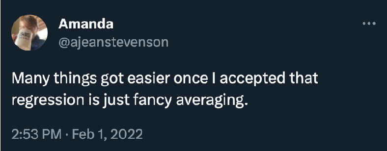

“Many things got easier once I accepted that regression is just fancy averaging.” —@ajeanstevenson

bind_rows( tidy(lm(body_mass_g ~ 0 + species, data = penguins)), tidy(lm(body_mass_g ~ 0 + sex, data = penguins))

) ## # A tibble: 5 × 5 ## term estimate std.error statistic p.value ## <chr> <dbl> <dbl> <dbl> <dbl>

- ## 1 speciesAdelie 3706. 38.1 97.2 6.88e-245
- ## 2 speciesChinstrap 3733. 55.9 66.8 8.16e-194
- ## 3 speciesGentoo 5092. 42.2 121. 6.31e-275
- ## 4 sexfemale 3862. 56.8 68.0 1.70e-196
- ## 5 sexmale 4546. 56.3 80.7 8.39e-220

Or even better, we can use marginal_means() from {marginaleffects} (way more on that below!)

marginal_means(penguin_model, newdata = c("species", "sex"), wts = "cells") ## ## Term Value Mean Std. Error z Pr(>|z|) 2.5 % 97.5 % ## species Adelie 3706 26.2 141.4 <0.001 3655 3758 ## species Chinstrap 3733 38.4 97.2 <0.001 3658 3808 ## species Gentoo 5092 29.0 175.5 <0.001 5036 5149 ## sex female 3862 24.6 156.7 <0.001 3814 3911 ## sex male 4546 24.4 186.1 <0.001 4498 4594 ##

## Results averaged over levels of: species, sex ## Columns: term, value, estimate, std.error, statistic, p.value, conf.low, conf.high

Regardless of how we calculate these, the numbers are the same, and they represent average penguin weights in each of the species and both of the sexes. We can answer descriptive questions about the average weight of female penguins or the difference in average weights between Gentoo and Chinstrap penguins. There’s no reference level—there are no regression switches or sliders—these are just averages.

###### Bonus: Market simulations

There’s an extra third option that I didn’t include in Table 1 because it’s not used often in my worlds of public policy and political science, but it is used a lot in marketing. In this approach, researchers use conjoint experiments to simulate the data generating process for an overall “market” of “products” (or candidates in this running example).

Researchers build rich multilevel models to capture all the dynamics of the different respondent-level characteristics and the experimental features and levels and then create hypothetical “purchasers” with different covariate levels and see which combinations of individual characteristics and product characteristics influence the overall market share of products. Using the candidate experiment example, the market simulation would model the effect of different candidate features (religion, military experience, education, and so on) on the probability of choosing a candidate across individual respondent characteristics like ideology, political preferences, age, education, and so.

From what I’ve seen, this market simulation-based approach is really rare in social science. In fact, this paper (Chaudhry, Dotson, and Heiss 2021) coauthored by Suparna Chaudhry, Marc Dotson, and me is the only political science-y one I know of! In it, we were interested in a host of different factors that drive individual preferences for charitable donations. We generated dozens of hypothetical donor personas and looked at how different categories of respondents felt about different features and how those preferences then influenced the market share of hypothetical nonprofits/NGOs.

For example, here we can see the average predicted donation market shares across all donor personas, segmented by persona public affairs knowledge, political ideology, and social trust across different NGO–host government relationships. NGOs with friendly relationships with their host governments will receive a greater share of donations from the market, regardless of individual political ideology or political knowledge and travelling experience.

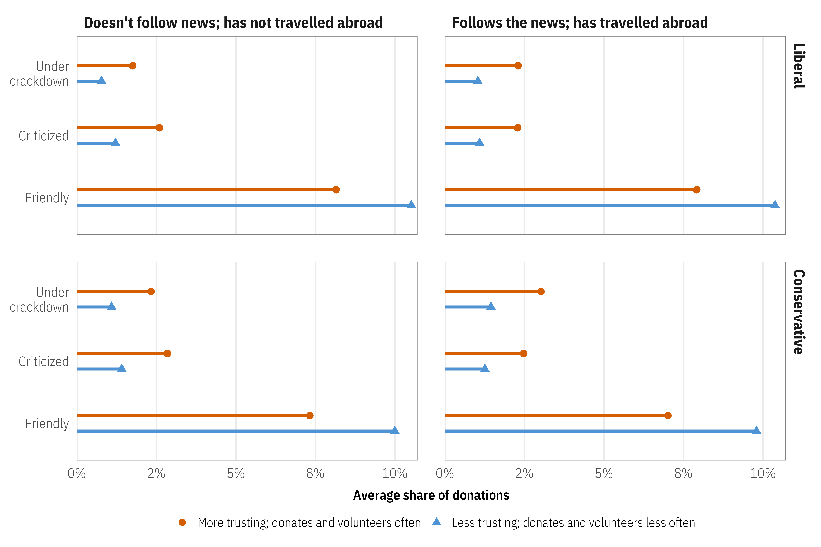

Figure 4 from Chaudhry, Dotson, and Heiss (2021)

Returning to the slider + switch analogy, this kind of market simulation is like an ultimate-super-mega-huge mixer board. We had to create a Shiny dashboard (accessible here) to explore all the different possible outcomes. It’s wild.

Screenshot of market simulator

## Relationship between AMCEs and marginal means

Technically AMCEs and marginal means measure the same thing, just in different ways. Thinking about this in regression terms helps—with categorical marginal effects, the intercept for the model represents the average outcome for the omitted category, while the coefficient represents the offset from the average. The coefficient is the switch—turning it on changes the baseline reference category average by amount.

β

### Penguin example

Here’s one last example from the non-conjoint penguins data, just to drive the point home. Let’s make a super basic model that predicts weight based on sex only:

model_sex_only <- lm(body_mass_g ~ sex, data = penguins) tidy(model_sex_only) ## # A tibble: 2 × 5 ## term estimate std.error statistic p.value ## <chr> <dbl> <dbl> <dbl> <dbl>

- ## 1 (Intercept) 3862. 56.8 68.0 1.70e-196
- ## 2 sexmale 683. 80.0 8.54 4.90e- 16

The intercept shows average weight for female penguins (3862 grams), while the coefficient for sexmale shows the change from that average when the “male” switch is turned on (683 more grams, on average).

We can actually use these two pieces of information to find the average penguin weight across both sexes: females are 3862.3 grams, males are 3862.3 + 683.4 = 4546 grams. We can confirm this with a quick group_by() %>% summarize() :

penguins %>% group_by(sex) %>% summarize(avg_weight = mean(body_mass_g))

## # A tibble: 2 × 2 ## sex avg_weight ## <fct> <dbl>

- ## 1 female 3862.
- ## 2 male 4546.

Visualizing this should help even more with the general intuition. The horizontal distance between these two points is the same in each panel (683 grams). In the left panel, female weight is set at 0 since it’s the omitted reference category. In the right panel, both males and females have specific group averages. These two panels are analgous to the conjoint idea of AMCEs and marginal means.

Code

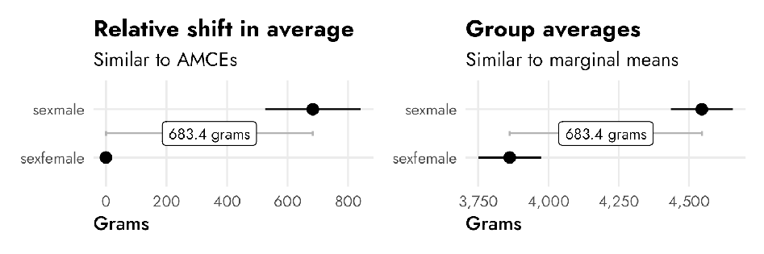

### Conjoint AMCEs and marginal means (finally!)

Okay, with that intuition nailed down, we can finally look at conjoint results. We’ll look at the results from the candidate experiment in Hainmueller, Hopkins, and Yamamoto (2014), which Leeper, Hobolt, and Tilley (2020) replicate and explore in their paper distinguishing between AMCEs and marginal means, and which we explored at the beginning of this post to show how conjoints work (i.e. there are seven candidate attributes like military service history, religion, gender, age, and so on).

Here’s an excerpt from Figure 1 in Leeper, Hobolt, and Tilley (2020), which shows both the published AMCEs and the Leeper, et al.-calculated marginal means from Hainmueller, Hopkins, and Yamamoto’s original candidate study:

The AMCEs in the left panel have a direct causal interpretation. In this case, holding all else equal, changing a candidate from not having military service to serving in the military increases the probability of support (or overall favorability) by 0.09, or 9 percentage points. Similarly, changing from a nonreligious candidate to a Mormon candidate decreases the probability of support by 14 percentage points (!!!). There is no sex-based effect—changing a candidate from male to female has an AMCE of 0.0.

4

- 4

This study was written and published in 2013, right after the 2012 presidential election between Barack Obama and Mitt Romney, a Mormon who did surprisingly well considering longstanding anti-Mormon sentiment in American politics (for more on Mormons and American politics, see Reeve (2015) and McBride, Rogers, and Erekson (2020)).

The marginal means in the right panel don’t rely on a reference category and are all centered around 50%—if there’s no difference between the the levels in a two-level feature, we’d expect the averages for each level to be 50%. We can see this with sex, where both male and female candidates have a 50% probability of selection (or 50% favorability, or however we want to interpret the outcome here).

With the AMCEs, we saw a 9 percentage point increase in favorability caused by military service. That same 9point difference is visible in the marginal means: candidates without military service history have 46% favorability compared to the 54% favorability among those with military history (54−46 = 9).

The presence of a reference category doesn’t matter much when dealing with binary treatments like sex and military service here. If we reversed the reference category, we’d get the same causal effect but in reverse—not serving in the military causes a 9 percentage point drop in favorability.

The reference category matters a lot, however, in attributes with more than two levels, like religion. In the AMCE panel, all the causal effects are in reference to a candidate with no religion. Being Mormon causes a 14 percentage point drop from having no religion; being Evangelical causes a 12 percentage point drop from having no religion; and so on. Deciding which level to use as the omitted reference category matters and can seriously change the causal interpretation of the AMCEs. For instance, here it looks like there’s a serious penalty for being Mormon or Evangelical, while being Protestant, Catholic, or Jewish doesn’t matter. But that’s only the case from a certain point of view. If an Evangelical candidate were the reference category, there wouldn’t be any significant Mormon effect (but there would be a Protestant, Catholic, Jewish, and None effect).

“What I told you was true… from a certain point of view”

—Obi-Wan Kenobi

The reference category gets in the way of making descriptive statements like “Mormon candidates see 42% favorability, while Jewish candidates see 52% favorability.” You can’t get numbers like that from the AMCEs alone unless you know the underlying favorability of the reference category and then reconstruct the other categories’ averages by hand. But researchers working with conjoint experiments try to do this with AMCEs all the time. Leeper, Hobolt, and Tilley (2020) argue that

AMCEs are relative, not absolute, statements about preferences. As such, there is simply no predictable connection between subgroup causal effects and the levels of underlying subgroup preferences. Yet, analysts and their readers frequently interpret differences in conditional AMCEs as differences in underlying preferences (Leeper, Hobolt, and Tilley 2020, 214).

The key point is this: AMCEs are relative statements, not absolute statements. If we want to talk about the causal effect of moving one attribute level (None → Mormon, None → Catholic, Male → Female, etc.), we can use AMCEs. If we want to talk about general preferences or favorabilities or probabilities or average outcomes, we need to talk about marginal means.

## AMCEs and marginal means across subgroups

This issue with relative vs. absolute estimands is especially complex when thinking about subgroups or controlling for respondent-level characteristics like political ideology, sex, education, and so on. Suppose we want to know if this Mormon penalty is bigger among Democratic respondents than Republican respondents. We

could control for respondent ideology, or calculate two different AMCEs—one when Democrat = true and one when Republican = true. This seems all good and logical. And it it’s fine if you’re talking about causal effects. But once you start trying to compare overall trends across respondent-level subgroups, AMCEs will give you wrong estimates! The main argument in Leeper, Hobolt, and Tilley (2020) is that looking at AMCEs across respondent subgroups doesn’t work people think it does because AMCEs are relative and not absolute. The difference between the relative Mormon candidate AMCE among Democratic-leaning and Republican-leaning respondents isn’t really comparable to the party-based differences in other levels (Evangelicals, Catholics, etc.).

Leeper, Hobolt, and Tilley (2020) illustrate this idea in a neat way in their Figure 2 (included below). This figure recreates the results for the “candidate sex” feature in a different candidate conjoint experiment done by Teele, Kalla, and Rosenbluth (2018). In this case, unlike our running example from Hainmueller, Hopkins, and Yamamoto

(2014)’s study, there is a sex effect—a candidate being female causes a 4.5 percentage point increase in favorability. We can see this in the top two panels, both as an AMCE of 0.045 and as marginal means (female = 0.52; male = 0.48; difference = AMCE = 0.045).

The third panel shows two different AMCEs conditional on respondent political party, and it appeared in the published study. Because AMCEs require a reference category as the baseline, and because AMCEs are relative quantities, it looks like there’s a huge party-based difference in favorability toward women candidates—being a woman causes a 7ish percentage point boost in favorability among Democrats, while it does nothing (or maybe something negative) among Republicans. These are conditional AMCEs (or CAMCEs), or the causal effect of turning on the “female” switch for a hypothetical candidate across Republican and Democratic respondents.

Conditional AMCEs are fine for causal work, but what trips people up often is that it’s tempting to use those conditional effects to describe actual overall patterns of preferences. Because there’s a reference category involved (male candidates), we can’t really say anything about the general respondent-party-ID-based preferences for male and female candidates. The conditional AMCE here combines the party-based difference in favorability toward female candidates (53.7% among Democrats; 49.2% among Republicans; difference of 4.5 percentage points) and the party-based difference in favorability toward male candidates (46.3% among Democrats; 50.8% among Republicans; difference of 4.5 percentage points). According to Leeper, et al.:

Because Democrats and Republicans actually differ in their views of profiles containing the reference (male) category, AMCEs sum the true differences in preferences for a given feature level with the difference in preferences toward the reference category. Visual or numerical similarity of subgroup AMCEs is therefore an analytical artifact, not an accurate statement of the similarity of patterns of preferences (Leeper, Hobolt, and Tilley 2020, 215).

If we’re interested not in describing a causal effect (i.e. the effect of switching from male → female) but instead describing general preferences (i.e. the difference in overall candidate sex favorability between Republicans and Democrats), we have to look at marginal means (and the difference in marginal means) instead of conditional AMCEs. It is really tempting to look at the distance between Republicans and Democrats in the “Female” level in the third panel and say that there’s a nearly 10 percentage point difference in favorability across parties, but that’s wrong! It only looks that way because the effect sizes are all relative to the reference “Male” level.

In reality, Democrats are 4.5 percentage points less likely to select a male candidate and 4.5 percentage points more likely to select a female candidate. The differences in marginal means within party subgroups would look like this:

Code

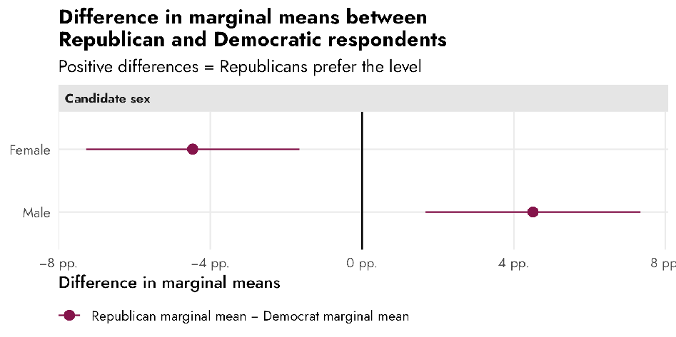

(For more about this, see Leeper, Hobolt, and Tilley (2020) for a few other examples of the substantive differences between subgroup conditional AMCEs and subgroup differences-between-marginal-means.)

Long story short: because AMCEs are relative estimands, they get weird (and can’t really be used) when using them for descriptive estimands across subgroups or when controlling for other respondent characteristics. To account for this weirdness, calculate marginal means instead and find the subgroup differences in marginal means for each level.

# Finding conjoint AMCEs and marginal means frequentistly

So now that we know what these two estimands are actually measuring and we have a general sense for how to calculate them (AMCE = regression coefficients where there’s an omitted reference category; marginal means = conditional averages for different category levels), let’s replicate the results from the candidate experiment in Hainmueller, Hopkins, and Yamamoto (2014). We’ll do it the easy automatic way with Thomas Leeper’s {cregg} package (named after CJ Cregg from The West Wing), then we’ll do it more manually to see what’s going on behind the scenes.

## AMCEs

First we’ll calculate the average marginal component effects (AMCEs), which are the partial derivatives (or coefficients) from a linear regression model. These represent the causal effect of switching from some reference level to a level of interest, while holding everything else constant.

### Automatic estimates with cregg::amce()

The amce() function from {cregg} calculates AMCEs automatically and returns them in a nice tidy data frame:

model_candidate_amce <- amce( candidate, selected ~ atmilitary + atreligion + ated +

atprof + atinc + atrace + atage + atmale,

id = ~resID )

model_candidate_amce %>% as_tibble() ## # A tibble: 40 × 10 ## outcome statistic feature level estimate std.error z p lower ## <chr> <chr> <fct> <fct> <dbl> <dbl> <dbl> <dbl> <dbl>

- ## 1 selected amce Military Service Did Not Serve 0 NA NA NA NA
- ## 2 selected amce Military Service Served 0.0873 0.0177 4.95 0.000000761 0.0527
- ## 3 selected amce Religion None 0 NA NA NA NA
- ## 4 selected amce Religion Jewish -0.0373 0.0263 -1.42 0.156 -0.0889
- ## 5 selected amce Religion Catholic -0.0156 0.0278 -0.561 0.575 -0.0702
- ## 6 selected amce Religion Mainline protestant -0.0149 0.0308 -0.484 0.629 -0.0753
- ## 7 selected amce Religion Evangelical protestant -0.117 0.0309 -3.78 0.000157 -0.178
- ## 8 selected amce Religion Mormon -0.137 0.0307 -4.46 0.00000838 -0.197
- ## 9 selected amce College No BA 0 NA NA NA NA
- ## 10 selected amce College Baptist college 0.139 0.0289 4.82 0.00000143 0.0827 ## # ℹ 30 more rows

It also provides an automatic plot function. Compare this with the original—the results are identical.

plot(cregg::amce()) Original AMCE coefficent plot

plot(model_candidate_amce) + guides(color = "none") + theme_nice() + labs(title = "AMCEs from cregg::amce()")

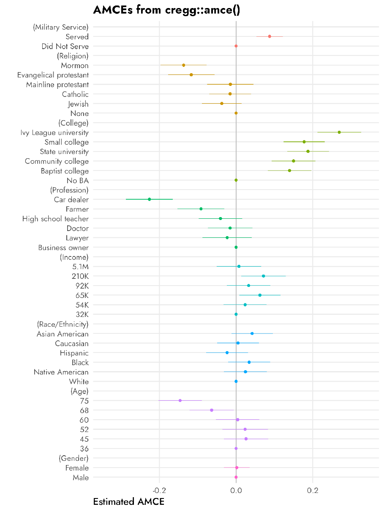

### OLS coefficients

Behind the scenes, {cregg} uses survey::svyglm() to run OLS with ID-specific adjustments to standard errors:

candidate_svy_design <- svydesign( ids = ~resID,

weights = ~1, data = candidate

)

model_svy <- svyglm( selected ~ atmilitary + atreligion + ated +

atprof + atinc + atrace + atage + atmale, design = candidate_svy_design

)

tidy(model_svy) ## # A tibble: 33 × 5 ## term estimate std.error statistic p.value ## <chr> <dbl> <dbl> <dbl> <dbl>

- ## 1 (Intercept) 0.397 0.0484 8.20 9.18e-15
- ## 2 atmilitaryServed 0.0873 0.0177 4.95 1.32e- 6
- ## 3 atreligionJewish -0.0373 0.0263 -1.42 1.58e- 1
- ## 4 atreligionCatholic -0.0156 0.0278 -0.561 5.75e- 1
- ## 5 atreligionMainline protestant -0.0149 0.0308 -0.484 6.29e- 1
- ## 6 atreligionEvangelical protestant -0.117 0.0309 -3.78 1.92e- 4
- ## 7 atreligionMormon -0.137 0.0307 -4.46 1.22e- 5
- ## 8 atedBaptist college 0.139 0.0289 4.82 2.36e- 6
- ## 9 atedCommunity college 0.150 0.0290 5.17 4.44e- 7
- ## 10 atedState university 0.188 0.0277 6.77 7.80e-11 ## # ℹ 23 more rows

These estimates and standard errors are the same results that we get from cregg::amce() :

# Combine the estimates from cregg::amce() with the estimates from # survey::svglm() just to check that they're the same (they are) amce_estimates <- model_candidate_amce %>%

as_tibble() %>% drop_na(std.error) %>% select(level, amce_estimate = estimate, amce_std.error = std.error)

svy_estimates <- model_svy %>% tidy() %>% filter(term != "(Intercept)") %>% select(svy_estimate = estimate, svy_std.error = std.error)

bind_cols(amce_estimates, svy_estimates) ## # A tibble: 32 × 5 ## level amce_estimate amce_std.error svy_estimate svy_std.error ## <fct> <dbl> <dbl> <dbl> <dbl>

- ## 1 Served 0.0873 0.0177 0.0873 0.0177
- ## 2 Jewish -0.0373 0.0263 -0.0373 0.0263
- ## 3 Catholic -0.0156 0.0278 -0.0156 0.0278
- ## 4 Mainline protestant -0.0149 0.0308 -0.0149 0.0308
- ## 5 Evangelical protestant -0.117 0.0309 -0.117 0.0309
- ## 6 Mormon -0.137 0.0307 -0.137 0.0307
- ## 7 Baptist college 0.139 0.0289 0.139 0.0289
- ## 8 Community college 0.150 0.0290 0.150 0.0290
- ## 9 State university 0.188 0.0277 0.188 0.0277
- ## 10 Small college 0.178 0.0273 0.178 0.0273 ## # ℹ 22 more rows

### Marginal effects instead of coefficients

So these OLS coefficients here are the AMCEs. That’s super straightforward.

That’s only true because we’re estimating a linear probability model (LPM) here. selected is a binary 0/1 variable, but we’re pretending it’s numeric and using OLS with it. In this special case, the marginal effects (slopes) are just the partial derivatives reported in the regression table.

But if we’re going to have interaction terms, or nonlinear terms (like polynomials), or if we’re going to use a model family that’s not OLS (like logistic regression), raw coefficients won’t work. Instead we need to calculate actual marginal effects (see this post and the “Get Started” page at the {marginaleffects} documentation for more details about these).

At one point, {cregg} supported this by using the {margins} package (which makes sense—Thomas Leeper developed both {cregg} and {margins}), but starting with {cregg} version 0.1.14, the {margins} support disappeared, leaving only support for OLS linear probability models.

We can use the {marginaleffects} package (the successor to {margins}) to calculate the average marginal effects/slopes for each of these effects. Here we’ll just hold all the predictors at their means (but there are a ton of different estimands we could calculate). In this case they’re the same as the raw coefficients, since it’s just a linear model:

mfx_svy <- model_svy %>% avg_slopes(newdata = "mean")

# Combine the average marginal effects with the original coefficients just to # check that they're the same (they are) mfx_svy %>%

select(contrast, mfx_estimate = estimate, mfx_std.error = std.error) %>% cbind(svy_estimates) %>% as_tibble()

## # A tibble: 32 × 5 ## contrast mfx_estimate mfx_std.error svy_estimate svy_std.error ## <chr> <dbl> <dbl> <dbl> <dbl>

- ## 1 45 - 36 0.0259 0.0295 0.0873 0.0177
- ## 2 52 - 36 0.0236 0.0303 -0.0373 0.0263
- ## 3 60 - 36 0.00414 0.0288 -0.0156 0.0278
- ## 4 68 - 36 -0.0639 0.0294 -0.0149 0.0308
- ## 5 75 - 36 -0.146 0.0289 -0.117 0.0309
- ## 6 Baptist college - No BA 0.139 0.0289 -0.137 0.0307
- ## 7 Community college - No BA 0.150 0.0290 0.139 0.0289
- ## 8 Ivy League university - No BA 0.269 0.0291 0.150 0.0290
- ## 9 Small college - No BA 0.178 0.0273 0.188 0.0277
- ## 10 State university - No BA 0.188 0.0277 0.178 0.0273 ## # ℹ 22 more rows

### Coefficient plots

What about that neat coefficient plot with the reference categories? tidy() can’t return empty rows for the reference levels like cregg::amce() does, but we can make it work in a couple different ways: (1) automatically with broom.helpers::tidy_add_reference_rows() , or (2) manually with some data wrangling.

###### Automatically with {broom.helpers}

The easiest way to do this is to use broom.helpers::tidy_add_reference_rows() , which adds the reference levels automatically with estimates of 0, so we can use geom_pointrange() and make basically the same plot as {cregg}:

plot_data_manual <- model_svy %>% tidy_and_attach() %>%

tidy_add_reference_rows() %>% tidy_add_estimate_to_reference_rows() %>% filter(term != "(Intercept)") %>% mutate(term_nice = str_remove(term, variable)) %>% left_join(variable_lookup, by = join_by(variable)) %>% mutate(across(c(term_nice, variable_nice), ~fct_inorder(.)))

ggplot( plot_data_manual, aes(x = estimate, y = term_nice, color = variable_nice)

) + geom_vline(xintercept = 0) + geom_pointrange(aes(xmin = conf.low, xmax = conf.high)) + scale_x_continuous(labels = label_pp) + guides(color = "none") + labs(

x = "Percentage point change in probability of candidate selection", y = NULL, title = "AMCEs plotted with tidy_add_reference_rows()"

) + # Automatically resize each facet height with ggforce::facet_col() facet_col(facets = "variable_nice", scales = "free_y", space = "free")

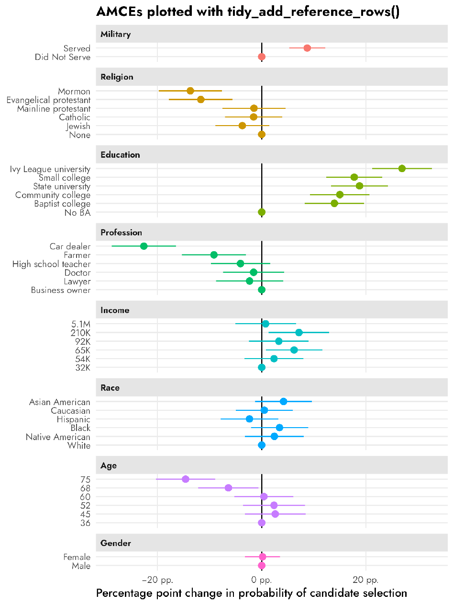

###### Manually with {dplyr} wrangling magic

However, tidy_add_reference_rows() doesn’t work with {marginaleffects} objects or multilevel models or Bayesian models, so ultimately I can’t use this in the real project I’m working on :(

But we can get the same thing with some fancy data wrangling:

# Extract all the right-hand variables rhs_vars <- all.vars(stats::update(formula(model_svy), 0 ~ .))

# Make a data frame of all the levels of all the non-numeric things model_variable_levels <- tibble(

variable = rhs_vars ) %>%

mutate(levels = map(variable, ~{

x <- candidate[[.x]] if (is.numeric(x)) {

"" } else if (is.factor(x)) {

levels(x) } else {

sort(unique(x))

} })) %>% unnest(levels) %>% mutate(term = paste0(variable, levels))

# Extract model results model_results <- tidy(model_svy, conf.int = TRUE)

# Combine full dataset of factor levels with model results plot_data <- model_variable_levels %>%

left_join(model_results, by = join_by(term)) %>% # Make these zero mutate(

across( c(estimate, conf.low, conf.high), ~ ifelse(is.na(.x), 0, .x)

) ) %>% filter(term != "(Intercept)") %>% left_join(variable_lookup, by = join_by(variable)) %>% mutate(across(c(levels, variable_nice), ~fct_inorder(.)))

ggplot( plot_data, aes(x = estimate, y = levels, color = variable_nice)

) + geom_vline(xintercept = 0) + geom_pointrange(aes(xmin = conf.low, xmax = conf.high)) + scale_x_continuous(labels = label_pp) + guides(color = "none") + labs(

- x = "Percentage point change in probability of candidate selection",
- y = NULL, title = "AMCEs from fancy data wrangling"

) + facet_col(facets = "variable_nice", scales = "free_y", space = "free")

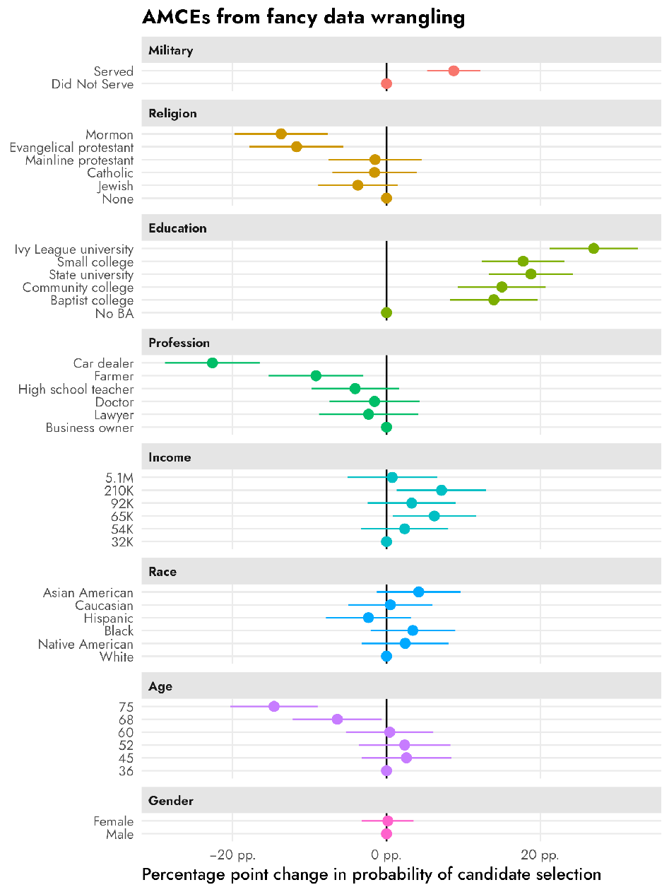

The process is a little different with marginal effects because the term column is for the overarching variable (e.g., taxrate1 ) and the individual levels are built as contrasts in a column named contrast , like "<10k: 5% <10k: 0%" . We need to clean up that contrast column for joining with model_variable_levels .

# Extract marginal effects model_results_mfx <- model_svy %>%

avg_slopes(newdata = "mean") %>% separate_wider_delim(

contrast, delim = " - ", names = c("variable_level", "reference_level")

)

# Combine full dataset of factor levels with marginal effects plot_data_mfx <- model_variable_levels %>%

left_join( model_results_mfx, by = join_by(variable == term, levels == variable_level)

) %>% # Make these zero mutate(

across( c(estimate, conf.low, conf.high), ~ ifelse(is.na(.x), 0, .x)

) ) %>% left_join(variable_lookup, by = join_by(variable)) %>% mutate(across(c(levels, variable_nice), ~fct_inorder(.)))

ggplot( plot_data_mfx, aes(x = estimate, y = levels, color = variable_nice)

) + geom_vline(xintercept = 0) + geom_pointrange(aes(xmin = conf.low, xmax = conf.high)) + scale_x_continuous(labels = label_pp) + guides(color = "none") + labs(

- x = "Percentage point change in probability of candidate selection",
- y = NULL, title = "AMCEs from OLS marginal effects"

) + facet_col(facets = "variable_nice", scales = "free_y", space = "free")

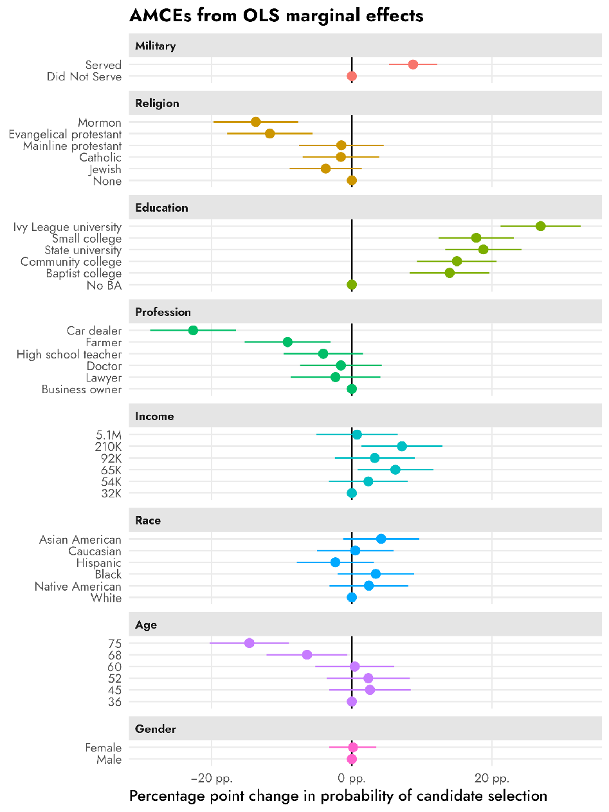

### Logistic regression instead of OLS

What if you don’t want use a linear probability model and instead want to use a different family like logistic regression (which treats the outcome as actual 0 and 1 categories instead of numbers)? Or what if you have 3+ possible choices for outcomes and need to use a multinomial logistic regression model? We can still calculate

AMCEs, but we can’t use raw regression coefficients. Instead we have to calculate response-scale (i.e. probability scale) marginal effects.

Let’s make a logistic regression model:

model_logit <- survey::svyglm( selected ~ atmilitary + atreligion + ated +

atprof + atinc + atrace + atage + atmale, design = candidate_svy_design, family = binomial(link = "logit")

)

Check out those sweet sweet uninterpretable log odds:

tidy(model_logit) ## # A tibble: 33 × 5 ## term estimate std.error statistic p.value ## <chr> <dbl> <dbl> <dbl> <dbl>

- ## 1 (Intercept) -0.466 0.215 -2.17 3.07e- 2
- ## 2 atmilitaryServed 0.385 0.0775 4.96 1.22e- 6
- ## 3 atreligionJewish -0.162 0.116 -1.40 1.62e- 1
- ## 4 atreligionCatholic -0.0651 0.123 -0.531 5.96e- 1
- ## 5 atreligionMainline protestant -0.0634 0.136 -0.468 6.40e- 1
- ## 6 atreligionEvangelical protestant -0.510 0.137 -3.72 2.44e- 4
- ## 7 atreligionMormon -0.600 0.137 -4.39 1.64e- 5
- ## 8 atedBaptist college 0.619 0.131 4.74 3.43e- 6
- ## 9 atedCommunity college 0.663 0.131 5.06 7.73e- 7
- ## 10 atedState university 0.828 0.126 6.57 2.43e-10 ## # ℹ 23 more rows

We can convert these log odds into probability-scale marginal effects with slopes() or avg_slopes() from {marginaleffects}. Conceptually this involves plugging in different covariate values—here we’re plugging in all the original values in the data into the model and then collapsing the predictions into averages. (Again, see this and this for more details about average marginal effects/slopes.)

mfx_logit <- model_logit %>% avg_slopes()

mfx_logit %>% as_tibble() ## # A tibble: 32 × 8 ## term contrast estimate std.error statistic p.value conf.low conf.high ## <chr> <chr> <dbl> <dbl> <dbl> <dbl> <dbl> <dbl>

- ## 1 atage 45 - 36 0.0258 0.0296 0.874 3.82e- 1 -0.0321 0.0838
- ## 2 atage 52 - 36 0.0232 0.0303 0.765 4.44e- 1 -0.0362 0.0826
- ## 3 atage 60 - 36 0.00406 0.0289 0.141 8.88e- 1 -0.0526 0.0607
- ## 4 atage 68 - 36 -0.0639 0.0294 -2.17 3.00e- 2 -0.122 -0.00619
- ## 5 atage 75 - 36 -0.145 0.0289 -5.03 4.86e- 7 -0.202 -0.0888
- ## 6 ated Baptist college - No BA 0.140 0.0290 4.82 1.45e- 6 0.0828 0.196
- ## 7 ated Community college - No BA 0.150 0.0291 5.15 2.56e- 7 0.0928 0.207
- ## 8 ated Ivy League university - No BA 0.269 0.0291 9.26 2.11e-20 0.212 0.326
- ## 9 ated Small college - No BA 0.178 0.0274 6.50 8.07e-11 0.124 0.231
- ## 10 ated State university - No BA 0.188 0.0277 6.80 1.04e-11 0.134 0.243 ## # ℹ 22 more rows

heck yes these percentage-point-scale estimates are basically the same as what we get from the LPM model!

# Extract marginal effects model_results_logit_mfx <- mfx_logit %>%

separate_wider_delim( contrast, delim = " - ", names = c("variable_level", "reference_level")

)

# Combine full dataset of factor levels with marginal effects plot_data_logit_mfx <- model_variable_levels %>%

left_join( model_results_logit_mfx, by = join_by(variable == term, levels == variable_level)

) %>% # Make these zero mutate(

across( c(estimate, conf.low, conf.high), ~ ifelse(is.na(.x), 0, .x)

) ) %>% left_join(variable_lookup, by = join_by(variable)) %>% mutate(across(c(levels, variable_nice), ~fct_inorder(.)))

ggplot( plot_data_logit_mfx, aes(x = estimate, y = levels, color = variable_nice)

) + geom_vline(xintercept = 0) + geom_pointrange(aes(xmin = conf.low, xmax = conf.high)) + scale_x_continuous(labels = label_pp) + guides(color = "none") + labs(

- x = "Percentage point change in probability of candidate selection",
- y = NULL, title = "AMCEs from logistic regression marginal effects"

) + facet_col(facets = "variable_nice", scales = "free_y", space = "free")

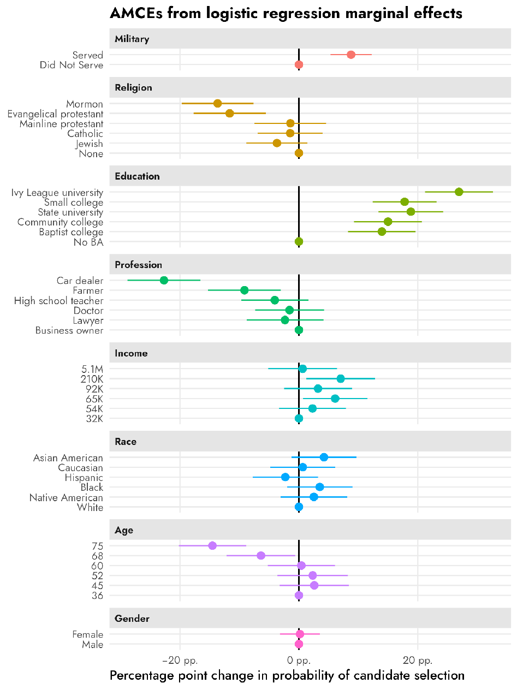

## Marginal means

Next we’ll calculate marginal means for these different attributes and levels, which are conditional averages and not regression coefficients. These are descriptive estimands/quantities of interest and they don’t rely on any

reference category or baseline level.

### Automatic estimates with cregg::mm()

The mm() function from {cregg} calculates marginal means automatically and returns them in a nice tidy data frame. I include the package namespace prefix here (i.e. cregg::mm() instead of just mm() ) because I’ve loaded the {brms} package and it has its own mm() function that’s used for creating multi-membership grouping terms (whatever those are).

candidate_mms_auto <- cregg::mm( candidate, selected ~ atmilitary + atreligion + ated +

atprof + atinc + atrace + atage + atmale, id = ~ resID

)

candidate_mms_auto %>% as_tibble() ## # A tibble: 40 × 10 ## outcome statistic feature level estimate std.error z p lower upper ## <chr> <chr> <fct> <fct> <dbl> <dbl> <dbl> <dbl> <dbl> <dbl>

- ## 1 selected mm Military Service Did Not Serve 0.458 0.00907 50.5 0 0.440 0.475
- ## 2 selected mm Military Service Served 0.543 0.00914 59.4 0 0.525 0.560
- ## 3 selected mm Religion None 0.556 0.0200 27.8 1.88e-170 0.517 0.595
- ## 4 selected mm Religion Jewish 0.520 0.0186 28.0 2.77e-172 0.484 0.557
- ## 5 selected mm Religion Catholic 0.526 0.0177 29.7 2.82e-193 0.491 0.560
- ## 6 selected mm Religion Mainline protestant 0.543 0.0194 28.0 3.93e-172 0.505 0.581
- ## 7 selected mm Religion Evangelical protestant 0.437 0.0200 21.9 4.11e-106 0.398 0.476
- ## 8 selected mm Religion Mormon 0.417 0.0194 21.5 7.40e-103 0.379 0.455
- ## 9 selected mm College No BA 0.340 0.0186 18.3 1.12e- 74 0.303 0.376
- ## 10 selected mm College Baptist college 0.482 0.0200 24.1 3.89e-128 0.443 0.521 ## # ℹ 30 more rows

plot(cregg::mm()) Original AMCE coefficent plot

plot(candidate_mms_auto, vline = 0.5) + guides(color = "none") + theme_nice() + labs(title = "Marginal means from from cregg::mm()")

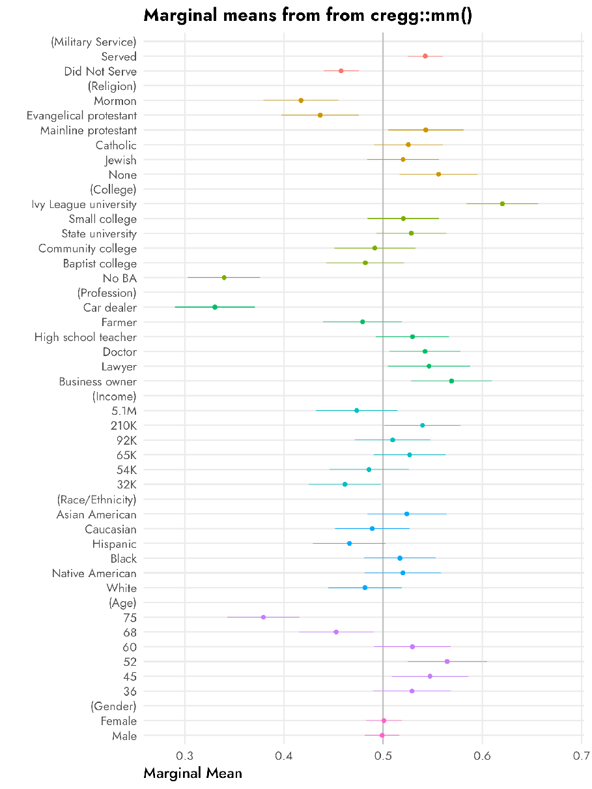

### Quick-and-dirty marginal means

Marginal means are just conditional group averages, so we can actually get the same estimates with some basic {dplyr} grouping and summarizing. I’ll just show the averages for military and religion here for the sake of space, but the averages are the same as what we get with cregg::mm() :

candidate %>% group_by(atmilitary) %>% summarize(avg = mean(selected))

## # A tibble: 2 × 2 ## atmilitary avg ## <fct> <dbl>

- ## 1 Did Not Serve 0.458
- ## 2 Served 0.543

candidate %>% group_by(atreligion) %>% summarize(avg = mean(selected))

## # A tibble: 6 × 2 ## atreligion avg ## <fct> <dbl>

- ## 1 None 0.556
- ## 2 Jewish 0.520
- ## 3 Catholic 0.526
- ## 4 Mainline protestant 0.543
- ## 5 Evangelical protestant 0.437
- ## 6 Mormon 0.417

Behind the scenes, cregg::mm() creates simple intercept-less models for each of the categorical terms in the model and then returns their coefficients. Again, for the sake of space, here are the regression-based averages for just military and religion:

bind_rows( tidy(lm(selected ~ 0 + atmilitary, data = candidate)), tidy(lm(selected ~ 0 + atreligion, data = candidate))

) ## # A tibble: 8 × 5 ## term estimate std.error statistic p.value ## <chr> <dbl> <dbl> <dbl> <dbl>

- ## 1 atmilitaryDid Not Serve 0.458 0.0120 38.3 1.16e-267
- ## 2 atmilitaryServed 0.543 0.0120 45.3 0
- ## 3 atreligionNone 0.556 0.0205 27.1 3.39e-147
- ## 4 atreligionJewish 0.520 0.0208 25.0 9.62e-127
- ## 5 atreligionCatholic 0.526 0.0205 25.6 1.34e-132
- ## 6 atreligionMainline protestant 0.543 0.0209 26.0 1.36e-136
- ## 7 atreligionEvangelical protestant 0.437 0.0209 20.9 1.53e- 91
- ## 8 atreligionMormon 0.417 0.0207 20.2 8.15e- 86

Regardless of how we calculate them, we can see that these estimates are just group averages. 46% of respondents chose candidates who didn’t serve in the military; 54% chose candidates who did; and so on.

### Marginal means with {marginaleffects}

Combining a bunch of smaller group_by() %>% summarize() datasets, or combining a bunch of intercept-less models involves a bit of extra code and can get tedious. Plus it can get more complex when not using a linear model, or if you want interaction terms, or if you want group averages across multiple groups (i.e. average proportions for military across Republican and Democratic respondents). Additionally, the standard errors from these basic averages are wrong since they don’t take into account the nested structure of the data (i.e. respondents each have 6–12 responses).

To make life easier and more flexible, we can use marginal_means() from {marginaleffects} to calculate the unique categorical group means from a regression model.

###### How marginal_means() works

But first we need to look at a quick example to build the intuition behind what happens with marginal_means() . First we’ll make a simpler regresison model with just the military and religion features. We’ll then calculate predicted values for all the levels of those features using predictions() —this essentially involves plugging in all the unique values of atmilitary and atreligion into the model and finding the predicted values. We’ll then reshape the results a little so that we can see the average proportions of religion conditional on military service:

model_candidate_simple <- lm( selected ~ atmilitary + atreligion, data = candidate

)

predictions_simple <- predictions( model_candidate_simple, by = c("atreligion", "atmilitary")

)

predictions_simple_wide <- predictions_simple %>% select(estimate, atmilitary, atreligion) %>% pivot_wider(names_from = "atmilitary", values_from = "estimate")

predictions_simple_wide

- ## # A tibble: 6 × 3 ## atreligion `Did Not Serve` Served ## <fct> <dbl> <dbl>

- ## 1 None 0.514 0.598
- ## 2 Jewish 0.479 0.563
- ## 3 Catholic 0.483 0.567
- ## 4 Mainline protestant 0.500 0.584
- ## 5 Evangelical protestant 0.394 0.478
- ## 6 Mormon 0.376 0.460

predictions_simple_wide %>% mutate(`Religion marginal mean` = (`Did Not Serve` + Served) / 2) %>% add_row(

atreligion = "Military marginal mean", `Did Not Serve` = mean(predictions_simple_wide$`Did Not Serve`), Served = mean(predictions_simple_wide$Served)

)

- ## # A tibble: 7 × 4 ## atreligion `Did Not Serve` Served `Religion marginal mean` ## <chr> <dbl> <dbl> <dbl>

Great. The average proportion for non-military Mormons is 37.6% and for military Mormons is 46%, and so on.

If we find the average of these averages and add a column and row in the literal right and bottom margins of the table, we’ll have marginal means of religion and military service:

- ## 1 None 0.514 0.598 0.556
- ## 2 Jewish 0.479 0.563 0.521
- ## 3 Catholic 0.483 0.567 0.525
- ## 4 Mainline protestant 0.500 0.584 0.542
- ## 5 Evangelical protestant 0.394 0.478 0.436
- ## 6 Mormon 0.376 0.460 0.418
- ## 7 Military marginal mean 0.458 0.542 NA

To me this is wild. The marginal mean for Mormons is 41%, which is basically what we found with group_by(atreligion) %>% summarize() earlier. The marginal mean for candidates who served in the military is 54.2%, again roughly the same as what we found with group_by(atmilitary) %>% summarize(...) .

Instead of manually creating these marginal rows and columns, the marginal_means() function will find those values automatically for us, based on a grid of values (in newdata ) that it’ll plug into the model. Here it’ll plug all combinations of atreligion and atmilitary into the simple model. The wts = "cells" argument here makes it so that the marginal mean is weighted by the actual distribution of the levels of religion and military. For instance, imagine that only 30% of rows served in the military and 70% did not. Calculating the average of those two averages by just doing (Did Not Serve + Served) / 2 wouldn’t take that underlying distribution into account. Weighting by cells make it so that marginal_means() computes a weighted marginal mean proportional to each level’s frequency in the original data.

Let’s let marginal_means() work its magic:

marginal_means_simple <- marginal_means( model_candidate_simple, newdata = c("atreligion", "atmilitary"), wts = "cells"

) marginal_means_simple ## ## Term Value Mean Std. Error z Pr(>|z|) 2.5 % 97.5 % ## atmilitary Did Not Serve 0.458 0.0119 38.5 <0.001 0.434 0.481 ## atmilitary Served 0.543 0.0119 45.5 <0.001 0.519 0.566 ## atreligion None 0.556 0.0204 27.2 <0.001 0.516 0.596 ## atreligion Jewish 0.520 0.0208 25.1 <0.001 0.479 0.561 ## atreligion Catholic 0.526 0.0205 25.7 <0.001 0.485 0.566 ## atreligion Mainline protestant 0.543 0.0208 26.1 <0.001 0.502 0.584 ## atreligion Evangelical protestant 0.437 0.0208 21.0 <0.001 0.396 0.477 ## atreligion Mormon 0.417 0.0206 20.3 <0.001 0.377 0.458 ## ## Results averaged over levels of: atmilitary, atreligion ## Columns: term, value, estimate, std.error, statistic, p.value, conf.low, conf.high

Et voilà, the averages here are basically the same as what we found in the manual version we did earlier. The only differences are due to the weighted averaging—by default marginal_means() assumes equal weights in the columns, so it’s literally going to just calculate (Did Not Serve + Served) / 2 . With wts = "cells" , it creates a weighted average: (Did Not Serve * cell_weight + Served * other_cell_weight) / 2 .

###### marginal_means() with the full actual model

Now that we understand what’s happening with marginal_means() , we can use it with the full model_svy model. We’ll find the marginal means for all the different features and make sure that we weight by cells so that we get weighted averages. Because there are so many combinations of attribute levels here, it takes a while to run:

# This takes a while... tictoc::tic() mm_mfx <- marginal_means(

model_svy, newdata = c(

"atmilitary", "atreligion", "ated", "atprof", "atinc", "atrace", "atage", "atmale"

), wts = "cells"

) tictoc::toc() ## 82.563 sec elapsed

The results are identical to what we find when using group_by() %>% summarize() , but

- 1. the standard errors are correct (and actually present; we’d need to calculate those on our own with summarize() and that’s a pain), and

- 2. we have the ability to use other extra {marginaleffects} things like hypothesis tests, counterfactual estimates, p-value adjustments for multiple comparisons, clustered robust standard errors, and so on

marginal_means() group_by() %>% summarize()

|mm_mfx %>% as_tibble() ## # A tibble: 40 × 8 ## term value estimate std.error statistic p.value conf.low conf.high ## <chr> <fct> <dbl> <dbl> <dbl> <dbl> <dbl> <dbl>  ## 1 atmilitary Did Not Serve 0.458 0.00913 50.1 0 0.440 0.476 ## 2 atmilitary Served 0.543 0.00928 58.4 0 0.524 0.561 ## 3 atreligion None 0.556 0.0195 28.5 1.64e-178 0.518 0.594 ## 4 atreligion Jewish 0.520 0.0175 29.7 1.90e-194 0.486 0.554 ## 5 atreligion Catholic 0.526 0.0177 29.7 3.14e-193 0.491 0.560 ## 6 atreligion Mainline protestant 0.543 0.0184 29.6 1.86e-192 0.507 0.579 ## 7 atreligion Evangelical protestant 0.437 0.0198 22.0 1.07e-107 0.398 0.475 ## 8 atreligion Mormon 0.417 0.0189 22.1 8.22e-108 0.380 0.454 ## 9 ated No BA 0.340 0.0184 18.5 5.02e- 76 0.304 0.376 ## 10 ated Baptist college 0.482 0.0198 24.4 1.63e-131 0.443 0.521 ## # ℹ 30 more rows |
|---|

Since there’s no reference level to deal with, plotting these these marginal means is pretty straightforward:

plot_mm_mfx <- mm_mfx %>% as_tibble() %>% mutate(value = fct_inorder(value)) %>% left_join(variable_lookup, by = join_by(term == variable)) %>% mutate(across(c(value, variable_nice), ~fct_inorder(.)))

ggplot( plot_mm_mfx, aes(x = estimate, y = value, color = variable_nice)

) + geom_vline(xintercept = 0.5) + geom_pointrange(aes(xmin = conf.low, xmax = conf.high)) + scale_x_continuous(labels = label_percent()) + guides(color = "none") + labs(

- x = "Marginal mean",
- y = NULL, title = "Marginal means with marginaleffects::marginal_means()"

) + facet_col(facets = "variable_nice", scales = "free_y", space = "free")

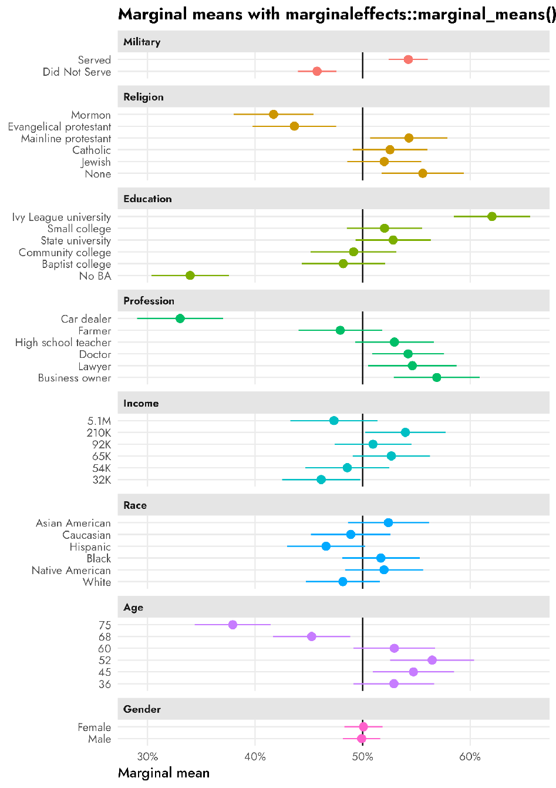

## Subgroup differences in AMCEs and marginal means

Hainmueller, Hopkins, and Yamamoto (2014) did not include any individual respondent-level characteristics in their data, so we can’t look at how these causal effects differ across individual traits like party identification (Republicans and Democrats) or education or income or anything else like that.

So instead we’ll invent a pretend column for respondent-level party ID! To simplify life, we’ll look at differences between fake-party-ID within the military service history attribute. Arbitrarily (and super stereotypically), we’ll say that if a respondent selected a candidate more than 60% of the time when seeing that they had served in the military, there’s a 90% chance they’re a Republican. If they didn’t select the military candidate 60% of the time, there’s a 75% chance they’re a Democrat. AGAIN THESE PROBABILITIES ARE COMPLETELY ARBITRARY AND JUST CAME FROM MY HEAD—THEY ARE NOT REAL. We’ll make a new dataset called candidate_fake with a column named respondent_party for each respondent’s fake party:

Code for generating fake respondent_party column

Let’s check the average of selected across both the candidate military attribute and our new fake respondent party to see how all that random assignment shook out:

candidate_fake %>% group_by(atmilitary, respondent_party) %>% summarize(avg = mean(selected))

## # A tibble: 4 × 3 ## # Groups: atmilitary [2] ## atmilitary respondent_party avg ## <fct> <fct> <dbl>

- ## 1 Did Not Serve Democrat 0.551
- ## 2 Did Not Serve Republican 0.378
- ## 3 Served Democrat 0.447
- ## 4 Served Republican 0.619

Cool cool. Republican respondents are way more favorable towards candidates who served in the military (61.9%) than Democratic respondents (44.8%). And that kind of interpretation is actually mathematically and conceptually legal and recommended by Leeper, Hobolt, and Tilley (2020)—technically these are subgroup marginal means and what we should be looking at for descriptive purposes already, but more on that below.

###### Conditional AMCEs

Let’s first look at the two different party-based causal effects of switching a candidate from having no military history to having served in the military. For the sake of simplicity we’ll just use regular OLS instead of logistic regression, and we’ll use marginaleffects::avg_slopes() to find the marginal since the regression model involves interaction terms. We’ll also only look at the atmilitary feature instead of all the features, since it’s the only one where we built in a party effect.

We can find conditional AMCEs with {cregg} using the cj() function, which is a general function for all of the different estimands that {cregg} can calculate:

cregg::cj( candidate_fake, selected ~ atmilitary, id = ~resID, estimate = "amce", by = ~respondent_party

)

## BY outcome statistic feature level estimate std.error z p lower

- ## 1 Democrat selected amce Military Service Did Not Serve 0.0000 NA NA NA NA
- ## 2 Democrat selected amce Military Service Served -0.1032 0.02063 -5.003 5.655e-07 -0.1437 -
- ## 3 Republican selected amce Military Service Did Not Serve 0.0000 NA NA NA NA
- ## 4 Republican selected amce Military Service Served 0.2405 0.02246 10.710 9.095e-27 0.1965

We can do the same thing using regression if we use an interaction term for the subgroup:

model_military_party <- lm( selected ~ atmilitary * respondent_party, data = candidate_fake

)

tidy(model_military_party) ## # A tibble: 4 × 5 ## term estimate std.error statistic p.value ## <chr> <dbl> <dbl> <dbl> <dbl>

- ## 1 (Intercept) 0.551 0.0174 31.7 7.90e-194
- ## 2 atmilitaryServed -0.103 0.0248 -4.16 3.21e- 5
- ## 3 respondent_partyRepublican -0.172 0.0236 -7.28 3.97e- 13
- ## 4 atmilitaryServed:respondent_partyRepublican 0.344 0.0335 10.3 2.48e- 24

Those coefficients by themselves aren’t super informative without doing some tricky algebra to piece everything together. Instead, we can use avg_slopes() from {marginaleffects} to find the partial derivative (or AMCE) for atmilitary across each party. These are the same results we get from {cregg}:

party_amces <- model_military_party %>%

avg_slopes( variables = "atmilitary", by = "respondent_party"

) party_amces ## ## Term Contrast respondent_party Estimate Std. Error z Pr(>|z|) 2.5 % 9 ## atmilitary mean(Served) - mean(Did Not Serve) Democrat -0.103 0.0248 -4.16 <0.001 -0.152 -0 ## atmilitary mean(Served) - mean(Did Not Serve) Republican 0.241 0.0226 10.66 <0.001 0.196 0 ## ## Columns: term, contrast, respondent_party, estimate, std.error, statistic, p.value, conf.low, conf.high, pre

Click to show the code since it’s so long; you can make a quick basic version of it with two calls to plot(amce(...)) —one on data filtered to only include Democrats and one that only includes Republicans

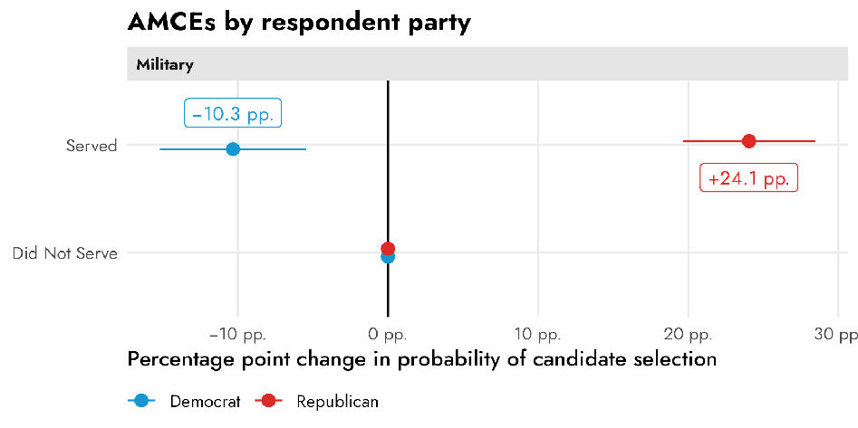

These have a straightforward causal interpretation. Among Democratic-identifying respondents, flipping a hypothetical candidate’s military status from “did not serve” to “serve” causes a 10 percentage point drop in favorability (or in the probability of being selected). Among Republican-identifying respondents, a candidate’s military service causes a 24 percentage point increase in favorability. Both effects are statistically significantly different from zero.

### Conditional marginal means

If we’re describing overall trends in the data, though, these conditional AMCEs are misleading. It’s really tempting to look at this and conclude that there’s a 34ish percentage point difference between Democrats and Republicans when they’re presented with a candidate with military service, since that’s the distance between the two AMCEs in the plot. But that’s wrong! That distance is an illusion—a mirage caused by the fact that the AMCEs are based on a reference category that is set to zero.

Code

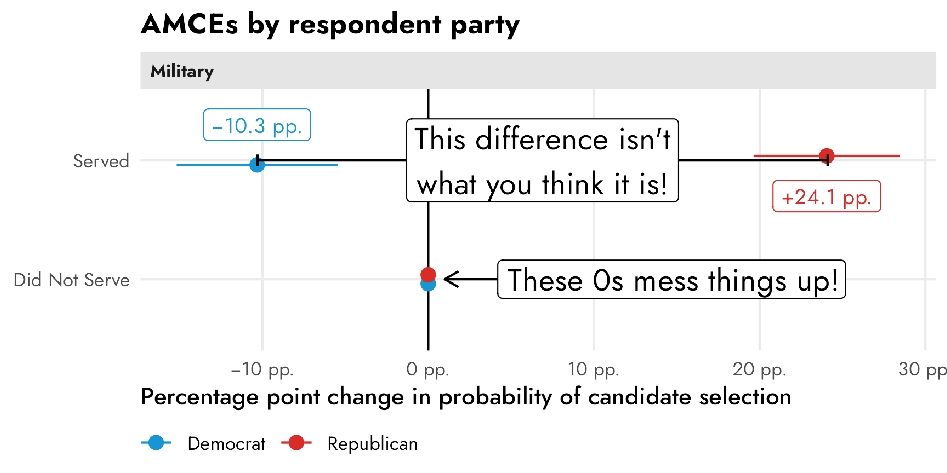

To get the correct party-based difference in support for candidates, we need to find the party-based marginal means of support for the different levels of the military feature and then talk about those differences. As discussed above, this technically just involves finding the conditional averages across groups—in this case the average outcome within the two levels of “Served” and “Did not serve” between Republican and Democratic respondents. We can find these marginal means with some basic group_by() %>% summarize() and the difference between Republican and Democratic marginal means with some pivoting and subtracting:

party_mms_manual <- candidate_fake %>% group_by(atmilitary, respondent_party) %>% summarize(avg = mean(selected))

party_mms_manual ## # A tibble: 4 × 3 ## # Groups: atmilitary [2] ## atmilitary respondent_party avg ## <fct> <fct> <dbl>

- ## 1 Did Not Serve Democrat 0.551
- ## 2 Did Not Serve Republican 0.378
- ## 3 Served Democrat 0.447
- ## 4 Served Republican 0.619

party_mms_manual %>% pivot_wider(names_from = "respondent_party", values_from = "avg") %>% mutate(mm_diff = Republican - Democrat)

## # A tibble: 2 × 4 ## # Groups: atmilitary [2] ## atmilitary Democrat Republican mm_diff ## <fct> <dbl> <dbl> <dbl> ## 1 Did Not Serve 0.551 0.378 -0.172 ## 2 Served 0.447 0.619 0.172

Or we can use cregg::cj(..., estimate = "mm_diff") to do that automatically:

cj( candidate_fake, selected ~ atmilitary, id = ~resID,

estimate = "mm_diff", by = ~respondent_party

) ## BY statistic outcome feature level estimate std.error z

- ## 1 Republican - Democrat mm_difference selected Military Service Did Not Serve -0.1722 0.01531 -11.25 2.36
- ## 2 Republican - Democrat mm_difference selected Military Service Served 0.1715 0.01574 10.89 1.21

Or, to be extra thorough and allow for any type of regression family (logisitic! multinomial!) with any other types of covariates, we can find these manually with our own regression model fed through marginaleffects::marginal_means() . By specifying cross = TRUE , we get all combinations of military service and party (without it, we’d get separate marginal means for just the two levels of military and the two levels of party).

party_mms_mfx <- marginal_means( model_military_party, newdata = c("atmilitary", "respondent_party"), cross = TRUE, wts = "cells"

) party_mms_mfx %>% as_tibble() ## # A tibble: 4 × 11 ## rowid atmilitary respondent_party estimate std.error statistic p.value conf.low conf.high selected ## <int> <fct> <fct> <dbl> <dbl> <dbl> <dbl> <dbl> <dbl> <dbl> <d

- ## 1 1 Did Not Serve Democrat 0.551 0.0174 31.7 1.68e-220 0.517 0.585 0.5 0.
- ## 2 2 Did Not Serve Republican 0.378 0.0160 23.6 3.56e-123 0.347 0.410 0.5 0.
- ## 3 3 Served Democrat 0.447 0.0177 25.3 3.11e-141 0.413 0.482 0.5 0.
- ## 4 4 Served Republican 0.619 0.0159 39.0 0 0.588 0.650 0.5 0.

To find the differences in those marginal means, we could pivot wider and subtract the Democrat column from the Republican column, or we can use the hypothesis argument in marginal_means() to have {marginaleffects} automatically calculate differences between categories for us without needing to pivot. If we were only concerned with one contrast, like Republican − Democrat, we could specify hypothesis = "pairwise" and it would subtract the two groups’ marginal means. However, we want two differences: Republican − Democrat in both the “served” and the “did not serve” levels. As seen above, party_mms_mfx has four rows in it. We want the differences between rows 2 and 1 (Republican − Democrat for “Did not serve”) and between rows 4 and 3 (Republican − Democrat for “Served”). We can control which rows are used when calculating differences with a vector of linear combinations. If we use a vector like c(-1, 1, 0, 0) , {marginaleffects} will essentially make the first row negative, leave the second row as is, and give no weight to (or ignore) the third and fourth row, which will calculate the difference between rows 2 and 1. Similarly, c(0, 0, -1, 1) will ignore rows 1 and 2 and find the difference between row 4 and 3. If we feed marginal_means() a matrix of these two vectors, with each vector as a column, it’ll find the differences for us:

group_diffs_terms <- matrix( c(-1, 1, 0, 0,

0, 0, -1, 1), ncol = 2

) %>%

magrittr::set_colnames(levels(candidate_fake$atmilitary)) group_diffs_terms ## Did Not Serve Served

- ## [1,] -1 0
- ## [2,] 1 0

- ## [3,] 0 -1
- ## [4,] 0 1

party_mms_mfx_diff <- marginal_means( model_military_party, newdata = c("atmilitary", "respondent_party"), cross = TRUE, wts = "cells", hypothesis = group_diffs_terms

) %>%

as_tibble() party_mms_mfx_diff ## # A tibble: 2 × 7 ## term estimate std.error statistic p.value conf.low conf.high ## <chr> <dbl> <dbl> <dbl> <dbl> <dbl> <dbl> ## 1 Did Not Serve -0.172 0.0236 -7.28 3.22e-13 -0.219 -0.126 ## 2 Served 0.172 0.0238 7.22 5.23e-13 0.125 0.218

We can plot these conditional marginal means along with the party-based differences:

Click to see all the plotting code

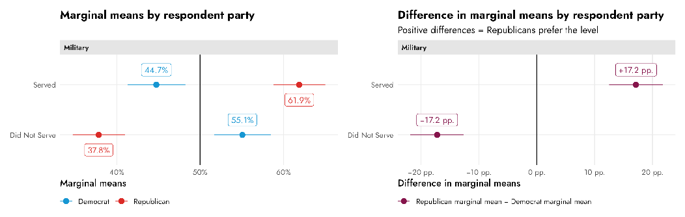

These marginal means have a direct descriptive interpretation. In the left panel above we can see that Democratic respondents tend to prefer candidates that haven’t served in the military (55%) to those that have (45%), but compared to Republican respondents, this divergence isn’t as dramatic. Republicans tend to strongly prefer candidates with a military history, with 62% expressing favorability. In general, Republicans are more extreme in their preferences for and against candidates with and without military service history.

In the right panel we can see the differences between the parties’ marginal means within each level. There’s a 17 percentage point distance between Republican and Democratic marginal means within the served level and a 17 percentage point distance between their marginal means in the did not serve level. Overall, Republicans prefer candidates with military service; Democrats prefer candidates without military service.

# Finding conjoint AMCEs and marginal means Bayesianly

Now that we know (1) what the AMCE actually is, and (2) that it works with logistic models, we can finally do it all Bayesianly with {brms}.

5

Why try to do this Bayesianly? I don’t like null hypotheses and I don’t like flowcharts.

- 5 See this video by Richard McElreath introducing his idea of “statistical rethinking”

Rather than choose the exact statistical test in a flowchart, I can compare the posterior distributions of AMCEs or marginal means directly. And rather than define a null hypothesis, I can find the probability that the estimand I care about is different from whatever other value I’m interested in.

But first, a note on the complexity of all this estimation and plotting thus far. In the “Finding conjoint AMCEs and marginal means frequentistly” section above, I spent a ton of extra time showing how to calculate and plot these estimands multiple ways:

find the estimands with cregg::amce() , cregg::mm() , and cregg::cj(..., estimate = "diff_mm")

find the estimands with {dplyr}’s group_by() %>% summarize()

find the estimands with OLS regression models like lm() and survey::svyglm() or with logistic models like glm() and survey::svyglm() which are then fed into marginaleffects::avg_slopes() and marginaleffects::marginal_means()

plot the estimands automatically with plot(cregg::amce(...))

tidy the estimands with reference levels with broom.helpers::tidy_add_reference_rows() and plot them manually

tidy the estimands with reference levels manually with some {tidyr} and {dplyr} magic and plot them manually

We have a veritable smorgasbord of options!

I did this because I generally like thinking about averages as regressions and prefer to have total control over plotting instead of relying on convenience functions like cregg::amce() . If I were analyzing my own conjoint data in a frequentist way, I’d use regression + {marginaleffects} + manual tidying and plotting.

I also showed all these options becuase if we’re going to calculate these estimands in a Bayesian way, none of the convenience functions like cregg::amce() or broom.helpers::tidy_add_reference_rows() work with Bayesian models, so we have to use the manual approach anyway. And Bayesian models have their own extra dimension of complexity, so we might as well embrace it all. As Richard McElreath says,

[A]s models become more monstrous, so too does the code needed to compute predictions and display them. With power comes hardship. It’s better to see the guts of the machine than to live in awe or fear of it. (McElreath 2020, 391)

yay complexity.

## The overall model

The easiest way for me to think about all these estimands is as moving parts (marginal effects or partial derivatives) in a regression model. We can model the whole data-generating system (i.e. all the candidate features and levels + any subgroups or covariates we’re interested in) and then look at individual parts of that system for the different estimands we’re interested in.

Each survey respondent saw multiple pairs of hypothetical candidates—some saw 4, some 5, some 6, and so on:

candidate %>% count(resID) %>% mutate(pairs_seen = n / 2)

## # A tibble: 311 × 3 ## resID n pairs_seen

## <fct> <int> <dbl>

- ## 1 A10ZOUOZZ3EOAJ 12 6
- ## 2 A11F3HMX0N23V4 10 5
- ## 3 A12H2RTXSAQPRH 8 4
- ## 4 A13DPXX91VQ49Q 12 6
- ## 5 A13KTOZC30NBS6 10 5
- ## 6 A142W1RAF1TBWP 12 6
- ## 7 A15A4X84A1CJPF 12 6
- ## 8 A15Q5F9YWO45EI 12 6
- ## 9 A1610EPXM31F9D 12 6
- ## 10 A1650FELH3UL2F 10 5 ## # ℹ 301 more rows

This means that we have a natural multilevel structure in our data. Individual candidate selection choices are nested inside respondents:

|Population of survey respondents|
|---|

|Respondent 1| |
|---|---|
| | |

|Respondent 2| |
|---|---|
| | |

|Respondent 𝑛| |
|---|---|
| | |

…

…

𝑦1

#### 𝑦2

#### 𝑦3

#### 𝑦1

#### 𝑦2

#### 𝑦3

#### 𝑦1

#### 𝑦2

#### 𝑦3

1

1

1

2

2

2

𝑛

𝑛

𝑛

Multilevel conjoint data structure, with candidate choices y nested in respondents

We want to model candidate selection ( selected ) based on candidate characteristics (and maybe individual respondent characteristics, if we had those). We’ll use the subscript to refer to individual candidate choices and

i j i

to refer to respondents, which each contain multiple s.

Since candidate selection selected is binary, we can model it as a Bernoulli process that has a probability of success. We’ll model that using a logistic regression model with covariates for each of the levels of each candidate feature. To account for respondent-level differences in probabilities, we’ll use respondent-specific offsets ( ) from the global success rate, thus creating random intercepts. We’ll specify priors for each of the logit-scale coefficients/partial derivatives and the between respondent variability ( ). If we really wanted we could specify priors for each individual coefficient, but for simplicity we’ll just use a normal distribution with a mean of 0 and a standard deviation of 1 for all of them (since logit-scale coefficients don’t ever get really big). We’ll use an exponential prior for ( ) because we don’t know much about it.

πi

j

πij

b0j

σ0

σ0

Here’s what that all looks like more formally:

Selectionij ∼ Bernoulli(πij) Probability of selection for choicei in respondentj logit(πij) = (β0 + b0j) + β1Military[Served]i

+ Model for probability

j

- β2Religion[Mormon]i

j

+

- β3Religion[Evangelical]i

+

j

⋯ + βnSex[Female]i

j

b0j ∼ N(0,σ0) Respondent-specific offsets from global success rate

β0c ∼ N(0,1) Prior for global average success rate β1…βn ∼ N(0,1) Prior for candidate feature levels σ0 ∼ Exponential(1) Prior for between-respondent variability

Let’s build the model!

priors <- c( prior(normal(0, 1), class = Intercept), prior(normal(0, 1), class = b), prior(exponential(1), class = sd)

)

model_brms <- brm(

bf(selected ~ atmilitary + atreligion + ated + atprof + atinc + atrace + atage + atmale + (1 | resID)), data = candidate, family = bernoulli(link = "logit"), prior = priors, chains = 4, cores = 4, iter = 2000, seed = 1234, backend = "cmdstanr", threads = threading(2), refresh = 0, file = "candidate_model_brms"

)

## AMCEs

If we’re interested in the causal effect of specific candidate levels, we need to find the average marginal component effect (AMCE). Here’s the formal definition of the no religion → Mormon AMCE, for example:

θ = P[Candidate selection ∣ do(Religion = none)] − P[Candidate selection ∣ do(Religion = Mormon)]

We can find this AMCE (and all the other AMCEs) by calculating the marginal effect/partial derivative of each candidate-level covariate. marginaleffects::avg_slopes() makes this easy and gives us percentage-pointscale estimates instead of logit-scale estimates

###### Dealing with respondent offsets

When plugging values into avg_slopes (or predictions() or marginal_means() or any function that calculates predictions from a model), we have to decide how to handle the random respondent offsets ( ). I have a whole other blog post guide about this and how absolutely maddening the nomenclature for all this is.

b0

j

By default, avg_slopes() and friends will calculate the effects for a typical respondent, or a respondent where the random offset is set to 0. It invisibly uses the re_formula = NA argument to do this. This is also called a conditional effect.

We could also use re_formula = NULL to calculate the effect for respondents on average. This is also called a marginal effect. (ARGH I HATE THESE NAMES.). This estimate includes details from the random offsets, either by integrating them out or by using the mean and standard deviation of the random offsets to generate a simulated average respondent.

Conditional effect = average respondent = re_formula = NA (default)

Marginal effect = respondents on average = re_formula = NULL + existing respondent levels or a new simulated respondent

Again, see this guide for way more about these distinctions. In this example here, we’ll just use conditional effects, or the effect for an average respondent.

posterior_mfx <- model_brms %>% avg_slopes(newdata = "mean", allow_new_levels = TRUE) %>% posteriordraws()

posterior_mfx_nested <- posterior_mfx %>%

separate_wider_delim( contrast, delim = " - ", names = c("variable_level", "reference_level")

) %>% group_by(term, variable_level) %>% nest()

# Combine full dataset of factor levels with model results plot_data_bayes <- model_variable_levels %>%

left_join( posterior_mfx_nested, by = join_by(variable == term, levels == variable_level)

) %>% mutate(data = map_if(data, is.null, ~ tibble(draw = 0, estimate = 0))) %>% unnest(data) %>% left_join(variable_lookup, by = join_by(variable)) %>% mutate(across(c(levels, variable_nice), ~fct_inorder(.)))

ggplot(plot_data_bayes, aes(x = draw, y = levels, fill = variable_nice)) + geom_vline(xintercept = 0) + stat_halfeye(normalize = "groups") + # Make the heights of the distributions equal within each facet guides(fill = "none") + facet_col(facets = "variable_nice", scales = "free_y", space = "free") + scale_x_continuous(labels = label_pp) + labs(

- x = "Percentage point change in probability of candidate selection",
- y = NULL, title = "Posterior AMCEs"

)

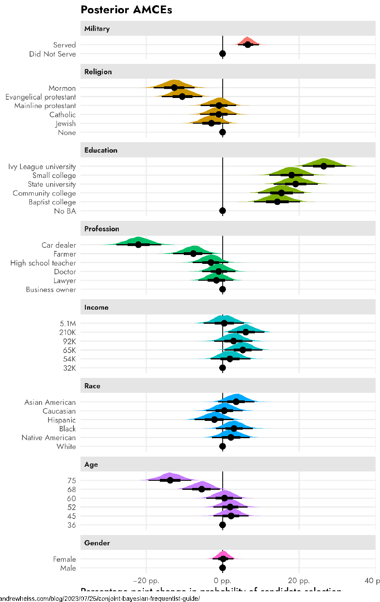

4/18/26, 1:51 PM The ultimate practical guide to conjoint analysis with R | Andrew Heiss – Andrew Heiss

The results here are all basically the same as what we found with all the frequentist approaches earlier, but now we have full posteriors for each of these AMCEs so we can do all sorts of neat Bayesian inference things, like calculating the probability that the effect is larger than zero. For instance, there’s a 100% posterior probability that the None → Mormon effect is negative. The Business owner → Lawyer effect, on the other hand, is generally negative, but sometimes positive—there’s a 78% posterior probability that it’s negative.

example_amces <- posterior_mfx %>%

filter( term == "atreligion" & contrast == "Mormon - None" | term == "atprof" & contrast == "Lawyer - Business owner"

)

example_amces_p_direction <- example_amces %>% group_by(contrast) %>% summarize(prop_lt_0 = sum(draw < 0) / n()) %>% mutate(

prob_nice = label_percent()(prop_lt_0), label = glue::glue("P(θ < 0) = {prob_nice}")

)

ggplot(example_amces, aes(x = draw)) + stat_halfeye(aes(fill_ramp = after_stat(x > 0)), fill = "grey50") + geom_vline(xintercept = 0) + geom_text(

data = example_amces_p_direction, aes(x = -0.21, y = 0.9, label = label), hjust = 0

) + scale_x_continuous(labels = label_pp) + scale_fill_ramp_discrete(from = "#FF851B", guide = "none") + labs(

- x = "Percentage point change in probability of candidate selection",
- y = NULL, title = "Two example AMCEs"

) + facet_wrap(vars(fct_rev(contrast))) + theme(

axis.text.y = element_blank(), panel.grid = element_blank(), panel.background = element_rect(color = "grey90", linewidth = 0.5)

)

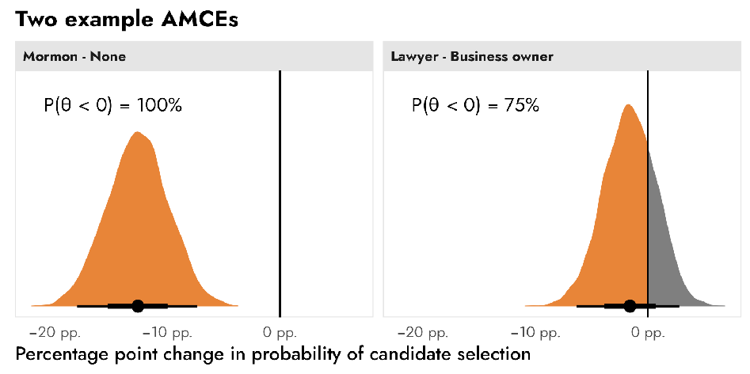

## Marginal means

Instead of working with causal AMCEs, which are all relative to an omitted feature level, we can work with absolute marginal means to be more descriptive with our estimands. We could find the overall level of favorability of Mormon candidates…

θ = P(Candidate selection ∣ Religion = Mormon)

…or the difference between Mormon and Catholic favorability…

θ = P[Candidate selection ∣ Religion = Mormon] − P[Candidate selection ∣ Religion = Catholic]

Unfortunately marginaleffects::marginal_means() doesn’t work with brms models. BUT we can fake it by finding the posterior marginal means for each of the features individually and then combining them into one big data frame.

Click to show the code. It’s hidden because it’s long and repetitive.

Here are the marginal means for all the levels of all candidate features:

plot_posterior_mms <- posterior_mms %>% left_join(variable_lookup, by = join_by(term == variable)) %>% mutate(across(c(value, variable_nice), ~fct_inorder(.)))

ggplot( plot_posterior_mms, aes(x = draw, y = value, fill = variable_nice)

) + geom_vline(xintercept = 0.5) + stat_halfeye(normalize = "groups") + # Make the heights of the distributions equal within each facet facet_col(facets = "variable_nice", scales = "free_y", space = "free") + scale_x_continuous(labels = label_percent()) + guides(fill = "none") + labs(

- x = "Marginal means of probabilities",
- y = NULL, title = "Posterior marginal means"

)

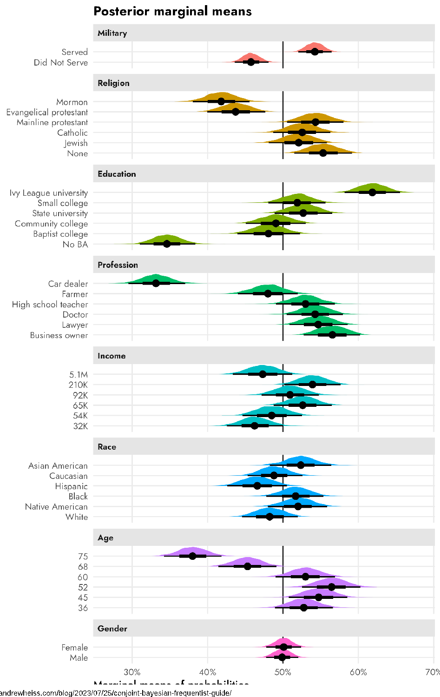

4/18/26, 1:51 PM The ultimate practical guide to conjoint analysis with R | Andrew Heiss – Andrew Heiss

And here are the two we mentioned at the beginning of this section—overall favorability of Mormon candidates and the difference between Mormon and Catholic favorability. Mormon candidates have a median posterior favorability of 41.8%, with a 95% credible interval of 38–46%. The median posterior difference between Mormon and Catholic favorability is 10.8 percentage points, with a 95% credible interval of 5–16 percentage points. Neat.

mms_mormon <- posterior_mms %>%

filter(term == "atreligion", value == "Mormon") mms_mormon %>% median_qi(draw) ## # A tibble: 1 × 6 ## draw .lower .upper .width .point .interval ## <dbl> <dbl> <dbl> <dbl> <chr> <chr> ## 1 0.418 0.381 0.456 0.95 median qi

mms_mormon_catholic <- posterior_mms %>% filter(term == "atreligion", value %in% c("Mormon", "Catholic")) %>% select(drawid, draw, value) %>% pivot_wider(names_from = "value", values_from = "draw") %>% mutate(diff = Mormon - Catholic)

mms_mormon_catholic %>% median_qi(diff) ## # A tibble: 1 × 6 ## diff .lower .upper .width .point .interval ## <dbl> <dbl> <dbl> <dbl> <chr> <chr> ## 1 -0.107 -0.160 -0.0537 0.95 median qi

mm1 <- ggplot(mms_mormon, aes(x = draw)) + stat_halfeye(fill = "#FF851B") + facet_wrap(vars("Mormon favorability")) + scale_x_continuous(labels = label_percent()) + labs(x = "Marginal mean", y = NULL) + theme(

axis.text.y = element_blank(), panel.grid = element_blank(), panel.background = element_rect(color = "grey90", linewidth = 0.5)

)

mm2 <- ggplot(mms_mormon_catholic, aes(x = diff)) + stat_halfeye(fill = "#B10DC9") + facet_wrap(vars("Difference between Mormons and Catholics")) + scale_x_continuous(labels = label_pp) + labs(x = "Difference in marginal means", y = NULL) + theme(

axis.text.y = element_blank(), panel.grid = element_blank(), panel.background = element_rect(color = "grey90", linewidth = 0.5)

)

mm1 | mm2

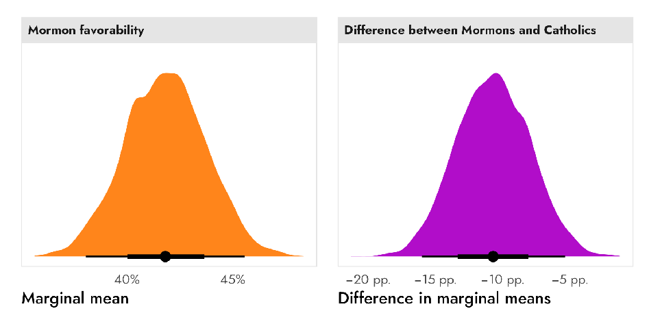

## Subgroup differences

Finally, if we’re interested in subgroup differences, we can run a separate model with an interaction term for the subgroups we’re interested in. Again, this candidate experiment didn’t include any respondent-level covariates, so we’ll use the made-up, fake respondent political party that we used earlier.

priors <- c( prior(normal(0, 1), class = Intercept), prior(normal(0, 1), class = b), prior(exponential(1), class = sd)

)

model_brms_military_party <- brm( bf(selected ~ atmilitary * respondent_party + (1 | resID)), data = candidate_fake, family = bernoulli(link = "logit"), prior = priors, chains = 4, cores = 4, iter = 2000, seed = 1234, backend = "cmdstanr", threads = threading(2), refresh = 0, file = "candidate_model_brms_interaction"

)

### Conditional AMCEs

We can calculate two different causal estimands, the conditional AMCE across each respondent political party of switching a candidate from having no military history to having served in the military. Because this model (1) uses logit-scale coefficients and (2) splits the causal effects across a bunch of different regression terms, we’ll use

marginaleffects::avg_slopes() to find the group-specific probability-scale marginal effects.

Among Republican respondents, the causal effect of a candidate switching from no military history to having military service history has a posterior median of 23.8 percentage points, with a 95% credible interval of 19–28

percentage points. For Democrats, the same causal effect is negative, with a posterior median of −9.8 percentage points and a 95% credible interval of −5 to −14.7 percentage points.

posterior_party_amces <- model_brms_military_party %>%

avg_slopes( newdata = "mean", variables = "atmilitary", by = "respondent_party", allow_new_levels = TRUE

) %>% posteriordraws()

posterior_party_amces %>% group_by(respondent_party) %>% median_qi(draw)

## # A tibble: 2 × 7 ## respondent_party draw .lower .upper .width .point .interval ## <fct> <dbl> <dbl> <dbl> <dbl> <chr> <chr> ## 1 Democrat -0.0982 -0.148 -0.0481 0.95 median qi ## 2 Republican 0.238 0.194 0.279 0.95 median qi

Click to show the code since it’s so long

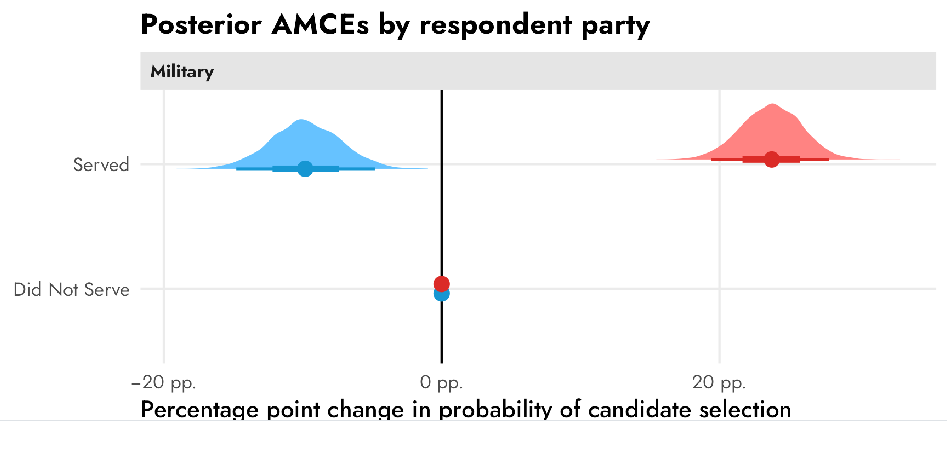

###### References

Chaudhry, Suparna, Marc Dotson, and Andrew Heiss. 2021. “Who Cares about Crackdowns? Exploring the Role of Trust in Individual Philanthropy.” Global Policy 12 (S5): 45–58. https://doi.org/10.1111/1758-5899.12984.

### Conditional marginal means

Hainmueller, Jens, Daniel J. Hopkins, and Teppei Yamamoto. 2014. “Causal Inference in Conjoint Analysis: Understanding Multidimensional Choices via Stated Preference Experiments.” Political Analysis 22 (1): 1–30. https://doi.org/10.1093/pan/mpt024.

And finally, we can calculate subgroup conditional marginal means to describe general party-based trends (since the relative conditional AMCEs create an illusion of difference). Again, since marginaleffects::marginal_means() doesn’t work with brms models, we can instead use marginaleffects::predictions() , which still works with the neat hypothesis argument for calculating contrasts.

Leeper, Thomas J., Sara B. Hobolt, and James Tilley. 2020. “Measuring Subgroup Preferences in Conjoint Experiments.” Political Analysis 28 (2): 207–21. https://doi.org/10.1017/pan.2019.30.

McBride, Spencer W., Brent M. Rogers, and Keith A. Erekson, eds. 2020. Contingent Citizens: Shifting Perceptions of LatterDay Saints in American Political Culture. Ithaca, New York: Cornell University Press. https://doi.org/10.1515/9781501716744.

In the left panel below, Democratic respondents prefer candidates that haven’t served in the military (55% median posterior; 95% credible interval: 51–58%) to those that have (45% median posterior; 95% credible interval: 41–48%). Republicans strongly prefer candidates with a military history, with a posterior median 62%

McElreath, Richard. 2020. Statistical Rethinking: A Bayesian Course with Examples in R and Stan. 2nd ed. Boca Raton, Florida: Chapman and Hall / CRC. Reeve, W. Paul. 2015. Religion of a Different Color: Race and the Mormon Struggle for Whiteness. Oxford: Oxford University Press. https://doi.org/10.1093/acprof:oso/9780199754076.001.0001. Teele Da n Lan an Josh a Kalla and Frances Rosenbl th 2018 “The Ties That Do ble Bind Social Roles and Women’s

Teele, Dawn Langan, Joshua Kalla, and Frances Rosenbluth. 2018. “The Ties That Double Bind: Social Roles and Women’s Underrepresentation in Politics.” American Political Science Review 112 (3): 525–41. https://doi.org/10.1017/S0003055418000217.

expressing favorability (95% credible interval: 59–65%). In general, Republicans are more extreme in their preferences for and against candidates with and without military service history. In the right panel we can see the differences between the parties’ marginal means within each level. There’s a posterior median 17 percentage point distance between Republican and Democratic marginal means within the served level and a posterior median 17 percentage point distance between their marginal means in the did not serve level (95% credible interval: 12–21 percentage points). Overall, Republicans prefer candidates with military service; Democrats prefer candidates without military service.

###### Citation

BibTeX citation:

@online{heiss2023, author = {Heiss, Andrew}, title = {The Ultimate Practical Guide to Conjoint Analysis with {R}}, date = {2023-07-25}, url = {https://www.andrewheiss.com/blog/2023/07/25/conjoint-bayesian-frequentist-guide/}, doi = {10.59350/xgwjy-dyj66}, langid = {en}

posterior_party_mms <- predictions( model_brms_military_party, by = c("atmilitary", "respondent_party"), allow_new_levels = TRUE

}

) %>% posterior_draws()

For attribution, please cite this work as:

posterior_party_mms %>% group_by(atmilitary, respondent_party) %>% median_qi(draw)

Heiss, Andrew. 2023. “The Ultimate Practical Guide to Conjoint Analysis with R.” July 25, 2023. https://doi.org/10.59350/xgwjy-dyj66.

## # A tibble: 4 × 8 ## atmilitary respondent_party draw .lower .upper .width .point .interval ## <fct> <fct> <dbl> <dbl> <dbl> <dbl> <chr> <chr>

- ## 1 Did Not Serve Democrat 0.548 0.513 0.582 0.95 median qi
- ## 2 Did Not Serve Republican 0.380 0.351 0.412 0.95 median qi
- ## 3 Served Democrat 0.450 0.415 0.485 0.95 median qi
- ## 4 Served Republican 0.618 0.587 0.648 0.95 median qi

group_diffs_terms <- matrix( c(-1, 1, 0, 0,

0, 0, -1, 1), ncol = 2

) %>% magrittr::set_colnames(levels(candidate_fake$atmilitary))

posterior_party_mms_diff <- predictions( model_brms_military_party, by = c("atmilitary", "respondent_party"), allow_new_levels = TRUE, hypothesis = group_diffs_terms

) %>% posterior_draws()

posterior_party_mms_diff %>% group_by(term) %>% median_qi(draw)

## # A tibble: 2 × 7 ## term draw .lower .upper .width .point .interval ## <chr> <dbl> <dbl> <dbl> <dbl> <chr> <chr>

- ## 1 Did Not Serve -0.167 -0.213 -0.121 0.95 median qi
- ## 2 Served 0.168 0.120 0.215 0.95 median qi

Click to show the code since it’s so long

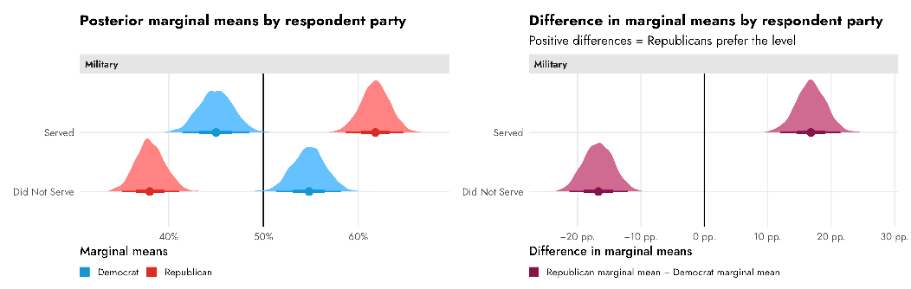

Loading comments…

 2007–2025 Andrew Heiss All content licensed under   Creative Commons CC BY 4.0 Made with  and Quarto View the source at  GitHub  ORCID 0000-0002-3948-3914  PGP public key  Fingerprint:

4AA2 FA83 A8B2 05A4 E30F 610D 1382 6216 9178 36AB

