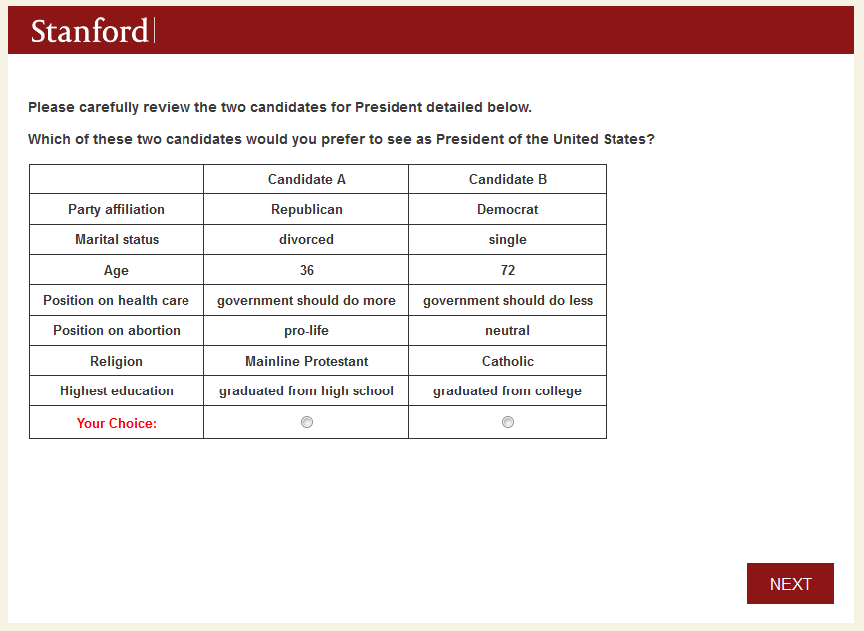

MIT Open Access Articles

The Number of Choice Tasks and Survey Satisficing in Conjoint Experiments

|The MIT Faculty has made this article openly available. Please share how this access benefits you. Your story matters.|
|---|

Citation: Bansak, Kirk, et al. “The Number of Choice Tasks and Survey Satisficing in Conjoint Experiments.” Political Analysis, vol. 26, no. 01, Jan. 2018, pp. 112–19. © 2018 The Authors

As Published: http://dx.doi.org/10.1017/PAN.2017.40 Publisher: Cambridge University Press (CUP) Persistent URL: http://hdl.handle.net/1721.1/118642 Version: Author's final manuscript: final author's manuscript post peer review, without publisher's formatting or copy editing Terms of use: Creative Commons Attribution-Noncommercial-Share Alike

# The Number of Choice Tasks and Survey Satisficing in Conjoint Experiments∗

Kirk Bansak† Jens Hainmueller‡ Daniel J. Hopkins§ Teppei Yamamoto¶

First Draft: January 6, 2017 This Draft: July 25, 2017

Forthcoming in Political Analysis

Abstract

In recent years, political and social scientists have made increasing use of conjoint survey designs to study decision-making. Here, we study a consequential question which researchers confront when implementing conjoint designs: how many choice tasks can respondents perform before survey satisficing degrades response quality? To answer the question, we run a set of experiments where respondents are asked to complete as many as 30 conjoint tasks. Experiments conducted through Amazon’s Mechanical Turk and Survey Sampling International demonstrate the surprising robustness of conjoint designs, as there are detectable but quite limited increases in survey satisficing as the number of tasks increases. Our evidence suggests that in similar study contexts researchers can assign dozens of tasks without substantial declines in response quality.

Key Words: conjoint analysis, survey experiments, survey fatigue, response bias

∗We thank the Associate Editor, two anonymous referees, Katrin Auspurg, Adam Berinsky, Thomas Hinz and the conference participants at the MPSA 2017 Annual Meeting, PolMeth XXXIV, and the University of Zurich for their helpful comments and suggestions.

†Ph.D. Candidate, Department of Political Science, 616 Serra Street Encina Hall West, Room 100, Stanford, CA 94305-6044. E-mail: kbansak@stanford.edu

‡Professor, Department of Political Science, 616 Serra Street Encina Hall West, Room 100, Stanford, CA 94305-

6044. E-mail: jhain@stanford.edu

§Associate Professor, Department of Political Science, University of Pennsylvania, 207 S. 37th Street, Philadelphia PA, 19104. E-mail: danhop@sas.upenn.edu

¶Associate Professor, Department of Political Science, Massachusetts Institute of Technology, 77 Massachusetts Avenue, Cambridge, MA 02139. Email: teppei@mit.edu, URL: http://web.mit.edu/teppei/www

## 1 Introduction

First introduced in the 1970s (Green & Rao 1971, Jasso & Rossi 1977), conjoint experiments ask survey respondents to rate or rank profiles which vary across multiple dimensions. This research design has critical strengths: it allows researchers to make causal inferences about a variety of potentially relevant attributes simultaneously, and so to compare the treatment effects of various attributes (Hainmueller et al. 2014). Conjoint designs also mirror many real-world choices in which people must evaluate bundles of attributes, which can greatly enhance their external validity (Hainmueller et al. 2015a). These characteristics, together with the increasing number of surveys administered via computers, have led to a surge in the use of conjoint designs in political science. Conjoint designs are now being used to answer far-ranging questions, including those about where people choose to live, whom they wish to admit to their countries, and which political candidates they support.1

While research proceeds on the statistical properties of conjoint designs (Raghavarao et al. 2011, Hainmueller et al. 2014, Egami & Imai 2015, Acharya et al. 2016), there has been little attention on how to optimize conjoint survey designs given well-known challenges in survey research. Here, we integrate research on survey design with work on conjoint experiments to examine a central design question facing those fielding conjoint experiments: How many conjoint tasks can respondents perform with the needed levels of attention?

Underlying the question is the threat of survey satisficing. Research on survey taking indicates that as survey tasks become more onerous, respondents become increasingly likely to satisfice, meaning that they adapt by using cognitive shortcuts which can degrade response quality (Krosnick 1999).2 Satisficing respondents are more likely to rush through surveys, ignore or skip instructions, choose response options because of their placement, and use other effort-saving heuristics (Berinsky et al. 2014).

- 1For examples, see Franchino & Zucchini (2014), Abrajano et al. (2015), Carnes & Lupu (2015), Hainmueller & Hopkins (2015), Horiuchi et al. (2015), Bansak et al. (2016), Bechtel et al. (2016), Mummolo & Nall (2016), Wright et al. (2016).
- 2The term “satisficing” has various meanings within different research literatures. Here, we use the term exclusively as an abbreviated form of “survey satisficing” (see also Kahneman 2003).

In this paper, we conduct a series of conjoint survey experiments to empirically examine the degree of satisficing when respondents are faced with a large number of choice tasks. In our experiments, we ask respondents to complete many more tasks than in a typical conjoint study and estimate the degree of degradation in response quality over those tasks. Specifically, respondents are asked to evaluate as many as 30 conjoint tables, where the tables are comprised of two core attributes that are included for all respondents and two to 18 additional attributes that are randomly assigned for each respondent. We find that conjoint designs are remarkably robust as a tool for eliciting preferences about multi-dimensional objects. Using samples from two common online sources of survey respondents—Amazon’s Mechanical Turk (MT) and Survey Sampling International (SSI)—we see no significant decline in the core attributes’ effects as the number of tasks increases.

## 2 Problem: Satisficing in Conjoint Experiments

Conjoint experiments are one variant of survey research, meaning that many insights about survey design generally should apply. However, the growing research on conjoint surveys has not yet incorporated the insights of the highly developed literature on survey measurement (e.g. Groves et al. 2011). Here, we focus on the issue of survey satisficing and how it might invalidate conjoint experiments.

A key element of conjoint designs that has the potential to increase satisficing beyond acceptable levels is the number of discrete evaluation tasks requested of respondents. Should respondents perform just one evaluation in a given survey, or should they be asked to perform 5, 10, or even 50? Conjoint experiments typically require respondents to complete the same task repeatedly. In fact, in traditional conjoint designs, respondents are often asked to evaluate the entire set of possible combinations from an orthogonalized array of attribute levels, a number which can easily grow above 50 (Raghavarao et al. 2011). While fully randomized designs allow researchers more discretion in choosing the number of tasks, researchers still have an incentive to assign numerous tasks so as to increase their statistical power.

However, research on survey response indicates that satisficing is likely to be a function of the

total survey length. For example, Galesic & Bosnjak (2009) find that when answering questions placed later in a questionnaire, respondents take less time and provide more uniform answers. Similarly, respondents are more likely to give the same response to blocks of questions when those questions are found later in a questionnaire (Herzog & Bachman 1981), another indication of increased satisficing. Findings like these fuel the “longstanding view that long questionnaires or interviews should be avoided,” even as others contend that the evidence underpinning that view is weaker than many suspect (De Vaus 2014, pg. 111). Still, concerns about questionnaire length may be particularly acute when choosing the number of conjoint tasks, as fatigue may set in more rapidly when performing the same task repeatedly.

In short, researchers have good reason to expect that conjoint designs with a large number of tasks could produce significant levels of survey satisficing, but to date, there has been little empirical evidence as to the severity of this problem. Researchers are often tempted to ask respondents to complete many conjoint tasks in a single survey so as to maximize their statistical power. But this temptation carries risks, as researchers may well induce suboptimal levels of survey satisficing. Below, we provide an empirical assessment of this trade-off.

## 3 Empirical Evidence on the Number of Choice Tasks and

## Satisficing

Our goal is to investigate whether asking respondents to complete many repeated conjoint tasks will degrade their response quality due to satisficing, and if so when the degradation tends to kick in. In this section, we report the result of the six conjoint experiments we conducted for this purpose.

### 3.1 Design and Methodology

The main portion of our study – the first five of the six experiments – was fielded on a total of 4,921 respondents we recruited via MT for payments of $1.25.3 Our last, sixth survey was conducted

3The numbers of respondents for these five experiments were 605, 674, 725, 1,340, and 1,577, in the chronological order they were fielded.

- Figure 1: An example choice task from the study. Respondents are asked to assess two hypothetical presidential candidates.

on 1,613 respondents from SSI to confirm that key findings were not specific to MT respondents. These surveys occurred between February and May, 2015. While both use opt-in survey samples, MT draws from a small, highly experienced population (e.g. Stewart et al. 2015). As a result, by conducting our study via both MT and SSI, we can observe the role of fatigue for populations with different levels of survey-taking experience.

After a few introductory demographic questions about their own education, partisanship, and ideology, we told respondents: “This study is about voting and about your views on potential candidates for President. We are going to present pairs of hypothetical presidential candidates in the United States. For each pair, please indicate which of the two candidates you would prefer to see as President.” One example of the resulting conjoint task is available in Figure 1. We developed a set of twenty possible attributes that could define U.S. presidential candidates, including everything from their education, income, religion, and political partisanship to their

positions on key issues (e.g. gay marriage, health care, abortion) and personal facts such as their favorite professional sport and car. The full list of attributes is provided in Table A.1 in the Supplementary Materials.

We employed several randomizations, some of which we report elsewhere. For one thing, we randomly varied the total number of attributes presented to respondents. Specifically, each respondent was randomly assigned to 4, 5, 6, 7, 8, 10, 15, or 20 attributes. Of those, the two “core” attributes — candidates’ education and partisanship — were always included in each respondent’s table regardless of their assigned number of attributes, and the rest were randomly drawn from the master list of 20 attributes. Once a specific number and set of attributes was assigned to a respondent it was fixed for the duration of her survey. We also randomized the attributes’ order within the conjoint table and then fixed that order across tasks for each respondent. For example, if a respondent saw the candidate’s income at the top of the conjoint table, it remained in that position for the duration of her tasks.4

Most importantly for our purposes here, we asked respondents to complete 30 of these conjoint tasks, which is much more than typical recent applications of randomized conjoint analysis. The purpose of this design choice, of course, was to study how response quality might change as respondents went through numerous screens of conjoint tables (which also consisted of a large number of attributes for some).

As the number of tasks increases, do respondents adapt by being less discerning in their choices? Our expectation is that any increased survey satisficing will induce respondents to pay less attention to the task, and so will attenuate the predictive power of the core attributes. We employ two metrics to measure the predictive power of the attributes. First, we estimate the Average Marginal Component Effects—AMCEs—of the two core attributes and compare the estimates across tasks.

4This is an example of the multiply randomized conjoint design proposed by Hainmueller et al. (2015b). We also randomly varied several other elements of these experiments for the separate analyses reported in that paper. Specifically, we randomized the two core attributes to appear in the middle of the table or at the bottom (first and third experiments) and at the top or at the bottom (second, fourth and fifth experiments). Note that all of these six experiments used 30 tasks per respondent, so any design element that differed across the experiments is balanced across the 30 tasks.

Second, we calculate the coefficient of determination (i.e. R2) from the regression of conjoint responses on the core attributes,5 and compare those R2s across tasks. Because the R2 is a function of the regression-based estimates of the AMCEs under the fully randomized conjoint design, any changes in the R2 across tasks can be attributed to changes in satisficing. In other words, the R2 can be interpreted as a summary measure of the explanatory power of the two core attributes combined, and its change as the overall variation in satisficing.

### 3.2 Results

We first present results from five surveys on MT respondents. Figure 2 shows the estimated AMCEs for the two core attributes that were always included in the conjoint table — education and party affiliation — across the number of completed tasks along with their 95% confidence intervals clustered by respondent. Remarkably, the results suggest a surprising degree of robustness over a large number of choice tasks. For both attributes, the estimated AMCEs are substantively large and statistically significant in the respondents’ first task (0.186 and 0.263 for education and party, respectively, with SE=0.01 for both attributes). The AMCEs then drop slightly for the second task (0.152 and 0.238, SE=0.01 for both) but remain stable and close to that level throughout the duration of the survey, even occasionally jumping back to the original level. Even at the 30th task, the estimated AMCEs barely differ from those for the second task (0.140 and 0.233, SE=0.01 for both). We note that the rate of sample attrition over the course of the 30 tasks is negligibly small, as is typical in surveys fielded on MT.

The result for the partial R2 values, presented in Figure 3, confirms the stability of conjoint responses across the 30 tasks for our MT respondents. The partial R2 for the two core attributes is about 0.104 in the respondents’ first task, with a 95% block-bootstrapped confidence interval of [0.091, 0.118].6 The coefficient drops slightly to 0.079 in the second task (with the 95% CI of [0.068, 0.092]) and remains remarkably stable around that value throughout the remaining 28

- 5Specifically, we create indicator variables for all levels of each of the core attributes except for a reference level and regress the outcome on all the indicators.
- 6The block bootstrap procedure is based on re-sampling (with replacement) respondents rather than individual observations in order to account for within-respondent correlation of the outcome variables.

- Figure 2: The AMCEs for our core attributes of interest from the five MT surveys as the number of completed choice tasks increases.

College Education

0.25

0.20

0.15

0.10

AMCEs with 95% CI

Own Party

0.30

0.25

0.20

0.15

5 10 15 20 25 30

Task Count

#### tasks. The two core attributes meaningfully explain the choice responses even at the very end of the lengthy conjoint excercises (R2 = 0.075, with 95% CI [0.063, 0.087]). These findings are

- Figure 3: The partial R2 values for our core attributes for the pooled MT data as function of the number of completed tasks.

0.00

0.05

0.10

0.15

0.20

5 10 15 20 25 30

Task Count

Partial R Squares

replicated in our SSI sample, as shown in Figures A.1 and A.2 in Section A.2 of the Supplementary Materials.

In additional analyses reported in the Supplementary Materials, we also find that our results hold when evaluating the effects of other attributes included in our conjoint design, such as the candidates’ age, military service, and policy positions (see Figures A.3-A.6 in Section A.3). Overall, our study suggests that conjoint designs are remarkably impervious to threats from survey fatigue and satisfying when applied to respondents on MT and SSI, two of the most frequently used populations in experimental research.

- 4 Conclusion

The rapid growth of survey research conducted via computers has enabled researchers to employ increasingly complex research designs at little added cost. Conjoint experiments are one such design, and they have seen a renaissance within political science in the past few years. However,

research on survey methods has to date been focused on the change in sampling frames that accompanies the shift toward online survey administration (e.g. Chang & Krosnick 2009, Yeager et al. 2011). For those administering surveys via computer, there is surprisingly little guidance about the extent to which insights developed for phone and in-person surveys hold up (but see Gooch & Vavreck 2015).

In this paper, we sought to advance our understanding of response behavior in surveys administered by computer by probing one breaking point of conjoint designs. Specifically, we considered an important decision confronting researchers who seek to implement conjoint experiments: how many tasks can one assign per respondent without inducing survey fatigue and excessive satisficing? Through a series of experiments, we find conjoint designs to be surprisingly robust, at least with the opt-in samples employed here (and in many other contemporary survey experiments). Even after completing 30 tasks, respondents continue to process the conjoint profiles in similar ways and to provide similar, sensible results.

These results allow us to make design recommendations for researchers interested in using conjoint survey experiments. While the results do not point to an optimal number of tasks, they show that the number of tasks is not a binding constraint for the experimental design in terms of satisficing—at least within the 30-task limit explored in this study. While we would not necessarily recommend researchers to use as many as 30 tasks, we have shown that within that limit, satisficing is not a serious concern that should dictate the number of tasks. Instead, researchers are free to make their decisions on the number of tasks on the basis of other design considerations, such as the survey length, cost constraints, and statistical power.

Certainly, the results from this study may differ for populations with little to no experience taking surveys via computer, or with reduced incentives to pay attention. The results may also differ in cases where the conjoint survey covers different subject matter. Making comparisons that are more familiar to respondents — such as between presidential candidates, job applicants, or consumer products — is likely to be easier than evaluating, for example, the elements of a complex policy proposal. Survey fatigue may be more pronounced and/or set in more quickly in a more

complex context.

Conjoint experiments undoubtedly have breaking points — but our analyses suggest that at least for surveys administered with experienced and motivated survey takers, the breaking point in terms of number of tasks appears to be beyond the range of common practice. Important questions remain about other aspects of conjoint design and their implications for survey response quality. In a companion study, we investigate the extent to which increasing the number of attributes in a conjoint design affects response quality (Bansak et al. 2017). Broader questions include whether conjoint experiments might have advantages over alternative designs such as vignettes in terms of satisficing, to which Hainmueller et al. (2015a) provide some partial answers.

## References

Abrajano, M. A., Elmendorf, C. S. & Quinn, K. M. (2015), ‘Using experiments to estimate racially polarized voting’. UC Davis Legal Studies Research Paper Series, No. 419.

Acharya, A., Blackwell, M. & Sen, M. (2016), ‘Analyzing causal mechanisms in survey experiments’. July 5 Draft, Stanford University.

Bansak, K., Hainmueller, J. & Hangartner, D. (2016), ‘How economic, humanitarian, and religious concerns shape european attitudes toward asylum seekers’, Science 354(6309), 217–222.

Bansak, K., Hainmueller, J., Hopkins, D. J. & Yamamoto, T. (2017), ‘Beyond the breaking point? survey satisficing in conjoint experiments’, Stanford University Graduate School of Business Research Paper No. 17-33; MIT Political Science Department Research Paper No. 2017-16.

Bechtel, M. M., Genovese, F. & Scheve, K. F. (2016), ‘Interests, norms, and support for the provision of global public goods: The case of climate cooperation’, British Journal of Political Science.

Berinsky, A. J., Margolis, M. F. & Sances, M. W. (2014), ‘Separating the shirkers from the workers? making sure respondents pay attention on self-administered surveys’, American Journal of Political Science 58(3), 739–753.

Carnes, N. & Lupu, N. (2015), ‘Do voters dislike politicians from the working class?’. Working Paper, Duke University.

Chang, L. & Krosnick, J. A. (2009), ‘National surveys via rdd telephone interviewing versus the internet: Comparing sample representativeness and response quality’, Public Opinion Quarterly 73(4), 641–678.

De Vaus, D. (2014), Surveys in Social Research, 6th Edition, Routledge.

Egami, N. & Imai, K. (2015), ‘Causal interaction in high dimension’. Working paper, Princeton University.

Franchino, F. & Zucchini, F. (2014), ‘Voting in a multi-dimensional space: A conjoint analysis employing valence and ideology attributes of candidates’, Political Science Research and Methods pp. 1–21.

Galesic, M. & Bosnjak, M. (2009), ‘Effects of questionnaire length on participation and indicators of response quality in a web survey’, Public Opinion Quarterly 73(2), 349–360.

Gooch, A. & Vavreck, L. (2015), ‘How face-to-face interviews and cognitive skill affect nonresponse: A randomized experiment assigning mode of interview’. Working Paper, University of California, Los Angeles.

Green, P. E. & Rao, V. R. (1971), ‘Conjoint measurement for quantifying judgmental data’, Journal of Marketing Research VIII, 355–363.

Groves, R. M., Fowler Jr, F. J., Couper, M. P., Lepkowski, J. M., Singer, E. & Tourangeau, R.

(2011), Survey Methodology, Vol. 561, John Wiley & Sons.

Hainmueller, J. & Hopkins, D. J. (2015), ‘The hidden american immigration consensus: A conjoint analysis of attitudes toward immigrants’, American Journal of Political Science 59(3), 529–548.

Hainmueller, J., Hangartner, D. & Yamamoto, T. (2015a), ‘Validating vignette and conjoint survey experiments against real-world behavior’, Proceedings of the National Academy of Sciences 112(8), 2395–2400.

- Hainmueller, J., Hopkins, D. J. & Yamamoto, T. (2014), ‘Causal inference in conjoint analysis: Understanding multidimensional choices via stated preference experiments’, Political Analysis 22(1), 1–30.
- Hainmueller, J., Hopkins, D. J. & Yamamoto, T. (2015b), ‘Learning more from conjoint experiments through a doubly randomized design’. Paper presented at the Annual Meeting of APSA.

Herzog, A. R. & Bachman, J. G. (1981), ‘Effects of questionnaire length on response quality’, Public opinion quarterly 45(4), 549–559.

Horiuchi, Y., Smith, D. M. & Yamamoto, T. (2015), ‘Identifying multidimensional policy preferences of voters in representative democracies: A conjoint field experiment in japan’. Working Paper, MIT.

Jasso, G. & Rossi, P. H. (1977), ‘Distributive justice and earned income’, American Sociological Review 42(4), 639–51.

Kahneman, D. (2003), ‘A perspective on judgment and choice: mapping bounded rationality’, American psychologist 58(9), 697.

Krosnick, J. A. (1999), ‘Survey research’, Annual Review of Psychology 50(1), 537–567.

Mummolo, J. & Nall, C. (2016), ‘why partisans dont sort: The constraints on political segregation’, The Journal of Politics.

Raghavarao, D., Wiley, J. B. & Chitturi, P. (2011), Choice-Based Conjoint Analysis: Models and Designs, CRC Press, Boca Raton, FL.

Stewart, N., Ungemach, C., Harris, A. J., Bartels, D. M., Newell, B. R., Paolacci, G. & Chandler, J.

(2015), ‘The average laboratory samples a population of 7,300 amazon mechanical turk workers’, Judgment and Decision Making 10(5), 479.

Wright, M., Levy, M. & Citrin, J. (2016), ‘Public attitudes toward immigration policy across the legal/illegal divide: The role of categorical and attribute-based decision-making’, Political Behavior 38(1), 229–253.

Yeager, D. S., Krosnick, J. A., Chang, L., Javitz, H. S., Levendusky, M. S., Simpser, A. & Wang, R. (2011), ‘Comparing the accuracy of rdd telephone surveys and internet surveys conducted with probability and non-probability samples’, Public opinion quarterly 75(4), 709–747.

## Supplementary Materials

## A.1 Details of the Conjoint Survey Design

Table A.1: Candidate Attributes for Conjoint Experiments

|Attribute|Levels  |
|---|---|
|Age Gender Race/Ethnicity Religion Religious activity  Military service Profession Annual income State of residence Prior elected office Car Favorite music Favorite professional sport Marital status Position on health care Position on abortion Position on gay marriage Largest campaign contributor  |36, 45, 54, 63, 72 male, female Hispanic, White, Black, Asian American Evangelical Protestant, Mainline Protestant, Catholic, None prays daily, attends church weekly, occasionally attends church, never attends church served in U.S. military, no military service lawyer, business owner, farmer, fire fighter $32k, $75k, $180k, $5.1m Massachusetts, Ohio, Colorado, Alabama governor, U.S. senator, state attorney general, none Ford pick-up truck, Toyota pick-up truck, Ford Sedan, Toyota Sedan country, rock, hip hop, classical baseball, football, basketball, soccer single, married, divorced government should do more, government should do less pro-choice, pro-life, neutral favors gay marriage, opposes gay marriage oil companies, teachers’ unions, wall street firms, auto workers’ unions|
|Party affiliation Highest education|Republican, Democrat  graduated from high school, graduated from college|

## A.2 Additional Results: SSI Sample

- Figure A.1: The AMCEs for our core attributes of interest from the SSI survey as the number of completed tasks increases.

College Education

0.20

0.15

0.10

AMCEs with 95% CI

0.05

Own Party

0.35

0.30

0.25

0.20

5 10 15 20 25 30

Task Count

#### Figure A.2: The partial R2 values for our core attributes for the SSI data as a function of thenumber of completed tasks.

0.20

| | |
|---|---|
| | |

0.15

Partial R Squares

0.10

0.05

0.00

###### 5 10 15 20 25 30

Task Count

## A.3 Additional Results: Other Attributes

In this section, we present the results of our analysis for the conjoint attributes other than the two “core” attributes reported in the main text. As noted in Section 3.1, the non-core attributes are only shown to random subsets of the respondents, depending on the total number of attributes they are randomly assigned to. This means that, for a given non-core attribute, respondents who are assigned to a smaller number of attributes are more likely to be dropped from the analysis. Thus, the magnitudes of the AMCEs reported here are not directly comparable to those of the core attributes. Nevertheless, the estimated AMCEs exhibit similar degrees of stability across the 30 tasks for all of the attributes, both among the MT and SSI respondents.

−0.05

−0.10

AMCEs with 95% CI

AMCEs with 95% CI

−0.10

−0.15

−0.15

−0.20

−0.20

###### 5 10 15 20 25 30

###### 5 10 15 20 25 30

Task Count

Task Count

(a) Position on Abortion (pro-choice vs. pro-life)

##### (b) Position on Gay Marriage (favor vs. oppose)

0.10

0.10

0.05

AMCEs with 95% CI

AMCEs with 95% CI

0.05

0.00

0.00

−0.05

0.10

0.10

0.05

AMCEs with 95% CI

AMCEs with 95% CI

0.05

0.00

0.00

−0.05

−0.05

###### 5 10 15 20 25 30

###### 5 10 15 20 25 30

Task Count

Task Count

##### (b) Religious Activity (never attends church vs. prays daily)

(a) Marital Status (divorced vs. married)

0.05

0.00

AMCEs with 95% CI

AMCEs with 95% CI

0.00

−0.05

−0.05

−0.10

−0.10

###### 5 10 15 20 25 30

###### 5 10 15 20 25 30

Task Count

Task Count

(c) Age (45 vs. 72)

##### (d) Gender (female vs. male)

0.1

0.00

0.0

AMCEs with 95% CI

AMCEs with 95% CI

−0.05

−0.1

−0.10

−0.15

###### 5 10 15 20 25 30

###### 5 10 15 20 25 30

Task Count

Task Count

(a) Position on Abortion (pro-choice vs. pro-life)

##### (b) Position on Gay Marriage (favor vs. oppose)

0.15

0.10

0.10

0.05

AMCEs with 95% CI

AMCEs with 95% CI

0.05

0.00

0.00

−0.05

0.15

0.10

0.1

AMCEs with 95% CI

AMCEs with 95% CI

0.05

0.00

0.0

−0.05

−0.1

−0.10

###### 5 10 15 20 25 30

###### 5 10 15 20 25 30

Task Count

Task Count

##### (b) Religious Activity (never attends church vs. prays daily)

(a) Marital Status (divorced vs. married)

0.10

0.0

0.05

AMCEs with 95% CI

AMCEs with 95% CI

0.00

−0.1

−0.05

−0.2

−0.10

###### 5 10 15 20 25 30

###### 5 10 15 20 25 30

Task Count

Task Count

(c) Age (45 vs. 72)

(d) Gender (female vs. male)

View publication stats

#### A8

