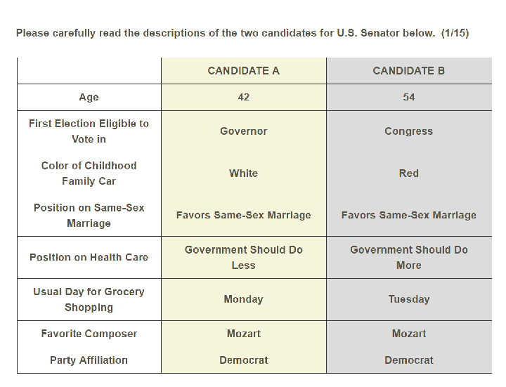
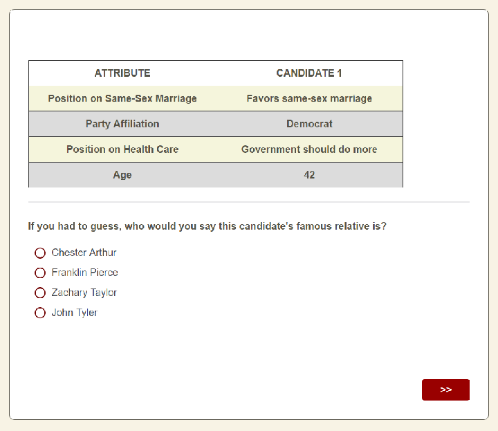

MIT Open Access Articles

Beyond the breaking point? Survey satisficing in conjoint experiments

|The MIT Faculty has made this article openly available. Please share how this access benefits you. Your story matters.|
|---|

Citation: Bansak, Kirk et al. "Beyond the breaking point? Survey satisficing in conjoint experiments." Political Science Research and Methods (May 2019): dx.doi.org/10.1017/ PSRM.2019.13 © 2019 The European Political Science Association

As Published: http://dx.doi.org/10.1017/PSRM.2019.13 Publisher: Cambridge University Press (CUP) Persistent URL: https://hdl.handle.net/1721.1/128564 Version: Original manuscript: author's manuscript prior to formal peer review Terms of use: Creative Commons Attribution-Noncommercial-Share Alike

# Beyond the Breaking Point? Survey Satisficing in Conjoint Experiments

Kirk Bansak∗ Jens Hainmueller† Daniel J. Hopkins‡ Teppei Yamamoto§

First Draft: May 9, 2017 This Draft: October 30, 2018

Abstract

Recent years have seen a renaissance of conjoint survey designs within social science. To date, however, researchers have lacked guidance on how many attributes they can include within conjoint profiles before survey satisficing leads to unacceptable declines in response quality. This paper addresses that question using pre-registered, two-stage experiments examining choices among hypothetical candidates for U.S. Senate or hotel rooms. In each experiment, we use the first stage to identify attributes which are perceived to be uncorrelated with the attribute of interest, so that their effects are not masked by those of the core attributes. In the second stage, we randomly assign respondents to conjoint designs with varying numbers of those filler attributes. We report the results of these experiments implemented via Amazon’s Mechanical Turk and Survey Sampling International. They demonstrate that our core quantities of interest are generally stable, with relatively modest increases in survey satisficing when respondents face large numbers of attributes.

Key Words: conjoint analysis, survey experiments, survey satisficing, response bias

∗Ph.D. Candidate, Department of Political Science, 616 Serra Street Encina Hall West, Room 100, Stanford, CA 94305-6044. E-mail: kbansak@stanford.edu

†Professor, Department of Political Science, 616 Serra Street Encina Hall West, Room 100, Stanford, CA 94305-

6044. E-mail: jhain@stanford.edu ‡Professor, Department of Political Science, University of Pennsylvania, 207 S. 37th Street, Philadelphia PA,

19104. E-mail: danhop@sas.upenn.edu

§Associate Professor, Department of Political Science, Massachusetts Institute of Technology, 77 Massachusetts Avenue, Cambridge, MA 02139. Email: teppei@mit.edu, URL: http://web.mit.edu/teppei/www

## 1 Introduction

In conjoint survey experiments, respondents are asked to evaluate hypothetical profiles comprised of multiple attributes. Such designs allow researchers to evaluate trade-offs, and so have been used to understand decision-making in fields including marketing (Green & Rao 1971), economics (Adamowicz et al. 1998), and sociology (Jasso & Rossi 1977). In recent years, the increasing use of computers to administer surveys has helped fuel an increase in conjoint experiments, especially in political science (Hainmueller et al. 2014).1

Despite this newfound interest, researchers have paid little attention to questions about how to optimally design conjoint surveys given well-known challenges in survey research. According to studies on survey-taking, tasks that involve high levels of cognitive effort are more likely to induce respondents to satisfice, meaning that they adapt by using cognitive shortcuts (Krosnick 1999). Survey satisficing manifests itself in various behaviors that diminish response quality: satisficing respondents are more likely to rush through surveys, ignore or skip instructions, choose response options based on their placement, and use other effort-saving heuristics (Berinsky et al. 2014). Conjoint experiments often present respondents with extensive information, making concerns about satisficing particularly acute.

Here, we draw on research on survey methodology to investigate a key question in designing conjoint experiments: how many attributes can researchers include in a given profile before survey satisficing degrades response quality? Specifically, we conduct a series of survey experiments to investigate the degree of satisficing when respondents are faced with varying numbers of attributes. Due to what we term the masking-satisficing trade-off, researchers cannot always minimize satisficing without potential side-effects. In typical applications of conjoint analysis, researchers are interested in estimands that represent effects of attributes on conjoint responses, such as the Average Marginal Component Effect (AMCE) (Hainmueller et al. 2014). Interpreting such estimands requires care because of their dependence on the entire set of attributes included in the experiment. For respondents, perceptions of one attribute are often linked to perceptions of others. Without information on the full set of relevant attributes, estimates of an AMCE of

1See especially Franchino & Zucchini (2014), Abrajano et al. (2015), Carnes & Lupu (2015), Hainmueller & Hopkins (2015), Horiuchi et al. (2018), Bansak et al. (2016), Bechtel et al. (2016), Mummolo & Nall (2016), Wright et al. (2016).

interest may be masking the effects of other, correlated attributes (see also Dafoe et al. 2018).

Because of concerns about masking and satisficing, researchers often face a binding tradeoff when designing conjoint experiments. If they include too few attributes, their quantities of interest could mask the effects of other, omitted attributes. In that case, there is a likely gap between the quantity of theoretical interest and the quantity researchers can estimate. But if researchers include too many attributes, they may encourage survey respondents to develop timesaving shortcuts that reduce the thoughtfulness of their responses. That, too, may lead the empirically observable quantities to diverge from those of theoretical interest.

The relationship between masking and satisficing poses an empirical challenge as well. How can we identify the change in satisficing across the varying number of attributes while holding the degree of masking—and thus the underlying causal quantities estimated from the experimentsconstant? If we were to randomly assign respondents to different numbers of meaningful attributes, we would risk conflating the effects of masking and satisficing, as any change in response patterns could be a product of the number of attributes or the changed information provided by the additional attributes. To overcome this challenge, we develop a novel, two-stage research design which enables us to isolate the effect of survey satisficing empirically, and we deploy our pre-registered design in two substantive domains. Specifically, we consider how American survey respondentsrecruited via Amazon’s Mechanical Turk (MT) or Survey Sampling International (SSI)—choose between hypothetical candidates for the U.S. Senate (Study 1) and hotel stay packages (Study 2).

In the studies’ first stages, we identify attributes which are unassociated with the core attributes of interest by asking respondents to guess those attributes’ values conditional on the core attribute values. For example, partisan affiliation is a core attribute of interest in study 1. Accordingly, we first provide respondents with basic information about hypothetical candidates’ party affiliation and other attributes of interest and then ask them to guess about several additional attributes, such as the name of the candidate’s elementary school. By doing so, we can identify “filler attributes” about which the core attributes provide no information—either for the full sample or for various subsamples—and thus whose effects are unlikely to be masked by the effects of the core attributes. In the second stage, we then randomly assign survey respondents to varying numbers of filler attributes. By design, the core attributes of interest are not predictive of these filler attributes, meaning that changes in the core attributes’ effects are primarily due to the increased

cognitive burden from the filler attributes.

Overall, our results demonstrate the robustness of conjoint experiments even for a large number of attributes, and so prove encouraging for their future use. There is a detectable but modest decline in overall predictive power as the number of filler attributes increases, one that is slightly more pronounced for SSI respondents. Even with as many as 35 filler attributes, respondents recruited through MT and SSI provide meaningful responses, making steady use of core attributes such as the candidate’s policy positions and views from the hotel room.

With these populations at least, conjoint designs are surprisingly robust to the inclusion of many filler attributes. With respect to the number of attributes, the “breaking points” of conjoint survey experiments appear to be outside the range of current practice. Beyond conjoint designs specifically, these results also speak to questions about the use of opt-in samples in survey research as well as effort and attention in survey-taking generally (Yeager et al. 2011, Berinsky et al. 2012, Mullinix et al. 2016), points to which we return in the conclusion.

## 2 Task Difficulty and the Masking-Satisficing Trade-off

Although conjoint experiments are a variant of survey research, researchers have yet to incorporate insights from research on survey methodology (e.g. Sudman et al. 1996, Krosnick 1999, Groves et al. 2011) when considering optimal conjoint designs. In this section, we explain the maskingsatisficing trade-off before developing expectations about how respondents are likely to approach conjoint experiments given prior research on survey design.

The trade-off between masking and task difficulty presents a key challenge. An important strength of conjoint designs is their capacity to include a variety of attributes simultaneously so as to examine their relative importance. Including many attributes can also help to limit the potential problem of masking (Hainmueller et al. 2014). The more attributes one includes within a conjoint task, the less likely it is that responses to the attribute(s) of interest will be partially driven by their perceived correlation with other, excluded attributes. Yet by including large numbers of attributes, researchers also increase the difficulty of the task, and thus risk inducing survey satisficing (Krosnick 1999). Our discussion below highlights this important but under-scrutinized dilemma.

### 2.1 Masking

Masking can occur if people’s perceptions of an attribute of interest are correlated with their perceptions about other attributes that are not included in the conjoint. For example, imagine that a researcher is interested in the role of partisanship in explaining vote choice, and she employs a fully randomized conjoint design that includes the party of the candidate as one attribute in the conjoint table. Given the assumptions detailed in Hainmueller et al. (2014), she can recover a valid causal estimate for the AMCE of party. Yet this AMCE is defined with respect to the other attributes that appeared alongside partisanship, and so can change as those attributes do (Hainmueller et al. 2014). For example, if voters use partisanship partly as a proxy for issue positions, the AMCE for partisanship is likely to be smaller when the conjoint tables include extensive information about candidates’ issue positions.

More generally, masking occurs when respondents perceive a correlation between an included attribute A and an excluded but influential attribute B. When B is excluded respondents may use A as a proxy for B, but if B is included they might instead decide using B and render A irrelevant. As a result, the AMCEs of A differ between designs where B is excluded or included.2 It is important to recognize that masking is distinct from omitted variable bias in that an estimate of an effect might be masking another while remaining a valid causal estimate. In the presence of masking, it is not that the researcher is getting an incorrect answer so much as she is asking a different question. If B is omitted, researchers get a valid estimate of the AMCE of A defined as the causal effect of A conditional on the design excluding B. If B is included, researchers still recover a valid estimate A’s AMCE, but that AMCE has a different meaning because it is now defined as the causal effect of A conditional on the design including B. This variability in the AMCEs stems from the conditional nature of these causal effects: the AMCEs are, by definition, functions of the whole set of attributes included in the design as well as their joint assignment distribution (Hainmueller et al. 2014). In Appendix A.1.1 we provide a formal definition of masking.

### 2.2 The Masking-Satisficing Trade-off

Researchers using conjoints therefore have to decide on what AMCEs they are interested in and choose the other included attributes accordingly. Now assume a set-up where a researcher has

- 2See also Dafoe et al. (2018) for an alternative formulation of a related phenomenon.

one or multiple core attributes that they care about and the goal is to isolate the effects of these core attributes from effects of other attributes that are potentially perceived to be associated with the core attributes. In this set-up the researcher has an incentive to include a large number of potentially associated attributes in the conjoint table to limit the possibility of masking.

To fix ideas, Figure 1 illustrates a sample conjoint task from Study 1. In it, respondents choose between two hypothetical Senate candidates. Imagine the researcher is interested to isolate the effect of party from other attributes that are perceived to be correlated with party. If voters place considerable weight on candidates’ gay marriage stances, they may use partisanship to approximate those stances when they are absent. Accordingly, researchers can reduce masking by providing information about candidates’ issue positions. More generally, if the researcher’s goal were simply to reduce masking without other constraints, she would provide full information to respondents, and so recover the precise effect of interest. In general, we should expect masking to decline as the number of attributes rises, with the extent of the decline depending on the perceived correlations among attributes.

However, as more attributes are added to the conjoint table, the task becomes more difficult for respondents. People can only hold so much information in working memory, and the upper bound is thought to be around nine pieces of information (Miller 1994). To ask respondents to process twenty pieces of information per candidate is likely to encourage them to adopt effortsaving cognitive strategies that ignore some of the information and so degrade response quality (Krosnick 1991, Mutz 2011). In other words, Including too many attributes may induce excessive survey satisficing, and so compromise the quality of survey responses. Note that excessive survey satisficing can also change the estimated AMCEs. For example, we would expect the AMCE estimates to be biased towards zero if survey satisficing means that some respondents no longer pay attention to the attribute values. For a more formal discussion, see Appendix A.1.2.

This fundamental tension is what we term the masking-satisficing trade-off: The goal to reduce masking pulls researchers to including many attributes in the conjoint, while the goal to reduce survey satisficing pulls researchers to including only a minimal number of attributes in the conjoint. But despite the importance of the masking-satisficing trade-off for the design of conjoint experiments, we know very little about just how severe this tradeoff is empirically. In particular, we do not know whether this trade-off is binding given the number of attributes researchers

commonly employ. One reason for this is that it is difficult to examine the tradeoff empirically because we need to have a design that allows us to distinguish changes in the AMCEs that results from satisficing, rather than masking. Below, we present a research design which enables us to assess these trade-offs empirically.

Figure 1: An example table from a typical conjoint experiment.

## 3 Study Design

Here, we use a novel, two-stage study design to investigate how many attributes one can include in conjoint profiles without making respondents’ evaluations overly prone to satisficing. A major challenge in doing so is the difficulty of distinguishing satisficing from other changes due to the increased number of attributes. Indeed, the same problem that motivates our question—the potential trade-off between masking and satisficing—also presents a problem to straightforward research designs which might address it. Imagine that we are interested in the effect of candidates’ party alignments on support for those candidates. We might develop a list of attributes that are likely to influence candidate choice and then randomly assign respondents to conjoint tasks with varying numbers of attributes. Yet in such a design, respondents in different experimental

conditions will differ in multiple ways: they see different numbers of attributes and have different types of information. As a result, if the attribute of interest has perceived correlation with the marginal attribute, the AMCE could change due to masking rather than satisficing.

To isolate the effect of satisficing, we employ a two-stage research design. The goal of the first stage is to identify attributes whose effects are known to not be masked by those of the attributes of interest. Those “filler attributes” are then used in our second stage to identify the change in the explanatory power of the main attributes as the overall number of attributes increases.

### 3.1 The First Stage: Validating Filler Attributes

The study design begins by choosing a set of “core” attributes of interest whose effects on respondent preferences will be measured. In both studies, we designate four core attributes. As described above, we investigate the extent to which adding “filler” attributes to the conjoint design leads to satisficing and so changes the effects of the core attributes. To ensure that such a change is the result of satisficing rather than masking, the study’s first stage identifies filler attributes that have no perceived correlation with the core attributes.

Specifically, the first stage entails a survey experiment in which we ask respondents to guess about prospective filler attributes based on the core attributes’ levels. If respondents are unable to guess the values of a filler attribute based on the core attribute values, that indicates that they do not perceive a meaningful association between the attributes. Since masking occurs because of the perceived association between the attribute of interest and the omitted attribute, the filler attributes that respondents do not perceive to be associated with any of the core attributes are unlikely to cause masking and therefore suitable for use in our second stage, in which we vary the number of filler attributes. In Appendix A.1.3, we formalize the conditions under which no masking would occur and discuss how our study design relates to those conditions.3

The first-stage experiment proceeds as follows. We first present respondents with tasks like that pictured in Figure 2. In each task, we present respondents with a profile comprised of randomly selected values for the four core attributes. The order of the attributes is also randomized and

3The effect of a core attribute A masks the effect of an omitted attribute B if (1) B is perceived to be associated with A and (2) B has a non-zero effect on the conjoint response when included in the task along with A. Here, we focus on attributes that do not satisfy the first condition, which is easier to test empirically. Most of our selected filler attributes in Study 1, however, turn out to be also likely to violate the second condition; the selected filler attributes in Study 2 violate the first but do satisfy the second condition. See Appendix A.1.3 for a more formal discussion.

- Figure 2: An example task from Study 1, first stage. Respondents are asked to guess at the value of a potential filler attribute given the values of four attributes of interest.

then fixed for each respondent. Given the attribute values in the profile, respondents are asked to guess the values of other, unobserved attributes. In some cases, respondents might perceive the unobserved attributes as correlated with the observed attributes: respondents who saw a Democratic candidate might be more likely to guess that the candidate was a high school teacher than a business owner. But in other cases, there is little reason to expect a correlation, and the guesses should be unrelated to the profile attributes. For instance, whether a hypothetical candidate supports or opposes same-sex marriage tells respondents nothing about which 19thcentury president is her relative. If there is no perceived association, the potentially irrelevant attribute cannot be masked by the attribute of interest. For a given, randomly generated profile, each respondent goes through all of the filler attributes in this manner in a randomized order. The task is repeated several times for each respondent, with a new set of core attribute levels in each task.

To evaluate the perceived association between each filler attribute and the core attributes—i.e.

to assess whether the core attributes were predictive of respondents’ expectations regarding the filler attributes—we employed a set of linear regressions. Specifically, each filler attribute was subjected to all possible dichotomizations given its number of levels. For a two-level attribute, only one dichotomization is possible, while for three- and four-level attributes, three and seven dichotomizations are possible, respectively. For each dichotomization, the dichotomized filler attribute was regressed on indicators for all four core attributes, resulting in a set of differencein-means estimates.4 Given the binary dependent variable specification, each difference-in-means estimate corresponds to a change in probability. For each filler attribute, we then evaluated the full set of difference-in-means estimates for all filler attribute dichotomizations and all core attribute indicator variables. Finally, we classified the attribute as “uncorrelated” if none of the differencein-means estimates for that attribute exceeded the threshold of seven percentage points.5 Although this threshold is somewhat arbitrary, it does not undermine the statistical validity of second-stage results since no data from the second stage was available when making those decisions.6

We note that these tests focus on whether the core attributes are correlated with the expected filler attributes on average. In Appendix A.6, we also conduct further (non-prespecified) tests to examine the potential for heterogeneity across respondents in the perceived associations that could give rise to more complex forms of masking. For example, we examine whether there is heterogeneity in the predictive power of the core attributes regarding the expected filler attributes across different types of respondents as stratified by party, income, gender, or age. The results from these additional tests support the notion that the uncorrelated filler attributes fail to meet the conditions required for their effects being masked by the effects of the core attributes.

- 4For core attributes with more than two levels, we also calculated pairwise differences between non-reference-level effects.
- 5We chose the seven percentage-point threshold based on results from many simulation experiments as well as our subjective judgment as to substantive significance of the effect sizes. We initially set the threshold at five percentage points (as documented in our pre-analysis plans) but changed it to seven percentage points after collecting data from the first stage experiments, but before any portion of the second stage experiments was conducted.
- 6It should also be noted that our procedure does not take into account statistical uncertainty in the estimates, implying that some fillers’ effects might be incorrectly classified as above or below the seven-percentage-point threshold. We are not particularly concerned about this possibility because of the large sample used, and also because the statistical properties of second-stage estimates do not themselves depend on the particular threshold chosen for the first-stage test, as discussed in the main text.

### 3.2 The Second Stage: Identifying Satisficing Due to Task Difficulty

In the second stage, respondents are presented with pairs of conjoint profiles—of hypothetical political candidates in Study 1 and hypothetical hotel room packages in Study 2—and asked to evaluate them. For instance, in Study 1, respondents are shown pairs of candidates for U.S. Senate and asked to choose their preferred candidate as well as rate each individual candidate. In this second stage, our goal is to assess how respondents’ evaluations of the profiles change as the profiles contain increasing numbers of attributes.

The results of the first stage allow us to identify uncorrelated filler attributes for use in the second stage. With that identified pool of uncorrelated filler attributes, we randomly assign respondents to different numbers of filler attributes so as to vary task difficulty. The four core attributes are always included in the profiles and randomly interspersed with any filler attributes. The example in Figure 3 illustrates the case where four fillers are included in Study 1.

As the number of filler attributes increases and the conjoint task becomes more demanding, do respondents adapt by providing less thoughtful responses? Our expectation is that any increased survey satisficing will induce respondents to pay less attention to the task, and so will attenuate the predictive power of the core attributes. We employ two measures of attributes’ predictive power. First, we estimate the AMCEs of the core attributes and compare the estimates across the different numbers of filler attributes. Since our filler attributes are unassociated with the core attributes by design, adding any of those filler attributes should not change the AMCEs of the core attributes due to masking. Instead, changes in the effects of the core attributes should be the result of increased survey satisficing due to the increased number of attributes.

Second, we calculate the coefficient of determination (i.e. R2) from the regression of conjoint responses on the four core attributes,7 and compare those R2s across the experimental conditions. Again, because the omission of unassociated filler attributes should not change the core attributes’ AMCEs due to masking, and because R2 is a function of the regression-based estimates of the AMCEs, changes in the R2 across the experimental conditions can be attributed to changes in satisficing. Note that the population value of this R2 is equivalent to the partial coefficient of determination (i.e. partial R2) for the core attributes from the “global” population regression of

7Specifically, we create dummy variables for all levels of each of the core attributes except for a reference level and regress the outcome on all the dummies.

- Figure 3: An example task from Study 1, second stage. Respondents are asked to assess two hypothetical candidates for U.S. Senate.

conjoint responses on the full set of attributes when the core and filler attributes are independently randomized. This implies that the R2 can be interpreted as a summary measure of the explanatory power of all the four core attributes combined, and its change as the overall variation in satisficing due to the addition of filler attributes.

## 4 Results

We implement our two-stage design in studies of two separate domains. The first considers choices among political candidates, as respondents are asked to choose between pairs of hypothetical candidates and to rate each candidate. In political science, analyzing candidate choice has been one of the most common uses of conjoint experiments (e.g. Loewen et al. 2012, Franchino & Zucchini 2014, Hainmueller et al. 2014, Abrajano et al. 2015, Carlson 2015, Carnes & Lupu 2015, Crowder-Meyer et al. 2015). The second study asks respondents to choose between and rate hotel room packages. We choose this topic partly because it was used in a celebrated, early application of conjoint analysis (Goldberg et al. 1984).

Another key difference between Study 1 and 2 concerns the nature of the filler attributes. In Study 1, we use filler attributes that are unlikely to have independent effects on respondents’ evaluations of political candidates (e.g. name of famous relative), meaning that they will not have any informational value for respondents. In contrast, Study 2 uses filler attributes that are more clearly meaningful and can plausibly drive responses in either a positive or negative direction (e.g. material in bed pillows). While the Study 1 fillers merely introduce irrelevant information that respondents must sift through, the Study 2 fillers add potentially meaningful information that respondents must weigh. Our expectation is that the latter set of filler attributes will induce more cognitive burden and lead to heightened satisficing. Specific procedures for both stages of both studies, as well as plans for our statistical analysis, were pre-registered at Political Science Registered Studies Dataverse prior to launching the study.8

### 4.1 Study 1: Political Candidates

- In Study 1, we investigate how the proliferation of irrelevant attributes affects the predictive power of candidates’ core attributes. The core attributes for this study are candidates’ party affiliation (Republican or Democratic), position on same-sex marriage (favor or oppose), position on health care (government should do more or less), and age (42, 54 or 72). To assess prospective filler attributes, we start with a list of candidate attributes that we expect to have no perceived correlation with the core attributes and often no effect on overall evaluations. We also include a

8Available at https://dataverse.harvard.edu/dataset.xhtml?persistentId=doi:10.7910/DVN/WX5UXL and https://dataverse.harvard.edu/dataset.xhtml?persistentId=doi:10.7910/DVN/SDFYTU.

number of attributes that we do expect to have varying degrees of perceived association with the core attributes to enable validity checks (e.g. ideology). The complete list of filler attributes is in Table A.1 in Appendix A.2.

The first-stage survey experiment was administered to 2,489 respondents recruited through MT on September 20, 2016. We chose MT because of its increasing popularity as a platform for conjoint experiments in the social sciences as well as its fast turnaround. While MT respondents are known to differ from population-based samples in important respects, they are an accessible, attentive population that is frequently employed in experimental research (Berinsky et al. 2012, Huff & Tingley 2014, Hauser & Schwarz 2015, Mullinix et al. 2016). For improved external validity, we also replicate the second stage of the study with SSI, another popular population for survey experiments. As detailed in Appendix A.2, our first-stage experiment identified five of the sixteen tested attributes as filler attributes that are perceived to be uncorrelated with any of the core attributes.

In the second-stage experiments, respondents were shown pairs of candidates for U.S. Senate and asked to choose their preferred candidate as well as rate each individual candidate. We randomly assign respondents to different numbers of filler attributes so as to vary task difficulty; the four core attributes of interest are always included in the profiles and are randomly ordered. The example in Figure 3 illustrates the case where four fillers are included.

We implemented this design using three MT surveys. The first took place on September 26th with 1,199 respondents; the second took place November 3rd and 4th with 2,476 respondents; and the third took place on November 21st with 422 respondents.9 In all three, after the respondents answered several socio-demographic questions, they were asked to complete 15 conjoint tasks. Critically, the waves differed in the number of filler attributes employed. The first stage-two survey was conducted exactly as specified in our pre-analysis study plan: we randomly assigned respondents to 0, 1, 2, 3, 4, or 5 previously validated filler attributes. After completing the first wave and observing the results, which indicated surprising robustness even for 5 filler attributes, we decided to administer additional waves with even larger numbers of fillers. The second MT wave thus included treatment arms with 0, 1, 2, 3, 4, 5, 6, 8, 10, 12, and 15 filler attributes. The third wave included only three conditions: 5, 25, and 35 filler attributes. For these additional waves, we

9Note that any respondent who participated in multiple waves of our survey was removed from all but the first wave in which she participated.

also employed untested filler attributes which we had good reason to believe would be perceived as unrelated to the core attributes. Appendix A.3 presents the full list of filler attributes. In the results below, we show estimates using all responses pooled from the three waves. The results that only use responses from the first, pre-registered wave are in Appendix A.3.

To quantify the extent of satisficing, we estimate the AMCEs corresponding to our four core attributes for each treatment condition for the pooled MT experiments, as illustrated in Figure

- 4 and Table A.3 in the Appendix. We limit the sample to those respondents who expressed an identification with or leaning toward the major parties, and we transform the party and issueposition measures such that they are indicators for concordance with the respondent’s partisan affiliation. We focus here on the forced choice outcomes, although the results for the candidate ratings are very similar (see Appendix A.3). Candidates’ partisanship proves to be a strong correlate of their choices: the AMCE associated with own-party candidates is 0.198 (SE=0.012) for those who saw no filler attributes, and it drops no lower than 0.147 (SE=0.016). In substantive terms, respondents are almost twenty percentage points more likely to opt for a candidate who shares their partisanship, an estimate which declines only slightly as the number of filler attributes grows.

The drops in the AMCE for sharing the candidate’s same-sex marriage position or health care position are similar: they are discernible but modest, and never obscure the relationships of interest. For instance, with zero filler attributes, the effect of a candidate’s position on samesex marriage is 0.228 (SE=0.019), an estimate that declines to no lower than 0.190 (SE=0.24). Candidates who are 72 years old are penalized, but this penalty is substantively smaller than the effects of the other core attributes (-0.080, SE=0.013 with no filler attributes), and it declines to insignificance alongside 35 filler attributes.

To consider the joint predictive power of the core attributes as the number of filler attributes rises, we calculate the partial R2 values from models in which we predict each of the forced choices as a function of the core attribute levels associated with each candidate. Figure 5 illustrates the results. Here, too, the results are consistent with a detectable but limited decrease in the core attributes’ predictive power as they are scattered among increasing numbers of filler attributes.

Next, given concerns about the extensive experience MT respondents are likely to have with surveys, we replicated our results with a survey of respondents available through SSI. These

##### Figure 4: The AMCEs for our core attributes of interest from the three MT survey waves as the number of filler attributes increases.

Own Party

0.25

0.20

0.15

0.10

Own SS Marriage Position

0.30

0.25

0.20

0.15

Own Healthcare Position

AMCEs with 95% CI

0.20

0.15

0.10

Age 54

0.05

0.00

−0.05

−0.10

Age 72

0.00

−0.05

−0.10

−0.15

0 1 2 3 4 5 6 8 10 12 15 25 35 Total Number of Fillers Shown

respondents are also self-selected, but the volume of surveys in which they participate is markedly lower on average. Our SSI survey included 2,786 respondents, and was administered between November 30th and December 8th, 2016. We randomized the respondents to 0, 2, 4, 6, 8, 10, 15, 25, or 35 filler attributes. All respondents were randomly assigned to a number of attributes which then remained fixed throughout the survey. We pre-registered this portion of the study as

##### of the filler attributes, fit to the MT data.

0.20

0.15

Partial R Squares

0.10

0.05

0.00

0 1 2 3 4 5 6 8 10 12 15 25 35 Total Number of Fillers Shown

an addendum to the original pre-analysis plan before conducting any analyses.10

Figure 6 and Table A.4 in Appendix A.3 present the AMCEs for our core attributes. The results are generally quite similar. We see detectable but typically modest declines for core attributes. The effect of sharing the candidate’s party is 0.197 (SE=0.015), a figure which drops to a low of 0.146 (SE=0.017) with 25 filler attributes. Sharing the candidate’s position on same-sex marriage has an AMCE of 0.190 (SE=0.021) when no filler attributes are present and 0.122 (SE=0.021) when there are 35. Similarly, sharing the candidate’s health care position drops from 0.146 (SE=0.020) to 0.090 (SE=0.018) in the presence of 25 filler attributes.

Replicating the procedure above, we also estimated partial R2 values associated with models including our core attributes but no filler attributes. Figure 7 illustrates the results. First, it demonstrates that the partial R2 values using the SSI data are consistently lower than those recovered from the MT data. This pattern is consistent with MT respondents on average paying more attention to the task, though it could also come from any difference in preferences between the two groups of respondents. Despite this lower baseline, the trend is similar, with a detectable decline in overall predictive power that is slightly more pronounced for cases where there are large

10Also available at https://dataverse.harvard.edu/dataset.xhtml?persistentId=doi:10.7910/DVN/WX5UXL.

##### Figure 6: The AMCEs for our core attributes of interest from the SSI survey as the number of filler attributes increases.

Own Party

0.25

0.20

0.15

0.10

Own SS Marriage Position

0.25

0.20

0.15

0.10

Own Healthcare Position

0.20

AMCEs with 95% CI

0.15

0.10

0.05

Age 54

0.05

0.00

−0.05

−0.10

Age 72

0.00

−0.05

−0.10

−0.15

0 1 2 4 6 8 10 15 25 35 Total Number of Fillers Shown

##### numbers of filler attributes. Overall, however, respondents provide meaningful responses even with as many as 35 filler attributes, a number much larger than what is employed in virtually all recent studies.

##### of the number of filler attributes, fit to the SSI data.

0.20

0.15

Partial R Squares

0.10

0.05

0.00

0 1 2 4 6 8 10 15 25 35 Total Number of Fillers Shown

### 4.2 Study 2: Hotel Rooms

- In Study 2, we employ a design similar to Study 1 but investigate respondents’ choice of hypothetical hotel rooms. The core attributes are the view from the room (ocean or mountain view), floor (top, club lounge, or gym and spa floor), bedroom furniture (1 king bed and 1 small couch or 1 queen bed and 1 large couch), and type of in-room wireless internet (free standard or paid high-bandwidth wireless).

Like in Study 1, we begin with a list of additional attributes that should have no perceived correlation with the core attributes, so they can be used as second-stage fillers. Unlike in Study 1, however, we choose attributes that are uncorrelated with the core attributes but likely to have their own effects on respondents’ preferences. The goal behind this modification is to investigate the impact of the increased cognitive burden due to the addition of meaningful information. Studying preferences about hotel rooms facilities the identification of such meaningful but uncorrelated attributes; in the candidate choice example, most relevant attributes are likely to be perceived as interrelated. As validity checks, we include two attributes that are likely to be associated with some of the core attributes (sailboats or trees viewable from hotel window, bedroom pillow size). Table A.8 in Appendix A.4 lists the full set of filler attributes.

We administered the first stage to 3,291 respondents recruited through MT on February 28 - March 2, 2017 (see Appendix A.4 for details). Using the same procedure as in Study 1, we identified 18 of the 38 potential filler attributes as perceived to be uncorrelated with the core attributes. In addition, we detected strong correlations between our validity-check fillers and the core attributes, confirming that our respondents were paying attention. We then proceeded to our second-stage experiment on March 6-7, 2017, again using MT respondents (N = 3,307). The experiment followed the same format as the corresponding experiment from Study 1. We randomly assigned respondents to 0, 1, 2, 3, 4, 5, 6, 8, 10, 14, or all of the 18 filler attributes. We then asked the respondents to complete choice and rating tasks on 15 pairs of hotel room profiles, each consisting of the four core attributes as well as a randomly chosen set of filler attributes.

Figure 9 shows the estimated AMCEs of our four core attributes across the treatment conditions. Again, we focus on the forced choice outcomes. The results for the rating outcomes are very similar and presented in Figure A.13 in Appendix A.5.11 When the design includes no filler attributes, almost all of our core attributes have strong impact on respondents’ preferences. The AMCE for an ocean view room is estimated at 0.175 (SE=0.018), meaning that respondents are more than 17 percentage points more likely to choose a room with an ocean view compared to a mountain view room. Respondents also prefer rooms with a king bed and a small couch to rooms with a queen bed and a large couch (AMCE=0.098, SE=0.03). The type of in-room internet is also important in respondents’ choices (AMCE=-0.303, SE=0.015), implying that respondents are on average 30 percentage points less likely to choose a room with paid high-bandwidth internet compared to the otherwise identical room with free standard wireless. In contrast, floor of the room turns out to be almost irrelevant.

The core, impactful attributes remain substantively significant when we add filler attributes. However, in contrast to Study 1 where we found a largely flat line across many filler conditions, the results indicate noticeable declines in the effects of each of these attributes as the number of fillers increases. For example, the estimated AMCE for an ocean view room drops to 0.141 (SE=0.015) when 6 randomly chosen fillers are included, and it further declines to 0.082 (SE=0.014) when the profile includes 18 fillers. It is nonetheless remarkable that the attribute retains nearly half of its original effect; the estimate still implies an 8.2 percentage point increase for ocean-view rooms.

11The similarity between the results for the forced choice and rating outcomes suggest that the core attribute effect attenuation we observe is unlikely driven by ceiling/floor effects.

##### Figure 8: The AMCEs for our core attributes of interest from the hotel survey as the number offiller attributes increases.

Ocean View

0.2

0.1

0.0

King Bed

0.2

0.1

0.0

Pay for Wireless

0.0

AMCEs with 95% CI

−0.1

−0.2

| | |
|---|---|
| | |

−0.3

10th Floor

0.1

0.0

−0.1

20th Floor

0.1

0.0

−0.1

0 1 2 3 4 5 6 8 10 14 18 Total Number of Fillers Shown

Likewise, the estimated AMCE of a king bed and a small couch decreases to 0.037 (SE=0.012) when the number of fillers is 18. For the wireless internet attribute, the AMCE is also estimated to be slightly less than half of its original value (-0.131, SE=0.014) with 18 fillers.

Conjoint tables that include as many as 22 fillers are rarely used in practice, and thus the 18-filler condition may not be a practical benchmark. Instead, conjoint studies, at least in the fields of political science and public policy, rarely use more than 10 attributes. Thus, it is useful to

##### Figure 9: The partial R2 values for our core attributes with the forced-choice outcomes from thehotel study, as function of the number of filler attributes.

0.20

| | |
|---|---|
| | |

0.15

Partial R Squares

0.10

0.05

0.00

0 1 2 3 4 5 6 8 10 14 18 Total Number of Fillers Shown

focus on the comparison between the experimental conditions in which 0 and 6 fillers are included. Moving from the former to the latter condition, the AMCEs each retain at least two-thirds of their initial magnitude, a demonstration of substantial robustness given that this comparison involves more than doubling the amount of meaningful information on the conjoint table.

Perhaps more importantly, the rate of attenuation of the AMCEs as additional fillers are added is virtually uniform across all of the attributes, meaning that the relative magnitudes of the estimated AMCEs remains unchanged across conditions. Accordingly, the qualitative conclusions one would draw about the relative effect sizes are invariant to the number of fillers included in the design. This finding is particularly notable given that a major contribution of conjoint designs is in allowing researchers to compare the relative magnitudes of effects across attributes.

## 5 Conclusion

There is an extensive body of research on how best to conduct phone surveys. It covers many issues researchers are likely to face in implementing telephone surveys, from survey length to question order. In recent years, the rapid growth of survey research conducted via computers has enabled researchers to employ increasingly complex research designs at little added cost. Yet,

research on survey methods has to date been focused on the change in sampling frames that has accompanied the shift toward online survey administration (e.g. Chang & Krosnick 2009, Yeager et al. 2011). For those administering surveys via computer, there is surprisingly little guidance about the extent to which insights developed for phone and in-person surveys hold up (but see Gooch & Vavreck 2015).

Conjoint experiments are one such design: they are easily implemented by computer, and so have seen a renaissance within political science in the past few years. In this paper, we sought to advance our understanding of response behavior in surveys administered by computer by probing one breaking point of conjoint designs. Specifically, we considered how many attributes researchers can include per profile. To include too few attributes may risk masking, while including too many may instead produce excessive satisficing.

Those who would assess this trade-off empirically face an empirical challenge. When changing the number of attributes, we also change the information that respondents have, and so shift the causal estimand. To isolate the effects of increased satisficing, this paper employs a set of pre-registered experiments using a novel, two-stage design in which we first isolated several “filler attributes” unrelated to the core attributes of interest. We then randomly assigned respondents to conjoint profiles with varying numbers of filler attributes.

Our first study used this design to estimate the effects of irrelevant filler attributes on response quality when respondents chose between hypothetical Senate candidates. Using such attributes, we found a detectable but substantively limited decline in the predictive power of our core attributes as the number of such filler attributes increased. Extraneous information does not on its own induce excessive satisficing, even when the number of such irrelevant attributes grows larger than the total number of attributes in most conjoint designs published recently.

Still, when researchers seek to include additional attributes, it is typically because those attributes are likely to be meaningful for the choice at hand. In our first study, the attributes did not have independent impacts on the outcome, making them atypical and limiting our capacity to generalize. To address that concern, our second study turned to a domain in which it was possible to identify attributes which had meaningful, independent effects on respondent choice without being correlated with the core attributes of interest: hotel rooms. In that case, respondents saw profiles which had many potentially meaningful attributes. Our second study thus allowed us

to examine satisficing in cases where respondents are potentially overwhelmed with meaningful information. Yet here, too, our central finding was the robustness of conjoint designs, as even 18 meaningful attributes did not erase the effects of our core attributes.

Our results have important implications for researchers designing conjoint studies. First, our results suggest that satisficing does not impose a serious binding constraint on the number of attributes included in a conjoint design.12 Certainly, there is no single magic number of attributes which promises to guard against excessive satisficing. However, the limits on the upper number of attributes that we considered in our studies were purposefully set at levels above conventional practice. Even given this high number of filler attributes, the core attributes retained most of their effect magnitudes. More importantly, the addition of filler attributes did not affect the relative sizes of the core attribute effects. In other words, while satisficing appears to result in some attenuation, we do not find it to systematically alter the pattern of results, thereby ensuring that the broad interpretation of the results would remain unchanged. This points to the robustness of the conjoint design for investigating multidimensional preferences by comparing the relative importance of many different attributes.

Second, these results also yield concrete recommendations for researchers. Specifically, researchers should not allow concerns about satisficing to dictate their conjoint design decisions in terms of the number of attributes, assuming that the number is kept within the limits investigated in the studies presented here. Instead, researchers should prioritize other criteria in making their design choices. In particular, attribute selection and profile design choices should focus on accounting for masking in a way that fits the theoretical questions of interest, and on achieving the desired level of realism in the conjoint profiles.

We recognize that our studies were implemented using opt-in internet samples, which are likely to be different from other samples of respondents who have less experience taking surveys or face reduced incentives to pay attention. Yet the most commonly used samples for conjoint surveys today are opt-in internet samples, making our results relevant for a broad set of researchers. In addition, we recognize that the difficulty of a conjoint survey also depends on its subject matter. For example, evaluating two candidates for Senate is a familiar task, and is likely to be easier than evaluating multidimensional choices in less common domains. Future work that extends this

12In a companion study, we investigate the extent to which increasing the number of choice tasks in a conjoint design affects response quality, and we find similar robustness to satisficing on that dimension (Bansak et al. 2018).

##### research to less attentive populations and/or different subject matter domains would be valuable.

## References

Abrajano, M. A., Elmendorf, C. S. & Quinn, K. M. (2015), ‘Using experiments to estimate racially polarized voting’. UC Davis Legal Studies Research Paper Series, No. 419.

Adamowicz, W., Boxall, P., Williams, M. & Louviere, J. (1998), ‘Stated preference approaches for measuring passive use values: choice experiments and contingent valuation’, American journal of agricultural economics 80(1), 64–75.

Bansak, K., Hainmueller, J. & Hangartner, D. (2016), ‘How economic, humanitarian, and religious concerns shape european attitudes toward asylum seekers’, Science 354(6309), 217–222.

Bansak, K., Hainmueller, J., Hopkins, D. J. & Yamamoto, T. (2018), ‘The number of choice tasks and survey satisficing in conjoint experiments’, Political Analysis 26(1), 112–119.

Bechtel, M. M., Genovese, F. & Scheve, K. F. (2016), ‘Interests, norms, and support for the provision of global public goods: The case of climate cooperation’, British Journal of Political Science Forthcoming.

Berinsky, A. J., Huber, G. A. & Lenz, G. S. (2012), ‘Evaluating online labor markets for experimental research: Amazon.com’s mechanical turk’, Political Analysis 20, 351–368.

Berinsky, A. J., Margolis, M. F. & Sances, M. W. (2014), ‘Separating the shirkers from the workers? making sure respondents pay attention on self-administered surveys’, American Journal of Political Science 58(3), 739–753.

Carlson, E. (2015), ‘Ethnic voting and accountability in africa: A choice experiment in uganda’, World Politics 67(02), 353–385.

Carnes, N. & Lupu, N. (2015), ‘Do voters dislike politicians from the working class?’. Working Paper, Duke University.

Chang, L. & Krosnick, J. A. (2009), ‘National surveys via rdd telephone interviewing versus the internet: Comparing sample representativeness and response quality’, Public Opinion Quarterly 73(4), 641–678.

Crowder-Meyer, M., Gadarian, S. K., Trounstine, J. & Vue, K. (2015), ‘Complex interactions: Candidate race, sex, electoral institutions, and voter choice’. Paper presented at the Annual Meeting of the Midwest Political Science Association, Chicago, IL, April 16-19.

Dafoe, A., Zhang, B. & Caughey, D. (2018), ‘Information equivalence in survey experiments’, Political Analysis 26(4), 399–416.

Franchino, F. & Zucchini, F. (2014), ‘Voting in a multi-dimensional space: A conjoint analysis employing valence and ideology attributes of candidates’, Political Science Research and Methods pp. 1–21.

Goldberg, S. M., Green, P. E. & Wind, Y. (1984), ‘Conjoint analysis of price premiums for hotel amenities’, Journal of Business pp. S111–S132.

Gooch, A. & Vavreck, L. (2015), ‘How face-to-face interviews and cognitive skill affect nonresponse: A randomized experiment assigning mode of interview’. Working Paper, University of California, Los Angeles.

Green, P. E. & Rao, V. R. (1971), ‘Conjoint measurement for quantifying judgmental data’, Journal of Marketing Research VIII, 355–363.

Groves, R. M., Fowler Jr, F. J., Couper, M. P., Lepkowski, J. M., Singer, E. & Tourangeau, R.

(2011), Survey Methodology, Vol. 561, John Wiley & Sons.

Hainmueller, J. & Hopkins, D. J. (2015), ‘The hidden american immigration consensus: A conjoint analysis of attitudes toward immigrants’, American Journal of Political Science 59(3), 529–548.

Hainmueller, J., Hopkins, D. J. & Yamamoto, T. (2014), ‘Causal inference in conjoint analysis: Understanding multidimensional choices via stated preference experiments’, Political Analysis 22(1), 1–30.

Hauser, D. J. & Schwarz, N. (2015), ‘Attentive turkers: Mturk participants perform better on online attention checks than do subject pool participants’, Behavior research methods pp. 1–8.

Horiuchi, Y., Smith, D. M. & Yamamoto, T. (2018), ‘Measuring voters’ multidimensional policy preferences with conjoint analysis: Application to japan’s 2014 election’, Political Analysis 26(2), 190–209.

Huff, C. & Tingley, D. (2014), “who are these people?’: Evaluating the demographic characteristics and political preferences of mturk survey respondents’. Working Paper, Harvard University.

Jasso, G. & Rossi, P. H. (1977), ‘Distributive justice and earned income’, American Sociological Review 42(4), 639–51.

Krosnick, J. A. (1991), ‘Response strategies for coping with the cognitive demands of attitude measures in surveys’, Applied Cognitive Psychology 5(3), 213–236.

Krosnick, J. A. (1999), ‘Survey research’, Annual Review of Psychology 50(1), 537–567.

Loewen, P. J., Rubenson, D. & Spirling, A. (2012), ‘Testing the power of arguments in referendums: A bradley–terry approach’, Electoral Studies 31(1), 212–221.

Miller, G. A. (1994), ‘The magical number seven, plus or minus two: Some limits on our capacity for processing information.’, Psychological review 101(2), 343.

Mullinix, K. J., Leeper, T. J., Druckman, J. N. & Freese, J. (2016), ‘The generalizability of survey experiments’, Journal of Experimental Political Science 2(2), 109–138.

Mummolo, J. & Nall, C. (2016), ‘why partisans dont sort: The constraints on political segregation’, The Journal of Politics Forthcoming.

Mutz, D. C. (2011), Population-based Survey Experiments, Princeton University Press, Princeton, NJ.

Sudman, S., Bradburn, N. M. & Schwarz, N. (1996), Thinking about Answers: The Application of Cognitive Processes to Survey Methodology., San Francisco, CA: Jossey-Bass.

Wright, M., Levy, M. & Citrin, J. (2016), ‘Public attitudes toward immigration policy across the legal/illegal divide: The role of categorical and attribute-based decision-making’, Political Behavior 38(1), 229–253.

##### Yeager, D. S., Krosnick, J. A., Chang, L., Javitz, H. S., Levendusky, M. S., Simpser, A. & Wang, R. (2011), ‘Comparing the accuracy of rdd telephone surveys and internet surveys conducted with probability and non-probability samples’, Public opinion quarterly 75(4), 709–747.

## Supplementary Materials

### A.1 Formal Discussion of the Study Design

In this appendix, we formally define the concepts of masking and satisficing based on the potential outcomes framework for causal inference. We then justify our study design based on the formalization. We clarify the assumptions required for the proposed study design to identify satisficing and then discuss possible approaches for testing the assumptions, tests which we implement in our empirical study.

- A.1.1 Masking Suppose that we have L core attributes of interest and our goal is to estimate the causal effect of those attributes on a conjoint survey response denoted by Yi for respondent i ∈ {1,...,N}. For the sake of simplicity, we assume that the attributes are all binary, such that the values of the core attributes assigned to respondent i can be fully represented by a vector of L binary indicator variables, Di ≡ [D1i,...,DLi] . Using the potential outcomes framework, we can denote the value of the outcome variable that would be realized for respondent i given a pair of conjoint profiles Di = d by Yi(d) or Yi(d1,...,dL). (Note that we make the dependence of the potential outcomes on other profiles in the same conjoint task implicit.) Following Hainmueller et al. (2014) (hereafter HHY), the AMCE for the first core attribute can be defined as

τ1 ≡ E[τ1i] ≡ E[Yi(1,D(−1)i) − Yi(0,D(−1)i)],

where D(−1)i represents the values of the core attributes for respondent i excluding the first attribute. The AMCEs for the other L − 1 core attributes can be analogously defined. HHY show that, under the completely independent randomization of all attributes (Assumption 5, HHY), the AMCE of each of these attributes can be identified by the population ordinary least squares (OLS) regression of the observed outcome Yi on Di, i.e. L(Yi|Di) = τ0 +τ Di where τ = [τ1,...,τL] and L(·|·) is the linear projection operator.

Now, suppose that we are interested in the AMCE of Di conditional on the design that includes another set of M attributes Fi ≡ [F1i,...,FMi] , which we call the filler attributes. That is, our quantity of interest is the average causal effects of the core attributes when respondents are also

given information about the filler attributes. Under the assumptions discussed below, this quantity of interest can be written as β ≡ E[βi] such that

Yi(d) = β0 + β i d + γ i Fi + εi, (1)

where E[εi] = 0. One obvious approach to identifying β is to implement a fully randomized conjoint experiment with the design of interest, i.e. include both Di and Fi in the design with completely independent randomization. The population OLS regression of Yi on Di (or on Di and Fi) will identify β because the actual Di and Fi will be uncorrelated with either εi or each other.

In practice, however, researchers may wish to avoid this approach because of concerns about satisficing, as we discuss in the main text. Suppose instead that we use the conjoint design with only Di as included attributes. The values of the filler attributes for respondent i will then not be assigned by the design, but mentally imputed by respondents based on their perceived association between the core and filler attributes. Denote the imputed values of the filler attributes given the core attributes d by Fi(d), such that the potential outcome is now written as Yi(d) = β0 + β i d + γ i Fi(d) + εi. Under the assumption discussed below, the imputed value of the filler attributes can be expressed as,

Fi(d) = α0 + Aid + ωi, (2)

where Ai is a M × L matrix of parameters representing partial effects of Di on Fi, α0 is a vector of M intercepts and E[ωi] = 0.

Masking can now be defined as τ − β, i.e. the difference between the AMCE of Di conditional on the design that includes Di only and the true causal effect of interest—the AMCE of Di conditional on the design that includes both Di and Fi. Under the assumptions embedded in

equations (1) and (2), masking for the first core attribute can be written as

τ1 − β1 = E[τ1i − β1i]

= E[Yi(1,D(−1)i) − Yi(0,D(−1)i) − β1i]

= E[(β0 + β1i + β (−1)id−1 + γ i Fi(1,D(−1)i) + εi) −(β0 + β (−1)id−1 + γ i Fi(0,D(−1)i) + εi) − β1i]

= E[γ i Fi(1,D(−1)i) − Fi(0,D(−1)i) ]

= E[γ i (α0 + A1i + A(−1)id−1 + ωi − α0 − A(−1)id−1 − ωi)]

= E[γ i A1i], (3)

and masking for the other L − 1 core attributes can be derived analogously. Equation (3) implies that β cannot be identified under the conjoint design that includes only the core attributes unless either of the following conditions is satisfied: (1) γi = 0, i.e., the filler attributes have no effect on the outcome for any respondent, or (2) Ai = 0, i.e., the core attributes have no perceived association with the filler attributes for any respondent.

#### A.1.2 Satisficing

Now, we consider the alternative identification strategy for β: including both Di and Fi in the conjoint design. A practical concern for this approach is that including both Di and Fi might cause satisficing, meaning that some respondents stop paying attention to the conjoint questions due to increased task difficulty. One way of formalizing the concept of satisficing under the current framework is to define it as a change in the data generating process for the observed outcome, such that it is no longer a function of the attributes. That is, respondent i is satisficing if the observed outcome Yi does not equal the potential outcome Yi(d) given by equation (1). We note that this is a form of a Stable Unit Treatment Value Assumption (SUTVA) violation, because Yi = Yi(d) even when Di = d.

Satisficing generally causes attenuation bias in AMCE estimates that are otherwise unbiased. To see why, suppose that satisficing is of a form such that Yi | Di i.i.d.∼ L(y) where L(y) is a probability distribution that does not depend on Di, and that respondents randomly satisfice 100p percent of the time under the design with both the core and filler attributes but not under

the core-only design, where the level of satisficing p ∈ (0,1). Then, the population OLS regression of Yi on Di under the design including both the core and filler attributes will identify (1 − p)β, which is attenuated towards zero compared to β (i.e. |(1 − p)β| < |β|).

#### A.1.3 The Proposed Study Design

The above discussion implies that a naı¨ve comparison of the AMCEs of the core attributes under the two designs—the core-only design and the design with both the core and filler attributeswill not isolate the amount of satisficing (i.e., p) because of the masking under the core-only design. A possible solution for this identification problem would entail utilizing the filler attributes that satisfy either of the no-masking conditions, i.e. γi = 0 or Ai = 0. Our proposed twostage study design focuses on the second condition. More specifically, our first-stage experiment corresponds to empirically testing an observable implication of the second condition, E[Ai] = 0. Indeed, this is a sufficient condition for no masking if we assume Cor(γi,Ai) = 0, i.e., if respondents’ perceived association between Di and Fi is uncorrelated with the effect of Fi on their conjoint responses. In other words, the tests in our first-stage experiment guarantee (with specified statistical uncertainty) that there is no masking for the core attributes caused by the filler attributes unless there exist respondents for whom Ai = 0 and they weigh those filler attributes systematically differently from the rest of the respondents in their conjoint responses. We call this latter (rather pathological) scenario complex masking. In Appendix A.6, we present empirical evidence that complex masking is highly unlikely in our experiment.

It is also important to note that the above discussion rests on a set of simplifying assumptions about the potential outcomes. Specifically, our model for the potential outcomes (i.e. equations (1) and (2)) assumes that there are no interaction effects on the outcome: 1) among any of the core attributes; 2) among any of the filler attributes; or 3) between any core and filler attributes. These assumptions are immaterial for the purpose of identifying filler attributes that cause no masking for the core attributes based on the proposed study design. However, we also assume that there are no interaction effects among the core attributes on the filler attributes, and this assumption is potentially consequential. Put differently, filler attributes could also cause masking if certain combinations of their values are perceived to be associated with the core attributes, even if those attributes are all individually unassociated. Appendix A.6 also empirically investigates the plausibility of this assumption, suggesting that it is indeed unlikely that such

interactive association exists in respondents’ perceptions.

### A.2 Details of the First Stage, Study 1

Table A.1: Filler Attributes Tested in First Stage of Study 1

|Attribute|Levels|
|---|---|
|Famous relative Elementary school Favorite highway Vacation spot Marital Status Ideology Position on immigration policy  Position on gun control  Education  Annual income Prior elected office Occupation Gender Military Race Children  |Franklin Pierce, Chester Arthur, John Tyler, Zachary Taylor Washington School, Jefferson School, Madison School Route 71, Route 73, Route 77, Route 79 Crystal Lake, Twin Lake, Spring Lake, Long Lake single, married, divorced liberal, conservative deport all unauthorized immigrants who are in the country illegally, allow unauthorized immigrants to stay but do not allow them to be citizens, allow all unauthorized immigrants to become citizens protect all Americans’ right to have guns, restrict ownership of some guns high school degree, college degree, college degree from Ivy League university $75k, $180k, $290k none, governor, senator business owner, lawyer, high school teacher, car dealer male, female did not serve, served white, African American, Asian American, Hispanic/Latino 0, 1, 2, 3|

Figure A.1 displays the results for the five filler attributes we tested that, in theory, should not be associated with the fixed attributes. The difference-in-means estimates are plotted in order of decreasing magnitude, with 95% confidence intervals constructed using standard errors that are clustered by respondent.13 As the results show, the estimates for all five filler attributes are all substantively close to zero, with few estimates that are statistically significant. The estimate with the highest magnitude pertains to the marital status filler attribute, at approximately 0.055. While statistically distinguishable from zero, such a small effect is unlikely to contribute to a meaningful amount of masking, even if marital status had a sizable effect on candidate preferences.

13Because the age attribute in the first study included three levels, and hence two indicator variables, the difference between the two age indicators was also included in addition to the two age indicator variables themselves.

- Figure A.1: Results from Study 1, first stage. Evidence of non-association between core attributes and filler attributes.

Highway

0.2

0.0

−0.2

0 10 20 30 40

Marital

0.2

0.0

−0.2

0 5 10 15

Dichotomized Effect with 95% CI

Relative

0.2

0.0

−0.2

0 10 20 30 40

School

0.2

0.0

−0.2

0 5 10 15

Vacation

0.2

0.0

−0.2

0 10 20 30 40

Index

##### Figure A.2 shows similar plots for simulated filler attributes which have no association with the fixed attributes by construction. As can be seen, the patterns of actual estimates in Figure

- Figure A.2: Simulated Results from Study 1, first stage. Results using filler attributes that are simulated to have no association with the core attributes.

- 2−Level Simulated Filler

- 3−Level Simulated Filler

- 4−Level Simulated Filler

0.2

0.0

−0.2

2 4 6

Dichotomized Effect with 95% CI

0.2

0.0

−0.2

0 5 10 15

0.2

0.0

−0.2

0 10 20 30 40

Index

A.1 look similar to those of the simulated fillers, further illustrating the virtual non-association between the five filler attributes and the core attributes. In sum, based on the small magnitudes of the full set of difference-in-means estimates for these five filler attributes, it is not plausible that any of them could contribute to a meaningful amount of masking with respect to the core attributes. As a result, because these filler attributes do not pose the threat of masking, they can be used to isolate the possible effects of satisficing in the second stage of Study 1.

As an opposite point of comparison, Figures A.3-A.5 illustrate the results for a collection of filler attributes expected to have varying degrees of association with the core attributes. As the figures show, for each of these attributes, the estimates reach much higher magnitudes. In contrast to the five filler attributes discussed above, the filler attributes presented in Figures A.3-A.5 would

- Figure A.3: Associated Fillers in Study 1, first stage. These filler attributes are associated with the Age core attribute.

Children

0.2

0.0

−0.2

0 10 20 30 40

Education

0.2

Dichotomized Effect with 95% CI

0.0

−0.2

0 5 10 15

Income

0.2

0.0

−0.2

0 5 10 15

Political Experience

0.2

0.0

−0.2

0 5 10 15

Index

##### be ill-suited for isolating the effects of satisficing from masking.

- Figure A.4: Associated Fillers in Study 1, first stage. These filler attributes are associated with the Party and Issue Position core attributes.

Gender

0.2

0.0

−0.2

2 4 6

Military Experience

0.2

Dichotomized Effect with 95% CI

0.0

−0.2

2 4 6

Previous Occupation

0.2

0.0

−0.2

0 10 20 30 40

Race/Ethnicity

0.2

0.0

−0.2

0 10 20 30 40

Index

- Figure A.5: Associated Fillers in Study 1, first stage. These filler attributes are associated with the Party and Issue Position core attributes.

Political Ideology

0.50

0.25

0.00

−0.25

−0.50

2 4 6

Dichotomized Effect with 95% CI

Position on Gun Control

0.50

0.25

0.00

−0.25

−0.50

2 4 6

Position on Immigration

0.50

0.25

0.00

−0.25

−0.50

0 5 10 15

Index

### A.3 Details and Additional Results from the Second Stage, Study 1

##### Table A.2: Filler Attributes for Second-Stage Conjoint Experiments in Study 1

|Attribute|Levels|Waves|
|---|---|---|
|Famous Relative|Franklin Pierce, Chester Arthur, John Tyler,|MT1, MT2, MT3,|
| |Zachary Taylor|SSI|
|Elementary School|Washington School, Jefferson School, Madison|MT1, MT2, MT3,|
| |School|SSI|
|Favorite Highway|Route 71, Route 73, Route 77, Route 79|MT1, MT2, MT3,|
| | |SSI|
|Favorite Vacation Spot|Crystal Lake, Twin Lake, Spring Lake, Long|MT1, MT2, MT3,|
| |Lake|SSI|
|Marital Status|Single, Married, Divorced|MT1, MT2, MT3,|
| | |SSI|
|Family Dog’s Name|Rover, Bailey, Charlie, Buddy, Duke|MT2, MT3, SSI|
|Favorite Ice Cream Flavor|Chocolate, Vanilla, Strawberry|MT2, MT3, SSI|
|First Election Eligible to Vote in|Congress, Governor, President|MT2, MT3, SSI|
|Age when First Voted for Presi-|18, 19, 20, 21|MT2, MT3, SSI|
|dent| | |
|Took High School Trip to Wash-|9th Grade, 10th Grade, 11th Grade, 12th|MT2, MT3, SSI|
|ington DC in|Grade| |
|Birthstone|Red Garnet, Emerald, Sapphire, Opal|MT2, MT3, SSI|
|9th Grade First-Period Class|Math, History, English, Science|MT2, MT3, SSI|
|Favorite Dinosaur as a Child|Triceratops, Stegosaurus, Allosaurus, Tyran-|MT2, MT3, SSI|
| |nosaurus| |
|First Book Report on|George Washington, John Adams, Thomas|MT2, MT3, SSI|
| |Jefferson, James Madison| |
|Wedding Anniversary|May 14, June 12, September 16, October 10|MT2, MT3|
|Born on a|Monday, Tuesday, Wednesday, Thursday|MT3, SSI|
|Favorite Color|Blue, Green, Orange, Red|MT3, SSI|
|Born in|Odd Year, Even Year|MT3, SSI|
|First Name Ends in a|Vowel, Consonant|MT3, SSI|
|Disliked Food|Bananas, Pickles, Lettuce, Popcorn|MT3, SSI|
|Shares a Birthday with Family|Yes, No|MT3, SSI|
|Member| | |
|Sixth Grade Classroom on|First Floor, Second Floor, Third Floor|MT3, SSI|
|Favorite Baseball Team Won|Candidate was 6, Candidate was 7, Candidate|MT3, SSI|
|World Series when|was 8, Candidate was 9| |
|Favorite Morning Beverage|Coffee, Milk, Orange Juice, Water|MT3, SSI|
|Favorite Season|Winter, Spring, Summer, Autumn|MT3, SSI|
|Type of Tree in Home Backyard|Oak, Maple, Pine|MT3, SSI|
|Favorite Composer|Beethoven, Bach, Mozart|MT3, SSI|
|Current Home Address is on a|Street, Road, Way, Avenue|MT3, SSI|
|Home Front Door Faces|North, South, East, West|MT3, SSI|
|Color of Childhood Family Car|White, Black, Silver, Red|MT3, SSI|
|Best High School Sports Team|Basketball Team, Track and Field Team, Soc-|MT3, SSI|
|was|cer Team, Baseball Team| |
|Prefers to Respond to E-mail in|Morning, Afternoon, Evening|MT3, SSI|
|the| | |
|Usual Day for Grocery Shopping|Saturday, Sunday, Monday, Tuesday|MT3, SSI|
|Relative Fought in|World War I, World War II, Vietnam War,|MT3, SSI|
| |Korean War| |
|Has Visited the Grand Canyon|Yes, No|MT3, SSI|
|Preferred Side to Sit on when|Left, Right|SSI|
|Riding a Train| | |

TableA.3:MTurkSample(PooledacrossWaves),DV:Preference(ForcedChoice)

#Fillers012345681012152535

(0.012)(0.011)(0.011)(0.012)(0.011)(0.010)(0.016)(0.017)(0.015)(0.016)(0.016)(0.021)(0.022)

∗∗∗∗∗∗∗∗∗∗∗∗∗γOwnParty0.1980.2050.1990.1780.1700.1840.1470.1930.1540.1920.1580.1580.178

(0.019)(0.018)(0.017)(0.018)(0.018)(0.015)(0.025)(0.024)(0.024)(0.022)(0.025)(0.031)(0.030)

∗∗∗∗∗∗∗∗∗∗∗∗∗γSSMarriagePosition0.2280.2320.2290.2330.2020.2310.2330.1900.2430.2580.2320.2200.206

(0.015)(0.015)(0.015)(0.014)(0.015)(0.013)(0.020)(0.019)(0.019)(0.019)(0.020)(0.024)(0.023)

∗∗∗∗∗∗∗∗∗∗∗∗∗γHealthcarePosition0.1930.1580.1600.1890.1630.1770.1680.1700.1810.1870.1800.1250.151

(0.012)(0.011)(0.011)(0.012)(0.011)(0.010)(0.015)(0.015)(0.015)(0.014)(0.015)(0.020)(0.020)

∗∗−−−−−−−−−−Age540.0070.0080.0060.0250.0030.0080.0130.0070.0300.0050.0120.0140.027

∗∗∗∗∗∗∗∗∗∗∗∗−−−−−−−−−−−−−Age720.0800.0910.1000.1240.0840.0700.0680.0810.0770.0820.0460.0730.041

(0.013)(0.012)(0.012)(0.013)(0.012)(0.011)(0.018)(0.018)(0.017)(0.015)(0.017)(0.019)(0.021)

2R0.1310.1300.1270.1320.1020.1230.1090.1080.1190.1440.1150.0950.098

2Adj.R0.1300.1300.1270.1320.1010.1220.1090.1070.1180.1430.1140.0940.097

Num.obs.1080011520111601110011460143706090642060306060573037203540

∗p<0.05,standarderrorsclusteredbyrespondent.

γ:codedinconcordancewithpartisanaffiliation.

Allmodelsfitwithonlycoreattributes.

TableA.4:SSISample,DV:Preference(ForcedChoice)

#Fillers01246810152535

(0.015)(0.015)(0.015)(0.015)(0.016)(0.016)(0.015)(0.016)(0.017)(0.016)

∗∗∗∗∗∗∗∗∗∗γOwnParty0.1970.1820.2030.1480.1720.2180.1570.1720.1460.176

(0.021)(0.022)(0.024)(0.023)(0.021)(0.021)(0.020)(0.022)(0.022)(0.021)

∗∗∗∗∗∗∗∗∗∗γSSMarriagePosition0.1900.1290.1550.1470.1580.1260.1690.1270.1280.122

(0.020)(0.019)(0.020)(0.020)(0.018)(0.018)(0.018)(0.017)(0.018)(0.016)

∗∗∗∗∗∗∗∗∗∗γHealthcarePosition0.1460.1220.1310.1110.1130.1250.1380.1010.0900.100

(0.014)(0.013)(0.016)(0.015)(0.014)(0.015)(0.014)(0.014)(0.016)(0.014)

∗−−−−−−Age540.0010.0100.0090.0480.0040.0100.0190.0210.0250.011

∗∗∗∗∗∗∗∗∗∗−−−−−−−−−−Age720.0740.0610.0920.1070.0690.0460.0560.0740.0690.040

(0.014)(0.015)(0.017)(0.017)(0.015)(0.015)(0.015)(0.017)(0.018)(0.015)

2R0.1030.0690.0880.0620.0710.0800.0740.0620.0490.059

2Adj.R0.1020.0690.0870.0620.0700.0790.0740.0610.0480.058

Num.obs.7230777067207020723072307290687065707080

∗p<0.05,standarderrorsclusteredbyrespondent.

γ:codedinconcordancewithpartisanaffiliation.

Allmodelsfitwithonlycoreattributes.

- Figure A.6: This figure illustrates the AMCEs for our core attributes of interest from only the first MT survey wave as the number of relevant attributes increases.

Own Party

0.25

0.20

0.15

Own SS Marriage Position

0.32

0.28

0.24

0.20

0.16

Own Healthcare Position

AMCEs with 95% CI

0.25

0.20

0.15

0.10

Age 54

0.05

|0.00| | | | | |
|---|---|---|---|---|---|
| | | | | | |

| | |
|---|---|
| | |

−0.05

−0.10

Age 72

0.00

−0.05

−0.10

−0.15

0 1 2 3 4 5 Total Number of Fillers Shown

##### Figure A.7: This figure illustrates the partial R-squared values from models of the forced-choiceoutcomes using the core attributes as covariates, fit to only the first wave of the MT data.

0.20

0.15

Partial R Squares

0.10

0.05

0.00

0 1 2 3 4 5 Total Number of Fillers Shown

- Figure A.8: This figure illustrates the AMCEs for our core attributes of interest from the three MT survey waves as the number of relevant attributes increases, using the rating dependent variable.

Own Party

1.0

0.8

0.6

Own SS Marriage Position

1.5

1.3

1.1

0.9

0.7

Own Healthcare Position

0 1 2 3 4 5 6 8 10 12 15 25 35 AMCEs with 95% CI

0.8

0.6

0.4

0.2

Age 54

- −0.2

- −0.1

0.0

0.1

−0.3

- −0.2

Age 72

0.1

0.0

−0.1

- Figure A.9: This figure illustrates the AMCEs for our core attributes of interest from the SSI survey wave as the number of relevant attributes increases, using the rating dependent variable.

Own Party

1.0

0.8

0.6

Own SS Marriage Position

1.00

0.75

0.50

0.25

Own Healthcare Position

0 1 2 4 6 8 10 15 25 35 AMCEs with 95% CI

0.6

0.5

0.4

0.3

0.2

Age 54

0.1

0.0

−0.1

−0.2

Age 72

0.1

0.0

−0.1

−0.2

−0.3

TableA.5:Study1SampleSociodemographicDistributions

Female29/under30-4445-6465/overLessthanHighHighSchoolSomeCollege2-yearCollege4-yearCollegeGraduate

SchoolDiplomaDiploma/GED(nodegree)DegreeDegreeDegree

- Stage1MTurk52%36%44%18%2%1%10%26%13%38%13%

- Stage2MTurk55%45%36%17%2%0.5%10%27%12%37%13%

Stage2SSI56%26%28%32%13%3%19%26%13%26%13%

GenderAgeEducation

##### TableA.6:Study1SampleSociodemographicDistributions,continued

$0-$24,999$25,000-$49,999$50,000$74,999$75,000$99,999$100,000$149,999$150,000$199,999$200,000+

Stage2SSI19%29%20%14%11%4%2%

- Stage1MTurk18%31%25%15%9%2%1%

- Stage2MTurk19%32%24%14%9%2%1%

Income

TableA.7:Study1SampleSociodemographicDistributions,continued

PartyIdentificationPartyIdentificationand/orLeaning

RepublicanDemocratIndependentOtherRepublicanDemocratNone

- Stage1MTurk21%41%35%3%28%54%17%

- Stage2MTurk23%44%30%3%31%57%12%

Stage2SSI29%39%29%3%37%48%15%

### A.4 Details of the First Stage, Study 2

Table A.8: Study 2 Filler Attributes

|Attribute|Levels|Included in Stage 2  |Abbreviated Name|
|---|---|---|---|
|Material in bed pillows Television channels  Lamp lights Additional service provided Closet options Hallway decor In-room office furniture  In-room kitchen equipment Wake-up calls performed by Bathroom towel options  Bed linen options Proximity to elevators Mini-bar contents Bathroom sinks Ceiling fan location Default temperature (F) on thermostat Room service menu Complimentary chocolate on pillow Room color scheme Shower design Balcony options Amount of in-room decor Theme of in-room decor In-room coffee/tea Bathroom soap and shampoo scent Parking options Flooring material In-room lights Hotel restaurant type On-site hotel car rental service Television location Bathroom door type Windows Valet to bring bags to room Hours room service menu is available  *24/7 access to  *Hotel room window has view of  *Bedroom pillow size   |Feather, Down, Cotton, Memory Foam Free cable channels, pay-per-view movie and event channels, Free Direct TV channels All fluorescent, All incandescent, Mix of fluorescent and incandescent Free laundry, Free dry cleaning, Free bottled water, Free hot breakfast  1 walk-in closet, 2 separate reach-in closets Paintings, Photographs, Both paintings and photographs Large desk with desk chair but no reading lounge chair, Small desk with desk chair plus reading lounge chair Refrigerator/freezer, Refrigerator/freezer and microwave, Only refrigerator Automated voice system, Live operator  Towels replaced daily, Towels replaced every other day, Towels not replaced during guests’ stay Linens replaced daily, Linens replaced every other day, Linens not replaced during guests’ stay Close, Far Alcoholic beverages, Non-alcoholic beverages, Non-alcoholic and alcoholic beverages  2 sinks with limited countertop space, 1 sink with extra countertop space Above bed, Above couch 68, 70, 72, 74   Same as hotel restaurant’s, Different than hotel restaurant’s Milk chocolate, Dark chocolate, White chocolate, Mint chocolate  Light green and blue, Light green and yellow, Beige and light grey, Sky blue and white Bathtub shower with curtain, Walk-in shower with clear door, Walk-in shower with opaque door, Open walk-in shower with no door 40 sq. ft. balcony, 40 sq. ft. of extra interior space and no balcony Minimal decor, Moderate decor, Elaborate decor Local artwork, Modern art, Landscape art Drip coffee machine, Automatic espresso machine, Water heater for tea Lavender, Mint, Citrus  Valet parking, Self-parking in indoor garage, Self-parking in outdoor lot Carpet, Hardwood, Tile Turn on automatically upon entry, Must be turned on manually American, Italian, Chinese, Mexican Large national chain, Small local company, None  In front of bed, In front of couch Hinged door with knob, Hinged door with lever handle, Sliding door  Do open, Do not open Yes, No 8am - 11pm, 4pm - 11pm, 24 hours  Gym, Pool, Club lounge Sailboats, Trees  King size, Queen size, Standard size  |Yes Yes  Yes Yes  Yes Yes Yes  Yes Yes  Yes Yes Yes Yes Yes Yes Yes Yes Yes No No No No No No No No No No No No No No No No No No No No  |Pillows Channels  Lamps Service  Closet Hallway Office  Kitchen Call  Towels Linens Elevators Bar Sinks Fan Thermo Menu Chocolate Color Shower Balcony Decor Theme Coffee Scent Parking Flooring Lights Food Car TV Bathroom Door Windows Valet Hours Access Boats Size|

##### Figure A.10: Results from Study 2, first stage. Evidence of non-association between core attributesand filler attributes included in stage 2.

Bar Call Channels

0.2

0.0

−0.2

0 5 10 15 2 4 6 0 5 10 15

Chocolate Closet Elevators

0.2

| | | | | | |
|---|---|---|---|---|---|
| | | | | | |

0.0

−0.2

0 10 20 30 40 2 4 6 2 4 6

Fan Hallway Kitchen

0.2

0.0

Dichotomized Effect with 95% CI

−0.2

2 4 6 0 5 10 15 0 5 10 15

Lamps Linens Menu

0.2

0.0

−0.2

0 5 10 15 0 5 10 15 2 4 6

Office Pillows Service

0.2

0.0

−0.2

2 4 6 0 10 20 30 40 0 10 20 30 40

Sinks Thermo Towels

0.2

0.0

−0.2

2 4 6 0 10 20 30 40 0 5 10 15

##### Figure A.11: Associated Filler from Study 2, first stage. These fillers were associated with coreattributes.

Balcony Bathroom Door Car

0.2

0.0

−0.2

2 4 6 0 5 10 15 0 5 10 15

Coffee Color Decor

0.2

0.0

−0.2

0 5 10 15 0 10 20 30 40 0 5 10 15

Flooring Food Hours

0.2

| | | | | | | |
|---|---|---|---|---|---|---|
| | | | | | | |

0.0

Dichotomized Effect with 95% CI

−0.2

0 5 10 15 0 10 20 30 40 0 5 10 15

Lights Parking Scent

0.2

0.0

−0.2

2 4 6 0 5 10 15 0 5 10 15

Shower Theme TV

0.2

0.0

−0.2

0 10 20 30 40 0 5 10 15 2 4 6

Valet Windows

0.2

0.0

−0.2

2 4 6 2 4 6

##### Figure A.12: Attention Check Fillers from Study 2, first stage. These fillers were designed to beassociated with certain core attributes and were included as attention checks in the first stage.

###### Access Boats Size

1.0

Dichotomized Effect with 95% CI

0.5

0.0

−0.5

−1.0

###### 0 5 10 15 2 4 6 0 5 10 15

Index

### A.5 Details of the Second Stage, Study 2

TableA.9:Study2Stage2Results,DV:Preference(ForcedChoice)

#Fillers01234568101418

(0.018)(0.015)(0.017)(0.016)(0.017)(0.015)(0.015)(0.015)(0.015)(0.016)(0.014)

∗∗∗∗∗∗∗∗∗∗∗OceanView0.1750.1810.1620.1140.1470.1090.1410.1290.1220.1040.082

(0.013)(0.012)(0.013)(0.012)(0.013)(0.012)(0.012)(0.012)(0.012)(0.012)(0.012)

∗∗∗∗∗∗∗∗∗∗∗KingBed0.0980.0920.0730.0700.0840.0700.0810.0700.0670.0440.037

∗∗∗∗∗∗∗∗∗∗∗−−−−−−−−−−−PayforWireless0.3030.2630.2590.2540.2180.2170.1940.1920.1700.1610.131

(0.015)(0.015)(0.014)(0.013)(0.014)(0.014)(0.014)(0.014)(0.014)(0.015)(0.014)

(0.015)(0.016)(0.015)(0.014)(0.014)(0.014)(0.013)(0.014)(0.015)(0.014)(0.014)

∗−−−−−−−−−10thFloor0.0070.0090.0200.0040.0400.0120.0110.0100.0090.0030.003

(0.018)(0.019)(0.018)(0.016)(0.016)(0.015)(0.015)(0.015)(0.015)(0.015)(0.014)

∗∗∗−20thFloor0.0400.0340.0180.0310.0010.0340.0060.0160.0400.0060.011

2R0.1330.1110.1000.0830.0770.0660.0640.0590.0500.0400.026

2Adj.R0.1330.1110.1000.0830.0770.0650.0640.0580.0490.0400.025

Num.obs.89408490909093309030912093008910903090308940

∗p<0.05,standarderrorsclusteredbyrespondent.

Allmodelsfitwithonlycoreattributes.

- Figure A.13: This figure illustrates the AMCEs for our core attributes of interest from the second stage of study 2 as the number of relevant attributes increases, using the rating dependent variable.

Ocean View

0.4

0.2

0.0

King Bed

0.3

0.2

0.1

0.0

Pay for Wireless

0.00

AMCEs with 95% CI

−0.25

| | | |
|---|---|---|
| | | |

−0.50

−0.75

10th Floor

0.1

0.0

−0.1

−0.2

20th Floor

0.3

| | |
|---|---|
| | |

0.2

0.1

0.0

0 1 2 3 4 5 6 8 10 14 18 Total Number of Fillers Shown

TableA.10:Study2SampleSociodemographicDistributions

Female29/under30-4445-6465/overLessthanHighHighSchoolSomeCollege2-yearCollege4-yearCollegeGraduate

SchoolDiplomaDiploma/GED(nodegree)DegreeDegreeDegree

Stage153%36%42%19%3%0.3%10%26%13%38%14%

Stage248%40%43%16%2%1%10%25%12%39%14%

GenderAgeEducation

##### TableA.11:Study2SampleSociodemographicDistributions,continued

$0-$24,999$25,000-$49,999$50,000$74,999$75,000$99,999$100,000$149,999$150,000$199,999$200,000+

Stage117%30%25%15%10%3%1%

Stage217%30%24%15%10%3%1%

Income

##### TableA.12:Study2SampleSociodemographicDistributions,continued

PartyIdentificationPartyIdentificationand/orLeaning

RepublicanDemocratIndependentOtherRepublicanDemocratNone

Stage124%42%30%3%33%57%11%

Stage224%43%30%3%31%57%12%

### A.6 Testing Possibility of Complex Masking And Interactive Associ-ations

Here, we present results from additional, non-prespecified tests which investigate the plausibility of the conditions under which our identification strategy is valid. First, we consider the possibility of complex masking. As we show in Appendix A.1, complex masking could occur even if filler attributes are perceived to be uncorrelated with the core attributes on average. This complex masking can occur if (1) correlations between the filler and core attributes exist for certain types of respondents and (2) if those respondents also place systematically different weights on the filler attributes when making their choices of candidates. In other words, complex masking requires systematic heterogeneity in the relationship between the fillers and the core attributes and systematic heterogeneity in the effect of the fillers on candidate choice. If the patterns of these correlations is “just right,” it could lead to a decrease in the effects of the core attributes in the second-stage experiments when the fillers are added to the model even if there is no increase in satisficing.

To investigate the possibility that complex masking might explain our results we conduct two tests:

- 1. Using the data from the first-stage experiments we examine whether there is systematic heterogeneity in the effects of the core attributes on the guesses about the filler attributes. In particular, we regress the reported filler attributes on the core attributes, a set of respondent characteristics (including age, income, gender, and education), and all the pairwise interactions between the core attributes and the respondent characteristics. We then conduct Wald tests against the null hypothesis that the interaction effects are jointly equal to zero. Given that respondent characteristics like age, income, gender, and education are often important in structuring preferences, a failure to reject this null provides evidence against the idea that there is systematic heterogeneity in the effects of the core attributes on the guesses of the filler attributes as required by complex masking.
- 2. Using the data from the second-stage experiments we examine whether there is systematic heterogeneity in the effects of the added filler attributes on candidate choice. In particular, we regress the candidate choice on the filler attributes, a set of respondent characteristics (including age, income, gender, and education), and all the pairwise interactions between

the filler attributes and the respondent characteristics. We then conduct Wald tests agains the null hypothesis that the interaction effects are jointly equal to zero. Failure to reject this null provides evidence against the idea that there is systematic heterogeneity in the effects of the filler attributes on the candidate choice as required by complex masking.

In addition, we also consider the possibility that perceived associations might exist between a filler attribute and certain combinations of core attributes. That is, masking could also occur if respondents are able to guess the value of a filler attribute from a particular combination of the core attributes. For example, respondents might associate an elderly Republican candidate to a particular filler attribute even though neither age nor party alone informs them about the attribute. To investigate this possibility, we conducted a test similar to Test 1 above with respect to the pairwise interactions between the core attributes themselves.

Figure A.14 reports the tests from the first-stage experiments for the hotel study. Despite the large sample sizes we fail to reject the null that the interaction effects are jointly equal to zero. The p-values from the joint tests roughly follow a uniform distribution. Figure A.15 reports the same results for the candidate experiment and the results are similar to those from the hotel experiment. Overall these findings suggest that the effects of the core attributes on the choice of the fillers do not vary across respondents in ways that would be detected by the joint tests. This speaks against the possibility of complex masking as a potential explanation of our results.

Figures A.16 reports the test from the second-stage experiments for the hotel study. Again, we fail to reject the null that the interaction effects are jointly equal to zero for the large majority of fillers despite the large sample size. Figures A.17, A.18, and A.19 report the same results for the candidate experiment for the various samples and the results are similar to those of the hotel experiment. Overall, these findings suggest that the effects of the filler attributes on the candidate choice do not vary across respondents in ways that would be detected by the joint tests. This again inveighs against the possibility of complex masking as a potential explanation of our results.

Finally, Figures A.20 and A.21 show the results of the tests of whether the pairwise interactions of the core attributes have any perceived association with any of the filler attributes. Again, despite the large sample sizes, we fail to reject the joint null of no interaction effects, implying that such interactive association is unlikely to exist in respondents’ perceptions.

##### by examining whether there is systematic heterogeneity in the effects of the core attributes on the guesses of the filler attributes across respondent characteristics in the first-stage hotel experiment.

pillows (N=9900)

hallway (N=9900)

call (N=9900)

kitchen (N=9900)

towels (N=9900)

service (N=9900)

fan (N=9900)

lamps (N=9900)

chocolate (N=9900)

office (N=9900)

channels (N=9900)

elevators (N=9900)

bar (N=9900)

sinks (N=9900)

closet (N=9900)

linens (N=9900)

thermo (N=9900)

menu (N=9900)

0.00 0.25 0.50 0.75 1.00 choice of filler attributes: p−value from joint test of pairwise interactions between fixed attributes and respondent income, party, education, and gender

##### by examining whether there is systematic heterogeneity in the effects of the core attributes on the guesses of the filler attributes across respondent characteristics in the first-stage candidate experiment.

school (N=9988)

relative (N=9988)

highway (N=9988)

vacation (N=9988)

marital (N=9988)

0.00 0.25 0.50 0.75 1.00 choice of filler attributes: p−value from joint test of pairwise interactions between fixed attributes and respondent income, party, education, and gender

##### the candidate choice across respondent characteristics in the second-stage hotel experiment.

cpillowsm (N=35940)

clampsm (N=34770)

cofficem (N=34080)

cfanm (N=36300)

cclosetm (N=36120)

challwaym (N=36390)

celevatorsm (N=35130)

csinksm (N=34890)

clinensm (N=36390)

cmenum (N=36060)

cservicem (N=35640)

ckitchenm (N=35580)

cchocolatem (N=36420)

cchannelsm (N=36750)

cthermom (N=35040)

ccallm (N=34830)

cbarm (N=35730)

ctowelsm (N=35490)

0.00 0.25 0.50 0.75 1.00 choice of candidates: p−value from joint test of pairwise interactions between filler attributes and respondent income, party, education, and gender

##### using the MT2 and MT3 samples.

cemailm (N=6750)

cnamem (N=6720)

cshopm (N=6690)

cteamm (N=6540)

cbaseballm (N=6810)

cdoorm (N=6930)

creportm (N=32250)

cdogm (N=33720)

caddressm (N=7110)

ccarcolorm (N=6720)

cyearbornm (N=7140)

crelativem (N=48870)

cseasonm (N=6660)

cvacationm (N=48090)

cvotem (N=33000)

cweddingm (N=32880)

cgrandm (N=6810)

celectionm (N=32760)

cwarm (N=7290)

cclassm (N=33390)

cdinosaurm (N=33510)

cschoolm (N=49320)

cdaybornm (N=6870)

cbeveragem (N=6540)

ctripm (N=32700)

cfavcolorm (N=6750)

ctreem (N=6210)

ccomposerm (N=6780)

cicecreamm (N=32160)

cmaritalm (N=48810)

chighwaym (N=48960)

cbirthdaym (N=6720)

cfoodm (N=6330)

cclassroomm (N=6570)

cstonem (N=33240)

##### using the MT1 sample.

crelativem (N=15660)

cvacationm (N=14850)

cschoolm (N=15480)

cmaritalm (N=15930)

chighwaym (N=15690)

##### using the SSI sample.

ctrainm (N=20940)

ctreem (N=20430)

cyearbornm (N=21690)

cicecreamm (N=21240)

cdogm (N=20640)

cclassm (N=21090)

cfavcolorm (N=21570)

cbirthdaym (N=21030)

cemailm (N=20520)

caddressm (N=20910)

cvotem (N=20850)

cdaybornm (N=21000)

cseasonm (N=21660)

cshopm (N=21360)

cnamem (N=20790)

cteamm (N=21090)

cschoolm (N=21930)

cbaseballm (N=21390)

cclassroomm (N=21750)

cstonem (N=21450)

cgrandm (N=21780)

cdinosaurm (N=21090)

chighwaym (N=21360)

cbeveragem (N=20070)

ccarcolorm (N=22140)

cdoorm (N=20310)

celectionm (N=21240)

cwarm (N=21210)

ctripm (N=20790)

cfoodm (N=20340)

creportm (N=20820)

ccomposerm (N=20910)

cmaritalm (N=20670)

crelativem (N=20580)

cvacationm (N=21870)

##### first-stage hotel experiment.

thermo (N=9900)

towels (N=9900)

bar (N=9900)

channels (N=9900)

linens (N=9900)

elevators (N=9900)

fan (N=9900)

office (N=9900)

hallway (N=9900)

lamps (N=9900)

call (N=9900)

pillows (N=9900)

service (N=9900)

sinks (N=9900)

closet (N=9900)

chocolate (N=9900)

menu (N=9900)

kitchen (N=9900)

##### first-stage candidate experiment.

school (N=9988)

marital (N=9988)

vacation (N=9988)

relative (N=9988)

highway (N=9988)

