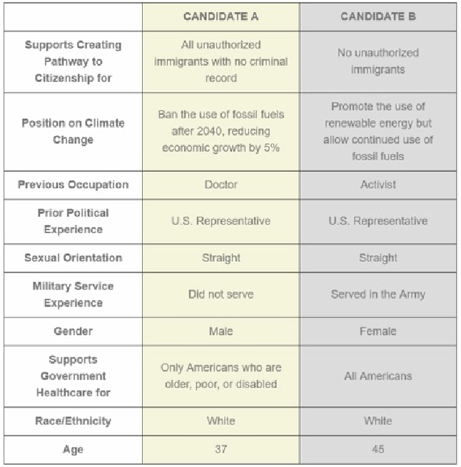
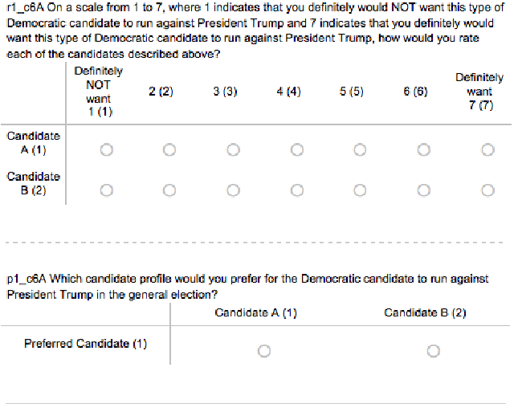

# “Conjoint Survey Experiments” For Druckman, James N., and Donald P. Green, eds. Cambridge Handbook of Advances in Experimental Political Science, New York: Cambridge University Press.

#### Kirk Bansak∗ Jens Hainmueller† Daniel J. Hopkins‡ Teppei Yamamoto§ September 23, 2019

###### Abstract

Conjoint survey experiments have become a popular method for analyzing multidimensional preferences in political science. If properly implemented, conjoint experiments can obtain reliable measures of multidimensional preferences and estimate causal effects of multiple attributes on hypothetical choices or evaluations. This chapter provides an accessible overview of the methodology for designing, implementing, and analyzing conjoint survey experiments. Specifically, we begin by detailing a new substantive example: how do candidate attributes affect the support of American respondents for candidates running against President Trump in 2020? We then discuss the theoretical underpinnings and key advantages of conjoint designs. We next provide guidelines for practitioners in designing and analyzing conjoint survey experiments. We conclude by discussing further design considerations, common conjoint applications, common criticisms, and possible future directions.

∗Assistant Professor, Department of Political Science, University of California San Diego, 9500 Gilman Drive, La Jolla, CA 92093, United States. E-mail: kbansak@gmail.com

†Professor, Department of Political Science, 616 Serra Street Encina Hall West, Room 100, Stanford, CA 94305-

6044. E-mail: jhain@stanford.edu

‡Professor, Department of Political Science, University of Pennsylvania, Perelman Center for Political Science and Economics, 133 S. 36th Street, Philadelphia PA, 19104. E-mail: danhop@sas.upenn.edu

§Associate Professor, Department of Political Science, Massachusetts Institute of Technology, 77 Massachusetts Avenue, Cambridge, MA 02139. Email: teppei@mit.edu, URL: http://web.mit.edu/teppei/www

## Introduction

Political and social scientists are frequently interested in how people choose between options that vary in multiple ways. For example, a voter who prefers candidates to be experienced and opposed to immigration may face a dilemma if an election pits a highly experienced immigration supporter against a less experienced immigration opponent. One might ask similar questions about a wide range of substantive domains—for instance, how people choose whether and whom to date, which job to take, and where to rent or buy a home. In all these examples, and in many more, people must choose among multiple options which are themselves collections of attributes. In making such choices, people must not only identify their preferences on each particular dimension, but also make trade-offs across the dimensions.

Conjoint analysis is a survey-experimental technique that is widely used as a tool to answer these types of questions across the social sciences. The term originates in the study of “conjoint measurement” in 1960s mathematical psychology, when founding figures in the behavioral sciences such as R. Duncan Luce (Luce and Tukey, 1964) and Amos Tversky developed axiomatic theories of decomposing “complex phenomena into sets of basic factors according to specifiable rules of combination” (Tversky, 1967). Since the seminal publication of Green and Rao (1971), however, the term “conjoint analysis” has primarily been used to refer to a class of survey-experimental methods that estimate respondents’ preferences given their overall evaluations of alternative profiles that vary across multiple attributes, typically presented in tabular form.

Traditional conjoint methods drew heavily on the statistical literature on the design of experiments (DOE) (e.g. Cox, 1958), in which theories of complex factorial designs were developed for industrial and agricultural applications. However, conjoint designs became especially popular in marketing (see Raghavarao, Wiley and Chitturi, 2011), as it was far easier to have prospective customers evaluate hypothetical products on paper than to build various protoypes of cars or hotels. Conjoint designs were also frequently employed in economics (Adamowicz et al., 1998) and sociology (Jasso and Rossi, 1977; Wallander, 2009), often under different names such as “stated choice methods” or “factorial surveys.” In the era before computer-assisted survey administration, respondents would commonly have to evaluate dozens of hypothetical profiles printed on paper, and even then, analysis proceeded under strict assumptions about the permissible interactions among the attributes.

Only in recent years, though, have conjoint survey experiments come to see extensive use in political science (e.g. Loewen, Rubenson and Spirling, 2012; Franchino and Zucchini, 2014; Abrajano, Elmendorf and Quinn, 2015; Carnes and Lupu, 2015; Hainmueller and Hopkins, 2015; Horiuchi, Smith and Yamamoto, 2018; Bansak, Hainmueller and Hangartner, 2016; Bechtel, Genovese and Scheve, 2016; Mummolo and Nall, 2016; Wright, Levy and Citrin, 2016). This development has been driven partly by the proliferation of computer-administered surveys and the concurrent ability to conduct fully randomized conjoint experiments at low cost. Reflecting the explosion of conjoint applications in academic political science publications, a conjoint analysis of Democratic voters’ preferences for presidential candidates even made an appearance on television via CBS News in the spring of 2019 (Khanna, 2019). A distinctive feature of this strand of empirical literature is a new statistical approach to conjoint data based on the potential outcomes framework of causal inference (Hainmueller, Hopkins and Yamamoto, 2014), which is in line with the similar explosion in experimental methods in political science generally since the early 2000s (Druckman et al., 2011). Along with this development, the past several years have also seen valuable advancements in the statistical methods for analyzing conjoint data that similarly builds on modern causal inference frameworks (Dafoe, Zhang and Caughey, 2018; Acharya, Blackwell and Sen, 2018; Egami and Imai, 2019).

In this chapter, we aim to introduce conjoint survey experiments, to summarize recent research employing them and improving their use, and to discuss key issues that emerge when putting them to use. We do so partly through the presentation and discussion of an original conjoint application, in which we examine an opt-in sample of Americans’ attitudes toward prospective 2020 Democratic presidential nominees.

## An Empirical Example: Candidates Running against President Trump in 2020

To illustrate how one might implement and analyze a conjoint survey experiment, we conducted an original survey on an online, opt-in sample of 503 Amazon Mechanical Turk workers. We designed our experiment to be illustrative of a typical conjoint design in political science. Specifically, we presented respondents a series of tables showing profiles of hypothetical Democratic candi-

Figure 1: An Example Conjoint Table from the Democratic Primary Experiment. The full set of possible attribute values are provided in Table 1.

dates running in the 2020 U.S. presidential election. We asked: “This study is about voting and about your views on potential Democratic candidates for President in the upcoming 2020 general election...please indicate which of the candidates you would prefer to win the Democratic primary and hence run against President Trump in the general election” (emphasis in the original). We then presented a table that contained information about two political candidates side by side, described as “CANDIDATE A” and “CANDIDATE B,” which were purported to represent hypothetical Democratic candidates for the 2020 election. Figure 1 shows an example table from the experiment.

As shown in Figure 1, conjoint survey experiments typically employ a tabular presentation of multiple pieces of information representing various attributes of hypothetical objects. This table is typically referred to as a “conjoint table” since it combines a multitude of varying attributes and presents them as a single object. In our experiment, we used a table containing two profiles

Age 37, 45, 53, 61, 77 Gender Female, Male Sexual Orientation Straight, Gay Race/Ethnicity White, Hispanic/Latino, Black, Asian Previous Occupation Business executive, College professor, High school teacher, Lawyer, Doctor, Activist Military Service Experience Did not serve, Served in the Army, Served in the Navy, Served in the Marine Corps Prior Political Experience Small-city Mayor, Big-city Mayor, State Legislator, Governor, U.S. Senator,

U.S. Representative, No prior political experience Supports Government Healthcare for All Americans, Only Americans who are older, poor, or disabled,

Americans who choose it over private health plans Supports Creating Pathway to Citizenship for Unauthorized immigrants with no criminal record who entered the U.S. as minors,

All unauthorized immigrants with no criminal record, No unauthorized immigrants Position on Climate Change Ban the use of fossil fuels after 2040, reducing economic growth by 5%;

Impose a tax on using fossil fuels, reducing economic growth by 3%;

Promote the use of renewable energy but allow continued use of fossil fuels

Table 1: The List of Possible Attribute Values in the Democratic Primary Experiment.

of hypothetical Democratic candidates varying in terms of their age, gender, sexual orientation, race/ethnicity, previous occupation, military service, and positions on healthcare policy, immigration policy, and climate change policy. Table 1 shows the full set of possible levels for each of the attributes. The levels presented in each table were then randomly varied, with randomization occurring independently across respondents, across tables, and across attributes. Each respondent was presented 15 such randomly generated comparison tables on separate screens, meaning that they evaluated a total of 30 hypothetical candidates. In order to preserve a smooth survey-taking experience, the order in which attributes were presented was held fixed across all 15 tables for each individual respondent, though the order was randomized across respondents.

After presenting each of the conjoint tables with randomized attributes, we asked respondents two questions to measure their preferences about the hypothetical candidate profiles just presented. Specifically, we used a 7-point rating of the profiles (top of Figure 2) and a forced choice between the two profiles (bottom of Figure 2). We asked: “On a scale from 1 to 7, ..., how would you rate each of the candidates described above?” and also “Which candidate profile would you prefer for the Democratic candidate to run against President Trump in the general election?” The order of these two items was randomized (at the respondent level) so that we would be able to identify any order effects on outcome measurement if necessary.

The substantive goal of our conjoint survey experiment was twofold and can be captured by the following questions. First, what attributes causally increase or decrease the appeal of a Democratic primary candidate on average when varied independently of the other candidate attributes included in the design? As we discuss later in the chapter, the random assignment

Figure 2: Outcome Variables in the Democratic Primary Experiment.

of attribute levels allows researchers to answer this question by estimating a causal effect called the average marginal component effect (AMCE) using simple statistical methods such as linear regression. Second, do the effects of the attribute vary depending on whether the respondent is a Democrat, Republican, or independent? For respondents who are Democrats, the conjoint task simulates the choice of their own presidential candidate to run against (most likely) President Trump in the 2020 presidential election. So the main tradeoff for them is whether to choose a candidate that is electable or a candidate who represents their own policy positions more genuinely. On the other hand, for Republican respondents, considerations are likely to be entirely different (at least for those who intend to vote for President Trump). As we show later, these questions can be answered by estimating conditional AMCEs, i.e., the average effects of the attributes conditional on a respondent characteristic measured in the survey, such as partisanship.

## Advantages of Conjoint Designs over Traditional Survey Experiments

Our Democratic primary experiment represents a typical example of the conjoint survey experiments widely implemented across the empirical subfields of political science. A few factors have driven the upsurge in the use of conjoint survey experiments. First, there has been increased attention to causal inference and to experimental designs which allow for inferences about causal effects via assumptions made credible by the experimental design itself (Sniderman and Grob, 1996). At the same time, however, researchers are often interested in testing hypotheses that go beyond the simple cause-and-effect relationship between a single binary treatment and an outcome variable. Traditional survey experiments are typically limited to analyzing the average effects of one or two randomly assigned treatments, constraining the range of substantive questions researchers can answer persuasively. In contrast, conjoint experiments allow researchers to estimate the effects of various attributes simultaneously, and so can permit analysis of more complex causal questions.

A second enabling factor is the rapid expansion of surveys administered via computer, which enables researchers to use fully randomized conjoint designs (Hainmueller, Hopkins and Yamamoto, 2014). Fully randomized designs, in turn, facilitate the estimation of key quantities such as the AMCEs via straightforward statistical estimation procedures that rely little on modeling assumptions. Moreover, commonly used web-based survey interfaces facilitate the implementation of complex survey designs such as conjoint experiments.

A third, critical underlying factor behind the rise of conjoint designs within political science is their close substantive fit with key political science questions. For example, political scientists have long been interested in how voters choose among candidates or parties, a question for which conjoint designs are well suited. By quantifying the causal effects of various candidate attributes presented simultaneously, conjoint designs enable researchers to explore a wide range of hypotheses about voters’ preferences, relative sensitivities to different attributes, and biases. But beyond voting, multi-dimensional choices and preferences are of interest to political scientists in many contexts and issue areas, such as immigration, neighborhoods and housing, and regulatory policy packages. As we discuss later in this chapter, conjoint designs have been applied in each of these domains and beyond.

Fourth, political scientists are often interested in measuring attitudes and preferences that might be subject to social desirability bias. Scholars have argued that conjoint designs can be used as an effective measurement tool for socially sensitive attitudes, such as biases against female political candidates (Teele, Kalla and Rosenbluth, 2018) and opposition to siting a low-income housing project in one’s neighborhood (Hankinson, 2018). When respondents are evaluating several attributes simultaneously, they may be less concerned that researchers will connect their choice to one specific attribute. In keeping with this expectation, early evidence suggests that fully randomized conjoint designs do indeed mitigate social desirability bias by asking about a socially sensitive attribute along with a host of other randomly varying attributes (Horiuchi, Markovich and Yamamoto, 2019).

Finally, evidence suggests that conjoint designs have desirable properties in terms of validity. On the dimension of external validity, Hainmueller, Hangartner and Yamamoto (2015) find that certain conjoint designs can effectively approximate real-world benchmarks in Swiss citizenship votes while Auerbach and Thachil (2018) find that political brokers in Indian slums have the attributes that local residents reported valuing via a conjoint experiment. Conjoint designs have also proven to be quite robust. For one thing, online, opt-in respondents commonly employed in social science research can complete many conjoint tasks before satisficing demonstrably degrades response quality (Bansak et al., 2018). Such respondents also prove able to provide meaningful and consistent responses even in the presence of a large number of attributes (Bansak et al., 2019).

In short, conjoint designs have a range of theoretical and applied properties that make them attractive to political scientists. But, of course, no method is appropriate for all applications. Later in this chapter, we therefore flag the limitations of conjoint designs as well as the open questions about their usage and implementation.

## Designing Conjoint Survey Experiments

When implementing a conjoint experiment, survey experimentalists who are new to conjoint analysis face a multitude of design considerations unfamiliar to them. Here, we review a number of key components of a conjoint design that have implications for conjoint measurement and offer guidance on how to approach them, using the Democratic primary experiment as a running

example.

Number of profiles. In the Democratic primary experiment, we used a “paired-profile” design in which each conjoint table contained two profiles of hypothetical Democratic candidates. But other designs are also possible. One example is a “single-profile” design in which each table presents only one set of attribute values; another is a multiple-profile design that contains more than two profiles per table. Empirically, paired-profile designs appear to be the most popular choice among political scientists, followed by single-profile designs. Hainmueller, Hangartner and Yamamoto (2015) provide empirical justification for this choice, showing that paired-profile designs tend to perform well compared to single-profile designs, at least in the context of their study comparing conjoint designs against a real-world benchmark.

Number of attributes. An important practical question is how many attributes to include in a conjoint experiment. Here, researchers face a difficult trade-off between masking and satisficing (Bansak et al., 2019). On one hand, including too few attributes will make it difficult to interpret the substantive meaning of AMCEs, since respondents might associate an attribute with another that is omitted from the design. Such a perceived association between an attribute included in the design and another omitted attribute muddies the interpretation of the AMCE of the former as it may represent the effects of both attributes (i.e., masking). In our Democratic primary experiment, for example, the AMCEs of the policy position attributes might mask the effect of other policy positions that are not included in the design if respondents associate a liberal position on the former with a similarly liberal position on the latter. On the other hand, including too many attributes might increase the cognitive burden of the tasks excessively, inducing respondents to satisfice (Krosnick, 1999).

Given the inherent trade-off, how many attributes should one use in a conjoint experiment? Although the answer to the question is likely to be highly context dependent, Bansak et al. (2019) provide useful evidence that subjects recruited from popular online survey platforms such

- as Mechanical Turk are reasonably resistant to satisficing due to the increase in the number of conjoint attributes. Based on the evidence, they conclude that the upper bound on the permissible number of conjoint attributes for online surveys is likely to be above those used in typical conjoint experiments in political science, such as our Democratic primary example in which 10 attributes

were used. Moreover, how many attributes might be too many also likely depends on the sample of respondents and the mode of delivery.

Randomization of attribute levels. Regardless of the number of profiles per table, conjoint designs entail a random assignment of attribute values. The canonical, fully randomized conjoint experiment randomly draws a value for each attribute in each table from a pre-specified set of possible values (Hainmueller, Hopkins and Yamamoto, 2014). This makes the fully randomized conjoint experiment a particular type of factorial experiment, on which an extensive literature exists in the field of DOE. In our experiment, for example, we chose the set of possible values for the age attribute to be [33,45,53,61,77], and we randomly picked one of these values for each profile with equal probability (= 1/5). As discussed later, the random assignment of attribute values enables inference about the causal effects of the attributes without reliance on untestable assumptions about the form of respondents’ utility functions or the absence of interaction effects (Hainmueller, Hopkins and Yamamoto, 2014).1

In most existing applications of conjoint designs in political science, attributes are randomized uniformly (i.e. with equal probabilities for all levels in a given attribute) and independently from one another. Although uniform independent designs are attractive because of parsimony and ease of implementation, the conjoint design can accommodate other kinds of randomization distributions. Often, researchers have good reasons to deviate from the standard uniform independent design for the sake of realism and external validity (Hainmueller, Hopkins and Yamamoto, 2014). In designing our experiment, for example, we wanted to ensure that the marginal distributions of the candidate attributes were roughly representative of the attributes of the politicians who were considered to be likely candidates in the actual Democratic primary election at that time. Thus, in addition to choosing attribute values that matched those of the actual likely candidates, we employed a weighted randomization such that some values would be drawn more frequently than others. Specifically, we made our hypothetical candidates more likely: to be straight than gay (with 4:1 odds); to be White than Black, Latino/Hispanic or Asian (6:2:2:1); and to have never

1In marketing science, researchers often use conjoint designs that do not employ randomization of attributes. This alternative approach relies on the theory of orthogonal arrays and fractional factorial designs derived from the classical DOE literature, as opposed to the potential outcomes framework for causal inference (Hainmueller, Hopkins and Yamamoto, 2014). The discussion of this traditional approach is beyond the scope of this chapter, although there exist a small number of applications of this approach in political science (e.g. Franchino and Zucchini, 2014).

served in military than to have served in the Army, Navy or Marine Corps (4:1:1:1). Weighted randomization causes no fundamental threat to the validity of causal inference in conjoint analysis, although it introduces some important nuances in the estimation and interpretation of the results. We will come back to these issues in the next section.

Another possible “tweak” to the randomization distribution is to introduce dependence between some attributes (Hainmueller, Hopkins and Yamamoto, 2014). The most common instance of this is restricted randomization, or prohibiting certain combinations of attribute values from happening. Restricted randomization is typically employed to ensure that respondents will not encounter completely unrealistic (or sometimes even logically impossible) profiles. For example, in the “immigration conjoint” study reported in Hainmueller, Hopkins and Yamamoto (2014), the authors impose the restriction that immigrants with high-skilled occupations must at least have a college degree. In our current Democratic primary experiment, we chose not to impose any such “hard” constraints on the randomization distribution because we chose attribute values that were all reasonably plausible to co-occur in an actual profile of a Democratic candidate. Like weighted randomization, restricted randomization does not pose a fundamental problem for making valid causal inferences from conjoint experiments, unless it is taken to the extreme. However, restricted designs require care in terms of estimation and interpretation, especially when it is not clear what combinations of attributes make a profile unacceptably unrealistic. More discussion is found later in this chapter.

Randomization of attribute ordering. In addition to randomizing the values of attributes, it is often recommended to randomize the order of the attributes in a conjoint table, so that the causal effects of attributes themselves can be separately identified from pure order effects, e.g. the effects of an attribute being placed near the top of the table vs. towards the bottom. In many applications, attribute ordering is better randomized at the respondent level (i.e., for a given respondent, randomly order attributes in the first table, and fix the order throughout the rest of the experiment). This is because reshuffling the order of attributes from one table to another is likely to cause excessive cognitive burden for respondents (Hainmueller, Hopkins and Yamamoto, 2014).

Outcome measures. After presenting a conjoint table with randomized attributes, researchers then typically ask respondents to express their preference with respect to the profiles presented. These preferences can be measured in various ways, and those measurements then constitute the outcome variable of interest in the analysis of conjoint survey data. The individual rating and forced choice outcomes are the two most common measures of stated preference in political science applications of conjoint designs, and there are distinct advantages to each. On the one hand, presenting a forced choice may compel respondents to think more carefully about trade-offs. On the other hand, individual ratings (or non-forced choices where respondents can accept/reject all profiles presented) allow respondents to express approval or disapproval of each profile without constraints, which also allows for identification of respondents that categorically accept/reject all profiles.

It is important to note that whether respondents are forced to choose among conjoint profiles or able to rate them individually can influence one’s conclusions, so it is often valuable to elicit preferences about profiles in multiple ways. Indeed, researchers commonly ask respondents to both rank profiles within a group and rate each profile individually.

Number of tasks. In typical conjoint survey experiments in political science, the task (i.e. a randomly generated table of profiles followed by outcome measurements) is repeated multiple times for each respondent, each time drawing a new set of attribute values from the same randomization distribution. In our Democratic primary experiment, respondents were given 15 paired comparison tasks, which means they evaluated a total of 30 hypothetical candidate profiles. One important advantage of conjoint designs is that one can obtain many more observations from a given number of respondents without compromising validity than a traditional survey experiment, where withinsubject designs are often infeasible due to validity concerns. This, together with the fact that one can also test the effects of a large number of attributes (or equivalently, treatments) at once, makes the conjoint design a highly cost-efficient empirical strategy. One concern, however, is the possibility of respondent fatigue when the number of tasks exceeds respondents’ cognitive capacity.

The question then is: How many tasks are too many? The answer is likely highly dependent on the nature of the conjoint task (e.g. how complicated the profiles are) and of the respondents (e.g. how familiar they are with the subject matter at hand), so it is wise to err on the conservative

side. However, Bansak et al. (2018) empirically show that inferences from conjoint designs are robust with respect to the number of tasks for samples recruited from commonly used online opt-in panels. In particular, their findings indicate that it is safe to use as many as 30 tasks on respondents from MTurk and Survey Sampling International’s online panel without detectable degradation in response quality. Although one should be highly cautious in extrapolating their findings to other samples, it appears to well justify the use of 15 tasks in our Democratic primary experiment, which draws on MTurk respondents.

Variants of conjoint designs. Finally, a survey experimental design that is closely related to the conjoint experiment is the so-called vignette experiment. Like a conjoint experiment, a vignette experiment typically describes a hypothetical object that varies in terms of multiple attributes and asks respondents to either rate or choose their preferred profiles. The key difference is that a profile is presented as a descriptive text as opposed to a table. For example, a vignette version of our Democratic primary experiment would use a paragraph like the following to describe the profile of a candidate: “CANDIDATE A is a 37 year-old straight black man with no past military service or political experience. He used to be a college professor. He supports providing government healthcare for all Americans, creating a pathway to citizenship for unauthorized immigrants with no criminal record, and a complete fossil fuel ban after 2040 even with substantial reduction in economic growth.”

The vignette design can simply be viewed as a type of a conjoint experiment, since it shares most of the key design elements with table-based conjoint experiments which we have assumed in our discussion so far. However, there are a few important reasons to prefer the tabular presentation of attributes. First, it is less easy to randomize the order of attributes in a vignette experiment, since certain changes might cause the text to become incoherent due to grammatical and sentence structure issues. Second, Hainmueller, Hangartner and Yamamoto (2015) show empirically that

- at least in their validation study, vignette designs tend to perform less well than conjoint designs, and they also find evidence suggesting that the performance advantage for conjoint designs is due to increased engagement with the survey. Specifically, they find that the effects estimated from a vignette design are consistently attenuated towards zero (while maintaining the directions) compared to the estimates from an otherwise identical conjoint experiment. That being said,

certain research questions might naturally call for a vignette format, and the analytical framework discussed below is directly applicable to fully randomized vignette designs as well.

## Analyzing Data from Conjoint Survey Experiments

In this section, we provide an overview of the common statistical framework for causal analysis of conjoint survey data. Much of the theoretical underpinning for the methodology comes directly from the literature on potential outcomes and randomized experiments (e.g., Imbens and Rubin, 2015). We refer readers to Hainmueller, Hopkins and Yamamoto (2014) for a more formal treatment of the materials here.

A key quantity in the analysis of conjoint experiments is the AMCE, a causal estimand first defined by Hainmueller, Hopkins and Yamamoto (2014) as a quantity of interest. Our discussion below thus focuses on what the AMCE is, how it can be estimated, and how to interpret it.

Motivation, definition and estimation. As we discussed in the previous section, the fully randomized conjoint design is a particular instance of a full factorial design, where each of the attributes can be thought of as a multi-valued factor (or a “treatment component” in our terminology). This enables us to analyze conjoint survey data as data arising from a survey experiment with multiple randomized categorical treatments, to which we can apply a standard statistical framework for causal inference such as the potential outcomes framework.2 From this perspective, the analysis of conjoint survey data is potentially straightforward, for the average treatment effect (ATE) of any particular combination of the treatment values against another can be unbiasedly estimated by simply calculating the difference in the means of the observed outcomes between the two groups of responses that were actually assigned those treatment values in the data. For example, in our Democratic primary experiment, we might consider estimating the ATE of a 61-year-old straight white female former business executive with no prior military service or experience in elected office who supports government-provided healthcare for all Americans, creating pathway to citizenship for all unauthorized immigrants with no criminal record, and imposing a

2Alternatively, one can also apply more traditional analytical tools for factorial designs developed in the classical DOE literature. As discussed above, this is the more common approach in marketing science. On the other hand, the causal inference approach described in the rest of this section has been by far the most dominant methodology in recent applications of conjoint designs in political science.

tax on fossil fuels, versus a 37-years-old gay Latino male former lawyer-turned state legislator with no military service who supports the same positions on healthcare, unauthorized immigrants and climate change.

Thinking through this example immediately makes it apparent that this approach has several problems. First, substantively, researchers rarely have a theoretical hypothesis that concerns a contrast between a particular pair of attribute value combinations when their conjoint table includes as many attributes as in our experiment. Instead, researchers employing a conjoint design are typically primarily interested in estimating effects of individual attributes, such as the effect of gender on candidate ratings, while allowing respondents to also explicitly consider other attributes that might affect their evaluations of the hypothetical candidates. In other words, a typical quantity of interest in conjoint survey experiments is the overall effect of a particular attribute averaged across other attributes that also appear in the conjoint table.

Second, statistically, estimating the effect of a particular combination of attribute values against another based on a simple difference in means requires an enormous sample size, since the number of possible combinations of attribute values is very large compared to the number of actual observations. In our experiment, there were 5 × 2 × 2 × 3 × 6 × 4 × 6 × 3 × 3 × 3 = 233,280 possible unique profiles, whereas our observed data contained only 30 × 503 = 15,090 sampled profiles. This implies that observed data from a fully randomized conjoint experiment is usually far too sparse to estimate the ATEs of particular attribute combinations for the full set of attributes included in the study.

For these reasons, researchers instead focus on an alternative causal quantity called the average marginal component effect (AMCE) in most applications of conjoint survey experiments in political science. The AMCE was formally introduced by Hainmueller, Hopkins and Yamamoto (2014) and represents the effect of a particular attribute value of interest against another value of the same attribute while holding equal the joint distribution of the other attributes in the design, averaged over this distribution as well as the sampling distribution from the population. This means that an AMCE can be interpreted as a summary measure of the overall effect of an attribute after taking into account the possible effects of the other attributes by averaging over effect variations caused by them. For example, suppose that one is interested in the overall effect on the rating outcome measure of a candidate being female as opposed to male in our Democratic primary

experiment. That is, what is the average causal effect of being a female candidate as opposed to a male candidate on the respondents’ candidate ratings when they are also given information about the candidates’ age, race/ethnicity, etc.? To answer this question, one can estimate the AMCE of female versus male by simply calculating the average rating of all realized female candidate profiles, calculating the average rating of all male profiles, and taking the difference between the two averages.3 The same procedure could also be performed with respect to the forced choice outcome measure to assess the average causal effect of being a female candidate as opposed to a male candidate on the probability that a candidate will be chosen. In that case, one can estimate the AMCE of female versus male by calculating the proportion of all realized female candidate profile that were chosen, calculating the proportion of all male profiles that were chosen, and taking the difference between the two. The fact that the AMCE summarize the overall average effect of an attribute when respondents are also given information on other attributes is appealing substantively because in reality respondents would often have such information on other attributes when making a multidimensional choice.

Interpretation. Figure 3 shows estimated AMCEs for each of the ten attributes included in our Democratic primary experiment along with their 95% confidence intervals, using the forced choice item as the outcome measure. Interpreting AMCEs is intuitive. For example, for our opt-in sample of 503 American respondents recruited through MTurk, presenting a hypothetical candidate as straight as opposed to gay increased the probability of respondents choosing the profile as their preferred candidate by about 4 percentage points on average, when respondents are also given information about the other nine attributes. Thus, the AMCE represents a causal effect of an attribute value against another, averaged over possible interaction effects with the other included attributes, as well as over possible heterogenous effects across respondents.

Despite its simplicity, there are important nuances to keep in mind when interpreting AMCEs, which are often neglected in applied research. First, the AMCE of an attribute value is always defined with respect to a particular reference value of the same attribute, or the “baseline” value

3The validity of this estimation procedure requires the gender attribute being randomized independently of any other attributes. If the randomization distribution did include dependency between gender and other attributes (e.g., female candidates were made more likely to have a prior political experience than male candidates), then the imbalance in those attributes between male and female candidates must be taken into account explicitly when estimating the AMCE. See Hainmueller, Hopkins and Yamamoto (2014) for more details.

| | | | |
|---|---|---|---|
| | | | |
| | | | |
| | | | |
| | | | |
| | | | |
| | | | |
| | | | |
| | | | |
| | | | |
| | | | |
| | | | |
| | | | |
| | | | |
| | | | |
| | | | |
| | | | |
| | | | |
| | | | |
| | | | |
| | | | |
| | | | |
| | | | |
| | | | |
| | | | |
| | | | |
| | | | |
| | | | |
| | | | |
| | | | |
| | | | |
| | | | |
| | | | |
| | | | |
| | | | |
| | | | |
| | | | |
| | | | |
| | | | |
| | | | |
| | | | |
| | | | |
| | | | |
| | | | |
| | | | |
| | | | |
| | | | |
| | | | |
| | | | |
| | | | |
| | | | |
| | | | |
| | | | |
| | | | |
| | | | |
| | | | |
| | | | |
| | | | |
| | | | |

###### Age

37

45

53

61

77

Gender

Female

Male

Sexual Orientation

Gay

Straight

Race

White

Asian

Black

Hispanic/Latino

Previous Occupation

Activist

Business executive

College professor

Doctor

High school teacher

Lawyer

Military Service

Did not serve

Served in the Army

Served in the Marine Corps

Served in the Navy

Political Experience

No prior political experience

Big−city Mayor

Governor

Small−city Mayor

State Legislator

U.S. Representative

U.S. Senator

Healthcare Position

Medicare

Private/Public Option

All Public Healthcare

Immigration Position

No Citizenship Pathway

DACA

All without Criminal Record

Climate Position

Promote Renewables

Fossil Fuel Tax

Fossil Fuel Ban

−0.1 0.0 0.1

Effect on probability of support

##### Figure 3: Average Marginal Component Effects of Candidate Attributes in the Democratic Pri-mary Conjoint Experiment (Forced Choice Outcome).

of the attribute. This is parallel to any other regression model or a standard survey experiment, in which a treatment effect always represents the effect of the treatment against the particular control condition used in the experiment. Researchers sometimes neglect this feature when analyzing conjoint experiments, as Leeper, Hobolt and Tilley (forthcoming) point out.

Second, an important feature of the AMCE as a causal parameter is that it is always defined with respect to the distribution used for the random assignment of the attributes. That is, the true value of the AMCE, as well as its substantive meaning, also changes when one changes the randomization distribution, unless the effect of the attribute has no interaction with other attributes. For example, as mentioned earlier, we used non-uniform randomization distributions for assigning some of the candidate attributes in our Democratic primary experiment, such as candidates’ sexual orientation. Should we have used a uniform randomization for the sexual orientation attribute (i.e. 1/2 straight and 1/2 gay) instead, the AMCE of another attribute (e.g. gender) could have been either larger or smaller than what is reported in Figure 3, depending on how the effect of that attribute might interact with that of sexual orientation. This important nuance should always be kept in mind when interpreting AMCEs. Hainmueller, Hopkins and Yamamoto (2014) discuss this point in more detail (see also de la Cuesta, Egami and Imai, 2019).

Finally, it is worth reiterating that the AMCE represents an average of individual-level causal effects of an attribute. In other words, for some respondents the attribute might have a large effect and for others the effect might be small or zero, and the AMCE represents the average of these potentially heterogeneous effects. This is no different from most of the commonly used causal estimands in any other experiment, such as the ATE or local ATE. Researchers often care about average causal effects because they provide an important and concise summary of what would happen on average to the outcome if everybody moved from treatment to control (Holland, 1986). The fact that the ATE and AMCE average over both the sign and the magnitude of the individual-level causal effects is an important feature of these estimands, because both sign and magnitude are important in capturing the response to a treatment. As a case in point, one of the only real-world empirical validations of conjoint of which we are aware finds evidence that AMCEs from a survey experiment do recover the corresponding descriptive parameters in Swiss citizenship elections (Hainmueller, Hangartner and Yamamoto 2015; see also Auerbach and Thachil 2018).

That said, it does not mean that any average causal effect necessarily tells the whole story. Just

like an ATE can hide important heterogeneity in the individual-level causal effects, the AMCE might also hide such heterogeneity—for example, if the effect of an attribute value is negative for one half of the sample and positive for the other half. In such settings, conditional AMCEs for relevant subgroups might be useful to explore, as we discuss later in this section. Similarly, just like a positive ATE does not necessarily imply that a treatment has positive individual-level effects for a majority of subjects, a positive AMCE does not imply that a majority of respondents prefer the attribute value in question (Abramson, Ko¸cak and Magazinnik 2019). In sum, researchers should be careful in their choice of language for describing the substantive interpretations of AMCEs as an average causal effect.

More on estimation and inference. Despite the high dimensionality of the design matrix for our factorial conjoint treatments, the AMCEs in our Democratic primary experiment are reasonably precisely estimated based on 503 respondents, as can be seen from the widths of the confidence intervals in Figure 3. Many applied survey experimentalists find this rather surprising, since it seems to run counter to the conventional wisdom of being conservative in adding treatments to factorial experiments. What is the “trick” behind this?

The answer to this question lies in the implicit averaging of the profile-specific treatment effects in the definition of the AMCE. Once we focus on a particular attribute of interest, the remaining attributes become covariates (that also happen to be randomly assigned) for the purpose of estimating the particular AMCE. This implies that those attributes simply add to the infinite list of pre-treatment covariates that might also vary across respondents or tasks, which are also implicitly averaged over when calculating the observed difference in means. Thus, a valid inference can be made for the AMCE by simply treating the attribute of interest as if it was the sole categorical treatment in the experiment, although statistical efficiency might be improved by explicitly incorporating the other attributes in the analysis.

A straightforward method to incorporate information about all of the attributes in estimating the individual AMCEs for the sake of efficiency is to run a linear regression of the observed outcome on the entire set of attributes, each being “dummied out” with the baseline value set as the omitted category. The estimates presented in Figure 3 are based on this methodology, instead of individual differences in means. The multiple regression approach has the added benefit

of the convenience that one can estimate the AMCEs for all attributes at once, and despite the superficial use of a linear regression model, it requires no functional form assumption by virtue of full randomization.4 Thus, this approach is currently the most popular in applied studies.

These estimation methods can be applied to various types of outcome variables—such as binary choices, rankings, and ratings—without modification. For illustration, Figure 4 shows estimated AMCEs for each of the ten attributes included in our Democratic primary experiment along with their 95% confidence intervals, using the seven-point scale rating instead of the forced choice item as the outcome measure. In this application, the estimated AMCEs from the rating outcome are similar to those from the forced choice outcome. Such a similar pattern between the two types of outcomes is frequently, but not always, observed in our experience with conjoint experiments.

Conditional AMCE. Another common quantity of interest in conjoint applications in political science is the conditional AMCE, or the AMCE for a particular subgroup of respondents defined based on a pre-treatment respondent characteristic (Hainmueller, Hopkins and Yamamoto, 2014). In our Democratic primary experiment, a natural question of substantive interest is whether preferences about hypothetical Democratic nominees might differ depending on respondents’ partisanship. To answer the question, we analyze the conditional AMCEs of the attributes by estimating the effects for different respondent subgroups based on their partisanship.

Figure 5 shows the estimated conditional AMCEs for Democratic, independent, and Republican respondents, respectively. As we anticipated, the AMCEs for the policy position attributes are highly variable dependent on whether a respondent is a Democrat or a Republican. For example, among Democrats the probability of supporting a candidate increases by 19 percentage points on average when the position on health care changes from supporting Medicare to supporting government healthcare for all. There is no such effect among Republican respondents. There is a similar asymmetry for the effect of the position on immigration. Among Democrats the probability of supporting a candidate increases by 18 percentage points on average when the position on immigration changes from supporting no pathway to citizenship for undocumented immigrants to supporting a pathway for all undocumented immigrants without a criminal record. Among

4The regression model must be modified to contain appropriate interaction terms if the randomization distribution includes dependence across attributes. The estimated regression coefficients must then be averaged over with appropriate weights to obtain an unbiased estimate of the AMCEs affected by the dependence. Details are provided by Hainmueller, Hopkins and Yamamoto (2014).

| | | | | | |
|---|---|---|---|---|---|
| | | | | | |
| | | | | | |
| | | | | | |
| | | | | | |
| | | | | | |
| | | | | | |
| | | | | | |
| | | | | | |
| | | | | | |
| | | | | | |
| | | | | | |
| | | | | | |
| | | | | | |
| | | | | | |
| | | | | | |
| | | | | | |
| | | | | | |
| | | | | | |
| | | | | | |
| | | | | | |
| | | | | | |
| | | | | | |
| | | | | | |
| | | | | | |
| | | | | | |
| | | | | | |
| | | | | | |
| | | | | | |
| | | | | | |
| | | | | | |
| | | | | | |
| | | | | | |
| | | | | | |
| | | | | | |
| | | | | | |
| | | | | | |
| | | | | | |
| | | | | | |
| | | | | | |
| | | | | | |
| | | | | | |
| | | | | | |
| | | | | | |
| | | | | | |
| | | | | | |
| | | | | | |
| | | | | | |
| | | | | | |
| | | | | | |
| | | | | | |
| | | | | | |
| | | | | | |
| | | | | | |
| | | | | | |
| | | | | | |
| | | | | | |
| | | | | | |
| | | | | | |

###### Age

37

45

53

61

77

Gender

Female

Male

Sexual Orientation

Gay

Straight

Race

White

Asian

Black

Hispanic/Latino

Previous Occupation

Activist

Business executive

College professor

Doctor

High school teacher

Lawyer

Military Service

Did not serve

Served in the Army

Served in the Marine Corps

Served in the Navy

Political Experience

No prior political experience

Big−city Mayor

Governor

Small−city Mayor

State Legislator

U.S. Representative

U.S. Senator

Healthcare Position

Medicare

Private/Public Option

All Public Healthcare

Immigration Position

No Citizenship Pathway

DACA

All without Criminal Record

Climate Position

Promote Renewables

Fossil Fuel Tax

Fossil Fuel Ban

−0.50 −0.25 0.00 0.25 0.50

Effect on rating

##### Figure 4: Average Marginal Component Effects of Candidate Attributes in the Democratic Pri-mary Conjoint Experiment (Rating Outcome).

Republicans, a similar change in the candidate’s immigration position leads to a 11 percentage point decrease in support. Respondents of different partisanship also exhibit preferences in line with their distinct electoral contexts. For example, while prior political experience of the candidate increases support among Democratic respondents on average compared to candidates with no experience in elected office, there is no such effect among Republican respondents.

In interpreting conditional AMCEs, researchers should keep in mind the same set of important nuances and common pitfalls as they do when analyzing AMCEs. That is, they represent an average effect of an attribute level against a particular baseline level of the same attribute, given a particular randomization distribution. In addition, researchers need to exercise caution when comparing a conditional AMCE against another. This is because the difference between two conditional AMCEs does not generally represent a causal effect of the conditioning respondent-level variable, unless the variable itself was also randomly assigned by the researcher. For example, in the Democratic primary experiment, the AMCE of a candidate supporting government healthcare for all as opposed to Medicare was 18 percentage points larger for Democrats than for Republican respondents, but it would be incorrect to describe this difference as a causal effect of partisanship on respondents’ preference for all public healthcare. This point is, of course, no different from the usual advice for interpreting heterogeneous causal effects (such as conditional ATEs) when subgroups are defined with respect to non-randomized pre-treatment covariates, though it is often overlooked in interpreting conditional AMCEs in conjoint applications (see Bansak, 2019; Leeper, Hobolt and Tilley, forthcoming).

| | | | | | | | | | | | | | | | | | | | | | | | | | | | | | | | | | | | | | | | | | | | | | | | | | | | | | | | | | | |
|---|---|---|---|---|---|---|---|---|---|---|---|---|---|---|---|---|---|---|---|---|---|---|---|---|---|---|---|---|---|---|---|---|---|---|---|---|---|---|---|---|---|---|---|---|---|---|---|---|---|---|---|---|---|---|---|---|---|---|
| | | | | | | | | | | | | | | | | | | | | | | | | | | | | | | | | | | | | | | | | | | | | | | | | | | | | | | | | | | |
| | | | | | | | | | | | | | | | | | | | | | | | | | | | | | | | | | | | | | | | | | | | | | | | | | | | | | | | | | | |
| | | | | | | | | | | | | | | | | | | | | | | | | | | | | | | | | | | | | | | | | | | | | | | | | | | | | | | | | | | |
| | | | | | | | | | | | | | | | | | | | | | | | | | | | | | | | | | | | | | | | | | | | | | | | | | | | | | | | | | | |
| | | | | | | | | | | | | | | | | | | | | | | | | | | | | | | | | | | | | | | | | | | | | | | | | | | | | | | | | | | |

−0.2−0.10.00.10.2−0.2−0.10.00.10.2−0.2−0.10.00.10.2 Fossil Fuel Ban

DemocratsIndependents/OtherRepublicans

| | | | | | | | | | | | | | | | | | | | | | | | | | | | | | | | | | | | | | | | | | | | | | | | | | | | | | | | | | | |
|---|---|---|---|---|---|---|---|---|---|---|---|---|---|---|---|---|---|---|---|---|---|---|---|---|---|---|---|---|---|---|---|---|---|---|---|---|---|---|---|---|---|---|---|---|---|---|---|---|---|---|---|---|---|---|---|---|---|---|
| | | | | | | | | | | | | | | | | | | | | | | | | | | | | | | | | | | | | | | | | | | | | | | | | | | | | | | | | | | |
| | | | | | | | | | | | | | | | | | | | | | | | | | | | | | | | | | | | | | | | | | | | | | | | | | | | | | | | | | | |
| | | | | | | | | | | | | | | | | | | | | | | | | | | | | | | | | | | | | | | | | | | | | | | | | | | | | | | | | | | |
| | | | | | | | | | | | | | | | | | | | | | | | | | | | | | | | | | | | | | | | | | | | | | | | | | | | | | | | | | | |
| | | | | | | | | | | | | | | | | | | | | | | | | | | | | | | | | | | | | | | | | | | | | | | | | | | | | | | | | | | |

Effect on probability of support

| | | | | | | | | | | | | | | | | | | | | | | | | | | | | | | | | | | | | | | | | | | | | | | | | | | | | | | | | | | |
|---|---|---|---|---|---|---|---|---|---|---|---|---|---|---|---|---|---|---|---|---|---|---|---|---|---|---|---|---|---|---|---|---|---|---|---|---|---|---|---|---|---|---|---|---|---|---|---|---|---|---|---|---|---|---|---|---|---|---|
| | | | | | | | | | | | | | | | | | | | | | | | | | | | | | | | | | | | | | | | | | | | | | | | | | | | | | | | | | | |
| | | | | | | | | | | | | | | | | | | | | | | | | | | | | | | | | | | | | | | | | | | | | | | | | | | | | | | | | | | |
| | | | | | | | | | | | | | | | | | | | | | | | | | | | | | | | | | | | | | | | | | | | | | | | | | | | | | | | | | | |
| | | | | | | | | | | | | | | | | | | | | | | | | | | | | | | | | | | | | | | | | | | | | | | | | | | | | | | | | | | |
| | | | | | | | | | | | | | | | | | | | | | | | | | | | | | | | | | | | | | | | | | | | | | | | | | | | | | | | | | | |

Big−city Mayor No prior political experience

Served in the Marine Corps Served in the Army

Climate Position All without Criminal Record

DACA No Citizenship Pathway

Fossil Fuel Tax Promote Renewables

Private/Public Option Medicare

Immigration Position All Public Healthcare

U.S. Representative State Legislator

Previous Occupation Hispanic/Latino

Lawyer High school teacher

Business executive Activist

Political Experience Served in the Navy

Healthcare Position U.S. Senator

Doctor College professor

Sexual Orientation Male

Small−city Mayor Governor

Did not serve Military Service

Straight Gay

Female Gender

White Race

Black Asian

37 Age

53 45

77 61

##### Figure5:ConditionalAverageMarginalComponentEffectsofCandidateAttributesacrossRespondentParty.

|Topic  |Percentage|
|---|---|
|Voting Public Opinion Public Policy Immigration Government Climate Change Representation International Relations Partisanship Other  |27% 19% 6% 6% 6% 6% 5% 5% 4% 17%|

Table 2: Topical Classification of the 124 Published Articles Using Conjoint Designs Identified in Our Literature Review.

## Applications of Conjoint Designs in Political Science

As discussed earlier in this chapter, a key factor behind the popularity of conjoint experiments in political science is their close substantive fit with key political science questions. Indeed, conjoint designs have been applied to understand how populations weigh attributes when making various multi-dimensional political choices, such as voting, assessing immigrants, choosing neighborhoods and housing (Mummolo and Nall, 2016; Hankinson, 2018), judging climate-related policies (Gampfer, Bernauer and Kachi, 2014; Bechtel, Genovese and Scheve, 2016; Stokes and Warshaw, 2017), publication decisions (Berinsky, Druckman and Yamamoto, 2019), and various other problems (Bernauer and Nguyen, 2015; Ballard-Rosa, Martin and Scheve, 2017a; Gallego and Marx, 2017; Hemker and Rink, 2017; Sen, 2017; Auerbach and Thachil, 2018; Bechtel and Scheve, 2013; Ballard-Rosa, Martin and Scheve, 2017b).

In Table 2, we report the distribution of 124 recent conjoint applications by their broad topical areas.5 A plurality of 27% of the applications involve voting and candidate choice. But conjoint designs have been deployed to understand how people collectively weigh different attributes in a wide range of other applications, from politically relevant judgments about individuals to choices among different policy bundles. In the rest of this section, we review several key areas of conjoint applications in more detail.

5Specifically, we reviewed all published articles citing Hainmueller, Hopkins and Yamamoto (2014), and classified all that included a conjoint experiment.

### Voting

While some classic theoretical models examine political competition over a single dimension (Downs, 1957), choosing between real-world candidates and parties almost always requires an assessment of trade-offs in aggregate. Conjoint designs are especially well suited to study how voters make those trade-offs. It is no surprise, then, that candidate and party choice is among the most common applications of conjoint designs (Franchino and Zucchini, 2014; Abrajano, Elmendorf and Quinn, 2015; Aguilar, Cunow and Desposato, 2015; Carnes and Lupu, 2016; Kirkland and Coppock, 2018; Horiuchi, Smith and Yamamoto, 2018; Crowder-Meyer et al., 2018; Teele, Kalla and Rosenbluth, 2018).

One especially common use of conjoint designs has been to examine biases against candidates who are from potentially disadvantaged categories including women, African Americans, and working-class backgrounds. Crowder-Meyer et al. (2018), for example, demonstrate that biases against Black candidates increase when MTurk respondents are cognitively taxed. This study also illustrates another advantage of conjoint designs, which is that they permit the straightforward estimation of differences in the causal effects or AMCEs across other randomly assigned variables. Those other variables can either be separate attributes within the conjoint, or else randomized interventions external to the conjoint itself. An example of the former would be analyzing the difference in AMCEs across the levels of another randomized attribute, while an example of the latter would be analyzing the difference in AMCEs when the framing of the conjoint task itself varies.

At the same time, conjoint designs can help explain observed biases even when uncovering no outright discrimination. Carnes and Lupu (2016) report conjoint experiments from Britain, the U.S., and Argentina showing that voters do not penalize working-class candidates in aggregate, a result which suggests that the shortage of working-class politicians is driven by supply-side factors. Also, Teele, Kalla and Rosenbluth (2018) use conjoint designs to show that American voters and officials do not penalize—and may even collectively favor—female candidates. Yet they also prefer candidates with traditional family roles, setting up a “double bind” for female candidates.

Conjoint designs can also be employed to gauge the associations between attributes and a category of interest (Bansak et al., 2019). For example, Goggin, Henderson and Theodoridis (2019) use conjoint experiments embedded in the Cooperative Congressional Election Study to

have respondents guess at candidates’ party or ideology using issue priorities and biographical information. They find that low-knowledge and high-knowledge voters alike are able to link issues with parties and ideology, providing grounds for guarded optimism about voters’ capacity to link parties with their issue positions. Candidate traits, by contrast, do not provide sufficient information to allow most voters to distinguish the candidates’ partisanship. Conjoint designs have thus helped shed new light on longstanding questions of ideology and constraint.

Still other uses of conjoint can illuminate aspects of voter decision-making and political psychology. For example, ongoing research by Ryan and Ehlinger (2019) examines a vote choice set-up in which candidates takes positions on issues whose importance to the respondents had been identified in a previous wave of a panel survey. And separate research by Bakker, Schumacher and Rooduijn (2019) deploys conjoint methods to show that people low in the psychological trait “agreeableness” respond positively to candidates with anti-establishment messages. Conjoint designs can also shed light on how political parties choose which candidates to put before voters in the first place (Doherty, Dowling and Miller, 2019).

### Immigration Attitudes

Whether we are hiring, dating, or just striking up a conversation, people evaluate other people constantly. That may be one reason why conjoint designs evaluating choices about individuals have proven to be relatively straightforward—and often even engaging—for many respondents. Indeed, we commonly find that respondents seem to enjoy and engage with conjoint surveys, perhaps because of their novelty. In response to one of the experiments done for Bansak et al. (2019), a respondent wrote: “[t]his survey was different than others I have taken. I enjoyed it and it was easy to understand.” An MTurk respondent wrote, “Thank you for the fun survey!” Such levels of engagement may help explain some of the robustness of conjoint experiments we detail above.

Given how frequently people find themselves evaluating other people, it is not surprising that conjoints have been used extensively to evaluate immigration attitudes (Hainmueller and Hopkins, 2015; Wright, Levy and Citrin, 2016; Bansak, Hainmueller and Hangartner, 2016; Schachter, 2016; Adida, Lo and Platas, 2017; Flores and Schachter, 2018; Auer et al., 2019; Clayton, Ferwerda and Horiuchi, 2019). Hainmueller and Hopkins (2015) demonstrate that American respondents

recruited via GfK actually demonstrate surprising agreement on the core attributes that make immigrants to the U.S. more or less desirable. Wright, Levy and Citrin (2016) show that sizable fractions of American respondents choose to not admit either immigrant when they are presented in pairs and there is the option to reject both.

### Policy Preferences

Another area where conjoints have been employed is to examine voters’ policy preferences. In these applications, respondents are often confronted with policy packages that vary on multiple dimensions. Such designs can be used to examine the trade-offs that voters might make between different dimensions of the policy and examine the impacts of changing the composition of the package. For example, Ballard-Rosa, Martin and Scheve (2017b) use a conjoint survey to examine American income tax preferences by presenting respondents with various alternative tax plans that vary the level of taxation across six income brackets. They find that voter opinions are not far from current tax policies, although support for taxing the rich is highly inelastic. Bansak, Bechtel and Margalit (2019) employ a conjoint experiment to examine mass support in European countries for national austerity packages that vary along multiple types of spending cuts and tax increases, allowing them to evaluate eligible voters’ relative sensitivities to different austerity measures as well as estimate average levels of support for specific hypothetical packages.

One feature of these studies is that the choice task, i.e. evaluating multi-dimensional policy packages, is presumably less familiar and more complex for respondents than the task of evaluating people or political candidates. That said, many real-world policies involve precisely this type of multi-feature complexity, and preferences of many voters vis-a-vis these policies might well be highly contingent. For example, respondents might support a Brexit plan only if it based on a negotiated agreement with the European Union. Similarly, during its 2015 debt-crisis, Greece conducted a bailout referendum in which voters were asked to decide whether the country should accept the bailout conditions proposed by the international lenders.

## Challenges and Open Questions

Still, there are a range of outstanding questions about conjoint survey experiments. For example, a central challenge in designing conjoint experiments is the possibility of producing unrealistic profiles. Fully randomized conjoint designs have desirable features, but one limitation is that the independent randomization of attributes which are in reality highly correlated may produce profiles that seem highly atypical. To some extent, this is a feature rather than a bug: it is precisely by presenting respondents with atypical profiles that it is possible to disentangle the specific effects of each attribute. While in 2006 it might have seemed unlikely that the next U.S. president would be the son of a white mother from Kansas and a black father from Kenya, someone who spent time in Indonesia growing up, Barack Obama was inaugurated just a few years later.

In some instances, however, atypical or implausible profiles are a genuine problem, one which can be addressed through various approaches. For one thing, researchers can modify the incidence of different attributes to reduce the share of profiles that are atypical. They can also place restrictions on attribute combinations, or can draw two seemingly separate attributes jointly. For example, if the researchers want to rule out the possibility of a candidate profile of a very liberal Republican, they can simply draw ideology and partisanship jointly from a set of options which excludes that combination. Finally, researchers can also identify profiles as atypical after the fact, and then examine how the AMCEs vary between profiles that are more or less typical, as in Hainmueller and Hopkins (2015).

There are also outstanding questions about external validity. To date, conjoint designs have been administered primarily via tables with written attribute values, even though information about political candidates or other choices is often processed through visual, audio, or other modes. Do voters, for example, evaluate written attributes presented in a table in the same way that they evaluate attributes presented in more realistic ways? The table-style presentation may prompt respondents to evaluate the choice in different ways, and so hamper external validity. It also has the potential to lead respondents to consider each attribute separately, rather than assessing the profile holistically.

One core benefit of conjoint designs can also be a liability in some instances. Conjoint designs return many possible quantities of interest, allowing researchers to compare the AMCEs for various effects and to test hypotheses competitively. However, this also opens the possibility of

multiple comparisons concerns, as researchers may conduct multiple statistical tests. This feature of conjoint designs makes pre-registration and pre-analysis plans especially valuable in this context.

## References

Abrajano, Marisa A., Christopher S. Elmendorf and Kevin M. Quinn. 2015. “Using Experiments to Estimate Racially Polarized Voting.”. UC Davis Legal Studies Research Paper Series, No. 419.

Abramson, Scott F., Korhan Ko¸cak and Asya Magazinnik. 2019. “What Do We Learn About Voter Preferences From Conjoint Experiments?”. Working paper presented at PolMeth XXXVI.

Acharya, Avidit, Matthew Blackwell and Maya Sen. 2018. “Analyzing causal mechanisms in survey experiments.” Political Analysis 26(4):357–378.

Adamowicz, Wiktor, Peter Boxall, Michael Williams and Jordan Louviere. 1998. “Stated preference approaches for measuring passive use values: choice experiments and contingent valuation.” American journal of agricultural economics 80(1):64–75.

Adida, Claire L, Adeline Lo and Melina Platas. 2017. “Engendering empathy, begetting backlash: American attitudes toward Syrian refugees.”.

Aguilar, Rosario, Saul Cunow and Scott Desposato. 2015. “Choice sets, gender, and candidate choice in Brazil.” Electoral Studies 39:230–242.

Auer, Daniel, Giuliano Bonoli, Flavia Fossati and Fabienne Liechti. 2019. “The matching hierarchies model: evidence from a survey experiment on employers’ hiring intent regarding immigrant applicants.” International migration review 53(1):90–121.

Auerbach, Adam Michael and Tariq Thachil. 2018. “How Clients Select Brokers: Competition and Choice in India’s Slums.” American Political Science Review 112(4):775–791.

Bakker, Bert N., Gijs Schumacher and Matthijs Rooduijn. 2019. “The Populist Appeal: Personality and Anti-establishment Communication.”. Working paper, University of the Netherlands.

- Ballard-Rosa, Cameron, Lucy Martin and Kenneth Scheve. 2017a. “The structure of American income tax policy preferences.” The Journal of Politics 79(1):1–16.

- Ballard-Rosa, Cameron, Lucy Martin and Kenneth Scheve. 2017b. “The structure of American income tax policy preferences.” The Journal of Politics 79(1):1–16.

Bansak, Kirk. 2019. “Estimating Causal Moderation Effects with Randomized Treatments and Non-Randomized Moderators.”. Working paper, University of California, San Diego.

Bansak, Kirk, Jens Hainmueller, Daniel J Hopkins and Teppei Yamamoto. 2018. “The number of choice tasks and survey satisficing in conjoint experiments.” Political Analysis 26(1):112–119.

Bansak, Kirk, Jens Hainmueller, Daniel J. Hopkins and Teppei Yamamoto. 2019. “Beyond the Breaking Point? Survey Satisficing in Conjoint Experiments.” Political Science Research and Methods Forthcoming.

Bansak, Kirk, Jens Hainmueller and Dominik Hangartner. 2016. “How economic, humanitarian, and religious concerns shape European attitudes toward asylum seekers.” Science 354(6309):217– 222.

Bansak, Kirk, Michael M. Bechtel and Yotam Margalit. 2019. “Mass Politics of Austerity.”. Working paper, University of California, San Diego.

Bechtel, Michael M., Federica Genovese and Kenneth F. Scheve. 2016. “Interests, Norms, and Support for the Provision of Global Public Goods: The Case of Climate Cooperation.” British Journal of Political Science Forthcoming.

Bechtel, Michael M and Kenneth F Scheve. 2013. “Mass support for global climate agreements depends on institutional design.” Proceedings of the National Academy of Sciences 110(34):13763– 13768.

Berinsky, Adam J., James N. Druckman and Teppei Yamamoto. 2019. “Publication Biases in Replication Studies.”. Working paper, Massachusetts Institute of Technology.

Bernauer, Thomas and Quynh Nguyen. 2015. “Free trade and/or environmental protection?” Global Environmental Politics 15(4):105–129.

- Carnes, Nicholas and Noam Lupu. 2015. “Do Voters Dislike Politicians from the Working Class?”. Working Paper, Duke University.
- Carnes, Nicholas and Noam Lupu. 2016. “Do voters dislike working-class candidates? Voter biases and the descriptive underrepresentation of the working class.” American Political Science Review 110(4):832–844.

Clayton, Katherine, Jeremy Ferwerda and Yusaku Horiuchi. 2019. “Exposure to Immigration and Admission Preferences: Evidence From France.” Political Behavior .

Cox, David R. 1958. Planning of Experiments. New York: John Wiley.

Crowder-Meyer, Melody, Shana Kushner Gadarian, Jessica Trounstine and Kau Vue. 2018. “A Different Kind of Disadvantage: Candidate Race, Cognitive Complexity, and Voter Choice.” Political Behavior pp. 1–22.

Dafoe, Allan, Baobao Zhang and Devin Caughey. 2018. “Information equivalence in survey experiments.” Political Analysis 26(4):399–416.

de la Cuesta, Brandon, Naoki Egami and Kosuke Imai. 2019. “Improving the External Validity of Conjoint Analysis: The Essential Role of Profile Distribution.”. Working paper presented at PolMeth XXXVI.

Doherty, David, Conor M Dowling and Michael G Miller. 2019. “Do Local Party Chairs Think Women and Minority Candidates Can Win? Evidence from a Conjoint Experiment.” The Journal of Politics 81(4):000–000.

Downs, Anthony. 1957. “An Economic Theory of Democracy.”.

Druckman, James N, Donald P Green, James H Kuklinski and Arthur Lupia. 2011. Cambridge handbook of experimental political science. Cambridge University Press.

Egami, Naoki and Kosuke Imai. 2019. “Causal interaction in factorial experiments: Application to conjoint analysis.” Journal of the American Statistical Association 114(526):529–540.

Flores, Ren´e D and Ariela Schachter. 2018. “Who Are the “Illegals”? The Social Construction of Illegality in the United States.” American Sociological Review 83(5):839–868.

Franchino, Fabio and Francesco Zucchini. 2014. “Voting in a Multi-dimensional Space: A Conjoint Analysis Employing Valence and Ideology Attributes of Candidates.” Political Science Research and Methods pp. 1–21.

Gallego, Aina and Paul Marx. 2017. “Multi-dimensional preferences for labour market reforms: a conjoint experiment.” Journal of European Public Policy 24(7):1027–1047.

Gampfer, Robert, Thomas Bernauer and Aya Kachi. 2014. “Obtaining public support for North-South climate funding: Evidence from conjoint experiments in donor countries.” Global Environmental Change 29:118–126.

Goggin, Stephen N, John A Henderson and Alexander G Theodoridis. 2019. “What goes with red and blue? Mapping partisan and ideological associations in the minds of voters.” Political Behavior pp. 1–29.

Green, Paul E. and Vithala R. Rao. 1971. “Conjoint Measurement for Quantifying Judgmental Data.” Journal of Marketing Research VIII:355–363.

Hainmueller, Jens and Daniel J Hopkins. 2015. “The hidden american immigration consensus: A conjoint analysis of attitudes toward immigrants.” American Journal of Political Science 59(3):529–548.

Hainmueller, Jens, Daniel J Hopkins and Teppei Yamamoto. 2014. “Causal Inference in Conjoint Analysis: Understanding Multidimensional Choices via Stated Preference Experiments.” Political Analysis 22(1):1–30.

Hainmueller, Jens, Dominik Hangartner and Teppei Yamamoto. 2015. “Validating Vignette and Conjoint Survey Experiments against Real-world Behavior.” Proceedings of the National Academy of Sciences 112(8):2395–2400.

Hankinson, Michael. 2018. “When do renters behave like homeowners? High rent, price anxiety, and NIMBYism.” American Political Science Review 112(3):473–493.

Hemker, Johannes and Anselm Rink. 2017. “Multiple dimensions of bureaucratic discrimination: Evidence from German welfare offices.” American Journal of Political Science 61(4):786–803.

Holland, Paul W. 1986. “Statistics and causal inference.” Journal of the American statistical Association 81(396):945–960.

Horiuchi, Yusaku, Daniel M. Smith and Teppei Yamamoto. 2018. “Measuring Voters’ Multidimensional Policy Preferences with Conjoint Analysis: Application to Japan’s 2014 Election.” Political Analysis 26(2):190–209.

Horiuchi, Yusaku, Zach Markovich and Teppei Yamamoto. 2019. “Does Conjoint Analysis Mitigate Social Desirability Bias?”. Unpublished manuscript.

Imbens, Guido W and Donald B Rubin. 2015. Causal inference in statistics, social, and biomedical sciences. Cambridge University Press.

Jasso, Guillermina and Peter H. Rossi. 1977. “Distributive Justice and Earned Income.” American Sociological Review 42(4):639–51.

Khanna, Kabir. 2019. “What traits are Democrats prioritizing in 2020 candidates?”. CBS News, May 8. URL: https://www.cbsnews.com/news/democratic-voters-hungry-for-women-and-people-ofcolor-in-2020-nomination/

Kirkland, Patricia A and Alexander Coppock. 2018. “Candidate choice without party labels.” Political Behavior 40(3):571–591.

Krosnick, Jon A. 1999. “Survey Research.” Annual Review of Psychology 50(1):537–567.

Leeper, Thomas J, Sara B Hobolt and James Tilley. forthcoming. “Measuring Subgroup Preferences in Conjoint Experiments.” Political Analysis .

Loewen, Peter John, Daniel Rubenson and Arthur Spirling. 2012. “Testing the Power of Arguments in Referendums: A Bradley–Terry Approach.” Electoral Studies 31(1):212–221.

Luce, R Duncan and John W Tukey. 1964. “Simultaneous Conjoint Measurement: A New Type of Fundamental Measurement.” Journal of Mathematical Psychology 1(1):1–27.

Mummolo, Jonathan and Clayton Nall. 2016. ““Why Partisans Don’t Sort: The Constraints on Political Segregation”.” The Journal of Politics Forthcoming.

Raghavarao, Damaraju, James B. Wiley and Pallavi Chitturi. 2011. Choice-Based Conjoint Analysis: Models and Designs. Boca Raton, FL: CRC Press.

Ryan, Timothy J. and J. Andrew Ehlinger. 2019. “Issue Publics: Fresh Relevance for an Old Concept.”. Working paper presented at the Annual Meeting of the American Political Science Association, August 2019, Washington, DC.

Schachter, Ariela. 2016. “From “different” to “similar” an experimental approach to understanding assimilation.” American Sociological Review 81(5):981–1013.

Sen, Maya. 2017. “How political signals affect public support for judicial nominations: Evidence from a conjoint experiment.” Political Research Quarterly 70(2):374–393.

Sniderman, Paul M. and Douglas B. Grob. 1996. “Innovations in Experimental Design in Attitude Surveys.” Annual Review of Sociology 22:377–399.

Stokes, Leah C and Christopher Warshaw. 2017. “Renewable energy policy design and framing influence public support in the United States.” Nature Energy 2(8):17107.

Teele, Dawn Langan, Joshua Kalla and Frances Rosenbluth. 2018. “The Ties That Double Bind: Social Roles and Women’s Underrepresentation in Politics.” American Political Science Review 112(3):525–541.

Tversky, Amos. 1967. “A General Theory of Polynomial Conjoint Measurement.” Journal of Mathematical Psychology 4:1–20.

Wallander, Lisa. 2009. “25 Years of Factorial Surveys in Sociology: A Review.” Social Science Research 38:505–20.

Wright, Matthew, Morris Levy and Jack Citrin. 2016. “Public Attitudes Toward Immigration Policy Across the Legal/Illegal Divide: The Role of Categorical and Attribute-Based DecisionMaking.” Political Behavior 38(1):229–253.

## 1 Additional figures for consideration

Respondent Party: Democrat Independent/Other Republican

Democrat Independent/Other Republican

125

| | | |
|---|---|---|
| | | |
| | | |
| | | |
| | | |
| | | |
| | | |
| | | |
| | | |
| | | |
| | | |
| | | |

| | | |
|---|---|---|
| | | |
| | | |
| | | |
| | | |
| | | |
| | | |
| | | |
| | | |
| | | |
| | | |
| | | |

| | | |
|---|---|---|
| | | |
| | | |
| | | |
| | | |
| | | |
| | | |
| | | |
| | | |
| | | |
| | | |
| | | |

100

Number of Respondents

75

50

25

0

Preferred Strong Weak Preferred Strong Weak Preferred Strong Weak

Chose Candidates who Were...

##### Figure 6: Respondents’ Self-Reported Mode of Evaluation, across Party.

Respondent Vote Intent: Democratic Candidate Undecided / Not Sure President Trump

Democratic Candidate Undecided / Not Sure President Trump

150

| | | |
|---|---|---|
| | | |
| | | |
| | | |
| | | |
| | | |
| | | |

| | | |
|---|---|---|
| | | |
| | | |
| | | |
| | | |
| | | |
| | | |

| | | |
|---|---|---|
| | | |
| | | |
| | | |
| | | |
| | | |
| | | |

Number of Respondents

100

50

0

Preferred Strong Weak Preferred Strong Weak Preferred Strong Weak

Chose Candidates who Were...

##### Figure 7: Respondents’ Self-Reported Mode of Evaluation, across Vote Intent.

−0.8−0.40.00.40.8−0.8−0.40.00.40.8−0.8−0.40.00.40.8 Fossil Fuel Ban

| | | | | | | | | | | | | | | | | | | | | | | | | | | | | | | | | | | | | | | | | | | | | | | | | | | | | | | | | | | |
|---|---|---|---|---|---|---|---|---|---|---|---|---|---|---|---|---|---|---|---|---|---|---|---|---|---|---|---|---|---|---|---|---|---|---|---|---|---|---|---|---|---|---|---|---|---|---|---|---|---|---|---|---|---|---|---|---|---|---|
| | | | | | | | | | | | | | | | | | | | | | | | | | | | | | | | | | | | | | | | | | | | | | | | | | | | | | | | | | | |
| | | | | | | | | | | | | | | | | | | | | | | | | | | | | | | | | | | | | | | | | | | | | | | | | | | | | | | | | | | |
| | | | | | | | | | | | | | | | | | | | | | | | | | | | | | | | | | | | | | | | | | | | | | | | | | | | | | | | | | | |
| | | | | | | | | | | | | | | | | | | | | | | | | | | | | | | | | | | | | | | | | | | | | | | | | | | | | | | | | | | |
| | | | | | | | | | | | | | | | | | | | | | | | | | | | | | | | | | | | | | | | | | | | | | | | | | | | | | | | | | | |

DemocratsIndependents/OtherRepublicans

| | | | | | | | | | | | | | | | | | | | | | | | | | | | | | | | | | | | | | | | | | | | | | | | | | | | | | | | | | | |
|---|---|---|---|---|---|---|---|---|---|---|---|---|---|---|---|---|---|---|---|---|---|---|---|---|---|---|---|---|---|---|---|---|---|---|---|---|---|---|---|---|---|---|---|---|---|---|---|---|---|---|---|---|---|---|---|---|---|---|
| | | | | | | | | | | | | | | | | | | | | | | | | | | | | | | | | | | | | | | | | | | | | | | | | | | | | | | | | | | |
| | | | | | | | | | | | | | | | | | | | | | | | | | | | | | | | | | | | | | | | | | | | | | | | | | | | | | | | | | | |
| | | | | | | | | | | | | | | | | | | | | | | | | | | | | | | | | | | | | | | | | | | | | | | | | | | | | | | | | | | |
| | | | | | | | | | | | | | | | | | | | | | | | | | | | | | | | | | | | | | | | | | | | | | | | | | | | | | | | | | | |
| | | | | | | | | | | | | | | | | | | | | | | | | | | | | | | | | | | | | | | | | | | | | | | | | | | | | | | | | | | |

Effect on rating

| | | | | | | | | | | | | | | | | | | | | | | | | | | | | | | | | | | | | | | | | | | | | | | | | | | | | | | | | | | |
|---|---|---|---|---|---|---|---|---|---|---|---|---|---|---|---|---|---|---|---|---|---|---|---|---|---|---|---|---|---|---|---|---|---|---|---|---|---|---|---|---|---|---|---|---|---|---|---|---|---|---|---|---|---|---|---|---|---|---|
| | | | | | | | | | | | | | | | | | | | | | | | | | | | | | | | | | | | | | | | | | | | | | | | | | | | | | | | | | | |
| | | | | | | | | | | | | | | | | | | | | | | | | | | | | | | | | | | | | | | | | | | | | | | | | | | | | | | | | | | |
| | | | | | | | | | | | | | | | | | | | | | | | | | | | | | | | | | | | | | | | | | | | | | | | | | | | | | | | | | | |
| | | | | | | | | | | | | | | | | | | | | | | | | | | | | | | | | | | | | | | | | | | | | | | | | | | | | | | | | | | |
| | | | | | | | | | | | | | | | | | | | | | | | | | | | | | | | | | | | | | | | | | | | | | | | | | | | | | | | | | | |

Big−city Mayor No prior political experience

Served in the Marine Corps Served in the Army

Climate Position All without Criminal Record

DACA No Citizenship Pathway

Fossil Fuel Tax Promote Renewables

Private/Public Option Medicare

Immigration Position All Public Healthcare

U.S. Representative State Legislator

Previous Occupation Hispanic/Latino

Lawyer High school teacher

Business executive Activist

Political Experience Served in the Navy

Healthcare Position U.S. Senator

Doctor College professor

Sexual Orientation Male

Small−city Mayor Governor

Did not serve Military Service

Straight Gay

Female Gender

White Race

Black Asian

37 Age

53 45

77 61

Figure8:ConditionalAverageMarginalComponentEffectsofCandidateAttributesacrossRespondentParty,usingRating

DependentVariable.

