## At Any Cost: How Ukrainians Think about Self-Defense Against Russia

American Journal of Political Science, conditionally accepted

Janina Dill* Marnie Howlett† Carl Muller-Crepon¨ ‡

March 29, 2023

Abstract

How do populations facing external aggression view the costs and benefits of self-defense? In Western countries, war support has been shown to follow cost-benefit calculations, resembling the moral principle of proportionality. A categorical position, in contrast, means supporting self-defense regardless of the costs. To evaluate which moral principle populations facing external aggression follow, we conducted a conjoint experiment with 1,160 Ukrainians in July 2022. We examine support for different strategies Ukraine could pursue against Russia, which vary regarding the political autonomy and territorial integrity they afford and three costs: civilian and military fatalities, and nuclear risk. We find that Ukrainians do not trade off autonomy or territory against these costs. A new method to rank conjoint-attributes, computing “nested” marginal means, shows that respondents categorically reject political or territorial concessions, regardless of costs. This provides first experimental evidence that populations resisting external aggression do not subject war outcomes to cost-benefit calculations.

Keywords: Attitudes toward war, self-defense, proportionality, conjoint design, Ukraine

*Department of Politics and International Relations, University of Oxford and Nuffield College. Corresponding author: janina.dill@politics.ox.ac.uk. We thank the Ilko Kucheriv ”Democratic Initiatives” Foundation and the Kyiv International Institute of Sociology for invaluable support in carrying out this research and acknowledge generous research funding from Nuffield College. We also thank Ukrainian colleagues who provided feedback on early versions of the survey but preferred to remain anonymous, as well as three anonymous reviewers and the editor, Petro Burkovskiy, Ray Duch, Kostiantyn V. Gorobets, Mara Redlich Revkin, Livia I. Schubiger, Lukas Rudolph, Julian Schuessler, and Robert Underwood for their insightful comments. All remaining errors are ours. †Department of Politics and International Relations, University of Oxford ‡Department of Government, London School of Economics and Political Science.

Two months into Russia’s brutal invasion of Ukraine, former U.S. Secretary of State Henry Kissinger called on Ukraine to cede territory to Russia to end the war.1 He was not alone. Statesmen, scholars, and pundits have urged Ukrainians to give up self-defense, citing the likelihood that Ukraine will be defeated by its much bigger neighbour (Posen 2022), the toll of resistance on civilians, and the risk of nuclear escalation.2 Ukraine has a just cause for war against Russia: self-defense. This is rarely contested, except by Russia. Yet, a war with a just cause can still be an unjust war. It can be morally wrong to pursue armed self-defense if the expected costs of fighting exceed the projected benefits (Haque 2012; McMahan 2009). Such a defensive war would be disproportionate (Fabre 2015). Public calls on Ukraine to negotiate or surrender often imply that Ukraine’s armed self-defense is not worth its costs.

How do people facing external aggression view the costs and benefits of armed self-defense? Seeking proportionality involves weighing the consequences of alternative strategies and potentially accepting less desirable outcomes if it reduces the costs of war. However, self-defense can also be viewed in categorical terms: some outcomes are unacceptable regardless of the costs of resistance. In this view, cost-benefit considerations should not prevent effective self-defense (Walzer 2008, 91). Ukraine’s President Zelensky has publicly taken a categorical stance, declaring “[w]e will continue fighting for our land, whatever the cost.”3 We investigate whether Ukrainians follow the logic of proportionality or, as their president suggests, support self-defense at any cost.

Despite significant advances in the study of conflict-affected populations, we lack evidence on how people facing external aggression over territory view the costs and benefits of self-defense. Studies of Western populations that wage wars abroad suggest they trade off projected deaths against the prospect of victory (Gelpi, Feaver and Reifler 2005), in line with the principle of proportionality (Dill,

1Kissinger quoted in Bella (2022). 2Chomsky quoted in Current Affairs (2022), Mearsheimer in CNN-News18 (2022), Lukashenko in

Al Jazeera (2022). 3Quoted in The Washington Post (2022).

Sagan and Valentino 2022). However, direct exposure to violence (Canetti et al.

- 2013) and threat (Fisk, Merolla and Ramos 2019; Mironova, Mrie and Whitt 2019) have been shown to harden individuals’ attitudes (Bauer et al. 2016). Populations affected by inter-state wars over territory become “intransigent” (Driscoll and Maliniak 2016, 277) and withdraw support from negotiations (Getmansky and Zeitzoff
- 2014). Yet, a nuanced literature on civil war termination reveals that populations can also become willing to settle to reduce the costs of war (Matanock, GarbirasD´ıaz and Garcia-Sanchez 2022; Tellez 2019a). Studies have not investigated how precisely populations affected by different types of conflict trade off various costs and benefits of resistance or whether they may, instead, take a categorical stance.

We have at least three urgent reasons to better understand how populations facing aggression think about the costs and benefits of self-defense. First, strategic choices in war are uncertain. Would territorial concessions by Ukraine really save civilian lives, as pundits claim? When even experts risk choosing the wrong strategy, we have a moral reason to consider the preferences of those who primarily bear the costs of a mistake (McMahan 2010, 53). Second, public preferences should inform how decision-makers define the costs and benefits of self-defense. For instance, we cannot know how much weight to attribute to the restoration of Ukraine’s political autonomy without understanding Ukrainians’ views on Russian control.4 Third, the success of any wartime strategy depends partly on its popular support (Reiter and Stam 1998). Ukraine could hardly recapture its eastern and southern territory if the public overwhelmingly favoured concessions. In turn, a peace settlement against public preferences would likely prove unstable.

We used a conjoint survey experiment to examine whether Ukrainians trade off Ukraine’s territorial integrity and political autonomy against the costs of the war or take a categorical stance. Our experiment was fielded between 16-24 July 2022 with 1,160 respondents across all Ukrainian regions considered safe for face-to-face in-

4If we think of morality as objective, the moral value of Ukraine’s political autonomy depends on its intrinsic features, not on the views of Ukrainians (Shafer-Landau 2003). However, moral realists would allow that the preferences of Ukrainians are important for establishing this objective moral value (Railton 1986), a point to which we return below.

terviews.5 We asked respondents about their support for different strategies their government could pursue in the war against Russia. These strategies randomly varied along five attributes: upfront territorial concessions, expected civilian fatalities, expected deaths among Ukrainian fighters, the risk of a nuclear attack against Ukraine, and the projected political outcome of the war, all after three more months of fighting.

We find that Ukrainians strongly prefer strategies that fully restore Ukraine’s political autonomy and territorial integrity. All three types of war costs – Ukrainian civilian and military fatalities, and the risk of a nuclear strike – depress support for a strategy, but have much smaller effects than territorial concessions and limits on political autonomy. Crucially, we find that our respondents do not trade off the costs of self-defense against its benefits as the principle of proportionality suggests. Instead, they categorically oppose compromising Ukraine’s political autonomy and conceding territory, even if concessions would reduce the costs of fighting Russia.

To substantiate these findings, we introduce a new method to rank the importance of conjoint attributes. The method exploits variation in the extent to which attribute features vary in a strategy pair and allows us to compute “nested” marginal means that decompose overall marginal means. We find that 79% of strategies leading to a Russian-controlled government are never supported by respondents, regardless of the costs. Respondents accept the remaining 21% of strategies not to avoid costs, but to prioritize territorial integrity. The lower-ranked costs of war have substantively larger effects when limits to political autonomy and territorial integrity are invariant in a respondents’ choice set.

We make two main contributions. Substantively, we show that Ukrainians do not subject war outcomes to cost-benefit calculations as many calls for negotiations assume, but prefer resistance at any cost. This first evidence of a categorical stance on self-defense among a population facing aggression against their territory advances the literature on war support in conflict affected populations. Method-

5The sample excludes internally displaced individuals and refugees. The study was approved by the ethical review board of the University of Oxford and pre-registered, see Appendix.

ologically, we show that marginal mean and average marginal component effect estimates from conjoint experiments can be sensitive to the co-occurrence rate of unrelated, yet substantively important, attributes. While likely impacting many conjoint experiments, this issue can be mitigated by our proposed disaggregation and ranking method through “nested” marginal means, which helps better interpret and predict the respondents’ decisions.6

### Cost-Benefit Calculations About War

How do populations facing interstate aggression over territory think about the costs and benefits of self-defense? Two bodies of existing work are instructive. First, literature on war support in Western societies, specifically in the United States, shows negative effects of civilian and military fatalities on war support (Johns and Davies 2017). These effects depend on war-aims (Jentleson and Britton 1998) and the likelihood of victory (Eichenberg 2005; Gelpi, Feaver and Reifler 2005), with respondents trading off the costs and benefits of war (Sagan and Valentino 2017; Drezner 2008; Record 2002). This reflects the logic of proportionality (Sagan and Valentino 2018, 2019), which also structures war support in other Western countries (Dill, Sagan and Valentino 2022). Yet, crucially, Western publics have different stakes in their overseas wars of choice compared to populations who bear the immediate costs of war.

A second literature thus focuses on the attitudes of populations directly affected by conflict, finding partial evidence for cost-benefit calculations about war. Populations affected by both civil wars and U.S.-led military interventions withdraw their support from parties that kill civilians, showing sensitivity to the costs of war (Condra and Shapiro 2012; Lyall, Blair and Imai 2013; Silverman 2019). The literature on support for civil war termination suggests that exposure to violence increases individuals’ support for peace agreements (Tellez 2019a; Zartman 1995), as they seek to avoid the personal costs of war, for instance in Burundi (Voors et al. 2012) and

6Available as R-package here: https://github.com/carl-mc/cjRank.

Syria (Fabbe, Hazlett and Sınmazdemir 2019). Similarly, Matanock, Garbiras-D´ıaz and Garcia-Sanchez (2022) propose that cost-benefit calculations explain individuals’ support for the Colombian peace process. Yet, other studies have found that individuals who bear the costs of war become intransigent and less likely to support settling with the enemy (Balcells 2012; Bauer et al. 2016). It remains unclear under what circumstances war-affectedness in- or decreases individuals’ cost-sensitivity.

Moreover, much of this literature investigates populations affected by civil or U.S.-led wars seeking regime change. In contrast, Ukraine faces a war of annexation: its political autonomy and territorial integrity are at stake.7 While this is the historically dominant form of war, the attitudes of populations affected by wars over territory have been studied less often.8 In the context of the Israel-Palestine conflict, for instance, exposure to violence (Canetti et al. 2013) and restrictions of movement (Longo, Canetti and Hite-Rubin 2014) have been shown to reduce Palestinians’ support for negotiations with Israel, while exposure to rocket fire increases Israelis’ support for right-wing parties (Getmansky and Zeitzoff 2014) and participation in combat hardens them against negotiations (Grossman, Manekin and Miodownik 2015). Driscoll and Maliniak (2016) find that Georgians favoured military escalation over Abkhazia and South Osettia before, and even more after, Russia’s 2008 invasion.9 Though this research points toward populations’ intransigence in the face of territorial threats, it does not directly investigate whether and how these populations trade off different costs and benefits of self-defense or whether they take a categorical stance.

- 7In principle, threats to the nation can also emanate from within a state. Kaltenthaler, Silverman and Dagher (2020) argue that Iraqis who saw ISIL as a threat to the survival of the Iraqi nation were more favourable of outside intervention.
- 8The support-depressing effect of civilian casualties has been corroborated, for instance, in Israel (Hatz 2020) and Donbas (Lupu and Wallace 2022).
- 9Notably, Chiego (2023) argues that Georgians in regions invaded by Russia were more likely to abandon the disputed territories in exchange for security guarantees than those not directly affected by the 2008 invasion.

### Proportionate or Categorical Resistance?

In this section, we outline our theoretical argument. We first define the costs and benefits of self-defense, drawing on just war theory. We then explain the logics that Ukrainians’ preferences should follow if they reflect either the moral principle of proportionality or a categorical stance on self-defense. We close with a discussion of the context in which we expect either logic to prevail.

Ukraine has a just cause for war against Russia. Just war theorists think of this cause as a collective right to defend the nation (Walzer 2022) or individual Ukrainians’ rights of self-defense (McMahan 2022). From a legal perspective, Ukraine is exercising the state’s right of self-defense, enshrined in Article 51 of the UN Charter (Haque 2022). Yet, a war with a just cause can still be an unjust war. It can be morally wrong to pursue just self-defense if the expected costs of fighting outweigh the benefits. Most philosophers argue that even defensive wars must be proportionate (Frowe 2015; Hurka 2005). What exactly counts as a morally relevant benefit of armed self-defense is nevertheless contested. While some philosophers argue that self-defense should only seek to protect individuals’ rights (Rodin 2004), most argue that defending a nation’s territory (Tes´on 2004; Walzer 2022) or political autonomy (Frowe 2014; Renzo 2018) count as important moral benefits of self-defense.

In the case of Ukraine, restoring territory or autonomy likely helps protect Ukrainians’ individual rights in the long-run. We therefore define “benefits of selfdefence” as outcomes that constitute an improvement over Ukraine’s status quo in July 2022 along two dimensions: territorial integrity and political autonomy. We expect that upfront territorial concessions have a negative effect on Ukrainians’ support for a strategy for self-defense and that Ukrainians are more likely to support conceding Crimea than conceding Donbas as well (Hypothesis 1).10 As a political outcome, some Ukrainians may find a ceasefire and continued Russian

10Polls in May 2022 found that around 80% of surveyed Ukrainians opposed territorial concessions (Democratic Initiatives Foundation 2022; Kyiv International Institute of Sociology 2022).

influence in Ukraine tolerable, while others may accept only a full withdrawal of Russian troops. We expect that a ceasefire with a Russian-controlled government attracts less support than withdrawal of Russian forces. Moreover, a Russian withdrawal with Ukrainian neutrality is likely less popular than a restoration of Ukraine’s full political autonomy, permitting Ukraine to pursue NATO and EU memberships (Hypothesis 2).

The most important moral cost of self-defense is the loss of life. We therefore expect that a higher projected death toll among Ukrainian civilians (Hypothesis 3) and more fatalities among Ukrainian fighters (Hypothesis 4) depress support for a strategy. In this conflict, the risk of nuclear escalation is another significant cost of resistance. We expect that a higher risk of nuclear escalation has a negative effect on support for a strategy (Hypothesis 5).

The moral principle of proportionality demands not only that expected benefits increase and costs decrease support for self-defense. Proportionality requires that considerations of costs and of benefits interact: a better projected moral outcome justifies higher expected costs. Moreover, proportionality implies that there is a point at which costs and benefits are “in balance.” While moral realists hold that there is a true answer to when self-defense is proportionate (Shafer-Landau 2003), this balance is, in reality, difficult to determine. How many civilian and military deaths are “worth” not conceding Crimea, for instance? How high can the risk of a nuclear strike be to still be proportionate to the moral value of Ukraine’s political autonomy? Prior studies finding that Western publics trade off the costs and benefits of military interventions have rarely enquired whether individuals or populations agree on where costs and benefits are in balance.11

Given the epistemic intractability of proportionality judgements, we do not articulate firm expectations about how Ukrainians trade off deaths and nuclear risk against their political autonomy and territorial integrity. If their attitudes follow the

11Dill, Sagan and Valentino (2022) find significant differences in how different Western populations trade off civilian casualties against gains in military effectiveness. A study of legal experts found much disagreement about proportionality (Statman et al. 2020).

logic of proportionality, however, considerations of costs and benefits should interact. We therefore expect that the closer a strategy is to re-establishing Ukraine’s full political autonomy, the more likely respondents are to accept higher death tolls and a greater nuclear risk (Hypothesis 6). Similarly, the fewer territorial concessions a strategy involves, the weaker the support-depressing effect of costs in lives and nuclear risk (Hypothesis 7).

When the costs of self-defense exceed its projected benefits, proportionality may demand that Ukrainians settle for less than full territorial integrity and political autonomy. Yet, an opposing philosophical position casts self-defense in categorical terms: some outcomes are too awful to accept, regardless of the costs of resistance. Michael Walzer (2008) most famously argues that self-defense against aggression is permissible no matter the costs.12 Some international lawyers likewise argue that proportionality should not undercut states’ effective self-defense (Dinstein 2017; Gardam 1993). In this view, international law “is not entitled to demand the selfabandonment, the suicide” of a state (International Court of Justice 1996, 5).

If Ukrainians took a categorical stance on self-defense, we would not expect an interaction between considerations of costs and benefits. Instead, we would see that Ukrainians prioritise the restoration of their political autonomy and territorial integrity regardless of the costs, and take heed of minimizing deaths and nuclear risk only if their fight is projected to have an acceptable outcome.

When should we expect populations to subject war outcomes to cost benefit trade-offs, as proportionality demands, and when might they take a categorical stance? Just as most moral philosophers demand that self-defense is proportionate, we have reason to expect that most people subject violence to cost-benefit calculations most of the time. When confronted with a so-called trolley problem, almost 90% of respondents kill one person to save five (Hauser et al. 2007), meaning they disregard the categorical prohibition on killing and make a cost-benefit tradeoff. We have even less evidence for public opinion on war following a categorical

12See Benbaji and Statman (2019); Nagel (1979) for similar arguments.

logic. Western publics not only favour withdrawals from their military interventions abroad if costs become too high. They also do not categorically reject direct attacks against civilians (Dill, Sagan and Valentino 2022) or even the use of nuclear weapons, if either increases the chance of victory. The absence of evidence for the so-called “nuclear taboo” in public attitudes in the United States (Press, Sagan and Valentino 2013; Koch and Wells 2021; Smetana, Vranka and Rosendorf 2022), South Korea (Sukin 2020), and various European countries (Onderco and Smetana 2021) corroborates that publics not directly affected by war subject war outcomes to costbenefit calculations.

And yet, the literature on conflict-affected populations is, as discussed above, much less conclusive, showing evidence both for cost-benefit calculations and for intransigence among individuals directly affected by war. Of course, intransigence could be understood as either reduced cost-sensitivity or a categorical rejection of concessions, with existing literature not differentiating between the two. Psychologists associate categorical decision-making with emotional arousal (Greene et al. 2001). But not every individual in a conflict-affected population is angry, afraid, or vengeful. Can an entire population take a categorical stance? The philosophical position that self-defense is permissible, even if it is disproportionate, is associated specifically with resistance against external aggression that threatens the survival of the nation (Nagel 1979). When the nation’s existence is threatened, Walzer (2008, p. 91) argues, “it is our abhorrence of aggression that is authoritative here, while the maxim ... of proportionality play[s] only [a] marginal and uncertain role.” Going beyond our pre-registered expectations, we therefore explore the extraordinary state of exception that is external aggression threatening national survival as a context in which a population might take a categorical stance on resistance. This means not only citizens most directly affected by war become less cost-sensitive (i.e. more “intransigent”), but the population collectively rejects cost-benefit trade-offs altogether. As Russia’s aggression poses a threat to the survival of the Ukrainian nation, some possible war outcomes may be categorically unacceptable for Ukraini-

ans.

### Research Design

We conducted a face-to-face conjoint survey experiment among 1,160 Ukrainians between 16-24 July 2022. The following section outlines our survey design, sampling procedure and implementation, and estimation strategy.

#### Survey experiment design

We asked respondents to “[p]lease imagine that [Ukrainian] President Zelensky and his team are considering different military-political strategies for pursuing the war over the next 3 months.”13 Respondents were then presented with four pairs of strategies, eight in total, each with different predicted consequences after three additional months of fighting. Respondents first rated each strategy in a pair on a 6-point scale (score, re-scaled to vary between 0 and 1) and, thereafter, made a forced choice between them.

Table 1 shows the attributes of the conjoint profiles. The strategies vary according to upfront territorial concessions, expected civilian deaths, expected military deaths, the risk of a nuclear strike, and the projected political autonomy their outcome affords, all after three additional months of fighting. Attribute levels reflect a range of values that the attribute can realistically take, considering the war dynamics prior to the survey. Realistic attribute levels were crucial because we asked individuals to assess strategies in a war they are currently experiencing. We minimized the risk of (re-)traumatization (Wood 2006) by excluding hypothetical scenarios that could be more distressing than what respondents were experiencing at the time.

Concretely, we varied Ukrainian civilian and military fatalities between 6,000, 12,000, and 24,000, which is roughly half, the same, and twice the number of fatal-

13See our pre-analysis plan for the full set of questions.

Table 1: Conjoint experiment: Attribute levels

Attribute Level 1 Level 2 Level 3

- 1. Upfront concessions

No concessions Recognize Crimea as part of Russia

Recognize Crimea and Donetsk and Luhansk regions as part of Russia

- 2. Projected number of civilian casualties in the next 3 months

Approximately 6,000 (About half of the total number of people killed so far)

Approximately 12,000 (The figure is close to the total number of people killed so far)

Approximately 24,000 (About twice the total number of people killed so far)

- 3. Projected number of military casualties in the next 3 months (Armed Forces of Ukraine, National Guard and Police, SSU Security Services of Ukraine, Territorial Defense, and volunteer battalions)

Approximately 6,000 (About half of the total number of people killed so far)

Approximately 12,000 (The figure is close to the total number of people killed so far)

Approximately 24,000 (About twice the total number of people killed so far)

- 4. Likelihood of a nuclear strike on Ukraine by Russia

None (0%) Low (Approximately 5%)

Moderate (Approximately 10%)

- 5. Likely outcome after 3 months

Withdrawal of Russian troops and preservation of sovereignty (includes possibility to join the EU and/or NATO)

Withdrawal of Russian troops and negotiated neutral status of Ukraine (no possibility to join the EU and/or NATO)

A ceasefire and a Russiancontrolled government in Kyiv

ities between February and July 2022.14 Estimating the risk of a nuclear strike is notoriously difficult. In the three months prior to the survey, experts indicated the probability of a nuclear strike to be between 0 and 10 percent (Gottemoeller 2022; Mecklin 2022; Metaculus 2022). Those who designated the risk “low” gave numbers below 5 percent (de Neufville 2022). More urgent warnings still estimated the risk to be below 10 percent (Gottemoeller 2022). We therefore include levels of risk designated as “low (5%)” and “moderate (10%).” We did not include a ”high” level because the dominant narrative in Ukraine prior to July was that the nuclear threat was not in fact high (Izhak 2022; Forest 2022). Forecasts with probabilities higher than 10% were criticised as alarmist also by international experts (Nelson and Montgomery 2022).

The levels for the territorial integrity attribute include “no concessions” or concessions of areas occupied by Russia at the time of the survey (i.e. Crimea and Donbas), as it was widely discussed in Ukrainian and international media whether Ukraine should concede these territories. As potential political outcomes, we include a full restoration of Ukraine’s political autonomy (permitting application for EU and NATO membership), Russian withdrawal and Ukrainian neutrality, and a ceasefire with Russian control of the government in Kyiv.15 Although possibly a distressing prospect for many respondents, political control of Ukraine was an articulated Russian aim even before the invasion (Putin 2021) and a likely outcome should Russia prevail militarily, particularly before Ukraine’s later counteroffensive. Moreover, as shown in the introduction, a chorus of statement and pundits, following Russia’s 2022 invasion, suggested that Ukrainians might have to accept such an outcome to avoid the staggering costs of resistance.

The strategies were drawn with a constant probability of 1/3 for each attribute level. We chose this uniform distribution as we have little indication of the realworld distribution of attributes of the Ukrainian government’s possible strategies

- 14These estimates lie in the middle of a range of reported numbers, see OHCHR (2022), Habershon et al. (2022), Santora and Bengali (2022).
- 15We do not include “continuation of fighting” as an outcome as this treatment would have bundled costs and benefits in indiscernible ways.

(De la Cuesta, Egami and Imai 2022). To avoid over-generalizing conclusions, we estimate compositional effects through innovative subgroup analyses that produce fine-grained conclusions of attributes’ effects, conditional on experimentally controlled values of and variance in other attributes. This advances our ability to apply the results to real-world choices over Average Marginal Component Effects. To analyze order-effects, we randomized the order of attributes 2-4 at the level of respondents (Hainmueller, Hopkins and Yamamoto 2014). Because attributes 1 and 5 logically precede (follow) attributes 2-4, we did not include them in the randomization.16

#### Sampling and survey implementation

Our sampling scheme excluded actively contested regions (oblasti),17 as well as respondents who had been displaced since 24 February 2022. Across all remaining oblasti, we randomly sampled a total of 120 primary sampling units (PSUs) – voting precincts – proportional to their population, stratified by rural vs. urban status. Maximizing representativeness within the current circumstances, we randomly selected ten households per PSU and interviewed one household member stratifying by PSU-specific age and sex-quotas, which were derived from the latest pre-war official statistics.18

Enumerators were trained to ensure their own and respondents’ safety (CroninFurman and Lake 2018). Following the approved protocol of Oxford University’s ethical review board, all respondents gave their informed consent and could withdraw at any time. We assured our Ukrainian partners that failing to complete interviews due to security concerns would (and did) not have monetary consequences for them, and that enumerator and respondent safety should always take precedence. After safety concerns were raised in Sumy oblast, its 40 interviews were

- 16In line with recent evidence (Rudolph, Freitag and Thurner 2022), Appendix Figure A6 shows no systematic order effects.
- 17Crimea and the regions of Kharkiv, Donetsk, Luhansk, Kherson, and Mykolaiv, and Russiancontrolled areas of Zaporizhzhia.
- 18See Appendix A.1 for details.

immediately cancelled and dropped from the study. Interviews in the remaining oblasti were conducted without concerns.

Figure 1 (a) shows the geographic distribution of respondents, compared to violent events led by the Russian army and its proxies in (b). Respondents cooperated at a rate of 62% in successfully contacted households and completed initialized interviews in 94.2% of cases.19 44% of all interviews were double checked, with 10 unverified interviews being repeated. Given the sensitivity and circumstances, we take these figures as indicative of the survey’s high quality.20

#### Estimation strategy

We test our main hypotheses by estimating “Average Marginal Component Effects” (AMCEs), the marginal effect of the levels of an attribute on our choice or score outcomes averaged across all other attributes (Hainmueller, Hopkins and Yamamoto 2014). We assess Hypotheses 6 and 7 by estimating AMCEs conditional on the level of territorial concessions and political autonomy attribute levels. Appendix B.1 presents the empirical specifications in detail.

### Results

#### Main estimates

We find strong support for Hypotheses 1 to 5. Territorial concessions, civilian and military deaths, nuclear escalation risk, and restrictions on Ukraine’s political autonomy all negatively affect respondents’ score and choice of strategies. Yet, Figure 2 shows that AMCEs differ notably: AMCEs for “cost” attributes 2-4 are up to six times smaller than those of territorial concessions and political autonomy restrictions. On the cost-side, 24’000 prospective civilian casualties have the largest effect, decreasing a strategy’s score by -0.024 [-0.04; -0.0084]21 and choice

19Appendix A analyzes the underlying patterns. 20Further details in Appendix A.2. 21Square brackets contain 95% confidence intervals throughout.

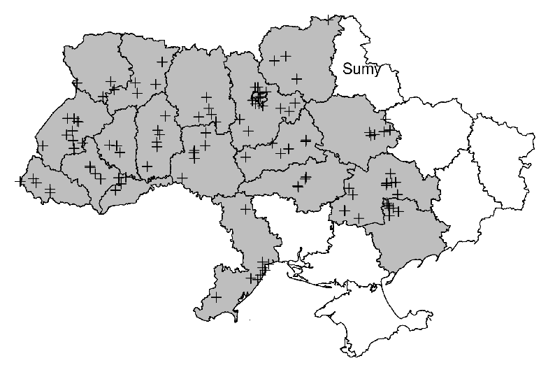

- (a) Sampled locations Note: PSUs areanonymized through random displacement by up to .2 decimal degrees.

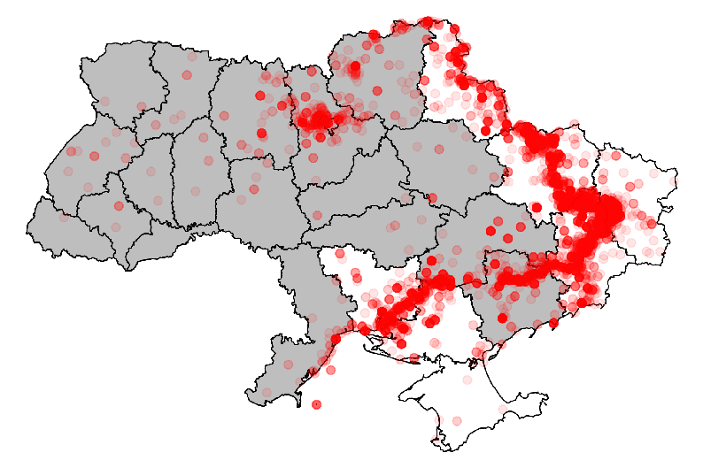

- (b) Battles, remote violence, and violence against civilians committed by the Russian Army and their proxies (23rd February – 22nd July 2022). Note: Data from Raleigh et al. (2010).

- Figure 1: Survey sample and conflict events in Ukraine

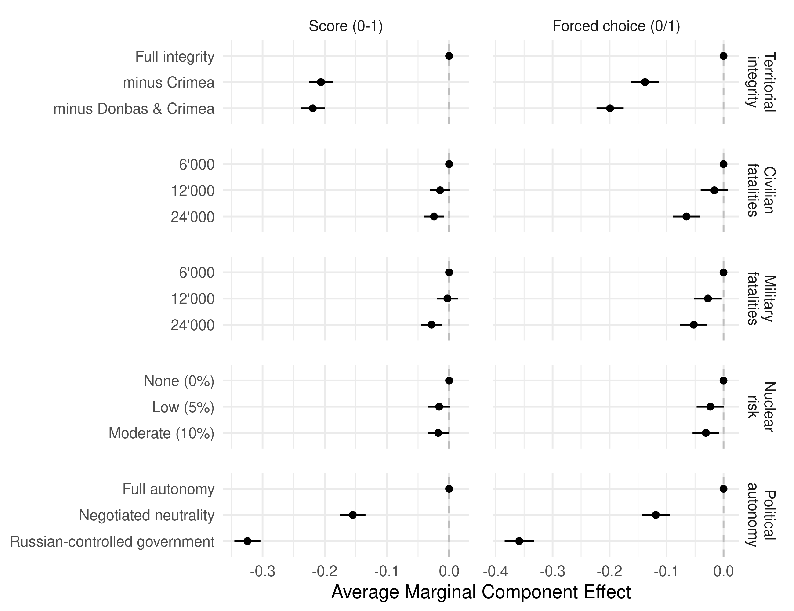

- Figure 2: Self-defence, even at very high costs: Territorial concessions and limits on autonomy have larger negative AMCEs than civilian and military fatalities or nuclear risk.

probability by -0.065 [-0.089; -0.041]. In contrast, upfront concessions of Donbas and Crimea decrease these outcomes by -0.22 [-0.24; -0.2] and -0.2 [-0.22; -0.18], respectively. The possibility of a Russian-controlled government elicits even stronger resistance, with an effect on both outcomes of -0.32 [-0.35; -0.3] and -0.36 [-0.38; -0.33], respectively.

We put these results into perspective by analyzing average scores and choice probabilities of strategies with given attribute levels (Leeper, Hobolt and Tilley 2020).22 Plotting such “marginal means,” Figure 3 confirms that Ukraine’s political autonomy restrictions move average outcomes along much of the range between 0 and 1. While the average rating for strategies with full political autonomy amounts to a score of 0.45 [0.44; 0.47], this reduces to 0.13 [0.12; 0.14] for

22For choice probabilities, we drop profiles without variance on a given attribute to prevent bias.

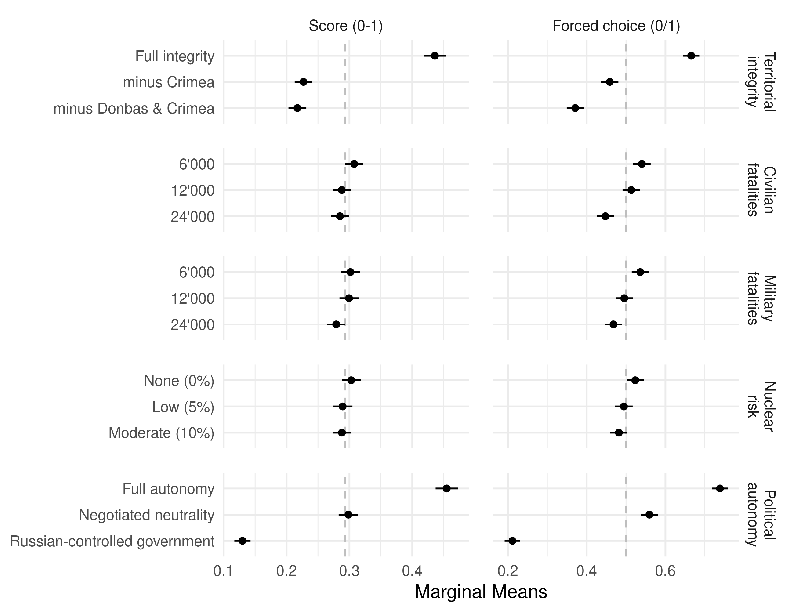

- Figure 3: Little support for territorial concessions and limits to political autonomy: Marginal means

Note: Marginal means for the forced choice outcome drop pairs without variance on a given attribute.

strategies featuring a Russian-controlled government. Even more starkly, the average choice rate changes from 74 [72; 76] to 21 [19; 23] percent. The range of marginal means for differing levels of territorial concessions is smaller yet still substantive. Respondents chose “no concession” strategies in 67 [64; 69] percent of tasks, while they conceded Donbas and Crimea only at a rate of 21 [19; 23] percent.23 In comparison, respondents choose strategies with low and high numbers of civilian fatalities in a small range of 54 [52; 56] and 45 [43; 47] percent of tasks, respectively. This range is even smaller for different levels of military fatalities and nuclear risk.

Thus, Ukrainians’ overriding preference is avoiding limits to political autonomy and territorial concessions. But how much weaker is their concern for the costs of war? To compare the effects of attributes of different substance and scale, the following illustrative extrapolation asks about hypothetical levels of war costs that might have produced AMCEs equivalent to those of territorial concessions and autonomy restrictions. Although our attribute treatments are bounded for reasons of realism and ethics, we can base this strictly illustrative exercise on the logarithmic (Attributes 2 and 3) and linear (Attribute 3) scales that characterize our attribute levels. Assuming respondents’ preferences are proportional to these scales beyond the experiment’s empirical domain,24 we can gauge the hypothetical attribute level (e.g., civilian fatalities) estimated to yield an approximately similar AMCE as, for example, the concession of Donbas and Crimea (see Appendix B.2 for details).

Table 2 presents this comparative exercise for Attributes 2 to 4 paired with territorial concessions and political autonomy restrictions. Extrapolating our AMCE estimates for civilian fatalities in the first row and column shows that treating respondents with a death toll of 110 [33; 380] thousand civilians over three months is estimated to yield an AMCE of similar size as the effect of conceding Crimea

- 23We show below that such concessions are caused by respondents’ priority for political autonomy rather than war-costs.
- 24This assumption may be invalid, for example if there are cost thresholds respondents are categorically opposed to crossing. Figure 2 shows that effects of Attributes 2 and 3 are roughly linear in their scale, whereas respondents’ marginal aversion against higher nuclear risk appears to be decreasing in risk levels, which would make our linear extrapolation somewhat more conservative.

Table 2: Linear extrapolation of AMCEs

Limits to... Territorial Integrity Political Autonomy 2: Crimea 3: Donbas+Crimea 2: Neutrality 3: Russian gov.

Civil. fatal. 0.11 0.41 0.075 12 (millions) [0.033, 0.38] [0.078, 2.2] [0.026, 0.22] [0.72, 220]

Milit. fatal. 0.23 1.2 0.14 80 (millions) [0.039, 1.3] [0.096, 14] [0.03, 0.65] [1, 6100]

Nuclear risk 39 58 33 100 (percent) [5.3, 72] [10, 100] [3.3, 62] [24, 100]

upfront. This would amount to 1,200 deaths/day or ten times the average before July. The civilian fatalities treatment estimated to yield an AMCE similar to that of giving up Donbas and Crimea amounts to 410 [78; 2’200] thousand fatalities in comparison.

The results also suggest that a treatment of 75 [26; 220] thousand civilian fatalities might generate an effect equivalent to that of negotiated neutrality. Lastly, the extrapolation suggests that the AMCE of a Russian-controlled government equates treating individuals with an estimated 12 [.72; 220] million Ukrainian civilian casualties – a staggering figure well beyond current risk assessments or ethically defensible conjoint treatments. The corresponding estimates for military fatalities and nuclear risk treatments follow the same pattern.

While we note the substantive uncertainty of these results, this illustrative extrapolation of AMCEs suggests that the average respondent of our survey would only be willing to give up on full territorial integrity and political autonomy to avoid costs of armed self-defense over the next three months that are orders of magnitude beyond realistic assessments at the time of the survey.

Our main estimates are robust to permutations of the empirical specification. In particular, our results remain consistent when (1) estimating a logistic regression of the forced choice outcome, (2) modelling attribute levels as continuous rather than categorical, (3) weighting respondents by their household size, and (4) accounting for attributes’ ordering (see Appendix C). Lastly, our results are not

driven by the “worst-case” political outcome: a Russian-controlled government. Analyzing strategy-pairs without this outcome increases primarily the effect of conceding Donbas and Crimea, and only slightly strengthens that of other attributes (Appendix Figure A7). This suggests reactions to attributes that put most weight on political and territorial concessions, a point to which we return below.

#### Effect heterogeneity

While most respondents likely have the same preference directions, their intensity might vary. If this were the case, some of our estimates might be driven by potentially small subsets of respondents (Abramson, Ko¸cak and Magazinnik 2019). We test for heterogeneous treatment effects along respondents’ (1) demographic characteristics, (2) affectedness by the war, and (3) self-reported attitudes toward the war and the nation.25 Of the 20 variables that we test, only 6 are associated with statistically significant heterogeneity in AMCEs on respondents strategy choice (p < .05, Bonferroni-adjusted).

Demographics: Presented in full in Appendix D, we find that demographics barely affect our results with the exception of ethno-linguistic characteristics.26 The absence of substantive heterogeneity given age, family status, gender, education, economic, and urban status might be due to the widespread impact of the war. Although Ukraine’s eastern regions are by far the worst affected, Russian attacks on civilian infrastructure, hospitals, and schools across the country; massive internal displacement; and trauma following the uncovering of mass atrocities in liberated cities may all have fostered a collective experience of the conflict. Experts also argue that Ukrainians in all regions now increasingly identify with the Ukrainian state (Onuch 2022). Notably, respondents who answered in Russian or are native Russian-speakers did exhibit smaller, yet substantively and statistically significant AMCEs of the territorial integrity and political autonomy items. Customarily spo-

25See Appendix A for summary statistics on the variables. 26This is robust to modelling age and education linearly.

ken Russian thus correlates with individuals’ preference intensity but not direction. This belies the simplistic notion that Russian-speakers and ethnic Russians are sympathetic to Russia’s aims, and corresponds to evidence showing a growing civic identification among these sub-groups (Barrington 2021; Kulyk 2019; Pop-Eleches and Robertson 2018) and in the Ukrainian population generally (Onuch and Hale 2022)

Affectedness: Some previous studies suggest that direct war-affectedness can make individuals more sensitive to wars’ costs and more willing to make concessions (Chiego 2023; Tellez 2019b). However, in Ukraine, those most affected are also those whose place of residence is most likely to come under Russian rule, thus increasing their stakes in not conceding Ukraine’s territorial integrity and political autonomy. We investigate how far respondents’ choices coincide with these arguments by analyzing heterogeneous treatment effects along terciles of an “affectedness score” that combines information across eight measures of individual and geographic affectedness by the war. We then disaggregate its components.

We find that the least war-affected respondents oppose political and territorial concessions more than the most affected respondents (Figure 4). The latter do, however, also react very negatively to territorial concessions and limits on political autonomy, with AMCEs that are substantively larger than those of the cost attributes. Showing no increased cost-sensitivity, highly affected respondents do not react more negatively to higher war-costs than the least affected tercile. Further analyses in Appendix D show this heterogeneity to be mostly driven by geographic exposure to the war. Respondents in regions first attacked by Russia and those living within 10 kilometres of one-sided violence and battle events tend to exhibit smaller (yet still substantive) AMCEs of territorial integrity and political autonomy restrictions. Various types of self-affectedness or family members’ affectedness do not systematically or significantly moderate the results. These findings suggest that a sample of respondents from the most-affected eastern oblasti excluded from the

survey would not have yielded starkly different results.27

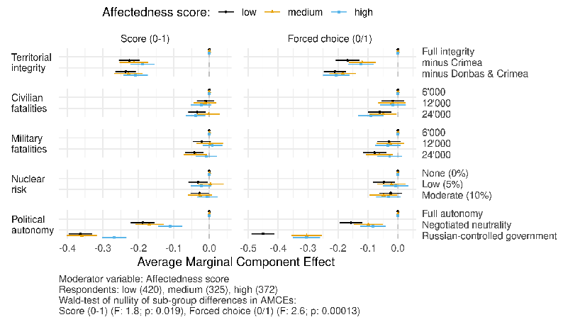

- Figure 4: Heterogeneity by terciles of affectedness score.

Note: Affectedness score is the first Principal Component of affectedness measures: residence in

(1) eastern Ukraine; (2) oblast first attacked; (3) self or (4) family affected by war; location 10km to

(5) one-sided violence, (6) battle events; and (7) shelling.

Attitudes: Lastly, we assess heterogeneity along respondents’ political attitudes. We find that respondents’ who are less concerned about Ukrainian national survival and victory in the war and trust their president less exhibit smaller, yet still substantive, effects of limitations on Ukraine’s territorial integrity and political autonomy while not differing on the cost attributes. The results show that even the few respondents who are unaligned with the current government reject concessions on Ukraine’s territory or autonomy.

#### Proportionate resistance?

We test whether respondents’ scores and choices reflect the logic of proportionality (Hypotheses 6 and 7). Under a logic of proportionality, the negative effects of cost attributes would increase as strategies exhibit greater infringements on ter-

27Little heterogeneity along levels of victimization is consistent with other research conducted since Russia’s invasion (Onuch 2022).

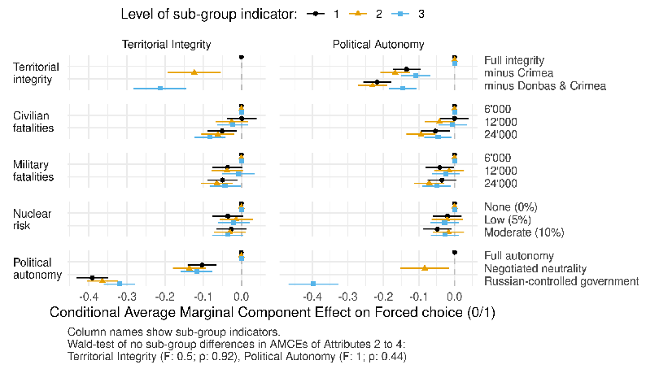

- Figure 5: No evidence for proportionality: Stable effects of cost attributes 2-4 across levels of territorial integrity and political autonomy.

ritorial integrity and political autonomy: respondents should accept more deaths and nuclear risk in exchange for better war outcomes and should accept worse outcomes to save costs.

We find no support for this expectation. Figure 5 shows estimated AMCEs for sub-groups defined by the attribute levels of territorial integrity and political autonomy assigned to a strategy.28 Overall, estimated effects of fatalities and nuclear risk do not differ between these sub-groups with substantive or statistical significance. Results for the score outcome in Appendix Figure A23 show consistent patterns, as does an analysis among most affected respondents (Figure A24).29 An omnibus F-test of sub-group differences among the effects of cost attributes rejects our expectation that attitudes follow a logic of proportionality (p = .92 and .44). Because the many contrasts may cause false positives, we do not interpret the few, small, and mostly statistically insignificant subgroup differences in Figure 5.

- 28Due to full randomization, differences between subgroups can be causally interpreted. Appendix E reports interaction effects.
- 29Appendix Figures A27 and A28 show equivalent results when modelling attribute effects linearly.

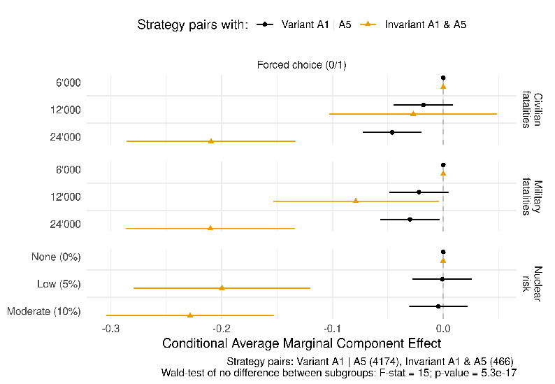

- Figure 6: Sub-group analysis by (no) pair-level variation in Attribute 1 (territorial integrity) and Attribute 5 (political autonomy).

#### Categorical resistance?

Rather than trading off the costs against the benefits of self-defense, respondents may take a categorical stance. A categorical logic implies a clear ranking of (un)desirable features so that a strategy characterized by the most resisted (desired) feature f1 across all attributes and levels is rejected (accepted) irrespective of all lower-ranked features. If f1 characterizes either none or both strategies in the pair, choices are guided by categorical reactions to the second-ranked feature f2, etc.30 Such decision-making does not contradict the assumptions underlying conjoint experiments and AMCE estimates (Hainmueller, Hopkins and Yamamoto 2014). Yet, AMCEs depict such decision-making inadequately as they average over preference directions and intensities (Abramson, Koc¸ak and Magazinnik 2019) across all tasks.

Going beyond our pre-analysis plan, we test whether forced choice patterns are consistent with categorical reactions to (restrictions on) Ukraine’s political au-

30This logic does not affect strategy ratings which can be assigned independently.

tonomy and territorial integrity as the highest-ranked features. If so, the effects of cost attributes should increase in pairs with invariant integrity and autonomy attributes. Figure 6 supports this conjecture. We find that the effects of 24’000 civilian and military fatalities and moderate nuclear risk more than quadruple once all concession attributes are invariant, each reaching a conditional AMCE of .2. These increases are causally identified as variance in attribute levels is randomized. They are also not the mechanical result of suppressing variance in just any two attributes.31 Consistent with categorical choices, respondents strongly react to the costs of the war only once concessions are off the table or invariant.

But what is the full ranking of attribute features? We answer this question with a new heuristic approach that deepens causal analysis of conjoint data. We start choosing the first-ranked feature f1 as that with a co-occurrence adjusted marginal mean closest to either 0 or 1, being the feature with the greatest predictive power over respondents’ choices. We then identify the second-ranked feature f2, but using only strategy pairs in which f1 is either absent or invariant.32 For this sub-sample we proceed as before, estimating “nested” marginal means to delineate f2. Again only keeping pairs without variation in f2, we proceed in the same manner until all features are ranked. Bootstrapped standard errors clustered at the respondent-level capture the rankings’ uncertainty.

Figure 7 presents the resulting nested marginal means until the fourth-ranked feature.33 These remain substantively similar among the most war-affected respondents.34 The first column presents marginal means from the entire dataset, which identify a Russian controlled government as the first-ranked feature f1. It is chosen in only 21 [19; 23] percent of cases with any acceptances caused not by high war costs but exclusively by rejections of territorial concessions (Appendix Figure A29).

In column 2, we drop all strategy pairs with variation in f1, the Russian-

31Splitting the sample by (in)variance in pairs of cost attributes yields no significant subgroup

differences. 32This is assuming no interaction effects. 33See Table A7 for a full ranking. 34Appendix Figures A30 and A31.

controlled government. In the remaining sample (N=5’008), full territorial integrity reaches an acceptance rate of 72 [69; 74] percent, thus being the second-ranked feature f2. Rejections of territorial integrity in this subsample are mostly caused by choices for full political autonomy over political neutrality, with small and mostly insignificant effects of cost attributes (Figure A29).

In column 3, acceptance of full political autonomy (70 [66; 74] percent) vs. negotiated neutrality yield the largest nested marginal means that mirror each other mechanically, thus receiving the same rank 3 [3;4]. Its confidence interval is overlapping with rank 4 [3;8], conditional acceptance of giving up only Crimea (column 4; mean of 66 [61; 71] percent) vs. giving up Crimea and Donbas. These two features are ranked with substantial uncertainty due to the smaller sample size (N = 1’632) and increasing effects of the cost attributes. In sum, these ranking estimates then reaffirm that concerns over full political autonomy and territorial integrity significantly override respondents’ sensitivity to the costs of the war.

Yet, cost attributes’ nested marginal means show a substantively increasing spread. This reiterates that respondents react to war costs once their choice set does not reflect their primary concerns for the reestablishment of the 2014 status quo-ante (column 5). They then select strategies without nuclear risk in 70 [64; 76] percent of tasks and seldom select strategies that lead to high levels of civilian and military fatalities. In sum, Ukrainians’ choices are congruent with a categorical rejection of strong limits on political autonomy and territorial integrity, and lower-ranked concerns over the costs of war.

Our methodological innovation also promises an improved evaluation of conjoint experiments more generally. Co-occurrence of features over which respondents hold inelastic preference can affect AMCEs and marginal means for other features in theoretically meaningful ways. This expands Abramson, Ko¸cak and Magazinnik’s (2019) insight on the effect of including important attributes, to the effect of the variance of these important attributes.35 Our ranking-based disaggre-

35Co-occurrence rates have been shown to affect attributes’ own AMCE estimates (Leeper, Hobolt and Tilley 2020; Ganter 2021).

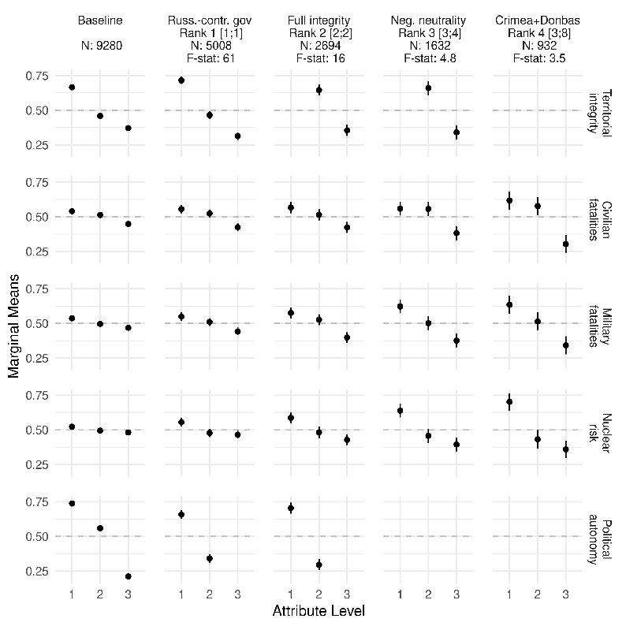

- Figure 7: Ranking the importance of strategy features in categorical decision-making. Nested marginal means of forced choice among attribute levels in nested subsets of the sample in which higher-ranked features do not vary.

Note: Column header identifies the feature and its rank used to identify the subset to be dropped in comparison to the previous column to the left, the remaining number of strategies in the sample, as well as the F-statistic of a Wald-test of no difference between the estimates in that and the previous column. Marginal means are computed after dropping pairs with no variance on a given attribute to avoid bias.

gation into “nested” marginal means can help analyze such patterns, which likely affect conjoint responses on issues with high-valence attributes, such as migration intentions (see, e.g., Alrababah et al. 2023), and attitudes on crime or human rights. Additionally, our disaggregated feature effect estimates allow for more targeted examination of choices from a given set of profiles. These may be valuable in their own right and in situations where the full distribution of profiles is ex ante unknown but where a political (or other) process yields two (or more) concrete profiles, the choice between which researchers may want to inform or predict based on existing data.

### Conclusion

Most moral philosophers hold that even a war with a just cause like self-defense is only justified if the costs of fighting do not exceed the benefits. The chorus of statesmen, scholars, and pundits calling on Ukraine to settle for less than full political autonomy and territorial integrity to limit the costs of armed self-defense reflects this logic of proportionality. This study, instead, shows that Ukrainians overwhelmingly prefer strategies that do not concede territory or limit Ukraine’s political autonomy. Respondents are sensitive to the costs of armed self-defense, but only if they are choosing between strategies with acceptable outcomes. None of the costs they contemplated exceeded the value Ukrainians place on political autonomy and territorial integrity.

One might think that these findings mean Ukrainians follow the logic of proportionality, but place much more value on the benefits of successful self-defense than the outside observers calling for concessions.36 How much value? Our illustrative extrapolation of treated attribute levels yielded staggering results. For example, we estimate that the average effect of a Russian-controlled government on the rate of rejection is, to our respondents, equivalent to accepting 12 [.72,220] million ad-

36This may seem plausible not least because Russian political or territorial control would have significant long-term costs, including Ukrainian lives lost.

ditional civilian deaths, more military fatalities than the country has inhabitants, or a certain nuclear attack. This extreme cost-inelasticity points to a more radical divergence of Ukrainians’ attitudes from the logic of proportionality.

Instead, we demonstrate that Ukrainians’ preferences follow a categorical logic. We find no significant interactions between the expected costs and projected benefits of armed self-defense, suggesting that respondents do not make trade-offs. Moreover, based on a newly developed method to rank attributes and decompose marginal mean estimates, we find that 79% of strategies with a Russian-controlled government as the projected outcome are rejected, regardless of the costs. When respondents accept strategies with this projected outcome, they do so not to save costs but to avoid territorial concessions. Respondents thus have a clear preference ranking among the outcomes they accept: a large majority support self-defense at any cost.

This first evidence showing that a population facing aggression takes a categorical stance on resistance has three important implications for research on attitudes of conflict-affected populations. First, we highlight the need to differentiate between decreased cost-sensitivity and the outright rejection of trade-offs in response to exposure to threat or violence. Both can look like intransigence but follow different logics. Second, at the individual level, we find little effect-heterogeneity by war-affectedness. This corroborates observational evidence for the unifying force of inter-state war that threatens national survival. Third, our results highlight the need for future research to investigate whether populations affected by conflicts with qualitatively different stakes, such as regime contestation without threats to territorial integrity, likewise adopt a categorical stance.

For policy-makers, our results underscore the urgent need to take Ukrainians’ determination seriously. Making demands on Ukraine’s political elites that are entirely divorced from Ukrainian mass preferences is politically unwise as the success of any strategy depends partly on popular support. If Ukraine’s leadership sought a political settlement or conceded territory due to international pressure, our study

suggests, this settlement could destabilize the Ukrainian government and would be of short duration. Commentators calling on Ukraine to make concessions tend to be confident that they come from a position of hard-headed realism. Barry Posen (2022) recently warned that “Ukraine and the West should ... shift from a strategy of winning the war toward a more realistic approach ... that ends the fighting.” In his call for Ukrainian concessions, Noam Chomsky famously exhorted Ukraine and its Western allies to “pay attention to the reality of the world” (Current Affairs 2022). The reality is that Ukrainians prefer self-defense at any cost.

### References

Abramson, Scott F, Korhan Koc¸ak and Asya Magazinnik. 2019. “What do we learn about voter preferences from conjoint experiments.” Unpublished Working Paper.

Al Jazeera. 2022. “Ukraine war must end to prevent nuclear ‘abyss’: Lukashenko.” https://www.aljazeera.com/news/2022/7/21/ukraine-war-must-end-toprevent-nuclear-war-abyss-lukashenko.

Alrababah, Ala, Daniel Masterson, Marine Casalis, Dominik Hangartner and Jeremy Weinstein. 2023. “The Dynamics of Refugee Return: Syrian Refugees and Their Migration Intentions.” British Journal of Political Science p. 1–24.

Balcells, Laia. 2012. “The consequences of victimization on political identities: Evidence from Spain.” Politics & Society 40(3):311–347.

Barrington, Lowell. 2021. “Citizenship as a cornerstone of civic national identity in Ukraine.” Post-Soviet Affairs 37(2):155–173.

Bauer, Michal, Christopher Blattman, Julie Chytilov´a, Joseph Henrich, Edward Miguel and Tamar Mitts. 2016. “Can war foster cooperation?” Journal of Economic Perspectives 30(3):249–74.

Bella, Timothy. 2022. “Kissinger says Ukraine should cede territory to Russia to end war.” https://www.washingtonpost.com/world/2022/05/24/ henry-kissinger-ukraine-russia-territory-davos/.

Benbaji, Yitzhak and Daniel Statman. 2019. War by Agreement: A Contractarian Ethics of War. Oxford University Press.

Canetti, Daphna, Brian J Hall, Carmit Rapaport and Carly Wayne. 2013. “Exposure to political violence and political extremism: A stress-based process.” European Psychologist 18(4):263.

Chiego, Christopher. 2023. “The 2008 Russo-Georgian War and Civilian Responses to Direct Experiences in War.” Unpublished Working Paper.

CNN-News18. 2022. “Exclusive Interview John Mearsheimer, Man Who Predicted Russia Ukraine War.” https://youtu.be/_wi_0oiZ7vU.

Condra, Luke N and Jacob N Shapiro. 2012. “Who takes the blame? The strategic effects of collateral damage.” American Journal of Political Science 56(1):167–187.

Cronin-Furman, Kate and Milli Lake. 2018. “Ethics abroad: Fieldwork in fragile and violent contexts.” PS: Political Science & Politics 51(3):607–614.

Current Affairs. 2022. “Noam Chomsky on How To Prevent World War III.” https://www.currentaffairs.org/2022/04/ noam-chomsky-on-how-to-prevent-world-war-iii.

De la Cuesta, Brandon, Naoki Egami and Kosuke Imai. 2022. “Improving the external validity of conjoint analysis: The essential role of profile distribution.” Political Analysis 30(1):19–45.

de Neufville, Robert. 2022. “Could Russia Use Nuclear Weapons?” https://tellingthefuture.substack.com/p/ could-russia-use-nuclear-weapons?s=r.

Democratic Initiatives Foundation. 2022. “How the War Changed the Way Ukrainians Think About Friends, Enemies, and the Country’s Strategic Goals.” https://dif.org.ua/en/article/how-the-war-changed-the-way-ukrainiansthink-about-friends-enemies-and-the-countrys-strategic-goals.

Dill, Janina, Scott D Sagan and Benjamin A Valentino. 2022. “Kettles of hawks: Public opinion on the nuclear taboo and noncombatant immunity in the United States, United Kingdom, France, and Israel.” Security Studies 31(1):1–31.

Dinstein, Yoram. 2017. War, Aggression and Self-defence. Cambridge University Press.

Drezner, Daniel W. 2008. “The Realist Tradition in American Public Opinion.” Perspectives on Politics 6(1):51–70.

Driscoll, Jesse and Daniel Maliniak. 2016. “Did georgian voters desire military escalation in 2008? Experiments and observations.” The Journal of Politics 78(1):265– 280.

Eichenberg, Richard C. 2005. “Victory has many friends: US public opinion and the use of military force, 1981–2005.” International Security 30(1):140–177.

Fabbe, Kristin, Chad Hazlett and Tolga Sınmazdemir. 2019. “A persuasive peace: Syrian refugees’ attitudes towards compromise and civil war termination.” Journal of Peace Research 56(1):103–117.

Fabre, C´ecile. 2015. “War exit.” Ethics 125(3):631–652. Fisk, Kerstin, Jennifer L Merolla and Jennifer M Ramos. 2019. “Emotions, terrorist

threat, and drones: Anger drives support for drone strikes.” Journal of Conflict Resolution 63(4):976–1000.

Forest, Beley. 2022. “Nuclear Factor.” https://uchoose.info/yadernyj-faktor.

- Frowe, Helen. 2014. Defensive Killing. OUP Oxford.

- Frowe, Helen. 2015. The Ethics of War and Peace: An Introduction. Routledge.

Ganter, Flavien. 2021. “Identification of preferences in forced-choice conjoint experiments: reassessing the quantity of interest.” Political Analysis pp. 1–15.

Gardam, Judith Gail. 1993. “Proportionality and force in international law.” American Journal of International Law 87(3):391–413.

Gelpi, Christopher, Peter D Feaver and Jason Reifler. 2005. “Success matters: Casualty sensitivity and the war in Iraq.” International Security 30(3):7–46.

Getmansky, Anna and Thomas Zeitzoff. 2014. “Terrorism and voting: The effect of rocket threat on voting in Israeli elections.” American Political Science Review 108(3):588–604.

Gottemoeller, Rose. 2022. “The Russia-Ukraine War: Would Putin Go Nuclear?” https://www.youtube.com/watch?v=gznYbFLCjiE.

Greene, Joshua D, R Brian Sommerville, Leigh E Nystrom, John M Darley and Jonathan D Cohen. 2001. “An fMRI investigation of emotional engagement in moral judgment.” Science 293(5537):2105–2108.

Grossman, Guy, Devorah Manekin and Dan Miodownik. 2015. “The political legacies of combat: Attitudes toward war and peace among Israeli ex-combatants.” International Organization 69(4):981–1009.

Habershon, Sarah, Rob England, Becky Dale and Olga Ivshina. 2022. “War in Ukraine: Can we say how many people have died?” https://www.bbc.co. uk/news/world-europe-61987945.

Hainmueller, Jens, Daniel J Hopkins and Teppei Yamamoto. 2014. “Causal inference in conjoint analysis: Understanding multidimensional choices via stated preference experiments.” Political Analysis 22(1):1–30.

Haque, Adil Ahmad. 2012. “Proportionality (in war).” International Encyclopedia of Ethic .

Haque, Adil Ahmad. 2022. “An unlawful war.” American Journal of International Law 116:155–159.

Hatz, Sophia. 2020. “Selective or collective? Palestinian perceptions of targeting in house demolition.” Conflict Management and Peace Science 37(5):515–535.

Hauser, Marc, Fiery Cushman, Liane Young, R Kang-Xing Jin and John Mikhail.

2007. “A dissociation between moral judgments and justifications.” Mind & language 22(1):1–21.

Hurka, Thomas. 2005. “Proportionality in the morality of war.” Philosophy & Public Affairs 33(1):34–66.

International Court of Justice. 1996. “Legality of the Threat or Use of Nuclear Weapons, Advisory Opinion, 8 July 1996, Separate Opinion of Judge Fleischhauer.” ICJ Reports (1996).

Izhak, Oleksiy. 2022. “Nuclear blackmail of Russia: what Putin is ready for and what Ukraine needs to know.” https://zn.ua/ukr/international/ jadernij-shantazh-rosiji-do-choho-hotovij-putin-i-shcho-potribno-znati-ukrajini. html.

Jentleson, Bruce W and Rebecca L Britton. 1998. “Still pretty prudent: Post-Cold War American public opinion on the use of military force.” Journal of Conflict Resolution 42(4):395–417.

Johns, Robert and Graeme A.M. Davies. 2017. “Civilian casualties and public support for military action: Experimental evidence.” Journal of Conflict Resolution 63(1):251–281.

Kaltenthaler, Karl C, Daniel M Silverman and Munqith M Dagher. 2020. “Nationalism, threat, and support for external intervention: Evidence from Iraq.” Security Studies 29(3):549–573.

Koch, Lisa Langdon and Matthew Wells. 2021. “Still taboo? Citizens’ attitudes toward the use of nuclear weapons.” Journal of Global Security Studies 6(3):ogaa024.

Kulyk, Volodymyr. 2019. “Identity in transformation: Russian-speakers in postSoviet Ukraine.” Europe-Asia Studies 71(1):156–178.

Kyiv International Institute of Sociology. 2022. https://www.kiis.com.ua/ ?lang=eng&cat=reports&id=1111&page=1&y=2022&m=5.

Leeper, Thomas J, Sara B Hobolt and James Tilley. 2020. “Measuring subgroup preferences in conjoint experiments.” Political Analysis 28(2):207–221.

Longo, Matthew, Daphna Canetti and Nancy Hite-Rubin. 2014. “A checkpoint effect? Evidence from a natural experiment on travel restrictions in the West Bank.” American Journal of Political Science 58(4):1006–1023.

Lupu, Yonatan and Geoffrey PR Wallace. 2022. “Targeting and public opinion: An experimental analysis in Ukraine.” Journal of Conflict Resolution .

Lyall, Jason, Graeme Blair and Kosuke Imai. 2013. “Explaining support for combatants during wartime: A survey experiment in Afghanistan.” American Political Science Review 107(4):679–705.

Matanock, Aila M, Natalia Garbiras-D´ıaz and Miguel Garcia-Sanchez. 2022. “Prospective and Retrospective Approaches: Conflict Exposure and Attitudes on the Peace Agreement in Colombia.” Available at SSRN .

- McMahan, Jeff. 2009. Killing in War. Oxford University Press.
- McMahan, Jeff. 2010. Humanitarian intervention, consent, and proportionality. Oxford University Press New York pp. 44–72.

McMahan, Jeff. 2022. “Moral liability for the Russian invasion and the moral necessity of sanctions.” https://www.publicethics.org/post/moral-liability-forthe-russian-invasion-and-the-moral-necessity-of-sanctions.

Mecklin, John. 2022. “Siegfried Hecker: Putin has destroyed the world nuclear order. How should the democracies respond?” https://thebulletin.org/2022/04/siegfried-hecker-putin-has-destroyed-theworld-nuclear-order-how-should-the-democracies-respond.

Metaculus. 2022. “Russia-Ukraine Conflict: Forecasting Nuclear Risk in 2022.” https://www.metaculus.com/notebooks/10439/russia-ukraine-conflictforecasting-nuclear-risk-in-2022/.

Mironova, Vera, Loubna Mrie and Sam Whitt. 2019. “Risk tolerance during conflict:

Evidence from Aleppo, Syria.” Journal of peace research 56(6):767–782. Nagel, Thomas. 1979. Mortal Questions. Cambridge University Press. Nelson, Amy J. and Alexander Montgomery. 2022. “How not to estimate

the likelihood of nuclear war.” https://www.brookings.edu/blog/order-fromchaos/2022/10/19/how-not-to-estimate-the-likelihood-of-nuclear-war/.

OHCHR. 2022. “Ukraine: civilian casualty update 4 july 2022.” https://www.ohchr.org/en/news/2022/07/ukraine-civilian-casualty-update4-july-2022.

Onderco, Michal and Michal Smetana. 2021. “German views on US nuclear weapons in Europe: public and elite perspectives.” European Security 30(4):630– 648.

Onuch, Olga. 2022. “European Ukrainians and their fight against Russian invasion.” https://doi.org/10.1111/nana.12883.

Onuch, Olga and Henry Hale. 2022. The Zelensky Effect. C Hurst & Co Publishers Ltd: London/New York.

Pop-Eleches, Grigore and Graeme B Robertson. 2018. “Identity and political preferences in Ukraine–before and after the Euromaidan.” Post-Soviet Affairs 34(23):107–118.

Posen, Barry. 2022. “Ukraine’s implausible theories of victory: The fantasy of Russian defeat and the case for diplomacy.” https://www.foreignaffairs. com/articles/ukraine/2022-07-08.

Press, Daryl G., Scott S. Sagan and Benjamin A. Valentino. 2013. “Atomic aversion: Experimental evidence on taboos, traditions, and the non-use of Nuclear weapons.” American Political Science Review 107(1):188–206.

Putin, Vladimir. 2021. “On the Historical Unity of Russians and Ukrainians.”

http://www.en.kremlin.ru/events/president/news/66181. Railton, Peter. 1986. “Facts and values.” Philosophical Topics 14(2):5–31. Raleigh, Clionadh, Andrew Linke, H˚avard Hegre and Joakim Karlsen. 2010. “In-

troducing ACLED: an armed conflict location and event dataset: special data feature.” Journal of Peace Research 47(5):651–660.

Record, Jeffrey. 2002. “Collapsed countries, casualty dread and the new American way of war.” Parameters 32(2):4–23.

Reiter, Dan and Allan C Stam. 1998. “Democracy, war initiation, and victory.” American Political Science Review 92(2):377–389.

Renzo, Massimo. 2018. “Political self-determination and wars of national defense.” Journal of Moral Philosophy 15(6):706–730.

Rodin, David. 2004. “War and self-defense.” Ethics & International Affairs 18(1):63– 68.

Rudolph, Lukas, Markus Freitag and Paul Thurner. 2022. “Ordering effects vs. cognitive burden: How should we structure attributes in conjoint experiments.” SocArXiv .

- Sagan, Scott D and Benjamin A Valentino. 2017. “Revisiting Hiroshima in Iran: What Americans really think about using nuclear weapons and killing noncombatants.” International Security 42(1):41–79.
- Sagan, Scott D and Benjamin A Valentino. 2018. “Not just a war theory: American public opinion on ethics in combat.” International Studies Quarterly 62(3):548–561.
- Sagan, Scott D and Benjamin A Valentino. 2019. “Just war and unjust soldiers: American public opinion on the moral equality of combatants.” Ethics & International Affairs 33(4):411–444.

Santora, Marc and Shashank Bengali. 2022. “What happened in the war?” https://www.nytimes.com/live/2022/06/ 07/world/russia-ukraine-war-news?smid=url-share# here-are-the-latest-developments.

Shafer-Landau, Russ. 2003. Moral Realism: A Defence. Clarendon Press. Silverman, Daniel. 2019. “What shapes civilian beliefs about violent events? Experimental evidence from Pakistan.” Journal of Conflict Resolution 63(6):1460–1487.

Smetana, Michal, Marek Vranka and Ondrej Rosendorf. 2022. “The lesser evil? Experimental evidence on the strength of nuclear and chemical weapon “taboos”.” Conflict Management and Peace Science 40(1):1–7.

Statman, Daniel, Raanan Sulitzeanu-Kenan, Micha Mandel, Michael Skerker and Stephen De Wijze. 2020. “Unreliable protection: An experimental study of experts’ in bello proportionality decisions.” European Journal of International Law 31(2):429–453.

Sukin, Lauren. 2020. “Experimental evidence on determinants of support for nuclear use in response to threats of nuclear retaliation.” Peace and Conflict: Journal of Peace Psychology 26(3):336.

- Tellez, Juan Fernando. 2019a. “Peace agreement design and public support for peace: Evidence from Colombia.” Journal of Peace Research 56(6):827–844.
- Tellez, Juan Fernando. 2019b. “Worlds apart: Conflict exposure and preferences for peace.” Journal of Conflict Resolution 63(4):1053–1076.

Tes´on, Fernando R. 2004. “Self-defense in international law and rights of persons.” Ethics & International Affairs 18(1):87–91.

The Washington Post. 2022. “Zelensky receives standing ovation, calls for more support in address to U.K. Parliament via video.” https://www.washingtonpost.com/world/2022/03/08/ zelensky-uk-parliament-address-war-ukraine/.

Voors, Maarten J, Eleonora EM Nillesen, Philip Verwimp, Erwin H Bulte, Robert Lensink and Daan P Van Soest. 2012. “Violent conflict and behavior: a field experiment in Burundi.” American Economic Review 102(2):941–64.

Walzer, Michael. 2008. Arguing about War. Yale University Press. Walzer, Michael. 2022. “The just war of the Ukrainians.” https://www.wsj.

com/articles/the-just-war-of-the-ukrainians-11648214810. Wood, Elisabeth Jean. 2006. “The ethical challenges of field research in conflict zones.” Qualitative sociology 29(3):373–386. Zartman, I William. 1995. Elusive Peace: Negotiating an End to Civil Wars. Brookings Institution Washington, DC.

# Supplementary Material

# At Any Cost: How Ukrainians Think about Self-Defense Against Russia

### Table of Contents

- A Data . . . . . . . . . . . . . . . . . . . . . . . . . . . . . A1

- A.1 Sampling strategy . . . . . . . . . . . . . . . . . . . . . . A1
- A.2 Survey implementation . . . . . . . . . . . . . . . . . . . . A1

- B Methods . . . . . . . . . . . . . . . . . . . . . . . . . . . A5

- B.1 Estimation strategy . . . . . . . . . . . . . . . . . . . . . . A5
- B.2 Illustrative extrapolation . . . . . . . . . . . . . . . . . . . A6

- C Robustness checks of main analysis . . . . . . . . . . . . . . . A7
- D Heterogeneous treatment effects . . . . . . . . . . . . . . . . . A11

- D.1 Demographic characteristics . . . . . . . . . . . . . . . . . . A12
- D.2 Affectedness by the war . . . . . . . . . . . . . . . . . . . . A13
- D.3 Political attitudes . . . . . . . . . . . . . . . . . . . . . . . A19

- E Additional proportionality results . . . . . . . . . . . . . . . . A20
- F Ranking analysis . . . . . . . . . . . . . . . . . . . . . . . A23
- G Pre-analysis plan . . . . . . . . . . . . . . . . . . . . . . . A27

- G.1 Introduction . . . . . . . . . . . . . . . . . . . . . . . . . A27
- G.2 Expectations . . . . . . . . . . . . . . . . . . . . . . . . . A28
- G.3 Heterogenous effects . . . . . . . . . . . . . . . . . . . . . A30
- G.4 Design . . . . . . . . . . . . . . . . . . . . . . . . . . . A30
- G.5 Sampling strategy . . . . . . . . . . . . . . . . . . . . . . A30
- G.6 Priors for Hypotheses 1-6 . . . . . . . . . . . . . . . . . . . A31
- G.7 Estimation strategy . . . . . . . . . . . . . . . . . . . . . . A31
- G.8 Power analysis . . . . . . . . . . . . . . . . . . . . . . . . A32
- G.9 Robustness checks . . . . . . . . . . . . . . . . . . . . . . A34

- H References (Appendix) . . . . . . . . . . . . . . . . . . . . . A34

### A Data

#### A.1 Sampling strategy

Due to dynamic flight and migration of Ukrainians since Russia’s invasion, the survey included only respondents who, when surveyed, lived in the same place as on 23 February 2022. Moreover, while we include some regions (oblasti) that have been under (partial) Russian occupation but liberated by the Ukrainian army,1 we excluded Crimea and the regions of Kharkiv, Donetsk, Luhansk, Kherson, and Mykolaiv from the survey because of ongoing fighting. The sampling strategy then followed a randomized, four-stage design in each included oblast to yield a sample that maximized its representativeness of the Ukrainian adult population given the current circumstances.2 First, the sample composition is proportional to the number of inhabitants 18 years and older in each region, retrieved from the last available electoral statistics from 2019. Second, we stratified voting precincts as our primary sampling units (PSUs) according to their urban vs. rural status.3 Third, we randomly sampled a total of 120 PSUs across all strata (oblast × urban-rural) with a probability proportional to their size. Fourth, we randomly selected 10 addresses within each sampled PSU.4 If the respective household did not agree to be interviewed or did not feature a member of a specified sex and age quota, interviewers moved to the next household until the respective interview was completed.5 Sex and age quotas for each PSU were computed based on the last (pre-war) official statistics.

#### A.2 Survey implementation

Conducting face-to-face interviews in an active conflict theatre requires taking additional measures to ensure the safety of enumerators and respondents (CroninFurman and Lake 2018). Enumerators underwent three types of training: a general introduction to interviewing and fieldwork, a training specific to the survey and related fieldwork procedures with regional leaders, and a special training for each interviewer regarding the instructions of the survey. In line with the approved protocol of Oxford University’s [redacted] ethical review board, enumerators sought the informed consent of respondents and allowed their withdrawal from the interview at any time. We furthermore assured our Ukrainian partners that failing to complete surveys due to security concerns would (and did) not have any monetary consequences for them, and that enumerator and respondent safety should always take precedence.

Figure 1 shows the geographic distribution of our sample in (a), compared to

- 1Kyiv, Zaporizhzhia, Zhytomyr, and Chernihiv. Interviews were only conducted in Ukrainecontrolled areas of Zaporizhzhia.
- 2Telephone interviews via random dialing are not an option for completing complex conjoint tasks.
- 3PSUs under Russian or contested control in Zaporizhzhia were excluded from the sampling pro-

cedure.

- 4Street, house number, apartment number. 5The result of the household-based sampling is a potential overweighting of small households.

Accounting for this pattern by re-weighting respondents does not substantively change our results, see Figure A2.

the full set of violent events led by the Russian army and its proxies since February 2022 in (b). We initially planned to conduct 1’200 interviews across regions considered safe by our local partners. The survey company closely monitored the situation while the survey was in the field, and each interviewer also recorded and reported any issues they faced when conducting the survey. After safety concerns were raised in Sumy, all 40 interviews in the region were immediately cancelled and dropped from the study. Interviews in the remaining oblasti were conducted without security concerns.

62% of successfully contacted households completed the survey.6 We consider this a very high cooperation rate, given the difficult circumstances the Ukrainian population faces. Most refusals were registered at the household level (N = 507). Of the quota-identified respondents, 85 refused before any questions were asked and 59 refused to complete the interview. The latter non-completion rate of 4.8% is very small as are item-level non-response rates, particularly given the sensitivity of the survey. We tentatively conclude that respondents wanted to make their voices heard on this issue, as we had hoped.

Table A1: Survey non-response

Complete 1160 Household-level refusal 507 Known-respondent refusal 85 Break off/ Implicit refusal 59 Unable to enter building 159 No one at residence 1020 Respondent unavailable during field period 61 Deceased respondent 31 Household-level language problem 6 Respondent language problem 3 Business, government office, other organizations 38 Vacant housing unit 164 Quota filled 148

- A analysis of correlates of overall non-response rates available with the replica-

tion data finds that non-response does not correlate with gender or age, and is 10 percentage points higher in the largest cities (>500k inhabitants) than in the smallest villages in the sample. Overall non-response was lowest on Wednesdays and Thursdays and not significantly different on weekends. Regionally, non-response was highest in the city of Kyiv (56%) and Chernihiv oblasti (56%), and lowest in Cherkasy (10%) and Chernivtsi (14%) oblasti. Oblasti first attacked during Russia’s February invasion have only a marginally higher non-response rate (+4 percentage points, p < .1).

We used two measures for quality control. First, 44% of interviews were controlled through a second visit (12 PSUs) or phone call (≥ 4 respondents/PSU) by a controller. Second, GPS coordinates for all except two localities were checked7 and partial audio records were verified. All PSUs were covered using these procedures.

- 10 unconfirmed interviews were discovered, excluded from the data, and repeated.

- 6Appendix A contains demographic summary statistics as well as a breakdown of various types of unsuccessful contact.
- 7The remaining two localities lacked coverage, with coordinates entered manually.

- Table A2: Respondent-level summary statistics: Demographics

Statistic N Mean Sex: Male / Female

Male 520 0.45 Female 640 0.55

##### Age (5 groups)

18-29 192 0.17 30-39 230 0.20 40-49 223 0.19 50-59 191 0.16 60+ 324 0.28

##### Children: yes/no

No 316 0.27 Yes 844 0.73

##### Level of education

Basic general secondary education 41 0.04 Complete general secondary education 238 0.21 Vocational and technical education 153 0.13 Secondary special education 350 0.30 Higher Education 378 0.33

##### Economic deprivation

no 431 0.37 yes 721 0.63

##### Rural / Urban

Rural 570 0.49 Urban 590 0.51

##### Interview language

Ukrainian 812 0.70 Russian 348 0.30

##### Native language

Other 58 0.05 Russian 161 0.14 Ukrainian 928 0.81

##### Ethnic identity

Other 33 0.03 Russian 46 0.04 Ukrainian 1078 0.93

- Table A3: Respondent-level summary statistics: Affectedness

Statistic N Mean

Affectedness score East 250 0.22

East vs. West

East 250 0.22 West 910 0.78

Oblast first attacked

No 610 0.53 Yes 550 0.47

Self war-affected

no 454 0.40 yes 680 0.60

Family war-affected

no 399 0.35 yes 736 0.65

Any oneside violence

no 950 0.82 yes 210 0.18

Any battles

no 870 0.75 yes 290 0.25

Any shelling

no 660 0.57 yes 500 0.43

- Table A4: Respondent-level summary statistics: Political attitudes

Statistic N Mean Ukr. nation at stake

no 553 0.57 yes 414 0.43

##### Importance of victory

All other 88 0.08 Extremely important 1072 0.92

##### Trust in president

high 945 0.87 low 143 0.13

### B Methods

#### B.1 Estimation strategy

The main quantity of interest to test Hypotheses 1 to 5 is the Average Marginal Component Effect (AMCE) of attribute levels to be interpreted as the effect of setting attribute A to a target level l on the probability of the average strategy to be selected against any other random strategy paired with it (Hainmueller, Hopkins and Yamamoto 2014; Bansak et al. 2020). We estimate the AMCE for attribute levels l ∈ [2,3] with level 1 as the baseline level for each attribute a ∈ A by estimating a joint linear regression:

A

3

βal[Tipsal = 1] + ϵips, (A1)

Yips = α0 +

a=1

l=2

where Yipsa is either the choice or score of a strategy s in pair p by respondent i. α0 denotes the intercept and Tipsal is binary indicator of the attribute level a strategy is assigned to. Hence, βal captures the AMCE for each attribute level of interest compared to its baseline level. We cluster standard errors at the level of respondents to account for potential interdependence within subjects.8

AMCE estimates can be misleading due to pair-level attribute invariance and other compositional effects (Abramson, Koc¸ak and Magazinnik 2019; Ganter 2021; Leeper, Hobolt and Tilley 2020). We therefore also estimate marginal means adjusted for attributes’ co-occurrence rate (Leeper, Hobolt and Tilley 2020).9 Differences between marginal means correspond to the AMCEs adjusted for the rate of co-occurrence. In addition, we estimate Average Feature Choice Probabilities (Abramson et al. 2020), which produce very similar insights and no signs of intransitive preferences (Figure A1).

To test Hypotheses 6 and 7 and assess heterogeneous effects, we estimate the following interaction model in which AMCEs are conditional on a sub-group indicator M with level k ∈ K:

K

A

3

K

βalk[Tipsa = l][Mips = k] + ϵips, (A2)

βk[Mipsk = 1] +

Yips = α0 +

a=1

k=1

l=2

k=2

which follows the notation of Eq. A1 while adding (1) constitutive terms for each level K−1 of the sub-group indicator except a baseline level and (2) estimating the conditional AMCE (CAMCE) for each subgroup separately, with βalk denoting the effect of attribute a at level l on the probability of a strategy being chosen among observations with M = k. We follow Leeper, Hobolt and Tilley (2020) and conduct an omnibus test of differences in CAMCEs between subgroups, which guards us against over-interpreting small and seemingly significant differences among many contrasts.10

8Appendix Figure A5 shows little substantive change when clustering on the PSU, strategy pair, or not at all.

- 9These correspond to Ganter’s (2021) average component preferences, since the number of at-

tribute levels is constant.

- 10The test reformulates Eq. A2 and tests for the joint nullity of interaction terms that moderate βal

coefficients from Eq. A1.

#### B.2 Illustrative extrapolation

We here explain our illustrative extrapolation of attribute effects which we use to compare AMCEs across substantively different attributes. To that intent, we first estimate linear treatment effects for the levels of our cost attributes. To do so, we simply replace the typical categorical dummy for each attribute level with an ordinal variable that ranges between 1 to 3, depending on the level an attribute has in a given strategy. The respective results are shown in Model (1) in Table A5. We add to this linear model categorical indicators of the concession and war outcome attributes (see Models (2) and (3)).

Table A5: Mixed linear and categorical models for illustrative extrapolation

Forced choice (0/1)

(1) (2) (3) Constant 0.638∗∗∗ 0.772∗∗∗ 0.921∗∗∗

(0.023) (0.010) (0.024)

Civ. fatalities (level, 1-3) −0.032∗∗∗ −0.033∗∗∗

(0.006) (0.006)

Milit. fatalities (level, 1-3) −0.024∗∗∗ −0.026∗∗∗

(0.006) (0.006)

Nuclear risk (level, 1-3) −0.014∗∗ −0.016∗∗∗

(0.006) (0.006)

Terr. integrity: Crimea (0/1) −0.137∗∗∗ −0.137∗∗∗

(0.012) (0.012)

Terr. integrity: Crimea + Donbas (0/1) −0.198∗∗∗ −0.199∗∗∗

(0.012) (0.012)

Pol. autonomy: Neutrality (0/1) −0.119∗∗∗ −0.119∗∗∗

- (0.012) (0.012)

Pol. autonomy: Russ. contr. gov. (0/1) −0.358∗∗∗ −0.358∗∗∗

- (0.013) (0.013)

Observations 9280 9280 9280 R2 0.005 0.116 0.121 Adjusted R2 0.004 0.116 0.121 Residual Std. Error 0.499 (df = 9276) 0.470 (df = 9275) 0.469 (df = 9272)

Note: ∗p<0.1; ∗∗p<0.05; ∗∗∗p<0.01 Standard errors clustered at the level of respondents.

The coefficients of the combined Model (3) then allow for a direct comparison. In particular, we ask what (hypothetical) level λ would a cost attribute (e.g., civilian fatalities, β1 = −.033) need to attain to yield the same effect as the concession of Crimea and Donbas (β2 = −.199). We compute λ = β1/β2 and compute its standard errors via the Delta method, yielding the insight that civilian casualties of

approximately level 6 would yield an effect equivalent to that of the concession of Donbas and Crimea.

Lastly, we exploit the fact that our attribute scales for the cost attributes are logarithmically (attributes 2 and 3) and linearly (attribute 4) derived to compute the respective value of an attribute that would likely lead to approximately equivalent effects. In the case of civilian casualties compared to the concession of Crimea and Donbas, the original scale of fatalities is computed as 6000 ∗ 2level, thus taking on values of 6’000, 12’000 and 24’000 in the experiment. Military fatalities follow the same scale, whereas nuclear risk levels are computed as 5∗(level −1) percent, thus taking on values 0, 5, and 10 in the experiment. Using the hypothetical equivalence level λ of 6 yields a fatality extrapolation of 6000 ∗ 26,11 i.e., the approximately 410’000 [78’000; 2.2 mil.] fatalities listed in Table 2 as having a likely equivalent effect to the concession of Crimea and Donbas.

### C Robustness checks of main analysis

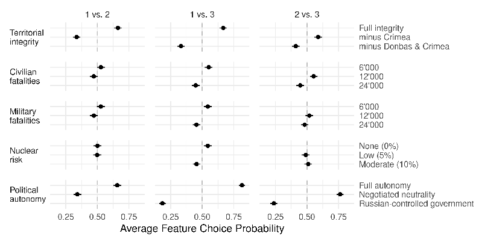

- Figure A1: Average Feature Choice Probabilities

Note: Following Abramson et al. (2020), each column compares the predicted probabilities of respondents choosing a strategy with levels a and b on a given attribute as indicated in the column header among pairs that only include strategies with the respective attribute levels.

11Note rounding errors in λ.

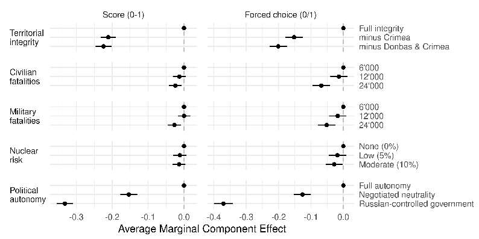

- Figure A2: AMCEs estimated from the weighted sample

Note: AMCEs estimated from a weighted sample in which each respondents receives a weight proportional to their household size, thus giving more weight to respondents from large household, who had a lower chance of being sampled than to those from small households.

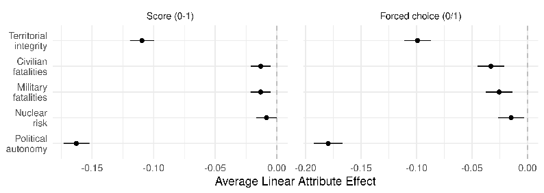

- Figure A3: Average linear attribute effects

Note: Estimates from a linear regression of attribute levels (taken as linear, rather than categorical) on the score and choice outcomes.

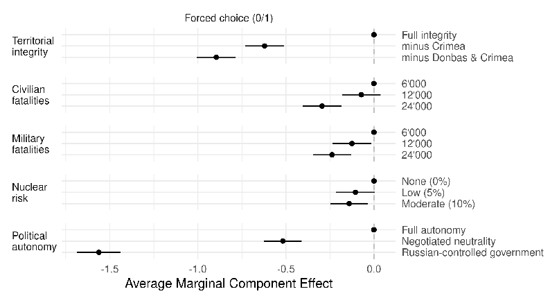

- Figure A4: AMCEs of all attributes on the choice outcome estimated by logistic regression

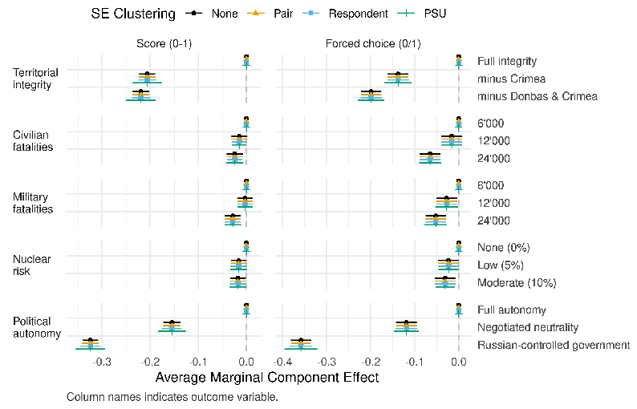

- Figure A5: Clustering standard errors not at all, on the level of pairs, respondents, and PSUs.

Note: Conditional AMCEs computed based on splitting the sample into 3 groups for each attribute 2 to 4, depending on that attributes position (2 to 4) in a given interview. The ordering of attribute 2 to

- 4 was randomized at the level of respondents.

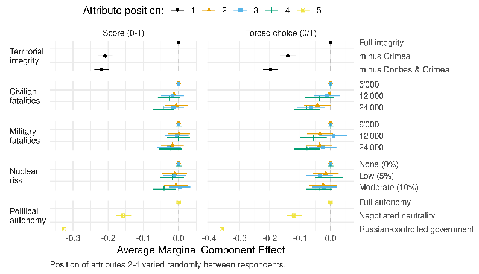

- Figure A6: No Evidence for Order Effects

Note: Conditional AMCEs computed based on splitting the sample into 3 groups for each attribute 2 to 4, depending on that attributes position (2 to 4) in a given interview. The ordering of attribute 2 to 4 was randomized at the level of respondents.

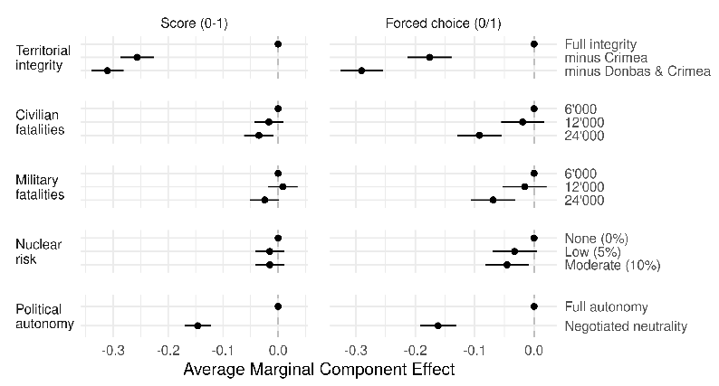

- Figure A7: AMCEs for strategy pairs without “Russian-controlled government”.

Note: Following the main specification but dropping all strategy pairs featuring “ceasefire with Russian-controlled government” as at least one political outcome of the war.

### D Heterogeneous treatment effects

Table A6: Omnibus Wald-Test Result for Joint Nullity of Heterogenous Effects by Moderator

Score (0-1) Forced choice (0/1) Moderator F-Stat p Adj. p F-Stat p Adj. p

Demographics Sex: Male / Female 0.62 0.80 1 0.60 0.82 1 Age (5 groups) 0.69 0.93 1 1.08 0.33 1 Children: yes/no 1.53 0.12 1 0.57 0.84 1 Level of education 0.59 0.98 1 1.69 0.004 0.16 Economic deprivation 1.45 0.15 1 2.42 0.01 0.29 Rural / Urban 1.87 0.04 1 0.86 0.57 1 Interview language 2.87 0.001 0.06 3.17 0.0005 0.02 Native language 2.30 0.001 0.03 2.36 0.001 0.02 Ethnic identity 1.54 0.06 1 1.97 0.01 0.24

Affectedness Affectedness score 1.77 0.02 0.74 2.59 0.0001 0.01 East vs. West 1.45 0.15 1 1.33 0.21 1 Oblast first attacked 2.63 0.003 0.14 3.51 0.0001 0.005 Self war-affected 1.16 0.31 1 0.57 0.84 1 Family war-affected 1.11 0.35 1 1.56 0.11 1 Any oneside violence 2.06 0.02 0.96 1.43 0.16 1 Any battles 2.49 0.01 0.22 1.61 0.10 1 Any shelling 3.02 0.001 0.03 1.43 0.16 1

Political attitudes Any shelling 3.02 0.001 0.03 1.43 0.16 1 Importance of victory 5.98 0 0.0000 4.89 0.0000 0.0000 Trust in president 5.06 0.0000 0.0000 4.43 0.0000 0.0001

Note: Adjusted p-values based on a Bonferroni adjustment for 38 hypotheses.

#### D.1 Demographic characteristics

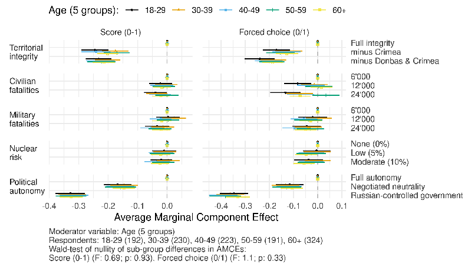

- Figure A8: Heterogeneity by age bracket of respondents.

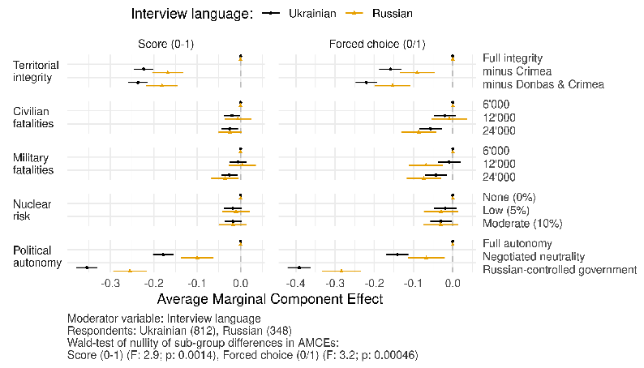

- Figure A9: Heterogeneity by language of the interview (Ukrainian or Russian).

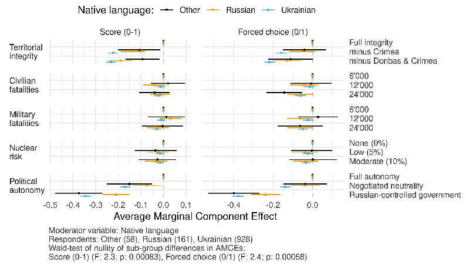

###### Figure A10: Heterogeneity by respondents’ native language.

Note: Coded from responses to the question: “What language do you consider to be your native language? ”

- D.2 Affectedness by the war

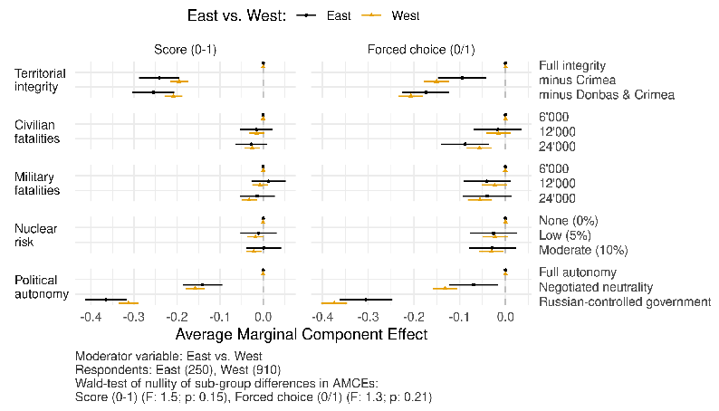

###### Figure A11: Heterogeneity by eastern vs. western Ukraine.Note: Dnipropetrovsk, Zaporizhzhia, and Poltava oblasti are classified as “east”.

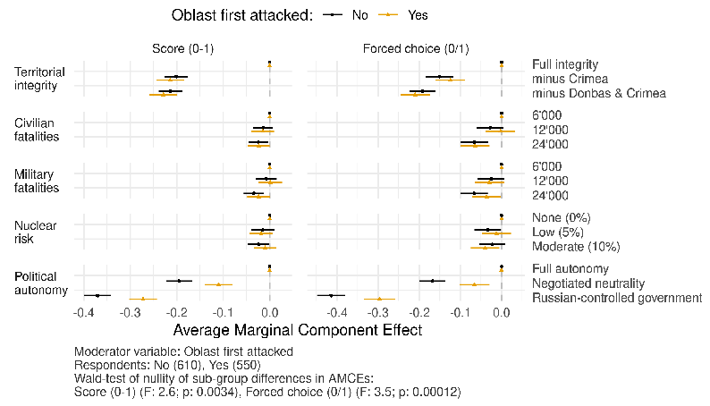

###### Figure A12: Heterogeneity by regions first attacked and directly affected by activefighting.

Note: Dnipropetrovsk, Zaporizhzhia. Kyiv oblast and city, Zhytomyr, Chernihiv, and Odesa are classified as first attacked and directly affected by active fighting.

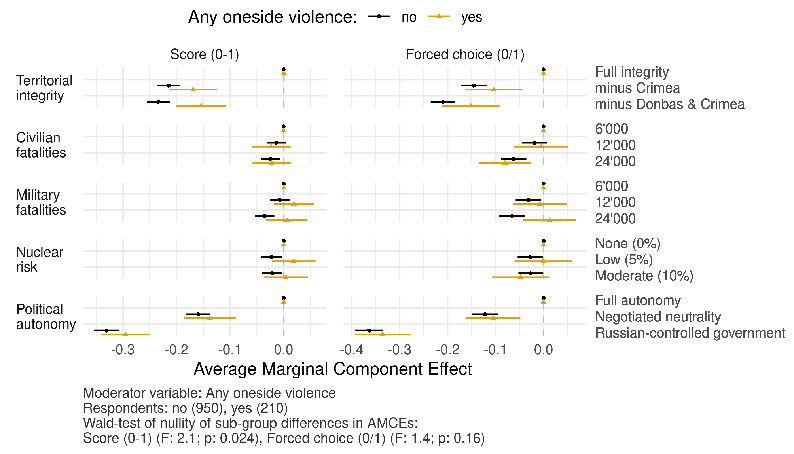

###### Figure A13: Heterogeneity by PSUs <10km from Russian-led one-sided violence.Note: Data on one-sided violence from Raleigh et al. (2010).

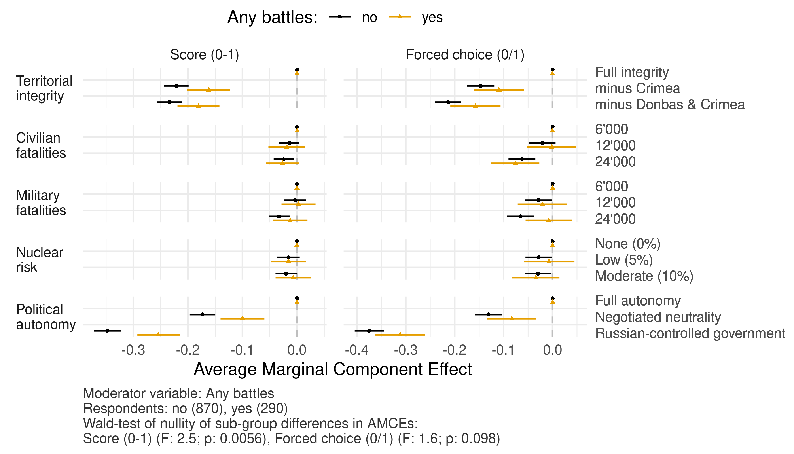

###### Figure A14: Heterogeneity by PSUs <10km from battle events.Note: Data on battle-events from Raleigh et al. (2010).

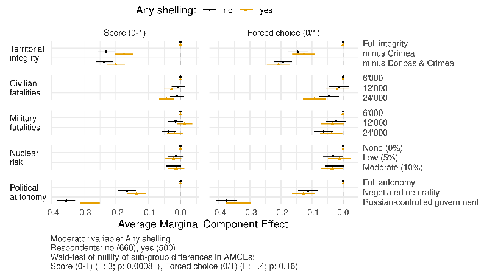

###### Figure A15: Heterogeneity by PSUs <10km from Russian-led shelling events.Note: Data on shelling events from Raleigh et al. (2010).

- Figure A16: Heterogeneity by individual affectedness.

Note: Individual affectedness coded from the multi-answer question “How has the war personally affected your life.” Individuals who lost their jobs, migrated/fled, and/or fought/volunteered for the Ukrainian army coded as “affected.”

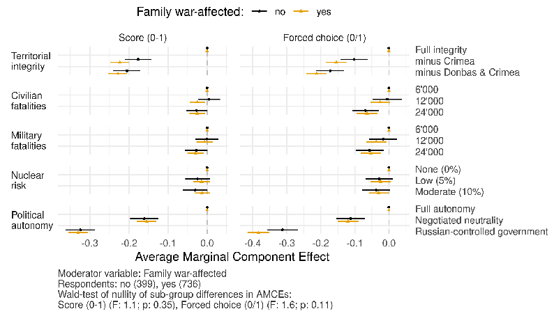

- Figure A17: Heterogeneity by respondents’ relatives’ affectedness.

Note: Relatives’ affectedness coded from the multi-answer question “How has the war personally affected your relatives’ life.” Individuals with relatives who lost their life, were injured, lost their jobs, migrated/fled, and/or fought/volunteered for the Ukrainian army coded as “affected.”

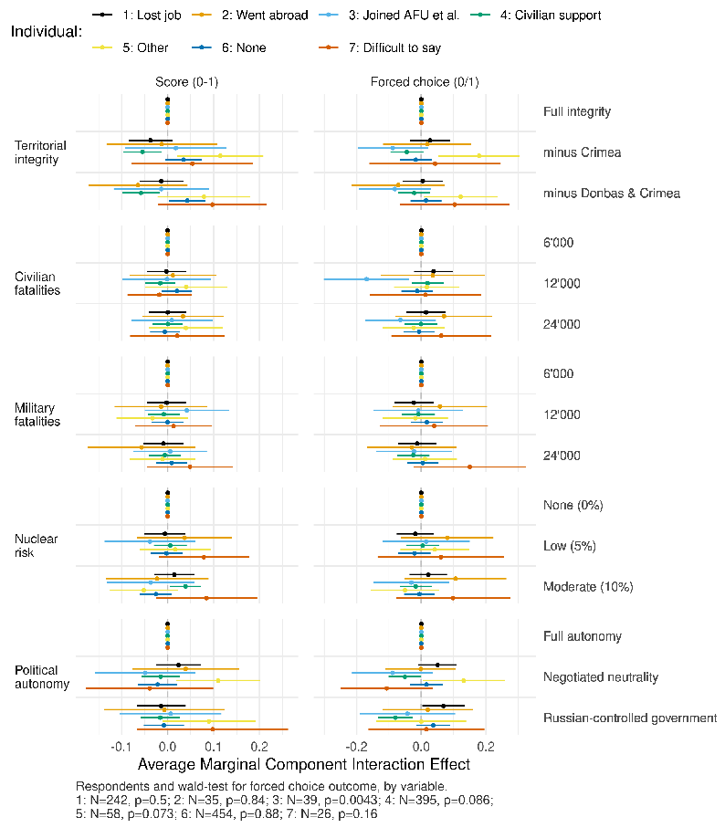

- Figure A18: Heterogeneity by individuals’ affectedness: Detail on interaction effects.

Note: Coded from the multi-answer question “How has the war personally affected your life.” AFU et al. stands for Armed Forces of Ukraine, other official security forces, and volunteer battalions.

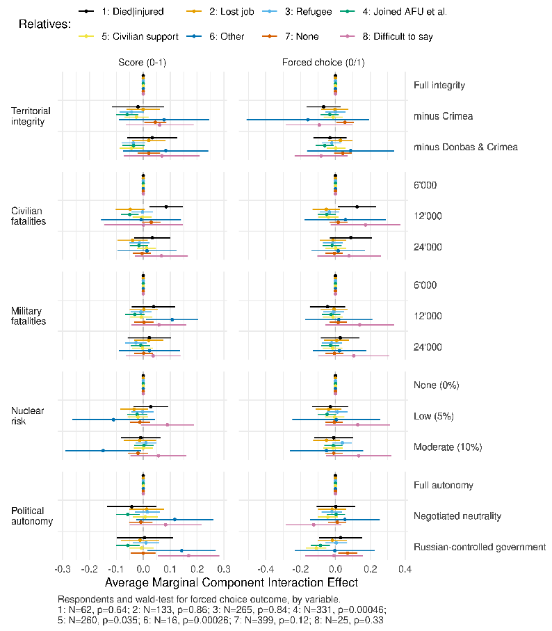

- Figure A19: Heterogeneity by individuals’ relatives’ affectedness: Detail on interaction effects.

Note: Coded from the multi-answer question “How has the war affected the life of your family?” AFU et al. stands for Armed Forces of Ukraine, other official security forces, and volunteer battalions.

#### D.3 Political attitudes

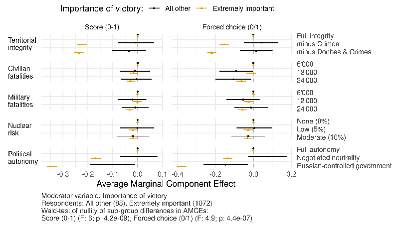

- Figure A20: Heterogeneity by respondents’ assessment of personal importance of Ukraine’s victory over Russia.

Note: Coded from the question “How important or unimportant for you personally is Ukraine’s victory over Russia in this war?” (scale 1-6).

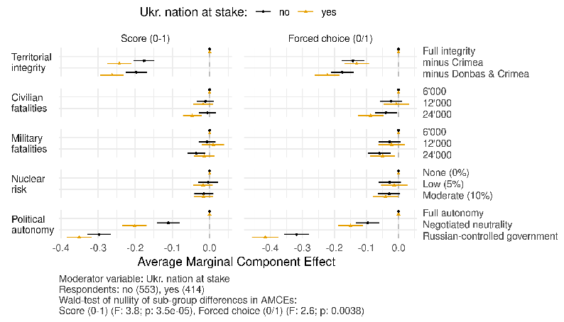

- Figure A21: Heterogeneity by respondents’ assessment of the effect of loosing the war on the survival of the Ukrainian nation

Note: Coded from the question “In your opinion, is the survival of Ukraine as a nation at stake in this war?” (Yes vs. No).

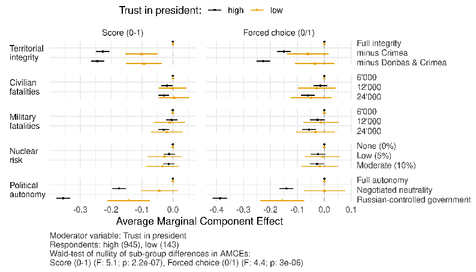

###### Figure A22: Heterogeneity by respondents’ trust in the Ukrainian presidentNote: Coded from the question “How much do you trust the President of Ukraine?” (4 point scale).

E Additional proportionality results

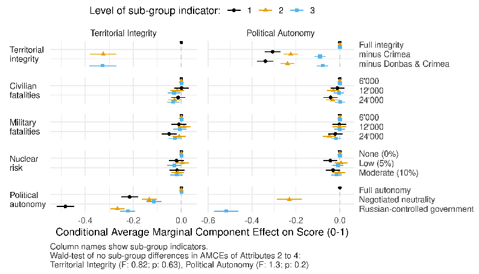

###### Figure A23: No evidence for proportionality on score outcome: Stable effects ofcost attributes 2-4 across levels of territorial integrity and political autonomy. Dueto ceiling effects, respondents react less strongly to Attribute 5 at high values ofAttribute 1 and vice-versa.

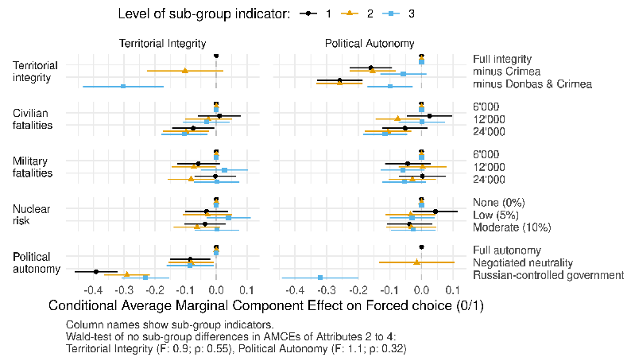

- Figure A24: No evidence for proportionality among highly affected respondents on choice outcomes: Stable effects of cost attributes 2-4 across levels of territorial integrity and political autonomy. Note: Sample restricted to respondents scoring in the upper tercile of the affectedness score.

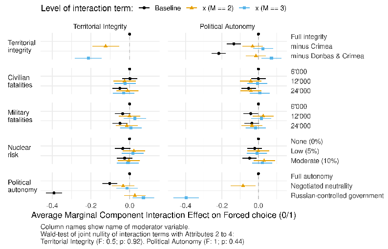

- Figure A25: Average marginal component interaction effects on choice outcomes. Note: Based on interactions with Attributes 1 (territorial integrity) and 5 (political autonomy).

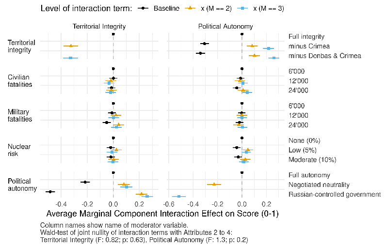

- Figure A26: Average marginal component interaction effects on score outcomes. Note: Based on interactions with Attributes 1 (territorial integrity) and 5 (political autonomy).

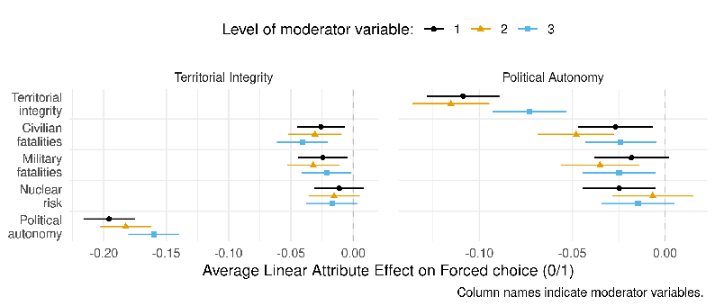

- Figure A27: Conditional linear attribute effects on choice outcomes, by levels of attributes 1 and 5 (indicated in column header).

Note: Given the absence of any robust signs of interaction effects on attributes 2-4, we do not implement linear × linear attribute interaction models.

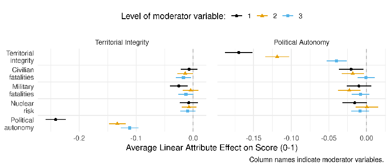

- Figure A28: Conditional linear attribute effects on score outcomes, by levels of attributes 1 and 5 (indicated in column header).

Note: Given the absence of any robust signs of interaction effects on attributes 2-4, we do not implement linear × linear attribute interaction models.

### F Ranking analysis

Table A7: Ranking of Strategy Features

Rank Attribute Level Mean q2.5 q50 q97.5

- 1 Political autonomy Russian-controlled government 1 1 1 1
- 2 Territorial integrity Full integrity 2.04 2 2 2
- 3 Political autonomy Full autonomy 3.05 3 3 4

- 3 Political autonomy Negotiated neutrality 3.05 3 3 4
- 4 Territorial integrity minus Donbas & Crimea 4.76 3 4 8

- 4 Territorial integrity minus Crimea 4.79 3 4 8
- 5 Nuclear risk None (0%) 5.65 4 5 9
- 6 Civilian fatalities 24’000 5.82 4 6 10
- 7 Military fatalities 24’000 6.61 4 7 9
- 8 Military fatalities 6’000 8.20 4 8 10

- 8 Military fatalities 12’000 8.64 7 9 10
- 9 Nuclear risk Moderate (10%) 8.92 5 9 10

9 Nuclear risk Low (5%) 9.05 7 9 10 10 Civilian fatalities 6’000 9.01 7 9 10

- 10 Civilian fatalities 12’000 9.05 7 9 10 Note: Mean, and quantiles q2.5, q50, and q97.5 from bootstrapped confidence intervals.

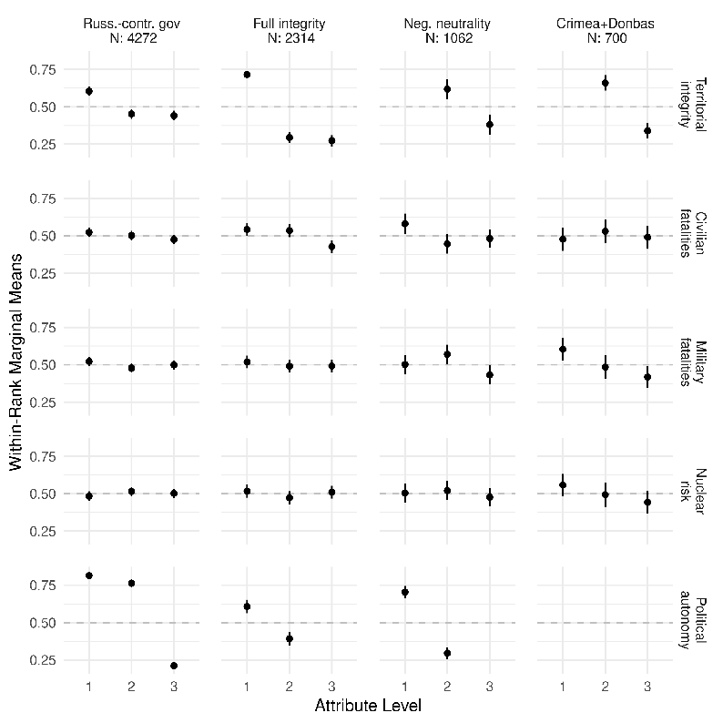

- Figure A29: Marginal means of forced choice outcome computed within ranks, i.e. in non-nested subsets of the sample in which only the ranked feature and none of the higher-ranked features varies.

Note: The figure discerns marginal means of all attributes in choices among features fx in pairs in which higher ranked features fr<x are absent or invariant. The column header identifies the feature and its rank used to identify the subset of the data used for estimation. Column 3, for example, is only based on pairs in which Russian-controlled government and full territorial integrity are either

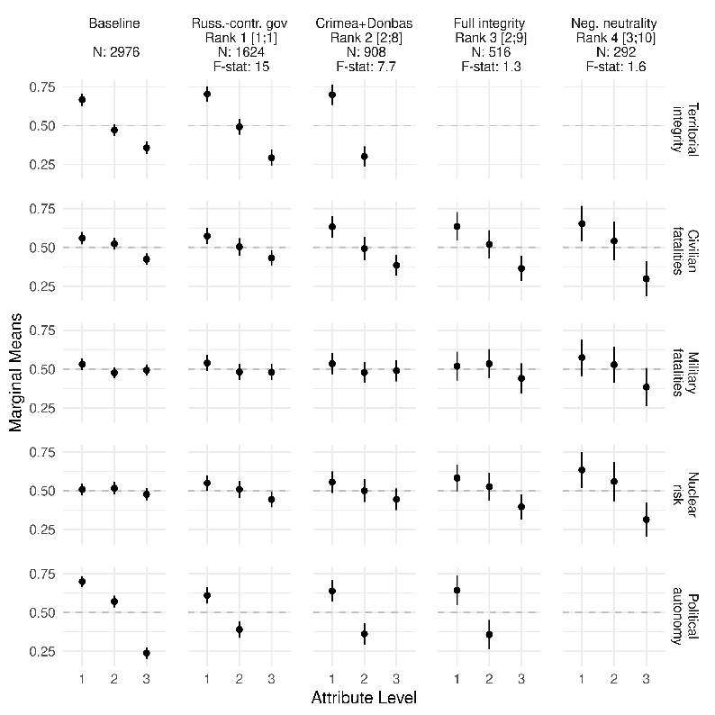

- Figure A30: Ranking strategy features among highly war-affected respondents. Nested marginal means of forced choice among attribute levels in nested subsets of the sample in which higher-ranked features do not vary.

Note: Sample restricted to respondents scoring in the upper tercile of the affectedness score. Column header identifies the feature and its rank used to identify the subset to be dropped in comparison to the previous column to the left, the remaining number of strategies in the sample, as well as the F-statistic of a Wald-test of no difference between the estimates in that and the previous column. Marginal means are computed after dropping pairs with no variance on a given attribute to avoid bias.

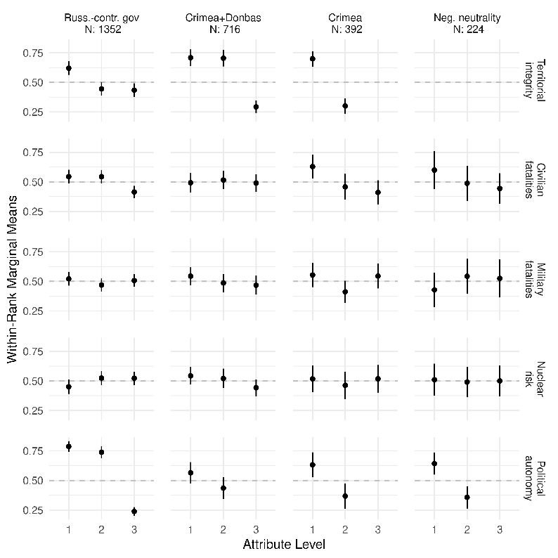

- Figure A31: Marginal means of forced choice outcome computed within ranks among highly war-affected respondents.

Note: Sample restricted to respondents scoring in the upper tercile of the affectedness score. The figure discerns marginal means of all attributes in choices among features fx in pairs in which higher ranked features fr<x are absent or invariant. The column header identifies the feature and its rank used to identify the subset of the data used for estimation. Column 3, for example, is only based on pairs in which Russian-controlled government and full territorial integrity are either

- G Pre-analysis plan (As registered on 14 July 2022.)

#### G.1 Introduction

Ukraine has a just cause for war against Russia. This is a rare point of agreement among moral philosophers. Traditional just war theorists recognize a collective moral right to defend the nation of Ukraine against Russia’s aggression. For socalled revisionists, Ukrainians are defending their individual rights to life and political self-determination. The point of view from international law is equally clear. Ukraine is exercising the state’s right of self-defence which has the status of customary law and is also enshrined in Article 51 of the UN Charter. Law recognizes repelling Russia’s illegal armed attack as Ukraine’s just cause. Yet, a war with a just cause can still be an unjust war. It can be morally wrong to pursue a just cause if there is little chance of victory or the projected costs of fighting outweigh the expected benefits. Even defensive wars must be proportionate.

From the start, commentators have doubted Ukraine’s ability to resist Russia. Recent calls on Ukraine to make concessions cite the high odds of eventual defeat, the toll of continued resistance on Ukrainian civilians and military personnel, and the risk of nuclear escalation as reasons for why Ukrainians should give up self-defence. These arguments imply that Ukraine’s continued pursuit of its just cause is disproportionate, hence wrong. However, it is by no means obvious that Ukraine lacks a reasonable chance of defeating Russia. Russian troops have turned out weaker than expected. Logistical difficulties abound, troop morale is low, tactical blunders legendary. Moreover, the projected costs of Ukraine’s defensive war may not be excessive given what is at stake if Russia won. Ukrainian commentators warn that making concessions to Russia now would amount to appeasing a territory-hungry bully, which will have worse moral costs in the long run. Whether Ukraine’s struggle for survival is proportionate is hence contested.

Ukrainians do not support a Russian withdrawal for the price of concessions. Recent polls show that 82% of citizens think that “under no circumstances” should Ukraine relinquish parts of its Eastern territory “even if this prolongs the war and threatens [Ukraine’s] independence”. In the East where Ukrainians most directly suffer the devastating consequences of war, support for this unyielding position is only slightly lower, with 68% of respondents rejecting territorial concessions. These polls do not, however, tell us how Ukrainians think about proportionality. How much weight do they give different moral costs of the defensive war, such as additional civilian and military fatalities versus territorial concessions, or a risk of escalation? How do they trade-off these different costs against the chance to achieve an acceptable outcome of the war? And what kind of outcome do they consider acceptable?

We will field a survey with experimental manipulations administered to a sample of 1,200 Ukrainian citizens in areas of Ukraine considered safe for face-to-face interviews in July 2022. The aim is to shed light on how Ukrainians think about the proportionality of their defensive war. We ask respondents to what extent they support different strategies for continued military operations against Russia over the next three months. These strategies have five attributes that take randomly

varying values: upfront territorial concessions, expected Ukrainian civilian fatalities, projected deaths among Ukrainian fighters, the risk of a nuclear attack against Ukraine, and the likely outcome of the war after three more months of fighting. The marginal effect of changes in each attribute on support for a strategy will show the relative weight respondents give to this attribute. Interactions between differently valued outcomes of the war and the three types of cost will show how respondents think about the proportionality of self-defence.

Relatively few studies have investigated the attitudes of conflict-affected populations directly. Those that have, suggest that conflict-affected populations withdraw their support from belligerents that cause civilian deaths (Condra and Shapiro 2012; Revkin and Kao 2022; Kalyvas 2006). Civilian populations do not, however, react to all civilian casualties in the same way. Existing studies suggest that attitudes toward civilian casualties depend partly on who, i.e. which side in a war, causes them (Lyall, Blair and Imai 2013) and on the aims attributed to the warring party that harms civilians (Dill 2019; Silverman 2019). Studies investigating Western populations likewise suggest that the negative effect of civilian and military casualties on war support depends on the aims of a war (Jentleson and Britton 1998) and its perceived likely success (Eichenberg 2005; Gelpi, Feaver and Reifler 2005). For our purposes, existing studies have two significant limitations. First, how precisely conflict-affected populations connect the costs of war to the aims of military operations, i.e. how they make proportionality judgements, is not well understood. Second, existing studies using surveys to understand the attitudes of conflict-affected civilians overwhelmingly focus on populations affected by civil wars. To our knowledge, the attitudes of Ukrainian citizens toward the ongoing war are so far unstudied.

#### G.2 Expectations

Determining whether Ukraine’s defensive war is proportionate, is a three-step process. First, it requires determining the value of repelling Russia’s invasion and discounting this value by the likelihood of achieving it. Rather than varying the likelihood of victory, we vary the outcome of the war after three additional months of fighting along two dimensions, political autonomy and territorial integrity. For some Ukrainians the main goal may be a ceasefire and continued Russian influence in Ukraine may be tolerable, while others may consider only a withdrawal of Russian troops an acceptable outcome. We expect that a ceasefire and Russiancontrolled government attracts less support than withdrawal of Russian forces. Moreover, we expect that a Russian withdrawal and Ukrainian neutrality is less popular than a Russian withdrawal plus restoration of Ukraine’s sovereignty which permits pursuing NATO and EU membership. Besides political autonomy, Ukrainians also fight for territorial integrity. We already know that many citizens are opposed to making territorial concessions to Russia. The question whether currently occupied parts of Ukraine, such as Crimea and Donetsk and Luhansk, can be recaptured looms large. We expect that upfront concessions have a negative effect on Ukrainians’ support for a strategy and that Ukrainians are more likely to support conceding Crimea than to concede Crimea and Donetsk and Luhansk.

The second step in a proportionality judgement is tallying up the projected costs

of pursuing the just cause. We focus on costs that are particularly important to Ukrainians, chiefly the loss of life. We expect that higher death tolls among both Ukrainian civilians and Ukrainian fighters depress support for a strategy. Traditional just war theory as well as international law distinguish between civilians and combatants. Traditional just war theorists argue that civilians are morally innocent, but combatants contribute to the war and are therefore liable to harming. Revisionist just war theorists, in contrast, emphasise that many combatants who fight in a defensive war with a just cause, such as Ukraine’s, are not morally liable to harming either. We explore whether Ukrainian respondents prioritize sparing civilians over sparing those who defend the nation by fighting. The cost that has been particularly salient in international calls on Ukraine to concede is the risk of nuclear escalation. We expect that a higher risk of nuclear escalation has a negative effect on support for a strategy.

Third, when the balance sheet of costs and benefits is drawn up, we must determine whether we think the bottom lines is proportionate. The principle of proportionality suggests that the support-depressing effect of various costs should be weaker the more valuable the expected outcome. We therefore expect that the more desirable the projected outcome of a strategy after three months, the weaker the negative effects are of higher civilian and military death tolls, and nuclear escalation risk. Similarly, the fewer territorial concessions a strategy involves the weaker the support depressing effect of costs in civilian and military lives and nuclear risk.

List of Hypotheses:

- H1: Upfront concessions have a negative effect on support for a strategy.
- H2: A higher civilian death toll has a negative effect on support for a strategy.
- H3: A higher military death toll has a negative effect on support for a strategy.
- H4: A higher likelihood of a nuclear strike on Ukraine has a negative effect on support for a strategy.
- H5: The outcome ceasefire/Russian-controlled government has a negative effect; the outcome of withdrawal/sovereignty has a positive effect (compared to withdrawal/neutrality) on support for a strategy.

- H6a (proportionality – political autonomy): The more political autonomy the projected outcome affords (ceasefire / Russian-controlled government < withdrawal / neutrality < withdrawal / sovereignty) the weaker the negative effects of the three cost attributes on support for a strategy.
- H6b (proportionality – territorial integrity): The more territorial integrity the projected outcome affords (conceding Crimea + Donetsk/Luhansk < conceding only Crimea < no concessions) the weaker the negative effects of the three cost attributes on support for a strategy

Exploratory hypotheses:

- H1 ex (conventional just war theory and IL): Civilian casualties have a larger negative effect on support for a strategy than military casualties.

H2 ex (revisionist just war theory): Civilian and military casualties have the same effect on support for a strategy.

#### G.3 Heterogenous effects

We will explore whether costs of self-defense have a larger negative effect on support for a strategy among respondents more affected by the war than among those less affected by the war. We also explore whether costs of self-defense have a smaller negative effect on support for a strategy among respondents who think of victory as more important than those that think of it as less important and a smaller effect among respondents who think the survival of Ukraine as a nation is at stake compared to those that think Ukraine will go on as a nation even if Russia wins the war. Finally, we will explore whether respondents who fight in this war have a higher tolerance for the costs of self-defense compared to respondents who do not themselves fight. We will also explore correlations between standard demographic characteristics and how respondents make trade-offs between the costs and benefits of self-defence.

#### G.4 Design

We administer a survey to 1,200 Ukrainian respondents. Each respondent first reads a short vignette asking them to “[p]lease imagine that President Zelensky and his team are considering different military-political strategies for pursuing the war over the next 3 months.” We explain to respondents that we will show them four pairs of strategies (8 strategies in total) with different predicted consequences after the next 3 months” and that we would like them “to indicate each time to what extent [they] would support or not support pursuing” a strategy. We then show each respondent four pairs of strategy profiles. We ask respondents to rate their support for each of the eight strategies on a scale of 1 to 6. In addition, for each pair, we ask respondents which strategy they would prefer. We hence have two outcomes of interest, a rating outcome and a forced-choice outcome.

Table 1 in the main text shows the attributes and attribute levels of the conjoint profiles. Each cell for each strategy (columns 2 and 3) is independently drawn from a set of 3 attribute levels for each attribute (row). At the level of respondents, the order of attributes 2-4 is randomized (so that two respondents see different orders but each respondent sees four times the same order).

#### G.5 Sampling strategy

The sampling strategy for the survey follows a randomized, four-stage design in each region (oblast). First, the sample will be stratified by oblasts proportionally to the last available electoral statistics (2019). We exclude Kharkiv, Donetsk, Luhansk, and Mykolihav oblasts from the sample. Second, within each oblast we stratify by urban/rural PSUs (voting precincts). We’ll allocate 120 PSUs and conduct 10 interviews in each PSU. Third, within each stratum (oblast x urban-rural) PSUs are selected randomly with a probability proportional to their size. Fourth, within each selected PSU we select randomly street and house numbers (for block of flats - also apartment number) as our starting addresses. Starting from this addresses

the interviewer visits each next household and in case household agrees to be interviewed, defines if there are respondents of a needed sex and age quota. Only 1 respondent is surveyed per each household and the sex and age quotas for each PSU are computed based on the last (pre-war) official statistics.

#### G.6 Priors for Hypotheses 1-6

Our conjoint treatments come with very large differences between the expected hypothetical outcomes of the various strategies pursued by the Ukrainian government. We therefore expect our treatments to move respondents from very high levels of support (at the extreme >95%) for the hypothetical strategies with very positive outcomes for Ukraine (no concessions, low numbers of civilian deaths and military deaths, no risk of nuclear escalation, and full liberation and restoration of Ukrainian sovereignty) to very low levels of support (<5%) for strategies with very negative outcomes (territorial concessions, high fatality numbers, nuclear escalation risk, defeat of Ukrainian army). As a result, we expect Average Marginal Component Effects (AMCEs) to amount to between -5 and -15 percentage points for each level-step (i.e., between -10 and -30 percentage points for the highest attribute levels), depending on the attribute.

In line with our Hypothesis 6 on proportionality, the estimated AMCEs on attributes 2-5 (fatalities; nuclear risk) likely mask substantive heterogeneity, in that we expect respondents to be much more sensitive to the costs of war if the value of the projected likely outcome is negative (i.e., concession and type of conflict outcome). With the most positive attribute levels as our baseline values, we therefore expect Average Marginal Component Interaction Effects (AMCIEs) to be larger than unconditional AMCEs estimated to test Hypotheses 1-5. These expectations are consistent with recent survey data from western and central Ukraine (DIF, 2022) that show very little support for any type of concessions regarding territory (4%) and Ukrainian ability to join military alliances (7%), overwhelming support for accession to the EU (89%) and NATO (74%) and thus valuation of full Ukrainian sovereignty, as well as very strong beliefs in victory (78%).

#### G.7 Estimation strategy

We test our hypotheses using two different specifications. First, we follow standard conjoint analyses and estimate linear regressions of the marginal effect of each attribute level against its baseline level separately. In a second set of models, we will leverage the ordinal (and, for attributes 2-4, equally spaced) nature of our attribute levels. Assuming that effects increase linearly in attribute levels, we estimate linear and logistic regression models of the effect of the ordinal treatment values for each attribute as single variable. This approach increases statistical power significantly (at the cost of the testable linearity assumption) – while non-parametric estimates rely on comparatively small subsets of the data (in particular for the AMCIE), we can test our hypotheses using the power of the full sample. Given that we expect treatments to affect respondents’ support for strategies across the whole range of average support levels, thus potentially leading to critiques of the linear model misrepresenting the functional form. We will therefore employ logistic regressions as a robustness check but do not expect results to differ significantly. We employ a

standard Wald test of the equality of estimated effects for the military and civilian casualty attributes to test the exploratory H1 ex and H2 ex.

Throughout our baseline regression analysis, we will weight respondents by the inverse probability of being sampled as a member of their household. This is to ensure that members from large households receive a higher weight than those from small ones, thus correcting for the bias toward the latter in our sample that originates directly from the household-based sampling strategy. Our baseline analysis will employ robust standard errors clustered at the level of respondents. A robustness check will show results with standard errors clustered at the level of the strategy pair where errors correlate most strongly.

#### G.8 Power analysis

We conduct a power analysis to gauge whether our questionnaire design (8 profiles in a paired conjoint) and sample (1’200 respondents) yield enough power to find the expected effect with reasonable certainty. We aim for a power of at least 80%, i.e., an ex-ante probability of 80% that we find evidence supportive of a hypothesis should the hypothesis be true. We will use linear and logistic regressions as well as the above discussed non-parametric and parametric approaches to test whether our estimates reject the null hypothesis of no effect using .95% p-values as an indicator of statistical significance. We first present a power analysis is based on the linear, non-parametric case with the binary forced choice as the outcome as the most demanding specification. Yet, our main results will also present effects on the 6-point ordinal support scale for each strategy, both in its original form and as a 0/1 support dummy coded as 1 for values > 3 and 0 otherwise. Regarding the specification of treatment levels, we show below that the power of our design is significantly larger when we parametrize effects of our attribute levels linearly to estimate interaction effects when testing hypothesis 6. Our experimental setup yields a power of above 80% for AMCEs below -.03 percentage points (Figure A32a). For these, the estimated exaggeration ratio also approaches 1 (Figure A32d), thus making it ex ante unlikely that we substantially over-estimate effect sizes.

Naturally, estimating interaction effects yields lower statistical power. However, our experimental setting comes with two advantages in that regard. The first is that we expect interaction effects to be of at least the same size as unconditional AMCEs, leading to relatively large AMCIEs at high levels of the interacted attributes (e.g., we would expect a change in civilian casualties from 6’000 to 24’000 to make relatively little difference if the war is won, but to decrease support for a strategy by well above 10 percentage points if the war is expected to be lost). Our design yields enough statistical power to identify such AMCIEs. As shown in Fig-

- ure A32b, the number of effective responses is large enough to estimate AMCIEs of below -.08 percentage points.

If our assumption holds that each level-increase of predicted civilian deaths, military casualties, and nuclear risk has a consistent and approximately linear effect on respondents’ support for a given strategy, we can model the respective attribute levels as linear terms and thereby increase the statistical power of our design. Fig-

- ure A32c below summarizes the results of simulation analyses that show that the power of estimating relatively small interaction effects of -.05 percentage points in-

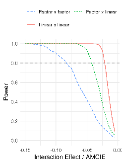

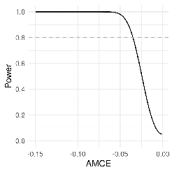

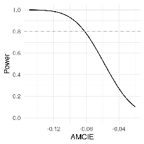

(a) Power AMCE (b) Power AMCIE (c) Power AMCIE, linear modelling

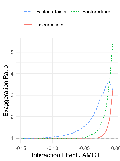

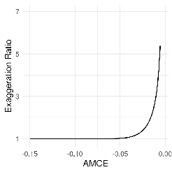

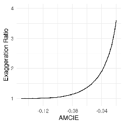

(d) Exaggeration ratio AMCE

(e) Exaggeration ratio AMCIE

(f) Exaggeration ratio AMCIE, linear modelling

Figure A32: Power and exaggeration ratio computations

creases from 40% in the full 3×3 factorial design to 90% if we interact a factorial term with a linear one, and to 99% if we model both interaction terms linearly. This is consistent with our power to identify relatively large AMCEs (> .−08 percentage points) in the standard factorial setup, since the linear design leverages all observations and even a small effect imply large effects at high values of the moderating variables. Relatedly, Figure A32f shows that the linear specification significantly decreases in the risk of obtaining statistically significant estimates that are exaggerated. The above analysis also confirms that we are able to conduct credible tests of heterogeneous AMCEs along the main demographic dimensions enumerated pretreatment (age, gender, ethnicity, education, financial situation, settlement type, macro-region). To estimate heterogeneous treatment effects, variables with more than 3 levels will be collapsed to 2 or 3 levels and modelled linearly where this is appropriate.

#### G.9 Robustness checks

We will conduct a series of further analyses to gauge the robustness of our results to bias arising from sampling and estimation strategies:

- • Analyses without survey weights
- • Analyses of order effects of attributes 2-4 of the conjoint experiment which are varied at the level of respondents
- • Analyses of the effect of day of week, gender, age, region, and type of settlement on non-response. These are the only data we will have on individuals who either refused or were absent at the time of interview.

### H References (Appendix)

Abramson, Scott F, Korhan Koc¸ak and Asya Magazinnik. 2019. “What do we learn about voter preferences from conjoint experiments.” Unpublished Working Paper.

Abramson, Scott F, Korhan Kocak, Asya Magazinnik and Anton Strezhnev. 2020. “Improving preference elicitation in conjoint designs using machine learning for heterogeneous effects.” Unpublished Working Paper .

Bansak, Kirk, Jens Hainmueller, Daniel J Hopkins and Teppei Yamamoto. 2020. “Using conjoint experiments to analyze elections: The essential role of the average marginal component effect (AMCE).” Available at SSRN 3588941.

Condra, Luke N and Jacob N Shapiro. 2012. “Who takes the blame? The strategic effects of collateral damage.” American Journal of Political Science 56(1):167–187.

Cronin-Furman, Kate and Milli Lake. 2018. “Ethics abroad: Fieldwork in fragile and violent contexts.” PS: Political Science & Politics 51(3):607–614.

Dill, Janina. 2019. “Distinction, necessity, and proportionality: Afghan civilians’ attitudes toward wartime harm.” Ethics & International Affairs 33(3):315–342.

Eichenberg, Richard C. 2005. “Victory has many friends: US public opinion and the use of military force, 1981–2005.” International Security 30(1):140–177.

Ganter, Flavien. 2021. “Identification of preferences in forced-choice conjoint experiments: reassessing the quantity of interest.” Political Analysis pp. 1–15.

Gelpi, Christopher, Peter D Feaver and Jason Reifler. 2005. “Success matters: Casualty sensitivity and the war in Iraq.” International Security 30(3):7–46.

Hainmueller, Jens, Daniel J Hopkins and Teppei Yamamoto. 2014. “Causal inference in conjoint analysis: Understanding multidimensional choices via stated preference experiments.” Political Analysis 22(1):1–30.

Jentleson, Bruce W and Rebecca L Britton. 1998. “Still pretty prudent: Post-Cold War American public opinion on the use of military force.” Journal of Conflict Resolution 42(4):395–417.

Kalyvas, Stathis N. 2006. The Logic of Violence in Civil War. Cambridge University Press.

Leeper, Thomas J, Sara B Hobolt and James Tilley. 2020. “Measuring subgroup preferences in conjoint experiments.” Political Analysis 28(2):207–221.

Lyall, Jason, Graeme Blair and Kosuke Imai. 2013. “Explaining support for combatants during wartime: A survey experiment in Afghanistan.” American Political Science Review 107(4):679–705.

Raleigh, Clionadh, Andrew Linke, H˚avard Hegre and Joakim Karlsen. 2010. “Introducing ACLED: an armed conflict location and event dataset: special data feature.” Journal of Peace Research 47(5):651–660.

Revkin, Mara Redlich and Kristen Kao. 2022. “No Peace without punishment? Reintegrating Islamic State “collaborators” in Iraq.” The American Journal of Comparative Law .

Silverman, Daniel. 2019. “What shapes civilian beliefs about violent events? Experimental evidence from Pakistan.” Journal of Conflict Resolution 63(6):1460–1487.

