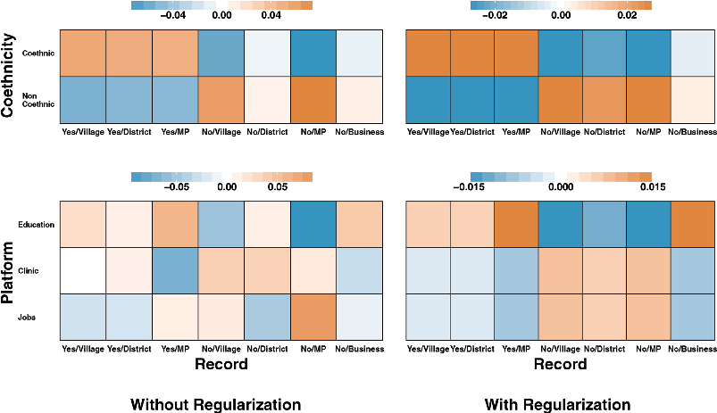

JOURNAL OF THE AMERICAN STATISTICAL ASSOCIATION https://doi.org/./..

###### 2019, VOL. 114, NO. 526, 529–540: Applications and Case Studies

# Causal Interaction in Factorial Experiments: Application to Conjoint Analysis

Naoki Egami a and Kosuke Imai b,c

aDepartment of Politics, Princeton University, Princeton, NJ; bDepartment of Government, and Department of Statistics, Harvard University, Cambridge, MA; cDepartment of Politics and Center for Statistics and Machine Learning, Princeton University, Princeton, NJ

###### ABSTRACT

We study causal interaction in factorial experiments, in which several factors, each with multiple levels, are randomized to form a large number of possible treatment combinations. Examples of such experiments include conjoint analysis, which is often used by social scientists to analyze multidimensional preferences in a population. To characterize the structure of causal interaction in factorial experiments, we propose a new causal interaction effect, called the average marginal interaction effect (AMIE). Unlike the conventional interaction effect, the relative magnitude of the AMIE does not depend on the choice of baseline conditions, making its interpretation intuitive even for higher-order interactions. We show that the AMIE can be nonparametrically estimated using ANOVA regression with weighted zero-sum constraints. Because the AMIEsareinvarianttothechoiceofbaselineconditions,wedirectlyregularizethembycollapsinglevelsand selecting factors within a penalized ANOVA framework. This regularized estimation procedure reduces false discoveryrateandfurtherfacilitatesinterpretation.Finally,weapplytheproposedmethodologytotheconjoint analysis of ethnic voting behavior in Africa and find clear patterns of causal interaction between politicians’ethnicity and their prior records. The proposed methodology is implemented in an open source softwarepackage.Supplementarymaterialsforthisarticle,includingastandardizeddescriptionofthematerials available for reproducing the work, are available as an online supplement.

###### ARTICLE HISTORY

Received January  Revised January 

###### KEYWORDS

ANOVA; Causal inference; Heterogenous treatment effects; Interaction effects; Randomized experiments; Regularization

## 1. Introduction

Statistical interaction among treatment variables can be interpreted as causal relationships when the treatments are randomized in an experiment. Causal interaction plays an essential role in the exploration of heterogenous treatment effects. This article develops a framework for studying causal interaction in randomized experiments with a factorial design, in which there are multiple factorial treatments with each having several levels. A primary goal of causal interaction analysis is to identify the combinations of treatments that induce large additional effects beyond the sum of effects separately attributable to each treatment.

Our motivating application is conjoint analysis, which is a type of randomized survey experiment with a factorial design (Luce and Tukey 1964). Conjoint analysis has been extensively used in marketing research to investigate consumer preferences and predict product sales (e.g., Green, Krieger, and Wind 2001; Marshall and Bradlow 2002). In a typical conjoint analysis, respondents are asked to evaluate pairs of product profiles where several characteristics of a commercial product such as price and color are randomly chosen. Because these product characteristics are represented by factorial variables, conjoint analysis can be seen as an application of randomized factorial design. Thus, the causal estimands and estimation methods proposed in this article are widely applicable to any factorial experiments with many factors.

Recently, conjoint analysis has also gained its popularity among medical and social scientists who study multidimensional preferences among a population of individuals (e.g., Marshall et al. 2010; Hainmueller and Hopkins 2015). In this article, we focus on the latter use of conjoint analysis by estimating population average causal effects. Specifically, we analyze a conjoint analysis about coethnic voting in Africa to examine the conditions under which voters prefer political candidates of the same ethnicity (see Section 2 for the details of the experiment and Section 6 for our empirical analysis).

One important limitation of conjoint analysis, as currently conducted in applied research, is that causal interactions are largely ignored. This is unfortunate because studies of multidimensional choice necessarily involve the consideration of interaction effects. However, the exploration of causal interactions in conjoint analysis is often difficult for two reasons. First, the relative magnitude of the conventional causal interaction effect depends on the choice of baseline condition. This is problematic because many factors used in conjoint analysis do not have natural baseline conditions (e.g., gender, racial group, religion, occupation). Second, a typical conjoint analysis has several factors with each having multiple levels. This means that we must apply a regularization method to reduce false discovery and facilitate interpretation. Yet, the lack of invariance property means that the results of standard regularized estimation will depend on the choice of baseline conditions.

CONTACT Kosuke Imai imai@harvard.edu Department of Government and Department of Statistics, Harvard University, Cambridge, MA . Color versions of one or more of the figures in the article can be found online at www.tandfonline.com/r/JASA. Supplementary materials for this article are available online. Please go to www.tandfonline.com/r/JASA

These materials were reviewed for reproducibility.

©  American Statistical Association

To overcome these problems, we propose an alternative definition of causal interaction effect that is invariant to the choice of baseline condition, making its interpretation intuitive even for higher-order interactions (Sections 3 and 4). We call this new causal quantity of interest, the average marginal interaction effect (AMIE), because it marginalizes the other treatments rather than conditioning on their baseline values as done in the conventional causal interaction effect. The proposed approach enables researchers to effectively summarize the structure of causal interaction in high-dimension by decomposing the total effect of any treatment combination into the separate effect of each treatment and their interaction effects.

Finally, we also establish the identification condition and develop estimation strategies for the AMIE (Section 5). We propose a nonparametric estimator of the AMIE and show that this estimator can be recast as an ANOVA with weighted zero-sum constraints (Scheffe 1959). Exploiting this equivalence relationship, we apply the method proposed by Post and Bondell (2013) and directly regularize the AMIEs within the ANOVA framework by collapsing levels and selecting factors. Because the AMIE is invariant to the choice of baseline condition, our regularization also has the same invariance property. This also enables a proper regularization of the conditional average effects, which can be computed using the AMIEs. Without the invariance property, the results of regularized estimation will depend on the choice of baseline conditions. All of our theoretical results and estimation strategies are shown to hold for causal interaction of any order. The proposed methodology is implemented via an open-source software package, FindIt: Finding Heterogeneous Treatment Effects (Egami, Ratkovic, and Imai 2017), which is available for download at the Comprehensive R Archive Network (CRAN; https://cran.r-project.org/package=FindIt).

Our article builds on the causal inference and experimental design literatures that are concerned about interaction effects (see, e.g., Cox 1984; Jaccard and Turrisi 2003; de González and Cox 2007; VanderWeele and Knol 2014). In addition, we draw upon the recent articles that provide the potential outcomes framework for causal inference with factorial experiments and conjoint analysis (Hainmueller, Hopkins, and Yamamoto 2014; Dasgupta, Pillai, and Rubin 2015; Lu 2016a, 2016b). Indeed, the AMIE is a direct generalization of the average marginal effect studied in this literature that can be used to characterize the causal heterogeneity of a high-dimensional treatment.

Finally, this article is also related to the literature on heterogenous treatment effects, in which the goal of analysis is to find an optimal treatment regime. Much of this literature, however, focuses on the interaction between a single treatment and pretreatment covariates (e.g., Hill 2012; Green and Kern 2012; Wager and Athey 2017; Grimmer, Messing, and Westwood 2017) or a dynamic setting where a sequence of treatment decisions is optimized (e.g., Murphy 2003; Robins 2004). We emphasize that if the goal of analysis is to find an optimal treatment regime, rather than to understand the structure of causal heterogeneity, the marginalized causal quantities such as the one proposed in this article may be of little use. In such settings, researchers typically estimate the causal effects of specific treatment combinations (e.g., Imai and Ratkovic 2013).

## 2. Conjoint Analysis of Ethnic Voting

Conjoint analysis has a long history dating back to the theoretical article by Luce and Tukey (1964). In terms of its application, it has been widely used by marketing researchers over the last 40 years to measure consumer preferences and predict product sales (Green and Rao 1971; Green, Krieger, and Wind 2001; Marshall and Bradlow 2002). It has also become a popular statistical tool in the medical and social sciences (e.g., Marshall et al. 2010; Hainmueller and Hopkins 2015) to study multidimensional preferences of a variety of populations such as patients and voters.

Conjoint analysis can be considered as an application of factorial randomized experiments. For example, in a typical conjoint analysis used for marketing research, respondents evaluate a commercial product whose several characteristics such as price and color, etc., are randomly selected. Factorial variables represent these characteristics with several levels (e.g., $1, $5, $10 for price, and red, green, and blue for color). Similarly, in political science research, conjoint analysis may be used to evaluate candidates where factors may represent their party identification, race, gender, and other attributes.

In this article, we examine a recent conjoint analysis conducted to study coethnic voting in Uganda (Carlson 2015). Coethnic voting refers to the tendency of some voters to prefer political candidates whose ethnicity is the same as their own. Researchers have observed that coethnic voting occurs frequently among African voters, but the identification of causal effects is often difficult because the ethnicity of candidates is often correlated with other characteristics that may influence voting behavior. To address this problem, the original author conducted a conjoint analysis, in which respondents were asked to choose one of the two hypothetical candidates whose attributes were randomly assigned.

For the experiment, a total of 547 respondents were sampled from villages in Uganda. We analyze a subset of 544 observations after removing three observations with missing data. Each respondent was given the description of three pairs of hypothetical presidential candidates. They were then asked to cast a vote for one of the candidates within each pair. These hypothetical candidates are characterized by a total of four factors shown in Table 1: Coethnicity (2 levels), Record (7 levels), Platform (3 levels), and Degree (2 levels).

While the levels of all factors are randomly and independently selected for each hypothetical candidate, the distribution of candidate ethnicity depends on the local ethnic diversity so that enough respondents share the same ethnicity as their assigned hypothetical candidates. The original analysis was based on a mixed effects logistic regression with a respondent random effect. While previous studies showed that many voters unconditionally favor coethnic candidates, Carlson (2015) found that voters tend to favor only coethnic candidates with good prior record.

We focus on two methodological challenges of the original analysis. First, the author tests the existence of causal interaction between Coethnicity and Record, but does not explicitly estimate causal interaction effects. We propose a definition of causal interaction effects in randomized experiments with a factorial design and show how to estimate them. Second, the

Table . Levels of four factors from the conjoint analysis in Carlson (). Factors Levels Coethnicity Yes a coethnic of a respondent

No not a coethnic of a respondent Record Yes/Village politician for a village with good prior

record

Yes/District politician for a district with good prior

record

Yes/MP member of parliament with good prior

record

No/Village politician for a village without good

prior record

No/District politician for a district without good

prior record No/MP member of parliament without good prior record

No/Business businessman without good prior record

Platform Job promise to create new jobs Clinic promise to create clinics Education promise to improve education

Degree Yes masters degree in business, law,

economics, or development No bachelors degree in tourism,

horticulture, forestry or theater

author dichotomized two factors, Record and Platform, which have more than two levels and does not have a natural baseline condition. We show how to use a data-driven regularization method when estimating causal interaction effects in a high-dimensional setting. Our reanalysis of this experiment appears in Section 6.

## 3. Two-Way Causal Interaction

In this section, we introduce a new causal quantity, the average marginal interaction effect (AMIE), and show that, unlike the conventional causal interaction effect, it is invariant to the choice of baseline condition. The invariance property enables simple interpretation and effective regularization even when there are many factors. While this section focuses on twoway causal interaction for the sake of simplicity, all definitions and results will be generalized beyond two-way interaction in Section 4.

### 3.1. The Setup

Consider a simple random sample of n units from the target population P. Let Ai and Bi be two factorial treatment variables of interest for unit i where LA and LB be the number of ordered or unordered levels for factors A and B, respectively. We use aℓ and bm to represent levels of the two factors where ℓ = {0,1,...,LA − 1} and m = {0,1,...,LB − 1}. The support of treatment variables A and B, therefore, is given by A = {a0,a1,...,aL

A−1} and B = {b0,b1,...,bL

B−1}, respectively.

We call a combination of factor levels (aℓ,bm) a treatment combination. Thus, in the current set-up, the total number of unique treatment combinations is LA × LB. Let Yi(aℓ,bm) denote the potential outcome variable of unit i if the unit receives the treatment combination (aℓ,bm). For each unit, only one of the potential outcome variables can be observed, and the realized outcome variable is denoted by Yi = aℓ∈A,bm∈B 1{Ai = aℓ,Bi = bm}Yi(aℓ,bm), where 1{Ai = aℓ,Bi = bm} is an indicator variable taking the value 1

when Ai = aℓ and Bi = bm, and taking the value 0 otherwise. In this article, we make the stability assumption, which states that there is neither interference between units nor different versions of the treatment (Cox 1958; Rubin 1990).

In addition, we assume that the treatment assignment is randomized.

{Yi(aℓ,bm)}aℓ∈A,bm∈B ⊥{Ai,Bi} for all i = 1,...,n. (1) Pr(Ai = aℓ,Bi = bm) > 0 for all aℓ ∈ Aandbm ∈ B. (2)

This assumption rules out the use of fractional factorial designs where certain combinations of treatments have zero probability of occurrence. In some cases, however, researchers may wish to eliminate certain treatment combinations for substantive reasons. The standard recommendation is to set the probability for those treatment combinations to small nonzero values under a full factorial design so that the assumption continues to hold (see Hainmueller, Hopkins, and Yamamoto 2014, footnote 18). Another possibility is to restrict one’s analysis to a subset of data and hence the corresponding subset of estimands so that the assumption is satisfied.

Under this set-up, we review two noninteractive causal effects of interest. First, we define the average combination effect (ACE), which represents the average causal effect of a treatment combination (Ai,Bi) = (aℓ,bm) relative to a prespecified baseline condition (a0,b0) (e.g., Dasgupta, Pillai, and Rubin

2015):

τAB(aℓ,bm;a0,b0) ≡ E{Yi(aℓ,bm) − Yi(a0,b0)}, (3) where aℓ,a0 ∈ A and bm,b0 ∈ B.

Another causal quantity of interest is the average marginal effect (AME). For each unit, we define the marginal effect of treatment condition Ai = aℓ relative to a baseline condition a0 by averaging over the distribution of the other treatment Bi. Then, the AME is the population average of this unit-level marginal effect (e.g., Hainmueller, Hopkins, and Yamamoto 2014; Dasgupta, Pillai, and Rubin 2015):

ψA(aℓ,a0) ≡ E {Yi(aℓ,Bi) − Yi(a0,Bi)} dF(Bi) , (4)

where aℓ,a0 ∈ A and Bi is another factor whose distribution function is F(Bi). The AME of bm relative to b0, that is, ψB(bm,b0), can be defined similarly.

We emphasize that while these two causal quantities require the specification of baseline conditions, the relative magnitude is not sensitive to this choice. For example, if we sort the ACEs by their relative magnitude, the resulting order does not depend on the values of the treatment variables selected for the baseline conditions (a0,b0). The same property is applicable to the AMEs where the choice of baseline condition a0 does not alter their relative magnitude.

### 3.2. The Average Marginal Interaction Effect

We propose a new two-way causal interaction effect, called the average marginal interaction effect (AMIE), which is useful for randomized experiments with a factorial design. For each unit, the marginal interaction effect represents the causal effect induced by the treatment combination beyond the sum of the marginal effects separately attributable to each treatment. The

AMIE is the populationaverage of this unit-levelmarginalinteraction effect. Specifically, the two-way AMIE of treatment combination (aℓ,bm),withbaselinecondition (a0,b0),isdefinedas

πAB(aℓ,bm;a0,b0) ≡ E Yi(aℓ,bm) − Yi(a0,b0)

− {Yi(aℓ,Bi) − Yi(a0,Bi)}dF(Bi)

− {Yi(Ai,bm) − Yi(Ai,b0)}dF(Ai)

#### = τAB(aℓ,bm;a0,b0) − ψA(aℓ,a0) − ψB(bm,b0),

(5)

where aℓ,a0 ∈ A and bm,b0 ∈ B, πAB(aℓ,bm;a0,b0) is the AMIE, and ψ(·,·) is the AME defined in Equation (4).

TheAMIEiscloselyconnectedtotheconventionaldefinition of the average interaction effect (AIE). In the causal inference literature (e.g., Cox 1984; VanderWeele 2015; Dasgupta, Pillai, and Rubin 2015), researchers define the AIE of treatment combination (aℓ,bm) relative to baseline condition (a0,b0) as,

ξAB(aℓ,bm;a0,b0) ≡ E{Yi(aℓ,bm) − Yi(a0,bm) − Yi(aℓ,b0) + Yi(a0,b0)},(6)

where aℓ,a0 ∈ A and bm,b0 ∈ B.

Similar to the AMIE, the AIE has an interactive effect interpretation, representing the additional average causal effect induced by the treatment combination beyond the sum of the average causal effects separately attributable to each treatment. This interpretationis based onthefollowingalgebraic equality:

ξAB(aℓ,bm;a0,b0) = τAB(aℓ,bm;a0,b0) −E{Yi(aℓ,b0) − Yi(a0,b0)} −E{Yi(a0,bm) − Yi(a0,b0)}.

(7)

The difference between the AMIE and the AIE is that the former subtracts the AMEs from the ACE while the latter subtracts the sum of two separate effects due to Ai = aℓ and Bi = bm while holding the other treatment variable at its baseline value, that is, Ai = a0 or Bi = b0.

In addition, the AIE has a conditional effect interpretation,

ξAB(aℓ,bm;a0,b0) = E{Yi(aℓ,bm) − Yi(a0,bm)} −E{Yi(aℓ,b0) − Yi(a0,b0)},

which denotes the difference in the average causal effect of Ai = aℓ relative to Ai = a0 between the two scenarios, one when Bi = bm and the other when Bi = b0. When such conditional effects are of interest, the AMIE can be used to obtain them. For example, we have

#### E{Yi(aℓ,b0) − Yi(a0,b0)} = ψA(aℓ;a0) + πAB(aℓ,b0;a0,b0).

(8)

Clearly, the scientific question of interest should determine the choice between the AMIE and AIE. In Section 6, we illustrate how to use the AMIEs for estimating the average conditional effects when necessary.

Finally, the AMIE and the AIE are linear functions of one another. This result is presented below as a special case of Theorem 1 presented in Section 4.

- Result 1 (Relationships Between the Two-Way AMIE and the Two-WayAIE). Thetwo-wayaveragemarginalinteractioneffect (AMIE), defined in Equation (5), equals the following linear function of the two-way average interaction effects (AIEs), defined in Equation (6):

πAB(aℓ,bm;a0,b0) = ξAB(aℓ,bm;a0,b0) −

a∈A

Pr(Ai = a) ξAB(a,bm;a0,b0)

−

b∈B

Pr(Bi = b) ξAB(aℓ,b;a0,b0).

Likewise, the AIE can be expressed as the following linear function of the AMIEs:

ξAB(aℓ,bm;a0,b0) = πAB(aℓ,bm;a0,b0) − πAB(aℓ,b0;a0,b0) −πAB(a0,bm;a0,b0).

Result 1 implies that all the AMIEs are zero if and only if all the AIEs are zero. Thus, testing the absence of causal interaction can be done by an F-test, investigating either all the AIEs or all the AMIEs are zero. All causal estimands introduced in this section are identifiable under the assumption of randomized treatment assignment (i.e., Equations (1) and (2)).

3.3. Invariance to the Choice of Baseline Condition

One advantage of the AMIE over the AIE is its invariance to the choice of baseline condition. That is, the relative difference of any pair of AMIEs remains unchanged even if one chooses a different baseline condition. Most causal effects, including the ACE and the AME, have this invariance property. In contrast, the relative magnitude of any two AIEs depends on the choice of baseline condition unless all AIEs are zero. The invariance property is important because without it researchers cannot systematically compare interaction effects of different treatment combinations. We state this as Result 2, which is a special case of Theorem 2 presented in Section 5.

- Result 2 (Invariance and Lack Thereof to the Choice of Baseline Condition). The average marginal interaction effect (AMIE), defined in Equation (5), is interval invariant. That is, for

any (aℓ,bm) ̸= (aℓ′,bm′) and (a0,b0) ̸= (aℓ˜,bm˜ ), the following equality holds,

πAB(aℓ,bm;a0,b0) − πAB(aℓ′,bm′;a0,b0)

#### = πAB(aℓ,bm;aℓ˜,bm˜ ) − πAB(aℓ′,bm′;aℓ˜,bm˜ ).

Note that the above difference of the AMIEs is also equal to another AMIE, πAB(aℓ,bm;aℓ′,bm′).

In contrast, the average interaction effect (AIE), defined in Equation (6) does not have the invariance property. That is, the following equality does not generally hold,

ξAB(aℓ,bm;a0,b0) − ξAB(aℓ′,bm′;a0,b0)

#### = ξAB(aℓ,bm;aℓ˜,bm˜ ) − ξAB(aℓ′,bm′;aℓ˜,bm˜ ).

In addition, the AIE is interval invariant if and only if all the AIEs are zero.

The sensitivity of the AIEs to the choice of baseline condition can be further illustrated by the fact that the AIE of any treatmentcombinationpertainingtooneoflevelsinthebaseline condition is equal to zero. That is, if (a0,b0) is the baseline condition, then ξAB(a0,bm;a0,b0) = ξAB(aℓ,b0;a0,b0) = 0. If the researchers are only interested in the conditional effect interpretation of the AIEs, these zero AIEs are not of interest. However, this restriction is problematic for the interactive effect interpretation especially when no natural baseline condition exists. In such circumstances, zero AIEs make it impossible to explore all relevant causal interaction effects. To the contrary, researchers need not to restrict their quantities of interest when using the AMIE, whichcan takeanonzerovalueeven when onetreatment is set to the baseline condition. For example, the AMIE can be positive if the effect of the second treatment is large when the first treatment is set to its baseline value.

While it is invariant to the choice of baseline condition, the AMIE critically depends on the distribution of treatments, that is, P(A,B). This is because the AMIE is a function of the AMEs, which are themselves obtained by marginalizing out other treatments. This dependency of causal quantities is not new. The potential outcomes framework for 2k factorial experiments introduced by Dasgupta, Pillai, and Rubin (2015), for example, defines causal estimands based on the uniform distribution of treatments. Many applied researchers independently randomize multiple treatments and then estimate the AME of each treatment by simply ignoring the other treatments. This estimation procedure implicitly conditions on the empirical distribution of treatment assignments.

Although the uniform or empirical distribution would be a reasonable default choice for many experimentalists, researchers can improve the external validity of their experiment by using a treatment distribution based on the target population (Hainmueller, Hopkins, and Yamamoto 2014). This is important for the conjoint analysis, in which treatments are often characteristics of people. In our empirical application (see Section 2), for example, researchers could obtain the detailed information about the attributes of actual candidates and use it as the basis of treatment distribution.

## 4. Generalization to Higher-Order Interaction

In this section, we generalize the two-way AMIE introduced in Section 3 to higher-order causal interaction with more than two factors. We prove that a higher-order AMIE retains the same desirable properties and intuitive interpretation.

### 4.1. The Setup

Suppose that we have a total of J factorial treatments denoted by an vector Ti = (Ti1,Ti2,...,TiJ) where J ≥ 2 and each factor Tij has a total of Lj levels. Without loss of generality, let T1:i K be a subset of K treatments of interest where K ≤ J whereas Ti(K+1):J denotes the remaining (J − K) factorial treatment variables, which are not of interest. As before, we assume that the treatment assignment is randomized.

- Assumption 1 (Randomized Treatment Assignment). Yi(t) ⊥ Ti and Pr(Ti = t) > 0 for all t.

In addition, we assume that J factorial treatments are independent of one another.

- Assumption 2 (Independent Treatment Assignment). Tij ⊥ Ti,−j for all j ∈ {1,2,...,J},

where Ti,−j denotes the (J − 1) factorial treatments excluding Tij.

Assumption 2 is not required for some of the results obtained below, but it considerably simplifies the notation.

We now generalize the definition of the two-way ACE given in Equation (3) by accommodating more than two factorial treatments of interest T1:i K while allowing for the existence of additional treatments Ti(K+1):J, which are marginalized out.

- Definition 1 (The K-Way Average Combination Effect). The Kway average combination effect (ACE) of treatment combi-

nation T1:i K = t1:K relative to baseline condition T1:i K = t1:0K is defined as,

τ1:K(t1:K;t1:0K) ≡ E Yi(T1:i K = t1:K,Ti(K+1):J)

−Yi T1:i K = t1:0K,Ti(K+1):J dF(Ti(K+1):J) .

The generalization of the AME defined in Equation (4) to this setting is straightforward. For example, the AME of Ti1 is obtained by marginalizing the remaining factors T2:i J out.

4.2. The K-Way Average Marginal Interaction Effect

We now extend the definition of the two-way AMIE, given in Equation (5), to higher-order causal interaction and discuss its relationships with the conventional higher-order causal interaction effect. We define the K-way AMIE as the additional effect of treatment combination beyond the sum of all lower-order AMIEs.

- Definition 2 (The K-Way Average Marginal Interaction Effect). The K-way average marginal interaction effect (AMIE)

of treatment combination T1:i K = t1:K, relative to baseline condition, T1:i K = t1:0K, is given by,

⎧ ⎨

⎫ ⎬

K−1

τ1:(iK) (t1:K;t1:0K) −

πK(i)

π1:K(t1:K;t1:0K) ≡ E

##### ;tK

##### (tK

k

k

0 )

⎩

⎭

k

k=1 Kk⊆KK

K−1

= τ1:K(t1:K;t1:0K) −

##### ;tK

##### (tK

k

k

πK

0 ),

k

k=1 Kk⊆KK

where Kk ⊆ KK = {1,...,K} such that |Kk| = k with k = 1,...,K, τ1:(iK) (t1:K;t1:0K) is the unit-level combination effect, and π1:(iK) (t1:K;t1:0K) is the unit-level K-way marginal interaction effect.

This definition reduces to Equation (5) when K = 2 because the one-way AMIE is equal to the AME, that is, π1(t;t0) = ψ1(t,t0).

As in the two-way case, the K-way AMIE is closely related to the K-way AIE. To generalize the two-way AIE given in Equation (6), we first define the two-way AIE of treatment combination t1:2 = (t1,t2), relative to baseline condition t1:20 = (t01,t02) by marginalizing the remaining treatments T3:J. The unit-level two-way interaction effect and the two-way AIE are defined as

ξ1:2(t1:2;t1:20 ) ≡ E Yi(t1,t2,T3:i J) − Yi(t01,t2,T3:i J)

− Yi(t1,t02,T3:i J) + Yi(t01,t02,T3:i J) dF T3:i J .

In addition, define the conditional two-way AIE by fixing the level of another treatment Ti3 at t∗.

ξ1:2(t1:2;t1:20 | Ti3 = t∗) ≡ E {Yi(t1,t2,t∗,T4:i J) − Yi(t01,t2,t∗,T4:i J)

− Yi(t1,t02,t∗,T4:i J) + Yi(t01,t02,t∗,T4:i J)}dF(T4:i J) .

Then, the three-way AIE can be defined as the difference between the ACE of treatment combination t1:3 = (t1,t2,t3) and the sum of all conditional two-way and one-way AIEs while conditioning on the baseline condition t1:30 = (t01,t02,t03),

ξ1:3(t1:3;t1:30 )

= τ1:3(t1:3;t1:30 ) − ξ1:2(t1:2;t1:20 | Ti3 = t03)

- + ξ2:3(t2:3;t2:30 | Ti1 = t01) + ξ1,3(t1,3;t10,3 | Ti2 = t02) − ξ1(t1;t01 | T2:3i = t2:30 ) + ξ2(t2;t02 | T11,3 = t10,3)
- + ξ3(t3;t03 | T1:2i = t1:20 ) . (9) Note that the one-way conditional AIEs are equivalent to the average effects of single treatments while holding the other treatments at their base level. For example, ξ1(t1;t01 | Ti2:3 = t2:30 ) is equal to τ1:3(t1,t2:30 ;t0). We also note that ξ1(t1;t01) = ψ1(t1;t01) = π1(t1;t01) holds. In this way, we can generalize the AIE to higher-order causal interaction.

Definition 3 (The K-Way Average Interaction Effect). The Kway average interaction effect (AIE) of treatment combination T1:i K = t1:K = (t1,...,tK) relative to baseline condition T1:i K = t1:0K = (t01,...,t0K) is given by,

ξ1:K(t1:K;t1:0K)

K−1

≡ E τ1:(iK) (t1:K;t1:0K) −

ξK(i)

(tKk;tK0 k | TKi K\Kk = tK0 K\Kk)

k

k=1 Kk⊆KK

K−1

ξKk(tKk;tK0 k | TKi K\Kk = tK0 K\Kk),

= τ1:K(t1:K;t1:0K) −

k=1 Kk⊆KK

where the second summation is taken over the set of all possible Kk ⊆ KK = {1,2,...,K} such that |Kk| = k, τ1:(iK) (t1:K;t1:0K) is the unit-level combination effect, and ξK(i)

K\Kk

0 | TK

#### (tKk;tK

i = tK

k

k

K\Kk

0 ) represents the unit-level interaction effect.

While both estimands have similar interpretations, the Kway AMIE differs from the K-way AIE in important ways. First, the AMIE is expressed as a function of its lower-order effects whereas the AIE is based on the lower-order conditional AIEs rather than the lower-order AIEs. This implies that we can

decompose the K-way ACE as the sum of the K-way AMIE and all lower-order AMIEs.

K

τ1:K(t1:K;t1:0K) =

#### ;tK

#### (tK

0 ). (10)

k

k

πK

k

k=1 Kk⊆KK

The decomposition is useful for understanding how interaction effects of various order relate to the overall effect of treatment combination. However, because of conditioning on the baseline value, a similar decomposition is not applicable to the AIEs.

Second, in the experimental design literature, the K-way AIE is often interpreted as a conditional interaction effect (see, e.g., Jaccard and Turrisi 2003; Wu and Hamada 2011). For example, the three-way AIE of treatment combination T1:3i = t1:3 = (t1,t2,t3) relative to baseline condition T1:3i = t1:30 = (t01,t02,t03),giveninEquation(9),canberewrittenasthe difference in the conditional two-way AIEs where the third factorial treatment is either set to t3 or t03,

ξ1:3(t1:3;t1:30 ) = ξ1:2(t1:2;t1:20 | Ti3 = t3) − ξ1:2(t1:2;t1:20 | Ti3 = t03).

Lemma 1 shows that this equivalence relationship can be generalized to the K-way AIE (see Appendix A.1).

Unfortunately, as recognized by others (see, e.g., Wu and Hamada 2011, p. 112), although it is useful when K = 2, this conditional interpretation faces difficulty when K is greater than two. For example, the three-way AIE has the conditional effect interpretation, characterizing how the conditional two-way AIE varies as a function of the third factorial treatment. However, according to this interpretation, the two-way AIE, which varies according to the second treatment of interest, itself describes how the main effect of one treatment changes as a function of another treatment. This means that the three-way AIE is the conditional effect of another conditional effect, making it difficult for applied researchers to gain an intuitive understanding.

Finally, as in the two-way case, we can express the K-way AMIE and K-way AIE as linear functions of one another. The next theorem summarizes this result.

Theorem 1 (Relationships Between the K-Way AMIE and the K-Way AIE). Under Assumption 2, the K-way average marginal interaction effect (AMIE), given in Definition 2, equals the following linear function of the K-way average interaction effects (AIEs), given in Definition 3. That is, for any t1:K and t1:0K, we have

π1:K(t1:K;t1:0K) = ξ1:K(t1:K;t1:0K)

K−1

(−1)k

K\Kk;tK

#### (TK

,tK

0 )dF(TK

+

K

k

k

#### ),

ξK

k

k=1

Kk⊆KK

where Kk ⊆ KK = {1,...,K} such that |Kk| = k with k = 1,...,K. Likewise, but without requiring Assumption 2, the K-way AIE can be written as the following linear function of the K-way AMIEs:

K

ξ1:K(t1:K;t1:0K) =

(−1)K−k

K\Kk

K\Kk 0 ).

,tK

0 ,tK

0 ;tK

##### (tK

k

k

πK

k

k=1

Kk⊆KK

Proof is in Appendix A.2. All causal estimands introduced above are identifiable under Assumption 1. We propose nonparametric unbiased estimators in Section 5.

### 4.3. Invariance to the Choice of Baseline Condition

As is the case for the two-way AMIE, the K-way AMIE is invariant to the choice of baseline condition. In contrast, the K-way AIEs lack this invariance property. The next theorem generalizes Result 2 to the K-way causal interaction.

Theorem 2 (Invariance and Lack Thereof to the Choice of Baseline Condition). The K-way average marginal interaction effect (AMIE), given in Definition 2, is interval invariant. That is, for any treatment combination t1:K ̸= t˜1:K and control condition t1:0K ̸= t˜1:0K, the following equality holds,

π1:K(t1:K;t1:0K) − π1:K(t˜1:K;t1:0K)

= π1:K(t1:K;t˜1:0K) − π1:K(t˜1:K;t˜1:0K).

In contrast, the average interaction effect (AIE), given in Definition 3 does not possess the invariance property. That is, the following equality does not generally hold,

;tK

;tK

(t˜K

(tK

0 ) − ξK

K

K

K

K

ξK

0 )

K

K

;t˜K

;t˜K

(t˜K

(tK

0 ). (11) Proof is in Appendix A.3.

= ξK

0 ) − ξK

K

K

K

K

K

K

## 5. Estimation and Regularization

In this section, we show how to estimate the AMIE using the general notation introduced in Section 4. For the sake of simplicity, our discussion focuses on the two-way AMIE but we show that all the results presented here can be generalized to the K-way AMIE. We first introduce nonparametric estimators based on difference in sample means. We then prove that the AMIE can also be nonparametrically estimated using ANOVA with weighted zero-sum constraints (Scheffe 1959).

While ANOVA is mainly used for a balanced design, our approach is applicable to the unbalanced design as well so long as Assumptions 1 and 2 hold. Finally, we show how to directly regularize the AMIEs by collapsing levels and selecting factors (Post and Bondell 2013). Because of the invariance property of the AMIEs, this regularization method is also invariant to the choice of baseline condition. The proposed method reduces false discovery and facilitates interpretation when there are many factors and levels.

### 5.1. Difference-in-Means Estimators

In the causal inference literature, the following difference-inmeans estimators have been used to nonparametrically estimate the ACE and AME (e.g., Hainmueller, Hopkins, and Yamamoto 2014; Dasgupta, Pillai, and Rubin 2015):

n i=1Yi1{Tij = ℓ,Tij′ = m}

τˆjj′(ℓ,m;0,0) =

n i=1 1{Tij = ℓ,Tij′ = m}

n i=1Yi1{Tij = 0,Tij′ = 0}

−

,

n i=1 1{Tij = 0,Tij′ = 0}

n i=1Yi1{Tij = ℓ}

n i=1Yi1{Tij = 0}

ψˆj(ℓ;0) =

−

.

n i=1 1{Tij = ℓ}

n i=1 1{Tij = 0}

These estimators are unbiased only when the treatment assignment distribution of an experimental study is used to define the AMEs and AMIEs. Then, Definition 2 naturally implies the following nonparametric estimator of the two-way AMIE:

πˆ jj′(ℓ,m;0,0) = τˆjj′(ℓ,m;0,0) − ψˆj(ℓ;0) − ψˆj′(m;0).

Similarly, the nonparametric estimator of higher-order AMIE can be constructed. It is important to emphasize that these nonparametric estimators do not assume the absence of higherorder interactions (Hainmueller, Hopkins, and Yamamoto 2014).

### 5.2. Nonparametric Estimation with ANOVA

Alternatively, the AMIEs can be estimated nonparametrically using ANOVA with weighted zero-sum constraints, which is a convex optimization problem (Scheffe 1959). For example, the two-way AMIE considered above can be estimated by the saturated ANOVA whose objective function is as follows,

Lj−1

J

n

βℓj1{Tij = ℓ}

Yi − µ −

i=1

j=1

ℓ=0

Lj′−1

Lj−1

J−1

′

β jj

ℓm1{Tij = ℓ,Tij′ = m}

−

m=0

j=1 j′>j

ℓ=0

2

J

βK

### 1{TK

#### i = tK

, (12)

}

−

k tKk

k

k

k=3 Kk⊂ KJ tKk

where µ is the global mean, βℓj is the coefficient for the firstorder term for the jth factor with ℓ level, β jj

′

ℓm is the coefficient for the second-order interaction term for the jth and j′th factors with ℓ and m levels, respectively, and more generally βK

k

tKk is the coefficient for the interaction term for a set of k factors Kk when their levels are equal to tKk. Note that as in Section 4, we have |Kk| = k and KJ = {1,2,...,J}. We emphasize that the nonparametric estimation requires all interaction terms up to J-way interaction. See Section 5.3 for efficient parametric estimation.

We minimize the objective function given in Equation (12) subject to the following weighted zero-sum constraints where the weights are given by the marginal distribution of treatment assignment,

Lj−1

Pr(Tij = ℓ)βℓj = 0 for all j, (13)

ℓ=0

Lj−1

′

Pr(Tij = ℓ)β jj

ℓm = 0 for all j ̸= j′

ℓ=0

and m ∈ {0,1,...,Lj′ − 1}, (14) Lj−1

Pr(Tij = ℓ)1{tj = ℓ}βK

= 0 for all j, tK

k tKk

k

#### ,

ℓ=0

and Kk ⊂ KJ such that k ≥ 3 and j ∈ Kk. (15)

Finally,thenexttheoremshowsthatthedifferenceintheestimatedANOVAcoefficientsrepresentsanonparametricestimate of the AMIE.

Theorem 3 (Nonparametric Estimation with ANOVA). Under Assumptions 1 and 2, differences in the estimated coefficients from ANOVA based on Equations (12)–(15) represent nonparametric unbiased estimators of the AME and the AMIE:

′

′

E(βˆℓj − βˆ0j) = ψj(ℓ;0), E(βˆ jj

ℓm − βˆ jj

00 ) = πjj′(ℓ,m;0,0), E(βˆK

##### − βˆK

##### ;tK

##### (tK

##### ) = πK

k tKk

k tK0 k

k

k

0 ).

k

Proof is given in Appendix A.4. These estimators are asymptotically equivalent to their corresponding difference-in-means estimators when the treatment assignment distribution of an experimental study is used as weights. The proposed ANOVA framework, however, allows researchers to use any treatment assignment distributions to define the AME and the AMIE so long as Assumptions 1 and 2 hold.

### 5.3. Regularization

A key advantage of this ANOVA-based estimator in Section 5.2 over the difference-in-means estimator in Section 5.1 is that we can directly regularize the AMIEs in a penalized regression framework. The regularization is especially useful for reducing false positives and facilitating interpretation when the number of factors is large.

We apply the regularization method (Grouping and Selection using Heredity in ANOVA or GASH-ANOVA) proposed by Post and Bondell (2013), which places penalties on difference in coefficients of the ANOVA regression. As shown above, these differences correspond to the AMEs and AMIEs. While there exist other regularization methods for categorical variables (e.g., Yuan and Lin 2006; Meier, Van De Geer, and Bühlmann 2008; Zhao, Rocha, and Yu 2009; Huang et al. 2009; Huang, Breheny, and Ma 2012; Lim and Hastie 2015), these methods regularize coefficients rather than their differences. In addition, GASHANOVA collapses levels and selects factors by jointly considering the AMEs and AMIEs rather than the AMEs alone. This is attractive because many social scientists believe large interaction effects can exist even when marginal effects are small. The method also collapses levels in a mutually consistent manner.

Finally, because the AMEs and AMIEs are invariant to the choice of baseline condition, this regularization method also inherits the invariance property, which is not generally the case (Lim and Hastie 2015). In particular, even if one is interested in conditional average causal effects, regularization should be based on the AMEs and AMIEs because of their invariance property. As shown in Equation (8), we can compute the conditional average effects directly from these quantities.

To illustrate the application of GASH-ANOVA, consider a situation of practical interest in which we assume the absence of causal interaction higher than the second order. That is, in Equation (12), we assume βK

= 0 for all k ≥ 3. GASHANOVA collapses two levels within a factor by directly and jointly regularizing the AMEs and AMIEs that involve those two levels. Define the set of all the AMEs and AMIEs that involve levels ℓ and ℓ′ of the jth factor as follows,

k tKk

⎧ ⎨

⎫ ⎬

Lj′−1

′

′

φj(ℓ,ℓ′) = βℓj − βℓj′

β jj

ℓm − β jj

.

ℓ′m

⎩ j

⎭

m=0

′̸=j

Finally, the penalty is given by,

J

wℓℓj ′ max{φj(ℓ,ℓ′)} ≤ c,

j=1 ℓ,ℓ′

where c is the cost parameter and wℓℓj ′ is the adaptive weight of the following form,

wℓℓj ′ = (Lj + 1) Lj max{φ¯j(ℓ,ℓ′)} −1 ,

where (Lj + 1) Lj is the standardization factor (Bondell and Reich 2009), and φ¯j(ℓ,ℓ′) represents the corresponding set of all AMEs and AMIEs estimated without regularization. Post and Bondell (2013) showed that, when combined with Equations (12)–(15), the resulting optimization problem is a quadratic programming problem. They also prove that the method has the oracle property.

## 6. Empirical Analysis

We apply the proposed method to the conjoint analysis of coethnic voting described in Section 2. Although conjoint analysis is based on the randomization of multiple factors, it differs from factorial experiments in that respondents evaluate pairs of randomly selected profiles. Thus, we only observe which profile they prefer within a given pair but do not know how much they like each profile. As shown below, this particular feature of conjoint analysis leads to a modified formulation of ANOVA model. As explained in Section 5, we can apply the standard ANOVA (possibly with regularization) to estimate the AMEs and AMIEs in a typical factorial experiment. Our analysis finds clear patterns of causal interaction between the Record and Coethnicity variables as well as between the Record and Platform variables.

### 6.1. A Statistical Model of Preference Differentials

Our empirical application is based on the choice-based conjoint analysis, in which respondents are asked to evaluate three pairs of hypothetical presidential candidates in turn. Let Yi(t) be the potentialpreferencebyrespondentiforahypotheticalcandidate characterized by a vector of attributes t. In this experiment, t is a four-dimensional vector, based on the values of factorial treatments shown in Table 1 where each factor Tij has Lj levels (i.e., {Coethnicity, Record, Platform, Degree}).

Given the limited sample size, we assume the absence of three-way or higher-order causal interaction and use the following ANOVA regression model of potential outcomes with all one-way effects and two-way interactions:

Lj−1

4

βℓj1{tij = ℓ}

Yi(t) = µ +

j=1

ℓ=0

Lj′−1

Lj−1

3

′

β jj

ℓm1{tij = ℓ,tij′ = m} + ϵi(t).

+

m=0

j=1 j′>j

ℓ=0

(16)

The results in Section 5.2 imply that the coefficients in this model represent the AIEs and AMIEs.

In this conjoint analysis, respondents evaluate a pair of hypothetical candidates with different attributes. This means that

we only observe whether respondent i prefers a candidate with attributes T∗

i over another candidate with attributes T†i . Thus, based on the model of preference given in Equation (16), we construct a linear probability model of preference differential,

Pr(Yi(T∗i ) > Yi(T†i ) | T∗i ,T†i )

Lj−1

4

βℓj(1{Tij∗ = ℓ} − 1{Tij† = ℓ})

= µ˜ +

j=1

ℓ=0

′

β jj

#### ℓm(1{Tij∗=ℓ,Tij∗′ =m}−1{Tij†=ℓ,Tij†′ =m}),

+

j,j′ ℓ,m

where µ˜ = 0.5 if a position within a pair does not matter. Note that the independence of irrelevant alternatives is assumed. If we additionally assume the difference in errors follow independent Type I extreme value distributions, the model becomes the conditional logit model, which is popular in conjoint analysis (McFadden 1974).

We minimize the sum of squared residuals, subject to the constraints given in Equations (13) and (14) where Pr(Tij = ℓ) represents the marginal distribution of T∗

ij and Tij† together. We also apply the regularization method discussed in Section 5.3. To be consistent with the original dummy coding, we treat Record and Platform as ordered categorical variables and place penalties on the differences between adjacent levels rather than the differences based on every pairwise comparison. We use the order of levels as shown in Table 1. We choose the uniform distribution for treatment assignment and select the value of the cost parameter c based on the minimum mean squared error criterion in 10-fold cross-validation.

Since the inference for a regularization method that collapses levels of factorial variables is not established in the literature (Bühlmann and Dezeure 2016), we focus on the stability of selection (e.g., Breiman 1996; Meinshausen and Bühlmann 2010). In particular, we estimate the selection probability for each AME and AMIE using one minus the proportion of 5000 bootstrap replicates in which all coefficients for the corresponding factor or factor interaction are estimated to be zero (Efron 2014; Hastie, Tibshirani, and Wainwright 2015). Although we do not control the family wise error rate, we follow Meinshausen and Bühlmann (2010) and use 90% cutoff as our default.

Another possible inferential approach is sample splitting where we collapse levels and select factors using training data and then estimate and compute confidence intervals for the AMEs and AMIEs using test data (Wasserman and Roeder 2009; Athey and Imbens 2016; Chernozhukov et al. 2018). Although we do not present the results based on this approach here, it can be implemented through our open-source software package, FindIt.

### 6.2. Findings

We begin by reporting the ranges of the estimated AMEs and AMIEs and their selection probability to determine significant factorsandfactorinteractions,respectively. As showninTable 2, three factors—Record, Platform, and Coethnicityare found to be significant factors whereas Degree is not. In terms of the AMIEs, the interaction Coethnicity ×

Table . Ranges of the estimated average marginal effects (AMEs) and estimated average marginal interaction effects (AMIEs). The estimated selection probability of the AME (AMIE) is one minus the proportion of  bootstrap replicates in which all coefficients for the corresponding factor (factor interaction) are estimated to be zero.

Selection Range prob.

AME

Record . . Coethnicity . . Platform . . Degree . .

AMIE

Coethnicity × Record . . Record × Platform . . Platform × Coethnicity . . Record × Degree . . Coethnicity × Degree . . Platform × Degree . .

Record, which is the basis of the main finding in the original article, is estimated to have a large range of 5.4 percentage point, and is selected with probability one. The range of this AMIE is as great as that of the AME of Coethnicity and is greater than that of Platform. Additionally, the proposed method selects the causal interactions, Record × Platform and Platform × Coethnicity, with probability close to one. Wefocusonthetwolargest causalinteractions,Coethnicity × Record and Record × Platform.

Next, we examine the estimated AMEs presented in Table 3. For the Record variable, under the 90% selection probability rule, we collapse a total of original seven levels into three levels—{Yes/Village, Yes/District, Yes/MP}, {No/Village, No/District , No/MP}, and {No/Businessman}. This partition suggests that politicians with good record are preferred over those without it including businessman. Similarly, we find two groups in the Platform variable—{Jobs, Clinic} and {Education}—where voters appear to favor candidates with the education platform on average.

We now investigate two significant causal interactions, Coethnicity × Record and Record × Platform. Figure 1 visualizes all estimated AMIEs within each factor interaction. The cells with warmer red (colder blue) color

Table . The estimated average marginal effects (AMEs). The estimated selection probability is the proportion of  bootstrap replicates in which the difference between two adjacent levels is estimated to be different from zero.

Selection Factor AME prob.

Record⎧

Yes/Village .

⎨ ⎩

⟩0.64 Yes/District .

⟩0.80

Yes/MP . ⎧ ⟩1.00 ⎨ ⎩

No/Village .

⟩0.76 No/District .

⟩0.84 No/MP .

⟩0.99 No/Businessman base

Platform

Jobs −.

⟩0.80 Clinic −.

⟩0.97 { Education base

Coethnicity . . Degree . .

Figure . The estimated AMIEs for Coethnicity × Record (the first row) and Platform × Record (the second row). The first and second columns show the estimated AMIEs without and with regularization, respectively.

represents a greater (smaller) AMIE than the average AMIE within that factor interaction. The estimates with regularization (right column) show clearer patterns for causal interaction than those without regularization (left column).

First, regarding the Coethnicity × Record interaction (upper panel of the figure), for example, we find that being coethnic gives an average bonus of 5.3 percentage point if a candidate is an MP with good record beyond the average effect of coethnicity (selec. prob. = 1). In contrast, being coethnic has an additional penalty of 4.6 percentage points when a candidate is a district level politician without good record (selec. prob. = 0.98). As shown in Equation (8), we can compute the average conditional effect as the sum of the AME and AMIE. As expected, while the conditional average effect of being coethnic for an MP candidate with good record is 10.7 percentage point (selec. prob. = 1), this effect is almost zero for an MP candidate without good record. These findings support the argument of Carlson (2015).

The decomposition shown in Equation (10) can be used to understand the ACE. As an illustration, we decompose the ACE of {Coethnic, No/Business} relative to {Non-coethnic, No/MP}, which is a estimated negative effect of 2.4 percentage points (selec. prob. = 0.89), as follows,

τ(Coethnic, No/Business;Non-coethnic, No/MP)

−2.4

= ψ(Coethnic;Non-coethnic)

5.3

+ψ(No/Business;No/MP)

−4.7

+π(Coethnic, No/Business;Non-coethnic, No/MP)

.

−3.0

We observe that while the average effect of being coethnic is 5.3 percentage points, being a businessman, relative to being an MP without good record, yields an average effect of negative 4.7 percentage points. In addition, being a coethnic businessman

has an additional penalty of 3 percentage points relative to non-coethnic MP without good record. All three estimates are selected with probability close to one.

Finally, we examine the Platform × Record interaction, which was not discussed in the original study. We find two distinct groups: (1) politicians with record, businessmen without record and (2) politicians without record. Candidates in the second group appear to receive an additional penalty by promising to improve education. Specifically, the estimated AMIE of {Education, No/MP} relative to {Job, No/MP} is −2.3 percentage point (selec. prob. = 0.99). In fact, the average conditional effect of Education relative to Job given No/MP is about zero (selec. prob. = 0.75). These results suggest that even though promising to improve education is effective on average (the estimated AME of Education relative to Job is 2.3 percentage point (selec. prob. = 0.98)), it has no effect for politicians without record.

## 7. Concluding Remarks

In this article, we propose a new causal interaction effect for randomized experiments with a factorial design, in which there exist many factors with each having several levels. We call this quantity, the average marginal interaction effect (AMIE). Unlike the conventional causal interaction effect, the AMIE is invariant to the choice of baseline. This enables us to provide a simpler interpretation even in a high-dimensional setting. We show how to nonparametrically estimate the AMIE within the ANOVA regression framework. The invariance property also enables us to apply a regularization method by directly penalizing the AMIEs. This reduces false discovery and facilitates interpretation.

We emphasize that the AMIE, which is a generalization of the average marginal effect studied in the literature on factorial experiments, critically depends on the distribution of treatments. For example, in a well-known audit study of labor market discrimination where researchers randomize

the information on the resume of a fictitious job applicant (e.g., Bertrand and Mullainathan 2004), the average effect of applicant’s race requires the specification of other attributes such as education levels and prior job experiences. In the real world, these characteristics may be correlated with race and act as an effect modifier. Thus, ideally, researchers should obtain the target population distribution of treatments, for example, the characteristics of job applicants in a relevant labor market, and use it as the basis for treatment randomization. This will improve the external validity of experimental studies.

Finally, our method is motivated by and applied to conjoint analysis, a popular survey experiment with a factorial design. The methodological literature on conjoint analysis has largely ignored the role of causal interaction. The method proposed in this article allows researchers to effectively explore significant causal interaction among several factors. Although not investigated in this article, future research should investigate interaction between treatments and pretreatment covariates. It is also of interest to develop sequential experimental designs in the context of factorial experiments so that researchers can efficiently reduce the number of treatments.

## Supplementary Materials

In the supplementary materials, we provide proofs of all the theorems presented in the article.

## Acknowledgments

The proposed methods are implemented through open-source software FindIt: Finding Heterogeneous Treatment Effects (Egami, Ratkovic, and Imai 2017), which is freely available as an R package at the Comprehensive R Archive Network (CRAN; https://cran.r-project.org/package=FindIt). The authors thank Elizabeth Carlson for providing them with data and answering their questions. The authors are also grateful for Jens Hainmueller, Walter Mebane, Dustin Tingley, Teppei Yamamoto, Tyler VanderWeele, and seminar participants at Carnegie Mellon University (Statistics), Georgetown University (School of Public Policy), Stanford (Political Science), Umea University (Statistics), University of Bristol (Mathematics), and UCLA (Political Science) for helpful comments on an earlier version of the article.

## ORCID

Naoki Egami http://orcid.org/0000-0002-5491-2174 Kosuke Imai http://orcid.org/0000-0002-2748-1022

## References

Athey, S., and Imbens, G. (2016), “Recursive Partitioning for Heterogeneous Causal Effects,” Proceedings of the National Academy of Sciences, 113, 7353–7360. [

537]

Bertrand, M., and Mullainathan, S. (2004), “Are Emily and Greg More Employable Than Lakisha and Jamal?: A Field Experiment on Labor Market Discrimination,” American Economic Review, 94, 991–1013. [

539]

Bondell, H. D., and Reich, B. J. (2009), “Simultaneous Factor Selection and Collapsing Levels in ANOVA,” Biometrics, 65, 169–177. [ Breiman, L. (1996), “Heuristics of Instability and Stabilization in Model Selection,” The Annals of Statistics, 24, 2350–2383. [

536] 537]

Bühlmann, P., and Dezeure, R. (2016), Discussion of “Regularized Regression for Categorical Data” by Tutz and Gertheiss, Statistical Modelling, 16, 205–211. [

537]

Carlson, E. (2015), “Ethnic Voting and Accountability in Africa: A Choice Experiment in Uganda,” World Politics, 67, 353–385. [

530,538]

Chernozhukov, V., Chetverikov, D., Demirer, M., Duflo, E., Hansen, C., Newey, W., and Robins, J. (2018), “Double/Debiased Machine Learning for Treatment and Structural Parameters,” The Econometrics Journal, 21, C1–C68. [

537]

Cox, D. R. (1958), Planning of Experiments, New York: Wiley. [531] ——— (1984), “Interaction,” International Statistical Review, 52, 1–24. [  Dasgupta,T.,Pillai,N.S., andRubin,D.B. (2015), “Causal Inference From

530,532]

2k Factorial Designs by Using Potential Outcomes,” Journal of the Royal Statistical Society, Series B, 77, 727–753. [

530,531,532,533,535] 530] 537]

de González, A. B., and Cox, D. R. (2007), “Interpretation of Interaction: A Review,” The Annals of Applied Statistics, 1, 371–385. [ Efron, B. (2014), “Estimation and Accuracy After Model Selection,” Journal of the American Statistical Association, 109, 991–1007. [

Egami, N., Ratkovic, M., and Imai, K. (2017), “FindIt: Finding Heterogeneous Treatment Effects,” available at the Comprehensive R Archive Network (CRAN), available at https://CRAN.Rproject.org/package=FindIt. [

530,539]

Green, D. P., and Kern, H. L. (2012), “Modeling Heterogeneous Treatment Effects in Survey Experiments With Bayesian Additive Regression Trees,” Public Opinion Quarterly, 76, 491–511. [

530]

Green, P. E., Krieger, A. M., and Wind, Y. (2001), “Thirty Years of Conjoint Analysis: Reflections and Prospects,” Interfaces, 31, 56–73. [ Green, P. E., and Rao, V. R. (1971), “Conjoint Measurement for Quantifying Judgmental Data,” Journal of Marketing Research, 8, 355–363. [

- 529,530] 530]
- 530]

Grimmer, J., Messing, S., and Westwood, S. J. (2017), “Estimating Heterogeneous Treatment Effects and the Effects of Heterogeneous Treatments With Ensemble Methods,” Political Analysis, 25, 413–434. [

Hainmueller, J., and Hopkins, D. J. (2015), “The Hidden American Immigration Consensus: A Conjoint Analysis of Attitudes Toward Immigrants,” American Journal of Political Science, 59, 529–548. [

529,530]

Hainmueller, J., Hopkins, D. J., and Yamamoto, T. (2014), “Causal Inference in Conjoint Analysis: Understanding Multidimensional Choices via Stated Preference Experiments,” Political Analysis, 22, 1– 30. [

530,531,533,535]

Hastie, T., Tibshirani, R., and Wainwright, M. (2015), Statistical Learning With Sparsity: The Lasso and Generalizations, Boca Raton, FL: CRC Press. [

537]

Hill, J. L. (2012), “Bayesian Nonparametric Modeling for Causal Inference,” Journal of Computational and Graphical Statistics, 20, 217–240. [

530]

Huang, J., Breheny, P., and Ma, S. (2012), “A Selective Review of Group Selection in High-Dimensional Models,” Statistical Science, 27, 481–

536]

499. [ Huang, J., Ma, S., Xie, H., and Zhang, C.-H. (2009), “A Group Bridge Approach for Variable Selection,” Biometrika, 96, 339–355. [

536]

Imai, K., and Ratkovic, M. (2013), “Estimating Treatment Effect Heterogeneity in Randomized Program Evaluation,” Annals of Applied Statistics, 7, 443–470. [ ]

530

Jaccard, J., and Turrisi, R. (2003), Interaction Effects in Multiple Regression, Thousand Oaks, CA: Sage Publications. [

530,534]

Lim, M., and Hastie, T. (2015), “Learning Interactions via Hierarchical Group-Lasso Regularization,” Journal of Computational and Graphical Statistics, 24, 627–654. [

536]

Lu, J. (2016a), “Covariate Adjustment in Randomization-Based Causal Inference for 2k Factorial Designs,” Statistics & Probability Letters, 119, 11–20. [

530]

——— (2016b), “On Randomization-Based and Regression-Based Inferences for 2k Factorial Designs,” Statistics & Probability Letters, 112, 72–

530]

78. [

Luce, R. D., and Tukey, J. W. (1964), “Simultaneous Conjoint Measurement: A New Type of Fundamental Measurement,” Journal of Mathematical Psychology, 1, 1–27. [

529,530]

Marshall, D., Bridges, J. F., Hauber, B., Cameron, R., Donnalley, L., Fyie, K., and Johnson, F. R. (2010), “Conjoint Analysis Applications in Health: How are Studies Being Designed and Reported?” The Patient: PatientCentered Outcomes Research, 3, 249–256. [ , ]

529 530

Marshall, P., and Bradlow, E. T. (2002), “A Unified Approach to Conjoint Analysis Models,” Journal of the American Statistical Association, 97, 674–682. [

529,530]

McFadden, D. (1974), “Conditional Logit Analysis of Qualitative Choice Behavior,” in Frontiers in Econometrics, ed. P. Zarembka, New York: Academic Press, pp. 105–142. [ ]

537

Meier, L., Van De Geer, S., and Bühlmann, P. (2008), “The Group Lasso for Logistic Regression,” Journal of the Royal Statistical Society, Series B, 70, 53–71. [

536]

Meinshausen, N., and Bühlmann, P. (2010), “Stability Selection,” Journal of the Royal Statistical Society, Series B, 72, 417–473. [

537]

Murphy, S. A. (2003), “Optimal Dynamic Treatment Regimes (with discussions),” Journal of the Royal Statistical Society, Series B, 65, 331–366. [

530]

Post, J. B., and Bondell, H. D. (2013), “Factor Selection and Structural Identification in the Interaction ANOVA Model,” Biometrics, 69, 70–79. [

530,535,536]

Robins, J. M. (2004), “Optimal Structural Nested Models for Optimal SequentialDecisions,”inProceedingsoftheSecondSeattleSymposiumin Biostatistics: Analysis of Correlated Data, New York: Springer, pp. 189– 326. [

530]

Rubin, D. B. (1990), Comments on “On the Application of Probability Theory to Agricultural Experiments. Essay on Principles. Section 9” by J. Splawa-Neyman translated from the Polish and edited by D. M. Dabrowska and T. P. Speed, Statistical Science, 5, 472–480. [

- 531] 530,535]
- 532]

Scheffe, H. (1959), The Analysis of Variance, New York: Wiley. [ VanderWeele, T. (2015), Explanation in Causal Inference: Methods for Medi-

ation and Interaction, Oxford: Oxford University Press. [ VanderWeele, T. J., and Knol, M. J. (2014), “A Tutorial on Interaction,” Epidemiologic Methods, 3, 33–72. [

530]

Wager, S., and Athey, S. (2017), “Estimation and Inference of Heterogeneous Treatment Effects Using Random Forests,” Journal of the American Statistical Association. [

530]

Wasserman, L., and Roeder, K. (2009), “High Dimensional Variable Selection,” Annals of Statistics, 37, 2178–2201. [ Wu, C. J., and Hamada, M. S. (2011), Experiments: Planning, Analysis, and Optimization (Vol. 552), New York: Wiley. [

537] 534]

Yuan,M.,andLin,Y.(2006),“ModelSelectionandEstimationinRegression With Grouped Variables,” Journal of the Royal Statistical Society, Series B, 68, 49–67. [

536]

Zhao, P., Rocha, G., and Yu, B. (2009), “The Composite Absolute Penalties Family for Grouped and Hierarchical Variable Selection,” The Annals of Statistics, 37, 3468–3497. [ ]

536

