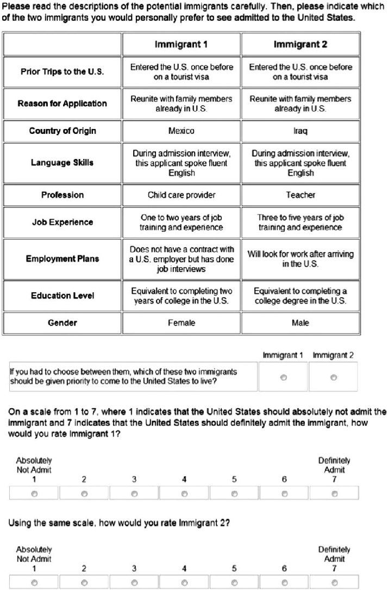

Published online by Cambridge University Press

https://doi.org/10.1093/pan/mpt024

Advance Access publication December 19, 2013 Political Analysis (2014) 22:1–30 doi:10.1093/pan/mpt024

# Causal Inference in Conjoint Analysis: Understanding Multidimensional Choices via Stated Preference Experiments

Jens Hainmueller Department of Political Science, Massachusetts Institute of Technology, Cambridge, MA 02139 e-mail: jhainm@mit.edu

Daniel J. Hopkins Department of Government, Georgetown University, ICC 681, Washington, DC 20057 e-mail: dh335@georgetown.edu

Teppei Yamamoto Department of Political Science, Massachusetts Institute of Technology, 77 Massachusetts Avenue, Cambridge, MA 02139 e-mail: teppei@mit.edu (corresponding author)

Edited by R. Michael Alvarez

Survey experiments are a core tool for causal inference. Yet, the design of classical survey experiments prevents them from identifying which components of a multidimensional treatment are influential. Here, we show how conjoint analysis, an experimental design yet to be widely applied in political science, enables researchers to estimate the causal effects of multiple treatment components and assess several causal hypotheses simultaneously. In conjoint analysis, respondents score a set of alternatives, where each has randomly varied attributes. Here, we undertake a formal identification analysis to integrate conjoint analysis with the potential outcomes framework for causal inference. We propose a new causal estimand and show that it can be nonparametrically identified and easily estimated from conjoint data using a fully randomized design. The analysis enables us to propose diagnostic checks for the identification assumptions. We then demonstrate the value of these techniques through empirical applications to voter decision making and attitudes toward immigrants.

1 Introduction

The study of politics is to a significant extent the study of multidimensional choices. Voters, interest groups, government officials, and other political actors form preferences and make decisions about alternatives which differ in multiple ways. To understand such choices, political scientists are increasingly employing survey experiments (Schuman and Bobo 1988; Sniderman and Grob 1996; Gaines, Kuklinski, and Quirk 2007; Sniderman 2011). Indeed, three leading political science journals published seventy-two articles with survey experiments between 2006 and 2010.1 The primary advantage of survey experiments is their ability to produce causal conclusions. By randomly varying certain aspects of a survey across groups of respondents, researchers can ensure that systematic

Authors’ note: We gratefully acknowledge the recommendations of Political Analysis editors Michael Alvarez and Jonathan Katz as well as the anonymous reviewers. We further thank Justin Grimmer, Kosuke Imai, and seminar participants at MIT, Harvard University, Georgetown University, and Rochester University for their helpful comments and suggestions. We are also grateful to Anton Strezhnev for excellent research assistance. An earlier version of this article was presented at the 2012 Annual Summer Meeting of the Society for Political Methodology and the 2013 Annual Meeting of the American Political Science Association. Example scripts that illustrate the estimators and companion software to embed a conjoint analysis in Web-based survey instruments are available on the authors’ websites. Replication materials are available online as Hainmueller, Hopkins, and Yamamoto (2013). Supplementary materials for this article are available on the Political Analysis Web site.

1These journals are the American Journal of Political Science, the American Political Science Review, and the Journal of Politics.

The Author 2013. Published by Oxford University Press on behalf of the Society for Political Methodology. All rights reserved. For Permissions, please email: journals.permissions@oup.com

1

Published online by Cambridge University Press

https://doi.org/10.1093/pan/mpt024

differences in the respondents’ post-treatment attitudes and behavior are attributable solely to the experimental manipulations, making causal inference a realistic goal of empirical research.

However, the designs that are typically used in survey experiments have an important limitation for analyzing multidimensional decision making. Common experimental designs can identify the causal effects of an experimental manipulation as a whole, but they typically do not allow researchers to determine which components of the manipulation produce the observed effects. As an example, consider the first experiment reported by Brader, Valentino, and Suhay (2008), a prominent study examining respondents’ attitudes toward immigration. The researchers randomly varied two aspects of an otherwise identical news article: the ethnicity of the immigrant profiled in the story and whether the story’s general tone was positive or negative. In manipulating the immigrant’s perceived ethnicity, they only altered his face, name, and country of origin to “test the impact of the ethnic identity cue itself”(964). Even so, this experimental design cannot tell us which particular aspects of the Russian- or Mexican-born immigrant influenced respondents’ attitudes. Immigrants’ places of birth, names, and faces are correlated with many other attributes, from their ethnic or racial background to their education, language, and religion. Put differently, the treatments in this experiment are composites of many attributes which are “aliased,” making their unique effects impossible to identify. This inability to decompose treatment effects is not unique to this study; indeed, it is built into the design of most contemporary survey experiments, which present subjects with composite treatments and vary only a few components of those treatments.

One potential solution to the issue of aliasing is to design treatments that are truly onedimensional. For example, Hainmueller and Hiscox (2010) report a survey experiment in which respondents were asked whether the United States should admit more low- or high-skilled immigrants. In this case, only two words differed across the arms of the experiment (“low” or “high”), so any treatment effects can be attributed to these specific words. A drawback of this approach, however, is that it forces researchers to examine one component of the treatment at a time. That drawback is a significant one, especially given the high fixed costs of conducting any one survey experiment. What is more, the conclusions based on such single-attribute designs may lack external validity if respondents’ views when focused on a single component differ from those in more realistic scenarios in which they consider various components at once.

In this article, we develop an alternative approach to the problem of composite treatment effects. Specifically, we present conjoint analysis as a tool to identify the causal effects of various components of a treatment in survey experiments. This approach enables researchers to nonparametrically identify and estimate the causal effects of many treatment components simultaneously. Because the resulting estimates represent effects on the same outcome, they can be compared on the same scale to evaluate the relative influence of the components and to assess the plausibility of multiple theories. Moreover, the proposed estimation strategy can be easily implemented with standard statistical software. At the same time, our estimators avoid unnecessary statistical assumptions, affording them more internal validity than the more model-dependent procedures typical of prior research on conjoint analysis. We also make available sample scripts that illustrate the proposed estimators and a stand-alone software tool that we have developed which researchers can use to embed a conjoint analysis in Web-based survey instruments administered through survey tools such as Qualtrics (Strezhnev et al. 2013).

Introduced in the early 1970s (Green and Rao 1971), conjoint analysis is widely used by marketing researchers to measure consumer preferences, forecast demand, and develop products (e.g., Green, Krieger, and Wind 2001; Raghavarao, Wiley, and Chitturi 2011). These methods have been so successful that they are now widely used in business as well (Sawtooth Software Inc. 2008). Similar tools were separately developed by sociologists in the 1970s (e.g., Jasso and Rossi 1977), and came to be known as “vignettes” or “factorial surveys” (Wallander 2009), although their use has been infrequent in that field to date. Irrespective of the name, these techniques ask respondents to choose from or rate hypothetical profiles that combine multiple attributes, enabling researchers to estimate the relative influence of each attribute value on the resulting choice or rating. Although the technique has many variants (Raghavarao, Wiley, and Chitturi 2011), more than one such task is typically given to each respondent, with some or all of the attribute values varied from one task to another. It is this unique design that makes conjoint experiments well suited for analyzing

Published online by Cambridge University Press

https://doi.org/10.1093/pan/mpt024

component-specific treatment effects. Here, we propose a variant of randomized conjoint analysis as an experimental design that is particularly useful for decomposing composite treatment effects.

Although the methodological literature on conjoint analysis is old and highly sophisticated (Luce and Tukey 1964), it has not been studied explicitly from a contemporary causal inference perspective, making it unclear whether and how estimates based on conjoint analysis relate to welldefined causal quantities. Moreover, conjoint analysis raises statistical challenges and modeling choices not present in the analysis of standard experiments, as the number as possible unique profiles typically outnumber the profiles observed in any empirical application. Still, because researchers are free to manipulate profile attributes in conjoint analysis, the design lends itself to causal investigations of respondents’ choices. In this study, we use the potential outcomes framework of causal inference (Neyman 1923; Rubin 1974) to formally analyze the causal properties of conjoint analysis. We define a causal quantity of interest, the average marginal component effect (AMCE). We then show that this effect (as well as the interaction effects of the components) can be nonparametrically identified from conjoint data under assumptions that are either guaranteed to hold by the experimental design or else at least partially empirically testable. We also propose a variety of diagnostic checks to probe the identification assumptions.

Our identification result implies that scholars can make inferences about key quantities of interest without resorting to functional form assumptions. This stands in stark contrast to most existing statistical approaches to conjoint data in economics and marketing research, which start from a particular behavioral model for respondents’ decision-making processes and fit a statistical model to observed data that is constructed based on the behavioral model. Although this modelbased approach may allow efficient estimation, a key drawback is that it is valid only when the assumed behavioral model is true. In contrast, our approach is agnostic about how respondents reach their observed decisions—they might be maximizing utility; they might be boundedly rational; they might use weighted adding, lexicographic, or satisficing decision strategies; or they might make choices according to another model (Bettman, Luce, and Payne 1998). Irrespective of the underlying behavioral model, our proposed method estimates the effects of causal components on respondents’ stated preferences without bias given the identification assumptions.

The potential advantages of conjoint analysis are not limited to their desirable properties for causal identification. Indeed, conjoint analysis has a number of features which make it an attractive tool for applied research. First, by presenting respondents with various pieces of information and then asking them to make choices, conjoint analysis has enhanced realism relative to the direct elicitation of preferences on a single dimension for a variety of research questions. Second, conjoint analysis allows researchers to test a large number of causal hypotheses in a single study, making it a cost-effective alternative to traditional survey experiments. Third, conjoint analysis estimates the effects of multiple treatment components in terms of a single behavioral outcome and thus allows researchers to evaluate the relative explanatory power of different theories, moving beyond unidimensional tests of a single hypothesis. Fourth, conjoint experiments have the potential to limit concerns about social desirability (Wallander 2009), as they provide respondents with multiple reasons to justify any particular choice or rating. Finally, conjoint analysis can provide insights into practical problems such as policy design. For example, it can be used to predict the popular combinations of components in a major policy reform.

As the foregoing discussion suggests, the applicability of conjoint analysis in political science is broad. Many central questions in the study of politics concern multidimensional preferences or choices. In this article, we apply our estimators to two original conjoint experiments on topics we consider exemplary of multidimensional political choices: voting and immigration. These are by no means the only subjects to which conjoint analysis can be productively applied.2 As the conclusion

2Indeed, many political scientists (including ourselves) have started to adopt conjoint analysis in their research. For example, Hainmueller and Hopkins (2012) use a conjoint experiment to study attitudes toward immigration and we use this as a running example below. Wright, Levy, and Citrin (2013) apply a similar approach to study attitudes toward unauthorized immigrants. Bechtel, Hainmueller, and Margalit (2013) examine voter attitudes in Germany toward alternative policy packages for Eurozone bailouts, and Bechtel and Scheve (2013) use a similar design to analyze attitudes about global cooperation on climate change.

Published online by Cambridge University Press

https://doi.org/10.1093/pan/mpt024

highlights, we suspect that many hypotheses in political behavior can be empirically tested using conjoint experiments.

The rest of the article is organized as follows. Section 2 presents our empirical examples. Section 3 defines our causal quantities of interest and shows the results of our identification analysis. Section 4 presents our proposed estimation strategy. In Section 5, we apply our proposed framework to the empirical examples to illustrate how our estimators work in practice. We also propose and conduct several diagnostic analyses to investigate the plausibility of our identification assumptions as well as the studies’ external validity. Section 6 discusses the advantages and disadvantages of conjoint analysis relative to traditional survey experiments. Section 7 concludes.

2 Examples

In this section, we briefly describe our empirical examples. The first is a conjoint experiment on U.S. citizens’ preferences across presidential candidates which we conducted in July 2012. The second is a conjoint experiment on attitudes toward immigrants whose results are reported in more detail in Hainmueller and Hopkins (2012). Together, these two examples suggest the breadth of possible applications of conjoint analysis within political science and illustrate some of the common questions that emerge when implementing conjoint experiments.

2.1 The Candidate Experiment

The choice between competing candidates for elected office is central to democracy. Candidates typically differ on a variety of dimensions, including their personal background and demographic characteristics, issue positions, and prior experience. The centrality of partisanship to voter decision making is amply documented (e.g., Campbell et al. 1960; Green, Palmquist, and Schickler 2002), so we focus here on the less-examined role of candidates’ personal traits (see also Cutler [2002]). Within the United States, there is constant speculation about the role of candidates’ personal backgrounds in generating support or opposition; here, we harness conjoint analysis to examine those claims.

We focus on eight attributes of would-be presidential candidates, all of which have emerged in recent campaigns. Six of these attributes can take on one of six values, including the candidates’ religion (Catholic, Evangelical Protestant, Mainline Protestant, Mormon, Jewish, or None), college education (no college, state university, community college, Baptist college, Ivy League college, or small college), profession (lawyer, high school teacher, business owner, farmer, doctor, or car dealer), annual income ($32K, $54K, $65K, $92K, $210K, and $5.1M), racial/ethnic background (Hispanic, White, Caucasian, Black, Asian American, and Native American), and age (36, 45, 52, 60, 68, and 75).3 Two other attributes take on only two values: military service (served or not) and gender (male or female). Each respondent to our online survey—administered through Amazon’s Mechanical Turk (Berinsky, Huber, and Lenz 2012)—saw six pairs of profiles that were generated using the fully randomized approach described below. Figure A.1 in the Supplemental Information (SI) illustrates one choice presented to one respondent. The profiles were presented side-by-side, with each pair of profiles on a separate screen. To ease the cognitive burden for respondents while also minimizing primacy and recency effects, the attributes were presented in a randomized order that was fixed across the six pairings for each respondent.

On the same screen as each candidate pairing, respondents were asked multiple questions which serve as dependent variables. First, they were asked to choose between the two candidates, a “forced-choice” design that enables us to evaluate the role of each attribute value in the assessment of one profile relative to another. This question closely resembles real-world voter decision making, in which respondents must cast a single ballot between competing candidates who vary on multiple dimensions. In the second and third questions following the profiles, the respondents rated

3We include “White” and “Caucasian” as separate values to identify any differential response those terms may produce.

Published online by Cambridge University Press

https://doi.org/10.1093/pan/mpt024

each candidate on a one to seven scale, enabling evaluations of the levels of absolute support or opposition to each profile separately.

- 2.2 The Immigrant Experiment

Our second example focuses on the role of immigrants’ attributes in shaping support for their admission to the United States. A variety of prominent hypotheses lead to different expectations about what attributes of immigrants should influence support for their admission, from their education and skills (Scheve and Slaughter 2001; Hainmueller and Hiscox 2010) to their country of origin (Citrin et al. 1997; Brader, Valentino, and Suhay 2008) and perceived adherence to norms about American identity (Wong 2010; Schildkraut 2011; Wright and Citrin 2011). Yet to date, empirical tests have commonly varied only a small subset of those attributes at one time, making it unclear whether findings for certain attributes are masking the effects of others. For example, it is plausible that prior findings on the importance of immigrants’ countries of origin are in fact driven by views of immigrants’ education, authorized entry into the United States, or other factors.

In our experiment, Knowledge Networks respondents were asked to act as immigration officials and to decide which of a pair of immigrants they would choose for admission. Figure 1 illustrates one choice presented to one respondent. Respondents were asked to first choose between the two immigrant profiles that varied across a set of attributes and then to rate each profile on a scale from one to seven, where seven indicates that the immigrant should definitely be admitted. Respondents evaluated a total of five pairings. The attributes include each immigrant’s gender, education level, employment plans, job experience, profession, language skills, country of origin, reasons for applying, and prior trips to the United States. These attributes were then randomly chosen to form immigrant profiles.

One methodological difference in this experiment compared to the conjoint of candidate preferences described above is that in randomly generating the immigrant profiles, we imposed two restrictions on the possible combinations of immigrant attributes. First, those immigrant profiles who were fleeing persecution were restricted to come from countries where such an application was plausible (e.g., Iraq, Sudan). Second, those immigrants occupying high-skill occupations (e.g., research scientists, doctors) were constrained to have at least two years of college education. As we elaborate in Section 3, we used these restrictions to prohibit immigrant profiles that give rise to counterfactuals that are too unrealistic to be evaluated in a meaningful way.

3 Notation and Definitions

In this section, we provide a formal analysis of conjoint experiments using the potential outcomes framework of causal inference (Neyman 1923; Rubin 1974). We introduce the notational framework, define the causal quantities of interest, and show that these quantities are nonparametrically identified under a set of assumptions that is likely to hold in a typical conjoint experiment.

- 3.1 Design

As illustrated by the empirical examples in Section 2, conjoint analysis is an experimental technique “for handling situations in which a decision maker has to deal with options that simultaneously vary across two or more attributes” (Green, Krieger, and Wind 2001, S57). In the literature, conjoint analysis can refer to several distinct experimental designs. One such variation is in the outcome variable with which respondents’ preferences are measured. Here, we analyze two types of outcomes which are particularly common and straightforward. First, in so-called “choicebased conjoint analysis” (also known as “discrete choice experimentation”; see Raghavarao, Wiley, and Chitturi 2011), respondents are presented with two or more alternatives varying in multiple attributes and are asked to choose the one they most prefer. Choice-based conjoint is “the most widely used flavor of conjoint analysis” (Sawtooth Software Inc. 2008, 1), as it closely approximates real-world decision making (e.g., Hauser 2007). We call such responses

Published online by Cambridge University Press

https://doi.org/10.1093/pan/mpt024

Fig. 1 Experimental design: Immigration conjoint. This figure illustrates the experimental design for the conjoint analysis that examines immigrant admission to the United States.

choice outcomes hereafter. Second, in “rating-based conjoint analysis,” respondents give a numerical rating to each profile which represents their degree of preference for the profile. This format is preferred by some analysts who contend that such ratings provide more direct, finely grained information about respondents’ preferences. We call this latter type of outcome a rating outcome.

Published online by Cambridge University Press

https://doi.org/10.1093/pan/mpt024

In practice, both choice and rating outcomes are often measured in a single study, as is done in our running examples.4

Formally, consider a random sample of N respondents drawn from a population of interest P. Each respondent (indexed by i 2 f1, ...,Ng) is presented with K choice (or rating) tasks, and in each of her tasks the respondent chooses the most preferred (or rates each) of the J alternatives. We refer to the choice alternatives as profiles. For example, in the candidate experiment, a profile consists of one specific candidate. Each profile is characterized by a set of L discretely valued attributes, or a treatment composed of L components. We use Dl to denote the total number of levels for attribute l.5 For example, in the candidate experiment, N¼311 (respondents), J ¼2 (competing candidates in each choice task), K¼6 (choices made by respondents), L¼8 (candidate attributes), D1 ¼     ¼ D6 ¼ 6 (total number of levels for candidate’s age, education, etc.), and D7 ¼ D8 ¼ 2 (for military service and gender).6

We denote the treatment given to respondent i as the jth profile in her kth choice task by a vector Tijk, whose lth component Tijkl corresponds to the lth attribute of the profile. This L-dimensional vector Tijk can take any value in set T , which can be as large as the Cartesian product of all the possible values of the attributes but need not be. For example, if particular combinations of the attribute values are implausible, the analyst may choose to remove them from the set of possible profiles (or treatment values), as we do in our immigration experiment. We then use Tik to denote the entire set of attribute values for all J profiles in respondent i’s choice task k, and Ti for the entire set of all JK profiles respondent i sees throughout the experiment.7

Using the potential outcomes framework, let YikðtÞ denote the J-dimensional vector of potential outcomes for respondent i in her kth choice task that would be observed when the respondent received the sequence of profile attributes represented by t, with individual components YijkðtÞ. As mentioned above, this variable can represent either a choice or rating outcome. In the former case, YijkðtÞ is a binary indicator variable where 1 indicates that respondent i would choose the jth profile in her kth choice task if she got the treatment set t and 0 implies that she would not. In the latter case, the potential outcome represents the rating respondent i would give to the jth profile in her kth task if she received t, and is assumed to take on a numeric value between some known upper and lower bounds, i.e., YijkðtÞ 2 Y   ½y, y . In both cases, the observed outcome in respondent i’s kth task when the respondent receives a set of treatments Ti can then be written as Yik YikðTiÞ, with individual component YijkðTiÞ. For choice outcomes, by design respondents must choose one preferred profile j within each choice task k, i.e., PJj¼1 YijkðtÞ ¼ 1 for all i, k, and t, whereas rating outcomes do not impose such a constraint and can take on any value in Y.

3.2 Assumptions

We now make a series of simplifying assumptions. Unlike many assumptions typically made in the literature, all of these assumptions can be either guaranteed to hold by the study design or partially tested with observed data (see Section 5.3).

- 4Other common types of tasks include ordinal ranking and point allocation. The investigation of these outcomes is left to future research.
- 5For attributes that are inherently continuous (e.g., annual income in the candidate experiment), traditional approaches often assume certain functional forms between the attributes and outcome to reduce the number of parameters required (e.g., estimate a single regression coefficient for the attribute). This approach can be justified when the functional-form assumption is reasonable. However, such an assumption is often difficult to justify, and it raises additional validity concerns such as the “range effect” and “number-of-levels effect” (Verlegh, Schifferstein, and Wittink 2002).
- 6Implicit in this notation is the assumption that the order of the attributes within a profile does not affect the potential outcomes (defined below). This assumption might not be plausible, especially if L is so large that respondents must read through a long list of profile attributes. As we show in Section 5.3.4, randomizing the order of attributes across respondents makes it possible to assess the plausibility of this assumption.
- 7More precisely, Tijk is an L-dimensional column vector such that Tijk ¼ ½Tijk1 TijkL > 2 T , where j 2 f1, .. ., Jg, the superscript > represents transposition, and T QLl¼1 T l where T l ¼ ftl1, .. ., tlD

lg; Tik represents a matrix whose jth row is Tijk, i.e., Tik ¼ ½Ti1k TiJk >; and Ti is a three-dimensional array of treatment components for respondent i whose ðj,k,lÞ component equals Tijkl.

Published online by Cambridge University Press

https://doi.org/10.1093/pan/mpt024

First, we assume stability and no carryover effects for the potential outcomes. This means that the potential outcomes remain stable across the choice tasks (i.e., no period effect) and that treatments given to a respondent in her other choice tasks do not affect her response in the current task. The following expression formalizes this assumption.

- Assumption 1 (Stability and No Carryover Effects). For each i and all possible pairs of treatments Ti and Ti0,

YijkðTiÞ ¼ Yijk0ðTi0Þ if Tik ¼ Tik0 0, for any j, k, and k0.

Assumption 1 requires that the potential outcomes always take on the same value as long as all the profiles in the same choice task have identical sets of attributes. For example, in the candidate conjoint experiment above, respondents would choose the same candidate as long as the two candidates in the same choice task had identical attributes, regardless of what kinds of candidates they had seen or would see in the rest of the experiment. This assumption may not be plausible if, for example, respondents use the information given in earlier choice tasks as a reference point in evaluating candidates later in the experiment.

Under Assumption 1, we can substantially simplify our analysis by writing the potential outcomes just as YiðtÞ with individual components YijðtÞ, where t is some realized value of Tik defined above. Similarly, the observed outcomes become Yik ¼ YiðTikÞ.8 Practically, the assumption allows researchers to increase efficiency of a given study by pooling information across choice tasks when estimating the average causal effects of interest (defined in Section 3.3). Since the fixed costs of a survey typically exceed the marginal cost of adding more choice tasks to the questionnaire, having respondents do multiple tasks is beneficial as long as Assumption 1 holds.

We maintain Assumption 1 in the main analyses of this article. Still, should researchers suspect that profiles affect later responses, they can either assign a single choice task per respondent or use data only from each respondent’s first task. Moreover, as we demonstrate in Section 5.3.1, they can assess the plausibility of Assumption 1 by examining if the results from later tasks differ from those obtained in the first task.

Second, we assume that there are no profile-order effects; that is, the ordering of profiles within a choice task does not affect responses. This means that simply shuffling the order in which profiles are presented on the questionnaire or computer screen must not alter the choice respondents would make or the rating they would give, as long as all the attributes are kept the same. Again, we formalize this assumption as follows.

- Assumption 2 (No Profile-Order Effects).

YijðTikÞ ¼ Yij0ðTik0 Þ if Tijk ¼ Tij00k and Tij0k ¼ Tijk0 , for any i, j, j0; and k.

Under Assumption 2, we can further simplify the analysis by writing the jth component of the potential outcomes as Yiðtj,t½ j Þ, where tj is a specific value of the treatment vector Tijk and t½ j is a particular realization of Ti½ j k, the unordered set of the treatment vectors Ti1k, ...,Tiðj 1Þk,Tiðjþ1Þk, ...,TiJk. Similarly, the jth component of the observed outcomes can now be written as Yijk ¼ YiðTijk,Ti½ j kÞ.

Practically, Assumption 2 makes it possible for researchers to ignore the order in which the profiles happen to be presented and to pool information across profiles when estimating causal

8Note that this assumption is akin to what is known more generally as SUTVA, or the Stable Unit Treatment Value Assumption (Rubin 1980), in the sense that it precludes some types of interference between observation units and specifies that the potential outcomes remain stable across treatments given in different periods.

Published online by Cambridge University Press

https://doi.org/10.1093/pan/mpt024

quantities of interest. The assumption therefore further enhances the efficiency of the conjoint design. Like Assumption 1, one can partially test the plausibility of Assumption 2 by investigating whether the estimated effects of profiles vary depending on where in the conjoint table they are presented (see Section 5.3.2). We maintain this assumption in the subsequent analyses.

Finally, we assume that the attributes of each profile are randomly generated. This randomized design contrasts with the approach currently recommended in the conjoint literature, which uses a subset of treatment profiles which is systematically selected and typically small. Under the randomized design, the following assumption is guaranteed to hold because of the randomization of the profile attributes.

Assumption 3 (Randomization of the Profiles).

YiðtÞ ?? Tijkl,

for all i,j,k, l, and t, where the independence is taken to be the pairwise independence between each element of YiðtÞ and Tijkl, and it is also assumed that 0 < pðtÞ   pðTik ¼ tÞ < 1 for all t in its support.

Assumption 3 states that the potential outcomes are statistically independent of the profiles. This assumption always holds if the analyst properly employs randomization when assigning attributes to profiles, for the respondents’ potential choice behavior can never be systematically related to what profiles they will actually see in the experiment. The second part of the assumption states that the randomization scheme must assign a non-zero probability to all the possible attribute combinations for which the potential outcomes are defined. This implies that if some attribute combinations are removed from the set of possible profiles due to theoretical concerns (as in our immigration experiment), it will be impossible to analyze causal quantities involving these combinations (unless we impose additional assumptions such as constant treatment effects). Although the study design guarantees Assumption 3 at the population level, researchers might still be concerned that the particular sample of profiles that happens to be generated in their study may be imbalanced, especially in small samples. In Section 5.3.3, we show a simple way to diagnose this possibility.

3.3 Causal Quantities of Interest and Identification

Researchers may be interested in various causal questions when running a conjoint experiment. Here, we formally propose several causal quantities of particular interest. We then discuss their properties and prove their identifiability under the assumptions introduced in Section 3.2.

3.3.1 Limits of basic profile effects

The most basic causal question in conjoint analysis is whether showing one set of profiles as opposed to another would change the respondent’s choice. For any pair of profile sets t0 and t1, under Assumptions 1 and 2, we can define the unit treatment effect as the difference between the two potential outcomes under those two profile sets. That is,

iðt1,t0Þ Yiðt1Þ   Yiðt0Þ, ð1Þ

for all t1 and t0 in their support. For example, suppose that in a simplified version of the candidate experiment with three binary attributes, respondent i sees a presidential candidate with military service, high income, and a college education as Candidate 1, and a candidate with no military service, low income, and a college education as Candidate 2. The respondent chooses Candidate 1.

military service rich college no service poor college

1 0

In this case, t0 ¼

and Yiðt0Þ ¼

. Now, suppose that in the counterfactual scenario, Candidate 2 had military service, low income, and college education, i.e., t1 ¼

military service rich college military service poor no college

. If the respondent still chose Candidate 1, then the unit

Published online by Cambridge University Press

https://doi.org/10.1093/pan/mpt024

treatment effect of the change from t0 to t1 for respondent i would be zero for both candidates, i.e., iðt1,t0Þ ¼

1 0

1 0 ¼

0 0

.

Unit-level causal effects such as equation (1) are generally difficult to identify even with experimental data, because they involve multiple potential outcomes for the same unit of observation and all but one of them must be counterfactual in most cases. This “fundamental problem of causal inference” (Holland 1986) also applies to conjoint analysis.9 Instead, one might focus on the average treatment effect (ATE), defined as

ðt1,t0Þ   E½ iðt1,t0Þ  ¼ E½Yiðt1Þ   Yiðt0Þ , ð2Þ

where the expectation is defined over the population of interest P. When YiðtÞ is a vector of binary choice outcomes, ðt1,t0Þ represents the difference in the population probabilities of choosing the J profiles that would result if a respondent were shown the profiles with attributes t1 as opposed to t0. It is straightforward to show that ðt1,t0Þ is nonparametrically identified under Assumptions 1, 2, and 3 as

^ ðt1,t0Þ ¼ E½YikjTik ¼ t1 E½YikjTik ¼ t0 , ð3Þ

for any t1 and t0. The proof is virtually identical to the proof of the identifiability of the ATE in a standard randomized experiment (see, e.g., Holland 1986), and therefore is omitted.

The ATE is the most basic causal quantity since it is simply the expected difference in responses for two different sets of profiles. However, directly interpreting this quantity may not be easy. In the above example, what does it mean in practical terms to compare t0 and t1, two different pairs of candidates whose attributes differ on multiple dimensions at the same time? Unless there is some substantive background (e.g., the treatments correspond to two alternative scenarios that might happen in an actual election), ðt1,t0Þ is typically not a useful quantity of interest. Moreover, in a typical conjoint analysis where the profiles consist of a large number of attributes with multiple levels, the number of observations that belong to the conditioning set in each term of equation (3) is very small or possibly zero, rendering the estimation of ^ ðt1,t0Þ difficult in practice.

3.3.2 Average marginal component effect

As an alternative quantity of interest we propose to look at the effect of an individual treatment component. Suppose that the analyst is interested in how different values of the lth attribute of profile j influence the probability that the profile is chosen. The effect of attribute l, however, may differ depending on the values of the other attributes. For example, the analyst might be interested in whether respondents generally tend to choose a rich candidate over a poor candidate. The effect of income, however, might differ depending on whether the candidate is conservative or liberal, as the economic policy a high-income candidate is likely to pursue might vary with her ideology. Despite such heterogeneity in effect sizes, the analyst might still wish to identify a quantity that summarizes the overall effect of income across other attributes of the candidates, including ideology.

The following quantity, which we call the average marginal component effect (AMCE), represents the marginal effect of attribute l averaged over the joint distribution of the remaining attributes:

lðt1,t0,pðtÞÞ   EhYiðt1,Tijk½ l ,Ti½ j kÞ   Yiðt0,Tijk½ l ,Ti½ j kÞj Tijk½ l ,Ti½ j k 2 Tei ¼ X ðt,tÞ2eT

EhYiðt1,t,tÞ   Yiðt0,t,tÞj Tijk½ l ,Ti½ j k 2 Tei

ð4Þ

p Tijk½ l ¼ t,Ti½ j k ¼ tj Tijk½ l ,Ti½ j k 2 Te ,

9Technically, Assumptions 1 and 2 imply that unit treatment effects can be identified for the limited number of profile sets that are actually assigned to unit i over the course of the K choice tasks. In practice, however, these effects are likely to be of limited interest because they are specific to individual units and constitute only a small fraction of the large number of unit treatment effects.

Published online by Cambridge University Press

https://doi.org/10.1093/pan/mpt024

where Tijk½ l denotes the vector of L – 1 treatment components for respondent i’s jth profile in choice task k without the lth component and Te is the intersection of the support of pðTijk½ l ¼ t,Ti½ j k ¼ tjTijkl ¼ t1Þ and pðTijk½ l ¼ t,Ti½ j k ¼ tjTijkl ¼ t0Þ.10 This quantity equals the increase in the population probability that a profile would be chosen if the value of its lth component were changed from t0 to t1, averaged over all the possible values of the other components given the joint distribution of the profile attributes pðtÞ.11

To see what this causal quantity substantively represents, consider again a simplified version of the candidate example. The AMCE of candidate income (rich versus poor) on the probability of choice can be understood as the result of the following hypothetical calculation: (1) compute the probability that a rich candidate is chosen over an opposing candidate with a specific set of attributes, compute the probability that a poor, but otherwise identical, candidate is chosen over the same opponent candidate, and take the difference between the probabilities for the rich and the poor candidate; (2) compute the same difference between a rich and a poor candidate, but with a different set of the candidate’s and opponent’s attributes (other than the candidate’s income); and (3) take the weighted average of these differences over all possible combinations of the attributes according to their joint distribution. Thus, the AMCE of income represents the average effect of income on the probability that the candidate will be chosen, where the average is defined over the distribution of the attributes (except for the candidate’s own income) across repeated samples.

Although the above hypothetical calculation is impossible in reality given the fundamental problem of causal inference, it turns out that we can in fact identify and estimate the AMCE from observed data from a conjoint experiment, by virtue of the random assignment of the attributes. That is, we can show that the expectations of the potential outcomes in equation (4) are nonparametrically identified as functions of the conditional expectations of the observed outcomes under the assumptions in Section 3.2. The AMCE can be written under Assumptions 1, 2, and 3 as

^ lðt1,t0,pðtÞÞ ¼ X ðt,tÞ2eT

E YijkjTijkl ¼ t1,Tijk½ l ¼ t,Ti½ j k ¼ t

E YijkjTijkl ¼ t0,Tijk½ l ¼ t,Ti½ j k ¼ t

ð5Þ

p Tijk½ l ¼ t,Ti½ j k ¼ tj Tijk½ l ,Ti½ j k 2 Te :

Note that the expected values of the potential outcomes in equation (4) have been replaced with the conditional expectations of the observed outcomes in equation (5), which makes the latter expression estimable from observed data.12 In Section 4, we propose nonparametric estimators for this quantity that can be easily implemented using elementary statistical tools.

An interesting feature of the AMCE is that it is defined as a function of the distribution of the treatment components, pðtÞ. This can be an advantage or disadvantage. The advantage is that the analyst can explicitly control the target of the inference by setting pðtÞ to be especially plausible or interesting. In a classical survey experiment where the analyst manipulates only one or two elements of the survey, other circumstantial aspects of the experiment that may affect responses (such as the rest of the vignette or the broader political context) are either fixed at a single condition or out of the analyst’s control. This implies that the causal effects identified in such experiments are

- 10This definition of T~ is subtle but important when analyzing conjoint experiments with restrictions in the possible attribute combinations: the unit-level effects must be averaged over the values of t and t for which both Yiðt1, t, tÞ and Yiðt0, t,tÞ are well defined. This is because the causal effects can only be meaningfully defined for the contrasts between pairs of potential outcomes which do not involve “empty counterfactuals,” such as a research scientist with no formal education that was a priori excluded in the immigration conjoint experiment.
- 11Strictly speaking, the AMCE for the choice outcome only depends on the joint distribution of Tijk½ l and Ti½ j k after marginalizing pðtÞ with respect to Tijkl. We opt for the simpler notation given in the main text.
- 12The proof for the identifiability is straightforward: the first term in equation (4) is identical to equation (2) (except that the expectation is defined over the truncated distribution, which does not affect identifiability under Assumption 3), and the second term can be derived from pðtÞ, the known joint density of the profile attributes.

Published online by Cambridge University Press

https://doi.org/10.1093/pan/mpt024

inherently conditional on those particular settings, a fact that potentially limits external validity but is often neglected in practice. In contrast, the AMCE in conjoint analysis incorporates some of those covariates as part of the experimental manipulation and makes it explicit that the effect is conditional on their distribution. Moreover, note that pðtÞ in the definition of the AMCE need not be identical to the distribution of the treatment components actually used in the experiment. In fact, the analyst can choose any distribution, as long as its support is covered by the distribution actually used. One interesting possibility, which we do not further explore here due to space constraints, is to use the real-world distribution (e.g., the distribution of the attributes of actual politicians) to improve external validity.

The fact that the analyst can control how the effects are averaged can also be viewed as a potential drawback, however. In some applied settings, it is not necessarily clear what distribution of the treatment components analysts should use to anchor inferences. In the worst-case scenario, researchers may intentionally or unintentionally misrepresent their empirical findings by using weights that exaggerate particular attribute combinations so as to produce effects in the desired direction. Thus, the choice of pðtÞ is important. It should always be made clear what weighting distribution of the treatment components was used in calculating the AMCE, and the choice should be convincingly justified. In practice, we suggest that the uniform distribution over all possible attribute combinations be used as a default, unless there is a strong substantive reason to prefer other distributions.

Finally, it is worth pointing out that the AMCE also arises as a natural causal estimand in any other randomized experiment involving more than one treatment component. The simplest example is the often-used “2 2 design,” where the experimental treatment consists of two dimensions each taking on two levels (e.g., Brader, Valentino, and Suhay 2008; see Section 1). In such experiments, it is commonplace to “collapse” the treatment groups into a smaller number of groups based on a single dimension of interest and compute the difference in the mean outcome values between the collapsed groups. By doing this calculation, the analyst is implicitly estimating the AMCE for the dimension of interest, where pðtÞ equals the assignment probabilities for the other treatment dimensions. Thus, the preceding discussion applies more broadly than to the specific context of conjoint analysis and should be kept in mind whenever treatment components are marginalized into a single dimension in the analysis.13

3.3.3 Interaction effects

In addition to the AMCE, researchers might also be interested in interaction effects. There are two types of interactions that can be quantities of interest in conjoint analysis. First, an attribute may interact with another attribute to influence responses. That is, the causal effect of one attribute (say candidate’s income) may vary depending on what value another attribute (e.g., ideology) is held at, and the analyst may want to quantify the size of such interactions. This quantity can be formalized as the average component interaction effect (ACIE), defined as

l,mðtl1,tl0,tm1,tm0,pðtÞÞ E nYiðtl1,tm1,Tijk½ ðlmÞ ,Ti½ j kÞ   Yiðtl0,tm1,Tijk½ ðlmÞ ,Ti½ j kÞo nYiðtl1,tm0,Tijk½ ðlmÞ ,Ti½ j kÞ   Yiðtl0,tm0,Tijk½ ðlmÞ ,Ti½ j kÞo Tijk½ ðlmÞ ,Ti½ j k 2 Te ,

ð6Þ

where we use Tijk½ ðlmÞ  to denote the set of L – 2 attributes for respondent i’s jth profile in choice task k except components l and m, and Te is defined analogously to Te above. This quantity represents the average difference in the AMCE of component l between the profile with Tijkm ¼ tm1 and

13Gerber and Green (2012) make a similar point about multi-factor experiments, though without much elaboration: “[i]f the different versions of the treatment do appear to have different effects, remember that the average effect of your treatment is a weighted average of the ATEs for each version. This point should be kept in mind when drawing generalizations based on a multi-factor experiment” (305).

Published online by Cambridge University Press

https://doi.org/10.1093/pan/mpt024

one with Tijkm ¼ tm0. For example, the ACIE of candidate income and ideology on the choice probability equals the percentage point difference in the AMCEs of income between a conservative candidate and a liberal candidate. Like the AMCE, the ACIE in equation (6) is identifiable from conjoint data under Assumptions 1, 2, and 3 and can be expressed in terms of the conditional expectations of the observed outcomes, i.e., by an expression analogous to equation (5). It should be noted that these definitions and identification results can be generalized to the interaction effects among more than two treatment components.

Second, the causal effect of an attribute may also interact with respondents’ background characteristics. For example, in the candidate experiment, the analyst might wish to know how the effect of the candidate’s income changes as a function of the respondent’s income. We can answer such questions with conjoint data by studying the average of the attribute’s marginal effect conditional on the respondent characteristic of interest. That is, the conditional AMCE of component l given a set of respondent characteristics Xi can be defined as

EhYiðt1,Tijk½ l ,Ti½ j kÞ   Yiðt0,Tijk½ l ,Ti½ j kÞj Tijk½ l ,Ti½ j k 2 Te, Xii, ð7Þ

where Xi 2 X denotes the vector of respondent characteristics. Like the other causal quantities discussed above, the conditional AMCE can also be nonparametrically identified under Assumptions 1, 2, and 3. One point of practical importance is that the respondent characteristics must not be affected by the treatments. To ensure this, the analyst could measure the characteristics before showing randomized profiles to the respondents. For example, in the immigration experiment, the interaction between the immigrant’s education and the respondent’s education can be estimated by measuring respondents’ characteristics prior to conducting the conjoint experiment.

4 Proposed Estimation Strategies

In this section, we discuss strategies for estimating the causal effects of treatment components using conjoint analysis. We derive easy-to-implement nonparametric estimators which can be used for both choice and rating outcomes.

4.1 Estimation under Conditionally Independent Randomization

We begin with a general case which covers attribute distributions with nonuniform assignment and restrictions involving empty attribute combinations. Assume that the attribute of interest, Tijkl, is distributed independently of a subset of the other attributes after conditioning on the remaining attributes. That is, we make the following assumption:

Assumption 4 (Conditionally Independent Randomization). The treatment components’ distribution pðtÞ satisfies the following relationship with respect to the treatment component of interest Tijkl:

Tijkl ?? fTSijk, Ti½ j kg jTRijk for all i,j,k,

where TRijk is an LR-dimensional subvector of Tijk½ l as defined in Section 3.3 and TSijk is the vector composed of the elements of Tijk½ l not included in TRijk.

This assumption is satisfied for most attribute distributions researchers typically use in conjoint experiments. In particular, Assumption 4 holds under the common randomization scheme where the attribute of interest, Tijkl, is restricted to take on certain values when some of the other attributes (TRijk) are set to some particular values, but is otherwise free to take on any of its possible values. For example, in the immigrant experiment, immigrants who have high-skill occupations are constrained to have at least two years of college education. In this case, the distribution of immigrants’ occupations (Tijkl) is dependent on their education (TRijk), but conditionally

Published online by Cambridge University Press

https://doi.org/10.1093/pan/mpt024

independent of the other attributes (TSijk) and the other profiles in the same choice task (Ti½ j k) given their education.

The following proposition shows that, under Assumption 4, the AMCE for the choice outcome can be estimated by a simple nonparametric subclassification estimator.

- Proposition 1 (Nonparametric Estimation of AMCE with Conditionally Independent Randomization). Under Assumptions 1, 2, 3, and 4, the following subclassification estimator is unbiased for the AMCE defined in equation (4):

^ lðt1,t0,pðtÞÞ ¼ X

tR2T R

PN i¼1

PJ j¼1

PK k¼1

Yijk1fTijkl ¼ t1,TRijk ¼ tRg n1tR

8 ><

>:

PN i¼1

PJ j¼1

PK k¼1

Yijk1fTijkl ¼ t0,TRijk ¼ tRg n0tR

9 >=

>;

Pr TRijk ¼ tR ,

ð8Þ

where ndtR represents the number of profiles for which Tijkl ¼ td and TRijk ¼ tR, and T R is the intersection of the supports of pðTRijk ¼ tRjTijkl ¼ t1Þ and pðTRijk ¼ tRjTijkl ¼ t0Þ.

A proof is provided in the Supplementary Data. Proposition 1 states that, for any attribute of interest Tijkl, the subclassification estimate of the AMCE can be computed simply by dividing the sample into the strata defined by TRijk, typically the attributes on which the assignment of the attribute of interest is restricted, calculating the difference in the average observed choice outcomes between the treatment (Tijkl ¼ t1) and control (Tijkl ¼ t0) groups within each stratum, and then taking the weighted average of these differences in means, using the known distribution of the strata as the weights. Therefore, the estimator is fully nonparametric and does not depend on any functional form assumption about the choice probabilities, unlike standard estimation approaches in the conjoint literature such as conditional logit (McFadden 1974).

The next proposition shows that the above nonparametric estimator can be implemented conveniently by a linear regression. To simplify the presentation, we assume that the conditioning set of treatment components TRijk consists of only one attribute. This is true in our immigration example, as each of the four restricted attributes had a restriction involving only one other attribute (e.g., education for occupation).

- Proposition 2 (Implementation of the Nonparametric Estimator of AMCE via Linear Regression). The subclassification estimator in equation (8) can be calculated via the following

procedure when LR ¼ 1 and TRijk ¼ Tijkl0 2 ft0

0, ...,t0

Dl0 1g. First, regress Yijk on 1, Wijkl, Wijkl0, and Wijkl : Wijkl0,

where 1 denotes an intercept, Wijkl is the vector of Dl 1 dummy variables for the levels of Tijkl excluding the one for t0, Wijkl0 is the similar vector of dummy variables for the levels of Tijkl0 excluding the ones for its baseline level and the levels not in T R, and Wijkl : Wijkl0 denotes the pairwise interactions between the two sets of dummy variables. Then, set

^ lðt1,t0,pðtÞÞ ¼ ^ 1 þ DX

l0 1

PrðTijkl0 ¼ td0Þ^ 1l

0d, ð9Þ

d¼1

Published online by Cambridge University Press

https://doi.org/10.1093/pan/mpt024

where ^ 1 is the estimated coefficient on the dummy variable for Tijkl ¼ t1 and ^ 1l

0d represents the estimated coefficient for the interaction term between the t1 dummy and the dummy variable corresponding to Tijkl0 ¼ t0

d.

The proposition is a direct implication of the well-known correspondence between subclassification and linear regression, and so the proof is omitted. Note that the linear regression estimator is simply an alternative procedure to compute the subclassification estimator, and therefore has properties identical to those of the subclassification estimator. This implies that the linear regression estimator is fully nonparametric, even though the estimation is conducted by a routine typically used for a parametric linear regression model. We have nevertheless opted to present it separately because we believe it to be an especially convenient procedure for applied researchers using standard statistical software. The estimator can be implemented simply by a single call to a linear regression routine in most statistical packages, followed by a few additional commands to extract the estimated coefficients and calculate their linear combinations.14 In Section 5, we show examples using data from our immigration experiment.

Even more conveniently, one can also estimate the AMCEs of all of the L attributes included in a study from a single regression. To implement this alternative procedure, one should simply regress the outcome variable on the L sets of dummy variables and the interaction terms for the attributes that are involved in any of the randomization restrictions used in the study, and then take the weighted average of the appropriate coefficients in the same manner as in equation (9) for each AMCE. This procedure in expectation produces the identical estimates of the AMCEs as those obtained by applying Proposition 2 for each AMCE one by one, for the regressors in the combined regression are in expectation orthogonal to one another under Assumption 4. Since the effects of multiple attributes are usually of interest in conjoint analysis, applied researchers may find this procedure particularly attractive.

In addition to their avoidance of modeling assumptions, another important advantage of these nonparametric estimators is that they can be implemented despite the high dimensionality of the attribute space that is characteristic of conjoint analysis, as long as the number of attributes involved in a given restriction is not too large. A typical conjoint experiment includes a large number of attributes with multiple levels, so it is unlikely for a particular profile to appear more than a few times throughout the experiment even with a large number of respondents and choice tasks. This makes it difficult to construct a statistical model for conjoint data without making at least some modeling assumptions. One such assumption that is frequently made in the literature is the absence of interaction between attributes (see Raghavarao, Wiley, and Chitturi 2011). The proposed estimators in Propositions 1 and 2, in contrast, do not rely on any direct modeling of the choice responses and therefore can be implemented without such potentially unjustified assumptions.

The other causal quantities of interest in Section 3.3 can be estimated by the natural extensions of the procedures in Propositions 1 and 2. For example, the ACIE can be estimated by further subclassifying the sample into the strata defined by the attribute with which the interaction is of interest (i.e., Ttijm in equation (6)). Mechanically, this amounts to redefining TRijk in equation (8) to be the vector composed of the original TRijk and Tijkm and then applying the same estimator. The linear regression estimator can also be applied in an analogous manner. Similarly, the conditional AMCE and ACIE with respect to respondent characteristics (Xi) can be estimated by subclassification into the strata defined by Xi.

14The procedure is only marginally more complicated if the conditioning set TRijk consists of more than one attribute, as is the case where restrictions involve more than two attributes. First, the regression equation must be modified to include all of the LRth and lower-order interactions among the LR sets of dummy variables WRijk and their main effects, as well as the pairwise interactions between the components of Wijkl and each of those interaction terms. Then, the nonparametric estimator of the AMCE is the linear combination of the estimated regression coefficients on the terms involving the Tijkl ¼ t1 dummy, where the weights equal the corresponding cell probabilities.

Published online by Cambridge University Press

https://doi.org/10.1093/pan/mpt024

- 4.2 Estimation under Completely Independent Randomization

Next, we consider an important special case of pðtÞ where the attribute of interest is distributed independently from all other attributes. That is, we consider the following assumption:

Assumption 5 (Completely Independent Randomization). For the treatment component of interest Tijkl,

Tijkl ?? fTijk½ l , Ti½ j kg for all i,j,k:

This assumption is satisfied in many settings where the attribute of interest is not restricted to take on particular levels depending on the values of the other attributes or profiles. For example, in the immigration example,thelanguageskills oftheimmigrants werenotconstrained andwereassignedto one of the four possible levels with equal probabilities, independent of the realized levels of the other attributes. In the election example, each of the candidates’ attributes was drawn from an independent uniform distribution for each profile, implying that Assumption 5 is satisfied for all of the attributes.

The following proposition shows that the AMCE can be estimated without bias by a simple difference in means when Assumption 5 holds.

Proposition 3 (Estimation of AMCE with Completely Independent Randomization). Under Assumptions 1, 2, 3, and 5, the following estimators are unbiased for the AMCE defined in equation (4):

- 1. The difference-in-means estimator:

^ lðt1,t0,pðtÞÞ ¼

PN i¼1

PJ j¼1

PK k¼1

Yijk1fTijkl ¼ t1g n1

PN i¼1

PJ j¼1

PK k¼1

Yijk1fTijkl ¼ t0g n0

; ð10Þ

where n1 and n0 are the numbers of profiles in which Tijkl ¼ t1 and Tijkl ¼ t0, respectively.

- 2. The simple linear regression estimator: Regress Yijk on an intercept and Wijkl, as defined in

Proposition 2. Then, set ^ lðt1,t0Þ ¼ ^ 1, the estimated coefficient on the dummy variable for Tijkl ¼ t1.

We omit the proof since it is a special case of Proposition 1 where TSijk ¼ Tijk½ l and TRijk is an empty set. Proposition 3 shows that the estimation of the AMCE is extremely simple when Assumption 5 holds. That is, the AMCE can be estimated by the difference in the average choice probabilities between the treatment (Tijkl ¼ t1) and control (Tijkl ¼ t0) groups, or equivalently by fitting a simple regression of the observed choice outcomes on the Dl 1 dummy variables for the attribute of interest and looking at the estimated coefficient for the treatment level. The interaction and conditional effects can be estimated by subclassification into the strata of interest and then by applying either the subclassification or linear regression estimators similar to Propositions 1 and 2.

- 4.3 Variance Estimation

Estimation of sampling variances for the above estimators must be done with care, especially for the choice outcomes. First, the observed choice outcomes within choice tasks are strongly negatively correlated, because of the constraint that PJj¼1 Yijk ¼ 1 for all i and k. To choose one profile is to not choose others. In particular, when J¼2 as in our immigration and election examples, Corr ðYi1k,Yi2kÞ ¼  1—that is, if Yi1k ¼ 1, then Yi2k must be equal to 0, and vice versa. Second, both potential choice and rating outcomes within respondents are likely to be positively correlated because of unobserved respondent characteristics influencing their preferences. For example, a respondent who chooses a high-skilled immigrant over a low-skilled immigrant is likely to make a similar choice when presented with another pair of high- and low-skilled immigrant profiles. Thus, an uncertainty estimate for the estimators of the population AMCE must account for

Published online by Cambridge University Press

https://doi.org/10.1093/pan/mpt024

these dependencies across profiles. In particular, the estimates based on the default standard errors for regression coefficients or differences in means are likely to be substantially biased.

Here, we propose two simple alternative approaches. First, the point estimates of the AMCE based on Propositions 1, 2, and 3 can be coupled with standard errors corrected for withinrespondent clustering. For example, one can obtain cluster-robust standard errors for the estimated regression coefficients by using the cluster option in Stata. Then, these standard errors can be used to construct confidence intervals and conduct hypothesis tests for the AMCE based on the expression in Proposition 2. As is well known, these standard errors are valid for population inference when errors in potential outcomes are correlated within clusters (i.e., respondents) in an arbitrary manner, as long as the number of clusters is sufficiently large. Since the latter condition is not problematic in typical survey experiments where the sample includes at least several hundred respondents, we propose that this simple procedure be used in most situations.

Second, valid standard errors and confidence intervals can also be obtained for the AMCE via the block bootstrap, where respondents are resampled with replacement and uncertainty estimates are calculated based on the empirical distribution of the AMCE over the resamples. This procedure may produce estimates with better small-sample properties than the procedure based on clusterrobust standard errors when the number of respondents is limited, although it requires substantially more computational effort.

5 Empirical Analysis

In this section, we apply the results of our identification analysis and our estimation strategies to the two empirical examples introduced in Section 2.

5.1 The Candidate Experiment

Notice that the candidate experiment used a completely independent randomization (as in Assumption 5). In other words, the randomization did not involve any restrictions on the possible attribute combinations, making the attributes mutually independent. As discussed in Section 4, this simplifies estimation and interpretation significantly. Overall, there were 3,466 rated profiles or 1,733 pairings evaluated by 311 respondents. The design yields 186,624 possible profiles, which far exceeds the number of completed tasks and renders classical causal estimands impractical.

For illustrative purposes, we begin with the simple linear regression estimator of the ACMEs for designs with completely independent randomization described in Proposition 3. Respondents rated each candidate profile on a seven-point scale, where 1 indicates that the respondent would “never support” the candidate and 7 indicates that she would “always support” the candidate. We rescaled these ratings to vary from 0 to 1 and then estimated the corresponding AMCEs by regressing this dependent variable on indicator variables for each attribute value.15 In this application, these ratings were asked immediately after the forced-choice question, and so these responses might have been influenced by the fact that respondents just made a binary choice between the two profiles.16 To account for the possible non-independence of ratings from the same respondent, we cluster the standard errors by respondent.

The left side of Fig. 2 shows the AMCEs and 95% confidence intervals for each attribute value. There are a total of thirty-two AMCE estimates, with eight attribute levels used as baselines (t0).

15For example, to estimate the AMCEs for the candidates’ age levels we run the following regression: ratingijk ¼ 0 þ 1½ageijk ¼ 75  þ 2½ageijk ¼ 68  þ 3½ageijk ¼ 60  þ 4½ageijk ¼ 52  þ 5½ageijk ¼ 45  þ eijk,

where ratingijk is the outcome variable that contains the rating and ½ageijk ¼ 68 , ½ageijk ¼ 75 , etc., are dummy variables coded 1 if the age of the candidate is 68, 75, etc., and 0 otherwise. The reference category is a 36-year-old candidate.

Accordingly, ^ 1, ^ 2, etc., are the estimators for the AMCEs for ages 68, 75, etc., compared to the age of 36. Note that, alternatively, we can obtain the equivalent estimates of the AMCEs along with the AMCEs of the other attributes

by running a single regression of ratingijk on the combined sets of dummies for all candidate attributes, as explained in Section 4.1.

16The value of employing ratings, forced choices, or other response options will be domain-specific, but future research should certainly consider randomly assigning respondents to different formats for expressing their views of the profiles.

Published online by Cambridge University Press

https://doi.org/10.1093/pan/mpt024

−.4−.20.2.4

●

Change: Pr(Prefer Candidate for President)

●

●

●

●

●

●

●

●

●

●

●

●

●

●

●

●

●

●

●

●

●

●

●

●

●

●

●

●

●

●

●

●

●

●

●

●

●

●

●

Mormon Evangelical protestant

Profession: Ivy League university

High school teacher Doctor

Community college Baptist college

Mainline protestant Catholic

Black Native American

Lawyer Business owner

Age: Asian American

Small college State university

Did not serve Military Service:

White Race/Ethnicity:

Caucasian Hispanic

Car dealer Farmer

Income: Female

Religion: Served

Jewish None

No BA College:

Male Gender:

5.1M 210K

54K 32K

92K 65K

45 36

60 52

75 68

−.20.2

Change: Candidate Rating (0 'never support' − 1 'always support')

●

●

●

●

●

●

●

●

●

●

●

●

●

●

●

●

●

●

●

●

●

●

●

●

●

●

●

●

●

●

●

●

●

●

●

●

●

●

●

●

Mormon Evangelical protestant

Profession: Ivy League university

High school teacher Doctor

Community college Baptist college

Mainline protestant Catholic

Black Native American

Lawyer Business owner

Age: Asian American

Small college State university

Did not serve Military Service:

White Race/Ethnicity:

Caucasian Hispanic

Car dealer Farmer

Income: Female

Religion: Served

Jewish None

No BA College:

Male Gender:

5.1M 210K

54K 32K

92K 65K

45 36

60 52

75 68

dependentvariableisinsteadabinary“forcedchoice”indicatorinwhichrespondentshadtochoosebetweenthetwocandidates.Estimatesarebasedontheregression

support.Atleft,thedependentvariableistheratingofeachcandidateprofile,rescaledtovaryfrom0(“neversupport”)to1(“alwayssupport”).Atright,the

Fig.2Effectsofcandidateattributes.Theseplotsshowestimatesoftheeffectsoftherandomlyassignedcandidateattributesondifferentmeasuresofcandidate

estimatorswithclusteredstandarderrors;barsrepresent95%confidenceintervals.Thepointswithouthorizontalbarsdenotetheattributevaluethatisthereference

categoryforeachattribute.

Published online by Cambridge University Press

https://doi.org/10.1093/pan/mpt024

The AMCEs can be straightforwardly interpreted as the expected change in the rating of a candidate profile when a given attribute value is compared to the researcher-chosen baseline. For instance, we find that candidates who served in the military on average receive ratings that are 0.03 higher than those who did not on the 0 to 1 scale, with a standard error (SE) of 0.01. We also see a bias against Mormon candidates, whose estimated level of support is 0.06 (SE ¼ 0:03) lower when compared to a baseline candidate with no stated religion. Support for Evangelical Protestants is also 0.04 percentage points lower (SE ¼ 0:02) than the baseline. Mainline Protestants, Catholics, and Jews all receive ratings indistinguishable from those of a baseline candidate.

With respect to education, candidates who attended an Ivy League university have significantly higher ratings (0.13, SE ¼ 0:02) as compared to a baseline candidate without a BA, and indeed any higher education provides a bonus. Turning to the candidates’ professions, we find that business owners, high school teachers, lawyers, and doctors receive roughly similar support. Candidates who are car dealers are penalized by 0.08 (SE ¼ 0:02) compared to business owners. At the same time, candidates’ gender does not matter.

Candidates’ income does not matter much, although candidates who make 5.1 million dollars suffer an average penalty of 0.031 (SE ¼ 0:015) compared to those who make 32 thousand dollars. Candidates’ racial and ethnic backgrounds are even less influential. It is important to add that respondents had eight pieces of information about every candidate, a fact which should reduce social desirability biases by providing alternative justifications for sensitive choices. In contrast, the candidates’ ages do seem to matter. Ratings of candidates who are 75 years old are –0.07 (SE ¼ 0:01) as compared to the 36-year-old reference category. On average, older candidates are penalized slightly more than those who identify as Mormon. The conjoint design allows us to compare any attribute values that might be of interest, and to do so on the same scale.

We now consider a second outcome, the “forced choice” outcome in which respondents chose one of the two profiles in each pairing to support. This outcome allows us to observe trade-offs similar to those made in the ballot booth, as voters must choose between candidates who vary across many dimensions. We use the same simple linear regression estimator as above and regress the binary choice variable on dummy variables for each attribute level (excluding the baseline levels). Here, the AMCE is interpreted as the average change in the probability that a profile will win support when it includes the listed attribute value instead of the baseline attribute value.

The results for the choice outcome prove quite similar to those from the rating outcome, as the right side of Fig. 2 demonstrates. For example, being a Mormon as opposed to having no religion reduces the probability that a candidate wins support by 0.14 (SE ¼ 0:03). Substantively, the only noteworthy difference between the two sets of estimates is the nearly zero penalty that candidates making 5.1 million dollars now face. Wealthy candidates are not rated quite as highly as others, but that does not prevent them from winning at comparable rates in head-to-head choice tasks. The results using two different outcome measures will not always align closely, but they do here, perhaps partly because the two outcomes were assessed jointly for all respondents.

Traditional survey experiments overwhelmingly recover the effect of one, two, or at most three orthogonal experimental manipulations. In this conjoint analysis, we are able to obtain unbiased, precise, and meaningful estimates of the AMCEs for eight separate attributes of presidential candidates, a fact which allows for rich statements about the relationship between candidates’ personal attributes and reported vote choice. Taken together, these results suggest that our Mechanical Turk respondents prefer candidates who have an Ivy League education and who are not car dealers, Mormon, or fairly old. The conjoint design allows us to compare not only the effects of different values within a given attribute but also the effects across attributes, allowing us to make statements about the relative weight voters place on various criteria.

5.2 The Immigration Experiment

In our second empirical example, a population-based sample of American adults rated and chose between hypothetical immigrants applying for admission to the United States. What distinguishes this example methodologically is the randomization scheme, as it excludes some attribute combinations from the set of possible immigrant profiles. Specifically, to maintain plausibility, the four

Published online by Cambridge University Press

https://doi.org/10.1093/pan/mpt024

highly skilled occupations (doctor, research scientist, computer programmer, and financial analyst) are only permitted for immigrants with at least some college education. Also, immigrants can be escaping persecution when coming from Iraq, Sudan, or Somalia, but not from other countries. Thus, for the four attributes that are involved in the restrictions we use a conditionally independent randomization (Assumption 4), whereas for the other five attributes we have a completely independent randomization (Assumption 5).

We focus here on the choice outcome and the linear regression estimators with standard errors clustered by respondent. As explained in Section 4.1, we obtain the AMCEs for all attributes simultaneously by running a single regression of the choice outcome on the sets of dummy variables for the attribute values. The ACME for going from the reference category t0 to the comparison category t1 is thengivenbythecoefficientestimatesontherespectivedummyvariable.Fortheattributes thatdonot involve restrictionswe simplyinclude thesetofdummyvariables forallattributevalues (excludingthe baseline category). For the attributes that are connected through randomization restrictions, we use the regression estimator developed in Proposition 2 for conditionally independent randomization, and include a set of dummy variables for the values of both attributes (excluding baseline categories) and a full set of interaction terms for the pairwise interactions between these dummies. To obtain the AMCE for the first attribute of going from the reference category t0 to the comparison category t1, we then compute the weighted average of the effects of moving from the reference to the comparison category across each of the levels of the other linked attribute (excluding the levels that are ruled out by the restriction). The weighted average of the level- (or stratum-) specific effects can be easily computed using the linear combination of regression coefficients described in equation (9).

For example, to estimate the AMCEs for the immigrant’s level of education, we include indicator variables for all but one value of education and occupation as well as their pairwise interactions. To estimate the AMCE for education, we estimate its effect separately in each stratum of the linked attribute (occupation) using the coefficients from the interacted regression. We then average across those estimates. It is important to keep in mind that in the presence of restrictions, the AMCE is only defined for a subset of the linked attribute values.17 In this case, the causal effects of low levels of education are defined only for immigrant profiles which do not include high-skilled professions. This point about interpretation is not obvious, and underscores the value of formally analyzing the causal properties of conjoint analysis.18

Overall, there are 14,018 immigrant profiles rated by respondents. In Fig. 3, we summarize the results from the binary choice outcome, although the rating-based outcome provides substantively similar results (Hainmueller and Hopkins 2012). Respondents prefer immigrants with higher levels of education, and the effect is roughly monotonic. In fact, immigrants with a B.A. are on average 0.18 more likely to be supported for admission than immigrants with no formal education (SE ¼ 0:02). Differences in the immigrants’ ability to use English have similarly sized effects. Despite the emphasis past research places on cultural differences, the effects of the immigrants’ countries of origin are typically small and statistically insignificant, with only three countries—Sudan, Somlia, and Iraq—reducing the probability of admission as compared to a

17For example, imagine a simplified case with two levels of education coded with dummy variables E1 and E2, three occupations with dummy variables O1, O2, and O3, and a restriction such that the third occupation O3 (e.g., research scientist) is only allowed with the second education level E2 (e.g., college education). The regression is

chosenijk ¼ 0 þ 1E2ijk þ 2O2ijk þ 3O3ijk þ 4ðE2ijk O2ijkÞ þ 5ðE2ijk O3ijkÞ þ eijk; and the AMCE for going from the first to the second education level is computed as

0:5 ^ 1 þ 0:5   ð ^ 1 þ ^ 4Þ ¼ ^ 1 þ 0:5 ^ 4:

Notice that the estimated education effects in the first (^ 1) and second (^ 1 þ ^ 4) occupation level are weighted equally, whereas the education effect in the third occupation level ð^ 1 þ ^ 5Þ is excluded (i.e., it receives a weight of zero) because this effect is deemed implausible by the restriction and its causal effect is undefined.

18An alternative approach to handle implausible attribute combinations is to put smaller probability weights to such combinations in pðtÞ, instead of excluding them completely. This can be done either in the actual randomization scheme or at the estimation stage, as explained in Section 3.3. In either case, it is important to use a randomization scheme in the actual experiment that covers all attribute combinations that the analyst might be interested in, to avoid extrapolation outside the support of the treatment distribution.

Published online by Cambridge University Press

Gender:

female

●

male

●

Education:

no formal

●

4th grade

●

8th grade

●

high school

●

two−year college

●

college degree

●

graduate degree

●

Language:

fluent English

●

broken English

●

tried English but unable

●

used interpreter

●

Origin:

Germany

●

France

●

Mexico

●

Philippines

●

Poland

●

India

●

China

●

Sudan

●

Somalia

●

Iraq

●

Profession:

janitor

●

waiter

●

child care provider

●

gardener

●

financial analyst

●

construction worker

●

teacher

●

computer programmer

●

nurse

●

research scientist

●

doctor

●

Job experience:

none

●

1−2 years

●

3−5 years

●

5+ years

●

Job plans:

contract with employer

●

interviews with employer

●

will look for work

●

no plans to look for work

●

Application reason:

reunite with family

●

seek better job

●

escape persecution

●

Prior trips to U.S.:

never

●

once as tourist

●

many times as tourist

●

six months with family

●

once w/o authorization

●

−.2 0 .2 Change in Pr(Immigrant Preferred for Admission to U.S.)

Fig. 3 Effects of immigrant attributes on preference for admission. This plot shows estimates of the effects of the randomly assigned immigrant attributes on the probability of being preferred for admission to the United States. Estimates are based on the regression estimators with clustered standard errors; bars represent 95% confidence intervals. The points without horizontal bars denote the attribute value that is the reference category for each attribute.

Published online by Cambridge University Press

https://doi.org/10.1093/pan/mpt024

baseline Indian immigrant. The prospective immigrant’s profession matters, with financial analysts, construction workers, teachers, computer programmers, nurses, and doctors enjoying a pronounced bonus over the baseline category of janitors. Job experience makes an immigrant more desirable as well. At the same time, immigrants who have no plans to work are penalized more than immigrants with any other single attribute value.

Conjoint analysis enables researchers to condition on specific attribute values as well as estimating AMCEs for theoretically relevant subgroups, which we term the conditional AMCEs. For example, one central question in the scholarship on immigration attitudes is about the role of ethnocentrism, so we now present conditional AMCEs broken down by respondents’ levels of ethnocentrism. In this example, ethnocentrism was assessed for all respondents in a prior survey conducted at least three weeks before the conjoint experiment, and respondents were sorted into two groups based on their relative assessments of their own group and heavily immigrant groups. As Fig. 4 makes clear, the patterns of support are generally similar for respondents irrespective of their level of ethnocentrism. Still, there is some evidence that those with higher ethnocentrism scores make heavier usage of immigrants’ countries of origin, as the difference between German and Iraqi immigrants grows from 0.12 to 0.17 for that group.

Additionally, scholars might also be interested in interactions among different attributes. One of the strongest AMCEs we recover is the sizable penalty for immigrants with no plans to look for work. Respondents might be concerned that immigrants with no plans to look for work will require public support. To investigate that possibility, Fig. 5 shows the AMCEs for eight of the attributes when conditioning on two of the possible job plans that could be part of an immigrant’s profile. As the figure illustrates, the immigrant’s profession carries more weight for immigrants who have no plans to work, perhaps because respondents associate professions with the likelihood of needing public benefits. Doctors are associated with a 0.22 bonus (SE ¼ 0:06) over janitors when they have no plans to look for work, but only an insignificant 0.07 (SE ¼ 0:06) when the immigrant has a contract with an employer.

5.3 Diagnostics

With any method, checking the assumptions insofar as is possible is good practice. Here, we propose diagnostic checks for each of the assumptions we introduced in Section 3.2. We also discuss methods for probing potential concerns about external validity by testing for row-order effects and investigating atypical profiles.

5.3.1 Carryover effects

The first diagnostic check involves testing Assumption 1, the stability and no carryover effects assumption. For the immigration example, this assumption implies that respondents would choose the same immigrant as long as the two immigrant profiles in the same choice task had identical attributes, regardless of what immigrant profiles they had already seen or would see later. One way of testing the plausibility of this assumption is to estimate the AMCEs separately for each of the K rounds of choices or ratings tasks. This can be accomplished either by estimating separate regressions for each subsample or by interacting the attribute indicators with indicators for the different tasks. Assumption 1 implies that the AMCEs should be similar across tasks.

Consistent with Assumption 1, we find that the AMCEs are indeed similar across the five tasks in the immigration study. The results are displayed in Fig. A.2 in the SI. For example, the penalty for using an interpreter compared to speaking fluent English ranges between 0.13 and 0.19, which is similar to the 0.16 estimate from the pooled analysis. We can also go further and conduct formal tests to see if the AMCE estimates are significantly different across the tasks. For example, to test the null hypothesis that the AMCEs for the language attribute are identical across the tasks, we first regress the choice or rating outcome on indicators for the language attribute, indicators for each choice task, and the interactions between the two, and then conduct an F-test for the joint significance of the interaction terms. Here, we find that we cannot reject the null that the language effects are identical (p-value 0.52).

Published online by Cambridge University Press

●

−.20.2−.20.2

●

●

●

●

●

●

●

●

●

●

Low EthnocentrismHigh Ethnocentrism

●

●

●

●

●

●

●

●

●

●

●

●

●

●

●

●

●

●

●

●

●

●

●

●

●

●

●

●

●

●

●

Change in Pr(Immigrant Preferred for Admission to U.S.)

●

●

●

●

●

●

●

●

●

●

●

●

●

●

●

●

●

●

●

●

●

●

●

●

●

●

●

●

●

●

●

●

●

●

●

●

●

●

●

●

●

●

●

●

●

●

●

●

●

●

●

●

●

●

●

●

●

●

interviews with employer contract with employer

no plans to look for work will look for work

tried English but unable broken English

once w/o authorization six months with family

nurse computer programmer

many times as tourist once as tourist

escape persecution seek better job

teacher construction worker

child care provider waiter

reunite with family Application reason:

doctor research scientist

two−year college high school

graduate degree college degree

financial analyst gardener

Origin: used interpreter

never Prior trips to U.S.:

fluent English Language:

none Job experience:

Philippines Mexico

3−5 years 1−2 years

8th grade 4th grade

no formal Education:

France Germany

janitor Profession:

Job plans: 5+ years

Iraq Somalia

India Poland

male female

Sudan China

Gender:

forrespondentswithlowlevelsofethnocentrism,whereasatrightweseeestimatesforrespondentswithhighlevelsofethnocentrism.Estimatesarebasedonthe

regressionestimatorswithclusteredstandarderrors;barsrepresent95%confidenceintervals.Thepointswithouthorizontalbarsdenotetheattributevaluethatisthe

Fig.4Effectsofimmigrantattributesonpreferenceforadmissionbyethnocentrism.Theseplotsshowestimatesoftheeffectsoftherandomlyassignedimmigrant

attributesontheprobabilityofbeingpreferredforadmissiontotheUnitedStatesconditionalonrespondents’priorlevelsofethnocentrism.Atleft,weseeestimates

referencecategoryforeachattribute.

Published online by Cambridge University Press

●

−.20.2−.20.2

●

●

●

●

●

●

●

●

●

●

●

●

●

●

●

●

Immigrant Has Contract with an EmployerImmigrant Has No Plans to Look for Work

●

●

●

●

●

●

●

●

●

●

●

●

●

●

●

●

●

●

●

●

●

●

●

●

●

●

●

●

●

●

●

●

●

●

●

●

●

●

●

Change in Pr(Immigrant Preferred for Admission to U.S.)

●

●

●

●

●

●

●

●

●

●

●

●

●

●

●

●

●

●

●

●

●

●

●

●

●

●

●

●

●

●

●

●

●

●

●

●

●

●

●

●

●

●

●

●

●

●

●

●

●

●

●

used interpreter tried English but unable

once w/o authorization six months with family

computer programmer teacher

many times as tourist once as tourist

escape persecution seek better job

construction worker financial analyst

gardener child care provider

reunite with family Application reason:

research scientist nurse

college degree two−year college

Language: graduate degree

never Prior trips to U.S.:

broken English fluent English

Job experience: doctor

high school 8th grade

Poland Philippines

1−2 years none

5+ years 3−5 years

4th grade no formal

Germany Origin:

Profession: Iraq

Education: male

Somalia Sudan

Mexico France

female Gender:

waiter janitor

China India

immigrantattributesontheprobabilityofbeingpreferredforadmissiontotheUnitedStatesconditionalontheimmigrant’sjobplans.Atleft,weseeestimatesfor

Estimatesarebasedontheregressionestimatorswithclusteredstandarderrors;barsrepresent95%confidenceintervals.Thepointswithouthorizontalbarsdenote

profileswheretheimmigranthasacontractwithanemployer,whereasatrightweseeestimatesforprofileswheretheimmigranthasnoplanstolookforwork.

Fig.5Interactionofimmigrant’sjobplansandotherattributesonpreferenceforadmission.Theseplotsshowestimatesoftheeffectsoftherandomlyassigned

theattributevaluethatisthereferencecategoryforeachattribute.

Published online by Cambridge University Press

https://doi.org/10.1093/pan/mpt024

Overall, the results of these diagnostic tests support Assumption 1 in this example, and we obtain similar results for the candidate choice example. Nonetheless, there is no theoretical guarantee that the same stability applies in other cases, and so researchers are well advised to check the validity of Assumption 1 in their own experiments. What if the assumption fails and the AMCEs do vary across tasks? As we mentioned in Section 3.2, researchers can still use the data from the first task only, as by design, those results cannot be contaminated by carryover effects. Doing so, however, results in a substantial loss of data and therefore statistical precision.

- 5.3.2 Profile order effects

The second diagnostic examines Assumption 2, the assumption of no profile order effects. As described in Section 3.2, this assumption implies that respondents ignore the order in which the profiles are presented in a given task. One implication of this is that the estimated AMCEs should be similar regardless of whether the attribute occurs in the first or the second profile in a given task. Fig. A.3 in the SI shows the results from this check for the immigration example. We find that the AMCEs are similar for those who saw each attribute first or second. As one example, the penalty for using an interpreter is 0.15 in the first profile and 0.17 in the second. Interacting the language indicators with the profile indicator, we cannot reject the null hypothesis that the two effects are the same (p-value 0.48). Overall, the results uphold Assumption 2 in this example, but again, we recommend that researchers check this empirically.

- 5.3.3 Randomization

Although Assumption 3 is guaranteed to hold by design in randomized conjoint analysis, it is good practice to check whether the randomization actually produces experimental groups that are well balanced in a given sample. In the context of conjoint analysis, a sample may be poorly balanced in terms of profile attributes or respondent characteristics. Both types of imbalances can be investigated using a variety of balance checks that are routinely used for randomized experiments. For example, one can compare the profiles rated by different groups of respondents (e.g., male versus female, old versus young, etc.) or conduct multivariate balance checks by regressing respondent characteristics on indicator variables for all profile attributes. As an illustration, we again use the immigration example and regress the respondents’ level of ethnocentrism on the immigrant attributes. We find that the immigrant attributes are jointly insignificant—the p-value for the omnibus F-test is 0.69, indicating that the attributes are jointly balanced in this test.

- 5.3.4 Attribute order effects

We now propose a diagnostic test to address concerns about the external validity of conjoint analysis. In designing a conjoint experiment, an important question is the number of attributes that should be used to characterize each profile. Here, researchers face a potential trade-off. On the one hand, including too few attributes might mean that some attributes are aliased, and show effects because respondents use the included attribute (e.g., the immigrant’s skill) to make inferences about omitted attributes (e.g., the immigrant’s origin). On the other hand, including too many attributes risks reducing the findings’ external validity by overwhelming respondents with information (Malhotra 1982). For example, when faced with a conjoint table that includes too many attributes, respondents might disregard all but the first attribute.

In general, researchers should rely primarily on theory to guide their choice about which and how many attributes to include. Yet there are also empirical diagnostics that can aid this choice. One useful exercise is to examine if the AMCE of an attribute depends on the order in which the attribute appears in the conjoint table. The logic behind this diagnostic is as follows: when respondents suffer from information overload due to a large number of attributes, one likely possibility is that they only pay attention to the attributes that appear near the top of the conjoint table, exhibiting a “primacy effect.” Note that to test this possibility, the order of the attributes must be randomly varied across respondents (as we do in the candidate and immigration examples).

Published online by Cambridge University Press

https://doi.org/10.1093/pan/mpt024

To implement this diagnostic, we regress the choice or rating outcome on the dummies for the attribute values, dummies that indicate the row positions of the attributes (1–9), and the interactions between the two. We can then estimate the row-specific AMCEs and test whether the estimates are significantly different from each other. For example, the top panel in Fig. A.4 in the SI shows the AMCE estimates across the nine row positions for the use of an interpreter; the top row displays the pooled estimate across all row positions for comparison.19 We find that the penalty for using an interpreter (as opposed to being a fluent English speaker) is quite stable regardless of which row the attribute is listed in. The point estimates range from 0.10 to 0.23, and we cannot reject the null hypothesis that the row-specific AMCEs are identical (p-value 0.14). The bottom panel shows that the same is true for the penalty of entering once without authorization (as opposed to having never entered the United States).

In sum, these results suggest an absence of row-order effects for these attributes in this experiment, which uses nine attributes. Such stable results are consistent with experimental tests in the literature on consumer choice, which have found that for most consumers the quality of integrated decision making decreases only once the choice task includes more than ten attributes (e.g., Malhotra 1982). Still, whether and how these results translate to typical applications in political science is largely unknown. The effect of adding attributes is likely to be context dependent (Bettman, Luce, and Payne 1998), and researchers should carefully determine and justify the number of attributes for their specific applications.

5.3.5 Atypical profiles

Another concern about external validity relates to the realism of profiles (Faia 1980). In reality, attributes are often correlated, and randomization may result in attribute combinations that are exceedingly rare or even nonexistent in the real world. Although this is a concern, there are steps researchers can take to reduce this problem at the design stage. First, researchers should employ restrictions and exclude attribute combinations whenever they are deemed so unrealistic that a counterfactual would essentially be meaningless. For instance, in our immigration example it is highly unlikely for an immigrant with no formal education to be a research scientist, and we therefore exclude such a combination by design.

Second, other cases involve combinations of attributes which are considered atypical, but not impossible or illogical. Two examples are a female immigrant who works in construction and a French immigrant with a prior unauthorized entry. Although such combinations are empirically less common, they are clearly possible given the tremendous heterogeneity in immigrant populations, and the related counterfactuals are in principle well defined. Much can be learned by including such combinations. Note that it is precisely by varying some attributes independently and thereby breaking the correlations that exist in reality that we can isolate the separate effect of each attribute (see also Rossi and Alves [1980]; Wallander [2009]). More generally, it is because of the randomization (and the resulting orthogonality of the attributes) that we are able to generate unbiased estimates of each AMCE; atypical combinations as such do not pose a threat to internal validity. However, including atypical profiles might damage external validity if the atypical profiles lead respondents to lose interest in the survey or otherwise react differently.

To check for this possibility, a simple diagnostic is to classify profiles by their typicality and then estimate the AMCEs for groups of respondents exposed to different numbers of atypical profiles. As an illustration, we identified immigrant profiles that might be considered atypical,20 and then divided the respondents into three groups: those exposed to a low (0–3), medium (4–5), or high (6–9) number of atypical profiles. The estimated AMCEs for each group are displayed in

19Note that the pooled AMCE estimate is a weighted average of the row-specific AMCEs. 20Our list of atypical profiles is somewhat arbitrary (the full list is available from the authors upon request); we do however find the result of our diagnostics to be unsensitive to small changes to the list. If desired, researchers could employ more systematic classifications that are drawn up a priori, for example, by estimating the empirical frequencies of the different immigrant profiles from census data.

Published online by Cambridge University Press

https://doi.org/10.1093/pan/mpt024

Fig. A.5 in the SI. Again, the pattern of results is similar across all three groups, indicating that in this example respondents are not distracted by less typical profiles.

6 Potential Limitations

Our analysis shows that conjoint analysis is a promising tool for causal inference in political science, especially when researchers seek to test causal hypotheses about multidimensional preferences and decision making. Of course, conjoint analysis is not without limitations. Here, we briefly review common criticisms of conjoint analysis and contrast it with traditional survey experiments.

Perhaps the most common criticism of conjoint analysis is its use of stated preferences as outcomes. Scholars have expressed concerns about the validity of conclusions based on stated preferences, in the belief that what people say in surveys can diverge from what they would do in actual decisions. Some skeptics go so far as to argue that social scientists should confine themselves to studying people’s observed actions (e.g., Diamond and Hausman 1994). Yet whereas external validity is an important concern in conjoint analysis (as we discussed in Section 5.3 and also below), any criticism of stated preferences in principle also applies to standard survey experiments (Gaines, Kuklinski, and Quirk 2007; Barabas and Jerit 2010). The proliferation of survey experiments in recent years is evidence of the widespread belief among scholars that stated preferences can be useful for understanding real-world behavior. If so, the question is not whether conjoint analysis is useful at all but whether it has advantages over traditional survey experiments.

From this viewpoint, there are several reasons to believe that conjoint analysis fares better than traditional survey experiments in terms of external validity. First, whereas traditional survey experiments often create an artificial environment in which respondents are commonly given a single piece of information, conjoint analysis provides various pieces of information jointly and lets respondents employ the information that they find most relevant. This suggests that conjoint analysis may capture decision-making processes in information-rich environments more effectively than do traditional survey experiments (Alves and Rossi 1978). Second, some point out that the validity of stated preference experiments can be enhanced by structuring a questionnaire to mirror real-world decision making (Alexander and Becker 1978; Rossi 1979). As we show in both the candidate and immigration examples, the format of conjoint analysis makes it easier to incorporate such realistic measurement of preferences without leaving the realm of stated preference experiments. Moreover, there may be other conjoint examples in which researchers can employ measures of revealed preferences by, for example, asking respondents to make donations or take other costly actions in support of their preferred option.

A related issue is social desirability bias (or “demand effects”), in which survey respondents present themselves so as to win approval, including denying or concealing socially undesirable prejudices (e.g., Sniderman and Carmines 1997; Mendelberg 2001). Here, too, conjoint analysis has the potential to reduce bias as compared to traditional survey experiments (Wallander 2009), because conjoint respondents are presented with various attributes and thus can often find multiple justifications for a given choice. Indeed, some researchers have applied it to socially sensitive topics precisely for this reason, including victim blame following sexual assault (Alexander and Becker 1978), and stigmas associated with HIV (Schulte 2002).

To be sure, conjoint analysis also has potential disadvantages compared to traditional survey experiments. First, researchers may be interested in attitudes that cannot be expressed through the ranking or rating of alternatives. Second, researchers may be concerned that the simultaneous provision of various pieces of information in conjoint analysis will induce forms of cognitive processing different from those at work in more naturalistic settings. Third, more practically, conjoint analyses can require significant computer programming, and researchers may lack sufficient resources or background to implement the design. As with any decision about experimental design, such costs must be carefully evaluated against its likely benefits, including the abovementioned advantages as well as its ability to produce multiple tests of causal hypotheses in a single study.

Published online by Cambridge University Press

https://doi.org/10.1093/pan/mpt024

7 Concluding Remarks

Political scientists are increasingly using survey experiments to advance their knowledge about the causes of individual political choices and preferences. Yet, traditional survey experiments are ill suited for analyzing political behavior that is inherently multidimensional. Because these experiments involve a small number of treatment groups, they are limited to either identifying the “catch-all” effects of multidimensional treatments or else the effects of a small number of treatment components that are confounded with other, correlated components. As a result, researchers are often left with ambiguous conclusions about whether or not the results of their experiments truly support their theories.

We proposed conjoint analysis as a technique to address these problems. We showed how conjoint experiments can separately identify a variety of component-specific causal effects by randomly manipulating multiple attributes of alternatives simultaneously. Formally, we proved that the marginal effect of each attribute averaged over a given distribution of other attributes can be nonparametrically identified from conjoint data and estimated by simple estimators requiring minimal assumptions. Practically, this implies that empirical researchers can apply the proposed methods to test multiple causal hypotheses about multidimensional preferences and choices. As a result, the proposed framework produces an unusually rich set of causal inferences, as our examples demonstrate. Moreover, the proposed method does not require advanced statistical tools that go beyond the statistical toolkit of typical political scientists—in fact, it only involves a few lines of code in Stata or R once the data are appropriately organized. Sample scripts for implementing the method are available on the authors’ websites, along with a stand-alone GUI software tool for embedding a conjoint item in Web-based survey instruments (Strezhnev et al. 2013).

Theoretically, this article speaks to the burgeoning literature on causal mechanisms by analyzing causal components under the potential outcomes framework. The concept of causal mechanisms is multifaceted (Hedstro¨ m and Ylikoski 2010), and the statistical literature on causal inference has provided at least two distinct perspectives. The first defines mechanisms as causal processes by which a treatment affects an outcome, and it primarily uses mediation analyses (e.g., Imai et al. 2011). By contrast, the second perspective equates mechanisms to the combinations of causal components that are sufficient to produce the outcome and focuses on the analysis of interactions (e.g., VanderWeele and Robins 2009). Our identification analysis of conjoint experiments contributes to the latter by showing that the average marginal effects of components and their interactions can be identified and unbiasedly estimated from a factorial experiment like conjoint analysis.

Although we focused on two specific empirical examples in this article, the potential use of conjoint analysis in political science is much broader. Since conjoint analysis enables the estimation of the effects of multiple components in a single experimental design, it provides an opportunity to link causal analysis more closely to theory. Instead of focusing on the effects of a single binary treatment, conjoint analysis enables us to run more nuanced tests that are informative about the relative merits of different hypotheses that map onto specific treatment components. For example, Hainmueller and Hopkins (2012) use the immigration experiment above to distinguish between different theories of the drivers of attitudes toward immigrants, including economic self-interest, sociotropic concerns, prejudice and ethnocentrism, and American identity and norms. In ongoing projects, we are using conjoint analysis to explore attitudes on welfare and health care reform. One can easily imagine applications in still other domains that involve multidimensional attitudes and policies. Political elites’ decision to intervene militarily, jurors’ decisions about appropriate punishment, preferred spending levels within the U.S. federal budget, and voters’ decisions between candidates all lend themselves to conjoint analyses.

Conjoint analysis can also be used to answer research questions that are sometimes considered outside the realm of causal inference. In the field of marketing science, where conjoint analysis has been used and developed for the past four decades, researchers have typically used the method to design a product with the combination of attributes that is most preferred by consumers. This approach is directly applicable to public policy, where researchers and policy makers are often interested in policy design. For example, conjoint analysis could be used to identify the policy that

Published online by Cambridge University Press

https://doi.org/10.1093/pan/mpt024

is likely to be the most popular among voters, either nationally or in specific (e.g., geographic or partisan) groups. In short, conjoint analysis is a promising experimental design that we believe should be put into much greater use in political science.

References

Alexander, C. S., and H. J. Becker. 1978. The use of vignettes in survey research. Public Opinion Quarterly 42(1):93–104. Alves, W. M., and P. H. Rossi. 1978. Who should get what? Fairness judgments of the distribution of earnings. American

Journal of Sociology 84(3):541–64.

Barabas, J., and J. Jerit. 2010. Are survey experiments externally valid? American Political Science Review 104(2):226–42. Bechtel, M., J. Hainmueller, and Y. Margalit. 2013. Studying public opinion on multidimensional policies: The case of the

Eurozone bailouts. MIT Political Science Department Paper. Bechtel, M., and K. Scheve. 2013. Public support for global climate cooperation. Mimeo, Stanford University. Berinsky, A. J., G. A. Huber, and G. S. Lenz. 2012. Evaluating online labor markets for experimental research:

Amazon.com’s Mechanical Turk. Political Analysis 20:351–68. Bettman, J. R., M. F. Luce, and J. W. Payne. 1998. Constructive consumer choice processes. Journal of Consumer Research 25(3):187–217. Brader, T., N. Valentino, and E. Suhay. 2008. Is it immigration or the immigrants? The emotional influence of groups on

public opinion and political action. American Journal of Political Science 52(4):959–78. Campbell, A., P. E. Converse, W. E. Miller, and D. E. Stokes. 1960. The American voter. New York: Wiley. Citrin, J., D. P. Green, C. Muste, and C. Wong. 1997. Public opinion toward immigration reform: The role of economic

motivations. Journal of Politics 59(3):858–81. Cutler, F. 2002. The simplest shortcut of all: Sociodemographic characteristics and electoral choice. Journal of Politics 64(2):466–90. Diamond, P. A., and J. A. Hausman. 1994. Contingent valuation: Is some number better than no number? Journal of Economic Perspectives 8(4):45–64. Faia, M. A. 1980. The vagaries of the vignette world: A comment on Alves and Rossi. American Journal of Sociology 85(4):951–4. Gaines, B. J., J. H. Kuklinski, and P. J. Quirk. 2007. The logic of the survey experiment re-examined. Political Analysis 15(1):1–20. Gerber, A. S., and D. P. Green. 2012. Field experiments: design, analysis, and interpretation. New York: W. W. Norton & Company. Green, P. E., A. M. Krieger, and Y. J. Wind. 2001. Thirty years of conjoint analysis: Reflections and prospects. Interfaces 31:56–73.

Green, D. P., B. Palmquist, and E. Schickler. 2002. Partisan hearts and minds. New Haven, CT: Yale University Press. Green, P. E., and V. R. Rao. 1971. Conjoint measurement for quantifying judgmental data. Journal of Marketing

Research 8:355–63. Hainmueller, J., and M. J. Hiscox. 2010. Attitudes toward highly skilled and low-skilled immigration: Evidence from a survey experiment. American Political Science Review 104(1):61–84. Hainmueller, J., and D. J. Hopkins. 2012. The hidden American immigration consensus: A conjoint analysis of attitudes toward immigrants. SSRN Working Paper. Hainmueller, J., D. J. Hopkins, and T. Yamamoto. 2013. Replication data for: Causal inference in conjoint analysis:

Understanding multidimensional choices via stated preference experiments. hdl:1902.1/22603. The Dataverse Network. Hauser, J. R. 2007. A note on conjoint analysis. MIT Sloan Courseware, Massachusetts Institute of Technology. Hedstro¨ m, P., and P. Ylikoski. 2010. Causal mechanisms in the social sciences. Annual Review of Sociology 36:49–67. Holland, P. W. 1986. Statistics and causal inference. Journal of the American Statistical Association 81:945–60. Imai, K., L. Keele, D. Tingley, and T. Yamamoto. 2011. Unpacking the black box of causality: Learning about causal

mechanisms from experimental and observational studies. American Political Science Review 105(4):765–89. Jasso, G., and P. H. Rossi. 1977. Distributive justice and earned income. American Sociological Review 42(4):639–51. Luce, R. D., and J. W. Tukey. 1964. Simultaneous conjoint measurement: A new type of fundamental measurement.

Journal of Mathematical Psychology 1(1):1–27. Malhotra, N. K. 1982. Information load and consumer decision making. Journal of Consumer Research 8:19–30. McFadden, D. L. 1974. Conditional logit analysis of qualitative choice behavior. In Frontiers in econometrics, ed.

P. Zarembka, 105–42. New York: Academic Press. Mendelberg, T. 2001. The race card: Campaign strategy, implicit messages, and the norm of equality. Princeton, NJ: Princeton University Press. Neyman, J. 1923. On the application of probability theory to agricultural experiments: Essay on principles, section 9. (translated in 1990). Statistical Science 5:465–80. Raghavarao, D., J. B. Wiley, and P. Chitturi. 2011. Choice-based conjoint analysis: Models and designs. Boca Raton, FL: CRC Press.

Rossi, P. H. 1979. Vignette analysis: Uncovering the normative structure of complex judgments. In Qualitative and Quantitative Social Research: Papers in Honor of Paul F. Lazarsfeld, eds. Robert K Merton, et al. New York: Free Press.

Rossi, P. H., and W. M. Alves. 1980. Rejoinder to Faia. American Journal of Sociology 85(4):954–5. Rubin, D. B. 1974. Estimating causal effects of treatments in randomized and nonrandomized studies. Journal of

Educational Psychology 66(5):688–701.

———. 1980. Comments on “Randomization analysis of experimental data: The Fisher randomization test” by D. Basu. Journal of the American Statistical Association 75:591–93. Sawtooth Software Inc. 2008. The CBC system for choice-based conjoint analysis. Sawtooth Software Technical Paper Series. https://sawtoothsoftware.com/download/techpap/cbctech.pdf (accessed December 6, 2013). Scheve, K., and M. Slaughter. 2001. Labor market competition and individual preferences over immigration policy. Review of Economics and Statistics 83(1):133–45. Schildkraut, D. 2011. Americanism in the twenty-first century: Public opinion in the age of immigration. New York: Cambridge University Press. Schulte, A. 2002. Consensus versus disagreement in disease-related stigma: A comparison of reactions to AIDS and cancer patients. Sociological Perspectives 45(1):81–104. Schuman, H., and L. Bobo. 1988. Survey-based experiments on white racial attitudes toward residential integration. American Journal of Sociology 94:273–99. Sniderman, P. M. 2011. The logic and design of the survey experiment. In Cambridge Handbook of Experimental Political

Science, eds. James Druckman et al. New York: Cambridge University Press. Sniderman, P., and E. Carmines. 1997. Reaching beyond race. Cambridge, MA: Harvard University Press. Sniderman, P. M., and D. B. Grob. 1996. Innovations in experimental design in attitude surveys. Annual Review of

Sociology 22:377–99. Strezhnev, A., J. Hainmueller, D. J. Hopkins, and T. Yamamoto. 2013. Conjoint SDT. http://scholar.harvard.edu/ astrezhnev/conjoint-survey-design-tool (accessed December 6, 2013). VanderWeele, T. J., and J. M. Robins. 2009. Minimal sufficient causation and directed acyclic graphs. Annals of Statistics 37(3):1437–465. Verlegh, P. W., H. N. Schifferstein, and D. R. Wittink. 2002. Range and number-of-levels effects in derived and stated

measures of attribute importance. Marketing Letters 13(1):41–52. Wallander, L. 2009. 25 years of factorial surveys in sociology: A review. Social Science Research 38:505–20. Wong, C. J. 2010. Boundaries of obligation in American politics: Geographic, national, and racial communities. New York:

Cambridge University Press. Wright, M., and J. Citrin. 2011. Saved by the stars and stripes? Images of protest, salience of threat, and immigration attitudes. American Politics Research 39(2):323–43. Wright, M., M. Levy, and J. Citrin. 2013. Who should be allowed to stay? American public opinion on legal status for illegal immigrants. Working Paper, American University.

Published online by Cambridge University Press

https://doi.org/10.1093/pan/mpt024

