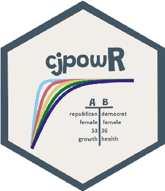

# Power Analysis for Conjoint Experiments∗

Julian Schuessler† Markus Freitag‡

First draft: December 15, 2020 This draft: December 16, 2020 Most recent version: Link

Abstract

Conjoint experiments aiming to estimate average marginal component effects and related quantities have become a standard tool for social scientists. However, existing solutions for power analyses to find appropriate sample sizes for such studies have various shortcomings and accordingly, explicit sample size planning is rare. Based on recent advances in statistical inference for factorial experiments, we derive simple yet generally applicable formulae to calculate power and minimum required sample sizes for testing average marginal component effects (AMCEs), conditional AMCEs, as well as interaction effects in forced-choice conjoint experiments. The only input needed are expected effect sizes. Our approach only assumes random sampling of individuals or randomization of profiles and avoids any parametric assumption. Furthermore, we show that clustering standard errors on individuals is not necessary and does not affect power. Our results caution against designing conjoint experiments with small sample sizes, especially for detecting heterogeneity and interactions. We provide an R package that implements our approach.

∗We would like to thank Alberto Stefanelli and Martin Lukac for constructive discussions. †PhD Candidate, Graduate School of Decision Sciences, Universit¨t Konstanz, Germany. E-Mail: julian.

schuessler@uni-konstanz.de. URL: http://julianschuessler.net/

‡Research Assistant, Geschwister-Scholl Institut fu¨r Politikwissenschaft, LMU Munich, Germany. E-Mail: markus.freitag@campus.lmu.de. URL: https://markusfreitag.netlify.app/.

## 1 Introduction

Since the seminal contribution of Hainmueller et al. (2014), conjoint experiments have become extremely popular among political scientists. One of their advantages is that they allow for estimating the effect of many attributes of, for example, a political candidate or a policy on average stated preferences without requiring large samples of individuals. They do so by concentrating on the “average marginal component effect” (AMCE) of an attribute level that averages over other attributes, and by letting respondents rate multiple profiles.

An increasing amount of conjoint experiments is pre-registered. Surprisingly, however, published studies and pre-analysis plans are almost entirely devoid of discussions about the appropriateness of the employed sample sizes. Evaluating statistical power prior to conducting a study is important for the credibility and replicability of later findings. Studies with low power are not only less likely to detect truly existing effects, but they also have higher Type S (incorrect sign) and Type M (overestimation of effect magnitude) error rates and, in sum, cumulate in a larger share of false positives in the published literature (Gelman and Carlin, 2014; Smaldino and McElreath, 2016).

Existing power calculations for conjoint studies based on simulation (Gall, 2020; Stefanelli and Lukac, 2020) are limited to non-interactive quantities, rely on causal models that make parametric and distributional assumptions, and often need multiple user inputs that are not reported in standard empirical analyses. Moreover, the computational burden – even with parallel computing – is not trivial, rendering integration into standard research practice difficult. Older approaches to power analysis for conjoint analysis (de Bekker-Grob et al., 2015; Rose and Bliemer, 2013) similarly rely on parametric models and are not suited for quantities routinely estimated in political science.

We here give simple, explicit, and general formulae for the required sample size, statistical power, and related quantities like Type M and Type S errors for arbitrarily large and complex conjoint experiments of the type that has become standard in political science. The only required input are the size of the AMCE or of the interaction effects in terms of regression coefficients that are routinely reported in published conjoint experiments. We provide an R package that implements our formulae and is easy to use.

Our approach relies on recent results for statistical inference in factorial experiments (Dasgupta et al., 2015; Lu, 2016; Mukerjee et al., 2018). Our resulting main assumptions are weak and hold in every conjoint study that we are aware of: Random sampling of individuals and/or randomization of the profiles. No further parametric or distributional assumptions on the causal model behind individual choices have to be made. Therefore, our approach is very general.

Among other things, our discussion makes it clear that, from a power analysis perspective, researchers need not pay attention to the sheer number of attributes. What instead matters are the number of levels for any given attribute and the associated effect sizes: The larger the number of levels and the smaller the expected effect size, the lower the power for a fixed N. Furthermore, we document that effect size conventions based on “Cohen’s d” are misleading in the context of conjoint experiments: A “small” Cohen’s d of 0.2 corresponds to a fairly large AMCE of 10 percentage points that, in our survey of published conjoints, less than a quarter of all estimates exceed. However, we find that most of our surveyed studies are powered to find small AMCEs of around 3 percentage points for their attributes with the most levels. Power for detecting differences in conditional AMCEs or attribute interactions is generally lower, and researchers should pay special attention to sample size requirements if they are interested in such inferences.

Our formulae do not incorporate the fact that conjoint experiments typically collect multiple observations per individual and that it is common practice in the empirical literature to cluster standard errors on the individual level. We show that this is actually not necessary and that our formulae are therefore generally valid, building on arguments by Abadie et al. (2017). When the interest is only in sample causal effects, standard errors need not be clustered for principled reasons. If the interest is in population inferences, clustering is warranted theoretically, but we put forth various analytical arguments for why it will make little difference practically in typical conjoint experiments. We reanalyze various conjoint studies and show that indeed clustering rarely changes standard error estimates: On average, non-clustered standard errors are merely 2% smaller than clustered standard errors. Therefore, we suggest that our simple power formulae have general appeal.

We start our expositions with a discussion of power and inference in simple randomized as well as factorial experiments. We then present our main formulae for AMCEs as well as interactions, followed by effect sizes and implied power in a survey of published conjoint studies, and a discussion of clustered standard errors.

## 2 Power in Simple Randomized and Factorial Experi-ments

Statistical power, the probability to reject a null hypothesis given the alternative is true, is a central concept to experimental planning in a frequentist framework. Even if one rejects the inferential approach of null hypothesis significance testing, power analysis, in a broader

sense of planning for precision, is of immense practical importance.1

It will be helpful to first consider statistical power analysis in the case of a randomized experiment with a binary treatment. This is because the analysis of conjoints can be recast as a series of regressions involving only one dummy variable for each separate level of an attribute. This will allow us later to derive simple power formulae borrowing from this case. Our explanation largely follows Imbens and Rubin (2015, ch. 6).

In the binary case, we have a randomized treatment Ti ∈ {0,1}, and associated potential outcomes Yi(1) and Yi(0), for each unit i in a sample of size N. For each unit, we only observe one potential outcome: Yi(1) if the unit is treated (Ti = 1), and Yi(0) if it is untreated (Ti = 0).

Usually, there are two possible quantities of interest. The first one is the average causal effect in the sample. The second is the average causal effect in the population from which the sample is drawn.

If the focus is on the sample causal effect, then estimation error comes from the fact that we only observe one half of all potential outcomes. However, since treatment is randomized, potential outcomes in both the treatment and the control groups are random samples from the distributions of Yi(1) and Yi(0). This means, first, that the difference in the average outcome between treated and controls is an unbiased estimator of the sample causal effect. Second, it implies that the variance of this estimator across randomizations is (Imbens and Rubin, 2015, eq. 6.3)

St2 Nt −

Stc2 N

Sc2 Nc

. (1)

+

var( ATEs) =

Here, Sc2,St2 are the variances of Yi(0) and Yi(1) in the sample, Stc2 is the variance of unit-level causal effects Yi(1)−Yi(0) in the sample, and Nc,Nt,N are the number of control, treated, and all units. The square-root of the variance is then the true standard error of the estimator.

The Sc2,St2 variances can be estimated in an unbiased fashion. Since unit-level causal effects cannot be observed, Stc2 cannot be consistently estimated. However, since it is a variance and therefore non-negative, a conservative (positively biased) estimator for the sampling variance is

1 N

s2c Nc

s2t Nt

var( ATEs) =

+

=

s2c P(T = 0)

+

s2t P(T = 1)

, (2)

where s2c,s2t are standard estimators of the respective variances. Samii and Aronow

1For Bayesian treatments of power and a priori design analyses, see e.g. (Kruschke and Liddell, 2018; Rubin, 1998; Wang and Gelfand, 2002).

(2012) established the equivalence of this “Neyman” estimator of the variance and the popular “White” heteroskedasticity-consistent (HC2) estimator based on a linear regression of observed outcomes on a treatment indicator.

If the focus is on population average causal effects, the estimation error comes from two sources: observing only a subset of individual potential outcomes and observing only a subset of all individuals in the population. The additional variance from drawing samples repeatedly is E[Stc2 ], i.e., the average sample variance of unit-level causal effects. Accordingly, equation 1 actually simplifies and the estimator in equation 2 becomes unbiased.

Recently, Dasgupta et al. (2015) and Mukerjee et al. (2018) have extended this perspective to factorial experiments, and Lu (2016) has shown that here too, randomization-based and robust regression-based variance estimators are equivalent. Since conjoint experiments are a variant of factorial designs, this can be seen as a justification of the widespread practice to use robust standard error estimators in the analysis of conjoints.

However, for assessing power, having unbiased or consistent estimators for causal effects and their sampling variances is not enough. We also need to approximate the sampling distribution of causal effect estimates. If sampling is at random from a larger population, it is well known that under relatively weak assumptions the sampling distribution of differencein-means or similar ordinary least squares estimators approaches a Normal distribution as N grows larger, with a variance-covariance matrix that can be consistently estimated by multivariate generalization of the estimator in equation 2. In practice, the more conservative t-distribution is often used. More recently, Li and Ding (2017) established similar results formally for randomization-based sample inference, including factorial experiments. Importantly, the validity of the Normal approximation to the sampling (or randomization) distribution does not hinge on assumptions about the normality of regression errors. Furthermore, the assumption of linearity (invoked by the OLS model) is without substance, because with discrete experimental treatments the regression model of interest can always be written as a linear regression. Accordingly, this approach is fully nonparametric.

Taken together, these results form the basis for our simple power formulae presented in the next section. So far, we have not paid attention to the fact that in conjoint experiments, observations may not be independent because observations are clustered on the individual. This would change the variance of the sampling distribution and thereby power calculations. We present analytical and empirical evidence that this is irrelevant for estimating standard quantities from conjoint experiments in section 5. Put shortly, this can be ignored because (forced choice) conjoints have no individual-level clustering under the sharp null of no causal effects, and more generally because the number of observations per individual is typically much smaller than the number of individuals (Abadie et al., 2017). Therefore, the next

section largely abstracts away from this issue.

## 3 Simple Formulae for Power Analysis for ConjointDesigns

We consider a standard forced-choice conjoint experiment with N effective observations, defined as the number of respondents times the number of individually assessed profiles J and the number of tasks T. We are randomizing various attributes, each of which has at least two levels. We are interested in determining a minimal sample size N as to detect an ACME of given size using a two-sided t-test with size (type I error rate) α and power (type II error rate) β.

Hainmueller et al. (2014) showed that as long as the levels are uniformly randomized and there are no profile-order and carryover effects, ACMEs can be consistenly estimated using a linear regression of the binary profile choice variable on dummy variables, each indicating a specific level of a specific attribute. We here make a slight simplification and consider separate regressions for each attribute. In large samples, the resulting point estimates will be the same, because attribute levels are randomized.

When one thinks about the analysis of conjoints as a series of simple regressions with one independent variable, it should be clear that the number of attributes does not affect power. This is because attributes are randomized independently from one another, and the AMCEs are simply averaging over all other attributes. This does not change if there is only one attribute or if there are arbitrarily many other attributes. However, note that there are cognitive limits to the number of attributes on the side of the respondents.2

Instead, what does affect power are the number of levels of a given attribute and their associated effect sizes. Each ACMEs for a certain level is a simple comparison of means between profiles that contained the reference level and those that contained the level of interest. If there are only two levels, each mean can be estimated using N2 observations. But if there are, say, 10 levels, each mean can only be estimated using 10N observations, which obviously will increase standard errors and thereby decrease power. Therefore, researchers should power their conjoint experiments not only for the attributes for which they expect the smallest effects, but also for the attributes which have the most levels (but not necessarily the smallest expected effects).

Having clarified the importance of paying attention to the number of levels of any given attribute, we now first discuss how to quantify power for AMCEs, and then discuss power

2Jenke et al. (2019) show that fatigue effects appear to be small with 10 attributes or less.

analysis for attribute interaction effects and conditional AMCEs.

### 3.1 Power Analysis for AMCEs

To quantify power precisely for any given attribute with a given number of levels, we can consider a simple regression on a dummy indicator Wijkl

Yijk = δ0 + δ1Wijkl + ijk, (3)

which is fit using a subsample of 2KN observations, where K is the number of levels, and P(Wijkl = 1) = P(Wijkl = 0) = 0.5 under uniform randomization. As discussed before, under weak assumptions, δ1 will be distributed Normally with variance at most

- 1

- 2KN

var(Yijk|Wijkl = 1) 0.5

var(Yijk|Wijkl = 0) 0.5

var( δ1) =

+

.

Furthermore, since Yijk is binary and the regression in equation 3 in fact describes the conditional mean, we obtain

- 1

- 2KN

(δ0)(1 − δ0) 0.5

(δ0 + δ1)(1 − (δ0 + δ1)) 0.5

var( δ1) =

+

.

This formula is attractive because it allows researchers to determine the variance of their estimates—and thereby their standard errors—for a given reference level and level of interest using only the sample size, number of levels, and two regression coefficients. We assume here that δ0 is 0.5, which maximizes the variance with respect to this coefficient, and is therefore a conservative choice. This leaves only the number of levels and δ1, i.e., the AMCE, as the user input.

This parameterization should make it much easier for researchers to assess plausible effect sizes a priori. Conventional power analyses often have effect sizes parameterized in terms of Cohen’s d. This measure of effect size is usually in units of the standard deviation of the outcome for the whole sample. Since the “grand mean”, P(Y = 1), of the outcome in the forced choice design is 0.5 by construction (Leeper et al., 2020), this standard deviation also equals P(Y = 1)(1 − P(Y = 1)) = √0.52 = 0.5. Therefore, a very large AMCE of 0.2 (20 percentage points) would translate to a Cohen’s d of 00..25 = 0.4, which is usually called a “medium effect size”. Similarly, a “small” effect size of d = 0.2 actually requires a fairly large ACME of 0.1. This may lead researchers to overestimate their power: Believing they are powering their sample for a “small” d which actually responds to a large ACME. Our approach avoids this problem. When assessing effect sizes of published conjoints in section

- 4, we provide some guidance on how to specify plausible ranges of effect sizes.

For determining the required sample size to detect an AMCE of given size, we need to use the Normality of the estimates. Then, for δ1, α and power κ, one can adapt standard power formulae (Armitage et al., 2002, 140) and solve for N as

(z1−α

+ zκ)2 δ12

(δ0 + δ1)(1 − (δ0 + δ1)) 0.5

(δ0)(1 − δ0) 0.5

K 2

+

. (4)

N =

2

Here, z1−α

and zκ are quantiles of the standard Normal distribution.

2

Figure 1 plots the minimum sample size (effective N) function and power function for selected design parameters. The functional relationships for Type S error and the expected Type M error (”exaggeration ratio”) are also visualized and can easily be derived analytically (Lu et al., 2019). For reasonably powered designs, Type S error is neglible. On the other hand, even for well-powered conjoints, slight overestimation (Type M error) will likely be present. As Figure 1 illustrates, overestimation can be severe for low sample sizes and/or small effect sizes.

- Figure 1: Viszulaizing the minimum required sample size, power, Type S and E[Type M error] for selected design parameters.

|| | | | | | |
|---|---|---|---|---|---|
| | | | | | |
| | | | |Levels: 5| |
| | | | | | |
| | | | | | |
| | | | | | |
| | | | | | |
  10 k  20 k  30 k  40 k  50 k  60 k  0.02 0.03 0.04 0.05 0.06  AMCE  MinimumEffectiveSampleSize  Power  0.7 0.8 0.9  | | | | | |
|---|---|---|---|---|
| | | | | |
| | | | | |
| | | | | |
| | | | |AMCE: 0.05|
  0.25  0.50  0.75  1.00  0 5 k 10 k 15 k 20 k 25 k 30 k  Effective Sample Size  Power  Levels  2 4 6 8 10  | | | | | | |
|---|---|---|---|---|---|
| | | | | | |
| | | | | | |
| | | | | |Levels: 5|
|1| | | | | |
| | | | | | |
  2.5  5.0  7.5  10.0  0 5 k 10 k 15 k 20 k 25 k 30 k  Effective Sample Size  ExaggerationRatio  AMCE  0.01 0.02 0.03 0.04 0.05  | | | | |
|---|---|---|---|
| | | | |
| | | | |
| | | | |
| | |Levels: 5| |
| | | | |
  0.0  0.1  0.2  0.3  0.4  0 5 k 10 k 15 k 20 k 25 k 30 k  Effective Sample Size  TypeSError  AMCE  0.01 0.02 0.03 0.04 0.05|
|---|

### 3.2 Power Analysis for Interaction Effects and Conditional AM-CEs

It is known that testing for interaction effects often requires much larger sample sizes than testing for average effects. Using similar reasoning as before, we can analyze power in this case using a simplified regression model for two binary attributes l,m:

Yijk = δ0 + δ1Wijkl + δ2Wijkm + δ3WijklWijkm + ijk, (5)

Again, this is a saturated model and therefore equal to the conditional mean function, and one can think of the regression error as containing additional independently randomized attributes. If both attributes l,m indeed have only two levels, then the model uses the whole sample of size N. In general, for total number of levels Kl,Km associated with these attributes, one effectively uses 4KN

lKm observations, which again negatively impacts on power for higher number of total levels.

Note that although we use similar notation as before, the interpretation of the regression coefficient changes. δ0 now refers to the probability to choose a profile when both attributes are set to 0 (the reference level). δ1 is the effect of switching attribute l from 0 to 1, while keeping attribute m to 0. δ2 is the corresponding effect for attribute m, leaving l at 0, and δ3 describes the interaction effect of attributes l and m.

When the interest is in conditional AMCEs (instead of attribute interaction), e.g., effects in subgroups defined on individual-level pre-treatment covariates such as gender or partisanship, researchers almost always fit models that are equivalent to the one in 5, where the second variable Wijkm is the non-randomized covariate. If this covariate is binary, the regression remains correctly specified. The interpretation of the coefficients changes: δ3 does not describe the causal interaction between two attributes, but instead heterogeneity in the causal effect of the randomized attribute Wijkl as a function of the covariate. δ2 now describes differences in what Leeper et al. (2020) call “marginal means” (e.g., gender differences in profile choices when the attribute is randomized to the reference level).

In the case of attribute interaction, required sample sizes for testing δ1 and δ2 can be determined by the previous formula for the AMCE, multiplying the sample size by the number of levels of the other attribute (under uniform randomization). This is because inference on, e.g., δ1 uses only the data for fixed values of the other attribute. When the other attribute has two levels, estimates for δ1 use one half of the total sample; when it has three levels, only one third, etc.

In the case of conditional AMCEs or attribute interactions with non-uniform randomization, sample sizes for testing δ1 can be similarly obtained by multiplying the required sample

1 P(Wijkm = 0)

size by

, where P(Wijkm = 0) is the known or estimated marginal distribution of the other attribute or pre-treatment covariate.3

Furthermore, we can derive an explicit power formula for the interaction coefficient δ3. Again, under weak regularity conditions, estimates for this effect will be approximately Normally distributed. We also note that in both the attribute interaction and the conditional AMCE case, testing δ3 is equivalent to testing for differences in the slope of a treatment in two independent groups, and the fact that the grouping indicator in the conditional AMCE case varies only on the individual level is not relevant for calculating standard errors. The required minimum sample size then becomes (see VanderWeele (2012) for a similar derivation)

where

(z1−α

+ zκ)2 δ32

KlKm 4

n =

2

A p00

B p10

C p01

D p11

, (6)

A = δ0(1 − δ0) B = (δ0 + δ1)(1 − (δ0 + δ1))

C = (δ0 + δ1 + δ2)(1 − (δ0 + δ1 + δ2)) D = (δ0 + δ1 + δ2 + δ3)(1 − (δ0 + δ1 + δ2 + δ3))

and p00 = P(Wijkl = 0,Wijkm = 0),p10 = P(Wijkl = 1,Wijkm = 0), etc. One can recognize that using this notation, the variance of the AMCE in the previous section is proportional to A + B.

If the interest is in causal interaction and uniform randomization is employed, then p00 = p10 = p01 = p11 = 0.25 by design. If the interest is in conditional AMCEs, then researchers have to estimate the marginal distribution of the pre-treatment covariate, e.g., using prior studies. The resulting joint probabilities are then simply the product of the marginal covariate distribution and the treatment distribution because the treatments are independent from the covariate.

One can further conservatively assume that δ0 = 0.5 and that δ1 = δ2 = 0, and then only needs to input the hypothesized value of the interaction effect δ3, the number of levels for each of the two attributes (or of the attribute and the covariate), as well as the desired power

3In the case of conditional AMCEs, estimating sample sizes required for testing δ2 (the difference in “marginal means”) is not as straightforward, because the corresponding regressor does only vary across individuals, not across profiles. Therefore, clustering becomes an issue (again, see section X for why clustering is not an issue for the effects of profile attributes). Since researchers are rarely directly interested in δ2, we here do not pursue this further.

and alpha level. Therefore, this formula too is as close as possible to quantities routinely reported in the analysis of conjoints.

Figure 3 shows that the sample size requirements are substantially larger when AMCIEs are of interest.

- Figure 2: Viszulaizing the minimum required sample size, power, Type S and E[Type M error] for selected design parameters in the case of AMCIEs.

|| | | | | | |
|---|---|---|---|---|---|
| | | | | | |
| | | | |Levels: 3x2| |
| | | | | | |
  50 k  100 k  150 k  0.02 0.03 0.04 0.05 0.06  AMCE  MinimumEffectiveSampleSize  Power  0.7 0.8 0.9  | | | | | | |
|---|---|---|---|---|---|
| | | | | | |
| | | | | | |
| | | | | | |
| | | | |AMCI|E: 0.05|
  0.25  0.50  0.75  1.00  0 10 k 20 k 30 k 40 k 50 k  Effective Sample Size  Power  Levels  2x2 3x2   3x3 4x2   | | | | | | | |
|---|---|---|---|---|---|---|
| | | | | | | |
| | | | | | | |
| | | | | |Levels: 3x2| |
|1| | | | | | |
| | | | | | | |
  2.5  5.0  7.5  10.0  0 10 k 20 k 30 k 40 k 50 k  Effective Sample Size  ExaggerationRatio  AMCE  0.01 0.02 0.03 0.04 0.05  | | | |
|---|---|---|
| | | |
| | | |
| | | |
| | |Levels: 3x2|
| | | |
  0.0  0.1  0.2  0.3  0.4  0 10 k 20 k 30 k 40 k 50 k  Effective Sample Size  TypeSError  AMCE  0.01 0.02 0.03 0.04 0.05|
|---|

veSampleSize

er

## 4 How Large are Effects in Conjoint Experiments?

To get an impression of the magnitudes of published AMCEs, we look at a sample of 15 highly cited forced-choice conjoint experiments. The median of published AMCEs in this sample lies at ca. 0.05 (see Figure 3), 40% of the AMCEs lie below 0.038 and 25% below 0.020, while 75% lie below 0.087.

Even if one analyzed a larger and more representative sample, one should note that such a broad meta-analysis does not give a very good impression of the true range of effect sizes. First, conjoint experiments are employed to study many different research questions and effect sizes for substantially different treatments may not be comparable even if a similar

#### Figure 3: Density plot of AMCEs in 15 highly cited forced-choice conjoint experiments(N = 258).

Density

10.0

| | | | | | | | | |
|---|---|---|---|---|---|---|---|---|
| | | | | | | | | |
| | | | | | | | | |
| | |Median| | | | | | |
| | | | | | | | | |

7.5

5.0

2.5

0.0

0.00 0.05 0.10 0.15 0.20 0.25 0.30 0.35

AMCE

experimental design is employed. Second, there likely exists publication bias and, therefore, looking at effect sizes at a meta-level overestimates the true quantities.

Thus, in line with Gelman and Carlin (2014), we advise to additionally rely on literature reviews or other prior information from previous studies – summarized, for instance, in a subject specific quantitative meta-analysis – when estimating plausible ranges of effect sizes.4 If little or weak prior information is available, broad meta-averages (c.f. Stefanelli and Lukac, 2020) provide at least rough bounds.

To descriptively inspect the effect sizes for which the 15 studies are powered, we calculated the minimum detectable effects (MDE) for the attribute with the highest number of levels using the reported sample size (at a power level of β = 0.8 and an alpha-level of α = 0.05; see Table 1). Furthermore, we calculated MDEs for an interaction effect between the attribute with the highest number of levels and another binary attribute (or a binary subgroup). As most conjoint experiments are interested in at least some binary subgroup effect, such interaction is a plausible quantity for which all studies should be sufficiently powered. Assuming uniform randomization of this second two-level attribute or the attribute to constitute an evenly distributed binary subgroup, the MDEs for this interaction are twice as large as the MDEs for the AMCEs.

Although the underlying true effects are unkown and subject specific, the relatively large MDEs for interactive quantities hint that these studies are potentially under-powered in this regard. Therefore, researchers should be careful when investigating sub-group or interaction

4For expample, two recent meta-analyses review candidate-choice conjoint experiments with respect the effects of gender and corruption (Incerti, 2020; Schwarz and Coppock, 2020).

hypotheses for which no formal design analysis was carried out as the power implications can be severe (see Section 3.2).

Table 1: MDEs (AMCE & levelsmax×2-level AMCIE) for 15 highly cited conjoint experiments (at β = 0.8, α = 0.05 using Neff of the respective paper).

MDEAMCE Paper levelsmax Neff MDEAMCIE

- 1 0.044 Hainmueller et al. (2014) 7 13960 0.088
- 2 0.013 Bansak et al. (2016) 8 178740 0.026
- 3 0.035 Teele et al. (2017) 4 12450 0.071
- 4 0.024 Mummolo and Nall (2017) 7 48088 0.048
- 5 0.023 Hankinson (2018) 4 30190 0.046
- 6 0.027 Ballard-Rosa et al. (2017) 6 32000 0.054
- 7 0.052 Auerbach and Thachil (2018) 3 4350 0.103
- 8 0.025 Horiuchi et al. (2020) 7 44000 0.050
- 9 0.025 Ha¨usermann et al. (2019) 3 18730 0.050
- 10 0.026 Bechtel et al. (2017) 6 34594 0.052
- 11 0.075 Jilke and Tummers (2018) 3 2088 0.149
- 12 0.049 Oliveros and Schuster (2018) 3 4844 0.098
- 13 0.017 Bechtel et al. (2019) 5 68000 0.034
- 14 0.041 Hobolt et al. (2020) 7 16350 0.082
- 15 0.040 Adams et al. (2020) 4 10015 0.079

## 5 Why Standard Errors Need Not Be Clustered

Following Hainmueller et al. (2014), it has become standard to compute clustered standard errors in the analysis of conjoint experiments. They advocate this because “these standard errors are valid for population inference when errors in potential outcomes are correlated within clusters (i.e., respondents)” (p. 17). However, Abadie et al. (2017) show that this is very common view is wrong: within-cluster correlations of residuals are neither necessary nor sufficient for clustered standard errors to differ from non-clustered ones. And, perhaps more importantly, even if they do differ this alone does not mean that they should be preferred.

Instead, Abadie et al. (2017) propose two substantive considerations that may lead to the necessity to compute clustered standard errors:

- 1. One uses clustered random sampling and is interested in population inferences (as suggested by Hainmueller et al., 2014), or
- 2. Treatment is cluster-randomized

As discussed before, researchers may or may not be interested in population inferences. If they are, the first consideration would indicate the need to compute clustered standard errors. We note, however, that due to non-response or opt-in sampling, almost no sample in the social sciences is a truly randomized sample of individuals. Accordingly, one would at the very least take a model-based perspective to then justify the computation of standard errors (Pfeffermann and Rao, 2009).

The second consideration is moot in the analysis of conjoint experiments: Treatments are randomized at the profile level, the lowest unit of observation, and not on the individual level. This implies that standard errors for AMCEs or attribute interaction effects need not be clustered when the interest is only in sample causal effects. When it comes to conditional AMCEs as a function of individual-level covariates like gender or partisanship, the latter may be considered fixed attributes in a randomization inference framework (because the sample is fixed). Therefore, they do not contribute to the variance of estimates across hypothetical rerandomizations, and this too indicates that standard errors not need not be clustered on individuals.

Accordingly, the only valid substantive justification to cluster standard errors in conjoint experiments (in the framework of Abadie et al., 2017) would be an interest in population inferences. But even then, it may still not be the case that clustered standard errors actually differ from non-clustered ones. Abadie et al. (2017) show that what matters here is that there is a non-zero within-cluster correlation of the product of treatment and residuals.

For each of the 95 AMCE estimates in our 8 studies, we compute robust standard errors and compare them to clustered standard errors. The differences are miniscule: On average, robust standard errors are merely 2% smaller than clustered standard errors. In over 97% of the cases, the relative difference is less than 10%. Finally, in 25% of the cases clustered standard error estimates are actually smaller than robust estimates.

Why do clustered standard errors differ by so little? As mentioned before, this is due to a small within-individual correlation of treatment and residuals Abadie et al. (2017). To see why such a small correlation may be prevalent in conjoints, consider a nonparametric structural model for the choice of individual i regarding profile j:

Yij = α + βijXij + ij. (7)

Here, as before, Xij is a binary treatment indicator for the presence of a certain level in contrast to a reference category. The causal effect βij varies as a function of both the individual and the profile. It varies as a function of the profile because of the other attributes that are left implicit here. It varies as a function of the individual insofar as some individuals

care more or less about the attribute level Xij relative to the reference level.

Now, consider first the case of no causal effects where βij = 0 for all i,j. In this case, the model reduces to the estimable regression

Yij = α + ij. (8)

Since in the forced-choice design one half of of all profiles has to be picked, we have α = 0.5. Furthermore, the distribution of ij looks exactly the same for each individual i because every individual also has to pick exactly 50% of all profiles. Every individual is effectively randomizing his or her choice of profiles, at least with respect to the attribute of interest Xij. Therefore, there is no within-individual correlation of regression residuals with the treatment and clustered standard errors will approximately equal non-clustered standard errors.

This discussion also indicates that individual-level clustering only appears through the variance in βij across individuals i. We suspect that the variance in βij induced by other randomized attributes j swamps this variance across individuals and that therefore clustered standard errors make little difference. Put differently, additional profiles compared by an individual add crucial information because the task will look very different from previous comparisons.

A related argument on why clustering might not matter is put forth in Abadie et al. (2017). They show analytically that the difference between robust and clustered standard errors depends on the probability of selecting units within a cluster.5 In the case of conjoint experiments, this refers to the fraction of profiles of all possible profiles that an individual sees. It is only when this probability is large and when the number of profiles per individual is large relative to the number of individuals that clustered standard errors differ from nonclustered ones (Abadie et al. 2017, Proposition 1). Of course, in conjoints neither of these conditions typically holds: It is an advantage of conjoints that individuals only need to see a tiny fraction of all possible profiles, and the number of profiles per individuals is typically smaller than the number of individuals by a factor of at least 100.

We note that while residuals within a task are heavily dependent (because choosing one profile necessarily means that the other one is not chosen), clustering on tasks will be even less likely to make a difference because the number of observations per cluster (task) is just 2.

We conclude that the only valid justification for using clustered standard errors is an explicit focus on population inferences, but that researchers can expect clustering to make

5In their notation, this is PUn.

little difference in typical conjoint experiments. This supports the general validity of our power formulae for choosing sample sizes.

## 6 Summary

In this paper, we have derived simple yet very general formulae to determine power, required sample size, and related quantities for forced-choice conjoint designs that are extremely popular among social scientists.

Although our simple formulae cover the large majority of use-cases, conjoint experiments are a methodologically thriving field of research and recent studies expanded towards assessing effect heterogeneity more thoroughly with quantities other than AMCIEs and simple subgroup effects (e.g. Abramson et al., 2020). For such enterprises, closed-form solutions of quantities for a priori design analyses may not readily be available. Therefore, tailor-made simulation approaches seem to be a promising approach.6

6For instance, (Abramson et al., 2020, p. 29ff.) assess several properties of their proposed machine learning algorithm and could easily expand this to error rates.

## References

Abadie, A., S. Athey, G. W. Imbens, and J. Wooldridge (2017). When should you adjust standard errors for clustering? Technical report, National Bureau of Economic Research.

Abramson, S., K. Kocak, A. Magazinnik, and A. Strezhnev (2020). Improving Preference Elicitation in Conjoint Designs using Machine Learning for Heterogeneous Effects. pp. 52.

Adams, J., S. Weschle, and C. Wlezien (2020). Elite interactions and voters’ perceptions of parties’ policy positions. ... Journal of Political Science.

Armitage, P., G. Berry, and J. N. S. Matthews (2002). Statistical methods in medical research (4th. ed.). Blackwell Science.

Auerbach, A. and T. Thachil (2018). How clients select brokers: Competition and choice in India’s slums. American Political Science Review.

Ballard-Rosa, C., L. Martin, and K. Scheve (2017). The structure of American income tax policy preferences. The Journal of Politics.

Bansak, K., J. Hainmueller, and D. Hangartner (2016). How economic, humanitarian, and religious concerns shape European attitudes toward asylum seekers. Science.

Bechtel, M., F. Genovese, and K. Scheve (2019). Interests, norms and support for the provision of global public goods: The case of climate co-operation. ... journal of political science.

Bechtel, M., J. Hainmueller, and ... (2017). Policy design and domestic support for international bailouts. European Journal of ....

Dasgupta, T., N. S. Pillai, and D. B. Rubin (2015). Causal inference from 2 k factorial designs by using potential outcomes. Journal of the Royal Statistical Society: Series B: Statistical Methodology, 727–753.

de Bekker-Grob, E. W., B. Donkers, M. F. Jonker, and E. A. Stolk (2015). Sample size requirements for discrete-choice experiments in healthcare: a practical guide. The PatientPatient-Centered Outcomes Research 8(5), 373–384.

Gall, B. J. (2020). Simulation-based power calculations for conjoint experiments.

Gelman, A. and J. Carlin (2014, November). Beyond Power Calculations: Assessing Type S (Sign) and Type M (Magnitude) Errors. Perspectives on Psychological Science 9(6), 641–651.

Hainmueller, J., D. J. Hopkins, and T. Yamamoto (2014). Causal inference in conjoint analysis: Understanding multidimensional choices via stated preference experiments. Political analysis 22(1), 1–30.

Hankinson, M. (2018). When do renters behave like homeowners? High rent, price anxiety, and NIMBYism. American Political Science Review.

Ha¨usermann, S., T. Kurer, and ... (2019). The politics of trade-offs: Studying the dynamics of welfare state reform with conjoint experiments. Comparative Political ....

Hobolt, S., T. Leeper, and J. Tilley (2020). Divided by the vote: Affective polarization in the wake of the Brexit referendum. British Journal of Political Science.

Horiuchi, Y., D. Smith, and T. Yamamoto (2020). Identifying voter preferences for politicians’ personal attributes: A conjoint experiment in Japan. Political Science Research and

.... Imbens, G. W. and D. B. Rubin (2015). Causal inference in statistics, social, and biomedical sciences. Cambridge University Press.

Incerti, T. (2020, August). Corruption Information and Vote Share: A Meta-Analysis and Lessons for Experimental Design. American Political Science Review 114(3), 761–774.

Jenke, L., K. Bansak, J. Hainmueller, and D. Hangartner (2019). Using eye-tracking to understand decision-making in conjoint experiments. Political Analysis.

Jilke, S. and L. Tummers (2018). Which clients are deserving of help? A theoretical model and experimental test. Journal of Public Administration Research ....

Kruschke, J. K. and T. M. Liddell (2018, February). The Bayesian New Statistics: Hypothesis testing, estimation, meta-analysis, and power analysis from a Bayesian perspective. Psychonomic Bulletin & Review 25(1), 178–206.

Leeper, T. J., S. B. Hobolt, and J. Tilley (2020). Measuring subgroup preferences in conjoint experiments. Political Analysis 28(2), 207–221.

Li, X. and P. Ding (2017). General forms of finite population central limit theorems with applications to causal inference. Journal of the American Statistical Association 112(520), 1759–1769.

Lu, J. (2016). On randomization-based and regression-based inferences for 2k factorial designs. Statistics & Probability Letters 112, 72–78.

Lu, J., Y. Qiu, and A. Deng (2019). A note on Type S/M errors in hypothesis testing. British Journal of Mathematical and Statistical Psychology 72(1), 1–17.

Mukerjee, R., T. Dasgupta, and D. B. Rubin (2018). Using standard tools from finite population sampling to improve causal inference for complex experiments. Journal of the American Statistical Association 113(522), 868–881.

Mummolo, J. and C. Nall (2017). Why partisans do not sort: The constraints on political segregation. The Journal of Politics.

Oliveros, V. and C. Schuster (2018). Merit, tenure, and bureaucratic behavior: Evidence from a conjoint experiment in the Dominican Republic. Comparative Political Studies.

Pfeffermann, D. and C. R. Rao (2009). Sample surveys: design, methods and applications. Elsevier.

Rose, J. M. and M. C. Bliemer (2013). Sample size requirements for stated choice experiments. Transportation 40(5), 1021–1041.

Rubin, D. B. (1998). Sample Size Determination Using Posterior Predictive Distributions. pp. 16.

Samii, C. and P. M. Aronow (2012). On equivalencies between design-based and regressionbased variance estimators for randomized experiments. Statistics & Probability Letters 82(2), 365–370.

Schwarz, S. and A. Coppock (2020). What Have We Learned About Gender From Candidate Choice Experiments? A Meta-analysis of 67 Factorial Survey Experiments. pp. 40.

Smaldino, P. E. and R. McElreath (2016, September). The natural selection of bad science. Royal Society Open Science 3(9), 160384.

Stefanelli, A. and M. Lukac (2020). Subjects, Trials, and Levels: Statistical Power in Conjoint Experiments. pp. 29. Working Paper.

Teele, D., J. Kalla, and F. Rosenbluth (2017). The ties that double bind: Social roles and women’s underrepresentation in politics. Available at SSRN 2971732.

VanderWeele, T. J. (2012). Sample size and power calculations for additive interactions. Epidemiologic methods 1(1), 159–188.

Wang, F. and A. E. Gelfand (2002, May). A simulation-based approach to Bayesian sample size determination for performance under a given model and for separating models. Statistical Science 17(2), 193–208.

## A Appendix

### A.1 R package: cjpowR

In order to make our simple formulae available in a user-friendly way, we provide a simple yet extensive R package to calculate power, minimum required sample size (effective N), Type S and the expected Type M error for forced-choice conjoint experiments. The package and the source code can be downloaded from GitHub. Alternatively, the package can be installed in R using:

if(!require(devtools)) install.packages("devtools") library(devtools) devtools::install_github("m-freitag/cjpowR")

In its current development version, the package consists of three functions. cjpowr_amce() and cjpowr_amcie() return a data.frame -object holding, depending on the user inputs, the calculated minimum required sample size or power along with the Type S and the expected Type M Error. For convenience, if a sample size is provided, power is calculated, whereas

if power is provided, the minimum required sample size is put out. Further, the effect size, the number of levels, the α-level and, in the case of differences in conditional AMCEs, the treatment probabilities have to be provided.

For instance,

library(cjpowR) cjpowr_amce(amce = 0.05, power = 0.8, levels = 5, alpha=0.05)

gives the minimum required effective sample size as well as the Type S Error and the exaggeration ratio given specified parameters. The functions can be manipulated to calculate the desired outputs for ranges of parameters (e.g. ranges of effect sizes).

For example, an interactive exaggeration curve for a 3 × 4 level AMCIE can be easily generated using:

# Due to the iterative calculation , vectorizing the functions is # recommended when calculating curves only for the exaggeration

ratio # given other parameters. The number of iteration steps can be # decreased using the "sims" parameter.

cjpowr_amcie_vec <- Vectorize(cjpowr_amcie)

d <- expand.grid(delta3 = c(0.01, 0.02, 0.03, 0.05), n = seq(from = 100, to = 50000, length.out = 1000))

df <- t(cjpowr_amcie_vec(delta3 = d$delta3, n = d$n, sims = 10000, levels1 = 3, levels2=4, alpha = 0.05, delta0 = 0.5))

df <- data.frame(df)

df[] <- lapply(df, unlist)

# Interactive plot library(plotly)

plot_ly(df, x = ˜n, y = ˜exp_typeM , type = ’scatter’, mode = ’lines’

, linetype = ˜delta3) %>% layout(

xaxis = list(title = "Effective Sample Size", zeroline = F,

hoverformat = ’.0f’),

yaxis = list(title = "Exaggeration Ratio", range = c(0,10), zeroline = F, hoverformat = ’.2f’), legend=list(title=list(text=’<b> AMCIE </b>’)), hovermode = "x unified"

)

#### To facilitate plotting and inspection, cjpowr_plotly() provides a convenience function to create interactive power curves. For more information, readers are referred to the package documentation.

