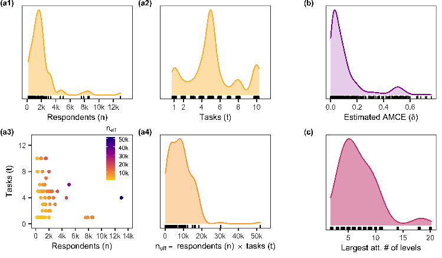
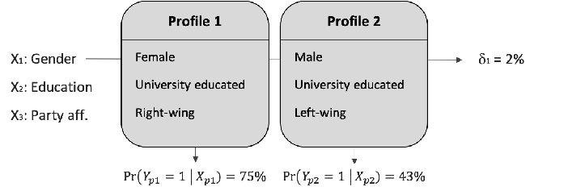
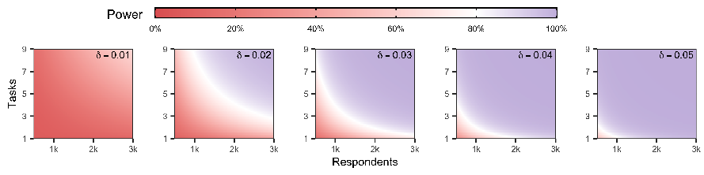
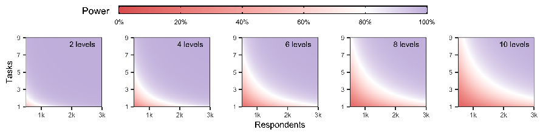
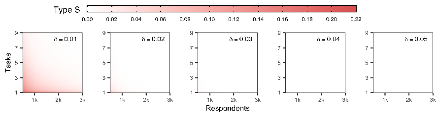
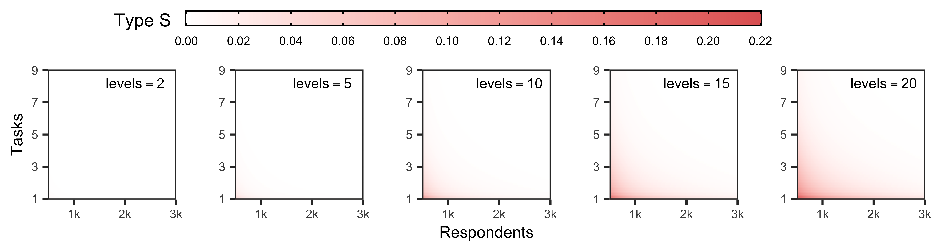
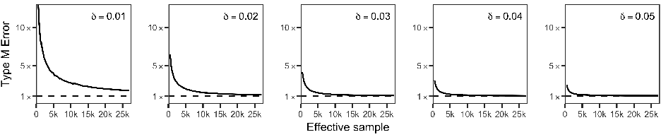
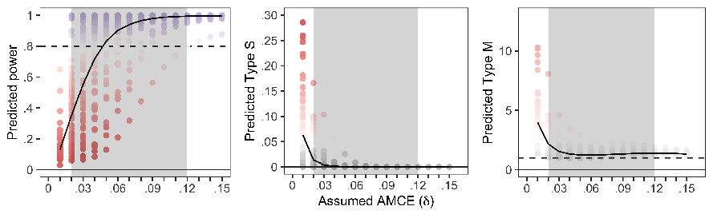

# Subjects, Trials, and Levels: Statistical Power in Conjoint Experiments∗ Alberto Stefanelli†& Martin Lukac‡

##### Abstract

Despite the importance of power analysis for survey-experimental techniques, power considerations are often disregraded in the design of conjoint experiments. The main goal of this article is to provide rigorous guidance on how the number of experimental conditions, trials, and subjects impact the statistical power of conjoint experiments. To this end, we first conducted an extensive literature review to gauge the experimental designs typically employed in conjoint studies and the plausible effect sizes discovered in the literature. Using the information gather from the literature review, we explore the statistical properties of a wide range of commonly employed designs using a simulation-based framework that employs a flexible data generating model. Results show that—even with relatively large sample size and the number of trials—conjoint experiments are not well suited to draw inferences for designs with large numbers of experimental conditions (> 15) and relatively small effect sizes (< 1000). Based on our simulation results, we develop a web application that can be used by researches to perform a priori power analysis and hence achieve adequate design for future conjoint experiments.

∗A previous version of the manuscript can be found on SocArXiv. The authors would like to thank Mirjam Moerbeek, Juraj Medzihorsky, Constantin Manuel Bosancianu, Bruno Castanho Silva, and Levente (Levi) Littvay for the constructive criticism of the manuscript.

†Alberto Stefanelli is an FWO Ph.D Fellow at the Institute for Social and Political Opinion Research, KU Leuven. Email: alberto.stefanelli@kuleuven.be

‡Martin Lukac is a Fellow in Computational Social Science at London School of Economics and Political Science, London. Email: martin.lukac@kuleuven.be

## 1 Introduction

“Since statistical significance is so earnestly sought and devoutly wished for by behavioral scientists, one would think that the a priori probability of its accomplishment would be routinely determined and well understood.”

— Jacob Cohen (1962)

Research in the domain of political science and public policy has long been interested in the reasons that lead individuals to choose one candidate, party, or policy over another. One of the main characteristics of such decision-making processes is that the available options vary on multiple dimensions. While traditional survey experiments remain constrained to examining only one or two factors (see Gaines, Kuklinski, and Quirk 2007), conjoint experiments allow the investigation of multiple experimental characteristics in a single design. For such reason, in the past few years, conjoint survey experiments have started to be extensively used in the social and behavioral sciences, especially among political scientists (Bansak et al. 2021).

Despite the popularity of conjoint studies, researchers often disregard one of the most fundamental tools for designing experiments: power analysis (Cohen 1962). Power analysis consists of assessing the probability of successfully rejecting the null hypothesis when it is false. In other words, it can be used to estimate the required sample size to detect an effect of a given size with a certain degree of confidence and precision. Power analysis also reduces the chances of obtaining false-positives or exaggerated findings (Gelman and Carlin 2014). The difficulty in replicating some experimental studies or the emergence of contradictory results in the literature are caused—inter alia—by under-powered experimental designs (Open Science Collaboration 2015; Maxwell 2004). The reason is that studies with low power are more likely to yield large and significant effects that are due to random fluctuations alone. Finally, a priori power analysis can save costs by cautioning against over-powered designs with a much higher number of respondents (and, thus, higher costs) than necessary for discovering the hypothesized effect.

Since the publication of the seminal paper by Hainmueller, Hopkins, and Yamamoto (2014), the wrong assumption that conjoint experiments are less sensitive to power constraints has become a common belief among researchers. Scholars have argued that conjoint designs “free us from the power constraints that limit traditional factorial experiments” (Kertzer, Renshon, and Yarhi-Milo 2019, 7) and solve key problems in experimental research such as “the trade-off between statistical power and the desire to employ many experimental conditions” (Knudsen and Johannesson 2018, 2). This is further complicated by the fact that calculating the required minimal sample size for a conjoint experiment is not a trivial exercise. Conjoint experiments typically involve the use of multiple treatments, repeated tasks, and paired vignette designs

which add a layer of complexity to the analysis of statistical power with respect to the trade-off between the number of experimental conditions, the number of tasks that each respondent shall undertake, and the required sample size.

This article contributes to the literature on conjoint experiments by developing a general framework for calculating power for conjoint experiments using simulation techniques (Arnold et al. 2011; Astivia, Gadermann, and Guhn 2019). Specifically, this manuscript provides guidance concerning (a) the required sample size—given as a combination of the number of respondents and the number of tasks assigned to each respondent—and (b) the maximum number of conditions—i.e. levels—used in the experiment. Our results show that—even with relatively large samples and number of trials—conjoint experiments are not suited to draw inferences for experiments with relatively small effect sizes and large number of experimental conditions. Specifically, the precision of the estimated effects rapidly decreases for designs with relatively small sample sizes (< 1000) and trials (<3) or with a high number of levels (> 15) that find small but statistically significant effects (< 0.03). To aid the design of conjoint studies, we developed a web application for sample size calculation for a variety of popular conjoint designs. The application is built using the Shiny package (W. Chang et al. 2017) in the R programming language (R Core Team 2019), can be accessed on any device with an internet browser, and requires no programming knowledge to use (Lukac and Stefanelli 2020). The procedure to calculate statistical power and design error rates for conjoint designs using the designed software is demonstrated in the Appendix. In addition, we release an open-source package in the R programming language to simulate and calculate power for more complex conjoint designs (e.g. multiple groups) and/or less common sampling procedures (e.g. two-stage sampling).

In what follows, we lay out the methodology and the findings of an extensive literature review that summarises the most common conjoint designs used in the social and behavioural sciences. Next, we discuss the conceptualisation of the assumed data generating process and the setup of a series of simulations that explore the statistical properties of the most commonly used causal quantity of interest that is used to analyse conjoint data (Hainmueller, Hopkins, and Yamamoto 2014). We then outline our results, focusing on the conventional measure of power analysis (Cohen 1962) and design measures of Type S (sign) and Type M (magnitude) error rates (Gelman and Carlin 2014). We interpret our findings in light of the current conjoint literature. We do so by performing a post hoc power analysis for the studies included in our literature review using a wide range of assumed population effects. We conclude with a few suggestions for future research on conjoint experiments in the social and behavioural sciences.

## 2 Literature review

Conjoint analysis is a survey-experimental technique that aims at estimating respondents’ preferences using a series of profiles that vary across multiple attributes. Initially proposed in mathematical psychology (Luce and Tukey 1964) and further developed in marketing (see Green and Rao 1971) under the name of “stated choice methods” or “factorial surveys”, conjoint experiments have been recently adopted by political and social scientists thanks to the work of Hainmueller, Hopkins, and Yamamoto (2014). The dramatic increase in popularity in the approach proposed by Hainmueller, Hopkins, and Yamamoto (2014) is related to its relative simplicity and statistical advantages (de la Cuesta, Egami, and Imai 2022). Compared to other types of discrete choice experiments that resort on functional form assumptions (Rose and Bliemer 2014, for an overview), the authors propose a fully randomized paired conjoint design and a new statistical approachthe average marginal component effect (AMCE, hereinafter also referred to as δ)—that has the advantage of decomposing treatment effects non-parametrically. Using the potential outcomes framework, the AMCE can be seen as the causal effect of shifting one attribute of a profile on the probability of choosing that profile while averaging over the distribution of the other profile attributes. For example, the AMCE can be interpreted as the change in probability of choosing a profile when the profile’s attribute “gender” changes from “male” to “female”.

Despite their growing popularity, designing a conjoint experiment is not a trivial task. Compared to traditional survey experiments, conjoint applications present a relatively large number of design choices. In addition to sample and effect size considerations, experimentalists need to decide on the number of attributes (the features of the profiles, such as the gender of a hypothetical candidate), the number of levels of such attributes (the values of that attributes can take, such as male or female), and the number of tasks (the number of profile choices a respondent will undertake). In order to understand how conjoint experiments are conducted in political science, we carried out an extensive literature review focusing on each of these design considerations. The data collection left us with a total of 59 articles from 2014 to 2020. Although the list is not exhaustive of the entire conjoint literature, it provides relevant insight into how conjoint experiments are designed and implemented in political science and neighbouring disciplines1.

The literature review yielded the results in Figure 1. The median sample size in the reviewed articles is equal to 1583 respondents (25th percentile: p25 = 1020 and 75th percentile: p75 = 2144) with approximately 5 tasks per respondents (p25 = 4 and p75 = 6). Panel (a3) in Figure 1 shows that the number of respondents and tasks are used as substitutes, and studies with a low number of respondents tend to compensate with a higher

1The complete list of journals and articles together with the coding procedure are reported in the Appendix.

Figure 1: Literature review analysis

number of tasks given to each respondent. The sample size (neff = number of respondents (n) × number of tasks (t)) used for the analysis ranged widely between 200 and 52000 (p25 = 3171 and p75 = 11000). The median number of attributes is 7 (p25 = 6 and p75 = 8) and seems to follow what is recommended by recent literature on satisficing in conjoint experiments (Bansak et al. 2019; Jenke et al. 2020). The median of the number of levels for the biggest attribute is 6 (p25 = 4 and p75 = 9). The median AMCE is equal to 0.05 (p25 = 0.025 and p75 = 0.12). The 25th percentile of the significant AMCEs is and 0.049, the median is 0.09, and the 75th percentile is 0.16. This means that about 25% of the significant AMCEs lie between

- 0.005 (the minimum) and 0.049 and 50% of the effects are below 0.09. The median of the insignificant AMCEs is 0.02 (p25 = 0.01 and p75 = 0.03). These results indicate that a large portion of effects found in conjoint experiments are relatively small. Only 40% of the reviewed studies employed a probability-based representative sample while the rest relied on a convenience sample (usually stratified by gender, education, and other relevant census variables)2.

## 3 Methods

Previous research on sample size requirements for conjoint experiments is slim and fails to provide accurate guidance for designing conjoint experiments (Orme 1998; J. J. Louviere et al. 2000; Rose and Bliemer 2013).

2We initially planned to also collect data on t and p values associated with the AMCEs. However, in many of the sampled articles, no regression tables were available and we had to resort to the visual inspection of dot-and-whisker plots to approximate the AMCE effect size.

The few works on the topic do not directly focus on the approach proposed by Hainmueller, Hopkins, and Yamamoto (2014) and typically disregard the number of attributes and levels included in the design (e.g., J. J. Louviere et al. 2000; Rose and Bliemer 2013). In addition, current literature provides no indications of the impact of design choices on the probability of an estimate being biased upward or downward (the Type M error) or being in the wrong direction (the Type S error). The only exception is Schuessler and Freitag (2020) who employ parametric techniques from traditional discrete choice experiment to derive minimal sample size for conjoint experiments. However, their approach cannot be easily expanded to accommodate more complex designs, do not distinguish between the number of respondents and the number of trials, and omits the cluster structure typically found in conjoint designs.

Therefore, this work aims at developing a flexible simulation-based framework based on the approach proposed by Hainmueller, Hopkins, and Yamamoto (2014) that accommodates a vast range of design choices and ensures that they are adequate for drawing accurate inferences. In addition to the derivation of the minimal required sample size given the number of respondents and experimental conditions, our approach adds to the existing literature by providing guidance on the exchangeability between respondents and repeated tasks. In applied research, this can be used to obtain useful insights on whether designs with low number of respondents who fulfil a large number of tasks is as good as having a larger number of respondents who perform just a few tasks. Given a range of pre-specified effect sizes, we also allow researchers to easily adjust the degree of confidence of the estimated parameters and, thus, directly evaluate the trade-off between the false-positive and false-negative. Lastly, given the flexible nature of our data generating process, our simulation can be easily modified to accommodate more complex theoretical scenarios or sampling strategies. For instance, effect heterogeneity can be included to perform power calculations when researchers anticipate that two or more groups of respondents have substantially different preferences towards some of the attributes included in the design (e.g., Kirkland and Coppock 2018).

### 3.1 Data generating process

In order to estimate the power for a wide range of conjoint experimental designs, we formulate an underlying data generating model that tackles the limitations of the previous research while being sufficiently flexible to accommodate the various designs used in practice. Results of our analysis are, as always, conditional on the match between the true data generating model and the model chosen for estimation. Our goal is to determine the minimum sample size requirements that yield a well-powered design to uncover a non-zero population effect. We start from a simple conceptual model of conjoint decision making and sequentially expand the model to its final shape.

Starting with a hypothetical example of a conjoint in Figure 2, any choice-based conjoint experiment consists of profiles, e.g. two candidates that a respondent can choose from (selection of a profile is denoted as Yp

= 0 when a profile is not selected). These profiles systematically differ in a set of attributes (denoted as X = {X1,...,Xk}); in our example, gender, level of education, and political leaning are considered attributes. Each of the k attributes has a number of l levels. For example, the attribute representing the candidate’s gender (X1) contains two levels: female and male (X1 ∈ {Female,Male}).

= 1, while Yp

1

1

Figure 2: A hypothetical conjoint experimental task

Based on previous research (see, Jenke et al. 2020; Meißner and Decker 2010), we assume that respondents form the probability of selecting a profile in two complementary ways. Respondents make within-attribute comparisons—i.e. attribute by attribute. In our example, a respondent slightly preferring female candidates over males, would increase the probability of selecting Profile 1 over Profile 2 after seeing that the former contains a female, while the latter a male candidate. Then, they move to the evaluation of the second attribute, and so forth. At the same time, respondents form an underlying latent probability of selecting a profile, which we call within-profile decision-making. A respondent would evaluate profiles sequentially and individually, forming a probability of selecting each profile given its attributes. In our stylized example, given the attributes in Profile 1 (Xp

), the respondent would choose this profile with a probability of 75%, and given the attributes in Profile 2 (Xp

1

), the respondent would choose this profile with a probability of

2

43%. The probability that a profile would be selected over another randomly chosen profile is therefore defined as Pr(Yp

are the attributes of the profile: e.g. Profile 1 has attributes X1 = “Female”, X2 = “University educated”, X3 = “Right-wing”. Importantly, the within-profile selection probability is expected to be consistent with the within-attribute causal effects. However, what we are interested in when analysing conjoint experiments are not the within-profile and attribute effects but, rather, the AMCE of each attribute included in the design, while controlling for all other attributes. In terms of data generating process, we cannot generate the AMCEs directly since these latent underlying probabilities do not sum to

= 1|Xp

), where Xp

1

1

1

- 1. This prevents us from immediately form an expectation about profile selection. One of the approaches, identified by Gall (2020), proposes the following: start with a 50% probability of selecting either of the profiles and adjust this probability by the causal effect divided by two (for two profile alternatives): e.g. the probability of selecting Profile 1 given its gender (assuming δ1 = 2%) would increase to 51% = 50% + 2%/2. This adjustment guarantees that the resulting probabilities sum to 1.

Despite the validity of this approach, our aim is to produce a model that is flexible to any number of attributes or levels and is not dependent on the input of the researcher. To this end, we combine selection probabilities into one number to run a Bernoulli trial on the selection in a hypothetical conjoint experiment. We are not interested in Pr(Yp

), i.e. the probability of choosing a profile given its attributes, but rather in Pr(Yp

= 1|Xp

1

1

), the probability of choosing Profile 1, given the attributes of Profile 1 and Profile 2. As can be seen, Pr(Yp

= 1|Xp

,Xp

1

1

2

), hence, fulfils the condition of summing to 1. We solve this by transforming individual probabilities to odds ratios in the following equation:

= 1|Xp

) = 1 − Pr(Yp

= 1|Xp

,Xp

,Xp

1

1

2

2

1

2

- odds P1

- odds P2

OR(P1 vs. P2 |Xp1,Xp2) =

Pr(Yp

) Pr(Yp

= 1|Xp

1

1

) Pr(Yp

= 0|Xp

=

1

1

) Pr(Yp

= 1|Xp

2

2

= 0|Xp

)

2

2

(1)

In a subsequent step, we transform OR(P1 vs. P2 |Xp1,Xp2)—the odds of selecting Profile 1 over selecting Profile 2, given attributes of both profiles—back to probability with the following equation:

Pr(Yp

1

OR(P1 vs. P2 |Xp1,Xp2) 1 + OR(P1 vs. P2 |Xp1,Xp2)

= 1|Xp1,Xp2) =

(2)

= 1|Xp1,Xp2) is the probability of selecting Profile 1, given the attributes of Profile 1 and Profile 2. Finally, we can simply generate the outcome variable of a hypothetical conjoint experiment as a random draw from a Bernoulli distribution with p = Pr(Yp

The resulting probability Pr(Yp

1

= 1|Xp1,Xp2). Compared to the previous approaches (e.g. Gall 2020), our method can be used to generate data for a vast range of designs and can be easily modified to include more complex theoretical scenarios. Furthermore, sample size considerations resulting from the results of our simulation are in line with previous work on factorial experiments (e.g., van Breukelen and Candel 2012; J. J. Louviere et al. 2000), confirming the general validity of the proposed data generating process.

1

### 3.2 Model for conjoint experiments

In order to simulate the data for power analysis, we need to design a statistical model that yields the main input into the previous section: Pr(Yp

= 1|Xp1), namely the probability of selecting a profile given its attributes. We assume that the probability of choosing a profile is a linear combination of levels (i.e. treatments) shown in the profile (see also Jordan. J. Louviere 2015). We use a linear probability model3 to define Pr(Yp

1

= 1|Xp1), as is commonly done in applications that use the Hainmueller, Hopkins, and Yamamoto

1

(2014) framework. The model is formulated as

Pr(Yp

1

= 1|Xp1) = β0 +

βklXkl (3)

k (l−1)

where β0 is the intercept—the probability of selecting a profile that has attributes corresponding to the reference categories of all attributes, and βkl is the treatment effect of level l of variable k, relative to the reference category (one category is always omitted as a reference, denoted by l − 1 under the summation).

We have to take an additional step and constrain the generated selection probabilities from the linear probability model to make sure we get valid probabilities bounded between 0 and 1. Although the limit is commonly placed at [0, 1], to overcome problems in Eq. 1 due to division by 0 we use an arbitrary clip at [0.001, 0.999]:



0.999 β0 + k (l−1) βklXkl > 0.999 β0 + k (l−1) βklXkl β0 + k (l−1) βklXkl ∈ [0.001,0.999] 0.001 β0 + k (l−1) βklXkl < 0.001



Pr(Yp

= 1|Xp1) =

(4)

1



In the final step of constructing the data generating process for the simulation, we extend the structural model (Eq. 3 and Eq. 4) by including random effects (Train 2009). This allows for the possibility of treatment heterogeneity across respondents. By treatment heterogeneity, we mean that each respondent can have underlying characteristics that impact the probability of choosing one profile given its attributes and levels. Such respondent-specific characteristics can be observed (e.g. ethnicity, gender, age or political preference of the respondent) or unobserved (i.e. questions non included in the survey) and can take various functional forms. For the purposes of this analysis, we use a normally distributed random effect for each of the βkl nested within respondents indexed by j:

3Using a logistic function to generate the data is a viable alternative and the simulation model can be extended in that direction. The linear probability model with imposed minimum and maximum is, however, a good approximation of the logistic function and offers the benefit of inputting effects into the simulation in percentages. This corresponds to the intuitive interpretation of the AMCE, which can also facilitate understanding of our tool in the applied research community.

Pr(Yp

1

= 1|Xp1) = β0 +

βkljXkl

k (l−1)

βklj = γkl0 + uklj uklj = N(0,Σ)

(5)

where γkl0 is a slope constant with respondent-level deviations uklj and Σ is a variance-covariance matrix with σ12...σk2(l−1) on the diagonal and zeroes elsewhere4.

### 3.3 Setup and evaluation of the simulation

The simulation is set up with the experimental conditions shown in Table 1. The experiment was performed using a full factorial design with a final number of 2520 conditions (8×5×7×9) and 1000 runs per condition. We fixed the number of profiles to 2 as it is common for conjoint experiments that follow Hainmueller, Hopkins, and Yamamoto (2014). The number of attributes is also kept constant. This is because, by design, the AMCE (δ) represents the causal effect of a single profile attribute while marginalizing over all the other attributes included in the design. Consequently, the number of attributes has no substantial impact on power calculations for common conjoint experiments with orthogonal attributes (Hainmueller, Hopkins, and Yamamoto 2014). It is also worth noting that in forced conjoint experiments the AMCE (δ) represents the probability change of choosing one profile given its attributes and not the standard deviation of the outcome from the sample average (standardized effect size), such as the commonly used Cohen’s d5.

Parameter Values Variable

Respondents 500, 750, 1000, 1250, 1500, 1750, 2000, 3000 Tasks 1, 3, 5, 7, 9 Levels 2, 3, 4, 5, 10, 15, 20 Effect size δ (AMCE) 0.01, 0.02, 0.03, 0.04, 0.05, 0.10, 0.15, 0.20, 0.25

Constant

Profiles 2 Attributes 5

Treatment heterogeneity σk 0.02 Significance level α 0.05

Table 1: Simulation inputs

Regarding the evaluation criteria of the simulation, we define statistical power as the probability to detect

- 4With this formulation, we explicitly add nesting of trials within individuals, where each attribute and level has its respondent-specific error term. This provides a simple model that allows heterogeneity across treatments and potential expansions to simulate the presence of unobserved (even categorical) subgroups with significantly different treatment effects. This assumes that the random effects are mutually uncorrelated, however, it can be expanded by adding covariances of error terms and sampling from a multivariate normal distribution instead.
- 5There is a functional relationship between Cohen’s d and AMCE. In paired conjoint design with 2 profiles, the latent probability of choosing a profile is always, by design, 50%. Consequently, an AMCE of .1 corresponds to a Cohen’s d of ..15 = .2

a non-zero population effect for a binary hypothesis test where H0 : µ = 0 and H1 : µ ̸= 0. This is equal to the probability that a statistical test will correctly reject the null hypothesis (H0) when it is false in the population6. We assume that the test statistic follows a normal distribution Z|µ,σ ∼ N(µ,σ2) given σ > 0. The key idea is that the significance level α is given as Pr(|Z| > zα|H0), hence the result is considered significant (we reject the H0) if the estimated effect surpasses some two-sided critical threshold value. Under a non-zero µ, the power function is p = Pr(reject H0|H1 is true) or, specifically, Pr(|Z| > σzα|µ).

The use of power analysis with emphasis solely on null hypothesis significance testing can be severely limiting in social sciences. Gelman and Carlin (2014) suggest extending this analysis to design calculations that evaluate the probability of an estimate being in the wrong direction (the Type S error) and the factor by which the magnitude of an effect might be overestimated (the Type M error). Subsequent studies have demonstrated the immediate advantages of using these measures in empirical research (Lu, Qiu, and Deng 2019). For a non-zero µ, we define:

- • Probability of a Type S error is given by s = Pr(Z < 0|µ,|Z| > σzα). In words, this is a probability that an estimated significant effect will carry an opposite sign than the population parameter.
- • Expected Type M error is given by m = E[|µˆ| µ,|Z| > σzα]/µ. Essentially, Type M quantifies the factor by which the estimated effect might overshoot the true population parameter and, hence, lends itself also an intuitive interpretation as exaggeration ratio.

Based on the recommendation in the literature, we use clustered standard errors to calculate all three quantities (Arceneaux 2005). Nevertheless, since our simulation procedure fixes the treatment heterogeneity between respondents σk = 0.02, we are unable to test scenarios where respondent-level deviations uklj are more pronounced. Further research should investigate the minimum number of respondents needed to benefit from the cluster robust variance matrix estimator’s asymptotic properties.

## 4 Results

In conjoint experiments, power depends on several features: the sample size, number of tasks performed by each respondent, the number of levels of an attribute, and the size of the measured effect in the population. Moreover, power depends on a decision criterion based on the trade-off between a false-positive, typically

- 6In the context of multi-dimensional experiments many different outcomes are measured and hence many different treatment

effects can be estimated. This issue and its implications for statistical testing are often addressed through multiple testing corrections (i.e. Tukey’s test). Despite being relevant also in the context of conjoint experiments, this issue is out of the scope of this article and should be addressed in future research.

referred to as Type I error (α), and a false-negative, typically referred to as Type II error (β). In our work, we adopt an a priori perspective; our goal is to achieve a pre-specified desirable power level, given a decision on α. In line with what is commonly accepted by the research community, we consider a power of 0.80 satisfactory with an α of 0.05 and β of 0.20.

### 4.1 Sample size: respondents and tasks

In traditional experiments that rely on simple statistical tests (e.g. t-test), researchers usually obtain the desired power by assuming an effect size that they aim to discover—based on the substantial knowledge and theory or previous empirical work—the decision criterion (α), and use an analytical equation that yields the required sample size. Alternatively, researchers can design an experiment to be powered to discover an effect of at least some pre-specified size. Conjoint experiments, similar to other factorial designs, add another layer of complexity due to their repeated nature: it is necessary to choose not only the number of respondents but also the number of trials that each respondent performs. Previous studies on cluster randomized trials (e.g., van Breukelen and Candel 2012) (number of clusters versus cluster size), longitudinal intervention studies (e.g., Moerbeek 2011) (number of subjects versus number of measures per subject) and toxicity studies (e.g., M. Chang and Chow 2006) (number of dose levels versus number of subjects per dose level) suggest that the number of subjects has a larger impact on power considerations. However, as shown in the literature review, the number of trials are often used as a substitute for respondents in conjoint studies. As no simple mathematical relationship for this trade-off exists, it is not clear how they affect the expected power of a conjoint experiment.

Figure 3: Effect of sample size—number of respondents and tasks—on statistical power for different assumed AMCEs (δ). Shown values reflect a design with 2 levels (l = 2).

- Figure 3 indicates that the statistical power of the AMCE is a function of (a) the number of respondents, (b) the number of trials completed by each respondent, and (c) the true effect size. We first focus on the total sample size used for the analysis, which is obtained by multiplying the number of trials by the number

of respondents (neff = n × t). To ease the interpretation, we hold the number of levels constant at l = 2. For an effect size of δ = 0.01—meaning shifting a profile’s attribute from A to B increases the propensity of choosing a profile by 1 percentage point—we do not reach the conventional power threshold of 0.80 in any of the simulated conditions. For an effect of δ = 0.03, our simulation shows that some combinations of sample size (n) and the number of trials (t) of approximately neff = n × t = 10,000 observations are required to achieve a well-powered design. To achieve desirable power levels for a hypothesised effect size of δ = 0.05, relatively small samples are required: a sample of approximately 1,000 individuals who complete 2 tasks is sufficient to provide a well-powered design neff = n×t = 2000. Lastly, with large effect sizes of δ ≥ 0.10, our simulation shows that conjoint experiments reach the conventional power threshold with relatively small samples (n = 300) and a low number of tasks (e.g. t = 2). This finding underlines how—even with relatively large sample sizes and the number of trials—conjoint experiments are not suited to draw inferences for experimental conditions with relatively small effect sizes.

Next, we focus on the trade-off between the number of respondents (n) and trials (t). Our results reveal that the trade-off between respondents (n) and the number of trials (t) follows an exponential distribution. For an average effect of δ = 0.05 in experiments with n = 500 that aim to keep the assumed statistical power above 0.80, each additional task corresponds to approximately 800 respondents. For designs with n = 1000, our simulation shows that each additional task corresponds to approximately 2200 respondents. This means that the impact of an additional conjoint task marginally diminishes for each additional respondent in the sample. This finding is in line with previous literature on randomized trials and confirms that for designs with a lower number of respondents, more tasks are required to keep the assumed statistical power above 0.80. In other words, having 500 respondents complete 10 tasks is not as good as 5000 respondents completing only 1 task. These indications can be used by researchers to decide on the number of tasks to include in an experiment given a fixed number of respondents. For instance, if a researcher is interested in effect sizes of δ =≥ 0.05 and can collect data from a sample between 500 and 1000 respondents, doubling the number of tasks each respondent complete is about as good as doubling the sample size.

### 4.2 Number of levels

Another point of interest in calculating the statistical power of a conjoint experiment is the required sample size given the number of levels of the biggest attribute included in the design. In other words, how many levels can be included in the design given the number of respondents and the number of trials to keep the assumed statistical power above 0.80. Research on factorial designs has shown that the higher the number of levels, the lower the power, keeping the sample size constant (e.g., Dziak, Nahum-Shani, and Collins

2012). However, contrary to more traditional experimental designs, conjoint studies typically include a disproportionately higher number of levels per attribute that may lead to severely under-powered designs. To gauge the impact of including different numbers of levels in a conjoint experiment, we fix the effect size to δ = 0.05 and observe the trade-off between the number of levels and the achieved power threshold.

- Figure 4: Effect of number of levels (l) of the largest attribute on statistical power. Shown values assume a true AMCE (δ) = 0.05.

In line with previous considerations, Figure 4 reveals that the required sample size increases as the number of levels included in a conjoint experiment increases. A design that includes at most a dichotomous attribute (l = 2) reaches the required power with 3 tasks distributed across 1,000 respondents (assuming δ = 0.05). On the contrary, using an attribute with 5 or more levels (l ≥ 5), the same number of respondents and trials would yield a clearly under-powered experimental design. This observed pattern arises due to the increase of the number of experimental conditions of the full factorial design for each additional level included in the design and, consequently, in the information gained from each observed choice. Intuitively, this is due to a lower number of respondents being treated with each level, hence requiring a higher number of respondents or trials to achieve the same precision7.

By varying the number of levels, the simulation reveals another layer of complexity to optimize for when aiming at obtaining reliable estimates of population parameters with conjoint experiments. Although collapsing categories into a smaller number of levels may be a quick solution, it might not be an option for some research questions that aim at assessing the effects of many different categories. For example, the experiment by Hainmueller and Hopkins (2015) exploring the effect of country of origin on preference to be admitted as an immigrant in the U.S. had no option but to include a wide range of countries to explore the landscape of the U.S. immigration. Instead of using countries, the authors could have used continents or other larger geographical units. However, it can be argued that biases against citizens of certain countries are

- 7In comparison, when one or more additional attributes are added to the design, the sample size requirements change very

little or not at all, as long as the smallest expected effect size does not change, and the number of levels of the new attribute does not exceed the largest number of levels of the biggest attribute included in the experiment. This is due to the fact that—since the attributes are uncorrelated by design—the AMCE estimator marginalizes over the categories of all the other attributes included in the experiment.

not fully reflected in biases toward their respective continents and the other way around. In such contexts, the trade-off between the number of levels and statistical power is a crucial step in the design of conjoint experiments.

### 4.3 Type S and Type M errors

As we have shown in the previous paragraphs, traditional power analysis focuses on the probability that we correctly reject the null hypothesis when a specific alternative hypothesis is true. However, even when we find a statistically significant effect, a possibility that the discovered effect is biased remains present: the estimated effect can either have the opposite sign than the true effect (Type S error) or can be systematically exaggerated (Type M error). As shown in previous research, if the statistical power is high enough, neither the direction nor the magnitude of the effect size is problematic (Gelman and Carlin 2014). However, when an experiment does not reach adequate power (i.e. ≤ 0.80), the probability that the estimated effect sign is incorrect or the magnitude is biased increases substantially.

Our results highlight that, in addition to statistical power, Type S and Type M error rates are considerably important for conjoint experimental designs. In line with previous literature on the topic, in our simulation Type S errors occur more frequently when experiments are under-powered. Results in Figure 5 show that the rate of Type S error spikes when both the sample used for the analysis (neff = n × t) is small and when the true effect size is relatively low (0.01 ≤ δ ≤ 0.02). On the contrary, when population effects are larger (δ ≥ 0.03), Type S errors are infrequent.

- Figure 5: Type S error rates for different assumed AMCEs (δ). Shown values reflect a design with 2 levels (l = 2).

Similarly to statistical power, Type S error rate is also affected by changing the number of levels in a conjoint design. Results in Figure 6 show that in terms of keeping Type S error at bay, an attribute with a large number of levels (l ≥ 15) can be as demanding for sample size as searching for an exceptionally small effect (δ ≤ 0.02). Assuming a large true effect size (δ = 0.05), a common design with more than 15 levels and

a relatively low sample carries a substantial risk (more than 10%) of concluding the estimated effect is correct when—in fact—has the opposite sign compared to the true population effect. Given the relatively small magnitudes of estimated effects and the large number of levels employed in the reviewed conjoint literature, this has an immediate impact on our ability to replicate some of the findings provided by conjoint experiments. Furthermore, these false findings can also serve as statistical evidence against perfectly valid theories.

- Figure 6: Effect of number of levels (l) of the largest attribute on Type S error rates. Shown values assume a true AMCE (δ) = 0.05.

Another concern for conjoint experiments is the Type M error—exaggeration ratio. Type M error is defined as the ratio of the absolute value of the estimated AMCE and the true effect size when the AMCE is found to be statistically significant. It is a measure of the expected systematic bias of the AMCE estimate, given the experimental design. Figure 7 reveals that Type M error is especially pronounced for small samples that find statistically significant effects mostly due to random fluctuations. The results show that conjoint experiments with small samples are likely to grossly overestimate small and potentially inconsequential effects. Specifically, an effect size of δ = 0.01 estimated with a relatively small sample size (n ≤ 3000 and t ≤ 3) is, on average, likely to overestimate the true effect between 3- to 10-times (see Figure 7).

Figure 7: Type M error rates by sample size (neff) for different assumed AMCEs (δ).

### 4.4 Retrospective power analysis

A priori design considerations are not the only scenario where researchers incorporate information derived from past studies. Researchers can also explore whether statistically significant non-null effects discovered in the literature change depending on the plausible size of the underlying effect or in relation to particular design choices (Gelman and Carlin 2014). In this case, the question is whether the designs commonly employed in the conjoint literature are appropriate to find the expected, unbiased, and statistically significant effects. To this end, we performed a retrospective power analysis for the conjoint studies included in our literature review. Since the estimated effects found in the literature review are potentially biased, retrospective power has been calculated for each study based on a range of assumed true AMCEs (0.01 ≤ δ ≤ 0.15).

Figure 8: Retrospective statistical power, Type M and Type S error rates.

In Figure 8, we calculated statistical power, Type S, and Type M error rates for the studies collected in the literature review across a range of assumed AMCEs. Each study is represented by a set of points—one point for each assumed AMCE. Results suggest that a substantial portion of the reviewed conjoint designs are under-powered for a range of assumed AMCEs. For true effect sizes that are equal or smaller than 0.03 (δ ≤ 0.03), almost all of the designs employed in the reviewed conjoint literature are inadequate: on average, 89% of the conjoint studies under review would be considered under-powered. Among these, there is, on average, a 3% probability that a significant effect carries a wrong sign and the estimated effect is, on average, 2.5-times larger than the true effect. Passing to a true effect size between 0.03 ≤ δ ≤ 0.06, 34% of the conjoint studies included in the literature review are considered under-powered. In this case, Type S error rate virtually drops to zero, while the average expected exaggeration factor is 1.2-times the true effect. For effect sizes that are between 0.06 ≤ δ ≤ 0.09, only 9% of the reviewed designs would be considered under-powered, with, on average, zero Type S error rate and an expected exaggeration factor of 1.3-times the true effect. Finally, for effect sizes δ ≥ 0.09, almost all reviewed studies seem well-powered, again with zero Type S error rate and exaggeration rate of 1.3-times the true effect. In other words, the majority

of used conjoint designs in the literature are well-powered to discover assumed AMCE of δ ≥ 0.09, where the overestimation of the magnitude of the effect is likely to be small and the direction of any statistically significant estimate is likely to have a correct sign.

In the literature review, we reported that the median estimated AMCE is δp

= 0.05, ranging between δp

50

= 0.12 in its quartiles (grey area in Figure 8). Although it is likely that some of these estimates are biased due to low power, we take them as effects that have made it through peer-review in the publication process, hence effects of this size are likely of interest to the research community. Assuming researchers want to discover effects of this size, our simulation shows that the currently used designs may prove insufficient: about one-third of the studies that we examined do not have sufficient power to discover effects of this size and are more prone to errors of sign and magnitude compared to designs recruiting larger samples or asking respondents for more trials.

= 0.025 and δp

25

75

## 5 Discussion

Our study shows that researchers need to be careful in designing conjoint experiments. We ran an extensive series of simulations to assess the required sample size for a wide range of experimental designs typically used in the conjoint literature. In line with conventional understanding, we show that statistical power grows with larger samples—be it by recruiting a larger number of respondents or adding another trial for each respondent. We also bring evidence that the statistical power of a conjoint experiment decreases with higher numbers of levels of the largest attribute. Nevertheless, contrary to the widespread understanding, conjoint experiments require a substantial sample size to discover commonly sought small effects, especially for designs with high numbers of levels.

Our results also show that underestimating the required sample can lead to biased and even opposite estimated effects. For each design included in the simulation, we assessed the probability that the estimated parameter has an incorrect sign (Type S error) and how biased (exaggerated) it is compared to the true effect (Type M error). We find that Type S and Type M errors are especially pronounced for experimental designs with relatively small sample sizes (neff = n × t ≤ 3000) or high numbers of attribute levels (l ≥ 10) trying to estimate relatively small effects (δ ≤ 0.03). This indicates that for a wide range of commonly discovered AMCEs, the designs typically employed in conjoint studies are under-powered and thus are likely to result in biased estimates, both in terms of direction and magnitude. This finding should raise caution in the context of the replication crisis in psychology (Open Science Collaboration 2015). Even though conjoint experimental designs utilize samples much larger than psychological experiments, the relatively high number

of attributes-levels used in conjoint experiments can nevertheless result in designs with insufficient statistical power.

More in general, our study supports the idea that disregarding power considerations for experimental designs can have serious consequences for theory building and testing since it might lead researchers to pay attention to the wrong experimental factors or undermine relevant and valid theories. Consequently, designing conjoint experiments that maximize the chances of discovering the true effect and avoid inferential errors is important to avoid the publication of exaggerated results that are unlikely to be scientifically replicated. With this in mind, we used the simulation results to estimate a predictive model that can be used by applied researchers to make sense of trade-offs associated with the expected number of respondents, trials, and levels8. We also release an open-source R package to enable researchers to investigate the trade-offs associated with statistical power in more complex scenarios such as the presence of two or more subgroups of respondents, multi-stage sampling, or when individual-level heterogeneity is expected to be more pronounced.

All in all, our study demonstrates that power analysis is a useful tool in designing a conjoint study. That being said, we have omitted a substantial part of analysing conjoint experiments: interaction effects (see Egami and Imai 2018). First, an interaction may be hypothesised between two experimental attributes in determining the probability of choosing a profile (for example, gender interacting with education in Figure 2). Second, the effect of an experimental attribute might differ based on some respondent’s characteristics—for example, the effect of party affiliation in a conjoint profile being influenced by respondent’s party identification (e.g., Kirkland and Coppock 2018). This type of interaction is usually called subgroup analysis and it is used to assess if treatment effects are significantly different across observed (Leeper, Hobolt, and Tilley 2019) or unobserved (Goplerud, Imai, and Pashley 2022) subgroups of respondents.

Although the standards for power analysis of interaction effects are not well defined in the literature, some guidance is provided by Gall (2020) and Schuessler and Freitag (2020). For both types of interaction effects, the minimum required sample size for a well-powered conjoint experiment rapidly increases. The functional relationship between interaction effects and power is partially revealed when we look at the relationship between the sample and the effect size. In the case of an interaction between two experimental attributes, it is common to find that an interaction alters the size, rather than the direction, of an existing attribute effect. In such cases, the required minimum sample size could double, triple, or even quadruple based on the effect of the moderator. When using subgroup analysis (interacting an attribute with respondents’ characteristics or splitting the sample by respondent-varying covariates), the sample size decreases as a function of the

8The web application is available at https://mblukac.shinyapps.io/conjoints-power-shiny/ and its source code at https: //github.com/mblukac/conjoints-power-shiny.

number of groups included in the analysis—for example, splitting the sample by gender of the respondent (distributed as 50% female and 50% male), the sample used for estimating the effect within each subgroup is half of the original sample. Furthermore, when respondents belong to an unequally observed group (e.g., 70% female and 30% male respondents) the sample size used to estimate the effect for the male subgroup is substantially lower. This will be reflected in larger standard errors and subsequently lower power to obtain a significant result of a non-null effect. These examples show that the minimum required sample can increase drastically depending on both the size of the interaction effect and the number and size of the groups included in the analysis.

We also suggest caution regarding new estimators that have been recently proposed. Though they tackle important limitations of the conjoint design, they often lack insight on minimal sample size requirements. For example, Ganter (2019) proves that the AMCE is not well suited to answer preference-related questions since it is influenced not only by the preference of the respondent on a given attribute but also by how the attributes are distributed in the population of interest (see also Abramson, Koçak, and Magazinnik 2019). As such, the author proposes a new estimator—the average component preference (ACP)—that decomposes the AMCE into an effect of preference and effect of composition (how are attributes distributed). This new quantity of interest then estimates the causal effect of an attribute X by looking only at profiles that differ in the levels of that attribute (only profiles where Xkp1 ̸= Xkp2). Although this approach allows for practical effect decomposition, it sacrifices a substantial part of the sample since two profiles are compared only if they have the same attribute level. In terms of statistical power, removing profiles that match on attribute levels leads to a substantial reduction in the number of observations used to estimate the treatment effects, and, thus, to an increase in the required sample size to achieve adequate power. By all means, we encourage future research into interaction effects and sample size considerations in conjoint experiments.

## 6 Bibliography

Abramson, Scott F, Korhan Koçak, and Asya Magazinnik. 2019. “What Do We Learn About Voter Preferences From Conjoint Experiments?” August, 37. https://scholar.princeton.edu/sites/default/files/ kkocak/files/conjoint_draft.pdf.

Arceneaux, Kevin. 2005. “Using Cluster Randomized Field Experiments to Study Voting Behavior.” The Annals of the American Academy of Political and Social Science 601 (1): 169–79. https://doi.org/10. 1177/0002716205277804.

Arnold, Benjamin F, Daniel R Hogan, John M Colford, and Alan E Hubbard. 2011. “Simulation Methods to Estimate Design Power: An Overview for Applied Research.” BMC Medical Research Methodology 11

(1). https://doi.org/10.1186/1471-2288-11-94.

Astivia, Oscar L. Olvera, Anne Gadermann, and Martin Guhn. 2019. “The Relationship Between Statistical Power and Predictor Distribution in Multilevel Logistic Regression: A Simulation-Based Approach.” BMC Medical Research Methodology 19 (1). https://doi.org/10.1186/s12874-019-0742-8.

Bansak, Kirk, Jens Hainmueller, Daniel J. Hopkins, and Teppei Yamamoto. 2019. “Beyond the Breaking Point? Survey Satisficing in Conjoint Experiments.” Political Science Research and Methods, 1–19. https://doi.org/10.1017/psrm.2019.13.

Bansak, Kirk, Jens Hainmueller, Daniel J Hopkins, and Teppei Yamamoto. 2021. “Conjoint Survey Experiments.” In Advances in Experimental Political Science, edited by James N. Druckman and Donald P. Green, 36.

Breukelen, Gerard J. P. van, and Math J. J. M. Candel. 2012. “Calculating Sample Sizes for Cluster Randomized Trials: We Can Keep It Simple and Efficient!” Journal of Clinical Epidemiology 65 (11): 1212–18. https://doi.org/10.1016/j.jclinepi.2012.06.002.

Chang, Mark, and Shein-Chung Chow. 2006. “Power and Sample Size for Dose Response Studies.” In Dose Finding in Drug Development, edited by Naitee Ting, 220–41. Statistics for Biology and Health. New York, NY: Springer. https://doi.org/10.1007/0-387-33706-7_14.

Chang, Winston, Joe Cheng, J Allaire, Yihui Xie, Jonathan McPherson, et al. 2017. “Shiny: Web Application Framework for R.” R Package Version 1 (5). Cohen, Jacob. 1962. “The Statistical Power of Abnormal-Social Psychological Research: A Review.” The Journal of Abnormal and Social Psychology 65 (3): 145. https://doi.org/10.1037/h0045186.

Cuesta, Brandon de la, Naoki Egami, and Kosuke Imai. 2022. “Improving the External Validity of Conjoint Analysis: The Essential Role of Profile Distribution.” Political Analysis 30 (1): 19–45. https://doi.org/ 10.1017/pan.2020.40.

Dziak, John J., Inbal Nahum-Shani, and Linda M. Collins. 2012. “Multilevel Factorial Experiments for Developing Behavioral Interventions: Power, Sample Size, and Resource Considerations.” Psychological Methods 17 (2): 153–75. https://doi.org/10.1037/a0026972.

Egami, Naoki, and Kosuke Imai. 2018. “Causal Interaction in Factorial Experiments: Application to Conjoint Analysis.” Journal of the American Statistical Association 114 (526): 529–40. https://doi.org/ 10.1080/01621459.2018.1476246.

Gaines, Brian J., James H. Kuklinski, and Paul J. Quirk. 2007. “The Logic of the Survey Experiment Reexamined.” Political Analysis 15 (1): 1–20. https://doi.org/10.1093/pan/mpl008. Gall, Brett J. 2020. “Simulation-Based Power Calculations for Conjoint Experiments.” OSF Preprints. https://doi.org/10.31219/osf.io/bv6ug. Ganter, Flavien. 2019. “Identification of Preferences in Forced-Choice Conjoint Experiments: Reassessing the Quantity of Interest.” SocArXiv. https://doi.org/10.31235/osf.io/e638u.

Gelman, Andrew, and John Carlin. 2014. “Beyond Power Calculations: Assessing Type s (Sign) and Type m (Magnitude) Errors.” Perspectives on Psychological Science 9 (6): 641–51. https://doi.org/10.1177/ 1745691614551642.

Goplerud, Max, Kosuke Imai, and Nicole E. Pashley. 2022. “Estimating Heterogeneous Causal Effects of High-Dimensional Treatments: Application to Conjoint Analysis.” January 4, 2022. http://arxiv.org/ abs/2201.01357.

Green, Paul E., and Vithala R. Rao. 1971. “Conjoint Measurement for Quantifying Judgmental Data.” Journal of Marketing Research 8 (3): 355. https://doi.org/10.2307/3149575.

Hainmueller, Jens, and Daniel J. Hopkins. 2015. “The Hidden American Immigration Consensus: A Conjoint Analysis of Attitudes Toward Immigrants.” American Journal of Political Science 59 (3): 529–48. https: //doi.org/10.1111/ajps.12138.

Hainmueller, Jens, Daniel J. Hopkins, and Teppei Yamamoto. 2014. “Causal Inference in Conjoint Analysis: Understanding Multidimensional Choices via Stated Preference Experiments.” Political Analysis 22 (1): 1–30. https://doi.org/10.1093/pan/mpt024.

Jenke, Libby, Kirk Bansak, Jens Hainmueller, and Dominik Hangartner. 2020. “Using Eye-Tracking to Understand Decision-Making in Conjoint Experiments.” Political Analysis, 1–27. https://doi.org/10. 1017/pan.2020.11.

Kertzer, Joshua D, Jonathan Renshon, and Keren Yarhi-Milo. 2019. “How Do Observers Assess Resolve?” British Journal of Political Science, June, 1–23. https://doi.org/10.1017/S0007123418000595. Kirkland, Patricia A., and Alexander Coppock. 2018. “Candidate Choice Without Party Labels:” Political Behavior 40 (3): 571–91. https://doi.org/10.1007/s11109-017-9414-8.

Knudsen, Erik, and Mikael Poul Johannesson. 2018. “Beyond the Limits of Survey Experiments: How Conjoint Designs Advance Causal Inference in Political Communication Research.” Political Communication 0 (0): 1–13. https://doi.org/10.1080/10584609.2018.1493009.

Leeper, Thomas J., Sara B. Hobolt, and James Tilley. 2019. “Measuring Subgroup Preferences in Conjoint Experiments.” Political Analysis, August, 1–15. https://doi.org/10.1017/pan.2019.30.

Louviere, Jordan J., David A. Hensher, Joffre D. Swait, and Wiktor Adamowicz. 2000. Stated Choice Methods: Analysis and Applications. Cambridge University Press. https://doi.org/10.1017/ CBO9780511753831.

Louviere, Jordan. J. 2015. “Measurement Theory: Conjoint Analysis Applications.” In International Encyclopedia of the Social & Behavioral Sciences, 865–67. Elsevier. https://doi.org/10.1016/b978-008-097086-8.43060-6.

Lu, Jiannan, Yixuan Qiu, and Alex Deng. 2019. “A Note on Type s/m Errors in Hypothesis Testing.” British Journal of Mathematical and Statistical Psychology 72 (1): 1–17. https://doi.org/10.1111/bmsp.12132.

Luce, R.Duncan, and John W. Tukey. 1964. “Simultaneous Conjoint Measurement: A New Type of Fundamental Measurement.” Journal of Mathematical Psychology 1 (1): 1–27. https://doi.org/10.1016/00222496(64)90015-x.

Lukac, Martin, and Alberto Stefanelli. 2020. Conjoint Experiments: Power Analysis Tool. https://mblukac. shinyapps.io/conjoints-power-shiny/.

Maxwell, Scott E. 2004. “The Persistence of Underpowered Studies in Psychological Research: Causes, Consequences, and Remedies.” Psychological Methods 9 (2): 147–63. https://doi.org/10.1037/1082989x.9.2.147.

Meißner, Martin, and Reinhold Decker. 2010. “Eye-Tracking Information Processing in Choice-Based Conjoint Analysis.” International Journal of Market Research 52 (5): 593–612. https://doi.org/dfjnjz.

Moerbeek, Mirjam. 2011. “The Effects of the Number of Cohorts, Degree of Overlap Among Cohorts, and Frequency of Observation on Power in Accelerated Longitudinal Designs.” Methodology 7 (1): 11–24. https://doi.org/10.1027/1614-2241/a000019.

Open Science Collaboration. 2015. “Estimating the Reproducibility of Psychological Science.” Science 349

(6251): aac4716–16. https://doi.org/10.1126/science.aac4716.

Orme, Bryan. 1998. “Sample Size Issues for Conjoint Analysis Studies.” Sawthooth Software Research Paper Series. Squim, WA, USA: Sawthooth Software Inc. https://pdfs.semanticscholar.org/a696/ a7f303fba91009aaaf1fb2db8c730f39ea05.pdf.

R Core Team. 2019. R: A Language and Environment for Statistical Computing. Vienna, Austria: R Foundation for Statistical Computing. https://www.R-project.org/.

Rose, John M., and Michiel C. J. Bliemer. 2013. “Sample Size Requirements for Stated Choice Experiments.” Transportation 40 (5): 1021–41. https://doi.org/10.1007/s11116-013-9451-z.

———. 2014. “Stated Choice Experimental Design Theory: The Who, the What and the Why.” In Chapters, 152–77. Edward Elgar Publishing. https://ideas.repec.org/h/elg/eechap/14820_7.html. Schuessler, Julian, and Markus Freitag. 2020. “Power Analysis for Conjoint Experiments.” SocArXiv. https://doi.org/10.31235/osf.io/9yuhp. Train, Kenneth E. 2009. Discrete Choice Methods with Simulation. 2nd ed. Cambridge University Press. https://doi.org/10.1017/CBO9780511805271.

