## How to detect heterogeneity in conjoint experiments* Thomas S. Robinson† Raymond M. Duch‡

###### Abstract

Conjoint experiments are fast becoming one of the dominant experimental methods within the social sciences. Despite recent efforts to model heterogeneity within this type of experiment, the relationship between the conjoint design and lower-level causal estimands is underdeveloped. In this paper, we clarify how conjoint heterogeneity can be construed as a set of nested, causal parameters that correspond to the levels of the conjoint design. We then use this framework to propose a new estimation strategy, using machine learning, that better allows researchers to evaluate treatment effect heterogeneity. We also provide novel tools for classifying and analysing heterogeneity post-estimation using partitioning algorithms. Replicating two conjoint experiments, we demonstrate our theoretical argument, and show how this method helps estimate and detect substantive patterns of heterogeneity. To accompany this paper, we provide new a R package, cjbart, that allows researchers to model heterogeneity in their experimental conjoint data.

*This version: September 20, 2022. This study was partially funded by the National Agency for Research and Development ANID, and we acknowledge the research support provided by FONDECYT 2020 grant number 1201397. We also acknowledge the Health Economics Research Centre at the University of Oxford Nuffield Department of Population Health for their support of the CANDOUR project and its Director, Professor Philip Clarke.

†Assistant Professor. Department of Methodology, London School of Economics and Political Science. Contact: Connaught House, 65 Aldwych, London, WC2B 4DS, UK. Email: t.robinson7@lse.ac.uk

‡Professor. Nuffield College, University of Oxford. Contact: Nuffield College, New Road, Oxford, OX1 1NF, UK. Email: raymond.duch@nuffield.ox.ac.uk. Phone: +44 (0)1865 278515

In the last decade, the number of papers per year that mention “conjoint experiments” has risen sixfold, from 110 articles published in 2010 to 600 published in 2020.1 Conjoint designs offer researchers an efficient means of recovering multiple causal parameters across a wide range of research areas, including radical right voting (Chou et al. 2021), tax preferences (Ballard-Rosa et al. 2017), asylum-seeking (Bansak et al. 2016), ethical principles guiding machine behavior (Awad et al. 2018), and contemporary drivers of migration (Spilker et al. 2020; Duch et al. 2020).

The predominant causal quantity estimated in conjoint experiments is the average marginal component effect (AMCE; Hainmueller et al. 2014), defined as “the effect of a particular attribute value of interest against another value of the same attribute while holding equal the joint distribution of the other attributes in the design, averaged over this distribution as well as the sampling distribution from the population" (Bansak et al. 2021, 29). While theoretically complex, this quantity is easily estimated using conventional regression techniques, and allows researchers to isolate the average effect of attributes on the probability of choosing a profile.

By virtue of being an average, the AMCE may mask significant heterogeneity in subjects’ behaviour. Researchers often want to know whether treatment effects differ depending on non-randomised characteristics of the subjects who take part in the study. Because subject covariates are not randomly assigned these analyses provide no causal insights, and observed patterns of heterogeneity will depend on the covariates that are included in any modeling efforts (Gerber and Green 2008). Nevertheless, analysing heterogeneity can be useful in efforts to generalise treatment effects to populations of interest (List 2022), and for providing hints at possible causal mechanisms.

To estimate heterogeneity in AMCEs, studies typically present separate models for distinct sub-groups within the data.2 Despite its simplicity, this subgroup analysis approach

- 1Based on a Google Scholar keyword searches for “conjoint experiment".
- 2Bansak et al. (2016), for example, run separate estimations for Left/Right, Young/Old, High/Low Educa-

is suboptimal. First, the strategy presumes that researchers have strong theoretical and empirical reasons to restrict our analysis to a set of sub-groups. Beyond convenient dichotomous splits in the data, subgroup analysis becomes unwieldy once researchers want to consider more complex groups of respondents. Researchers often have under-developed notions about the functional form of the heterogeneous data generating process. Second, directly interpreting subgroup differences across models can be misleading if each subgroup’s preference differs over the reference level (Leeper et al. 2020). Third, subgroup analyses reduce the number of observations in each model, increasing uncertainty by preventing the models from “borrowing" shared variation between subsets of the data.

We propose a strategy for detecting and characterizing heterogeneity in these marginal effects that addresses some of these limitations by exploiting the richness of the data generated in conjoint experiments. Building on a growing corpus of work highlighting the utility of machine-learning methods in experimental settings (Hill 2011; Green and Kern 2012; Wager and Athey 2018; Künzel et al. 2019), we make three novel contributions to the study of treatment effect heterogeneity in conjoint experiments. One contribution is to clarify how lower-level causal quantities, i.e., subject-specific or conditional treatment effects, are situated within the structure of conjoint designs (Abramson et al. 2020; Zhirkov 2021). We present a simple derivation of nested causal effects that disaggregates the AMCE to the level of the individual, round, and observation within the experiment.

Second, we leverage non-parametric machine learning estimators to estimate heterogeneity in experimental treatment effects (Hill 2011; Green and Kern 2012; Wager and Athey 2018; Künzel et al. 2019; Duch et al. 2020). We predict counterfactual treatment outcomes at the observation-level and aggregate these estimated effects to produce higherlevel treatment effect estimates. Our non-parametric strategy is based on Bayesian Addi-

tion, and Above/Below Median Income respondents, Rehmert (2020) compares effects for veteran versus first-time delegates at party primaries, and Spilker et al. (2020) conduct subgroup analyses on age, income, education and location.

tive Regression Trees (BART) (Hill 2011; Green and Kern 2012; Duch et al. 2020). Unlike typical subgroup analyses and other recent approaches that focus on modelling each individual separately (Zhirkov 2021), our approach leverages the full support of the data rather than relying on much smaller subsets of observations. We also provide variance estimators that exhibit good coverage, allowing researchers to quantify the uncertainty over these predicted effects.

Third, we characterize the extent and types of heterogeneity once we have estimated the nested causal quantities. We repurpose tools from the interpretable machine learning literature to measure how important different subject-level covariates are for partitioning the distribution of estimated individual-level marginal component effects (Ishwaran and Lu 2019). Our approach allows for bias-corrected estimates of the importance of variables, and thus to detect which variables are driving treatment effect heterogeneity.

We demonstrate our approach using data from the recent Duch et al. (2021) conjoint study of global preferences over COVID-19 vaccination policies. To aid future research, we provide a new R package – cjbart – that implements our proposed method, allowing researchers to estimate and analyse treatment effect heterogeneity within conjoint experiments. This package is available on the Comprehensive R Archive Network (CRAN).

### 1 Heterogeneity in conjoint designs

Conjoint experiments allow for efficient estimation of multiple causal parameters that affect subjects’ choices. Subjects are presented with profiles that randomly vary along a defined set of attributes. Since the value of each attribute is simultaneously randomised (we call the possible values “attribute-levels"), and subjects make a discrete choice over these profiles, we can estimate the marginal effects of each attribute on subjects’ choices through repeated observation.

Typical conjoint estimands may, however, belie diversity in subjects’ behavior. To illustrate the challenge facing scholars, consider a recent conjoint experiment conducted by Duch et al. (2021). This 13-country conjoint experiment asked subjects in each round to choose which of two profiles should be prioritized for a COVID-19 vaccine. In Figure

- 1a we replicate the AMCE and sub-group estimates for hypothetical profiles who had low incomes. On average, subjects were more likely to choose profiles that were labelled lowincome relative to those on an average income, and subgroup analyses suggest the effect of this attribute-level is conditioned by subjects’ own ideological stance.

However, Figure 1b suggests the narrative is not quite as simple as the subgroup analysis would suggest. Here we plot the selection probabilities (by colour) and densities (by height) for low-income profiles, conditioning on both ideological self-identification and the country of each subject in the Duch et al. (2021) study. The data comprising this plot covers 82,503 forced-choices made by the 15,536 participants in the study. While we do see a general trend that right-leaning subjects are less likely to prioritise low-income profiles, there is quite clear heterogeneity in this relationship across contexts. For some countries – like Brazil, Uganda, and India – the relationship is far less pronounced.

The subgroup strategy demonstrated in Figure 1a fails to capture this cross-country variation in part because it involves a more complicated, a priori specification of subgroups. Running separate models for left and right-identifying subjects in each country would entail estimating 26 separate models, each powered by far fewer observations. Even if this were feasible, this strategy would still omit variation within the dichotomous ideological splits. For example, subjects in Canada and the UK both exhibit notable variation within right- and left-leaning subjects respectively.

We propose that in order to understand heterogeneity in conjoint experiments, researchers should use methods that allow for the modelling of interactions between covariates and treatment effects without imposing a priori functional form on these relationships.

###### Figure 1. Impact of respondents’ ideology on choosing to prioritise vaccinating low-incomeprofiles

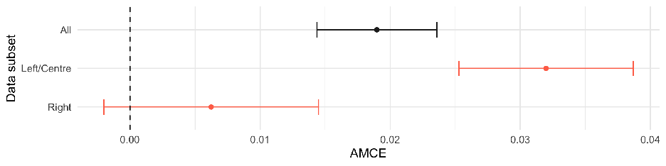

- (a) AMCE estimates for the “Lowest 20% income-level" attribute-level, estimated on the full data and subsets containing Left/Centre and Right-leaning subjects respectively.

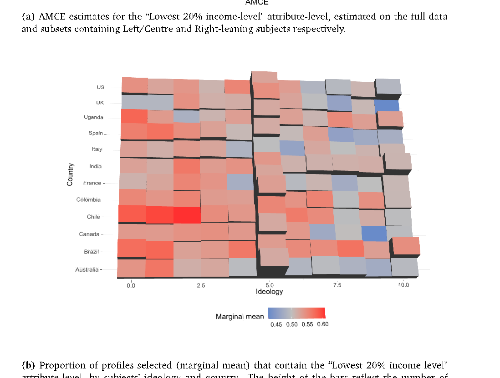

- (b) Proportion of profiles selected (marginal mean) that contain the “Lowest 20% income-level" attribute-level, by subjects’ ideology and country. The height of the bars reflect the number of observations in each cell.

Given the rich data generated by the conjoint design, we should allow the model itself to find interactions between randomised conjoint attributes and subjects’ characteristics.

The remainder of this section outlines a series of lower-level causal estimands that relate to the multi-level structure of the conjoint design and that allow us to model heterogeneous treatment effects. We initially restrict our focus to cases where there is complete randomisation of values in the conjoint experiment.3 This assumption simplifies the analysis and estimation of the causal parameters, and is the typical design employed by researchers in practice. In Section 2.4, we demonstrate how our strategy can incorporate non-uniform distributions of attribute-levels following the insights of de la Cuesta et al. (2022).

#### 1.1 Nested causal quantities in conjoint designs

Suppose N individuals (indexed by i) choose between J profiles across K rounds of the experiment. Within each round of the experiment, we randomly assign attribute-levels across L attributes for each profile (Hainmueller et al. 2014). Having run the experiment, the researcher faces a data structure with N × J × K rows and L + X columns (where X are any covariates observed for each subject), from which causal parameters of interest can be estimated.

The most common parameter estimated from this design is the average marginal component effect (AMCE). This estimand reflects the overall effect of a specific attribute-level on the probability of choosing a profile (compared to some baseline reference level), after accounting for the possible effects of the other attributes in the design. To account for these other effects, the parameter is averaged over the effect variations caused by these other attributes.

- 3In other words, where the probability of assigning each attribute-level is constant within each attribute and independent of the values of other attributes.

With complete randomisation of the attributes, and adapting the notation set by Hainmueller et al. (2014), we define the potential outcome for a profile shown to a respondent in the experiment as the (non-parametric) function:

###### Yijk(tl,Tijk[−l],Ti[−j]k) = g Si(tl,Tijk[−l],Ti[−j]k),Rik(tl,Tijk[−l],Ti[−j]k),Pijk(tl,Tijk[−l],Ti[−j]k) ,

where tl is the value of the lth attribute shown to individual i, in profile j, of round k of the experiment, Tijk[−l] is the vector of values for the remaining attributes in the same profile, and Ti[−j]k is the unordered set of possible treatment vectors.4 Si, Rik, and Pijk are respondent-, round-, and profile-level random components of this function.

Using the defined potential outcomes, the AMCE can be expressed as:

###### τl = E Yijk(tl = l1,Tijk[−l],Ti[−j]k) − Yijk(tl = l0,Tijk[−l],Ti[−j]k) .

By definition, the AMCE captures the central tendency of subjects’ behavior with respect to each attribute of the design. Often, however, researchers are interested in whether these effects differ dependent on subject characteristics or the context of the experiment. As others have noted, the AMCE can be disaggregated into more granular causal quantities of interest (Hainmueller et al. 2014; Abramson et al. 2020; Zhirkov 2021). Here we formalise this logic with respect to the structure of the data generating process itself.

First, we disaggregate the AMCE into N individual-level effects by conditioning the AMCE estimand on the individual-level random component of our model:

###### τil = E Yijk(tl = l1,Tijk[−l],Ti[−j]k) − Yijk(tl = l0,Tijk[−l],Ti[−j]k)|Si .

This lower-level parameter is the individual-level marginal effect (IMCE), and reflects the change in probability for a specific subject i of choosing a profile given an attribute-level

- 4In Appendix A, we generalise this specification by relaxing the complete randomisation assumption. Note also, for the sake of completeness,that Tijkl = tl.

(compared to some reference category) averaged over the effects of all other attributes. The estimand is similar to subgroup analysis of AMCEs – what Hainmueller et al. (2014) call conditional AMCEs. Unlike that specification, rather than subsetting the data along a vector of covariates, we subset based on the subject identifier and therefore consider the conditional effect based on all of subject i’s characteristics. 5

The IMCE is substantively useful because it allows researchers to inspect heterogeneity in the treatment effects derived from conjoint experiments (Abramson et al. 2020), and is commensurate with more general heterogeneous effect estimation strategies (Künzel et al. 2019). By recovering a vector of individual-level estimates, researchers can compare how non-randomised aspects of the data (i.e. subjects’ characteristics) correspond to the magnitude and direction of the individual-level predicted effects.

In turn, the IMCE can be decomposed over the repeated observations taken for that individual (i.e. the choices over profiles subjects make across multiple rounds of the conjoint experiment). This decomposition can be split into two steps since subjects typically see J ≥ 2 profiles per round6 First, therefore, we can disaggregate the round-level marginal component effect (RMCE). This is the effect of a component within a specific round (k) of the experiment for a given individual:

###### τikl = E Yijk(tl = l1,Tijk[−l],Ti[−j]k) − Yijk(tl = l0,Tijk[−l],Ti[−j]k)|Si,Rik .

Finally, the RMCE can be further decomposed into an observation-level marginal component effect (OMCE) by conditioning on the profile-level random component:

###### τijkl = E Yijk(tl = l1,Tijk[−l],Ti[−j]k) − Yijk(tl = l0,Tijk[−l],Ti[−j]k)|Si,Rik,Pijk .

- 5Note that subsetting on covariates relies on making some (arbitrary) split along those dimension(s). Despite subsetting on the identifier, the IMCE may be moderated by covariate features that generalise across subjects. Our estimation strategy in 2 allows for this moderation to be discovered.
- 6Though we note it is possible to have single-profile conjoint rounds.

From an analytical perspective, the informativeness of the OMCE is limited given the granularity of the estimand. That said, it serves a useful statistical purpose given the more general, nested relationship between the OMCE, RMCE, IMCE, and AMCE. In particular, by the law of iterated expectations τl = Ei Ek Ej[τijkl] .7Assuming there are no carryover effects across rounds, the OMCE can be thought of as an independent draw from the individual-level distribution. The individual-level marginal effect can therefore be estimated by aggregating OMCEs (as we discuss in Section 2.1). Table 1 illustrates this relationship from a data perspective. Each estimand is a nested quantity that relates to the structure of the observed data collected via conjoint designs. As such, each estimand covers increasingly aggregate portions of the data.

- Table 1. Nested causal quantities in a conjoint experiment

Subject Round Profile Attribute ... y yl

- 1 1 1 A ... 1 0 OMCE

RMCE   

IMCE







AMCE

- 1 1 2 B ... 0 1

- 1 2 1 A ... 0 0

- 1 2 2 A ... 1 0

... . .

. . . .

- N 2 1 B ... 0 1

- N 2 2 A ... 1 1

The above example reflects the structure of observations in the data collected from a conjoint experiment where the lth attribute has two possible levels (“A" and “B"). y is the observed forced-choice outcome in the experiment. yl is the counterfactual unobserved outcome where the lth attribute is switched. The various causal estimands relate to different nested sets of observations within the data.

### 2 Estimating the IMCE

Estimating lower-level marginal effects give us specific leverage over questions about the heterogeneity of these effects. The most effective level of analysis is the individual-level,

7Subscripts under the expectation symbol indicate over what level the conditional means are taken.

since we can analyse how the IMCE varies dependent on characteristics of the subjects. Therefore, we propose a three step strategy to recover estimates of the IMCEs.

First, we model the relationship between the forced-choice outcome, conjoint attributelevels, and subject-level covariates. This allows us to estimate some function that captures the potentially heterogeneous relationship between the conjoint attributes and subjects’ characteristics when making choices in the experiment. Second, we use the trained model to predict counterfactual outcomes at the observation-level from which we can estimate OMCEs. Third, following the nested logic outlined in Section 1, we aggregate these OMCE estimates to the level of the individual in order to recover estimates of the IMCEs.

It is worth noting that researchers could use any number of possible estimators to model subject-level heterogeneity in the first step. We provide a specific implementation in this paper and accompanying software that uses Bayesian Additive Regression Trees (BART) (Chipman et al. 2010), but other researchers may wish to pursue alternative types of models. To that extent, the general approach detailed here can be considered a metastrategy for estimating individual-level marginal effects in conjoint designs. In Appendix E, for example, we demonstrate our method using causal forests instead of BART (Athey et al. 2019).

One key benefit of this meta-strategy is that all data is included in the model when estimating the relationship between observed covariates, attribute-level assignments, and the conjoint outcome. This feature is in contrast to both subgroup analysis (where effects are modelled using only a smaller number of individuals who share a covariate value) and more recent approaches that recommend running separate models for each respondent (Zhirkov 2021).8 Particularly when modelling each individual separately, constraints on

- 8We note our strategy is a form of data-adaptive subgroup analysis, since the predicted outcomes are determined by those observations closest to the datapoint after recursive partitioning of the full data. Unlike conventional subgroup analyses, however, tree-based approaches also use the data to find the most informative clusters, rather than relying on researchers to specify these a priori.

experimental survey length may lead to large imprecision in the estimates. In our proposed method, the model leverages the full support of the data, across all observations, to discover covariate interactions that modify the causal effect at the individual-level. In Section 4 we demonstrate the comparative performance of our method compared to a subset-based strategy.

Moreover, by using machine learning, this method improves the analysis of potential heterogeneity in two ways. First, it reduces researcher degrees of freedom to arbitrarily run many subgroup analyses, which we would expect to inflate the chances of false positive discoveries. Second, it enables the identification of more complex relationships between variables. Common to many machine-learning methods, the model itself (rather than the researcher) determines the final functional form of the relationship between the supplied predictor variables and the outcome.

#### 2.1 Parameter estimation

- Step 1 In the first step, we use BART to model potential heterogeneity in the observed experimental data defined as:

###### P(Yijk = 1|Tijk,Xi) = f(Tijk,Xi) ≈ fˆ(Tijk,Xi),

where Yijk is the observed binary outcome, Tijk is the vector of treatment assignments across the L attributes, and Xi is the vector of covariate information for subject i considering profile j in round k of the experiment. f is some unknown true data generating process, and fˆis an estimate of that function.

BART is a tree-based supervised machine learning strategy that models the response surface by summing the predictions of many constrained individual tree models – recursive splits of the data into ever more homogenous groups (Chipman et al. 2010). Appendix B provides a more detailed description of the BART algorithm. In short, there are two major

difference between BART and other tree-based methods like random forests. First, the outcome is not the average across a set of trees. Instead each tree is a “weak learner” that seeks to explain only the residual variance in the outcome not explained by the T − 1 other trees. In that sense, the constituent trees in the BART forest work together to predict the full outcome (rather than all trying to predict the same outcome entirely). Second, BART models include random variables as parameters, allowing draws to be taken from the trained posterior. This feature entails convenient Bayesian properties that allow us to recover variance estimates at the IMCE level, which we discuss below.

We use BART partly because the models are relatively robust to the choice of tuning parameters (He et al. 2019), as discussed in Appendix B. These priors are set partially with respect to the observed data, and the default parameters identified by Chipman et al. (2010) are known to perform well across data contexts (Kapelner and Bleich 2016). Crossvalidation can be used to improve model performance further, if necessary.

To estimate the BART model, we supply a matrix of “training" data at the observationlevel. The training data are simply the results of the conjoint experiment. Each row reflects a profile within a round shown to a specific subject. The matrix columns comprise the observed individual decision (0 or 1) regarding that profile; the assigned attribute-levels for each of the L attributes in the vignette (which vary within individuals); and covariate columns that are invariant at the individual-level. During training, the BART algorithm iterates through the trees in the model, many times over, updating the model parameters to minimize the error between a vector of predictions Yˆ and the observed outcomes Y .9

- Step 2 Using the final trained model (fˆ), we predict counterfactual outcomes (i.e. whether the profile was selected or not) changing the value of attribute-levels. Specifically, to re-

- 9We use a probit-specific version of BART that better handles the binary outcome typical of this type of discrete-choice design. The probit outcomes are transformed back to probabilities prior to the computation of OMCEs.

cover a vector of OMCE estimates of attribute-level l1, we take z draws from the predicted posterior using a “test" matrix which is identical to the training dataset, except each element in the column corresponding to attribute l is set to the value l1.10 We then repeat this process, except the value of this column is now set to l0, the reference category. This process yields two separate matrices of dimensions z×N, which approximate the posterior distribution for each observation for two separate attribute values respectively (l1 and l0). Subtracting these two matrices yields a single matrix of predicted OMCE estimates – z per observation. To recover a parameter estimate of the OMCE, we simply average these z predictions for each observation to yield a vector of observation-level effects:

1 z

OMCE = τˆijkl =

f ˆ(Tijkl = l1,Xi) − fˆ(Tijkl = l0,Xi) .

- Step 3 Finally, consistent with the logic outlined in Section 1, the IMCE estimates can then be calculated by averaging the OMCEs for each individual i:

1 J × K

IMCE = τˆil =

K J

τ ˆijkl.

Uncertainty estimation We also use the z×N matrix of predicted OMCEs from the BART model to estimate the uncertainty both at the observation and individual level. Since our estimating strategy is Bayesian, we implement a credible interval approach to capture the parameter uncertainty. We take the 1 − α posterior interval of the OMCE-level predictions. To aggregate this interval to the IMCE level, we concatenate the posterior draws for each OMCE estimate, and take the α/2 and (1 − α)/2 quantiles of this combined vector. Given that the posterior distribution is a random variable, this credible interval indicates the cen-

- 10In our software implementation, z = 1000. These draws are taken using a Gibbs Sampler, obtained through a Monte Carlo Markov Chain (MCMC) backfitting algorithm. Chipman et al. (2010) show that, with sufficient burn-in, these sequential draws converge to the posterior of the true data generating process (p.275). Users can assess convergence using Geweke’s convergence diagnostic test available in the BART R package (see §4.5, Sparapani et al. 2021).

tral 1 − α proportion of the probability mass for the parameter’s posterior. In other words, since the parameter itself is random in the Bayesian framework, we are straightforwardly estimating the range that the parameter will likely fall in.

#### 2.2 Simulation tests of the estimation strategy

Using Monte Carlo simulations, we find that our method effectively detects IMCE heterogeneity caused by heterogeneous preferences. We simulate a full conjoint experiment in which subjects make choices between two profiles. Each profile contains three conjoint attributes that are randomly assigned one of two values: A1 = {a,b},A2 = {c,d},A3 = {e,f}. To induce heterogeneity, we define subjects’ preferences over attribute levels as a function of two individual-level covariates varying this relationship across attributes. The first covariate c1 is a binary variable drawn from a binomial distribution of size 1 with probability 0.5; the second covariate c2 is a continuous variable drawn from a uniform distribution with bounds [-1,1].

We define the change in utility as a result of observing the second level for each attribute as follows:

 

N(µ = 1,σ = 1), if c1 = 1 N(µ = −1,σ = 1), otherwise.

1 ∼

∆UA



- 2 ∼N(µ = |c2 − 0.2|,σ = 1)

∆UA

- 3 ∼N(µ = 0,σ = 0.5)

∆UA

We then simulate the conjoint experiment run on 500 subjects, for 5 rounds each, in which individuals choose between 2 profiles. For each observation, we calculate the utility for subject i given profile j in round k as:

Uijq = I(A1 = b) × ∆UA

1

+ I(A2 = d) × ∆UA

2

+ I(A3 = f) × ∆UA

3

+  ,

where ∼ N(0,0.0005) adds a small amount of noise to each utility calculation (to prevent exact draws).

For each round j that subject i sees, the profile that yields the higher change in utility is “chosen" (Y = 1), and the other is not (Y = 0). This mimics the technical dependence between observations that forms the basis of the discrete choice design.

Given this specification, the BART estimation strategy should predict heterogeneous IMCEs for the first two attributes (A1 and A2) but not for the last attribute (A3). Since tree-based ML methods operate by partitioning the data, our strategy should easily identify the dichotomous IMCE relationship with c1. The IMCEs for A1 should be positive when c1 = 1, but negative when c2 = 0. We should observe no correlations between c1 and A2. The covariate c2 poses a harder challenge for our estimation strategy for two reasons. First, subdivision of the data cannot perfectly partition the IMCEs since the covariate is continuous. Second, the defined relationship is more complex and asymmetric over the covariate’s range. The strongest positive effects should occur for negative values, and the weakest effects when c2 = 0.2. We anticipate no correlation between c2 and attribute A1 or A3.11

Figure 2 demonstrates the results of this experiment, colouring predicted IMCEs by the values of c1. Our strategy effectively discovers heterogeneous IMCEs when the heterogeneity over preferences is a function of a binary variable – the positive and negative preferences perfectly correspond to the values of this covariate. Conversely, in the third facet, the completely random assignment of utility across individuals yields no sign of heterogeneity in IMCEs nor correlation between c1 and the size of effects.

Importantly, the model discovers the defined heterogeneity for the A2 IMCEs but this heterogeneity does not exhibit correlation with c1. Instead, as Figure G1 in the Appendix

- 11In Appendix C4 and E1 we replicate this exercise using the Zhirkov (2021) OLS and Athey et al. (2019) causal forest methods, respectively.

- Figure 2. Detecting heterogeneity in IMCEs using simulated conjoint data derived from preferences over profiles

A1: Binary heterogeneity (c1) A2: Interval heterogeneity (c2)

| | | | | | | | | | | | |
|---|---|---|---|---|---|---|---|---|---|---|---|
| | | | | | | | | | | | |
| | | | | | | | | | | | |
| | | | | | | | | | | | |
| | | | | | | | | | | | |
| | | | | | | | | | | | |
| | | | | | | | | | | | |
| | | | | | | | | | | | |

| | | | | | | | | | | | |
|---|---|---|---|---|---|---|---|---|---|---|---|
| | | | | | | | | | | | |
| | | | | | | | | | | | |
| | | | | | | | | | | | |
| | | | | | | | | | | | |
| | | | | | | | | | | | |
| | | | | | | | | | | | |
| | | | | | | | | | | | |

0.25

0.00

−0.25

IMCE

A3: Random heterogeneity

| | | | | | | | | | | | |
|---|---|---|---|---|---|---|---|---|---|---|---|
| | | | | | | | | | | | |
| | | | | | | | | | | | |
| | | | | | | | | | | | |
| | | | | | | | | | | | |
| | | | | | | | | | | | |
| | | | | | | | | | | | |
| | | | | | | | | | | | |

0.25

c1

0.00

0 1

−0.25

Point estimates of the IMCEs for 500 subjects shown with 95% Bayesian intervals (as described in Section

- 2.1)

demonstrates, the heterogeneity correlates as expected with values of c2. This separation between heterogeneity detection and its correlation with covariates is important. Under a conventional, subsetting strategy, the analyst would likely also note that conditional AMCEs for A2 do not covary with c1. However, subsetting based on c1 would not indicate that there is substantial heterogeneity to the marginal component effect. We conjecture that as the complexity of the covariance between covariates and IMCEs increases it will become harder for the analyst to adequately pre-specify models that would be capable of detecting this heterogeneity.

Table 2 reports the average correlations between the covariates c1 and c2 and the three distributions of IMCEs respectively. There is an almost perfect correlation between c1 and A1, but negligible correlations between the same covariate and A2 and A3. With respect to c2, we see a substantive correlation with A2 but, as expected, the magnitude is moderated by the non-linear and asymmetric relationship imposed. Again, there are

negligible correlations for A1 and A3.

- Table 2. Average correlations between simulation covariates and conjoint attributes, over 100 simulations

Attribute c1 c2

- A1 0.998 0.000
- A2 0.004 -0.557
- A3 -0.003 0.074

We extend this discussion of the simulated performance of our method in the Appendix. In Section C1 we demonstrate that the estimation method exhibits good predictive accuracy when IMCEs themselves are simulated across DGPs of varying form and complexity. We also find that our variance estimation strategy exhibits good coverage (Section C2). Finally, we test whether RMCEs can be used to detect whether effects are serially correlated by round (a violation of a conjoint experiment’s assumptions) in Section C3.

#### 2.3 Applied test of BART-estimated AMCEs

Under the various conjoint design assumptions, parameter estimates of the AMCEs from a linear probability model (LPM) are unbiased (Hainmueller et al. 2014). In Section 1, moreover, we note that the AMCE estimand can be considered the average of the IMCEs across subjects. Therefore, if our our estimation strategy is performing well, we expect that averaging the BART IMCEs will be very similar, if not the same as, the unbiased AMCEs estimated from a LPM.

As an applied sense check of our method, we test this empirically using data from two conjoint experiments. First, we analyse the archetypal experiment by Hainmueller et al. (2014) where U.S. subjects made a series of forced-choices between two profiles describing potential immigrants, indicating which they would prefer to admit. The attributes presented in the profiles reflected traits hypothesized to matter in typical immigration de-

cision making, including the migrant’s profession, country of origin, and language skills. Second, we analyse the previously discussed COVID-19 vaccine conjoint fielded by Duch et al. (2021).

Figure 3 plots the point estimates of each (non-reference) attribute-level using our BART strategy and those of the conventional LPM approach, for both datasets. In both cases, and for every point estimate pair, we see that the predicted effects are very similar. These results are strong prima facie evidence that the BART model is appropriately estimating the response surface: the individual-level effects do, in practise, aggregate correctly to the AMCE. In Appendix D, we provide further estimation details for the Hainmueller et al. (2014) data, and Appendix Tables D1 and D3 report the LPM and cjbart coefficient estimates as well as the percentage differences between them.

- Figure 3. Comparison of conventional GLM-derived AMCE to AMCEs recovered from the BART estimated IMCEs

###### Hainmueller et al (2014)

| | | | | | | | |
|---|---|---|---|---|---|---|---|
| | | | | | | | |
| | | | | | | | |
| | | | | | | | |
| | | | | | | | |
| | | | | | | | |
| | | | | | | | |
| | | | | | | | |

- 0.0
- 0.1

Conventional AMCE

BART−derived AMCE

Country Of Origin Education Gender

Job Job Experience Job Plans

Language Skills Prior Entry Reason For Application

| | | | | | | |
|---|---|---|---|---|---|---|
| | | | | | | |
| | | | | | | |
| | | | | | | |
| | | | | | | |
| | | | | | | |
| | | | | | | |

Duch et al (2021)

0.0 0.1 0.2

0.0

0.1

0.2

Conventional AMCE

Age Income

Occupation Transmission

Vulnerability

- 2.4 Non-independent randomisation of attribute-levels

−0.1

−0.1 0.0 0.1

###### So far, we have assumed that attributes are completely and independently randomised, which is by far the most common type of conjoint design in practise (de la Cuesta et al.

2022). However, as others have noted, it is possible and informative to consider nonuniform distributions of profiles that better correspond to real-world profile distributions (Hainmueller et al. 2014; Bansak et al. 2021; de la Cuesta et al. 2022). This adaptation is also possible at the individual level – and following these new works, we call the population-weighted quantity of interest the population-IMCE (pIMCE).

Similar to the model-based approach discussed in de la Cuesta et al. (2022), we approach this challenge as a post-hoc exploratory analysis of existing conjoint data.12 As before, we first use the observed experimental data to train a BART model. Adapting the previous strategy, we then predict a full set of counterfactual potential outcomes for every combination of the L − 1 attributes in the design, for each subject (holding constant the individual-level covariates). We generate two matrices of predictions: one setting the lth attribute to l1 and the other setting the same attribute to the reference level l0. We then take the difference of these two matrices to generate a matrix of hypothetical OMCEs for each potential outcome.

To estimate the pIMCE, we then marginalize the IMCE over the profile distributions at the individual-level. In practise, we take a weighted average of the predicted OMCEs, using researcher-specified marginal probabilities for the L − 1 attributes. The weight for a specific partial profile (ignoring the Lth attribute) is calculated as the product of the marginal probabilities for every other attribute-level in the profile:

###### wT

###### = P(Tijk[−l]) =

ijk[−l]

P(Tijkl ).

l =l

Since our BART strategy takes z draws from the posterior, we calculated the weighted sum over the OMCEs for each draw separately, and then take the average over these indi-

12We leave it to future research to consider how design-based conditional randomisation could be implemented in ML-based heterogeneity strategies.

vidual predictions to generate our pIMCE estimate:

pIMCEil = Ez

(ˆτijkl × wT

) ,

ijk[−l]

Tijk[−l]∈Tijk[−l]

where the subscript z indexes draws from the model posterior, and Tijk[−l] is the set of possible attribute-level combinations across the L − 1 other attributes.13

While this adaptation is relatively straightforward from a theoretical perspective, it comes at a computational cost. As the number of attributes (and attribute-levels) increases, the number of potential outcomes that need to be predicted inflates rapidly. Compared to the standard strategy, the number of predictions increases by the factorial of the number of levels for the L − 1 other attributes in the design. Researchers will want to narrow their analysis to specific population profiles, otherwise the computational demands will quickly become infeasible. We present an example of estimating pIMCEs in Appendix F.

### 3 Comparing Sources of Heterogeneity

A particular attraction of heterogeneous effects estimation is that we are able to test whether treatment effects differ at the individual-level. To date, however, researchers have lacked principled methods of characterising any observed heterogeneity. In this section, we propose two tools researchers can use to systematically recover indicators of which covariates are driving heterogeneity in the marginal treatment effects and the interactions between variables.14 Both tools rely on tree-based learning methods to group the predicted IMCEs based on covariate information. In general, tree-based modelling approaches are well suited to this type of problem since they work by partitioning the outcome variable into clusters (or terminal nodes) where the differences in outcomes between members of

13Similar to the standard strategy, we also recover credible interval uncertainty estimates by taking the α2 and 1 − α2 quantiles over the weighted distributions. 14Tools to implement these methods are available in our R package cjbart.

the same cluster are as small as possible (Breiman et al. 1984).15

We first introduce a standardised variable importance (VIMP) measure that summarises how well different covariates predict each distribution of IMCEs. This measure can be used to explore the potential sources of heterogeneity in the marginal component effects systematically across all attributes in the experiment. Second, we show how single regression trees can subsequently be fit to better inspect the determinants of heterogeneity for specific attribute-levels of interest. This second step builds on the VIMP analysis by using the tree’s decision rules to identify clusters, defined by subject covariates, that best define this heterogeneity. For each cluster, researchers can recover the conditional marginal component effect and thus analyse the extent of heterogeneity in the treatment effects.

#### 3.1 Random forest variable importance

Our first tool summarises which covariates matter for predicting differences in the IMCE distributions for all attribute-levels in a conjoint experiment. We use random forests to estimate the relationship between the predicted IMCEs and subject-level covariates. Random forests operate by estimating many separate decision-trees, where the training data is bootstrapped across trees, and each tree considers only a random subset of variables. The result is an ensemble model that is less prone to bias (Breiman 2001). We then use variable importance metrics recovered from the trained random forest to identify variables that are particularly predictive of heterogeneity. In turn, these variables can drive subsequent analyses which we present in Section 3.2.

More formally, for each attribute-level, we train a random forest to model the heterogeneity in the predicted IMCE distribution. We use the matrix of subjects’ covariate information (X) as the predictor variables. Once this model has been trained, we then recover

15We use additional ML techniques since our BART strategy, while excellent at estimating effects, is more limited in terms of analysing the drivers of this heterogeneity (Hill et al. 2020).

variable importance measures (VIMPs) – a common form of model analysis for tree-based methods – to understand which covariate dimensions are most useful for partitioning the data.

In general, VIMP measures work by measuring the degradation in model performance when noise is added to a predictor variable. A larger drop in performance is indicative that the variable in question is more important for predicting the outcome. For our purposes, we use VIMP scores to measure how well the included subject covariates predict each vector of IMCEs. Higher importance scores suggest that partitioning the IMCEs on these variables is informative. We use the Breiman-Cutler approach, which randomly permutes the predictor variable and measures the standardised difference in prediction error when using the original data compared to this permuted data. Taking advantage of recent developments in VIMP theory, and noting earlier critiques of bias in VIMP measures (Strobl et al. 2007), we recover bias-corrected variance estimates of these VIMP scores using delete-d jackknife estimation, as developed by Ishwaran and Lu (2019).

The importance of different subject-level covariates may differ dependent on the specific attribute-level in question. We therefore recover separate VIMP scores for each combination of attribute-level and subject covariate, allowing us to plot a heatmap of variable importance across the design as a whole. In Section 4 we demonstrate how this schedule of VIMP scores can be analysed to understand what drives heterogeneity for each attributelevel in the conjoint experiment.

#### 3.2 Single decision tree partitioning

The random forest VIMP tool compares how well subject-level covariates predict each IMCE distribution. Given its reliance on random forests, however, it is less useful for substantively interpreting the partitioned IMCE space. The final model contains many trees, where each individual tree only considers a random subset of variables and a bootstrap

sample of the data. We therefore propose a complementary tool that fits a single decision tree on an attribute-level of interest. Like the random forest model, the single-tree model recursively partitions the vector of IMCEs using a matrix of covariate information. Unlike the random forest method, since only one model is fit the individual splitting rules from this tree can be directly interpreted and used to inspect the heterogeneity in the IMCEs.16

Single tree models typically fit many splits to the data, making interpretation difficult. This feature reflects the inherent trade-off in machine learning methods between the complexity of the fit model and the risk of mispredicting observations. In other words, a more complex tree may reduce prediction error (in training) but the incurred complexity reduces the variance of the model (leading to overfitting). Therefore, to ensure the tree is interpretable, we follow the convention of “pruning" the fit model. Since the partitioning is recursive and “greedy", earlier splits in the tree are those that provide the greatest leverage over differentiating observations.17 By removing later splits, pruning has the effect of paring back the cluster definitions (i.e. the combination of decision rules) to a more parsimonious level.

In practice, trees are pruned by setting a complexity parameter (cp). In the case of continuous outcomes, this determines the minimum increase in the overall R2 of the model needed in order for a split to be kept in the model (Therneau et al. 1997). For the purpose of interpreting IMCE heterogeneity, we find that a complexity parameter of about 0.020.04 is sufficient to constrain the decision-tree to a depth that is substantively meaningful – yielding about 2 - 3 levels of partitioning.

Post-pruning, researchers can use the fit model to describe the underlying heterogeneity in the IMCE distribution. One very useful feature of decision trees is that, in this context,

16A similar strategy has been pursued by Hahn et al. (2020). 17In a recursive partitioning algorithm, the first split selects that variable (and cutting point) which minimizes the loss function associated with the resulting two partitions of the data. This process is then repeated for each child node, holding fixed the initial split. The fact that the parent split is not re-evaluated once the next layer of decision rules are determined means that the algorithm is “greedy".

the terminal nodes reflect the conditional average marginal component effects defined by the splitting rules in the tree. This is similar to estimating marginal component effects for specific subgroups. Crucially, unlike manual subsetting approaches where subgroups have to be specified a priori, with a decision tree the clusters are discovered during model fitting itself. This is particularly useful since the tree, splitting sequentially on multiple variables, may define complex groups. For example, it may find a stronger effect for subjects aged under 25 years old and who are ideologically left-leaning compared to left-leaning but older respondents. We illustrate this approach in the next section.

### 4 Analysing heterogeneity in a multi-national conjoint experi-ment

In this section, we consider an application of the framework and estimation strategy outlined in Sections 1 and 2. We analyse heterogeneity in a very large conjoint experiment that encompasses a diverse group of subjects surveyed from 13 countries, and then compare our approach to a recent alternative strategy proposed in Zhirkov (2021).

Detecting heterogeneous effects Our data is taken from the Duch et al. (2021) multinational study on COVID-19 vaccine prioritization. This experiment asks subjects to choose which of two hypothetical individuals should be given priority for a COVID-19 vaccine. Each profile displays five attributes – the recipients’ vulnerability to the virus, likely transmission of the virus, income, occupation, and age – and all values are totally randomly assigned. Subjects make a total of 8 choices in the experiment. The data also contains information on subjects’ country of origin, age, gender, ideology, income, education, hesitancy over vaccination, and measures of their willingness to pay for a vaccine.

The original study finds consistent AMCEs across all the countries surveyed. Nevertheless, it is reasonable to suspect that these AMCEs may mask heterogeneity with respect

to individual-level covariates. This experiment is particularly suited to a study of heterogeneous effects, since with approximately 250,000 observations in total and harmonised covariate information across countries, there is ample data to model complex relationships (at the cost of computational intensity). To take advantage of the diversity of our data, we train a BART model on all five conjoint attributes and the set of covariate information for each profile using cjbart, using all observations from the 13 countries surveyed in the experiment. From this model, we recover a schedule of IMCE estimates for each attribute-level.

With multiple covariates, however, systematically identifying the drivers of heterogeneity is difficult. This is particularly acute in the case of conjoint experiments where we have separate IMCE vectors for each attribute-level, which means researchers are faced with a dense schedule of predicted effects. We address this challenge by using the tree-based measure of variable importance, as discussed in Section 3.1.

We use our proposed VIMP tool as the first step in identifying plausible sources of heterogeneity in the schedule of IMCEs estimated from the Duch et al. (2021). The method estimates a standardised importance score for each combination of the 10 covariates and 16 attribute-levels in the conjoint design. Figure 4 provides a graphical summary of how well each covariate predicts the attribute-levels in the Duch et al. (2021) conjoint. Clearly, the country of a respondent is a highly predictive factor across most attribute-levels in the model. This is perhaps unsurprising, given the diversity of contexts considered and differing levels of COVID-19 infections at the point the experiment was fielded.

Most interestingly, some subject-level variables appear to condition IMCEs for specific attributes. For example, while subjects’ age is not a particularly important predictor of heterogeneity across most attributes, it is very predictive when considering the age of the potential vaccine recipient. In general, this suggests that whether one is willing to prioritise individuals based on age may well be driven by one’s own age (which we explore in

###### Figure 4. Variable importance matrix having estimated separate random forest modelson each attribute-level in the model. Higher values indicate variables that were moreimportant in terms of predicting the estimated IMCE distribution

| | | | | | | | | | | |
|---|---|---|---|---|---|---|---|---|---|---|
| | | | | | | | | | | |
| | | | | | | | | | | |
| | | | | | | | | | | |

79 years old

AgeDeathIncomeOccupationTransmit

65 years old

40 years old

| | | | | | | | | | | |
|---|---|---|---|---|---|---|---|---|---|---|
| | | | | | | | | | | |
| | | | | | | | | | | |

Moderate (Twice the average risk of COVID−19 death)

High (Five times the average risk of COVID−19 death)

| | | | | | | | | | | |
|---|---|---|---|---|---|---|---|---|---|---|
| | | | | | | | | | | |
| | | | | | | | | | | |

Lowest 20% income level

Imp.

Attribute−level

Highest 20% income level

100

| | | | | | | | | | | |
|---|---|---|---|---|---|---|---|---|---|---|
| | | | | | | | | | | |
| | | | | | | | | | | |
| | | | | | | | | | | |
| | | | | | | | | | | |
| | | | | | | | | | | |
| | | | | | | | | | | |
| | | | | | | | | | | |

75

Non−Key worker: Cannot work at home

50

Non−Key worker: Can work at home

25

Key worker: Water and electricity service

Key worker: Police and fire−fighting

Key worker: Health and social care

Key worker: Factory worker

Key worker: Education and childcare

| | | | | | | | | | | |
|---|---|---|---|---|---|---|---|---|---|---|
| | | | | | | | | | | |
| | | | | | | | | | | |

Moderate risk of transmission

High risk of transmission

AgeCountryEducationGenderHesitancyMandatory VaccinationIdeologyIncomeWTP AccessWTP Private

Subject covariate

more detail below), and second that this is perhaps most important for the 65 year old label where the risks of COVID-19 begin to become more severe. Similarly, ideology appears particularly important when partitioning the IMCEs related to the potential vaccine recipient’s income. This result accords with conventional expectations about the relationship between political ideology and service provision, and highlights that one’s own ideological position appears to predict how willing one is to prioritise those on low incomes.

Given the results from the VIMP summary measure, we can use our second proposed

tool described in Section 3.2 – a single pruned decision tree – to inspect this heterogeneity in more detail. On the basis of the variable importance heatmap in Figure 4, for example, we would expect that subjects’ age is used to partition the IMCE vectors for prioritising subjects of different ages.

Figure 5 presents a single decision tree for the IMCEs related to prioritising vaccines for “65 year olds". Note first that the split confirms the VIMP analysis results in Figure 4 that identify subject’s age as an important source of heterogeneity for this attribute-level: older subjects (over the age of 37) exhibit a predicted average marginal effect (0.11) that is about 20 percent larger than younger subjects. Notably, moreover, this partitioning strategy captures more complex interactions between covariates.The smallest IMCEs are defined by younger subjects (< 37) in India and Uganda. Conversely, the strongest effects are for those subjects older than 37 resident in the UK, US, and France (countries with older-aged populations), and those resident in other countries who are above the age of 69 (and thus closest in age to the profile age).

These two complementary tools, the VIMP analysis and single decision tree, provide a comprehensive and robust way to identify sources of treatment effect heterogeneity in conjoint experiments. Finally, we demonstrate one further way of summarizing these results visually by plotting the full ordered distribution of IMCEs for a given variable against the corresponding distribution of a covariate. Figure 4 suggests that subjects’ ideology is an important predictor of IMCEs for the income-related attribute-levels in the conjoint experiment. In Figure 6, therefore, we visualize this particular relationship by plotting the IMCEs against a histogram of subjects’ self-reported ideological postion..

As Figure 6 shows, there is quite clear and distinct heterogeneity. Smaller IMCEs (around the 0.01 mark) are individuals whose ideology is right-leaning (at or above 6 on a 0-10 scale). In contrast, larger IMCEs are predicted for those who are typically more left-leaning. Clearly, however, ideology does not play a perfect role. Within these two por-

- Figure 5. Pruned decision-tree of predicted IMCEs for prioritising vaccines for those “65 years old", using subject-level covariate information to partition the vector of individuallevel effects.

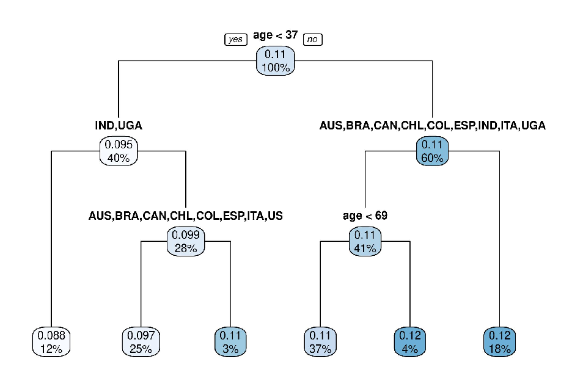

tions of the distribution, varying degrees of ideology are more uniformly distributed, and at the very right of the IMCE distribution other factors appear to drive a further uptick in the predicted IMCE, to approximately four times the effect size of right-leaning subjects.18

Comparison to OLS-based approach To demonstrate the comparative performance of our approach, we also estimate IMCEs using an alternative strategy proposed recently by Zhirkov (2021). In short, this method estimates separate OLS regression models for each

- 18To assess the robustness of these results, and to check for overfitting, we re-estimated these models using smaller random subsets of the data. Appendix Figure G2 demonstrates that despite fewer observations these models also identified similar correlations between the income IMCEs and subjects’ ideology, with left-leaning subjects typically having higher AMCEs on average (and vice versa). Separately, in Appendix Figure G3, we show an example from the same model of an attribute-level where there is no apparent correlation between ideology and the substantial heterogeneity observed in the IMCEs.

- Figure 6. Comparison of IMCEs for the “Lowest 20% income level" attribute-level ordered from smallest to largest and corresponding histogram of individuals’ self-reported ideology.

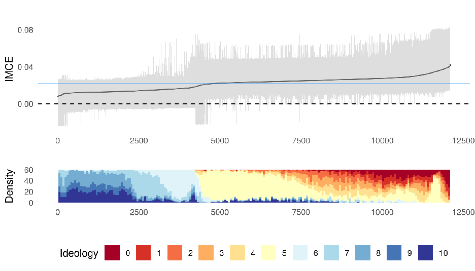

The grey ribbon indicates 95% credible intervals for the IMCEs, and the blue line in the top panel indicates the estimated AMCE

subject separately. The resultant coefficients are unbiased estimates of the same IMCE quantity we outline in Section 1.

Our method finds a strong correlation between individuals’ ideology and the predicted IMCEs for the low income attribute-level of the Duch et al. (2021) experiment. Under the Zhirkov (2021) OLS strategy, we expect to see a similar result – both in terms of the distribution of IMCEs and its correlation with individuals’ self-reported ideology. To test this expectation, we estimate separate LPMs for each individual in our data and, again, compare the ordered distribution of IMCEs to a corresponding histogram of subjects’ ideology.

Two practical features of the regression approach complicate this analysis using OLS. Since each subject completed eight rounds of the conjoint experiment (a number we think is quite typical for a conjoint design), each model has only 16 observations (2 profiles

per round) and thus the individual models will be imprecise. Zhirkov (2021) directly acknowledges this limitation, and notes that the OLS approach requires subjects to rate closer to 30 profiles in total. We believe that, while this large number of activities may be feasible in principle, we rarely see this number of profiles in practice.

Moreover, even if the number of observations approaches 30, Zhirkov (2021) recommends using interval rating scales rather than the binary, forced-choice outcome. While many conjoint experiments implement both rating and forced-choice scales of measurement, we believe the forced-choice outcome is the most interesting aspect. It allows us to think of the effects directly in terms of marginal probabilities, and thus to consider the behaviour of subjects (a choice of candidate) rather than just an attitude (the subjects’ rating of two candidates).19

Figure 7 displays the ordered distribution of estimated IMCEs using this OLS strategy, plot against a histogram of individuals’ self-reported ideology. The OLS approach yields 5,369 IMCE estimates outside of the range of possible changes in probability. We exclude these estimates from our analysis, leading to a 34 percent reduction in the number of IMCEs we can inspect.20 We do not observe the same correlation as in our BART estimation. The correlation coefficient between the IMCEs and ideology in the OLS case is negligible and statistically insignificant (r = −0.01, p = 0.20) compared to a strong correlation with respect to BART (r = −0.75, p < 0.001). Looking at the distribution of IMCEs, moreover, the OLS strategy does not seem to have modelled the data well. The distribution is very symmetric, centred on zero and with tails that contain implausibly large effects.

While these are not the ideal conditions for the Zhirkov (2021) approach, our vaccine experiment resembles a typical conjoint design with 16 observations per individual. Our

- 19This is consistent with the Bansak et al. (2022) finding that the estimated AMCEs from forced-choices of political candidates map well to actual election outcomes. Moreover, in Section C4 of the Appendix we present simulation evidence that even when we adapt designs to meet this requirement, heterogeneity in preferences is less well detected using interval rating scales.

20Of these individuals, only 5935 uncertainty estimates were parametrically recoverable.

- Figure 7. Comparison of estimated IMCEs using OLS method proposed in Zhirkov (2021), on the “Lowest 20% income level" attribute-level within Duch et al. (2021)

1.0

0.5

###### IMCE

0.0

−0.5

−1.0

0 2000 4000 6000 8000

Density

60

40

20

0

0 2000 4000 6000 8000

Ideology 0 1 2 3 4 5 6 7 8 9 10

OLS comparison confirms Zhirkov’s (2021) recommendation that the OLS method should only be implemented for conjoints with at least 30 observations per individual. A strength of the BART estimation is that it generates robust estimated IMCEs for conjoint designs with a wide range of choices per individual in the sample. A distinct advantages of our ML approach is that it can leverage all observations in the data and hence our estimation strategy is less reliant on having many observations per experimental subject.

Perhaps most importantly, our approach is able to detect and capture how subject covariate information modifies the size and direction of these marginal component effects. The OLS method rests on the fact that this heterogeneity is implicitly detected when the marginal effects are modelled for each individual separately. In our proposed method, since the trees in the BART model can identify interactive effects between the supplied covariates and the attribute-levels, it can explicitly model these effect modifiers. The result,

in this case, is that our method identifies the correlation between subjects’ ideology and their treatment of low-income vaccine recipients in a way that the OLS strategy does not.

### 5 Discussion and Conclusion

The attraction of conjoint experiments is a rich data generating process that allows us to tease out the choice characteristics that shape individuals’ decision making. This type of experimental design is fast becoming one of the dominant experimental methods within the social sciences. A rich methodological literature is developing that explores how advances in conjoint estimation can enhance its informative value. Others, for example, have explored how to improve generalizability by weighting profile distributions to their actual occurrence in the populations of interest (de la Cuesta et al. 2022), and how to use eyetracking software to better understand the decision-making process and the processing of conjoint vignettes (Jenke et al. 2021).

We make a small contribution to this wider development, by clarifying how the conjoint design relates to the structure of the data collected, and how we can leverage the nature of this data generation to estimate heterogeneous treatment effects across conjoint attributes. Heterogeneity can be characterized in terms of a set of nested, causal estimands that correspond to the repeated observations across individuals, rounds, and profiles of the conjoint design. Using machine learning tools, we show how to estimate heterogeneous treatment effects in the conjoint design using the potential outcomes framework. Our strategy allows researchers to assess treatment effect heterogeneity in a straightforward and flexible manner.

We suggest that machine learning is particularly useful given its ability to identify more complicated relationships between predictor variables without the need for researchers to specify these a priori. By reducing researcher degrees of freedom, our proposed general

method provides a more robust means of analysing heterogeneity compared to ad hoc subgroup analyses. Moreover, since our estimation strategy leverages all observations in the modelling stage, our method has greater statistical power than approaches that rely on estimating separate subset models.

Notwithstanding these advantages, there are also limitations to our estimation strategy. Principally, our BART modelling strategy assumes that conditional on the observed covariates, outcomes depend only on the assigned treatment values. In other words, two individuals with identical covariate profiles and the same attribute-level assignments would get assigned the same predicted OMCEs. This is, in part, a limitation of the underlying BART algorithm, with limited development of cluster-specific estimation. Future research may wish to implement recent advances in random intercept modelling to better capture these latent effects (see Tan et al. 2018).

More generally, and as with many ML methods, overfitting the training data can lead to poor generalisability of predictions to the population of interest. As we have pointed to in the paper, researchers can assess these issues by, for example, estimating models on subsets of the data to ensure the findings replicate. Moreover, ML models can be sensitive to the choice of hyperparameter values. As we note earlier, we chose BART because of its greater resilience to these issues: BART predictions are relatively stable over hyperparameter choices, and the Bayesian priors provide strong regularisation to prevent overfitting (Chipman et al. 2010; Hill et al. 2020). Other ML implementations, for example causal forests, offer separate tuning algorithms to limit overfitting, and we recommend researchers take this step seriously.

To accompany this paper, we provide a new R package, cjbart, that allows researchers to use our method on their experimental conjoint data. More generally, however, our proposed meta-strategy could be used with other forms of modelling. For example, researchers may wish to use random forests or neural networks instead, and we provide one

such alternative example in Section E of the Appendix.

Finally, estimating heterogeneity – that is, generating individual-level estimates of treatment effects – is only half the battle. Once researchers recover these individual-level estimates, the challenge is to identify the most significant sources of heterogeneous treatment effects. We provide two complementary tools that help researchers make sense of the estimated distribution of individual-level effects. We demonstrate how random forests variable importance measures (VIMP) can be used to summarise which variables are most important for predicting heterogeneity in the IMCEs. We then show how single regression tree models can be used to partition IMCE distributions into clusters, where the decision rules provide information about which covariates define those clusters. This paper also shows how these results can be visualized to aid analysis.

### References

Abramson, Scott F. , Korhan Kocak, Asya Magazinnik, and Anton Strezhnev (2020, July). Improving preference elicitation in conjoint designs using machine learning for heterogeneous effects.

Athey, Susan , Julie Tibshirani, and Stefan Wager (2019). Generalized random forests. The Annals of Statistics 47(2), 1148–1178.

Awad, Edmond , Sohan Dsouza, Richard Kim, Jonathan Schulz, Joseph Henrich, Azim Shariff, Jean-François Bonnefon, and Iyad Rahwan (2018). The moral machine experiment. Nature 563(7729), 59–64.

Ballard-Rosa, Cameron , Lucy Martin, and Kenneth Scheve (2017). The structure of american income tax policy preferences. The Journal of Politics 79(1), 1–16.

Bansak, Kirk , Jens Hainmueller, and Dominik Hangartner (2016, 09). How economic, humanitarian, and religious concerns shape european attitudes toward asylum seekers. Science 354.

- Bansak, Kirk , Jens Hainmueller, Daniel J. Hopkins, and Teppei Yamamoto (2021). Conjoint Survey Experiments. Cambridge University Press.
- Bansak, Kirk , Jens Hainmueller, Daniel J. Hopkins, and Teppei Yamamoto (2022). Using conjoint experiments to analyze election outcomes: The essential role of the average marginal component effect. Political Analysis, 1–19.

Breiman, Leo (2001). Random forests. Machine learning 45(1), 5–32. Breiman, L. , J. Friedman, C.J. Stone, and R.A. Olshen (1984). Classification and Regression

Trees. Taylor & Francis. Chipman, Hugh A. , Edward I. George, and Robert E. McCulloch (2010). Bart: Bayesian additive regression trees. Annals of Applied Statistics 4(1), 266–298.

Chou, Winston , Rafaela Dancygier, Naoki Egami, and Amaney A. Jamal (2021). Competing for loyalists? how party positioning affects populist radical right voting. Comparative Political Studies 54(12), 2226–2260.

de la Cuesta, Brandon , Naoki Egami, and Kosuke Imai (2022). Improving the external validity of conjoint analysis: The essential role of profile distribution. Political Analysis 30(1), 19–45.

Duch, Raymond , Denise Laroze, Thomas Robinson, and Pablo Beramendi (2020). Multimodes for detecting experimental measurement error. Political Analysis 28(2), 263–283.

Duch, Raymond , Laurence S. J. Roope, Mara Violato, Matias Fuentes Becerra, Thomas S. Robinson, Jean-Francois Bonnefon, Jorge Friedman, Peter John Loewen, Pavan Mamidi, Alessia Melegaro, Mariana Blanco, Juan Vargas, Julia Seither, Paolo Candio, Ana Gibertoni Cruz, Xinyang Hua, Adrian Barnett, and Philip M. Clarke (2021). Citizens from 13 countries share similar preferences for covid-19 vaccine allocation priorities. Proceedings of the National Academy of Sciences 118(38).

Duch, Raymond M , Denise Laroze, Constantin Reinprecht, and Thomas S Robinson

(2020). Nativist policy: the comparative effects of trumpian politics on migration decisions. Political Science Research and Methods, 1–17.

Gerber, Alan S. and Donald P. Green (2008). The Oxford Handbook of Political Methodology,

Chapter Field Experiments and Natural Experiments, pp. 357–381. Oxford University Press.

Green, Donald P. and Holger L. Kern (2012). Modeling heterogeneous treatment effects in survey experiments with bayesian additive regression trees. Public Opinion Quarterly 76(3), 491–511.

Hahn, P. Richard , Jared S. Murray, and Carlos M. Carvalho (2020). Bayesian Regression Tree Models for Causal Inference: Regularization, Confounding, and Heterogeneous Effects (with Discussion). Bayesian Analysis 15(3), 965 – 2020.

Hainmueller, Jens , Daniel J. Hopkins, and Teppei Yamamoto (2014). Causal inference in conjoint analysis: Understanding multidimensional choices via stated preference experiments. Political Analysis 22(1), 1–30.

He, Jingyu , Saar Yalov, and P. Richard Hahn (2019, 16–18 Apr). Xbart: Accelerated bayesian additive regression trees. In K. Chaudhuri and M. Sugiyama (Eds.), Proceedings of the Twenty-Second International Conference on Artificial Intelligence and Statistics, Volume 89 of Proceedings of Machine Learning Research, pp. 1130–1138. PMLR.

Hill, Jennifer , Antonio Linero, and Jared Murray (2020). Bayesian additive regression trees: A review and look forward. Annual Review of Statistics and Its Application 7(1). Hill, Jennifer L. (2011). Bayesian nonparametric modeling for causal inference. Journal

of Computational and Graphical Statistics 20(1), 217–240.

Ishwaran, Hemant and Min Lu (2019). Standard errors and confidence intervals for variable importance in random forest regression, classification, and survival. Statistics in medicine 38(4), 558–582.

Jenke, Libby , Kirk Bansak, Jens Hainmueller, and Dominik Hangartner (2021). Using eyetracking to understand decision-making in conjoint experiments. Political Analysis 29(1), 75–101.

Kapelner, Adam and Justin Bleich (2016). bartmachine: Machine learning with bayesian additive regression trees. Journal of Statistical Software 70(4), 1–40. Künzel, Sören R. , Jasjeet S. Sekhon, Peter J. Bickel, and Bin Yu (2019). Metalearners for

estimating heterogeneous treatment effects using machine learning. Proceedings of the National Academy of Sciences 116(10), 4156–4165.

Leeper, Thomas J. , Sara B. Hobolt, and James Tilley (2020). Measuring subgroup preferences in conjoint experiments. Political Analysis 28(2), 207–221. List, John (2022). The Voltage Effect: How to Make Good Ideas Great and Great Ideas Scale. Random House. Rehmert, Jochen (2020). Party elites’ preferences in candidates: evidence from a conjoint experiment. Political Behavior, 1–25.

Sparapani, Rodney , Charles Spanbauer, and Robert McCulloch (2021). Nonparametric machine learning and efficient computation with Bayesian additive regression trees: The BART R package. Journal of Statistical Software 97(1), 1–66.

Spilker, Gabriele , Vally Koubi, and Tobias Böhmelt (2020, 07). Attitudes of urban residents towards environmental migration in kenya and vietnam. Nature Climate Change 10.

Strobl, Carolin , Anne-Laure Boulesteix, Achim Zeileis, and Torsten Hothorn (2007). Bias in random forest variable importance measures: Illustrations, sources and a solution. BMC bioinformatics 8(1), 1–21.

Tan, Yaoyuan Vincent , Carol AC Flannagan, and Michael R Elliott (2018). Predicting human-driving behavior to help driverless vehicles drive: random intercept bayesian additive regression trees. Statistics and Its Interface, 557––572.

Therneau, Terry M , Elizabeth J Atkinson, et al. (1997). An introduction to recursive partitioning using the rpart routines. Technical report, Technical report Mayo Foundation.

Wager, Stefan and Susan Athey (2018). Estimation and inference of heterogeneous treatment effects using random forests. Journal of the American Statistical Association 113(523), 1228–1242.

Zhirkov, Kirill (2021). Estimating and using individual marginal component effects from conjoint experiments. Political Analysis, 1–14.

# Online Appendix for “How to detect heterogeneity in conjoint experiments"

Thomas S. Robinson and Raymond M. Duch

- A Further information on estimands and estimates ii
- B Further information on the BART estimation strategy iii
- C Simulation protocols and further details vi C1 IMCE prediction . . . . . . . . . . . . . . . . . . . . . . . . . . . . . . . . . vi C2 Coverage test . . . . . . . . . . . . . . . . . . . . . . . . . . . . . . . . . . . x C3 RMCE simulation test . . . . . . . . . . . . . . . . . . . . . . . . . . . . . . xv C4 OLS method comparison . . . . . . . . . . . . . . . . . . . . . . . . . . . . . xvii
- D AMCE robustness check: further details and analysis xxi
- E Causal Forest alternative estimation xxvii

- E1 Simulation test . . . . . . . . . . . . . . . . . . . . . . . . . . . . . . . . . . xxvii
- E2 Applied test . . . . . . . . . . . . . . . . . . . . . . . . . . . . . . . . . . . . xxix

- F Example of pIMCE estimation xxxiv
- G Additional figures xl

i

### A Further information on estimands and estimates

The main paper specifies the potential outcomes under the assumption of complete randomisation. Statistically, this assumption means that every possible combination of values across attributes is equally likely and there are no prohibited combinations. Not only is this assumption satisfied in many applications, but it also considerably simplifies the estimation. In some scenarios, however, researchers may impose restrictions to prevent implausible combinations of attributes. For example, if each profile is a political campaign, the average donation to a campaign could not exceed the total amount of donations.

In these cases, as shown by Hainmueller et al. (2014), the AMCE estimand must condition on the possibility that the remainder of the treated profile and the vector of other possible treatment options are in the intersection of the supports (T ) of p(Tijk[−l] = t,Ti[−j]k = t|Tikl = l1) and p(Tijk[−l] = t,Ti[−j]k = t|Tikl = l0), where t is the vector of all other attribute values for the jth profile in round k, and t is the set of possible vectors of all attributes in the other profile.

In our framework, by relaxing this assumption, the IMCE estimand becomes:1

###### τil = E Yijk(tl = l1,···) − Yijk(tl = l0,···)|(Tijk[−l],Ti[−j]k) ∈ T˜,Si ,

the RMCE becomes:

###### τikl = E Yijk(tl = l1,···) − Yijk(tl = l0,···)|(Tijk[−l],Ti[−j]k) ∈ T˜,Si,Rik ,

and the OMCE becomes:

###### τijkl = E Yijk(tl = l1,···) − Yijk(tl = l0,···)|(Tijk[−l],Ti[−j]k) ∈ T˜,Si,Rik,Pijk .

This logic follows from the fact that these quantities are conditional variants of the

1For the sake of notational simplicity, we replace Tijk[−l],Ti[−j]k in each of the potential outcomes with “···".

ii

AMCE, which itself is conditioned on the joint support of the probabilities of the two conditional potential outcomes.

### B Further information on the BART estimation strategy

As we note in the main text, Bayesian Additive Regression Trees (BART) are a tree-based machine learning strategy for prediction and classification, developed by Chipman et al. (2010). In this section, we provide a more detailed explanation of the algorithm for interested readers.

The underlying principal of BART is that the outcome of interest y can be decomposed into smaller parts. Therefore, an individual outcome yi can be described as a function of covariates xi such that,

yi = f(xi) ≈

T

gt(xi) +  , ∼ N(0,σ2),

t=1

where t indexes a set of functions gt that in summation approximate the true data-generating function f.

In the BART model, each gt is a tree-model, where the input data is recursively subset using a series of splitting criteria. We call each point where the data is split into two subsets a non-terminal node. Each non-terminal node has two child nodes, which may themselves either be non-terminal (i.e. they split the data again) or terminal. A terminal node represents a final subset of the data, determined by the conjunction of splitting rules of its ancestors.

The Bayesian aspect of these tree models comes from the fact the model assumes a prior over the structure of each tree (i.e. the number, position, and splitting criteria of non-terminal nodes), the terminal node parameters themselves, and an independent error variance prior. With regards to the tree structure, for example, whether any given node is

iii

non-terminal is determined by the prior probability,

###### α(1 + d)−β, α ∈ (0,1),β ∈ [0,∞),

where α and β are hyperparameters that can be specified by the researcher. The default values set by Chipman et al. (2010) (α = 0.95,β = 2) are designed to heavily constrain each tree so they are small, which helps prevent the model from overfitting (Hill et al. 2020).

The terminal-node parameters differ substantially from regular tree-based methods. Unlike in conventional trees where the terminal node parameters of the tree are simply the conditional expectations of the observations in that partition, in a BART model these parameters are defined as random variables. In particular, the prior for each leaf node (i) in tree (j) is defined as:

###### µij = N(0,σµ2), whereσµ = 0.5/k√m,

where m is the number of trees in the model and k is a hyperparameter choice of the researcher – Chipman et al. (2010) recommend a default value of 2, on the basis of crossvalidation evidence.

Finally, the error variance prior is drawn from an inverse-gamma distribution, with a λ parameter set using the data, to give a 90% (default) chance that the model will yield a root mean squared error (RMSE) value lower than from an OLS regression.

There are, as a result of this prior specification, several hyperparameters that can be specified by the researcher. As several authors note, the cross-validation exercises and resultant default parameters provided by Chipman et al. (2010) are known to perform well across a variety of contexts (Kapelner and Bleich 2016; Carnegie and Wu 2019; Hill et al. 2020). That said, researchers can perform cross-validation of these parameters on

iv

their specific dataset to see if they can achieve better performance.2

Since we sum these individual models, we do not want the models to predict the same part of the variance of the outcome. Using the metaphor of a forest, we do not want the canopy of the trees to overlap. Instead, each tree should “develop" (by growing or shrinking) to cover only that part of the forest canopy not covered by the remaining trees in the forest. During training, therefore, the algorithm sequentially updates each individual tree model, conditional on the current performance of the rest of the trees. Specifically, for each tree t, the model first calculates the “residual variance" (Rt) or the portion of the variance in y that is not explained by the remaining T − 1 trees:

Rt = y −

fj(x).

j =t

The algorithm then updates the structure of tree t in an attempt to improve performance over Rt. To do so, the algorithm probabilistically makes one of the following changes: splits a terminal node (p=0.25), removes the child nodes of a non-terminal node (p=0.25), swaps split criteria across two non-terminal nodes (p=0.1), or alters the splitting criteria for a single non-terminal node (p=0.4). Once a change has been made, the model decides whether to keep this change using the Metropolis Hastings MCMC algorithm.3

This process is then repeated for every other tree in the model, sequentially, and finally the model updates the error variance of the model as a whole (σ) (Kapelner and Bleich 2016). This entire process is repeated k times, as defined by the researcher. As Chipman et al. (2010) note, since BART only updates one tree at a time, and in sequence, it is only ever making small changes to the overall prediction, allowing it to fine tune its

2The cjbart package allows users to pass specific hyperparameter arguments (see Sparapani et al. 2021) to the underlying BART algorithm via the cjbart(...) function. 3Note that this acceptance decision is constrained by Rj but also by the prior state of the tree being updated, and hence is regularized by the initial priors over the tree structures.

v

performance via small additions and subtractions.

Post-training, predictions are made by taking draws from the model posterior. In practise, a “draw" is simply the result of passing a covariate vector xi down each tree in the BART model and summing the results. More formally, a single draw from the trained BART model can be denoted:

T

yˆi(b) =

gˆt(xi), where the superscript notation indicates the bth draw from the trained BART model, and gˆt is the final tth tree-model optimised via the training algorithm discussed above.

t=1

As Chipman et al. (2010) show, with sufficient training, the BART model will converge on the posterior distribution of the true data-generating function. Recall that since the parameters of the model are random variables, repeated draws using the same covariate vector will yield different predicted values. Therefore, to generate the final prediction yˆi, we can repeat this process B times to get a posterior distribution of predictions (typically 1000) and then take the average:

B

1 B

yˆi(b),

yˆi =

b=1

The set of posterior draws, moreover, can be used to quantify the uncertainty of the estimate, as discussed in Section 2.1 of the main paper.

### C Simulation protocols and further details

#### C1 IMCE prediction

To test the accuracy of the IMCE predictions, we simulate datasets with two binary attributes where the IMCE is defined with respect to a series of covariates, and across simulations we vary the relationship between these covariates and the IMCE. Since we wish to

vi

benchmark the performance of the model against "known" IMCE values for an attribute, which crucially is not the change in probability of choosing one profile over another profile, in this simulation exercise we assume independence between all observations. This is very similar to the assumptions made in a conventional conjoint experiment, from which the AMCE (and as we argue IMCE) are recovered. Hard-coding this independence into the data-generating process allows for better control over the size and shape of heterogeneity.

To illustrate this strategy, suppose we observe two covariates – c1 and c2 – that are invariant at the individual-level, and randomly assign to each observation two dichotomous attributes. The first attribute X1 takes values a or b, and the effect of being presented b over a is the difference between the two individual-level covariates (i.e. τX

= c1 −c2). In other words, the marginal component effect of b is heterogeneous, and dependent on individuallevel characteristics. The second attribute X2 takes values c or d, and the marginal effect of d over c is invariant across individuals. Taken together, we get the following schedule of IMCEs:

1

Table C1. Hypothetical correlation between IMCEs and two covariate values: c1 and c2 are randomly drawn from uniform distributions

###### i c1 c2 τX

τX

1

2

- 1 0.1 0 0.1 0.1

- 2 0.25 0.05 0.2 0.1

- 3 0.15 0.15 0 0.1

. . . . . I 0.05 0.25 -0.2 0.1

We can then generate an assignment schedule by sampling at random the attribute levels for I×J observations i.e. attribute-level assignments across J rounds of the experiment on I individuals. Note here that, since we pre-define the IMCEs, we do not sample two observations per round – since, the IMCE does not reflect the probability of choosing one profile over another.

vii

Suppose the probability of choosing the profile is calculated as:

###### P(Yijk = 1) = 0.5 + I(X1 = b)τX

1

###### + I(X2 = d)τX

###### .

2

Given these probabilities, for each individual-round-profile, we have a separate predicted probability of that profile being "chosen", i.e. an observed outcome of 1. Table C2 presents an example of how these probabilities would be calculated given random assignment of attributes across rounds, and the pre-defined IMCEs in Table C1.

Table C2. Random attribute-level assignment, and calculation of probability

i j X1 X2 Calculation Prob Y

- 1 1 a c 0.5 + 0 + 0 0.5 0

- 1 2 a d 0.5 + 0 + 0.1 0.6 1

. . . . . . . I J b c 0.5 + −0.2 + 0 0.3 0

Given Tables C1 and C2, we train the BART model on the actual attribute-level assignments, the observed covariates, and the outcome: Table C3. Training data for the BART model

###### i c1 c2 X1 X2 Y

- 1 0.1 0 a c 0

- 1 0.1 0 b c 1 1 0.1 0 a d 1

. . . . . . I 0.25 0.05 b c 0

The BART model then estimates the OMCEs (τijk) by making predictions of Y when X1 is set to b for all observations and when it is set to a, and deducting these two values, as demonstrated in Table C4.

Finally, the IMCEs are recovered by averaging the predicted OMCE across observations

viii

Table C4. Calculating the OMCE by deducting the predicted probabilities under the assumption of different attribute-levels

###### i Yˆ|X1 = b Yˆ|X1 = a τijkl

1 0.63 0.5 0.13 1 0.71 0.6 0.11

. . . . I 0.29 0.5 -0.21

for the same individual. For example, for i = 1 the predicted IMCE is:

1 J × 2

τˆil =

(0.13 + 0.11 + ...) = 0.109...

Given we know the IMCE for this individual is 0.1, the prediction error for this specific subject is τˆil − τil ≈ 0.109 − 0.1 ≈ 0.009. We use these prediction errors to assess the accuracy of the BART model and corresponding IMCE estimation strategy.

In our actual simulations, we complicate the DGP. We assume that each subject has three observed covariates: c1 and c2 are continuous covariates drawn from a random uniform distribution between 0 and some upper bound of heterogeneity (denoted h); c3 is a binary variable generated from a binomial distribution with probability = 0.5. We also assume there is one unobserved covariate, c4, which is normally distributed across subjects with mean 0 and standard deviation h. We randomly assign draws from each of these random variables to the 500 subjects.

Table C5 summarises the six scenarios we consider. In short, simulations 1 and 2 consider heterogeneity as a linear function of two observed covariates, varying the size of the heterogeneity parameter h. In simulation 3, treatment heterogeneity is largely random, although some small component (20%) is a linear function of the two covariates, and in simulation 4 heterogeneity is a function of a binary variable. In simulation 5 we simulate heterogeneity as a function of a missing covariate, and induce some correlation between

ix

an observed variable and this unobserved variable. Finally, in simulation 6, we consider an exponential function of heterogeneity (testing the predictive flexibility of the BART model).

For each of 100 iterations, we then generate the data by randomly assigning attribute levels to 500×5 observations, where each set of five observations correspond to the choices of a single subject. We calculate the predicted probability p of choosing each profile by multiplying the individuals’ generated IMCEs by indicator variables for each of the two binary attributes plus a constant of 0.5 (such that, short of any attribute information, subjects are indifferent to the profile). We then draw binary outcomes from the binomial distribution using these predicted probabilities.

For each simulation and each iteration, we calculate the mean absolute error (MAE) between the BART models’ IMCE prediction and the “true" IMCE. Figure C1 plots the average of each IMCE over 100 iterations, for each simulation specification. On average, we find that the MAE is low across heterogeneity specifications. Both linear, binary, and hetoregeneity as a function of an unobserved covariate all have mean errors of approximately 0.04 to 0.05. When there is substantial random noise to the heterogeneity (simulation 3) we find greater error, but still quite low. What we do notice is at the tails of the IMCE distribution, the BART predicted effects are slightly conservative – as illustrated by the offdiagonal tails of the comparisons. This should be expected – the data is sparser at these points.

#### C2 Coverage test

To test the uncertainty estimator we propose, we run Monte Carlo simulations in which we pre-define the IMCEs for each subject and assess the coverage of the resultant credible interval. As a naive comparison, we also estimate the variance of the IMCE as the simple mean of the OMCE variances for each subject i, i.e.

x

Figure C1. Average prediction error for each of 500 simulated IMCEs, varying the form of heterogeneity and its relationship to observed covariates.

Simulation 1 MAE = 0.04

Simulation 2 MAE = 0.03

Simulation 3 MAE = 0.08

0.050

| | | | | | | | | | |
|---|---|---|---|---|---|---|---|---|---|
| | | | | | | | | | |
| | | | | | | | | | |
| | | | | | | | | | |
| | | | | | | | | | |
| | | | | | | | | | |
| | | | | | | | | | |
| | | | | | | | | | |

| | | | | | | | | | |
|---|---|---|---|---|---|---|---|---|---|
| | | | | | | | | | |
| | | | | | | | | | |
| | | | | | | | | | |
| | | | | | | | | | |
| | | | | | | | | | |
| | | | | | | | | | |
| | | | | | | | | | |

| | | | | | | | | |
|---|---|---|---|---|---|---|---|---|
| | | | | | | | | |
| | | | | | | | | |
| | | | | | | | | |
| | | | | | | | | |
| | | | | | | | | |
| | | | | | | | | |

0.2

0.025

0.0

0.000

−0.025

- −0.1

0.0

0.1

0.2

- −0.2

−0.2

Actual IMCE

−0.050

−0.2

−0.10−0.050.00 0.05 0.10 −0.02−0.01 0.00 0.01 0.02 −0.02−0.01 0.00 0.01 0.02

Simulation 4 MAE = 0.05

Simulation 5 MAE = 0.04

Simulation 6 MAE = 0.06

0.20

| | | | | | | | |
|---|---|---|---|---|---|---|---|
| | | | | | | | |
| | | | | | | | |
| | | | | | | | |
| | | | | | | | |
| | | | | | | | |
| | | | | | | | |
| | | | | | | | |

| | | | | | | | | |
|---|---|---|---|---|---|---|---|---|
| | | | | | | | | |
| | | | | | | | | |
| | | | | | | | | |
| | | | | | | | | |
| | | | | | | | | |
| | | | | | | | | |
| | | | | | | | | |
| | | | | | | | | |

| | | | | | | | | |
|---|---|---|---|---|---|---|---|---|
| | | | | | | | | |
| | | | | | | | | |
| | | | | | | | | |
| | | | | | | | | |
| | | | | | | | | |
| | | | | | | | | |
| | | | | | | | | |
| | | | | | | | | |

0.4

0.2

0.15

0.3

0.10

0.0

0.2

0.05

0.1

0.0

0.00

−0.2 −0.1 0.0 0.1 0.2 0.06 0.08 0.10 0.12 0.05 0.10 0.15 0.20

Predicted IMCE (average)

Each panel depicts a separate Monte Carlo simulation, varying how heterogeneity in the IMCEs are defined. The individual points show the average error of the predicted IMCE across 500 iterations. The facet headings also report the mean absolute error (MAE) for each IMCE across these iterations.

1 J × K

V(τil) =

V(τijkl)

These IMCEs are themselves defined as normal distributions, where the mean for each subject is dependent on two subject-level covariates, and some standard deviation parameter σi:

τil ∼ N([C1i − C2i],σi) C1i,C2i ∼ Uniform(0,c),

where c and σi are parameters set in the simulation.

xi

In each iteration of the simulations, we take j draws from the IMCE distribution of each subject. These draws constitute the OMCEs for each subject in the experiment. We simultaneously generate a completely randomised treatment assignment schedule, for the IMCE attribute and one further dichotomous attribute where the IMCE is held fixed at 0.1 with zero variation. Given this assignment, we calculate the probability of picking each profile given the drawn OMCEs. We finally transform the outcome into a dichotomous measure by using the predicted probabilities to take draws from a binomial distribution.

After generating the simulated conjoint data, we calculate the cjbart predicted IMCEs and record whether or not the predicted interval contains the true IMCE mean, for each of the three variance estimation strategies. We repeat this process 500 times – generating new simulated data from the same (fixed) schedule of true IMCEs. We recover a single coverage rate for each measure by calculating the proportion of times the simulated IMCE contains the true population parameter for each hypothetical subject, and then take the average across these proportions.

To test the robustness of the coverage rate across contexts, we vary the number of subjects, rounds, the extent of IMCE heterogeneity, and the variance around the IMCE distributions. Table C6 details the parameter settings used for each of the seven separate simulation tests we run.

Table C7 reports the coverage rates for the two variance estimation methods. We find that, across different scenarios, the Bayesian interval produces near nominal simulated coverage rates. In general, coverage rates tend to be slightly conservative, estimating a slightly wider interval than necessary. We find, however, that in scenarios 4 and 5 where we increase the number of subjects, and where the naive estimator substantially underestimates the interval, the coverage of the Bayesian interval is closer to 0.95.

xii

Table C5. Sources of heterogeneity in IMCEs, for each of 6 separate simulations

Sim. fIMCE c Details

- 1 c1 − c2 cx ∼ Uniform(0,h = 0.2) Effects are linearly heterogeneous between −h and h
- 2 c1 − c2 cx ∼ Uniform(0,h = 0.05) As above, but the range is much smaller
- 3 0.2(c1−c2)+0.8N(0,0.125) cx ∼ Uniform(0,h = 0.2) Covariates are a weak predictor of IMCE heterogeneity
- 4 If c3 = 1, N(0.2,0.05); else, N(−0.2,0.05)

c3 ∼ Binomial(1,0.5) IMCE is either positive or negative dependent on observed binary variable

- 5 c4 ∼ Uniform(0,h = 0.2) c1 = 2 × I(c4 > 0.6h) − N(0,0.25)

IMCE is determined by unobserved covariate that also influences c1.

- 6 c1 × 2c

+ c2 cx ∼ Uniform(0,h = 0.2) Exponential relationship between IMCE and covariates

2

xiii

Table C6. Simulation specifications testing the coverage rate of the confidence intervals

Sim. Subjects K c σi

- 1 500 5 0.25 0.05
- 2 500 5 0.05 0.02
- 3 500 10 0.05 0.02
- 4 1500 5 0.25 0.05
- 5 5000 5 0.25 0.05
- 6 500 5 0.25 Uniform(0.001,0.05)
- 7 500 10 0.25 Uniform(0.001,0.05)

Table C7. Comparison of coverage rates across the Bayesian and naive intervals.

Sim. Naive Estimate Bayesian

- 1 0.965 0.977
- 2 0.996 0.996
- 3 0.990 0.992
- 4 0.938 0.954
- 5 0.919 0.933
- 6 0.962 0.975
- 7 0.950 0.965

xiv

#### C3 RMCE simulation test

In Section 1 of the main paper we note that the RMCE, the marginal effect of an attributelevel within a specific round of the experiment, can be estimated as the average of the OMCEs within rounds of the experiment for each individual, rather than over all observations pertaining to that individual. This quantity can be useful to check whether the are any carryover or stability assumption violations that are necessary for valid conjoint analysis.

To check this assumption, we can train our first-stage model including a round-number indicator, allowing the model to learn any relationship between the outcome, effects, and rounds of the experiment. We then assess whether the estimated RMCEs correlate with the round indicator. If there are no carryover effects, in expectation the correlation should be zero.

To demonstrate this logic, we conducted a simulation where we repeatedly generated conjoint data where there either is or is not a serial correlation to the marginal effects of attribute-levels across rounds. Our simulated conjoint experiment contains three attributes (A, B, and C), each with two-levels (a1, a2, b1, etc.). Each experiment is run for 10 rounds and 250 subjects, with two profiles per round, and we simulate 100 separate experiments.

Within each round of each experiment, we define two sets of utility calculations to determine the forced-choice between profiles. In the "round-effect" scenario, the total utility of the subject i from profile j in round k is defined as:

UijkRound-effect =N(0,0.001)

+ 0.5r × I(Aijk = a2)

+ (0.6 − 0.1r) × I(Bijk = b2)

+ 0.5 × I(Pijk = c2),

where r is the round of the experiment. In other words, the effect of level ‘a2’ increases

xv

over rounds, the effect of ‘b2’ decreases over rounds, and ‘c2’ has a constant effect.

The utility for the scenario in which there are no round effects, is calculated more simply as:

UijkNo round-effect =N(0,0.001)

+ 1 × I(Aijk = a2)

+ 0.2 × I(Bijk = b2)

+ 0.5 × I(Pijk = c2).

For each pair of profiles within the experiment, the profile that yields the higher utility gets assigned 1 and the other profile gets assigned 0. We calculate this separately for the round-effect and no round-effect utility calculations, yielding two experimental datasets.

We then estimate the OMCEs for each dataset, as detailed in Section 2, including the round number indicator as a training variable. This allows BART to flexibly use the round as an effect predictor if it helps refine predictions. In expectation, if there are no carryover or stability issues, then the round indicator variable should be uninformative. We then aggregate the OMCEs to the RMCE level by averaging the estimates within each round, for each hypothetical subject. Finally, we calculate the correlation between the estimated RMCEs and the round-number.

Figure C2 plots the distribution of these correlation coefficients by scenario and attribute, across the simulated experiments. For the no round-effects condition, each attribute’s distribution is centred on zero as expected – verifying that there is little information to be gleaned from the round indicator. For the round-effects scenario, however, there is a clear positive correlation for attribute A, and conversely a negative correlation for attribute B – clear evidence that the stability and no carryover assumption has been violated. Most interestingly, the relationship between round and attribute appears to have “leached" into the RMCE predictions for attribute C, despite the fact that in this scenario the marginal effect of C is unrelated to the round of the experiment. This clearly demonstrates why en-

xvi

suring this assumption holds is so important – it may lead to biased estimates of attributes even if they are individually “well-behaved. Figure C2. Simulation evidence demonstrating how violations of the no carryover assumption can be detected by estimating the RMCE

- 0
- 1
- 2
- 3
- 4
- 5

| | | | | | |
|---|---|---|---|---|---|
| | | | | | |
| | | | | | |
| | | | | | |
| | | | | | |
| | | | | | |
| | | | | | |
| | | | | | |
| | | | | | |
| | | | | | |
| | | | | | |

Attribute AAttribute BAttribute C

30

| | |
|---|---|
| | |
| | |
| | |
| | |
| | |
| | |

20

Density

10

0

| | | | | | | | | |
|---|---|---|---|---|---|---|---|---|
| | | | | | | | | |
| | | | | | | | | |
| | | | | | | | | |
| | | | | | | | | |
| | | | | | | | | |
| | | | | | | | | |
| | | | | | | | | |
| | | | | | | | | |
| | | | | | | | | |

2.0

1.5

1.0

0.5

0.0

−1.0 −0.5 0.0 0.5 1.0

Correlation Coefficient

DGP No round−effects Round−effects

#### C4 OLS method comparison

In Figure 2 in the main paper, we demonstrate the ability of our BART method to effectively detect simulated heterogeneity. Here, we replicate this exercise but with the OLS method proposed by Zhirkov (2021). Given the design requirements of this approach, we modify the simulation exercise in two ways. First, to ensure adequate power, we increase the number of conjoint rounds to 20 (with two profiles per round). Second, rather than force a choice between two profiles (using the defined utility function), we simply rescale the underlying utility to a 0-7 scale, and round the responses to the nearest integer – to mimic a xvii

rating-scale conjoint response. The underlying utility calculation and relationship between the binary (c1) and interval (c2) covariates are the same as in the main paper.

For each simulated subject we estimate a separate OLS regression model and record the coefficient for each of the three conjoint attributes (A1-3). Figures C3 and C4 plot the ordered distribution of the estimated IMCEs, colored by c1 and c2 values respectively.4 As in our proposed BART method, the OLS method does yield estimates that broadly align with the defined expectations of the simulation for the binary covariate c1. In panel A1 of Figure C3, the IMCEs are largely sorted by the value of c1. Note that the smooth continuity of this distribution, compared to the distribution in the main paper, can be attributed to using a rating scale outcome rather than the binary forced choice outcome. In Figure C4, although there is some slight suggestion of a negative correlation, the expected relationship is much harder to discern visually.

Figure C3. Detecting heterogeneity in IMCEs related to c1 using simulated conjoint data derived from preferences over profiles, estimated with the OLS IMCE strategy

A1: Binary heterogeneity (c1) A2: Interval heterogeneity (c2)

| | | | | | | | | | | | |
|---|---|---|---|---|---|---|---|---|---|---|---|
| | | | | | | | | | | | |
| | | | | | | | | | | | |
| | | | | | | | | | | | |
| | | | | | | | | | | | |
| | | | | | | | | | | | |
| | | | | | | | | | | | |
| | | | | | | | | | | | |
| | | | | | | | | | | | |
| | | | | | | | | | | | |
| | | | | | | | | | | | |
| | | | | | | | | | | | |

| | | | | | | | | | | | |
|---|---|---|---|---|---|---|---|---|---|---|---|
| | | | | | | | | | | | |
| | | | | | | | | | | | |
| | | | | | | | | | | | |
| | | | | | | | | | | | |
| | | | | | | | | | | | |
| | | | | | | | | | | | |
| | | | | | | | | | | | |
| | | | | | | | | | | | |
| | | | | | | | | | | | |
| | | | | | | | | | | | |
| | | | | | | | | | | | |

- −2

- −1

- 0
- 1
- 2
- 3

−3

- −2

estimate

−3

0 100 200 300 400 500

A3: Random heterogeneity

- 0
- 1
- 2
- 3

| | | | | | | | | | | | |
|---|---|---|---|---|---|---|---|---|---|---|---|
| | | | | | | | | | | | |
| | | | | | | | | | | | |
| | | | | | | | | | | | |
| | | | | | | | | | | | |
| | | | | | | | | | | | |
| | | | | | | | | | | | |
| | | | | | | | | | | | |
| | | | | | | | | | | | |
| | | | | | | | | | | | |
| | | | | | | | | | | | |
| | | | | | | | | | | | |

c1

0 1

−1

0 100 200 300 400 500

4The two figures do include 95 percent confidence intervals, but are very small and thus obscured by the plotted points. Moreover, in the flat regions, the model is performing poorly and returning essentially perfect fits.

xviii

Figure C4. Detecting heterogeneity in IMCEs related to c2 using simulated conjoint data derived from preferences over profiles, estimated with the OLS IMCE strategy

A1: Binary heterogeneity (c1) A2: Interval heterogeneity (c2)

| | | | | | | | | | | | |
|---|---|---|---|---|---|---|---|---|---|---|---|
| | | | | | | | | | | | |
| | | | | | | | | | | | |
| | | | | | | | | | | | |
| | | | | | | | | | | | |
| | | | | | | | | | | | |
| | | | | | | | | | | | |
| | | | | | | | | | | | |
| | | | | | | | | | | | |
| | | | | | | | | | | | |
| | | | | | | | | | | | |
| | | | | | | | | | | | |

| | | | | | | | | | | | |
|---|---|---|---|---|---|---|---|---|---|---|---|
| | | | | | | | | | | | |
| | | | | | | | | | | | |
| | | | | | | | | | | | |
| | | | | | | | | | | | |
| | | | | | | | | | | | |
| | | | | | | | | | | | |
| | | | | | | | | | | | |
| | | | | | | | | | | | |
| | | | | | | | | | | | |
| | | | | | | | | | | | |
| | | | | | | | | | | | |

- −2

- −1

- 0
- 1
- 2
- 3

−3

- −2

estimate

−3

0 100 200 300 400 500

A3: Random heterogeneity

- 0
- 1
- 2
- 3

| | | | | | | | | | | | |
|---|---|---|---|---|---|---|---|---|---|---|---|
| | | | | | | | | | | | |
| | | | | | | | | | | | |
| | | | | | | | | | | | |
| | | | | | | | | | | | |
| | | | | | | | | | | | |
| | | | | | | | | | | | |
| | | | | | | | | | | | |
| | | | | | | | | | | | |
| | | | | | | | | | | | |
| | | | | | | | | | | | |
| | | | | | | | | | | | |

c2

−1

−0.5 0.0 0.5

0 100 200 300 400 500

As in the main paper, we repeat this simulation exercise 100 times and record the correlation between each predicted IMCE and the two covariates in the design. Table C8 reports the average correlations between the covariates c1 and c2 and the three distributions of IMCEs respectively. There is a substantively large correlation between c1 and A1, although this correlation is not as strong as observed using the BART strategy in the main paper. With respect to A2 and c2, we see a much smaller (but nevertheless negative) correlation. Finally, as expected, we observe negligible correlations between c1 and A2 and A3, and between c2 and A1 and A3.

It is noteworthy that across both binary and interval covariates, and compared to our BART approach5, we observe relatively weaker correlations with the covariates, despite using exactly the same underlying utility function to simulate the hypothetical subjects’ behavior. We suspect this is due to two factors. First, the OLS method cannot incorporate or model interactions between the individual-level covariates and the attributes (since

5As well as the causal forest strategy detailed in Section E.

xix

there is no variation in these variables within each individual-level dataset). Second, using an an interval ratings outcome means smaller differences in utility lead to less stark differences in observed outcomes between profiles.6 Researchers may want to consider these factors when deciding which outcomes to measure in their conjoint experiment, if analysing heterogeneity is a key part of the intended analysis.

Table C8. Average correlations between simulation covariates and conjoint attributes, over 100 simulations

Attribute c1 c2

- A1 0.690 -0.002
- A2 0.002 -0.156
- A3 -0.003 0.000

- 6This feature is in contrast to a forced-choice design, where even minuscule differences in utility between profiles result in one observation being assigned an outcome of 1 and the other an outcome of 0.

xx

### D AMCE robustness check: further details and analysis

Hainmueller et al. (2014) conduct a conjoint experiment in which they consider the causal effects of immigrants’ attributes on local individuals’ attitudes towards these individuals. The study focuses on nine attributes of immigrants – including education, gender, country of origin – where the values of these attributes (the levels) are randomised over two profiles, and subjects pick which of the two immigrants they would prefer to ‘give priority to come to the United States to live’ (p.6).

To estimate the AMCEs parametrically, we run a linear probability model (LPM). We estimate the following model:

ChosenImmigrant = α + β1Education + β2Gender + β3CountryOfOrigin

+ β4ReasonForApplication + β5Job + β6JobExperience + β7JobPlans

+ β8PriorEntry + β9LanguageSkills,

where βk is the vector of coefficients for the l − 1 levels within the kth attribute.

We then supply the same information to a BART model (including the ethnocentrism covariate embedded in the data) and recover the OMCE/IMCE estimates for each subject in the data. To aggregate the parameter estimates to the average marginal component effect, we simply take the average across the IMCEs.7 We then plot these BART-estimated AMCEs against the parametric AMCEs as shown in Figure 3 in the main text. In Table

- D1 we present these same AMCE comparisons numerically, which further demonstrates the small divergence between parameter estimates for each attribute-level. Note that the ‘Seek Better Job‘ parameter estimate failed to converge under the LPM specification.

Table D2 reports the 95 percent confidence interval and 95 percent credible interval for the AMCE estimates presented in Table D1. Overall, we find that the 95 percent credible intervals are slightly wider than the confidence intervals. Readers should note these two

- 7This can be computed automatically within the cjbart package by calling summary() on the IMCE object.

xxi

###### Table D1. Comparison of AMCE estimates for the Hainmueller et al. (2014) conjointexperiment using LPM and cjbart methods

Coefficient Difference Attribute Level LPM cjbart (% of LPM coefficient)

Education 4th Grade 0.03 0.04 10.59 8th Grade 0.06 0.06 -3.99 High School 0.12 0.12 -2.26 Two-Year College 0.15 0.16 1.23 College Degree 0.18 0.18 0.54 Graduate Degree 0.17 0.17 0.16

Gender Male -0.02 -0.02 -3.69 Country Of Origin Germany 0.05 0.04 -15.70 France 0.03 0.02 -14.79 Mexico 0.01 0.01 -19.85 Philippines 0.03 0.03 -18.62 Poland 0.03 0.03 -11.79 China -0.02 -0.02 -11.27 Sudan -0.04 -0.04 -6.83 Somalia -0.05 -0.05 -6.37 Iraq -0.11 -0.11 -1.61

Reason For Application Seek Better Job -0.04 -0.04 0.03 Escape Persecution 0.05 0.04 -14.14

Job Waiter -0.01 -0.01 -25.49 Child Care Provider 0.01 0.01 -33.60 Gardener 0.01 0.00 -37.07 Financial Analyst 0.04 0.03 -34.89 Construction Worker 0.04 0.03 -27.37 Teacher 0.07 0.06 -8.51 Computer Programmer 0.06 0.05 -20.68 Nurse 0.08 0.07 -9.02 Research Scientist 0.11 0.09 -11.97 Doctor 0.14 0.13 -6.61

Job Experience 1-2 Years 0.06 0.06 -1.87 3-5 Years 0.11 0.11 -0.46 5+ Years 0.11 0.11 -1.24

Job Plans Contract with Employer 0.12 0.12 -3.29 Interviews with Employer 0.03 0.02 -23.21 No Plans to Look for Work -0.16 -0.16 1.43

Prior Entry Once as Tourist 0.06 0.06 0.50 Many Times as Tourist 0.05 0.05 1.41 Six Months with Family 0.07 0.06 -13.29 Once w/o Authorization -0.11 -0.11 1.76

Language Skills Broken English -0.06 -0.06 -0.03 Tried English but Unable -0.13 -0.13 -0.66 Used Interpreter -0.16 -0.16 -0.69

###### xxii

uncertainty estimates are not directly comparable – the former being a frequentist statistic and the latter a Bayesian statistic.

Tables D3 and D4 replicate the same exercise for the Duch et al. (2021) data. The differences in parameter estimates across the two strategies are very small: typically less than a percentage point and at indistinguishable at two decimal places. These very small differences are most likely due to the large number of observations in this experiment. As before, while direct comparison is not possible, we find the credible interval is wider than the LPM confidence interval.

xxiii

###### Table D2. AMCE uncertainty estimates for the Hainmueller et al. (2014) conjoint experi-ment using LPM and cjbart methods

LPM cjbart Attribute Level 95% Conf. Interval 95% Cred. Interval

Education 4th Grade [0.00,0.06] [-0.01,0.08] 8th Grade [0.03,0.09] [0.02,0.10] High School [0.09,0.15] [0.03,0.17] Two-Year College [0.12,0.19] [0.08,0.24] College Degree [0.15,0.21] [0.08,0.25] Graduate Degree [0.14,0.20] [0.10,0.22]

Gender Male [-0.04,-0.01] [-0.05,0.00] Country Of Origin Germany [0.01,0.08] [0.00,0.09]

France [-0.01,0.06] [-0.05,0.08] Mexico [-0.03,0.04] [-0.03,0.06] Philippines [0.00,0.07] [-0.01,0.08] Poland [0.00,0.07] [-0.01,0.09] China [-0.06,0.02] [-0.07,0.03] Sudan [-0.08,-0.01] [-0.11,0.00] Somalia [-0.09,-0.02] [-0.11,0.00] Iraq [-0.15,-0.07] [-0.20,-0.04]

Reason For Application Seek Better Job [-0.06,-0.02] [-0.07,-0.02] Escape Persecution [0.02,0.08] [-0.04,0.10]

Job Waiter [-0.04,0.02] [-0.07,0.07] Child Care Provider [-0.02,0.04] [-0.04,0.09] Gardener [-0.02,0.04] [-0.05,0.10] Financial Analyst [0.00,0.09] [-0.02,0.13] Construction Worker [0.00,0.07] [-0.01,0.10] Teacher [0.03,0.10] [0.01,0.14] Computer Programmer [0.01,0.11] [-0.02,0.14] Nurse [0.05,0.11] [0.03,0.15] Research Scientist [0.06,0.15] [0.00,0.18] Doctor [0.09,0.18] [0.06,0.21]

Job Experience 1-2 Years [0.04,0.09] [0.02,0.10] 3-5 Years [0.09,0.13] [0.04,0.15] 5+ Years [0.09,0.14] [0.06,0.15]

Job Plans Contract with Employer [0.10,0.15] [0.03,0.20] Interviews with Employer [0.00,0.05] [0.00,0.05] No Plans to Look for Work [-0.18,-0.14] [-0.22,-0.10]

Prior Entry Once as Tourist [0.03,0.08] [0.00,0.09] Many Times as Tourist [0.03,0.08] [0.00,0.09] Six Months with Family [0.05,0.10] [0.00,0.10] Once w/o Authorization [-0.14,-0.09] [-0.18,-0.05]

Language Skills Broken English [-0.08,-0.03] [-0.13,-0.01] Tried English but Unable [-0.15,-0.11] [-0.20,-0.06] Used Interpreter [-0.18,-0.14] [-0.24,-0.09]

###### xxiv

Table D3.Comparison of AMCE estimates for the Duch et al. (2021) conjoint experiment using LPM andcjbartmethods

AttributeLevelLPMcjbart(%ofLPMcoefficient)

CoefficientDifference

TransmissionModerate risk (Twice the average risk of catching and transmitting the COVID-19 virus)0.040.04-0.78

Age40 years old0.050.05-0.15

65 years old0.090.09-0.22

OccupationNon-Key worker:Can work at home-0.01-0.010.07

VulnerabilityModerate (Twice the average risk of COVID-19 death)0.050.050.79

IncomeLowest 20% income level0.020.021.23

High risk (Five times the average risk of catching and transmitting the COVID-19 virus)0.160.160.12

Highest 20% income level-0.03-0.031.44

High (Five times the average risk of COVID-19 death)0.180.180.09

Non-Key worker:Cannot work at home0.080.080.55

Key worker:Education and childcare0.210.210.22

Key worker:Factory worker0.140.140.08

Key worker:Water and electricity service0.150.150.14

Key worker:Police and fire-fighting0.210.210.24

Key worker:Health and social care0.260.260.27

79 years old0.090.090.08

xxv

TableD4.AMCE uncertainty estimates for the Duch et al. (2021) conjoint experiment using LPM andcjbartmethods

AttributeLevel95%Conf.Int.95%Cred.Int.

Highest 20% income level[-0.03,-0.02][-0.09,-0.01]

65 years old[0.09,0.10][-0.05,0.16]

79 years old[0.08,0.09][-0.09,0.17]

VulnerabilityModerate (Twice the average risk of COVID-19 death)[0.05,0.06][-0.02,0.12]

TransmissionModerate risk (Twice the average risk of catching and transmitting the COVID-19 virus)[0.04,0.05][-0.01,0.09]

OccupationNon-Key worker:Can work at home[-0.01,0.00][-0.09,0.08]

Non-Key worker:Cannot work at home[0.08,0.09][-0.01,0.17]

IncomeLowest 20% income level[0.01,0.02][0.00,0.05]

High (Five times the average risk of COVID-19 death)[0.18,0.19][0.05,0.30]

High risk (Five times the average risk of catching and transmitting the COVID-19 virus)[0.16,0.17][0.05,0.26]

Key worker:Education and childcare[0.20,0.21][0.09,0.31]

Key worker:Factory worker[0.13,0.15][0.04,0.23]

Key worker:Water and electricity service[0.15,0.16][0.05,0.25]

Key worker:Police and fire-fighting[0.20,0.21][0.09,0.33]

Key worker:Health and social care[0.25,0.27][0.11,0.38]

Age40 years old[0.04,0.06][0.00,0.10]

LPMcjbart

###### xxvi

### E Causal Forest alternative estimation

As noted in the main text, our strategy can be generalised beyond the specific BART implementation that we pursue. One particularly interesting alternative is to use Causal Forests (Athey and Wager 2019). This strategy follows a similar logic to random forests where the final prediction is the average over many separate tree-models. Causal forests differ by using causal rather than decision trees: recursive partitions of the datas where splits are optimized to find treatment effect heterogeneity. In other words, each tree aims to partition the data such that the treatment effects within nodes are similar, but the conditional average treatment effects differ across nodes.

While this approach directly embeds intuitions about treatment effect heterogeneity into the estimation process, it nevertheless has some limitations compared to our proposed strategy in the main paper. Causal forests can currently only estimate treatment effects for binary treatment indicators. In the case of conjoint experiments, therefore, this has two important implications. First, where conjoint attributes have three or more levels, using causal forests requires running separate models for each binary comparison between the reference level and every other level. For example, a five-level attribute would require running four separate models. Moreover, since the treatment indicator must be binary, any experimental observations where the Lth attribute is neither the reference or current level of interest have to be dropped, resulting in fewer training examples.

#### E1 Simulation test

As in Section 2.2 of the main paper, and in Section C4 of the Appendix with respect to the Zhirkov (2021) OLS method, we test the causal forest estimation strategy using Monte Carlo simulation. We use use exactly the same utility specification and design as in the main paper, where 500 hypothetical subjects make a forced-choice between two profiles

xxvii

across 5 rounds of the experiment.

To estimate the IMCEs, and as noted as a limitation above, we run separate causal forest models for each of the three binary attributes in the simulated conjoint design. Prior to our main analysis, we also use the causal forests’ inbuilt tuning algorithm to optimise all hyperparameters. We extract these optimal parameters once, and use them across all the models we estimate.

Figures E1 and E2 plot the estimated IMCEs by magnitude, colored by the values of the two covariates c1 and c2 respectively. The results are very similar to the BART analysis reported in the main paper: the models effectively distinguish both the binary relationship between c1 and A1, as well as the more complex continuous relationship between c2 and A2. Table E1 confirms this analysis via Monte Carlo simulation: the causal forest models correctly detects the designed correlations and otherwise finds negligible relationships, as we would expect.

- Figure E1. Detecting heterogeneity in IMCEs related to c1 using simulated conjoint data derived from preferences over profiles, estimated with the causal forest algorithm

A1: Binary heterogeneity (c1) A2: Interval heterogeneity (c2)

| | | | | | | | | | | | |
|---|---|---|---|---|---|---|---|---|---|---|---|
| | | | | | | | | | | | |
| | | | | | | | | | | | |
| | | | | | | | | | | | |
| | | | | | | | | | | | |
| | | | | | | | | | | | |
| | | | | | | | | | | | |

| | | | | | | | | | | | |
|---|---|---|---|---|---|---|---|---|---|---|---|
| | | | | | | | | | | | |
| | | | | | | | | | | | |
| | | | | | | | | | | | |
| | | | | | | | | | | | |
| | | | | | | | | | | | |
| | | | | | | | | | | | |

0.2

0.0

−0.2

imce

0 100 200 300 400 500

A3: Random heterogeneity

| | | | | | | | | | | | |
|---|---|---|---|---|---|---|---|---|---|---|---|
| | | | | | | | | | | | |
| | | | | | | | | | | | |
| | | | | | | | | | | | |
| | | | | | | | | | | | |
| | | | | | | | | | | | |
| | | | | | | | | | | | |

0.2

c1

0.0

0 1

−0.2

0 100 200 300 400 500

xxviii

- Figure E2. Detecting heterogeneity in IMCEs related to c2 using simulated conjoint data derived from preferences over profiles, estimated with the causal forest algorithm

A1: Binary heterogeneity (c1) A2: Interval heterogeneity (c2)

| | | | | | | | | | | | |
|---|---|---|---|---|---|---|---|---|---|---|---|
| | | | | | | | | | | | |
| | | | | | | | | | | | |
| | | | | | | | | | | | |
| | | | | | | | | | | | |
| | | | | | | | | | | | |
| | | | | | | | | | | | |

| | | | | | | | | | | | |
|---|---|---|---|---|---|---|---|---|---|---|---|
| | | | | | | | | | | | |
| | | | | | | | | | | | |
| | | | | | | | | | | | |
| | | | | | | | | | | | |
| | | | | | | | | | | | |
| | | | | | | | | | | | |

0.2

0.0

−0.2

imce

0 100 200 300 400 500

A3: Random heterogeneity

| | | | | | | | | | | | |
|---|---|---|---|---|---|---|---|---|---|---|---|
| | | | | | | | | | | | |
| | | | | | | | | | | | |
| | | | | | | | | | | | |
| | | | | | | | | | | | |
| | | | | | | | | | | | |
| | | | | | | | | | | | |

c2

0.2

0.0

−0.5 0.0 0.5

−0.2

0 100 200 300 400 500

- Table E1. Average correlations between simulation covariates and conjoint attributes, over 100 simulations estimated with the causal forest algorithm

Attribute c1 c2

- A1 0.997 0.001
- A2 0.010 -0.582
- A3 0.005 0.071

#### E2 Applied test

To explore whether our results in the main paper are robust across estimating strategies, we ran a causal forest model to estimate the IMCEs for the low income attribute-level of the conjoint experiment. We first tune and train a causal forest model using the grf package in R (Tibshirani et al. 2022), where the outcome is the binary choice variable, the treatment variable is a binary indicator for the income attribute-level, and we supply a training matrix of the other conjoint attributes plus the same covariates used in the BART models. All observations where subjects were assigned the “Highest 20% income level" were dropped prior to training, due to the limitations mentioned above.

xxix

- Figure E3. Comparison of IMCEs for the “Lowest 20% income level" attribute-level ordered from smallest to largest and corresponding histogram of individuals’ self-reported ideology, using the causal forest estimation strategy

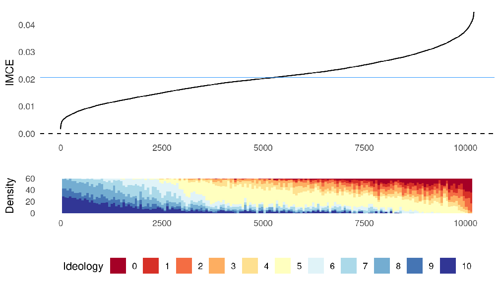

This causal forest model does not account for subject-level clustering of observations (see Figure E4).

Unlike in our BART strategy, the causal forest algorithm automatically returns predicted treatment effects rather than predicted outcomes. We therefore directly aggregate the output of the causal forest model (OMCEs) to the level of IMCEs by averaging these predictions for each individual separately.8

Figure E3 plots these IMCEs and the corresponding histogram of ideology values for every subject in the experiment. These results follow the same pattern as those presented in the main paper, with ideology clearly inversely related to the magnitude of the IMCEs: more right-leaning subjects have smaller (albeit positive) IMCEs.

8Since variance estimation in causal forest uses a bootstrap of little bags (Athey et al. 2019), aggregating the uncertainty estimates from the level of observation to the level of the individual is beyond the scope of this paper.

xxx

Causal forests also provide an in-built and simple variable importance measure (VIMP), by calculating a weighted sum of the number of times each covariate is used to split the data across all the trees in the forest. This measure is different from our BART strategy, since in the causal forest case (and like with random forests) one can rely on the independence of the estimates from each separate tree. In BART, since the trees are nonindependent (they are trained to model the residual variance of the T − 1 other trees), interpreting split criteria directly is more challenging. Therefore, it is worth inspecting how this intrinsic model metric from the causal forests algorithm identifies important covariates.

Table E2 reports the VIMP scores for the covariate attributes in the model. For categorical variables, each dummy factor is assigned a separate score and so we sum these to get an importance measure for each covariate. Similar to our analysis in the main paper, subject ideology is identified as an important predictor. The causal forest importance measure diverges from our own in two ways. First, the causal forest does not identify subjects’ country as an important predictor. We believe this difference is due to the fact that, for our random forest based measure in the main paper, the trees are able to split on multiple levels of the categorical variable at single decision nodes (as shown in Figure 5.) As a result, our variable importance measure regularises itself by collapsing levels of categorical variables. This is not possible in the causal forest measure since each node can only split on one level at a time. Second, and perhaps relatedly, the causal forest measure identifies subjects’ age as an important feature. We are unsure precisely why this difference exists, but we note that theoretically the importance measures are quite different (see the discussion in Section 3.1), which may contribute to the divergence in scores.

Overall, these results help demonstrate two claims. First, that it is possible to substitute the BART-specific implementation we discuss in the main paper with alternative OMCE estimation strategies. Second, that our main substantive results appear robust to different

xxxi

- Table E2. Variable importance scores for the “Lowest 20% income level" attribute-level, using the intrinsic measure from the causal forest fitting algorithm

Covariate Variable Importance

Country 0.010 Education 0.046 Gender 0.041 Hesitancy 0.067 Ideology 0.131 Income 0.027 Mandatory Vaccination 0.090 Age 0.130 WTP Access 0.047 WTP Private 0.052

ML estimating strategies, providing further evidence of their robustness.

Finally, one advantage of causal forest estimation is the ability to model the subjectclustering component of conjoint designs by supplying the subject identifiers to the algorithm (see Athey et al. 2019). We can therefore assess whether deliberately clustering affects our findings by comparing the results presented in Figure E3 with a clustered-variant (as shown in Figure E4). Substantively, the results are very similar. The distribution of right-leaning subjects stretches slightly further along the IMCE distribution, and the most extreme IMCEs are slightly larger, but not drastically so and do not affect our interpretation of the results.

- xxxii

- Figure E4. Causal forest estimation of IMCEs for the “Lowest 20% income level" by subject ideology, accounting for subject-level clustering of observations

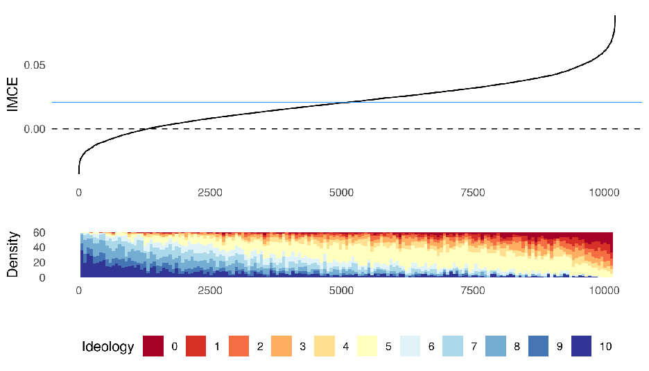

- xxxiii

### F Example of pIMCE estimation

In Section 2.4 of the main paper, we extend the logic of the IMCE to cases where we do not assume that possible profiles are distributed uniformly. In particular, we adapt the logic of de la Cuesta et al. (2022) by weighting the IMCE potential outcomes by the marginal distributions of the attributes in the population of interest.

To demonstrate this approach empirically, we consider a hypothetical case where we alter the marginal distributions of the age, income, and vulnerability attributes based on their distribution in US adult population. Table F1 summarises the population marginals we use. To make our hypothetical scenario more realistic, we approximate the distribution of age categories using the American Community Survey, by summing the proportion of US adults whose age is closest to each attribute-level in the Duch et al. (2021) design.9 For the proportion of vulnerable adults, we use data provided by the Henry J Kaiser Family Foundation, which found that 37.6% of US adults had a higher risk of serious illness due to COVID-19.10 We divide this percentage equally between the two higher vulnerability attribute-levels. For income, since the lower (upper) level refer to the 20% lowest (highest) income levels, we follow these distributions in the marginal distribution of age. For the remaining two attributes, we assume uniform distributions.

We first inspect the pIMCEs for the 65 year-old attribute-level, which our original analysis suggested was correlated with subjects’ own age. Figure F1 plots a comparison of the pIMCE estimates against the original (unweighted) IMCEs generated from our standard strategy, for each US respondent in the Duch et al. (2021) data. While we do not see substantially different estimates using the pIMCE strategy, there is a notable compression of effect sizes into three distinct clusters. Figure F2 confirms this analysis: while the pIMCE

- 9The ACS categories do not perfectly align with the conjoint age levels, so these proportions are approximate. We also scale the proportions to consider only US subjects aged 15 years and older.
- 10https://www.kff.org/coronavirus-COVID-19/issue-brief/how-many-adults-are-at-risk-of-serious-illness-ifinfected-with-coronavirus/ [Accessed 16th August 2022].

xxxiv

- Table F1. Assumed marginal distributions of attribute-levels in the population

##### Attribute Level Marginal Probability

Vulnerability Average 0.62 Moderate 0.19 High 0.19

Transmission All 0.33 Income Lowest 20% 0.20

Average 0.60 Highest 20% 0.20

Occupation All 0.13 Age 25 years old 0.33

40 years old 0.31 65 years old 0.22 79 years old 0.14

effects are slightly more extreme at either tail of the distribution, by and large they follow the same sort of pattern and magnitude. The jumps in the pIMCE line reflect the clustering of effect sizes seen in Figure F1. As shown in the bottom panels of Figure F2, however, the distribution of these estimates across both the IMCEs and pIMCEs correlate similarly with subjects’ age: the strongest effects are for older respondents who are closer to the age of the attribute-level in question, consistent with our theoretical expectations.

Figures F3 and F4 repeat this exercise for the “High risk" transmission attribute-level in the conjoint experiment. We use the same marginal distributions as presented in Table F1. Here we see only minor differences between the IMCEs and pIMCEs for subjects. Similarly the effects distribution, while clearly heterogeneous, does not correlate anywhere near as strongly with subjects’ age (compared to when analysing the age attribute).

- xxxv

- Figure F1. Comparison of each US subjects’ pIMCE estimate for the “65 years old" attribute-level, against the standard IMCE estimate

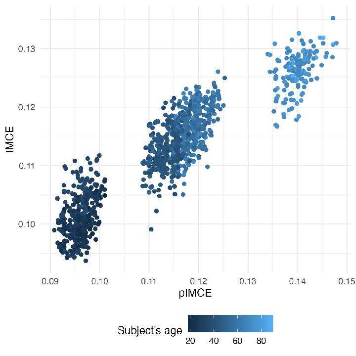

- xxxvi

mates for the “65 years old" attribute-level

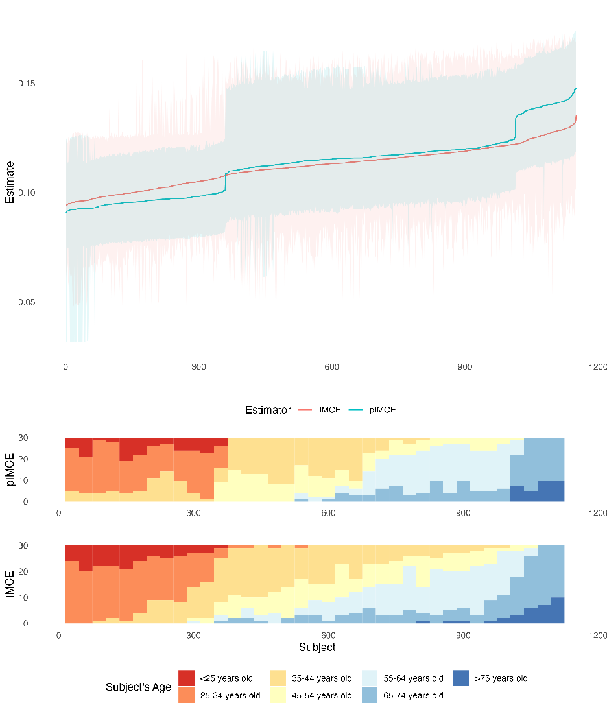

Shaded areas around the IMCE/pIMCE lines indicate the respective 95% credible intervals.

- xxxvii

Figure F3. Comparison of each US subjects’ pIMCE estimate for the “high risk" transmission attribute-level, against the standard IMCE estimate

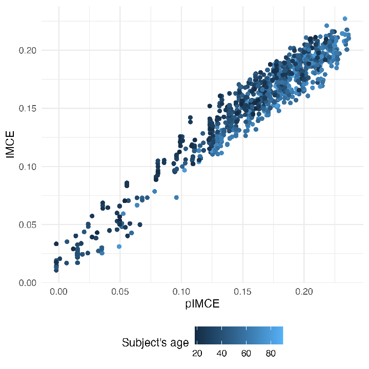

- xxxviii

mates for the “high risk" transmission attribute-level

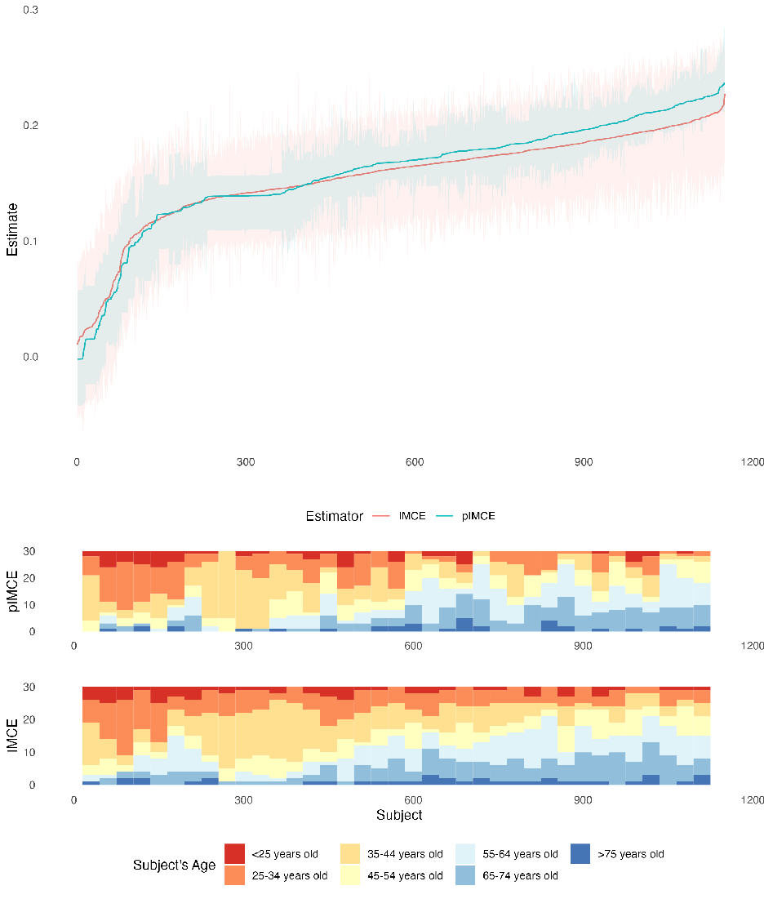

Shaded areas around the IMCE/pIMCE lines indicate the respective 95% credible intervals.

- xxxix

### G Additional figures

###### Figure G1. Detecting heterogeneity in IMCEs using simulated conjoint data derived frompreferences over profiles (continuous covariate)

A1: Binary heterogeneity (c1) A2: Interval heterogeneity (c2)

| | | | | | | | | | | | |
|---|---|---|---|---|---|---|---|---|---|---|---|
| | | | | | | | | | | | |
| | | | | | | | | | | | |
| | | | | | | | | | | | |
| | | | | | | | | | | | |
| | | | | | | | | | | | |
| | | | | | | | | | | | |
| | | | | | | | | | | | |

| | | | | | | | | | | | |
|---|---|---|---|---|---|---|---|---|---|---|---|
| | | | | | | | | | | | |
| | | | | | | | | | | | |
| | | | | | | | | | | | |
| | | | | | | | | | | | |
| | | | | | | | | | | | |
| | | | | | | | | | | | |
| | | | | | | | | | | | |

0.25

0.00

−0.25

###### IMCE

A3: Random heterogeneity

| | | | | | | | | | | | |
|---|---|---|---|---|---|---|---|---|---|---|---|
| | | | | | | | | | | | |
| | | | | | | | | | | | |
| | | | | | | | | | | | |
| | | | | | | | | | | | |
| | | | | | | | | | | | |
| | | | | | | | | | | | |
| | | | | | | | | | | | |

c2

0.25

0.00

−0.5 0.0 0.5

−0.25

###### xl

Figure G2. IMCE predictions by ideology values, using models on trained k = 5 random batches of the full experimental data

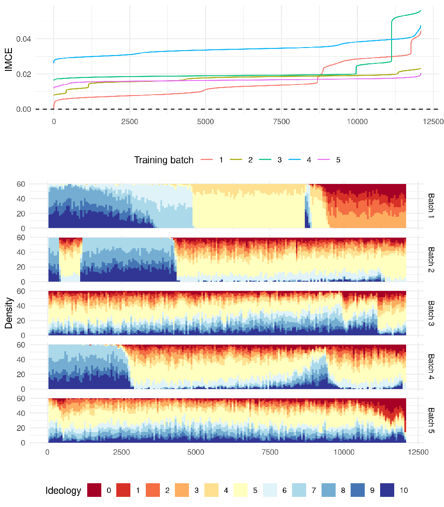

- xli

Figure G3. IMCE predictions by ideology values, for the “65 years old" attribute-level

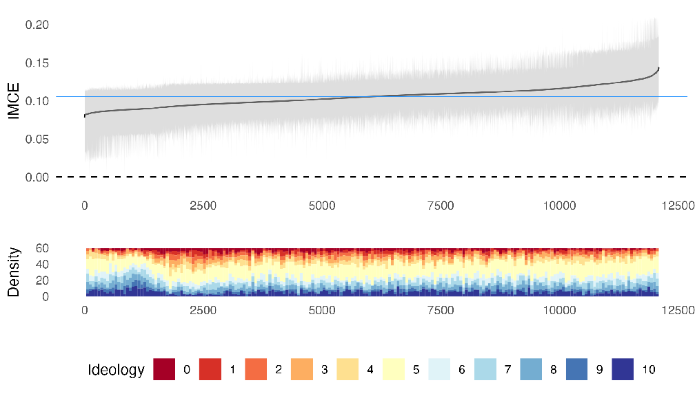

- xlii

### References

Athey, Susan , Julie Tibshirani, and Stefan Wager (2019). Generalized random forests. The Annals of Statistics 47(2), 1148–1178. Athey, Susan and Stefan Wager (2019). Estimating treatment effects with causal forests: An application. Observational Studies 5(2), 37–51. Carnegie, Nicole Bohme and James Wu (2019). Variable selection and parameter tuning for bart modeling in the fragile families challenge. Socius 5, 2378023119825886. Chipman, Hugh A. , Edward I. George, and Robert E. McCulloch (2010). Bart: Bayesian additive regression trees. Annals of Applied Statistics 4(1), 266–298.

de la Cuesta, Brandon , Naoki Egami, and Kosuke Imai (2022). Improving the external validity of conjoint analysis: The essential role of profile distribution. Political Analysis 30(1), 19–45.

Duch, Raymond , Laurence S. J. Roope, Mara Violato, Matias Fuentes Becerra, Thomas S. Robinson, Jean-Francois Bonnefon, Jorge Friedman, Peter John Loewen, Pavan Mamidi, Alessia Melegaro, Mariana Blanco, Juan Vargas, Julia Seither, Paolo Candio, Ana Gibertoni Cruz, Xinyang Hua, Adrian Barnett, and Philip M. Clarke (2021). Citizens from 13 countries share similar preferences for covid-19 vaccine allocation priorities. Proceedings of the National Academy of Sciences 118(38).

Hainmueller, Jens , Daniel J. Hopkins, and Teppei Yamamoto (2014). Causal inference in conjoint analysis: Understanding multidimensional choices via stated preference experiments. Political Analysis 22(1), 1–30.

Hill, Jennifer , Antonio Linero, and Jared Murray (2020). Bayesian additive regression trees: A review and look forward. Annual Review of Statistics and Its Application 7(1). Kapelner, Adam and Justin Bleich (2016). bartmachine: Machine learning with bayesian

additive regression trees. Journal of Statistical Software 70(4), 1–40.

xliii

Sparapani, Rodney , Charles Spanbauer, and Robert McCulloch (2021). Nonparametric machine learning and efficient computation with Bayesian additive regression trees: The BART R package. Journal of Statistical Software 97(1), 1–66.

Tibshirani, Julie , Susan Athey, Erik Sverdrup, and Stefan Wager (2022). grf: Generalized Random Forests. R package version 2.2.0. Zhirkov, Kirill (2021). Estimating and using individual marginal component effects from conjoint experiments. Political Analysis, 1–14.

xliv

