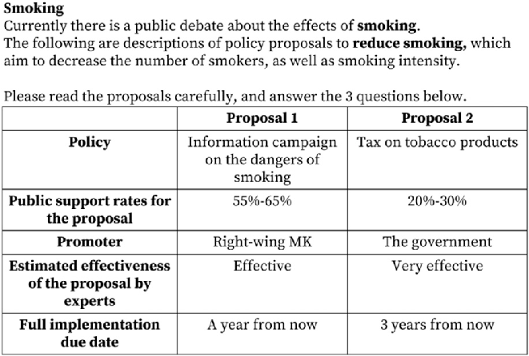
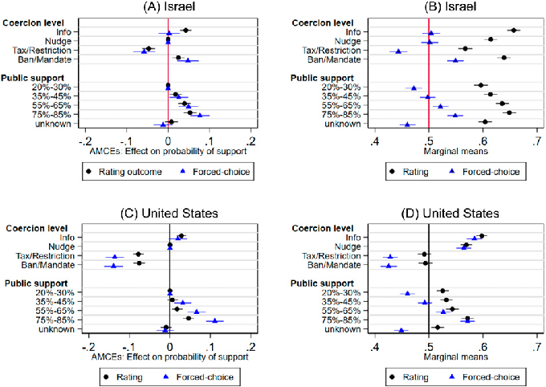

Research Article

# Changing the lens: The contingency of results from conjoint experiments on the outcome variable and the estimand

Research and Politics April-June 2025: 1–9 © The Author(s) 2025 Article reuse guidelines: sagepub.com/journals-permissions DOI: 10.1177/20531680251351238 journals.sagepub.com/home/rap

Clareta Treger

Abstract

Conjoint experiments have become popular in political science for studying opinions, attitudes, and preferences on various issues. While the methodological literature discusses two dependent variables—forced-choice and rating outcomesmany studies continue to use (or report) only the former. Additionally, many studies primarily focus on analyzing causal quantities—Average Marginal Component Effects (AMCEs) and do not report the descriptive estimates—Marginal Means (MMs). This article highlights the contingency of results from conjoint experiments on the outcome variable and the estimand used. It calls for the inclusion of the rating outcome and for reporting the MMs alongside AMCEs. As the two outcome variables elicit distinct preferences, it explains how relying solely on one may obscure important findings and limit the insights gained from the experiment. This is particularly consequential for the analysis of MMs. These arguments are demonstrated by replicating and reanalyzing recently published conjoint studies. The article concludes with practical recommendations for applied researchers.

Keywords AMCEs, conjoint, forced-choice, marginal means, experimental methods, rating outcome

Introduction

Conjoint experiments have become very popular in the study of public opinion and political attitudes since Hainmueller et al. (2014) introduced a methodological framework for conjoint analysis (see Figure 1 below1). The application of the design is diverse and covers research questions related to electoral contests, candidate choice, policy preferences, and more (for lists of applications see Bansak et al., 2021a: 35–36); Bansak et al., (2021b: 11); De la Cuesta et al. (2022)’s appendix). Based on Hainmuller et al.’s framework, the most commonly applied dependent variable is the binary forced-choice outcome.2 Moreover, until recently the quantity of interest that has been most frequently used was the Average Marginal Component Effect abbreviated to AMCE (Bansak et al., 2021b; De la Cuesta et al., 2022).3

However, a potential disadvantage of using only the forced-choice outcome or focusing solely on AMCEs

(Leeper et al., 2020) is that they may mask important complementary results, and thereby constrain the insights and implications drawn based on the experiment. In this article, I argue that including the rating dependent variable in the design of the conjoint and analyzing marginal means (MMs) as another quantity of interest, can enrich and even alter the results and conclusions drawn based on these experiments. Both contribute to the contextualization of conjoint results, inter alia, by highlighting values that have “outcome significance” (Margalit, 2019)—the values that make the difference between choosing a profile and rejecting it.

The Department of Political Science, University of Toronto, Canada Corresponding author: Clareta Treger, The Department of Political Science, University of Toronto, Sidney Smith Hall, Toronto, ON M5S 3G5, Canada. Email: clareta.treger@utoronto.ca

Creative Commons CC BY: This article is distributed under the terms of the Creative Commons Attribution 4.0 License (https://creativecommons.org/licenses/by/4.0/) which permits any use, reproduction and distribution of the work without further permission provided the original work is attributed as specified on the SAGE and Open Access pages (https://us.sagepub.com/

en-us/nam/open-access-at-sage).

| |
|---|

Figure 1. Articles including conjoint experiments in top political science journals, 2014-2022 (Political Behavior, Journal of Politics, American Journal of Political Science, Political Science Research and Methods, Journal of Experimental Political Science, British Journal of Political Science, American Political Science Review, Public Opinion Quarterly).

Additionally, the rating outcome enables to elicit unrestricted levels of support for a given value, unlike the forced-choice outcome (which forces the mean of preferences to be 0.5).

To demonstrate the argument, I replicate a conjoint experiment on the determinants of Americans’ preferences for paternalistic policies (Treger, 2023), using original data from Israel. The replication applies both outcome variables and the analysis of AMCEs and MMs, to demonstrate the added value of the rating outcome and the MMs analysis. Additionally, I reanalyze two recent studies which focused on AMCEs, to demonstrate the enriched and even altered insights researchers can draw from also analyzing MMs (Jensen et al., 2021; Lehrer et al., 2022). The article concludes with recommendations for applied researchers.

Contextualizing results through the rating outcome and marginal means analysis

The uptick in the implementation of the conjoint design can be attributed to its numerous advantages. Most importantly, it allows researchers to examine simultaneously the causal effect of multiple attributes on a single outcome, and evaluate their relative explanatory power. This is useful because multidimensionality is typical to the objects of interest in political science, be it political candidates, immigrants, or policies (Bansak et al., 2021b; Hainmueller et al., 2014). Additional advantages are that the design mitigates concerns of social desirability (Bansak et al., 2021b) and satisficing (Bansak et al., 2021a), is robust to increasing the number

of attributes or profiles in each task (Jenke et al., 2021), and is externally valid (Hainmueller et al., 2015).

Quantities of interest: Average Marginal Component Effects and Marginal Means

The lion’s share of studies employs the causal quantity Average Marginal Component Effect (AMCE), which is the average effect of an attribute on the probability of support for a given profile as compared to a baseline category. It allows answering the question: What is the effect of changing the value of attribute A from the baseline value a to another value a’ on the probability that the profile will be chosen?4 Notably, the AMCEs are interpreted in relation to the chosen baseline level, making them sensitive to this choice.

While the advantage of survey experiments is that they convey both descriptive information on attitudes and causal relationships (Mutz, 2011), AMCEs only convey the latter. Marginal means (MMs) complement the descriptive component, describing “the level of favorability toward profiles that have a particular feature level, ignoring all other features” (Leeper et al., 2020: 210). This quantity allows us to answer questions such as: What is the level of favorability toward profiles with value a? Leeper et al. (2020) argue that MMs are necessary to compare subgroup preferences because MMs are not sensitive to the choice of the baseline level, and demonstrate how descriptive interpretation of AMCEs can be misguided because of their dependence on the baseline.

Expanding their work, I argue that MMs also enable answering subsequent questions that are substantively important (summarized in Table 1): Which causal effects

Table 1. The type of questions each quantity of interest answers. Quantity Type Questions AMCE Causal What is the effect of changing the value of attribute A from the baseline value a to value a’ on the probability that

the profile will be chosen? MM Descriptive What is the level of favorability toward profiles with value a, ignoring all other values? Specifically:

- a. Which causal effects have “outcome significance,” namely, make the difference between opposition and support?
- b. Which values make voters support a given profile?
- c. Do any of the values generate support for the profile?

(values) are more likely to make the difference between opposition (below 0.5) and support (above 0.5) for the profile? Which values make voters likely to support a given profile? Do any of the values generate support for the profile? These are relevant for conjoint analysis in general and are not limited to subgroup analysis.

While the ranking of attribute values (AMCEs) can be inferred from the MMs, the levels of support cannot be inferred from the AMCEs. None of the descriptive questions can be answered by analyzing solely AMCEs. Notably, AMCEs of the same magnitude can correspond to low (opposition) or high (support) levels of favorability toward a profile with a given value.

Alternatively, some values can be exactly what makes the difference between support and opposition. This can be thought of in terms of the difference between “explanatory significance” and “outcome significance” (Margalit, 2019). The former is the causal effect of a given value. Outcome significance pertains to the determinants that make the difference between opposition and support, choice or rejection. In causal examinations, this aspect often has substantive importance. While the causal effect (or explanatory significance) of a given value could be of modest magnitude it could be the thing that tips the scales and thus changes the outcome. Alternatively, large causal effects may lack outcome significance, namely, be non-consequential to the issue at stake. Or, values with AMCEs of similar magnitude may make this difference for some attributes but not for others.

Outcome variables: Forced-choice and rating

Two common outcome variables for conjoint experiments are forced-choice and rating (Bansak et al., 2021b; Hainmueller et al., 2014). The former is binary and forces respondents to choose between the profiles, and to make tradeoffs between attribute bundles, even when respondents may lack a clear preference. Hence, by design, this outcome variable forces the mean of MMs of each attribute to be 0.5. This makes it difficult to determine whether an attribute value is an asset or a liability.

The rating outcome includes a scale (e.g., from 1 to 7) and allows respondents to express more nuanced preferences, for example—reject or support both profiles. It even allows participants to reject (support) all the profiles they evaluate. Notably, when a preference exists, the choice can be induced from the rating, but not the other way around. Importantly, this outcome does not constrain the mean of the MMs. While it is well-researched that different rating scales elicit preferences in different ways and recommended to employ moderate length scales in surveys (Krosnick and Presser, 2010), for conjoint analysis it became common to use (or report) predominantly the choice outcome (see Table E2 in the Supporting Material and Ganter (2023)).

This article advocates for the inclusion of the rating outcome in the design of the conjoint experiment, alongside the forced-choice outcome, for several reasons. First, as the two outcomes elicit preferences differently, they may generate different results. Second, the rating outcome allows for much more variance and nuance. Finally, some applications of the conjoint experiment relate to real-life choices which are seldom binary, such as preferences for policies, or immigrant admission, thus making the rating a more realistic reflection of preferences and more externally valid (see also Hainmueller et al. (2015)). Yet, the rating outcome can be methodologically justified even in cases where conjoint experiments mimic real-life binary choices because researchers use the conjoint to elicit the determinants which effect on average the probability of choice, rather than the choice of a specific randomly generated profile as compared to another. Also, even when a choice is binary, individuals may abstain (Miller and Ziegler, 2024). Therefore, a justification to use solely the forced-choice outcome needs to rely more heavily on reasons to force participants to make such strict tradeoffs, rather than on the real-world situation that the experiment represents.

Moreover, the choice of the estimand becomes even more consequential when coupled with the choice of the outcome variable. The reason is that the forced-choice outcome forces the mean of MMs of each attribute to

0.5 by design, but the rating outcome does not constrain the mean. Therefore, when using the rating outcome, one cannot calculate the MMs from the AMCEs, because their mean can be anything between 0 and 1.

To showcase these points, I replicate one conjoint study using an original sample (Section 3.1) and reanalyze two recently published studies (Section 3.2).

Empirical demonstration

Replication study: Determinants of attitudes toward paternalistic policies

To demonstrate how marginal means can contextualize the causal effects, and the different results obtained when using the rating and forced-choice outcome, I replicate a conjoint experiment that examines the determinants of attitudes toward paternalistic policies in the U.S. (Treger, 2023), using an original Israeli sample. Paternalistic policies are defined as policies that aim to prevent individuals from inflicting self-harm (Dworkin, 1972; Thaler and Sunstein, 2009). The study tests the causal effect of five policy attributes on support for such policies: coercion level, public consensus, effectiveness, the promoter’s identity, and implementation date (see Table B2 in the Supporting Material for the list of attribute values).

Method and Data. The U.S. study was administered to a nationally representative sample (N = 1370) via Lucid between September 17 and October 28, 2019. I administered the same experiment5 to a national sample of the Israeli Jewish population (N = 1170) through iPanel between December 26, 2019 and January 1, 2020 (at the time, there was no Israeli online panel provider that had a highquality panel of the Arab Israeli population). The study received the approval of the Tel Aviv University IRB (No. 0000241-1). Both samples were recruited using quotas on key demographic indicators. Table A1 in the Supporting Material (henceforth: SM) presents full demographics for the Israeli sample.

The conjoint experiment consists of tasks that present participants with two hypothetical policy proposals that vary randomly along the five attributes above (see Figure 2). The values on the attributes were randomized, as was the order of the attributes between and within respondents.6 The conjoint was constructed using the Conjoint SDT (Strezhnev et al., 2013). Each participant was presented with eight tasks. This amounts to effective sample sizes of 21,920 and 17,616 policy proposals for the U.S. and Israel, respectively. More details on the experiment can be found in SM Section B.

The original and the replication studies employ the forced-choice and the rating outcome, as follows:

· Forced-choice: If you had to choose between them, which of these two proposals would you prefer? · Rating: If proposal 1[2] is introduced, how much will you support it on a scale from 1 to 7, where 1 indicates that you will oppose it a great deal and 7 indicates you will favor it a great deal?

Yet, the U.S. study only reports AMCEs for the rating outcome. Additionally, the rating scale was dichotomized into a binary outcome.7 Here I use the full scale of the rating outcome rescaled to range between 0 and 1, and present analyses with both outcome variables for both samples. I also present MMs for both studies. All analyses employ linear regression models with respondent-clustered standard errors. For a focused empirical demonstration, below I present results for two of the five conjoint attributes. Full results—which present similar patterns to those reported below—can be found in SM Section C.

Results. Figure 3 presents AMCEs and MMs analyses in the U.S. and Israel, using the rating outcome (black circles) and the forced-choice outcome (blue triangles). I start with a comparison of the AMCEs by outcome variable (panels A and C). Generally, within each country the results are quite similar when using the rating outcome or forced-choice. There are some differences in terms of estimate magnitude and significance, which are more pronounced in the U.S. (panel C). For example, the magnitude of the AMCEs for Tax/Restriction and Ban/Mandate is larger when the forcedchoice outcome is used,8 and the same is the case for the values of the Public Support attribute. Yet, these do not amount to different substantive conclusions. Next, comparing the results between the countries, I find that the causal effects are very similar in terms of direction and magnitude for each of the outcome variables. The only exception is Ban/Mandate, which has a positive AMCE in Israel and a negative AMCE in the U.S., for both outcome variables. Overall, the choice of outcome variable is not consequential for the within and between countries (groups) analysis.

But what happens when we change the lens and examine the same outcomes using marginal means? What are the levels of support in each country? Are they similar too? Are the findings robust to the use of different outcome variables? Which values have outcome significance?

Panels B and D in Figure 3 present the same results as MMs (full MMs are presented in SM Figure C2 and Table C2). Comparing the MMs within each country, it is apparent that the outcome variable is consequential to the underlying preferences obtained. In Israel (panel B) the MMs obtained using the rating outcome display support for paternalistic policies regardless of their specific features, such that none of the features has outcome significance. By comparison, when forced-choice is used, support is not so clear cut, and

||
|---|

- Figure 2. An example of a task in the Israeli conjoint experiment (translated from Hebrew).

many values appear to have outcome significance (e.g., Tax/ Restriction, Ban/Mandate, majority support). The same is evident in the U.S. (panel D): when the rating outcome is used, Americans are supportive of paternalism unless it is coercive (i.e., Tax/Restriction or Ban/Mandate), in which case they are undecided.9 This is far from being the case according to the forced-choice MMs. Some features of the proposals are more likely to be opposed, and others are more likely to be supported, and this results in many values having outcome significance.

Additionally, comparing the MMs between the countries also leads to different conclusions, contingent on the outcome variable. Specifically, using the rating outcome (black circles) Israelis are much more favorably predisposed toward paternalistic policies as compared to Americans—the MMs are higher across attribute levels, despite the similarity in AMCEs. Yet, examining the forced-choice MMs would lead to a different conclusion: Americans prefer noncoercive paternalism, while Israelis are only supportive of the most coercive policy tools, and in both countries favorability levels based on Public Support are similar. Thus, the different outcome variables result in different conclusions regarding the cross-country comparison, as well as different policy implications within each country.

The replication underscores several points. First, MMs contextualize the results obtained through AMCEs: while causal effects of different determinants of support for paternalism may be similar and generalizable across different political contexts, the underlying levels of support are different in Israel and the U.S., thus the policy implications remain country specific.

Second, there are meaningful advantages to using the rating outcome in conjoint experiments. Once attribute values are not artificially constrained to a mean of 0.5 the full variance of preferences can be revealed. The striking differences in MMs between the rating and forced-choice outcomes within and between countries would lead to completely different conclusions and implications. For example, the MMs obtained through the rating outcome suggest that the exact policies by which these policy goals are promoted matter less to Israelis. Americans’ preferences, by contrast, are much more nuanced. This is despite the similar AMCEs in the two countries.

Finally, identifying the values with outcome significance is only possible through MMs. This also provides important context for AMCEs. For example, in the U.S. information policies and 55%-65% support have similar AMCEs using the rating outcome (0.03 and 0.02, respectively), but an examination of the MMs reveals that only the former has outcome significance. Importantly, the forced-choice outcome artificially generates values with outcome significance, because the mean of MMs is set to 0.5. This constraint is eliminated with the rating outcome.

Reanalyzed studies

Out of the ten articles published in Political Science Research and Methods that employed conjoint experiments between 2020 and 2022, four focused solely or mainly on AMCEs, and strikingly only one used the rating outcome (see SM Table E2). I reanalyzed three articles to examine how the results and conclusions would be affected by MMs

||
|---|

- Figure 3. Panel A presents AMCEs and Panel B present MMs in the Israeli sample (N = 17,616). Panel C presents AMCEs and Panel D present MMs in the U.S. sample (N = 21,920) samples. Each plot presents results obtained using the rating outcome (black circles) and forced-choice outcome (blue triangles).

analysis. Erlich and Beauvais (2022) report the MMs analysis in their replication material, and in this case, it did not add additional insights to their findings, therefore I do not report this reanalysis. Reanalyzing Lehrer et al.’s (2022) paper I find that the MMs contextualize and qualify the authors’ findings, illustrating that MMs can be useful even when subgroup analysis is not of main interest. I elaborate on this reanalysis in SM Section D2.

The study most affected by examining MMs was Jensen et al. (2021) and is reported below (see SM Section D1 for the full reanalysis). In this case, the AMCE quantity alone is insufficient to answer the research question that focuses on preferences, and I demonstrate that analyzing MMs can enrich the empirical investigation.

The authors ask: “Do local development policy preferences […] vary by partisanship and if so, do partisans have opposing and polarized positions?” (p. 223). Notably, this is a question about preferences, so MMs are more suitable than AMCEs to answer it. The authors examine whether partisan sorting and polarization over public policies in the U.S. are also prevalent regarding local policies concerning economic development. They administered a conjoint experiment to participants who identified as strong Democrats and strong Republicans with local development plans containing policy alternatives on six different dimensions. For each dimension, the alternatives were compared to the status quo (the baseline level).

The authors define sorting as different partisans having “different CAMCEs10—relative to the status quo

alternative—for a given policy issue” and polarization as “having CAMCEs of opposite signs” (p. 224). The outcome variable isforced-choice. Theyreportfindingvery similarpolicy preferences among strong Democrats and Republicans in many areas of economic development. Based on their definitions they find evidence for sorting on four of the 20 policies and for polarization on seven policies.11 Column 1 in Table 2 summarizes their findings (see SM Table D1 for the full data).

However, of interest here is not only which policies will move preferences compared to the status quo (AMCEs), but whether different partisans have different levels of support (MMs) for these policies. MMs allow us to examine which of the policies are significantly above 0.5, enjoying support. This has implications for policymaking even prior to subgroup comparison. Notably, while causal effects may be very similar for both groups of partisans, their MMs can significantly differ. Additionally, some of the MMs may not be statistically different from 0.5, indicating an indecisive position on average, regarding the policy, rather than a clear preference. Therefore, I propose that polarization will be better reflected by opposing preferences (MMs) for a policy held by different partisans, not by CAMCEs with opposing signs as compared to the status quo. Additionally, when one group of partisans has a clear preference for the policy while the other is indecisive—I will call it difference.12

Using MMs analysis, I identified the policies on which strong Democrats and Republicans hold different preferences or are polarized.13 This analysis contextualizes the

Table 2. Identification of polarization, sorting, and differences, based on Jensen et al. (2021) and the MMs reanalysis.

(1) (2) Original classification (AMCE-based) Reanalysis classification (MMs-based)

Conjoint attributes and values

Investment and taxes Stimulate existing companies Encourage investment charities Difference Attract new businesses Keep current (baseline)

Workers and entrepreneurs Worker training vouchers Weak polarization Tax breaks to entrepreneurs Limit unions’ power Sorting Difference Expand unions’ power Weak polarization Difference Keep current (baseline) Difference

Local services

Public transportation Polarization Difference Safety and crime prevention Sorting Difference Affordable housing Weak polarization Difference Keep current (baseline)

Governance More power to the state Consolidate local government Keep current (baseline)

Education Vouchers to schools Polarization Polarization Pay teachers more Sorting Difference Free pre-school Polarization Polarization Charter schools Polarization Difference Keep current (baseline)

Higher education Technical vocational training Student grant programs Sorting Difference Local public universities Community colleges Keep current (baseline)

Note: Column 1 summarizes the classification of partisan differences on policies reported in the original study on pp. 230-232. Column 2 summarizes the classification of partisan differences on policies based on the MMs reanalysis. “Difference” in preferences for the policies is assigned when one group has a preference significantly different from 0.5, and the other group is indecisive (namely, the preference is not distinguishable from 0.5).

CAMCEs, and even alters slightly the findings reported, as summarized in Column 2 of Table 2 (see also SM Table D1). In total, the MMs present ten policies on which strong Democrats and Republicans hold different preferences (but are not sorted), and only two policies on which they hold polarized preferences (not seven), a finding which actually strengthens Jensen et al. (2021)’s main conclusion. Finally, the MMs provide information about where respondents stand on these policies—which they are more (less) likely to support on average—results especially relevant for identifying polarizing policies (see SM Figure D1).

The incongruence between the findings based on the two quantities of interest stems from the fact that CAMCEs cannot inform us whether strong partisans in

each group have similar preferences for the status quo on each issue (the baseline for the CAMCEs analysis), and thus we cannot tell whether similar (different) CAMCEs reflect similar (different) preferences. The MMs indicate that on most issues the preferences for the status quo are not identical, and these differences may be large and significant as in the case of “Workers and Entrepreneurs” (and see SM Table D2).

Conclusion and practical recommendations

I have argued and demonstrated empirically that conjoint experiments would benefit from the inclusion of the rating

outcome in the design and (building on previous methodological work) an analysis of MMs alongside AMCEs. These complement, rather than substitute, the forced-choice outcome and AMCE analysis, respectively, thereby enriching and contextualizing the results and help unveil important masked insights. First, while AMCEs answer causal questions, MMs offer responses to descriptive questions which are often of interest to political scientists. One such question is which values have outcome significance. I have also shown that different preferences could underlie very similar causal effects. Importantly, while the two estimands are alternative lenses through which to look at the same data, important results may be masked when focusing on just one of them.

Second, the rating outcome allows for more variance and nuance in responses, thereby revealing meaningful differences in underlying preferences. Importantly, the two outcome variables tease out different attitudes, to the extent that they may lead to substantively different results and conclusions.

Conditions that may be more suitable for prioritizing the rating outcome include cases when individuals are not expected to have strong priors on the issue at hand. Additionally, due to the randomization of attribute values, it is possible that for certain tasks the attributes that the respondents rely on the most in their evaluations get the same values. In such cases, respondentsmaybeindifferentbetweentheprofiles,butthechoice outcome would force them to choose, eliciting a non-existent preference that is based on attributes they may not care about, or isjustarbitrary.Finally,whilethechoicecanbeinferredfromthe rating (when a preference exists), the opposite—inferring the rating from the choice—cannot be done.

The forced-choice outcome may be useful when researchers have a good reason to force respondents to make sharp tradeoffs between profiles. For example, if they have a basis to assume that all attributes should be significant to the choice at hand (notably a rather strong assumption). Another common motivation to use this outcome is that the experiment mimics binary real-life choices (e.g., U.S. presidential contests). However, even in such cases a rating outcome may be methodologically defendable.

I conclude with a few practical recommendations for researchers interested in analyzing conjoint data:

- 1. Include both the forced-choice and the rating outcomes in your design.
- 2. Justify the decision to prioritize the forced-choice outcome based on substantive and conceptual considerations, not merely on external validity.
- 3. Analyze and report both AMCEs and MMs, as they answer different types of questions, and complement each other.
- 4. Avoid reporting the results of MMs analysis using one outcome variable as a robustness test to the analysis using the other.

5. When interpreting MMs, be mindful of the values that have outcome significance.

By following these suggestions researchers can enhance the quality of their findings and enrich the conclusions drawn from conjoint experiments.

Acknowledgments

The author thanks Peter J. Loewen, John McAndrews, Lior Sheffer, Gal Bitton, Christopher Cochrane, Michael Donnelly, Beatrice Magistro, Eran Amsalem, Gustavo Diaz, and members of the PEARL Lab at The Department of Political Scienceat the University of Toronto for their support and helpful feedback. Any errors remain the author’s own.

Declaration of conflicting interests

The author declared no potential conflicts of interest with respect to the research, authorship, and/or publication of this article.

Funding

The author disclosed receipt of the following financial support for the research, authorship, and/or publication of this article: This research was supported by The Edmond J. Safra Center for Ethics at Tel Aviv University; The Richard and Rhoda Goldman Fellowship Fund; and The Center for the Study of the United States in Partnership with the Fulbright Program at Tel Aviv University.

Ethical statement Informed consent

Participants expressed informed consent to participate in the study. The consent was obtained through an online form at the beginning of the questionnaire. Participants expressed consent that the data collected in the study will be published.

ORCID iD

Clareta Treger  https://orcid.org/0000-0003-0768-3492

Data Availability Statement

Replication data and code will be made publicly available in a public data repository upon conditional acceptance.

Carnegie Corporation of New York Grant

This publication was made possible (in part) by a grant from the Carnegie Corporation of New York. The statements made and views expressed are solely the responsibility of the author.

Supplemental Material

Supplemental material for this article is available online.

The replication files are available at: https://dataverse.harvard. edu/dataset.xhtml?persistentId=doi:10.7910/DVN/AQYCXH.

Notes

- 1. Section E in the Supporting Material provides details on the generation of this Figure.
- 2. See, for example, Ganter (2023).
- 3. Table E2 in the Supporting Material shows that out of the ten conjoint papers published in PSRM since 2020, four analyze only AMCEs, three analyze both AMCEs and MMs, and two present only MMs. One of the papers uses the rating outcome.
- 4. Note that this is not the same as the share of individuals who prefer a profile with a given attribute, nor the majority’s preference (Abramson et al., 2022; Bansak et al., 2022).
- 5. The only exception is the Promoter attribute which was modified to fit the local political context.
- 6. Following the original study, the only restriction on the assignment of conjoint values was that in any given task the policy attribute had to receive different values.
- 7. The binary outcome of “Supported” was coded 1 if the proposal was rated 5-7, and 0 otherwise. Results for the dichotomized rating outcome are reported in SM Tables C1 and C2.
- 8. The AMCEs of Tax/Restriction are 14 and 8 percentage points, and of Bans/Mandates are 14 and 8 percentage points, as compared to the nudge baseline, using forced-choice and rating outcomes, respectively (see SM Table C1).
- 9. This is also apparent in the full results in SM Figure C2.
- 10. Conditional average marginal component effects (Bansak et al., 2021b: 33).
- 11. After estimating the CAMCEs using hierarchical models that include participants’ covariates they conclude finding sorting on ten policies and polarization on three out of the 20. Here I focus on their first analysis of the conjoint.
- 12. Note that this definition of polarization is different from the one proposed by Jensen et al. (2021), and I believe is more accurate. Also, “difference” is distinct from their definition of sorting.
- 13. See also SM Section D for the full analysis.

References

Abramson SF, Koçak K and Magazinnik A (2022) What do we learn about voter preferences from conjoint experiments? American Journal of Political Science 66(4): 1008–1020.

- Bansak K, Hainmueller J, Hopkins DJ, et al. (2021a) Beyond the breaking point? Survey satisficing in conjoint experiments. Political Science Research and Methods 9(1): 53–71.
- Bansak K, Hainmueller J, Hopkins DJ, et al. (2021b) Conjoint survey experiments. Advances in experimental political science 19: 2395–2400.

Bansak K, Hainmueller J, Hopkins DJ, et al. (2022) Using conjoint experiments to analyze election outcomes: The essential role of the average marginal component effect. Political Analysis 31: 1–19.

De la Cuesta B, Egami N and Imai K (2022) Improving the external validity of conjoint analysis: the essential role of profile distribution. Political Analysis 30(1): 19–45.

Dworkin G (1972) Paternalism. In: The Monist. Oxford: Oxford University Press, 64–84.

Erlich A and Beauvais E (2022) Explaining women’s political underrepresentation in democracies with high levels of corruption. Political Science Research and Methods 11(4): 804–822. Ganter F (2023) Identification of preferences in forced-choice conjoint experiments: reassessing the quantity of interest. Political Analysis 31(1): 98–112.

Hainmueller J, Hangartner D and Yamamoto T (2015) Validating vignette and conjoint survey experiments against real-world behavior. Proceedings of the National Academy of Sciences of the United States of America 112(8): 2395–2400.

Hainmueller J, Hopkins DJ and Yamamoto T (2014) Causal inference in conjoint analysis: Understanding multidimensional choices via stated preference experiments. Political Analysis 22(1): 1–30.

Hainmueller J, Hangartner D and Yamamoto T (2015) Validating vignette and conjoint survey experiments against real-world behavior. Proceedings of the National Academy of Sciences of the United States of America 112(8): 2395–2400.

Jenke L, Bansak K, Hainmueller J, et al. (2021) Using eye-tracking to understand decision-making in conjoint experiments. Political Analysis 29(1): 75–101.

Jensen A, Marble W, Scheve K, et al. (2021) City limits to partisan polarization in the American public. Political Science Research and Methods 9(2): 223–241.

Krosnick JA and Presser S (2010) Question and questionnaire design. In: Marsden PV and Wright JD (eds) Handbook of Survey Research. Cambridge: Academic Press, 263–285.

Leeper TJ, Hobolt SB and Tilley J (2020) Measuring subgroup preferences in conjoint experiments. Political Analysis 28(2): 207–221.

LehrerR,StocklePandJuhlS(2022)Assessingtherelativein¨ fluenceof party unity on vote choice: evidence from a conjoint experiment. Political Science Research and Methods 12(1): 220–228.

Margalit Y (2019) Economic insecurity and the causes of populism, reconsidered. The Journal of Economic Perspectives 33(4): 152–170.

Miller DR and Ziegler J (2024) Preferential abstention in conjoint

experiments. Research & Politics 11(4): 20531680241299329. Mutz DC (2011) Population-based Survey Experiments. Prince-

ton: Princeton University Press. Strezhnev A, Hainmueller J, Hopkins DJ, et al. (2013) Conjoint survey design tool. Software Manual 22(1): 1–30. Thaler RH and Sunstein CS (2009) Nudge: Improving Decisions about Health, Wealth, and Happiness. London: Penguin.

Treger C (2023) When do people accept government paternalism? Theory and experimental evidence. Regulation & Governance 17(1): 195–214.

