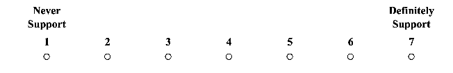
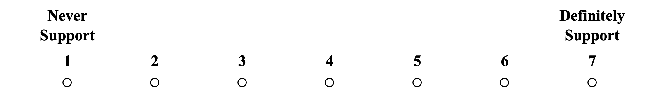
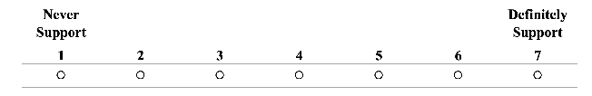

# The Limitations of Using Forced Choice in Electoral Conjoint Experiments*

Giancarlo Visconti† Yang Yang‡ January 29, 2025

Abstract

Political scientists often use conjoint experiments to study voters’ voting preferences, requiring participants to make forced choices between hypothetical candidates. We argue that this forced-choice approach neglects real-world options like abstaining or casting a protest (blank or null) vote, introducing misclassification errors and external validity bias, even with unbiased conjoint estimators. Using published conjoint data, we analyze the source of biases caused by forced-choice designs. To address these issues, we propose an unforced-choice conjoint design and evaluate its effectiveness through a randomized experiment embedding two conjoint analyses and randomizing typical and unforced-choice designs. Our approach aligns experimental designs more closely with real-world voting behavior. By integrating substantive contextual knowledge, we offer practical guidance to help researchers minimize bias, improve estimation accuracy, and enhance the validity of electoral conjoint studies.

Keywords: Conjoint Experiment, Voter Preferences, Forced Choice, Bias

Word Count: 9,862

*Authors are listed alphabetically. We thank Alex Coppock, Ariadna Chuaqui, Bernardo Lara, Bumba Mukherjee, Carmen Le Foulon, Cory McCartan, Jacob Turner, Justin Esarey, Pablo Pinto, Santiago López-Cariboni, Santiago Olivella, Tara Slough, and seminar participants at Penn State C-SoDA, the NYU Rebecca B. Morton Conference on Experimental Political Science, University of Maryland, Latin American PolMeth 2024, and APSA 2024 for their helpful comments and suggestions. The survey was implemented under Penn State University IRB Protocol STUDY0002477. This project was funded by a C-SoDA Accelerator Award. The design was registered at OSF before data collection. All errors are our own.

†Assistant Professor, Department of Government & Politics, University of Maryland, College Park; gvis@umd.edu.

‡Ph.D. Candidate, Department of Political Science and Center for Social Data Analytics, Pennsylvania State University;yky5272@psu.edu

## 1 Introduction

Understanding how voters choose between candidates with varying characteristics is a core question in the study of elections and political behavior. Conjoint analysis has gained traction as a method for capturing the complexity of voter decision-making in diverse electoral contexts (e.g., Franchino and Zucchini, 2015; Carnes and Lupu, 2016; Mares and Visconti, 2020; Horiuchi, Markovich and Yamamoto, 2021). Unlike traditional survey experiments with single vignettes, conjoint analysis decomposes the treatment effect into components, enabling researchers to isolate the influence of individual attributes (Hainmueller, Hopkins and Yamamoto, 2014). Respondents typically evaluate pairs of hypothetical candidates with randomly selected attributes by choosing their preferred candidate or rating each profile.

Despite these advantages, most electoral conjoint experiments employ a forced-choice design, requiring participants to choose one candidate over the other. In real-world elections, where voters have many more options like abstention and protest voting, the forced-choice design may introduce biases by compelling participants to make choices they might otherwise avoid. This deviation from real-world choices may generate unintended bias and undermine the gold standard of conjoint analysis, which aims to more accurately reflect the decision-making process and voting experience of real-world elections (Hainmueller, Hopkins and Yamamoto, 2014; de la Cuesta, Egami and Imai, 2022).1 In response to these concerns, this paper adopts a design-based approach to improve electoral conjoint analysis by proposing a more realistic, unforced-choice design for better studying voters’ voting decisions.

We argue that the forced-choice design unintentionally assumes (1) no non-voters and (2) no 1We surveyed articles using conjoint designs to study voter choices between hypothetical can-

didates across various elections. Our focus was on articles published or accepted in ten leading political science journals — AJPS, APSR, BJPS, CPS, Elect.Stud., JOP, PolBeh, POQ, PSMR, and WP — between 2014 and 2023. Of the 72 articles identified, only four employed an unforcedchoice design. A detailed list can be found in Appendix A.

tendency for protest or indifferent votes, which can misrepresent preferences, particularly in voluntary voting systems. By forcing respondents to choose between candidates, these designs fail to account for real options like abstention, protest votes (e.g., blank or null ballots), or “None of the Above” (NOTA) choices.2 Using existing conjoint data from published articles, we demonstrate that these two assumptions are likely to be violated. First, we find that a significant proportion of respondents recruited for electoral conjoint experiments have abstained from voting at least once in real life, despite being eligible. Second, we observe that around half of respondents might have a tendency to cast an indifferent vote at least once if such an option were available. This suggests that forced-choice conjoint experiments may compel respondents to make artificial trade-offs that do not align with their real-world voting behavior.

To evaluate the impact of forced-choice designs, we first formally identify two types of designinduced biases — specifically, misclassification errors (when protest voters are forced to select a candidate, misrepresenting their true preferences to neither candidates) and external validity bias (where compelled abstainers’ responses create a study population that diverges from the target population of eligible voters who turn out) — and then implement an original, preregistered randomized experiment. In this experiment, we randomized participants into either the typical forced-choice design or our proposed unforced-choice design, embedding two replicated candidate conjoint studies. We replicate both the data collection and analysis from conjoint studies of Presidential candidates by Hainmueller, Hopkins and Yamamoto (2014) and Congressional candidates by Peterson (2017), while assigning respondents to either the forced-choice design or the unforced-choice design. Respondents assigned to the typical forced-choice design are presented with one forced-choice outcome question with two options: Candidate 1 and Candidate 2, and two unforced-rating outcome questions in each task. In contrast, in the unforced-choice design,

2Countries and subnational units like India, Ukraine, Bulgaria, Thailand, Colombia, and the U.S. state of Nevada offer the NOTA option. The French equivalent, ‘vote blanc,’ and ‘voto blanco’ in some Latin American countries, serve a similar purpose. See Alvarez, Kiewiet and Núñez (2018) and Plescia, Kritzinger and Singh (2023) for more details.

we make the choice-based question an unforced response and provide two additional options that better mirror the range of one’s voting choices: “If I only have these two candidates, I will cast a blank/null vote” and “If I only have these two candidates, I will abstain,” while making the rating-based question a forced response.

In both studies we replicated, around 50% respondents used the abstention or protest vote options at least once under the unforced-choice design. This change significantly affected the estimates of Average Marginal Component Effects (AMCEs): estimates can increase, decrease, and gain or lose statistical significance compared to forced-choice results. For example, in the replicated conjoint study of Presidential candidates based on Hainmueller, Hopkins and Yamamoto (2014), we observe that attributes like Age (45, 52, 68 vs. 36) and Income ($54K, $65K, $210K vs. $32K) exhibited notable differences in estimates of AMCEs between designs at the 95% confidence level. Similar effects were observed in the replicated Congressional candidate study from Peterson (2017), where several results differed at the 90% confidence level. These findings highlight the unpredictable biases introduced by forced-choice designs, which can distort both the magnitude and direction of estimates. Our robustness checks, using methods like the Heckman selection model and Inverse Probability Weighting, confirm these effects. We conclude with a practical guide to help researchers avoid potential pitfalls and improve their methodological practices.

While recent literature has discussed the issue of abstentions (Miller and Ziegler, 2024) and the use of a non-forced option to capture preferences (Aviña et al., 2024), our work goes beyond these prior studies in two key aspects: (i) we delve deeply into the nature of the bias associated with forced-choice designs, particularly misclassification and external validity bias; and (ii) we evaluate a broader range of scenarios that neglect real-world behavior by incorporating protest votes in addition to abstentions.

Overall, this paper contributes to the evolving literature on conjoint analysis in political methodology by addressing the design-induced limitations of forced-choice experiments. While recent advancements have focused on distinct conjoint estimands (e.g., Leeper, Hobolt and Tilley, 2020; Abramson, Kocak and Magazinnik, 2022; Zhirkov, 2022; Ganter, 2023; Treger, 2023), estimate

interpretation (Abramson, Kocak and Magazinnik, 2022; Bansak et al., 2023), response quality (Bansak et al., 2018; Horiuchi, Markovich and Yamamoto, 2021; Clayton et al., 2023; Kane and Costa, 2024), and external validity (de la Cuesta, Egami and Imai, 2022), our study shifts the focus toward the design aspects of conjoint outcomes. Specifically, we propose an unforced-choice conjoint design that integrates substantive knowledge of the voting options available in target elections. This approach enhances the realism and applicability of electoral conjoint studies by improving the extrapolation of experimental findings to real-world contexts. While this paper concentrates on electoral studies, our proposed design has broader applicability and can be adapted for other research areas — such as immigration policy preferences or employment decision-making — where decision-makers are not restricted to making binary forced choices in each task.

## 2 Mismatch Between Reality and Design in Electoral ConjointExperiments

Most electoral conjoint analyses present respondents with binary choices between two hypothetical candidates in a target election. This design assumes voters have only two options: vote for Candidate A or Candidate B. However, real-world elections offer voters more choices, and they are not always required to trade off between available candidates. In elections with voluntary voting rules, eligible voters may choose to abstain. Additionally, in elections with either voluntary or mandatory voting rules, voters can submit a protest (blank or invalid) ballot or cast a “None of the Above” (NOTA) vote in some countries, expressing dissatisfaction with the candidates or political system. We argue that the forced-choice design used in most electoral conjoint analyses fails to accurately reflect the range of choices available to voters in real elections. Table 1 highlights the mismatch between the voting options presented to respondents in forced-choice designs and the actual choices voters have in a target election with voluntary voting rules.

Table 1: Choice Mismatch Between Target Elections and Forced-Choice Conjoint Design

Eligible Voters (Respondents) Target Election Forced-Choice

Voters Candidate A, Candidate B, or a protest vote Candidate A or Candidate B Non-voters Abstention Candidate A or Candidate B

#### 2.1 Abstention as an Electoral Choice

Not all eligible individuals take part in electoral activities. The decision to vote or abstain is often an individual choice, and voters are not selected randomly (Bernhagen and Marsh, 2007). Research on electoral behavior consistently shows that non-voters differ systematically from regular voters in their political profiles (e.g., Adams and Merrill, 2003; Bernhagen and Marsh, 2007; Battaglini, Morton and Palfrey, 2008; Bølstad, Dinas and Riera, 2013; Fowler, 2015; Kawai, Toyama and Watanabe, 2021; Visconti, 2021; Koch, Meléndez and Rovira, 2023). Meta-analyses reveal that non-voters differ in factors like age, education, mobilization, party identification, political interest, and political knowledge (Smets and van Ham, 2013).

Existing evidence suggests that if all eligible voters participated, electoral outcomes might differ, underscoring the importance of counterfactual preference aggregation (Bernhagen and Marsh, 2007; Kawai, Toyama and Watanabe, 2021). This reasoning is relevant to forced-choice conjoint experiments, where all eligible voters are presumed to cast a vote, even if some would opt out in real elections. By aggregating preferences from non-voters without scrutiny, forced-choice designs may bias estimates of the actual vote choices.

Are respondents who abstained from voting in the real-world elections actually recruited for candidate conjoint experiments? Identifying non-voter respondents in conjoint studies is challenging because most designs do not differentiate participants by voting history or allow abstention. However, Horiuchi, Smith and Yamamoto (2020) include post-conjoint questions about respondents’ voting history.3 In their sample of 2,200 respondents, 600 reported always voting, while

3In Q7.8, respondents are presented with the following inquiry: "How often have you participated in voting since you got the right to vote? Have you voted in all elections, most elections,

over 370 almost never participated despite being eligible. The remaining 1,200 skipped voting at least once. Using this data, we re-estimated the AMCEs for two subsamples: respondents who consistently vote and those who almost never vote.

Figure 1 highlights notable differences in preferences between these groups in a forced-choice conjoint design. For consistent voters, attributes like prior government experience were not strong predictors of candidate selection. In contrast, non-voters placed significantly higher value on this attribute. These results show that non-voter preferences can differ substantially, with some attributes being valued more strongly or weakly compared to regular voters.

some elections, or never?" Options: (1) Voted in all elections (2) Voted in most elections (3) Voted in several elections (4) I almost never vote. Note: The original question is in Japanese, and we have provided an English translation for the sake of the illustration.

(a) Regular Voters (N=593) (b) Non−Voters (N=377) Difference (95% CI)

| | | | | | | | | | | |
|---|---|---|---|---|---|---|---|---|---|---|
| | | | | | | | | | | |
| | | | | | | |.01 (0.02|)| | |
| | | | | | |−0.02|(0.02)| | | |
| | | | | |−|0.05 (0| | | | |
| | |0.25|(0.02)| | | | | | | |
| | | | | | | | | | | |
| | | | | | | | | | | |
| | | | | | | |0.00 (0.02)| | | |
| | | | | | | |−0.00 (0.02)| | | |
| | | | | | | |0.03 (0|.02)| | |
| | | | | | | |0.01 (0.02)| | | |
| | | | | | | |0.01 (0.0|2)| | |
| | | | | | | |0.06|(0.02)| | |
| | | | | | | | | | | |
| | | | | | | | | | | |
| | | | | | | |−0.00 (0.01)| | | |
| | | | | | | | | | | |
| | | | | | | | | | | |
| | | | | | | |0.00 (0.02)| | | |
| | | | | | | |0.01 (0.02)| | | |
| | | | | | | |0.04 (0|.02)| | |
| | | | | | | | | | | |
| | | | | | | | | | | |
| | | | | | |−0.05 (0|.01)| | | |
| | | | | | | | | | | |
| | | | | | | | | | | |
| | | | | | | |−0.00 (0.01)| | | |
| | | | | | | |−0.01 (0.02)| | | |
| | | | | | |0.05 (0|.01)| | | |
| | | | | | | | | | | |
| | | | | | | | | | | |
| | | | | |−0.09|(0.02)| | | | |
| | | |−0.1|8 (0.0|2)| | | | | |
| | |−0|.21 (|0.02)| | | | | | |
| | | | | |−|0.05 (0| | | | |
| | | | | | | | | | | |
| | | | | | | | | | | |
| | | | | | | |−0.02 (0.02)| | | |
| | | | |−0|.11 (|0.03)| | | | |
| | | | | | | |−0.00 (0.02)| | | |
| | | | | | | |−0.02 (0.02)| | | |
| | | | | | | |0.01 (0.02)| | | |
| | | | | | | |0.01 (0.02)| | | |
| | | | | | | | | | | |

| | | | | | | | | | | | |
|---|---|---|---|---|---|---|---|---|---|---|---|
| | | | | | | | | | | | |
| | | | | | | |0.02|(0.0| | | |
| | | | | |−0.|07 (0.0| | | | | |
| | | | |−0|.12 (0|.02)| | | | | |
| |−0|.26 (0|.03)| | | | | | | | |
| | | | | | | | | | | | |
| | | | | | | | | | | | |
| | | | | | | | |04 (0|.03)| | |
| | | | | | | | | |.09 (0|.03)| |
| | | | | | | | | |.09 (|0.02)| |
| | | | | | | | |0.06|(0.03| | |
| | | | | | | | | |.09 (0|.02)| |
| | | | | | | | | |0.10|(0.02| |
| | | | | | | | | | | | |
| | | | | | | | | | | | |
| | | | | | |−0.0|1 (0.|02)| | | |
| | | | | | | | | | | | |
| | | | | | | | | | | | |
| | | | | | | | |.05 (|0.02)| | |
| | | | | | | |0.0|3 (0.0|2)| | |
| | | | | | | | |04 (0|.02)| | |
| | | | | | | | | | | | |
| | | | | | | | | | | | |
| | | | | | |0.05 (0|.01)| | | | |
| | | | | | | | | | | | |
| | | | | | | | | | | | |
| | | | | | |−0.0|1 (0.|02)| | | |
| | | | | | | |.00 (0|.02)| | | |
| | | | | | |−0.0|1 (0|.02)| | | |
| | | | | | | | | | | | |
| | | | | | | | | | | | |
| | | | | |−0.0|8 (0.02| | | | | |
| | | |−0.1|8 (0.0|2)| | | | | | |
| | | | |−0.14|(0.02|)| | | | | |
| | | | | | |−0.0|2 (0.|02)| | | |
| | | | | | | | | | | | |
| | | | | | | | | | | | |
| | | | | | | |0.0|3 (0.0|3)| | |
| | | | | |−0.09|(0.02)| | | | | |
| | | | | | | |.01 (|0.02)| | | |
| | | | | | |−0.0|2 (0.|02)| | | |
| | | | | | | |0.02|(0.02| | | |
| | | | | | | | |.05 (|0.03)| | |
| | | | | | | | | | | | |

| | | | | | | | | |
|---|---|---|---|---|---|---|---|---|
| | | | | | | | | |
| | | | |0.01 (0.03)| | | | |
| | | |−0.05 (0.03)| | | | | |
| | | |−0.06 (0.03)| | | | | |
| | | |−0.01|(0.03)| | | | |
| | | | | | | | | |
| | | | | | | | | |
| | | | |0.04 (0.03)| | | | |
| | | | | |09 (0|.03)| | |
| | | | |0.06 (0|.03)| | | |
| | | | |0.05 (0.03)| | | | |
| | | | |0.07|(0.03|)| | |
| | | | |0.04 (0.03)| | | | |
| | | | | | | | | |
| | | | | | | | | |
| | | | |−0.01 (0.02)| | | | |
| | | | | | | | | |
| | | | | | | | | |
| | | | |0.04 (0.03)| | | | |
| | | | |0.02 (0.03)| | | | |
| | | | |0.01 (0.03)| | | | |
| | | | | | | | | |
| | | | | | | | | |
| | | | |−0.00 (0.02)| | | | |
| | | | | | | | | |
| | | | | | | | | |
| | | | |−0.01 (0.02)| | | | |
| | | | |0.01 (0.02)| | | | |
| | | | |0.03 (0.02)| | | | |
| | | | | | | | | |
| | | | | | | | | |
| | | | |0.02 (0.03)| | | | |
| | | | |−0.00 (0.03)| | | | |
| | | | |0.07|(0.03|)| | |
| | | | |0.04 (0.03)| | | | |
| | | | | | | | | |
| | | | | | | | | |
| | | | |0.05 (0.|04)| | | |
| | | | |0.02 (0.03)| | | | |
| | | | |0.01 (0.03)| | | | |
| | | | |0.01 (0.03)| | | | |
| | | | |0.01 (0.03)| | | | |
| | | | |0.04 (0.03)| | | | |
| | | | | | | | | |

Age

(Baseline = 30)

42

57

64

79

Experience

(Baseline = No experience)

Formerly in office, 1

Currently in office, 1

Formerly in office, 2

Currently in office, 2

Formerly in office, 3+

Currently in office, 3+

Gender

(Baseline = Male)

Female

Highest Educational Attainment

(Baseline = High school)

Local public university

Prestigious private university

University of Tokyo

Hometown

(Baseline = Inside)

Outside

Parental Political Background

(Baseline = None)

Prefectural assembly member

National assembly member

Cabinet minister

Party

(Baseline = Independent)

DPJ

JCP

Komeito

LDP

Prior Occupation

(Baseline = Business employee)

Business executive

Celebrity

Local government employee

National government employee

Prefectural assembly member

Prefectural governor

−0.3 −0.2 −0.1 0.0 0.1 −0.3 −0.2 −0.1 0.0 0.1 −0.2 −0.1 0.0 0.1 0.2

AMCEs AMCEs Difference in AMCEs

- Figure 1: Replication of the Horiuchi, Smith and Yamamoto (2020) experiment using the subsamples of regular and non-voters. Note: N refers to the number of respondents in each subsample. The rightmost panel shows the differences in AMCEs between regular and non-voter subgroups for each attribute level, in which horizontal bars represent 95% confidence intervals robust to clustering at the respondent level. The red dots with red bars indicate significance at the 5% level, whereas the red triangles with gray bars indicate significance only at the 10% level. The gray dots with gray bars indicate that there is no significance at either conventional level.

#### 2.2 Protest Votes as an Electoral Choice

Conventional forced-choice conjoint analyses require respondents (a sample of eligible voters) to make a trade-off between available candidates. However, in real-world elections, voters do not have to make such a trade-off. If they support neither candidate or are indifferent between them, they can choose not to participate in the election at all, as discussed in the previous subsection. Alternatively, they can participate by deliberately submitting a blank ballot or an invalid ballot paper — a protest vote.

Technically, it is challenging to detect when a respondent makes a trade-off choice in a forcedchoice design. However, by using rating-based responses from existing electoral conjoint analyses, we can approximate the trade-off choices respondents likely made. Researchers use rating-based responses to capture respondents’ preference levels. If a respondent assigns the same ratings to profiles in a particular comparison task, it is plausible to speculate that they are making a trade-off choice in a forced-choice conjoint design because they equally prefer both profiles but must choose one over the other.

We examine pairs of profiles that received identical rating scores from respondents in the experiments by Hainmueller, Hopkins and Yamamoto (2014) and Kirkland and Coppock (2018). Figure 2 shows the proportion of respondents assigning identical ratings to various numbers of tasks in each experiment, and it illustrates that almost 40% of respondents assigned identical ratings to at least one task. It is worth noting that this proportion could be a conservative estimate; if respondents intentionally rate profiles to align with their forced-choice responses for self-consistency, the proportion could be even higher. However, if these respondents were given an unforced-choice design, they might not necessarily make such trade-off choices; they could choose to abstain or cast a blank vote if they prefer not to make a trade-off choice.

(a) Hainmueller et al (2014)'s Candidate Experiment

| |0.5|9| | | | | | | | | | | |
|---|---|---|---|---|---|---|---|---|---|---|---|---|---|
| | | | | | | | | | | | | | |
| | | | | | | | | | | | | | |
| | | | | | | | | | | | | | |
| | | |0.1|9| | | | | | | | | |
| | | | | |0.1|4| | | | | | | |
| | | | | | | |0.0|3|0.0|2|0.0|4| |
| | | | | | | | | | | | | | |

0.6

Proportion of Respondents

0.4

0.2

0.0

0 20 40 60 80 100

Percentage of Tasks with Identical Ratings (%)

(b) Kirkland and Coppock (2018)'s MTurk Experiment

| |0.5|8| | | | | | | | | | | |
|---|---|---|---|---|---|---|---|---|---|---|---|---|---|
| | | | | | | | | | | | | | |
| | | | | | | | | | | | | | |
| | | | | | | | | | | | | | |
| | | |0.2|4| | | | | | | | | |
| | | | | |0.0|9| | | | | | | |
| | | | | | | |0.0|4|0.0|2|0.0|3| |
| | | | | | | | | | | | | | |

0.6

Proportion of Respondents

0.4

0.2

0.0

0 20 40 60 80 100

Percentage of Tasks with Identical Ratings (%)

- Figure 2: Proportion of Respondents Assigning Identical Ratings to Tasks in Hainmueller, Hopkins and Yamamoto (2014)’s and Kirkland and Coppock (2018)’s Experiments
- 3 Design-Induced Bias

In this section, we examine how the discrepancy between voting choices in conjoint designs and those in real-world elections introduces bias and can lead to potential misinterpretations, starting with toy examples and progressing to formal analyses.

#### 3.1 Identifying Bias in Forced-Choice Design with Toy Examples

To illustrate, we present two toy examples that demonstrate how the AMCE aggregates individual preferences and translates into the key substantive quantity of interest — change in vote shares.4 For simplicity, consider an electorate of ten eligible voters whose preferences we aim to study in a target election. This election, where abstention or casting a null ballot is permitted, is

4For a comprehensive discussion, see Bansak et al. (2023), which explains how the AMCE provides a clear and meaningful interpretation as the expected effect of a change in an attribute on a candidate’s or party’s vote share.

simulated through a conjoint task. However, in the task, respondents are required to make a forced choice between two candidate profiles. In the first example, shown in Table 2, Voter 1, who intends to cast a protest vote and holds no genuine preference between the candidates, is compelled to select one in the survey task. This forced selection results in a misclassification problem, as the voter’s response is recorded as a legitimate vote for Candidate tb rather than reflecting their actual preference to neither candidates.

- Table 2: Toy Example 1. This table presents a toy example demonstrating the voting behavior of an

electorate of ten eligible voters for two candidates, ta and tb, in a conjoint task and in reality, assuming 100% turnout. In the survey, all voters cast valid votes, but Voter 1 was forced to vote, despite having no genuine preference. In reality, Voter 1 casts a protest vote instead, resulting in only 90% valid votes. Highlighted cells indicate Voter 1’s voting behavior in reality.

| |Survey  |Reality|
|---|---|---|
|Eligible Voter i  |Turnout=100% Valid Votes=100%  Yi(ta) Yi(tb) πi|Turnout=100% Valid Votes=90%  Y˜i(ta) Y˜i(tb) π˜i  |
|1  2  3  4  5  6  7  8  9  10   |0 1 -1 1 0 1 1 0 1   0 1 -1  0 1 -1  1 0 1   0 1 -1  1 0 1   1 0 1 1 0 1   |0 0 0  1 0 1 1 0 1   0 1 -1  0 1 -1 1 0 1   0 1 -1 1 0 1   1 0 1 1 0 1 |
|Counts  |6 4 2|6 3 3|

E[Yi(ta)−Yi(tb)] = E[Yi(ta)]−E[Yi(tb)]

6 10 −

4 10

1 5

=

=

E[Y˜i(ta)−Y˜i(tb)] = E[Y˜i(ta)]−E[Y˜i(tb)]

3 10

3 10

6 10 −

=

=

(1)

Mathematically, the AMCE is estimated as the difference in expected vote share between candi-

dates when an attribute changes.5 In this toy example, the equation E[Yi(ta)−Yi(tb)] = 106 − 104 = 15 represents the estimated effect of attribute changes on vote share when Voter 1 is compelled to

5We acknowledge that the AMCE estimand involves both direct and indirect comparisons be-

make a choice in a simulated conjoint task. However, due to the misclassification of Voter 1’s forced vote for Candidate B, the real vote share difference E[Y˜i(ta)−Y˜i(tb)] = 106 − 103 = 103 implies that the forced-choice survey underestimates the impact of Candidate ta ’s feature. This misinterpretation skews the estimate of AMCE, creating the illusion that Candidate ta’s feature has a smaller impact on the expected vote share than they actually do.

Similarly, consider an example where abstention plays a crucial role. In the second toy example, illustrated in Table 3, Voter 1 would have chosen to abstain, representing a significant form of political behavior—disengagement or indifference toward the candidates. In a real election, this abstention excludes Voter 1 from the final vote count. However, in a forced-choice conjoint task, Voter 1 is compelled to participate despite his preference to abstain. This forced participation introduces external validity bias, as the inclusion of forced-choice votes that would otherwise be abstentions makes the study population differ from the target population. The study population includes respondents who would not have voted, thus diverging from the target population of eligible voters who actually turn out.

tween two features (Leeper, Hobolt and Tilley, 2020; Abramson, Kocak and Strezhnev, 2023). For simplicity, we assume that the attribute of interest between Candidates ta and tb has only two features, thereby eliminating indirect comparisons. However, the logic still applies in cases where indirect comparisons are present.

- Table 3: Toy Example 2. This table presents a toy example of voting behavior among an electorate of ten eligible voters for two candidates, with a focus on the impact of compelling Voter 1 to vote in a conjoint task versus allowing them to abstain in reality. The survey shows 100% turnout and valid votes, while the reality reflects a 90% turnout with 100% valid votes as Voter 1 abstains. Highlighted cells indicate Voter 1’s voting behavior in reality.

| |Survey  |Reality|
|---|---|---|
|Eligible Voter i|Turnout=100% Valid Votes=100%  Yi(ta) Yi(tb) πi|Turnout=90% Valid Votes=100%  Y˜i(ta) Y˜i(tb) π˜i|
|1 2 3 4 5 6 7 8 9 10 |0 1 -1  1 0 1   1 0 1  0 1 -1  0 1 -1  1 0 1   0 1 -1  1 0 1   1 0 1   1 0 1  |- - 1 0 1 1 0 1  0 1 -1  0 1 -1 1 0 1   0 1 -1 1 0 1   1 0 1 1 0 1 |
|Counts  |6 4 2|6 3 3|

E[Yi(ta)−Yi(tb)] = E[Yi(ta)]−E[Yi(tb)]

6 10 −

4 10

1 5

=

=

(2)

E[Y˜i(ta)−Y˜i(tb)] = E[Y˜i(ta)]−E[Y˜i(tb)]

6 9 −

3 9

1 3

=

=

Table 3 illustrates that Voter 1’s preference to abstain is not reflected by the conjoint task, leading to biased estimates of the difference in vote shares. The correct calculation for the true difference in vote share between Candidate A and Candidate B, when abstention is allowed, is E[Y˜i(ta)−Y˜i(tb)] = 69 − 39 = 13 , which accurately reflects the preferences of the nine active voters. However, under the forced-choice survey, where Voter 1 is compelled to choose, the calculation assumes all ten eligible voters participated, resulting in E[Yi(ta) −Yi(tb)] = 106 − 104 = 15 . This forced inclusion underestimates the true impact of the attribute change by assuming full turnout, leading to a distortion in the AMCE estimates and a misrepresentation of the dynamics of electoral choices.

To sum up the insights from the two toy examples, the forced-choice design in electoral conjoint

experiments introduces two critical types of design-induced bias: misclassification and external validity bias, as illustrated in Figure 3. Misclassification arises when respondents, who would have cast a protest vote, are forced to select a candidate, resulting in their responses being inaccurately recorded as genuine preferences for one of the presented profiles.6 External validity bias arises when individuals who would abstain from voting in a real election are compelled to participate in the experiment. This forced inclusion skews the analysis by incorporating respondents who do not represent the target population of actual voters, thereby distorting the perceived level of candidate support and reducing the generalizability of the findings.

Observed Choices True Preferences Types of Bias

Yi(ta,tb) Yi∗(ta,tb)

(1, 0) (0, 1)

(1, 0) (0, 1) (0, 0) (NA, NA)

Respondent Bias

Misclassification External Validity Bias

- Figure 3: Types of Bias in Forced-Choice Electoral Conjoint Experiments. This figure illustrates the different types of biases that can arise in forced-choice electoral conjoint experiments when

observed choices Yi(ta,tb) differ from true preferences Yi∗(ta,tb) . Respondents are asked to choose between two candidates or profiles, but their true preferences may not always align with the ob-

served responses.

In contrast to recent studies, such as Clayton et al. (2023) and Kane and Costa (2024), which investigate swapping errors (respondent bias) where respondents may unintentionally switch their

6In this paper, misclassification refers to errors caused by poorly defined criteria for categorizing outcomes. Specifically, in forced-choice designs, respondents’ true preferences—such as casting a protest vote—are ignored and misrecorded as support for a candidate. While misclassification can also include errors from inattentiveness (e.g., respondent bias), our focus is on design-induced misclassification.

choices due to inattentiveness, our primary focus is on biases that are inherent to the design itself. These design-induced biases persist even when respondents are fully attentive and when conjoint estimators remain unbiased. In the sections that follow, we formally analyze how misclassification and external validity biases can significantly distort AMCE estimates, leading to misinterpretations of the true impact of candidate attributes on the probability of being chosen.

#### 3.2 Misclassification

Misclassification bias in conjoint experiments can be understood as a measurement error in choice-based outcome variables. While it is commonly believed that measurement errors in dependent variables do not introduce bias, this is true only for classical measurement error. Misclassification of a binary variable constitutes non-classical measurement error, which inherently leads to bias (Meyer and Mittag, 2017; Shu and Yi, 2019). In electoral conjoint experiments, where the key outcome variable is binary, let the true binary choice-based outcome be Y∗ , where Yi∗ ∈ {0,1} for each profile i in a paired electoral conjoint task. Each profile includes multiple attributes with varying levels.

As introduced by Hainmueller, Hopkins and Yamamoto (2014) and Leeper, Hobolt and Tilley (2020), the primary quantity of interest is the profile-level AMCE, which is the difference in marginal means (MM) between two attribute levels. Profile-level MMs can be estimated nonparametrically using linear regression, with the estimation model taking the following form:

Yi∗ =β0+∑

βj(k)D(jk) +εi (3)

j

where βj(k) represents the true MM of attribute j’s level k on the outcome; D(jk) is an indicator variable that equals 1 if profile i, randomized generated by design, has attribute j at level k , and 0 for all other levels of j; and εi is the error term clustered at the respondent level, assumed to have mean 0 and be independent of D(jk) due to randomization.

Now, let’s consider the scenario where the binary outcome Y∗ (the true voting choice) is misclassified into the observed binary outcome Y. Let the observed outcome be denoted as Y (the mismeasured voting choice), subject to design-induced measurement error. We define the probabilities of false negatives and false positives misclassification conditional on the true response and the attribute level D(jk) as:

- P(Yi = 0|Yi∗ = 1,D(jk)) = p10 (4)
- P(Yi = 1|Yi∗ = 0,D(jk)) = p01 (5)

The probabilities of no misclassification are:

P(Yi = 1|Yi∗ = 1,D(jk)) = 1− p10 (6) P(Yi = 0|Yi∗ = 0,D(jk)) = 1− p01 (7)

With misclassification, according to the potential outcome framework in causal inference, the observed outcomes Yi given attribute level D(jk) are realized as:

MMkj = E(Yi|D(jk) = 1) = P(Yi = 1|D(jk) = 1)

= P(Yi = 1,Yi∗ = 1|D(jk) = 1)+P(Yi = 1,Yi∗ = 0|D(jk) = 1)

= (1− p10)P(Yi∗ = 1|D(jk) = 1)+ p01P(Yi∗ = 0|D(jk) = 1)

= (1− p10)(β0 +βj(k))+ p01(1−β0 −βj(k))

(8)

′)

For the reference level D(k

j , the outcomes are derived similarly:

′)

′)

MMkj′ = E(Yi|D(k

j = 1) = P(Yi = 1|D(k

###### j = 1)

′)

′)

= P(Yi = 1,Yi∗ = 1|D(k

j = 1)+P(Yi = 1,Yi∗ = 0|D(k

j = 1)

′)

′) j )

= (1− p10)(β0 +β(k

j )+ p01(1−β0 −β(k

(9)

As the AMCE is causally defined as the difference in the population probabilities of choosing the

J profiles that would result if a respondent were shown the profiles with attribute j’s k level as opposed to k′ level, we can compute the difference as such:

AMCEkkj ′ = MMkj −MMkj′

′)

= E(Yi|D(jk) = 1)−E(Yi|D(k

j = 1)

′)

= P(Yi = 1|D(jk) = 1)−P(Yi = 1|D(k

j = 1)

′) j )

′)

j )− p01(βj(k) −β(k

= (1− p10)(βj(k) −β(k

′) j )

= (1− p10 − p01)(βj(k) −β(k

(10)

Thus, as shown in Equation (10), with design-induced misclassification, the estimated AMCE is biased by a factor of (1− p10 − p01) . The true AMCE, which would have been βj(k) −β(k

′)

j , is scaled by this misclassification factor. If there is no misclassification, i.e., p10 = 0 and p01 = 0 , then the estimated AMCE is equal to the true AMCE because (1− p10 − p01) = 1. However, if misclassification occurs, the estimates will be biased in three scenarios. Specifically:

- • If 0 < p10 + p01 < 1 , the magnitude of the estimated AMCE will be reduced, and the bias will be downward and proportional to the sum of the misclassification probabilities.
- • If p10 + p01 = 1 , the estimate is entirely attenuated, leading to no observed effect (a completely biased estimate).
- • If p10+ p01 > 1 , the AMCE estimate could even flip sign, resulting in a completely opposite interpretation of the effect.

#### 3.3 External Validity Bias

External validity bias occurs when the study sample, shaped by enrollment processes and inclusion/exclusion criteria, differs from the target sample representing the broader population (Degtiar and Rose, 2023). These differences can lead to biases when generalizing findings from the study sample to the target population. In this subsection, we discuss how differences in voter behavior—specifically abstention—between the study sample and the target population in a conjoint

experiment can introduce external validity bias, even when using unbiased conjoint estimators and in the absence of misclassification problems.

For simplicity, we assume that the distribution of profile characteristics, D(jk), (such as attributes of the candidates or policy profiles shown in the experiment) is the same between the two populations, but the behavioral characteristic of interest—voter turnout—differs between the study population and the target population.7 In an electoral conjoint study, the target population, PT , consists of all eligible voters who actually turn out, while the study population, PS, includes all eligible voters, regardless of whether they turn out or not.

The true AMCE for the target population of voters who turned out is denoted as:

′)

′)

AMCE(kk

j (PT) = EPT[Yi|D(jk) = 1]−EPT[Yi|D(k

j = 1] (11)

Whereas, the AMCE for the study population, which includes both those who may turn out and those who may not, is:

′)

′)

AMCE(kk

j (PS) = EPS[Yi|D(jk) = 1]−EPS[Yi|D(k

j = 1] (12)

We suggest external validity bias arises when the AMCE calculated using the study population differs from the AMCE in the target population. Mathematically, the bias can be expressed as:

′)

′)

′)

External Validity Bias(kk

j = AMCE(kk

j (PS)−AMCE(kk

j (PT) (13)

Let’s assume that the outcome Yi in the conjoint experiment (e.g., vote choice) depends not 7While our formal analysis assumes the distribution of profile characteristics is the same across

the study and target populations for simplicity, we recognize that the decision to abstain may depend on both individual characteristics and profile attributes. To address this issue, researchers may consider using methods such as Inverse Probability Weighting (IPW) or the 2-step Heckman selection method, as we do in our robustness checks. We show that this issue does not alter the main conclusions of this study.

only on the profile attributes D(jk) but also on whether or not an individual turns out to vote in each pair of comparison. Let:

- • Ti = 1 denote that individual prefers to turn out to vote in evaluating profile i.
- • Ti = 0 denote that individual prefers not to turn out to vote in evaluating profile i.

We assume that preferences (reflected in Yi ) differ between those who turn out and those who do not, but the distribution of profile attributes D(jk) is the same between the study and target populations.

The study population, PS, includes both voters (Ti = 1) and non-voters (Ti = 0). Therefore, the expected outcome in the study population is a weighted average of the outcomes for voters and non-voters. These weights are the probabilities Pr(Ti = 1|PS) (the probability of being a voter in the study population) and Pr(Ti = 0|PS) (the probability of being a non-voter).

′)

′)

AMCE(kk

j (PS) = EPS[Yi|D(jk) = 1]−EPS[Yi|D(k

j = 1]

′)

= Pr(Ti = 1|PS)· E[Yi|D(jk) = 1,Ti = 1]−E[Yi|D(k

j = 1,Ti = 1]

′)

+Pr(Ti = 0|PS)· E[Yi|D(jk) = 1,Ti = 0]−E[Yi|D(k

j = 1,Ti = 0]

(14)

The target population only includes voters (Ti = 1) . Therefore, the AMCE in the target population is based solely on the expected outcome for voters:

′)

AMCE(kk

###### j (PT) = E[Yi|D(jk) = 1,Ti = 1]−E[Yi|D(jk′) = 1,Ti = 1] (15)

We can now substitute Equation (13) with Equations (14) and (15). Notice that the voter terms Pr(Ti = 1|PS) can partially cancel out with the corresponding voter terms in the target population. The remaining bias is driven by the non-voter terms.

′)

′)

′)

j (PS)−AMCE(kk

j = AMCE(kk

External Validity Bias(kk

j (PT)

′)

= (Pr(Ti = 1|PS)−1)· E[Yi|D(jk) = 1,Ti = 1]−E[Yi|D(k

j = 1,Ti = 1] + Pr(Ti = 0|PS)· E[Yi|D(jk) = 1,Ti = 0]−E[Yi|D(k

′)

j = 1,Ti = 0]

(16)

Equation (16) shows that the external validity bias depends on two factors: 1) The proportion of non-voters in the study population, Pr(Ti = 0|PS). 2) The mean difference in preferences (i.e., the expected outcomes) between voters and non-voters for each attribute level. In essence, if nonvoters have different mean preferences compared to voters, this will introduce bias when trying to generalize the AMCE from the study population to the target population. Intuitively, the more non-voters there are in the study population (sample), the larger the potential bias.

## 4 The Proposed Approach: An Unforced-Choice Design

To address the biases outlined above, we propose an unforced-choice design that better captures respondents’ true voting preferences and improves both measurement and external validity. This approach aligns voting options in electoral conjoint experiments with real-world election scenarios. For example, in a conjoint experiment simulating an election with two candidates under a voluntary voting system, our unforced-choice design introduces two key improvements over the standard forced-choice approach:

First, in target elections with voluntary voting rules, researchers should avoid using forcedresponse questions for choice-based outcomes, which require respondents to answer before proceeding with the survey. This requirement does not reflect the voluntary nature of voting in such elections; instead, it forces respondents to make choices they might not otherwise make.

Second, researchers should include a protest vote for neither candidate and abstention as additional options alongside the standard choices of voting for “Candidate 1” or “Candidate 2.” For instance, the two new options could be framed as: “If I only have these two candidates, I will cast a blank/null vote” and “If I only have these two candidates, I will abstain.” Regarding the coding of

the choice-based outcome variables, which now include four options, we recommend the following guidelines:

- 1. Following the typical forced-choice conjoint design, if a respondent selects “Candidate 1” or “Candidate 2,” the choice-based outcome for the selected profile will be coded as 1, while the unselected profile is coded as 0.
- 2. If a respondent selects “If I only have these two candidates, I will cast a blank/null vote”, both profiles being compared should be coded as 0. This approach reflects the real-world scenario where a blank or null vote contributes to voter turnout but does not influence the distribution of valid votes among the candidates, as it is considered invalid.
- 3. If a respondent selects “If I only have these two candidates, I will abstain” or skips the question, the choice-based outcome variables should be coded as missing values.8 This mirrors real-world elections where non-voters’ preferences are unobservable. By coding abstentions as missing, the analysis sample can be restricted to respondents who would choose to turn out, aligning the sample more closely with the target population.

Overall, our proposed unforced-choice design offers significant advantages over the forcedchoice design by more accurately capturing the preferences of all types of voters in electoral conjoint experiments. It is fully compatible with commonly used conjoint estimators, such as AMCE and MM, and requires fewer assumptions about respondents’ voting behavior. This design allows

8An alternative coding approach is to treat abstentions as zeros, similar to protest votes, eliminating missing values in the outcome. However, this method risks introducing external validity bias by including non-voters in the analysis. We recommend coding abstentions as missing values and applying robustness checks, such as Inverse Probability Weighting (IPW) or the two-step Heckman selection method, to address external validity bias. This approach better captures the behavior of individuals who opt out of voting, ensuring the validity of data regarding observed voter behavior.

both non-voters and regular voters to select options that genuinely reflect their preferences for electoral candidates.9 To validate our approach, we provide supplementary analysis with simulated studies using bootstrapping methods, detailed in Appendix B.

## 5 Evidence from a Randomized Experiment

#### 5.1 Experiment Design

To evaluate bias patterns in forced-choice candidate conjoint designs, we pre-registered and conducted a randomized experiment embedding two conjoint studies. Respondents were randomly assigned to one of two frameworks: the typical forced-choice design (control group) or our proposed unforced-choice design (treatment group). While both designs generated profiles similarly, they differed in the configuration of evaluation questions following the profiles. The experiment was fielded in June 2024 with a U.S. sample of 2,704 respondents sourced from Cloud Research. To ensure national representation, quotas were set based on key demographics, including age (18+), gender, ethnicity, and region.

The survey began with a series of questions about respondents’ past voting history, future voting propensity, demographics, and political attitudes. Respondents were then randomly assigned to one of two conjoint designs. Each respondent evaluated eight pairs of hypothetical presidential candidates and eight pairs of hypothetical congressional candidates, with the order of presidential and congressional evaluations randomized. Each evaluation task included three outcome questions: a choice-based question and two rating-based questions, where respondents rated their likelihood of voting for Candidates 1 and 2 on a 1–7 scale.

For respondents assigned to the typical candidate conjoint design (control group), the evalu-

9By distinguishing among different voting choices, rather than relying solely on respondents’ past voting records, we avoid assuming that non-abstainers in previous elections will not abstain in conjoint experiments, or that habitual abstainers will always abstain.

ation questions followed the approach outlined in Hainmueller, Hopkins and Yamamoto (2014), widely used in the literature. Specifically, the choice-based questions required a forced response, compelling respondents to choose one candidate profile over the other before proceeding to the next task. In contrast, the rating-based questions allowed unforced responses, permitting respondents to skip questions if desired and continue with the survey.

For respondents assigned to the treatment group, the evaluation questions feature a configuration with two innovations we proposed. First, rather than requiring respondents to choose between candidates in each pair of profiles alone, we provide two additional options: casting a blank/null vote and abstaining from voting. These options are specifically framed as “If I only have these two candidates, I will cast a blank/null vote.” and “If I only have these two candidates, I will abstain.” We believe that including these options can more accurately reflect the range of voting choices and preferences that voters have in real-world elections.

Second, unlike the control design, the treatment design adjusts the response requirements for evaluation questions. Respondents are not required to make a forced choice in the choice-based questions; they can skip these questions and proceed if they prefer not to answer. Conversely, the rating-based questions in the treatment design require a response, ensuring participants make a selection to continue. This adjustment allows the study to gain deeper insights into respondents’ decision-making processes by linking rating-based responses to choice-based actions. For example, if a respondent assigns identical scores to both profiles in a pair, their rating-based responses can help infer the trade-offs made during their decision-making process.

To maintain comparability, we replicated the hypothetical profile setups used by Hainmueller, Hopkins and Yamamoto (2014) and Peterson (2017) for U.S. presidential and congressional candidates. These studies were chosen because they investigate U.S. political contexts. The design by Hainmueller, Hopkins and Yamamoto (2014) is widely regarded as a benchmark for electoral conjoint studies, while Peterson (2017) applies a similar framework to congressional elections, making them ideal references for our study.

##### Panel (a) Please carefully review the two candidates for US President detailed below. Which of the following two people do you think is more desirable as President of the United States?

| |Candidate 1|Candidate 2|
|---|---|---|
|Religion|Evangelical Protestant|Mainline Protestant|
|Profession  |High School Teacher|Farmer|
|Age  |75  |68|
|Annual Income  |$54,000|$210,000|
|Race/Ethnicity  |Caucasian|Black|
|Gender|Male|Male|
|Military Service|Served in U.S. military|No military service|
|College Education  |BA from small college  |BA from Baptist college|

|Panel (b)| |
|---|---|
|Control Evaluation Questions  |Configuration|
|Which of these candidates would you vote to be President of the United States?  ❏ Candidate 1 ❏ Candidate 2   On a scale from 1 to 7, where 1 indicates that you would never support this candidate, and 7 indicates that you would always support this candidate, where would  you place Candidate 1?    On a scale from 1 to 7, where 1 indicates that you would never support this candidate, and 7 indicates that you would always support this candidate, where would  you place Candidate 2?  |(forcedresponse)  (unforcedresponse)  (unforcedresponse)|

|Treatment Evaluation Questions  |Configuration|
|---|---|
|Which of these candidates would you vote to be President of the United States?  ❏ Candidate 1 ❏ Candidate 2   ❏ If I only have these two candidates, I will cast a blank/null vote.  ❏ If I only have these two candidates, I will abstain.  On a scale from 1 to 7, where 1 indicates that you would never support this candidate, and 7 indicates that you would always support this candidate, where would  you place Candidate 1?    On a scale from 1 to 7, where 1 indicates that you would never support this candidate, and 7 indicates that you would always support this candidate, where would  you place Candidate 2?    |(unforcedresponse)  (forcedresponse)  (forcedresponse)|

- Figure 4: Experimental Design: Presidential candidate conjoint study replicated based on Hainmueller, Hopkins and Yamamoto (2014). Panel (a) illustrates an example of profiles being compared in a task, while Panel (b) shows the questions that respondents in the control and treatment groups receive, respectively. Profiles and questions are presented on the same screen in each task for respondents.

#### 5.2 Estimation via Linear Regression

We define a sample of respondents indexed by i (i=1,..., N), and each respondent evaluates a predefined number of profiles indexed by j (j=1,..., J). The outcome variable yij, which is part of the vector (yi1, ..., yiJ) represents either choices or ratings (on a scale from 0 to 7) given by respondent i to the profile j presented. Profiles are described in terms of attributes indexed by k (k=1,..., K). Xik,j is the vector of profile attributes, each element of which is a factor variable describing a certain attribute value presented to respondent i in profile j. The variable Di is a binary variable that indicates the type of conjoint design randomly assigned at the individual level. It takes the value of 1 if the treatment design is assigned, and 0 otherwise. Then, the regression takes the following form:

K

### ∑

αkXik,j +βDi +

yij =

k=1

K

### ∑

λkXik,j ×Di +εij (17)

k=1

where αk, β, and λk are regression parameters to be estimated, and εij is the respondent-profilespecific error term. We are particularly interested in the size and significance of the estimate for parameter λk. This indicates the size and direction of the AMCEs observed from the treatment design different to the control design. We code yij based on the design assignments. For respondent i who received the typical electoral conjoint design (control design), yij is coded as 1 if profile j is selected and 0 if it is not. In contrast, for respondent i who received our proposed electoral conjoint design (treatment design), yij is coded as follows: if respondent i selects either Candidate A or B, the chosen profile is coded as 1 and the unchosen profile as 0. If respondent i casts a protest vote, both profiles are coded as 0. If abstention is chosen or the question is skipped, both profiles are coded as missing values.

#### 5.3 Results

Overall, our two conjoint studies show that around half of the respondents choose to cast a protest (blank/null) vote or abstain at least once when these options are available. After implementing the proposed conjoint design, the reported estimates of AMCEs either increase, decrease, change signs, or alter their statistical significance compared to those obtained using the forcedchoice candidate conjoint design.

##### 5.3.1 Conjoint Study 1

In Conjoint Study 1, we replicated the candidate profiles from Hainmueller, Hopkins and Yamamoto (2014), focusing on hypothetical U.S. presidential elections. Respondents in the treatment group were provided two additional options—casting a blank/null vote or abstaining—and were allowed to skip choice-based questions. In contrast, the control group could only select between Candidate 1 and Candidate 2, with no option to abstain or skip. Among the 1,351 respondents in the treatment group, 391 cast at least one blank/null vote, 424 abstained at least once, and 671 (approximately 50%) chose either a protest vote or abstained at least once. When including respondents who skipped questions, this number rose to 689, exceeding half the sample.

The AMCE estimates differed significantly between the treatment and control designs. For instance, in the control design, the AMCE for the “Age 45 vs. Age 36” attribute was 0.03 (SE = 0.01). Under the treatment design, this dropped to -0.01 (SE = 0.01), becoming statistically insignificant. Similar shifts were observed for other age levels (e.g., Age 52 and Age 68) and income levels (e.g., $54K, $65K, $210K vs. $32K). Figure 5 illustrates these differences, showing how the design influenced the interpretation of attributes such as age and income, where income consistently showed minimal predictive power. Interestingly, attributes insignificant in the control design became significant in the treatment design (e.g., Catholic vs. No Religion), while others lost significance (e.g., Income $5.1M vs. $32K). These results highlight how forced-choice designs can produce misleading conclusions, as they fail to account for real-world voter behavior.

Control (N=1353) Treatment (N=1296) Difference (95% CI)

| | | | | | | | | |
|---|---|---|---|---|---|---|---|---|
| | | | | | | | | |
| | | | |0.03 (0.01)| | | | |
| | | | |0.00 (0.01)| | | | |
| | | |−0|.02 (0.01)| | | | |
| | | |−0|.03 (0.01)| | | | |
| |−0|.12 (0.|01)| | | | | |
| | | | | | | | | |
| | | | | | | | | |
| | | | | |0.10|(0.01)| | |
| | | | |0.06|(0.01| | | |
| | | | |0.0|7 (0.0| | | |
| | | | | | |0.11 (0.01)| | |
| | | | | |.09 (0|.01)| | |
| | | | | | | | | |
| | | | | | | | | |
| | | | |0.01 (0.01)| | | | |
| | | | | | | | | |
| | | | | | | | | |
| | | | |0.03 (0.0|1)| | | |
| | | | |0.04 (0.|01)| | | |
| | | | |0.03 (0.0|1)| | | |
| | | | |0.05 (|0.01)| | | |
| | | | |0.03 (0.0|1)| | | |
| | | | | | | | | |
| | | | | | | | | |
| | | | | |0.10|(0.01)| | |
| | | | | | | | | |
| | | | | | | | | |
| | | | |−0.00 (0.01)| | | | |
| | | |−0.0|4 (0.01)| | | | |
| | | | |−0.01 (0.01)| | | | |
| | | | |0.00 (0.01)| | | | |
| | |−0|.07 (0.|01)| | | | |
| | | | | | | | | |
| | | | | | | | | |
| | | | |−0.01 (0.01)| | | | |
| | | | |0.02 (0.01)| | | | |
| | | | |0.01 (0.01)| | | | |
| | | | |0.00 (0.01)| | | | |
| | | | |0.04 (0.0|1)| | | |
| | | | | | | | | |
| | | | | | | | | |
| | | | |0.02 (0.01)| | | | |
| | | | |−0.01 (0.01)| | | | |
| | | | |0.03 (0.01)| | | | |
| | |−0.0|8 (0.01|)| | | | |
| | | | |−0.01 (0.01)| | | | |
| | | | | | | | | |

| | | | | | | | | |
|---|---|---|---|---|---|---|---|---|
| | | | | | | | | |
| | | | |−0.01 (0.01)| | | | |
| | | |−0.|04 (0.01)| | | | |
| | | |−0.0|4 (0.01)| | | | |
| | | |.07 (0|.01)| | | | |
| |−0.15|(0.01)| | | | | | |
| | | | | | | | | |
| | | | | | | | | |
| | | | | |0.09 (0|.01)| | |
| | | | |0.0|7 (0.01| | | |
| | | | |0.06|(0.01)| | | |
| | | | | |0.10 (|0.01)| | |
| | | | | |.09 (0.0|1)| | |
| | | | | | | | | |
| | | | | | | | | |
| | | | |0.00 (0.01)| | | | |
| | | | | | | | | |
| | | | | | | | | |
| | | | |−0.00 (0.01)| | | | |
| | | | |−0.01 (0.01)| | | | |
| | | | |−0.00 (0.01)| | | | |
| | | | |0.02 (0.01)| | | | |
| | | | |0.00 (0.01)| | | | |
| | | | | | | | | |
| | | | | | | | | |
| | | | | |0.09 (0.|01)| | |
| | | | | | | | | |
| | | | | | | | | |
| | | | |−0.02 (0.01)| | | | |
| | | |−0.0|4 (0.01)| | | | |
| | | | |−0.02 (0.01)| | | | |
| | | | |0.01 (0.01)| | | | |
| | |−0.09|(0.01)| | | | | |
| | | | | | | | | |
| | | | | | | | | |
| | | | |−0.01 (0.01)| | | | |
| | | | |−0.00 (0.01)| | | | |
| | | | |0.02 (0.01)| | | | |
| | | | |−0.03 (0.01)| | | | |
| | | | |0.04 (0.|01)| | | |
| | | | | | | | | |
| | | | | | | | | |
| | | | |0.04 (0.|01)| | | |
| | | | |0.01 (0.01)| | | | |
| | | | |0.04 (0.|01)| | | |
| | |−0.0|8 (0.0|1)| | | | |
| | | | |0.00 (0.01)| | | | |
| | | | | | | | | |

| | | | | |
|---|---|---|---|---|
| | | | | |
| |−0|.04 (0.02)| | |
| |−0|.04 (0.02)| | |
| | |−0.02 (0.02)| | |
| |−0|.04 (0.02)| | |
| | |−0.03 (0.02)| | |
| | | | | |
| | | | | |
| | |−0.01 (0.02)| | |
| | |0.01 (0.02)| | |
| | |−0.02 (0.02)| | |
| | |−0.01 (0.02)| | |
| | |−0.00 (0.02)| | |
| | | | | |
| | | | | |
| | |−0.00 (0.01)| | |
| | | | | |
| | | | | |
| | |−0.04 (0.02)| | |
| |−0.0|5 (0.02)| | |
| | |−0.03 (0.02)| | |
| | |−0.04 (0.02)| | |
| | |−0.03 (0.02)| | |
| | | | | |
| | | | | |
| | |−0.01 (0.01)| | |
| | | | | |
| | | | | |
| | |−0.02 (0.02)| | |
| | |−0.01 (0.02)| | |
| | |−0.01 (0.02)| | |
| | |0.01 (0.02)| | |
| | |−0.02 (0.02)| | |
| | | | | |
| | | | | |
| | |0.00 (0.02)| | |
| | |−0.02 (0.02)| | |
| | |0.01 (0.02)| | |
| | |−0.03 (0.02)| | |
| | |−0.00 (0.02)| | |
| | | | | |
| | | | | |
| | |0.01 (0.02)| | |
| | |0.02 (0.02)| | |
| | |0.01 (0.02)| | |
| | |0.00 (0.02)| | |
| | |0.01 (0.02)| | |
| | | | | |

Age

(Baseline = 36)

45

52

60

68

75

Education

(Baseline = No college)

State University

Community college

Baptist college

Ivy League college

Small college

Gender

(Baseline = Male)

Female

Income

(Baseline = $32K)

$54K

$65K

$92K

$210K

$5.1M

Military

(Baseline = Did not serve)

Served

Profession

(Baseline = Business owner)

Lawyer

High school teacher

Farmer

Doctor

Car dealer

Race

(Baseline = White)

Hispanic

Caucasian

Black

Asian American

Native American

Religion

(Baseline = None)

Catholic

Evangelical Protestant

Mainline Protestant

Mormon

Jewish

−0.2 −0.1 0.0 0.1 0.2 −0.2 −0.1 0.0 0.1 0.2 −0.1 0.0 0.1

AMCEs AMCEs Difference in AMCEs

- Figure 5: AMCEs of Presidential candidate attributes, by design: The left and middle panels show the results for the Presidential candidates under the control and treatment designs. The rightmost panel shows the differences in AMCEs for each attribute level, in which horizontal bars represent 95% confidence intervals robust to clustering at the respondent level. The red dots with red bars indicate significance at the 5% level, whereas the red triangles with gray bars indicate significance only at the 10% level. The gray dots with gray bars indicate that there is no significance at either conventional level.

##### 5.3.2 Conjoint Study 2

In Conjoint Study 2, with the same respondent sample, we replicated the profiles of hypothetical congressional candidates from Peterson (2017). The treatment design mirrored that in Study 1, allowing respondents to abstain or cast blank/null votes. Of the 1,351 respondents in the treatment group, 427 cast at least one protest vote, 479 abstained at least once, and 741 (over half) opted for either abstention or a protest vote.

As in Study 1, AMCE estimates differed between the treatment and control designs, although the differences in Study 2 were typically smaller and significant at the 90% confidence level. Figure

- 6 highlights these shifts, showing how the inclusion of real-world voting options affects AMCE estimates and their interpretation. For example, the forced-choice design suggested that candidates aged 46 had a higher likelihood of being selected, while candidates aged 74 were disadvantaged compared to those aged 28. The treatment design, however, indicated no significant age-related advantage. Similarly, while the forced-choice design suggested a significant advantage for married candidates (married or divorced) over single ones, the treatment design showed that marital status was not a significant predictor of voter preference. Conversely, the treatment design revealed a statistically significant preference for female candidates, which was not observed in the forcedchoice design.

These findings confirm that forced-choice designs in electoral conjoint studies can misrepresent voter preferences, while unforced-choice designs provide more realistic insights. By allowing respondents to abstain or cast protest votes, researchers can better capture the complexity of voter behavior and improve external validity.

As a note, readers might observe larger differences between the treated and control conditions when comparing the presidential to the congressional conjoint experiments. A plausible explanation for this pattern could be that the first conjoint included multiple relevant attributes, while the second conjoint featured one very salient attribute for all types of voters (i.e., abortion). However, since researchers cannot predict in advance which attribute will primarily drive the results, we recommend always including alternative options, such as abstaining or casting null/blank ballots.

Control (N=1353) Treatment (N=1309) Difference (95% CI)

| | | | | | | | |
|---|---|---|---|---|---|---|---|
| | | | | | | | |
| | | | |0|.14 (0|.01)| |
| | | | | |0.17|(0.0|1)|
| | | | | | | | |
| | | | | | | | |
| | | | |0.02 (0.01)| | | |
| | | | |0.03 (0.01)| | | |
| | | | |0.03 (0.01)| | | |
| | | |0.01|(0.01)| | | |
| | | |−0.00|(0.01)| | | |
| | | | |0.01 (0.01)| | | |
| | | |−0.00|(0.01)| | | |
| | | |−0.04 (0.01)| | | | |
| | | | | | | | |
| | | | | | | | |
| | | |0.00|(0.01)| | | |
| | | | |0.03 (0.01)| | | |
| | | | |0.03 (0.01)| | | |
| | | | |0.02 (0.01)| | | |
| | | | | | | | |
| | | | | | | | |
| | | | |0.03 (0.01)| | | |
| | | | |0.03 (0.01)| | | |
| | | | |0.03 (0.01)| | | |
| | | | |0.03 (0.01)| | | |
| | | | |0.03 (0.01)| | | |
| | | | |0.02 (0.01)| | | |
| | | | | | | | |
| | | | | | | | |
| | | |−0.00|(0.01)| | | |
| | | | | | | | |
| | | | | | | | |
| | | | |0.04 (0.01)| | | |
| | | | | | | | |
| | | | | | | | |
| | | |0.01|(0.01)| | | |
| | | | | | | | |
| | | | | | | | |
| | | |−0.00|(0.01)| | | |
| | | |0.00|(0.01)| | | |
| | | |−0.01 (|0.01)| | | |
| | | |0.01|(0.01)| | | |
| | | |−0.02 (0.01)| | | | |
| | | | | | | | |
| | | | | | | | |
| | | |−0.01|(0.01)| | | |
| | | |−0.00|(0.01)| | | |
| | | |0.00|(0.01)| | | |
| | | | | | | | |
| | | | | | | | |
| | | | |0.03 (0.01)| | | |
| | | | |0.02 (0.01)| | | |
| | | |−0.02 (0|.01)| | | |
| | | |−0.04 (0.01)| | | | |
| | | | | | | | |

| | | | | | | | |
|---|---|---|---|---|---|---|---|
| | | | | | | | |
| | | | |0.|13 (0.|01)| |
| | | | | |0.1|7 (0.0|1)|
| | | | | | | | |
| | | | | | | | |
| | | |−0.01 (0.02)| | | | |
| | | |−0.00|(0.01)| | | |
| | | |0.01|(0.02)| | | |
| | | |0.01|(0.02)| | | |
| | | |−0.01 (0.02)| | | | |
| | | |−0.01 (0.02)| | | | |
| | | |−0.00 (|0.02)| | | |
| | | |−0.03 (0.02)| | | | |
| | | | | | | | |
| | | | | | | | |
| | | | |0.02 (0.01)| | | |
| | | | |0.03 (0.01)| | | |
| | | | |0.03 (0.01)| | | |
| | | | |0.04 (0.01)| | | |
| | | | | | | | |
| | | | | | | | |
| | | | |0.02 (0.01)| | | |
| | | | |0.02 (0.01)| | | |
| | | | |0.03 (0.01)| | | |
| | | |0.00 (|0.01)| | | |
| | | |−0.00 (|0.01)| | | |
| | | |−0.01 (|0.01)| | | |
| | | | | | | | |
| | | | | | | | |
| | | | |0.02 (0.01)| | | |
| | | | | | | | |
| | | | | | | | |
| | | | |0.04 (0.01)| | | |
| | | | | | | | |
| | | | | | | | |
| | | |0.01|(0.02)| | | |
| | | | | | | | |
| | | | | | | | |
| | | |−0.02 (0.01)| | | | |
| | | |−0.02 (0.01)| | | | |
| | | |−0.01 (0.01)| | | | |
| | | |−0.02 (0.01)| | | | |
| | |−|0.05 (0.01)| | | | |
| | | | | | | | |
| | | | | | | | |
| | | |−0.01 (0.01)| | | | |
| | | |0.01|(0.01)| | | |
| | | |−0.00 (|0.01)| | | |
| | | | | | | | |
| | | | | | | | |
| | | | |0.02 (0.01)| | | |
| | | |0.00 (|0.01)| | | |
| | | |−0.01 (0.01)| | | | |
| | |−0|.06 (0.01)| | | | |
| | | | | | | | |

| | | | | | |
|---|---|---|---|---|---|
| | | | | | |
| | |−0.01 (0.01)| | | |
| | |−0.00 (0.02)| | | |
| | | | | | |
| | | | | | |
| | |−0.03 (0.02)| | | |
| | |−0.03 (0.02)| | | |
| | |−0.02 (0.02)| | | |
| | |0.00 (0.|02)| | |
| | |−0.01 (0.02)| | | |
| | |−0.03 (0.02)| | | |
| | |0.00 (0.02)| | | |
| | |0.02|(0.02)| | |
| | | | | | |
| | | | | | |
| | |0.01|(0.02)| | |
| | |0.00 (0.02)| | | |
| | |0.01 (0|.02)| | |
| | |0.01 (|0.02)| | |
| | | | | | |
| | | | | | |
| | |−0.01 (0.02)| | | |
| | |−0.01 (0.02)| | | |
| | |−0.00 (0.02)| | | |
| | |−0.02 (0.02)| | | |
| | |−0.03 (0.02)| | | |
| | |−0.02 (0.02)| | | |
| | | | | | |
| | | | | | |
| | |0.02|(0.01)| | |
| | | | | | |
| | | | | | |
| | |0.00 (0.01)| | | |
| | | | | | |
| | | | | | |
| | |0.00 (0.02)| | | |
| | | | | | |
| | | | | | |
| | |−0.02 (0.02)| | | |
| | |−0.02 (0.02)| | | |
| | |0.00 (0.02)| | | |
| | |−0.03 (0.02)| | | |
| | |−0.03 (0.02)| | | |
| | | | | | |
| | | | | | |
| | |−0.00 (0.01)| | | |
| | |0.01 (|0.01)| | |
| | |−0.00 (0.01)| | | |
| | | | | | |
| | | | | | |
| | |−0.01 (0.02)| | | |
| | |−0.02 (0.02)| | | |
| | |0.01 (0|.02)| | |
| | |−0.02 (0.02)| | | |
| | | | | | |

Abortion

(Baseline = Abortion should never be permitted.)

Permit abortion only when the life of the mother is in danger.

A woman should always be able to obtain an abortion.

Age

(Baseline = 28)

34

40

46

52

58

62

68

74

Education

(Baseline = No college degree)

AA from community college

BA from state university

BA from Ivy League college

BA from small college

Family

(Baseline = Never married)

Married with no children

Married with 1 child

Married with 2 children

Divorced with no children

Divorced with 1 child

Divorced with 2 children

Gender

(Baseline = Male)

Female

Military

(Baseline = No military service)

Served in the US Military

Party

(Baseline = Democratic Party)

Republican Party

Profession

(Baseline = Lawyer)

High school teacher

Business owner

Farmer

Doctor

Car dealer

Race

(Baseline = White)

Hispanic

Black

Asian American

Spending_GS

(Baseline = No change to spending)

Decrease spending a large amount

Decrease spending a small amount

Increase spending a small amount

Increase spending a large amount

−0.2 −0.1 0.0 0.1 0.2 −0.2 −0.1 0.0 0.1 0.2 −0.1 0.0 0.1

AMCEs AMCEs Difference in AMCEs

Figure 6: AMCEs of Congressional candidate attributes, by design: The left and middle panels show the results for the Congressional candidates under the control and treatment designs. The rightmost panel shows the differences in AMCEs for each attribute level, in which horizontal bars represent 95% confidence intervals robust to clustering at the respondent level. The red dots with red bars indicate significance at the 5% level, whereas the red triangles with gray bars indicate significance only at the 10% level. The gray dots with gray bars indicate that there is no significance at either conventional level.

## 6 Practice Guidelines

Political scientists increasingly use conjoint experiments to study voters’ decisions in elections. However, these experiments often force participants to choose between hypothetical candidates, overlooking real-world options like abstention or protest votes. This mismatch can introduce misclassification errors and external validity biases, causing unpredictable distortions that affect effect sizes, significance, and even sign changes in estimates. To mitigate these biases, we propose three practical recommendations:

- 1. Align voting options with real-world contexts: Researchers should design conjoint experiments to reflect the voting choices available in the target election. This includes considering whether the election system is mandatory or voluntary and offering appropriate options like abstention or protest votes. For instance, in a voluntary voting system with two candidates, researchers could include options such as “None of the Above” or abstention and avoid forced responses for choice-based questions. Section 4 provides examples of how to adapt these options based on the specific electoral system.
- 2. Use forced-response rating questions: We recommend to make rating questions as forced responses to help infer likely preferences. Forced-choice questions might induce biases, while skipped choice questions might indicate survey non-cooperation or mistakes. By requiring responses in rating questions, researchers can improve robustness checks, infer plausible choices, and enhance design flexibility.
- 3. Incorporate pre-treatment questions: Adding questions about respondents’ voting history and future voting intentions can help identify consistent non-voters. While offering abstention options allows respondents to opt out if they typically abstain, pre-treatment questions enable robustness tests to assess the impact of including or excluding consistent non-voters from the sample.

The strength of our proposed design lies in its ability to better link experimental designs with real-world conditions while maintaining flexibility. By incorporating abstention and protest vote options, the design more accurately reflects voter behavior and allows for nuanced analyses. Furthermore, as demonstrated in Appendix C, our proposed design can be integrated with supplementary methods such as the Two-Step Heckman Selection model or Inverse Probability Weighting. These approaches help address concerns about selection bias and enhance the robustness of estimates, making the design adaptable to a variety of electoral contexts.

Additionally, researchers can enhance the external validity of conjoint experiments using recent methodological advancements. For example, employing real-world target profile distributions, as suggested by de la Cuesta, Egami and Imai (2022), instead of uniform distributions, can improve realism. Addressing respondent inattentiveness through intra-respondent reliability checks and bias correction techniques, such as those proposed by Clayton et al. (2023), can reduce measurement errors. Combining these strategies ensures more accurate and generalizable findings in electoral studies.

## 7 Concluding Remarks

Elections are a cornerstone of democracy, serving to select leaders, regulate competition, and resolve conflicts (Dahl, 1971; Schumpeter, 1942; Przeworski, 1991). Understanding voter decision-making is crucial but challenging, as traditional methods often overlook the multidimensional nature of choices and fail to replicate real-world behavior (Campbell et al., 1980; Fiorina, 1981; Achen and Bartels, 2016).

Conjoint experiments address these limitations by enabling researchers to analyze the effects of multiple candidate attributes simultaneously (Hainmueller, Hopkins and Yamamoto, 2014; Bansak et al., 2023) and have been validated against behavioral benchmarks (Hainmueller, Hangartner and Yamamoto, 2015). However, forced-choice designs can misrepresent preferences, as they do not allow for abstention or protest votes, leading to biases such as misclassification errors and external

validity bias.

Through theoretical, simulated, and experimental evidence, we demonstrate that these errors in forced-choice electoral conjoint designs can introduce significant and unpredictable biases — misclassification errors and external validity bias — in estimating both descriptive and causal effects.

To address these issues, we propose an unforced-choice design that better mirrors the actual voting choices available in the target elections, informed by substantive knowledge. We provided two additional options for the choice question: "If I only have these two candidates, I will cast a blank/null vote" and "If I only have these two candidates, I will abstain," making the question unforced. When analyzing the data, both profiles are coded as 0 when respondents cast a protest vote or as missing values when they abstain or skip the question.

Although this paper primarily focuses on applying conjoint analysis to electoral studies, the unforced-choice design is highly adaptable to various settings and contexts. It can be extended to other research topics, such as immigration and hiring preferences, where decision-makers are not compelled to make a choice in every task; thus, forcing a choice could introduce bias into the estimation.

## References

Abramson, Scott F., Korhan Kocak and Asya Magazinnik. 2022. “What Do We Learn about Voter Preferences from Conjoint Experiments?” American Journal of Political Science 66(4):1008– 1020.

Abramson, Scott F, Korhan Kocak and Asya Magazinnik Anton Strezhnev. 2023. “Detecting Preference Cycles in Forced-Choice Conjoint Experiments.” Working Paper. Copy at https://doi.org/10.31235/osf.io/xjre9.

Achen, Christopher H and Larry M Bartels. 2016. Democracy for Realists: Why Elections Do Not Produce Responsive Government. Princeton University Press.

Adams, James and Samuel Merrill. 2003. “Voter Turnout and Candidate Strategies in American Elections.” The Journal of Politics 65(1):161–189.

Alvarez, R. Michael, D. Roderick Kiewiet and Lucas Núñez. 2018. “A Taxonomy of Protest Voting.” Annual Review of Political Science 21(1):135–154.

Aviña, Marco M, Taeku Lee, Mashail Malik, Reed Rasband, Marcel Roman and Priyanka Sethy.

2024. “Meta-Reanalysis of Conjoint Experiments on Immigration.” Working Paper. Copy at https://doi.org/10.31219/osf.io/etzmj.

Bansak, Kirk, Jens Hainmueller, Daniel J. Hopkins and Teppei Yamamoto. 2018. “The Number of Choice Tasks and Survey Satisficing in Conjoint Experiments.” Political Analysis 26(1):112–119.

Bansak, Kirk, Jens Hainmueller, Daniel J. Hopkins and Teppei Yamamoto. 2023. “Using Conjoint Experiments to Analyze Election Outcomes: The Essential Role of the Average Marginal Component Effect.” Political Analysis 31(4):500–518.

Battaglini, Marco, Rebecca B. Morton and Thomas R. Palfrey. 2008. “Information Aggregation and Strategic Abstention in Large Laboratory Elections.” The American Economic Review 98(2):194–200.

Bernhagen, Patrick and Michael Marsh. 2007. “The partisan effects of low turnout: Analyzing vote abstention as a missing data problem.” Electoral Studies 26(3):548–560.

Bølstad, Jørgen, Elias Dinas and Pedro Riera. 2013. “Tactical Voting and Party Preferences: A Test of Cognitive Dissonance Theory.” Political Behavior 35(3):429–452.

Campbell, Angus, Philip E Converse, Warren E Miller and Donald E Stokes. 1980. The american voter. University of Chicago Press.

Carnes, Nicholas and Noam Lupu. 2016. “Do Voters Dislike Working-Class Candidates? Voter Biases and the Descriptive Underrepresentation of the Working Class.” The American Political Science Review 110(4):832–844.

Clayton, Katherine, Yusaku Horiuchi, Aaron R. Kaufman, Gary King and Mayya Komisarchik.

2023. “Correcting Measurement Error Bias in Conjoint Survey Experiments.” Working Paper. Copy at https://tinyurl.com/24btw3dq.

Dahl, Robert. 1971. Polyarchy: Participation and Opposition. Yale University Press.

de la Cuesta, Brandon, Naoki Egami and Kosuke Imai. 2022. “Improving the External Validity of Conjoint Analysis: The Essential Role of Profile Distribution.” Political Analysis 30(1):19–45.

Degtiar, Irina and Sherri Rose. 2023. “A Review of Generalizability and Transportability.” Annual Review of Statistics and Its Application 10(Volume 10, 2023):501–524.

Fiorina, Morris P. 1981. Retrospective voting in American national elections. Yale University Press.

Fowler, Anthony. 2015. “Regular Voters, Marginal Voters and the Electoral Effects of Turnout.” Political Science Research and Methods 3(2):205–219.

Franchino, Fabio and Francesco Zucchini. 2015. “Voting in a Multi-dimensional Space: A Conjoint Analysis Employing Valence and Ideology Attributes of Candidates.” Political Science Research and Methods 3(2):221–241.

Ganter, Flavien. 2023. “Identification of Preferences in Forced-Choice Conjoint Experiments: Reassessing the Quantity of Interest.” Political Analysis 31(1):98–112.

Hainmueller, Jens, Daniel J. Hopkins and Teppei Yamamoto. 2014. “Causal Inference in Conjoint Analysis: Understanding Multidimensional Choices via Stated Preference Experiments.” Political Analysis 22(1):1–30.

Hainmueller, Jens, Dominik Hangartner and Teppei Yamamoto. 2015. “Validating vignette and conjoint survey experiments against real-world behavior.” Proceedings of the National Academy of Sciences 112(8):2395–2400.

Horiuchi, Yusaku, Daniel M. Smith and Teppei Yamamoto. 2020. “Identifying voter preferences for politicians’ personal attributes: a conjoint experiment in Japan.” Political Science Research and Methods 8(1):75–91.

Horiuchi, Yusaku, Zachary Markovich and Teppei Yamamoto. 2021. “Does Conjoint Analysis Mitigate Social Desirability Bias?” Political Analysis 30(4):535–549.

Kane, John V. and Mia Costa. 2024. “Being Careful with Conjoints: Accounting for Inattentiveness in Conjoint Experiments.” APSA Preprints, October 11, 2024. DOI: 10.33774/apsa-2024-xqt7dv2.

Kawai, Kei, Yuta Toyama and Yasutora Watanabe. 2021. “Voter Turnout and Preference Aggregation.” American Economic Journal: Microeconomics 13(4):548–86.

Kirkland, Patricia A. and Alexander Coppock. 2018. “Candidate Choice Without Party Labels:.” Political Behavior 40(3):571–591.

Koch, Cédric M, Carlos Meléndez and Cristóbal Rovira. 2023. “Mainstream Voters, Non-Voters and Populist Voters: What Sets Them Apart?” Political Studies 71(3):893–913.

Leeper, Thomas J, Sara B Hobolt and James Tilley. 2020. “Measuring Subgroup Preferences in Conjoint Experiments.” Political Analysis 28(2):207–221.

Mares, Isabela and Giancarlo Visconti. 2020. “Voting for the lesser evil: evidence from a conjoint experiment in Romania.” Political Science Research and Methods 8(2):315–328.

Meyer, Bruce D. and Nikolas Mittag. 2017. “Misclassification in binary choice models.” Journal of Econometrics 200(2):295–311.

Miller, David R. and Jeffrey Ziegler. 2024. “Preferential abstention in conjoint experiments.” Research & Politics 11(4):1–8.

Peterson, Erik. 2017. “The Role of the Information Environment in Partisan Voting.” The Journal of Politics 79(4):1191–1204.

Plescia, Carolina, Sylvia Kritzinger and Shane P. Singh. 2023. “Who would vote NOTA? Explaining a ‘none of the above’ choice in eight countries.” European Journal of Political Research 62(1):118–134.

Przeworski, Adam. 1991. Democracy and the market: Political and economic reforms in Eastern Europe and Latin America. Cambridge university press.

Schumpeter, Joseph A. 1942. Capitalism, socialism and democracy. Routledge.

Shu, Di and Grace Y Yi. 2019. “Causal inference with measurement error in outcomes: Bias analysis and estimation methods.” Statistical Methods in Medical Research 28(7):2049–2068.

Smets, Kaat and Carolien van Ham. 2013. “The embarrassment of riches? A meta-analysis of individual-level research on voter turnout.” Electoral Studies 32(2):344–359.

Treger, Clareta. 2023. “Changing the lens: The added value of analyzing marginal means and using the rating outcome in the analysis of conjoint experiments.” Working Paper. Copy at https://ssrn.com/abstract=4406473.

Visconti, Giancarlo. 2021. “Reevaluating the role of ideology in Chile.” Latin American Politics and Society 63(2):1–25.

Zhirkov, Kirill. 2022. “Estimating and Using Individual Marginal Component Effects from Conjoint Experiments.” Political Analysis 30(2):236–249.

