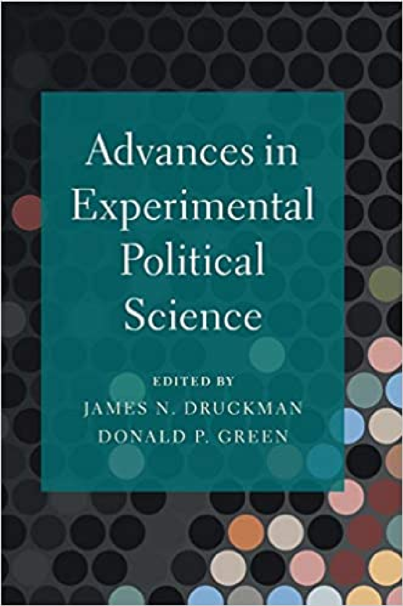
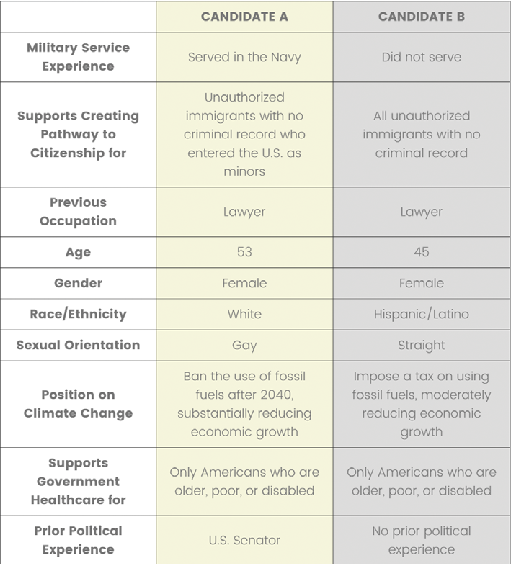
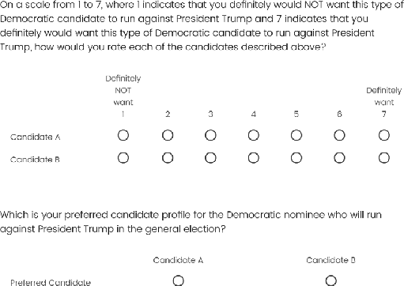
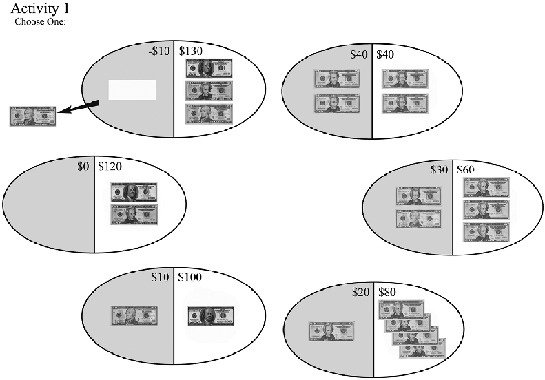
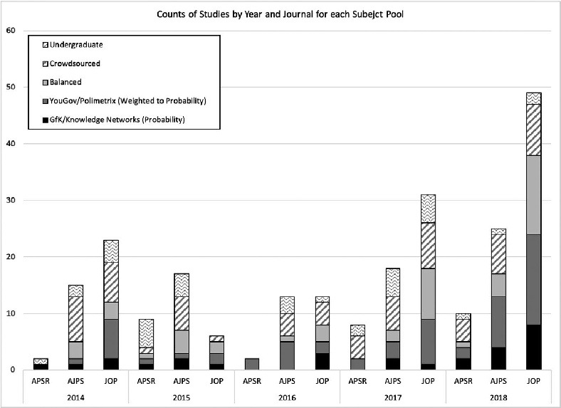
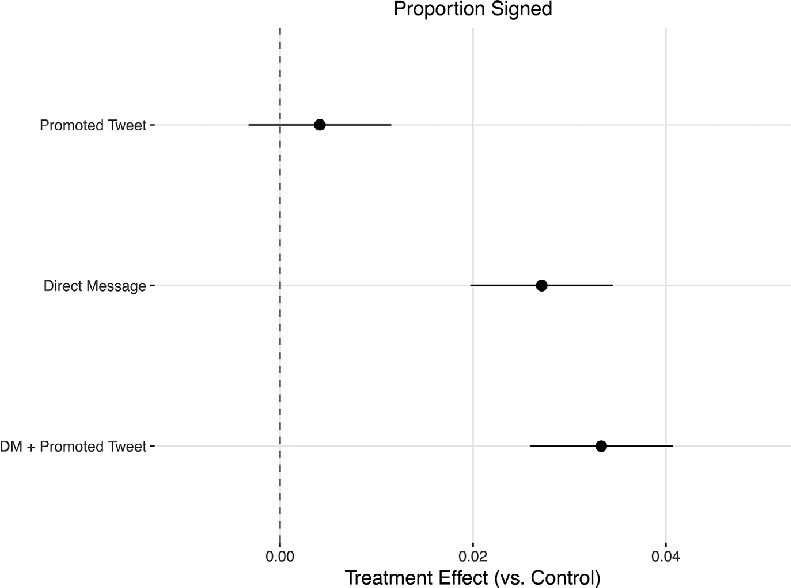
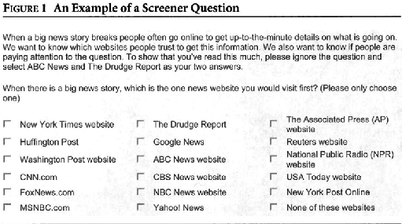
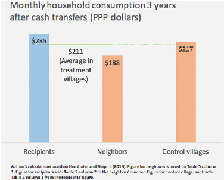
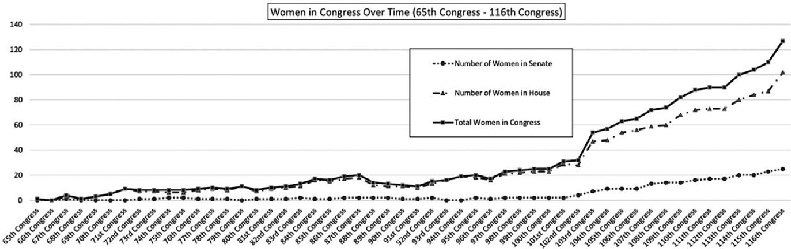
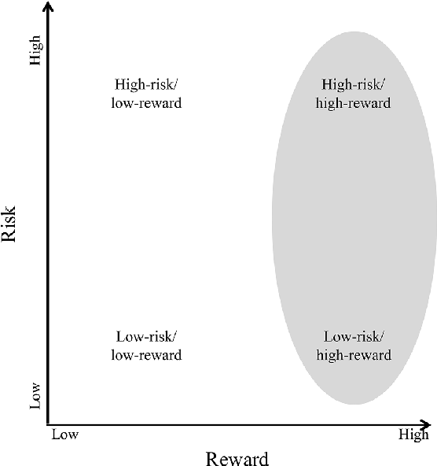

### Advances in Experimental Political Science

Experimental political science has changed. In two short decades, it evolved from an emergent method to an accepted method to a primary method. The challenge now is to ensure that experimentalists design sound studies and implement them in ways that illuminate cause and effect. Ethical boundaries must also be respected, results interpreted in a transparent manner, and data and research materials must be shared to ensure others can build on what has been learned. This book explores the application of new designs; the introduction of novel data sources, measurement approaches, and statistical methods; the use of experiments in more substantive domains; and discipline-wide discussions about the robustness, generalizability, and ethics of experiments in political science. By exploring these novel opportunities while also highlighting the concomitant challenges, this volume enables scholars and practitioners to conduct high-quality experiments that will make key contributions to knowledge.

James N. Druckman is the Payson S. Wild Professor of Political Science at Northwestern University. He was elected to the American Academy of Arts and Sciences and, with Donald Green, helped found the Experimental Research section of the American Political Science Association. He also is currently the co-Principal Investigator for Time-sharing Experiments in the Social Sciences, and co-authored the book Who Governs? Presidents, Public Opinion, and Manipulation.

Donald P. Green is the J.W. Burgess Professor of Political Science at Columbia University. He was elected to the American Academy of Arts and Sciences and, with James Druckman, helped found the Experimental Research section of the American Political Science Association.He also co-founded the scholarly consortium of experimental researchers, Evidence in Governance and Politics, and co-authored the textbook Field Experiments: Design, Analysis, and Interpretation.

# Advances in Experimental Political Science

Edited by

##### JAMES N. DRUCKMAN

Northwestern University

##### DONALD P. GREEN

Columbia University

University Printing House, Cambridge cb2 8bs, United Kingdom One Liberty Plaza, 20th Floor, New York, ny 10006, usa 477 Williamstown Road, Port Melbourne, vic 3207, Australia 314–321, 3rd Floor, Plot 3, Splendor Forum, Jasola District Centre, New Delhi – 110025, India 79 Anson Road, #06–04/06, Singapore 079906

Cambridge University Press is part of the University of Cambridge. It furthers the University’s mission by disseminating knowledge in the pursuit of education, learning, and research at the highest international levels of excellence.

www.cambridge.org Information on this title: www.cambridge.org/9781108478502 doi: 10.1017/9781108777919

© Cambridge University Press 2021

This publication is in copyright. Subject to statutory exception and to the provisions of relevant collective licensing agreements, no reproduction of any part may take place without the written permission of Cambridge University Press.

First published 2021 Printed in the United Kingdom by TJ Books Limited. Padstow, Cornwall A catalogue record for this publication is available from the British Library. Library of Congress Cataloging-in-Publication Data names: Druckman, James N., 1971– editor. | Green, Donald P., 1961– editor. title: Advances in experimental political science / edited by James N. Druckman, Donald P. Green. description: Cambridge, United Kingdom ; New York, NY : Cambridge University Press, 2021. |

Includes bibliographical references and index. identifiers: lccn 2020022763 (print) | lccn 2020022764 (ebook) | isbn 9781108478502 (hardback) |

isbn 9781108745888 (paperback) | isbn 9781108777919 (epub) subjects: lcsh: Political science–Methodology. | Political science–Research. | Political science–Experiments. classification: lcc ja71 .A388 2021 (print) | lcc ja71 (ebook) | ddc 320.072/4–dc23 LC record available at https://lccn.loc.gov/2020022763 LC ebook record available at https://lccn.loc.gov/2020022764

isbn 978-1-108-47850-2 Hardback isbn 978-1-108-74588-8 Paperback

Cambridge University Press has no responsibility for the persistence or accuracy of URLs for external or third-party internet websites referred to in this publication and does not guarantee that any content on such websites is, or will remain, accurate or appropriate.

## Contents

List of Tables page viii List of Figures x List of Boxes xii Contributors xiii Acknowledgments xv

1 A New Era of Experimental Political Science 1

James N. Druckman and Donald P. Green

###### PA RT I : E X P E R I M E N TA L D E S I G N S

- 2 Conjoint Survey Experiments 19 Kirk Bansak, Jens Hainmueller, Daniel J. Hopkins, and Teppei Yamamoto
- 3 Audit Studies in Political Science 42 Daniel M. Butler and Charles Crabtree
- 4 Field Experiments with Survey Outcomes 56 Joshua L. Kalla, David E. Broockman, and Jasjeet S. Sekhon
- 5 How to Tame Lab-in-the-Field Experiments 79 Catherine Eckel and Natalia Candelo Londono
- 6 Natural Experiments 103 Rocío Titiunik
- 7 Virtual Consent: The Bronze Standard for Experimental Ethics 130 Dawn Langan Teele

v

vi Contents

###### PA RT I I : E X P E R I M E N TA L DATA

- 8 Experiments, Political Elites, and Political Institutions 149 Christian R. Grose
- 9 Convenience Samples in Political Science Experiments 165 Yanna Krupnikov, H. Hannah Nam, and Hillary Style
- 10 Experiments Using Social Media Data 184 Andrew M. Guess
- 11 How to Form Organizational Partnerships to Run Experiments 199 Adam Seth Levine

PA RT I I I : E X P E R I M E N TA L T R E AT M E N T S A N D M E A S U R E S

- 12 Improving Experimental Treatments in Political Science 219 Diana C. Mutz
- 13 Beyond Attitudes: Incorporating Measures of Behavior in Survey Experiments 239 Erik Peterson, Sean J. Westwood, and Shanto Iyengar

PA RT I V: E X P E R I M E N TA L A N A LY S I S A N D P R E S E N TAT I O N

- 14 Advances in Experimental Mediation Analysis 257 Adam N. Glynn
- 15 Subgroup Analysis: Pitfalls, Promise, and Honesty 271 Marc Ratkovic
- 16 Spillover Effects in Experimental Data 289 Peter M. Aronow, Dean Eckles, Cyrus Samii, and Stephanie Zonszein
- 17 Visualize as You Randomize: Design-Based Statistical Graphs for Randomized Experiments 320 Alexander Coppock

PA RT V: E X P E R I M E N TA L R E L I A B I L I T Y A N D G E N E R A L I Z A B I L I T Y

- 18 Transparency in Experimental Research 339 Cheryl Boudreau
- 19 Threats to the Scientific Credibility of Experiments: Publication Bias and P-Hacking 354 Neil Malhotra
- 20 What Can Multi-Method Research Add to Experiments? 369 Jason Seawright
- 21 Generalizing Experimental Results 385 Erin Hartman
- 22 Conducting Experiments in Multiple Contexts 411 Graeme Blair and Gwyneth McClendon

Contents vii

###### PA RT V I : U S I N G E X P E R I M E N T S TO S T U DY I D E N T I T Y

- 23 Identity Experiments: Design Challenges and Opportunities for Studying Race and Ethnic Politics 431 Amber D. Spry
- 24 The Evolution of Experiments on Racial Priming 447 Ali A. Valenzuela and Tyler Reny
- 25 The Evolution of Experiments on Gender in Elections 468 Samara Klar and Elizabeth Schmitt
- 26 Gender Experiments in Comparative Politics 485 Amanda Clayton and Georgia Anderson-Nilsson

PA RT V I I : U S I N G E X P E R I M E N T S TO S T U DY G OV E R N M E N T AC T I O N S

- 27 Experiments on and with Street-Level Bureaucrats 509 Noah L. Nathan and Ariel White
- 28 The State of Experimental Research on Corruption Control 526 Paul Lagunes and Brigitte Seim
- 29 Experiments on Political Activity Governments Want to Keep Hidden 544 Jennifer Pan
- 30 Experiments in Post-Conflict Contexts 562 Aila M. Matanock
- 31 Experiments on Problems of Climate Change 592 Mary C. McGrath
- 32 A Constant Obsession with Explanation 616 Lynn Vavreck

Author Index 621 Subject Index 628

## Tables

- 2.1 The list of possible attribute values in the Democratic primary experiment. page 22
- 2.2 Topical classification of the 124 published articles using conjoint designs identified in our literature review for the years 2014–2019. 36

- 4.1 Potential benefits of and complementarities between four methodological practices. 65
- 4.2 Notation and values used in the examples. 66
- 4.3 Variances and variable costs of alternative designs. 72

- 6.1 Typology of randomized experiments and observational studies. 117
- 7.1 Three standards of ethics and experiments. 135

- 10.1 Effect of exposure to a friend’s tweet. 193 12.1 Partial counterbalancing in within-subject experimental designs. 235

- 15.1 Coverage of 90% uncertainty intervals by subgroup. 282
- 15.2 Subgroup effects from audit experiment. 283
- 15.3 Split-sample estimates from conjoint analysis. 285

- 16.1 Comparing Horvitz–Thompson to Hajek estimators using approximate exposure probabilities. 300
- 16.2 Misspecifying exposure conditions. 301
- 16.3 Comparing unit to cluster randomization. 305

- 18.1 Recommended information for preregistration and pre-analysis plans in experimental research. 348
- 18.2 Gerber et al.’s (2015) checklist of reporting items for experimental research. 349

- 21.1 Subgroup estimates within the experiment in the CDR example. 398
- 21.2 PATE estimation in the CDR example. 399
- 21.3 Simulation results using different adjustment sets for estimating the PATE. 399
- 21.4 Estimation with common population data types. 401

viii

Tables ix

- 22.1 Trade-offs across the three types of multi-context approaches. 417
- 23.1 Racial and ethnic identity experiments. 441

- 28.1 Summary of experimental research on electoral accountability (2008–2015). 535
- 28.2 Summary of experimental research on electoral accountability (2016–2020). 536

## Figures

1.1 APSR experimental articles by decade. page 2 1.2 Experimental Trends. 7

- 2.1 An example conjoint table from the Democratic primary experiment. 21
- 2.2 Outcome variables in the Democratic primary experiment. 23
- 2.3 Average marginal component effects of candidate attributes in the Democratic primary conjoint experiment (forced choice outcome). 30
- 2.4 Average marginal component effects of candidate attributes in the Democratic primary conjoint experiment (rating outcome). 33
- 2.5 Conditional average marginal component effects of candidate attributes across respondent party. 34

- 4.1 Comparing costs of different designs. 59
- 4.2 “The traditional design.” 60
- 4.3 Applying the framework when placebo is not possible: mail example. 73
- 4.4 Example results: variable costs for studying public health intervention in Liberia. 74 5.1 Risk preference elicitation. 84

- 9.1 Use of various samples in political science journals. 168
- 10.1 Effect of exposure to Promoted Tweets, direct messages, or both on signing an online petition. 189

12.1 Sample “screener” or attention check question. 227

- 14.1 Graphical depiction of direct and indirect (through M) effects of A on Y. 258
- 14.2 Directed acyclic graph depicting the key identification criteria for the single experiment. 264

- 15.1 Subgroup estimates. 282
- 16.1 Causal graph illustrating interference mechanisms and confounding mechanisms when treatment (Z) is randomized. 290

x

Figures xi

- 16.2 Figure from Sandefur (2018) displaying long-term spillover effects from an unconditional cash transfer program, as reported in Haushofer and Shapiro (2018). 291
- 16.3 Example of an interference network with 10 units. Each edge (link) represents a possible channel through which spillover effects might transmit. 295
- 16.4 From left to right, the distribution of the point estimates for 3000 simulations when the exposure mapping ignores interference, assumes first-degree interference, and assumes second-degree interference, respectively. 302
- 16.5 The distribution of point estimates for 3000 simulations given different proportions of missing ties for a case of positive spillover. 304
- 16.6 The distribution of point estimates for 3000 simulations with partial interference specified at the level of groups only. 312

- 17.1 ATE simulated two-arm trial. 327
- 17.2 A simulated block-randomized experiment. 328
- 17.3 The same simulated block-randomized experiment. 329
- 17.4 A simulated cluster-randomized experiment. 330
- 17.5 Covariate adjustment. 330
- 17.6 Simulated experiment with a continuous pretreatment covariate. 331
- 17.7 Simulated experiment encountering two-sided noncompliance. 333
- 17.8 A simulated experiment encountering attrition. 333 21.1 Simplified example of a field experiment. 388

- 24.1 News attention to racial issues. 456
- 25.1 Number of women in American Congress over time. 469
- 26.1 Total number of gender articles and experimental gender articles in three leading general interest political science journals (American Political Science Review, American Journal of Political Science, and Journal of Politics). 487

26.2 Total number of gender articles and experimental gender articles in three leading comparative politics journals (World Politics, Comparative Political

Studies, and Comparative Politics). 487 28.1 Risk vs. reward of corruption control experiments. 531 31.1 Hypothesized relationships structuring the political problem of climate change. 593

## Boxes

8.1 A guide for scholars using experiments to study political institutions. page 150

- 11.1 Steps in an organizational partnership. 205

- 11.2 Helpful relationship-building techniques. 206 11.3 What should be put in writing ahead of time? 210

xii

## Contributors

Georgia Anderson-Nilsson Vanderbilt University

Peter M. Aronow Yale University

Kirk Bansak University of California, San Diego

Graeme Blair University of California, Los Angeles

Cheryl Boudreau University of California, Davis

David E. Broockman University of California, Berkeley

Daniel M. Butler University of California, San Diego

Amanda Clayton Vanderbilt University

Alexander Coppock Yale University

Charles Crabtree Dartmouth College

James N. Druckman Northwestern University

Catherine Eckel Texas A&M University

Dean Eckles Massachusetts Institute of Technology

Adam N. Glynn Emory University Donald P. Green Columbia University Christian R. Grose University of Southern California Andrew M. Guess Princeton University Jens Hainmueller Stanford University

xiii

xiv Contributors

Erin Hartman University of California, Los Angeles

Daniel J. Hopkins University of Pennsylvania

Shanto Iyengar Stanford University

Joshua L. Kalla Yale University

Samara Klar University of Arizona

Yanna Krupnikov Stony Brook University

Paul Lagunes Columbia University

Adam Seth Levine Johns Hopkins University

Natalia Candelo Londono Queens College, City University of New York

Neil Malhotra Stanford University Aila M. Matanock University of California, Berkeley Gwyneth McClendon New York University Mary C. McGrath Northwestern University Diana C. Mutz University of Pennsylvania H. Hannah Nam Stony Brook University Noah L. Nathan University of Michigan Jennifer Pan Stanford University

Erik Peterson Texas A&M University

Marc Ratkovic Princeton University

Tyler Reny Washington University in St. Louis

Cyrus Samii New York University

Elizabeth Schmitt University of Wisconsin–Platteville

Jason Seawright Northwestern University

Brigitte Seim University of North Carolina at Chapel Hill

Jasjeet S. Sekhon Yale University Amber D. Spry Brandeis University Hillary Style Stony Brook University Dawn Langan Teele University of Pennsylvania Rocío Titiunik Princeton University Ali A. Valenzuela Princeton University Lynn Vavreck University of California, Los Angeles Sean J. Westwood Dartmouth College Ariel White Massachusetts Institute of Technology Teppei Yamamoto Massachusetts Institute of Technology

Stephanie Zonszein New York University

## Acknowledgments

In 2011, we coedited, along with Jim Kuklinski and Skip Lupia, the Cambridge Handbook of Experimental Political Science. The broad scope of that volume helped convince a skeptical discipline that experiments had arrived in political science. A decade later, experiments have quickly evolved from being an accepted method to being a primary method. The substantive, methodological, and epistemological advances are apparent in every subfield. This volume covers those advances.

We are indebted first and foremost to the authors, who not only contributed superb essays, but also served as reviewers for one another. The quality of the chapters reflects both the authors’ command of their subject matter and the many constructive exchanges between the authors. This process of scholarly exchange reflects an extraordinary conference held at Northwestern University on May 21–22, 2019. We thank the generous sponsors of that conference: the National Science Foundation (SES-1822286), the Ford Motor Company Center for Global Citizenship at the Kellogg School of Management at Northwestern University

(directed by David Austen-Smith), and the Department of Political Science in the Weinberg College of Arts and Sciences at Northwestern University. We also thank the Ford Motor Company Center for Global Citizenship and the Institute for Policy Research at Northwestern University (directed by Diane Schanzenbach) for administrative support. We are especially appreciative of the help of Sheila Duran, Cynthia Kendall, Cindy Mydlach, and Patricia Reese. Adam Howat and Andrew Thompson – who were then advanced PhD students at Northwestern – also provided invaluable support. A number of graduate students who attended the conference generously provided comments on drafts of chapters; for that, we thank Robin Bayes, Amanda d’Urso, Daniel Encinas, Sam Gubitz, Katie Harvey, Adam Howat, Suji Kang, Bo Won Kim, Irene Kwon, Jeremy Levy, Ivonne Montes, Matt Nelsen, Jake Rothschild, Richard Shafranek, and Andrew Thompson. We also thank others who attended the conference and provided valuable feedback, including Tabitha Bonilla, Margaret Brower, Maria Carreri, Jean

xv

xvi Acknowledgments

Clipperton,Dan Galvin,Jordan Gans-Morse, Laurel Harbridge-Yong, Lenka Hrbkova, John Lee, Reuel Rogers, and Edoardo Teso. Special thanks go to John Bullock for attending and serving as a discussant at the conference. We thank our superb editor at Cambridge, Robert Dreesen, not only for attending the conference, but also for

his constant support and advice throughout the process.

Our hope is this volume spurs another decade, if not more, of important advances in experimental political science.

– James N. Druckman and Donald P. Green

CHAPTER 1

## A New Era of Experimental Political Science∗

###### James N. Druckman and Donald P. Green

###### Abstract

Experimental political science has transformed in the last decade. The use of experiments has dramatically increased throughout the discipline, and technological and sociological changes have altered how political scientists use experiments. We chart the transformation of experiments and discuss new challenges that experimentalists face. We then outline how the contributions to this volume will help scholars and practitioners conduct high-quality experiments.

Experimental political science has changed. In two short decades, it evolved from an emergent method to an accepted method to a primary method. We are now entering a new era of experimental political science – what can be called “experimental political science 2.0.” We do not use the term “era” lightly. The new era reflects, in part, the expanded use of experiments throughout the discipline. But, more fundamentally, it reflects a radical shift in how social scientists design, analyze, and interpret experiments.

For most of social science history, the challenges for experimentalists concerned

* We thank Nicolette Alayon, Robin Bayes, Jeremy Levy, Jacob Rothschild, and Andrew Thompson for research assistance.We thank Lynn Vavreck for excellent advice.

obtaining data beyond student subject pools and what to do with null results that typically landed in the “file drawer.” This is no longer true. Data are plentiful, thanks to Internet panels, crowdsourcing platforms, social media, and electronic access to elites; partnerships between researchers and nonacademic entities have also become prolific sources of experimental data. Computing advances have made the implementation and analysis of large-scale studies routine. Moreover, scholars now regularly discuss how to address issues of publication bias,replication,and data-sharing so as to ensure the production of credible experimental research.

The challenge now is to ensure that experimentalists design sound studies and

1

implement them in ways that illuminate cause and effect. They must do so while also respecting ethical boundaries, interpreting results in a transparent manner, and sharing data and research materials to ensure others can build on what has been learned. Political science experimentalists, moreover, can capitalize on the widespread acceptance of the method, novel data sources, and evolving epistemological orientations. Making the most of these opportunities requires carefully choosing an appropriate design for a given research question, developing theoretically informative treatments and valid outcome measures, choosing a suitable setting, engaging in sound analyses, cautiously generalizing, and addressing enduring debates. The goal of this volume is to shed light on best practices.

In what follows, we first describe the evolution of experiments in political science, focusing on quantitative trends, substantive reach,and institutional progression.This discussion documents a transformation in how political scientists think about and conduct experiments. We then turn to a discussion of recent developments in the social sciences involving technological change and open science, an era we characterize as experimental political science 2.0. This new era is defined by: the application of new designs; the introduction of novel data sources, measurement approaches, and statistical methods; the use of experiments in more areas; and discipline-wide discussions about the robustness, generalizability, and ethics of experiments in political science. This volume explores these new opportunities while also highlighting the concomitant challenges. The goal is to help scholars and practitioners conduct high-quality experiments that make important contributions to knowledge.

###### 1.1 The Evolution of Experiments in Political Science

One way to document the evolution of experiments in political science is by counting the number of such articles in general political

75

31

21

13

7

1 3

- 0

10

20

30

40

50

60

70

80

1950-1959 1960-1969 1970-1979 1980-1989 1990-1999 2000-2009 2010-2019

Figure 1.1 APSR experimental articles by decade.

science journals. We do that by focusing on the discipline’s flagship journal, the American Political Science Review (APSR). We identified all published articles containing experiments from the launch of the journal in 1906 through any such articles posted online in May 2019.1 The first experiment appeared in 1956, 50 years after the journal launched. In Figure 1.1, we plot the number of articles by decade, starting in the 1950s. To be clear, this is not a cumulative count of articles, but rather the specific number by decade. For example, from 2000 through 2009, 31 articles in the APSR used an experimental approach; this number jumped to 75 in the most recent decade. Figure 1.1 supports the claim that experiments moved from being a marginalized method to an accepted method to a central method.

Has the recent surge in experimental articles spanned subfields in political science? In 2006, Druckman et al. (p. 627) observed, “To date, the range of application remains narrow, with most experiments pertaining to questions in the subfields of political psychology, electoral politics, and legislative politics. An important question is the extent to which

- 1 In so doing, we extend the timeline from our prior work (Druckman et al.2006; also see Rogowski 2015). So as to accommodate how political scientists from varying perspectives define “experiment,” we counted an experiment as a study involving random assignment to conditions or entailing an economic game that applies induced value theory. That said, we assert that “experiment”should only be used when the study employs random assignment (contrary to usage in many economic game studies; see, e.g., Green and Tusicisny 2012).

experiments or experiment-inspired research designs can benefit other subfields.” The last decade has answered that question decisively: experiments have become common throughout the discipline. For example, in international relations, there now exists a sizeable experimental literature on “audience costs,” which refers to a process whereby governments publicly threaten to use force to induce a change in opposing countries’ actions. The public nature of such a threat makes it credible, since the opponent recognizes a failure to use force would lead to domestic backlash (e.g., at the voting booth). Experiments show that, indeed, citizens have a distaste for empty threats (e.g., Tomz 2007; although see Kertzer and Brutger 2016). The emergence of experimental research has also been apparent in other international relations domains, such as election monitoring, which has seen dramatic growth in the number and sophistication of randomized evaluations (Buzin et al. 2016; Hyde and Marinov 2014; Ichino and Schündeln 2012).

This momentum is especially noteworthy in comparative politics; since 2010, 45% of the experimental articles published in the APSR can be classified in the field of comparative politics (up from 19% during 2000–09 and 2% during 1956–99). Some of these articles fall at the intersection of comparative politics and international relations, as in Beath et al.’s (2013) study of a massive aid program designed to empower Afghan women within the context of a civil war against the Taliban. Others span comparative politics and political psychology, as in Scacco and Warren’s (2018) study of attempts to reduce prejudice between Muslims and Christians in Nigeria. Arguably the largest literature focuses on governance and accountability (see Dunning et al. 2019), typified by studies (e.g., Grossman and Michelitch 2018) that provide voters with job performance scorecards for randomly selected public officials over a series of election cycles. A final example of the reach of experiments concerns studies of whether and how public officials respond to queries from their constituents. In 2011, Butler and Brookman published their correspondence

study of state legislators in 44 states. They sent email requests for information about voting registration, varying whether the email came from an ostensibly AfricanAmerican or White constituent who was a Democrat, Republican, or did not mention a party. The binary outcome measure was whether the sender received a reply from the state legislator’s office. This study, which was patterned after correspondence experiments on job market discrimination (Bertrand and Mullainathan 2004; Pager 2003), spawned a literature that, by 2017, included more than 50 audit experiments on the responsiveness of public officials (Costa 2017).It is also part of a growing experimental focus on elites – public officials or political leaders – as subjects (e.g., Grose 2014).

It is clear that political scientists think about and apply experiments in a very different way than a decade ago: they think of experimentation as a primary methodology and apply it in novel domains. These trends have both reflected and spurred various institutional innovations. Here, we point to three. First, in 2001, Time-sharing Experiments for the Social Sciences (TESS) was established with support from the National Science Foundation. TESS capitalizes on economies of scale to enable scholars from across the social sciences, on a competitive basis, to conduct survey experiments on probabilitybased samples of the US population (see Mutz 2011). Since its founding, TESS has supported more than 400 experiments. Many of them are published in disciplinary flagship journals, as well as Science and the Proceedings of the National Academy of Sciences of the United States of America. TESS also makes raw data from all experiments publicly available,regardless of whether the results are published.

The genesis of TESS in 2001 followed on the heels of what could be called a revolution in political science field experiments in 2000. In that year, a field experiment on voter mobilization was published in the APSR (Gerber and Green 2000). This publication was notable since it was the 47th experimental article in the journal, but only the third field experiment, and the first field

experiment in nearly 20 years.2 This paper sparked burgeoning literatures on voter mobilization (e.g., Nickerson 2008) and vote choice (Wantchekon 2003); more generally, it ushered in the use of field experiments in other subfields (e.g., Findley et al. 2014; Hyde and Marinov 2014).3

The discipline established two other notable institutions about a decade later. In 2009, Evidence in Governance and Politics (EGAP) formed as a network for those engaged in field experiments on governance, politics, and institutions. EGAP played an important role in developing and advocating methodological practices such as preregistration of experiments and professional standards concerning the public disclosure of results. As it grew in membership and capacity, it also expanded its worldwide outreach efforts to include instruction on experimental methods across the Global South. In 2010, the first meeting of the American Political Science Association’s section on Experimental Research took place, and a year later it voted to launch the Journal of Experimental Political Science (the first issue of which appeared in 2014). These institutional innovations, too, were tracked by some notable publications. This list includes the explosion of experimental articles using Amazon’s Mechanical Turk to furnish research participants (Berinsky et al. 2012; Mullinix et al. 2015) and, in 2011, the predecessor to this book, the Cambridge Handbook of Experimental Political Science (Druckman et al. 2011).4

- 2 We do not count Gosnell (1926), since he did not seem to employ random assignment.
- 3 Since 2000, nearly 30 field experiments have been published in the APSR,and the Annual Review of Political Science has published several experiment-focused reviews on a range of topics, including collective action (de Rooij et al. 2009), developmental economics (Humphreys et al. 2009), political institutions (Grose 2014), and international relations (Hyde 2015).
- 4 Examples of other institutional developments include the launching of subject pools in more than a dozen political science departments (Druckman et al. 2018, p. 624) and a Routledge book series focused on experimental political science, Routledge Studies in Experimental Political Science.

These trends make clear that experiments now occupy a central place in political science. For reasons to which we turn next, the ways in which researchers design, analyze, and present experiments are rapidly changing, leading to new challenges and opportunities.

###### 1.2 Technological Change and Open Science

The initial rise of experiments followed on the heels of several technological advances. In the 1980s, the advent of computerassisted telephone interviewing facilitated the implementation of phone-based survey experiments (Sniderman and Douglas 1996). The pace of technological change has, if anything, accelerated in recent years. The costs and logistical challenges of data collection have dramatically dropped (e.g., Groves 2011), enabling researchers to access survey and behavioral data at a notably larger scale (e.g., Kramer et al. 2016).

Consider four dynamics. First, as intimated above, data are now much cheaper and easier to obtain than ever before, thanks to the Internet and the emergence of crowdsourcing platforms and commercial Internet survey panels. These data are then easier to share due to the growing use of public data repositories, such as Dataverse and GitHub. The abundance of public data allowed, for example, Coppock (2019) to use 27 studies to show that individual attributes such as age, gender, race, and ideology do not consistently condition how individuals process political messages: the effects of many messages do not vary across subgroups, implying that we can generalize about the impact of isolated experiments to large segments of the population.

Second, social media offer researchers access to behavioral data and the opportunity to intervene experimentally (e.g., Kramer et al. 2016), sometimes with literally millions of participants. Bond et al. (2012) conducted an experiment by delivering political mobilization messages to 61 million Facebook users, testing whether an “I Voted” widget

that announced one’s election participation to others increased turnout among Facebook users and their friends (see also Jones et al.

- 2017). Third, the advent of portable computers

with high-resolution screens has made it easy for researchers to deploy surveys and lab-like treatments in field settings, which dramatically lowers logistical costs. For instance, Kim (2018) used a truck equipped with mobile television monitors, tablet computers, and chairs to conduct a lab-in-the-field study in three counties in rural Pennsylvania. The experiment shows that exposure to entertainment television with “rags-to-riches” narratives increases individuals’ belief in the American Dream, particularly for Republicans (also see Busby

- 2018). Fourth, advances in computing allow

researchers to analyze high-dimensional data, which is to say data with large numbers of predictors or measurements. Computational requirements are especially demanding for algorithms that look for network effects (e.g., Grimmer et al. 2017). The same may be said for the rapidly growing list of techniques designed to automate the detection of treatment effect heterogeneity among subgroups in field experiments (Imai and Ratkovic 2013; Imai and Strauss 2011) and survey experiments (Green and Kern 2012). In the latter case, the authors revisit a large experimental literature based on General Social Surveys that have for decades asked national samples of Americans about their preferences regarding government spending. In the domain of social spending, question wording is varied randomly, and some respondents are asked about spending on “aid to the poor” while others are asked about spending on “welfare.” These surveys consistently show “aid to the poor” to be much more popular than “welfare,” but the question is: What sorts of respondents are especially susceptible to this effect? Rather than manually search for treatment-by-covariate interactions with education, party, ideology, and a slew of other background attributes, the authors use machine learning methods to conduct an

automated search that not only detects significant interactions, but also cross-validates the results using respondents who were randomly excluded from the initial round of exploration.

Apart from technological advances, the social sciences have become increasingly attuned to challenges of accumulating knowledge given perverse incentives to exaggerate the size and statistical significance of treatment effects or, conversely, to bury weak or counterintuitive findings. The tendency for journals to publish splashy, statistically significant findings is often termed “publication bias”(Brown et al.2017). Evidence of this bias in many disciplines is not new, but political scientists have only recently begun to document it (e.g., Gerber et al. 2010). In one notable example, Franco et al. (2014) show that of 221 experimental surveys, strong results are 40 percentage points more likely to be published than null results and 50 percentage points more likely to be written up.This is clear evidence of a publication bias at the writing and submission stages (also see Franco et al. 2016).

One response to publication bias has been a call for more replications: emulating the extant study’s procedures, but with new data (“repeatability,” as described in Freese and Peterson 2017). Massive replication efforts have had mixed results, with the most widely discussed being the Open Science Collaboration’s (2015) effort in which more than 250 scholars attempted to replicate 100 experiments in three highly ranked psychology journals from 2008. They reported that “39% of effects were subjectively rated to have replicated the original result” (Open Science Collaboration 2015, p. 943). This finding has led some to sound alarm bells of a replication crisis (Baker 2016); however,the extent of this crisis continues to be debated (e.g., Fanelli 2018; Van Bavel et al. 2016), as other replication attempts, including those in political science, have had more success (e.g., Camerer et al. 2016; Coppock 2019; Mullinix et al. 2015).

These replication attempts are possible in part because of a push for scholars to make their procedures, stimuli, surveys, and

data publicly available. In political science, most general and experimentally oriented journals require data access upon publication (Lupia and Elman 2014). Growing public access to data is of enormous value to instructors and meta-analysts, but also facilitates novel research. An example is Zigerell’s (2018, p. 1) reanalysis of 17 studies on racial discrimination (e.g., attitudes towards White or Black political candidates or job applicants). He reports for “White participants ... pooled results did not detect a net discrimination for or against White targets, but, for Black participants ... pooled results indicated the presence of a small-tomoderate net discrimination in favor of Black targets.”

The opportunities that come from data sharing, replication debates, and related discussions have invigorated a call for “open science.” Nosek et al. (2015) identify standards of transparency and openness involving: citation standards; transparency of data, material, and analyses; preregistration of studies and analysis plans; and encouragement of replication studies. Interestingly,this move towards transparency has also generated some questions about respondent privacy as well as concerns about how respondents themselves react upon learning of data openness (Connors et al. 2019).In sum,fundamental technological and sociological changes have transformed the social sciences. The result, which coincided with the emergence of experiments as a primary method in political science, is what we call experimental political science 2.0.

###### 1.3 Experimental Political Science 2.0

Experimental political science 2.0 is characterized by: (1) the introduction of previously underutilized designs; (2) the explosion of new data sources; (3) the use of new measurement techniques; (4) advancements in statistical methods; (5) increased discussion about robustness and generalizability; and (6) applications to novel areas of study. To get some sense of these trends,we analyzed the content of all experimental articles in the APSR that

made up Figure 1.1.5 In reporting the results, we first distinguish three time periods: all articles prior to 2000 constitute the lead-up to the experimental era; 2001–2009 make up the first generation of widespread use; and 2010– present is what we call experimental political science 2.0. These cutoffs roughly coincide with the aforementioned institutional developments (e.g., TESS, EGAP, the American Political Science Association’s Experimental Research section). Our interest is in the use and emergence of new approaches, and the statistics we present are the percentages of experimental articles in each era that used a given approach.

We start with what we might call “nontraditional designs,” insofar as they are designs that received little application in early experiments in political science. We discuss them in more detail below, but they include conjoint surveys, audits, field experiments with surveys, lab-in-thefield studies, and natural experiments. In Figure 1.2, we report the percentages with which each of these designs were used out of all APSR experiments published in a time period. For instance, before 2000, of the 45 experiments published, 4% used one of the aforementioned designs. This number jumped to 13% in the second period and 32% in the most recent period – a clear trend towards increased application.

We see a similar upward trend when we look at the proportion of studies that use what we might call “nontraditional subject pools,” including data from nonstudent convenience samples (e.g., crowdsourcing platforms), social media, or elites (e.g., legislators). The use of these subject pools jumped by 11 percentage points in the current era relative to the one that preceded it (52%–63%).

Another change that came about largely with the rise of field experiments after 2000 was collaboration with organizational partners (e.g., nonprofits). Figure 1.2 shows that such collaborations increased starting in 2000 but remain fairly minimal, perhaps due

5 We thank Robin Bayes and Andrew Thompson for conducting the content analysis.

63%

52%

32%

44%

9%

13%

13% 3%

4%

4%

Nontradi onal designs* Nontradi onal samples** Experiment with organiza onal partner

Explicit ethics discussion

1956–1999 2000–2009 2010–2019

- *Conjoint, audit, field + survey, lab-in-the-field, natural
- **Nonstudent convenience, social media, elite Figure 1.2 Experimental Trends.

to a lack of guidance on how to develop such partnerships (a topic we take up in this volume). Another important issue that undoubtedly will be addressed more frequently in the future is discussion of ethics. We identified only one experimental article in the APSR that included an explicit discussion of ethics in the main text of the paper (Paluck and Green 2009); growing recognition of ethical dilemmas in social science research (e.g., Teele 2014) will undoubtedly generate increased interest among both authors and audiences for further discussion of ethical issues.

In addition to these trends of design and data, the field continues to evolve when it comes to measurement and statistical methods. As in much of the social sciences, political scientists have embraced new measurement techniques and sources, such as administrative records, social media behaviors, physiological measures,

and relatively unobtrusive measures of psychological processes. As for statistical methods, recent decades have seen growing sophistication in the use of techniques for detecting heterogeneous treatment effects (e.g., Grimmer et al. 2017; Ratkovic and Tingley 2017), spillovers between units (Aronow 2012; Bowers et al. 2016), and causal mechanisms (e.g., Acharya et al. 2016; Imai and Yamamoto 2013). These methods feature in just over 30% of the articles appearing during the earliest time period and have become much more commonplace since 2000 (roughly 50% of experiments). A distinct trend worth noting concerns the use of visuals – nearly all experimental articles used visuals in the last decade, up from just more than half in the preceding period.

Another feature of experimental political science 2.0 echoes the aforementioned open science movement’s concern with robustness and generalizability. This approach

involves sustained discussion about reporting standards: one of the first actions of the American Political Science Association’s Experimental Research section was to form a reporting committee (e.g., Gerber et al. 2014, 2015; Mutz and Pemantle 2015). At roughly the same time, the data access and research transparency (DA-RT) movement in political science gained prominence. It arose from growing concerns about scholars’ failure to replicate a considerable number of empirical claims being made in top journals – often as a result of researchers’ inability or unwillingness to provide information about how they drew conclusions from their data or to make the data available to others (Lupia and Elman 2014). The initiatives require authors, including experimentalists, to provide data access, production transparency (e.g., procedures about how the data were collected), and analytic transparency (American Political Science Association 2012, pp. 9–10). There also are ongoing debates in the discipline about the need to register experiments so that researchers who later summarize literatures can see the extent to which research results went unreported. Another debate concerns preregistration of analysis plans, an initiative designed to limit researcher discretion and to clarify which analytic decisions were made in advance of seeing the data and which grew out of data exploration (Monogan 2015). Judging from public websites that record the use of preregistration and pre-analysis plans, their use has grown dramatically, and there seems to be an emerging norm among experimental researchers that best practices involve submitting these documents.

A distinct but related development concerns increased discussion of how to generalize from experiments. Generalization is fundamentally a theoretical issue, but one that draws on empirical insights gleaned from the study of heterogeneous treatment effects across subjects, treatments, contexts, and outcomes. One way to advance this agenda is to conduct experiments in multiple contexts, as exemplified by EGAP’s Metaketa Initiative that “funds and coordinates studies across countries, clustered by theme, to improve

and incentivize innovative research alongside integrated analysis and publication” (https://egap.org/our-work/the-metaketa-

initiative/). This is an exciting advance given that, to date, multicountry experiments are rare; our content analysis found only 6% of experiments included multiple countries in 2000–2009 and just 5% in the most recent decade. Of course, conducting experiments across countries requires careful thought about the comparability of measures across contexts; the qualitative data gathering that is used to validate and refine measurement reflects the disciplinary trend towards multimethods research (e.g., Seawright 2016). The final feature of experimental political science 2.0 is the application of the method to novel areas that historically have not used randomized controlled trials. As will be highlighted in the volume, this includes topics such as bureaucracy, corruption, and censorship – areas that can now be studied experimentally thanks to the aforementioned innovations in design, data access, and analysis.

We next turn to how this volume is structured so as to help scholars, students, and practitioners navigate experimental political science 2.0. Our goal is to help experimental political scientists thoughtfully design studies, analyze data, present results, and expand the application of experiments.

###### 1.4 This Volume

We chose topics for the volume that are not only current, but also emergent. We hope to stay one step ahead of the curve.Perhaps most importantly, we opted for areas and authors that connect with one another – this book is not a jumble of standalone chapters. Common themes surface throughout, such as the importance of connecting theory to design, making design choices that maximize generalizable inference, and using experiments to extend the frontier of knowledge, which means exploring difficult and even dangerous topics.We organized the book into seven sections, but the chapters intersect both within and across sections. Each chapter includes an abstract, so instead of summarizing them

here, we highlight connections to provide readers with a roadmap of how the contributions relate to one another.

The first section includes discussions of experimental designs that are (relatively) newly applied in political science. Conjoint studies – covered in a chapter by Bansak, Hainmueller, Hopkins, and Yamamoto – ask participants to make choices across multidimensional descriptions of people, policies, or issues; for instance, this approach may involve soliciting opinions about immigrants who vary in their country of origin, religion, age, education, language skills, etc. Audit experiments, covered by Butler and Crabtree, involve sending correspondence to public officials, randomly varying the nature of the messages, and testing whether the different messages elicit different responses. For example, does a legislator’s propensity to respond to constituent mail depend on whether the author has a putative White or Black name? Both conjoint and audit designs allow political scientists to gauge difficult-to-isolate behaviors such as racial discrimination, gender biases, or illegal actions because respondents remain unaware of what is being assessed (e.g., they are not directly asked about prejudice or corrupt behavior). The rigor and breadth of these experimental designs explain why they also play a central role in other parts of the book that use experiments to illuminate hidden or corrupt activities and identitybased discrimination.

Applications of conjoint and audit designs depend on context – such as the level of scrutiny of hidden actions or the nature of gender norms. Two other designs focus even more on context. In their chapter, Kalla, Broockman,and Sekhon present a design that combines survey and field experiments – by first surveying respondents, then employing an ostensibly unrelated field intervention,and then surveying them again. This approach, which has clear cost advantages over other designs, is particularly germane to situations where field interventions seek to change attitudes and beliefs. Additionally, lab-in-thefield studies – where the lab is constructed in a field setting – allow researchers to

study choices that reflect subjects’ traits and strategic judgments. Eckel and Londono, in their chapter, detail several such examples, while also explaining best design practices. All four of these designs – audit, conjoint, field survey, and lab-in-the-field – constitute alternative approaches to measurement and casual inference across contexts. They also, in theory, could be combined – one could imagine a field survey study where the survey component includes a conjoint design.

Stepping back from the details of specific designs, one may reflect on two larger issues. First, with one exception, experimental designs involve an intervention by the researcher. The exception is the so-called natural experiment, which has become popular in political science (e.g., Dunning 2012). But what counts as a natural experiment? What separates an experiment from a nonexperimental study that is said to involve an “as-if” random assignment? This question is taken up in the chapter by Titiunik. Her discussion clarifies what constitutes an actual experiment as opposed to a natural experiment and describes the advantages and disadvantages of each approach. Second, experimental interventions inherently involve ethical issues, since the researcher is changing the world in some way and, perhaps deceptively or unobtrusively, involving people in a research project. Teele’s chapter offers a discussion of how to think about the ethics of consent in experiments.

The second section of the book covers data sources that have become more widely used in the last decade. Each of these chapters connects directly to themes raised in the design section. For instance, the goal of many audit studies is to explore racial or ethnic discrimination by political elites. This aim requires using elite samples, a topic covered by Grose in his chapter. Grose also discusses other designs (e.g., natural experiments) that have been used to study the behaviors of those who govern. Apart from elite samples, perhaps the most notable development when it comes to data sources is, as mentioned, the use of crowdsourcing platforms and nonprobability Internet panels. These sources

offer many research opportunities, but how to assess the impacts of these distinct samples is not always clear – this topic is addressed in the chapter by Krupnikov, Nam, and Style. Another recent data source comes from social media, which offer experimentalists opportunities new samples and behavioral measures, as well as a context within which to study social relationships. Guess’s contribution provides one of the first overviews of this emerging experimental literature. Finally, the aforementioned explosion of field experiments of varying types (e.g., lab-inthe-field, field survey) presents challenges to data collection with targeted populations. Partnering with organizations often can facilitate experimentation, but there is currently no “how to” guide for developing and sustaining collaborations. Levine offers this guidance in his chapter. Even if one does not anticipate using one of the data sources covered in this section, the reading is obligatory for anyone who wants to understand why a research program opts for a particular source of data.

The third section of the book contains just two chapters but touches on issues fundamental to nearly all experiments: once a research question is formulated, treatments and measures must be developed, which in turn presents questions of validity and generalizability. Perhaps ironically, given the rise of experiments in the discipline, there exists limited guidance on how to develop and deploy treatments. Mutz’s chapter fills this gap, emphasizing the need to connect treatments to theory. For instance, if a labin-the-field study aims to explore the impact of emotion, the treatment needs to trigger emotion, even if it does so in a way that does not resemble a stimulus in the “real world.” Mutz stresses the importance of empirical verification that the intervention produces the intended change (e.g., in emotion) with no other unintended changes. This requirement involves delicate questions of the measurement and conceptualization of the theoretically specified treatment. As Mutz explains in her chapter, most work to date has not engaged in sufficient empirical verification. In their chapter,

Peterson, Westwood, and Iyengar also discuss ways to enhance treatments and measures,particularly in the context of survey experiments. A long standing problem with many survey experiments concerns the use of vignettes that sometimes convey information beyond what the researcher intended (e.g., Dafoe et al. 2018); another problem is social desirability bias, which occurs when research participants confect responses that they hope will please the interviewer. These authors provide advice on how to develop more valid treatments and outcome measures. This advice is of particular importance for experimentation because the objective measures they discuss facilitate symmetric comparisons across treatment and control groups, which are crucial for unbiased inference.

The fourth section turns to long standing methodological issues and recent advances in addressing them. One such challenge is understanding the causal mechanisms by which an experimental intervention influences an outcome. In his chapter, Glynn starts by pointing out the formidable design and analysis challenges that arise when researchers attempt to isolate causal mechanisms; his review covers recent technical developments and their implications for applied research. Another burgeoning literature considers the challenges of drawing reliable inferences about which types of subjects are most responsive to treatment. Ratkovic’s review of this literature calls attention to the growing role that machine learning methods are playing in the discovery and validation of subgroup differences in responsiveness to treatment. In their chapter, Aronow, Eckles, Samii, and Zonszein address an assumption that is typically invoked in experimental analysis: namely, that subjects respond exclusively to their own treatment assignment and no one else’s. The chapter considers what happens when this assumption is relaxed and effects are transmitted across space or via a social network. The chapter’s more advanced material reviews the ways in which experimental researchers across the social sciences have come to design and analyze

experiments to detect spillovers of various types. The recurrent theme of analyzing data in ways that reflect the underlying experimental design culminates in Coppock’s chapter on visual presentation, which offers a series of presentation principles to guide experimental researchers. We are grateful to the publisher for printing Coppock’s chapter in color and hosting online the open-source code for his examples, so that readers can make the most of this work.

The volume’s fifth section turns to foundational social science issues on how to conduct experimental political science research in a transparent, credible, and generalizable fashion. All of the chapters in this section are of relevance to social scientists who hope to use experiments going forward, regardless of design, sample, measurement, or method. The chapters by Boudreau and Malhotra assess the role of transparency and publication bias in experiments, respectively. A chapter by Seawright describes the benefits of taking a multi-method approach to experimentation. This chapter amplifies and illustrates themes from previous chapters: how to develop valid treatments, measure outcomes accurately, and detect spillover effects. Two chapters grapple with the issue of generalization. Much of the history of experimental political science has focused on the value of clear causal inference, but the newest generation of work asks for more – it wants to make broader statements that carry across samples and contexts. Hartman provides a discussion of the design assumptions that must be made to warrant generalization and discusses methods that attempt to meet these requirements. Blair and McClendon offer a framework for how communities of experimental researchers can learn from studies conducted in multiple contexts. They also explain how designs in particular contexts (e.g., countries) can be employed when the goal is to transport and generalize inferences about cause and effect. These kinds of ambitious designs are becoming increasingly common across subfields.

Finally, we include two sections on substantive areas that are of special prominence and tied to the methodological issues

discussed in the other sections of the book. The first explores topics related to ethnic identity, racial identity, and gender. These are not new topics, but they have attracted increasing attention from experimental researchers across the globe. In her chapter, Spry introduces readers to experiments on identity. Her discussion of measurement calls attention to promising approaches that allow respondents to express multiple ethnic identities and differentiate between demographic categories and identification with those categories. Valenzuela and Reny’s chapter takes on the topic of ethnic and racial priming; while much has been learned on this topic, the authors point out that researchers have only begun to consider the range of priming effects and the contexts in which they occur. Klar and Schmitt, in their contribution, also discuss how political changes – in their case with regard to women in office and gender stereotypes – have affected the design of experiments on gender in elections. These authors engage an old literature – going back forty years – and highlight some long standing challenges of design and measurement. In their chapter, Clayton and Anderson-Nilsson review gender experiments in a comparative context, noting the empirical and theoretical challenges of explaining whether and when results generalize across settings. Addressing this question is difficult, and the authors discuss a host of design challenges, including ethical ones.

The last section of the book continues the theme of applying experiments to complex topics that have only recently featured active experimentation. The authors discuss design and data obstacles, robust findings and gaps, and theoretical implications. Nathan and White’s chapter on experiments on street-level bureaucrats (e.g., social service administrators, election officials, police officers) complements earlier chapters on audit experiments and experiments involving elites. Their chapter instructs scholars on how to design studies to address a host of challenges involving statistical power, the potential for spoiling the sample pool, spillover between subjects, and ethical

constraints. Lagunes and Seim’s chapter takes up a related and similarly nettlesome topic for experimenters: corruption and corruption control. Corruption by its very nature is designed to elude detection, which makes social science measurement difficult and sometimes dangerous. Nonetheless, the authors offer a way forward that sheds light on micro-motives and institutional mechanisms to control corruption. Pan’s chapter looks at distinct governmental activities that are meant to be hidden, such as censorship and repression. Validity and ethical questions abound in this area, and Pan lays these out in a systematic manner, highlighting connections with other chapters, such as Butler and Crabtree’s, Nathan and White’s, and Lagunes and Seim’s. In her chapter, Matanock considers the challenges of using experiments to understand postconflict contexts. Addressing the vast literature on peace stabilization and peace consolidation, she highlights the role of experiments in understanding enduring peace. McGrath’s chapter on climate change highlights a multilayered global problem that involves citizens’ opinions and behaviors, policies, and international collaboration. Experiments are perhaps the most promising method for disentangling the causal processes that may help address one of the most pressing global challenges.

The book concludes with reflections from Lynn Vavreck.She details the evolution of the field from narrow interventions to complex and ambitious experiments designed to elaborate theories. The result is that experiments now form a central part of the science of studying politics.

###### 1.5 Conclusion

Political science has come a long way since A. Lawrence Lowell’s 1909 presidential address to the American Political Science Association, when he notably stated, “We are limited by the impossibility of experiment. Politics is an observational, not an experimental science …” (Lowell 1910, p. 7). The last decade has made clear that experiments

are in fact possible in virtually all areas of the discipline. The question no longer is whether one can use experiments, but rather how to use them thoughtfully to shed light on political phenomena of theoretical and practical interest. This volume aims to ensure that experimentalists employ the method in ways that provide for the optimal accumulation of knowledge.

###### References

Acharya, Avidit, Matthew Blackwell, and Maya Sen. 2016. “Explaining Causal Findings without Bias: Detecting and Assessing Direct Effects.” American Political Science Review 110(3): 1–18.

American Political Science Association. 2012. A Guide to Professional Ethics in Political Science, 2nd ed. Washington, DC: American Political Science Association.

Aronow, Peter M. 2012. “A General Method for Detecting Interference between Units in Randomized Experiments.” Sociological Methods & Research 41(1): 3–16.

Baker, Monya. 2016. “Is There a Reproducibility Crisis?” Nature 533(7604): 452–54.

Beath, Andrew, Fotini Christia, and Ruben Enikolopov. 2013. “Empowering Women through Development Aid: Evidence from a Field Experiment in Afghanistan.” American Political Science Review 107(3): 540–557.

Berinsky, Adam J., Gregory A. Huber, and Gabriel S. Lenz. 2012. “Evaluating Online Labor Markets for Experimental Research: Amazon.com’s Mechanical Turk.” Political Analysis 20(3): 351–368.

Bertrand, Marianne, and Sendhil Mullainathan. 2004. “Are Emily and Greg More Employable than Lakisha and Jamal? A Field Experiment on Labor Market Discrimination.” American Economic Review 94(4): 991–1013.

Bond, Robert M., Christopher J. Fariss, Jason J. Jones, Adam D. I. Kramer, Cameron Marlow, Jaime E. Settle, and James H. Fowler. 2012. “A 61-Million-Person Experiment in Social Influence and Political Mobilization.” Nature 489: 295–298.

Bowers, Jake, Mark M. Fredrickson, and Peter M. Aronow. 2016. “Research Note: A More Powerful Test Statistic for Reasoning about Interference between Units.” Political Analysis 24(3): 395–403.

Brown, Andrew W., Tapan S. Mehta, and David B. Allison. 2017. “Publication Bias in Science.” In The Oxford Handbook of the Science of Science Communication, eds. Kathleen Hall Jamieson, Dan M. Kahan, and Dietram A. Scheufele. New York: Oxford University Press, pp. 93–102.

Busby, Ethan C. 2018. It’s All about Who You Meet: The Political Consequences of Intergroup Experiences with Strangers. PhD dissertation, Northwestern University.

Butler, Daniel M., and David E. Broockman. 2011. “Do Politicians Racially Discriminate against Constituents? A Field Experiment on State Legislators.” American Journal of Political Science 55(3): 463–477.

Buzin, Andrei, Kevin Brondum, and Graeme Robertson.2016.“Election Observer Effects: A Field Experiment in the Russian Duma Election of 2011.” Electoral Studies 44: 184–191. Camerer, Colin F., Anna Dreber, Eskil Forsell, Teck-Hua Ho, Jürgen Huber, Magnus Johannesson, et al. 2016. “Evaluating Replicability of Labor Experiments in Economics.” Science 351(6280): 1433–6.

Connors, Elizabeth C., Yanna Krupnikov, and John Barry Ryan. 2019. “How Transparency Affects Survey Responses.” Public Opinion Quarterly 83(1): 185–209.

Coppock, Alexander. 2019. “Generalizing from Survey Experiments Conducted on Mechanical Turk: A Replication Approach.” Political Science Research and Methods 7(3): 613–628.

Costa, Mia. 2017. “How Responsive are Political Elites? A Meta-Analysis of Experiments on Public Officials.” Journal of Experimental Political Science 4(3): 241–254.

Dafoe, Allan, Baobao Zhang, and Devin Caughey. 2018. “Information Equivalence in Survey Experiments.” Political Analysis 26(4): 399–416.

De Rooij, Eline A., Donald P. Green, and Alan S. Gerber. 2009. “Field Experiments on Political Behavior and Collective Action.”Annual Review of Political Science 12: 389–395.

Druckman, James N., Adam J. Howat, and Kevin J.Mullinix.2018.“Graduate Advising in Experimental Research Groups.” PS: Political Science & Politics 51(3): 620–624.

Druckman, James N., Donald P. Green, James H. Kuklinski, and Arthur Lupia. 2006. “The Growth and Development of Experimental Research in Political Science.” American Political Science Review 100(4): 627–635.

Druckman, James N., Donald P. Green, James H. Kuklinski, and Arthur Lupia, eds. 2011.

Cambridge Handbook of Experimental Political Science. New York: Cambridge University Press.

Dunning, Thad. 2012. Natural Experiments in the Social Sciences: A Design-Based Approach. Strategies for Social Inquiry. New York: Cambridge University Press.

Dunning, Thad, Guy Grossman, Macartan Humphreys, Susan D. Hyde, Craig McIntosh, and Gareth Nellis, eds. 2019. Information, Accountability, and Cumulative Learning: Lessons from Metaketa I. New York: Cambridge University Press.

Fanelli, Daniele. 2018. “Is Science Really Facing a Reproducibility Crisis?” Proceedings of the National Academy of Sciences of the United States of America 115(11): 2628–2631.

Findley, Michael G., Daniel L. Nielson, and Jason Campbell Sharman. 2014. Global Shell Games: Experiments in Transnational Relations, Crime, and Terrorism. New York: Cambridge University Press.

Franco, Annie, Neil Malhotra, and Gabor Simonovits. 2014. “Publication Bias in Social Science: Unlocking the File Drawer.” Science 345(6203): 1502–1505.

Franco, Annie, Neil Malhotra, and Gabor Simonovits. 2016. “Underreporting in Psychology Experiments from a Study Registry.” Social Psychology and Personality Science 7(1): 8–12.

Freese, Jeremy, and David Peterson. 2017. “Replication in Social Science.” Annual Review of Sociology 43: 147–165.

Gerber, Alan S., and Donald P. Green. 2000. “The Effects of Canvassing, Telephone Calls, and Direct Mail on Voter Turnout: A Field Experiment.” American Political Science Review 94(3): 653–663.

Gerber, Alan, Kevin Arceneaux, Cheryl Boudreau, Conor Dowling, Sunshine Hillygus, Thomas Palfrey,Daniel R.Biggers,and David J.Hendry. 2014. “Reporting Guidelines for Experimental Research: A Report from the Experimental Research Section Standards Committee.” Journal of Experimental Political Science 1(1): 81–98.

Gerber, Alan S., Kevin Arceneaux, Cheryl Boudreau, Conor Dowling, and Sunshine Hillygus. 2015. “Reporting Balance Tables, Response Rates and Manipulation Checks in Experimental Research: A Reply from the Committee that Prepared the Reporting Guidelines.” Journal of Experimental Political Science 2(2): 216–229.

Gerber, Alan S., Neil Malhotra, Connor M. Dowling, and David Doherty. 2010. “Publication Bias in Two Political Behavior Literature.” American Political Research 38(4): 591–613.

Gosnell, Harold F. 1926. “An Experiment in the Stimulation of Voting.” American Political Science Review 20(4): 869–874.

Green, Donald P., and Andrej Tusicisny. 2012. “Statistical Analysis of Results from Laboratory Studies in Experimental Economics: A Critique of Current Practices.” Paper presented at the North American Economic Science Association (ESA) Conference, Tucson, AZ.

Green, Donald P., and Holger L. Kern. 2012. “Modeling Heterogeneous Treatment Effects in Survey Experiments with Bayesian Additive Regression Trees.” Public Opinion Quarterly 76(3): 491–511.

Grimmer, Justin, Solomon Messing, and Sean J. Westwood. 2017. “Estimating Heterogeneous Treatment Effects and the Effects of Heterogeneous Treatments with Ensemble Methods.” Political Analysis 25(4): 413–434.

Grose, Christian R. 2014. “Field Experimental Work on Political Institutions.” Annual Review of Political Science 17: 355–370.

Grossman, Guy, and Kristin Michelitch. 2018. “Information Dissemination, Competitive Pressure, and Politician Performance between Elections: A Field Experiment in Uganda.” American Political Science Review 112(2): 280–301.

Groves, Robert M. 2011. “Three Eras of Survey Research.” Public Opinion Quarterly 75(5): 861–871.

Humphreys, Macartan, and Jeremy M. Weinstein. 2009. “Field Experiments and the Political Economy of Development.” Annual Review of Political Science 12: 367–378.

Hyde, Susan D. 2015. “Experiments in International Relations: Lab, Survey, and Field.” Annual Review of Political Science 18: 403–424.

Hyde, Susan D., and Nikolay Marinov. 2014. “Information and Self-Enforcing Democracy: The Role of International Election Observation.” International Organization 68(2): 329–359.

Ichino, Nahomi, and Matthias Schündeln. 2012. “Deterring or Displacing Electoral Irregularities? Spillover Effects of Observers in a Randomized Field Experiment in Ghana.” The Journal of Politics 74(1): 292–307.

Imai, Kosuke, and Marc Ratkovic. 2013. “Estimating Treatment Effect Heterogeneity in Ran-

domized Program Evaluation.” The Annals of Applied Statistics 7(1): 443–470.

Imai, Kosuke, and Aaron Strauss. 2011. “Estimation of Heterogeneous Treatment Effects from Randomized Experiments, with Application to the Optimal Planning of the Get-Outthe-Vote Campaign.” Political Analysis 19(1): 1–19.

Imai, Kosuke, and Teppei Yamamoto. 2013. “Identification and Sensitivity Analysis for Multiple Causal Mechanisms: Revisiting Evidence from Framing Experiments.” Political Analysis 21(2): 141–171.

Jones, Jason J., Robert M. Bond., Dean Eckles, and James H. Fowler. 2017. “Social Influence and Political Mobilization: Further Evidence from a Randomized Experiment in the 2012 U.S. Presidential Election.” PLoS ONE 12(4): e0173851

Kertzer, Joshua D., and Ryan Brutger. 2016. “Decomposing Audience Costs: Bringing the Audience Back into Audience Cost Theory.” American Journal of Political Science 60(1): 234–249.

Kim, Eunji. 2018. “Entertaining Beliefs in Economic Mobility.” Working Paper, University of Pennsylvania.

Kramer, Adam D. I., Jamie E. Guillory, and Jeffrey T. Hancock. 2014. “Experimental Evidence of Massive-Scale Emotional Contagion through Social Networks.” Proceedings of the National Academy of Sciences of the United States of America 111(24): 8788–8790.

Lowell, A. Lawrence. 1910. “The Physiology of Politics.” American Political Science Review 4(1): 1–15.

Lupia, Arthur, and Colin Elman. 2014. “Openness in Political Science: Data Access and Research Transparency.” PS: Political Science and Politics 47(1): 19–42.

Monogan, James. E. 2015. “Research Preregistration in Political Science: The Case, Counterarguments, and a Response to Critiques.” PS: Political Science and Politics 48(3): 425–429.

Mullinix, Kevin J., Thomas J. Leeper, James N. Druckman, and Jeremy Freese. 2015. “The Generalizability of Survey Experiments.” Journal of Experimental Political Science 2(2): 109–138.

Mutz, Diana C. 2011. Population-Based Survey Experiments. Princeton, NJ: Princeton University Press.

Mutz,Diana C.,and Robin Pemantle.2015.“Standards for Experimental Research: Encouraging a Better Understanding of Experimental

Methods.” Journal of Experimental Political Science 2(2): 192–215.

Nickerson, David W. 2008. “Is Voting Contagious? Evidence from Two Field Experiments.” American Political Science Review 102(1): 49–57.

Nosek, Brian A., Geroge Alter, Geroge C. Banks, Denny Borsboom, Sara D. Bowman, Steven J. Breckler, et al. 2015. “Promoting an Open Research Culture.” Science 348(6242): 1422–1425.

Open Science Collaboration. 2015. “Estimating the Reproducibility of Psychological Science.” Science 349: aac4716.

Pager, Devah. 2003. “The Mark of a Criminal Record.” American Journal of Sociology 108(5): 937–975.

Paluck, Elizabeth Levy, and Donald P. Green. 2009. “Deference, Dissent and Dispute Resolution: An Experimental Intervention Using Mass Media to Change Norms and Behavior in Rwanda.” Political Science Review 103(4): 622–644.

Ratkovic,Marc,and Dustin Tingley.2017.“Sparse Estimation and Uncertainty with Application to Subgroup Analysis.” Political Analysis 25(1): 1–40.

Rogowski, Ronald. 2015. “The Rise of Experimentation in Political Science.” In Emerging Trends in the Social and Behavioral Sciences: An Interdisciplinary, Searchable, and Linkable Resource, eds. Robert A. Scott and Stephen M. Kosslyn. Hoboken, NJ: John Wiley & Sons, pp. 1–16.

Seawright, Jason. 2016. Multi-Method Social Science: Combining Qualitative and Quantitative Tools. Cambridge, UK: Cambridge University Press.

Scacco, Alexandra, and Shana S. Warren. 2018. “Can Social Contact Reduce Prejudice and Discrimination? Evidence from a Field Experiment in Nigeria.” American Political Science Review 112(3): 654–677.

Sniderman, Paul M., and Douglas B. Grob. 1996. “Innovations in Experimental Design in Attitude Surveys.” Annual Review of Sociology 22(1): 377–399.

Teele, Dawn Langan, ed. 2014. Field Experiments and Their Critics: Essays on the Uses and Abuses of Experimentation in the Social Sciences. New Haven, CT: Yale University Press.

Tomz, Michael. 2007. “Domestic Audience Costs in International Relations: An Experimental Approach.” International Organization 61(4): 821–840.

Van Bavel,Jay J.,Peter Mende-Siedleckia,William J. Bradya, and Diego A. Reinero. 2016. “Contextual Sensitivity in Scientific Reproducibility.” Proceedings of the National Academy of Sciences of the United States of America 113(23): 6454–6459.

Wantchekon, Leonard. 2003. “Clientelism and Voting Behavior: Evidence from a Field Experiment in Benin.” World Politics 55(3): 399–422.

Zigerell, L. J. 2018. “Black and White Discrimination in the United States: Evidence from an Archive of Survey Experiment Studies.” Research and Politics 5(1): 1–7.

## Part I

EXPERIMENTAL DESIGNS

CHAPTER 2

## Conjoint Survey Experiments∗

###### Kirk Bansak, Jens Hainmueller, Daniel J. Hopkins, and Teppei Yamamoto

###### Abstract

Conjoint survey experiments have become a popular method for analyzing multidimensional preferences in political science. If properly implemented, conjoint experiments can obtain reliable measures of multidimensional preferences and estimate causal effects of multiple attributes on hypothetical choices or evaluations. This chapter provides an accessible overview of the methodology for designing, implementing, and analyzing conjoint survey experiments. Specifically, we begin by detailing a substantive example: How do candidate attributes affect the support of American respondents for candidates running against President Trump in 2020? We then discuss the theoretical underpinnings and advantages of conjoint designs. We next provide guidelines for practitioners in designing and analyzing conjoint survey experiments. We conclude by discussing further design considerations, common conjoint applications, common criticisms, and possible future directions.

###### 2.1 Introduction

###### Political and social scientists are frequently interested in how people choose between

* The authors express their gratitude to James N. Druckman, Donald P. Green, Alexander Coppock, and participants at the May 2019 “Northwestern Experimental Conference” for comments that significantly improved the manuscript. They also thank Emma Arsekin, David Azizi, Isaiah Gaines, and Sydney Loh for insightful research assistance.

options that vary in multiple ways. For example, a voter who prefers candidates to be experienced and opposed to immigration may face a dilemma if an election pits a highly experienced immigration supporter against a less experienced immigration opponent. One might ask similar questions about a wide range of substantive domains – for instance, how people choose whether and whom to date, which job to take, and where to rent or buy a home. In all of these examples,

19

and in many more, people must choose among multiple options that are themselves collections of attributes. In making such choices, people must not only identify their preferences on each particular dimension,but also make trade-offs across the dimensions.

Conjoint analysis is a survey-experimental technique that is widely used as a tool to answer these types of questions across the social sciences. The term originates in the study of “conjoint measurement” in 1960s mathematical psychology, when founding figures in the behavioral sciences such as Luce and Tukey (1964) developed axiomatic theories for decomposing “complex phenomena into sets of basic factors according to specifiable rules of combination” (Tversky 1967). Since the seminal publication of Green and Rao (1971), however, the term “conjoint analysis” has primarily been used to refer to a class of survey-experimental methods that estimates respondents’ preferences given their overall evaluations of alternative profiles that vary across multiple attributes, typically presented in tabular form.

Traditional conjoint methods drew heavily on the statistical literature on the design of experiments (DOE) (e.g., Cox 1958), in which theories of complex factorial designs were developed for industrial and agricultural applications. However, conjoint designs became especially popular in marketing (see Raghavarao et al. 2011), as it was far easier to have prospective customers evaluate hypothetical products on paper than to build various prototypes of cars or hotels. Conjoint designs were also frequently employed in economics (Adamowicz et al. 1998) and sociology (Jasso and Rossi 1977; Wallander 2009), often under different names such as “stated choice methods” or “factorial surveys.” In the era before computerassisted survey administration, respondents would commonly have to evaluate dozens of hypothetical profiles printed on paper, and even then, analysis proceeded under strict assumptions about the permissible interactions among the attributes.

Only in recent years, however, have conjoint survey experiments come to see

extensive use in political science (e.g., Abrajano et al. 2015; Bansak et al. 2016; Bechtel et al. 2019; Carnes and Lupu 2016; Franchino and Zucchini 2015; Hainmueller and Hopkins 2015; Horiuchi et al. 2018; Lowen et al. 2012; Mummolo and Nall 2016; Wright et al. 2016). This development has been driven partly by the proliferation of computer-administered surveys and by the concurrent ability to conduct fully randomized conjoint experiments at low cost. Reflecting the explosion of conjoint applications in academic political science publications, a conjoint analysis of Democratic voters’ preferences for presidential candidates even made an appearance on television via CBS News in the spring of 2019 (Khanna 2019). A distinctive feature of this strand of empirical literature is a new statistical approach to conjoint data based on the potential outcomes framework of causal inference (Hainmueller et al. 2014), which is in line with the explosion in experimental methods in political science generally since the early 2000s (Druckman et al. 2011). Along with this development, the past several years have also seen valuable advances in the statistical methods for analyzing conjoint data that similarly build on modern causal inference frameworks (Acharya et al. 2018; Dafoe et al. 2018; Egami and Imai 2019).

In this chapter, we introduce conjoint survey experiments, summarize recent research employing them and improving their use, and discuss key issues that emerge when putting them to use. We do so partly through the presentation and discussion of an original conjoint application in which we examine an opt-in sample of Americans’ attitudes toward prospective 2020 Democratic presidential nominees.

###### 2.2 An Empirical Example: Candidates Running against President Trump in 2020

To illustrate how one might implement and analyze a conjoint survey experiment, we conducted an original survey on an online,

Figure 2.1 An example conjoint table from the Democratic primary experiment. The full set of possible attribute values is provided in Table 2.1.

opt-in sample of 503 Amazon Mechanical Turk (MTurk) workers (for discussion of these types of samples, see the Krupnikov, Nam, and Style chapter in this volume). We designed our experiment to be illustrative of a typical conjoint design in political science. Specifically, we presented respondents with a series of tables showing profiles of hypothetical Democratic candidates running in the 2020 US presidential election. We asked: “This study is about voting and about your views on potential Democratic candidates for President in the upcoming 2020 general election ... please indicate which of the candidates you would prefer to win the Democratic primary and hence run against President Trump in the general election” (emphasis in the original). We then presented a table that contained information about two political candidates side by side, described as “CANDIDATE A” and “CANDIDATE B,” which were purported to represent hypothetical Democratic

candidates for the 2020 election. Figure 2.1 shows an example table from the experiment.

As is shown in Figure 2.1, conjoint survey experiments typically employ a tabular presentation of multiple pieces of information representing various attributes of hypothetical objects. This table is typically referred to as a “conjoint table” since it combines a multitude of varying attributes and presents them as a single object. In our experiment, we used a table containing two profiles of hypothetical Democratic candidates varying in terms of their age, gender, sexual orientation, race/ethnicity, previous occupation, military service, prior political experience, and positions on healthcare policy, immigration policy, and climate change policy. Table 2.1 shows the full set of possible levels for each of the attributes. We worked to choose a range of attributes that would be likely to be salient to voters during actual choices among primary candidates,but of course the conjoint

###### Table 2.1 The list of possible attribute values in the Democratic primary experiment.

Age 37, 45, 53, 61, 77 Gender Female, Male Sexual Orientation Straight, Gay Race/Ethnicity White, Hispanic/Latino, Black, Asian Previous Occupation Business executive, College professor, High school teacher, Lawyer,

Doctor, Activist

Military Service Experience

Did not serve, Served in the Army, Served in the Navy, Served in the Marine Corps

Prior Political Experience

Small-city Mayor, Big-city Mayor, State Legislator, Governor, U.S. Senator, U.S. Representative, No prior political experience

Supports Government Healthcare for

All Americans, Only Americans who are older, poor, or disabled, Americans who choose it over private health plans

Supports Creating Pathway to Citizenship for

Unauthorized immigrants with no criminal record who entered the U.S. as minors, All unauthorized immigrants with no criminal record, No unauthorized immigrants

Position on Climate Change

Ban the use of fossil fuels after 2040, reducing economic growth by 5%; Impose a tax on using fossil fuels, reducing economic growth by 3%; Promote the use of renewable energy but allow continued use of fossil fuels

presentation will make select attributes more salient than their real-world counterparts while ignoring others.

The levels presented in each table were then randomly varied, with randomization occurring independently across respondents, across tables, and across attributes. Each respondent was presented 15 such randomly generated comparison tables on separate screens, meaning that they evaluated a total of 30 hypothetical candidates (i.e., 15 choices between candidates). In order to preserve a smooth survey-taking experience, the order in which attributes were presented was held fixed across all 15 tables for each individual respondent, though the order was randomized across respondents. Put differently, every respondent saw the attributes in the same order for each of the 15 scenarios, but that order randomly varied across respondents.

After presenting each of the conjoint tables with randomized attributes, we asked respondents two questions to measure their preferences about the hypothetical candidate profiles just presented. Specifically, we used a seven-point rating of the profiles (top of Figure 2.2) and a forced choice between the two profiles (bottom of Figure 2.2).We asked:

“On a scale from 1 to 7 ... how would you rate each of the candidates described above?” and also: “Which candidate profile would you prefer for the Democratic candidate to run against President Trump in the general election?” The order of these two items was randomized (at the respondent level) so that we would be able to identify any order effects on outcome measurement if necessary.

The substantive goal of our conjoint survey experiment was twofold and can be encapsulated by the following questions. First, what attributes causally increase or decrease the appeal of a Democratic primary candidate, on average, when varied independently of the other candidate attributes included in the design? As we discuss later in the chapter, the random assignment of attribute levels allows researchers to answer this question by estimating a causal effect called the average marginal component effect (AMCE) using simple statistical methods such as linear regression. Second, do the effects of the attribute vary depending on whether the respondent is a Democrat, Republican, or independent? For respondents who are Democrats, the conjoint task simulated the choice of their own presidential candidate to run against President Trump in

Figure 2.2 Outcome variables in the Democratic primary experiment.

the 2020 presidential election. So the main trade-off for them was whether to choose a candidate who was electable or a candidate who represented their own policy positions more genuinely. On the other hand, for Republican respondents, considerations were likely to be entirely different (at least for those who intended to vote for President Trump). As we show later, these questions can be answered by estimating conditional AMCEs (i.e., the average effects of the attributes conditional on a respondent characteristic measured in the survey, such as partisanship).

###### 2.3 Advantages of Conjoint Designs over Traditional Survey Experiments

Our Democratic primary experiment represents a typical example of the conjoint survey experiments widely implemented across the empirical subfields of political science.A few factors have driven the upsurge in the use of conjoint survey experiments. First, there has been increased attention to causal inference and to experimental designs that allow for inferences about causal effects via assumptions made credible by the experimental design itself (Sniderman and Grob 1996). At the same time, however, researchers are often interested in testing hypotheses that go beyond the simple causeand-effect relationship between a single

binary treatment and an outcome variable. Traditional survey experiments are typically limited to analyzing the average effects of a few randomly assigned treatments, constraining the range of substantive questions researchers can answer persuasively. In contrast, conjoint experiments allow researchers to estimate the effects of many attributes simultaneously, and so can permit analysis of more complex causal questions.

A second enabling factor is the rapid expansion of surveys administered via computer, which enables researchers to use fully randomized conjoint designs (Hainmueller et al. 2014). Fully randomized designs, in turn,facilitate the estimation of key quantities such as AMCEs via straightforward statistical estimation procedures that rely little on modeling assumptions. Moreover, commonly used web-based survey interfaces facilitate the implementation of complex survey designs such as conjoint experiments.

A third underlying factor behind the rise of conjoint designs within political science is their close substantive fit with key political science questions. For example, political scientists have long been interested in how voters choose among candidates or parties, a question for which conjoint designs are well suited. By quantifying the causal effects of various candidate attributes presented simultaneously, conjoint designs enable researchers to explore a wide range of

hypotheses about voters’ preferences, relative sensitivities to different attributes, and biases. But beyond voting, multidimensional choices and preferences are of interest to political scientists in many contexts and issue areas, such as immigration, neighborhoods and housing, and regulatory policy packages. As we discuss later in this chapter, conjoint designs have been applied in each of these domains and beyond.

Fourth, political scientists are often interested in measuring attitudes and preferences that might be subject to social desirability bias. Scholars have argued that conjoint designs can be used as effective measurement tools for socially sensitive attitudes, such as biases against female political candidates (Teele et al. 2018) and opposition to siting a low-income housing project in one’s neighborhood (Hankinson 2018). When respondents evaluate several attributes simultaneously, they may be less concerned that researchers will connect their choices to one specific attribute. In keeping with this expectation, early evidence suggests that fully randomized conjoint designs do indeed mitigate social desirability bias by asking about a socially sensitive attribute along with a host of other randomly varying attributes (Horiuchi et al. 2019).

Finally, evidence suggests that conjoint designs have desirable properties in terms of validity.On the dimension of external validity, Hainmueller et al. (2015) find that certain conjoint designs can effectively approximate real-world benchmarks in Swiss citizenship votes, while Auerbach and Thachil (2018) find that political brokers in Indian slums have the attributes that local residents reported valuing via a conjoint experiment. Conjoint designs have also proven to be quite robust. For one thing, online, optin respondents commonly employed in social science research can complete many conjoint tasks before satisficing demonstrably degrades response quality (Bansak et al. 2018). Such respondents also prove able to provide meaningful and consistent responses even in the presence of a large number of attributes (Bansak et al. 2019; see also Jenke et al. 2020).

In short, conjoint designs have a range of theoretical and applied properties that make them attractive to political scientists. But, of course,no method is appropriate for all applications. Later in this chapter, we therefore flag the limitations of conjoint designs as well as the open questions about their usage and implementation.

###### 2.4 Designing Conjoint Survey Experiments

When implementing a conjoint experiment, survey experimentalists who are new to conjoint analysis face a multitude of design considerations. Here, we review a number of key components of a conjoint design that have implications for conjoint measurement and offer guidance on how to approach them, using the Democratic primary experiment as a running example.

###### 2.4.1 Number of Profiles

In the Democratic primary experiment, we used a “paired-profile” design in which each conjoint table contained two profiles of hypothetical Democratic candidates. But other designs are also possible. One example is a “single-profile” design in which each table presents only one set of attribute values; another is a multiple-profile design that contains more than two profiles per table. Empirically, paired-profile designs appear to be the most popular choice among political scientists, followed by single-profile designs. Hainmueller et al. (2015) provide empirical justification for this choice, showing that paired-profile designs tend to perform well compared to single-profile designs, at least in the context of their study of Swiss voting on naturalization. In other contexts, a single profile or more than two profiles may be most appropriate, subject of course to limitations in respondents’ ability to compare many profiles simultaneously.

###### 2.4.2 Number of Attributes

An important practical question is how many attributes to include in a conjoint experiment.

Here, researchers face a difficult trade-off between masking and satisficing (Bansak et al. 2019). On the one hand, including too few attributes will make it difficult to interpret the substantive meaning of AMCEs, since respondents might associate an attribute with another that is omitted from the design. Such a perceived association between an attribute included in the design and another omitted attribute muddies the interpretation of the AMCE of the former as it may represent the effects of both attributes (i.e., masking; for more, see Bansak et al. 2019; Dafoe et al. 2018). In our Democratic primary experiment, for example, the AMCEs of the policy position attributes might mask the effect of other policy positions that are not included in the design if respondents associate a liberal position on the former with a similarly liberal position on the latter. On the other hand, including too many attributes might increase the cognitive burden of the tasks excessively, inducing respondents to satisfice (Krosnick 1999).

Given the inherent trade-off, how many attributes should one use in a conjoint experiment? Although the answer to the question is likely to be highly context dependent,Bansak et al.(2019) provide useful evidence that subjects recruited from popular online survey platforms such as MTurk are reasonably resistant to satisficing due to the increase in the number of conjoint attributes. Based on the evidence, they conclude that the upper bound on the permissible number of conjoint attributes for online surveys is likely to be above those used in typical conjoint experiments in political science, such as our Democratic primary example in which 10 attributes were used. Jenke et al. (2020) also explore the robustness of conjoint experiments to the addition of attributes by using eye-tracking methods to examine how respondents process information in conjoint surveys, administered to university students and local community members. They find that respondents are able to adapt to the increased complexity of additional attributes and to reduce cognitive processing costs by selectively incorporating relevant new information into their choices (and ignoring

less relevant information). Of course, how many attributes might be too many also likely depends on the sample of respondents and the mode of delivery.

###### 2.4.3 Randomization of Attribute Levels

Regardless of the number of profiles per table, conjoint designs entail a random assignment of attribute values.The canonical, fully randomized conjoint experiment randomly draws a value for each attribute in each table from a prespecified set of possible values (Hainmueller et al. 2014). This makes the fully randomized conjoint experiment a particular type of factorial experiment, on which an extensive literature exists in the field of DOE. In our experiment, for example, we chose the set of possible values for the age attribute to be [33,45,53,61,77], and we randomly picked one of these values for each profile with equal probability (= 1/5). As discussed later, the random assignment of attribute values enables inference about the causal effects of the attributes without reliance on untestable assumptions about the form of respondents’ utility functions or the absence of interaction effects (Hainmueller et al. 2014).1

In most existing applications of conjoint designs in political science, attributes are randomized uniformly (i.e., with equal probabilities for all levels in a given attribute) and independently from one another. Although uniform independent designs are attractive because of parsimony and ease of implementation, the conjoint design can accommodate other kinds of randomization distributions. Often, researchers have good reasons to deviate from the standard uniform independent design for the sake of realism and external validity (Hainmueller et al.

1 In marketing science, researchers often use conjoint designs that do not employ randomization of attributes. This alternative approach relies on the theory of orthogonal arrays and fractional factorial designs derived from the classical DOE literature, as opposed to the potential outcomes framework for causal inference (Hainmueller et al. 2014). The discussion of this traditional approach is beyond the scope of this chapter, although there exist a small number of applications of this approach in political science (e.g., Franchino and Zucchini 2015).

2014). In designing our experiment, for example, we wanted to ensure that the marginal distributions of the candidate attributes were roughly representative of the attributes of the politicians who were considered to be likely candidates in the actual Democratic primary election at that time. Thus, in addition to choosing attribute values that matched those of the actual likely candidates, we employed a weighted randomization such that some values would be drawn more frequently than others. Specifically, we made our hypothetical candidates more likely: to be straight than gay (with 4:1 odds); to be White than Black, Latino/Hispanic, or Asian (6:2:2:1); and to have never served in the military than to have served in the Army, Navy, or Marine Corps (4:1:1:1). Weighted randomization causes no fundamental threat to the validity of causal inference in conjoint analysis, although it introduces some important nuances in the estimation and interpretation of the results. We will come back to these issues in the next section.

Another possible “tweak” to the randomization distribution is to introduce dependence between some attributes (Hainmueller et al.2014). The most common instance of this is restricted randomization, or prohibiting certain combinations of attribute values from happening. Restricted randomization is typically employed to ensure that respondents will not encounter completely unrealistic (or sometimes even logically impossible) profiles. For example, in the “immigration conjoint” study reported in Hainmueller et al. (2014), the authors impose the restriction that immigrants with high-skilled occupations must at least have a college degree. In our current Democratic primary experiment, we chose not to impose any such “hard” constraints on the randomization distribution because we chose attribute values that were all reasonably plausible to co-occur in an actual profile of a Democratic candidate. Like weighted randomization, restricted randomization does not pose a fundamental problem for making valid causal inferences from conjoint experiments, unless it is taken to

the extreme. However, restricted designs require care in terms of estimation and interpretation, especially when it is not clear what combinations of attributes make a profile unacceptably unrealistic. More discussion is found later in this chapter.

###### 2.4.4 Randomization of Attribute Ordering

In addition to randomizing the values of attributes, it is often recommended to randomize the order of the attributes in a conjoint table, so that the causal effects of attributes themselves can be separately identified from pure order effects (e.g., the effects of an attribute being placed near the top of the table vs. towards the bottom). In many applications, attribute ordering is better randomized at the respondent level (i.e., for a given respondent, randomly order attributes in the first table and fix the order throughout the rest of the experiment), and that is precisely what we did in the experiment presented here. This is because reshuffling the order of attributes from one table to another is likely to cause excessive cognitive burden for respondents (Hainmueller et al. 2014).

###### 2.4.5 Outcome Measures

After presenting a conjoint table with randomized attributes, researchers then typically ask respondents to express their preferences with respect to the profiles presented. These preferences can be measured in various ways, and those measurements then constitute the outcome variable of interest in the analysis of conjoint survey data. The individual rating and forced choice outcomes are the two most common measures of stated preference in political science applications of conjoint designs, and there are distinct advantages to each. On the one hand, presenting a forced choice may compel respondents to think more carefully about trade-offs. On the other hand, individual ratings (or non-forced choices where respondents can accept/reject all profiles presented) allow respondents to express approval or disapproval of each profile without constraints, which also allows for

the identification of respondents that categorically accept/reject all profiles.2

It is important to note that whether respondents are forced to choose among conjoint profiles or are able to rate them individually can influence one’s conclusions, so it is often valuable to elicit preferences about profiles in multiple ways. Indeed, researchers commonly ask respondents to both rank profiles within a group and to rate each profile individually.

###### 2.4.6 Number of Tasks

In typical conjoint survey experiments in political science, the task (i.e., a randomly generated table of profiles followed by outcome measurements) is repeated multiple times for each respondent, each time drawing a new set of attribute values from the same randomization distribution. In our Democratic primary experiment, respondents were given 15 paired comparison tasks, which means they evaluated a total of 30 hypothetical candidate profiles. One important advantage of conjoint designs is that one can obtain many more observations from a given number of respondents without compromising validity than a traditional survey experiment, where within-subject designs are often infeasible due to validity concerns. This, together with the fact that one can also test the effects of a large number of attributes (or, equivalently, treatments) at once,makes the conjoint design a highly costefficient empirical strategy. One concern, however, is the possibility of respondent fatigue when the number of tasks exceeds respondents’ cognitive capacity.

The question then is: How many tasks are too many? The answer is likely highly dependent on the nature of the conjoint task (e.g., how complicated the profiles are) and of the respondents (e.g., how familiar they are with the subject matter at hand), so it is wise to err on the conservative side.

2 One open question for future research is just how many outcome variables researchers can ask about different aspects of each conjoint task, but in our experience, it can be quite valuable to have respondents assess the profiles in multiple ways.

However, Bansak et al. (2018) empirically show that inferences from conjoint designs are robust with respect to the number of tasks for samples recruited from commonly used online opt-in panels. In particular, their findings indicate that it is safe to use as many as 30 tasks with respondents from MTurk and Survey Sampling International’s online panel without detectable degradation in response quality. Although one should be highly cautious in extrapolating their findings to other samples, it appears to reinforce the use of 15 tasks in our Democratic primary experiment, which draws on MTurk respondents. To be sure, researchers need to consider the overall survey length and its effects on attrition and respondent engagement as well.

###### 2.4.7 Variants of Conjoint Designs

Finally, a survey experimental design that is closely related to the conjoint experiment is the so-called vignette experiment. Like a conjoint experiment, a vignette experiment typically describes a hypothetical object that varies in terms of multiple attributes and asks respondents to either rate or choose their preferred profiles. The key difference is that a profile is presented as a descriptive text as opposed to a table. For example, a vignette version of our Democratic primary experiment would use a paragraph like the following to describe the profile of a candidate: “CANDIDATE A is a 37-yearold straight Black man with no past military service or political experience. He used to be a college professor. He supports providing government healthcare for all Americans, creating a pathway to citizenship for unauthorized immigrants with no criminal record, and a complete fossil fuel ban after 2040 even with a substantial reduction in economic growth.”

The vignette design can simply be viewed as a type of a conjoint experiment, since it shares most of the key design elements with table-based conjoint experiments that we have assumed in our discussion so far. However, there are a few important reasons to prefer the tabular presentation

of attributes in many cases. First, it can be more difficult to randomize the order of attributes in a vignette experiment, since certain changes might cause the text to become incoherent due to grammatical and sentence structure issues. Second, Hainmueller et al. (2015) show empirically that, at least in their validation study, vignette designs tend to perform less well than tabular conjoint designs, and they also find evidence suggesting that the performance advantage for tabular conjoint designs is due to increased engagement with the survey. Specifically, they find that the effects estimated from a vignette design are consistently attenuated towards zero (while maintaining the directions) compared to the estimates from an otherwise identical tabular conjoint experiment. Vignettes may also heighten respondent fatigue and so reduce the number of tasks respondents are able to complete without excessive satisficing. That being said, certain research questions might naturally call for a vignette format, and the analytical framework discussed below is directly applicable to fully randomized vignette designs as well.

###### 2.5 Analyzing Data from Conjoint Survey Experiments

In this section, we provide an overview of the common statistical framework for the causal analysis of conjoint survey data. Much of the theoretical underpinning for the methodology comes directly from the literature on potential outcomes and randomized experiments (e.g., Imbens and Rubin 2015). We refer readers to Hainmueller et al.(2014) for a more formal treatment of the materials here.

A key quantity in the analysis of conjoint experiments is the AMCE, a causal estimand first defined by Hainmueller et al. (2014) as a quantity of interest. Our discussion below thus focuses on what the AMCE is,how it can be estimated, and how to interpret it. Given the interest among political scientists in using conjoint experiments to study elections, it is worth highlighting that the AMCE, when applied to elections, is directly interpretable

as a causal effect on a candidate’s or party’s expected vote share. For a more detailed discussion of the AMCE in this context, see Bansak et al. (2020).

2.5.1 Motivation, Definition, and Estimation

As we discussed in the previous section, the fully randomized conjoint design is a particular instance of a full factorial design, where each of the attributes can be thought of as a multi-valued factor (or a “treatment component” in our terminology). This enables us to analyze conjoint survey data as data arising from a survey experiment with multiple randomized categorical treatments, to which we can apply a standard statistical framework for causal inference such as the potential outcomes framework.3 From this perspective, the analysis of conjoint survey data is potentially straightforward, for the average treatment effect (ATE) of any particular combination of the treatment values against another can be unbiasedly estimated by simply calculating the difference in the means of the observed outcomes between the two groups of responses that were actually assigned those treatment values in the data. For example, in our Democratic primary experiment, we might consider estimating the ATE of a 61-yearold straight White female former business executive with no prior military service or experience in elected office who supports government-provided healthcare for all Americans, creating pathway to citizenship for all unauthorized immigrants with no criminal record, and imposing a tax on fossil fuels, versus a 37-year-old gay Latino male former lawyer turned state legislator with no military service who supports the same positions on healthcare, unauthorized immigrants, and climate change.

3 Alternatively, one can also apply more traditional analytical tools for factorial designs developed in the classical DOE literature. As discussed above, this is the more common approach in marketing science. On the other hand, the causal inference approach described in the rest of this section has been by far the most dominant methodology in recent applications of conjoint designs in political science.

Thinking through this example immediately makes it apparent that this approach has several problems. First, substantively, researchers rarely have a theoretical hypothesis that concerns a contrast between particular pairs of attribute value combinations when their conjoint table includes as many attributes as in our experiment. Instead, researchers employing a conjoint design are typically primarily interested in estimating the effects of individual attributes, such as the effect of gender, while allowing respondents also to consider explicitly other attributes that might affect their evaluations of the hypothetical candidates. In other words, a typical quantity of interest in conjoint survey experiments is the overall effect of a given attribute averaged across other attributes that also appear in the conjoint table.

Second, statistically, estimating the effect of a particular combination of attribute values against another based on a simple difference in means requires an enormous sample size, since the number of possible combinations of attribute values is very large compared to the number of actual observations. In our experiment, there were 5 × 2 × 2 × 3 × 6 × 4 × 6 × 3 × 3 × 3 = 233,280 possible unique profiles, whereas our observed data contained only 30 × 503 = 15,090 sampled profiles. This implies that observed data from a fully randomized conjoint experiment are usually far too sparse to estimate the ATEs of particular attribute combinations for the full set of attributes included in the study.

For these reasons, researchers instead focus on an alternative causal quantity called the AMCE in most applications of conjoint survey experiments in political science. The AMCE represents the effect of a particular attribute value of interest against another value of the same attribute while holding equal the joint distribution of the other attributes in the design, averaged over this distribution as well as the sampling distribution from the population. This means that an AMCE can be interpreted as a summary measure of the overall effect of an attribute after taking into account the possible effects of the other attributes by averaging over the effect variations caused

by them. For example, suppose that one is interested in the overall effect on the rating outcome measure of a candidate being female as opposed to male in our Democratic primary experiment. That is, what is the average causal effect of being a female candidate as opposed to a male candidate on the respondent’s candidate rating when they are also given information about the candidate’s age, race/ethnicity, etc.? To answer this question, one can estimate the AMCE of female versus male by simply calculating the average rating of all realized female candidate profiles, calculating the average rating of all male profiles, and taking the difference between the two averages.4 Put differently, the AMCE is an average over the distribution of other attributes. The same procedure could also be performed with respect to the forced choice outcome measure to assess the average causal effect of being a female candidate as opposed to a male candidate on the probability that a candidate will be chosen. In that case, one can estimate the AMCE of female versus male by calculating the proportion of all realized female candidate profiles that were chosen, calculating the proportion of all male profiles that were chosen, and taking the difference between the two. The fact that the AMCE summarizes the overall average effect of an attribute when respondents are also given information on other attributes is appealing substantively because in reality respondents would often have such information on other attributes when making a multidimensional choice.

###### 2.5.2 Interpretation

###### Figure 2.3 shows estimated AMCEs for each of the 10 attributes included in our

4 The validity of this estimation procedure requires the gender attribute being randomized independently of any other attributes.If the randomization distribution did include dependency between gender and other attributes (e.g., female candidates were made more likely to have prior political experience than male candidates), then the imbalance in those attributes between male and female candidates must be taken into account explicitly when estimating the AMCE. See Hainmueller et al. (2014) for more details.

###### Age

| | | | |
|---|---|---|---|
| | | | |
| | | | |
| | | | |
| | | | |
| | | | |
| | | | |
| | | | |
| | | | |
| | | | |
| | | | |
| | | | |
| | | | |
| | | | |
| | | | |
| | | | |
| | | | |
| | | | |
| | | | |
| | | | |
| | | | |
| | | | |
| | | | |
| | | | |
| | | | |
| | | | |
| | | | |
| | | | |
| | | | |
| | | | |
| | | | |
| | | | |
| | | | |
| | | | |
| | | | |
| | | | |
| | | | |
| | | | |
| | | | |
| | | | |
| | | | |
| | | | |
| | | | |
| | | | |
| | | | |
| | | | |
| | | | |
| | | | |
| | | | |
| | | | |
| | | | |
| | | | |
| | | | |
| | | | |
| | | | |
| | | | |
| | | | |
| | | | |
| | | | |

37

45

53

61

77

Gender

Female

Male

Sexual Orientation

Gay

Straight

Race

White

Asian

Black

Hispanic/Latino

Previous Occupation

Activist

Business executive

College professor

Doctor

High school teacher

Lawyer

Military Service

Did not serve

Served in the Army

Served in the Marine Corps

Served in the Navy

Political Experience

No prior political experience

Big−city Mayor

Governor

Small−city Mayor

State Legislator

US Representative

US Senator

Healthcare Position

Medicare

Private/Public Option

All Public Healthcare

Immigration Position

No Citizenship Pathway

DACA

All without Criminal Record

Climate Position

Promote Renewables

Fossil Fuel Tax

Fossil Fuel Ban

−0.1 0.0 0.1

Effect on probability of support

Figure 2.3 Average marginal component effects of candidate attributes in the Democratic primary conjoint experiment (forced choice outcome). DACA = Deferred Action for Childhood Arrivals.

Democratic primary experiment along with their 95% confidence intervals, using the forced choice item as the outcome measure. These AMCEs were estimated via linear regression. Interpreting AMCEs is intuitive. For example, for our opt-in sample of 503 American respondents recruited through MTurk, presenting a hypothetical candidate as straight as opposed to gay increased the probability of respondents choosing the profile as their preferred candidate by about 4 percentage points on average when respondents were also given information about the other nine attributes. Thus, the AMCE represents a causal effect of an

attribute value against another averaged over possible interaction effects with the other included attributes, as well as over possible heterogenous effects across respondents.

Despite its simplicity, there are important nuances to keep in mind when interpreting AMCEs that are often neglected in applied research. First, the AMCE of an attribute value is always defined with respect to a particular reference value of the same attribute, or the “baseline” value of the attribute. This is parallel to any other regression model or a standard survey experiment in which a treatment effect always represents the effect of the treatment against the particular control

condition used in the experiment.Researchers sometimes neglect this feature when analyzing conjoint experiments, as Leeper et al. (2020) point out.

Second, an important feature of the AMCE as a causal parameter is that it is always defined with respect to the distribution used for the random assignment of the attributes. That is, the true value of the AMCE, as well as its substantive meaning, also changes when one changes the randomization distribution, unless the effect of the attribute has no interaction with other attributes. For example, as mentioned earlier, we used nonuniform randomization distributions for assigning some of the candidate attributes in our Democratic primary experiment, such as candidates’ sexual orientation. Had we used a uniform randomization for the sexual orientation attribute (i.e., 1/2 straight and 1/2 gay) instead, the AMCE of another attribute (e.g., gender) could have been either larger or smaller than what is reported in Figure 2.3, depending on how the effect of that attribute interacts with that of sexual orientation. This important nuance should always be kept in mind when interpreting AMCEs. Hainmueller et al. (2014) discuss this point in more detail (see also de la Cuesta et al. 2019).

As a related point, the AMCE differs in its handling of ties from certain other estimation strategies (such as conditional logistic regression) that have sometimes been applied to analyze forced choices (see also Ganter 2019). Consider an example in which a respondent is required to choose between two profiles with two attributes each, including one attribute of interest that has two levels, each appearing with 0.5 probability. Let’s further assume that respondents care only about the attribute of interest, and they flip a coin to decide if the profiles are identical on that attribute. In 50% of all pairings, the levels of this attribute of interest will indeed be equal in the two profiles. As a consequence, even a respondent who always prefers one level of that attribute of interest will commonly see pairings in which both profiles have that attribute level, and so will be forced to choose against profiles that include their preferred attribute

level. Conversely, they will also see some profile pairings in which their preferred attribute level is entirely absent, and so will have to choose the non-preferred attribute level. The upshot is that because of the presence of tied attribute levels, the AMCEs of interest in this example will be −0.5 and 0.5.

More generally, in the presence of ties, the AMCEs for forced choice outcomes will be bounded at strictly less than 1 or greater than −1, with the extent of the deviation from −1 and 1 increasing with the probability of ties. The intuition is straightforward: even someone who always prefers female candidates will have to choose a male candidate in any pairing that pits two male profiles against each other. This issue does not emerge when respondents are rating individual profiles. Because ties occur frequently in many real-world settings, retaining ties will typically increase the realism of the conjoint. In some instances, researchers may wish to use constrained randomization to avoid ties altogether or to produce ties deliberately, such as when studying social desirability (e.g., Horiuchi et al. 2019). But when doing so, it is critical to acknowledge that such constrained randomizations change the distribution of attribute levels over which the other AMCEs are defined.

Finally, it is worth reiterating that the AMCE represents an average of individuallevel causal effects of an attribute. In other words, for some respondents the attribute might have a large effect and for others the effect might be small or zero, and the AMCE represents the average of these potentially heterogeneous effects. This is no different from most of the commonly used causal estimands in any other experiment, such as the ATE or local ATE. Researchers often care about average causal effects because they provide an important and concise summary of what would happen on average to the outcome if everybody moved from control to treatment (Holland 1986). The fact that the ATE and AMCE average over both the sign and the magnitude of the individual-level causal effects is an important feature of these estimands, because both sign and magnitude

are important in capturing the response to a treatment. As a case in point, one of the only real-world empirical validations of conjoint experiments of which we are aware finds evidence that AMCEs from a survey experiment do recover the corresponding descriptive parameters in Swiss citizenship elections (Hainmueller et al. 2015; see also Auerbach and Thachil 2018). Moreover, when applied to candidate or party choice, the AMCE can be interpreted as the increase in the average vote share attributed to the presence of a specific attribute level (Bansak et al. 2020). In sum, the AMCE is a highly useful and informative summary of aggregate preferences in multidimensional settings.

That said, it does not mean that any average causal effect necessarily tells the whole story. Just as an ATE can hide important heterogeneity in the individuallevel causal effects, the AMCE might also hide such heterogeneity – for example, if the effect of an attribute value is negative for one half of the sample and positive for the other half. In such settings, conditional AMCEs for relevant subgroups might be useful to explore, as we discuss later in this section. Similarly, just as a positive ATE does not necessarily imply that a treatment has positive individual-level effects for a majority of subjects, a positive AMCE does not imply that a majority of respondents prefer the attribute value in question (Abramson et al. 2019). Researchers should accordingly be careful in their choice of language for describing the substantive interpretations of AMCEs as an average causal effect.

###### 2.5.3 More on Estimation and Inference

Despite the high dimensionality of the design matrix for our factorial conjoint treatments, the AMCEs in our Democratic primary experiment are reasonably precisely estimated based on 503 respondents, as can be seen from the widths of the confidence intervals in Figure 2.3. Many applied survey experimentalists find this rather surprising,since it seems to run counter to the conventional wisdom of being conservative

in adding treatments to factorial experiments. What is the “trick” behind this?

The answer to this question lies in the implicit averaging of the profile-specific treatment effects in the definition of the AMCE. Once we focus on a particular attribute of interest, the remaining attributes become covariates (that also happen to be randomly assigned) for the purpose of estimating the particular AMCE. This implies that those attributes simply add to the infinite list of pretreatment covariates that might also vary across respondents or tasks, which are also implicitly averaged over when calculating the observed difference in means. Thus, a valid inference can be made for the AMCE by simply treating the attribute of interest as if it was the sole categorical treatment in the experiment, although statistical efficiency might be improved by explicitly incorporating the other attributes in the analysis.

A straightforward method to incorporate information about all of the attributes in estimating the individual AMCEs for the sake of efficiency is to run a linear regression of the observed outcome on the entire set of attributes, each being “dummied out” with the baseline value set as the omitted category. The estimates presented in Figure 2.3 are based on this methodology instead of individual differences in means. The multiple regression approach has the added benefit of the convenience that one can estimate the AMCEs for all attributes at once, and despite the superficial use of a linear regression model, it requires no functional form assumption by virtue of full randomization.5 Thus, this approach is currently the most popular in applied studies.

These estimation methods can be applied to various types of outcome variables – such as binary choices, rankings, and ratings – without modification. For illustration, Figure 2.4

5 The regression model must be modified to contain appropriate interaction terms if the randomization distribution includes dependence across attributes. The estimated regression coefficients must then be averaged over with appropriate weights to obtain an unbiased estimate of the AMCEs affected by the dependence. Details are provided by Hainmueller et al. (2014).

###### Age

| | | | | | |
|---|---|---|---|---|---|
| | | | | | |
| | | | | | |
| | | | | | |
| | | | | | |
| | | | | | |
| | | | | | |
| | | | | | |
| | | | | | |
| | | | | | |
| | | | | | |
| | | | | | |
| | | | | | |
| | | | | | |
| | | | | | |
| | | | | | |
| | | | | | |
| | | | | | |
| | | | | | |
| | | | | | |
| | | | | | |
| | | | | | |
| | | | | | |
| | | | | | |
| | | | | | |
| | | | | | |
| | | | | | |
| | | | | | |
| | | | | | |
| | | | | | |
| | | | | | |
| | | | | | |
| | | | | | |
| | | | | | |
| | | | | | |
| | | | | | |
| | | | | | |
| | | | | | |
| | | | | | |
| | | | | | |
| | | | | | |
| | | | | | |
| | | | | | |
| | | | | | |
| | | | | | |
| | | | | | |
| | | | | | |
| | | | | | |
| | | | | | |
| | | | | | |
| | | | | | |
| | | | | | |
| | | | | | |
| | | | | | |
| | | | | | |
| | | | | | |
| | | | | | |
| | | | | | |
| | | | | | |

37

45

53

61

77

Gender

Female

Male

Sexual Orientation

Gay

Straight

Race

White

Asian

Black

Hispanic/Latino

Previous Occupation

Activist

Business executive

College professor

Doctor

High school teacher

Lawyer

Military Service

Did not serve

Served in the Army

Served in the Marine Corps

Served in the Navy

Political Experience

No prior political experience

Big−city Mayor

Governor

Small−city Mayor

State Legislator

US Representative

US Senator

Healthcare Position

Medicare

Private/Public Option

All Public Healthcare

Immigration Position

No Citizenship Pathway

DACA

All without Criminal Record

Climate Position

Promote Renewables

Fossil Fuel Tax

Fossil Fuel Ban

−0.50 −0.25 0.00 0.25 0.50

Effect on rating

Figure 2.4 Average marginal component effects of candidate attributes in the Democratic primary conjoint experiment (rating outcome).

shows estimated AMCEs for each of the 10 attributes included in our Democratic primary experiment, along with their 95% confidence intervals, using the seven-point scale rating instead of the forced choice item as the outcome measure. In this application, the estimated AMCEs from the rating outcome are similar to those from the forced choice outcome. Such a similar pattern between the two types of outcomes is frequently, but not always, observed in our experience with conjoint experiments.

###### 2.5.4 Conditional AMCE

Another common quantity of interest in conjoint applications in political science

is the conditional AMCE, or the AMCE for a particular subgroup of respondents defined based on a pretreatment respondent characteristic (Hainmueller et al. 2014; also see Chapter 13 in this volume). In our Democratic primary experiment, a natural question of substantive interest is whether preferences about hypothetical Democratic nominees might differ depending on respondents’ partisanship. To answer this question, we analyze the conditional AMCEs of the attributes by estimating the effects for different respondent subgroups based on their partisanship.

Figure 2.5 shows the estimated conditional AMCEs for Democratic, independent, and Republican respondents, respectively. As we

###### 34

###### Democrats Independents/Other Republicans

Age

| | | | | | |
|---|---|---|---|---|---|
| | | | | | |
| | | | | | |
| | | | | | |
| | | | | | |
| | | | | | |
| | | | | | |
| | | | | | |
| | | | | | |
| | | | | | |
| | | | | | |
| | | | | | |
| | | | | | |
| | | | | | |
| | | | | | |
| | | | | | |
| | | | | | |
| | | | | | |
| | | | | | |
| | | | | | |
| | | | | | |
| | | | | | |
| | | | | | |
| | | | | | |
| | | | | | |
| | | | | | |
| | | | | | |
| | | | | | |
| | | | | | |
| | | | | | |
| | | | | | |
| | | | | | |
| | | | | | |
| | | | | | |
| | | | | | |
| | | | | | |
| | | | | | |
| | | | | | |
| | | | | | |
| | | | | | |
| | | | | | |
| | | | | | |
| | | | | | |
| | | | | | |
| | | | | | |
| | | | | | |
| | | | | | |
| | | | | | |
| | | | | | |
| | | | | | |
| | | | | | |
| | | | | | |
| | | | | | |
| | | | | | |
| | | | | | |
| | | | | | |
| | | | | | |
| | | | | | |
| | | | | | |

| | | | | | |
|---|---|---|---|---|---|
| | | | | | |
| | | | | | |
| | | | | | |
| | | | | | |
| | | | | | |
| | | | | | |
| | | | | | |
| | | | | | |
| | | | | | |
| | | | | | |
| | | | | | |
| | | | | | |
| | | | | | |
| | | | | | |
| | | | | | |
| | | | | | |
| | | | | | |
| | | | | | |
| | | | | | |
| | | | | | |
| | | | | | |
| | | | | | |
| | | | | | |
| | | | | | |
| | | | | | |
| | | | | | |
| | | | | | |
| | | | | | |
| | | | | | |
| | | | | | |
| | | | | | |
| | | | | | |
| | | | | | |
| | | | | | |
| | | | | | |
| | | | | | |
| | | | | | |
| | | | | | |
| | | | | | |
| | | | | | |
| | | | | | |
| | | | | | |
| | | | | | |
| | | | | | |
| | | | | | |
| | | | | | |
| | | | | | |
| | | | | | |
| | | | | | |
| | | | | | |
| | | | | | |
| | | | | | |
| | | | | | |
| | | | | | |
| | | | | | |
| | | | | | |
| | | | | | |
| | | | | | |

| | | | | | |
|---|---|---|---|---|---|
| | | | | | |
| | | | | | |
| | | | | | |
| | | | | | |
| | | | | | |
| | | | | | |
| | | | | | |
| | | | | | |
| | | | | | |
| | | | | | |
| | | | | | |
| | | | | | |
| | | | | | |
| | | | | | |
| | | | | | |
| | | | | | |
| | | | | | |
| | | | | | |
| | | | | | |
| | | | | | |
| | | | | | |
| | | | | | |
| | | | | | |
| | | | | | |
| | | | | | |
| | | | | | |
| | | | | | |
| | | | | | |
| | | | | | |
| | | | | | |
| | | | | | |
| | | | | | |
| | | | | | |
| | | | | | |
| | | | | | |
| | | | | | |
| | | | | | |
| | | | | | |
| | | | | | |
| | | | | | |
| | | | | | |
| | | | | | |
| | | | | | |
| | | | | | |
| | | | | | |
| | | | | | |
| | | | | | |
| | | | | | |
| | | | | | |
| | | | | | |
| | | | | | |
| | | | | | |
| | | | | | |
| | | | | | |
| | | | | | |
| | | | | | |
| | | | | | |
| | | | | | |

37

45

53

61

77

Gender

Female

Male

Sexual Orientation

Gay

Straight

Race

White

Asian

Black

Hispanic/Latino

Previous Occupation

Activist

Business executive

College professor

Doctor

High school teacher

Lawyer

Military Service

Did not serve

Served in the Army

Served in the Marine Corps

Served in the Navy

Political Experience

No prior political experience

Big−city Mayor

Governor

Small−city Mayor

State Legislator

US Representative

US Senator

Healthcare Position

Medicare

Private/Public Option

All Public Healthcare

Immigration Position

No Citizenship Pathway

DACA

All without Criminal Record

Climate Position

Promote Renewables

Fossil Fuel Tax

Fossil Fuel Ban

−0.2 −0.1 0 0.1 0.2 −0.2 −0.1 0 0.1 0.2 −0.2 −0.1 0 0.1 0.2

Effect on probability of support

Figure 2.5 Conditional average marginal component effects of candidate attributes across respondent party.

anticipated, the AMCEs for the policy position attributes are highly variable depending on whether a respondent is a Democrat or a Republican. For example, among Democrats, the probability of supporting a candidate increases by 19 percentage points on average when the position on healthcare changes from supporting Medicare to supporting government healthcare for all. There is no such effect among Republican respondents. There is a similar asymmetry for the effect of the position on immigration. Among Democrats, the probability of supporting a candidate increases by 18 percentage points on average when the position on immigration changes from supporting no pathway to citizenship for undocumented immigrants to supporting a pathway for all undocumented immigrants without a criminal record. Among Republicans, a similar change in the candidate’s immigration position leads to a 11 percentage point decrease in support. Respondents of different partisanship also exhibit preferences in line with their distinct electoral contexts. For example, while prior political experience of the candidate increases support among Democratic respondents on average compared to candidates with no experience in elected office, there is no such effect among Republican respondents.

In interpreting conditional AMCEs, researchers should keep in mind the same set of important nuances and common pitfalls as they do when analyzing AMCEs. That is, they represent an average effect of an attribute level against a particular baseline level of the same attribute, given a particular randomization distribution. In addition, researchers need to exercise caution when comparing a conditional AMCE against another. This is because the difference between two conditional AMCEs does not generally represent a causal effect of the conditioning respondent-level variable, unless the variable itself was also randomly assigned by the researcher. For example, in the Democratic primary experiment, the AMCE of a candidate supporting government healthcare for all as opposed to Medicare was 18 percentage points larger for Democrats than for Republican

respondents, but it would be incorrect to describe this difference as a causal effect of partisanship on respondents’ preferences for all public healthcare. This point is, of course, no different from the usual advice for interpreting heterogeneous causal effects (such as conditional ATEs) when subgroups are defined with respect to nonrandomized pretreatment covariates, though it is often overlooked in interpreting conditional AMCEs in conjoint applications (see Bansak 2020; Leeper et al. 2020).

###### 2.6 Applications of Conjoint Designs in Political Science

As discussed earlier in this chapter, a key factor behind the popularity of conjoint experiments in political science is their close substantive fit with key political science questions. Indeed, conjoint designs have been applied to understand how populations weigh attributes when making various multidimensional political choices, such as voting, assessing immigrants, choosing neighborhoods and housing (Hankinson 2018; Mummolo and Nall 2016), judging climate-related policies (Bechtel et al. 2019; Gampfer et al. 2014; Stokes and Warshaw 2017), publication decisions (Berinsky et al. 2019), and various other problems (Auerbach and Thachil 2018; Ballard-Rosa et al. 2017; Bechtel and Scheve 2013; Bernauer and Nguyen 2015; Gallego and Marx 2017; Hemker and Rink 2017; Sen 2017).

In Table 2.2, we report the distribution of 124 recent conjoint applications by their broad topical areas published between 2014 and 2019.6 A plurality of 27% of the applications involve voting and candidate choice. But conjoint designs have been deployed to understand how people collectively weigh different attributes in a wide range of other applications, from politically relevant judgments about individuals to choices among different policy bundles. In the rest

6 Specifically, we reviewed all published articles citing Hainmueller et al. (2014) and classified all that included a conjoint experiment.

###### Table 2.2 Topical classification of the 124 published articles using conjoint designs identified in our literature review for the years 2014–2019.

Topic Percentage (%)

Voting 27 Public opinion 19 Public policy 6 Immigration 6 Government 6 Climate change 6 Representation 5 International relations 5 Partisanship 4 Other 17

of this section, we review several key areas of conjoint applications in more detail.

###### 2.6.1 Voting

While some classic theoretical models examine political competition over a single dimension (Downs 1957), choosing between real-world candidates and parties almost always requires an assessment of tradeoffs in aggregate. Conjoint designs are especially well suited to study how voters make those trade-offs. It is no surprise, then, that candidate and party choice is among the most common applications of conjoint designs (Abrajano et al. 2015; Aguilar et al. 2015; Carnes and Lupu 2016; CrowderMeyer et al. 2020; Franchino and Zucchini 2015; Horiuchi et al. 2018; Kirkland and Coppock 2018; Teele et al. 2018).

One especially common use of conjoint designs has been to examine biases against candidates who are from potentially disadvantaged categories including women, African Americans, and working-class candidates. Crowder-Meyer et al. (2020), for example, demonstrate that biases against Black candidates increase when MTurk respondents are cognitively taxed. This study also illustrates another advantage of conjoint designs, which is that they permit the straightforward estimation of differences in the causal effects or AMCEs across other

randomly assigned variables. Those other variables can either be separate attributes within the conjoint or else randomized interventions external to the conjoint itself. An example of the former would be analyzing the difference in AMCEs across the levels of another randomized attribute, while an example of the latter would be analyzing the difference in AMCEs when the framing of the conjoint task itself varies. As designs of the latter type demonstrate, conjoint analyses can not only provide measures of preferences about multidimensional objects, but also be used to evaluate the effect of separate, randomized interventions (see especially Butler and Crabtree 2017; Dill and Schubiger 2019).

At the same time,conjoint designs can help explain observed biases even when uncovering no outright discrimination. Carnes and Lupu (2016) report conjoint experiments from Britain, the USA, and Argentina showing that voters do not penalize workingclass candidates in aggregate, a result that suggests that the shortage of working-class politicians is driven by supply-side factors. Also, Teele et al. (2018) use conjoint designs to show that American voters and officials do not penalize – and may even collectively favor – female candidates. Yet they also prefer candidates with traditional family roles, setting up a “double bind” for female candidates.7

Conjoint designs can also be employed to gauge the associations between attributes and a category of interest (Bansak et al. 2019). For example, Goggin et al. (2019) use conjoint experiments embedded in the Cooperative Congressional Election Study to have respondents guess at candidates’ party or ideology using issue priorities and biographical information. They find that low-knowledge and high-knowledge voters alike are able to link issues with parties and ideology, providing grounds for guarded optimism about voters’ capacity to link parties with their issue positions.

7 Not only do conjoint designs have the potential to reduce social desirability biases in some instances, they also facilitate the study of heterogeneous treatment effects relative to alternative approaches such as list experiments.

Candidate traits, by contrast, do not provide sufficient information to allow most voters to distinguish the candidates’ partisanship. Conjoint designs have thus helped shed new light on long-standing questions of ideology and constraint.

Still other uses of conjoint designs can illuminate aspects of voter decision-making and political psychology. For example, ongoing research by Ryan and Ehlinger (2019) examines a vote choice setup in which candidates takes positions on issues whose importance to the respondents had been identified in a previous wave of a panel survey. And separate research by Bakker et al. (2019) deploys conjoint methods to show that people low in the psychological trait “agreeableness” respond positively to candidates with antiestablishment messages. Conjoint designs can also shed light on how political parties choose which candidates to put before voters in the first place (Doherty et al. 2019). Researchers can also use conjoint designs to examine the interactions among different attributes as well as the effects of specific clusters of attributes.

###### 2.7 Immigration Attitudes

Whether hiring, dating, or just striking up a conversation, people evaluate other people constantly. That may be one reason why conjoint designs evaluating choices about individuals have proven to be relatively straightforward – and often even engaging – for many respondents. Indeed, we commonly find that respondents seem to enjoy and engage with conjoint surveys, perhaps because of their novelty. In response to one of the experiments done for Bansak et al. (2019), a respondent wrote, “This survey was different than others I have taken. I enjoyed it and it was easy to understand.” An MTurk respondent wrote, “Thank you for the fun survey!” Such levels of engagement may help explain some of the robustness of conjoint experiments we detail above.

Given how frequently people find themselves evaluating other people, it is

not surprising that conjoint experiments have been used extensively to evaluate immigration attitudes (Adida et al. 2017; Auer et al. 2019; Bansak et al. 2016; Clayton et al. 2019; Flores and Schachter 2018; Hainmueller and Hopkins 2015; Schachter 2016; Wright et al. 2016). Hainmueller and Hopkins (2015) demonstrate that American respondents recruited via a probability sample actually demonstrate surprising agreement on the core attributes that make immigrants to the USA more or less desirable. Wright et al. (2016) show that sizable fractions of American respondents choose not to admit either immigrant when they are presented in pairs and there is the option to reject both.

###### 2.7.1 Policy Preferences

Another area where conjoint experiments have been employed is to examine voters’ policy preferences. In these applications, respondents are often confronted with policy packages that vary on multiple dimensions. Such designs can be used to examine the trade-offs that voters might make between different dimensions of the policy and to examine the impacts of changing the composition of the package. For example, Ballard-Rosa et al. (2017) use a conjoint survey to examine American income tax preferences by presenting respondents with various alternative tax plans that vary the level of taxation across six income brackets. They find that voter opinions are not far from current tax policies, although support for taxing the rich is highly inelastic. Bansak et al. (2021) employ a conjoint experiment to examine mass support in European countries for national austerity packages that vary along multiple types of spending cuts and tax increases, allowing them to evaluate eligible voters’ relative sensitivities to different austerity measures as well as to estimate average levels of support for specific hypothetical packages.

One feature of these studies is that the choice task (i.e., evaluating multidimensional policy packages) is presumably less familiar and more complex for respondents than the

task of evaluating people or political candidates. That said, many real-world policies involve precisely this type of multifeatured complexity, and preferences of many voters vis-à-vis these policies might well be highly contingent. For example, respondents might support a Brexit plan only if it is based on a negotiated agreement with the European Union. Similarly, during its 2015 debt crisis, Greece conducted a bailout referendum in which voters were asked to decide whether the country should accept the bailout conditions proposed by the international lenders.

###### 2.7.2 Challenges and Open Questions

Still, there are a range of outstanding questions about conjoint survey experiments. For example, a central challenge in designing conjoint experiments is the possibility of producing unrealistic profiles. Fully randomized conjoint designs have desirable features, but one limitation is that the independent randomization of attributes that are in reality highly correlated may produce profiles that seem highly atypical. To some extent, this is a feature rather than a bug: it is precisely by presenting respondents with atypical profiles that it is possible to disentangle the specific effects of each attribute.While in 2006 it might have seemed unlikely that the next US president would be the son of a White mother from Kansas and a Black father from Kenya and someone who spent time in Indonesia growing up, Barack Obama was inaugurated just a few years later.

In some instances, however, atypical or implausible profiles are genuine problems, which can be addressed through various approaches. For one thing, researchers can modify the incidence of different attributes to reduce the share of profiles that are atypical. They can also place restrictions on attribute combinations or can draw two seemingly separate attributes jointly. For example, if the researchers want to rule out the possibility of a candidate profile of a very liberal Republican, they can simply draw ideology and partisanship jointly from a set of options that excludes that combination.

Finally, researchers can also identify profiles as atypical after the fact and then examine how the AMCEs vary between profiles that are more or less typical, as in Hainmueller and Hopkins (2015). In practice, the atypical profiles are randomly assigned,so researchers can straightforwardly compare AMCEs between profiles or tasks judged to be atypical and others.

There are also outstanding questions about external validity. To date, conjoint designs have been administered primarily via tables with written attribute values, even though information about political candidates or other choices is often processed through visual, aural, or other modes. Do voters, for example, evaluate written attributes presented in a table in the same way that they evaluate attributes presented in more realistic ways? The table-style presentation may prompt respondents to evaluate the choice in different ways, and so hamper external validity. It also has the potential to lead respondents to consider each attribute separately, rather than assessing the profile holistically.

One core benefit of conjoint designs can also be a liability in some instances. Conjoint designs return many possible quantities of interest, allowing researchers to compare the AMCEs for various effects and to test hypotheses competitively. However, this also opens up the possibility of multiple comparisons concerns, as researchers may conduct multiple statistical tests. This feature of conjoint designs makes preregistration and preanalysis plans especially valuable in this context. At the same time, conjoint experiments open up a wide range of new substantive and statistical questions about the interactions across different attributes, questions that researchers have only begun to probe.

###### References

Abrajano, Marisa A., Christopher S. Elmendorf, and Kevin M. Quinn. 2015. “Using Experiments to Estimate Racially Polarized Voting.” UC Davis Legal Studies Research Paper Series, No. 419.

Abramson, Scott F., Korhan Koçak, and Asya Magazinnik. 2019. “What Do We Learn about Voter Preferences from Conjoint Experiments?” Working paper presented at PolMeth XXXVI.

Acharya, Avidit, Matthew Blackwell, and Maya Sen. 2018. “Analyzing causal mechanisms in survey experiments.” Political Analysis 26(4): 357–378.

Adamowicz, Wiktor, Peter Boxall, Michael Williams, and Jordan Louviere. 1998. “Stated preference approaches for measuring passive use values: choice experiments and contingent valuation.” American Journal of Agricultural Economics 80(1): 64–75.

Adida, Claire L, Adeline Lo, and Melina Platas. 2017. “Engendering empathy, begetting backlash: American attitudes toward Syrian refugees.” Stanford–Zurich Immigration Policy Lab Working Paper No. 17-01.

Aguilar, Rosario, Saul Cunow, and Scott Desposato. 2015. “Choice sets, gender, and candidate choice in Brazil.” Electoral Studies 39: 230–242.

Auer, Daniel, Giuliano Bonoli, Flavia Fossati, and Fabienne Liechti. 2019. “The matching hierarchies model: evidence from a survey experiment on employers’ hiring intent regarding immigrant applicants.” International Migration Review 53(1): 90–121.

Auerbach, Adam Michael, and Tariq Thachil. 2018. “How clients select brokers: Competition and choice in India’s slums.” American Political Science Review 112(4): 775–791.

Bakker, Bert N., Gijs Schumacher, and Matthijs Rooduijn.2019.“The Populist Appeal: Personality and Anti-establishment Communication.” Working paper, University of the Netherlands.

Ballard-Rosa, Cameron, Lucy Martin, and Kenneth Scheve. 2017. “The structure of American income tax policy preferences.” The Journal of Politics 79(1): 1–16.

Bansak, Kirk. 2020. “Estimating Causal Moderation Effects with Randomized Treatments and Non-Randomized Moderators.” Journal of the Royal Statistical Society: Series A. Forthcoming.

Bansak, Kirk, Jens Hainmueller, Daniel J Hopkins, and Teppei Yamamoto. 2018. “The number of choice tasks and survey satisficing in conjoint experiments.” Political Analysis 26(1): 112–119.

Bansak, Kirk, Jens Hainmueller, Daniel J. Hopkins, and Teppei Yamamoto. 2019. “Beyond the breaking point? Survey satisficing in conjoint experiments.” Political Science Research and Methods. URL: https://doi.org/10.1017/psrm .2019.13

Bansak, Kirk, Jens Hainmueller, Daniel J. Hopkins, and Teppei Yamamoto. 2020. “Using Conjoint Experiments to Analyze Elections: The Essential Role of the Average Marginal Component Effect (AMCE) (May 13, 2020).” URL: https://ssrn.com/abstract=3588941

Bansak, Kirk, Jens Hainmueller, and Dominik Hangartner. 2016. “How economic, humanitarian, and religious concerns shape European attitudes toward asylum seekers.” Science 354(6309): 217–222.

Bansak,Kirk,Michael M.Bechtel,and Yotam Margalit. 2021. “Why Austerity? The Mass Politics of a Contested Policy.”American Political Science Review. Forthcoming.

Bechtel, Michael M., Federica Genovese, and Kenneth F. Scheve. 2019. “Interests, norms, and support for the provision of global public goods: The case of climate cooperation.” British Journal of Political Science 49(4): 1333–1355.

Bechtel,Michael M.,and Kenneth F.Scheve.2013. “Mass support for global climate agreements depends on institutional design.” Proceedings of the National Academy of Sciences of the United States of America 110(34): 13763–13768.

Berinsky, Adam J., James N. Druckman, and Teppei Yamamoto. 2019. “Publication Biases in Replication Studies.” Working paper, Massachusetts Institute of Technology.

Bernauer, Thomas, and Quynh Nguyen. 2015. “Free trade and/or environmental protection?” Global Environmental Politics 15(4): 105–129. Butler, Daniel M., and Charles Crabtree. 2017. “Moving beyond measurement: Adapting audit studies to test bias-reducing interventions.” Journal of Experimental Political Science 4(1): 57–67.

Carnes, Nicholas, and Noam Lupu. 2016. “Do voters dislike working-class candidates? Voter biases and the descriptive underrepresentation of the working class.” American Political Science Review 110(4): 832–844.

Clayton, Katherine, Jeremy Ferwerda, and Yusaku Horiuchi. 2019. “Exposure to immigration and admission preferences: Evidence from France.” Political Behavior. URL: https://doi .org/10.1007/s11109-019-09550-z

Cox, David R. 1958. Planning of Experiments. New York: John Wiley.

Crowder-Meyer, Melody, Shana Kushner Gadarian, Jessica Trounstine, and Kau Vue. 2020. “A different kind of disadvantage: Candidate race, cognitive complexity, and voter choice.” Political Behavior 42: 509–530.

Dafoe, Allan, Baobao Zhang, and Devin Caughey.

2018. “Information equivalence in survey experiments.” Political Analysis 26(4): 399–416.

de la Cuesta, Brandon, Naoki Egami, and Kosuke Imai.2019.“Improving the External Validity of Conjoint Analysis: The Essential Role of Profile Distribution.” Working paper presented at PolMeth XXXVI.

Dill, Janina, and Livia I. Schubiger. 2019. “Attitudes towards the Use of Force: Instrumental Imperatives, Moral Principles, and International Law.” Working paper, Oxford University.

Doherty, David, Conor M. Dowling, and Michael G. Miller. 2019. “Do local party chairs think women and minority candidates can win? Evidence from a conjoint experiment.” The Journal of Politics 81(4): 1282–1297.

Downs, Anthony. 1957. An Economic Theory of Democracy. New York: Harper.

Druckman, James N., Donald P. Green, James H. Kuklinski, and Arthur Lupia. 2011. Cambridge Handbook of Experimental Political Science. Cambridge, UK: Cambridge University Press.

Egami, Naoki, and Kosuke Imai. 2019. “Causal interaction in factorial experiments: Application to conjoint analysis.” Journal of the American Statistical Association 114(526): 529–540.

Flores,René D.,and Ariela Schachter.2018.“Who are the ‘Illegals’? The social construction of illegality in the United States.” American Sociological Review 83(5): 839–868.

Franchino, Fabio, and Francesco Zucchini. 2015. “Voting in a multi-dimensional space: A conjoint analysis employing valence and ideology attributes of candidates.” Political Science Research and Methods 3(2): 221–241.

Gallego, Aina, and Paul Marx. 2017. “Multidimensional preferences for labour market reforms: a conjoint experiment.” Journal of European Public Policy 24(7): 1027–1047.

Gampfer, Robert, Thomas Bernauer, and Aya Kachi. 2014. “Obtaining public support for North-South climate funding: Evidence from conjoint experiments in donor countries.” Global Environmental Change 29: 118–126.

Ganter, Flavien. 2019. “Revisiting Causal Inference in Forced-Choice Conjoint Experiments: Identifying Preferences Net of Compositional Effects.” URL: https://osf.io/preprints/ socarxiv/e638u/ (accessed December 18, 2019).

Goggin, Stephen N., John A. Henderson, and Alexander G. Theodoridis. 2019.

“What goes with red and blue? Mapping partisan and ideological associations in the minds of voters.” Political Behavior. URL: https://doi.org/10.1007/S11109-018-09525-6

Green, Paul E., and Vithala R. Rao. 1971. “Conjoint measurement for quantifying judgmental data.” Journal of Marketing Research VIII 355–363.

Hainmueller, Jens, and Daniel J. Hopkins. 2015. “The hidden american immigration consensus: A conjoint analysis of attitudes toward immigrants.”American Journal of Political Science 59(3): 529–548.

Hainmueller, Jens, Daniel J. Hopkins, and Teppei Yamamoto. 2014. “Causal inference in conjoint analysis: Understanding multidimensional choices via stated preference experiments.” Political Analysis 22(1): 1–30.

Hainmueller, Jens, Dominik Hangartner, and Teppei Yamamoto. 2015. “Validating vignette and conjoint survey experiments against realworld behavior.” Proceedings of the National Academy of Sciences of the United States of America 112(8): 2395–2400.

Hankinson, Michael. 2018. “When do renters behave like homeowners? High rent, price anxiety, and NIMBYism.” American Political Science Review 112(3): 473–493.

Hemker, Johannes, and Anselm Rink. 2017. “Multiple dimensions of bureaucratic discrimination: Evidence from German welfare offices.” American Journal of Political Science 61(4): 786– 803.

Holland,Paul W.1986.“Statistics and causal inference.” Journal of the American Statistical Association 81(396): 945–960.

Horiuchi, Yusaku, Daniel M. Smith, and Teppei Yamamoto. 2018. “Measuring voters’ multidimensional policy preferences with conjoint analysis: Application to Japan’s 2014 election.” Political Analysis 26(2): 190–209.

Horiuchi, Yusaku, Zach Markovich, and Teppei Yamamoto. 2019. “Does Conjoint Analysis Mitigate Social Desirability Bias?” Unpublished manuscript.

Imbens, Guido W., and Donald B. Rubin. 2015. Causal Inference in Statistics, Social, and Biomedical Sciences. Cambridge, UK: Cambridge University Press.

Jasso, Guillermina, and Peter H. Rossi. 1977. “Distributive justice and earned income.” American Sociological Review 42(4): 639–651. Jenke, Libby, Kirk Bansak, Jens Hainmueller, and Dominik Hangartner. 2020. “Using Eye-Tracking to Understand Decision-Making

in Conjoint Experiments.” Political Analysis, 1–27. doi:10.1017/pan.2020.11.

Khanna, Kabir. 2019. “What traits are Democrats prioritizing in 2020 candidates?” CBS News, May 8. URL: www.cbsnews.com/news/ democratic-voters-hungry-for-women-andpeople-of-color-in-2020-nomination/ (accessed July 1, 2020).

Kirkland, Patricia A., and Alexander Coppock.

2018. “Candidate choice without party labels.” Political Behavior 40(3): 571–591.

Krosnick, Jon A. 1999. “Survey research.” Annual Review of Psychology 50(1): 537–567.

Leeper, Thomas J., Sara B. Hobolt, and James Tilley. 2020. “Measuring subgroup preferences in conjoint experiments.”Political Analysis 28(2): 207–221.

Loewen, Peter John, Daniel Rubenson, and Arthur Spirling. 2012. “Testing the power of arguments in referendums: A Bradley– Terry approach.” Electoral Studies 31(1): 212–221.

Luce, R. Duncan, and John W. Tukey. 1964. “Simultaneous conjoint measurement: A new type of fundamental measurement.” Journal of Mathematical Psychology 1(1): 1–27.

Mummolo, Jonathan, and Clayton Nall. 2016. “Why partisans do not sort: The constraints on political segregation.” Journal of Politics 79(1): 45–59.

Raghavarao, Damaraju, James B. Wiley, and Pallavi Chitturi. 2011. Choice-Based Conjoint Analysis: Models and Designs. Boca Raton, FL: CRC Press.

Ryan, Timothy J., and J. Andrew Ehlinger. 2019. “Issue Publics: Fresh Relevance for an Old

Concept.” Working paper presented at the Annual Meeting of the American Political Science Association, August 2019, Washington, DC.

Schachter, Ariela. 2016. “From ‘different’ to ‘similar’ an experimental approach to understanding assimilation.” American Sociological Review 81(5): 981–1013.

Sen,Maya.2017.“How political signals affect public support for judicial nominations: Evidence from a conjoint experiment.” Political Research Quarterly 70(2): 374–393.

Sniderman, Paul M., and Douglas B. Grob. 1996. “Innovations in experimental design in attitude surveys.” Annual Review of Sociology 22: 377– 399.

Stokes, Leah C., and Christopher Warshaw. 2017. “Renewable energy policy design and framing influence public support in the United States.” Nature Energy 2(8): 17107.

Teele, Dawn Langan, Joshua Kalla, and Frances Rosenbluth. 2018. “The ties that double bind: Social roles and women’s underrepresentation in politics.” American Political Science Review 112(3): 525–541.

Tversky,Amos.1967.“A general theory of polynomial conjoint measurement.” Journal of Mathematical Psychology 4: 1–20.

Wallander, Lisa. 2009. “25 years of factorial surveys in sociology: A review.” Social Science Research 38: 505–520.

Wright, Matthew, Morris Levy, and Jack Citrin. 2016. “Public attitudes toward immigration policy across the legal/illegal divide: The role of categorical and attribute-based decisionmaking.” Political Behavior 38(1): 229–253.

CHAPTER 3

## Audit Studies in Political Science∗

###### Daniel M. Butler and Charles Crabtree

###### Abstract

Audit studies typically involve researchers sending a message to or making a request of some sample in order to unobtrusively measure subjects’ behaviors.These studies are often conducted as a way of measuring bias or discrimination. We introduce readers to audit studies, describe their basic design features, and then provide advice on effectively implementing these studies. In particular, we provide several suggestions aimed at improving the internal,ecological,and external validity of audit study findings.

###### 3.1 Introduction

###### Audit studies1 are part of a larger group of field experiments designed to measure, but

* We would like to thank James N. Druckman, Catherine Eckel, Donald P. Green, Matthew Nielsen, and Ariel White for their extremely helpful comments.

1 In the literature, researchers performing audit studies use different terms. Sometimes they use the term “field experiment” to emphasize the fact that the experiment is taking place in the field. This is fine since audit studies are a subset of field experiments. Similarly, the term “correspondence study” is used to emphasize the communication aspect of the particular audit study. This is fine because correspondence studies are a subset of audit studies – ones where a message or correspondence is sent (not all audit studies involve correspondence).

###### 42

not necessarily change, the behavior of subjects in the field.2 The usefulness of these studies depends on whether they measure behavior in an unobtrusive manner (more on this later in the chapter). At their most basic design level,these studies instigate some interaction with the subjects being studied (a request for help, a visit for a job interview, etc.) and then measure how the subjects respond.In audit studies,the researcher sends a communication, varies some aspect of the

2 Non-audit studies that belong in this group include work on censorship that varies the content of social media posts (King et al. 2014), studies varying ad buy requests (Crabtree et al. 2019) and the formation of anonymous shell companies (Findley et al. 2015).

sender (e.g., their race) and/or the content (e.g.,a service request versus a policy request), and then measures how the receiver responds. The purpose of these studies is primarily to measure how the sample responds to different aspects of the stimuli. In this regard, audit studies are behavioral variants of survey questions.

Audit studies grew in popularity as a means to study discrimination in housing and labor markets (see review in Quillian et al. 2017). The civil rights movement led to the passage of legislation barring discrimination,which was accompanied by an interest in measuring whether discrimination persisted (see discussion in Gaddis 2017). Many of these studies looked at whether racial minorities were treated worse than their White counterparts (Wienk et al. 1979). Because audit studies on racial discrimination have been conducted for many decades, researchers have been able to compare how the treatment of racial minorities has changed (or not changed) over time (e.g., Quillian et al. 2017). While audit studies continue to study the treatment of racial minorities relative to Whites, the approach has also been applied to understand discrimination against many other groups. It has been used to examine discrimination based on one’s gender (Ayres and Siegelman 1995; Butler 2014), age (Ahmed et al. 2012), sexual orientation (Drydakis 2014), religion (Adida et al. 2010; Pfaff et al. 2019), criminal record (Pager 2003), and other attributes (GellRedman et al. 2017; Rivera and Tilcsik 2016; Weichselbaumer 2016).

Audit studies have also been widely used by governments as a way to test for discrimination. In the 1960s, the UK parliament created the Race Relations Board, which commissioned several studies,including audit studies, aimed at measuring levels of racial discrimination (Daniel 1968). The tests uncovered discrimination and led to the passage of more laws barring racial discrimination in housing and employment (Smith 2015). In the USA, the US Department of Housing and Urban Development (HUD) conducted several audit studies to measure levels of discrimination in the housing

market. In addition to several studies that focused on specific cities (e.g., Johnson et al. 1971; Pearce 1979), HUD commissioned several national audit studies (Turner and James 2015; Wienk et al. 1979; Yinger 1991, 1993). The federal government’s decision to use audit studies to measure discrimination influenced academics by signaling that these studies were reliable, effective ways of measuring discrimination (see discussion in Gaddis 2017).

The advantage of audit studies, and all field measurement studies, is that they provide researchers with a measure of how the subjects under study behave. Survey responses can be cheap talk, especially when the topic under investigation involves behavior that is socially unacceptable.Findley and Nielson (2016), for example, conducted follow-up surveys with some of the same companies who had been part of a field measurement study they had done looking at levels of compliance with international law. In the original study (Findley et al. 2015), the authors studied whether the individuals who provide incorporation services (i.e., helped with legal documents to create a company) for anonymous shell companies (i.e., companies that do not have employees but hold financial resources) are abiding by the international agreements related to the formation of these companies. To do so, they posed as consultants seeking to form anonymous shell companies and approached thousands of individuals who provide incorporation, varying where the citizen making the offer came from and whether a premium was offered for confidentially. They found that a large number of providers are willing to provide the service without the required identification documentation. In the follow-up survey, they asked respondents what documentation they would require if someone asked for help in creating an anonymous shell company. They then compared the survey responses to the behavior they observed in their field measurement study.

The results of their study show that the survey results overstate the level of compliance with the law. There are two reasons why the survey results understated

the level of bad behavior. First, some of the worst offenders did not complete the survey. Second, those who responded to the survey self-reported higher levels of compliance with the law than what was observed in practice during the audit portion of the study (see also Doherty and Adler 2020; Pager and Quillian 2005).

Similar factors are likely to be a concern in any survey on discrimination. First, the people who are most discriminatory may be more likely to opt out because they know that their behavior is wrong or sense that it will be judged as wrong. If we try to draw conclusions based on the people who opt in, we might underestimate the level of bias. Audit studies can mitigate this issue by getting responses from a larger set of the sample of interest.

Second, social desirability is probably an issue in these contexts. Discrimination – the focus of many audit studies – is the type of topic that is likely to suffer from social desirability effects. People may simply underreport their own discriminatory behaviors and attitudes in a survey. Audit studies avoid this potential pitfall by looking at individual behavior when people do not realize they are being studied (and thus cannot artificially change their behavior to look less biased to the researcher). The audit study, if well done, captures behavior in action, unaffected by social desirability bias.

###### 3.2 Basics of an Audit Study

Most audit studies involve testing for discrimination in how a group responds to some type of request (an email seeking help, a job application,a housing application,etc.).Audit study designs generally involve the following steps:

Identify the question, the population, and the sample. Develop the instrument(s). Randomly assign treatments Send messages. Measure the outcome by looking at responses.

To illustrate these steps, consider studying whether bureaucratic offices exhibit racial discrimination against Blacks relative to Whites. Contacting a government office with a request for help is just one way that audit studies can be applied. Other applications, as mentioned, include applying for jobs or housing or trying to complete other important quotidian tasks (see review in Gaddis 2017). We use the example of contacting a bureaucratic office because this is representative of an approach commonly used in political science (also see Chapter 27 in this volume). Researchers could study this question by sending email requests for help to different bureaucratic offices and randomizing whether the request comes from someone who is putatively Black or White (e.g., using stereotypical names to signify race). The requests would be identical in all ways other than the race of the requester. The researchers can then measure how the offices respond to the requests to see if they are less (or more) responsive to requests from Blacks.

By following these steps, researchers can measure levels of discrimination – if the response rates differ on average, then it suggests discriminatory behavior based on race. In the rest of this section, we highlight a few of the major decisions that go into conducting an audit study.

3.2.1 Be Precise about the Question and the Population and Sample

Audit studies are well suited for studying discrimination. We follow Pager and Shepherd (2008) and define discrimination as the difference between how two groups are treated. Discrimination, which involves behavior, is distinct from holding racist attitudes or beliefs (e.g., prejudice). All of these other factors can motivate behavior. Studying discrimination does not presume what is causing the unequal behavior (see discussion in Pager and Shepherd 2008), though a promising, necessary direction of future work would be to examine potential causes.

Most audit studies, though not all (e.g., Butler et al. 2012), have focused on

measuring whether subjects are engaging in some form of discrimination. In our running example, the researchers are interested in testing whether bureaucratic offices are discriminating based are race (e.g., are less responsive to Blacks than Whites). An audit study is appropriate for this question because it is focused on the behavior of government workers.

It is also important to be precise about the population and sample. In many existing audit studies, researchers contact legislative offices (Butler and Broockman 2011; GellRedman et al. 2018). Even if the researchers use the legislator’s email address, these requests may be dealt with by staff. In other words, these studies are not necessarily about legislators, but rather about legislative offices. These studies speak to the behavior of legislative offices, which can tell us something about how legislators represent their constituents (Salisbury 1981a, 1981b). This is not to say that these studies are not informative; rather, it is important to be precise about who or what we are studying.

A related issue is whether the researcher is interested in the behavior of all legislators in the USA or just a specific subset (e.g., state legislators). Often researchers are interested in the behavior of all legislators but choose only to include state legislators in their sample. In many cases, this will be appropriate because all legislators face similar electoral and party pressures (see discussion in Butler and Powell 2014). However, the researcher needs to evaluate this decision on a caseby-case basis: Is it appropriate to generalize from the sample to a larger population? The researcher should be clear about the population that they want to study and ensure that their sample is correct for the question of interest. In our running example, the researchers are interested in learning about how bureaucratic offices deal with requests.

3.2.2 Develop the Instrument (or Message) to Maximize the Likelihood That It Reflects a Commonly Encountered Communication

Audit studies are typically used to measure the level of discrimination that individuals

face. This is best done by creating an instrument (or message) that people are likely to send. “Instrument” refers to the message that the researcher is sending to the people being studied. In a study of job market discrimination, the instrument might be the resume used to apply for jobs. In our running example, the instrument would be the email message that the researchers send to the bureaucratic offices.

It is crucial that the researchers develop the instrument so that the people in the sample being studied approach the communication as they normally would. If the people in the sample suspect that they are being studied, they may behave differently, leading the researcher to make incorrect conclusions. This point is so important that we devote a full section below (Section 3.3.1) to discussing it.

Finally, note that an instrument can vary in more than one aspect. Bertrand and Mullainathan (2004), for example, vary both race and qualifications in their experiment looking at how race influences employers’ interest in job applicants. They find that the effect of race varies with the applicant’s qualifications (the bias is worse for higher levels of qualifications). Researchers with theoretical reasons to vary more than one aspect can do so using a factorial design.

###### 3.2.3 Randomly Assign Treatments

One decision that researchers have to make is whether they will send just one message to each unit in the sample or multiple messages. Sometimes researchers will use a paired design, where they send each unit in the sample one message for each of the treatments. In our running example, a researcher using a paired design would send two (or more) messages to each bureaucratic office: one from a putatively Black individual and one from a putatively White individual. While this design can be appropriate and can increase statistical power, we generally recommend against it. As we mentioned above, audit studies are most effective when they unobtrusively measure respondents’ behavior. A paired design increases the

likelihood that the experiment may be discovered, which, as we discuss later in the chapter, hurts and potentially fatally compromises the usefulness of the study. In our running example, the researcher would randomly assign each office to receive a message from either a putatively Black individual or a putatively White individual.

- 3.2.4 Sending Messages That Hold Confounding Factors Constant

Early audit studies involved having actors from different racial groups apply for jobs or housing (e.g., Pager 2003). The actors would apply in person and the researchers would see whether the racial minorities were treated differently. One concern about these studies is that the White and racial minority actors likely differ in systematic ways. If these differences are also relevant to the hiring or housing decision, then it is possible that these confounding factors might be responsible for the differential treatment.

To avoid this potential criticism, researchers would identify people who were similar to begin with, and they would train auditors to respond in similar ways. The goal was to minimize any potential confounding characteristics. However, because it is nearly impossible to deal with all potential confounders, including the fact that the auditors (i.e., the actors) knew the treatment, skeptics raised concerns that any measures of bias were inaccurate (e.g., even if their resumes were virtually identical, their in-person behaviors likely differed) (Heckman 1998).

In response to these criticisms, researchers have transitioned to sending messages by mail or email.3 This allows them to send messages that are identical except in ways that researchers intentionally manipulate. Returning to our running example, researchers might send email

- 3 This many not always be possible (e.g., in some poorer localities, this may not be how people communicate) and/or in some cases the transaction needs to be done in person. Researchers can still conduct audit studies in such cases, but they should do their best to minimize the possibility that other factors are confounded with the treatment.

messages to bureaucratic offices that are the same in every way except in the name of the sender, which signals the sender’s race, gender, or other ascriptive attributes.

###### 3.2.5 Measuring Outcomes

Audit studies have a relatively clear interpretation, which makes them an attractive tool for studying how officials treat individuals from various groups.4 Many of the audit studies in political science have been used to compare how public officials treat different groups of individuals (see the review in Costa 2017). The most common outcome is to look at whether a response is given to the sender’s request or application. People sending the messages generally want a response, and so researchers can look at whether they receive one. This is generally a good outcome to report when performing an audit study,as it is the most basic outcome and can be compared with previous audit studies.

Researchers can also look at the quality of the response (the length of the response, the friendliness, whether the requested information was provided, etc.). Researchers who look at these outcomes must be careful to avoid the bias that comes from conditioning on whether the original message received a

4 An open question is the degree to which audit studies can speak to how well politicians substantively represent different groups of constituents. Political science is broadly interested in questions related to the equality of how groups are treated. Numerous studies on representation, for example, try to answer whether politicians give preference to one group over another. However, studying whether politicians represent a group’s opinion on the issues better than they represent another group’s opinion can be difficult (Matsusaka 2001). One of the attractive features of an audit study is that it is a straightforward way to measure whether the politicians are being equally responsive. However, responding to an email or letter is not the same as taking action on a bill. The degree to which audit studies can speak to broader inequalities in representation is an important avenue for future research. In the one study that looks at this question, Mendez and Grose (2018) responsive to requests from minority constituents correlates with a legislator being more likely to favor stricter voter identification laws. More research should be done to see whether audit studies can be used to study broader patterns of equality in representation. At the current time, the evidence is not sufficient to speak to this question.

response (Hemker and Rink 2017). Whether a response was given is a post-treatment variable because it comes after the individual being studied has been exposed to their assigned treatment. For example, it might be that officials who are hurried for time are willing to provide a quick response to an email from a White individual but not a Black individual. Perhaps these quick responses would only be of medium quality, because the official was rushed, but they would still be better than no response. If, in this hypothetical case, the researcher limited the sample to people who responded, they could easily conclude that the White individuals received lower-quality responses because these quick responses bring the average quality down. While this example is hypothetical, the more general point is that conditioning on a posttreatment variable can introduce serious bias in unknown directions and should thus be avoided (Montgomery et al. 2018).

Coppock (2019) outlines three options for identifying unbiased estimates related to the content of the email. Here, we discuss the approach that we believe will be best for most applications: redefining the outcome to avoid conditioning on whether a response was received. Redefining the outcome is straightforward and results in a dependent variable that is easy to interpret. When taking this approach, the researcher would redefine the outcome to be an indicator variable that is coded as 1 if it meets some outcome and 0 otherwise. Returning to our running example, it might be the case that the researcher has coded whether a response from the bureaucratic office answered the question. The redefined outcome could be: Does the office send a response that answered the question? It would be coded as 1 if the response answered the question and 0 if the response did not answer the question or no response was sent.

###### 3.3 Maximizing Internal, Ecological, and External Validity

Researchers should aim to maximize the ecological validity of their study, or the

extent to which it approximates real-world interactions. They can help achieve this goal by ensuring the realism of their instrument. Specifically,they should design an instrument that avoids raising study subjects’ suspicions. If the study population suspects that the message they receive is not typical, they might doubt the identity of the sender or the purpose of the communication. For instance, if a law enforcement agency received a request about becoming a police officer from an individual that describes themselves as “Black”three times in an email,the individual reading the email might consider this unusual behavior and suspect that the message was testing how they would reply to a putatively Black citizen.

These doubts could change how they respond, potentially biasing the results away from the very thing the researchers want to learn from a study like this. For example, perhaps subjects normally responds more to Whites than Blacks. However, if they suspect that researchers are studying their behavior, they might be more careful in responding to communications from Blacks, to the point where they respond more to Blacks than Whites. This could lead researchers to mistakenly conclude that Blacks receive better, not worse treatment.5

Researchers should also maximize the realism of their instrument related to what they want to learn from their audit studies. Typically, researchers conduct audit studies because they want to learn about how the average member of a group is treated in some interaction. If the study population suspects that the message that they receive is not typical, they might think that the individual sending it is also atypical in some way.This could cause them to treat the sender

5 Another way of thinking about this issue is in terms of social desirability bias. When people know they are being surveyed, they underreport discriminatory attitudes. If people know they are being audited, they will similarly adjust their behavior on those specific communications to appear less discriminatory. The whole advantage of an audit study is to avoid this type of social desirability bias. If subjects believe that the message they receive is not genuine, then this advantage is lost.

differently from the average member of the sender’s group. For example, a researcher pretending to be a parent might send emails to a sample of principals that are unusually impolite. The principals might infer from the language used in the emails that the putative parent is entitled, bossy, or possesses some other negative personality attribute(s). As a result, they might reply differently from how they would to a message that was more polite and deferential.

- 3.3.1 Include Typical Requests in the Instrument

One aspect that affects the realism of the instrument is the type of request(s) included in the instrument. Before determining what request(s) to make of the study population, researchers should ensure that these request(s) are similar to the ones that their subjects usually receive. They can do this in several ways. One approach is to conduct qualitative interviews with members of the study population about the type of interactions that they have with the public (Terechshenko et al. 2019).6 Researchers conducting audit studies to examine how offices (legislative,bureaucratic, etc.) behave might also use requests that appear in the frequently asked questions sections of office websites. When the study population consists of public offices or officials but neither of these two approaches is possible, researchers might want to consider issuing Freedom of Information Act (FOIA) requests for all messages received by the study population.7 After receiving these text corpora, researchers could use machine learning tools to summarize them and to construct typical requests (Grimmer and Stewart 2013).

###### 3.3.2 Use Different Aliases

In the majority of audit studies, researchers create a set of fictitious identities and use these to send messages. Sometimes researchers use these identities to detect discrimination, sometimes they use them to conceal the fact that the messages come from researchers.The names that researchers use with these identities should be carefully selected. This is because each name signals a number of things about the identity of the sender. In the interests of maximizing the believability of the messages, researchers should select names that are typical among members of the individual identity’s group. When researchers do this, they should check how the names they use are perceived because perceptions of names vary across study populations based on subject race, education, and geography (e.g., Crabtree and Chykina 2018). Researchers have two options for dealing with this potential problem. One is that they can use names that have been tested by other researchers. For example, Hughes et al. (2019) provide in their appendix a list of the names that they used, along with the results of a survey they conducted about popular ethnic perceptions of these names. Researchers can also pretest their own names through platforms such as Amazon’s Mechnical Turk. In the context of our running example, one could do this by selecting a large bundle of names and asking Mechnical Turk workers (MTurkers) to assess the likelihood that the name belongs to a Black or White individual.8 The results from this exercise would allow researchers to select the names that are most strongly associated with Black or White individuals.

Regardless of the approach researchers use to expand their battery of names, we suggest that they pick names that are similarly

- 6 Researchers might then want to exclude the individuals they interview from their study, as they might be more likely to think that the instrument was sent from a researcher.
- 7 Researchers could also couple their FOIA requests with an audit study design. Lagunes and Pocasangre

(2019) present a good example of how this could be done.

8 One potentially useful source for names is birth certificate or US census data.These data sources indicate the prevalences of names among racial groups. One limitation of these data, though, is that they indicate only how common the names are among groups and not how common individuals perceive the names to be among groups. Because subject perceptions might not match objective reality, we care more about the former than the latter when selecting names.

perceived. Unfortunately, there are multiple ways to measure similarity, and there are no hard rules about what counts as “similar” enough. Researchers should rely on their own contextual, theoretical, substantive knowledge when making this choice and transparently report their decision rule in their description of the design.9

###### 3.3.3 Use Multiple Requests and Names

A potential issue for researchers is that one of their subjects might receive multiple messages or that their subjects might share received messages with each other. This is potentially problematic if those messages are identical in nearly all aspects. That might lead subjects to doubt the authenticity of the messages or discern the intentions of the researchers, effectively spoiling the experiment. One way in which researchers can potentially get around this issue is by randomly varying aspects of the instrument, such as the included requests and sender names. In our running example, we might send several different types of requests to bureaucratic offices and use several different names to signal Black and White identities. By doing this, we would make it less likely that the messages would seem related to each other, which decreases the chances of potential discovery. As above, we suggest that researchers leverage their understanding of the phenomena they are studying to determine how similar the requests need to be.

There is a second compelling reason to use a range of requests and names. Researchers often want to claim that the results of their study are indicative of more general social phenomena. By using different requests and different names, researchers can ensure that their results are not specific to any one request or name. In doing so, they can help maximize the external validity of their study.

9 One additional consideration when using multiple names and requests is that this additional variation in the study design can reduce statistical power. In order to minimize this issue, researchers should keep names and requests as similar as possible.

###### 3.3.4 Use Reasonable Email or PostalServices

Once researchers have developed an instrument, they need to deliver it. To do that, researchers typically create email or mail addresses for each identity that they use in their study. To maximize the believability of their intervention, researchers should use addresses that do not raise subject suspicions. This can be done by using common email or mail services, such as gmail.com or a post office box. If researchers are using email to deliver their instrument,they should consider creating unremarkable email addresses. For example, if the name for one identity is “Jane Smith,” they might want to create the email address “jsmith872998@gmail.com.”10 In some cases, researchers might want to have their identities associated with a real or fictional organization. This might lead them to partner with organizations and use their email domains to increase the believability of their messages.

###### 3.3.5 Check the Final Instrument

Once researchers have a draft of the final instrument, they should perform two additional checks. First, they should ensure that their instrument is not the same as one used in a prior study. As a corollary, they should not borrow parts of their instrument from previously completed studies. This can cause significant problems for researchers. As an example, White et al. (2015) used a set of names and email addresses to determine whether local election officials exhibited bias against Latinos in September 2012. Approximately four years later, a researcher used the same set of identities in an unrelated project. Some local election officials detected the similarities and posted a notice on a public bulletin board that individuals

10 If the researchers include numbers in their email addresses, they should think carefully about using sequences that do not necessarily indicate a birthdate, area code, zip code, or some other attribute of the sender. This means that researchers might want to avoid using three- and five-digit sequences that might reveal sender place and two-, four-, or six-digit sequences that might indicate sender age.

should not respond to these emails, in effect contaminating the researcher’s study (Kovaleski 2019). Second, researchers should ask several individuals who are or have been part of the study population to read the instrument and provide input (Pfaff et al. 2019).11 In our running example, we could ask individuals who used to work at bureaucratic offices what they thought about our instrument. These exchanges between researchers and the subject population can help identify issues with the instrument or suggest new ways of improving it or the broader experimental design.

3.4 Additional Design Considerations

- 3.4.1 Internal Validity

As we discuss above, the internal validity of any empirical claims made from audit studies depends on the subject pool not knowing that they are the participants in an experiment. Just as importantly, the internal validity of these claims also depends on the identities used by the auditors appearing identical (in both observed and unobserved ways) to participants, with the exception of whatever attributes researchers intentionally manipulate (Heckman 1998). When identities do not otherwise appear identical, then researchers cannot be sure that any discrimination that they measure is related to the characteristics that they manipulate or to some other characteristics that correlate with them and might vary across identities. Another way of thinking about this is that the results from audit studies depend on the excludability assumption that the manipulated characteristic drives differences in how subjects respond and not some other characteristic (Butler and Homola 2017; Gerber and Green 2012).

This concern is part of the reason why most audit studies are conducted via correspondence now, rather than in person (Gaddis 2017; Neumark 2012). For example, by sending messages to subjects, researchers have more control over how they construct

11 These individuals should be excluded from the study.

identities, making it theoretically easier to create similar messenger profiles. In our running example, it would be more feasible to create two constituents who share all visible characteristics except for their race, as signaled via their name, than to find a White person who is interchangeable with a Black person in every other way except for their race.

Even in this case, though, people might object that the excludability restriction does not hold, and that the names that researchers use might signal not only race, but other characteristics as well (Fryer and Levitt 2004). For example, one might object that a name like “Lakisha” not only indicates that the putative sender might be Black, but also that they come from a poorer or less educated family (Butler and Homola 2017; Gaddis 2017). Thankfully, there are a variety of ways in which we can empirically assess the extent to which identities might appear the same. One approach is to pretest the different identities with some survey population, such as MTurkers (Gaddis 2018). The idea here is to ask respondents a series of questions about each identity’s observed and unobserved characteristics.12 If the responses indicate that the only differences relate to the manipulated characteristics, then researchers can be more confident that they have not failed to set some attributes as constant. On the other hand, if the responses indicate that names are different across multiple dimensions – “Archibald” and “Jamal” likely signal both race and socioeconomic status – then researchers can adjust their lists of names accordingly.

###### 3.4.2 Spam Concerns

One potential concern with conducting audit studies via email is that messages might be automatically marked as Spam. This would mean that subjects might not receive their assigned treatments. This would potentially be very problematic if certain experimental

12 Researchers might also use a conjoint design (see Chapter 2 in this volume).

treatments or treatment combinations were more likely to be identified as Spam. The issue here is that this would decrease the probability that messages with those treatments would receive a reply, potentially leading researchers to believe that bias exists where it does not.

To help guard against that possibility, researchers should test their messages using spam classifier software. This type of software estimates the probability that a message would be marked as Spam. The industry-leading tool for this is provided by Postmark and is available at https:// spamcheck.postmarkapp.com.

###### 3.4.3 Email Tracking

Technology also allows researchers to increase the power of their study by tracking who opens up the emails they send. Several services provide this tracking by embedding a small image in the email. This can increase power by allowing researchers to identify the people who were exposed to the treatment (Nickerson 2005). If the treatment is in the email, only those who open the email can see the treatment. This is analogous to getout-the-vote (GOTV) studies where the treatment is delivered face-to-face. Only those people who are at home during the canvassing hear the message. GOTV studies have increased power by knocking on all doors (including those assigned to the control condition) in order to identify the type of people who are at home to hear the message (Nickerson 2008). Then they restrict the sample to those who open the door in both the treatment and control groups. A similar approach can be used in email studies by limiting the sample to those in each treatment who actually opened up the email.

Researchers should be careful in determining whether the treatment appears only after emails are opened. For example, many audit studies indicate the race of the sender at the bottom of an email message. Sometimes, though, researchers use email addresses that also indicate the race of the sender. When this is the case,recipients would receive treatments before opening emails.

###### 3.5 Ethical and Other Considerations

In addition to the design considerations we have discussed, authors should also consider the interests of the research subjects (also see the discussion in Chapter 27 in this volume). We should adjust the design when needed to minimize any harm to subjects. And if there is sufficient cause for concern (and no way to mitigate those concerns) we should not conduct the research. This is true even if the research receives approval from the institutional review board (IRB).13 Taking steps to mitigate potential concerns is in the interests of research subjects and our research community.

The ethical considerations of all projects need to be evaluated on their own merits. However, there are some concerns that frequently arise with audit studies. First, research subjects may have to spend significant resources to respond. Even if this is not true for any one individual – some replies might take only a minute – it might still be true in the aggregate. Second, there is a concern about embarrassing study subjects by releasing their information.14 Third,there is a concern about the fact that researchers who conduct audit studies do not ask subjects for their consent.

In trying to deal with these and other issues, our own advice is that researchers think carefully about the harm that they might cause their sample and adjust their study to minimize this harm to trivial levels or, ideally, eliminate it completely. For

- 13 As Driscoll (2015) points out, IRBs exist principally to minimize the legal liability of colleges and not to carefully evaluate the ethics of all studies. Since researchers know comparatively more about their subjects and their study design, they must actively police their own work. We suggest, though, that all researchers receive IRB approval before conducting their studies, not only because review boards might provide informative feedback, but also because researchers can be demoted or lose their jobs if they do not (Robertson 2015).
- 14 A necessary but not sufficient condition for protecting study subjects is to delete any personal identifiable information from data sets before publicly releasing them. In the context of most audit studies, this means deleting names, contact information, addresses (since they can frequently be connected to individuals), and individual replies.

instance, a researcher might want to conduct a study of election officials in advance of an election. The worst thing that might happen here is that the intervention causes election officials to have less time for registering voters, resulting in lower voter turnout. To minimize the potential harms, the researcher might conduct the study during a nonelection period.15 We can think about this rule of thumb as we discuss the three issues raised above. Researchers can also apply the same rule of thumb as other project-specific issues arise in their own research. A more general and also more complete discussion of experiments and ethics is provided in Chapter 7 in this volume.

One common concern is that researchers are using public officials’ time. This concern is one reason why many audit studies include simple requests in their instruments. We think that researchers should continue this general practice and keep time-consuming requests to a minimum, even if this imposes constraints on what can be studied (also see Chapter 8 in this volume for a discussion of the ethics of using public officials’ time).

Another thing we can do more often is to recruit real people to send the messages. Butler et al. (2012) conducted an experiment in which they asked students to write to their Members of Congress and their state legislator. Not only did the students write the letters themselves, they were also given the responses that the researchers received. It is true that these students would probably not have written their letters without encouragement from the researchers; however, we think that encouraging people to communicate with their elected officials is generally a good thing.One could easily imagine this approach being part of a homework assignment in a class. Indeed, this is one way in which we as researchers might implement this suggestion: by asking students in a class

15 It might be less interesting, of course, or less relevant theoretically to examine biases in election official behavior at nonelection times. This example highlights the trade-off that researchers must sometimes face in minimizing subject harm.

to participate by writing a letter in which something about the communication is randomized.

While we think that researchers should use real people when possible, the reality is that researchers will not use this approach unless reviewers reward it. We should not simply accept an audit study because it uses real people (nor should we reject an audit study because it does not). Rather, we are advocating that using real people should be a positive consideration when evaluating a paper for publication.

The possibility of embarrassing research subjects is one of the other concerns that is raised about most audit studies. We must guard against this. The goal of audit studies is not to embarrass specific people. The goal is to identify systematic problems so that they can be improved. Maintaining confidentiality is the single most important way in which we can mitigate this concern. This is a simple solution, and it is vital. Failing to maintain confidentiality could have negative effects not only for individual researchers, but also for the study of political elites, and perhaps the field as a whole.

The third factor we raised above – consent – is the hardest issue. For all of the reasons we have laid out above, an audit study is most useful when people do not know they are being studied. If consent is required, the worst offenders could opt out and/or people might change their behavior to act better than they normally do when interacting with others. Requiring consent would ruin the usefulness of most audit studies. The concerns about not getting consent, along with other potential issues, have to be weighed alongside the benefits of the study. We think that if other concerns are sufficiently minimized and the articulated benefit is clear, then many audit studies are still worth pursuing. Identifying bias and studying ways to minimize it can provide important societal benefits.

Because of these concerns, all researchers should ask whether they need to conduct an audit study to answer their question of interest. In some cases, researchers can answer their question by reanalyzing the

results of a previous audit study. If so, then the researchers should approach the question in that way. In practice, this can be done by researchers sharing their data in ways that maintain the research subjects’ confidentiality. Ideally, these deidentified data would be shared on the Dataverse or a GitHub repo, so that others might have access to them and be able to easily build on prior work. Such efforts might help reduce the number of audit studies that need to be completed, thereby minimizing the possibility that researchers spoil the commons by overusing the same samples. Given the important function that audit studies can serve in documenting discrimination and inspiring policy change, we think that all interested researchers should do what they can to ensure that these studies remain a feasible way of measuring behavior in the future.

###### 3.6 Future Directions

More broadly, we see a bright future for audit study work and the need for more research in several important areas, particularly in the study of discrimination. First, researchers should identify why discrimination occurs. The results from existing audit studies largely affirm the historical, qualitative, and quantitative literatures on the prevalence of discrimination and its targets. Researchers, though, have done relatively little to identify the mechanisms that drive it.16 Until these mechanisms are understood, we cannot devise interventions to mitigate it. Second, researchers should consider expanding the subjects of audit study work in political science. Most studies have focused on examining biases among elected officials. While there has been some work on identifying discrimination by bureaucratic agents (e.g., White et al. 2015), much more work remains to be done with this vital sample of public servants. Third, researchers should consider expanding the geographic focus of audit studies. The majority of studies in political science have focused on examining

16 See Pfaff et al. (2019) for an important exception.

discrimination in the USA. Work in other Western or democratic contexts is scarce, and studies in authoritarian states are virtually nonexistent. Fourth, scholars should start quantitatively summarizing past audit study work (e.g., Costa 2017). We think that by conducting work in these four key areas researchers can substantially improve our understanding of discrimination in politics.

###### References

Adida, Claire L., Laitin, David D., and Valfort,Marie-Anne.2010.“Identifying barriers to Muslim integration in France.”Proceedings of the National Academy of Sciences of the United States of America 107(52): 22384–22390.

Ahmed, Ali M., Lina Andersson, and Mats Hammarstedt. 2012. “Does age matter for employability? A field experiment on ageism in the Swedish labour market.” Applied Economics Letters 19(4): 403–406.

Ayres, Ian, and Peter Siegelman. 1995. “Race and gender discrimination in bargaining for a new car.” American Economic Review 85(3): 304–321.

Bertrand, Marianne, and Sendhil Mullainathan. 2004. “Are Emily and Greg more employable than Lakisha and Jamal? A field experiment on labor market discrimination.” American Economic Review 94(4): 991–1013.

Butler, Daniel M. 2014. Representing the Advantaged: How Politicians Reinforce Inequality. New York: Cambridge University Press.

Butler, Daniel M., Christopher Karpowitz, and Jeremy C. Pope. 2012. “A Field Experiment on Legislators’ Home Style: Service versus Policy.” Journal of Politics 74(2): 474–486.

Butler, Daniel M., and David E. Broockman. 2011. “Do politicians racially discriminate against constituents? A field experiment on state legislators.” American Journal of Political Science 55(3): 463–477.

Butler, Daniel M., and Eleanor Neff Powell. 2014. “Understanding the Party Brand: Experimental Evidence on the Role of Valence.” Journal of Politics 76(2): 492–505.

Butler, Daniel M., and Jonathan Homola. 2017. “An empirical justification for the use of racially distinctive names to signal race in experiments.” Political Analysis 25(1): 122–130.

Coppock, Alexander. “Avoiding Post-treatment Bias in Audit Experiments.” Journal of Experimental Political Science 6(1): 1–4.

Costa, Mia. 2017. “How responsive are political elites? A meta-analysis of experiments on public officials.” Journal of Experimental Political Science 4(3): 241–254.

Charles Crabtree and Volha Chykina. 2018.“Last name selection in audit studies.” Sociological Science 5: 21–28.

Crabtree, Charles, Christopher J. Fariss, and Holger L. Kern. 2019. “What Russian Private Media Censor: New Evidence from an Audit Study.” Working paper.

Doherty, David, and E. Scott Adler. 2020. “Campaign mailers and intent to turnout: Do similar field and survey experiments yield the same conclusions?” Journal of Experimental Political Science 7(2): 150–155.

Driscoll, Jesse. 2015. “Prison states and games of chicken.” In Ethics and Experiment. Abingdon: Routledge, pp. 95–110.

Drydakis,Nick.2014.“Sexual orientation discrimination in the Cypriot labour market. Distastes or uncertainty?” International Journal of Manpower 35(5): 720–744.

Findley, Michael G., and Daniel L. Nielson. 2016. “Obligated to deceive? Aliases, confederates, and the common rule in international field experiments.” In Ethics and Experiments: Problems and Solutions for Social Scientists, ed. Scott Desposato. Routledge Experiments in Political Science Series. Abingdon: Routledge, pp. 134–149.

Findley, Michael G., Daniel L. Nielson, and Jason Sharman. 2015. “Causes of non-compliance with international law: Evidence from a field experiment on financial transparency.” American Journal of Political Science 59(1): 146–161.

Fryer Jr., Roland G., and Steven D. Levitt. 2004. “Understanding the black–white test score gap in the first two years of school.” Review of Economics and Statistics 86(2): 447–464.

- Gaddis, S. Michael. 2017. “How black are Lakisha and Jamal? Racial perceptions from names used in correspondence audit studies.” Sociological Science 4: 469–489.
- Gaddis, S. Michael. 2018. “An introduction to audit studies in the social sciences.” In Audit Studies: Behind the Scenes with Theory, Method, and Nuance, ed. S. M. Gaddis. New York: Springer, pp. 3–44.

Gell-Redman, Micah, Neil Visalvanich, Charles Crabtree, and Christopher J. Fariss. 2018. “It’s all about race: How state legislators respond to immigrant constituents.” Political Research Quarterly 71(3): 517–531.

Grimmer, Justin, and Brandon M. Stewart. 2013. “Text as data: The promise and pitfalls of automatic content analysis methods for political texts.” Political Analysis 21(3): 267–297.

Heckman, James J. 1998. “Detecting discrimination.” Journal of Economic Perspectives 12(2): 101–116.

Hemker, Johannes, and Anselm Rink. 2017. “Multiple Dimensions of Bureaucratic Discrimination: Evidence from German Welfare Offices.” American Journal of Political Science 61(4): 786–803.

Johnson, David A., Richard J. Porter, and Patricia L. Mateljan. 1971. “Racial discrimination in apartment rentals.” Journal of Applied Social Psychology 1(4): 364–377.

King, Gary, Jennifer Pan, and Margaret E. Roberts. 2014. “Reverse-engineering censorship in China: Randomized experimentation and participant observation.”Science 345(6199): 1–10.

Kovaleski, Tony. 2016. “FBI probes emails sent to county clerks across Colorado and 13 other states.” URL: TheDenverChannel.com (accessed April 2, 2019).

Lagunes, Paul, and Oscar Pocasangre. 2019. “Dynamic transparency: An audit of Mexico’s Freedom of Information Act.” Public Administration 97(1): 162–176.

Matsusaka, John G. 2001. “Problems with a methodology used to evaluate the voter initiative.” Journal of Politics 63(4): 1250–1256.

Mendez, Matthew S., and Christian R. Grose. 2018. “Doubling Down: Inequality in Responsiveness and the Policy Preferences of Elected Officials.” Legislative Studies Quarterly 43(3): 457–491.

Montgomery, Jacob M., Brendan Nyhan, and Michelle Torres 2018. “How conditioning on post-treatment variables can ruin your experiment and what to do about it.”American Journal of Political Science 62(3): 760–775.

Neumark, David. 2012. “Detecting discrimination in audit and correspondence studies.” Journal of Human Resources 47(4): 1128–1157.

Nickerson, David W. 2005. “Scalable protocols offer efficient design for field experiments.” Political Analysis 13(3): 233–252.

Nickerson, David W. 2008. “Is voting contagious? Evidence from two field experiments.” American Political Science Review 102(1): 49–57.

Pager, Devah. 2003. “The mark of a criminal Record.” American Journal of Sociology 108(5): 937–975.

Pager, Devah, and Hana Shepherd. 2008. “The sociology of discrimination: Racial discrimination in employment, housing, credit, and consumer markets.” Annual Review of Sociology 34: 181–209.

Pager, Devah, and Lincoln Quillian. 2005. “Walking the talk? What employers say versus what they do.” American Sociological Review 70(3): 355–380.

Pearce, Diana M. 1979. “Gatekeepers and Homeseekers: Institutional patterns in racial steering.” Social Problems 26(3): 325–342.

Pfaff, Steve, Charles Crabtree, Holger L. Kern, and John B. Holbein. 2019. “Does Religious Bias Shape Access to Public Services? A LargeScale Audit Experiment among Street-Level Bureaucrats.” Working paper.

Putnam, Robert D. 1993. Making Democracy Work: Civic Traditions in Modern Italy. Princeton, NJ: Princeton University Press.

Quillian, Lincoln, Devah Pager, Ole Hexel, and Arnfinn H. Midtbøen 2017. “Meta-analysis of field experiments shows no change in racial discrimination in hiring over time.” Proceedings of the National Academy of Sciences of the United States of America 114(41): 10870– 10875.

Rivera,Lauren A.,and Andras Tilcsik.2016.“Class advantage,commitment penalty: The gendered effect of social class signals in an elite labor market.” American Sociological Review 81(6): 1097– 1131.

Robertson, Joshua. February 2015. “University suppressed study into racism on buses and ‘victimised’ its co-author.”Guardian.URL: https:// bit.ly/2Xz3zmt (accessed April 1, 2019).

Terechshenko,Zhanna,Charles Crabtree,Kristine Eck, and Christopher J. Fariss. 2019. “Evaluating the influence of international norms and sanctioning on state respect for rights: A field experiment with foreign embassies.” International Interactions 45(4): 720–735.

Turner, Margery A., and Judson James. 2015. “Discrimination as an object of measurement.” Cityscape: A Journal of Policy Development Research 17(3): 3–14.

Weichselbaumer, Doris. 2016. “Discrimination against female migrants wearing headscarves.” URL: https://ssrn.com/abstract=2842960 (accessed April 1, 2019).

White, Ariel R., Noah L. Nathan, and Julie K. Faller 2015. “What do I need to vote? Bureaucratic discretion and discrimination by local election officials.” American Political Science Review 109(1): 129–142.

Wienk, Ronald. E., Clifford E. Reid, John C. Simonson, and Frederick J. Eggers. 1979. Measuring Racial Discrimination in American Housing Markets: The Housing Market Practices Survey. Washington, DC: Department of Housing and Urban Development, Office of Policy Development and Research.

Yinger, John. 1991. “Acts of discrimination: Evidence from the 1989 housing discrimination study.” Journal of Housing Economics 1: 318–346.

Yinger, John. 1993. “Access denied, access constrained: Results and implications of the 1989 housing discrimination study.” In Clear and Convincing Evidence: Measurement of Discrimination in America, eds. Michael E. Fix and Raymond J. Struyk. Washington, DC: The Urban Institute Press, pp. 69–112.

CHAPTER 4

## Field Experiments with Survey Outcomes∗

###### Joshua L. Kalla, David E. Broockman, and Jasjeet S. Sekhon

###### Abstract

Field experiments with survey outcomes are experiments where outcomes are measured by surveys but treatments are delivered by a separate mechanism in the real world, such as by mailers, door-to-door canvasses, phone calls, or online ads. Such experiments combine the realism of field experimentation with the ability to measure psychological and cognitive processes that play a key role in theories throughout the social sciences. However, common designs for such experiments are often prohibitively expensive and vulnerable to bias. In this chapter, we review how four methodological practices that are currently uncommon in such experiments can dramatically reduce costs and improve the accuracy of experimental results when at least two are used in combination: (1) online surveys recruited from a defined sampling frame (2) with at least one baseline wave prior to treatment (3) with multiple items combined into an index to measure outcomes and, (4) when possible, a placebo control for the purpose of identifying which subjects can be treated. We provide a general and extensible framework that allows researchers to determine the most efficient mix of these practices in diverse applications. We conclude by discussing limitations and potential extensions.

###### 4.1 Field Experiments with SurveyOutcomes: What and Why?

Researchers of political psychology, intergroup prejudice, media effects, learning,

* This chapter is adapted from the previously published paper, “The Design of Field Experiments with Survey Outcomes: A Framework for Selecting More Efficient, Robust, and Ethical Designs” (Broockman et al. 2017).

56

public health, and other topics frequently test how randomized stimuli affect outcomes measured in surveys. For example, survey experiments that measure the effects of randomized stimuli presented in a survey on individuals’ responses to questions in the same survey constitute a dominant paradigm in political science (Druckman et al. 2006; Mutz 2011; Sniderman and Grob 1996).

Survey experiments are typically defined as the “deliberate manipulation of the form or placement of items in a survey instrument,for the purposes of inferring how public opinion works in the real world” (Gaines et al. 2007, p.4).For example,in a study on the persuasive effect of targeted campaign mail, Hersh and Schaffner (2013) showed 2596 respondents in the 2011 Cooperative Congressional Election Study a mock campaign mailer that randomly assigned the candidate’s political party and whether the candidate vowed to work on behalf of a particular group (e.g., “My pledge: To represent the interests of [Latinos vs. constituents] in Congress”). The survey then asked respondents how likely they would be to vote for the candidate. The researchers found that voters tend to prefer the broad over the targeted appeals.

As Krupnikov and Findley (2018) note, survey experiments such as that of Hersh and Schaffner (2013) might be able to capture “real-world” behavior for two reasons. First, survey experiments can be completed in a participant’s natural environment, such as on their home computer. Second, survey experiments can be conducted on representative samples, producing generalizable findings. However, as Krupnikov and Findley (2018) are quick to point out, in survey experiments, participants recognize that they are part of a research project: there is no separation between the delivery of the treatment and the measurement of the outcome, potentially biasing the results due to demand effects. Furthermore, in an article comparing the results of survey experiments with contemporaneous natural experiments, Barabas and Jerit (2010) find that survey experiments tend to substantially overstate how a stimulus might affect voters in the “real world.” These researchers note that, in survey experiments, individuals pay more attention to the stimuli presented than they otherwise would in the “real world,” and that outside the confines of a survey experiment, individuals are often presented with many competing stimuli, diminishing the effect of any one stimulus. Finally, lab- and surveybased experiments also typically measure

outcomes immediately, whereas long-run effects are often more relevant.

Some researchers have turned to field experiments to help address these potential limitations. However, field experiments traditionally rely on behavioral outcomes such as voter turnout, whereas many research questions require survey outcomes to answer. For example, many theories hinge on psychological constructs, such as affect or ideology, which are difficult to measure without surveys.

This chapter discusses a hybrid approach that weds aspects of traditional field and survey experiments, field experiments with survey outcomes: experiments where outcomes are measured by surveys, but randomized stimuli are delivered by a separate mechanism in the real world, such as by mailers, doorto-door canvasses, phone calls, or online ads. In these field experiments, participants are expected to respond to the stimulus as they would outside of a field experiment; when an individual participating in a field experiment receives a campaign mailer, they should be unaware that this mailer is connected in any way to a broader research project. Thus, they should read and react to that campaign mailer as if it were any other mailer. For example, Blattman et al. (2019) randomly assigned whether or not villages in Uganda received an anti-votebuying campaign; among other outcomes,the authors conducted a survey to measure the campaign’s effects on reported vote-selling behavior and attitudes towards vote-buying. Gerber et al. (2009) randomly assigned some households to receive free subscriptions to newspapers and conducted follow-up telephone surveys of those sent and not sent the papers, querying political attitudes and knowledge. In these experiments, surveys critically facilitate the measurement of political attitudes and knowledge, but the “real-world” nature of the treatments they study also arguably makes their inferences more credible.

Despite the potential utility of field experiments with survey outcomes for many research questions, they are nevertheless

somewhat rare in political science, and scholars face several barriers to implementing them.Most importantly,the common designs for such experiments can be prohibitively expensive. For example, an experiment that is powered to detect a “small” treatment effect of 0.1 standard deviations on a survey outcome could cost under $500 as a survey experiment using Mechanical Turk, but could easily cost over $1,000,000 as a field experiment using designs that are common today (see Section 4.2). In addition, the results of such experiments are vulnerable to bias from differential attrition, which occurs when treatments influence survey completion. This has been shown to occur and produce meaningfully large bias (Bailey

- et al. 2016), yet is often undetectable with common designs.

The goal of this chapter is to help researchers conduct field experiments with survey outcomes that are significantly less expensive, more precise, and more robust. The chapter primarily focuses on reviewing design practices in such experiments that can have dramatic consequences for costs, precision, and robustness (Broockman et al. 2017). We also provide running examples to help illustrate how these practices can be implemented and with what consequences. While many of the running examples we use in describing these ideas stem from American politics, we provide a general framework that can be applied across settings to help guide the choice of designs and provide examples of how this framework can be applied crossnationally. We also provide software that researchers can use to help design their own field experiments with survey outcomes.

The main focus of this chapter is to describe and analytically decompose complementarities between these four practices. These practices are: (1) surveys administered online to a sample recruited from an ex ante defined sampling frame e.g., (Barber et al. 2014) (2) with at least one baseline wave prior to treatment (Iyengar and Vavreck 2012) (3) with multiple measures of outcomes gathered and combined into an index at each wave (Cronbach 1951) and, if possible, (4) a placebo wherein control subjects are

contacted with an unrelated appeal for the purpose of measuring compliance (i.e., to identify which subjects could have been treated) (Nickerson 2005).

The complementarities between these four practices can yield extremely large gains. These practices are not novel on their own. Moreover, in common cases, when used alone each one does not increase efficiency considerably or at all. However, these practices interact in a nonadditive way such that employing at least two in combination can dramatically relax the constraints typically associated with field experiments with survey outcomes; in some examples, they decrease variable costs1 by 98%.

Figure 4.1 previews some of our results about how these practices can interact in common settings. Figure 4.1 considers the variable costs of conducting a study in a common setting in the literature, a field experiment studying the persuasive effect of door-to-door canvassing of registered voters in the USA that measures outcomes in two rounds of post-treatment surveys to measure both short-run and long-run effects. Each row in Figure 4.1 corresponds to a different possible design: all 16 permutations of using or not using each of the four practices we discuss. The length of each bar corresponds to the cost of each possible design for achieving a fixed level of precision (a standard error of 0.045 standard deviations), assuming empirical parameters about survey costs, canvassing contact rate (i.e.,compliance rate), and so forth estimated from two empirical studies. (These parameters are examples only. We describe how we calculated them from our empirical studies and the literature in the online appendix of Broockman et al. (2017).) The bar labeled “Traditional Design” shows the variable costs of a traditional experiment employing the modal design in the literature, which employs none of the four practices we study and relies on a telephone survey instead of an online survey to collect outcomes. Finally, the bar labeled “All Four Practices”

1 Throughout, we consider the variable costs of experiments only, not fixed costs such as the costs of pretesting a survey instrument, purchasing data on voters, etc.

| | | | | | | |
|---|---|---|---|---|---|---|
| | | | | | | |
| | | | | | | |
| |Traditiona|l Design| | | | |
| | | | | | | |
| | | | | | | |
| | | | | | | |
| | | | | | | |
| | | | | | | |
| | | | | | | |
| | | | | | | |
| | | | | | | |
| | | | | | | |
| | | | | | | |
| | | | | | | |
| | | | | | | |

Pre=No, Placebo=No, Multiple Measures=Yes, Mode=Phone

Pre=Yes, Placebo=No, Multiple Measures=Yes, Mode=Phone

Pre=No, Placebo=No, Multiple Measures=No, Mode=Phone

Pre=No, Placebo=No, Multiple Measures=No, Mode=Online

Pre=No, Placebo=No, Multiple Measures=Yes, Mode=Online

Pre=Yes, Placebo=No, Multiple Measures=No, Mode=Phone

Pre=Yes, Placebo=No, Multiple Measures=No, Mode=Online

Design

Pre=No, Placebo=Yes, Multiple Measures=Yes, Mode=Phone

Pre=No, Placebo=Yes, Multiple Measures=No, Mode=Phone

Pre=No, Placebo=Yes, Multiple Measures=No, Mode=Online

Pre=No, Placebo=Yes, Multiple Measures=Yes, Mode=Online

Pre=Yes, Placebo=Yes, Multiple Measures=Yes, Mode=Phone

Pre=Yes, Placebo=Yes, Multiple Measures=No, Mode=Phone

Pre=Yes, Placebo=No, Multiple Measures=Yes, Mode=Online

Pre=Yes, Placebo=Yes, Multiple Measures=No, Mode=Online

Pre=Yes, Placebo=Yes, Multiple Measures=Yes, Mode=Online All Four Practices

$0 $500,000 $1,000,000

Variable Cost

Figure 4.1 Comparing costs of different designs.

Notes: This figure uses the framework we developed to estimate the feasability of multiple potential experimental designs for an example door-to-door canvassing study that assumes the empirical parameters described in the online appendix of Broockman et al. (2017). Each bar corresponds with the cost of one potential experimental design. The label for the bar denotes whether each of the practices we discuss in this chapter is used.

shows the variable cost of an experiment using all four practices.

Figure 4.1 shows that, in this common setting, an experiment using all four practices can be significantly less expensive than an experiment using only one of these practices. An experiment with a variable cost of over $1,000,000 with none of these practices could instead cost approximately $20,000. In addition, such an experiment would be able to precisely test additional design assumptions and require real-world intervention on only a minuscule scale. Of course, Figure 4.1’s empirical results about the benefits of these four practices are specific to a particular intervention, population, and context; below, we provide general formulas that can be used to identify the costs of alternative designs in different settings.

Accordingly, this chapter also reviews a general and extensible framework that allows researchers to select the most efficient mix of these practices in a wide variety

of applications and that can be easily extended to accommodate unique features of particular settings. This framework analytically captures the effect of parameters such as survey response rates, treatment application rates (e.g., the proportion of voters randomized to receive a canvassing intervention who answer their doors and can be treated), and the stability of survey responses on the cost of field experiments with survey outcomes that do or do not employ each of the four practices we consider. This framework also captures the gains in efficiency that can arise from the complementarities between the four practices we study.We provide several examples of how researchers can use this framework to select more efficient and robust designs in a wide variety of applications, just as Figure 4.1 did for the US door-to-door canvassing study. We conclude by discussing the remaining limitations and potential extensions of field experiments with survey outcomes.

Sample Defined

Treatment Group Control Group

Random Assignment of N Subjects

Treatment Could Have Been Delivered (Unobservable)

Treatment Successfully Delivered

Treatment Delivery Attempted

Outcomes Measured, One Key Survey Item (Ostensibly Unrelated Telephone Survey)

Figure 4.2 “The traditional design.”

###### 4.2 Field Experiments with SurveyOutcomes: Typical Designs andTheir Challenges

How do political science researchers typically conduct field experiments with survey outcomes today? In Broockman et al. (2017), we describe the existing, publicly available political science field experiments with survey outcomes of which we are aware (Broockman

- et al. 2017, table 1). There, we show that the existing experiments rarely take advantage of the complementarities between the four practices named above. Of the 14 existing, publicly available political science field experiments with survey outcomes in which a placebo was possible (because compliance could be observed due to the nature of the treatment),2 only one study (Broockman and

2 For example, studies with door-to-door canvassing interventions can measure compliance by recording

Kalla 2016) was conducted using all of the practices described in this chapter.3 Similarly, of the 19 existing studies in which a placebo was not possible, none use all three possible practices.

4.2.1 Common Practices and Challenges in Field Experiments with Survey Outcomes

To build familiarity with common existing practice, Figure 4.2 depicts the modal design of the field experiments from the existing literature.The modal design does not employ any of the four practices we study. We will call this “the traditional design.” An analyst

whether subjects appear at their doors when canvassers knock. However, studies of mail-based interventions may not be able to accurately record whether individuals open their mail.

3 Since the publication of Broockman et al. (2017), Kalla and Broockman (2018) report nine additional experiments using all four practices.

first defines a sample of individuals and randomly assigns them to treatment and control groups (moving from the first to the second step in Figure 4.2). Delivery of the treatment is attempted with treatment group subjects (the third step in Figure 4.2), but many treatment group subjects are not successfully treated (thus noncompliance is present). Control group subjects are not contacted. Finally, as shown in the last step in Figure 4.2, all subjects originally assigned to either condition are then solicited for an ostensibly unrelated follow-up survey, which few answer, that contains one key survey item of interest.

In this section, we review the challenges that field experiments with traditional designs often face. The following section will formalize how the methodological practices we describe can ameliorate each, especially when used in combination.

To help illustrate key ideas, throughout we assume several example values for marginal costs of surveys, treatment, etc. However, we caution readers that these example values are for exposition purposes only and likely vary across contexts and time.

###### 4.2.1.1 noncompliance (failure to treat)

Failure to treat arises when some treatment group subjects are not successfully administered treatment.It increases necessary sample sizes (Gerber and Green 2012). To appreciate how, imagine planning an experiment to assess the impact of a door-to-door canvassing treatment powered to detect a 5 percentage point effect. Further suppose canvassers contact 20% of treatment group subjects (as in Bailey et al. 2016). A 5 percentage point effect among those contacted would manifest as an overall difference of 5 × 0.20 = 1 percentage point between the entire treatment and control groups. A final sample of approximately 80,000 survey responses would be required to detect this 1 percentage point effect with 80% power.That is,the last step in Figure 4.2 would need 80,000 observations.

The budgetary implications of failure to treat are especially unfavorable in field experiments with survey outcomes because

failure to treat increases both the number of subjects one must treat and the number of subjects one must survey. Consider the example just discussed hoping to yield 80,000 survey responses for analysis. Assuming for the moment that survey response rates are 100%, the experimenter must pay to knock on the doors of the 40,000 subjects in the treatment group and to survey all 80,000 subjects. At marginal costs of $3 per canvass attempt and $5 per survey response, the experiment’s variable cost would be $520,000, of which $400,000 is survey costs. However, if all subjects in the treatment group could be actually treated, only 3200 subjects would be necessary, resulting in variables costs of only $20,800, with only $16,000 in survey costs.

- 4.2.1.2 survey nonresponse Field experiments with survey outcomes usually collect outcomes by telephone, and response rates to telephone surveys in the USA and other developed countries are now typically under 10% (Kohut et al. 2012; Leeper 2019). In anticipation of this nonresponse, analysts must treat many more subjects, increasing treatment costs. To see how, consider the experiment described above. Recall that 80,000 post-treatment responses were needed in total across subjects assigned to treatment and control; with a survey response rate of 100%, this meant that 40,000 individuals would need to be assigned to the treatment group and attempted for treatment. However, anticipating a response rate of 10% to a final survey, an analyst must attempt to canvass 400,000 voters in order to yield 40,000 voters both attempted for canvassing and then successfully surveyed. Assuming marginal treatment costs scale linearly, this would increase treatment variable costs from $120,000 to $1,200,000 (in addition to the $400,000 in survey costs already discussed).
- 4.2.1.3 limited pretreatment covariates available Finally, many field experiments with survey outcomes have few pretreatment covariates available that predict outcomes well. For example, Bailey et al. (2016) find that

commercial scores and administrative data could only predict survey responses to a presidential vote choice question with an R2 of 0.005. Such limited predictive power has several disadvantages. First, although baseline covariates can increase the precision of estimates (e.g., Sävje et al. 2016), covariates that predict outcomes poorly do not meaningfully do so. For example, when R2 =0.005, the sample size necessary to achieve the same precision decreases by only 0.5%. In addition, lacking prognostic covariates makes differential attrition difficult to detect. Differential attrition arises when the treatment influences survey response rates,4 jeopardizing the comparability of the surveyed treatment and control groups (Gerber and Green 2012, ch. 7). Any experiment with survey outcomes without prognostic pretreatment covariates cannot persuasively evaluate the assumption of no differential attrition, even though this assumption has been found to fail (Bailey et al. 2016). Finally, the absence of pretreatment covariates also precludes testing any theoretical predictions about how treatment effects are moderated by prior attitudes or previous exposure (e.g., Druckman and Leeper 2012).

- 4.3 How the Four Practices Can Reduce Costs and Increase Robustness

The practices we study are able to substantially ameliorate many of these challenges. In this section, we provide a formal analysis comparing the asymptotic efficiency of experiments that employ some or all of the practices we consider to the traditional design shown in Figure 4.2. We first describe and consider the trade-offs each of these practices involves and how each practice complements the others. We then use these analyses to build a framework for evaluating trade-offs between possible designs using different mixes of these four practices.

- 4 For example, suppose pro-Clinton phone calls discourage Trump supporters from answering surveys later.

Our framework can accommodate a wide variety of possible settings, and all four of the practices we study will not be optimal in all of these settings. However, to build understanding about how each of these practices logistically functions, we begin by describing a possible study using all four practices in the setting of a door-to-door canvassing experiment targeting US registered voters’ attitudes, as in Broockman and Kalla (2016):

- 1. Baseline survey recruitment. First, a researcher sends mail to a sampling frame of registered voters inviting them to complete a baseline online survey with multiple measures of outcomes. The survey collects respondents’ email addresses so that they can be invited to follow-up surveys later. When subjects are asked to provide consent to this survey, it is important that they not be told that they may receive a treatment or placebo intervention. Alerting subjects to the connection between the intervention and survey measurement may produce biased treatment effect estimates through demand effects or social desirability, undermining a key motivation for conducting a field- instead of surveybased experiment.
- 2. Treatment or placebo delivery. Next, treatment is delivered to baseline survey respondents only, as is a placebo if possible. Only respondents to the baseline survey are targeted with a realworld intervention ostensibly unrelated to the survey. For example, a canvasser may visit baseline survey respondents’ homes and deliver either the treatment or placebo. In Broockman and Kalla

(2016), canvassers were sent to the same addresses from the voter registry used to target the mail, and the treatment was a conversation that encouraged taking the perspective of transgender people.

A placebo is an unrelated intervention that is administered for the purpose of measuring compliance – that is, whether the treatment could have been delivered. For example, in the door-to-door canvassing reported

in Broockman and Kalla (2016), canvassers attempted to have a conversation about recycling with voters in the placebo group for the purpose of measuring whether the perspective-taking treatment could have been delivered to them. We use the terms “placebo group” and “control group” interchangeably when describing designs that include placebos.5

- 3. Follow-up survey recruitment. Finally, the researcher conducts a follow-up survey. If a placebo is used, this survey would only target individuals who were contacted; if no placebo is used, all individuals randomly assigned would be targeted for a follow-up survey. For example, in Broockman and Kalla (2016), respondents are invited via email to complete these follow-up surveys.

Before we begin considering the four practices we review in detail, the previous example provides an illustration of how they can function together.

- 4.3.1 Setup for Formal Analysis

In this subsection, we detail the assumptions and estimators that form the basis of our formal analysis of the four practices we study. Readers familiar with the design and analysis of experiments with noncompliance may wish to skip this subsection.

5 Nickerson (2005) introduced the placebo design and summarizes it this way:

Rather than rely upon a control group that receives no attempted treatment, the group receiving the placebo can serve as the baseline for comparison for the treatment group …assuming that (1) the two treatments have identical compliance profiles; (2) the placebo does not affect the dependent variable; and (3) the same type of person drops out of the experiment for the two groups.

The assumptions Nickerson (2005) names are critical, and satisfying them precludes the use of strategies such as asking subjects for their compliance status.For example,asking subjects whether they recalled receiving campaign or placebo mail would likely not satisfy Nickerson (2005) first assumption, since different subjects are likely to recall receiving campaign and placebo mail.

We assume a random sample of size N from an infinite population. Let zi ∈ {0,1} denote the treatment randomly assigned to subject i, and let di(z) ∈ {0,1} indicate whether subject i is actually treated when the treatment assignment zi = z. Let Yi(z,d) denote the potential outcome for subject i when zi = z and di = d. We assume the usual noninterference assumption, so the potential outcome of i only depends on the treatment subject i is assigned and receives. We also make the usual exclusion assumption, Yi(z,d) = Yi(d), such that there is no way for the random assignment to affect the outcome except by influencing receipt of treatment. We define Yi(z = 1) = Yi(z = 1,d = di(1)). Compliers are those subjects who take treatment when they are assigned to the treatment group and do not take treatment when they are assigned to the control group (i.e., subjects for whom di(1)=1 and di(0)=0). We assume no subjects assigned to control are treated, such that di(0) = 0 for all i.

Our estimand of interest is the complier average causal effect (CACE) (Gerber and Green 2012), p., 142, defined as:

CACE = E[Yi(d = 1) − Yi(d = 0) | di(0) = 0,di(1) = 1]. (4.1)

An alternative estimand, which ignores compliance, is the intent-to-treat estimand, defined as:

ITT = E[Yi(z = 1) − Yi(z = 0)]

= E[Yi(z = 1,d(1))−Yi(z = 0,d(0))].

The intent-to-treat effect of treatment assignment (z) on receipt of treatment (d) is defined as:

ITTd = E[di(1) − di(0)],

which equals E[di(1)] because di(0) = 0 for every i under one-way noncompliance.

With this setup, CACE can be estimated in two ways. First, we can observe who in the control group could have been treated with the placebo design (Nickerson 2005).

Observing d(1) for all i (i.e., whether treatment could have been delivered for all subjects, including the control group), we can plug in sample estimates in Eq.(4.1).We refer

to this estimator as CACEPlacebo.

The second approach, more common in existing field experiments with noncompliance, is to divide the intent-to-treat effect by the compliance rate:

ITT ITTd

,

CACEITT =

which represents the usual instrumental variables estimator (and does not require that the treatment and placebo, if used, have identical compliance profiles).

As with all field experiments with survey outcomes and noncompliance,both estimates are local to compliers who complete surveys (an issue we return to below).

One may use the delta method to obtain the following asymptotic variance for CACEITT:

ITT2 ITTd4

1 ITTd2

V( CACEITT) ≈

V( ITT) +

ITT ITTd3

V( ITTd) − 2

C( ITT, ITTd) (4.2)

(Imbens and Rubin 2015, p. 531), where C denotes covariance.

Prior work in this literature has examined the asymptotic variance of estimators of CACEITT ignoring the last two terms of Eq.(4.2) (Gerber and Green 2012; Nickerson 2005):

1 ITTd2

V( ITT). (4.3)

V( CACEITT) ≈

Intuitively,this captures the fact that,when comparing the entire treatment and control groups, the presence of noncompliers in both groups clouds our estimate of the difference between treatment and control compliers, increasing the variance of the estimate of the CACE.6

- 6 For our purposes, ignoring the last two terms in Eq. (4.2) allows for a cleaner comparison between

We also make several additional assumptions throughout to simplify exposition of the key ideas. We assume a balanced experimental design with 50% allocation to treatment and 50% allocation to control (which, depending on whether a placebo is used, would be a pure control group that receives no contact or a placebo group that is attempted with an unrelated appeal). We further assume that there is a constant treatment effect, and hence that the true variance of the potential outcomes in the subject pool is the same for treated and control subjects (V[Y(0)] = V[Y(1)] = σ2). For simplicity, this variance is assumed to be 1.

Given these simplifications:

4σ2 Nα2

, (4.4)

V( CACEITT) ≈

where N is the number of subjects randomly assigned and α is the application or contact rate (ITTd). With this notation and setup in mind, we now proceed to our discussion of how the four practices we study may increase efficiency.

4.3.2 How the Four Practices Can Increase Efficiency

We next formally analyze how each of the four practices we discuss can increase efficiency individually and together. Table 4.1 summarizes our points. It discusses the primary advantages of each of these practices as it has previously been understood, our

the variance of CACEITT and the variance of CACEPlacebo. As previous authors have noted, these last two terms make little difference in practice. Indeed, the variance of traditional experiments relying on CACEITT is often actually slightly larger than that given in Eq. (4.3), making our comparative statements about the efficiency of CACEPlacebo more conservative. For example, Green et al. (2003) report six GOTV experiments. In our analysis of all six, ignoring the last two terms results in slightly smaller variance estimates: the mean ratio of Eq. (4.3) over Eq. (4.2) is 0.994 across them. Other researchers have also observed that the additional terms are very small (e.g., Angrist 1990; Bloom et al. 1997; Heckman et al. 1994).

###### Table 4.1 Potential benefits of and complementarities between four methodological practices.

Benefits complementing other practices (decreasing costs or increasing benefits of other practices)

Methodological practice

Special benefits in field experiments with survey outcomes

Generally understood benefits

Placebo (if applicable)

Baseline survey

• Identifies compliers in the control group, facilitating estimation of the CACE with much greater precision than the intent-to-treat estimator and meaning fewer individuals must be treated or surveyed to attain the same precision (Nickerson 2005)

• Measures covariates at baseline capable of decreasing sampling variability and allowing theories with predictions for heterogenous effects to be tested (Bloniarz et al. 2016; Gerber and Green 2012)

• Identifies noncompliers in both groups, allowing noncompliers to be excluded from reinterviews, reducing survey costs

- • Identifies and establishes a relationship with subjects who can then be reliably reinterviewed, decreasing wasted treatment effort on nonmeasurable subjects

• Identifying subjects who can be reliably reinterviewed reduces the necessary number of placebo interactions, thus decreasing the cost of adopting the placebo design

- • Pretreatment outcomes allow sensitive tests for differential attrition

Multiple measures combined into index

Online survey mode

• Reduces measurement error (Cronbach 1951), increasing the value of every observation and reducing the sample size required

• Allows for additional item formats (e.g., the IAT) and may decrease social desirability bias (Gooch and Vavreck 2019)

• Increased precision reduces sample size required for baseline survey as well.

• Allows one to determine if the compliers are the same in treatment and placebo on observed characteristics, decreasing the risk associated with the placebo design

• Increases the test–retest correlation between the baseline survey and follow-up survey, allowing the baseline survey to decrease sampling variability more strongly

- • Can have higher reinterview rates than telephone surveys, strengthening the baseline survey’s ability to identify follow-up respondents
- • Multiple measures can typically be included less expensively and with less suspicion, decreasing measurement error

results about the special benefits each practice can have in field experiments with survey outcomes, and our results about how each practice can complement others in field experiments with survey outcomes to yield additional improvements.

For our formal analysis of how each of these four practices can increase efficiency, we will consider how an experiment’s variable costs cP,B(·) vary with different design choices. P ∈{0,1} indicates whether the placebo is used and B∈{0,1} indicates whether a baseline survey is used. Variable

cost c(·) is a function of many variables. To reduce notational clutter, we exclude irrelevant variables in each instance and let the context dictate the parametrization. We focus on how variable cost varies as a function of the required sample size N or a desired variance V∗, the number of rounds of posttreatment follow-up surveys one wishes to conduct F (e.g., for F =2 if one wants to test both whether there is an initial treatment effect and then whether any effect lasts in a subsequent round of surveying), and, when considered, the marginal cost of attempting

###### Table 4.2 Notation and values used in the examples.

Notation Definition Value used In examples

Design parameters σ2 True variance of potential outcomes 1 V∗ Target variance of a prospective study 0.002 F Number of rounds of post-treatment

2

follow-up surveys

Treatment parameters N Number of subjects assigned to treatment

and control or placebo in total, with N2 assigned to each condition

1 4

α Proportion of subjects attempted for treatment that are successfully treated

T Marginal cost of attempting treatment or placebo contact

$3

Survey parameters

SMode∈{O,T},Measures∈{S,M} Marginal cost of completed survey; with either online or telephone mode and single or multiple measures

$5, except ST,M = $10

RWave∈{1,2},Mode∈{O,T} Response rate to a first (1) or second (2) round of surveys, collected online (O) or by telephone (T). A first round of surveys could refer to a baseline survey before treatment or an endline survey after treatment when there has been no baseline survey. A second round implies only subjects who answered a first round of surveys are solicited

- R1,O = 0.07,

- R1,T = 0.07,
- R2,O = 0.75,

- R2,T = 0.35

ρMode2 ∈{O,T},Measures∈{S,M} R2 of regression of outcome at follow-up on pretreatment covariates at baseline; with either online or telephone mode and single or multiple measures

ρO2,S = 0.25, ρO2,M = 0.81, ρT2,S = 0.16,

ρT2,M = 0.33

treatment T and conducting a survey S.Table 4.2 lists the notation and the parameter values from our empirical studies that we will use in our examples.

- 4.3.2.1 practice 1: placebo If failure to treat can occur and be observed (such as in a door-to-door canvass intervention where a subject is not home and a canvasser can record that the subject did not come to the door), a placebo condition can increase efficiency dramatically (Nickerson 2005). As explained above, in an experiment with a placebo condition, subjects in the control group are contacted with an unrelated appeal.The purpose of these placebo contacts

is to identify control subjects to whom treatment could be delivered – that is, to identify whether control group subjects are compliers or noncompliers. Subjects in each group who open the door and identify themselves before either the treatment or placebo begins are then used as the basis for comparison when estimating the CACE.

The variance of the CACE estimator with the placebo design is:

V( CACEPlacebo) =

4σ2 Nα

, (4.5)

where α is the fraction of the N subjects who are contacted, such that Nα is the number of

contacted subjects whose outcomes are compared during estimation.As Nickerson (2005)

shows, CACEPlacebo is unbiased under several assumptions: “(1) the [treatment and placebo] have identical compliance profiles; (2) the placebo does not affect the dependent variable; and (3) the same type of person drops out of the experiment for the two groups.”

As previously studied, the benefit of the placebo design is that, when contact rates are low, the placebo design can reduce the number of subjects with whom contact must be attempted because it overcomes the problem of diluted treatment effects in the presence of noncompliance (Nickerson 2005). To see this advantage, let T be the marginal cost of attempting to contact a subject to deliver the treatment or placebo (such as the price a paid canvassing firm charges or the opportunity cost of a graduate student’s time “per knock”). Considering only the cost of attempting to treat subjects, the cost of implementing the traditional design in a sample of size N with no placebo and no baseline survey is cP=0,B=0(N,T)= 12NT, as only the 12N subjects in the treatment group are attempted to be contacted. Suppose an experiment is being planned with the aim of achieving an estimate with variance V∗. Using Eq. (4.4), delivering treatment in the traditional design thus costs cP=0,B=0(V∗,T) ≈ 12 × 4(Vσ2∗)(α12)T =2(Vσ2∗)(α12)T. In the placebo design, control group subjects are attempted with the placebo contact.Contact is therefore attempted with all N subjects, such that cP=1,B=0(N,T)=NT. Using Eq. (4.5), delivering treatment in the placebo design costs cP=1,B=0(V∗,T)=4(Vσ2∗)(α1)T. When focusing on the cost of treatment delivery alone, the placebo design is therefore cheaper when 4(Vσ2∗)(α1)T <2(Vσ2∗ )(α12)T, which reduces to α < 12 (Nickerson 2005). Intuitively, when the compliance rate is high, the placebo is less beneficial (because adjusting for compliance does not inflate standard errors as much); but when compliance rates are low, designs with placebos can yield very large gains in precision and thus require smaller sample sizes and that

fewer individuals be contacted, holding precision fixed.

Less well appreciated is that a placebo can produce even larger efficiency gains in field experiments with survey outcomes because noncompliers need not be surveyed. Without a placebo, all subjects must be surveyed.Incorporating the cost of surveying,

- cP=0,B=0(N,F,T,S) = N(12T + FS), where F is the number of rounds of post-treatment follow-up surveys and S is the marginal cost of a survey, assuming a 100% survey response rate for now. To achieve an estimate with some desired variance V∗, using Eq. (4.4) reveals that the traditional design will cost

- cP=0,B=0(V∗,F,T,S) ≈ 4(Vσ2∗ )(α12)(12T +FS). Supposing an example contact rate of α = 1/4, cP=0,B=0(V∗,F,T,S)≈(Vσ2∗)(32T + 64FS). However, with a placebo, “the group receiving the placebo can serve as the baseline for comparison for the treatment group” (Nickerson 2005). This means subjects who are not successfully contacted in the treatment or placebo groups – all noncompliers – do not need to be surveyed. This reduces survey costs. Incorporating the cost of surveying the αN compliers

only, cP=1,B=0(N,F,T,S) = N(T + FS). Using Eq. (4.5), the placebo design will cost

- cP=1,B=0(V∗,F,T,S) = 4(Vσ2∗)(α1)(T + FS). Again supposing α = 1/4, this reduces to

- cP=1,B=0(V∗,F,T,S) = (Vσ2∗)(16T + 4FS). Note that with α = 1/4, the placebo reduces the costs associated with delivering treatment by half (32T to 16T), but it reduces survey costs 16-fold (64FS to 4FS). With F = 2, T = 3, and S = 5, this is equivalent to an 88% decrease in variable costs.

Illustrating the first way in which the practices we study can complement each other, a placebo also reduces the costs of baseline surveys by reducing the number of subjects who must be recruited to a pretreatment baseline if one is used (again due to the more precise estimates a placebo design produces, which are themselves due to the fact that estimates of the difference between compliers in the treatment and control groups are no longer clouded by the presence of noncompliers in comparisons of the treatment and control

groups).To see this,suppose a baseline survey of N subjects is conducted before treatment. Let the marginal cost of each baseline survey also be S. The baseline’s variable costs thus are NS. The gross variable cost of incorporating a baseline is an increase in costs of

4(Vσ2∗)(α12)S under the traditional design and only 4(Vσ2∗)(α1)S with a placebo. If α = 1/4, a placebo makes the baseline 75% cheaper to implement.

- 4.3.2.2 practice 2: pretreatment baseline survey A pretreatment baseline survey can increase power in two ways. First, and most obviously, baseline surveys can capture pretreatment covariates that analysts can use to increase precision. This can decrease costs because smaller sample sizes are required to attain a given level of statistical power for estimating the treatment effect. Second, and less obviously, baseline surveys can also decrease treatment costs by identifying subjects who are more likely to be interviewed after treatment. If survey response rates are low, many subjects must be treated to yield each survey response for analysis. By identifying and establishing relationships with subjects who can reliably be resurveyed and only delivering treatment to these subjects, a baseline survey can dramatically reduce wasted effort treating subjects whose outcomes cannot be measured.7

To see these advantages,we will now incorporate survey nonresponse and pretreatment covariates into our analysis and consider the

- 7 Field experiments with survey outcomes only produce estimates of causal effects among individuals who answer surveys. This is true regardless of whether individuals who do not answer surveys are removed prior to random assignment or, in a design with only post-treatment surveys, because outcomes cannot be measured for them. Removing individuals who do not answer surveys from the sample before random assignment is therefore conceptually similar to not being able to measure outcomes for individuals who do not answer post-treatment surveys; in either case, estimates pertain only to those who answer surveys. In practice, it could be possible that those who answer both pre- and post-treatment surveys are systematically different from those who would answer at least a post-treatment survey, but this is an empirical question.

differences between a design with or without a baseline survey. For now, we will assume a placebo is used and outcomes are collected by telephone survey. First, consider a design using a placebo, a post-treatment telephone survey,and no baseline survey.Let R1,T represent the response rate to the post-treatment telephone survey among the compliers an analyst attempts to survey, where the subscripts indicate subjects are being surveyed for the first time and by telephone. If N subjects are randomly assigned, then Nα compliers are contacted, and then NαR1,T complier-reporters are surveyed via telephone, Eq. (4.5) shows the variance of this design will be:

4σ2 NαR1,T

. (4.6)

V( CACEP=1,B=0) =

The cost of this design with a placebo, no baseline, and a telephone survey that collects a single outcome measure is:

cP=1,B=0(N,F,T,S) = FNαR1,TST + NT, (4.7)

where the first term captures the cost of surveying the NαR1,T subjects who complete each round of post-treatment telephone surveys, which carries a marginal cost ST for each of F rounds of surveying; NT captures the cost of attempting to contact N subjects with marginal cost of treatment T. Using Eqs. (4.6) and (4.7), to achieve some desired variance V∗, this telephone-based design would cost:

cP=1,B=0(V∗,F,T,S)

σ2 V∗

T αR1,T

= 4

FST +

. (4.8)

Note how Eq. (4.8) shows that low response rates to post-treatment telephone surveys R1,T increase the cost associated with treatment.

Now consider the design with a pretreatment online survey and a follow-up online survey. Let ρ2 be the R2 of a regression of the outcome on pretreatment covariates from

the baseline survey and R2,O be the response rate to an online follow-up survey among those who completed a baseline, with subscripts indicating that the follow-up survey is the second time subjects are being surveyed (the first being the baseline) and the online mode (which we will discuss shortly). This design has variance:

4σ2 (1 − ρ2) NαR2,O

. (4.9)

V( CACEP=1,B=1) =

The cost of such a study would be:

cP=1,B=1(N,F,T,S)

= FNαR2,OSO + NT + NSO, (4.10)

where SO is the marginal cost of an online baseline survey and SO is also the marginal cost of an online follow-up survey.

Using Eqs. (4.9) and (4.10), to achieve some desired variance V∗, a design with a baseline survey would cost:

cP=1,B=1(V∗,F,T,S)

σ2 V∗

= 4 1 − ρ2

T + SO αR2,O

. (4.11)

FSO +

Equation (4.11) highlights the potential efficiency gains of a baseline survey in two ways. To see these potential gains, compare Eqs. (4.8) and (4.11). First, costs decrease when baseline survey items are prognostic of the ultimate outcome; (1 − ρ2) shrinks the entire cost because the necessary sample size is lower. Second, whereas telephone survey response rates (R1,T) are often lower than 10% in developed countries, we have observed response rates to follow-up surveys among those who have already completed baseline surveys (R2,O) of about 75% or more (see online appendix of Broockman et al. (2017). When R1,T < R2,O, this reduces the number of subjects that must be treated, and therefore the cost of treatment, in anticipation that a higher share of treated subjects can be surveyed.

Again illustrating how the practices we study can complement each other,

the baseline survey can also dramatically decrease the cost of using a placebo. When a placebo is used but a baseline survey is not, many placebo conversations are wasted on subjects whose outcomes cannot be measured because they will not complete a phone survey. A baseline survey can reduce placebo costs by reducing the number of placebo conversations wasted on nonresponders and, with prognostic pretreatment covariates, increasing the value of every successful placebo conversation.8 The ratio of these costs is (1−ρ

2)R1,T

R2,O . With the parameter values in Table 4.2, a placebo costs about 1.8% of what it would cost to implement with traditional designs.

A baseline survey can also help researchers detect or attempt to adjust for differential survey attrition or improper implementation of a placebo.9

There may also be substantive motivations for using a baseline survey if certain constructs need to be measured prior to treatment. For example, studies of how treatment effects vary by other constructs that are measured in surveys (e.g., whether the treatment effects of a mailpiece are heterogeneous with respect to subjects’ level of racial resentment) should measure these constructs prior to treatment to avoid potential post-treatment bias (Gerber and Green 2012; Montgomery et al. 2018).

- 8 In particular, with a telephone post-treatment survey only, the cost of placebo conversations was 4(Vσ2∗ )(2αRT

1,T

). Under the design with a baseline online survey,placebo conversation costs are 4(1−ρ2) (Vσ2∗ )(2αRT

2,O

) instead.

- 9 As described in Section 4.2.1.3, differential attrition occurs when the treatment influences who completes a survey. It can bias estimates severely, but is often difficult to detect see (Gerber and Green 2012, ch. 7). However, prognostic baseline covariates allow for differential attrition to be detected more sensitively and, if it does occur, for adjustment models to be applied more persuasively (e.g., Bailey et al. 2016). Likewise, if a placebo is used, the baseline survey also makes the placebo design less risky to implement because it helps one detect whether compliers in each condition differ on baseline outcomes; if implementation of the placebo is found to fail, prognostic baseline covariates may help adjustment models be applied more persuasively. Gerber and Green (2012) describe how to test for covariate balance and differential attrition.

- 4.3.2.3 practice 3: multiple measures analyzed as an index Equation (4.11) showed how higher test– retest correlations ρ between baseline and outcome measurements increase efficiency. Due to measurement error, one item may have a small correlation between two survey waves even if the underlying attitude it measures is stable. However, when multiple measures of an attitude are collected and combined into an index, stability between survey waves can increase considerably (Ansolabehere et al. 2008; Cronbach 1951). This increase in stability can increase the precision of estimates dramatically, increasing efficiency.

Empirical values from the application study reported in Broockman et al. (2017) illustrate the magnitude of these potential gains. In that study, analyzing an index of multiple items instead of only one item increases the test–retest correlation ρ to 0.9 from an average of 0.5. This corresponds to a more than threefold increase to 0.81 from 0.25 for the ρ2 used in Eq. (4.11), and thus a more than threefold decrease in costs. Without multiple measures, baseline surveys are less useful for reducing sampling error. However, with multiple measures, baselines can reduce sampling error tremendously. Note that multiple measures can increase precision even when one item is fairly stable; for example, increasing ρ from 0.90 to 0.95 would decrease costs by roughly half.

Although psychology research consistently collects multiple measures to form an index, this practice is surprisingly rare in existing political science field experiments with survey outcomes. We suspect the reason for this has to do with the costs of collecting multiple measures by telephone, a point to which we turn now.

- 4.3.2.4 practice 4: online survey mode The fourth practice we study is recruiting individuals to online surveys from a defined sampling frame, such as a list of registered voters (as in our empirical studies), a list of all addresses (Jackman and Spahn 2015), Federal Election Commission (FEC) donor lists

(Barber et al. 2017; Broockman and Malhotra 2019),a list of physicians (Hersh and Goldenberg 2016), or one of many others (see Cheung 2005). Online surveys can complement the practices studied above in three major ways.

First, online surveys can increase reinterview rates after baseline surveys, increasing R2. That is, we have observed R2,O > R2,T, likely because the first survey can capture additional contact information for each respondent (e.g., an email address) and easily provide them with incentives (e.g., a gift card). Increases in R2 increase the value of baseline surveys. In our work so far, reinterview rates in this mode have sometimes exceeded R2,O = 80%. However, reinterview rates on the phone can be considerably lower; we have observed R2,T = 35%.

Second, while collecting multiple measures can be expensive by telephone, surveys that collect multiple measures can be cheaper to administer online (i.e., we have observed SO,M <ST,M). For every question in a live telephone survey, an interviewer must read the question and record respondents’ answers. We expect telephone surveys rarely collect multiple measures for this reason. Online surveys rarely carry a high perquestion cost. The $5 incentives we have provided for surveys of over 50 questions are much smaller than quotes we have received for telephone surveys of this length (Broockman et al. 2017).

Third, online surveys may have higher test–retest reliabilities, such that ρO2,M > ρT2,M, which we observe in the first empirical study reported in Broockman et al. (2017).

Such potential increases in R2 and ρ2 and decreases in SM mean collecting outcomes by online panels has the potential to achieve the same precision for less cost than by other survey modes.10 With this said,

10 For example, consider the alternative of phone panels. Using Eq. (4.11), the ratio of treatment and baseline survey costs N(T + FS) for an online panel design and a telephone panel design would be

(1−ρT2,S)/R2,T (1−ρO2,M)/R2,O . With ρT2,S = 0.16 for one item in a

two major concerns about online surveys bear mentioning. First, when studies are conducted in other settings (e.g., with low Internet penetration rates or high response rates via other modes, such as in-person surveys), many of these parameter values may change, resulting in different optimal designs. Second, respondents to online surveys may prove less representative than those recruited with traditional modes. Representativeness is not always a primary concern in experiments. However, to the extent that it is, we recommend recruiting respondents from an ex ante defined sampling frame. Existing evidence suggests online respondents recruited from a defined frame can be more representative than those who “opt in” to online surveys (e.g., Brüggen et al. 2016). More importantly, being able to compare respondents to a defined frame facilitates empirical examination of how representative a sample is on observables. Researchers should also think critically about how unobservable characteristics of those who respond to any survey mode might affect their conclusions. With this said, in the first empirical study reported in Broockman et al. (2017), we find that online panels in the USA are fairly representative and typically more representative than telephone surveys.11

telephone survey,ρO2,M = 0.81 for multiple measures in an online survey, R2,T = 0.35 for telephone survey reinterview rates, and R2,O = 0.75 for online survey reinterview rates (see online appendix of Broockman et al. (2017), this ratio of treatment of survey costs

between modes is ((11−−.16.81)/)/.35.75 ≈ 9. For the small costs associated with the follow-up surveys, the ratio

1−ρT2,S

1−ρO2,M = 11−−.25.81 ≈ 4. Using the parameters from Table 4.2,the ratio of the total costs is ≈8.5.Although exact parameters will vary from study to study, this suggests that field experiments that collect outcomes with online survey panels can be nearly an order of magnitude cheaper than field experiments collecting outcomes with other survey modes.

is

11 Most field experiments with survey outcomes also cannot use panelists in existing Internet-based panels as subjects because survey companies rarely will share the panelists’ personal information with researchers, which usually would be needed to separately deliver a treatment in the real world to panelists. The experiments described in this chapter therefore assume that researchers conduct their own surveys using subjects specifically for the experiment (e.g., recruited using information available on voter files). However, in

Of course, there may also be substantive motivations for using online surveys. Online surveys may allow for additional item formats (e.g.,the Implicit Association Test (IAT)).See also Chapter 13 in this volume regarding strategies for collecting behavioral outcomes in surveys,many of which are especially suited to online surveys.

###### 4.4 A Framework for Selecting Experimental Designs

Scholars wishing to conduct a field experiment with survey outcomes may encounter substantially different design parameters than those explored in the running examples and

- Table 4.2. In this section, we provide a framework for how to use the formulas we derived in the previous section to select more efficient designs. We also provide several examples of how scholars can apply this framework across diverse applications, to their particular questions and setting. These examples will also reinforce our argument that complementarities between these practices can produce large advantages. However, some of our examples also show that, under other parameter values, using some of these practices alone or in combination with others can increase costs (e.g., Example 2).

Table 4.3 organizes our analytical results derived in the previous section. As we will show, these formulas allow researchers to compute the variances and costs of potential experimental designs as a generic function of the parameters in their settings under alternative permutations of the four design practices we have discussed. The notation in

- Table 4.3 corresponds to the same notation defined in Table 4.2. Subtable 4.3 gives the variances and costs of alternative designs depending on the presence or absence of a placebo, baseline survey, multiple measures, and online survey mode for cases when compliance can be observed and so a placebo

theory, an existing Internet panel could be used were the panel provider to cooperate with the use of panelists in a field experiment. The framework we present below can accommodate this possibility.

###### Table 4.3 Variances and variable costs of alternative designs.

(a) When placebo is possible P

|Placebo? Baseline?|V(σ,ρ,N,α,R)|c(N,·)  |c(V∗,·)|
|---|---|---|---|
| |4σ2(1 ρ2)| |σ2 2 T S|

−

NαR2 NFαR2S + NT + NS 4(V∗ )(1 − ρ )(FS + αR2 + αR2 ) No 4σ

2

NαR1 NFαR1S + NT 4(Vσ2∗ )(FS + αTR1 ) No 4σ

2(1−ρ2)

Nα2R2 NFR2S + 21 NT + NS 4(Vσ2∗ )(α12 )(1 − ρ2)(FS + 2TR2 + RS2 ) No No 4σ

2

Nα2R1 NFR1S + 21 NT 4(Vσ2∗ )(α12 )(FS + 2TR1 )

(b) When placebo is not possible

|Baseline?|V(σ,ρ,N,α,R)  |c(N,·)|c(V∗,·)|
|---|---|---|---|
| |4σ2(1 ρ2)|1|σ2 2 T S|

−

NR2 NFR2S + 2NT + NS 4(V∗ )(1 − ρ )(FS + 2R2 + R2 ) No 4σ

2

NR1 NFR1S + 21 NT 4(Vσ2∗ )(FS + 2TR1 )

is possible. The presence or absence of placebos and baseline surveys changes these formulas. Survey mode and the presence or absence of multiple measures may change parameters in these formulas, but not the formulas themselves. Subtable 4.3 gives the same but for settings where a placebo is not possible because compliance cannot be observed (such as when the treatment is delivered via the mail).

- 4.4.1 Example 1: Door-to-Door Canvassing Study in the USA

Figure 4.1 at the beginning of the chapter previewed how a researcher could use our framework to determine the costs of each of 16 ways to conduct a door-to-door canvassing study under a given set of empirical parameters. The results in Figure 4.1 follow from plugging in the parameters from Table 4.2 to the formulas in Subtable 4.3. In that application, our framework found a design with variable costs that were approximately 98% lower than common designs.

- 4.4.2 Example 2: Mailing Information about Members of Congress

In some settings, a placebo is not possible because compliance cannot be observed.

Suppose a researcher wants to examine how individuals learn and retain information about their Members of Congress. A researcher might want to include individuals in many Congressional districts to expand the generalizability of the conclusions. A doorto-door canvass treatment would be difficult to deploy on this nationwide basis, but a mail experiment would be practical. However, one cannot easily observe whether a person opens a piece of physical mail, so a placebo could not be used.12 Subtable 4.3b gives formulas for alternative designs in situations where a placebo is not possible. To select the optimal design, we will use these formulas and again use the values in Table 4.2, but substitute T = $1, corresponding to an example mail treatment with a marginal cost of $1.

Figure 4.3 provides the results of applying our framework to this experimental design

12 Unless it is possible to observe compliance (in this case, whether someone opens the mail), there would be no gains from attempting to administer a placebo (i.e., from sending a separate piece of mail to the control group). A placebo is only beneficial insofar as it allows one to identify compliers. A post-treatment survey question asking whether individuals recalled receiving the mail would not be a reliable approach to identifying compliers given that the contents of the treatment or placebo mail may cause subjects to systematically misremember.

| | | | | | | | |
|---|---|---|---|---|---|---|---|
| | | | | | | | |
| | | | | | | | |
| |Trad|itional Desi|gn| | | | |
| | | | | | | | |
| | | | | | | | |
| | | | | | | | |
| |All T|hree Practi|ces| | | | |
| | | | | | | | |

Pre=Yes, Multiple Measures=Yes, Mode=Phone

Pre=No, Multiple Measures=Yes, Mode=Phone

Pre=Yes, Multiple Measures=No, Mode=Phone

Design

Pre=No, Multiple Measures=No, Mode=Phone

Pre=No, Multiple Measures=No, Mode=Online

Pre=No, Multiple Measures=Yes, Mode=Online

Pre=Yes, Multiple Measures=No, Mode=Online

Pre=Yes, Multiple Measures=Yes, Mode=Online

$0 $20,000 $40,000 $60,000

Variable Cost

Figure 4.3 Applying the framework when placebo is not possible: mail example.

problem. Under these conditions, employing all three possible practices reduces variable costs from approximately $34,285 if none of these practices are used to approximately $6587. Interestingly, in this application, our framework also shows that using each of two of these practices alone may actually increase variable costs,a conclusion driven by our expectation that multiple measures and panels are especially expensive to administer by telephone.

4.4.3 Example 3: The World Bank Studying a Public Health Intervention in Liberia

Our motivating examples so far have considered how to study the effects of field treatments on political attitudes in the USA, but our framework is much more general. Moreover, it can show how different designs may be more optimal for researchers pursuing different aims in different contexts.

As an example of how our framework can be extended to a different setting,we consider a recent study by the World Bank examining how Ebola infections affected self-reported outcomes such as employment and schooling in Liberia (Himelein 2015). These outcomes were collected in a telephone panel survey.

Suppose these researchers wanted to conduct a field experiment in Liberia to estimate the effect of a public health worker visiting households and providing public health information about avoiding Ebola on these outcomes. Our framework is first able to identify the key parameters of interest that researchers must forecast to determine which

designs would be optimal. In their Liberia study, researchers from the World Bank conducted five rounds of mobile telephone surveys (F = 5). The initial survey response rate (R1,T) was 28% and the follow-up telephone survey response rate (R2,T) was 73%. Indicative of the share of people who can be reached at home in Liberia when one knocks on their door, the contact rate in the face-to-face Afrobarometer survey conducted in May 2015 in Liberia (Isbell 2016) was 97%, so we assume a treatment application rate α = 0.97. For illustrative purposes, suppose in Liberia an attempted visit from a public health worker is inexpensive given lower wages, such that T =$1, but that online surveys would be much more expensive because many people do not have Internet access and would need to be provided with it (SO =$25). For the sake of simplicity, we let online and telephone surveys have the same response rates (R1,T = R1,O,R2,T = R2,O) and let V∗, σ2, ρ2, and ST remain unchanged from Table 4.2.

Figure 4.4 applies the abovementioned assumed costs, contact rates, response rates, and test–retest correlation to the equations listed in the fourth column of Table 4.3 to calculate the costs under the various designs. In this example, using all four practices that we study would not be the most costefficient option, nor would the traditional design in the literature. Instead, the most cost-efficient option would be a telephone survey with a baseline survey and placebo but without multiple measures, to keep the survey short.

| | | | | | | |
|---|---|---|---|---|---|---|
| | | | | | | |
| | | | | | | |
| | | | | | | |
| | | | | | | |
| | | | | | | |
| | | | | | | |
| | | | | | | |
| | | | | | | |
| | | | | | | |
| | | | | | | |
| |All Four Pr|actices| | | | |
| | | | | | | |
| | | | | | | |
| |Traditional|Design| | | | |
| | | | | | | |
| | | | | | | |

Pre=No, Placebo=No, Multiple Measures=No, Mode=Online

Pre=No, Placebo=No, Multiple Measures=Yes, Mode=Online

Pre=No, Placebo=Yes, Multiple Measures=No, Mode=Online

Pre=No, Placebo=Yes, Multiple Measures=Yes, Mode=Online

Pre=Yes, Placebo=No, Multiple Measures=No, Mode=Online

Pre=Yes, Placebo=Yes, Multiple Measures=No, Mode=Online

Pre=No, Placebo=No, Multiple Measures=Yes, Mode=Phone

Design

Pre=No, Placebo=Yes, Multiple Measures=Yes, Mode=Phone

Pre=Yes, Placebo=No, Multiple Measures=Yes, Mode=Phone

Pre=Yes, Placebo=Yes, Multiple Measures=Yes, Mode=Phone

Pre=Yes, Placebo=No, Multiple Measures=Yes, Mode=Online

Pre=Yes, Placebo=Yes, Multiple Measures=Yes, Mode=Online

Pre=Yes, Placebo=No, Multiple Measures=No, Mode=Phone

Pre=No, Placebo=Yes, Multiple Measures=No, Mode=Phone

Pre=No, Placebo=No, Multiple Measures=No, Mode=Phone

Pre=Yes, Placebo=Yes, Multiple Measures=No, Mode=Phone

$0 $100,000 $200,000

Variable Cost

Figure 4.4 Example results: variable costs for studying public health intervention in Liberia.

The results in Figure 4.4 could also help these researchers navigate more complicated trade-offs. Suppose a collaborating nongovernmental organization refused to implement a placebo condition. The researchers could now deduce that conducting a baseline survey is not optimal given that there will be no placebo, even though a baseline survey was optimal when the placebo was present. Alternatively, suppose the researchers wanted to collect multiple measures of outcomes to match existing questionnaires. Our framework now suggests that conducting an online survey may be worth the additional cost, as the parameters we input assumed that a phone survey collecting multiple measures offered less cost savings on marginal costs than a short phone survey. These examples illustrate how our framework can demonstrate subtle complementarities and trade-offs between these practices. Our framework also allows researchers to consider more traditional trade-offs. For example, suppose researchers considered using an online survey without providing Internet access to those who did not have it, thereby limiting the sampling frame to preexisting Internet users but eliminating the cost of

providing Internet access. Our framework would allow researchers to compute the money that this choice would save and allow them to consider whether this cost saving was worth the potential external validity limitations this would introduce.

###### 4.5 Concluding Discussion

The use of randomized experiments and survey-based research in the social sciences has mushroomed. Together with rising interest in these methodologies, many scholars have begun to conduct field experiments with survey outcomes: experiments where outcomes are measured by surveys, but randomized treatments are delivered by a separate mechanism in the real world. However, challenges familiar to experimental researchers and survey researchers – survey nonresponse, survey measurement error, and treatment noncompliance – mean that common designs for field experiments with survey outcomes are extremely expensive.

In this chapter, we reviewed how four practices uncommon in such experiments can yield particularly large gains in efficiency

and robustness when they are used in combination. We also reviewed a framework that will help researchers select the design that is most optimal in diverse settings where treatment costs, survey costs, survey response rates, and other parameters may change. This framework identifies the key parameters that determine an experiment’s variable costs and allows researchers to examine the cost of a range of possible designs given these parameters. As we discussed, this framework is widely applicable and easily extensible. For example, researchers could use it to internalize the ethical externalities of treating many subjects (by using a larger value for the cost of treatment than the financial cost alone) or to quantify the costs of introducing design practices expected to increase robustness. To accompany this chapter, we are also making code available at http://experiments.berkeley.edu and https:// github.com/dbroockman/repeated-onlinepanel-experiments that provides examples and a calculator for determining sample sizes and costs using this framework.

We acknowledge that the costs of conducting field experiments with survey outcomes will still typically be substantial. Researchers should of course carefully consider whether a reasonably well-powered experiment is feasible given their budget constraints. In practice, many of the existing experiments in the literature were conducted in collaboration with partner organizations, who can help cover costs or secure external funding to do so by leveraging their existing funding relationships. See also Chapter 11 in this volume about collaborations with partner organizations.

Although we are optimistic about the potential applications of the practices we study, several open questions remain. First, the estimated treatment effects in all experiments with survey outcomes are driven by the individuals who receive the treatment (compliers) and are specific to those who agree to be surveyed (reporters). These complier-reporters might differ in meaningful ways from the rest of the population. Future research should assess how treatment effects may vary across

populations, such as by using additional incentives or more intensive treatment delivery efforts to increase the diversity of complier-reporters (Coppock et al. 2017). See also Chapter 21 in this volume for more discussion of generalizing experimental results.

Second, treatment effects measured in survey data may overstate individuals’ attitude changes through social desirability bias or demand effects. For example, in a recent field experiment measuring the effect of providing information about the performance of incumbent legislators on voter turnout and incumbent support in Benin, Adida et al. (2019) compare the treatment effect estimates from panel survey data to official election results, finding that survey respondents consistently overreport turning out to vote and voting for the incumbent relative to the official election results. It should be a priority for future research to assess the extent to which treatment effect estimates, heterogeneity, and substantive conclusions from field experiments with survey outcomes can be recovered in experiments with administrative data outcomes, such as through the use of precinct-randomized experiments analyzing actual election returns (Arceneaux 2005). To state the obvious, the ability to conduct field experiments with survey outcomes in no way addresses the potential shortcomings of survey-based outcomes nor reduces the appeal of conducting experiments with behavioral outcomes.

Third, baseline surveys may have unintended effects that produce bias or reduce external validity. For example, answering survey questions about a topic might change how people later process information about it, such as by increasing attentiveness (e.g., Bidwell et al. 2015). Most evidence on this phenomenon is either from developing countries or dates from several decades ago, so it is unclear to what extent present-day populations in developed countries would exhibit such effects. This is an important area for future research, with designs readily available in the classic psychometric literature (e.g., Solomon 1949). Answering multiple

follow-up surveys after a treatment may also produce biased estimates of treatment effects’ persistence over time if subjects remember how they answered particular questions in a previous survey wave. Another important priority for future research is to consider assessing the extent to which this artificial persistence occurs and developing strategies to detect and reduce it.

The particular implementation of each of the practices we studied may also be open to improvement. For example, one possible extension to conducting a baseline survey is to conduct multiple baseline waves prior to treatment. Multiple baselines would further increase stability (increasing ρ2) (McKenzie 2012) and could help identify subjects who are even more likely to participate again (increasing R).Our framework could be readily applied to determine whether the costs of an additional baseline wave prior to treatment would outweigh these benefits. In addition, new incentive structures could increase the rates at which individuals respond to surveys. A final important priority for future work is to consider how best to combine multiple variables into indices in experiments in a way that maximizes statistical power while preserving interpretability (e.g., Zhang et al. 2019). Factor analytic methods may put much more weight on some variables than others for reasons unrelated to the substantive motivation behind an experiment and unrelated to the pattern of treatment effects across items.

###### References

Adida, Claire, Jessica Gottlieb, Eric Kramon and Gwyneth McClendon. 2019. “Response Bias in Survey Measures of Voter Behavior: Implications for Measurement and Inference.” Journal of Experimental Political Science 6(3): 192–198.

Angrist, Joshua D. 1990. “ERRATA: Lifetime Earnings and the Vietnam Era Draft Lottery: Evidence from Social Security Administrative Records.” American Economic Review 80(5): 1284–1286.

Ansolabehere, Stephen, Jonathan Rodden, and James M. Snyder. 2008. “The Strength of

Issues: Using Multiple Measures to Gauge Preference Stability, Ideological Constraint, and Issue Voting.” American Political Science Review 102: 215–232.

Arceneaux, Kevin. 2005. “Using Cluster Randomized Field Experiments to Study Voting Behavior.” Annals of the American Academy of Political and Social Science 601(1): 169–179.

Bailey, Michael A., Daniel J. Hopkins, and Todd Rogers. 2016. “Unresponsive, Unpersuaded: The Unintended Consequences of Voter Persuasion Efforts.” Political Behavior 38: 713–746.

Barabas, Jason, and Jennifer Jerit. 2010. “Are Survey Experiments Externally Valid?” American Political Science Review 104(2): 226–242.

Barber, Michael J., Brandice Canes-Wrone, and Sharece Thrower. 2017. “Ideologically Sophisticated Donors: Which Candidates Do Individual Contributors Finance?” American Journal of Political Science 61(2): 271–288.

Barber, Michael J., Christopher B. Mann, J. Quin Monson,and Kelly D.Patterson.2014.“Online Polls and Registration-Based Sampling: A New Method for Pre-Election Polling.” Political Analysis 22(3): 321–335.

Bidwell, Kelly, Katherine Casey, and Rachel Glennerster. 2015. “DEBATES: The Impacts of Voter Knowledge Initiatives in Sierra Leone.” Working Paper, Stanford Graduate School of Business. URL: www.gsb.stanford.edu/gsbcmis/gsb-cmis-download-auth/362906.

Blattman, Christopher, Horacio Larreguy Arbesu, Benjamin Marx, and Otis Reid. 2019. “Eat Widely, Vote Wisely? Lessons from a Campaign Against Vote Buying in Uganda.” Working paper. URL: https://papers.ssrn.com/sol3/ papers.cfm?abstract_id=3451428.

Bloniarz, Adam, Hanzhong Liu, Cun-Hui Zhang, Jasjeet S. Sekhon, and Bin Yu. 2016. “Lasso Adjustments of Treatment Effect Estimates in Randomized Experiments.” Proceedings of the National Academy of Sciences of the United States of America 113(27): 7383–7390.

Bloom, Howard S., Larry L. Orr, Stephen H. Bell, George Cave, Fred Doolittle, Winston Lin, and Johannes M. Bos. 1997. “The Benefits and Costs of JTPA Title II-A Programs: Key Findings from the National Job Training Partnership Act Study.” Journal of Human Resources 32(3): 549–576.

Broockman, David E., and Joshua L. Kalla. 2016.“Durably Reducing Transphobia: A Field Experiment on Door-to-Door Canvassing.” Science 352(6282): 220–224.

Broockman, David E., Joshua L. Kalla, and Jasjeet S. Sekhon. 2017. “The Design of Field Experiments with Survey Outcomes: A FrameWork for Selecting more Efficient, Robust, and Ethical Designs.” Political Analysis 25(4): 435–464.

Broockman, David, and Neil Malhotra. 2019. “What Do Donors Want? Heterogeneity by Party and Policy Domain.” Working paper. Brüggen, E., J. van den Brakel, and Jon Krosnick. 2016. “Establishing the Accuracy of Online Panels for Survey Research.” Working paper. URL:www.cbs.nl/en-gb/background/2016/15/ establishing-the-accuracy-of-online-panelsfor-survey-research.

Cheung, Paul. 2005. Designing Household Survey Samples: Practical Guidelines. Number 98 in “Studies in methods Series F,” United Nations.

Coppock, Alexander, Alan S. Gerber, Donald P. Green, and Holger L. Kern. 2017. “Combining Double Sampling and Bounds to Address Nonignorable Missing Outcomes in Randomized Experiments.” Political Analysis 25(2): 188–206.

Cronbach, Lee J. 1951. “Coefficient Alpha and the Internal Structure of Tests.” Psychometrika 16(3): 297–334.

Druckman, James N., Donald P. Green, James H. Kuklinski, and Arthur Lupia. 2006. “The Growth and Development of Experimental Research in Political Science.” American Political Science Review 100(4): 627–635.

Druckman, James N., and Thomas J. Leeper. 2012. “Learning More from Political Communication Experiments: Pretreatment and Its Effects.” American Journal of Political Science 56(4): 875–896.

Gaines, Brian J., James H. Kuklinski, and Paul J. Quirk. 2007. “The Logic of the Survey Experiment Reexamined.” Political Analysis 15(1): 1–20.

Gerber, Alan S., Dean Karlan, and Daniel Bergan. 2009. “Does the Media Matter? A Field Experiment Measuring the Effect of Newspapers on Voting Behavior and Political Opinions.” American Economic Journal: Applied Economics 1(2): 35–52.

Gerber, Alan S., and Donald P. Green. 2012. Field Experiments: Design, Analysis, and Interpretation. New York: W. W. Norton.

Gooch, Andrew, and Lynn Vavreck. 2019. “How Face-to-Face Interviews and Cognitive Skill Affect Item Non-Response: A Randomized Experiment Assigning Mode of Interview.” Political Science Research and Methods 7(1): 143–162.

Green, Donald P., Alan S. Gerber, and David W. Nickerson. 2003. “Getting out the Vote in Local Elections: Results from Six Door-toDoor Canvassing Experiments.” Journal of Politics 65(4): 1083–1096.

Heckman, James, Jeffrey Smith, and Christopher Taber.1994.“Accounting for Dropouts in Evaluations of Social Experiments.” URL: www .nber.org/papers/t0166.pdf.

Hersh, Eitan D., and Brian F. Schaffner. 2013. “Targeted Campaign Appeals and the Value of Ambiguity.” Journal of Politics 75(2): 520–534.

Hersh, Eitan D. and Matthew N. Goldenberg. 2016. “Democratic and Republican Physicians Provide Different Care on Politicized Health Issues.” Proceedings of the National Academy of Sciences of the United States of America 113(42): 11811–11816.

Himelein, Kristen. 2015. “The Socio-Economic Impacts of Ebola in Liberia: Results from a High Frequency Cell Phone Survey, Round 5.” Technical report World Bank Group. URL: www.worldbank.org/content/ dam/Worldbank/document/Poverty%20docu ments/Socio-Economic%20Impacts%20of% 20Ebola%20in%20Liberia,%20April%2015 %20(final).pdf

Imbens, Guido W., and Donald B. Rubin. 2015. Causal Inference in Statistics, Social, and Biomedical Sciences. Cambridge, UK: Cambridge University Press.

Isbell, Thomas A. 2016. “Data Codebook for a Round 6 Afrobarometer Survey in Liberia.” Technical report Afrobarometer. URL: http:// afrobarometer.org/sites/default/files/data/ round-6/lib_r6_codebook.pdf

Iyengar, Shanto, and Lynn Vavreck. 2012. “Online Panels and the Future of Political Communication Research.” In The SAGE Handbook of Political Communication, eds. Holli A.Semetko and Margaret Scammell.Thousand Oaks, CA: SAGE, pp. 225–240.

Jackman, Simon, and Bradley Spahn. 2015. “Silenced and Ignored: How the Turn to Voter Registration Lists Excludespeople and Opinions from Political Science and Political Representation.” Working Paper, Stanford University. URL: www.dropbox.com/ s/qvqtz99i4bhdore/silenced.pdf?dl=0.

Kalla, Joshua L., and David E. Broockman. 2018. “The Minimal Persuasive Effects of Campaign Contact in General Elections: Evidence from 49 Field Experiments.” American Political Science Review 112(1): 148–166.

Kohut, Andrew, Scott Keeter, Carroll Doherty, Michael Dimock, and Leah Christian. 2012. “Assessing the Representativeness of Public Opinion Surveys.” URL: www.peoplepress.org/files/legacy-pdf/Assessing%20the %20Representativeness%20of%20Public %20Opinion%20Surveys.pdf.

Krupnikov, Yanna, and Blake Findley. 2018. “Survey Experiments: Managing the Methodological Costs and Benefits.” In The Oxford Handbook of Polling and Survey Methods, eds. Lonna Rae Atkeson and R. Michael Alvarez. Oxford: Oxford University Press, pp. 483–507.

Leeper, Thomas J. 2019. “Where Have the Respondents Gone? Perhaps We Ate Them All.” Public Opinion Quarterly 83(S1): 280–288.

McKenzie, David. 2012. “Beyond Baseline and Follow-Up: The Case for More T in Experiments.” Journal of Development Economics 99(2): 210–221.

Montgomery, Jacob M., Brendan Nyhan, and Michelle Torres. 2018. “How Conditioning on Posttreatment Variables Can Ruin Your

Experiment and What to Do about It.” American Journal of Political Science 62(3): 760–775.

Mutz, Diana C. 2011. Population-Based Survey Experiments. Princeton, NJ: Princeton University Press.

Nickerson, David W. 2005. “Scalable protocols Offer Efficient Design for Field Experiments.” Political Analysis 13(3): 233–252.

Sävje, Fredrik, Michael Higgins, and Jasjeet S. Sekhon. 2016. “Improving Massive Experiments with Threshold Blocking.” Proceedings of the National Academy of Sciences of the United States of America 113(27): 7369–7376.

Sniderman, Paul M., and Douglas B. Grob. 1996. “Innovations in Experimental Design in Attitude Surveys.” Annual Review of Sociology 22: 377–399.

Solomon, Richard L. 1949. “An Extension of the Control Group Design.” Psychological bulletin 46(2): 137–150.

Zhang, Chelsea, Sean J. Taylor, Curtiss Cobb, and Jasjeet Sekhon. 2019. “Active Matrix Factorization for Surveys.” arXiv preprint arXiv:1902.07634.

CHAPTER 5

## How to Tame Lab-in-the-Field Experiments

###### Catherine Eckel and Natalia Candelo Londono

###### Abstract

In this chapter, we define, categorize, and describe how lab-in-the-field experiments answer questions that concern specific subject populations or particular contexts, concentrating on economics-style experiments in particular. We discuss how to identify questions that require lab-in-the-field methods. We then explain how to develop a lab-in-the-field experiment, highlighting key features of lab and field experiments, and outline the proper usage of pilots in the lab before moving to the field. We next discuss the main dimensions for implementing lab-in-the-field experiments: recruitment, research assistants, literacy of the population, payoffs, community involvement, debriefings, longitudinal surveys, power estimations, etc. We classify studies based on these dimensions. Lastly, we note that the research question should be the most important component driving the choice of subject population.

###### 5.1 The Birth of Lab-in-the-Field and Its definition

We begin by defining lab-in-the-field experiments, providing a brief history, and listing the types of lab-in-the-field experiments. We argue that lab-in-the-field experiments lie on a continuum between standard lab experiments and field experiments, and that they typically contain elements of both.

We develop our arguments by focusing on economics-style lab-in-the-field studies hereafter.1

1 While this will become clear later, we note here that economics-style experiments typically adhere to two methodological guidelines: they involve incentivized decisions with monetary payoffs and they do not use deception. In addition, these experiments generally avoid introducing specific, concrete context. Decisions are made by individuals, but also can take place in group or market settings. Lab-in-the-Field

###### 79

5.1.1 The Birth of Lab-in-the-Field Experiments

Experimental research occupies a continuous spectrum between the lab and the field. At one extreme, “pure” lab experiments are conducted in highly controlled environments, often with a convenience sample of student subjects. Students are not only easily available, but also are high-quality participants,because they reliably understand and comply with experimental instructions. Subjects know that they are in a study and they make decisions in the controlled environment of the lab. At the other extreme are “natural” experiments, where the participants are making decisions as they go about their daily lives and are unaware that they are being observed. In between resides most experimental research, conducted in a wide variety of environments, with different types of subjects.

Lab experiments are often seen as more “internally” valid, in that researchers can be relatively certain about the causal relationship between the treatments and the outcomes, while field experiments are seen as more “externally” valid (more generalizable to other settings), given their more natural decision-making environment. The main advantages of the lab are superior control and ready replicability, while field experiments are more vulnerable to control issues,2 and often are much harder or even impossible to replicate.3 Still, whether the results from

methods also are used in non-incentivized experiments (e.g., Kim 2019).

- 2 With lab experiments, the intention to treat is the same as the treatment of the treated: in the lab, we can verify that all subjects are treated. In the field, this is often not the case: there can be a loss of control over who actually receives the treatment. This loss can make it more difficult to pin down a treatment effect.
- 3 It is easier to replicate lab experiments than field experiments for three main reasons: (1) lab experimenters have greater control over subjects’ experiences through task design (specific incentive and information structures); (2) because of the fixed lab environment, fewer external factors threaten the consistency of the experimental implementation; and (3) field experiments are frequently costly and difficult to implement and therefore are more costly to replicate than lab experiments.See also Roe and Just (2009) for a discussion.

field experiments are more generalizable than lab experiments to other contexts remains an open empirical question (Banerjee and Duflo 2009; Deaton 2010).4

Lab-in-the-field experiments fall between these two extremes, depending on the design. At one extreme, subjects in lab experiments often make decisions in abstract tasks with real payoff consequences that are designed to elicit responses to specific incentive structures and information environments. Formal theoretical models serve as sources of inspiration for many of these abstract tasks. Researchers use these theories not only to determine the set of alternatives the subjects can opt for during the experiment, but also to guide the design of the environment in which subjects will make their decisions. Still, laboratory designs do not exactly mirror the theories they test, so that tests in the lab are always joint tests of the theory along with the researcher’s success in translating the theory into a set of instructions that subjects can consider. Lab researchers typically must relax some theoretical aspects that could overly complicate the task or that are not possible to implement. For example, a competitive market model in economics assumes an infinite number of buyers and sellers, and experimental economists relax this assumption to make a market experiment feasible in the lab (see Smith 1962).

Researchers also may manipulate some dimensions as treatments to stress test the predictive power of theories. This includes moving the decision environment from the typically abstract context of the lab (where subjects negotiate over “tokens,” or trade “units,” or contribute to a “fund” that benefits a group) toward a specific context (where subjects negotiate over wages,or trade electricity, or contribute to a playground that benefits the neighborhood). That said, not all interesting aspects of context that could affect the predictions of theories can be

4 Many have argued that field experiments are inherently superior in this respect, but we note that a field experiment is always conducted in a specific context. It is unknown whether some field experimental manipulations produce the same results when applied to other contexts not considered by previous studies.

introduced as treatments in a lab experiment. Lab-in-the-field experiments were born as a way to overcome this obstacle.

What motivated researchers to set up labs in the field? In the late 1990s, a group of experimental economists and anthropologists met to plan what would become the “small societies” study, using the simple games of experimental economics to assess cultural differences. These could not be assessed in the standard lab experiment because of the acute shortage of cultural variation among students.The study was inspired by Henrich’s dissertation research; he conducted the ultimatum game5 among the Machiguenga tribe in Peru and found, to everyone’s surprise, that economic man was alive and well in the Peruvian jungle (Henrich 2000). The economists trained the anthropologists on procedure and methodology, and the group worked together to adapt the games to the low-literacy individuals living in remote cultures. The group then took these games into the field and conducted them with the populations they studied. The outcome of this effort was, to our knowledge, the first set of lab-in-the-field studies with “culture” as the treatment.6 Notice that culture as a treatment is clearly not randomly assigned: researchers in this study take advantage of the superior control of lab experiments to argue for the causal effects of culture.7

The research focused on ultimatum game play and found that play varied across cultures in ways that reflected two important elements: the degree of cooperation required

- 5 In this game, two individuals – the proposer and the responder – decide how to divide an endowment of money between themselves. The proposer is the first mover and makes an offer to the responder on how to split the endowment. Then, the responder, who is the second mover, decides whether to accept or reject the offer. The endowment is divided as the proposer suggested if the responder accepts the offer. However, if the responder rejects the offer, neither the proposer nor the responder receives any amount of money from the endowment.
- 6 The project is summarized in Henrich et al. (2001), with each society described in Henrich et al. (2004).
- 7 Holland (1986) refers to this as the scientific solution to the problem of causal inference. The argument is that the experiments are sufficiently precise scientific “instruments” that the only remaining source of variation in outcomes is due to culture.

for the culture’s main food production (gathering compared to whale-hunting) and the extent to which the culture was exposed to the market (through wage labor or marketing goods). This illustrated the power of experimental games for measuring and understanding cultural variation and inspired many new lab-in-the-field studies using simple games to describe cultural differences, to elicit differences in preferences across cultural groups and to pretest potential policy interventions.8 (Also see Chapter 22 in this volume for an overview on comparative experiments).

5.1.2 What Is a Lab-in-the-Field Experiment?

Both lab and lab-in-the-field experiments use abstract tasks with real financial consequences in highly controlled environments. However, lab-in-the-field experiments move beyond the lab in several important ways. We identify four types of lab-in-the-field experiments, designed to address specific types of research questions. Each of these types is discussed in Section 5.2 below, with examples.9

First, the researcher may wish to test a hypothesis using a specific population or may want to know if a result observed with the standard convenience sample of students generalizes to a broader, or even a representative, population. These experiments might be conducted in a lab and typically use a population other than students, but may even use a specific subsample of students with relevant characteristics. Second, lab procedures can be exported to the field for use as measures. The most common measures are risk aversion,

- 8 Many of our favorites are collected in Cárdenas and Carpenter (2008). A few earlier cross-cultural studies were published before the “small societies” study, and these could also be classified as lab-in-the-field (e.g., Kachelmeier and Shehata 1997 compared cooperation in North America and China; Cameron 1999 conducted high-stakes ultimatum games in Indonesia).
- 9 Viceisza (2016) offers a similar typology. His booklength treatment is a very useful reference for those attempting such lab-in-the-field experiments for the first time.

time preference (patience), altruism, cooperation, competition, and in-group discrimination. Incentivized tasks designed for testing theory in lab experiments are adapted for use in the field as outcome or control variables. These may not be experiments in themselves, but be used as part of a larger experimental (or observational) study. Third, lab-in-the-field experiments are used when, instead of implementing a treatment, the experimenter must recruit participants who have, in a sense, already been treated. Subjects bring their “treatment” with them when they come into the lab (the “small societies” project falls into this category). Researchers resort to this approach when the “treatment” is difficult or impossible to manipulate in the lab. Causal inference is justified by the use of consistent, highly controlled experimental measures, with the only remaining variation coming from culture or experience (see Footnote 7). In some cases, it may be possible to recruit a population of interest that arguably has been treated in a way that sufficiently approximates randomization to treatment. Fourth, the experimenter may wish to target a particular policy problem by teaching the target population about the games and may use a lab-in-the-field approach to do so. In this case, the game itself may constitute the treatment.

Of course, these four types of studies are not mutually exclusive, and some studies may include mixtures of types.

It is also important to clarify differences in terminology as compared to previous literature. The widely cited typology introduced by Harrison and List (2004) provided canonical definitions on the spectrum of experimental designs. They define an “artefactual field experiment” as a lab experiment with nonstudent populations, which is close to our definition of labin-the-field experiments. We deviate from this definition in two ways: one related to terminology and the other to inclusion criteria. First, we describe the experimental

lab tasks as real and abstract instead of “artefactual,” which may be misunderstood. Second, following our definition, we classify some lab experiments with students as lab-inthe-field experiments when some attributes of the students/subjects are indispensable to answer the research question – that is, they constitute a specific,targeted population.Our definition also extends to survey experiments, social media experiments, and psychology studies that require distinct samples of students as well as nonstudents.

Our definition of lab-in-the-field experiments is closely related to the definition given by Gneezy and Imas (2017), who also use the same term. The main difference is that these authors exclude lab experiments with representative nonstudent samples from the classification of lab-in-the-field experiments. We consider these as part of the family of labin-the-field experiments because they require specific samples, not convenience samples. (See Chapter 9 in this volume for an overview on convenience samples).

Charness et al. (2013) use the term “extralaboratory” experiments and define it as we do lab-in-the-field experiments. They also argue that lab-in-the-field experiments are distinct from field experiments and include lab experiments with samples of subjects that are specific to the research question. Their definition is closest to our own.

5.2 Types of Lab-in-the-Field Experiments

5.2.1 Specific Populations

An important reason for moving beyond the standard lab experiment is the need to recruit subjects with specific characteristics. It is sometimes argued that students are different from the population and so their results are not generalizable to other populations. A number of experimentalists have extended widely used lab experimental protocols for use with nonstudent populations. One important example of this is the use of representative populations. For example, Bellemare and Kröger (2007) test the external validity of lab experiments by measuring

social capital using a trust game10 with students and comparing the lab outcomes with the results of the same game from a representative sample of the Dutch population. In this study, the attribute of representativeness is required to address the question, and in no way would the study have been feasible with a manipulation in the lab. Another approach is to attach an incentivized elicitation or game to a nationally representative survey, as in Fehr et al. (2003), where the researchers embed a trust game into a survey. Fréchette (2016) details some of the advantages (primarily generalizability) and disadvantages (cost being foremost) of representative-sample studies and gives a number of other examples.

Other studies use specific populations because the theory in question is thought to be more applicable to the types of environments and decisions they operate in. For example, in auction experiments, several persistent anomalies have been found among students (e.g., the well-known “endowment effect,” whereby subjects value an object more when they own it than when they do not). Researchers have recruited specific populations as diverse as wool traders, sports card traders, oil executives, CEOs, and politicians to explore the generality of the lab findings. For the interested reader, many of these studies are summarized and discussed in Fréchette (2016).

Lab-in-the field experiments also serve well to address research questions that require religious participants (see Nielsen 2016 for a comprehensive discussion). For example, Condra et al. (2017) explore the impact of a religious authority versus the impact of scriptures on contributions to public goods in an Islamic religious setting in Afghanistan. For this, they need a sample of subjects for whom religious authority matters. The study elicits voluntary contributions to a public good (a hospital) with several randomly assigned treatments

10 The Online Appendices D and E contain the instructions and forms for this task. The interested reader can find the online appendices using this URL: https://osf.io/6s359/? view_only=64657aacc0f84811971947f2945bebf6.

varying the authority (whether a cleric delivering a message is dressed as such or informally) and whether religious verses are read out. The authors find that authority has less impact on contributions to public goods than the religious verses.

In other studies, the population is selected because of their particular experience with political institutions. Grossman and Baldassarri (2012) illustrate the value of labin-the-field experiments for understanding the mechanisms underlying the success of sanctioning institutions for fostering cooperation. They combine observational data with lab-in-the-field experiments designed to reflect key aspects of the field setting in Uganda to show that elected officials are more effective at getting their groups to cooperate than appointed leaders.

###### 5.2.2 Measurement

When the lab-in-the-field is used for measurement,the designs are guided by the social scientist’s view of individuals as maximizers of utility functions. The measures attempt to capture something like the parameters of those functions.11 A researcher may want to know the risk preferences of villagers facing a choice of agricultural technology, or the time preferences of small business owners, or the altruism or distributional preferences of potential voters, requiring measurement in the field. A particular theory about the relationship between such preferences and the behavior under study (adoption of technology, opening a small business, deciding to vote or run for office) would guide the recruited subject populations and the implementation of the measure.

For concreteness, consider an abstract task designed by Eckel and Grossman (2008) to measure risk preferences. In the lab, we

11 The measurement of preferences becomes important when behavior is viewed through a “preferences lens” – that is, behavior is seen as the outcome of preferences interacting with constraints. This view is often adopted by economists and political scientists. Other social/behavioral sciences use other lenses: psychologists might view behavior through a “personality lens”and sociologists through a “social roles” lens. All can be informative.

Figure 5.1 Risk preference elicitation.

show subjects a set of lotteries, described as 50/50 gambles, in table format. To adapt the task for the field, we developed a form that makes the gambles very clear and salient, shown in Figure 5.1. We use simple, intuitive instructions and concrete randomization devices such as dice or chips. Subjects in this task must select one circle representing a gamble or investment from Figure 5.1. Each circle is divided in half and contains a low and a high amount of money, each of which has a 50% probability of being won. Each circle is a concrete representation of a lottery, with payoffs indicated by images of currency; the arrow at the top represents a loss of $10. We teach them the task using a script that walks subjects through each possible choice and their payoff consequences. The Online Appendix A contains the instructions for this task. The interested reader can find the online appendices using this URL: https://osf.io/6s359/?view_ only=64657aacc0f84811971947f2945bebf6.

The task is structured so as to reveal the decision-maker’s risk aversion. Notice that

the expected payoff increases clockwise starting from the circle with payoffs “$40/$40” to the circle with payoffs “−$10/$130,” but also with the variance (risk). Subjects then face a trade-off between risk and expected payoff. Once a subject reveals a preference for one of the circles, researchers are able to infer an individual’s risk tolerance. Once a subject selects a circle, he or she then draws a card from a bag without looking. The bag contains two chips representing the high or low amount of money. As adapted, the task is simple enough for anyone to understand and takes about five minutes to implement with moderately literate subjects. It has been used in lab-in-the-field experiments with samples whose desired sociodemographic attributes align with the researcher’s study objectives (e.g., Cárdenas and Carpenter 2013; Moya 2018).

By using this risk task, researchers classify subjects according to their level of risk tolerance. Risk-averse individuals prefer less exposure to variance (risk), even though this preference implies lower expected values.

As a result, these individuals select any of the following circles: $40/$40, $30/$60, $20/$80, or $10/$100. The expected values and variances of the payoffs in these four circles are counterclockwise lower than those of the other two circles ($0/$120 or –$10/$130). For example, a researcher would say that a subject who selects the circle with payoffs “$40/$40” is more risk averse than a person who selects one of the other five circles. A subject who selects the circle with payoffs “$40/$40” prefers the certainty of receiving $40 instead of facing a 50/50 chance of an extra gain/loss. In contrast, riskneutral individuals will select the highest expected value available. Notice that the two circles $0/$120 and –$10/$130 have the same expected value and the highest among all six circles, but different variance. Thus, riskneutral subjects could select any of these two circles. Instead, risk-loving subjects have a preference not only for the highest expected value, but also for the highest variance. As the circle $0/$120 has a lower variance than the circle –$10/$130, a risk-loving subject prefers the circle –$10/$130 instead of the circle $0/$120.12

Many studies collect preference measures as outcome measures or as covariates for use in the data analysis of experimental and survey studies. These are discussed in Gneezy and Imas (2017), who survey the literature in this area. We have included in the online appendices a set of instructions and protocols for measuring preferences in the field. These have all been developed for easy implementation with low-literacy populations for whom participation in research studies is an unusual experience.

###### 5.2.3 Recruiting the Treated

Often a research question requires subjects with specific characteristics, but several factors may make it difficult or impossible to randomly allocate or manipulate these

12 If one is willing to assume a particular functional form of a utility function, then parameter ranges for the function are implied by the choices made in this task. The interested reader can find a discussion in Dave et al. (2010).

characteristics in the lab. For example, a researcher may wish to understand how exposure to violence impacts certain behaviors, but it would take a very clever design to manipulate violence exposure without crossing ethical lines.13 However, lab-in-the-field experiments could solve this issue by recruiting a population that already has been exposed to violence.In this case,care must be taken to avoid potential selection effects if, for example, experiencing violence is associated with a choice by a subject that could affect exposure.

To see how, consider these lab-in-the-field studies. Moya (2018) explores how exposure to violence impacts risk preferences. Individuals exposed to violence suffer economic losses from the destruction of capital and resources, but Moya (2018) explores whether these victims also experience economic losses through psychological damage. Specifically, the main hypothesis is that extreme exposure to violence (i.e., massacres) leads to trauma that leads to psychological disorders (e.g., phobic anxiety),which generates risk aversion and lower levels of investment. This lab-inthe-field study uses the risk task described above and requires a population with three attributes that cannot be reproduced in the lab: (1) persons displaced by violence (2) who experienced moderate to severe levels of violence and (3) were exposed to violence en masse or on separate occasions.

13 It may not be impossible to study this question with a direct manipulation, but it is likely to be risky. For example, a researcher could consider an option that is similar to a peace process: taking an audience that would ordinarily be exposed to extreme violence (i.e., many teenage boys) and encouraging them to experience less violence. However, even here, participants who respond to the encouragement by choosing to experience less violence could be in danger as a result of the study. For example, militants who reject participation in the peace processes sometimes retaliate against previous comrades who decide to join (Acosta 2019). A recent study encouraged individuals in Hong Kong to be more politically active by incentivizing participation in peaceful demonstrations (Bursztyn et al. 2019). Those demonstrations then became considerably less peaceful than when the study began.Despite securing institutional review board approval, the authors are getting quite a bit of pushback due to ethical concerns about the safety of those who responded to the incentives by demonstrating more.

Thus, to obtain a sample of 284 victims of violence, Moya engaged in a lengthy recruitment process of internally displaced persons in Colombia, who account for 15% of the country’s population. In this study, preference measurement helps to shed light on the mechanism by which trauma affects subsequent earnings by comparing the preferences of individuals exposed to different levels of violence (i.e., moderate, severe, en masse, separate).

Another example is Mironova and Whitt (2014), who investigate how proximity to ethnic groups who were rivals in previous conflicts impacts in-group bias. Their question is how exposure to previous enemies affects pro-social behavior toward members of those groups. The study requires a population in a conflict zone with varying exposure to former rivals. This exposure cannot take place in the lab. As a result, Mironova and Whitt select a relevant field population who have the necessary attributes: Albanians and Serbs in postwar Kosovo. Moreover, the authors guarantee the requisite levels of variation in the proximity of both groups by selecting Kosovo Serbs who live at different distances from Albanians. Kosovo Serbs make decisions in several dictator games that vary the ethnic identity of the recipients (e.g. Albanians and Serbs). The dictator game is a simple abstract decision task that measures altruistic behavior. In this task, a subject receives an endowment and then must decide how much, if any, to give away to another person, the recipient. The more money a subject sends to a recipient out of a given endowment, the more they care about the consumption of the recipient. The difference between the amount sent to an in-group and an out-group member is an incentivized measure of ingroup bias. (The Online Appendices B and C contain the instructions for an experimental design that uses four dictator games and was implemented in a low-income neighborhood in the USA; Candelo et al. 2019.)14

14 In a similar study, Gilligan et al. (2014) explore the impact of wartime violence on social cohesion in Nepal.

As another example, Candelo et al. (2017) study social exclusion in the lab by recruiting subjects with different experiences of social exclusion. Rather than manipulate social exclusion in the lab, which might have a negative impact on subjects, they explore the impact of identity and social exclusion on contributions to public goods games with a lab-in-the-field design. The attributes of interest are social exclusion and identity. Thus, the authors select a population of immigrants in the USA living in low-income neighborhoods who experience different levels and dimensions of social exclusion and US identity (i.e., Hispanics in Texas). The outcome measure that the authors export from lab experiments is a public goods game that measures cooperative behavior in a group. In this task, cooperation with the group is measured by contributions to a public good. The (continuous) treatment is social exclusion, experienced and perceived, as assessed by survey measures. Thus, the subjects are “treated” by their life experiences, and then the extent of the treatment is assessed by the experimenters using experimental measures. The instructions used are in the online appendices of their manuscript. The authors find that higher levels of experienced and perceived social exclusion are associated with lower contributions to public goods.

A number of studies have recruited student subjects with specific experiences or characteristics or exposures to a previous “treatment.” For example, Barr and Serra (2010) recruit international students from different societies around the world who have grown up exposed to different levels of corruption to study the persistence of cultural influences on corrupt behavior. Here, the required attribute from the selected populations is different levels of tolerance towards corruption. Relatedly, some studies recruit student subjects in different countries for cross-cultural comparisons. Banuri and Eckel (2015) explore the impact of punishment (i.e., crackdown) on bribery behavior using students in the USA and Pakistan. The authors implement

corruption games with two student populations exposed to different levels of bribery and corruption norms. (See Banuri and Eckel 2012 for a review of experiments on corruption.)

Another cross-cultural study analyzes the impact of social distance on prosocial behaviors (i.e., altruism, trust, and reciprocity) given different social norms in China, Japan, Korea, and the USA (Buchan et al. 2006). They compare collectivism (i.e., the group needs have priority with respect to individual desires) with individualism (i.e., individual desires are more important than group needs) using samples of student subjects recruited in the four countries. The advantages of these lab-in-the-field experiments with students in different countries are several. First, the total cost of bringing students to the lab is lower than that of bringing other populations to the lab (i.e., students are more accessible to university professors and have lower opportunity costs of participating in lab experiments). Second, students are quite similar in several sociodemographic characteristics, and this facilitates the interpretation of treatment effects. Third, it also illustrates that the demographic characteristics of the sample per se are not critical, but its context is (i.e., cultural background and country of origin vary across student samples).

Are these studies experiments? They combine “homegrown” experiences with incentivized elicitations of preferences or behavior in experimental games. The “treatments” are the experiences of the subjects that they bring with them into the lab. Methods developed in lab experiments are then used to elicit the outcome measures: risk preferences (i.e.,the Eckel and Grossman risk task described above) and pro-social behavior (i.e., the dictator game). The only way to observe the treatment effects is to go out into the field and obtain subjects who have received the treatment; the typical convenience sample of students cannot be used to answer the research question. Of course, a researcher has the option of making

any of the following two strong cases for the experiment to be valid: (1) the control in the experimental games allows for causal inference and (2) the exposure is random and not the result of self-selection (see Chapter 9 in this volume for an overview on convenience samples).

###### 5.2.4 Teaching

Beginning with the pathbreaking work of Ostrom (1990), political scientists and economists developed an appreciation for locally evolved solutions to common pool and public goods problems. Some of Ostrom’s students and followers further extended her paradigm by using experiments to teach local populations about ways to manage their resource problems. Notable among these is Juan Camilo Cárdenas, whose lab-in-the-field experiments helped local populations to understand and solve their own social dilemma and common pool resource problems. His approach has been to implement lab-in-the-field experiments for research, but then to use the common experience of the participants in the field to discuss their own resource and commons problems.

Bernal et al. (2016) provide an especially interesting example where experimental games, repeated over time, are used not only to test behavior, but also to educate participants about the management of water resources. In this study, 200 individuals who live in an Andean village with water irrigation problems make decisions in the same collective action game twice. After making decisions in the first game,participants attend a workshop in which researchers discuss both the results of the first game and how these relate to their water irrigation problem.A few months later, participants make decisions for a second time in the same collective action game. The authors find that attending the workshop increases individual cooperation in the second game. The games act as a starting point for a discussion about policy that can lead to real change.

###### 5.3 How to Get Started with a Lab-in-the-Field Experiment

In this section, we discuss how researchers interested in lab-in-the-field experiments should consider combining these with lab and with field experiments.

- 5.3.1 What Students in the Lab Can Teach Us

In this subsection, we argue that traditional lab experiments are indispensable to prepare for implementing lab-in-the-field experiments. The most important reason is that lab-in-the-field researchers usually rely on lab designs, including a limited set of canonical games (e.g., ultimatum, dictator, trust, and public goods games for social preferences and structured decisions to elicit risk and time preferences) that have a long history of usage in the laboratory (Eckel 2014). As examples, the Online Appendices include instructions and forms for dictator, trust, and public goods games (i.e., Appendices B, C, D, and E) and for risk and time elicitations (i.e., Appendices A, F, and G). Previous lab studies have developed and refined procedures for these games, so that the results can be relied upon. Hence, implementing these lab designs in the field is a safe option, as previous studies show their internal validity (i.e., the lab task outcome measures what it is supposed to measure and presents variability), external validity (i.e., the lab task correlates with predicted behaviors in other settings), and stability (i.e., the lab task outcome for an individual, apart from those who have experienced a relevant life change, does not change in a dramatic way at different moments in time). Thus, before going to the field, researchers can modify the lab design to address the specific research question and needs of the target population and run pilots to verify whether the modified design is successful. As the costs are lower in the lab than in the field (including implementation costs as well as subject payments), we suggest running

this type of pilot in the lab. Moreover, it is important to notice that piloting is even more important when a researcher is using an experiment that does not have a canonical history. In contrast, piloting is not necessary if the researcher is using a canonical game without modifications (i.e., the canonical dictator game).

For example, Candelo et al. (2018a) evaluate the impact of social distance on giving using a “comparative dictator game,” a modified version of the dictator game in a lab-in-the-field experiment. Previous studies have shown that a feature of the dictator game is that a significant fraction of subjects keep half of the endowment and send the other half to a recipient. There are several potential explanations for a 50/50 split (e.g., a social norm of equal sharing; a cognitively easier decision for subjects), indicating that the dictator game could be capturing something outside its intended purpose of assessing individual altruistic preferences. Then, the dictator game would not be very useful for exploring conditional giving (according to the worthiness of the recipient), as a significant number of outcomes would be a 50/50 split: the norm would bias the results. The modified dictator game addresses this concern: participants make four separate dictator decisions with four different recipients (the instructions and forms for this game are in the Online Appendices B and C). The recipients vary in terms of social distance, from relative to friend to neighbor to anonymous counterpart, and are presented simultaneously to the subject (see Candelo et al. 2019; Eckel et al. 2018 for other applications of the comparative dictator game).

The advantage of this design is that subjects can easily compare the provided characteristics of the recipients and act based on these differences. Using pilot data from the lab, the authors show that this modified design alters the typical results: instead of dividing the money evenly, subjects compare the social distance of recipients,15 and there

15 Subjects are asked to bring the names and addresses of a friend and a family member to the session before

is a significant reduction in 50/50 splits for the baseline game (a division with an anonymous stranger counterpart). That said, this pilot confirms that the new design works for exploring conditional giving.

Candelo et al. (2018a) then implemented the design with a representative sample from 11 low-income Mexican villages in a field setting with high stakes (two days’ wages). Based on prior research, particularly into social networks, the authors generate theoretical predictions for how sharing resources in dictator games will be responsive to recipients who are close and distant social contacts. Their results stress that inter-household and intrahousehold transfers are different mechanisms to attenuate poverty: family contacts share more resources than neighbors and strangers. This main result sheds new light on how policies aimed at reducing poverty should incorporate the vital role social networks play on determining inter-household and intrahousehold transfers.

This study illustrates how running pilots in the lab can be used to develop lab-inthe-field designs and protocols. As in the previous example, we suggest that the results of pilots using students should be published along with the ultimate paper. Researchers often pretest several modifications of lab designs before implementing them in the field, but these trials never reach the light of publication. To assist future researchers, we suggest that authors provide more details about their design choices, including explorations with pilots, perhaps in an appendix. Documenting these processes leads to a more rapid progress of science because it shows other researchers which modifications are successful and which ones are not. It also allows researchers to observe how the convenience sample of students reacts in the modified designs,which allows researchers to rule out the possibility

knowing the purpose of the study. In terms of social distance, we assume that family members and friends are closer than strangers. Then, subjects compare a family member, a friend, and a stranger. Family members are selected as such by the subjects and could be those who live in the same household or are related but not coresident.

that the field-relevant design modification “produced” any observed differences in behavior between students and the target population. Moreover, pilots should be documented to certify and register that the final manuscripts are not the results of fishing expeditions with nonstudent populations. It is important to clarify that this process is different from registering the study, but can be considered a complement to registration, as well as enhancing transparency (see Chapter 18 in this volume for an overview of preregistration).

5.3.2 What the Untamed Field Can Provide In this subsection, we consider how lab-inthe-field experiments can go hand in hand with field experiments in order to explore mechanisms that the latter experiments are not able to disentangle. Subjects in field experiments make decisions that seem more natural to them because the researcher does not have the power to restrict the set of potential outcomes or the context in which decisions are made. This level of naturalism implies a clear trade-off: it is hard for researchers to establish the level of compliance of their subjects to the treatments. Subjects may not even notice the treatments. This means that not all subjects who were supposed to be treated were treated, resulting in an endogeneity of the treatment. As a result, field researchers, who are completely aware of this problem, carefully interpret the treatments in a broad sense to include cases of noncompliance (i.e., this description includes the case when researchers are aiming to estimate the intentto-treat effect).16

Moreover, the level of compliance of the treated subjects sometimes is not clear in field

16 Angrist et al. (1996) note the assumptions under which it is possible to estimate the average treatment effect among compliers (defined as those who would take the treatment if and only if they are assigned to the treatment group). Athey and Imbens (2017) discuss the statistical problems that arise when noncompliers are included in the data analysis as treated or are completely dropped from the analysis (if, indeed, they can be identified).

experiments because researchers do not know exactly how subjects perceive the treatment. This is what Viceisza (2016) defined as “the black box” in field experiments. Thus, researchers cautiously interpret the effects of the treatment given the conceivable degrees of noncompliance. For these scenarios, lab-in-the-field experiments can help to “unpack the black box” of field experiments (see Viceisza 2016 for a theoretical model). Researchers use incentivized measurements from lab-in-the-field studies to identify types of individuals for whom there may be heterogeneous treatment effects. For example, Liu (2013) and Ward and Singh (2015) explore how individuals’ risk preferences and loss aversion measured though lab-inthe-field experiments relate to the adoption of new agricultural technologies offered through field experiments in China and India, respectively. Another way to address this problem is by implementing abstract lab designs that could be extrapolated to field designs. Researchers could implement lab designs with a subpopulation of interest from the field study and could test the correspondence of these lab outcomes to the field outcomes (see Coppock and Green

- 2015 for an overview of the literature on correspondence).

As different degrees of noncompliance behavior also generate heterogeneous effects, Athey and Imbens (2017) recommend gathering pretreatment variables related to the heterogeneity to explore variation in local average treatment effects. Lab-inthe-field experiments have a role to play in this pre-stage as well through running lab designs in the field to elicit relevant behaviors for different subpopulations that are participating in field experiments and using these elicitations to help identify key variables related to heterogeneity in treatment effects in the field. As attempts are made to scale up field experiments, these heterogeneous effects could be used to fine tune policy recommendations. Other reason for implementing lab-in-the-field studies together with field experiments is that there is evidence that scaling up field experiments does not always achieve the expected results.

For example, the field experimental results of Garner et al. (1995) promoted laws supporting the arrest of perpetrators of domestic violence after an emergency call by showing that arresting the perpetrator, instead of mediating or separating couples, reduces future domestic abuse by 50%. In contrast, further evidence shows that the implementation of this law has increased the number of domestic homicides (Iyengar 2010). Once this type of law is implemented, more altruistic and risk-averse subjects might not call the police because they do not want to hurt their partners with an arrest or are afraid of doing so (see Paluck and Shafir 2017 for a meticulous discussion).

Thus, it is interesting to elicit preferences that might impact the success of a treatment and so might affect success in scaling up the study. For example, scaling up may consist of selecting one among several possible legally sanctioned interventions,which then changes the frame in which the implementation takes place. Subjects develop expectations regarding the impact of the intervention not only on their own outcomes, but also the outcomes of others. Depending on their preferences, this might change the way subjects respond to the treatment.

Gerber and Green (2017) consider that field experiments in voter turnout are usually nonpartisan and that the effects of canvassing in partisan environments could be quite different, as shown by non-US studies. Still, there are ethical concerns about running these field experiments because of their potential impact on elections themselves. As a result, researchers collaborate with advocacy groups to conduct field experiments that use partisan messaging (see Chapter 11 in this volume on partnering with groups to run field experiments). In spite of that, lab-in-the-field experiments could examine the behavior of subjects aligned to certain political parties and minimize the impact of canvassing.

Finally, the obvious reason to run lab-inthe-field and field experiments together is that both tend to be expensive, and implementing them together is a way to minimize costs and gather more information.

###### 5.4 Dimensions of Running Experiments in Field Settings

In this section, we describe applications and analyze several dimensions of running lab-inthe-field experiments. We also discuss how certain research questions require different adaptations of a dimension.

###### 5.4.1 Pre-Lab-in-the-Field

The first step is to visit the field and develop qualitative research to learn what is untamed in the field before developing the recruitment strategy and implementing the study (Paluck 2010; also see Chapter 20 in this volume on using qualitative data to supplement experiments). In fact, we advise running a pilot test of the design in the field with a small sample of the target population. The ideal is to obtain feedback about the design from these participants through focus groups or individual interviews. The feedback activities should be oriented to evaluate several dimensions of the construal of the design (see Paluck and Shafir 2017 for an overview of the psychology of construal in experiments). First, it is important to test whether participants observe the design as the experimenter intends (see Chapter 12 in this volume for an overview of manipulation checks). Second, different subjects might not have the same mental representation of an experimental task,and the researcher should guarantee that this is not the case. Third, the experimenters should comprehend the underlying drivers of the main behavior they want to analyze, as this helps with conceptualizing the right experimental control and treatments. Fourth, researchers should also understand what are the subjects’ mental representations of the questions in the surveys at this stage. Fifth, a researcher should implement a modified final pilot that includes changes and corrections. This modified pilot should include several manipulation checks that control for these four dimensions. In summary, not only running a pilot with students is a necessary condition to implement a lab-in-the-field

experiment, but also running pilots with the selected population.17

In this part of the process, it is also important to confirm that the selected population presents sufficient variation in terms of the attributes or exposure to a previous “treatment” that could not be manipulated in the lab in terms of treatments and may not be present in a typical lab experiment. As we mentioned above, Mironova and Whitt (2014) show that the location of Serbs (i.e., the attribute in their study) presents high variation, which is critical for their lab-in-the-field statistical inference. Moya (2018) engages in the difficult recruitment of internally displaced persons who have experienced different levels of atrocities in the Colombian conflict, guaranteeing high variation in the exposure to violence (the recruitment is described in the Section 5.2.3).

Additionally, it is wise to explore ethical issues that could arise with the experimental design or its application and to approach the corresponding ethical authorities in the field. For example, some parts of a study could distress participants who have been exposed to violence. In this scenario, researchers should offer participants several options to opt out from the study, or at least part of it, and check during the pilots whether these preventive measures are sufficient.

###### 5.4.2 Permissions

The general rule in this scenario is making sure that everyone who needs to approve the work is on board. As many of the lab-in-thefield studies happen in emerging economies, once the researcher obtains approval from the ethical committee in his or her university, there could be a temptation to skip the local ethical authorities where the study is taking place. The arguments behind this decision could be that there are no ethical committees

17 Notice that we assume that there is no concern about limited subjects and resources. If subjects or resources are limited,we recommend using canonical games without modifications.

that can review and approve a project or the process for obtaining permission is too complex. We urge authors to proceed with caution under these circumstances. There are two main reasons for this: first, a study could unintentionally cross an ethical line when the researchers do not have enough knowledge or information about the social norms in a country, and a university ethical board might not be aware of these differences across the world too. Second, the field team could be exposed to dangerous situations by crossing unknown boundaries or violating social norms (see Chapter 7 in this volume for a general discussion of an ethical approach and Desposato 2015 for another general discussion). Third, the field situation may be volatile, and circumstances may change in a way that makes aspects of the experiment more risky to the participants or the researchers (see Footnote 13). One way to address this issue is to contact native scholars from the country where the study is happening and ask them who would be the best local authorities to contact. Another approach is to gather information from scholars who have experience doing fieldwork in the corresponding country. Finally, one should consider not just expected effects, but worst-case scenarios!

For example, Callen et al. (2014) estimate the impact of violence on the risk preferences of Afghan subjects.However,a risk elicitation task resembles the act of gambling, which could be perceived as unethical by Muslim subjects, and unwillingness to gamble for religious reasons will distort measured risk preferences. Given this information, the authors decided to run this lab-in-the-field experiment in less conservative areas in Afghanistan.

###### 5.4.3 Recruitment

One option is to recruit a random sample of subjects from a given population. In this scenario, researchers randomly assign experimental treatments within the recruited sample. That said, and as we mentioned in

the previous section, it is usual to find that the effects of experimental treatments could differ across covariates (i.e., heterogeneous treatment effects). In order to test for these heterogeneous effects, it may be more appealing to have a balanced sample with respect to the corresponding covariates. That said, if there is an educated guess of heterogeneous effects within a dimension, applying a randomized treatment within a sample might not be the best strategy. In this scenario, it is important to follow a stratified randomized experiment instead of having a randomized treatment in which the covariate could end up unbalanced within the treatment. For example, De Arcangelis et al. (2015) run a lab-in-the-field experiment with Filipino migrants in Italy. The subsamples are unbalanced in this study because more women received the treatment than men, and the authors are not able to estimate with statistical confidence whether the treatment effects are different for males and females. Following Athey and Imbens (2017), a stratified randomized experiment18 would have prevented this issue and would have been a better strategy than a simple randomized sample practice.

That said, sometimes researchers implement a stratified randomized sample but during the recruitment process several subjects do not want to participate in the experiments. This case is common when the population does not trust the researchers (e.g., undocumented migrants). There are several solutions in this scenario. One solution is to implement a snowball sample. In this type of sample, subjects refer friends and acquaintances to the study and receive a fee for every subject they bring to the study. The drawback of this strategy is that researchers need several iterations of the snowball to reach a random sample, which costs more time and money, and care must be taken with statistical inference. A second solution is to get involved with the targeted community several months in advance until

18 Most political scientists refer to this as “blocking.”

potential subjects trust you. For example, a researcher could connect with community leaders who serve the target population and seek help from them in this process. This solution has some drawbacks that will be discussed below in the subsection of community involvement.

It is also pertinent to have representative sociodemographic information about the area where the recruiting is happening. This information allows you to show in the final manuscript how a sample resembles the representative sample of the area.

###### 5.4.4 Safety

Lab-in-the-field projects may entail safety issues and ethical concerns. A potential scenario is when the targeted subjects live in areas with high levels of violence and crime. These lab-in-the-field studies put their teams in danger and as such could cross blurry ethical lines. Researchers should not lead recruitment teams to areas where their lives will be in danger. The sampling strategy should consider different random initial points of recruitment such that your team stays away from well-known dangerous streets and the presence of gangs, among other risks. In addition, researchers should develop clever strategies on how to carry money in the field and pay subjects without exposing anyone, neither field team members nor subjects. Bodyguards may be needed.

For example, the lab-in-the-field study in Moya (2018) faced several safety difficulties in Colombia because the dynamic of the Colombian conflict intensified during the implementation of the study in 2011. First, the original plan was to recruit victims of violence in three departmental capitals and six municipalities. However, the author was advised by local government officials and the ombudsmen to abandon some of the capitals and municipalities several times. As a result, the author could run experiments in only two capitals and two municipalities. Second, the author had to minimize the time he spent in each place (i.e., one week) as he received “warnings” on a daily basis in each community, and word

about him carrying a substantial amount of money spread fast. Third, the author contacted and hired local community leaders as enumerators because the participants were afraid to share their experiences, and it was also important to minimize the exposure of enumerators. Fourth, the author also ran the sessions in local churches, as participants and enumerators considered these places as safe environments. Fifth, local enumerators applied the victimization questionnaire in private to prevent leaking sensitive information about the participants. Sixth, the participants had to remember traumatic events during their participation in the study and the author had to learn techniques to contain emotional crises not only of the participants, but also of the enumerators. Given his and our experience, we think that it is essential to provide psychological support to researchers and enumerators before, during, and after the fieldwork, as the nature of some studies can cause psychological damage to them (e.g., post-traumatic stress disorder).

In summary, the main message we want to convey is that the value of a life does not compare to the value of a published manuscript. Be careful.

###### 5.4.5 Research Assistants

All research assistants (i.e., enumerators) and field supervisors should be trained not only on the study procedures, but also on ethical concerns. After training, researchers should run several mock elicitations to guarantee that the research assistants and supervisors are following the instructions and the protocol. At the same time, it is important not to reveal the main purpose of the study during training because enumerators can have a conscious or unconscious interest in leading subjects to answer one way or another in the experiment.Moreover,tracking and monitoring enumerators can help ensure that they do not wander from the specified protocol (as they may tend to do!). In addition, it is important to track which enumerators interact with which subjects to estimate experimenter effects.

###### 5.4.6 Payoffs

In general, researchers control preferences in lab-in-the-field experiments by relying on the induced value theory proposed by Smith (1976). The induced value theory proposes that subjects should be paid guaranteeing three postulates: monotonicity, salience, and dominance. In terms of monotonicity,19 subjects should be paid with a reward medium such that they prefer more of it to less. In many lab-in-the-field experiments, researchers apply this postulate by paying their subjects with local currency unless the purchasing power of it is not stable (i.e., high inflation). Thus, a researcher should investigate the concept of wealth in the field because a “local currency” or a “stable currency” might not be a preferred reward medium. For example, in one of our studies, a researcher assumed that in a high-inflation country (i.e., Venezuela in

- 2016) it was better to pay subjects with US dollars. However, the researcher finally realized that the subjects in this country find the currency of the neighboring country more useful. There are two reasons behind this strong preference. First, these subjects usually travel to the neighboring country to get food and house supplies. Second, local supermarkets in the other country (i.e., Colombia) do not accept US dollars because counterfeit US dollar bills are in circulation. In terms of salience, the instructions within the experiment should be extremely clear such that subjects understand how their actions in the lab-in-the-field experiments translate into monetary payoffs. In terms of dominance, subjects should be able to receive amounts of money that are substantial and adequate to dominate all other considerations that they might bring to the experiment. Thus, the majority of researchers in lab-in-the-field studies adjust average earnings to one or two days’ wages

- 19 By monotonicity, we mean that, given a choice between two alternatives where one has a higher monetary reward, the subject will always choose the higher-payoff option. The subject always prefers more to less of the reward medium and does not become satiated.

for unskilled local workers and make private payments (as individuals could care about others’ earnings). In addition, researchers usually adjust the show-up fee to remove any situation of potential losses during the experiments, as subjects could change their behaviors dramatically due to loss aversion (see Kahneman et al. 1991).

Some might judge lab-in-the-field studies as being less ethical because their participants receive large payments. This would be true if lab-in-the-field researchers were using the payments coercively to recruit subjects, but researchers are careful not to do that and, indeed, they design the studies so that those who get paid a lot can disguise it if they want to. For example, in one of our studies, we varied the dictator game endowment so that a partner or spouse would not be able to infer what proportion of a payment was shared with them in one of the comparative dictator games (Candelo et al. 2018a).

###### 5.4.7 Literacy of the Population

The ideal rule is that researchers should minimize the cognitive load of their subjects during their studies. As a result, language/ instructions/protocols/methods should be easy to comprehend. A researcher needs to make sure that everything in the experiment is understandable and not a psychological burden per se. Academics may forget how smart they are, and indeed, experience with undergraduate student subjects may distort their beliefs about comprehension in the field. In addition, potential comprehension problems should be addressed: this does not merely imply simplified instructions. As we mentioned above, salience is important to control preferences, and researchers should present the information of the experiment in such a way that participants’ understanding reflects exactly what the researcher wants them to understand about the connection between decisions and payoffs. Researchers should debrief subjects during the pilot to determine how the participants’ mental representations of the experiment might deviate from the intention of the experiment. Then, researchers should be able to generate a new

conceptualization of the experiment such that their subjects’ mental representations are systematic, identifiable, and correspond to the purpose of the study. A general practice is to mix the experimental design with a survey or systematic debriefing (by a native speaker of the relevant language) to measure miscomprehension, different mental representations of the experiment, and the external validity of the results of the experiment (i.e., questions asking for typical individual behaviors associated with the behavior elicited by the experiment). The researcher may want to include tasks that explicitly test for an understanding of the payment scheme and of dominance.

An alternative methodology is use pedagogic techniques to teach the games to the subjects. Experimenters could train subjects in the main concepts of the experiment. Considerable creativity is often involved in communicating the game to the subjects. For example, Paler (2013) evaluates how district windfalls, taxes, and information impact citizens’ political actions in an agricultural low-income district of Indonesia using a lab-in-the-field study. For this type of analysis, subjects should be carefully trained to consider the difference between external government revenue (i.e., windfalls) and internal government revenue (i.e., taxes). In this case, the researchers train subjects in concepts of budgets and windfalls through a board game. Before the experiment starts, subjects allocate their own show-up fees into different household expenses in the board game. After this exercise, the researcher initiates the experiment by introducing the district government budget, windfalls, and taxes in the same board game.

5.4.8 One-on-One Experiments vs. Group Experiments

How subjects interact with other subjects while making decisions matters during the implementation and determines the statistical inference stage. Researchers may prefer oneon-one experiments over group experiments for several reasons. First, one-on-one experiments minimize the influence of bystanders

and other participants, whose behavior could impact the analyzed individual outcomes. Second, the experimenter can also track more directly the participant’s understanding of the experimental task. Third, during statistical inference, a simple comparison of average treatment effects will suffice (see Athey and Imbens 2017 for more details). Fourth, for experiments that require group interaction, researchers have solved this problem by having prerecords of actions made by previous participants who will be matched with current participants. This methodology is also used to prevent scenarios in which social conflict or social exclusion could arise among participants (see Enos and Gidron 2018 for an example in Israel).

Moreover, caution should be taken when researchers implement group sessions with experiments that do not require group interactions. We understand that this option is cheaper than one-on-one sessions, but bystanders could generate several effects. First, subjects tend not to ask questions during group sessions because they fear embarrassment. Then, the risk is that the subjects end up making decisions in an environment that they do not fully comprehend. The use of post-surveys could help to identify this issue. Second, other participants that raise questions/comments could anchor other subjects’ decisions during a session. Hence, researchers must keep clear and extensive records of the events during a group session, as these are vital for understanding the data.

One-on-one experiments should not be used when the group experience might be essential for the research question (e.g., deliberation experiments as in Price and Cappella 2007; social networks experiments as in Attanasio et al. 2012). In this scenario, there could be diffusion effects from other participants in the group, but controlling for and tracking these effects is complicated in the statistical analysis at the individual level. As a result, a transparent statistical inference of the impact of a treatment in this scenario is to analyze the data at the group/cluster level instead of at the individual level. Then, a specific treatment should be applied for a

whole cluster. Researchers interested in the individual analysis could use linear regression analysis with weights that could be based on the cluster size (see Athey and Imbens 2017).

###### 5.4.9 Community Involvement

Researchers interested in the individual outcomes given some type of group interaction could use surveys to collect as much information as possible to control for the diffusion effects that can occur. For example, Attanasio et al.(2012) analyze the impacts of preexisting social networks on risk pooling of individual decisions in 70 Colombian rural communities using a lab-in-the-field experiment. The authors collect information about the social networks in each experimental session and disentangle the potential effects on risk pooling of social interactions depending on the identity of the network members (relatives and friends or acquaintances and strangers).20

Candelo et al.(2018b) follow an alternative approach and direct information along the social networks elicited from participants. The authors explore how information flows through transnational social networks influence individual risky investment decisions using a lab-in-the-field approach. Subjects (Mexican immigrants in the USA) complete a risky investment task and then are given the opportunity to send a message to a member of their social network, at a cost. They give contact information for network members, friends, and family members in Mexico to the researchers. The experimenters are the messengers: they travel to Mexico with the information and deliver it personally to the network members of the Mexican immigrants in Mexico depending on the US subjects’ messages. These individuals in Mexico then also complete the risky investment task and can use any message sent by the US participants in making their own parallel investment decisions. Thus, the researchers travel along the network connections themselves and are careful

- 20 This study does not violate the “stable unit treatment value assumptions”(SUTVAs).See Chapter 16 in this volume for an overview on the SUTVAs.

to track and control for the diffusion of information such that the “stable unit treatment value assumptions” (SUTVAs) were not violated. In fact, the authors analyze possible information leaks via phone calls or trips to Mexico made by the Mexican immigrants in the USA, but they do not find evidence of spillover effects outside the experimental design. In this study, the authors demonstrate how the information coming from immigrants and social distance can affect the investments and decisions of those who stay in the home country.

5.4.10 Large-Scale Multitask Lab-in-the-Field Studies

Researchers could decide to implement other games in the field that test orthogonal questions with respect to the main question. For example, de Oliveira et al. (2011; 2012), Candelo et al. (2017), and Li et al. (2017) are four companion studies that were launched within the same large-scale lab-in-the-field study. Each study differs from its companion studies in several aspects: de Oliveira et al. (2011) is a field experiment identifying donor types in a low-income population; de Oliveira et al. (2012) analyzes the stability of social preferences in a low-income population; Candelo et al.(2017) demonstrates the impact of social exclusion on giving using a Hispanic sample; and Li et al. (2017) explores the impact of an identity prime on donations to charities. All of these studies address distinct public goods issues.

Let us address the usual general question of spillover effects in an overall study. Researchers should structure the study to minimize any potential spillover effects across studies. For example, in the large study described above, note that all subjects perform all of the tasks in the same order, and subjects only receive feedback on the one decision selected for payment at the very end of the experiment. That is, they receive no feedback during the experiment itself. Most decisions are individual decisions. Choices that are not individual use the strategy method so that subjects are never responding to a specific action on the part of

a counterpart. Therefore, all subjects have the same experience prior to each game, minimizing the potential impact of prior game experience.

###### 5.4.11 Longitudinal Surveys

Identifying the stability of experimental measures across time is crucial in this field. The ideal is to find that elicited measures are stable across time; otherwise,researchers should be able to identify events that impact these measures. Then, lab-in-the-field researchers can also augment their studies by pairing their efforts with national longitudinal surveys such that keeping up with a sample for several years is more feasible than on their own. This allows the research to link to a rich archive of data on participants. Not only is following a sample in the long run interesting, but also analyzing a representative sample is statistically convenient.

As a side note, caution should be taken to guarantee that a researcher has the capacity and the permission to link experimental data with the survey data not only once, but also in the future.Given our experience,we advise researchers to establish a written legal agreement with the institution in charge of the longitudinal survey before going into the field to avoid disappointment due to personnel changes or changes in the legal environment. This is not the time to rely on trust. For example, Dohmen et al. (2011) are able to link lab-in-the-field experimental data with national survey data in Germany.

###### 5.4.12 Power Estimations

Estimating the sample number before going into the field highlights the power of a study. The main idea is to estimate the expected sample size N that can detect a given treatment effect before starting an experiment. First, a researcher should identify in the previous literature a standard deviation of the outcome of interest. Second, a researcher should estimate the necessary sample size N to detect a treatment effect of that standard deviation with a certain significance level and a power estimation

(see Athey and Imbens 2017 for such an approach).

For example, as mentioned previously, Candelo et al. (2018a) analyze how social distance affects donations using a lab-inthe-field experiment. In order to estimate the power of the study, the authors estimate a standard deviation of donations from a meta-analysis study for dictator games.Then, the authors show that their sample of 1106 subjects detects half of the standard deviation of the meta-analysis study with at least 99% power (many studies aim for 80% power).

###### 5.4.13 Budget

Lab-in-the-field experiments clearly need funding, and an estimated budget will be required by the majority of grant-funding institutions (e.g., the National Science Foundation). Thus, once the experimental design is ready, we advise researchers to estimate the total funds that will be used for subject payments, research supplies, travel, and other indirect costs. In terms of subject payments, the researcher must estimate the required number of subjects with a power estimation. In addition, researchers should estimate the average earnings per subject to compute the subject payments. Betweensubject designs tend to be more expensive than within-subject designs as the former provide more independent observations. In terms of research supplies, it is important to estimate the funds that will be used for hiring personnel (e.g., enumerators), printing, materials, and other project expenses. In terms of travel, the researcher must keep in mind lodging, transportation, and meals expenses. In terms of indirect costs, it is always wise to inquire before submitting a proposal how much are the overheads in the institution that will receive the funds. Pay attention to relevant insurance.

###### 5.4.14 One-Context vs.Cultural-Comparison Studies

We classify lab-in-the-field experiments into one-context studies and culturalcomparison studies. One-context studies

use one population with attributes that the question requires. These attributes present considerable variation within the selected population. Still, some researchers interested in the effect of social/cultural norms might need more than a one-context study,as inducing these norms in the lab is not always easy. In this case, researchers implement culturalcomparison studies using several populations that present considerable variation in terms of the required attributes (see Chapter 22 in this volume for a general discussion of subtypes of cultural-comparison experiments).Thus,we define cross-national survey experiments as a subset of lab-in-the-field studies only if it is essential for these studies to recruit participants in different nations.

Our closing message is that many research questions require features in the population that are impossible to simulate in the lab, and as a result, it is indispensable to implement lab-in-the-field studies.

###### 5.5 Final Discussion and Potential Warnings

Our chapter complements the previous literature on the classification of laboratory experiments with nonstudent populations (Gneezy et al. 2017; Harrison et al. 2004) by specifying a general rule that allows researchers to distinguish and classify certain group of studies as lab-in-the-field experiments. We strongly suggest that researchers avoid subjectivity in the sense of running experiments with nonstudent populations because the population is considered to be relevant per se. An important message we want to convey is that a population that is outside the lab is not inherently more interesting nor more relevant than one that is in the lab. Furthermore, it may be the experience rather than the identity of the population that makes it appropriate for addressing a particular research question. We assert that the question leads the researcher to implement this type of research because the attributes of the population or the context are critical for addressing the problem.

Our chapter also highlights the importance of pairing lab-in-the-field experiments with lab and field experiments. Lab experiments refine the lab-in-the-field designs during the pilot stages. Field experiments are not able to separate the effects of certain individual preferences that companion lab-in-thefield interventions could help to uncover.

Our chapter also discusses extensively the main dimensions of implementing labin-the-field studies that researchers should pay attention to. In general, we discuss possible data analysis problems and how to anticipate and avoid them. We make several recommendations and discuss good practices for each dimension. We also stress the disadvantages of some practices, and we believe that future studies should try to innovate and overcome these obstacles.

Our general recommendation is to push toward not only debriefing policymakers and executive powers, but also giving feedback to the community. There is some tendency of social scientists to disengage from the community once their final manuscripts are published. That said, we do not think that all information is useful to share with a community, but a concise message that the community can use to improve socioeconomic outcomes can be very important (see Cárdenas and Ostrom 2004).

The last potential warning we want to discuss is that final manuscripts always give the impression of being the result solely of the work of the main coauthors. Many labin-the-field studies are possible given the joint effort of a team of individuals (i.e., coauthors, experimental leaders, research assistants, enumerators, and participants) who end up only being summarized in the acknowledgments. In fact, many lessons from this chapter are the result of shared experiences of a substantial number of individuals who have worked with us in the field for the last 16 years. Thus, we believe that the presence of a main coauthor/deputy in the field is essential to understanding your population and how it interacts with your research team. Moreover, we suggest that this main coauthor/deputy could evaluate the input of each worker in the field such

that final published manuscripts could begin to include more information about the contributions of the research team members. This can be very encouraging for research assistants and might help them down the road.People say that entertainment sometimes does a better job of capturing attention than science, and maybe that reputation is well deserved. However, all movies give credits at the end. Shouldn’t we start doing the same?

###### References

Acosta, Luis. 2019. “Murder of Hundreds of Colombian Activists Casts Shadow Over Peace Process.” Reuters, August 25.

Angrist, Joshua D., Guido W. Imbens, and Donald B. Rubin. 1996. “Identification of Causal Effects Using Instrumental Variables.” Journal of the American Statistical Association 91(434): 444–455.

Athey, Susan, and Guido W. Imbens. 2017. “The Econometrics of Randomized Experiments.”In Handbook of Economic Field Experiments, eds. A. Banerjee and E. Duflo. Amsterdam: Elsevier, pp. 73–140.

Attanasio, Orazio, Abigail Barr, Juan Camilo Cárdenas, Garance Genicot, and Costas Meghir. 2012. “Risk Pooling, Risk Preferences, and Social Networks.” American Economic Journal: Applied Economics 4(2): 134–167.

Banerjee, Abhijit V., and Esther Duflo. 2009. “The Experimental Approach to Development Economics.” Annual Review of Economics 1(1): 151–178.

Banuri, Sheheryar, and Catherine Eckel. 2012. “Experiments in Culture and Corruption: A Review.” In New Advances in Experimental Research on Corruption,eds.A.Barr and D.Serra. Bingley: Emerald Group Publishing Limited, pp. 51–76.

Banuri, Sheheryar, and Catherine Eckel. 2015. “Cracking Down on Bribery.” Social Choice and Welfare 45(3): 579–600.

Barr, Abigail, and Danila Serra. 2010. “Corruption and Culture: An Experimental Analysis.” Journal of Public Economics 94(11–12): 862–869.

Bellemare, Charles, and Sabine Kröger. 2007. “On Representative Social Capital.” European Economic Review 51(1): 183–202.

Bernal, Adriana, Juan-Camilo Cárdenas, Laia Domenech, Ruth Meinzen-Dick, and J. Sarmiento Paula. 2016. “Social Learning through Economic Games in the Field.” Mimeo. Universidad de Los Andes.

Buchan, Nancy R., Eric J. Johnson, and Rachel T. A. Croson. 2006. “Let’s Get Personal: An International Examination of The Influence of Communication, Culture and Social Distance on Other Regarding Preferences.” Journal of Economic Behavior & Organization 60(3): 373–398.

Bursztyn, Leonardo, Davide Cantoni, David Y. Yang, Noam Yuchtman, and Y. Jane Zhang. 2019. “Persistent Political Engagement: Social Interactions and the Dynamics of Protest Movements.” Working Paper. University of Chicago.

Callen, Michael, Mohammad Isaqzadeh, James D. Long, and Charles Sprenger. 2014. “Violence and Risk Preference: Experimental Evidence from Afghanistan.” American Economic Review 104(1): 123–148.

Cameron, Lisa A. 1999. “Raising the Stakes in the Ultimatum Game: Experimental Evidence from Indonesia.” Economic Inquiry 37(1): 47–59.

Candelo, Natalia, Rachel T. A. Croson, and Sherry Xin Li. 2017. “Identity and Social Exclusion: An Experiment with Hispanic Immigrants in the US.”Experimental Economics 20(2): 460–480.

Candelo, Natalia, Catherine Eckel, and Cathleen Johnson. 2018a. “Social Distance Matters in Dictator Games: Evidence from 11 Mexican Villages.” Games 9(4): 77.

Candelo, Natalia, Rachel T. A. Croson, and Catherine Eckel. 2018b. “Transmission of Information within Transnational Social Networks: A Field Experiment.” Experimental Economics 21(4): 905–923.

Candelo, Natalia, Angela C. M. de Oliveira, and Catherine Eckel. 2019. “Worthiness Versus Self-Interest in Charitable Giving: Evidence from a Low-Income, Minority Neighborhood.” Southern Economic Journal 85(4): 1196–1216.

Cárdenas, Juan Camilo. 2018. “(Real) Behavior Meets (Real) Institutions: Towards a Research Agenda on the Study of the Commons.” In A Research Agenda for New Institutional Economics, eds. Claude Ménard and Mary M. Shirley. Cheltenham: Edward Elgar Publishing, pp. 119–126.

Cárdenas, Juan-Camilo, and Elinor Ostrom. 2004. “What Do People Bring into the Game? Experiments in the Field about Cooperation in the Commons.” Agricultural Systems 82(3): 307–326.

Cárdenas, Juan Camilo, and Jeffrey Carpenter. 2008. “Behavioural Development Economics: Lessons from Field Labs in the Developing World.” Journal of Development Studies 44(3): 311–338.

Cárdenas, Juan Camilo, and Jeffrey Carpenter. 2013. “Risk Attitudes and Economic WellBeing in Latin America.”Journal of Development Economics 103: 52–61.

Charness, Gary, Uri Gneezy, and Michael A. Kuhn. 2013. “Experimental Methods: Extra-Laboratory Experiments-Extending the Reach of Experimental Economics.” Journal of Economic Behavior & Organization 91: 93–100.

Condra,Luke N.,Mohammad Isaqzadeh,and Sera Linardi. 2017. “Clerics and Scriptures: Experimentally Disentangling the Influence of Religious Authority in Afghanistan.” British Journal of Political Science 49(2): 401–419.

Coppock, Alexander, and Donald P. Green. 2015. “Assessing the Correspondence between Experimental Results Obtained in the Lab and Field: A Review of Recent Social Science Research.” Political Science Research and Methods 3(1): 113–131.

Dave, Chetan, Catherine C. Eckel, Cathleen A. Johnson, and Christian Rojas. 2010. “Eliciting Risk Preferences: When Is Simple Better?” Journal of Risk and Uncertainty 41(3): 219–243.

De Arcangelis, Giuseppe, Majlinda Joxhe, David McKenzie, Erwin Tiongson, and Dean Yang. 2015. “Directing Remittances to Education with Soft and Hard Commitments: Evidence from a Lab-In-The-Field Experiment and New Product Take-Up among Filipino Migrants in Rome.” Journal of Economic Behavior & Organization 111: 197–208.

De Oliveira, Angela C. M., Rachel T. A. Croson, and Catherine Eckel. 2011. “The Giving Type: Identifying Donors.” Journal of Public Economics 95(5–6): 428–435.

De Oliveira, Angela C. M., Catherine Eckel, and Rachel T. A. Croson. 2012. “The Stability of Social Preferences in a Low-Income Neighborhood.” Southern Economic Journal 79(1): 15–45.

Deaton, Angus. 2010. “Instruments, Randomization, and Learning about Development.” Journal of Economic Literature 48(2): 424–455.

Dohmen, Thomas, Armin Falk, David Huffman, and Uwe Sunde. 2011. “The Intergenerational Transmission of Risk and Trust Attitudes.” Review of Economic Studies 79(2): 645–677.

Desposato, Scott, ed. 2015. Ethics and Experiments: Problems and Solutions for Social Scientists and Policy Professionals. New York: Routledge.

Eckel,Catherine C.,and Philip J.Grossman.2008. “Forecasting Risk Attitudes: An Experimental Study Using Actual and Forecast Gamble Choices.” Journal of Economic Behavior & Organization 68(1): 1–17.

Eckel, Catherine. 2014. “Economic Games for Social Scientists.” In Laboratory Experiments in the Social Sciences, eds. M. Webster and J. Sell. Oxford: Elsevier, pp. 335–355.

Eckel, Catherine, Benjamin Priday, and Rick Wilson. 2018. “Charity Begins at Home: A Lab-in-the-Field Experiment on Charitable Giving.” Games 9(4): 95.

Enos, Ryan D., and Noam Gidron. 2018. “Exclusion and Cooperation in Diverse Societies: Experimental Evidence from Israel.” American Political Science Review 112(4): 742–757.

Fehr, Ernst, Urs Fischbacher, Bernhard Von Rosenbladt, Jürgen Schupp, and Gert G.Wagner.2003.“A Nation-Wide Laboratory: Examining Trust and Trustworthiness by Integrating Behavioral Experiments into Representative Survey.” Working Paper. Social Science Research Network.

Fréchette, Guillaume R. 2016. “Experimental Economics across Subject Populations.” The Handbook of Experimental Economics, eds. J. Kagel and A. Roth. Princeton, NJ: Princeton University Press, pp. 435–480.

Garner, Joel, Jeffrey Fagan, and Christopher Maxwell. 1995. “Published Findings from the Spouse Assault Replication Program: A Critical Review.” Journal of Quantitative Criminology 11(1): 3–28.

Gerber, Alan S., and Donald P. Green. 2017. “Field Experiments on Voter Mobilization: An Overview of a Burgeoning Literature.” In Handbook of Economic Field Experiments, eds. A. Banerjee and E. Duflo. Amsterdam: Elsevier, pp. 395–438.

Gilligan, Michael J., Benjamin J. Pasquale, and Cyrus Samii. 2014. “Civil War and Social Cohesion: Lab-in-the-Field Evidence from Nepal.” American Journal of Political Science 58(3): 604–619.

Gneezy, Uri, and Alex Imas. 2017. “Lab in the Field: Measuring Preferences in the Wild.” In Handbook of Economic Field Experiments, eds. A. Banerjee and E. Duflo. Amsterdam: Elsevier, pp. 439–464.

Grossman, Guy, and Delia Baldassarri. 2012. “The Impact of Elections on Cooperation: Evidence from a Lab-In-The-Field Experiment in Uganda.” American Journal of Political Science 56(4): 964–985.

Harrison, Glenn W., and John A. List. 2004. “Field Experiments.” Journal of Economic Literature 42(4): 1009–1055.

Henrich, Joseph. 2000. “Does Culture Matter in Economic Behavior? Ultimatum Game Bargaining Among the Machiguenga of the Peruvian Amazon.” American Economic Review 90(4): 973–979.

Henrich, Joseph, Robert Boyd, Samuel Bowles, Colin Camerer, Ernst Fehr, Herbert Gintis, and Richard McElreath. 2001. “Cooperation, Reciprocity and Punishment in Fifteen Small-Scale Societies.” American Economic Review 91(2): 73–78.

Henrich, Joseph Patrick, Robert Boyd, Samuel Bowles, Ernst Fehr, Colin Camerer, and Herbert Gintis, eds. 2004. Foundations of Human Sociality: Economic Experiments and Ethnographic Evidence from Fifteen Small-Scale Societies. Oxford: Oxford University Press on Demand.

Holland, Paul W. 1986. “Statistics and Causal Inference.” Journal of the American Statistical Association 81(396): 945–960.

Iyengar, Radha. 2010. “Does Arrest Deter Violence? Comparing Experimental and Nonexperimental Evidence on Mandatory Arrest Laws.” In The Economics of Crime: Lessons For and From Latin America, eds. R. Di Tella, S. Edwards, and E. Schargrodsky. Chicago, IL: University of Chicago Press, pp. 421–452.

Kachelmeier, Steven J., and Mohamed Shehata. 1997. “Internal Auditing and Voluntary Cooperation in Firms: A Cross-Cultural Experiment.” Accounting Review 72(3): 407–431.

Kahneman, Daniel, Jack L. Knetsch, and Richard H. Thaler. 1991. “Anomalies: The Endowment Effect, Loss Aversion, and Status Quo Bias.” Journal of Economic Perspectives 5(1): 193–206.

Kim, Eunji. 2019. “Entertaining Beliefs in Economic Mobility”. PhD dissertation University of Pennsylvania.

Li, Sherry Xin, Angela C. M. de Oliveira, and Catherine Eckel. 2017. “Common Identity and The Voluntary Provision of Public Goods: An Experimental Investigation.” Journal of Economic Behavior & Organization 142: 32–46.

Liu, Elaine M. 2013. “Time to Change What to Sow: Risk Preferences and Technology Adoption Decisions of Cotton Farmers in China.” Review of Economics and Statistics 95(4): 1386–1403.

Moya, Andrés. 2018. “Violence, Psychological Trauma, and Risk Attitudes: Evidence from Victims of Violence in Colombia.” Journal of Development Economics 131: 15–27.

Mironova, Vera, and Sam Whitt. 2014. “Ethnicity and Altruism after Violence: The Contact Hypothesis in Kosovo.” Journal of Experimental Political Science 1(2): 170–180.

Nielsen, Richard A. 2016. “Ethics for Experimental Manipulation of Religion.” In Ethics and Experiments, ed. Scott Desposato. Abingdon: Routledge, pp. 56–79.

Ostrom, Elinor. 1990. Governing the Commons: The Evolution of Institutions for Collective Action. Cambridge, UK: Cambridge University Press.

Paler, Laura. 2013. “Keeping the Public Purse: An Experiment in Windfalls, Taxes, and the Incentives to Restrain Government.” American Political Science Review 107(4): 706–725.

Paluck, Elizabeth. 2010. “The Promising Integration of Qualitative Methods and Field Experiments.” Annals of the American Academy of Political and Social Science 628(1): 59–71.

Paluck, Elizabeth Levy, and Eldar Shafir. 2017. “The Psychology of Construal in the Design of Field Experiments.” In Handbook of Economic Field Experiments,eds.A.Banerjee and E.Duflo. Amsterdam: Elsevier, pp. 245–268.

Price, Vincent, and Joseph N. Cappella. 2007. “Healthcare Dialogue: Project Highlights.” In Proceedings of the 8th Annual International Conference on Digital Government Research: Bridging Disciplines & Domains. Los Angeles, CA: Digital Government Society of North America, pp. 278–279.

Roe, Brian E., and David R. Just. 2009. “Internal and External Validity in Economics Research: Tradeoffs between Experiments, Field Experiments, Natural Experiments, and Field Data.” American Journal of Agricultural Economics 91(5): 1266–1271.

Smith, Vernon L. 1962. “An Experimental Study of Competitive Market Behavior.” Journal of Political Economy 70(2): 111–137.

Smith, Vernon L. 1976. “Experimental Economics: Induced Value Theory.” American Economic Review 66(2): 274–279.

Viceisza, Angelino. 2016.“Creating a Lab in the Field: Economics Experiments for

Policymaking.” Journal of Economic Surveys 30(5): 835–854.

Ward, Patrick S., and Vartika Singh. 2015. “Using Field Experiments to Elicit Risk and Ambiguity Preferences: Behavioural Factors and the Adoption of New Agricultural Technologies in Rural India.” Journal of Development Studies 51(6): 707–724.

CHAPTER 6

## Natural Experiments∗

###### Rocío Titiunik

###### Abstract

The term “natural experiment” is used inconsistently. In one interpretation, it refers to an experiment where a treatment is randomly assigned by someone other than the researcher. In another interpretation, it refers to a study in which there is no controlled random assignment, but treatment is assigned by some external factor in a way that loosely resembles a randomized experiment – often described as an “as-if random” assignment. In yet another interpretation, it refers to any nonrandomized study that compares a treatment to a control group, without any specific requirements on how the treatment is assigned. I introduce an alternative definition that seeks to clarify the integral features of natural experiments and at the same time to distinguish them from randomized controlled experiments. I define a natural experiment as a research study where the treatment assignment mechanism (1) is neither designed nor implemented by the researcher, (2) is unknown to the researcher, and (3) is probabilistic by virtue of depending on an external factor. The main message of this definition is that the difference between a randomized controlled experiment and a natural experiment is not a matter of degree, but of essence, and thus conceptualizing a natural experiment as a research design akin to a randomized experiment is neither rigorous nor a useful guide to empirical analysis. Using my alternative definition, I discuss how a natural experiment differs from a traditional observational study and offer practical recommendations for researchers who wish to use natural experiments to study causal effects.

* I am grateful to Donald P. Green and James N. Druckman for their helpful feedback on multiple versions of this chapter,and to Marc Ratkovic and participants at the Advances in Experimental Political Science Conference held at Northwestern University in May 2019 for valuable comments and suggestions.I am also indebted to Alberto Abadie, Joshua Angrist, Matias Cattaneo, Angus Deaton, Guido Imbens, and Luke Keele for their insightful comments and criticisms, which not only improved the manuscript, but also gave me much to think about for the future. This chapter has also benefited from my collaborations on natural experiments and observational studies over the years with Jasjeet Sekhon.

###### 103

The framework for the analysis and interpretation of randomized experiments is routinely employed to study interventions that are not experimentally assigned but nonetheless share some of the characteristics of randomized controlled trials. Research designs that study nonexperimental interventions invoking tools and concepts from the analysis of randomized experiments are sometimes referred to as natural experiments. However, the use of the term has been inconsistent both within and across disciplines.

My first goal is to introduce a definition of natural experiment that identifies its integral features and distinguishes it clearly from a randomized experiment where treatments are assigned according to a known randomization procedure that results in full knowledge of the probability of occurrence of each possible treatment allocation. I call such an experiment a randomized controlled experiment to emphasize that the way in which the randomness is introduced is controlled by the researcher and thus results in a known probability distribution. One of the main messages of the new definition is that the difference between a randomized controlled experiment and a natural experiment is not a matter of degree, but of essence, and therefore conceptualizing a natural experiment as a research design that approximates or is akin to a randomized experiment is neither rigorous nor a useful guide to empirical analysis.

I then consider the ways in which a natural experiment in the sense of the new definition differs from other kinds of nonexperimental or observational studies. The central conclusions of this discussion are that, compared to traditional observational studies where there is no external source of treatment assignment, natural experiments (1) have the advantage of more clearly separating pre- from posttreatment periods and thus allow for a more rigorous falsification of its assumptions and (2) can offer an objective (though not directly testable) justification for an unconfoundedness assumption.

My discussion is inspired and influenced by the conceptual distinctions introduced by Deaton (2010) in his critique of experimental and quasi-experimental methods in

development economics (see also Deaton 2020) and is based on the potential outcomes framework developed by Neyman (1923[1990]) and Rubin (1974) – see also Holland (1986) for an influential review and Imbens and Rubin (2015) for a comprehensive textbook.

The use of natural experiments in the social sciences was pioneered by labor economists around the early 1990s (e.g., Angrist 1990; Angrist and Krueger 1991; Card and Krueger 1994) and has been subsequently used by hundreds of scholars in multiple disciplines, including political science. My goal is not to give a comprehensive review of prior work based on natural experiments nor a historical overview of the use of natural experiments in the social sciences. For this, I refer the reader to Angrist and Krueger (2001), Craig et al. (2017), Dunning (2008, 2012), Meyer (1995), Petticrew (2005), Rosenzweig and Wolpin (2000), and the references therein. See also Abadie and Cattaneo (2018) for a recent review of program evaluation and causal inference methods.

###### 6.1 Two Examples

I start by considering two empirical examples, both of which are described by their authors as natural experiments at least once in their manuscripts. The first example is the study by Lassen (2005), who examines the decentralization of city government in Copenhagen, Denmark. In 1996, the city was divided into 15 districts, and four of those districts were selected to introduce a local administration system for four years. The four treated districts were selected from among the 15 districts to be representative of the overall city in terms of various demographic and social characteristics. In 2000, a referendum was held in the entire city, giving voters the option to extend decentralization to all districts or eliminate it altogether. Lassen compares the referendum results of treated versus control districts to estimate the effect of information on voter turnout. The assumption is that voters in the treated districts are better informed

about decentralization than control voters, and the hypothesis tested is that uninformed voters are more likely to abstain from voting, which at the aggregate level should lead to an increase in voter turnout in the treated districts. Lassen (2005) considers the assignment of districts to the decentralization/no decentralization conditions as “exogenously determined variation” (p. 104) in whether city districts have firsthand experience with decentralization. Lassen (2005) then uses decentralization as an instrument for information, but I focus exclusively on the “intention-to-treat”effect of decentralization on turnout.

The second example is Titiunik (2016), where I studied the effect of term length on legislative behavior in the state senates of Texas, Arkansas, and Illinois. In these states, state senators serve for four years and are staggered, with half of the seats up for election every two years. Senate districts are redrawn immediately after each decennial census to comply with the constitutionally mandated requirement that all districts have equal populations. But state constitutions also mandate that all state senate seats must be up for election immediately after reapportionment. In order to comply with this requirement and keep seats staggered, in the first election after reapportionment all seats are up for election,but the seats are randomly assigned to two term-length conditions: either serve two years immediately after the election (and then two consecutive four-year terms) or serve four years immediately after the election (and then one four-year term and another two-year term). Titiunik (2016) used the random assignment to two-year and four-year terms that occurred after the 2002 election under newly redrawn districts to study the effect of shorter terms on abstention rates and bill introduction during the 2002–2003 legislative session.

###### 6.2 Two Common Definitions of a Natural Experiment

The two examples presented above share a standard program evaluation setup (e.g.,

Abadie and Cattaneo 2018; Imbens and Wooldridge 2009), where the researcher is interested in studying the effect of a binary treatment or intervention (decentralization, short term length) on an outcome of interest (voter turnout, abstention rates). They also have in common that neither study was designed by the researcher: the rules that determined which city districts had temporary decentralized governments or which senators served two-year terms were decided, respectively, by the city government of Copenhagen and the state governments of Arkansas, Illinois, and Texas – not by the researchers who published the studies. In both cases, the researcher saw an opportunity in the allocations of these interventions to answer a question of long-standing scientific and policy interest.

Despite their similarities, the examples have one crucial difference. In the decentralization study by Lassen (2005), the assignment of districts to the decentralized/notdecentralized conditions was not determined by a physical randomization device, but rather by officials seeking to select treated districts that were representative of the city as a whole. In contrast, the assignment of senate seats to two-year or four-year terms was based on a fixed-margins randomization device that gave each senator the same probability of serving two- or four-year terms.1

Common definitions of the term natural experiment include the researcher’s lack of control over the treatment assignment as an integral feature. At the same time, researchers who invoke natural experiments assume that, despite the lack of control over the assignment of the treatment, some external forces of nature imbue the design with some superior credibility for causal inference relative to other observational studies where such external factors are absent. But current definitions of natural experiments do not explicitly describe the

1 See Titiunik (2016) for details on the assignments in each state. In Texas, for example, the 35 senate seats were allocated by creating 17 pieces of paper marked with “2” and 18 marked with “4,” mixing all pieces inside a bowl,and having each of the 35 elected senators draw one piece of paper without looking.

source of such superior credibility, other than invoking an analogy between the “natural experimental” treatment assignment and the kind of treatment assignment that governs randomized controlled trials. There are two ways in which this analogy is made: one is literal, and the other is figurative, leading to two common different definitions of a natural experiment.

In the literal interpretation of Gerber and Green (2012), p. 15, a natural experiment is a situation in which there is random assignment of a treatment via a randomization device, but this assignment is not under the control of the researcher. According to this definition, the term length study in Titiunik (2016) is a natural experiment, but the decentralization study in Lassen (2005) is not. Other examples that conform to this definition of natural experiment include Erikson and Stoker (2011), who use the Vietnam draft lottery to study the effect of the military draft on political attitudes, and Bhavnani (2009), who uses a rule that randomly reserves one third of seats to women candidates in India’s local elections to study the impact of reservations on women’s future electoral success.2

This definition has the advantage of being precise. Understood as a randomized experiment controlled by an external party,a natural experiment can be analyzed by directly applying the standard tools from the analysis of randomized experiments. To be sure, the interpretation of the estimated parameter can still pose serious challenges when the groups that the randomization deems comparable are not directly informative about the parameter of scientific interest (Sekhon and Titiunik 2012).3 But interpretation issues aside, the assumptions and methods for estimation and inference under controlled randomization are well established. Because

- 2 Gerber and Green (2012), p. 16, following Cook and Campbell (1979) and Cook et al. (2002), use the term quasi-experiment to refer to studies such as Lassen (2005) where no actual randomization device is employed.
- 3 Sekhon and Titiunik (2012) consider various examples of natural experiments where this phenomenon occurs, including the study by Bhavnani (2009) cited above.

this definition of a natural experiment is conceptually clear and its implementation relatively uncontroversial, it is not the focus of my discussion.

Instead, my interest lies in another widely used definition that interprets a natural experiment as some sort of imperfect approximation to a randomized controlled experiment. According to this figurative definition, a natural experiment is a situation in which an external event introduces variation in the allocation of the treatment, and the researcher uses the external event as the basis to claim that the treatment is “as good as random” or “as-if random,” but no physical randomization device is explicitly employed by any human being.

Scholars who employ this notion of natural experiments do not typically offer a formal definition of “as-if randomness,” but rather refer heuristically to an analogy or comparison with randomized experiments. Different versions of this analogy have been offered in political science, economics, public health, and other sciences. In political science, Dunning (2008) defines a natural experiment as a study in which the data come “from naturally occurring phenomena” (p. 282), where the treatment is not assigned randomly, but the researcher makes “a credible claim that the assignment of the nonexperimental subjects to treatment and control conditions is ‘as if’ random” (p. 283). In economics, Meyer (1995) defines a natural experiment as a study that investigates “outcome measures for observations in treatment groups and comparison groups that are not randomly assigned” (p. 151), and Angrist and Krueger (2001) define a natural experiment as a situation “where the forces of nature or government policy have conspired to produce an environment somewhat akin to a randomized experiment” (p. 73). In public health, Petticrew (2005) define natural experiments in contrast to randomized experiments, as designs in which “the researcher cannot control or withhold the allocation of an intervention to particular areas or communities, but where natural or predetermined variation in allocation occurs” (p. 752).

This definition of a natural experiment, which I shall name the “as-if random” definition, seems to be more common among empirical researchers than the definition of Gerber and Green (2012). Most empirical researchers who invoke natural experiments refer to cases where a treatment is allocated by forces outside their control and not based on a randomization device.

###### 6.3 Conceptual Distinctions

Given the widespread use of the as-if random interpretation of a natural experiment, my focus in this chapter is on research designs of this type. That is, I focus on research designs where there is no physical randomization device intentionally controlled by a human being with the purpose of allocating the treatment, but rather the treatment assignment is determined by an external factor. However, I depart from the as-if random definition of natural experiments and instead present a definition in which natural experiments are defined in contrast to randomized experiments as opposed to akin to them. My definition encompasses the spirit of the as-if random understanding of a natural experiment, but introduces a more rigorous understanding of the role of experimental manipulation and random assignment, introducing conceptual distinctions that have so far remained fused. My discussion builds most directly on prior arguments by Deaton (2010) and on several definitions discussed by Imbens and Rubin (2015).

The case of experimentation without randomization is beyond the scope of my discussion, but is worth considering at least briefly. Loosely, an experiment is a study in which the researcher executes a controlled intervention over some process in order to test a hypothesis and/or explore potential mechanisms. An experimental intervention need not be randomly assigned, and indeed nonrandom experiments are ubiquitous in the natural sciences, where there is sufficient prior knowledge (such as established laws of physics) to plausibly create a controlled environment.

Given the meaning of the term experiment, the term natural experiment seems to be an oxymoron, since the adjective natural often refers to the researcher’s lack of control over the treatment assignment. A randomized controlled experiment is thus a special case of an experiment, and the opposite of an experiment is an observational study (where the researcher is unable to intervene in or control the conditions). In my proposed usage, discussed at length below, a natural experiment is (oxymoronically) a special case of an observational study, not a special case of an experiment. Rather than changing established usage of these terms, in the following pages I seek to clarify the concepts that these terms refer to.

###### 6.3.1 Randomized Experiments

The first step to arriving at a precise and encompassing definition of a natural experiment requires that we define the term randomized experiment with some precision. For this, I follow the Neyman–Rubin potential outcomes framework (Neyman 1923[1990]; Holland 1986; Rubin 1974) and introduce standard notation. I assume that the researcher studies a population of n units, indexed by i = 1,2,...,n, and her goal is to analyze the effect of a binary intervention or treatment Z, with Zi = 1 if i is assigned to the treatment condition and Zi = 0 if i is assigned to the control. Each unit i has two potential outcomes corresponding to each one of the treatment conditions, with Yi(1) the outcome that i would attain under treatment and Yi(0) the outcome that i would attain under control. The observed outcome is Yi = ZiYi(1) + (1 − Zi)Yi(0), and Xi is a vector of k covariates determined before the treatment is assigned (hereafter called predetermined covariates). The individuallevel variables are collected in the n×1 vectors (or n × k matrix), Y(1), Y(0), X, and Z.

This notation can be used to describe the two examples above. In the Lassen (2005) study, the units are city districts, Zi =1 if a district’s government is decentralized and Zi =0 otherwise, and Yi is district-level voter

turnout. In the Titiunik (2016) study, the units are state senators, Zi =1 if senator i serves a two-year term after redistricting and Zi =0 if he or she serves a four-year term instead, and Yi is the abstention rate or number of bills introduced during the post-redistricting legislative session.

The vector Z = z gives the particular arrangement of treated and control units that occurred. For example, if n = 5 and z = [1,0,0,1,1], units 1, 3, and 5 were assigned to the treatment group and units 2 and 3 were assigned to the control. I define the assignment mechanism Pr(Z|X,Y(1),Y(0)) as in Imbens and Rubin (2015). This function gives the probability of occurrence of each possible value of the treatment vector Z. It therefore takes values in the interval [0,1] and satisfies z∈{0,1}n Pr(z|X,Y(0),Y(1)) = 1 for all X,Y(0),Y(1). From this, we can define the unit-level assignment probability pi as the sum of the probabilities associated with all of the assignments that result in unit i receiving the treatment, pi(X,Y(0),Y(1)) =

z:zi=1 Pr(z|X,Y(0),Y(1)).

Imbens and Rubin (2015) define randomized experiments in terms of restrictions placed on the assignment mechanism. I restate some of these restrictions and their definition of randomized experiment, which I then use as the basis of my discussion.

The first restriction I consider requires that every unit be assigned to treatment with probability strictly between zero and one. Formally, Pr(Z|X,Y(0),Y(1)) is a probabilistic assignment (Imbens and Rubin 2015, p. 38) if

0 < pi(X,Y(0),Y(1)) < 1 for every i, for each X,Y(0),Y(1). (6.1)

An assignment is probabilistic when every unit has both a positive probability of being assigned to the treatment condition and a positive probability of being assigned to the control condition – in other words, when all units are “at risk” of being assigned to both conditions before the treatment is in fact assigned. Importantly for our purposes, a probabilistic assignment rules out deterministic situations where, conditional on X, Y(0),

and Y(1), units are assigned to one of the treatment conditions with certainty.

Given these possible restrictions on the assignment mechanism, Imbens and Rubin (2015) offer a definition of a randomized experiment.

Definition RE (Randomized Experiment, Imbens and Rubin 2015, p. 40). A randomized experiment is a study in which the assignment mechanism satisfies the following properties:

(C) Pr(Z|X,Y(0),Y(1)) is controlled by the researcher and has a known functional form.

(P) Pr(Z|X,Y(0),Y(1)) is probabilistic.

Several aspects of this definition are relevant for our purposes. First, the word “randomized” in the definition stems from condition (P) (probabilistic assignment), while the word “experiment” stems from condition (C) (researcher’s knowledge and control). The researcher designs and controls the assignment of the treatment, thus creating an experiment or controlled manipulation, and this assignment is not deterministic, in the sense that no unit can rule out ex ante the possibility of being assigned to either one of the conditions.

None of the empirical examples introduced above satisfies this definition of a randomized experiment, but for somewhat different reasons. In Titiunik (2016), the assignment mechanism is both probabilistic and known,but it is not under the researcher’s control and thus violates the control part of condition (C). In Lassen (2005), both parts of condition (C) are violated, as the researcher has neither control over the assignment mechanism nor knowledge of its exact functional form.

Second, this definition clearly separates the notion of randomization from the notion of “valid” comparison groups or lack of confounders, a distinction that is essential for characterizing natural experiments. Definition RE explicitly allows for the potential outcomes to affect the assignment mechanism, making clear that a probabilistic assignment does not guarantee that treated and control

groups will be comparable, in the sense that it does not guarantee that the treatment is (conditionally) independent of the potential outcomes. Such an unconfoundedness condition must be added as a separate requirement.

Formally, the assignment mechanism Pr(Z|X,Y(0),Y(1)) is unconfounded (Imbens and Rubin, 2015, p. 38) if it satisfies

Pr(Z|X,Y(0),Y(1))

= Pr(Z|X,Y(0) ,Y(1) ) for all

Z,X,Y(0),Y(1),Y(0) ,Y(1) . (6.2)

An unconfounded assignment is one in which the probability of each possible treatment allocation vector is not a function of the potential outcomes. This property is violated when, for example, units who have higher potential outcomes are more likely to be assigned to the treatment condition than to the control even after conditioning on the available observable characteristics. In general, any study where units self-select into the treatment based on characteristics unobservable to the researcher that correlate with their potential outcomes constitutes an assignment mechanism that is not unconfounded. When a randomized experiment also satisfies unconfoundedness, Imbens and Rubin (2015) call it an unconfounded randomized experiment.

Building on the above definitions, I now state a definition of a randomized controlled experiment. (As I discuss below, this definition is different from Imbens and Rubin’s definition of an unconfounded randomized experiment.)

Definition RCE (Randomized Controlled Experiment). A randomized controlled experiment (RCE) is a study in which the assignment mechanism satisfies the following properties:

(D) Pr(Z|X,Y(0),Y(1)) is designed and implemented by the researcher. (K) Pr(Z|X,Y(0),Y(1)) is known to the researcher.

(P) Pr(Z|X,Y(0),Y(1)) is probabilistic by means of a randomization device whose physical features ensure that Pr(Z|X, Y(0),Y(1)) is unconfounded.

In a RCE as I have defined it, the assignment mechanism is probabilistic, designed and implemented by the researcher, known to the researcher, and not a function of the potential outcomes (possibly after conditioning on observable characteristics). The latter condition means that the probability that the treatment assignment vector Z is equal to a given z is entirely unrelated to the unit’s potential outcomes, possibly after we have conditioned on X. My definition of a RCE is similar to Imbens and Rubin’s definition of an unconfounded randomized experiment, with one key difference. In the RCE definition, condition (P) explicitly requires that unconfoundedness be a direct consequence of the type of physical randomization device used to allocate the treatment probabilistically. This explicitly links unconfoundedness to the randomization device.

The joint requirements of full control of the design and implementation (D) and knowledge (K) of the assignment mechanism imply that in a RCE the treatment assignment mechanism is fully reproducible. In most cases, full knowledge and reproducibility of the assignment mechanism will be direct consequences of the researcher’s being in control of the treatment assignment, and thus condition (K) will be implied by condition (D).

However, sometimes knowledge of the mechanism occurs despite the researcher not being in control of the experiment, which is why I separate conditions (D) and (K) in the definition. This occurs in experiments where, just as in a RCE, the treatment assignment is probabilistic and unconfounded by virtue of the use of a physical randomization device, but where the design and implementation of the assignment mechanism are not under the control of the researcher. I shall call this type of experiment a randomized third-party experiment (RTPE).4 I define it below for completeness.

Definition RTPE (Randomized ThirdParty Experiment). A randomized thirdparty experiment (RTPE) is a study in which

4 Others have called this a randomized policy experiment. See, for example, Clayton (2015).

the assignment mechanism satisfies the following properties:

(D ) Pr(Z|X,Y(0),Y(1)) is designed and controlled by a third party. (K) Pr(Z|X,Y(0),Y(1)) is known or knowable to the researcher.

(P) Pr(Z|X,Y(0),Y(1)) is probabilistic by means of a randomization device whose physical features ensure that Pr(Z|X, Y(0),Y(1)) is unconfounded.

The inclusion of the word “knowable” in the RTPE definition is meant to encompass studies where the probabilities of treatment assignment are not necessarily known explicitly,but can be recovered based on other features of the assignment. An insightful example is given by Abdulkadiro˘glu et al. (2017), who study a centralized assignment mechanism, known as deferred acceptance (DA), that matches students to schools of their preference. The authors show that any DA mechanism that satisfies the equal treatment of equals condition – students who have the same preferences and priorities about all schools are assigned to each school with the same probability – results in a mapping from preferences, priorities, and school characteristics into a conditional probability of random assignment that can be recovered via simulation (and also analytically under some additional assumptions). Although this example is not a “conventional” randomized experiment where treatment assignment probabilities are known ex ante, the DA algorithm gives the experimenter enough knowledge about the assignment mechanism so that the probabilities of treatment assignment can be deduced ex post and then conditioned on to obtain the conditional independence between treatment and potential outcomes that would have held if the school district had explicitly used those probabilities to assign students via a lottery. Given the definition above, this study is a RTPE despite the lack of explicit probabilities.

###### 6.3.2 Three Senses of the Word “Random”

Some of the ambiguity regarding natural experiments has stemmed from the failure

to properly distinguish randomness from unconfoundedness and mistakenly assuming that randomness in the assignment mechanism automatically guarantees treatment and control groups that are comparable in all relevant respects. At least part of the ambiguity seems to stem from the different senses of the word “random” that are used sometimes interchangeably to describe both natural experiments and RCEs.

I now discuss different meanings of “random” and their relationship to unconfoundedness, relying on a related distinction between externality and exogeneity introduced by Deaton (2010) in his critique of the use of natural experiments as sources of instrumental variables (IVs). Following a terminology first adopted by Heckman, Deaton distinguishes between an instrument being “external” to refer to variables that are determined outside the system, and “exogenous” to refer to the orthogonality condition that is needed for consistent estimation of the parameter of interest in an IV context. My focus in this chapter is on studies where interest lies directly on the effect of Z on Y and not on its effect via another variable, so I ignore concerns about the exclusion restriction. However, I will show that even in this simpler case the distinction between the externality of Z and the type of “randomization” that such externality creates is essential to understanding the ways in which natural experiments differ from RCEs.

It is well known that RCEs can violate the IV exclusion restriction (Angrist et al. 1996). Thus, in IV settings, natural experiments and RCEs are on a more equal footing, in the sense that neither can guarantee the identifiability of the treatment effect of interest. When it comes to the “reduced form” effect of Z on Y, however, natural experiments face unique challenges that are absent in RCEs. My interest in this section is to discuss these particular challenges, and for this reason I focus on the effect of Z on Y. However, my discussion also applies to IV settings, because the challenges faced by natural experiments in identifying the reduced form effect remain when natural experiments

are used as a “source of instruments” (Angrist and Krueger 2001, p. 73).

I consider three different uses of the term “random,” all of which have been used to characterize natural experiments – though I do not mean to imply that these are the only three ways in which the term “random” has been used in the history of science.The first is what I call the colloquial definition of random; this is the first sense listed by the MerriamWebster dictionary, which defines the adjective random as “lacking a definite plan, purpose, or pattern,” and further clarifies that this use “stresses lack of definite aim, fixed goal, or regular procedure.” Used in this sense, a random treatment assignment refers to an assignment mechanism that follows an arbitrary, inscrutable plan that has no clear pattern.

The notion of inscrutability is similar to the concept of Knightian uncertainty in economics. In his seminal study, Knight (1921) used the term risk to refer to the kind of uncertainty that is measurable and quantifiable with objective probabilities, and reserved the term uncertainty to refer to situations where the randomness cannot be objectively quantified and thus cannot be insured in the market. A similar distinction was advanced by Keynes (1921); see the discussion in LeRoy and Singell Jr. (1987).

The second meaning of the word “random” is most likely found in statistics textbooks. This sense of random, which I call the statistical definition of random, refers to situations in which we have uncertainty about what event will occur, but we can precisely characterize all possible events that may occur and exactly quantify the probability with which each event will occur (analogous to Knightian risk). In this sense, a random treatment assignment is an assignment of units to treatment and control conditions in which the uncertainty can be completely and exactly quantified via the function Pr(Z|X,Y(0),Y(1)), which specifies the probability of the occurrence of each possible treatment allocation. Used in the statistical sense, randomization thus refers to “the selection of an element a, from a set A,

according to some probability distribution P on A” (Berger 1990).

In his treatise on experimental design, Fisher (1935) explicitly rejects the colloquial sense of random in his definition of a randomized experiment. While discussing an agricultural experiment that assigns land plots to various crops to test the relative yield of each crop variety,Fisher is explicit in ruling out haphazardness or arbitrariness:

In each block, the five plots are assigned one to each of the five varieties under the test, and this assignment is made at random. This does not mean that the experimenter writes down the names of the varieties, or letters standing for them, in any order that may occur to him, but that he carries out a physical experimental process of randomisation, using means which shall ensure that each variety has an equal chance of being tested on any particular plot of ground. (Fisher, 1935, p. 51)

The above passage suggests yet a third sense of random, which is in fact a particular case of the statistical definition. This third definition equates randomness with a situation in which all possible outcomes are equally likely. This is the sense used by Fisher in the passage above,and even more explicitly described in Fisher (1956) when he discusses random throws of a die:

… we may think of a particular throw, or of a succession of throws, as a random sample from the aggregate, which is in this sense subjectively homogeneous and without recognizable stratification. (Fisher, 1956, p. 35)

When used in this third sense, a random assignment mechanism refers to a mechanism that gives every single possible arrangement of treated and control units the same probability of occurrence. For example, if an assignment mechanism allocates exactly nt units to treatment and n − nt units to control, it is random in this sense if Pr(Z = z|X,Y(0),Y(1)) = 1/ n n

for all z. I call this the equiprobable sense of random.

t

In sum, the three senses of random refer to three different kinds of uncertainty. The colloquial sense means uncertainty that is

arbitrary and inscrutable, not amenable to characterization by a clear pattern. The statistical sense of random refers to uncertainty that can be precisely characterized by a known probability distribution. And the equiprobable sense of random is a particular case of the statistical sense and refers to uncertainty that is characterized by a known probability distribution that assigns equal probability to each possible outcome.

The ambiguous and overlapping usage of the term “random” is why defining a natural experiment as having an “as-if” random treatment assignment lacks statistical rigor. If random is used in the colloquial sense, then the “as-if” qualifier is not needed and distorts meaning, as random in the colloquial sense already refers to an arbitrary/inscrutable assignment. If random is used in the statistical sense, the “as-if” qualifier is simply incorrect. The assignment vector Z is a random variable, and as such it has some distribution over the sample space of assignments. Used in the statistical sense, a natural experiment has a real random assignment,not an “as-if”random assignment.Finally,used in the equiprobable sense, a natural experiment is typically not random at all: earthquakes are more likely to destroy huts than concrete buildings, rain on election day is more likely in Seattle than in Arizona, and abortion restriction laws are more likely to be passed in socially conservative than in socially liberal constituencies.

- 6.3.3 Random Assignment Does Not Imply Probabilistic Assignment

An assignment mechanism that is random in either the statistical or the equiprobable sense need not be probabilistic in the sense of Eq. (6.1). For example, neither the statistical nor the equiprobable definition of random rules out a treatment assignment mechanism in which all units are assigned to treatment with probability one. This point is trivially true – a constant is a special case of a random variable in which all the probability mass is accumulated at a single value – but it matters for our purposes. Of course, since random assignment is usually discussed in the

context of evaluating the effects of receiving a treatment relative to not receiving it,the existence of a comparison group in this context is presupposed. This is why Fisher does not explicitly include “probabilistic” in his definition of random, but it is clear that he does so implicitly.Informally,the requirement that the assignment be probabilistic is essential if our purpose is to obtain comparable treated and control units; otherwise, the treatment assignment may be perfectly correlated with confounders.5

The colloquial sense of random does rule out the particular deterministic assignment that assigns every unit to treatment (or to control), since in this case a very clear pattern of assignment would be discernible.However, other forms of nonprobabilistic assignments are still compatible with the colloquial notion of randomness. For example, Fisher’s farmer could decide that plots on the edge of the property line will always be assigned to the same crop. This decision would be entirely arbitrary, thus satisfying the colloquial definition of random. Moreover, to the external observer,this nonprobabilistic assignment would be hard to catch, unless he or she happens to measure the proportion of boundary plots in treatment versus control groups.This point turns out to be important: in natural experiments, since the assignment mechanism is unknown to the researcher, he or she will not be able to distinguish probabilistic from deterministic assignments, because the assignment could be deterministic conditional on a characteristic that is unobserved to the researcher – which would misleadingly give the appearance of a probabilistic assignment.

A probabilistic assignment is therefore an assignment that is random in the statistical sense, with the added restriction that the probability distribution that characterizes

5 See Heckman et al. (1998) for a formal characterization of the bias introduced by violations of a probabilistic assignment in the context of selection on observables, which also applies immediately to stratified randomized experiments. If the assignment is deterministic for units with certain characteristics X = x, this introduces a lack of common support that impedes obtaining valid causal effects even if the assignment is unconfounded.

the randomness not assign extreme (i.e., zero or one) individual probabilities.

6.3.4 Random Assignment Does Not Imply Unconfoundedness

In a randomized experiment as stated in Definition RE, no unit has perfect control over which treatment it receives, in the sense that all units have ex ante probability of being assigned to both the treated and control conditions. The assignment is therefore random in the statistical sense, governed by Pr(Z|X,Y(0),Y(1)). However, a probabilistic assignment does not imply an unconfounded assignment.

This point is easy to see in terms of our decentralization example. Imagine that in the Lassen (2005) study some city districts have high crime and reducing crime is the top priority of government administrators. Imagine also that decentralization gives districts more precise tools to combat and reduce crime. To say that the assignment is probabilistic or “randomized” is to say, for example, that districts lack the ability to perfectly and precisely self-select into the decentralization treatment that they believe will result in the most effective crime reduction. But this does not mean that highcrime districts have the same probability of being decentralized as low-crime districts. Perhaps officials from high-crime areas forcefully express their strong preference for decentralization to city administrators, and this results in their having a larger probability of receiving the treatment than low-crime areas. A probabilistic assignment only means that this probability is not one (nor zero); it does not mean that different types of units have the same probability of receiving treatment. If assignments with decentralized high-crime areas are more likely than assignments with decentralized low-crime areas, a naive, unadjusted comparison of treated versus control outcomes will not yield a consistent estimate of the average effect of decentralization. A valid comparison requires that we reweight or stratify the observations based on the different probabilities of receiving treatment, something that is easy

to do if we know the exact functional form of Pr(Z|X,Y(0),Y(1)), but entirely unfeasible if this assignment mechanism is unknown and unknowable.

One way to think of a confounded assignment is as a blocked randomized experiment in which different “types” of individuals defined by potential outcomes are assigned to treatment with different probabilities. For example, imagine that all units have the same potential outcome under control, Yi(0)=y0 for all i. Defining high types as units with Yi(1)−y0 >0 and low types as units with Yi(1) − y0 ≤0, we can conceive of a randomized experiment that violates unconfoundeness as a blocked randomized experiment where high types are assigned to treatment with higher probability than low types and types are unobservable to the researcher. It is well known that the proper analysis of a stratified randomized experiment with treatment assignment probabilities that vary by strata or blocks requires accounting for the different strata, which in turn requires knowing the strata to which every unit belongs (see,e.g.,Athey and Imbens 2017; Gerber and Green 2012; Imbens and Rubin 2015). In this example, failing to account for the different strata would overestimate the true average treatment effect. In general, obtaining valid conclusions from an unconfounded blockrandomized experiment is not feasible when the strata remain hidden from the researcher. In other words, chance does not imply comparability.

Finally, note that randomness in the equiprobable sense does imply unconfoundedness. An assignment mechanism that is equiprobable is also unconfounded: any assignment that gives each vector z the same probability of being chosen is by construction attaching a constant probability to each z, which as a consequence cannot be a function of the potential outcomes. But the converse is not true: an unconfounded assignment mechanism does not imply that each possible treatment assignment vector z must be equally likely. For example, a mechanism that uses a random device to allocate two-thirds of women and one-third of men to treatment is unconfounded, but

it is not random in the equiprobable sense when all units are considered as a whole (though it is equiprobable within gender blocks). An equiprobable random assignment mechanism is perhaps the simplest way to ensure an unconfounded assignment, which may be why the term “random assignment” is often used as a synonym for unconfoundedness.

6.3.5 Physical Devices or Procedures That Ensure Unconfoundedness

Because a probabilistic assignment mechanism does not imply that the mechanism is unconfounded, it follows that the superior credibility of RCEs does not stem exclusively from random chance. Although chance or uncertainty are needed to ensure condition (P) in the RCE definition, chance alone is not enough to bestow an experiment with the ability to identify causal effects. Somewhat counterintuitively, part of the power of randomized experimentation lies not in the creation of uncertainty, but rather in the use of physical randomization devices or procedures that are capable of assigning treatments without being influenced by the units’ potential outcomes. By a physical randomization device or procedure I mean a set of rules that allows the researcher to assign the treatment according to a known or knowable probability distribution function.6 These procedures are more than the means by which the end of probabilistic assignment is achieved; they ensure that chance is introduced in a way that ensures identification of causal effects and the quantification of uncertainty.

Without a physical randomization device that ensures knowledge of the probability distribution of the assignment mechanism,

6 These rules could rely on assignment probabilities implicitly rather than explicitly, as in Abdulkadiro˘glu et al. (2017). The key requirement is that the researcher be able to fully recover and reproduce the induced probabilities of treatment assignment, even if those probabilities were not explicitly used to assign units.

chance is not necessarily helpful. To see this, consider the following strategies to introduce a probabilistic treatment assignment. We could stack paper applications on a desk and blow a fan at them and then assign to treatment the applications that fall to the floor. Or we could have an octopus select applications,7 or let Fisher’s farmer choose the applications “in any order that may occur to him.” All of these strategies would be random in the colloquial sense. It might also be plausible to assume that all of these strategies would lead to a probabilistic assignment in the sense that, a priori, all applications would have a nonzero chance of being selected for treatment and for control – though this may be difficult to verify. However, it would be premature to claim that the assignment is unconfounded. For example, if the original pile of applications on the table were sorted alphabetically with Z at the bottom and A at the top and the wind was more likely to blow away top applications, we would have more names in the A–L part of the alphabet assigned to treatment than to control. Since, for example, ethnicity often correlates strongly with last name, our treatment and control groups would very likely differ on ethnicity, and as a result on any other observable and unobservable characteristics that may correlate with it,such as immigration status, political orientation, neighborhood of residence, etc.

Examples of physical randomization procedures are varied. Fisher (1935) describes a device based on a deck of cards for an agricultural experiment in which five plots of land are to be assigned randomly to five fertilizer varieties. Cards are numbered from 1 to 100 and repeatedly shuffled so that they are arranged in random order; the five treatments are numbered 1–5; and the experimenter draws one card for every plot. The fertilizer assigned to the plot is the remainder obtained when the number on the drawn card is divided by 5 if the number is not a multiple of 5; if it is, the plot is assigned to fertilizer 5. This procedure guarantees that

7 See the case of Paul the psychic of Oberhausen (e.g., www.bbc.com/news/10420131).

the each fertilizer variety corresponds to 20 cards; since there are 100 cards, the probability that each plot is assigned to each of the fertilizer varieties is 1/5.

Another randomization device is a rotating lottery drum where the researcher deposits balls or tickets containing numbers representing each of the experimental units. The balls or tickets are drawn after rotating the drum, ensuring that at any point each of the remaining balls has the same probability of being selected. This procedure was used, for example, to assign each one of the integers between 1 and 366 to each one of the possible birth dates in a year (including February 29) to select who would be drafted to the Vietnam War, the numbers 1–366 indicating the order in which men would be drafted. (The Vietnam lottery,however,seems to have failed to produce equally likely outcomes; see discussion below.)

In scientific studies conducted today, the most common mechanism to allocate treatments randomly is based on computergenerated pseudorandom numbers. The principles underlying the generation of pseudorandom numbers offer important lessons for our discussion. Pseudorandom numbers can be generated in multiple ways, but all of them share the characteristic of being entirely predictable, directly ruling out the colloquial definition of random. For example, the Lehmer linear congruential algorithm (Lehmer 1951; Park and Miller 1988) requires the choice of a prime modulus m, an integer a∈2,3,...,m − 1, and an initial value x0. The value x1 is generated as x1 =ak where k ≡ x0 mod m is the remainder when x0 is divided by m, and all subsequent values are generated as xi+1 =axi mod m. Given the initial value x0, the entire sequence is entirely determined, which illustrates the fundamental distinction between the colloquial and the statistical definitions of random, lucidly summarized by Park and Miller:

Over the years many programmers have unwittingly demonstrated that it is all too easy to “hack” a procedure that will produce a strange looking, apparently unpredictable

sequence of numbers.It is fundamentally more difficult, however, to write quality software which produces what is really desired – a virtually infinite sequence of statistically independent random numbers, uniformly distributed between 0 and 1. This is a key point: strange and unpredictable is not necessarily random. (Park and Miller 1988, p. 1193)

Formally demonstrating that randomization devices do in fact produce an equidistributed sequence of numbers is difficult, both because the physical properties of certain randomization devices can be complex (e.g. Aldous and Diaconis 1986) and because demonstrating (and even defining) the randomness of a sequence is a hard mathematical problem (see,e.g.,Downey and Hirschfeldt 2010; Pincus and Kalman 1997; Pincus and Singer 1996). Nonetheless, with our current knowledge of mathematics and algorithmic randomness, several randomization devices such as pseudorandom number generators or sufficiently shuffled cards are in fact able to produce independent, uniformly distributed numbers.I refer to such devices as proper randomization devices to distinguish them from randomization devices that appear but ultimately fail to produce equidistributed sequences.

The feature that proper randomization devices have in common is that: (1) the allocation of units to the treatment/control conditions that they produce is entirely determined by their physical and statistical properties, which are by construction unrelated to the units’ potential outcomes and thus result in an unconfounded assignment mechanism; and (2) these properties are known and well understood, which in turn implies that the assignment mechanism is entirely known or knowable and thus reproducible. Thus, proper physical randomization devices not only ensure that there is an element of chance regarding which units receive treatment, but also, by their very properties, they simultaneously guarantee that the assignment mechanism is unconfounded.

The use of a proper physical randomization device is as fundamental in its role to ensure unconfoundedeness as in its role to ensure random chance. We could

introduce chance in treatment assignment using fans, octopus, or earthquakes. But only a fully known and reproducible physical randomization procedure guarantees the type of randomness that can be used as the basis for inference and identification.

This guarantee, however, is not bulletproof. There are numerous and notable examples where the physical properties of randomization devices failed to produce unconfounded assignments because they were mistakenly believed to be proper devices. For example, the implementation of the 1970 Vietnam lottery is believed to have been defective (the capsules not sufficiently mixed), assigning systematically lower numbers to birth dates in later months, contrary to the uniform distribution that the lottery drum was supposed to produce (see, e.g., Fienberg 1971). This is a case where the physical properties of the device were mistakenly believed to produce an equiprobable assignment. For another example, see the Lanarkshire milk experiment (Student 1931).

Such “failures of randomization” can invalidate a RCE or RTPE, unless the true probabilities induced by the defective randomization device can be learned or discovered. However, note that in the case of the Vietnam lottery, researchers were able to detect the departure from an equiprobable assignment precisely because they believed that the physical randomization device guaranteed such an assignment and because an equiprobable assignment has objective empirical implications (similar number of observations per birth month, etc.). This ability to detect departures from a known randomization distribution is only possible when such a distribution can be specified ex ante.It is precisely because we believe that the Vietnam lottery drums should have produced a uniform assignment that we discover that something must have been wrong with the device (or with our beliefs about the device).

In contrast, in natural experiments, because we fundamentally ignore the distribution of the external assignment mechanism, we have no way of using the observed assignment to validate our beliefs

about the physical randomization device used by nature, at least not in the absence of additional assumptions.

###### 6.4 An Alternative Definition of Natural Experiment

The key feature of the as-if random interpretation of a natural experiment is the existence of an external factor or phenomenon that governs the allocation of treatment among units. This external phenomenon is most commonly ruled by the laws of nature (earthquakes, hurricanes, etc.) or the laws of government (minimum age restrictions, voting rules, etc.) and results in a treatment assignment that has been variously described as haphazard (Rosenbaum 2002), as-if random (Dunning 2008), naturally occurring (Rutter 2007), not according to any particular order (Gould et al. 2004), serendipitous (DiNardo 2016; Rosenzweig and Wolpin 2000), unanticipated (Carbone et al. 2006), unpredictable (Dunning 2012), unplanned (Lalive and Zweimüller 2009), quasi-random (Fuchs-Schündeln and Hassan 2016), or a shock (Miguel et al. 2004).

As discussed above, an arbitrary and unpredictable treatment assignment implies neither unconfoundedness nor knowledge (and thus reproducibility) of the assignment mechanism – two distinctive features of RCEs and RTPEs. For this reason, I introduce a definition of a natural experiment that preserves the externality of the treatment assignment mechanism but, in contrast to prior interpretations, emphasizes its nonexperimental qualities rather than its “as-if randomness.” In my definition, the external phenomenon that governs treatment assignment ensures (in successful cases) that the assignment mechanism is probabilistic, but not that it is unconfounded.

I first distinguish RCEs from observational studies and then define a natural experiment as a particular case of an observational study. For this, I consider two dimensions. The first is whether the researcher is in control of the design and implementation of the experiment. The second dimension

###### Table 6.1 Typology of randomized experiments and observational studies.

###### Probabilities known or knowable to researcher

Yes No Designed and implemented Yes Randomized controlled experiment (RCE)

Observational study by the researcher No Randomized third-party experiment (RTPE)

is whether the probabilities associated with each possible treatment allocation are known (or knowable). The four possible combinations of these two criteria are illustrated in Table 6.1.

Given a probabilistic treatment assignment, the difference between a randomized experiment and a nonexperimental design depends crucially on both knowledge and control of the assignment mechanism. When a researcher controls the design and implementation of a probabilistic treatment assignment, he or she has full knowledge of all of the probabilities associated with each possible treatment allocation. As a consequence, the randomization procedure is fully known and reproducible. This combination, represented by the top-left corner of Table 6.1, corresponds to RCEs as defined above. The rows of the table correspond exactly with condition (D) in the definition of a RCE. Condition (P) in the definition is satisfied implicitly if we assume that when a researcher designs and controls the assignment, he or she chooses a probabilistic assignment.8 And the unconfoundedness assumption (U) is implied by the assumption that the treatment allocation probabilities are fully known.9

- 8 If the assignment has pi ∈ {0,1} for some units, the population of interest could be redefined to only include those units whose probabilities are neither zero nor one.
- 9 For example, if a researcher uses a higher probability of treatment assignment for patients who are known to benefit the most from treatment,this would appear to violate the unconfoundedness assumption. However, since we are assuming that the researcher designed the experiment, he or she would know and be able to reproduce all treatment assignment probabilities for every unit, thus making the high/low potential benefit strata fully observable, which would restore unconfoundedness (conditional on potential benefit). Even if all units are assigned to treatment with a different probability and there are no strata, knowing these probabilities is sufficient to consistently estimate the average treatment effect and perform exact Fisherian inference based on the sharp null hypothesis. As long as all probabilities are fully

Being in charge of the design and implementation of the randomized experiment, however, is a not a necessary condition to having full knowledge of the assignment mechanism. Researchers often discover randomized experiments that are designed and implemented by third parties such as policymakers. In some cases, the third party is willing to disclose all details regarding the assignment mechanism,and as a consequence all probabilities of treatment assignment become known to the researcher despite him or her not being in direct control of the experiment. In Definition RTPE, I called this a randomized third-party experiment. RTPEs belong in the bottom-left cell of Table 6.1, where probabilities are known or knowable but the experiment is either not designed or not implemented by the researcher, or possibly both. If the treatment assignment mechanism is known, then even when the researcher is not in control of the assignment as in Titiunik (2016), welldefined treatment effects are identifiable, inference methods for the analysis of randomized experiments are ensured to be valid, and assumptions are falsifiable.

Regardless of who designs and implements the experiment, if the probabilities associated with each possible treatment allocation are unknown to the researcher, the design is nonexperimental – also known as an “observational study.” My definition of an observational study follows Imbens and Rubin (2015), who define it as a study in which “the functional form of the assignment mechanism is unknown” (p. 41). In contrast to a RTPE, where the lack of direct design or implementation is accompanied by knowledge of the probability of occurrence of each treatment allocation, in an observational

known, the possibility of violating unconfoundedness does not arise or is inconsequential.

study the researcher fundamentally ignores or has no access to these probabilities.

In practice, cases that belong to the topright cell of Table 6.1 are rare because a randomized experiment that is designed and implemented by the researcher typically implies that the treatment assignment mechanism is fully known to the researcher. However, there might be cases where the researcher controls the treatment assignment, but either the design or the implementation is faulty and as a consequence the exact treatment allocation probabilities are unknown – examples include the Vietnam lottery and the Lanarkshire milk experiment mentioned above.

Given the above distinctions, I now introduce a new definition of natural experiment.

Definition NE (Natural Experiment). A natural experiment is a study in which the assignment mechanism satisfies the following properties:

( D) Pr(Z|X,Y(0),Y(1)) is neither designed nor implemented by the researcher. ( K) Pr(Z|X,Y(0),Y(1)) is unknown and unknowable to the researcher.

( P) Pr(Z|X,Y(0),Y(1)) is probabilistic by virtue of an external event or intervention that is outside the experimental units’ direct control.

This definition is intentionally analogous to my prior definitions of a RCE and a RTPE to facilitate a comparison. A natural experiment is a research design where the researcher is in charge of neither the design of the treatment assignment mechanism nor its implementation (condition D). Moreover, the treatment assignment mechanism is unknown and unknowable (condition K), which means that the researcher does not know and has no way of knowing the probabilities associated with each possible treatment allocation. The latter condition – assignment mechanism unknowable – immediately implies that a natural experiment is an observational study.

The third and last condition in the definition ( P) captures what has often been invoked as the main feature of a natural experiment:

its unpredictability as a result of the assignment mechanism’s dependence on an external factor. A natural experiment is a special kind of observational study where the mechanism that allocates treatment is known to depend on an external factor. In my definition, this external factor is assumed to be the source of randomness that results in a probabilistic assignment mechanism and thus captures the unpredictable component that has been emphasized in prior characterizations of natural experiments.

Note that condition P is not directly verifiable or falsifiable. Although the existence of the external factor will typically be immediately verifiable, verifying that this external factor resulted in a probabilistic assignment will be considerably more difficult and often impossible.Thus,classifying an observational study as a natural experiment will require assuming that the external forces of nature that intervened in the assignment of treatment did so in such a way as to produce a probabilistic assignment. The justification of this assumption will often rest on the argument that the experimental units have no ability to directly control the external factor and thus have no ability to choose their treatment condition deterministically. This is a heuristic rather than a formal argument, as the units’ lack of control of their own assignment is not by itself sufficient to ensure a probabilistic assignment – rather, the lack of control introduced by the external factor is simply used as the basis for assuming that the assignment was governed, at least partly, by chance.

In a standard observational study,it is often impossible for the researcher to know which, if any, of the units that actually took the treatment were ex ante at risk of not taking it. In contrast, in a natural experiment, there is an external factor that serves as the basis for making such an assumption. Although the probability of receiving treatment is still possibly a function of potential outcomes, it is also affected by an external factor over which the units have no precise control. For example, even though families can choose to invest in more durable construction materials to protect against earthquakes or floods, the

severity of natural disasters is not under any family’s control, and thus it is impossible for a family to precisely and perfectly guarantee that their house will not be destroyed by a natural disaster, which introduces an element of chance as to which houses are in fact destroyed. The distinction is similar to that introduced by Lee (2008) between “systematic or predictable components that can depend on individuals’ attributes and/or actions” and a “random chance component” that is uncontrollable from the point of view of the unit (Lee 2008, p. 681).

Crucially, the externality is not absolute, but relative to the units who are receiving the treatment. This external factor implies that the units lack precise control over the treatment condition they will receive, and thus that the treatment assignment mechanism is not fully under the control of the units who are the subjects of the study. Thus, external means “external to units,” not necessarily to other actors.

For example, in the Lassen (2005) study, the assignment of districts to the decentralization condition depended on various factors. Some of those factors are units’ characteristics such as population size and suburban status. These are examples of characteristics X that may be correlated with the units’ potential outcomes and determined before the treatment is assigned. But Lassen’s account of the decision process that governed the decentralization policy suggests that, despite their different characteristics, all of the districts in the sample were at risk of being assigned to the decentralization group. The assumption of probabilistic assignment is supported by the policymakers’ account of how the decentralization policy was carried out.

However, even if condition (P˜) holds and the assignment is in fact probabilistic by virtue of the external factor, there remains a crucial obstacle. The central distinction between a RCE or RTPE and a natural experiment as I have defined it is that, in a natural experiment, the exact probabilities with which each possible treatment allocation could have occurred are fundamentally unknown. Thus, even if

the external factor prevents the experimental units from having precise control over which treatment condition they receive, the researcher has fundamental uncertainty about the actual probabilities associated with each allocation. Thus, a research design that satisfies Definition NE is still insufficient to identify or make inferences about causal effects, and researchers need to invoke additional assumptions. I elaborate on this issue in the following two sections, after discussing the particular case of the regression discontinuity design.

6.4.1 Is the Regression Discontinuity Design a Natural Experiment?

I now discuss whether Definition NE applies to the regression discontinuity (RD) design, a research design that has become widely used throughout the social and behavioral sciences (for overviews, see Cattaneo et al. 2020a, 2020c). Part of the popularity of the RD design stems from the idea that the RD treatment assignment resembles the assignment in RCEs, and thus its credibility is similar to the credibility of an actual experiment. The notion of “as-if random” or “akin to random” appears frequently in discussions of RD designs, which suggests that any general discussion surrounding natural experiments should apply to RD designs in particular.

A RD design is a study in which all units receive a score (also known as a running variable), and a treatment is allocated according to a specific rule that depends on the unit’s score and a known cutoff. In the simplest, binary treatment case, the rule assigns the treatment condition to units whose score is above the cutoff and assigns the control condition to units whose score is below it. Letting Ri be the score for units i =1,2,...,n and r0 be the cutoff, each unit’s treatment assignment is Ti =1(Ri ≥r0). This rule implies that, conditional on R, the treatment assignment is deterministic, since P(Ti = 1| Ri ≥ r0) = 1 and P(Ti = 1|Ri < r0) = 0. All RD designs rely on this discontinuous change in the probability of treatment assignment to study the effect of the

treatment at the cutoff, under the assumption that this probability is the only relevant feature of the data-generating process that changes discontinuously at the cutoff – or, more precisely, under the assumption that the distribution (or expectation) of the units’ potential outcomes is continuous at the cutoff.

A canonical RD example, first introduced by Lee (2008), is one in which the treatment of interest is winning an election, and the score is the vote share obtained by a political party. Under plurality rules with only two candidates, the party wins the election if it obtains 50% of the vote or more and it loses otherwise. Although districts where the party wins will not in general be comparable to districts where the party loses, one interpretation of the RD design poses that in districts where the election is very close, chance plays a role in deciding the ultimate winner.

Some scholars have claimed that the RD treatment assignment rule induces variation in the treatment assignment that is as good

- as the variation induced by a RCE, elevating RD designs above most other observational studies.The analogy between RD designs and randomized experiments has been invoked frequently to justify the classification of the RD design as an almost-experiment and its treatment assignment as “as-if random.” DiNardo (2016), p. 7 observes that “if we focus our attention on the difference in outcomes between ‘near winners’ and ‘near losers’ such a contrast is formally equivalent to a randomized controlled trial if there is
- at least some ‘random’ component to the vote share.” Lee (2008), p. 676 argues that “causal inferences from RD designs can sometimes be as credible as those drawn from a randomized experiment,” while Lee and Lemieux (2010) call RD designs the “close cousins” of randomized experiments.

These analogies between RD designs and randomized experiments are based on the role of unpredictability in the final treatment assignment. Dunning (2012) sees unpredictability as the source of comparability, asserting that “given the role of unpredictability and luck in exam performance, students just above and below

the key threshold should be very similar, on average.” Lee (2008) also views uncertainty as the source of comparability, asserting that “Even on the day of an election, there is inherent uncertainty about the precise and final vote count. In light of this uncertainty, the local independence result predicts that the districts where a party’s candidate just barely won an election ... are likely to be comparable in all other ways to districts where the party’s candidate just barely lost the election” (Lee 2008, pp. 676–677).

The RD design fits the definition of a natural experiment that I introduced above. Its assignment mechanism is typically neither designed nor controlled by the researcher. Moreover, although it seems that the RD treatment rule T = 1(R ≥ r0) makes the assignment mechanism fully known, it is only known conditional on R. Given a unit’s score value, the researcher knows whether the probability of being assigned to treatment was zero or one. However, the researcher fundamentally ignores the probability distribution of the score R, which implies that,in any window around the cutoff,certain types of individuals could have been more likely than others to receive a score above the cutoff. If types correlate with potential outcomes, then units barely above and barely below the cutoff will not be comparable unless we condition on type. Sekhon and Titiunik (2017) discuss this point at length and show that random assignment of the RD score in a neighborhood of the cutoff does not imply that the potential outcomes and the treatment are statistically independent, nor that the potential outcomes are unrelated to the score in this neighborhood.

This distinction is analogous to the distinction between probabilistic and unconfounded assignment. The element of chance contained in the ultimate value of the score that a unit receives implies that the assignment mechanism is probabilistic. Consider a RD design where a scholarship is given to students whose grade in an exam is above a known threshold.Even good students can see their exam performance adversely affected by ambient noise, unexpected illnesses, or unreasonably hard questions.

This means that there is an element of chance in the ultimate grade that any student receives. This element of chance, in combination with the RD rule, implies that a student’s placement above or below the cutoff is a random variable. Its probability distribution, however, is fundamentally unknown to the researcher.

Observing the scores assigned to the units in a RD design is analogous to observing the treatment status of each unit in an experiment where the probability of treatment assignment of each unit is hidden from or unknown to the researcher. This means that if we adopt a local randomization approach to RD designs (Cattaneo et al. 2015, 2017, 2020a, 2020b), where we focus on a window or neighborhood around the cutoff and use units whose scores are below the cutoff as a comparison group for treated units whose scores are above it, it is natural to imagine that treated units with Ri = r0 + could have instead received a score of Ri = r0 − and thus could have been assigned to the control group. It therefore seems plausible to assume that the treatment assignment in a small window around the cutoff is probabilistic, and it is probabilistic by virtue of the unpredictable components of R, in combination with the external RD rule T = 1(R ≥ r0). This implies that the RD design satisfies the definition of a natural experiment that I have proposed.

My conclusion concurs with DiNardo’s (2016) and Dunning’s (2012) characterizations of the RD design as a natural experiment, but for different reasons. While these authors see the RD design as akin to an experiment, my understanding of the RD design as a natural experiment stems from its status as an observational study where an external rule justifies the assumption that the treatment assignment is probabilistic. Understanding RD designs as natural experiments in the sense of Definition NE separates the notion of chance from the notion of comparability: the probabilistic nature of the RD assignment implies neither that the RD assignment mechanism is knowable nor that it is equiprobable.

###### 6.5 Advantages of Natural Experiments over Traditional Observational Studies

A natural experiment is fundamentally different from a RCE because its treatment assignment mechanism is unknown and unknowable to the researcher. For this reason, in the hierarchy of credibility of research designs for program evaluation, natural experiments rank below RCEs.10 At the same time, the most convincing natural experiments rank above other observational studies where the assignment mechanism is not known to depend on a verifiable external factor. The reason for this is that natural experiments, by virtue of the assignment’s dependence on this external factor, offer clear guidelines to distinguish a pretreatment from a post-treatment period. Moreover, in some cases, the external factor in natural experiments offers a plausible claim of unconfoundedness.

I shall refer to an observational study where no external factor is known to affect treatment assignment as a traditional observational study. As an example of such a study, I consider the influential analysis of the determinants of political participation by Brady et al. (1995). These authors propose a resource theory of political participation that expands the traditional socioeconomic status (SES) model that focused on income and education as determinants of political participation. Their expanded model is centered on three types of resources: time, money, and civic skills. Their hypothesis is that the amount of each of these three resources available to an individual has a positive effect on that individual’s political participation.

The data come from a representative telephone survey of the US adult population that collected self-reported data on respondents’ political and civic participation and also demographic and economic characteristics.

10 Deaton and Cartwright (2018) (and see also Deaton 2010, 2020) reject the idea that research designs can be ranked in terms of credibility. In response, Imbens (2010) argues that such a ranking is possible in a ceteris paribus sense (see also Imbens 2018).

Both the outcome (political participation) and the treatments of interest (time, money, and civic skills) are measured with data from this survey. In particular, money resources are measured as self-reported family income; civic skills are measured with educational attainment questions, a vocabulary test, and self-reported participation in nonpolitical organizations such as churches and schools; and time is measured as the hours left in an average day after subtracting time spent sleeping, working, studying, and doing household work.

A comparison of this traditional observational study with the natural experiment by Lassen (2005) offers important lessons. The assignment mechanism is unknown in both cases. Similarly to the Lassen (2005) study, where the probability of each possible allocation of districts to the decentralization condition is unknown, in the Brady et al. (1995) study we ignore the probability that each individual will receive a given endowment of money, education, language ability, and free time. There is, however, a fundamental difference. In Lassen (2005), the allocation of districts to the decentralization intervention was the result of a governmental policy. This policy was decided by a third party, not by the districts themselves (though we cannot rule out that districts had some influence in determining their own assignment). Moreover,the external mechanism that decided the allocation of districts has a time stamp and is verifiable.

These two features apply to natural experiments generally and translate into two concrete advantages over traditional observational studies. The time stamp allows the researcher to identify a pretreatment period and distinguish it from the posttreatment period. And the verifiability of the external mechanism can, in some cases, justify an uncounfoundedness assumption. I discuss both issues below.

this external factor is not sufficient to fully know the probability distribution of the assignment. However, because the occurrence of the external factor is a necessary condition for the treatment to be assigned, the time period when the external event occurs serves as a natural delimiter. Unlike traditional observational studies, natural experiments allow the researcher to establish objectively the time period when treatment assignment occurs, because he or she can record when the external intervention was initiated.

This treatment assignment time stamp is crucial for falsification purposes. Once the researcher collects information about the moment when the treatment was given to the units, the periods before and after the treatment assignment are easily established – the period before the treatment is commonly referred to as the pretreatment period. An important falsification analysis is available if researchers can collect information on a set of covariates X measured during the pretreatment period. By virtue of having been measured in this period, these variables will be determined before the treatment is assigned, and thus the effect of treatment on them is zero by construction. Thus, the variables X can be used to implement a falsification analysis that is common in the analysis of randomized experiments: by analyzing whether the treatment has in fact no effect on the covariates, researchers can offer empirical evidence regarding the comparability of treated and control groups.

As in randomized experiments, the usefulness of this so-called “covariate balance” analysis depends on the type of variables that are included in X. The most convincing falsification analysis will be one where these variables are strongly correlated with both the outcome and the factors that affect the propensity to receive the externally assigned treatment.11 On this aspect, natural

###### 6.5.1 Pretreatment Period and Falsification

In a natural experiment, the assignment mechanism depends on an external factor. As argued at length above, knowledge of

11 For example, in the Lassen (2005) study, one could analyze the share of the population that is college educated, which is known to correlate with voter turnout (the outcome of interest), and is also correlated with socioeconomic indicators such as income

experiments do not differ much from RCEs and RTPEs.

However, there is one crucial difference. The correct implementation of a covariate falsification analysis depends on the assignment mechanism, which in a natural experiment is unknown. When the assignment mechanism is equiprobable, the distribution of X is expected to be the same when the entire control group is compared to the entire treatment group, and thus the falsification test can be implemented with unadjusted covariate balance tests that compare all treated units versus all control units.12 However, if the treatment assignment probabilities are different for different subgroup of units, the proper implementation of a covariate balance test requires us to weight or stratify the analysis based on these probabilities. In natural experiments, however, these probabilities are unknown, so such adjustment is unavailable.

This suggests that an unadjusted covariate balance test is a useful tool to establish the plausibility of the equiprobable assignment assumption. For implementation, researchers assume that the assignment mechanism is equiprobable and test the implication that the unadjusted distribution of X is equal in the treatment and control groups. If the hypothesis that the treated and control covariate distributions are equal is rejected,then the assumption of equiprobable assignment is unsupported by the data. This is an important first step toward gaining a deeper understanding of the assignment mechanism.

The implementation of this falsification analysis is straightforward in the Lassen (2005) study. The decentralization intervention occurred in 1995 when the Copenhagen Municipality Structural Commission selected the districts that would be decentralized. Thus, all district-level variables collected

and poverty that might make decentralization (the treatment) more or less desirable.

12 An equiprobable assignment is one in which every unit has the same probability of receiving treatment, but not necessarily one in which this probability is equal to 50%. As long as this probability is constant for all units, the distribution of covariates in the treatment and control group will be the same.

before 1995 are pretreatment and can be used in a falsification analysis. This could include census counts, economic indicators, etc. In contrast, in the Brady et al. (1995), the pretreatment period is impossible to identify with certainty because it is unclear when the treatments of time, money, and civic skills are in fact assigned. For example, if an individual reports high levels of civic skills as measured by a vocabulary test, what exactly is the period before these skills were developed? We know that language skills are susceptible to stimulation from an early age, and toddlers and even infants who are exposed to rich language environments have stronger language skills. We cannot rule out that people with high vocabulary skills have been exposed to this treatment since early childhood. A similar argument can be applied to the money and time treatments. This implies that a pretreatment period is unavailable and all covariates are in fact posttreatment covariates. Therefore, there are no covariates available with which to implement a falsification analysis.

6.5.2 Verifiability of Externality and Unconfoundedness

When the empirical evidence shows that the distribution of relevant predetermined covariates differs between the treatment and the control group, the assumption of equiprobable assignment is implausible. This means that the data do not support the assumption that all units were assigned to the treatment condition with the same probability. Without additional knowledge, it is not possible to identify causal treatment effects in a design-based fashion.

However, the most convincing natural experiments might offer a reasonable justification for the assumption that the assignment is unconfounded given some observable predetermined covariates. The credibility of this justification is based directly on the externality of the treatment assignment that characterizes natural experiments. As I have defined it, a natural experiment is a setting in which the treatment assignment mechanism is known to be probabilistic

by virtue of it depending on an external factor. In some natural experiments, the researcher has enough information about the variables on which the external intervention depended. In these cases, the researcher might credibly assume that, after these variables are conditioned on, the probability of treatment assignment is not a function of the units’ potential outcomes. The credibility of such an assumption should be judged on a case-by-case basis.

For example, in the Lassen (2005) study, the exact functional form of the assignment mechanism is unknown, but a qualitative investigation of the decision-making process revealed that the decision of which districts to decentralize was based on the districts’ populations and levels of socioeconomic development, with the explicit goal of ensuring that the decentralized districts were as diverse as the total population of districts in terms of these covariates. This feature of the assignment, which is directly verifiable with qualitative information issued by the Copenhagen Municipal Commission, can be used as the basis for the unconfoundedness assumption that the probability of decentralization is unrelated to the districts’ potential outcomes after conditioning on population and socioeconomic development.

Note an important difference between the unconfoundedness assumption and the equiprobable assignment assumption: the latter is empirically testable, but the former is not. Because covariate balance is an implication of an equiprobable assignment mechanism,we can use covariate balance tests to falsify the assumption that the assignment mechanism is equiprobable. However, in the absence of additional assumptions, the unconfoundedness assumption is fundamentally untestable. This means that a justification for it has to rely more heavily on the qualitative information about the assignment mechanism and stands on weaker evidentiary ground.

The assumption of unconfounded assignment is always strong, but on this respect natural experiments have an advantage over traditional observational studies: the dependence of the assignment mechanism

on external factors is verifiable. In the most convincing natural experiments, researchers are able to verify that the process that governed the treatment assignment depended on external factors, and prior scientific knowledge coupled with qualitative and/or qualitative data suggest that treatment assignment should be unrelated to potential outcomes conditional on those factors. If the researcher is able to collect information on those same factors and condition on them in the analysis, then the usual tools of program evaluation based on unconfoundedness – parametric adjustment models, propensity score analyses, matching estimators, etc. – are available for analysis.

Thus, in a convincing natural experiment, the researcher uses the available information on the external assignment mechanism as a plausible basis to invoke an unconfoundedness assumption. This is unavailable in a traditional observational study, where there is usually no objective basis to claim that unconfoundedness holds for any set of covariates, given that we fundamentally ignore how (and when) the treatment was assigned. For example, in the Brady et al. (1995) study, what covariates should we condition on before we can assume that people with high levels of money, time, and civic resources are comparable to people who have low levels of those resources? Brady et al. condition on citizenship status because they reasonably assume that it is a “prerequisite for voting and might affect other kinds of participation as well.” But, even putting aside the concerns about establishing the pretreatment period, we can imagine many other factors such as geographic location, number of children, parents’ education, etc., that may affect both the propensity to participate in politics and the amount of time, money, and resources available to an individual. There is no objective information to guide the choice of the conditioning set.

The decision to participate in politics, since it is made privately and is entirely under the control of each individual, is less transparent to the researcher than the decision to decentralize districts in Copenhagen. Unlike the Copenhagen

Municipal Commissions, which published a report on the decentralization process, individual citizens do not write reports detailing the process by which they arrived at the decision to participate in politics. This greater transparency about the assignment mechanism, and the separation between the units receiving the treatment and those assigning it, can imbue some natural experiments with a stronger research design and more objective basis to invoke the necessary identification assumptions.

My choice of can in the prior sentence is deliberate and should not be replaced by do. I do not mean to claim that the “worst” natural experiment is always preferable to the “best” traditional observational study. Some natural experiments blatantly violate the equiprobable assignment assumption and provide a very weak basis for assuming unconfoundedness. Some traditional observational studies are carefully conducted and genuinely contribute to our scientific knowledge. My claims about a credibility hierarchy are made in the ceteris paribus spirit articulated by Imbens (2010) – in a given study, it is preferable to have a verifiable conditioning set and a clear time stamp attached to the treatment assignment, and no researcher would willingly give up such information.

###### 6.6 Recommendations for Practice

The preceding discussion suggests some general recommendations for empirical researchers who wish to estimate and interpret causal effects based on natural experiments.

###### 6.6.1 Is the Assignment Probabilistic?

The first step is to establish whether the assumption of a probabilistic assignment is met for the universe of units that the researcher wishes to analyze. As I have defined it, a crucial feature of a natural experiment is that its assignment mechanism is probabilistic by virtue of an external event that is outside of the units’ direct control. The researcher should establish whether

it is in fact the case that all units to be included in the study had a probability of receiving treatment strictly between zero and one. If some units were certain to either be affected or not affected by the intervention, they should be excluded from the study, as the usual causal parameters will not be identifiable. If some units are excluded, the researcher should redefine the parameter of interest and clarify in the analysis that the reported effects are estimating the effect of the intervention only for units whose probability of being treated was neither zero nor one. The researcher should carefully characterize this new parameter.

The caveat is that the assumption of probabilistic treatment assignment is not directly verifiable or testable, because untreated units could be untreated either because their ex ante treatment assignment probability is zero or because it is positive but the realization of the assignment is the control condition. For this reason, researchers should use prior scientific knowledge and/or qualitative and quantitative information regarding the external process that assigned the treatment to justify the probabilistic assignment assumption.

###### 6.6.2 Is the Assignment Equiprobable?

The second step is to assume that the assignment mechanism is equiprobable and to test the implication that the distribution of relevant pretreatment covariates is equal in the treatment and control groups. This falsification analysis starts by selecting a group of relevant pretreatment covariates X and testing the null hypothesis that the means and other features of the distribution of these covariates are the same in the treated and control groups. If the hypothesis of covariate balance is not rejected, the analysis can proceed under the equiprobable assignment assumption using standard tools from the analysis of randomized experiments (e.g., Athey and Imbens 2017; Gerber and Green 2012; Imbens and Rubin 2015) – with the caveat that in natural experiments, unlike in RCEs or RTPEs, this assumption is not known to be true and its credibility might be

disputed by other analyses. If the hypothesis of covariate balance is rejected, then the assumption of equiprobable assignment is unsupported by the data. Of course, researchers should ensure that their tests have enough statistical power to avoid mistakenly interpreting the failure to reject a false null hypothesis of covariate balance as supportive of the equiprobable assignment assumption.

###### 6.6.3 Is the Assignment Unconfounded?

An assignment mechanism that is not equiprobable could still be unconfounded. When the data do not support the assumption of equiprobable assignment, researchers should explore whether it is plausible to assume that there exists a covariate-based adjustment that renders the treated and control groups comparable. In this second stage of falsification, researchers can use the external assignment mechanism of the natural experiment to offer a plausible basis to adopt an unconfoundedness assumption. This justification should be based on objective and verifiable information about the treatment assignment mechanism that identifies a set of covariates that were explicitly used in the assignment, as in the Lassen study. Assuming that the researcher has access to these covariates, the analysis can proceed under the assumption of unconfoundedness given these covariates using standard estimation and inference methods from the unconfoundedness toolkit (e.g., Abadie and Cattaneo 2018; Imbens and Rubin 2015) – again, with the caveat that this assumption is not known to be true and might be disputed by later analyses.

6.6.4 Is the Natural Experiment of Substantive Interest?

In most natural experiments, the treatment that is assigned is not exactly the treatment that a researcher would have assigned if he or she had been in charge of the execution of the study. This leads to very important and often difficult issues of interpretation. Even if all of the required identification

assumptions are satisfied,the treatment effect that is identifiable by the design may not be the effect of scientific interest.

Sekhon and Titiunik (2012) illustrate this point with a redistricting natural experiment. Several researchers have used the periodic redrawing of legislative district boundaries in the US to study the incumbency advantage, comparing the vote share received by the same incumbent legislator in areas that are new to his or her district versus areas that have been part of the district for a long time. Even if precincts were randomly moved to new districts according to a known probability distribution, this assignment would never achieve comparability between new and old voter areas in terms of their prior history (e.g., party or race of prior incumbent), because new voters are coming from a different incumbent by construction. In terms of the prior discussion, this occurs because the probability of old voters being selected as new voters is zero, and thus the overall assignment is not probabilistic for this population. The natural experiment externally introduces variation in the voters that an incumbent receives in his or her district. Whether this variation is useful for studying the incumbency advantage of interest to scholars of American politics is a separate matter. Such issues of interpretation should be at the forefront of any analysis based on natural experiments.

###### 6.7 Conclusion

The literature has offered several definitions of a natural experiment, not necessarily consistent with one another. I sought to partly resolve the ambiguity by going back to the definition of a RCE, and contrasting the canonical natural experiment to it. As I have defined it, a natural experiment is a study in which the treatment assignment mechanism is neither designed nor implemented by the researcher, is unknown and unknowable to the researcher, and is probabilistic by means of an external event or intervention that is outside of the control of the units who are the subjects of the intervention.

In order to arrive at this definition, I have emphasized several conceptual distinctions. A central conclusion is that a RCE’s defining feature is not that the treatment assignment is random, in the sense of being a random variable with some distribution, because this would imply that all interventions, programs, and individual decisions ever taken are randomized experiments. That a citizen’s decision to vote is a random variable does not imply that a comparison of voters and nonvoters is a randomized experiment. The key is not that the treatment must have a distribution (all random variables do), but rather that the experimenter must know what this distribution is. The power of a RCE (and a RTPE) is therefore not only in the randomization itself, but also in the knowledge and properties of the assignment distribution that the randomization implies. In a RCE, the unconfoundedness assumption guaranteed by the physical randomization device is as crucial as the ex ante unpredictability of each individual’s treatment assignment. In contrast, natural experiments retain the unpredictability, but discard knowledge of the assignment mechanism and the unconfoundedness guarantees.

Because natural experiments have, by definition, a treatment assignment mechanism that is unknowable to the researcher,they rank – everything else equal – unambiguously below RCEs in terms of credibility and reproducibility. Nonetheless, natural experiments offer two important advantages over traditional observational studies. First, by defining the moment when the intervention of interest occurs, they clearly demark a pretreatment period, which is essential to falsify the assumption of equiprobable assignment and also to condition on covariates in a valid way. Second, in cases where the equiprobable assignment assumption does not hold, the best natural experiments offer a plausible and verifiable justification for an unconfoundedness assumption. Both the time stamp that delimits pre- and post-treatment periods and the objective justification for the unconfoundedness assumption are often lacking in traditional observational studies.

###### References

Abadie, Alberto, and Matias D. Cattaneo. 2018. “Econometric methods for program evaluation.” Annual Review of Economics 10: 465–503.

Abdulkadiro˘glu, Atila, Joshua D. Angrist, Yusuke Narita, and Parag A. Pathak. 2017. “Research design meets market design: Using centralized assignment for impact evaluation.”Econometrica 85(5): 1373–1432.

Aldous, David, and Persi Diaconis. 1986. “Shuffling cards and stopping times.”American Mathematical Monthly 93(5): 333–348.

Angrist, Joshua D. 1990. “Lifetime earnings and the Vietnam era draft Lottery: Evidence from social security administrative records.” American Economic Review 80(3): 313–336.

Angrist, Joshua D., and Alan B. Krueger. 1991. “Does compulsory school attendance affect schooling and earnings?” Quarterly Journal of Economics 106(4): 979–1014.

Angrist, Joshua D., Guido W. Imbens, and Donald B. Rubin. 1996. “Identification of Causal Effects Using Instrumental Variables.” Journal of the American Statistical Association 91(434): 444–455.

Angrist, Joshua D., and Alan B. Krueger. 2001. “Instrumental variables and the search for identification: From supply and demand to natural experiments.” Journal of Economic perspectives 15(4): 69–85.

Athey, Susan, and Guido W. Imbens. 2017. “The econometrics of randomized experiments.” In Handbook of Economic Field Experiments. Vol. 1. Amsterdam: Elsevier, pp. 73–140.

Berger, James O. 1990. Randomization. London: Palgrave Macmillan UK, pp. 208–210.

Bhavnani, Rikhil R. 2009. “Do electoral quotas work after they are withdrawn? Evidence from a natural experiment in India.” American Political Science Review 103(1): 23–35.

Brady, Henry E., Sidney Verba, and Kay Lehman Schlozman. 1995. “Beyond SES: A resource model of political participation.” American Political Science Review 89(2): 271–294.

Carbone, Jared C., Daniel G. Hallstrom, and V. Kerry Smith. 2006. “Can natural experiments measure behavioral responses to environmental risks?” Environmental and Resource Economics 33(3): 273–297.

Card, David, and Alan Krueger. 1994. “Minimum wages and employment: A case study of the fast-food industry in New Jersey and Pennsylvania.” American Economic Review 84(4): 772–793.

Cattaneo, Matias D., Brigham Frandsen, and Rocio Titiunik. 2015. “Randomization inference in the regression discontinuity design: An application to party advantages in the U.S.Senate.” Journal of Causal Inference 3(1): 1–24.

Cattaneo, Matias D., Nicolás Idrobo, and Rocío Titiunik. 2020a. A Practical Introduction to Regression Discontinuity Designs: Foundations. Cambridge Elements: Quantitative and Computational Methods for Social Science. Cambridge, UK: Cambridge University Press.

Cattaneo, Matias D., Nicolás Idrobo, and Rocío Titiunik. 2020b. A Practical Introduction to Regression Discontinuity Designs: Extensions. Cambridge Elements: Quantitative and Computational Methods for Social Science. Cambridge, UK: Cambridge University Press, in preparation.

Cattaneo, Matias D., Rocio Titiunik, and Gonzalo Vazquez-Bare. 2017. “Comparing inference approaches for RD designs: A reexamination of the effect of head start on child mortality.” Journal of Policy Analysis and Management 36(3): 643–681.

Cattaneo, Matias D., Rocio Titiunik, and Gonzalo Vazquez-Bare.2020c.“The regression discontinuity design.” In The SAGE Handbook of Research Methods in Political Science and International Relations. Thousand Oaks, CA: SAGE Publishing, pp. 835–857.

Clayton, Amanda. 2015. “Women’s political engagement under quota-mandated female representation: Evidence from a randomized policy experiment.” Comparative Political Studies 48(3): 333–369.

Cook,Thomas D.,and Donald T.Campbell.1979. The Design and Conduct of True Experiments and Quasi-Experiments in Field Settings.Boston,MA: Houghton Mifflin.

Cook,Thomas D.,Donald Thomas Campbell,and William Shadish.2002.Experimental and QuasiExperimental Designs for Generalized Causal Inference. Boston, MA: Houghton Mifflin.

Craig, Peter, Srinivasa Vittal Katikireddi, Alastair Leyland, and Frank Popham. 2017. “Natural experiments: An overview of methods, approaches, and contributions to public health intervention research.” Annual Review of Public Health 38: 39–56.

Deaton, Angus. 2010. “Instruments, randomization, and learning about development.” Journal of Economic Literature 48: 424–455.

Deaton,Angus.2020.“Randomization in the tropics revisited: A theme and eleven variations.” In Randomized Controlled Trials in the Field of Development: A Critical Perspective, eds. Florent Bédé-

carrats,Isabelle Guérin,and François Roubaud. Oxford: Oxford University Press, Revised.

Deaton, Angus, and Nancy Cartwright. 2018. “Understanding and misunderstanding randomized controlled trials.” Social Science & Medicine 210: 2–21.

DiNardo, John. 2016. “Natural experiments and quasi-natural experiments.” The New Palgrave Dictionary of Economics. Berlin: Springer, pp. 1–12.

Downey, Rodney G., and Denis R. Hirschfeldt.

2010. Algorithmic Randomness and Complexity. Berlin: Springer Science + Business Media. Dunning, Thad. 2008. “Improving causal inference: Strengths and limitations of natural experiments.” Political Research Quarterly 61(2): 282–293.

Dunning, Thad. 2012. Natural Experiments in the Social Sciences: A Design-Based Approach. Cambridge, UK: Cambridge University Press.

Erikson, Robert S., and Laura Stoker. 2011. “Caught in the draft: The effects of Vietnam draft lottery status on political attitudes.”American Political Science Review 105(2): 221–237. Fienberg, Stephen E. 1971. “Randomization and social affairs: the 1970 draft lottery.” Science 171(3968): 255–261.

Fisher, Ronald A. 1935. “The design of experiments.” In Statistical Methods, Experimental Design, and Scientific Inference: A Re-issue of Statistical Methods for Research Workers, The Design of Experiments, and Statistical Methods and Scientific Inference, ed. J. H. Bennett. Oxford: Oxford University Press, 1st edition, 1990.

Fisher, Ronald A. 1956. “Statistical methods and scientific inference.” In Statistical Methods, Experimental Design, and Scientific Inference: A Re-issue of Statistical Methods for Research Workers, The Design of Experiments, and Statistical Methods and Scientific Inference,ed.J.H.Bennett. Oxford: Oxford University Press, 1st edition, 1990.

Fuchs-Schündeln, Nicola, and Tarek Alexander Hassan.2016.“Natural experiments in macroeconomics.” In Handbook of Macroeconomics. Vol. 2. Amsterdam: Elsevier, pp. 923–1012.

Gerber, Alan S., and Donald P, Green. 2012. Field Experiments: Design, Analysis, and Interpretation. New York: W. W. Norton.

Gould, Eric D., Victor Lavy, and M. Daniele Paserman. 2004. “Immigrating to opportunity: Estimating the effect of school quality using a natural experiment on Ethiopians in Israel.” Quarterly Journal of Economics 119(2): 489–526.

Heckman, James J., Hidehiko Ichimura, and Petra Todd. 1998. “Matching as an econometric

evaluation estimator.”Review of Economic Studies 65(2): 261–294.

Holland,Paul W.1986.“Statistics and causal inference.” Journal of the American Statistical Association 81(396): 945–960.

Imbens, Guido. 2018. “Understanding and misunderstanding randomized controlled trials: A commentary on Deaton and Cartwright.”Social Science & Medicine 210: 50–52.

Imbens,Guido W.2010.“Better LATE than nothing: Some comments on Deaton (2009) and Heckman and Urzua (2009).” Journal of Economic literature 48(2): 399–423.

Imbens, Guido W., and Donald B Rubin. 2015. Causal Inference in Statistics, Social, and Biomedical Sciences. Cambridge, UK: Cambridge University Press.

Imbens, Guido W., and Jeffrey M. Wooldridge. 2009. “Recent developments in the econometrics of program evaluation.” Journal of Economic Literature 47(1): 5–86.

Keynes, John Maynard. 1921. A Treatise on Probability. London: Macmillan & Co. Knight,Frank H.1921.Risk,Uncertainty and Profit. Chelmsford, MA: Courier Corporation.

Lalive, Rafael, and Josef Zweimüller. 2009. “How does parental leave affect fertility and return to work? Evidence from two natural experiments.” Quarterly Journal of Economics 124(3): 1363–1402.

Lassen, David Dreyer. 2005. “The effect of information on voter turnout: Evidence from a natural experiment.” American Journal of Political Science 49(1): 103–118.

Lee, David S. 2008. “Randomized experiments from non-random selection in U.S. House elections.” Journal of Econometrics 142(2): 675–697.

Lee, David S., and Thomas Lemieux. 2010. “Regression discontinuity designs in economics.” Journal of Economic Literature 48(2): 281–355.

Lehmer, Derrick H. 1951. “Mathematical methods in large-scale computing units.” Annals of Computation Laboratory of Harvard University 26: 141–146.

LeRoy, Stephen F., and Larry D Singell Jr. 1987. “Knight on risk and uncertainty.” Journal of Political Economy 95(2): 394–406.

Merriam-Webster, Online Dictionary. 2015. Springfield, MA: Merriam-Webster, Inc.

Meyer, Breed D. 1995. “Natural and quasiexperiments in economics.” Journal of Business & Economic Statistics 13(2): 151–161.

Miguel, Edward, Shanker Satyanath, and Ernest Sergenti. 2004. “Economic shocks and civil

confict: An instrumental variables approach.” Journal of Political Economy 112(4): 725–753. Neyman, Jerzy. 1923 [1990]. “On the application of probability theory to agricultural experiments. Essay on principles. Section 9.” Statistical Science 5(4): 465–472.

Park, Stephen K., and Keith W. Miller. 1988. “Random number generators: Good ones are hard to find.” Communications of the ACM 31(10): 1192–1201.

Petticrew,Mark,Steven Cummins,Catherine Ferrell, Anne Findlay, Cassie Higgins, Caroline Hoy, Adrian Kearns, and Leigh Sparks. 2005. “Natural experiments: An underused tool for public health?” Public Health 119(9): 751–757.

Pincus, Steve, and Burton H. Singer. 1996. “Randomness and degrees of irregularity.” Proceedings of the National Academy of Sciences of the United States of America 93(5): 2083–2088.

Pincus, Steve, and Rudolf E. Kalman. 1997. “Not all (possibly) ‘random’ sequences are created equal.” Proceedings of the National Academy of Sciences of the United States of America 94(8): 3513–3518.

Rosenbaum, Paul R. 2002. Observational Studies. Berlin: Springer.

Rosenzweig, Mark R., and Kenneth I. Wolpin. 2000. “Natural ‘natural experiments’ in economics.” Journal of Economic Literature 38(4): 827–874.

Rubin, Donald B. 1974. “Estimating causal effects of treatments in randomized and nonrandomized studies.” Journal of Educational Psychology 66(5): 688.

Rutter, Michael. 2007. “Proceeding from observed correlation to causal inference: The use of natural experiments.” Perspectives on Psychological Science 2(4): 377–395.

Sekhon, Jasjeet S., and Rocio Titiunik. 2012. “When natural experiments are neither natural nor experiments.” American Political Science Review 106(01): 35–57.

Sekhon, Jasjeet S., and Rocío Titiunik. 2017. “On interpreting the regression discontinuity design as a local experiment.” In Regression Discontinuity Designs: Theory and Applications (Advances in Econometrics, volume 38), eds. Matias D. Cattaneo and Juan Carlos Escanciano. Bingley: Emerald Group Publishing, pp. 1–28.

Student. 1931. “The Lanarkshire milk experiment.” Biometrika 23(3/4): 398–406.

Titiunik, Rocio. 2016. “Drawing your senator from a jar: Term length and legislative behavior.” Political Science Research and Methods 4(2): 293–316.

CHAPTER 7

## Virtual Consent

#### The Bronze Standard for Experimental Ethics∗

###### Dawn Langan Teele

###### Abstract

Informed consent has been a mainstay of all ethical research guidelines since the 1970s, but the proliferation of field experiments in the social sciences – which include audit experiments, correspondence experiments, canvasing experiments, social media experiments, and information experiments – has brought with it an increasing resistance to procuring informed consent. This chapter grapples with the now common practice of denying research subjects an opportunity to voluntarily consent to participate in research.It provides a framework for thinking about virtual consent, a situation in which the researcher consents for participants. Drawing on a Rawlsian thought experiment, I argue that ethical research is that to which a reasonable person, not knowing whether he or she would be the subject or the scientist, would consent. This type of reasoning provides a way for thinking about potential downstream consequences not just for the individual subject, but also for society writ large. Yet, because virtual consent does not entail voluntary participation, in constitutes a bronze standard, rather than a best practice, for ethics in experiments.

A much-discussed documentary, Three Identical Strangers, details the research design, scientific inspiration, and public response over an experiment carried out on orphaned triplets beginning in 1961

* For their probing comments, I thank James N. Druckman, Donald P. Green, Josh Simon, Anna Jurkeviks, Tara Slough, and Hannah Nam.

in the USA. The original experiment, conceived of and executed by two psychiatrists, intentionally placed the sixmonth-old triplets in homes with different socioeconomic statuses and parenting styles. It was designed to understand the differential impact of environmental versus biological factors on health, educational attainment, and personality of the siblings

130

thereafter.1 The importance of the debate between nature and nurture can hardly be disputed; whether we are interested in issues related to the development of personality, the likelihood of contracting specific diseases, including mental illness, or existential questions about the meaning of life, understanding the differential roles of biological or environmental factors is important. Because siblings and twins share considerable (and possibly identical) genetic material, this study provides an interesting opportunity to trace long-term outcomes while holding certain genetic factors constant. What is more, since the triplets were allocated to homes that varied on several important factors, genetic differences between siblings, such as phenotype or aptitude, did not impact which families they ended up with, diminishing a concern that there was selection bias into adoptive households. The study’s compelling design, and the potential import of the findings,gives it the markings of potentially transformative science. But was it ethical?

For nearly five decades, experimental ethics, as with research ethics more broadly, have been guided by a set of criteria known as the Belmont Report. The Report’s three principles – beneficence, respect for persons, and justice – were elaborated in response to public outcry over certain types of research, including experiments carried out coercively on Jewish populations by the Nazis and experiments by American physician scientists carried out on Black men with syphilis. In the famous Tuskegee syphilis study, research continued even after the scientists knew that they could cure the disease using antibiotics. The white male Tuskegee researchers were critiqued for withholding relevant information from research subjects, for deceiving subjects about the nature of the research, and because their study

population consisted of a group sick African American men who had little education or agency to advocate for themselves against the physicians’ treatment (Jones 1981). The Belmont principles stipulate that participation in research should always be voluntary; that researchers should always secure informed consent from participants (where “informed” implies adequately briefed about potential risks); and that researchers should have to ask and answer the question of whether the findings of the study are relevant to the population on which the study is carried out to ensure that they are not burdening the poor, the old, the very young, or the weak, unless absolutely necessary for the scientific findings.

Although the Belmont principles certainly seem to have a natural application to a large set of public policy experiments and are also meant to apply to behavioral research, the principles were designed with medical experiments in mind. As more and more social scientists have joined the experimental bandwagon, and as new forms of experiments have been elaborated, there has been an increasing number of studies in which participation in research is clearly not voluntary and where, by design, participants are not given the opportunity to consent (Desposato 2018), such as when the “treatment” of a study is carried out at a village instead of an individual level and people do not know they are being observed, or when treatments are administered over social media platforms and people do not understand the research purpose behind the memes, prompts, or ads they see.2 Because the suspension of informed consent has become commonplace, leading experimentalists have attempted to articulate new ideas about ethics that circumvent voluntary participation and informed consent. But as yet, no new apparatus has emerged that is clearly superior

1 Most of the findings from this study were not reported, though some appeared in Neubauer and Neubauer (1996). In 2019, after the documentary was released,the Journal of the American Medical Association published commentaries on the ethics of the experiment and the historical practice of separating the twins at birth; see Hoffman and Oppenheim (2019a, 2019b).

2 On the varieties of social media experiments and some of the ethical issues involved in carrying them out, see Chapter 10 in this volume. In that chapter, Guess claims that the simplest and least ethically dubious social media experiments involved collecting outcome measures – like “click-throughs” – that are often less interesting and theoretically relevant than what scholars hope to learn.

to the Belmont Report for thinking about the ethical treatment of human subjects. Several scholars have pointed out that institutional review boards (IRBs) are unlikely to get us out of this pickle, as IRBs are more about protecting institutional liability than they are about ethics per se.3

The need for rethinking ethics for social scientific experiments is nowhere more apparent than on the issue of consent. In medical experiments, bodily integrity reigns supreme: individuals have the right to know about and decide which chemicals enter into their bodies and the treatments that are pursued for the sake of their health. Although generations of scientists and philosophers have made class, racial, and gender distinctions about which individuals have the right to bodily autonomy (and we still deny a fair amount of bodily autonomy to children and incarcerated people), today most people living in democracies would likely agree that scientists and governments should not administer medical interventions to other humans without supplying the maximum amount of information and without procuring voluntary consent.4

- 3 Klitzman (2015) investigates the structure and internal dynamics of IRBs at research universities. He samples a quarter of the top 240 institutions that receive National Institutes of Health (NIH) funding and then picked half of those for in-depth examination (resulting in 34 IRBs). In spite of a move in 1999 to establish “certified” IRB professionals, Klitzman documents the wide variety in professionalization, knowledge, and tasks across IRBs. He emphasizes an underappreciated set of power dynamics within the IRB, too, documenting how IRB administrators perceive their own vulnerability when interacting with powerful physicians and researchers (chapter 2). King and Sands (2015) also explain that IRBs also do not protect the individual researcher from opprobrium. See Bosk and De Vries (2004) for a discussion of the difficulties that qualitative researchers face when trying to get their research approved by these boards.
- 4 I think most would agree in principle. In practice, it is clear that scientific racism, eugenics, and the medical manipulation of people are not solely things of the long distant past; as Roberts (1997) documents in her study of Black women, as recently as the 1980s, many judges in American courts mandated sterilization for women who were on welfare. In addition, recent public health measures adopted to counter the “antivaccine” movement, including requiring school-age children to acquire measles vaccinations to enter public school, are indications that the American public

Since the treatment and the potential outcomes are so personal in medical experiments, it is practically self-evident that research participants should not be enrolled in an experimental study without their knowledge.

The imperative of informed consent can seem less urgent in many types of social experiments, especially if researchers believe that the experiment poses little threat to the people that are being observed. Take, for example, the growing body of research on bureaucracies and bureaucrats (for a description of this literature, see Chapters 3 and 27 in this volume). Imagine an experiment designed to help us understand whether bureaucracies deliver services in a racially biased manner, where the race of a citizen with whom a given bureaucrat interacts is randomized,the study group is the bureaucracy, and the experimental subject is the bureaucrat, but the population for whom the results have the greatest implications are citizens themselves. In this setting, scholars might argue that informed consent is unnecessary since the bureaucrats are simply engaging in their day-to-day job, where they would presumably interact with citizens of many races, and that the experiment poses no specific risks to the bureaucrats. Minimal risk to the bureaucrat is ensured if no personal information about the bureaucrat is recorded. In this example, the idea of requiring fully informed consent of the bureaucrat may seem both onerous and likely to undermine any research findings. If bureaucrats tend to deliver services in a racially biased manner but are tipped off about the study and become uncharacteristically helpful to all citizens, researchers would wrongly conclude that there is no racial bias in service delivery.

The fact that the bureaucrat–citizen study just described, and many other research designs with similar flavors, cannot be carried out under conditions of informed consent of the research subjects has led some of the foremost social science experimentalists to write about a trade-off between informed

supports some coercive medical intervention in the name of public health; see Wickenden (2019).

consent and measurement (e.g., Humphreys and Weinstein 2009).5 The idea behind this so-called trade-off is that when our ability to “identify” unbiased treatment effects in a study is undermined by informed consent, we have to think about the potential scientific impact of the study and decide whether the question is so important as to merit a suspension of the “respect for persons” maxim of the Belmont Report. In an earlier treatment of this issue, I argued that conceiving of this problem as a trade-off between measurement and ethics misunderstands what ethics are:

An ethical dilemma arises when it is impossible to simultaneously meet the demands of two ethical principles, as, for example, when one is confronted with a situation in which lying to a friend is the only way to avoid insulting him. The ethical principles that conflict in this example are not to lie and also to be kind to others. The trade-off created by the Hawthorne effect between satisfying the principle of respect for persons by obtaining informed consent and generating unbiased measurements of causal effects does not have this character. It is more akin to the tradeoff, in criminal justice, between respecting a suspect’s Miranda rights and the prospects of securing evidence that will lead to conviction. In the latter trade-off, one can recognize that there may be some conceivable benefit to denying suspects their rights,while still demanding that the principles embodied in the Miranda rights be satisfied; the problem here is not an ethical dilemma, but one of comporting with an ethical principle or not. (Teele 2014, pp. 125–126)

The hard-line stance that I took above regarding informed consent was based on my reading of the Belmont Report as providing ethical guidance that was both reasonable and good. Yet, something with which I did

5 Connors et al. (2019) argue that there is an ethical trade-off between data sharing (making one’s raw data available to other scholars) and informed consent insofar as telling survey respondents that their responses, stripped of all identifying information, will be publicly available changes outcomes. Respondents performed worse on some questions and evinced social desirability bias when they knew their data would be shared. This problem might be overcome by careful wording of the consent form.

not grapple, but which will be addressed in this chapter, is the fact that there are different ethical principles that can guide behavior in any number of realms, and the Belmont Report provides just one way to conceive of ethics in human subjects research.6

In the pages that follow, I differentiate between three levels of consent based on whether or not participation is voluntary, and the amount of information research subjects have about the potential costs and benefits of the study for their lives. The highest level, the “gold standard,” is one in which participation in research is voluntary and research subjects have full information; under the “silver standard,” participation is voluntary and research subjects have partial information; finally, there is a “bronze standard,” in which research participation is involuntary and research subjects are given no information. An ethics of deliberative decision-making would almost certainly push back against research where participation is involuntary and subjects are uninformed. But the fact is, many experiments currently being fielded do not comply with that standard. To think through an ethics of conduct under the bronze standard, I invoke the political philosopher John Rawls’s method of developing moral insights from behind a “veil of ignorance,” where people do not know whether they are part of a research study and, as a consequence, have no information about the costs, benefits, or risks involved in participation.7

Drawing on Rawls’s thought experiment, I suggest that prior to seeking funding or IRB approval for research projects, scholars should imagine themselves to be behind a veil of ignorance wherein they do not know, ex ante, whether they are the researcher or the research subject. The ethical choice would be to only engage in research projects in which a reasonable person, who was unsure of whether they would be the researcher or the researched, would consent to participate.

- 6 Whitfield (2019, p. 4) argues that biomedical ethics may not provide an ethics for political science because biomedical ethics is more concerned with individuals, whereas a political ethics might be more concerned with groups.
- 7 Rawls (2009 [1971], 118ff).

If it is impossible to imagine a reasonable person consenting to being on the subject side, then clearly the research is not ethical and should not be carried out. Importantly, though, we cannot think solely about the abstract “reasonable” person as being someone who may not share our own personal preferences or incentives. It is not enough to ask, “Would I, with my priorities and values, consent to this?” Rather, we must think about, and inquire into, whether other people, with values, priorities, and positionalities that are different from our own, might consent to the project.

###### 7.1 Standards of Consent

Most university review boards and governmental associations make reference to the Belmont Report in their guides to ethical conduct in research with human participants. The Belmont Report emerged after the US Department of Health, Education, and Welfare formed a National Commission for the Protection of Human Subjects in Biomedical and Behavioral Research in the 1970s. The three principles that the report enumerates for the protection of human subjects are “respect for persons,” “beneficence,” and “justice.” These correspond roughly to the ideas that: (1) people’s autonomy must be respected, and vulnerable groups protected,by articulating the risks involved in research and procuring informed consent; (2) researchers should not subject participants to more than necessary risks without an immediate prospect of direct benefit; and (3) the burdens of research should be taken on by populations that will benefit most from the findings. In other words, the poor cannot be research subjects simply because they are poor or because it reduces the costs of the research; rather, they need to be potential beneficiaries.

Although my initial concerns about the ethics of experiments had to do with research on marginalized populations, such

- as those living in poverty in poor countries

(Teele 2014), most of the ethical discussion extending out of the Belmont Report has centered around the issue of deception and what it means to be “informed” enough to consent to participate in research.8 Due to a phenomenon known as the Hawthorne Effect – also known as the “observer effect” or “experimental demand effects” – research participants may change their behavior if they have detailed knowledge about a study’s aims or if they know for certain whether they are in the placebo group or the group that received the active medication. Thus, scientists of both social and medical varieties have raised questions such as: Under what conditions is it acceptable to deceive participants about the true aims of the study? Do participants have a right to be debriefed after? And how much do we need to communicate about risk to ethically carry out research? Perhaps because the Belmont principles are fairly clear about the imperative of consent, there has been much less discussion of the conditions under which consent is required.Until now,consent has been a core tenet even if, in practice, scholars violated this principle frequently.

Table 7.1 provides three ways to classify experiments in terms of the type of participation they rely on and the quality and amount of information that participants are given about the study’s aims. The gold standard, implied by the Belmont Report, requires that participation is voluntary and information about the treatments involved and the potential risks are articulated as clearly as possible to the research participants.9 Goldstandard projects do not require that the risks be minimal, but instead that the risks are adequately communicated to voluntary participants.10 The silver standard emerges

- 8 On informed consent, see: Thorne (1980) and Gray

(1978), and on deception, see: Baumrind (1985); Bonetti (1998), and Geller (1982), as well as Chapters 27 and 28 in, this volume.

- 9 Voluntary participation may not always be so cut and dry. As Klitzman (2015, p. 90) shows through interviews with IRB members, the fact that medical research often pays people to participate in trials can, in some contexts, impel people to participate solely for the monetary gain. This is more coercive than pure voluntary participation.
- 10 These categories are not consequentialist. They prize voluntary participation and full information

###### Table 7.1 Three standards of ethics and experiments.

Participation Information Examples Gold standard Voluntary Full Research where the purpose of the research is communicated to participants.

Silver standard Voluntary Limited Medical experiments with placebos; some lab experiments with games; psychological experiments without knowledge of the manipulation; survey research with experiments embedded.

Bronze standard Involuntary None Audit experiments; informational field experiments; canvassing experiments; radio or television experiments; experiments with randomization at a higher level of aggregation; social media experiments; observational research with administrative data on the deceased.

when participation in research is voluntary, but participants are not given complete information either about the study’s aims or about the nature of their placement within the study. Because participants in biomedical experiments consent to participate in research but typically do not know whether they are receiving the treatment or a placebo, the silver standard is the de facto norm in randomized controlled trials in biomedicine. The silver standard is also common in most social scientific experiments that emerge from laboratory- or survey-based research. In these settings, people participating in laboratory or survey experiments do so voluntarily, but they may not know the full aims of the research, and they may not know whether they are seeing questions that count as experimental treatments or controls. The silver standard is also common in interviewbased research and in participant observation: participation is voluntary, but the researcher may not outline the full aims of the study. In each of these examples, the participants

regardless of the risk. As I argue in Teele (2014), the risk in social experiments is often not solely at the individual level and may not be understood at the outset. Thus, arguing that a project poses no risk and therefore should not be subject to oversight is not compelling. Under the veil of ignorance, which is useful for thinking about ethics under the bronze standard, researchers would almost certainly think about the risks involved.

themselves have agreed to suspend the full information condition so that they can participate in the research.11

The third row of Table 7.1 outlines the bronze standard for research ethics. Here, both voluntary participation and full information have been suspended, producing a condition in which the researcher provides virtual consent for the participant. A considerable number of experimental designs in political science are in the bronze-standard realm: audit experiments, like the bureaucrat– citizen study described in the introduction; correspondence experiments, in which many unknowing and involuntary participants receive emails prompting them to respond in some way and provide information (many of these involve public servants); information field experiments, where scholars

11 In medical ethics, allowing individuals to consent without knowing all of the potential risks and rewards ahead requires “equipoise,” a condition where researchers really do not know whether the experimental drug will be better than the standard of care. In all standard protocols, if a trial drug is shown to be lethal or accompanied by terrible side effects, then the experiment must halt. On the other hand, if the trial drug is shown to be curative, then the experiment must stop and all participants must be administered the life-saving treatment. In social experiments, there is no maxim (nor does there appear to be a budgetary requirement) for halting an experiment and administering to everyone the treatments that work.

send mailers with information about, for example, candidates for election or polling station locations and thereafter observe the effect on turnout; and canvassing experiments, like get-out-the-vote (GOTV) experiments, where scholars send teams of individuals knock on the doors of potential voters. To be sure, in GOTV experiments, citizens who participate in answering questions to a survey will know they are a part of some study (and they will have to consent to answering questions), but in other studies that do not have a survey component and rely on individual-level public voting records, individuals can be the unit of analysis even if they do not know that information about them is being collected and stored. Virtual consent is also extended in scenarios when the unit of analysis is at a higher level of aggregation, such as a village, a constituency, a television marketing area, etc. Here, individuals do not consent to participating in a study and data that could be linked to individuals are not collected.

Although they have not named it “virtual consent,” IRBs have developed ways to think about consent in situations in which the researchers, and not the subject of experiments, provide the consent. By invoking the USA’s Federal Policy for the Protection of Human Subjects under what is known as the “Common Rule,” scholars can carry out research involving human subjects that is exempt from oversight for a few categories of research.12 Under the revised Common Rule (updated in 2018), there are a few types of research for which scholars do not need to procure informed consent: when working in established educational institutions; and when conducting research that uses testing, including educational and aptitude tests, surveys, interviews, or observation of public behavior. The caveat here is that respondents’ identities must be protected, or, if the respondents are identifiable, revelation of the respondents’ identities given their performance would

12 See part A, §46.104 for a discussion of exemptions (www.hhs.gov/ohrp/regulations-and-policy/ regulations/45-cfr-46/index.html).

not harm their reputations or life chances; also exempt is research involving “benign” behavioral interventions carried out using adult subjects that utilize verbal or written responses or that involve recordings, so long as subjects’ identities cannot be ascertained and they would face no risk to their life chances upon disclosure.13 The final type of exempt investigation is secondary research when identifiable private information is publicly available.

The idea behind suspending individual consent for these classes of research is likely twofold. First, it cuts down on paperwork for institutions like IRBs, which need only verify that the exemption should stand. Second, the relatively low risk stemming from what the government perceives to be “benign” behavioral interventions informs the judgment that participation will bring no harm.Note,however,that if a key component of the research involves deceiving the participant about the purpose of the research, the Common Rule requires that informed consent must be obtained prospectively. In other words, the Common Rule exempts from informed consent research that is somewhere between the gold and silver standards described above provided that the research intervention is benign.But if there is deception,subjects have a right to understand the purpose of the research and the fact that they may be deceived, and they must prospectively consent to participate. Finally, the Common Rule allows government agencies to study their own institutions to learn about efficiencies, service delivery, and the like without procuring informed consent, but all research on government agencies has

13 §46.104.3.ii: “For the purpose of this provision, benign behavioral interventions are brief in duration, harmless, painless, not physically invasive, not likely to have a significant adverse lasting impact on the subjects, and the investigator has no reason to think the subjects will find the interventions offensive or embarrassing. Provided all such criteria are met, examples of such benign behavioral interventions would include having the subjects play an online game, having them solve puzzles under various noise conditions, or having them decide how to allocate a nominal amount of received cash between themselves and someone else.”

to be registered in an online database prior to the beginning of the study.

To the degree that individual-level information that is identifiable is recorded as part of a study, the US government’s policy requires informed consent.To the degree that research interventions are not “benign,” the Common Rule requires informed consent. These features of US policy are important because they suggest that while there are cases where consent is not necessary, the policies do not allow individuals, including elected leaders, to consent virtually for others. Yet, a question that is often raised, especially in the context of developing countries, is whether public officials, in their capacities as representatives, might consent to the participation of the citizens whom they represent. For many experimenters working in the Global South, this issue is key, as in some settings the questions they seek to answer are related to group outcomes instead of individual outcomes. If the randomization takes place at a higher level of aggregation (e.g., the village level), then the outcomes need to be measured at that level to produce internally consistent estimates. In this case, experimenters might hope that the village council-person, or a subnational representative, could virtually consent for their citizens. If we were to apply the Common Rule to these research settings, individual-level data must not be recorded if individual-level consent was not procured. The thought experiment that I outline below, which imagines that a researcher is contemplating whether she or he can virtually consent for research subjects, is useful for thinking about virtual consent when granted by representatives or supervisors.

It bears emphasizing that very little work with human subjects likely adheres to the gold standard. Whether a researcher is conducting interviews or an online survey or running an experiment, there are justifications, like the Hawthorne Effect or threats of social desirability bias, to hold one’s hypotheses and pet theories close to one’s chest. In addition, ethnographic scholars may not actually have full information about the potential risks of interacting with the community (both for

themselves and their subjects).14 Ultimately, scholars have to decide how much information to reveal and whether to press subjects into research without their knowledge. Projects that are operating under the bronze standard are clearly the most concerning, but the fact that they are common suggests that individual researchers have wide latitude in which to make the case to IRBs that they do not need to procure informed consent.

When researchers argue that they do not need to procure informed consent from every research subject, their claims often rest on the idea that the risks from participating in the research are low, and provided that they work with non-vulnerable populations, public interest in the results of the experiment supersede the need for consent. Yet since most research agendas are not subject to any scrutiny by the public (nor do I believe they all necessarily should be), it is hard to know how public interest is determined in these cases. For example, while most political scientists may agree that public participation in elections is key to a vibrant democracy, does the public at large believe this to be true? Individual voters may not perceive turnout experiments to be in their interest, especially if turnout increases participation among voters with whom they disagree. In addition, even in experiments where political scientists agree that the end goal is more or less desirable, individual- and communitylevel risks may be hard to comprehend. For example, if turnout studies end up increasing participation by those already more likely to vote (Arceneaux and Nickerson 2009), they may inadvertently increase the relative voice of rich citizens vis-à-vis poor citizens. And even “benign” lab interventions where individual participants do consent may cause strife in the village and lead to accusations against researchers (Dionne et al. 2015).15

- 14 Bosk and De Vries (2004, p. 253). On ethical dilemmas after a researcher leaves the field, see Knott

(2019).

- 15 Dionne et al. (2015) provide several examples of consequences (i.e., risks) that were unforeseen in their research in Africa. For example, when only some people were randomly selected to receive more medical treatment, those who were selected refused to participate; when some village members were

The study may not pose particular risks to individual people in an easily imaginable or direct way,but the downstream consequences

- at the community level may be substantial (see Teele 2014).

Ultimately, my claim is that an evaluation of individual-level risks does not provide a satisfying way of contemplating whether a particular research agenda is ethical. Insofar as we exist in a world where individual informed consent is routinely circumvented, we need to have a way to think about the conditions under which extending virtual consent might be ethical.

###### 7.2 Virtual Consent behind the Veilof Ignorance

To conceptualize the ethics of virtual consent – a condition under which the researcher consents for others – we have to think abstractly about the preferences that other people in the world would hold about particular research projects. To do this, I suggest that we draw on Rawls’s thought experiment of choice behind a veil of ignorance. Rawls was interested in distributive justice: that is, articulating a moral principle for the division of resources in society. In A Theory of Justice, Rawls writes:

The idea of the original position is to set up a fair procedure so that any principles agreed to will be just. The aim is to use the notion of pure procedural justice as a basis of theory. Somehow we must nullify the effects of specific contingencies which put men at odds and tempt them to exploit social and natural circumstances to their own advantage. Now in order to do this I assume that the parties are situated behind a veil of ignorance. They do not know how the various alternatives will affect their own particular case and they are obliged to evaluate principles solely on the

randomly chosen to participate in lab experiments, other villagers spread rumors that the researchers were devils and delayed the research substantially. Dionne et al. have moved toward transparent and participatory open fora to discuss research plans before implementation.

basis of general considerations. (Rawls 2009 [1971], p. 118)

He goes on to argue that a just distribution would be one that would be chosen by a reasonable person (or a person who is capable of having a sense of justice; p. 125) prior to that person knowing the type of house he or she would be born into or the distribution of resources in that society.16 I believe this type of reasoning can also provide insight into experimental ethics.

Imagine that you are a reasonable person who is going to make a decision for a world that you do not know much about. You are provided with information about a proposal for a scientific experiment and are given only limited information about the world in which the experiment will be carried out. For example, you do not know how many people are poor and how many people are rich; you do not know if women are equal to men (or if there are genders at all); and you do not know if ascriptive characteristics like race segregate people’s life chances. You also do not know the likelihood that you will be born into any particular group. Instead, all you know is that if you approve the project there is some chance that you will be a part of the experiment and another chance that you will be the scientist. In the absence of complete information about the world or about which side of the clipboard you will get to see, you have to choose whether the experiment should be carried out.

Most people in this situation would engage the question of whether they, their families, or their communities would be harmed in a tangible way if the study were implemented. Many might also go a bit further to think of how other people,with different interests and preferences, might regard the relative risks and rewards of participation. A step further

16 In fact, in his early work, Rawls talks about a “rational”person.But given how rationality has historically had gendered connotations, I prefer “reasonable.” Rawls himself develops a concept of “reasonable” later in his career, which came under a lot of scrutiny by political theorists.I do not seek to intervene in that debate, but rather to suggest that the thought experiment is useful for an individual researcher seeking to reflect on whether a proposed project is ethical.

would be to discuss with others whether the intervention being proposed sounds alarm bells. And finally, the step yet further (which would push the project up into the silverstandard territory) would be to engage the actual people whose lives might be altered in discussions about the project. The ethical experiment is one that, uncertain about whether one would be the research subject or the experimenter, one would nevertheless consent to the study’s implementation.17

###### 7.2.1 An Example

To illustrate the utility of this thought experiment,let’s use an example from my own work, as it is an example of a very common research design – implemented more than 50 times now (Costa 2019) – and one whose ethics I debated for a long time. In Kalla et al. (2017), my coauthors and I designed a correspondence experiment meant to help us understand whether local American public officials were more encouraging to young men interested in careers in politics than to women with similar aspirations. Inspired by a large literature in American politics that suggests that US women demonstrate lower levels of political ambition, we wondered whether this lower level of ambition might be due to different signals that young men and women received early on in their professional journeys. To answer this, we needed to understand whether men and women really do receive different signals. Our correspondence experiment utilized a large database of public officials’ email addresses, to which we sent emails from fictitious high school students either asking for help on a class project or requesting information about pursuing a career in politics. Our primary outcome measures included whether the fictitious student received any response from the real public officials, whether the response was encouraging or discouraging, and the type of language used to communicate with the fictitious student. We found that female

students were actually more likely to receive a response from local public officials than male students, and that the group least likely to receive a response was men with Latinx last names.

When examining the ethics of Kalla et al. (2017), there are several issues to consider: the exploitation of vulnerable groups; risk to subjects and community; deception; and consent. While our experiment did not place undue burden on vulnerable groups to be the subjects of study and posed minimal risk to the subjects, it did involve deception and did not procure informed consent. In the online appendix, we wrote, “It is our belief that deception and a lack of informed consent are ethically problematic when experiments are carried out on vulnerable populations, when they carry risk to the participant, and when they have potential community-level or downstream consequences after the experiment is completed. An intervention of the sort described here, which asks elite leaders to help a student with a class project, and to engage in communication that is on-par with the types of things that these leaders do every day (i.e. answer emails) does not evince these concerns.”18 The logic we used in making the assessment was related to the Common Rule – that the research is ethical because it is in the public interest to understand the behavior of specific groups of subjects, like legislators, and that it meets the common rule standard of deception without the risk of harm.

Suppose instead that we consider the ethics of this correspondence study behind the veil of ignorance. What would a reasonable person say about whether the experiment should be carried out? On the one hand, the person might intuit that understanding whether women are treated equally to men is an important question (whether they believe women are, or are not, discriminated against in public life), and the person might surmise that the answer is important enough to warrant taking up

17 See Frolich and Oppenheimer (1992) for a rigorous discussion of the effectiveness and limits of the original position as a method for achieving impartial reasoning about moral questions.

18 The online appendix is available here: http://dx.doi

.org/10.1086/693984.

some small amount of public officials’ time.19 There are probably no potential physical harms that could come of the experiment,and there are probably no individual downstream consequences for that person (especially if the data are recorded in a completely anonymous fashion). So in terms of the potential rewards, we could say that there are some, because we stand to learn things that may not be observable through other means,and in terms of potential risks, we could say there are not many. Thus, a reasonable person might agree that this research is ethical.

However, what if, instead of solely thinking about just this experiment, the person were to raise other concerns, such as should we be wasting politicians’ time? What will happen if the politicians find out that their (extremely thoughtful) responses were merely used as a row in some researcher’s Excel spreadsheet? Would those politicians think again about answering constituent emails in the future? If so, how does this impact the quality of representation and the efficacy of democracy? Several political scientists have discussed the issue of wasting public officials’ time, and Slough (2018, described in Chapter 27 of this volume) actually attempted to measure the total public money that would be spent on her intervention, determining that the amount was relatively small. Yet unforeseen outcomes remain a possibility, such as when a large audit study by a Yale law professor to all county clerks in Colorado (and in several other states) just prior to an election caused alarm within the state’s Internet technology services and required hundreds of man-hours, just prior to an election, to verify that it was not electoral interference (see Chapter 27 in this volume).

In addition, a reasonable person might wonder whether, if the experiment is carried out, its publication will encourage other scholars to pursue similar research designs and to email either that same set of politicians or another similar group. The person might

19 Many political scientists argue for the importance of these types of experiments. See McClendon (2012) as well as Chapter 8 in this volume, who encourage us to be bolder in our experiments on elites.

wonder whether this is asking too much, or at least engage the question of how many such projects could be justifiable.McClendon (2012) describes this as the potential to “spoil the pool” and Grose (Chapter 8 in this volume) suggests that people should utilize pre-registry to make sure that not too many experiments are carried out on the same group of elites. But even with a massive coordination effort, there is a concern about what happens to the quality of representation if either the majority of emails that politicians receive are from fake citizens or politicians begin to believe that the majority of emails they receive are for research.20 A key concern is that the proliferation of audit experiments will influence not only whether politicians are willing to engage with supposed citizens, but also that they will inform the set of issues that those politicians believe are important to their citizens.21

Finally, perhaps the reasonable person would consider the issue raised by Shapiro (2014): namely, that if we agree to fund this particular experiment, we may not be able to fund other research. They may be concerned that the amount of information that we learn from this one particular study might be less valuable than a comprehensive evaluation of gender bias using other methods. As we can see, when viewed in this way, the ethics of the correspondence study that I carried out become more problematic.

An innovative paper by Desposato (2018) speaks directly to the issue of how people evaluate the ethics of research directly. In what he calls an exercise in “empirical ethics” (p. 740), Desposato surveys both a random sample of the US population (n = 3000 from

- 20 Naurin and Ohberg (2019) surveyed Swedish politicians about their own participation in research and argue that politicians are more concerned with being burdened by lengthy surveys and by not having the results circulated than with participating.
- 21 This line of critique is similar to that raised in Whitfield (2019, p. 6), which suggests that all American citizens are the “principals” – the key stakeholders to whom representatives are accountable – in this type of correspondence experiment. If politicians become less likely to respond to all emails after learning that some emails might be fictitious, then this reduces representation and responsiveness for all citizens,and hence would be unethical.

Survey Sampling International (SSI)) and a convenience sample of political scientists in the American Political Science Association (n = 1600,response rate = 11.25%).The surveys present several vignette experiments that ask respondents about the ethics of specific research designs. The first vignette focuses on the ethics of informational studies (like mailer experiments),while the second focuses on correspondence experiments (like Kalla et al. 2017). Each vignette randomly varied factors like how large the experimental sample would be,the exact nature of the mailer or informational request, and, most importantly, whether the subjects would have an opportunity to consent to be in the study.

Desposato’s figure 1 shows that, across the board, the American public and scholars are less willing to support research that does not procure informed consent, and that consent is deemed important even in research that has potentially greater downstream consequences, such as an experiment where citizens are informed of a politicians’ previous DUI. Although scholars and the public had similar rates of acceptability for controversial designs under the condition of consent, scholars penalized research without consent more than the public (figure 2). Without more evidence,we cannot say whether the penalties that are put on research without informed consent come from nonexperimentalists’ desire to gatekeep experimental research or from scholars’ concerns about individual rights. Even under the condition of consent, and even with a trivial public health mailer experiment (where people are reminded to floss), about 15% of public respondents said that they would not want to participate in the research. Whether this is because they would rather not have another mailer sent their way or because of an ethical concern is unclear. But it is telling that the rate of desired nonparticipation increases in the controversial condition with informed consent, where more than 30% said that they would rather not participate. When not given the opportunity to consent, far more say that they do not want to participate (30% in the trivial treatment and 48% in

the controversial treatment).22 What this exercise suggests is that not only does the perceived acceptability of research depend on whether consent is procured, but also that people may have preferences about participating in research even when given the opportunity to consent. These types of preferences would likely influence the conclusions that reasonable people would reach behind the veil of ignorance and render many research designs unethical.

###### 7.3 The Generalized versus the Concrete Other

Over the years, there have been many criticisms of Rawls’s thought experiment, and though I do not have space to articulate them all here, one that has particularly resonated with many feminists is the idea that the rational individual that Rawls and his followers draw on comes with an unreflexively masculine and abstract point of view. That is, moral philosophers have often considered ethical principles from their own perspectives, assuming that they can stand in for an abstract individual. Feminist philosophers (such as Benhabib 1992, ch. 5) argue that the concept of the generalized other or the rational person in Rawls is disembodied, and that it does not require theorists to come face-to-face with the issues faced by “concrete others.” That is, because it robs its users of knowledge of the world, the thought experiment does not force the thinkers to interact with categories of people, or specific people, who may reach different conclusions about the ethics of particular resource distributions or of research designs (Benhabib 1992, p. 167).

22 In 16 studies,Meyer et al.(2019) document what they call the A/B illusion: “people appeared to judge a randomized experiment comparing two unobjectionable policies or treatments (A and B), neither of which was known to be superior, as less appropriate than simply implementing either A or B for everyone.” Consent was usually lacking in both the experimental treatments and in the conditions when the policy was implemented universally.

What I take this to imply,for our purposes, is that we have to consider what people with different values from our own or different life experiences might choose behind the veil of ignorance. Although it is not possible to consider what every single person or group of people would choose, we might start by thinking about how someone who did not come from money, someone who has very limited time, or someone who is socially marginalized might think of the project. The results in Desposato (2018) can also provide insight into this issue, as he finds concrete evidence that political scientists who have previously carried out experiments found the experimental designs much more acceptable than the other scholars.Moreover,scholars of American politics found more of the designs acceptable and theorists less acceptable than the referent group of international relations scholars. Finally, women and older scholars found them less acceptable (p. 745). There is evidence, in other words, that people who are either more marginalized in the field of political science (like women) or people who are more concerned with normative issues in politics (like theorists) are more skeptical about the ethics of experiments, and in particular with the suspension of consent. Even if the nonexperimentalist respondents to Desposato’s study were particularly hostile to experiments, since half of the scholars that responded to his survey utilized experiments in their own work and experimental research does not, even now, make up half of all political science research, it is hard to say that the sample of respondents was overwhelmingly biased against experiments. In making up our own minds about the ethics of particular research, we need not weight all other ideas equally. The fact that different people can come to distinctive conclusions about the ethics of particular research agendas suggests that questions about ethics should be forefront in our discipline.The people and communities whose livelihoods, leadership, and family lives may be influenced by social scientific research deserve a chance to deliberate about the contours of our research.

###### 7.4 Counterarguments

These ideas are perhaps going to be unpopular. Why should we limit the range of our scholarship simply because some people might think our projects are unethical? If, on average, people are willing to participate in research even in the absence of informed consent, then surely this gives us the green light. Here are a few potential counterarguments to the one I have made above.

###### 7.4.1 First-Mover Rewards

In a policy world that is influenced by scientific discovery, where, for example, World Bank projects and Gates Foundation grants are allocated to ideas that are found to “work,” the types of experiments that political scientists are carrying out are going to be done, so why not let our discipline reap the firstmover rewards? Supposing that it is genuinely true that the research would be carried out with or without a political scientist, is this a good enough reason to become involved in the study? In the example of Three Identical Strangers,the Columbia University psychologists discovered that the adoption agency was already splitting up twins and siblings. They claimed to only be piggybacking their study on top of the standard protocol (Hoffman and Oppenheim 2019a, 2019b). Not only the adoptees but also the adoptive parents felt betrayed by this system. If they had known their child had siblings, many would have adopted the others in the family as well.Thus, just because some program is already being implemented by, say, a local nongovernmental organization (NGO), this does not mean that political scientists should get involved. We should not be complicit in a race to the unscrupulous bottom.

###### 7.4.2 The Unethics of Not Knowing

Some might counter that there are instances in which the research question is of such import that not carrying it out is itself a form of damage to society writ large. Correct measurement of the world’s atrocities may be a moral good in itself. Yet let’s not

simplify the importance of measurement as opposed to other concerns. Recently, I heard of a complaint raised among development program officers about the ethics of experimental techniques for eliciting answers to sensitive topics. In research on intimate partner violence,the use of list experiments to recover accurate information about violence in the home may preclude social service providers from knowing which women were at the greatest risk. Hence, experimentally elicited measurement of a phenomenon at the population level may undercut interventions to help the most vulnerable women.

###### 7.4.3 No Big Deal

Some might counter that the questions are small enough,the findings trivial enough,and the downstream consequences insignificant enough that none of this matters. But in this case I say: Why on Earth are we wasting precious research dollars on such “cuteonomics?” There are so many deserving projects, surely something that is small, even if well identified, does not need to be researched, nor does it deserve research funding. In clearly important areas like the reduction of poverty, there may also be examples of how money that would go to research could be better spent on actually reducing poverty. If it is true that experiments are the best way to learn about the world (Green and Gerber 2014), then surely in order to be able to argue that the key beneficiaries of the research are not the academic researcher, but the people whose lives are most afflicted, project budgets need to include money not only for the execution of the experiment, but also for implementing whatever programs are deemed to work best for reducing hardship in others’ lives. In medical experiments, if a treatment is discovered to far outperform the placebo or older standard of care, the trial must stop and all participants must be given the new medicine. If experimentalists believe that money is wasted on nonexperimental work, then they must be willing to pony up money to alleviate social problems when they discover what works from their experimental protocols.

###### 7.4.4 A Professional Ethics Plea

Finally, there are arguments circulating that we should not do things that will look bad for our profession (Humphreys 2015). While this is undoubtedly true, it is insufficient as a guide to ethical research. If all we care about are professional ethics, there are plenty of people who might think that the rewards from publications will be worth risking nondetection. Since people who are poor and marginalized often have few resources to advocate for themselves, and their governments may not be very involved in protecting their rights, a concern with merely professional ethics increases the likelihood that scholars will exploit marginalized groups.

###### 7.5 Conclusion

I have argued that we need a new ethical framework for considering whether and when it is acceptable to carry out social scientific experiments on subject populations that do not consent. Although there are university boards dedicated to passing rules and overseeing decisions about what research can be carried out under their purview, we cannot rely on IRBs – on the mandatory training they provide, the forms they require us to complete, or the judgments they pass – to help us understand how to behave ethically toward the humans that we recruit for our research. Instead, I suggest that one approach is to adapt a Rawlsian thought experiment where, by reasoning from behind a veil of ignorance, we can contemplate the ethics of a study. Virtual consent – a situation in which the researcher consents for the subject population – could only be ethical if, behind a veil of ignorance, reasonable people would agree that the research should be conducted. Importantly, the reasonable people cannot solely be stand-ins for the researcher, but have to be conceived of in terms of people with multiple interests, preferences, and positionalities. Ultimately, I am skeptical about whether it is possible to ethically extend virtual consent for most forms of experimental research.

Returning to the introduction’s example of the orphaned triplet experiment from Three Identical Strangers, what would happen if, behind the veil of ignorance, a reasonable person did not know whether they would be one of the siblings separated from their kin for the entirety of their lives or whether they would be the research scientists whose careers would be made famous by the findings? To be sure, many people are compelled to debate the relative weight of nature versus nurture in understanding human behavior, and some people have very high tolerance for risk that might make the mere possibility of attaining the researchers’ fame and fortune seem worth it, but it is hard to imagine that most people would consent to the experiment. Faced with a life lived among (even very loving) adoptive families filled with no biological relatives even when those relatives do in fact exist, most people would choose not to participate and would probably not choose participation virtually for others. This, I believe, is a good indication that the study is not ethical.

In a series of articles in the Journal of the American Medical Association, the scientists that were involved in separating the twins and triplets in Three Identical Strangers came to their own defense. Their argument: the separation of twins and siblings was a common practice, and they merely took advantage of the opportunity that was presented to them. This justification – that the policy was already in place and scientists merely studied the results – cannot serve as a basis for either a professional or an individual ethic. It is not enough to claim that the implementing agencies (like an NGO or an international NGO) are ultimately responsible for the ethics of projects (Humphreys 2012). As scientific leaders, research scholars have both a professional and a moral obligation to leave opportunities on the table if they are emerge on dubious grounds.

Imagining ourselves to be ordinary people, interacting with people who are directly involved in our research, and thinking through the concerns of others can go a long way in helping us to determine which research can be ethically pursued. From this vantage, I think it is fair to say that accurate

measurement of any social phenomenon, including causal effects, probably would not, in itself, play an outsized role in determining the ethics of research behind the veil of ignorance. While scientific visionaries may place an inordinate amount of weight on measuring outcomes precisely, there are many circumstances in which accurate measurement would require practices that are difficult to justify and to which most people would not agree. In addition, arguments about the value added of particular social science research are likely to overstate the importance of any research agenda. Thus, I maintain the argument that I made earlier: that there is not an ethical trade-off between respect for persons and measurement (Teele 2014). I suspected then (and continue to surmise) that the desire to conceive of measurement as an ethics issue is related to a Panglossian view of the import of one’s own research for society writ large, as well as professional imperatives to publish. These two forces can create incentives that diminish the dignity of other people and undermine our integrity as scholars. Reasoning from behind the veil of ignorance may help to combat some of these perverse incentives.

###### References

Arceneaux, Kevin, and David W. Nickerson. 2009. “Who Is Mobilized to Vote? A Re-analysis of 11 Field Experiments.” American Journal of Political Science 53(1): 1–16.

Baumrind, Diana. 1985. “Research Using Intentional Deception: Ethical Issues Revisited.” American Psychologist 40(2): 165.

Benhabib, Seyla. 1992. Situating the Self: Gender, Community, and Postmodernism in Contemporary Ethics. Hove: Psychology Press.

Bonetti, Shane. 1998. “Experimental Economics and Deception.” Journal of Economic Psychology 19(3): 377–395.

Bosk, Charles L., and Raymond G. De Vries. 2004. “Bureaucracies of Mass Deception: Institutional Review Boards and the Ethics of Ethnographic Research.” Annals of the American Academy of Political and Social Science 595: 249–263.

Connors, Elizabeth C., Yanna Krupnikov, and John Barry Ryan. 2019. “Does Transparency

Bias Survey Research?”Public Opinion Quarterly 83: 185–209.

Costa, Mia. 2017. “How Responsive Are Political Elites? A Meta-Analysis of Experiments on Public Officials.” Journal of Experimental Political Science 4(3): 241–254.

Desposato, Scott, ed. 2015. Ethics and Experiments: Problems and Solutions for Social Scientists and Policy Professionals. Abingdon: Routledge.

Desposato, Scott. 2018. “Subjects and Scholars’ Views on the Ethics of Political Science Field Experiments.” Perspectives on Politics 16(3): 739–750.

Dionne, Kim Yi, Augustine Harawa, and Hastings Honde. 2015. “The Ethics of Exclusion When Experimeting in Impoverished Settings.” In Ethics and Experiments: Problems and Solutions for Social Scientists and Policy Professionals, ed. Scott Desposato. Abingdon: Routledge, pp. 39–55.

Geller, Daniel M. 1982. “Alternatives to Deception: Why, What, and How?” In The Ethics of Social Research: Surveys and Experiments,ed.Joan E. Sieber. New York: Springer, pp. 39–55.

Gray, Bradford H. 1978. “Complexities of Informed Consent.” Annals of the American Academy of Political and Social Science 437: 37–48.

- Hoffman, Leon, and Lois Oppenheim. 2019a. “Historical Practice of Separating Twins at Birth—Reply.” JAMA 322(18): 1827–1828.
- Hoffman, Leon, and Lois Oppenheim. 2019b. “Three Identical Strangers and the Twinning Reaction – Clarifying History and Lessons for Today from Peter Neubauer’s Twins Study.” JAMA 33(1): 10–12.

Humphreys, Macartan. 2015. “Reflections on the Ethics of Social.” Journal of Globalization and Development 6(1): 87–112.

Humphreys, Macartan, and Weinstein, Jeremy M. 2009. “Field Experiments and the Political Economy of Development.” Annual Review of Political Science 12(1): 367–378.

Jones, James. 1981. Bad Blood: The Tuskegee Syphilis Experiment. New York: Free Press.

Kalla, Joshua, Frances Rosenbluth, and Dawn Teele. 2018. “Are You My Mentor? A Field Experiment on Gender, Ethnicity, and Political Self Starters.” Journal of Politics 80(1): 337–341.

King, Gary, and Melissa Sands. 2015. “How Human Subjects Research Rules Mislead You and Your University, and What to Do About it.” URL: https://gking.harvard.edu/ files/gking/files/irb_politics_paper_1.pdf

Klitzman, Robert. 2015. The Ethics Police? The Struggle to Make Human Research Safe. Oxford: Oxford University Press.

Knott, Eleanor. 2019. “Beyond the Field: Ethics after Fieldwork in Politically Dynamic Contexts.” Perspectives on Politics 17(1): 140–153.

Levitt, Steven, and John List. 2009. “Field Experiments in Economics: The Past,the Present,and the Future.” European Economic Review 53(1): 1–18.

Meyer, Michelle N., Patrick R. Heck, Geoffrey S. Holtzman, Stephen M. Anderson, William Cai, Duncan J. Watts, and Christopher F. Chabris. 2019. “Objecting to Experiments that Compare Two Unobjectionable Policies or Treatments.” Proceedings of the National Academy of Sciences of the United States of America 116(22): 10723–10728.

Milkman, Katherine L., Modupe Akinola, and Dolly Chugh. 2015. “What Happens Before? A Field Experiment Exploring How Pay and Representation Differentially Shape Bias on the Pathway into Organizations.” Journal of Applied Psychology 100(6): 1678–1712.

Naurin, Elin, and Patrik Ohberg. 2019. “Ethics in Elite Experiments: A Perspective of Officials and Voters.” British Journal of Political Science. doi:10.1017/S0007123418000583.

Neubauer, Peter B., and Alexander Neubauer. 1996. Nature’s Thumbprint: The New Genetics of Personality. New York: Columbia University Press.

Rawls, John. 2009 [1971]. A Theory of Justice. Cambridge, MA: Harvard University Press.

Shapiro, Ian. 2014. “Methods Are Like People: If You Focus Only on What They Can’t Do, You Will Always Be Disappointed.” In Field Experiments and Their Critics, ed. Dawn Teele. New Haven, CT: Yale University Press, pp. 228–242.

Slough, Tara. 2018. “Bureaucrats Driving Inequality in Access: Experimental Evidence from Colombia.” URL: http://taraslough.com/ assets/pdf/JMP.pdf

Teele, Dawn. 2014. “Reflections on the Ethics of Field Experiments.” In Field Experiments and Their Critics, ed. Dawn Teele. New Haven, CT: Yale University Press, pp. 115–140.

Thorne, Barrie. 1980. ’“You Still Takin’ Notes?” Fieldwork and Problems of Informed Consent.” Social Problems 27(3): 284–297.

Whitfield, Gregory. 2019. “Toward a Separate Ethics of Political Field Experiments.” Political Research Quarterly 72(3): 527–538.

Wickenden, Dorothy. 2019. “The Politics Behind the Anti-Vaccine Movement.” The New Yorker, August 29.

## Part II

EXPERIMENTAL DATA

CHAPTER 8

## Experiments, Political Elites, and Political Institutions∗

###### Christian R. Grose

###### Abstract

The use of experiments to study the behavior of political elites in institutions has a long history and is once again becoming an active field of research. I review that history, noting that government officials within political institutions frequently use random assignment to test for policy effects and to encourage compliance. Scholars of political institutions have generally been slower than practitioners to embrace the use of experiments, though there has been remarkable growth in experimentation by scholars to study political elites. I summarize the domains in which scholars have most commonly used experiments, commenting on how researchers have seized opportunities to leverage random assignment. I highlight design challenges including limited sample sizes, answering theoretically driven questions while partnering with public officials or others, and the difficulty of conducting replications. I then implore scholars to be bold in using experiments to study political institutions while also being mindful of ethical considerations.

The experimental revolution has remade political science and the social sciences, and increasingly scholars are conducting

experiments with political elites and using experiments to study political institutions. While the use of experiments has been

* I thank Dan Butler, James N. Druckman, Donald P. Green, Indridi Indridason, Joshua Kalla, Diana Mutz, Ariel White, Lynn Vavreck, and participants at the Northwestern experiments conference in spring 2019 for their excellent comments on this chapter specifically or for additional comments that were offered generally at the conference that helped me refine and

revise this chapter. This chapter is dedicated to the memory of Dick Fenno, who was an incredible mentor and scholar who left us in 2020. He taught me the value of scholars carefully and ethically intervening with public officials to learn about political representation and institutions and how to interact and engage with policy practitioners. Rest in peace, Dick Fenno.

149

more dominant in scholarship on political behavior, there has been expansive growth in the use of experiments and methods of causal inference when studying political institutions. The study of political institutions has been enhanced by the use of field, survey, and laboratory experiments.

I argue that the use of randomization and experiments within political institutions was common even before most political scientists used the method to causally estimate empirical effects. The use of randomization and experiments to study political institutions allows for an understanding of causal relationships in a subfield previously thought of as less amenable to experimentation. I then summarize the areas of research in which scholars have most commonly used experiments to study political institutions, and I note particular contributions in the study of legislatures and political representation. I discuss the benefits and challenges of field experiments, survey experiments, and laboratory experiments to study political institutions. In particular, I discuss three challenges in using experiments to study political elites: (1) limited sample sizes and statistical power; (2) answering theoretically driven questions that are of interest to scholars while partnering with public officials or others in field experiments; and (3) the difficulty of conducting replications of some field experiments in places in which there are few similar institutions.

Finally, I encourage scholars studying political institutions using experimental methods to be bold, but to be careful and ethical, when designing such experiments. Given the potential for sample pool depletion and small sample sizes, scholars should move boldly forward in attempting to incorporate experiments for studying institutions where feasible, but the research should be carefully designed with consideration of ethics. Box 8.1 displays the key takeaway points of this chapter for those interested in the use of experiments to study political institutions. I conclude by arguing that experiments are one important method for studying political institutions.

Box 8.1: A guide for scholars using experiments to study political institutions.

- (1) Be mindful of lower statistical power in experimental studies of institutions.
- (2) Partner with external nonprofit or political groups to enhance experiments on institutions.
- (3) Replicate studies. When precise replications are not feasible, pair field experimental evidence with laboratory or survey experimental evidence or pair experimental evidence with observational and descriptive evidence.
- (4) Be bold, but be careful and ethical; conduct experiments on theoretically meaningful questions. Given the paucity of political institutions where experiments are feasible, choose your questions wisely.

###### 8.1 Randomization and Political Institutions: Together for Longer than You Realize

Political institutions are defined as the formal rules, procedures, and organizations – such as legislatures, courts, executive institutions, commissions, and election rules – in which individual or collective behavior occurs or is constrained. Often, though not always, scholars of political institutions examine the decisions and behaviors of political elites within these institutions.

The study of political institutions and experiments have been linked to one another for much longer than most scholars of political science realize. In the discipline of political science, the rise of survey and field experiments is attributed to scholars of individual political behavior (Gerber and Green 2014; Iyengar and Kinder 1987; Robison et al.2018),which typically examines individual actions and opinions that voters or citizens take. For instance, Gerber and

Green (2000) is often considered the first contemporary field experimental article examining the effect of get-out-the-vote (GOTV) contacts on voter mobilization (Larimer 2018; also see Eldersveld 1956; Gosnell 1927). Chong and Druckman (2007) and others have used survey experiments to understand how framing affects the attitudes of regular people. Following these articles, the amount of behavior research utilizing experiments has increased (Robison et al. 2018). During this surge in the use of experiments to study the behavior and attitudes of the mass public, most scholars of political institutions, in contrast, did not initially adopt experimental methods. Theorists used formal models to specify arguments about political institutions, often leading to comparative static predictions about changes in elite behavior under different institutional arrangements. Empiricists used observational data to answer questions and test theoretical predictions about political institutions, representation, and elites.2

While scholars of political institutions were not as quick to adopt this method nor to embrace causality, practitioners within political institutions used experiments and randomization well before the experimental revolution in political behavior commenced in the 2000s. As Grose and Wood (forthcoming) argue, political institutions themselves have utilized randomization more and earlier than have most scholars of political elites. There are numerous instances of randomization by public officials to distribute limited resources, to test for policy effects, or to carry out random government audits where there are not funds for full audits.

For instance, one of the first known instances of a field experiment on members of the US Congress occurred in the 1970s (Eber 2005; Wood and Grose 2019, forthcoming). This experiment was not conducted by a political scientist, but instead was carried out by an auditor at the newly created Federal Election Commission (FEC). As a

2 Though as I note later in this chapter, there were a small number of public choice and institutions scholars conducting laboratory experiments.

new method of enforcing campaign finance law, the FEC randomly assigned about 10% of Members of Congress to be audited for compliance with the law. Wood and Grose (forthcoming), examining this natural experiment, find that the random assignment of legislators into audits caused legislators to lose more general election votes than their control group colleagues, yet they find that audited legislators went home to their districts no more frequently than those in the control group.

Other instances of randomization conducted by government institutions include the Vietnam draft lottery (Erikson and Stoker 2011); allocation of US congressional offices to new members (Rogowski and Sinclair 2017); allocations of seating of legislators in the Icelandic parliament (Darmofal et al. 2019; Jo and Lowe 2019); random audits of lobbying disclosures by the US Government Accountability Office (Wood and Grose 2019); random draws for which Members of Parliament can submit private bills (Williams and Indridason 2018); lotteries to make committee assignments to legislators (Broockman and Butler 2015; Cirone and Coppenolle 2019; Titiunik 2016; Titiunik and Feher 2018); and the US state of Georgia randomly distributing land shamefully taken from indigenous people to white men (Hall et al. 2019; Weiman 1991). At many levels of courts, there is often random assignment of judges to cases (Hall 2009, 2010; Kastellec 2011; Levy 2017; Sunstein et al. 2006). Scholars have only recently leveraged these randomized experiments where the randomization has been conducted by political institutions.

Of course, these are not the only instances where public officials have been subject to government randomization, nor where political elites or public officials used random experiments to evaluate policy or for other reasons. However, I note these examples as public officials have been comfortable with the use of randomization and natural experiments even when scholars of political elites have been slower to adopt this method. For decades, many agencies have conducted randomization as part of their institutional

procedures or written randomization and policy evaluation into their laws. Also, this randomization by and of public officials in government even precedes the rise of the widespread contemporary use of field and survey experiments to study the mass public (Chong and Druckman 2007; De Rooij et al. 2009) and the adoption of field and survey experimental techniques to study political elites and institutions (Butler 2019; Grose 2014) by social science scholars in the academy.

Given this history of government agencies, political institutions, and political elites using experimentation in the field, it is not surprising that political scientists have also eventually turned to this method to study political institutions and political elites. The scholarly perception that experiments and the study of political institutions are dominant only in the political behavior subfield is wrong. It also suggests that there is room for theoretical and observational work on institutions,but also for continued growth in the use of experiments to study political institutions and political elites. Indeed, I anticipate more multi-method approaches that will utilize experiments while also bringing other nonexperimental data to the research question (e.g., Kriner and Schickler 2014, 2017; Wood and Grose forthcoming). Some of the best work on the study of political institutions – including studies of the US Congress, legislatures, the executive branch, the bureaucracy, public administration, and the courts – uses both experimental methods paired with descriptive data, as not all institutions are amenable to field, survey, or laboratory randomization.

###### 8.2 The Use of Experiments by Scholars to Study Political Institutions and Elites

The scholarly study of political institutions has traditionally been within the rational choice approach, and the earliest laboratory experiments on political institutions used this approach (Fiorina and Plott 1978; Riker 1967; Riker and Zavoina 1970). Excepting this early work utilizing laboratory

experiments, until recently, much empirical scholarship of political institutions has typically relied upon observational data for analysis. This tradition has emphasized that theoretical implications are derived from precise models of institutions and individual behavior. Critiques of this tradition have often come from scholars who advocate for experimental work. As a result, many institutions scholars have mistakenly viewed experiments as not being part of the traditions of the subfield, even though the disciplinary leaders of rational choice and political institutions utilized experimental methods to test their predictions (e.g., Riker 1967 is, to my knowledge, one of the earliest experiments published in the American Political Science Review, though preceded by Eldersveld 1956 and Laponce 1966).

A group of scholars of political institutions and elites has emerged to show that experiments are compatible with the study of political institutions and elites. Experiments can be designed that test the theoretical predictions of models of political institutions. Many of the first experiments to study political institutions were conducted in the laboratory. In these experiments, laboratory participants – often convenience samples of students – make choices under randomly assigned institutional arrangements (e.g., Eckel et al. 2010; Enemark et al. 2014; Kanthak and Woon 2015; Morton and Williams 2010; Palfrey 2009). These experiments have internal validity and often test predictions of formal models of strategic behavior in institutions. Other work has used actual treatments designed by legislators and other political elites and randomly assigned them to assess public opinion (e.g., Cover and Brumberg 1982)

Around the late 2000s, a small body of work began to emerge in the area of legislative representation and decisionmaking in the USA that utilized field experiments. The first field experimental study in a legislature was Bergan (2009), who conducted a field experiment of grassroots lobbying. The experiment was conducted in 2006 in New Hampshire, and a treatment group of legislators were randomly assigned

to receive contact from regular citizens on policies before the floor of the lower house. The article reports mostly null effects of the randomized citizen contacts to legislators, though in one instance there is a sizable and statistically meaningful effect of citizen contact on roll-call voting by legislators.

The first field experiment where members of the US Congress were the subjects was

- conducted in 2007 with US senators (Grose et al. 2015). This article asks how and why legislators explain their roll-call positions and argues that legislators are likely to offer compensating and reinforcing information to constituents in order to explain their votes (Fenno 1978; Mayhew 1974). These explanations are particularly important when the legislator does not vote in the direction that the constituent wished. An experiment was conducted on US senators where half were initially randomly assigned to receive a position from a constituent favoring immigration reform and the other half were assigned to receive a constituent position against immigration reform. This issue had been subject to cloture votes in this session, providing a public roll-call position for senators that could be compared to their explanations offered to constituents. Actual constituent confederates were used to avoid deception, and a within-subjects design was employed so that all senators received both the pro and the con letters from constituents in two waves. Results showed that Members of Congress were honest and consistent in reporting how they voted to constituent supporters or opponents, but that they explained their votes quite differently when constituents favored immigration reforms in contrast to those constituents who expressed anti-immigration opinions.Additional results showed that these legislator explanations were effective at convincing regular citizens to vote for and support the legislator.

Other early and important field experiments on US state legislatures were

- conducted in 2008 by Butler and Nickerson

(2011) and Butler and Broockman (2011). In Butler and Nickerson (2011), state legislators in one state were randomly assigned to learn constituency opinion about an issue.

Those legislators randomly assigned to this information treatment were more likely to follow constituency opinion when voting. Butler and Broockman (2011) is the first audit study of legislators where the race of constituents was randomly varied. Results suggest that US state legislators are more responsive to a randomly assigned White constituent than to a randomly assigned African American constituent. Legislators were biased against African American constituents, even though this bias should be reduced or removed due to legislators’ electoral incentives.

One of the cleverest field experiments with US House members is Kalla and Broockman (2016). Conducted in 2013 in partnership with an advocacy organization, the authors examined whether being a donor causes more access to elected officials for the donor than regular citizens. The advocacy group randomly assigned whether a donor or nondonor contacted the elected officials. Elected officials were much more likely to meet with donor constituents than with non-donor constituents, causally demonstrating that money can buy access to elected officials.

After these early studies, the use of experiments grew in the study of political representation and elites. Audit studies randomly assigned race, ethnicity, gender, immigration status, religion, and other factors to assess whether legislators were differentially responsive to constituents (e.g., Broockman 2014; Bussell 2019; Butler 2014; Gell-Redman et al. 2018; Kalla et al. 2018; Lajevardi 2018; Mendez and Grose 2018). These studies generally showed that legislators in the USA were much less likely to respond to racial and ethnic minorities than to Whites (Costa 2017), and to constituents who lacked immigration status (Dahl 2019; Mendez 2015). Audit studies also revealed important gender differences, with women legislators responding more (Thomsen and Sanders 2019), even when there were no responsiveness differences by gender of constituents. Most of these audit studies were initially conducted in the USA or Europe, but they have expanded to a number of global contexts with political elites. For

instance, in India, legislators have been found not to discriminate on religion and to offer few but meaningful responses to constituents (Vaishnav et al. 2019).

Bureaucrats and other US public officials also have been found to be less responsive to people of color than to Whites (Coppock 2019; White et al. 2015); slightly less responsive to out-partisans (Porter and Rogowski 2018); surprisingly responsive to LGB people (Lowande and Proctor 2019); and equally responsive to high- and low-social status individuals (Lagunes and Pocasangre 2019). In contrast to what one might hope, these studies suggest that legislators are not equally responsive to constituents, despite electoral incentives to be so. For more on audit studies, see Chapter 3 in this volume; also see Chapter 27 on experiments on street-level bureaucrats.

Subsequent to these early legislator field experiments, research utilizing survey experiments where national, state, and local public officials are asked about their attitudes toward policy and politics are also now more common. Naurin and Ohberg (2019) find that public officials in Sweden are amenable to be subjects of experiments, but are also not particularly enthused to be subjects of study. In general, there is reticence for many elected officials, especially in national legislatures, to sit for survey experiments or to partner with scholars. For this reason, survey experiments with subnational elected officials and with subnational bureaucrats are promising (e.g., Anderson et al. 2016; Avellaneda 2013; Druckman and Valdes 2019; Grose and Peterson 2020; Nielsen and Moynihan 2017; Sheffer et al. 2018).

When scholars seek to examine how institutions shape or constrain the attitudes of elected officials, survey experiments of local and subnational public officials are particularly useful. Officials’ attitudes can be measured pre- and post-treatment by scholars, and randomized treatments can present institutional and policy scenarios that officials face when governing. For instance, these above-referenced survey experiments have found that elected officials’ attitudes can change when their institutional rules

or private preferences are considered (e.g., Anderson et al. 2016; Druckman and Valdes 2019). Other scholars have found that framing leads elected officials to change their attitudes (Sheffer et al. 2018). This framing effect can even cause elected officials to change their beliefs on a pending policy decision, such as when a racial issue is reframed as an economic issue (Grose and Peterson 2020).

###### 8.3 Challenges in Conducting Experiments with Political Elites

There are several unique challenges when conducting experiments on political elites or institutions. I describe three of them below.

8.3.1 Pulling Off Field or Survey Experiments by Partnering with Outside Groups or Public Officials

Conducting field or survey experimental research in coordination with political elites or with external nonprofit or political groups is challenging, yet exciting. For most scholars interested in conducting field or survey experiments, it is a good idea to work with elected officials or outside political groups. By embedding experiments within the work of outside organizations – or working with a public official or agency who delivers a treatment – the scholarship has high external validity. It is also ethically ideal to embed experiments within existing political and governmental institutions, instead of having scholars lead experiments that are not realistic and that may interfere with the day-to-day work of those in institutions. It is generally preferable to conduct experiments with political groups and practitioners when studying political institutions.

To be done well, scholars must possess a deep understanding of the institutions and people they study, or develop and possess connections with public officials and outside organizations (see Chapter 11 in this volume and Levine 2020). Groups are less willing to partner with scholars who do not share their interests in the real world of policy and politics; or in

contexts in which there is not trust between scholar and organization. Outside groups often want to harness the power of the gold standard of experimentation in order to evaluate public policy, evaluate their employees, or evaluate the effectiveness of their tactics with elected officials. Scholars must understand the incentives of elected and public officials and/or outside groups in order to successfully partner with them. When scholarly incentives for knowledge generation and practitioner incentives for learning what works in their organization align, field experiments to understand and learn more about political institutions and political elites are much easier to implement. By partnering with outside organizations or practitioners,scholars can address questions – particularly using field experiments – that would not otherwise be possible in randomized interventions conducted only by scholars. For example, scholars would not want to conduct a lobbying experiment of elected officials without partnering with an external organization for ethical and legal reasons. However, an interest group who conducts a lobbying campaign could embed a randomized experiment in the advocacy work in which they regularly engage. Scholars seeking to conduct such experiments should work closely to form relationships and seek feedback from political elites and realworld political groups before conducting a field or survey experiment. This qualitative knowledge and feedback of what political elites hope to learn from experiments can help inform theoretically driven experiments in political science that are feasible (see Chapter 20 in this volume on multi-method approaches).

Examples abound of such experiments with elites. While the scholarship utilizing experiments often does not detail the ways in which the experiment came about, it would behoove scholars to explain more about why the outside group agreed to partner to conduct the experiment. For instance, one experiment by Zelizer (2019) involved a partnership with legislators in order to assess cue-taking by legislators and whether this cue-taking was endogenous.

In this experiment, the scholar partnered with US state legislators in one state to conduct the experiment. The legislators, presumably, were interested in learning what techniques worked to get their bills passed. Zelizer (2019) embedded a cuetaking experiment within a legislature and found that legislators take cues from their colleagues in their self-selected, endogenous networks. This work provides experimental evidence similar to Kingdon’s (1973) classic descriptive argument (see also Zelizer 2018).

In my own experience, one can conduct scholarly led randomized interventions with public officials as subjects and also field experimental partnerships with public officials and organizations. With the exception of audit studies, where constituents are randomly assigned to contact legislators or other elected officials, I have found partnership experiments to be the most challenging yet also the most externally valid and novel. I would recommend this latter approach to most scholars hoping to study political institutions, especially with field experimentation. In one instance, a lobbyist and interest group randomly assigned the types of visits with legislative staff in order to assess the lobbyist’s effectiveness (Grose et al. forthcoming). This aligned with the outside actors’ incentives, and also allowed for us to test a theoretical question about direct lobbying and its effect on legislator position-taking. The outside lobbying firm and interest group was interested in learning more about their tactics, and was also interested in assisting with scholarship.In the article,we argue and find that social lobbying, defined as meetings between lobbyists and public officials that take place in social spaces such as restaurants and coffee shops,are more likely to yield legislative support for interest group-preferred policy. Lobbyist meetings randomly assigned to be held in a social space with legislators yielded more legislative support than meetings held in a legislative office or a control group in which no direct lobbying occurred.

In another instance, I have partnered with an institute and a former elected legislator to examine the policy diffusion of some state

policies to elected officials in other states (Grose 2019). By partnering with a former elected official, the response rate of elected officials in the survey was likely higher than had I been the only person associated with the survey, and the former legislator’s participation made the treatment embedded in the survey more realistic as it came from a former legislator as opposed to just a scholar of political science.

In the study, a survey was disseminated to state legislators across the country who are members of an environmental legislative caucus. This caucus includes members who care about environmental policy and where legislators have chosen to participate. The survey randomly assigned some members of this cross-state environmental policy caucus into a treatment group to receive access to a web portal of summaries and the texts of policies passed in a number of states. The control group did not receive these bills from other states. Then, all state legislators were asked to evaluate and answer questions about their new ideas for state policies on the environment. Results showed that legislators exposed to new policy ideas were more likely to express interest in adopting those policies and to point to those states as sources for where they develop legislation relative to the control group. In addition, the behavioral outcomes of the legislators in the survey were able to be included because of the participation of the former elected official, and we were able to test whether legislators sought help from this former legislator in drafting legislation they learned about and that diffused from other states. These partnerships yield better research, increase external validity, and reduce deception to subjects.

One particularly successful partnership was work on encouraging women to run for party offices. Karpowitz et al. (2017) partnered with the Utah Republican party to conduct an encouragement experiment. Their theory argued that both supply and demand explain the paucity of women running for office, and this was tested by varying supply-and-demand messages to rank-and-file delegates of the party. The state

party delivered these messages in randomly assigned precincts and not in others. Here, the political elites were party delegates, and the treatment was also delivered by the party delegates. The outcome was the decision to run for higher-level party positions. The authors find that party leaders’ efforts to increase supply by having more women run and efforts to increase demand for more women officeholders increase the choice of women to run for and hold these elected party positions.

To pull off such a partnership, scholars must be willing to branch out into the real world of politics. In some instances, a field experimental idea must be pitched to the outside organization or public officials. Scholars and outside groups benefit from forming agreements and memos of understanding prior to the launching of the experiment, in addition to the usual preregistration of the study and institutional review board submissions. Scholars also need to be willing to pivot from their initial ideas and move toward research ideas that emerge in discussions with practitioners and outside organizations. This is not quite a methodological challenge, but is a theoryto-empirics challenge. Theory should drive the research questions in our work, and thus a well-developed field experiment that connects directly to its theoretical predictions is the ideal. In practice, though, scholars may need to approach several outside groups before there is one willing to conduct the theoretically relevant experiment as a partner. Scholars should not conduct experiments that are theoretically irrelevant or that do not comport with their theoretical predictions. However, scholars must have some flexibility when partnering with outside groups to conduct experiments. Many outside organizations and practitioners are enthusiastic to use experimentation to learn what is effective, and these experiments are successful for all parties when policy evaluations of interest to the practitioners align with the ability to test the theoretical implications of interest to social scientists.

In addition, another limitation to all experiments,but perhaps particularly an issue

with institutions, is that there are strategic and repeated interactions between public officials. Thus, a one-shot experiment may not allow for tests of theories based on repeated interactions with public officials or with officials and outside interest groups. Legislators engage in repeated interactions with one another in voting; lobbyists and interest groups engage in years of developing relationships with elected officials; and bureaucrats engage with one another and other public officials in repeated interactions. Thus, even when scholars are able to partner with organizations, there are constraints on what can be studied. Because people within political institutions communicate a lot with one another, there could be a concern over stable unit treatment value assumption (SUTVA) violations in these types of studies of institutions (if those in the treatment group communicate the treatment to those in the control group; see Zelizer 2019 and Chapter 16 in this volume on SUTVA). This is not always going to be a problem in some studies of institutions, but scholars should consider ways to assess whether communications between subjects could lead to SUTVA violations.

8.3.2 Sample Size, Statistical Power, and Experiments with Political Elites in Institutions

One common political institution in which experiments have been used to study political elites is in legislatures. Here, the subjects are often legislators themselves, or the staff of legislators. Most national legislatures across the world range from about 50–700 members.In Germany,the parliament’s lower house has 709 members and the upper house has 69 members. In Japan, the legislature has 465 members in the lower house and 242 members in the upper house, while in Argentina, the lower house has only 257 members and the upper house has 72 members.

In the USA, scholars have conducted field experiments in small-to-medium-sized legislatures, such as on the US Senate (Grose et al. 2015) and with US House members

as subjects (Kalla and Broockman 2015). In the US states, the largest state legislature is New Hampshire’s lower house with 400 members, and this chamber has been subject to multiple field experiments as a result (e.g., Bergan 2009).Most US state legislatures total about 100–200 legislators, and sometimes fewer than 100 legislators. Other US state legislatures with fewer legislators have also been settings for field experiments of lobbying (Grose et al. 2019) and information (Butler and Nickerson 2011; Zelizer 2018).

In studying any legislature, sample size is obviously an issue. Statistical power is thus a concern, and it is an even greater concern in studies involving multiple treatment conditions. Even though there is a move in the behavior literature toward massively scaled GOTV field experiments with very large samples, this is simply not feasible in almost all work where legislators or other actors embedded within political institutions are subjects. The statistical evidence offered in research on political institutions will more often than not have larger standard errors than those that are found in studies based on large-scale voter mobilization field experiments due to sample size. Another strategy is to increase sample size by studying political institutions such as bureaucracies that have larger potential subject pools (e.g., Andersen and Moynihan 2016).

Because of low statistical power, scholars should focus on the magnitude of the effect and also take care in interpreting the statistical test (Gill 1999). Scholars must recognize this limitation of statistical power, but should nevertheless continue to study political institutions given the scholarly import of the research questions. In designing experiments with political elites,the number of randomized conditions often needs to be lower given the small sample sizes.

Given small sample sizes, scholars should seek meaningful, fairly infrequent, and bold interventions. Scholars of political institutions cannot afford to engage in small interventions or optimizations that may be allowable in the literature on mass behavior where there are nearly unlimited subject pools in vast numbers.

When studying political institutions, scholars should not waste a field experimental or survey experimental intervention answering a relatively minor theoretical or substantive question. When interventions are important and impactful, the concerns regarding small sample sizes may be lessened. Scholars must also carefully consider the impacts of their interventions and take great care in their design, given these limited subject pools and small sample sizes.

To create meaningful interventions, as mentioned above, working with outside groups in the nonprofit or political realms can assist the experimenter. Not only is the experiment more externally valid, but these groups that scholars partner with can also generate the interventions. Realistic interventions are often meaningful interventions. When interventions are meaningful, the experiment is worth doing, even with a small sample size.

8.3.3 Replication versus Additional Evidence in the Experimental Study of Political Elites

Replication is critically important in the study of political behavior and elites, and scholars studying political institutions – especially given small sample sizes – should seek to engage in replications (see Chapter 19 in this volume). The ideal replication strategy is to conduct multiple experiments on different subject populations. This may be an initial field experiment conducted in partnership with an organization and a replication conducted by the scholar.

However, it will not always be possible to conduct an exact replication across multiple political institutions. Scholars who have partnered with an organization, for instance, to conduct a field experiment may be unable to persuade the same organization to conduct a second replication experiment in a different context. Advocacy groups may be based in one legislature and do not always have the appetite or resources to conduct replications in another legislature.In some instances,conducting multiple experiments in the same legislature with the same treatment and control

conditions will not be feasible because the legislators will learn over time and become aware that they are being experimented upon in the replications.

For experimental studies of political institutions such as legislatures, when precise replications are not feasible, scholars should bring additional and multiple forms of evidence to bear on the theoretical question. In contrast to scholars of political institutions, experimentalists who focus on regular people as subjects can simply draw another survey sample to conduct a replication with identical survey questions asked across multiple experiments. Another GOTV study replication can be conducted as the number of voter subjects will not be depleted. However, in small legislatures, political institutions, and organizations, it may not be feasible to conduct multiple replications.

Scholars of political institutions may need to resort to a field experiment supplemented with survey experimental evidence that addresses the same research question – even if the survey experiment is not a precise replication of the field experiment. Alternatively, a field experiment embedded in an institution could be paired with a replication in the laboratory where lab subjects are in institutional arrangements that mirror or reflect the interventions in the field institutional setting. In addition, observational or nonexperimental survey data that parallel outcomes from a field or survey experiment provide additional descriptive evidence when the scholar is unable to conduct an experimental replication, or a survey experiment with political elites could be paired with a similar survey experiment of regular citizens.

###### 8.4 Experiments with Political Institutions: Be Bold, but Be Careful and Ethical

Moving the discipline forward requires scholars consider ways to incorporate randomized experimentation into our study of political institutions. Yet there still seems

to be reticence among some scholars of institutions who tend to prefer not to conduct experiments. Criticisms of experimental interventions from institutions scholars exist, and they are often whispered at conferences and in professional associations. Typically, one concern is that experimental interventions burden the time of political elites. I agree that scholars of institutions must carefully consider the ethics of experiments and interventions (whether these interventions are randomized or not; see Grose 2015). However, scholars should conduct bold and meaningful experiments in political institutions, as most experimental interventions with political elites have been relatively minimal when compared to scholars using nonexperimental methodological approaches.

For instance, most extant research using field experiments to study political institutions and elites engages in very light and minimal interventions, contrary to the impression among some institutions scholars. The audit studies of legislators and other elected officials are typically short emails to which the officials can choose to respond in a matter of seconds. Contrast these minimal interventions to interventions of other political institutions scholars with observational approaches, which are typically much bolder in terms of the time and other commitments required from public officials. Scholars have used Freedom of Information Act (FOIA) laws to request information and data, even if the FOIA requests have been particularly time-intensive or burdensome. Classic and important research conducted long surveys of the membership of the US Congress (Miller and Stokes 1963) or allowed for participant observation of US House members for hours or days at a time (Fenno 1978). This nonexperimental research placed enormous time burdens on public officials – and also was some of the most consequential research on political institutions for generations.

In fact, just as critics of experiments with institutions today lament the time burdens to public officials, so did scholars of an earlier era lament the time burdens of participant

observation, interviews, and surveys. Dexter (1964), writing in Public Opinion Quarterly, went so far as to say there were too many PhD students nonexperimentally intervening with federal public officials in the 1950s and 1960s. Dexter lamented that these PhD students – such as a young Dick Fenno – were wasting the time and “good will of important people” by conducting interviews and surveys of federal elected officials.

These criticisms of observational interventions decades ago mirror some of those criticisms of experimental interventions with political elites heard by some contemporary scholars of institutions. However, in contrast, most experimental interventions with political elites conducted solely by scholars have been fairly minimal in terms of time burdens to the elected officials relative to much of the classic work in the study of political institutions and representation. When one is an expert who studies institutions, there will be substantial time commitments and interventions with political elites. As a result, it is extremely important for experimentalists to value and respect their ethical obligations when interacting with elected officials so as to allow for continued experimental and nonexperimental interventions with these political elites by future scholars.

But given that most of the current experimental scholarship on political elites has focused mostly on one-time, small email interventions with elected officials via audits,I would recommend that experimental scholars of institutions think bigger,but think ethically and carefully. In future research, bolder interventions that allow for electoral or political institutions to be randomly varied could be a goal of scholars, and I anticipate other clever and impactful randomized experiments with political elites. There has always been an appetite for political institutions to conduct randomization within their own institutions, and thus scholars can also work with these institutions to conduct significant and new research. Just as Miller and Stokes (1963) and Fenno (1978) boldly intervened with legislators nonrandomly in an earlier scholarly generation, the

current vanguard of scholarship can engage in meaningful experimental interventions with public officials within political institutions.

The research must be carefully designed so as to be ethical and respectful to political elites. Given the possibilities of pool depletion and small samples, the theoretical merit of the studies must be very high for the scholar to engage in randomized experiments with political elites. Scholars should not engage in purely scholarly led interventions that have the potential to put any elected official at higher-than-minimal risk. For the boldest interventions, scholars should have outside groups conduct interventions. An advocacy organization who planned on lobbying elected officials nonrandomly – a significant and bold intervention – will do so whether the lobbying is randomized or not. Thus, having the group randomize the intervention of lobbying is new and impactful scholarship, but it is also ethically acceptable, as elected officials were already receiving the interventions from the outside group. This type of advocacy experiment would not be a good idea for a solely scholarly led intervention, but would be ideal for an outside group to partner with a scholar to conduct. It is essential that scholars carefully consider and review the ethics of experiments with political elites, but also to think creatively on how new experiments can be conducted in the field, the lab, and with surveys to improve our understanding of political institutions. By intervening with and observing directly our elected officials and political institutions, we learn.

To summarize, there are significant challenges – but also exciting and theoretically important opportunities for scholars interested in experiments in the study of political institutions. The frontier of experimental interventions with political elites and with political institutions should be bold and ethical. The best strategy for conducting such bold and ethical experimental research may be to partner with external groups who conduct interventions that are randomized.

###### 8.5 Conclusion

The rise of experiments in political science in the 2000s is clear from a perusal of the discipline’s top journals (Robison et al. 2018). The study of political institutions and political elites has also seen a rise in experimental methods over time, but the number of experiments – especially field experiments – is relatively small in the study of institutions. Good, theoretically driven work that empirically leverages field, survey, or laboratory experiments is critical to enhance our understanding of political institutions. The method should not drive the question, but the theory and the question should drive the empirical analysis. We have had decades of important questions about political polarization, parties in legislatures, and many other topics answered with observational data, and important work in this vein will continue. There are also now many unanswered questions that can be addressed with field experimental and other experimental methods, and existing questions that have not been examined with experimental or causal methods. Even more scholarship on political institutions should pair experimental methods with observational methods. There is much scholarship that remains to be done utilizing experimental methods to help us understand the behavior of political elites and political institutions. The gold standard of experiments to assess causality is an emergent method in the study of political elites and institutions.

###### References

Andersen, Simon Calmar, and Donald P. Moynihan.2016.“Bureaucratic Investments in Expertise: Evidence from a Randomized Controlled Field Trial.” Journal of Politics 78: 1032–1044.

Anderson, Sarah E., Daniel M. Butler, and Laurel Harbridge. 2016. “Legislative Institutions as a Source of Party Leaders’ Influence.” Legislative Studies Quarterly 41: 605–631.

Avellaneda, Claudia. 2013. “Mayoral Decisionmaking: Issue Salience, Decision Context, and

Choice Constraint? An Experimental Study with 120 Latin American Mayors.” Journal of Public Administration Research and Theory 23: 631–661.

Bergan, Daniel E. 2009. “Does Grassroots Lobbying Work? A Field Experiment Measuring the Effects of an E-mail Lobbying Campaign on Legislative Behavior.” American Politics Research 37: 327–352.

Broockman,David E.2014.“Distorted Communication, Unequal Representation: Constituents Communicate Less to Representatives Not of Their Race.”American Journal of Political Science 58: 307–321.

Broockman, David E., and Daniel M. Butler. 2015. “Do Better Committee Assignments Meaningfully Benefit Legislators? Evidence from a Randomized Experiment in the Arkansas State Legislature.” Journal of Experimental Political Science 2: 152–163.

Bussell,Jennifer.2019.“When are Legislators Partisan? Targeted Distribution and Constituency Service in India.” Manuscript, University of California, Berkeley. URL: http://egap.org/ sites/default/files/Bussell_%20EGAP20.pdf Butler, Daniel M. 2014. Representing the Advantaged: How Politicians Reinforce Inequality. New York: Cambridge University Press.

Butler, Daniel M. 2019. “Facilitating Field Experiments at the Subnational Level.” Journal of Politics 81: 371–376.

Butler, Daniel M., and David Broockman. 2011. “Do Politicians Racially Discriminate against Constituents? A Field Experiment on State Legislators.” American Journal of Political Science 55: 463–477.

Butler, Daniel M., and David W. Nickerson. 2011. “Can Learning Constituency Opinion Affect How Legislators Vote? Results from a Field Experiment.” Quarterly Journal of Political Science 6: 55–83.

Chong, Dennis, and James N. Druckman. 2007. “A Theory of Framing and Opinion Formation in Competitive Elite Environments.” Journal of Communication 57: 99–118.

Cirone, Alexandra, and Brenda Van Coppenolle. 2019. “Bridging the Gap: Lottery-based Procedures in Early Parliamentarization.” World Politics 71: 197–235.

Coppock, Alexander. 2019. “Avoiding Posttreatment Bias in Audit Experiments.” Journal of Experimental Political Science 6: 1–4.

Costa, Mia. 2017. “How Responsive are Political Elites? A Meta-analysis of Experiments on Public Officials.” Journal of Experimental Political Science 4: 241–254.

Cover, Albert D., and Bruce S. Brumberg. 1982. “Baby Books and Ballots: The Impact of Congressional Mail on Public Opinion.” American Political Science Review 76: 347–359.

Dahl, Malte. 2019. “Detecting Discrimination: How Group-based Biases Shape Economic and Political Interactions.” PhD dissertation, University of Copenhagen.

Darmofal, David, Charles J. Finocchiaro, and Indridi H. Indridason. 2019. “Roll-call Voting Under Random Seating Assignment.”Working paper.

De Rooij, Eline A., Donald P. Green, and Alan S. Gerber. 2009. “Field Experiments on Political Behavior and Collective Action.”Annual Review of Political Science 12: 389–395.

Dexter, Lewis A. 1964. “The Good Will of Important People: More on the Jeopardy of the Interview.” Public Opinion Quarterly 28: 558–563. Druckman, James N., and Julia Valdes. 2019. “How Private Politics Alters Legislative Responsiveness.” Quarterly Journal of Political Science 14: 115–130.

Eber, Lauren. 2005. “Waiting for Watergate: The Long Road to FEC Reform.” Southern California Law Review 79: 1155–1202.

Eckel, Catherine C., Enrique Fatas, and Richard K. Wilson. 2010. “Cooperation and Status in Organizations.” Journal of Public Economic Theory 12: 737–762.

Eldersveld, Samuel J. 1956. “Experimental Propaganda Techniques and Voting Behavior.” American Political Science Review 50: 154–165.

Enemark, Daniel, Mathew D. McCubbins, and Nicholas Weller. 2014. “Knowledge and Networks: An Experimental Test of How Network Knowledge Affects Coordination.” Social Networks 36: 122–133.

Erikson, Robert S., and Laura Stoker. 2011 “Caught in the Draft: The Effects of Vietnam Draft Lottery Status on Political Attitudes.” American Political Science Review 105: 221–237.

Fenno,Richard F.1978.Home Style: House Members in Their Districts. Boston, MA: Little, Brown.

Fiorina, Morris P., and Charles R. Plott. 1978. “Committee Decisions Under Majority Rule: An Experimental Study.” American Political Science Review 72: 575–598.

Gell-Redman, Micah, Neil Visalvanich, Charles Crabtree, and Christopher J. Fariss. 2018. “It’s All About Race: How State Legislators Respond to Immigrant Constituents.” Political Research Quarterly 71: 517–531.

Gerber, Alan, and Donald P. Green. 2000. “The Effects of Canvassing, Telephone Calls, and

Direct Mail on Voter Turnout: A Field Experiment.” American Political Science Review 94: 653–663.

Gerber, Alan and Donald P. Green. 2014. “Field Experiments on Voter Mobilization: An Overview of a Burgeoning Literature.” In Handbook of Economic Field Experiments. Amsterdam: Elsevier, pp. 395–438.

Gill, Jeff. 1999. “The Insignificance of Null Hypothesis Significance Testing.” Political Research Quarterly 52: 647–674.

Gosnell, Harold. 1927. Getting-Out-the-Vote: An Experiment in the Stimulation of Voting.Chicago, IL: University of Chicago Press.

- Grose, Christian R. 2014. “Field Experimental Work on Political Institutions.” Annual Review of Political Science 17: 355–370.
- Grose, Christian R. 2015. “Field Experiments on Elected and Public Officials: Ethical Obligations and Requirements.” In Ethics and Experiments, ed. Scott Desposato. London: Routledge, pp. 227–238.

Grose, Christian R. 2019. “Policy Diffusion Occurs Legislator to Legislator across State Lines: A Survey Experiment of the National Conference of Environmental State Legislators.” Working paper.

Grose, Christian R., and Abby K. Wood. 2020. “Randomized Experiments by Government Institutions and American Political Development.” Public Choice. DOI: 10.1007/s11127019-00704-5.

Grose, Christian R., and Jordan Carr Peterson. 2020. “Economic Interests Cause Elected Officials to Liberalize Their Racial Attitudes.”Political Research Quarterly 73: 511–525.

Grose, Christian R., Neil Malhotra, and Robert P. Van Houweling. 2015. “Explaining Explanations: How Legislators Explain Their Positions and How Citizens React.” American Journal of Political Science 59: 724–743.

Grose, Christian R., Pamela Lopez, Sara Sadhwani, and Antoine Yoshinaka. Forthcoming. “Social Lobbying.” Journal of Politics.

Hall, Andrew B., Connor Huff, and Shiro Kuriwaki. 2019. “Wealth, Slaveownership, and Fighting for the Confederacy: An Empirical Study of the American Civil War.” American Political Science Review 113: 658–673.

- Hall, Matthew E. K. 2009. “Experimental Justice: Random Judicial Assignment and the Partisan Process of Supreme Court Review.” American Politics Research 37: 195–226.
- Hall, Matthew E. K. 2010. “Randomness Reconsidered: Modeling Random Judicial

Assignment in the U.S. Courts of Appeals.” Journal of Empirical Legal Studies 7: 574–589. Iyengar,Shanto,and Donald R.Kinder.1987.News That Matters: Television and American Opinion. Chicago, IL: University of Chicago Press.

Jo, Donghee, and Matt Lowe. 2019. “The Limits of Political Integration: A Natural Experiment in Iceland.” Working paper.

Kalla, Joshua L., and David E. Broockman. 2016. “Campaign Contributions Facilitate Access to Congressional Officials: A Randomized Field Experiment.” American Journal of Political Science 60: 545–558.

Kalla, Joshua L., Frances Rosenbluth, and Dawn Langan Teele. 2018. “Are You My Mentor? A Field Experiment on Gender, Ethnicity, and Political Self-starters.” Journal of Politics 80: 337–341.

Kanthak, Kristin, and Jonathan Woon. 2015. “Women Don’t Run? Election Aversion and Candidate Entry.” American Journal of Political Science 59: 595–612.

Karpowitz, Christopher F., J. Quin Monson, and Jessica R. Preece. 2017. “How to Elect More Women: Gender and Candidate Success in a Field Experiment.” American Journal of Political Science 61: 927–943.

Kastellec, Jonathan P. 2011. “Panel Composition and Voting on the U.S. Courts of Appeals over Time.” Political Research Quarterly 64: 377–391.

Kingdon, John W. 1973. Congressmen’s Voting Decisions. New York: Harper and Row.

Kriner, Douglas L., and Eric Schickler. 2014. “Investigating the President: Committee Probes and Presidential Approval, 1953– 2006.” Journal of Politics 76: 521–534.

Kriner, Douglas L., and Eric Schickler. 2017. Investigating the President: Congressional Checks on Presidential Power. Princeton, NJ: Princeton University Press.

Lagunes, Paul, and Oscar Pocasangre. 2019. “Dynamic Transparency: An Audit of Mexico’s Freedom of Information Act.” Public Administration 97: 162–176.

Lajevardi, Nazita. 2018. “Access Denied: Exploring Muslim American Representation and Exclusion by State Legislators.” Politics, Groups, and Identities. DOI: 10.1080/21565503.2018. 1528161.

Laponce, J. A. 1966. “An Experimental Method to Measure the Tendency to Equibalance in a Political System.” American Political Science Review 60: 982–993.

Larimer, Christopher. 2018. “Voter Turnout Field Experiments.” Oxford Bibliographies.

URL: www.oxfordbibliographies.com/view/ document/obo-9780199756223/obo-9780199 756223-0243.xml

Levine, Adam Seth. 2020. “Research Impact Through Matchmaking (RITM): Why and How to Connect Researchers and Practitioners.” PS: Political Science and Politics. DOI: 10. 1017/S1049096519001720.

Levy, Marin K. 2017. “Panel Assignment in the Federal Courts of Appeals.” Cornell Law Review 103: 65–116.

Lowande, Kenneth, and Andrew Proctor. 2019. “Bureaucratic Responsiveness to LGBT Americans.”American Journal of Political Science.DOI: 10.1111/ajps.12493.

Mayhew, David R. 1974. Congress: The Electoral Connection. New Haven, CT: Yale University Press.

Mendez, Matthew S. 2015. “In/visible Constituents: The Representation of Undocumented Immigrants.” PhD dissertation, University of Southern California. URL: http://digitallibrary.usc.edu/cdm/ref/collection /p15799coll3/id/622883

Mendez, Matthew S., and Christian R. Grose 2018. “Doubling Down: Inequality in Responsiveness and the Policy Preferences of Elected Officials.” Legislative Studies Quarterly 43: 457– 491.

Miller, Warren A., and Donald E. Stokes. 1963. “Constituency Influence in Congress.” American Political Science Review 57: 45–56.

Morton, Rebecca B., and Kenneth C. Williams. 2010. Experimental Political Science and the Study of Causality. New York: Cambridge University Press.

Naurin, Elin, and Patrik Ohberg. 2019. “Ethics in Elite Experiments: A Perspective of Officials and Voters.” British Journal of Political Science. DOI: 10.1017/S0007123418000583.

Nielsen, Poul A., and Donald P. Moynihan. 2017. “Romanticizing Bureaucratic Leadership? The Politics of How Elected Officials Attribute Responsibility for Performance.” Governance 20: 541–559.

Palfrey, Thomas R. 2009. “Laboratory Experiments in Political Science.” Annual Review of Political Science 12: 379–388.

Porter, Ethan, and Jon C. Rogowski. 2018. “Partisanship, Bureaucratic Responsiveness, and Election Administration: Evidence from a Field Experiment.” Journal of Public Administration Research and Theory 28: 602–617.

Riker,William H.1967.“Bargaining in Three Person Games.” American Political Science Review 61: 342–356.

Riker,William H.,and William J.Zavoina.“Rational Behavior in Politics: Evidence from a Three Person Game.” American Political Science Review 64: 48–60.

Robison, Joshua, Randy T. Stevenson, James N. Druckman, Simon Jackman, Jonathan N. Katz, and Lynn Vavreck. 2018. “An Audit of Political Behavior Research.” SAGE Open. DOI: 10.1177/2158244018794769.

Rogowski, Jon C., and Betsy Sinclair. 2017. “Estimating the Causal Effects of Social Interactions with Endogenous Networks.” Political Analysis 20: 316–328.

Sheffer, Lior, Peter John Loewen, Stuart Soroka, Stefaan Walgrave. 2018. “Nonrepresentative Representatives: An Experimental Study of the Decision Making of Elected Politicians.”American Political Science Review 112: 302–321.

Sunstein, Cass R., David Schkade, Lisa M. Ellman, and Andres Sawicki. 2006. Are Judges Political? An Empirical Analysis of the Federal Judiciary. Washington, DC: Brookings Institution Press.

Thomsen, Danielle M., and Bailey K. Sanders. 2019. “Gender Differences in Legislator Responsiveness.” Perspectives on Politics. DOI: 10.1017/S1537592719003414.

Titiunik, Rocio. 2016. “Drawing Your Senator from a Jar: Term Length and Legislative Behavior.” Political Science Research and Methods 4: 293–316.

Titiunik, Rocio, and Andrew Feher. 2018. “Legislative Behaviour Absent Re-election Incentives: Findings from a Natural Experiment in the Arkansas Senate.” Journal of the Royal Statistical Society 181: 351–378.

Vaishnav, Milan, Saksham Khosla, Aidan Milliff, and Rachel Osnos. 2019. “Digital India? An Email Experiment with Indian Legislators.” India Review 18: 243–263.

Weiman, David F. 1991. “Peopling the Land by Lottery? The Market in Public Lands and the Regional Differentiation of Territory on the Georgia Frontier.” Journal of Economic History 51: 835–860.

White, Ariel R., Noah L. Nathan, and Julie K. Faller. 2015. “What Do I Need to Vote? Bureaucratic Discretion and Discrimination by Local Election Officials.” American Political Science Review 109: 129–142.

Williams, Brian D., and Indridi Indridason. 2018. “Luck of the Draw? Private Members’ Bills and the Electoral Connection.” Political Science Research and Methods 6: 211–227.

Wood, Abby K., and Christian R. Grose. 2019. “Random Audits and Regulatory Compliance.”

The Regulatory Review, November URL: www.theregreview.org/2019/11/21/woodgrose-random-audits-regulatory-compliance/.

Wood, Abby K., and Christian R. Grose. Forthcoming. “Campaign Finance Transparency Affects Legislators’ Election Outcomes and Behaviors.” American Journal of Political Science.

Wood, Abby K., and David E. Lewis. 2017. “Agency Performance Challenges and Agency

Politicization.” Journal of Public Administration Research and Theory 27: 581–595.

- Zelizer, Adam. 2018. “How Responsive Are Legislators to Policy Information? Evidence from a Field Experiment in a State Legislature.” Legislative Studies Quarterly 43: 595–618.
- Zelizer, Adam. 2019. “Is Position-taking Contagious? Evidence of Cue-taking from Two Field Experiments in a State Legislature.” American Political Science Review 113: 340–352.

CHAPTER 9

## Convenience Samples in Political Science Experiments∗

###### Yanna Krupnikov, H. Hannah Nam, and Hillary Style

###### Abstract

This chapter provides an overview of convenience sampling in political science experimental research. We first define convenience sampling and track its use in political science research. Next, we focus on the use of three sample types: undergraduate convenience samples, crowdsourced convenience samples, and other types such as social media and nonstudent convenience samples. We review empirical research on the potential issues with each convenience sample type, along with best practices that can be used to address those issues. Overall, we conclude that while there are justified concerns that scholars should be aware of when using convenience samples, much of the empirical research suggests that they provide valid results for experimental treatment effects that reliably replicate across more representative probability samples.

As reliance on experiments in political science has grown, so too has the diversity of samples used in these experiments. While early experimental studies relied on undergraduate students (Iyengar 2011), new experimental modes now allow scholars to branch out to different types of samples (Franco et al. 2017). Sometimes this means relying on

* We are grateful to Diana Mutz, Christian Grose, Jacob Rothschild, James N. Druckman, and Donald P. Green for their very helpful comments on this chapter.

survey companies to recruit probability samples for experimental participation (Mutz 2011); other times, however, the search for participants means turning to new ways of recruiting convenience samples. In this chapter, we explore the use of convenience samples in experimental political science. While our discussion focuses on survey and lab experiments, we also consider the role convenience samples play in field experiments (see Chapter 4 in this volume) and audit studies (see Chapter 3 in this volume). We note that much of the research we will

165

review in this chapter focuses on the extent to which convenience samples generalize to the American population.This is because,to date, most of the work on convenience samples has considered factors such as external validity and generalizability within the US context.

###### 9.1 What Is a Convenience Sample?

In a probability sample, members of some target population have an equal probability of being drawn into a sample. More generally, participants who form a probability sample are selected because they form a representative sample of that target population. This is not the case in a convenience sample. First, in a convenience sample, participant selection is based on the ease of access, where access is defined broadly. Convenience sample participants are invited to take part in the study because they are physically near the experimental site, are especially willing to participate, or can be recruited at a low transaction cost. Some convenience samples may have all three of these characteristics, but others may reflect only one or two. This leads to the second feature of a convenience sample. Those in the target population who are “convenient” are significantly more likely to be recruited than other target population members. As a result, convenience samples have “no design-based justifications for generalizing from the sample to the population” (Coppock and McClellan 2019, p. 2).

Following this definition, undergraduate students can easily be categorized as convenience samples, as they are invited to participate based largely on proximity and availability (Druckman et al. 2011; Maxwell and Delaney 2004). On the other end of the spectrum, samples that are obtained through survey companies that rely on probability sampling of a target population are not convenience samples (Mutz 2011). While these are the opposing ends of a continuum, however, there are other samples that political scientists often rely on that are neither undergraduates nor probability samples (Franco et al. 2017). These samples include crowdsourced data and participants

recruited by survey companies that do not use probability sampling.

We categorize crowdsourced data – data that rely on volunteers who respond to an open call for experiment participants – as convenience samples. Since convenience samples are made up of people who have a high willingness to take part in research and are easily accessible by the researcher, members of crowdsourcing platforms meet both of these criteria. Although not geographically proximate like undergraduates, these people are easily reached via platforms that are deliberately designed for researchers to find willing study participants. These participants are not invited to take part in a study because they are a representative sample of the target population – they are invited because they happen to be easily accessible.

If crowdsourced participants form convenience samples, how would one characterize samples from survey companies that are nonprobability, such as lower-cost survey companies that maintain panels of participants (e.g., Dynata, Qualtrics Panel)? We turn again to the definition of a convenience sample that rests on the ease of recruitment. Although these types of samples may be lower cost and are non-probability, a researcher must still go through a survey company to reach these participants.Moreover,the survey company often attempts some form of national representativeness by performing deliberate balancing on the types of participants who are invited to take part in a researcher’s study.1 For ease of discussion in this chapter, we will term these samples “balanced samples.”2 Since participants are deliberately invited to participate in a study in order to provide some particular sample outcome – rather than only because they are easily accessible – and since the researcher cannot access these participants directly, these types of samples do not

- 1 This makes it difficult to calculate a true response rate because different participants may be invited at different rates and in different ways throughout fielding depending on the remaining need.
- 2 We also use the term “balanced samples” following internal descriptions of their sampling procedures by these types of survey companies (Pieters 2018).

meet the definition of convenience samples.3 These balanced samples are not probability samples, but they are not convenience samples either.4

###### 9.2 How Often Are Convenience Samples Used?

To contextualize the use of convenience samples in political science research, we review their use in the discipline’s three leading journals: American Political Science Review, American Journal of Political Science, and the Journal of Politics. We track the use of convenience samples (e.g., undergraduate, crowdsourced, local residents) versus other types of samples in experiments. In total, we distinguish between five types of samples: (1) undergraduate (convenience), (2) crowdsourced (convenience), (3) balanced (e.g. Dynata and other non-probability survey companies), (4) YouGov (weighted to probability), and (5) GfK (probability).5 We distinguish within sample categories to offer more fine-grained data on the types of samples present in the discipline’s top journals, as well as to follow previous research on the topic (e.g., Franco et al. 2017).6 We consider the articles from 2014 through 2018.

- 3 Another form of sample that has emerged is the pure volunteer sample, where people volunteer to be contacted for studies even if they do not receive any compensation for participation (e.g., Strange et al. 2018). In most cases, the researchers can access these participants directly,and since they are cost-free,they are likely convenient. Therefore, volunteer samples are convenience samples.
- 4 Examples of a grey a area are Lucid (Coppock and McClellan 2017), which allows for quota sampling but can include participants because they are accessible rather than to meet some desired representation, as well as MTurk Prime, which also attempts to give the researcher some more control over a crowdsourced sample. Given the definitions in this chapter,Lucid seems closer to a balanced sample than a convenience sample.
- 5 In some of the articles in this sample, YouGov is described by its earlier title: Polimetrix.
- 6 Data obtained through Google Scholar searches for each journal from 2014 through 2018. GfK uses probability-based sampling methods to obtain representative samples; YouGov uses model-based techniques to sample to an approximate representative population.

Figure 9.1 shows the counts of experimental studies in articles by year and journal for each sample type. For articles that include multiple experiments, each experiment is counted once regardless of whether all of the experiments relied on the same sample or on different samples. The 139 unique articles included in Figure 9.1 had a total of 241 experiments. Over the five-year period, we see a general increase in the use of experiments. Notably, however, we also see the continued presence of convenience samples, with 22 convenience sample studies in 2014 and 24 convenience sample studies in 2018. These patterns are in line with Franco et al. (2017), who also demonstrate increased reliance on convenience samples in the form of crowdsourced data.

Keeping these trends in mind, we consider the different types of convenience samples used in political science. Following the sample categories in Figure 9.1, we begin with undergraduate samples,then consider crowdsourced samples, and, finally, turn to other types of convenience samples that are used less often (e.g., local residents, campus staff). In all cases, we consider empirical research on the potential drawbacks of relying on this type of convenience sample, as well as best practices.

###### 9.3 Undergraduate Convenience Samples

The undergraduate student sample was perhaps the first type of convenience sample to be widely used, as scholars capitalized on the readily available student populations of the institutions where they conducted their research. The use of undergraduate student samples first proliferated in social psychology research beginning in the 1960s, and they have been a consistent source for data since then across social science disciplines, including political science,economics,business,and psychology.

One of the main benefits of undergraduate convenience samples is cost, since students are typically compensated for study participation with course credit rather than monetary

Figure 9.1 Use of various samples in political science journals. In the figure, the y-axis is the number of experiments that rely on a given sample. This means that a single article with three experiments produces three separate cases in this count. APSR = American Political Science Review; AJPS = American Journal of Political Science; JOP = Journal of Politics.

remuneration. Even when student subjects are compensated financially, the costs to the researcher tend to be quite low. For instance, payment can be in the form of a lottery for a gift certificate. Or in the case of incentivized experiments in economics, the ultimate payment is dependent on the subject’s own performance, so the expected total subject costs are at the average rather than the maximum rate of possible payout. Still, participation for course credit instead of for money continues to be the norm for student samples, and thus undergraduates provide the cheapest and one of the most accessible convenience samples.

In this section, we first consider the limitations and concerns that have been raised regarding the use of undergraduate samples. Then we consider suggestions for best practices that may help to maximize the utility of and researchers’ confidence in sam-

pling undergraduate participants based on empirical comparisons between student and nonstudent adult samples.

9.3.1 Concerns about Undergraduate Convenience Samples

Sears (1986) famously raises several potential concerns regarding the use of undergraduate student samples in research on social and political topics. The primary issue raised by Sears (1986) is the potential misrepresentation of relationships between variables due to meaningful differences between student and nonstudent adults – that is, whether results gleaned from college students would be generalizable to the broader population. In other words,“college sophomores may not be people,” as Hovland (1959) stated, quoting Tolman. (Indeed, this is a common critique of the use of convenience samples in general.)

For instance, an effect may be detected among undergraduates but not to any significant extent among more representative adult samples, and conversely, an effect may not be visible among undergraduates even though it would be detected among other adults. Here, we outline the primary issues of potential concern, bringing evidence to bear when available. We note an important caveat: although the Sears (1986) argument has been influential, there has been little evidence that college students are “not people.” A key exception is Henry (2008), which considers Sears’ arguments directly in the context of racial attitudes – a study we turn to later in this section.

So why might researchers be suspicious that there are meaningful differences between college students and adults? One feature of this “narrow base” sample is undergraduates’ level of education and attendant abilities. Those who are admitted to college are understood to possess particularly skillful cognitive abilities, including the cognitive capacity and motivation to facilitate ideological reasoning in particular (Highton 2009). These cognitive features likely do differentiate college students from those who have not attained a college education. On the other hand, however, college students are likely quite similar to general-population adults with higher levels of education.

Another obvious factor of the “narrow base” is that undergraduates typically comprise a narrow age range in late adolescence and early adulthood. Individuals in this period are especially impressionable when it comes to political attitudes (Alwin and Krosnick 1991; Osborne et al. 2011), so measurement of their political preferences may be quite unstable compared to a wider range of adults across the lifespan. Panel studies often demonstrate that older adults tend to have more stable political attitudes than young adults and late adolescents (Jennings and Markus 1984; Jennings and Niemi 1981). What is more, many people first develop an interest in politics in their late teens or early twenties (Russo and Stattin 2017), with political interest crystallizing and stabilizing in young adulthood (Prior

2010, 2019), and ideological preferences often crystallizing during the first electoral campaign in which individuals are eligible to vote (Sears and Valentino 1997). These features of development in young adulthood suggest that college students are politically unique, perhaps making it somewhat difficult to generalize from their political attitudes to the larger population.

College students are commonly thought to be more ideologically uniform than the broader population of adults, perhaps as a function of the influence of their education (Newcomb 1943), as well as their vulnerability to social pressures (Sears 1986). Indeed, casual observations from scholars often note the supposed liberal skew of undergraduates, with the assumption that the largely uniformly liberal views of students will bias the results of the studies in which they participate. Yet in a recent and large analysis of undergraduate ideological development in 38 different colleges, Mariani and Hewitt (2008) point out that “student orientation when leaving college is not significantly different than the population at large” (p. 779).

A final concern may be the university context itself. Focusing on measures of racial attitudes, Henry (2008) compares undergraduate students to a convenience sample of nonstudents living in a similar geographic area.Across a variety of measures,undergraduates had more positive racial attitudes and perceived diversity as more important than the nonstudent sample. Henry ascribes this pattern to the social context of the university where students are exposed to more diversity and “liberally oriented groups” (p. 59). What may differentiate the undergraduate sample, then, is that “the campus environment could be described as unique in America compared to other environments, such as executive boardrooms, corner pubs, athletic stadiums, or suburban kitchens” (Henry 2008, p. 59).

Contextual factors related to changes in how studies are conducted may also affect the data collected from undergraduate subjects. Specifically, the increasing reliance on online data collection (vs. in-person lab-based data collection) to recruit student subjects appears to affect data quality itself. Clifford and Jerit

(2014) compare undergraduate respondents who participate in a lab study with those who participate online, finding that although the results for both study modes are similar, online respondents are more distracted and more likely to look up answers to political knowledge questions.Anecdotal observations from scholars also suggest the possibility that data quality from students can vary at different points in the semester (with more attentive and conscientious students participating earlier). Such anecdotal observations also note deterioration in overall attentiveness as students are increasingly able to take online studies on their smartphones – even while sitting in class. Thus, researchers using undergraduate samples may want to consider returning many of their studies to the lab, rather than relying solely on online data collection.

9.3.2 Best Practices for the Use of Undergraduate Convenience Samples

The question of whether students vary meaningfully from nonstudent adult populations warrants empirical scrutiny. As Druckman and Kam (2011) note, “[I]f the underlying data generating process is characterized by a homogeneous treatment effect … then any convenience sample should produce an unbiased estimate of that single treatment effect, and, thus, the results from any convenience sample should generalize easily to any other group” (emphasis added). But if there is a heterogeneous treatment effect (i.e., a moderating or individual difference factor), then that has the potential to reduce or eliminate generalizability (see also Chapter 21 in this volume). Thus, Druckman and Kam (2011) examine survey data from both college and noncollege samples to compare the two sample types for variability on several dimensions that political scientists typically consider. Strikingly – and in contrast to Sears’ (1986) concerns – they find that, across most dimensions, students and nonstudent adults are not different, specifically in terms of partisanship, ideology, importance of religion, belief in limited government, views about homosexuality

and immigrants, social trust, extent of following and discussing politics, and general media use. The few dimensions on which students are different from nonstudent adults are religious attendance, level of political information, and some specific types of media use. By and large, students appear to be quite similar to nonstudent adults in most key variables pertinent to political scientists’ interests. Comparisons of students across different institutions with varying demographic characteristics show they also behave similarly to one another in the same experimental contexts (Lupton 2018).

Moreover, other investigations that have scrutinized the claim that college students behave in markedly different ways in experiments compared to the general population have, for the most part, shown that the average treatment effects in student samples are similar to more representative samples (Mullinix et al. 2015; although see Henry 2008 for notable differences in racial attitudes). For instance, Yeager et al. (2019) demonstrate that across social psychology experiments tracking conformity, persuasion, base-rate utilization, law of large numbers, and conjunction fallacy, representative samples of American adults reliably replicate the results found with undergraduate samples. Although the effect sizes tend to be smaller in the representative samples than in the undergraduate samples, Yeager et al. (2019) observe that the replicated effects are particularly strong among adult participants who share demographic characteristics with the typical college student samples of the original studies. Thus, we would suggest that political scientists carefully consider whether the variables they are investigating are likely to be ones in which college students are meaningfully different from noncollege adults, and if not, they can confidently conduct their studies to make cautious generalizations.

Finally, to the extent that undergraduates are distinct from nonstudent adult populations on certain dimensions, they may provide especially useful participants for studies in which political scientists are examining those very dimensions. For example, scholars

of political attitude development and crystallization can capitalize on college students’ relative attitudinal malleability. Or political scientists interested in examining specific levels of religious attendance or political knowledge could likely learn a great deal from narrowing their view to undergraduate samples. Although undergraduate students are unique in a few ways compared to nonstudent adults, they may not be as peculiar of a subject type as Sears (1986) feared. Rather, they appear to have more in common with the broader population than previously thought – and college sophomores may, in fact, be people.

###### 9.4 Crowdsourced Convenience Samples

Over the last several years, scholars have increasingly turned to crowdsourced data (see Franco et al. 2017 and Figure 9.1 of this chapter). While the main source has been Amazon’s Mechanical Turk (MTurk), there are a number of other platforms for participant recruitment. Prolific Academic (ProA), for example, is designed directly for research, while CrowdFlower (CF) allows scholars to obtain more identifying information from participants (something that MTurk explicitly forbids) (Peer et al. 2017).

The reliance on crowdsourcing platforms for convenience samples is not surprising. They provide a means of collecting data quickly and, often, at a significantly lower price point than survey companies. The emergence of crowdsourced convenience samples can allow scholars with fewer resources to run experiments on samples that are, potentially, more diverse than undergraduates. In this section, we consider the concerns about and emerging best practices for the use of crowdsourced convenience samples.

In considering these approaches, we note that much of the empirical work on the robustness and generalizability of crowdsourced samples that has been completed to date compares the results obtained with

these samples to more representative samples of American participants. As a result, there is much less evidence that the results obtained with crowdsourced samples generalize beyond US populations. We consider this limitation further at the end of our discussion of crowdsourced data.

9.4.1 Concerns about Crowdsourced Convenience Samples

Since the emergence of crowdsourced convenience samples,scholars have expressed concerns and critiques about their validity. While some of these concerns have appeared in peer-reviewed articles (e.g., Ford 2017; Harms and DeSimone 2015), many have come through informal feedback and conversation (i.e., comments in anonymous reviews and during presentations), as well as in academic blogs (Gelman 2013; Kahan 2013).We can sort some of the most common critiques of crowdsourced data into three categories: (1) sample demographics, (2) the non-naivete of subjects, and (3) response inconsistencies.

9.4.1.1 sample demographics

Crowdsourced samples can be defined as convenience samples because they include participants who are both highly willing to take part in studies (often for a relatively small amount of compensation) and readily accessible to researchers. These characteristics can manifest in two ways. First, participants decide on their own to join a crowdsourcing website. Second, participants can select from lists of available tasks they can complete. The type of decision-making that leads people to a crowdsourcing website, however, can affect the demographic characteristics of the eventual recruited sample.

Much of the research on the potential demographic peculiarities of crowdsourced samples has focused on the use of MTurk, as it is the most established and frequently used crowdsourcing platform. This research compares the samples obtained via MTurk to benchmarks – survey company-recruited general population samples. Most of these comparisons are of US-based MTurk samples

to a general population US sample obtained by a survey company.

There is some evidence that crowdsourced samples could be similar to online samples recruited by survey companies. Huff and Tingley (2015), for example, find that Cooperative Congressional Election Study (CCES) respondents and participants recruited via MTurk have similar patterns in occupations and generally come from similar geographic locations in the USA.

There is more research, however, highlighting demographic differences. In his critique of MTurk samples, Kahan

- (2013) writes MTurk-recruited samples overrepresent women but underrepresent African Americans relative to the US population. MTurk convenience samples can also underrepresent conservatives relative to other national studies (Huff and Tingley 2015). MTurk samples, others suggest, may also skew younger and more educated than other national samples (Huff and Tingley 2015). They are also less likely to be married (Berinsky et al. 2012; Shapiro et al. 2013), report lower personal incomes, and, relative to the general US population, are more likely to be unemployed (Shapiro et al. 2013). They are also more likely to self-report as lesbian, gay, or bisexual (Corrigan et al. 2015).

While there is less empirical research about the demographic characteristics of other crowdsourced platforms relative to benchmark samples, comparisons of the various platforms to each other (rather than to a benchmark probability sample) suggest general similarities. For example, Peer et al. (2017) find that samples recruited via ProA are similar to MTurk samples in age and education. Posch et al. (2019) find samples of Americans obtained via CF are also similar to MTurk: both had a high proportion of women, as well as people who are unemployed, unmarried, young, and well-educated.7

Beyond the general demographic characteristics of crowdsourced samples, there is

7 Posch et al. (2019) used CF samples from 10 different countries, but these comparisons are not to country benchmarks.

another concern about recruitment. Even if a random sample of all of the crowdsourced participants on a given platform could somewhat reflect a general population sample recruited by a survey company, any single study may not necessarily produce a random sample of crowdsourced participants. Since crowdsourced participants can pick and choose which studies they take – or may simply log on to the crowdsourcing website at arbitrary points in time – the quality of a crowdsourced sample may vary from study to study (Chandler et al. 2014).

Exploring the possibility that a crowdsourced sample may vary by the day of the week, the time of the day at which a study is posted, the “serial position” (i.e., how new the task is relative to other tasks posted), and payment, Casey et al (2017) conducted a study in which the same MTurk survey was posted at three different points in the day for 56 days. Across all of the posted studies they take 403 demographic measures, finding differences in 33 measures due to either day of the week, time of the day, or “serial position.” Although the day of the week on which the study is posted has smaller effects on the sample composition, the time of day at which the study was posted and the serial position have larger effects.8

The demographic characteristics of crowdsourced samples – combined with the possibility that the time of the day alone could influence sample quality – may seem like a cause for alarm. Yet the extent of concern should depend on what Coppock and McClellan (2019) term a “fitfor-purpose framework” (p. 2). Certainly,

8 The 33 affected comparisons were as follows. Affected by time of day: time zone of participants, worker experience, percentage completed by smartphone, relationship status, Human Intelligence Task (HIT) obtained on a forum (rather than MTurk platform), percentage Asian Americans, and worker conscientiousness. Affected by day of the week: HIT obtained on a forum (rather than MTurk platform), age, and employment status. Serial position effects: worker experience, emotional stability, age, conscientiousness, agreeableness, employment status, household size, sex, percentage Asian American, and HIT obtained on a forum (rather than MTurk platform). Pay effects: worker experience and emotional stability. See table 5 of Casey et al (2017).

these demographic patterns suggest that crowdsourced samples should not be used for the purpose of descriptive inferences about a general population, but perhaps there is less reason for concern when the research goal is to consider treatment effects or relationships between variables (Coppock and McClellan 2019).

Empirical studies find that experimental results across a variety of contexts generally replicate with crowdsourced samples (Coppock 2019; Mullinix et al. 2015). Even the ideological uniqueness of some crowdsourced samples may not mean that they are invalid sources of data for political scientists conducting experiments. Delving more deeply into the psychological underpinnings of belief systems, for example, Clifford et al. (2015) find that the platform’s ideological uniqueness does not render it invalid in studies of ideology. Even more reassuring is that Levay et al. (2016) find that MTurk workers do not vary from other US samples on some unmeasurable characteristics.

In perhaps the most thorough approach to the question, Coppock et al. (2018) replicate, with MTurk participants, 27 different survey experiments (including studies from political science, psychology, sociology, and business) originally conducted on probability samples in the USA. In 25 of 27 experiments, they fail to reject the null of no difference in the results – meaning that the results obtained with the probability sample are quite similar to those obtained with MTurk. Key to replication – versus a failure to replicate – is the general homogeneity of the treatment effect and that “any effect heterogeneity is orthogonal to sample selection” (p. 12445). They conclude: “Our results indicate that even descriptively unrepresentative samples constructed with no design-based justification for generalizability still tend to produce useful estimates not just of the [sample average treatment effects] but also of subgroup [conditional average treatment effects] that generalize quite well” (p. 12445).9

9 There does not appear to be a clear pattern to the studies that Coppock et al. (2018) do not replicate successfully. One of the studies is in international law (international relations subfield); another deals with

###### 9.4.1.2 non-naivete of subjects

Beyond the demographics of the sample, however, there are other aspects of crowdsourced samples that may be concerning. People who are part of crowdsourcing platforms may be especially likely to have experience with experimental research – making them non-naive subjects. If experimental tasks often rely on naive participants (Vinacke 1954), experienced participants may respond differently to treatments (Edlund et al. 2009).

There are some reasons to believe that crowdsourced samples may be less naive than other types of samples. First, participants are not limited in the number of studies they can take. As Ipeirotis (2010) suggests, some members of MTurk may consider participation in crowdsourced tasks – including academic studies – a form of employment. Comparatively, undergraduate participants are typically part of a subject pool for a more limited set of academic terms and take part in a smaller number of experiments (Chandler et al. 2014).

Focusing directly on the frequency of participation, Chandler et al. (2014) rely on a set of 132 research tasks to consider MTurk member frequency of participation in surveys. Each of these tasks contained numerous participation opportunities, and if each of these participation opportunities was taken by a unique MTurk member, then these 132 posted tasks would have yielded 16,408 different participants.Yet,Chandler et al.(2014) find that these posted tasks were completed by only 7498 unique participants. Many of the participants in the studies were duplicate respondents: the “most prolific 10%,” they write, were responsible for 41% of the completed tasks (p. 114). Overall, Berinsky et al. (2012) also find this type of repetition across six different studies posted to MTurk:

political polarization in American politics (American politics, political behavior subfield). However, the experiment that Boas et al. (2020) cannot replicate successfully with convenience samples in their study deals with military interventions (again, international relations). It is possible that there are subfield differences underlying cases when crowdsourced samples produce different treatment effects than probability samples, but to date there is no systematic consideration of this possibility.

24% of recruited MTurk participants took part in two or more studies of the possible six. This pattern is especially notable given more recent research suggesting fraudulent and “trolling” responding (Ahler et al. 2019).

In sum,while crowdsourcing websites may boast large numbers of possible participants, not all members of crowdsourcing websites are equally likely to participate.10 This may be cause for concern because it may mean that some participants are more likely to be able to find research studies (which may be easier and pay more than other types of tasks) on crowdsourcing websites – increasing the concerns about self-selection (Chandler et al. 2013). While this is a concern, the motivating force in this self-selection appears to be the desire to make money more quickly, rather than a specific interest in academic research or a particular academic topic. This may still differentiate participants, but it may not be as detrimental as other opt-in motivations. Yet,even if one assumes that the self-selection concerns are somewhat minimal, the sheer act of taking numerous studies makes these crowdsourced subjects far from naive.

While the potential non-naivete of crowdsourced participants may intuitively seem worrisome, empirical results on the matter are more mixed. Chandler et al.

- (2014) consider cognitive reflection tasks (CRTs) – alternating between tasks that have frequently appeared in studies posted on MTurk and those that have not appeared in the past. They find that prior experience does predict answers on the common CRTs, but the number of studies taken in the past does not predict answers to the novel CRTs. Critically, however, performance on all CRTs was correlated, suggesting that the measures were generally reliable.While prior participation can make participants more experienced in answering the same, repeated questions, this possibility does not doom the crowdsourcing platform.

10 Although a researcher can track the number of times that a particular MTurk member has taken one of their studies, it is difficult to track an MTurk member’s participation in studies posted by other researchers.

Moreover,if the frequency of participation is a concern, then it should be a concern that is not limited to crowdsourced samples. Given that more expensive companies that field online surveys (e.g., YouGov, GfK, AmeriSpeak) do rely on empaneled participants, the possibility of repeat participation remains present. Also, while Chandler et al. (2014) suggest that repeated participation can cause a learning effect on questions that appear frequently, repeated participation does not seem to teach participants about research as an enterprise. Notably, for example, Thomas and Clifford (2017) find that crowdsourced participants are just as likely to trust researchers and “buy in” to interactive experiments as participants in laboratory studies.

###### 9.4.1.3 response inconsistencies

Recently, crowdsourced samples have led to a new set of worries. In a series of samples recruited via MTurk, researchers noted “nonsensical responses to open-ended questions, random answers to experimental manipulations, and suspicious responses to demographic questions” (Kennedy et al. 2019, pp. 1–2).

Investigations by scholars suggest that the possible causes of these low-quality responses were attempts by international respondents to mask their locations and take part in American studies by using virtual private servers (VPSs) (Kennedy et al. 2019). While this type of low-quality responding seemed to spike in the summer of 2018 (Dennis et al. 2019), there is evidence to suggest that VPS-based responding has been part of MTurk data since at least 2013 (Kennedy et al. 2019).

Comparing fraudulent responses to valid responses in an experiment, Kennedy et al. (2019) find that the presence of VPS responses did not bias treatment effects, though the treatment effects were larger among the valid respondents.Similarly,Ahler et al. (2019) find that fraudulent responding – be it through VPSs or respondents engaged in extreme satisficing – attenuated treatment effects in experiments by 9%. Ahler et al. (2019) warn of the possibility that up to a

quarter of the data obtained via MTurk may not be trustworthy.

Still, some types of problematic respondents do leave traces that allow them to be identified and excluded from data analysis (Ahler et al. 2019; Kennedy et al. 2019) – a point we will return to in the next section when we consider best practices for using crowdsourced data. This is not to suggest that scholars should be unconcerned about fraudulent responding, but to note that the possibility of VPS responses alone should not dissuade researchers from relying on crowdsourced data (nor should it be used as a heuristic to reject research that relies on crowdsourced data).

While scholars can identify “nonsensical” VPS responses, low-quality responses produced by inattentive respondents on crowdsourced platforms pose a greater challenge. As Ahler et al. (2019) estimate, 5–7% of participants in the samples they recruited via MTurk were engaged in “trolling” – offering deliberately insincere responses to be “provocative, inflammatory, or humorous” (Lopez and Hillygus 2018, p. 6) – or satisficing. To this extent, then, the possibility that crowdsourced participants are less likely to produce high-quality data – even when they are valid, non-VPS respondents – would be a cause for concern.

While Ahler et al. (2019) demonstrate some evidence of low-quality data (“trolling”), others suggest a more positive perspective of crowdsourced participants. Focusing on over-time responding, Johnson and Ryan (2020) find high levels of consistency in MTurk participants’ responses over a period of months and even years. In turn, these responses correlate with outcome measures in much the same way that prior literature would predict.

In measures of political knowledge, Clifford and Jerit (2016) find that MTurk respondents are less likely to cheat than participants from survey company samples. MTurk participants are just as likely to pass attention checks as other samples (lab and online) (Paolacci et al. 2010) and may even be more likely to pass attention checks than either student participants or those recruited

by survey companies (Berinsky et al. 2012; Thomas and Clifford 2017).11 Further,Lopez and Hillygus (2018) report levels of trolling in surveys that do not rely on crowdsourced samples similar to those reported in Ahler et al. (2019), suggesting that trolling may be a survey respondent issue, rather than a crowdsourced sample issue.

9.4.2 Best Practices for the Use of Crowdsourced Convenience Samples

The potential for possible pitfalls suggests that scholars should be more deliberate in setting up a series of checks for studies with crowdsourced samples. First, we note that scholars should consider whether the more peculiar demographic structure of crowdsourced samples may be particularly detrimental for their study. In particular, is the overrepresentation of certain types of people and underrepresentation of others likely to threaten generalizability when measuring treatment effects? Some attempts could be made to adjust demographic characteristics. Scholars may rely on screening questions to obtain very specific samples from crowdsourced websites (a sample of only Twitter users, a sample of only parents, a sample of only college graduates, etc.). In these cases, people who answer appropriately to the screening questions are included in the study, and those who do not are told that they cannot participate. Researchers, however, suggest that scholars should be careful with screeners: Chandler and Paolacci (2017) found that making screeners “blatant” (e.g., telling MTurk participants that only people with certain characteristics were eligible to participate) led participants to lie about having a particular characteristic in order to continue with the study.

Second, research on participant nonnaivete suggests that scholars who are fielding numerous studies should, perhaps, rely on different types of measures to consider participant characteristics. As Chandler et al. (2013) show, MTurk participants eventually learn how to handle certain measures

11 The survey companies in question are YouGov and Dynata (formerly Survey Sampling International).

that they see frequently, suggesting that consistent reliance on “classic” measures could eventually prove problematic. That being said, Johnson and Ryan (2020) show that even if these learning effects do occur, the measures do not seem to lose validity.

Scholars who are posting the same study multiple times, however, may face a more unique challenge in that they may obtain multiple responses from the same participants. This means that they may want either to post at different points in the day (Casey et al 2017) or to take other steps on crowdsourcing platforms to limit repeated participation.

Third, it seems important to include measures to check for VPS responding and more general forms of inattention (Berinsky et al. 2016, as well as discussion in Chapter 12 in this volume). Given scholarly interest, there are numerous ways to either include checks that can immediately exclude VPS responses (Winter et al. 2019) or check for VPS responding post-data collection (Kennedy et al. 2019). Further, attention checks allow for additional means of addressing inattentive – but human – respondents (Berinsky et al. 2016). To this end, Thomas and Clifford (2017) review numerous approaches to determining whether crowdsourced participants are inattentive or otherwise problematic. Moreover,Thomas and Clifford (2017) argue that the exclusion of respondents who fail checks is likely to improve the validity of analyses; this approach can be anticipated so that scholars who plan to do so ensure that these exclusions are not based on posttreatment attention checks (see Montgomery et al. 2018). Integrating these various points, Ahler et al. (2019) include a thorough list of practical approaches – from retaining IP addresses to adjusting compensation – for avoiding both fraudulent and highly inattentive crowdsourced participants.

9.4.3 The Ethics of Using Crowdsourced Data

When dealing with crowdsourced data, researchers engage with subjects directly –

there is no survey company or subject pool manager functioning as a go-between to ensure that all study participants are treated fairly. But in the quest for data quality, scholars may forget that crowdsourced platforms are composed of real people who should be treated ethically. Delving more deeply into the type of people who are members of a crowdsourcing platform, for example, Williamson (2016) discusses the types of life and family circumstances that lead these individuals to seek funds through participation in crowdsourced tasks. What this means is that it is up to the individual researcher to engage in the best ethical practices for dealing with crowdsourced participants (Buhrmester et al. 2018). We note that even if the practice is approved by an institutional review board, it does not necessarily render it ethical within the context of a particular crowdsourcing community.

Steps such as unpaid screeners, for example, may be convenient for the researcher, but they may create tremendous difficulties for members of crowdsourced platforms. Because crowdsourced participants depend on these tasks to earn funds (Williamson 2016), it is unethical to ask participants take part in uncompensated lengthy screening questionnaires, since they may spend a good deal of time only to learn that they do not qualify for a study. Similarly unethical is using a crowdsourcing platform’s block function to bar participants who have done nothing wrong for the sheer convenience of obtaining unique participants across studies. Barring participants affects their overall reputation scores, limiting their ability to participate in other tasks and earn money. Other methods of ensuring unique samples, while less convenient, may be more ethical.

Broadly, scholars should engage in fair compensation for study participation. Williamson (2016) discusses how researchers should handle compensation, noting that – at the very least – they should meet minimum wage requirements. If researchers, as Williamson (2016) writes, are concerned that higher payments on certain studies may “bias the pool” of crowdsourced workers,

she suggests offering retroactive bonuses for participation (if the crowdsourced platform allows for this method) to increase compensation. Offering people more money for study completion does not seem to have much effect on data quality (Andersen and Lau 2018), but it is certainly the more ethical approach to using crowdsourced samples.

###### 9.5 Other Types of Convenience Samples

Undergraduate samples and crowdsourced samples do form the bulk of convenience samples used in recently published political science experiments. Still, given our definition, there are other types of samples that may be classified as convenience samples. While there is less systematic empirical work on these types of samples (at least compared to the research on undergraduate and crowdsourced samples), recent work suggests the extent to which these other types of convenience samples may affect the inferences scholars can make from these data. We turn first to sources of convenience samples that are not undergraduate students or crowdsourcing platforms. Second, we explore field and audit studies as experiments that are, by definition, convenience sample studies (for more on audit studies, see Chapter 3 in this volume).

9.5.1 Alternative Sources of In-Person Convenience Samples

Scholars who conduct laboratory experiments may not always want to rely on undergraduate participants. A study conducted in the lab,however,is still geographically bound. To this end, researchers have turned to local residents and university employees as sources of data (Kam et al. 2007). These nonstudent participants can be more diverse than undergraduates on a variety of characteristics and, as Kam et al. (2007) find, those working on campus are, at the very least, a reasonable approximation of the local community.

Clifford and Jerit (2016) further compare a convenience sample of university staff to other samples, including crowdsourced

samples and those recruited by survey firms. In studies conducted online, they find that samples of campus staff behave generally like those recruited via survey companies. Campus staff are, for example, more likely to cheat on knowledge measures than MTurk participants, but less likely to do so than undergraduate students.

We note, however, that the convenience of these types of convenience samples may be more limited. Kam et al. (2007), for example, report a 24.3% response rate for contacted campus staff for a sample of n = 109, and an 11.9% response rate for local residents for a sample of n = 115. They also note that each of these participants was paid $30 for study completion. Clifford and Jerit (2016) paid their campus staff participants $25 for a sample of n = 81, relying on a campus-wide staff email seeking participants. If researchers often turn to convenience samples for lowercost alternatives, then campus staff or local adult samples do not seem to provide that type of convenience.12

Still, the use of these samples may be the only reasonable option for researchers who want to conduct studies in the lab but would prefer not to rely on an undergraduate sample (see Chapter 5 in this volume on laboratory studies conducted outside of campus settings). As Kam et al. (2007) write, there are certain characteristics on which the local and campus staff samples differ from the undergraduate students – but there are other politically relevant characteristics on which the samples (at least in their case) were strikingly similar. “This difference in the distributions for key covariates,” as Kam et al. (2007) write, “might or might not be consequential – it depends on the research question” (p. 428).

9.5.2 Alternative Sources of Online Convenience Samples

Crowdsourcing platforms are likely the easiest means of obtaining online convenience

12 The total cost for the Kam et al. (2007) study appears to be $6720 and the total cost for the Clifford and Jerit (2016) study is $2025. Comparatively, in 2019, a study run by Dynata, a survey company that aims to recruit national samples, cost $3250 for about 800 participants.

samples, in large part because their infrastructure is designed with these types of research tasks in mind (indeed, ProA is deliberately designed for crowdsourcing research). Aside from crowdsourcing platforms, however, researchers can turn to other means of recruiting convenience samples online, such as social media websites and forums.13

Much of the research of non-crowdsourced convenience sample recruitment has focused on Facebook. In one of the most thorough investigations of the topic, Boas et al. (2020) compared users recruited via Facebook to MTurk, a non-probability sample, and a probability sample.They find Facebook users to be generally less cooperative than MTurk users.14 Moreover, there is some evidence that Facebook samples are demographically farther from probability samples than those recruited via MTurk. In particular, Boas et al. (2020) find that Facebook produced samples that were more politically knowledgeable and engaged than a probability sample (even to a higher degree than MTurk). They note that this may be due to Facebook’s algorithm, which deliberately targeted their study to people who may be more interested in politics. Still, relative to a benchmark study conducted with a survey company, Boas et al. (2020) were able to replicate two out of the three survey experiments (originally published in political science journals) using both MTurk and Facebook data. Still, they caution about the generalizability of the treatment effects obtained with convenience samples and note that while the patterns of treatment effects replicate, the point estimates from the convenience samples were often much smaller than those from the benchmark samples.

The possibility that the Facebook algorithm can, in some sense, bias the recruited

- 13 Undergraduate and campus staff participants could also form online samples – one may,for example,send invitations to these two groups with a URL to an online study. Still, what distinguishes the samples we discuss here is that interaction is only possible online.
- 14 Boas et al. (2020) consider both American and Indian samples.

sample by strategically directing surveys is something that other researchers echo. Kapp et al. (2013) note that Facebook studies rely on ads, which means that researchers must balance ads that seem enticing enough to ensure participation but not so enticing that they bias the sample. Perhaps the most effective use of the Facebook convenience sample, then, is Ryan (2012), who does not rely on the website to recruit a sample, but treats the very ads he posts for recruitment purposes as a manipulation in and of itself to study attention to political stimuli.

In all, it is not immediately clear given the research on the various platforms why scholars would turn to Facebook for an online convenience sample rather than relying on a crowdsourcing platform. The Facebookrecruited participants have limitations that are similar to crowdsourced participants and, given Facebook algorithms, may be much more difficult to recruit without bias (although see Chapter 10 in this volume for various other uses of social media communities for experiments).

###### 9.6 Field Experiments and Audit Studies as Convenience Samples

Field experiments and audit studies provide scholars with the opportunity to study behavior outside of the lab (or survey) context (Gerber 2010; Gerber and Green 2008). While these studies have the tremendous potential to overcome the limitations of both survey and laboratory experiments, as well as observational data, it is possible that one may consider the participants in many field and audit studies as convenience samples. If the definition of convenience samples is non-probability samples that are recruited for the ease of their study participation, then field experiments and audit studies could be defined as “convenience samples.”

We note, however, that this is a gray area. Grose (2014), for example, writes that many field experiments are conducted on the New Hampshire state legislature because it is one of the largest state legislatures. Does a study that relies on

the New Hampshire legislature then, by definition, rely on a convenience sample? If the goal is to draw inferences only about the New Hampshire government, then the answer is likely no; but if the goal is to draw inferences about state legislatures in general, then an argument could be made that the use of one legislative body forms a convenience sample.

Similar arguments can be made about field experiments on individual behavior. Often, these types of experiments rely on partnerships between researchers and an organization (Nickerson and Hyde 2016; see Chapter 11 in this volume), which means that the researcher is reliant on the type of people that an organization is most interested in reaching. In Krupnikov and Levine (2019), for example, the field experiment samples are women in a northeastern state because their partnering organization believed this group to be its likely donors. In Mann (2010), the field experiment participants are unmarried women, again due to the wishes of a partnering organization.Does this make the samples convenience samples? Definitionally, the answer may be yes, though we believe a reasonable argument could be made that samples recruited purely for researcher convenience and the samples in field experiments reflect very different goals. Using field experiments, scholars are attempting to assess the average effect of an intervention. Often, this is done by partnering with an organization that is already interested in studying a given intervention (see Chapter 11 in this volume on partnerships). In turn, the samples provided by partnering with organizations reflect the types of people who would have been most likely to have received the intervention in the first place, making the sample a convenience sample. On the other hand, when scholars are not partnering with organizations – for example, when they are conducting audit studies (see Chapter 3 in this volume) – the characterization of the sample may depend on the definition of the population. In other words, whether the sample is a convenience sample or a probability sample depends on the researcher’s goal regarding study generalizability.

###### 9.7 Conclusions

While probability samples are, generally, the gold standard for research on individual behavior in political science (Mutz 2011), convenience samples also have an important role in experimental research. Studies that, by necessity, must be conducted in the laboratory – for example, studies that require neuroimaging (e.g., Nam et al. 2018), or psychophysiological equipment (Soroka and McAdams 2015) or studies of in-person social interactions (e.g., Klar 2014) – often must rely on convenience samples due to participant travel constraints. In other cases, scholars turn to convenience samples due to cost constraints: an experiment with undergraduates or crowdsourced participants can be conducted at a lower cost than one using participants recruited by a survey company. In sum, convenience samples provide a source of data for scholars who otherwise would be unable to conduct experimental research in political science.

There are, of course, concerns about the use of convenience samples. Convenience samples may have less generalizability when scholars aim to make inferences about the population; these samples may not only be demographically different from a random sample of the population, but may also overrepresent the types of people who have (at times unmeasurable) qualities that lead them to be overresponsive or underresponsive to experimental stimuli. Scholars may also need to worry about data quality, especially if they are attempting to recruit online.

Having noted these concerns, it is important to underscore that much of the empirical research on the use of convenience samples suggests that the results obtained using these samples often replicate the results obtained with probability samples. Certainly, they should not be used for descriptive inferences about some target population, but convenience samples can provide useful evidence about experimental treatment effects. Experiments conducted on convenience samples replicate effects obtained with “gold-standard” samples

(Coppock et al. 2018); even when samples seem to differ on politically important factors (e.g., ideology), convenience samples often prove reasonable (Clifford et al. 2017). In short, published papers on the use of MTurk and student subjects give little reason to treat the use of convenience samples as a heuristic by which to reject research. We note, however, that it is plausible that the pattern of published papers on this topic reflects a bias wherein papers that demonstrate the successful replications of experiments with convenience samples are more likely to pass peer review (see Chapter 19 in this volume on publication bias).

This is not to argue that reliance on convenience samples should not be considered with caution. Indeed, even scholars who replicate experiments with convenience samples suggest that scholars should consider the use of these samples with care (Boas et al. 2020; Coppock 2019). It is critical to consider, then, whether one’s sample differs on covariates that are pivotal to the theoretic premises being tested (e.g., Druckman and Kam 2011). These types of questions, however, are something that every scholar should undertake before conducting experimental research – the recruitment and cost of a sample cannot, on its own, serve as a signal of its usefulness for the research at hand. Moreover, it is possible that an expensive sample that is purchased from a well-known survey company is less generalizable than a researcher hopes due to declining response rates (Leeper 2019). Rather, the relative quality of a sample is particular to the research questions and hypotheses; this is not only something that researchers should consider in their own work, but also something to keep in mind when evaluating the work of others.

###### References

Ahler, Douglas, Carolyn Roush, and Gaurav Sood. 2019. “The Micro-Task Market for Lemons: Data Quality on Amazon’s Mechanical Turk.” Working paper. URL: www.gsood .com/research/papers/turk.pdf

Alwin, Duane F., and Jon A. Krosnick. 1991. “Aging, Cohorts, and the Stability of Sociopolitical Orientations over the Life Span.” American Journal of Sociology 97(1): 169–195.

Andersen, David, and Richard Lau. 2018. “Pay Rates and Subject Performance in Social Science Experiments Using Crowdsourced Online Samples.” Journal of Experimental Political Science 5(3): 217–229.

Berinsky, Adam J., Gregory A. Huber, and Gabriel S. Lenz. 2012. “Evaluating Online Labor Markets for Experimental Research: Amazon.Com’s Mechanical Turk.” Political Analysis 20(3): 351–368.

Berinsky,Adam J.,Michelle Margolis,and Michael Sances. 2014. “Separating the Shirkers from the Workers? Making Sure Respondents Pay Attention on Self-Administered Surveys.” American Journal of Political Science 58: 739–753.

Boas, Taylor, Dino Christenson, and David Glick. 2020. “Recruiting Large Online Samples in the United States and India: Facebook,Mechanical Turk, and Qualtrics.” Political Science Research and Methods 8(2): 232–250.

Buhrmester, Michael D., Sanaz Talaifar, and Samuel D. Gosling. 2018. “An Evaluation of Amazon’s Mechanical Turk, Its Rapid Rise, and Its Effective Use.” Perspectives on Psychological Science 13(2): 149–154.

Casey, Logan. S., Jesse Chandler, Adam S Levine, Andrew Proctor, and Dara Strolovitch. 2017. “Intertemporal Differences Among MTurk Workers: Time-Based Sample Variations and Implications for Online Data Collection.” SAGE Open. DOI: 10.1177/2158244017712774.

Chandler, Jesse, and Gabriele Paolacci. 2017. “Lie for a Dime: Most Pre-Screening Responses are Honest but Most Participants are Imposters.” Social Psychological and Personality Science 8(5): 500–508.

Chandler, Jesse, Pam Mueller, and Gabriele Paolacci. 2014. “Nonnaive among Amazon Mechanical Turk Workers: Consequences and Solutions for Behavioral Researchers.” Behavioral Research Methods Science 46: 112–130.

Clifford,Scott,and Jennifer Jerit.2014.“Is There a Cost to Convenience? An Experimental Comparison of Data Quality in Laboratory and Online Studies.”Journal of Experimental Political Science, 1(2): 120–131.

Clifford, Scott, Ryan Jewell, and Philip D. Waggoner 2015. “Are Samples Drawn from

Mechanical Turk Valid for Research on Political Ideology?” Research & Politics. DOI: 10.1177/2053168015622072.

Coppock, Alexander. 2019. “Generalizing from Survey Experiments Conducted on Mechanical Turk: A Replication Approach.” Political Science Research and Methods 7(3): 613–628.

Coppock,Alexander,Thomas J.Leeper,and Kevin J. Mullinix. 2018. “Generalizability of Heterogeneous Treatment Effect Estimates Across Samples” Proceedings of the National Academy of Sciences of the United States of America 115(49): 12441–12446.

Coppock, Alexander, and Oliver McClellan. 2019. “Validating the Demographic, Political, Psychological, and Experimental Results Obtained from a New Source of Online Survey Respondents.” Research and Politics. DOI: 10.1177/2053168018822174.

Corrigan, Patrick W., Andrea B. Bink, J. Konadu Fokuo, and Annie Schmidt. 2015. “The Public Stigma of Mental Illness Means a Difference Between You and Me.” Psychiatry Research 226: 186–191.

Dennis, Sean A., Brian Matthew Goodson, and Chris Pearson. 2019. “Virtual Private Servers and the Limitations of IP-Based Screening Procedures: Lessons from the MTurk Quality Crisis of 2018.” URL: https://ssrn.com/ abstract=3233954

Druckman, James N., and Cindy D. Kam. 2011. “Students as Experimental Participants: A Defense of the ‘Narrow Data Base.”’ In Cambridge Handbook of Experimental Political Science, eds. James N. Druckman, Donald P. Green, James H. Kuklinski, and Arthur Lupia. Cambridge, UK: Cambridge University Press, pp. 41–57.

Edlund, John E., Brad J. Sagarin, John J. Skowronski, Sara J. Johnson, and Joseph Kutter. 2009. “Whatever Happens in the Laboratory Stays in the Laboratory: The Prevalence and Prevention of Participant Crosstalk.” Personality and Social Psychology Bulletin 35: 635–642.

Falk, Armin, Stephan Meier, and Christian Zehnder. 2013. “Do Lab Experiments Misrepresent Social Preferences? The Case of Self-Selected Student Samples.” Journal of the European Economic Association 11(4): 839–852.

Ford, John B. 2017. “Amazon’s Mechanical Turk: A Comment.” Journal of Advertising 46(1): 156–158.

Franco, Annie, Neil Malhotra, Gabor Simonovits, and L. J. Zigerell. 2017. “Developing Standards for Post-Hoc Weighting in Population-Based

Survey Experiments” Journal of Experimental Political Science 4(2), 161–172.

Gelman, Andrew. 2013. “Don’t Trust the Turk” Monkey Cage Blog. URL: http:// themonkeycage.org/2013/07/dont-trustthe-turk/

Gerber, Alan. 2011. “Field Experiments in Political Science.” In Cambridge Handbook of Experimental Political Science, eds. James N. Druckman, Donald P. Green, James H. Kuklinski, and Arthur Lupia.Cambridge,UK: Cambridge University Press, pp. 115–138.

Gerber, Alan, and Donald P. Green. 2008. “Field Experiments and Natural Experiments.”Oxford Handbook of Political Methodology, eds. Janet M. Box-Steffenmeier, Henry E. Brady, and David Collier. Oxford: Oxford University Press, pp. 357–382.

Grose, Christian R. 2014. “Field Experimental Work on Political Institutions.” Annual Review of Political Science 17(1): 355–370.

Harms, P. D., and Justin A. DeSimone. 2015. “Caution! MTurk Workers Ahead – Fines Doubled.” Industrial and Organizational Psychology 8(2): 183–190.

Henry, P. J. 2008. “College Sophomores in the Laboratory Redux: Influences of a Narrow Data Base on Social Psychology’s View of the Nature of Prejudice.” Psychological Inquiry 19(2): 49–71.

Highton, Benjamin. 2009. “Revisiting the Relationship between Educational Attainment and Political Sophistication.” Journal of Politics 71(4): 1564–1576.

Hovland, Carl. 1959. “Reconciling Conflicting Results Derived from Experimental and Survey Studies of Attitude Change.” American Psychologist 14(1): 8–17.

Huff, Connor, and Dustin Tingley. 2015. “‘Who Are These People?’ Evaluating the Demographic Characteristics and Political Preferences of MTurk Survey Respondents.” Research and Politics. DOI: 10.1177/2053168015604648.

Hyde, Susan, and David Nickerson. 2016. “Conducting Research with NGOs: Relevant Counterfactuals from the Perspective of Subjects.”In Ethics and Experiments: Problems and Solutions for Social Scientists and Policy Professionals, ed. Scott Desposato. Abingdon: Routledge, pp. 198–216.

Ipeirotis, Panagiotis G. 2010. “Demographics of Mechanical Turk.” NYU Working Paper No. CEDER-10-01. URL: https://ssrn.com/ abstract=1585030

Iyengar, Shanto. 2011. “Laboratory Experiments in Political Science Cambridge Handbook of

Experimental Political Science.” In Cambridge Handbook of Experimental Political Science, eds. James N. Druckman, Donald P. Green, James H. Kuklinski, and Arthur Lupia. Cambridge, UK: Cambridge University Press, pp. 73–88.

Jennings, M. Kent, and Gregory B. Markus. 1984. “Partisan Orientations over the Long Haul: Results from the Three-Wave Political Socialization Panel Study.” American Political Science Review 78(4): 1000–1018.

Jennings, M. Kent, and Richard G. Niemi. 1981. Generations and Politics: A Panel Study of Young Adults and Their Parents. Princeton, NJ: Princeton University Press.

Johnson, David Blake, and John Barry Ryan. 2020. “Amazon Mechanical Turk Workers Can Provide Consistent and Economically Meaningful Data.” Southern Economic Journal. DOI: 10.1002/soej.12451.

Kahan, Daniel. 2013. “Fooled Twice, Shame on Who? Problems with Mechanical Turk Study Samples, Part 2.” Cultural Cognition Blog. URL: www.culturalcognition.net/blog/2013/7/10/ fooled-twice-shame-on-who-problems-withmechanical-turk-stud.html

Kam, Cindy D., Jennifer Wilking, and Elizabeth Zechmeister.2007.“Beyond the “‘Narrow Data Base’: Another Convenience Sample for Experimental Research.” Political Behavior 29: 415.

Kennedy, Ryan, Scott Clifford, Tyler, Burleigh, Ryan Jewell, Philip Waggoner, and Nicholas Winter. 2019. “The Shape of and Solutions to the MTurk Quality Crisis.” URL: https://ssrn .com/abstract=3272468

Klar, Samara. 2014. “Partisanship in a Social Setting.” American Journal of Political Science 58: 687–704.

Krupnikov, Yanna, and Adam Seth Levine. 2019. “Political Issues, Evidence, and Citizen Engagement: The Case of Unequal Access to Affordable Health Care.” Journal of Politics 81(2): 385–398.

Leeper, Thomas. 2019. “Where Have the Respondents Gone? Perhaps We Ate Them All.”Public Opinion Quarterly 83: 280–288.

Levay, Kevin. E., Jeremy Freese, and James N Druckman. 2016. “The Demographic and Political Composition of Mechanical Turk Samples.” SAGE Open. DOI: 10.1177/2158244016636433.

Lopez, Jesse, and Sunshine D. Hillygus. 2018. “Why So Serious?: Survey Trolls and Misinformation.” Working paper. URL: https://ssrn .com/abstract=3131087

Lupton, Danielle L. 2018. “The External Validity of College Student Subject Pools in Experimental Research: A Cross-Sample Comparison of Treatment Effect Heterogeneity.” Political Analysis 27: 90–97.

Mann, Christopher B. 2010. “Is There Backlash to Social Pressure? A Large-Scale Field Experiment on Voter Mobilization.” Political Behavior 32: 387.

Mariani, Mack D., and Gordon J. Hewitt. 2008. “Indoctrination U.? Faculty Ideology and Changes in Student Political Orientations.”PS: Political Science & Politics 41(4): 773–783.

Mullinix, Kevin J., Thomas J. Leeper, James N. Druckman, and Jeremy Freese. 2015. “The Generalizability of Survey Experiments.” Journal of Experimental Political Science 2(2): 109–138.

Mutz, Diana. 2011. Population-Based Survey Experiments. Princeton, NJ: Princeton University Press.

Nam, H. Hannah, John T. Jost, Lisa Kaggen, Daniel Campbell-Meiklejohn, and Jay J. Van Bavel. 2018. “Amygdala Structure and the Tendency to Regard the Social System as Legitimate and Desirable” Nature Human Behaviour 2: 133–138.

Osborne, Danny, David O. Sears, and Nicholas A. Valentino. 2011. “The End of the Solidly Democratic South: The Impressionable-Years Hypothesis.” Political Psychology 32(1): 81–108.

Palan, Stefan, and Christian Schitter. 2018. “Prolific.ac – A subject Pool for Online Experiments.” Journal of Behavioral and Experimental Finance 17: 22–27.

Peer, Eyal, Laura Brandimarte, Sonam Samat, and Alessandro Acquisti. 2017. “Beyond the Turk: Alternative Platforms for Crowdsourcing Behavioral Research” Journal of Experimental Social Psychology 70: 153–163.

Posch, Lisa Arnim Bleier, Fabian Flöck, and Markus Strohmaier. 2018. “Characterizing the Global Crowd Workforce: A Cross-Country Comparison of Crowdworker Demographics.” arXiv:1812.05948.

Prior, Marcus. 2010. “You’ve Either Got It or You Don’t? The Stability of Political Interest over the Life Cycle.” Journal of Politics 72(3): 747–766.

Prior, Marcus. 2019. Hooked: How Politics Captures People’s Interest. Cambridge, UK: Cambridge University Press.

Russo, Silvia, and Ha◦kan Stattin. 2017. “Stability and Change in Youths’ Political Interest.”Social Indicators Research 132(2): 643–658.

Ryan, Timothy J. 2012. “What Makes Us Click? Demonstrating Incentives for Angry Discourse with Digital-Age Field Experiments.”Journal of Politics 74(4): 1138–1152.

Sears, David O. 1986. “College sophomores in the laboratory: Influences of a Narrow Data Base on Social Psychology’s View of Human Nature.” Journal of Personality and Social Psychology 51(3): 515–530.

Sears, David O., and Nicholas A. Valentino. 1997. “Politics Matters: Political Events as Catalysts for Preadult Socialization.” American Political Science Review 91(1): 45–65.

Shapiro, Danielle N., Jesse Chandler, and Pam A. Mueller. 2013. “Using Mechanical Turk to Study Clinical Populations.” Clinical Psychological Science 1(2): 213–220.

Soroka, Stuart, and Stephen McAdams. 2015. “News, Politics, and Negativity.” Political Communication 32(1): 1–22.

Strange, Austin, Ryan Enos, Mark Hill, and Amy Lakeman. 2018. “Intrinsic Motivation at Scale: Online Volunteer Laboratories for Social Science Research.” Working paper.

URL: https://scholar.harvard.edu/files/renos/ files/strangeenoshilllakeman.pdf

Thomas, Kyle A., and Scott Clifford. 2017. “Validity and Mechanical Turk: An Assessment of Exclusion Methods and Interactive Experiments.” Computers in Human Behavior 77: 184–197.

Vinacke, W. Edgar. 1954. “Deceiving Experimental Subjects.” American Psychologist 9(4): 155. Williamson, Vanessa. 2016. “On the Ethics of Crowdsourced Research.”PS: Political Science & Politics 49(1): 77–81.

Winter, Nicholas, Tyler Burleigh, Ryan Kennedy, and Scott Clifford. 2019. “A Simplified Protocol to Screen Out VPS and International Respondents Using Qualtrics.” Working paper. URL: https://ssrn.com/abstract=3327274

Yeager, David S., Jon A. Krosnick, Penny S. Visser, Allyson L. Holbrook, and Alex M. Tahk. 2019. “Moderation of Classic social Psychological Effects by Demographics in the U.S. Adult Population: New Opportunities for Theoretical Advancement.” Journal of Personality and Social Psychology 117(6): e84–e99.

CHAPTER 10

## Experiments Using Social Media Data∗

###### Andrew M. Guess

###### Abstract

Widespread use of social media platforms has generated an explosion of data available for use by political scientists. This chapter will outline the possibilities of social media data for experimental research in all domains. At a basic level, social media data can be useful for improving measurement and design in the study of classic theories. They also facilitates research into questions about politics and the Internet itself. Using a large Twitter field experiment as a running example, I will illustrate how social media platforms can be used to (1) recruit experimental subjects, (2) deliver treatments, and (3) collect outcomes. I suggest that these possibilities are especially promising for scholars interested in studying political mobilization and media effects. Finally, I discuss challenges and opportunities for using these techniques to explore peer effects and other network dynamics.

Social media is an increasingly central arena for political communication, civic activism, fundraising, and other topics of interest to political scientists (Karpf 2013; Mutz and Young 2011). Beyond these well-established domains, new forms of activity on social media platforms are creating categories

* I thank the editors of this volume, James N. Druckman and Donald P. Green, for their tremendously helpful guidance and support throughout the development of this chapter. Jen Pan and Alex Coppock generously provided thoughtful feedback on an earlier draft, which also benefited from countless discussions with other authors in this volume.

184

of expression and behavior that are only beginning to be understood as politically relevant (Settle 2018). Naturally, then, it is increasingly necessary to incorporate data collected on social platforms into studies designed to understand these processes (Steinert-Threlkeld 2017).

At the same time, passively generated “digital traces” on social media can serve as improved measures of latent concepts that are useful for studying long-standing questions in political science. How do elected officials communicate with their constituents? Who sets the policy agenda (Barberá et al. 2019)?

How can we place preferences of elites and the mass public on the same scale (Barberá 2015)?

This chapter will focus on the potential uses of social media data in experiments for both sets of goals. Ultimately, as these kinds of data become more widely used, they may come to serve as a bridge by shedding light on the emerging relationship between online and offline behavior.

This chapter is organized by the specific function social media data can have in experimental research designs: as a way to recruit subjects; to deliver treatments to those subjects; to collect survey or behavioral outcomes; and, finally, to study network dynamics such as peer effects. These capabilities create myriad possibilities for using social media as a mechanism for generating experimental data, whether or not the substantive question of interest is specific to social media. Finally, I discuss debates about whether it is ethical to conduct social media experiments and offer a specific recommendation for both researchers and platforms to help ensure a credible research agenda that does not require conducting onplatform experiments at all.

###### 10.1 Subject Recruitment on Social Media

One of the first design decisions for any experiment is to define the population and a procedure for recruiting a sample of participants. Several factors will inform this decision, ranging from the practical (cost, constraints from partner organizations) to the substantive (what is the target population for a given intervention?). These considerations carry over into the online world as well.

As an illustrative example, consider an online field experiment conducted in the summer of 2016 (Guess et al. n.d.). The researchers partnered with a progressive advocacy group on a Twitter campaign designed to pressure Senate Republicans to hold a confirmation vote for Merrick Garland, President Obama’s Supreme Court

pick. Messages were sent to users who follow the organization’s Twitter account via Promoted Tweets (PTs), direct messages (DMs), or a combination of the two.1 All treatment messages urged recipients to follow a link to sign an online petition. The researchers collected several outcomes: petition signatures, tweets, and retweets.

Given the partner organization’s focus on people likely to support their campaign and active on social media, defining the sample in this way was relevant to the research question. It was also convenient, since it is straightforward via the Twitter application programming interface (API)2 to scrape the followers of any public Twitter account. The researchers were able to do this within a reasonable amount of time given API rate limits. After excluding known journalists, large organizations with 20,000 or more followers, and others in the media industry, the sample was fixed at n = 13,559 before random assignment occurred.3

This experiment uses a particular kind of purposive sampling that is readily available to researchers designing studies using Twitter (e.g., Coppock et al. 2016). In the present case, the choice of subject pool was related to the interests of the partner organization. More generally, researchers may be interested in a particular subpopulation – for example, people who post about a political topic (see Chapter 9 in this volume). On Twitter, this is straightforward to do by searching for keywords or hashtags in the text of users’ tweets. In a particularly vivid example, Munger (2017) selects experimental subjects who engage in racist harassment

- 1 Using an auction-like mechanism, organizations or users can pay for exposures to PTs, which are the same as regular tweets but can be targeted to specific kinds of people and are displayed with a small “Promoted” label. For more information, see: https://business.twitter.com/en/help/overview/ what-are-promoted-tweets.html.
- 2 APIs provide a standardized framework allowing users and client-side apps to send server requests for data or other output. These interfaces have enabled large-scale, automated integration with digital platforms, survey providers, and other data services.
- 3 We excluded these accounts to ensure that our sample was composed to the greatest extent possible of typical politically engaged users.

- as targets for social norm treatments from automated Twitter bots. Relatedly, Klar and Leeper (2019) have argued for the use of purposive sampling in experiments with intersectional identity groups.

Focusing on subgroups or otherwise “difficult-to-reach” populations illustrates the particular advantages of Twitter, with its publicly observable activity and accessible search features. It also avoids the common pitfall of associating the general Twitter population with the population as a whole. The Pew Research Center reported that approximately 22% of American adults ever use Twitter (compared to 69% for Facebook and 73% for YouTube); in addition to overrepresentation of certain groups on the platform (those aged 18–29, men, those with a college education, liberals, African Americans, and Hispanics), there is a strong skew in who posts tweets: for example, those aged 65 or older are a small fraction of users but produce a third of tweets about national politics (Pew 2019a, 2019b). For some applications, however, researchers may be interested in sampling from the overall user base of a social media platform and can adapt their strategies accordingly. On Twitter, for instance, it is possible to approximate a random sample of the user population by randomizing account ID numbers (Barberá 2016). Zhang et al. (2020) demonstrate and validate a method for quota sampling using Facebook’s ads platform.This can be useful for researchers interested in running population experiments on a quasirepresentative Facebook sample.

Some quasi-random sampling approaches were developed for survey-based research and could be adapted for experiments conducted on a social media population. Vaccari et al. (2015) identify Twitter users posting about politics in Italy and send them tweets with a link to an online survey. Rather than begin with Twitter data, another approach is to take an existing sample and link responses to Twitter accounts. Studies have started with voter file data, which were then linked to Twitter accounts via exact matching (Barberá 2015; Grinberg et al.2019).This produces a sample that, conditional on known biases related to

the uniqueness of names, has representative characteristics and links together online and offline activity.

Relatedly, it may be desirable to start with a survey whose respondents are sampled using a known procedure. In the running example introduced above, for instance, the researchers were able to link online petition signatures to tweet behavior by asking respondents to provide their Twitter usernames. Respondents may be willing to share this information with researchers: 61% of respondents to an unrelated US panel survey who said they have a Twitter account shared their Twitter handles, and 45% of respondents who said they have a Facebook account were willing to share profile information (Guess et al. 2019b). And while this kind of data collection will induce some sample-selection bias, there is reason to believe that rough correspondence to population benchmarks on observable demographics can be achieved (Vaccari et al. 2013).

This general approach can be extended so that subjects with public social media accounts can first be recruited via representative surveys for later incorporation into experimental designs (see Chapter 4 in this volume). For instance, Bail et al. (2018) surveyed a sample of self-described frequent Twitter users and asked respondents to provide their usernames. This sample was then randomized into an online field experiment. Starting with a survey in this way has several advantages. First, depending on the sampling method, it can achieve a degree of representativeness. Second, researchers have access to standard individual-level covariates at baseline that would not readily be available when sampling directly from a platform. Third, as in the Bail et al. (2018) study, survey-based outcomes may be of interest to researchers. When this is the case, as Chapter 4 in this volume shows, there are substantial gains in statistical power, as well as the ability to mask researcher intent with “as-if-unrelated” surveys.

When starting with a survey is not feasible or desirable, there are still methods available for imputing individual-level characteristics

using publicly available social media data. A promising way to address this problem is to use supervised learning methods to predict the demographic and political characteristics of social media users using account and network features (e.g., Barberá 2016).

Finally, recruiting experimental subjects on social media may serve as a useful substitute for standard respondent pools. As an example, it is possible that some research questions necessitate the inclusion of subjects across a range of characteristics, such as digital literacy, which may be of theoretical interest. This would rule out commonly used respondent pools such as Mechanical Turk, which require a baseline level of digital literacy to join. Munger et al. (n.d.) thus argue that using the Facebook Ads platform is critical to drawing a sufficient number of respondents at lower levels of digital literacy. There may be other characteristics of subjects that would make recruitment via Facebook or Twitter desirable for reasons not directly related to their activity on those platforms.

###### 10.2 Delivering Treatments on Social Media

Social media platforms offer a number of ways to deliver naturalistic treatments. In the case of Twitter, specific affordances and the relatively open nature of the platform create unique opportunities for experimental control. On Facebook, some researchers have cleverly leveraged their own social networks to create online field experiments (Haenschen 2016; Teresi and Michelson 2015). Aside from user-centric features, the advertising capabilities of both services also provide potential avenues for treating subjects.

But perhaps the most straightforward approach is to apply a standard encouragement design to the social media context. This is vividly demonstrated by Bail et al. (2018), who randomly incentivize subjects recruited via survey to follow one of two Twitter accounts programmed to retweet posts by politically influential users. Subjects were

periodically quizzed about the contents of their Twitter feeds and surveyed again to gauge the effect of exposure to counterattitudinal social media content. The authors find a polarizing effect, concentrated mainly among Republican subjects exposed to left-leaning tweets who became more conservative on issue positions. By inducing people to follow accounts that they control, the researchers provide a proof of concept for future work examining the causal effects of exposure to different types of content on social media. But this elegant setup arguably comes at a cost in terms of the lengths to which the authors must go in order to ensure subjects’ attentiveness. Respondents assigned to the treatment group were asked to take surveys each week testing their familiarity with items posted by the researcher-controlled bots, including animal pictures retweeted by the accounts twice a day. Correct answers were rewarded with incentives. While this provides useful measures of treatment compliance, it is more obtrusive than typical approaches.

This illustrates a trade-off inherent in research – in general, but especially on social media – between naturalism and strength of treatment. Like the offline world, online environments are crowded and multifaceted, with many competing demands on users’ attention. Thus, it may not be surprising that click-through rates on online advertisements are low or that a strong predictor of clicking a Facebook post is how highly ranked it is on a user’s News Feed (Bakshy et al. 2015). For experimental researchers, this implies that, at least in an intent-to-treat world, manipulating a single post, ad impression, or account exposure may not in itself be expected to produce measurably large effects.

On Twitter, exposure rates may be particularly low: research suggests that as few as 5% of all tweets in a user’s feed may ever be seen (Wang et al. 2016). Even the relatively strong inducements to attentiveness in the Bail et al. (2018) experiment produce a rate of “full” compliance – as measured by performance on knowledge quizzes – at about 16%. At the other extreme, research on “fake news” suggests that 80% of exposure to this

type of online misinformation was concentrated among 1% of US voters on Twitter (Grinberg et al. 2019). Nudging subjects to be more attentive may involve an external validity trade-off, but in helping to tune out the background noise of endlessly scrolling feeds, it helps to guarantee a stronger dose of treatment.

###### 10.2.1 Treatments on Twitter

There are at least three different ways to use Twitter’s user capabilities to design treatments. These map onto three building blocks of the environment: DMs, tweets, and user accounts. Fortunately for researchers, Twitter has a robust, open, relatively accessible API that can be used to automate tasks and precisely control the implementation of research (Steinert-Threlkeld 2017). With a basic script,for example,tweets can be posted

- at timed intervals or in response to specific events. The basic challenge in designing field experiments on the Twitter platform is precisely this openness, in which the ability to publicly observe tweets creates the risk that subjects assigned to the control group still become exposed to treatment stimuli either directly or indirectly (e.g., because someone else reshared it). (On interference, see Chapter 16 in this volume.)

DMs, while not the most obvious vehicle for treating subjects in a politically relevant randomized controlled trial, do have the advantage of not being publicly observable. These essentially provide private messaging functionality within the Twitter platform, not dissimilar from SMS or email. An early Twitter experiment used this functionality in partnership with the League of Conservation Voters to DM links to an online petition to followers of the organization’s official Twitter account (Coppock et al. 2016). Although this is not a commonly used technique to encourage participation in online campaigns, the experiment shed light on the mechanisms by which such private messages may work – in particular, via notifications that function in a way similar to email appeals.

Leveraging the “social” aspect of this social platform requires circumventing the

observability of public tweets. It is possible to effectively do this via Twitter’s ads functionality, specifically PTs. Like similar online advertising products on Facebook and Google, PTs facilitate the surfacing of content via an online auction mechanism. PTs must themselves be actual tweets posted by the account of the user promoting them. They are seamlessly displayed in users’ timelines on the Twitter mobile or web interface like a standard tweet, but with a small “Promoted” tag underneath. Since a core feature of PTs is the ability to target specific users or categories of users, these can be shown to specific, randomly partitioned groups.4

In the running example, the same messages were sent to followers of the organization’s Twitter account via PTs, DMs, or a combination of the two. All treatment messages urged recipients to follow a link to sign an online petition. Figure 10.1 displays the results. We see that PTs were not at all effective, but that DMs boosted petition signatures by nearly 3 percentage points on average. Subjects assigned to receive both the private and public versions of the organization’s appeal (third row) were not measurably more likely to sign the online petition than the ones who only received the private DMs – a finding that does not support expectations of repeated exposure or multi-mode effects.

Why would the same message on the same platform be much more effective when sent via DM rather than PT? One possibility is that private communications to specific recipients are more effective than public, generic appeals. This is consistent with a personalization mechanism, which has been shown in the email context to be effective at mobilizing prospective professional group members (Druckman and Green 2013). Alternatively, while the PT was targeted to subjects in the PT and combined treatment groups, there is no guarantee that it was successfully shown to all of them. The nature of online ad-auction

4 These groups can be defined by interests or by simply uploading lists of Twitter accounts or email addresses obtained by whatever means.

Figure 10.1 Effect of exposure to Promoted Tweets, direct messages, or both on signing an online petition.

platforms such as Twitter’s is that campaigns boost the likelihood of exposure to a particular piece of content. This uncertainty comes on top of the already low exposure rates on the platform, as mentioned in the previous subsection.

A final way of enlisting Twitter’s affordances in service of experimental research is to send tweets specifically directed at subjects. In principle, these treatments could be observed by subjects in the control group, creating the possibility of spillover effects (Gerber and Green 2012). If designed carefully,however,this risk can be minimized. As Bail et al. (2018) do in their study, experimental samples can be constructed to exclude subjects with direct network ties. Since, by default, conversations between users are not visible on one’s Twitter timeline unless all participants in the conversation are

being followed, this would make spillovers unlikely, although not impossible.

In practice, the usefulness of targeting tweets at specific users has been demonstrated in the use of “bot” interventions to sanction norm violations. In the abovecited study on racist harassment, Munger (2017) identifies a set of users employing racial slurs on Twitter before randomly assigning them to receive tweets from bot accounts delivering anti-racist messages. In principle, this design has a lot of promise: it transforms Twitter into a kind of real-world experimental environment for political and psychological research. The technique has already been demonstrated in domains such as sectarianism in the Middle East (Siegel and Badaan 2018). But illustrating the pitfalls of relying on third-party platforms for research purposes, Twitter’s increasing vigilance

against automated bots has made this type of design more difficult to implement – at least without substantially increased human involvement.

###### 10.2.2 Treatments on Facebook

Although Facebook lacks the open architecture of Twitter,its features can also be adapted for use in experimental research. Given political campaigns’ increasing use of Facebook, these designs may be especially useful for questions related to the effect of online advertisements and other types of content on political participation.

Some recent studies have cleverly demonstrated how Facebook Groups can be used to boost the proportion of subjects’ News Feeds containing treatment messages. In one study, Feezell (2018) randomly assigned students to join one of two Facebook Groups controlled by the researcher. Groups have several advantages for the design of experiments. Their visibility to others outside of the Group can be restricted, thus minimizing spillover concerns. Researchers can also measure engagement with individual posts and observe the number of Group members who merely see a piece of content – a potentially useful feature for studies of the effects of online political media exposure. In the case of the Feezell (2018) study, subjects had completed a baseline survey before entering the experiment and were given a second wave designed to collect measures of the dependent variable: perceived issue importance.

In the above example, Groups are used primarily because individual posts are visible in Group members’ News Feeds alongside the other content that they would otherwise have also seen, giving the study a high degree of ecological validity. For this reason, the treatment and control groups are given innocuous names that shield their primary purpose.But for other research questions,the effect of Groups themselves may be of interest. Foos et al. (2018) work with an activist group in Bulgaria to test the effectiveness of a Facebook Group-based environmental

campaign. By randomizing participants to either a Facebook condition or an email condition, they can study how a networked, social media approach may differ in effectiveness compared to a traditional, email-based campaign.

Given the centrality of friends – undirected edges in the social graph – on the Facebook platform,researchers have also explored reviving the experimental tradition of employing confederates. Haenschen (2016) does this in conjunction with Facebook’s Friend List capability, which allows users to include or exclude individual friends from the ability to see certain posts. The researcher samples users from the voter file, matches them to the friends of the confederates, and randomly assigns subjects to receive socialpressure get-out-the-vote messages that contain elements of shame or pride.From the perspective of the experimental subjects, the treatment could appear quite powerful: being specifically tagged by one of your Facebook friends in a status update, visible to others, with a message urging you to vote in an upcoming local election (in Texas, in this case). Accordingly, these treatments were quite powerful, with the “shame” message generating an estimated effect of more than 20 percentage points on turnout. Variants of this functionality promise to shed light on the effects of real-world interpersonal appeals on political participation.

###### 10.2.3 Facebook Ads

Given political campaigns’ growing use of Facebook advertisements, field studies on their effects – both offline and on – are likely to increase in importance. This is true for at least two reasons. First, the ability to target and randomly assign exposure to ads means avoiding many of the well-known difficulties of studying campaign effects in the offline world. As a result, researchers have a unique opportunity to build new theories of persuasion and mobilization whose usefulness could transcend the medium. Second, while most political ads are still shown on television, the online arena will

only continue to grow in importance. Aside from Facebook ads, political campaigns are transmitting messages via streaming video, Google ads, and even video games. Conducting experiments on the effects of online ads will help generate knowledge about the particular affordances, quirks, and drawbacks of online political communication.

As in the offline world (Gerber et al.2011), the most straightforward way of evaluating the impact of online political advertisements is to partner with campaigns themselves (see Chapter 11 in this volume). Such partnerships in the US context have yet to find their way into the academic literature, but successful field experiments have been conducted elsewhere. For instance, in Germany, Hager (2019) worked with a political party to randomize Berlin postal districts to be shown ads via both Facebook’s and Google’s platforms. In this setting, individual-level data are not available, but district-level vote shares are computed to measure outcomes. Unusually in this literature, the study found a wellestimated 0.5 percentage point increase in the party’s vote share.

Fortunately, actual partnerships are not necessary to take advantage of the randomization capabilities embedded in the platform. A challenge is to leverage targeting features (such as geography, political affiliation, and age) while maintaining experimental control. Like Twitter, Facebook’s ad platform uses an auction-based system to set prices. Since it is not guaranteed that an ad will be successfully delivered to everyone in a given targeting category or delivered with some known probability of assignment, it may make sense to randomize at a higher level of aggregation. Ryan (2012) demonstrates how the demographic and geographic targeting features of Facebook Ads can be used to randomly assign clusters of users to see specific campaigns. Thus, treatment can be randomized over hundreds of mutually exclusive and exhaustive demographic subcategories. (See Ryan and Broockman 2012 for additional details.) This approach has been replicated and extended to research on numerous topics, such as selective exposure,the role of emotion

in political advertising, and effects on voting (Broockman and Green 2014; Collins et al. 2014; Ryan and Brader 2017).

It is now possible to push these capabilities further by, for example, uploading voter lists to allow for individual-level randomization. Such an approach could be combined with baseline survey recruitment (see previous section) so that respondents can be randomized into a separate Facebook-based experiment with “as-if-unrelated” outcomes collected in a subsequent survey wave (again see Chapter 4 in this volume). In addition to making measurement as unobtrusive as possible, this design would also have improved power over the cluster-randomized variant described above.

A final possible area for innovation is to push further on the opportunities afforded by Facebook’s targeting capabilities. Thus far, political scientists have used them to reconstruct the voting-age population of specific districts (Broockman and Green 2014); to focus on people with particular ideological affiliations (Ryan and Brader 2017); and to study non-ideologues (proxied by, for example, interest in music and sports) (Ryan and Brader 2017). As psychologists have demonstrated in work using Facebook ads,however,there are boundless possibilities for targeting people on the basis of political or nonpolitical preferences – for example, those who “like” specific pages (e.g., Matz et al. 2017). Given increasing levels of affective polarization in the mass public and arguments that social media has contributed to this rise (Settle 2018; Sunstein 2017), there are substantive reasons to further explore the relationship between lifestyle preferences and political outcomes.

Research of this kind has become controversial for numerous reasons, so it is important to note the potential ethical implications for real-world research on social media employing built-in targeting techniques. Psychological research in this area has been directly implicated in debates over privacy and electoral manipulation, due in part to public concerns about personalitybased profiles of voters. I discuss some of the

ethical implications of this kind of research in Section 10.5.

###### 10.3 Collecting Outcomes on SocialMedia10.3.1 On-Platform Engagement

Social media enables a variety of approaches to collecting outcomes. In the running example, the researchers additionally used the Twitter API to scrape all tweets on the platform that included the promotional campaign’s web link. The campaign was designed so that this link was unique to the ads shown in the treatment. The main result is that, despite not boosting petition signatures, the PT treatments boosted the proportion of subjects who tweeted about (or retweeted) the campaign by roughly 2 percentage points. The effect of DMs was lower but still statistically distinguishable from zero. This is strong evidence that Twitter Ads can generate organic activity on the platform,whether through direct engagement or through amplification – retweeting the message to one’s own followers. Here, as in the other examples in this subsection, social media generates behavioral outcomes that can be collected via passive measurement strategies, a key feature that is often difficult to achieve in offline contexts.

Another type of social media activity (i.e., on Twitter) that could be used as an experimental outcome is following (or unfollowing) behavior. When encountering a message or other content posted on the platform, subjects may choose to follow the associated account so that they can potentially see future posts from that user. Doing so could be a measure of interest or a measure of treatment compliance, for example. Over time, this kind of following/unfollowing behavior constitutes a rewiring of people’s social networks – itself a potential subject of interest.

On Facebook and Twitter, it is possible to use click-throughs as experimental outcomes. The most straightforward form of interaction with a Facebook ad is to click through it, a metric easily accessible to the user who posted the campaign (Ryan 2012; Ryan and

Brader 2017).5 Other types of on-platform interactions can be used as outcomes: commenting behavior, reactions, and even views could be logged within the Facebook Groups created in the Feezell (2018) study.Of course, these types of “engagement metrics” may or may not translate to substantive behaviors of interest.(E.g.,in Collins et al.2014,Facebook “likes” of a mobilization ad campaign do not translate to actual votes.)

A final – and mostly hypothetical – possibility for collecting Facebook behavioral outcomes (see Chapter 13 in this volume) is to ask users to voluntarily share specific profile data. In principle, this is still possible: users can give researchers limited permission to access data via Facebook’s Graph API.6 Here, again, ethical and privacy considerations may weigh more heavily than technological ones. If arrangements could be made to address these concerns, however, it may be feasible to gain these permissions on a temporary basis at the subject recruitment stage and then to generate subject-level, aggregate counts to be used as post-treatment outcomes. An example of a dependent variable that could be measured in this way is whether or not a subject shared a specific link or type of link with his or her friends. So far, use of such outcomes has been demonstrated in observational research (Guess et al. 2019a), although it is unclear whether this approach will be available to researchers in the future.

###### 10.3.2 Surveys and Offline Behavior

In addition to on-platform outcomes, it is often straightforward to link social media data to offline data sources such as the voter file (e.g., Barberá 2015; Broockman and Green 2014; Grinberg et al. 2019; Haenschen 2016). And, as mentioned above, when subjects are first recruited in a survey, subsequent waves can be administered

- 5 Matz et al.(2017) additionally examine “conversions,” or the proportion of those who see an ad who actually purchase or sign up for the product or service advertised.
- 6 See https://developers.facebook.com/docs/graphapi/reference/v3.3/user/feed. Researchers would first need to have an approved app that facilitates the sharing of user credentials.

post-treatment to collect outcome measures (see Chapter 4 in this volume). This is likely easier and more cost-effective than surveying categories of voters who have been targeted on-platform (Broockman and Green 2014), although that remains a viable option.

###### 10.4 Studying Network Effects on Social Media

Often, the reason for conducting a study on social media is to focus on the social element. Designing experiments using such data creates new opportunities for studying patterns of network diffusion. Social media data can be incredibly valuable in this area because it is otherwise rare to have randomized studies of peer effects with fully observable social network connections. But on Twitter, for instance, follow networks are public and can be easily scraped prior to an experimental intervention (e.g., Coppock et al. 2016).

One approach, the peer encouragement design, holds particular promise. In this design, researchers randomly encourage subjects’ social connections, alters, to take an action (Eckles et al. 2016). In the running example, the researchers embedded a peer encouragement experiment via a button asking petition signers to send a tweet about the campaign to their own Twitter followers. This nudge echoes the way in which many organizations strive for virality in online campaigns. Done in a controlled way, the researchers were able to find evidence of peer effects through the social network. Prominent voter-mobilization studies on Facebook also use a version of this design (Bond et al. 2012; Jones et al. 2017).

Table 10.1 shows how this worked. Column (1) displays the first stage,in which being shown the tweet button increased the likelihood that subjects would tweet about the campaign to their own followers. To consistently estimate the effect of this on these followers’ activity, the authors rely on the exclusion restriction that assignment of subjects to get the button does not have an effect on the subjects’ followers’ outcomes except via the tweets it causes the subjects to post.

###### Table 10.1 Effect of exposure to a friend’s tweet.

Tweeted Signed Tweeted (1) (2) (3) Shown button 0.017∗∗∗

(0.002)

Exposure to tweet 0.0003 0.001∗∗∗ in network (0.0003) (0.0003) Constant 0.013∗∗∗ 0.001∗∗∗ 0.0001

(0.002) (0.0001) (0.0001) n 13,559 171,386 171,386 R2 0.004 0.001 0.001

∗p < 0.1; ∗∗p < 0.05; ∗∗∗p < 0.01.

Instrumental variables regression in which tweeting is the endogenous variable and assignment to the tweet button is the instrument. First stage is shown in Column (1).Columns (2) and (3) include all followers of followers in the network. Instrumental variables regressions use inverse probability weights proportional to the number of people they follow assigned to receive the button.

Since assignment to the button was random, however, this is a valid assumption. Using the tweet button encouragement as an instrument for tweeting the link, Column (2) shows no discernible effect on whether the subjects’ own followers followed the link and signed the online petition – a disappointing outcome for an advocacy organization. What the button does appear to have done, however, is increase (albeit by a minuscule amount) the likelihood that subjects’ followers tweet about or retweet the campaign link. Virality is difficult to achieve by design, especially for goals that require action outside of the platform environment itself.

A subtle advantage of this type of peer encouragement design is that it can reduce the number of spillovers that are likely to occur,and thus makes more tractable any necessary modeling of spillover effects. In both this running example and in the Coppock et al. (2016) study, only a fraction of subjects click into the online petition, which doubles as a survey, after which the peer encouragement is administered. This ensures that the network of remaining subjects is sparse, even

though subjects were selected via a purposive method – sampling from the followers of a group’s Twitter account – that can produce dense interconnections between experimental participants.

###### 10.5 Ethics and Experimentation on Social Media

Despite their relatively short history, randomized field experiments involving social media platforms have already generated more than their share of controversy. There is evidence of an aversion among the public to testing the effectiveness of policies via controlled experimentation, dubbed the “A/B effect” (Meyer et al. 2019): deploying a policy or intervention to an entire population without testing it first is seen as preferable to randomly assigning two alternatives to assess them rigorously. In the minutely personalized realm of social media, this kind of testing may additionally bring to mind the staggering amounts of information platforms have amassed on their users by logging their behaviors, preferences, and interactions with each other. When combined with a lack of public understanding about how these data are used and with whom they are shared, perhaps it is not surprising that experiments on social media users have raised comparisons to historical abuses of power by scientists and researchers (for a general discussion of experimental ethics, see Chapter 7 in this volume).

That said, not all large-scale social media experiments have generated public backlash. On the one hand, a well-known study of emotional contagion on Facebook led to a massive outcry and a debate about informed consent on social media (Kramer et al. 2014; Verma 2014). In that study, a research team consisting of both Facebook scientists and outside academics randomly manipulated the probability with which Facebook posts with a negative or positive emotional valence (as measured by a standard dictionary-based scoring method) would appear on a user’s News Feed. The researchers were interested in whether these shifts would be reflected in the emotional content of users’ own posts.

Yet, two years earlier, a highly publicized randomized experiment conducted by Facebook that caused hundreds of thousands of votes to be cast throughout the USA in the 2010 midterm elections generated mainly positive coverage in the media (Bond et al. 2012). While necessarily anecdotal, these divergent reactions suggest that the specific type of intervention, rather than the sheer scale, may be a factor that determines whether studies are framed as innovative contributions to knowledge or echoes of a dark past in scientific experimentation.

Partially for these kinds of reasons, much experimental research on social media effects takes place in artificial settings using mock stimuli.7 These “off-platform” studies often feature quite convincing simulated environments shown to laboratory subjects or survey respondents. Outcomes take the form of self-reported measures, such as perceived news headline accuracy and hypothetical intent to share a social media post (e.g., Anspach et al. 2019; Bode 2016; Bode and Vraga 2018; Pennycook et al. 2018). The external validity of these designs depends largely on the extent to which self-reported behavioral intent measures correspond to how subjects would actually respond to comparable stimuli on-platform. There have been attempts to validate such measures using surveys linked to digital trace data (Guess et al. 2019b; Haenschen 2019), but these necessarily deal with observational data.

It remains an unfortunate fact that there has been no systematic demonstration of the correspondence between similarly designed off-platform and on-platform experiments in the social media realm. Aside from wellknown biases that can arise from selfreporting behaviors, a particular area of concern for the validity of social media experiments conducted in simulated environments is the absence of social observability.

7 This is true for academic research and, increasingly, even for research done by the platforms themselves. An alternative approach is to think of a social media platform as a bundled treatment whose overall use can be encouraged or discouraged. In their Facebook deprivation study, Allcott et al. (2020) paid subjects to deactivate their accounts for a month.

Treatments whose hypothesized mechanisms operate via social ties – or perceptions thereof – can certainly be attempted offplatform using staged interactions or mock accounts, but these are unlikely to be perceived by subjects as credible.8

Until attempts are made to validate currently feasible research approaches with on-platform benchmarks – likely only possible with cooperation from the platforms themselves – it will be difficult to assess the generalizability of much current academic research on social media. Given that robust collaborations on substantive social science questions (as with the emotional contagion and voter mobilization studies) seem unlikely in the foreseeable future, perhaps a more attainable goal is to work toward a set of validated best practices that could enable independent researchers to continue generating useful knowledge while minimizing the need to navigate uncharted ethical waters. Fortunately, excellent models for such an effort already exist: Jerit et al. (2013) ran simultaneous survey and field experiments on media effects, and Berinsky et al. (2012) replicated canonical experimental findings to demonstrate the usefulness of the Mechanical Turk platform for subject recruitment. These studies could provide a starting point for researchers seeking to establish the conditions under which lab-like designs for social media are externally valid.

###### 10.6 Discussion

This chapter has laid out a variety of possible avenues for using social media data at each stage of an experimental research design – sampling, designing treatments, and

8 Prior to the Cambridge Analytica scandal (see: https://en.wikipedia.org/wiki/Facebook-Cambridge_ Analytica_data_scandal) and other privacy-related changes, Facebook allowed some access to users’ friend graph data through its API for authorized research purposes. Some studies using these data were published without controversy. For example, Turcotte et al. (2015) provide a glimpse into how it was possible to conduct survey-based experiments in which mock social media posts could be “shared” by subjects’ actual Facebook friends, thus offering a dose of realism.

collecting outcomes – as well as possibilities for taking advantage of the network ties enabled by these platforms. If the designs researchers have devised so far are any indication, research using social media will continue to innovate by using platform features in new and creative ways. Given the increasing emphasis both political campaigns and political actors are placing on social media, its importance for political science will continue to increase, whether or not the questions of interest specifically concern social media.

A particularly fruitful way forward will be to combine different design and measurement elements in novel ways. This could especially be true in research that spans the boundary between online and offline.Imagine an on-the-ground persuasion experiment conducted with an organization that, instead of standard outcomes, uses geotargeted social media activity as a passive measure of sentiment or intensity. People expressing themselves on social media may be of interest in this scenario (e.g., King et al. 2017), but, from another perspective, it could be viewed as a proxy for discussions (of any type) generated throughout a community. Or social media posting frequency could be used as a measure of political interest, which could then inform design decisions for a more general study of engagement.

Conducting experiments with social media data has its own set of challenges that are continuing to be addressed by the scholarly community. As with these debates, a defining feature of research incorporating online data is that external validity concerns are especially acute in the temporal dimension (Munger 2019). An experiment designed on 2014-vintage Facebook may no longer be possible today; even more, people adapt expectations and behavior over time, which suggests that even the same design could yield contradictory results at two points in time. These issues illustrate the pitfalls of designing and executing research on a single platform or set of platforms owned by large corporations whose rules can change without warning and whose business models are not necessarily aligned with scientific

imperatives. But as more than two-thirds of US adults use Facebook as a primary means of communication, political or otherwise, research on political behavior may eventually become synonymous with research on online political behavior. Regardless, this research should not be left solely to the platforms themselves.

###### References

Allcott, Hunt, Luca Braghieri, Sarah Eichmeyer, and Matthew Gentzkow. 2020. “The Welfare Effects of Social Media.” American Economic Review 110(3): 629–676.

Anspach, Nicolas M., Jay T. Jennings, and Kevin Arceneaux. 2019. “A Little Bit of Knowledge: Facebook’s News Feed and Self-Perceptions of Knowledge.” Research & Politics. DOI: 10.1177/2053168018816189.

Bail, Christopher A., Lisa P. Argyle, Taylor W. Brown, John P. Bumpus, Haohan Chen, M. B. Fallin Hunzaker, Jaemin Lee, Marcus Mann, Friedolin Merhout, and Alexander Volfovsky. 2018. “Exposure to Opposing Views on Social Media Can Increase Political Polarization.” Proceedings of the National Academy of Sciences of the United States of America 115(37): 9216–9221.

Bakshy, Eytan, Solomon Messing, and Lada A. Adamic. 2015. “Exposure to Ideologically Diverse News and Opinion on Facebook.” Science 348(6239): 1130–1132.

- Barberá, Pablo. 2015. “Birds of the Same Feather Tweet Together: Bayesian Ideal Point Estimation Using Twitter Data.” Political Analysis 23(1): 76–91.
- Barberá, Pablo. 2016. “Less is more? How demographic sample weights can improve public opinion estimates based on Twitter data.”Technical report.

Barberá, Pablo, Andreu Casas, Jonathan Nagler, Patrick Egan, Richard Bonneau, John T. Jost, and Joshua A. Tucker. 2019. “Who Leads? Who Follows? Measuring Issue Attention and Agenda Setting by Legislators and the Mass Public Using Social Media Data.” American Political Science Review 113(4): 883–901.

Berinsky, Adam, Gregory Huber, and Gabriel Lenz. 2012. “Evaluating Online Labor Markets for Experimental Research: Amazon.com’s Mechanical Turk.” Political Analysis 20(3): 351–368.

Bode, Leticia. 2016. “Political News in the News Feed: Learning Politics from Social Media.” Mass Communication and Society 19(1): 24–48.

Bode, Leticia, and Emily K. Vraga. 2018. “See Something, Say Something: Correction of Global Health Misinformation on Social Media.” Health Communication 33(9): 1131–1140.

Bond, Robert M., Christopher J. Fariss, Jason J. Jones, Adam D. Kramer, Cameron Marlow, Jaime E. Settle, and James H. Fowler. 2012. “A 61-Million-Person Experiment in Social Influence and Political Mobilization.” Nature 489(7415): 295–298.

Broockman, David, and Donald Green. 2014. “Do Online Advertisements Increase Political Candidates’ Name Recognition or Favorability? Evidence from Randomized Field Experiments.” Political Behavior 36(2): 263–289.

Collins, Kevin, Laura Keane, and Josh Kalla. 2014. “Youth Voter Mobilization through Online Advertising: Evidence From Two GOTV Field Experiments.” Paper presented at the Annual Meeting of the American Political Science Association, Washington, DC.

Coppock,Alexander,Andrew Guess,and John Ternovski.2016.“When Treatments Are Tweets: A Network Mobilization Experiment over Twitter.” Political Behavior 38(1): 105–128.

Druckman, James N., and Donald P. Green. 2013. “Mobilizing Group Membership: The Impact of Personalization and Social Pressure E-mails.” Sage Open. DOI: 10.1177/2158244013492781.

Eckles, Dean, René F. Kizilcec, and Eytan Bakshy. 2016. “Estimating Peer Effects in Networks with Peer Encouragement Designs.” Proceedings of the National Academy of Sciences of the United States of America 113(27): 7316–7322. Feezell, Jessica T. 2018. “Agenda Setting through Social Media: The Importance of Incidental News Exposure and Social Filtering in the Digital Era.” Political Research Quarterly 71(2): 482–494.

Foos, Florian, Lyubomir Kostadinov, Nikolay Marinov, and Frank Schimmelfennig. 2018. “Does Social Media Promote Civic Activism? A Field Experiment with a Civic Campaign.” Working paper. URL: www.florianfoos .net/resources/Foos_et_al_SocialMedia.pdf. Gerber, Alan S., and Donald P. Green. 2012. Field Experiments: Design, Analysis, and Interpretation. New York: W. W. Norton.

Gerber, Alan S., James G. Gimpel, Donald P. Green, and Daron R. Shaw. 2011. “How Large

and Long-Lasting Are the Persuasive Effects of Televised Campaign Ads? Results from a Randomized Field Experiment.” American Political Science Review 105(1): 135–150.

Grinberg, Nir, Kenneth Joseph, Lisa Friedland, Briony Swire-Thompson, and David Lazer. 2019. “Fake News on Twitter during the 2016 U.S. Presidential Election.” Science 363(6425): 374–378.

Guess, Andrew M., Alexander Coppock and Kevin Collins. n.d. “Petitioning the Court: Testing Promoted Tweets and DMs in a Networked Field Experiment.” Unpublished research report.

Guess, Andrew, Jonathan Nagler, and Joshua A. Tucker. 2019a. “Less than You Think: Prevalence and Predictors of Fake News Dissemination on Facebook.” Science Advances 5(1): eaau4586.

Guess, Andrew, Kevin Munger, Jonathan Nagler, and Joshua Tucker. 2019b. “How Accurate Are Survey Responses on Social Media and Politics?” Political Communication 36(2): 241–258.

Haenschen, Katherine. 2016. “Social Pressure on Social Media: Using Facebook Status Updates to Increase Voter Turnout.” Journal of Communication 66(4): 542–563.

Haenschen, Katherine. 2019. “Self-Reported versus Digitally Recorded: Measuring Political Activity on Facebook.” Social Science Computer Review. DOI: 10.1177/0894439318813586. Hager, Anselm. 2019. “Do Online Ads Influence Vote Choice?” Political Communication 36(3): 376–393.

Jerit, Jennifer, Jason Barabas, and Scott Clifford. 2013. “Comparing Contemporaneous Laboratory and Field Experiments on Media Effects.” Public Opinion Quarterly 77(1): 256–282.

Jones, Jason J., Robert M. Bond, Eytan Bakshy, Dean Eckles, and James H. Fowler. 2017. “Social Influence and Political Mobilization: Further Evidence from a Randomized Experiment in the 2012 U.S. Presidential Election.” PLoS one 12(4): e0173851.

Karpf, David. 2013. “The Internet and American Political Campaigns.” The Forum 11(3): 413–428.

King, Gary, Benjamin Schneer, and Ariel White. 2017. “How the News Media Activate Public Expression and Influence National Agendas.” Science 358(6364): 776–780.

Klar, Samara, and Thomas J. Leeper. 2019. “Identities and Intersectionality: A Case for Purposive Sampling in Survey-Experimental Research.” In Experimental Methods in Survey

Research: Techniques That Combine Random Sampling with Random Assignment, eds. Paul Lavrakas, Michael Traugott, Courtney Kennedy, Allyson Holbrook, Edith de Leeuw, and Brady West. Hoboken, NJ: John Wiley & Sons, pp. 419–433.

Kramer, Adam D. I., Jamie E. Guillory, and Jeffrey T. Hancock. 2014. “Experimental Evidence of Massive-Scale Emotional Contagion through Social Networks.” Proceedings of the National Academy of Sciences of the United States of America 111(24): 8788–8790.

Matz, Sandra C., Michal Kosinski, Gideon Nave, and David J. Stillwell. 2017. “Psychological Targeting as An Effective Approach to Digital Mass Persuasion.” Proceedings of the National Academy of Sciences of the United States of America 114(48): 12714–12719.

Meyer, Michelle N., Patrick R. Heck, Geoffrey S. Holtzman, Stephen M. Anderson, William Cai, Duncan J. Watts and Christopher F. Chabris. 2019. “Objecting to Experiments That Compare Two Unobjectionable Policies or Treatments.” Proceedings of the National Academy of Sciences of the United States of America 116(22): 10723–10728.

Munger, Kevin. 2017. “Tweetment Effects on the Tweeted: Experimentally Reducing Racist Harassment.” Political Behavior 39(3): 629–649.

Munger, Kevin. 2019. “The Limited Value of Non-Replicable Field Experiments in Contexts with Low Temporal Validity.” Social Media + Society. DOI: 10.1177/2056305119859294.

Munger, Kevin, Jonathan Nagler, Joshua Tucker, and Mario Luca.n.d.“Everyone on Mechanical Turk is Above a Threshold of Digital Literacy: Sampling Strategies for Studying Digital Media Effects.” URL: http://kmunger.github .io/pdfs/clickbait_mturk.pdf

Mutz,D.C.,and L.Young.2011.“Communication and Public Opinion.” Public Opinion Quarterly 75(5): 1018–1044.

Pennycook, Gordon, Tyrone D. Cannon, and David G. Rand. 2018. “Prior Exposure Increases Perceived Accuracy of Fake News.” Journal of Experimental Psychology: General 147(12): 1865–1880.

- Pew. 2019a. “National Politics on Twitter: Small Share of U.S. Adults Produce Majority of Tweets.” URL: www.people-press

.org/2019/10/23/national-politics-on-twittersmall-share-of-u-s-adults-produce-majorityof-tweets/

- Pew. 2019b. “Share of U.S. Adults Using Social Media, Including Facebook, Is

Mostly unchanged since 2018.” URL: www .pewresearch.org/fact-tank/2019/04/10/shareof-u-s-adults-using-social-media-includingfacebook-is-mostly-unchanged-since-2018/. Ryan, Timothy J. 2012. “What Makes Us Click? Demonstrating Incentives for Angry Discourse with Digital-Age Field Experiments.”Journal of Politics 74(4): 1138–1152.

Ryan, Timothy J., and David E. Broockman. 2012. “Facebook: A New Frontier for Field Experiments.” Newsletter of the APSA Experimental Section 3(2): 2–10.

Ryan, Timothy J., and Ted Brader. 2017. “Gaffe Appeal: A Field Experiment on Partisan Selective Exposure to Election Messages.” Political Science Research and Methods 5(4): 667–687.

Settle, Jaime E. 2018. Frenemies: How Social Media Polarizes America. Cambridge, UK: Cambridge University Press.

Siegel, Alexandra, and Vivienne Badaan. 2018. “#No2Sectarianism: Experimental Approaches to Reducing Sectarian Hate Speech Online.” Working paper. URL: https://alexandra-siegel .com/wp-content/uploads/2018/11/Siegel_ Badaan_Nov2018.pdf

Steinert-Threlkeld, Zachary C. 2017. Twitter as Data. Cambridge, UK: Cambridge University Press.

Sunstein, Cass R. 2017. #Republic. Princeton, NJ: Princeton University Press.

Teresi, Holly, and Melissa R. Michelson. 2015. “Wired to Mobilize: The Effect of Social Networking Messages on Voter Turnout.” Social Science Journal 52(2): 195–204.

Turcotte, Jason, Chance York, Jacob Irving, Rosanne M. Scholl, and Raymond J. Pingree. 2015. “News Recommendations from Social Media Opinion Leaders: Effects on

Media Trust and Information Seeking.” Journal of Computer-Mediated Communication 20(5): 520–535.

Vaccari, Cristian, Augusto Valeriani, Pablo Barberá, Rich Bonneau, John T. Jost, Jonathan Nagler, and Joshua A. Tucker. 2015. “Political Expression and Action on Social Media: Exploring the Relationship Between Lowerand Higher-Threshold Political Activities among Twitter Users in Italy.” Journal of Computer-Mediated Communication 20(2): 221–239.

Vaccari, Cristian, Augusto Valeriani, Pablo Barberá, Richard Bonneau, John T. Jost, Jonathan Nagler,and Joshua Tucker.2013.“Social Media and Political Communication: A Survey of Twitter Users During the 2013 Italian General Election.”Rivista italiana di scienza politica 43(3): 381–410.

Verma, Inder M. 2014. “Editorial Expression of Concern: Experimental Evidence of Massivescale Emotional Contagion through Social Networks.” Proceedings of the National Academy of Sciences of the United States of America 111(29): 10779–10779.

Wang, Lucy X., Arthi Ramachandran, and Augustin Chaintreau. 2016. “Measuring Click and Share Dynamics on Social Media: A Reproducible and Validated Approach.” In Tenth International AAAI Conference on Web and Social Media. Palo Alto, CA: Association for the Advancement of Artificial Intelligence, pp. 108–113.

Zhang, Baobao, Matto Mildenberger, Peter D. Howe, Jennifer Marlon, Seth A. Rosenthal, and Anthony Leiserowitz. 2020. “Quota Sampling using Facebook Advertisements.” Political Science Research and Methods 8(3): 558–564.

CHAPTER 11

## How to Form Organizational Partnerships to Run Experiments∗

###### Adam Seth Levine

###### Abstract

There is growing interest in bridging the gap between science and society. Fostering collaborations between academics and practitioners, such as partnering to conduct experiments, is an increasingly popular way to do that. Yet, despite the growing number of such partnerships, academics who are new to them often lack guidance about the considerations to keep in mind and the steps involved. This chapter fills that gap. I discuss the benefits, challenges, and goals of organizational partnerships, as well as provide a step-by-step guide for academics beginning new ones. Throughout, I emphasize the fact that such partnerships entail building new working relationships with people who have diverse forms of knowledge.As a result, both a learning mindset as well as a relational mindset are necessary.

###### 11.1 Introduction

Many have called for bridging the gap between science and society in order to better understand, explain, and mitigate pressing social problems (Druckman and Lupia 2015; National Research Council 2012; Watts 2017). Central to this goal is

* I owe many thanks to David Broockman,Colin Cepuran, James N. Druckman, Donald P. Green, Varja Lipovsek, Mary McGrath, Adrienne Scott, Ari Shaw, Chagai Weiss, and Alisa Zomer for their extremely helpful, thorough, and thought-provoking feedback.

fostering collaborations between academics and practitioners (Nutley et al. 2007). An active research community across many disciplines has identified ways to do so, such as research–practice partnerships (Coburn and Penuel 2016), knowledge brokering (Dobbins et al. 2009), partnerships with aid organizations (Karlan and Appel 2016), and university extension programs (Chambliss and Lewenstein 2012).

Within political science, there has also been a long-standing desire to close this gap (George 1993). Experiments involving

199

organizational partnerships are an increasingly common way to do that. One recent study found that 62% of articles with field experiments published between 2000 and

- 2017 in American Political Science Review, American Journal of Political Science, and Journal of Politics entailed a partnership (Butler 2019).

Yet academics who are new to these partnerships lack formal guidance about what they entail, especially as process-related details rarely (if ever) appear in published work. Thus, learning has typically occurred via informal conversations and personal trial and error, both of which advantage some researchers and disadvantage others. The goal of this chapter is to fill this gap by providing a systematic overview of the process along with a detailed discussion of the opportunities and challenges. Although each partnership entails its own particular nuances, possibilities, and constraints, my aim is to provide an overview that applies broadly.

Throughout the chapter, I advocate a particular approach. When academics begin a new experiment, they naturally have what I would refer to as a learning mindset. They are focused on what they want to learn, how doing so will advance our collective understanding of the world and potentially lead to a new publication, and what an optimal and feasible research design might entail. Having a learning mindset is certainly important, yet I argue that academics also need to adopt a relational mindset when these experiments entail partnering with an organization. These partnerships entail building relationships with people who have diverse forms of knowledge. They are a form of civic engagement in which diverse individuals work together to better understand and ameliorate the problems facing their communities and society at large (Allen 2016). They produce private benefits for the participants, such as publications, funding, and so on. They also help to establish norms of collaboration between the research and practice communities, which is a public benefit.

My goal throughout the chapter is also to highlight illustrative examples. Yet

achieving this goal is more difficult than it may initially appear. Details about the inception of partnerships are typically unpublished, and in conversations with others I have often found that people struggle to recall exactly what happened. Thus, I will mostly be drawing from my own experiences forming partnerships. In addition, at various moments I will refer to examples of partnerships that I have helped create as president of research4impact (r4impact.org), a nonprofit organization that connects researchers and practitioners for many reasons, including to collaborate on experiments. Because of my matchmaking role within this organization, I have a unique window into relevant background information for various partnerships.

###### 11.2 Definitions and Scope

For purposes of this chapter, I define organizational partnerships as academics working with practitioners (people in the nonprofit, government, and/or for-profit sector) in order to conduct experiments together. They are a type of formal collaboration that entails shared decision-making authority and a willingness to be held accountable to each other. During these partnerships, all parties are at least somewhat involved with the various stages of conducting an experiment: conceptualization, design, fieldwork, analysis, and dissemination of the findings. I acknowledge that academics and practitioners may partner to conduct nonexperimental research as well, but for the purposes of this chapter, I focus on situations in which new experimental data are the desired result.Note that this definition would not include consulting arrangements with a fee-for-service model. With organizational partnerships, typically no money changes hands – instead, the main “payment” for academics is a data set they can use in publications.

The primary audience for this chapter is academics who are just beginning to have (or are thinking about having) conversations with practitioners about partnering on an

experiment. I focus on the considerations and steps that are vital regardless of the partner, though it is worth noting that partnerships with government agencies often involve extra steps (e.g., contracting regulations), and partnerships that occur as part of a preexisting fellowship (e.g., the Office of Evaluation Sciences fellowship) may involve fewer. Due to space limitations, I will not discuss important normative questions about the purpose of social science and whether academics should be partnering with particular organizations on particular projects. Instead, I proceed under the assumption that readers are interested in “solving practical problems that outsiders would recognize” (Watts 2017, p. 3), and that they view a partnership as a good way to do that.

###### 11.3 Why Pursue an Organizational Partnership?

In the next two sections,I discuss benefits and challenges.I start here with the benefits: Why pursue an organizational partnership? What goals do partners want to achieve?

The most fundamental answer is the same reason why academics choose to partner with each other on a research project: they are intensely curious and share underlying goals. For example, many academics and practitioners ultimately want to eliminate corruption, make government work better, reduce poverty, increase voter engagement, improve health, confront climate change, eliminate prejudice, reduce electoral fraud, and so on.

That said, even if they share the same underlying goals, they may have distinct professional reasons for partnering to conduct an experiment. Scholars (in their work) approach these topics by thinking about how studies can inform underlying theoretical questions and speak to mechanisms that are generalizable. Practitioners (in their work) approach these topics from the perspective of wanting to know what works and how new knowledge can directly inform their organizational policies and programs. So, for

instance, scholars interested in how to reduce corruption are often motivated by theoretical questions about institutional design and are mindful about how one individual intervention will add knowledge to a broader body of literature. Practitioners working to reduce corruption want to know, first and foremost,whether a given intervention works and if it is something that may be feasibly implemented on a broader scale.

###### 11.3.1 What Benefits Do Academics Gainfrom Partnering with Practitioners?

The main benefit is the opportunity to answer a question that simultaneously has theoretical and practical significance. Academics who pursue partnerships care about the world and want their work to have impact. Partnering with an organization to design and implement a study can greatly increase the likelihood that the results will impact organizational practice, public policy, and attitudes of those outside academia (cf., Coburn and Penuel 2016). Working with a practitioner provides unique and powerful insights into what questions are most relevant from the perspective of real-world decisionmakers.

Organizational partnerships also offer the opportunity to collect behavioral and administrative data that may otherwise not be feasible. For example, if scholars want to understand how well a mentoring intervention operates among rural workers in Kenya, it is likely more feasible (if not necessary) to partner with an organization that has the credibility to administer that intervention in local communities,along with the capacity, knowledge, and governmental authority to do so. Moreover, on-the-ground knowledge from organizational partners provides insights into subtle contextual features, like who should and who should not be part of the study population.

###### 11.3.2 What Benefits Do Practitioners Gainfrom Partnering with Academics?

As noted above, practitioners are interested in partnerships when the results will speak

directly to what works and/or does not work (i.e., if the findings are directly relevant to how they can effectively achieve their goals). Practitioners may also appreciate the broader outlook of academics who often have more time and incentive to situate specific observations in a broader body of knowledge. They may also partner in order to satisfy funding demands, as funders sometimes want an outside party to evaluate claims of effectiveness. Lastly,in addition to these instrumental motivations, practitioners are often intrinsically motivated, just like scholars. The idea of producing new discoveries and knowledge can be exciting and fun!

- 11.3.3 What Goals Do Organizational Partnerships Often Pursue?

The experiments partnerships pursue typically have one of two main goals: to assess the impact of existing activities or to test a new idea that hasn’t been tried before.

The first goal is to assess the impact of existing activities: How well are the things they are already doing working? In many cases, practitioners pursue this goal because they want to design a randomized controlled trial where one did not exist beforehand. For instance, one of the organizations that reached out to research4impact in 2018 to find a potential collaborator was looking to increase voter turnout. Based in the UK, this organization had already launched a new website that included user-friendly information about candidate positions, polling locations, and the like. It had been regularly tracking who visited the site, but “clicks on a website” are not the same thing as actually boosting voter turnout. The leadership wanted to think about how to conduct a randomized controlled trial within their website that would test whether the information they provided had a causal impact on voter turnout.

In that example – and this is true more generally for “impact assessment” experiments – the organization would be mostly responsible for supplying the research question (i.e., “Does this program work? What impact does this program have?”). The

academic would supply technical expertise about how to design the assessment, along with substantive knowledge of relevant literature and previous findings. Costs may be shared in a variety of ways, depending upon the amount and also the degree of postintervention measurement.

The second broad type of partnership goal is to test a new idea that hasn’t been tried before. On the organizational side, these partnerships may be valuable because practitioners want to explore entirely new ideas for furthering their mission and addressing problems. For example, one organization that reached out to research4impact was under contract with a government agency and tasked with testing new ways to design forms for social benefits that would reduce churn (i.e., people who lose aid for administrative reasons such as not completing paperwork and then have aid restored in the near future). Although the broad goal was predetermined, the practitioners leading the project were entirely open to new suggestions of what the forms could look like and also how to conduct the test. In this case, the organization was supplying on-the-ground expertise, as well as knowledge of the history of why the forms looked the way they did and why churn was a problem as a result. The academic partner was supplying both theoretical and technical expertise.

###### 11.4 What Can Be Challenging about Pursuing Organizational Partnerships?

Organizational partnerships entail many benefits, yet realizing them typically involves overcoming some challenges as well. I discuss the main challenges in this section. Being aware of them in advance will help provide a firm foundation for success.

###### 11.4.1 Ensuring a Benefit Exchange

Although alluded to in the previous section, I should mention this point here as well: a key challenge is ensuring that academics and practitioners both see clear benefits that align with their professional motivations and

incentives. For academics, this means making sure that the study answers research questions that speak to generalizable mechanisms and that contribute to a larger scientific discipline. When they assess the value of doing an experiment,they want to ensure high internal and external validity, as well as the ability to publish data regardless of the findings.

Most practitioners are happy to contribute to a body of scientific knowledge, but at the same time their top priority is typically to know what works. They are most likely to partner if doing so will produce a concrete product that will help them directly achieve their goals more effectively. Indeed, as Druckman (2000, p. 1568) notes, for practitioners “explanation is more of a curiosity than a quest: Answers to the evaluative question (Does it work?) take priority over answers to the explanatory question (Why does it work?).”

In the realm of experiments, this benefit exchange has a particular manifestation because academics and practitioners start with different orientations. Academics who are interested in conducting experiments want to directly observe behavioral or attitudinal change and be able to attribute it to a well-defined treatment, along with being able to calculate the size of the effect. To them, it seems natural to design an experiment that can isolate the impact of one or a small handful of potential manipulations on an outcome of interest. Yet the starting point for practitioners, especially if they do not have any experience with conducting experiments, is often to think holistically in terms of the wide variety of factors that might explain a particular outcome.This distinction underscores a point I will return to: when setting up new partnerships, academics should be prepared to be ambassadors for good research design (even if this means limiting the scope of what is studied).

A final point about the benefit exchange is that academics and practitioners may have different attitudes toward risk when conducting research. Many practitioners are risk-averse, especially about studying programs and/or policies that they are very committed to, have funding for, and have

jobs that depend on. Yet academics may feel as though they have career incentives to make their name by criticizing something that has been done in the past. Aligning the benefit exchange when designing a study means being aware of these possibly conflicting motivations and ensuring that all parties are genuinely interested in the results (whatever they happen to be).

###### 11.4.2 Establishing a Coalition of Support

When it comes to research, one of the main benefits for academics is being able to set their own agenda and deciding how to allocate their time and which projects to work on. Yet, for practitioners, research projects may not be part of their job description. They have other responsibilities and often are embedded in a larger organizational structure. A new research collaboration may require that academics help build a coalition of support among several decision-makers within a partner organization. Adding to this complexity is a concern about staff turnover, which is especially threatening for experiments with long-lasting treatments, long-term follow-ups, and/or replications. Thus, while this challenge of establishing a coalition of support may often seem like a burden, I encourage academics to view it as helpful for insulating the experiment from organizational changes.

###### 11.4.3 Overcoming Language Differences

Experiments entail a certain vernacular – internal validity, external validity, treatment, random assignment, spillover, blocking – that is highly familiar to academics but may sound daunting to others. Academics should be prepared in advance to clarify what these words mean and why they matter not just for designing a sound experiment, but also for practitioners’ goals (i.e., we would not be able to learn something about what works unless we ensure that the experiment has high internal validity, etc.).

###### 11.4.4 Aligning Timelines

Another key challenge is that academics and practitioners often work on different

timelines. Designing and carrying out research projects takes time. Academics often do not face immediate deadlines and want to take the time necessary for rigor, such as conducting a pilot study prior to the full experiment. Yet practitioners’ work may be focused on responding to changing circumstances in the world,or at the very least may be far more closely tied to world events like elections, major policy announcements, and national emergencies. Research, quite simply, is often not the highest priority.

That said, the large majority of experiments I have conducted with organizational partners proceeded quickly and smoothly. In fact, my first five (with three different nonprofits – two local and one national) moved from initial conversations to data collection within four months. However, academics should be prepared for the possibility that unexpected and uncontrollable events may cause delays. For example, starting in June 2016, I began a partnership with a national organization. During that summer and into the beginning of the fall, we pilot tested various treatments for an experiment that was initially planned to start in winter 2017. However, after Trump’s election in November, my organizational partner had to indefinitely pause our project in order to devote staff resources to newly emerged funding threats. The partnership did not resume until late April 2017, and ultimately data collection did not begin until May 2018. Fortunately, however, there was enough support for the study at all levels of the organization that we were able to move forward even after a lengthy delay. The upshot of these examples is that collaborations may not be ideal if academics face a strict, impending deadline. If at all possible, academics should build plenty of buffer time into their timelines.

- 11.4.5 Establishing a New Working Relationship

Academics and practitioners are generally part of very different social networks. This means that, even if they have a friend or colleague in common, they are unlikely

to personally know each other in advance. Establishing a new working relationship between strangers can be nontrivial. Academics want to ensure that practitioners are committed to the project and all of the specific procedures involved with conducting a sound experiment. Practitioners are often mission-driven and want to ensure academics are committed to their goals, value expertise other than their own, and will be pleasant to interact with (Levine 2020). These latter two points reflect the fact that, as a whole, academics are viewed as highly competent but not always as very friendly or warm (Fiske and Dupree 2014).

In sum, I have identified five challenges that new partnerships need to tackle in order to be successful: ensuring a benefit exchange, establishing a coalition of support, overcoming language differences, aligning timelines, and establishing a new working relationship. I will discuss how to do so in a step-by-step guide later in the chapter.

###### 11.5 Ethical Considerations

Chapter 7 in this volume discusses ethical considerations to consider with experiments in general. In this section, I briefly discuss ethical considerations as they relate specifically to experiments with organizational partners.

One set of ethical considerations that academics should keep in mind relates to the partnership itself. First, academics should minimize harm. They must be mindful that organizations are very concerned about how they are represented in print, due to funding concerns and also, in some cases, physical safety concerns. These considerations affect all aspects of the project, including the conceptualization, design, implementation, and (especially) dissemination of results. Another aspect of minimizing harm is perhaps less obvious. Partnerships often involve a large investment of scarce organizational resources, and academics need to make sure that the study is really worth it. They should not strive to simply causally identify something because it

is possible, but instead ensure that doing so answers a question that it is truly important to answer.

Another ethical concern relates to transparency, as the value of scientific results lies in their transparent procedures and ability to be replicated. Take care to ensure that all implementation procedures are clearly documented and followed. Doing so helps avoid situations in which feelings of obligation toward the organization and/or one’s desire for future collaboration get in the way of transparent and honest academic practices.

In addition, there are two data-related ethical concerns that should be agreed upon in advance (and, as noted later, codified in writing prior to data collection). One is about data ownership. Oftentimes partners agree that data collected are jointly owned by both of them. That said, academics will need to make sure they have the right to review and publish study details, data, and findings. The second is about the plan for dissemination – how the data and findings will be shared, including the kinds of write-ups that will be produced (in addition to academic papers, perhaps policy briefs, or presentations for funders, etc.). Key parts of the dissemination strategy will include deciding whether the partner organization may be named in print and whether specific partners will coauthor particular documents. My own view is that organizations should choose whether to be anonymous in publications, but not whether academics publish the findings.

Lastly, I wish to note that ethical questions may also arise regarding human subjects (i.e., the design and implementation of the intervention). The key issue is that academics may apply different ethical standards to their work than their organizational partners. For instance, they may differ regarding the acceptability of deception and their ability/desire to obtain informed consent. They may also differ as to whether it is ethically defensible to study the impacts of interventions that have “major, direct, and possibly adverse effects on the lives of others” (Humphreys 2011, p. 1). They may

raise different questions surrounding the extraction of a control group that remains untreated. In these situations, researchers should strive to reduce risks and costs to subjects. They will also need to decide what ethical grounds, if any, justify their participation (Humphreys 2011, and Chapter 7 in this volume provide helpful guidance for such judgments).

###### 11.6 So You Want to Partner! What Are the steps?

Having provided a general discussion of the benefits and challenges of organizational partnerships, as well as several ethical considerations to keep in mind, I now describe the process in more detail. An overview appears in Box 11.1.

Academics who want to collaborate typically start with some ideas about a topic and an eagerness to refine those ideas and have them challenged in conversations with a potential partner. As Penuel and Gallagher (2017, p. 36) state, “Each partner must be willing to have the aims of joint work at least partly shaped by the other partner.”With that in mind, the steps are as follows.

Box 11.1: Steps in an organizational partnership.

(Note: some steps may occur concurrently, as noted in the text.)

- 1. Have an initial conversation with a potential partner.
- 2. The “dating phase” (ascertain partner’s willingness and capacity and discuss what an experiment would entail).
- 3. Put plans in writing.
- 4. Secure institutional review board approval.
- 5. Acquire funding (if necessary).
- 6. Collect data (including a pilot study if desired/feasible).
- 7. Analyze data and present results.
- 8. Follow up and possibly do another study together.

11.6.1 Step 1: Have an Initial Conversation with a Potential Partner

There is no single best way for potential partners to initially meet each other. Sometimes academics find potential partners via their own preexisting connections through family and friends, sometimes they are introduced via advisors and other colleagues, and sometimes they attend gatherings where they know that many other practitioners will be in attendance (e.g., professional association meetings). They may also cold contact organizations that they are interested in working with. New connections may also arise via social networks or via organizations like research4impact, Evidence in Governance and Politics (EGAP), the MIT GOV/LAB, and Scholars Strategy Network (SSN). Academics may also consider publishing op-eds about existing work, as these may lead practitioners to reach out and want to learn more.

Overall, in my experience, initial conversations may be proposed by either academics or practitioners. If academics initiate contact, they should be clear and upfront about why they are specifically interested in working with that organization.Focus on its goals,values, and strategic priorities, along with how your interests, values, and skills align and could be useful. For academics, it is often too easy to frame initial conversations in terms that are most familiar – research questions rooted in the academic literature – and not in terms that are likely to resonate with practitioners. Resist doing so. During these initial conversations, the goal is not to overwhelm potential partners with lots of details about what a study could look like. Rather, the purpose is to establish rapport, learn as much as possible about the organization, and try to identify shared values that can underlie a partnership going forward.

During these initial conversations, academics should adopt a relational mindset by using techniques that demonstrate interest in building a working relationship with potential partners. A relational mindset is important because it helps overcome two common problems that often arise in task-related conversations between people

with diverse forms of knowledge. One is self-censorship, in which the people we are speaking with do not feel comfortable sharing what they know and any concerns that they have (Galinsky et al. 2015; Stasser and Titus 2003). The second is that we may (automatically and unconsciously) enter these conversations with stereotypes about who is an “expert” with important knowledge to share. These status-based stereotypes mean that we may not equally recognize everyone’s task-relevant knowledge (in the United States, for example, those with less formal education, women, and racial minorities are often accorded lower status; Ridgeway 2001).

Box 11.2 provides an overview of several relationship-building techniques that can help ease self-censorship and reduce the impact of status-based stereotypes.1 I discuss each of them below and in Step 2.

First, use “openers” (Miller et al. 1983), in which you invite practitioners to talk about their organization’s history, mission, programs, goals, and previous experiences interacting with researchers/research institutions.

Box 11.2: Helpful relationshipbuilding techniques.

Use “openers.” Practice responsiveness. Be affirming. Use metacognitions. Engage in self-disclosure. Acknowledge over-time dimension to relationship. Use legitimation rhetoric. Provide reasons. Phrase questions in a way that avoids socially desirable answers.

1 To be sure, academics reading this chapter may also not feel comfortable sharing what they know,and they may also be the target of negative status-based stereotypes by potential partners. Although my discussion in this chapter is addressed to academic readers (i.e., What can they do to minimize self-censorship among practitioners? What can they do to reduce the impact of status-based stereotypes on their own judgments?), my hope is that all partners would employ these techniques as part of a relational mindset.

Take care to directly respond to what they say (Leary 2010) with respectful followup questions that reflect curiosity. One way to demonstrate curiosity is to use metacognitions (Petty et al. 1995), which entail asking people to reflect upon how and why they do what they do (“How did you decide to design the program that way?”). One way to demonstrate respect is to directly affirm what they say, rather than quickly judging it and/or trying to explain it away (Edmondson 1999). For example, suppose you are speaking with people from the National Audubon Society about climate change. They are likely to talk about climate change specifically in terms of its impact on birding and bird conservation. Being responsive in this case means tying responses directly to that concern (“I do not know much about the impact on birds in coastal climates. Please tell me more about that …”), rather than more general considerations about climate change. It also means affirming the belief that the impact on birds is important, as opposed to rushing to the judgment that some other climate change impact should be the focus of the conversation.

In addition,listen for emotional responses –

“of confusion, concern, or excitement” (Penuel and Gallagher 2017, p. 41) – and pay attention to unfamiliar language and procedures. These are moments either to respond to right away or to refer back to later on, both for clarification and also to further demonstrate that you are responsive, affirming, and curious.

Academics should also be prepared to clearly state what they personally want to learn from a partnership, along with relevant background details such as why they care about the topic, what led them to be interested in researching it, and why they are sympathetic to the practitioners’ mission. From a relational perspective, this type of self-disclosure helps establish both trust and liking, which make others more comfortable sharing their own personal information (Miller 2002).

In short, a relational mindset entails being interested, not just interesting. Kindness,

respect, and actively demonstrating interest in and commitment to the organization’s work and its unique identity are vital. A relational mindset helps establish a level of equity in which all parties talk about, acknowledge, and value the knowledge that everyone brings to the table.

Lastly, here are two final thoughts to keep in mind during the initial conversation. One is that it is helpful to get into the habit of keeping written records of communications (including summaries of phone conversations). These notes serve as important memory heuristics for everyone involved, and they also are useful in case of staff turnover or discrepancies down the line. The second is that, assuming the conversation is proceeding well, take care to explicitly signal that you wish to continue interacting (Clark and Lemay 2010). Signaling an over-time dimension may involve asking the partner for his/her preferred next steps,mentioning your own, and suggesting a particular timeframe.

11.6.2 Step 2: The “Dating Phase”: Ascertain Partner’s Willingness and Capacity and Discuss What an Experiment Would Entail

Ultimately, academics are looking for a partner who is both “willing and able” (Karlan and Appel 2016, p. 40). Ascertaining both of these attributes often involves lots of questions and many conversations. If the initial conversation from Step 1 seems promising, then follow-ups should delve more deeply into what a partnership might look like. A relational mindset remains vital, as there is still much to learn,talk about,and agree upon.

Partner willingness refers to whether a partner genuinely wants to learn something new related to their programs and goals, knowing full well that the study may not turn up what they would hope. Typically, academics are able to ascertain this willingness naturally during the conversations, though there are two specific topics they will want to bring up.

One is about what an experiment would actually involve (i.e., designing treatments, randomizing, recruiting a sufficiently large number of study participants, designating a

control group, etc.). During these conversations, academics may need to establish their credibility as a clear and confident advocate for good research design, as the technical details of experimentation may be unfamiliar to partners. Be prepared to potentially explain topics such as causal inference, statistics, internal validity, external validity, instrument design, attrition, spillover, blocking, and so forth in an intuitive, nontechnical manner that is tied to the partnership’s goals. From the perspective of a relational mindset, academics should also be prepared to explicitly provide reasons that justify and explain design decisions (Bastardi and Shafir 2000) – so, rather than saying, “We need to do x,” instead saying, “We need to do x because of reasons a, b, and c.”

It is likely that many aspects of experimental design and procedures will raise concerns and questions. Given a relational mindset, hopefully partners feel comfortable raising them. Yet academics can also prompt them in several ways. One way to prompt sharing of concerns is to use legitimation rhetoric that acknowledges and validates the concerns they may have (Levine et al. 2019). One way to prompt questions is to ask them in an inviting manner. Instead of asking, “Is everything clear?” consider asking, “What questions do you have for me?” The latter phrasing signals that you expect the other individual to have questions,which is a reasonable assumption when discussing the technical details of experimentation with those who are unfamiliar with them. It also signals that a lack of clarity is entirely understandable.

As conversations proceed (and often before a decision to partner is officially made), academics may get asked to provide an overview of a literature or other aspects of experimental design not unique to the specific study. Be prepared for the possibility of some kinds of “public service” along these lines. You will need to decide for yourself how much you are willing to do before an organization officially decides to partner.

The other aspect of partner willingness refers to whether the partner is open to the possibility that the experiment reveals

something they view as unfavorable (such as a null result). Academics should raise this difficult possibility upfront. One way to do so is to talk about the option of what an extended research program might look like. This signals that you are open to the possibility of a long-term relationship, which is helpful for a variety of substantive reasons (e.g., shortening the relationshipbuilding steps for subsequent experiments). It also helps set expectations. If you decide to partner and then obtain an unexpected or unwanted result on the first experiment, then having spoken about a broader research agenda helps situate that result and the need to build on it together, rather than seeing it

- as the final word. Academics can also couch this discussion in terms of the importance of a “culture of testing,” which avoids a black-and-white “this works and this doesn’t” mindset. These conversations also provide useful moments to advocate for a pilot study (discussed further in Step 6).

In addition to partner willingness, academics will need to ascertain organizational ability. This means assessing capacity to conduct an experiment. New research projects are typically not the place to develop entirely new programs. For example, if implementing the experiment will require an army of volunteers, then the partner should have a volunteer program already in place. Also along these lines, academics will want to ask about partners’ previous experience with data collection, recordkeeping, and partnering. They will want to make sure that the partner has experience working with the target population for the study – for instance, that they have access to an appropriate setting for testing the impact of the intervention

- at an appropriate time and one that is safe and technically feasible given the necessary infrastructure (working phone lines, Internet access, passable roads, etc.).

When asking potentially sensitive questions like these about organizational capacity, it is helpful to phrase them in such a way that legitimizes less socially desirable responses (e.g., acknowledging that capacity may be lacking; Tourangeau et al. 2000). This is another aspect of a relational mindset that

helps minimize self-censorship. So, for example, rather than asking, “Please tell me about the staff that could help out,” instead ask, “Please tell me about the staff that could help out, as well as if you think that you may not have enough staff or volunteers and we’ll need to get more.” The former question implicitly signals that you expect there to be enough staff, whereas the latter question acknowledges that there may not be. Being mindful of how you ask questions like these is vital because it is nontrivial for practitioners to respond. They are probably not used to being peppered with questions like these from an “outsider,” and it takes time and energy to respond.

Along these same lines, be mindful that partnerships often entail asking staff members and/or volunteers to do things they are not used to doing and are outside their job description. This may entail manually delivering the intervention, tracking subjects, auditing and entering data, and managing staff (Karlan and Appel 2016). That is why researchers should take care, as much as possible,to seek buy-in among organizational leaders, as well as among those who are on the front lines of implementation (at the very least, take care to explicitly acknowledge the extra/different workload and make sure that it is feasible).

Another question about organizational ability relates to funding. Academics should inquire about whether outside funding is necessary and/or whether it is already in place (and, if so, what does the funder require?). If funding is not already in place, then who are the likely funders and how long may it take to secure funding?

A final consideration related to organizational ability is that these conversations are likely to reveal constraints that affect what experimental designs are feasible. Academics may need to think creatively about how to design around them, perhaps by asking a different question, using standard tools in the experimental design toolkit, and so on. For example, in 2018, I conducted a study of civic leadership. Initial conversations with my organizational partner focused on trying to evaluate the impact of its preexisting

leadership training program, yet it became clear that we would be unable to randomize who attended. What we could randomize, however, was whether participants received additional mentoring after the training session. As a result, we shifted the question from one focused on evaluating the impact of the large training session to one focused on evaluating the impact of one-on-one mentorship.

Overall, my advice is that academics should be both enthusiastic as well as cautious during the “dating phase.” Again, the overall goals are to ascertain partner willingness and organizational ability. The back-and-forth that occurs can be long and entail uncertain payoffs. This is something that all academics, and especially untenured scholars, need to consider. That said, a good indication that conversations are moving toward a partnership is when both partners are willing to talk about specifics: what the intervention might look like, the context in which it will be delivered, each partner’s responsibilities for conducting the experiment, timing, budget, and so on. The opposite, which could be a lack of responsiveness in general (e.g., not promptly returning emails), an unwillingness to discuss specifics, and/or palpable differences in enthusiasm across levels of the organization, is worrisome. There is no clear line for when researchers should politely walk away from a potential partnership, but at the very least they should always be prepared to do so.

###### 11.6.3 Step 3: Put Plans in Writing

If conversations reveal a mutually beneficial research question and feasible study design, then the next step is to codify everything in writing. Box 11.3 provides an overview of what should be written down. The goal is to lay out in very clear terms what will happen: outline the design of the study, how it will be implemented, the responsibilities of each partner throughout the process,how data will be collected, how results will be presented and disseminated, and when the partnership will end. Putting everything in writing helps ensure that everyone is on the same page

and that partners feel mutually accountable to each other. It also offers a reference point in case misunderstandings arise later on.2

Box 11.3: What should be put in writing ahead of time?

Statement of each partner’s goals. Statement of each partner’s roles and responsibilities (treatment design, implementation, data collection, pilot study, etc.). Details on study funding and timing. Data ownership (including right to review and publish study details, data, and findings). Plan for dissemination of data, findings, and write-ups (including how/whether the organization’s name may be used in print). Process for ending partnership. Declaration of any conflicts of interest.

Putting things in writing is a key makeor-break moment, as it can involve difficult conversations if you need to secure funding, resolve timeline differences, talk about who will have access to the data and in what form afterwards, and discuss safety concerns. While not typically written down, this step is also a valuable moment to talk about any infrastructure that might be necessary to make the partnership move smoothly (such as check-in routines, use of shared documents, and so on).

These conversations are also vital in light of one of the challenges mentioned earlier: in the process of gaining approval on the organizational side, academics often learn more about who the relevant stakeholders are. Obtaining their approval adds time upfront, but also helps to build a coalition of support.

A key part of any written document will describe data ownership and dissemination plans. On the former, partners frequently decide that data collected are jointly owned

2 Lipovsek and Zomer 2019 provide several examples of the types of questions that partners may wish to ask each other when putting plans in writing.

by both of them. That said, academics will need to ensure that they have the right to review and publish study details, data, and findings. On the latter, partners will also need to speak about dissemination plans (including data and write-ups). This includes the form that the write-ups will take (e.g., typically something other than an academic paper) and how and whether the partner’s name may be used in print (as well as any other identifying information). Practitioners are intensely mission-driven, and so understandably they are very concerned about how their movement and/or organization will be portrayed in print. Moreover, depending upon the nature of the work (e.g.,if it involves studying electoral fraud, anti-corruption measures, democracy promotion, and so on), there is the possibility for political sensitivities that will also affect whether the organization wants its name used in print. For these reasons, I mentioned earlier in the ethics section that organizations should choose whether to be anonymous in publications (though not whether academics publish the findings).

Written partnership plans can take several different forms. Sometimes they can entail exchanging emails with relevant details and having all parties explicitly respond with their agreement. Other times they can involve more formal documents such as a memorandum of understanding (MOU) or perhaps a binding contract that is sent via university counsel (although MOUs carry a degree of seriousness and mutual respect, they are not legally binding).3 Academics and partners should decide together which type of document they prefer. Academics should also check with others at their university to see if it has any specific requirements.

Regardless of the particular written form, the underlying point is the same: it is important to put the broad outlines of what the partnership will entail and the responsibilities of each partner in writing. Yet any document will not be the be-all and end-all. Many final decisions will come afterwards, and partners

3 Organizations may also ask academic partners to sign a nondisclosure agreement.

will face unforeseen circumstances. That is why communication lines must be open. The relational mindset described earlier is helpful for when unforeseen circumstances do occur, so that partners feel comfortable raising questions and concerns and have had practice being responsive to each other.

Lastly, in addition to written partnership plans, this is also the point in the process when academics will want to file preanalysis plans describing the hypotheses they plan to test and how the data will be analyzed. Preanalysis plans offer an additional form of commitment and expectation setting, among other benefits.

###### 11.6.4 Step 4: Secure Institutional ReviewBoard Approval

Parts of Steps 3, 4, 5, and 6 are likely to occur in tandem rather than sequentially.The institutional review board (IRB) process is unlikely to be unique to organizational partnerships per se,though it is possible that some university IRBs will have particular follow-up questions about the organization itself. For instance, they may ask about its goals and tax status4 (e.g., to ensure that university funds are not being used for a research project that will directly benefit a partisan organization). Lastly, note that sometimes university IRBs decide they do not need to review research proposals if the organization is collecting the data as part of its mission. Nevertheless, my advice is for academics to always to request IRB approval just in case.

###### 11.6.5 Step 5: Acquire Funding (IfNecessary)

As noted above, conversations about funding should start well before Step 5, and in particular well before the decision to move forward and put everything in writing. That said, I

4 This point is especially relevant when partnering with nonprofits, as some are partisan and some are nonpartisan. A detailed discussion of the differences between the various types of nonprofits (501c3s, 501c4s, political action committees, etc.) is beyond the scope of this chapter, but the following website provides a brief overview as a good starting point: www.opensecrets.org/527s/types.php.

include it as Step 5 because formal funding applications (if needed) may only arise once partners have officially decided to work together.

While some partnerships may require new external grants and substantial funding, it is important not to overstate this point.There is often a misconception that experiments with organizational partners involve substantial expenses incurred by researchers, which can deter those who are just starting out. Yet that need not be the case, and often is not, for two reasons. First, some experiments do not require any new out-of-pocket expenditures at all. Instead, they may just require a small change in organizational procedure, such as randomizing something that was not previously being randomized. Second, for experiments that do involve new outof-pocket expenditures, the organizational partner may already have a grant that covers research expenses.

For example, I conducted experiments with four different organizations between 2016 and 2018. All of these cost $0 from my research account. Two experiments involved randomly assigning something that had not been randomly assigned in the past. In the other cases, the organizations had preexisting grants for research expenses. To be sure, I have also conducted experiments in which I have spent some money from my personal research budget or applied for small grants on my own to cover expenses, but that has definitely not always been the case.

11.6.6 Step 6: Collect Data (Including a Pilot Study If Desired/Feasible)

Academics need to be actively involved during the implementation and data collection phase. One key aspect of this concerns the randomization.Speaking from personal experience,it is easy for randomization to proceed incorrectly.If at all possible,academics should try to conduct the randomization themselves and provide the implementing partner with a list of who receives the control and treatment.

Another important consideration is whether to conduct a pilot study (and, just like with funding discussions, this should

be discussed when writing up partnership plans, if not before). Pilot studies (along with spending time in the field ahead of time) are valuable ways to learn about the context, test the feasibility of particular treatments and instruments, and spot problems early on. Sometimes pilot studies can involve many iterations. For instance, I was involved with a door-to-door canvassing experiment that entailed pilot testing various treatments for a total of six months before the final design was agreed upon. In this case, the pilot studies were valuable not only for research purposes, but also for organizational capacity building, as my partner’s staff were heavily involved with designing the pilot and ascertaining feasibility (i.e., what kinds of treatments its volunteers were able to deliver on voters’ doorsteps). Ultimately, the design of the intervention very much reflected their extensive locally rooted expertise along with knowledge drawn from the academic literature.

Prior to the full-study implementation, academics must remain mindful that partnerships often entail asking frontline staff, volunteers, and supervisors to engage in new tasks that are not part of their core job descriptions (to echo a point I mentioned earlier when discussing organizational ability). They will need to be clear, and make sure that others within the organization are clear, about why the study must be implemented in a certain way. Keep in mind that from the perspective of organizational staff (and possibly some leadership as well) academics are “outsiders,” and it is likely that at least some people will see the research project as being run by “outside experts.” In addition to having explicit support from organizational leadership, researchers can establish credibility by making sure that every aspect of the rationale for the implementation is made clear. People are more likely to voluntarily comply with a request when they receive reasons for it (Langer et al. 1978).5

As implementation proceeds, partners should be in constant communication with

5 In some cases, partners may consider more concrete incentives for staff and volunteers as well.

updates in order to ensure that matters are proceeding smoothly and data are being recorded consistently, completely, and accurately. Academics are used to thinking about technical failures that can arise with research designs (e.g., insufficient statistical power, poorly worded survey instruments, attrition, noncompliance), yet with partnerships there are many implementation challenges that may arise as well (e.g., staff and volunteers not following protocols correctly; for a detailed overview, see Karlan and Appel 2016, chapters 4 and 5). Be sure to maintain a relational mindset by, for example, phrasing check-in questions in ways that invite concerns to be raised and are not accusatory (as noted earlier in Step 2).

Lastly, before data collection closes, partners may ask for updates and/or they may have directly observed field successes and challenges. It is possible to become discouraged at this point, which can lead to disengagment (or worse). Academics cannot wholly avoid this, yet that is why, during Steps 2 and 3, academics should talk openly about the possibility that the results may not be as expected. This point underscores how academics need to work to ascertain whether the partner is genuinely willing to learn something new and possibly unexpected by completing the experiment.

11.6.7 Step 7: Analyze Data and Present Results

Once data collection is complete, then the next step is the analysis and write-up. Sometimes academics do the analysis on their own, whereas other times partners work together. Either way, how those results will be disseminated should have been discussed earlier in the process (see Step 3). At least initially, practitioners often want a short presentation, memo, or policy brief. They are happy to cite a peer-reviewed paper later on, but may not want to wait for it. And in any event, they often value something that is shorter and more focused on the takeaway message of “what works,” stripped of the formality associated with situating results in an existing academic literature.

Academics should again be prepared for a variety of reactions to the findings. There may be different levels of emotional investment in the project, especially if it involves an impact assessment (i.e., if it involves directly evaluating the impact of an organization’s existing program, which has direct implications for people’s jobs and livelihoods).This is why difficult conversations about unexpected findings are vital during earlier steps in the process.

11.6.8 Step 8: Follow Up and Possibly Do Another Study Together

Continue talking about the data and results,

- as interaction helps both partners collectively make sense of them. Unless there has been great staff turnover, one main benefit of continuing to work together is that relationships are already in place.In addition,it is also often easier to implement longer-term experiments with preexisting partners.

11.7 Detailed Example: An Organizational Partnership to Study Donation Decisions

Having discussed the benefits, challenges, and steps of organizational partnerships in general,in this section I describe one example

- at length. I discuss several specific details of how the partnership arose and identify broader themes that the example illustrates. This example is not necessarily the most representative,but I choose to focus on it because it was my first one. My hope is that reading about the origin story of my first partnership will be especially useful for readers who are brand new to this kind of work.

In the fall of 2011, I was studying why it is difficult to organize people facing economic insecurity. Based on the existing literature, I suspected that people would pay more attention when it is clear how an organization’s work connects to their own personal situation, but at the same time I theorized that some of the common ways that organizations personalize issues might actually be selfundermining. For example, using language

about the increasing cost of healthcare might successfully personalize the issue, yet it might also make people feel poor and thus less likely to believe that they can afford to spend money (and even time) on politics.

I had already tested this idea via survey experiments, but the context was somewhat artificial for studying action-taking, and I was interested in shortening the distance between the research design and the behaviors I aimed to learn about (see Chapter 12 in this volume on this point). Thus, I wanted to conduct an experiment in a more naturalistic environment, such as giving people the opportunity to take action supporting a real organization working to reduce economic insecurity.

While I was aware of many organizations working on a variety of economic insecurity issues, I faced constraints that are common for people who are new to partnerships: I did not have any preexisting relationships with staff at these organizations and I was worried about how long it might take to actually collect data.I was hoping to field this experiment by spring 2012 in order to remain on track with a book manuscript that had a sensitive deadline (in this case, largely stemming from my tenure clock).

Given these constraints, I believed that working with a small local nonprofit would be best, as I thought it would be easier to gain access to decision-makers. Given the lack of a large bureaucracy, I also hoped that they might be more amenable to a quick timeline. That said,two potential challenges with small nonprofits are that they are less likely to have preexisting grants that could cover research costs and staff are likely to be stretched especially thin.

I started asking friends and colleagues in my small city (Ithaca, NY) if they were involved with any local organizations that they thought might be interested. After several conversations, one friend suggested I contact the Ithaca Health Alliance (IHA), a small local nonprofit that provides health care services and conducts community engagement on health issues. She thought its leadership might be interested because, like many others, they sometimes used personalized language about economic insecurity

in order to build their base of support. I was hoping that they might be interested in working together to study whether this rhetoric was unintentionally harmful (and, if so, what alternatives would be better).

Given IHA’s governance structure, she told me that I would likely need approval from both the executive director and also the president of the Board of Directors. The executive director was busy with grant proposals and day-to-day responsibilities, and the Board president was a volunteer with a separate full-time job. Fortunately, I was able to schedule brief meetings with them by January 2012. Our initial conversations were very much getting-to-know-you affairs, focused on personal interests, goals, and values and what the benefit exchange of a partnership would look like. They were also especially interested in knowing about some of the existing literature on this topic. Logistics came later on, and I knew that the “dating phase” was progressing well when they invited me to draft a short written proposal to review. I proposed a very simple two-group experiment, with one control group and one treatment group, in which we would send donation solicitation letters with varying language to potential new supporters.

During the “dating phase,” they raised several questions. For example, after I shared my survey-based findings on selfundermining economic insecurity rhetoric, they asked why another study was even necessary. In response, I communicated why I thought it was important to study this question in a more natural setting. Plus, I took care to highlight the obvious benefit: IHA clearly stood to gain from anyone who responded to our solicitation letters, and I was very clear that any language we used in the letters would have to be approved by all parties (thus, while I began our initial conversations with a broad idea, the final study design was a product of everyone’s input). In the process, I also learned a lot about how the organization worked – to what extent they relied on individual donors, how that had changed over time,and why avoiding self-undermining rhetoric was important to them.

Another set of conversations focused on resources. There was no ready-made email list we could freely use for this study. Instead, we would need to do cold mailings with paid postage. I calculated that we would need to send out approximately 3000 of these letters. Via small grants and some money from my preexisting research account, I was able to contribute $2000, which covered the large majority of the costs. IHA had a very small budget, but was willing to pitch in to cover some remaining costs (such as letterhead and envelopes) and commit a small amount of staff time. They were worried about devoting scarce volunteer hours to this study,and so I agreed to do all of the envelope stuffing, stamping, and sealing myself. Lastly, although we discussed the idea of a pilot study, we decided against it given that: (1) the solicitation language was (for the most part) fairly straightforward and (2) we did not expect implementation challenges associated with simply mailing letters and completing standard data entry as responses came in.

Ultimately, the executive director and Board president agreed that partnering was worthwhile, and the study was fielded in March 2012. We found that rhetoric focusing on skyrocketing healthcare costs was indeed self-undermining. The data were high quality, and observing behavior in the real world was both exciting and directly relevant to practice. I published the results as part of a book on the politics of economic insecurity (Levine 2015). Meanwhile, IHA gained many new supporters. I also created a separate memo and talk to present to the IHA leadership, per our MOU. I then continued to be in contact with them after the study was over to discuss other possible solicitation strategies, and as it turned out, we partnered on two other experiments.

Stepping back from the specific details, this example underscores several attributes that were helpful with moving the partnership forward without lengthy delay: an organization without a large bureaucratic structure, an organization with supportive decision-makers, and a study that did not require new fundraising. At the same time, two attributes arguably added some time

and uncertainty during the “dating phase”: having to build new working relationships from scratch and ensuring a benefit exchange (i.e., ensuring the design was theoretically meaningful and could likely pass peer review and also ensuring it was consistent with the organization’s existing outreach and goals). Overall, the result was an experiment that was a nice example of use-inspired research that advances fundamental understanding (Stokes 2011).

###### 11.8 Conclusion

This chapter has provided an approach and a procedural toolkit. The approach underscores the importance of not only adopting a learning mindset when engaging in organizational partnerships, but also a relational mindset that reflects the fact that you are building new working relationships with individuals who have diverse knowledge. This mindset is woven into the step-by-step guide to partnering. Although organizational partnerships certainly entail some challenges, they also offer an exciting opportunity to learn together and to study important behaviors in the real world.

###### References

Allen, Danielle. 2016. “Toward a Connected Society.”In Our Compelling Interests,Eds.Earl Lewis and Nancy Cantor. Princeton, NJ: Princeton University Press, pp. 71–105.

Bastardi, Anthony, and Eldar Shafir. 2000. “Nonconsequential Reasoning and Its Consequences.” Current Directions in Psychological Science 9: 216–219.

Baumeister, Roy F., and Mark R. Leary. 1995. “The Need to Belong: Desire for Interpersonal Attachments as a Fundamental Human Motivation.” Psychological Bulletin 117: 497–529. Butler, Daniel M. 2019. “Facilitating Field Experiments at the Subnational Level.” Journal of Politics 81: 371–376.

Chambliss, E. L., and Bruce V. Lewenstein. 2012. “Establishing a Climate Change Information Source Addressing Local Aspects of a Global Issue: A Case Study in New York State.”Journal of Science Communication 11: 1–7.

Clark, Margaret S., and Edward P. Lemay. 2010. “Close Relationships.” In Handbook of Social Psychology, eds. Susan T. Fiske, Daniel T. Gilbert, and Gardner Lindzey. Vol. 2. Hoboken, NJ: John Wiley & Sons, Inc., pp. 898–940.

Coburn, Cynthia E., and William R. Penuel. 2016. “Research-Practice Partnerships in Education: Outcomes, Dynamics, and Open Questions.” Educational Researcher 45: 48–54.

Dobbins, Maureen, Steven E. Hanna, Donna Ciliska, Steve Manske, Roy Cameron, Shawna L. Mercer, Linda O’Mara, Kara DeCorby, and Paula Robeson. 2009. “A Randomized Controlled Trial Evaluating the Impact of Knowledge Translation and Exchange Strategies.” Implementation Science 4: 61.

Druckman, Daniel. 2000. “The Social Scientist as Consultant.” American Behavioral Scientist 43: 1565–1577.

Druckman, James N., and Arthur Lupia. 2017. “Using Frames to Make Scientific Communication More Effective.” In The Oxford Handbook of the Science of Science Communication, eds. Kathleen Hall Jamieson, Dan M. Kahan, and Dietram A. Scheufele. New York: Oxford University Press, pp. 351–360.

Edmondson, Amy. 1999. “Psychological Safety and Learning Behavior in Work Teams.” Administrative Science Quarterly 44: 350–383. Fiske, Susan T., and Cydney Dupree. 2014. “Gaining Trust as well as Respect in Communicating to Motivated Audiences about Science Topics.” Proceedings of the National Academy of Sciences of the United States of America 111: 13593–13597.

George, Alexander L. 1993. Bridging the Gap: Theory & Practice in Foreign Policy.Washington,DC: US Institute of Peace Press.

Humphreys, Macartan. 2011. “Ethical Challenges of Embedded Experimentation.” Comparative Democratization 9.

Karlan, Dean, and Jacob Appel. 2016. Failing in the Field: What We Can Learn When Field Research Goes Wrong. Princeton, NJ: Princeton University Press.

Leary, Mark R. 2010. “Affiliation, Acceptance, and Belonging: The Pursuit of Interpersonal Connection.” In Handbook of Social Psychology, eds. Susan T. Fiske, Daniel T. Gilbert, and Gardner Lindzey. Vol. 2. Hoboken, NJ: John Wiley & Sons, Inc., pp. 864–987.

Levine, Adam Seth. 2015. American Insecurity. Princeton, NJ: Princeton University Press. Levine, Adam Seth. 2020. “Research Impact Through Matchmaking (RITM): How and Why to Connect Researchers and Practitioners.” PS: Political Science & Politics 53: 265–269.

Levine, Adam Seth, John Kotcher, Neil Stenhouse, and Edward Maibach. 2019. “Legitimizing Nervousness Motivates People to Take Risky Political Actions.” Working Paper.

Lipovsek, Varja, and Alisa Zomer. 2019. “How to Have Difficult Conversations: A Practical Guide for Academic-Practitioner Research Collaborations.” Cambridge, MA: MIT GOV/LAB.

Lupia, Arthur, and Mathew D. McCubbins. 1998. The Democratic Dilemma. Cambridge, UK: Cambridge University Press.

Miller, Lynn Carol, John H. Berg, and Richard L. Archer. 1983. “Openers: Individuals Who Elicit Intimate Self-Disclosure.” Journal of Personality and Social Psychology 44: 1234–1244. Miller, Norman. 2002. “Personalization and the Promise of Contact Theory.” Journal of Social Issues 58: 387–410.

National Research Council. 2012. Using Science as Evidence in Public Policy. Washington, DC: National Academies Press.

Nutley, Sandra M., Isabel Walter, and Huw T. O. Davies. 2007. Using Evidence: How Research Can Inform Public Services.Bristol: The Policy Press.

Penuel, William R., and Daniel J. Gallagher. 2017. Creating Research–Practice Partnerships in Education. Cambridge, MA: Harvard Education Press.

Stokes, Donald E. 2011. Pasteur’s Quadrant: Basic Science and Technological Innovation. Washington, DC: Brookings Institution Press.

Tourangeau, Roger, Lance J. Rips, and Kenneth Rasinski.2000.The Psychology of Survey Response. Cambridge, UK: Cambridge University Press.

Watts, Duncan J. 2017. “Should Social Science Be More Solution-Oriented?” Nature Human Behaviour 1: 1–5.

## Part III

EXPERIMENTAL TREATMENTS AND MEASURES

CHAPTER 12

## Improving Experimental Treatments in Political Science∗

###### Diana C. Mutz

###### Abstract

This chapter examines experimental treatments and the theoretical, practical, and empirical issues involved in their implementation. I begin by discussing the underlying purpose of experimental treatments. Second, I address what it means to say that a treatment has generalizable effects. Third, I discuss practical issues involved in constructing treatments in a variety of contexts including written, spoken, visual, and behavioral interventions. In the fourth section, I highlight the importance of validating that experimental treatments have induced the intended differences by experimental condition in the independent variable.I point to the general neglect of manipulation checks in experiments in political science and emphasize what can be learned through their inclusion. Contemporary publications provide some evidence of confusion among political scientists about the purposes for which manipulation checks and attention checks are appropriate.In the fifth and final section,I highlight the need for political scientists to move beyond between-subject assignment of treatments to consider far more powerful within-subject and hybrid experimental treatments.

Experimentation has proliferated in political science. At the same time, enthusiasm for this method has come with some confusion surrounding the central purpose of these studies. Scholars choose the experimental method because they want to establish a

* The author would like to thank Tyler Leigh of the University of Pennsylvania for his research assistance with this chapter.

causal relationship between two concepts. Internal validity remains the raison d’être for social science experiments. Experimental treatments, also known as manipulations or interventions, are integral to the execution of experiments, yet they have received little attention in their own right.

Practices within political science to date offer tremendous room for improvement in

219

the quality of treatments used in experimental research. To improve on current practice, I suggest underutilized, alternative ways of administering treatments that can improve the validity of interventions and add to the power and efficiency of experimental designs. My goal is to highlight what makes a high-quality treatment, how to validate it as such, and to offer suggestions on how to go about creating or selecting experimental treatments.

###### 12.1 The Goal of ExperimentalTreatment

The goal of experimental treatment is to create variation in the independent variable in the direction (or directions) intended by the researcher. If one seeks to induce anxiety, for example, in order to examine its effects, then one experimental group must be induced to have greater anxiety than the other. Importantly, that is all that the experimental treatment must accomplish. It is not necessary that it mimic the realworld event that might trigger increased anxiety. Moreover, it is not necessary that people in the real world frequently encounter this treatment or experience this particular reason for a change in anxiety. What is most important about a treatment is that it systematically and substantially change the independent variable in the intended direction.

To put this more stylistically, experiments are designed to answer the question, “If x changes, how should y be expected to change?” This is a fundamentally different question from whether the study’s treatment influences x (i.e., whether there was a substantive and statistically significant manipulation of the independent variable). In fact, most experimental textbooks advise pilot testing treatments in advance to make sure they alter the independent variable well before launching an experiment to test a hypothesis about a dependent variable (e.g., Chiang et al. 2015; McLeod 2017). A pilot study is an initial version of an experiment executed on a smaller sample,with the goal of

saving the researcher time and money. Pilot tests are used to make sure the manipulations are working as intended, that there are no floor or ceiling effects in the measurement of key concepts, that participant instructions are fully understood, and so forth.

Although experiments can be designed to address external validity in various ways, outside the context of field experiments, treatments themselves are not typically designed to enhance external validity. The external validity of a theory is obviously important, but this is conceptually and empirically distinct from how one goes about manipulating the independent variable. Further, an experiment is not intended to provide estimates of public attentiveness to or the frequency with which people experience a treatment in the real world. Treatments are solely about altering the independent variable in a specified direction. Those randomly assigned to have their levels of some independent variable raised or lowered must, on average, be induced to change.

At times, the treatment’s effect on the independent variable and the independent variable’s effect on the dependent variable become conflated in researchers’ minds, thus producing confusion about what is essential. It is important not confuse an experiment examining whether x causes y with a mediation hypothesis. If the point of an experiment is to hypothesize and test a whole causal chain – that is, both that x causes y and that y causes z – then there are multiple independent variables and other important considerations (see Chapter 14 in this volume). A treatment is chosen for its capacity to influence the independent variable, but it is not generally one and the same except in applied contexts. For example, if one wanted to know whether a particular advertisement changed opinions, exposure to that particular ad would be both the treatment and the independent variable. In more theoretical experiments, the two are more distinct. For example, if one used an advertisement as a means of increasing anxiety, which was hypothesized to produce greater intent to vote, exposure to the ad would be the treatment,but knowing whether

it successfully enhanced anxiety would be a necessary condition for testing the hypothesis (i.e., the independent variable is anxiety).

Because manipulating the independent variable is the central purpose of experimental treatments, the way in which one goes about it is less important than the extent to which, and the precision with which, the treatment is accomplished. Ideally, one manipulates the independent variable only and nothing else that might affect the dependent variable. According to textbooks on experimentation, one of the most common problems when executing experimental studies is weak and ineffective treatments and thus failure to manipulate the independent variable successfully (e.g., Bhattacherjee 2012; Coleman and Montgomery 1993; see also www .psychwiki.com/wiki/Tips_On_Conducting_ Experiments#Pilot_Testing). In my personal experiences teaching experimental design to both undergraduate and graduate students, over 90% of new experimental researchers initially underestimate what it takes to induce substantial variation in the independent variable; changing people’s knowledge, motivations, assumptions, and so forth is often more difficult than it seems. For this reason, researchers should prioritize experimental treatments that create large as well as statistically significant differences between conditions in the independent variable.

Hesitancy about using hard-hitting treatments often comes in the form of an appeal to the so-called “real world” or mundane realism (e.g., Kreps and Roblin 2019). What if that particular form of treatment seldom happens in the real world or few people encounter it? If the independent variable seldom varies in the real world, then this concern has merit; but if it simply varies in response to other treatments in the real world, then this is not problematic. Manipulation of the independent variable in an experiment need not occur by means of something that also happens regularly in the real world. In fact, it matters very little how one goes about altering the independent variable so long as it works, and so long

as the researcher manipulates strictly the independent variable he/she has in mind and nothing more.

To put this more succinctly, treatments do not require mundane realism.If it were possible, it would be perfectly fine to manipulate the independent variable with a brain probe to evaluate its effects on the dependent variable. After all, the researcher is not claiming that people are experiencing brain probes in the real world, only that if that independent variable changes, then it produces the hypothesized consequences for the dependent variable. (As it turns out, a brain probe can,indeed,be used to manipulate generosity; see Christov-Moore et al. 2017.) The issue of whether something that happens in the real world regularly alters levels of the independent variable is a wholly different question.

For example, in one of my earlier experiments, my goal was to manipulate generalized social trust in both positive and negative directions in order to examine its effects on economic behavior (Mutz 2005). I reasoned that if observational studies are correct in suggesting that high levels of social trust facilitate what are perceived to be risky economic exchanges, then changing people’s levels of social trust should increase the probability of online buying, whereas lowering levels of social trust should do the opposite.

Based on pilot tests, the most effective treatment for inducing lower and higher levels of social trust ended up being a Reader’s Digest article about a study in which wallets full of cash were placed in various cities to see how many of them were returned to their owners, whose identification was included in the wallets. In this story, hidden observers describe watching as people found the wallets and decided how to proceed. Some furtively looked over their shoulders to make sure no one was looking while they absconded with the cash; others immediately tried to call the owner to return it. By editing out either the untrustworthy or trustenhancing examples, I isolated the most effective material for altering levels of social trust in both positive and negative directions. Over a month after exposure to treatment, this sample of people who were prescreened

to never have purchased anything online before were interviewed about their online purchases in the last month, among other kinds of economic decisions. Those assigned to the high social trust conditions were systematically more likely to have made their first online purchase than those in the control condition, and those in the low social trust condition were less likely than those in the control condition to have made their first online purchase (Mutz 2005).

By choosing this particular treatment, I was not suggesting that many people still read and have their attitudes influenced by Reader’s Digest, nor was I suggesting that magazine articles were an important determinant of people’s social trust levels. Instead, I was arguing that when social trust increases or decreases for whatever reason, it has consequences for people’s economic behavior. The observational social trust literature tells us that many life events affect levels of social trust. For example, divorce – an exceedingly common event – lowers levels of social trust, and so does being victimized by a crime. The Reader’s Digest article was merely a means to an end – that of altering levels of social trust. Variation in the independent variable is a common phenomenon in the real world, even if this particular means of inducing it is not.

To reiterate, the way in which the independent variable is manipulated is not the point; in fact, if a theory is any good, it should not matter how we implement treatment, so long as we do so effectively and in a way that creates the intended variation in our causal concept. Far too often the risk is that the treatment is simply too weak to demonstrate effects on the independent variable, let alone the dependent variable.

###### 12.2 Generalizability of Treatments

This brings me to a second common source of confusion: that is, what it means to say an experimental treatment is generalizable. In political science, experimental scholars spend a lot of time and energy emphasizing the

generalizability of results from nonstudent or in some cases representative probability samples (see Chapters 9 and 21 in this volume). However, the generalizability of subject characteristics is only one dimension of the generalizability of an experiment. Interestingly, political scientists almost never address the generalizability of treatments (see Shadish et al. 2002). Instead, when it comes to evaluating generalizability, it is common for people to conflate generalizability with mundane realism, complaining, for example, that a specific operationalization of a treatment is not likely to be found in the real world. Generalizability is not a function of how often a specific treatment happens in the real world; it refers instead to whether other treatments that systematically vary the same independent variable will produce similar effects on the dependent variable. In other words, drawing on the example above, it should not matter what kind of treatment is used to alter people’s levels of social trust – the same consequences should ensue.

Generalizability of treatments means not how often this particular stimulus happens in the real world, but whether the same effects occur when that same independent variable is altered in alternative ways, using different forms of treatment. For those engaged in a series of experiments on a given topic, this means it is important to induce variation in the independent variable in multiple ways rather than relying on the exact same operationalization of treatment for study after study.

Confusion about the purpose of treatment is particularly problematic when a treatment effectively represents a whole category of possible operationalizations of treatment.For example, if one wanted to draw conclusions about the effects of negative ads on intent to vote or the impact of competitive reality shows on economic attitudes, this issue would arise. The researcher in such a situation has two choices. He or she could select one particular instantiation meeting the necessary and sufficient conditions for “negative ad” or “competitive reality show” and see whether effects occurred from this treatment. However, many would wonder

whether the result had something to do with this one particular treatment.

Alternatively, one could sample from a pool of qualifying treatments to enhance generalizability. To use this approach, particularly with a complex stimulus such as an advertisement or a television program, one must first carefully define what kinds of competitive reality shows are appropriate for the purposes of this theory. In other words, what is the construct of interest for the purposes of this study? For example, Kim (2019) wanted to study the impact of programs that (1) featured ordinary, noncelebrity participants, who (2) worked hard in competing with one another for (3) some kind of prize of personal economic value. Her hypothesis was that these programs served as modern-day Horatio Alger stories, emphasizing that any ordinary person who simply worked hard could get ahead. As a result, these programs were hypothesized to reinforce beliefs in the American Dream and buttress support for meritocratic economic policies despite growing inequality.

Once Kim had carefully defined the kind of reality show that counted for the purposes of her theory, she identified a large set of qualifying programs from the real world of American television. For the purposes of her experiments, subjects assigned to the treatment condition viewed a randomly selected one of many qualifying programs (e.g., Shark Tank, Toy Box, Master Chef, America’s Got Talent), while the control condition subjects viewed another reality show that did not meet these qualifications (e.g., Cesar 911). Using this strategy, the results of the study do not depend on how subjects responded to any one program (which might be a unique or odd example), but instead to how people generally respond to that category of program. This approach is extremely useful when researchers want to test hypotheses about constructs that can take many different forms. For example, conclusions about emotionally arousing persuasive messages should not rest on how people respond to one particular emotionally arousing persuasive message. Instead, a

well-defined construct can be represented by a sample of messages all representing that same construct. This approach might seem to violate the requirement that each condition differ in only one,highly controlled characteristic, since there are obviously many possible instantiations of an emotionally arousing message. But if the theory is correct, then the effect should not depend on which treatment is chosen to manipulate the construct of theoretical interest in a particular study.

In the example of the reality show treatment, if treatment had been operationalized as exposure to only one (potentially unrepresentative) specific program of this kind, it would be difficult to generalize the study’s findings. On the other hand, if, despite all of the extraneous noise across treatments, the anticipated pattern of results is observed even though different subjects see different programs meeting the program definition, this is in practice a more generalizable finding than one would obtain by using any specific (and potentially unique) example from the broader category.

To summarize,the most important characteristic of an experimental treatment is that it induces substantial and observable variation in the independent variable in the directions intended. Intuition is seldom a reliable guide to judging whether or not this has occurred. For this reason, I turn next to how one evaluates experimental treatments.

###### 12.3 Manipulation Checks: Evaluating Experimental Treatments

The purpose of a manipulation check is to validate that a treatment has, in fact, induced the intended change in the independent variable in the specific context in which the experiment is administered. If one does not know with confidence that this occurred, then one cannot produce empirical support either in favor of, or disconfirming, a theory.

Manipulation checks consist of operationalizations of the independent variable(s). The form they take will differ based on the nature of the independent variable, but they

are an essential part of most experimental designs that are given short shrift in many studies. Without successful manipulation checks, the results of many experimental studies are of little value. For example, even if a drug trial showed positive effects when comparing treatment and control groups, if researchers were uncertain whether those in the control group regularly took the drug or that those in the control group did not take the drug, few would have confidence in the results. In this particular example, taking the drug (or not) is the treatment, so the manipulation check is the same as compliance with the treatment assigned. In many social science experiments, however, the treatment and the independent variable it is designed to vary are not one and the same, so it is important that the manipulation check measures be consistent with the independent variable. For example, if the independent variable is anger,and subjects in the treatment condition are insulted in order to trigger this response, it is not enough to confirm that treatment subjects recall being insulted to a greater extent than control subjects. What must be confirmed is a higher level of experienced anger. My general point is that an interpretation of a change in the dependent variable without documentation of a change in the independent variable is open to speculation. Change has obviously occurred, but we do not know on what basis or for what reason.

If one has not effectively manipulated the independent variable, then a theory cannot be tested. Of course, not all experiments are designed to test theories. For example, if an experiment is designed to evaluate whether a specific advertisement changes a specific attitude, exposure to the advertisement is, by definition, the independent variable. In a laboratory setting,no manipulation check would be necessary,since the researcher would know the subjects were exposed to the advertisement. But in a survey experiment, one could not be assured of exposure, so a manipulation check would be essential.

In the social trust experiment described above,it took several rounds of pilot testing to arrive at a treatment that created a statistically

significant distinction in levels of social trust between the control condition and the hightrust treatment and the control condition and the low-trust treatment. These were smallscale, informal tests of the strength of potential treatments that were done in advance of the experimental study. For the purposes of operationalizing the manipulation check, I used a series of previously validated questions addressing social trust and combined them to form an index. Although pilot testing treatments may seem like an unnecessary delay in running an experiment, it is well worth doing before wasting time and money on an experiment with an ineffective treatment (see McLeod 2017; Perdue and Summers 1986; Thabane et al.2010).If one’s pilot test sample is drawn from the same population as the sample used for the experiment itself, then it may not be necessary to conduct a manipulation check during the experiment itself. However, more often than not, scholars use different (less expensive) samples for pilot testing, which makes it difficult to argue that the manipulation will work equally well on a substantively different group of respondents. Most often, manipulation checks should be included in the experiment as well, and they should occur after the dependent variable is assessed so as not to potentially contaminate the central experimental results.

Note that the researcher’s aim is not perfection; it is not necessary that every single subject in the low-trust treatment fall to the bottom of the social trust scale, or that those assigned to the high-trust treatment must all end up at the top of the scale. Without knowing where they started on the scale, one can only make aggregate but not individual-level assessments of whether a given treatment “worked.”1 Even those with low levels of social trust may have had their social trust levels raised to a moderate level by the treatment.

1 In between-subjects designs, one can only know whether the treatment has been effective on average, not for specific individuals, since one does not know where each respondent started pretreatment. For dichotomous manipulations,this is similar to the logic behind two-sided noncompliance in encouragement designs.

There are some exceptions to the idea that all experiments need manipulation checks. For example, if the treatment is assumed to occur below a respondent’s level of conscious awareness, then a manipulation check is often not possible.Question wording experiments, in which one examines whether subtle differences in question wording make a difference to people’s responses, are examples of such. Likewise, it would be impossible to use manipulation checks in experiments that examine question order effects or in list experiments because there would be no expected differences between conditions. In all of these cases, the treatments are expected to occur below the respondent’s level of conscious awareness, thus limiting their ability to self-report.

One additional exception is when the treatment and the independent variable are indistinguishable, as occurs when the experiment is conducted in a setting in which exposure can be validated by an independent observer, such as in a laboratory. As in the advertisement example described above, if the independent variable is whether or not someone has been exposed to a specific program and the researcher can directly observe that this has or has not occurred, then there is little room for doubt. However, if the same independent variable/program exposure is administered in an online survey (or in the field in a design such as that described in Chapter 4 in this volume), there is reason for doubt.In this case,it makes sense to ask questions after the dependent variable has been measured in order to assess whether there is a difference in answers between respondents who have been exposed to a treatment or a control condition.2 However, if the same exact program is a treatment designed to instill anxiety in the participant, then anxiety is the independent variable, not

2 These have been dubbed “factual manipulation checks” by Kane and Barabas (2019), in contrast to “instructional manipulation checks” (i.e., trick survey questions designed to tap attention) and “subjective manipulation checks,” which supposedly tap latent variables. It is a misnomer to call these variables “latent”; that is, they are not being inferred from a statistical model. They are observed via self-report just as other variables are.

exposure, and a manipulation check tapping anxiety is still essential, regardless of where the experiment is executed. There is no other way to validate that the treatment did, in fact, create greater anxiety relative to the control condition.

Although different types of manipulation check questions will be required based on the independent variables of interest, for most political science experiments, manipulation checks should be included. With so many experiments being conducted online, manipulation checks are particularly important. Despite their centrality to proper interpretation of experimental results, this component of experimental design is often neglected, particularly within political science.

How serious a problem is the paucity of manipulation checks within political science? To answer this question, we searched for all articles published in political science journals carried by JSTOR. Publications were included so long as they included either of the words “experiment” or “random” in their abstracts. We then narrowed this sample down to those publications using one or more randomly assigned experiments to make original contributions to knowledge. We eliminated experiments in which a manipulation check would be inappropriate or impossible to do, including question wording or order experiments, list experiments, field experiments,3 or studies in which the treatment was supposed to occur below the subject’s conscious awareness. According to this quick and dirty method, around 60–65% of experiments published in political science journals that should and could have manipulation checks in fact lack

3 Although field experiments theoretically could include manipulation checks,they have been excluded here because,in practice,this seldom makes sense due to the nature of field experimental treatments. Rather than induce a change in some independent variable construct, most field experimental treatments are, in and of themselves, the independent variable. For example, if a field experiment examines the hypothesis that turnout can be increased by sending a reminder postcard the week before an election, then sending the postcard is both the treatment and the independent variable, so there is no need to include a separate manipulation check.

them. This is an extremely large proportion given their centrality to drawing correct causal inferences, and particularly given that these are all experiments published in top journals carried by JSTOR.4,5

Why this obvious oversight on our discipline’s part? I can only speculate, but there are multiple possibilities. First, in reading through the studies described above, it was notable that the test of the treatment’s effect on the dependent variable was often deemed to be the reason for not needing a manipulate check. When a dependent variable was influenced as predicted, it was automatically inferred to be a result of a successfully implemented treatment. This assumption ignores the fact that a treatment could have manipulated something other than what was intended. I explore this possibility further in my discussion of confounding. Second, with perhaps the exception of the political psychology subfield, political science tends to emphasize field experiments in which the effects of complex, “package” treatments are of interest. In these scenarios, researchers may care less about what precisely they have manipulated, so manipulation checks seem less important than validating effects on the dependent variable.

- 12.3.1 Attention Checks Are Not Manipulation Checks

Another possibility that has recently emerged in the literature is the belief that

- 4 From the earliest JSTOR entries through the date we initiated this search (March 8, 2019), 628 articles met the initial requirement. Upon closer reading, 150 of the studies were not actual experiments, so they were removed from the denominator. The remaining 478 studies were true experiments utilizing random assignment, but some were field experiments, list experiments, or those altering question order or wording, and thus were not amenable to manipulation checks. Of the remaining studies, 35% included manipulation checks in one or more experiments.
- 5 A similar analysis of JSTOR articles strictly between 2001 and 2015 suggested that only 18% of articles included manipulation checks (Kane and Barabas 2019). I find a higher percentage when considering a much earlier time period. This implies that current scholars may be less likely to employ manipulation checks than earlier experimentalists, even though there are more experiments in political science journals than there were in the past.

manipulation checks can be replaced by attention checks or “screeners,” which are designed to assess how much attention a subject is paying to a study. In comparing manipulation checks and attention checks, Berinsky and colleagues (2014) argue that the two are similar, but that attention checks are preferable because they are “more flexible and less prone to inducing bias.” By attention checks, they mean trick questions embedded in a survey that appear to ask the participant to do one thing, but upon close examination ask them to do another. Figure 12.1 is reproduced from this article as an example.

The question shown in Figure 12.1 is intended to be inserted either pre- or posttreatment, and respondents are considered to “pass” such screeners only if they do exactly as directed by the sentence in the middle of the question and select answers that are not their true answer to the substantive question. Attention checks essentially assess whether subjects have paid close attention to the questions being asked. Unfortunately, these two terms – attention checks and manipulation checks – have been confused and conflated. They do not serve the same purpose. The former assess attention levels, while the latter are used to evaluate whether the independent variable differs by experimental condition.

This distinction is important because the term “manipulation check” has been used to refer to many pretreatment and posttreatment measures that do not assess the extent of variance across conditions in the independent variable.6 Attention questions are fine if researchers want to assess levels of attention to survey questions among their experimental participants, but they do not replace manipulation checks (i.e., unless the experimental treatment involves altering levels of attention). Attention checks cannot inform the researcher about whether the

6 For example, Kane and Barabas (2019, p. 236) refer to trick survey questions designed to tap attention as “instructional manipulation checks.” Other selfreported measures have been dubbed “subjective manipulation checks,” although the distinction in purpose between “factual” and “subjective” manipulation checks is unclear.

Figure 12.1 Sample “screener” or attention check question. Note: This example is from Berinsky et al. 2014. Kane and Barabas (2019) refer to this as an “instructional manipulation check.”

independent variable varies by experimental condition, which is the central point of manipulation checks.

If manipulation checks are asked before assessing the dependent variable, they “run the risk of priming respondents about the treatment they just experienced, in effect treating them for a second time” (Berinsky et al. 2014, p. 744) or possibly treating even control subjects. For this reason, standard practice is to ask manipulation check questions after the dependent variable is assessed so that these questions cannot possibly affect responses on the dependent variable. It is unclear to me why asking manipulation check questions after the dependent variable is problematic. However, Berinsky and colleagues (2014, p. 744) suggest that “asking the dependent variable before the manipulation check may change responses on that manipulation check – the very measure a researcher needs to identify who is paying attention.” I am not sure how or why the manipulation check might be altered by coming after the dependent variable. But I would argue that manipulation checks are more important than assessments of attention levels, particularly given that the two measures do not serve the same purposes.

If a treatment passes a manipulation check, it is safe to assume that respondents collectively paid adequate attention to the treatment. Thus, there is no need for attention checks if one includes a

manipulation check. Attention checks would only be of use if it were impossible to do manipulation checks, such as in cases of treatments that occur below people’s level of conscious awareness. The reverse is not true, however. Just because a respondent gives the answer that the researcher wanted for an attention check question (or for multiple such questions), this does not mean that he/she has been effectively “treated.” High levels of attention do not demonstrate that a treatment has influenced the independent variable. Attention check questions are not capable of demonstrating that the desired distinctions among conditions have been achieved. For these reasons alone, they are not an acceptable replacement for manipulation checks.

One argument against using manipulation checks is that a treatment may work in an “online” fashion, meaning that people are exposed to and affected by the treatment as intended, possibly updating their beliefs as a result, but then no longer register having received this treatment by the time they get to the manipulation check. The study of online versus memory-based processing suggests that online processing occurs regularly in the political realm (e.g., Lavine 2002; Lodge et al. 1989). For example, I may have the impression that my local congressman is corrupt, yet not remember precisely what information led me to hold that impression or what he was convicted of. However, given the very short duration of most political science

experiments (under 15 minutes), it seems implausible that subjects would have been given new information and immediately have forgotten it. The contrast between online and memory-based processing involves the distinction between information that is or is not held in long-term memory, not information that is not processed to begin with (Kim and Garrett 2012).

If one is concerned that treatment will be short-lived and thus forgotten by the time of the manipulation check, another solution is to randomly assign subjects to receive manipulation check questions either before or after the dependent variable is measured. This design allows for two useful assessments. First, one can observe whether or not the strength of the manipulation check fades quickly, from before the dependent variable is assessed to after it is assessed. Second, with this design, one can evaluate whether a manipulation check that is included before the dependent variable essentially increases the size of the treatment effects on the dependent variable.If there is no difference in either direction, the sample can be collapsed and analyzed as a whole.

The tendency to overlook manipulation checks in political science experiments is particularly problematic for studies that seek to interpret null experimental findings (see Franco et al. 2015, and Chapter 19 in this volume). Many factors individually and collectively favor null findings. For example, measurement errors, small sample sizes, and underpowered studies all favor null findings, As a result, substantive claims about null findings must be interpreted with caution. However, if one can demonstrate that a treatment successfully induced the desired change in the independent variable and that the dependent variable was nonetheless unaffected,then at least a stronger case can be made that these are meaningful null results.

- 12.3.2 The Problematic Practice of Selectively Dropping Experimental Subjects

In an era of readily available and inexpensive online experimental subjects, researchers have increasingly wanted to screen individual

experimental subjects out of their sample by criteria such as their post-treatment answers to questions serving as manipulation checks or attention checks (see Montgomery et al. 2018). Their goal is to narrow their sample down to subjects who are more attentive and/or more compliant with treatment.

Although this practice is well intentioned, it poses serious threats to internal validity. Once we abandon random assignment to conditions and introduce post-treatment variables as determinants of who shows up in what condition, the probability models normally employed in experimental studies are off the table (see,e.g.,Aronow et al.2015). Between-subjects experiments facilitate aggregate comparisons of randomly assigned groups. When we violate principles of random assignment by eliminating people from their randomly assigned groups based on individual characteristics measured after treatment, we can no longer use the statistical approaches typically used to draw inferences about group differences. Dropping cases means that one can no longer treat the randomly assigned groups as equal in expectation on all other variables, so spuriousness becomes an issue for the interpretation of results. Further, the treatment itself could cause some subjects to be more likely than others to be dropped.

Some scholars have suggested that it is most advantageous to have a single question with a dichotomous right/wrong answer as a manipulation check because then the analysis of results can be done on the entire experimental sample, and separately among those who pass the check (e.g., Berinsky et al. 2014; Kane and Barabas 2019). To do so takes the study outside of the experimental paradigm. In a valid experimental analysis, one cannot selectively remove subjects from conditions based on their answers to posttreatment questions. Parallels can be made to evaluating the treatment effects of the treated (average treatment effects on the treated (ATT) and effects of treatment on the treated (TOT)) by analyzing subjects “as treated” rather than “as assigned” (Angrist et al. 1996). But to do so well involves more than simply rerunning the experimental

analysis among the subgroup one views as having been treated.

If the basis for selecting subjects occurs pretreatment and is determined in advance (e.g.,eliminating subjects based on those who take a prespecified extraordinarily short time to complete the experiment), then the subsample can be safely analyzed without risk to internal validity (Aronow et al. 2015). Unfortunately, the cautionary notes emphasized by researchers who advocate analyzing results by who failed/passed manipulation checks or attention checks have been focused on external validity rather than internal validity.Their concerns have centered on skewing a sample demographically since the well-educated, for example, are more likely to read carefully than others and thus are more likely to pass. In reality, internal validity is a far more serious concern, since this practice undermines the whole point of doing an experiment.

The practice of excluding respondents from experimental analyses has reached a fever pitch. In one recent study, fully 47% of the original sample was excluded for failing one or another type of check (Earp et al. 2019). The authors’ reason for doing so was that they wanted to replicate a laboratory study. However, given that similar checks were not administered in the laboratory study, one wonders in what sense this makes the samples comparable. Regardless, there is little basis for expecting the conditions to represent randomly assigned groups at this point.

To clarify, my argument is not that attention checks should never be used. But attention checks are not the same thing as manipulation checks, so they should not supplant manipulation checks. Successful manipulation of the independent variable is extremely important to a well-executed experiment. Manipulation checks should be required in all but very few kinds of experiments to validate that the independent variable was, in fact, altered by treatments. My second point is that answers to manipulation check questions should not be used as the basis for analyzing results or subdividing experimental samples. If they are going to be the basis for subdividing experimental subjects, attention checks should only occur

pretreatment as measures of attention, not as substitutes for manipulation checks.

###### 12.3.3 Confounded Treatments

Aside from strengthening internal validity, another use for manipulation checks is in assessing whether one treatment may have confounded another. Two types of confounding can produce inappropriate interpretations of experimental results. First, in a factorial design with multiple treatments, even when all treatments are assigned in a manner so that they are orthogonal to one another, it is possible that a treatment for one factor unintentionally affects another factor.

For example, describing a country as a democracy makes experimental subjects more likely to believe that it is wealthy as well (Mutz 2020). If one is determined to know what kind of effects the form of government has independent of the country’s economic well-being, then this confounding is problematic. One obvious solution is to make wealth another experimental factor so that one can control perceptions of wealth while manipulating form of government independently. But even so, those who are told that the target country is a democracy but not wealthy may still perceive the country to be wealthier than one that is described as not a democracy and not wealthy. In many contexts this is unavoidable because people naturally have associations about what goes with what. The advantage of including manipulation checks for all independent variables is that one can know to what extent this has occurred. If these associations cannot be disentangled,there is no easy way to separate the direct effects of democracy from its indirect effects that flow through increased perceptions of wealth (Dafoe et al. 2018). However, manipulation checks can allow one to assess whether and to what extent one treatment is influencing another. Even highly objective manipulations can be interpreted differently.

Sometimes these stubborn associations are the whole point of the experiment. For example, if we manipulate the gender of a political candidate described identically in both cases, but the female is perceived to be more liberal

even when she has the same exact issue positions as the male, this is an important finding. It means that a female candidate would need to have more conservative positions in order to be perceived as ideologically equivalent to the male. If one suspects potential confounding based on a manipulated variable, then one can include manipulation checks even for variables that the design does not purposely manipulate.

While including manipulation checks should be standard in experimental designs, it requires greater forethought to include manipulation checks for things that are not part of the design that might, nonetheless, be unintentionally manipulated. In one recent study that involved manipulating five different characteristics of potential trading partner countries in a factorial design to describe them as more or less like the USA, I included five different manipulation checks for characteristics such as the country’s perceived military strength, the general health and well-being of its citizens, a democratic form of government, cultural values and language similarity, and the strength of its economy (Mutz 2020). The manipulation checks revealed that several of the country characteristics were confounded; the more similar to the USA a country was described on one dimension, the more similar it was assumed to be on other dimensions,even though the treatments were all orthogonal. Thus, a culturally similar country was assumed to have a higher standard of living, and a country with a higher standard of living and one that was described as a democracy both resulted in greater perceptions of cultural similarity, even though these characteristics were each manipulated independent of one another. Although this study involved only five manipulation checks,I suspect that additional characteristics that I might have tapped that were clearly like or unlike the USA would have produced similar results.

When manipulation checks corroborate lack of confounding on other variables, they can be quite useful for providing a clear understanding of cause and effect. But if they suggest that confounding has occurred,

- as in the example described above, they

provide no easy post hoc cure (Dafoe et al. 2018). Nonetheless, they allow additional insight into the experimental process and the reasons why particular results may have been obtained. For example, if previous studies manipulating whether a country was democratic or not demonstrated a greater desire to trade with democracies, this result could be misinterpreted. A manipulation check examining whether the democracy treatment also affected perceived affluence would help to determine whether the effect occurred only because people inferred that a democracy would be more affluent.

###### 12.4 Improving Experimental Treatments

One weakness in how political scientists often approach experimental treatment is that we spend relatively little time and effort producing our experimental treatments. With notable exceptions, treatments in experimental political science tend to be short, fleeting, and weak. Psychologists have called this the “MTurkification” of experimental research (Anderson et al. 2019). As the frequency of studies conducted online has increased, easier-to-execute studies that can be administered to online crowdsourced samples have proliferated. There is nothing inherently wrong with this practice,and it has some beneficial effects, to be sure. Scholars can do more studies in a shorter period of time for less money.

However, this approach also encourages weaker treatments. Some psychologists argue that crowdsourced studies have displaced more involved experiments in settings that would require something other than remote, Internet-based interactions. Because requiring more of people’s time typically means spending more of the researcher’s money, one might think that because of online experiments’ low costs relative to other forms of data collection, crowdsourced studies would have the luxury of longer, more involved protocols. In actual practice, they tend to be quite short, with Mechanical Turk (MTurk) studies being the shortest of all (Anderson et al. 2019).

Accomplishing a strong experimental treatment in a short time window is understandably challenging, but it may well deserve more effort than it currently receives in political science. The approach most often used to implement treatment – a written statement or description that the subject reads – makes implementing strong and involving treatments exceedingly difficult.This common mode of experimental treatment produces relatively low levels of experimental realism; that is,few subjects will experience this kind of treatment in the same way and with the same impact as they would in real life. Instead of putting time and effort into making sure that a treatment is strong enough to produce significant differences in the independent variable, treatments are often taken for granted, and the focus is strictly on the dependent variable or the sample. In order to produce statistically significant findings with a treatment, online studies often attempt to compensate with larger sample sizes than were common in earlier experimental eras. Scholars concerned about p-hacking have targeted precisely this kind of finding for criticism (i.e., a finding that is statistically significant by traditional standards but that represents a relatively small effect size; Simonsohn et al. 2014).

The text we ask people to read is not usually engaging or attention-grabbing. Moreover, when subjects’ motives on crowdsourcing platforms tend to be to get through as many tasks for payment as possible in a short amount of time, this undermines our efforts to involve them in any meaningful way. In addition, repeated use has meant that these subjects have increasingly come to resemble a subject pool in that they are no longer naive experimental subjects (Chandler et al. 2013).

Studies do not necessarily need to be labor-intensive in order to produce important findings, but political scientists may be overlooking opportunities for more involving treatments. Informational treatments with simple text may work well if they convey that information clearly, but treatments need not necessarily take this form. Other forms of sensory input can better simulate real-world experience. By using photographs and video

found online, experimental treatments can be made far more interesting and involving (e.g., Mutz 2015). Virtually everyone with a cell phone and a laptop can edit video these days (particularly those under 30). Moreover, video and photo editing software put more involving experimental treatments within everyone’s reach. In one excellent example, Hopkins (2015) used video-based experiments to examine whether the presence of more culturally distinctive immigrants (i.e., Latino immigrants with darker skin tones or who speak Spanish) increases opposition to immigration. Using a CBS News video excerpt, he altered both the immigrant’s skin tone and whether they spoke fluent English, broken English, or fluent Spanish.

The advantage of treatments that go beyond mere text is not limited to producing a more attentive pool of subjects. Greater sensory input and less abstract treatments also should be more likely to induce the desired variation in the independent variable. This is probably especially important when a treatment involves reactions that are not cognitive or informational in nature.

One kind of experimental treatment that is seldom utilized today in experimental political science is an old-fashioned one: faceto-face studies. Consider the contemporary relevance of Nisbett and Cohen’s (1996) studies of the difference between how male northerners and southerners in the USA respond to minor affronts such as being bumped into by a stranger in a hallway or experiencing some other minor affront. Whether in a laboratory, a lab-in-thefield, or some other location, treatments of this kind are seldom done by political scientists today, perhaps because they are more difficult to execute, or perhaps because scholars fear that their institutional review boards might object. Nonetheless, in an era of burgeoning political violence, it would seem important to better understand what people consider an “appropriate” reaction to provocations of various kinds,whether online or in face-to-face settings. The experimental realism of being unnecessarily bumped in a hallway in a face-to-face setting (Nisbett and Cohen 1996) or simply observing someone else being viciously attacked online

is difficult to match. This is what makes these types of interventions powerful sources of treatment.

Perhaps too often, experimental subjects in political science are asked to “Consider a hypothetical scenario in which …” or “Imagine that …” Hypotheticals are a common form of experimental treatment within political science. This is a particularly common approach in international relations experiments where complex hypothetical scenarios are often described to respondents in order to obtain their reactions (e.g., Chaudoin 2014; Kertzer and Brutger 2016). In presenting people with such scenarios, researchers should take into account that asking people to think hypothetically is, in itself, an experimental manipulation that may not be present when such a decision is made in real life. When asking subjects to consider conditions that are explicitly hypothetical, we change the way that information is processed. This change is parallel to how people process an object, event, or person that is perceived to be psychologically distant – that is “not present in the direct experience of reality” (Liberman et al. 2007, p. 353). To the extent that we want people to process experimental stimuli as if they were real, this is obviously problematic.

- As documented in a recent meta-analysis

of this literature (Soderberg et al. 2015), when something is described as hypothetical, people’s mental representations of that event or person become more abstract. Their attention is drawn to essential characteristics of the target, with less attention being paid to relevant details. This general finding, known as construal level theory, has been validated in hundreds of articles across a variety of fields (see, e.g., Soderberg et al. 2015; Trope and Liberman 2010; Wakslak et al. 2006). In general, construal level theory supports the idea that the same target can be mentally represented (i.e., construed) at different levels of abstraction. Construal level theory demonstrates that the more removed something is from the self, from the here and now, and from reality more generally, the less concrete specifics will matter and the more abstract principles will be used in

decision-making. As Trope and Liberman (2010) explain, to see the forest, we need to back away from the trees.The consequence of describing something in hypothetical/distant terms is to focus people’s attention on ends rather than means, and on abstractions rather than specific details. These considerations have obvious downstream consequences for political judgments. For example, hypotheticals should encourage more ideologically consistent views rather than decisions based on immediate context (see Ledgerwood et al. 2010a, 2010b, 2012). Although we do not have many direct comparisons, at least one survey experiment conducted using a hypothetical obtained different results from a field experiment involving reports on non-hypothetical decisions (see also LaPiere 1934). Findley and colleagues (2017) conducted parallel experiments requesting anonymous business incorporation from just under 4000 service providers in over 180 countries. They then conducted a survey experiment asking the same population in hypothetical terms about anonymous incorporation.The results suggested far more willingness to do so in the field experiment than in the survey experiment. The hypothetical question was more likely to elicit compliance with abstract norms about corporate transparency, although concerns about social desirability could also explain this difference. At the very least, construal level theory suggests that scholars should use caution when extrapolating results from hypothetical scenarios. If we would like our findings to reflect how people make decisions here and now in their world of direct experience, hypotheticals should be avoided because they put people in a more abstract mindset than is common in day-to-day decision-making and thus may not generalize well to decisionmaking that is not hypothetical.

###### 12.5 Administering Experimental Treatments: The Within-Subjects Option

As a practical matter, one reason for the MTurkification of experimental political

science is that crowdsourced samples provide a large number of participants, in a hurry, at a relatively low cost. When political scientists with little time and even less money consider their options, the attractions are obvious. But we have reached a point in the evolution of experimental political science where the limitations of this approach are apparent in the form of less involving treatments, non-naive participants, and limited attention. Without MTurkification, it seems doubtful that attention checks and their attendant problems would have emerged.

Since identifying shirkers turns out to be of little benefit to researchers (see Berinsky et al.2016),other options must be considered.

- At least one alternative to the most common design and treatment format has not yet been fully exploited. To date, experimental treatments in political science are administered almost exclusively as between-subjects treatments; this means that each person (or other unit of analysis) receives only one treatment and the dependent variable is measured only once. As a result, these experiments require relatively large samples and somewhat large effect sizes.For betweengroup differences to stand out relative to large within-group differences means that a study requires many subjects, thus adding to the experimenter’s time and expense. In a within-subject or repeated measures design, treatments are administered more than once to each unit of analysis/person and the dependent variable is measured after each treatment.

There are two main advantages to withinsubject designs. First, they require much smaller samples sizes. In addition, because each person (or other unit of analysis) serves as his or her own control, error (most of which comes in the form of within-group variation in between-subject designs) is greatly reduced.This means the experimental design has greater power to identify even subtle effects.

For some purposes, a between-subject design is clearly preferable; for example, if the effects of a treatment are long-lasting or not easily reversible – such as learning new information – this approach makes

little sense. But for many research questions, between-subjects is a far less powerful design than administering multiple treatments to individual participants.

While not all research questions in political science are amenable to withinsubject treatments, many are, at least far more than we currently test in this fashion. The main reason that social scientists avoid within-subject designs is that they are concerned about order effects. For example, in a three treatment design,if each participant is exposed to all three-treatments, one of them must occur first, another second, and another third. The potential existence of order effects (also known as spillover effects) is not, in itself, a good reason to avoid within-subject designs because there are ways in which they can be dealt with in the context of the experimental design – far more approaches than I can cover here.7 I will nonetheless offer a few basic examples to highlight the logic and simplicity of doing so.

Fortunately, the same approach that renders between-subject experimental conditions equal in expectation also works for order effects: the power of randomization. It is not necessary to assume that the order of treatments does not matter. Instead, by randomizing the order in which treatments are presented, order effects effectively cancel one another out in the aggregate, or their effects are accounted for in the model as an experimental factor.

Researchers can take into account order effects in a variety of ways. Doing so can make the experimental design somewhat more complex, but for the most part all that is necessary is the ability to randomly assign yet another factor or two. This is not difficult with the kind of software commonly used today for experimental designs. Particularly with a design that does not include a large number of different treatments, this is easy to accomplish through either a fully counterbalanced or partially counterbalanced design such as the Latin square design.

7 For a more detailed treatment of this topic,see Alferes

(2013).

As an example of a fully counterbalanced design, consider a study focused on understanding how online forms of social approval affect the credibility of factual claims that have political significance (Zheng 2018). The research question under study was whether online social approval/disapproval would enhance or detract from the credibility of the factual information presented. Three treatment conditions were proposed: one in which the statement received overwhelmingly positive comments from others, a second in which it received negative comments, and a third that received no comments of either kind.

Obviously, one would not want to ask subjects the exact same question about exactly the same fact three different times. Doing so would seem strange and pointless. But by using multiple target facts that are rotated through the three treatments in different combinations, it is possible to compare the same basic outcome (in this case, the respondent’s belief in the stated fact) under differing conditions of social approval. In addition to the additional power provided by the within-subject design, researchers can also observe any effects of the order of treatments or order of interaction with treatments, since order is its own experimental factor.

Using multiple treatments in rotation, this design provides theoretically relevant variation in the independent variable. Moreover, it does so in a realistic context, since people online are seldom exposed to one and only one message at a time in a given online experience. Exposure to many such claims in succession is highly realistic. By using factual claims involving three different issues (a statement about the extent to which gun deaths have increased, a statement about

- at what fetal age most abortions in the USA take place, and a claim that a recreational marijuana user died from eating a legal marijuana-laced cookie), the experience of reading three online posts on various topics along with accompanying comments seemed quite natural, so people were not sensitized to what was different from one trial to the next.

With three conditions, the number of possible orderings of conditions is 3! = 6.8 If we designate the three conditions (positive, negative, and control for social support) as A, B, and C, then we have ABC, CBA, CAB, BAC, ACB, and BCA. In a fully counterbalanced design, subjects are randomly assigned to one of these six possible sequences, and order becomes a factor in the analysis of the experimental design, so its effects can also be observed. Which statement appears in conditions A, B, and C is also randomly assigned.

A series of “Like” or “Dislike” comments was shown under each Facebook post, as is often the case in the real world. After each exposure to a Facebook post, respondents were asked whether they thought a given factual statement was true. In the analysis of this study’s results, each individual’s general tendency to believe or not to believe what they read online drops out of the model, since people’s level of belief in one condition was being compared to their level of belief in a statement shown under different social approval conditions (2018). Analysis techniques must take into account the fact that the same respondent contributes three dependent variables and that these observations are not independent (see Montgomery 2005, ch. 4 for an example). But most statistical packages are set up so that one can designate within-subject versus between-subject factors in an experimental analysis.

In this example,as in many other situations involving political assessments, withinsubject designs are appropriate as well as powerful. Just as viewing Facebook posts is something that people do over and over again, most political judgments and decisions are not one-time-only affairs. Indeed, repeated judgments over time are part and parcel of political behavior in the polling booth, across elections, and in other contexts. Likewise, when there are large individual differences as with psychophysiological

8 The number of treatment levels or total conditions dictates the number of possible orderings so that a two-condition design has two possible orderings, a three-condition design has 3!=6 possible orderings, and a four-condition design has 4!=24 possible orderings.

measures, within-subject designs are ideal, since they remove individual differences from the error term in the model and allow subjects to be compared to themselves under varying conditions.

One potential problem is that with more treatments (or levels of a single treatment), the number of possible orderings can quickly get out of control. For this reason, partially counterbalanced designs are sometimes employed. For example, in a study of the consequences of incivility in political discourse, each participant viewed four different issue debates, each about a totally different issue (Mutz 2007). The videos held the political content constant, but varied whether the exchange involved incivility or not and whether the camera featured the exchange of views using closeups of the participants’ faces or shots from a more distant camera angle. This design exposed each respondent to four possible conditions and was administered as a withinsubject experiment by having each subject view four five-minute-long exchanges, one representing each of these four conditions. After each segment, subjects reported their issue attitudes and assessed the strengths of the arguments behind each candidate’s viewpoint. Because each exchange involved one of four different issues, respondents were not exposed to any one discussion more than once, yet each subject was in each of the four experimental conditions.

Instead of 24 possible orderings of these four possible treatments, a partially counterbalanced Latin square design such as this must meet three key requirements.These requirements are illustrated in Table 12.1, where the notation A, B, C, and D refers to the four treatments and the four columns refer to the ordering of treatments in a sequence. First, each treatment must appear in each of the four possible positions, 1–4. Second, each sequence (row) must include each of the four possible treatments. Third, each treatment must precede every other treatment as often as it follows it. It need not immediately precede or follow each other condition, but it must come before the other condition twice and follow it in sequence

Table 12.1 Partial counterbalancing in within-subject experimental designs.

Order within sequence

First Second Third Fourth

- Sequence 1 A B C D
- Sequence 2 B D A C
- Sequence 3 C A D B
- Sequence 4 D C B A

Note: Treatments are represented by the letters A, B, C, and D. Columns represent in what order respondents receive a given experimental treatment. Rows represent the four possible sequences to which a respondent may be assigned in a partially counterbalanced design. Each column and row includes each treatment once. In addition, each treatment follows every other treatment as often as it precedes it.

twice.9 Thus, by using only four different sequences – a far cry from 24 – one can achieve partial counterbalancing. Moreover, the sequence to which each respondent was assigned becomes an experimental factor in the analysis, allowing one to account for the variance produced by order effects. The only downside for the researcher is that 16 different versions of the treatment must be created,one for each treatment (four) by each topic (four).

Within-subject designs have already been used in some political science experiments (e.g., Kam and Simas 2010; Mutz 2007), but their potential has gone largely untapped, perhaps due to a lack of familiarity with how to deal with order effects. Order effects are typically not insurmountable, and resources are available to identify the ideal randomization strategy for a given design (e.g.,Alferes 2013).Ironically,scholars in other disciplines have made use of this approach to study some of the most vexing issues within political science. For example, how does the repetition of false claims online facilitate belief in them, even when people know better (see, e.g., Fazio et al. 2015)? The power of within-subject designs to identify

9 Note that to partially counterbalance requires an even number of experimental conditions.

even subtle effects without requiring huge sample sizes makes them well worth their additional complexity.

###### 12.6 Conclusion

Experimental treatments are essentially means to an end, and as such, it is easy to overlook their importance in the experimental enterprise. Maximizing the potential for experiments to contribute to knowledge within political science will require ingenuity in the years ahead. In considering what forms of innovation to pursue, there are several important considerations. First and foremost, experimental treatments need to be capable of producing clear distinctions in levels of the independent variable, and demonstrably so through the use of manipulation checks that operationalize the studies’ independent variables. Second, the extent to which treatments are perceived as real and taken seriously by subjects (i.e., experimental realism) is a problem of as yet unknown proportions that is nonetheless worthy of concern because it is central to accomplishing most research goals. Third, it is critical that the decisionmaking process evoked by the treatment match the level of abstract/concrete thought that occurs when such a decision or judgment occurs in the real world. Finally, today’s political scientists almost exclusively use post-treatment between-subject designs. There are advantages to such designs, to be sure, but other research designs and ways of administering treatments should be considered, particularly given the nature of the research questions commonly asked.

###### References

Alferes, Valentim R. 2013. “Within-Subjects Designs Randomization.” In Methods of Randomization in Experimental Design. Thousand Oaks, CA: SAGE Publications, pp. 65–106. Anderson, Craig A., Johnie J. Allen, Courtney Plante, Adele Quigley-McBride, Alison Lovett, and Jeffrey N. Rokkum. 2019. “The MTurkification of Social and Personality

Psychology.” Personality and Social Psychology Bulletin 445(6): 842–850.

Angrist, Joshua D., Guido W. Imbens, and Donald B. Rubin. 1996. “Identification of Causal Effects Using Instrumental Variables.” Journal of the American Statistical Association 91(434): 444–455.

Aronow, Peter Michael, Jonathon Baron, and Lauren Pinson. 2015. “A Note on Dropping Experimental Subjects Who Fail a Manipulation Check.” URL: https://ssrn .com/abstract=2683588 or http://dx.doi.org/ 10.2139/ssrn.2683588

Berinsky, Adam J., Michele F. Margolis, and Michael W. Sances. 2014. “Separating the Shirkers from the Workers? Making Sure Respondents Pay Attention on Selfadministered Surveys.” American Journal of Political Science 58: 739–753.

Berinsky, Adam J., Michele F. Margolis, and Michael W. Sances. 2016. “Can We Turn Shirkers into Workers?”Journal of Experimental Social Psychology 66: 20–28.

Bhattacherjee, Anol. 2012. “Social Science Research: Principles, Methods, and Practices.” URL: http://scholarcommons.usf.edu/oa_ textbooks/3/

Chandler, Jesse, Pam Mueller, and Gabriele Paolacci. 2014. “Nonnaïveté among Amazon Mechanical Turk Workers: Consequences and Solutions for Behavioral Researchers.” Behavioral Research Methods 46: 112–130.

Chaudoin, Stephen. 2014. “Promises or Policies? An Experimental Analysis of International Agreements and Audience Reactions.” International Organization 68: 235–256.

Chiang, I-Chant A., Rajiv S. Jhangiani, and Paul C. Price. 2015. Research Methods in Psychology. Online adaptation of Research Methods of Psychology, by Paul C. Price. URL: https://saylordotorg.github.io/text_researchmethods-in-psychology/

Christov-Moore, Leonardo, Taisei Sugiyama, Kristina Grigaityte, and Marco Iacoboni. 2017. “Increasing Generosity by Disrupting Prefrontal Cortex.” Social Neuroscience 12(2): 174–181.

Coleman, Douglas E., and D. C. Montgomery. 1993.“A Systematic Approach to Planning for a Designed Industrial Experiment.”Technometrics 35: 1–27.

Dafoe, Alan, Baobao Zhang, and Devin Caughey. 2018. “Information Equivalence in Survey Experiments.” Political Analysis 26(4): 399–416.

Earp, Brian D., Joshua T. Monrad, Marianne LaFrance, John A. Bargh, Lindsey L. Cohen, and Jennifer A. Richeson. 2019. “Gender Bias in Pediatric Pain Assessment.” Journal of Pediatric Psychology 44(4): 403–414.

Fazio, Lisa K., Nadia M. Brashier, B. Keith Payne, and Elizabeth J. Marsh. 2015. “Knowledge Does Not Protect against Illusory Truth.” Journal of Experimental Psychology: General 144(5): 993–1002.

Findley, Michael G., Brock Laney, Daniel L. Nielson, and Jason C. Sharman. 2017. “External Validity in Parallel Global Field and Survey Experiments on Anonymous Incorporation.” Journal of Politics 79(3): 856–872.

Franco, Annie, Neil Malhotra, and Gabor Simonovits. 2015. “Underreporting in Political Science Survey Experiments: Comparing Questionnaires to Published Results.” Political Analysis 23(2): 306–312.

Hopkins, Daniel J. 2015. “The Upside of Accents: Language, Inter-Group Difference, and Attitudes toward Immigration.” Journal of Politics 45(3): 531–557.

Kam, Cindy D., and Elizabeth N. Simas. 2010. “Risk Orientations and Policy Frames.” Journal of Politics 72(2): 381–396.

Kane, John V., and Jason Barabas. 2019. “No Harm in Checking: Using Factual Manipulation Checks to Assess Attentiveness in Experiments.” American Journal of Political Science 63(1): 234–249.

Kertzer, Joshua D., and Ryan Brutger. 2016. “Decomposing Audience Costs: Bringing the Audience Back into Audience Cost Theory.” American Journal of Political Science 60: 234–249.

Kim, Eunji. 2019. “Entertaining Beliefs in Economic Mobility.” Dissertation submitted in Political Science and Communication, University of Pennsylvania.

Kim, Young Mie, and Kelly Garrett. 2012. “On-line and Memory-Based: Revisiting the Relationship between Candidate Evaluation Processing Models.” Political Behavior 34(2): 345–368.

Kreps, Sarah, and Stephen Roblin. 2019. “Treatment Format and External Validity in International Relations Experiments.” International Interactions. DOI: 10.1080/03050629 .2019.1569002.

LaPiere, Richard T. 1934. "Attitudes vs. Actions." Social Forces 13(2): 230–237.

Lavine, Howard. 2002. “On-line vs. Memorybased Process Models of Political Evaluation.”

In Political Psychology, ed. K. R. Monroe. Mahwah, NJ: Erlbaum, pp. 225–247.

Ledgerwood, Alison, and Shannon P. Callahan. 2012. “The Social Side of Abstraction: Psychological Distance Enhances Conformity to Group Norms.” Psychological Science 23(8): 907–913.

Ledgerwood, Alison, Yaacov Trope, and Shelly Chaiken. 2010a. “Flexibility Now, Consistency Later: Psychological Distance and Construal Shape Evaluative Responding.” Journal of Personality and Social Psychology 99(1): 32–51. Ledgerwood, Alison, Yaacov Trope, and Nira Liberman. 2010b. “Flexibility and Consistency in Evaluative Responding: The Function of Construal Level.” Advances in Experimental Social Psychology 43: 257–295.

Lehana Thabane, Jinhui Ma, Rong Chu, Ji Cheng, Afisi Ismaila, Lorena P. Rios, Reid Robson, Marroon Thabane, Lora Giangregorio, and Charles H. Goldsmith. 2010. “A Tutorial on Pilot Studies: The What, Why and How.” BMC Medical Research Methodology 10: 1.

Liberman, Nira, Yaacov Trope, and Elena Stephan. 2007. “Psychological Distance.” In Social Psychology: Handbook of Basic Principles, eds. A. W. Kruglanski and E. T. Higgins. New York: The Guilford Press, pp. 353–381.

Lodge, Milton, Kathleen M. McGraw, and Patrick Stroh. 1989. “An Impression-Driven Model of Candidate Evaluation.” American Political Science Review 83(2): 399–419.

McLeod, Saul A. 2017. Psychology Research Methods. Simply Psychology. URL: www .simplypsychology.org/research-methods.html

Montgomery, Douglas C. 2005. Design and Analysis of Experiments. Danvers, MA: John Wiley and Sons.

Montgomery, Jacob M., Brendan Nyhan, and Michelle Torres. 2018. “How Conditioning on Posttreatment Variables Can Ruin Your Experiment and What to Do about It.” American Journal of Political Science 62(3): 760–775.

Mutz, Diana C. 2005. “Social Trust and E-Commerce: Experimental Evidence for the Effects of Social Trust on Individual Economic Behavior.” Public Opinion Quarterly 69(3): 393–416.

Mutz, Diana C. 2007. “Effects of ‘In-Your-Face’ Television Discourse on Perceptions of a Legitimate Opposition.” American Political Science Review 101(4): 621–635.

Mutz, Diana C. 2015. In Your Face Politics: The Consequences of Uncivil Media. Princeton, NJ: Princeton University Press.

Mutz, Diana C. 2020. “Progress and Pitfalls Using Survey Experiments in Political Science.” In Oxford Research Encyclopedia of Politics. New York: Oxford University Press, pp. 1–22.

Nisbett, Richard E., and Dov Cohen. 1996. Culture of Honor. Boulder, CO: Westview Press.

Perdue, Barbara C., and John O. Summers. 1986. “Checking the Success of Manipulations in Marketing Experiments.” Journal of Marketing Research 23(4): 317–326.

Shadish, William R., Thomas D. Cook, and Donald T. Campbell. 2002. Experimental and Quasi-Experimental Designs for Generalized Causal Inference, 2nd Ed. New York: Houghton Mifflin.

Simonsohn, Uri, L. D. Nelson, and Joseph P. Simmons. 2014. “P-curve: A Key to The File Drawer.” Journal of Experimental Psychology: General 143(2): 534–547.

Soderberg, Courtney K., Shannon P. Callahan, Annie O. Kochersberger, Elinor Amit, and Alison Ledgerwood. 2015. “The Effects of Psychological Distance on Abstraction: Two Meta-Analyses.” Psychological Bulletin 141(3): 525–548.

Trope, Yaacov, and Nira Liberman. 2010. “Construal-Level Theory of Psychological Distance.” Psych Review 117(2): 440–463.

Wakslak, Cheryl J., Yaacov Trope, Nira Liberman, and Rotem Alony. 2006. “Seeing the Forest When Entry Is Unlikely: Probability and the Mental Representation of Events.” Journal of Experimental Psychology 135(4): 641–653.

Zheng, Alina. 2018. “Seeing Is Believing on Social Media: Predetermined by Opinion or Not?” Unpublished manuscript, University of Pennsylvania.

CHAPTER 13

## Beyond Attitudes

#### Incorporating Measures of Behavior in Survey Experiments

###### Erik Peterson, Sean J. Westwood, and Shanto Iyengar

###### Abstract

As the use of survey experiments has spread throughout political science, experimental designs have grown increasingly complex. Yet, most survey experiments rest on a basic protocol by which treatments are delivered with textual vignettes, and the effects of these interventions are then measured using self-reports of political attitudes or behaviors. We outline several design innovations that allow researchers to move beyond self-reports by directly embedding politically relevant behaviors into survey experiments. As described in this chapter, these innovations enable experimentalists to strengthen the power of their treatments while enhancing the validity of their measures of treatment effects. We document these advances with illustrations drawn from a wide range of studies focusing on exposure to news reports,party polarization,racial prejudice,and physiological arousal.

As survey experiments have become standard practice throughout political science, they have grown increasingly complex. Researchers have moved from relatively simple manipulations based on “split ballots” or a small number of vignette treatments (Nosanchuk 1972; Sniderman and Grob 1996) toward high-dimensional designs incorporating multilayered or continuous treatment schemes that simultaneously manipulate many aspects of the experimental

context (Hainmueller et al. 2014; see also Chapter 2 in this volume). Yet, despite these advances in design, much survey experimental work remains wedded to a basic paradigm in which treatments are delivered with vignettes and treatment effects are observed using self-reports of political attitudes or behaviors.

In this chapter, we outline several measurement advances that allow researchers to overcome the dependence on self-reports

239

by directly embedding politically relevant behaviors into survey experiments.1 As we argue throughout this chapter,these advances provide opportunities for researchers to both refine the delivery of experimental treatments and also obtain improved measurement of treatment effects.

To distinguish these approaches from existing practice, we begin by reviewing survey experimental designs fashioned around vignette-based treatments and selfreported outcome measures. We then discuss how the incorporation of behavioral indicators can strengthen the impacts of experimental treatments and enhance the external validity of experimental results, and we demonstrate the utility of this approach using illustrations drawn from recent studies. In closing, we discuss the implications of the behavioral approach for the future of experimental research in political science.

###### 13.1 Common Survey ExperimentalDesigns

In our working definition, survey experiments are studies in which respondents complete a survey instrument that includes an experimental treatment and a set of outcome measures.2 This general approach has a long history. For decades, public opinion surveys have incorporated split-ballot experiments that manipulate the wording or order of the questions respondents encounter (e.g., Schuman and Presser 1981). In assessing the influence that mechanical features of a survey exert on responses, early survey experiments primarily addressed measurement concerns, although the approach also yielded substantive insights at times (e.g., Mondak 1993). More recently, survey researchers have refocused experiments to

- 1 We use “behavior” to broadly refer to measurements not captured by self-reports.
- 2 Survey studies in which the experimental treatments are delivered outside the survey setting (e.g., see Chapters 3–6 in this volume) are beyond our present focus, but the points we make regarding the benefits of behavioral measures also apply in this setting.

shed light on substantive questions (Mutz 2011; Sniderman 2011). The combination of a growing disciplinary interest in causal inference (Druckman et al. 2006) and the increased accessibility of a variety of subject pools – students (Druckman and Kam 2011), workers in online labor markets (Berinsky et al. 2012; Coppock and McClellan 2019; Chapter 9 in this volume), nationally representative samples from survey vendors (Mutz 2011), and political elites (Chapter 8 in this volume) – has contributed to the widespread application of this method to address questions throughout political science (e.g., Hyde 2015; McDermott 2002; Mullinix et al. 2015).

While there is considerable variation in their design and implementation, most political science survey experiments have two features in common. First, the experimental treatment is delivered through a text-based vignette. This means, for instance, that participants in an international relations study might read about an escalating international crisis with a foreign country, with elements of this crisis (e.g., the opposing country’s form of government) randomly assigned by the researchers (Tomz and Weeks 2013). Those in a political communication experiment would have viewed a short news story with a randomly assigned issue frame embedded inside the article (Nelson et al. 1997), while the subjects of a comparative politics study might have encountered the biography of a potential welfare recipient, again with aspects of this welfare recipient’s profile randomly assigned (Aarøe and Petersen 2014). Second, following delivery of the treatment, its effect is assessed with an attitudinal outcome. We follow Eagly and Chaiken (1993, p. 1), who define an attitude as a “psychological tendency that is expressed by evaluating a particular entity with some degree of favor or disfavor.” For political scientists, favored attitudinal outcomes are selfreported evaluations of the political targets featured in these treatments. In the case of the international relations study, respondents might be asked whether they favor the use of force against a foreign rival (Tomz and Weeks 2013). Political communication participants

typically indicate whether they approve or disapprove of some message or hold a particular issue position (Nelson et al. 1997), and those in the comparative politics study might report their degree of opposition to government welfare programs (Aarøe and Petersen 2014).

Survey experiments using this established protocol have advanced any number of areas of political science (see Chapter 2 in this volume). At the same time, the dominance of this approach has revealed a number of limitations. First, vignettes constrain how treatments can be delivered, limiting the target subject matter and the potency of treatments used in these studies. Second, using self-reported attitudes as the sole outcome makes it difficult to assess the political relevance of treatment effects because of concerns that participants either intentionally misreport their attitudes or are incapable of accurately reporting on their mental state.3 No matter the underlying reason, self-reports are often at odds with a respondent’s true attitudes and actual behaviors outside the survey setting. We elaborate on each concern below.

###### 13.2 Limitations of Vignette Designs

Informational vignettes are long-standing features of survey experimental research in political science (e.g., Alexander and Becker 1978; Nosanchuk 1972). In this approach, respondents encounter treatments that provide a short description of a political scenario that includes a randomized component. This method of treatment delivery has much to recommend it. By providing relevant information about realworld issues and events, vignettes can engage otherwise inattentive survey respondents. The ancillary features of a vignette that are fixed across respondents provide the context needed for a study’s ecological validity and

3 In doing so, we set aside some other important issues, such as concerns that measuring outcomes immediately after a treatment is delivered may exaggerate its effects.

help to hold constant subjects’ beliefs about background features of the scenario that are not directly related to the treatment effect of interest (Dafoe et al. 2018). When analyzing results from simple vignette treatments, the differences between various treatment arms are readily interpretable, such as the differences created by varying the party label attached to a policy proposal (Bullock 2011) or changing the gender of a hypothetical political candidate (McDermott 1998).

At the same time, the vignette approach imposes a variety of limitations, such as pretreatment effects (real-world exposure to a treatment prior to participation in an experiment; Druckman and Leeper 2012) and confounds in treatment delivery (experimental conditions must be informationally equivalent with respect to the background features of the scenario; Dafoe et al. 2018). Here, we narrow our focus to concerns related to the delivery of experimental treatments and the measurement of their effects. In terms of the delivery of experimental treatments, there are limits on the scope of topics that can be considered in this format. While vignettes can effectively mirror realworld situations in which individuals cannot avoid receiving information about some target event or politician, in the current environment forced exposure to information is rare, since individuals are able to make choices that determine both the content they receive as well as the platform on which it is delivered. In asking participants to take on the role of a mere observer, vignette treatments cannot address scenarios that involve interpersonal interaction (Sinclair 2012). Moreover, by minimizing participants’ personal involvement in the experimental context, vignette designs encourage satisficing (Stolte 1994). Burying the treatment of interest within a longer narrative may also impede a respondent’s ability to focus on a study’s key manipulation (Mutz 2011, pp. 64–65; see also Chapter 12 in this volume). The uninvolving nature of the vignette design is likely to limit the strength of vignette-delivered treatments, an important consideration when studying particularly durable outcome variables.

After a treatment is delivered in this vignette format, the style of survey experiment we consider here measures its consequences using self-reported attitudes. At a theoretical level, attitudes represent wide-ranging psychological constructs with potential cognitive, affective, and behavioral implications for a person’s future conduct (Eagly and Chaiken 1993). This means that any attitudinal change that occurs during a survey experiment, should it persist, may have broad implications for any subsequent political decision-making or opinion formation that draws upon the attitude examined in a study.More practically, attitudinal outcomes and other self-reports are easily incorporated into surveys, with a substantial body of work to guide researchers toward best practices in their use.

However, these benefits are accompanied by several concerns. Most importantly, do the attitudes measured in these studies meaningfully predict political behavior outside the experimental setting? Prior evidence suggests that attitudes often do not translate to behaviors. Audits of attitude– behavior consistency typically find that self-reported attitudes fail to translate into behavior (e.g., Bertrand and Mullainathan 2001; Schwarz 1999; Wicker 1969; for demonstrations of attitude–behavior correspondence, see Eagly and Chaiken 1993; Hainmueller et al. 2015), though even in these instances aggregate-level public opinion may remain important for political representation.

Especially stark illustrations of the attitude–behavior gap come from studies of racial prejudice. In a classic study, LaPiere (1934) recruited a Chinese couple as research confederates and followed them across the USA to different restaurants and motels. In the overwhelming majority of cases, the couple obtained services – notwithstanding that the vast majority of the business owners expressed nearly unanimous unwillingness to admit Chinese guests in a survey. To cite another discrepancy from a different setting, the level of voter turnout reported by respondents in the 2012 and 2016 American National Election Study surveys exceeded

the actual level of turnout by nearly 20 percentage points.

Beyond this disconnect, the use of attitudes raises more subtle issues when attempting to understand political behavior. Responses to survey questions fluctuate due to stimuli that have little relationship to attitudes, with respondents intentionally distorting the views they report in surveys. To illustrate, again with the subject of race relations,normative pressures often lead even the most bigoted individuals to respond in a race-neutral manner (Gough 1951). These motivated distortions of self-reports extend beyond racial issues. For instance, Bullock et al. (2015) and Prior et al. (2015) show that partisans may cheerlead for their side by knowingly providing incorrect answers to questions about the state of the national economy so as to portray their political party in a favorable light, in the process distorting the measurement of economic perceptions obtained from surveys.

On a more technical front, when the survey platform itself highlights the relevant social norms – as may be the case when respondents are interviewed in person – responses conforming to social norms become more frequent. Conversely, in the more anonymous setting of an online selfadministered survey, respondents are more willing to express out-group animus (for evidence of significant mode effects in the American National Election Study surveys, see Iyengar and Krupenkin 2018). Setting aside these motivational concerns,and even assuming a best-case measurement scenario in which respondents attempt accurate reporting, it remains unclear whether individuals have sufficient access to their state of mind, or at least access that they can reasonably articulate in a survey setting, to allow them to report their true attitudes. Experiments on perception and memory demonstrate that the human brain operates outside conscious awareness, and that such unconscious thought and feeling may well be the dominant mode of operation (e.g., Bargh 1999). This insight has led much of the recent work in social psychology to adopt the notion that respondents cannot convey many important

attitudes because the underlying constructs are implicit in nature (Hassin et al. 2004).

The preceding discussion addresses difficulties in attitude measurement that arise in any survey study, experimental or otherwise.But the limitations of self-reported attitudes are especially consequential for survey experimental research. In particular, they raise the very real possibility of false positives in survey experiments, as attitudes and other self-reports may be more malleable than behavior. By focusing primarily on attitudes, particularly less crystallized attitudes (e.g., Peterson and Simonovits 2018), survey experimentalists run the risk of overstating the impact of their interventions and the volatility of political behavior in response to stimuli. Consistent with this point, Webb and Sheeran (2018) conducted a meta-analysis spanning 47 experiments that included both attitudinal and behavioral outcomes. They reported that the magnitude of a treatment effect on attitudes was typically twice as large as its impact on behaviors. In the case of political science research employing survey experiments, the reliance on attitudinal outcomes calls into question the behavioral implications of published findings, such as how voter persuasion efforts often fail to alter behavior (Kalla and Broockman 2018).

###### 13.3 Incorporating Measures of Behavior into Survey Experiments

While these twin concerns about treatment delivery and outcome measurement may appear unrelated, in the remainder of this chapter we argue that both can be addressed with a common solution: the introduction of politically relevant behaviors into survey experiments. By “behavior” we mean direct observations of an experimental participant’s choices, actions, or physiological responses. As our later examples make clear, there is a broad set of behavioral alternatives to the vignette-style treatments and self-reported attitudinal outcome measures previously discussed. In terms of treatment delivery, this behavioral approach differs from vignettes

because these treatments either stem from the actions of another individual or occur because the experimental participant takes actions that determine the treatment they receive. In terms of outcome measurement, the behavioral approach is distinctive in that researchers directly observe some action on the part of a respondent rather than probing attitudinal responses or asking individuals to self-report on what they would have done outside the survey setting.

This call to incorporate behavior into survey experiments is no doubt unsurprising given that other forms of experimental work routinely incorporate behavior in this manner. Lab experimenters frequently use trust or dictator games that require subjects to reveal their preferences for cooperation in an incentivized setting (e.g., Berg et al. 1995; Carlin and Love 2018; Habyarimana et al. 2007). Lab experimenters interested in behavior also leverage the potential for research “confederates” to deliver treatments in real-world interactions (e.g., Asch 1951; Kuo et al. 2017). As a matter of course, field experiments focus on behaviors, such as using interpersonal contact to deliver treatments (Broockman and Kalla 2016) and measuring validated voter turnout as an outcome (Gerber et al. 2008).

However, despite these examples, similar behavioral applications remain infrequent in survey experiments, a disconnect that guides our discussion here. Survey experiments also present some unique considerations for the incorporation of behavior compared to other experimental formats. In the remainder of the chapter, we discuss several approaches to inserting politically relevant behaviors into the survey experimental context. Some of these stem from mature research programs, while others are still in the pilot phase. All show promise and illustrate new directions for improving treatment delivery and outcome measurement in survey experiments.

###### 13.4 Behavioral Treatments

In the standard paradigm, respondents encounter survey experimental treatments

through a text vignette. In this section, we discuss two cases of behaviorally inflected survey experimental treatments. In the first case, the behavioral approach helps bring greater ecological validity to the experimental setting. In the second instance, this behavioral approach can provide a new, more powerful means of delivering an experimental manipulation, enabling the consideration of new questions within the survey experimental context.

- 13.4.1 Consumer Choice and Treatment Delivery: Lessons from Media Effects Research

Media effects researchers face a conflicting set of considerations. Survey experiments facilitate randomized exposure to a news story or source, allowing researchers precise control over the messages an individual encounters and enabling robust estimates of any communication effects. However, this design forces individuals to encounter communications they may avoid in realworld scenarios.Forced exposure studies may therefore exaggerate the effects of political messages (e.g., Hovland 1959).

To address this issue, a series of survey designs incorporate choice into the survey environment. Arceneaux and Johnson (2013), Levendusky (2013), and Messing and Westwood (2014) deploy interactive experimental settings that enable survey participants to initially choose the types of news content they would like to encounter. By randomly assigning exposure to content conditions after this initial content selection stage, the news exposure experiment that follows can then be examined among those likely to encounter a certain type of content outside of the experimental context. The incorporation of choice yields important insights. For instance, Arceneaux and Johnson (2013) have survey respondents indicate the types of news content they would like to consume. By randomizing news exposure after they elicit these news content preferences, the authors show that the individuals most likely to encounter partisan media content are unlikely to be

polarized by this exposure (since they are already polarized), indicating that the media effects observed in prior studies occur among those with only a low propensity to select this content in real-world settings. On the other hand, Levendusky (2013) shows that even when accounting for selection into content type, partisan media can move the public’s issue attitudes.

These choice-based designs are instances of a broader class of patient preference-style treatments (see, e.g., De Benedictics-Kessner et al. 2019; Knox et al. 2019). To date, they have largely been employed in the service of media effects, but they have a number of potential extensions (e.g., choice of political discussion partners or between charitable organizations seeking volunteers).The incorporation of behavior into the experimental design only strengthens the ecological validity of the findings.

There are some potential limitations to this behavioral approach that may constrain their subsequent application. In the case of political communication research, it appears that, when offered choice, most participants opt for nonpolitical over political content, making it more difficult (or expensive, in the form of significantly larger samples) for researchers to observe the effects of interest. While the appropriate number of alternatives will likely vary based on the topic under consideration in a given study, some limits on the choice set may be necessary to avoid extensive loss of statistical power. For instance, De Benedictics-Kessner et al. (2019) use a stylized choice set consisting of two political and one entertainment options to capture important aspects of media choice (i.e., the ability to avoid political content), while maintaining statistical power.

13.4.2 Interactivity and Treatment Strength: Using Economic Games to Move Partisan Affect

Affective partisan polarization – the divide between the positive feelings of partisans toward the political party they identify with and their negative feelings toward the party they do not identify with – is the focus of

much recent work in American political behavior (Iyengar et al. 2019; Mason 2018). While a number of survey experiments examine the properties of partisan affect (e.g., Klar et al. 2018; Lelkes and Westwood 2017), there is less research on a closely related question: How does partisan affect influence other political views?

We believe that the absence of survey experimental work on this topic is attributable less to scholarly disinterest and more to the difficulty of manipulating partisan affect in a survey setting. In a number of survey experiments, partisan affect has proven resilient to vignettestyle experimental treatments. For example, Levendusky (2018) estimates the effects of a national identity prime on partisan affect. Using a variety of well-powered studies that prime American identity in order to encourage individuals to consider their commonalities with members of the other political party, he detects only a slight decline in affective polarization due to these primes, ranging from 1 to 3 percentage points on a feeling thermometer scale. Suhay et al. (2017) report the results of a vignette experiment in which individuals encountered offensive online comments from an opposing partisan. Here, the treatment effects proved conditional, appearing only among strong partisans. While both cases offer important illustrations of factors that shape partisan affect,the relatively weak treatments limit the researcher’s ability to assess the consequences of any changes in partisan affect for other political outcomes in a “downstream” experimental design that requires a larger initial movement in the causal variable of interest (e.g., Green and Gerber 2002).4

In ongoing work, Westwood and Peterson (2019) introduce an alternative mechanism for shifting partisan affect in surveys. Instead of vignettes, they make use of behavioral games as a method of delivering experimental treatments. These games are commonly used to examine incentivized, behavioral

4 For example, a researcher might wish to study how varying levels in affective polarization affect responses to legislative action, likelihood to vote, or willingness to contribute to campaigns.

preferences for out-group cooperation by measuring the amount of money players allocate to others who differ from them on traits such as race, gender or partisanship (Berg et al. 1995; Carlin and Love 2018; Habyarimana et al. 2007). By using trust games to administer the treatment, the researchers can manipulate the valence of a participant’s interpersonal interaction with a member of the other political party. Participants are informed they are playing the game with an out-group member (i.e., someone from a different political party). They are then randomized into either a positively or negatively valenced outcome with the opposing player (i.e., receiving a generous monetary allocation versus receiving nothing). Westwood and Peterson (2019) have employed this approach on a series of large national samples. In contrast to the vignette-based studies, their results show substantial movement in partisan affect on both self-reported attitude measures (feeling thermometers) and behavioral outcomes in subsequent rounds of the games. Participants assigned to the positively valenced outcome express significantly less animus toward the out-party. Manipulation checks show that the treatments are in fact received, and that they do not appear to affect evaluations of groups unrelated to the treatment.

The use of economic games is suggestive of the more potent consequences of behaviorally driven experimental treatments in surveys. This format is flexible and can likely be adapted to shift affect toward other social groups by inserting relevant information into the player profiles participants encounter. Most importantly, by creating a powerful manipulation, this procedure sets the stage for research into the downstream consequences of partisan affect within the survey experimental setting. And, while we view the use of economic games as an experimental platform as an exciting development, there are significant tradeoffs involving the costs and time required to train participants. Researchers must first provide detailed instructions and examples, followed by trial runs and comprehension questions – often taking up 10 minutes

of survey time. The costs of paying the allocations to respondents as a cash bonus are also nontrivial (between $10,000 and $15,000 for 2000 respondents). Finally, some might objects to the use of mild deception in the administration of the treatment (it is necessary to contrive the profiles of the players with whom participants engage). Nonetheless, on balance, this design provides researchers with a potent treatment delivered in the form of behavioral outcomes rather than information vignettes.

###### 13.5 Measurement: Beyond Stated Opinions

We now transition from considerations of treatment delivery to the measurement of treatment effects, particularly the incorporation of various forms of behavioral measures as outcomes in the survey experimental setting. This measurement strategy reverses the typical logic of attitude–behavior consistency and the resulting fixation on attitudinal outcomes. As a suggested strategy, we describe an array of behavioral indicators – all of which experimentalists can implement at relatively low cost – intended to shed light on observed rather than stated preferences. We note here that the measures we describe have yet to be routinely incorporated into survey experimental studies. Accordingly, we comment on their measurement properties and discuss their potential use as outcomes to be manipulated in some manner by a surveydelivered treatment.

- 13.5.1 Addressing Motivational Measurement Bias 1: Implicit Measures

One promising family of techniques to address social desirability bias focuses on observing attitudes that are not readily subject to considered cognition. Implicit attitudes are the “[t]races of past experience that mediate favorable or unfavorable feeling, thought, or action toward social objects” (Greenwald and Banaji 1995, p. 8). Unlike attitudinal self-reports where respondents can easily censor responses,implicit measures

assess preferences through response latency in a series of timed trials and are more difficult to game.

The general argument is that implicit measures are more accurate than explicit measures since they do not permit active masking of feelings toward groups. Unobtrusive measures such as the Implicit Association Test (IAT) developed by Greenwald et al. (1998) and the brief version or BIAT developed by Sriram and Greenwald (2009) and the Affect Missatribution Procedure (AMP) developed by Payne et al. (2005) are much harder to manipulate than explicit selfreports, producing more valid and less biased results (Asendorpf et al. 2002; Boysen et al. 2006).

The full IAT measures the reaction time necessary to associate in-groups and outgroups (such as “Democrat” and “Republican” or “African American” and “European American”) with positive and negative attributes (such as “good” and “bad”). While completing the task, participants are instructed to go as quickly as possible. Since people are able to respond faster to group– attribute pairs for which they have acquired automatic associations, the metric of the IAT compares the time taken to respond to pairings of in-group + good with outgroup + good as well as in-group + bad and out-group + bad. The differences in response times to the group pairings are used to generate an indirect measure of group preference (e.g., do people associate certain words more quickly with certain groups?). Ryan (2017) uses this design to show that response latency for independents is comparable to that of partisans. In other words, even though these citizens declare neutrality, they behave like partisans in implicit tasks. Valentino et al. (forthcoming) use this approach to capture implicit political and racial attitudes to determine the extent to which they are related, and they find a strong relationship between racial identity and partisan bias. Theodoridis (2017) uses this approach to assess the extent to which individuals tie themselves to parties and finds that individuals are strongly linked to political groups. However, the full version of

the IAT requires more than 15 minutes to administer and is, as a consequence, nearly always done in a lab setting with relatively small sample sizes.To counter these concerns, psychologists have developed (and validated) a brief version (BIAT), which measures the same associations,but with a reduced number of trials.

In a BIAT, the participants complete four rounds of 20 timed categorizations, with the first pair of rounds treated as training and the last pair used for scoring the measure of implicit attitudes. The four blocks consist of two repetitions (randomly ordered) of the “in-group + good” block and the “out-group + good” block. In each block, the group not paired with good is grouped with negative words. In one example, a target stimulus is the Democratic mascot and the round pairs Democrats with good. Democratic respondents should more quickly categorize the mascot as “good,” since they have come to associate “good” with Democrats. Conversely, Republican respondents should take more time to associate the Democrat mascot with “good.” Iyengar and Westwood (2015) deploy a version of the BIAT that runs in browsers and allows for large-scale deployment to traditional survey panels with no significant software installation required.

In the AMP, a target stimulus is displayed (a partisan symbol or a known political candidate) for a set period of time. This is then followed by the display of a meaningless symbol (e.g., letters from the Chinese alphabet). Participants classify the symbol as relatively pleasant or unpleasant, allowing for measurement of the prime’s effect on the unvalenced symbols. The web version of the 2008 American National Election Study included the AMP (see, e.g., Segura and Valenzuela 2010), and it has been used by scholars to document racial bias in Whites’ political attitudes. Messing et al. (2015) use these data to show that affective responses to Obama’s image are conditional on the extent to which his skin has been darkened or lightened in images generate by the media.

There are a variety of measurement techniques to capture implicit attitudes,

with several off-the-shelf versions available online. However, until recently (Iyengar et al. 2009; Iyengar and Westwood 2015), deploying customized versions of these tools required individuals to go to a campus lab (Greenwald et al. 1998) or for interviewers to be equipped with a specialized device and necessary software (Segura and Valenzuela 2010).

Although implicit measures offer much promise for obtaining readings of group prejudice that are not subject to significant social desirability bias (for discussion of the validity of these approaches, see Asendorpf et al. 2002; Boysen et al. 2006; Iyengar and Westwood 2015), there are lingering questions over the reliability of implicit measures (Bosson et al. 2000; Cunningham et al. 2001). While it is more difficult to fake or manipulate IAT results, familiarity with the task makes some degree of manipulation possible (Steffens 2004). Nevertheless, the predictive validity of racial IATs is significantly higher than that of survey-based measures of prejudice (Greenwald et al.2009; Iyengar and Westwood 2015). So while not a perfect measure, implicit designs are superior to survey question for sensitive topics.

13.5.2 Addressing Motivational Measurement Bias 2: Behavioral Measures of News Choice

The perils of self-reporting apply not only to studies that focus on controversial or sensitive attitude targets, but also to those that focus on more innocuous subject matter. In the case of political communication, researchers have difficulty in measuring media exposure accurately, as survey respondents typically exaggerate their news consumption (Prior 2009, 2013; Vavreck et al. 2007). The most recent manifestation of this methodological weakness concerns the debate over partisan “echo chambers” and their potential role in polarizing the electorate. In the absence of reliable indicators of individuals’ exposure to news sources featuring partisan slant, major survey organizations including the American National Election Study (ANES) and General Social Survey (GSS) have been

unable to shed light on basic questions of polarization springing from selective exposure to biased news.

Fortunately, it is now possible to observe survey respondents’ media behaviors directly, thus bypassing the problems associated with self-reports. The diffusion of online surveys, based on large-scale panels of volunteer participants, has made it possible to merge survey data on self-reported media encounters with behavioral evidence of actual media use. These represent important outcomes for studies of the determinants of news choice, such as studies of partisan selective exposure in which media consumption is the primary outcome of interest,as well as studies that aim to use content consumption as a predictor of other political outcomes (e.g., polarization or turnout). The market research firm YouGov has recruited a subset of their panel to install an application that tracks their web browsing activities. Once installed, the toolbar collects the number of visits individuals make to different web domains and the particular web pages they visit at these domains.

Peterson et al. (2019) tracked the web browsing behavior of a sample of YouGov panelists who had installed the toolbar between November 2016 and September 2017 (see also Guess 2018). Over this period, the panelists made 74 million visits to over 330,000 web domains. For the purposes of tracking exposure to news, they examined participants’ visits to 355 news domains. This list consists of the top 100 web domains for news based on overall traffic among their panelists and an additional 255 US-based websites included on the Alexa list of most popular news domains,including the websites of mainstream newspapers and television networks, web aggregators offering content from multiple sources, and other online-only sources of news and political commentary.

Measures of web traffic based on the browsing behavior of this sample correlate strongly with other established measures of traffic. For instance, when Peterson et al. (2019) compare the level of traffic to the top 500 websites among their panelists with the browsing behavior of panelists in the Comscore national database, the correlation

for both aggregate traffic share and visits per panelist exceed 0.9. When they limit this validation exercise to the 255 news sites, the convergence is weakened, but remains at acceptable levels (e.g., r = 0.67 between the two sources on the visits per panelist metric).

The availability of browsing data makes clear the limitations of self-reports as measures of exposure to online news sources in some settings. For instance, in an ongoing panel study, these researchers were able to link actual visits to news sites with equivalent survey self-reports that asked respondents for the number of days over the previous week in which they visited foxnews.com or cnn.com and other major news sites. In the case of the self-reports, Republicans, on average, reported visiting Fox News on nearly two more days during the week than Democrats. In the case of the behavioral measure of web browsing over this same period,the partisan gap was cut by two-thirds, largely due to overreporting of exposure to Fox News by Republicans. The opposite pattern occurred for other media sites, with overreporting by Democrats leading to exaggerated partisan divides in self-reported visits to the websites of the Washington Post and New York Times. Altogether, this suggests that, beyond any fundamental tendency to overreport exposure to political news of all types (e.g., Guess 2015), directional measurement error in these self-reports of political news consumption exaggerate partisan divides in online news exposure.

This outcome measure offers a new possibility for experimental designs focusing on information search and news media choice as outcomes of interest. Researchers might randomly assign participants information about major online news domains (e.g., the partisanship or their audience, as in Weiss 2018) or prime the consideration of different motivations for information search (e.g., based on directional or accuracy motives). The effects of such treatments on subsequent patterns of news selection can then be assessed without the concerns attached to survey-based outcome measures of news choice.

This approach is not without some limitations. The technique is obtrusive and

most survey respondents are unwilling to have their behavior tracked. It is also the case that those who consent to observation might vary from the population in important ways and that they may alter their web behavior because they are aware they are being monitored. Finally, researchers using traffic as a dependent measure must produce survey-based treatments that are powerful enough to shift largely habitual patterns of news exposure. While new treatments focusing on various motivations for news consumption and information search are needed, early considerations of web browsing as an outcome in survey experiments find news choice to be largely nonresponsive to the treatments delivered in these settings (see, e.g., Weiss 2018).

13.5.3 Difficulties in Introspection: Physiological Measures

A final behavioral substitute for self-reported attitudes is the physiological responses of participants as they engage with experimental or survey stimuli. Political scientists have a well-established interest in emotional arousal, dating back to the 1980s when the ANES first introduced measures of specific emotions directed at presidential candidates (e.g., Abelson et al. 1982). There has been a long-standing debate in psychology over individuals’ ability to identify or accurately label their emotional state (Schachter and Singer 1962). Similarly, there is continuing disagreement over the extent to which survey respondents’ expressions of hostility toward partisan opponents reflect genuine animus or relatively meaningless “cheerleading.” For political scientists, an accurate measure of a respondent’s emotional state gives leverage in understanding the effects of (negative) campaign advertising, communication from political elites and the effects of emotion in deliberation. Evidence showing correspondence between self-reported emotional arousal and physiological markers of arousal will help to resolve these controversies.

In political contexts, researchers largely focus on the extent to which political content (news, advertisements, etc.) induces a

physiological response. The skin conductance response/galvanic skin response (a change in the conductivity of the skin) is typically used to assess levels of anxiety or stress responses (e.g., Balzer and Jacobs 2011; Renshon et al. 2015). Cortisol levels in bodily fluids (typically saliva) provide a marker of stress and are used to track the physiological impact of media coverage and election outcomes (e.g., Blanton et al. 2012; French et al. 2014). Changes in heart rate are also used to assess the extent to which political content induces a stress response (e.g., Grabe et al. 2003).

While physiological indicators all offer robust behavioral measures of arousal, most require expensive lab equipment and the presence of the study participant in a physical lab. To date, therefore, the use of physiological data has been limited to very small samples. While it is not possible to track cortisol levels or galvanic skin responses outside of the lab, fitness tracking devices (e.g.,Apple Watches,FitBits) make it possible to capture heart rate from online survey panels.5

Pulse rate is a well-documented indicator of arousal (see Lang et al. 1990; Schaaff and Adam 2013). Given the diffusion of “wearable” technology, it is now possible to synchronize the precise time at which respondents answer survey questions with a time-stamped record of their pulse rate recorded on personal devices outside of the lab. Westwood and Iyengar (2018) developed a method to connect online survey panels with fitness devices so as to capture physiological data. In effect, they developed an application that captures heart rate data from fitness trackers and merges these data with respondents’ answers to survey questions. The merger of the physiological and survey data is possible because both sources are time stamped.

In a proof-of-concept pretest, approximately 40 undergraduates at two institutions completed a 20-minute survey including

5 While some devices can capture skin conductivity,the underlying application programming interfaces are not yet publicly available. We anticipate that this will rapidly change in the years to come.

many questions taken from the ANES. After putting on a FitBit,participants were directed to minimize all physical activity other than necessary hand movements while completing the online survey. At the conclusion of the study, the researchers downloaded all participants’ heart rate data from FitBit servers using an API – there was no need for the researchers to have access to the FitBit used in the study, which would allow for this design to roll out to national online survey panels. Thus, for each participant, we can track the trajectory of their pulse rate in relation to the onset of particular survey questions.

The questions included in the pilot survey included the standard feeling thermometer battery, the specific emotions elicited by Hillary Clinton and Donald Trump, and opinions about a variety of controversial issues. Since we were especially interested in survey content with the potential to elicit physiological arousal,to understand how well physiological measures capture emotional arousal, we also asked respondents to indicate how they felt about a set of images and words known to evoke strong emotional responses (e.g., an image of a puppy, racial epithets). Our expectation was that arousal would peak during this section of the survey, and indeed this was the case. Participants’ heart rates increased by an average of 53 beats per minute while exposed to the treatment. When confronted with stimuli related to Trump, we observed the highest heart rates among our respondents (approximately 112 beats per minute). Although suggestive, these results are limited because the sample was nearly entirely comprised of exceptionally fit (average resting heart rate of 61 beats per minute, which increases the possible range of treatment response) and liberal undergraduate students (approximately 6% of the sample identified as Republicans).

While we were able to successfully link the data from the smart watches with participants’ survey responses, heart rate is a relatively slow autonomic response. Changes in pulse rate are measurable over longer periods of time,but it is hard to observe differences in response to questions that follow one another

in close sequence. It is therefore necessary to carefully design a survey so as to embed target stimuli thought to be arousing in blocks that are not contiguous, but separated by blocks that provide non-arousing stimuli. It is also important to consider that many institutional review boards impose stricter review for studies that gather physiological data because of potential ethical concerns.

Bearing these limitations in mind, there are numerous possibilities for incorporating these measures into future experimental work. First, they can serve as less expensive substitutes to collecting physiological outcomes for the topics previously examined in lab-based experimental studies (e.g., the effects of political news exposure on emotional affect; Blanton et al. 2012). Second, these measures can be used to study additional topics (e.g., physiological responses to online political incivility) that have not been addressed in previous work.

###### 13.6 Closing Discussion

The widespread application of survey experiments represents a significant disciplinary advance. These designs can be used to study a wide array of target populations and address causal questions across the discipline’s subfields. They are also robust to concerns about sponsorship or demand effects, which have been issues for other forms of experimentation (Mummolo and Peterson 2019; White et al. 2018), though they can introduce additional ethical concerns. In addition, ongoing assessments indicate that survey experiments replicate well, even when moving between very different subject pools (Coppock et al. 2018; Mullinix et al. 2015).

Despite these advancements, the field of survey experiments suffers from drawbacks associated with the use of vignette treatments and attitudinal outcomes. The former limits the power and scope of experimental treatments,while the latter calls into question the validity of observed treatment effects. As we have suggested in this chapter, both of these limitations can be addressed by incorporating behavioral interventions and

behavioral outcome measures. While the innovations offered here do not entirely answer fundamental questions concerning the generalizability of experimental findings (Barabas and Jerit 2010; Gaines et al. 2007), they enhance experimental realism and provide practical and low-cost alternatives to the standard vignette paradigm.

In closing, it is important to note that the innovations we have described do not currently come with software applications that enable easy implementation. We recognize that we are proposing solutions that require a coding background, but the exponential growth of R and Python as core analytic languages makes this skill set increasingly common among political scientists. We anticipate that this level of training will rapidly diffuse as the next generation of experimentalists comes of age.

###### References

Aarøe, Lene, and Michael Bang Petersen. 2014. “Crowding Out Culture: Scandinavians and Americans Agree on Social Welfare in the Face of Deservingness Cues.”Journal of Politics 76(3): 684–697.

Abelson, Robert P., Donald R. Kinder, Mark D. Peters, and Susan T. Fiske. 1982. “Affective and semantic components in political person perception.”Journal of Personality and Social Psychology 42(4): 619.

Alexander, Cheryl S., and Henry Jay Becker. 1978. “The Use of Vignettes in Survey Research.” Public Opinion Quarterly 42(1): 93–104.

Arceneaux, Kevin, and Martin Johnson. 2013. Changing Minds or Changing Channels?: Partisan News in an Age of Choice. Chicago, IL: University of Chicago Press.

Asch, Solomon E. 1951. “Effects of Group Pressure Upon the Modification and Distortion of Judgment.” In Groups, Leadership and Men, ed. Harold Guetzkow. Pittsburg, PA: Carnegie Press, pp. 177–190.

Asendorpf, Jens B., Rainer Banse, and Daniel Mücke. 2002. “Double Dissociation Between Implicit and Explicit Personality Self-concept: The Case of Shy Behavior.” Journal of Personality and Social Psychology 83(2): 380.

Balzer, Amanda, and Carly M. Jacobs. 2011. “Gender and Physiological Effects in Connecting

Disgust to Political Preferences.” Social Science Quarterly 92(5): 1297–1313.

Barabas, Jason, and Jennifer Jerit. 2010. “Are Survey Experiments Externally Valid?” American Political Science Review 104(2): 226–242.

Bargh, John A. 1999. “The Cognitive Monster: The Case Against the Controllability of Automatic Stereotype Effects.” In Dual-Process Theories in Social Psychology, eds. Shelly Chaiken, and Yaacov Trope. New York: Guilford Press, pp. 361–382.

Berg, Joyce, John Dickhaut, and Kevin McCabe.

1995. “Trust, Reciprocity, and Social History.” Games and Economic Behavior 10(1): 122–142.

Berinsky, Adam J., Gregory A. Huber, and Gabriel S. Lenz. 2012. “Evaluating Online Labor Markets for Experimental Research: Amazon.com’s Mechanical Turk.” Political Analysis 20(3): 351–368.

Bertrand, Marianne, and Sendhil Mullainathan. 2001. “Do People Mean What They Say? Implications for Subjective Survey Data.” American Economic Review 91(2): 67–72.

Blanton, Hart, Erin Strauts, and Marisol Perez. 2012. “Partisan Identification as a Predictor of Cortisol Response to Election News.” Political Communication 29(4): 447–460.

Bosson, Jennifer K., William B. Swann Jr., and James W. Pennebaker. 2000. “Stalking the Perfect Measure of Implicit Self-esteem: The Blind Men and the Elephant Revisited?” Journal of Personality and Social Psychology 79(4): 631.

Boysen, Guy A., David L. Vogel, and Stephanie Madon. 2006. “A Public Versus Private Administration of the Implicit Association Test.”European Journal of Social Psychology 36(6): 845–856.

Broockman, David, and Joshua Kalla. 2016. “Durably Reducing Transphobia: A Field Experiment on Door-to-Door Canvassing.” Science 352(6282): 220–224.

Bullock, John. 2011. “Elite Influence on Public Opinion in an Informed Electorate.” American Political Science Review 105(3): 496–515.

Bullock, John G., Alan S. Gerber, Seth J. Hill, and Gregory A. Huber. 2015. “Partisan Bias in Factual Beliefs about Politics.” Quarterly Journal of Political Science 10(4): 519–578.

Carlin,Ryan E.,and Gregory J.Love.2018.“Political Competition, Partisanship and Interpersonal Trust in Electoral Democracies.” British Journal of Political Science 48(1): 115–139.

Coppock, Alexander, Kevin J. Mullinix, and Thomas J. Leeper. 2018. “Generalizability of Heterogeneous Treatment Effect Estimates Across Samples.” Proceedings of the National

Academy of Sciences of the United States of America 115(49): 12441–12446.

Coppock, Alexander, and Oliver McClellan. 2019. “Validating the Demographic, Political, Psychology and Experimental Results Obtained from a New Source of Online Survey Respondents.” Research & Politics 6(1): 1–14.

Cunningham, William A., Kristopher J. Preacher, and Mahzarin R. Banaji. 2001. “Implicit Attitude Measures: Consistency, Stability, and Convergent Validity.”Psychological Science 12(2): 163–170.

Dafoe, Allen, Baobao Zhang, and Devin Caughey. 2018. “Information Equivalence in Survey Experiments.” Political Analysis 26(4): 399–416.

De Benedictics-Kessner,Justin,Matthew A.Baum, Adam J. Berinsky, and Teppei Yamamoto. 2019. “Persuading the Enemy: Estimating the Persuasive Effects of Partisan Media with the Preference-Incorporating Choice and Assignment Design.” American Political Science Review 113(4): 902–916.

Druckman, James N., and Cindy D. Kam. 2011. “Students as Experimental Participants.” In Cambridge Handbook of Experimental Political Science, eds. James N. Druckman, Donald P. Green, James Kuklinski, and Arthur Lupia. Cambridge, UK: Cambridge University Press, pp. 41–57.

Druckman, James N., Donald P. Green, James Kulinski, and Arthur Lupia. 2006. “The Growth and Development of Experimental Research in Political Science.” American Political Science Review 100(4): 627–635.

Druckman, James, and Thomas Leeper. 2012. “Learning More From Political Communication Experiments: Pretreatment and Its Effects.” American Journal of Political Science 56(4): 875–896.

Eagly, Alice H., and Shelly Chaiken. 1993. The Psychology of Attitudes.San Diego,CA: Harcourt Brace Jovanovich.

French, Jeffrey A., Kevin B. Smith, John R. Alford, Adam Guck, Andrew K. Birnie, and John R. Hibbing. 2014. “Cortisol and Politics: Variance in Voting Behavior is Predicted by Baseline Cortisol Levels.” Physiology & Behavior 133: 61–67.

Gaines, Brian J., James H. Kuklinksi, and Paul J. Quirk. 2007. “The Logic of the Survey Experiment Reexamined.” Political Analysis 15(1): 1–20.

Gerber, Alan S., Donald P. Green, and Christopher W. Larimer. 2008. “Social Pressure and Voter Turnout: Evidence from a Large-Scale Field Experiment.” American Political Science Review 102(1): 33–48.

Gough,Harrison G.1951.“Studies of Social Intolerance: III. Relationship of the Pr scale to Other Variables.” Journal of Social Psychology 33(2): 257–262.

Grabe, Maria Elizabeth, Annie Lang, and Xiaoquan Zhao. 2003. “News Content and Form: Implications for Memory and Audience Evaluations.” Communication Research 30(4): 387–413.

Green, Donald P., and Alan S. Gerber. 2002. “The Downstream Benefits of Experimentation.” Political Analysis 4(10): 394–402.

Greenwald, Anthony G., Debbie E. McGhee, and Jordan L. K. Schwartz. 1998. “Measuring Individual Differences in Implicit Cognition: The Implicit Association Test.” Journal of Personality and Social Psychology 74(6): 1464.

Greenwald, Anthony G., and Mahzarin R. Banaji. 1995. “Implicit Social Cognition: Attitudes, Selfesteem, and Stereotypes.” Psychological Review 102(1): 4.

Greenwald, Anthony G., T. Andrew Poehlman, Eric Luis Uhlmann, and Mahzarin R. Banaji. 2009. “Understanding and using the Implicit Association Test: III. Meta-analysis of Predictive Validity.” Journal of Personality and Social Psychology 97(1): 17.

Guess, Andrew M. 2015. “Measure for Measure: An Experimental Test of Online Political Media Exposure.” Political Analysis 23(1): 59–75.

Guess, Andrew M. 2018. “(Almost) Everything in Moderation: New Evidence on Americans’ Online Media Diets.” Working paper.

Habyarimana, James, Macartan Humphreys, Daniel N. Posner, and Jeremy M. Weinstein. 2007.“Why Does Ethnic Diversity Undermine Public Goods Provision?” American Political Science Review 101(4): 709–725.

Hainmueller, Jens, Daniel J. Hopkins, and Yeppei Yamamoto. 2014. “Causal Inference in Conjoint Analysis: Understanding Multidimensional Choices via Stated Preference Experiments.” Political Analysis 22(1): 1–30. Hainmueller, Jens, Dominik Hangartner, and Yeppei Yamamoto. 2015. “Validating Vignette and Conjoint Survey Experiments Against Real-World Behavior.” Proceedings of the National Academy of Sciences of the United States of America 112(8): 2395–2400.

Hassin, Ran R., James S. Uleman, and John A. Bargh. 2004. The New Unconscious. Oxford: Oxford University Press.

Hovland, Carl I. 1959. “Reconciling Conflicting Results Derived from Experimental and Survey Studies of Attitude Change.” American Psychologist 14(1): 8–17.

Hyde, Susan D. 2015. “Experiments in International Relations: Lab, Survey and Field.” Annual Review of Political Science 18(1): 403–424.

Iyengar, Shanto, Kyu Hahn, Christopher Dial, and Mahzarin R. Banaji. 2009. “Understanding explicit and implicit attitudes: A comparison of racial group and candidate preferences in the 2008 election.” In Conference Proceedings from the American Political Science Association. URL: http://pcl.stanford.edu/research/2010/iyengarunderstanding.pdf

Iyengar, Shanto, and Masha Krupenkin. 2018. “The Strengthening of Partisan Affect.” Political Psychology 39(S1): 201–218.

Iyengar, Shanto, and Sean J. Westwood. 2015. “Fear and Loathing Across Party Lines: New Evidence on Group Polarization.” American Journal of Political Science 59(3): 690–707.

Iyengar, Shanto, Yphtach Lelkes, Matthew Levendusky, Neil Malhotra, and Sean J. Westwood. 2019. “The Origins and Consequences of Affective Polarization in the United States.” Annual Review of Political Science 22: 129–146.

Kalla, Joshua, and David Broockman. 2018. “The Minimal Persuasive Effects of Campaign Contact in General Elections: Evidence from 49 Field Experiments.” American Political Science Review 112(1): 148–166.

Klar, Samara, Yanna Krupnikov, and John Barry Ryan. 2018. “Affective Polarization or Partisan Disdain? Untangling a Dislike for the Opposing Party from a Dislike of Partisanship.” Public Opinion Quarterly 82(2): 379–390.

Knox, Dean, Teppei Yamamoto, Matthew A. Baum, and Adam J. Berinsky. 2019. “Design, Identification, and Sensitivity Analysis for Patient Preference Trials.” Journal of the American Statistical Association 114: 1532–1546.

Krosnick, Jon A. 1999. “Survey Research.” Annual Review of Psychology 50(1): 537–567.

Kuo,Alexander,Neil Malhotra,and Cecilia Hyunjung Mo. 2017. “Social Exclusion and Political Identity: The Case of Asian American Partisanship.” Journal of Politics 79(1): 17–32.

Lang, Peter J., Margaret M. Bradley, and Bruce N. Cuthbert. 1990. “Emotion, Attention, and the Startle Reflex.” Psychological Review 97(3): 377.

LaPiere, Richard T. 1934. “Attitudes vs. Actions.” Social Forces 13(2): 230–237.

Lelkes, Yphtach, and Rebecca Weiss. 2015. “Much Ado About Acquiescence: The Relative Validity and Reliability of Construct-Specific and Agree-Disagree Questions.” Research & Politics 2(3): 1–8.

Lelkes, Yphtach, and Sean J. Westwood. 2017. “The Limits of Partisan Prejudice.” Journal of Politics 79(2): 485–501.

Levendusky, Matthew. 2013. “Partisan Media Exposure and Attitudes Toward the Opposition.” Political Communication 30(4): 565–581.

Levendusky, Matthew. 2018. “Americans, Not Partisans: Can Priming American National Identity Reduce Affective Polarization?” Journal of Politics 80(1): 59–70.

Mason, Lilliana. 2018. Uncivil Agreement: How Politics Became Our Identity. Chicago, IL: University of Chicago Press.

McDermott, Monika L. 1998. “Race and Gender Cues in Low-Information Elections.” Political Research Quarterly 51(4): 895–918.

McDermott, Rose. 2002. “Experimental Methods in Political Science.” Annual Review of Political Science 5(1): 31–61.

Messing, Solomon, Maria Jabon, and Ethan Plaut. 2015. “Bias in the Flesh: Skin Complexion and Stereotype Consistency in Political Campaigns.” Public Opinion Quarterly 80(1): 44–65.

Messing, Solomon, and Sean J. Westwood. 2014. “Selective Exposure in the Age of Social Media: Endorsements Trump Partisan Source Affiliation When Selecting News Online.” Communication Research 41(8): 1042–1063.

Mondak, Jeffrey. 1993. “Public Opinion and Heuristic Processing of Source Cues.” Political Behavior 15(2): 167–192.

Mullinix, Kevin J., Thomas J. Leeper, James N. Druckman, and Jeremy Freese. 2015. “The Generalizability of Survey Experiments.” Journal of Experimental Political Science 2(2): 109–138.

Mummolo, Jonathan, and Erik Peterson. 2019. “Demand Effects in Survey Experiments: An Empirical Assessment.” American Political Science Review 113(2): 517–529.

Mutz, Diana C. 2011. Population-Based Survey Experiments. Princeton, NJ: Princeton University Press.

Nelson, Thomas E., Rosalee A. Clawson, and Zoe M. Oxley. 1997. “Media Framing of a Civil Liberties Conflict and its Effect on Tolerance.” American Political Science Review 91(3): 567–583.

Nosanchuk,Terrance A.1972.“The Vignette as an Experimental Approach to the Study of Social Status.” Social Science Research 1(1): 107–120. Payne, B. Keith, Clara Michelle Cheng, Olesya Govorun, and Brandon D. Stewart. 2005. “An Inkblot for Attitudes: Affect Misattribution as Implicit Measurement.” Journal of Personality and Social Psychology 89(3): 277.

Peterson,Erik,and Gabor Simonovits.2018.“The Electoral Consequences of Issue Frames.”Journal of Politics 80(4): 1283–1296.

Peterson, Erik, Sharad Goel, and Shanto Iyengar. 2019. “Partisan Selective Exposure in

Online News Consumption: Evidence from the 2016 Presidential Campaign.” Political Science Research and Methods. DOI: 10.1017/ psrm.2019.55.

Prior, Markus. 2009. “Improving Media Effects Research Through Better Measurement of News Exposure.” Journal of Politics 71(3): 893–908.

Prior, Markus. 2013. “Media and political polarization.” Annual Review of Political Science 16: 101–127.

Prior, Markus, Gaurav Sood, and Kabir Khanna. 2015. “You Cannot Be Serious: The Impact of Accuracy Incentives on Partisan Bias in Reports of Economic Perceptions.” Quarterly Journal of Political Science 10(4): 489–518.

Renshon, Jonathan, Jooa Julia Lee, and Dustin Tingley.2015.“Physiological Arousal and Political Beliefs.” Political Psychology 36(5): 569–585.

Ryan, Timothy J. 2017. “How do Indifferent Voters Decide? The Political Importance of Implicit Attitudes.” American Journal of Political Science 61(4): 892–907.

Schaaff, Kristina, and Marc T. P. Adam. 2013. Measuring emotional arousal for online applications: Evaluation of ultra-short term heart rate variability measures. In 2013 Humaine Association Conference on Affective Computing and Intelligent Interaction. Piscataway, NJ: IEEE, pp. 362–368.

Schachter, Stanley, and Jerome Singer. 1962. “Cognitive, Social, and Physiological Determinants of Emotional State.” Psychological Review 69(5): 379.

Schuman, Howard, and Stanley Presser. 1981. Questions and Answers in Attitude Surveys. Cambridge, MA: Academic Press.

Schwarz, Norbert. 1999. “Self-Reports: How the Questions Shape the Answers.” American Psychologist 54(2): 93–105.

Segura, Gary M., and Ali A. Valenzuela. 2010. “Hope, Tropes, and Dopes: Hispanic and White Racial Animus in the 2008 Election.” Presidential Studies Quarterly 40(3): 497–514. Sinclair, Betsy. 2012. The Social Citizen: Peer Networks and Political Behavior. Chicago, IL: University of Chicago Press.

Sniderman, Paul M. 2011. “The Logic and Design of the Survey Experiment.” In Cambridge Handbook of Experimental Political Science, eds. James N. Druckman, Donald P. Green, James Kuklinski, and Arthur Lupia. Cambridge, UK: Cambridge University Press, pp. 102–114.

Sniderman, Paul M., and Douglas B. Grob. 1996. “Innovations in Experimental Design in

Attitude Surveys.” Annual Review of Sociology 22(1): 377–399.

Sriram, Natarajan, and Anthony G. Greenwald.

2009. “The Brief Implicit Association Test.” Experimental Psychology 56(4): 283–294.

Steffens, Melanie C. 2004. “Is the Implicit Association Test Immune to Faking?” Experimental Psychology 51(3): 165–179.

Stolte,John F.1994.“The Context of Satisficing in Vignette Research.” Journal of Social Psychology 134(6): 727–733.

Suhay, Elizabeth, Emily Bello-Pardo, and Brianna Maurer. 2017. “The Polarizing Effects of Online Partisan Criticism: Evidence from Two Experiments.” International Journal of Press/Politics 23(1): 95–115.

Theodoridis,Alexander G.2017.“Me,Myself,and (I), (D), or (R)? Partisanship and Political Cognition through the Lens of Implicit Identity.” Journal of Politics 79(4): 1253–1267.

Tomz, Michael R., and Jessica L. P. Weeks. 2013. “Public Opinion and the Democratic Peace.” American Political Science Review 107(4): 849–865.

Valentino, Nicholas A. et al. Forthcoming. “Blue Is Black and Red is White? Affective Polarization and the Racialized Schemas of US Party Coalitions.” American Journal of Political Science.

Vavreck, Lynn et al. 2007. “The exaggerated effects of advertising on turnout: The dangers of self-reports.”Quarterly Journal of Political Science 2(4): 325–343.

Webb, Thomas L., and Paschal Sheeran. 2018. “Does Changing Behavioral Intentional Engender Behavior Change? A Meta-Analysis of the Experimental Evidence.” Psychological Bulletion 132(2): 249–268.

Weiss, Rebecca. 2018. “Computational Social Science for Communication Research.” PhD thesis, Stanford University.

Westwood, Sean, and Erik Peterson. 2019. “Compound Political Identity: How Partisan and Racial Identities Overlap and Reinforce.” Unpublished paper.

White, Ariel, Anton Strezhnev, Christopher Lucas, Dominika Kruszewska, and Connor Huff. 2018. “Investigator Characteristics and Respondent Behavior in Online Surveys.” Journal of Experimental Political Science 5(1): 56–67.

Wicker, Allan W. 1969. “Attitudes versus Actions: The Relationship of Verbal and Overt Behavioral Responses to Attitude Objects.” Journal of Social Issues 25(4): 41–78.

## Part IV

EXPERIMENTAL ANALYSIS AND PRESENTATION

CHAPTER 14

## Advances in Experimental Mediation Analysis∗

###### Adam N. Glynn

###### Abstract

Mediation analysis has been called “harder than it looks” (Bullock and Ha 2011) due to difficulties of experimental identification. However, recent work has clarified that,while hard,some experimental designs for mediation can be informative.Other recent work has provided “easier” substitutes for mediation analysis. This chapter has two goals. First, to summarize some of the findings published since Bullock and Ha (2011) and to consider the implications these findings have for mediation analysis. Second, to consider the situations in which a close alternative to mediation analysis would be useful (either as a supplement or a substitute). Such situations often depend on the motivation for the analysis.

###### 14.1 Introduction

Mediation analysis is the study of the pathways by which a cause exerts its effect. Once we establish that a treatment or action A has an effect on an outcome Y,we may want to establish the portion of this effect that goes indirectly through a mediator M (the indirect effect) and the portion of the effect

* The author thanks Hsu Yumin Wang and Elisha Cohen for their research assistance as well as Teppei Yamamoto, John Bullock, James Druckman, Donald Green, and the participants of the 2019 book conference at Northwestern University for their helpful suggestions and comments.

that does not go through M (the direct effect). A graphical depiction of these effects can be seen in Figure 14.1. One recent example in political science is a survey experiment on public preferences for Supreme Court nominees (Acharya et al. 2018; Sen 2017). The studies find that nominee race A has an effect on preferences Y,such that Democratic respondents prefer Black nominees to white nominees. However, the studies also explore how much of this effect is due party membership M that respondents impute due to race. That is, if respondents are informed that both nominees are Democrats, there

257

indirect (stage 1) indirect (stage 2)

direct

Figure 14.1 Graphical depiction of direct and indirect (through M) effects of A on Y.

is little difference in support for white and Black nominees. In informal terms, we may wonder whether Democratic respondents really support Black nominees or whether they just support Black nominees because they think they are Democrats.

The classical statistical approach to addressing this type of mediation question is often attributed to Duncan (1966) or Baron and Kenny (1986). In its simplest form, what is sometimes known as the Baron and Kenny difference method works in the following manner: if we have data on a treatment or action A, a potential mediating variable M, and an outcome Y, the total effect of A on Y can be estimated by the coefficient on A from the linear regression of Y on A (e.g., regressing preference on nominee race), the direct effect of A on Y can be estimated by the coefficient on A from the linear regression of Y on A and M (e.g., regressing nominee preference on nominee race with nominee party held constant), and the indirect effect of A on Y through M can be estimated by the difference between these coefficients. MacKinnon (2012) provides a textbook presentation of this classical approach.

Problems with the classical approach were raised in Robins and Greenland (1992), which showed that the Baron and Kenny method would be biased in a wide variety of circumstances and provided an alternative method and a set of sufficient assumptions. Pearl (2001) revived the counterfactual analysis of the subject, providing a nonparametric “mediation formula” and an alternative identification criterion. Still, mediation analysis continued to proliferate in some fields without much consideration of these issues (Bullock et al. 2010). Within political science, Imai et al. (2011) provided a simulation-based nonparametric method, an alternative identification criterion, and a method for sensitivity analysis to deal

with unmeasured pretreatment confounders of the mediator–outcome relationship. For our purposes, this middle period of mediation analysis ends with the mediation chapter in the Cambridge Handbook of Experimental Political Science (Bullock and Ha 2011). That chapter emphasized the importance of experimental manipulation of the mediator and the difficulties that arise from heterogeneous effects. Since the mediator often cannot be randomized and effects are often heterogeneous, this chapter was aptly titled.

Advances in mediation analysis since the publication of Imai et al. (2011) and Bullock and Ha (2011) provide a more hopeful and yet still complex situation. Within political science, Imai and Yamamoto (2013) provide a method of sensitivity analysis that allows for measured post-treatment confounders of the mediator–outcome relationship.Whereas the sensitivity analysis of Imai et al. (2011) was not robust to post-treatment confounders of the mediator and outcome (see figure 8 in the appendix of that paper), Imai and Yamamoto (2013) provide a sensitivity analysis that is robust to some post-treatment measured confounders of the mediator and outcome (although not to unmeasured post-treatment confounders).1 Imai et al. (2013) demonstrate that with some experimental designs, including designs where the meditator can only be indirectly manipulated,it is possible to bound indirect effects away from zero. Hence, in some cases, it is possible to experimentally establish the existence of mediated effects. Furthermore, Acharya et al. (2016) show that the eliminated effect (which has an interpretation related to indirect effects) may be a useful alternative target of estimation. Outside of political science, a number of different (and sometimes more general) identification criteria, methods of estimation, sensitivity analyses, alternative targets of estimation, and approaches to dealing with multiple mediators have been developed. This work is largely summarized in the VanderWeele (2015) textbook, and political

1 Within the mediate R package, the multimed function should be used instead of the mediate function to incorporate measured post-treatment confounders of the mediator–outcome relationship.

scientists considering mediation analysis are strongly advised to consult this book.

14.1.1 Chapter Goals and Motivating Examples

The goal of this chapter is to summarize some of the findings that have been published since Bullock and Ha (2011) and to consider their implications for experimental mediation analysis. One theme of this chapter is that these implications depend on the motivation for doing the mediation analysis. In some cases, the motivation will be sufficient to justify mediation analysis, even when sensitivity bounds are quite wide. In other cases, it may make sense to scale back one’s goals and focus on alternatives to mediation analysis. The following two illustrative stories demonstrate these points.

As an illustrative story demonstrating the scaling back of goals, consider the Supreme Court example discussed above. Acharya et al. (2018) find that, while Democratic respondents prefer Black nominees to white nominees, when they are told that these nominees are Democrats, this preference decreases dramatically. This decrease is known as an eliminated effect, and while it is tempting to interpret this effect as evidence of an indirect effect (i.e., Black nominees are assumed to be Democrats, while white nominees are assumed to be Republicans), the authors note that mediated interaction is another possible interpretation. In this example, a meditated interaction would work in the following manner.Suppose that when not told about party membership, respondents assume that both Black and white nominees are Republicans (perhaps due to other information provided about the nominees). Further, suppose that Black Republicans are preferred to white Republicans. Finally, if respondents are informed that both nominees are Democrats, they have no preference for Black Democrats over white Democrats.

Note that this mediated interaction interpretation is consistent with an eliminated effect (the effect of racial perception goes away once party membership is provided) but is not consistent with an indirect effect. In the absence of party information, the

respondent assumes that both the white and the Black nominees are Republicans, and therefore perceptions of race do not affect perceptions of party. However, even though this eliminated effect is not consistent with an indirect effect, it is still consistent with party membership being part of the explanation for the effect. As we will discuss later in detail, given a parallel experimental design, it is distinguishing between these two interpretations – indirect effect and mediated interaction – that makes mediation analysis “hard” relative to other kinds of analyses.

In contrast to the Supreme Court story, consider a stylized example (adapted from Pearl 2001) that shows when mediation analysis may be justified, despite being hard. Suppose a new drug is shown to reduce blood pressure in a randomized controlled trial. However, it is noticed that a side effect of the drug (headache) may cause increased aspirin intake. It may be that aspirin is causing the reduction in blood pressure,not the proposed mechanisms of the drug.

Suppose further that mediation analysis using either the Baron and Kenny method or the estimation methods described in Imai et al. (2011) indicates that the effect of the drug is entirely mediated by aspirin intake, although sensitivity analysis methods show that this might be due to unmeasured confounders of the aspirin–blood pressure relationship. Despite the uncertainty represented in the sensitivity analysis, the drug agency decides not to approve the drug because of the prima facie evidence from the estimates. The pharmaceutical company considers redesigning the drug to remove the side effects causing the aspirin intake, but such a redesign will be very costly, and the company is unsure of the risk. In order to be more sure, the company conducts another randomized trial where the drug and aspirin are jointly randomized. In this trial, the drug is shown to reduce blood pressure even after controlling for aspirin intake. Based on the results in VanderWeele (2011), this trial implies that some effect of the drug must go through a mediator other than aspirin. This information is enough for the company to take the risk on the drug redesign. The redesigned drug goes through randomized

controlled trials, is shown to reduce blood pressure, and is approved by the drug agency.

There are three things to note about this drug story. First, all of the decisions – the decision not to approve, the decision to conduct a new experiment, the decision to redesign the drug, and the final decision to approve – are justifiable based on the costs and the fact that the indirect effect (and not a close alternative) represents the effect of the redesigned drug. Second, even an analysis with wide sensitivity bounds can inform a decision. The drug agency would potentially have approved the drug if the initial mediation estimates indicated that the drug had a large direct effect, not through aspirin. Third, despite the fact that redesigning the drug was the only way to get a precise estimate of the indirect effect, there was value to the company in first conducting an exploratory parallel experiment where the original drug and aspirin were jointly randomized before redesigning the drug. Exploratory mediation analysis may be worthwhile prior to making costly decisions.2

14.2 Definitions

14.2.1 Potential Outcomes

In order to formalize the discussion, we define a number of potential outcomes that we will subsequently use to define causal effects. With A binary (e.g., drug or placebo), we can define two potential outcomes: Y(A=0) the outcome we would observe for the individual if A=0 (e.g., the blood pressure we would observe for the individual if placebo is received) and Y(A=1) the outcome we would observe for the individual if A=1 (e.g., the blood pressure we would observe for the individual if the drug is received).3,4 In order to simplify

- 2 Often these costs will not be monetary (e.g., the costs of approving a drug with side effects).
- 3 It is straightforward to make A nonbinary, but the notation is complicated.
- 4 Note also that this definition assumes no interference between units (i.e., that one individual taking the drug does not affect the blood pressure of another individual). Chapter 16 in this volume discusses the relaxation of this assumption.

notation moving forward, we will write Y(A=0)=Y(0) and Y(A=1)=Y(1), and we will assume that the observed outcome is equal to the corresponding observed potential outcome such that Y =A · Y(1) + (1 − A) · Y(0).

If we further define the mediator as M (e.g., aspirin intake), we can define a number of other potential variables and effects. First, we can analogously define the treatment effect for the mediator in terms of two potential mediators: M(A=0) the mediator we would observe for the individual if A=0 (e.g., the aspirin intake we would observe for the individual if placebo is received) and M(A=1) the mediator we would observe for the individual if A=1 (e.g., the aspirin intake we would observe for the individual if the drug is received). Again, in order to simplify notation moving forward, we will write M(A=0)=M(0) and M(A=1)=M(1),and assume M =A · M(1)+ (1 − A) · M(0).

Second, with a binary mediator, we can define potential outcomes with respect to the mediator: Y(M =0) the outcome we would observe for the individual if M =0 (e.g., the blood pressure we would observe for the individual if aspirin is not received) and Y(M =1) the outcome we would observe for the individual if M =1 (e.g., the blood pressure we would observe for the individual if aspirin is received). Although we cannot simplify this notation without creating confusion with Y(A=a) potential outcomes, we do assume that the observed outcome can be connected to these potential outcomes: Y =M · Y(M =1) + (1 − M) · Y(M =0).

Third, we can define the joint potential outcomes of the form Y(am) : the outcome we would observe for the individual if A=a and M =m. With a binary mediator (e.g., aspirin or not), the notation simplifies to the following: Y(00) (e.g., the blood pressure we would observe for the individual if no drug and no aspirin are received), Y(10) (e.g., the blood pressure we would observe for the individual if the drug and no aspirin are received), Y(01) (e.g., the blood pressure we would observe for the individual if no drug and aspirin

are received), and Y(11) (e.g., the blood pressure we would observe for the individual if the drug and aspirin are received). With joint potential outcomes, the observed outcome is related in the following manner: Y =A · M · Y(11) + (1 − A) · M · Y(01) + A · (1 − M) · Y(10) + (1 − A) · (1 − M) · Y(00).

Critically for mediation, we can also define cross-world potential outcomes of the form Y(aM(a )): the outcome we would observe for the individual if A=a and M =M(a ). With a binary mediator, the notation simplifies to the following options: Y(0M(1)) (e.g., the blood pressure we would observe for the individual with no drug and aspirin intake as it would have been if the drug had been received) and Y(1M(0)) (e.g., the blood pressure we would observe for the individual if the drug had been taken and aspirin intake had been as it would have been if the drug had not been taken). Unlike the standard potential outcomes described above, these can never be observed without additional assumptions. This lack of observability is a fundamental problem of mediation analysis. Note that we can use the same notation to rewrite standard potential outcomes, such as Y(1)=Y(1M(1)) (e.g., the blood pressure we observe under treatment is the blood pressure we observe under treatment with aspirin intake as it would be under treatment) and Y(0)=Y(0M(0)) (e.g., the blood pressure we observe under control is the blood pressure we observe under control with aspirin intake as it would be under control).

Finally, note that all of the above implies that the causal order of these variables is understood. That is, we assume that A can affect M, but that M does not affect A. We also assume that A and M can affect Y, but that Y does not affect A or M. In other terms, we assume that there is no reverse causality.

14.2.2 Total Effects, Joint Effects, and Effect Modification

We can define a number of causal effects as contrasts between the potential outcomes defined above. The most common of these

is the total effect of A on Y, defined as Y(1) − Y(0).5 In our running example, this effect represents the total effect of the drug on blood pressure. We can also define the total effects of A on M,M(A=1)−M(A=0), and the total effects of M on Y, Y(M =1) − Y(M =0).

Similarly, we can define joint effects as contrasts between the four joint potential outcomes. For example, we might examine the joint effect of the drug and aspirin together Y(11) − Y(00) or the comparative effect of the drug versus aspirin Y(10)−Y(01). The Y(10) − Y(00) and Y(11) − Y(01) are known as controlled direct effects and are particularly important for our discussion on mediation. The first refers to the effect of the drug when the individual is forced to refrain from aspirin. The second refers to the effect of the drug when the individual is forced to take aspirin. There are two other joint effects that merit special mention: Y(01)−Y(00) and Y(11) − Y(10). The first of these is the effect of aspirin if the individual is forced to refrain from the drug.The second refers to the effect of aspirin when the individual is forced to take drug. What makes these effects different from the other joint contrasts is that, because the causal direction runs from A to M (i.e., the aspirin variable M does not have a causal effect on the drug variable A), we can equate these joint effects to the single-treatment effects of M on Y for certain subsets of the population. For example, (Y(01) − Y(00)) · (1−A)=(Y(M =1)−Y(M =0))·(1−A) and (Y(11)−Y(10))·A=(Y(M =1)−Y(M =0))· A. Chapter 15 in this volume addresses issues of such subpopulation or subgroup analysis.

###### 14.2.3 Natural Direct and Indirect Effects

In order to define a potential outcomes-based mediation analysis, we decompose the total effects of A on Y in two ways by adding and subtracting the cross-world potential outcomes:

5 It is also possible to define effects in terms of other contrasts,but differences represent the standard approach in political science.

###### Y(1) − Y(0) = Y(1M(1)) − Y(0M(0)) = Y(1M(1)) − Y(1M(0))

###### +Y(1M(0)) − Y(0M(0))

indirect

direct

###### +Y(0M(1)) − Y(0M(0))

= Y(1M(1)) − Y(0M(1))

direct

indirect

(14.1)

(14.2)

In both of these decompositions, we often refer to the direct and indirect effects as the natural direct and indirect effects (Pearl 2001), and which decomposition is of interest will often depend on context. For the blood pressure example, the indirect effect in Eq. (14.1) corresponds to the side effect of the drug on blood pressure if the drug has been received, and the direct effect corresponds to the effect of a redesigned drug that does not

cause headaches. Hence, it is this direct effect that is of primary policy interest.

14.2.4 Controlled versus Natural Direct Effects

It is easy to conflate controlled direct effects and natural direct effects. To understand the difference, it is helpful to rewrite one of the natural direct effects in terms of the controlled direct effects:

###### = (Y(10) − Y(00))

###### ·(1 − M(0)) + (Y(11) − Y(01))

·M(0) (14.3)

Y(1M(0)) − Y(0M(0))

natural

controlled

controlled

###### +[(Y(11) − Y(01)) − (Y(10) − Y(00))

] · M(0)

= (Y(10) − Y(00))

interaction

controlled

(14.4)

Equation (14.3) shows that the natural direct effect of (14.1) is either equal to the Y(10) −

- Y(00) controlled direct effect or Y(11) −
- Y(01), depending on the value of M(0). For the blood pressure example,the natural direct effect is the effect of the redesigned drug, the first controlled direct effect is the effect of

the drug if the individual is forced to refrain from aspirin,and the second controlled direct effect is the effect of the drug if the individual is forced to take aspirin. We can also use this decomposition to define an eliminated effect (the difference between the total and controlled direct effect):

###### −(Y(10) − Y(00))

(Y(1) − Y(0))

total

controlled

###### = Y(1M(1)) − Y(1M(0))

###### +[(Y(11) − Y(01)) − (Y(10) − Y(00))] · M(0)

indirect

mediated interaction eliminated

###### +[(Y(11) − Y(01)) − (Y(10) − Y(00))] · M(1)

= Y(0M(1)) − Y(0M(0))

indirect

mediated interaction eliminated

(14.5)

(14.6)

In Eqs. (14.5) and (14.6), we see that the difference between the total effect and the controlled direct effect produces an indirect effect plus a mediated interaction. The

mediated interaction in Eq. (14.6) is salient for the stylized Supreme Court story told above. In that story, the Black nominee is preferred Y(1)=1 to the white nominee

Y(0)=0; however, if the respondent is informed that both are Democrats (M =0), then both are supported and the respondent is indifferent Y(10)=Y(00)=1. Hence, the difference between the total effect and the controlled direct effect, sometimes known as the eliminated effect, is positive (Y(1) − Y(0)) − (Y(10) − Y(00))=1. One possible interpretation of this difference is an indirect effect (see 14.6). For the indirect effect in (14.6), if M(1)=0 and M(0)=1, then the Black nominee is assumed to be a Democrat while the white nominee is assumed to be a Republican,such that Y(0M(1)) = Y(00) = 1 and Y(0M(0)) = Y(01) = 0. However, another possible interpretation is a mediated interaction. Suppose that both the Black and white nominees are assumed to be Republicans M(1) = M(0) = 1, which means that Y(0M(1)) − Y(0M(0)) = Y(01) − Y(01) = 0 and there is no indirect effect.In this case,the difference between the total and controlled direct effects exists because the respondent supports the Black Republican Y(11)=1 but not the white Republican Y(01)=0.

###### 14.3 Average Effects, Experimental Identification, and Sensitivity Analysis

Instead of the individual-level effects defined above, we often focus on averages of these effects that are potentially identifiable by randomized experiment. However, due to

the complications of mediated interactions, average indirect effects are not identifiable by randomizing A and M. To see why, consider the role that linearity of expectations plays in the identification of average effects. Average total effects, such as E[Y(1) − Y(0)] can be identified by randomizing A, because the treated arm identifies E[Y(1)] and the control arm identifies E[Y(0)], while the linearity of expectations allows that E[Y(1)]− E[Y(0)]=E[Y(1)−Y(0)].Additionally,jointly randomizing both A and M identifies the average joint potential outcomes E[Y(00)], E[Y(10)], E[Y(01)], and E[Y(11)], and the linearity of expectation again allows the combination of these into average controlled direct effects (e.g.,E[Y(10)−Y(00)]) and even average interactions (E[(Y(11) − Y(01)) − (Y(10) − Y(00))]). Finally, randomizing A for a random subset of units and jointly randomizing A and M for a random subset of units allows the simultaneous identification of the average potential outcomes and average joint potential outcomes. This combined with linearity of expectations allows the identification of the eliminated effects (e.g., E[(Y(1) − Y(0)) − (Y(10) − Y(00))]).

However, the average indirect effects (E[Y(1M(1)) − Y(1M(0))] and E[Y(0M(1)) − Y(0M(0))]) cannot be identified in this manner. One might hope to identify the average mediated interaction and subtract this out of the eliminated effect, but the average mediated interaction involves a product and hence cannot be identified by combination of average potential outcomes:

E[((Y(11) − Y(01)) − (Y(10) − Y(00))) · M(1)]  = ((E[Y(11)] − E[Y(01)]) − (E[Y(10)] − E[Y(00)])) · E[M(1)].

Yet, despite this lack of identification for the average indirect effects and the average mediated interaction, it is clear that randomized experiments provide some information about these effects. Much of the recent literature has provided insight into the quantification of this information for various experimental designs and the assumptions that can be used to supplement these designs.

###### 14.3.1 Single-Experiment Design

The single-experiment design involves randomization of A, but not M. This means that the average effects of A on Y (E[Y(1)−Y(0)]) and A on M (E[M(1) − M(0)]) are identified, but the average effects based on average joint potential outcomes are not identified without additional assumptions. A number of assumptions have been proposed for the identification of direct and indirect effects

C

A M Y

Figure 14.2 Directed acyclic graph depicting the key identification criteria for the single experiment: (1) can the relevant C variables be measured to block the backdoor paths from M to Y; and (2) are those C variables unaffected by A? Unless the answer is yes to both of these questions, the indirect effect of A through M on Y cannot be identified “from a single experimental design without additional assumptions.”

under this design. Reviews of many of these can be found in TenHave and Joffe (2012), and VanderWeele (2015). The graphical criterion (Avin et al. 2005; Shpitser and VanderWeele 2011) is useful for intuition, and Pearl (2018) presents that criterion as the following:

The variables A, M, and Y and potential control variables X can be modeled with a causal directed acyclic graph, and there exists a subset C of X, possibly an empty set. If C blocks all backdoor paths from M to Y, then the average joint effects, including controlled direct effects, of A and M on Y can be identified (e.g., E[Y(10) − Y(00)]). However, in order to additionally identify the natural direct and indirect effects, it must also be true that no member of C is a descendent of A. An informal and incomplete version of this criterion is that C variables that affect both the M and Y variables are measured, and that none of these variables is affected by A. This situation is depicted in Figure 14.2, where if the C variables are measured and adjusted for,then controlled direct effects can be identified, but if A affects C (the dashed arrow in Figure 14.2), then the natural direct and indirect effects of A through M on Y cannot be identified.

Fortunately, when it is not known whether all C variables have been measured and it is not known whether A affects these variables, Imai et al. (2013) provide sharp bounds on these natural effects for binary outcomes, and Tchetgen and Shpitser (2012)

and VanderWeele and Chiba (2014) provide sensitivity analyses for nonbinary outcomes. When all C variables that have been affected by A have been measured, VanderWeele (2012) and Imai and Yamamoto (2013) provide methods for sensitivity analysis. Unfortunately, bounds and sensitivity analysis may not be too informative for this design. For bounding with a binary outcome, Imai et al. (2013) show that this design will always produce bounds containing zero (and hence fail to rule out the absence of an average indirect effect).

###### 14.3.2 Parallel Experiment Design

The parallel experiment design described in Imai et al. (2013) involves (1) randomly splitting the sample into two groups, (2) randomizing A for the first group, and (3) jointly randomizing A and M for the second group. As with the single-experiment design, the randomization of A in the first group identifies the average effects of A on Y (E[Y(1) − Y(0)]) and A on M (E[M(1) − M(0)]). The randomization of A and M for the second group identifies the average joint effects of A and M on Y. For example, the average controlled direct effects (E[Y(10) − Y(00)] and E[Y(11) − Y(01)]) are identified by this group. As discussed above, the identification of these effects allows the identification of the average eliminated effect but not the average indirect effect. However, while the parallel design does not

point identify the indirect effect, it does provide a fair amount of information. This has been formalized in Imai et al. (2013), who demonstrate that, with binary outcomes, the bounds on the average indirect effect produced by this experimental design will sometimes not include zero.

###### 14.3.3 Parallel Encouragement Design

Sometimes we may only be able to indirectly manipulate the mediator M through the use of an instrument. For example, we may not be able to force individuals to take aspirin or to refrain from taking aspirin, but we may be able to encourage them to take or not take aspirin. In this case, we would not be able to use the parallel experiment design, but we would be able to use a parallel encouragement design where 1) the sample is randomly split into two groups, 2) A is randomized for the first group, 3) A and the instrument are jointly randomized for the second group. Imai et al. (2013) shows that even with this weaker design, when an exclusion restriction holds it is possible to get bounds on the average indirect effect that do not include zero. Furthermore, it also shows that bounds will be tighter on the average complier indirect effects (where compliers are those that would always do what they are encouraged to do) than for the average indirect effects.

###### 14.3.4 Path-Severing Experiment Design

The final experiment to consider is the socalled path-severing experiment (Pearl 2001). Instead of manipulating a variable, this type of experiment attempts to manipulate the causal path from A to M. In the blood pressure example, this would be a singleexperiment design on the redesigned drug (because the redesigned drug eliminates the causal path from the drug to aspirin intake). This type of analysis may also be referred to as implicit mediation analysis (Gerber and Green 2012). If we are willing to assume that the redesigned treatment has eliminated the effect of A on M, then this experiment will point identify the natural direct effects and, in combination with the single experiment or

parallel experiments, will identify the natural indirect effect.

An alternative approach to a “pathsevering” design has been proposed in Yamamoto and Yeager (2019). In this approach, the path from A to M may not exist for certain individuals (which may be described by certain values of an effect modifier). For example, in our blood pressure example, suppose there are individuals that are known to be allergic to aspirin, and hence would only take painkillers that would not reduce blood pressure. In this situation, aspirin allergy functions as a “switch” in the terminology of the authors that turns off the path from A to M and that might allow us to identify the natural direct effect of A on Y (at least for a subpopulation).

###### 14.4 Advanced Topics and Further Reading

While the previous sections have focused on the motivations for mediation and the nuances of identification, large literatures have developed on a number of specialized topics. While we do not have the space to discuss these topics in detail, we present a short description as well as citations for further reading. That said, in all cases, these topics are covered by VanderWeele (2015), so interested researchers should start with that book. There are also some topics covered by VanderWeele (2015) – mediation for survival analysis (ch. 4) and time-varying exposures and mediators (ch.6) – that may be of interest to some readers but have, to our knowledge, not been the subject of experimental analysis within political science to date. We do not discuss these topics here.

###### 14.4.1 Estimation

In all of the above discussion, we assumed that estimation was carried out using the simulation methods of the mediation R package. However, there are now a wide variety of alternative estimation techniques: the Baron and Kenny methods discussed

above, more flexible techniques based on regression (VanderWeele 2015, chs. 1–6), inverse probability weighting (IPW) (Huber 2014), semi-parametric estimators based on the influence function (Tchetgen and Shpitser 2012), and targeted maximum likelihood estimators (Zheng and van der Laan 2012).

The more recent estimators have some advantages. For example, the estimators that model treatment but not mediators (e.g., the IPW estimator) may be easier to use with large numbers of mediators, and also limit the uncertainty associated with modeling all of the mediators. Also, the influence function and targeted maximum likelihood estimators have nice large-sample properties such as multiple robustness (the models for treatment, mediator, and outcome need not all be correct for consistent estimation) and semi-parametric efficiency. However, in sample sizes between 1000 and 4000 with a single mediator, the Huber et al. (2016) simulation analysis shows that the methods of the mediation R package perform quite well.Of course,future simulation studies may produce different results, but for the typical political science experiment with a small number of mediators, simulation methods may be appropriate.

- 14.4.2 Multiple Mediators and Multiple Measures of the Mediator

In the discussion above, we have treated the possibility of additional mediators as a nuisance. For example, a post-treatment confounder of the mediator outcome relationship is itself a mediator. In some studies,additional mediators may be a subject of interest, not just a source of confounding. In our opening Supreme Court example we focused on the party mechanism, but there are a number of other potential mediators of interest. For example, the preference for Democrat respondents for Black nominees may be due to ideological differences beyond party. Imai and Yamamoto (2013) and VanderWeele (2015) provide methods for this type of analysis. and Avin et al. (2005) and Shpitser (2013) provide graphical

criteria for the identification of path-specific effects. It is also important to note that by changing the question of interest, one can sometimes avoid the problems associated with a post-treatment measured confounder of the mediator outcome relationship (as in Figure 14.2 if the arrow from A to C is present) (Avin et al. 2005; VanderWeele et al. 2014). This is discussed in more detail below.

In addition to multiple meditators,we may at times have multiple measures of mediators. For example, there are a number of potential measures of ideology.This situation dramatically increases the complications of the analysis, as potential confounders and sensitivity analyses must be related to all possible measures (VanderWeele 2015, ch. 7), and even the effect of interest may be uncertain. One could also use the multiple measures to estimate a latent variable (if that fits the theory), but then the measurement error in the latent variable will need to be accommodated (VanderWeele 2015, ch. 7). Note that within the experimental context, a focus on mediators that can be manipulated will avoid some of these issues.

###### 14.4.3 Alternative “Indirect” Effects

We have already discussed the possibility of targeting the eliminated effect (i.e., a combination of the indirect effect and a mediated interaction) as an easier alternative to targeting the indirect effect. Much recent literature has been devoted to the proposal of other close alternatives to the natural indirect effects in the presence of a post-treatment measured confounder of the mediator– outcome relationship (as in Figure 14.2 if the arrow from A to C is present).

VanderWeele et al. (2014) summarize three quantities that are closely related to natural indirect effects but that can be estimated with post-treatment confounders. The first quantity is simply to redefine the indirect effect to include all potential posttreatment mediators. In the Supreme Court example, we might redefine the mediator to be vector valued and include both party and ideology. If there are no other left out C

variables, then this new quantity would not suffer from a post-treatment confounder.

The second, related quantity is a pathspecific effect. In Figure 14.2, if A affects C and C affects M, it will not be possible to identify all of the indirect effects through M. However, Avin et al. (2005) show that if all such C variables can be measured, it is possible to identify certain effect such as the effect specific to the A → M → Y path (without including the A → C → M → Y portion of the indirect effect).In the Supreme Court example, if C is partisanship and M is ideology and we assume the absence of other missing variables,we might identify the effect of nominee race through ideology, but not partisanship.

Finally, a number of authors have proposed indirect effects based on assigning a random value to the mediator instead of a fixed value based on an individual potential outcome (Didelez et al.2012; Geneletti 2007; VanderWeele et al. 2014; Vansteelandt and Daniel 2017).

###### 14.5 Why Do a Mediation Analysis?

As discussed above, the success or failure of a mediation analysis can depend on the reasons for doing one. Put simply, mediation analysis is hard, so the researcher may want to consider whether the natural indirect and direct effects are really the only quantities of interest or whether an alternative quantity might suffice (or supplement). VanderWeele (2015) summarizes seven motivations that have been given for conducting mediation analysis.

###### 14.5.1 Motivations

- (1) Scientific understanding
- (2) Confirm or refute a theory
- (3) Refine an intervention
- (4) Discarding components
- (5) Determine reason for no apparent total effect
- (6) Not being able to intervene directly
- (7) Bolster claim of effect

Knowledge of direct and indirect effects is certainly important for scientific understanding (the first motivation), but

supplementing a mediation analysis can also help with understanding. In the Supreme Court example, it was supposed that the effect of race on support for nominees was due to respondent assumptions about the partisanship of the nominees. This is true even if we cannot distinguish between the indirect effect (respondents assumed that Black nominees were Democrats and white nominees were Republicans) and the mediated interaction (respondents assumed that both nominees were Republicans but were willing to overlook this among Black Republicans). One can make a claim that scientific understanding has advanced without overclaiming that an indirect effect has been identified. Additionally, the presentation of an eliminated effect analysis prior to the presentation of a mediation analysis (preferably along with a sensitivity analysis) can aid in understanding by clarifying the source of the uncertainty for the indirect effect.

The second motivation – confirm or refute a theory – may or may not require mediation analysis. If the single-experiment design for the blood pressure example had produced an estimated average indirect effect of zero, then the drug agency may have decided to approve the drug on the basis of the mediation analysis.In fact,if the treatment does not appear to have an effect on the mediator and negative effects can be ruled out by theory, then a regression of the mediator on the treatment may be sufficient. Also, if with the joint randomization of the drug and aspirin the drug is shown to reduce blood pressure even after controlling for aspirin intake, then this implies that some effect of the drug must go through a mediator other than aspirin (and we can rule out the theory that the entirety of the effect goes through aspirin). Hence, a full-fledged mediation analysis may not be necessary to refute the theory that the effect goes entirely through aspirin.

The third and fourth motivations – refinement of a treatment and discarding components – do seem to often necessitate mediation.The third motivation corresponds to the scurvy example from Gerber and Green (2012).In that case,learning that limes

prevent scurvy by providing vitamin C allows the refinement of treatment (bring vitamin C on the ship instead of lots of limes). The fourth motivation matches the blood pressure example in that we would want to discard the headache-causing component of the drug.

The fifth motivation – determining the reason for no apparent total effect – would sometimes require mediation (e.g., if we suspect that positive indirect effects are canceling with negative direct effects). However, if the goal is just to determine why an experiment did not work, a simple manipulation check may be sufficient (Gerber and Green 2012).

The sixth motivation – that we are not able to intervene directly – may be a sufficient reason. However, this motivation will typically correspond to nonexperimental mediation analysis because, in experimental analysis, the treatment can usually be manipulated. Finally, VanderWeele (2015) notes that the seventh motivation – to bolster the claim of an effect – does not seem well founded outside of the basic sciences. This seems especially true when the treatment can be experimentally randomized.

###### 14.5.2 Decisions

In addition to considering the above motivations, it can be helpful to consider whether the motivation for a mediation analysis is connected to any specific decisions that need to be made.Some motivations may not be tied to immediate decisions (e.g., scientific understanding),but others will.The blood pressure example highlights three such decisions: (1) the decision to approve a treatment or recommend a policy; (2) the decision to conduct an additional experiment; and (3) the decision to design a new treatment or redesign an old treatment.

The motivation to refine an intervention or discard a component may be tied to the third type of decision (to design a new treatment or redesign an old treatment). For these decisions, costs play an important role, and unless there is provisional evidence that the new/redesigned treatment might be effective, it may not be worth the cost.

A number of the aforementioned motivations may be tied to the second type of decision (to conduct an additional experiment). This situation can occur when a mediation analysis was not originally planned, so a single-experimental design was used,but subsequent analysis of secondary outcomes (i.e., potential M variables) implies that mediation may be an important consideration. In this case again, it may not be worth conducting an additional parallel experiment unless the provisional evidence from the single experiment seems suggestive.

Finally,the first type of decision (to recommend a treatment or policy) seems somewhat distinct from the motivations listed above. If mediation analysis based on the singleexperimental design provides provisional evidence that a treatment appears to be working through an unanticipated mechanism, then this can affect the decision to approve or not to approve the treatment/policy. Such decisions may be quite complicated, as they will depend on costs (e.g., headaches) and the availability of alternative treatments (e.g., aspirin).

###### 14.6 Conclusion

This chapter has summarized some recent findings on mediation analysis and discussed the implications of some of these findings for practice. One important finding has been the limited information inherent in the single-experiment design. Bounds from this design always contain an average indirect effect of zero, and the most robust version of sensitivity analysis using this design seems to typically be unable to rule out an average effect of zero. Therefore, the single-experiment design should be used only when limited information is sufficient, mediators cannot be manipulated (either directly or indirectly), or when we can measure the confounders of the mediator– outcome relationship. As discussed, limited information may be sufficient for certain types of decisions. In contrast, parallel designs have been shown to provide more substantial information, with even the

parallel encouragement design providing bounds that rule out zero in some contexts. When possible, parallel designs should be used. Finally, the reported motivations for mediation analysis have been discussed, and it was noted that some motivations would imply that alternative approaches, such as the eliminated effect, should be used to supplement (or maybe substitute for) a mediation analysis.

###### References

Acharya, Avidit, Matthew Blackwell, and Maya Sen. 2016. “Explaining causal findings without bias: Detecting and assessing direct effects.” American Political Science Review 110(3): 512–529.

Acharya, Avidit, Matthew Blackwell, and Maya Sen. 2018. “Analyzing causal mechanisms in survey experiments.” Political Analysis 26: 357–378.

Avin, Chen, Ilya Shpitser, and Judea Pearl. 2005. Identifiability of path-specific effects. In Proceedings of the 19th International Joint Conference on Artificial Intelligence. Burlington, MA: Morgan Kaufmann Publishers, Inc., pp. 357–363.

Baron, Reuben M. and David A. Kenny. 1986. “The moderator–mediator variable distinction in social psychological research: Conceptual, strategic, and statistical considerations.” Journal of Personality and Social Psychology 51(6): 1173.

Bullock, John G., Donald P. Green, and Shang E. Ha. 2010. “Yes, but what’s the mechanism? (Don’t expect an easy answer).” Journal of Personality and Social Psychology 98(4): 550.

Bullock, John G. and Shang E. Ha. 2011. “Mediation Analysis Is Harder than It Looks.”In Cambridge Handbook of Experimental Political Science. Cambridge, UK: Cambridge University Press, p. 959.

Didelez, Vanessa, Philip Dawid, and Sara Geneletti. 2012. “Direct and indirect effects of sequential treatments.” arXiv preprint arXiv:1206.6840.

Duncan, Otis Dudley. 1966. “Path analysis: Sociological examples.” American Journal of Sociology 72(1): 1–16.

Geneletti, Sara. 2007. “Identifying direct and indirect effects in a non-counterfactual framework.” Journal of the Royal Statistical Society: Series B (Statistical Methodology) 69(2): 199–215.

Gerber, Alan S. and Donald P. Green. 2012. Field Experiments: Design, Analysis, and Interpretation. New York: W. W. Norton.

Huber, Martin. 2014. “Identifying causal mechanisms (primarily) based on inverse probability weighting.” Journal of Applied Econometrics 29(6): 920–943.

Huber, Martin, Michael Lechner, and Giovanni Mellace. 2016. “The finite sample performance of estimators for mediation analysis under sequential conditional independence.” Journal of Business & Economic Statistics 34(1): 139–160.

Imai, Kosuke, Dustin Tingley, and Teppei Yamamoto. 2013. “Experimental designs for identifying causal mechanisms.” Journal of the Royal Statistical Society: Series A (Statistics in Society) 176(1): 5–51.

Imai, Kosuke, Luke Keele, Dustin Tingley, and Teppei Yamamoto. 2011. “Unpacking the black box of causality: Learning about causal mechanisms from experimental and observational studies.” American Political Science Review 105(4): 765–789.

Imai, Kosuke, and Teppei Yamamoto. 2013. “Identification and sensitivity analysis for multiple causal mechanisms: Revisiting evidence from framing experiments.” Political Analysis 21(2): 141–171.

MacKinnon, David. 2012. Introduction to Statistical Mediation Analysis. Abingdon: Routledge.

Pearl, Judea. 2001. “Direct and indirect effects.” In Procedings of the 17th Conference on Uncertainty in Artificial Intelligence, eds. J. S. Breese and D. Koller. Burlington, MA: Morgan Kaufman Publishers, Inc., pp. 411–420.

Pearl, Judea. 2018. “Causal and Counterfactual Inference.” In The Handbook of Rationality. Cambridge, MA: MIT Press, pp. 1–41.

Robins, James M., and Sander Greenland. 1992. “Identifiability and exchangeability for direct and indirect effects.” Epidemiology 3: 143–145.

Sen,Maya.2017.“How political signals affect public support for judicial nominations: evidence from a conjoint experiment.” Political Research Quarterly 70(2):374–393.

Shpitser, Ilya. 2013. “Counterfactual graphical models for longitudinal mediation analysis with unobserved confounding.” Cognitive Science 37(6): 1011–1035.

Shpitser, Ilya, and Tyler J. VanderWeele. 2011. “A complete graphical criterion for the adjustment formula in mediation analysis.” The International Journal of Biostatistics 7(1): 1–24.

Tchetgen Tchetgen, Eric J. and Ilya Shpitser. 2012. “Semiparametric theory for causal mediation

analysis: efficiency bounds, multiple robustness, and sensitivity analysis.” Annals of Statistics 40(3): 1816.

TenHave,T. R.and M. M.Joffe.2012.“A review of causal estimation of effects in mediation analysis.” Statistical Methods of Medical Research 21: 77–107.

VanderWeele, Tyler. 2015. Explanation in Causal Inference: Methods for Mediation and Interaction. Oxford: Oxford University Press.

VanderWeele, Tyler J. 2011. “Controlled direct and mediated effects: definition, identification and bounds.” Scandinavian Journal of Statistics 38(3): 551–563.

VanderWeele, Tyler J., and Yasutaka Chiba. 2014. “Sensitivity analysis for direct and indirect effects in the presence of exposureinduced mediator–outcome confounders.”

Epidemiology, Biostatistics, and Public Health 11: e9027.

VanderWeele, Tyler J., Stijn Vansteelandt, and James M. Robins. 2014. “Effect decomposition in the presence of an exposure-induced mediator-outcome confounder.” Epidemiology (Cambridge, Mass.) 25(2): 300.

Vansteelandt, Stijn, and Rhian M. Daniel. 2017. “Interventional effects for mediation analysis with multiple mediators.” Epidemiology (Cambridge, Mass.) 28(2): 258.

Yamamoto, Teppei, and David Yeager. 2019. “Causal mediation and effect modification: a unified framework.” Working paper.

Zheng, Wenjing, and Mark J. van der Laan. 2012. “Targeted maximum likelihood estimation of natural direct effects.” International Journal of Biostatistics 8(1): 1–40.

CHAPTER 15

## Subgroup Analysis

#### Pitfalls, Promise, and Honesty∗

###### Marc Ratkovic

###### Abstract

Experiments often focus on recovering an average effect of a treatment on an outcome. A subgroup analysis involves identifying subgroups of observations for which the treatment is particularly efficacious or deleterious. Since these subgroups are not preregistered but instead discovered from the data, significant inferential issues emerge. We discuss methods for conducting honest inference on subgroups, meaning generating valid p-values and confidence intervals that account for the fact that the subgroups were not specified a priori. Central to this approach is the splitsample strategy, where half of the data are used to identify effects and the other half are used to test them. After an intuitive and formal discussion of these issues, we provide simulation evidence and two examples illustrating these concepts in practice.

###### 15.1 Introduction

In an experimental analysis, randomized assignment of a treatment variable allows for unbiased estimation of an average causal effect of the treatment. The average effects of interest are specified in advance by the researcher, and standard inferential tools allow estimation and testing of these effects.

* I thank James N. Druckman, Donald P. Green, Adam Glynn, Zenobia Chan, and Stephanie Zonszein for feedback and comments.

Every average effect, though, is itself a composite of lower-level subgroup effects. A subgrouping is a partitioning of the sample into mutually exclusive subsets,normally split on observed covariates (e.g., Berry 1990). A subgroup is one of these homogeneous subsets, such as females,residents of a particular town, or White voters under 30, and a subgroup effect is the average treatment effect for this subgroup. While randomization allows us to safely average over subgroups, a subgroup analysis turns this problem on its head: Given

271

data, how can we identify subgroups of the data where the treatment was most or least efficacious (e.g.,Assmann et al.2000; Lagakos 2006; Rothwell 2005)?

Subgroup effect estimation is crucial in at least four different settings. First, it can help identify the most impactful treatment from a set of possible treatments. In the face of increasingly complex designs, such as the conjoint analysis (Hainmueller et al. 2014), the most effective treatment may involve a combination of two or three possible treatment conditions. Second, it can help characterize an ideal treatment for a given observation, which is of particular import when making policy prescriptions (Murphy 2003). Third, a subgroup analysis can help with recent concerns over replicability. It may be that average estimate effects may fluctuate from one sample to the next, but this fluctuation may be attributable to the fact that the samples have different distributions of underlying subgroups. Fourth, the analysis can help guide the researcher in designing the next experiment.As experimental analyses are part of a slow, careful accumulation of causal results (e.g., Samii 2016), a subgroup analysis on a given experiment can help illuminate a likely mechanism and encourage future studies to focus on where an effect is most likely to be realized.

Despite this promise, the subgroup analysis raises two interrelated problems endemic to its design. A subgroup may be of theoretical interest and be included in a preregistration plan prior to the experiment being conducted and then tested as normal. When we say a subgroup analysis, though, we refer explicitly to an analysis where the goal is to identify effect heterogeneity among subgroups that were not specified prior to administering the experiment. The ex post nature of the analysis makes inference challenging. Simply reporting p-values from tests on subsets of the data that are not preregistered is among the worst forms of data-dredging (e.g., Simmons et al. 2011). Second, the number of possible subgroups grows exponentially with the number of covariates. By the time we include a modest number of covariates,the number of potential

subgroups can grow to the hundreds or thousands.

A wide range of off-the-shelf machine learning methods can be used to relax model heterogeneities in data (e.g., Beck et al. 2000; Green and Kern 2012; Grimmer et al. 2017; Hill and Jones 2014; LeBlanc and Kooperberg 2010; Montgomery and Olivella 2018). As we discuss below, these methods suffer in two regards. First, these off-theshelf machine learning methods are tailored for optimal prediction rather than optimal subgroup estimation.The difference between the two is that the best predictive values are driven by confounders, like partisanship or previous behavior, and most of the information in the data goes toward learning these confounding effects rather than the treatment effects, which are often an order of magnitude smaller. Optimal subgroup estimation instead requires focusing on variables that drive the treatment effect, not those that drive the outcome. Second, these methods do not allow for valid inference on subgroup effects. Learning subgroup effects and conducting inference on them is too much to ask of any single data set, regardless of the statistical method being used. Without reliable inferential claims, subgroup analysis devolves into fishing. We introduce a set of practices designed to allow for optimal estimation of subgroup effects, as well as for valid inferential claims to be made about these inferential effects.

In this work, we provide an overview of subgroup analysis aimed at the practical user. The discussion divides into three parts. The first details how a subgroup analysis fits into the design and preregistration of an experiment. We show how to conduct an honest subgroup analysis, where the word “honest” takes on both technical and colloquial meanings. The key, as we discuss more below, is to think of a subgroup analysis as a process of discovery rather than a test, so the process itself needs to be specified in advance even if the outcome is unknown. We focus on how to generate optimal point estimates and valid uncertainty estimates, where the latter point has remained underdeveloped in the literature. We then revisit these concepts in

a formal framework, highlighting how these ideas come into play when thinking about heterogeneity and inference. In this section, we discuss several methods that can be utilized for a subgroup analysis. The third section contains an illustrative simulation showing how the split-sample approach reduces bias in subgroup estimation. The section also includes two worked-through examples, the first with a single binary treatment and the second illustrating how to conduct a subgroup analysis with multiple treatments and levels from a conjoint experiment. The conclusion discusses avenues of future work.

###### 15.2 Design, Preregistration, and Honesty

The “replication crisis” that originated in several of our cognate fields has spurred a reconsideration of our experimental procedures (Gelman and Loken 2014 provide a nice overview). At root, this crisis stems from the divergence between the theoretical guarantees of our means of inference and actual practice. Adjusting how we run experiments, including now-standard practice such as preregistration and a preanalysis plan, guards against the worst threats to the validity of our hypothesis testing. The focus of this chapter is on extending these same ideas to a subgroup analysis. We will describe a way of conducting honest subgroup analysis. We mean the word “honest” in two senses: first, formally, in that the procedures we discuss achieve a theoretically guaranteed error rate; but also second meaning, in that an honest procedure creates statistical guardrails against misleading or deceptive inferences.

The focus of this chapter, then, is not just on estimating subgroup effects,but also inference on estimated or recovered effects. We first describe honesty in the context of testing an ex ante specified single null hypothesis, illustrating notions of validity, controlling an error rate, and honesty. In this section, we abstract what makes a testing procedure valid.

We then move on to generalize these concepts to a subgroup analysis.

15.2.1 Honest and Efficient Inference on a Single Hypothesis

We focus on three separate concepts in thinking about inference on a single, prespecified hypothesis: validity, honesty, and power. A test statistic for the hypothesis is valid if the false-positive rate can be controlled by the researcher. A false positive occurs when a statistically significant result is observed even though the null hypothesis, normally of no causal effect, is true. We say that the false-positive rate on a test is controlled at rate α if the researcher can guarantee that the proportion of statistically significant results that would be observed under the null hypothesis is no more than α. Controlling the false-positive rate is a first-order concern in experimental studies, as statistical significance serves as a crucial and necessary step in establishing that an estimated effect reflects a systematic relationship in the data. A testing procedure is honest if it results in a valid test statistic. For example, preregistering a design and hypothesis and then testing the hypothesis using a difference in means, as described in a preanalysis plan, results in an honest test.

An honest procedure has several components, and each can be violated if care is not exercised. That these violations lead to invalid p-values is well understood (e.g., Gelman and Loken 2014; Wasserstein and Lazar 2016). Preregistering handles these threats for the case of a single hypothesis or a small set of predeclared hypotheses. First, the data-generating process must be fixed, which, in practice, requires registering not just the design, but also how variables will be coded (Gelman and Loken 2014).Second,the hypothesis must be generated independent of the data used to test it. Prespecifying a hypothesis prior to running the experiment satisfies this requirement, though we discuss additional methods for doing so below in the context of a subgroup analysis. Third, the full set of hypotheses to be tested must be specified in advance. This guards against data

dredging, and again is satisfied by requiring the researcher to hypothesize effects prior to the experiment. Lastly, a valid test statistic must be used.If several exist,a more powerful method should be selected. In the case of a single hypothesis, using a t-test will achieve this goal, but the issue of power grows more important when learning hypotheses from the data.

- 15.2.2 Honest and Efficient Inference with a Subgroup Analysis

An experiment can help uncover three sets of causal effects: hypotheses specified in advance; hypotheses learned from the data; and discovered effects. The three classes differ on the persuasiveness of their evidence, ranging from highest to lowest in the order presented. The first class is already addressed with current preregistration practices, so we move instead to the next two classes, which are the focus of subgroup analysis.

The second class are hypotheses learned and tested from the data. In order to return honest p-values,the procedure must maintain two of the attributes given above. The procedure must not identify effects and test them on the same data. Recent work has advocated “sample splitting” as a central feature of maintaining honesty (Athey and Imbens 2016; Chernozhukov et al. 2018; Wager and Athey 2018). In this framework, half the data are used to identify promising subgroups and the other half of the data are used to test

- them. Were the same data to both generate hypotheses and test them, the p-values would not be valid; sample splitting serves a crucial role in maintaining honesty (see, e.g., van der Vaart 1998, ch. 25).

Concerns over power emerge when trying to estimate subgroup effects. While an average effect may be estimated from all of the data, each subgroup is estimated over a smaller subset. Estimating relevant subgroups at this stage confronts an additional and subtler issue: the subgroup effects we are interested in have an impact that is an order of magnitude less than the effect of the confounders. This has substantial implications on the estimation

strategy. Most off-the-shelf machine learning methods try to predict the observed outcome as accurately as possible; this is a distinctly different concept from trying to estimate a causal effect. In many settings, the most important predictive variables are those that are the best known and least interesting. For intuition, consider the problem of predicting whether an individual exposed to a treatment condition votes. The strongest treatment effect may come from engaging in meaningful conversation with a canvasser, but this effect is an order of magnitude less than whether the respondent voted in the last election. A method tuned for prediction will spend quite a bit of power in the data learning the relationship between past and future voting, while a method sensitive to heterogeneity will ignore the past voting variable and focus primarily on variables that involve the treatment (Imai and Ratkovic 2013). The predictive models are distracted by these known but strong confounders. Instead, the estimation strategy needs to target causal heterogeneities and avoid these known effects. Doing so involves rethinking standard estimation strategies, and we return to how to accomplish this below.

Inference on subgroup effects at this stage comes with two important caveats.First,since the data are split in half, so is the power of this method. This only seems fair, though, since we are asking two things of the data: identifying a subset of subgroups and then testing them. The second caveat is that both splits of the data come from the same single experiment. The subgroups identified, then, may be the result of a peculiarity of this particular experiment,which serves as the key distinction between the first two classes of hypotheses.

A crucial question for the second class of hypotheses is how to identify them from the data.We discuss two different sets of methods below. The first point identify subgroups in one split and test them in a second. The confidence intervals and p-values can be read off the test split. The second set return a fitted model of treatment effects and must be explored by the researcher. Looking at

plots of the estimated effects variable by variable is itself a form of exploration that must be accounted for; we recommend preregistering the plots (say, all one-way or two-way effects across variables) and taking a Bonferroni-adjusted threshold for significance. For example, a researcher interested in learning subgroup effects across five variables, ignoring interactions among them, should use a split-sample machine learning method to estimate confidence intervals across each variable, but use a p-value threshold of 1/5 times their allowable false-positive rate (say 0.1 or 0.05) on the subgroup effects.

The final set of subgroup effects are those for which we make inferential claims about the proportion of false positives in the entire set rather than the false-positive rate on any particular hypothesis. Rather than control the false-positive rate – the probability that a given statistically significant effect is in truth null – we control the false-discovery rate: the proportion of discovered effects that are false. We describe a means of doing so below, but for this third class of effect, our inferential goals change. In the previous set of hypotheses, we are trying to make claims about how a treatment effect varies along a particular covariate. In this set, we are looking through a potentially massive set of hypotheses and attempting to discover plausible candidates to be tested in the next experiment.

This final set of effects should be considered when the number of potential hypotheses is massive. This may occur in two settings. First, if the researcher is considering all three- or four-way interactions, which is plausible in a conjoint setting, the number of possible subgroup effects may quickly grow to the thousands or above. Second, the researcher may have a large number of covariates. For example, if the pretreatment covariates include a textual component, the term-document matrix may have thousands of unigrams or bigrams. In this case, there is little hope of testing each hypothesis, but we may be able to identify subgroups that may be worth testing in the next experiment.

15.2.3 Concrete Recommendations for Subgroup Analysis in a Preanalysis Plan

For clarity, we provide our concrete recommendations for generating an honest subgroup analysis below:

- (1) Preregister the covariates, along with the level of interaction, that are going to define the subgroups targeted for inference.
- (2) Preregister the method and, if applicable, the random seed with which it will be initialized. Utilize a method that estimates subgroup effects directly to maximize power, and implement a sample splitting in this step to maintain honesty of inference.
- (3) Preregister the marginal plots that will be used to look for heterogeneity. Every plot should be thought of as a degree of freedom, such that the p-value threshold should be Bonferroni adjusted. These uncovered effects can be discussed using the language of significance,but with the understanding that the process is conditional on the particular implementation of the experiment.
- (4) In order to define discovered effects, preregister an acceptable false-discovery rate and implement a method that achieves this rate. No inferential claims about statistical significance can be made about these, but interesting discoveries should be noted for future experimentation.

With this high-level discussion out of the way, we turn to a formal discussion of the problem and then discuss several options for implementing a subgroup analysis.

###### 15.3 The Formal Framework

Treatment effects and subgroup effects are best characterized in the potential outcomes framework (Holland 1986; Imbens and Rubin 2015). We consider observations from a random sample i ∈{1,2,...,N}. We observe for each observation an outcome Yi, a vector,

and a vector of covariates Xi, with X an arbitrary covariate profile. We will denote as zi ∈{0,1,2,3,...,K} the random vector taking a value in one of K + 1 different treatment conditions, Zi as its observed value, and Z as an arbitrary value that can be taken by the treatment. In the case of a single binary treatment, zi ∈ {0,1}. In a more complex setting, say with one treatment with three levels and another with four levels, K =11=3 × 4 − 1, the total number of treatment conditions beyond the control condition. The level zi = 0 is reserved for the baseline level for each treatment. In this setting, each observation i has a potential outcome function yi(Zi) = Yi that maps each treatment level to an observed outcome.1

The average treatment effect for treatment condition Z ∈{0,1,2,...,K} is denoted as

τi(Z) = yi(Z) − yi(0) and with average effect

τ(Z) = E yi(Z) − yi(0) . (15.1)

If the treatment is randomized, a differencein-means estimate is unbiased for τ(Z).

We are also interested in the subgroup effect for observations with some covariate profile of interest X. We write this conditional average treatment effect (CATE) as

τ(Z;X) = E yi(Z) − yi(0)|Xi = X ,

which is the treatment effect of condition Z for observations with covariate profile X.

We next turn to two central issues: how to estimate these heterogeneities effectively and how to conduct inference on them honestly.

- 15.3.1 Maximizing Power in Estimating Subgroup Effects

Uniformly powerful tests are simple when estimating average treatment effects, as

1 We make the standard assumptions that each treatment has only one version, there is noninterference among units, and every treatment condition is realized with positive probability.

t-tests or least squares models can return unbiased and efficient estimates. Power becomes more important in estimating subgroup effects. First, of course, each subgroup is characterized by a fraction of the data. Second, we need to differentiate between the best predictive model and the model best suited to uncover subgroup effects. Off-the-shelf machine learning methods that find the best prediction focus on the most pronounced aspects of the data.This results in the method “learning” noncausal relationships in the data that are already known to, and often uninteresting to, the researcher. Efficient and powerful estimation of subgroup effects requires differentiating a predicted value from a subgroup effect and directly targeting the latter.

To formalize, we follow Athey and Imbens (2016) and distinguish between two different types of estimation strategies. The first attempts to explain as much variance in the outcome as possible given the treatment and outcomes. Taking μ(Z,X) = E(Yi|Zi = Z, Xi = X), the first minimizes

E (Yi − μ(Zi,Xi))2

μ(Z,X) = argmin

μ

which is the best predictive model. Offthe-shelf machine learning methods will attempt to minimize this predictive error.

The subgroup analysis can at its most general can be characterized as finding the combinations of potential treatments and covariate profiles that give the largest value of treatment heterogeneity. The second set of methods attempt to explain as much treatment heterogeneity as possible:

τ(Z,X)

E τ(Zi;Xi) − τi(Zi,Xi) 2

= argmin

τ

We should favor methods that directly estimate τ rather than those that estimate μ and reconstruct τ. The former group is efficient, while the latter is not. The difference between the two approaches is subtle, but important. The predictive approach will attempt to learn the best model

of the outcome, which includes more than the treatment effects of interest. Consider partitioning the predictive loss function into two components: a component that varies with the treatment and one that does not. The second element, which does not vary with the treatment, is of no interest to the researcher, and any information in the data spent on this component is wasted. The treatment heterogeneity approach only considers variance in the outcome that can be explained with the treatment variable. The predictors that are of no interest are differenced out, focusing estimation on covariates that drive the treatment effect.

Characterized in this way, two questions present themselves: How can we discover these heterogeneities and how can we conduct inference on our findings? We turn to each question in turn.

15.3.2 Estimating Treatment Effect Heterogeneity

We discuss two approaches that can be used to generate efficient estimates of treatment effects. The first approach was most recently advanced in a series of papers by Susan Athey and colleagues (Athey and Imbens 2016; Athey et al. forthcoming; Wager and Athey 2018). The loss function

τ(Z,X)

E (τ(Zi;Xi) − τ(Zi,Xi))2

= argmin

τ

is not feasible, since we do not know the true function τ(Z;X). The authors show that the estimate

− E τ(Zi,Xi)2

τ(Z,X) = argmin

τ

will optimally recover treatment effect heterogeneity.2 The loss function offers a nice, practical interpretation: a method that attempts to explain as much treatment

2 The derivation relies crucially on having an unbiased estimate of τ(Zi,Xi), which itself requires a splitsample approach to estimation. We return to this point below, but see Athey and Imbens (2016) for a derivation.

effect heterogeneity as possible is optimal for recovering subgroup effects. The authors have then developed a suite of tree- and forest-based methods that efficiently estimate subgroup effects.

A second approach to avoiding confounders involves removing their effect prior to identifying the subgroups. Recently advocated by Chernozhukov et al. (2018), the approach requires a two-step procedure. In the first step, the effect of the confounding variables is taken out of the outcome and treatment variable, generating variables

Yi = Yi − E(Yi|Xi); Zi = Zi − E(Zi|Xi).

We refer to these as the “partialed-out” variables (Chernozhukov et al. 2018; Neyman 1979; Robinson 1988), since we have subtracted off the impact of the confounders. Importantly, any machine learning method can be used to conduct the partialing out; see Chernozhukov et al. (2018) for formal details.We then run a method for discovering subgroups on these partialed-out values.

Importantly, if the treatment is properly randomized by the experimenter, such that the value of E(Zi|Xi) is known, then this value need not be estimated. In this case, a predictive model and a model incorporating inverse probability of treatment weights are asymptotically indistinguishable. If, on the other hand, there is some fear that the experiment was not perfectly executed, then the researcher may prefer to utilize a method to adjust for any bias that can be accounted for by the covariates.

Both methods were designed not just with an eye to estimation, but also inference. They are both implemented using a split-sample approach in order to ensure honest inference, a point to which we turn next.

15.3.3 Split-Sample Approaches for Honest Inference

As discussed above, the goal with a subgroup analysis is not just to identify relevant subgroups, but to make inferential claims about those that are uncovered. The classes of methods described directly above were

designed to be implemented using a split sample. A split sample involves taking the data and simply splitting them into two equally sized subsets; the splits may be done completely at random or may be done with respect to any blocking in the experiment.

For tree-based methods, one split of the data is used to learn the tree structure, and

- then the second split of the data is used to conduct inference at each terminal node; a set of these trees may be aggregated up to a forest. Similarly, using the partialing-out approach, one split of the data is used to remove the effect of the confounders and the second is used to learn subgroup effects.

Previous work has used the split-sample approach to recover honest estimates of regression coefficients (Chernozhukov et al. 2018; Robinson 1988) or average treatment effects (Wager and Athey 2018). We extend this approach to show, in some generality, that the split-sample approach can be used to guarantee valid inference on a test statistic. Specifically, we describe an honest procedure where the split-sample approach can be used

- to conduct valid inference. The method involves a split-sample approach. The first split of the data is used to select a subgroup effect to be tested, and a null hypothesis of zero effect is assumed. The second split of the data is used to test this hypothesis, using any valid test. We show that this method is honest.

To formalize, we assume a set of null hypotheses, each corresponding with a potential subgroup effect upon which we may wish to conduct inference. We will denote null hypothesis h as H0 with h ∈ {1,2,...,H}. The observed sample is denoted S. We assume a test statistic th for null H0h and a significance threshold as t∗

h such that the researcher can control the false-positive rate on the test. For example, th may be a z-statistic and t∗

h the familiar threshold of 1.96. An effect is significant if the test statistic is larger than the threshold. We also assume that th is estimated and t∗

h

selected to give the same false-positive rate across all hypotheses. We use the data to learn a promising subgroup, say h(S), and

make a null hypothesis about it, H0h(S), to differentiate the null hypothesis from a

hypothesis made independent of the data, H0h.Under null hypothesis H0h,a false positive occurs if 1(| th| > th∗), and the false-positive rate we wish to achieve is

h |H0h

E 1 | th| > t∗

h)|S,H0h ,

= E E 1(| th| > t∗

where the outer expectation is over repeated samples under the null hypothesis. The issue in a full-sample subgroup analysis is that we have consulted the data to learn the hypoth-

esis H0h(S), which renders our false-positive rate incorrect:

h)|S,H0h  = E E 1(| th| > t∗

E E 1(| th| > t∗

h)|S,H0h(S) (15.2)

Intuitively, if we use the data to select a promising subgroup effect, then it is biased toward being significant, since we are using the same data to test the hypothesis that we used to uncover it.

Instead, assume we have two equally sized splits of the data, S1 and S2, where we use S1 to learn a promising subgroup and S2 to test it. Our false-positive rate is

E E 1(| z| > z∗)|S2,H0h(S1)

By decoupling selection and testing of the hypothesis,this procedure returns a valid test:

E E 1(| z| > z∗)|S2,H0h(S1)

h)|H0h .

= E 1(| th| > t∗

To see this, first fix S1, which fixes H0h(S1). In this setting, any false positive is attributable

to variance in S2, which returns a valid test. Since we can imagine, then, sampling over S1 repeatedly, the test is valid, since any connection between selecting the hypothesis and testing it is broken.

In practice, we have shown that a valid test of a null hypothesis generated from a split sample will achieve the nominal error rate. There are, of course, several practical

issues that may interfere with this result.First, there may be something about the particular experiment that is not representative of the full population. Irregularities in administering the experiment will bias any estimate and invalidate the procedure. Second, this method falls prey to issues of multiple testing as much as any other method. The preferred approach, which we recommend, is to prespecify how many tests are anticipated and then Bonferroni-correct the p-values.

15.3.3.1 adjusting for multiple hypotheses

The false-positive rate is the probability of a false positive on a single hypothesis over repeated samples. The family-wise error rate is the probability of achieving a false positive among a family of K hypotheses. Define the number of statistically significant effects from a set of K hypotheses h ∈ HK as

1(| th| > t∗

h).

V =

h∈HK

Denote H0K as the composite null hypothesis that every hypothesis in HK is true. The family-wise error rate is

E V > 0|H0K

Of course, as we test more hypotheses, the probability of a false positive increases. The simplest way to adjust for this issue is with a Bonferroni correction. This is a simple but valid method for adjusting for multiple hypotheses. The correction simply involves replacing a p-value threshold of p∗ with p∗/K, and doing so allows for control of the familywise error rate (e.g. Esarey and Summer 2015).

15.3.4 Controlling the False-Discovery Rate The previous discussion has focused on testing a particular hypothesis,whether it is specified in advance or learned from the data. We turn now from a hypothesis-testing framework to a hypothesis-discovery framework. The goal shifts from rejecting a particular

null hypothesis to estimating a set of possible effects, but controlling the proportion of effects that are false.

Define as R the number of selected effects. The false-discovery rate is

E{V/R} = E{V/R|R > 0}Pr(R > 0),

where the second form of the expression excludes the case where R = 0. The standard method for controlling the false-discovery rate is the Benjamini–Hochberg procedure. The method works in the following fashion. Given a large set of hypothesis and a desired false-discovery rate α,the Benjamini– Hochberg procedure works in two steps. First, the K estimated p-values on each test are ordered from smallest to largest, as {p(1),p(2),...,p(K)}. Then, the selected set consists of the tests associated with p-values such that

k : p(k) <

k K

α (15.3)

This procedure guarantees a false-discovery rate on the set of discovered hypotheses of below α. The acceptable false-discovery rate should be specified in advance; 0.1 and 0.05 are standard values.

The discovered effects should be considered as a group, as we cannot make claims about any one hypothesis. The goal here is to reduce thousands of possible effects to a manageable number that can be explored in the next round of experimentation. The full set of hypotheses and acceptable falsediscovery rate should be specified in advance.

###### 15.3.5 Estimation Advice

In this section, we provide advice on particular algorithms that can be used for subgroup analysis. As these methods are frequently updated, we expect that these concrete recommendations may go out of date at some point. Therefore, we strive here and above to highlight our reasoning as well as our recommendations.

If the goal is using a model-based machine learning method in order to learn subgroup

effects, then the researcher should not implement methods that do not engage in sample splitting or at least make some differentiation between estimating the treatment effect and prediction. Examples include off-the-shelf predictive tools like random forests or their Bayesian variants (e.g. Hill and Jones 2014) and superlearners that average over multiple methods (e.g., Grimmer et al. 2017). While these are excellent for prediction, they are not optimized for uncovering subgroup effects, nor are they properly tuned for inference.

If the experiment has a single, binary treatment, we recommend implementing the generalized random forest algorithm of Athey et al. (forthcoming). The method uses a split-sample approach, with one sample to learn a tree structure and the other for inference. This process is repeated and embedded within a random forest, such that all of the data are used at some point to either learn a heterogeneous tree structure or to estimate a treatment effect. We implement this method in an application below.

The case of multiple treatments does not lend itself well to the tree and forest approach, since any number of heterogeneous effects now exist and may need estimation. Here, we suggest using some version of a sparse model combined with a split-sample approach in order to find an effect. The method would split the data and model the outcome in terms of the covariates on one half of the data. A large set of controls, interactions, and higher-order terms should be included. In the second set, the partialed-out outcome should be regressed on a large set of covariates composed of treatment × covariate interactions. We recommend a sparse model, such that it takes a large number of these interactions and returns some subset of the most relevant. The standard least absolute shrinkage and selection operator (LASSO) (e.g., Hastie et al. 2013) does not return standard errors, so we offer two alternatives. First, recent work uses the LASSO to select covariates, but then runs least squares on a subset of the selected covariates. The confidence intervals and p-values on these uncovered effects are valid (Belloni et al.

2017).A second set of methods use a Bayesian framework to recover a subset of relevant effects; see Ratkovic and Tingley (2017) for a full discussion and extensions.

If you have a large number of subgroups or treatment–covariate interactions, such as tens of thousands or more, we recommend the Benjamini–Hochberg approach. We have seen recent interest in the method (e.g., White et al. 2018), and we encourage its widespread adoption in situations where a potentially vast number of subgroups exist.

###### 15.4 Simulation Evidence and Applied Example

We next illustrate a few of the concepts discussed above. In a simulation setting, I compare two machine learning methods that have been used for identifying effect heterogeneity: Bayesian additive regression trees (BARTs Hill et al. 2011), which do not implement a split-sample and partialing-out approach, and causal forests (CF; Athey et al. forthcoming), which do. We find that the latter returns subgroup estimates that are notably less biased and confidence intervals that are more reliable.

We then include two applications, one to an audit study (see Chapter 3 in this volume) and one to a conjoint analysis (see Chapter 2 in this volume).

###### 15.4.1 Simulation Evidence

We illustrate the basic insight that the splitsample approach combined with partialing out can reduce bias and lead to more reliable inference. For this simulation, we generate a set of three covariates, each independent and identically standard normal, denoted {Xi1,Xi2,Xi3}. Denote Si = sign(Xi1 + Xi2), so that it takes a value of +1 if the sum is positive and −1 if the sum is negative. We use two different simulation settings that vary with how we generate the binary treatment variable Zi. In the first, we generate the treatment as a coin flip; in the second, the treatment probability is a function of Si:

- Setting 1: Zi|Si ∼ Bern(πi);πi = 0.5
- Setting 2:

1 1 + exp(−Si)

Zi|Si ∼ Bern(πi);πi =

In each setting, we generate the outcome as

Yi = Si + i

where i is itself standard normal and independent of the covariates. Note, importantly, that the causal effect for each observation is zero: Zi does not enter the outcome. By this means, any effect we find as significant is a false positive. We compare the performance of these methods on the estimation and inference of six different subgroups, given by

{Xi1 > 0,Xi1 ≤ 0,Xi2 > 0, Xi2 ≤ 0,Xi3 > 0,Xi3 ≤ 0}.

We implement two methods: the CF of Athey et al. (forthcoming) and BARTs, which have been used in the past for subgroup analysis and causal estimation (e.g., Green and Kern 2012; Hill et al. 2011, with and without sample splitting, respectively). The methods are similar in that they both rely on a collection of trees to model the outcome (see, e.g., Hill and Jones 2014; Montgomery and Olivella 2018) and are designed to identify discontinuities in the data like those induced by Si. The methods differ fundamentally in how they model the treatment effect: CF utilizes a split-sample strategy, while BARTs use the full sample to model the outcome given the treatment and covariates. To recover the treatment effect from BARTs, we have the method predict the outcome by the treatment and covariates. We then estimate the treatment effect using these values and use the posterior to generate uncertainty.

The intuitive arguments given above suggest that BARTs will exhibit more bias than CF in this second setting for two reasons: first, BARTs do not model the treatment as a function of the covariates, and they use the same data to both model the outcome and

generate estimates and uncertainty intervals. CF, on the other hand, splits the data in half, using half to learn a forest structure to model the treatment effect and the other half to generate point and uncertainty estimates. This second procedure should generate estimates with less bias and better coverage, which we do indeed see.

We start with results on point estimation, presented in Figure 15.1. The top graph in Figure 15.1 contains the results from Simulation 1, where the treatment is a coin flip, and the bottom graph contains the results for Simulation 2, where the treatment probability varies with Si. Both methods perform well when the treatment probability is constant across units. In the bottom graph in Figure 15.1, giving the results from Simulation 2, we see that neither method is unbiased across subgroups. CFs, though, have about half the bias of BARTs. Note that we are not advocating exclusively for the CF algorithm per se, as algorithms and methods are constantly improving, but arguing that the splitsample approach should be preferred in a subgroup analysis, as it leads to more reliable inference.

Bias is not the whole story, though. We are focused on inference, asking whether we can trust our confidence intervals from a subgroup analysis. The results are shown in Table 15.1. The first two rows contain coverage results for the first simulation setting and the bottom two rows contain coverage results for the second setting. We see that both methods achieve nominal coverage when the treatment probability is homogeneous. In the second setting, we see deterioration by both methods. The 90% confidence intervals for CFs still cover the truth about 60% of the time, while the 90% posterior intervals only contain the truth about 10% of the time. Put differently, in this setting where there is no treatment effect, a 90% credible interval from BARTs that does not engage in a split-sample approach will produce a false positive about 90% of the time. For CFs, when using a confidence interval derived by a split-sample approach, the false-positive rate drops to about 40% – not perfect, but notably better.

###### Simulation 1

BART Causal forest

0.00.10.20.30.4

Estimate

1 2 3 4 5 6

Subgroup

###### Simulation 2

BART Causal forest

0.00.10.20.30.4

Estimate

| | |
|---|---|
| | |
| | |
| | |

| | |
|---|---|
| | |
| | |
| | |

1 2 3 4 5 6

Subgroup

Figure 15.1 Subgroup estimates.Estimated treatment effect by subgroup for Bayesian additive regression trees (BARTs) (gray) and causal forests (white). Both methods are an average of trees, and there are only three variables, so both should perform well on these data. We see in Simulation 2 that causal forests have only about half the bias of BART.

###### Table 15.1 Coverage of 90% uncertainty intervals by subgroup.

Subgroup 1 2 3 4 5 6

- Simulation 1

BART 0.94 0.93 0.91 0.92 0.95 0.92 Causal forest 0.94 0.87 0.89 0.90 0.93 0.92

- Simulation 2

BART 0.11 0.13 0.12 0.12 0.10 0.09 Causal forest 0.59 0.63 0.61 0.61 0.63 0.55

The first two rows contain coverage results for the first simulation setting and the bottom two rows contain coverage results for the second setting. We see that both methods achieve nominal coverage when the treatment probability is homogeneous. In the second setting, we see deterioration by both methods. The 90% confidence intervals for causal forests still cover the truth about 60% of the time, while the 90% posterior intervals only contain the truth about 10% of the time.

- 15.4.2 Applied Example: A Field Experiment with a Single, Binary Treatment

In a recent audit study, Butler and Broockman (2011; see also Chapter 4 in this volume)

emailed US state legislators, varying whether the email was sent from a constituent with a stereotypically Black name (DeShawn) or White name (Jake); see the original paper for a full description of the design.

###### Table 15.2 Subgroup effects from audit experiment.

Estimate SE z n Main effects

Republican −0.06 0.02 −2.80 2170 Democrat 0.02 0.02 0.80 2689

Black 0.12 0.05 2.47 349 Latino 0.06 0.09 0.69 141 White −0.04 0.02 −2.33 4269

Interaction effects: Republican ×

White −0.06 0.02 −2.85 2114 Interaction effects: Democrat ×

Black 0.13 0.05 2.60 343 Latino 0.06 0.10 0.60 115 White −0.01 0.02 −0.46 2155

Estimated effects by subgroup for the Butler and Broockman study. All subgroups with under 100 people were omitted. The Bonferonni-corrected critical value for the z statistic is 2.54.

The outcome we consider is whether the email received a reply, where we take DeShawn as the treatment condition and Jake as the control condition. We consider subgroups given by party of the legislator (Republican, Democrat) and the legislator’s race (White, Black, Hispanic). We omit any subgroups that do not include at least 100 respondents, leaving us with the five main effects (Republican, Democrat, White, Black, Hispanic) and four interactive effects (White Republicans, White Democrats, Black Democrats, and Hispanic Democrats) for a total of nine overlapping subgroups.3 In order to adjust for making nine comparisons, we use a Bonferroni correction, so we lower our p-value from 0.1 to p∗ = 0.1/9 = 0.011, which raises our critical value on the z-statistic on the difference in means from 1.64 to 2.54. The key attributes of this process for preregistering are listing the number of subgroups, the threshold for dropping subgroups due to sample size, and that a Bonferroni correction will be used.

3 Since the vast majority of Republicans are White, dropping small subgroups removes Black and Hispanic Republicans from our analysis.

We estimate the causal effect for each subgroup using a CF. The results by subgroup can be found in Table 15.2. After the Bonferroni correction, we find three statistically significant effects.

First, we find that Republicans are less likely to return an email from the DeShawn condition. We also find a practically identical effect for White Republicans, largely because 97.4% of Republican legislators are White. While Republicans are less likely to respond to DeShawn, we find no significant main effect for Democrats. We find, though, that Black Democratic legislators are more likely to respond to DeShawn than to Jake. Our results correspond with what was found in the original study, with two exceptions. First, we find that our Bonferroni correction eliminates one result that was found to be marginally significant (p = 0.07) in the original study: that White Democratic legislators are more likely to respond to Jake. Our findings on White Republicans are the same as those reported in the original study, and we find the effect attributed to minority Democrats (Blacks and Hispanics pooled) to be driven by Black legislators. The central methodological argument,though,is that p-values should be adjusted when conducting multiple tests on subgroups.

- 15.4.3 Applied Example: A Conjoint Experiment with Multiple Treatment Conditions

We next reanalyze data from a conjoint experiment. The original analysis considered the effect of varying dimensions of a international climate agreement on respondent preferences given for three countries the (UK, the USA, and Germany); see Bechtel and Scheve (2013) for a complete discussion of the design. Proposals were varied by the expected costs, how many countries participated, level of sanctions levied against violators, level of cuts required, organization monitoring compliance, and whether costs would be distributed proportional to historical or current pollution rates. Moderators collected from respondents include gender, ideology, age, nationality, and whether the respondent was likely to engage in reciprocity, as measured in a two-player public goods game after the experiment.

We conduct our subgroup analysis in two stages: we use half of the respondents to learn interesting subgroups and the other half to test them. For the sake of preregistration, we would characterize the set of subgroups we are considering and register the seed we are using to split respondents, the statistical method we are using to learn them in the first split, and that we are Bonferronicorrecting for the number selected in the second split. In particular, we consider all treatment×moderator combinations, resulting in 368 possible subgroups being assessed. We then separate the observations into two equal splits. On the first split, we use the LASSO model of Belloni et al. (2017), which returns a subset of subgroups with estimated nonzero effect (for an overview of variable selection methods,see Ratkovic and Tingley 2017).We then enter the selected subgroup covariates into a regression model on the second split, returning standard errors clustered by respondent and Bonferroni-adjusting the p-values for the number of selected covariates.

When constructing the covariates to measure a subgroup effect, we generate covariates that capture the causal effect of

a given variable in a given subgroup (see, e.g., Bansak 2020 for more). The covariates are constructed such that, within each subgroup, the treatment group and control group are contrasted; outside the subgroup, the covariate is set to zero. Specifically, let subgroups be denoted by indicator variables gis,s ∈ {1,2,...,S} where

gis =

1; observation i in subgroup s 0 otherwise

(15.4)

Consider the indicator variable for observation i, denoted Zik,k ∈ {1,2,...,K}. Denote as Zks the mean number of observations in subgroup s receiving treatment k. Then, our covariate for estimating the effect of treatment k on subgroup s is

xisk =

Zik − Zks; Zis = 1 0; gis = 0

(15.5)

This covariate is constructed such that the coefficient from regressing the outcome on this covariate gives the difference in means in that subgroup. It does so by zeroing out observations of the subgroup, but creating a contrast between the treated and controls in that subgroup. Note that this covariate could be constructed instead to contrast those in treatment condition k to some other condition. This covariate treats all of the treatment levels except for k as the baseline, so coefficients on this covariate should be interpreted as the mean difference between the given treatment and the average of all other treatment levels for this variable. For example, we find a coefficient on United.States × Cost: $267 of 0.029. This should be interpreted as, among respondents in the USA (the subgroup), treaties that cost $267 per capita were less favored than the average across other possible levels by 2.9 percentage points.

The results from this procedure can be found in Table 15.3.The left column contains the results from a regression on the selected covariates from the first split of the data; the right column contains the same results from

###### Table 15.3 Split-sample estimates from conjoint analysis.

Dependent variable: Support of climate change treaty

(1) (2)

Main effects Cost: $53 0.118 (0.015) 0.127 (0.015) Cost: $ 107 0.079 (0.009) 0.066 (0.008) Cost: $ 213 −0.092 (0.009) −0.100 (0.008) Cost: $267 −0.096 (0.015) −0.120 (0.015) Only rich countries pay −0.051 (0.008) −0.049 (0.007) 20 of 192 participants −0.010 (0.012) −0.021 (0.012) 160 of 192 participants 0.020 (0.014) 0.028 (0.014) Sanctions: $11 0.026 (0.009) 0.044 (0.009) Sanctions: $43 −0.022 (0.008) −0.025 (0.008) Indep. Commission Monitors 0.034 (0.007) 0.037 (0.007) Interaction effects

Female × Cost: $53 0.029 (0.014) 0.050∗∗∗ (0.014) Female × Cost: $267 −0.047∗∗ (0.014) −0.026 (0.013) Female × 80% of emissions cut 0.018 (0.009) 0.004 (0.010) Female × Sanctions: $11 0.029 (0.012) 0.016 (0.012) Conservative × Greenpeace Monitors −0.079∗∗∗ (0.012) −0.074∗∗∗ (0.011) Liberal × 160 of 192 participants 0.020 (0.013) 0.004 (0.012) Liberal × Your government monitors −0.015 (0.011) −0.001 (0.011) Reciprocity: high × Cost: $53 0.021 (0.014) 0.002 (0.014) Reciprocity: high × Cost: $267 −0.020 (0.014) −0.010 (0.013) Reciprocity: high × 160 of 192 participants 0.012 (0.013) 0.021 (0.013) Reciprocity: high × 20 of 192 participants −0.056∗∗∗ (0.013) −0.040∗∗ (0.013) Reciprocity: high × 80% of emissions cut 0.020 (0.010) 0.033∗∗ (0.010) Env: low × Cost: $53 0.039 (0.014) 0.050∗∗∗ (0.014) Env: low × Sanctions: None 0.051∗∗∗ (0.011) 0.047∗∗∗ (0.011) Env: low × Sanctions: $43 −0.017 (0.013) −0.046∗∗∗ (0.013) Env: high × 160 of 192 participants 0.043∗∗ (0.014) 0.036 (0.014) Env: high × 20 of 192 participants −0.078∗∗∗ (0.013) −0.084∗∗∗ (0.014) Env: high × 80% of emissions cut 0.005 (0.010) 0.009 (0.010) Env: high × 40% of emissions cut −0.041∗∗∗ (0.008) −0.042∗∗∗ (0.008) Env: high × Your government monitors −0.038∗∗ (0.012) −0.045∗∗∗ (0.012) United.Kingdom × Cost: $53 0.037 (0.015) 0.005 (0.016) United.Kingdom × Cost: $267 −0.071∗∗∗ (0.017) −0.042 (0.017) United.States × Cost: $267 −0.064∗∗∗ (0.015) −0.029 (0.016) United.States × Only rich countries pay −0.041∗ (0.014) −0.033 (0.014)

Note: ∗p < 0.1; ∗∗p <0.05; ∗∗∗p < 0.01; p-values Bonferroni-corrected.

Results from the split-sample subgroup analysis from the conjoint experiment in Bechtel and Scheve (2013), with standard errors in parentheses. In the first split of the data, the covariates above were selected using a LASSO. These covariates were then entered into a linear model using the second split. Results are from the linear model in the first split (left) and the second split (right). Standard errors are clustered by respondent.

the second split. The right-hand regression can be used for unbiased estimation and valid inference, since it was estimated from different data than those used to estimate the subgroups. Table 15.3 reports point estimates, standard errors clustered by respondent, and significance based on Bonferroni-corrected p-values. We do not report significance on the main effects as captured by coefficients without interactions, since the main effects are presumed to have been preregistered and tested as normal; the main effects are included only as controls.

The discovered effects comport with intuition. In terms of main effects, we find more expensive plans to be less popular. Similarly, only having rich countries pay, having fewer participants, and higher sanctions are less preferred. In terms of subgroup effects, we use the second column to assess statistical significance, but we focus most on those estimates that are stable and significant in both splits. Conservatives disfavor allowing Greenpeace to model compliance, and those with a high reciprocity score do not want the lowest number of participating countries (i.e.,20). Respondents who are low on the environmentalist measure want no sanctions, while those scoring higher on the environmentalist measure disfavor fewer countries participating in the treaty, lower cuts, and their governments monitoring the outcomes. The authors included a series of ad hoc, interactive models in the supplemental materials of the original study, suggesting that they were interested in uncovering subgroup effects. Our primary argument here is that uncovering these effects should be done in a systematic fashion, in this setting using a machine learning method on half of the data and a regression on the uncovered effects in the other half of the data. Doing so helps to ensure valid inferences on subgroup effects.

###### 15.5 Conclusion

Subgroup analysis has remained a difficult part of experimental analysis, specifically

because it can too easily brush up against data dredging and p-hacking. At the same time, potential insights into experimental data should not be left unreported simply because they were not specified in advance.

Instead, our focus has been on reviewing and presenting a set of statistically rigorous concepts and methods with which we can conduct inference on subgroup effects. The methods, as we discuss, offer a higher bar of proof than a prespecified hypothesis. The split-sample approach cuts the data we are testing the hypothesis on in half, where we use half of the data to find promising hypotheses and the other half of the data to test them. This leads to a decrease in power, but this decrease is the necessary consequence of not prespecifying and preregistering the hypotheses. Similarly, the false-discovery rate may highlight promising patterns in the data, but the approach does not allow for inference on any particular hypothesis. These costs, however, allow for statistical guarantees that can help convey nuance in experimental data that would otherwise be ignored.

Looking forward, several open questions remain. First, questions on the best methods for conducting subgroup analysis in more complex designs, like instrumental variables, mediation, and regression discontinuity designs, remain open. Similarly, experiments with time-varying treatments and continuous treatments raise even more complex issues.In this chapter, we tried to look ahead past the current methods of the day to find underlying principles: regardless of how a subgroup analysis is performed and on what design, the split-sample approach and partialing out covariates will serve as common threads through these analyses.

###### References

Assmann, Susan F., Stuart J. Pocock, Laura E. Enos, and Linda E. Kasten. 2000. “Subgroup Analysis and Other (mis)uses of Baseline Data in Clinical Trials.” Lancet 355 (9209): 1064– 1069.

Athey,Susan,and Guido Imbens.2016.“Recursive partitioning for heterogeneous causal effects.”

Proceedings of the National Academy of Sciences of the United States of America 113 (27): 7353– 7360.

Athey, Susan, Julie Tibshirani, and Stefan Wager. Forthcoming. “Generalized Random Forests.” Annals of Statistics.

Bansak, Kirk. 2020. “A Generalized Framework for the Estimation of Causal Moderation Effects with Randomized Treatments and Non-Randomized Moderators.” Journal of the Royal Statistical Society: Series A. Forthcoming.

Bechtel,Michael M.,and Kenneth F.Scheve.2013. “Mass support for global climate agreements depends on institutional design.” Proceedings of the National Academy of Sciences of the United States of America 110 (34): 13763–13768.

Beck, Nathaniel, Gary King, and Langche Zeng. 2000. “Improving Quantitative Studies of International Conflict: A Conjecture.” American Political Science Review 94 (1): 21–35.

Belloni, Alexandre, Victor Chernozhukov, Ivan Fernandez-Val, and Christian Hansen. 2017. “Program Evaluation and Causal Inference With High-Dimensional Data.” Econometrica 85 (1): 233–298.

Berry,Donald.1990.“Subgroup Analysis.”Biometrics 46 (4): 1227–1230.

Butler, Daniel M., and David E. Broockman. 2011. “Do Politicians Racially Discriminate Against Constituents? A Field Experiment on State Legislators.” American Journal of Political Science 55 (3): 463–477.

Carvalho, C., N. Polson, and J. Scott. 2010. “The Horseshoe Estimator for Sparse Signals.” Biometrika 97: 465–480.

Chernozhukov, Victor, Denis Chetverikov, Esther Demirer, Mertand Duflo, Christian Hansen, Whitney Newey, and James Robins. 2018. “Double/Debiased Machine Learning for Treatment and Structural Parameters.” Econometrics Journal 21(1): C1–C68.

Esarey, Justin, and Jane Lawrence Summer. 2015. “Marginal Effects in Interaction Models: Determining and Controlling the False Positive Rate.” Working paper.

Gelman, Andrew, and Eric Loken. 2014. “The Statistical Crisis in Science.” American Scientist 102 (6): 460–465.

Green, Donald P., and Holger L. Kern. 2012. “Modeling Heterogeneous Treatment Effects in Survey Experiments with Bayesian Additive Regression Trees.” Public Opinion Quarterly 76: 491–511.

Grimmer, Justin, Solomon Messing, and Sean J. Westwood. 2017. “Estimating Heterogeneous

Treatment Effects and the Effects of Heterogeneous Treatments with Ensemble Methods.” Political Analysis 25 (4): 1–22.

Hainmueller, Jens, Daniel J. Hopkins, and Teppei Yamamoto. 2014. “Causal Inference in Conjoint Analysis: Understanding Multidimensional Choices via Stated Preference Experiments.” Political Analysis 22 (1): 1–30.

Hastie, Trevor, Robert Tibshirani, and Jerome Friedman. 2013. The Elements of Statistical Learning, 10th ed. New York: Springer-Verlag.

Hill, Daniel, and Zachary Jones. 2014. “An Empirical Evaluation of Explanations for State Repression.” American Political Science Review 108 (3): 661–687.

Hill, Jennifer, Christopher Weiss, and Fuhua Zhai.2011.“Challenges With Propensity Score Strategies in a High-Dimensional Setting and a Potential Alternative.” Multivariate Behavioral Research 46 (3): 477–513.

Holland, Paul W. 1986. “Statistics and Causal Inference (with Discussion).” Journal of the American Statistical Association 81: 945–960. Imai, Kosuke, and Marc Ratkovic. 2013. “Estimating Treatment Effect Heterogeneity in Randomized Program Evaluation.” Annals of Applied Statistics 7 (1): 443–470.

Imbens, Guido W., and Donald B. Rubin. 2015. Causal Inference for Statistics, Social, and Biometical Sciences. Cambridge, UK: Cambridge University Press.

Lagakos, Stephen W. 2006. “The Challenge of Subgroup Analyses: Reporting without Distorting.” New England Journal of Medicine 354: 1667–1669.

LeBlanc, M., and C. Kooperberg. 2010. “Boosting predictions of treatment success.” Proceedings of the National Academy of Sciences of the United States of America 107: 13559–13560.

Montgomery, Jacob M., and Santiago Olivella. 2018. “Tree-based Models for Political Science Data.”American Journal of Political Science 62(3): 729–744.

Murphy, Susan A. 2003. “Optimal Dynamic Treatment Regimes (with discussions).” Journal of the Royal Statistical Society, Series B (Statistical Methodology) 65 (2): 331–366.

Neyman, Jerzy. 1979. “C(α) Tests and Their Use.” Sankhya: The Indian Journal of Statistics 41: 1–21.

Park, Trevor, and George Casella. 2008. “The Bayesian Lasso.” Journal of the American Statistical Association 103 (482): 681–686.

Ratkovic,Marc,and Dustin Tingley.2017.“Sparse Estimation and Uncertainty with Application

to Subgroup Analysis.” Political Analysis 1 (25): 1–40.

Robinson, Peter. 1988. “Root-N Consistent Semiparametric Regression.” Econometrica 56 (4): 931–954.

Rothwell, Peter M. 2005. “Subgroup Analysis in Randomized Controlled Trials: Importance, Indications, and Interpretation.” Lancet 365 (9454): 176–186.

Samii, Cyrus. 2016. “Causal Empricism in Quantitative Research.”Journal of Politics 78 (3): 941– 955.

Simmons, Joseph P., Leif D. Nelson, and Uri Simonsohn. 2011. “False-Positive Psychology: Undisclosed Flexibility in Data Collection and Analysis Allows Presenting Anything as Significant.” Psychological Science 22 (11): 1359–1366.

van der Vaart,Aad.1998.Asymptotic Statistics.Vol.3 of Cambridge Series in Statistical and Probabilistic Mathematics. Cambridge, UK: Cambridge University Press.

Wager,Stefan,and Susan Athey.2018.“Estimation and Inference of Heterogeneous Treatment Effects using Random Forests.” Journal of the American Statistical Association 113: 1228–1242.

Wasserstein,Ronald L.,and Nicole A.Lazar.2016. “The ASA’s Statement on p-Values: Context, Process, and Purpose.” American Statistician 70 (2): 129–133.

White,Ariel,Anton Strezhnev,Christopher Lucas, and Dominika Kruszewska. 2018. “Investigator Characteristics and Respondent Behavior in Online Surveys.” Journal of Experimental Political Science 5 (1): 56–67.

CHAPTER 16

## Spillover Effects in Experimental Data

###### Peter M. Aronow, Dean Eckles, Cyrus Samii, and Stephanie Zonszein

###### Abstract

We present current methods for estimating treatment effects and spillover effects under “interference,” a term that covers a broad class of situations in which a unit’s outcome depends not only on treatments received by that unit, but also on treatments received by other units. To the extent that units react to each other, interact, or otherwise transmit the effects of treatments, valid inference requires that we account for such interference, which is a departure from the traditional assumption that units’ outcomes are affected only by their own treatment assignment. Interference and associated spillovers may be nuisances or they may be of substantive interest to the researcher. In this chapter, we focus on interference in the context of randomized experiments. We review methods for when interference happens in a general network setting. We then consider the special case where interference is contained within a hierarchical structure. Finally, we discuss the relationship between interference and contagion.We use the interference R package and simulated data to illustrate key points. We consider efficient designs that allow for estimation of the treatment and spillover effects and discuss recent empirical studies that try to capture such effects.

###### 16.1 Introduction

We present current methods for identifying causal effects under “interference,” a term that covers a very broad class of situations in which a unit’s outcomes depend not only on treatments received by that unit, but also

on treatments received by other units (Cox 1958). This includes effects that spill over from one unit to others. For example, in an agricultural experiment, fertilizer applied to one plot of land may literally spill over into other plots assigned to different treatments, therefore affecting their yields. Interference

289

may arise from interactions between units, such as through social influence processes. For example, in the context of an election, exposing a voter to a persuasive appeal may affect what that voter says to their friends, which in turn may affect the friends’ outcomes.

Interference represents a departure from the traditional assumption wherein the potential outcomes that would be observed for a unit in either the treatment or control condition depend only on that unit’s, and not the overall, treatment assignment. This traditional assumption is implied by what Rubin (1990) refers to as the “stable unit treatment value assumption” (SUTVA).

Figure 16.1 displays channels through which interference might occur. The black elements in Figure 16.1 show a directed acyclic graph that captures potential spillover effects onto unit 2 from a treatment assigned to unit 1. We assume an experiment where unit 1’s treatment, Z1, is randomly assigned. Then, the effect of this treatment, captured by the black arrows flowing from Z1, could be to alter unit 1’s own outcome, Y1, as well as unit 2’s outcome, Y2. This could happen via a pathway in which Y1 mediates the effect of Z1 on Y2. Such outcome-mediated effects are known as contagion effects, which we briefly discuss toward the end of this chapter. Or it could be that Z1 affects Y2 through channels that do not go through

- Y1. Spillover includes the sum total of the effects from Z1 to Y2. The gray elements in Figure 16.1 show that spillovers could be running from Z2 to Y1 as well. Finally,
- Z1

- Y1
- Y2

U

Z2

Figure 16.1 Causal graph illustrating interference mechanisms and confounding mechanisms when treatment (Z) is randomized.

the variable U captures other variables that might induce dependency between Y1 and Y2. It is important to recognize that these sources of outcome dependence or clustering are wholly distinct from spillover. However, such confounders undermine the ability to isolate contagion effects from other spillover mechanisms, a point to which we return below.

In this chapter, we assume that the researcher is interested in estimating spillover effects. We focus on randomized experiments for which we have some understanding of the structure through which spillover effects occur. In the first section, we review cases where the interference network is known completely, but then can take almost arbitrary form. In the second section, we review cases where we know only that interference is fully contained within the boundaries of strata that partition the population, but then the interference network within these strata is unknown. The final section makes some points regarding the attempt to distinguish contagion effects from other forms of spillover. We do not discuss work that examines causal effects in situations where the interference network is fully hidden,as in Sävje et al.(2017).Moreover,our emphasis is on large-N estimation of spillover effects, and so we omit discussion of methods that work from experimental randomization to develop exact tests for interference effects (Aronow 2012; Athey et al.2018; Bowers et al. 2013; Rosenbaum 2007). These methods either restrict themselves to testing for interference or require strong assumptions (e.g., a finite-dimensional model of causal effects) to attain interval estimates.

###### 16.2 Three Motivating Examples

We begin with three examples that allow us to illustrate key points. The first example is a study by Paluck et al. (2016), who study the effects of an anti-bullying program in New Jersey schools. The authors began by measuring the schools’ social networks. They did this by asking students to report which other students they chose to spend

time with in previous weeks. The experiment then randomly assigned schools to the anti-bullying program, and within schools randomly selected students from an eligible subpopulation to actively participate in the program.Assuming the network measures are accurate, the experiment identifies spillover effects onto students who themselves do not participate in the program but have peers who do. The ability to get at such spillover effects depends on the accuracy of the network measure and the ways in which one specifies potential exposure to spillovers on the basis of this network. If the researcher assumes that only peers of program recipients can be affected by the anti-conflict intervention, but in fact peers of peers can be affected as well, then inferences about the program’s direct and spillover effects may be biased. Section 16.4 on arbitrary interference networks discusses this issue, along with associated sensitivity analyses.

As a second example,consider Figure 16.2, which shows the results of an experimental study in Kenya by Haushofer and Shapiro (2018) on the long-term (after three years) effects of unconditional cash transfers. The outcome here is monthly household consumption. In this study, villages were randomly selected to be treated, and then within these villages, half of the households were randomly selected to receive about

Figure 16.2 Figure from Sandefur (2018) displaying long-term spillover effects from an unconditional cash transfer program, as reported in Haushofer and Shapiro (2018).

US$400 in cash. As Figure 16.2 shows, average monthly consumption in treatment villages, pooling recipient and non-recipient households, is $211 (horizontal line), which is similar to the average in control villages ($217). But the inter-village comparison masks variation within treated villages. Recipient households consume $235 per month on average, while non-recipient neighbors in treatment villages consume $188 per month on average. Given that the treatment was assigned in a manner that randomized both across villages and within villages, these three types of households (recipients, neighbors, and control villages) are ex ante exchangeable, in which case the experiment yields an unbiased estimate of a negative within-village spillover effect.

This example illustrates a few additional nuances. First, when spillovers are present, one needs to think about effects in terms of overall assignment patterns. Neither the comparison between directly treated households and control village households nor directly treated households and untreated households in treated villages gets at “the” effect of cash transfers. Effects depend on exactly whom and at what rate potentially interacting households are treated. This particular experiment gives evidence on outcomes for treated households and untreated neighboring households when the within-village treatment rate is 50%. Were the quantity of policy interest to be how outcomes change going from 0% to 100% treatment rates, for example, it is not clear that the experiment could directly speak to that. Second, households presumably differ not only in how they would respond after receiving the transfer per se, but also in how they would respond given the precise set of other households that receive the transfer. Suppose the village included two business partners, and business production exhibited increasing returns to input capital. Then, outcomes would presumably differ if the households of both partners were treated as compared to only one partner being treated. Outcomes among the untreated neighbors in treatment villages depend not only on the treatment saturation rate (50%),

but also on the precise configuration of treated and untreated households. This raises the question of how to interpret effects such as those presented in Figure 16.2: What counterfactual comparisons are being characterized,exactly? Section 16.5 on partial interference addresses these issues.

A third example is the experiment by Nickerson (2008) on potential contagion in voter turnout. Households with two registeredvoters were first randomly assigned to one of three conditions: a get-out-the-vote (GOTV) doorstep appeal, a doorstep appeal to promote recycling, or a control condition in which nothing was done to the household. The recycling appeal was meant to serve as a “placebo” treatment to account for the fact that only some households, and particularly individuals with specific characteristics, would open the door to receive an appeal. The experiment thus yielded data on subjects who opened the door and were thus direct recipients of either the GOTV or the recycling appeals, their housemates who were not there at the door, and then the full set of control households. Comparing voter turnout among housemates of those who directly received the GOTV appeal to housemates of those who received the recycling appeal, one can estimate whether the GOTV treatment spilled over from the direct recipient to the housemate. Insofar as there is an effect, one may wonder if the mechanism at work is contagion – that is, it is the voting intention of the direct recipient that went on to affect the voting intention of the housemate – or some other mechanism. This distinction between mechanisms would have implications for theories about norms that support voting behavior. In Section 16.6 on contagion, we return to this experiment and review the assumptions needed to isolate contagion effects.

###### 16.3 Formal Setting

We now present a formal framework for defining causal effects under interference. Suppose an experimenter intervenes on a finite population U of units indexed by

i = 1,...,N. Let us suppose further that the intervention is defined by a treatment assignment vector z = (z1,...,zN) , where zi ∈ {1,0} specifies the possible treatment values that unit i receives. Let be the set of treatment assignment vectors z with | | = 2N. An experimental design is a plan for randomly selecting a particular value of z from the 2N different possibilities with predetermined probability pz – for example, Bernoulli assignment (i.e., coin flips) or a completely randomized assignment strategy. Therefore, ={z:pz >0} and the realized treatment assignment Z=(Z1,...,ZN) is a random vector with support and Pr(Z=z)=pz. For example, with a population of size N =10 and an experimental design that randomly assigns without replacement a proportion p=0.2 to treatment condition zi =1 with uniform probability, there are pN N =45 possible treatment assignments (| | =45) and the realized treatment assignment Z has pz = 451 . The experimental design characterizes precisely the probability distribution of the assigned treatments. In experiments, this is determined by the researcher and is therefore known.

To analyze the effect of different treatment assignments, we compare the different outcomes they produce. These potential outcomes are defined for each unit i as the elements in the image of a function that maps assignment vectors to real valued outcomes, yi : → R. Particularly, yi(z) is the response of unit i to assignment z. For convenience, let z−i = (zi,...,zi−1,zi+1,...,zN) denote the (N − 1)-element vector that removes the ith element from z. Then, the potential outcome yi(z) can equivalently be expressed as yi(zi;z−i). Continuing with the example of the cash transfer program above, this quantity would be the potential consumption of household i given its assignment as a transfer recipient or non-recipient (zi) and the treatment assignment of all other households (z−i), including those inside and outside household i’s village.

Traditional analyses of experiments, and other chapters in this volume, assume no interference, in which case the potential

outcome yi(z) is restricted to being affected only by i’s own treatment. That is, with no interference, for any two treatment assignments z and z , for which zi remains unchanged, we have yi(zi;z−i) = yi(zi;z −i) for all i ∈{1,...,N}. When interference is present,there exist some units i ∈U for which yi(zi;z−i)  = yi(zi;z −i); that is, fixing the treatment of i while changing other units’ treatment results in changes to i’s outcome.

Let Yi denote the observed outcome of unit i, where the observed outcome is related to the potential outcomes as Yi = yi(Z) = yi(Zi;Z−i), where Z−i denotes the vector Z net of its ith element. In the case of no interference, Yi = yi(Zi). Therefore, when interference is present, we need to account for others’ treatment assignments as well.

###### 16.4 Arbitrary but Known Interference Networks

This section reviews estimation methods in a setting where interference occurs over a network of arbitrary structure, but this structure is known. The analysis follows Aronow and Samii (2017). We represent a unit’s set of interfering units in terms of network ties. Then, depending on the network structure and the treated units’ network characteristics, different treatment assignments may result in different and arbitrary, but known, patterns of interference. For example, assuming that interference happens through direct ties between units, treating any one unit in a fully connected network generates a pattern in which the treatment of that one unit interferes with the treatment of every other unit in the network. In a regular lattice, the treatment of any one treated unit interferes only with the treatment of that unit’s four nearest neighbors, and in an irregular network, treatment assignments that treat units with many direct ties generate more interference than assignments that treat units with just a few ties.

As in the anti-conflict social network experiment of Paluck et al. (2016), these methods require the researcher to measure the network or to have comprehensive

information about the connections between experimental units and to define precise causal effects that reflect the possible types of treatment exposures that might be induced in the experiment, which in turn requires the researcher to make specific assumptions about the extent of interference. The goal is to estimate exposure-specific causal effects – for the anti-conflict program, for example, we might estimate effects on students for whom at least one peer is a direct program participant, or for whom exactly two peers are participants, etc. Knowing the treatment assignment distribution allows one to account for potential sources of confounding that arise from heterogeneity across units in their likelihood of falling into different exposure conditions (e.g., heterogeneity in terms of students’ number of connections with other students). The subsections below explain.

###### 16.4.1 Exposure Mapping

To determine each unit’s treatment exposure under a given treatment assignment, Aronow and Samii (2017) define an exposure mapping that maps the set of assignment vectors and unit-specific traits to an exposure value: f : × → , where θi ∈ quantifies relevant traits of unit i such as the number of direct ties to other units in the network and, possibly, the weights assigned to each of these ties. The set contains all of the possible treatment-induced exposures that may be generated in the experiment, and its cardinality depends on the nature of the interference. For example, with no interference and a binary treatment, the exposure mapping ignores unit-specific traits f (z,θi) = zi,producing two possible exposure values for each unit: no exposure (or control condition, zi = 0) and direct exposure (or treatment condition, zi = 1), in which case

= {0,1}. Now, consider interference that occurs through direct peer connections. Then, θi is a column vector equal to the transpose of unit i’s row in a network adjacency matrix (which captures i’s direct connections to other units), and the exposure mapping f (z,θi) can be simply defined to capture direct exposure to treatment – or

the effect of being assigned to treatment – and indirect exposure – or the effect of being exposed to treatment of peers.1 An example of such an exposure mapping (and by no

means the only possibility) is the following, whereby indirect exposure occurs when at least one peer is treated:

⎧ ⎪⎨

d11(Direct + Indirect Exposure): ziI(z θi > 0) = 1, d10(Isolated Direct Exposure): ziI(z θi = 0) = 1, d01(Indirect Exposure): (1 − zi)I(z θi > 0) = 1, d00(No Exposure): (1 − zi)I(z θi = 0) = 1.

f (z,θi) =

⎪⎩

For this particular case, = {d11,d10,d01,d00}. This characterization of exposures is “reduced form” in that it does not distinguish between the mechanisms through which spillover effects occur.

is a vector πi =(πi(d1),...,πi(dK)) , with the probability of i being subject to each

of the possible exposures in {d1,...,dK}. Aronow and Samii (2017) call πi i’s generalized probability of exposure. For example, the exposure mapping defined above gives rise to πi = (πi(d11),πi(d10),πi(d01),πi(d00)) . We observe the unit-specific traits (θi) necessary to define exposures for any treatment assignment vector,and the probability of each possible treatment assignment vector (pz) is known. This allows us to compute πi(dk) as the expected proportion of treatment assignments that induce exposure dk for unit i. When the set of possible treatment assignment vectors is small, this can be computed exactly. When is large, one can approximate the πi(dk) values with arbitrary precision by taking a large number of random draws from . Aronow and Samii (2017) discuss considerations for how many draws are needed so as to keep biases small. This Monte Carlo method may in some cases require a prohibitive number of draws (e.g., if | | is large), but for some specific designs and exposure mappings it may be possible to compute the πi(dk) values via a dynamic program, as in Ugander et al. (2013).

Specification of the exposure mapping requires substantive consideration of the data-generating process. Manski (2013) discusses subtleties that arise in specifying exposure mappings. For example, the author shows how models of simultaneous endogenous choice (due to homophily or common external shocks) can produce restrictions on the potential outcomes yi(dk), therefore implying that potential outcomes may vary in ways that an otherwise intuitive exposure mapping may fail to capture.

Because units occupy different positions in the interference network, their probabilities of being in one or another exposure condition vary, even if treatment is randomly assigned. Insofar as network position also affects outcomes, then such differences in exposure probabilities need to be taken into account when estimating exposurespecific causal effects. Otherwise, the analysis would be confounded. We show here that when the random assignment mechanism is known, then these exposure probabilities are also known. This allows one to condition on the exposure probabilities directly. To see this, define the exposure that unit i receives as Di =f (Z,θi), a random variable with support i ⊆ and for which Pr(Di =d)=πi(d). For each unit i there

The following toy example illustrates how to compute the exposure received by each unit and the generalized probability of exposure using the interference package for R (Zonszein et al. 2019). Suppose we have a set of N = 10 units and we randomly assign (without replacement) a proportion p = 0.2 to treatment condition zi = 1 with uniform probability. In this case, the realized treatment assignment Z shows that units 6 and 9 are directly treated.

1 Note that the meanings of “direct” and “indirect” in the interference setting are different from those in the mediation setting reviewed in Chapter 14 in this volume.

N <- 10 p <- 0.2 Z <- make_tr_vec_permutation(N, p, R = 1, seed = 56) Z

[,1] [,2] [,3] [,4] [,5] [,6] [,7] [,8] [,9] [,10] [1,] 0 0 0 0 0 1 0 0 1 0

Now let’s suppose that units are connected according to a draw from a Watts–Strogatz model – a random graph generation model that produces networks with “small-world” properties: high clustering in network interconnections and short average path lengths that connect any two arbitrary nodes

(units). We assume an undirected network (i.e., if i has a direct connection with j, then j has one with i) and that on average each unit is directly connected to four other units. A visualization of such a network is given in Figure 16.3, and its adjacency matrix is:

adj_matrix <- make_adj_matrix(N, model = ’small_world’, seed = 492) adj_matrix

[,1] [,2] [,3] [,4] [,5] [,6] [,7] [,8] [,9] [,10]

- [1,] 0 1 1 0 1 0 0 0 0 0
- [2,] 1 0 1 1 0 0 0 0 0 1
- [3,] 1 1 0 1 1 1 0 0 1 0
- [4,] 0 1 1 0 1 1 1 0 0 0
- [5,] 1 0 1 1 0 1 0 1 0 0
- [6,] 0 0 1 1 1 0 0 0 0 0
- [7,] 0 0 0 1 0 0 0 1 1 0
- [8,] 0 0 0 0 1 0 1 0 1 1
- [9,] 0 0 1 0 0 0 1 1 0 1
- [10,] 0 1 0 0 0 0 0 1 1 0

###### For the purposes of our example, the adjacency matrix captures , while each row

1 2

10

- 3
- 4
- 5 6

9

8

7

Figure 16.3 Example of an interference network with 10 units. Each edge (link) represents a possible channel through which spillover effects might transmit.

defines θ i. The reason for this is that, in our example, exposures are defined strictly

through the combination of the treatment assignment and the individual rows of the adjacency matrix. In principle, exposure mappings could take other factors into account, such as covariates that are not related to the adjacency matrix or other properties of the adjacency matrix besides a unit’s row. Returning to the example, from θ 6 we know that unit 6 has edges to each of units 3, 4, and 5. Using the adjacency matrix (adj_matrix) and Z (Z) as arguments in the exposure mapping function defined above, we obtain the received exposure for every unit. The argument hop = 1 describes a data-generating process in which indirect exposure happens through the existence of any direct peer receiving treatment:

D <- make_exposure_map_AS(adj_matrix, Z, hop = 1) D

dir_ind1 isol_dir ind1 no

- [1,] 0 0 0 1
- [2,] 0 0 0 1
- [3,] 0 0 1 0
- [4,] 0 0 1 0
- [5,] 0 0 1 0
- [6,] 0 1 0 0
- [7,] 0 0 1 0
- [8,] 0 0 1 0
- [9,] 0 1 0 0
- [10,] 0 0 1 0

We can see that the received exposure for units 3, 4, and 5 is d01 ≡ Indirect Exposure, given their direct connection to unit 6, who is directly treated, and likewise for units 7, 8, and 10, who are degree-one neighbors of unit 9. We can also see that there are no units in exposure condition d11, because the two directly treated units (6 and 9) are not connected to each other.

Now, to obtain the generalized probability of exposure of each unit, we need

the exposure mapping function and its arguments: the adjacency matrix and the set of all possible treatment assignments. When | | is large, we can approximate producing random replicate z’s. In this case, we could easily compute because there are only 45 possible treatment assignment profiles, but for expository purposes, we work with 30 random draws from without replacement (setting the arguments R = 30 and allow_repetitions = FALSE).

omega <- make_tr_vec_permutation( N, p, R = 30, seed = 420, allow_repetitions = FALSE )

prob_exposure <- make_exposure_prob( omega, adj_matrix, make_exposure_map_AS, list(hop = 1) )

###### make_prob_exposure_cond(prob_exposure)

[,1] [,2] [,3] [,4] [,5] [,6] dir_ind1 0.09677419 0.12903226 0.1612903 0.09677419 0.12903226 0.09677419 isol_dir 0.19354839 0.09677419 0.1290323 0.12903226 0.06451613 0.12903226 ind1 0.41935484 0.61290323 0.6774194 0.70967742 0.67741935 0.45161290 no 0.38709677 0.25806452 0.1290323 0.16129032 0.22580645 0.41935484

[,7] [,8] [,9] [,10] dir_ind1 0.1290323 0.12903226 0.1290323 0.1290323 isol_dir 0.2258065 0.09677419 0.1612903 0.1290323 ind1 0.4193548 0.64516129 0.6129032 0.4516129 no 0.3225806 0.22580645 0.1935484 0.3870968

The columns capture πi, the expected proportion of treatment assignments that result in each exposure. We can see that the exposure probabilities are very heterogeneous. In this particular case, because the exposure mapping only takes into account whether a unit is treated itself and then has at least one treated peer, the exposure probabilities have a close relationship to the number of direct connections with peers (i.e., a unit’s network degree). Exposure mappings could be more complex, requiring that one account for different traits of units (connections to treated peers of peers and other covariates such as gender or age, for example), in which case exposure effects would not necessarily map so straightforwardly to network degree.

16.4.2 Spillover Effects as Contrasts across Exposures

We now formally define spillover effects as contrasts between averages of individual potential outcomes across different exposures. To estimate exposure-specific average potential outcomes, the exposure mapping has to fully characterize interference. This condition implies that K treatment exposures give rise to at most K distinct potential outcomes for each unit i in the population. We write the potential outcomes as (yi(d1),...,yi(dK)), where yi(dk) = yi(z) for all units, k ∈ {1,...,K}, and z ∈ such that f (z,θi) = dk. Then, observed outcomes must relate back to the potential outcomes: Yi = Kk=1 I(Di = dk)yi(dk). The average potential outcome at any exposure level k is then μ(dk) = N1

N i=1 yi(dk), and the average

causal effect of being in exposure condition dk as opposed to exposure condition dl is

N

1 N

τ(dk,dl) =

yi(dk)

i=1

N

1 N

yi(dl) = μ(dk) − μ(dl).

−

i=1

To estimate Ni=1 yi(dk)=yT(dk), we have to take into account that we observe

yi(dk) only for those with Di =dk and that the probability of observing yi(dk) is not equal across units. Using the exposure mapping from the example above, the probability of observing yi(d10) = yi(Isolated Direct Exposure) is smaller for those with more direct connections to other units in the network. But as we saw above, by design, we can calculate the probability of the exposure conditions for each individual. Then, assuming that all units have nonzero probabilities of being subject to each of the K exposures,2 yT(dk) can be estimated without bias with the Horvitz–Thompson inverse probability estimator:

N

Yi πi(dk)

yTHT(dk) =

I(Di = dk)

.

i=1

In cases where | | is high, and therefore we use sampling from to obtain estimates πˆi(·), those estimates are used in place of the true πi(·) values. A Horvitz–Thompson estimator of the average unit-level causal effect of exposure k versus l, τ(dk,dl), is therefore

τHT(dk,dl) = μHT(dk) − μHT(dl)

1 N

yTHT(dk) − yTHT(dl) .

=

Continuing with the previous example, we show how to compute this estimator. We do so using simulated potential outcomes that exhibit effect heterogeneity and that vary in the units’ network degree, in which case naive estimates that do not account for probabilities of exposure would be biased. Specifically, we generate a variable with random values from an absolute standard normal distribution that is correlated with the unit’s first- and second-order degree – the number of peers and peers of peers, respectively (for which we use the arguments

2 If πi(dk)=0 for some units, then estimation of average potential outcomes μ(dk) must be restricted to the subset of units for which πi(dk) > 0. Interpretation of contrasts of average potential outcomes as causal effects would require doing so for units such that πi(d)>0 for all d ∈ ⊂ ; for example, when estimating τ(dk,dl), one would need to restrict analysis to units with both πi(dk) > 0 and πi(dl) > 0.

adj_matrix and make_corr_out in the function below).This variable determines the potential outcome under the d00 condition. To build heterogeneous effects into the analysis, we assume what Rosenbaum (1999) refers to as “dilated effects” such that

yi(d11) = 2 × yi(d00), yi(d10) = 1.5 × yi(d00), and yi(d01) = 1.25 × yi(d00). (The multipliers of yi(d00) can be changed by passing a vector with three numbers to multipliers in the function below.)

potential_outcomes <- make_dilated_out( adj_matrix, make_corr_out, seed = 1101, multipliers = NULL, hop = 1 )

From the potential outcomes and received exposures (D), we get the observed outcomes. observed_outcomes <- rowSums(D*t(potential_outcomes))

Next, we compute τHT(d10,d00), which isolates the effect of direct exposure in the absence of any interaction with indirect exposure, as well as τHT(d01,d00), which isolates the effect of indirect exposure in

the absence of any interaction with direct exposure. In this case, we cannot compute τHT(d11,d00) – the interactive effect of direct and indirect exposure – because in this smallscale example no unit received exposure d11.

yT_HT <- estimates(D, observed_outcomes, prob_exposure, hop = 1)$yT_ht

can take the difference of each of these values with the value of exposure condition d00(No Exposure) and then divide by the number of units N.

The object yT_HT is a named numeric

vector, which contains the values of yTHT(dk) for dk = d11,d10,d01,d00 in that order. Therefore, in order to compute τHT, we

tau_HT <- ((1/N)*(yT_HT-yT_HT[’no’])[names(yT_HT)!=’no’]) tau_HT dir_ind1 isol_dir ind1

NA 41.61043 39.51643

In fact, the estimates function already computes τHT directly:

estimates(D, observed_outcomes, prob_exposure, hop=1)$tau_ht dir_ind1 isol_dir ind1

NA 41.61043 39.51643

The estimator τHT(dk,dl) is unbiased when it is estimated with πi(dk) rather than πˆi(dk). As mentioned above, when estimated with the latter, the estimator is not unbiased, but the bias becomes negligible with a sufficiently large number of replicates R. We implement variance estimators for

Var yTHT(dk) and Var[ τHT(dk,dl)] as derived in equation 11 of Aronow and Samii (2017). These are conservative approximations of

the exact variances that are guaranteed to have nonnegative bias relative to the variance of the randomization distribution of the estimators. Because unbiased estimators for Var yTHT(dk) are only identified when the joint exposure probabilities of every pair of units are positive, it is necessary to add a correction term to Var yTHT(dk) . Second, because the Cov yTHT(dk), yTHT(dl) is always

unidentified, we use an approximation. Both of these corrections contribute to the nonnegative bias of the variance estimator. We also implement the constant effects variance estimator derived in Aronow (2013). This estimator operates under the assumption that exposure effects do not vary across subjects, and therefore yi(dk) = yi(dl) + τ(dk,dl) for every unit i. Then, one can estimate the variance by either plugging the estimated τ(dk,dl) values into the expression of the variance or by using them to reconstruct the full schedule of potential outcomes and then simulating new treatment assignments to approximate the distribution of effect estimates. In the following applications, we take the maximum between the constant effects variance estimator and the conservative variance estimator developed in Aronow and Samii (2017). Confidence intervals are based on a large-N normal approximation:

τHT(dk,dl) ± z(1−α)/2 Var[ τHT(dk,dl)].

The asymptotic convergence of these estimators, and therefore the reliability of normal approximations for inference, depends on whether outcome dependence across units is limited. In particular, consistency of τHT(dk,dl) follows from limits on the amount of pairwise dependency in exposure conditions induced by both the design and the exposure mapping as the sample size increases. Going back to the anti-bullying program experiment of Paluck et al. (2016), this condition implies that as new students are added to a school, the new peer connections that result between them and existing students cannot be too extensive.

An alternative to the Horvitz–Thompson estimator is the Hajek estimator, which improves efficiency with a small cost in terms of finite-sample bias. This estimator is a ratio approximation of the Horvitz–Thompson estimator:

N i=1 I(Di = dk)πYi

i(dk)

.

μH(dk) =

N i=1 I(Di = dk)π 1

i(dk)

In the Horvitz–Thompson estimator,

μHT(dk) is high variance because some randomizations yield units with extremely

high values of the weights 1/πi(dk). The Hajek refinement allows the denominator of the estimator to vary according to the sum of the weights 1/πi(dk), therefore shrinking the magnitude of the estimator when its value is large and increasing the magnitude of the estimator when its value is small.

We extend the example developed above to consider a more realistic sample size. In what follows here and in the following sections, we use a set of N = 400 units and we randomly assign without replacement a proportion p = 0.1 to treatment condition zi = 1 with uniform probability. As in the previous example, the network is modeled as a small world, with each unit directly connected on average to four other units, and the potential outcomes follow the “dilated effects” scenario. We set the number of replications to R = 10,000 to compute exposure probabilities, and we run 3000 simulated replications of the whole experiment.

The results of the simulation shown in Table 16.1 illustrate that the Hajek estimator is more efficient than the Horvitz– Thompson estimator.The empirical standard deviation from the simulation is smaller for the Hajek estimator, and the decrease in variance is with little cost in bias, as indicated by a smaller root-mean-square error. Moreover, the variance estimator is consistent, given that the mean of the standard error estimate approaches the empirical standard deviation from the simulation.

###### 16.4.3 Misspecified Exposure Mappings

We now consider the implications of misspecified exposure mappings. Proposition 8.1 in Aronow and Samii (2017) shows what happens when an exposure condition Di = dk specified by the experimenter is actually consistent with multiple potential outcomes for unit i,in which case the exposure mapping is too coarse. Here, we examine these issues in the context of our running example. We consider the case where one assumes that interference happens only through direct

###### Table 16.1 Comparing Horvitz–Thompson to Hajek estimators using approximate exposure probabilities.

Estimator Estimand True value Average value Bias SD RMSE Mean SE

Horvitz–Thompson τ(d11,d00) 58.12 57.33 −0.78 45.32 45.32 45.94 Horvitz–Thompson τ(d10,d00) 29.06 29.07 0.01 26.60 26.60 33.11 Horvitz–Thompson τ(d01,d00) 14.53 14.66 0.13 10.45 10.45 10.33 Hajek τ(d11,d00) 58.12 59.41 1.29 36.66 36.68 34.07 Hajek τ(d10,d00) 29.06 28.92 −0.14 21.55 21.55 25.09 Hajek τ(d01,d00) 14.53 14.85 0.32 8.38 8.39 8.41

Note: Horvitz–Thompson estimator with maximum between conservative variance estimator and constant effects variance estimator. Hajek estimator with linearized variance estimator. True value = value of estimand.Average value = value of estimator.SD = empirical standard deviation from simulation.RMSE = root-mean-square error. Mean SE = mean standard error estimate. Estimators use approximate exposure probabilities calculated by drawing 10,000 treatment assignments without replacement.

peer connections (first-degree interference), but in fact units are exposed to treatment of their direct peers and to treatment of peers of their direct peers (seconddegree interference). We also consider what happens when the experimenter ignores interference, but in fact first- or seconddegree interference occurs.

Let us begin with an exposure mapping as above with four exposures for firstdegree interference (d11, d10, d01, d00), and then another exposure mapping with eight exposures based on second-degree interference (d111, d110, d101, d100, d011, d010 d001, d000), and finally a no-interference exposure mapping with only two exposures (d1, d0). Then, suppose there are two possible true data-generating processes, with one exhibiting only first-degree interference and the other exhibiting second-degree interference. The exposure mapping is misspecified when the type of interference assumed by the experimenter does not match the true data-generating process. This gives rise to six scenarios,two of which have correct exposure mapping specifications and the rest being cases of misspecification.

To define a coherent notion of bias under misspecification, one needs to define quantities of interest in terms of treatment regimes. In our case, we consider the contrast between average outcomes under 100% treatment saturation versus 0% saturation:

1 N

τ(1,0) =

N

yi(1) − yi(0),

i=1

where the 1 and 0 (in boldface) are meant to denote that 100% or 0% of units are assigned to treatment, respectively.

When the true data-generating process involves no interference, then τ(1,0) is equivalent to the usual average treatment effect (ATE). Under interference, this is not the case. When the true datagenerating process involves only the firstdegree spillover as per our running example, then τ(1,0)=τ(d11,d00). With seconddegree spillover, τ(1,0)=τ(d111,d000). Misspecification will result in working with inappropriate contrasts to estimate τ(1,0). For example, suppose the true datagenerating process is first-degree, but one assumes no interference. Then, one would mistakenly take the potential outcomes yi(d11) to be equivalent to yi(d10) and use a mixture of such outcomes in estimating the desired average of yi(1) outcomes. To see this, consider estimating the population mean when everyone is treated, μ(1), using a Horvitz–Thompson estimator (which we use here for simplicity; results for the Hajek estimator would be along the same lines). Then,if we assume no interference,we would compute

###### Table 16.2 Misspecifying exposure conditions.

Spillover Estimand Estimator True value Bias SD RMSE

Positive τ(d11,d00) τH(d1,d0) 58.12 −23.33 19.06 30.12 Positive τ(d11,d00) τH(d11,d00) 58.12 1.29 36.66 36.68 Positive τ(d11,d00) τH(d111,d000) 58.12 3.90 44.14 44.30 Positive τ(d111,d000) τH(d1,d0) 72.65 −32.21 21.42 38.68 Positive τ(d111,d000) τH(d11,d00) 72.65 −6.55 40.92 41.44 Positive τ(d111,d000) τH(d111,d000) 72.65 4.28 48.95 49.13 Negative τ(d11,d00) τH(d1,d0) 14.53 14.87 14.73 20.93 Negative τ(d11,d00) τH(d11,d00) 14.53 0.85 23.36 23.37 Negative τ(d11,d00) τH(d111,d000) 14.53 2.77 30.23 30.35 Negative τ(d111,d000) τH(d1,d0) 7.26 23.92 13.65 27.54 Negative τ(d111,d000) τH(d11,d00) 7.26 6.42 21.27 22.21 Negative τ(d111,d000) τH(d111,d000) 7.26 2.58 28.05 28.16

Note: Hajek estimator with linearized variance estimator. True value = value of estimand. SD = empirical standard deviation from simulation. RMSE = root-mean-square error. Estimators use approximate exposure probabilities computed by drawing 10,000 treatment assignments without replacement from the set of possible treatment profiles.

N

1 N

Yi πi

μHT,None(1) =

I(Zi = 1)

i=1

N

1 N

yi(d11) πi(d11)

I(Di = d11)

=

i=1

yi(d10) πi(d10)

+I(Di = d10)

,

where πi = Pr[Zi = 1], while the unbiased estimator would be

μHT(1) = μHT(d11)

N

1 N

Yi πi(d11)

I(Di = d11)

=

i=1

N

1 N

yi(d11) πi(d11)

I(Di = d11)

,

=

i=1

where πi(d11) = Pr[ZiI(Z θi > 0) = 1].

Therefore, the misspecified μHT,None(1) is biased for μHT(1) insofar as yi(d11)  = yi(d10) for some i.

When the assumed exposure mapping considers higher-degree interference than the true data-generating process, the

resulting estimator can be unbiased, but with a cost in variance. The reason for this is that this misspecified estimator incorporates only a fraction of the available units to construct the potential outcome average.

Table 16.2 and Figure 16.4 illustrate how estimates vary over these different forms of misspecification in our simulated data. For the sake of completeness, we also present results for another simulation where the spillover effects are negative (essentially, choosing dilated effects multipliers when simulating outcome data such that the multipliers for d11 and d01 are smaller than those for d10 and d00, respectively). Looking at Figure 16.4, from left to right we plot the distribution of point estimates for τ(d1,d0) (assuming no interference), τH(d11,d00) (assuming first-degree interference), and τH(d111,d000) (assuming second-degree interference). Then, we vary whether the true data-generating process exhibits firstor second-degree interference. In all cases, the target of inference is τ(1,0). Under first-degree interference τ(1,0)=τ(d11,d00), and under second-degree interference τ(1,0)=τ(d111,d000). These variations in

t^H(d1,d0) t^H(d11,d00) t^H(d111,d000)

| | | | | | | | | |
|---|---|---|---|---|---|---|---|---|
| | | | | | | | | |
| | | | | | | | | |
| | | | | | | | | |
| | | | | | | | | |
| | | | | | | | | |
| | | | | | | | | |

| | | | | | | | | |
|---|---|---|---|---|---|---|---|---|
| | | | | | | | | |
| | | | | | | | | |
| | | | | | | | | |
| | | | | | | | | |
| | | | | | | | | |
| | | | | | | | | |
| | | | | | | | | |

| | | | | | | | | |
|---|---|---|---|---|---|---|---|---|
| | | | | | | | | |
| | | | | | | | | |
| | | | | | | | | |
| | | | | | | | | |
| | | | | | | | | |
| | | | | | | | | |
| | | | | | | | | |
| | | | | | | | | |

1000

750

0011100011),d)(d(dd,tt

500

250

Count

0

| | | | | | | | | |
|---|---|---|---|---|---|---|---|---|
| | | | | | | | | |
| | | | | | | | | |
| | | | | | | | | |
| | | | | | | | | |
| | | | | | | | | |
| | | | | | | | | |
| | | | | | | | | |
| | | | | | | | | |

| | | | | | | | | |
|---|---|---|---|---|---|---|---|---|
| | | | | | | | | |
| | | | | | | | | |
| | | | | | | | | |
| | | | | | | | | |
| | | | | | | | | |
| | | | | | | | | |

| | | | | | | | | |
|---|---|---|---|---|---|---|---|---|
| | | | | | | | | |
| | | | | | | | | |
| | | | | | | | | |
| | | | | | | | | |
| | | | | | | | | |
| | | | | | | | | |
| | | | | | | | | |

1000

750

500

250

0

−100 0 100 200 300 400−100 0 100 200 300 400−100 0 100 200 300 400

Point estimate

t^H(d1,d0) t^H(d11,d00) t^H(d111,d000)

| | | | | | |
|---|---|---|---|---|---|
| | | | | | |
| | | | | | |
| | | | | | |
| | | | | | |
| | | | | | |
| | | | | | |
| | | | | | |
| | | | | | |

| | | | | | |
|---|---|---|---|---|---|
| | | | | | |
| | | | | | |
| | | | | | |
| | | | | | |
| | | | | | |
| | | | | | |

| | | | | |
|---|---|---|---|---|
| | | | | |
| | | | | |
| | | | | |
| | | | | |
| | | | | |
| | | | | |
| | | | | |

750

0011100011),d)(d(dd,tt

500

250

Count

0

| | | | | | |
|---|---|---|---|---|---|
| | | | | | |
| | | | | | |
| | | | | | |
| | | | | | |
| | | | | | |

| | | | | | |
|---|---|---|---|---|---|
| | | | | | |
| | | | | | |
| | | | | | |
| | | | | | |
| | | | | | |
| | | | | | |

| | | | | |
|---|---|---|---|---|
| | | | | |
| | | | | |
| | | | | |
| | | | | |
| | | | | |
| | | | | |
| | | | | |

750

500

250

0

−100 0 100 −100 0 100 −100 0 100

Point estimate

- Figure 16.4 From left to right, the distribution of the point estimates for 3000 simulations when the exposure mapping ignores interference, assumes first-degree interference, and assumes second-degree interference, respectively. The top panel is for a case of positive spillover effects and the bottom panel is for a case of negative spillover effects. In each panel, the upper-row data-generating process is first-degree interference and the lower-row data-generating process is second-degree interference.The dashed vertical line represents the true value of the target quantity,which is the average effect of going from no one treated to everyone treated.

data-generating processes are shown going up and down Figure 16.4, for the positive spillovers case in the top panel and the negative spillovers case in the bottom panel. The true values of the target quantities are shown with the dashed lines, and the distributions of estimators over 3000 simulation runs are shown with the histograms. We see that estimators are centered around the true quantities when the exposure mapping incorporates equal- or higherdegree interference than the true datagenerating process. Because the estimator incorporates only a fraction of the available units to construct the potential outcome average, the variance is higher when the exposure mapping considers higher-degree interference than the true data-generating process. By contrast, the estimators are biased when the exposure mapping considers a lower-degree interference than the true data-generating process. In this case, as we explained above, potential outcomes under different exposure conditions are taken to be equivalent and therefore are averaged together by the estimator when constructing the potential outcome average. With positive spillover, the estimators’ bias is negative (top panel), whereas the bias is positive with a case of negative spillover (bottom panel). For monotonic interference of the kinds considered here, bias is reduced more by considering exposure mappings with more refined patterns of interference (e.g., no interference vs. first-degree interference), as shown in theorem 2.3 of Eckles et al. (2017). Table 16.2 presents the evaluation metrics for each of the six scenarios depicted in Figure 16.4: bias, standard deviation of simulated estimates, and root-mean-square error.

Note that this example uses a relatively small set of units (N = 400), and the unbiased estimators (in this case, τH(d11,d00), τH(d111,d000)) work with smaller subsets of the data than the coarser, biased estimators (here, τH(d1,d0)). This is apparent if one looks at the standard deviations in Table 16.2. As such, with these sample sizes, the rootmean-square error is swamped by estimation variance relative to bias. As N gets larger, this

would change: the standard deviation would get smaller, but the bias would remain.

###### 16.4.4 Misspecified Network Ties

Another type of misspecification is when the network measured by the experimenter is different from the actual interference network. In this case, the bias of the estimator will increase with the proportion of mismeasured ties. For example, with positive spillover and an elicited network with missing ties, one would mistakenly take a mixture of the potential outcomes yi(d01) and yi(d00) in estimating the average of yi(d00), leading to an overestimate and thereby contributing negative bias for any estimate of an effect relative to μ(d00).

Figure 16.5 shows more general consequences of working with network estimates based on a network that is randomly missing varying proportions of ties in the interference network. The data-generating process is the first-degree interference setup described above, and Figure 16.5 shows the results from 3000 simulation draws, plotting distributions of point estimates for τH(d01,d00), τH(d10,d00), and τH(d11,d00). The distribution of point estimates is centered around the target quantity (the dashed line) when the proportion of unmeasured ties is zero, indicating unbiasedness. However, as the proportion of unmeasured ties increases, the distributions shift to the left or right, depending on the net effect of the biases for the estimated potential outcome means.

###### 16.4.5 Sensitivity Analysis forMisspecification

Egami (2020) proposes a sensitivity analysis for misspecification of the exposure mapping due to unobserved networks. The sensitivity analysis considers a situation where spillover effects occur on an unobserved “offline” network when the experimenter only observes an “online” network. The case captures situations where one uses, for example, online social network data like a Twitter follower network to specify the interference network, but that interference can also occur via offline ties like a network

0 0.025 0.225 0.425

| | | | | | | | | | |
|---|---|---|---|---|---|---|---|---|---|
| | | | | | | | | | |
| | | | | | | | | | |
| | | | | | | | | | |

| | | | | | | | | | |
|---|---|---|---|---|---|---|---|---|---|
| | | | | | | | | | |
| | | | | | | | | | |
| | | | | | | | | | |
| | | | | | | | | | |
| | | | | | | | | | |

| | | | | | | | | | |
|---|---|---|---|---|---|---|---|---|---|
| | | | | | | | | | |
| | | | | | | | | | |
| | | | | | | | | | |
| | | | | | | | | | |
| | | | | | | | | | |
| | | | | | | | | | |

| | | | | | | | | | |
|---|---|---|---|---|---|---|---|---|---|
| | | | | | | | | | |
| | | | | | | | | | |
| | | | | | | | | | |
| | | | | | | | | | |

1500

01H1000H00H1100(d(d(d,d)),d),dttt^^^ 0 100 200 300 400 0 100 200 300 400 0 100 200 300 400 0 100 200 300 400

1000

500

0

| | | | | | | | | |
|---|---|---|---|---|---|---|---|---|
| | | | | | | | | |
| | | | | | | | | |
| | | | | | | | | |
| | | | | | | | | |
| | | | | | | | | |
| | | | | | | | | |

| | | | | | | | | |
|---|---|---|---|---|---|---|---|---|
| | | | | | | | | |
| | | | | | | | | |
| | | | | | | | | |
| | | | | | | | | |

| | | | | | | | | |
|---|---|---|---|---|---|---|---|---|
| | | | | | | | | |
| | | | | | | | | |
| | | | | | | | | |
| | | | | | | | | |

| | | | | | | | | |
|---|---|---|---|---|---|---|---|---|
| | | | | | | | | |
| | | | | | | | | |
| | | | | | | | | |
| | | | | | | | | |

1500

Count

1000

500

0

| | | | | | | | | | |
|---|---|---|---|---|---|---|---|---|---|
| | | | | | | | | | |
| | | | | | | | | | |
| | | | | | | | | | |
| | | | | | | | | | |
| | | | | | | | | | |

| | | | | | | | | | |
|---|---|---|---|---|---|---|---|---|---|
| | | | | | | | | | |
| | | | | | | | | | |
| | | | | | | | | | |
| | | | | | | | | | |
| | | | | | | | | | |
| | | | | | | | | | |

| | | | | | | | |
|---|---|---|---|---|---|---|---|
| | | | | | | | |
| | | | | | | | |
| | | | | | | | |
| | | | | | | | |
| | | | | | | | |
| | | | | | | | |

| | | | | | | | | | |
|---|---|---|---|---|---|---|---|---|---|
| | | | | | | | | | |
| | | | | | | | | | |
| | | | | | | | | | |
| | | | | | | | | | |
| | | | | | | | | | |

1500

1000

500

0

Point estimate

- Figure 16.5 The distribution of point estimates for 3000 simulations given different proportions of missing ties for a case of positive spillover. The dashed vertical line represents the true value of the target quantity.

of high school classmates that is not captured by the online network. The analysis could apply to any situation where the measured network fails to capture all relevant ties in the true interference network.The sensitivity analysis focuses on estimating the average network-specific spillover effect (ANSE), which is the average causal effect of changing the treatment status of neighbors in the online network (for example, status of Twitter ties), without changing the treatment status of neighbors in the offline network (high school classmates). The analysis also requires the stratified interference assumption (to which we return below), which assumes that potential outcomes of unit i are affected by i’s own treatment assignment and only the treated proportion of online and offline neighbors; the precise set of treated neighbors does not matter. Under this assumption, Egami (2020) develops parametric and nonparametric sensitivity analysis methods. The parametric method in addition assumes that the unobserved network spillover effect is linear

and additive, and helps to derive simple formal conditions under which unobserved networks would explain away the estimated ANSE. The nonparametric method assumes instead that outcomes are just non-negative, and is used to bound the ANSE.

16.4.6 Efficient Designs to Estimate Effects under Interference

We now consider the implications of the preceding analysis for designing experiments that estimate exposure-specific effects efficiently. Let us first consider why such designs are needed. If the goal is to estimate the average difference in unit potential outcomes under 100% versus 0% treatment saturation, defined as τ(1,0) above, naive designs can perform poorly. Ugander et al. (2013) show that unit-level designs need not even yield asymptotically consistent estimators under first-degree interference if degree is also increasing as the sample size does. The problem is that very few units end

###### Table 16.3 Comparing unit to cluster randomization.

True Average Randomization Estimator Estimand value value Bias SD RMSE

Unit Horvitz–Thompson τ(d1,d0) 58.12 55.70 −2.42 139.65 139.65 Cluster Horvitz–Thompson τ(d1,d0) 58.12 57.52 −0.60 61.31 61.30 Unit Hajek τ(d1,d0) 58.12 48.27 −9.85 52.89 53.79 Cluster Hajek τ(d1,d0) 58.12 55.01 −3.10 28.89 29.05

Note: Unit = unit-level randomization. Cluster = three-net clustering. Horvitz–Thompson estimator with maximum between conservative variance estimator and constant effects variance estimator. Hajek estimator with linearized variance estimator. True value = value of estimand. Average value = value of estimator. SD = empirical standard deviation from simulation. RMSE = root-mean-square error. Estimators use approximate exposure probabilities computed by drawing 10,000 treatment assignments without replacement.

up with either all or no first-degree neighbors treated.

Analogously to designs for the partial interference setting considered below, Ugander et al. (2013) propose cluster-randomized designs.In this graph cluster randomization,the network (or graph) is partitioned into a set of clusters,such that units closer to each other in the network are assigned to the same cluster, and then treatment randomization is performed at the cluster level. Estimation then employs the inverse probability-weighted methods described above.When τ(1,0) is the estimand, graph cluster randomization can lead to exponentially (in sample size) lower estimator variance as compared to unit-level random assignment. This is because under graph cluster randomization, connected units are assigned to the same treatment condition more often than would happen with unitlevel assignment, increasing the expected number of units who are exposed to one of the full neighborhood exposure conditions. On the other hand, assigning units by cluster can contribute to increases in variance, especially insofar as it means that – due to homophily – units with similar outcomes will tend to be assigned to one or another exposure condition together. Ugander et al. (2013) analyze an intuitive graph clustering method, -net clustering, where clusters are formed by finding a set of units such that all units in the set are at least within hops of each other, and every unit outside the

set is within − 1 hops of a unit in the set. With = 3, graph cluster randomization has some desirable asymptotic properties, even as average degree is growing with the sample size. In practice, experimenters can use many other methods for graph partitioning or community detection, but these are more difficult to study analytically; Saveski et al. (2017) include empirical comparison of such methods.

We compare the Horvitz–Thompson and Hajek estimators and their variance for the causal estimand of full neighborhood exposure, τ(d1,d0), for the case in which units are assigned to treatment via unitlevel randomization as opposed to three-net clustering randomization. In both cases, our simulation assumes that treatment assignment has a Bernoulli(1/2) distribution, there are 400 units connected by a smallworld network with average degree 4, and units respond to treatment following a dilated effects scenario in which the outcomes have a positive lower bound and are correlated with the unit’s first- and second-order degree. To compute the exposure probabilities, we set the number of replications to R = 10,000. We run 3000 simulated replications of the experiment. The results of the simulation are presented in Table 16.3. They show that graph cluster randomization leads to substantially lower estimator variability with no cost in bias as indicated by a smaller rootmean-square error.

On the other hand, if the exposure model is misspecified, neither design yields unbiased or consistent estimators; however, under some models in which interference is monotonic, graph cluster randomization can nonetheless reduce bias at the cost of variance (Eckles et al. 2017).

The above discussion considers contrasting 100% versus 0% treatment saturation, for which graph cluster randomization – and other designs that produce network autocorrelation in treatment – can be advantageous. Other estimands may motivate quite different experimental designs. For example,if the goal is to estimate interference effects (e.g., τ(d01,d00)), graph-clustered randomization with perfect partitioning of a network into its k connected components may make estimation impossible, since all units will have the same treatment as their neighbors.

###### 16.4.7 Empirical Studies

Bond et al. (2012) analyze the influence of peers within a large-scale voter-mobilization network experiment delivering messages to 61 million Facebook users during the day of the 2010 US Congressional Election. Users were randomly assigned to a social message (98% of users), an informational message (1%), or a control condition (1%). The two treatment conditions encouraged users to vote, provided a polling-place link, allowed them to express they had voted by clicking an “I voted” button, and showed a counter with the number of users who had previously reported voting. In addition, the social message presented pictures of friends who had reported voting. The pollingplace link was used as a measure of desire to seek information about the election and the “I voted” button was used as selfreported voting. Additionally, the turnout of about 10% of the users was validated with public voting records. The estimated results suggest positive direct effects of the social message on information seeking, self-reported voting, and validated voting, whereas the informational message did not affect turnout. The results suggest positive

spillover effects on “close friends” with whom they interact frequently on Facebook and are likely to have real-world, face-toface relationships, but no effects on distant friends. The way in which Bond et al. (2012) analyzed spillover effects did not properly account for direct effects, a problem discussed by Taylor and Eckles (2017) when considering sharp null hypothesis tests on indirect effects.

A follow-up study was conducted by Jones et al. (2017) during the 2012 Presidential Election. In this study, the experimental conditions were adjusted to better understand the mechanisms that were likely to drive effects and the analysis of spillover effects corrected the problems with Bond et al. (2012). Instead of treating the large majority of users with the social message condition and assigning the rest to an informational or a control condition, this time a 2 × 2 design varied whether or not individuals saw a post at the top of their News Feeds that encouraged turnout in a similar way to the social message (the banner condition) and whether or not users saw individual posts within their News Feeds regarding friends’ voting if at least one of their friends in the banner condition had clicked on the “I voted” button (the feed condition). In the 2010 experiment,users in the banner condition also saw these messages within their feeds, not allowing the encouragement to be separated from the social effect. The findings suggest that users directly exposed to both the banner and feed conditions were significantly more likely to have voted than those in the control condition. Spillover effects happened through those encouraged to vote with the banner condition,whereas the feed treatment did not spill over to close friends. However, this time there were other differences in the messaging due to the context of the 2 × 2 design. For example, messages in the feed condition did not contain the button to selfreport voting or the polling-place link. These features would also need to be randomized to learn more about the differences between the indirect effects across the banner and feed conditions.

Coppock et al. (2016) explore direct and spillover effects of a mobilization campaign

on Twitter on informal political participation, particularly signing an online petition and sharing the petition link. Followers of an environmental nonprofit advocacy organization were randomly assigned to receive a private (two-thirds of followers) or a public message (one-third of followers), and those receiving the private message were either primed to have an identity of high commitment (organizer) or of low commitment (follower) in equal shares. A second manipulation encouraged a random subset of petition signers to share the petition with their own followers (who are also followers of the environmental organization and who mostly follow one petition signer) as a way to measure spillover effects among those who actually respond directly to treatment. The design of this second manipulation reduces the number of exposure conditions that would otherwise be prohibitively large when the researcher is interested in measuring indirect effects for every possible number of treated users who are followed (from 0 to 601, according to the largest units’ degree in this network), while accounting for exposure probabilities and without parameterizing the response to exposure in the exposure mapping. The results show that direct messages boost petition signatures and tweet behavior and that priming the follower identity is more effective than the organizer identity. Regarding indirect effects, there is evidence that signing the petition was influenced by others’ treatment.

Recent empirical studies exploiting offline networks include Green et al. (2016), who analyze spatial spillover effects in a series of field experiments testing the impact of lawn signs on vote outcomes by planting them in randomly selected voting precincts. In this case, to account for indirect effects, the experimental design ensured that two neighboring precincts would not be assigned to direct treatment at the same time. Baicker (2005) exploits exogenous shocks to state medical spending to explore whether spending decisions spill over to neighboring states, while Isen (2014) leverages a discontinuity from local referendum results to assess whether fiscal

decisions of one jurisdiction, particularly taxing and spending, influence the fiscal decisions of its neighbors, and Rogowski and Sinclair (2012) use the House office lottery (in which newly elected members select their office spaces in a randomly chosen order) as an instrumental variable to estimate the impact of legislative networks on rollcall behavior and cosponsorship decisions. The landmark study by Sacerdote (2001) uses natural random assignment of college roommates to measure spillover effects on educational performance outcomes.

Other studies have focused on strategies for targeting interventions in networks (i.e., seeding) so as to capitalize on heterogeneous spillovers. While there is a large theoretical and algorithmic literature on this problem (influence maximization), triggered by Kempe et al. (2003), who provide a set of algorithms to maximize behavior diffusion when the researcher has knowledge of the network, there are only a few randomized experiments. These typically rely on imposing partial interference assumptions (see below) so that outcomes of, for example, different, villages or schools can be treated as independent observations. Some studies used random or haphazard assignment of treatment to analyze what types of units produce the largest spillovers. For example, the previously mentioned antibullying program study by Paluck et al. (2016) measured the network structure of 56 schools in New Jersey to analyze the peer diffusion effects of randomly selected seed groups of students encouraged to take a stance against conflict at school, finding that students with more direct connections are the most effective at influencing social norms and behavior among their direct peers and at the school level. Similarly, Banerjee et al. (2013) study the impact of the (nonrandomized) choice of targeted individuals in the diffusion of participation in a new micro-finance loan program in India that invited leaders to an informational meeting and asked them to spread information about the loans. The authors develop a model of word-ofmouth diffusion and apply it to the network data of 43 villages, which were collected

by surveying households before the start of the program. The model distinguishes between information passing (learning about the program from neighbors) and endorsement (being influenced by neighbors’ adoption of the program – what we refer to in this chapter as “contagion”). This allows one to tease out the likelihood of information passing through participants

- as opposed to nonparticipants and the marginal endorsement effect conditional on being informed. These estimates are used to propose measures of individuals’ effectiveness as seeding points. A smaller number of studies use experiments designed to compare seeding strategies. For example, Kim et al.(2015) compare the effectiveness of three seeding strategies – randomly selected individuals, individuals with the highest number of direct connections, and random friends from a nominated set of friends of random individuals (one-hop targeting) – on take-up rates of a public health program in rural municipalities in Honduras; relying on strong parametric and independence assumptions, they find that, for one of two behaviors, one-hop targeting performs best. A similar strategy is examined by Banerjee et al. (2019), but with “ambitious” questions that ask respondents to select someone who would be good at spreading information; the results provide suggestive evidence that this strategy may increase spread over random seeding and seeding using village leaders. Other field experiments have been conducted for the diffusion of agricultural knowledge and technology (Beaman and Dillon 2018; Beaman et al. 2018). Chin

- et al. (2018) present estimators and optimal experimental designs for studying seeding strategies that make use of at-most partial network information, as do the strategies studied by Kim et al. (2015) and Banerjee
- et al. (2019).

###### 16.5 Partial Interference and Marginal Causal Effects

The analysis in the preceding section is quite general in that it does little to restrict the

network over which interference can occur. The only restriction was a “local interference” assumption needed for asymptotic results to hold. The drawback, however, is that one needs to have a specification of the interference networks that is either complete or that overcompensates for interference in the true data-generating process. In this section, we review the approach of Hudgens and Halloran (2008), who work under the assumption that the interference network per se is unknown; however, one can assume that interference is limited to occurring within well-defined and non-overlapping groups, such as villages or households. The assumption that interference does not cross group boundaries is known as “partial interference” (Sobel 2006). If the interference network is not known, then we cannot map each assignment vector z to an exposure, in which case we cannot estimate exposure-specific effects. Rather, Hudgens and Halloran (2008) define more agnostic “marginal causal effects” that average over sets of assignment profiles that could, in some unspecified way, generate spillover effects. This will be made more precise below. The analysis depends on a twostage hierarchical design, where groups are first randomly assigned to a level of treatment saturation and then units within groups are randomly assigned to treatment with probability equal to their group saturation rate.

###### 16.5.1 Marginal Causal Effects

In the most general case, each treatment assignment z ∈ generates a distinct potential outcome for unit i. Under partial interference, the potential outcome for unit i depends only on the treatment assignments for units in i’s group g. For example, suppose that we have six units, i = 1,2,3,4,5,6, split up into two groups such that group A contains units 1, 2, and 3 and group B contains units 4, 5, and 6. Assuming that unit 2 in group A was assigned to treatment, partial interference would imply that unit 1’s potential outcomes would be the same for all assignment vectors in the set

{(0,1,0,zi,B) : zi,B ∈ B} = {(0,1,0,0,0,0),(0,1,0,1,0,0),(0,1,0,0,1,0),(0,1,0,0,0,1), (0,1,0,1,1,0),(0,1,0,1,0,1),(0,1,0,0,1,1),(0,1,0,1,1,1)},

where B is the set of possible assignments for group B.At the same time,it may very well be that assigning unit 3 to treatment instead of unit 2 would have different implications for unit 1’s potential outcomes (i.e.,it may be that y1,A(0,1,0,zi,B)  = y1,A(0,0,1,zi,B)). Moreover, it would be safe to assume that either of these might differ from unit 1’s outcome if no one in group A was assigned to treatment y1,A(0,0,0,zi,B), or if both units 2 and 3 were assigned to treatment y1,A(0,1,1,zi,B). Now, suppose three fair coin flips were used to determine whether unit 1, unit 2, or unit 3 should be assigned to treatment. Then, there is a 50/50 chance that unit 1 would be assigned to control. Conditional on unit 1 being assigned to control, the expected value of unit 1’s outcome would be the average over the four potential outcomes y1,A enumerated above.This expected value is unit 1’s marginal (i.e., average) potential outcome given that unit 1 is not treated but under a regime that assigns units in unit 1’s group to treatment with 50/50 probability. Hudgens and Halloran (2008)’s analysis defines marginal causal effects as contrasts between such marginal potential outcomes.

unit’s potential outcomes when its treatment assignment changes while the group treatment assignment is kept fixed to a given saturation. Then, the group average direct causal effect under treatment saturation ψ and group size ng can be defined as τgD(ψ) =

ng i=1 yig(0;ψ), and the population average direct causal effect τD(ψ) (or simply the average direct causal effect) is the average of τgD(ψ) across groups. The indirect effect describes the effect on a unit of the treatment received by others in the group and is obtained from differences across saturation values ψ and φ.Thus,the group average indirect causal effect is τgI(ψ,φ) = n1g

ng i=1 yig(1;ψ) − n1g

1 ng

ng i=1 yig(0;ψ) − n1g

ng i=1 yig(0;φ), while the average indirect causal effect averages across groups. The total causal effect combines the direct and indirect effects to capture the effect of being directly treated and exposed to the treatment by others in the group. Thus, the group average total causal effect is τgTo(ψ,φ) =

ng i=1 yig(0;φ) and the average total causal effect takes the average of τgTo(ψ,φ) across groups. Under no interference, the indirect causal effect is zero and the total causal effect equals the direct causal effect. Finally, the overall causal effect corresponds to the group’s response to different treatment saturation levels. The group average overall causal effect can be written as τgO(ψ,φ)= n1g

ng i=1 yig(1;ψ) − n1g

1 ng

More generally,we refer to the individual’s marginal potential outcome as yig(z;ψ) when i is assigned to treatment value z and other treatment assignments are determined by an assignment regime characterized by the parameter ψ, which describes the degree of treatment saturation. In the simple example in the preceding paragraph, we have ψ =0.50 to describe the regime where each unit is assigned to treatment using a Bernoulli draw with p=0.50,in which case the expected saturation is 50%. Under complete random assignment,which fixes the number of treated and control units, ψ could index the share of units assigned to treatment.

ng i=1

ng i=1 yig(φ), where yig(ψ) is the average potential outcome for unit i in group g under all possible assignments given saturation ψ. We average the τgO(ψ,φ) across groups to obtain the average overall causal effect.

yig(ψ)− n1g

Under Bernoulli random assignment, these causal quantities are well defined and have a clean ceteris paribus interpretation. Under any other design, the causal interpretation is not always clean. For example, under

Hudgens and Halloran (2008) consider four types of marginal causal effects: direct, indirect, total, and overall effects. The direct effect for a particular unit corresponds to the difference between the

complete random assignment, the individuallevel direct effect for unit i would contrast outcomes with different numbers of group members other than i assigned to treatment (i.e., ψ(ng−1) when i is assigned to treatment and ψ(ng) when i is assigned to control). This point is discussed by Sävje et al. (2017).

Let the observed outcome be Yig =yig(Zig) under the group treatment assignment Zig and suppose treatment saturation is ψ. Given Bernoulli assignment with probability ψ, an

ng i=1 yig(z;ψ), with

unbiased estimator for n1

g

z = {0,1}, is

ng i=1 YigI(Zig = z)

,

yg(z;ψ) =

ng i=1 I(Zig = z)

and for the population average potential outcome, it is

G g=1 yg(z;ψ)I(Sg = ψ)

,

y(z;ψ) =

G g=1 I(Sg = ψ)

where Sg is the saturation level of group g (conditional on the denominators of these estimators being nonzero). Therefore, an unbiased estimator for the average direct effect is τD(ψ) = y(1;ψ) − y(0;ψ). Unbiased estimators for the other causal estimands of interest are defined analogously: τI(ψ,φ) = y(0;ψ)− y(0;φ), τTo(ψ,φ) = y(1;ψ)− y(0;φ), and τO(ψ,φ) = y(ψ) − y(φ), where y(ψ) is the average across groups assigned to saturation ψ of the average observed outcomes of units in the group under treatment assignment Zig.

For inference, Hudgens and Halloran (2008) derive variance estimators under an assumption called stratified interference. This refers to the situation where potential outcomes for unit i in group g do not vary on the basis of which other units in group g are assigned to treatment, only in the number or share of other units assigned to treatment. This assumption reduces the problem statistically to the usual stratified setting without interference. When stratified interference holds, their proposed variance estimators are unbiased if unit causal effects

are additive (e.g., yig(1,ψ)=yig(0,ψ) + d, where d is constant) and otherwise positively biased. Liu and Hudgens (2014) discuss conditions for asymptotic normality. Tchetgen and VanderWeele (2012) extend Hudgens and Halloran (2008)’s results, providing conservative variance estimators, a framework for finite-sample inference with binary outcomes, and extensions to observational studies. Liu and Hudgens (2014) develop asymptotic results for twostage designs.

Both Sinclair et al. (2012) and Baird et al. (2018) discuss statistical power for hierarchical designs. Baird et al. (2018) offer thorough consideration of the optimal choice (in terms of statistical power) of saturation levels (ψ and φ) and a distribution of these levels over groups for estimating direct, indirect, total, and overall effects. Their methods assume the population is partitioned into equal-sized non-overlapping groups, that partial interference and stratified interference hold, and a linear-in-means outcome model. The optimal set of saturations and shares of groups assigned to each saturation depends on the correlation of potential outcomes within groups.

We show with a toy example how to compute these estimators and their variance. Suppose we have 18 units equally divided into six groups.In the first stage,half of the groups are assigned to saturation ψ and the other half to φ with equal probability. In the second stage, using complete random assignment, two-thirds of units in groups with saturation ψ are assigned to the treatment condition and one-third to the control condition, and one-third of units in groups with saturation φ are assigned to treatment, while twothirds are assigned to control. For the purposes of the simulation, we will assume stratified interference and compute potential outcomes under a dilated effects scenario such that yig(1,ψ) = 2 × yig(0,φ), yig(1,φ) = 1.5×yig(0,φ),and yig(0,ψ) = 1.25×yig(0,φ), where yig(0,φ) is obtained with a random draw from an absolute standard normal distribution.

We display the structure of the posttreatment data that the experimenter has

to have to compute the estimators. (We show the data of six units only.) In this case, the realized saturation for group 1 is ψ (the group is assigned to the treatment condition in the first stage as indicated in column “group_tr” with value 1, and two-thirds of units within

the group are treated in the second stage as shown in column “indiv_tr”) and for group 4 it is φ (the group is assigned to the control condition in the first stage, and therefore one-third of units are treated in the second stage):

post_tr_data[c(1:3,10:12),] group group_tr indiv_tr obs_outcome

- 1 1 1 0 1.9269359
- 2 1 1 1 0.2788864
- 3 1 1 1 0.9606388

- 10 4 0 1 0.9062178
- 11 4 0 0 1.0599419
- 12 4 0 0 0.6051009

The estimators and their variance are computed under the stratified interference

assumption with the following function from the interference package:

estimates <- estimates_hierarchical(post_tr_data) causal_effects <- unlist(estimates[[1]]) variance <- unlist(estimates[[2]]) causal_effects

direct_psi_hat direct_phi_hat indirect_hat total_hat overall_hat

1.0009851 0.2318532 0.2195894 1.2205745 0.8096284 variance var_direct_psi_hat var_direct_phi_hat var_indirect_hat

0.71255260 0.04854851 0.28000088 var_total_hat var_overall_hat

0.88936810 0.39005445

###### 16.5.2 Misspecifying Partial Interference

What happens when the experimenter assumes partial interference but in fact there is interference not only within groups, but also across groups? We show that when partial interference does not hold, the proposed estimators for the direct, indirect, total, and overall causal effects are biased.

We assume a scenario in which groups belong to tracts and interference happens within groups and across groups within tracts, but not across tracts. Each tract is composed of two groups. The sample size is 450 units, equally divided into six groups. As before, units are assigned to treatment under a two-stage randomized experiment, with treatment saturation set to ψ = 2/3 and

baseline saturation to φ = 1/3. We assume stratified interference at the level of tracts to compute unit potential outcomes. We continue to use a dilated effects scenario, but in this case it is the proportion of treated units in the tract that matters as opposed to the proportion of treated units in the group.

Causal estimands are in this case defined as differences between unit potential outcomes conditional on a tract saturation. For example, the population average direct causal effect under treatment intensity ψ, tract size ntr, and Tr tracts is now defined as τD(ψψ) = Tr1

ntr i=1 yitr(1;ψψ) −

Tr tr=1 [n1

tr

ntr i=1 yitr(0;ψψ)]. The notation τD(ψψ) implies that the realized saturation for unit i’s group and the other group in unit i’s tract

1 ntr

t^D(f) t^D(y) t^I(y,f) ^tTo(y,f) t^O(y,f)

| | | | | | | |
|---|---|---|---|---|---|---|
| | | | | | | |
| | | | | | | |
| | | | | | | |
| | | | | | | |
| | | | | | | |
| | | | | | | |
| | | | | | | |
| | | | | | | |
| | | | | | | |

| | | | | | |
|---|---|---|---|---|---|
| | | | | | |
| | | | | | |
| | | | | | |
| | | | | | |
| | | | | | |
| | | | | | |
| | | | | | |
| | | | | | |

| | | | | |
|---|---|---|---|---|
| | | | | |
| | | | | |
| | | | | |
| | | | | |
| | | | | |
| | | | | |
| | | | | |
| | | | | |

| | | | | | | | |
|---|---|---|---|---|---|---|---|
| | | | | | | | |
| | | | | | | | |
| | | | | | | | |
| | | | | | | | |
| | | | | | | | |
| | | | | | | | |
| | | | | | | | |
| | | | | | | | |
| | | | | | | | |

| | | | | | |
|---|---|---|---|---|---|
| | | | | | |
| | | | | | |
| | | | | | |
| | | | | | |
| | | | | | |
| | | | | | |
| | | | | | |
| | | | | | |
| | | | | | |

800

Partial interferenceGeneral interference 0.0 0.4 0.8 1.2 0.0 0.4 0.8 1.2 0.0 0.4 0.8 1.2 0.0 0.4 0.8 1.2 0.0 0.4 0.8 1.2

600

400

200

Count

0

| | | | | | | |
|---|---|---|---|---|---|---|
| | | | | | | |
| | | | | | | |
| | | | | | | |
| | | | | | | |
| | | | | | | |
| | | | | | | |
| | | | | | | |
| | | | | | | |
| | | | | | | |
| | | | | | | |

| | | | | | | |
|---|---|---|---|---|---|---|
| | | | | | | |
| | | | | | | |
| | | | | | | |
| | | | | | | |
| | | | | | | |
| | | | | | | |
| | | | | | | |
| | | | | | | |
| | | | | | | |
| | | | | | | |

| | | | | | | |
|---|---|---|---|---|---|---|
| | | | | | | |
| | | | | | | |
| | | | | | | |
| | | | | | | |
| | | | | | | |
| | | | | | | |
| | | | | | | |
| | | | | | | |
| | | | | | | |
| | | | | | | |

| | | | | | | |
|---|---|---|---|---|---|---|
| | | | | | | |
| | | | | | | |
| | | | | | | |
| | | | | | | |
| | | | | | | |
| | | | | | | |
| | | | | | | |
| | | | | | | |
| | | | | | | |
| | | | | | | |

| | | | | | | | |
|---|---|---|---|---|---|---|---|
| | | | | | | | |
| | | | | | | | |
| | | | | | | | |
| | | | | | | | |
| | | | | | | | |
| | | | | | | | |
| | | | | | | | |
| | | | | | | | |
| | | | | | | | |
| | | | | | | | |

1000

750

500

250

0

Point estimate

Figure 16.6 The distribution of point estimates for 3000 simulations with partial interference specified

- at the level of groups only. In the upper row, the data-generating process is with interference within and across groups (general interference), and in the bottom row, it is within groups only (partial interference). The dashed vertical line represents the value of the estimand.

is ψ. (In this example, four-sixths of the units in tract tr are assigned to the treatment condition, given that groups and tracts are of equal size.) However, when the interference dependency structure is misspecified, particularly when partial interference does not hold, τD(ψ) is a biased estimator for τD(ψψ), given that it includes the observed outcomes of units in groups with realized saturation ψ in tracts where other groups are assigned saturation φ. In other words, the estimator for the population average potential outcome under saturation ψ is

G g=1 yg(z;ψψ)I(Sg = ψψ)

y(z;ψ) =

G g=1 I(Sg = ψψ)

G g=1 yg(z;ψφ)I(Sg = ψφ)

.

+

G g=1 I(Sg = ψφ)

The average outcome across groups includes a mixture of the average of observed outcomes for units with treatment z in a

group with realized saturation ψ in a tract in which the realized saturation for the other group is ψ, and the average of observed outcomes for units with treatment z in a group with realized saturation ψ in a tract in which the realized saturation for the other group is φ.

In Figure 16.6, we compare the estimators of the direct, indirect, total, and overall causal effects when the partial interference is misspecified (top row) on the basis of the data-generating process defined in the preceding paragraphs, as well as when it is correctly specified (bottom row). The estimators are unbiased when partial interference holds. However, the estimators are biased when partial interference does not hold but the experimenter assumes that it does (top row).

###### 16.5.3 Empirical Studies

Sinclair et al. (2012) assess peer effects within a large-scale voter-mobilization hierarchical

experiment (of about 70,000 individuals) conducted in Chicago during a special election in 2009 using as treatment socialpressure mailings that are sent shortly before the election and disclose whether a member of the household has voted in prior elections. The goal is to estimate total causal effects of mailings and indirect causal effects across and within households. In the first stage of randomization, neighborhoods (which are about equal sized with at most 15 households) are assigned to one of four different saturations: 100% of households in the neighborhood are treated,50%,only one, or zero. In the second stage, households are randomly assigned to treatment according to the neighborhood saturation, and exactly one individual within each household is randomly selected to receive the socialpressure message. Therefore, in one-person households, that person has probability one of being treated, and in two-person and three-person households, each person has a one-half and one-third probability of receiving the treatment, respectively. The key assumption is partial interference at the level of neighborhoods. The authors find positive total causal effects of receiving the message on turnout and some evidence of within-household effects, but no evidence of interference across households.

Nickerson (2008) runs a two-stage placebo-controlled experiment where, in the first stage, households with two registered voters are assigned to either a 50% saturation, a 0% placebo, or a 0% pure control saturation. In households assigned to the 50% saturation, residents who answer the door receive a face-to-face get-out-thevote message (GOTV condition), whereas in households assigned to the 0% placebo, residents who answer get a recycling pitch (recycling condition). The experiment was conducted during the 2002 Congressional primaries in Denver and Minneapolis. Households were contacted the weekend before the election. This design identifies the average direct effect of mobilization with a difference-in-means estimator between observed voter turnout among reachable voters (those who answer the door) across the

GOTV and recycling conditions. Likewise, the average indirect effect is the differencein-means between observed voter turnout among unreachable residents (those who did not answer the door) across the GOTV and recycling conditions. The author finds a statistically significant increase in turnout of unreachable residents in GOTV households of about 6 percentage points, and of 9.8 percentage points among reachable residents, suggesting that when one voter opens the door to a canvasser, 60% of the effect from the GOTV appeal is transmitted to the other household member.

With the same design, Bond (2018) analyzes the data of a face-to-face canvassing experiment by Broockman and Kalla (2016) encouraging active perspective taking intended to reduce transphobia. The effects of the perspective-taking exercise spill over to household residents who do not answer the door, reducing their anti-transgender prejudice. Other empirical studies using a hierarchical design include Duflo and Saez (2003), who analyze spillover effects in individuals’ choice of retirement plan.Miguel and Kremer (2004) study the effects of a deworming medical treatment on health and school participation of untreated children in (partially) treated schools and of children in neighboring control schools. Similarly, Angelucci and De Giorgi (2009) analyze the indirect effects of the cash transfer program Progresa on consumption. In this case, only the first stage is randomized, assigning municipalities to treatment or control, while in the second stage a subset of individuals are offered treatment based on their income. This design identifies direct and indirect effects when there is partial interference, but cannot identify whether these effects vary with intensity of treatment because there is no exogenous variation in treatment saturation. (This is also true of Nickerson (2008)’s and Duflo and Saez (2003)’s designs, in which the group-level saturations are fixed at 50%.) A similar case is presented by Sur et al. (2009), who study the effectiveness of a typhoid vaccine with a design that randomly assigns geographic clusters to receive the vaccine or a placebo

vaccine, but individuals self-selected into treatment in the second stage. Likewise, the design by Wilke et al. (2020) for studying the effectiveness of education entertainment on attitudes toward violence against women, teacher absenteeism, and abortion stigma first assigned villages to treatments, and in the second stage individuals self-selected into treatment. Crépon et al. (2013) implement a two-stage hierarchical design in the context of a job placement assistance program in France in which cities are assigned to either one of four positive saturations or a control condition, and then job seekers are randomly assigned to treatment according to their city saturation. The program has positive direct effects but negative spillover effects: the likelihood of finding a stable job for untreated job seekers in positive-saturation cities is smaller than for untreated job seekers in control areas.

Bhatti et al. (2017) combine a hierarchical design with network data on family ties to assess the spillover effects of a GOTV experiment that mobilized young voters with text messages during municipal and European Parliament elections in Denmark, and Giné and Mansuri (2018) assess the direct and indirect effects of a voter awareness campaign on female turnout and candidate choice in Pakistan by assigning first geographic clusters within villages to either one of two treatments or to control (with unequal probabilities because the number of clusters varied by village) and then randomly targeting a subset of households in treatment clusters. Basse and Feller (2018) evaluate an intervention to reduce student absenteeism in Philadelphia with a two-stage randomization design in which households with multiple students were first assigned to treatment or control,then exactly one student in treatment households was randomly selected for the student’s parents to receive student-specific information. The authors address the practical problem presented to researchers when household size varies (or when the number of geographical clusters across villages varies as in Giné and Mansuri (2018)): whether to assign equal weight to individuals or to households, depending on

what is relevant from a policy perspective. The authors propose unbiased estimators for individual- and household-weighted estimands.

###### 16.6 Contagion

By analogy to biological contagion, (social) contagion refers to processes through which the outcomes of one unit causally affect the outcomes of another unit. Such processes were illustrated in Figure 16.1 as the path Y1 → Y2. In these narrow terms, contagion is distinct from interference. That said, contagion can be a mechanism through which interference occurs, and one that may call into question assuming a particular exposure mapping that limits the extent of interference (Eckles et al. 2017; Manski 2013). Assessing whether spillover effects are due to contagion amounts to conducting a mediation analysis, where the mediators are treated units’ outcomes (Ogburn and VanderWeele 2017; VanderWeele et al. 2012). This was displayed in Figure 16.1 as the path Z1 → Y1 → Y2, where Y1 is the mediator in the contagion process. To evaluate whether spillover effects are due to contagion, conditions must hold so as to identify both spillover effects (as discussed in this chapter) and mediation effects. Identifying mediation effects requires that other types of conditional independence hold, such as sequential ignorabilty (Imai et al. 2010; Pearl 2014). These are strong assumptions about the data-generating process and typically cannot be induced directly by an experimental design (Imai et al. 2013).

Imai and Jiang (2020) reanalyze the twostage placebo-controlled GOTV experiment by Nickerson (2008). Their goal is to analyze whether canvassing increases the turnout of the voter who does not answer the door via effects on the vote intention of the reachable voter (contagion) or via other channels such as conversations within the household (non-contagion spillover). They start with a decomposition of the indirect effect into the sum of a contagion effect – canvassing influences the turnout of the

untreated voter of a contacted household by changing the vote intention of the treated voter (approximated by turnout) – and effects due to other mechanisms. With reference to the setting of Nickerson (2008), this decomposition is based on the following: there is no spillover across households, reachable voters form a vote intention immediately after being contacted (where we denote potential vote intention as y∗

i1(zi) ∈ {0,1}), and the turnout of all voters and all households is observed. Let yi1(zi) and yi2(zi,y∗i1(zi)) represent the potential voting outcomes of reachable and unreachable voters in complier household i, respectively. Causal quantities of interest are defined only for compliers (i.e., residents of households where someone answers the door). As such, the analysis is limited to households in which someone answers the door either in the canvassing or the placebo (recycling) conditions.

The indirect effect of the GOTV campaign is thus defined as the difference in the potential outcomes of unreachable voters when their household is assigned to the GOTV condition (zi = 1) as opposed to a control condition (zi = 0). The average indirect effect is obtained by taking the average difference across complier households and can be expressed (in terms of a finite population of Nc complier households) as

Nc

1 Nc

yi2(1,y∗

i1(1)) − yi2(0,y∗

i1(0)).

θ =

i=1

Then, θ is decomposed into the sum of the contagion effect and the effect of other mechanisms by considering the vote intention of the treated voter y∗

i1 as the mediator. Imai and Jiang (2020) define an “average contagion effect” as follows (again, written in terms of a finite population of Nc complier households):

1 Nc

γ(z) =

Nc

yi2(z,y∗

i1(1)) − yi2(z,y∗

i1(0)).

i=1

i1(0), in which case there would be no contagion

i1(1) = y∗

Note that it is possible for y∗

effect for household i. The quantity γ(z) thus aggregates over cases where there could or could not be contagion effects, and then, for the former, it aggregates over the magnitude of any contagion effect. It is therefore analogous to what is known as a “natural” effect, rather than a “controlled” effect, in the mediation literature (Imai et al. 2010). Other non-contagion mechanisms are captured by

1 Nc

η(z) =

Nc

yi2(1,y∗

i1(z)) − yi2(0,y∗

i1(z)).

i=1

The indirect effect can be decomposed as θ = γ(1) + η(0) = γ(0) + η(1).

Identification of this decomposition requires a sequential ignorability assumption from mediation analysis. Such an assumption implies that, conditional on treatment status and pretreatment covariates, the vote intention of the treated voter is independent of the potential outcome of the unreachable voter. This assumption would be violated in the presence of unobserved confounders (such as political efficacy) that affect both the vote intention of the reachable voter and the turnout of the unreachable voter. It is important to note that this assumption is stronger than the usual ignorability condition necessary for observational studies because it requires so-called “cross-world independence assumptions” (i.e., assumptions about potential outcomes that can never be revealed by experimentation). Under this key assumption, Imai and Jiang (2020) estimate that indirect effects can be largely explained by contagion, even for households whose treated voter is a Democrat and unreachable voter is a Republican. Because this mediation analysis involves such strong assumptions, the authors reasonably conduct a sensitivity analysis, examining how robust these conclusions are to violations of the sequential ignorability assumption.

Other empirical studies exploring contagion effects include Forastiere et al. (2016), who analyze contagion of an encouragement program on households’ use of bed nets in Zambia. Relying on semi-parametric outcome models, Ferrali et al. (2020) study the

effects of an encouragement campaign on the adoption of a new political communication technology in Uganda, and Vásquez-Cortés (2018) leverages exogenous shocks to analyze contagion effects of criminal behavior among ex-combatants in Colombia. One way in which analysis of contagion can avoid the strong sequential ignorability assumptions is to instead assume complete mediation (i.e.,an exclusion restriction of instrumental variables estimation) such that all spillover effects are due to contagion via a particular outcome; for example, Eckles et al. (2016) conduct an experiment in which they posit that treatment of an individual’s peers only affects them via specific directed behaviors.

###### 16.7 Conclusion

Standard methods for analyzing experiments assume no interference, which assumes that a unit’s own treatment status is all that one needs to know to characterize its outcome. In many settings, including many of the empirical examples discussed in this chapter,such an assumption is unwarranted. Such spillovers may merely represent a nuisance for estimating quantities of interest.In such cases,experimenters may want to introduce adjustments to their designs so as to minimize the potential for exposure to other units. Alternatively, experimenters could try working at a higher level of aggregation at which interference is less likely to be a concern. On the other hand, researchers may have a substantive interest in estimating spillover effects. This chapter presumed such an interest and proposed methods for doing so.

We reviewed two analytical frameworks for estimating spillover effects in experiments. In the first, the structure of interference is known but can be of almost arbitrary form.In the second,the interference structure is mostly unknown except that the experimenter can be confident that interference is fully contained within nonoverlapping groups. We demonstrated how one can work under either framework to estimate spillover effects using the interference R package. We also illustrate the implications

of specifying the nature and extent of interference.

Our review of empirical studies demonstrates the relevance of spillover effects to various social phenomena, such as voting, petitioning, student behavior, norms against violence, prejudice, economic decisions, and subjective well-being. These studies also offer examples of designs that operationalize the analytical frameworks. We hope that the analytical foundation and examples provided can help experimenters to push both the methodological and empirical frontiers in our understanding of spillover effects.

###### References

Angelucci, Manuela, and Giacomo De Giorgi. 2009. “Indirect effects of an aid program: how do cash transfers affect ineligibles’ consumption?” American Economic Review 99(1): 486–508.

- Aronow, Peter M. 2012. “A general method for detecting interference between units in randomized experiments.” Sociological Methods & Research 41(1): 3–16.
- Aronow, Peter M. 2013. “Model assisted causal inference.” Dissertation, Yale University.

Aronow, Peter M., and Cyrus Samii. 2017. “Estimating average causal effects under general interference, with application to a social network experiment.” Annals of Applied Statistics 11(4): 1912–1947.

Athey, Susan, Dean Eckles, and Guido W. Imbens. 2018. “Exact p-values for network interference.” Journal of the American Statistical Association 113(521): 230–240.

Baicker, Katherine. 2005. “The spillover effects of state spending.” Journal of Public Economics 89(2–3): 529–544.

Baird, Sarah, J. Aislinn Bohren, Craig McIntosh, and Berk Özler. 2018. “Optimal design of experiments in the presence of interference.” Review of Economics and Statistics 100(5): 844–860.

Banerjee, Abhijit, Arun G. Chandrasekhar, Esther Duflo, and Matthew O. Jackson. 2013. “The diffusion of microfinance.” Science 341(6144): 1236498.

Banerjee, Abhijit, Arun G. Chandrasekhar, Esther Duflo, and Matthew O. Jackson. 2019. “Using gossips to spread information: Theory and evidence from two randomized controlled

trials.” Review of Economic Studies 86(6): 2453–2490.

Basse, Guillaume, and Avi Feller. 2018. “Analyzing two-stage experiments in the presence of interference.” Journal of the American Statistical Association 113(521): 41–55.

Beaman, Lori, and Andrew Dillon. 2018. “Diffusion of agricultural information within social networks: Evidence on gender inequalities from Mali.” Journal of Development Economics 133: 147–161.

Beaman, Lori, Ariel BenYishay, Jeremy Magruder, and Ahmed Mushfiq Mobarak. 2018. “Can Network Theory-based Targeting Increase Technology Adoption?” Technical Report 24912,National Bureau of Economic Research.

Bhatti, Yosef, Jens Olav Dahlgaard, Jonas Hedegaard Hansen, and Kasper M. Hansen. 2017. “How voter mobilization from short text messages travels within households and families: Evidence from two nationwide field experiments.” Electoral Studies 50: 39–49.

Bond, Robert M. 2018. “Contagion in social attitudes about prejudice.” Social Influence 13(2): 104–116.

Bond, Robert M., Christopher J. Fariss, Jason J. Jones, Adam D. I. Kramer, Cameron Marlow, Jaime E. Settle, and James H Fowler. 2012. “A 61-million-person experiment in social influence and political mobilization.” Nature 489(7415): 295.

Bowers, Jake, Mark M. Fredrickson, and Costas Panagopoulos. 2013. “Reasoning about interference between units: A general framework.” Political Analysis 21(1): 97–124.

Broockman, David, and Joshua Kalla. 2016. “Durably reducing transphobia: A field experiment on door-to-door canvassing.” Science 352(6282): 220–224.

Chin, Alex, Dean Eckles, and Johan Ugander. 2018. “Evaluating stochastic seeding strategies in networks.” arXiv preprint arXiv:1809.09561.

Coppock,Alexander,Andrew Guess,and John Ternovski. 2016. “When treatments are tweets: A network mobilization experiment over twitter.” Political Behavior 38(1): 105–128.

Cox, D. R. 1958. Planning of Experiments. Hoboken, NJ: Wiley.

Crépon, Bruno, Esther Duflo, Marc Gurgand, Roland Rathelot, and Philippe Zamora. 2013. “Do labor market policies have displacement effects? Evidence from a clustered randomized experiment.” Quarterly Journal of Economics 128(2): 531–580.

Duflo, Esther, and Emmanuel Saez. 2003. “The role of information and social interactions in

retirement plan decisions: Evidence from a randomized experiment.” Quarterly Journal of Economics 118(3): 815–842.

Eckles, Dean, Brian Karrer, and Johan Ugander. 2017. “Design and analysis of experiments in networks: Reducing bias from interference.” Journal of Causal Inference 5(1). URL: https://doi.org/10.1515/jci-2015-0021

Eckles, Dean, René F. Kizilcec, and Eytan Bakshy. 2016. “Estimating peer effects in networks with peer encouragement designs.” Proceedings of the National Academy of Sciences of the United States of America 113(27): 7316–7322.

Egami, Naoki. 2020. “Spillover Effects in the Presence of Unobserved Networks.” Political Analysis, 1–30. doi:10.1017/pan. 2020.28

Ferrali, Romain, Guy Grossman, Melina Platas, and Jonathan Rodden.2020.“It Takes a Village: Peer Effects and Externalities in Technology Adoption.” American Journal of Political Science 64(3): 536–553.

Forastiere, Laura, Fabrizia Mealli, and Tyler J. VanderWeele. 2016. “Identification and estimation of causal mechanisms in clustered encouragement designs: Disentangling bed nets using Bayesian principal stratification.” Journal of the American Statistical Association 111(514): 510–525.

Giné, Xavier, and Ghazala Mansuri. 2018. “Together we will: experimental evidence on female voting behavior in Pakistan.” American Economic Journal: Applied Economics 10(1): 207–235.

Green, Donald P., Jonathan S. Krasno, Alexander Coppock,Benjamin D.Farrer,Brandon Lenoir, and Joshua N. Zingher. 2016. “The effects of lawn signs on vote outcomes: Results from four randomized field experiments.” Electoral Studies 41: 143–150.

Haushofer, Johannes, and Jeremy Shapiro. 2018. “The long-term impact of unconditional cash transfers: Experimental evidence from Kenya.” Working paper, Busara Center for Behavioral Economics.

Hudgens, Michael G. and M. Elizabeth Halloran. 2008. “Toward causal inference with interference.” Journal of the American Statistical Association 103(482): 832–842.

Imai, Kosuke, Dustin Tingley, and Teppei Yamamoto. 2013. “Experimental designs for identifying causal mechanisms.” Journal of the Royal Statistical Society: Series A (Statistics in Society) 176(1): 5–51.

Imai, Kosuke, Luke Keele, and Teppei Yamamoto. 2010. “Identification, Inference, and Sensitivity Analysis for Causal Mediation Effects.” Statistical Science 25(1): 51–71.

Imai, Kosuke, and Zhichao Jiang. 2020. “Identification and Sensitivity Analysis of Contagion Effects in Randomized Placebo-Controlled Trials.” Journal of the Royal Statistical Society, Series A. J. R. Statist. Soc. A. 183(Part 4): 1637– 1657.

Isen, Adam. 2014. “Do local government fiscal spillovers exist? Evidence from counties, municipalities, and school districts.” Journal of Public Economics 110: 57–73.

Jones, Jason J., Robert M. Bond, Eytan Bakshy, Dean Eckles, and James H. Fowler. 2017. “Social influence and political mobilization: Further evidence from a randomized experiment in the 2012 US presidential election.” PLoS One 12(4): e0173851.

Kempe, David, Jon Kleinberg, and Éva Tardos. 2003. “Maximizing the spread of influence through a social network.” In Proceedings of the Ninth ACM SIGKDD International Conference on Knowledge Discovery and Data Mining. New York: ACM, pp. 137–146.

Kim, David A., Alison R. Hwong, Derek Stafford, D. Alex Hughes, A. James O’Malley, James H. Fowler, and Nicholas A. Christakis. 2015. “Social network targeting to maximise population behaviour change: a cluster randomised controlled trial.” Lancet 386(9989): 145–153.

Liu, Lan, and Michael G. Hudgens. 2014. “Large Sample Randomization Inference of Causal Effects in the Presence of Interference.”Journal of the American Statistical Association 109(505): 288–301.

Manski, Charles F. 2013. “Identification of treatment response with social interactions.” Econometrics Journal 16(1): S1–S23.

Miguel, Edward, and Michael Kremer. 2004. “Worms: identifying impacts on education and health in the presence of treatment externalities.” Econometrica 72(1): 159–217.

Nickerson, David W. 2008. “Is voting contagious? Evidence from two field experiments.” American Political Science Review 102(1): 49–57.

Ogburn, Elizabeth L., and Tyler J. VanderWeele. 2017. “Vaccines, contagion, and social networks.” Annals of Applied Statistics 11(2): 919– 948.

Paluck, Elizabeth Levy, Hana Shepherd, and Peter M. Aronow. 2016. “Changing climates of conflict: A social network experiment in 56

schools.” Proceedings of the National Academy of Sciences of the United States of America 113(3): 566–571.

Pearl, Judea. 2014. “Interpretation and Identification of Causal Mediation.” Psychological Methods

- 19(4): 459–481.

Rogowski, Jon C., and Betsy Sinclair. 2012. “Estimating the causal effects of social interaction with endogenous networks.” Political Analysis

- 20(3): 316–328.

Rosenbaum, Paul R. 1999. “Reduced sensitivity to hidden bias at upper quantiles in observational studies with dilated treatment effects.” Biometrics 55(2): 560–564.

Rosenbaum, Paul R. 2007. “Interference between units in randomized experiments.” Journal of the American Statistical Association 102(477): 191–200.

Rubin, Donald B. 1990. “Formal models of statistical inference for causal effects.” Journal of Statistical Planning and Inference 25(3): 279–292.

Sacerdote, Bruce. 2001. “Peer effects with random assignment: Results for Dartmouth roommates.” Quarterly Journal of Economics 116(2): 681–704.

Sandefur, Justin. 2018. “Cash Transfers Cure Poverty. Side-Effects Vary. Symptoms May Return When Treatment Stops.” Bloomberg Quint Opinion, April 22.

Saveski, Martin, Jean Pouget-Abadie, Guillaume Saint-Jacques, Weitao Duan, Souvik Ghosh, Ya Xu, and Edoardo M. Airoldi. 2017. “Detecting network effects: Randomizing over randomized experiments.” In Proceedings of the 23rd ACM SIGKDD International Conference on Knowledge Discovery and Data Mining. New York: ACM, pp. 1027–1035.

Sävje, Fredrik, Peter M. Aronow, and Michael G. Hudgens. 2017. “Average treatment effects in the presence of unknown interference.” arXiv preprint arXiv:1711.06399.

Sinclair, Betsy, Margaret McConnell, and Donald P. Green. 2012. “Detecting spillover effects: Design and analysis of multilevel experiments.” American Journal of Political Science 56(4): 1055– 1069.

Sobel, Michael E. 2006. “What do randomized studies of housing mobility demonstrate? Causal inference in the face of interference.” Journal of the American Statistical Association 101(476): 1398–1407.

Sur, Dipika, R. Leon Ochiai, Sujit K. Bhattacharya, Nirmal K. Ganguly, Mohammad Ali, Byomkesh Manna et al. 2009. “A cluster-

randomized effectiveness trial of Vi typhoid vaccine in India.” New England Journal of Medicine 361(4): 335–344.

Taylor, Sean J., and Dean Eckles. 2017. “Randomized Experiments to Detect and Estimate Social Influence in Networks.” arXiv:1709.0963v1 [cs.SI].

Tchetgen, Eric J. Tchetgen, and Tyler J. VanderWeele. 2012. “On causal inference in the presence of interference.” Statistical Methods in Medical Research 21(1): 55–75.

Ugander, Johan, Brian Karrer, Lars Backstrom, and Jon Kleinberg. 2013. “Graph cluster randomization: Network exposure to multiple universes.” In Proceedings of the 19th ACM SIGKDD International Conference on Knowledge Discovery and Data Mining. New York: ACM, pp. 329–337.

VanderWeele, Tyler J., Eric J. Tchetgen Tchetgen and M. Elizabeth Halloran. 2012. “Components of the indirect effect in vaccine trials: Identification of contagion and infectiousness effects.” Epidemiology 23(5): 751.

Vásquez-Cortés, Mateo. 2018. “Criminality as a Social Process: Evidence from Colombian Excombatants.” Working paper.

Wilke,Anna,Donald P.Green,and Jasper Cooper. 2020. “A Placebo Design to Detect Spillovers from an Education-Entertainment Experiment in Uganda.”Journal of the Royal Statistical Society Series A, 183(3): 1075–1096.

Zonszein, Stephanie, Peter Aronow, and Cyrus Samii. 2019. “interference, an R Package for Design-Based Estimation of Spillover Effects.” Version 0.1.0-alpha. URL: https://github.com/ szonszein/interference

CHAPTER 17

## Visualize as You Randomize

#### Design-Based Statistical Graphs for Randomized Experiments

###### Alexander Coppock

###### Abstract

A good statistical graph for a randomized experiment simultaneously conveys the study’s design, analysis, and results. It reveals the experimental design by mapping design elements to aesthetic parameters. It illuminates the analysis by plotting the statistical model in “data-space.” When the design and analysis of an experiment are encoded in a plot,the interpretation of the experimental results is clarified.“Analyze as you randomize” is a dictum attributed to Fisher that guides interpretations of experimental data. This chapter extends that principle to visualizations of randomized experiments. While not every experiment requires a visualization, those that do should be visualized in ways that communicate the design and results together.

The purpose of this chapter is to offer a perspective on how to construct statistical graphs for randomized experiments specifically. Many books and articles provide guidance (Chambers et al. 1983; Tufte 1983), inspiration (Lupi and Posavec 2016; W. E. B. Du Bois Center 2018), or technical instruction (Healy 2018; Wickham 2016) for statistical graphs in general. Quite a bit of the data visualization literature is concerned with exploratory data analysis, owing in large part to John Tukey’s magnum opus, Exploratory Data Analysis (Tukey 1977), which provides procedures for exploring data sets graphically and largely without the aid of computers.

320

The virtues of visualization for exploring data sets for new discoveries have been noted for a long time (e.g., Fisher 1925, p. 25). In experiments, however, the research question to be answered usually flows directly from the design and so does not typically need to be “discovered” through visualization. Indeed,Tukey himself grants that exploratory data analysis is less useful for randomized experiments (Tukey 1977, p. 3). Here, we are not using graphs for exploration; instead, we are using them to reveal experimental design. Much of the common advice about statistical graphs (e.g., “Above all else, show the data” (Tufte 1983) and “Use simplicity

in design” (Gordon and Finch 2015)) carries over directly, so in this chapter, I will focus on what is special about graphs for randomized experiments.

The major reason to consider graphs for randomized experiments separately from other visualizations is experimental design. Compared with other kinds of studies that seek to measure causal effects, the distinguishing feature of randomized experiments is that the core analytic assumptions can in large part be justified by design, rather than by argument or conjecture. The designbased tradition in the analysis of experiments starts from the design features that are under the researcher’s control (who the units are, how the treatment was assigned, how the treatment was delivered, and how the outcomes were measured) and seeks to extract causal inferences while adding a minimum of additional statistical modeling assumptions.

In this chapter, I argue that the visual display of experimental data should follow in the design-based tradition by striving to illuminate experimental design. First, I review the distinctions between designand model-based descriptive and causal inference. To make explicit what parts of an experimental design a graph can reveal, I rely on the “MIDA” framework for characterizing research designs offered in Blair et al. (2019) and described in brief below. After introducing a minimum of visualization theory, I offer three practical guidelines for graph construction. The chapter concludes with a series of examples that do and do not follow those guidelines.

###### 17.1 Design- and Model-Based Inference, Briefly

The phrase “design-based” has its roots in the survey sampling literature, the main concern of which is drawing descriptive inferences about a population on the basis of a sample. Design-based inference is rooted in the known properties of the sampling procedure: its strata, clusters, and inclusion probabilities. By contrast, model-based statistical inference admits that sometimes the data that

have arrived on the analyst’s desk did not do so as the result of an explicit sampling procedure – or even if they did, the goal is to make inferences about a population other than the one from which from the sample was drawn. In order to extract inferences about a population on the basis of such a sample, we need to model the process by which the data arose. The description of the two traditions I have given here is necessarily schematic; for lucid discussions of finer distinctions between model- and design-based inference for descriptive quantities, see Little (2004) and Sterba (2009).

The distinction between model-based and design-based inference carries over into causal inference as well. In causal inference, the phrase “design-based” can refer to the idea that the only source of stochasticity in an experiment is the random assignment. Randomization inference is design-based in this sense (Bowers et al. 2013; Gerber and Green 2012; Keele et al. 2012). It is a procedure for conducting hypothesis tests in which the null distribution of a test statistic is explicitly constructed using the set of random assignments to conditions that could have occurred according to the experimental design. In Fisher’s classic teatasting experiment (Fisher 1935, p. 13), a subject (Dr. Muriel Bristol, a biologist working with Fisher at the Rothamsted Experimental Station) made guesses about whether the tea or the milk was added first to eight cups of tea. According to the experimental design, exactly four of the eight cups of tea were assigned to milk first instead of tea first. Fisher simulates the null distribution of the “number correct” test statistic by imagining all 84 = 70 ways the milk and tea could have been allocated. He obtains a p-value by comparing the number of cups the subject correctly classified to the null distribution. This p-value does not require any of the extra assumptions required for other hypothesis-testing procedures (e.g., the assumption that, under the null, the test statistic follows an abstract distribution like the t, F, normal, or χ2 distribution). Beyond keeping modeling assumptions to a minimum, this procedure merits the

name “design-based” because it explicitly incorporates the design information that exactly four of eight cups were treated, not two or six.

More loosely, “design-based” can also mean that the core assumptions undergirding experimental inference – random assignment, excludability, and noninterference (Gerber and Green 2012, ch. 2) – are justified by qualitative knowledge of what actually happened in the course of the experiment. We justify the assumption of random assignment on the basis of direct knowledge of assignment mechanism such as the computer script or physical process according to which units were assigned to conditions. We justify excludability by maintaining parallelism in our measurement strategy and designing the treatment to target the relevant theoretical quantity. We justify noninterference by sampling subjects who are far apart from one another in physical and social space. This sense of “design-based” is broader. In this tradition, we root our statistical assumptions in the experimental design and – to the extent possible – refrain from adding extra assumptions.

As an example of model-based analysis of randomized experiments, consider mediation analysis, which is the study of how treatment effects are transmitted through intermediate variables. Consistent estimation of mediation estimands typically requires the additional modeling assumption of sequential ignorability (see Imai et al. 2011 and Chapter 14 in this volume). Under sequential ignorability, the value of the mediator is assumed to be as-if randomly assigned within each randomly assigned treatment group, possibly after statistical adjustment. This assumption cannot typically be justified on a design basis and has to be asserted on other grounds that may or may not be convincing to a skeptic (Bullock and Ha 2011). In response to this difficulty, some design-based approaches have been proposed to target mediation estimands while invoking different assumptions (Acharya et al. 2018; Acharya, Blackwell, and Sen 2018; Imai et al. 2013). Other areas in which model-based analysis of experiments is common include addressing attrition and

generalizing results to populations outside of the experiment.

###### 17.2 Components of Experimental Designs

To structure the discussion of what components of an experimental design can be visualized, we need to describe what the components of a design are in the first place. In Blair et al. (2019), my colleagues and I offer the “MIDA” framework to characterize research designs. Under that view, an empirical research design consists of four elements: a model, an inquiry, a data strategy, and an answer strategy.

Even when operating in the design-based mode, researchers must rely on a theoretical causal model. These theoretical models inform, but are distinct from, the statistical models described in the previous section.The theoretical model M represents researcher beliefs about the relevant set of exogenous and endogenous variables and their interrelations. For experiments, this usually constitutes researcher beliefs about potential outcomes (how many there are and their distributions).

To fix ideas,consider a two-arm canvassing experiment in which the treatment is a visit from a canvasser making a persuasive appeal to vote for their candidate. In this setting, the theoretical model includes researcher beliefs that each subject only has two potential outcomes (a treated potential outcome and an untreated potential outcome); that the potential outcomes are in a latent probability space; that, on average, the treatment raises subjects’ latent probability of supporting the advertising candidate by, for example, 10 percentage points; and that realized outcomes are binary. This model implicitly includes a noninterference assumption that the outcome expressed by a unit depends only on its own treatment assignment and not on the assignments of other units.

The inquiry I is a question about the theoretical model. In experiments, a common inquiry is the average treatment effect

(ATE), defined as the average difference between treated and untreated potential outcomes. There is a tight relationship between inquiries and models. Suppose that, contrary to the noninterference assumption, the outcome expressed by a unit does depend on whether other units are treated, such as whether neighbors talk among themselves about the canvassing visit. In such cases, subjects each have more than two potential outcomes. Even more worrying than bias in our estimates of the ATE is the fact that the very definition of the ATE falls apart because none of the possible potential outcomes can be called “the” treated or untreated potential outcome. If the model changes, then so too must the inquiry. For example, one might redefine the inquiry to be the average difference between being treated versus untreated when all other units are untreated.

The data strategy D is what the researcher does in the world to produce a real data set d. It includes how subjects are brought into the experiment, how they are assigned to treatments, and how outcomes are measured. In our two-arm trial, we might obtain a convenience sample of 500 voters from a proprietary contact list, assign exactly 100 (due to budget or logistical constraints) of them to treatment using complete random assignment, and then use survey data to measure vote intentions. The answer strategy A is the set of statistical procedures we use to generate an answer a using the realized data set. For example, we might use a differencein-means estimator of the ATE with a t-test for assessing statistical significance. Experimental designs are rarely as simple as two-arm, one-outcome experiments in which the ATE is estimated via difference-in-means, but designs of far greater complexity can usually be straightforwardly characterized in terms of M, I, D, and A as well.

What does it mean for a visualization to reveal the experimental design? The model and the inquiry are imaginary theoretical constructs. The data and answer strategies themselves are procedures that researchers follow.All four features of a design,therefore, are difficult to show in a plot, because

imaginary constructs and abstract procedures are hard to represent graphically. Graphs can present the realization of the data and answer strategies in ways that illuminate the model and the inquiry.The data strategy D produces data d. The answer strategy A uses data d to produce answer a to inquiry I, which is itself a question about model M. The goal of a design-based statistical graph, therefore, is to visualize d and a in ways that communicate essential features of M, I, D, and A.

###### 17.3 The Semiology and Grammar of Graphics

This section briefly introduces some visualization theory that we need in order to talk about how a graph could successfully communicate experimental design. I will be leaning heavily on a strand of theory that begins with Bertin’s “semiology” of graphics (Bertin 1967), runs through Wilkinson’s “grammar” of graphics (Wilkinson 2006), and ends with Wickham’s development and implementation of the grammar (Wickham 2008, 2016). Bertin’s semiology of graphs rests on the idea that the visual signs displayed in a figure encode meaning via a mapping from data to aesthetic attributes such as position, size, shape, orientation, brightness, color, and texture. Wilkinson’s grammar provides rules according to which the graphs can first be expressed as mathematical objects and can then be projected into a coordinate system. For example, bar charts and pie charts can represent the same mathematical object (the frequency distribution of a categorical variable) in different coordinate systems (Cartesian or polar).The grammar of graphics can be contrasted with a “pen-andpaper” metaphor for creating graphs. With pen and paper, visual elements can be placed on the page in ad hoc ways that follow no rules at all, leading to chartjunk and misleading figures (Tufte 1983).

The implication of the semiology and grammar of graphics for the visualization of randomized experiments is that we should map experimental design parameters to aesthetic attributes. For example, we might

map the randomized treatment variable to the horizontal axis and the realized outcome variable to the vertical axis.Blocking variables are pretreatment characteristics that describe subsets of subjects among whom separate complete random assignment procedures are carried out. The blocking variable might be mapped to the “facet” aesthetic that controls how the figure will be broken into small multiples. In clustered experiments, whole groups of units are assigned to treatment conditions together. We can map the number of units in each cluster to the aesthetic parameter governing the size of each point. These are all examples of how to express elements of a data strategy in graphical form.

Expressing the answer strategy on a graph is trickier, and to see why, we will adopt the language used by Wickham and coauthors (Wickham 2008; Wickham et al. 2015) to contrast “model-in-data-space” with “datain-model-space.” The word “model” refers here to the statistical model that forms the answer strategy. First and foremost, statistical models applied to data produce data summaries.1 To summarize the bivariate relationship between two variables X and Y, we often turn to linear regression models that “summarize” Y by providing a guess of the conditional mean of Y at each value of X. It is easy to show this model in data-space. We map the X variable to the horizontal axis and the Y variable to the vertical axis, then we overlay the statistical summary (the linear regression fit) on a scatterplot of Y versus X. This plot is an example of showing the model in data-space.

Showing multiple regression is tougher. Suppose we estimate a regression of the form Yi = β0+β1X1,i+β2X2,i+ i. We could show a three-dimensional scatterplot with the twodimensional plane described by β0, β1, and β2 passing through the points, but static threedimensional plots are difficult to represent

1 See also Gelman (2004), who proposes visualizations of the posterior predictive distribution as a form of model checking. In that setting, the statistical model does more than just summarize the data at hand; it represents a model that could generate new data. Visualizing the posterior predictive distribution is a forceful example of projecting the model into data-space.

on fundamentally flat pages and screens. An alternative is a “res-res” plot (Tukey 1977, ch. 13), in which we estimate two additional regression equations (Yi = α0 + α1X2,i + υi and X1,i = γ0 + γ1X2,i + ηi) and plot the residuals from each regression against one another. The best linear summary of the bivariate relationship between the residuals Yir = Yi − (αˆ0 + αˆ1X2,i) and X1,r i = X1,i − (γˆ0 + γˆ1X2,i) will be exactly the estimate βˆ1 obtained from the multiple regression, and a line with this slope can be overlaid, as before, on the residualized data. Notice, however, that taking residuals is a model-based transformation of the data. The res-res plot is an example of showing the data in model-space.

More generally speaking, answer strategies for experiments all have in common that they compare units across randomly formed groups, not within them. For example, the difference-in-means estimator of the ATE is built by constructing estimates of the average treated and untreated potential outcomes out of the realized outcomes expressed in the treatment and control groups, respectively.The ordinary least squares estimator of the ATE does something very similar, but it compares covariate-adjusted estimates of the average treated and untreated potential outcomes.2 Plotting these statistical models in data-space usually means overlaying the data with estimates of average potential outcomes.

Plotting the actual treatment effect estimates in data-space is difficult, since treatment effects themselves exist only in model-space and not data-space. Because of the Fundamental Problem of Causal Inference (Holland 1986), we cannot directly measure treatment effects, let alone record them in a data set to be visualized. Experimentalists are often in the position of needing to summarize many treatment effect estimates (as in a meta-analysis) or to give descriptive comparisons of treatment effect estimates by subgroups (as in an analysis of treatment effect heterogeneity). Treatment effect estimates can be displayed in a dizzying

2 For an illuminating discussion of covariate adjustment in randomized experiments, see Lin (2013), especially section 3.

array of formats such as coefficient plots, funnel plots (Light and Pillemer 1984, p. 63), “enhanced” bar plots (Berry and Hauenstein 2017), or scatterplots of original study estimates versus replication study estimates (e.g., Open Science Collaboration 2015, figure 3). These plot formats are not designbased in the sense discussed here. The fact that such plots are not design-based is no criticism; their purpose is often to describe the distribution of a special kind of quantity (causal effects) across many experiments or treatment arms.

###### 17.4 Practical Guidance

The above discussion is somewhat abstract. When trying to apply the design-based approach to my own graphs or when trying to put my finger on what it is that bothers me about others’ graphs, I have ambled toward three general guidelines.

First, invite visual comparisons across randomly formed groups,not across groups formed pre- or post-treatment. The major distinguishing feature of an experiment is that the causal agent under study was randomly allocated; graphs should emphasize this special design feature. Pretreatment covariates are not randomly assigned, so we should not emphasize comparisons across different values of the covariates. Post-treatment variables are also not randomly assigned. Worse, they are possibly affected by treatment, so comparing units on the basis of post-treatment variables is usually misleading (this is the graphical analogue of post-treatment bias). Graphs typically “invite comparison” by placing units or groups of units closely adjacent to each other in visual space. Randomly formed groups should therefore be kept close to one another and non-randomly formed groups should be separated. Separation can be achieved in a number of different ways, including faceting, differentiating groups with color or shape, or connecting randomly assigned comparisons within nonrandomly assigned groups with lines. Section 17.5.2 offers an illustration of this guideline in the context of a block-randomized experiment.

Second, show the fitted statistical model (with uncertainty estimates) in data-space. Following this guideline usually means plotting the data first and laying the statistical model over the data second. Sometimes this means plotting the predictions of the model and not the parameters of the model. Showing uncertainty on a graph can often help communicate important scientific distinctions, such as the distinction between statistical and substantive significance. Showing the model in this way also points out to the viewer that it is our inferences that are uncertain, not the data themselves. When statistical models are visualized alone (i.e., without the underlying data), viewers can be tempted to believe the model is true even when it is not. When the model is shown with the data, models can be shown to be false while nevertheless serving as useful data summaries. Section 17.5.5 demonstrates this guideline when visualizing the interaction of a treatment with a continuous covariate.

Third, use visual cues like color, shape, diameter, transparency, and facets to reveal design features like blocking, clustering, or differential probabilities of assignment. Most experiments are not simple two-arm trials with equal probabilities of assignment and a single outcome. The idiosyncratic features of an experiment should be expressed by the visualization. To the extent possible, the graph should highlight what happened in the experiment. If groups of units are assigned to treatment as a cluster, the cluster-level outcomes can be represented by points whose diameters are proportional to cluster size (this case is demonstrated in Section 17.5.3). If some units have higher probabilities of assignment than others, the answer strategy will have to account for this design feature. Graphs should account for it as well, possibly by mapping the inverse probability weight to the size or transparency of the point. These visual cues are not just decoration – they point out to the viewer what is special about the specific experiment being visualized.

These guidelines are not hard-and-fast rules. In some settings, they may even be in tension with one another because emphasizing one design feature may come at

the cost of obscuring another. Disregarding the first guideline might be appropriate in settings in which the descriptive differences between nonrandomly formed groups are in fact of greater theoretical interest than causal differences across randomly formed groups. See, for example, Kahn (2017), where the baseline differences in behavior between men and women rightly (in my opinion) receive greater attention than the experimentally induced differences in behavior. In my own work on political persuasion, I connect treatment and control subgroup averages with parallel lines to indicate how subgroups of subjects are “persuaded in parallel.” Since the (relative) lack of treatment effect heterogeneity is of major theoretical importance in that work, the graphs emphasize the comparison across pretreatment covariates like partisan identification as much as the comparison of treatment to control, in clear violation of the first guideline. The second guideline nudges graph designers to overlay their data summaries on the raw data. But when N is large, plotting each individual data point can be impractical. In such cases, binned summaries (averages of small subsets of the raw data) can serve a similar purpose. Any of three guidelines might be inapplicable in a particular setting. In general, though, how a graph should be constructed will depend on the specifics of the design (i.e., the specifics of M, I, D, and A). Randomized experiments generally share many design features in common, so to the extent a given experiment is similar to the sorts of experiments I describe here, the guidelines will be more applicable.

###### 17.5 Example Figures

This section provides examples of strong and weak statistical graphs for randomized experiments. As described in Healy (2018), data visualization advice is often doled out in a “parade of horribles” format, wherein examples of bad graphs are condemned and good graphs are lauded. This moreor-less Manichaean approach emphasizes

some graphical features over others. Healy describes three dimensions of visualizations that invite criticism: the aesthetic, the perceptual, and the substantive. I will leave both questions of aesthetics and questions of perception unexplored here. As much as I would like to, I cannot impose my aesthetic tastes on others. I also do not have evidence confirming that my preferred formats actually cause viewers’ understanding of experimental designs to improve, though conducting perception experiments in the tradition of Cleveland and McGill (1984) would certainly be feasible. Here, the attention paid to the bad graphs will focus on the substantive design features they misrepresent or fail to communicate. In the examples that follow, all data are fabricated using the R package DeclareDesign (Blair et al.2018) and visualized using the ggplot2 (Wickham 2016) implementation of the grammar of graphics.3 In this way, the only “horribles” that are paraded are graphs of my own construction and I can be sure of the design parameters that the graphs are meant to communicate.

###### 17.5.1 Two-Arm Trial

Figure 17.1 takes up the two-arm canvassing experiment example from above. Specifically, imagine a 500-person experiment in which exactly 100 units are treated and the outcome is binary. Figure 17.1a shows data d in a way that recalls data strategy D. The points are distinguished on the horizontal axis according to the realized random assignment. The vertical axis shows the range of the outcome variable and the jittered point clouds remind the viewer that the outcome is binary and offer a sense of the number of units in each condition. The plot also shows pieces of the answer a in a way that recalls answer strategy A. The two group means form the constituent parts of the differencein-means estimator. The visual comparison of the two group means references the

3 The programs and data sets used to construct all figures are available on Dataverse at https://doi.org/ 10.7910/DVN/VE6VSR. Equivalent Stata code for Figure 17.1 is also provided.

| | | |
|---|---|---|
| | | |
| | | |
| | | |
| | | |
| | | |
| | | |
| | | |
| | | |
| | | |
| | | |
| | | |

| | | |
|---|---|---|
| || |
|| | |
| | | |
| | | |
| | | |
| | | |
| | | |
| | | |
| || |
| || |
| | | |

1.00

1.00

Outcome variable [1 = Yes, 0 = otherwise]

Outcome variable [1 = Yes, 0 = otherwise]

0.75

0.75

0.50

0.50

0.25

0.25

0.00

0.00

Control Treatment

Control Treatment

(a) Shows the model and data together

(b) Shows the model only

Figure 17.1 ATE simulated two-arm trial. Panel (a) communicates many features of the experimental design, while panel (b) does not.

inquiry I (the ATE), defined in terms of the model M that presumes noninterference and a mapping from latent probabilities to binary measured outcomes. Another virtue of

- Figure 17.1a is that it displays the uncertainty estimates in the form of 95% confidence intervals for each group mean.

By contrast, Figure 17.1b communicates far less. It only displays two numbers that could be represented just as well in text with no figure at all. Figure 17.1b does not remind the viewer of any important features of the data strategy such as the sample size, the distribution of the outcome variable, or the fraction of units assigned to treatment.It does show some part of the answer strategy (the group means), but it leaves out any measures of uncertainty. In summary, Figure 17.1a follows the second guideline by showing the model and uncertainty in data-space, while

- Figure 17.1b does not.

###### 17.5.2 Blocked Experiments

In block random assignment, complete random assignment is carried out within separate subgroups of subjects according to their pretreatment covariates. Blocking typically reduces sampling variability relative to complete random assignment and can

be seen as a form of covariate adjustment by design. Increasing precision is usually the main reason to block, though logistical constraints may also require some form of blocking. An additional justification for blocking that is sometimes given is the search for treatment effect heterogeneity, on the logic that blocking increases the credibility of heterogeneity analyses. Such analyses by no means require block random assignment and can be carried out whether the assignment procedure is simple, complete, blocked, or otherwise. However, blocking on a variable is credible evidence that the researchers thought the variable was important ex ante and that it was not “discovered” through an unprincipled specification search.

For this example, imagine an experiment conducted in two neighborhoods. The first neighborhood has 50 residents and the second has 100. For logistical reasons, the experimental partner needs to treat exactly 25 residents in each neighborhood. This data strategy induces differential probabilities of assignment. The probability of treatment is higher in the first neighborhood than the second, which could cause bias in the unadjusted difference-in-means estimator. The answer strategy must account for the probabilities of assignment somehow.

| | | |
|---|---|---|
| | | |
| | | |
| | | |
| | | |
| | | |
| | | |
| | | |
| | | |

- 16

Control Treatment

Outcome variable: count of some behavior

(a) Point size is proportional to the inverse probability weights and weighted means are plotted

| | | |
|---|---|---|
| | | |
| | | |
| | | |
| | | |
| | | |
| | | |
| | | |
| | | |

4

8

12

16

Control Treatment

Outcome variable: count of some behavior

(b) Differential probabilities of assignment are ignored, yielding a biased comparison of group averages

Figure 17.2 A simulated block-randomized experiment. Panel (a) incorporates the differential probabilities of assignment induced by the blocking, while panel (b) does not.

Approaches include conditioning on blocks via a stratified estimator, controlling for blocks in a regression setting, or weighting units by the inverse of the probability of being in the treatment condition to which they were assigned. The outcome is a count of some behavioral outcome over the course of the experiment, which varies by neighborhood and by treatment condition.

Figure 17.2 shows two visualizations of the blocked experiment. In Figure 17.2a, the diameters of the points representing residents are proportional to the inverse probability weights. Additionally, the weighted group means are overlaid. The visualization in Figure 17.2b ignores the differential probabilities of assignment altogether: the points are all the same size and the unweighted group means are plotted. In this cooked-up example, the correct analysis shows that the ATE estimate is large and negative whereas the incorrect analysis estimates the ATE to be close to zero. Incorporating design information into the estimation of treatment effects is obviously important, and Figure

- 17.2 shows that it is equally important to include such information in visualizations.

12

8

4

Next, we consider treatment effect heterogeneity by block. Both panels of

Figure 17.3 follow the design guidance given in Figure 17.1. The panels differ, however, by the variable that creates the facets. In Figure 17.3a, we facet by block. Within each facet, the groups that are compared are formed by random assignment: we see small effects of treatment in neighborhood 1 and large negative effects of treatment in neighborhood 2.By contrast,in Figure 17.3b, we facet by randomly assigned group, so we compare across schools and within treatment group. Figure 17.3a follows the first piece of graphical design advice – invite visual comparisons across randomly formed groups, not across groups formed pre- or post-treatment – while Figure 17.3b does not. The reasons to prefer Figure 17.3a in blocked settings carry over immediately to any search for treatment effect heterogeneity by pretreatment covariates, regardless of whether the covariates were used to create blocks.

###### 17.5.3 Clustered Experiments

In cluster-randomized trials, whole groups of subjects are assigned to treatment conditions together. Clustering causes some inferential problems – it decreases precision and can even induce bias in standard analytic

###### Neighborhood 1 Neighborhood 2

Control Treatment

| | | |
|---|---|---|
| | | |
| | | |
| | | |
| | | |
| | | |
| | | |
| | | |
| | | |

| | | |
|---|---|---|
| | | |
| | | |
| | | |
| | | |
| | | |
| | | |
| | | |
| | | |

| | | |
|---|---|---|
| | | |
| | | |
| | | |
| | | |
| | | |
| | | |
| | | |
| | | |

| | | |
|---|---|---|
| | | |
| | | |
| | | |
| | | |
| | | |
| | | |
| | | |
| | | |

16

16

Outcome variable: count of some behavior

Outcome variable: count of some behavior

12

12

8

8

4

4

Control Treatment Control Treatment

Neighborhood 1 Neighborhood 2 Neighborhood 1 Neighborhood 2

(a) Emphasizes within-block comparison

(b) Emphasizes across-block comparison

Figure 17.3 The same simulated block-randomized experiment. Panel (a) compares across the randomly assigned partitions, while panel (b) does not.

procedures (Imai et al. 2009; Middleton 2008). Clustering should usually be avoided where possible, but sometimes logistical, budget, or theoretical constraints require treatments to be allocated at the cluster level. A prototypical example is the classroom-level experiment. Because whole classrooms of students receive instruction together, education interventions are often implemented at the classroom level and outcomes are measured at the student level.In this example, we imagine a “test-prep” treatment that is randomly assigned to some classrooms but not to others; the outcome is measured on a 400–1600-point scale. The analysis must account for the clustering, either by using clustered standard errors or by aggregating outcomes to the cluster-level and weighting the difference-in-means estimator by cluster size.

Two ways of plotting the data and summaries from this experiment are shown in Figure 17.4. Figure 17.4a plots cluster means with diameters proportional to the cluster size. The weighted means are plotted along with 95% confidence intervals that are calculated accounting for clustering. The main virtue of this visualization is that it insists on the clustered randomization procedure.By contrast,Figure 17.4b does not

communicate the randomization procedure because it falsely gives the impression that all of the individual points are independent. While the group means are the same in both panels, the 95% confidence intervals in Figure 17.4b were constructed ignoring the clustering. As a rule, if the answer strategy requires clustering in order to obtain good variance estimates, the visualization should somehow communicate clustering as well.

###### 17.5.4 Covariate Adjustment

Experimentalists often include pretreatment covariates in their statistical models to increase the precision of their estimates. Gerber and Green (2012, ch. 4) draw a connection between covariate adjustment and differencing off a pretest score that provides a nice intuition for why covariate adjustment helps to increase precision. Differencing off the pretest score removes a large portion of the idiosyncratic variation in the post-test score; it is also equivalent to setting the regression coefficient on the covariate to 1. If adjustment is carried out using regression, the coefficient is instead chosen by the model fitting algorithm, which tends to offer larger precision gains than differencing.

| | | |
|---|---|---|
| | | |
| | | |
| |||
| | | |
| | | |
| | | |
| | | |

| | | |
|---|---|---|
| | | |
| | | |
| | | |
| | | |
| | | |
| | | |
| | | |

1600

1600

Outcome variable: classroom average SAT score

Outcome variable: SAT score

1200

1200

800

800

400

400

Control Treatment

Control Treatment

(a) Cluster means are plotted,with point size proportional to size

(b) Individuals are plotted

Figure 17.4 A simulated cluster-randomized experiment. Panel (a) emphasizes the cluster-randomized design and displays confidence intervals that account for clustering, while panel (b) does neither.

Similarly, visualization can help convey to viewers how the answer strategy (regression) sharpens estimates. One way to do this is to present the unadjusted and adjusted data side by side, as shown in Figure 17.5. In the “unadjusted” facet, the data are plotted with the unadjusted regression line plotted on top. The adjusted plot is a res-res plot (discussed above) in which both the outcome variable and the treatment variable have been residualized by the pretreatment covariates. Here, I use the procedure recommended in Lin (2013) to adjust each treatment arm separately, equivalent to interacting the covariates with the treatment indicator and then predicting the average outcome in each treatment condition. In order to clearly see the variance reduction from covariate adjustment, the vertical scale of both facets (but not their range) is set to be the same. Typically, this scale must be set manually, since most visualization software will alter the scale to fit the range of the data. A common piece of advice for experimentalists is to present treatment effect estimates with and without covariate adjustment side by side in a regression table so that readers can appreciate the work that covariate adjustment is doing for the analysis. Figure 17.5 is

Unadjusted Adjusted

| | | | | | | | |
|---|---|---|---|---|---|---|---|
| | | | | | | | |
| | | | | | | | |
| | | | | | | | |
| | | | | | | | |
| | | | | | | | |
| | | | | | | | |
| | | | | | | | |
| | | | | | | | |
| | | | | | | | |
| | | | | | | | |
| | | | | | | | |
| | | | | | | | |
| | | | | | | | |
|| | | | | | | |
| | | | | | | | |
| | | | | | | | |
| | | | | | | | |
| | | | | | | | |
| | | | | | | | |
| | | | | | | | |
| | | | | | | | |

| | | | | | | | |
|---|---|---|---|---|---|---|---|
| | | | | | | | |
| | | | | | | | |
| | | | | | | | |
| | | | | | | | |
| | | | | | | | |
| | | | | | | | |
| | | | | | | | |
| | | | | | | | |
| | | | | | | | |
| | | | | | | ||
| | | | | | | | |
| | | | | | | | |
| | | | | | | | |
| | | | | | | | |
| | | | | | | | |
| | | | | | | | |
| | | | | | | | |
| | | | | | | | |
| | | | | | | | |
| | | | | | | | |
| | | | | | | | |

Outcome variable (raw scale is 7-point Likert)

- 0
- 1
- 2
- 3
- 4
- 5
- 6
- 7
- 8
- 9
- 10

- 0
- 1
- 2
- 3
- 4
- 5

−1

−2

−3

−4

−5

0.00 0.25 0.50 0.75 1.00 −0.50−0.25 0.00 0.25 0.50

Randomly assigned treatment

Figure 17.5 Covariate adjustment. The contrast between the two facets shows how the adjustment increases statistical precision.

the graphical analogue of that side-by-side comparison.

17.5.5 Interactions with a Continuous Covariate

Another way to incorporate covariates into experimental analysis is to estimate

| | | | | | | | | | |
|---|---|---|---|---|---|---|---|---|---|
| | | | | | | | | | |
| | | | |Slope|for tre|ated|units| | |
| | | | | | | | | | |
| | | | | || | | | |
| | | | | || | | | |
| | | | | |Slope|for co|ntrol|units| |
| | | | | | | | | | |

10

10

Estimated CATE at each level of the covariate

5

5

Outcome

0

0

−5

−5

−2 −1 0 1 2

−2 −1 0 1 2

Continuous pretreatment covariate

Continuous pretreatment covariate

(a) Shows the model and data together

(b) Model predictions masquerade as data

Figure 17.6 Simulated experiment with a continuous pretreatment covariate. Both panels represent the same statistical model, but panel (a) plots the model and data together in data-space, while panel (b) plots the model only in model-space.

conditional average treatment effects (CATEs). Figure 17.3a shows one way to visualize CATEs when the “condition” is a categorical pretreatment covariate. When covariates are continuous, however, the onecategory-per-facet small multiples approach will not work. Continuous covariates require a statistical model that predicts the CATE at each level of the covariate. These models can be flexible or rigid, theoretically motivated or data-driven, depending on the research setting. The most common model is by far an ordinary least squares regression with a treatment-by-covariate interaction. This model is equivalent to fitting separate (straight) lines to the treated and untreated units. The CATE estimate at each level of the covariate is the difference between the fitted lines.

Figure 17.6a shows a design-based way to visualize a continuous interaction. The outcome is mapped to the vertical axis and the pretreatment covariate is mapped to the horizontal axis. The randomly assigned treatment is mapped to the shape aesthetic, with triangles for treated units and circles for untreated units. We overlay the fitted statistical model so that we can see the model in data-space. The graph shows that, according to the statistical model, the treatment effect

is different at different levels of the covariate. The model estimates negative effects for low values of the covariate and positive effects for high values of the covariate. The graph also reveals that the statistical model does not fit the data particularly well, especially at low values of the covariate. The graph indicates that the answer strategy of fitting a linear treatment-by-covariate interaction will yield misleading CATE estimates for low values of the covariate.

Figure 17.6b visualizes the results by plotting the estimated CATE for a series of values of the covariate. Graphs like Figure 17.6b are often presented because they explain complex statistical models much more clearly than the corresponding regression tables (Brambor et al. 2006) and because some popular software packages make them easy to produce (e.g., King et al. 2000). However, such graphs can convey a false sense of certainty. The confidence intervals are computed conditional on the statistical model being correct, but the model is not correct (for diagnostic checks that can alert analysts to mispecifications in interactive models, see Hainmueller et al. 2019). The separate points give the impression that each point is independent, but that is not true. The model predictions masquerade as data; they mislead

the viewer about the relative contribution of the data and the statistical model to the overall inferences. I want to emphasize that the problem with Figure 17.6b is not just that the statistical model is incorrect, but also that it obscures the experimental design. The statistical model shown in Figure 17.6a is equally wrong – both panels represent the same model, which could of course be improved by more flexible regression specification.The main virtue of Figure 17.6a over Figure 17.6b is that, by displaying the model in data-space, we understand the work it does to summarize the data.

###### 17.5.6 Noncompliance

Experiments encounter noncompliance when subjects assigned to the treatment group do not receive treatment or when control group subjects take treatment. The standard analytic approach in such cases is to estimate the effect of assignment on two posttreatment variables: treatment receipt and the outcome of interest. Under some additional assumptions, the ratio of these two intentionto-treat estimates forms an estimate of the complier average causal effect, sometimes called the local average treatment effect (LATE; Angrist et al. 1996). Many alternative analyses (e.g., a “per-protocol” or an “astreated” analysis) condition in some way on treatment receipt. Because receipt is a posttreatment variable, such analyses are prone to post-treatment bias and do not typically produce good estimates of any policy or theory-relevant estimands. For a textbook introduction to the analysis of experiments under noncompliance, see Gerber and Green (2012, chs. 5 and 6).

Experimentalists must take care to ensure their visualizations also avoid conditioning on post-treatment variables. Figure 17.7a successfully avoids this error. It follows the format of Figure 17.1 to show the group means for two different outcomes according to the random assignment. Figure 17.7b conditions on a post-treatment variable by displaying units that did and did not receive treatment in separate facets. The left facet compares units that did not end up taking

treatment on the basis of the assignment; the right facet does the same for units that did take treatment. The resulting group means in Figure 17.7b are mostly useless for causal inference, as neither the within-facet nor the across-facet comparisons are informative. Figure 17.7a follows the first guideline (invite comparisons across randomly formed groups), while Figure 17.7b does not. This principle extends to other post-treatment variables beyond treatment receipt, such as manipulation checks (Aronow et al. 2019).

###### 17.5.7 Attrition

Experiments sometimes encounter attrition, or missingness in the outcome variable. Conditioning the analysis on non-missingness (i.e., dropping units for which the outcome is missing) can induce bias because nonmissingness is a post-treatment variable. One alternative that does not condition on any post-treatment variables is extreme value bounds (Manski 1999). This approach sidesteps the problem by computing bestcase and worst-case bounds. An upper bound on the treatment effect estimate is obtained by imputing the maximum possible outcome for all missing treated units and the minimum possible outcome for all missing control units. The lower bound is obtained by doing the reverse. These bounds are the logical limits on the possible values for the ATE estimate that are consistent with the observed data and knowledge of the minimum and maximum possible values of the outcome. These bounds themselves are estimates and are subject to uncertainty due to sampling variability.

As an answer strategy, extreme value bounds can be difficult to communicate to readers because, even though they rely on a relatively simply logic, they are nevertheless unfamiliar to many. Figure 17.8 shows one way to visualize the procedure in a designbased graph. As in Figure 17.1, the random assignment is mapped to the horizontal axis and the outcome variable (measured on a seven-point Likert scale) is mapped to the vertical axis. Whether the data are observed or imputed is mapped to both color and

Treatment receipt Turnout

Did not receive treatment Did receive treatment

| | | |
|---|---|---|
| | | |
| | | |
| | | |
| | | |
| | | |
| | | |
| | | |
| | | |
| || |
| | | |

| | | |
|---|---|---|
| | | |
| | | |
| | | |
| | | |
| | | |
| | | |
| | | |
| | | |
|| | |
| | | |

| | | |
|---|---|---|
|| | |
| | | |
| | | |
| | | |
| | | |
| | | |
| | | |
| | | |
| | | |
|| | |
| | | |

| | | |
|---|---|---|
| || |
| | | |
| | | |
| | | |
| | | |
| | | |
| | | |
| | | |
| || |
| | | |
| | | |

Outcome variable [1 = “Yes,” 0 = otherwise]

1.00

1.00

Turnout [1 = “Yes,” 0 = otherwise]

0.75

0.75

0.50

0.50

0.25

0.25

0.00

0.00

Control Treatment Control Treatment

Control Treatment Control Treatment

Randomly assigned group

Randomly assigned group

(a) Does not condition on post-treatment variables

(b) Conditions on a post-treatment variable (treatment receipt)

- Figure 17.7 Simulated experiment encountering two-sided noncompliance. Panel (a) compares randomly formed groups on two different dependent variables,while panel (b) conditions on a post-treatment variable by displaying those who did and did not receive treatment in separate facets.

| | | |
|---|---|---|
| | | |
| | | |
| | | |
| | | |
| | | |
| | | |
| | | |
| | | |
| | | |
| | | |
| | | |
| | | |
| | | |

| | | |
|---|---|---|
| | | |
| | | |
| | | |
| | | |
| | | |
| | | |
| | | |
| | | |
| | | |
| | | |
| | | |
| | | |
| | | |

Lower bound Upper bound

Control Treatment Control Treatment

- 1
- 2
- 3
- 4
- 5
- 6
- 7

Outcome variable

[1: strongly disagree, 7: strongly agree]

Outcome available Outcome imputed

- Figure 17.8 A simulated experiment encountering attrition. The panels show observed and imputed data under the worst-case and best-case scenarios.

the imputed values for the treatment group are as low as possible. In this case, the resulting group means (shown as large black points) are very similar in treatment and control, so the implied worst-case treatment effect estimate is very close to zero. In the upper-bound facet, however, the imputations are reversed. Now the imputations in the control group are as low as possible and the imputations in the treatment group are as high as possible. The upper-bound treatment effect estimate is close to a full-scale point. These extreme value bounds characterize how big or small the treatment effect could be under the worst- and best-case scenarios: even with attrition that is extremely correlated with potential outcomes, the ATE is likely to lie somewhere between zero and one. The visualization helps to communicate this somewhat convoluted line of argumentation by distinguishing what is observed and what is imputed.

shape: the observed data are shown in blue circles and the imputed data are shown as gold triangles.This double aesthetic mapping ensures legibility regardless of whether the graph is viewed in color or in grayscale.

###### 17.6 Discussion

Failure to incorporate design information into analyses of experimental data can lead to inferential errors of every variety.

The lower bound facet shows the worstcase scenario. The imputed values for the control group are as high as possible, whereas

Failure to account for clustering can lead to overconfidence; failure to account for differential probabilities of assignment can lead to bias; and failure to differentiate clearly between which variables were and were not randomly assigned can lead to misinterpretation on the part of readers, if not the analysts themselves.

In this chapter, I have argued that experimenters should apply similar care to their visualizations. Clustering can be accounted for by plotting points with diameters proportional to cluster size; differential probabilities of assignment induced by blocking can be addressed though faceting by block; and visualizations can emphasize divisions based on treatment assignment over divisions based on pre- or post-treatment variables. Following the principle of “visualize as you randomize” means holding visualizations of experimental data to the same standards to which we hold analyses of experimental data.

Some of the advice in this chapter could apply to visualizations of nonexperimental studies as well. Observational research designs can also be expressed in terms of M, I, D, and A (see Blair et al. 2019, pp. 846–849 for examples), and good visual summaries of such designs will communicate these essential features. For example, a study using an instrumental variables design might use a display similar to Figure 17.7a to show both the first-stage and the reducedform analyses. Visualizations of regression discontinuity designs already often follow the second piece of design advice to plot the data (or small aggregations of the data in “bins”) and model together (see, e.g., Klašnja and Titiunik 2017, figure 1). Time-series graphs have often been deployed to bolster the parallel trends assumption in difference-indifference designs; many such graphs could be improved by showing the fitted models in data-space (e.g., Pischke 2007, figure 2). The identification strategies of many observational studies turn on a claim that the observed data (possibly after adjustment) are similar to the sort of data that would arise from a randomized experiment.Designbased statistical graphs for observational studies can help readers understand how

exactly the analogy to experiments is being drawn and whether the analogy is strong enough to license causal inferences.

The foregoing examples of good and bad visualizations are not meant as templates, nor should anyone feel compelled to make the same aesthetic choices as I have above. Different designs will call for different visualizations. The main purpose of the examples is to be concrete about the otherwise amorphous idea of mapping design parameters to aesthetic parameters and to show how graphs might succeed or fail at doing so.

All of the examples were conducted in R, which is a popular programming language in 2019 (the time of writing). I am sure that, in the near future, many new ways to create statistical graphs will be invented, so the precise procedures for making these particular graphs will become obsolete. When choosing a language in which to create graphs, analysts should be sure to be able to create facets for small multiples and to be able to overlay summaries on top of raw data. These tasks are far more difficult in some languages than others, but we should not allow our programming languages to restrict what sort of figures we create.

Finally, I provide a brief reflection on the many purposes of graphs for randomized experiments. First and foremost, they are included in academic journal articles and books in order to elucidate experimental design and bolster scientific conclusions. But academic outlets are not the only place for design-based experimental graphs. In my experience, they far outpace tabular4 presentations of experimental results in academic presentations, especially in settings when the audience does not have access to the crucial design information that a graph could communicate. Graphs serve a similar purpose for communicating with nonacademic audiences. In my view, the

4 Not a little ink has been spilled on the topic of tables versus graphs (Gelman 2011; Gelman et al. 2002; Kastellec and Leoni 2007). In the age of online appendices, I think the argument can mostly be put to the side: the statistical summaries that we show in graphs can easily be reproduced in tabular format as well.

purpose of a visualization is not just to explain what we think we know, but also why we think we know it. Since the answer to the second question is “experimental design,” the argument for design-based graphs becomes self-evident.

###### References

Acharya, Avidit, Matthew Blackwell, and Maya Sen. 2018. “Analyzing Causal Mechanisms in Survey Experiments.” Political Analysis 26(4): 357–378.

Angrist, Joshua D., Guido W. Imbens, and Donald B. Rubin. 1996. “Identification of Causal Effects Using Instrumental Variables.” Journal of the American Statistical Association 91(434): 444–455.

Aronow, Peter M., Jonathon Baron, and Lauren Pinson. 2019. “A Note on Dropping Experimental Subjects who Fail a Manipulation Check.” Political Analysis 27(4): 572–589.

Berry,William D.,and Matthew Hauenstein.2017. “Merging Graphics and Text to Better Convey Experimental Results: Designing an ‘Enhanced Bar Graph’.”PS: Political Science & Politics 50(3): 831–836.

Bertin, Jacques. 1967. Sémiologie Graphique. Paris: Editions Gauthier-Villar. English translation by W. J.Berg as Semiology of Graphics: Diagrams, Networks, Maps. Madison, WI: University of Wisconsin Press, 1983. Reissued in 2010, Ersi Press.

Blair,Graeme,Jasper Cooper,Alexander Coppock, and Macartan Humphreys. 2019. “Declaring and Diagnosing Research Designs.” American Political Science Review 113(3): 838–859.

Blair, Graeme, Jasper Cooper, Alexander Coppock, Macartan Humphreys, and Neal Fultz. 2018. “DeclareDesign.” Software package for R. URL: http://declaredesign.org

Bowers, Jake, Mark M. Fredrickson, and Costas Panagopoulos. 2013. “Reasoning about Interference Between Units: A General Framework.” Political Analysis 21(1): 97–124.

Brambor, Thomas, William Roberts Clark, and Matt Golder. 2006. “Understanding Interaction Models: Improving Empirical Analyses.” Political Analysis 14(1): 63–82.

Bullock, John G., and Shang E. Ha. 2011. “Mediation Analysis Is Harder than It Looks.”In Cambridge Handbook of Experimental Political Science, Cambridge, UK: Cambridge University Press, p. 959.

Chambers, John M., William S. Cleveland, Beat Kleiner, and Paul A. Tukey. 1983. Graphical Methods for Data Analysis. Boston, MA: Wadsworth.

Cleveland, William S., and Robert McGill. 1984. “Graphical Perception: Theory, Experimentation, and Application to the Development of Graphical Methods.” Journal of the American Statistical Association 79(387): 531–554.

Fisher, Ronald A. 1925. Statistical Methods for Research Workers. Edinburgh: Oliver and Boyd. Fisher, Ronald A. 1935. The Design of Experiments.

Edinburgh: Oliver & Boyd.

Gelman, Andrew. 2004. “Exploratory Data Analysis for Complex Models.” Journal of Computational and Graphical Statistics 13(4): 755–779. Gelman, Andrew. 2011. “Why Tables Are Really Much Better than Graphs.” Journal of Computational and Graphical Statistics 20(1): 3–7.

Gelman, Andrew, Cristian Pasarica, and Rahul Dodhia. 2002. “Let’s Practice What We Preach: Turning Tables into Graphs.”American Statistician 56(2): 121–130.

Gerber, Alan S., and Donald P. Green. 2012. Field Experiments: Design, Analysis, and Interpretation. New York: W. W. Norton.

Gordon, Ian, and Sue Finch. 2015. “Statistician Heal Thyself: Have We Lost the Plot?” Journal of Computational and Graphical Statistics 24(4): 1210–1229.

Hainmueller, Jens, Jonathan Mummolo, and Yiqing Xu. 2019. “How Much Should We Trust Estimates from Multiplicative Interaction Models? Simple Tools to Improve Empirical Practice.” Political Analysis 27(2): 163–192.

Healy, Kieran. 2018. Data Visualization: A Practical Introduction. Princeton, NJ: Princeton University Press.

Holland, Paul W. 1986. “Statistics and Causal Inference.” Journal of the American Statistical Association 81(396): 945–960.

Imai, Kosuke, Dustin Tingley, and Teppei Yamamoto. 2013. “Experimental Designs for Identifying Causal Mechanisms.” Journal of the Royal Statistical Society: Series A (Statistics in Society) 176(1): 5–51.

Imai, Kosuke, Gary King, and Clayton Nall. 2009. “The Essential Role of Pair Matching in Cluster-randomized Experiments, with Application to the Mexican Universal Health Insurance Evaluation.” Statistical Science 24(1): 29–53.

Imai, Kosuke, Luke Keele, Dustin Tingley, and Teppei Yamamoto.2011.“Unpacking the Black

Box of Causality: Learning About Causal Mechanisms from Experimental and Observational Studies.” American Political Science Review 105(4): 765–789.

Kahn, Sarah. 2017. “Personal is Political: Prospects for Women’s Substantive Representation in Pakistan.” Unpublished manuscript.

Kastellec, Jonathan P., and Eduardo L. Leoni. 2007. “Using Graphs instead of Tables in Political Science.” Perspectives on Politics 5(4): 755–771.

Keele, Luke, Corrine McConnaughy, and Ismail White. 2012. “Strengthening the Experimenter’s Toolbox: Statistical Estimation of Internal Validity.” American Journal of Political Science 56(2): 484–499.

King, Gary, Michael Tomz, and Jason Wittenberg. 2000. “Making the Most of Statistical Analyses: Improving Interpretation and Presentation.” American Journal of Political Science 44(2): 347–361.

Klašnja, Marko, and Rocio Titiunik. 2017. “The Incumbency Curse: Weak Parties, Term Limits, and Unfulfilled Accountability.” American Political Science Review 111(1): 129–148.

Light, Richard J., and David B. Pillemer. 1984. Summing Up: The Science of Reviewing Research. Cambridge, MA: Harvard University Press.

Lin, Winston. 2013. “Agnostic Notes on Regression Adjustments to Experimental Data: Reexamining Freedman’s Critique.” Annals of Applied Statistics 7(1): 295–318.

Little, Roderick J. 2004. “To Model or Not to Model? Competing Modes of Inference for Finite Population Sampling.” Journal of the American Statistical Association 99(466): 546–556.

Lupi, Giorgia, and Stefanie Posavec. 2016. Dear Data. San Francisco, CA: Chronicle Books.

Manski, Charles F. 1999. Identification Problems in the Social Sciences. Cambridge, MA: Harvard University Press.

Middleton, Joel A. 2008. “Bias of the Regression Estimator for Experiments Using Clustered Random Assignment.” Statistics & Probability Letters 78(16): 2654–2659.

Open Science Collaboration. 2015. “Estimating the Reproducibility of Psychological Science.” Science 349(6251): aac4716.

Pischke, Jörn-Steffen. 2007. “The Impact of Length of the School Year on Student Performance and Earnings: Evidence from the German Short School Years.” Economic Journal 117(523): 1216–1242.

Sterba, Sonya K. 2009. “Alternative Model-Based and Design-Based Frameworks for Inference From Samples to Populations: From Polarization to Integration.” Multivariate Behavioral Research 44(6): 711–740.

Tufte, Edward. 1983. The Visual Display of Quantitative Information. Cheshire, CT: Graphics Press.

Tukey, John W. 1977. Exploratory Data Analysis. Reading, MA: Addison Wesley.

W. E. B. Du Bois Center. 2018. WEB Du Bois’s Data Portraits: Visualizing Black America. San Francisco, CA: Chronicle Books.

Wickham, Hadley Alexander. 2008. “Practical tools for exploring data and models.” PhD thesis, Iowa State University.

Wickham, Hadley. 2016. ggplot2: Elegant Graphics for Data Analysis. Berlin: Springer.

Wickham, Hadley, Dianne Cook, and Heike Hofmann. 2015. “Visualizing Statistical Models: Removing the Blindfold.”Statistical Analysis and Data Mining: The ASA Data Science Journal 8(4): 203–225.

Wilkinson, Leland. 2006. The Grammar of Graphics. Berlin: Springer Science+Business Media.

## Part V

EXPERIMENTAL RELIABILITY AND GENERALIZABILITY

CHAPTER 18

## Transparency in Experimental Research∗

###### Cheryl Boudreau

###### Abstract

In recent years, the credibility of social science has been tarnished by widely discussed replication failures and a lack of reporting about what exactly researchers did when conducting their studies. In response, scholars, policymakers, and the public have called for greater transparency in social science research.In this chapter, I emphasize that transparency is an important public good. However, because individual researchers lack incentives to contribute to this public good, institutional solutions are needed. I discuss three institutions that facilitate transparency in experimental research: (1) preregistration, (2) reporting guidelines, and (3) the Data Access and Research Transparency (DA-RT) initiative. I also offer recommendations for what kinds of information researchers should preregister and report in their published articles and appendices. I conclude with a discussion of how researchers might be incentivized to make greater use of these institutions when designing, conducting, and publishing their experiments.

In recent years, the credibility of social science has been tarnished by widely discussed replication failures and a general lack of reporting about what exactly researchers did when conducting their studies. For example, a recent effort to

* I thank James N. Druckman, Donald P. Green, Neil Malhotra,Natalia Candelo,Jason Seawright,and participants in the Advances in Experimental Political Science conference at Northwestern University for helpful feedback.

replicate 100 experimental studies published in highly ranked psychology journals found considerable differences between the results reported in the original and replication studies (Open Science Collaboration 2015). While there is some evidence that political science experiments might fare better (Coppock 2018; Mullinix et al. 20151), a

1 Mullinix et al.(2015) successfully replicated over 80% of the 20 Time-Sharing Experiments for the Social Sciences (TESS) experiments that they included in

###### 339

similarly large-scale replication of published experimental research in political science has not yet occurred.There is also reason to think that similar replication failures might happen in political science,given the lack of sufficient reporting in published experimental research (Gerber et al. 2014). Indeed, Gerber et al.’s (2014) content analysis shows that key details necessary for replication (e.g., the number of subjects assigned to treatment and control groups, the exact experimental materials, the measurement of outcome variables) are often omitted from laboratory, survey, and field experiments published in our discipline’s top general interest and subfield journals. This lack of reporting would make replication difficult,resulting in what may be many failed attempts.

In response to these replication failures and reporting omissions, scholars, policymakers, and the public have called for greater transparency in social science research (Ioannidis 2014; Lupia 2008; Lupia and Elman 2014; Miguel et al. 2014). That is, they have emphasized the importance of openness about all aspects of scholarly research. This involves making the following kinds of information public: the details of the procedures used (including the materials used in experimental research), the hypotheses to be tested and data analyses to be conducted,as well as the data and code used to generate the results. The hope is that greater transparency about what exactly researchers did in their studies will facilitate replication and, in

their study. They considered a replication to be successful when they obtained a statistically significant result in the same direction as the original study or a null result when the original study produced a null result. In contrast to the Open Science Collaboration (2015), the materials for all of these TESS experiments were publicly available. This facilitated replication by allowing Mullinix et al. to use materials that were identical to those used in the original studies.Mullinix et al.’s higher rate of successful replication might also stem from the fact that their replication effort included unpublished studies, thereby avoiding well-established publication biases that also undermine replication efforts (Franco et al. 2014; see also Chapter 19 in this volume). Mullinix et al. also replicated experiments that had passed an initial peer review, were relatively well powered, and used a highquality sample. Thus, their effort might represent a most likely case for successful replication.

turn, bolster the credibility of science (for a complementary discussion, see Chapter 19 in this volume). Greater transparency will also aid in the evaluation of claims that researchers make based on their research and shed light on whether and when their results generalize to real-world policy problems.

Despite the benefits of greater transparency in social science research, individual researchers often lack incentives to provide it. Indeed, transparency is a classic example of a public good in that many researchers lack incentives to contribute to it, even though academic disciplines would enjoy the benefits of it (e.g., greater scientific credibility) (see Nosek et al. 2015).2,3 As a result, transparency (like other public goods) will be undersupplied unless institutions give researchers an incentive to contribute. Until recently, there were few requirements or norms in political science that encouraged open research practices. Further, the reward systems in place at universities, academic publishers,and granting agencies often create incentives to be less transparent about one’s research (Ioannidis 2014; Miguel et al. 2014; Nosek et al. 2015). These institutions typically reward large quantities of publications, and the publication process itself tends to favor statistically significant, novel findings over null results and replication studies (Nosek, Spies, and Motyl 2012). These factors may discourage researchers from reporting mixed or null results and conducting replications of their own or others’ research. They may also discourage researchers from taking the time to make their research transparent, given that this takes time and effort away from publishing per se.

However, scholarly incentives are beginning to change as political science and other

- 2 In this way, transparency (like other public goods) is non-excludable and non-rival. That is, it is not possible to exclude researchers who are not transparent from the benefits of greater transparency (i.e., scientific credibility). Further, one researcher’s enjoyment of the scientific credibility that results from greater transparency does not reduce other researchers’ ability to enjoy that same benefit.
- 3 If preregistration and pre-analysis plans increase the chances that a manuscript is accepted for publication, then researchers would have an incentive to be more transparent.

social science disciplines implement institutions that encourage greater transparency. In particular, the experimental research community in political science has embraced three institutions designed to facilitate transparency: (1) preregistration and preanalysis plans, (2) reporting guidelines, and (3) the Data Access and Research Transparency (DA-RT) initiative.4 In this chapter, I discuss each of these institutions and describe how they promote transparency in experimental research. I also offer specific recommendations for what kinds of information researchers should preregister and ultimately report in their published articles and appendices. I conclude with a discussion of how researchers might be incentivized to make greater use of these institutions when designing, conducting, and publishing their experiments.

18.1 Institutions That Promote Transparency in Experimental Research

18.1.1 Preregistration and Pre-Analysis Plans

One institution that promotes transparency in experimental research is preregistration, which may also include a pre-analysis plan. Preregistration is the practice of developing one’s research questions,hypotheses,research design, and analyses before observing the data and making that information public on an independent registry. As part of the preregistration process, researchers may also create and submit pre-analysis plans that describe in detail the procedures they will use when collecting and analyzing the data (e.g., planned data analyses and statistical tests). For example, a researcher who wants to conduct an experiment to study how campaign advertisements

4 Coffman and Niederle (2015) and Coffman et al. (2017) propose other institutions that encourage independent replications of published research. These include the creation of a journal dedicated to publishing replications and a requirement that replications be cited together with the citation of the original study. Nonetheless, transparency is necessary for such independent replications to take place.

affect citizens’ perceptions of candidates’ traits (e.g., competence, viability) would begin by developing his or her research question, hypotheses, experimental design, and planned analyses. Before conducting the experiment, the researcher would submit a written description of these aspects of the study to an independent registry. The researcher may also choose to submit a preanalysis plan that provides greater detail about the planned data analyses and statistical tests. In general, preregistration and preanalysis plans encourage researchers to think carefully about their planned experiments before implementing them, which is good research practice.

In addition to being valuable tools for researchers, preregistration and pre-analysis plans are beneficial to the scientific community because they facilitate transparency. One way that preregistration does so is by ensuring that there is a record of unpublished research on a particular topic. That is, even if researchers do not submit a pre-analysis plan, they can still create a record of their research by preregistering the study itself. This makes their data collection effort public and provides information about the number of studies contained in the “file drawer” (i.e., studies that were conducted but never published). This is important because of biases in the publication process that favor significant findings over null results (Franco et al. 2014). By providing information about the existence of unpublished studies, preregistration can shed light on whether other data collection efforts on a particular topic were undertaken. And, if researchers update their registrations to include a description of the results they ultimately obtained, this can also reveal whether published findings on a particular topic are counterbalanced by unpublished null or contradictory results (for further discussion, see Chapter 19 in this volume). It is similarly important for researchers conducting metaanalyses to know the universe of data that was collected on a particular topic.

Preregistration together with a preanalysis plan also facilitates transparency by revealing what findings were predicted

ex ante (i.e., before observing the data) as part of confirmatory research versus discovered ex post as part of exploratory research. Both types of research are valuable, and which approach researchers take will depend upon their particular topic and research program. However, it is important for researchers to be clear about this aspect of their research because it provides information about whether particular theories were tested directly versus developed during the data analysis process (Ledgerwood 2019). It also enables scholars to determine their level of confidence in a study’s findings and statistical tests (Ledgerwood 2019; Nosek et al. 2018). For example, if a researcher specified the analyses used to test his or her predictions prior to observing the data, then we have greater confidence that he or she did not obtain significant results simply by chance as a result of repeated tests. Conversely, if a researcher blurs the distinction between ex ante and ex post analyses, this can result in an unknown degree of type-1 error inflation (i.e.,the probability that an observed significant result is merely due to chance) (Ledgerwood 2019; Nosek et al. 2018; Simmons et al. 2011).

Practically speaking, there are several independent registries that researchers can use to preregister their studies. These registries were developed by scholars in different disciplines and feature varying levels of flexibility. One of the most basic registries is Aspredicted.org, which was developed by psychologists. This registry asks all researchers to answer the same eight questions about their planned study. These questions ask researchers to report their main question or hypothesis, as well as the intended sample size, number of experimental conditions, and measurement of key dependent variables. The questions also ask researchers to describe the analyses they will use to test the main question or hypothesis, as well as any secondary analyses they plan to conduct.5 Researchers

5 Information about the number of analyses that researchers conduct is necessary for correcting p-values for multiple comparisons.

are also asked whether the data have yet to be collected or whether some or all of the data have been collected. They are also asked whether there is anything else that they would like to preregister. Researchers can choose to make their answers to these questions public or keep them private. In this way, Aspredicted.org provides a standardized preregistration process that reveals what researchers predicted and planned to analyze ex ante versus what they explored ex post. An advantage of this registry is that it is easy to use and unambiguous about what aspects of their studies researchers should preregister. The disadvantage is that it is less flexible than other registries and does not allow researchers to provide additional details about their planned studies (such as the exact materials used in the experiment or a separate pre-analysis plan). In fact, this registry permits researchers to provide few details about their planned data analyses if they so choose.

An independent registry that provides greater flexibility is the Evidence in Governance and Politics (EGAP) registry. This registry was designed by political scientists for the preregistration of experimental and observational studies of governance and politics.Like Aspredicted.org,the EGAP registry asks researchers to answer a standardized list of questions about their planned study. Some of these questions are similar to the Aspredicted.org questions in that they ask researchers to report their main hypotheses, planned analyses, and sample size. However, the EGAP registry also asks researchers to provide additional information, including whether and when their study received institutional review board (IRB) approval, whether they conducted a power analysis before the data were collected, whether the researchers themselves or a third party will implement the planned study, and whether the researchers have permission to publish the study regardless of what the results show. In contrast to Aspredicted.org, the EGAP registry also encourages researchers to submit a more detailed pre-analysis plan,as well as the exact materials that will be used in the study,the code that will be used to analyze

the data, and the actual data once they are collected.The EGAP registry is also different from Aspredicted.org in that it requires registrations to be made public within 18 months. This promotes transparency because it reveals what researchers planned to do in their study and allows others to compare that to what the researchers actually did in their published research. This also facilitates replication because it makes public the materials on which particular studies are based. It also ensures that any unpublished studies in the “file drawer” are made public.

The most flexible, but also the most involved, independent registry is the Center for Open Science’s Open Science Framework (OSF) registry. Distinct features of this registry are its provision of separate forms for different kinds of studies, as well as the comprehensiveness of those forms. Like the Aspredicted.org and EGAP registries, the OSF registry provides a standard general purpose preregistration form. However, the OSF form is considerably more detailed about what it asks researchers to report (i.e., 10 pages of questions compared to one and four pages for the Aspredicted.org and EGAP registries, respectively). Like the EGAP registry, the OSF registry also encourages researchers to submit a separate pre-analysis plan and additional materials that will be used in the study. In contrast to the other registries, however, it provides separate forms for registering different types of studies, such as replication studies, preaccepted registered reports, and studies for which the data have already been collected. It also allows researchers to keep their preregistration materials private for up to four years, at which point they will be made public. These aspects of the OSF registry give researchers considerable flexibility when preregistering their studies and encourage them to be transparent about all aspects of their research.That said,the greater demands of the OSF registry’s forms and the number of different choices to be made also potentially present greater barriers to preregistration.6

6 Though not discussed here, economists have also developed independent registries for experimental

###### 18.1.2 Reporting Guidelines

A second institution that facilitates transparency in experimental research is the adoption of reporting guidelines. Reporting guidelines are checklists that guide researchers on what information to report about their experiments in their published articles and appendices. They promote transparency by encouraging researchers to publish the details of what exactly they did when designing, conducting, and analyzing data from their experiments.7 By providing a specific list of items that should be reported, they also help prevent information that is necessary for evaluating a study and its conclusions from being omitted from published research.

Transparency in published research is important for several reasons. First, the scholarly community will be unable to make sense of and evaluate a particular study if relevant details are not provided. For example, if a researcher does not publish his or her experimental materials (either in the article or an appendix), it is impossible to tell what participants experienced during the experiment and whether the treatment was administered as described in the published article. It is also difficult to know what inferences should be drawn from a study that is not described in adequate detail. Second, policymakers and the public will be unable to determine whether a study’s results are relevant to real-world policy problems. For instance, if a researcher does

and other types of research (e.g., the American Economic Association’s Randomized Controlled Trials Registry, as well as the Registry for International Development Impact Evaluations (RIDIE)). The American Economic Association’s registry allows researchers to register their studies either ex ante or ex post. It also assigns a digital object identifier to each study that is registered so that any changes made to it can be tracked over time.

7 Importantly, scholars have developed transparency checklists that provide information about the research process that produced certain results. These checklists reveal whether a study was preregistered, whether the preregistration included certain kinds of information (e.g., intended statistical analyses), and whether the resulting manuscript provides details necessary for evaluating the study (e.g., the operationalization of measures, the rationale for the sample size) (Aczel et al. 2020).

not report information about the nature of the sample (e.g., a population-based sample versus a convenience sample; see Chapter 9 in this volume), it is difficult to know whether the study’s conclusions should apply to the population at large or only to a particular segment of it (see Chapters 15 and 21 in this volume). Finally, a lack of clarity about what exactly researchers did in their experiments or how they measured their outcome variables hinders scholarly efforts to replicate and extend the research. Indeed, it is unlikely that researchers will be inspired by and motivated to build upon prior experiments that were not explained in sufficient detail. This, in turn, undermines scientific progress and the credibility of social science research.

Given the importance of adequate reporting in published experimental research, scholars in a variety of academic disciplines have developed official reporting guidelines. In many cases, the reporting guidelines have been adopted or endorsed by academic journals as a statement of what information researchers should include in the articles and appendices that they publish there. For example, scholars in medicine created the Consolidated Standards of Reporting Trials (CONSORT) guidelines to improve the transparency of randomized controlled trials in medical research. The CONSORT guidelines include a 25-item checklist, as well as a diagram that helps researchers to convey how many participants were assessed for eligibility in a study, excluded for particular reasons, randomized into treatment and control groups, and ultimately analyzed. Over 500 medical journals (including leading journals like the New England Journal of Medicine and the Journal of the American Medical Association) have endorsed the CONSORT guidelines, with many of them requiring researchers to complete the CONSORT checklist and/or diagram before submitting their manuscripts for review.

Social scientists have engaged in similar efforts. In particular, economists have developed guidelines for what types of information should be reported in published experimental economics research (Palfrey and Porter

1991). These guidelines include details that are of particular relevance in economics experiments (e.g., details about payments to subjects, practice trials, matching procedures, and tests of subjects’ comprehension of the experiment). Prominent economics journals (e.g., Econometrica, American Economic Review, Journal of Political Economy) have embraced aspects of these guidelines and list on their websites the information that should be reported about experimental research that is published there. In psychology, the American Psychological Association produced and continues to update its Journal Article Reporting Standards (JARS). A unique feature of these reporting guidelines is that they provide separate lists of items to be reported for quantitative, qualitative, and mixed-methods research (Appelbaum et al. 2018; Levitt et al. 2018). The JARS also specify additional information that should be reported in experimental research (e.g., evidence of treatment fidelity, use of incentives, and length of experimental sessions) and in replication studies (e.g., comparisons of the recruitment procedures, demographic characteristics of the subjects, and administrations of the experiment in the original versus replication study) (Appelbaum et al. 2018).

In political science, the Experimental Research Section of the American Political Science Association (APSA) formed a committee to develop reporting guidelines for political science experiments.8 The committee consisted of six members with expertise in the different types of experiments typically conducted in political science: laboratory, survey, and field experiments. The committee began by creating separate lists of items to be reported for each type of experiment and also reviewing the reporting guidelines developed in medicine,economics, and psychology. In light of the overlap in the separate lists of reporting items for

8 In a related effort, EGAP developed a set of principles that apply to its membership. These principles involve human subjects’ protection,transparency, rights surrounding the review and publication of findings, the publication of data, and the disclosure of any remuneration the researcher received (see McDermott 2014 for further discussion).

laboratory, survey, and field experiments, the committee created a single set of reporting guidelines (Gerber et al. 2014). Like the guidelines in other disciplines, the political science guidelines recommend that researchers report the information necessary for evaluating and replicating their studies. This information includes key details about the selection and recruitment of subjects, the randomization procedures, the administration of the treatment(s), the measurement of outcome variables and covariates, the nature of any attrition or missing data, and the role of any funding agencies in the analysis of the experimental data. These guidelines are described in detail in Gerber et al. (2014) and in Section 18.2.2 of this chapter (where the checklist of reporting items that Gerber et al. (2015) subsequently developed is also provided). They were also approved by a vote of the Experimental Research Section9 of APSA and are recommended by its journal, the Journal of Experimental Political Science.

While the political science reporting guidelines share common elements with those developed in other disciplines, they are unique in that they explicitly consider the different types of experiments that political scientists conduct. Thus, within the single set of guidelines are specific instructions for certain types of experiments. For example, the guidelines suggest that researchers conducting survey experiments provide information about the survey firm that was used, how it recruits respondents, the response rate (if possible), and details about the weighting procedures used (if any). The guidelines also specify that laboratory experiments (and other types of experiments,

9 While the guidelines enjoy broad support, there have been objections to certain aspects of the guidelines and proposals for extensions to them. For example, Mutz and Pemantle (2015) argue that the guidelines should recommend manipulation checks (they currently do not), should only recommend the reporting of response rates if the researcher claims that he or she has a random probability sample, and should not require the reporting of randomization checks (see Gerber et al.2015 for a response).Franco et al.(2017) build on the guidelines by proposing standards for the use of weights in survey experiments and the reporting of how they were constructed.

when relevant) report information such as the total number and length of experimental sessions, whether incentives were provided, the order of the treatments in within-subject designs, and whether subjects were quizzed on the experimental instructions.

###### 18.1.3 The DA-RT Initiative

A third institution that promotes transparency in experimental research is the DA-RT initiative in political science. This initiative has been led by prominent quantitative and qualitative researchers in political science with the goal of fostering openness about the data used to produce particular conclusions (Lupia and Elman 2014). To this end, the DA-RT initiative has focused on creating incentives for researchers to share information about the evidence on which their claims are based so that others can better interpret and evaluate them. Unlike reporting guidelines, the DA-RT initiative is not specific to a particular type of research, nor does it impose a single set of standards on all political science research.10 Rather, it endorses general principles about data access and research transparency and facilitates the application of those principles within quantitative and qualitative research traditions (Lupia and Elman 2014).11 As is true of the reporting guidelines described above, the experimental research community in political science and its journal (the Journal of Experimental Political Science) have embraced the DA-RT principles.

- 10 While there have been debates about this initiative (particularly as it applies to qualitative research; see Elman and Kapiszewski 2014), most are not relevant to experimental research. Connors et al. (2019), however, raise a consideration that is relevant to some types of experimental research: that survey respondents’ knowledge about transparency (i.e., that their responses will be made public, even if anonymous) affects their responses.
- 11 In particular, it appointed committees that were tasked with developing more specific guidelines for particular research communities. The end result was the creation of documents entitled “Guidelines for Data Access and Research Transparency in the Quantitative Tradition” and “Guidelines for Data Access and Research Transparency in the Qualitative Tradition” (Lupia and Elman 2014).

One way in which the DA-RT initiative facilitates transparency in experimental and other kinds of research is through its efforts to revise APSA’s policies governing data access and research transparency. In particular, it helped revise APSA’s Guide to Professional Ethics in Political Science so that it now states that “researchers have an ethical obligation to facilitate the evaluation of their evidence-based knowledge claims through data access, production transparency, and analytic transparency so that their work can be tested or replicated.” The ethics guide also now specifies that this involves sharing the data used to make particular claims, the details of the procedures used when collecting and analyzing the data, as well as explaining the connection between one’s data and conclusions. This is an accomplishment because the previous ethics guide encouraged data access only when findings had been challenged. In contrast, the revised ethics guide makes data access and research transparency the default, rather than the exception (Lupia and Elman 2014).

The DA-RT initiative has also promoted transparency through its efforts to get academic journals to implement its data access and research transparency principles. To this end, the DA-RT initiative wrote the Journal Editors Transparency Statement (JETS) that outlines procedures that a journal will adopt to ensure that the data, code, and/or analyses used in the research it publishes will be made public. The JETS specifies that a journal will require authors to make their data publically available on a trusted digital repository (such as Dataverse) at the time of publication, though editors may grant exceptions for confidential data.12 It also states

12 The importance of making scientific data publicly available was recently illustrated in political debates over environmental regulations that govern clean air and water. In particular, the Environmental Protection Agency (EPA) under the Trump administration proposed a policy whereby the EPA would no longer consider scientific research unless the data on which that research is based can be made public. Such a policy would prevent regulators from considering a large body of scientific research on the health-related effects of exposure to air pollution, pesticides, and other chemicals when crafting rules (Friedman 2018).

that a journal will require authors to describe the analytical procedures used to generate their results clearly and provide access to all materials used when analyzing the data. In addition, it specifies that a journal will maintain a consistent data citation policy to ensure that credit is given to authors who collect and generate new data. It also imposes a deadline for journals to implement these changes.

The DA-RT initiative then approached political science journal editors about signing on to the JETS, and 27 of them did so as of 2015 (including the editors of the Journal of Experimental Political Science). Several of these journals (American Journal of Political Science, Quarterly Journal of Political Science, and International Organization) went one step further by verifying that the data and code that authors submit actually reproduce the results they report in their articles before publishing them. As such, these 27 journals as of 2015 require authors to make public the data, code, and analyses that were used to produce their results as a condition of publication. This increases transparency by allowing others to observe and inspect the data and analyses that a researcher used to produce his or her results. It also facilitates reproducibility and replication, which are important aspects of scientific credibility, and creates powerful incentives for researchers to be more open about the data, code, and analyses on which their claims are based.

###### 18.2 Recommendations for What to Preregister and Report in Experimental Research

The three institutions described above are designed to facilitate transparency in social science research in general and experimental research in particular. In principle, these institutions create incentives for individual researchers to be more open about all aspects of their research, from its design and implementation to its analysis and ultimate publication. In doing so, they help ensure the provision of a public good that yields an important benefit for academic disciplines (namely, greater scientific credibility).

In practice, however, it is not always clear what exactly researchers should preregister and report in their published articles. Achieving greater clarity on these fronts is important because the institutions will not have their intended effects if individual researchers do not know how to respond to them. Stated differently, the institutions are necessary but not sufficient for increasing transparency. Also needed is an understanding of what they mean for individual researchers. Thus, in what follows, I offer specific recommendations about the kinds of information researchers should provide when preregistering their experiments and reporting the results in published research.

###### 18.2.1 Preregistration Recommendations

Given the relatively recent focus on preregistration in political science, as well as the variety of independent registries available, researchers may be unsure about what aspects of their studies should be preregistered, whether a pre-analysis plan should be submitted, and what information to include in a pre-analysis plan. In general, preregistration and pre-analysis plans should be thought of as planning documents for a prospective experiment (see Druckman et al. 2018). Ideally, the process of designing an experiment to answer a particular research question or to test a given hypothesis will provide a roadmap for the kinds of information to include during the preregistration process. Table 18.1 lists the types of information that researchers should consider when planning their experiments and therefore provide during the preregistration process. Depending on the specific registry used, this information can either be provided on the preregistration form itself or included in a supplemental pre-analysis plan.

As the recommendations in Table 18.1 indicate, the preregistration process need not be a daunting or overly time-consuming process. Indeed, the items listed in Table 18.1 are things that researchers should have already considered before administering their experiment. For example, when planning and designing an experiment, researchers must

consider the kinds of questions they will ask participants or the types of behaviors they will observe in order to measure their outcomes of interest. Presumably, researchers choose particular questions or behaviors because they enable them to test a hypothesis of interest. Although some of the registries discussed above do not ask for all of the items listed in Table 18.1, the preregistration of such information allows others to observe how researchers planned to measure their key outcomes of interest, as well as the connection between their measures and their theories or hypotheses. This, in turn, sheds light on what analyses and findings were specified ex ante versus discovered ex post as part of exploratory research.

Other items in Table 18.1 are things that, absent preregistration, researchers may have overlooked when planning their experiment. For example, researchers may have previously made decisions about how to handle missing data and/or how to define and detect noncompliance after they collected and began analyzing their data. They may also have neglected to develop and incorporate standard operating procedures that list default practices for handling certain types of issues, like how to handle attrition (Lin and Green 2016). By encouraging researchers to think and make decisions about these issues in advance, the preregistration process facilitates not only transparency, but also good research practices.

Another source of uncertainty in the preregistration process is how much detail to provide about particular aspects of a study. Table 18.1 seeks to clarify this by providing examples of the kinds of details that researchers should provide for each recommended item. For example, when describing the measurement of the constructs used in their study, researchers should not only describe how they measured their dependent variable(s), but also any moderators, mediators, or other covariates they plan to use. When describing their data source, researchers should include specific information about the nature of the sample (e.g., college students versus adults; a national sample versus a state or local

###### Table 18.1 Recommended information for preregistration and pre-analysis plans in experimental research.

Type of information Recommended details

Research question Convey the main question the study is designed to address Existing literature/theories

Brief summary of existing literature/theories that relate to the research question

Hypotheses State predictions that are clearly linked to/derived from existing literature/theories

Data source Provide information about the nature of the sample, how participants will be recruited, the intended sample size, the stopping rule for data collection, and justifications for the intended sample size (e.g., power analyses)

Experimental design Summarize the number and nature of the treatment/control groups; also provide the exact materials and instructions used in the experiment

Measurement Describe how the constructs stated in the hypotheses will be operationalized; specify not only the measurement of the dependent variable(s), but also any moderators, mediators, or other covariates

Data analysis plan Specify how exactly the data will be used to test the hypotheses, including planned statistical tests, how missing values will be treated, and whether covariates will be included (and if so, which covariates); describe the set of results that would support (or refute) the stated hypotheses (see also Blair et al. 2019)

Plan for handling noncompliance

Describe how noncompliance is defined and detected if relevant (e.g., via manipulation checks, attention screeners, reaction times); specify how noncompliance and/or attrition will be handled in the data analyses

Standard operating procedures

Refer to standard operating procedures that state default practices for handling certain types of issues, like how to handle attrition, how to define noncompliance, and whether to exclude subjects who state that they discerned the purpose of the experiment (Lin and Green 2016)

sample), how participants will be recruited (e.g., email, flyers, telephone), the intended sample size, the stopping rule governing when data collection will cease, as well as any power analyses or considerations that were taken into account. In general, the information that researchers provide during the preregistration process should be detailed enough to allow others to compare what the researcher planned to do with what the researcher actually did in his or her published research (Ledgerwood 2019).

###### 18.2.2 Reporting Recommendations

In contrast to preregistration, there are well-developed guidelines and norms in political science for what to report in published experimental research. For example, researchers are now expected to explain and often include the exact materials

and instructions used in their experiments when submitting a manuscript to an academic journal. They are also expected to publish those experimental materials and instructions in an appendix (typically online) upon publication of the article. As discussed above, Gerber et al.(2014) present official guidelines for what should be reported in published experimental research in political science. The 18-item checklist that Gerber et al. (2015) subsequently developed based on the official guidelines is particularly useful for helping researchers determine what to report about their laboratory, survey, or field experiments in their published articles and appendices. As such, this checklist is provided in Table 18.2.

An inspection of Gerber et al.’s (2015) checklist reveals that a good place to start when reporting the details of experimental research is the information provided during

###### Table 18.2 Gerber et al.’s (2015) checklist of reporting items for experimental research.

Items to report

Eligibility and exclusion criteria for participants Details of recruitment and selection of participants, including incentives and any firms used Type of experiment (lab, survey, field), mode, location, and dates conducted Response rate or other participation metric (and how calculated), when possible Details of randomization procedure Baseline means and standard deviations for demographics and other pretreatment measures by experimental group Whether blinding took place and how it was accomplished Description of the treatment(s), as well as description of the control group Details of experiment: its duration, number of participants, within- versus between-subject design, piggybacking/ordering/repetition of treatments, use of deception, use of incentives Evidence treatment was delivered as intended, if available Definitions of outcome measures and covariates, as well as noting whether the level of analysis differs from the level of randomization Identification of analyses specified ex ante versus ex post exploratory analyses Information in CONSORT participant flow diagram Sample means and standard deviations for outcome variables using intent-to-treat analysis Patterns of missing data, attrition, and methods of addressing these issues if missing data and/or attrition are present Description of weighting procedures, if used Institutional review board approval, preregistration, source of funding, conflicts of interest Availability of replication materials and data set

the preregistration process. Indeed, many of the items in the checklist are also listed in Table 18.1 as information that researchers should preregister before conducting their experiments. For example, Tables 18.1 and 18.2 both recommend that researchers provide information about the nature of their sample, how participants were recruited, and the details of their experiment. Both Tables 18.1 and 18.2 also recommend providing information about the measurement of outcome variables and covariates.In addition, the item in Table 18.2 that recommends reporting whether particular analyses were specified ex ante or conducted ex post is something that stems directly from the preregistration process. In this way, the preregistration process actually facilitates the reporting process.

Other items in Gerber et al.’s (2015) checklist will not have been provided during the preregistration process because they are only knowable after the data have been collected. Examples include the dates on which the experiment was conducted,

response rate, patterns of missing data and attrition, evidence that the treatment was delivered as intended, as well as sample means and standard deviations for outcome variables using intent-to-treat analysis.These items are important to report in published experimental research because they allow others to assess the internal validity of an experiment and the generalizability of its results. For instance, if a researcher included a manipulation check, reporting the results of it can shed light on whether participants actually took up the treatment (see Chapter 12 in this volume,as well as Kane and Barabas 2019). This helps others to evaluate whether the treatment was delivered as intended and hence the researcher’s claims about cause and effect. Further, reporting information about the response rate, the extent of missing data, and attrition allows others to evaluate how broadly the results of an experiment should be generalized. If the response rate is quite low or if a large percentage of participants dropped out before the completion of a study, this may indicate that the sample is

not representative of the broader population to which the researcher seeks to generalize.

In a similar manner, reporting the exact location and dates of an experiment provides information about the context in which the experiment took place. Such contextual information is important for assessing the generalizability of the results and evaluating subsequent replication efforts. For example, the researcher conducting an experiment on the effects of campaign advertisements on citizens’ perceptions of candidates’ traits might obtain different results if the experiment is conducted during an actual election campaign versus at some other time. If the experiment is conducted during an actual campaign, the amount of time between the implementation of the experiment and Election Day might also affect the results. If the researcher provides the location and dates of the experiment (and ideally a description of the political environment in which the experiment took place) in his or her published research, others can take this information into account when assessing the extent to which the results might generalize to other settings. Further, any failures to replicate the researcher’s results might stem from the necessarily different context in which the replication study took place (i.e., it is not possible to recreate the particular election in which the original study took place). In this way, information about the location and dates of an experiment, as well as the political context at the time of the experiment, can also aid in the evaluation of subsequent replication efforts.

In addition to the items listed in Gerber et al.’s (2015) checklist, it is helpful if researchers can provide information about how the demographics of their sample compare to the broader population to which they seek to generalize (see Mutz and Pemantle 2015). This can shed light on whether a low response rate or substantial attrition is problematic for generalizability purposes (see Chapters 9 and 21 in this volume). Consider the following example: a researcher administers his or her experiment to a sample of registered voters in a particular city. The researcher obtains his or her

sample by contacting a random sample of voters listed in the city’s master voter file. Only a small percentage (say 5%) responds to the researcher’s invitation to participate in the experiment and actually does so. Needless to say, this low response rate raises questions about whether and to what extent the researcher’s findings can be generalized to the city’s voting population. Thus, an examination of how the demographic characteristics of the researcher’s sample compare to those of registered voters in (or even residents of) the city is informative. Information about the latter can be obtained from census data or other sources. While not perfect and limited to the observable characteristics included in both the sample and population data sets, this sort of comparison at least sheds some light on the generalizability of the researcher’s findings. It can also help researchers decide whether to weight the data from their study (see Chapter 21 in this volume and Miratrix et al. 2018). Reporting this information, along with the other recommended reporting items, is also important for meta-analyses of research on particular topics.

###### 18.3 Conclusion

At a time when the credibility of social science research has been tarnished by widely discussed replication failures, insufficient reporting, and inadequate data sharing, the importance of transparency in experimental research has never been greater. However, because transparency is a public good, institutions that create incentives for individual researchers to be open about the details of their experiments are necessary. In this chapter, I discussed three institutions designed to do so: (1) preregistration and pre-analysis plans, (2) reporting guidelines, and (3) the DA-RT initiative. Together, these institutions promote transparency in all aspects of experimental research, from its design and implementation to its analysis and ultimate publication in academic journals.

Though necessary, these institutions are not sufficient for increasing transparency

in experimental and other types of social science research. Researchers also need an understanding of what exactly to preregister and report about their experimental research. Thus, I offered specific recommendations about the kinds of information researchers should preregister and ultimately report in their published articles and appendices. While there are other kinds of information that researchers may want to preregister and report, my hope is that these recommendations provide researchers who wish to be more open about their research with a template or starting point for doing so.

Incentives that encourage researchers to make greater use of these institutions (preregistration, in particular) are also important. Unlike reporting guidelines and data access requirements, preregistration is almost entirely optional in political science.13 Given that it takes time and effort to preregister a study, what might induce researchers to pay these costs? In recent years, academic journals and scholars have developed different kinds of incentives that might encourage researchers to preregister their studies. For example, journals like the Journal of Experimental Political Science and Comparative Political Studies have allowed for the preacceptance of preregistered reports. This allows researchers who preregistered their studies to submit them for resultsblind review and to gain acceptance based on the quality of the theory and experimental design, regardless of whether null results are ultimately obtained. Other journals print badges on articles that confirm that they were produced in an open manner (e.g., preregistered, data shared).14 Scholarly organizations and foundations have also tried to create incentives by sponsoring competitions

- 13 An exception is development research produced as part of EGAP,where preregistration appears to be the norm.
- 14 Research suggests that “open data”and “open materials” badges effectively promote transparency. Specifically, Kidwell et al. (2016) find that after the journal Psychological Science began offering these badges,there was a considerable increase in the percentage of articles that reported open data. They also find that the data that researchers made available were more likely to be usable and complete when badges were earned relative to when badges were not earned.

that award cash prizes to excellent studies that were preregistered (e.g., the Center for Open Science’s Preregistration Challenge and the Election Research Preacceptance Competition sponsored by the Laura and John Arnold Foundation). Learning to follow these procedures in graduate school so that they become ingrained research habits is also important (see Druckman et al. 2018).15 So, too, is recognizing that an additional benefit of preregistration is that it enables researchers to lay claim to their ideas, theories, and experimental tests at the outset of their research.

Even with these incentives, scholarly misgivings about preregistration remain a barrier to the widespread use of this institution. In contrast to the relatively broad agreement about reporting and datasharing principles and practices (at least within the experimental research community in political science), there have been a number of arguments made against the preregistration process. One argument is that fully prespecifying social science research is close to impossible, given the inherent complexity of the social world. In this view, an attempt to anticipate and prespecify all aspects of such research may lead to unwieldy pre-analysis plans at best and misplaced focus on the part of researchers at worst (Olken 2015). With respect to the latter, the concern is that preregistration may induce researchers to focus on simple, straightforward hypotheses at the expense of conducting more nuanced exploratory analyses that allow researchers to learn from the data they collected (Coffman and Niederle 2015; Olken 2015). A separate concern is that funding limitations in the social sciences often prevent initial exploratory results from later being tested in a confirmatory (i.e., ex ante) way. Thus, the exploratory results are often all that the scholarly community has to go on, and there is a risk that they will be downgraded in

15 To the extent that academic departments and universities begin to take research transparency into account in hiring and/or tenure decisions,this creates additional incentives for junior scholars to make use of these institutions.

importance or not produced in the first place (Olken 2015).

While these are valid concerns, it is important to note that they pertain to the practice, not principle, of preregistration. That is, these arguments do not deny the value of greater transparency or the role of preregistration in facilitating it. Rather, they highlight potential negative consequences that might arise from the actual practice of preregistration. Some of these consequences (e.g., unwieldy pre-analysis plans) can be avoided with the development of clear guidelines about what exactly to include during the preregistration process. Others, such as the concern that exploratory research might be viewed as less important than confirmatory research, are more challenging to address because they involve perceptions of the relative value of these two types of research. Ultimately, journal policies and scholarly norms that encourage researchers to report not just their confirmatory analyses but also their exploratory ones in published research may help put these two types of research on more equal footing.

###### References

Aczel, Balazs, Barnabas Szaszi, Alexandra Sarafoglou, Zoltan Kekecs, Šimon Kucharský, Daniel Benjamin et al. 2020. “A ConsensusBased Transparency Checklist.” Nature Human Behavior 4(1): 4–6.

Appelbaum, Mark, Harris Cooper, Rex B. Kline, Evan Mayo-Wilson, Arthur M. Nezu, and Stephen M.Rao.2018.“Journal Article Reporting Standards for Quantitative Research in Psychology: The APA Publications and Communications Board Task Force Report.” American Psychologist 73(1): 3–25.

Blair,Graeme,Jasper Cooper,Alexander Coppock, and Macartan Humphreys. 2019. “Declaring and Diagnosing Research Designs.” American Political Science Review 113(3): 838–859.

Coffman, Lucas C., and Muriel Niederle. 2015. “Pre-analysis Plans Have Limited Upside, Especially Where Replications are Feasible.” Journal of Economic Perspectives 29(3): 81–98. Coffman, Lucas C., Muriel Niederle, and Alistair J. Wilson. 2017. “A Proposal to Organize and Promote Replications.” American Economic Review 107(5): 41–45.

Connors, Elizabeth C., Yanna Krupnikov, and John Barry Ryan. 2019. “How Transparency Affects Survey Responses.” Public Opinion Quarterly 83(S1): 185–209.

Coppock, Alexander. 2019. “Generalizing from Survey Experiments Conducted on Mechanical Turk: A Replication Approach.” Political Science Research and Methods 7(3): 613–628

Druckman, James N., Adam J. Howat, and Kevin J.Mullinix.2018.“Graduate Advising in Experimental Research Groups.” PS: Political Science and Politics 51(3): 620–624.

Elman,Colin,and Diana Kapiszewski.2014.“Data Access and Research Transparency in the Qualitative Tradition.”PS: Political Science and Politics 47(1): 43–47.

Franco, Annie, Neil Malhotra, and Gabor Simonovits. 2014. “Publication Bias in the Social Sciences: Unlocking the File Drawer.” Science 345(6203): 1502–1505.

Franco, Annie, Neil Malhotra, Gabor Simonovits, and L. J. Zigerell. 2017. “Developing Standards for Post-Hoc Weighting in Population-Based Survey Experiments.” Journal of Experimental Political Science 4: 161–172.

Friedman, Lisa. 2018. “The E.P.A. Says It Wants Research Transparency. Scientists See an Attack on Science.” The New York Times, March 26.

Gerber, Alan, Kevin Arceneaux, Cheryl Boudreau, Conor Dowling, Sunshine Hillygus, Thomas Palfrey et al. 2014. “Reporting Guidelines for Experimental Research: A Report from the Experimental Research Section Standards Committee.” Journal of Experimental Political

- Science 1(1): 81–98.

Gerber, Alan S., Kevin Arceneaux, Cheryl Boudreau, Conor Dowling, and D. Sunshine Hillygus. 2015. “Reporting Balance Tables, Response Rates and Manipulation Checks in Experimental Research: A Reply from the Committee that Prepared the Reporting Guidelines.” Journal of Experimental Political

- Science 2(2): 216–229.

Ioannidis, John P. A. 2014. “How to Make More Published Research True.”PLoS Medicine 11(10): e1001747.

Kane, John V., and Jason Barabas. 2019. “No Harm in Checking: Using Factual Manipulation Checks to Assess Attentiveness in Experiments.” American Journal of Political Science 63(1): 234–249.

Kidwell, Mallory C., Ljiljana B. Lazarevic, Erica Baranski, Tom E. Hardwicke, Sarah Piechowski, Lina-Sophia Falkenberg et al. 2016. “Badges to Acknowledge Open

Practices: A Simple, Low-Cost, Effective Method for Increasing Transparency.” PLoS Biology 14(5): e1002456.

Ledgerwood, Alison. 2019. “New Developments in Research Methods.” In Advanced Social Psychology: The State of the Science,2nd ed.,eds.Eli J. Finkel and Roy F. Baumeister. Oxford: Oxford University Press, pp. 39–61.

Levitt, Heidi M., Michael Bamberg, John W. Creswell, David M. Frost, Ruthellen Josselson, and Carola Suarez-Orozco. 2018. “Journal Article Reporting Standards for Qualitative Primary, Qualitative MetaAnalytic, and Mixed Methods Research in Psychology: The APA Publications and Communications Board Task Force Report.” American Psychologist 73(1): 26–46.

Lin, Winston, and Donald P. Green. 2016. “Standard Operating Procedures: A Safety Net for Pre Analysis Plans.” PS: Political Science and Politics 49(3): 495–500.

Lupia, Arthur. 2008. “Procedural Transparency and the Credibility of Election Surveys.” Electoral Studies 27: 732–739.

Lupia, Arthur, and Colin Elman. 2014. “Openness in Political Science: Data Access and Research Transparency.” PS: Political Science and Politics 47(1): 19–42.

McDermott, Rose. 2014. “Research Transparency and Data Archiving for Experiments.”PS: Political Science and Politics 47(1): 67–71.

Miguel, E., C. Camerer, K. Casey, J. Cohen, K. M. Esterling, A. Gerber et al. 2014. “Promoting Transparency in Social Science Research.” Science 343(6166): 30–31.

Miratrix, Luke W., Jasjeet S. Sekhon, Alexander G. Theodoridis, and Luis F. Campos. 2018. “Worth Weighting? How to Think About and Use Weights in Survey Experiments.” Political Analysis 26(3): 275–291.

Mullinix, Kevin J., Thomas J. Leeper, James N. Druckman, and Jeremy Freese. 2015. “The Generalizability of Survey Experiments.” Journal of Experimental Political Science 2: 109–138.

Mutz,Diana C.,and Robin Pemantle.2015.“Standards for Experimental Research: Encouraging a Better Understanding of Experimental Methods.” Journal of Experimental Political Science 2(2): 192–215.

Nosek, Brian A., Jeffrey R. Spies, and Matt Motyl. 2012. “Scientific Utopia: II. Restructuring Incentives and Practices to Promote Truth Over Publishability.” Perspectives on Psychological Science 7(6): 615–631.

Nosek, B. A., G. Alter, G. C. Banks, D. Borsboom, S. D. Bowman, S. J. Breckler et al. 2015. “Promoting an Open Research Culture.” Science 348: 1422–1425.

Nosek, Brian A., Charles R. Ebersole, Alexander C. DeHaven, and David T. Mellor. 2018. “The Preregistration Revolution.” Proceedings of the National Academy of Sciences of the United States of America 115(11): 2600–2606.

Olken, Benjamin A. 2015. “Promises and Perils of Pre-Analysis Plans.”Journal of Economic Perspectives 29(3): 61–80.

Open Science Collaboration. 2015. “Estimating the Reproducibility of Psychological Science.” Science 349: aac4716.

Palfrey, Thomas, and Robert Porter. 1991. “Guidelines for Submission of Manuscripts on Experimental Economics.” Econometrica 59: 1197–1198.

Simmons, Joseph. P., Leif D. Nelson, and Uri Simonsohn. 2011. “False-positive Psychology: Undisclosed Flexibility in Data Collection and Analysis Allows Presenting Anything as Significant.” Psychological Science 22(11): 1359–1366.

CHAPTER 19

## Threats to the Scientific Credibility of Experiments

#### Publication Bias and P-Hacking

###### Neil Malhotra

###### Abstract

Publication bias and p-hacking are threats to the scientific credibility of experiments. If positive results are more likely to be published than null results conditional on the quality of the study design, then effect sizes in meta-analyses will be inflated and false positives will be more likely. Publication bias also has other corrosive effects, as it creates incentives to engage in questionable research practices such as p-hacking. How can these issues be addressed such that the credibility of experiments is improved in political science? This chapter discusses seven specific solutions, which can be enforced by both formal institutions and informal norms.

Randomized experiments are considered the gold standard for assessing causal relationships between variables. However, like any method, the credibility of experiments can be undermined by misapplication and questionable research practices. Further, even if individual studies are valid and properly conducted, the collective body of research may be compromised by the sociological pathologies of academic disciplines. In this chapter, I discuss threats to the credibility of experiments in political science, largely centered around two interrelated phenomena: publication bias and p-hacking. The intense focus on statistical significance in academic publishing, coupled with the desire for splashy

354

and counterintuitive findings, likely distorts scientific practices and the incentives of individual researchers, whose objective functions include the desire not only to accurately test hypotheses,but also to navigate the discipline and seek professional rewards.

In many ways, this entire book is about improving the scientific credibility of political science experiments. The other chapters in this volume discuss issues related to measurement (e.g., Chapter 13), research design (e.g., Chapter 12), and statistical methodology (e.g., Chapter 16), all of which are important for making experimental estimates more credible. Accordingly, this chapter focuses more on the publishing

ecosystem itself, and how the integrity of experimental political science can be compromised even as individual experiments become more methodologically sophisticated.

My goal in this chapter is to address multiple audiences. A primary audience is producers of experimental political science research, including students who plan on conducting original research in the future. Discussing issues related to publication bias will lead to the production of more credible research. A second audience is consumers of experimental research – including scholars/teachers, members of the media, and policymakers – who should consider publication biases and critically evaluate published findings when deciding what to communicate to students, “tweet” to followers, publicize in news stories, cite in literature reviews, include in textbooks, and use for policy design/implementation. A third audience is evaluators of experimental research – journal editors and reviewers, grant-making agencies,tenure letter writers – who are tasked with assessing the scientific credibility of political science experiments.At the end of the day, scientific credibility relies on an academic field’s norms and the ability and willingness to enforce those norms.

At the outset, it is important to distinguish two distinct concepts: publication bias and p-hacking. These terms are often used together within the same context, but they mean different things. The remainder of the chapter will discuss these concepts in greater detail, but an initial overview is useful.

Publication bias is typically defined as when academic journals are more likely to publish entire studies (i.e., articles) with statistically significant results than statistically insignificant results. Researchers may place insignificant studies in file drawers or journals may reject insignificant studies that have been submitted. Publication bias is problematic because it distorts a discipline’s ability to summarize the collective body of research on a given topic. If only significant studies are published, then a literature’s conclusions will seem stronger and more solid than they are in reality. Although formal meta-analyses are relatively uncommon in

political science, political scientists often engage in more informal synthesis of research in literature reviews.

On the other hand, p-hacking occurs when researchers do not fully disclose all conducted analyses within studies, placing insignificant results in file drawers and including only the significant ones in submitted papers (Simonsohn et al. 2014). P-hacking generates the multiple comparisons (or multiple testing) problem. If multiple tests are run, but only a few tests are reported, then it is possible that the published tests represent false positives that emerged as statistically significant by chance alone and the reported p-values do not accurately reflect the Type I error rates.1

P-hacking can be thought of as either a cause or a consequence of publication bias. Most likely it is both, suggesting a pernicious feedback loop. Researchers could have their own preferences for publishing only significant results, either to showcase a splashy result or to forward a favored theory, and therefore they may engage in selective reporting of analyses. Hence, p-hacking may censor what is submitted to journals a priori. Additionally, if researchers observe that journals only publish significant results or if they get negative feedback regarding null results in their own experiences with the peer-review process, then publication bias may incentivize scholars to p-hack results to maximize the potential for publication.2

- 1 The concept of p-hacking is agnostic to which analysis is the most appropriate for testing a hypothesis. Multiple testing is problematic even if two appropriate analyses are run, one is selected, and the p-values are not adjusted.
- 2 Gelman and Loken (2013, 2014) point out that conscious p-hacking is not necessary for producing publication bias. Gelman and Loken use the analogy of “forking paths.” Social science studies involve numerous researcher degrees of freedom, each of which takes a scholar down one of many reasonable analytical pathways. Once a researcher obtains a significant result at the end of a path, he or she may not check whether other theoretically reasonable paths produce similar results. If a researcher believes that only significant results are published, then he or she may be less incentivized to evaluate the robustness of a significant finding. This problem is exacerbated in cases of low sample size and statistical power, where results that are statistically significant along a single path are often fragile and fail to replicate.

This chapter is divided into five sections. In the first section, I discuss publication bias. The second section examines p-hacking. The third section reviews techniques for detecting publication bias and p-hacking.The fourth section discusses possible solutions, which can be enforced with both formal institutions and informal norms. I end with some concluding thoughts.

Many of the ideas covered in this chapter apply to scientific disciplines outside of political science, and therefore the discussion is often general.However,I will point to unique characteristics of political science research that either exacerbate or mitigate pathologies in the process of research production.

###### 19.1 Publication Bias

Publication bias has been conceived of in numerous ways throughout the years. For instance, Sterling (1959) identifies the phenomenon as being where “results will be printed with a greater probability if the relevant test of significance rejects H0 for the major hypothesis with Pr (E | H0) ≤ .05 than if they fail to reject H0” (p. 33). Rosenthal (1979) introduced the metaphor of the “file drawer,” noting that “studies published in the behavioral sciences are a biased sample of the studies that are actually carried out” (p. 638). The extreme bound of publication bias is where journals publish the 5% of studies that represent Type I errors and the remainder are stuffed in file drawers. Dickersin (1990) writes that publication bias occurs “when publication of study results is based on the direction or significance of the findings” (p. 1385). Similarly, Brown et al. (2017) write that “publication bias generally occurs when the probability that a result is published depends on the result” (p. 94).

Each of these conceptions notes that publication bias is a form of selection bias, in that the sample of publications is not a representative sample of the population of conducted research. As Brown et al. (2017) explain, publication bias produces “an expected systematic difference between estimates of associations, causal effects,

or other quantities of interest compared to the actual values of those quantities, caused by differences between research that is published and the totality of research conducted” (p. 93).3 Using the language of frequentist statistics, there is a “true” parameter in the world, β. Publication bias – via the culling of estimates within studies or of entire studies – distorts our ability to recover this parameter via the metaanalysis estimate,βˆ.Instead,we observe some combination of the true parameter and some systematic, nonrandom error.

Given that publication bias can refer to selection on various aspects of an estimate – its direction, magnitude, or statistical significance – I refer to publication bias broadly as “selection for positive results” throughout this chapter. By “positive,” I mean results that reject the null hypothesis, not results with a positive sign. However, given that political science has traditionally been concerned more with sign and significance as opposed to effect sizes, it is probably fair to say that much of the publication bias we observe is for statistically significant (positive) results and against statistically insignificant (null) results.

Of course, in some cases there may be a preference for null results. For instance, the “overturn bias” (Galiani et al. 2017) or “gotcha bias” (Berinsky et al. 2017) is the phenomenon that replications are more likely to be published if they conflict with extant research rather than confirm it.In these cases, there may be incentives to “null hack” (i.e., search for null results) (Graham et al. 2019; Protzko 2018). Null hacking can produce schizophrenic literatures with alternating extreme research claims and refutations, which has been termed “the Proteus effect” (Ioannidis 2005; Ioannidis and Trikalinos 2005).

3 There is an even more distal stage of selection – the choice of what kind of research is conducted in the first place – but this chapter will not deal with that issue. This is a potentially important issue in political science experiments where the universe of potential studies can be restricted by willing and able partners (Allcott 2015).

The definitions of publication bias described above are incomplete given that there is likely a correlation between significant results and quality of research. That is, we might expect published research to disproportionately feature significant effects for reasons other than a preference for the publication of positive findings. First, good social science studies are often based on theoretically informed priors; researchers test hypotheses for which there is a logical basis. Consequently, there may be a preference for significant results not due to the results themselves, but because they are coupled with a strong theoretical argument. Second, high-quality studies are well powered in that they are able to detect expected effects, whereas many nulls are uninformative given low statistical power. I will return to this issue later when discussing the value of publishing null results. Third, high-quality studies usually have better-designed treatments and outcome variables. For instance, the treatments may better manipulate the theoretical construct of interest or the survey items may be better worded and therefore exhibit less measurement error. Fourth, welldone studies are likely better implemented, reducing auxiliary sources of measurement error associated with research administration. Hence, we should expect some nonrandom selection in the published research in that high-quality research is more likely to be published than low-quality research, and high-quality research is also more likely to feature positive effects for a host of reasons that should not be viewed as distortionary.

Consequently, I clarify the definition of publication bias as when the statistical significance of findings influences publication probability conditional on the quality of the study design.Imagine 20 well-designed hypothetical studies (labeled with letters A through T) identical in every way where the true parameter of interest is zero. Studies A through S produce an estimate of zero, whereas Study T produces a significant, positive estimate (i.e., a Type I error). Publication bias would lead Study T to be published and Studies A through S to not be published, thereby

distorting the discipline’s ability to measure the true parameter estimate of zero.

In summary, study design quality has numerous dimensions, including strong theory, valid measures, and statistical power, among other aspects. This more precise definition often makes it difficult to detect publication bias, since one needs to disentangle selection on significance or inference from selection on research study design.

###### 19.2 P-Hacking

Publication bias can occur even if individual researchers are fully reporting all conducted analyses in a transparent fashion. Let’s start backwards and consider the latter stage after the point at which a paper has already been written. Let’s further assume that the author did not engage in any questionable research practices (e.g., selective reporting) and the paper is an accurate summary of the conducted research. Various gatekeepers – journal editors,referees,and even the authors themselves – may be more likely to accept or submit papers with positive findings. Gatekeepers may view positive results as more noteworthy and important than null results.

However, authors themselves can be a source of publication bias by engaging in questionable research practices. They can censor individual null results within studies before the paper is completed and submitted, an activity known as p-hacking (Simmons et al. 2011). In other words, the papers themselves can be distorted as the data are being analyzed and described. P-hacking can cause publication bias because individual analyses within a study that exhibit null results can be hidden from view. However, p-hacking can also be a consequence of publication bias. Researchers may engage in backward induction in anticipation of gatekeeping for positive results and strategically censor null results.

P-hacking can take numerous forms. First, authors can decide to selectively report outcome variables, experimental treatments, and arbitrarily selected subsets

of the data that yield positive results. For example,in a survey of political science survey experiments, Franco et al. (2015) find that 30% of studies report fewer experimental conditions in the published paper than what is described in the questionnaire (made publicly available due to a grant program). In 60% of studies, fewer outcome variables are reported than what is presented in the questionnaire. Even more dramatic results are found in survey experiments published in social psychology, with 40% of studies underreporting experimental conditions and 70% underreporting outcome variables (Franco et al. 2016). These authors also attempt to compare the published and unpublished results within studies; they find that reported effect sizes are about twice as large as unreported ones, and they are three times more likely to be statistically significant. Zigerell (2017) points to several specific examples of political science researchers selectively analyzing and reporting experimental results. For example, in one article investigating anti-Black bias, the researcher restricted the sample to nonHispanic Whites for one survey experiment and non-Black respondents for a second survey experiment. When the data were reanalyzed using non-Hispanic Whites for the second experiment, the results were no longer statistically significant.

Selective reporting can occur even for entire experiments, particularly given the cost reductions that have taken place in collecting data. It is much easier to run several independent experiments and toss out the ones that yield null results. This issue has been especially acute for survey experiments, as scholars have shifted away from more expensive, diverse samples from firms such as GfK/Knowledge Networks and YouGov/Polimetrix toward cheaper sources of data from Survey Sampling International, Amazon’s Mechanial Turk,and Lucid (Franco et al. 2017; see also Chapter 9 in this volume on convenience samples).

Related to the concept of selective reporting are stopping rules that select for positive results. A classic example of p-hacking is when researchers run numerous statistical

analyses4 or even whole experiments until a significant result is uncovered. The researcher may then only choose to submit the statistically significant result and suppress the many initial analyses that yielded null results. These practices will lead to an underestimate of the true Type I error rate. Similarly, instead of specifying a sample size in advance, researchers may continue to collect experimental data and stop when a significant result is obtained. A less noted stopping rule is that researchers often check for mistakes in analysis (e.g., merging data, coding) when there is an insignificant result, but not when there is a significant result.5

Another lens through which to think about the feedback loop of publication bias and p-hacking is what economists refer to as partial equilibrium effects and general equilibrium effects. Partial equilibrium effects are when a change in one variable affects a change in another variable, ceteris paribus. In the case of publication bias, the increased likelihood of publishing positive results increases effect sizes in meta-analyses and inflates the rate of false positives. This is traditionally how scholars have viewed the effects of publication bias. General equilibrium effects are when a change in one variable has ripples throughout the entire system,changing the incentives and strategies of the full set of players. If authors perceive that only positive results will be published and cited, then they will change their behavior to suppress null results and engage in questionable research practices and phacking. Publication bias may also influence the incentives of reviewers,who may perceive that they are enforcing norms of only publishing statistically significant results, and editors, who may feel that significant results lead to more citations and journal prestige. Both partial and general equilibrium effects lead to all of the problems associated with

- 4 With experiments, this often occurs in the search for heterogeneous treatment effects, particularly if the test of the average treatment effect yields a null result.
- 5 If p-hacking were not an issue,then this practice could be potentially justified from a Bayesian perspective if one had strong priors about the direction and/or magnitude of a relationship.It would nonetheless lead to publication bias.

publication bias: (1) non-credible estimates;

- (2) an inability to make reliable inferences based on the body of published research;
- (3) researchers conducting research built on faulty premises from false-positive results; and (4) wasted resources due to researchers testing hypotheses that have been found to be false (i.e., repeatedly testing true nulls because we have been led astray by a bunch of erroneous rejections).

###### 19.3 Techniques for Detecting Publication Bias and P-Hacking

An early attempt at diagnosing the extent of publication bias in a literature was Rosenthal’s (1979) “file drawer” counterfactual. Suppose there are k published studies with an average z-statistic of Z¯k and k ∈ Z+. Rosenthal asked: How many studies averaging a null effect size (Z¯ = 0) would have to be buried in the file drawer for the combined z-statistic (kZ¯ k/

√k) to be statistically insignificant (Z¯c < 1.645)? Through simple algebraic manipulation, the

answer is: 2.706 k [k(Z¯k)2 −2.706]. Hence, the perniciousness of the file drawer problem is less acute as the number of published studies and the average effect size of the studies in a literature increases. Unfortunately, in the presence of p-hacking, the diagnostic value of such evidence is unclear. This is because the z-scores from the published studies may be artificially inflated.

Building on these early intuitions, there have emerged three main approaches for detecting publication bias: (1) examining the relationship between effect size and precision; (2) engaging in forensic analysis to look for anomalous statistical patterns; and (3) tracking cohorts of similar studies.

The first method is examining the relationship between effect size and precision across a group of experimental studies on a similar topic. The canonical method of such an approach is the “funnel plot” (Light and Pillemer 1984). In the absence of publication bias, precise studies should be clustered around the mean effect size, whereas imprecise studies should be more

widely dispersed. However, if less precise studies had larger effect sizes, this would indicate publication bias – it would point to a “missing” set of less precise studies with smaller effect sizes that were statistically insignificant. The fundamental assumption behind these approaches is that we can get a sense of the file drawer by comparing the distribution of published studies to a hypothetical distribution free of publication bias. As noted above, one assumption is that published and unpublished studies are not systematically different with respect to quality. Further, funnel plots are more useful when conducting a meta-analysis (i.e., a set of studies on the same topic), and these are rare in political science compared to other fields. Gerber et al. (2001) show a negative relationship between effect size and sample size in a set of published, get-outthe-vote field experiments. A related set of methods attempt to model the censoring process directly to adjust and reweight the published effect sizes (e.g., Hedges 1984, 1992). There have also been more recent parametric approaches to modeling the process of publication bias (e.g., Andrews and Kasy 2017; Esarey and Wu 2016; McCrary et al. 2016).

The second method is looking for anomalous patterns in statistical results.6 An advantage of this method is that it does not necessarily require a population of studies to be on a similar topic. This is particularly useful in a diverse field such as political science, where there are not typically focal research topics and formalized meta-analyses. As an example, the “caliper test” (Gerber and Malhotra 2008) compares t-statistics around canonical thresholds for statistical significance (e.g., 1.96 and 1.64). Gerber and Malhotra applied the caliper test to two prominent political science journals: the American Political Science Review and the American Journal of Political

6 A related approach calculates the expected power of individual studies in a literature and then determines whether there is an excess number of statistically significant findings based on the power levels (Ioannidis and Trikalinos 2007).

Science.7 In the absence of publication bias, the distribution of t-statistics within the narrow caliper should be uniform. As with the funnel plot, if there is an excess of studies with t-statistics barely greater than 1.96 and a deficiency of studies with t-statistics barely less than 1.96, it points to publication bias and a set of “missing,” insignificant studies (or missing, unmanipulated results). Applying the narrowest caliper, Gerber and Malhotra found an approximately 2.6:1 ratio of barely significant versus barely insignificant test statistics.This reveals a distortion in published estimates towards the side of statistical significance given that the ratio should be 1:1 around this narrow interval in the absence of publication bias.

Brodeur et al. (2016) build on the method of Gerber and Malhotra (2008) by examining the entire distribution of test statistics above and below critical values such as 1.96, not simply the local area around 1.96. Analyzing test statistics from economics journals, the authors find a “double-humped”8 pattern (with a missing population of barely insignificant results), which is substantially different from the distribution one would expect in the absence of publication bias. The extent of publication bias appears less for experimental studies, which include both largescale randomized controlled trials (i.e., field experiments) and laboratory studies in the style of experimental economics. However, it is unclear whether a similar finding would be observed in political science, as most political science experiments are more akin to those found in social psychology with lower statistical power.

A similar method is the “p-curve,” which examines the entire distribution of t-statistics less than 1.96 (Simonsohn et al. 2014). The logic of the p-curve is that, in the absence of an effect, the distribution of p-values

- 7 Gerber and Malhotra (2008b) and Gerber et al.(2010) later applied the “caliper test” to sociology journals and specific literatures in political behavior, respectively. Each of these investigations showed evidence of publication bias.
- 8 One hump is for low z-statistics. There is a valley of missing z-statistics that represents p-values ranging from 0.25 to 0.10, and then the second hump is for p-values just below 0.05.

below 0.05 should be uniform. However, if a true effect is present, then the p-curve should be right-skewed. One should be more likely to find a strongly significant effect (p < 0.025) than one that is barely significant (0.025 < p < 0.05).However,per Gerber and Malhotra (2008a), if a researcher is engaging in p-hacking, then there may be pileup of barely significant results. A p-curve that is left-skewed would indicate strong evidence of p-hacking. The p-curve can be used to investigate publication bias not just in whole literatures, but also at the individual study (or author) level by examining all of the available p-values below standard significance thresholds.

One limitation of these methods is that they do not address the issue of research quality as an omitted variable in assessing publication bias. Further, these methods cannot disentangle various forms of publication bias ranging from insignificant studies being rejected by editors/reviewers to authors engaging in p-hacking. To assess the mechanisms underlying publication bias, one would need to observe more fully the range of conducted versus published research (i.e., not simply making inferences from published research).

The third method is to identify a population of studies that were conducted and compare the ones that were published to those that were unpublished (Franco et al. 2014). This technique is distinct from the other two as one is not selecting on the dependent variable and making inferences about the unpublished literature only from the published literature. Although the opportunity to observe the full population of conducted but unpublished studies is rare,it is important to examine a cohort of studies that share similarly high-quality research designs. As explained in Section 19.1, this ensures that we are capturing selection on statistical significance and not selection on the quality of the study design. Franco et al. (2014) use acceptance in the Time-sharing Experiments in the Social Sciences (TESS) program as their threshold. This technique also allows one to identify the stage of the research process at which publication bias takes place

as one has access to a cohort of similar studies and the life cycle of the projects. Comparing published versus unpublished funded experiments, the authors find that significant results are 40 percentage points more likely to be published than null results. Further, this is mainly due to authors not writing up null results in the first place as opposed to journals rejecting null results; positive results are 60 percentage points more likely to be written up than null results.9

###### 19.4 Seven Solutions

In this section,I discuss several potential solutions for addressing publication bias in political science experiments and increasing the credibility of published research. One topic I do not discuss, however, is who should be responsible for enacting these reforms (e.g., flagship journals, experimentation in subfield journals, individual researchers, professional associations, etc.).

###### 19.4.1 Preregistration

The first solution is to require authors to register all conducted experiments (both published and unpublished) in repositories (see also Chapter 18 in this volume for a discussion of preregistration).Preregistration requires providing enough detail about the study such that the scholarly community would know that a particular hypothesis had been tested on a particular population. This could range from posting a description of the study protocol, to the data, and all the way to the results themselves. Preregistration is done in other fields such as clinical medicine. Political science already has de facto versions of registries such as the TESS archives. However, TESS is limited to survey experiments accepted

9 Berinsky et al. (2017) introduce an approach that cannot be easily categorized within these three categories. They conducted a vignette-based survey experiment where they asked researchers their likelihood of submitting a study based on various features (e.g., positive findings versus null findings; original research versus replication).

on a competitive basis and is therefore not representative of experimental social science research. As with human subjects approval, preregistration could be ingrained as part of the checklist authors go through in the process of conducting experimental research. It may also be useful to have records of experiments that collapse during implementation. Although no data were generated from these studies, future scholars could build on these designs and learn from their failed execution. Preregistration would allow the scholarly community to know what was conducted but unpublished (as in Franco et al. 2014), but would still run into the problem of divining how authors of unpublished studies intended to analyze their data. Further, this solution would not address issues related to p-hacking and selective reporting.

###### 19.4.2 Pre-Analysis Plans

A second solution is greater transparency in reporting both intended and conducted analyses (again see Chapter 18 in this volume for more discussion). This is sometimes called a pre-analysis plan and can be a part of the preregistration process. Beyond preregistration, though, a pre-analysis plan requires specifying in detail the analyses to be conducted prior to collecting the data (Casey et al. 2012). Some popular platforms for preregistering pre-analysis plans that have already emerged include the Open Science Framework (OSF), Evidence in Governance and Politics (EGAP), and AsPredicted.org. Pre-analysis plans help guard against p-hacking and make the reported Type I error rate more accurate. When the full set of intended tests is disclosed, statistical tests can be adjusted for multiple comparisons. The most detailed pre-analysis plans include the statistical code to be run. Even in the absence of filing a formal pre-analysis plan, there can be norms about being more transparent about which analyses were actually conducted.

However,there are potential limitations of pre-analysis plans in that they do not apply to all types of empirical research (Coffman and Niederle 2015). There have been attempts at

developing procedures to apply the logic of the pre-analysis plan to observational studies such as natural experiments (Graham et al. 2019). Observational research that is particularly amenable to pre-analysis plans is that in which the data will be generated or gathered in the future (e.g., election and survey data).

Another concern that has been raised is that pre-analysis plans may hinder inductive inquiry (Laitin 2013). However, filing a pre-analysis plan does not preclude more inductive analyses that can yield provocative and fruitful findings.All the plan does is make it clear to the reader what was intended to be analyzed pre hoc versus post hoc. However, organizing papers in such a fashion would require changing norms, as many readers expect a paper to first present deduced hypotheses and then empirical tests of those hypotheses.

Of course, even pre-analysis plans are not immune to nefarious intentions on the part of researchers. Given sufficiently inexpensive data collection, a researcher could hypothetically run multiple experiments associated with a single pre-analysis plan and only report those with statistically significant results. Or, a researcher could file multiple pre-analysis plans for a single experiment and only refer to one of the plans in the manuscript.

There is some debate as to how extensive and detailed pre-analysis plans should be. Often, it is difficult to know which statistical methods to apply without first seeing the data (e.g., observing the distributions of the variables). In this case, it could be argued that the pre-analysis plan serves little purpose since the pre hoc specifications are suboptimal (Olken 2015). One potential solution to this issue is to give the researcher leeway to explore the data blind to treatment assignment and then update the preregistered statistical analyses accordingly. Moreover, there are first-order, uncontroversial issues with respect to reporting (e.g., outcome variables measured, treatment arms included, complete number of observations, which treatment arms will be compared to one another) that both preregistration and some limited form of pre-analysis plans could address.

19.4.3 Results-Blind Review and Pre-Acceptance

A third (and more radical) solution is to review/accept experimental research solely based on the theory and research design (coupled with a pre-analysis plan) and blind to the results. Some journals such as Cortex have offered this option to authors under the name of “registered reports” (Chambers 2013). The political science journal Comparative Political Studies experimented with this format in a special issue (Findley et al. 2016). An additional set of journals that publish political science research is also experimenting with the format (e.g., Nature Human Behaviour, Journal of Experimental Political Science, Research & Politics, Japanese Journal of Political Science, and Politics and the Life Sciences).

Nyhan (2015) distinguishes two concepts: results-blind review and full pre-acceptance. Under result-blind review,studies – including completed ones where the experiment has already been conducted and the data have already been collected/analyzed – would be evaluated first based on the theory, hypotheses, and design, with the results blinded. The issue here is that, as with blinding authorship, it may be difficult to blind results if submitted manuscripts have been previously circulated as working papers or conference presentations. Further, if authors could self-select into resultsblind review (i.e., it is not required of all submitted manuscripts), then reviewers may infer that authors not willing to disclose results were attempting to publish null results. On the other hand, under full preacceptance, a paper would be preliminarily accepted for publication in advance of data collection. According to Nyhan, pre-acceptance more directly addresses issues of publication bias compared to results-blind review.

Pre-acceptance would limit the topics of inquiry,as some papers ask research questions that are only interesting after observing a positive result. A classic example from social psychology is Williams and Bargh’s (2008) finding that holding a warm object (e.g., a cup of coffee) makes people more generous

and leads them to judge others to be more generous. Studies that solely depend on there being a significant result – as opposed to studies that are interesting based on the research question itself – tend to be the flashy, counterintuitive ones that have characterized the replication crisis. One contention is that political science should first focus on a set of questions for which the results would be interesting and meaningful regardless of whether they were positive or null.

An issue with full-blown pre-acceptance is that accepted authors may not have incentives to properly collect and analyze the data. However, a multistage review process where there is some risk of ultimate rejection based on poor implementation could address this issue.

###### 19.4.4 Independent Replications

The fourth solution is to encourage increased replication of existing experimental research, as this should lead to self-correction of the most important and well-cited findings. False positives will presumably be exposed via repeated attempts at replication. Coffman and Niederle (2015) argue that pre-analysis plans and study registries have important limitations and that replication within the free marketplace of ideas is the most practical solution to publication bias. However, two challenges with widespread replication are: (1) creating professional incentives to conduct replications (see Coffman and Niederle 2015; Coffman et al. 2017); and (2) strategies to discourage null hacking (see Graham et al. 2019 and discussion above). There have been large-scale replications of social psychology and behavioral economics experiments conducted by initiatives such as the Open Science Collaboration, the Many Labs project, and others (Camerer et al. 2016, 2018; Klein et al. 2014; Open Science Collaboration 2015). Graham et al. (2019) construct a framework for the replication of observational studies such as “as-if” natural experiments (see Chapter 6 in this volume on natural experiments).

These projects have received criticisms about whether replication attempts properly

capture the letter and spirit of the original projects, particularly since they were conducted on different samples drawn from different populations at different times and sometimes in distinct contexts, and often by researchers who were skeptical of the original findings (Gilbert et al. 2016). Further, some costly field experiments may not be amenable to replication. Of course, these objections raise the deeper question of what replication actually means in the social sciences. If the original authors are positing laws of politics, human behavior, and social interaction, then presumably they should be fairly resistant to changes in context. On the other hand, if the political world is constantly changing, then perhaps very little can be replicated, given that the datagenerating process may change over time and space (Van Bavel et al. 2016; though see the response by Inbar 2016). This issue may be particularly acute in political science, since the political context is constantly changing (e.g., consider the potential replication of survey experiments on misinformation that specifically dealt with the Obamacare debate in 2009–2010). This calls into question the extent to which political science can capture enduring laws of human behavior or rather can only analyze patterns of human behavior in given snapshots of time (Munger 2019).

The issue of replication is related to a fundamental concern that is somewhat unique to experimental research: the generator of the data is also the analyst of the data. In contrast,observational data are created by the world, and many researchers in theory have access to them. Robison et al. (2018) find that although the American National Election Studies (ANES) have remained a major source of data in political behavior research since 2010, the use of individually collected experimental data has rapidly increased over the past decade. In the era when many political behavior researchers were primarily analyzing the ANES, data analysts did not create the data themselves, and all researchers had access to the same data sets. This potentially guarded against p-hacking, since it was easy to evaluate the robustness of analyses published using ANES data. It

is more challenging when political behavior researchers are all collecting customized, unique data sets. This may inherently create conflicts of interest that encourage p-hacking. A potential solution is the separation of responsibilities: some people design experiments, other independent researchers collect the data, and a third group analyzes it. Of course, professional incentives need to be aligned to create such a research production structure. Perhaps replication and secondary data collection can be considered a form of disciplinary service for senior academics akin to editing journals, serving in association leadership positions, and writing tenure letters. A less costly solution would be a requirement that researchers post their full data sets as part of their study materials. Currently, even robust verification procedures such as those used by the American Journal of Political Science only require researchers to post the data/variables needed to reproduce the published results.

###### 19.4.5 Self-Replication

Maybe it should not be up to outside scholars to replicate experiments, but rather the original authors themselves. Self-replication can be baked into the review process. If an author is granted the opportunity to revise and resubmit a manuscript, the journal can have as a requirement of publication that a preregistered replication of the experiment(s) be conducted. Editors can also make publication not contingent on whether the experiment replicates. Even a failed replication would be informative for a scholarly community, as readers would have an initial assessment of the reliability a published finding. Given sufficiently large samples, statistical approaches such as crossvalidation can capture the spirit of selfreplication. Researchers can reserve part of their sample for out-of-sample validation of the model used to analyze the main sample. Janz and Freese (n.d.) note an additional benefit of self-replication: the incentives are properly aligned for the replication effort to be non-adversarial and in good faith. It is important to acknowledge that

self-replication requires resources, which may not be available to some researchers.

###### 19.4.6 Increasing Standards of Evidence

One proposed solution is that, for new discoveries (i.e., not replications of existing results),the standard of statistical significance should be lowered from p < 0.05 to p < 0.005 (Benjamin et al. 2018). Although this change would not directly address problems related to publication bias and p-hacking, it could potentially address the “forking paths” issue by making it more difficult to publish unreliable and non-replicable false positives. However, given the statistical power needed to detect results at p < 0.005, there are concerns that experimental research would become too resource intensive.

###### 19.4.7 Power

Perhaps the deeper issue is that political science experiments are often underpowered. Political science has been so concerned with Type I error that there has been limited discussion of Type II error. The statistical power of a hypothesis test is the probability that we correctly reject the null. Underpowered experiments make it more likely that we produce false positives along the forking paths. Further, with an underpowered study, p-hacking is often the only way to detect a sufficiently large effect that passes conventional levels of statistical significance. For instance, if only a theoretically implausible effect size will allow a researcher to obtain a result of p < 0.05 in a small sample, then he or she might have incentives to engage in multiple testing in the hopes that such an effect emerges by chance alone. Finally, many findings in political science are about heterogeneous treatment effects in experiments. These conditional effects require even more power since they are examining differences-indifferences, not simply mean differences between cells (Coppock 2019). Gelman (2018) estimates that it takes a 16 times larger sample to estimate an interaction effect in an experiment than to estimate a main effect.

Simmons et al. (2013) present an interesting thought experiment for assessing power in social science experiments: How many observations per cell would be needed to reject nulls for “obviously true” hypotheses? Consider one that is blindingly obvious: “Men on average weigh more than women.” From data the authors collected online, they found that rejecting the null requires 46 observations per cell. Is your political science hypothesis less obvious (i.e., less likely to be true) than weight differences between genders? If so, it requires more than 46 observations per cell.Consider one that is less obvious but fairly clear in terms of psychological theory: “Smokers think smoking is less likely to kill someone than do nonsmokers.” Rejecting that null requires 144 observations per cell. Clearly, more speculative hypotheses in political science probably require hundreds (if not thousands) of observations per cell to be considered reliable.

A common solution offered for publication bias is for journals to publish more null results (or even to have entire journals devoted to null results). However, without sufficient statistical power, null results are often uninformative. Instead of a stuffed file drawer, we may end up with a cluttered desk.10 The confidence intervals reported in small studies are not tight around zero estimates, but rather include both null effects and extremely large positively/negatively signed estimates. Hence, refocusing the discipline away from Type I errors and more toward Type II errors will have the double benefit of making positive results less likely to be false and null results more likely to be informative. Political scientists have recently highlighted methods for better interpreting null effects such as equivalence testing (Rainey 2014), in which the researcher assesses whether the estimated confidence interval overlaps a

10 If meta-analysis were more common and systematic in political science,the cluttered desk might not be an issue,as meta-analysis would be a mechanism to organize small, underpowered studies. Perhaps a better organizational solution given resource constraints is to create open-source journals for both low-powered studies and meta-analyses.

“substantively meaningful effect” determined a priori. Similarly, the use of Bayes factors can distinguish uninformative nulls (i.e., when the data do not favor the null hypothesis over an alternative theory) from informative nulls (i.e., when there is strong evidence for the null) (Dienes 2014). Perhaps a focus on increased statistical power will naturally occur as the field moves away from small studies conducted as part of expensive surveys and toward the use of online/“big” data (i.e., millions of observations), where almost all findings are statistically significant, replicable, and reliable (but may not be substantively meaningful).

###### 19.5 Concluding Thoughts

The issue of scientific credibility in experiments arising from publication bias is fundamentally a sociological problem, not a methodological one (Freese and Peterson 2017). The correct methods and procedures are often clear. What needs reform are the social structures of academia and all of the more weighty problems associated with those structures: power, legitimacy, and prestige.

This chapter has highlighted some formal institutions that can be developed, such as registries, requirements for preregistration and pre-analysis plans, results-blind review, and self-replication. However, how can these formal rules be implemented in a systematic (as opposed to ad hoc) basis? That is more complicated, as it requires informal institutions such as norms and culture. Investigating these is beyond the scope of this chapter, but the burden will fall on future generations of researchers. They must grapple with questions such as: Is it better to ensure higher-quality research even if that means lower quantity? Will tenure requirements adjust accordingly? Should researchers be rewarded based on the correctness and replicability of their findings rather than simply their novelty? How can we develop a culture of replication without a commensurate culture of nastiness? In many ways, these are the important – and hardest – questions. Until we get those right,

debates over clustering,block randomization, and other such methodological concerns are second order.

###### References

Allcott, Hunt. 2015. “Site Selection Bias in Program Evaluation.” Quarterly Journal of Economics 130: 1117–1165.

Andrews, Isaiah, and Maximilian Kasy. 2017. “Identification of and Correction for Publication Bias.” NBER Working Paper 23298.

Benjamin, Daniel J., James O. Berger, Magnus Johannesson, Brian A. Nosek, E.-J. Wagenmakers, Kenneth A. Bollen et al. 2018. “Redefine Statistical Significance.” Nature Human Behaviour 2: 6–10.

Berinsky, Adam, James N. Druckman, and Teppei Yamamoto. 2017. “Why Replications Do Not Fix the File Drawer Problem: A Model and Evidence from a Large-Scale Vignette Experiment.” Northwestern Institute for Policy Research Working Paper WP-19-04.

Brodeur, Abel, Mathias Lé, Marc Sangnier, and Yanos Zylberberg. 2016. “Star Wars: The Empirics Strike Back.” American Economic Journal: Applied Economics 8: 1–32.

Brown, Andrew W., Tapan S. Mehta, and David B. Allison. 2017. “Publication Bias in Science: What Is It, Why Is It Problematic, and How Can It Be Addressed?”In Oxford Handbook of the Science of Science Communication, eds. Kathleen Hall Jamieson, Dan Kahan, and Dietram A. Scheufele. New York: Oxford University Press, pp. 93–101.

Camerer, Colin F., Anna Dreber, Felix Holzmeister, Teck-Hua Ho, Jörgen Huber, Magnus Johannesson et al. 2018. “Evaluating the Replicability of Social Science Experiments in Nature and Science between 2010 and 2015.” Nature Human Behaviour 2: 637–644.

Camerer, Colin F., Anna Dreber, Eskil Forsell, Teck-Hua Ho, Jürgen Huber, Magnus Johannesson et al. 2016. “Evaluating Replicability of Laboratory Experiments in Economics.” Science 351: 1433–1436.

Casey,Katherine,Rachel Glennerster,and Edward Miguel. 2012. “Reshaping Institutions: Evidence on Aid Impacts Using a Preanalysis Plan.” Quarterly Journal of Economics 127: 1755– 1812.

Chambers, Christopher D. 2013. “Registered Reports: A New Publishing Initiative at Cortex.” Cortex 49: 609–610.

Coffman, Lucas C., and Muriel Niederle. 2015. “Pre-Analysis Plans Have Limited Upside, Especially Where Replications Are Feasible.” Journal of Economic Perspectives 29: 81–98.

Coffman, Lucas C., Muriel Niederle, and Alistair J. Wilson. 2017. “A Proposal to Organize and Promote Replications.” American Economic Review: Papers & Proceedings 107: 41–45.

Coppock, Alexander. 2019. “Interaction Power Plot.”URL: https://gist.github.com/acoppock/ ca5491e243ac70422f75864b777f5416

Dickersin, Kay. 1990. “The Existence of Publication Bias and Risk Factors for Its Occurrence.” Journal of the American Medical Association 263: 1385–1389.

Dienes, Zoltan. 2014. “Using Bayes to Get the Most Out of Non-Significant Results.” Frontiers in Psychology 5: 1–17.

Esarey,Justin,and Ahra Wu.2016.“Measuring the Effects of Publication Bias in Political Science.” Research & Politics 3. https://doi.org/10.1177/ 2053168016665856.

Findley,Michael G.,Nathan M.Jensen,Edmund J. Malesky, and Thomas B. Pepinsky. 2016. “Can Results-Free Review Reduce Publication Bias? The Results and Implications of a Pilot Study.” Comparative Political Studies 49: 1667–1703. Franco, Annie, Neil Malhotra, and Gabor Simonovits. 2014. “Publication Bias in the Social Sciences: Unlocking the File Drawer.” Science 345: 1502–1505.

Franco, Annie, Neil Malhotra, and Gabor Simonovits. 2015. “Underreporting in Political Science Survey Experiments: Comparing Questionnaires to Published Results.” Political Analysis 23: 306–312.

Franco, Annie, Neil Malhotra, and Gabor Simonovits. 2016. “Underreporting in Psychology Experiments: Evidence from a Study Registry.” Social Psychological and Personality Science 7: 8–12.

Franco, Annie, Neil Malhotra, Gabor Simonovits, and L. J. Zigerell. 2017. “Developing Standards for Post-Hoc Weighting in Population-Based Survey Experiments.” Journal of Experimental Political Science 4: 161–172.

Freese, Jeremy, and David Peterson. 2017. “Replication in Social Science.” Annual Review of Sociology 43: 147–165.

Galiani, Sebastian, Paul Gertler, and Mauricio Romero. 2017. “Incentives for Replication in Economics.” NBER Working Paper 23576. Gelman, Andrew. 2018. “You Need 16 Times the Sample Size to Estimate an Interaction Than to Estimate a Main Effect.” URL: https://statmodeling.stat.columbia.edu/2018/

03/15/need-16-times-sample-size-estimateinteraction-estimate-main-effect/#comment685197

- Gelman, Andrew, and Eric Loken. 2013. “The Garden of Forking Paths: Why Multiple Comparisons Can Be a Problem, Even When There Is No ‘Fishing Expedition’ or ‘P- Hacking’ and the Research Hypothesis Was Posited Ahead of Time.” Working Paper.
- Gelman, Andrew, and Eric Loken. 2014. “The Statistical Crisis in Science.” American Scientist 102: 460–465.

Gerber,Alan S.,Donald P.Green,and David Nickerson. 2001. “Testing for Publication Bias in Political Science.” Political Analysis 9: 385–392.

Gerber, Alan S., and Neil Malhotra. 2008a. “Do Statistical Reporting Standards Affect What Is Published? Publication Bias in Two Leading Political Science Journals?” Quarterly Journal of Political Science 3: 313–326.

Gerber,Alan S.,and Neil Malhotra.2008b.“Publication Bias in Empirical Sociological Research: Do Arbitrary Significance Levels Distort Published Results?” Sociological Methods & Research 37: 3–30.

Gerber, Alan S., Neil Malhotra, Conor M. Dowling, and David Doherty. 2010. “Publication Bias in Two Political Behavior Literatures.” American Politics Research 38: 591–613.

Gilbert, Daniel T., Gary King, Stephen Pettigrew, and Timothy D. Wilson. 2016. “Comment on ‘Estimating the Reproducibility of Psychological Science.”’ Science 351: 1037.

Graham, Matthew H., Gregory A. Huber, Neil Malhotra, and Cecilia Hyunjung Mo. 2019. “Observational Open Science: An Application to the Literature on Irrelevant Events and Voting Behavior.” MetaArXiv Preprints. URL: https://osf.io/preprints/metaarxiv/udfs9

Hedges, Larry V. 1984. “Estimation of Effect Size Under Nonrandom Sampling: The Effects of Censoring Studies Yielding Statistically Insignificant Mean Differences.” Journal of Educational Statistics 9: 61–85.

Hedges, Larry V. 1992. “Modeling Publication Selection Effects in Meta-Analysis.” Statistical Science 7: 246–255.

Inbar, Yoel. 2016. “Association Between Contextual Dependence and Replicability in Psychology May Be Spurious.” Proceedings of the National Academy of Sciences of the United States of America 113: E4933–E4934.

Ioannidis, John P. A. 2005. “Why Most Published Research Findings Are False.” PLoS Medicine 2: e124.

Ioannidis, John P. A., and Thomas A. Trikalinos. 2005. “Early Extreme Contradictory Estimates May Appear in Published Research: The Proteus Phenomenon in Molecular Genetics Research and Randomized Trials.” Journal of Clinical Epidemiology 58: 543–549.

Ioannidis, John P. A., and Thomas A. Trikalinos. 2007. “An Exploratory Test for an Excess of Significant Findings.” Clinical Trials 4: 245–253.

Janz, Nicole, and Jeremy Freese. n.d. “Replicate Others as You Would Like to Be Replicated Yourself.” PS: Political Science and Politics. Forthcoming.

Klein, Richard A., Kate Ratliff, Michelangelo Vianello, Reginald B. Adams, Jr., Štˇepán Bahník, Michael Jason Bernstein et al. 2014. “Investigating Variation in Replicability: A ‘Many Labs’ Replication Project.” Social Psychology 45: 142–152.

Laitin, David D. 2013. “Fisheries Management.” Political Analysis 21: 42–47.

Light,R.J.,and D.B.Pillemer.1984.Summing Up: The Science of Reviewing Research. Cambridge, MA: Harvard University Press.

McCrary, Justin, Garret Christensen, and Daniele Fanelli. 2016. “Conservative Tests Under Satisficing Models of Publication Bias.” PLoS One 11: e0149590.

Munger, Kevin. 2019. “Knowledge Decays: Temporal Validity in Online Social Science.” Working Paper.

Nyhan,Brendan.2015.“Increasing the Credibility of Political Science Research: A Proposal for Journal Reforms.” PS: Political Science & Politics 48: 78–83.

Olken, Benjamin. 2015. “Promises and Perils of Pre-Analysis Plans.”Journal of Economic Perspectives 29: 61–80.

Open Science Collaboration. 2015. “Estimating the Reproducibility of Psychological Science.” Science 349: aac4716.

Protzko, John. 2018. “Null-Hacking, A Lurking Problem in the Open Science Movement.” Working paper. https://doi.org/10.31234/osf .io/9y3mp

Rainey, Carlisle. “Arguing for a Negligible Effect.” American Journal of Political Science 58: 1083– 1091.

Robison, Joshua, Randy T. Stevenson, James N. Druckman, Simon Jackman, Jonathan N. Katz, and Lynn Vavreck. 2018. “An Audit of Political Behavior Research.” SAGE Open. https://doi.org/10.1177/2158244018794769.

Rosenthal,Robert.1979.“The ‘File Drawer Problem’ and Tolerance for Null Results.” Psychological Bulletin 86: 638–641.

Simmons, Joseph P., Leif D. Nelson, and Uri Simonsohn. 2011. “False-Positive Psychology: Undisclosed Flexibility in Data Collection and Analysis Allows Presenting Anything as Significant.” Psychological Science 22: 1359–1366.

Simmons, Joseph P., Leif D. Nelson, and Uri Simonsohn. 2013. “Life After P-Hacking.” Paper presented at the Meeting for the Society of Personality and Social Psychology, New Orleans, LA.

Simonsohn, Uri, Leif D. Nelson, and Joseph P. Simmons. 2014. “P-curve: A Key to the FileDrawer.” Journal of Experimental Psychology: General 143: 534–537.

Sterling, Theodore D. 1959. “Publication Decisions and Their Possible Effects on Inferences Drawn from Tests of Significance – Or Vice Versa.” Journal of the American Statistical Association 54: 30–34.

Van Bavel, Jay J., Peter Mende-Siedlecki, William J. Brady, and Diego A. Reinero. 2016. “Contextual Sensitivity in Scientific Reproducibility.” Proceedings of the National Academy of Sciences of the United States of America. 113: 6454–6459. Williams, Lawrence E., and John A. Bargh. 2008. “Experiencing Physical Warmth Promotes Interpersonal Warmth.” Science 322: 606–607.

Zigerell, L. J. 2017. “Reducing Political Bias in Political Science Estimates.”PS: Political Science & Politics 50: 179–183.

CHAPTER 20

## What Can Multi-Method Research Add to Experiments?

###### Jason Seawright

###### Abstract

Adding explicit qualitative techniques to experimental research can strengthen a project by facilitating tests of key assumptions and offering chances for inductive discovery. Scholars planning an experiment should consider adding qualitative components to explore the meaning of the treatment, the measurement of the outcome, the exhaustiveness of the intended interpretation of the treatment, the existence of network effects and spillovers, and reasons for differences in causal effects among groups within the experiment or across settings for the experiment.

Strictly speaking, multi-method research includes any research design in which multiple components from divergent methodological families play important roles. Thus, experiments that use machine learning to explore moderation (Athey and Imbens 2016), network analysis to consider interconnections among subjects (Bond et al. 2012), regression or matching techniques to test theories of mediation (Imai et al. 2010), and so forth are all multi-method designs. After all, they combine experiments with techniques from nonexperimental research traditions within statistics and related fields. However, by far the greatest focus of scholarly interest with respect to multi-method research involves designs that

combine qualitative and statistical approaches because these offer the greatest contrast in research styles and underlying assumptions (Lieberman 2005; Seawright 2016; Weller and Barnes 2014). Within that domain, this chapter focuses on designs that use qualitative techniques to supplement experiments.

The qualitative research tradition is itself complex and hard to clearly categorize. Qualitative research includes ethnography (Wedeen 2010), focus groups (Cyr 2019), in-depth interviews (Brinkmann and Kvale

- 2014), archival research, macro-historical comparative methods (Mahoney and Thelen
- 2015), and so forth, as well as analytic approaches such as process tracing (Bennett and Checkel 2015) and grounded theory

369

(Strauss and Corbin 1997). What these methods distinctively share is depth over breadth and a focus on the coherence of descriptive and/or causal patterns across many features within a single case. Because of this focus on detailed pattern-matching across multiple theoretically predicted features within a single case, qualitative research has a special strength with respect to inductive discovery: while looking closely at a range of evidence regarding features of a case, it is routine for scholars to become surprised and inspired to theoretical innovation by the juxtapositions that they find. Experimental research traditions, by contrast, focus first and foremost on accurate estimates of average treatment effects based on the random assignment of cases to treatment conditions.1

Multi-method research at its best involves more than simply setting qualitative and quantitative research components side by side. Scholars long advocated a triangulation approach to multi-method research (e.g., Campbell and Fiske 1959; Jick 1979), in which separate causal inferences are carried out in parallel and compared. However, triangulation has obvious limitations. In particular, a causal inference in which an experiment estimates an average treatment effect is simply more credible than a causal inference on the same topic made with virtually any other method. Hence, triangulating between experimental results and an independent causal inference based on a qualitative or quantitative observational study is often a suboptimal use of time and effort because, in such designs, the second method simply offers an inferior echo of the experimental causal estimate.

- 1 For the purposes of this chapter, experimental research primarily refers to laboratory experiments in which participants are randomly assigned to treatment conditions within a setting deliberately constructed by the researcher, to survey experiments in which random assignment to a treatment is embedded within a survey, and to field experiments in which researchers randomly intervene with some social units (i.e., individuals, families, communities) and not others. Some kinds of natural experiments, such as those involving lotteries, are also sufficiently similar to these prototypical examples of experiments to fit into the category as used here.

Multi-method designs built around the idea of integration avoid this trap. Integrative multi-method research uses one method to carry out the final causal inference and other tools to test assumptions, discover new theoretical extensions, and otherwise improve the quality of the research behind and around that causal inference (Seawright 2016, ch. 1). This chapter starts from the integrative perspective.

At this point in the development of the scholarly literature, there are a number of compelling argument claiming that scholars interested primarily in qualitative and multimethod research should seriously consider incorporating experimental components into their research. Experiments can tangibly improve process-tracing arguments when they are used to substantiate key steps in a causal pathway, they can set a productive agenda for comparative-historical analysis, and they can provide a powerful hinge between macro-level and micro-level analysis within a case study (Seawright 2016, ch. 7).

However, it is perhaps more of an open question as to whether multimethod research has an important role to play for scholars whose primary methodological focus involves experiments per se. Best practices in the design of multi-method research emphasize avoiding weak tests of strong findings and instead seek to use each method for its strengths. Experimental research is a powerful tool for estimating causal effects, given a tiny but important set of assumptions. Hence, it would usually be poor research design to build a multi-method study in which both an experiment and some other technique estimate causal effects in parallel. Rather, we should seek designs that add value to the experiment by addressing areas that are not inherent strengths of experimental research, primarily involving domains of discovery.

There are several concrete areas where multi-method research design may add value to experiments without attempting to generate a rival causal inference. Although it would be a mistake to expect the addition of qualitative research components to provide a complete solution to any particular area

of concern, often inductively oriented qualitative research activities offer the opportunity to discover initial answers to key methodological questions – answers that may be hard to come by any other way.

In particular, there are opportunities to improve inference in experiments by adding qualitative components that focus on measurement; networks and spillovers among experimental subjects; issues related to the meaning of treatments, outcomes, and other aspects of the experiment for participants; the exhaustiveness of the intended causal content of the treatment; and moderation effects related to subgroups of participants or to differences across implementations of an experiment in divergent contexts. Some of these areas relate to the goal of theoretical generalization from the initial experiment, but most of them also have connections with the meaning and quality of the causal inference for the experiment at hand.

###### 20.1 The Meaning of the Treatment

A experiment can produce hard-to-interpret causal inferences. If randomization was flawed or failed in some way, then the study runs into the standard challenges of causal inference in nonexperimental contexts. For the purposes of this chapter, we will assume that such issues have been dealt with and that a solid experimental design has been executed.

Even when the randomization process raises no concerns about genuineness or compliance, there can still be challenges to causal inference related to whether the randomly assigned treatment actually captures the social-science meanings with which scholars interpret it (see Chapter 12, Section 12.5 in this volume). Specifically, we must ask: Does the treatment in the experiment have the same social and political content and relevance as the set of theoretically relevant treatments in the real world? This involves classical issues of measurement, and qualitative research components are often helpful as checks that quantitative techniques

are in fact measuring the relevant topic (Seawright and Collier 2014).However,there is a distinctive set of issues related to meaning that arise in experiments: Are the treatments appropriately meaningful in practice to participants? These issues are discussed, within the experimental literature, as problems of “experimental realism” (Aronson and Carlsmith 1968) or “psychological realism” (Aronson et al. 1998, p. 132). Experimental realism includes concerns about whether participants in an experiment pay attention to the treatment, but also whether it impacts them. Psychological realism extends this concern by asking whether the same social, psychological, and political causal pathways are activated within the experiment as in the real-world process of interest. If people receiving a randomly assigned treatment think about that treatment, react to it, and subsequently behave using the same basic decision rules and causal dynamics as if it were the real-world treatment of theoretical interest,then the study has high experimental and psychological realism.

Issues of realism are connected with, but distinct from, the widely discussed issue of external validity (Campbell and Stanley 1963). Realism also arguably involves internal validity, given that problems in this domain can lead scholars to misinterpret the causal effect even for the cases within the study. While the idea of external validity captures the issue of whether the treatment in a given study means what it should in practice, it unfortunately also includes the idea of statistical generalizability to some arbitrarily broad population. These are not the same issue, and indeed one is far more important than the other. Consider Dunning and Harrison’s (2010) experiment in which Malians are asked to respond to a speech by an actor playing a politician; the experimental manipulation involves changing the politician’s last name in the caption to the video to alter participants’ relationships of coethnicity as well as a distinctive Malian relationship called cousinage. It is undeniably useful to ask whether participants interpreted the cue given by assigning an actor an ethnically charged last name in the same

way they would interpret a real-world politician’s invocation of ethnic identities. However, it is far less interesting (and perhaps less intelligible) to ask whether the experiment would produce the same results in Peru or Cincinnati. Surely the result that different identity systems function differently would in no way diminish the interest or social scientific value of Dunning and Harrison’s results, whereas evidence that their treatment did not capture realworld ethnicity would. To keep these quite distinct concerns separate, it is useful to refer to concerns about whether participants experience the treatment in the intended way as involving realism rather than problems of generalizability.

Consider, for example, McDermott and Cowden’s (2001) experimental study of uncertainty in conflict behavior. In this experiment, participants were put into same-sex pairs who worked through an international conflict scenario in which they are given maps of a disputed territory, intelligence estimates of the opponent’s military capacity, the ability to purchase weapons and exchange written messages with their opponent, and the option to declare war. Experimental realism and psychological realism in this study do not concern the question of whether participants are representative of some population, but rather whether the participants engage with decision-making in the same kinds of psychological ways that they would approach a real-world international crisis if they were in a relevant leadership position.2

If this assumption is met, then the study’s finding that conflict behavior is moderated by sex tells us something about conflict dynamics. Suppose, however, that participants instead think about and make decisions within the experiment in the way that they would in a strategy board game

- 2 Some might criticize this study for relying on undergraduate students; the concern raised here is somewhat different.Whether the participants are college students or military generals,the most important issue of realism is whether participants communicate and decide about war within the simulated environment in the same way that they would in a real conflict.

like Risk. If this were so, and if people play board games differently than they approach real-world crises with lives on the line, then the results from the experiment would still be meaningful, but they would teach us about gendered differences in the domain of play rather than in international relations. Thus, much is at stake in establishing whether experimental realism holds or not.

Testing these assumptions of realism is complex; as Dunning (2008) shows, the data within the analysis can only speak to issues of broader theoretical interest if the assumption holds,and the data measuring the treatment assignment and the outcome offer little evidence about realism.3 Here, a multimethod approach is invaluable. Because experimental realism requires the same causal pathways to be engaged within and outside of the experiment in question, processtracing evidence can speak directly to this assumption (Seawright 2016). Specifically, scholars should select matched pairs of cases, one inside the experiment (e.g.,someone who participated in McDermott and Cowden’s simulated conflicts) and one subject to the real-world version of the process of interest (e.g., someone similar who has had a decision-making role in an actual conflict). Then, qualitative evidence from think-aloud protocols, in-depth interviews, or focus groups should be developed. The focus of these qualitative components is on documenting, with as much detail and precision as possible, the thoughts, emotions, concerns, and other social or psychological states that arise within participants as they work through their experimental participation – and also the analogue process in the real world. Support for experimental and psychological realism is found if basically the same kinds of states arise as part of the process in both contexts, whereas differences between the matched cases are anomalies that, in sufficient number or importance, can add up to evidence against the assumption.

3 As Mutz suggests (see Chapter 12,Section 12.5 in this volume), including manipulation checks can enrich the data in ways that provide partial tests of realism; the approach suggested here is complementary.

For example, in the case of Dunning and Harrison’s study,it would make sense to select a participant in the experiment who is asked to evaluate a candidate from their same ethnic group and then to find another individual from that ethnicity who is represented by a realworld co-ethnic politician. These two individuals should be selected to match in various potentially relevant ways (i.e., similar overall net worth, convergent ethnic, racial, and religious backgrounds, similar educational attainment, and so forth). The next step is to interview each individual, asking questions about how they think and feel about the politician in question. For example, what are the obvious strengths and weaknesses of the politician? Which kinds of people would that politician be expected to work hardest to help and which kinds of people might that politican ignore? Additionally, the interview should ask about the respondent’s thoughts about their own ethnic identity.Do people from a given ethnic group have a duty to take care of their own and can they expect mutual assistance within the group? Alternatively, do people get help more often from members of their religion, from coworkers, etc.?

If a pair of individuals give basically similar responses, then that result provides incremental support for experimental realism. Across a set of 5 or 10 interviews of paired individuals,it is plausible that a scholar could reach saturation on these questions and conclude in favor of experimental realism. By contrast, if the responses are substantially different, then there is a problem for experimental realism – and if the problems accumulate across a collection of interviews, then the assumption will be discredited. Such a process would be relevant to each experimental condition.

###### 20.2 The Measurement of the Outcome

Qualitative approaches to the study of measurement validity can help check the quality of the outcome indicator or indicators in experiments, potentially alongside

quantitative measurement methods. At the limit, scholars have the intriguing and potentially valuable option of using qualitative measurement of outcomes in experiments (Levy Paluck 2010); however, even when a given experiment works best with quantitative measurement of the outcome, qualitative validation techniques can help. The qualitative tradition of measurement validation involves gathering a broad array of often less directly comparable evidence related to the concept of interest and then exploring whether the narrower evidence behind a given quantitative indicator corresponds with the general body of available information (Seawright and Collier 2014). Intellectually, the key insight is that quantitative measurement always sacrifices a great deal of information about each case in the name of consistency and standardization. This is of course sensible, but it is equally reasonable to explore whether anything important is lost in this process by carefully exploring the available and relevant but unsystematic evidence for a few cases. In experiments, such a process of exploration might involve in-depth semistructured interviews with participants across treatment groups that ask directly about topics including participants’ reactions to survey scales, images, or behavioral situations used as outcome measures, but that also explore more general attitudes, beliefs, and experiences related to the outcome at a conceptual level.

The next step is to explore whether this richer set of evidence for a few cases fits with or raises concerns regarding the quantitative measurement. If this juxtaposition generates concerns, it is a good idea to carefully explore the qualitative evidence and, if possible, return to generate new interviews in order to understand the concrete reasons behind the dissonance. If specific wording or images, for example, can be identified that create unintended meanings in the process of measuring the outcome, those can be changed in future iterations of the study. Alternatively, if certain subpopulations can be identified that consistently interpret key concepts differently, those groups can be

analyzed separately (see Chapter 15 in this volume for a discussion of heterogeneous treatment effects).

Auerbach and Thachil (2018),for example, use a conjoint experiment in India to study the traits that influence slum dwellers’ choice of broker for clientelistic interaction. In concrete terms, the experiment presents a choice of two candidates for slum president with randomly selected traits, and participants in the experiment are asked which they would prefer as president of their slum. That outcome is taken as a measure of participants’ underlying concept of the ideal clientelistic broker. In order for this design to work as a way of getting at citizens’ preferences regarding clientelistic brokers,there must be something like a subjective consensus among participants in the study that slum presidents are in fact clientelistic brokers.If some or all instead regard the primary role of slum presidents as expressively affirming valued social identities, communicating policy preferences, etc., then the behavior that constitutes the outcome of the experiment would provide poor measurement of preferences for clientelistic brokers. The potential problem here is not that the conjoint experiment is insufficiently rich in terms of treatment dimensions, but rather that the nature of the choice that constitutes the outcome may or may not measure the desired relationship; if some people do not see slum presidents as clientelistic brokers, then the wrong outcome has been chosen to measure preferences about such brokers, no matter what other clever design choices may be made along the way.

Auerbach and Thachil in fact provide ethnographic evidence related to this question. They provide a series of relevant quotes from qualitative interviews, showing, for example, that some slum dwellers select leaders in order that “they can help us when there is a problem” (p. 777), and that one leader attributed his rise in popularity to the fact that “I know how to solve problems” (p. 779). While one could imagine more direct and explicit quotes, these informants and others cited in the article helpfully highlight the connection between leadership and concrete problem-solving that is at the

core of clientelism – and therefore they provide some evidence that the experiment in fact measures preferences for clientelistic leaders.

At the same time, some qualitative evidence in the article points in different directions; Auerbach and Thachil deserve particular praise for avoiding the temptation to report only information that supports their research design. For example, an extended qualitative vignette regarding the election of a leader in the Jaipur slum of Saraswati suggests that such leaders are sometimes regarded as advocates of a more programmatic kind, not only solving individual problems with paperwork and bureaucracy, but also pushing party leaders to fulfill promises to the community as a whole. In the Saraswati election, residents wrote rules requiring candidates to “work for the settlement’s betterment,” and the winner carried out some collective advocacy on behalf of the community as a whole, such as writing a petition in which elected officials were reminded that “You told us before the elections that the sewer line will be laid, but up until now nothing has been done” (p. 783).

This leads to the conclusion that some Indian slum dwellers in some circumstances see local leaders as clientelistic problemsolvers, but that there are also situations in which such people are seen as advocates for the government to fulfill electoral policy promises on behalf of the community as a whole. It is not clear from the evidence in the article whether the latter interpretation is common or rare, whether it applies to all subpopulations of slum dwellers equally or only to select groups, and whether the design of the experiment insulates against or encourages more programmatic interpretations. No answer to these questions would destroy the value of this experiment, but some possibilities might push readers toward different interpretations of the findings. Simply put, it matters whether the experiment measures preferences regarding clientelistic brokers, programmatic neighborhood advocates, or something else – and also who holds each interpretation.

Scholars interested in exploring these issues would do well to replicate the experiment, embedding opportunities for qualitative and ethnographic interviewing regarding the meaning of the choice of slum presidents. An open-ended discussion around this topic can explore themes such as the individual’s past experiences with slum presidents, the other alternative problemsolving strategies that arise from their social networks and identities, the ways employment and economic resources affect the availability of such strategies,and so forth. Examples of relevant open-ended questions here include the following. If you have a problem getting a permit that you need, who would you talk to? When you get in an argument with someone else who lives in the area, whom do you turn to in order to get help sorting things out? When was the last time that the slum president helped you personally with a problem? What kinds of people do you think the slum president listens to the most? What kinds of people are usually left to solve things for themselves in this neighborhood?

This kind of qualitative strategy allows for discoveries of unexpected social categories that modify measurement of the dependent variable in a way that is difficult at best to replicate within a prestructured and standardized measurement such as a survey. At the same time, it is important to maintain a standardized measure for the key outcome to take full advantage of experimental causal inference. Hence, it is probably advisable for scholars to use qualitative measurement tools alongside standardized survey or behavioral outcome measures within experiments.

Such a combination poses a distinctive challenge: How can qualitative measurement tools be added to the experiment without disrupting the research design? If qualitative and ethnographic data collection activities are embedded in the experiment, they may potentially be reactive with the causal effects of interest. For example, in an experiment focused on psychological issues, asking people to slow down and discuss a decision reflectively will provide fresh information about measurement, but it is also likely to

alter research subjects’ cognitive strategies. How can this and similar issues be avoided?

Here, clever research design can minimize challenges. First, the timing of qualitative measurement activities can sometimes minimize challenges.For example,the pretest phase of an experiment can include the indepth interviews and focus groups that generate the necessary qualitative information about measurement without affecting the final causal inference. Unfortunately, pretest samples can be different from experimental populations, and sometimes research designs and measurements change between the pretest and the main experiment. These issues can be avoided if qualitative activities can instead be deployed after the conclusion of the main experiment, although a gap in time between the activities of interest and qualitative exploration may degrade memory and change perceptions in ways that could be detrimental. For these reasons, it can sometimes be necessary to include think-aloud protocols or semi-structured interviews as part of the live experimental measurement of the outcome.4 When qualitative measurement will be embedded in the live experiment, issues of reactivity can be handled by using the qualitative techniques with a random subsample of subjects in the live experiment.5 In this way, scholars can statistically test whether the qualitative activities changed the causal effects by comparing treatment effects between those who participated in the activities and those who did not – allowing the main experiment to succeed in either case, while enriching it with further evidence about measurement validity.

###### 20.3 Exhaustiveness

When an experimental treatment is applied to a research subject, does the treatment have relevant side effects? If so, then the causal effect of the treatment may not provide a good answer to the questions of theoretical

4 For a nonexperimental example, see Chong (1993); see Brewer and Gross (2005) for an example of an experiment enriched by qualitative measurement. 5 This is a variant of the Solomon four-group design

(Solomon 1949).

interest, because it is contaminated by the treatment’s side effects. This issue has been widely discussed in the context of instrumental-variables natural experiments, often as the exclusion restriction (Angrist et al. 1996, p. 447). That assumption in its purest form requires that the randomized intervention only affect the outcome through its effect on the cause of interest. If the randomization has an independent effect on the outcome, then the causal inference will be biased.6

Instrumental-variables natural experiments have a strong family resemblance to genuine experiments with encouragement designs (Hirano et al. 2000). Encouragement designs are experiments in which the treatment is not manipulated directly. Instead, a cause of the treatment is randomly assigned. Such designs are the norm, for example, in social-science experiments on the effects of emotion. While it is probably impossible to directly assign people to feel, for example, anger or fear, there are a range of treatments that are commonly used (including diarywriting, watching film scenes, or scripted interactions with confederates) that bring participants into contact with causes of those emotions (e.g., Gross and Levenson 1995; Mills and D’Mello 2014). Encouragement designs differ from instrumental-variables natural experiments essentially only in the fact that, in encouragement designs but not in natural experiments, experimenters design and control the randomized cause of the cause.

In light of the similarities between instrumental-variables natural experiments and encouragement designs, it should come

- as no surprise that key assumptions are shared between the research designs. If an experimental manipulation has a genuine causal effect on the main treatment of interest, but also on other causal pathways, then the theoretically relevant causal inference will usually be incorrect (Hirano et al. 2000).

6 In this context, the causal quantity of interest is the conditional average compiler effect, often call the CACE, which is the average treatment effect for cases whose actual and counterfactual treatment scores comply with the assignment made by the instrument.

For example, if providing a new piece of information both persuades participants in an experiment and also overloads them cognitively, then the estimated treatment effect of providing that piece of information will be a combination of the persuasive effect of the information and of the changes in cognitive strategies connected with increased load. Ultimately, any experiment that seeks to go beyond a kind of bare minimum program evaluation and offer a theoretically meaningful causal inference must expand on the exclusion restriction by additionally imposing some version of the assumption that the treatment only has one or a few well-defined causal pathways to the outcome. In the causal inference literature, this is sometimes described as the assumption that the causal pathway of interest is “exhaustive” (Pearl 2009, pp. 81–85).

Inductive process tracing offers an attractive strategy for testing the family of assumptions related to the exhaustiveness of the causal pathway. The idea is to collect any and all qualitative evidence that addresses the possible consequences of the instrument and/or encouragement other than the treatment of interest. Then, close scrutiny of those records can help reveal whether it seems reasonable to claim that the encouragement only affects the outcome through the causal process of central interest. If there are marked changes in unanticipated beliefs, attitudes, or behaviors after the treatment is administered, then that constitutes evidence that the causal pathway of interest is not the whole story.

Consider the literature attempting to use the Vietnam War draft lottery as a randomly assigned encouragement to pursue college education, with the inferential goal of determining how much extra lifetime income results from completing a college degree (e.g., Angrist and Chen 2011). In this study, the cause of interest is education, the outcome is lifetime earnings, and the encouragement is being drafted to serve in Vietnam. This research design has initial plausibility because being drafted into service in the Vietnam War depended on a genuinely randomized number that the government

attached to an individual’s date of birth. So, for eligible men, the probability of serving in Vietnam was altered by the draft lottery. Furthermore,service in the war qualified men for a substantial educational subsidy in the form of the GI Bill; hence, it is plausible that military service was a cause of educational attainment.

However, if the goal is to estimate the effect of educational attainment on lifetime earnings, then further issues arise. In order to meet the exclusion restriction for an instrumental-variables design, it must be true either that causal pathways connected with schooling exhaustively capture the economic consequences of military service in Vietnam or that all other causal pathways are blocked.

A qualitative test of this assumption is easy to devise: we must look for evidence that military service affects people’s lifetime earnings in ways that are unrelated to their subsequent schooling. First, a researcher must collect in-depth qualitative materials related to individuals’ military service in Vietnam; for example, published or archived memoirs and journals of US veterans of the war provide exceptional resources. Second, the materials must be systematically searched for evidence of potentially economically meaningful changes that the individual experienced during the war, before their subsequent educational decisions. If men drafted to serve in the war show evidence in their narratives of having experienced distinctive changes in skill sets, social networks, psychological states, or long-term health that are not connected with educational attainment, these might represent alternative pathways from the randomized cause to the outcome. Thus, qualitative attention should be focused squarely on such potential transformations. In general, research designs along these lines offer a qualitative test of the exhaustiveness assumption in experiments.

###### 20.4 Networks

Experiments – and, indeed, most other quantitative causal inferences – rely on a

foundational assumption that the cases under analysis are genuinely separable. If the causal effects of a case’s treatment assignment spill over to other cases, then it is essentially impossible to justify analyzing the cases as separate instances of the causal process of interest.7 Instead, the cases that influence each other become an inseparable analytic whole, rendering it challenging to even define, let alone estimate, the causal effects of interest. The assumption that cases can be analytically separated for causal inference is routinely discussed in the causal inference literature as SUTVA (Rubin 1980), or the stable unit treatment value assumption.

Of course, there are various approaches to SUTVA problems, generally involving either modeling the interactions among cases as part of the causal inference or simply incorporating spillover into the treatment by scaling up to analyze groups of cases, rather than individual cases, as the fundamental unit for the analysis (Sinclair et al. 2012). Either approach involves some degree of prior knowledge about the kinds of cases that are likely to causally interact,and a modelingbased solution requires additional knowledge regarding channels of interaction.

As an example,consider Enikolopov et al.’s (2013) analysis of electoral fraud in Russian elections. In that study, electoral observers are randomly assigned to some Moscow precincts, and the difference in election results between those precincts and all of the other precincts serves as an estimate of the overall amount of fraud in the election. In this study, SUTVA amounts to the idea that voters and governing-party operatives who intend to commit fraud at one precinct do not change their behavior because of observers’ presence or absence at some other precinct. If party operatives at each polling place do not communicate with each other about the presence of electoral observers or if they do communicate but only the party operatives at the observed precinct change

7 For a discussion of statistical methods in the presence of interference across cases, see Chapter 16 in this volume. This discussion offers qualitative research design ideas to complement the statistical approaches discussed there.

their behavior, then SUTVA should work well. However, if some party operatives alter their electoral fraud strategy in one precinct in response to learning about an observer

- at another precinct, then the presence of an observer in one precinct will have (positive or negative) effects on fraud in other precincts carried through the behavior and perhaps the social network of the operatives.For example, learning that an observer team is nearby in the field might persuade an operative at an unobserved precinct to scale back on fraud for fear of being caught; alternatively, learning where the observers are might give party operatives a sense of security that leads them to engage even more enthusiastically than usual in fraud at unobserved locations.

In fact, statistical evidence shows that SUTVA does not hold for Enikolopov et al.’s analysis. In testing the assumption, they show that unobserved polling places that are near observers have lower levels of fraud than unobserved polling places farther from observers. The authors conclude from this that “the results provide a lower bound for the extent of the electoral fraud both because of spillover effects and because the presence of observers at the polling stations did not fully prevent fraud.” Yet this conclusion only follows if party operatives responded to electoral observers in a building by largely giving up on fraud projects,and it fails if those operatives instead shifted their fraud efforts to polling places located in another building. Thus, evidence is needed that goes beyond the quantitative data to more fully interpret the results in this study.

Qualitative research components can help identify the relevant networks or other causal dynamics that violate SUTVA within a particular analysis. Harbers and Ingram write that, in testing for SUTVA violations, qualitative evidence “provides analytic leverage to pin down [SUTVAviolating] mechanisms – that is, to identify how what happens in nearby places influences what happens locally, either simultaneously or sequentially over time” (Harbers and Ingram 2017, p. 299). By building evidence about the kinds of linkages that actually exist among cases, and specifically the ones

that were active during the decision of interest in the study, qualitative scholars can help build the causal theory that justifies spatial analysis, social-network modeling, or other quantitative techniques appropriate for addressing interdependence among cases.

To return to the Enikolopov et al. study, what kinds of qualitative research strategies could uncover the strategic logics commonly employed by machine-party operatives in carrying out election fraud? The most likely answer would involve ethnographic research strategies designed to negotiate the issues of trust and conflicts of interest inherent in trying to understand behavior that is technically illegal. To begin with, it would be useful to have a number of unstructured conversations with a set of party operatives in order to establish a working relationship with them (Fujii 2017, ch. 2). At that point, it would make sense to transition to interviews about how the operatives plan and carry out their work on Election Day. In these discussions, a key objective would be to learn about who the operative routinely speaks with about party business: Are communication networks mostly hierarchical, or do operatives collaborate with peers? If peer collaboration is involved, how do they get to know the other operatives in question? Furthermore, what are their views regarding election observers; do they see them as harmless or as threatening? If observers are seen as threatening, how do operatives strategize to avoid them? Finally, participant observation on Election Day would be ideal: members of the research team observe operatives as they do their work on the day of the election, paying close attention to the structure of their communication network.

While such research was not conducted as part of the experiment, scholars have in fact done extensive qualitative and ethnographic work on this question in a variety of countries. For two high-profile examples, consider Auyero’s (2000) and Levitsky’s (2003) research on the Argentine Peronist party’s strategies for organizing and executing clientelistic machine-party strategies. Both of these scholars conduct extensive interviews

and participant observation to learn how machine parties structure their interactions with voters and elections. They find that Argentine machine-party operatives are engaged a semi-market competition among low-level brokers for the support of voters and the resources of higher-up party leaders, and therefore they are reluctant to share direct information with each other on Election Day. While the details of these results are unlikely to apply to Putin’s party in Russia, the research strategy may well have been viable and could have provided crucial cues about the nature of the network underlying the observed SUTVA violations.

As always, two major questions arise regarding the qualitative component of such a design. How should cases be selected for indepth study, and what should be done with those cases once they are selected? Harbers and Ingram recommend using some kind of baseline hypothesis about interconnections among cases to generate geographically weighted regression with spatial lags. Scholars should then identify and select cases that appear, in the statistical analysis, to have the strongest relationships with their neighbors. Such cases show the most influence from their neighbors and thus are a kind of extreme case that may be especially useful for detecting the nature and transmission pathways of SUTVA violations.

This is an intriguing and likely a useful recommendation, although its statistical properties have not yet been established. In particular, it seems reasonable to worry about the value of this approach if the initial spatial specification in the regression analysis captures the wrong network. To hedge against this risk, it seems sensible for analysts to specify multiple different kinds of spatial networks and to select cases from each of the resulting regressions using Harbers and Ingram’s procedure.

Once cases have been selected, a structured qualitative research plan must next be implemented. The kinds of research materials to be gathered will obviously differ based on the details of the research project in question. For contemporary dynamics, in-depth interviews, focus groups, and

participant observation are valuable, while archival records are typical for historical cases. The key concern involves what to look for within those records.

Scholars should use a form of inductive backwards process tracing (Bennett and Checkel 2015, pp. 18–20) from the outcome of interest to test for SUTVA violations, or, in other words, they should look closely for evidence about cross-case contamination in the fine-grained details of the decisionmaking process that produced the outcome, and also for evidence of network effects in treatment assignments. In concrete terms, this involves casting a broad net to collect qualitative interviews, documents, and other evidence related to the experience of the experiment. Once a substantial amount of information has been assembled, scholars should systematically search for patterns that fit with the hypothesis that there has been a SUTVA violation. For example, if some participants refer to other cases as examples in interviews, if they mention a treatment that they were not assigned to, or if they describe social pressure as part of their decision-making process, then there is evidence that their outcome may have been affected by the experiences of other people in the experiment. Any of these patterns raise potential SUTVA issues, but the evidence that raises the concern can also provide clues about the kinds of data needed to quantitatively assess and correct them. Participants can be asked how they learned about other treatment categories, for example, and the responses can help reveal the nature of the SUTVA problem.

Consider, for example, Addonizio et al.’s (2007) experiment testing whether hosting festivals outside of a polling place on Election Day increases turnout. For SUTVA to hold in this study, it must be true that setting up a festival on the lawn outside of a treatmentgroup polling place has no effect on the voting behavior of citizens who vote at control-group polling places. Since it seems a priori possible that this assumption might be true or false, and that if SUTVA fails it could do so along multiple networks, a multimethod spatial analysis would strengthen the

experiment’s causal inference. In this study, scholars might interview voters in control precincts within a city in the study and ask whether they found out about the festival, and if so what they thought about it. They might also interview friends and family members of voters who participated in festivals, asking similar questions. Finally, they might scrutinize the news and social media during Election Day to check for mentions of the festival that might carry information across precinct boundaries.

If these sources generally suggest that information about the festivals did not spread, then SUTVA is supported; a similar conclusion can be reached if the information did spread but was not treated with any real seriousness by voters in other areas. However, if information both did spread and was treated as meaningful by voters in other precincts, then the experimental analysis needs to be supplemented with a spatial model that traces the qualitatively discovered network structure in order to recover a fully defensible treatment effect.

###### 20.5 Moderation

The potential-outcomes framework reminds us that we should not expect causal effects to be uniform or constant across all cases. Scholars often deal with causal heterogeneity as if it were a pure methodological problem (e.g., King et al. 1994, pp. 91–94), but it can, of course, also become a substantive research agenda (see also Chapter 15 in this volume). Once an experiment or set of experiments provides causal effect estimates for a collection of interestingly different populations,the pattern of similarities and differences across those populations naturally becomes a theoretical puzzle. If causal effects are positive in some cases and negative in others, what brings about this difference? Even if all causal effects are in the same direction, similar puzzles arise if causal effects for some cases are much larger than others.

That is to say, evidence of heterogeneity in causal effects poses a second-order problem of causal inference: What causes the contexts

in question to differ in terms of their causal effects? This kind of question can partly be addressed quantitatively through multi-level models (Gelman and Hill 2007) and machine learning methods for detecting moderation effects (Athey and Imbens 2016). These tools can do an excellent job at identifying the pattern of group differences, although the assumptions involved for moving past this descriptive step toward causal inference are rather daunting, and the number of different contexts available for study is not always large, as Blair and McClendon point out (Chapter 22 in this volume). A complementary multi-method alternative is to use case-study analysis in order to build an explanation for the origins of the causal heterogeneity.

The key to this research design involves replicating an experiment in contexts or populations that might plausibly have quite different causal effects.For example, Henrich et al. (2001) famously replicate a gametheoretic laboratory interaction across a diverse collection of small-scale societies, finding that the distribution of behaviors in the game differs dramatically across groups. This simple demonstration of difference had intellectual value, showing that behavioral dynamics in psychology and economics are not universal constants.

At the same time, the pattern of findings across cases can itself become an outcome variable in a new round of theory building and testing.Here,multi-method research can be helpful as a way of inductively discovering patterns of similarity and difference across cases that make sense as potential explanations of the observed differences in causal effects. In concrete terms, this may involve reading broadly in the existing historical and social-science literatures and using those literatures as sources of evidence (Mahoney 2004). Alternatively, it may involve original research: interviews asking about people’s life experiences and habits in domains related to the subject matter of the experiment; participant observation in which scholars become part of the community in order to develop firsthand experience of the factors related to the causal dynamics of interest;

or archival or other documentary research with a similar focus. In either case, the goal is to develop sufficient familiarity with each research context in order to identify variables that seem to match the pattern of experimental causal effect estimates and for which there is a plausible theoretical story. Henrich et al. follow this design, reading in the ethnographic literature about each society in order to identify evidence of differences in terms of typical households’ degree of economic interdependence and day-to-day market exchange across these societies (Henrich et al. 2001, pp. 75–76). These qualitative results then motivate a simple regression analysis (Henrich et al. 2001, p. 76), which fits with the qualitatively based hypotheses. While the regression (or perhaps more sophisticated machine learning alternatives) provides the final analytic framework for inferences about moderation, the qualitative research phase is highly valuable here because it helps ensure that the model does not omit key explanatory possibilities. An open, curious approach to such research can generate novel variables that may build new theories that go beyond the scholar’s existing mental tool kit.

###### 20.6 A Word on Mediation

It may seem strange that this chapter has avoided suggesting multimethod designs in which the experiment establishes a causal effect and qualitative evidence discovers mediation effects (or causal mechanisms/pathways, depending on one’s research tradition and philosophy of science). Certainly, there is no reason why qualitative evidence gathered during the course of an experiment could not be used to develop hypotheses regarding possible mediation effects. Yet, there are important reasons why this may not be among the most powerful multi-method designs for experiments.

First, the existence and discovery of mediation effects are in no way necessary assumptions for causal inference in experiments (Green et al. 2010, pp. 206–207). More information is always better, certainly, but

experiments can provide compelling evidence about treatment effects in the complete absence of mediation hypotheses. Thus, attention devoted to questions of meaning, measurement, exhaustiveness, and networks promise bigger analytic returns.

Second, it can be difficult to know how to translate from case-study insights about causal pathways into statistical mediation models. Is a case-study narrative intended as an isolated and exhaustive (Pearl 2009, pp. 81–85) account of causation for the case it describes, or is it instead narrating one of many potentially confounded and possibly interconnected mediating pathways? Qualitative scholars are rarely capable of such precision. Yet without such clarity, it can be difficult to construct the statistical model that would capture a qualitative account. This is in contrast to the much simpler modeling decisions often involved in capturing hypotheses related to moderation, for example.

Finally, even if a statistical model of mediation can readily be formulated based on qualitative insights, mediation analysis is assumption-laden (Imai et al. 2010) and so difficult to carry out successfully that it may be too much to ask of a single study (Bullock and Ha 2011).8 Perhaps a useful design would use qualitative evidence of the sort collected to study questions of measurement, meaning, and exhaustiveness as a basis for framing new causal questions and hypotheses regarding mediation. Those questions and hypotheses, in turn, could motivate the design of new experiments that help complete the causal puzzle. Yet it should be clear that such a research cycle is far and away the most ambitious and complex design considered in this chapter. For that reason, attention in this chapter has instead focused on more manageable designs.

###### 20.7 Conclusions

Random assignment of treatments is a powerful tool for causal inference in the

8 For an up-to-date review of designs for mediation analysis, see Chapter 14 in this volume.

social sciences, and scholars should try to include experiments in their research programs whenever possible. Nevertheless, experimental causal inferences are not assumption-free, and the kinds of multimethod designs discussed in this chapter offer opportunities to take such inferences one step farther.

The general proposal to combine qualitative evidence with experiments of one sort or another is no longer a novel suggestion in the social sciences (Dunning 2012, Levy Paluck 2010, Seawright 2016). Yet, as scholars develop more precise tools for and understandings of experimental causal inference, the opportunities for multimethod design become richer and more detailed. The various multi-method designs discussed above offer scholars the chance to combine careful estimation of treatment effects with inductive attention to potential weaknesses of measurement, complexities of meaning, and issues of exhaustiveness and networks – and perhaps even theory building along the lines of moderation effects.

Qualitative evidence collected in these ways can provide narrative material that helps with describing and interpreting experimental effects for journal audiences. It can, at a deeper level, point to opportunities to improve experimental practice and analysis. Finally, it can point the way to the next experiment-motivating question. All of these benefits are enhanced to the extent that qualitative best practices are followed during the research process, particularly practices related to transparency and replication regarding detailed notes or transcripts of qualitative interviews (Elman and Kapiszewski 2014). Careful experimental design and implementation, combined with equally meticulous qualitative research,offers social scientists a novel and powerful set of tools for causal inference as well as for broader intellectual contributions.

In light of these arguments, it may be reasonable to ask whether experiments should always incorporate the relevant qualitative components from the above discussion. There is indeed an argument to be made that many experiments would

gain more from adding in-depth qualitative evidence than from the resources devoted to, for example, the last quarter of their sample size. Humphreys and Jacobs (2015, pp. 667–669) use a Bayesian model of multimethod research to derive the result that information from careful within-case analysis of a single case outweighs the gains of adding another case to statistical analysis once the statistical sample includes at least three cases. Of course, the resource cost of a qualitative analysis may well outweigh the cost of adding a single additional subject to an experiment. However, in Humphreys and Jacobs’ analysis, the relative value of adding a qualitative component vis-à-vis a new statistical research subject increases as the statistical sample size grows; given that most social-science experiments have sample sizes in the hundreds, it is likely that virtually all would gain from adding case-study components, even at the cost of relatively smaller sample sizes.

Of course, a parallel argument could surely be constructed in favor of adding any productive, novel element to an experiment. For example, measuring an additional set of outcomes connected with the theory can add statistical power (Caughey et al. 2017), and testing another theoretically relevant treatment or expanding to a new population can also offer inferential gains.More evidence is always better than less evidence, and novel evidence is always better than more of the same. Thus, it would be a mistake to insist that all experiments must always be multimethod. While it is always better to do more, there are many design dimensions along which additional efforts can be expended, and qualitative design components may not always take first priority.

Yet multi-method experiments appear to be an underappreciated design option. Few experiments explicitly report such designs, and so it appears to be the case that such designs offer underappreciated potential gains. It is possible that many experimenters conduct qualitative inquiry as a pretest or exploratory phase, but if so, they fail to analyze the relevant evidence or report it systematically in their published research.

Such a situation is clearly suboptimal. Perhaps such scholars fail to learn anything important from their qualitative research, in which case more careful attention to the design of the qualitative phase is in order. Or perhaps important lessons are learned from the qualitative inquiry and are used to shape the experimental design – but those lessons are withheld from the reader, who is forced to evaluate the design without fully appreciating the body of evidence behind it.

Whether qualitative research is widespread in experimental practice but not carefully analyzed and published or whether it is instead rare, there are important opportunities for inferential progress. Scholars can build better, more transparent experimental research by adopting one or several of the research designs discussed above, analyzing the results, and publishing a full account of their multi-method experimental work.

###### References

Addonizio, Elizabeth M., Donald P. Green, and James M. Glaser. 2007. “Putting the Party Back into Politics: An Experiment Testing Whether Election Day Festivals Increase Voter Turnout.” PS Political Science and Politics 40: 721–727.

Angrist, Joshua D., Guido W. Imbens, and Donald B. Rubin. 1996. “Identification of Causal Effects Using Instrumental Variables.” Journal of the American Statistical Association 91: 444–455.

Aronson, Elliot, and J. M. Carlsmith. 1968. “Experimentation in Social Psychology.”In The Handbook of Social Psychology, eds. G. Lindzey and E. Aronson. 3rd ed. Vol. 2. Reading: Addison-Wesley, pp. 1–79.

Aronson, Elliot, Timothy D. Wilson, and Marilynn B. Brewer. 1998. “Experimentation in Social Psychology.” In Handbook of Social Psychology, eds. Gardner Lindzey and Elliot Aronson. 2nd ed. New York: Random House, pp. 99–142.

Athey, Susan, and Guido Imbens. 2016. “Recursive Partitioning for Heterogeneous Causal Effects.” Proceedings of the National Academy of Sciences of the United States of America 27: 7353– 7360.

Auerbach, Adam Michael, and Tariq Thachil. 2018. “How Clients Select Brokers: Competition and Choice in India’s Slums.” American Political Science Review 112: 775–791.

Auyero, Javier. 2000. Poor People’s Politics: Peronist Survival Networks and the Legacy of Evita. Durham, NC: Duke University Press.

Bennett, Andrew, and Jeffrey T. Checkel. 2015. “Process Tracing: From Philosophical Roots to Best Practices.” In Process Tracing: From Metaphor to Analytic Tool, eds. Andrew Bennett and Jeffrey T. Checkel. Cambridge, UK: Cambridge University Press, pp. 3–37.

Brewer, Paul R., and Kimberly Gross. 2005. “Values, Framing, and Citizens’ Thoughts about Policy Issues: Effects on Content and Quantity.” Political Psychology 26(6): 929–948.

Brinkmann, Svend, and Steinar Kvale. 2014. InterViews: Learning the Craft of Qualitative Research Interviewing. 3rd ed. Thousand Oaks, CA: Sage Publications, Inc.

Bullock, John G., and Shang E. Ha. 2011. “Mediation Analysis Is Harder than It Looks.”In Cambridge Handbook of Experimental Political Science, eds. James N. Druckman, Donald P. Green, James H. Kuklinski, and Arthur Lupia. Cambridge, UK: Cambridge University Press, pp. 508–521.

Campbell, Donald T., and Duncan W. Fiske. 1959. “Convergent and Discriminant Validation by the Multitrait Multimethod Matrix.” Psychological Bulletin 56: 81–105.

Campbell, Donald T., and Julian C. Stanley. 1963. Experimental and Quasi-Experimental Designs for Research. Boston, MA: Wadsworth Publishing.

Chong, Dennis. 1993. “How People Think, Reason, and Feel about Rights and Liberties.” American Journal of Political Science 37(3): 867–899.

Cyr, Jennifer. 2019. Focus Groups for the Social Science Researcher. Cambridge, UK: Cambridge University Press.

Dunning, Thad. 2010. “Design-Based Inference: Beyond the Pitfalls of Regression Analysis?” In Rethinking Social Inquiry: Diverse Tools, Shared Standards, eds. Henry E. Brady and David Collier. 2nd ed. Lanham, MD: Rowman and Littlefield, pp. 273–311.

Dunning, Thad. 2012. Natural Experiments in the Social Sciences: A Design-Based Approach. Cambridge, UK: Cambridge University Press.

Elman,Colin,and Diana Kapiszewski.2014.“Data Access and Research Transparency in the Qualitative Tradition.” PS Political Science and Politics 47: 43–47.

Enikolopov, Ruben, Vasily Korovkin, Maria Petrova, Konstantin Sonin, and Alexei Zakharov. 2013. “Field Experiment Estimate of Electoral Fraud in Russian Parliamentary Elections.” Proceedings of the National Academy of Sciences of the United States of America 110: 448–452.

Gelman, Andrew, and Jennifer Hill. 2007. Data Analysis Using Regression and Multilevel/Hierarchical Models.Cambridge,UK: Cambridge University Press.

Green, Donald P., Shang E. Ha, and John G. Bullock. 2010. “Enough Already about ‘Black Box’ Experiments: Studying Mediation Is More Difficult than Most Scholars Suppose.” Annals of the American Academy of Political and Social Science 628(1): 200–208.

Gross, James J., and Robert W. Levenson. 1995. “Emotion Elicitation Using Films.” Cognition and Emotion 9: 87–108.

Harbers, Imke, and Matthew C. Ingram. 2017. “Geo-Nested Analysis: Mixed-Methods Research with Spatially Dependent Data.” Political Analysis 25: 289–307.

Henrich, Joseph, Robert Boyd, Samuel Bowles, Colin Camerer, Ernst Fehr, Herbert Gintis, and Richard McElreath. 2001. “In Search of Homo Economicus: Behavioral Experiments in 15 Small-Scale Societies.” American Economic Review 91: 73–78.

Hirano, Keisuke, Guido Imbens, Donald B. Rubin, and Xiao-Hua Zhou. 2000. “Assessing the Effect of an Influenza Vaccine in an Encouragement Design.” Biostatistics 1: 69–88.

Imai, Kosuke, Luke Keele, and Teppei Yamamoto. 2010. “Identification, Inference and Sensitivity Analysis for Causal Mediation Effects.” Statistical Science 25(1): 51–71.

Jick, Todd D. 1979. “Mixing Qualitative and Quantitative Methods: Triangulation in Action.” Administrative Science Quarterly 24(4): 602–611.

King,Gary,Robert O.Keohane,and Sidney Verba. 1994.Designing Social Inquiry: Scientific Inference in Qualitative Research. Princeton, NJ: Princeton University Press.

Levitsky, Steven. 2003. Transforming Labor-Based Parties in Latin America: Argentine Peronism inComparative Perspective. Cambridge, UK: Cambridge University Press.

Levy Paluck, Elizabeth. 2010. “The Promising Integration of Qualitative Methods and Field Experiments.” Annals of the American Academy of Political and Social Science 628: 59–71.

Lieberman, Evan S. 2005. “Nested Analysis as a Mixed-Method Strategy for Comparative Research.” American Political Science Review 99: 435–452.

Mahoney, James. 2004. “Comparative-Historical Methodology.” Annaul Review of Sociology 30: 81–101.

Mahoney, James, and Kathleen Thelen, eds. 2015. Advances in Comparative-Historical Analysis. Cambridge, UK: Cambridge University Press.

McDermott,Rose,and Jonathan A.Cowden.2001. “The Effects of Uncertainty and Sex in a Crisis Simulation Game.” International Interactions: Empirical and Theoretical Research in International Relations 27: 353–380.

Pearl,Judea. 2009. Causality: Models, Reasoning,and Inference. 2nd ed. Cambridge, UK: Cambridge University Press.

Rubin, Donald B. 1980. “Comment.” Journal of the American Statistical Association 75: 591–593. Seawright, Jason. 2016. Multi-Method Social Science: Combining Qualitative and Quantitative Tools. Cambridge, UK: Cambridge University Press.

Seawright, Jason, and David Collier. 2014. “Rival Strategies of Validation: Tools for Evaluating Measures of Democracy.” Comparative Political Studies 47: 111–138.

Strauss, Anselm, and Juliet Corbin, eds. 1997. Grounded Theory in Practice. Thousand Oaks, CA: Sage Publications, Inc.

Wedeen,Lisa.2010.“Reflections on Ethnographic Work in Political Science.” Annual Review of Political Science 13: 255–272.

Weller, Nicholas, and Jeb Barnes. 2014. Finding Pathways: Mixed-Method Research for Studying Causal Mechanisms. Cambridge, UK: Cambridge University Press.

CHAPTER 21

## Generalizing Experimental Results∗

###### Erin Hartman

###### Abstract

Experiments have come to be a widely accepted and highly regarded method for political science research. Randomization allows for well-identified causal effects that are “internally valid” to the experimental setting. However, political scientists are driven by asking big questions with broad impacts, and we are rarely able to conduct the ideal experiment on a representative sample of the target population of interest. This leaves open the question: Under what conditions can we make inferences about the effectiveness of a treatment for a different population,one upon which we did not conduct our experiment? This problem of “external validity” has seen increased attention in statistics and the broader social sciences as researchers and policymakers wish to learn about the impacts of interventions beyond the experimental sample.This chapter examines the assumptions researchers must make in order to generalize their experimental findings and the implications for how researchers should design experiments if they wish to maximize the generalizability of their findings.

###### 21.1 Introduction

Experimental evidence holds a special place in the hierarchy of causal identification strategies – many would argue the top spot.

Randomized controlled trials (RCTs; also referred to as experiments throughout this chapter) are ideally suited for “descriptive causal inferences” (Shadish et al. 2002) – they help researchers understand the impact of a

* I would like to thank James N. Druckman and Donald P. Green for the opportunity to contribute to this volume and for their guidance in this discussion. I would also like to thank Graeme Blair, Naoki Egami, Jason

Seawright, Richard Shafranek, Rocio Titiunik, and the participants of the Advances in Experimental Political Science Conference at Northwestern University for their helpful feedback.

385

specific treatment on a certain outcome in a given context. In the interest of knowledge accumulation and theory building, though, researchers are interested in understanding the extent to which their results extend beyond the specific individuals in and setting of their experiment. Additionally, policymakers and practitioners need to know what the impact an intervention might be when fully deployed on a population. These are questions about the generalizability of experimental findings. Whether or not RCTs, particularly individual experiments, are a valid tool for answering causal questions outside the context of a given experimental context depends on a number of important assumptions.Generalizability of experimental findings requires researchers to consider the tensions between the strong internal validity of experimental findings and the external validity of the results (McDermott 2011).

What is meant by “generalizability” with regards to experimental findings? Researchers are typically interested in two ways in which experimental findings might generalize. The first is how the results connect to a broad theoretical understanding of the constructs represented in the study. The second is the impact of changes to the units, treatment, outcome, or experimental setting (Shadish et al. 2002). Understanding changes to these facets of an experiment helps a researcher make inferences about for whom and under what conditions a treatment is most effective. As Shadish et al. (2002, p. 34) discuss, “Validity is a property of inferences, it is not a property of designs or methods, for the same design may contribute to more or less valid inferences under different circumstances.”

Questions of construct validity concern changes in the constructs used as they relate to the broader research question, such as how to define and operationalize “social pressure” in a get-out-the-vote (GOTV) experiment. Construct validity often presents itself under the umbrella of issues related to measurement (Adcock and Collier 2001). The relationship between the measurement of treatments and outcomes and the

construct under study can impact the scope of applicability of experimental findings. Construct validity is not the focus of this chapter, but Section 21.7 provides a brief discussion.

Questions of how inferences are impacted by changes to units, treatment, outcome, time, or experimental setting fall under the umbrella of external validity. For practitioners, external validity addresses the question: Would a policymaker arrive at a similar conclusion if the results of one experiment were projected onto a new population or a new context? Point estimates rarely have to be identical to existing estimates for the result to have similar practical and statistical significance. In this decision-theoretic framework, Garcia and Wantchekon (2010, p. 138) state that “[e]xternal validity is a matter of degree” and not a matter of recovering an identical answer.1 The focus of this chapter, in particular, is on extrapolation to units outside of the setting in which the experiment was conducted. For example, will a GOTV mailer studied on individuals in an urban location be similarly effective for individuals a rural location?

In the statistical literature on generalizability, methods primarily focus on point identification and estimation of the population average treatment effect (PATE) – or the effect of a specific treatment on a specific outcome in a clearly defined target population.2 The focus in this chapter on external validity as it relates to changes in units is not to prioritize the value of this type of generalizability, but rather to focus the discussion around a situation in which researchers can gain leverage in estimating population effects. When it comes to the equally important question to how changes in treatments, outcomes, and contexts impact population inferences, different tools are

- 1 Another notion of generalizability is “constancy in direction” of the treatment effect, i.e., “that the sign of the causal relationship is constant across levels of a moderator” (Shadish et al. 2002, p. 90).
- 2 Researchers have also developed methods that aim to bound rather than point identify treatment effects (e.g., Chan 2018).

required. Statistical adjustment of experimental findings places strong assumptions on the version of treatment and the impact of the experimental setting, and it assumes that outcomes are measured the same way, thus skirting issues of measurement error and construct validity. Section 21.7.2 discusses issues related to how the treatment is defined and administered.3 The literature on surrogate outcomes speaks to some aspects of the generalizability of outcomes different from those studied in the experimental setting (e.g., Athey et al. 2016). See Chapter 22 in this volume for a detailed discussion of theoretical and design considerations for cross-context studies.

Understanding when experimental results are robust to changes to the units4 under study requires the use of “reasoned intuition” and theory on behalf of the researcher (Basu 2018), since there is no one experimental design that guarantees a generalizable inference. While there are clear advantages to RCTs for scientific inquiry, it is important to consider the assumptions we make when we extrapolate beyond the experimental setting. The hope is that, by understanding the necessary assumptions for causal identification of population effects from experimental data, researchers can design their studies with generalizbility in mind. As with any good experimental design, this necessitates that a researcher incorporate his or her knowledge about causal processes to strengthen the viability of the inherently untestable identifying assumptions that statements about external validity require.

The goal of this chapter is to provide an understanding, both theoretically and mathematically, for when inferences about a population effect using experimental data are justifiable and what threats make generalization infeasible. The methods discussed in this chapter are applicable to all experimental methods and are not limited to lab, field, or survey experiments in particular.

- 3 Also see the chapter by Mutz in this volume for a discussion of generalizability of treatments.
- 4 The focus here is on changes to units, but changes to treatment, outcome, or experimental setting require similar considerations by the researcher.

Each type of experiment may lend more or less credibility to the necessary assumptions, and the advantages and disadvantages of each method for the needed assumptions are outlined. Estimating population effects involves many assumptions and decisions by researchers. After a discussion of theoretical issues, this chapter provides methods for the estimation of population effects and concludes by providing a set of best practices and considerations for researchers focused on generalizing their experimental findings to target populations.

###### 21.1.1 Example

Before proceeding to a discussion of how researchers can generalize experimental findings, I outline a simplified example to help provide intuition for the process of estimating population effects. The example mimics a common field experimental design in which the researchers are limited to or prioritize certain regions of a country. The example is based on the findings from Fearon et al. (2009), in which the authors are interested in studying the welfare impacts of civil war. In particular, they are interested in studying community-driven reconstruction (CDR) programs that “support the establishment of new local institutions in order to promote social reconciliation.”

The authors conduct a community intervention in villages in Liberia intended to help foster democratic, community-level institutions for local public goods provision. They limit their experiment to northern Liberia, which was the center of conflict during the first and second civil wars against Charles Taylor. The authors note that one impact of the civil war was large internal displacement, with “85 percent of [surveyed] individuals ... displaced during the conflict and many ... displaced multiple times” (p. 288), which can impact community cooperation through mechanisms such as community trust. This setup, in which field experiments use a strict inclusion/exclusion criterion on a variable such as region, is common. However, as the rest of the country was affected by the violence of the civil war, even if to a lesser

Internal Displacement

Region

Community Trust

Yi CDR

Si

Figure 21.1 Simplified example of a field experiment.

Data-generating process for the simplified CDR example. Note that “Community Trust” is the only moderator, as it is the only variable that determines the size of the treatment effect. Levels of “Internal Displacement” and “Region” show heterogeneity in effect size through their correlation with “Community Trust.”

extent, researchers could ask the question: What would the impact of a CDR program be across individuals in the whole country?

Figure 21.1 simplifies the concerns outlined by Fearon et al. (2009). In our example, the villages are the unit level. Researchers limited the experiment to villages in the northern region, so we show an arrow from Region to the sampling indicator Si, defined in the next section. They discuss a causal pathway in which the number of internally displaced individuals in a village (Internal Displacement) affects the overall community trust (Community Trust) in the village. As the war was concentrated differentially in regions, we depict this as an arrow from region to internal displacement to community trust. Community trust, a village-level measure of social cohesion in the community, then moderates the treatment effect by affecting both the baseline potential outcome as well as the village-level treatment effect. Internal displacement,a village-level measure capturing the how many displaced individuals are in the village, and region exhibit treatment effect heterogeneity through their correlation with community trust, but they do not structurally moderate the treatment effect.5 For simplicity, community

- 5 If the researcher evaluated subgroup effects within levels of internal displacement or region, it would appear that these variables might moderate the

trust levels are not directly affected by region.

The goal is to draw an inference about the effectiveness of CDR across the whole country, which is referred to as the target population. We allow our hypothetical country to have 2000 villages, with half located in the “north” region of the country and half located in the “south” region. We will simulate internal displacement such that 80% of northern villages have “high” internal displacement, whereas only 20% of southern villages do so. Finally, if a village has “high” internal displacement, they only have a 30% chance of having “high” levels of community trust, whereas communities with “low” internal displacement have a 90% chance of having “high” levels of community trust. To mimic the design used by Fearon et al.(2009), we conduct an experiment in only the northern region, where we sample 100 northern villages, and the CDR treatment is randomly assigned using complete randomization to 50 villages. We will consider an outcome measured as dollars contributed toward to the community development projects (in US dollars).For simplicity,the only moderator of the village-level treatment effect is community trust, where the treatment effect is $75 for

treatment effect. Conditional on levels of community trust, there is no treatment effect heterogeneity with respect to internal displacement or region, which is what I mean when I indicate that they do not structurally moderate the treatment effect.

“high” trust communities and $0 for “low” trust communities. This corresponds to an overall average treatment effect of $30 in the country, similar to Fearon et al.’s (2009) results, where the average treatment effect was about $33, or about a 10% increase over the control villages.

For the running example, we take one draw from this hypothetical data-generating process. Our example has 50 villages that receive the CDR treatment and 50 control villages. In the experiment, we estimate a sample average treatment effect (SATE) of $16.40 (95% confidence interval (CI): (−$4.32, $37.12)) (recall the true population treatment effect across the whole country is $30). Given the relationship between the treatment effect moderator,community trust, and the variable used in sample selection of region, the experiment understates the treatment effect relative to the population. This is driven by the fact that, in the experimental sample, the distribution for the treatment effect moderator of community trust is unrepresentative of the full country. Northern regions have, on average, lower levels of community trust due to their higher rates of internal displacement. Only about 20% of villages in the experimental sample from the north have high community trust, whereas our hypothetical country, overall, has about 40% of communities with high community trust. Since the treatment effect is larger among high-trust villages and the experimental sample is unrepresentative of the target population on this moderator, the experimental sample understates the effect. The question is, then, how do we make an inference about the effectiveness, on average, of CDR programs if they were implemented across the entire country, given we have only conducted the experiment in the northern region? We will return to this example as we consider different adjustment methods for generalizing experimental findings.

###### 21.2 Defining a Target Population

In order to discuss how generalizable the results of a study are, a researcher must first

clearly define the population to which he or she wishes to generalize his or her results. Without a clearly defined target population, the estimand of interest, the PATE, cannot be articulated, much less estimated. While a common critique of RCTs is that they lack external validity, this statement is only meaningful once a target population has been clearly defined. As Lesko et al. (2017) state, “Generalizability is a characteristic of the relationship between results from a specific study sample and a specific target population, not a characteristic of a study alone,” and that “[s]tudy results may be generalizable to one specific target population but not another.” Before considering the required assumptions for identifying and estimating population effects, it is important that the researcher can clearly define a target population for which he or she wishes to estimate an effect.

Ideally, a target population is clearly defined and motivated by the primary research question. In our CDR example, perhaps we wish to study the effect of the CDR treatment throughout the country. The target population is then defined by the collection of all villages in the country. It is worth noting that broadly defined populations are often very heterogeneous, which typically makes the identifying assumptions harder to justify if the experimental sample is extremely unrepresentative of such a broad population. For example, CDR effectiveness might vary across countries due to moderators other than community trust. These moderators would need to both exhibit variation within the country in which the experiment is conducted and be measured consistently across countries. In cases where the experimental sample is highly unrepresentative of the target population, it may be advantageous to define a more narrow target population on which valid inferences can be drawn, even if this limits the scope of the set of questions that can be studied. Researchers must balance this tension between the desire to study a large population and the resources required to do so (Tipton and Olsen 2018).

Once the researcher has defined the target population,he or she will need to do extensive

data collection on this target population or obtain the data, if they exist (e.g., from a census or from other administrative records), in order to estimate population effects. When administrative records are unavailable, such as for theoretically important moderators, data for target populations can also be collected from well-designed random samples or surveys of the target population (Buchanan et al. 2018). Some estimation strategies, such as calibration methods, allow researchers to combine target information from multiple sources. Section 21.5 discusses the data requirements for each estimation strategy for the PATE. Ultimately, estimation of the PATE will require that key variables be measured consistently in both the experimental sample and target population. Section 21.4 discusses how to select an appropriate set of variables for use in estimation of the PATE. Generally, the data requirements are very stringent, with many common methods, such as inverse propensity score weighting, relying on individual-level covariate information.

###### 21.3 Formal Framework

This section outlines a notational framework that clarifies the main concerns for generalizing experimental findings and, in particular, point identification of the PATE. While RCTs require minimal assumptions on behalf of the researcher to identify causal effects in the experimental sample, generalizability of experimental findings requires assumptions that are similar to observational causal inference.

Start by defining an infinite target population about which the researcher is interested in drawing an inference regarding the effect of a well-defined treatment on a well-defined outcome.6 Define a binary treatment assignment indicator Di ∈{0,1}, which takes the value 1 when a unit is assigned to treatment. We will put aside concerns about compliance

- 6 Some researchers consider a finite population, which necessitates adjustments to the variance estimators. See Chen and Kaizar (2017) for a thorough discussion.

and assume full compliance with treatment assignment.7

In order to draw an inference about the effect of the treatment in the target population, assume that there are two data sets available: (1) a random, representative sample of the target population; and (2) an experimental sample of trial participants, which is not necessarily a representative sample from the target population. Finally, define a set of pretreatment covariates Xi. Following Kern et al.(2016) and Buchanan et al.(2018),define a sampling indicator, Si ∈{0,1}, where 1 indicates that a unit is in the experimental sample, and 0 otherwise.8

Define Yi as the observed outcome of interest, measured without systematic error. Let Yi(s,d) denote the potential outcome for unit i under setting s (i.e., experimental sample or target population) and treatment d. The first assumption for generalization is that the potential outcomes depend only on treatment status and not setting, referred to as the “consistency of parallel studies” assumption in Hartman et al. (2015).

Assumption 1 Consistency of parallel studies.

Yi(s,d) = Yi(s ,d) = Yi(d) ∀s  = s

Assumption 1 states that the potential outcomes for a unit, given treatment status, do not depend on whether the unit is included in the experimental sample or not. There are many reasons that the experimental setting could influence the potential outcomes: the treatment used in the experiment and the one the researcher wishes to study in the target population are operationalized differently; there is a direct impact of the experimental setting, such as through

- 7 Other chapters in this volume refer to random treatment assignment as Zi and to Di as the treatment received. By assuming full compliance, Zi = Di ∀i, thus we refer to random treatment assignment as Di in the case of full compliance.
- 8 Some researchers assume that the experimental sample is a subset of the target population (e.g., Stuart et al. 2011). Conceptually, the problem is similar; however, different estimators from those discussed here are required.

a Hawthorne Effect; there are issues of construct validity; there are spillover or general equilibrium effects; the effectiveness changes over time and the researcher wishes to know the effectiveness at a future date; or a myriad of other potential mechanisms. A particularly important concern for many field and lab experiments is that important treatment effect moderators may not have variation in the experimental sample.9 For example, if an experiment is conducted in a country with an authoritarian regime and the researchers wish to extrapolate to a democratic country, Assumption 1 would be violated if regime type moderates the treatment effect.A unit would have a different potential outcome in the target population not necessary because of the new country of interest, but because of the different regime type.

Implicit in this notation is the common stable unit treatment value assumption (SUTVA) (Cox 1958; Rubin 1990), which states that the potential outcomes depend only on the treatment status of individual i, and not other individuals. See Chapter 16 in this volume for a discussion of violations of SUTVA. The consistency of the parallel studies assumption is likely one of the easiest assumptions for researchers to violate when generalizing their findings. The remainder of this chapter assumes that the researcher has defined the treatment and outcomes in such a way that they match those of interest in the target population. Section 21.7 contains a detailed discussion of how the definition of the treatment, in particular, can impact generalizability.

Next, the researcher must determine his or her quantity of interest. How this estimand is defined depends on the goals of the research agenda. Researchers can draw causal conclusions about the average effect of treatment for those individuals included in the experimental sample. Randomization allows for identification of the SATE:

SATE = E[Yi(1) − Yi(0) | Si = 1]

9 See discussion and example in Druckman and Kam

(2011).

where here we explicitly indicate the SATE as defined for those in the experimental sample, indicated when the sampling indicator, Si, takes the value 1. Unless the researcher has conducted his or her experiment on their target population, then they require a different estimand that captures the effect in the target population. When researchers are interested in generalizing their findings, they are typically interested in studying the PATE:

PATE = E[Yi(1) − Yi(0) | Si = 0]

where the expectation is taken over individuals in the target population, or those individuals where Si = 0.10

Assumption 2 Randomization within the RCT.

{Yi(1),Yi(0),Xi}⊥⊥Di | Si = 1

As this chapter focuses on generalizing experimental findings, we next assume that researchers have a known randomization scheme. Assumption 2 makes clear that the randomization scheme is known within the experiment (by conditioning on Si = 1), but is not necessarily known within the target population, where self-selection of treatment is probable in most applications.

Generalizability, then, is a statement of how the SATE relates to the PATE. There are some scenarios under which the SATE will be the same as the PATE: namely, if the experimental sample is a random sample from the population; there is no treatment effect heterogeneity, even if the sample is not randomly drawn; or the target population is defined as the experimental sample (Cole and Stuart 2010). When treatment effect heterogeneity is present, the researcher should be concerned about the relationship

10 Another common estimand is the policy-relevant PATE on the treated (PATT). The PATT considers the effect of treatment in the population among those units who are likely to receive treatment in practice, which captures the likely effectiveness of an intervention in practice. See Hartman et al. (2015) for a thorough discussion of identification of the PATT from an RCT.

(or “alignment”) between treatment effect moderation and how the experimental sample is drawn (Kern et al. 2016), which determines how much bias may be present if using the experimental sample to naively estimate the PATE. In our CDR example, bias will arise because Region, on which the researcher is selecting his or her sample, is correlated with Community Trust, which impacts treatment effect heterogeneity.

The final identifying assumption is that a set of observable variables Wi exists and is measured in both the experimental and population data, such that:

Assumption 3 Existence of a valid adjustment set.

- (a) Conditional ignorability

Yi(1) − Yi(0)⊥⊥Si | Wi

- (b) Positivity

0 < Pr(Si = 1 | Wi) < 1

Assumption 3a states that, conditional on the adjustment set Wi, treatment effect heterogeneity and the sampling indicator are conditionally independent.11 Assumption 3b imposes a positivity conditional on this set because, if some values of the adjustment set are present in the target population but not in the experimental sample, it is not possible to identify the PATE.12 It is important to note, though, that overlap is only needed for the adjustment set, not all pretreatment covariates – a point we will return to in Section 21.4.1.1. In our example, this means that Assumption 3b holds for internal displacement and community trust, but not for region, because southern regions were not included in the sample. Tipton

- (2013) and Kern et al. (2016) show that

- 11 Stuart et al. (2011) and Hartman et al. (2015) assume that the joint potential outcomes, rather than the treatment effect, are independent of the sampling mechanism.
- 12 The researcher could change the definition of the target population to exclude those units who have no probability of being in the sample to overcome this problem.

nonparametric identification of the PATE is possible under Assumption 3.13

Wi is referred to in this chapter as an adjustment set as it is the set of variables that researchers must adjust for to recover the PATE, typically by making the joint distribution of Wi in the experiment match that of the target population. Egami and Hartman (2019) refer to a valid adjustment set, Wi, as a separating set because, in graph terminology, it separates the treatment effect moderators from the sampling variables (i.e., it renders the treatment effect moderators conditionally independent of the variables that determine sample selection). When a separating set is measured in both the target population and experimental sample, I refer to it as a valid adjustment set.

There are always two possible adjustment sets Wi that can meet Assumption 3 if the variables are measured in the target population. The first is the common approach in the literature, the sampling set, which includes all variables related to sample selection. Identification of the PATE based on the sampling set is widely used in the literature (e.g., Cole and Stuart 2010; Hartman et al. 2015; Tipton 2013). Estimation of the PATE using the sampling set typically involves inverse propensity score weighting using the estimated sample inclusion probability. Another adjustment set that is commonly used is the heterogeneity set, which includes all treatment effect moderators.14

Looking at the data-generating process in Figure 21.1, the goal is to adjust for a set of variables that will make the treatment effect moderator of community trust independent of the sampling variable of region. To accomplish this, the researcher could adjust

- 13 For identification of the PATE, Assumption 3 can be reduced to mean independence. However, for datadriven estimation of a valid separating set, discussed in Section 21.5.2,this stronger version of Assumption 3 is necessary.
- 14 Due to the fundamental problem of causal inference, researchers can never know the true heterogeneity set without further assumptions.Egami and Hartman

(2019) discuss a “marginal separating set,”which renders the outcome Y to be conditionally independent of the variables in XS, which they show is a sufficient adjustment set for generalization.

for: Region (the sampling set), Community Trust (the heterogeneity set),or Internal Displacement (an alternative valid adjustment set), or any joint combination of those three. It is important to consider adjustment sets beyond the sampling set and heterogeneity set when variables in these sets are not measureable in the target population. For example, levels of community trust (the heterogeneity set) might be easier to measure in the villages included in the experimental sample, but infeasible to measure in all villages across the country, in which case it would not be possible to use this as an adjustment set. In our example, region (the sampling set) cannot be used for adjustment because it violates the positivity assumption in Assumption 3b. This is because southern villages have zero probability of being in the experimental sample. This would mean that the researcher would use internal displacement for adjustment to estimate the PATE and measure levels of internal displacement at the village level for the entire country, which might be available from a governmental organization. In Section 21.5, I consider an alternative scenario that includes southern villages and show that under this scenario, region (i.e., the sampling set) can also be used for generalization.

Under Assumption 3, conditional on values of W, the treatment effect is independent of the sampling indicator. If we rewrite the PATE as a weighted mean of the subgroup effects defined by values W, with weights determined by the population proportions of different values of W in the target population, then we can identify the PATE15 as:

PATE =

w

E[Yi | Ti =1,Si =1,Wi =w]

− E[Yi | Ti = 0,Si = 1,Wi = w] × Pr(Wi = w | Si = 0) (21.1)

Equation 21.1 implies that a straightforward way to estimate the PATE is with a plug-in estimator using a weighted mean of

15 See detailed proof in Egami and Hartman (2019).

subgroup effects within values of W =w, with weights determined by the probability that W =w. Of course, this requires detailed information about the target population, coarsely defined variables in W,and sufficient data so that there are no levels of w that are not represented in the experimental sample. Alternative estimation strategies for recovering the PATE are discussed in Section 21.5.

Readers familiar with the most commonly used identifying assumption in observational studies, selection on observables, will see a similarity between the typical selection on observables assumption and Assumptions 3a and 3b. This indicates that generalizability should be considered a type of observational causal inference problem. Whereas selection on observables aims to make treatment independent of the potential outcomes, conditional on an observable set of variables X, here we aim to make the difference in the potential outcomes independent of the sampling mechanism conditional on observable covariates W (which are also measured in the target population). We rely on randomization to render the potential outcomes independent of treatment assignment within the experiment. Similar problems that affect observational studies also affect the generalization of experimental findings. As with observational studies, generalization requires untestable identifying assumptions, and as with any observational causal design, the burden on the researcher to justify those assumptions is high. The remainder of this chapter considers each of these assumptions and their implications for applied researchers. See Chapter 6 in this volume for a detailed discussion of observational causal inference methods.

###### 21.4 The Role of Sample Selection and Treatment Effect Moderation

Once the target population, treatment, and outcome are clearly defined in such a way to meet Assumption 1, a researcher can turn his or her focus to Assumption 3 and finding a valid adjustment set. Assumption 3

makes clear that generalizability is affected by the relationship between sample selection and treatment effect moderation. If there is no treatment effect heterogeneity, then experimental results readily generalize because the effect is the same in all samples. Similarly, if treatment effect heterogeneity is driven by variables that are independent of sample selection, then effects estimated in the experimental sample are generalizable. This section considers two common ways of selecting variables to use in adjusting the sample to estimate the PATE – variables that explain sample selection and variables that moderate the treatment effect – and why these two special cases of valid adjustment sets are so important. Of course, there could be numerous adjustment sets that meet Assumption 3 and that make sample selection and treatment effect moderation conditionally independent. Data-driven methods for selecting covariates for adjustment are discussed in Section 21.5.2.

###### 21.4.1 Sample Selection

If an experiment can be conducted on a random sample of the target population, then it is easy to make generalizable inferences about the target population from the experimental sample. In expectation, the experimental sample will be representative of the target population, and thus estimates of the causal effect will be representative of the population effect.16 Of course, it is not always possible for a researcher to conduct his or her experiment on a simple random sample from the target population.17 Political scientists typically find themselves in one of two scenarios: (1) they have control over the way in which the experimental sample is selected; or (2) they rely on an unrepresentative or convenience sample.

When the researcher controls the sampling mechanism, adjustment using the

- 16 This follows from a simple application of the law of iterated expectations over samples.
- 17 There are exceptions, such as experiments conducted using the Time-sharing Experiments for the Social Sciences (TESS) platform.

sampling set to estimate the PATE is straightforward and easily justifiable. For example, GOTV experiments in political science are sometimes able to randomly sample from their target population, such as Fieldhouse et al. (2013), which studies the effectiveness of impersonal mobilization campaigns using a stratified, clustered probability sample of all electoral districts in two English elections. In essence, if the researcher conducts sampling from the target population based on a set of observable characteristics (the sampling set),18 then he or she can use the sampling set in estimating the PATE,19 in this case the effectiveness of impersonal mobilization in England. In this special case, the sampling set is known by design, and thus Assumption 3 will hold.

In practice, however, researchers seldom conduct their experiments on a random sample of the population, and more often than not, there are unknown factors that contribute to the selection of the experimental sample. In lab or survey experiments,20 which often rely more heavily on convenience samples, the factors affecting how units select into the experimental sample are often opaque. See Chapter 9 in this volume on convenience samples. Unknown sampling processes are common in experimental political science, including lab, survey, and field experiments. For example, experiments conducted on Amazon’s Mechanical Turk (MTurk) use pure convenience samples, online survey experiments may rely on curated online panels, and even experiments such as the Congressional Cooperative Election Survey that incorporate a form of probability sampling are still subject to nonrandom nonresponse. Of course, while field experimentalists can sometimes exhibit a degree of control over which units are included in a sample, it is not always feasible to randomly sample from the target

- 18 In the case that the experimental sample is a simple random sample from the target population, the sampling set is empty and no adjustment is needed.
- 19 See Miratrix et al.(2018) for a design-based estimator for the PATE in this setting.
- 20 Survey experiments are typically subject to nonresponse, making them subject to many of the same potential biases as convenience samples.

population. For example, a researcher may be able to randomly sample villages in a region of a country, but the region where the experiment is conducted is nonrandomly chosen based on convenience factors such as social and professional connections.

When the sampling process or an aspect of the inclusion criterion is not explicitly known and controlled by the researcher, then generalizability becomes a type of observational causal inference problem. Similar to how much of observational causal inference relies on estimating the treatment propensity when it is not controlled by the researcher, much of the literature on statistical estimation of the PATE relies on estimating the sample inclusion propensity. When the experimental sample is nonrandomly drawn and the sampling set must be informed by theory, then identification using the sampling set (such as through survey weights) requires thorough discussion and justification by the researcher. Researchers must explain why unobservable factors that impact sample selection are unlikely to induce bias. Appropriate falsification tests, such as those discussed in Section 21.6, can help justify this strong assumption.

Recall that in our CDR example, where the sampling process is known, we randomly select villages with equal probability within the northern region of the country, meaning that the only variable related to sampling, and thus in the sampling set, is Region. However, oftentimes there are unmeasured or unknown characteristics related to selfselection into the sample, even when some inclusion/exclusion criteria are controlled by the researcher. For example, perhaps within treated villages individual villagers can opt into the training; in this case,researchers may also need to control for variables related to this self-selection.

###### 21.4.1.1 transportability versus external validity

It is common for researchers to use strict inclusion/exclusion criteria for the experimental sample due to logistical or ethical concerns, in which certain units are

assigned zero probability of being included in the experimental trial. In our example, we only include villages in the northern region of a country, as Fearon et al. (2009) did. In survey experiments, researchers may not be able to include individuals who do not have a valid phone number available or who lack reliable access to the Internet. Generalizing to units who have zero inclusion probability is referred to as an issue of “transportability,” in which generalization is done to a target population that is distinct from the sample or for which units have a zero inclusion probability (Lesko et al. 2017; Pearl and Bareinboim 2014).

A common concern is that the experiment cannot be generalized to units who have zero probability of inclusion based on these criteria; however, this is not strictly true. As is made clear by Assumption 3, the positivity assumption need only hold for a valid adjustment set. If the sampling set places zero probability on certain units for sample inclusion, then it cannot be used for generalization. There may exist, however, other valid sets that could be used for generalization so long as sufficient variation on these variables exists in the experimental sample – in our example, the researcher could still adjust based on Internal Displacement or Community Trust to recover the PATE.

Strict inclusion/exclusion criteria are problematic if variables that moderate the treatment effect are perfectly (or highly) correlated with sample selection and thus do not exhibit any (or sufficient) variation in the experimental sample. In our example, if the treatment effect was moderated by region, perhaps because the northern region experienced more intense fighting than the southern region, thereby making CDR programs less effective, then experiments limited only to the northern region would not allow researchers to observe this type of heterogeneity. Without villages being included from the southern region, there is no way to reweight the region subgroup effects appropriately.

Researchers should carefully consider whether the variables they are using for

inclusion/exclusion criteria are likely to directly impact treatment effect heterogeneity. If they believe that these are important direct moderators, then they should include some positive probability for all units in order to identify the PATE. Pearl and Bareinboim

- (2014) provide an in-depth discussion of the issue of transportability.

21.4.1.2 survey weights and the sampling set

In practice, many researchers rely, implicitly or explicitly, on the sampling set when they use survey weights for estimating the PATE. Survey weights are typically constructed to address differential sampling probability and nonresponse in order to achieve a “representative sample” of the target population and do not specifically consider treatment effect moderation. Adjusting for these sampling variables, which may or may not be closely related to heterogeneity, may help with identification, but can also come at the cost of a loss of precision.

In fact,whether or not high-quality,generally representative survey experiments should employ survey weights has come into question. Miratrix et al. (2018) find that surveys that recruit representative panels of individuals of the American electorate, such as those used for the Congressional Cooperative Election Study (CCES), may not benefit21 from the use of survey weights when estimating the PATE. If the sampling mechanism (and thus the survey weights) is not highly correlated with treatment effect heterogeneity, then the increase in variance may not be worth the bias reduction of weighting (Miratrix et al. 2018). In survey experiments in American politics in particular there is evidence that there is not a large amount of treatment effect heterogeneity related to sample selection, meaning that even experiments conducted on convenience samples such as MTurk appear to replicate in high-quality, representative surveys such as the TESS that rely on probability samples of the American public (Coppock et al. 2018).

21 Here, benefit is in terms of mean squared error.

Miratrix et al. (2018) provide a thorough discussion of the use of survey weights in the estimation of the PATE. They indicate that if a meaningful discrepancy exists between the SATE and PATE estimates, researchers should look for treatment effect heterogeneity and consider possible weight misspecification. If no meaningful difference exists and there is no evidence of significant heterogeneity, they suggest that the SATE is probably a sufficient estimate for the PATE. If the weights are misspecified (such as when they do not properly account for all variables related to sampling) and there is evidence of heterogeneity in the treatment effect, then the SATE could be a poor approximation of the PATE. Of course, how generalizable any given experiment is will depend on the researcher’s assumptions about the sampling mechanism and how much can be accounted for through survey weights.

###### 21.4.2 Treatment Effect Moderation

Nonrepresentative samples only impact generalizability inasmuch as the sample inclusion propensity is related, or aligned, to treatment effect moderation (Kern et al. 2016). In the simplest case, imagine that the true treatment effect was constant and additive. In this case, any convenience sample would recover a generalizable result without any further adjustment (because the effect is constant and therefore the same in all samples).22 This is why it is the relationship between moderation and sampling that is key to making an inference about the effect in the target population.

As a first pass for determining whether experimental results are generalizable, researchers should systematically investigate treatment effect moderation. Numerous methods now exist for exploring treatment effect heterogeneity (see Chapter 15 in this volume for a detailed discussion of subgroup analysis).These methods can help researchers articulate and understand the heterogeneity

22 Ding et al. (2016) provide a randomization inference method to nonparametrically test for the existence of treatment effect variation, including unexplained variation.

set, which can be used for estimating the PATE if Assumption 3 holds. During the design stage, researchers want to ensure that there is sufficient variation on likely moderators. Typically, which moderators researchers want to focus on will be driven by strong theory (Wilke and Humphreys 2019).

In the presence of no treatment effect heterogeneity, results are more readily generalizable. It is important to be careful when concluding that there is limited heterogeneity, particularly if there are few moderators measured in the experimental sample or if there is insufficient power to detect heterogeneity. Similarly, there may be experimental context correlates that do not vary within the experimental sample, but that are important moderators in the target population. While it is unlikely that treatment effects are truly constant, if the heterogeneity in the effect is small relative to the main effect, then the bias in a nonrepresentative sample will likely be small.

Whereas researchers can conceivably control sample selection and thus know that the sampling set is an adjustment set for the identification of the PATE, they can never control treatment effect moderation. While strong theory can provide credence to a heterogeneity set that can be used for adjustment,it is impossible for a researcher to know definitively that they have included all effect modifiers. For this reason, adjustment made on treatment effect modifiers should be carefully defended by researchers. Validation through replication can also be used to justify adjustment by the heterogeneity set (Garcia and Wantchekon 2010).

Recall that,in our CDR example,the treatment effect is moderated by the Community Trust variable, with larger effects among villages with “high” community trust and no effect among communities with “low” community trust. This means that the heterogeneity set includes only the Community Trust variable. To identify the PATE, the researcher needs to estimate the subgroup SATE within the low- and high-trust groups and weight those estimates by the proportion of low- and high-trust villages in the

country. Even if the researcher limited his or her experiment to only the northern region, so long as the villages exhibit variation on the Community Trust variable, then the PATE can still be identified and estimated.

###### 21.5 Implementation and Estimation

As mentioned in Section 21.2, estimation of the PATE requires detailed knowledge about the target population. When individual- or strata-level data are available,the sample analogue to Eq.(21.2) can be used to estimate the PATE using direct adjustment (Rosenbaum 1987). The difference-in-means within subgroups of the adjustment set W are weighted by the population proportions of those subgroups. Formally, the PATE can be estimated using post-stratification as

PATEps =

w

SATEw Pr(Wi =w|Si =0) (21.2)

where SATEw is the typical difference-inmeans estimator within strata w. A conservative standard error can be estimated as a weighted version of the strata-level Neyman variance estimators

SE( PATE)ps

SE( SATEw)(Pr(Wi =w|Si =0))2 (21.3)

=

w

where SE( SATEw) is the typical Neyman variance estimator within strata w (Tipton 2013). Lunceford and Davidian (2004) show that the stratification estimator is asymptotically normal, justifying normal approximation confidence intervals.

In the CDR example, there are two valid adjustment sets that meet Assumption 3, assuming all variables are estimated in the target population23 that can be used for

23 There is some slippage between the definition of the target population in Section 21.3, where the experiment and target population are separate data

estimating the PATE with direct adjustment: Community Trust (the sampling set) and Internal Displacement (which also meets the requirements of Assumption 3).We cannot adjust by Region because we exclude all villages in the southern region, violating the positivity assumption (Assumption 3b). In practice, by excluding this region, we cannot estimate a subgroup effect in the southern region to use in the estimation in Eq. (21.2). Even though positivity does not hold for region, it holds for community trust and internal displacement, both of which have two levels (“high” and “low”) that are both represented in the experimental sample (and thus we can estimate subgroup effects for each variable). Since both variables also make the treatment effect and the sampling indicator conditionally independent, both community trust and internal displacement are valid adjustment sets. Recall that the SATE estimate is $16.40, which is about half the true population PATE of $30.

Table 21.1 presents the subgroup estimates and population proportions for levels of community trust and internal displacement. The subgroup effects are estimated within levels of the adjustment variable (presented in the “Estimate” column). The PATE estimate is calculated, using Eq. (21.2), as a weighted mean of the subgroup effects (column 1), weighted by the population proportion (column 3). For example, adjusting for Community Trust, we find that the PATE estimate is ($75.43 × 0.4) + ($1.04 × 0.6) = $30.80. Similarly, adjusting for Internal Displacement, we get a PATE estimate of ($56.60 × 0.50) + ($2.94 × 0.50) = $29.77. In this example, the true PATE is $30, so adjustment by either internal displacement or community trust results in estimates that are much closer to the truth than the SATE estimate.24 Standard errors for the PATE

sets, and our example, where the experimental units are a subset of the target population. One way to overcome this is to stack the full country data set over the experimental data set. Slight modifications would need to be made to inverse propensity score weight estimators, which are not used in this analysis.

24 If the population proportions of the interaction of Community Trust and Internal Displacement are available to the researcher,

###### Table 21.1 Subgroup estimates within the experiment in the CDR example.

Estimate Std. Population

($) error proportion Levels of Community Trust

High 75.43 3.45 0.4

- Low 1.04 1.04 0.6

Levels of Internal Displacement

High 56.60 20.36 0.5

- Low 2.94 2.94 0.5

estimates are calculated analogously using Eq. (21.3). PATE estimates are presented in Table 21.2.

While our CDR example in Table 21.2 shows the impact of adjustment of on one realization of our hypothetical experiment, it does not guarantee that, in expectation, adjustment will estimate the PATE without bias. We turn now to repeated simulations from the data-generating process described in Section 21.1.1 to show that the PATE can be estimated without bias using different adjustment strategies. Table 21.3 presents simulation results for estimating the PATE using different adjustment sets across 2000 simulations. In the first three rows, sampling is done only in the northern region, as described in Section 21.1.1, making the only valid adjustment sets Community Trust and Internal Displacement. As can be seen, adjusting for either community trust or internal displacement results in unbiased estimates of the PATE,although adjusting for Community Trust has a lower standard error, in this case because it adjusts for a variable that is more highly correlated with the outcome.

For the simulation results in the remaining four rows, 25 southern villages are sampled in addition to 100 northern villages, thus making southern villages underrepresented in the experimental sample but

then adjusting for both variables is also a valid adjustment set. When stratifying on many variables, empty cells in the experimental population often quickly become a problem.

###### Table 21.2 PATE estimation in the CDR example.

Estimate ($) Std. error 95% CI

SATE (unadjusted) 16.40 10.57 [−4.32,37.12] PATE (adjusted by Community Trust) 30.80 1.75 [27.36,34.24] PATE (adjusted by Internal Displacement) 29.77 10.79 [8.62,50.93]

###### Table 21.3 Simulation results using different adjustment sets for estimating the PATE.

Estimator Bias Std. error Coverage Sampling conducted excluding southern villages

SATE (unadjusted) −13.41 7.96 0.78 PATE (adjusted by Community Trust) 0.06 1.31 0.99 PATE (adjusted by Internal Displacement) −0.20 10.72 0.95

###### Sampling conducted including southern villages

SATE (unadjusted) −8.17 7.78 0.92 PATE (adjusted by Community Trust) 0.04 1.07 0.99 PATE (adjusted by Internal Displacement) −0.22 7.74 0.98 PATE (adjusted by Region) −0.22 10.49 0.98

maintaining positivity for all villages. In this case, the bias of the SATE is less than when strict exclusion criteria are placed on region. This also means that Region can be used as an adjustment set for the PATE, and as can be seen, adjusting for this sampling set al so results in unbiased estimates of the PATE, although, as it is the variable with the lowest correlation with the outcome, it also exhibits the highest standard error.

21.5.1 Alternative Estimators for the PATE Post-stratification, or direct estimation, is often not feasible in finite samples. If the number of variables that a researcher needs to control for is large or if any of the variables are continuous, then alternative estimators are necessary for recovering the PATE.There are two common ways by which researchers approach estimation of the PATE: through weighting or projection.

Inverse propensity score weights (IPSWs) (Buchanan et al. 2018; Cole and Stuart 2010; Kern et al. 2016) are commonly used to estimate the PATE. When researchers have individual-level data that include the sampling indicator as well as information

for W in the target population and the experimental sample, they can estimate the propensity to be included in the experimental sample. Once researchers estimate the propensity of being included in the sample, the PATE can be estimated as (Cole and Stuart 2010):

wˆipiDiYi i∈Si=1 wˆipiDi

PATEweighted ≡ i∈Si=1

wˆi(1 − pi)(1 − Di)Yi i∈Si=1 wˆi(1 − pi)(1 − Di)

− i∈Si=1

, (21.4)

where pi ≡ Pr(Di = 1 | Si = 1,Wi) is the known probability a unit is assigned to treatment within the experiment. The IPSWs, wˆi, are estimated as

wˆi =

Pr(Si=1|Wi) × Pr Pr(S(iS=0|Wi)

1

i=0) if Si = 1 0 if Si = 0

where the usual IPSW is adjusted by Pr(Si = 1 | Wi) to account for the fact that the PATE here is defined only for Si = 0 (Egami and Hartman 2019).

Most researchers estimate Pr(Si =1 | Wi), the sample inclusion propensity given W, using a logit; however, alternative methods such as covariate balancing propensity scores (Imai and Ratkovic 2014) or other flexible modeling methods may be more appropriate. Another common approach is to stratify the propensity score based on quantiles and to use the post-stratification estimator on these quantiles (Tipton 2013). This estimator reduces the dimensionality of the problem and is simple to implement when the propensity score can be estimated in the target population. In the case of extreme weights,researchers might wish to use Hájekstyle estimators or to trim the weights (Lee et al. 2011). These estimators will often result in small increases in bias but large precision gains.

Much as with inverse propensity score weighting, researchers typically use standard statistical software to estimate the Horvitz– Thompson finite variance assuming that the weights are known and thus not accounting for the uncertainty in weight estimation. Buchanan et al. (2018) show that the inverse propensity score estimator is distributed asymptotically normal. They also note that intervals constructed assuming that the weights are known are typically conservative. The most appropriate variance estimator depends on whether the target population is assumed to be finite or infinite. If the target population is assumed to be infinite, the estimators need to account for variability in the covariates used for constructing weights. See Chen and Kaizar (2017) for a thorough discussion of appropriate standard error estimators,including analytical and bootstrap methods.

Often researchers do not have individuallevel data for all variables in W in the target population. In this case calibration or balancing weights can be constructed. Calibration weights are constructed so that the weights meet a set of population moment constraints, thus making the experiment match the population on key characteristics. See Caughey et al. (2020) for a thorough introduction to calibration weighting,including practical considerations.

Common forms of calibration are poststratification and raking,25 which correspond to different loss functions for the weights (Deville and Särndal 1992). Calibration has known bias-reduction properties, in this case if the sampling propensity or the treatment effect heterogeneity are linear functions of the covariates, or transformations thereof, used to construct the population moments (Särndal and Lundström 2005; Zhao and Percival 2017). Calibration weights can be

used to estimate PATEweighted.

An advantage of calibration weighting is that researchers can combine information about the target population from disparate data sources. For example, a researcher may have individual-level information about the target population on a subset of characteristics in W, but only have population means for the remaining variables in W. The population moment constraints can be constructed using strata proportions from the individual-level data and the population means from the secondary data source, leveraging the advantages of both post-stratification and weighting. Särndal and Lundström (2005) show that bias is reduced when the true outcome or the true sampling propensity is a linear function of W. While this stronger assumption is necessary to estimate PATE without bias, the researcher can estimate weights using a much richer adjustment set W than might be feasible with IPSW or projection methods. Standard software can provide standard error estimates for calibration weights, and Deville and Särndal (1992) discuss the justification for the use of the normal approximation for confidence intervals.

Finally, if researchers have individual-level data about their target population, they can also use projection methods for estimating the PATE. The researcher must first flexibly model the treatment response curve in the experiment, controlling for W, and project this response model onto the target population. In this case, the PATE is estimated as:

25 Raking is also referred to as (maximum) entropy weighting or iterative post-stratification.

###### Table 21.4 Estimation with common population data types.

Post- Inverse stratification/ propensity direct score Data estimation weighting Calibration Projection

Discrete or coarsened individual-level data Sparse or continuous individual-level data Aggregated population data Requires

information at strata level

E ˆ[Yi | Ti = 1,Si = 1,

PATEproj =

w

Wi = w] − Eˆ[Yi | Ti = 0,Si = 1, Wi = w] Pr(Wi = w | Si = 0)

In essence, researchers estimate the individual-level treatment effect by estimating the unit-level potential outcome under treatment and control, using the experimental data. These estimates are then projected onto the target population by finding the predicted unit-level treatment effect for each individual in the target population,given their covariate distribution; the PATE is estimated by averaging over these predictions. This approach is less common in the current literature than the weighting estimators, and more work is needed to understand their statistical properties. There are many methods for modeling the treatment response curve in the experimental data, including Bayesian additive regression trees (BARTs) (Chipman et al. 2010; Green and Kern 2012; Hahn et al. 2017; Kern et al. 2016), recursive partitioning (Athey and Imbens 2016), causal random forests (Wager and Athey 2018), and Bayesian Lasso methods (Ratkovic and Tingley 2017).

How should a researcher decide which approach to use to estimate the PATE? The best estimation method will depend on the context and data availability for the adjustment set. Table 21.4 presents some common types of data that a researcher might have about his or her target population.

Post-stratification requires discrete or coarsened variables. If these data are available at the individual level, they can be aggregated up to the strata level, and units from strata in the target population must be present in the experimental sample. When a researcher has individual-level data that contain continuous variables or there are empty strata in the experimental sample that make poststratification infeasible, then he or she can estimate propensity score weights, assuming the correct functional form for the propensity score.Recent advances in flexible,data-driven methods for propensity score estimation may reduce the reliance on a researcher to specify the correct functional form. Finally, when a researcher lacks individual-level information about the target population, calibration methods such as raking may be the only feasible estimation techniques, even if they impose strong assumptions for bias reduction. Projection techniques, in which the researcher models the response surface in the experiment and projects onto the target population, typically require individual-level data. Projection methods typically impose strong modeling assumptions, such as correct functional form, which may be stronger than those necessary for weighting techniques.

###### 21.5.2 Data-Driven Adjustment Sets

While researchers may have a strong theory to drive selection of an adjustment set, treatment effect moderation and sample selection are typically complicated, unknown processes. Many variables that are of

theoretical importance cannot feasibly be measured in the target population, often making adjustment using the sampling set or heterogeneity set impossible. It is common for researchers to simply adjust for all variables that are measured in both the experimental data and the target population and assume that this comprises a valid separating set, often assuming that they account for the sampling set. In practice, though, it is common for important variables related to sample selection to be unmeasured in the target population, which leaves researchers in a difficult position where they must assume that the whole sampling set is measured or not proceed with estimation of the PATE.

Data-driven methods can aid researchers in estimating which adjustment sets are sufficient for generalization of the experimental results, especially when theoretically important variables can be measured in the experimental sample even if they cannot be measured in the target population. Egami and Hartman (2019) discuss a data-driven technique for estimating separating sets using only data collected in the randomized trial and that allows for constraints on what variables can be measured in the target population. The standard, albeit strong, assumption typically used in the literature is that researchers can correctly specify and measure all of the variables that are part of the sampling set. This means that the researcher must have detailed knowledge, through theory or design, about how the experimental sample was selected. Egami and Hartman maintain the assumption that the sampling set is known, although it only need be measured in the experimental sample. Additionally, they allow users to specify which variables are measurable in the target population. The algorithm then returns valid adjustment sets that are measureable in the target population. The method estimates an undirected graph and uses this graph to find a set of variables that make the sampling variables (specified by the user) and the outcome variable conditionally independent. Any of the sets that the algorithm returns can be used with weighting or projection

methods in estimation. In the case that there is no set of variables that make the sampling variables and the outcome conditionally independent, researchers can infer that generalization is not feasible given the variables they can measure in both the experiment and target population.

For example, in political surveys in the USA, baseline political interest is likely a key driver of response to a survey (Brehm 1993). However, the distribution of this theoretically relevant variable is unknown in the general population.26 The method in Egami and Hartman (2019) suggests that researchers should still measure political interest in the experimental sample, and the algorithm will return a valid adjustment set, subject to the constraint that political interest is unmeasureable in the target population, should one exist. If there is no way to disentangle political interest and the outcome, then generalization may not be feasible.

A clear implication of these results is that researchers need to collect information related to both treatment effect moderators and variables related to sample selection in the experimental sample. Using pilot studies to explore possible adjustment sets may help limit the number of variables that need to be collected in the full trial. Collecting data in the target population is often costly. Since the method can find many valid adjustment sets, if they exist, the researcher can choose an adjustment set to use subject to his or her cost constraints.

###### 21.6 Placebo Tests and Validation

Section 21.3 discussed the assumptions for the identification of the PATE. While randomization in the experimental trial can

26 Sometimes estimates of these variables, such as political interest, are available from nationally representative surveys.However,these estimates often rely on survey weights, which impose additional assumptions for identification. Additionally, if researchers use external surveys to construct a target population, the uncertainty in the distribution of the auxiliary variables should be propagated through to the variance estimate.

be controlled by the researcher, the rest of the assumptions cannot be directly tested.27 Much as in any observational causal design, researchers should use falsification tests to provide credibility to their identifying assumption. For example, researchers can conduct balance tests to test whether their adjusted sample is representative of the target population based on pretreatment covariates X.28 While these balance tests do no prove that Assumption 3a holds, they can provide evidence that the data are consistent with the identifying assumptions. Balance on more covariates between the adjusted experiment and the population provides stronger evidence in favor of the assumptions, particularly if the covariates are not used in the adjustment step. The statistical tests should be structured with a null hypothesis that the data are inconsistent with the identifying assumptions (Hartman and Hidalgo 2018).

More importantly, though, in some designs, where researchers have the outcome measured in the population either among the treated or the control units, a placebo test can be used to provide stronger evidence for the credibility of the identifying assumptions. Hartman et al. (2015) discuss identification of the PATT for the treated, a policy-relevant estimand that captures the treatment effect in the population of individuals who are likely to receive the treatment in practice. One way to think of this is to define the target population as those individuals who actually receive treatment in practice. A natural placebo test exists that compares the mean adjusted experimental treated outcomes to the mean true population treated outcomes. If a valid adjustment set has been used and Assumption 1 holds, then these two means should be the same, within some error

- 27 If the experimental sample is chosen by a process controlled by the researcher, then Assumption 3 can be met by design.
- 28 This tests the conditional independence assumption, much like in observational causal inference methods such as matching. In this case, researchers should compare the adjusted distribution of X in the sample to the population distribution of X. The adjusted distribution is usually estimated using weighting or a projection method. See Section 21.5.

from statistical uncertainty. Difference could indicate failure of any of the identifying or estimation assumptions. Stuart et al. (2011) describe a similar placebo test that can be conducted on the adjusted control outcomes when researchers do not have outcomes collected among the population treated.

Another approach to validation is through the use of replication. Where possible, researchers should make generalizability a part of their research program. Garcia and Wantchekon (2010) discuss the use of replication (the robustness approach) to validate the generalizability of results. An alternative they discuss is the analytical approach, which tests for the robustness of causal mediators and moderators across contexts and settings. This can improve the external validity of findings through providing an understanding of the actual phenomena under study. As they note, “[O]ur point is not that external validity ought to be the only goal of science; rather, our claim is that the best way to test external validity is to test predictions out of sample. Different goals require different tests” (p. 11).

Incorporating generalizability into a research program can greatly improve the external validity of a study. The Metaketa initiatives of the Evidence in Government and Policy (EGAP) group (e.g., Dunning et al. 2019) are examples of how coordinated experimental design can help validate the external validity of a study. As mentioned previously, see Chapter 22 in this volume for a thorough discussion of how coordinated experimental design can improve generalizability.

###### 21.7 Further Considerations

This chapter made strong assumptions about the construct validity of the treatment and outcome. Additionally, the version of treatment under study is assumed to be the same in the experimental sample and the target population. Each of these assumptions is a topic of study in its own right. The following sections briefly discuss how issues surrounding construct validity and the definition of treatment

affect generalizability, with brief recommendations for further study for researchers.

###### 21.7.1 Construct Validity

As Shadish et al.(2002) emphasize,researchers ultimately study “specific instances of units, treatments, observations, and settings”; that is, they study a specific operationalization of a treatment and outcome on units in the experimental sample under a certain experimental implementation and setting. The primary research question is also driven by a particular person, setting, treatment, and outcome construct. Construct validity deals with the slippage between the particular instances and measurements a researcher uses in the experiment and the constructs he or she wishes to study. A construct that is too broadly or poorly defined can lead to incorrect inferences. Construct validity is of vital importance, as it can impact the internal validity of a study by affecting the interpretation of the results, as well as external validity.

A theoretical understanding of constructs is necessary in order for a researcher to provide a meaningful interpretation of results. Garcia and Wantchekon (2010) discuss an example in which Wantchekon (2008,p.138) studies the “impact of informed campaigns on voting behavior,” and they note that generalization of this particular experiment requires that the researcher be clear about “what the theoretically relevant attributes of a campaign are that make it an informed campaign, the idea being that campaigns sharing these essential features would have the same causal effect ceteris paribus.” Construct validity can be affected by issues of “information equivalence” in a treatment, as discussed in Dafoe et al. (2018), where manipulating one attribute in a treatment leads subjects to simultaneously update beliefs about other attributes, leading to a compound treatment. Research has also shown the impact of a respondent’s pretreatment knowledge and experiences on the interpretation of survey experimental results (Dafoe et al. 2018; Gaines et al. 2007). Pretreatment experiences can impact

the interpretation of experimental findings both inside and outside of the lab setting (Druckman and Leeper 2012).

It is no surprise that researchers may encounter issues of construct validity through the measurement of outcomes. This problem is widely known in psychometrics (Cronbach and Meehl 1955) and has a long history in political science (Carmines and Zeller 1979). Adcock and Collier (2001) provide a thorough framework for “discussing conceptualization,measurement,and validity”that helps both qualitative and quantitative researchers communicate about and address problems of measurement validity, including construct validity. They discuss three methods for validation, including content validation, which evaluates the adequacy of the content of a measurement; convergent/discriminant validation, which addresses the shared variance of different operationalizations of a measurement; and nomological/construct validation, which considers additional aspects of measurement validity not captured by discriminant validation.

The first step to addressing construct validity suggested by Shadish et al. (2002) is the same as for generalization: researchers must clearly define the persons, setting, treatment, and outcome they wish to study, both in the trial and in their target population. Without a clear definition of these factors, a researcher cannot articulate a clear quantity of interest, much less attempt to make a statement about its size or sign. Within a research agenda, a researcher may need to iterate until the specific instances used in the experiment most closely match the main constructs driving his or her research agenda. This could include testing specific variables suggested by theory to moderate or mediate an effect, as discussed in the analytical approach proposed by Garcia and Wantchekon (2010).

At the end of the day, deep theoretical knowledge of constructs can help inform experimental design and aid in generalizability and external validity. Constructs need to be defined in such a way that they are neither too broad nor too narrow. The brief discussion here does not begin to address the

larger literature on construct validity.Shadish et al. (2002) provide a thorough treatment of issues of construct validity (see chs. 1 and 3) and ways to address some of the primary concerns.

###### 21.7.2 Defining the Treatment

As Assumption 1 makes clear, point identification of the PATE requires strong assumptions on how the version of treatment administered in the experiment relates to the treatment of interest in the target population, specifically that they are the same. There is often slippage, however, between the specific operationalization of treatment studied in the experimental setting and the treatment of interest in the broader population. See Chapter 12 in this volume for a discussion of generalizable treatments. In particular, Chapter 12 discusses forms of generalizability that extend beyond point identification of the PATE. Ultimately, the researcher is best able to defend this assumption through careful design and theoretical considerations.

Different operationalizations or versions of treatment can greatly impact whether or not a result extends from one study to another. In their 2009 study, Björkman and Svensson (2009) conducted a randomized field experiment and found that localized nongovernmental organizations can work with communities to hold their local health providers accountable for performance that leads to increases in health care utilization and outcomes. In Raffler et al. (2018), the authors closely replicate this “Power to the People” bottom-up accountability study. While they find positive impacts on treatment quality and patient satisfaction outcomes, the authors fail to replicate some of the original key findings for effects on health care utilization and health outcomes. In discussing why the results may differ, they discuss a few ways in which the treatment differed – including that the communitybased organizations that implemented the original study had strong ties and histories with many of the communities in the experiment, whereas the new study used partners who had not worked in the villages

in the experiment before.29 Additionally, the original study used a two-and-a-half-day intervention, whereas the replication used a half-day intervention.

If viewed as a problem of generalizing from the original study to the new study, the failure to replicate could be seen as a failure of Assumption 1, in that the potential outcomes in the original study are different, even under the same conceptual treatment, or construct, from the new study due to the difference in the operationalization of the treatment. These types of concerns are typical of those that researchers face when considering generalization – that the intervention, and thus the potential outcomes in the target population, may be slightly different from that in the experimental setting. If there are direct effects of partner organizations, such as the familiarity of the communitybased organizations the communities to the original “Power to the People” study, generalization becomes difficult if those partner organizations are not similar to the organizations that would implement a policy in a broader population. This example speaks to the difficulty of defining “generalizability” and the importance of clearly articulating the treatment of interest.

In addition to how the treatment is operationalized, Assumption 1 can also be violated by differential patterns of compliance. Causal mediators that behave differently in different settings or different mediators being present in different settings can also cause problems. For example, if compliance with treatment is different in the experimental setting than in the target population setting, the potential outcomes would depend on setting, and

29 The authors state, “It is possible, therefore, that the CBOs’ [community-based organizations’] prior work in the P2P [Power to the People] treatment areas bolstered the intervention’s impact, either through the social connections that CBO members had fostered with the community (which made their mobilization efforts more effective and potentially increased community members’ confidence that they could sanction underperforming health providers) or due to the health-related programming they had undertaken prior to the P2P intervention (which laid the groundwork for the programming in P2P)” (Raffler et al. 2018, p. 28).

therefore violate Assumption 1.30 It is also important to clearly define what intervention “control” units receive as well to ensure that the contrasts that the experiment studies are comparable to those found in the population (Cook 2018).

If a researcher’s primary concern is to obtain an externally valid result, then he or she should address concerns about the definition of treatment in the design of their experiment, where the treatment should be structured to align as closely as possible with the treatment of interest in the population. There is a large literature in medicine and education on explanatory versus pragmatic experimental designs, where the former aim to prove the efficacy of a treatment in a controlled environment, whereas the latter aim to study the impact of a treatment as it is administered in routine practice (Schwartz and Lellouch 1967).

Pragmatic designs, which mimic realworld implementations of a treatment,31 are often considered more generalizable, as they tend to use weaker inclusion/exclusion criteria, use status quo controls, and, importantly for Assumption 1, are less likely to use a strict protocol for treatment administration.For these reasons,researchers interested in generalizable findings should consider pragmatic designs. Thorpe et al. (2009) have constructed a pragmatism index (PRECIS) that helps researchers make pragmatic design decisions that answer the question: Does this treatment work under usual conditions?. This will improve the generalizability of the results.

Different types of experiments may be better able to implement realistic versions of treatment. Field experiments are often better suited for implementing pragmatic or “realistic” treatments, whereas lab experiments are often better suited for explanatory designs, since researchers can exhibit a high degree of control over the experimental setting and treatment.

30 See Chapter 14 in this volume for further reading about causal mediation. 31 This is related to the concept of “mundane realism” (see Chapter 12 in this volume).

###### 21.8 Conclusion

RCTs are important tools in the causal inference tool kit. However, interpretation of experimental results requires care on the part of the researcher, especially when extrapolating results beyond the specific experimental setting in which the trial was conducted, as generalization requires strong assumptions. This chapter has outlined the assumptions for identifying PATEs, methods for the estimation of those effects, and the implications for researchers as they design experiments with generalizability in mind.

If a researcher is interested in a generalizable result, then it is in his or her best interest to design their study in such a way as to further this goal. First and foremost, the target population on which they want to draw an inference should be clearly defined in advance of the study. This helps ensure sufficient variation on important moderators or variables that can be used for adjustment. They should carefully consider the construct validity of their treatment and outcome variables, designing them to accurately capture the question they wish to study in the target population. This might mean using a pragmatic treatment that mimics a real-world implementation to ensure that the treatment is representative of the one of interest in the target population. Finally, the researcher should collect variables related to treatment effect moderation and sample selection in the experimental sample, as well as in the target population where available. When possible, outcome data in the target population can be useful for constructing placebo tests to validate the necessary identifying assumptions. See Chapter 22 in this volume for additional practical recommendations for designing studies with generalizability in mind.

Once a study is conducted, the researcher must decide how to estimate the PATE. The most appropriate estimation strategy will depend on two factors: (1) finding a valid adjustment set; and (2) data availability in the target population. I discussed the assumptions needed for identifying the PATE and, in particular, different approaches

for determining what variables to use in estimation. These include adjusting for treatment effect moderators and those variables related to sample selection. I also discussed how different common forms of population data can impact the estimation strategy that the researcher uses (see Table 21.4 for more details). Most estimation strategies involve reweighting the SATE estimate using a valid adjustment set. If the variables used for adjustment are not strongly correlated with the outcome, weighting can increase the variance relative to the SATE estimate. This loss of precision in the bias– variance trade-off is one that the researcher should carefully consider (Miratrix et al. 2018).

The process of estimating the PATE is a researcher degree of freedom that requires many decisions,such as what to include in the adjustment set or what estimation strategy to use. It is therefore important that the researcher is transparent in how he or she reports their analyses when estimating the PATE. Franco et al. (2017) have developed a set of recommendations for how researchers should report results in survey experiments using weights, which can be used more broadly for any researcher studying population effects. They have a number of practical suggestions for researchers, including: (1) explicitly stating whether the PATE was an estimand of interest at the outset of the experiment; (2) always reporting both SATE and PATE estimates; (3) transparently stating what estimation techniques are used (including when no adjustment is made) and defending any necessary assumptions; and (4) justifying the variables selected for adjustment and including the full list of variables and their population targets. They also suggest the researcher addresses the estimation of the PATE in a pre-analysis plan.

Methods for generalizing experimental findings represent a developing field of research. The stringent data requirements for recovering population effects are often impediments for applied researchers interested in estimating population effects, and researchers may benefit from standardization

of data collection methods where possible. More work is needed to determine how we can learn about population effects using only the experimental data, particularly when data from the target population are scarce. Methods for propagating uncertainty when estimating weights or population targets are needed. This chapter focused on the generalizability of units beyond the experimental setting, but more work is needed on how to generalize to treatments, outcomes, or contexts beyond the experimental setting, as well as how to combine these facets of generalizability.

Experimental researchers often feel tension between answering the broad, motivating questions that drive political science research and the narrow, internally valid findings of RCTs. Recent research on the generalizability of experimental results has helped clarify the assumptions researchers must make to produce externally valid estimates. By considering the assumptions outlined here, researchers interested in generalizable results can design their experiments to better address estimating population effects.

###### References

Adcock, Robert, and David Collier. 2001. “Measurement validity: A shared standard for qualitative and quantitative research.” American Political Science Review 95(3): 529–546.

Athey,Susan,and Guido Imbens.2016.“Recursive partitioning for heterogeneous causal effects.” Proceedings of the National Academy of Sciences of the United States of America 113(27): 7353–7360.

Athey, Susan, Raj Chetty, Guido Imbens, and Hyunseung Kang.2016.“Estimating treatment effects using multiple surrogates: The role of the surrogate score and the surrogate index.” arXiv preprint arXiv:1603.09326.

Basu, Kaushik. 2018. “The trials of randomized control: Probability, intuition and the dinosaur risk. A commentary on Deaton and Cartwright.” Social Science & Medicine (1982) 210: 26.

Björkman, Martina, and Jakob Svensson. 2009. “Power to the people: evidence from a

randomized field experiment on communitybased monitoring in Uganda.” Quarterly Journal of Economics 124(2): 735–769.

Brehm, John O. 1993. The Phantom Respondents: Opinion Surveys and Political Representation. Ann Arbor: University of Michigan Press.

Buchanan, Ashley L., Michael G. Hudgens, Stephen R. Cole, Katie R. Mollan, Paul E. Sax, Eric S.Daar et al.2018.“Generalizing evidence from randomized trials using inverse probability of sampling weights.” Journal of the Royal Statistical Society: Series A (Statistics in Society) 181(4): 1193–1209.

Carmines,Edward G.,and Richard A.Zeller.1979. Reliability and Validity Assessment.Vol.17.Thousand Oaks, CA: Sage Publications.

Caughey,D.,Berinskey,A.,Chatfield,S.,Hartman, E., Schickler, E., & Sekhon, J. 2020. Target Estimation and Adjustment Weighting for Survey Nonresponse and Sampling Bias (Elements in Quantitative and Computational Methods for the Social Sciences). Cambridge: Cambridge University Press.

Chan, Wendy. 2018. “Bounding Approaches for Generalization.” arXiv preprint arXiv:1801.07328.

Chen, Ziyue, and Eloise Kaizar. 2017. “On variance estimation for generalizing from a trial to a target population.” arXiv preprint arXiv: 1704.07789.

Chipman, Hugh A., Edward I. George, Robert E. McCulloch. 2010. “BART: Bayesian additive regression trees.” Annals of Applied Statistics 4(1): 266–298.

Cole, Stephen R. and Elizabeth A. Stuart. 2010. “Generalizing evidence from randomized clinical trials to target populations: The ACTG 320 trial.” American Journal of Epidemiology 172(1): 107–115.

Cook, Thomas D. 2018. “Twenty-six assumptions that have to be met if single random assignment experiments are to warrant ‘gold standard’ status: A commentary on Deaton and Cartwright.” Social Science & Medicine (1982) 210: 37–40. Coppock, Alexander, Thomas J. Leeper, and Kevin J. Mullinix. 2018. “Generalizability of heterogeneous treatment effect estimates across samples.” Proceedings of the National Academy of Sciences of the United States of America 115(49): 12441–12446.

Cox, David Roxbee. 1958. Planning of Experiments. Hoboken, NJ: Wiley.

Cronbach, Lee J., and Paul E. Meehl. 1955. “Construct validity in psychological tests.” Psychological Bulletin 52(4): 281.

Dafoe, Allan, Baobao Zhang and Devin Caughey.

2018. “Information equivalence in survey experiments.” Political Analysis 26(4): 399–416.

Deville,Jean-Claude,and Carl-Erik Särndal.1992. “Calibration estimators in survey sampling.” Journal of the American Statistical Association 87(418): 376–382.

Ding, Peng, Avi Feller, and Luke Miratrix. 2016. “Randomization inference for treatment effect variation.” Journal of the Royal Statistical Society: Series B (Statistical Methodology) 78(3): 655–671.

Druckman, James N., and Cindy D. Kam. 2011. “Students as experimental participants.” In Cambridge Handbook of Experimental Political Science, eds. James N. Druckman, Donald P. Green,James H.Kuklinshki,and Arthur Lupia. Cambridge, UK: Cambridge University Press, pp. 41–57.

Druckman,James N.,and Thomas J.Leeper.2012. “Learning more from political communication experiments: Pretreatment and its effects.” American Journal of Political Science 56(4): 875–896.

Dunning, Thad, Guy Grossman, Macartan Humphreys, Susan D, Hyde, Craig McIntosh, Gareth Nellis et al. 2019. “Voter information campaigns and political accountability: Cumulative findings from a preregistered meta-analysis of coordinated trials.” Science Advances 5(7): eaaw2612.

Egami, Naoki, and Erin Hartman. 2019. “Covariate selection for generalizing experimental results.” arXiv preprint arXiv:1909.02669.

Fearon, James D., Macartan Humphreys, and Jeremy M. Weinstein. 2009. “Can Development Aid Contribute to Social Cohesion after Civil War? Evidence from a Field Experiment in Post-conflict Liberia.” American Economic Review 99(2): 287–291.

Fieldhouse, E., David Cutts, P. Widdop, and P. John. 2013. “Do impersonal mobilisation methods work? Evidence from a nationwide Get-Out-the-Vote experiment in England.” Electoral Studies 32(1): 113–123.

Franco, Annie, Neil Malhotra, Gabor Simonovits, and L. J. Zigerell. 2017. “Developing standards for post-hoc weighting in population-based survey experiments.” Journal of Experimental Political Science 4(2): 161–172.

Gaines, Brian J., James H. Kuklinski, and Paul J. Quirk. 2007. “The logic of the survey experiment reexamined.”Political Analysis 15(1): 1–20.

Garcia, Fernando Martel, and Leonard Wantchekon. 2010. “Theory, external validity,

and experimental inference: some conjectures.” Annals of the American Academy of Political and Social Science 628(1): 132–147.

Green, Donald P., and Holger L. Kern. 2012. “Modeling heterogeneous treatment effects in survey experiments with Bayesian additive regression trees.” Public Opinion Quarterly 76(3): 491–511.

Hahn, P. Richard, Jared S. Murray, and Carlos M. Carvalho.2020.“Bayesian regression tree models for causal inference: regularization, confounding, and heterogeneous effects.” Bayesian Analysis.

Hartman, Erin, and F. Daniel Hidalgo. 2018. “An equivalence approach to balance and placebo tests.” American Journal of Political Science 62(4): 1000–1013.

Hartman,Erin,Richard Grieve,Roland Ramsahai, and Jasjeet S. Sekhon. 2015. “From sample average treatment effect to population average treatment effect on the treated: combining experimental with observational studies to estimate population treatment effects.” Journal of the Royal Statistical Society. Series A (Statistics in Society) 178(3): 757–778.

Imai, Kosuke, and Marc Ratkovic. 2014. “Covariate balancing propensity score.” Journal of the Royal Statistical Society: Series B (Statistical Methodology) 76(1): 243–263.

Kern, Holger L., Elizabeth A. Stuart, Jennifer Hill, and Donald P. Green. 2016. “Assessing Methods for Generalizing Experimental Impact Estimates to Target Populations.” Journal of Research on Educational Effectiveness 9(1): 103–127.

Lee, Brian K., Justin Lessler, and Elizabeth A. Stuart.2011.“Weight trimming and propensity score weighting.” PLoS One 6(3): e18174.

Lesko, Catherine R., Ashley L. Buchanan, Daniel Westreich, Jessie K. Edwards, Michael G. Hudgens, and Stephen R. Cole. 2017. “Generalizing study results: a potential outcomes perspective.” Epidemiology (Cambridge, Mass.) 28(4): 553.

Lunceford, Jared K., and Marie Davidian. 2004. “Stratification and weighting via the propensity score in estimation of causal treatment effects: a comparative study.”Statistics in Medicine 23(19): 2937–2960.

McDermott, Rose. 2011. “Internal and external validity.”In Cambridge Handbook of Experimental Political Science, eds. James N. Druckman, Donald P. Green, James H. Kuklinski, and Arthur Lupia. Cambridge, UK: Cambridge University Press, pp. 27–40.

Miratrix, Luke W., Jasjeet S. Sekhon, Alexander G. Theodoridis, and Luis F. Campos. 2018. “Worth weighting? How to think about and use weights in survey experiments.”Political Analysis 26(3): 275–291.

Pearl, Judea and, Elias Bareinboim 2014. “External validity: From do-calculus to transportability across populations.” Statistical Science 29(4): 579–595.

Raffler, Pia, Daniel N. Posner, and Doug Parkerson. 2018. “The weakness of bottom-up accountability: Experimental evidence from the Ugandan health sector.” Unpublished manuscript. URL: https://www.poverty-action .org/sites/default/files/publications/The%20 Weakness%20of%20Bottom-Up%20Account ability.pdf

Ratkovic,Marc,and Dustin Tingley.2017.“Sparse estimation and uncertainty with application to subgroup analysis.” Political Analysis 25(1): 1–40.

Rosenbaum, Paul R. 1987. “Model-based direct adjustment.” Journal of the American Statistical Association 82(398): 387–394.

Rubin, Donald B. 1990. “Comment on J. Neyman and causal inference in experiments and observational studies: ‘On the application of probability theory to agricultural experiments. Essay on principles. Section 9’ [Ann. Agric. Sci. 10 (1923), 1–51].” Statistical Science 5(4): 472–480.

Särndal, Carl-Erik, and Sixten Lundström. 2005. Estimation in Surveys with Nonresponse. Hoboken, NJ: John Wiley & Sons.

Schwartz, Daniel, and Joseph Lellouch. 1967. “Explanatory and pragmatic attitudes in therapeutical trials.” Journal of Chronic Diseases 20(8): 637–648.

Shadish, William, Thomas D. Cook, and Donald Thomas Campbell. 2002. Experimental and Quasi-Experimental Designs for Generalized Causal Inference. Boston, MA: Houghton Mifflin Harcourt.

Stuart, Elizabeth A., Stephen R. Cole, Catherine P. Bradshaw, and Philip J. Leaf. 2011. “The use of propensity scores to assess the generalizability of results from randomized trials.” Journal of the Royal Statistical Society: Series A (Statistics in Society) 174(2): 369–386.

Thorpe, Kevin E., Merrick Zwarenstein, Andrew D. Oxman, Shaun Treweek, Curt D. Furberg, Douglas G. Altman et al. 2009. “A pragmatic–explanatory continuum indicator summary (PRECIS): a tool to help trial

designers.” Journal of Clinical Epidemiology 62(5): 464–475.

Tipton, Elizabeth. 2013. “Improving generalizations from experiments using propensity score subclassification: assumptions, properties, and contexts.” Journal of Educational and Behavioral Statistics 38(3): 239–266.

Tipton, Elizabeth, and Robert B. Olsen. 2018. “A review of statistical methods for generalizing from evaluations of educational interventions.” Educational Researcher 47(8): 516–524.

Wager, Stefan, and Susan Athey. 2018. “Estimation and inference of heterogeneous treatment effects using random forests.” Journal of the American Statistical Association 113(523): 1228–1242.

Wantchekon, Leonard. 2008. “Expert Information, Public Deliberation, and Electoral Support for Good Governance: Experimental Evidence from Benin.” Presented at Field Experiments in Comparative Politics and Policy, University of Manchester, UK, July.

Wilke, Anna, and Macartan Humphreys. 2019. “Field Experiments, Theory, and External Validity.” Working paper. URL: https:// anna-wilke.com/wilke_humphreys_field_exp eriments.9ced7d5f.pdf

Zhao, Qingyuan, and Daniel Percival. 2017. “Entropy balancing is doubly robust.” Journal of Causal Inference 5(1). URL: https://doi.org/10.1515/jci-2016-0010

CHAPTER 22

## Conducting Experiments in Multiple Contexts∗

###### Graeme Blair and Gwyneth McClendon

###### Abstract

In an effort to assess the generalizability of treatment effects across contexts,scholars (or teams of scholars) are increasingly conducting experiments around the same research questions in multiple country and subnational contexts. In this chapter, we categorize recent and ongoing efforts to conduct cross-context experiments into three types: “uncoordinated,” “coordinated, sequential,” and “coordinated, simultaneous.” We discuss some practical trade-offs across these types, arguing that coordinated cross-context designs offer the most promise for meta-analyses. We then draw attention to four areas in which the current approaches arguably all fall short in facilitating cumulative learning about treatment effects and treatment effect heterogeneity across contexts. We conclude by proposing some ways forward to continue improving our approach to learning about generalizability across contexts.

Many researchers conducting experiments care both about “descriptive causal inferences” (the effect of a given intervention on a given outcome in a given context) and about generalizability: whether those same effects apply to other sets of individuals, to other types of interventions, and in other contexts.1

* We thank James N. Druckman and Donald P. Green for inviting us to develop this chapter and for constructive feedback. We are also grateful to Brigitte Seim,our discussant,and Erin Hartman for constructive comments that improved the chapter.

1 For a detailed discussion, see Chapter 21 in this volume.

In particular, researchers interested in informing and aiding policymakers typically see generalizability as a crucial goal. As Duflo and Kremer (2005) explain: “The benefits of knowing which programs work and which do not extend far beyond any program or agency, and credible impact evaluations are global public goods in the sense that they can offer reliable guidance to international organizations, governments, donors, and nongovernmental organizations (NGOs) beyond national borders” (pp. 1–2). Whether one particular intervention affected one

411

particular outcome in one particular context among one particular set of individuals may not be relevant to the decisions practitioners need to make. Instead, practitioners are often interested in whether treatment effects in a given study would also “travel”: that is, carry over to other contexts and to other sets of individuals that are more relevant to policymakers’ own decisions.

Practical learning to improve policymaking is not the only motivation for seeking generalizable causal inferences: the tight links between theory and generalizability are an increasing focus of discussion among experimentalists (see Humphreys and Wilke 2019 for a review). Descriptive causal inferences may be used to build new theory, and theory may be used to guide how (and whether) generalizable claims beyond the sample can be made from an experiment (see Chapter 21 for a discussion of this role for theory). In the interest of providing guidance to policymakers, as well as in pursuit of improving intellectual understandings of causal relationships and their scope,many researchers conducting experiments want to answer questions about the generalizability of causal effect estimates.

Recent advances in the social and medical sciences have focused on identifying feasible, data-driven methods for approaching questions of generalizability using data from a single experiment. For instance, Chapter 21 in this volume, drawing on Egami and Hartman (2018), outlines a way to estimate the target population average treatment effect (PATE) using only data collected from the experimental sample. Hartman et al. (2015) describe ways to estimate the average treatment effect among the treated in a target population (PATT) by combining data from observational studies of the target population with data from the experimental sample. Chapter 15 in this volume provides guidance for data-driven ways to identify sources of treatment heterogeneity in experimental samples.

In this chapter, we review another set of research strategies that individual scientists and scientific communities have adopted to address issues of generalizability of findings. This set of meta-analytic approaches involves

combining data from multiple experiments, some conducted in different institutional contexts,2 and then conducting a metaanalysis of the pooled results. Meta-analysis is a method for formally summarizing effects across studies, such as by calculating average effects. One type involves post-study efforts to identify and pool data from similar experiments for meta-analysis. This type is the most common approach to date. Another approach involves purposefully creating a data set for meta-analysis over time by sequentially repeating experiments in new places. Replications in new contexts of previously published studies fall into this second category.A third type – exemplified by the recent metaketa initiative study organized by the Evidence in Governance and Politics (EGAP) network – involves creating a data set for meta-analysis by coordinating research teams around similar interventions and measures that are then implemented in multiple institutional contexts quasisimultaneously.

We use this chapter to describe and discuss these approaches to assessing and addressing the generalizability of experimental results. First, we categorize recent efforts to compile and/or conduct experiments in multiple contexts in order to address generalizability into the three types mentioned above: (1) an uncoordinated, (2) a coordinated, sequential, and (3) a coordinated, simultaneous approach.

Second, we identify practical and professional trade-offs across the three types that researchers and research communities should consider.In our view,the three current research strategies are complementary and are each likely to lead to different types of learning in the search for what works where. Coordinated, simultaneous research is likely to lead to the most generalizable insights, but only on the effects of one or a small set of interventions. Coordinated, sequential research is less likely than coordinated,

2 We use “institution” in the way North (1991) does: as a set of humanly devised constraints that structure political, economic, and social interactions. Multiple institutional contexts could mean multiple countries, districts, or cities, or in the same context over different points in time as institutional features change.

simultaneous research to facilitate metaanalysis because, for instance, the set of outcomes and treatments are less likely to be standardized. However, the approach may lead to improvements in designs over time and may lead to learning about what dimensions of the treatment are important given that the intervention will vary. Uncoordinated research is least likely to facilitate meta-analysis, but can yield new interventions that affect new outcomes because of publishing and professional incentives that reward innovation. Each approach is likely to contribute to the accumulation of knowledge.

However, third, we then draw attention to four dimensions of cumulative learning along which all three current approaches fall short. Ultimately, we suggest that, despite some advantages to current approaches of multicontext experimentation, research going forward might achieve greater knowledge accumulation by doing more to leverage individual-level heterogeneity (rather than context heterogeneity), in conjunction with theory, to assess generalizability.

We have in mind three audiences for the following discussion. The first is senior researchers who are already at the forefront of efforts to coordinate experiments in multiple country contexts, or who are key players in compiling uncoordinated studies for metaanalysis and in evaluating experimental research for publication and promotion. We hope that the discussion in this chapter gives them greater insight into the trade-offs across multi-context experimental designs and into the shortcomings of current approaches. The second audience is practitioners and donors deciding which research efforts to incentivize and fund in order to further their goals of understanding whether and where interventions are likely to have particular effects.We hope that the following discussion generates ideas for incentivizing improved multi-context experimentation. The third audience is early-career researchers (graduate students, postdoctoral fellows, junior faculty) who are deciding whether and how to address concerns of generalizability in their own research. We hope that the following

discussion leaves them optimistic about participating in multi-context experimentation. However, we emphasize that senior scholars and donors need to take the lead in making sure that early-career scholars are rewarded for these efforts.

###### 22.1 Three Types of Research Programs

Meta-analysis is the formal synthesis of the findings from multiple studies on the same topic in order to characterize consensus (or lack thereof) in a literature. Studies are combined by summarizing study effect estimates, such as by taking the average, or by stacking data sets from multiple studies and analyzing them together. In the last decade, meta-analyses of experiments on common research questions in multiple contexts have grown increasingly common. These studies have varied in their levels of ex ante coordination: some have involved no ex ante coordination across research teams and simply involved later reanalysis of studies’ data. Others have involved fairly extensive ex ante coordination that aimed to standardize interventions and measures. Among studies that have involved some form of ex ante coordination, there has also been variation in whether that coordination has involved a simultaneous or a sequential effort to coordinate. We describe and give examples of each of type of study below.

We begin by categorizing multi-context experiments into three predominant types:

(1) Uncoordinated experiments (“let 1000 flowers bloom”): This approach, the most common to date, we think, relies on researchers’ congregating informally around particular research questions. Researchers may occasionally borrow aspects of others’ designs and measures in order to make their work more comparable to existing studies in the field,but the approach does not typically involve standardization across studies or involve researchers’ agreeing to common principles and approaches

ex ante. Among our examples below, the contact hypothesis literature falls under this first type of cross-context experimentation (Paluck et al. 2019).

- (2) Coordinated, sequential experiments: This approach involves reuse of measurement or interventions (or both) across studies in different contexts over time, either by the same researcher or team of researchers or by different research teams seeking to replicate previously publicized findings in new contexts. Researchers move to a new context after the results of previous studies are known. For instance, a single researcher might build on his or her own experimental work over time, sequentially testing the generalizability of their previous results in new (country) contexts. A funder might ask researcher teams to incorporate measures and interventions from previously published studies. Among our examples below, efforts to replicate Butler and Broockman (2011)’s audit study in new contexts would fall under this type of crosscontext experimentation (Costa 2017).
- (3) Coordinated, simultaneous experiments: This approach involves different researchers (or teams of researchers) coordinating measurement or interventions (or both) ex ante before conducting experiments in different institutional contexts at roughly the same time. In other words, in contrast to the coordinated, sequential approach, this coordinated, simultaneous approach means not waiting for each team to analyze results before designing the follow-up experiments, but instead involves attempting to design and run experiments with common measures and/or interventions in multiple institutional contexts before knowing what the results of any given study will be. The ex ante coordination in this approach may focus on standardizing the interventions, the outcomes, or the contexts. In some cases, the team may not coordinate the set of outcomes per se, but rather coordinate

the measurement strategies for those outcomes. When the outcome is a latent construct such as an attitude, often different measurement strategies might be used in different contexts to best represent that construct.3 Among our examples below, the six-country ultrapoor graduation study (Banerjee et al. 2015) and the EGAP metaketa studies fall under this third type of cross-context experimentation.

###### 22.2 Examples

In what follows, we describe applications of each of these three types of research programs.

An early example of a coordinated, simultaneous study in the social sciences, though not a randomized experiment, is Henrich et al. (2006). Researchers at 15 sites around the world conducted behavioral games with local populations.4 Following the results of one study at one site (Machinguega), research teams gathered together at a threeday workshop to coordinate the structure of the games and the outcome measures before implementing studies in 14 other locations. Although there was some variation in how teams ultimately implemented the protocol in order to make sure each study was comprehensible to local populations, the studies overall implemented the same treatments and outcome measures. Two years later, the researchers reconvened to compare findings; they then conducted a metaanalysis of the ultimatum game, which had been conducted at all sites and in the same way. The meta-analysis served to highlight consistent deviations from “Homo economicus” behavior around the world. The authors also

- 3 This is a frequent occurrence when outcomes are measured through surveys in translation: direct,naive translations may lead to different concepts being measured. Varying translations that tap the concept as closely as possible may be preferred in these cases, even though measurement differences will be confounded with context.
- 4 See Chapter 5 in this volume for a longer discussion of lab-in-the-field studies.

argued that the meta-analysis shed light on some of the contextual variables (e.g., a society’s degree of market integration) that might produce heterogeneity in ultimatum game behavior.

In a similar vein, the EGAP network recently conducted coordinated, quasisimultaneous experiments in six different countries in order to estimate the effect of politician performance information on voting behavior.5 Teams of researchers, overseen by a core group of principal investigators, gathered together to coordinate a standard informational intervention (a “common arm”), as well as a common set of outcome measures of voter attitudes and behaviors across the countries. After the studies were completed, the principal investigators produced a meta-analysis of the results of the common arm (Dunning et al. 2019a). The authors used the meta-analysis to underscore the limited impact of simple nonpartisan, credible information on voter behavior, even across a wide variety of contexts (Dunning et al. 2019b). EGAP is currently conducting similar coordinated, simultaneous experiments to assess the generalizability of treatment effects for other topics (on taxation, natural resource governance, community policing, and women’s participation in authoritarian regimes).

In another example of a coordinated, simultaneous study, Banerjee et al. (2015) coordinated randomized controlled trials in six countries (Ethiopia, Ghana, Honduras, India, Pakistan, and Peru) around a common anti-poverty intervention. Based on a program that had been designed and run previously in Bangladesh, the experiments selected similar study samples in each country (the poorest of the poor in a set of the poorest villages) and assigned households and/or villages to treatment or control. The treatment involved giving poor households a grant, training and coaching, consumption support, and often health care

5 A seventh experiment was planned but not conducted due to implementation challenges at the study site. Enumerators were kidnapped and held by politicians after the first part of the information treatment was distributed in one community.

and access to savings accounts; it aimed to increase participant welfare and lead to sustainable self-employment. The authors used their meta-analysis to underscore the effectiveness of the program in improving welfare outcomes, even across a wide variety of institutional contexts.

Other examples of cross-context experiments have also involved explicit ex ante coordination of interventions and measures, but through over-time efforts at replication in new contexts rather than through a largescale simultaneous set of projects. We call these coordinated, sequential experiments. For instance, following the publication of Butler and Broockman (2011)’s audit study of US state representatives’ responsiveness to inquiries from constituents of different race groups, several other researchers (and research teams) borrowed elements of Butler and Broockman’s design in order to test whether the same treatment effects would travel to other countries or to other bureaucratic institutions in the USA.6 In many of these studies, emails were sent to representatives and the key outcome was whether the representative responds to the email. After identifying and compiling data from these experiments, Costa (2017) conducted a meta-analysis of audit experiments of elected officials’ responsiveness to constituents, which included 41 experiments conducted between 2011 and 2017 in four countries (the USA, Germany, South Africa, and China) and the European Union, all borrowing elements of the Butler and Broockman design. There are also instances in which the same researcher or team of researchers has conducted similar experiments in different institutional contexts during the course of his or her career, often reusing elements of the same interventions and similar outcome measures across studies over time. For instance, in her research program on how perceptions of social norms shape behavior (Tankard and Paluck 2016), Paluck has conducted a series of experiments in diverse contexts (Rwanda, the Democratic

6 See Chapters 3 and 27 in this volume for discussions of these and other audit studies.

Republic of the Congo, Nigeria, South Sudan, the USA) in which study participants were exposed to media programs targeted at shifting, among other factors, perceptions of social norms (Blair et al. 2019; Paluck 2010; Paluck and Green 2009; Paluck et al. 2010; Trujillo and Paluck 2012).

Far more commonly, at least to date, researchers pursue their own research agendas more or less independently, typically introducing novel interventions and measures rather than explicitly repeating interventions and measures used by others or coordinating with others, even when working on the same research questions. Ex post, scholars then attempt to identify a set of studies that are similar enough for meta-analysis. For instance, building on Pettigrew and Tropp (2006), Paluck et al. (2019) compiled results from 27 independent experiments conducted in eight countries (the USA, Norway, India, South Africa, Germany, Nigeria, and Israel) aimed at testing “the contact hypothesis,” the idea that members of different social identity groups will exhibit lower levels of intergroup prejudice if they spend time with one another. The meta-analysis looked at sets of experiments that were conducted in multiple contexts, but that researchers did not coordinate ex ante or conduct in such a way as to try to replicate the interventions and measures of previously published studies. The analysis revealed mixed results.

###### 22.3 Trade-Offs

In our view, choosing among the three approaches above involves practical and ethical trade-offs.7 In particular, because they differ in levels of coordination, cost, and timing constraints, the three approaches to generalizable learning each present different practical challenges.These include: (1) ensuring sufficient standardization of outcomes

and interventions; (2) allowing data sharing for later meta-analysis; (3) reconciling the goal of knowledge accumulation with the need to publish research in time for professional advancement and to influence policymaking; (4) reconciling the goal of knowledge accumulation with professional incentives; (5) allowing for cost-effectiveness assessments; (6) creating economies of scale in the research itself; and (7) ensuring equity within research communities. Table 22.1 summarizes our assessment of these trade-offs.

Let’s discuss the challenges for metaanalyses first. Meta-analyses demand (1) some consistency in treatments, measures, and inferential targets8 across the studies they pool, as well as (2) access to the data from those studies. Researchers undertaking coordinated, simultaneous multi-context experimentation typically design the studies with these demands of meta-analysis in mind ex ante. Indeed, the focus of much of the early stages of coordinated, simultaneous experimentation is on corralling research teams to use as close to identical treatments and measures (or measurement strategies) as possible, even as individual research teams seek to ensure that their designs involve contextually appropriate, meaningful, and ethical interventions and measurements. Coordinated, simultaneous multi-context experiments rarely, and perhaps never, achieve perfect consistency across studies, and the task of negotiating comparability across interventions and measures takes time and effort. Yet, coordinated, simultaneous multi-context experiments go further in ensuring standardization and data availability than the other two current approaches. In Henrich et al. (2006), all research teams agreed to conduct the ultimatum game anonymously with comparably high stakes, such that treatments were very similar at that level of generality, even as words used to frame the game differed slightly from

7 We assume that researchers want to assess the generalizability of a treatment effect across contexts, thus setting aside questions about whether the pursuit of this form of generalizability is advisable or worthwhile.

8 Even if treatments and measures are comparable, if one study reports only the effects for one group and the second reports only effects for another, they cannot be usefully combined in a meta-analysis unless no heterogeneous effects across groups are expected.

###### Table 22.1 Trade-offs across the three types of multi-context approaches.

Coordinated, Coordinated, Uncoordinated sequential simultaneous

Enables standardization of treatments/measures? No Maybe Yes Ensures data available for meta-analysis? No Maybe Yes Yields answers quickly? Maybe No Yes Ensures incentive compatibility for Yes Maybe Maybe

individual researchers?

Allows for interim cost-effectiveness evaluations? Yes Yes No Creates economies of scale? No Maybe Yes Ensures some degree of equity among researchers? Yes Maybe Maybe

context to context. This approach facilitated a relatively straightforward protocol for coding treatments and outcomes and pooling results for the meta-analysis. In Dunning et al. (2019a), research teams implemented a common treatment, in which information about politicians’ past performance was distributed to voters, and they also preregistered a common set of estimands and outcome measures. The aim was to facilitate a later meta-analysis on the consequences of that common arm. In all of the cases of coordinated, simultaneous multi-context experiments of which we are aware, researchers have also been required to share their data publicly as a condition of participating in the coordinated effort.

Coordinated, sequential multi-context experimentation can also facilitate metaanalysis if later studies mimic earlier designs closely and also target the same estimands as the first studies. For instance, because all of the audit studies in Costa (2017) used similar types of constituent–elite messages and measured whether elites responded to the messages they received (as a binary measure), she could straightforwardly conduct a metaanalysis of the main results of those papers.By contrast, other types of responsiveness (e.g., the quality/content of the responses) were not measured or were not reported in all studies, so she could not conduct a meta-analysis of those outcomes with the same geographic breadth or statistical power. Further, the coordinated, sequential approach does not necessarily guarantee that data will be made available by all researchers. If one researcher

(or research team) conducts the studies over time, then they will presumably have access to all of the relevant data, thus facilitating a meta-analysis. But if many researchers and research teams conduct the replications in different contexts, gathering the data may require the meta-analyst to reach out to researchers, who may or may not be responsive to his or her requests.See Chapter 18 in this volume for a discussion of other reasons to encourage data sharing as part of research transparency efforts.

Finally, meta-analysts of studies from the uncoordinated experiments approach typically have the most challenging work to do. In describing their meta-analysis of uncoordinated contact hypotheses experiments, Paluck et al. (2019) note that the participants, interventions, outcome measures, and estimators all varied considerably across the studies they identified. The authors had to make difficult decisions about what to pool and analyze, and they ended up dropping studies that did not provide enough information or were not similar enough to the others to facilitate the meta-analysis. Data- and code-sharing issues may also be most pronounced for this type of research.

The coordinated, simultaneous approach is thus likely to be most conducive to subsequent meta-analysis compared to the other two strategies. This is not to say that coordination over treatments, measures, and estimands is perfect in these studies. In the EGAP Metaketa I study on the influence of politician performance information on voter behavior (Dunning et al. 2019a),

teams did not introduce identical types of information in each country, nor did they do so in exactly the same format. Instead, each team introduced politician performance information that was specific to the type of politician running in that country’s election (mayoral, legislative, etc.), and they introduced politician performance information that was specific to the formal duties of the politicians in competition. Each team also introduced the information in a format (video, flyer, oral presentation, scorecard) that was familiar and comprehensible to local study participants. Likewise, in Banerjee et al.’s (2015) set of experiments, study participants could choose which productive asset they wanted transferred to them and, depending on the country, were offered different options for saving money after the interventions. In some countries, study participants deposited savings in banks or other formal financial institutions; in other countries, study participants were offered savings groups or opportunities to save through the study meetings. Thus, although the interventions were the same at a high level of generalizability (e.g.,all interventions in Dunning et al. (2019a) involved relevant, comprehensible, nonpartisan information about politician performance, and all interventions in Banerjee et al. (2015) involved the transfer of desired productive assets and opportunities to save), they were not identical at lower levels of generality (Sartori 1970). Nevertheless, compared to the consistency typically achieved in the other two current types of cross-context experimentation, the level of coordination in coordinated, simultaneous multi-context experiments is likely to lend itself the most toward later meta-analysis.

There are also other advantages to the coordinated, simultaneous cross-context design. Sometimes, learning quickly is a goal for researchers and practitioners. If researchers want to inform pressing policy debates, they may seek to amass knowledge about the generalizability of particular treatment effects within a short amount of time. Even if the approach involves intensive planning stages, the

coordinated, simultaneous approach may be best positioned to facilitate speedy learning by yielding a number of studies around a given intervention in a quasi-simultaneous fashion. EGAP’s Metaketa IV, involving experiments around community policing in six countries over the course of four years, is an example of a coordinated, simultaneous effort to generate policy-relevant evidence more quickly than the decades it might take for scholars to independently congregate around the same set of questions. The studies in Paluck et al. (2019), for example, span six decades. The sequential, coordinated approach, by design, yields inferences about generalizability over longer periods of time and proceeds only as quickly as a given research team is inclined to and able to acquire local knowledge and funding to move across different contexts, or only as quickly as other researchers take up the interventions and measures in previously published work and implement them in a new context. Unless the initial study happens to take place in the country where policymakers are most urgently seeking answers, the speed of learning under the coordinated, sequential approach may be slow. Relatively speaking, the coordinated, simultaneous approach promises faster learning about particular interventions than the other two approaches.

However, as can be seeing in Table 22.1, there are also downsides to coordinated, simultaneous designs that researchers should take seriously and that require modification of those designs. Consider professional incentives. Career advancement for many researchers is dependent on publishing. If publication is at all tied to novelty and individual innovation,9 then efforts to standardize interventions and outcome measures through coordinated, crosscontext experimentation may cut against the professional incentives of individual researchers and research teams. It is true that coordinated,simultaneous designs might reduce the risks to individual researchers

9 Note that we are not arguing that rewards for novelty are a “good” thing but rather that they are a current feature of the discipline. See also Chapter 19 in this volume on incentives to publish “splashy” results.

of not being able to publish null results (Dunning et al. 2019a; Franco et al. 2014; Gerber et al. 2001; see also Chapter 19 in this volume), if the whole group succeeds in placing a publication that provides a more highly powered design.10 But researchers may nevertheless hesitate to participate in a coordinated, simultaneous approach if they fear that they will get little professional credit for conducting only one study in a larger endeavor, or if they fear “reviewer fatigue” whereby outside journal or book reviewers do not see much contribution from papers that bear resemblance to others they have been asked to review. Without modifications, coordinated, simultaneous multi-context designs may provide insufficient selective incentives to individual researchers to contribute to the public good of knowledge about generalizability. This is because authorship norms in many social sciences currently only weakly reward contributions to publications with many authors.

The other two approaches offer more selective incentives to individual researchers. A coordinated, sequential experimental program, if conducted by a single research team over time, can keep the novelty of the design and measures pegged to an individual researcher (or research lab), and thus reserve credit for those author(s). Under the uncoordinated approach, researchers can design interventions and measures however they want in order to demonstrate innovation and impress journal and book reviewers: they are not constrained by needing to repeat and standardize interventions and measurements across studies. The downside, as noted above, is that researchers’ prioritization of novelty, rather than of coordinated treatments and measures, may make later meta-analysis very difficult.

A better way forward might be to design coordinated, simultaneous cross-context experiments with an eye toward incentivizing researchers to contribute to the public good of knowledge about generalizability.

10 Coordinated, simultaneous experiments may also allow early-career researchers to gain access to a larger pool of resources and to receive feedback on their designs from the group.

This might mean incorporating ways for individual researchers to claim credit for innovation even while coordinating with other researchers. For example, EGAP’s Metaketa I (Dunning et al. 2019a, 2019b) allowed individual research teams to introduce alternative treatment arms in their studies in addition to implementing the common treatment. All aspects of the designs (both the common arm and the alternative arms) were paid for by the same funder.In this way, each research team could demonstrate an ability to innovate (see, e.g., Adida et al. 2017; Arias et al. 2018, in which the authors describe alternative arm interventions that were independent of the coordinated common treatment arm),11 while at the same time facilitating meta-analysis of the effects of the common treatment. A more radical change would be to have the discipline shift from rewarding novelty to rewarding scholars (at all career stages) for contributions to coordinated, sequential and coordinated, simultaneous cross-context research. This more radical change would mean having donors, journal editors, journal reviewers, search committees members, and tenure letter writers look favorably upon efforts to replicate previously published designs in new contexts as well as upon efforts to participate in coordinated studies that use similar interventions and outcome measures in order to gauge generalizability across contexts. (See also Chapter 19 in this volume for discussions of shifting incentives in the discipline.)

These points raise the issues of costs and equity of access to conducting research valued by the discipline. Any of the three cross-context experimental designs can involve significant financial costs in the aggregate. The seven studies in the EGAP Metaketa I initiative each received $175,000– 300,000, for a total cost of about $1 million across all studies. The uncoordinated approach could easily involve that much

11 At the time of this writing, four out of the six teams who conducted randomized controlled trails as part of Metaketa I had published alternative arm or alternative measurement strategy papers in peer-reviewed journals.

money as well, after adding up the costs of all studies around a set of research questions. The difference across the approaches thus may not be in their total costs, but instead in (1) how feasible it is to conduct interim costeffectiveness evaluations, (2) whether there are economies of scale, and (3) whether there are dangers of exacerbating inequities within the discipline. The uncoordinated approach and coordinated, sequential approach leave space for donors (and researchers) to conduct cost-effectiveness evaluations after each individual study. In some cases, this may cause further research to stop if the intervention is not cost effective. By contrast, the coordinated, simultaneous approach is more likely, by design, to expend the total sum first, leaving no space for cost-effectiveness evaluations after each study. Yet, the coordinated, simultaneous approach – though less conducive to interim cost-effectiveness evaluations – leverages economics of scale by allowing some research-related costs (e.g., the costs of checking and replicating results, the costs of hosting data repositories, and the costs of refining treatments and outcome measures) to be shared across research teams. Each of the three current design types offers either the possibility for interim cost-effectiveness evaluations, economies of scale, or possibly both (see Table 22.1).

However, if the discipline made coordinated, simultaneous cross-context experimentation the primary approach to assessing cross-context generalizability (because of its advantages in meta-analysis, speed, and economies of scale), the approach might be prone to excluding scholars in the field with lower status or fewer resources, raising concerns of equity of access. In the coordinated, simultaneous approach (e.g., Banerjee et al. 2015; Dunning et al. 2019a; Henrich et al. 2006), project leaders often recruit or select research teams to be part of the large, coordinated effort. Any such screening process is vulnerable to excluding scholars who are not as well networked: less well-networked scholars might not learn about the opportunity or might not be selected because they are at a lower-status

institution, have a less prestigious pedigree, or the like. By contrast, in the uncoordinated or coordinated,sequential approaches,lowerstatus, less well-resourced scholars can find ways to conduct a new study or a replication on a lower budget. They can still join the effort, without a screening process that might be vulnerable to excluding scholars on the basis of status or resources. Costa (2017)’s meta-analysis exhibits this phenomenon well: many of the replications of Butler and Broockman (2011)’s audit study were done by early-career scholars on modest budgets.

As with professional incentives, the best way forward in light of these trade-offs might be a shift in disciplinary norms (see also Chapter 19 in this volume). Leaders of coordinated, simultaneous cross-context experiments might want to insist on an open call for applications, and they may want to structure their selection process to weed out as many opportunities for status-related biases as possible (e.g., by reading proposals blind to the identities of the authors). As in our discussion of professional incentives above, veto players (journal editors, journal reviewers, search committees, and tenure letter writers) could also seek to reward lower-cost efforts to replicate previous findings in new contexts, sensitive to the reality that not all scholars may have a chance to participate in coordinated, simultaneous cross-context experimentation.

In short, for the goal of assessing the generalizability across contexts of one or a few particular interventions, the coordinated, simultaneous approach seems the most promising current option, based on our list of trade-offs in Table 22.1. The coordinated, simultaneous approach lends itself best to meta-analysis. It presents some downsides in terms of professional incentives and concerns about equity within research communities, but these downsides could be mitigated if combined with efforts to make opportunities more equitably available and costs are shared among a wide range of researchers and with shifts in disciplinary norms, making participation in standardization of treatments/measures and coordination more highly valued.

Nevertheless,thethree current approaches are largely complementary in our view. As noted above, the coordinated, sequential approach can lead to standardized interventions and measures.It also offers more opportunities to less well-networked researchers (under current practices and disciplinary norms) and might lead to improvements in the quality of designs over time. And, because the uncoordinated approach offers incentives to researchers to innovate,it might lead to more learning about the treatment effects of many interventions (albeit in specific contexts), whereas the coordinated, simultaneous approach lends itself best to learning about the generalizability of one or a few particular interventions across contexts. Each approach thus contributes to knowledge accumulation in different ways. Moreover, as we argue in the next section, all three approaches also fall short on some dimensions of learning about generalizability.

###### 22.4 Shortcomings in All Current Approaches

We have imagined that researchers want to choose among the three current approaches to cross-context experimentation, and we have described some trade-offs among the three current approaches that researchers might want to consider. But there are also ways in which all of the current approaches fall short of addressing the central goal of cross-context experimentation: to learn what works and in what contexts.

We identify four issues that all of the current approaches leave more or less unaddressed in pursuit of this goal. The first issue is how contexts are selected. In all three current approaches, contexts are often not selected in such a way as to facilitate assessments of generalizability. Instead, scholars usually first select contexts on the basis of researcher characteristics (such as language proficiency, personal connections, and the choices of academic advisors and collaborators). Conditional on the context, interventions are then designed and/or selected. This process has

implications for how much anyone can learn from cross-context experimentation. There are unobservable (or, at least, typically unobserved) features about the country that led to its selection, and so it is difficult to extrapolate directly to other contexts that do not share those possibly unobserved features. For example, in part due to the personal choices of a small set of researchers, many early development economics experiments were conducted specifically in Busia District in Kenya (e.g., Duflo et al. 2011; Miguel and Kremer 2004). Whether we can generalize from those findings to other similar contexts may be confounded by the factors that went into the original choice to work in Busia. In pursuit of learning about the generalizability of treatment effects, researchers would do well to select sites more purposefully: either randomly (and thus independent of factors such as personal connections) or with the aid of theories about likely treatment moderators. (See also Chapter 21 in this volume for a discussion of theory about likely treatment moderators.)

The second, and related, issue is how treatments are assigned to contexts. In current approaches, the choice of which intervention to study in a given context is often neither randomized nor paired with a site in order to explicitly test theorized treatment moderators. Instead, researchers often pair interventions and sites on the basis of the researchers’ intuition about what will be most effective in that context. This selection process may have implications for the extent to which anyone can learn from cross-context experimentation because, at the extreme, interventions that researchers believe are less effective in a given context will never be put to the test. Whether researcher expectations are right or wrong, one set of context– intervention pairs is never tested,thus making it harder to learn about what works best in each context.

The third issue is statistical power. The stated goals of experimentalists who conduct cross-context experiments is to learn about variation in the effectiveness of an intervention across contexts rather than across units or interventions (see Chapter 21 in this volume

for a discussion of generalizability across units). Yet the three current approaches described above typically involve a small number of contexts (e.g., countries) relative to the number of interventions evaluated. Any extrapolation from the experimental contexts to others is thus typically highly uncertain. Each context represents a bundle of characteristics, such as, in the case of a country, its regime type, region, rate of voter turnout, history of colonialism, etc. In current practice, coordinated, simultaneous experiments, which, as we describe above, offer the most promise for meta-analyses, are conducted in half a dozen or a dozen cases at most. This yields very little leverage to make predictions about variation in effectiveness across contexts, because, with so few cases, there will be insufficient variation in the country-level characteristics that we bundle together as “the context.” We might be comparing two democracies to one autocracy and using that small number of cases to extrapolate to another case that is a democracy. When we consider a bundle of characteristics, we end up slicing the data so finely that there may be at most one case with that set of characteristics.

The fourth issue is the challenge of evaluating not just whether a given intervention works in a given context,but also whether it works “best” relative to other feasible interventions. In order to have evidence about what is most effective in each context, we need to have within-context evidence about what works from all possible interventions under consideration by the policy community. Instead, current approaches typically confound interventions and contexts. Researchers select interventions to suit a given context and often test only a single intervention (or very few) in that context. We thus do not obtain variation that would help tailor our generalizations to new contexts across interventions. Moreover, internally valid comparisons can be made between arms from a multi-arm trial, but not by comparing different arms in multiple experiments in different contexts.

How could we further adapt current practice to improve our handling of these

four issues? One set of possibilities is designdriven. In order to develop our thinking in this direction, we consider the logic of a general method for experimentation that directly optimizes learning about what works best for which contexts: multi-armed bandit algorithms (for an introduction in political science, see Offer-Westort et al. 2018) and their cousin, the contextual bandits (Langford and Zhang 2007). These procedures were developed by computer scientists for implementation as a single experiment to learn about which of a set of interventions is most effective for different types of individuals. We take these procedures as points of departure for imagining an experimental design implemented across multiple contexts that might more effectively address the four issues raised above.

The multi-armed bandit aims to identify, through multiple periods of a randomized trial in the same context, which of a set of several interventions (say M of them) have the largest treatment effect. In the first time period, a first set of experimental units are randomized into M + 1 groups, representing the M treatment and a control group with equal probability. From that first round, M treatment effects are estimated comparing each of the groups to the control. In the second period, a new set of 100 experimental units are also assigned to M + 1 groups, but not with equal probability. Instead, the probabilities are assigned as a function of the estimated treatment effects of each arm, called the payoffs for each arm. The higher the payoff (estimated treatment effect), the higher is the probability of assignment. The second period experiment runs, and researchers estimate another set of treatment effect estimates and use those estimates to determine the assignment probabilities in the third round. For a treatment that is wholly ineffective, the probability of assigning units to that treatment will quickly go to zero, and the experimental sample is reallocated to learn about other possibly effective treatments. The algorithm can be stopped once the probability of assignment to one treatment is sufficiently high, reflecting confidence that it is the most effective.

The multi-armed bandit problem can also incorporate information about the characteristics of experimental subjects in order to address the question of what works across contexts. This approach is the contextual bandit (Langford and Zhang 2007).12 The standard multi-armed bandit research design learns what works best on average, but it does not tell us what works best for a given experimental subject. The contextual bandit thus can be used to predict treatment effects across settings that have different mixes of types of individuals in them. In the contextual bandit design, treatment probabilities are assigned not only as a function of the average effect estimate for a given intervention, but also as a function of the conditional average treatment effect for that intervention in a given context. Instead of assigning a single payoff to a treatment arm, which assumes effectiveness to be constant across individuals and contexts, the payoff is modeled as a function of individual and context characteristics. Payoffs might be functions of age, gender, and occupation (individual characteristics), as well as urban/rural status and regime type (contextual characteristics). This is accomplished in different ways, but often with regularized regression, which estimates regression with many predictors, but constrains some coefficients to be zero to avoid overfitting.As a result of this procedure, when probabilities of assignment change in subsequent rounds,they are a function of how effective the intervention is for similar contexts. In each round, the algorithm is learning both about average effectiveness and differences in effectiveness across types of individuals and contexts.

As a thought experiment, we consider whether an adaptation of the contextual multi-armed bandit could address the four issues we raised above. The selection of cases,

12 Standard contextual bandit designs differ from our setting in that they focus on a Bernoulli trial in which individuals with observed characteristics are randomized one by one in sequence. We thus consider it as an analogy for a context-specific multi-armed bandit design that we could notionally implement in an experimental literature.

assignment of a menu of interventions to each case, and assignment of interventions to individuals within each case would each be systematized in order to facilitate learning about what works in what context. A hypothetical principal investigator or team of principal investigators would randomly sample contexts (such as countries) from the universe of contexts they wish to extrapolate to. This would improve extrapolations from the study experiments to others. From the set of M interventions, each case would be randomly assigned a subset of those interventions to test (1 to M of them), as well as a control group. This would avoid any confounding bias of linking context and intervention. Within each study of a context, individuals would be randomly assigned to one of the interventions selected for the context or to the control group, with individual assignment probabilities being a function of estimated conditional average treatment effects given individual and context characteristics based on past experimentation. This approach would improve precision, because more than one intervention would be tested in each site, and one would more efficiently learn about which intervention was most effective in which context by tying assignment probabilities to past evidence on conditional average treatment effects. To be clear, we are not suggesting centralizing control of interventions, outcomes, and contexts from researchers, but rather considering as a thought experiment what a single planner would do as a way to rethink how knowledge accumulates – and how we could change professional incentives to make it accumulate more quickly.

The idealized design we describe would still fall short of facilitating learning about treatment effect heterogeneity across what Hotz et al. (2005) call “macro variables” – factors that are invariant within cases, but vary across them (such as country regime type). The design would still be underpowered to assess treatment effect heterogeneity across these factors, given the relatively small number of sites with variation in these macrofeatures. However, by optimizing learning

about heterogeneous treatment effects within each context, researchers could use this approach to produce average predictions for other contexts. For example, democracies contain more wealthy people and more wealthy districts than autocracies. If we learn about treatment effect heterogeneity according to the incomes of individuals and according to the average incomes of the districts individuals live in, then we might make predictions at the country level on the basis of those effects, weighting by the number of people in each context that are wealthy (poor) and living in wealthy (poor) districts.

In this idealized design, generalization could follow the model described in Chapter 21 in this volume, rather than focusing on differences in average effects across contexts. Adjustments to the sample data would be made according to theory or evidence about the set of features related to differences in treatment effects. As Chapter 21 highlights, it is crucial to collect information on the sampling set (the set of features related to inclusion in the experimental sample) and the heterogeneity set (the set of features related to differences in treatment effects), which together are used to adjust sample data to match the target context. Moreover, it is important to collect data on the features of the target population to enable extrapolation and the assessment of the ability to extrapolate. Other design considerations,such as selecting contexts that represent the full set of types of individuals that are present in the target population, are also relevant to this idealized design. For example, even if contexts were randomly sampled,if an unlucky draw led to no contexts with religious minority groups in them, the fact that coordinated experiments were conducted in all of the sample contexts would not yield data that allow us to generalize to any context with religious minority groups. Stratified sampling could be used to mitigate these types of risks.

However, our suggestion to implement an adaptation of the contextual multiarmed bandit may be infeasible for various reasons. For one, research teams with the

knowledge and skills needed to implement experiments may not be available in all of the relevant contexts within a given time period.For another,research teams may resist being subject to the random assignment of interventions to study sites or to choosing study sites in ways related to theories about treatment effect heterogeneity rather than based on their personal connections to particular contexts.

So, are there alternative ways forward that adopt some of the advantages of the bandit design into existing practice? We offer a few ideas. Researchers, research communities, and funders have a small set of levers that can shape the research designs and interventions used across different contexts. Research communities, through professional associations, can shape what studies are conducted to incentivize improving generalizability, keeping in mind the concerns raised about professional incentives and equity within the research community raised earlier in this chapter. Funders could do the same by shaping funding proposals or directly funding studies using the designs listed below.

Below are several possible types of designs and linked studies that research communities and funders could incentivize in order to incorporate elements of the contextual multiarmed bandit design into cross-context experimentation:

(1) Multi-armed designs in a single context with the aim of learning about the effectiveness of more than one treatment in that context. For example, in the Metaketa I study, a second intervention was implemented in each country in addition to the common coordinated intervention. The use of at least two interventions in each context provided evidence of what works best from the two interventions in that context, and also provided internally valid comparisons of how the effect sizes differ. The implementation of multiple interventions in each context, using theory-based or random assignment of interventions to the selected contexts,

could be implemented as part of coordinated or uncoordinated designs.

- (2) Replications of existing findings simultaneously in both a new context and again in a context that has already received the intervention.13 In contrast to the coordinated, sequential model, where generalizability is sought by trying the intervention in new contexts one after another, replicating studies in both new and repeat contexts would more closely approximate elements of an adapted contextual multi-armed bandit. For instance, one might repeat audit interventions again in the USA, reweighting interventions for what worked on whom in the previous study, and conduct replications in other countries. Repeating the experiments in the USA would also contribute to our understanding of whether effects are generalizable over time.
- (3) Designs that are powered to detect individual-level treatment effect heterogeneity. Designs could be powered to detect differences in effects according to individual characteristics such as age, gender, or civic engagement score, or institutional features of towns or districts in which individuals live, such as whether leaders are elected or the quality of primary schools. Theory may play an important role here in identifying potential sources of heterogeneity.
- (4) Designs that, when selecting interventions to study, incorporate priors from previous experiments about conditional effectiveness and match those to the characteristics of the new context. For example, when selecting from voter mobilization strategies for a new study on increasing turnout in Nigeria, such designs would look not only at the average treatment effects of voter mobilization interventions from previous experiments, but also at the

13 The definition of replication is contested. Some label replication in a new context as a form of “conceptual replication” (see Crandall and Sherman 2016).

characteristics of voters in Nigeria, and then estimate from previous experiments the predicted conditional average treatment effect based on the characteristics of voters Nigeria. This might involve observing that there is a large youth bulge in Nigeria and then using the fact that certain interventions were especially effective among young voters in previous experiments to select interventions for the Nigeria study. (See Chapter 21 this volume for a discussion of projection or reweighting methods for generalizing from existing studies.)

In addition to these data-driven approaches, there has been a resurgence in thinking about the role of theory in experimentation. The design steps we have suggested in this chapter should lead to improved inferences about the relative effectiveness of some interventions. But we will not learn “what works best in what context” in a larger sense in finite time, given the vast number of interventions, outcomes, and contexts. To illustrate the problem from one relatively large and mature literature, Vivalt (2020) examines over 15,000 coefficient estimates from 635 papers reporting on 20 types of development economics interventions. Remarkably, the author finds only 307 coefficients on outcome–intervention pairs that are shared by at least one other estimate in the data set. From the rest of the coefficients, we learn little about how generalizable the findings are because we have only one estimate of the effect of the outcome–intervention pair. Without researcher coordination on a small set of outcomes and interventions to focus on, it would take incalculable time and resources to create a data set of comparable estimates within and across contexts to learn, in a large sense, what works best in what context. And, in order to extrapolate from any existing corpus of experiments to a new context or new variation of an intervention, we must be guided in some way by theory about how that new context relates to those in our corpus. See Humphreys and Wilke (2019) for four roles for theory in experimentation with

generalizability in mind, including guiding inferences by indicating the variables needed to extrapolate findings and guiding design decisions such as site selection.

In sum, the goal of assessing generalizability across contexts is a real challenge, and one that is difficult to overcome even in a single, large-scale, multisite experiment with a multi-armed bandit design. We would encourage researchers to combine improved data-driven approaches with the development of theory in order to move us forward. In designing multi-context experimentation going forward, we would particularly encourage researchers and donors to think more about how to address the four issues we have identified above (the selection of contexts to study, the assignment of interventions to contexts, power, and learning about the comparative effectiveness of interventions in a single context) in conceiving and incentivizing new varieties of cross-context designs.

###### 22.5 Conclusion

Experimentalists often care both about understanding the effects of a particular intervention in a single context and about the generalizability of those findings to other contexts. Considerable attention has been paid to the question of how to use data-driven approaches to extrapolate from a single experiment to new units and interventions (see Chapter 21 in this volume for a detailed review). Recently, there has been increased attention to a set of complementary approaches to learning about generalizability across contexts, such that we might be able to make predictions about treatment effects in new contexts from a set of experiments. In some recent examples (Banerjee et al. 2015; Dunning et al. 2019b), research teams have joined together to mount coordinated experiments quasi-simultaneously in six or more different countries in order to quickly draw inferences about how the effects of a single intervention vary across contexts.

In this chapter, we reviewed these recent developments and their practical trade-offs

with other approaches to accumulating knowledge about treatment effects across contexts. We drew attention to the advantages of coordinated, simultaneous multicontext experiments, particularly in terms of their ability to facilitate meta-analysis (through standardized interventions and measures and through required data transparency), their relative speediness, and their economies of scale. But we also highlighted ways in which these designs might be modified to align with professional incentives and to ensure inclusivity within the discipline. We furthermore highlighted four areas in which all current political science approaches to assessing generalizability across contexts arguably fall short: in selecting study sites, in assigning interventions to study sites, in ensuring high enough statistical precision, and in evaluating which intervention works best. We then engaged in a thought experiment about an ideal multi-context design and proposed several concrete steps that scholarly communities and donors might pursue going forward, including conducting more multi-armed trials in single contexts and leveraging findings about heterogeneous treatment effects across individuals in order to learn about likely treatment heterogeneity across contexts. Knowledge about the generalizability of treatment effects across contexts is accumulating, but there is still more we could learn from our current efforts.

###### References

Adida, Claire, Jessica Gottlieb, Eric Kramon, Gwyneth McClendon 2017. “Reducing or Reinforcing In-Group Preferences? An Experiment on Information and Ethnic Voting.” Quarterly Journal of Political Science 12(4): 437–477.

Arias, Eric, Horacio Larreguy, John Marshall, and Pablo Querubin. 2018. “Priors Rule: When do Malfeasance Revelations Help or Hurt Incumbent Parties?” Technical report, National Bureau of Economic Research.

Banerjee, Abhijit, Esther Duflo, Nathanael Goldberg, Dean Karlan, Robert Osei, William Parienté et al. 2015. “A multifaceted program causes lasting progress for the very

poor: Evidence from six countries.” Science 348(6236): 1260799.

Blair, Graeme, Rebecca Littman, and Elizabeth Levy Paluck. 2019. “Motivating the adoption of new community-minded behaviors: An empirical test in Nigeria.” Science Advances 5(3): eaau5175.

Butler, Daniel M., and David E. Broockman. 2011. “Do politicians racially discriminate against constituents? A field experiment on state legislators.” American Journal of Political Science 55(3): 463–477.

Costa, Mia. 2017. “How responsive are political elites? A meta-analysis of experiments on public officials.” Journal of Experimental Political Science 4(3): 241–254.

Crandall, Christian S., and Jeffrey W. Sherman. 2016. “On the scientific superiority of conceptual replications for scientific progress.”Journal of Experimental Social Psychology 66: 93–99.

Duflo, Esther, and Michael Kremer. 2005. “Use of Randomization in the Evaluation of Development Effectiveness.” In Evaluating Development Effectiveness, eds. O. Feinstein, G. Ingram, and G. Pitman. New Brunswick, NJ: Transaction Publishers, pp. 205–232.

Duflo, Esther, Michael Kremer, and Jonathan Robinson. 2011. “Nudging farmers to use fertilizer: Theory and experimental evidence from Kenya.” American Economic Review 101(6): 2350–2390.

Dunning, Thad, Guy Grossman, Macartan Humphreys, Susan D. Hyde, Craig McIntosh, and Gareth Nellis. 2019a. Information, Accountability, and Cumulative Learning: Lessons from Metaketa I. Cambridge, UK: Cambridge University Press.

Dunning, Thad, Guy Grossman, Macartan Humphreys, Susan D. Hyde, Craig McIntosh, Gareth Nellis et al. 2019b. “Voter information campaigns and political accountability: Cumulative findings from a preregistered meta-analysis of coordinated trials.” Science Advances 5(7): eaaw2612.

Egami, Naoki, and Erin Hartman. 2018. “Covariate Selection for Generalizing Experimental Results.” Working paper.

Franco, Annie, Neil Malhotra, and Gabor Simonovits. 2014. “Publication bias in the social sciences: Unlocking the file drawer.” Science 345(6203): 1502–1505.

Gerber, Alan S., Donald P. Green, and David Nickerson. 2001. “Testing for publication bias in political science.” Political Analysis 9(4): 385–392.

Hartman, Erin, Richard Grieve, Roland Ramsahai, and Jasjeet S. Sekhon. 2015. “From sample average treatment effect to population average treatment effect on the treated: Combining experimental with observational studies to estimate population treatment effects.” Journal of the Royal Statistical Society: Series A (Statistics in Society) 178(3): 757–778.

Henrich, Joseph, Richard McElreath, Abigail Barr, Jean Ensminger, Clark Barrett, Alexander Bolyanatz et al. 2006. “Costly punishment across human societies.” Science 312(5781): 1767–1770.

Hotz, V. Joseph, Guido W. Imbens, and Julie H. Mortimer. 2005. “Predicting the efficacy of future training programs using past experiences at other locations.”Journal of Econometrics 125(1–2): 241–270.

Humphreys, Macartan, and Anna Wilke. 2019. “Field Experiments, Theory, and External Validity.” Working paper.

Langford, John, and Tong Zhang. 2007. “The epoch-greedy algorithm for contextual multiarmed bandits.” In Proceedings of the 20th International Conference on Neural Information Processing Systems. Red Hook, NY: Curran Associates, Inc., pp. 817–824.

Miguel, Edward, and Michael Kremer. 2004. “Worms: identifying impacts on education and health in the presence of treatment externalities.” Econometrica 72(1): 159–217.

North, Douglass C. 1991. “Institutions.” Journal of Economic Perspectives 5(1): 97–112.

Offer-Westort, Molly, Alexander Coppock, and Donald P. Green. 2018. “Adaptive Experimental Design: Prospects and Applications in Political Science.” Working paper.

Paluck, Elizabeth Levy. 2010. “Is it better not to talk? Group polarization, extended contact, and perspective taking in eastern Democratic Republic of Congo.” Personality and Social Psychology Bulletin 36(9): 1170– 1185.

Paluck, Elizabeth Levy, and Donald P. Green. 2009. “Deference, dissent, and dispute resolution: An experimental intervention using mass media to change norms and behavior in Rwanda.” American Political Science Review 103(4): 622–644.

Paluck, Elizabeth Levy, Graeme Blair, and Daniel Vexler. 2010. “Entertaining, informing, and discussing: Behavioral effects of a democracybuilding radio intervention in Southern Sudan.” Unpublished manuscript.

Paluck, Elizabeth Levy, Seth A. Green, and Donald P. Green. 2019. “The contact hypothesis re-evaluated.” Behavioural Public Policy 3(2): 129–158.

Pettigrew, Thomas F., and Linda R. Tropp. 2006. “A meta-analytic test of intergroup contact theory.” Journal of Personality and Social Psychology 90(5): 751.

Sartori, Giovanni. 1970. “Concept misformation in comparative politics.” American Political Science Review 64(4): 1033–1053.

Tankard, Margaret E., and Elizabeth Levy Paluck. 2016. “Norm perception as a vehicle for social

change.” Social Issues and Policy Review 10(1): 181–211.

Trujillo, Matthew D., and Elizabeth Levy Paluck. 2012. “The devil knows best: Experimental effects of a televised soap opera on Latino attitudes toward government and support for the 2010 US Census.” Analyses of Social Issues and Public Policy 12(1): 113–132.

Vivalt, Eva. 2020. “How Much Can We Generalize from Impact Evaluations?” Journal of the European Economics Association. URL: https:// doi.org/10.1093/jeea/jvaa019

## Part VI

USING EXPERIMENTS TO STUDY IDENTITY

CHAPTER 23

## Identity Experiments

#### Design Challenges and Opportunities for Studying Race and Ethnic Politics∗

###### Amber D. Spry

###### Abstract

The concept of identity has long captured the interest of scholars,and its importance in both the social sciences and in society more broadly continues to rise. As the literature surrounding identity has expanded, increased attention has been given to experimental designs that measure the concept, consequences, and correlates of identity. This chapter focuses on racial and ethnic identity within the context of experimental methods from both an analytical and methodological perspective. First, the chapter provides an overview of scholarship on the study of identity, highlighting the importance of social identity theory as the starting point for a long trajectory of theoretical and empirical work. Next, design challenges and opportunities are addressed,with specific attention paid to the conceptual use of identity as a variable.The following section provides examples of experimental research on racial and ethnic identity, focusing on in-group and out-group studies and studies that measure political outcomes related to race and ethnicity.One common shortcoming of identity research is the tendency to use group membership as a proxy for group identity and group consciousness, or to use the terms interchangeably when they are in fact theoretically distinct concepts. I argue that experimental designs may demonstrate the need to disentangle group membership from group identity and group consciousness, and I offer a strategy for adapting measurement tools to study identity. The chapter concludes by providing recommendations and identifying areas for future research to expand our understanding of racial and ethnic identity through the use of experiments.

* I gratefully acknowledge feedback from Gwyneth McClendon, Yanna Krupnikov, Sarah Khan, Tyler Reny, James N. Druckman, and Donald P. Green.

###### 431

###### 23.1 Establishing the Basis forExperiments in Identity

The concept of identity has long captured the interest of scholars, and its importance in both the social sciences and in society more broadly continues to rise. As the literature surrounding identity has expanded, increased attention has been given to experimental designs that measure the concept, consequences, and correlates of identity. But many studies, experimental and otherwise, conflate group membership with group identity and group consciousness, basing their findings on the assumption that self-categorization with a social group produces the same types of outcomes as selfidentification with a group. This oversight can result in confusion over exactly what is being identified and the inferences that can be drawn from empirical results.

This chapter provides an overview of the study of identity using experimental methods. The chapter begins by discussing social identity theory, a foundational concept for identity studies. Although social identity theory and related group paradigm experiments provided a useful starting point for a long trajectory of experimental work that followed, these early experiments set up subsequent researchers to focus on manipulating group membership rather than group identity, even though theories would otherwise encourage researchers not to take identification with social groups for granted. Next, the chapter provides and overview of experimental methodology, highlighting the design challenges and opportunities for experiments to investigate the concept of identity. The chapter continues with an argument that experiments on race and ethnicity have not always disentangled group membership from group identity and group consciousness. One common shortcoming of identity research is the tendency to use group membership as a proxy for group identity and for group consciousness, or to use the terms interchangeably when they are in fact theoretically distinct concepts. I argue that experimental designs provide a compelling way to disentangle group membership from

group identity and group consciousness, and I offer a strategy for adapting measurement tools to study identity. Finally, I discuss the ways experiments may be well positioned to distinguish between group membership, group identity, and group consciousness, and I identify areas of research that help answer the questions at the core of identity studies.

###### 23.1.1 Social Identity Theory

Before discussing how identity has been used in experimental research, it is important to distinguish between the terms used throughout the social science literature to discuss individuals and their relationships to groups. While “group membership” refers to a person’s ascriptive categorization in a particular group, “group identity” refers to a person’s psychological sense of attachment or belonging to that group (Frable 1997; McClain et al. 2009; Stets and Burke 2000; Taifel 1974). Identity is often invoked when individuals desire to create meaning and purpose amid coexisting (and at times conflicting) cultural, ideological, personal, and collective experiences (Frable 1997; Tajfel 1981). An identity may be a social category (such as sorority member, veteran, or race car enthusiast), a social relationship (such as brother, grandmother,or friend),or a personal characteristic (such as race, gender, or religion). Relevant social identities vary from person to person and can include many types of identifying factors such as national origin, partisanship, the neighborhood where a person resides, the school where a person studies, family relationships, religious affiliations, and many other possibilities. Abdelal et al. define collective identity as a social category that varies along two dimensions: content (the meaning of a collective identity) and contestation (the degree of agreement within a group over the content of the shared category) (Abdelal et al. 2006). Given the many dimensions of selfidentification, empiricists face a challenging task in theorizing, measuring, and assessing identity and its political correlates.

In the social science literature, group identity has been conceptualized within the framework of social identity theory,

which posits that an individual’s identity comes primarily from the groups to which that individual belongs. Tajfel, Turner, and their fellow researchers initially developed social identity theory to explain the psychological basis of intergroup discrimination. According to social identity theory,subjective distinctions between groups provide the basis for the comparison of a person’s ingroup with members of the out-group (e.g., a fan of the New York Yankees baseball team cheering, “Go Yankees!”). Because even subtle distinctions between groups can provide a foundation for intergroup bias, the tendency to view in-group members more favorably relative to other groups often serves as the basis for discrimination against out-groups (e.g., the same Yankee’s fan yelling, “Boo Red Sox!”) (McClain et al. 2009; Tajfel 1981; Tajfel and Turner 1979; Turner et al. 1979). Central to social identity theory is the notion that people have a need for positive social identity that “requires them to establish a positively valued distinctiveness for their own group compared to other groups” (Turner and Reynolds 2001, p. 134). Because individuals do not just have personal selfhood, but multiple affiliations with different social categories, a person’s behavior might change depending on the social context in which he or she considers their identity.

Social identity theory has been foundational for the study of identity and has provided a starting point for a long trajectory of experimental work. The motivational underpinnings of social identity theory are useful for understanding the substance of intergroup politics (McClain et al. 2009) and the influence of political attitudes on identity formation (Huddy 2001). Social identity theory has also informed the way researchers have attempted to measure identities such as race and ethnicity. Indeed, researchers have operationalized group identity in a number of ways throughout the literature. For example, Olsen (1970) compared Black Americans who considered themselves to be members of a minority group with those who did not. Verba and Nie (1987) devised an index that summed the number of times Black

Americans referred to race in response to a series of open-ended questions. Lee (2009) and Spry (2018) employed a point allocation system in which respondents were asked to allocate a fixed number of identity “points” to a set of socially relevant categories.

Identities certainly contribute to a person’s sense of self,but in order to influence political outcomes, identities must be activated in some way. To more fully understand the relationship between identity and its political correlates, a distinction must be drawn between group identity, which is concerned with how a person describes themself, and group consciousness, which extends the notion of group identity to consider the politicization of a person’s identity. Group consciousness is defined as ingroup identification plus a sense of political awareness about the group’s relative position in society, plus the belief that collective action is the best means to realize the group’s shared interests (Dawson 1994; Miller et al. 1981). Group consciousness is the basis for the link between identity and political outcomes. Although social identity theory and minimal group paradigm experiments have provided a useful starting point, these early experiments may have led later researchers to focus on group membership, since group membership was manipulated in the early studies (as examples later in this chapter will show), even though the theories should have otherwise encouraged researchers not to take identification with demographic groups for granted. If group membership, group identity, and group consciousness have different theoretical meanings, one would expect these concepts to be empirically distinct as well, at least in instances where identity is believed to influence political outcomes. Many prior studies have made assumptions about identity while in effect measuring group membership or categorization, but identity scholars in political science have successfully used experiments as a way of better understanding best practices for measuring the concept of identity as well as its empirical correlates.

As scholarly interest in identity continues to rise, the level of analytic rigor with

which identity is examined must also rise. The ubiquity of identity as a topic of social scientific inquiry has ironically undermined the conceptual clarity of identity as a variable (Abdelal et al. 2006; Chandra 2009; Davis 2011; Muste 2014). The study of identity is further complicated by the fact that identity can be used as either an independent variable or a dependent variable. Researchers must be clear when developing causal models about whether they want to know if identity is causing a person to produce a particular outcome (thus using identity as an independent variable) or if some other thing is causing a person to express a particular identity (thus using identity as a dependent variable).

Over time, the use of survey, lab, and natural experiments to investigate group dynamics has provided a theoretically and empirically rich backdrop for continued studies on identity. While identities such as partisanship, nationality, gender, race, and ethnicity are undoubtedly an essential part of politics, experiments focusing on race and ethnicity and gender have advanced substantially in recent years. The present chapter will provide an overview of advances in experiments on identity, focusing specifically on race and ethnicity. The chapters that follow in this volume focus specifically on racial priming experiments (Chapter 24), gender in elections (Chapter 25), and gender in comparative politics (Chapter 26), areas where experiments have been particularly useful research tools.

###### 23.2 Conducting Experiments in Identity

Experiments are useful for the study of identity because they offer the unique advantage of allowing researchers to assess the cause of any observed changes in a given outcome. Random assignment ensures that any differences that emerge between conditions are the result of experimental manipulation and not preexisting or systematic differences between groups. Through the use of experimental procedure, causal arguments about the relationship between

identity and other important covariates may be advanced.

As useful as experiments are for leveraging causality, there are substantial design challenges that are especially relevant to identitybased research. One particular disadvantage is that researchers cannot randomize physical traits such as race, ethnicity, gender, national origin, or other personal characteristics that are assigned at birth. Such immutable characteristics cannot be convincingly or ethically reassigned among participants by researchers (Sen and Wasow 2016).

Other challenges for identity-based experiments are related to the conceptual framework used to analyze identity as a variable. Self-reported measures of identity, such as checked boxes or multiple-choice options, are convenient and are frequently used on surveys. However, checked boxes for reporting self-placement in categories such as race, class, gender, or religion are ascriptive, meaning they reveal the categories to which a respondent is perceived to belong by others, but may not necessarily reveal whether a person feels a sense of identity with those categories. Additional measures that ask “how close” a respondent feels to an identity group or “how important” the group is to the respondent come closer to measuring in-group identification, but typically ask respondents to report their closeness to one group at a time, not to multiple groups within the same measure, which misses an opportunity to measure how close a respondent feels to one group category relative to other categories. In addition, the closeness and importance measures are sensitive to a number of design considerations, including variations in mode, format, response options, and question order (see Muste 2014 for additional discussion).

Respondents may also differ in their definitions and interpretations of the meaning of categories. Because the collective meaning of a given identity may vary, at times substantially, between individuals within a group, researchers concerned with identity as a variable must contend with variation in interpretations, especially when the definition of a particular group of interest is not

provided by the study. Similarly, researchers may be able to manipulate identity signals by exposing respondents to racial cues, but there is no way for researchers to manipulate the perception or interpretation of such cues. Some group categories (such as partisanship, class, or student) are also more mutable than others (such as gender, race, or, in some cases, religion). When the boundaries of categories are more rigid, there may be different political consequences than when categories are more permeable. Additionally, some people may espouse stronger attachments to their identity groups than others in the same group. Researchers, experimental and otherwise, should consider in their designs whether there may be reason to believe that the strength or magnitude of a person’s identity with a particular group matters. Consequently, researchers must be careful to define exactly what element of race (or racial categorization) is being manipulated in a study in order to avoid confusion as to what exactly is being identified (Sen and Wasow 2016).

23.3 Examples of Identity Experiments

23.3.1 Minimal Group Studies

As noted throughout this chapter, social categories form the basis for collective identities. In-group and out-group studies use a broad conceptualization of identity. They prime individuals to think of themselves as members of an in-group, then assess outcomes (usually behavioral) directed toward members of real or perceived out-groups.

Turner et al. (1979) used comparisons between in-groups and out-groups to study the relationship between in-group favoritism and discrimination. Participants were randomly assigned to two conditions, one where participants received a “high” monetary reward and one with a “low” monetary reward, and they were asked to distribute money across relevant and irrelevant comparison out-groups.The researchers found that participants sacrificed group and personal gain to achieve intergroup

differences in monetary outcomes that favored the in-group and were less fair and more discriminatory toward the relevant than the irrelevant out-group, especially in the high-reward condition.

As in-group and out-group studies by Turner and others began to establish the group-based foundations of discrimination, the field turned to minimal group paradigm experiments to investigate the minimum conditions necessary to establish a sense of group membership that would in turn trigger discriminatory behavior toward a perceived out-group. Taifel et al. (1971) and Hogg and Sunderland (1991) used minimal group paradigm experiments to argue that even small and arbitrary distinctions between groups, such as preferences for paintings or the color of one’s clothing, could cause individuals to favor their own groups at the expense of others. In an early study conducted by Taifel et al. (1971), schoolage boys were randomly told that they were either “overestimators” or “underestimators” of the number of dots on a display screen.In a second experiment by Tajfel et al. schoolboys were randomly told that they were individually members of the “Klee” or “Kandinsky” group after viewing abstract paintings and expressing their preferences with no other context than the painter’s name (Taifel et al. 1971). Minimal group paradigm studies rest on the assumption that there exists no prior rationale for any of the participants to believe that they belonged to the arbitrary group assignments and that participants have no important shared history with other members of an assigned group. Early minimal group paradigm studies posited that even under flimsy and otherwise meaningless social categorization, in-group favoritism and outgroup discrimination would occur. The early findings of minimal group paradigm studies challenged the popular assumption that individual personality traits or preexisting social tensions were necessary conditions for discrimination. Rather, according to the minimal group paradigm, categorization alone was a sufficient condition to prompt a sense of group identity that could, in turn, introduce discriminatory behavior (Hogg and

Sunderland 1991; Tajfel and Turner 1979). The irony of the minimal group paradigm studies is that they served as a foundation for social identity theory and an inspiration for future experimental work while implicitly manipulating group membership rather than identity.

###### 23.3.2 Superordinate Identity Studies

While minimal group paradigm studies examined the conditions necessary for discrimination to occur, subsequent research responded by investigating whether superordinate goals could be used to overcome in-group favoritism and bias. One early purported insight was that groups that shared a common goal could sometimes create or discover a larger shared identity and thus avoid intergroup conflict. The Robbers Cave experiments by Sherif (1988) provide examples of turning “us” versus “them” into “we.” In these studies, the researchers generated conflict between young boys on the basis of seemingly meaningless classifications and argued that while minimal distinctions were sufficient to produce prejudice between groups, superordinate goals could unite groups and allow them to overcome their prejudices. Upon arrival to a camp at the Robbers Cave State Park, the boys, who did not know one another prior to the study,were randomly assigned to one of two groups and encouraged to participate in activities that facilitated group bonding, such as hiking and swimming.

The researchers then introduced a competition stage, where the two groups engaged in competitive activities (such as baseball and tug-of-war games with announced winners and losers) that resulted in rivalry and eventually expressions of prejudice against the opposing group. The boys then overcame the prejudices that developed between the groups when the researchers introduced situations where the two groups had to work together to achieve a common goal. For example, a bus carrying two groups drove into a ditch, and all of the boys had to work together to push it out (Sherif 1988).

The Robbers Cave experiments, like the minimal group paradigm studies that came before them, attempted to mimic the kinds of intergroup conflicts faced by groups around the world. However, these studies have been subject to a number of criticisms. Early group paradigm studies featured school-age participants – usually White, male, middle-class students – yet claimed to provide generalizable results such that broad theories about intergroup conflict could be advanced. Further, the studies imposed artificial group categories, as well as artificial competition, to claim that group membership was sufficient to produce prejudice and that superordinate goals could overcome intergroup bias. In real life, the types of conflicts that often arise between groups, such as disputes between ethnic groups or competition over scarce resources, are situated within known social and political contexts that may be deeply rooted and difficult to overcome. Indeed, some scholars have critiqued the conflation of arbitrary group membership with social identity in group paradigm research (Schiffmann and Wicklund 1992), while later replication studies cast doubt on the results of group paradigm research (Hewstone et al. 1981; Mummendey and Schreiber 1984).

Despite the limitations of early studies, researchers have extended work in intergroup conflict and bias to more closely approximate the kinds of conflict encountered by groups in everyday life. Gaertner et al. (1996) demonstrate how superordinate goals can overcome established intergroup prejudice. In a series of lab experiments, survey experiments involving students at a multiethnic high school and business executives who experienced a corporate merger, and a field experiment involving fans attending a college football game, the authors show that greater perceptions of a superordinate identity resulted in lower levels of intergroup bias toward original outgroup members. Chowdhury et al. (2016) experimentally investigated the effects of real and minimal identities on group conflict. In the baseline condition, two groups, Asians and Caucasians, engaged in a contest, but

information about the racial composition of the opposing group was not revealed. In the minimal identity treatment, each group was arbitrarily assigned a color code, whereas in the real identity group,the racial composition of the opposing group was revealed. The researchers found that, compared to the baseline, conflict effort increased in the real identity treatment, but not in the minimal identity treatment, underscoring the need for research applications to extend beyond arbitrary group categorization into substantively meaningful group categories.

###### 23.3.3 Audit Studies

Experiments have had a particularly strong impact on the study of racial and ethnic identity. In fact, many applications of social identity take race and ethnicity as powerful foundations for in-group bias. It comes as no surprise, then, that many applications of social identity theory in political science have focused on racial and ethnic politics (McDermott 2009).

Research on racial and ethnic politics has been particularly influenced by audit studies. Audits are a specific type of field experiment used to test for discriminatory behavior when survey and interview formats introduce the possibility of social desirability bias. Audit studies allow researchers to detect behaviors such as racial discrimination and decisionmaking in real-world scenarios (Gaddis 2018). The “individuals” used in audit studies can be actual people in an in-person audit (a strategy commonly used in housing audits) or hypothetical people in correspondence audits (such as email and CV response audits). Typically in a racial audit study, researchers vary the racial characteristics of the “individuals” as the treatment and take great care to keep all other characteristics equal that are not part of the experimental treatment. Thus, correspondence audits present a much more straightforward opportunity to fulfill the experimental requirement of excludability than in-person audits, which rely on trained assistants and must ensure that individuals sent into the field vary only by race, and are otherwise similar across a number of other

characteristics including age, height, clothing style, demeanor, and qualifications. In the USA, the Department of Housing and Urban Development (HUD) has routinely used in-person audits to test for discrimination against racial minorities. The first HUD housing audit, conducted in 1977, trained pairs of testers to conduct the audits and sent them into 40 metro areas, resulting in 3264 audits.The Housing Market Practices Survey (HMPS) found discrimination against Black Americans in reported housing availability as well as treatment by real estate agents, and the groundbreaking research cleared a path for future audit studies commissioned by the government (Ross and Turner 2005; Turner and James 2015; Turner et al. 2002; Yinger 1991, 1993).

Until the early 2000s, most audit studies were conducted in-person and relied on highly trained assistants to perform the audits. As technology advanced and people began to submit housing and employment applications over the Internet, researchers adapted by developing correspondence audits. In a particularly influential correspondence audit, Bertrand and Mullainathan (2004) used resumes that varied the perceived race of the applicant (a “Black-sounding” name versus a “White-sounding” name) as well as the quality of the resume. The authors show that presumed-White applicants were about 50% more likely than presumed-Black applicants to receive a callback. Further, the results indicated that White respondents benefitted more than Black respondents from a higher-quality resume. While the Bertrand and Mullainathan study sent resumes via fax and mail, the timing of the study made it easy for other researchers to replicate it online and extend the applications of correspondence audits to examine discrimination in other countries (Booth et al. 2012; Drydakis and Vlassis 2010) for other racial and ethnic groups (Jacquiemet and Yannelis 2012; Oreopoulos 2011; Oreopoulos and Dechief 2012) and for social identities besides race (Banerjee et al. 2009; Correl et al. 2007; Lahey 2008; Tilcsik 2011). For a comprehensive review of audit experiments, see Chapter 3 of this volume and Gaddis (2018).

###### 23.3.4 Priming Studies

Priming studies are another type of experiment used commonly in racial and ethnic politics research. Priming studies document the explanatory power of negative racial predispositions, examining the conditions under which prejudice is activated or primed. Most racial priming experiments randomly assign participants to either a stereotypical racial cue or to a counter-stereotypical or nonracial cue,then assess whether differences arise between the varying conditions on outcomes such as candidate choice, policy preferences, and allocation of donations or rewards. Mendelberg (2001) conducted a series of experiments examining implicit and explicit racial cues.She presented participants with a manufactured message outlining a gubernatorial candidate’s anti-welfare stance, varying whether the message was implicitly racial, explicitly racial, or counterstereotypical. Mendelberg found a strong priming effect among participants in the implicit message treatment group (racial resentment was strongly correlated with race policy views among the implicit message group), but found a significantly weaker priming effect in the other conditions. In a second experiment, Mendelberg randomly assigned participants to view one of three manufactured television news reports, again with implicitly racial, explicitly racial, or nonracial messages. She also varied whether participants were told they were close to conforming with or violating norms on three issues, including “ethnic relations.” Mendelberg found that the effects of priming are generally driven by individuals’ concern for violating egalitarian norms. Taken together, Mendelberg’s results suggest that racial cues can activate preexisting racial attitudes, with implications for the ways political campaigns influence mass political decision-making.

Valentino et al. (2002) extended Mendelberg’s work by examining the mechanism through which racial cues operate. In this lab study, the authors used a convenience sample of adults,randomly assigning each participant to view a version of a campaign advertisement for then-presidential candidate George W.

Bush. All of the treatment conditions contained identical narration about Bush’s appeal for lower taxes and smaller government. The visuals accompanying the narration contained either no racial cues or increasingly racial implicit imagery. In the neutral condition, the only racially identifiable people are Bush and his wife. In the “undeserving Blacks” condition, the ad showed African Americans when the narrator mentioned “wasteful government programs.” Lastly, in the “race comparison” condition, images of African Americans were shown when the narrator made negative references to government, whereas White Americans were shown when the narrator made more positive comments. Following treatment, Valentino et al. had participants perform a response latency task designed to measure the accessibility of racial attitudes in memory. Overall, the results indicated that racial cues can prime racial attitudes and that cognitive accessibility mediates the effect of racial priming. Racial priming experiments tend to suggest that racial cues activate latent attitudes that can have an effect on opinion formation, though debates in the literature (see Huber and Lapinski 2006; Mendelberg 2008) as well as ongoing work (see Hutchings and Jardina 2009) underscore the need to further investigate the conditions under which cues matter and for whom. Valenzuela and Reny continue the discussion of racial priming experiments in Chapter 24 of this volume.

In a study of ethnic and religious political mobilization in Africa, McCauley (2014) argued that changes in the salience of ethnicity and religion were associated with variation in policy preferences at the individual level in Côte d’Ivoire and Ghana. Subjects were exposed to one of two treatments designed to artificially prime either ethnic or religious identity, followed by a series of questions about their social and political priorities. Treatments consisted of radio news reports produced by the researcher that varied whether the social groups mentioned in the reports were religious or ethnic groups (participants in the control condition were not exposed to radio reports). McCauley found that group

members who received the religious prime expressed a preference for moral policy, communities that prioritized moral living, and the rejection of corruption. Under the ethnic prime, participants preferred candidates who emphasized local development,wealth within the community, and individual advancement over transparency. The results suggest that mobilization of identity has consequences for political preferences. Other ethnic priming experiments have tested the effects of ethnic identity and cross-cutting cleavages on vote choice (Carlson 2015; Dunning and Harrison 2010).

23.3.5 Racial and Ethnic Attachment Studies

Whereas priming studies exploit prejudice against a perceived out-group, racial and ethnic attachment studies seek to understand how group consciousness operates among groups. Junn and Masuoka (2008) build upon decades of scholarship focusing on linked fate and expressions of shared outcomes among Black Americans to understand how group consciousness functions among Asian Americans. In an embedded survey experiment, Junn and Masuoka measure the effect of descriptive representation (when one’s elected representative belongs to the same group as oneself) on racial group consciousness. Respondents were randomly assigned to one of two groups. In the first group, respondents were exposed to pictures of US presidential cabinet officials that belonged to the same racial group as the viewer (Ronald Brown and Rod Paige for the Black respondents and Norman Mineta and Elaine Chao for the Asian American respondents). The photos were accompanied by identical text: “Both President Bill Clinton and George W. Bush have included diverse Americans in their cabinets.” The caption under each photograph included a description of the cabinet official’s position and an emphasis on their race. Those assigned to the control condition received no photos or text. While Black respondents were less responsive to the descriptive representation stimulus on

a number of outcome measures related to group consciousness, Asian Americans demonstrated strong results from the experimental manipulation, with Asian American respondents who viewed a representative headshot more likely to express closeness with their racial group, a sense of linked fate with fellow group members, and the sense that their racial political identity is somewhat important, as well as being more likely to favor the inclusion of “American” in their self-categorization (i.e., “Chinese American” or “Asian American”) than those assigned to the control group.

Hetey and Eberhardt (2014) examined the relationship between racial disparities and policy reform in a study that exposed people to real and extreme racial disparities and observed how this drove their support for more punitive criminal justice policies. The authors manipulated the racial composition of the prisons and demonstrated that when a prison is represented as “more Black,” people were more concerned about crime and expressed a preference for harsher punitive policy than when a prison is represented as “less Black.” Exposure to extreme racial disparities, Hetey and Eberhardt argue, can lead people to support the very policies that produce those disparities.

Scacco and Warren (2018) conducted a field experiment to examine claims of the social contact hypothesis, testing whether sustained contact in a vocational training setting could improve intergroup relations between Christian and Muslim young men in a conflict-prone region of Nigeria. The study randomized recruitment into the training program, assignment to a religiously homogeneous or heterogeneous classroom, and assignment to a coreligious or noncoreligious learning partner within the classroom. Using both survey and behavioral measures for outcomes, Scacco and Warren found that, though prejudiced attitudes are resistant to change, intergroup contact did influence discriminatory behavior: after the training program, participants assigned to heterogeneous classrooms discriminated less against out-group members in a behavioral game than participants assigned to the

homogeneous classroom. In a striking explanation of the findings, the authors offer that the heterogeneous class subjects did not actually discriminate less than participants in the control group who did not attend a training program. Rather, participants assigned to homogeneous classes tended to discriminate significantly more than those in the control group, which suggests that overexposure to in-group bonding may serve to heighten discrimination, whereas mixedgroup settings do not do so because they simply reduce the amount of time spent with in-group members.

###### 23.4 Consequences of Conflating Group Membership, Identity, and Consciousness

Table 23.1 illustrates the central point of this chapter: that the literature as it stands does not do a great job of disentangling group membership from group identity and group consciousness. Past studies have advanced arguments about the nature of identity while often manipulating theoretically distinct concepts. While effects in these studies may be causally identified, there is an overwhelming tendency across studies to conflate the meanings of these concepts, which can result in confusion over exactly what is being identified and the inferences that can be drawn from experimental results. This mistake can lead researchers to make naive or inaccurate assumptions about the relationship between group identities and political outcomes.

One consequence of this mistake is that early group paradigm and superordinate identity studies may have inadvertently established a precedent for future research to rely on group membership as a proxy for group identity without providing an empirical justification for using the concepts interchangeably. Later work has revealed that group identity better predicts attitudes and behaviors than group membership in some domains (Spry 2018; Valenzuela and Michelson 2016).

In the case of audit studies, conflating concepts introduces challenges of interpretation as well. Even when researchers are careful to define the manipulation in precise terms (such as the “racial soundingness” of names on a resume), the extent to which traits associated with race should be considered as proxies for race itself is unclear. For example, Bertrand and Mullainathan (2004) report that the treatment of receiving a resume with names like “Aisha” or “Rasheed” yielded lower callback rates than resumes containing names like “Ebony” or “Jermaine,” though all are purportedly “African American-sounding” names (Sen and Wasow 2016).

Another consequence of conflating concepts is that studies may overstate claims about the causal effects of race, ethnicity, or exposure to racial/ethnic cues while, in fact, only an element of race or ethnicity has been experimentally manipulated (Chandra 2009). Racial and ethnic cues are only meaningful (and,indeed,only generate effects) when they evoke thoughts or stereotypes that subjects associate with members of the out-group in specific contexts. Priming studies that manipulate exposure to out-group racial cues or in-group consciousness run the risk of overemphasizing the effects of “race” writ large when, typically, only a specific characteristic associated with race is used in the cue. In reality, racial signals operate within specific social, political, historical, and personal contexts that must be taken into account if assumptions are to be made about the effects of race as a whole.

Even when studies attempt to measure outcomes such as linked fate or resistance to discrimination against out-group members, the criteria used to determine subjects’ positioning in racial or ethnic in-group categories are based on a naive assumption that individuals who ascriptively belong to particular racial or ethnic categories think about their own identities in those categorical terms. Manipulating consciousness with a presumed in-group takes the participant’s self-identification with that in-group for granted and may thus overlook important variation in the ways that respondents

###### Table 23.1 Racial and ethnic identity experiments.

Concept measured / manipulated Limitations/stakes

Type of study Examples

Minimal group

Taifel et al. (1971), Turner et al. (1979), and Hogg and Sunderland (1991)

Superordinate identity

Sherif 1988 and Gaertner et al.

(1996)

Audit Turner et al. (2002) and Bertrand and Mullainathan (2004)

Racial/ethnic priming

Mendelberg (2001), Valentino et al.

(2002), and McCauley (2014)

Racial/ethnic attachment

Junn and Masuoka

(2008) and Hetey and Eberhardt

(2014)

Group membership (assignment to arbitrary group categories)

Theory relates to identity, but measurement takes identity for granted. Identity may better predict attitudes and behaviors than group membership in some domains

Group membership (assignment to group categories)

Imposing superordinate categories may not account for deeply rooted social contexts and biases that occur in the world

Group membership (exposure to a perceived out-group)

Effective for measuring discrimination, but racial cues may not encompass all dimensions of race

Group membership (exposure to a perceived out-group), group consciousness (when in-group identity is primed)

May overstate the effect of race/ethnicity when only an element of race/ethnicity is used as a cue

Group consciousness Manipulating consciousness with a perceived in-group takes the subject’s identification with that in-group for granted

interpret cues that evoke in-group and outgroup considerations.

While past studies have suffered from an overreliance on group membership as a proxy for group identity and group consciousness, there are reasonable explanations for this design choice. One of the main reasons that some experiments focus on manipulating group membership is because such studies are really manipulating exposure to an outgroup member (e.g., audit studies), due to the concern that race and ethnicity are not mutable characteristics, while exposure to or contact with out-groups or racial/ethnic cues can be randomly assigned. Other times, group membership itself may be the concept of interest if, for example, a researcher desires to know the minimal conditions necessary for a group-related outcome to occur. However, as questions about group membership, group identity, and group consciousness are all fundamental to political science, studies attempting to

measure the effects of race and ethnicity must better account for the differences between concepts, and experiments offer a compelling path forward. Experiments are well positioned to measure and manipulate group membership,group identity,and group consciousness. As Sen and Wasow (2016) note, when the operationalization of race (or identity more broadly) allows for more flexible boundaries of measurement, the problem of manipulability can be resolved by identifying underlying elements of larger identity constructs that are relevant to the research question at hand.

###### 23.5 Using Experiments to Disentangle Group Membership, Identity, and Consciousness

So far, I have illustrated the use of experiments to study identity, focusing specifically on social identity theory, group paradigm

studies, and applications in race and ethnic politics. Throughout the chapter, I have highlighted the challenges and opportunities presented by experimental identity research and emphasized that, while many studies claim to investigate identity, there is a broad tendency in the field to empirically conflate group membership,group identity,and group consciousness.

Experiments provide a compelling path forward to disentangle group identity from group membership and group consciousness and to advance important causal arguments made on the basis of identity. As identity research advances, one crucial empirical goal should be to investigate whether the political outcomes observed for individuals are different when we are looking from the perspective of group membership (observing relationships in data based on ascriptive categorization alone, such as “checked boxes”) versus group identity (observing relationships in data by asking a person which group identities matter to them). Indeed, the argument that individuals should be allowed to indicate the identities that they consider salient is grounded in the existing literature (Davis 2011; Lee 2009).Spry (2018) demonstrates that inferences about political attitudes respond to self-categorization by randomly assigning respondents to varying measurement conditions that ask respondents to indicate which identities matter most to them. Specifically, Spry adopts a point allocation design (see Lee 2009) that measures identity by giving respondents a fixed number of “identity points” to allocate at their discretion across a set of socially relevant categories (including race, gender, class, and religion) and compares the point allocation approach to the conventional measure of checked boxes. The random assignment of individuals to different measurement conditions illustrates how different approaches to measurement may reveal different outcomes on important identity-related questions while also allowing for the comparison of policy attitudes (or other politically relevant outcomes) among people who are given the opportunity to select a primary identity from a list of socially relevant categories.

The design also reveals whether the outcomes observed when individuals select a primary identity are different from the attitudes observed when using conventional measures of demographic correlation. The advantage of the point allocation design compared with other methods of identity measurement is that point allocation provides a relative measure of identity (as multiple group categories are considered in a single measure), allows for the recognition of a primary identity (the group with the highest number of points), and produces a measure of a person’s magnitude of identity with each group (the distribution of points across categories) in one efficient measure. Point allocation has the potential to provide more information about how individuals selfidentify relative to other measures, yet it is flexible enough to be analyzed in ways that are analogous to more conventional measures of group membership and self-identification.

The results from Spry’s study complement the findings of theoretical and qualitative work showing that individual perceptions of identity are more subjective than researchers have assumed using conventional strategies for the measurement of identity.For example, individuals in the study who allocated the most points to White, male, or Protestant categories consistently stuck out as having distinctive views from the population average, but also as having stronger views than those observed using the conventional checked box measure, especially for welfare and immigration issues. Concerning immigration, respondents were asked to rate their feelings toward “illegal immigrants” using a 100-point “feeling thermometer” scale. Respondents who selected White, male, or Protestant as their primary identity category reported especially cold feelings toward undocumented immigrants, revealing a statistically significant difference from the population average and from the average attitude observed when using a conventional checked box measure. Respondents who allocated the most points to a Hispanic group identity reported warmer feelings toward undocumented immigrants than those who merely checked the Hispanic box. The data

suggest that attitudes around policies that politicize a person’s primary identity tend to be especially strong, underscoring the sensitivity of inference to research design and measurement strategy (for an additional description of the study, see Spry 2017).

Spry’s work creates empirical distinctions between group membership (checked boxes) and group identity (relative point allocation among a set of socially relevant categories). Other work exploits within-group variation to understand how particular aspects of race and ethnicity shape the concept of racial or ethnic identity as a whole. For example, Johnson (2020) uses an original survey experiment of Afro Latinos in Panama to test the relationship between racial fluidity (the permeable link between phenotype and racial self-identification) and Black group consciousness in Latin America. Johnson randomly assigned respondents in a survey to one of three question formats for reporting their racial identification: an open format (“What is your race?”),a dichotomous format (using the terms “Black” and “White”), and a six-category format (using the terms “White,” “Mixed,” “Indigenous,” “Black,” “Mulatto,” and “Other”). The study revealed that racial fluidity has a significant effect on who identifies as Black, but surprisingly little impact on standard measures of group consciousness.

Emerging research has emphasized the need for researchers to consider the nuances between measures for racial and ethnic identification, and it has underscored the importance of measurement strategies that account for the multidimensional nature of race and ethnic identity. As experiments adapt to reflect the ever-changing ways in which people think about their identities and relationships to groups, a new and exciting research frontier will emerge.

###### 23.6 Recommendations and Future Research in Identity Experiments

This chapter has highlighted the role of experiments in identity research, focusing specifically on race and ethnicity. Future

experimental work on identity must push the field forward in three key areas: methodological innovation, incorporation of intersectionality and multiple identities, and addressing enduring concerns about the nature of prejudice and intergroup conflict.

While the field has advanced substantially in the past several years, experimental methodology must continue to progress by improving the design of the survey instruments used to measure identity (see Spry 2018) and incorporating measurement designs that measure identity across multiple dimensions such as ethnicity, nationality, gender, religion, and class (see Johnson 2020; Sen and Wasow 2016).

Methodological innovations will also prove useful for addressing intersectionality within causal research. Intersectionality presumes that, for some individuals, certain identities are inextricably tied, resulting in multiple forms of oppression (Crenshaw 1991). While many of the studies mentioned in this chapter examine race and gender, future experimental studies should examine how the combination of race and gender within individuals and across groups may be related to important political outcomes such as perceived discrimination, expressions of group consciousness, and preference for candidates and policy. Audit studies account for combinations of race and gender to some degree, but the field must catch up in practice to demonstrate this theoretically and substantively meaningful concept.

Finally, experimental studies should draw on the legacy of the in-group favoritism literature and connect this literature to enduring concerns about the nature of prejudice and conflict in contemporary life. How can identity-related experiments provide insight and address current challenges? Can experimental tools help researchers identify strategies for improving intergroup relations? Race, ethnicity, and other forms of identity will continue to play vital roles in politics, and as social dynamics continue to influence political outcomes, experimental research can play a vital role in advancing causal arguments that help explain, and hopefully provide solutions to, real-world challenges.

###### References

Abdelal, Rawi, Yoshiko M. Herrera, Alastair Iain Johnston, and Rose McDermott. 2006. “Identity as a Variable.” Perspectives on Politics 4(4): 695–711.

Banerjee, Abhijit, Maroamme Bertramd, Saugato Datta, and Sendhil Mullainathan. 2009. “Labor Market Discrimination in Delhi: Evidence from a Field Experiment.” Journal of Comparative Economics 37(1): 14–27.

Bertrand, Marianne, and Sendhil Mullainathan. 2004. “Are Emily and Greg More Employable Than Lakisha and Jamal? A Field Experiment on Labor Market Discrimination.” American Economic Review 94(4): 991–1013.

Booth, Alison L., Andrew Leigh, and Elena Varganova.2012.“Does Ethnic Discrimination Vary across Minority Groups? Evidence from a Field Experiment.” Oxford Bulletin of Economics and Statistics 74(4): 547–573.

Carlson, Elizabeth. 2015. “Ethnic Voting and Accountability in Africa: A choice experiment in Uganda.” World Politics 67(2): 353–385.

Chandra, Kanchan. 2009. “Making Causal Claims about the Effect of ‘Ethnicity’.” In Comparative Politics: Rationality, Culture, and Structure, 2nd ed., eds. Mark Irving Lichbach and Alan S. Zuckerman. Cambridge Studies in Comparative Politics. Cambridge, UK: Cambridge University Press, pp. 376–412.

Chowdhury, Subhasish M., Joo Young Jeon, and Abhijit Ramalingam. 2016. “Identity and Group Conflict.” European Economic Review 90(C): 107–121.

Correl, Shelley, Stephen Benard, and In Paik. 2007. “Getting a Job: Is there a Motherhood Penalty?” American Journal of Sociology 112(5): 1297–1338.

Crenshaw, Kimberlé. 1991. “Mapping the Margins: Identity Politics, Intersectionality, and Violence Against Women.” Stanford Law Review 43(6): 1241–1299.

Davis, Darren. 2011. “Racial Identity and Experimental Methodology.” In Cambridge Handbook of Experimental Political Science, eds. James N. Druckman, Donald P. Green, James H. Kuklisnki, and Arthur Lupia. Cambridge, UK: Cambridge University Press, pp. 299–305.

Dawson, Michael C. 1994. Behind the Mule-Race and Class in African-American Politics.Princeton, NJ: Princeton University Press.

Drydakis, Nick, and Minas Vlassis. 2010. “Ethnic Discrimination in the Greek Labour Market: Occupatiional Access, Insurance

Coverage, and Wage Offers.” The Manchester School 78(3): 201–218.

Dunning, Thad, and Lauren Harrison. 2010. “Cross-cutting Cleavages and Ethnic Voting: An Experimental Study of Cousinage in Mali.” American Political Science Review 104(1): 21–39.

Frable,Deborrah E.S.1997.“Gender,Racial,Ethnic,Sexual,and Class Identities.”Annual Review of Psychology 48(1): 139–162.

Gaddis,S.2018.“An Introduction to Audit Studies in the Social Sciences.” In Audit Studies: Behind the Scenes with Theory, Method, and Nuance, ed. S. Michael Gaddis. Berlin: Springer, pp. 3–44.

Gaertner, Samuel L., John F. Dovidio, and Betty A. Bachman. 1996. “Revisiting the Contact Hypothesis: The Induction of a Common Ingroup Identity.” International Journal of Intercultural Relations 20(3): 271–290.

Hetey, Rebecca C., and Jennifer L. Eberhardt. 2014. “Racial Disparities in Incarceration Increase Acceptance of Punitive Policies.” Psychological Science 25(10): 1949–1954.

Hewstone, Miles, Frank Fincham, and Jos Jaspars. 1981. “Social Categorization and Similarity in Intergroup Behaviour: A Replication with ‘Penalties’.”European Journal of Social Psychology 11(1): 101–107.

Hogg, Michael A., and Jane Sunderland. 1991. “Self-esteem and Intergroup Discrimination in the Minimal Group Paradigm.” British Journal of Social Psychology 30(1): 51–62.

Huber, Gregory A., and John S. Lapinski. 2006. “The ‘Race Card’ Revisited: Assessing Racial Priming in Policy Contests.” American Journal of Political Science 50(2): 421–440.

Huddy, Leonie. 2001. “From Social to Political Identity: A Critical Examination of Social Identity Theory.” Political Psychology 22(1): 127–156.

Hutchings, Vincent L., and Ashley E. Jardina. 2009.“Experiments on Racial Priming in Political Campaigns.” Annual Review of Political Science 12(1): 397–402.

Jacquiemet, Nicolas, and Constantine Yannelis. 2012. “Indiscriminate Discrimination: A Correspondence Test for Ethnic Homophily in the Chicago Labor Market.” Labour Economics 19(6): 824–32.

Johnson, Marcus A. 2020. “Fluidity, Phenotype and Afro-Latin Group Consciousness.” Journal of Race, Ethnicity and Politics 5(2): 356–383.

Junn, Jane, and Natalie Masuoka. 2008. “Asian American Identity: Shared Racial Status and Political Context.” Perspectives on Politics 6(4): 729–740.

Lahey, Joanna N. 2008. “Age, Women, and Hiring: An Experimental Study.” Journal of Human Resources 43(1): 30–56.

Lee, Taeku. 2009. “Between Social Theory and Social Science Practice: Toward a New Approach to the Survey Measurement of ‘Race’.” In Measuring Identity: A Guide for Social Scientists, eds. Rawi Abdelal, Yoshiko M. Herrera, Alastair Iain Johnston, and Rose McDermott. Cambridge, UK: Cambridge University Press, pp. 113–144.

McCauley, J. F. 2014. “The Political Mobilization of Ethnic and Religious Identities in Africa.” American Political Science Review 108(4): 801–816.

McClain, Paula D., Jessica D. Johnson Carew, Eugene Walton, Jr., and Candis S. Watts. 2009. “Group Membership, Group Identity, and Group Consciousness: Measures of Racial Identity in American Politics?” Annual Review of Political Science 12: 471–485.

McDermott, Rose. 2009. “Psychological Approaches to Identity: Experimentation and application.” In Measuring Identity: A Guide for Social Scientists, eds. Rawi Abdelal, Yoshiko M. Herrera, Alastair Iain Johnston, and Rose McDermott. Cambridge, UK: Cambridge University Press, pp. 345–367.

Mendelberg, Tali. 2001. The Race Card: Campaign Strategy, Implicit Messages, and the Norm of Equality.Princeton,NJ: Princeton University Press.

Mendelberg,Tali.2008.“Racial Priming Revived.” Perspectives on Politics 6(1): 109–123.

Miller, Arthur H., Patricia Gurin, Gerald Gurin, and Oksana Malanchuk. 1981. “Group Consciousness and Political Participation.” American Journal of Political Science 25(3): 494–511. Mummendey, Amélie, and Hans-Joachim Schreiber. 1984. “Social Comparison, Similarity, and Ingroup Favouritism – A replication.” European Journal of Social Psychology 14: 231–233.

Muste, Christopher P. 2014. “The Implications of Survey Modes and Methods in Measuring Social-Group Closeness.” Public Opinion Quarterly 78(4): 859–888.

Olsen, Marvin E. 1970. “Social and Political Participation of Blacks.” American Sociological Review 35(4): 682–697.

Oreopoulos,Philip.2011.“Why Do Skilled Immigrants Struggle in the Labor Market? A Field Experiment with Thirteen Thousand Resumes.” American Economic Journal: Economic Policy 3(4): 148–171.

Oreopoulos, Philip, and Diane Dechief. 2012. “Why do Some Employers Prefer to Interview Matthew, but not Samir? New Evidence from Toronto, Montreal, and Vancouver.” URL: https://ssrn.com/abstract=2018047

Ross, Stephen, and Margery A. Turner. 2005. “Housing Discrimnination in Metropolitan America: Explaining Changes between 1989 and 2000.” Social Problems 52(2): 152–180.

Scacco, Alexandra, and Shana Warren. 2018. “Can Social Contact Reduce Prejudice and Discrimination? Evidence from a Field Experiment in Nigeria.” American Political Science Review 112(3): 654–677.

Schiffmann, Rudolf, and Robert A. Wicklund. 1992. “The Minimal Group Paradigm and its Minimal Psychology On Equating Social Identity with Arbitrary Group Membership.”Theory & Psychology 2(1): 29–50.

Sen, Maya, and Omar Wasow. 2016. “Race as a Bundle of Sticks: Designs that Estimate Effects of Seemingly Immutable Characteristics.” Annual Review of Political Science 19: 499–522.

Sherif, Muzafer. 1988. The Robbers Cave Experiment: Intergroup Conflict and Cooperation. [Orig. Pub. as Intergroup Conflict and Group Relations]. Middletown, CT: Wesleyan University Press.

- Spry, Amber D. 2017. “Identity and Political Attitudes: What Insights Can an Alternative Measurement Strategy Provide?” Comparative Politics Newsletter 27(2): 96–99.
- Spry, Amber D. 2018. “Identity in American Politics: A Multidimensional Approach to Study and Measurement.” PhD thesis. http://search

.proquest.com/docview/2040160432/

Stets,Jan,and Peter Burke.2000.“Identity Theory and Social Identity Theory.” Social Psychology Quarterly 63(3): 224–237.

Taifel, Henri. 1974. “Social Identity and Intergroup Behavior.” Social Sciences Information 13: 65–93.

Tajfel, Henri. 1981. “Social stereotypes and social groups.” In Intergroup Behaviour, eds. Henri Tajfel and H. Giles. Oxford, UK: Blackwell, pp. 133–167.

Taifel, Henri, M. G. Billing, R. P. Bundy, and Claude Flament. 1971. “Social Categorization and Intergroup behavior”. European Journal of Social Psychology 1: 149–178.

Tajfel, Henri, and John C. Turner. 1979. “An Integrative Theory of Intergroup Conflict.” Social Psychology of Intergroup Relations 33(47): 74.

Tilcsik, András. 2011. “Price and Prejudice: Employment Discrimination against Openly Gay Men in the United States.” American Journal of Sociology 117(2): 586–626.

Turner, John C., and Katherine J. Reynolds. 2001. “The social identity perspective in intergroup relations: Theories,themes,and controversies.” Blackwell Handbook of Social Psychology: Intergroup Processes, eds. Rupert Brown and Samuel L. Gaertner. Hoboken, NJ: Wiley, pp. 4: 133–152.

Turner, John C., Rupert J. Brown, and Henri Tajfel. 1979. “Social Comparison and Group Interest in Ingroup Favouritism.” European Journal of Social Psychology 9(2): 187–204.

Turner, Margery A., and Judson James. 2015. “Discrimination as an Object of Measurement.” Cityscape: A Journal of Policy Development Research 17(3): 3–14.

Turner, Margery A., Stephen L. Ross, George C. Galster, and John Yinger. 2002. “Discrimination in Metropolitan Housing Markets: National results from phase 1 HDS 2000.” Technical report, US Department of Housing, Urban Development, Office of Policy Development, and Research.

Valentino, Nicholas A., Vincent L. Hutchings, and Ismail K.White.2002.“Cues that Matter: How Political ads Prime Racial Attitudes During Campaigns.” American Political Science Review 96(1): 75–90.

Valenzuela, Ali, and Melissa R. Michelson. 2016. “Turnout, Status, and Identity: Mobilizing Latinos to Vote with Group Appeals.” American Political Science Review 110(4): 615–630.

Verba, Sidney, and Norman H. Nie. 1987. Participation in America: Political Democracy and Social Equality. Chicago, IL: University of Chicago Press.

Yinger, John. 1991. “Acts of Discrimination: Evidence from the 1989 Housing Discrimination Study.” Journal of Housing Economics 1: 318–346.

Yinger, John. 1993. “Access Denied, Access Constrained: Results and Implications of the 1989 Housing Discrimination Study.” In Clear and Convincing Evidence: Measurement of Discrimination in America, eds. M. Fix and R. J. Struyk. Washington, DC: The Urban Institute Press, pp. 69–112.

CHAPTER 24

## The Evolution of Experiments on Racial Priming∗

###### Ali A. Valenzuela and Tyler Reny

###### Abstract

A large body of research shows that exposure to racialized and racist media and campaign communication can increase the likelihood that racial attitudes influence Americans’ subsequent political evaluations. Recent political trends, however, suggest that existing models may no longer adequately explain the effects of racial and racist messages among Whites and non-Whites alike. Of particular importance for this question is whether implicitly racial messages still prime White Americans’ racial attitudes. Additional questions considered in this chapter include the following: Do classic theories of racial priming apply to political messages about other racial, ethnic, and religious minority groups? Who is most susceptible to racial priming? When should researchers measure racial attitudes in survey experiments? How can we design racial messages that are implicit? And do identitybased appeals and attacks commonly used today also prime ethno-racial identity attachments? We synthesize debates in the extant research on racial priming,explain why experiments represent the best approach for measuring racial priming effects, discuss how to overcome several design and methodological challenges facing racial priming scholars, and then propose an agenda for future research to help address a variety of outstanding questions in this increasingly important area of scholarship.

In March of 2014, then House of Representatives Budget Committee Chairman Paul Ryan (R-WI) called in to Bill Bennett’s Morning in America radio show to publicize his new

report on poverty in the USA. During the discussion,Ryan suggested that work requirements for welfare would address the “real culture problem” plaguing men in “inner cities.”

* We thank Maneesh Arora, Fabian Neuner, Diana C. Mutz, James N. Druckman, Donald P. Green, Yanna Krupnikov, Amber D. Spry, Amanda Jadidi D’Urso,

and participants at the Northwestern Experimental Conference for helpful feedback on previous drafts of this chapter. All remaining errors are ours alone.

447

The remarks were immediately followed by weeks of backlash accusing Ryan of racism and using racial “dog whistles” (Blow 2014) – subtle, indirect language that many Americans nonetheless understand as referencing race (Hurwitz and Peffley 2005). While initially defiant, Ryan eventually yielded to pressure, walking back and clarifying his comments (Lowery 2014).

While the use of racial dog whistles in politics is not new (Haney López 2014), the rapid and loud response from media and political elites to an implicit and ostensibly nonracial message – in this case, coded language only indirectly suggesting racial considerations – is a new and increasingly common development. The rapid response to Ryan shows how activists and the nation’s political and media elite were ready to detect and highlight racialized political language that once formed the heart of the Republican Party’s “Southern Strategy,” an approach to national elections that relied on subtle and more overt appeals to Southern Whites’ racial hostility toward Blacks (Haney López 2014; Kinder and Sanders 1996; O’Reilly 1995).The new political reality that Ryan and others have confronted more recently calls into question whether politicians can still benefit electorally from implicit racial appeals in an increasingly “woke” political era.

Yet just one year later, Donald J. Trump launched his presidential campaign with a speech that replaced racial dog whistles with a bullhorn (Valentino et al. 2019). “When Mexico sends its people,” Trump proclaimed in his presidential announcement speech, “they’re bringing drugs. They’re bringing crime. They’re rapists. And some, I assume, are good people.” Trump did little to moderate his rhetoric throughout the remainder of the primary and general election campaigns, or during his first years in office. As a consequence, the president has frequently been accused of using racialized political appeals and openly racist rhetoric (Leonhardt and Philbrick 2018).1

1 Throughout this chapter, we frequently distinguish between racial or racialized and racist political messages. The former involve references to race or racial minorities but do not rely on negative stereotypes for

These two examples highlight important features of what we argue is the changing landscape of racial messaging and its effects in contemporary American politics. First, it appears that media and political elites are more willing than ever to label and expose racially coded or implicit racial appeals as racially insensitive or racist and in violation of shared American values. At the same time, some recent political campaigns have been defined by explicit messages targeting specific racial, ethnic, and religious minorities in brazen and sometimes racist fashion, with President Trump being only the most prominent example.2 While this approach may have cost the president and other candidates some support within certain quarters of the American electorate (Reny et al. 2020), Trump may have earned additional votes among citizens who reject political correctness (Conway et al. 2017). Indeed, Trump’s racial rhetoric may be one of the reasons why support for his presidency has not wavered among his Republican base, and other candidates appear to have recognized the benefits of campaigning on similarly explicit racial messages. Consistent with this possibility, recent trends (predating Trump) indicate declining adherence to egalitarianism and lower ratings of Blacks exclusively among Republicans (Reny et al. 2020). Thus, explicit racial and racist rhetoric may be far more acceptable to large swaths of the American public than previously acknowledged in the racial priming literature.

Second, it is also obvious that Donald Trump has helped move the politics of race outside of the Black–White dichotomy that has until recently characterized much of American political history and scholarship on racial politics. Decades of large-scale immigration from Latin America and Asia (Junn 2007), however, coupled with declining fertility among Whites (Passel et al. 2012), are steadily transforming the demographic

their persuasive power; the latter, by contrast, associate racial minorities with long-standing, negative stereotypes (McIlwain and Caliendo 2014, p. 1159).

2 In 2018, for example, CA US Congressional candidate Duncan Hunter, TN US Senate candidate Marsha Blackburn, and GA gubernatorial candidate Brian Kemp all drew national attention for running explicitly racial television advertisements.

composition of the USA and increasing opportunities for entrepreneurial politicians to craft new forms of racial, ethnic, and religious appeals that can tap into a variety of prejudices for political gain. Experimental research on racial priming shows these types of political appeals work by making individuals’ racial considerations cognitively accessible when deciding which candidate or policy to support (Valentino et al. 2002). When the appeals are subtle and implicit, largely bypassing conscious awareness and thus avoiding being recognized as violating norms of equality (cf., Mendelberg 2001, ch. 8), they work by “activating prejudice” and strengthening the links between individuals’ racial biases and subsequent political evaluations. Experimental methodology offers the high degree of control researchers need to test these propositions and extend our understanding of the effects of antiimmigrant, anti-Muslim, anti-Latino, and other negative, group-based political messages more commonly used today.

Early research on racial priming showed that sustained political communication focused on racial issues increases the likelihood that Americans’ racial attitudes will be an important factor in political evaluations of the parties, candidates, and policies. However, in her path-breaking book, The Race Card, Tali Mendelberg (2001) theorizes that racial attitudes will be primed in this way only if the racial content of political appeals is implicitly communicated through subtle visual cues or ostensibly nonracial but coded language that avoids any explicit references to race or racial identity groups.3 The infamous “Revolving Door” advertisement, aired in support of George H. W. Bush’s presidential run, featured a menacing but only briefly shown image

3 What typically defines ostensibly nonracial but coded language may change over time. Often, racially coded language takes the form of common pairings of specific issues and racial groups, such as crime, “inner cities,” or welfare and African Americans (Gilens 1996; Hurwitz and Peffley 1997, 2005), or illegal immigration and Latinos (Reny et al. 2019; Valentino et al. 2013). In these examples of racially implicit or coded pairings, the issue is explicitly discussed while the specific racial group is never mentioned.

of Willie Horton, an African American prison inmate, and is the canonical implicit appeal that Mendelberg (1997; 2001) studies. Because it was ostensibly about crime and contained no explicit references to race, most viewers were initially unaware of its racial undertones and deemed it acceptable political discourse that did not violate norms of racial equality. This acceptability, in turn, facilitated its power to prime racial attitudes, or activate racial prejudice in support of public policies such as affirmative action and welfare (Mendelberg 1997).

Explicitly racial or racist political messages, on the other hand, which include direct references to race or racial groups that are often (though not always) portrayed in a negative light, have been understood to violate contemporary Americans’ adherence to shared norms of racial equality. According to Mendelberg’s racial priming theory, these explicit messages should fail to prime negative racial attitudes or prejudice because their explicit content makes most audiences aware of their racial intent, which violates norms of equality and leads subjects to guard against the activation of their racial prejudice in political evaluations. While the extant literature has found robust support for Mendelberg’s theory (e.g., Hutchings and Jardina 2009; Mendelberg 1997,2001,2008a; Nteta et al. 2016; Tokeshi and Mendelberg 2015; Valentino et al. 2002; White 2007), several studies have raised questions about the theory’s universality (Huber and Lapinski 2006; Hutchings et al. 2010; Reny et al. 2020; Valentino et al. 2018), contradictions in findings that are only accentuated by Trump’s frequent use of explicitly racial rhetoric that has hardly affected his political viability. These complications raise perhaps the most important question in this literature: must racial appeals be implicit in order to prime racial attitudes?

A number of additional, important research questions remain outstanding in this area of scholarship, including: Are implicit racial appeals, as they have been commonly operationalized, still implicit today? Is everyone equally (un)likely to detect the racial content of implicit appeals, or or

are some individuals more apt to recognize the racial intent of such messages? Should researchers more directly measure adherence to norms of equality and test whether they moderate reactions to implicit and explicit racial appeals? Do political messages that reference non-Black ethno-racial, religious, and gender minorities fit existing models of racial priming? Finally, how do the nonWhite (and non-Black) targets of such appeals (e.g., Latinos, Asians, Muslims, refugees, and women) respond to them when they are explicit as well as implicit?

We proceed by synthesizing major debates in the literature on racial priming, explaining why experimentation is the best approach for determining the effects of racial messages and their power to prime racial attitudes, and highlighting several design and methodological challenges in this area.Finally,we propose an agenda for future research that addresses a variety of outstanding questions about the use of ethno-racial political messages and their priming effects in the current era of rapidly changing demographics and a highly partisan political environment.

24.1 Major Debates in the Racial Priming Literature

24.1.1 What Is Racial Priming?

Racial priming can be more formally defined as the process by which external stimuli activate previously held racial attitudes, racial predispositions, and thereby bring these racial predispositions to bear when individuals evaluate political objects (Johnson et al. 1997; Mendelberg 2001; Terkildsen 1993; Valentino 1999; Valentino et al. 2002; White 2007). The theory builds off seminal work in political psychology on the priming hypothesis (Iyengar and Kinder 2010 [1987]; Iyengar et al. 1984). This broad literature shows that increased attention to certain issues in public life – whether through media exposure, political campaigning, or a highly salient event – increases the likelihood that the mass public will rely on considerations related to these issues when making political evaluations (Gelman and King 1993; Hillygus

and Jackson 2003; Iyengar and Kinder 2010 [1987]; Krosnick and Brannon 1993; Lenz 2012; Sides et al. 2018; Stoker 1993; Tesler and Sears 2010).

While not all issue attitudes are sufficiently crystallized4 and salient to be primed by political campaigns (Lenz 2009, 2012; Tesler 2015), attitudes such as those about race and racial groups that develop early in life and are deeply held and imbued with emotion (Banks 2014; Banks and Valentino 2012; Henry and Sears 2009; Sears and Brown 2013; Smith 1993), do increase the likelihood of being primed and guiding subsequent evaluations and behaviors (Krosnick and Petty 1994; Tesler 2015).5

Ample observational and experimental evidence has shown that political campaigns, particularly presidential campaigns, can and do prime racial attitudes in evaluations of candidates for elected office. In the 1988 presidential campaign, George H. W. Bush’s supporters infamously invoked convicted murderer “Willie” Horton, increasing support for Bush’s candidacy among racially resentful Whites via racial priming (Kinder and Sanders 1996; Mendelberg 2001). Barack Obama’s candidacy in 2008 and 2012 primed racial biases, increasing support for Clinton over Obama in the 2008 primary, and for McCain and Romney over Obama in, respectively, the 2008 and 2012 general elections among racially resentful individuals (Manzano et al. 2014; Segura and Valenzuela 2010; Tesler 2016; Tesler and Sears 2010).6

- 4 Crystallized predispositions such as racial attitudes, partisanship, and ethno-racial or religious identities are characterized by stable and well-formed opinions.
- 5 By contrast, on most issues citizens are poorly informed (Delli Carpini and Keeter 1996), lack an ideologically coherent worldview (Converse 1964; Kinder and Kalmoe 2017), and have many weakly held preferences when it comes to policy (Howe and Krosnick 2017). Thus, when exposed to many types of issue appeals, priming does not occur. Instead, individuals update their issue attitudes to match the appeals of elites they admire or support (Lenz 2009, 2012; Tesler 2015). Crystallized predispositions such as racial attitudes, however, are sufficiently stable that they can be appealed to and primed without affecting the underlying attitude (Tesler 2015).
- 6 Tesler (2017) notes that it was relatively difficult to prime racial attitudes during Obama’s presidency because Obama’s race made racial considerations chronically salient and cognitively accessible.Because

Experimental work has similarly shown that racial priming can shape evaluations of Bill Clinton, George W. Bush, and Mitt Romney when racial messages are attributed to them (Tesler 2016; Valentino 1999; Valentino et al. 2002).

A separate strain of work has uncovered consistent evidence that racial messages used to describe some public policies can reinforce individuals’ mental schemas linking specific policies to specific social identity groups. These group-centric policy frames increase the likelihood that policies are evaluated on the basis of their relationship to groups and individuals’ attitudes toward these groups. Observational and experimental studies have established robust links between media framing, racial group attitudes, and views on welfare (Gilens 1996; Nelson and Kinder 1996; Winter 2008), crime (Hurwitz and Peffley 1997,2005; Soss et al.2003),the death penalty (Peffley and Hurwitz 2007), health care (Nelson and Kinder 1996; Tesler 2012), education (Federico 2004), affirmative action (Nelson and Kinder 1996),and social security (Winter 2006). This body of work shows that Americans frequently consider which social identity groups will be most impacted by these public policies and then use their views about those groups to guide their evaluations of the policies.Importantly,these intertwined issue–group connections also increase the likelihood that calling attention to certain ostensibly non-racial issues can prime racial group attitudes without ever mentioning the group explicitly. In short, a substantial body of research has found evidence that racial predispositions are often brought to bear on evaluations of both candidates for political office and attitudes toward racial and seemingly nonracial public policies.

###### 24.1.2 The Implicit–Explicit Model

While this previous research broadly supports the racial priming hypothesis, preexisting racial attitudes or predispositions

of this, racial considerations spilled over into evaluations of a wide variety of previously nonracial political objects like health care and even the presidential family dog (Tesler 2016).

are not the only considerations that may be activated when subjects are exposed to racial messages. As Tali Mendelberg (2001) argues, White Americans are torn between widely held norms of racial equality and their negative or ambivalent racial attitudes (also see Kinder and Sanders 1996). When exposed to explicitly racial appeals that are recognized as racist or as having hostile racial intent, Mendelberg’s theory suggests that adherence to norms of equality will lead most Americans to limit their use of racial predispositions in forming attitude-object evaluations. Thus, racial priming should only work when the racial content of political messages is implicitly communicated through subtle visual or coded textual references to race without any explicitly racial language, allowing the racial content to be processed only subconsciously by most recipients. Implicitly racist or racial messages have been shown to make racial biases more cognitively accessible than their nonracial counterparts (Valentino et al. 2002), and it is this cognitive accessibility that subsequently boosts the power of (i.e., primes) racial predispositions in attitude-object evaluations.

By contrast, explicit racial appeals that use “racial nouns or adjectives to endorse white prerogatives,” express “anti-black sentiment,” “represent racial stereotypes,” or “portray a threat from African Americans” are typically understood as violating shared norms of equality and are subsequently rejected, limiting their power to prime racial predispositions (Mendelberg 2001, ch. 8, 2008a, p. 110). A series of studies have found support for this Implicit–Explicit (IE) model of racial political messages, with implicit appeals consistently boosting the predictive power of racial predispositions in attitude-object evaluations over and above their predictive power in nonracial control and explicitly racial experimental conditions (Mendelberg 2001; Nteta et al. 2016; Tokeshi and Mendelberg 2015; White 2007).

Some research, however, has raised doubts about the universality of priming effects resulting from implicit racial appeals. In a 2006 study based on two experiments fielded on large national samples of Whites, Huber

and Lapinski (2006) find no differences in racialized policy support,nor in the activation of racial prejudice across implicit, explicit, and nonracial appeals,a finding that launched a pointed critique by Mendelberg (2008a; 2008b), who raised several methodological concerns with their study. These included objections to their placement of racial attitude questions on the survey instrument, problems with their WebTV survey platform that may have led to a massive failure to treat, and manipulation check questions that do not provide evidence of successful treatment. We discuss these design challenges in the next section.

While Huber and Lapinski’s (2006) failure to replicate the IE model was exceptional in this early era of racial priming research, several subsequent studies have also found few differences among White Americans in the effects of implicit and explicit racial appeals. A 2010 study (Hutchings et al. 2010) reports evidence that explicitly racialized debates regarding state government displays of Confederate flags decreased support for the flag only among Southern White women, but not Southern White men, suggesting norms of equality may not be equally shared across gender groups. More recently, using a variety of treatments across four experiments with samples benchmarked to the national White population, Valentino et al. (2018) provide convincing evidence that racial attitudes powerfully and to a similar extent predict opinions on a variety of political objects whether race was evoked implicitly, explicitly, or not at all (in the nonracial control conditions), suggesting the absence of racial priming in the modern era. Although these authors do find White respondents more often recognize the racial intent of explicitly racial communication than of implicitly racial communication, the most racially resentful Whites are no more angered or disturbed by the explicit messages than by the implicit ones. These results are reinforced by Reny et al. (2020), who find that a majority of White respondents in their study do not interpret explicitly negative racial advertisements as racially insensitive.

Together, these studies suggest that recent trends may have altered the acceptability of hostile racial rhetoric in politics, thereby limiting the dampening effects of egalitarian norms on the priming of negative racial attitudes in response to explicitly racial rhetoric, and calling into question the current applicability of the IE model. These inconsistencies, moreover, pose an important question for scholars of racial politics: Are recent failures to replicate the IE model a result of changing political discourse and a decline in adherence to norms of racial equality, methodological and experimental design choices, or both?

There is considerable evidence that race and questions of racial inequality have been thrust to the forefront of American political dialogue in a way not seen in decades (Tesler 2016). The election of the nation’s first Black president (Kinder and Dale-Riddle 2012; Tesler and Sears 2010), the rise of the Tea Party movement driven by racial resentment and White perceptions of status threat (Parker and Barreto 2013), highly visible and polarizing racial justice movements such as Black Lives Matter (Sawyer and Gampa 2018), and the election of Donald Trump (Sides et al. 2018) have all helped to usher in a “most-racial” political era (Tesler 2016). While the use of explicit racial appeals in American politics is neither new nor novel, the speed and volume at which they are exposed and labeled as racist does appear to be. Nonetheless, these recent political events suggest that a significant share of White America is not bothered by clear racial demagoguery, calling into question the strength of White Americans’ adherence to egalitarian norms – a supposed American “ideal” and central axiom of Mendelberg’s theory.

Indeed, several studies suggest that oldfashioned racism, defined as prejudice rooted in beliefs about the biological inferiority of racial, ethnic, and religious minorities, may be more widely held in contemporary times than previously understood. For example, Huddy and Feldman (2009) find that a plurality of Whites believe that economic inequality between Blacks and Whites in the USA can be at least somewhat explained by

biological differences. Other studies show more than half of Whites prefer that their family members marry within their own race (Tesler 2013) and rate their own racial group as more intelligent than African Americans (Piston 2010), and a substantial number see both African Americans and Muslims as less human than Whites (Kteily et al. 2015; Lajevardi and Oskooii 2018). Audit studies of hiring in business, moreover, show White job applicants are called back 34% more often than African Americans and 24% more often than Latinos, rates that have not changed in 25 years (Quillian et al. 2017).7

It should be clear, then, that many White Americans are in fact not very ambivalent between norm-based considerations of racial equality and hostile resentment toward the beneficiaries of racial progress. Indeed, these prior studies provide ample ground to expect explicitly racial or even racist messages to be deemed acceptable political discourse among particular subgroups with weaker commitments to egalitarian norms and higher levels of racial resentment such as Southern White men (e.g., Hutchings et al. 2010) or Whites with more limited education (e.g.,Huber and Lapinski 2006).Instead,such appeals may generate political support among these subgroups. Yet despite this possibility, no research to our knowledge has directly measured and tested whether adherence to egalitarian principles moderates the priming effects of implicit and explicit racial appeals.

###### 24.2 Racial Priming Experimental Design Challenges

In this section, we discuss four key methodological and design-based challenges scholars face when conducting research on racialized political communication and assessing racial priming effects. We argue that overcoming these challenges is necessary for successfully designing experiments that test the racial priming hypothesis,which posits that implicit racialized or racist political communication

7 For more on audit studies, see Chapter 3 in this volume.

will activate negative racial considerations when individuals form evaluations of attitude-objects such as candidates or issues referenced in the political communication. To test this, researchers must measure study participants’ racial attitudes and determine whether they moderate the effects of the implicitly racial treatment message. This approach requires scholars to overcome challenges of when to measure racial attitudes, which racial attitudes to measure, designing racial messages that are still implicit today, and devising effective manipulation checks that are crucial for drawing conclusions.8

###### 24.2.1 When to Measure Racial Attitudes

As we previously explained, experimental research testing the racial priming hypothesis typically exposes random subsets of study participants to either an implicit or explicit racial message and then compares their evaluations of an attitude-object (e.g., a candidate delivering the message, a racially tinged policy proposal, or an ostensibly raceneutral issue such as health care), sometimes also comparing these evaluations with those of a control group.9 Whether the treatment message is said to have primed racial attitudes depends on whether participants’ racial attitudes are stronger and more consistent determinants of attitude-object evaluations in the treatment group relative to the baseline.

In other words, did exposure to the racial treatment message bring evaluations of the attitude-object more in line with preexisting

- 8 For more on manipulation checks, see Chapter 12 in this volume.
- 9 Depending on the interests of the researcher, the control group may be exposed to a nonracial placebo message (Huber and Lapinski 2006; Mendelberg

1997) or to a counter-stereotypic message identical to the racial treatment but featuring a White target (Huber and Lapinski 2006; Mendelberg 2001, ch. 7; Valentino et al. 2002). Either choice provides an appropriate baseline for comparison with implicit or explicit racial treatment-group evaluations, though there is some disagreement about this (see Huber and Lapinski 2008, p. 133 note 20; Mendelberg 2008b, pp. 138–139). In the most common tests of the IE model, attitude-object evaluations after exposure to an implicitly racial treatment are compared to evaluations among those exposed to an explicitly racial treatment (e.g., Valentino et al. 2018).

racial attitudes than in the baseline group? Successful tests of the IE model show racial attitudes to be stronger and more consistent determinants of attitude-object evaluations after exposure to an implicitly racial treatment message compared to exposure to an explicitly racial treatment. Thus, significant heterogeneous treatment effects by racial attitudes are taken as evidence of priming (Mendelberg 1997; Valentino et al. 2002), while their absence – even when racial attitudes remain significant predictors of evaluations in treatment and baseline groups – are interpreted as the absence of priming (Huber and Lapinski 2006; Valentino et al. 2018).

This approach raises the important question of when to measure racial attitudes. Three possibilities have been tested in prior work: just before exposure (e.g., Huber and Lapinski 2006), soon after exposure (e.g., Tokeshi and Mendelberg 2015), or well before exposure to the racial treatment (e.g., Valentino et al. 2018). The first two measurement strategies are typically carried out in the same survey or point of contact in which the implicit or explicit treatment is delivered. The third approach suggests measuring racial attitudes in a prior wave of a multi-wave survey or study, with the racial message treatment delivered in a later wave after some time has elapsed. Each approach imposes some costs on the researcher.10

First,measuring racial attitudes just before exposure to a racial treatment carries a significant risk of making racial considerations salient and priming racial attitudes among all study participants,thereby washing out any differences between treatment and baseline groups (Mendelberg 2008a, 2008b). In experiments testing the IE model, priming racial attitudes through pretreatment measurement may “both pre-empt the increased effect of racial predispositions in the implicit condition and mask the suppression effect of the explicit message” (Mendelberg 2008b, p. 137, emphasis in original). Mendelberg

10 Also see Klar et al. (2020) for a related discussion on when to measure social and partisan identities in experimental research.

2008a, 2008b) argues that Huber and Lapinski (2006) failed to find a priming effect of implicit racial messages in part because they measured racial attitudes just before treatment delivery. We recommend against this approach.

Second, measuring racial attitudes soon after exposure to a racial treatment, with plans to use these attitudes as a treatment moderator, carries the risk of bias if the treatment significantly affects the values of the racial attitude (i.e., the treatment causes someone to have more negative or positive racial attitudes) (Montgomery et al. 2018). If this occurs, which is “possible even for strongly held attitudes like racial resentment after related interventions (e.g., Transue, Lee, and Aldrich 2009),” using the posttreatment measure of racial attitudes as a moderator can “ruin your experiment” by creating imbalance between treatment and control groups with respect to unmeasured confounders (Montgomery et al. 2018, p. 767). However, if racial attitudes are not significantly affected by the experimental treatments, then it is valid to use them as a moderator in statistical models by interacting them with treatment indicators. While it is possible that racial predispositions are sufficiently crystallized that they will not be significantly affected by a racial treatment message (Tesler 2015; Valentino et al. 2018), one can know with certainty only after data are collected. That said, we are not aware of any evidence that racial messages like those typically used to test the IE model significantly affect racial predispositions, suggesting post-treatment measurement of racial attitudes is a safe approach.

Finally, building on research on survey question order effects, Mendelberg (2001, 2008a) argues that measuring racial predispositions “well in advance of the [racial treatment] message” is the best approach. Indeed, it is frequently the case now that researchers studying racial priming and using racial attitudes as a treatment moderator measure baseline attitudes in a prior wave of a multi-wave survey and then deliver treatments in a later wave after some time has elapsed (e.g., Banks and Hicks 2015, 2019).

While this approach eliminates problems associated with the other measurement strategies, it is significantly more costly than single-shot studies because it requires researchers to contact participants twice, and attrition between waves further increases costs because it requires a larger-thanultimately-needed sample in the first wave.

On the other hand, recent work by Valentino et al. (2018) randomly varying when racial attitudes are measured found no differences in their results whether measuring racial attitudes well before, just before, or soon after exposure to the racial treatments (both implicit and explicit), reinforcing the previous finding that racial attitudes are sufficiently stable to not be moved by racialized political communication (Tesler 2015).These researchers also report, however, no evidence of racial priming after exposure to an implicit racial treatment, which they go on to show is due to some of their respondents finding the explicit treatment acceptable. This is a notable shift from prior tests of the IE model (Valentino et al. 2002).11

###### 24.2.2 Which Racial Attitudes to Measure

Which racial attitudes should researchers studying racial priming seek to measure? Commonly, standard batteries of racial resentment, laissez-faire racism, modern racism, or symbolic racism are used to operationalize racial attitudes (Banks and Hicks 2019; Mendelberg 1997, 2001; Reny et al. 2020; Valentino et al. 2002, 2018).12 These constructs represent indirect but explicit measurement strategies that capture beliefs about discrimination and African American advancement in society. More direct questions asking subjects about their beliefs in racial-group stereotypes, whether Blacks have too much political influence, and their views on affirmative action and support for welfare spending have also been tested in studies of racial priming (Banks and Hicks 2015; Valentino et al. 2002). All

- 11 We return to this point below in our discussion of manipulation checks.
- 12 See Huddy and Feldman (2009) for a review.

of these measures capture roughly similar underlying levels of racial prejudice (Huddy and Feldman 2009).

However, if Americans are ambivalent about race and racial egalitarianism as posited by the IE model, we might worry that social desirability bias in responses to explicit queries of racial attitudes will limit the expression of these attitudes (but see Huddy and Feldman 2009) and thereby truncate the range of attitudes that may be primed by racial discourse. To address this concern, implicit measurement techniques to gauge racial attitudes have also been used (Banks and Hicks 2015; Valentino et al. 2018).13 In measuring racial attitudes implicitly, approaches such as the Implicit Association Test (IAT) use latency scores, or the time taken to categorize distinct racial objects, to gauge racial bias (Fazio et al. 1995; Greenwald et al. 1998; Kam 2007; Pérez 2010). Because these scores are measured in milliseconds, participants’ awareness of and control over their expression of racial bias is limited and understood to be implicit, avoiding concerns of social desirability bias.14 On the other hand, the measure of racial bias captured by the IAT may be less reliable than explicit measures, and the full IAT is very long and therefore difficult to implement in surveys. However, research using a brief version of the IAT yields heterogeneous treatment effects identical to those using explicit measures of racial attitudes (Valentino et al. 2018).

24.2.3 Designing Racial Messages That Are Still Implicit Today

Analogous to implicit measurement techniques that keep the expression of racial

- 13 The implicit measurement of racial attitudes is categorically distinct from the implicit operationalization of racial messages used as experimental manipulations in priming studies; see above and below.
- 14 Although the IAT ameliorates concerns about social desirability bias, its procedures are likely to raise the salience of racial consideration because it explicitly discusses race. Thus, concerns about the order of measurement may still apply when using this measurement technique. More research is needed on this point.

| | | | | | | | | | | | | | | | |
|---|---|---|---|---|---|---|---|---|---|---|---|---|---|---|---|
| | | | | | | | | | | | | | | | |
| | | | | | | | | | | | | | | | |
| | | | | | | | | | | | | | | | |

30

Articles (in thousands)

20

10

0

2008 2009 2010 2011 2012 2013 2014 2015 2016 2017 2018 2019 2020

Figure 24.1 News attention to racial issues.

Note: Data collected via Crimson Hexagon news content from 2008 to 2020 and include any news article that mention “racist,” “racial,” or “racism.” News is defined as fact-based articles by formal news organizations such as CNN, New York Times, and the Wall Street Journal. Y-axis is measured in thousands of articles.

bias below conscious awareness (Pérez 2010, 2016), implicit racial messages used in campaigns and in priming experiments rely on visual racial cues or racialized language to evoke race while keeping the racial content of these messages below conscious awareness. If an implicitly racial message works as expected, the racial content will be received implicitly and go largely undetected, despite its visual presence or the use of coded racialized language. Subjects asked directly about the racial content of an implicitly racial message should largely not report any, or at least report significantly less than subjects exposed to an explicitly racial message (cf., Valentino et al. 2018).15

There is considerable and growing evidence, however, that race and racial identities in American politics are increasingly salient and explicitly discussed by campaigns and

15 Nonetheless, even implicitly racial treatments should activate racial thinking,since this is the mechanism by which implicit appeals are theorized to prime racial attitudes in attitude-object evaluations (Diana C. Mutz, personal communication). Indeed, Valentino et al. (2002) use faster response latency in identifying racial words in a lexical task to show that an implicitly racist (undeserving Blacks) treatment caused subjects’ racial schemas to become more cognitively accessible than did a nonracial or counter-stereotypic treatment.

the media, especially since the election of President Obama (Achen and Bartels 2016; Goldman and Mutz 2014; Parker and Barreto 2013; Sides et al. 2018; Tesler 2012, 2016; Tesler and Sears 2010; Valentino et al. 2019). President Trump’s campaign and governing style appear to have accelerated these trends (Sides et al. 2018), leading many public figures and media personalities to recognize and point out questionable racial content in the more frequent discussions of race and racial issues. Figure 24.1 illustrates our point by displaying the frequency of news articles with mentions of “racism,” “racial,” and “racist” over time, showing small spikes during Obama’s presidency, but a massive surge during the 2016 presidential election and throughout Trump’s first term in office. This increase during Trump’s presidency, the frequent charges of racism leveled against the president, and Trump’s own countercharges of racism against his opponents is likely to be polarizing views about acceptable racial rhetoric along partisan lines.

In this “most-racial” political climate (Tesler 2016), the average American may be accustomed to hearing about and recognizing the racial intent of implicitly racial messages, in part through frequent charges and countercharges of “playing the race card”

now often heard in the media. Correspondingly, the racial content of implicitly racial treatments used in experimental research, operationalized through racial imagery or ostensibly nonracial (but racially coded) language, may no longer go undetected by study participants. Indeed, there is a high likelihood that some Americans will easily recognize the racial intent of an implicitly racial message, but almost nothing is known about this possibility and whether it varies by individual characteristics or features of the racial message.

The challenge for racial priming researchers stemming from this new reality is twofold. First, there is now likely to be a much wider range of ostensibly nonracial issues, rhetoric, and imagery that has become associated with race and the racial dynamics of the current era. “America first,” “take our country back,” and “illegal aliens” have all been widely used recently by racially conservative interests, and these phrases are likely to be understood as racially coded rhetoric. Other recent examples of negative racial rhetoric or negative group imagery are easy to recall and should be tested. Second, detecting the racial content or anti-minority intent of implicitly racial treatments is likely to vary by party, with Democrats more likely to be sensitized to racialized appeals than Republicans. Careful pretesting of racial appeals to determine their degree of implicitness before use in a racial priming experiment would guard against these concerns, but this requires developing effective manipulation checks, which we discuss next.

24.2.4 The Importance of Devising Effective Manipulation Checks

In part, our limited understanding of the detectability of racial content in implicitly racial messages is due to the paucity of effective manipulation checks in experimental work on racial priming.16 In this research context, a post-treatment question asking subjects to factually recall whether

16 Also see Chapter 12 in this volume.

the treatment message contained any racial content is most appropriate to test whether the treatments worked as intended (i.e., increased perceptions of racial conflict, racially insensitive intent, or “playing the race card” after an explicit treatment relative to an implicit or nonracial baseline) (Reny et al. 2020; Valentino et al. 2018). However, because an item like this is itself likely to prime racial attitudes, it should always be asked after items for the substantive dependent variables of interest such as candidate or policy support, or else piloted to test for priming effects on a distinct sample prior to use in a full study.

Yet even asking about the racial insensitivity of a message, as in Valentino et al. (2017), carries the risk of tapping opinion about the message, with predictable vagaries by racial attitudes and party identification. Indeed, these authors find individuals who are low in racial resentment to be significantly more likely than high racial resentment individuals to describe an implicit racial message as insensitive. Still, all subjects in their explicitly racial condition were 43 percentage points more likely to describe the message as racially insensitive, and 54 percentage points more likely to describe the message as focused on racial conflict, than those in the implicit condition, with similarly large differences among individuals both low and high in racial resentment.If the independent variable in racial priming experiments is merely exposure to racial content, then this provides evidence confirming that their manipulations worked largely as intended. But if the independent variable is closer to a violation of egalitarian norms triggered by the racial content, then a manipulation check asking whether the message violates acceptable political discourse may be more appropriate.17 Asking both types of items – factual recall of the racial content and beliefs about its racial intent or political acceptability – would address both possibilities.18

- 17 Diana C. Mutz, personal communication.
- 18 We note that there will always be some subjects who “fail” any type of manipulation check. Perfect compliance is not necessary to show that racial treatments worked as intended; instead, results showing

Ultimately, the ability to generate such confirmatory evidence is crucial for determining whether a null finding of no priming effect is more likely to be a true result than due to a poorly designed or underpowered experiment (Mutz 2011, pp. 84–85).19 This problem plagues Huber and Lapinski (2006), who argue that their treatments were successful based on a manipulation check that asks subjects generally about the appropriateness of racial appeals in a democratic system, rather than about the racial content or acceptability of the treatments to which subjects were exposed. On its face, this question does not capture whether subjects detected, nor whether they accepted, the racial content of the treatment messages, and Mendelberg (2008a,2008b) convincingly argues against its appropriateness as a manipulation check for racial priming experiments.

More substantively, if the racial content of an explicitly racial message is recalled or perceived as insensitive to a significantly greater degree than an otherwise-identical implicit racial message, why might there be no priming effects (i.e., no differential effects of racial attitudes on subsequent attitude-object evaluations as predicted by the IE model)? One answer is because explicitly racial messages, despite their obviously insensitive racial content, are no longer deemed unacceptable by the most racially resentful (Reny et al. 2020; Valentino et al. 2018). Such evidence strongly suggests changes to contemporary norms of acceptable political discourse and, perhaps, diminished adherence to racial egalitarianism since the IE model was first pioneered in the 1980s and 1990s.

Researchers seeking to test these possibilities should measure the political acceptability of racial message treatments or follow Valentino et al. (2018) and ask subjects whether the racial message specifically made

significantly greater detection of racial content or perceptions of racial insensitivity in the explicit condition, relative to implicit or nonracial conditions, is generally sufficient for assessing relative treatment effects, the goal in this experimental context. We recommend researchers report failure rates but retain the entire sample for analysis to avoid posttreatment bias (Montgomery et al. 2018).

- 19 Also see Chapter 12 in this volume.

them feel negative emotions such as anger or disgust. In their study, low- and high-racialresentment individuals are just as angry or disgusted by the implicit racial message, but only subjects low in racial resentment are significantly more angry or disgusted by the explicit racial message. High racial resentment individuals are no more angry or disgusted by the explicit message than by the implicit one, despite agreeing that the former is significantly more racially insensitive. Valentino and his coauthors (2018) interpret this result as evidence that while negative racial rhetoric is now easily recognized as insensitive, only racially unbiased individuals reject it; those who are racially biased are unbothered by insensitive racial content, a stark difference from earlier findings (cf., Mendelberg 2001, ch. 8).

24.3 Open Questions for Future Experiments on Racial Priming

24.3.1 Adherence to Norms of Racial Equality

A central assumption in the IE model of racial priming is that White Americans are committed to norms of racial equality (Kinder and Sanders 1996; Mendelberg 2001). Yet, as we have suggested, racially inegalitarian rhetoric is prominent in American politics today, and many White Americans are not only expressing comfort with such rhetoric, but also showing high levels of inegalitarian beliefs. From racially derogatory signs at Tea Party rallies (Parker and Barreto 2013) to the return of old-fashioned biological forms of racism (Knuckey and Kim 2015; Kteily et al. 2015; Lajevardi and Oskooii 2018; Tesler 2012),widely shared beliefs that people are “too sensitive” when it comes to public discourse around racial issues (Valentino et al. 2017), and an increased belief among many White Americans that discrimination against Whites has surpassed discrimination against ethno-racial and religious minorities (Cox et al. 2017), evidence abounds that a norm of racial equality is not as widely shared as was once supposed (also see Huddy and Feldman 2009).

Furthermore, Mendelberg (2001) suggests that norms of racial equality emerged following the Civil Rights Movement in the 1960s, in part from an increased recognition among Whites that Black Americans face structural disadvantages rooted in centuries of slavery and subsequent de jure and de facto discrimination. These shifts coincided with significant declines in Whites’ biologically racist beliefs about Blacks (Schuman et al. 1985). It is unclear, however, whether and to what extent White Americans ever saw norms of equality applying to non-Black racial, ethnic, and religious minority groups with their own unique histories, and who are often perceived to face fewer structural disadvantages and correspondingly fewer experiences of discrimination than Blacks (Chong and Kim 2006; Cox et al. 2017).

Despite the changing demographic, political, and social landscape, and the centrality of norms of equality to studies of racial priming, no research to our knowledge has directly incorporated measures of adherence to norms of equality into a racial priming experimental design (though see Blinder et al. 2013). We believe future research should examine how individual variation in adherence to egalitarian norms, which is conceptually distinct from expressions of symbolic racism or racial resentment that are typically tested, moderate responses to implicit and explicit racial appeals. Such tests could provide more direct evidence of the importance of norm adherence in reactions to racial messages, as well as whether such norms operate differently among different ethno-racial or other identity groups. Indeed, recent conclusions about declining American adherence to norms of equality may in fact be limited to White Americans. Alternatively, researchers could study whether priming egalitarian norms before exposing subjects to racial appeals dampens the influence of racially biased attitudes on subsequent attitude-object evaluations. This could further illuminate why recent studies are no longer finding evidence supporting the IE model of racial priming.

24.3.2 The Detectability of Implicit Racial Content

As we have discussed, no published research of which we are aware has considered or tested the possibility that implicit racial messages no longer operate subconsciously in the current political climate. Indeed, the racial content in experimental messages intended to be implicit may now be easily detected or consciously understood as having racially prejudicial intent, violating a key axiom of the IE model about the conditions under which racial priming effects should be observed. Yet despite this possibility, and the likelihood that norms against racially insensitive political discourse are weakening, the core of the IE model may still hold in the face of certain types of racialized messages.

That is, some implicitly racial messages may still operate as intended – subconsciously – and if the racial content or insensitivity of these messages remains largely undetected relative to an explicit version of the same message, we should see a racial priming effect in subsequent evaluations. If we do not, and a manipulation check confirms significant differences in the detectability of racial content or prejudicial intent between the implicit and otherwiseidentical explicit messages,then we have good evidence against the IE model in the current era, at least for the message tested. If, instead, we find a significant priming effect of the implicit message (i.e.,greater predictive power of racial attitudes only after exposure to the implicit treatment), then we can conclude that the IE model still holds for the messages that were tested.

By investigating the detectability of racial content in implicitly racial messages, researchers can vary features of the message to better understand when it is more or less likely to be detected as racial or racially insensitive, and also to test whether individual-level attributes such as partisanship, ethno-racial or religious identities, identity strength, egalitarianism, or even age are associated with detecting variations in racialized content. In doing so, scholars would be able to characterize conditions

under which the IE model is still applicable today. Testing the boundaries of our theories in this way is critical and often underappreciated for the advancement of knowledge. In this vein, we recommend researchers ask what kinds of implicit appeals, and about which groups, are most likely to be processed subconsciously in a political environment where racial identities and attitudes are chronically salient.

One possibility we have begun to explore is related to the frequency of certain types of appeals used in political discourse, and more specifically the frequency of racial group–attitude object pairings articulated by politicians (Reny et al. 2020). For example, Blacks and crime are frequently paired (Hurwitz and Peffley 1997, 2005; Peffley and Hurwitz 2002; Peffley et al. 1997), as are Hispanics and immigration (Abrajano and Hajnal 2015; Brader et al. 2008; Valentino et al. 2013), and the frequency of these pairings makes them more congruent and salient in the minds of many, increasing their likelihood of being exposed as racial or detected as such by experimental subjects. Less frequent or congruent pairings such as Hispanics and crime may still be relatively unfamiliar, at least before the Trump administration’s efforts to link the two, reducing their likelihood of being detected as racial or racially insensitive (Reny et al. 2020). Are racial images more or less likely than racialized language to be detected and perceived as racially insensitive? Are implicitly racial messages that are communicated directly by politicians or covered indirectly by the national news media, which only about one in five Americans say they trust “a lot” (Gottfried et al. 2018), more likely to be interpreted in racial terms? Who is more or less likely to detect the racial content of implicitly racial messages? These questions are ripe for additional experimental research.

###### 24.3.3 Racial Content Dose–Response

The previous discussion raises two related and understudied questions about the dose– response relationship of racial messages. First, would a larger dose (multiple messages)

diminish the racial priming potential of implicitly racial messages, perhaps by increasing the detectability of their racial content or intent? Or would a larger dose strengthen racial priming by ensuring the activation of racial attitudes among the most racially biased? We know that some responses to implicit racial messages, which point out and condemn the prejudicial content of these messages, make them explicit and can reduce their priming effects (Banks and Hicks 2019; Nteta et al. 2016; Reny et al. 2020; Tokeshi and Mendelberg 2015), but existing research is silent about the effects of exposure to multiple implicit messages, despite the repeated use of these types of appeals by political actors. An experimental test of repeated primes in a multi-wave study could provide some answers to these questions.

Second, how do experimental racial treatments interact with real-world political rhetoric that uses similar racialized approaches? Gaines et al. (2007) point out that subjects enter our experiments with potentially extensive prior exposure to political appeals like those being tested, with unknown implications for the results (also see Druckman and Leeper 2012). On one hand, successful randomization to treatment and baseline conditions will, in expectation, produce groups with statistically identical shares of subjects pretreated with racial messages like those being tested and thereby maintain internal validity. On the other hand, extensive exposure to racial appeals before participating in a racial priming experiment is likely to increase the ability of subjects to detect the racial content of an implicit racial treatment.

But gauging pretreatment exposure to racial messages is challenging,and potentially biased in self-reports (Prior 2009a, Prior 2009b, 2013). Moreover, real-world exposure to highly salient racial messages may not simply prime subjects’ racial views in attitude-object evaluations, but potentially change their racial views and bring them more in line with preexisting views of the attitudeobject. This would represent “learning and opinion change, not priming” (Lenz 2009), and may be especially pronounced in the case

of racial messages from political leaders and other elites whom the public tends to follow (Lenz 2012).

This again suggests the utility of an overtime study design, here with identical measures of racial attitudes and attitude-object evaluations before (W1) and after (W2) a highly salient event or series of events focused on the racial rhetoric of leaders (Tesler 2015). Though strictly nonexperimental, this approach nonetheless allows tests of within-subject changes and reverse causality to identify the causal effects of intervening events between W1 and W2, with promising application to other racialized political domains (e.g., Collingwood et al. 2018).

###### 24.3.4 Beyond the Black–White Binary

Last, but with the largest potential for new research, are unanswered questions about the priming effects of non-Black ethnoracial, religious, and gendered appeals in politics. For example, among Whites, do implicit and explicit appeals alluding to and referencing, respectively, these other non-Black identity groups follow the IE model? Until relatively recently, negative political messages about the ideological and policy commitments of Latinos, Asian Americans, Muslims, and women were scarce, likely limiting the detectability of implicit content in experimental messages about these groups and thereby increasing the probability of priming negative group attitudes in subsequent evaluations.

Similar to the common framing of antiBlack messages, anecdotal evidence suggests that perceptions of illegal or undeserved claims on the state provide “cover” for political elites to use derogatory language or images about other marginalized groups with few electoral costs. For example, denigrating rhetoric about illegal immigration from Mexico or other parts of Latin America can be justified in terms of national security or other threats to American values.Similarly,in 2019, President Trump criticized Representative Ilhan Omar (D-MN-5), one of the first Muslim women elected to Congress and the first to wear a hijab on the House floor, by

saying, “Take a look at her, take a really good look at her. She’s got a way about her that, I think, is very, very bad for our country. I think she’s extremely unpatriotic…” (Lafond 2019). By never mentioning her religion, Trump’s intent is ambiguous and yet may prime anti-Muslim bias in support of him or in opposition to Rep.Omar.There is a dearth of existing research testing the effects of implicit and explicit messages referencing non-Black targets (but see Reny et al. 2020).

On the other side of the ledger, we know relatively more about minority group responses to racialized messages or imagery from research testing the IE model (White 2007), as well as experimental studies of group identities that do not compare responses to implicit and explicit messages but that we nonetheless view as conceptually related to the body of work reviewed here (Hersh and Schaffner 2013; Junn and Masuoka 2008; McConnaughy et al. 2010; Pérez 2013, 2015; Valenzuela and Michelson 2016). As White (2007) convincingly demonstrates, White and Black Americans respond very differently to implicit and explicit racial messages. In his experiments, conducted in 2003 and 2006, White Americans’ negative outgroup attitudes (anti-Black resentment) are primed only by the implicit racial messages, consistent with the IE model; the explicit racial messages dampen effects of negative out-group attitudes and also fail to prime Whites’ in-group identity. However, might White identity today, which is considerably more salient in politics (Jardina 2019), now be activated by such messages? More relevant to the current point: among Blacks, only in-group identity is primed in attitude-object evaluations, and only in response to messages that explicitly mention African Americans, with no similar identity priming produced by the implicit messages that do not mention the African American in-group.

This latter result on explicit mentions of African Americans priming Blacks’ in-group identity is in line with a nascent body of work targeting ethno-racial, primarily Latino, minorities with both positive (Hersh and Schaffner 2013; Junn and

Masuoka 2008; McConnaughy et al. 2010; Valenzuela and Michelson 2016) and negative (Pérez 2013, 2015) political messages that implicitly or explicitly (but never both) cue subjects’ in-group identity.20 Consistently across these works,in-group identity strength variously measured is a significant moderator of the experimental treatments that cue the identity. Individual group members with strong and positive in-group attachments or group consciousness are more likely to be mobilized (Pérez 2013; Valenzuela and Michelson 2016) and persuaded or politicized (Hersh and Schaffner 2013; McConnaughy et al. 2010; Pérez 2013, 2015) by identitycueing political messages.21 These works generally do not frame their conclusions as evidence of identity priming, but by bringing attitude-object evaluations more in line with preexisting identity attachments relative to a non-identity-cueing baseline message, the identity-based treatments they employ are analogous to the explicit racial messages used in racial priming experiments.

Do identity-based appeals and attacks commonly used today still prime ethno-racial identity attachments? Or is the high salience of identity politics in the current political moment washing out differences between strong and weak in-group identifiers? How do messages that cue Muslim, Jewish, Asian American, immigrant, and female identities affect in- and out-group responses, and are group biases primed by these messages? Do local population demographics, which consistently affect the strength of in-group identification and the political behavior of minority groups (Bledsoe et al. 1995; Fraga 2016; Gay 2004; Lau 1989; Valenzuela and Michelson 2016; Wilcox-Archuleta 2018), condition these responses? More experimental work can begin to address these questions.

- 20 Because these works never test the effects of both implicit and explicit identity-cueing messages in the same study, they offer limited insight on the applicability of the IE model to non-Black ethnic and racial groups. This is another promising area for future research.
- 21 Also see Chapter 23 in this volume.

###### 24.4 Conclusion

As we have discussed, much has changed in politics since the early racial priming experiments were first conducted. Shifts in the racial content, degree of explicitness, and frequent targets of racialized political communication, as well as the media’s and broader public’s reactions to these appeals, have added substantially to what remains unknown about the effects of this communication. While present-day politicians continue to exploit racial cleavages and animosities for electoral gain using implicit and explicit racial appeals, racialized political communication will continue to evolve, further complicating the study of racial priming. Nonetheless, as we have argued here, experimental researchers have an important role to play in disentangling the effects of these changes from broader secular changes in racial norms and attitudes. In this challenging and dynamic political context, more experimental research is urgently needed.

###### References

Abrajano, Marisa, and Zoltan L. Hajnal. 2015. White Backlash: Immigration, Race, and American Politics.Princeton,NJ: Princeton University Press.

Achen, Christopher H., and Larry M. Bartels. 2016. Democracy for Realists: Why Elections Do Not Produce Responsive Government. Princeton, NJ: Princeton University Press.

Banks, Antoine J. 2014. Anger and Racial Politics: The Emotional Foundation of Racial Attitudes in America. Cambridge, UK: Cambridge University Press.

Banks, Antoine J., and Heather M. Hicks. 2015. “Fear and Implicit Racism: Whites’ Support for Voter ID laws.” Political Psychology 37(5): 641–658.

Banks, Antoine J., and Heather M. Hicks. 2019. “The Effectiveness of a Racialized Counterstrategy.” American Journal of Political Science 63(2): 305–322.

Banks,Antoine J.,and Nicholas A.Valentino.2012. “Emotional Substrates of White Racial Attitudes.”American Journal of Political Science 56(2): 286–297.

Bledsoe, Timothy, Susan Welch, Lee Sigelman, and Michael Combs. 1995. “Residential Context and Racial Solidarity among African Americans.”American Journal of Political Science 39(2): 434–458.

Blinder, Scott, Robert Ford, and Elisabeth Ivarsflaten. 2013. “The Better Angels of Our Nature: How the Antiprejudice Norm Affects Policy and Party Preferences in Great Britain and Germany.” American Journal of Political Science 57(4): 841–857.

Blow, Charles. 2014. “Paul Ryan, Culture and Poverty.” The New York Times, March 21.

Brader, Ted, Nicholas A. Valentino, and Elizabeth Suhay. 2008. “What Triggers Public Opposition to Immigration? Anxiety, Group Cues, and Immigration Threat.” American Journal of Political Science 52(4): 959–978.

Chong, Dennis, and Dukhong Kim. 2006. “The Experiences and Effects of Economic Status Among Racial and Ethnic Minorities.” American Political Science Review 100(3): 335–351. Collingwood, Loren, Nazita Lajevardi, and Kassra A. R. Oskooii. 2018. “A Change of Heart? Why Individual-Level Public Opinion Shifted Against Trump’s ’Muslim Ban’.” Political Behavior 40(4): 1035–1072.

Converse, Philip E. 1964. “The Nature of Belief Systems in Mass Publics.” In Ideology and Discontent, ed. D. Apter. New York: Free Press, pp. 206–261.

Conway, Lucian Gideon III, Meredith A. Repke, and Shannon C. Houck. 2017. “Donald Trump as a Cultural Revolt against Perceived Communication Restriction: Priming Political Correctness Norms Causes More Trump Support.” Journal of Social and Political Psychology 5(1): 244–259.

Cox,Daniel,Rachel Lienesch,and Robert P.Jones. 2017. “Who Sees Discrimination? Attitudes on Sexual Orientation, Gender Identity, Race, and Immigration Status.” Working paper, Public Religion Research Institute.

Delli Carpini, Michael X., and Scott Keeter. 1996. What Americans Know About Politics and Why It Matters. New Haven, CT: Yale University Press.

Druckman, James N., and Thomas J. Leeper. 2012. “Learning More from Political Communication Experiments: Pretreatment and Its Effects.” American Journal of Political Science 56(4): 875–896.

Fazio, Russell H., Joni R. Jackson, Bridget C. Dunton, and Carol J. Williams. 1995. “Variability in Automatic Activation as an

Unobtrusive Measure of Racial Attitudes: A Bona Fide Pipeline?” Journal of Personality and Social Psychology 69: 1013–1027.

Federico, Christopher M. 2004. “When Do Welfare Attitudes Become Racialized? The Paradoxical Effects of Education.” American Journal of Political Science 48(2): 374–391.

Fraga, Bernard L. 2016. “Candidates or Districts? Reevaluating the Role of Race in Voter Turnout.” American Journal of Political Science 60(1): 97–122.

Gaines, Brian J., James H. Kuklinski, and Paul J. Quirk. 2007. “The Logic of the Survey Experiment Reexamined.” Political Analysis 15(1): 1–20.

Gay, Claudine. 2004. “Putting Race in Context: Identifying the Environmental Determinants of Black Racial Attitudes.” American Political Science Review 98(4): 547–562.

Gelman, Andrew, and Gary King. 1993. “Why Are American Presidential Election Campaign Polls So Variable When Votes Are So Predictable?” British Journal of Political Science 23: 409–451.

Gilens, Martin. 1996. “‘Race Coding’ and White Opposition to Welfare.” American Political Science Review 90(3): 593–604.

Goldman, Seth K., and Diana C. Mutz. 2014. The Obama Effect: How the 2008 Campaign Changed White Racial Attitudes. New York: Russell Sage Foundation.

Gottfried, Jeffrey, Galen Stocking, and Elizabeth Grieco. 2018. “Partisans Remain Sharply Divided in Their Attitudes About the News Media.” Working paper, Pew Research Center.

Greenwald, Anthony G., Debbie E. McGhee, and Jordan L. K. Schwartz. 1998. “Measuring Individual Differences in Implicit Cognition: The Implicit Association Test.” Journal of Personality and Social Psychology 74: 1464–1480.

Haney López,Ian F.2014.Dog Whistle Politics: How Coded Racial Appeals Have Reinvented Racism and Wrecked the Middle Class. Oxford: Oxford University Press.

Henry, P. J., and David O. Sears. 2009. “The Crystallization of Contemporary Racial Prejudice across the Lifespan.” Political Psychology 30(4): 569–590.

Hersh, Eitan D., and Brian F. Schaffner. 2013. “Targeted Campaign Appeals and the Value of Ambiguity.” Journal of Politics 75(2): 520–534.

Hillygus,D.Sunshine,and Bryan O.Jackson.2003. “Voter Decision Making in Election 2000: Campaign Effects, Partisan Activation, and the

Clinton Legacy.” American Journal of Political Science 47(4): 583–596.

Howe, Lauren C., and Jon A. Krosnick. 2017. “Attitude Strength.” Annual Review of Psychology 68: 327–351.

Huber, Gregory A., and John S. Lapinski. 2006. “The ’Race Card’ Revisited: Assessing Racial Priming in Policy Contests.” American Journal of Political Science 50(2): 421–440.

Huber, Gregory A., and John S. Lapinski. 2008. “Testing the Implicit–Explicit Model of Racialized Political Communication.” Perspectives on Politics 6(1): 125–134.

Huddy, Leonie, and Stanley Feldman. 2009. “On Assessing the Political Effects of Racial Prejudice.” Annual Review of Political Science 12: 423–447.

Hurwitz, Jon, and Mark Peffley. 1997. “Public Perceptions of Race and Crime: The Role of Racial Stereotypes.”American Journal of Political Science 41(2): 375–401.

Hurwitz, Jon, and Mark Peffley. 2005. “Playing the Race Card in the Post-Willie Horton Era: The Impact of Racialized Code Words on Support for Punitive Crime Policy.” Public Opinion Quarterly 69(1): 99–112.

Hutchings, Vincent L., and Ashley E. Jardina. 2009.“Experiments on Racial Priming in Political Campaigns.” Annual Review of Political Science 12: 397–402.

Hutchings, Vincent L., Hanes Walton Jr., and Andrea Benjamin. 2010. “The Impact of Explicit Racial Cues on Gender Differences in Support for Confederate Symbols and Partisanship.” Journal of Politics 72(4): 1175–1188.

Iyengar, Shanto, and Donald R. Kinder. 2010 [1987].News That Matters: Television and American Opinion.Chicago,IL: University of Chicago Press.

Iyengar, Shanto, Donald R. Kinder, Mark D. Peters, and Jon A. Krosnick. 1984. “The Evening News and Presidential Evaluations.” Journal of Personality and Social Psychology 46(4): 778–787.

Jardina, Ashley E. 2019. White Identity Politics. Cambridge, UK: Cambridge University Press.

Johnson, James D., MIke S. Adams, William Hall, and Leslie Ashburn. 1997. “Race, Media, and Violence: Differential Racial Effects of Exposure to Violent News Stories.” Basic and Applied Social Psychology 19(1): 81–90.

Junn, Jane. 2007. “From Coolie to Model Minority: U.S. Immigration Policy and the Construction of Racial Identity.” Du Bois Review: Social Science Research on Race 4(2): 355–373.

Junn, Jane, and Natalie Masuoka. 2008. “Asian American Identity: Shared Racial Status and Political Context.” Perspectives on Politics 6(4): 729–740.

Kam, Cindy D. 2007. “Implicit Attitudes, Explicit Choices: When Subliminal Priming Predicts Candidate Preference.” Political Behavior 29(3): 343–367.

Kinder, Donald R., and Allison Dale-Riddle. 2012. The End of Race? Obama, 2008, and Racial Politics in America. New Haven, CT: Yale University Press.

Kinder, Donald R., and Nathan P. Kalmoe. 2017. Neither Liberal Nor Conservative: Ideological Innocence in the American Public.Edited by S.Herbst, L.R.Jacobs,A.J.Berinksy,and F.Lee.Chicago, IL: University of Chicago Press.

Kinder, Donald R., and Lynn M. Sanders. 1996. Divided by Color: Racial Politics and Democratic Ideals. Chicago, IL: University of Chicago Press.

Klar, Samara, Thomas J. Leeper, and Joshua Robison. 2020. “Studying Identities with Experiments: Weighing the Risk of Posttreatment Bias against Priming Effects.” Journal of Experimental Political Science 7(1): 56–60.

Knuckey, Jonathan, and Myunghee Kim. 2015. “Racial Resentment, Old-Fashioned Racism, and the Vote Choice of Southern and Nonsouthern Whites in the 2012 U.S. Presidential Election.” Social Science Quarterly 96(4): 905–922.

Krosnick, Jon A., and Laura A. Brannon. 1993. “The Media and the Foundations of Presidential Support: George Bush and the Persian Gulf Conflict.”Journal of Social Issues 49(4): 167–182.

Krosnick, Jon A., and Richard E. Petty. 1994. “Attitude Strength: An Overview.” In Attitude Strength: Antecedents and Consequences,eds. R. E. Petty and J.A.Krosnick.New York: Psychology Press, pp. 1–24.

Kteily, Nour, Emile Bruneau, Adam Waytz, and Sarah Cotterill. 2015. “The Ascent of Man: Theoretical and Empirical Evidence for Blatant Dehumanization.”Journal of Personality and Social Psychology 109(5): 901–931.

Lafond, Nicole. 2019. “Trump Keeps Up Omar Attacks in Her Home State: She’s ‘Very Bad for Our Country’.” Talking Points Memo.

Lajevardi, Nazita, and Kassra A. R. Oskooii. 2018. “Old-Fashioned Racism,Contemporary Islamophobia, and the Isolation of Muslim Americans in the Age of Trump.” Journal of Race, Ethnicity and Politics 3: 112–152.

Lau, Richard R. 1989. “Individual and Contextual Influences on Group Identification.” Social Psychology Quarterly 52(3): 220–231.

Lenz, Gabriel S. 2009. “Learning and Opinion Change, Not Priming: Reconsidering the Priming Hypothesis.” American Journal of Political Science 53(4): 821–837.

Lenz, Gabriel S. 2012. Follow the Leader? How Voters Respond to Politicians’ Policies and Performance. Chicago, IL: University of Chicago Press.

Leonhardt, David, and Ian Prasad Philbrick. 2018. “Donald Trump’s Racism: The Definitive List.” The New York Times, January 15.

Lowery, Wesley. 2014. “Paul Ryan, Poverty, Dog Whistles, and Electoral Politics.” The Washington Post, March 18.

Manzano, Sylvia, Gabriel Sanchez, and Ali Valenzuela. 2014. “The 2008 Democratic Primary.” In Latino America: How America’s Most Dynamic Population Is Poised to Transform the Politics of the Nation, eds. M. Barreto and G. Segura. New York: Public Affairs Press, pp. 79–92.

McConnaughy, Corrine M., Ismail K. White, David L. Leal, and Jason P. Casellas. 2010. “A Latino on the Ballot: Explaining Coethnic Voting Among Latinos and the Response of White Americans.”Journal of Politics 72(4): 1199–1211.

McIlwain, Charlton D., and Stephen M. Caliendo. 2014. “Mitt Romney’s Racist Appeals: How Race Was Played in the 2012 Presidential Election.” American Behavioral Scientist 58(9): 1157– 1168.

Mendelberg, Tali. 1997. “Executing Hortons: Racial Crime in the 1988 Presidential Campaign.”Public Opinion Quarterly 51(1): 134–157.

Mendelberg, Tali. 2001. The Race Card: Campaign Strategy, Implicit Messages, and the Norm of Equality.Princeton,NJ: Princeton University Press.

- Mendelberg, Tali. 2008a. “Racial Priming Revived.” Perspectives on Politics 5(1): 109–123.
- Mendelberg, Tali. 2008b. “Racial Priming: Issues in Research Design and Interpretation.” Perspectives on Politics 6(1): 135–140.

Montgomery, Jacob M., Brendan Nyhan, and Michelle Torres. 2018. “How Conditioning on Posttreatment Variables Can Ruin Your Experiment and What to Do about It.” American Journal of Political Science 62(3): 760–775.

Mutz, Diana C. 2011. Population-Based Survey Experiments. Princeton, NJ: Princeton University Press.

Nelson, Thomas E., and Donald R. Kinder. 1996. “Issue Frames and Group-Centrism in American Public Opinion.” Journal of Politics 58(4): 1055–1078.

Nteta, Tatishe M., Rebecca Lisi, and Melinda R. Tarsi. 2016. “Rendering the Implicit Explicit: Political Advertisements, Partisan Cues, Race, and White Public Opinion in the 2012 Presidential Election.” Politics, Groups, and Identities 4(1): 1–29.

O’Reilly, Kenneth. 1995. Nixon’s Piano. New York: Free Press.

Parker, Christopher S., and Matt A. Barreto. 2013. Change They Can’t Believe In: The Tea Party and Reactionary Politics in America. Princeton, NJ: Princeton University Press.

Passel, Jeffrey S., Gretchen Livingston, and D’Vera Cohn. 2012. “Explaining Why Minority Births Now Outnumber White Births.” Working paper, Social & Demographic Trends Pew Research Center.

Peffley, Mark, and Jon Hurwitz. 2002. “The Racial Components of ‘Race-Neutral’ Crime Policy Attitudes.” Political Psychology 23(1): 59–75.

Peffley, Mark, and Jon Hurwitz. 2007. “Persuasion and Resistance: Race and the Death Penalty in America.” American Journal of Political Science 51(4): 996–1012.

Peffley, Mark, Jon Hurwitz, and Paul M. Sniderman. 1997. “Racial Stereotypes and Whites’ Political Views of Blacks in the Context of Welfare and Crime.” American Journal of Political Science 41(1): 30–60.

Pérez, Efrén O. 2010. “Explicit Evidence on the Import of Implicit Attitudes: The IAT and Immigration Policy Judgments.” Political Behavior 32(4): 517–545.

Pérez, Efrén O. 2013. “Ricochet: How Elite Discourse Politicizes Racial and Ethnic Identities.” Political Behavior 37(1): 155–180.

- Pérez, Efrén O. 2015. “Xenophobic Rhetoric and Its Political Effects on Immigrants and Their Co-Ethnics.” American Journal of Political Science 59(3): 549–564.
- Pérez, Efrén O. 2016. Unspoken Politics: Implicit Attitudes and Political Thinking. Cambridge, UK: Cambridge University Press.

Piston, Spencer. 2010. “How Explicit Racial Prejudice Hurt Obama in the 2008 Election.” Political Behavior 32: 431–451.

- Prior, Markus. 2009a. “The Immensely Inflated News Audience: Assessing Bias in SelfReported News Exposure.” Public Opinion Quarterly 73(1): 130–143.
- Prior, Markus. 2009b. “Improving Media Effects Research through Better Measurement of News Exposure.” Journal of Politics 71(3): 893–908.

Prior, Markus. 2013. “The Challenge of Measuring Media Exposure: Reply to Dilliplane,

Goldman, and Mutz.” Political Communication 30(4): 620–634.

Quillian, Lincoln, Devah Pager, Ole Hexel, and Arnfinn H. Midtbøen. 2017. “Meta-analysis of field experiments shows no change inracial discrimination in hiring over time.” Proceedings of the National Academy of Sciences of the United States of America 114(41): 10870–10875.

Reny, Tyler, Ali A. Valenzuela, and Loren Collingwood. 2020. “‘No, You’re Playing the Race Card’: Testing the Effects of Anti-Black, AntiLatino, and Anti-Immigrant Appeals in the Post-Obama Era.” Political Psychology 41(2): 283–302.

Reny, Tyler, Loren Collingwood, and Ali A. Valenzuela. 2019. “Vote Switching in the 2016 Election: How Racial and Immigration Attitudes, Not Economics, Explain Shifts in White Voting.” Public Opinion Quarterly 83(1): 91–113.

Sawyer, Jeremy, and Anup Gampa. 2018. “Implicit and Explicit Racial Attitudes Changed During Black Lives Matter.” Personality and Social Psychology Bulletin 44(7): 1039–1059.

Schuman, Howard, Charlotte Steeh, and Lawrence Bobo. 1985. Racial Trends in America: Trends and Interpretations. Cambridge, MA: Harvard University Press.

Sears, David O., and Christia Brown. 2013. “Childhood and Adult Political Development.” In The Oxford Handbook of Political Psychology, eds. L. Huddy, D. O. Sears and J. S. Levy. Oxford: Oxford University Press, pp. 59–95. Segura, Gary, and Ali A. Valenzuela. 2010. “Hope, Tropes, and Dopes: Hispanic and White Racial Animus in the 2008 Election.”Presidential Studies Quarterly 40(3): 497–514.

Sides, John, Michael Tesler, and Lynn Vavreck. 2018. Identity Crisis: The 2016 Presidential Campaign and the Battle for the Meaning of America. Princeton, NJ: Princeton University Press. Smith, Eliot R. 1993. “Social Identity and Social Emotions: Toward New Conceptualizations of Prejudice.” In Affect, Cognition, and Stereotyping, eds. D. Macki and D. L. Hamilton. San Diego, CA: Academic Press, pp. 297–316.

Soss, Joe, Laura Langbein, and Alan R. Metelko. 2003. “Why Do White Americans Support the Death Penalty?” Journal of Politics 65(2): 397–421.

Stoker, Laura. 1993. “Judging Presidential Character: The Demise of Gary Hart.” Political Behavior 15(2): 193–223.

Terkildsen, Nayda. 1993. “When White Voters Evaluate Black Candidates: The Processing

Implications of Candidate Skin Color, Prejudice, and Self-Monitoring.” American Journal of Political Science 37(4): 1032–1053.

- Tesler, Michael. 2012. “The Spillover of Racialization into Health Care: How President Obama Polarized Public Opinion by Racial Attitudes and Race.” American Journal of Political Science 56(3): 690–704.
- Tesler, Michael. 2013. “The Return of OldFashioned Racism to White Americans’ Partisan Preferences in the Early Obama Era.” Journal of Politics 75(1): 110–123.

- Tesler, Michael. 2015. “Priming Predispositions and Changing Policy Positions: An Account of When Mass Opinion Is Primed or Changed.” American Journal of Political Science 59(4): 806–824.
- Tesler, Michael. 2016. Post-Racial or Most-Racial? Race and Politics in the Obama Era. Chicago, IL: Chicago University Press.
- Tesler, Michael. 2017. “Racial Priming with Implicit and Explicit Messages.” In Oxford Research Encyclopedia: Politics. Oxford: Oxford University Press, pp. 1–20.

Tesler,Michael,and David O.Sears.2010.Obama’s Race: The 2008 Election and the Dream of a PostRacial America. Edited by B. I. Page, S. Herbst, L. R. Jacobs, and J. Druckman. Chicago, IL: University of Chicago Press.

Tokeshi, Matthew, and Tali Mendelberg. 2015. “Countering Implicit Appeals: Which Strategies Work?” Political Communication 32(4): 648–672.

Transue, John E., Daniel J. Lee, and John H. Aldrich. 2009. “Treatment Spillover Effects across Survey Experiments.” Political Analysis 17(2): 143–161.

Valentino, Nicholas A. 1999. “Crime News and the Priming of Racial Attitudes during Evaluations of the President.” Public Opinion Quarterly 63(3): 293–320.

Valentino, Nicholas A., Fabian G. Neuner, and L. Matthew Vandenbroek. 2018. “The Changing Norms of Racial Political Rhetoric and the End of Racial Priming.” Journal of Politics 80(3): 757–771.

Valentino, Nicholas A., James Newburg, and Fabian G. Neuner. 2019. “From Dog Whistles to Bullhorns: Racial Rhetoric in U.S. Presidential Campaigns, 1984–2016.” Presented at the American Political Science Association Annual Meeting, Boston, MA.

Valentino, Nicholas A., Ted Brader, and Ashley E. Jardina. 2013. “Immigration Opposition Among U.S. Whites: General

Ethnocentrism or Media Priming of Attitudes about Latinos?” Political Psychology 34(2): 149–166.

Valentino, Nicholas A., Vincent L. Hutchings, and Ismail K.White.2002.“Cues that Matter: How Political Ads Prime Racial Attitudes During Campaigns.” American Political Science Review 96(1): 75–90.

Valenzuela,Ali A.,and Melissa R.Michelson.2016. “Turnout,Status and Identity: Mobilizing Latinos to Vote with Group Appeals.” American Political Science Review 110(4): 615–630.

White, Ismail K. 2007. “When Race Matters and When It Doesn’t: Racial Group Differences

in Response to Racial Cues.” American Political Science Review 101(2): 339–354.

Wilcox-Archuleta, Bryan. 2018. “Local Origins: Context, Group Identity, and the Politics of Place.” Political Research Quarterly 71(4): 960– 974.

Winter, Nicholas J. G. 2006. “Beyond Welfare: Framing and the Racialization of White Opinion on Social Security.” American Journal of Political Science 50(2): 400–420.

Winter, Nicholas J. G. 2008. Dangerous Frames: How Ideas about Race and Gender Shape Public Opinion. Chicago, IL: University of Chicago Press.

CHAPTER 25

## The Evolution of Experiments on Gender in Elections

###### Samara Klar and Elizabeth Schmitt

###### Abstract

How do experiments help us understand the role of gender in electoral decisions and outcomes? In this chapter, we begin by reviewing some of the key questions that gender scholars have addressed through experimental work, looking at gender among officeholders, electoral candidates, and voters. We then address important considerations that experimental scholars must keep in mind when designing their studies. In so doing, we provide guidance for how to overcome the unique challenges of employing experiments to study gender and elections.We conclude by highlighting what we see as particularly pressing areas for future work.

###### 25.1 Understanding the Role ofGender in Elections

Women are increasingly occupying positions of political power in the USA and across the world. Figure 25.1 illustrates the steady increase of female representatives in the US Congress over the past several decades. It shows that, in 2018, Americans elected a record number of women to Congress: 110, including both House and Senate representatives. During that same year, Canadian Prime Minister Trudeau faced the

country’s first ever gender-balanced cabinet (with 18 men and 18 women), Lebanon saw 113 women register as parliamentary candidates (more than eight times as many than in 2009), and the Rwandan parliament was composed of 68% women. As of March 2019, the 2020 Democratic Presidential Primary race featured six women (including Congressman Tulsi Gabbard, Senator Kirsten Gillibrand, Senator Kamala Harris, Senator Amy Klobuchar, Senator Elizabeth Warren, and Marianne Williamson), all of whom appeared on the primary debate stage.

468

Figure 25.1 Number of women in American Congress over time.

To put it simply, the role that gender plays in candidacies and elections is increasingly timely and consequential.

Much of the earliest work on gender and elections relied on observational data sets and surveys; these types of analyses continue to be important sources of collective scholarly knowledge. For example, both self-reported attitudes and observed voting patterns have helped to inform a vast literature on the “gender gap,” or differences between how men and women think about politics and vote (Norrander 1999; Wirls 1986). Relative to men,women have expressed comparatively more support for the Democratic Party since 1964.Men,on the other hand,have expressed declining support for the Democratic Party over that same time period (Whitaker 2008).1 Gender gaps on issue preferences have been found in feminism and women’s issues (Jennings 2006), compassion issues (Eagly et al. 2004; Kellstedt et al. 2010), and on the use of force, foreign intervention, and war (Brooks and Valentino 2011).

Observational and survey work has advanced our understanding of how a candidate’s own gender affects her chances of winning. Alexander and Andersen (1993) surveyed voters and found reduced support for lesser-known candidates who are women as compared with unknown men, though

1 White women, relative to women of color, tend to support the Republican Party – in fact, a majority of white women consistently support Republican presidential nominees (Strolovitch et al. 2017) – but less so relative to men.

few differences were found across male and female incumbents. Some survey work suggests that partisan and other political traits have a greater impact on voters’ evaluations of candidates than does the candidate’s gender (Dolan 2014). Sanbonmatsu and Dolan (2009) leverage the 2006 pilot study of the American National Election Study to illustrate that gender stereotypes transcend party, though they impact the parties in varying ways. Democrats are more likely to hold stereotypes that are favorable to women in elected office, while Republicans are more likely to hold detrimental stereotypes about women in politics. Drawing directly on election outcomes across states, Fox and Oxley (2003) find that women are more likely to win elections in states where there are more women in professional ranks and when salient policies are less stereotypically masculine.

These types of observational data sets allow us to measure observables – that is,things we can see or measure, like turnout rates, electoral outcomes, and candidates’ traits. Surveys allow us to measure unobservables – things we need to ask about because we cannot observe them ourselves, like attitudes, preferences, and opinions. Experiments can help us to understand things that are both unobservable and often un-askable: attitudes about sensitive topics, like discrimination or biases in favor of a particular group or class of person. Measuring the sensitive topic of sexism is, indeed, what Virginia Sapiro set out to do in her groundbreaking experiment.

###### 25.2 Gender Meets Experiments:The Impact of “If US Senator BakerWere a Woman”

“There is some evidence,”Sapiro wrote,“that the public may evaluate candidates for office through a screen of prejudice” (1981–1982, p. 62). Until Sapiro’s experimental study, scholars had relied only on observational data and survey responses to investigate the consequence of these views. For example, Darcy and Schramm (1977) compared vote percentages across candidates, focusing on party,gender,and incumbency,and could find only slight, but seemingly inconsequential, drops in support for women. In fact, they even found that Democratic women slightly outperformed Democratic men. Yet, at that same time, women constituted no more than 5% of political offices in the USA. If indeed women and men faced relatively equal chances of winning office, how could this disparity be so dramatic?

Sapiro recognized that multiple obstacles occur before Election Day, which could systematically exclude women from the political process. Understanding these barriers would require more than observational and survey data sets. As Sapiro noted, “if for no other reason than the motive to avoid the annoyance of being berated for sexism, responses to questions about women may be biased toward egalitarianism” (1981–1982, p. 63). Sapiro thus took one small step in her storied career, but one giant leap for scholars of gender and elections: she administered an experiment.

Drawing from experimental work in psychology and sociology, Sapiro asked student respondents to evaluate a portion of a speech by US Senator Howard Baker. One random half of students were told, however, that the speech had been delivered by a fictitious candidate named John Leeds (rather than the real-life Baker). The other half of the sample was told that the candidate’s name was Joan Leeds (i.e., a woman). Participants then evaluated the content of the speech, the candidate’s competence, evaluations of the candidate, and the chances that the candidate might win.

Sapiro revealed that, among women, more than twice as many respondents (31%) thought the effects of Joan’s proposal would be negative than thought the effects of John’s proposal would be negative (14%). Among men, 27% disagreed with John’s proposal, while 48% disagreed with Joan. When it came to expressed support for the fictitious candidate, Sapiro found no significant difference. Yet, both male and female respondents were more optimistic about John’s chances of winning versus Joan’s, suggesting that women are simply not seen as “electable” – an issue that has persisted for women candidates in the nearly 40 years since Sapiro’s work, both in American contexts (e.g., Smith et al. 2018) and abroad (Shockley 2018). Over that time, experimentalists have made tremendous innovations in fine-tuning our ability to understand the role gender plays in elections.

###### 25.3 Forty Years of Experiments on Gender and Elections

Most of the categories that we, as social scientists, create have some element of arbitrariness. American politics scholars, for example, are connected with one another by only the barely relevant fact that their research focuses on phenomena that occur on American soil. So it goes, in a sense, with gender scholars as well. They are connected solely by virtue of their shared interest in gender – but the specific contexts, mechanisms, and questions they focus on vary widely. To bring some order to this large body of work, we choose here to thematically categorize experimental work on gender and elections. This system is, of course, as arbitrary as any other, but we hope it will help readers to grapple with this large and growing body of scholarship.

###### 25.3.1 Gender and Voter Behavior

Experimental studies did not become common in political science until late in the twentieth century. In fact, as Druckman et al. (2006) reveal, over half of the experiments

published in the American Political Science Review up to 2004 were published after 1992. Experiments that focus specifically on gender were therefore also late to political science, relative to our neighboring psychology departments. One of the earliest examples of (quasi-)experimental work in political science, Harold Gosnell’s 1926 “Experiment in the Stimulation of Voting,” did in fact – though perhaps inadvertently – contain some insight into gender and elections.2

Gosnell and his team assigned half of his sample (6000 adults living in 12 Chicago districts) to receive a nonpartisan appeal sent through the mail. The researchers then used election commission records to determine the percentages of the treatment and control groups who voted. The researchers then targeted the subsequent nonvoters with a second round of postcards intending to increase registration in the subsequent presidential election. Half of the sample received an informative postcard, while the other half received a card with a cartoon depicting nonvoters as “slackers.”

Although gender was not a key covariate of interest in the motivation for, or the design of, this study, the researchers did take note that the cartoon notice appeared to be more effective among women than the informative notice. They further noticed that certain subgroups of women (e.g., nativeborn minorities, as well as Italian-born immigrants) were especially responsive to the treatment. The researchers gave these heterogeneous treatment effects notable attention in their work, and even speculated that the League of Women Voters, which they write was “strong among the native white women” (p. 872), had perhaps already mobilized native-born White women to their fullest capacity. Non-White women and immigrant women, the researchers suggested, were more susceptible to the experimental get-out-the-vote treatment, since they had been neglected by traditional

mobilization tactics (namely, the League of Women Voters).3

The study of how women voters behave relative to men has become a sizeable literature, and it has benefited immensely from experimental work. Experiments help us to understand electoral behavior and attitudes among women (e.g.,Ditonto et al. 2014; Sanbonmatsu 2002a), their political engagement (Kanthak and Woon 2014; Wolak 2014), and how they interpret elite communications.

For example, Brooks (2010) uses an experiment to understand how women, as compared with men, respond to negative campaign communications. She assigns respondents to read a positive message from a candidate, a negative but civil message, or a negative and uncivil message. Holding the gender of the candidate constant, she focuses only on differences between male and female respondents. She finds that men are significantly more likely than are women to express interest in voting after being exposed to an uncivil negative ad, while no gender gap exists in response to civil messages. Krupnikov and Bauer (2014) later manipulated the gender of the candidate in a similar setting and found that respondents disproportionately punish women candidates from the opposing party when they “go negative,” while co-partisans are evaluated equally regardless of gender. These authors help to address an ongoing theme that runs through the literature on gender and voting in an American context: the degree to which gender identity and partisan identity interact in affecting voters’ evaluations. This question, as with many we will highlight in this chapter, remains an ongoing topic of scholarly inquiry.

Experiments can extend beyond straightforward interview-style surveys and can include a range of complex social interactions. Gender scholars are at the forefront of this work, focusing often on the role that gender plays in political deliberations. Hannagan

2 Gosnell did not employ random assignment and thus this study is not truly experimental, but it provided a path forward in using experimental designs to study elections.

3 Since Gosnell’s study, field experiments of this nature have become substantially more systematic and scientifically rigorous, potentially offering researchers many more such opportunities to uncover gendered differences in mobilization efforts.

and Larimer (2010) manipulate the gender composition of groups engaged in a version of the ultimatum game. The ultimatum game experiment follows the traditional method of “dividing the dollar,” wherein an “allocator” and a “recipient” are designated. The allocator proposes a division of the dollar to the recipient; if the recipient accepts, then the money is split as the proposal indicates, but if the recipient rejects the proposal, both parties receive no money. The authors find that men assigned to all-male groups give away more than do males assigned to mixedgender groups. The authors suggest that the presence of women influences how men allocate resources.

Similarly, Karpowitz et al. (2012) randomly assign the gender composition of groups and find that women participate less when they are in the minority. Specifically, the authors find support for their hypothesis of gender roles, wherein they expect that women will speak less in mixed-gender discussions and will perform best in allfemale groups. These gendered differences are eliminated, however, when institutional rules for how deliberations can proceed are set in place. Instituting majority rule, whereby decisions must be unanimous, leads to greater inclusivity and ultimately increases women’s active participation in circumstances where they are in the numerical minority. Like with so much experimental work on gender and politics – including the many studies we review in this chapter – this finding speaks to important nuances that emerge depending on the specific context of women’s electoral participation.

For example, scholars often assume that women in the mass public are a homogeneous voting bloc, but Klar (2018) examines partisan differences between Democratic women and Republican women and the consequences this divide has for bipartisan cooperation among them. She randomly assigns a large sample of women to read about a fictitious man or woman who identities with either the same party as the respondent or the opposing party and who expresses support for an issue that either makes gender salient or not. Contrary to the popular

Common Ingroup Identity Model (Gaertner et al. 1993), Klar hypothesizes that women from opposing parties do not view one another as part of the same overarching group. Rather, Democratic women (who – as Klar shows through survey data – tend to associate feminism with their gender identity) and Republican women (who tend to distance themselves from feminism) do not consider each other as in-group members. As a result, women from opposing parties in fact express more distrust for one another than they do for male out-partisans when gender is salient to politics.

Experimentalists are thus careful in their studies to account for important cleavages within “women” as a voting bloc and consequential contextual differences that might change the way women respond to political stimuli. Indeed, the experimental literature is so rich because of these theoretically driven design features. Partisanship and ideology can profoundly influence voters’ evaluations of elites, and the social or deliberative contexts in which information is shared similarly determines women’s engagement and voice. Collectively, this work reveals that there is no one answer to how women respond to political stimuli, and that the conditions under which partisan and gender identities influence their political attitudes are of great significance. Next, we turn to research that addresses the challenges that female candidates face when running for office and governing.

25.3.2 Gender Stereotypes and Electoral Candidates

As mentioned, in 2018, Americans celebrated the historic rise of women holding political office – but, still, it is striking how few women are actually elected each year.In 2018,women constituted 50.8% of the American population but only 20% of Congresspeople,23% of Senators,and 25% of State Legislators.Much of the work focusing on candidate gender aims to answer the question: Does gender act as a barrier to election and, if so, how? The evidence from experimental studies on gender is ultimately mixed and, as we will

review, experimental scholars are uncovering important conditions upon which a female candidate’s fate can depend.

One family of studies focuses on the stereotypes that come to mind when a candidate is a woman as opposed to a man. Huddy and Terkildsen (1993a) randomly described male and female candidates as having either masculine or feminine traits (in other words, characteristics that are stereotypically associated with one gender or another).For example,feminine traits include compassion, empathy, and caretaking roles (e.g., motherhood). Masculine traits tend to include leadership and confidence (Huddy and Terkildsen 1993b). The researchers find that it is not gender but rather traits that most strongly determine a candidate’s perceived competence. Masculine traits drive higher competency ratings and are most often associated with executive-level and nationallevel offices (Huddy and Terkildsen 1993b). In an experiment on gender and election in Norway – a country with a relatively long history of women at high ranks of elected office (Blom 1987) – Matland (1994) demonstrates the pervasiveness of gender stereotyping across different contexts. He asked a sample of Norwegian students to read a political speech that was randomly attributed either to a male or female politician and found that men indeed are viewed as more competent with respect to foreign policy and the economy, while women are seen as stronger on childcare policy and women’s rights.

Bauer (2015) amends Sapiro’s original design to understand the impact of gender stereotypes on candidate evaluation. She focuses primarily on empathy and family orientation as feminine traits and on leadership as a masculine trait. Bauer asks respondents to evaluate both a male candidate, Tom Larson, and a female candidate,Susan Foster.To eliminate partisan biases, both fictitious candidates share the respondent’s partisanship (which scholars today can easily do with online software by inserting respondent-provided answers into subsequent vignettes.) One week later, Bauer assigned each respondent to read

a vignette about one of the candidates from the first wave (either Susan or Tom), but this time, she randomly assigned the vignette to highlight either feminine traits (i.e., nurturing, compassionate) or neutral traits (without gendered stereotypes). By measuring associated stereotypes at both waves, Bauer is able to determine the degree to which feminine stereotypes are activated with and without accompanying information. She finds that without accompanying informational cues respondents do not associate female candidates with feminine stereotypes. Only when accompanying information includes feminine descriptors are female candidates rated as worse candidates for Senate and the presidency. Bauer argues that feminine stereotypes, which have damaging implications for the women running for higher office, are activated by elite communications.

The degree to which elite communications do indeed convey these stereotypes is revealed in a series of studies that Fridkin Kahn (1992, 1994) carried out. She first administered a careful content analysis of candidate coverage and revealed that media differentiate between male and female candidates in specific ways – for example,with a greater emphasis on horse race coverage for women (particularly in Senate races). In gubernatorial races, Fridkin Kahn found that women receive less issue coverage and more discussion of personal traits. To uncover the causal effect of this coverage on candidate evaluation, she administered an experiment in which she manipulated both candidate gender and the type of news coverage the candidate receives, based on the information she uncovered in her content analysis. This 2 × 2 factorial design allows her to isolate the impact of the candidate gender, the type of media coverage, and the interaction of the two. She finds that “typically male” coverage helps both men and women running for office – they are both subsequently viewed as more likely to win. Protoypically female coverage hurts all candidates when they receive it; they are subsequently viewed as weaker leaders.Overall,the experimental scholarship on gender stereotypes provides key insights

into the traits both voters and media associate with women and female elected officials and candidates and how these evaluations can affect their chances of achieving electoral success. In the next section, we consider the broader experimental literature on women as candidates for office.

The degree to which rhetoric and framing shape evaluations of candidates is rigorously tested in the gender literature. Scholars show that political communication is indeed a key factor in focusing voters’ lenses as they examine nominees – and often this is carried out in a gendered manner. This type of work helps, more broadly, to demonstrate the social construction of gender biases in politics. Whereas voters do not appear to instinctively devalue women in political settings, elite rhetoric can lead us to do so by packaging female candidates differently from their male counterparts. This type of work thus not only identifies a problem, but also points toward potential solutions. This implication emerges clearly from the next theme to which we turn: women as candidates for office.

###### 25.3.3 Women as Candidates for Office

Experimental work allows us to identify why women appear to lag behind men when it comes to political engagement, both in terms of the “demand side”(i.e.,the degree to which the public wants a female candidate to run), but also in terms of the “supply side” (i.e., whether or not women themselves want to run for office). The findings that emerge are, as one might expect, complex. Overall, scholars who are pursuing increasingly cuttingedge experimental techniques reveal a world in which women face barriers in the way of political engagement, but when able to overcome those barriers are rewarded by voters.

One of the earliest steps in the pathway to politics is recruitment. Elite recruitment – that is, the process of enticing, encouraging, and incentivizing citizens into become politicians – varies both across parties and within states, leading to distinct patterns that might dissuade or even entirely neglect women from participating (Sanbonmatsu

2002b). To identify any gendered responses to receiving feedback on an individuals’ expressed interest in politics, Preece (2016) uses a survey experiment. She assigns each respondent to complete a test of political knowledge. She then randomly assigns a third (i.e., the control group) a simple thank you and follows up with questions about political interest. Another random third receives positive feedback on their test performance, before they are asked about their interest in politics. The final random third receives accurate comparative feedback (i.e., information about their test score relative to the larger population) before they report their political interest. She finds that both feedback strategies decrease the gender gap in interest relative to the control – but for different reasons. Positive feedback increases women’s likelihood of reporting interest in politics, while comparative feedback decreases men’s, thereby reducing the interest gap. This work begins to shed light on active strategies that can be used to help encourage women to participate in politics and, specifically, consider running for elected office.

More recent advances in studies of elite recruitment have come in the form of novel field experiments, and collectively this work suggests that when women initiate an interest in politics, they are rewarded for it. Kalla et al. (2018) carry out an audit experiment in which the researchers contacted over 8000 public officials across the country to request for information on how to start a career in politics. The researchers manipulate the gender identity and race of the fictitious sender (by changing the sender’s name accordingly). The researchers found no difference in the content and quality of responses sent to women versus men – and, indeed, they found that women were more likely to receive a response at all. Those least likely to receive a response were Hispanic men, which points toward the importance of considering intersectionality when it comes to gender-related work (a point to which we will return).

Karpowitz et al. (2017) randomly assign the instructions sent to 2000 precinct chairs for their recruitment meetings. Some chairs

are asked to recruit two to three women to run as state delegates; others are asked to read a letter at the meeting encouraging attendees to elect more women as delegates; and a final third are asked to both read the letter and also to recruit two to three women. The authors find that the final treatment (the request + letter) leads to a significant increase in the percentage of women who ran and were ultimately elected. This work demonstrates the causal relationship between recruitment efforts and women’s involvement in politics. The onus, the work suggests, is not only on women to overcome their own hesitations to run, but also on elites to actively recruit a diverse slate of candidates.

Kanthak and Woon’s (2014) experimental work similarly suggests that the process by which candidates are selected can systematically reduce the percentage of candidates who are women. These authors carry out an elaborate multistage lab study during which participants are randomly assigned to different rules for electing a group representative. Their ambitious design demonstrates how experimental settings can indeed replicate mechanisms found in realword electoral contexts. Each subject was assigned to four different online discussion groups, during which participants were unaware of the groups’ gender compositions. Groups were tasked with choosing volunteer group representatives. This leadership role was financially compensated in some conditions and not in others. In some conditions, the leaders must pay a small cost to represent their groups.In some conditions, the volunteers must place themselves on a ballot and be elected. And, finally, in some conditions, the nominees can campaign by sharing their own unsubstantiated reports on their qualifications, while other conditions only allow for objective reports of nominee qualifications. The authors find that women are more averse to running for election than are men, except for when campaigns are “costless and completely truthful” (Kanthak and Woon 2014).

Women’s underrepresentation in office thus appears in part to be a consequence not of systematic biases at the ballot box, but

rather as a result of biases earlier on in the path to becoming a politician. Women’s own aversion to the electoral process (Fox and Lawless 2013) appears to be a function of norms, rules, and institutions that favor men. Experimental studies are able to simulate different conditions – or even create them in the field – and show that women can thrive in electoral settings. These design features allow scholars to present a counterfactual world in which women are given the same opportunities to pursue politics and, in so doing, we find that gender in and of itself does not hinder women’s willingness and ability to succeed.

###### 25.4 Overcoming the Challenges of Designing Experiments about Gender

As we hope is clear, experimental work offers a tremendous amount of insights regarding the role that gender plays in shaping voters’ views, determining women’s likelihood of running for office, and affecting the chance that a female candidate might win. This work does entail all sorts of obstacles that researchers must overcome in order to carefully administer experimental studies on gender and elections. We next turn to a few key pitfalls that arise during experimental designs. We also provide suggestions for how to anticipate and defeat them.

25.4.1 Measuring “Gender” in Survey Experiments

A great deal of work on gender and elections hinges on carefully measuring the gender of the respondent. Due to changing social norms, evolving understandings of gender as a construct, and technological advances, scholars are adjusting how they ask respondents to identify themselves. At a bare minimum, many researchers are now moving away from a traditional (and outdated) dichotomous approach (i.e., male vs. female) and are allowing for other categories that might better capture a respondent’s gender

identity (see also Chapter 23 in this volume on flexible measures of identity).

Westbrook and Saperstein (2015) collected every questionnaire and codebook from the American National Election Studies (ANES), the Panel Study of Income Dynamics (PSID), the General Social Survey (GSS), and the 1979 National Longitudinal Survey of Youth (NLSY) from their inception until 2011. They identified each time a gender (e.g., male/female) or gendered term (e.g., husband/wife) was included in the surveys. While race and political affiliation are routinely presented as nonbinary (e.g., including “other” as an option), the authors found no instance of nonbinary gender categories. Each survey conflates sex (i.e., gender assigned at birth) with gender identity and provides no option to identify as anything other than male or female. More problematically, in each ANES except for 2008–2009, the interviewer categorizes the respondents’ gender for them based on their appearance and voice.

To be sure, a small minority of Americans identify outside of the traditional GENDER binary: approximately 0.6%, according to the Williams Institute at the University of California, Los Angeles (UCLA).4 This number, however, has doubled over the last decade and appears to be on an upward trajectory. Furthermore, the small size of a minority group is no reason to misestimate that size or to neglect the group altogether. Especially when gender is the topic of scholarly interest, it is paramount to measure respondent gender identity as accurately as possible. Following Westbrook and Saperstein (2015), we encourage researchers to distinguish between sex and gender in their questions and to move past binary measures by incorporating open-ended responses or additional gender categories (including “nonbinary”). Not only does this increase the accuracy of the data, but it might avoid deterring respondents who feel marginalized by limited response options.

4 https://williamsinstitute.law.ucla.edu/datablog/justthe-facts-data-overview_2015/

By allowing respondents to self-identify their sex and gender, researchers can collect data on transgender and nonbinary populations (Westbrook and Saperstein 2015). Hart et al. (2019) find in observational data that providing multiple measures of gender (which include self-identification, as well as how others might perceive you) reveals important behavioral distinctions. For example, individuals who are perceived to identify differently than they do also suffer from worse health outcomes. This suggests that gender has multiple dimensions with important implications. Experimental work has yet to focus on measures of gender itself, nor how distinct gender identities might affect political attitudes and behaviors. Further consideration of gender biases and the difficulties of measuring context-specific gender identity and attitudes is provided in Chapter 26 in this volume.

It is often important to measure the strength or importance of an identity when studying its influence over political behavior. There are countless ways that one could measure this nebulous construct (see, e.g., Gurin 1985; Miller et al. 1986; Sears and Huddy 1988), and so here we provide some guidance from the existing literature. Cook (1989) suggests that a scale measure of feminist consciousness better operationalizes group consciousness among women than do “closeness” measures (e.g., “How close do you feel toward other women?”). Feminist consciousness strongly relates to both group identification among women and support for collective action (Cook and Wilcox 1991). Huddy et al. (2015) similarly find that a feminist consciousness measure is the strongest gender-related correlate of political attitudes. In measuring gender identity among women from both the Democratic and Republican parties, Klar (2018) asks respondents how well the term “feminist” describes themselves. Klar finds that women are sharply divided along partisan lines when it comes to their gender identity (with Democrats identifying as feminists and Republicans more reluctant to do so). If scholars are interested not only in measuring respondents’ genders but also their

gender-related attitudes, other useful covariates include attitudes toward feminism (e.g., Conover 1988), the Bem Sex Role Inventory, which captures adherence to traditional expectations of women (Auster 2016), or variants of sexism, including benevolent sexism, hostile sexism, and others (Barnes et al. 2020).

25.4.2 Dealing with Social Desirability in Responses

Regardless of one’s views on women’s roles in the political sphere, there is widespread agreement that particular views are deemed socially desirable. That is to say, sexists and nonsexists alike would agree that sexism is largely viewed as politically incorrect or even morally wrong, at least in many countries. As Berinsky (1999) explains, “Under certain circumstances, opinion polls may poorly reflect collective public sentiment because some individuals may bow to the social pressures of the survey interview” (p. 1210). Respondents might abstain from answering particular questions or even provide the answer that they know to be socially desirable, even if it does not reflect their true view. A CBS News Poll conducted in January 2018, for example, asked respondents: “How important is it to you personally that more women are elected to political office – very important, somewhat important, not very important, or not at all important?” Among the nationally representative sample, 78% reported that it was personally important to them that more women are elected, with nearly half of the sample (47%) saying it is “very important.”5 Given the difficulties women face in achieving elected office, these numbers seem disingenuous. Discerning honest responses from socially desirable responding was indeed the impetus that initially drove Sapiro to conduct vignette experiments to begin with, but the potential for socially desirable reporting persists. When asked to compare two fictitious

5 www.cbsnews.com/news/women-think-u-s-wouldbe-better-off-with-more-women-in-office-cbsnews-poll/

candidates, one of whom is male and one of whom is female, a nontrivial proportion of respondents report more positive affect for the fictitious woman in order to avoid appearing sexist.Political scientists who study gender can employ both well-established techniques and innovative new tools to prevent socially desirable reporting and reveal true attitudes.

Political scientists have brought in “randomized response” techniques (e.g., Kuklinski et al. 1997; Warner 1965) to help alleviate social desirability bias in survey responses. These methods involve randomly assigning a large sample into two halves: the first half is presented with a list of three items and tells the researcher how many of the items (but not which one) elicit a particular reaction (often anger). The second random half sees a list of those same three items plus one additional “sensitive” item and carries out the same task; that is, telling the researcher how many elicit the emotion. By comparing the means across the two groups,the researcher is able to discern the percentage of individuals, on average, who are, say, angered by the fourth item. (See Kuklinski et al. 1996 for one of the earliest examples of this technique in political science; Blair and Imai 2012 provide detailed analyses of the statistical assumptions underlying this method). With a list experiment, Streb et al. (2008) found that approximately 26% of the population were “angry or upset” by the idea of a female president. Nearly a decade later, Burden et al. (2017) used the same approach but found that opposition to a female president had decreased to 13%. These authors conducted a multivariate analysis on their experimental data, allowing them to identify subsets of the sample for whom opposition was greater. They found that women were more supportive of a female president than men, as were Democrats relative to Republicans. This approach is limiting in that it is difficult to use for individual-level analyses. In order to conduct more fine-grained analyses of voter behavior, scholars are turning to other techniques.

Krupnikov et al. (2016) put forth their own innovation to elicit honest responding.

They present a large sample with a fictitious campaign between two candidates. One of the candidates is always a White man, while the opponent is randomly assigned to be another White man, a minority man, or a White woman. The authors then randomize only half of the sample to have the opportunity to justify their choice between the two candidates; the other half simply pick one without explaining themselves. The findings reveal that this opportunity to justify one’s choice frees respondents to pick the less socially desirable option. When they are forced to simply pick one, there is a greater tendency to select the woman or minority candidates. With a nationally representative sample, a Black candidate earns more support than a White candidate by about 7 percentage points when respondents are given an opportunity to justify their choice. When they are given the chance to explain, the White candidate wins by about 15 percentage points (the results are even stronger with a student sample, who tend to be more susceptible to socially desirable responses). The authors conclude that allowing respondents the opportunity to explain themselves can help to encourage honest responses about sensitive topics like gender. Unlike with a list experiment, this approach allows scholars to identify individual-level traits that make this type of behavior more or less likely, whereas list experimental data can only be evaluated in the aggregate.

Even more recently, political scientists have introduced conjoint analyses into their tool kits for dealing with sensitive responding. This survey-based technique originated in marketing, where it is used to evaluate the relative utility of various components of a product. For example, when evaluating a car, is it the sunroof that most appeals to consumers, the heated seats, or the remoteless key entry? Conjoint analysis has been used by consumer researchers to identify the relative weight of each component on a consumer’s product evaluation. Hainmueller et al. (2014) introduced this tool into political science, and political scientists now use this method to help mitigate socially desirable

reporting. One common application is in candidate evaluation (see Chapter 2 in this volume). In a conjoint analysis, a researcher will identify a limited number of attributes (say, race, gender, experience, and occupation), as well as a number of levels for each attribute (race, for example, might include six or more “levels” such as White, African American, Hispanic, and so on, while gender might include “man” and “woman”). Respondents then typically evaluate a series of candidates in pairs of two. For each described candidate, the attribute level appears randomly. After each pair of candidates, the respondent is typically asked to choose the preferred candidate or to rate both candidates on a given scale (e.g., for favorability). This approach allows the researchers to isolate the marginal effects of a larger array of traits than would be possible in a typical vignette-style experiment. Both the attributes as well as the candidate pairings are assigned randomly,generating a large amount of data, while a relatively straightforward analysis reveals, on average, the impact that each attribute level has on respondents’ favorability toward the candidates.

By allowing the researcher to manipulate many more variables that one would in a traditional vignette-style experiment, conjoints are revealing important nuances in how voters evaluate female candidates. Teele et al. (2018) find no outright discrimination against female candidates and,to the contrary, respondents appear to prefer women to men in fictional electoral contests portrayed through conjoint experiments. However, the authors also show one important caveat: voters place a premium on candidates with “traditional” personal lives: namely, marriage and children. This poses a gendered barrier that women face in politics, given that female candidates are less often married and less likely to have children relative to their male counterparts (Mezey 1978).

Eggers et al. (2018) administer a conjoint analysis to reveal how male and female respondents react to male and female politicians who engage in misconduct. Their data suggest that, on average, male and female politicians are treated equally for

misconduct, though female respondents appear to punish women for misconduct more than they do men, whereas men are slightly less likely to punish women as opposed to men. Conjoint analyses help to reduce socially desirable responding by couching the target’s gender in a series of attributes, thereby reducing the impression that respondents are evaluating gender, but also by allowing respondents to base their decisions on other attributes (harkening back to Krupnikov et al.’s 2016 finding that justifying one’s response facilitates more honest responding). That is, respondents are evaluating an entire profile of features and thus do not think their responses could be tied back to gender – although they can be, given the random generation and variation of the treatment attributes in the conjoint profiles.

25.4.3 Weighing Post-Treatment Bias against Priming Effects

An important obstacle when designing experimental studies of gender and elections concerns the placement of gender-related questions in the experimental design. To oversimplify, most experiments have the same basic structure: a treatment, a control, and an outcome (i.e., dependent variable) that the researcher measures across all participants, regardless of whether they were randomly assigned to the treatment or the control. In addition, an experiment might also measure other covariates of interest, perhaps to be included as a moderator: a covariate that influences the strength of the relationship between the treatment and the outcome. Political scientists often incorporate the respondent’s own gender as a moderator: that is, they expect the treatment will have a stronger (or weaker) effect on the outcome for either male or female respondents. In most cases, this involves simply asking the respondent to state their gender and then interacting that covariate with the treatment. In other cases, gender is used to identify heterogeneous treatment effects: the researchers would like to know whether women responded differently to the

treatment than did men. In both instances, researchers need to measure the gender of their respondent. In an experimental design, it can be very difficult to know where to place this item.

Placing the moderator before the treatment – especially a covariate like gender – has a strong potential to prime all respondents to think about gender throughout the duration of the study.Priming effects occur when a particular consideration becomes salient and then – consciously or subconsciously – receives greater consideration in forming subsequent evaluations (e.g., Druckman 2004; Krosnick and Kinder 1990; Mendelberg 2008; also see Chapter 24 in this volume). For experimentalists who focus on gender or other politically relevant identities, priming by way of pretreatment measures is a significant concern (for more discussion, see Klar et al. 2020). Under certain circumstances, even very subtle gender primes can affect the way respondents (particularly women) carry out tasks and express attitudes. For example, Steele and Ambady (2006) prime half of their female sample to think about their gender identity by asking them how they identify, whether they have lived in a single-sex environment, and other related questions. They find that the prime causes the treatment group to report a higher interest in the arts and a lower interest in math relative to the control group (also see Gibson et al. 2014). This suggests that asking a sample to report their gender before the treatment might change its effect in ways that had not been hypothesized beforehand. In other cases, researchers might simply be interested in how raising the salience of gender influence political attitudes. In these cases, only the treatment group – and not the control – should be reminded of gender until after the outcomes have been measured. Here,again,we would wish to ask any genderrelated questions post-treatment.

At the same time, placing the moderator after the treatment can be problematic when the treatment itself affects responses to the moderating variable (Montgomery et al. 2018). As Acharya et al. (2016) explain, “[C]onditioning on a posttreatment variable

changes the quantity of interest from an overall average treatment effect to a direct effect of the treatment net the posttreatment variable” (p. 3). This assumes that the posttreatment variable in question was affected by the treatment.It is highly unlikely that any treatment would affect the gender category that respondents choose (i.e., whether someone identifies as male versus female versus nonbinary). It is more likely that a treatment (particularly if it relates to gender issues) might affect the strength of gender identity (ranging, for example, from strong to weak) or the personal importance of that identity, which is contextual.

It is also possible to randomize the moderator, which helps to isolate the moderator itself rather than an unobserved confound. It is, of course, not possible to randomize a respondent’s actual gender identity, but it is feasible and effective to randomize the salience of their gender. If it is not the respondent’s gender per se but rather the accessibility of their gender that influences how they react to the treatment, then randomizing gender salience is a highly effective tool. Increasing the salience of an identity can be done as simply as asking respondents how important their identity is to them (Klar 2013). Stronger measures include asking respondents to spend two or three minutes writing about their identity (e.g., Klar 2014, who does so for partisan identity). When randomizing the moderator, researchers will want to include the moderator before the treatment, as it is theorized to affect how the treatment is interpreted. When moderators are instead observed and not randomized, researchers must consider whether or not to place the moderator before or after the treatment. Both involve certain risks that need to be considered (see Klar et al. 2020). A multi-wave survey is ideal in these cases, wherein a researcher can ask such questions several days or weeks before the experiment is administered. Realistically, multi-wave surveys are considerably more expensive than single-wave studies, and they require a population of respondents who are accessible over time. To that end, researchers must

often decide where to place covariates in one single-shot survey.

When the moderator is a self-reported categorical variable (i.e., “What is your gender identity?”), we advise placing the item after the treatment. If, however, the item instead addresses the strength or the importance of gender, post-treatment bias becomes a risk. In these cases, the item is best measure pretreatment (or, ideally, in a different wave of data collection). When possible, we encourage respondents to randomize the moderator – placing the item before the treatment only for the random portion of respondents to whom the moderator is assigned.

###### 25.5 Looking Forward to the Evolution of Experimental Work on Gender and Elections

Scholars have worked diligently to explore many areas regarding gender and politics. There are still many areas about which we know very little. As the number of women running for office continues to increase, elections between two women are becoming more common. Yet, nearly all experimental work on gender and candidates focuses on evaluations of women as compared with men. On a broader note, as society’s expectations shift regarding what gender means and Americans become more open to gender as both a fluid concept and a spectrum, it is incumbent upon academics to focus on both transgender and gender issues more broadly. Our field should work toward understanding voters’ opinions and policy preferences regarding the transgender community, related policies, and candidates who identify as something other than heterosexual and cisgendered. Experimentalists in particular, who have the luxury of incorporating hypothetical and fictitious candidates into their analyses, should be at the forefront of studying agender, nonbinary, and genderfluid stereotypes, candidates, and policy issues. It is challenging to design experiments that consider gender identities outside of male or female. Not only are these concepts

relatively novel, but many voters may not understand or be educated on what these identities mean. The onus thus falls on the researcher to both explain the construct and measure related attitudes. There is also reason to be especially concerned about social desirability bias with respect to issues that are still highly stigmatized among many subsets of the population. On the bright side, experiments are ideal for these settings and, as we hope to have conveyed in this chapter, experimental tools are exactly what researchers should rely on when pursuing these particularly charged questions.

Another strength of experiments for studying gender-related topics has to do with sampling. Unlike survey research, which often aims for nationally representative samples in order to generalize across the public at large, experiments are often appropriate for convenience samples (see Druckman and Kam 2011; Klar and Leeper 2019). This makes the study of gender and elections particularly ideal for experimental analysis, as average treatment effects measured within convenience samples are often sufficient for drawing important findings (e.g., Bergersen et al. 2018). Experiments remain underutilized in the study of intersectionality: individuals and groups who experience the intersection of multiple (often underrepresented) identities (Crenshaw 1990). Philpot and Walton (2007) present respondents with vignettes that manipulate both the race and gender of a candidate and also compare respondents along both racial and gender lines. For example, they find that only among Black women is there markedly higher support for a Black female candidate as opposed to the White female or Black male. While Gay and Tate’s (1998) observational examination of Black women voters suggests that race tends to be a more powerful “vehicle for political identification” than gender (p. 182), Philpot and Walton’s experimental study provides evidence that Black female candidates pose an identity that is entirely distinct from both Black candidates and from female candidates – one that faces both unique challenges, and advantages, in attracting votes.

Once viewed skeptically by mainstream political science, experiments are now widely accepted as an effective tool for drawing causal inferences regarding the most pressing questions in our field. As women increasingly seek elected office, we hope that the study of gender and elections also becomes more commonplace in mainstream journals, rather than being relegated to specialty journals as it traditionally has been. Experimental studies of gender in politics provide broad implications for how we understand identity, preference formation, discrimination, and beyond. The methodological lessons we can learn from these studies help us to better advance the experimental techniques we use to understand cause and effect. Given the rising voice of women in politics today, we are certain that experimental work on gender and elections will become an increasingly prominent canon in political science.

###### References

Acharya, Avidit, Matthew Blackwell, and Maya Sen. 2016. “Explaining Causal Findings without Bias: Detecting and Assessing Direct Effects.” American Political Science Review 110(3): 512–529.

Alexander, Deborah, and Kristi Andersen. 1993. “Gender as a Factor in the Attribution of Leadership Traits.” Political Research Quarterly 46(3): 527–545.

Auster, C. J. 2016. “Bem Sex-Role Inventory.” In Encyclopedia of Personality and Individual Differences, eds. V. Zeigler-Hill and T. Shackelford. Cham: Springer, pp. 1–4.

Barnes, Tiffany D., Emily Beaulieu, and Gregory W. Saxton. 2020. “Sex and Corruption: How Sexism Shapes Voters’ Responses to Scandal.” Politics, Groups, and Identities 8(1): 103–121

Bauer, Nichole M. 2015. “Emotional, Sensitive and Unfit for Office? Gender Stereotype Activation and Support for Female Candidates.” Political Psychology 36(6): 691–708.

Bergersen, Meghan, Samara Klar, and Elizabeth Schmitt. 2018. “Intersectionality and Engagement among the LGBTQ+ Community.” Journal of Women, Politics & Policy 39(2): 196–219.

Berinsky, Adam. 1999. “The Two Faces of Public Opinion.” American Journal of Political Science 43(4): 1209–1230.

Blair, Graeme, and Kosuke Imai. 2012. “Statistical Analysis of List Experiments.” Political Analysis 20: 47–77.

Blom, Ida. 1987. “Women’s politics and women in politics in Norway since the end of the nineteenth century.” Scandinavian Journal of History 12(1–2): 17–33.

Brooks, Deborah J. 2010. “A Negativity Gap? Voter Gender, Attack Politics, and Participation in American Elections.” Politics & Gender 6(3): 319–341.

Brooks, Deborah, and Benjamin A. Valentino. 2011. “A War of One’s Own: Understanding the Gender Gap in Support for War.” Public Opinion Quarterly 75(2): 270–286.

Burden, Barry C., Yoshikuni Ono, and Masahiro Yamada. 2017. “Reassessing Public Support for a Female President.” Journal of Politics 79(3): 1073–1078.

Conover, Pamela Johnston. 1988. “Feminists and the Gender Gap.” Journal of Politics 50(4): 985– 1010.

Cook, Elizabeth A. 1989. “Measuring Feminist Consciousness.” Women and Politics 9(3): 71–88.

Cook, Elizabeth A., and Clyde Wilcox. 1991. “Feminism and the Gender Gap – Second Look.” Journal of Politics 53(4): 111–122.

Crenshaw, Kimberle. 1990. “Mapping the Margins: Intersectionality, Identity Politics, and Violence against Women of Color.” Stanford Law Review 43: 1241.

Darcy, R., and Sarah S. Schramm. 1977. “When Women Run against Men.” Public Opinion Quarterly 41(1): 1–12.

Ditonto, Tessa, Allison J. Hamilton, and David P. Redlawsk. 2014. “Gender Stereotypes, Information Search, and Voting Behavior in Political Campaigns.” Political Behavior 36(2): 335–358.

Dolan, Kathleen. 2014. “Gender Stereotypes, Candidate Evaluations, and Voting for Women Candidates: What Really Matters?” Political Research Quarterly 67(1): 96–107.

Druckman, James N. 2004. “Priming the Vote: Campaign Effects in a U.S. Senate Election.” Political Psychology 25(4): 577–594.

Druckman, James N., and Cindy Kam. 2011. “Students as Experimental Participants: A Defense of the ‘Narrow Data Base’.” In Cambridge Handbook of Experimental Political Science, eds. James N. Druckman, Donald P. Green, James H. Kuklinski, and Arthur Lupia, Cambridge Handbook of Experimental Political Science. New York: Cambridge University Press, pp. 41–57.

Druckman, James N., Donald P. Green, James H. Kuklinski, and Arthur Lupia. 2006. “The Growth and Development of Experimental Research in Political Science.” American Political Science Review 100(4): 627–636.

Eagly, Alice H., Amanda B. Diekman, Mary C. Johannesen-Schmidt, and Anne M Koenig. 2004. “Gender Gaps in Sociopolitical Attitudes: A Social Psychological Analysis.” Journal of Personality and Social Psychology 87(6): 796. Eggers, Andrew C., Vivyan, Nick, and Wagner, Markus. 2018. “Corruption, Accountability, and Gender: Do Female Politicians Face Higher Standards in Public Life?” Journal of Politics 80(1): 321–26.

Fox, Richard L., and Zoe M. Oxley. 2003. “Gender Stereotyping in State Executive Elections: Candidate Selection and Success.” Journal of Politics 65(3): 833–850.

Fridkin Kahn, Kim. 1992. “Does Being Male Help? An Investigation of the Effects of Candidate Gender and Campaign Coverage on Evaluations of US Senate Candidates.” Journal of Politics 54(2): 497–517.

Fridkin Kahn, Kim. 1994. “Does Gender Make a Difference? An Experimental Examination of Sex Stereotypes and Press Patterns in Statewide Campaigns.”American Journal of Political Science 38(1): 162–195.

Gaertner, S. L., J. F. Dovidio, P. A. Anastasio, B. A. Bachman, and M. C. Rust. 1993. “The Common Ingroup Identity Model: Recategorization and the Reduction of Intergroup Bias.” European Review of Social Psychology 4: 1–26. Gay,Claudine,and Katherine Tate.1998.“Doubly Bound: The Impact of Gender and Race on the Politics of Black Women Author(s).” Political Psychology 19(1): 169–184.

Gibson, Carolyn E., Joy Losee, and Christine Vitiello. 2014. “A Replication Attempt of Stereotype Susceptibility.” Social Psychology 45: 194–198.

Gosnell, Harold F. 1926. “An Experiment in the Stimulation of Voting.” American Political Science Review 20(4): 869–874.

Gurin, Pamela. 1985. “Women’s Gender Consciousness.” Public Opinion Quarterly 49(2): 143–163.

Hainmueller, Jens, Daniel J. Hopkins, and Teppei Yamamoto. 2014. “Causal Inference in Conjoint Analysis: Understanding Multidimensional Choices via Stated Preference Experiments.” Political Analysis 22(1): 1–30.

Hannagan, Rebecca J., and Christopher W. Larimer. 2010. “Does Gender Composition

Affect Group Decision Outcomes? Evidence from a Laboratory Experiment.” Political Behavior 32(1): 51–67.

Hart, Chloe Grace, Aliya Saperstein, Devon Magliozzli, and Laurel Westbrook. 2019. “Gender and Health: Beyond Binary Categorical Measurement.” Journal of Health and Social Behavior 60(1): 101–118.

- Huddy, Leonie, and Nayda Terkildsen. 1993a. “Gender Stereotypes and the Perception of Male and Female Candidates.” American Journal of Political Science 37(1): 119–147.
- Huddy, Leonie, and Nayda Terkildsen. 1993b. “The Consequences of Gender Stereotypes for Women Candidates at Different Levels and Types of Office.” Political Research Quarterly 46(3): 503.

Huddy, Leonie, Jennifer Lawless, and Shana Gadarian. 2015. “Review of Gender Items for the National American Election Studies 2016.” Presented at the Annual Meeting of the American National Election Studies Board.Palo Alto, CA.

Jennings, M. K. 2006. “The Gender Gap in Attitudes and Beliefs About the Place of Women in American Political Life: A Longitudinal, Cross-Generational Analysis.” Politics & Gender 2(2): 193–219.

Kalla, Joshua, Frances Rosenbluth, and Dawn Teele. 2018. “Are You My Mentor? A Field Experiment on Gender, Ethnicity, and Political Self Starters.” Journal of Politics 80(1): 337–341.

Kanthak, Kristin, and Jonathan Woon. 2014. “Women Don’t Run? Election Aversion and Candidate Entry.” American Journal of Political Science 59(3): 595–612.

Karpowitz,Christopher,Tali Mendelberg,and Lee Shaker. 2012. “Gender Inequality in Deliberative Participation.” American Political Science Review 106(3): 533–547.

Karpowitz, Christopher, J. Quin Monson, and Jessica R. Preece. 2017. “How to Elect More Women: Gender and Candidate Success in a Field Experiment.” American Journal of Political Science 61(4): 927–942.

- Klar, Samara. 2013. “The Influence of Competing Identity Primes on Political Preferences.” Journal of Politics 75(4): 1108–1124.
- Klar, Samara. 2014. “Partisanship in a Social Setting.” American Journal of Political Science 58(3): 687–704.

Klar, Samara. 2018. “When Common Identities Decrease Trust: An Experimental Study of Partisan Women.” American Journal of Political Science 62(3): 610–622.

Klar, Samara, and Thomas J. Leeper. 2019. “Probability versus Purposive Sampling for Experimental Studies of Intersectionality.” In General Experimental Design, eds. Paul J. Lavrakas, Edith de Leeuw, Allyson Holbrook, Courtney Kennedy, Michael W. Traugott, and Brady T. West. Hoboken, NJ: John Wiley & Sons, pp. 419–434.

Klar, Samara, Thomas J. Leeper, and Joshua Robison.2020.“Studying the Role of Identities with Experiments: How to Weigh the Risk of Posttreatment Bias against that of Priming Effects.” Journal of Experimental Political Science 7(1): 56–60.

Krosnick, Jon A., and Donald R. Kinder. 1990. “Altering the Foundations of Support for the President through Priming.” American Political Science Review 84(2): 497–512.

Krupnikov, Yanna, and Nichole Bauer. 2014. “The Relationship between Campaign Negativity,Gender,and Campaign Context.”Political Behavior 36(1): 167–188.

Krupnikov, Yanna, Spencer Piston, and Nichole Bauer. 2016. “Saving Face: Identifying Voter Responses to Black Candidates and Female Candidates.” Political Psychology 37(2): 253–273.

Kuklinski, James, Michael Cobb, and Martin Gilens. 1997. “Racial Attitudes and the ‘New South’.” Journal of Politics 59(2): 323–349.

Matland, Richard E. 1994. “Putting Scandinavian Equality to the Test: An Experimental Evaluation of Gender Stereotyping of Political Candidates in a Sample of Norwegian Voters.” British Journal of Political Science 24(2): 273–292.

Mendelberg,Tali.2008.“Racial Priming Revived.” Perspectives on Politics 6(1): 109–123.

Mezey, Susan Gluck. 1978. “Does Sex Make a Difference? A Case Study of Women in Politics.” Western Political Quarterly 31(4): 429–501.

Miller, Arthur H., Anne M. Hildreth, and Grace L. Simmons. 1986. “The Political Implications of Gender Group Consciousness.” Paper presented at the Midwest Political Science Association. Chicago, IL.

Montgomery, Jacob M., Brendan Nyhan, and Michelle Torres. 2018 “How Conditioning on Post-Treatment Variables Can Ruin Your Experiment and What to do About It.” American Journal of Political Science 62(3): 760–775.

Norrander, Barbara. 1999. “Evolution of the Gender Gap.” Public Opinion Quarterly 63: 566–76.

Philpot, Tasha S., and Hanes Walton, Jr. 2007. “One of Our Own: Black Female Candidates and the Voters Who Support Them.” American Journal of Political Science 51(1): 49–62.

Preece, Jessica R. 2016. “Mind the Gender Gap: An Experiment on the Influence of SelfEfficacy on Political Interest.” Politics & Gender 12(1): 198–217.

- Sanbonmatsu, Kira. 2002a. “Gender Stereotypes and Vote Choice.” American Journal of Political Science 46(1): 20–34.
- Sanbonmatsu, Kira. 2002b. “Political Parties and the Recruitment of Women to State Legislatures.” Journal of Politics 64(3): 791–809.

Sanbonmatsu, Kira, and Kathleen Dolan. 2009. “Do Gender Stereotypes Transcend Party?” Political Research Quarterly 62(3): 485–494.

Sapiro, Virginia. 1981–1982. “If U.S. Senator Baker Were a Woman: An Experimental Study of Candidate Images.”Political Psychology 3(1/2): 61–83.

Sears, David, and Leonie Huddy. 1988. “Social Identities and Political Disunity among Women.” Paper presented at the annual meeting of the Midwest Political Science Association, Chicago, IL.

Shockley, Bethany. 2018. “Competence and Electability: Exploring the Limitations on Female Candidates in Qatar.” Journal of Women, Politics & Policy 39(4): 467–489.

Smith, Julia K., Miriam Liss, Mindy J. Erchull, Celeste M. Kelly, Kathleen Adragna, and Katlyn Baines. 2018. “The Relationship between Sexualized Appearance and Perceptions of Women’s Competence and Electability.” Sex Roles 79: 671.

Steele, Jennifer R., and Nalini Ambady. 2006. “Math Is Hard! The Effect of Gender Priming

on Women’s Attitudes.” Journal of Experimental Social Psychology 42: 428–436.

Streb, Matthew J., Barbara Burell, Brian Frederick, and Michael A. Genovese. 2008. “Social Desirability Effects and Support for a Female American President.” Public Opinion Quarterly 72(1): 76–89.

Strolovitch, Dara, Janelle S. Wong, and Andrew Proctor. 2017. “A Possessive Investment in White Heteropatriarchy? The 2016 Election and the Politics of Race, Gender, and Sexuality.” Politics, Groups, and Identities 5(2): 353–363.

Teele, Dawn, Joshua Kalla, and Frances Rosenbluth. 2018. “The Ties That Double Bind: Social Roles and Women’s Under Representation in Politics.” American Political Science Review 112(3): 525–541.

Warner, Stanley L. 1965. “Randomized Response: A Survey Technique for Eliminating Evasive Answer Bias.” Journal of the American Statistical Association 60(309): 63–69.

Westbrook, Laurel, and Aliya Saperstein. 2015. “New Categories Are Not Enough: Rethinking the Measurement of Sex and Gender in Social Surveys.” Gender & Society 29(4): 534–560.

Whitaker, Lois Duke. 2008. Voting the Gender Gap. Champaign: University of Illinois Press. Wirls, D. 1986. “Reinterpreting the Gender Gap.” Public Opinion Quarterly 50(3): 316–330.

Wolak, Jennifer. 2014. “Candidate Gender and the Political Engagement of Women and Men.” American Politics Research 43(5): 872–896.

CHAPTER 26

## Gender Experiments in Comparative Politics∗

###### Amanda Clayton and Georgia Anderson-Nilsson

###### Abstract

We review experiments in the field of comparative politics that take questions related to gender and power as their central theme. We first document the rise of experimental and quasi-experimental methods in this area and discuss their many advantages. We then summarize the most common types of questions asked in this literature. These include, for instance, how women gain and use bargaining power within the home and the effects of increasing the number of women in politics. We also present three design challenges inherent to the experimental study of gender: (1) that adults’ attitudes on women’s place in society tend to change only very slowly, often making them impervious to short-term interventions; (2) that gender biases often operate in context-specific ways that can elude survey experimental measurement; and (3) that scholars often face ethical challenges when designing interventions intended to alter existing gender power hierarchies. We conclude by discussing emerging topics in the subfield, including work that examines how candidate gender affects vote choice from a comparative perspective and research that considers how the content and salience of gender identity varies across individuals and contexts.

###### 26.1 Introduction

Patriarchy is a near-universal organizing feature of human society. At the same time,

* We gratefully acknowledge the feedback and assistance we received from Dawn Langan Teele, Samara Klar, Hillary Style, Yanna Krupnikov, Soledad Artiz Prillaman, Rachel Brulé, Sabrina Karim, Milli Lake,

the degree of social, economic, and political inequality that women face varies dramatically over time and place. Gender and comparative politics scholars give insight both into the stubborn universality of patriarchy

Jessica Preece, Leslie Schwindt-Bayer, Francesca Jensenius, Nikhar Gaikwad, Donald P. Green and James N. Druckman.

485

and into its considerable variations. To this end, experimental methods have become an increasingly popular tool for measuring the causes and consequences of women’s power within their homes, communities, and governments.

In this chapter, we review experiments in the field of comparative politics that take questions related to gender and power as their central theme. We first document the increase of gender experiments within political science over the last 20 years, both broadly and within comparative politics specifically.We then highlight the advantages of experimental designs in this research area, noting common types of endogeneity that they can help researchers avoid. Next, we summarize the most common questions asked in this literature and discuss the general conclusions or major debates they have produced. In particular, we review experimental research related to household bargaining power, gender differences in political participation, citizen support for women in politics, and the substantive (policy-related) and symbolic (attitudinal and behavioral) effects of increasing women’s political representation.1

We then address three specific design challenges that emerge from the literature on the experimental study of gender: (1) that adults’ attitudes about gender roles seldom change in the immediate wake of experimental interventions; (2) that gender biases often operate in complex and context-specific ways that can elude survey experimental measurement; and (3) that interventions to alter household or societal gendered power structures present several ethical challenges. We discuss what these challenges mean for open questions related to experimental design – for instance, the need for sustained interventions and

1 In reviewing the field, we include research by economists who also frequently use experimental methods to examine questions related to gender and power. Experimental sociologists and social psychologists have played a less prominent role in the study of gender and power in comparative politics (in particular compared to their influence on research on gender in American politics), but we also reference related work from these disciplines.

long-term data collection efforts. In our conclusion, we also detail three emerging substantive research areas in the study of gender and comparative politics, namely: the need for more comparative work on the role of candidate gender on vote choice; research that examines men, rather than women, as a social category; and work that examines how gender is constructed across individuals and contexts, including how gender intersects with other salient identities.

###### 26.2 The Rise of Gender Experiments in Comparative Politics

Experimental methodologies are an increasingly common tool in political science, and the study of gender in politics is no different. Figure 26.1 displays the number of gender and politics articles published in three well-ranked general interest political science journals (American Political Science Review, American Journal of Political Science, and Journal of Politics) over the last two decades. It also shows the number of these articles each year that use experimental or quasi-experimental methodologies.2 Figure 26.2 displays similar data from three well-ranked comparative politics journals (Comparative Political Studies, Comparative Politics, and World Politics).

The number of gender and politics articles that use experimental methods has steadily increased over time.Within the general interest journals,between 2000 and 2009,only 6% of gender articles used experimental methods, but between 2010 and 2019, 30% used this approach. This trend has become particularly pronounced in the last two years. In 2018, 39% of gender articles used experimental methods, and in 2019, this number rose to 47%. The rise is less pronounced in comparative journals, but is still present. Between 2000 and 2009, no gender articles in these comparative journals used experimental

2 We include all studies in which treatments are assigned at random. We also include quasiexperimental studies, those that do not strictly use random assignment, and this includes certain studies often characterized as natural experiments (see Dunning 2012; for an alternative conception, see Chapter 6 in this volume).

Total gender articles

051015

Experimental gender articles

# of articles

2000

2001

2002

2003

2004

2005

2006

2007

2008

2009

2010

2011

2012

2013

2014

2015

2016

2017

2018

2019

Year

- Figure 26.1 Total number of gender articles and experimental gender articles in three leading general interest political science journals (American Political Science Review, American Journal of Political Science, and Journal of Politics).

0246810

Year

# of articles

2000

2001

2002

2003

2004

2005

2006

2007

2008

2009

2010

2011

2012

2013

2014

2015

2016

2017

2018

2019

Total gender articles

Experimental gender articles

- Figure 26.2 Total number of gender articles and experimental gender articles in three leading comparative politics journals (World Politics, Comparative Political Studies, and Comparative Politics).

methods. Between 2010 and 2019, this figure rose to 17%.

###### 26.3 Advantages of Experimental Designs in Gender and Comparative Politics

Scholars have employed a wide range of experimental and quasi-experimental

techniques to examine questions related to gender and power.3 These methods have grown in popularity because they present several advantages over observational work. For example, scholars might want to

3 We define quasi-experimental studies as those in which subjects (or other units) are assigned to treatment and control groups, but without strict random assignment.

know whether exposure to more genderequal legislatures causes citizens to update their beliefs about the capabilities and appropriateness of women in politics. The problem is, of course, that an electorate with more gender-egalitarian beliefs is also more likely to elect women representatives in the first place. And women in these societies are also more likely to put themselves forward for election. Similarly, scholars have observed that women citizens are more politically engaged when they have a woman representative or when a woman is running for a highly visible public office (Alexander 2012; Barnes and Burchard 2013; Wolbrecht and Campbell 2007). Yet, again, this relationship surely runs both ways: while a woman representative may inspire her women constituents to engage more in politics, an electorate with highly engaged women citizens is also more likely to elect women to public office in the first place. Further, many variables may confound these types of relationships. For instance, historically, democracies and governments led by left-leaning parties tended both to have higher numbers of women in elected office and to have citizens with more genderegalitarian views. Observational work has a difficult time disentangling such instances of reverse causation and potential spuriousness.

Experimental designs avoid these types of issues that plague observational work and allow researchers to identify causal relationships of great scholarly and public import. For example, a policy experiment implemented by the government of India has allowed social scientists to identify the causal effect of women’s political leadership on a host of outcomes related to public policy and public opinion. In 1993, India passed a constitutional amendment that reserved leadership positions in local governments (gram panchayats or GPs) for women. At this time, one-third of all GPs were randomly selected for reservation, and one-third of GPs have continued to be randomly selected for reservation in each election cycle since (Beaman et al. 2009, p. 1501). Women still compete with other women in reserved GPs, but men are not allowed

to compete, and almost no women win leadership positions in unreserved GPs. As we discuss in much greater detail below, this random assignment has allowed researchers to identify the causal effects of women’s political leadership without fear that the factors that gave rise to women in power are also independently affecting the outcomes of interest. While in this chapter we detail many challenges in designing externally valid and ethical experiments, the ability of experimental designs to allow this type of causal identification cannot be overstated.

###### 26.4 Gender in Comparative Politics: Common Questions Using Experimental Methods

Gender and politics scholars have employed experimental methodologies to investigate the field’s foundational questions related to how women gain and exercise power within their homes, communities, and governments. While far from exhaustive, we group this work into four research areas: women’s bargaining power within their homes, gender differences in political participation, citizen support for women in politics, and the effects of increasing women’s descriptive (numeric) representation. We briefly review key findings in each area, as well as major debates and possibilities for future research.

###### 26.4.1 Household Bargaining Power

Researchers have employed experimental methods to better understand the causes and consequences of women’s power within the home. To begin, this body of work suggests that husbands and wives often have divergent preferences, and in situations of unequal bargaining power, men’s preferences often prevail. For instance, in a survey with experimental behavioral measures in Pakistan, Khan (2018) finds that husbands and wives prioritize different types of public goods, but when asked, wives often express their husbands’ preferences to political representatives. More specifically, she assigns respondents into one of three conditions: in

the first, respondents must give up part of their survey compensation to have their own priorities relayed to a local representative rather than their spouses’; in the second, respondents must forgo compensation to have their spouses’ priorities relayed; and in the control, respondents may choose to have either their own or their spouses’ priorities relayed at no cost. She finds the starkest gender gap in the control condition: 88% of men chose to relay their own priorities over their spouses’, whereas only 24% of women do so. This gap closes substantially when the respondent must pay to relay their own rather than their spouse’s priorities, but a difference still exists in this condition. While almost no men are willing to forgo income to relay their spouses’ priorities, nearly 20% of women respondents still are. Moreover, gender gaps in the willingness to relay one’s own priorities are most extreme in homes in which women have considerably less bargaining power than their husbands (as proxied by spousal age and education differences and women’s employment outside the home, among other measures).

Research in this area further suggests that when opportunities to increase their bargaining power are available, women take them. For example, in a three-year field experiment in India, Jensen (2012) deploys a randomized intervention aimed at recruiting young women to work in call centers and other related industries to understand how employment opportunities affect women’s family choices.He finds that young women in treated villages were significantly less likely to marry and have children than young women in control villages over the experiment’s duration. In Norway, Skorge and Finseraas (2019) find that the quasi-random expansion of publicly subsidized daycare in Norwegian municipalities increased the likelihood that mothers sought out leadership positions at work. Collectively, this body of work suggests that reforms that grant women opportunities outside the home and relieve familial duties inside the home give women greater control over household decisions. This work also suggests that when women have access to their own resources, they tend

to delay marriage and childbearing, have fewer children, and continue to pursue work opportunities outside the home.

A related strand of literature examines how women’s access to income affects household decisions related to child health.For instance, Duflo (2003) takes advantage of an expansion to a pension program to the Black population in post-Apartheid South Africa to examine how recipient gender affects children’s health within the home. She does this in two ways. First, she compares children living in a household with men or women pension recipients above the age cutoff to those living in a household with an older man or woman within five years below the age cutoff.Second, for households with an age-qualified woman, an age-qualified man, or no eligible member, she compares the effects of children born after the expansion of the pension program to older children within the same home. Across comparisons, she finds pensions received by grandmothers – but not grandfathers – had a large effect on the weight and height of girls but not of boys living in the home. Her findings suggest that income in the hands of women disproportionately benefits girls in their households. On a related research question, Qian (2008) finds that random variation leading to higher tea prices in China, a crop traditionally picked by women, improves the survival rates of girls and increases the educational attainment of all children within the home. Both studies find that wome’s access to income causes household resources to be distributed more equally, and the studies suggest that these effects may operate through wome’s increased bargaining power within their homes.

In another research area, several recent studies have used variation in matrilineal or patrilineal kinship practices to examine gender differences in household bargaining power across groups, as well as gender gaps along other dimensions such as political participation (Brulé and Gaikwad 2019; Lowes 2018; Robinson and Gottlieb 2019). For example, in one recent study, Lowes (2018) uses a geographic regression discontinuity design along the matrilineal belt in Africa to test how kinship practices – namely, the

inheritance of family wealth through the matriline – affect spousal cooperation. Using a series of lab-in-the-field experiments in the Democratic Republic of the Congo, she finds that men and women from matrilineal ethnic groups cooperate less with their spouses than those in patrilineal communities. Her findings suggest matrilineal women have more inter-household bargaining power than patrilineal women. Moreover, she finds that children of matrilineal women are healthier and better educated, and that matrilineal women experience less domestic violence, which she suggests is the result of their heightened bargaining power. Comparing patrilineal to matrilineal tribes in northeast India, Brulé and Gaikwad (2019) also find that members of matrilineal kinship groups tend to hold more egalitarian norms about household decision-making. Through a survey experiment that randomly varies whether respondent hear about a hypothetical household in which either only the husband works or only the wife works, they find that patrilineal men in both conditions tend to report that the husband should make the household’s financial decisions. In contrast, men from matrilineal groups tend to report that the husband and wife should jointly make household decisions in response to either condition. In combination, both studies suggest that access to family wealth improves women’s bargaining power within their homes and changes cultural norms about who should make important decisions.

Despite these generally uplifting outcomes, an emerging body of work suggests backlash may occur if wome’s increased access to wealth butts up against existing patriarchal norms. For instance, investigating the state-level expansion of reforms equalizing women’s right to familial inheritance in India, Bhalotra et al. (2019) find that the reforms exacerbated son preference and the rate of sex-selective abortion.4 Children born

after the reform in families with a firstborn daughter are about 4 percentage points less likely to be girls. They also find that the reforms increased excess female infant mortality and son-biased fertility stopping. The authors contend that their findings are due to the stubbornness of the norm of patrilocality – the custom of daughters moving to their husbands’ home area at marriage. Awarding inheritance to daughters rather than sons means wealth is more likely to leave the family permanently and makes parents more averse to having a daughter. Below, we return to this point and discuss how the stickiness of patriarchal norms presents a challenge to researchers interested in designing interventions to alter traditional gender roles.

26.4.2 Gender Differences in Political Participation

Gender scholars have used experimental approaches to examine how a group’s gender composition affects women’s willingness to lead. In a lab experiment in Sweden, Born et al. (2019) assign participants to men- or women-majority teams and require teams to perform a group task, elect a group leader, and then perform a second group task. They find that regardless of performance on the first task,women in men-majority teams were relatively less likely to be elected leaders and were rated as significantly weaker on a variety of leadership dimensions than women in women-majority groups.5 In contrast, men in women-majority teams were the most likely to be elected leaders and were rated the highest on leadership traits. These findings parallel important experimental work on gender from the USA. In a series of lab experiments, Karpowitz and Mendelberg (2014) find that women are more likely to speak in groups as the number of women in the group increases when decisions are made

4 The authors argue that this expansion is plausibly quasi-random, as there are no identifiable reasons for the specific years in which the different states implemented these reforms. They further employ a difference-in-difference method to examine withinstate changes pre- and post-reform.

5 These included reduced willingness to lead, the belief that they performed worse in the task than they actually did, and reduced influence. Women in menmajority teams were also more swayed by the discussion and accurately anticipated less electoral support from team members.

through majority rule. In a very different context, Karim et al. (2018) run a series of lab-in-the-field experiments with members of the Liberian National Police. Examining group decision dynamics in teams of six police officers, they find that women’s participation and influence in group deliberations increase with their increasing presence in groups. Collectively, this body of work suggests that women are constrained by social expectations about who should participate and who should lead, and these constraints seem to be ameliorated as the number of women in the group rises.

Comparative scholars have also leveraged preexisting quasi-random variation or deployed randomized interventions aimed at increasing women’s engagement with politics. For instance, Prillaman (2018) leverages as-if random variation in access to women’s credit collectives – called self-help groups (SHGs) – in India to examine how increased access to women-only social networks affects political participation. Specifically, her design takes advantage of the fact that villages included in the expansion of women’s credit collectives were selected based on their distance from state district offices. Comparing villages just inside the arbitrary distance range from a district office to those just outside the range, she finds that women in villages with access to the credit program were twice as likely to attend local political meetings than women in control villages. She argues that this effect stems from SHG participants’ increased capacity for collective action through their women-only meetings, their increased access to political information, and their increased civic skills. This finding suggests that women’s collective participation in one area – in this instance, income-generating activities – can have positive spillovers into their political participation.6

There have also been several recent studies in South Asia examining interventions to increase turnout among women voters. For instance, Giné and Mansuri (2018) evaluate the effect of a randomized message campaign targeting only women voters in rural Pakistan with messages related to the importance of voting to affect local service delivery and the significance of the secret ballot. They find that women who received these information treatments (either the first message or both messages) were 11 percentage points more likely to vote than women in control communities. They find no effects for men in treated communities but find similarly large effects for untreated women in treated communities, suggesting positive withincommunity spillovers for women. Cheema et al. (2019) also investigate the effect of a get-out-the-vote effort in the lead-up to the 2018 Pakistani general election. In contrast to Giné and Mansuri (2018), they find that nonpartisan mobilization only increased women’s turnout if canvassers target men in households. Targeting women alone did not affect women’s turnout. Together, these two studies suggest an unresolved question in the literature: In societies where women’s household agency is often severely constrained, can interventions targeted only to women reduce the gender gap in political participation?

Still other research examines how the quasi-random expansion of quotas for women in politics affects the progressive ambition and career trajectories of men and women legislators. For instance, two studies examine this question related to the expansion of quotas for women candidates on proportional representation lists across Swedish municipalities.7 In one study,Besley et al.(2017) find that quotas improve legislator competence,as measured through several proxies, including scores from tests for cognitive ability and

6 The research group Evidence in Governance and Politics (EGAP) is currently conducting a multicountry field experiment to better understand how membership in women-only village collectives affects women members’ political participation and the collective efficacy of the group in improving local service delivery.

7 These quotas were adopted by the largest political party in Sweden at the time, the Swedish Social Democratic Party, due to pressure from feminist groups at the national level. The quota requirements were then imposed from the national party to municipal party groups. The quota works through a “zipper system,” in which men’s and women’s names are listed in alternate order on official candidate lists.

psychological capacity for leadership given to all men during the then-mandatory Swedish military training program. They attribute their findings to the relative absence of “mediocre men” on more gender-equal lists following the quota’s adoption. In a second study, O’Brien and Rickne (2016) find that quotas increase the likelihood that women representatives are elected to party leadership positions.Together,these studies suggest that when political opportunities in politics are made more accessible, women take them, and average legislator competence may improve as a result.

26.4.3 Citizen Support of Women in Politics Gender and comparative politics scholars are also increasingly using experimental methods to understand how citizens evaluate women candidates with varying characteristics (Aguilar et al. 2015; Clayton et al. 2020; Saha and Weeks 2018), although the number of comparative studies on this topic is far smaller than this line of research in American politics (see Chapter 25 in this volume). Typically relying on survey experiments with conjoint or conjoint-like designs, this work generally suggests that, on average, voters prefer hypothetical candidates who are women over those that are men (see Schwarz and Coppock 2019 for a meta-analysis on this topic). This consistent preference for women candidates is surprising given the near-universal underrepresentation of women in politics and the considerable body of evidence revealing implicit and explicit biases against women in politics by other measures, including experimental, observational, and qualitative sources. We return to this point below and discuss how experimental designs in which voters evaluate hypothetical candidates may be particularly prone to measurement challenges.

A similar vein of research has examined citizen support for women’s representation in general or for gender-equity reforms such as measures that promote women in politics (Bush and Jamal 2015; Devroe and Wauters 2018; Frederick and Streb 2008; Masoud et al. 2016; Pérez and Tavits 2018). This

body of work generally finds that citizen support for these reforms is malleable. For example,using a survey experiment in Jordan, Bush and Jamal (2015) find that a ruling-party endorsement of a quota for women in politics decreases support for women’s representation due to popular opposition to the ruling party. In a similar vein, using a survey experiment in Egypt, Masoud et al. (2016) find that respondents who were exposed to arguments in favor of women’s equality grounded in the Qur’¯an were significantly more likely than non-treated respondents to express approval of women in politics. While below we note that citizens’ gender attitudes tend to be fairly stubborn, this line of research suggests two important qualifications to this trend: first,it seems that the party responsible for gender-equality reforms matters a great deal. Citizens are more responsive to sources whom they trust (e.g., religious figures) and less responsive to those whom they do not trust (e.g., unpopular governments). Second, research on citizen support for gender equality draws heavily on survey experiments and typically asks about hypothetical policy reforms. Support for hypothetical reforms appears much more malleable that citizens’ reactions to actual reforms that have granted women more power.

Gender scholars have also employed survey experiments to examine how women’s presence in political bodies affects citizens’ trust and confidence in their governments. For instance, two recent survey experiments in Norway (Arnesen and Peters 2018) and the USA (Clayton et al. 2019c) find that citizens view decisions and decision-making procedures as more legitimate when women are included in the decision-making process. Relatedly, Karim (2019) examines how women’s inclusion in state security bodies in Liberia raises citizens’ trust and confidence in post-conflict security reforms. Using a survey within ex-combatant communities, she finds that citizens who recently interacted with a woman police offer report more trust in security reforms than those who interacted with a man in the post. She argues that because daily staffing decisions are as-if random, the increased trust stems from

interacting with a woman rather than a man. Yet, in a related field experiment, Karim (2020) works with the Liberian police to randomize whether households in remote villages are visited by policy offers and whether the visits are by men or women officers. She finds that police officer gender does not differentially affect citizens’ trust in police. While this field experiment involved relatively short interactions with citizens (20- to 30-minute visits), one could imagine a more sustained intervention in future work. For instance, given that post-conflict countries have employed quotas for women in national police bodies (e.g., 20% in East Timor, 30% in Liberia; Karim 2019, p. 805), a future field experiment might randomize women officers to different geographic units to measure how their presence affects citizens’ trust in post-conflict reforms.

26.4.4 Effects of Increasing the Number of Women in Politics

The most developed experimental literature in gender and comparative politics examines various effects of increasing women’s presence in politics. To address this question, a great deal of experimental work has taken advantage of a government-initiated policy experiment in India. In 1993, this constitutional reform reserved one-third of all local council positions (elected through single-member districts) and one-third of all council leadership positions for women. Districts reserved for women and councils reserved for women’s leadership rotate at random in each electoral cycle. This policy experiment has produced a truly vast literature. To begin, many scholars have examined whether women in council leadership positions change policy outcomes or affect the provision of public goods. In a foundational study, Chattopadhyay and Duflo (2004) find that women’s leadership increases investment in access to potable water, a good preferred by women in rural India.8 Subsequent work has examined other

8 We are not aware of work subsequent to Chattopadhyay and Duflo (2004) that documents different

policy effects associated with the Indian quota, including how women’s leadership affects policy enforcement. For instance, Iyer et al. (2012) find that districts reserved for women leaders experience a significant rise in documented crimes against women. They present evidence that this effect is driven by women’s greater willingness to report these crimes in reserved districts based on the (correct) belief that they will be more likely to be investigated.

Yet, research in this area also shows the potential for resistance. Also using the Indian policy experiment, Brulé (2020) examines the effect of reservations for women council leaders on the likelihood that a daughter will inherent familial land. She examines daughters’ inheritance in reserved and unreserved villages both before and after substantial reforms in India that equalized women’s legal right to inherit familial property. She finds that, pre-reform, daughters inherited significantly more land in reserved villages. Post-reform, she finds that reservations decreased daughters’ inheritance. Importantly,she finds that this effect is driven by women who are likely already married (instrumented by women over 20 years of age).Using extensive qualitative evidence,she argues these equalizing reforms caused male heirs to fight their married sisters’ claims most intensely in reserved villages out of anticipation that women councillors would be more likely to enforce a daughter’s legal right to inherit family land. She finds that

budget allocations based on the Indian policy experiment. However, a number of comparative studies, mostly observational, have confirmed that women and men tend to prioritize different public goods.The most common observed differences in the developing world are that women citizens tend to prioritize investments in drinking water, health, and general poverty reduction, while men citizens tend to prioritize investments in roads and infrastructure projects (see, e.g., Gottlieb et al. 2018 in sub-Saharan Africa; Olken 2010 in Indonesia; Chattopadhyay and Duflo 2004 in India; Khan 2018, p. 17 in Pakistan). There is also evidence that these gender gaps among citizens correspond closely in size and substance to gender gaps among political elites (Clayton et al. 2019b) and that increases in women’s numeric representation tend to lead to public budget allocations that better reflect women’s priorities (Clayton & Zetterberg 2019).

younger, likely unmarried women are better able to strike family bargains, exchanging monetary dowry at marriage for property inheritance (see Chapter 20 in this volume for more on using qualitative evidence with experiments).

Collectively,this body of research suggests that women influence policy in ways that substantively benefit women constituents, either by distributing resources in ways that reflect women’s preferences or by enacting or enforcing policies that grant women greater rights. Yet, if women’s leadership challenges existing patriarchal norms, it may exacerbate rather than relieve some forms of gender inequality, at least in the short term and possibly longer.

Researchers have also used the Indian policy experiment to examine how women’s leadership affects the political participation of women citizens. This body of work is somewhat mixed in its findings. For instance, Ban and Rao (2008) find no effect of reservations on whether women attend and participate in village meetings, while Brulé (2020, p. 24) finds that women leaders nearly halve the gender gap in meeting attendance.9 Further,recent work finds that while women’s leadership does not increase the participation of women citizens in village meetings, it does increase the likelihood that women citizens will be acknowledged and receive a policy-relevant response from council leaders (Parthasarathy et al. 2019). Additionally, both Bhavnani (2009) and Beaman et al.(2009) find that women are more likely to run and win elections in districts that have been previously reserved for a women councilor.10

However, again, there is evidence of resistance. Clayton (2015) takes advantage of a government-initiated policy experiment in Lesotho that is very similar to the Indian experiment in design: one-third of singlemember local government districts were

- 9 On a similar research question, using a survey experiment in Brazil, Schwindt-Bayer and ReyesHousholder (2017) find women respondents report more interest and engagement in politics after reading a vignette describing a woman governor.
- 10 For further discussion of the experimental analysis of Bhavnani (2009), see Sekhon and Titiunik (2012).

reserved for only women candidates between 2005 and 2011. She finds that women citizens in reserved districts reported lower levels of political engagement than women citizens in unreserved districts during the quota period. She presents evidence that this effect is driven by resistance to the quota rather than a negative reaction to women’s representation. She argues that the exclusionary nature of the quota (that only women were allowed to run in particular districts) in addition to the perception that the quota was implemented due to international and regional pressure rather than a local initiative led quota-elected women to lose credibility in the eyes of voters. In a related study, mirroring the results from India, Clayton and Tang (2018) also find that women candidates are more likely to win in districts previously reserved by the quota. However, they present evidence that this effect is driven by the greater number of open seats in previously reserved districts – given that quota-elected women were less likely to rerun for their positions – and not by a greater number of women candidates or less gender bias among voters.

Collectively, this work suggests an important caveat in understanding the generally uplifting findings from India: effects may be contingent on the duration of women’s leadership. Most research from India measures the quota’s effects after at least two reservation cycles (10 years) – and it may take this long for women leaders to make a difference. Second, research from Lesotho reports strong opposition to the quota after its initial adoption (Clayton 2015, p. 357). There are no experimental studies from India immediately following the quota’s implementation in the early 1990s, but it stands to reason that it took some time before citizens saw the quota – which prohibits men from running in reserved districts – as a legitimate electoral rule. Collectively, these findings suggest the need for more research examining how elections through quotas moderate the symbolic effects of women’s representation over time. This line of research is particularly pertinent given the massive increase in electoral gender quotas in both national and subnational governance in the last two decades. Indeed, most

countries now elect women through some form of electoral gender quota (Hughes et al. 2019).11

Researchers have also examined how women’s presence in politics affects other types of public attitudes and behavior. For instance, again taking advantage of the policy experiment in India,Beaman et al.(2009) find that after two electoral cycles of reservations, citizens improve their evaluations of women leaders and hold weaker stereotypes about gender roles.12 In Lesotho, Clayton (2018) finds that the gender quota did not reduce citizens’ biases against women in politics after one electoral cycle, except perhaps among young women and girls. In related work, Beaman et al. (2012) find that after two electoral cycles, the quota increases adolescent girls’ career aspirations and education attainment, citing role model effects as a potential mechanism. These studies again point to a central theme from this line of research that we will return to below: it often takes several years or even decades before exposure to counterstereotypical women changes citizens’ attitudes about women’s proper place in society.

Finally, a corollary literature examines an inverse type of relationship.Taking advantage of the random assignment of the sex of one’s children (particularly one’s first child), this body of work examines how exposure to a daughter affects the behavior of parents.Such “daughter effects” have been documented among political elites such as US Senators (Washington 2008) and US judges (Glynn and Sen 2015), but also among citizens in the

- 11 The India and the previous Lesotho quotas are the only two in which single-member districts have been randomly assigned. In majoritarian electoral systems, most quotas reserve seats for women in legislative bodies that are implemented in various ways, often through separate elections for women representatives in addition to general elections in which both men and women compete.In proportional systems,quotas are somewhat more straightforward to implement, and parties typically mandate that women comprise a certain percentage of candidates on party lists, often with placement mandates and sanctions for noncompliance (see Hughes et al. 2019).
- 12 To our knowledge, this finding has not been replicated in India.

USA and Britain (Oswald and Powdthavee 2010; Shafer and Malhotra 2011; Sharrow et al. 2018). For parents, these studies typically show that having a daughter moves political attitudes and behaviors in a more feminist direction and generally toward the political left, an effect that is largely driven by fathers who were previously conservative. Yet this work to date largely comes from advanced industrialized democracies. In one of the few studies on this topic outside the USA or Europe, Clayton et al. (2019a) find no evidence that daughters cause parents to update their preferences about gender equality among South African citizens. They speculate that daughter effects may only exist in countries with relative de jure and de facto equality for women.

###### 26.5 Design Challenges in the Experimental Study of Gender

Based on our assessment of the literatures presented above, we outline three specific challenges in designing and implementing gender experiments in comparative politics: (1) that adults’ deeply held beliefs about gender roles tend to move slowly and are unlikely to respond to experimental interventions in the short term; (2) that gender biases often operate in complex and context-specific ways that can elude survey experimental measurement; and (3) that ethical issues often arise when interventions are designed to alter existing social hierarchies. Throughout, we note the experimental technique most susceptible to each concern.

First, societal gender norms are very slow to change. Adults who have been socialized to view men and women as holding distinct social roles are unlikely to change their assessments quickly, particularly when gender differences are seen as biologically determined or divinely prescribed. Indeed, attitudes toward gender equality appear incredibly sticky. In a study on the origin of gender roles, Alesina et al. (2013) use quasirandom variation in the suitability of land for plow-based agriculture to find that citizens’ attitudes toward women’s place in society

are still predicted by preindustrial patterns of agricultural production. The authors argue that plow-based societies developed a gendered division of labor, placing women and men in different economic and social roles. Even as societies transitioned away from the plow, beliefs about these gender roles continued to be passed through the generations (see also Charles et al. 2018). In light of this, perhaps any discernible changes in gender attitudes in the short term should be considered surprising.

Yet, of course, societies do change. Reforms that reserve political positions for women provide a helpful reference in assessing how long citizens must experience women’s leadership before public attitudes about gender roles evolve. For instance, the Indian policy experiment suggests men living in villages reserved for women leaders for the first time actually hold more negative views toward women in politics. It is only after living in a reserved village for two electoral terms (10 years) that men’s biases against women leaders begin to erode (Beaman et al. 2009). Other experimental work across a variety of cases also shows the potential for backlash to women’s leadership in the short term (Bhalotra et al. 2019; Brulé 2020; Clayton 2015; Gottlieb 2016). Still more work has shown either limited or no effects of short-term interventions that grant women temporary leadership positions in their communities (Beath et al. 2013; van der Windt 2018; van der Windt et al. 2018) or superficial changes that leave fundamental gender hierarchies intact (Pierotti et al. 2018). Together, these studies suggest that patriarchal norms and expectations about women’s proper role in society change only very slowly. Yet, there is one bright spot in this general trend: young women and girls appear to update their gender beliefs more quickly than adults. This demographic group also appears to be the most susceptible to the positive influence of women’s leadership and are the first to change their beliefs about the appropriateness and capabilities of women in politics (Beaman et al. 2012; Clayton 2018).

The generally slow-moving nature of public perceptions toward gender roles is of

particular concern to those designing field experiments intended to study how attitudes or behaviors change. Researchers should thus be aware that interventions in this area likely need to be administered over many years or even decades to have discernable and positive effects,and backlash in the short term is likely. Further, experimentalists might also consider designing interventions that specifically target young women and girls, as this demographic group appears most susceptible to change in the short run and may act as a predictor for larger social change. Other work may seek to design clever ways to raise the salience of existing patterns in women’s leadership,such as by bringing citizens’ attention to the fact that women are increasingly involved in local and national politics.

Second, measuring gender biases can be difficult with common experimental techniques. In particular, biases may be missed through survey experimental measures, such as conjoint-like or vignette experiments, and even those designed to detect implicit discrimination.13 Indeed, as we note above, conjoint-like designs that ask respondents to rate hypothetical candidates typically suggest that citizens prefer women over men on average across a variety of cross-national contexts (Schwarz and Coppock 2019). Yet we posit that actual electoral contexts shape voters’ opinions in ways that are very difficult, though certainly not impossible, to pick up experimentally. On a similar point, in Chapter 12 of this volume on how to improve experimental treatments, Mutz warns against using hypothetical scenarios “if we would

13 There are no audit studies that we are aware of related to gender discrimination in comparative politics (on audit experiments, see Chapter 3 in this volume. While audit studies from the USA generally examine race or ethnicity rather than gender, when gender is included in these designs (i.e., signaled by name), results are mixed. Some work suggests that employers may be biased against women applicants (Milkman et al. 2015), particularly if they signal that they are mothers (Correll et al. 2007). Other work finds no evidence of gender discrimination from employers (Bertrand and Mullainathan 2004). In one study specifically on gender and political mentorship, Kalla et al. (2018) find that politicians are more likely to respond to an email asking for career advice from a student with a woman’s name rather than a man’s name.

like our findings to reflect how people make decisions here and now in their world of direct experience.” We argue that this advice applies well to detecting how gender biases operate in elections. As Bansak et al. describe in Chapter 2 in this volume, conjoint designs are well equipped to detect implicit biases toward out-groups for whom respondents may feel a negative affect (as might hold for anti-immigrant attitudes, for instance). Yet, we suggest that conjoint designs are less able to detect biases against groups, such as women,toward whom respondents may feel a positive affect in general. Asking respondents to imagine a hypothetical woman candidate puts them in an abstract realm in which they are likely to think about women generally, and not about a specific woman operating in a gendered campaign environment.

Mixed-method approaches with qualitative components can be helpful in assessing how biases operate in practice (see Chapter 20 in this volume). As an example, Clayton et al. (2020) examine whether and how voters discriminate against women candidates in Malawi. The study consists of both focus groups with local council candidates in addition to a vignette experiment with 600 Malawian citizens. Similar to other candidate choice experiments across a variety of contexts, the experimental results suggest that Malawians, on average, have a slight preference for women over men candidates. Yet, in focus groups with women candidates, almost all participants reported instances of extreme discrimination on the campaign trail, but in ways not captured through the experiment. Almost universally, women candidates recalled their competitors using misogynistic slurs to discredit them publicly, most often through claims of sexual impropriety. Thus, while Malawian voters may support hypothetical women leaders, many women candidates thought that the negative campaign environment caused voters to harbor ill feelings toward them specifically – a type of discrimination that is difficult to capture experimentally, but one that certainly affects real electoral outcomes. In short, the equal footing on which hypothetical candidates compete in

surveys may not match the unequal footing on which real candidates compete. Notably, the study’s vignette experiment did not include a “rumor-mongering condition,” one meant to activate gender biases against women candidates. It is an open question whether this approach would capture the ways in which voters’ gender biases are activated by negative campaigning.

Evaluating voter gender bias through survey experimental techniques presents two additional measurement challenges. First, conjoint and conjoint-like designs randomize across candidate characteristics and are thus able to isolate the effects of candidate gender on voter’ evaluations. Yet, this may miss how elections operate in practice if voters are seldom presented with men and women candidates who are otherwise comparable. On this point, Teele et al. (2018) find that American respondents have a slight preference for women candidates, ceteris paribus, and that respondents evaluate men and women candidates with the same traits similarly. However, they also find that voters prefer candidates, both men and women, who are married with children, a status that is much more common among men than among women running for political office, both in the USA and elsewhere. For instance, among state representatives in the USA, 67% of women are married compared to 87% of men, and these numbers are remarkably similar in the US Congress (68% of women vs. 89% of men), and women in both state and national politics, on average, have fewer children than their men colleagues (Teele et al. 2018, p. 536). Clayton et al. (2020) find a similar pattern in their survey of local council candidates in Malawi. While all of the men candidates were married, a slight majority of women candidates were unmarried, and women were much less likely than men to have young children still in the home. Thus, while voters may evaluate hypothetical men and women candidates similarly, they are seldom given this choice in actual elections. Second,it is also possible that sexist campaign rhetoric mobilizes voters with a preference for male leadership such that this group is particularly compelled to turn out (see

Cassese and Holman 2018; Valentino et al. 2018 on this dynamic in US elections). The electorate thus may depend on who is running in ways that survey experiments seldom explicitly tackle.

Third, interventions that seek to alter household or communal power structures present several ethical challenges. This is because the study of gender is fundamentally about the study of power. Gender hierarchies serve the purpose of upholding the power and status that men accrue through patriarchy, and thus researchers should be aware that attempting to alter these hierarchies is likely to produce resistance. Indeed, the accumulation of studies showing resistance to women’s political participation and to gender-equity reforms broadly suggests that short-term interventions along these dimensions might exacerbate rather than ameliorate some existing inequalities. For instance, Gottlieb (2016) analyzes the effects of a randomized civics education training in Mali and finds that participation actually exacerbated gender gaps in civic engagement. In a series of focus groups with men and women participants as well as with traditional community leaders, she finds pervasive evidence that women who participated in the course were shamed and intimidated by their husbands and other men in their communities in such a way that compelled them to limit their future political participation. Also recall that Beaman et al. (2009) find that men in villages reserved for woman leaders in India actually exhibit more hostility toward women in leadership positions after one electoral cycle (five years). And Brulé (2020) finds that women receive less familial inheritance in reserved villages after reforms that granted women greater inheritance rights. These studies all suggest that interventions meant to grant women more power within their communities may produce substantial resistance and backlash in the short term. Relatedly, we also give particular caution to researchers interested in designing interventions to encourage women to run for office before fully ascertaining the specific barriers that women face. This is particularly true in the many contexts in which physical and psychological violence

against women running for office is a common occurrence (Bardall et al. 2019; Krook and Sanín 2019), a trend that exists even in relatively gender-equal countries such as Sweden (Ha◦kansson forthcoming).14

Another ethical concern in designing gender-related interventions is the potential for unintended consequences. As an example, in their field experiment in Zambia, Ashraf et al. (2014) randomized whether women received vouchers for a concealable form of contraception either alone or in the presence of their partners.15 Women who were given the vouchers without their partners were more likely to seek out family planning services and less likely to become pregnant during the duration of the study. The researchers also found an unintended outcome: women who received the vouchers without their partners reported significantly lower subjective well-being as a result of concealing their contraceptive use and their subsequent lower fertility. The ability of researchers to meddle in intra-household dynamics, in which women already have less power, presents numerous ethical issues, including the risk of exposing women to higher levels of domestic violence.16 The very real possibility of backlash within intrapersonal relationships when women attempt to accrue more power suggests that these sorts of interventions may not meet the ethical standard laid out in Chapter 7 in this volume. It seems likely that a reasonable person, unaware of whether she would be

- 14 In the Malawi study in particular,candidates reported that the extreme gender-based defamation experienced by female candidates deterred other women from running for office.
- 15 See Chapter 16 in this volume on how to conceptualize spillovers within households.
- 16 Several randomized controlled trials examining the impact of microfinance programs on women’s wellbeing have examined outcomes related to domestic violence as well. Results have been mixed. In South Africa, Kim et al. (2007) found that women in villages with microfinance programs experienced a reduction in intimate partner violence. Yet, in ? found that women who participated in a gender and entrepreneurship training program suffered more frequent abuse than women in a control group. In two experiments in Uganda, Green et al. (2016) find no effect of microenterprise assistance to women on domestic violence rates.

the researcher or the researched, would have qualms about consenting to participate in this type of study. Researchers are thus well advised to take extreme caution beyond what is typically required by institutional review boards when designing experiments to alter gendered dimensions of power.

Experimental designs that take preexisting household and community gendered power structures into account are better positioned to avoid ethical concerns and are also likely to be more effective. As one recent example, Green et al. (2020) study how messages contained in short video dramatizations of intimate partner violence (IPV) affect villagers’ willingness to intervene to stop IPV in rural Uganda. They find that the intervention led to a substantial increase in villagers’ willingness to report IPV to authorities, especially among women, as well as a decline in the share of women who experienced violence. The goal of this study was not to fundamentally shift gender hierarchies, but rather to influence social norms about the costs of intervention. These sorts of designs may avoid the pitfalls of approaches meant to alter men’s and women’s power. Yet, researchers should still exhibit caution, as this type of design might also be subject to backlash. For instance, Htun et al. (2019) analyze the effect of a federally mandated in-person sexual misconduct training program for all incoming students at the University of New Mexico. They randomly assign participants to complete a survey on attitudes about sexual assault either immediately prior to or immediately after the hour-and-a-half training. They find that men students were more likely to report hostile sexist attitudes if they took the survey after taking the course. Drawing on interviews with students and staff, the authors attribute this finding to students’ negative reactions to the legalistic and mandatory nature of the training. Thus, even in instances in which treatments are designed to alter communal norms rather than necessarily giving women more power per se, participants may react in ways that reinforce or even exacerbate existing power hierarchies. These mixed findings suggest that intervention design,

particularly as it relates to community buyin, is critical to the treatment’s success.

The above concerns suggest both best practices and open questions related to experimental design. Related to field experiments, the slow-moving nature of gender attitudes suggests the need for repeated interventions or extended data collection. The potential for backlash to short-term interventions calls for a more explicit disciplinary discussion on ethics, including whether it is ever advisable to implement interventions meant to alter existing power structures for research purposes. On this, including local researchers with strong embedded ties to the communities under study can facilitate the design of ethical and effective treatments. As an example from American politics, Karpowitz et al. (2017) work with a state Republican party chair to conduct a field experiment encouraging local party leaders to support women candidates at precinct-level caucuses. It is hard to imagine that this sort of experimental design would be possible without the researchers’ strong preexisting ties with state party apparatuses, and it serves as a good example for comparative scholars to model in their own research communities (on this point, see Chapter 11 in this volume for helpful advice in forming community partnerships).

Turning to survey experiments, several issues of measurement are particularly important for researchers to keep in mind. In particular, we suggest conjoint-like designs that ask respondents to evaluate hypothetical candidates may not adequately capture gender discrimination in elections. As we note above, a recent meta-analysis of 42 candidate choice experiments across both US and comparative cases uncovers a consistent preference for hypothetical women over hypothetical men candidates (Schwartz and Coppock 2019).However,if the included survey experimental designs are not accurately capturing the ways in which biases operate in real elections, and in particular the ways in which otherwise dormant gender stereotypes are activated, then they may collectively lead to mistaken conclusions about which barriers still exist for actual women candidates.

Multiple measures, including qualitative components to these designs, are particularly important in order to avoid misleading conclusions. Further, researchers might consider building different types of electoral contexts into survey experimental designs that might attempt, for instance, to recreate the environments in which gender biases are activated (see, e.g., Bauer 2015; Karpowitz et al. 2019 in the US context).

###### 26.6 Emerging Research Areas

To conclude, we present three substantive areas in which gender scholars in comparative politics could make considerable contributions: (1) an expansion of studies that use innovative experimental measures to examine how candidate gender affects vote choice in comparative contexts; (2) further work that examines men as a social category; and (3) work that considers variation in the salience and content of gender identity across individuals and contexts.

To begin, as Chapter 25 in this volume outlines, gender and politics scholars have developed a robust literature examining how voters evaluate candidate gender in the USA. This work now includes a well-developed literature on how gender stereotypes are activated in elections and how gender interacts with other candidate qualities. Yet, the role of candidate gender in voters’ evaluations is still a relatively uncommon topic in comparative politics.Rather,as we have detailed here, the most common related question examines whether increasing women’s representation changes citizens’ acceptance of women candidates broadly. This area would benefit from studies that provide more nuance across comparative contexts, examining, for instance,how candidate gender interacts with other salient identities to affect voter support, such as religion or religiosity; race, ethnicity, or class; or stereotypically masculine or feminine traits. Comparative studies on this topic are just beginning to emerge (e.g., Aguilar et al. 2015 in Brazil; Kao and Benstead 2019 in Jordan; Clayton et al. 2020 in Malawi). And this area is ripe for innovation involving

clever experimental or mixed-method designs that might address the concerns related to measurement that we outline above. Additionally,a growing body of survey experimental literature from the USA examines voters’ perceptions of candidate gender and corruption and generally finds that voters perceive women candidates as less corrupt than men candidates (Barnes and Beaulieu 2014, 2019). Yet, surprisingly, this topic has received scant attention outside the USA (but see SchwindtBayer et al. 2018).

More generally, work that investigates how voters evaluate women candidates is a particularly apt area of research for comparative study given the massive, yet uneven, increase in women’s political representation worldwide in the last two decades.While some national parliaments are now majority-women (e.g., Rwanda, Bolivia, and Cuba), others still have fewer than 10% women members (e.g., Nigeria, Thailand, and Haiti), suggesting that voter support for women candidates is highly contingent and variable across contexts.

A second promising area of future work is that which examines men rather than women as a social category. Indeed, “gender” still largely means “women” in the field of gender and politics. Yet, from a normative perspective, because gender inequalities almost always favor men, understanding how men uphold patriarchal attitudes and behaviors is a valuable area of inquiry. Experimental studies that seek to alter men’s attitudes or behaviors are still quite rare, but they offer a great deal of promise. As one example, Bursztyn et al. (2018) show that informing Saudi men that other married men support women’s labor force participation increases the likelihood they will allow their wives to look for work outside the home. Men in the treated group were more likely to sign their wives up for a job-matching service. Moreover, four months after the intervention, the wives of men in the treated group were more likely to have applied and interviewed for a job outside the home.

Finally, gender – as both a social category and a personal identity – cannot be assumed to be the same across contexts or individuals.

As Chapter 23 in this volume discusses, checking a box to self-report an aspect of one’s identity does not reveal the extent to which an individual identifies with the category he or she belongs to, nor does it reveal the meaning of membership. Even within countries, the content of gender identity is not homogeneous: for instance, in the American context, women often do not share a political identity (Burns et al. 2015). Democratic and Republican women tend to hold very different attitudes about feminism, and partisan identity can outweigh shared gender identity, leading women to distrust women out-party members even more than men out-party members (Klar 2018; Reger 2002). Moreover, as Chapter 25 in this volume discusses, the salience of gender as an identity can vary greatly, and the effects of priming gender identity in different ways have been shown to powerfully affect behavioral outcomes. Experimental comparative work on gender has done very little to explore or manipulate variation in the salience and social meaning of gender.Finally, one’s attachment to his or her gender identity often hinges on other ascriptive characteristics,such as race,ethnicity,class,sexuality,and religion, among many others. While Americanist gender scholars have been quicker to grapple with the notion that identities are intersectional rather than additive (Crenshaw 1989), comparativist gender scholars – both experimental and observational – have been slower to consider how multiple dimensions of identity affect how we select our research questions and implement our research designs (for important exceptions, see, e.g., Benstead et al. 2015; Hughes 2011; Muriaas et al. 2019). Going forward, we suggest that scholars undertaking this type of research can do more to contend with variation in the content and salience of gender identity across contexts and individuals.

###### 26.7 Conclusion

The power women hold within their households, communities, and governments has increased massively, yet unevenly, in the

last several decades. For instance, between 1950 and 2015, global fertility rates halved, dropping from 5 children per woman to just under 2.5 on average, often reflecting women’s preferences to have fewer children (United Nations, Department of Economic and Social Affairs,Population Division 2017). But variation is extreme. Women still have over 7 live births on average in Niger, while this number is less than 1.5 in Italy. On another dimension of power, in just over two decades, women’s representation in single or lower parliamentary houses doubled, moving from 11.7% in 1997 to 24.3% at the beginning of 2019 (Inter-Parliamentary Union 2019). But again, these patterns are uneven, even in neighboring countries. For instance, women are at near parity in Namibia (46%) and South Africa (43%),but women hold only 9.5% of parliamentary seats in neighboring Botswana. Gender and comparative politics scholars give insight both into how societies change in ways that grant women more social, political, and economic power and into how they resist change. And to this end, experiments present a powerful tool to measure and potentially change existing inequalities. At the same time, because the study of gender is fundamentally about the study of power, experimental researchers have a responsibility to tread lightly, treating existing power hierarchies with caution.

###### References

Aguilar, Rosario, Saul Cunow, and Scott Desposato. 2015. “Choice Sets, Gender, and Candidate Choice in Brazil.” Electoral Studies 39: 230–242.

Alesina, Alberto, Paola Giuliano, and Nathan Nunn. 2013. “On the Origins of Gender Roles: Women and the Plough.” Quarterly Journal of Economics 128(2): 469–530.

Alexander, Amy. 2012. “Change in Women’s Descriptive Representation and the Belief in Women’s Ability to Govern: A Virtuous Cycle.” Politics and Gender 8(4): 437–464.

Arnesen, Sveinung, and Yvette Peters. 2018. “The Legitimacy of Representation: How Descriptive, Formal, and Responsiveness Representation Affect the Acceptability of Political

Decisions.” Comparative Political Studies 51(7): 868–899.

Ashraf, Bava, Erica Field, and Jean Lee. 2014. “Household Bargaining and Excess Fertility: An Experimental Study in Zambia.” American Economic Review 104(7): 2210–2237.

Ban, Radu, and Vijayendra Rao. 2008. “Tokenism or Agency? The Impact of Women’s Reservations on Village Democracies in South India.” Economic Development and Cultural Change 56(3): 501–530.

Bardall, Gabrielle, Elin Bjarnega◦rd, and Jennifer M. Piscopo. 2019. “How Is Political Violence Gendered? Disentangling Motives, Forms, and Impacts.” Political Studies. DOI: 10.1177/0032321719881812.

Barnes, Tiffany D., and Emily Beaulieu. 2014. “Gender Stereotypes and Corruption: How Candidates Affect Perceptions of Election Fraud.” Politics and Gender 10(3): 365–391.

Barnes, Tiffany D., and Emily Beaulieu. 2019. “Women Politicians, Institutions, and Perceptions of Corruption.”Comparative Political Studies 52(1): 134–167.

Barnes, Tiffany D., and Stephanie M. Burchard. 2013. “‘Engendering’ Politics: The Impact of Descriptive Representation on Women’s Political Engagement in Sub-Saharan Africa.” Comparative Political Studies 46(7): 767–790.

Bauer, Nichole M. 2015. “Emotional, Sensitive, and Unfit for Office? Gender Stereotype Activation and Support Female Candidates.” Political Psychology 36(6): 691–708.

Beaman, Lori, Esther Duflo, Rohini Pande, and Petia Topalova. 2012. “Female Leadership Raises Aspirations and Educational Attainment for Girls: A Policy Experiment in India.”Science 335: 582–586.

Beaman, Lori, Raghabendra Chattopadhyay, Esther Duflo, Rohini Pande, and Petia Topalova. 2009. “Powerful Women: Does Exposure Reduce Bias?” Quarterly Journal of Economics 124(4): 1497–1540.

Beath Andrew, Christia Fotini, and Ruben Enikolopov. 2013. “Empowering Women through Development Aid: Evidence from a Field Experiment in Afghanistan.” American Political Science Review 107(3): 540–557.

Benstead, Lindsay, Amaney A. Jamal, and Ellen Lust. 2015. “Is It Gender, Religion or Both? A Role Congruity Theory of Candidate Electability in Transitional Tunisia.”Perspectives on Politics 13(1): 74–94.

Besley, Timothy, Olle Folke, Torsten Persson, and Johanna Rickne. 2017. “Gender Quotas and

the Crisis of the Mediocre Man: Theory and Evidence from Sweden.” American Economic Review 107(8): 2204–2242.

Bhalotra, Sonia, Rachel Brulé, and Sanchari Roy. 2018. “Women’s Inheritance Rights Reform and the Preference for Sons in India.” Journal of Development Economics. DOI: 10.1016/j.jdeveco.2018.08.001.

Bhavnani, Rikhil R. 2009. “Do Electoral Quotas Work after They Are Withdrawn? Evidence from a Natural Experiment in India.” American Political Science Review 103(1): 23–35.

Born, Andreas, Eva Ranehill, and Anna Sandberg. 2019. “A Man’s World? The Impact of a Male Dominated Environment on Female Leadership.” Working paper.

Brulé, Rachel. 2020. “Reform, Representation and Resistance: The Politics of Property Rights’ Enforcement.” Journal of Politics. 82(4): 1390– 1405.

Brulé, Rachel, and Nikhar Gaikwad. 2019. “Culture, Capital and the Political Economy Gende Gap: Evidence from Meghalaya’s Matrilineal Tribes.” Working paper.

Bulte, Erwin, and Robert Lesink. 2019. “Women’s Empowerment and Domestic Abuse: Experimental Evidence from Vietnam.” European Economic Review 115: 172–191.

Burns, Nancy, Ashley E. Jardina, Donald Kinder, and Molly E. Reynolds. 2015. “The Politics of Gender.”In New Directions in Public Opinion,ed. Adam Berinsky. New York: Taylor and Francis, pp. 124–145.

Burns, Nancy, Kay L. Schlozman, and Sidney Verba. 2001. The Private Roots of Public Action: Gender,Equality,and Political Participation.Cambridge, MA: Harvard University Press.

Bursztyn, Lenardo, Alessandra L. González, and David Yanagizawa-Drott. 2018. “Misperceived Social Norms: Female Labor Force Participation in Saudi Arabia.” Working paper.

Bush, Sarah Sunn, and Amaney A. Jamal. 2015. “Anti-Americanism, Authoritarian Politics, and Attitudes about Women’s Representation: Evidence from a Survey Experiment in Jordan.” International Studies Quarterly 59: 34–45.

Bush, Sarah Sunn, and Lauren Prather. 2018. “How Officeholder Gender Shapes the Political Engagement of Constituents: Evidence from a Field Experiment in Tunisia.” Working paper.

Cassese, Erin, and Mirya R. Holman. 2018. “Party and Gender Stereotypes in Campaign Attacks.” Political Behavior 40(3): 785–807.

Charles, Kerwin Kofi, Jonathan Guryan, and Jessica Pan. 2018. “The Effects of Sexism on American Women: The Role of Norms vs. Discrimination.”Becker Friedman Institute for Economics at University of Chicago, Working Paper No. 2018-56.

Chattopadhyay, Raghabendra, and Esther Duflo. 2004. “Women as Policy Makers: Evidence from a Randomized Policy Experiment in India.” Econometrica 72(5): 1409–1443.

Cheema, Ali, Sarah Khan, Asad Liaqat, and Shandana Mohmand. 2019. “De Facto Suffrage: A Field Experiment to Improve Women’s Turnout in Pakistan’s General Election.” Working paper.

Clayton, Amanda. 2015. “Women’s Political Engagement Under Quota-Mandated Female Representation: Evidence from a Randomized Policy Experiment.” Comparative Political Studies 48(3): 333–369.

Clayton, Amanda. 2018. “Do Electoral Gender Quotas Really Reduce Bias? Evidence from a Policy Experiment in Southern Africa.” Journal of Experimental Political Science 5(3): 182–194.

Clayton, Amanda, Amanda Robinson, Martha Johnson and Ragnhild Muriaas. 2020. “(How) Do Voters Discriminate against Women Candidates? Experimental and Qualitative Evidence from Malawi.” Comparative Political Studies. 53: 601–630.

Clayton, Amanda, and Belinda Tang. 2018. “How Women’s Incumbency Affects Future Elections: Evidence from a Policy Experiment in Lesotho.” World Development 110: 385–393. Clayton, Amanda, Cecilia Josefsson, Robert Mattes, and Shaheen Mozaffar. 2019d. “In Whose Interest? Gender and Mass-Elite Priority Congruence in Sub-Saharan Africa.” Comparative Political Studies 52(1): 69–101.

Clayton, Amanda, Daniel De Kadt and Nicolas Dumas. 2019a. “Daughters Do Not Affect Political Beliefs in a New Democracy.” Working paper.

Clayton, Amanda, Diana Z. O’Brien, and Jennifer M. Piscopo. 2019c. “All Male Panels? Representation and Democratic Legitimacy.” American Journal of Political Science 63(1): 113–129.

Clayton, Amanda, and Pär Zetterberg. 2018. “Quota Shocks: Electoral Gender Quotas and Government Spending Priorities Worldwide.” Journal of Politics 80(3): 916–932.

Crenshaw, Kimberle. 1989. “Demarginalizing the Intersection of Race and Sex: A Black Feminist Critique of Antidiscrimination Doctrine,

Feminist Theory and Antiracist Politics.” University of Chicago Legal Forum 1(8): 139–167. Devroe, Robin, and Bram Wauters. 2018. “Political Gender Stereotypes in a List-PR System with a High Share of Women MPs: Competent Men versus Leftist Women?” Political Research Quarterly 71(4): 788–800.

Duflo, Esther. 2003. “Grandmothers and Granddaughters: Old-Age Pensions and Intrahousehold Allocation in South Africa.” World Bank Economic Review 17(1): 1–25

Dunning, Thad. 2012. Natural Experiments in the Social Sciences: A Design-Based Approach. New York: Cambridge University Press.

Frederick, Brian, and Matthew J. Streb. 2008. “Women Running for Judge: The Impact of Sex on Candidate Success in State Intermediate Appellate Court Elections.” Social Science Quarterly 89: 937–954.

Giné, Xavier, and Ghazala Mansuri. 2018. “Together We Will: Experimental Evidence on Female Voting Behavior in Pakistan.” American Economic Journal: Applied Economics 10(1): 207–235.

Glynn, Adam N., and Maya Sen. 2015. “Identifying Judicial Empathy: Does Having Daughters Cause Judges to Rule for Women’s Issues?” American Journal of Political Science 59(1): 37–54.

Green, Donald, Anna Wilke, and Jasper Cooper. 2020.“Countering Violence against Women by Encouraging Disclosure: A Mass Media Experiment in Rural Uganda.” Comparative Political Studies. 53(14): 2283–2320.

Green, Eric P., Christopher Blattman, Julian Jamison, and Jeannie Annan. 2016. “Women’s Entrepreneurship and Intimate Partner Violence: A Cluster Randomized Trial of Microenterprise Assistance and Partner Participation in Post-Conflict Uganda (SSM-D-14-01580R1).” Social Science & Medicine 148: 139–141.

Gottlieb, Jessica. 2016. “Why Might Information Exacerbate the Gender Gap in Civic Participation? Evidence from Mali.” World Development 86: 95–110.

Gulzar, Saad, Anirvan Chowdhury, and Durgesh Pathak. 2019. “A Field Experiment on Engaging Female Voters in India.” Working paper. Ha◦kansson, Sandra. Forthcoming. “Do Women Pay a Higher Price for Power? Gender Bias in Political Violence in Sweden.”Journal of Politics. URL: https://doi.org/10.1086/709838

Htun, Mala, Carlos Contreras, Melanie Sayuri Dominguez, Francesca R. Jensenius, and Justine Tinkler. 2019. “Implementing the Rights

Revolution? Effects of Sexual Misconduct Training on University Campuses.” Working paper.

Hughes, Melanie M. 2011. “Intersectionality, Quotas, and Minority Women’s Political Representation Worldwide.” American Political Science Review 105(3): 604–620.

Hughes, Melanie M., Pamela Paxton, Amanda Clayton, and Pär Zetterberg. 2019. “Global Gender Quota Adoption, Implementation, and Reform.” Comparative Politics 51(2): 219–238.

Inter-Parliamentary Union. 2019. “Women in Parliament.” URL: https://data.ipu.org/ women-ranking

Iyer, Lakshmi, Anandi Mani, Prachi Mishra, and Petia Topalova. 2012. “The Power of Political Voice: Women’s Political Representation and Crime in India.” American Economic Journal: Applied Economics 4(4): 165–193.

Jensen, Robert. 2012. “Do Labor Market Opportunities Affect Young Women’s Work and Family Decisions? Experimental Evidence from India.” Quarterly Journal of Economics 127: 753–792.

Kao, Kristen, and Lindsay J. Benstead. 2019. “The Importance of Intersectionality: Gender, Islamism,and Ethnicity in Elections.”Working paper.

- Karim, Sabrina. 2019. “Restoring Confidence in Post-Conflict Security Sectors: Survey Evidence from Liberia on Female Ratio Balancing Reforms.” British Journal of Political Science 49(3): 799–821.
- Karim, Sabrina. 2020. “Relational State Building in Areas of Limited Statehood: Experimental Evidence on Attitudes about the Police.” American Political Science Review 114(2): 536–551.

Karim, Sabrina, Michael J. Gilligan, Robert Blair, and Kyle Beardsley. 2018. “International Gender Balancing Reforms in Post-Conflict Countries: Lab-in-the-Field Evidence from the Liberian National Police.” International Studies Quarterly 62(3): 618–631.

Karpowitz, Christopher F., J. Quin Monson, and Jessica Robinson Preece. 2017. “How to Elect More Women: Gender and Candidate Success in a Field Experiment.” American Journal of Political Science 61(4): 927–943.

Karpowitz, Christopher F., J. Quin Monson, Jessica Robinson Preece, and Alejandra Teresita Gimenez. 2019. “Selecting for Masculinity: The Double Bind and Women’s Representation in the Republican Party.” Working paper.

Karpowitz, Christopher F., and Tali Mendelberg. 2014. The Silent Sex: Gender, Deliberation, and

Institutions. Princeton, NJ: Princeton University Press.

Khan, Sarah. 2018. “Personal Is Political: Prospects for Women’s Substantive Representation in Pakistan.” Working paper.

Kim, Julia S., Charlotte H. Watts, James R. Hargreaves, Luceth X. Ndhlovu, Godfrey Phetla, Linda A. Morison et al. 2007. “Understanding the Impact of a Microfinance-Based Intervention on Women’s Empowerment and the Reduction of Intimate Partner Violence in South Africa.” American Journal of Public Health 97(10): 1794–1802.

Klar, Samara. 2018. “When Common Identities Decrease Trust: An Experimental Study of Partisan Women.” American Journal of Political Science 62(3): 610–622.

Krook, Mona Lena, and Juliana Restrepo Sanín. 2019. “The Cost of Doing Politics? Analyzing Violence and Harassment against Female Politicians.” Perspectives on Politics. DOI: 10.1017/S1537592719001397.

Lowes, Sarah. 2018. “Matrilineal Kinship and Spousal Cooperation: Evidence from the Matrilineal Belt.” Working paper.

Mariani, Mack, Bryan W. Marshall, and A. Lanethea Mathews-Schultz. 2015. “See Hillary Clinton, Nancy Pelosi, and Sarah Palin Run? Party, Ideology, and the Influence of Female Role Models on Young Women.” Political Research Quarterly 68(4): 716–731.

Masoud, Tarek, Amaney Jamal, and Elizabeth Nugent. 2016. “Using the Qur’¯an to Empower Arab Women? Theory and Experimental Evidence from Egypt.” Comparative Political Studies 49(12): 1555–1598.

Muriaas, Ragnhild L., Vibeke Wang, Lindsay Benstead, Boniface Dulani, and Lise Rakner. 2019. “Why the Gender of Traditional Authorities Matters: Intersectionality and Women’s Rights Advocacy in Malawi.” Comparative Political Studies 52(12): 1881–1924.

O’Brien, Diana Z., and Johanna Rickne. 2016. “Gender Quotas and Women’s Political Leadership.” American Political Science Review 110(1): 112–126.

Oswald, Andrew J., and Nattavudh Powdthavee. 2010. “Daughters and Left-Wing Voting.” Review of Economics and Statistics 92(2): 213–227.

Parthasarathy,Ramya,Vijayendra Rao,and Nethra Palaniswamy. 2019. “Deliberative Democracy in an Unequal World: A Text-As-Data Study of South India’s Village Assemblies.” American Political Science Review 113(3): 623–640.

Pérez, Efrén O., and Margit Tavits. 2018. “Language Influences Public Attitudes toward Gender Equality.” Journal of Politics 81(1): 81–93. Pierotti, Rachael S., Milli Lake, and Chloé Lewis. 2018. “Equality on His Terms: Doing and Undoing Gender through Men’s Discussion Groups.” Gender & Society 32(4): 540–562.

Prillaman, Soledad A. 2018. “Strength in Numbers: How Women’s Groups Close India’s Political Gender Gap.” Working paper.

Qian, Nancy. 2008. “Missing Women and the Price of Tea in China: The Effect of SexSpecific Earnings on Sex Imbalance.” Quarterly Journal of Economics 123(3): 1251–1285.

Reger, Jo. 2002. “Organizational Dynamics and Construction of Multiple Feminist Identities in the National Organization for Women.” Gender and Society 16(5): 710–727.

Robinson, Amanda Lea, and Jessica Gottlieb. 2019. “How to Close the Gender Gap in Political Participation: Lessons from Matrilineal Societies in Africa.” British Journal of Political Science. DOI: 10.1017/S0007123418000650. Saha, Sparsha, and Ana Catalano Weeks. 2018. “Ambitious Women: Gender and Voter Perceptions of Candidate Ambition.” Working paper.

Schwarz, Susanne, and Alexander Coppock. 2019. “What Have We Learned About Gender from Candidate Choice Experiments? A Metaanalysis of 42 Factorial Survey Experiments.” Working paper. Forthcoming.

Schwindt-Bayer, Leslie A and Catherine ReyesHousholder. 2017. “Citizen Responses to Female Executives: Is It Sex, Novelty or Both?” Politics, Groups, and Identities 5(3): 373–398.

Schwindt-Bayer, Leslie A., Justin Esarey, and Erika Schumacher. 2018. “Gender and Citizen Responses to Corruption among Politicians: The U.S. and Brazil.” in Gender and Corruption: Revising Relationships and Establishing New Avenues for Research, eds. Helena Stensöta and Lena Wängnerud. London: Palgrave, pp. 59–82.

Sekhon, Jasjeet S., and Rocio Titiunik. 2012. “When Natural Experiments Are Neither Natural Nor Experiments.” American Political Science Review 106(1): 35–57.

Shafer, Emily Fitzgibbons, and Neil Malhotra. 2011. “The Effect of a Child’s Sex on Support for Traditional Gender Roles.”Social Forces 90(1): 209–222.

Sharrow, Elizabeth A., Jesse H. Rhodes, Tatishe M. Nteta, and Jill S. Greenlee, 2018. “The First-Daughter Effect: The Impact of Fathering Daughters on Men’s Preferences for Gender-Equality Policies.” Public Opinion Quarterly 82(3): 493–523.

Skorge, Øyvind, and Henning Finseraas. 2019. “Care for Career: Mothers, Toddlers, and the Impact of Daycare Services on Female Leadership.” Working paper.

Teele, Dawn, Joshua Kalla, and Frances Rosenbluth. 2018. “The Ties that Double Bind: Social Roles and Women’s Under Representation in Politics.” American Political Science Review 112(3): 525–541.

United Nations, Department of Economic and Social Affairs, Population Division. 2017. “World Fertility Report 2015 ST/ESA/SER.A/415.” URL: www.un.org/ en/development/desa/population/publications/ pdf/fertility/wfr2015/worldFertilityReport2015 .pdf

Valentino, Nicholas A., Carly Wayne, and Marzia Oceno. 2018. “Mobilizing Sexism: The Interaction of Emotion and Gender Attitudes in the 2016 US Presidential Election.” Public Opinion Quarterly 82(1): 799–821.

van der Windt, Peter. 2018. “Can Development Aid Empower Women? Evidence from a Field Experiment in the Congo.” Journal of Politics 80(3): 1039–1044.

van der Windt, Peter, Macartan Humphreys, and Raul Sanchez de la Sierra. 2018. “Gender Quotas in Development Programming: Null Results from a Field Experiment in Congo.” Journal of Development Economics 133: 326–345.

Washington, Ebonya. 2008. “Female Socialization: How Daughters Affect Their Legislator Fathers.” American Economic Review 98(1): 311–332.

Wolbrecht, Christina, and David E. Campbell. 2007. “Leading by Example: Female Members of Parliament as Political Role Models.” American Journal of Political Science 51: 921–39.

## Part VII

USING EXPERIMENTS TO STUDY GOVERNMENT ACTIONS

CHAPTER 27

## Experiments on and with Street-Level Bureaucrats

###### Noah L. Nathan and Ariel White

###### Abstract

We review recent experimental research on the behavior of street-level bureaucrats. These frontline government workers are tasked with implementing most government policy in both advanced democracies and developing countries, but their behavior is often difficult to observe. We highlight how experimental approaches have helped to address classic questions about street-level bureaucratic behavior and then consider the design challenges that arise in running experiments in this context. Finally, we raise several ethical concerns about experimentation on streetlevel bureaucrats and propose strategies to minimize the social costs and maximize the social benefits of such research.

###### 27.1 Introduction

Street-level bureaucrats – frontline government workers who interact directly with the public and implement policies – are a crucial part of the functioning of government. But it is not easy to study them, especially on a large scale; their behavior is notoriously difficult to measure, and it has also been challenging to evaluate programs intended to change their behavior. Field experiments have provided a valuable window into the actions of street-level bureaucrats, and they show further promise as a set of tools with which to study these officials.

In this chapter, we begin by introducing several key substantive topics in the study of street-level bureaucracy, and we review recent contributions that field experiments have made in these areas. We then turn to recommendations for researchers seeking to contribute to this literature. We discuss design considerations specific to experiments on this population and outline serious ethical concerns that may arise in such studies. Finally, we conclude by suggesting new substantive directions, alongside methodological and ethical best practices,

509

for future researchers considering new field experiments on – or with – the street-level bureaucracy.

###### 27.2 Substantive Contributions

Most interactions that citizens have with government do not involve politicians, but street-level bureaucrats,the frontline workers that implement most policies in both rich and poor countries. Street-level bureaucrats are gatekeepers to public benefits and other distributive programs, as well as enforcers of criminal law. They are often by far the most visible presence of the state in citizens’ lives (Soss and Weaver 2016). In the USA, quotidian interactions with the nation’s 3.2 million public school teachers, over 700,000 police officers, and nearly 300,000 publicsector social workers are shown to significantly shape people’s views of government and their willingness to participate in the political process (Bruch et al. 2010; Soss 1999). Yet despite the substantive importance of these actors and the fact that their large numbers should facilitate systematic study of their behavior, they are subject to fairly little experimental inquiry relative to other governmental actors like politicians. Such experiments stand to improve our understanding of bureaucratic behavior and its effects on citizens’ experiences with the state. As Lipsky (1980) argues, street-level bureaucrats have a great deal of discretion in how they do their jobs, and they often make many small decisions over the course of a workday that cumulatively can have large effects on citizens’ lived experiences with government policy.

These observations lead to a series of predictions about bureaucratic behavior that are important both to political scientists and to policymakers: that these workers might subvert the policy goals of their bosses; that they might incorporate personal biases into their decision-making; and that they might succumb to corruption or other professional wrongdoing. Each of these behaviors can be hard to observe, and it can be difficult to know whether interventions

intended to change bureaucrats’ behavior are working. Experiments have proven helpful in solving both of these research problems: providing richer measurements of bureaucratic behavior and providing better tests of the effectiveness of policies intended to change it. In the first part of this chapter, we discuss the contributions of experiments to three substantive topics in the study of street-level bureaucratic behavior.

###### 27.2.1 Principal–Agent Problems

A foundational issue in street-level bureaucracy is the principal–agent relationship between frontline government workers and their supervisors. Because principals – politicians or agency leaders – face serious monitoring challenges, street-level agents can undermine policy. They may shirk or undersupply effort, or serve some clients but not others. At the extreme, street-level bureaucrats may even work to sabotage policies. Most attempts to improve street-level bureaucrats’ compliance involve increasing principals’ oversight or monitoring ability. But increased supervision often fails, and sometimes even creates unintended consequences that can be worse than bureaucrats’ initial deviations from stated policy objectives (Brehm and Gates 1997).

Scholars of American politics and the political economy of development both increasingly employ field experiments to understand the causes of bureaucratic shirking and sabotage, as well as to evaluate interventions aimed at improving compliance. We highlight three examples, all focused on bureaucrats working in social welfare provision, but across very different settings. These studies demonstrate the particular value of experiments: they allow scholars to leverage randomization to observe forms of shirking and sabotage that would be difficult to measure directly; they also demonstrate limits of common tools used to mitigate bureaucratic noncompliance by providing cleaner causal estimates of the effectiveness of policy interventions.

Our first example uses randomization to observe shirking that would otherwise be

difficult to observe. Slough (2018) examines two major nationwide social welfare programs in Colombia that are administered by municipal governments. In this context, local bureaucrats can use their discretion to give preferential treatment to clients who have political connections.

In some municipalities, many poor residents remain un-enrolled in the programs despite meeting eligibility criteria; elsewhere, vastly more recipients are enrolled than should be eligible. Both indicate selective, possibly politically motivated, failure to enforce program rules.

Slough (2018) implements a phone-based audit experiment: research confederates with randomly assigned personal characteristics called frontline service offices to ask about program eligibility.1 Slough finds that frontline bureaucrats provide less information to lower-class callers and to internal migrants (as cued by the vocabulary and regional accents of the callers) and shows that this bias is greatest in areas in which these marginalized constituents are less likely to have political ties to workers’ political supervisors. Overall, bureaucrats appear to provide better services to constituents with the greatest ability to complain to the politicians that oversee them, while shirking requests from eligible program beneficiaries who come from social groups that are typically less tied to politicians. Without being able to leverage randomization, these subtle forms of bureaucratic shirking – which have substantively important consequences for access to Colombia’s welfare state – would have likely remained unobserved. Nonexperimental research could have observed different rates of service provision to different groups, but would have struggled to rule out alternative explanations like underlying differences in eligibility or request rates. This paper highlights the value of experimentation for measuring bureaucratic behavior, and it illustrates one way in which supervision of street-level bureaucrats – such as by local politicians – can

1 For more discussion of audit studies, see Chapter 3 in this volume.

create problems of its own, with bureaucrats pressured to selectively implement policies in politically expedient but unequal ways.

Rather than using experiments as measurement devices, our next two examples instead use field experiments to test the effectiveness of policy interventions intended to improve street-level workers’ behavior. Hess et al. (2016) study local compliance with the National Voter Registration Act (NVRA) in the USA. The NVRA mandates that local health and social service offices assist clients in registering to vote, with the goal of reducing persistent class disparities in voter participation. But the NVRA has faced widespread noncompliance from agency staff, with less than 1% of potentially eligible clients receiving registration assistance in some jurisdictions (Hess et al. 2016, p. 5). Hess et al. attribute this to a combination of shirking and sabotage: many local staff forego implementing the NVRA because they believe voter registration falls outside their agency mission; elsewhere, active hostility to the NVRA has blocked implementation. These forms of “agency loss” occur amidst a complex monitoring structure in which the principals with the greatest interest in seeing the NVRA implemented – state election officials – lack direct supervisory authority over the street-level bureaucrats in other agencies of the state government tasked with implementing it. This limits the available levers with which to threaten agents over noncompliance.

Hess et al. partner with election officials in two states to test politically feasible interventions that increase pressure on streetlevel bureaucrats to comply. In the first, Hess et al. randomly assign the timing of an online training module that all social service staff are required to take. The training reminds bureaucrats of their responsibilities under the NVRA. In the second, Hess et al. instead assign offices to receive emails from state election officials encouraging greater compliance. Rather than across-the-board improvements, Hess et al. find that each treatment only improves compliance among the agency offices that were already complying the most with

the NVRA. These findings provide causal evidence demonstrating how small oversight nudges that may be easiest for principals to implement can be insufficient to overcome bureaucrats’ incentives for shirking and sabotage.

The second example involves a much more extensive policy aimed at fighting shirking and is representative of a large number of recent field experiments from development economics focused on bureaucratic principal–agent problems. Government clinics in Rajasthan, India, provide free basic health services. Yet Banerjee et al. (2008) show that most poor households continued (as of the mid-2000s) to seek out costly private providers because government clinics were frequently closed due to nonattendance by staff, including nurses. Like many streetlevel bureaucrats across the developing world, nurses in rural Rajasthan are poorly paid and shirk from formal duties so that they can supplement official incomes through other employment.

Banerjee et al. randomly assign clinics to an extended monitoring intervention in which nurses were required to punch in attendance multiple times per day on tamperproof machines. This information was passed to district health officials, who were tasked with docking nurses’ pay for unexcused absences. This experimental treatment initially had large effects on compliance, nearly doubling nurses’ daily attendance. But after one year, the intervention had failed spectacularly: nurses’ attendance had become lower at the treated clinics than at those in the control group.

Banerjee et al. show that this reversal was likely due to adaptive behavior by street-level bureaucrats: over time, increasing numbers of time-card machines were reported as broken, preventing monitoring; moreover, district-level supervisors began granting a dramatically higher number of “excused absences” to treated nurses, allowing them to continue to miss work. This may have been because district health officials decided to go easy on their staff or because nurses learned that they could cut their superiors in on the income gains from their outside

employment in return for lax enforcement. Either way, Banerjee et al. echo Hess et al. in demonstrating the difficulty of overcoming principal–agent problems with street-level bureaucrats. Moreover, Banerjee et al.’s results demonstrate how principals sometimes repurpose opportunities for greater monitoring to achieve other ends, such as creating new points of leverage to extract illicit rents.

###### 27.2.2 Bias and Discrimination

Another set of experiments examines bias and discrimination by bureaucrats. Across contexts, citizens and scholars worry about whether policies are being implemented equitably: Are street-level bureaucrats discriminating on the basis of personal characteristics like race,gender,or membership in ethnic, religious, or political groups? Because their jobs inevitably involve some discretion, workers may implement facially neutral policies in ways that exclude out-group members or privilege members of their own groups, either deliberately or unconsciously. Discrimination of this kind can be hard to observe, since bureaucrats themselves are unlikely to admit to biased behavior, and the targets of discrimination may not always realize that it has happened, especially if they were offered plausible reasons for not receiving government services. Administrative data can identify disparate outcomes across groups, such as showing whether one group has higher success rates in applying for benefits, but such disparities do not necessarily prove discriminatory behavior; it is possible that underlying differences in applicants are driving disparate outcomes, not discrimination by street-level bureaucrats. As such, it has been difficult to measure discriminatory behavior or to test whether attempts to reduce discrimination were working. Experiments can help with these problems.

One realm where neutral policy implementation is particularly important is election administration. In the USA, a prominent recent debate about elections focuses on voter identification laws and

whether they disproportionately prevent minority voters from casting ballots. One way that this could happen is through discriminatory behavior by election officials, who might use their discretion to unevenly enforce voter ID laws or to help some people but not others learn how to comply with the law. But as noted above, it can be difficult to diagnose discrimination by these officials: it is hard to observe their behavior in any consistent way, and even harder to attribute disparate outcomes to discrimination.

As with the Slough (2018) study above, audit-style field experiments again provide a valuable means to overcome these inferential challenges by leveraging random assignment to uncover evidence of disparate bureaucratic responses to otherwise identical requests. In a paper with Julie Faller, we used an audit experiment to measure discriminatory behavior by the local election officials tasked with implementing most voting laws (White et al. 2015). Before the 2012 election, we emailed thousands of local election officials in 48 states, randomly varying two characteristics of the messages: whether the name of the sender cued Latino identity or not and whether the email asked about voter ID laws (as opposed to a generic question about voting). We then observed whether each email received a response over the next few weeks. We found that emails signed with Latino-sounding names like Luis Rodriguez were several percentage points less likely to receive responses than emails signed with putatively-White names like Greg Walsh.

Exploratory analyses also suggest that bureaucrats in jurisdictions that were federally monitored for discrimination under parts of the Voting Rights Act showed no bias against Latino emailers. This is consistent with predictions from the streetlevel bureaucracy literature and suggests that closer monitoring of how workers use their discretion could help to reduce discrimination. We note, though, that this additional evidence remains observational: while we can randomly assign the names used in an email, we do not get to randomly assign which places are subject to federal monitoring. This audit study is a good example of the use

of experiments for measurement purposes: it allows us to observe discrimination by officials, but it does not allow us to causally test explanations for the presence or absence of that discrimination.2

Email is a convenient and consistent way of contacting officials, but in some contexts it may not be a realistic way of measuring bureaucratic behavior. Neggers (2018) takes a very different approach to measuring discriminatory behavior by election workers, combining surveys of voters and election workers with a natural experiment: the random assignment of Indian poll workers to polling stations in ways that yielded ethnically mixed or homogenous teams. This approach yields an extraordinarily realistic look at discrimination in election administration, as it combines evidence from actual elections with survey experimental outcomes.

Neggers describes a system in which poll workers are randomly assigned to polling stations away from their home areas in order to prevent local election tampering. This process results in otherwise-similar polling stations receiving differently composed teams of election workers: some contain members of an ethnic minority group, while others do not. The paper demonstrates that being assigned a team with at least one minority member can shift a polling station’s voting outcomes several percentage points toward the minority-oriented coalition, with the effect concentrated in polling stations where many would-be voters do not possess voter ID cards.3 These results suggest that poll workers may use their discretion to make it easier for co-ethnic voters to cast ballots or harder for out-group members to vote. A survey of voters takes further advantage of the poll worker randomization: in this survey,

- 2 By contrast, key mechanisms in other substantive contexts might be subject to testing in an audit study framework by randomly assigning treatments with multiple subcomponents. For an example of this approach, see Fang et al. (2019).
- 3 As in the case of White et al.’s (2015) analysis of differently monitored municipalities,Neggers’ (2018) analysis of places with higher and lower levels of voter ID possession is observational: a polling place’s assignment to an ethnically mixed team of poll workers is random, but the proportion of voters holding ID cards is not.

nonminorities report higher levels of polling station satisfaction and successfully being able to vote when their polling station was randomly assigned a team of workers with no minority members. Again, this pattern is concentrated among people without voter ID cards, suggesting that when poll workers from the majority group are unconstrained by the presence of minority group members, they may use their discretion to advantage would-be voters from their own group and disadvantage or pressure others. Neggers then provides a further test of this discrimination explanation with a survey of election workers that includes an embedded experiment: they are given vignettes of potential voters with names that cue majority or minority ethnicity. In this survey experiment, poll workers are 25% more likely to judge their co-ethnics to be qualified voters compared to hypothetical out-group members with the same characteristics, consistent with poll workers discriminating in actual election administration.

The approaches included in this paper have different strengths that help to bolster one another, showing the potential complementarity between survey and field experiments. The real-world election results capture actual behavior in actual elections, but could potentially result from some mechanism other than in-group favoritism (such as actual differences in group members’ eligibility to vote at a given polling place). Conversely,the survey experiment of election workers is less externally valid because the workers are responding to hypothetical vignettes, but it allows Neggers to control the information provided about hypothetical voters to be sure that the ethnicity of the voter is driving election officials’ discriminatory behavior.

###### 27.2.3 Malfeasance

Field experiments have also been useful for studying other forms of bureaucratic malfeasance. We again highlight two examples from the American politics and political economy of development fields. The first reinforces how field experiments provide a strong means

to measure sensitive behaviors that are otherwise difficult to quantify. The second experiment instead represents the more traditional use of randomized controlled trials to evaluate policy interventions aimed at changing behavior.

First, Bertrand et al. (2007) estimate the policy distortions of bribery in the streetlevel Indian bureaucracy, focusing on the provision of driver’s licenses in Delhi.4 As a clandestine, illegal activity, bribery is particularly tricky to measure. Difficulty measuring the extent of bribery, in turn, creates difficulty estimating its effects; if petty corruption is endemic in a streetlevel bureaucracy, scholars rarely have a valid counterfactual through which they can observe policy outcomes under less (or more) corruption.5

Bertrand et al. cleverly leverage randomization to overcome these challenges. A sample of applicants already seeking driver’s licenses were assigned to one of three conditions. In the first, applicants were offered a monetary bonus conditional on successfully obtaining their license in a short period of time. In the second, applicants were offered free driving lessons. The third group was simply tracked through the application process. The “bonus” treatment created an incentive for applicants to pay larger bribes than they otherwise would to obtain a license. The “lessons” treatment instead improved applicants’ actual eligibility for a license. While this design raises ethical issues that we discuss below, it allows Bertrand et al. to indirectly estimate both the marginal effects of bribery and the relative effects of bribery versus legitimate eligibility without having to observe bribes directly.

Bertrand et al. find that bribery works: applicants in the “bonus” treatment were 24 percentage points more likely to receive licenses during the 32-day window of the study, and the marginal return to bribery was greater than the marginal return to

- 4 For further discussion of related research on corruption specifically, see Chapter 28 in this volume.
- 5 For more work on experimentally measuring covert activity by government actors, see Chapter 29 in this volume.

improving an applicant’s real eligibility. But most importantly, the authors causally demonstrate the serious policy distortions of bribery: the “bonus” treatment increased the proportion of applicants who obtained licenses despite not knowing how to drive, as indicated in a post-experiment driving test. Bertrand et al. supplement their main findings with an audit experiment in which paid confederates attempted to apply for licenses under different, randomly assigned pretenses. This reveals the mechanics of how the corruption unfolds, as the confederates were almost uniformly steered to fixers offering to secure licenses through informal channels for a fee, which was ostensibly shared clandestinely with the license agents.

Second, in the American context, Yokum et al. (2019) use a field experiment to evaluate a politically charged policy initiative now being adopted by many local governments to reduce malfeasance by street-level bureaucrats. Amid public outcry over police shootings of unarmed Black men and persistent allegations that a culture of silence among rank-and-file police officers creates impunity for misconduct, some police departments have begun requiring officers to wear body cameras to better monitor their day-to-day interactions with citizens. Reformers argue that cameras will both allow departments to better hold officers accountable for misconduct and have a deterrent effect on officers’ behavior.

Yokum et al. partner with the police department in Washington, DC to assign all active-duty, street-level officers in some precincts – over 1100 officers – to wear body cameras while on duty. Officers assigned to the control group continued without cameras, the status quo policy prior to the study. The authors then tracked several indicators of potential malfeasance over an 11-month period, including uses of force, civilian complaints about officers’ conduct, and the rate at which prosecutors proceeded with charges based on each officer’s arrests.6

6 When prosecutors frequently decline to press charges,it implies that an officer has been committing misconduct in the process of arresting citizens.

Contrary to expectations, Yokum et al. find consistent null effects of body cameras across all indicators of police behavior. In the face of widely held priors that body cameras would have an impact, the ability of a field experiment to produce direct causal evidence of their ineffectiveness provides useful information to advocates and reformers: it demonstrates that efforts to change police practices would be better concentrated elsewhere. It also has academic value. As noted above, classic theories of streetlevel bureaucracy predict that enhanced monitoring should have a deterrent effect on malfeasance (Lipsky 1980). But the ineffectiveness of body-worn cameras to deter misconduct suggests that police officers face a more complex incentive structure.Explaining why these cameras are ineffective can help refine theories of bureaucratic behavior.

###### 27.3 Design Considerations

In addition to their substantive contributions, these studies raise experimental design challenges that are particularly salient to the study of street-level bureaucracy. We outline four design challenges in this section that future researchers must consider, referring back to specific issues that come up in the studies featured above.

27.3.1 Power (Part 1): The Risks of a Small, and Spoilable, Subject Pool

Much like studies of legislators or other political elites, experiments on street-level bureaucrats can run into problems of scale: there are only so many people to include in a given study. In White et al. (2015), for example, the relevant population consisted of “local election officials in the United States,” of whom there are fewer than 10,000. This limited pool brings an obvious challenge of limited statistical power: at some point, one cannot gather more observations because there are no more people to include in the study.7 For this reason, we encourage

7 In some extreme cases, such sample limitations may mean that an experiment is not feasible without

researchers to think about how to design experiments as efficiently as possible – for example, by including prognostic covariates in analyses to improve precision or blocking carefully before randomization.

But it also comes with the less obvious difficulty of the pool being at risk of spoilage if multiple studies are run on the same participants. If officials learn about a study that has been run in the past, for example, they might be quicker to identify future treatments as being part of a research project in ways that could ruin the design of the study.

- 27.3.2 Risks of Discovery or Unintended Spillovers

The size of the subject pool is not the only thing that makes discovery especially likely in experiments with street-level bureaucrats. Colleagues in the street-level bureaucracy often confer with one another about how to handle tasks, which can lead to stable unit treatment value assumption (SUTVA) violations, as well as possible discovery of the entire study. In the case of audit experiments, a worker in one office may forward an email to someone in another office, who notices that they received the same request signed with a different name. In the case of experimental tests of policy interventions, treating a given worker may inadvertently “treat” other workers who come into contact with them. Experimentalists have developed many ways to guard against these kinds of spillovers or accidental discovery, including cluster-randomized treatments that limit the risk of interaction between treatment and control subjects. Careful consideration of street-level bureaucrats’ daily activities and spheres of contact can help to determine the

redefining the population of interest. For example, if one were interested in the behavior of a population like “election administrators in Delaware” because of some specific characteristic of that state, we would advise against running an experimental study on these officials; there are simply too few of them to ever have the statistical power to measure even very large effects.

correct level of treatment assignment to avoid inadvertent spillovers.8

In the audit experiment context, there are a number of ways to guard against discovery. For one, we encourage researchers to design treatments that are naturalistic and will not raise bureaucrats’ suspicions.9 And technological fixes can help make it less likely that treatment conditions will look exactly the same if viewed side by side, such as when researchers create many treatment texts or scripts with small permutations.10 Below, we also discuss ways to avoid using deception altogether, which is ethically preferable.

Concerns about a finite pool of participants – and of experiments being discovered while in the field – are not abstract. In 2016, four years after we had run the audit study reported in White et al. (2015), we learned that two different teams of researchers had begun fielding similar studies to ours in the weeks before the 2016 election. How did we learn this? We were contacted by one state’s secretary of state’s office to ask if we knew anything about a series of emails received by local election officials there! They explained that they had received a surprising amount of email traffic, including some similar emails signed with different names, and a web search for the names and email addresses used had led them to our published study.11

We share this anecdote to underscore several points. Having multiple researchers trying to experiment on a limited pool of subjects raises obvious threats of discovery; if people are suddenly inundated with contacts, this may raise suspicion. Incautious study design, such as contacting bureaucrats multiple times with similar requests or using

- 8 For more on these tools, see Chapter 16 in this volume.
- 9 Designing contacts that are low cost for bureaucrats, such as asking them brief and frequently asked questions, is not only a good way to avoid wasting their time – it also helps make it less likely that they will have to go ask someone else for help.
- 10 For more detailed design suggestions, see Chapter 3 in this volume on audit studies.
- 11 One team had even registered the same web domain we had used to send our original emails, which made it even easier for officials to connect the new emails to our original audit study through Google.

aliases or treatments that are exactly the same as those used in previous studies, can exacerbate these risks. But each additional study contact with a given pool of bureaucrats carries some risk of spoiling the pool and making them suspicious of future contacts. This means that we should balance the benefits of the knowledge derived from a particular study against not only the immediate costs of that study, but also the knowledge we may forgo if other studies on this population become impossible.

There is currently no centralized repository of all experiments that are currently in the field or that have been run on a given population; we echo Grose’s (2014) call for such a “clearinghouse” for experiments on elites. However, we note that recent moves toward experimental preregistration may provide a partial solution in the absence of such a clearinghouse (Humphreys et al. 2013). We encourage researchers pondering a research project to skim existing preregistration databases like the Open Science Foundation (OSF) registry and the American Economic Association’s (AEA) randomized controlled trial registry to identify other studies that may target the same population of bureaucrats, to register any studies they run, and to “gate” their preregistrations as little as possible.12 As we note below, this recommendation has both practical goals – preventing discovery or spoilage of the pool – and ethical ones.

27.3.3 Measuring Bureaucratic Responses and Outcomes

Experiments on street-level bureaucracy also involve tough choices about how to measure bureaucratic behavior. We highlight two challenges. First, many bureaucratic behaviors that are meaningful to citizens can be hard to quantify in the large-N framework necessitated by experiments. For example, it matters whether bureaucrats treat citizens with dignity and respect (Soss 1999; Soss and Weaver 2016), but these concepts are hard to

12 For further discussion of preregistration and study repositories, see Chapter 18 in this volume.

operationalize objectively. In our experiment, we measure the friendliness of election officials’ responses to putative constituents based on whether they contained basic salutations like, “Dear [NAME],” or sign-offs like, “Have a great day” (White et al. 2015).13 But we recognize that this is at best an imperfect measurement necessitated by the difficulty of interpreting tone in a consistent manner across thousands of responses.

Second, and closely related, many of the outcomes that can be most directly examined in field experiments on street-level bureaucrats are several steps down a causal chain from our real substantive outcomes of interest. For example, the real motivation of Slough (2018) is to understand which citizens receive welfare benefits; whether the bureaucrats who answer the phone at social service offices provide information is a (potentially minor) antecedent outcome that is not proven to affect the ultimate outcome. Similarly, in our study, information provision about voter ID laws is used to stand in for broader concerns over whether Latino citizens are discriminated against throughout their other (unobserved) interactions with the electoral system (White et al. 2015).

In both cases,the focus on proxy outcomes is necessitated by the experimental design: manipulating more complex interactions between citizens and bureaucrats can be substantially more difficult. Still, scholars employing these types of research designs must be careful about overclaiming about the external validity of their findings. For example, even if one were to find no discrimination by street-level bureaucrats in responsiveness to some form of simulated citizen outreach,this does not mean there will be no discrimination in the actual distribution of benefits by these same bureaucrats, and

13 Separately, there are estimation issues that must be considered when examining second-order experimental outcomes (e.g., friendliness) that are only defined based on realized values of initial outcomes (e.g., whether there was any response). Coppock (2019) explains how results for second-order outcomes will be biased if conditioned improperly on the first-order outcome. Chapter 3 in this volume on audit experiments details statistical approaches for addressing this bias.

vice versa. The prospect that the outcome in an audit experiment may not stand in well for the real outcome of interest is particularly acute when these interactions afford bureaucrats different degrees of discretion. It may be easier to be discriminatory in a highly discretionary context like responding to an email, even as the actual delivery of services is more rule-bound.

As a result, we believe there will be large returns to future experimental scholars of street-level bureaucracy who can pair strong experimental designs with more creative and innovative measurement strategies aimed at overcoming these challenges. To the extent that we can benchmark the outcomes studied against the true outcomes of interest, our experimental designs will be more credible and our conclusions more compelling.

###### 27.3.4 Collaborating with Bureaucracies

A final design consideration is whether to collaborate with bureaucracies when conducting experiments on street-level bureaucrats. Partnering with government agencies to study their own behavior offers multiple benefits from a design perspective.14 Most importantly, direct partnerships greatly expand the range of experimental treatments that are feasible, allowing researchers to use experiments to explore a broader range of theoretical questions. For example, the studies described above by Hess et al. (2017), Yokum et al. (2019), and Banerjee et al. (2008) would only have been possible with such partnerships. Partnerships are also an excellent means of maximizing the policy relevance of research.

But there are also design risks that must be weighed against these benefits. First, some topics, especially those related to discrimination (e.g., White et al. 2015) or corruption (e.g., Bertrand et al. 2007), may become off-limits when collaborating with government agencies. Researchers interested in bureaucratic malfeasance may explicitly want to avoid collaboration so that they can maintain the necessary independence.

14 For further discussion of research partnerships, see Chapter 11 in this volume.

Second is that collaborations can create a new principal–agent problem between researcher principals and bureaucratic agents that can be just as difficult to manage as the bureaucratic principal–agent problems being studied. Even if agency heads agree to a research collaboration, their staff may not faithfully implement the researchers’ experimental protocols, creating noncompliance problems that bias the experiment’s findings. Ensuring compliance requires properly monitoring and managing bureaucrats’ incentives, which can be difficult for outsiders who do not yet fully understand the bureaucracy with which they are collaborating and often have no means to observe bureaucrats’ day-to-day behaviors.

Well-designed interventions can fall apart if these incentives are not taken seriously. For example, the monitoring intervention for nurses in Banerjee et al. (2008) became ineffective because the middle-tier bureaucrats responsible for implementing Banerjee et al.’s monitoring treatment began undermining it. Rather than docking nurses’ pay for missed workdays as designed, nurses’ intermediate supervisors instead started granting excessive numbers of excused absences. These midlevel bureaucrats were not experimental subjects, and the study was not designed with their incentives in mind, yet they ended up being crucial for interpreting the results. If the goal of the experiment were purely policy evaluation, this is not an issue: the treatment’s failure provides a valid test of what scaling up such a policy would look like in practice, revealing the compensatory behaviors likely to emerge in response to real-life monitoring interventions. But this kind of noncompliance limits the theoretical knowledge that can be gained: because the treatment was not consistently implemented, this study cannot evaluate what effective monitoring would accomplish.

###### 27.4 Ethical Considerations

These new experimental studies also raise challenging ethical considerations that

are especially salient when studying this population.15 The costs of this kind of experimental research are often understated or poorly understood, and they are often not borne by those who stand to benefit the most from the research. This disparity is growing as online technologies have made audit experiments on bureaucrats increasingly straightforward for researchers to run at large scale. We believe that experimental research on the behavior of street-level bureaucrats carries real value and can uncover otherwise-inaccessible knowledge. However, we encourage researchers to more carefully consider the costs of such research before embarking on it and to make design choices that minimize those costs wherever possible.

We describe three ethical issues in this section, again referring back for examples to the individual studies featured in the vignettes above. In each subsection, we propose best practices for future scholars.

###### 27.4.1 Deception and Consent

Experiments on street-level bureaucrats rarely obtain consent from research participants in advance, sometimes use limited deception in order to uncover socially undesirable behaviors (e.g., racial discrimination), and generally do not debrief bureaucrats that they have been included in a study. These approaches have received mixed reception from the research community. Many economists do not condone any deception or the waiving of consent, and some political scientists also fall into this camp; Teele (2014) concludes that experiments that do not gain informed consent “are unethical under the principles of the Belmont Report.”

McClendon (2012) provides a spirited defense of the ethics of waiving consent and using deception when studying the behavior of public officials, noting that knowledge of their behavior is of high social value and can sometimes be gained only through deception. Still, McClendon acknowledges potential externalities from such an approach, describing risks to subjects as well as to

15 For a broader discussion of the ethics of experimentation, see Chapter 7 in this volume.

future research, and she proposes a rule to “internalize … some of the potential costs”: researchers should only experiment on public officials who they anticipate studying again in future. The hope here is that concerns about officials’ willingness to participate in future research (or, in the case of audit studies, their willingness to believe a given treatment in a future study) will lead researchers to be thoughtful about what they do.

McClendon (2012) also discusses the potential costs and benefits of debriefing public officials who have been part of an experiment, noting that such approaches may well create negative feelings or even hostility in public officials,but arguing that a dialoguebased, educational debriefing is part of “fully respecting subjects.” We think the costs of debriefing public officials about experiments may be especially high when considering the social costs that could arise from debriefing; these include the possibility that street-level bureaucrats will not respond to genuine citizen requests in the future out of concern that they might be part of an experimental treatment. It is also not clear that debriefing would change these officials’ or citizens’ assessments of whether the underlying study was ethical; in a survey of the general public, debriefing did not change perceptions of whether an audit experiment on politicians was “acceptable” (Desposato 2018).

A key concern in this debate is the use of deception. Some recent work has highlighted the potential to avoid deception by partnering with “confederates who might sincerely undertake the activity at the heart of the research” (Findley and Nielson 2016). Recent experiments on US legislators highlight both the logistical challenges of such an approach and its promise for maintaining realism while avoiding explicit deception (Bergan 2009; Bergan and Cole 2015; Butler et al. 2012). Particularly instructive is Kalla and Broockman (2016), which takes on the question of whether members of Congress are more accessible to campaign donors than to other constituents. Rather than running an audit experiment with deceptive emails, the authors partnered with a political organization to contact Congress members

on behalf of real constituents in their districts, who would actually attend a meeting if one were scheduled (Kalla and Broockman 2016).16

This approach – of working with real confederates who have standing to make requests of government – also has promise in the study of street-level bureaucracy. Indeed, the study of driver’s licenses discussed above uses this approach in its main experiment: rather than only sending actors to these offices to pretend to want driver’s licenses, the researchers randomized real people actually seeking licenses into groups with more or fewer qualifications for a license (via driving lessons) and more or less incentive to pay bribes (via a bonus if they got a license) and observed the bureaucratic outcomes (Bertrand et al. 2007).

We acknowledge that it will not always be feasible to mobilize members of the public to contact public officials,17 but we think that this approach of working with real people has promise for the study of street-level bureaucrats, as well as other public officials.

- 27.4.2 Burdens to Citizens: Opportunity Costs and Spillovers

Institutional review boards (IRBs) mainly (or exclusively) consider possible risks to experimental subjects when evaluating an experiment’s ethics. But experiments on street-level bureaucrats carry another set of risks that may be more consequential: risks to nonsubjects, such as other citizens who interact with the bureaucrats included in an experiment. Risks to nonsubjects come in two forms: as opportunity costs, with experimental treatments diverting scarce bureaucratic time and resources away from real constituents; and as spillover effects, with behavioral changes induced by the experiment carrying over to bureaucrats’ interactions with others.

- 16 Rather than inventing campaign-donor status, the project began with a pool of campaign donors and then the experimental manipulation took the form of selectively revealing that status for some constituents and not others.
- 17 We also note that mobilizing members of the public can raise other ethical questions, like whether it is acceptable to induce people to take risky actions or break the law (see below).

Opportunity costs are of particular concern in audit experiments. Time spent responding to queries from the audit is time not spent serving real citizens. Many audits, including our own (White et al. 2015), attempt to mitigate these costs by making the experimental interactions extremely brief. But opportunity costs can grow quickly if the experimental design calls for repeated contacts or if the same small pool of subjects is studied multiple times. Indeed, even a very simple audit experiment can create real time burdens on bureaucrats if the experiment’s deception is uncovered. Returning to the anecdote from above, when a Secretary of State’s office contacted us because two studies by other scholars had retreated the same pool of local election officials and been discovered, it could no longer be plausibly claimed that these new experiments had only taken a negligible amount of time away from official activities. Kovaleski (2016) reports that the FBI and officials from 13 different states became involved in the investigation. They spent valuable effort trying to figure out whether the experiments were a form of election interference less than a week before the 2016 election, at a time when their offices were busy with real duties.

There are also risks that experimental treatments affect bureaucrats’ interactions with other citizens. In the context of an audit experiment whose cover is blown, this may manifest in bureaucrats being less responsive to real constituents in the future because they now believe they are also fictitious. But this second concern extends beyond audits.

Consider Bertrand et al.’s (2007) experiment on driver’s licenses. Their study entailed some direct risk to subjects: the “bonus” treatment incentivized participants to commit the (minor) crime of bribing officials.18 Potentially more challenging is that such a study could affect nonparticipants

18 There should be debate over whether such a treatment is ever ethical. But we see how a good-faith defense could be made: participants gave informed consent and were not explicitly told or forced to pay bribes. Bribery was also endemic already – from the control group it is clear that many treated participants would have paid bribes anyway.

who also seek licenses from the same offices. The experiment gave 268 participants in the “bonus” condition a financial incentive to pay bigger bribes at four specific offices over several months. The researchers took care to space treated participants out, staggering them into waves every two weeks. But a similar experiment conducted at a larger scale or over a narrower time frame might change the local market for bribes by flooding offices with applicants willing to pay more than usual. Bureaucrats could respond by raising bribe prices, reducing access to licenses among nonparticipants. Or an uptick in bribery caused by the experiment could attract attention, sparking a crackdown that ensnares bureaucrats or delays nonparticipants’ ability to get licenses. To be clear, we have no evidence that either happened during Bertrand et al.’s experiment. But the study design points to the possibility of such spillovers.

We see several steps that researchers could take to mitigate both sets of risks. First, field experiments on street-level bureaucrats should be expected to provide an explicit ethical defense of why the benefits of the experiment are worth the risks. This defense should not focus only on risks to subjects, but also to nonsubjects. Journal editors may be those best positioned to enforce such an expectation by requiring it for publication of these types of experiments.

Slough (2018) provides a model for what this can look like, at least for concerns about wasting officials’ time. By timing the phone calls in her audit, she directly calculates the bureaucrats’ time that she has used.19 Drawing on publicly available wage data, she then estimates the direct labor cost of this time as just $2644 total, spread across more than 600 municipalities. This type of explicit calculation is at best a first cut, as it includes only the most directly quantifiable costs of the study. Tough questions remain, especially about who gets to decide that the unquantifiable, nonmonetary benefits of the study exceed this cost and about how to factor

19 For more on such calculations of elite time, see Chapter 8 in this volume.

in the less easily quantified risks we discuss above. But even basic and incomplete cost estimates like this are useful, as they force scholars to begin engaging explicitly with the burdens that their experimental designs may impose.

Further, we encourage researchers doing explicit cost–benefit calculations to be both concrete and realistic about the expected benefits of their research. If a study is going to be the fifth or tenth of a particular phenomenon, what is the marginal knowledge to be gained from the study, and does it warrant the potential costs to the public? And if there is substantial knowledge to be gained from such a study, how will it be disseminated such that the people bearing the risks of the research will be able to benefit from the study’s findings? Researchers should clearly state any anticipated benefits to, or planned communication with, people in the specific experimental contexts, rather than imagining that everyone generically benefits from academic knowledge – especially given how inaccessible most political science research is to policymakers and the public.

One potential best practice, which Slough (2018) admirably employs, is to collaborate with the leaders of the bureaucracy being studied; this will both allow agency leaders to make their own informed decisions about what costs are acceptable and set researchers up to disseminate their findings directly to the actors most likely to be able to use them to change substantive policy outcomes. However, if agency leaders decline an invitation to participate, scholars must carefully weigh their ethical and legal obligations to respect agency leaders’ wishes against the potential public benefits of information that could be gleaned from still continuing with a study.

Second, researchers must be thoughtful about the statistical power needed for their studies,as well as their decisions to reexamine the same limited populations of bureaucrats as earlier studies. Better statistical power is generally a good thing, and replication is essential to the scientific process. But these benefits must be weighed against the risks of “spoiling” the pool for future research (McClendon 2012) and, more importantly,

changing the behavior of bureaucrats in ways that affect nonsubjects.

In particular, because the pool of relevant bureaucratic subjects can sometimes be quite small, experimental researchers studying street-level bureaucracy can confront a thorny collective action problem: even if each individual study carries little risk, the cumulative risk of multiple studies on the same population may become unacceptably large. There are no easy solutions to this collective action problem.

At a minimum, as described above, we believe future researchers should take advantage of the growing use of preregistration (e.g., Humphreys et al. 2013) to check existing experimental registries carefully for other studies on the same population before beginning any new experiment, especially an audit experiment that employs deception. This will allow for better assessment of the relevant risks and allow scholars to adapt their new research plans to reduce these risks.

Further, we encourage researchers to use their preexperimentation power analyses to think more carefully about how big a sample they really need for a given study. In laboratory experiments with paid subjects or face-to-face survey interviews in developing countries, this kind of calculation is common: when each additional observation is expensive, researchers are incentivized to collect enough observations for a credible study, but not too many more to avoid inflating the study’s budget.But where adding additional observations is of relatively low cost to researchers, as in an email-based audit experiment, experimenters might simply collect as many observations as is feasible, without considering whether they are “overpowered” for the question at hand. We urge researchers to think about the social costs of additional observations in field experiments just as they might think about budgetary costs in other forms of research, and for them to avoid running experiments that are larger than needed to measure effects of an expected size. This will help limit ethical risks.20

20 Future work could also explore adapting sequential hypothesis testing approaches that have been

27.4.3 The Ethics of Collaborating with Bureaucracies

Above, we discuss the pros and cons of collaborating with bureaucracies from a design perspective. Collaboration also has ethical benefits and drawbacks. Humphreys (2015) provides a framework through which to weigh collaboration in field experiments by considering the separate and overlapping “spheres of ethics” between researchers and cooperating agencies. If collaborating agencies genuinely consent to partnering for a study, Humphreys (2015) argues that primary ethical responsibility for the experimental intervention will rest with the government agency implementing it, not the researcher.21 This can have clear benefits. Agency supervisors are in a far stronger ethical position to decide whether it is appropriate to experiment on their employees than outside researchers and university IRBs. Moreover, perhaps the most legitimate people to decide what opportunity costs and burdens to citizens are acceptable are the political leaders accountable to those citizens.

But Humphreys (2015) also warns against passing off too much ethical responsibility to collaborating institutions. Researchers are still complicit in all aspects of field experiments conducted on their behalf, and they should not hide behind a “spheres of ethics” argument if the intervention implemented by a government partner would not otherwise be ethical under the standards of the research community. We do not believe any of the example studies above cross this line, though readers may disagree. But for several, we can see a slippery slope in which a more involved intervention, or a similar intervention viewed from another perspective, could seem unethical.

used to limit sample sizes in medical trials of risky drugs or devices, though we note concerns that these approaches may be statistically biased (Liu and Hall 1999; Tartakovsky et al. 2014).

21 Humphreys (2015) notes the risks,however,that government partners may feel pressured into implementing a treatment by offers of valuable funding from the researchers or may not fully understand what the researchers are proposing when they agree to collaborate. If either is the case, researchers still hold primary ethical responsibility for the intervention.

For example, Yokum et al. (2019) collaborate with a major US police department with the goal of reducing citizen complaints and cutting back on officers’ misconduct. This seems valuable, particularly given that it would be nearly impossible to test the effects of a policy like body cameras without such a collaboration. Yet similar collaborations with police could quickly become more fraught, especially if some citizens perceive that researchers are helping the police become more effective at punishment or repression. Similarly, at first blush, the ethics of collaboration in the intervention targeted at Indian nurses in Banerjee et al. (2008) seem fine: by partnering with a district health ministry, the researchers gained a unique opportunity to evaluate and refine a new policy aimed at improving service delivery for the rural poor. But to a union representative or labor activist, this same partnership could seem more compromising. One of the underlying reasons nurses’ initial attendance was so low is because they are poorly paid and seek outside employment to supplement their publicsector incomes. Partnering with the nurses’ employer to perfect a punitive incentive structure that docks pay for low attendance may also seem like unethically helping the government better exploit their staff while letting politicians off the hook for underfunding the bureaucracy in the first place.

Ultimately, we see no easy answers to which collaborations are ethical and which are not. But we urge researchers considering government collaborations for their design benefits to also consider how the ethics of these partnerships appear from other perspectives. This stance is particularly important when the street-level bureaucrats in question, or the people they serve, are from communities of which the researcher is not a part.

###### 27.5 Conclusions and Future Directions

We have described recent advances in field experimental research on street-level bureaucracy conducted by scholars of

American politics and the political economy of development. Despite their different research environments, scholars in both areas have found field experiments increasingly useful as measurement devices and as means to test theories of bureaucratic politics. Scholars in both subfields also face similar challenges in designing effective experiments and must weigh many of the same ethical trade-offs.

Going forward, we see several substantive areas that would benefit from greater focus from experimental scholars. First, as summarized above, much of the recent experimental literature focuses on monitoring interventions aimed at mitigating the principal– agent problem or reducing discrimination and malfeasance. These studies are rooted in a theoretical expectation that too much discretion for street-level officials allows for shirking and malpractice (Lipsky 1980). But recent nonexperimental scholarship, such as Honig (2018), increasingly emphasizes the virtues of discretion, arguing that successful policy implementation requires giving frontline agency staff the flexibility to innovate and adapt in response to conditions on the ground, free from one-size-fits-all monitoring criteria. The literature would benefit from similarly rigorous experimental tests of arguments like Honig’s (2018) to better spell out the pros and cons of discretion in different domains.

Second, very little recent experimental work focuses on another key determinant of street-level bureaucrats’ behavior: who they are. But a large body of nonexperimental scholarship in both American and comparative politics suggests that the identities of frontline workers – their ethnicity, gender, and partisanship – can be crucial to understanding bureaucratic outcomes (Keiser et al. 2002; Krislov 1974), especially in settings where discretion and monitoring are difficult for principals to change (Hassan 2020). Indeed, recent research on bureaucracy in the developing world emphasizes that state elites often seek to solve principal– agent problems and mitigate shirking not through enhanced monitoring, but through the strategic placement and rotation of

bureaucrats with different identities into jurisdictions that require different types of behavior (Bhavnani and Lee 2018; Carter and Hassan forthcoming; Hassan 2020; Landry 2008).We see fertile ground for more direct experimental tests of these and related theories.

Finally, our discussion suggests several methodological and ethical “best practices” for future scholars in both subfields. In particular, we believe that scholars will benefit from:

- (1) Checking registries of pre-analysis plans, such as the OSF repository, before beginning new experiments to assess the risks of overstudying the same populations of bureaucrats.
- (2) Investing in greater methodological effort to better quantify the most relevant outcomes of interest in order to more fully realize the scholarly benefits of an experiment.
- (3) Where possible,partnering with real citizens to implement experimental treatments, rather than using deception via fictitious contacts.
- (4) Explicitly defending their ethical choices in pre-analysis plans and published papers.
- (5) Avoiding “over-powered”studies by better internalizing the inferential and ethical costs of “spoiling the pool,” diverting bureaucratic resources, and/or creating spillover effects on nonparticipants for decisions about sample sizes.
- (6) Where feasible, collaborating directly with the bureaucratic agencies being studied, including by allowing appropriate local partners to make their own ethical judgments about what risks are acceptable vis-à-vis the potential scholarly benefits of an experiment.

###### References

Banerjee, Abhijit V., Rachel Glennerster, and Esther Duflo. 2008. “Putting a Band-Aid on a Corpse: Incentives for Nurses in the Indian Public Health Care System.” Journal of the European Economic Association 6(2): 487–500.

Bergan, Daniel E. 2009. “Does Grassroots Lobbying Work? A Field Experiment Measuring the Effects of an e-Mail Lobbying Campaign on Legislative Behavior.” American Politics Research 37(2): 327–352.

Bergan, Daniel E., and Richard T. Cole. 2015. “Call Your Legislator: A Field Experimental Study of the Impact of a Constituency Mobilization Campaign on Legislative Voting.” Political Behavior 37(1): 27–42.

Bertrand, Mariane, Simeon Djankov, Rema Hanna, and Sendhil Mullainathan. 2007. “Obtaining a Drivers’ License in India: An Experimental Approach to Studying Corruption.” Quarterly Journal of Economics 122(4): 1639–1676.

Bhavnani, Rikhil R., and Alexander Lee. 2018. “Local Embeddedness and Bureaucratic Performance: Evidence from India.” Journal of Politics 80(1): 71–87.

Brehm, John, and Scott Gates. 1997. Working, Shirking, and Sabotage: Bureaucratic Response to a Democratic Public. Ann Arbor: University of Michigan Press.

Bruch, Sarah, Myra Ferree, and Joe Soss. 2010. “From Policy to Polity: Democracy, Paternalism, and the Incorporation of Disadvantaged Citizens.” American Sociological Review 75(2): 205–226.

Butler, Daniel M., Christopher F. Karpowitz, and Jeremy C. Pope. 2012. “A Field Experiment on Legislators’ Home Styles: Service versus Policy.” Journal of Politics 74(2): 474–486.

Carter, Brett L., and Mai Hassan. Forthcoming. “Regional Governance in Divided Societies: Evidence from the Republic of Congo and Kenya.” Journal of Politics.

Coppock, Alexander. 2019. “Avoiding PostTreatment Bias in Audit Experiments.” Journal of Experimental Political Science 6(1): 1–4.

Desposato, Scott. 2018. “Subjects and Scholars’ Views on the Ethics of Political Science Field Experiments.” Perspectives on Politics 16(3): 739–750.

Fang, Albert H., Andrew M. Guess, and Macartan Humphreys. 2019. “Can the Government Deter Discrimination? Evidence from a Randomized Intervention in New York City.” Journal of Politics 81(1): 127–141.

Findley, Michael, and Daniel Nielson. 2016. “Obligated to Deceive? Aliases, Confederates, and the Common Rule in International Field Experiments.” In Ethics and Experiments: Problems and Solutions for Social Scientists and Policy Professionals, ed. Scott Desposato. Abingdon: Routledge, pp. 151–70.

Grose, Christian R. 2014. “Field Experimental Work on Political Institutions.” Annual Review of Political Science 17: 355–370.

Hassan, Mai. 2020. Regime Threats and State Solutions: Bureaucratic Loyalty and Embeddedness in Kenya. New York: Cambridge University Press.

Hess, Douglas R., Michael J. Hanmer, and David W. Nickerson. 2016. “Encouraging Local Compliance with Federal Civil Rights Laws: Field Experiments with the National Voter Registration Act.” Public Administration Review 76(1): 165–174.

Honig, Dan. 2018. Navigating by Judgment: Why and When Top Down Management of Foreign Aid Doesn’t Work. New York: Oxford University Press.

Humphreys, Macartan. 2015. “Reflections on the Ethics of Social Experimentation.” Journal of Globalization and Development 6(1): 87–112. Humphreys, Macartan, Raul Sanchez de la Sierra, and Peter van der Windt.2013.“Fishing,Commitment, and Communication: A Proposal for Comprehensive Non-binding Research Registration.” Political Analysis 21(1): 1–20.

Kalla, Joshua L., and David E. Broockman. 2016. “Campaign Contributions Facilitate Access to Congressional Officials: A Randomized Field Experiment.” American Journal of Political Science 60(3): 545–558.

Keiser, Lael R., Vicky M. Wilkins, Kenneth J. Meier, and Catherine A. Holland. 2002. “Lipstick and Logarithms: Gender, Institutional Context, and Representative Bureaucracy.” American Political Science Review 96(3): 553–564.

Kovaleski, Tony. 2016. “FBI probes emails sent to county clerks across Colorado and 13 other states.” The Denver Channel. URL: www .thedenverchannel.com/news/investigations/ fbi-probes-emails-sent-to-county-clerks-acrosscolorado-and-12-other-states

Krislov, Samuel. 1974. Representative Bureaucracy. Englewood Cliffs, NJ: Prentice-Hall.

Landry, Pierre F. 2008. Decentralized Authoritarianism in China: The Communist Party’s Control of Local Elites in the Post-Mao Era. New York: Cambridge University Press.

Lipsky, Michael. 1980. Street-Level Bureaucracy: Dilemmas of the Individual in Public Services. New York: Russell Sage Foundation.

Liu, Aiyi, and W. J. Hall. 1999. “Unbiased Estimation Following a Group Sequential Test.” Biometrika 86(1): 71–78.

McClendon, Gwyneth H. 2012. “Ethics of Using Public Officials as Field Experiment Subjects.” Newsletter of the APSA Experimental Section 3(1): 13–20.

Neggers, Yusuf. 2018. “Enfranchising Your Own? Experimental Evidence on Bureaucrat Diversity and Election Bias in India.” American Economic Review 108(6): 1288–1321.

Slough, Tara. 2018. “Bureaucrats Driving Inequality in Access: Experimental Evidence from Colombia.” URL: http://taraslough.com/ assets/pdf/JMP.pdf

Soss, Joe. 1999. “Lessons of Welfare: Policy Design, Political Learning, and Political Action.” American Political Science Review 93(2): 363–380.

Soss, Joe and Vesla Weaver. 2016. “Learning from Ferguson: Welfare, Criminal Justice, and the Political Science of Race and Class.” In The Double Bind: The Politics of Racial and Class Inequalities in the Americas, A Report of the Task Force on Racial and Social Class, eds. Juliet Hooker and Jr Alvin B. Tillery. Washington, DC: American Political Science Association, pp. 73–100.

Tartakovsky, Alexander, Igor Nikiforov, and Michele Basseville. 2014. Sequential Analysis: Hypothesis Testing and Changepoint Detection. Boca Raton, FL: Chapman and Hall/CRC. Teele, Dawn Langan. 2014. “Reflections on the Ethics of Field Experiments.” In Field Experiments and Their Critics: Essays on the Uses and Abuses of Experimentation in the Social Sciences. New Haven, CT: Yale University Press, pp. 115–140.

White, Ariel R., Noah L. Nathan, and Julie K. Faller. 2015. “What Do I Need to Vote? Bureaucratic Discretion and Discrimination by Local Election Officials.” American Political Science Review 109(1): 129–142.

Yokum, David, Anita Ravishankar, and Alexander Coppock. 2019. “A Randomized Control Trial Evaluating the Effects of Police Body-Worn Cameras.” Proceedings of the National Academy of Sciences of the United States of America 116(21): 10329–10332.

CHAPTER 28

## The State of Experimental Research on Corruption Control

###### Paul Lagunes and Brigitte Seim

###### Abstract

Our chapter discusses experiments on corruption, with an emphasis on corruption control. We begin by recognizing the barriers to conceptualizing and measuring corruption as an outcome variable. Given our shared experience studying direct instances of bribery through field experiments, we also reflect on the unique challenges to designing and executing field experiments of this sort. Our chapter also reviews experiments whose treatment activates some form of accountability mechanism. A recent trend in the literature emphasizes mechanisms that empower the electorate to hold government officials accountable; however, a separate line of research examines the effectiveness of civil society and autonomous government bodies,such as anti-corruption agencies.Aiming to be as comprehensive as possible, we include a review of studies that test the role of wages and similar incentives to promote honest behavior among government officials. Our chapter critically reviews experiments with the aim of informing the next generation of experimental research on corruption.

###### 28.1 Introduction to the Substantive Topic

The definition of the term “corruption” is subject to debate (e.g., Anechiarico and Jacobs 1996; Arellano-Gault 2020; Gardiner 2002; Heidenheimer 1974; Scott 1972). Much of that debate centers on whether the term should be defined broadly or narrowly. On the one hand, the advantage

526

of defining corruption broadly is that doing so accounts for the structural factors that give rise to the problem in the first place. From this perspective, corruption is understood as deviations from widely held principles (e.g., Kurer 2005, p. 230; Mungiu-Pippidi 2015, pp.14–15; Rothstein 2011, pp. 14– 30). On the other hand, the advantage of narrower definitions of the term is that they do not require that everyone agree on

what is right and good for society (RoseAckerman 2018, p. 98). An example of such a definition states that corruption is the abuse of entrusted power for private gain (Transparency International 2018a).

In this chapter, we avoid endorsing any particular definition. This allows us to cast a wider net when selecting among relevant studies to reference and review. But even if we were to adopt a narrower, more objective definition, this still would not dispel the conceptual haze surrounding the topic of corruption. After all, corruption is secretive in nature, which makes studying it difficult (Rose-Ackerman 1978, p. 8; Svensson 2005, p. 21). This explains why there are only a few studies that examine direct instances of corruption.

Faced with the challenge of researching a hidden facet of human behavior, some researchers have examined corruption indirectly using survey-based data afforded by Transparency International’s Corruption Perceptions Index, the World Bank’s Control of Corruption Indicators, or some other source.1 The concern is that corruption indices may be subject to bias through herd effects or some other force affecting public perception (Andersson and Heywood and Heywood 2009; Johnston 2010). This is not to say that, if properly analyzed, corruption indices cannot deliver valuable insights (e.g., Lambsdorff 2006; Treisman 2007). However, we join those who argue that experimental methods represent a particularly appealing approach to establishing causality (Gerber and Green 2012). As Serra and Wantchekon explain, “[T]he application of experimental methods to the study of corruption has allowed researchers to address … measurement and endogeneity problems …” (Serra and Wantchekon 2012, p. 2). Concerns about endogeneity have impelled many scholars to embrace experimentation in this domain

1 To provide readers with a sense of what goes into these indices, Transparency International’s Corruption Perceptions Index is a compilation of surveys of experts and business executives on corruption collected by independent institutions for nearly 200 countries around the world (Transparency International 2018b).

(e.g., Abbink 2006; Banuri and Eckel 2012; Frank et al. 2011; Olken and Pande 2012; Peisakhin 2011).

In addition to delivering unbiased estimates of corrupt behavior, experiments can also test existing assumptions about the interventions that incentivize or deter corruption. While there are several comprehensive reviews of the corruption literature (see the previous list of citations), our chapter engages some of the more recent literature using experimental methods to examine corruption control mechanisms, specifically the way that elections,oversight mechanisms, and positive incentives factor into officials’ decisions to engage in corruption.2

Methodologically, our chapter considers a range of experimental methods. For example, we consider lab experiments, such as Banuri and Eckel (2015). This study tests the duration of a corruption crackdown’s impact. We also engage survey experiments, such as Winters and Weitz-Shapiro (2013), which varies information or scenarios discussed in a survey to gather self-reported data on corrupt behavior and responses to corruption. A subsection of survey experiments on corruption are those that employ conjoint experiments, an increasingly popular form of experiments.3 For example, Harris et al. (2020) use a conjoint experiment conducted among bureaucrats in Ghana, Malawi, and Uganda to understand the features of government programs (transparency of progress, visibility of outputs, civil society involvement) that make corruption in these programs more or less likely. Ultimately, however, we pay most attention to field experiments, such as the field experiment conducted by Peisakhin and Pinto (2010).4 These authors tested the effectiveness of distinct methods to help the poor secure ration cards, which are necessary to access

- 2 For methodological reviews of research on corruption that do not focus exclusively on experiments, we suggest Sequeira (2012) and Gans-Morse et al.(2018).
- 3 For a discussion of the conjoint experimental design, see Chapter 2 in this volume.
- 4 Our rationale for emphasizing field experiments is simply that they test hypotheses about human behavior in a direct manner and precisely where that behavior is expected to occur naturally in the world.

subsidized foodstuffs in a New Delhi slum. The study finds that, instead of paying speed money or bribes, applicants can expedite the issuing of ration cards by submitting freedom of information requests to the relevant government agency, thus showing that transparency can serve as a weapon of the weak.

In terms of substance, as hinted at earlier, we consider experiments that evaluate three broad approaches to controlling corruption. The first approach relies on elections as a check on power. The second approach focuses on the role of civil society or law enforcement agencies. The third looks at the effect of delivering positive incentives to public officials. Admittedly, by focusing on the mechanisms that serve to control corruption, we risk de-emphasizing studies that consider the traits that make someone more or less likely to engage in corruption. Some experiments in this area examine individual traits that seem to be associated with corrupt government officials, particularly gender (e.g., Barnes and Beaulieu 2014; Rivas 2013). Others consider the individual (and, in some cases, firm-level) traits that affect the likelihood of engaging in corruption, including access to alternative markets (e.g., Sequeira and Djankov 2014). Still others assess the link between corruption and individuals’ information about the corrupt behavior of others (e.g., Cameron et al. 2009; Corbacho et al. 2016) and social norms regarding corruption (e.g., Alatas et al. 2009; Barr and Serra 2010). This is a fascinating and valuable area of research, but for the purposes of brevity, we focus this chapter on experiments that consider institutional strategies for reducing corruption.

To restate our overall goal, in this chapter, we seek to showcase the way in which experiments supply reliable lessons about often-hidden and harmful behaviors that many citizens, researchers, and policymakers would like to see changed. Not all of the studies that we review are about corruption per se.In fact,some of the studies that we feature would typically be thought of as research about the accountability and responsiveness

of elected and unelected officials. However, a number of these studies are relevant to our enterprise considering their potential insights to curbing corruption. After all, where there is corruption,responsiveness and accountability are, by definition, also lacking.

###### 28.2 Role of Experiments in Studying Corruption

Despite their appeal in terms of causal inference, we generally view experiments on corruption and corruption control as a highrisk/high-reward area of research. In this section, we discuss some of the involved risks and rewards and then discuss the implications for researchers.

First, there are material risks. Both of us have been threatened in the process of researching corruption. Material risks pose a challenge not only to the lead researcher, but also to the entire research team. When the research involves local collaborators, who are unable to escape such material risks to their person or possessions because they are unable to leave the research site, this risk is not only a material risk, but an ethical one as well. For this reason, researchers need to do more than minimize material risks – they also need to take care to sensitize potential enumerators, project managers, and confederates to the risks before they agree to join the research team. While fair compensation is, of course, encouraged, it seems equally important that researchers do not introduce undue influence to work on the project via compensation.

Second,research in this area often involves legal/political risks. As the research subjects in experiments on corruption are often government officials, it is challenging to access such officials, let alone unobtrusively observe their behavior under different corruption control interventions. Government agency buy-in may help overcome this particular obstacle,5 but achieving an uncompensated collaboration of this sort requires building

5 On this subject, we suggest readers review the “Partners Matter” section in Humphreys (2015). Also see Chapter 11 in this volume.

trust without giving up the independence needed to accurately report any and all research findings surrounding corruption. As researchers deepen their relationships with the relevant stakeholders, we suggest negotiating a memorandum of understanding that ensures that all parties will respect (i.e., refrain from publicly discrediting) the study’s results. The negotiations may also include assurances about the confidentiality of certain data.6 For instance, researchers might want to make sure that the collaborating organizations not share details about the experimental design until after the experiment has been concluded.

Third, there are experimental control risks. These risks relate to the challenges inherent in conducting an experiment in which the treatment is designed to contain a hidden – and therefore hard to measure – behavior. The hidden nature of corruption means that experiments often focus on the behaviors that are relatively easy to measure and document. We argue that this could eventually result in a body of experimental research that, though rigorous, fails to capture the full spectrum of corrupt outcomes. Responding to this concern, a growing amount of experimental research attempts to overcome the hidden nature of corruption by using covert methods to observe bribery as it is occurring (e.g., Olken and Barron 2009). This direct approach, however, cannot so easily be deployed to capture more sophisticated forms of corruption, such as bid rigging. In addition to risks associated with measuring corruption, there are risks associated with executing a treatment that is opposed by those being treated. Indeed, citizens may welcome an anti-corruption intervention, while the participating government officials – or at least some of them – will be resistant. This

6 From the standpoint of the researcher, as the memorandum is being negotiated, he or she should seek to retain intellectual ownership over the study’s design and results. Adding language to this effect need not limit the collaborating organization’s ability to disseminate the study’s findings. Instead, the objective is to ensure that the researcher retains the right to replicate the study and to share the results freely.

experimental control risk often manifests in noncompliance, spillover, or attrition.

Finally, there are ethical risks, which any responsible researcher must take seriously.7 The first and most obvious challenge of this sort is that of studying an illegal act through experimentation. We advise caution to any researcher attempting to conduct an experiment on corruption-related themes. In the case of field experiments that aim to capture direct instances of corrupt behavior, a number of factors must be given due consideration, for instance: Though illegal, is corruption so common in the context being studied that the laws prohibiting the practice are hardly ever enforced? Are corrupt transfers (i.e., bribes) offered as part of the experimental design, or is the design set up in such a manner that government officials are the ones who decide whether or not a corrupt exchange will occur? Is the scale of the field experiment such that it will not alter the local equilibrium? Similarly, are the researchers able to minimize the risks of harm to the subjects and confederates, and are they capable of responding to any contingency? Assuming the researchers do not wish to come across as incendiary, what measures are being taken to avoid politicizing the study and its results? Could the research question be studied with equal rigor using a different, less intrusive methodological approach, such as forensic economics (e.g., Della Vigna et al. 2016; Di Tella and Schargrodsky 2003; Fisman and Miguel 2007), and are the potential insights from the field experiment seemingly worth the risks from the perspective of building knowledge?

A discussion about the ethics of one particular field experiment on bribery provides further perspective on the matter. The study was conducted in Mexico City and required a team of drivers to test for corruption among local traffic police (Fried et al. 2010).8 The drivers were all men of a similar age,but from different socioeconomic backgrounds – two of them were wealthy,

- 7 Read Humphreys (2014, 2015) and Chapter 7 in this volume.
- 8 For a critical review of this particular study, see chapter 12 of Morton and Williams (2010).

while the other two were poor. All four drivers committed a number of minor but visible traffic violations while traveling through a random sequence of crossroads.9 The study showed that, in response to the violations, traffic police were more likely to ask for a bribe from the poor drivers. At the same time, they tended to let the wealthy drivers off with a mere warning. Qualitative evidence indicated that the wealthy received preferential treatment because of their potential connections in government. Traffic police worried that high-income drivers, if angered, could have them punished (see Chapter 20 in this volume on complementing experiments with such qualitative evidence).

This particular study was conducted as a field experiment in large part because the existing research on the subject had produced conflicting results, with some finding that greater wealth increased exposure to corruption (e.g., Guerrero and RodríguezOreggia 2005; Hunt and Laszlo 2006; Mocan 2008) and some finding that reduced wealth insulated citizens from corruption (e.g., Gatti et al. 2003). Classic studies on the subject went so far as to suggest that bribes were a form of recourse for the poor (Nye 1967; Scott 1969). However, the field experiment on corruption among traffic police in Mexico City actually revealed that a system that perpetuated bribery was also a system that further disfavored the poor and vulnerable. The poor drivers were more likely to make an illegal payment than their wealthier counterparts and the police systematically granted the wealthy drivers an illegitimate exemption from traffic laws – and they did so under the assumption that treating the wellto-do with favoritism was in their personal interest. In this sense, fixating on the bribes paid (or even the illegality of the traffic violations) means ignoring the deeper insight from the Mexico City field experiment: democratic societies should avoid a governing framework that favors a privileged group at the expense of the public interest.

Another ethical issue is that field experiments on corruption control often involve deception, in that research subjects do not realize they are part of a study or may not be fully informed regarding the set of outcomes that will be tracked and examined. For example, Findley et al. (2014) conducted a novel experiment in which they emailed over 3000 corporate service providers posing as money launderers, corrupt officials, and terrorist financiers worldwide, and they subtly gauged the corporate service providers’ willingness to set up anonymous shell companies. The email recipients were not aware that they were part of a research study. Still, it is worth recalling that deception in social science research is never preferred, but is sometimes necessary to conduct promising research that involves no more than minimal risks to subjects.10 By posing as high-risk customers interested in incorporating shell companies,Findley and his fellow researchers were able to uncover alarming levels of noncompliance with the rules intended to prevent financial crimes.

This last study serves as a reminder that there are a number of appealing rewards associated with experiments on corruption and corruption control. First, we argue that there are above-average intellectual rewards. Partially because of the hidden nature of corruption, it is intellectually rewarding to uncover and document corruption patterns. Similarly, as corruption is widely regarded as welfare reducing, it is intellectually gratifying to contribute to understanding of how to mitigate it. Related to but distinct from the intellectual rewards, considering the gaps in our understanding of corruption, we assert that there are a number of untapped opportunities – discussed below – for engaging in experimental research on corruption control.

In brief, we view experiments on corruption control as an area of particularly high-risk/high-reward research. Who is best suited for this kind of work? It is hard to

9 It is worth highlighting that the traffic violations did not place the drivers in a position of risk.

10 For additional discussion of the ethical and logistical challenges in involving bureaucrats as subjects in experiments, see Chapter 27 in this volume.

Figure 28.1 Risk vs. reward of corruption control experiments.

say; however, given the time investment required for experiments on corruption, they may be best suited for researchers with longer time horizons. Next, we emphasize the value in street smarts – that is, contextspecific intuition gained from on-the-ground experience – for navigating the logistical challenges and relationships that are required for an experiment on corruption. Finally, researchers in this area should be able to precommit to walking away from the research project if the risks grow to exceed a certain threshold.

It may be helpful for scholars considering experimental work on corruption control to think of a 2 × 2 risk–reward plot. As displayed in Figure 28.1, we have argued that many corruption experiments fall in the upper-right quadrant of the plot (high-risk/high-reward). For example, the Robinson and Seim (2018, 2020) project involved asking research confederates to drive through police roadblocks and visit

electricity authority offices in Malawi to deliberately seek out bribery negotiations with government officials. The study involved all of the risks discussed above, and was therefore high-risk. However, it was also highly rewarding in the sense that the researchers furthered our understanding of how wealth, power, and ethnicity shape patterns of corruption. The researchers also published two articles focusing on different components of the experiment, and they obtained these outcomes for a relatively small investment of time (five days of data collection) and money (under $5000). In total, this particular field experiment fits in the upper-right quadrant of Figure 28.1.11

11 At the time of data collection, Seim was a graduate student and Robinson was a first-year professor. Risk–reward calculations likely shift for scholars over the course of their careers, with junior scholars perhaps being particularly attuned to the timing of any rewards.

This last example raises the question: Are there low-risk/high-reward corruption control experiments? We posit that there are. Corruption experiments that examine the effects of positive incentives (a more welcome intervention) on corruption are the most likely to mitigate the risks and retain the rewards described above. In the sections that follow, we discuss the substantive contributions of field experiments to the literature on corruption and corruption control.

###### 28.3 Controlling Corruptionthrough Elections

There is a growing trend in the political economy literature that tests the extent to which elections fulfill one of democracy’s core attributes – that is, the ability to “kick the rascals out.” This important attribute is one reason people have suggested that democracy, as compared with other regime types, may be especially effective in keeping governments free from corruption. The logic supporting this democratic hope is relatively straightforward. Citizens around the world tend to oppose corruption (Dong et al. 2012; Gatti et al. 2003; Torgler and Valev 2010); therefore, as long as elections are freely contested, participation is widespread, and the public enjoys political liberties, voters should be able to hold corrupt politicians accountable with the threat of withdrawing their electoral support (Manin et al. 1999, p. 29). This would seem especially likely considering that voters tend to remember scandals and hold a negative opinion about the people causing them (Green et al. 2018).

Unfortunately, however, elections seldom deliver a government free of corruption (see, e.g., Chang et al. 2010; Reed 1999). One reason for this is that a number of conditions need to be met for electoral accountability to work. For one, the electorate must have access to trustworthy information about a politician’s level of corruption, and they must prove willing to act on said information (even

- as the incriminated politician acts to mitigate

the fallout from scandal). On this subject, the first study we examine uses nationally representative survey data from Brazil to test the extent to which voters actually seem willing to punish corrupt politicians (Winters and Weitz-Shapiro 2013). The researchers formulate a series of vignettes, which are randomly distributed through a nationwide survey in Brazil. The vignettes vary in the way they describe a hypothetical mayor’s party affiliation, level of corruption, and success as a public administrator.12 The researchers find that voters would generally prefer to vote for an incompetent and honest mayoral candidate over a competent and corrupt one. These results counter the idea that voters will tolerate politicians’ thievery as long as they get the job done.

In a follow-up study, the same researchers explore the issue further (Weitz-Shapiro and Winters 2017). They find that voters appear especially keen to punish a dishonest mayoral candidate if they trust the source of the corruption allegations. The question, then, is whether survey responses would translate into actual behavior on Election Day. Partnering with a state auditing agency in Brazil, a group of researchers conduct an experiment to explore this very question (Boas et al. 2019). In this study, the treatment provides voters with the results from an audit showing whether the mayor had a track record of complying with public administration laws. Based on mock votes submitted by survey respondents, the authors reach a disheartening conclusion: corruption-related information from a credible source does not influence behavior at the ballot box.

12 The basic vignette reads as follows:

Imagine a person named Gabriel (or Gabriela), who is a person like you, living in a neighborhood like yours, but in a different city in Brazil. The mayor of Gabriel’s city is running for reelection in October. He is a member of the PT [Partido dos Trabalhadores] (or PSDB [Partido da Social Democracia Brasileira]). In Gabriel’s city, it is well known that the mayor never takes bribes (or frequently takes bribes) when giving out government contracts. The mayor has completed few (or many; or omit the entire sentence) public works projects during his term in office. In this city, the election for mayor is expected to be very close.

This null finding is consistent with the results from other studies that apply a field experimental approach. Humphreys and Weinstein (2012) worked with a local partner in Uganda to generate scorecards with detailed information about the performance of Members of Parliament (MPs).13 Voters who received the scorecard for their representative assimilated the relevant information, but that still did not alter their voting behavior. Applying a similar approach, a group of scholars conducted six field experiments on electoral accountability across multiple countries.14 The contributors to this Evidence in Governance and Politics (EGAP) project, known as Metaketa I, did not find evidence that providing voters with credible information about malfeasance changed their behavior at the ballot box (Dunning et al. 2019).15 A comparable study also found that a randomized information campaign about school performance in Kenya had no effect on citizen activism or community participation (Lieberman et al. 2014).

- 13 What the researchers’ local partner did was develop an annual scorecard on all 319 Ugandan MPs from 2006 to 2011. The lower section of the scorecard focused on the MPs’ positions on various issues and those same MPs’ rating by other MPs, while the upper section of the scorecard assigned an objective letter grade to all MPs on the basis of their performance in three areas: (1) attendance, participation, and debate influence in the context of plenary sessions of parliament; (2) committee work; and (3) constituency services. To be clear, the scorecard did not include information about corruption (see the following footnote on this subject).
- 14 We recognize the conceptual difference between studies that focus explicitly on corruption and studies that focus on the performance of elected politicians. However, studies that focus on performance questions often emphasize reducing information asymmetries between government officials and the electorate, which is also thought to be necessary to control corruption. Thus, as we explained in Section 28.1, our review includes studies that focus on the performance of elected officials, since these studies provide relevant insights for understanding corruption and corruption control.
- 15 To be clear, some of the study authors who participated in Metaketa I claim to have found effective treatments. However, the “common arm” shared across all seven studies that were part of Metaketa I showed no effect. For a summary view of these results, we recommend that readers view figure 11.1 in Dunning et al. (2019).

Now, this is not to say that the idea of informed voters is a fiction.16 It may be that voters need further encouragement to act on the information on Election Day, or it may be that wholly different approaches to communicating relevant information about political candidates need to be tried for electoral accountability to stamp out corruption. Also, it is worth recalling that not all research on the topic has resulted in null findings. For instance, in their field experiment, which shares some similarities with the one authored by Humphreys and Weinstein (2012),Grossman and Michelitch (2018) find evidence that informing voters is more likely to improve politician performance when electoral competition is high. Turning to another example, in their seminal study, Ferraz and Finan (2008) rely on a quasi-experimental setup to show that the release of audit reports of local corruption reduce the vote share of incumbent mayors. In the USA, recent research by Wood and Grose (2019) also shows that official audits that reveal such information about legislators lower their vote shares.

Alas, there is also research showing that informing voters can have certain undesirable effects, such as depressing turnout (Chong et al.2015),and even incentivizing clientelism (Cruz et al.2020).17 Thus,taken together,the

- 16 For a thoughtful discussion on this topic, see: The Baker Institute. “An Interview with Thad Dunning.” A Worthy Mission: Controlling Corruption in Latin America. The Baker Institute for Public Policy, April 17, 2019. URL: https://youtu.be/nI7utYNWB4w.
- 17 Given the surprising nature of their main finding, it is worth describing the Cruz et al. (2020) study in greater detail. The authors conducted a field experiment in the Philippines, where all of the households in the treated group of villages received flyers prior to municipal elections. These flyers disseminated information about a public spending program. The flyers also included information about promises made by mayoral candidates and their proposed plans for spending the funds across a number of sectors. Because the information in the flyers led a number of voters to feel disappointed in their leaders, incumbents had to respond to the disappointment with greater vote buying. (Vote buying in this study was measured by asking survey respondents whether they knew of vote buying in their village and if, during the recent election,someone had offered them money for their vote.)

experimental research on electoral accountability offers mixed results. This is nowhere more evident than in Table 28.1, which displays relevant experimental research on electoral accountability between 2008 and 2015, and Table 28.2, which does the same for the years 2016–2019.18 These mixed results may be explained by a number of factors, such as variations in methodology and the context in which similar interventions were tested, but

- at least this much seems certain: given what we have learned through research on the subject, empowering the electorate with relevant information does not guarantee progress on accountability and corruption control.

###### 28.4 Controlling Corruption throughOther Accountability Mechanisms

If elected officials often prove immune to electoral reprisal, then it stands to reason that promoting responsiveness and accountability among nonelected officials represents an even greater challenge. Thus, some have argued for relying on supervisory figures to help promote efficiency and prevent corruption among civil servants (e.g., Avis et al. 2018). The act of monitoring is thought to ensure that those to whom authority is delegated remain accountable to the public interest (Lupia and McCubbins 1994, p. 100; McCubbins et al. 1987, p. 245; Ogul and Rockman 1990, p. 7; Weingast and Moran 1983, p. 769).

In this section, we review a number of experiments that test the extent to which monitoring mechanisms promote accountability. For instance, Olken (2007) conducted a field experiment in Indonesia to explore whether bottom-up monitoring versus top-down monitoring is more effective

18 The 12 studies featured in Tables 28.1 and 28.2 were found following a search – especially within political science and economics journals – for survey and field experiments on electoral accountability conducted or published after 2008. The search for relevant studies was extensive, but not necessarily exhaustive. It is possible that, in spite of our efforts, relevant working papers completed before 2019 are not included in these tables.

at reducing corruption in the execution of new roads. To understand the distinction, consider that bottom-up monitoring depends on grassroots efforts, while top-down monitoring is conducted by agents in a central position of authority. In the case of Olken’s experiment, the bottom-up monitoring was led by the very community members who would benefit from the proper execution of the new roads. Meanwhile, the top-down monitoring came from the national auditing agency. Villages in the sample were randomly assigned to receive one of the two forms of monitoring or no monitoring at all. To measure the extent to which either treatment had impact, a team of professionals generated an independent cost estimate for each road project in each village. This estimate was then compared to the amount that the villages reported that they spent on their new roads. The gap between the two sums served as an indicator of the total amount of funds that were likely stolen.

The core finding from Olken’s field experiment was that, between the two forms of monitoring, the top-down approach was more effective,meaning that it was associated with a more significant reduction in missing expenditures. That being said, given that one form of monitoring does not necessarily rival the other, Serra (2012) conducted a lab experiment to show that a combined system of top-down and bottom-up monitoring can yield even stronger results than relying solely on top-down monitoring.

This last finding has some notable implications, especially given that no central authority can monitor all actions by all public officials (Maor 2004, p. 5). Thus, even as it may retain the exclusive power and responsibility of punishing corruption, the central authority can advance its official goals by engaging and supporting the monitoring work of civil society. With this in mind, one particular field experiment examined the effect of having a member of civil society – specifically, an academic researcher – audit the officials responsible for reviewing building permit applications in a Mexican city (Lagunes n.d.). The audit was announced as an effort to

###### 535

###### Table 28.1 Summary of experimental research on electoral accountability (2008–2015).

Status (as of December 2019)

Journal (if applicable)

Year published/ latest version Unit of analysis Outcome variable(s)

Accountability effect Summary

Reference Abbreviated title

Ferraz and Finan (2008)

Figueiredo et al. (2013)

Ferraz and Finan (2008)

Winters and WeitzShapiro (2013)

Humphreys and Weinstein (2012)

Chong et al. (2015)

Exposing Corrupt Politicians

When Do Voters Punish Corrupt Politicians?

Electoral Accountability and Corruption

Lacking Information or Condoning Corruption

Policing Politicians

Does Corruption Information Inspire the Fight or Quash the Hope?

Published The Quarterly

Journal of Economics

Working paper

Published The American

Economic Review

Published Comparative Politics

Working paper

Published The Journal of Politics

May-08 Municipal level Reelection rate (main) Margin of

victory Vote share Change in vote share

2013 Field experiment

Precinct level (main) Survey experiment Individual respondents

Field experiment Vote share (main) Voter turnout Survey experiment Candidate evaluation on 10-point scale

June 2011 Municipal level Share of audited resources with

corruption (main) Number of irregularities related to corruption Share of audited resources with mismanagement

2012 Individual survey respondents

Likelihood of voting for the hypothetical mayor

April 2012 Constituencies Member of Parliaments’ performance during parliamentary sessions

Member of Parliaments’ vote share (main)

January 2015 Precinct level Voter turnout (main) Incumbent party vote share Challenger party vote share

+ Compares the electoral outcomes of municipalities audited before versus after the 2004 elections with the same levels of reported corruption. Finding: the release of the audit outcomes has a significant impact on incumbents’ electoral performance. Reelection rates are reduced by 17.7 percentage points in municipalities where three corrupt violations are reported.

+ A field experiment and a survey experiment wherein the treatment group receives corruption information about either the incumbent or the challenger. The corruption accusation facing the challenger is more egregious than that facing the incumbent. Finding: the treatment has a negative effect on challenger vote share, but has no effect on incumbent vote share, on spoiled or blank ballots, or on voter turnout. In the survey experiment, the treatment results in a downward adjustment in the evaluation of both candidates.

+ Testing the effect of reelection incentives on political corruption. The authors compare the level of corruption of mayors serving in their first term with mayors serving in their second and final term. Finding: mayors with reelection incentives misappropriate 27% fewer resources than second-term mayors.

+ Leveraging nationally representative survey data from Brazil to explore the extent to which voters actually seem to be willing to punish corrupt politicians. Finding: voters would generally prefer to vote for an incompetent and honest mayoral candidate over a competent and corrupt one.

Null effect A collaboration with a local partner to generate scorecards with detailed information about the performance of Members of Parliament. Finding: voters who receive the scorecard for their representative do not alter their voting behavior.

– A field experiment wherein the treated precincts receive corruption information about the incumbent. Finding: the treatment results in a 2.5% decrease in turnout and lower support for both the incumbent and the challenger party. The authors also find that exposing high levels of corruption leads to larger behavioral effects than exposing low levels of corruption.

###### 536

###### Table 28.2 Summary of experimental research on electoral accountability (2016–2020).

Year published/latest

Status (as of July 2020)

Journal (if applicable)

Accountability effect Summary

Reference Abbreviated title

version Unit of analysis Outcome variable(s)

Bobonis et al. (2016)

Cruz et al. (2020)

WeitzShapiro and Winters (2017)

Boas et al. (2019)

Larreguy et al. (Forthcoming)

Dunning et al. (2019)

Monitoring Corruptible Politicians

Published The American

2016 Municipal level Vote share Margin of victory + Examines municipal elections in Puerto Rico. Finding: timely reports of political corruption lead to corrupt politicians being punished at the ballot box, but these same reports do not prevent new officeholders from engaging in corruption.

Economic Review

– A field experiment in the Philippines. All of the households in the treated villages receive flyers providing information about a major spending program allocated to municipalities. Finding: while the treatment increases voter knowledge and the salience of government spending, it leads to an increase in vote buying. Vote buying is especially high in municipalities with more dominant incumbents.

Buying Informed Voters

Published September 2020

Individual respondents

Instances of vote buying reported by respondents

Can Citizens Discern?

Published The Journal of Politics

January 2017 Individual survey respondents

Likelihood of voting for the hypothetical mayor

+ Applies hypothetical vignettes embedded in a nationally representative survey to show that, while all citizens react negatively to corruption allegations, individuals are sensitive to the credibility of the source communicating the allegations.

Null effect A field experiment wherein the treatment group receives information about official wrongdoing by their mayor. The treatment has no effect on mock voting behavior. However, when informing about malfeasance in the survey experiment, the authors are able to replicate the strong negative effect found in prior studies.

Field experiment Self-reported vote preference (main) Survey experiment Likelihood of voting for the hypothetical mayor

Norms versus Action

Published American

Field experiment Individual voters (main) Survey experiment Individual survey respondents

December 2018

Journal of Political Science

Publicizing Malfeasance

Accepted for publication

May 2020 Precinct level Vote share + Leverages the exogenous variation in the pre-election release of municipal audit reports and precinct-level local media coverage. Finding: each additional local media station increases voter sanctioning of incumbent party malfeasance by 1 percentage point.

The Economic Journal

Null effect The project groups six field experiments on electoral accountability across multiple countries (specifically, Benin, Mexico, Uganda, Burkina Faso, Brazil, and India). The field experiments all share a common informational treatment. Specifically, the treatment provides information on politician performance privately to individual voters in the month prior to an election; the information is disseminated by flyer, text message, or video, depending on the field experiment. Finding: the effects of the common interventions are largely null.

Metaketa I Edited volume

August 2019 Local level Voter turnout and incumbent vote share

target corruption. To measure the audit’s impact, the researcher focused on four variables: (1) duration of the official review of permit applications; (2) probability that the director of the permits review office participated in the review; (3) likelihood that permit reviewers detected violations to local building regulations; and (4) whether a permit application was approved or rejected. The first two variables measured diligence, while the remaining two measured stringency of the official review process. If the audit succeeded in promoting greater overall discipline among permit reviewers, then all four variables would show a significant increase.

Encouragingly, the audit did spur greater diligence and stringency among plan examiners, but only after plan examiners and their supervisor realized that the results from the audit were being reported to the Buildings Secretary – that is, the central authority with the power to terminate their employment. Thus, consistent with Becker and Stigler (1974), the field experiment on building permitting shows that the mere act of monitoring is not enough to control corruption and inefficiency. Audits will only have the desired effect if they are backed by, at least, the implicit threat of a top-down sanction.

Now, even as the previous study supports the notion that – under certain conditions – audits can have the desired impact, it leaves other important questions unanswered. For one, would a similar audit work in another national context and when applied to a different area of government? Also, given the various costs associated with conducting audits, are they worth the effort? These are questions taken up by a field experiment on anti-corruption monitoring of Peruvian public works (Lagunes 2017, n.d.).

Two national anticorruption forces, one hailing from civil society and the other from the central government, came together to monitor the construction of infrastructure projects. Half of the urban and peri-urban municipalities in the sample were randomly selected to enter into a control group. The other half received letters from the

collaborating civil society organization (CSO) and from the national anti-corruption agency. These letters announced that specific infrastructure projects under the municipal governments’ charge were being audited by the CSO with the support of the agency. The results show no significant difference in the rate of execution of public works between the two experimental groups. In other words, the act of being audited did not cause the sort of delays that some would have predicted (e.g., Anechiarico and Jacobs 1996, p. 176; Banfield 1975, p. 590). With regards to cost, the municipalities that received the audit spent considerably less per project. There was, moreover, no evidence of displacement of corruption. Thus, the findings from the building permitting study referenced earlier were found applicable in Peru; moreover, these findings show that anti-corruption audits can prove worthwhile.

Qualitative evidence from the Peru study suggests that the anti-corruption audit’s impact was driven, in large measure, by the anti-corruption agency’s involvement. To verify whether this is correct, a future field experiment could test whether CSO monitoring alone would bring about similar results. However, we doubt that this would be the case. Effective law enforcement seems to play a crucial role in deterring corruption. On this matter, Anders et al. (2020) employ a conjoint survey experiment in Malawi to test whether government officials perceive the swiftness of corruption detection and the certainty and severity of the ensuing punishment as deterring future corruption. Survey respondents were assigned to evaluate two hypothetical law enforcement environments. For each environment, the values on dimensions thought to inhibit corruption (swiftness of detection, certainty of punishment, etc.) were randomly assigned from a set of options. With this setup, the researchers were able to empirically identify the effect of each dimension on the respondents’ choice of one environment over the other. The authors find that the swiftness of the law enforcement response and the certainty of detection are the strongest predictors of deterrence.

Interestingly, the severity of punishment actually dampens deterrence.

Another relevant factor to consider is the enduring effect of enforcement. Banuri and Eckel (2015) explore this issue with a laboratory experiment using a repeated sequential game involving university students in two countries with cultures that differ in corruption norms. In this experiment, corruption goes unpunished in the first phase (pre-crackdown), can be punished in the second phase (crackdown), and then again goes unpunished in the third phase (post-crackdown). The results following this design show that post-crackdown behavior is not significantly different from precrackdown behavior in either country. Thus, the researchers conclude that the punishment does not have a lasting deterrent effect. This serves as an important reminder that corruption control cannot rely on any single solution. In the grand scheme of things, oversight and punishment should be accompanied by positive incentives that promote government integrity.

###### 28.5 Controlling Corruption through Positive Incentives

Another relevant area of research entails controlling corruption through positive incentives. In this framework, incentives such as higher pay or merit bonuses result in lower corruption through one of two causal mechanisms (Humphreys and Weinstein 2012). One option is a selection mechanism. In this mechanism, positive rewards such as higher pay or merit bonuses incentivize less corrupt officials to take official positions. The other option is a risk-aversion mechanism. In this mechanism, the presence of positive rewards makes it more costly to engage in corruption, as being fired would result in the loss of these positive rewards. In this section, we examine some of the most relevant experimental research on the role of positive incentives in controlling corruption.

Experiments in this area explore the link between corruption and bureaucrat wages

in the lab (e.g., Armantier and Boly 2011; Foltz and Opoku-Agyamang 2015; Schulze and Frank 2003). Several field experiments also examine whether corruption is affected by merit-based pay (e.g., Bertrand et al. 2007; Khan 2006). As with experiments on corruption and elections, experiments on corruption and positive incentives reveal conflicting findings.While some experiments show a link between positive incentives and lower rates of corruption (Barr et al. 2009), others find a link between positive incentives and higher rates of corruption (Bertrand et al. 2007; Foltz and Opoku-Agyamang 2015). Some find that the relationship between positive incentives and corruption is mediated by the negative incentives present (Armantier and Boly 2011; Dal Bó et al. 2013), but others do not find this (Duflo et al. 2012).

One paradigmatic example in this area comes from the field experiment by Khan et al. (2016). Their field experiment, conducted among tax collectors in Punjab, Pakistan, considered the effect of three different treatments, each with its own positive incentive: a “revenue” scheme in which tax collectors were provided additional pay for hitting revenue targets; a “revenue plus” scheme in which the revenue-based pay was adjusted for taxpayer satisfaction and assessment accuracy; and a “flexible bonus” scheme in which pay was also adjusted for a wider set of criteria related to tax collector performance. They found that positive incentive schemes increased revenue, but also led to an increase in bribe payments by taxpayers. The corruption measure was based on self-reported, retrospective reports of bribery by the bribe payers (i.e., taxpayers), and therefore this experiment did not overcome the construct validity risk discussed in Section 28.2. Assuming that the partnership with the Pakistani government was productive and positive, it seems plausible that this study’s design would mitigate some of the legal/political, ethical, and experimental control risks discussed in Section 28.2.

There are several important limitations to experiments that examine the power

of positive incentives to affect corruption. First, it is particularly challenging to isolate a causal relationship involving corruption in these experiments. Positive incentives affect a bundle of outcomes, including many dimensions of government official “performance,” broadly defined. Corruption is one dimension of performance, but experiments in this area tend to study other dimensions as well, including absenteeism19 (Duflo et al. 2012) and bureaucrat “quality” (Dal Bó et al. 2013). In studying these multiple dimensions of performance, experiments are unable to determine whether the positive incentive affects corruption directly or indirectly through another dimension of performance. Further, treatment effects of positive incentives on corruption are often delayed and therefore resource-intensive to document. A design solution to these challenges is to study the relationship between positive incentives and corruption in a laboratory experiment,where the causal link can be isolated.For example,Barr et al.(2009) conduct a “Public Servant’s Game” among nursing students in Ethiopia. The behavioral game was designed to mimic a service provider (one player in the game) allocating resources to community members (the other players in the game). By randomly assigning either high or low wages to the player designated as the public servant and then observing the public servant’s willingness to embezzle public funds for personal gain, the experimenters isolated the causal effect of bureaucratic wage on corruption. In this carefully controlled setting, they detect a small negative effect of wage on corruption rates.While this experiment design is perhaps weaker in external validity, it mitigates many of the political–legal, experimental control, and ethical risks discussed in Section 28.2.

A related complicating factor is that the treatment of a positive incentive typically has a delayed effect on corruption. For example, Foltz and Opoku-Agyamang

19 Though Duflo et al. (2012) do not make this point, absenteeism is arguably a form of corruption, as it involves theft of a public resource (time).

(2015) examined bribery patterns for six years surrounding a policy shift in police officer wages, and Khan et al. (2016) examined bribery patterns for two years surrounding a policy shift in tax collector wages (but they suggest that such effects may continue to shift over a longer time period). While the long time frames are a strength of these designs, long time frames are also resource-intensive, requiring data collection for years surrounding the positive incentive intervention.

###### 28.6 Conclusion

Experimental research on corruption has advanced rapidly in the last few decades. Despite the risks associated with conducting experiments on corruption, research in this area has flourished, possibly because there are significant intellectual rewards associated with documenting often-obscured behaviors and controlling the costs that these behaviors impose on societies worldwide.

We recommend that our readers think ambitiously about the prospects of experimentation on corruption-related topics. As experimental research on corruption is a relatively recent endeavor within political science, this is a frontier ripe for exploration. On this frontier, we see three areas of research as particularly compelling. First, it is striking that many field experiments on corruption-related topics have occurred in developing countries. We see an opportunity for experiments on corruption in developed countries. Second, there are relatively few field experiments that explore the role of the media, civil society, and independent government institutions (e.g., the judiciary) in controlling corruption. Finally, we encourage research that specifically addresses embedded inequalities and systematic marginalization in patterns of corruption and explores interventions designed to equalize the effects of corruption.With these frontiers to explore, we anticipate corruption will continue to be a compelling area for experimental political scientists.

###### References

Abbink, Klaus. 2006. “Laboratory Experiments on Corruption.” In International Handbook on the Economics of Corruption, vol. 1, ed. Susan Rose-Ackerman. Cheltenham: Edward Elgar, pp. 418–437.

Alatas, Vivi, Lisa Ann Cameron, Ananish Chaudhuri, Nisvan Erkal, and Lata Gangadharan. 2009. “Subject Pool Effects in a Corruption Experiment: A Comparison of Indonesian Public Servants and Indonesian Students.” Experimental Economics 12(1): 113–132.

Anders,Gerhard,Fidelis Kanyongolo,and Brigitte Seim. 2020. “Corruption and the Impact of Law Enforcement: Insights from a MixedMethods Study in Malawi.” Journal of Modern African Studies 58(3).

Andersson, Staffan, and Paul M. Heywood. 2009. “The Politics of Perception: Use and Abuse of Transparency International’s Approach to Measuring Corruption.” Political Studies 57(4): 746–767.

Anechiarico, Frank, and James B. Jacobs. 1996. The Pursuit of Absolute Integrity: How Corruption Control Makes Government Ineffective. Chicago, IL: University of Chicago Press.

Arellano-Gault, David. 2020. Corruption in Latin America. New York: Routledge.

Armantier, Olivier, and Amadou Boly. 2011. “A Controlled Field Experiment on Corruption.” Economics of Governance 4(2): 143–160.

Avis, Eric, Claudio Ferraz, and Frederico Finan. 2018. “Do Government Audits Reduce Corruption? Estimating the Impacts of Exposing Corrupt Politicians.”Journal of Political Economy 126(5): 1912–1964.

Banfield, Edward C. 1975. “Corruption as a Feature of Governmental Organization.”Journal of Law and Economics 18(3): 587–605.

Banuri, Sheheryar, and Catherine Eckel. 2012. “Experiments in Culture and Corruption: A Review.” In New Advances in Experimental Research on Corruption, eds. Danila Serra and Leonard Wantchekon. Bingley: Emerald Group, pp. 51–76.

Banuri, Sheheryar, and Catherine Eckel. 2015. “Cracking Down on Bribery.” Social Choice and Welfare 45(3): 579–600.

Barnes, Tiffany D., and Emily Beaulieu. 2014. “Gender Stereotypes and Corruption: How Candidates Affect Perceptions of Election Fraud.” Politics & Gender 10(3): 365–391.

Barr, Abigail, and Danila Serra. 2010. “Corruption and Culture: An Experimental Anal-

ysis.” Journal of Public Economics 94(11–12): 862–869.

Barr, Abigail, Magnus Lindelow, and Pieter Serneels. 2009. “Corruption in Public Service Delivery: An Experimental Analysis.” Journal of Economic Behavior and Organization 72(1): 225–239.

Becker, Gary S., and George J. Stigler. 1974. “Law Enforcement, Malfeasance, and Compensation of Enforcers.” Journal of Legal Studies 3(1): 1–18.

Bertrand, Marianne, Simeon Djankov, Rema Hanna, and Sendhil Mullainathan. 2007. “Obtaining a Driver’s License in India: An Experimental Approach to Studying Corruption.” Quarterly Journal of Economics 122(4): 1639–1676.

Boas, Taylor C., Daniel Hidalgo, and Marcus André Melo.2019.“Norms versus Action: Why Voters Fail to Sanction Malfeasance in Brazil.” American Journal of Political Science 63(2): 385–400.

Bobonis, Gustavo J., Luis R. Cámara Fuertes, and Rainer Schwabe. 2016. “Monitoring Corruptible Politicians.” American Economic Review 106(8): 2371–2405.

Cameron, Lisa, Nisvan Erkal, Ananish Chaudhuri, and Lata Gangadharan. 2009. “Propensities to Engage in and Punish Corrupt Behavior: Experimental Evidence from Australia, India, Indonesia and Singapore.” Journal of Public Economics 93(7–8): 843–851.

Chang, Eric, Miriam Golden, and Seth Hill.

2010. “Legislative Malfeasance and Political Accountability.” World Politics 62(2): 177–220.

Chong, Alberto, Ana L. De La O, Dean Karlan, and Leonard Wantchekon. 2015. “Does Corruption Information Inspire the Fight or Quash the Hope? A Field Experiment in Mexico on Voter Turnout, Choice, and Party Identification.” Journal of Politics 77(1): 55–71.

Corbacho, Ana, Daniel W. Gingerich, Virginia Oliveros,and Mauricio Ruiz-Vega.2016.“Corruption as a Self-Fulfilling Prophecy: Evidence from a Survey Experiment in Costa Rica.” American Journal of Political Science 60(4): 1077– 1092.

Cruz, Cesi, Philip Keefer, and Julien Labonne. 2020. “Buying Informed Voters: New Effects of Information on Voters and Candidates.” The Economic Journal.

Dal Bó, Ernesto, Frederico Finan, and Martín A. Rossi. 2013. “Strengthening State Capabilities: The Role of Financial Incentives in the Call to

Public Service.” Quarterly Journal of Economics 128(3): 1169–1218.

Della Vigna, Stefano, Ruben Durante, Brian Knight, and Eliana La Ferrara. 2016. “MarketBased Lobbying: Evidence from Advertising Spending in Italy.” American Economic Journal: Applied Economics 8(1): 224–256.

Di Tella, Rafael, and Ernesto Schargrodsky. 2003. “The Role of Wages and Auditing During a Crackdown on Corruption in the City of Buenos Aires.” Journal of Law and Economics 46(1): 269–292.

Dong, Bin, Uwe Dulleck, and Benno Torgler. 2012.“Conditional Corruption.”Journal of Economic Psychology 33(3): 609–627.

Duflo, Esther, Rema Hanna, and Stephen P. Ryan. 2012. “Incentives Work: Getting Teachers to Come to School.” American Economic Review 102(4): 1241–1278.

Dunning, Thad, Guy Grossman, Macartan Humphreys, Susan D. Hyde, Craig McIntosh, and Gareth Nellis. 2019. “Informational Interventions: Theory and Measurement.” In Information, Accountability, and Cumulative Learning: Lessons from Metaketa I, eds. Thad Dunning, Guy Grossman, Macartan Humphreys, Susan D. Hyde, Craig McIntosh, and Gareth Nellis. Cambridge, MA: Cambridge University Press, pp. 50–77.

Ferraz, Claudio, and Frederico Finan. 2008. “Exposing Corrupt Politicians: The Effects of Brazil’s Publicly Released Audits on Electoral Outcomes.” Quarterly Journal of Economics 123(2): 703–745.

Figueiredo, Miguel de, Daniel Hidalgo, and Yuri Kasahara.2013.“When Do Voters Punish Corrupt Politicians? Experimental Evidence from Brazil.” University of Connecticut.

Findley, Michael G., Daniel L. Nielson, and J. C. Sharman. 2014. Global Shell Games: Experiments in Transnational Relations, Crime, and Terrorism. New York: Cambridge University Press.

Fisman, Raymond, and Edward Miguel. 2007. “Corruption, Norms, and Legal Enforcement: Evidence from Diplomatic Parking Tickets.” Journal of Political Economy 115(6): 1020–1048.

Foltz, Jeremy D., and Kweku A. OpokuAgyamang. 2015. “Do Higher Salaries Lower Petty Corruption? A Policy Experiment on West Africa’s Highways.” Working paper, International Growth Centre. URL: www.gov

.uk/dfid-research-outputs/do-higher-salarieslower-petty-corruption-a-policy-experimenton-west-africa-s-highways

Frank, Björn, Johann Graf Lambsdorff, and Frédéric Boehm. 2011. “Gender and

Corruption: Lessons from Laboratory Corruption Experiments.” European Journal of Development Research 23(1): 59–71.

Fried, Brian, Paul Lagunes, and Atheendar Venkataramani. 2010. “Corruption and Inequality at the Crossroad: A Multi-Method Study of Bribery and Discrimination in Latin America.” Latin American Research Review 45(1): 76–97.

Gans-Morse, Jordan, Mariana Borges, Alexey Makarin, Theresa Mannah-Blankson, Andre Nickow, and Dong Zhang. 2018. “Reducing Bureaucratic Corruption: Interdisciplinary Perspectives on What Works.” World Development 105: 171–188.

Gardiner,John A.2002.“Defining Corruption.”In Political Corruption: Concepts & Contexts,3rd edition, eds. Arnold J. Heidenheimer and Michael Johnston. New Brunswick, NJ: Transaction Publishers, pp. 25–40.

Gatti, Roberta, Stefano Paternostro, and Rigolini Jamele. 2003. “Individual Attitudes towards Corruption: Do Social Effects Matter?” Working paper, World Bank. URL: http:// documents.worldbank.org/curated/en/432741 468765319923/Individual-attitudes-towardcorruption-do-social-effects-matter

Gerber, Alan S., and Donald P. Green. 2012. Field Experiments: Design, Analysis, and Interpretation. New York: W. W. Norton.

Green, Donald P., Adam Zelizer, and David Kirby. 2018. “Publicizing Scandal: Results from Five Field Experiments.”Quarterly Journal of Political Science 13(3): 237–261.

Grossman, Guy, and Kristin Michelitch. 2018. “Information Dissemination, Competitive Pressure, and Politician Performance between Elections: A Field Experiment in Uganda.” American Political Science Review 112(2): 280–301.

Guerrero, Manuel Alejandro, and Eduardo Rodríguez-Oreggia. 2008. “On the Individual Decisions to Commit Corruption: A Methodological Complement.” Journal of Economic Behavior & Organization 65(2): 357–372.

Harris, Adam, Brigitte Seim, and Rachel Sigman. 2020. “Information, Accountability and Perceptions of Public Sector Programme Success: A Conjoint Experiment among Bureaucrats in Africa.” Development Policy Review 38(5): 594–612. DOI: 10.1111/dpr.12450.

Heidenheimer, Arnold J. 1974. “Definitions, Concepts and Criteria.” In Theft of the City: Readings on Corruption in Urban America, eds. John A. Gardiner and David J. Olson. Bloomington: Indiana University Press, pp. 16–23.

- Humphreys, Macartan. 2014. “How to Make Field Experiments More Ethical.” The Monkey Cage [blog], November 2. URL: www

.washingtonpost.com/news/monkey-cage/wp/ 2014/11/02/how-to-make-field-experimentsmore-ethical/

- Humphreys, Macartan. 2015. “Reflections on the Ethics of Social Science Experimentation.” Journal of Globalization & Development 6(1): 87–112.

Humphreys, Macartan, and Jeremy M. Weinstein. 2012. “Policing Politicians: Citizen Empowerment and Political Accountability in Uganda.” Working paper, International Growth Centre. URL: www.theigc.org/publication/ policing-politicians-citizen-empowermentand-political-accountability-in-ugandapreliminary-analysis-working-paper/

Hunt, Jennifer, and Sophia Laszlo. 2006. “Bribery: Who Pays, Who Refuses, What Are the Payoffs?” Working paper, Department of Economics, McGill University. URL: https:// ideas.repec.org/p/mcl/mclwop/2006-06.html

Johnston, Michael. 2010. “Assessing Vulnerabilities to Corruption: Indicators and Benchmarks of Government Performance.” Public Integrity 12(2): 125–142.

Khan, Adnan Q., Asim I. Khwaja, and Benjamin Olken. 2016. “Tax Farming Redux: Experimental Evidence on Performance Pay for Tax Collectors.” Quarterly Journal of Economics 131(1): 219–271.

Khan, Mustaq. 2006. “Determinants of Corruption in Developing Countries: The Limits of Conventional Economic Analysis.” In International Handbook on the Economics of Corruption, vol. 1, ed. Susan Rose-Ackerman. Cheltenham: Edward Elgar, pp. 216–244.

Kurer, Oskar. 2005. “Corruption: An Alternative Approach to Its Definition and Measurement.” Political Studies 53(1): 222–239.

Lagunes, Paul. 2017. “Guardians of Accountability: A Field Experiment on Corruption and Inefficiency in Local Public Works.” Working paper, International Growth Centre. URL: http://igc.sbx.so/publication/ guardians-accountability-field-experimentcorruption-inefficiency-local-public-works/ Lagnes, Paul. n.d. “The Eye & the Whip: Field Experiments on Corruption Control in the Americas.” Unpublished manuscript.

Lambsdorff, Johann Graf. 2006. “Causes and Consequences of Corruption: What Do We Know From a Cross-Section of Countries?” In International Handbook on the Economics of

Corruption, vol. 1, ed. Susan Rose-Ackerman. Cheltenham: Edward Elgar, pp. 3–51.

Larreguy, Horacio, John Marshall, and James Snyder. Forthcoming. “Publicizing Malfeasance: When Media Facilitates Electoral Accountability in Mexico.” Economic Journal. Lieberman, Evan S., Daniel N. Posner, and Lily L. Tsai. 2014. “Does Information Lead to More Active Citizenship? Evidence from an Education Intervention in Rural Kenya.” World Development 60(1): 69–83.

Lupia, Arthur, and Mathew McCubbins. 1994. “Learning from Oversight: Fire Alarms and Police Patrols Reconstructed.” Journal of Law, Economics, & Organization 10(1): 96–125.

Manin, Bernard, Adam Przeworski, and Susan C. Stokes. 1999. “Elections and Representation.” In Democracy, Accountability, and Representation, eds. Adam Przeworski, Susan C. Stokes, and Bernard Manin. Cambridge, MA: Cambridge University Press, pp. 29–54.

Maor, Moshe. 2004. “Feeling the Heat? Anticorruption Mechanisms in Comparative Perspective.” Governance 17(1): 1–28.

McCubbins,Mathew D.,Roger G.Noll,and Barry R. Weingast. 1987. “Administrative Procedures as Instruments of Political Control.” Journal of Law, Economics, & Organization 3(2): 243–277.

Mocan, Naci. 2008. “What Determines Corruption? International Evidence from Microdata.” Economic Inquiry 46(4): 493–510.

Morton, Rebecca B., and Kenneth C. Williams. 2010. Experimental Political Science and the Study of Causality. New York: Cambridge University Press.

Mungiu-Pippidi, Alina. 2015. The Quest for Good Governance: How Societies Develop Control of Corruption. Cambridge, UK: Cambridge University Press.

Nye, Joseph S. 1967. “Corruption and Political Development: A Cost–Benefit Analysis.” American Political Science Review 61(2): 417–427.

Ogul, Morris S., and Bert A. Rockman. 1990. “Overseeing Oversight: New Departures and Old Problems.” Legislative Studies Quarterly 15(1): 5–24.

Olken, Benjamin A. 2007. “Monitoring Corruption: Evidence from a Field Experiment in Indonesia.” Journal of Political Economy 115(2): 200–249.

Olken, Benjamin, and Patrick Barron. 2009. “The Simple Economics of Extortion: Evidence from Trucking in Aceh.” Journal of Political Economy 117(3): 417–452.

Olken, Benjamin, and Rohini Pande. 2012. “Corruption in Developing Countries.” Annual Review of Economics 4: 479–509.

Peisakhin, Leonid V. 2011. “Field Experimentation and the Study of Corruption.” In International Handbook on the Economics of Corruption, vol. 2, eds. Susan Rose-Ackerman and Tina Søreide. Cheltenham: Edward Elgar, pp. 335–355.

Peisakhin, Leonid, and Paul Pinto. 2010. “Is Transparency an Effective Anti-Corruption Strategy? Evidence from a Field Experiment in India.” Regulation & Governance 4(3): 261–280.

Reed, Steven R. 1999. “Punishing Corruption: The Response of the Japanese Electorate to Scandals.” In Political Psychology in Japan: Behind the Nails that Sometimes Stick out (and Get Hammered Down), ed. Ofer Feldman. Commack, NY: Nova Science Publishers, pp. 131–148. Rivas, M. Fernanda. 2013. “An Experiment on Corruption and Gender.” Bulletin of Economic Research 65(1): 10–42.

Robinson, Amanda L., and Brigitte Seim. 2018. “Who Is Targeted in Corruption? Disentangling the Effects of Wealth and Power on Exposure to Bribery.” Quarterly Journal of Political Science 13(3): 313–331.

Rose-Ackerman, Susan. 1978. Corruption: A Study

in Political Economy. New York: Academic Press. Rose-Ackerman, Susan. 2018. “Corruption &

Purity.” Daedalus, 147(3): 98–110.

Rothstein, Bo. 2011. The Quality of Government: Corruption, Social Trust, and Inequality in International Perspective. Chicago, IL: University of Chicago Press.

Schulze, Günther G., and Björn Frank. 2003. “Deterrence versus Intrinsic Motivation: Experimental Evidence on the Determinants of Corruptibility.” Economics of Governance 4(2): 143–160.

Scott, James C. 1969. “Corruption, Machine Politics, and Political Change.” American Political Science Review 63(4): 1142–1158.

Scott, James C. 1972. Comparative Political Corruption. Englewood Cliffs, NJ: Prentice-Hall.

Seim, Brigitte, and Amanda L. Robinson. 2020. “Coethnicity and Corruption: Field Experimental Evidence from Public Officials in Malawi.” Journal of Experimental Political Science 7(1): 61–66

Sequeira, Sandra. 2012. “Advances in Measuring Corruption in the Field.” In New Advances in Experimental Research on Corruption, eds. Danila Serra and Leonard Wantchekon Bingley: Emerald Group, pp. 145–175.

Sequeira, Sandra, and Simeon Djankov. 2014. “Corruption and Firm Behavior: Evidence from African Ports.” Journal of International Economics 94(2): 277–294.

Serra, Danila. 2012. “Combining Top-Down and Bottom-up Accountability: Evidence from a Bribery Experiment.” Journal of Law, Economics, & Organization 28(3): 569–587.

Serra, Danila, and Leonard Wantchekon. 2012. “Experimental Research on Corruption: Introduction and Overview.” In New Advances in Experimental Research on Corruption, eds. Danila Serra and Leonard Wantchekon. Bingley: Emerald Group, pp. 1–12.

Svensson, Jakob. 2005. “Eight Questions About Corruption.” Journal of Economic Perspectives 19(3): 19–42.

Torgler, Benno, and Neven Valev. 2010. “Gender and Public Attitudes toward Corruption and Tax Evasion.” Contemporary Economic Policy 28(4): 554–568.

Transparency International. 2018. “Corruption.” Berlin: Transparency International. September 8. URL: www.transparency.org/glossary/term/ corruption

Transparency International. 2018b. “Corruption Perceptions Index 2018: Frequently Asked Questions.” Berlin: Transparency International. URL: www.transparency.org/cpi2018 Treisman, Daniel. 2007. “What Have We Larned About the Causes of Corruption from Ten Years of Cross-National Empirical Research?” Annual Review of Political Science 10: 211–244.

Weingast, Barry R., and Mark J. Moran. 1983. “Bureaucratic Discretion or Congressional Control? Regulatory Policymaking by the Federal Trade Commission.” Journal of Political Economy 91(5): 765–800.

Weitz-Shapiro, Rebecca, and Matthew Winters. 2017. “Can Citizens Discern? Information Credibility, Political Sophistication and the Punishment of Corruption in Brazil.” Journal of Politics 79(1): 60–74.

Winters, Matthew, and Rebecca Weitz-Shapiro. 2013. “Lacking Information or Condoning Corruption: When Will Voters Support Corrupt Politicians?” Journal of Comparative Politics 45(4): 418–436.

Wood, Abby K., and Christian R. Grose. 2019. “Campaign Finance Transparency Affects Legislators’ Election Outcomes and Behavior.” Social Science Research Network (SSRN). URL: http://dx.doi.org/10.2139/ssrn .3236939.

CHAPTER 29

## Experiments on Political Activity Governments Want to Keep Hidden

###### Jennifer Pan

###### Abstract

All governments engage in covert political activity,but it is often in the public’s interest to expose these actions and subject them to informed discourse. Experiments provide a way for social scientists to make more general and reliable inferences about hidden political activity, which may in turn shed light on key political processes, with implications for theory and for public welfare. This chapter describes experiments that have exposed the hidden actions of government, including censorship, propaganda, surveillance, and repression, to ground a discussion of two particular challenges related to the design and execution of these experiments: validity and ethics.Experiments to expose hidden political activity usually entail creating proxies for the ultimate object of study rather than manipulation of the object itself. As a result, experimentalists need to take special care in assessing the validity of the intervention and of the observed outcomes. Experiments to expose hidden political actions also often have broader impacts beyond research participants and require consideration of ethics beyond human subjects. Using experiments to uncover covert political activity is applicable in nondemocratic and democratic contexts, as well as in the study of other powerful organizations whose activities have political ramifications.

There are many types of political activity that governments, political organizations, and political actors would rather keep hidden. Governments may hide activities to try to protect national security and advance economic interests. Political parties and interest groups may hide activities to achieve

544

their desired outcomes when competing for political power. Political elites may hide activities to remain in office, to further their personal interests, and to enrich their families and friends. Regardless of their intent, however, when political activity is obscured from public view, the public cannot

engage in informed discourse about these activities or provide input into determining whether these activities serve the public good. This is problematic when hidden political activities tangibly and negatively affect the quality of life of large numbers of people, and it is thus often in the public’s interest to expose hidden political activity.

Social science research methods can produce more reliable and general inferences about hidden political activities compared to other approaches used to uncover them. Journalists and watchdog organizations make important contributions to raising our awareness of hidden activities and to doing so in a timely manner; however, the in-depth investigative techniques that journalists and watchdog organizations employ are often not attentive to issues of sampling and case selection. Conclusions can be based on cases that are not representative of the broader context or on individual experiences that are not representative of the broader population. News reporting may also rely on confirmatory illustrations. As a result, what is exposed through investigation and reporting may not capture the extent of hidden phenomena and may mischaracterize these activities. For example, with the rise of the Internet and social media in the 2000s, the prevailing view of online censorship in China was that the government removed any and all anti-government content: criticisms of political leaders, calls for social mobilization, as well as any discussion of “sensitive” topics such as Tibet, Taiwan, and Tiananmen Square.Social science methods,when applied to examining what online content was and was not censored, revealed that Chinese censorship was aimed at removing content discussing collective action, while allowing a wide range of criticisms targeting the government to remain online.

Experiments can help make descriptive and causal inferences about hidden political activity because often there are no data, or very few observational data, pertaining to hidden political activities that are intentionally shrouded from public view. Even when there are data, the data often come from proprietary or even classified

sources where little is known about the datagenerating process. These data generally cannot be made public, making it difficult for scholars to replicate and build on the research. In addition, experiments can function as a historical benchmarking device. Researchers can rerun experiments over time to see whether and how political phenomena change over time.In this chapter, I show how experiments have revealed the contours of hidden government programs such as censorship and propaganda and how experiments have shed light on the causal effects of surveillance and repression.

There are many different types of hidden political phenomena. They vary in terms of (1) centralized coordination, (2) cause of nontransparency, and (3) the consequences associated with exposure. First, some hidden activities are centrally coordinated, while others are not. For example, politicians who engage in corruption are generally serving their individual interests. Sometimes, a small group of officials may coordinate to facilitate corrupt behavior and corrupt behavior may be widespread, but corruption is rarely, if ever, an official, centrally coordinated policy. In contrast, online disinformation campaigns are often centrally coordinated. The actors who are engaged in disinformation are directed by some high-level authority and told what to do. Second, activities vary in terms of the reason why they are hidden and nontransparent. For some activities (e.g., espionage), political actors may have strong incentives to obscure the program, its characteristics, or its effects. In contrast, there are other hidden phenomena such as the underlying motives of political actors that are hidden not by design, but because there is generally no reason for anyone to observe them or because they are difficult to observe even if no one intended to hide them from view. Third, when some hidden activities are exposed, exposure renders them ineffective. If social media accounts engaged in coordinated disinformation were revealed, the usefulness of these accounts as tools for disinformation would be vastly diminished. Social media platforms may ban or delete these accounts, and even if these

accounts were not banned, as long as people believed that these were phony accounts (sometimes known as sock puppet accounts), the information produced or disseminated by these accounts would be suspect. For other activities, transparency has little or no effect. For example, suppose corruption is endemic in a country, and the extent and scope of corruption were revealed. Exposure does not directly eliminate corruption.

Hidden political activity is defined in this chapter as centrally coordinated activities that are hidden, completely or in part, where exposure can diminish the effectiveness of the activity. Almost all of the activities described in this chapter are partially visible, but they are hidden in the sense that the public is unaware of the full extent of these activities or is unaware of their effects. As described in Chapter 28 in this volume, experiments have great utility in exposing hidden activities such as corruption that are not centrally coordinated. Experiments can also expose the incentives of political actors, which are hidden by default and often difficult to uncover. Chapter 27 in this volume describes these types of experiments among bureaucrats; Chapter 8 in this volume describes such experiments among democratic elites, and a number of studies have revealed the hidden incentives of officials in authoritarian regimes (Chen et al. 2016; Distelhorst and Hou 2014, 2017; Meng et al. 2017).

Beginning by describing a number of experiments that have revealed hidden political activities, this chapter uses these experiments to motivate a discussion of validity and ethics, the two unique challenges associated with the design and implementation of experiments to uncover hidden political actions. The issue of validity relates to the fact that when experiments are designed to expose hidden political activity, the object of study (e.g., censorship, propaganda, repression) usually cannot be directly manipulated by the experimentalist. As a result, experimentalists need to create an experimental proxy and to establish that the intervention is the only, or atleast the most plausible, mechanism generating the

outcomes of interest, and they need to establish that observed outcomes reflect the object of interest. Experiments to reveal hidden political activity must attend to the ethics of human subjects, but they must also evaluate the ethics of experiments beyond participants to consider the broader impacts and implications of their experiments.

###### 29.1 Revealing the Characteristics and Effects of Hidden Political Activity

I will describe experiments that have revealed four types of hidden political activity: censorship, propaganda, surveillance, and repression.These experiments have advanced our understanding of how political regimes impose political and social control and the effects of these actions on political opinion, knowledge, and participation. The activities I will describe are all programs centrally coordinated by national governments, who have strong incentives to obscure these programs, or key aspects and effects of these programs, from public view. Studies have documented how exposure can diminish or alter the effects of all four types of activities. Awareness of government effort to censor and suppress information can generate backlash and lead to circumvention of censorship (Hassanpour 2014; Hobbs and Roberts 2018; Jansen and Martin 2015; Nabi 2014; Pan and Siegel 2020; Roberts 2018). Awareness of propaganda can also lead the public to avoid media outlets perceived to be disseminating propaganda (Stockmann and Gallagher 2011). Surveillance is rendered ineffective when those under surveillance become aware of monitoring and take actions to avoid oversight. Knowledge of repression has differential effects (Lichbach 1987), but often, when people observe repression, repression generates backlash and intensifies dissent (Davenport 2015; Kurzman 1996; Sullivan and Davenport 2017).

###### 29.1.1 Goal of Online Censorship

King et al. (2014) assess whether writing online about collective action causes

censorship or whether criticizing the Chinese government, its leaders, and its policies causes censorship. This experiment aimed to extend King et al. (2013), which was a large-scale observational study of censorship (below, I discuss why an experiment was necessary, given the scale of the prior observational study). The researchers created two pseudonymous social media accounts on each of 100 social media platforms, including blogs and microblogs located across China. Instead of recruiting confederates to make posts on their own social media accounts, pseudonymous accounts were used to ensure the comparability of accounts and to avoid unnecessary risk to confederates.

Because King et al. (2013) show that online censorship targets bursts of discussion about current events, for the experiment, the research team scoured social media to identify ongoing collective action events about which there was a great deal of discussion online. When they found such events (e.g., discussion of a land protest in a village in southern China), they identified viral discussions of other events, unrelated to collective action, happening simultaneously (e.g., discussion of proposed changes to real-estate taxes). A team of native Chinese speakers wrote unique social media posts related to the collective action event and a pair of simultaneously occurring noncollective action events. The treatment that was manipulated was the content of the social media posts. These posts varied on two dimensions: (1) whether the post was about an event with collective action potential or about an event occurring at the same time unrelated to collective action and (2) whether the post was critical of the government or supportive of the government. In total, the research team wrote 1200 unique social media posts covering 12 real-world events, and they submitted these posts with random assignment to 200 pseudonymous accounts created by the research team.1 An important consideration in the writing of these 1200 posts was ensuring that the research team did

1 There were 200 accounts because two accounts were created on each of 100 social media platforms.

not disturb or alter the system they were studying. All pro- and anti-regime posts contained sentiments that had already been expressed online about the event. In other words, the treatments of the experiment did not inject any new information, opinions, or sentiment into the discussion about the collective action and non-collective action events.

To measure the outcome of interest – censorship – the research team followed the trajectory of each post after submission. On some social media platforms, posts became publicly viewable immediately after submission and were assigned a unique URL. In these cases, censorship was measured by repeatedly checking the URLs associated with the posts to determine whether the content remained publicly viewable.2 On other social media platforms, posts were held for review after submission and not immediately publicly viewable.In these cases, censorship was measured by whether or not these posts became publicly viewable and were assigned a unique URL after the review was concluded. Observational studies of censorship such as King et al. (2013) could detect post hoc censorship, but not censorship of unpublished content via the review mechanism. The experiment enabled the research team to capture both instances of content censorship.

The results of the experiment show no difference in the rate of censorship between posts that are critical of the government and those that support the government. Instead, posts discussing collective action, regardless of whether they are critical or supportive, are much more likely to be censored than posts discussing other events that garnered online attention at the same time.The experiment provides systematic evidence that social media platforms across China – regardless of whether they were operated by the government, state-owned enterprises, or private

2 Sometimes, platforms would notify the account that a post had been censored. Other times, there was no notification to the posting account or associated email. Instead, the URL of the post would lead to a message that said the post had been deleted, redirect to the main page, or simply not load (e.g., 404 error).

firms and regardless of their format (e.g., microblog vs. forum) – followed the same pattern of online censorship.

The experiment in King et al. (2014) is an audit experiment, where the “field” is the virtual, online world (Muise and Pan 2018). As Butler and Crabtree note in Chapter 3 in this volume, audit experiments are defined by the interaction between a sender and a receiver. In King et al. (2014), the sender is the research team and the receiver is 100 social media platforms. However, the goal of King et al.’s (2014) experiment is to learn about the goals of the Chinese regime through the actions of the receivers in this audit experiment.Thus,this audit experiment differs from most audit experiments because the receiver in the experiment is not the primary object of study. The key assumption is that the behavior of social media platforms is shaped by the Chinese government. The experiment included a large number of receivers – 100 social media platforms of varying formats and locations – to address this challenge. In addition, King et al. (2014) explicitly validate this assumption by creating their own Chinese social media site, using all of the infrastructure, procedures, and rules that existing sites must follow. They purchased a URL, contracted with a company that provides hosting services, and arranged with another company to acquire the software necessary to establish a social media platform. Support employees at these contracted firms provided information on how to censor the website in accordance with government requirements. This “participant observation” enabled the research team to determine that platforms were acting at the behest of the Chinese regime and to establish that the observed behavior of social media platforms reflects the regime’s goal of using censorship to stop discussions of collective action (see Chapter 20 in this volume on such multi-method research approaches).

Prior to this work, it was generally known that the Chinese government engages in online censorship, but this experiment provided precise information on what content was censored, which had been

obscured from view, and it established a causal connection between content and government censorship. Prior to this study, it was assumed that anything anti-regime or anti-government would be censored, and there was a wide range of beliefs about what content this included (Bamman et al. 2012; Lorentzen 2014; Shirk 2010; Yang 2009). This experiment also challenged existing theories of censorship, which assumed that both social mobilization and criticism were equivalent targets of censorship for authoritarian rulers.

###### 29.1.2 Effects of Censorship

Experimental methods have not only exposed the contours of China’s censorship program, they have also been used to reveal its effects. The apex of censorship is achieved when individuals no longer perceive that they are living under censorship and when they do not demand censored content because they do not know what content is censored. Chen and Yang (2019) conducted a 18-month-long experiment in China in which they provided censorship circumvention tools to enable Chinese college students to access Internet sites normally inaccessible from inside China (e.g., Google, Facebook, YouTube, and The New York Times). This experiment shows that the majority of college students who get access to uncensored Internet do not use it because they do not know what content is censored and do not demand it. Of the students who received access to the circumvention tool, only 55% activated the tool, and only 73% of those who activated the tool used it routinely.

However, once students realized what content was being censored, they began to demand that content. Chen and Yang (2019) randomly assigned students after they completed a baseline survey to either a treatment condition where they were given a censorship circumvention tool or to a control condition where they did not have access to this tool. A total of 1807 students completed the survey, and 331 of them were excluded from treatment assignment because they had already been using other censorship

circumvention tools. After assignment to the circumvention tool, a subset of the treated students were randomly assigned to receive a four-month-long encouragement to consume political news that required them to use the circumvention tool. To address concerns of experiment demand effects, Chen and Yang (2019) also assigned a random subgroup of students in the control condition to receive the treatment encouraging consumption of foreign political news even though they could not have accessed this news without circumventing censorship.

Chen and Yang (2019) could observe the browsing activity of the treated students when circumvention tools were in use (participants were fully informed and no deception was used in this experiment). This tracking enabled the researchers to measure the uptake of treatment, as well

- as to measure the specific websites students accessed.At the end of the experiment period, Chen and Yang (2019) measured whether or not students in the circumvention treatment group took up an offer to purchase access to the circumvention tool. In addition to these behavioral measures, Chen and Yang (2019) measured students’ beliefs, attitudes, and intended behaviors through a midline survey conducted at six months after treatment assignment and an endline survey conducted
- at 18 months (see Chapter 13 in this volume for a discussion of survey outcomes). In these surveys, the researchers measured participants’ beliefs regarding media outlets and censorship, knowledge of current news, protest and collective action, notable figures, economic beliefs regarding China and the USA, preferences for political institutions, evaluations of the government, behaviors and planned behaviors such as political participation, as well as demographics, background characteristics, and fundamental preferences related to risk, time, altruism, and reciprocity. A total of 1617 students completed the midline survey and 1372 students completed the endline survey.3

3 The attrition rate is 24.1% between the baseline and endline surveys. Chen and Yang (2019) find little evidence of selective attrition and cannot reject the null hypotheses that the baseline sample and endline

Chen and Yang (2019) find that even though the majority of students did not access uncensored Internet,if students were induced to consume political content (through the four-month-long encouragement), they develop a demand for this content that persists even after the 18-month experiment concluded. This experiment has fundamentally changed our understanding of the effects of censorship and of censorship circumvention. In an authoritarian regime such as China with high rates of Internet penetration and a social media market dominated by domestic (Chinese) platforms (Pan 2017), the demand for uncensored content can be low. As a result, it is not sufficient to provide technical solutions to censorship without addressing the issue of latent demand (Pan and Roberts 2020). People need to consume uncensored information and to personally experience its usefulness before they act, even when actions are low risk and low cost.

###### 29.1.3 Effects of Large-Scale Propaganda

Bleck and Michelitch (2017) conducted a field experiment in Mali that revealed the effect of state propaganda on public preferences. The researchers were interested in measuring the effect of exposure to national public radio, which came unexpectedly under the control of putschists during a military coup. Bleck and Michelitch (2017) scouted out villages with similar characteristics where public radio was the only available news source to ensure the causal and ecological validity of the experiment. In half of these villages, one randomly selected woman and one randomly selected non-elite man from a randomly selected clan were assigned to become custodians of solar crank radios that were communally owned and shared. In the other half of the villages, one woman and one non-elite man were similarly selected to a placebo intervention – flashlight distribution – that controlled for any status increases associated with receiving a device.

sample are identical across the main demographics, background characteristics, and fundamental preferences.

The interventions were launched in January 2012. The military junta took control of public radio in March 2012, ending 20 years of democratic rule. In March, the putschists launched a radio propaganda campaign to foster multiethnic nationalism by playing folk music, using indigenous language in news programming, and emphasizing the acceptance of the Taureg ethnic group associated with secession. Bleck and Michelitch (2017) conducted a survey in June–July 2012 to measure outcomes, including salience of national identity, acceptance of the Taureg ethnic group, preference for elections, and satisfaction with the junta.

Bleck and Michelitch (2017) found that while exposure to propaganda increased the salience of national identity and support for authoritarianism (e.g., willingness to delay elections), propaganda did not increase approval for the military junta. This experiment generated more nuanced understandings of the effects of propaganda. It showed that while propaganda did not achieve its primary aim of bolstering support for the junta, exposing citizens to juntacontrolled radio created conditions that could perpetuate authoritarian rule. Propaganda is directed at the public and is publicly observable. Thus, propaganda itself is not hidden. However, what is hidden about propaganda and what is revealed by Bleck and Michelitch (2017) are the effects of propaganda campaigns.Revealing the details of the junta’s radio propaganda strategy may undermine trust in national radio and lead listeners to discount narratives of national identity and support for authoritarianism.By exposing the ineffectiveness of radio propaganda in bolstering support for the junta, the experiment may also constitute a negative signal of the regime’s competence. Autocrats have strong incentives to hide such failures, and indeed, a main reason for censorship is to obscure policy failures from the public and potential political challengers (Egorov et al. 2009).

###### 29.1.4 Effects of Surveillance

Xu (2019) conducted a survey experiment to compare the effects of in-person versus

digital surveillance on civic participation. Surveillance is a persistent feature of authoritarian regimes, but we know little about how those who experience surveillance respond to it. Xu (2019) recruited college students at Chinese universities to complete an anonymous paper-and-pencil survey with an embedded experiment. In this survey, students were first asked questions about their willingness to publicly express their political opinions and to protest, their trust in fellow students, and their respect for university authority. Student respondents were then presented with a hypothetical scenario in which students are moved by the university into old and poorly maintained housing to make room for freshmen. Respondents were told that students are considering filing a complaint with the Ministry of Education, which oversees the university, and were told that the more students who participate in the complaint, the more likely the university’s decision will be rescinded. However, respondents were also told that if the university finds out who participated in the complaint filing, the university may penalize them. Respondents were randomized into three groups. The first group was told that the university has recruited student informants to figure out who is participating in the Ministry of Education complaint (in-person surveillance). The second group was told that the university can monitor students’ online activities to identify who is participating in the complaint (digital surveillance).The third group was told that the university does not know who will participate in making the complaints.After exposure to these treatment vignettes, respondents were asked about their willingness to express discontent in front of fellow students and online, their willingness to participate in the complaint to the Ministry of Education, their beliefs regarding other students’ participation, their levels of interpersonal trust, and their approval of university policies, regulations, and decisions.

The results of Xu (2019) uncover the insidious effects of digital surveillance. While both in-person and digital surveillance

decrease respondents’ willingness to express discontent and decrease interpersonal trust, in-person surveillance decreases respondents’ assessments of the university’s authority while digital surveillance does not.However,digital surveillance is more likely to decrease civic participation than in-person surveillance. In other words, this experiment suggests that digital surveillance can act as a tool of control for authoritarian regimes without incurring the same backlash as traditional surveillance. This experiment uncovers the previously hidden effects of surveillance.This is information that authoritarian regimes would rather keep hidden because it can make surveillance more difficult and strengthen opposition to surveillance. Some may argue that this experiment benefits autocrats because it enables them to learn about the effects of digital surveillance. However, the information uncovered by this experiment also provides ammunition to those who want to guard against surveillance, making it more difficult for governments to argue that digital surveillance is less intrusive and problematic than traditional forms of surveillance, for example.

###### 29.1.5 Mechanisms of Repression

Although censorship, propaganda, and surveillance are all strategies that governments can use to impose social and political control,the most well-known form of control is repression: the infringement of physical integrity rights (Cingranelli and Richards 2010). Repression is extremely difficult to study at scale. We learn about specific cases of repression, but we lack information about its extent and effects. In recent years, a pair of experiments have made great strides in improving our understanding of the mechanisms and effects of repression. Young (2019) conducted an experiment showing how fear of repression substantially reduces dissent among opposition supporters in Zimbabwe. In a separate experiment, Young (2017) showed that opposition campaigns highlighting anger, which has long been thought to generate backlash against repression, has the causal effect of

dramatically increasing political participation in pro-opposition discussion groups. In other words, repression may be rendered less effective when the opposition becomes aware that fear is how repression causes demobilization, and instead, opposition should focus on anger in order to mobilize supporters.

Zimbabwe has a long history of using repressive violence to demobilize opposition supporters. Young (2019) took advantage of a period when active anti-opposition violence was low to experimentally study how people living in a repressive regime make decisions about dissent. In partnership with a Zimbabwean nongovernmental organization (NGO), Voice for Democracy (VfD), Young (2019) recruited 671 opposition supporters from across Zimbabwe through snowball sampling for private interviews (see Chapter 11 in this volume for a discussion of partnerships). Young (2019) randomly assigned participants into a fear treatment using an emotion induction technique in which enumerators ask respondents to describe a situation that makes them relaxed (control) or afraid (treatment) so that participants simply reflect on information they already have rather than receive any new information. Half of the respondents randomized into treatment were asked to describe fear related to politics and the other half were asked to describe general fear unrelated to politics, such as snakes and walking in the dark. Randomization was blocked on community, enumerator, and gender.

To measure outcomes, respondents were asked whether they would participate in various forms of high-risk dissent, asked for their perceived risk of repression, and asked about their expectations of others.In addition to these self-reported measures of behavior, Young (2019) measured risk attitudes using an incentivized game and collected a behavioral outcome by seeing whether respondents would take a pro-democracy wristband as a thank-you gift for participating in the study over a plain wristband. As a manipulation check, respondents were asked about their emotional states after the outcomes measured were collected.

Young (2019) shows that the fear treatment significantly reduces self-reported willingness to engage in dissent as well

- as dissenting behaviors. The experiment also suggests that an important mechanism through which fear reduces dissent is pessimism about the proportion of other opposition supporters who will engage in dissent. These results shed light on long-standing debates about the effects of repression, which can demobilize opposition
- at times and generate backlash at other times. This experiments uncovers the psychological dynamics that operate within repressive regimes that can reinforce or undermine autocratic rule.

###### 29.2 Challenges of Design and Implementation

Many of the challenges associated with the design and implementation of experiments of hidden political activity are those associated with experiments in general and discussed elsewhere in this volume. For example, the issues of consent and deception pose a challenge when audit experiments are used to study hidden activity (see Chapter 3 in this volume). The issue of spillover is a concern for when social media experiments are used to study these activities (see Chapter 16 in this volume).

However, experiments aimed at uncovering hidden political activity face unique challenges related to validity and research ethics. The issue of validity relates to the fact that when experiments are designed to expose hidden political activity, the object of study (e.g., censorship, propaganda, or repression) usually cannot be directly manipulated. As a result, special attention needs to be paid to the validity of the treatment, as well as the connection between the immediate subject of the experiment and the ultimate object of study. Researchers need to establish that the experimental intervention is the only, or at least the most plausible, mechanism that is generating the outcomes of interest, and researchers may also need to establish how the outcome

is being generated so that valid inferences can be made about the object of study. Establishing these conditions may require indepth field knowledge, manipulation checks, and other nonexperimental methods (as detailed in Chapter 20 in this volume).

The second challenge relates to the ethics of implementing experiments aimed at uncovering hidden political activity, which pertain not only to research participants, but also beyond human subjects. The ethics of dealing with the direct participants of experiments, including experiments taking place in nondemocratic, unstable, and developing countries, have come under increasing examination (Desposato 2018; Humphreys 2015; Teele 2014). In contrast, there are a host of questions related to the ethics of experiments aimed at uncovering hidden political activity that have received very little attention. For example, is it ethical for experiments aimed at uncovering hidden political activity to break national and foreign laws? What are the ethics of experiments that have broader impacts on individuals who are not participants, on broader communities, and even on governments? What ethical obligations do researchers have toward research partners and other in-country research team members? I do not provide a set of principles for social scientists to make automatic and infallible judgments concerning the ethics of these experiments. Instead, I consider various dimensions of these ethical questions, and I borrow the concepts of situational awareness and reflexivity from qualitative researchers working in difficult and dangerous contexts. I urge experimentalists to make judgments about the ethics of their experiments by obtaining detailed knowledge of the setting and context of their experiments and by actively reflecting on their projects.

###### 29.2.1 Challenge of Validity

To study hidden political activity, experimenters typically cannot directly manipulate the object of study. Suppose government repression is a topic of interest; a researcher is not going to partner with the repressive

regime and randomly assign repression to subjects. Instead, a researcher would need to develop valid proxies for the object of study and ensure that the outcomes generated in an experiment are indeed driven by the object of study.

In Bleck and Michelitch (2017), the object of study is state media propaganda. The experimental intervention is the randomized distribution of radios or flashlights to villagers, and the observed outcome of the experiment is whether receiving radios generates pro-authoritarian opinions and behaviors. In order to establish that radios are a valid proxy for state media propaganda and that any effect of radio distribution can be attributed to state media propaganda, Bleck and Michelitch (2017) show that there were rural areas in Mali where the only form of mass media was public radio, that the military junta had comprehensive control of public radio, and that junta-controlled public radio was devoted in large part to political propaganda. The research team physically scouted rural villages that had no electricity grid, no water system, and no paved roads to identify villages whose only access to mass media was through state public radio.The researchers were in the field planning to study the effects of public radio when the coup occurred. Not surprisingly, there was limited public information about the situation immediately after the coup. However, because the research team spoke the Bambara language and had built a strong network of contacts in Mali, they were able to determine quickly that the military junta was strongly interested in monopolizing control of public radio. Finally, Bleck and Michelitch (2017) analyzed the content of scheduled pre-coup programming and postcoup programming to identify the existence of political propaganda on the radio. In this experiment, the validity of radio distribution as a proxy for state media propaganda relied on in-depth knowledge generated from being in the field, as well as analyses of additional observational data, similar to what is advised in Chapter 20 in this volume.

In King et al. (2014), the object of study is government censorship. The experimental

interventions are social media content. The observed outcome is what content social media platforms censored. The first challenge to validity in this experiment is determining what exactly the treatment intervention should be. If researchers want to conduct an experiment to determine the contours of hidden political activity,they have to have some sense of what those hidden political activities might be. In the case of King et al. (2014), the Chinese regime makes the boundaries of censorship amorphous to motivate self-censorship (Stern and Hassid 2012). There is an endless list of types of content that a government might censor: challenges to the basis of regime legitimacy, criticisms of the performance of the government, ridicule of top political leaders,calls for protest and mobilization,etc. Content areas could be organized by topics (e.g., Taiwan and Tibet). Content areas could also be organized by sentiment (e.g., positive or negative). Content areas could be grouped by the influence of the posting account. It would be extremely costly and time-intensive to experimentally assess all of the ways in which content could be grouped. King et al. (2014) only test four different content groupings – collective action, non-collective action, supportive of regime, and critical of regime – selected through large-scale analyses of observational data on censorship. King et al. (2013) collected millions of social media posts in China before the government censored the subset they deemed to be objectionable, measured censorship of these posts, and estimated the content of what is being censored by the government. This large-scale observational study showed that censorship was oriented toward removing online content with collective action potential. The results of this observational study were integral in guiding the design of the treatments in the King et al. (2014) experiment, showing how computational methods and large-scale data can facilitate the design of experiments (Monroe et al. 2015.4)

4 Some might ask: Why even run an experiment if a large-scale observational study generated robust conclusions? The King et al. (2014) experiment established a causal linkage between content and

The second challenge for the King et al. (2014) experiment is whether the actions of subjects of the experiment (social media platforms) reflect the subject of study (government censorship). The King et al. (2014) experiment takes place on 100 Chinese social media platforms, some of which are government-run and others of which are privately owned. To establish that the actions of social media platforms reflect government coordination, King et al. (2014) deploy the experiment on a large number of diverse social media platforms. They conduct interviews with individuals involved in censorship in China to determine why companies censor. Most importantly, they directly assess whether or not private platforms censor at the behest of the government by creating their own social media site in China to learn firsthand how censorship is directed and conducted. As a result of these strategies, King et al. (2014) establish that the actions of social media platforms reflect government priorities and that the experiment reveals the previously hidden phenomenon of government censorship.

- 29.2.2 Challenge of Ethics: Human Subjects and Beyond

Experiments on hidden political activity must consider the ethics for study participants. Researchers considering experiments that require deception and those without informed consent should think seriously about the value of deception and waivers of consent (see Chapter 7 in this volume). Researchers must be attentive to whether the experiment increases participants’ vulnerability to repression and coercion. One way experiments can expose participants to repression is if the experimental intervention

censorship, which was absent in the observational study, and the experiment facilitated the examination of a wider array of online censorship methods. Specifically, an observational study cannot capture censorship of posts that were submitted,placed under review, and never made public, and yet King et al. (2014) found that 64% of websites reviewed content, which could introduce substantial biases into any observational study of online censorship.

influences people’s choices and actions beyond those they would otherwise have taken. This is a key concern in Young (2017), where the experiment is designed to determine whether messages inciting anger increase pro-opposition political participation and, by extension, whether anger prompts people to stand with the opposition despite the threat of government repression. Young (2017) partners with an opposition party, Transform Zimbabwe (TZ), and conducts the experiment among individuals who have already chosen to receive messages from TZ. In addition, TZ was responsible for crafting the messages, and the experiment was designed around outcomes within the norm of actions TZ followers would have taken even without the experiment.

Another way these types of experiments can expose participants to repression is through a breach of data confidentiality. In Young (2019), which studies the role of fear among opposition supporters, if the ruling party obtained access to identifiable data, they could retaliate against opposition members who participated in the experiment. Young (2019) works to minimize these risks by partnering with a local NGO, the VfD, who recruited participants privately through its community-based network and monitored for retribution after the study (no retribution was identified). Young (2019) also designed the experiment to avoid collecting identifying information. This included using verbal consent instead of written consent forms, which could link participants to their data. Data collection, transfers, and storage procedures were also designed to minimize breach of confidentiality risks. The experiment was carried out in private homes, the data were collected on passwordprotected tablets, and the data were uploaded to a server outside of the country and deleted from the tablet immediately after the interview concluded.

The protection of human subjects is generally central to discussions of experimental ethics because of the influence of clinical biomedical research ethics. The field of political science, and social science more

broadly, has begun to consider questions of ethics beyond individual participants, motivated, in part, by controversial experiments that altered people’s political choices and influenced political actors (voters) in democracies. Johnson (2018) urges researchers to consider whether experiments can adversely impact a community. Whitfield (2019) brings attention to the diffuse and collective harms that experiments can generate. Diffuse harm can result from audit experiments of government officials if they change the distribution of availability of goods like constituency service beyond the confines of the experiment. Collective harm reflects damages to the moral status and due consideration of groups, including bodies, committees, legislatures, corporations, and, at the highest level, states. Whitfield (2019, p. 533) writes:

[S]o long as we think that some states,substate units, and associations have (or ought to have) a sufficient level of legitimate authority that they deserve protection from interference in their decision making, then we face ethical problems of interference in those decisions. If a group has a right to make some decision, than that right is violated from within when a member seeks unilateral action and from outside when an external agent seeks to interfere with the group’s decision making.

Experiments of hidden political activities can influence communities and groups, including governments, who are not directly participating in the research. All of the experiments described in this chapter can have diffuse impacts.King et al.(2014) posted publicly viewable content on a large number of social media platforms. It is possible that someone unrelated to the study would come across one of the messages of the study and be moved by the message to take some action: support collective action, oppose collective action, criticize the government, or support the government. Chen and Yang (2019) distributed virtual private networks (VPNs) to over 1000 college students, who talked to their roommates and friends about what they had seen in the uncensored Internet. Bleck and Michelitch (2017) distributed radios to

specific individuals in villages, but the radios, as a result of the experiment, exposed whole villages to state propaganda. Although the vignettes in Xu (2019) are hypothetical, they are also realistic, and the experiment could have longer-term, downstream effects on behavior because of a fear of government surveillance. The two experiments described by Young (2019) and Young (2017) could also have broader influence on opposition supporters, beyond those who were directly exposed to the experimental treatments.

The experiments described in this chapter also have collective impact. In fact, this chapter has focused on describing experiments that exposed activities that governments would likely rather keep hidden because exposure can render these activities impotent and change the effects of these activities. Some experiments, which expose hidden political activity, could force governments to change these activities. Did the results of King et al. (2014) lead the Chinese government to change the way in which it censored online content? Did the results of Bleck and Michelitch (2017) change how the military junta in Mali conducted propaganda? We do not know the answers to these questions for certain, but it is not out of the realm of possibility that experiments could influence government decision-making, either because of how they are implemented or because of what their results reveal.

Experiments that expose hidden political activity may impact government decisionmaking if they violate laws. Whitfield (2019) argues that experiments that intentionally violate foreign laws violate the sovereignty of states, which is the right of states to noninterference in their domestic affairs. Chen and Yang (2019) provided VPNs to hundreds of Chinese students. During the time of this experiment, it was not illegal to use VPNs in China, but the Chinese government passed regulation making it illegal to distribute VPNs during the Chen and Yang (2019) experiment, which was set to take effect after the conclusion of the experiment.

In addition to the ethical considerations of experiments beyond immediate participants,

researchers conducting experiments on hidden political activity must consider the ethics related to the safety of research partners and research team members. Most recent discussions of the ethics of political science experiments have not addressed this concern, though these concerns have been raised in discussions of fieldwork in violent and unstable contexts (Cronin-Furman and Lake 2018; Driscoll and Schuster 2018; Krause and Szekely 2019). In-country research partners and research assistants are often as vulnerable, if not more so, to retaliation and coercion than research participants. Western research partners can bring funding, attention, and prestige to local organizations, including institutions willing to host the researcher, coordinate the research, or implement the experiment. These incentives generate power imbalances between Western researchers and local partners and can generate incentives for local organizations to disregard ethical concerns and sacrifice their own standards and safety. These power imbalances are even more stark when it comes to the relationship between Western researchers and in-country research assistants. In-country research assistants may place themselves at risk because they depend on the financial support of the project or because they want to build relationships with well-known researchers and prestigious Western academic institutions.

How are we to think about the ethics of experiments beyond human subjects? When should we conduct experiments that can have diffuse impacts on nonparticipants, local communities, and even governments? Are experiments that may break laws allowable? Are experiments that may place research partners at risk allowable? We can reject one extreme position: the view that experiments that have impacts on nonparticipants should never be conducted under any circumstances. This means that we can reject the extreme position that experiments that break local or foreign laws should never be conducted. To support the extreme position would require that every existing law is a just law or breaking the law is always the greater wrong. Clearly, not every existing law is just, and sometimes

a greater wrong is committed by adhering to the law.Although Whitfield (2019) argues for consideration of diffuse and collective harms generated by experiments, he acknowledges that violations against the value of sovereign authority and the due consideration of groups must be weighed against the morality of the experiment. In the context of research, there are difficult topics that it would be unethical not to study (Hatemi and McDermott 2011).

Let me use an example from China to illustrate such a case. Understanding the extent and characteristics of social mobilization in an authoritarian regime like China is of academic, social, and political value, but China and other authoritarian governments work to suppress relevant data. Between 2013 and 2016, a Chinese blog posted daily records of protests based on social media reports, which a number of scholars have used to study collective action and social mobilization in China (Dimitrov and Zhang 2017; Goebel 2019; Zhang and Pan 2019).5 However, in June 2016,the two individuals responsible for this blog were arrested and then convicted of violating Chinese laws that prohibit “picking quarrels and provoking trouble.”6 Laws such as these are aimed at preserving the power of the authoritarian regimes and at suppressing dissent. A priori, it is extremely difficult for researchers to know for certain whether an experiment might break such laws because these laws are purposefully vague so that they incite fear and self-censorship and so that they can be used to selectively punish individuals who take actions that the regime finds objectionable. Such laws cannot serve as benchmarks to evaluate the ethics of an experiment or any other research design.

A moderate position would be that experiments to reveal hidden political activity, which have impacts beyond participants, can be ethical and necessary in authoritarian regimes, but can never be ethical in a democratic society. This is based on the idea that the decisions and laws of a democratic society reflect the interests of the public, and experiments that interfere in these decisions

- 5 See https://newsworthknowingcn.blogspot.com.
- 6 See https://nyti.ms/2ZkH8Ah.

are objectionable. For example, Beerbohm et al. (2017) argue that political science experiments in democracies can undermine citizens’ equal standing even if they are not deceptive, coercive, or even decisive. However, just as civil disobedience – the refusal to comply with laws – is a part of the democratic tradition,there are moral grounds on which to reject democratic laws when violations of the law strengthen a democratic system or protect citizens from harm.

I argue that we cannot rely on regime type to determine the ethics of these types of experiments. Practically, this is because there is disagreement over how regimes should be classified and measured such that a democracy under one definition (e.g., a procedural definition based on national-level elections) is an autocracy under another definition (e.g., a definition that takes into account the likelihood of fair political competition). Theoretically, regime type should not be the main determinant because democracies also have unjust laws, even if they reflected at one point the interests of the enfranchised public.

There are no simple principles that would allow social scientists to make automatic and infallible judgments concerning the ethics of experiments on hidden political activity. Instead, I argue that researchers designing and implementing such experiments must make use of situational awareness and reflexivity to assess the ethics of their experiments. The ideas of situational awareness and reflexivity come from considerations of ethics in qualitative fieldwork that takes place in repressive, violent, and unstable contexts (Cronin-Furman and Lake 2018; Driscoll and Schuster 2018; Guillemin and Gillam 2004).

###### 29.2.2.1 situational awareness

I borrow the term situational awareness from Driscoll and Schuster (2018), who write about the dangers of “extreme fieldwork” in anthropology and comparative politics and the harm that Western scholars can bring to local affiliates and informants. What I mean by situational awareness is a deep understanding of the context in which the experiment will take place. This

understanding often requires knowledge of local languages, customs, and norms, as well as fieldwork to establish trustbased relationships with partners on the ground who can provide the most up-todate information. Researchers need to have this situational awareness when they are designing the experiment. They need to have it while they are in the field implementing the experiment, and they need to have it after the experiment is done, in recognition of the fact that research can have a long afterlife. In Section 29.1, I discussed how the Bleck and Michelitch (2017) experiment was only possible after the coup because of the team’s deep local knowledge. It is this same deep local knowledge that allowed the Western researchers – one of whom had years of research investment in Mali as well as local language skills – to assess the safety of conducting the experiment for both participants, their villages, and the local research team.

Situational awareness – including local language knowledge, extensive in-country field knowledge, and consultation with senior scholars familiar with the context – is what allowed King et al. (2014) and Chen and Yang (2019) to minimize the impacts of their experiment on nonparticipants and to justify what impacts there might have been. In the King et al. (2014) experiment, pseudonymous accounts were used to make social media posts so that research team members could not be identified, and permission was obtained from all research team members to include their names in the acknowledgments section of the published paper (they had the option of not listing their full names). Because the posts created by King et al. (2014) as part of their experiment could be read by nonparticipants, the authors avoided interfering with the system that they were trying to study by ensuring that all content generated for the experiment reflected views already present on social media. Research assistants wrote posts based on preexisting content found on social media about the event they were focused on, and the posts were published when the topic was being widely discussed online.

The experiment described in Chen and Yang (2019) is the result of a longstanding collaboration between a Western and a Chinese academic. Both scholars have in-depth knowledge of Chinese politics and the research context. This situational awareness gave them the confidence that their experiment would not be considered a violation of Chinese laws by local authorities, and also the understanding that laws in China are often tools for justifying coercion and repression. Because of their situational awareness, the researchers recognized that the larger ethical concern associated with the experiment was not the provision of censorship circumvention technology, but rather the questions included in their baseline, midline, and endline surveys. The surveys themselves were completely legal,but if questions deemed by the Chinese regime to be too “politically sensitive” had been included, research participants as well as the research team could have been subjected to extralegal sanctions. The research team strove to minimize the risk associated with their experiment by conducting pilot studies to make sure that they would not run afoul of red lines and by enforcing strict data protections for subjects and research team members.

Some strategies to decrease risk may seem applicable across contexts, such as always collaborating with local organizations and partners to deepen situational awareness, always ensuring communications among research team members are secure and encrypted, and always de-linking the identity of research team members with measured outcomes to decrease risk for local research partners. While these strategies may be applicable in many contexts, they may not decrease harm in all contexts. For example, in some countries where local NGOs are heavily controlled, partnering with local organizations to implement experiments may open these organizations to charges of espionage. Using encrypted communication is advisable, but in some countries, being in possession of a phone with encrypted communication apps such as Telegram may flag a person for surveillance. The only

way to determine whether these strategies reduce risk and to determine the ethics of experiments in general is to have situational awareness.

In designing an experiment, research should be able to answer questions such as: What are the risks of the experiment to participants, nonparticipants, research partners, and team members? Is there a way to answer the research question without incurring these risks? Will any laws, unwritten rules, or norms be violated in conducting the experiment because of the intervention or because of the measurement strategy? If the experiment might generate diffuse harms or negatively impact groups such as political parties or the government, are these harms justified? How likely are other experts and scholars to come to the same conclusions?

###### 29.2.2.2 reflexivity

Reflexivity is a fancy way of saying that researchers should be self-reflective and honest about their motives for conducting research and their procedures for conducting research. The notion of reflexivity comes from the qualitative research tradition and is often seen as a way to ensure rigor in qualitative research. Guillemin and Gillam (2004) connect the term to the practical ethics of carrying out qualitative research. Qualitative researchers often encounter situations in the field that require moral decision-making. Guillemin and Gillam (2004) suggest that reflexivity is a resource for tackling ethical and moral dilemmas in ethnography and other observational forms of qualitative research. They describe reflexivity as taking two steps back from research. For qualitative researchers, the first step back would be to objectively observe the research subject. The second step back is to reflect on the observation itself. Translated to the experimental context, reflexivity – taking two steps back – is to reflect on the motivations for the experiment.

Those who are engaging in experiments to expose hidden political activity need to ask themselves why they are conducting an experiment: To what extent is it for personal

prestige as opposed to advancing knowledge in an important substantive area? What are the motivations of research partners and research assistants? What are the consequences of the experiment, and is the experimentalist willing to bear those costs? There are many areas of social science that reward researchers who do audacious, dangerous work.This creates incentives to do this type for work for the sake of professional recognition and advancement and to turn a blind eye to the risks and harms that may result. Researchers must honestly reflect on questions such as: Do I have the knowledge to be ethical? Do I have the incentives to be ethical? Do I have strong and deep enough relationships with my local partners and team members that I understand their motivations and have confidence that they are telling me the truth (and not what they think I want to hear)? Am I willing to bear responsibility for any potential harm that may result from this experiment?

Finally, researchers also need to reflect on the ethics of what they decide not to do. Researchers need to consider whether they are engaging in self-censorship – not conducting an experiment, not including a particular type of treatment, not measuring a certain outcome, or not publishing results – out of misplaced fear that results in the perpetuation of injustice or repression. Chestnut-Greitens and Truex (2020) find that although repression of foreign academics does occur, the perception of the level of risk may exceed the reality.

###### 29.3 Future Directions

There are many untapped opportunities to study hidden political activity through experiments. In general, there are very few social science studies of covert political activities at the institutional level. We have more studies of covert individual behavior (e.g., corruption of individual government officials), but we know little about the hidden activities that are occurring at regional, national, or international levels. Our understanding of how governments today are using

censorship, surveillance, and repression to shape public preferences, beliefs, and behaviors would benefit from more systematic analysis. Experiments are important methods in achieving this goal. Designing good experiments for uncovering political activity that governments would rather keep hidden will require creativity, strong contextual knowledge that may come from qualitative and computational methods, and serious consideration of a range of ethical questions.

All of the experiments described in depth in this chapter were conducted in authoritarian regimes. This is not surprising, since most authoritarian regimes are opaque. More research of this type is needed in nondemocratic contexts because there are many facets of authoritarian politics that are shrouded from view. In addition, studying hidden political activity in democracies is also a future direction of research. For example, could more experiments like Kalla and Broockman (2016) be used to shed light on the role of money in democratic politics? Could they be used to reveal the ways in which democracies try to covertly exert international influence? Finally, this chapter is focused on political activity that governments want to keep hidden, but we can imagine that there are activities that other powerful organizations – international organizations and private companies – keep from public view, which have political ramifications. These NGOs may engage in repressive, cooptive, and manipulative activities out of the public purview that tangibly affect people’s quality of life. Experiments are one way we can make more general inferences about all of these types of hidden political activity.

###### References

Bamman, David, Brendan O’Connor, and Noah Smith. 2012. “Censorship and Deletion Practices in Chinese Social Media.” First Monday 17(3). URL: https://firstmonday.org/article/ view/3943/3169

Beerbohm, Eric, Ryan Davis, and Adam Kern.

2017. “The Democratic Limits of Political Experiments.” Working paper.

Bleck, Jaimie, and Kristin Michelitch. 2017. “Capturing the Airwaves, Capturing the Nation? A Field Experiment on State-Run Media Effects in the Wake of a Coup.” Journal of Politics 79(3): 873–889.

Chen, Jidong, Jennifer Pan, and Yiqing Xu. 2016. “Sources of Authoritarian Responsiveness: A Field Experiment in China.” American Journal of Political Science 60(2): 383–400.

Chen, Yuyu, and David Y. Yang. 2019. “The Impact of Media Censorship: 1984 or Brave New World?”American Economic Review 109(6): 2294–2332.

Chestnut-Greitens,Sheena,and Rory Truex.2020. “Repressive Experiences among China Scholars: New Evidence from Survey Data.” China Quarterly 242: 349–375.

Cingranelli, David L., and David L. Richards. 2010. “The Cingranelli and Richads (CIRI) Human Rights Data Project.” Human Rights Quarterly 32: 401–424.

Cronin-Furman, Kate, and Milli Lake. 2018. “Ethics Abroad: Fieldwork in Fragile and Violent Contexts.” PS: Political Science & Politics 51(3): 607–614.

Davenport, Christian. 2015. How Social Movements Die. Cambridge, UK: Cambridge University Press.

Desposato, Scott. 2018. “Subjects and Scholars Views on the Ethics of Political Science Field Experiments.”Perspectives on Politics 16(3): 739–750.

Dimitrov,Martin,and Zhu Zhang.2017.“Patterns of Protest Activity in China.” Working paper.

Distelhorst, Greg, and Yue Hou. 2014. “Ingroup Bias in Official Behavior: A National Field Experiment in China.” Quarterly Journal of Political Science 9(2): 203–230.

Distelhorst, Greg, and Yue Hou. 2017. “Constituency Service under Nondemocratic Rule: Evidence from China.” Journal of Politics 79(3): 1024–1040.

Driscoll,Jesse,and Caroline Schuster.2018.“Spies Like Us.” Ethnography 19(3): 411–430.

Egorov, Georgy, Sergei Guriev, and Konstantin Sonin. 2009. “Why Resource-poor Dictators Allow Freer Media: A Theory and Evidence from Panel Data.” American Political Science Review 103(4): 645–668.

Goebel, Christian. 2019. “Social Unrest in China: A Bird’s Eye Perspective.”In Handbook of Protest and Resistance in China, ed. Teresa Wright. Cheltenham: Edward Elgar Publishing, pp. 27–46.

Guillemin, Marilys, and Lynn Gillam. 2004. “Ethics, Reflexivity, and ‘Ethically Important

Moments’ in Research.” Qualitative Inquiry 10(2): 261–280.

Hassanpour, Navid. 2014. “Media Disruption and Revolutionary Unrest: Evidence from Mubarak’s Quasi-Experiment.” Political Communication 31(1): 1–24.

Hatemi, Peter K., and Rose McDermott. 2011. “The Normative Implications of Biological Research.” PS: Political Science & Politics 44(2): 325–329.

Hobbs, William R., and Margaret E. Roberts. 2018. “How Sudden Censorship can Increase Access to Information.” American Political Science Review 112(3): 621–636.

Humphreys, Macartan. 2015. “Reflections on the Ethics of Social Experimentation.” Journal of Globalization and Development 6(1): 87–112.

Jansen, Sue Curry, and Brian Martin. 2015. “The Streisand Effect and Censorship Backfire.” International Journal of Communication 9: 656–671.

Johnson, Jeremy B. 2018. “Protecting the Community: Lessons from the Montana Flyer Project.” PS: Political Science & Politics 51(3): 615–619.

Kalla, Joshua L., and David E. Broockman. 2016. “Campaign Contributions Facilitate Access to Congressional Officials: A Randomized Field Experiment.” American Journal of Political Science 60(3): 545–558.

King, Gary, Jennifer Pan, and Margaret E. Roberts. 2013. “How Censorship in China Allows Government Criticism but Silences Collective Expression.” American Political Science Review 107(2): 1–18.

King, Gary, Jennifer Pan, and Margaret E. Roberts. 2014. “Reverse-Engineering Censorship in China: Randomized Experimentation and Participant Observation.” Science 345(6199): 1–10.

Krause, Peter, and Ora Szekely. 2019. Stories from the Field: An Unorthodox Guide to Fieldwork.New York: Columbia University Press.

Kurzman, Charles. 1996. “Structural Opportunity and Perceived Opportunity in Socialmovement Theory: The Iranian Revolution of 1979.” American Sociological Review 61(1): 153–170.

Lichbach, Mark Irving. 1987. “Deterrence or Escalation? The Puzzle of Aggregate Studies of Repression and Dissent.” Journal of Conflict Resolution 31(2): 266–297.

Lorentzen,Peter.2014.“China’s Strategic Censorship.” American Journal of Political Science 58(2): 402–414.

Meng, Tianguang, Jennifer Pan, and Ping Yang. 2017. “Conditional Receptivity to Citizen Participation: Evidence from a Survey Experiment in China.” Comparative Political Studies 50(4): 399–433.

Monroe, Burt L., Jennifer Pan, Margaret E. Roberts, Maya Sen, and Betsy Sinclair. 2015. “No! Formal Theory, Causal Inference, and Big Data Are Not Contradictory Trends in Political Science.” PS: Political Science & Politics 48(1): 71–74.

Muise, Daniel, and Jennifer Pan. 2018. “Online Field Experiments.” Asian Journal of Communication 29(3): 217–234.

Nabi, Zubair. 2014. “Censorship is futile.” First Monday 19(11). URL: https://arxiv.org/abs/ 1411.0225

Pan, Jennifer. 2017. “How Market Dynamics of Domestic and Foreign Social Media Firms Shape Strategies of Internet Censorship.”Problems of Post-Communism 64(3–4): 167–188.

Pan,Jennifer,and Alexandra A.Siegel.2020.“How Saudi Crackdowns Fail to Silence Online Dissent.” American Political Science Review 114(1): 109–125.

Pan, Jennifer, and Margaret E. Roberts. 2020. “Censorship’s Effect on Incidental Exposure to Information: Evidence from Wikipedia.” Sage OPEN 10(1): 215824401989406.

Roberts, Margaret E. 2018. Censored: Distraction and Diversion Inside China’s Great Firewall. Princeton, NJ: Princeton University Press. Shirk, Susan. 2010. Changing Media, Changing

China. Oxford: Oxford University Press.

Stern, Rachel E., and Jonathan Hassid. 2012. “Amplifying Silence: Uncertainty and Control

Parables in Contemporary China.” Comparative Political Studies 45(10): 1230–1254.

Stockmann, Daniela, and Mary E. Gallagher. 2011. “Remote Control: How the Media Sustain Authoritarian Rule in China.” Comparative Political Studies 44(4): 436–467.

Sullivan, Christopher Michael, and Christian Davenport. 2017. “The Rebel Alliance Strikes Back: Understanding the Politics of Backlash Mobilization.” Mobilization 22(1): 39–56.

Teele, Dawn Langan. 2014. “Reflections on the Ethics of Field Experiments.” In Field Experiments and Their Critics: Essays on the Uses and Abuses of Experimentation in the Social Sciences, ed. Dawn Langan Teele. New Haven, CT: Yale University Press, pp. 115–140.

Whitfield, Gregory. 2019. “Toward a Separate Ethics of Political Field Experiments.” Political Research Quarterly 72(3): 527–538.

Xu, Xu. 2019. “The Social Costs of Digital vs. In-person Surveillance.” Working paper. Yang, Guobin. 2009. The Power of the Internet in China. New York: Columbia University Press.

Young, Lauren E. 2017. “Mobilization under Threat: Emotional Appeals and Dissent in Autocracy.” Working paper.

Young, Lauren E. 2019. “The Psychology of State Repression: Fear and Dissent Decisions in Zimbabwe.” American Political Science Review 113(1): 140–155.

Zhang, Han, and Jennifer Pan. 2019. “CASM: A Deep-learning Approach for Identifying Collective Action Events with Text and Image Data from Social Media.” Sociological Methodology 49(1): 1–57.

CHAPTER 30

## Experiments in Post-Conflict Contexts

###### Aila M. Matanock∗

###### Abstract

Experiments are increasingly used to better understand various aspects of civil conflict. A critical barrier to peace is often conflict recurrence after a settlement or other attempt to end fighting between sides. This chapter examines the growing literature on experiments in post-conflict contexts to understand their contributions and limitations to our understanding of the dynamics in this period. It argues that work on post-conflict contexts takes two different perspectives: a peace stabilization approach emphasizes special problems from civil conflict, including how to sustain peace agreements, while a peace consolidation approach emphasizes problems common to state-building, including how to reconstruct communities. Both seek in part to prevent conflict recurrence, and that is the focus of this chapter. Although more existing theory links stabilization programs with enduring peace, more existing experiments examine consolidation programs. Both approaches would benefit from new work. Postconflict contexts in general, however, are difficult environments in which to work, and so experiments face three interrelated challenges: first, these contexts present special ethical challenges due to both the high stakes of peace and the sensitivity of the subjects; second, these are complex treatments often conducted simultaneously by different actors, and these are treatments that depend on both institutional change and behavioral responses, so change is the constant in these contexts; and third, these contexts also face heterogeneity in terms of programs

* I thank Joanie Eppinga and Julia Raven for excellent copy editing and research assistance. I am also deeply grateful to the editors of this volume, the participants at EGAP 27 in Geneva, at workshops at DFID and the RAND Corporation, at a V&I Lab session, at the Advances in Experimental Political Science Conference at Northwestern University, including especially the discussants for this paper, Graeme Blair and Amanda Clayton, and to Rob Blair, Sabrina Karim, and Matt Nanes for outstanding comments. I also appreciate the many authors who sent their work in response to different queries. Any mistakes or omissions are my own.

###### 562

but also contexts, which means that the lessons may not travel even among postconflict settings. Despite these challenges, experiments in post-conflict contexts hold promise for advancing our understanding of enduring peace.

Civil conflict causes more death and destruction in the modern era than interstate conflict. Even after a settlement or another end to the conflict, serious challenges to peace persist. Often, as states, communities, and individuals seek to rebuild,the conflict recurs, or related conflicts erupt. In these contexts, scholars seek to understand how to stabilize and consolidate peace, including at times by conducting experiments. These experiments assess interventions by foreign peacekeepers and domestic programs designed to reestablish stability, promote reconciliation, and rebuild as civil conflict subsides. While much of this research depends on observational data, existing experiments advance our understanding of post-conflict contexts, and with careful consideration of the way forward, future work can help establish what produces enduring peace.

This chapter argues that there are two main perspectives in political science on the critical impediments to enduring peace in post-conflict contexts. First, there is a largely top-down approach that develops a unified theoretical framework based on overcoming commitment problems primarily for group leaders. This approach focuses on special problems that emerge in states affected by civil conflict: how to sustain peace agreements and how to reintegrate fighters into the population. I call this approach the peace stabilization perspective. Second, there is a largely bottom-up approach that analyzes the effects of programs on individuals, communities, and their relationships to the state. This approach focuses on problems common to state-building, whether postconflict or not: how to police, provide justice, rehabilitate those traumatized, build social cohesion and reduce bias, generate economic growth, and build state institutions. I call this approach the peace consolidation perspective.1

1 I use these terms because this is in part about sequencing: stabilizing a peace agreement or otherwise securing an end to the fighting often comes first, and then

Each perspective could use experimental evidence even more effectively. The peace stabilization perspective largely lacks experimental tests, likely at least in part because it often theorizes about the effect of state-level institutional changes on entire groups,beginning with elites. The peace consolidation perspective tends to fail to tie the experiments conducted to theoretical frameworks about conflict recurrence specifically, likely at least in part because these programs often prioritize development outcomes, even as the studies frame themselves in terms of peace. Both perspectives would benefit from new work. Specifically, new studies from the peace stabilization perspective should examine elite perspectives and mechanisms of institutional change, which may be limited to lab-in-the-field or survey experiments, but these randomized studies can still advance our knowledge of how peacekeeping works. New studies from the peace consolidation perspective should more explicitly tie to theoretical frameworks, including incorporating more outcome variables that are explicitly related to conflict recurrence, and feature coordinated sets of experiments using common treatments tied to arguments about how peace consolidates across contexts. Any new experimental work would also benefit from typologies systematizing studies and an advisory community recommending best practices for protecting those in these contexts.

Changing norms in the field, alongside innovative partnerships, increasingly allow and encourage researchers to do experimental work in post-conflict contexts. Recognizing these two different perspectives

consolidating society into a peaceful context comes next. However, at times, programs for reconciliation will seek to reach individuals before the sides have stopped fighting, for example. Other terms, including top-down and bottom-up solutions or conflict termination problems and common problems of statebuilding, also often accurately describe these two perspectives.

and adopting strategies to overcome the challenges that each perspective presents can make this research even more effective going forward. This research has the potential to make specific contributions. First, much of the experimental work in this post-conflict period examines actual programs designed to overcome the pressing policy challenge of producing enduring peace after civil conflict, and so there is an applied goal of “whispering in the ears of princes” (Roth 1995, p. 22). But, second,the work also can help develop theory about ending conflict and building resiliency in states, communities, and individuals in this unique context; understanding how these changes occur not only answers questions in this critical setting, but also potentially holds lessons for broader state-building.

This chapter draws on a wide range of existing work, including the growing set of experiments in post-conflict contexts. I consider studies to be post-conflict when they occur within 10 years of a cessation of a civil conflict, defined by the number of casualties (Gleditsch et al. 2002), but I also include those the authors frame as post-conflict (e.g., when a group or region has stopped fighting, even as other conflict continues in the state). This is not a meta-analysis or review – though indeed these could be written on each topic below – but I sought comprehensiveness in my initial pool of experimental studies. I therefore searched the top social science journals, I used keyword searches in the usual academic databases, I interviewed over a dozen individuals working on related topics, and I also examined the websites of Innovations for Poverty Action (IPA), the Abdul Latif Jameel Poverty Action Lab (J-PAL), and the International Initiative for Impact Evaluation (3ie), major organizations supporting experimental studies, which had also recently put out reviews of related work. On a couple of topics, especially community resilience and individual well-being, this produced dozens of experiments, and so I relied on reviews in these areas, explored topics with significant work including some inclusion of conflict outcomes – such as employment – and sought diversity across cases to the extent possible. On topics with

multiple types of experiments, I prioritized field experiments, wherein researchers alongside implementing partners randomize programs in the natural world, over lab-inthe field, laboratory, and survey experiments due to a potential better match to reality (see Gerber 2011, p. 116; Humphreys and Weinstein 2009, p. 369).2 Finally, I relied on published or working papers,where available, over preregistrations. This chapter first articulates two different approaches to peace in post-conflict contexts before turning to the experimental literature and then articulating some general challenges.

###### 30.1 The Problems of Stabilizing and Consolidating Peace in Post-Conflict Contexts

Post-conflict contexts present clear policy and academic challenges. Civil conflicts are usually defined as organized governments and rebel groups fighting over a political incompatibility and producing at least 25 battle deaths or, for full-scale war, 1000 battle deaths per year (Gleditsch et al. 2002; Harbom and Wallensteen 2010). Since 1945, civil conflict has affected more than half of all countries (e.g., Blattman and Miguel 2010). Indeed, civil conflicts have produced millions of deaths in this period, and they have been five times as deadly as interstate wars (Fearon and Laitin 2003).

Civil conflicts are also especially destructive because they are fought within communities where they affect not only formal structures and economies, but also the fabric of society. The termination of civil conflict typically requires opponents to send their children to the same schools, shop in the same stores, and otherwise coexist. The proximity makes reconciliation necessary. Sharing or otherwise distributing power

2 Given the aim of this chapter,I also prioritized studies that randomized their interventions.This means I did not include many excellent natural experiments. Also, except for on a couple of theoretical points, I did not include studies that only used experiments to measure outcomes, such as a list experiment to report use of illegal institutions.

through governing institutions after civil conflict is also a substantial challenge. Most civil conflicts now end with negotiated settlements rather than victory by one side (e.g., Toft 2009), forcing changes to incorporate rebels into what have previously been the government’s state-level institutions at a minimum, but some similar dynamics also operate when one side largely wins (e.g., Kecskemeti 1957). In almost all civil conflicts, the former fighters and everyone else affected by conflict must then coexist in the state.

Conflict often recurs in these contexts, perhaps due to the challenges of coexistence at every level.For example,as much as 90% of civil conflict since 2000 has been linked to the recurrence of earlier conflicts (Collier et al. 2003). More specifically, fighting recurred within five years between the same sides in 40% of civil conflicts from 1975 to 2005 that ended with a peace agreement (Matanock 2017b). This chapter examines the period after a civil conflict ends, looking at attempts to stabilize and consolidate peace.

Research on how to secure enduring peace immediately after civil conflict is still developing. Post-conflict studies tend to take two different perspectives – which I call stabilization and consolidation – on producing enduring peace.Both perspectives potentially help inform our understanding of how to avoid conflict recurrence in these settings. I describe each perspective before turning to experimental work specifically.

###### 30.1.1 Peace Stabilization

What I call a “peace stabilization”perspective on post-conflict contexts animates many post-conflict studies in political science and ties directly to many post-conflict programs, especially of intergovernmental organizations such as the United Nations (UN). It focuses on overcoming commitment problems to stabilize peace, especially through enduring settlements. This strand of the literature, while highly developed, still struggles to definitively test the mechanism and, relatedly, to overcome potential selection bias to do so.

While not always explicit, this perspective is largely top-down, focusing on the behavior and concerns of groups overall, presumably coordinated by their leaders. Some programs, however, seek to transform combatants into civilians, at least in part to change the groups’ incentives to renege on a settlement by making regrouping and rearming costlier. These primarily statelevel programs, then, include monitoring, verification, and enforcement missions, along with political and security sector reform in state institutions, and, finally, disarmament, demobilization, and reintegration (DDR) efforts. These programs focus on problems that are particular to states emerging from civil conflict: how to sustain peace agreements and how to reintegrate fighters into the population. Studies of peace stabilization tend to examine missions that are provided by the UN, although they are also increasingly supplied by regional intergovernmental organizations (e.g., Weinstein 2018), and, at times,states seek to perform related functions such as monitoring on their own.

Studies of these programs of international intervention in post-conflict periods are mainly observational, and they show robust patterns, but they struggle to identify specific mechanisms. Most scholars working in this area have focused on cross-national evidence on conflict recurrence when peacekeepers or other monitors are deployed, for example, and they have found consistently positive associations between such post-conflict intervention and peace (Doyle and Sambanis 2000; Fortna 2008; Gilligan and Sergenti 2008; Hultman et al. 2016; Matanock 2017b; Walter 2002). While not possible to fully detail here due to space constraints, a theoretical framework underpinning much of this work is that commitment problems can make peace precarious, even when conflict is costly and combatants can identify a settlement, but that international actors can provide a solution in many cases. Commitment problems arise when one side becomes temporarily weaker than an opponent, and then the stronger side has an incentive to grab more power than it was provided in the settlement; these problems

often occur during the implementation process where institutional changes seek to match de facto and de jure power while demobilizing all sides (Fearon 2004; Lake 2003; Powell 2006; Walter 1997). Even the concern that an opponent will defect can cause preemptive conflict recurrence in the postwar period. Institutional changes that share power between ex-combatants, especially in the security sector, can make compliance with a settlement more beneficial and reneging on its terms costlier (e.g., Hoddie and Hartzell 2007; Mattes and Savun 2009; Walter 1997). But international actors also can often provide “security guarantees” to transitioning groups under which they count on the outsider to reward compliance and sanction violations with a settlement (Matanock 2020; Walter 2002).

However, questions of how international intervention works remain, including whether commitment problems are primary drivers of conflict recurrence (e.g., Fortna and Howard 2008). Considering commitment problems, some studies seek to identify and test multiple implications of a theory of how international actors help. For example, Matanock (2017a, 2017b) posits that these programs enable monitors – often peacekeepers, but also election and other observers – to verify compliance and then work with donors and other partners to respond to the behavior of these groups with sticks, such as punishment by troops at the extreme, or carrots, such as aid or membership in international organizations.Additional crossnational data and case study evidence are also consistent with such a theory (see Matanock 2020; Girod 2012; Mattes and Savun 2009; Walter 1997, 2002). Other studies articulate sets of potential pathways, including those that address commitment problems and those that respond to other challenges (e.g., Fortna 2008; Howard 2019). They also show how at times leaders’ incentives may not match those of the groups (e.g., Cil and Prorok 2019). But these methods suffer from potential selection bias where international actors may choose particular strategies in response to the likely success of certain cases, posing a problem

for even the best observational methods (e.g., Fortna 2008; Gilligan and Sergenti 2008).

Whether undergirded by a theory of commitment problems or another theory about what destabilizes peace,aspects of these arguments often hinge on removing potential fighters. This can lessen the likelihood of conflict recurrence by limiting the groups’ capacities to fight unilaterally (e.g., Hoddie and Hartzell 2007; Mattes and Savun 2009; Walter 1997). However, again, how to do so effectively is not resolved. Disarmament, demobilization, and reintegration (DDR) efforts produce mixed results (e.g., Colletta and Muggah 2009). But most existing work has relied on case studies or, at best, rare natural experiments to understand the effects of DDR programs (e.g., Muggah 2008). For example, a study in Burundi, where some organizations set to distribute resources for reintegration were delayed, found that the program did not change former fighters’ allegiance to particular elites or even increase their satisfaction with post-conflict life (Gilligan et al. 2012). Experiments on international intervention and DDR programs could test whether these mechanisms work and produce stable peace.

###### 30.1.2 Peace Consolidation

In contrast, what I call a “peace consolidation” perspective brings together a wider set of work on post-conflict programs conducted by donors in conjunction with other organizations and, at times, by the governments themselves. Much of this work nods to sustaining peace – for example, a program examining local dispute resolution frames the issue as being of concern to Liberian government and UN peacekeepers because “these local incidents could spark a national crisis” (Hartman et al. 2019, p. 6) – but instead focuses on development in terms of states, communities, and individuals. This strand of the literature, while rigorous in much of its methodology, still struggles to advance our understanding of conflict recurrence.

Most of these programs analyzed so far take a bottom-up approach: they seek to build

stronger state institutions by engaging the population, for instance. In fact, some have noted that state-level programs are important parts of these missions but not the focus of most of these studies (e.g., Mvukiyehe and Samii 2009), perhaps in part due to the feasibility of experimenting on sub-state programs. These programs, then, include governance efforts, peace and transitional justice processes, media campaigns, and even community-driven development and cash transfer programs. Peace consolidation programs focus on problems common to state-building, whether post-conflict or not: how to police, provide justice, rehabilitate those traumatized, build social cohesion and reduce bias, generate economic growth, and build state institutions. These are often conducted by domestic or international nonprofit organizations, although at times they are also run by state agencies or the UN and regional intergovernmental organizations. The programs are often funded by bilateral and multilateral international donors. The World Bank, for instance, has spent more than $85 billion on local participatory development programs in the first decade of the century alone (Mansuri and Rao 2013). A major question that remains, however, is whether these programs work in the same ways in post-conflict context (discussed below).

Studies of these programs typically emphasize the importance of development and examine development outcomes, where many show improvements from the interventions, but, although they often frame the programs in terms of peace consolidation, in many cases, they do not rigorously describe their theory of change in terms of conflict recurrence or test related outcomes. Civil wars have been described as “development in reverse,” so development is necessary in many of these contexts (e.g., Voors et al. 2012), and these programs typically contribute to our understanding of development goals. An underpinning idea in many of these approaches is that factors likely to encourage statehood, community development, or individual well-being are also important to prevent conflict recurrence: for example, a

joint UN–World Bank report, “Pathways for Peace” (2018), argued that preventing conflict, and presumably its recurrence, is accomplished by ensuring resilience through “inclusive and sustainable development” (p. xviii).

But questions remain as to whether and how these programs actually influence the consolidation of peace.Existing observational studies have found little systematic effect of World Bank post-conflict assistance on conflict recurrence (or even economic recovery) (e.g., Flores and Nooruddin 2009). But the experimental studies, which come from different fields, at times do frame from different angles how these post-conflict programs could produce more enduring peace (drawing generally on work on civil conflict and development, which I cannot fully detail here given space constraints, but see reviews including Blattman and Miguel 2010; Findley 2018). A first angle taken by some studies draws on arguments in political science and related fields about the conditions under which conflict occurs rather than recurs specifically. There is more agreement on some causes of conflict onset. So this approach incorporates the idea that weak states are more likely to experience insurgency, for example, perhaps because fragile institutions create opportunities for disgruntled populations to attack them successfully (e.g., Collier and Hoeffler 2004; Fearon and Laitin 2003), or because competing for resources peacefully becomes less attractive when contracts are not enforced and the option of violence is available (e.g., Blattman and Miguel 2010). Some of these theories of onset are especially applicable to post-conflict contexts: for example, weak institutions combined with group concerns about strategic dilemmas and memories of prior conflict may present opportunities for political entrepreneurs to polarize society and reignite prior conflict (Lake and Rothchild 1996).

A similar angle taken by some studies incorporates ideas about conflict occurrence and recurrence, but with more tentative theoretical and empirical links. For instance, programs may seek to reduce grievances,

but these grievances’ precise role in conflict occurrence or recurrence is not resolved: although many indicators of grievances such as income disparities or ethnic divisions are too widely experienced to drive conflict onset (e.g., Fearon and Laitin 2003), others find stark evidence of their producing conflict in particular cases (e.g., Moore 1993; Straus 2006; Wood 2003) and even link them to conflict in some cross-national evidence (e.g., Cederman et al. 2011). Opening democracy, especially at the local level (e.g., Mvukiyehe and Samii 2017), is similarly used – but its effect on conflict is also unresolved (e.g., Risley and Sisk 2005; Stedman et al. 2002). Community- or state-level approaches often seek to win hearts and minds broadly, under the assumption that beneficial policies toward these populations can produce longterm support for the state rather than its competitors, but most assessment is only in the short term (e.g., Berman and Matanock 2015).

Finally, another angle – at times taken by studies outside of political science in particular – draws on theories specifically about what happens after conflict. For instance, taking sociological and psychological perspectives, and at times incorporating even public health, some suggest that fear or other emotions beyond grievances, collective identification with a violent group, and the loss of constraining norms allow individuals to commit acts that they would otherwise avoid, perhaps driven by leaders, often in a belligerent “haze” in which many fight (e.g., Collins 2008; Littman and Paluck 2015). And then, focusing on conflict recurrence, this work argues that cycles of violence persist wherein fighters have committed to the violent groups and otherwise broken norms that make it more likely that they will continue to fight over time (e.g., Littman and Paluck 2015). More broadly, this theoretical framework fits with a set of potential socio-psychological barriers to peace, including societal beliefs about in-groups and/or out-groups, intergroup mistrust, cognitive and motivational processes, and affective and emotional factors (Bar-Tal and Halperin 2011). This theory

also ties to those from political science described above on intergroup mistrust, for example. However, even many theories on dimensions of reconciliation or resilience within communities stop short of articulating a pathway back to conflict, making them less helpful on the particular question of recurrence (e.g., Staub 2006).

A theoretical framework is important for understanding the link between these peace consolidation programs and conflict recurrence, of course, including by making clear the assumptions and scope conditions. Considering individual programs that generate employment, for example, many rely on the premise that the jobs and welfare benefits offered by fighting exceed civilian options, and so increasing the payoffs from peace can reduce the incentives to fight, but the evidence is mixed. Some individuals, or even entire conflicts, may be animated not by profit, but by social incentives or something else – or some conflicts may require different recruits (see Becker 1968; Dube and Vargas 2013; Gilligan 2016; Nolan et al. 2019; Weinstein 2007). Similarly, considering community characteristics, it is not clear what is needed to prevent conflict recurrence: many programs in post-conflict contexts seek to develop collective decision-making processes, but some also explicitly aim to promote independent thought. The scope conditions can make a difference, as largescale, one-sided conflict, as in Rwanda (see below), may require a different process from rebellion (and social cohesion is a contested concept in general; see Chan et al. 2006).

Empirical studies in post-conflict contexts, however, often do not articulate and test specific components of theories explicitly linking their programs to enduring peace. Most frame themselves using at least one of these angles and assert that risk of conflict recurrence can be mitigated by capable but also responsive state institutions, cooperative communities that can resolve differences through normal processes and are generally pro-social and not discriminatory, and individuals who are mentally and economically healthy and tied into their communities. But the existing empirical

literature still tends not to rigorously tie its increasingly sophisticated methods into theories of conflict recurrence.3 Many experiments,as I show in the next sections,do not test conflict outcomes,despite their peace framing. Part of the reason for this may be that many theories do not focus on precisely what makes conflict more likely to recur. Another part of the reason also may be that so many different possible theories across fields at times produce conflicting implications. Some experiments do test conflict outcomes but then produce mixed results. Even these, though, tend not to link the findings back to theory development. Therefore, as I will show below, experimental studies and other work can help us to assess whether these post-conflict programs change states, communities,and individuals in ways that can prevent conflict recurrence and, if so, under what circumstances – but we do not yet know much about this particular question because much of this work is not yet tied to specific theory on conflict recurrence.

###### 30.2 Learning from Experiments in Post-Conflict Contexts

Existing experimental work has made progress examening both peace stabilization and peace consolidation perspectives. However, much less of this work focuses on peace stabilization than on peace consolidation. There are both structural reasons and practical reasons for why these special problems of post-conflict contexts receive less experimentation than do more common problems of state-building. A weakness of many of the experimental studies on peace consolidation, though, as noted above, is that they do not tie directly to outcomes or even theory on peace.In this section,I describe the challenges but also the existing experimental work in each category, and I offer suggestions for paths forward.

3 There are notable exceptions, often reviews (e.g., Ditlmann et al. 2017), and I discuss some of these below.

###### 30.2.1 Peace Stabilization

Much of the theoretical work prioritizes changing state-level institutional environments to overcome commitment problems and to incentivize elites to implement peace agreements. As noted above, cross-national evidence shows consistent patterns, and case studies even trace the mechanisms by which outside guarantees work, but they face potential selection bias, and so experiments could add rigor to assessing how peacekeeping works. From this perspective, then, experiments could usefully test the hypotheses that these missions provide monitoring and conditional incentives, changing the beliefs and behaviors of governments and their rebel challengers.

However, so far, little experimental work exists on this topic due to two crucial and interrelated challenges that derive from the theory. First, the theory primarily depends on state-level variation, or perhaps variation at the conflict or dyad level of fighting factions,because it expects changes in leaders’ incentives based on outside guarantees. It therefore is often not amenable to the typical subnational experimental design (also on this point, see Hyde 2015). Second, the theory often operates at least implicitly on elites, including fighting faction leaders, so an experimental design would either need to treat this specialized population or demonstrate that they should behave similarly to other experimental subjects. Recent advances, however, have begun to overcome these challenges.

I describe existing experiments in this section that point us to important directions forward, arguing that peace stabilization programs potentially represent an area for tremendous growth in experimental work, especially with studies focused on elites and “micro-foundations”of the theory.Questions such as whether policymakers condition foreign aid on elite compliance with peace agreements or whether compliance is worse with less monitoring are the subject of new experiments, primarily based on informational treatments (and, on such treatments, see Chapter 8 in this volume and Hyde 2010a).

Before turning to the literature that seeks to experiment primarily on leaders, experiments can help examine how average citizens’ attitudes toward peace processes are formed, what forces they respond to, and whether they are an independent stabilizing force. Recent work argues that the inclusion of average citizens and civic society in peace processes can stabilize or consolidate peace (e.g., Nilsson 2012), and some studies even argue that changing incentives can be a bottom-up process (e.g., Nanes 2020). However, a set of survey experiments that offer different information about aspects of peace agreements, or options for potential agreements, show strong effects of elite cues on citizens’ attitudes in addition to substantive factors like retributive justice (Assouline and Trager 2015, 2017; Fabbe et al. 2019; Garbiras-Diaz et al. 2019; Kao and Redlich Revkin 2018; Haas and Khadka 2020; Matanock and Garbiras-Díaz 2018; Matanock et al. 2020; Tellez 2019).4 Especially as citizens decide whether to support costly concessions in environments of limited information, they look to elites, both positively and negatively: for example, during the recent peace process in Colombia, endorsements by different political leaders strongly influenced the attitudes of their supporters and opponents, in opposite directions, on policies related to the settlement (Garbiras-Diaz et al. 2019; Matanock and Garbiras-Díaz 2018).5 This evidence suggests that taking a top-down approach focused on elites may be necessary in many of these cases, but more work on any

- 4 Some of these studies are post-conflict, in keeping with the scope conditions of this chapter, but these questions are also important during conflict; also note that the experiment on Syrians was conducted on those displaced to Turkey (although I exclude questions of integrating refugees from the rest of this review because, although crucial, these studies are distinct and space constraints bind).
- 5 This work also relates to survey experiments that seek to accurately measure average citizens’ attitudes toward different faction leaders, showing both strong positive and negative affect toward elites, primarily in conflict contexts (Blair et al. 2013a, 2014; Bullock et al. 2011; Fair et al. 2010, 2014, 2018; Lyall et al. 2013; Matanock and García-Sánchez 2018).

independent influence of average citizens on peace would be useful.

Taking a perspective focused on elites, and given the challenges, new experiments still are making progress on testing the mechanisms that potentially underpin the peace stabilization perspective. In the past, studies have sought to overcome potential selection bias by explaining how particular cases are chosen for missions (Fortna 2008), even matching on these observable factors (Gilligan and Sergenti 2008) or using natural experiments such as the rotating UN Security Council presidency and alternation of its seats by region (e.g., Carnegie and Mikulaschek forthcoming). However, recent studies have added experimental tools, especially informational treatments, to explore the mechanisms through which international intervention works. One crucial question in overcoming commitment problems is when international actors will actually condition aid or other incentives. Recent studies use vignettes to experimentally examine when policymakers choose to change funding levels in a post-conflict context. A survey of over 1000 officials from donor and implementing agencies, for example, showed that they endorsed decreasing budgetary aid and development aid but increasing humanitarian aid in scenarios of renewed tensions,and the opposite effect was observed in scenarios of sustained peace, while they wanted to increase transitional aid in any scenario (Campbell and Spilker 2020). Other ongoing work seeks to assesses the particular conditions under which noncompliance by a former fighting faction would cause donors to suspend funding (Matanock and Johnson 2020). This experimental approach to examining international conditionality could grow like the work on support for international intervention broadly has done (e.g., early studies on interstate war, Beer et al. 1995, and then civil conflict, Berinsky and Kinder 2006).

Beyond experiments across cases, even if national leaders make most decisions about reneging on settlements, the theory implies some variation in compliance based on monitoring and conditional incentives.

Therefore, experiments could potentially induce variation at a subnational level. For example, in El Salvador, the newly formed rebel party accused the government of voter disenfranchisement in rebel strongholds to shift the outcome of elections, and outside actors investigated and froze aid to combat this violation of the bargain (e.g., Matanock 2017b). While not yet conducted in post-conflict contexts, randomized audits could examine effects on such violations and displacement, following innovative experiments on monitoring elections (in contexts of peace and conflict, respectively, Callen and Long 2015; Hyde 2010a; also, on audit studies, see Chapter 3 in this volume). Studies combining natural and lab-in-thefield or survey experiments move in this direction. First, in a lab setting in Kosovo, over 200 Serb and Albanian participants played an iterated trust games that randomized assignment of outside interveners and showed that enforcement produced a significant reduction in “violating” trust norms; then, using “as-if” random variation in the quality of enforcement by different NATO interveners assigned by location – where French forces monitored but did not enforce – just over 460 participants played dictator games and showed more pro-social behavior just outside of the French zones than just inside it (Mironova and Whitt 2015).Programs such as peacekeeping patrols do vary at a subnational level in ways that could facilitate experimentation along these lines (e.g.,Ruggeri et al.2017).6 Other studies

6 Nonexperimental work has begun to test potential micro-foundations of UN peacekeeping guarantees, although it has focused on citizen responses, not elite responses: these studies tend to rely on imperfect information in deployment and patrolling decisions alongside some matching strategy and regression analysis. They find little effect on security (but they do find effects on economic well-being). For example, in Côte d’Ivoire, peacekeeper exposure was not correlated with a reduction in civilian victimization (already low) or beliefs about whether conflict would recur, although citizens were optimistic that the UN Operation in Côte d’Ivoire (UNOCI)monitored Zone of Confidence reduced the chance of conflict recurrence (Mvukiyehe and Samii 2009). In Liberia, UN base areas also did not correlate with security or social infrastructure (Mvukiyehe and Samii 2010).

also take abstract approaches to third-party sanctions in lab-in-the-field experiments, showing similar results, including in postconflict cases such as Bosnia-Herzegovina and Papua New Guinea (e.g., Alexander and Christia 2011; Bernhard et al. 2006; Henrich et al. 2006; on lab-in the-field experiments, also see Chapter 5 in this volume).

Experimentation around subnational variation in peace stabilization programs could also develop further in two ways. First, these studies often implicitly or explicitly challenge whether programs indeed work in a unified way that necessarily relies on national leaders. Some theoretical work describes local leaders as important in committing to peace processes (e.g., Fortna 2008; Ruggeri et al. 2013), making variation in patrols described above even more important to study, for instance. But theory about which are the critical elites for such peace stabilization – considering who faces the commitment problems and, if not convinced about their opponents’ credibility, who can drive an entire faction back to fighting – is not yet fully developed. Factors such as the authority structure of groups fighting likely matter: if national leaders have centralized commands, studying their decisions may be more important, whereas if local leaders play a central role in decisionmaking, then studying their decisions though subnational experiments becomes more plausible. Second, as noted, some studies also argue that removing crucial resources may change even national leaders’ decisions by reducing the options available to them. Making fighting more difficult by disarming, demobilizing, and reintegrating recruits is therefore a specific set of programs that could be usefully examined experimentally. Given DDR and other similar programs on the state side are often constrained, as resources to provide payouts for fighters and the like can come in slowly, it is plausible that implementers may agree to randomize more aspects of these going forward. Some studies experimentally seek to assess whether programs can help former fighters overcome trauma or reintegrate into their communities (e.g., regarding the former in demobilization

camps in the Democratic Republic of the Congo, see Hermenau et al. 2013; Köbach et al.2017,and regarding the latter in Nigeria

- as fighters left Boko Haram,see Littman et al. 2020, and in Colombia after the paramilitary groups demobilized, see Ugarriza and Nussio 2017); however, the primary aims of those studies are often not to change the conflict dynamics but to improve former fighters’ lives generally (although the latter may lead to the former).

Overall, then, considering potential directions forward, survey or perhaps labin-the-field experiments may be the only options available for elite samples, but field experiments may be an option subnationally, depending in part on willing partners. Survey or lab-in-the-field experiments struggle to match real-world complexity, at times lacking convincingly costly outcomes to make policymakers think through their decisions in the same way as they might otherwise, and measuring only short-term effects in most cases. However, these experiments allow more rigorous testing of the mechanism posited by the theory; they follow other studies that experiment on elites in similar ways, and so researchers studying postconflict contexts can draw on lessons learned about how to design surveys that reach and engage elites, or perhaps similarly identify when other populations provide comparable responses to elites (e.g., Chapter 8 in this volume, Hafner-Burton et al. 2013; Kertzer

- et al. 2019; Loewen et al. 2010; Tomz
- et al. 2020; Yarhi-Milo et al. 2018). Field experiments are also possible for testing the mechanism posited by the theory on peace stabilization, particularly when the theory implies subnational variation, although scholars will need to work in conjunction with the organizations conducting these programs. While many aid organizations have expressed their willingness to cooperate as such with researchers (e.g., the Millennium Challenge Corporation and the United States Agency for International Development (USAID) funded documents called “Randomized Impact Evaluation” the “Ideal Research Design”; see Hyde 2010a), developing similar research with democracy observation

organizations was slow (e.g., Hyde 2010a). Some have expressed concern that peacekeeping may be more difficult to experiment on (e.g., Humphreys and Weinstein 2007), but the same kind of persistent outreach may work with these policymakers, as it has in other sectors. Especially as their resources shrink, peacekeepers may not be able to patrol an entire state’s territory, for example, and they may be even more open to experiments to understand what works best. In fact, some have already formed partnerships with state security forces or UN peacekeepers to allow randomization, such as in Liberia (see Section 30.2.2.1). So far, however, peace stabilization has not been subjected to the same experimental scrutiny as peace consolidation.

Peace stabilization programs potentially represent an area that could benefit from more experimental work going forward, especially considering work focused on elites and “micro-foundations” of the theory. So far, these studies have been limited to informational treatments through survey or lab-in-the-field experiments, but future work could adopt this approach and also undertake more ambitious field experiments with new partners focusing on these mechanisms in particular.

###### 30.2.2 Peace Consolidation

In contrast to peace stabilization theories, many peace consolidation studies use experiments. In the post-conflict context, these studies,and the programs and processes they analyze, are typically designed to: (1) build stronger state institutions by engaging the population; (2) shape resilient communities by changing multiple outcomes, including, civic participation, social capital, and pro-sociality; and (3) improve the wellbeing of those affected by conflict.The effects are expected to impact average citizens, making experimentation at a subnational level appropriate, and, as noted above, many of these programs are run by development agencies and other actors who are supportive of this method. Some of these studies and programs are explicit in seeking to

consolidate peace or to deter conflict, and many are at least framed in terms of their importance for peace, but most do not tie to specific theories on how they work to achieve these outcomes. Given the marginal improvements identified in many of these studies, and lacking more links to theoretical frameworks,the studies often evoke questions about how much trust citizens need to have in the state before its institutions deter competition, how cooperative communities need to be before they avoid violence when disputes arise, and how well-off individuals need to be before they refuse to rebel. This diverse set of programs is beginning to produce results, however, that may develop such understandings. In this section, I examine the implications and limitations of sets of these studies, focusing on those that potentially relate the most to conflict recurrence. I begin with those studies that focus on engagement with the state, then the community, and finally individuals themselves. I suggest that review essays that systematically examine subsets of this literature and relate them to theory represent an important next step, as is developing experiments with outcomes explicitly related to theory conflict recurrence and, ideally, employing sets of experiments that have common treatment arms tied to a broader argument about peace consolidation across contexts. This section is divided broadly by state, community, and individual, assessing studies that focus on each, although some overlap.

###### 30.2.2.1 states

A first set of such experiments assesses whether various programs can build stronger state institutions by engaging the population, potentially deterring competitors, although studies so far do not focus much on this outcome. This is a concern for post-conflict states, but also, any state-building. One group of these studies examines citizens’ engagement with state institutions, which is often expected with security reforms, and they mostly show some increased use, but also some worsened perceptions. A field experiment that randomized patrols by

newly retrained and better-equipped police in Liberia found that the patrols increased security and citizens’ crime reporting to police, especially among individuals disadvantaged under customary dispute resolution mechanisms, but did not change reported trust in state institutions (Blair et al. 2019c).7 This study randomized aspects of the security sector reform, but such experiments are rare, and most others are conducted longer after conflict. Some, however, still assess what is explicitly post-conflict programming. A survey experiment in Guatemala found UN investigators and prosecutors were seen as more effective than the state in responding to cases about corrupt systems that had developed during the civil conflict and, as in Blair et al. (2019c), reduced the rate of those who thought the government should be in charge of dealing with similar crimes (Matanock and Garbiras-Díaz 2019). A field experiment that randomized assignment of permanent community police officers by village, who were recruited as part of post-conflict stabilization in Papua New Guinea, found that the officers increased women’s positive beliefs about these state institutions, but had the opposite effects on men (Cooper 2019). A field experiment in Colombia found randomized hot-spot policing did not increase satisfaction with these state institutions, although this study and another showed some reduction in assaults (Blattman et al. 2017; Collazos et al. 2020). Finally, a recent experiment that randomized a whole set of related activities including community policing, data collection on crime, and improved related infrastructure and at-risk youth programs in Central America found improvements in effectiveness, but the package treatments made the mechanisms harder to assess (BerkSeligson et al. 2014). Experiments underway on these topics,including a set of coordinated policing studies involving some post-conflict sites, for example (Blair et al. 2019a), are

7 However, a field experiment that randomized free legal aid also in Liberia found no change in attitudes or behaviors with regard to state institutions, even as the program improved case and later economic outcomes (Sandefur and Siddiqi 2013).

likely to expand our current understanding. These studies so far suggest a role of security reforms in changing relations to the state, potentially increasing citizen use if not trust, although outside actors providing security or other governance functions potentially complicate the relationship.

A related set of experiments seeks to assess the effect of altering representation in these state institutions on citizen engagement. It shows decidedly mixed results.For example,a field experiment that randomized household police visits by sex in Liberia found that the presence of female officers enhanced perceptions of police restraint and police effectiveness and increased demand for security by the police (Karim 2020). A lab-inthe-field experiment that randomized police teams by gender to work on cooperative tasks in Liberia found no change in competence on hypothetical sexual or gender-based violence cases, but more team cohesion with female officers (Karim et al.2018).However,another survey and lab-in-the-field experiment, also in Liberia, found that police teams with minority officers were more discriminatory toward minority civilians, although their presence did not affect team cooperation (Blair et al. 2019b). But, a survey experiment in Baghdad, which was described as assessing post-conflict security sector reform and having lower levels of fighting, even though Iraq was mid-conflict, found that providing minority respondents with randomized information on police integration decreased support for anti-government violence (Nanes 2020).The effects of increased representation on satisfaction and even effectiveness are therefore mixed in these studies. Moreover, while these studies examine how to engage citizens, potentially through better representation, which could potentially deter competitors, only this final study actually measured anti-government violence, and even then as a self-reported survey response.

Other programs, run by both states and outside actors, also have the potential to engage average citizens in ways that potentially reduce violence and support for state competitors. For example, in these post-conflict contexts, field experiments that

randomized informational civic education programs and other community institutions improved participation in elections, mitigated some concerns about violence, and even reduced actual violence around these power transfers (e.g., in Liberia, see Mvukiyehe and Samii 2017; in Nigeria, during a lull in active conflict, see Collier and Vicente 2014). However, experiments on these programs also found increased intimidation and fear related to voting (in Liberia, see Mvukiyehe and Samii 2017; in Côte d’Ivoire, see Arriola et al. 2020). Other programs also try to increase engagement with the state in these contexts, but often secondarily to their development goals. For instance, a field experiment on education that randomized outsourcing schooling to private companies in Liberia found that treated students held more supportive views of elections and less biased views of other ethnic groups, among other outcomes (Romero et al. 2020). Another field experiment on health that randomized increased community monitoring and status awards for nurses in government-run clinics in Sierra Leone found increased use and perceptions of at least these institutions (Christensen et al. 2018). However, a field experiment that randomized advocacy for general local issues and responsiveness training for local officials had negative effects on satisfaction, although this perhaps indicated a more open environment in which to question the government (in Rwanda, for a program that began after a conflict and was described as applicable to post-conflict contexts, see Nichols-Barrer et al. 2015). In addition, studies assessing the effect of general foreign aid programs or more negative interventions such as sanctions or even election interference on relationships with the state are growing,including in some postconflict contexts (e.g., Blair and Roessler 2018; Brancati 2014; Dietrich et al. 2018). The focus of these programs on the whole is not always peace consolidation, but some of their outcomes may be related, although they do at times show negative effects through increasing fear or disaffection in post-conflict contexts so far.

Explicitly at the local level, and so beginning to transition to the community studies examined next, a set of experiments assesses the effect of community-driven reconstruction (CDR) programs in postconflict contexts on diverse outcomes. These programs typically randomize grants for local public goods that communities decide how to spend. In post-conflict contexts, experiments show that CDR programs improved public goods and, at times, broadened participation in community goals in these instances, but they largely failed to transform broader community decisions or collective action – and thus they have not reduced the likelihood of conflict recurrence either (for reviews of these studies, see Barron 2011; Casey 2018; Casey and Glennerster 2016; King 2014). The cases examined after conflict include Sierra Leone (Casey et al. 2012, which found no effects on collective action, increased involvement of out-groups, or collective decision-making, and Laudati et al. 2018, which also did not find any female empowerment, even with gender distribution requirements in leadership) and Liberia (Fearon et al. 2009, 2015, which found increased contributions to a development project, but only with mixed-gender groups overseeing distribution). The cases examined with some active fighting, but after peace agreements or during some break in the conflict, at least regionally, include Eastern Congo (Humphreys et al. 2019, which found no effect on the quality of local governance or participation), Sudan (Avdeenko and Gilligan 2015, which found an increase in civic participation in newly opened governance institutions, but no increase in social networks or norms), and Afghanistan (Beath et al. 2017 and related articles, which found that the mechanism for choosing these programs, among other factors, especially mattered to citizens’ perceptions, if not programmatic outcomes). The type of program may matter, too: for example, CDR programs led by skilled members of the community performed better on the projects in Sierra Leone (Casey et al. 2018), and CDR programs with direct voting produced higher satisfaction with chosen projects in

areas with less conflict in Afghanistan, as noted above, and in Indonesia (Olken 2010). While these programs may be beneficial for specific development projects, there is little evidence so far that they contribute to citizen engagement directly tied to strengthening state institutions against competitors or to conflict reduction directly.

###### 30.2.2.2 communities

A second set of experiments assesses whether various programs can build more resilient communities, although what produces resilience or potentially reduces the propensity for conflict recurrence ranges from increased cohesion to dissent, depending on the claims of different studies. Some of these studies are development programs that happen to be run in post-conflict contexts, but they are not tied to any theory of peace consolidation, although most at least use conflict prevention in their framing. A first set of studies examines programs that provide nonviolent mechanisms for local dispute resolution, potentially keeping a minor disagreement from spiraling into conflict, although this link is not always explicit or, indeed, limited to post-conflict contexts. Field experiments that randomized training to 15% of adults in villages on alternative dispute resolution mechanisms in Liberia found fewer violent land disputes despite initially more disagreements and extrajudicial punishment; however, only those with political connections felt that their property rights were more secure, whereas everyone else felt that theirs were less secure (Blattman et al. 2014b; Hartman et al. 2019). Lab-inthe-field and survey experiments in Mali that randomized the perceived presence of UN peacekeepers also found positive effects on local dispute resolution, but that the specific outside actor, and in particular whether it is viewed as impartial, shaped the response (Nomikos 2019). These studies interestingly build alternatives to formal institutions. Their effect on conflict is tenuous, however: the violence studied in Liberia, for instance, is “low-level and limited,” such as “trampling of crops, defacement, fist fights,” although the authors note that “sometimes tit-for-tat

reprisals escalate,” and so the Liberian government and UN peacekeepers worry that “these local incidents could spark a national crisis” (Hartman et al. 2019, p. 6). However, the process of escalation is not discussed much in this work, and these studies do not assess any measure related to escalation.

Next, a set of programs encourage reconciliation, often through transitional justice, and they mostly show positive effects on group relations, but few of the studies examine measures related to conflict recurrence or peace. Beyond survey experiments that randomized vignettes on transitional justice and explored effects on forgiveness (e.g., David 2017; Gibson and Gouws 2002, and more studies after the conflict ends), recent field experiments randomized these programs and others. For example, a field experiment that randomized truth and reconciliation efforts

- at the village level in Sierra Leone found improved community outcomes, including strengthened social networks and forgiveness of perpetrators, but worsened individual outcomes such as post-traumatic stress disorder, even in the longer term (Cilliers et al. 2016). In addition, the study did not change beliefs that ex-combatants and other members in the community would return to conflict. A field experiment that randomized assignment of trained facilitators to promote healing through discussion in community groups in Rwanda found similar positive effects on orientation toward outgroup members, but positive effects also on trauma symptoms (Staub et al. 2005). In Colombia, an experiment on discussion groups between community members and ex-combatants randomized perspectivegiving (“the opportunity to share one’s own perspective and personal history with antagonists”), a debate, or no treatment and found that the first treatment led to increased empathy and cooperative attitudes (Ugarriza and Nussio 2017).

Even less direct programs promoted reconciliation within communities or other characteristics potentially useful to coexistence, with just a few notable

exceptions, although most of these do not test effects on conflict recurrence or peace. A field experiment that randomized visits to a museum that memorializes victims in Chile found increased support of restorative transitional justice programs and inclusive institutions (Balcells et al. forthcoming). In Rwanda, a field experiment that randomized radio programming found little effect on attitudes toward other groups, unlike those above, but increased willingness to express dissent and engage in productive community deliberation (Paluck 2009; Paluck and Green 2009). Later perspective-giving by a popular character on that radio program also improved group relations and empathy (Bilali and Vollhardt 2013). However, in a study in the Democratic Republic of the Congo,amidst ongoing conflict,adding a talk show to a similar radio program to encourage consideration of other opinions actually had negative effects on attitudes and behavior toward the out-group (Paluck 2010). The outcomes across these studies vary based on the particular aims of the program, from inclusion to critical thinking, but they again do not tie back to overall conflict.

Contact between members of different groups, which vary in duration and how scripted they are, also represents a potential mechanism for diminishing prejudice and potentially fostering cooperation in communities. However, while an early review found positive effects of contact on prejudice (Pettigrew and Tropp 2006), a more recent review of experiments found little assessment of racial or ethnic relations and, when studied, little effect (Paluck et al. 2018). However, most studies were in developed countries (Paluck et al. 2018). A handful were conducted during active fighting or otherwise contentious contexts, showing generally positive effects of contact, even indirect contact, although some deepening of ethnic identities and even feelings of discrimination occurred (Dawop et al. 2019; Donno et al. 2019; Lowe 2019; Paler et al. 2020; Scacco and Warren 2018; Svensson and Brounéus 2013; Yablon 2012), but rare cases feature classic post-conflict contexts, meaning 10 or fewer years after a civil conflict

in the state. One study, which assigned soccer teams by ethnic and religious group after a localized victory against rebels in part of Iraq, found positive effects on interactions among teammates, but no change in generalized prejudice (Mousa 2020). Meanwhile, another study focused on dialogue among university students in Sri Lanka found little effect on social identity measured through an index of survey measures, which the program had sought to change, based on an underpinning theory that during a conflict or atrocity individuals cannot identify peaceful pathways to meet their needs, they feel victimized, and they resort to extreme prejudice and exclusion (Lonergan 2016). Again, however, not many studies theorize and test potential links to conflict beyond only cooperation or prejudice within a community.

Finally, a related set of studies, often using survey or lab-in-the-field experiments, tests whether leaders’ appeals or persuasion can foster crosscutting interactions, cohesion, or similar outcomes, finding mixed results. For example, a study in Beirut of Shia and Sunni participants that randomized an elite appeal and cross-sectarian discussions to explore the conflict found more friendliness, or unconditional cooperation, between sects, but no increased resistance to sectarian appeals that offered financial incentives for co-ethnic voting (Chang and Peisakhin 2019). Likewise, a study in Côte d’Ivoire, also couched in terms of contemporaneous tensions, randomized video-based information and found that Christians responded with less bias after political but not religious leaders’ appeals for peace, whereas Muslims did so with theological rather than economic arguments in either leader’s appeal (McCauley 2014). In Burundi, a persuasion treatment that randomized counterarguments to the position that individuals choose on forgiveness versus punishment made individuals more likely to maintain especially extreme opinions (Samii 2013). Even these programs emphasizing out-group attitudes and behavior, and showing mixed results of intervention, however, do not directly address when conflict is likely to recur.

The aims of programs designed to reconcile communities and build social capital also often do not directly engage with a related set of studies indicating that excombatants and others affected by conflict tend to be more pro-social, at least in some settings. In simulated contexts, such as respondents in a laboratory treated with a bargaining game meant to represent conflict, the control group is more pro-social (Abbink 2012). However, recent work also examines lab-in-the-field experiments in which former combatants, victims, and others in conflictaffected communities play games, often with randomized assignment of their partners, and at times with randomized emotional priming as well (e.g., although these studies were conducted during conflict, see Callen et al. 2014; Zeitzoff 2018). While some of these treatments are partially experimental – in terms of matching partners, for instance – most of these studies also rely on some sort of “as-if” randomization. For example, a set of studies match communities or fighters for comparison based on the idea that the spread of violence in Nepal or the rebels’ recruitment through abduction in Uganda is random (drawing on Blattman 2009). These post-conflict games show that fighting and even being exposed to conflict generally increases pro-sociality for those involved (for the fighters, see Bauer et al. 2017 in Uganda; and for the others exposed, see Gilligan et al. 2014 in Nepal; Voors et al. 2012 in Burundi).8 Even those studies that indicate lower levels of trust, for example (notably Cassar et al. 2013 in Tajikistan), also indicate more participation (for a review, see Bauer et al. 2016). Some studies suggest that altruism or other pro-social behaviors are limited to co-ethnics (e.g., in a set of studies in the Balkans, see Mironova and Whitt 2018; Whitt 2014; Whitt and Wilson 2007), although respondents’ behavior is also shaped by other factors such as their age during the conflict (e.g., Bauer et al. 2014),

8 Being exposed to conflict also may have an effect on risk preferences, but the results vary dramatically across studies: for example, Gilligan et al. (2014) find no effect in Nepal, while Voors et al. (2012) find increased risk-seeking and impatience in Burundi.

and, ultimately, there is not strong evidence of prejudice against out-groups (again, see Bauer et al. 2016). There are also mixed results in these studies about whether there is more discrimination by communities against fighters (e.g., Bauer et al. 2017 find little bias, but Osborne et al. 2018, also in Uganda, find significant bias). Overall, then, while postconflict programs focused on communities may improve outcomes like cohesion, and although we do not understand their effects on peace more broadly, it is also possible that these communities may already feature high rates of pro-sociality and social capital.

###### 30.2.2.3 individuals

Finally, a set of experiments assesses whether programs in post-conflict contexts improve the well-being of those affected by conflict, at times with an aim of consolidating peace as well. Consider post-conflict employment programs: experiments on these programs found significant economic benefits across the board, especially with cash transfers (Blattman and Ralston 2015), but generally they did not “directly engage with the social fissures that make conflict or other antisocial behaviors a risk in these environments” (Brück et al. 2019, p. 19). One of the studies that most directly addresses these ties is a field experiment in Liberia that randomized training, counseling, and capital inputs for farming to high-risk men, and it found self-reported shifts away from illegal mining and interest in working as mercenaries in an ongoing war (Blattman and Annan 2016). The results from this study, though, were potentially not driven by attitudinal change, but by conditional cash transfers that were not made available immediately but promised to those who remained in their villages. Moreover, many men did not exit these illegal activities entirely (as noted in a review by Nolan et al. 2019, p.22). Field experiments in Uganda that randomized two different programs for starting businesses found significant improvements in economic outcomes such as income, but they also found basically no effect on social outcomes such as antisocial behavior, collective action, or even support

for the government (Blattman et al. 2014a, 2016). One of these experiments found more community participation with the program but also increased resentment, although selfhelp groups helped mitigate the negative effects and amplify the positive (Blattman et al.2016).Some of these programs are more removed from any tie to peace consolidation (Alfonsi et al. forthcoming; Blattman et al. 2014a, 2018). During conflict, however, other studies on jobs or related programs have assessed outcomes like support for the government, and they have found mixed results, although the mechanisms may be specific to the context, such as beneficiaries in the Philippines who likely used their conditional cash transfers to pay revolutionary taxes (Crost et al.2016; Khadka 2018; Lyall et al. 2019). Considering the reviews of this literature, most studies do not actually address peace consolidation, but rather assume a link between the development and conflict (Brück et al. 2019, p. 20); importantly, however, recent work theorizes that some forms of violence do not respond to employment, especially without therapy as well,and so these links remain very tentative in addition to being largely untested (Blattman and Ralston 2015; Gilligan 2016). Programs that combine resources and therapy in post-conflict contexts are often DDR programs, which have not been very frequently assessed experimentally, as discussed above.

There are dozens of experimental studies of individual-level programs that range from cash transfers and skills training, to cognitive behavioral therapy, to general education, to broader early childhood programs, to informational campaigns. While the space available constrains this chapter from covering each of these topics, some are much more closely linked to the possibility of an individual or group returning to fighting, such as therapy to treat trauma or post-traumatic stress disorders, while others are less closely linked. However, many of these studies focus on outcomes related to general well-being. Perhaps not surprisingly, given the diversity of programs studied, these studies showed mixed effects.These programs seek to change

the lives of individuals, including at times by also changing social norms, and they are conducted in post-conflict contexts, but they often do not speak to peace specifically.

A final important note: many of these programs are very similar to those implemented outside of post-conflict settings. For example, many jobs programs are conducted in developing states without conflict, and many seeking to prevent violent extremism are run in states with current conflicts. Comparing across contexts that are and are not post-conflict can help researchers understand whether the same experiments could be run in more stable contexts, or, alternatively, during active conflicts where other resources may be available (see Wolfe 2020 on how funding priorities also shape this). There are, however, reasons to believe that these programs may not work in the same way in post-conflict contexts, necessitating this testing. These reasons include potential distributional effects that can affect the power dynamics of the sides in a conflict, particular patterns of interactions with others, logistical challenges such as population displacement, different concerns about side effects such as re-traumatization, problems due to the clustered nature of conflict’s challenges including violence but also weak institutions, low development, low trust, increased international involvement,and choosing time horizons, since short-term harm can disrupt a broader peace process, even if it would otherwise result in long-term benefit.9 And, of course, outcomes most directly related to conflict recurrence, such as whether political entrepreneurs reignite old tensions, may operate in particular ways in post-conflict contexts.

Overall, then, considering potential directions forward, peace consolidation programs could benefit from more experimental work going forward, but with an emphasis on bringing together a diverse set of programs and studies into theoretical frameworks can advance our understanding of what works and what does not work to reduce the risk of

9 I thank Graeme Blair for suggesting some of these potential differences.

conflict recurrence. As one of these studies notes, “[N]early every fragile state funds some form of public works scheme, training, or other employment intervention for young men” from the World Bank (Blattman and Annan 2016, p. 1). And many of these donors are willing to work with scholars on experiments. This represents an area with great potential. But studies that do not engage theory of conflict recurrence – even as they use peace to frame the project or assert its link to certain development outcomes – and test relevant outcomes are often not producing greater understanding of the topic. This literature covers a wide range of programs studied, but the next important step is to tie them more closely to specific theories and to test more steps of these theories. More individual experimental studies may show how their interventions and outcome measures fit with new or existing theory on conflict recurrence, including by specifying potential scope conditions, going forward. In addition, new meta-analyses or other reviews that seek to draw together experimental work in particular areas (e.g., Barron 2011; Blattman and Ralston 2015; Brück et al. 2019; Casey 2018; David 2017; Ditlmann et al. 2017; Ellsberg et al. 2015; Gilligan 2016; King 2014; Nolan et al. 2019, especially those that seek to tie experiments to theory) may provide more forward progress on this topic than new experiments at the moment. However, many of these experiments do not have common treatments – making comparison difficult – so this literature seems ripe for a Metaketa type of approach in which a broader theory of conflict is tested through multiple experiments doing primarily the same thing in different locations, considered under a unified theory that they can test together (Dunning 2016; also see Chapter 22 in this volume). Given that these programs are funded and at times conducted by outside actors, this literature would also benefit from applying ideas from studies on the effects of foreign aid and development programs that experimentally credit different providers and examine attitudes toward the state (e.g., Baldwin and Winters 2020; Brass 2016;

Cammett and MacLean 2011; Dietrich et al. 2019).These are likely to be field experiments in many cases, especially given willing partners, but some of the conflict outcomes may necessitate designs that include surveys on attitudes because fighting may simply not be observable in these contexts. Finally, some states have received many experiments on the same type of program, while others have received none. For instance, Liberia has been the main site for projects on security sector reform. In general, regime type and governance quality may shape where studies are conducted (also on this, see Blair et al. 2013b). But Metaketa-type coordination could also ensure that tests take into account types of post-conflict contexts by selecting either for similarity or difference depending on the aims of the particular effort.

Peace consolidation programs potentially represent an area that could benefit from more theoretical work to accompany the experimental work going forward, as well as from organized sets of experimental studies across contexts.

###### 30.3 The Challenges of Experiments in Post-Conflict Contexts

Although the peace stabilization and peace consolidation literatures each face their own challenges, as described, studies on both topics also share some obstacles. These typically unstable contexts inherently present logistical and ethical hurdles, and, as civil conflict ends, both experience a rush to improve these situations undertaken by many different actors. The experiments described above, across these two perspectives, drive home these challenges. Both would benefit from communities of researchers advising on these projects, as well as from more work defining the contexts and programs through simple tools like typologies.

From an ethical perspective, the possible risks are extreme – including a potential return to conflict – but the benefits are also extreme. The magnitude of the cost–benefit assessment is almost incomparable to many other contexts because of a very real possi-

bility that a program could produce conflict recurrence. This, however, also means that the benefits can often be compelling because peace is so important – and yet something we know relatively little about how to produce reliably over time (although aggregating results of past work is essential to identifying any negative consequences of these programs, too). Experimentation in these contexts is therefore often justifiable because we do not know whether a particular treatment helps, so more benefit may result from providing or withholding it (a condition of uncertainty called “equipoise”; see Djulbegovic 2009), and because scarcity means even treatments expected to work cannot be applied to all areas in a state or to all states recovering from conflict. Despite the rush of aid to these postconflict contexts, resources for any particular project are often limited. Challenges remain nonetheless (and some of these are discussed in the expanding literature on research in post-conflict contexts generally, including Campbell 2017; Cronin-Furman and Lake 2018). Subjects are especially sensitive due to an often deeply traumatic conflicttime experience, but also because of the continued economic hardships resulting from destructive fighting.In addition,many studies do not allow for informed consent or reliable individual debriefing in the traditional sense. In cases where patrols randomize which villages they visit, for example, obtaining individual or even collective consent can be difficult, if not impossible. Afterwards, in some of these scenarios, individuals can be told the results of studies through national conferences or media programs, assuming these are widely broadcast. But for some, especially when the outcomes of interest are occurrences of violent attacks or communitylevel voting behavior over time, informing at a more individual level is impractical (for more on this decision, see Chapter 7 in this volume). In addition, of course, there are special risks to research teams in these contexts given the instability.

From a logistical perspective, significant challenges arise in post-conflict contexts due to instability, producing measurement issues and frequent change, which can

present both internal and external validity challenges. First, a key outcome in many of these cases is propensity for violence, fighting, and, in the aggregate, conflict. Measuring individual propensity and even participation in this type of activity is often only feasible through surveys,but researchers have adopted innovative question designs to overcome issues such as faulty recall and social desirability (e.g., Zeira 2019). Beyond surveys, recent studies have also innovated in tracking broader fighting and even aggregate conflict, including through crowd-seeding and remote sensing (e.g., Van der Windt and Humphreys 2016; Witmer 2015), as well as combinations of these mechanisms (e.g., Arriola et al. 2019). Second, deeply unstable contexts also mean that individuals, and even program providers, are more difficult to identify and track. The changes also mean that subjects adapt,learn,and grow over time. This presents a set of challenges that affects internal validity in significant ways, including maturation and performance effects, which can be difficult to assess (McDermott 2002). Donors and implementers drive some aspects of this challenge because they often switch programs midway through based on their perceptions of or evidence on program effectiveness. But recovery from conflict that has upended communities also produces change. In addition, this feature of postconflict contexts also means that those who can be recruited in these contexts may not be representative of the broader population due to displacement and other shifts, in addition to the normal challenge of subjects who are reachable potentially being more prone to altering their responses because they are being watched and even becoming “professional subjects” over time. Given these changes, some aspects of the treatment assignment or uptake may not be effectively randomized, and the measures that can be obtained may also be unreliable (see also McDermott 2002).

In addition, as part of the effort to help, multiple actors often rush into these post-conflict contexts seeking to improve situations, causing them to interact with each other and with the context. Many actors are

involved in these post-conflict contexts, at times without substantial coordination from weakened states or others, especially as these actors expand beyond the auspices of the UN (see Fortna and Howard 2008). This dynamic produces a proliferation of programs that often take very different approaches in the same places (e.g., Cutillo 2006). Despite the presence of some “standard operating procedures” on the part of the UN, for instance, most cases receive only a few common features, since these donors and implementers seek to customize to the case and fulfill any terms in peace agreements, producing combinations of post-conflict elections, security sector reform, DDR, development programs, and transitional justice programs of many different types (e.g., on just the last type of programs that have proliferated, see Knight 2010; Muggah 2010; Thoms et al. 2010; Vinjamuri and Snyder 2004). Most of these treatments are also bundled, because the UN, for example, deploys patrols and resources simultaneously or sets of resources together (e.g., Blair et al. 2019c, which tested a treatment with several different components: foot patrols, town hall meetings, soccer games with local youths). Such bundling can obscure the theoretical mechanism behind any improvements identified.

These programs, but also the heterogeneity of conflict itself, produce challenges of randomization, external validity, as well as mechanism testing. Many of the related experimental challenges are due to the substantial but often unmapped variation in programs – but also to the contexts in which they operate. Post-conflict contexts are heterogeneous in terms of the particular goals and means of the sides, the duration and severity of conflict, how they ended, and even how neighbors and other outside actors were involved. For example, consider the effect of programs on areas in which death tolls were in the thousands versus areas that were barely affected, areas that have had long histories of conflict or other weakness versus those with previously capable state security institutions, and so forth. Then also consider the effect of programs in

states with different features, including states where peace agreements end the conflict versus those featuring a victory, for instance. Post-conflict programs interact with – and shape – popular responses in a multitude of ways given that recent experiences during conflicts were often traumatic and may have been different from other contexts in important ways (e.g., Autesserre 2014). The particular combination of factors to which subjects are exposed, not just the treatments chosen in the post-conflict period but also any “treatments” that have already been received during conflict, can make it more likely that an experiment will identify a spurious or irrelevant effect. For example, if individuals in areas affected by longerterm violence are especially prejudiced and hard to move through messaging, but the randomization strategy inadvertently fails to account for exposure to an older conflict (e.g., by overlapping in community assignment with some prior boundaries), the inference is affected. In addition, these features also present potentially severe external validity challenges for experimental studies, especially given that many are conducted in a narrow range of contexts, such as Uganda, where the main conflict ended through a victory rather than a settlement (even though the latter is much more common in the current era).

For both types of projects,then,researchers

must work closely with partners, adapting as others adapt, and being especially sensitive to these contexts in which so much is changing (for more on these partnerships, see Chapter 11 in this volume). They also, however, need to work to unbundle treatments. In addition, researchers need to go beyond traditional institutional review boards to balance costs and benefits in these contexts, consulting with colleagues,state review boards, partners, and the local communities in which they work (also see Desposato 2015). Advisory committees of those working in these areas would benefit many of these researchers. Existing networks such as Evidence in Governance and Politics (EGAP) could provide the bases for these committees that are already at times informally convened.

These advisory committees would do well to go beyond go or no-go decisions to inform researchers about best practices in what protections are available, perhaps even establishing consortia to study the effectiveness of different possible protections (e.g., a recent project in Nigeria randomized project committees to oversee experimental programming; see Wolfe 2020). In addition, more work on developing typologies of conflict types and post-conflict programming will help these researchers better develop their randomization strategies and gain traction on the potential limits of their external validity.

###### 30.4 Directions Forward

Suggestions about how to do more with experimental studies in post-conflict contexts emerge throughout this chapter. From the peace stabilization perspective, new studies should conduct work on elites and mechanisms of institutional change, which may be limited to survey or lab-in-thefield experiments, but can still advance our knowledge. From the peace consolidation perspective, new work should both draw on theoretical frameworks more explicitly, at times incorporating outcome variables that are more explicitly related to conflict, and feature Metaketa-type sets of experiments explicitly using common treatments that are tied to arguments about mechanisms of change across contexts. Finally, any new experimental work in these contexts would also benefit from advisory communities of those working in these areas, as well as the development of typologies that help define the potential scope and theoretical conditions.

###### References

Abbink, Klaus. 2012. “Laboratory Experiments on Conflict.” In Oxford Handbook of the Economics of Peace and Conflict, eds. Michelle R. Garfinkel and Stergios Skaperdas. New York: Oxford University Press, pp. 532–556.

Alexander, Marcus, and Fotini Christia. 2011. “Context Modularity of Human Altruism.” Science 334: 1392–1394.

Alfonsi, Livia, Oriana Bandiera, Vittorio Bassi, Robin Burgess,Imran Rasul,Munshi Sulaiman, and Anna Vitali.Forthcoming.“Tackling Youth Unemployment: Evidence from a Labor Market Experiment in Uganda.” Econometrica.

Arriola, Leonardo R., Aila M. Matanock, Justine Davis, and Manuela Travaglianti. 2020. “Civic Education Messaging Effects in Violent Contexts.”Working Paper.University of California, Berkeley.

Arriola, Leonardo R., Arsène Brice Bado, Justine Davis, Allison Grossman, and Aila M. Matanock. 2019. “Documenting Electoral Violence: Assessing Tradeoffs in Data Collection Methodologies.” Paper presented at the EGAP 27, Geneva, SWI, October 12.

Assouline, Philippe, and Robert F. Trager. 2015. “Topology of a Gordian Knot: Honor and Endorsement in the Construction of Intractable Conflict in Palestine.” Working Paper. University of California, Los Angeles.

Assouline, Philippe, and Robert F. Trager. 2017. “Concessions for Concessions Sake: Injustice, Indignation and the Construction of Intractable Conflict in Israel–Palestine.” Working Paper. University of California, Los Angeles.

Autesserre,Séverine.2014.“Going Micro: Emerging and Future Peacekeeping Research.” International Peacekeeping 21: 492–500.

Avdeenko, Alexandra, and Michael J. Gilligan. 2015. “International Interventions to Build Social Capital: Evidence from a Field Experiment in Sudan.” American Political Science Review 109: 427–449.

Balcells, Laia, Valeria Palanza, and Elsa Voytas. Forthcoming. “Do Transitional Justice Museums Persuade Visitors? Evidence from A Field Experiment.” Journal of Politics.

Baldwin, Kate, and Matthew S. Winters. 2020. “How Do Different Forms of Foreign Aid Affect Government Legitimacy? Evidence from an Informational Experiment in Uganda.” Studies in Comparative International Development 55: 160–183.

Bar-Tal, Daniel, and Eran Halperin. 2011. “SocioPsychological Barriers to Conflict Resolution.” In Intergroup Conflicts and Their Resolution: Social Psychological Perspective, ed. Daniel BarTel. New York, Psychology Press, pp. 217–240.

Barron, Patrick. 2011. “Community-Driven Development in Post-Conflict and Conflict-

Affected Areas: Experiences from East Asia.” World Bank. URL: https://documents.world bank.org/en/publication/documents-reports/ documentdetail/959081468246370786/com munity-driven-development-in-post-conflictand-conflict-affected-areas-experiences-fromeast-asia

Bauer, Michal, Alessandra Cassar, Julie Chytilová, and Joseph Henrich. 2014. “War’s Enduring Effects on the Development of Egalitarian Motivations and In-Group Biases.”Psychological Science 25: 47–57.

Bauer, Michal, Christopher Blattman, Julie Chytilová, Joseph Henrich, Edward Miguel, and Tamar Mitts. 2016. “Can War Foster Cooperation?” Journal of Economic Perspectives 30: 249–274.

Bauer, Michal, Nathan Fiala, and Ian Levely. 2017. “Trusting Former Rebels: An Experimental Approach to Understanding Reintegration after Civil War.” Economic Journal 128: 1786–1819.

Beath, Andrew, Fotini Christia, and Ruben Enikolopov. 2017. “Direct Democracy and Resource Allocation: Experimental Evidence from Afghanistan.” Journal of Development Economics 124: 199–213.

Becker,Gary S.1968.“Crime and Punishment: An Economic Approach.” In The Economic Dimensions of Crime, eds. Nigel G. Fielding, Alan Clarke, and Robert Witt. Berlin: Springer, pp. 13–68.

Beer, Francis A., Grant P. Sinclair, Alice F. Healy, and Lyle E. Bourne Jr. 19951. “Peace Agreement, Intractable Conflict, Escalation Trajectory: A Psychological Laboratory Experiment.” International Studies Quarterly 39: 297–312. Berinsky, Adam J, and Donald R Kinder. 2006. “Making Sense of Issues through Media Frames: Understanding the Kosovo Crisis.” Journal of Politics 68: 640–656.

Berk-Seligson, Susan, Diana Orcés, Georgina Pizzolitto, Mitchell A. Seligson, and Carole J Wilson. 2014. “Impact Evaluation of Usaid’s Community-Based Crime and Violence Prevention Approach in Central America: Regional Report for El Salvador, Guatemala, Honduras and Panama.” LAPOP. URL: www .vanderbilt.edu/lapop/carsi/Regional_Report_ v12d_final_W_120814.pdf

Berman, Eli, and Aila M. Matanock. 2015. “The Empiricists’ Insurgency.” Annual Review of Political Science 18: 443–464.

Bernhard,Helen,Ernst Fehr,and Urs Fischbacher. 2006. “Group Affiliation and Altruistic Norm

Enforcement.” American Economic Review 96: 217–221.

Bilali, Rezarta, and Johanna Ray Vollhardt. 2013. “Priming Effects of a Reconciliation Radio Drama on Historical Perspective-Taking in the Aftermath of Mass Violence in Rwanda.” Journal of Experimental Social Psychology 49: 144–151.

Blair, Graeme, C. Christine Fair, Neil Malhotra, and Jacob N. Shapiro. 2013a. “Poverty and Support for Militant Politics: Evidence from Pakistan.” American Journal of Political Science 57: 30–48.

Blair, Graeme, Fotini Christia, Cyrus Samii, Jeremy Weinstein, Eric Arias, Emile Badran et al. 2019a. “Meta-Analysis Pre-Analysis Plan: Community Policing Metaketa Project.” EGAP preanalysis plan. URL: https://osf.io/ naws7.

Blair, Graeme, Kosuke Imai, and Jason Lyall. 2014. “Comparing and Combining List and Endorsement Experiments: Evidence from Afghanistan.” American Journal of Political Science 58: 1043–1063.

Blair, Graeme, Radha K. Iyengar, and Jacob N. Shapiro. 2013b. “Where Policy Experiments Are Conducted in Economics and Political Science: The Missing Autocracies.” Working Paper, Princeton University.

Blair, Robert A., and Philip Roessler. 2018. “The Effects of Chinese Aid on State Legitimacy in Africa: Cross-National and Sub-National Evidence from Surveys, Survey Experiments, and Behavioral Games.” AidData Working Paper #59. URL: www.aiddata.org/ publications/the-effects-of-chinese-aid-onstate-legitimacy-in-africa-cross-national-andsub-national-evidence-from-surveys-surveyexperiments-and-behavioral-games.

Blair, Robert, Sabrina Karim, Michael J. Gilligan, and Kyle C. Beardsley. 2019b. “Policing Ethnicity: Lab-in-the-Field Evidence on Discrimination, Cooperation, and Ethnic Balancing in the Liberian National Police.” Working Paper. URL: https://ssrn.com/abstract=2772634

Blair, Robert, Sabrina Karim, and Ben Morse. 2019c. “Establishing the Rule of Law in Weak and War-Torn States: Evidence from a Field Experiment with the Liberian National Police.” American Political Science Review 113(3): 641–657.

Blattman, Christopher. 2009. “From Violence to Voting: War and Political Participation in Uganda.” American Political Science Review 103: 231–247.

Blattman, Christopher, and Edward Miguel. 2010. “Civil War.” Journal of Economic Literature 48: 3–57.

Blattman, Christopher, and Jeannie Annan. 2016. “Can Employment Reduce Lawlessness and Rebellion? A Field Experiment with High-Risk Men in a Fragile State.” American Political Science Review 110: 1–17.

Blattman, Christopher, and Laura Ralston. 2015. “Generating Employment in Poor and Fragile States: Evidence from Labor Market and Entrepreneurship Programs.” URL: https:// ssrn.com/abstract=2622220.

Blattman, Christopher, Alexandra C. Hartman, and Robert A. Blair. 2014b. “How to Promote Order and Property Rights under Weak Rule of Law? An Experiment in Changing Dispute Resolution Behavior through Community Education.” American Political Science Review 108: 100–120.

Blattman, Christopher, Mathilde Emeriau, and Nathan Fiala. 2018. “Do Anti-Poverty Programs Sway Voters? Experimental Evidence from Uganda.” Review of Economics and Statistics 100: 891–905.

Blattman, Christopher, Nathan Fiala, and Sebastian Martinez. 2014a. “Generating Skilled Self-Employment in Developing Countries: Experimental Evidence from Uganda.” Quarterly Journal of Economics 129: 697–752.

Blattman, Christopher, Donald Green, Daniel Ortega, and Santiago Tobón. 2017. “PlaceBased Interventions at Scale: The Direct and Spillover Effects of Policing and City Services on Crime.” Working Paper. URL: https://ssrn.com/abstract=3050823.

Blattman, Christopher, Eric P. Green, Julian Jamison, M. Christian Lehmann, and Jeannie Annan. 2016. “The Returns to Microenterprise Support among the Ultrapoor: A Field Experiment in Postwar Uganda.” American Economic Journal: Applied Economics 8: 35–64.

Brancati, Dawn. 2014. “Building Confidence in Elections: The Case of Electoral Monitors in Kosova.” Journal of Experimental Political Science 1: 6–15.

Brass, Jennifer N. 2016. Allies or Adversaries: NGOs and the State in Africa. Cambridge, UK: Cambridge University Press.

Brück, Tilman, Neil T. N. Ferguson, Valeria Izzi, and Wolfgang Stojetz. 2019. “Can Jobs Programs Build Peace?” World Bank Research Observer. URL: http://www.hicn .org/wordpress/wp-content/uploads/2019/03/ HiCN-WP-297.pdf

Bullock, Will, Kosuke Imai, and Jacob N. Shapiro. 2011. “Statistical Analysis of Endorsement Experiments: Measuring Support for Militant Groups in Pakistan.” Political Analysis 19: 363–384.

Callen, Michael, and James D. Long. 2015. “Institutional Corruption and Election Fraud: Evidence from a Field Experiment in Afghanistan.” American Economic Review 105: 354–381.

Callen, Michael, Mohammad Isaqzadeh, James D. Long, and Charles Sprenger. 2014. “Violence and Risk Preference: Experimental Evidence from Afghanistan.” American Economic Review 104: 123–148.

Cammett, Melani Claire, and Lauren M. MacLean. 2011. “Introduction: The Political Consequences of Non-State Social Welfare in the Global South.” Studies in Comparative International Development 46: 1–21.

Campbell, Susanna P. 2017. “Ethics of Research in Conflict Environments.” Journal of Global Security Studies 2: 89–101.

Campbell, Susanna P., and Gabriele Spilker. 2020. “Aiding War or Peace? The Insiders’ View on Aid to Post-Conflict Transitions.” Working paper. URL: https://ssrn.com/ abstract=3576116

Carnegie, Allison, and Christoph Mikulaschek. Forthcoming. “The Promise of Peacekeeping: Protecting Civilians in Civil Wars.” International Organization. URL: https://papers.ssrn .com/sol3/papers.cfm?abstract_id=2909822 Casey, Katherine. 2018. “Radical Decentralization: Does Community-Driven Development Work?” Annual Review of Economics 10: 139–163.

Casey, Katherine, and Rachel Glennerster. 2016. “Reconciliation in Sierra Leone.” Science 352: 766–767.

Casey,Katherine,Rachel Glennerster,and Edward Miguel. 2012. “Reshaping Institutions: Evidence on Aid Impacts Using a Pre-Analysis Plan.” Quarterly Journal of Economics 127: 1755– 1812.

Casey, Katherine, Rachel Glennerster, Edward Miguel, and Maarten Voors. 2018. “Skill versus Voice in Local Development.” Stanford Center of Global Poverty and Development Working Paper #1022. Stanford University.

Cassar, Alessandra, Pauline Grosjean, and Sam Whitt. 2013. “Legacies of Violence: Trust and Market Development.” Journal of Economic Growth 18: 285–318.

Cederman, Lars-Erik, Nils B. Weidmann, and Kristian Skrede Gleditsch. 2011. “Horizontal

Inequalities and Ethnonationalist Civil War: A Global Comparison.” American Political Science Review 105: 478–495.

Chan, Joseph, Ho-Pong To, and Elaine Chan. 2006. “Reconsidering Social Cohesion: Developing a Definition and Analytical Framework for Empirical Research.” Social Indicators Research 75: 273–302.

Chang, Han Il, and Leonid Peisakhin. 2019. “Building Cooperation among Groups in Conflict: An Experiment on Intersectarian Cooperation in Lebanon.” American Journal of Political Science 63: 146–162.

Christensen, Darin, Oeindrila Dube, Johannes Haushofer, Bilal Siddiqi, and Maarten Voors. 2020. “Building Resilient Health Systems: Experimental Evidence from Sierra Leone and the 2014 Ebola Outbreak.” NBER working paper. URL: www.nber.org/papers/w27364 Cil, Deniz, and Alyssa K. Prorok. 2019. “Revisiting the Sustainable Settlement of Civil Wars: Leaders and the Implementation of Peace Agreements.” Working paper, University of Maryland.

Cilliers, Jacobus, Oeindrila Dube, and Bilal Siddiqi. 2016. “Reconciling after Civil Conflict Increases Social Capital but Decreases Individual Well-Being.” Science 352: 787–794.

Collazos, Daniela, Eduardo García, Daniel Mejía, Daniel Ortega, and Santiago Tobón. 2020. “Hot Spots Policing in a High-Crime Environment: An Experimental Evaluation in Medellín.” Journal of Experimental Criminology. DOI: 10.1007/s11292-019-09390-1.

Colletta, Nat J., and Robert Muggah. 2009. “Context Matters: Interim Stabilisation and Second Generation Approaches to Security Promotion.” Conflict, Security & Development 9: 425–453.

Collier,Paul,and Anke Hoeffler.2004.“Greed and Grievance in Civil War.”Oxford Economic Papers 56: 563–595.

Collier, Paul, and Pedro C. Vicente. 2014. “Votes and Violence: Evidence from a Field Experiment in Nigeria.” Economic Journal 124: F327– F355.

Collier, Paul, V. L. Elliott, Havard Hegre, Anke Hoeffler, Marta Reynal-Querol, and Nicholas Sambanis. 2003. Breaking the Conflict Trap: Civil War and Development Policy, A World Bank Policy Research Report. Washington, DC: World Bank and Oxford University Press.

Collins, Randall. 2008. Violence: A MicroSociological Theory. Princeton, NJ: Princeton University Press.

Cooper, Jasper. 2019. “State Capacity and Gender Inequality: Experimental Evidence from Papua New Guinea.” Working Paper. URL: http:// jasper-cooper.com/papers/Cooper_CAP.pdf Cronin-Furman, Kate, and Milli Lake. 2018. “Ethics Abroad: Fieldwork in Fragile and Violent Contexts.” PS: Political Science & Politics 51: 607–614.

Crost, Benjamin, Joseph H. Felter, and Patrick B. Johnston. 2016. “Conditional Cash Transfers, Civil Conflict and Insurgent Influence: Experimental Evidence from the Philippines.” Journal of Development Economics 118: 171–182.

Cutillo, Alberto. 2006. “International Assistance to Countries Emerging from Conflict: A Review of Fifteen Years of Interventions and the Future of Peacebuilding.” Working paper. URL: www.ipinst.org/wp-content/ uploads/publications/cutillo_e_rpt.pdf

David, Roman. 2017. “What We Know About Transitional Justice: Survey and Experimental Evidence.” Political Psychology 38: 151–177.

Dawop, Danjuma Saidu, C. Grady, Lisa Inks, and Rebecca Wolfe. 2019. “Does Peacebuilding Work in the Midst of Conflict?: Impact Evaluation of a Peacebuilding Program in Nigeria.” Mercy Corps Working Paper. URL: www.kpsrl.org/sites/default/files/201905/PRG_NigeriaImpactEvaluation_R_lo_ FINv3_Web.pdf.

Desposato, Scott. 2015. Ethics and Experiments: Problems and Solutions for Social Scientists and Policy Professionals. Abingdon: Routledge.

Dietrich, Simone, Minhaj Mahmud, and Matthew S. Winters. 2018. “Foreign Aid, Foreign Policy, and Domestic Government Legitimacy: Experimental Evidence from Bangladesh.” Journal of Politics 80: 133–148.

Dietrich, Simone, Susan D. Hyde, and Matthew S. Winters. 2019. “Overseas Credit Claiming and Domestic Support for Foreign Aid.” Journal of Experimental Political Science 6: 159–170.

Ditlmann, Ruth K., Cyrus Samii, and Thomas Zeitzoff. 2017. “Addressing Violent Intergroup Conflict from the Bottom Up?” Social Issues and Policy Review 11: 38–77.

Djulbegovic, Benjamin. 2009. “The Paradox of Equipoise: The Principle That Drives and Limits Therapeutic Discoveries in Clinical Research.” Cancer Control 16: 342–347.

Donno, Daniela, Charis Psaltis, and Ömer Zarplı. 2019. “Extended Intergroup Contact, Empathy, and Shared Identity: Experimental Evidence from Cyprus.” Paper presented at

the Annual Meeting of the American Political Science Association, Washington, DC.

Doyle, Michael W., and Nicholas Sambanis. 2000. “International Peacebuilding: A Theoretical and Quantitative Analysis.” American Political Science Review 94: 779–801.

Dube, Oeindrila, and Juan F. Vargas. 2013. “Commodity Price Shocks and Civil Conflict: Evidence from Colombia.” Review of Economic Studies 80: 1384–1421.

Dunning,Thad.2016.“Transparency,Replication, and Cumulative Learning: What Experiments Alone Cannot Achieve.” Annual Review of Political Science 19: S1–S23.

Ellsberg,Mary,Diana J.Arango,Matthew Morton, Floriza Gennari, Sveinung Kiplesund, Manuel Contreras, and Charlotte Watts. 2015. “Prevention of Violence against Women and Girls: What Does the Evidence Say?” Lancet 385: 1555–1566.

Fabbe, Kristin, Chad Hazlett, and Tolga Sınmazdemir. 2019. “A Persuasive Peace: Syrian Refugees’ Attitudes towards Compromise and Civil War Termination.” Journal of Peace Research 56: 103–117.

Fair, C. Christine, Neil A. Malhotra, and Jacob N. Shapiro. 2010. “Islam, Militancy and Politics in Pakistan: Insights from a National Sample.” Terrorism and Political Violence 22: 495–521. Fair, C. Christine, Neil A. Malhotra, and Jacob N. Shapiro. 2014. “Democratic Values and Support for Militant Politics: Evidence from a National Survey of Pakistan.” Journal of Conflict Resolution 58: 743–770.

Fair, C. Christine, Rebecca Littman, Neil Malhotra, and Jacob N. Shapiro. 2018. “Relative Poverty, Perceived Violence, and Support for Militant Politics: Evidence from Pakistan.” Political Science Research and Methods 6: 57–81.

Fearon, James D. 2004. “Why Do Some Civil Wars Last So Much Longer Than Others?” Journal of Peace Research 41: 275–301.

Fearon, James D., and David D. Laitin. 2003. “Ethnicity, Insurgency, and Civil War.” American Political Science Review 97: 75–90.

Fearon, James D., Macartan Humphreys, and Jeremy M. Weinstein. 2009. “Can Development Aid Contribute to Social Cohesion after Civil War? Evidence from a Field Experiment in Post-Conflict Liberia.” American Economic Review 2: 287–291.

Fearon, James D., Macartan Humphreys, and Jeremy M. Weinstein. 2015. “How Does Development Assistance Affect Collective

Action Capacity? Results from a Field Experiment in Post-Conflict Liberia.” American Political Science Review 109: 450–469.

Findley, Michael G. 2018. “Does Foreign Aid Build Peace?” Annual Review of Political Science 21: 359–384.

Flores, Thomas Edward, and Irfan Nooruddin. 2009. “Financing the Peace: Evaluating World Bank Post-Conflict Assistance Programs.” Review of International Organizations 4: 1–27. Fortna, Virginia Page. 2008. Does Peacekeeping Work? Shaping Belligerents’ Choices after Civil War. Princeton, NJ: Princeton University Press.

Fortna, Virginia Page, and Lise Morjé Howard. 2008. “Pitfalls and Prospects in the Peacekeeping Literature.” Annual Review of Political Science 11: 283–301.

Garbiras-Díaz, Natalia, Miguel García-Sánchez, and Aila M. Matanock. 2019. “Elite Political Cues and Attitude Formation in Post-Conflict Contexts” Working paper. URL: https:// papers.ssrn.com/sol3/papers.cfm?abstract_ id=3483939

Gerber, Alan. 2011. “Field Experiments in Political Science.” In Cambridge Handbook of Experimental Political Science, eds. James N. Druckman, Donald P. Green, James H. Kuklinski, and Arthur Lupia. Cambridge, UK: Cambridge University Press, pp. 115–140.

Gibson, James L., and Amanda Gouws. 2002. Overcoming Intolerance in South Africa: Experiments in Democratic Persuasion. New York: Cambridge University Press.

Gilligan, Michael J. 2016. “Employment and Rebellion in Conflicted and Fragile States.” IZA World of Labor. DOI: 10.15185/izawol.271.

Gilligan, Michael J., and Ernest J. Sergenti. 2008. “Do Un Interventions Cause Peace? Using Matching to Improve Causal Inference.” Quarterly Journal of Political Science 3: 89–122.

Gilligan, Michael J., Benjamin J. Pasquale, and Cyrus Samii. 2014. “Civil War and Social Cohesion: Lab-in-the-Field Evidence from Nepal.” American Journal of Political Science 58: 604–619.

Gilligan, Michael J., Eric N. Mvukiyehe, and Cyrus Samii. 2012. “Reintegrating Rebels into Civilian Life: Quasi-Experimental Evidence from Burundi.” Journal of Conflict Resolution 57: 598–626.

Girod, Desha M. 2012. “Effective Foreign Aid Following Civil War: The NonstrategicDesperation Hypothesis.” American Journal of Political Science 56: 188–201.

Gleditsch, N. P., P. Wallensteen, M. Eriksson, M. Sollenberg, and H. Strand. 2002. “Armed Conflict 1946–2001: A New Dataset.” Journal of Peace Research 39: 615–637.

Haas, Nicholas, and Prabin B. Khadka. 2020. “If They Endorse It, I Can’t Trust It: How Outgroup Leader Endorsements Undercut Public Support for Civil War Peace Settlements.” American Journal of Political Science. DOI: 10.1111/ajps.12519.

Hafner-Burton, Emilie M., D. Alex Hughes, and David G. Victor. 2013. “The Cognitive Revolution and the Political Psychology of Elite Decision Making.” Perspectives on Politics 11: 368–386.

Harbom, Lotta, and Peter Wallensteen. 2010. “Armed Conflict, 1946–2009.” Journal of Peace Research 47: 501–509.

Hartman, Alexandra C., Robert A. Blair, and Christopher Blattman. 2019. “Engineering Informal Institutions: Long-Run Impacts of Alternative Dispute Resolution on Violence and Property Rights in Liberia.” Journal of Politics. URL: www.journals.uchicago.edu/doi/ abs/10.1086/709431

Henrich, Joseph, Richard McElreath, Abigail Barr, Jean Ensminger, Clark Barrett, Alexander Bolyanatz et al. 2006. “Costly Punishment across Human Societies.” Science 312: 1767– 1770.

Hermenau, Katharin, Tobias Hecker, Susanne Schaal, Anna Maedl, and Thomas Elbert. 2013. “Addressing Post-Traumatic Stress and Aggression by Means of Narrative Exposure: A Randomized Controlled Trial with Ex-Combatants in the Eastern DRC.” Journal of Aggression, Maltreatment & Trauma 22: 916–934.

Hoddie, Matthew, and Caroline A. Hartzell. 2007. Crafting Peace: Power-Sharing Institutions and the Negotiated Settlement of Civil Wars. University Park: Pennsylvania State University.

Howard, Lise Morjé. 2019. Power in Peacekeeping. Cambridge, UK: Cambridge University Press.

Hultman, Lisa, Jacob D. Kathman, and Megan Shannon.2016.“United Nations Peacekeeping Dynamics and the Duration of Post-Civil Conflict Peace.” Conflict Management and Peace Science 33: 231–249.

Humphreys, Macartan, and Jeremy M. Weinstein.

2007. “Demobilization and Reintegration.” Journal of Conflict Resolution 51: 531–567.

Humphreys, Macartan, and Jeremy M. Weinstein. 2009. “Field Experiments and the Political Economy of Development.” Annual Review of Political Science 12: 367–378.

Humphreys, Macartan, Raúl Sánchez de la Sierra, and Peter Van der Windt. 2019. “Exporting Democratic Practices: Evidence from a Village Governance Intervention in Eastern Congo.” Journal of Development Economics 140: 279–301.

- Hyde, Susan D. 2010a. “Experimenting in Democracy Promotion: International Observers and the 2004 Presidential Elections in Indonesia.” Perspectives on Politics 8: 511–527.
- Hyde, Susan D. 2010b. “The Future of Field Experiments in International Relations.” Annals of the American Academy of Political and Social Science 628: 72–84.

Hyde, Susan D. 2015. “Experiments in International Relations: Lab, Survey, and Field.” Annual Review of Political Science 18: 403–424.

Kao, Kristen, and Mara Redlich Revkin. 2018. “To Punish or to Pardon? Reintegrating Rebel Collaborators after Conflict in Iraq.” Working paper, The Program on Governance and Local Development, University of Gothenberg.

Karim, Sabrina. 2020. “Relational State Building in Areas of Limited Statehood: Experimental Evidence on the Attitudes of the Police.” American Political Science Review 114: 536–551.

Karim, Sabrina, Michael J. Gilligan, Robert Blair, and Kyle Beardsley. 2018. “International Gender Balancing Reforms in Postconflict Countries: Lab-in-the-Field Evidence from the Liberian National Police.” International Studies Quarterly 62: 618–631.

Kecskemeti, Paul. 1957. Strategic Surrender: The Politics of Victory and Defeat. Santa Monica, CA: RAND.

Kertzer, Joshua D., Jonathan Renshon, and Keren Yarhi-Milo. 2019. “How Do Observers Assess Resolve?” British Journal of Political Science. DOI: 10.1017/S0007123418000595.

Khadka, Prabin B. 2018. “Preventing Violent Extremism: Evidence from a Somali Youth Job Creation RCT Study.” EGAP preanalysis plan. URL: https://egap.org/file/ 3548/download?token=WFa60GD9

King, Elisabeth, and Cyrus Samii. 2014. “FastTrack Institution Building in Conflict-Affected Countries? Insights from Recent Field Experiments.” World Development 64: 740–754.

Knight, W. Andy. 2010. “Linking DDR and SSR in Post Conflict Peace-Building in Africa: An Overview.” African Journal of Political Science and International Relations 4: 26–54.

Köbach, Anke, Susanne Schaal, Tobias Hecker, and Thomas Elbert. 2017. “Psychotherapeutic Intervention in the Demobilization Process:

Addressing Combat-Related Mental Injuries with Narrative Exposure in a First and Second Dissemination Stage.” Clinical Psychology & Psychotherapy 24: 807–825.

Lake, David A. 2003. “International Relations Theory and Internal Conflict: Insights from the Interstices.” International Studies Review 5: 81–90.

Lake, David A., and Donald Rothchild. 1996. “Containing Fear: The Origins and Management of Ethnic Conflict.” International Security 21: 41–75.

Laudati, Ann, Eric Mvukiyehe, and Peter van der Windt. 2018. “Participatory Development in Fragile and Conflict-Affected Contexts: An Impact Evaluation of the Tuungane 2 Program in the Democratic Republic of the Congo.” Final Report. URL: www.rescue.org/ sites/default/files/document/3747/tuungane2evaluationfinalreport.pdf

Littman, Rebecca, and Elizabeth Levy Paluck. 2015. “The Cycle of Violence: Understanding Individual Participation in Collective Violence.” Political Psychology 36: 79–99.

Littman, Rebecca, Graeme Blair, Rebecca Wolfe, Mohammed Bukar, Jiyoung Kim, Yunusa Aina, Yetcha Ajimi Badu, Fatima Abba Kurama, and Ahmed Umar Lawan. 2020. “Demonstrating Genuine Change Increases Victim’s Willingness to Reconcile with Transgressors: Experimental Evidence from Nigeria.” Working Paper.

Loewen, Peter John, Daniel Rubenson, and Leonard Wantchekon. 2010. “Help Me Help You: Conducting Field Experiments with Political Elites.” Annals of the American Academy of Political and Social Science 628: 165–175.

Lonergan, Kate. “Atrocity Prevention through Reconciliation?: Testing the Impact of Interpersonal Reconciliation in Sri Lanka.” MA thesis, Uppsala University, 2016.

Lowe, Matt. 2019. “Types of Contact: A Field Experiment on Collaborative and Adversarial Caste Integration.” Working paper, University of British Columbia.

Lyall, Jason, Graeme Blair, and Kosuke Imai. 2013. “Explaining Support for Combatants During Wartime: A Survey Experiment in Afghanistan.” American Political Science Review 107: 679–705.

Lyall, Jason, Yang-Yang Zhou, and Kosuke Imai. 2019. “Can Economic Assistance Shape Combatant Support in Wartime? Experimental Evidence from Afghanistan.” Annual Review of Political Science 114: 126–143.

Mansuri, Ghazala, and Vijayendra Rao. 2013. “Localizing Development: Does Participation Work?” Policy Research Report. URL: https:// openknowledge.worldbank.org/handle/10986/ 11859

Matanock, Aila M. 2017a. “Bullets for Ballots: Electoral Participation Provisions in Peace Agreements and Conflict Recurrence.” International Security 41: 93–132.

Matanock,Aila M.2017b.Electing Peace: From Civil Conflict to Political Participation. Cambridge, UK: Cambridge University Press.

Matanock, Aila M. 2020. “How International Actors Help Enforce Domestic Deals.” Annual Review of Political Science 23: 357–383.

Matanock, Aila M., and Chelsea Johnson. 2020. “Conditioning and Cutting Off Foreign Aid.” Working Paper. University of California, Berkeley.

Matanock,Aila M.,Leonardo R.Arriola,and Oren Samet-Marram. 2020. “Forming Political Attitudes during Peace Processes.” Working Paper. University of California, Berkeley.

Matanock, Aila M., and Miguel García-Sánchez. 2018. “Does Counterinsurgent Success Match Social Support? Evidence from a Survey Experiment in Colombia.” Journal of Politics 80: 800–814.

Matanock, Aila M., and Natalia GarbirasDíaz. 2018. “Considering Concessions: A Survey Experiment on the Colombian Peace Process.” Conflict Processes and Peace Science 35: 637–655.

Matanock, Aila M., and Natalia Garbiras-Díaz. 2019. “Untouchable Forces.” Paper presented at the Kadish Workshop, University of California, Berkeley.

Mattes, Michaela, and Burcu Savun. 2009. “Fostering Peace after Civil War: Commitment Problems and Agreement Design.” International Studies Quarterly 53: 737–759. McCauley, John F. 2014. “Measuring and Reducing Religious Bias in Post-Conflict Zones: Evidence from Côte d’Ivoire.” Political Psychology 35: 267–289.

McDermott, Rose. 2002. “Experimental Methods in Political Science.” Annual Review of Political Science 5: 31–61.

Mironova, Vera, and Sam Whitt. 2015. “International Peacekeeping and Positive Peace: Evidence from Kosovo.” Journal of Conflict Resolution 61: 2074–2104.

Mironova, Vera, and Sam Whitt. 2018. “Social Norms after Conflict Exposure and Victimization by Violence: Experimental

Evidence from Kosovo.” British Journal of Political Science 48: 749–765.

Moore, Barrington. 1993. Social Origins of Dictatorship and Democracy: Lord and Peasant in the Making of the Modern World. Boston, MA: Beacon Press.

Mousa, Salma. 2020. “Building Social Cohesion between Christians and Muslims through Soccer in Post-ISIS Iraq.” Science 369(6505): 866–870.

Muggah, Robert. 2008. Security and Post-Conflict Reconstruction: Dealing with Fighters in the Aftermath of War. New York: Routledge.

Muggah, Robert. 2010. “Innovations in Disarmament, Demobilization and Reintegration Policy and Research-Reflections on the Last Decade.” NUPI Working Paper 774.

- Mvukiyehe, Eric, and Cyrus Samii. 2009. “Laying a Foundation for Peace: Micro-Effects of Peacekeeping in Cote D’Ivoire.” Paper presented at the American Political Science Association Meeting, Toronto.
- Mvukiyehe, Eric, and Cyrus Samii. 2010. “The Subtle Micro-Effects of Peacekeeping: Evidence from Liberia.” Paper presented at the Annual Meeting of the American Political Science Association.

Mvukiyehe, Eric, and Cyrus Samii. 2017. “Promoting Democracy in Fragile States: Field Experimental Evidence from Liberia.” World Development 95: 254–267.

Nanes, Matthew. 2020. “Police Integration and Support for Anti-Government Violence in Divided Societies: Evidence from Iraq.” Journal of Peace Research 57: 329– 343.

Nichols-Barrer,Ira,Ali Protik,Jacqueline Berman, and Matt Sloan. 2015. “Impacts of Supporting Civic Participation in Local Governance: Experimental Evidence from Rwanda.” Paper presented at the Annual Bank Conference on Africa, Berkeley.

Nilsson, Desirée. 2012. “Anchoring the Peace: Civil Society Actors in Peace Accords and Durable Peace.” International Interactions 38: 243–266.

Nolan, Cillian, Aprille Knox, and Nessa Kenny. 2019. “Governance, Crime, and Conflict Initiative: Lessons from Randomized Evaluations on Managing and Preventing Crime, Violence, and Conflict.” J-PAL/IPA Evidence Review (last modified June 2019). URL: www.poverty-action.org/sites/default/files/ publications/gcci-evidence-review-web-july2019.pdf.

Nomikos, William G. 2019. “Peacekeeping and the Enforcement of Intergroup Cooperation: Evidence from Mali.” Working Paper. Washington University in St. Louis.

Olken, Benjamin A. 2010. “Direct Democracy and Local Public Goods: Evidence from a Field Experiment in Indonesia.” American Political Science Review 104: 243–267.

Osborne, Matthew, Ben D’Exelle, and Arjan Verschoor. 2018. “Truly Reconciled? A Dyadic Analysis of Post-Conflict Social Reintegration in Northern Uganda.” Journal of Peace Research 55: 107–121.

Paler, Laura, Leslie Marshall, and Sami Atallah. 2020. “How Cross-Cutting Discussion Shapes Support for Ethnic Politics: Evidence from an Experiment in Lebanon.” Quarterly Journal of Political Science 15(1): 33–71.

- Paluck, Elizabeth Levy. 2009. “Reducing Intergroup Prejudice and Conflict Using the Media: A Field Experiment in Rwanda.”Journal of Personality and Social Psychology 96: 574–587.
- Paluck, Elizabeth Levy. 2010. “Is It Better Not to Talk? Group Polarization, Extended Contact, and Perspective Taking in Eastern Democratic Republic of Congo.” Personality and Social Psychology Bulletin 36: 1170–1185.

Paluck, Elizabeth Levy, and Donald P. Green. 2009. “Deference, Dissent, and Dispute Resolution: An Experimental Intervention Using Mass Media to Change Norms and Behavior in Rwanda.” American Political Science Review 103: 622–644.

Paluck,Elizabeth Levy,Seth A.Green,and Donald P. Green. 2018. “The Contact Hypothesis ReEvaluated.”Behavioural Public Policy 3: 129–158.

Pettigrew, Thomas F., and Linda R. Tropp. 2006. “A Meta-Analytic Test of Intergroup Contact Theory.” Journal of Personality and Social Psychology 90: 751–783.

Powell, Robert. 2006. “War as a Commitment Problem.” International Organization 60: 169–204.

Risley, Paul, and Timothy Sisk. 2005. “Democracy and United Nations Peace-Building at the Local Level: Lessons Learned.” Final Report, International Institute for Democracy and Electoral Assistance.

Romero, Mauricio, Justin Sandefur, and Wayne Aaron Sandholtz. 2020. “Outsourcing Education: Experimental Evidence from Liberia.” American Economic Review 110: 364–400.

Roth, Alvin E. 1995. “Introduction to Experimental Economics.” In The Handbook of Experimental Economics, vol. 1 eds. John

H. Kagel and Alvin E. Roth. Princeton, NJ: Princeton University Press, pp. 3–109.

Ruggeri, Andrea, Han Dorussen, and TheodoraIsmene Gizelis. 2017. “Winning the Peace Locally: UN Peacekeeping and Local Conflict.” International Organization 71: 163–185.

Ruggeri, Andrea, Theodora-Ismene Gizelis, and Han Dorussen. 2013. “Managing Mistrust.” Journal of Conflict Resolution 57: 387–409.

Samii, Cyrus. 2013. “Who Wants to Forgive and Forget? Transitional Justice Preferences in Postwar Burundi.” Journal of Peace Research 50: 219–233.

Sandefur, Justin, and Bilal Siddiqi. 2013. “Delivering Justice to the Poor: Theory and Experimental Evidence from Liberia.” Paper presented at the World Bank Workshop on African Political Economy.

Scacco, Alexandra, and Shana S. Warren. 2018. “Can Social Contact Reduce Prejudice and Discrimination? Evidence from a Field Experiment in Nigeria.” American Political Science Review 112: 654–677.

Staub, Ervin. 2006. “Reconciliation after Genocide, Mass Killing, or Intractable Conflict: Understanding the Roots of Violence, Psychological Recovery, and Steps toward a General Theory.” Political Psychology 27: 867–294.

Staub, Ervin, Laurie Anne Pearlman, Alexandra Gubin, and Athanase Hagengimana. 2005. “Healing, Reconciliation, Forgiving and the Prevention of Violence after Genocide or Mass Killing: An Intervention and Its Experimental Evaluation in Rwanda.” Journal of Social and Clinical Psychology 24: 297–334.

Stedman, Stephen John, Donald Rothchild, and Elizabeth M. Cousens, eds. 2002. Ending Civil Wars: The Implementation of Peace Agreements. Stanford, CA: Lynne Rienner Publishers.

Straus, Scott. 2006. The Order of Genocide: Race, Power, and War in Rwanda. Ithaca, NY: Cornell University Press.

Svensson, Isak, and Karen Brounéus. 2013. “Dialogue and Interethnic Trust: A Randomized Field Trial of ‘Sustained Dialogue’in Ethiopia.” Journal of Peace Research 50: 563–575.

Tellez, Juan F. 2019. “Peace Agreement Design and Public Support for Peace: Evidence from Colombia.” Journal for Peace Research 56: 827–844.

Thoms,Oskar N.T.,James Ron,and Roland Paris. 2010. “State-Level Effects of Transitional Justice: What Do We Know?” International Journal of Transitional Justice 4: 329–354.

Toft, Monica Duffy. 2009. Securing the Peace: The Durable Settlement of Civil War. Princeton, NJ: Princeton University Press.

Tomz, Michael, Jessica L. P. Weeks, and Keren Yarhi-Milo. 2020. “Public Opinion and Decisions About Military Force in Democracies.” International Organization 74: 119–143.

Ugarriza, Juan E., and Enzo Nussio. 2017. “The Effect of Perspective-Giving on Postconflict Reconciliation. An Experimental Approach.” Political Psychology 38: 3–19.

Van der Windt, Peter, and Macartan Humphreys. 2016.“Crowdseeding in Eastern Congo: Using Cell Phones to Collect Conflict Events Data in Real Time.” Journal of Conflict Resolution 60: 748–781.

Vinjamuri, Leslie, and Jack Snyder. 2004. “Advocacy and Scholarship in the Study of International War Crime Tribunals and Transitional Justice.” Annual Review of Political Science 7: 345–362.

Voors, Maarten J., Eleonora E. M. Nillesen, Philip Verwimp, Erwin H. Bulte, Robert Lensink, and Daan P. Van Soest. 2012. “Violent Conflict and Behavior: A Field Experiment in Burundi.” American Economic Review 102: 941–964.

Walter, Barbara F. 1997. “The Critical Barrier to Civil War Settlement.” International Organization 51: 335–364.

Walter, Barbara F. 2002. Committing to Peace: The Successful Settlement of Civil Wars. Princeton, NJ: Princeton University Press.

Weinstein, Jeremy M. 2007. Inside Rebellion: The Politics of Insurgent Violence. New York: Cambridge University Press.

Weinstein, Jeremy M. 2018. “Piercing the Veil of Sovereignty in Africa.” Paper presented at the

Comparative Politics Colloquium, University of California, Berkeley, March 22.

Whitt,Sam.2014.“Social Norms in the Aftermath of Ethnic Violence: Ethnicity and Fairness in Non-Costly Decision Making.” Journal of Conflict Resolution 58: 93–119.

Whitt, Sam, and Rick K. Wilson. 2007. “The Dictator Game, Fairness and Ethnicity in Postwar Bosnia.” American Journal of Political Science 51: 655–668.

Witmer, Frank D. W. 2015. “Remote Sensing of Violent Conflict: Eyes from Above.” International Journal of Remote Sensing 36: 2326–2352.

Wolfe, Rebecca. 2020. “The Challenges and Promises of Using RCTs in Conflict Environments: A Scholar-Practitioner Perspective.” In O. Acar, S. Moss, and Y. Ulu˘g, eds. Researching Peace and Conflict: Field Experiences and Methodological Reflections. London: Springer. Wood, Elisabeth Jean. 2003. “Civil Wars: What We Don’t Know.” Global Governance 9: 247– 261.

Yablon, Yaacov B. 2012. “Are We Preaching to the Converted? The Role of Motivation in Understanding the Contribution of Intergroup Encounters.” Journal of Peace Education 9: 249–263.

Yarhi-Milo, Keren, Joshua D. Kertzer, and Jonathan Renshon. 2018. “Tying Hands, Sinking Costs, and Leader Attributes.” Journal of Conflict Resolution 62: 2150–2179.

Zeira, Yael. 2019. The Revolution Within: State Institutions and Unarmed Resistance in Palestine. Cambridge, UK: Cambridge University Press.

Zeitzoff, Thomas. 2018. “Anger, Legacies of Violence, and Group Conflict: An Experiment in Post-Riot Acre, Israel.” Conflict Management and Peace Science 35: 402–423.

CHAPTER 31

## Experiments on Problems of Climate Change

###### Mary C. McGrath

###### Abstract

Climate change presents a dire political problem. If we are unable to check carbon emissions, increasing temperatures could produce devastating effects around the globe. Effective global climate action requires international coordination; compliance with an international agreement requires public support of climate policy; and public support of climate policy depends on individuals’ climate beliefs. How can experiments shed light on the political challenges involved in addressing climate change? This chapter examines experiments investigating climate beliefs, climate action, and climate coordination, focusing on what we have already learned and where experiments can usefully contribute more.

###### 31.1 The Political Problem of Climate Change

Human activities over the past 150 years have resulted in the steadily increasing release of greenhouse gases into the atmosphere, particularly from carbon emissions. The accumulation of these gases is causing the global temperature to rise, with cascading effects on climate. Such warming will have potentially catastrophic effects, impacting human health and quality of life, economic growth, and geopolitics (USGCRP 2018).

Identifying and understanding climate change is a scientific problem, but addressing

592

climate change is a social and deeply political problem. From a purely scientific perspective, the solution is straightforward: cut global carbon emissions. But to do so, individuals must be willing to bear costs, policymakers must identify feasible and effective actions, and nations must be able to reach and maintain agreements. Climate change presents the largest collective action problem the world has ever faced.

Figure 31.1 maps the political problem of climate change in broad terms, beginning at the level of the individual and moving to development of and compliance with an international climate agreement. Each set

attention/ engagement

A5

individual priorities & values

elite/partisan politics

heeded information

A3

A4

A1

A2

individual climate beliefs

C3

B1

B4

B3

B2

institutions, rules

interest group activities

C2

public opinion on climate action

other countries' actions

###### B5

C1

C2

C1

C2

C3

geophysical & economic conditions

C1

international climate agreement

domestic climate policy

B6

compliance with international climate agreement

Figure 31.1 Hypothesized relationships structuring the political problem of climate change.

of nodes linked by an arrow represents a general category of hypothesized influences. Figure 31.1 is intended to serve three purposes: (1) to offer a framework for thinking about how, within democracies, individual opinion funnels into coordinated climate action; (2) to map out presumed causal connections in this process, highlighting opportunities for experimentation to test these connections; and (3) to place the content and organization of this chapter in context, providing a visual reference of where the reviewed experiments fit within the larger framework and how their areas of inquiry relate.

Social science experiments on climate change tend to cluster around three outcomes: climate beliefs, attitudes toward

climate actions, and climate coordination. These three nodes, highlighted in Figure 31.1, represent essential conditions for developing a solution to the collective action problem of climate change. Effective global climate action requires international coordination; compliance with an international agreement (at least in democracies) requires public support of climate policy; and public support of climate policy depends on individuals’ climate beliefs.This chapter is organized around these outcomes: Section 31.2 (A1–A5) deals with experiments regarding climate beliefs; Section 31.3 (B1–B6) deals with experiments involving attitudes toward climate action; and Section 31.4 (C1–C3) deals with experiments modeling international coordination on climate change.

Each box in Figure 31.1 corresponds with a subsection in this chapter. Experiments are organized into subsections by the general causal connection they test, indicated by the placement of the box in Figure 31.1. Some of the arrows in Figure 31.1 bear more than one subsection label – this is because there are multiple ways to conceptualize and test each of these broad hypothesized connections. For example, experiments that test how information affects climate beliefs might inform respondents about the scientific consensus on climate change (A1) or test how climate misinformation affects beliefs (A2). A related but distinct set of experiments (A5) aims to manipulate the degree of engagement respondents have with new information, rather than simply manipulating what information is on hand. Each of the arrows shown in Figure 31.1 holds the potential for numerous approaches to conceptualization and testing.1

A final and important point to note about Figure 31.1 is the absence of a node representing individual, voluntary emissions-reduction behaviors. Theoretically, personal behavior changes could add up to meaningful emissions reductions – indeed, a number of voluntary actions with the potential to significantly reduce emissions have been identified (Rare and California Environmental Associates 2019). However,as a discipline that studies collective action problems, political science has a responsibility to clearly convey what we know about solving such problems. Any emphasis on personal, voluntary emissions-reduction choices is almost certainly fruitless (see Olson 1965) and potentially unethical (see Hardin 1968). Our discipline can make an important contribution by insisting that we acknowledge climate change as a collective action problem that demands collective solution through policy change.

Although voluntary emissions-reduction behaviors have no bearing on the collective action problem of climate change, voluntary

1 The solid arrows in Figure 31.1 highlight areas in which there is little or no direct experimentation relating to climate change.

political behaviors have an immense contribution to make. For example, as political scientists, we also study the outsize influence of organized interests, and “interest group activities” does appear in Figure 31.1, with arrows of influence leading directly or indirectly to each of the highlighted critical junctures. While individuals choosing to adopt a more carbon-conscious lifestyle will not solve the global problem of climate change, individuals choosing to engage in organized climate activism and other individual political actions are crucial to addressing the problem. The question remains as to how to generate the necessary political will. This is an area where experimental political science can make a vital contribution.

###### 31.2 Climate Beliefs

There is overwhelming scientific consensus that anthropogenic climate change is taking place (see, e.g., Cook et al. 2016). However, the US public is divided along partisan lines in the belief that climate change is occurring, that it is caused primarily by human activity, and that it is a serious concern.

What accounts for this persistent divide? Partisans may receive or attend to different information; partisans may have different priorities that lead them to hold or report different climate beliefs; partisans’ climate beliefs may be directly shaped by the positions of elites in their political party. All of these factors may play some role in shaping climate beliefs (see Figure 31.1) – and because many of the true variables of interest (e.g., a person’s values) cannot be randomly assigned, even with experimentation it is difficult to untangle the discrete effects of these potential influences. But careful experimental design can help identify obstacles that stand in the way of beliefs in line with the scientific evidence, as well as treatments that help reduce the partisan divide in climate beliefs.

The first two subsections below look at experiments that provide information about climate change: A1 discusses experiments that inform respondents about the scientific consensus, while A2 focuses on the effects of

misinformation on climate beliefs. The next subsection (A3) examines the role of partisanship in shaping climate beliefs, and the one that follows (A4) looks at the role of other values and priorities.Finally,A5 returns again to the role of information – but rather than altering the information that is provided, the treatments in these experiments focus on manipulating the respondent’s degree of engagement with the given information.

###### 31.2.1 (A1) Consensus

A number of experiments have tested whether simply providing people with information about the scientific consensus on climate change affects their climate beliefs.2 A common form of the treatment message in these experiments informs participants that 97% of climate scientists agree that anthropogenic climate change is occurring. These experiments reliably find that providing this fact increases people’s perception of a scientific consensus (Bolsen and Druckman 2018; Deryugina and Shurchkov 2016; Kerr and Wilson 2018; Lewandowsky et al. 2013). This is an important result, as it indicates that people generally learn from consensus information – which is not a given.

van der Linden et al. (2018) look at how this effect varies by political ideology. The authors collect respondents’ consensus estimates before and after presenting either a consensus statement (in the treatment group) or a neutral word-sorting task (in the control group). They find that the consensus statement increases percentconsensus estimates among both liberals and conservatives, with a larger effect on self-identified conservatives (van der Linden, et al. 2018, supplementary information, p. 8). This important finding provides evidence that ideology does not preclude learning from consensus information (see also Zhang et al. 2018). However, the post-treatment average estimate among conservatives (about 80% consensus) remains significantly lower than among liberals (about 90% consensus). Notably, both groups underestimate the

2 For a more comprehensive review of consensus messaging, see Bayes et al. (2020).

consensus despite having been given the 97% figure just minutes earlier, consistent with a finding reported by Lewandowsky et al. (2013).

While experiments have generally found that informing people about the scientific consensus increases perception of that consensus, awareness of the consensus is distinct from one’s own personal beliefs about whether anthropogenic climate change is taking place. For example, you could learn and accept that the scientific consensus on climate change is larger than you previously believed, but continue to disbelieve what those scientists have to say (i.e., you accept that 97% are in agreement, but dispute their conclusions). Providing consensus information does not reliably affect other climate beliefs. Some studies have found that exposure to a consensus statement increases respondents’ belief in human causation (Cook and Lewandowsky 2016; Lewandowsky et al. 2013, table 3; van der Linden et al. 2017) and concern about climate change (van der Linden et al. 2017). Other experimental work has found no effects beyond the perception of consensus (Bolsen and Druckman 2018; Bolsen et al. 2014; Dixon et al. 2017; van der Linden et al. 2015).3

van der Linden et al. (2015) report the mediating effect of perceived consensus on climate worry. However, although the design randomly assigns respondents to receive a consensus message, an individual’s change in perceived consensus is not randomly assigned – so it is not possible to tell from this analysis whether changed perceptions of consensus caused increased concern or if instead some unobserved confounder is at work. (See Chapter 14 in this volume.)

Experimental evidence suggests that presenting people with information about the scientific consensus on climate change increases their perception of that consensus – and this appears to be true for both liberals and conservatives. One important shortcoming in this area is a lack of evidence

3 Kobayashi (2018) finds no effect of a consensus statement on perceptions of consensus or other climate beliefs.

on whether this learning endures past the immediate experimental context.

Some evidence indicates that providing consensus information may affect climate beliefs beyond the perception of consensus – but direct effects on climate beliefs among those most likely to be skeptical have not been demonstrated.If the larger goal of consensusmessage experiments is to gauge whether providing such information is a promising means of reducing the partisan gap in climate belief, then future experimentation in this category should focus on the direct effect of consensus statements on Republicans’ beliefs that climate change is occurring, anthropogenic, and serious. It should carefully measure these effects both over time and in the presence of competing claims.

###### 31.2.2 (A2) Misinformation

An important line of experimentation examines the effects of climate misinformation and ways to counter those effects. As with consensus information, giving people misinformation usually appears to affect liberals and conservatives in roughly the same way (Hardy and Jamieson 2017; van der Linden 2015). McCright et al. (2015), however, find that while a climate-denial message significantly decreases beliefs among all respondents that climate change is happening, caused by humans, and of serious concern, the depressive effect is stronger among conservatives than liberals. (The same pattern appears in terms of support for climate policy.)

Some evidence suggests that “inoculation” techniques can prevent the ill effects of misinformation. Cook et al. (2017) find that first presenting consensus information neutralizes the effect of a “false-balance” news article that gave equal weight to mainstream climate science and climate skeptics. Inoculating respondents by first explaining the misleading nature of a false-balance technique also reduced the influence of the misinformation, but not as effectively

- as the consensus statement. In a second study, the authors find that a “fake-expert” message – a climate-skeptical statement with

more than 31,000 signatories, over 99% of whom had no expertise in climate science – significantly reduces perceived consensus. Inoculation against this tactic somewhat reduces the effect of the misinformation (the effect was of borderline statistical significance).

van der Linden et al. (2017) find that a fake-expert message reduces consensus beliefs, consensus information increases consensus beliefs, and when presented together these two messages essentially cancel each other out, resulting in consensus beliefs that are indistinguishable from those of a control group. The effect of misinformation is reduced when the fakeexpert message is preceded by consensus information, a politicization warning (“some politically motivated groups use misleading tactics to try to convince the public there is a lot of disagreement among scientists”), and then reiteration of consensus among climate experts. Additional information further undermining the fake-expert tactic (e.g., pointing out that “Charles Darwin” is one of the listed skeptics) further reduces the effect of misinformation. But even this stronger inoculation fails to completely eliminate the effect of misinformation, so that the increase in perceived consensus remains lower in the strong-inoculation group than in the group receiving only consensus information with no misinformation.

Taken together, these experiments suggest that the effects of misinformation are relatively ecumenical and very difficult to erase – though here, again, the effects of time have not been adequately explored. However, the following section on partisanship and politicization (a close cousin of misinformation when it comes to climate communication) provides evidence that leveraging source partisanship or information-engagement techniques may offer promising avenues for future experimentation on countering misinformation.

###### 31.2.3 (A3) Partisanship and Politicization

Bolsen and coauthors find that suggesting a political motivation behind the scientific

consensus negates the effect of a consensus message (Bolsen and Druckman 2018) and decreases perception that climate change is happening (Bolsen et al. 2019). Bolsen and Druckman (2018) are unable to undo these deleterious effects of politicization with either inoculation or an after-thefact correction. However, Bolsen et al. (2019) find evidence that engaging visuals (animated maps illustrating climate impacts) can neutralize the effect of politicization on belief that climate change is happening.

Benegal and Scruggs (2018) look at how partisanship affects the impact of a corrective statement from a source. The authors expose all participants to an article containing misinformation about climate change and quotations from a Republican senator proclaiming anthropogenic climate change a hoax. Treatment conditions received corrections to this misinformation coming from either Republican senators, Democratic senators, or NASA scientists. Correction from the Republican senators significantly increases Republican and Independent respondents’ perceptions of consensus, belief that climate change is anthropogenic,and belief that climate change is an important problem (relative to no correction). Corrections from Democratic senators, on the other hand, showed no effect on any beliefs for any respondents.

Partisanship, like values or beliefs, cannot be randomly assigned, making it difficult to precisely discern its causal role in shaping climate beliefs. However, simply highlighting one’s partisan identity, with no reference to any particular stance or attitude toward climate change, can affect climate beliefs. Unsworth and Fielding (2014) demonstrate that a treatment priming political identity significantly decreases perceived human contribution to climate change among participants who identified with a right-wing party, but not among those who identified with a left-wing party.

The effectiveness of this simple treatment in shifting stated belief raises a question about the extent to which reported climate beliefs reflect truly held beliefs. Rather than indicating that merely thinking about party

identification changes one’s beliefs about the world, this finding could result from people using reported beliefs about the nature of climate change as a means of communicating more complicated messages about party support or policy preferences (e.g., “It may be that human activity is causing climate change,but I do not think climate change will negatively affect my own life enough to merit taking on whatever personal costs would be associated with government action to address it”). We might gain additional insight into nuances of this sort from probing, openended questions, collected after the primary outcome variable, asking respondents to tell us more about their selected response.

###### 31.2.4 (A4) Values and Priorities

As with partisanship, strictly speaking, values and priorities cannot be randomly assigned – and so investigating their influence on climate beliefs presents similar experimental challenges. Treatments that are able to shift values and priorities could be used to test for downstream effects on belief. Alternatively, researchers can examine how treatments that satisfy presumed concerns associated with certain values or priorities affect people’s reported climate beliefs.

For example,to the extent that expressions of climate skepticism are rooted in concern about excessive government regulation in response to climate change, treatments that assuage those concerns should also decrease reports of climate skepticism. Campbell and Kay (2014) find that Republican (but not Democratic) respondents are significantly more likely to report beliefs that climate change is real and anthropogenic when assigned to read about a free-marketbased climate solution than when assigned to read about a government regulation solution. Dixon et al. (2017) find that a testimonial endorsing a free-marketbased climate solution increases belief in anthropogenic climate change among self-reported “conservative” and “very conservative”respondents (compared with no testimonial), but not among less conservative respondents.

van Prooijen and Sparks (2014) test the effect of value affirmation more generally. Among participants who showed indications of a climate-skeptical disposition,4 those assigned to write about a value important to

- them and how they had applied it in everyday life show greater acceptance of climate information. And Jang (2013) cleverly uses a value-threat approach to demonstrate that a combination of in-group preference and considerations of blame and responsibility influence reported climate belief. American respondents presented with information about Americans’ excessive energy use are more likely to report that climate change is due to uncontrollable (natural) causes rather than human causes, compared with Americans exposed to information about excessive energy use in China or a control group.

Another approach is to test whether evoking (rather than satisfying or threatening) certain values moves climate beliefs. Feinberg and Willer (2013) examine whether a proenvironmental message appealing to purity, a moral value that resonates with conservatives, affects conservative beliefs. The authors find that conservative respondents report greater belief in global warming when exposed to the purity/sanctity message compared with both a harm/care pro-environmental message and a control message. Wolsko et al. (2016) find that conservative (but not liberal) respondents presented with a “binding morality”climate message (emphasizing loyalty,authority, purity, and patriotism) show higher scores on a climate-belief composite scale (rating concern and human causation) than when presented with an “individualizing” morality frame or a control message. Such appeals, though, are designed more to estimate the effectiveness of different treatments, rather than to uncover the influences shaping belief.

###### 31.2.5 (A5) Reflection and Engagement

A number of experiments have examined how techniques designed to increase engagement

- 4 That is, respondents who, in a pre-survey, showed greater-than-average skepticism on a subscale of the New Ecological Paradigm measuring the “fragility of nature’s balance.”

with or reflection upon climate information affect climate beliefs. Although informationengagement treatments presumably operate by changing what information is heeded,testing for such mediation effects is exceedingly difficult (see Chapter 14 in this volume). Because the experiments here primarily test the effect of treatment on climate beliefs (as opposed to the effect on heeded information – though see Chapter 12 in this volume regarding the importance of manipulation checks), this subsection is shown in Figure 31.1 labeling the arrow between engagement and climate beliefs.

Guilbeault et al. (2018) present an innovative design demonstrating that the opportunity to revise one’s position after exposure to others’ climate beliefs in bipartisan networks (structured to represent social media networks) can counteract partisan bias in the interpretation of climate data. Jamieson and Hardy (2014; see also Hardy and Jamieson 2017) employ an engagement technique that leverages scientific authority, involves the audience, visualizes the data,and contextualizes the data with an analogy. The authors demonstrate that a misleading news article makes all respondents (regardless of political ideology) less accurate in their interpretation of climate data than a control group – but that combining the misleading article with the engagement treatment erases the effect of the misinformation. Among conservatives, the misinformation plus informationengagement treatment produces even greater accuracy than is exhibited in their control group (i.e., conservatives who receive no misinformation). (See also Bolsen et al. 2019, described in A3.)

Baumer et al. (2015) show that encouraging scrutiny of the framing of a message (called “frame reflection”) interacts with the effect of presenting a climate message in terms of global warming or climate change. Among conservatives, questions using the term “global warming” have been found to elicit more climate-skeptical responses than questions using the synonym “climate change” (Saunders 2017; Schuldt et al. 2011, 2015, 2017; see also Jaskulsky and Besel

2013), and Baumer et al. (2015) replicate this finding. But a treatment that briefly explains the concept of framing (using certain words/phrases to induce a certain perspective) before presenting the global warming/climate change message reverses this framing effect: the frame-reflection treatment causes conservatives to express significantly more belief in “global warming” than they do in the absence of a prompt to reflect on the question frame. Moreover, within the frame-reflection treatment group, conservatives express slightly more belief when asked about “global warming” than when asked about “climate change”– perhaps as an effect of recognizing one’s own susceptibility to framing, which would be more salient in the “global warming” condition than in the “climate change” condition.

Druckman and Shafranek (2017) prompt reflection and reassessment even more directly. When reporting their beliefs about climate change, people are influenced by their own perceptions of the day’s local temperature (Druckman 2015; Egan and Mullin 2012; Joireman et al. 2010; Lewandowski et al. 2012; Li et al. 2011; Risen and Critcher 2011; Zaval et al. 2014). This is known as the local warming effect. Druckman and Shafranek (2017) show that a simple reminder – “When thinking about temperatures over the last year, remember not only the feeling of today but also how you felt throughout last winter, spring, and summer,when temperatures were different”– severs the relationship between current temperature and global warming beliefs within the treatment group. The authors recontact all respondents after seven days and find that the initial prompt (not readministered) still exhibits its corrective effect.

###### 31.2.6 Next Steps

Investigators looking to study climate beliefs should first consider the ultimate goal of their research. If the end purpose is to help solve the global collective action problem presented by climate change, then climate beliefs may not be the most effective area for intervention. First, some evidence

suggests that the partisan divide in reported belief may be more a reflection of policy preferences (see Campbell and Kay 2014; Dixon et al. 2017) and partisan allegiance (see Unsworth and Fielding 2014) than of truly held belief. To the extent that this is the case, then taking great pains getting people to say that climate change is anthropogenic may be effort misspent. Of course, deeply committed climate skeptics certainly exist. But if the fairly pervasive conservative skepticism reflects something other than considered belief, then closing the partisan gap in reported climate belief may leave us unmoved toward a climate solution. Moreover,as indicated by the solid,unlabeled arrow between climate beliefs and climate policy attitudes in Figure 31.1, we have no experimental evidence about the effect of climate beliefs on attitudes toward climate action.

In short, some evidence hints that the partisan divide on climate change is a policy issue, not a belief issue. But even if we assume that all climate beliefs are truly reported, we have no evidence that successfully moving people’s beliefs into alignment with the scientific consensus is an effective means of increasing support for climate action.

###### 31.3 Climate Action

Attitudes toward climate action are distinct from – though presumably related to – beliefs about whether climate change is occurring, anthropogenic, and serious. As Figure 31.1 suggests, an individual’s attitudes toward climate action are likely related to their climate beliefs,but are also likely to be shaped by that person’s values and priorities, their information at hand, and by partisan politics. A person may hold beliefs entirely in line with the scientific consensus on climate change but be unwilling to bear the costs associated with a particular climate action because of their prioritization of current versus future well-being. And as discussed above, people who report climate-skeptical beliefs may nevertheless be supportive of certain climate actions.

Just as it is worth clarifying the distinction between climate action and climate belief, it is also important to distinguish between different forms of climate action. The term “climate action” could refer to:

Personal, voluntary emissions-reduction behavior – an individual action. Climate activism – i.e., political expression of climate attitudes. This is also an individual action, but one directed toward collective action. Climate policy – i.e., governmental action. The governmental action of policy creation sets the guidelines that structure collective action.

This section deals primarily with attitudes toward governmental action/climate policy. It deals only briefly with climate activism. This brevity is not due to a lack of importance (as noted in Section 31.1, political action is crucial), but to the relative dearth of experiments with climate activism or political expression as an outcome (see Buntaine and Prather 2018; Levine and Kline 2017, 2019). With two exceptions (B5 and B6), this section sets aside experiments that look

- at personal intentions or behaviors as an outcome. As discussed above, individual voluntary behaviors in and of themselves have no bearing on the macro political problem of climate change, which requires global coordination, not personal commitments.5

This section first looks at experiments that test how different attributes of a policy affect people’s attitude toward that policy (B1),

- then turns to how different economic or geopolitical contexts affect people’s policy preferences (B2). The next two subsections examine how emphasizing different values or priorities (B3) or providing party cues (B4) affect attitudes toward climate actions. Experiments in the last two subsections use behavioral outcomes as measures of a broader concept – in B5, as a measure of willingness
- to bear costs; and in B6,as a measure of policy effectiveness.

- 5 Though see Johnson (2003, 2011) and Hourdequin (2010, 2011) for an interesting exchange on the ethics of individual actions in response to climate change.

###### 31.3.1 (B1) Policy Attributes

Conjoint experiments (see Chapter 2 in this volume) provide a useful means of isolating the effects of specific policy attributes on support for a policy. Bechtel and Scheve (2013) field a conjoint design in four countries (France, Germany, the UK, and the USA) to examine how attributes like cost, burden sharing (cost distribution and participation levels), and enforcement mechanisms affect attitudes toward hypothetical cross-national climate agreements.Despite large differences between the four countries in general support for international climate efforts (e.g., Engels et al. 2013, replicated by Bechtel and Scheve 2013), the authors find broad agreement across all four countries on which policy attributes matter. Notably, the main determinant of policy support is the monthly cost to an average household. Moving from expected household costs of 0.5% of gross domestic product (GDP) to 2% of GDP decreases support by 25 percentage points on average.6

Gampfer et al. (2014) field a conjoint experiment in the USA and Germany focusing on emissions-reduction aid to poor countries and also find that the cost borne by the donor country (i.e., either the USA or Germany) is the primary factor driving support for the policy.7 As Bechtel and Scheve note, “The high degree of sensitivity to price sets a noteworthy qualification to the common characterization in the public opinion literature that there is strong public support for addressing climate change.” (2013, p. 13764).

Bechtel and Scheve (2013) report an extremely important implication of their findings: their results suggest that institutional design choices can move popular support in a decisive fashion. For each country, the authors compare a scenario featuring attributes roughly reflective of the

- 6 In the USA,2% of GDP corresponds to roughly $213 per household per month.
- 7 In Sweden, however, Brannlund and Persson (2012) conduct a conjoint climate policy experiment and find that how costs are distributed plays a major role – as does whether or not the policy in question is referred to as a “tax.”

real-world proposals under consideration at the time with the support-maximizing scenario in that country (i.e., featuring the attributes that, within the given country, garnered the most support). In three of the four countries studied, moving from the “real-world” proposal to the supportmaximizing proposal shifts a majority of respondents from rejecting the agreement to a majority indicating support. The USA is the lone holdout among the four countries: even the most popular proposal in the USA fails to win over a majority of respondents – but it comes close.

###### 31.3.2 (B2) Contextual Considerations

How does information about relevant external circumstances affect support for climate policy? A number of survey experiments have examined how information about other countries’ actions affect attitudes toward climate policy, with mixed results. Surveying respondents in China and the USA, Beiser-McGrath and Bernauer (2019) find that treatments informing respondents about other countries failing to reduce their own emissions did not affect climate policy design preferences (see also Bernauer and McGrath 2016). Tvinnereim et al. (2016) find that China’s participation has no effect on support for an international commitment in the USA and Canada (though it does matter in Norway and Sweden). And Stroik (2019), fielding a survey experiment in China and the USA, find that being informed of the other country’s nonsupport does decrease respondents’ support for signing an international emissions reduction treaty. Looking instead at the effect of economic conditions, Kachi et al. (2015) field a survey experiment in the USA and Germany and find that neither positive nor negative news about the domestic economy affects public support for climate policy.

Although on the whole these findings lean toward a picture of domestic opinion on climate policy as not particularly sensitive to the broader circumstances, drawing conclusions from null findings is tricky. The mix of findings and the paucity of experiments

in this area suggest room for further experimental development. However, the independent variables in this category are outside of anyone’s control. This means that, while such experimentation may be informative, if the goal is to contribute useful information toward designing or achieving climate action, the findings may not be particularly germane.

###### 31.3.3 (B3) Values and Priorities

Among social science experiments on climate change, those testing for framing effects on support for climate action constitute the largest single category. Framing experiments often aim to investigate how bringing to mind various priorities – for example, economic equity, efficiency, or costs (Anderson and Bernauer 2016; Bernauer and McGrath 2016; Nolan and Tobia 2019; Severson and Coleman 2015; Zhou 2016), national security (Singh and Swanson 2017; Zhou 2016), health impacts (Bernauer and McGrath 2016; Hart and Nisbet 2012; Levine and Kline 2017) – or values (e.g., Anderson and Bernauer 2016; Clayton 2018; Hart and Nisbet 2012; Severson and Coleman 2015; Singh and Swanson 2017; Zhou 2016) affect reports of support for various climate actions. In addition, there is a wealth of other experimental work that tests for framing effects on attitudes toward climate action, including work on gain versus loss perspectives (Bertolotti and Catellani 2014; Bilandzic et al. 2017; Hurlstone et al. 2014; Levine and Kline 2019; Nabi et al. 2018), emotion (Lu and Schuldt 2015, 2016), and message congruence or specificity (Bertolotti and Catellani 2015; Dickinson et al. 2013).

Note that Figure 31.1 shows these experiments testing the causal effect of priorities and values on attitudes toward climate action – not the effect of information on attitudes toward action. Framing is a method intended to rely not on learning new information, but on prompting people to weigh or consider an issue differently, without necessarily having learned anything new.

It is difficult to discern a general lesson to be learned from the results of these studies – indeed, many report little or no effect of

the different treatment frames (Bernauer and McGrath 2016; Singh and Swanson 2017) or mixed results that are difficult to interpret as a whole (e.g., Severson and Coleman 2015).Certainly no studies have yet identified a frame that reliably produces large effects.

Because combinations of frames and particular climate actions are potentially infinite, framing experiments conducted outside of an overarching agenda run the risk of triviality, cycling through possibilities without leading toward applicable understanding. Testing for framing effects on climate actions may be premature without greater clarity on which actions are relevant. Once specific climate policies have been identified as likely to come before the public eye, knowing how best to frame those policies for various audiences is extremely useful. Another productive use of framing experiments is in combination with behavioral measures that gauge relative willingness to bear costs, discussed in B5.

###### 31.3.4 (B4) Party Cues

Experiments that manipulate which political party is associated with a particular climate policy or proposal show that party cues clearly affect attitudes toward climate actions. For example, Van Boven et al. (2018) show that, among both Democrats and Republicans, support for a climate policy drops significantly when the policy is described as proposed by an out-party politician compared with the identical proposal from within one’s own party. However, despite the depressive effect of out-party cues for both parties, Republican proposal of the climate policy produces an important set of results. Republican sponsorship moves Republican respondents over the threshold from a lack of support (“neither agree nor disagree” with the policy) to support for both a cap-andtrade policy and a revenue-neutral carbon tax policy. And although Republican sponsorship reduces Democratic support relative to the same policies as proposed by a Democrat, the Democratic average remains significantly above the threshold of support for both policies. In other words, when proposed by a Republican politician, the policies

retain support from both Democratic and Republican respondents, on average.

Ehret et al. (2018) conduct a similar experiment but add ecological validity by setting their experiment in the context of a Washington State climate initiative that garnered support and opposition from both parties. Surveying registered voters in Washington State and using a subtle and veridical treatment (two lists showing the partisanship of supporters and opponents were featured alongside an explanation of the policy proposal), the authors find effects of partisanship among Democratic voters, but not Republicans, who indicated uniformly low support for the initiative.

Kousser and Tranter (2018) make use of the Australian context for ecological validity. Although Australian political parties (and the public) are generally polarized over climate change, the recent leadership of an atypically pro-climate conservative provided an opportunity to estimate the effect of elite support for climate policy using real-world variation. The authors find that informing people that the leaders of both parties agree on an emissions trading scheme causes conservative-identifying respondents to become more supportive of the policy and respondents identifying with the left-leaning parties to become less supportive (compared with partisan respondents receiving no elite-position information). This suggests that partisans on both sides are gleaning information from the conservative leader’s policy support: “[L]earning that the scheme was supported by Malcolm Turnbull led leftwing respondents to conclude that it was not as environmentally progressive as they might have thought” (Kousser and Tranter 2018, p. 105). Encouragingly, as in Van Boven et al. (2018), conservative endorsement is enough to move conservatives from opposition to support, while liberals remain supportive despite the dip caused by the conservative endorsement.

###### 31.3.5 (B5) Behavioral Measures

The studies described in the preceding sections mostly rely on survey reports about

policy support. Few raise the question of trade-offs or costs associated with climate action (see Anderson and Bernauer 2016; Bechtel and Scheve 2013; Gampfer et al. 2014; Nolan and Tobia 2019). Behavioral outcomes can provide a measure of how people’s willingness to bear the costs of action changes under different experimental conditions. Rather than testing any single causal connection, the experiments in this section share in common the use of behavioral outcomes as a measure of climate attitudes. As such, rather than labeling an arrow, Figure 31.1 shows this subsection labeling the node “public opinion on climate action.” This placement reflects that these experiments measure an expression of attitudes toward climate action – in particular,people’s relative willingness to bear the costs of action.

For example, Löschel et al. (2017) use willingness to purchase emissions allowances through the European Emissions Trading Scheme as an outcome variable. All participants receive e40 in cash for taking part in the study, then receive information about climate change and about how purchasing allowances from the European Union emissions trading scheme reduces emissions. The authors find that, relative to emissions purchases in a control group, an enforced collective action mechanism (each group member indicates their preferred purchase amount and all group members are then obliged to purchase the median amount) dramatically increases contributions, moving median willingness to pay from e5 per ton of CO2 reduction to e25 per ton of CO2 reduction. There is no effect of a social influence condition,in which group members are informed of the emissions reduction achieved by a previous test group.8

As another measure of willingness to bear personal cost, Buntaine and Prather (2018) give respondents an opportunity to divide a potential $20 lottery award between a donation to a World Resources Institute (WRI) mitigation program in the USA, a donation to a WRI program in rapidly

8 Note that this runs counter to the finding on conservation behavior in Goldstein et al. (2008).

developing countries, and an amount to be kept by the respondent. The authors find that, in a control group, respondents donate more to the US program than to the developing country program – but a message about the greater cost-effectiveness of mitigation in developing countries reverses this ordering (without affecting the amount that respondents keep for themselves).

In the same study, Buntaine and Prather (2018) employ another type of behavioral outcome, this time measuring willingness to take political action. Respondents are given an opportunity to write and submit a note through the websites of the US President and the respondent’s Congressional representatives, conveying their views about US government spending on climate mitigation. The effects on this outcome move in the opposite direction of the authors’ donation finding. Learning about the greater costeffectiveness of mitigation abroad appears to exacerbate respondents’ “home preference,” with significantly greater letter-writing on behalf of the US than on behalf of the developing countries.

Levine and Kline (2019) partnered with an environmental organization to conduct a field experiment for which the outcome was signing a petition to state officials advocating climate action. The authors find that a loss frame decreases willingness to take climate action. (See also Levine and Kline 2017, which includes signing a petition addressed to global leaders as a field-experimental outcome.) van der Linden (2015) finds that a climate conspiracy video decreases the likelihood of signing a “stop global warming”petition among both liberals and conservatives.

Gampfer (2014) and Anderson et al.(2017) use ultimatum games to investigate how considerations of fairness influence individuals’ climate mitigation preferences. Both studies report that ability to pay and historical responsibility affect people’s determinations of what is fair in terms of climate policy.

Though the costs involved in these behavioral measures are necessarily small relative to the actual costs required by any effectual climate policy, such measures nevertheless provide a useful relative gauge

of how different treatments affect willingness to bear costs. As noted above, such behavioral measures can be productively used as outcomes in framing experiments, testing what motivations (e.g., moral imperative) or objectives (e.g., avoiding natural disaster) prove more and less compelling to different groups in terms of willingness to bear costs. Of course, a frame that makes people more willing to accept a modest cost will not necessarily move people over the threshold from opposition to support of climate policy – the track record of framing experiments on climate action does not give great optimism that frames can move people from opposition to support. But at the very least, these outcome measures can illustrate the extent to which different considerations resonate for different groups of people.

###### 31.3.6 (B6) Field Experiments

Levine and Kline (2017; 2019), described in B5, present a rare model of a field experiment with climate activism as an outcome.9 More often, field experiments pertaining to climate look at how a potential policy change would affect individuals’ personal behaviors. In other words, climate-related field experiments often aim to gauge policy effectiveness. Figure 31.1 shows this subsection labeling the arrow connecting domestic policy to compliance, as the experiments test the extent to which particular policies may lead to actual emissions reductions.

Jayachandran et al. (2017) test the efficacy of a payment for ecosystem services (PES) program in Uganda and find that the program reduces tree-cover decline, with no evidence of deforestation shifting to nearby land. Jayachandran et al. find the program to be cost-effective,calculating the value of delayed carbon emissions due to the program as 2.4 times the cost of implementing the PES program.

9 Stokes (2016) presents another example of a field study that uses support for climate action as an outcome. However, because the independent variable is not randomly assigned, the design does not constitute a strict field experiment. See Chapter 6 in this volume.

Gillingham et al. (2017) describe the results from a campus carbon-pricing experiment. In the lead-up to campuswide implementation of a carbon price, 20 buildings were selected for a pilot study and randomly assigned to one of four approaches: (1) no carbon pricing,but receipt of a monthly energy report; (2) carbonpricing revenue earmarked for energyefficiency actions; (3) carbon-pricing revenue redistributed to buildings that reduced their emissions by at least 1% relative to their emissions history; or (4) revenue-neutral pricing,with a net charge applied to buildings where emissions reductions were below average and a net rebate where reductions were above average. The remaining campus buildings constituted the control group. The study finds that a carbon charge decreases carbon emissions by around 5 percentage points relative to the control, whereas the monthly report with no pricing has no effect on emissions relative to the control (Gillingham et al. 2017, supplementary information).

###### 31.3.7 Next Steps

Researchers studying climate action should bear in mind that, because climate change is by nature a global collective action problem, individuals’ voluntary emissions-reduction behaviors are not directly relevant to solving the political problem. Equally important is recognizing that domestic public opinion on climate policy is integral to arriving at and adhering to an international climate agreement.

Experiments on attitudes toward climate action can make a number of important contributions. Conjoint experiments provide an excellent tool for assessing which aspects of climate policy matter to the public. Given the findings in Section 31.2 suggesting that the partisan divide in climate belief may be in some respects a policy dispute, identifying effective policies that appeal to different segments of the population may be a higherpriority task than we currently acknowledge. Already, conjoint experiments have made fairly clear that what matters most (to most

publics) is a policy’s cost. Future conjoint experimentation should make realistically high costs fixed and explicit, and focus on identifying what policy characteristics draw the greatest willingness to bear those costs.

As noted above, framing experiments on specific climate actions in the absence of realistic policy prospects may be premature. Until the most promising policies are identified, framing experiments may best be deployed in combination with behavioral outcomes measuring willingness to bear costs. This could shed light on what considerations make people willing to bear the high costs of effectual climate action.

An especially important contribution of both framing experiments and conjoint experiments would be to identify which policy attributes and what motivations or objectives are most appealing to those least likely to be supportive of climate action. The findings regarding the influence of party cues on policy support give reason for optimism, suggesting that endorsement by conservative elites may, in some cases, be sufficient to flip conservative voters from opposition to support, without driving liberals to opposition. The evidence from Ehret et al. (2018), who test the effects of party cues in a real electoral setting, should not quell that optimism, but instead be taken as a signpost indicating an important area for further experimentation: Under what conditions is conservative endorsement sufficient to move voters from opposition to support?

###### 31.4 Climate Coordination

Addressing climate change requires global action. The USA and China are by far the highest emitters of greenhouse gases, but together the two countries produce less than half the global total. What considerations should be taken into account when trying to craft international agreements on climate change? Fundamental problems of coordination and collective action (e.g., free-riding, assurance) are accompanied by a number of complicating factors: the

equitable distribution of costs (how to factor in historical responsibility, capacity, climate vulnerability), the crucial role of domestic public opinion, and a moving target, as the problem becomes more difficult to solve the longer it goes unaddressed. This section focuses on experiments that aim to help us understand how best to facilitate international coordination on climate change, considering the factors over which we do have control (e.g., rules governing the negotiating process), those over which we do not have control (e.g., the inherent uncertainty of geophysical systems), and the interdependence of multiple autonomous decision-makers.

The experiments discussed in this section use economic games to study the outcomes that emerge with multiple, interacting decision-makers. The assumption behind the use of such games is that behavior in settings with real (though minimal) costs and representative (though abstract) conditions may shed light on behavioral tendencies in the real world.All of the games discussed here make some effort to represent economic and climatic conditions,all incorporate the effects of other actors’ decisions, and all involve some rules governing the interactions of the players. Few of them explicitly consider domestic public opinion or other political influences.

The first subsection (C1) focuses on the characteristics required for a behavioral game to adequately model the climate coordination setting.Although the studies in this subsection include experimental tests, here these studies serve primarily as a guide to the constraints that create a suitable foundation for a climate coordination game. The next subsection (C2) describes experiments testing the effects of various rules or institutions – conditions over which we have real-world control – on players’ ability to arrive at agreements that stave off climate catastrophe. In short, C1 describes the necessary characteristics for an informative climate coordination game and C2 illustrates useful application of experimental treatments within such a game setting. C3 reviews a different approach to learning about climate

coordination, discussing studies that recruit climate elites to participate in experiments.

Figure 31.1 illustrates one of the ways in which the economic games in this section differ from the experiments discussed above. These games allow for the interaction of multiple decision-makers and draw multiple causal pathways into consideration. Reflecting this, each subsection is shown in Figure 31.1 labeling multiple arrows. The experiments in C1 consider the effect of geophysical and economic conditions on achieving international coordination, those effects on other countries’ (i.e., players’) actions, and the effects of other countries’ actions on international coordination. The experiments in C2 consider the effects of rules and institutions on international coordination and on other countries, and the effects of other countries’ actions on international coordination. C3 draws in the role of partisan politics by recruiting elite players.

- 31.4.1 (C1) External Circumstances: Game Setting

One of the most important tasks in the design of a climate coordination game is appropriately modeling all of the crucial constraints imposed by climate change. Economic games are necessarily abstract, but they need not be simple. Such games provide an opportunity to gain insight into patterns of human behavior that emerge in complex situations featuring multiple actors each weighing multiple considerations. Leaving out any one of the key constraints may dramatically change behavior, rendering the game behavior uninformative.Theory can guide us to the considerations that are likely important, and testing can indicate which of those considerations influence behavior, at least in a laboratory or game setting.

What are the key characteristics for an informative climate coordination game? Fennewald and Kievit-Kylar (2013) write that a climate change game should at minimum consist of a common-pool resource dilemma with multiple actors who have both diverse capacities and diverse interests.

It should also incorporate second-order delayed effects, representing temperature increases that are not an instant effect of greenhouse gas emissions,but a delayed effect of the persistent presence of accumulated greenhouse gases.

Kline et al. (2018) provide a model of a climate coordination game that includes the first set of features, but not the delay in effects. In this game, a threshold is set representing the cost of successful climate change mitigation efforts. Players representing climate actors/countries each have an endowment, and over several rounds, each player chooses a contribution to make toward the mitigation cost threshold. If, after the final round, the total contributions of the group have not reached the threshold for successful mitigation, then catastrophic economic loss occurs with some probability (P) known to the players. Here, catastrophic economic loss is represented by the loss of all remaining endowments of all players.

The authors add a further aspect of climate change by endogeneously determining three key parameters: initial wealth (endowment), level of collective risk (P), and the threshold for averting climate catastrophe. These endogenous characteristics are determined in a first-stage round by the extent to which players choose to extract from the common pool. This extraction builds a player’s own wealth while also increasing the probability of catastrophic loss in the next round and increasing the costs of averting such loss. While endogenizing these parameters provides a more faithful representation of historical responsibility, a drawback is that it can produce scenarios unrepresentative of the real-world problem. The question is whether behavior in the second-round mitigation differs when players are actually responsible for wealth and risk compared with a mitigation round in which roles are assigned and responsibility is ascribed through a descriptive scenario. If behavior does differ between two such designs, the question becomes which version more accurately reflects how climate actors would behave in the real world – a much more difficult question to answer.

In general, designs should hold fixed those features of the climate problem over which we have no control. These characteristics – such as inequality among actors, both with respect to wealth (see, e.g., Brown and Kroll 2017; Tavoni et al. 2011; Vicens et al. 2018) and risk (Burton-Chellew et al. 2013), the magnitude and probability of climate impacts (Barrett and Dannenberg 2012; Hasson et al. 2010, 2012; Milinski et al. 2008), the degree of persistence of greenhouse gases (Calzolari et al. 2018), or the degree of scientific uncertainty (e.g., Barrett and Dannenberg 2014; Brown and Kroll 2017) – should be set so as to reflect the current state of the world, to the best of our ability and knowledge. This is true even with characteristics over which there is considerable and inherent uncertainty. If the goal is to identify controllable factors that promote climate coordination, it is more informative to test the effects of different rules or institutions within a context that best represents the real social, political, and geophysical background than it is to test how, for instance, varying the magnitude of impacts affects coordination. In the real world, manipulating the magnitude of climate impacts is out of the question.

One of the most bedeviling obstacles to addressing climate change is the remove between cause and effect, which Fennewald and Kievit-Kylar (2013) characterize as the problem of second-order delayed effects. Sherstyuk et al. (2016) provide one of the few studies that attempt to model this crucial characteristic. In each round of this game, players choose some level of extraction,which affects their own current payoff, as well as some level of mitigation investment, which affects the payoff level among different players in a subsequent round. Although there is no monetary incentive to care about the future, Sherstyuk and coauthors report that the players in this condition tend to restrain their extraction below what would be predicted for purely selfish choices.

Jacquet et al. (2013) use a clever technique to model the intergenerational aspect of climate outcomes. In one condition of this game, any monetary endowment that is

protected from loss through successful mitigation efforts is spent on planting oak trees (instead of being retained by the players). While this nicely draws real-world intergenerational benefits into the game, one notable difference from the climate problem is that, in this model, next-generation effects constitute benefits received or forgone (the presence or absence of oak trees) as opposed to loss avoidance, which more closely reflects the scenario of climate change (the presence or absence of climate catastrophe).

Del Ponte et al. (2017) provide perhaps the closest representation of second-order delayed effects. The authors include a condition in which an endogenously created threshold (based on players’ extraction in a first round) is applied to a different set of players in a second round who must make mitigation contributions in order to avoid catastrophe. While Del Ponte and coauthors model this crucial condition quite well, to even more closely represent the climate dilemma, the mitigation decisions (representing choices made in the present) could lead to an outcome that will fall upon yet a third group, representing our future selves and others (see,e.g.,Pronin et al.2008).

Other crucial external circumstances to incorporate into a climate coordination game include a target that becomes harder to reach as time passes (see Gosnell and Tavoni 2017) and considerations of domestic public opinion.

###### 31.4.2 (C2) Effects of Rules/Institutions

An economic game that incorporates crucial characteristics of climate change – that is, a collective-risk social dilemma (Milinski et al. 2008) involving players with diverse resources and vulnerabilities, second-order delayed effects, and a moving target – provides an excellent setting for experiments testing how various rules may affect players’ behavior. As noted above, the assumption is that behavior in these games may indicate how elite actors would respond under analogous circumstances and illuminate how best to promote global climate coordination. The experiments detailed here explore how

different rules and institutions affect the chances of achieving a successful outcome.

Gsottbauer et al. (2018) test the effects of a liability mechanism – proposed but not adopted in the Paris Agreement – on climate mitigation investments by countries that differ in wealth and in climate vulnerability. The authors compare a negligence rule and a contributory negligence rule against a control condition with no liability rules. The negligence rule holds the rich country liable for the poor country’s climate losses only if the rich country did not invest in mitigation; the contributory negligence rule holds the rich country liable only if the poor country did invest in mitigation. Both liability rules, which align individual and group incentives, increase cooperation and willingness to invest.

Feige et al. (2018) use an experiment to investigate the effects of the consensus decision-making procedure that the United Nations Framework Convention on Climate Change (UNFCCC) uses to determine national abatement efforts. The authors test the effect of a nonbinding unanimous voting procedure on voluntary contributions in a threshold public goods game. They find that even though the procedure has no enforcement mechanism, it produces high rates of compliance with the contribution proposals that are adopted by vote. However, the voting treatment does not increase average contributions or rates of success at reaching the threshold.

Barrett and Dannenberg (2016) test a “pledge and review” process like that in the Paris Agreement. In this process, each country commits to an emissions-reduction level, and its progress toward fulfilling its commitment is made public and evaluated. The authors find that although announcement of a review process appears to increase targets and pledges, there is little evidence of an effect on actual monetary contributions (representing emissions reductions).

Bosetti et al. (2017) use a threshold public goods game to study the effects of two abatement-encouragement mechanisms on mitigation among players who choose not to sign a climate agreement. The authors

test the effect of signatories signaling their commitment and the effect of allowing the benefits of a “clean technology” to spill over to non-signatories versus accruing only to signatories. Bosetti et al. report that the introduction of a signaling stage, in which players can indicate their commitment to signing a climate agreement that restricts their use of a “polluting” technology, does decrease investment in the polluting technology, but not enough to affect the probability of crossing a catastrophic threshold. Introducing benefits of “clean technology” investments that spill over to non-signatories significantly improves the chances of avoiding disaster.

Gosnell and Tavoni (2017) test how the opportunity for side deals affects simulated climate negotiations in a bargaining game. Unlike the previous studies, this game is presented with an explicit climate change frame, including a brief explanation of climate change and of international negotiations on emissions reductions. The authors find that introducing side deals does not improve the ability to reach agreements. Brick and Visser (2015) use a public goods game with an explicit climate change framing to test the effects of communication and of voluntary contribution versus a carbon tax. The authors find that communication between parties does increase contributions, but not enough to meet the mitigation threshold. In contrast, a carbon-tax condition – in which a minimum contribution to the public good is specified and free-riding is fined – draws very high compliance. The tax crowds out contributions in excess of the minimum contribution requirement, but because of high compliance, the mitigation threshold is met as long as the tax level is set appropriately.

###### 31.4.3 (C3) Climate-Elite Participants

Dannenberg et al. (2010) and Akpalu et al. (2017) take a different approach to climate coordination games by recruiting climate decision-makers as participants (see Chapter 8 in this volume). Dannenberg and coauthors (2010) measure preferences about fairness and equity among individuals involved in

international climate-policy negotiations. The authors collected names and contact information from official Intergovernmental Panel on Climate Change (IPCC) documents and websites and successfully recruited 155 participants (around 8% of invitees). The climate negotiators played two games: Game A measured their aversion to receiving less than another player (disadvantageous inequality aversion) and Game B measured their aversion to receiving more than another player (advantageous inequality aversion). Though the study presents an interesting use of a behavioral measure in an important population, there are no true experimental treatments involved – the authors’ purpose was to obtain a picture of climate negotiators’ equity preferences.

Akpalu et al. (2017) conducted an experiment with African climate researchers and policymakers recruited from an environmental economics training workshop in Pretoria (see Chapter 5 in this volume). Twenty-four participants from 12 African countries took part in an experiment testing the effects of an emissions disclosure and rating rule modeled after a real-world program. Participants were randomly assigned to one of three groups: (1) a baseline group played 24 rounds of a public goods game in which players could retain carbon emissions (increasing their own individual payoff) or surrender them (increasing the group payoff); (2) a public disclosure condition in which each player’s retained emissions are evaluated and made visible to the group after rounds 9–24; or (3) a disclosure-withdrawal condition in which emissions are disclosed after rounds 9–16 and not disclosed after rounds 17–24. The authors find some evidence that disclosure reduces emissions, but they note that, although the sample represents an important population, the small sample size means that effects are difficult to discern.

###### 31.4.4 Next Steps

The primary aim of using economic games to study climate coordination is to discern behavioral patterns among people placed

in representative scenarios, in the hopes of gaining insight into how the analogous climate actors may behave in the realworld situation. We can likely gain valuable insight from additional experimentation that models the crucial elements of the climate dilemma, holds uncontrollable factors fixed, and explores how various rules aid in reaching an international agreement.

Given that the aim is to create as close a representation of the real climate dilemma as a game setting allows, these games should be explicitly framed as pertaining to climate change, rather than hiding their purpose from participants. Gosnell and Tavoni provide an excellent model of a richly descriptive and informative game setting (Gosnell and Tavoni 2017, supplementary materials). Moreover, coordination experiments embedded in role-playing games could prove very informative. Green (2002) reports a study in which game theorists and research participants are asked to forecast the outcomes of six real conflict scenarios. Research participants assigned to role-play the disputes made correct predictions 64% of the time compared with the game theorists’ 37% (and compared with 28% for research participants assigned to make predictions without role-playing).

Because the purpose of these games is to uncover general tendencies, recruiting climate-elite players may not necessarily provide much advantage over general population players (see Chapter 9 in this volume). When we are able to recruit climate elites to participate in a study (see Chapter 8 in this volume), we might gain more from simply asking them about the scenarios that the games are intended to represent. A survey experiment allows for more precision and nuance regarding the scenario, and – although behavioral measures are often more informative of preferences than are costless survey responses – the low stakes of an economic game seem unlikely to reveal tendencies that a climate elite would not voluntarily report. At the very least, a survey experiment gives the researcher precise control over the stimulus and reveals how a climate elite believes he or

she should behave in response – which can be informative in its own right.

The role of domestic public opinion and influences from other subnational actors appear likely to become increasingly important in international climate negotiations (Kline et al. 2018). These crucial aspects of the climate coordination problem have been understudied (Schneider 2018). The experimental literature could make an important contribution by incorporating these variables into climate coordination games and survey experiments of climate elites.

###### 31.5 Moving Forward

Addressing climate change requires identifying climate actions that are both effective and politically feasible and coordinating international agreements that lead to global reductions in carbon emissions. Recent experiments studying climate beliefs, climate actions, and climate coordination have made important contributions toward these goals on several fronts. Experiments that prompt deeper engagement with climate information (e.g., revisiting one’s own evaluation after exposure to others’ evaluations, interacting with data, reflecting on frames and potential cognitive biases) show promise in moving people toward more accurate climate beliefs. Encouragingly, many of these treatments either exhibit the same effect regardless of ideology or even work to reduce the partisan divide in climate beliefs. While these findings make an important contribution, people are unlikely to spontaneously exhibit the same degree of engagement with climate information in everyday life, even if provided with the tools and opportunities to do so.And unfortunately, we have scant evidence, even within the laboratory setting, of how long these effects persist. Experiments focused on identifying what considerations, facts, or levers are able to trigger deeper scrutiny and evaluation in real-world settings – and produce lasting effects on climate beliefs – could make extremely important contributions.

Conjoint experiments identifying how different climate-policy attributes affect public support provide a useful tool to which policymakers should pay heed. Already, conjoint experiments have pointed to an unsurprising result: what people care about most when it comes to climate action is the cost. Future experimentation can most fruitfully contribute by focusing on what affects people’s willingness to pay for the high costs of climate action. This might entail a coordinated agenda of conjoint experiments to home in on the most politically feasible policy designs, and framing experiments to identify what contextual considerations are most meaningful to various groups.

The most difficult problem in addressing climate change is arriving at some level of global coordination. As Levin et al. (2012) note,climate change has the characteristics of a super-wicked problem: (1) time is running out, and the problem is becoming more difficult to solve with each passing year; (2) the people seeking to provide a solution are also the ones causing the problem; (3) there is no central authority; and (4) due to (1)–(3), decisions reflect dangerously short time horizons, with extreme discounting of the future. Can experiments on climate coordination provide insights on how to deal with these features of the problem we face?

Economic games have been used to test how variations in rules or institutions affect the prospects for climate coordination, and some researchers have recruited climate elites to take part in such games. But many games studying climate coordination intentionally scrub any reference to climate change from their experimental setup.10 Moving forward, more insight might be gained from experiments that take the opposite tack: richly descriptive game settings, in which players are assigned specific country profiles and international relationships reflecting current reality, and are tasked with making

10 Testing whether randomly varying this aspect of the game affects results could provide useful information. However, as mentioned above, if behavior does differ between two such designs, the question becomes which version more accurately reflects how climate actors would behave in the real world.

decisions from the perspective of a climate elite trying to arrive at a politically feasible and globally sustainable agreement. These coordination experiments should focus on identifying conditions that help players overcome the first three challenges of the super-wicked problem and avoid the extreme discounting of the future that we currently observe.

###### References

Akpalu, Wisdom, Babatunde Abidoye, Edwin Muchapondwa, and Witness Simbanegavi. 2017. “Public Disclosure for Carbon Abatement: African Decision-Makers in a PROPER Public Good Experiment.” Climate and Development 9(6): 548–558.

Anderson, Brilé, and Thomas Bernauer. 2016. “How Much Carbon Offsetting and Where? Implications of Efficiency, Effectiveness, and Ethicality Considerations for Public Opinion Formation.” Energy Policy 94: 387–395.

Anderson, Brilé, Thomas Bernauer, and Stefano Balietti.2017.“Effects of Fairness Principles on Willingness to Pay for Climate Change Mitigation.” Climatic Change 142(3–4): 447–461.

Barrett, Scott, and Astrid Dannenberg. 2012. “Climate Negotiations under Scientific Uncertainty.” Proceedings of the National Academy of Sciences of the United States of America 109(43): 17372–17376.

Barrett, Scott, and Astrid Dannenberg. 2014. “Sensitivity of Collective Action to Uncertainty about Climate Tipping Points.” Nature Climate Change 4(1): 36–39.

Barrett, Scott, and Astrid Dannenberg. 2016. “An Experimental Investigation into ‘Pledge and Review’ in Climate Negotiations.” Climatic Change 138: 339–551.

Baumer, Eric P. S., Francesca Polletta, Nicole Pierski, and Geri K. Gay. 2015. “A Simple Intervention to Reduce Framing Effects in Perceptions of Global Climate Change.” Environmental Communication 11(3): 289–310.

Bayes, Robin, Toby Bolsen, and James Druckman. 2020. “A Research Agenda for Climate Change Communication and Public Opinion: The Role of Consensus Messaging and Beyond.” Environmental Communication, DOI: 10.1080/17524032.2020.1805343

Bechtel,Michael M.,and Kenneth F.Scheve.2013. “Mass Support for Global Climate Agreements

Depends on Institutional Design.” Proceedings of the National Academy of Sciences of the United States of America 110(34): 13763–13768.

Beiser-McGrath, Liam F., and Thomas Bernauer. 2019. “Commitment Failures Are Unlikely to Undermine Public Support for the Paris Agreement.” Nature Climate Change 9(3): 248–252.

Benegal, Salil D., and Lyle A. Scruggs. 2018. “Correcting Misinformation about Climate Change: The Impact of Partisanship in an Experimental Setting.” Climatic Change 148(1–2): 61–80.

Bernauer, Thomas, and Liam F. McGrath. 2016. “Simple Reframing Unlikely to Boost Public Support for Climate Policy.” Nature Climate Change 6(7): 680–683.

- Bertolotti, Mauro, and Patrizia Catellani. 2014. “Effects of Message Framing in Policy Communication on Climate Change.” European Journal of Social Psychology 44(5): 474–486.
- Bertolotti, Mauro, and Patrizia Catellani. 2015. “Agreement with Climate Change Policies: Framing the Future and National versus Supranational Identity.” European Journal of Social Psychology 45(7): 847–857.

Bilandzic, Helena, Anja Kalch, and Jens Soentgen. 2017. “Effects of Goal Framing and Emotions on Perceived Threat and Willingness to Sacrifice for Climate Change.” Science Communication 39(4): 466–491.

Bolsen, Toby, and James N. Druckman. 2018. “Do Partisanship and Politicization Undermine the Impact of a Scientific Consensus Message about Climate Change?” Group Processes and Intergroup Relations 21(3): 389–402.

Bolsen, Toby, Risa Palm, and Justin T. Kingsland. 2019. “Counteracting Climate Science Politicization with Effective Frames and Imagery.” Science Communication 41(2): 147–171.

Bolsen, Toby, Thomas J. Leeper, and Matthew A. Shapiro. 2014. “Doing What Others Do: Norms, Science, and Collective Action on Global Warming.” American Politics Research 42(1): 65–89.

Bosetti, Valentina, Melanie Heugues, and Alessandro Tavoni. 2017. “Luring Others into Climate Action: Coalition Formation Games with Threshold and Spillover Effects.” Oxford Economic Papers 69(2): 410–431.

Brannlund, Runar, and Lars Persson. 2012. “To Tax, or Not to Tax: Preferences for Climate Policy Attributes.” Climate Policy 12: 704–721.

Brick, Kerri, and Martine Visser. 2010. “Meeting a National Emission Reduction Target in

an Experimental Setting.” Climate Policy 10(5): 543–559.

Brown, Thomas C., and Stephan Kroll. 2017. “Avoiding an Uncertain Catastrophe: Climate Change Mitigation under Risk and Wealth Heterogeneity.” Climatic Change 141(2): 155–166.

Buntaine, Mark T., and Lauren Prather. 2018. “Preferences for Domestic Action Over International Transfers in Global Climate Policy.” Journal of Experimental Political Science 5(2): 73–87.

Burton-Chellew, Maxwell N., Robert M. May, and Stuart A. West. 2013. “Combined Inequality in Wealth and Risk Leads to Disaster in the Climate Change Game.” Climatic Change 120(4): 815–830.

Calzolari, Giacomo, Marco Casari, and Riccardo Ghidoni. 2018. “Carbon Is Forever: A Climate Change Experiment on Cooperation.” Journal of Environmental Economics and Management 92: 169–184.

Campbell, Troy H., and Aaron C. Kay. 2014. “Solution Aversion: On the Relation Between Ideology and Motivated Disbelief.” Journal of Personality and Social Psychology 107(5): 809–824.

Clayton, Susan. 2018. “The Role of Perceived Justice, Political Ideology, and Individual or Collective Framing in Support for Environmental Policies.” Social Justice Research 31(3): 219–237.

Cook, John, and Stephan Lewandowsky. 2016. “Rational Irrationality: Modeling Climate Change Belief Polarization Using Bayesian Networks.” Topics in Cognitive Science 8(1): 160–179.

Cook, John, Stephan Lewandowsky, and Ullrich K.H. Ecker. 2017. “Neutralizing Misinformation through Inoculation: Exposing Misleading Argumentation Techniques Reduces Their Influence.” PLoS ONE 12(5): e0175799.

Cook, John, Naomi Oreskes, Peter T. Doran, William R. L. Anderegg, Bart Verheggen, Ed W. Maibach et al. 2016. “Consensus on Consensus: A Synthesis of Consensus Estimates on Human-Caused Global Warming.” Environmental Research Letters 11(4): 048002.

Dannenberg, Astrid, Bodo Sturm, and Carsten Vogt. 2010. “Do Equity Preferences Matter for Climate Negotiators? An Experimental Investigation.” Environmental and Resource Economics 47(1): 91–109.

Del Ponte, Alessandro, Andrew W. Delton, Reuben Kline, and Nicholas A. Seltzer. 2017. “Passing It Along: Experiments on Creating the Negative Externalities of Climate Change.” Journal of Politics 79(4): 1444–1448.

Deryugina, Tatyana, and Olga Shurchkov. 2016. “The Effect of Information Provision on Public Consensus about Climate Change.” PLoS ONE 11(4): e0151469.

Dickinson, Janis L., Rhiannon Crain, Steve Yalowitz, and Tammy M. Cherry. 2013. “How Framing Climate Change Influences Citizen Scientists Intentions to Do Something about It.” Journal of Environmental Education 44(3): 145–158.

Dixon, Graham, Jay Hmielowski, and Yanni Ma. 2017. “Improving Climate Change Acceptance Among U.S. Conservatives through ValueBased Message Targeting.” Science Communication 39(4): 520–534.

Druckman,James N.2015.“Eliminating the Local Warming Effect.” Nature Climate Change 5(3): 176–177.

Druckman, James N., and Richard M. Shafranek. 2017. “The Conditional Nature of the Local Warming Effect.” Weather, Climate, and Society 9(1): 15–26.

Egan, Patrick J., and Megan Mullin. 2012. “Turning Personal Experience into Political Attitudes: The Effect of Local Weather on Americans’ Perceptions about Global Warming.” Journal of Politics 74(3): 796–809.

Ehret, Phillip J., Leaf Van Boven, and David K. Sherman. 2018. “Partisan Barriers to Bipartisanship: Understanding Climate Policy Polarization.” Social Psychological and Personality Science 9(3): 308–318.

Engels, Anita, Otto Hüther, Mike Schäfer, and Hermann Held. 2013. “Public ClimateChange Skepticism, Energy Preferences and Political Participation.” Global Environmental Change 23: 1018–1027.

Feige, Christian, Karl Martin Ehrhart, and Jan Krämer. 2018. “Climate Negotiations in the Lab: A Threshold Public Goods Game with Heterogeneous Contributions Costs and NonBinding Voting.” Environmental and Resource Economics 70(2): 343–362.

Feinberg, Matthew, and Robb Willer. 2013. “The Moral Roots of Environmental Attitudes.” Psychological Science 24(1): 56–62.

Fennewald, Thomas J., and Brent Kievit-Kylar. 2013. “Integrating Climate Change Mechanics Into a Common Pool Resource Game.” Simulation and Gaming 44(2–3): 427–451.

Gampfer, Robert. 2014. “Do Individuals Care about Fairness in Burden Sharing for Climate Change Mitigation? Evidence from a Lab Experiment.” Climatic Change 124(1–2): 65–77.

Gampfer, Robert, Thomas Bernauer, and Aya Kachi. 2014. “Obtaining Public Support for

North-South Climate Funding: Evidence from Conjoint Experiments in Donor Countries.” Global Environmental Change 29: 118–126.

Gillingham, Kenneth, Stefano Carattini, and Daniel Esty.2017.“Lessons from First Campus Carbon-Pricing Scheme.” Nature 551(7678): 27–29.

Goldstein, Noah J., Robert B. Cialdini, and Vladas Griskevicius. 2008. “A Room with a Viewpoint: Using Social Norms to Motivate Environmental Conservation in Hotels.” Journal of Consumer Research 35(3): 472–482.

Gosnell, Greer, and Alessandro Tavoni. 2017. “A Bargaining Experiment on Heterogeneity and Side Deals in Climate Negotiations.” Climatic Change 142(3–4): 575–586.

Green, Kesten C. 2002. “Forecasting Decisions in Conflict Situations: A Comparison of Game Theory, Role-Playing, and Unaided Judgement.” International Journal of Forecasting 18(3): 321–344.

Gsottbauer, Elisabeth, Robert Gampfer, Elizabeth Bernold,and Anna Mateja Delas.2018.“Broadening the Scope of Loss and Damage to Legal Liability: An Experiment.” Climate Policy 18(5): 600–611.

Guilbeault, Douglas, Joshua Becker, and Damon Centola. 2018. “Social Learning and Partisan Bias in the Interpretation of Climate Trends.” Proceedings of the National Academy of Sciences of the United States of America 115(39): 9714–9719.

Hall Jamieson, K., and B. W. Hardy. 2014. “Leveraging Scientific Credibility about Arctic Sea Ice Trends in a Polarized Political Environment.” Proceedings of the National Academy of Sciences of the United States of America 111(Supplement 4): 13598–13605.

Hardin, Garrett. 1968. “The Tragedy of the Commons.” Science 162(3859): 1243–1248.

Hardy, Bruce W., and Kathleen Hall Jamieson. 2017. “Overcoming Endpoint Bias in Climate Change Communication: The Case of Arctic Sea Ice Trends.” Environmental Communication 11(2): 205–217.

Hart, P. Sol, and Erik C. Nisbet. 2012. “Boomerang Effects in Science Communication: How Motivated Reasoning and Identity Cues Amplify Opinion Polarization About Climate Mitigation Policies.” Communication Research 39(6): 701–723.

◦

sa Löfgren, and Martine Visser. 2010. “Climate Change in a Public Goods Game: Investment Decision in Mitigation versus Adaptation.” Ecological Economics 70(2): 331–338.

Hasson, Reviva, A

◦

Hasson, Reviva, A

sa Löfgren, and Martine Visser. 2012. “Treatment Effects of Climate Change Risk on Mitigation and Adaptation Behaviour in an Experimental Setting.” South African Journal of Economics 80(3): 415–430.

- Hourdequin, Marion. 2010. “Climate, collective action, and individual ethical obligations.” Environmental Values 19: 443–464.
- Hourdequin, Marion. 2011. “Climate Change and Individual Responsibility: A Reply to Johnson.” Environmental Values 20(2): 157–162.

Hurlstone, Mark J., Stephan Lewandowsky, Ben R. Newell, and Brittany Sewell. 2014. “The Effect of Framing and Normative Messages in Building Support for Climate Policies.” PLoS ONE 9(12): e114335.

Jacquet, Jennifer, Kristin Hagel, Christoph Hauert, Jochem Marotzke, Torsten Röhl, and Manfred Milinski. 2013. “Intra- and Intergenerational Discounting in the Climate Game.” Nature Climate Change 3(12): 1025– 1028.

Jang, S. Mo. 2013. “Framing Responsibility in Climate Change Discourse: Ethnocentric Attribution Bias, Perceived Causes, and Policy Attitudes.” Journal of Environmental Psychology 36: 27–36.

Jaskulsky, Larissa, and Richard Besel. 2013. “Words That (Don’t) Matter: An Exploratory Study of Four Climate Change Names in Environmental Discourse.” Applied Environmental Education & Communication 12(1): 38–45.

Jayachandran, Seema, Joost de Laat, Eric F. Lambin, Charlotte Y. Stanton, Robin Audy, and Nancy E. Thomas. 2017. “Cash for Carbon: A Randomized Trial of Payments for Ecosystem Services to Reduce Deforestation.” Science 357(6348): 267–273.

Johnson, Baylor L. 2003. “Ethical Obligations in a Tragedy of the Commons.” Environmental Values 12(3): 271–287.

Johnson, Baylor. 2011. “The possibility of a joint communique: my response to Hourdequin.” Environmental Values 20(2): 147–156.

Joireman, Jeff, Heather Barnes Truelove, and Blythe Duell. 2010. “Effect of Outdoor Temperature,Heat Primes and Anchoring on Belief in Global Warming.” Journal of Environmental Psychology 30(4): 358–367.

Kachi, Aya, Thomas Bernauer, and Robert Gampfer. 2015. “Climate Policy in Hard Times: Are the Pessimists Right?” Ecological Economics 114: 227–241.

Kerr, John R., and Marc Stewart Wilson. 2018. “Changes in Perceived Scientific Consensus

Shift Beliefs about Climate Change and Gm Food Safety.” PLoS ONE 13(7): e0200295.

Kline, Reuben, Nicholas Seltzer, Evgeniya Lukinova, and Autumn Bynum. 2018. “Differentiated Responsibilities and Prosocial Behaviour in Climate Change Mitigation.” Nature Human Behaviour 2(9): 653–661.

Kobayashi, Keiichi. 2018. “The Impact of Perceived Scientific and Social Consensus on Scientific Beliefs.” Science Communication 40(1): 63–88.

Kousser, Thad, and Bruce Tranter. 2018. “The Influence of Political Leaders on Climate Change Attitudes.” Global Environmental Change 50: 100–109.

Levin, Kelly, Benjamin Cashore, Steven Bernstein, and Graeme Auld. 2012. “Overcoming the Tragedy of Super Wicked Problems: Constraining Our Future Selves to Ameliorate Global Climate Change.” Policy Sciences 45(2): 123–152.

Levine, Adam Seth, and Reuben Kline. 2017. “A New Approach for Evaluating Climate Change Communication.” Climatic Change 142(1–2): 301–309.

Levine, Adam Seth, and Reuben Kline. 2019. “Loss-Framed Arguments Can Stifle Political Activism.” Journal of Experimental Political Science 6(3): 171–179.

Lewandowski, Gary W., Natalie J. Ciarocco, Gately, Emily L. 2012. “The effect of embodied temperature on perceptions of global warming.” Current Psychology: A Journal for Diverse Perspectives on Diverse Psychological Issues 31(3): 318–324.

Lewandowsky, Stephan, Gilles E. Gignac, and Samuel Vaughan. 2013. “The Pivotal Role of Perceived Scientific Consensus in Acceptance of Science.” Nature Climate Change 3(4): 399–404.

Li, Ye, Eric J. Johnson, and Lisa Zaval, 2011. “Local Warming: Daily Temperature Change Influences Belief in Global Warming.” Psychological Science 22(4): 454–459.

Löschel, Andreas, Bodo Sturm, and Reinhard Uehleke. 2017. “Revealed Preferences for Voluntary Climate Change Mitigation When the Purely Individual Perspective Is Relaxed – Evidence from a Framed Field Experiment.” Journal of Behavioral and Experimental Economics 67: 149–160.

Lu, Hang, and Jonathon P. Schuldt. 2015. “Exploring the Role of Incidental Emotions in Support for Climate Change Policy.” Climatic Change 131(4): 719–726.

Lu, Hang, and Jonathon P. Schuldt. 2016. “Compassion for Climate Change Victims and Support for Mitigation Policy.” Journal of Environmental Psychology 45: 192–200.

McCright, Aaron M., Meghan Charters, Katherine Dentzman, and Thomas Dietz. 2016. “Examining the Effectiveness of Climate Change Frames in the Face of a Climate Change Denial Counter-Frame.” Topics in Cognitive Science 8(1): 76–97.

Milinski, Manfred, Ralf D. Sommerfeld, HansJürgen Krambeck, Floyd A. Reed, and Jochem Marotzke. 2008. “The Collective-Risk Social Dilemma and the Prevention of Simulated Dangerous Climate Change.” Proceedings of the National Academy of Sciences of the United States of America 105(7): 2291–2294.

Nabi, Robin L., Abel Gustafson, and Risa Jensen. 2018. “Framing Climate Change: Exploring the Role of Emotion in Generating Advocacy Behavior.” Science Communication 40(4): 442–468.

Nolan, Jessica M., and Samantha E. Tobia. 2019. “Public Support for Global Warming Policies: Solution Framing Matters.” Climatic Change 154(3–4): 493–509.

Olson, Mancur. 1965. The Logic of Collective Action. Cambridge, MA: Harvard University Press. Pronin, Emily, Christopher Y. Olivola, and Kathleen A. Kennedy. 2008. “Doing unto Future Selves as You Would Do unto Others: Psychological Distance and Decision Making.” Personality and Social Psychology Bulletin 34(2): 224–236.

Rare and California Environmental Associates. 2019. Changing Behaviors to Reduce U.S. Emissions: Seven Pathways to Achieve Climate Impact. Arlington, VA: Rare.

Risen, Jane L., and Clayton R. Critcher. 2011. “Visceral Fit: While in a Visceral State, Associated States of the World Seem More Likely.” Journal of Personality and Social Psychology 100(5): 777–793.

Saunders, Kyle L. 2017. “The Impact of Elite Frames and Motivated Reasoning on Beliefs in a Global Warming Conspiracy: The Promise and Limits of Trust.” Research and Politics 4(3): 1–14.

Schuldt, Jonathon P., Katherine A. McComas, and Colleen A. Burge. 2017. “Intersecting Frames in Communicating Environmental Risk and Uncertainty.” Journal of Risk Research. DOI: 10.1080/13669877.2017.1382559.

Schuldt, Jonathon P., Sara H. Konrath, and Norbert Schwarz. 2011. “‘Global Warming’

or ‘Climate Change’?” Public Opinion Quarterly 75(1): 115–124.

Schuldt, Jonathon P., Sungjong Roh, and Norbert Schwarz. 2015. “Questionnaire Design Effects in Climate Change Surveys: Implications for the Partisan Divide.” Annals of the American Academy of Political and Social Science 658(1): 67–85.

Severson, Alexander W., and Eric A. Coleman. 2015. “Moral Frames and Climate Change Policy Attitudes.” Social Science Quarterly 96(5): 1277–1290.

Sherstyuk, Katerina, Nori Tarui, Majah-Leah V. Ravago, and Tatsuyoshi Saijo. 2016. “Intergenerational Games with Dynamic Externalities and Climate Change Experiments.” Journal of the Association of Environmental and Resource Economists 3(2): 247–281.

Singh, Shane P, and Meili Swanson. 2017. “How Issue Frames Shape Beliefs about the Importance of Climate Change Policy across Ideological and Partisan Groups.” PLoS ONE 12(7): e0181401.

Stokes, Leah C. 2016. “Electoral Backlash against Climate Policy: A Natural Experiment on Retrospective Voting and Local Resistance to Public Policy.” American Journal of Political Science 60(4): 958–974.

Stroik, Paul, D. Chakraborty, W. Ge, J. Boulter & E. Jamelske. 2019. “Effect of Reciprocity on Public Opinion of International Climate Treaties: Experimental Evidence from the US and China.” Climate Policy 19(8): 959–973.

Tavoni, Alessandro, Astrid Dannenberg, Giorgos Kallis, and Andreas Löschel. 2011. “Inequality, Communication, and the Avoidance of Disastrous Climate Change in a Public Goods Game.” Proceedings of the National Academy of Sciences of the United States of America 108(29): 11825–11829.

Tvinnereim, Endre, Erick Lachapelle, and Christopher Borick. 2016. “Is Support for International Climate Action Conditional on Perceptions of Reciprocity? Evidence from Survey Experiments in Canada, the US, Norway, and Sweden.” Cosmos 12(1): 43–55. Unsworth, Kerrie L., and Kelly S. Fielding. 2014. “It’s Political: How the Salience of One’s Political Identity Changes Climate Change Beliefs and Policy Support.” Global Environmental Change 27(1): 131–137.

USGCRP. 2018. Impacts, Risks, and Adaptation in the United States: Fourth National Climate Assessment, Volume II. Washington, DC: US Global Change Research Program.

Van Boven, Leaf, Phillip J. Ehret, and David K. Sherman. 2018. “Psychological Barriers to Bipartisan Public Support for Climate Policy.” Perspectives on Psychological Science 13(4): 492–507.

van der Linden,Sander L.2015.“The ConspiracyEffect: Exposure to Conspiracy Theories (about Global Warming) Decreases pro-Social Behavior and Science Acceptance.” Personality and Individual Differences 87: 171–173.

van der Linden, Sander L., Anthony A. Leiserowitz, Geoffrey D. Feinberg, and Edward W. Maibach. 2015. “The Scientific Consensus on Climate Change as a Gateway Belief: Experimental Evidence.” PLoS ONE 10(2): e0118489.

van der Linden, Sander, Anthony Leiserowitz, and Edward Maibach. 2018. “Scientific Agreement Can Neutralize Politicization of Facts.” Nature Human Behaviour 2(1): 2–3.

van der Linden, Sander, Anthony Leiserowitz, Seth Rosenthal, and Edward Maibach. 2017. “Inoculating the Public against Misinformation about Climate Change.” Global Challenges 1(2): 1600008.

van Prooijen, Anne-Marie, and Paul Sparks. 2014. “Attenuating Initial Beliefs: Increasing the Acceptance of Anthropogenic Climate Change Information by Reflecting on Values.” Risk Analysis 34(5): 929–936.

Vicens, Julian, Nereida Bueno-Guerra, Mario Gutiérrez-Roig, Carlos Gracia-Lázaro, Jesús Gómez-Gardeñes, Josep Perelló 2018. “Resource Heterogeneity Leads to Unjust Effort Distribution in Climate Change Mitigation.” PLoS ONE 13(10): e0204369.

Wolsko, Christopher, Hector Ariceaga, and Jesse Seiden. 2016. “Red, White, and Blue Enough to Be Green: Effects of Moral Framing on Climate Change Attitudes and Conservation Behaviors.” Journal of Experimental Social Psychology 65: 7–19.

Zaval, Lisa, Elizabeth A. Keenan, Eric J. Johnson, and Elke U. Weber. 2014. “How Warm Days Increase Belief in Global Warming.” Nature Climate Change 4(2): 143–147.

Zhang, Baobao, Sander van der Linden, Matto Mildenberger, Jennifer R. Marlon, Peter D. Howe, and Anthony Leiserowitz. 2018. “Experimental Effects of Climate Messages Vary Geographically.” Nature Climate Change 8(5): 370–374.

Zhou, Jack. 2016. “Boomerangs versus Javelins: How Polarization Constrains Communication on Climate Change.” Environmental Politics 25(5): 788–811.

CHAPTER 32

## A Constant Obsession with Explanation∗

###### Lynn Vavreck

###### Abstract

Ten years since the publication of the first edition of this handbook, two things are clear: the world is no less complicated than it was a decade ago, and we are better at designing, running, and analyzing experiments today than we were then. In light of these observations, in this chapter I highlight the areas in which political scientists and their collaborators have excelled and how they have done so; but I also point out the challenges – in fact, in some cases, the pure limitations – that remain. Still, the prescription is for more work, more science, and more explanation in the service of reducing the apparent chaos of the interactions between the people and institutions around us.

As I sit and reflect on the essays in this volume and the state of experimental research on politics, I am distracted by chaos in the world around me.It is 2020 and the news in America is filled with record levels of unemployment and massive protests against police brutality, a global pandemic has infected 13 million people, Britain has left the European Union, and a crisis of displacement plagues the world.

* For helping to clarify my thoughts and writing in this chapter, encouraging me to think about social science in this broad manner, and for so much more, I thank James N. Druckman, Donald P. Green, and Michael Tesler.

It is this chaos – and the general mixing and churning of individual preferences and collective actions – of which social scientists are to make sense.

Einstein (1970, p. 105) described science generally as an “attempt to make the chaotic diversity of our sense-experience correspond to a logically uniform system of thought.” Accordingly, political science is our attempt to organize the observed chaos around us by uncovering the principles that direct the behavior of people, the role of institutions, and the interaction of the two. The more general and precise our discoveries can be,the

616

more valuable they are to science and thus to our understanding of the world around us – and even to potential remedies as needed.

So, how are we doing? In summarizing the first volume in this series (Druckman et al. 2011, p. 525), Don Kinder wrote “[E]xperiments are accompanied by shortcomings as well as strengths. These include the inevitable ambiguity that surrounds the meaning of experimental treatments; the unsuitability of experimental methods to some of our core questions; and the hazards that inescapably attend generalizing from experimental results. All methods are fallible.”

How have the authors in this volume – and the researchers engaged in experimental political science around the world – fared in resolving these concerns? We have made great progress on two of the shortcomings (applying care in interpreting results and generalizing findings),but we still struggle to find ways to use the method in areas of core interest where it is nearly impossible to manipulate what we need to.

Still bigger questions arise: Have we reduced the apparent disorder of the world by leveraging simple, general principles of behavior? Are our experimental designs nuanced and creative enough to illustrate the complexity of what is around us? Do we know more than we did a decade or two ago? Has our work made a difference?

I believe the answer to all of these questions is yes.

Over the 10 years since the publication of the first handbook in this series experimental work in political science has developed in its sophistication across at least three areas, each one critical to pushing knowledge forward by enabling more precise tests, increasing the number of testable implications, and comparing outcomes across conditions and contexts. We have become increasingly invested in identifying clearly (1) what is being manipulated, (2) who is being treated, and (3) what is expected to happen to whom and why. These practices have improved our designs, estimations and statistical methods, ultimately expanding our knowledge.

###### 32.1 What Is Being Manipulated?

On the topic of what is being manipulated, we have taken seriously the importance of context, not just in terms of cross-national or temporal differences, but also in terms of aspects of our political environment that differ for a specific place and time. In 2016 in the USA, for example, it became very important to understand the effects of advertising, get-out-the-vote, or other message treatments on the mobilization and persuasion of people across racial and ethnic groups,across genders,and across geographic space. The importance of these contexts was driven by the candidacy of the Republican Party nominee for president, Donald Trump, whose rhetoric activated different reactions depending on not only people’s racial, ethnic, and gender characteristics, but also possibly on the mix of these things in the communities in which people lived.

With keen appreciation of the importance of these differences,experimental scholars are carefully crafting tests that describe similarities or differences in the effects of treatments across contexts – with a clear understanding that the descriptions are just that and are not to be mistaken for a clearly identified causal effect. These important contextual observations are essential to understanding modern politics, but they are difficult to randomly assign; thus, we must be vigilant in framing our claims as we elaborate the role of context in light of what we can and cannot assign.

###### 32.2 Who Is Being Treated?

Similarly, we are now much more attuned to who we are treating – and who we are not. A focus on estimands has forced those who design experiments to think hard about the people they are comparing and whether they are truly the same. We now connect those who comply with a treatment to others who comply, for example, and we are more likely to group people on important characteristics before we randomly assign them in order to ensure our comparisons are as efficient

618 Lynn Vavreck

and precise as possible. With an increasing number of experiments in print year by year, we are also in a position to reanalyze experiments through meta-analyses and, in doing so,we have discovered that indeed sometimes researchers get lucky by chance,further refining what we know about the world.

Despite this attention to who we are treating in the field and in the lab, many of the latest experiments are embedded in surveys of people who are members of online panels, and here we have been less aware of how our estimands are affected by randomizing over a set of people who have already complied by joining an online panel. There are essentially no complete, total noncompliers in an online panel as there might be in the real world. What should that do to our inferences?

###### 32.3 What Will Happen to Whom and Why?

Finally, over the last 10 years there has been an increased focus on theories of behavior and institutions, and on the questions of what we expect to happen, to whom, under what conditions, and why. Equal with our other advances, this pushes knowledge and science forward through the conversation it enables with those whose work has come before.

Despite the focus on theory, we still struggle with an odd conundrum: having used a method designed to reveal causality with remarkable clarity, we may be no closer to understanding why things happen than we were before, knowing only that if we do a thing, another thing will follow. The desire to know why has led to a considerable amount of work on mediators and moderators of treatment effects (and also to a focus on context and treatment by covariate interactions, as mentioned earlier).

Here, the authors in this volume and their contemporaries using experiments have excelled. Careful not to turn their experiments into run-of-the-mill observational studies by controlling for mediators and simply including them in regressions (unobserved correlations between mediators and outcomes can be tricky), experimental

researchers have embraced implicit mediation by making the search for mechanisms design-based, leveraging the method to its fullest possibilities.

This is more complicated, to be sure, and likely involves running multiple experiments or engaging more subjects than seems feasible,but by adding and subtracting ingredients of treatments that isolate correlates of plausible mechanisms, design-based experimentation can go a long way toward answering questions about why things happen, under what conditions, and to whom.

###### 32.4 Kinder’s Remaining Concern

Some questions are simply not well suited to being answered through simple experimentation. Harkening back to the fact that our science is hard because it is social, our search for mechanisms is equally difficult for the same reason. Many potential social and political mechanisms cannot be assigned. You cannot, for example, inject subjects with empathy, give people a logical mind, or make everyone a father.Unlike chemical or medical experiments, we are limited in how far our experiments can take us in our understanding of why things happen, but we are making great efforts to isolate causal pathways as best we can – implicit mediation designs and analyses are excellent examples of how experimental work has evolved over the last decade.

Still, Kinder’s (2011) observation that some things simply do not lend themselves to this method is as relevant today as it was when he wrote it, despite the progress we have made along these lines. We must endeavor to make political experiments better through our designs and the care with which we interpret our results, even when that means limiting what we can say about important topics. Of course, others working with different methods must do the same with respect to their methods, even when those methods appear better suited to addressing these topics.

As the world pushes into the third decade of the twenty-first century,political and social

spaces are once more dominated by struggles over equality for different races, ethnicities, genders, and religions, facts are routinely evaluated for “truthiness,” and groups are using new forms of media to manipulate unsuspecting readers or those predisposed to believe truly fake news. As scholars, our best chance to transcend false and manipulative efforts is through science. Although it is slow, its constant obsession with explanation gives it power.

If we reveal things about the nature of people that help organize our understanding of the chaotic world – and if we do so with the objectivity of science – our work has

the chance, over time, to seep into subjective judgments made by nonexperts.

Social science and the experiments we design and run are more important now than ever.

###### References

Druckman, James N., Donald P. Green, James H. Kuklinski, and Arthur Lupia. 2011. Cambridge Handbook of Experimental Political Science. New York: Cambridge University Press.

Einstein,Albert.1970.Out of My Later Years.Westport, CT. Greenwood Press. Reprint edition

(2015).

## Author Index

Abadie, Alberto, 104 Abdelal, Rawi, 432–433 Adcock, Robert, 404–405 Addonizio, Elizabeth M., 379 Adida, Claire, 75–76 Ahler, Douglas, 174–176 Akpalu, Wisdom, 608–609 Alesina, Alberto, 495–498 Allinson, David B., 356–357 Ambady, Nalini, 479–480 Anders, Gerhard, 537–538 Anderson, Brilé, 603 Anderson-Nilsson, Georgia, 475–477, 485–501 Angelucci, Manuela, 313 Angrist, Joshua D., 104–107 Arceneaux, Kevin, 244 Archaya, Avidit, 257–259, 479–480 Aronow, Peter, 10–11, 289–316 Ashraf, Bava, 498 Athey, Susan, 89, 92–93, 276–277, 279–281 Attanasio, Orazio, 96 Auerbach, Adam Michael, 23–24, 374 Auyero, Javier, 378–379 Avin, Chen, 266

Baicker, Katherine, 306 Bail, Christopher, 186–190 Bailey, Michael A., 61–62 Baird, Sarah J., 310

Baker, Howard, 470 Bakker, Bert N., 36 Bakshy, Eytan, 315 Baldassarri, Delia, 82–83 Ballard-Rosa, Cameron, 37–38 Ban, Radu, 494 Banerjee, Abhijit, 307, 414–418, 512, 518, 523 Bansak, Kirk, 7–8, 19–38, 38, 495–498 Banuri, Sheheryar, 86–87, 526–528, 537–538 Barabas, Jason, 57, 194–195 Bareinboim, Elias, 395–396 Bargh, John A., 362–363 Baron, Reuben M., 257–259, 261–263 Barr, Abigail, 86–87, 539 Barrett, S., 608 Basse, Guillaume, 314 Bauer, Nichole M., 471–473 Baumer, Eric P. S., 598–599 Beaman, 495 Beaman, Lori, 495, 498–500 Bechtel, Michael, 284–286 Bechtel, Michael M., 37–38, 284–286, 600–601 Becker, Gary S., 534–537 Beiser-McGrath, Liam, 601 Bellemare, Charles, 82–83 Belloni, Alexandre, 284–286 Bello-Pardo, Emily, 245 Benegal, Salil D., 596–597 Bergan, Daniel E., 57, 152–154

###### 621

Berinsky, Adam J., 173–174, 194–195, 226–228,

360–361, 477–479 Bernal, Adriana, 87 Bernauer, Thomas, 601 Bertin, Jacques, 323–325 Bertrand, Marianne, 437, 440–441, 515, 520–521 Besley, Timothy, 490 Bhatti, Yosef, 314 Bhavani, 494 Bhavnani, Rikhil R., 105–107 Björkman, Martina, 405–406 Blackwell, Matthew, 257–259 Blair, Graeme, 320, 322–323, 380–381, 385–387,

411–426, 571–572 Blattman, Christopher, 57, 567–569 Bleck, Jamie, 549–550, 552–558 Boas, Taylor, 177–178 Bolsen, Toby, 596–597 Bond, Robert M., 4–6, 306–308, 313 Born, Andreas, 490 Bosetti, Valentina, 608 Boudreau, Cheryl, 339–352 Brady, Henry E., 121–125 Brick, Kerri, 608 Brodeur, Abel, 360 Broockman, David E., 153, 186, 282–283, 313,

414–416, 519–520, 559 Brooks, Deborah J., 471–472 Brown, Andrew, 356–357 Brulé, Rachel, 489–490, 495, 498–500 Buchanan, Ashley L., 390–393, 400 Bullock, John G., 242–243, 257–259 Buntaine, Mark T., 603 Burden, Barry C., 477–478 Bursztyn, Lenardo, 500–501 Bush, Sarah Sunn, 492–493 Butler, Daniel M., 7–8, 11–12, 153, 200, 282–283,

414–416, 548

Callen, Michael, 91–92 Campbell, Donald Thomas, 404–405 Campbell, Troy H., 597–598 Candelo, Natalia, 79–99 Cárdenas, Juan Camilo, 87 Casey, Logan, 172–173 Cattaneo, Matias D., 104 Caughey, Devin, 404–405 Chaiken, Shelly, 240–241 Chandler, Jesse, 173–176 Charness, Gary, 82 Chattopadhyay, Raghabendra, 493 Chen, Yuyu, 548–549, 555, 557–558 Chen, Ziyue, 390–393, 400

Chernozhukov, Victor, 277 Chestnut-Greitens, Sheena, 558–559 Chiba, Yasutaka, 264 Chin, Alex, 307 Chowdhury, Subhasish, 436–437 Christenson, Dino, 177–178 Clayton, Amanda, 475–477, 485–501 Cleveland, William S., 326 Clifford, Scott, 169, 172–175, 177, 194–195 Coffman, Lucas C., 363–364 Cohen, Dov, 231–232 Cole, Stephen R., 391–393 Collier, David, 404–405 Collingwood, Loren, 451–452 Condra, Luke N., 82–83 Cook, Elizabeth A., 475–477 Cook, John, 596 Cook, Thomas D., 404–405 Cooper, Jasper, 313, 498 Coppock, Alexander, 4–6, 10–11, 172–173, 193–194, 306, 515, 517–518, 523 Costa, Mia, 415–417 Cowden, Jonathan A., 371–373 Crabtree, Charles, 7–8, 548 Craig, Peter, 104 Crépon, Bruno, 313 Croson, Rachel TA, 86, 96 Cruz, Cesi, 533

Dafoe, Allan, 404–405 Daniel, Rhian M., 267 Dannenberg, A., 608 Dannenberg, Astrid, 608–609 Darcy, R., 470 Davis, Ryan, 556–557 Dawid, Philip, 267 De Arcangelis, Giuseppe, 92–93 Deaton, Angus, 104, 107, 110–112 De Giorgi, Giacomo, 313 de Kadt, Daniel, 495 Del Ponte, Alessandro, 607 De Oliveira, Angela, 96–97 Desposato, Scott, 140–142 Deville, Jean-Claude, 400 Dexter, Lewis A., 159 Dickersin, Kay, 356–357 Didelez, Vanessa, 267 DiNardo, John, 119–121 Dohmen, Thomas, 97 Dolan, Kathleen, 483 Driscoll, Jesse, 557–558 Druckman, Daniel, 203 Druckman, James N., 2, 4, 20, 56, 62, 151–152,

154, 160, 166, 170–171, 180, 188, 199, 202–204, 240–241, 347, 351, 360–361,

391, 404, 460, 470–472, 479, 481, 596–599, 617

Duflo, Esther, 411–413, 488–490, 493 Dumas, Nicolas, 495 Duncan, Otis Dudley, 257–259 Dunning, Thad, 104–107, 119–121, 371–373, 417

Eagly, Alice H., 240–241 Eberhardt, Jennifer L., 439 Eckel, Catherine, 79–99, 526–528, 537–538 Eckles, Dean, 10–11, 289–304, 307, 315, 316 Egami, Naoki, 392–393, 401–402, 411–413 Eggers, Andrew C., 478–479 Ehlinger, J. Andrew, 36 Ehret, Phillip J., 602, 604–605 Einstein, Albert, 617–619 Elman, Colin, 6, 8, 340, 345–346, 382 Enikolopov, Ruben, 377 Erikson, Robert S., 105–107

Faller, Julie K., 513, 516–517 Fearon, James D., 387–389, 395–396 Feezell, Jessica, 190, 192 Fehr, Ernst, 82–83 Feige, Christian, 607–608 Feinberg, Matthew, 598 Feldman, Stanley, 452–453 Feller, Avi, 314 Fennewald, Thomas J., 606–607 Ferrali, Romain, 315 Ferraz, Claudio, 533 Field, Erica, 498 Fieldhouse, E., 394–396 Fielding, Kelly S., 597 Finan, Frederico, 533 Findley, Blake, 57 Findley, Michael G., 232, 530 Finseraas, Henning, 488–490 Fisher, Ronald A., 111, 114–115, 321–322 Foltz, Jeremy D., 539 Foos, Florian, 190 Forastiere, Laura, 315 Fox, Richard L., 483 Franco, Annie, 357–361, 406–407 Fréchette, Guillaume, 82, 83 Freese, Jeremy, 364 Fridkin Kahn, Kim, 473 Fried, Brian, 529–530

Gaertner, Samuel L., 436–437 Gaikwad, Nikhar, 489–490 Gaines, Brian J., 460–461 Gampfer, Robert, 600–601, 603 Garcia, Fernando, 403–405 Garner, Joel, 89

Gay, Claudine, 480–481 Gelman, Andrew, 171, 273, 324, 334, 355, 364,

380, 450 Geneletti, Sara, 267 Gerber, Alan S., 57, 90, 105–107, 150–152,

329–330, 339–341, 344–345, 348–350, 359–360

Gillam, Lynn, 558–559 Gillingham, Kenneth, 604 Giné, Xavier, 314, 490 Giuliano, Paola, 495–498 Glaser, James M., 379 Glick, David, 177–178 Glynn, Adam N., 10–11, 257–269 Gneezy, Uri, 82–85 Goel, Sharad, 247–249 Goggin, Stephen N., 36 González, Alessandra L., 500–501 Gosnell, Greer, 608 Gosnell, Harold, 470–472 Gottlieb, Jessica, 498–500 Green, Donald P., 90, 105–107, 150–152, 306,

310–314, 329–330, 359–360, 379, 415–418 Green, Eric P., 498 Green, Paul E., 19–20 Green, Seth A., 415–418 Greenland, Sander, 257–259 Greenwald, Anthony G., 246–247 Grose, Christian R., 178–179, 517, 533, 546 Gross, James J., 140 Grossman, Guy, 82–83, 533 Grossman, Philip J., 83–85 Gsottbauer, Elisabeth, 607–608 Guess, Andrew M., 184–194, 196, 306 Guilbeault, Douglas, 598–599 Guillemin, Marilys, 558–559

Ha, Shang E., 257–259 Haenschen, Katherine, 190 Hager, Anselm, 190–192 Hainmueller, Jens, 7–8, 19–38, 478–479 Halloran, M. Elizabeth, 308–314 Hangartner, Dominik, 23–24 Hannagan, Rebecca J., 471–472 Harbers, Imke, 378–379 Hardy, Bruce W., 598–599 Harris, Adam, 526–528 Harrison, Glenn W., 82 Hart, Chloe, 475–477 Hartman, Erin, 385–407, 411–413, 423–424 Hassan, Mai, 523, 524 Hausofer, Johannes, 290–292 Healy, Kieran, 326 Henderson, John A., 36 Henrich, Joseph, 380–381, 414–421

Henry, P. J., 168–170 Hersh, Eitan D, 57 Hess, Douglas R., 511–512, 518 Hetey, Rebecca C., 439 Hewitt, Gordon J., 169 Hillygus, Sunshine D., 175 Hobolt, Sara B., 29–32 Hogg, Michael A., 435–436 Holland, Paul W., 104 Honig, Dan, 523–524 Hopkins, Daniel J., 7–8, 19–38, 61–62 Horton, Willie, 449 Hotz, V. Joseph, 423–424 Hovland, Carl, 168–170 Htun, Mala, 498 Huber, Gregory A., 194–195, 451–452,

457–458 Huber, Martin, 265–267 Huddy, Leonie, 452–453, 472–477 Hudgens, Michael G., 289–290, 308–314 Huff, Connor, 172 Humphreys, Macartan, 205, 382, 387–389, 395–396, 425, 522–523, 533–538

Imai, Kosuke, 257–259, 263–266,

314–316 Imas, Alex, 82–85 Imbens, Guido, 104, 107–110, 117, 123–125,

276–277, 423–424 Imbens, Guido W., 89, 92–93 Ingram, Matthew C., 378–379 Ipeirotis, Panagiotis G., 173–174 Isaqzadeh, Mohammad, 82–83 Isen, Adam, 306 Iyengar, Shanto, 239–251 Iyer, Lakshmi, 493

Jabon, Maria, 247 Jacquet, Jennifer, 607 Jamal, Amaney A., 492–493 Jamieson, Kathleen Hall, 598–599 Jang, S., 597–598 Janz, Nicole, 364 Jayachandran, Seema, 604 Jensen, Robert, 488–490 Jerit, Jennifer, 57, 169, 175, 177, 194–195 Jewel, Ryan, 172–173 Jiang, Zhichao, 314–316 Joffe, M.M., 264 Johnson, Cathleen, 88–89 Johnson, David Blake, 175 Johnson, Jeremy B., 554–555 Johnson, Marcus A., 443

Johnson, Martin, 244 Jones, Jason J., 306–308 Junn, Jane, 439–441

Kachi, Aya, 601 Kahan, Daniel, 172 Kahn, Sarah, 325–326 Kaizar, Eloise, 390–393, 400 Kalla, Joshua L., 139–141, 186, 313, 474,

519–520, 559 Kam, Cindy D., 170–171, 177 Kanthak, Kristin, 474 Kanyongolo, Fidelis, 537–538 Kapp, Julie A., 177–178 Karim, Sabrina, 492–493 Karlan, Dean, 57 Karpowitz, Christopher F., 52, 156, 472, 474, 490,

499 Karrer, Brian, 303–304 Kay, Aaron C., 597–598 Keefer, Philip, 533 Keele, Luke, 257–259 Kempe, David, 307 Kennedy, Ryan, 174–175 Kenny, David A., 257–259, 261–263 Kern, Adam, 556–557 Kern, Holger L., 390–393, 393 Keynes, John Maynard, 111 Khan, Adnan, 538–539 Khan, Sarah, 488–490 Khanna, Kabir, 242–243 Khwaja, Asim I., 538–539 Kievit-Kylar, Brent, 606–607 Kim, David, 307 Kim, Eunji, 4–6 Kim, Funji, 223 Kinder, Don, 617–619 King, Gary, 546–548, 553–555, 557–558 Kingdon, John W., 155 Kizilcec, René F., 315 Klar, Samara, 185–187, 468–481, 500–501 Kleinberg, Jon, 307 Kline, Reuben, 603–604, 606–607 Knight, Frank H., 111 Kousser, Thad, 602 Kovaleski, Tony, 520–521 Kremer, Michael, 313, 411–413 Kröger, Sabine, 82, 83 Krueger, Alan B., 104–107 Krupinikov, Yanna, 57, 165–180, 394–396,

471–472 Kuhn, Michael A., 82 Kuklinski, James H., 460, 477

Labonne, Julien, 533 Lagunes, Paul, 11–12, 526–539, 546 LaPiere, Richard T., 242–243 Lapinski, John S., 451–452, 457–458 Larimer, Christopher W., 471–472 Lassen, David Dreyer, 104–110, 113–114, 119,

121–125 Lechner, Michael, 265–267 Lee, David S., 119–121 Lee, Jean, 498 Lee, Taeku, 433 Leeper, Thomas J., 29–32, 172–173, 185–187 Lemieux, Thomas, 119–121 Lenz, Gabriel, 194–195 LeRoy, Stephen F., 111 Lesko, Catherine, 389–390 Levendusky, Matthew, 244–245 Levine, Adam Seth, 178–179, 199–215,

603–604, 610 Levitsky, Steven, 378–379 Li, Sherry Xin, 86, 96–97 Liberman, Nira, 232 Lin, Winston, 329–330 Linardi, Sera, 82–83 Lindelow, Magnus, 539 Little, Roderick J., 321–322 Liu, Elaine M., 89 Liu, Lan, 310 Loken, Eric, 355 Lopez, Jesse, 175 Löschel, 603 Lowell, A. Lawrence, 12 Lowes, Sarah, 489–490 Luce, R. Duncan, 19–20 Lundström, Sixten, 400 Lupia, Arthur, 6, 8, 199, 340, 345, 346, 534

MacKinnon, David, 257–259 Malhotra, Neil, 354–366 Mann, Christopher B., 178–179 Manski, Charles F., 294, 332–333 Mansuri, Ghazala, 314, 490 Margalit, Yotam, 37–38 Mariani, Mack D., 169 Martin, Lucy, 37–38 Masoud, Tarek, 492–493 Masuoka, Natalie, 439–441 Matanock, Aila M., 11–12, 562–582 Matland, Richard E., 473 Maurer, Brianna, 245 McCauley, J. F., 438 McClellan, Oliver, 172–173 McClendon, Gwyneth, 140, 380–381, 385–387,

411–426, 519–520 McConnell, Margaret, 310–314

McCright, Aaron, 596 McDermott, Rose, 371–373 McGhee, Debbie E., 246–247 McGill, Robert, 326 McGrath, Mary C., 592–611 Mealli, Fabrizia, 315 Mehta, Tapan S., 356–357 Mellace, Giovanni, 265–267 Mendelberg, Tali, 438–439, 449, 451–455,

457–459, 490 Messing, Solomon, 244, 247 Meyer, Breed D., 104–107 Michelitch, Kristin, 533, 549–550, 552–555,

557–558 Miguel, Edward, 313, 567–569 Miller, Keith W., 114–115 Miller, Warren A., 159 Miratrix, Luke W., 396 Mironova, Vera, 85–86, 91 Monson, J. Quin, 156, 499 Mortimer, Julie H., 423–424 Moya, Andrés, 85–86, 91, 93 Mullainathan, Sendhil, 437, 440–441 Mullinix, Kevin J., 172–173 Munger, Kevin, 185–187, 189–190 Mutz, Diana C., 219–236, 495–498, 598–599

Nam, H. Hannah, 165–180, 394–396 Nathan, Noah, 11–12, 509–524, 546 Neggers, Yusuf, 513–514 Nelson, Leif D., 364–365 Neuner, Fabian G., 451–452, 454–455, 457, 458 Neyman, Jerzy, 104 Nickerson, David W., 153, 292, 312–316,

359–360 Nie, Norman H., 433 Niederle, Muriel, 363–364 Nielson, Daniel L., 530 Nisbett, Richard E., 231–232 Nosek, Brian, 6, 340, 342 Nunn, Nathan, 495–498 Nyhan, Brendan, 362–363

O’Brien, Diana Z., 490 Oliver, Debra Parker, 177–178 Olken, Benjamin, 534–539 Olsen, Marvin E., 433 Omar, Ilhan, 461–462 Opoku-Agyamang, Kweku A., 539 Ostrom, Elinor, 87 Oxley, Zoe, M., 483

Pager, Devah, 44–45 Paler, Laura, 94–95 Paluck, Elizabeth Levy, 91, 290–297, 307,

415–418

Pan, Jennifer, 11–12, 544–559 Paolacci, Gabriele, 175–176 Park, Stephen K., 114–115 Parkerson, Doug, 405–406 Payne, B. Keith, 246–247 Pearl, Judea, 266, 395–396 Peer, Eyal, 172 Peisakhin, Leonid, 526–528 Peters, Colleen, 177–178 Peterson, Erik, 239–249, 251 Petticrew, Mark, 104–107 Pettigrew, Thomas F., 415–416 Philpot, Tasha S., 480–481 Pinto, Paul, 526–528 Plaut, Ethan, 247 Pope, Jeremy C., 52 Posch, Lisa, 172 Posner, Daniel N., 405–406 Prather, Lauen, 603 Preece, Jessica R., 156, 474–475, 499 Prillaman, Soledad A., 490 Prior, Markus, 242–243

Qian, Nancy, 488–490 Quirk, Paul J., 460–461

Raffler, Pia, 405–406 Rao, Vijayendra, 494 Rao, Vithala R., 19–20 Ratkovic, Marc, 10–11, 271–285, 411–413 Ravishankar, Anita, 515, 518, 523 Rawls, John, 133–134, 138–142 Reny, Tyler, 438, 447–462 Rickne, Johanna, 490 Roberts, Margaret E., 546–548, 553–555,

557–558 Robins, James M., 257–259, 266 Robinson, Amanda, 489, 531 Robison, Joshua, 363–364 Rogers, Todd, 61–62 Rogowski, Jon C., 306 Rooduijn, Matthijs, 36 Rosenbaum, Paul R., 297–299 Rosenbluth, Frances, 139–141 Rosenthal, Robert, 356–357, 359–361 Rosenzweig, Mark R., 104 Roush, Carolyn, 174–176 Rubin, Donald B., 104, 107–110, 117, 123–125,

289–290 Ryan, John Barry, 175 Ryan, Paul, 447–450 Ryan, Timothy J., 36, 177–178, 191, 246

Sacerdote, Bruce, 306 Samii, Cyrus, 10–11, 289–316

Sanbonmatsu, Kira, 483 Sangnier, Marc, 360 Saperstein, Aliya, 475–477 Sapiro, Virginia, 470, 477–478 Särndal, Carl-Erik, 400 Saveski, Martin, 305 Sävje, Fredrik, 289–290, 309–311 Scacco, Alexandra, 439 Schaffner, Brian F., 57 Scheve, Kenneth, 37–38, 284–286, 600–601 Schlozman, Kay Lehman, 121–125 Schmitt, Elizabeth, 468–481, 500–501 Schramm, Sarah S., 470 Schumacher, Gijs, 36 Schuster, Caroline, 557–558 Schwartz, Jordan LK, 246–247 Scruggs, Lyle A., 596–597 Sears, David O., 168–171 Seawright, Jason, 369–383 Seim, Brigitte, 11–12, 526–539, 546 Sekhon, Jasjeet S., 119–121, 126, 186 Sen, Maya, 257–259, 441 Serneels, Pieter, 539 Serra, Danila, 86–87, 526–528, 534–537 Shadish, William, 404–405 Shafir, Eldar, 91 Shapiro, Ian, 140–141 Shapiro, Jeremy, 290–292 Sharfranek, Richard M., 598–599 Sharman, J. C., 530 Sheeran, Paschal, 243 Shepherd, Hana, 44–45, 290–292 Sherif, Muzafer, 436–437 Sherstyuk, Katerina, 607 Shpitser, Ilya, 264, 266 Sigman, Rachel, 526–528 Simmons, Joseph P., 364–365 Simonovitz, Gabor, 357–361 Simonsohn, Uri, 364–365 Sinclair, Betsy, 306, 310–314 Singell, Larry D. Jr., 111 Singh, Vartika, 89 Skorge, Øyvind, 488–490 Slough, Tara, 140, 511, 513, 517–518, 521–522 Smith, Vernon L., 94 Sood, Gaurav, 174–176, 242–243 Sparks, Paul, 597–598 Spry, Amber D., 431–443, 500–501 Sriram, Natarajan, 246–247 Steele, Jennifer R., 479–480 Sterba, Sonya K., 321–322 Sterling, Theodore D., 356–357 Stigler, George J., 534–537

- Stoker, Laura, 105–107
- Stokes, Donald E., 159

Streb, Matthew J., 477–478 Stroik, Paul D., 601 Stuart, Elizabeth A., 390–393, 404–405 Style, Hillary, 165–180, 394–396 Suhay, Elizabeth, 245 Sunderland, Jane, 435–436 Svensson, Jakob, 405–406

Tajfel, Henri, 435–436 Tardos, Éva, 307 Tate, Katherine, 480–481 Tavoni, Alessandro, 608 Tchetgen, Eric J. Tchetgen, 264, 266, 310 Teele, Dawn Langan, 130–144, 478–479,

495–498, 519–520 TenHave, T.R, 264 Terkildsen, Nayda, 472–477 Ternovski, John, 193–194, 306 Tesler, Michael, 450–451 Thachil, Tariq, 23–24, 374 Theodoridis, Alexander, G., 36 Thomas, Kyle A., 174–176 Thorpe, Kevin E., 406–407 Tibshirani, Julie, 279–281 Tilley, James, 29–32 Tingley, Dustin, 172, 257–259, 263–265,

284–286 Tipton, Elizabeth, 392–393 Titiunik, Rocío, 103–127 Tranter, Bruce, 602 Trope, Yaacov, 232 Tropp, Linda R., 415–416 Truex, Rory, 558–559 Tukey, John W., 19–20, 320 Turner, John C., 435–436

Ugander, Johan, 294, 303–304, 306, 307 Unsworth, Kerrie L., 597

Vaccari, Cristian, 186 Valentino, Nicholas A., 246, 438–439, 451–452,

454–455, 457, 458 Valenzuela, Ali A., 438, 447–462 Van Boven, Leaf, 602 Vandenbroek, Ismail K., 451–452, 454–455, 457,

458 van der Laan, Mark J., 266 Van der Linden, Sander, 595–596, 603 VanderWeele, Tyler J., 257–259, 265–267,

310–315 Van Prooijen, Anne Marie, 597–598 Vansteelandt, Stijn, 266 Vásquez-Cortés, Mateo, 315

Vavreck, Lynn, 11–12, 616–619 Venkataramani, Atheendar, 529–530 Verba, Sidney, 121–125, 433 Viceisza, Angelino, 89 Visser, Martine, 608 Vivalt, Eva, 425

Wager, Stefan, 279–281 Waggoner, Philip D., 172–173 Walton, Hanes Jr., 480–481 Wantchekon, Leonard, 403–405,

526–528 Ward, Patrick S., 89 Warren, Shana, 439 Wasow, Omar, 441 Webb, Thomas L., 243 Weinstein, Jeremy M., 387–389, 395–396,

533–538 Weitz-Shapiro, Rebecca, 526–532 Westbrook, Laurel, 475–477 Westwood, Sean J., 239–251 White, Ariel, 11–12, 509–524, 546 White, Ismail K., 461–462 Whitfield, Gregory, 554–557 Whitt, Sam, 85–86, 91, 93 Wickham, Hadley Alexander, 323–325 Wilke, Anna, 313, 382, 425, 498 Wilkinson, Leland, 323–325 Willer, Robb, 598 Williams, Lawrence E., 362–363 Williamson, Vanessa, 176–177 Winters, Matthew, 526–532 Wolpin, Kenneth I., 104 Wolsko, Christopher, 598 Wood, Abby K., 150–152, 533 Woon, Jonathan, 474

Xu, Xu, 550, 555 Yamamoto, Teppei, 7–8, 19–38, 257–259,

263–266, 360–361 Yanagizawa-Drott, David, 500–501 Yang, David Y, 548–549, 555, 557–558 Yeager, David S., 170–171, 265 Yokum, David, 515, 518, 523 Young, Lauren E., 551–552, 554–555

Zelizer, Adam, 155 Zhang, Baobao, 404–405 Zheng, Wenjing, 266 Zigerell, L. J., 357–359 Zonszein, Stephanie, 10–11, 289–316 Zylberberg, Yanos, 360

## Subject Index

“A/B effect,” in social media research, 194–195 academic-practitioner collaboration,

organizational partnerships and, 201 acceptability measurements, racial priming studies, 458 access equity, cross-context experiments and, 418–421 accountability mechanisms, corruption control through, 534–538

adjustment sets data-driven sets, 401–402 generalizability and validity of, 392–393,

395–396 advocacy organizations, experimental studies of, 153, 159 affective partisan polarization, in survey

experiments, 244–246 Affect Missatribution Procedure (AMP), 246–247 age discrimination, audit studies on, 43 aid organizations, in peace stabilization

experiments, 571–572 aliases, in audit studies, 48–49 American Journal of Political Science, 363–364 American National Election Studies (ANES), 242–243, 247–249, 363–364, 475–477

American Political Science Association (APSA), 344–345 Data Access and Research Transparency (DA-RT) initiative and, 345–346

###### 628

American Political Science Review (APSR), 2–4 antibullying program

spillover effects in, 290–292, 299 targeting interventions and, 307

anti-corruption monitoring bottom-up vs. top-down methods, 534–537 Peruvian public works study, 537–538

artefactual field experiments, 82 as-if random interpretation

Facebook ads research and, 191 in gender experiments, 490 in peace stabilization research, 570–571 natural experiments, 110–112, 116–121 Aspredicted.org registry, 342–343, 361–362 assignment mechanism

as-if randomization and, 110–112, 116–121 causal effects under interference, 292–293 equiprobability and, 125–126 externality and unconfoundedness and,

123–125 falsification analysis, 122–123 in observational studies, 121–122 probabilistic vs. random assignment, 112–113,

125–126 in randomized controlled trial, 390–393 randomized experiments, 107–111, 119–121 spillover effects and, 290–292 unconfoundedness and, 113–114, 125–126

attachment studies, of racial and ethnic identity,

439–441 attention checks in crowdsourced convenience samples, 175 manipulation checks vs., 226–228 selectively dropped subjects problem, 228–229

attitude-behavior gap, in vignette experiments, 242–243

attributes AMCE interpretation of, 29–32 average treatment of effect data and, 28–30 in climate action research, 600–601 conditional AMCE and, 33–36 estimation and inference using, 32–33 number of, in conjoint study design, 24–25 in political science research, 35–38 randomization of levels, 25–26 randomization of ordering in, 25–26

attrition, in statistical graphs, 332–333 audit studies, 7–9

advantages of, 43–44 aliases and identities in, 48–49 basics of, 44–47 bias and discrimination by bureaucrats,

512–514 of bureaucrats, 510–512, 520–522 bureaucrats and, 11–12, 516–517 conflation of group membership, identity and

consciousness in, 440–441 confounding factors in, 45–46 convenience samples, 178–179 corruption research using, 534–537 data sources, 9 design and management of, 42–53 email SPAM and tracking issues, 50–51 ethical issues in, 51–53, 518–523 evolution of, 43 future issues in, 53 on gender, 474 identity experiments, 437 instruments developed for, 45, 47–50 internal validity in, 47–50 names and requests in, 49 of online censorship, 548 outcomes measurement in, 46–47 overuse of, 52 in peace stabilization research, 570–571 of political institutions and elites, 153–154,

158–160 treatment assignment in, 45–46 validity in, 47–50 virtual consent in, 135–138, 140

average marginal component effect (AMCE) conditional AMCE, 33–36 in conjoint survey experiments, 28–30, 36

Democratic Primary Experiment, 22 estimation and inference from, 32–33 interpretation of, 29–32 number of attributes and, 24–25 voting models in conjoint design, 36–37

average network-specific spillover effect (ANSE), 303–306

average treatment effect (ATE) ACME comparisons with, 31–32 attrition and, 332–333 blocked experiments example, 327–329 in conjoint survey experiments, 28–30 experimental design and, 322–323 graphics semiology and grammar and,

324–325 mediation analysis, 263–265 misspecified exposure mapping, 299 subgroup analysis, 271–273 two-arm trial experiment, 326–327

balanced samples, 166 bargaining games, peace consolidation and,

575–578

baseline surveys pre-treatment surveys, 68–69 recruitment, 62–63 unintended effects of, 75–76

baseline values, in AMCE interpretation, 29–32 Bayesian Additive Regression Trees (BART), subgroup simulation, 281

Bayesian framework publication bias and, 364–365 subgroup estimation, 279–280

behavioral outcomes in audit studies, 43–45 in climate action research, 602–604 climate change and, 594 experimental studies of, 150–152 in field experiments, 57 following/unfollowing in social media research,

192 measures in survey experiments of, 243 in media effects research, 244 in peace consolidation research, 578–580 physiological measures, in survey experiments,

249–250

belief systems climate change and role of, 592–599 in crowdsourced convenience sampling,

172–173

purposes of research on, 599 Belmont Report, 131–138, 519–520 beneficence, consent standard and principle of,

134–138

benefit exchange in climate coordination research, 607 in organizational partnerships, 202–204

Benjamini-Hochberg procedure, 279–280 Bernoulli distribution

interference effects estimation, 305 marginal causal effects, 309–311

between-subject experiments selectively dropped subjects and, 228–229 within-subjects administration in, 232–236

bias in bureaucracies and bureaucrats, 512–514 in conjoint voting models, 36–37 in crowdsourced convenience samples,

174–175, 175 in gender research, 495–498 in implicit measures, 246–247 misspecified exposure mapping, 303–304 population average treatment effects

estimation and, 400 preregistration and pre-analysis and, 341–346 in racial priming studies, 453–455 in subgroup simulation evidence, 281 women candidates and role of, 474–475

binary treatment assignment indicator, 390–393 gender-based survey experiments, 475–477 black box in field experiments, 89 blocked experiments, statistical graphs and,

327–329 blocking variables, 323–325 Bonferroni-adjusted threshold, 279

subgroup analysis and, 275 bot interventions, Twitter treatments, 189–190 bottom-up approach

in corruption monitoring, 534–537 in peace consolidation efforts, 566–569 in post-conflict context research, 562–564

Brazilian elections study, corruption control and,

532–534 bribery, in corruption research, 530 Brief Implicit Association Test (BIAT), 246–247 bronze standard projects, consent ethics and,

134–138 browsing data, motivational measurement bias and, 248–249 budget guidelines, Lab-in-the-Field experiments, 97 bureaucracies and bureaucrats. See also public

officials audit studies of, 44–45, 52, 153–154 best practices for research on, 523–524 bias and discrimination research involving,

512–514 collaborative research with, 518, 522–523

Common Rule standard and consent ethics for,

135–138 deception and consent in research on, 519–520 design of experiments involving, 515–518 discovery/spillover risks in studies of, 516–517 ethics in research on, 132–133, 518–523 in experimental research, 11–12 field experiments involving, 511–512 future challenges in research on, 523–524 malfeasance of, 514–515 opportunity costs and spillover effects in

research on, 520–522 outcomes measurement in research on,

517–518 in peace consolidation research, 574–575 power estimations in research on, 515 principal-agent problems, 510–512 shirking research on, 511–512 substantive contributions of, 510–515 wages linked to corruption in research on,

538–539 wasting officials’ time in studies of, 521–522

calibration weights, generalized experiment

estimation, 400 caliper test, publication bias detection, 359–360 Cambridge Handbook of Experimental Political

Science, 257–259 candidate traits, in conjoint surveys on voting, 36 canvassing experiments, virtual consent in,

135–138 carbon pricing, 604 causal effects

in conjoint voting models, 36–37 in experimental research, 7, 10–11 exposure-specific effects, 293–297 interference and, 290, 292–293 marginal causal effects, 308–314 mediation analysis outcomes, 260–261 partial interference and, 308–314 sample selection and, 394–396 subgroup analysis, 274–275 in survey experiments, 240–241

Causal Forests, subgroup simulation, 281 causal inference, 321–322

cross-context experiments and, 411–413 generalizability and, 394–396 multi-method research, 371–373, 375–377 randomized controlled experiment, 385–387

censorship effects of, 548–549 in experimental research, 11–12 hidden political activity and, 546–548 validity of studies on, 553–554

Center for Open Science Registry, 342–343

centralized coordination, hidden political activity and, 544–546

China climate action research in, 601 hidden political activity research in, 556–557

citizen engagemen in peace consolidation efforts, 572–580 in peace stabilization research, 569–572

civil conflicts, incidence of, 564–569 civil society

in corruption research, 526–528, 534–537 in peace consolidation efforts, 572–580 in peace stabilization research, 569–572 public works corruption monitoring and,

537–538 surveillance effects on, 564–565

class politics in conjoint voting models, 36–37 consent ethics and, 131–133

clientelism, elections as control of corruption and, 533

climate action research behavioral measures in, 602–604 contextual issues in, 601 definitions of, 600 field experiments, 604 future issues in, 604–605 party cues in, 602, 604–605 policy attributes in, 600–601 values and priorities in, 601–602

climate change research beliefs and, 592–599 climate action and, 599–605 consensus experiments in, 595–596 future directions in, 610–611 misinformation effects in, 596 partisanship and politicization in, 596–597 political problems of climate change and,

592–599 purposes of, 599 reflection and engagement in, 598–599 values and priorities in, 597–598

climate coordination research elite participants in, 608–609 future issues in, 609–610 game setting in, 606–607 overview, 605–610 rules/institutions effects in, 607–608

clustered experiments, statistical graphs and,

328–330 clustering, visualization of, 333–335 cluster size, in group experiments, 95–96 coded language, racial priming and, 449 cognitive behavioral therapy (CBT), in peace

consolidation research, 578–580

cognitive reflection tasks (CRT), in crowdsourced convenience samples, 174

collaborative research in bureaucratic experiments, 518, 521–522 ethics in bureaucratic studies concerning,

522–523 in peace stabilization experiments, 571–572

collective action climate change and, 594 game experiments with, 87, 607–608 in gender research, 490 collective identity, 432–433

identity experiment protocols and, 434–435 post-conflict context research and, 567–569 collective risk dilemmas, in climate coordination

research, 607–608 commitment problems, in peace stabilization

research, 565, 570–571 Common Ingroup Identity Model, 472 common pool problems, Lab-in-the-Field

experiments, 87 Common Rule, consent ethics and, 135–141 community driven reconstruction (CDR)

programs Experiments regarding, 387–389, 397–402 in peace consolidation research, 574–575

community involvement in gender research, 499 in Lab-in-the-Field experiments, 96 in peace consolidation efforts, 575–578 in peace stabilization research, 570

Comparative Dictator Game, 88–89 Comparative Political Studies (journal), 350–352,

362, 363 comparative politics research, 3 citizen support of women in politics and,

- 492–493

design of experiments in, 487–488 effects of increased women’s participation,

- 493–495

emerging issues in gender and, 500–501 ethical issues in, 498–500 gender experiments in, 486–487 household bargaining power in, 488–490 normative resistance in, 495–498 political participation, gender differences in,

490 Compiler Average Causal Effect (CACE),

63–64 multi-method research and, 375–377 placebo delivery and, 66–68

compliance in field experiments, 89–90 in peace stabilization research, 570–571

compliance (cont.) in social media research, 192 treatment effects definition and, 405–406 concrete other, ethics of consent and, 141–142 conditional AMCE, conjoint surveys using, 33–36 conditional average treatment effect (CATE)

statistical graphics and, 330–331 subgroup analysis, 276

confederates

in behavioral survey research, 243 in bureaucratic research, 519–520 in Facebook treatment delivery, 190

confidentiality in audit studies, 52 in hidden political activity research, 554

conflict occurrence and recurrence peace consolidation and, 579–580 post-conflict context research and, 567–569

confounding factors in audit studies, 45–46 heterogeneous treatment effects estimation,

277 manipulation check and, 229–230 mediation analysis, 266 randomized experiments, 107–110 in vignette experiments, 241–243

Congress experimental research on, 152–154 field experiment studies of, 150–152 mailed information about members, 72–73 women representatives in, 468–469

Congressional Cooperative Election Study

(CCES), 36 critiques of, 172 design of, 57 sample selection in, 394–396 survey weights and, 396

conjoint experiments in climate action research, 600–601, 604–605 corruption experiments, 526–528 defined, 19–20 gender experimental studies, 478–479, 495–499 multi-method research, 374 subgroup experiment, multiple treatment

conditions, 284–286 traditional surveys vs., 23–24

conjoint survey experiments analysis of, 19–38 candidates running against Trump in 2020,

20–23 challenges facing, 38 data analysis with, 28–36 design of, 7–9, 19–20, 24–28 estimation and inference in, 32–33 on immigration attitudes, 37

motivation, definition and estimation in, 28–30 number of tasks in, 26–27 outcome measures, 26–27 on policy preferences, 37–38 political science applications of, 35–38 randomization of attribute levels in, 25–26 variants, 27–28 on voting, 36–37

consciousness conflation of group membership and identity with, 440–441 disentanglement of group membership and identity from, 441–443

consensus experiments in climate change research, 595–596 in climate coordination, 607–608

consent. See also permissions; virtual consent in audit studies, 52 in bureaucratic research, 519–520 counter arguments concerning, 142, 143 first mover rewards and, 142–143, 143 generalized vs. concrete other and, 141–142 individual consent, suspension of, 135–138 in Lab-in-the-Field experiments, 91–92 levels of, 133–134 in social media research, 194–195 standards of, 134–138

Consolidated Standards of Reporting Trials

(CONSORT), 344 construal level theory, 232 construct validity

defined, 385–387 generalizability and, 404–405

consumer choice, treatment delivery in media effects research and, 244 contact hypothesis, cross-context research and,

413, 415–416 contagion effects, 290 spillover and, 314–316 in voter turnout, 292

context in climate action research, 601 in cross-context experiments, 421–426 in experimental designs, 9, 11

contextual bandits, cross-context experiments,

422–426 controlled direct effects, 261–263 Control of Corruption Indicators (World Bank),

526–528 control risks, in corruption research, 528–531 convenience samples. See also crowdsourced

convenience samples applications for, 167 best practices for students in, 170–171

crowdsourced samples, 171–177 defined, 166–167 ethical issues in, 168–170 field experiments and audit studies as, 177–178 generalized experimental research and,

394–396 in-person convenience samples, 177 online alternatives, 177–178 in political science experiments, 9, 20–23,

165–180 strengths and limitations of, 179 types of, 177–179 undergraduates in, 167–171

coordinated-sequential experiments cross-context analysis and, 411–414 examples, 415–416 shortcomings in, 421–426 trade-offs in, 416–421

coordinated-simultaneous experiments cross-context analysis and, 411–414 examples, 414–416 shortcomings in, 421–426 trade-offs in, 416–421

correspondence experiments in audit studies, 50 virtual consent in, 135–141

corruption research accountability mechanisms in, 534–538 bureaucratic studies effect on, 520–522 cultural influences on, 86–87 definitions of, 526–528 elections as control of corruption, 532–534 experimental research, 11–12, 537–538 future issues in, 539 lab-in-the-field studies of, 86–87 positive incentives in, 538–539

Cortex journal, 362, 363 cortisol levels measurements, 249–250 cost-benefit calculations

in bureaucratic studies, 521–522 in climate action research, 603 in post-conflict context research, 580–582

costs of research cross-context experiments and, 418–421 field experiments, 58–59, 62–71 Lab-in-the-Field experiments, 97 non-compliance, 61 organizational partnership funding, 211 placebo delivery and, 66–68 pre-treatment baseline survey, 68–69 public health intervention field experiment,

73–74

counter-balanced design, 234 Facebook example, 234–236 covariate balancing propensity scores, population average treatment effect, 399–401

covariates adjustment, statistical graph for, 329–330 continuous covariate interaction, graphing of,

330–331 subgroup analysis examples, 284–286

credibility in social science threats to, 354–356 transparency in research and, 339–341,

350–352 criminal records, audit studies on discrimination based on, 43

cross-context experiments climate action research, 600–601 contextual bandit and, 422–426 coordinated-sequential experiments, 411–414 coordinated-simultaneous experiments,

411–414 evolution of, 411–413 examples of, 414–416 intervention selection in, 421 multi-arm bandit algorithms, 422–426 peace consolidation and, 575–578 in peace stabilization research, 565–566 post-conflict outcomes and, 579–580 shortcomings in, 421–426 situational awareness in, 557–558 theory in experimentation and, 425 trade-offs in, 416–421 uncoordinated experiments, 411–413

cross-world potential outcomes direct and indirect effects, 261–263 mediation analysis, 260–261

crowd-seeding, in post-conflict context research, 580–582

crowdsourced convenience samples, 171–177 best practices for, 175–176 critiques of, 171–175 demographics in, 171 ethical issues, 176–177 non-naivete of subjects in, 173–174 response inconsistencies in, 174–175

crowdsourced studies convenience samples in, 166–167, 171–177 improvement of treatment effects in, 230–232 within-subjects administration in, 232–236 crystallized predispositions, racial priming and,

450–451 cue-taking experiments, political elites, 155 cultural studies, Lab-in-the-Field experiments,

86–87, 97 cumulative learning, cross-context analysis and, 411–413

Data Access and Research Transparency (DA-RT), 7–9, 345–346

data analysis in audit studies, 52 in conjoint survey experiments, 28–36 in organizational partnerships, 209–212 statistical graphing and, 320 subgroup analysis and, 274–275 target populations, 389–390 technological changes in, 4–6

data-in-model space, 323–325 data sources

in experimental political science, 9 gender research in comparative politics,

486–487 data space, fitted statistical model in, 325–326 Dataverse, 4–6 daughter effect, women’s political participation

and, 495 decentralization research, as natural experiment, 104

deception in bureaucratic research, 519–520 in corruption research, 530 informed consent and, 134–138

deliberative decision-making, ethics of, 133–134 delivery of treatments

consumer choice and, 244 in survey experiments, 244–246 in vignette experiments, 241–243

Democratic Primary Experiment average treatment of effect in, 28–30 conjoint analysis, 20–23 design of, 24–28 number of attributes, 24–25 randomization of attributes in, 25–26 vignette version of, 27–28

demographics in crowdsourced convenience sampling, 171 for Twitter use, 185–187

dependent variable, manipulation check and, 225,

227 design-based inference, 321–322 design of experiments (DOE)

application of, 7–9 bureaucrats and bureaucracy studies, 515–518 causal effects under interference, 292–293 climate change and, 594–599 conjoint surveys, 7–9, 19–20, 24–28 counter-balanced design, 234 design components, 322–323 field experiment selection criteria, 71–74 field experiments with survey outcomes, 60–62 in gender and comparative politics, 487–488

gender-based comparative politics studies,

475–477, 487–488, 495–500 hidden political activity studies, 552 identity experiments, 434–435 interference effects estimation, 303–306 Latin square study design, 234–236 manipulation checks in, 229–230 mediation analysis, 263–265 multi-method research, 369–371 partially-counterbalanced designs, 234–236 peace consolidation, 572–580 peace stabilization, 569–572 in peace stabilization research, 569–572 peer encouragement design, 193–194 publication bias and, 357 racial priming studies, 453–458 scholarship on, 19–20 social media research, 184–196, 196 statistical graphing and, 320 subgroup analysis, 271–275 survey experiments, 56–59, 240–241 virtual consent and, 140 visual cues in, 325–326 within-subjects design, 232–236

developing countries, corruption research in, 539 development programs, in peace consolidation

research, 569–572, 578–580 Dictator Games, 88–89 difference-in-means estimator, population average treatment effect, 397–402 diffusion effects, in group experiments, 95–96 digital literacy, social media research and, 186 dilated effects, exposure mapping, 297–299 direct effects

controlled vs. natural, 261–263 marginal causal effects, 309–311 mediation analysis, 257–259, 261–263

direct messages (DMs) on-platform engagement outcomes, 192 Twitter treatments and, 188–190

disarmament, demobilization and reintegration (DDR), in peace stabilization research, 565–566, 571–572

discovery, risk in bureaucracy experiments of,

516–517 discretion, in bureaucratic research, 523–524 discrimination

audit studies of, 44–47 in bureaucracies and bureaucrats, 512–514

documentation in organizational partnerships, 209–211 reporting guidelines, 343–345

domestic violence, field experiments on, 89 dominance, Lab-in-the-Field experiments, 94

donation decisions, organizational partnerships

research on, 213–215 door-to-door canvassing studies, design of, 71, 72 downstream experimental design, 245

Ebola infection, public health intervention field

experiment on, 73–74 echo chambers debate, 247–249 ecological validity, in audit studies, 47–50 economic conditions, in climate action research,

601 education programs, in peace consolidation research, 574–575 effect size and precision, publication bias and, 359–361

efficiency in field experiments, 64–71 index analysis of multiple measures, 9 online surveys, 70–71 placebo delivery and, 66–68 pre-treatment baseline survey, 68–69 in subgroup analysis, 274–275

egalitarian norms

declining support for, 448–449 racial priming studies and, 457

elections research. See also Congressional Cooperative Election Study (CCES)

bias and discrimination by bureaucrats and,

512–514 checks on power in, 526–528 citizen support for women candidates, 492–493 corruption control in, 532–534 design of, 57 emerging issues in gender and, 500–501 field experiment studies, 150–152 future gender experiments in, 480–481 gender data in, 468–474, 481, 492–493 gender stereotypes and electoral candidates,

472–474 motivational measurement bias in, 247–249 replication of effects in, 363–364 role of gender in, 468–469 sample selection in, 394–396 survey weights and, 396 on women candidates, 474–475, 492–493 eliminated effect, mediation analysis and, 259 elites

in audit experiments, 11–12 challenges in experimental research of,

154–157 in climate coordination research, 608–609 experimental studies of, 149–157, 160 hidden political activity by, 544–546

outside partnerships in field and survey

research on, 154–157 in peace stabilization research, 569–572 replication vs. evidence in experimental studies

of, 158 sample size and statistical power in

experimental research on, 157–158 survey experiments on, 240–241 women candidates as, 474–475

email in audit studies, 45–47, 49 SPAM and tracking issues, 50–51

embarrassment of research subjects, in audit studies, 52 emission-reduction behaviors, climate change and, 594 emotional arousal, in survey experiments,

249–250 empirical ethics, 140–141 encouragement design

multi-methods and, 375–377 treatment delivery on social media and,

187–188 endowment effect, specific populations research, 82–83

engagement metrics in climate change research, 598–599 in social media research, 192

equipoise, in post-conflict context research, 580–582

equiprobability, randomness and, 111 natural experiment assignments, 125–126 unconfoundedness and, 123–125

estimation techniques of ACMEs, 32–33 mediation analysis, 265–267 population average treatment effect, 397–402,

406–407 subgroup power estimations, 276–277

ethics. See also transparency in research in audit studies, 51–53 in bureaucracy research, 132–133, 518–523 censorship and repression and, 11–12 in collaborative bureaucratic research, 522–523 in corruption research, 528–531 counter arguments concerning, 142 cross-context experiments and, 418–421 of crowdsourced convenience samples,

176–177 Data Access and Research Transparency (DA-RT) initiative and, 345–346 deception and consent in bureaucratic research,

519–520 evaluation of, 140–141 experimental design and, 9

ethics (cont.) in experimental research, 7 experimental studies with political institutions

and, 158–160 first mover rewards and, 142–143 future framework for, 143–144 in gender studies, 498–500 generalized vs. concrete other and, 141–142 in hidden political activity research, 554–559 individual consent, suspension of, 135–138 in Lab-in-the-Field experiments, 91–93 in organizational partnerships, 204–205 payoffs in Lab-in-the-Field experiments, 94 in post-conflict context research, 562–564,

580–582 pre-lab-in-the-field assessment of, 91 reflexivity and, 558–559 in social media research, 194–195 students in convenience samples and, 168–170 un-ethics of ignorance, 142–143 virtual consent and, 130–144

ethnic identity attachment studies, 439–441 audit studies on, 437 in bureaucratic research, 523–524 conflation of group membership and identity

and consciousness and, 440–441 disentanglement of group membership and

identity in studies of, 441–443 experiments in, 11, 432–434 peace consolidation and, 575–578 peace consolidation studies and, 573–575 priming studies, 438–439 racial priming studies and, 461–462 superordinate identity studies, 436–437

ethnographic research, multi-method research

and, 375 evidence

in experimental studies of political elites, replication vs., 158 publication bias and standards for, 364 Evidence in Governance and Politics (EGAP), 4, 342–343 coordinated-simultaneous experiments in,

414–416 costs and equity of access and, 418–421 cross-context analysis and, 411–413 generalizability and, 403 post-conflict context research and, 581–582 publication bias detection, 361–362 trade-offs in data from, 417–418

excludability restriction, in audit studies, 50 exclusion restriction, 375–377

exhaustiveness, multi-method research,

375–377 exogeneity, randomness and, 110–112 experimental demand effects, consent ethics and,

134–138 experimental design. See design of experiments (DOE)

experimental political science climate change and, 593–594 conjoint designs in, 19–20 convenience samples in, 9, 20–23, 165–180 corruption research in, 528–531 current trends in, 1–2, 6–8, 616–619 evolution of, 2–4 face-to-face studies in, 231–232 future challenges in, 236 gender and voter behavior in, 470–472 gender role in elections and, 470 generalizability of treatments, 222–223 goals of treatment in, 220–222 hypotheticals in, 232 manipulation checks and evaluation of,

223–230

organizational partnerships in, 199–215 political elites and institutions research,

149–154, 158–160, 160 selectively dropped subjects problem,

228–229 treatment improvements in, 219–232, 236 within-subjects administration in, 232–236

experimental realism, multi-method research and,

371–373 Ëxploratory Data Analysis (Tukey), 320 exposure, consequences of, hidden political

activity and, 544–546

exposure mapping misspecification, 299 outcomes estimation, 297–299 spillover effects, 293–297

exposure-specific causal effects, 293–297 externality

as-if randomness, 116–121 in natural experiments, 123–125 randomness and, 110–112

external validity in audit studies, 47–50 of conjoint analysis, 23–24 in conjoint survey experiments, 38 in experimental treatment, 220–222 generalizability and, 395–396 Lab-in-the-Field studies, 82–83 multi-method research and, 371–373 treatment effects definition and, 405–406

extra-laboratory experiments. See Lab-in-the-Field studies

extreme value bounds, attrition and, 332–333

Facebook advertisements on, 190–192 convenience samples on, 177–178 counter-balanced study design and, 234–236 Graph API data, 192 “I Voted” widget on, 4–6 spillover effects in research on, 306–308 treatment delivery on, 187–188, 190

face-to-face studies, 231–232 failures of randomization, 115–116 failure to treat, in field experiments, 61 “fake-expert” messaging, misinformation in

climate change research and, 596 “false-balance” news articles, misinformation in

climate change research and, 596 false-discovery rate, subgroup analysis, 279 false positives

multiple hypotheses and, 279 subgroup analysis, 273–275

falsification analysis, in natural experiments,

122–123 family-wise error rate, subgroup analysis, 279 Federal Election Commission (FEC), field

experiment studies of, 150–152 feeling thermometer battery, 249–250 feeling thermometer scale, 441–443 feminist consciousness, gender-based survey

experiments and, 475–477 feminist scholarship, generalized other and,

141–142 field experiments accountability and corruption in, 534–537 on bureaucrats, 511–512 in climate action research, 604 Congressional members, mailed information

about, 72–73 convenience samples, 178–179 on corruption, 526–528 corruption control through elections, 532–534 cost reductions in, 62–71 design comparisons, 58–59 design of, 60–62 design selection, 71–74 door-to-door canvassing studies, 71, 72 efficiency increases in, 64–71 Facebook ads, 190–192 follow-up survey recruitment, 62–63 formal analysis protocol, 63–64 future challenges in, 74–76 GOTV studies, 150–152 index analysis of multiple measures, 9 Lab-in-the Field studies and, 89–90 limitations of, 57 on malfeasance of bureaucrats, 514–515 manipulation checks in, 225–226 non-compliance in, 61

normative resistance in gender research and,

495–498 online surveys, 70–71 organizational partnerships in, 199–200 outside partnerships in, 154–157 overview of practices in, 58–59 in peace consolidation research, 575–578 in peace stabilization research, 571–572 placebo delivery in, 66–68 on political elites and institutions, 157–160 pre-treatment baseline survey, 68–69 pre-treatment covariates, 61–62 public health intervention in Liberia, 73–74 recruitment practices, 62–63 replication vs. evidence in, 158 sample size and statistical power in, 157–158 state institutions and peace consolidation in,

573–575 survey non-response in, 61–62 survey outcomes in, 56–76 traditional design in, 60–62 treatment/placebo delivery in, 62–63 file drawer problem, publication bias and,

356–357, 359–361 FitBit device, physiological measures using, 249–250 fit-for-purpose framework, crowdsourced

convenience sampling, 172–173 follow-up survey recruitment, 62–63 forced choice outcomes, conjoint survey

experiments, 26–27

forking paths analogy p-hacking and, 355 publication bias and, 364

formal analysis, in field experiments, 63–64 frame reflection, in climate change research,

598–599

framing in climate action research, 601–602, 604–605 in climate change research, 598–599

fraudulent responses, in crowdsourced convenience samples, 174–175

Freedom of Information Act (FOIA), 48 political elites and institutions research and, 158–160 frequency of participation, in crowdsourced convenience samples, 174 Fundamental Problem of Causal Inference, 324–325 funnel plot, publication bias detection and,

359–361 games

in climate coordination research, 605–609 in coordinated-simultaneous experiments,

414–416

games (cont.) in corruption research, 537–538 in Lab-in-the-Field experiments, 82–83, 87,

94–95

partisan affect in surveys and, 245 peace consolidation and, 575–578 in survey experiments, 244–246

Gates Foundation, 142–143 gender research

in audit studies, 43, 153–154 bias measurement in, 495–498 bureaucratic research and, 523–524 challenges in design of, 495–500 comparative politics experiments in, 486–487 conjoint analysis and, 23–24, 29–30, 36–37 consent ethics and, 131–133 in corruption research, 526–528 in crowdsourced convenience sampling, 171 design of experiments in, 475–477, 487–488 effects of increased women’s political

participation, 493–495 on elections and political preferences, 468–481 emerging areas and issues in, 500–501 ethical issues in, 498–500 in experimental research, 11 future research challenges for, 480–481 on household bargaining power, 488–490 measurement in survey experiments, 475–477 normative resistance in, 495–498 in organizational partnerships, 206–207 peace consolidation studies and, 573–575 political participation in, 490 post-treatment bias in, 479–480 priming effects in, 479–480 racial priming studies, 451–452 social desirability bias in studies of, 477–479 stereotypes and electoral candidates, 472–474,

500–501 universal patriarchy and, 485–486 virtual consent in, 139–141 voter behavior and, 470–472 in voting models, 36–37 on women candidates, 156, 474–475

general equilibrium effects, p-hacking and, 358–359

generalizability, 11 construct validity and, 404–405 context selection and, 421–426 cross-context experiments and, 411–413,

418–421 data-driven adjustment sets, 401–402 defined, 385–387 examples of, 387–389 in experimental political science, 10, 222–223 formal framework and, 390–393 implementation and estimation, 397–402

open research and, 7–9 placebo tests and validation, 402–403 sample selection and, 394–396 statistical power and, 421 survey weights and sampling set, 396 target population identification, 389–390 transportability vs. external validity, 395–396 treatment definition, 405–406 treatment effect moderation and, 396–397,

406–407 valid adjustments and, 392–393 generalized probability of exposure, spillover effects and, 294 generalized random forest algorithm, subgroup

analysis and, 279–280 General Social Surveys (GSS), 5, 247–249 Github, 4–6 gold standard projects, consent ethics and,

134–138 gotcha bias, 356–357 GOTV studies

contagion effects in, 292 randomization in, 150–152 tracking technology and, 50–51 virtual consent in, 135–138 Graph API data (Facebook), 192 graph cluster randomization, interference effects

estimation, 303–306 graphics, semiology and grammar of, 323–325 grassroots lobbying, experimental studies of,

152–154 group average direct causal effect, 309–311 group average total effect, 309–311 group consciousness, social identity and, 433 group decision-making

gender research on, 490 in peace stabilization studies, 571–572

group experiments graphics in, 325–326 Lab-in-the-Field experiments, 95–96

group identity social identity theory and, 432–434 superordinate identity studies, 436–437

group membership conflation of identity and consciousness and, 440–441 disentanglement of identity and consciousness from, 441–443 group identity vs., 432–434 Guide to Professional Ethics in Political Science (APSA), 345–346

Hajek estimator exposure mapping, 299 interference effects estimation, 303–306

misspecified exposure mapping, 299 Hajek style estimator, 400

harm, in hidden political activity research,

554–555 Hawthorne Effect, 134–137, 138 healthcare, in peace consolidation research,

574–575 heart rate changes, 249–250 heterogeneous treatment effects, 7

cross-context experiments and, 423–424 estimation of, 277 exposure mapping, 297–299 independence of, 392–393 multi-method research, 380–381 in post-conflict context research, 562–564,

581–582 randomization and, 391–393 subgroup power estimations, 276–277

hidden political activity characteristics and effects of, 546–552 collective impact of research and, 555 effects of censorship and, 548–549 ethics of research on, 554–559 future research issues in, 559 large-scale propaganda and, 549–550 online censorship and, 546–548 reflexivity in research on, 558–559 repression mechanisms and, 551–552 research design and implementation on, 552 research on, 544–546 safety of research participants in, 555–556 situational awareness in research on,

557–558 surveillance effects and, 550–551 validity of research on, 552–554

high-dimensional data, 5 honest procedure

split-sample approaches to, 277–279 subgroup analysis, 273–274

Horvitz-Thompson inverse probability estimator exposure mapping and, 297–299 interference effects estimation, 303–306 misspecified exposure mapping, 299 population average treatment effect, 400

household bargaining power ethical issues in research on, 498–500 in gender research, 488–490

Housing and Urban Development (HUD) (U.S.), 437

audit studies by, 43 housing discrimination, audit studies on, 43 Housing Market Practices Survey, 437 hypotheticals, in experimental political science,

232

identity experiments audit studies, 437 in audit studies, 48–50 basis for, 432 in bureaucratic research, 523–524 conflation of group membership, identity and

consciousness in, 440–441 disentanglement of group membership and

consciousness from, 441–443 future research recommendations, 443 gender-based survey experiments, 475–477,

480–481 gender identity and, 500–501 minimal group studies, 435–436 national identity prime, 245 priming studies, 438–439 protocols for, 434–435 racial and ethnic attachment studies, 439–441 social desirability bias, 437 in social exclusion studies, 86 social identity theory and, 432–434 superordinate identity studies, 436–437

ideology in climate change research, 595 in conjoint surveys on voting, 36

ignorance, un-ethics of, 142–143 immigration

conjoint study design, 37 identity research on, 441–443 racial priming in debate over, 448–449 racial priming studies and, 461–462 randomization of attributes in studies of, 25–26

impact assessment experiments, organizational partnerships and, 201–202 Implicit Association Test (IAT), 246–247 racial attitudes selection, 455

implicit-explicit model of racial priming, 451–453 ethnic non-black studies and, 461–462 implicit racial content detection, 459–460

implicit measurement techniques, racial priming studies, 455–457 inclusion/exclusion criteria, generalizability and, 395–396 independent replications, publication bias, 363–364

independent variable in experimental treatment, 220–222 manipulation checks and, 223–230 treatment as, 225

index analysis of multiple measures, field experiments, 9

India comparative politics research in, 487–488 effects of increased women’s political

participation in, 493

indirect effects alternative, for media analysis, 266 marginal causal effects, 309–311 mediation analysis, 257–259, 261–263 spillover effects as, 306

individual actions, in peace consolidation

research, 578–580 individual consent, suspension of, 135–138 individual-level treatment effects, in multi-arm

design, 424–425 individual rating outcomes, conjoint survey experiments, 26–27 induced value theory, Lab-in-the-Field experiments and, 94 inductive backwards tracing, SUTVA violations and, 379

inference from ACMEs, 32–33 design-based, 321–322 efficient subgroup analysis, 274–275 generalizability in experiments and, 387–389 model-based, 321–322 split-sample approaches, 277–279 in subgroup analysis, 273–274 subgroup analysis estimations, 277 in subgroup simulation evidence, 281

influence function estimator, mediation analysis,

265–267 informed consent. See consent; virtual consent ingroup studies, 435–436 inoculation techniques against misinformation,

climate change research and, 596 in-person convenience samples, 177 inscrutability, randomness and, 111 institutional design

in climate action research, 600–601 in climate coordination research, 607–608

Institutional Review Board (IRB) consent ethics and, 135–138 organizational partnership approval, 211 research ethics and, 51, 131–133

instrumental-variables natural experiments,

multi-methods and, 375–377 instruments, in audit studies, 45, 47–50 integrative multi-method research, defined,

369–371 intent-to-treat effect, in field experiments, 63–64 interactivity, in survey experiments, 244–246 interest group activities, climate change and, 594 interference

bureaucratic studies and risk of, 520–522 causal effects and, 290, 292–293 effects estimation, 303–306 exposure mapping, 293–297 misspecified exposure mapping, 299

misspecified network ties, 303 networks, 293–308 partial interference, 308–312, 314 stratified interference, 303–306

intergovernmental organizations peace consolidation and, 566–569 peace stabilization and, 565

intergroup politics peace consolidation and, 575–578 social identity theory and, 433 superordinate identity studies, 436–437

internal validity in audit studies, 47–50 selectively dropped subjects as threat to,

228–229 international intervention, in peace stabilization

research, 565–566 interventions, in cross-context experiments, 421 interview-based research, consent ethics and,

134–138 intimate partner violence (IPV), ethical issues in research on, 498 inverse propensity score weights (IPSW),

population average treatment effect, 399–401 “I Voted” widget, 4–6

jobs programs, in peace consolidation research,

578–580 joint effects, mediation analysis, 261 Journal Article Reporting Standards (JARS), 344 Journal Editors Transparency Statement (JETS),

345–346 Journal of Experimental Political Science, 4, 344–345, 350–352 Journal of the American Medical Association (JAMA), 144 justice, consent standard and principle of, 134–138

Kenny, David A., 261–263 kinship practices, in gender research, 489–490

lab-in-the-field experiments, 9 benefits and drawbacks of, 98–99 budgeting for, 97 community involvement in, 96, 575–578 defined, 81–82 evolution of, 80–81 field experiments and, 89–90 gender research and, 489–490 large-scale multi-task studies, 96–97 literacy of population and, 94–95 longitudinal surveys and, 97 measurements and treatments in, 10 measurement techniques, 81–85

one-context vs. cultural comparison methods,

97 one-on-one vs. group experiments, 95–96 payoffs in, 94 in peace consolidation, 573–578 in peace stabilization research, 569–572 permissions in, 91–92 power estimations in, 97 pre-Lab-in-the-Field research, 91 recruitment in, 81–82, 85–87, 87, 92–93 research assistants training for, 93 safety in, 93 specific populations, 81–83 student participants in, 86–89 teaching applications, 87 types of, 82–87

laboratory-based research behavior measures in, 243 consent ethics and, 134–138 on corruption, 526–528, 537–538 in field experiments, 89

labor market discrimination, audit studies on, 43, 45 language differences, in organizational partnerships, 203 large-scale multi-task studies, Lab-in-the-Field

experiments, 96–97 LASSO model, subgroup analysis, 279–286 Latin square study design, 234–236 law enforcement

in climate coordination research, 607–608 in corruption research, 526–528, 537–538

League of Women Voters, 470–472 learning mindset

in climate change consensus experiments, 595–596

organizational partnerships and, 199–200 legal risks, in corruption research, 528–531 legislative representation

audit studies of, 153–154 experimental studies of, 152–154 sample size and statistical power in research on,

157–158 Lehmer linear congruential algorithm, 114–115 Lesotho, women’s political participation research

in, 494 liability mechanisms, in climate coordination research, 607–608 Liberia, public health intervention experiment in, 73–74 literacy of population, in Lab-in-the-Field experiments, 94–95 local average treatment effect (LATE), statistical graphics and, 332–333

local government peace consolidation and, 575–578 peace stabilization involving, 571–572

logit estimator, population average treatment effect, 399–401 longitudinal surveys, in Lab-in-the-Field studies, 97 loss avoidance, in climate coordination research, 607

machine learning, 10–11

subgroup analysis and, 272, 274–275, 279–280 mail addresses, in audit studies, 49 mailed information, about Congressional

members, 72–73

manipulation checks attention checks vs., 226–228 confounded treatments, 229–230 experimental studies evaluation, 223–230 political messaging, 617 racial priming studies, 451–452, 457–458 in research literature, 225–226 selectively dropped subjects and, 228–229

Many Labs project, 363–364 marginal causal effects

empirical studies, 312–314 partial interference and, 308–314

masking, in conjoint study design, 24–25 material risks, in corruption research, 528–531 matrilineal kinship, gender research and, 489–490 measurement techniques, 0015. See also outcome

measures bureaucratic experiments, 517–518 in climate action research, 602–604 demographics and, 11 in experimental political science, 10 gender-based survey experiments, 475–477 gender biases and, 495–498 implicit measures, bias in, 246–247 index analysis of multiple measures, 9 informed consent and, 132–133 Lab-in-the-Field experiments, 81–85 motivational measures bias, 247–249 multiple mediators and measures of mediators,

266 online surveys, 70–71 in post-conflict context research, 580–582 racial attitudes selection, 455 racial priming studies, 453–455

Mechanical Turk (MTurk) crowdsourced convenience sampling and, 171 MTurkification of experimental research,

230–232 non-naivete of subjects from, 173–174

Mechanical Turk (MTurk) (cont.) online convenience samples and, 177–178 response inconsistencies in, 174–175 social media research and limits of, 186 subject recruitment and, 194–195

media effects research, 244 corruption research and, 539 large-scale propaganda and, 549–550 motivational measurement bias and, 247–249 peace consolidation and, 575–578 validity of propaganda research on, 552–554

mediation analysis alternative indirect effects, 266 in climate change consensus experiments, 595 contagion and, 314–316 decision-making following, 268 definitions, 260–263 effect modification, 261 examples of, 259–260 future research issues in, 265–267 model-based experiments, 321–322 motivations for, 267–268 multi-method research, 381 multiple mediators and measures of mediators,

266 natural direct and indirect effects, 261–263 overview, 257–259 potential outcomes, 260–261 sensitivity analysis and, 263–265 total and joint effects, 261

memorandum of understanding (MOU), in organizational partnerships, 209–211

memory-based processing manipulation check and, 227–228 in vignette studies, 242–243

men, gender research and, 500–501 merit-based pay, corruption research and use of,

538–539

meta-analysis cross-context research and, 411–413 trade-offs with, 416–421

Metaketa initiative, 403, 411–413 multi-arm design in, 424–425 peace consolidation and, 579–580 trade-offs in data from, 417–418

methodology, in experimental research, 10–11 MIDA framework, experimental design, 320,

322–323 minimal group studies, 435–436 misinformation, in climate change research, 596 misspecified exposure mapping

bias, 303–304 network ties, misspecification, 303 sensitivity analysis, 303–306 spillover effects, 299

misspecified partial interference, 311–312 mixed-method techniques, gender experimental

research and, 495–498 model-based inference, 321–322 model-in-data space, 323–325 moderating variables, in gender research,

479–480

monitoring approaches in corruption research, 537–538 in peace stabilization research, 570–571 top-down and bottom-up monitoring, 534–537

monotonic interference, misspecified exposure mapping, 303–304 monotonicity of subjects, Lab-in-the-Field experiments, 94 “most-racial” political climate, racial priming studies and, 455–459

motivational measurement bias in survey experiments of, 247–249 mediation analysis, 259–260

MTurkification of experimental research, 230–232

within-subjects administration and, 232–236 multi-arm bandit algorithms, cross-context

experiments and, 422–426 multi-method research. See also cross-context

experiments defined, 369–371 exhaustiveness in, 375–377 future challenges in, 381–383 mediation in, 381 moderation in, 380–381 networks and, 377–380 outcome measures, 373–375 treatment in, 371–373

multiple-profile design, conjoint surveys, 24–25 multi-wave surveys, in gender research, 480

names, in audit studies, 49 national identity prime, partisan affect and, 245 National Voter Registration Act (NVRA), field

experiments involving, 511–512 natural direct effects, mediation analysis, 261–263 natural experiments

alternative definition of, 116–121 basic concepts, 107–116 defined, 105–107 design of, 9 examples of, 104 falsification analysis, 122–123 Lab-in-the-Field experiments and, 89–90 in peace stabilization research, 570–571 practice recommendations for, 125–126

pre-treatment period in, 122–123 regression discontinuity and, 119–121 substantive interest of, 126 Titiunik’s analysis of, 9, 103–127 verifiability of externality and

unconfoundedness, 123–125 naturalism, in social media research, 187–188 network effects

interference networks, 293–308 in Lab-in-the-Field studies, 96 misspecified network ties, 303 multi-method research, 377–380 in organizational partnerships, 204 social media research, 193–194 subject response to treatment and, 10–11 targeting interventions in, 307

news choice measures, bias in, 247–249 News Feed, 187–188 Neyman-Rubin potential outcomes framework,

randomized experiments, 107–110 Neyman variance estimator, 397–402 noncompliance

Complier Average Causal Effect (CACE),

63–64 in field experiments, 61, 89–90 statistical graphics and, 332–333

non-naivete of subjects, in crowdsourced convenience samples, 173–174

non-participants bureaucratic studies effect on, 520–521 safety of, in of hidden political activity

research, 556–557 non-response, in field experiments, 61–62 non-subjects, bureaucratic research and risks to,

520–522 non-traditional experimental designs, 6 non-transparency, of hidden political activity,

544–546

normative distortions in gender research, 495–498 racial identity and discrimination and, 452–453,

458–459 in vignette experiments, 242–243 novel research, cross-context experiments and, 418–421

null hypothesis manipulation check and, 227–228 split-sample inference, 277–279 subgroup analysis, 273–274

null results, publication bias toward, 356–357 number of tasks, in conjoint survey experiments,

26–27

observational studies gender role in elections, 468–469

political institutions and elites, 152–154 randomized experiments and, 116–125 observer effect, consent ethics and, 134–138 offline behavior, social media research and, 192 “off-platform” studies, in social media research,

194–195 one-context studies, Lab-in-the-Field experiments as, 97 one-on-one experiments, Lab-in-the-Field experiments, 95–96

online censorship effects of, 548–549 hidden political activity and, 546–548 surveillance and 550–551

online surveys convenience samples and, 177–178 counter-balanced design in, 234 field experiments, 70–71 growth and evolution of, 240–241 improvement of treatment effects in, 230–232 manipulation check and, 227–228 motivational measurement bias and, 247–249 selectively dropped subjects practice and,

228–229 social media recruitment and, 185–187 students in convenience samples and, 169

on-platform engagement outcomes, social media research, 192 “openers,” in organizational partnerships,

206–207 Open Science Collaboration, 5–6, 363–364 Open Science Framework (OSF)

publication bias detection, 361–362 robustness and generalizability in, 7–9 technological change and, 4–6 transparency in research and, 342–343 opportunity costs, in bureaucratic research,

520–522

order effects in racial priming studies, 454–455 within-subjects design, 232–236

organizational ability, in organizational partnerships, 208

organizational partnerships academic-practitioner collaboration in, 201 benefits of, 201–202 challenges in, 202–204 data collection and analysis, 211–212 definition and scope of, 200–201 documentation in, 209–211 donation decision example study, 213–215 ethical considerations, 204–205 in experimental studies, 199–215 follow-up studies, 212–213 funding for, 211 goals of, 201–202

organizational partnerships (cont.) initial conversation in, 206–207 IRB approval, 211 outcome measures, 212–213 partner assessment in, 206–209 practitioners and, 201–202 steps and procedures in, 205–213

other, generalized vs. concrete other, ethics and, 141–142

outcome measures AMCE interpretation, 29–32 in audit studies, 46–47 bureaucratic experiments, 517–518 in climate action research, 602–604 conjoint survey experiments, 26–27 construct validity and, 404–405 in coordinated-simultaneous experiments,

414–416 estimation and inference and, 32–33 exposure mapping, 297–299 field experiments, 56–76 implicit measures bias, 246–247 mediation analysis, 260–261 motivational measurement bias and, 248–249 multi-method research, 373–375 organizational partnerships, 212–213 pay incentives in corruption research and, 539 physiological measures, in survey experiments,

249–250 social media research, 192–193 in survey experiments, 243 virtual consent in research and, 139–141

out-group cooperation partisan affect in surveys and, 245 studies in, 435–436

outside partnerships, in field or survey

experiments, 154–157 overall effects, marginal causal effects, 309–311 over-time study design, racial priming studies,

460–461 overturn bias, 356–357

paired-profile design in audit studies, 45–46 conjoint surveys, 24–25

pairwise dependency, exposure mapping, 299 “parade of horribles” format, statistical graphs

and, 326 parallel encouragement design, mediation analysis, 265, 268–269

parallel study design consistency in, 390 mediation analysis, 265, 268–269 Paris Agreement on Climate Change,

607–608

partialed out variables heterogeneous treatment effects estimation, 277 split-sample inference, 277–279 partial equilibrium effects, p-hacking and, 358–359

partial interference empirical studies, 312–314 marginal causal effects and, 308–314 misspecification, 311–312 targeting interventions and, 307

partially-counterbalanced designs, 234–236 participants

in hidden political activity research, impact on, 555 safety of, in of hidden political activity research, 555–556

partisan affect bureaucratic research and, 523–524 in climate change research, 596–597 gender role in elections and, 468–469 motivational measurement bias and, 248–249 single, binary treatment, subgroup analysis,

282–283

in survey experiments, 244–246 partisan messaging, field experiments with, 90 partnership experiments

organizational partnerships, 207–209 political elites and, 154–157 repression studies, 551–552

partner willingness, organizational partnerships, 207–209

party affiliation in climate action research, 602, 604–605 in conjoint surveys on voting, 36 racial identity and, 257–259

path severing experiment design, mediation

analysis, 265 path specific effects, mediation analysis, 266 patriarchy

gender-based experimental research and, 485–486 normative resistance and persistence of,

495–498 patrilineal kinship, gender research and, 489–490 payoffs, Lab-in-the-Field experiments, 94 p-curve, publication bias detection, 360 peace consolidation research

challenges in, 580–582 community involvement in, 575–578 defined, 562–564 in experimental research, 11–12, 572–580 individual responses in, 578–580 in post-conflict context research, 566–569 state institutions in, 566–569, 573–575

peace stabilization research challenges in, 580–582 defined, 562–564 in experimental research, 11–12, 569–572 in post-conflict contexts, 565–566 state institutions in, 565–566, 569–572

peer encouragement design, 193–194 perception, in vignette studies, 242–243 permission, in Lab-in-the-Field experiments,

91–92

p-hacking credibility of research and, 354–356 defined, 355 detection of, 359–361 power estimations and, 364–365 research on, 357–359 solutions to, 361–365

physical randomization device unconfoundedness and, 114–116 unit allocation to treatment and, 115–116 physiological measures, in survey experiments,

249–250

pilot studies experimental political science and, 224–225 Lab-in-the-Field experiments and, 88–89 organizational partnerships, 211–212 pre-Lab-in-the-Field development, 91

placebo delivery efficiency enhancement and, 66–68 in field experiments, 62–63 generalizability and, 402–403 pre-treatment baseline survey, 68–69 public health intervention field experiment,

73–74 pledge and review process, in climate coordination research, 608

point allocation system identity research and, 441–443 social identity and, 433

point identification of effects generalizability in RCTs and, 390–393 mediation analysis, 263–265 population average treatment effect, 405–406 subgroup analysis and, 274–275

polarization in climate action research, 602 in climate change research, 596–597 echo chambers debate and, 247–249 Facebook ads research and, 191 racial identity and discrimination and, 452–453 racial priming and, 447–450

policing studies, peace consolidation experiments and, 573–575 policy preferences in climate action research, 600–602

in climate change research, 597–598 in conjoint survey experiments, 37–38 Lab-in-the-Field experiments, 81–82 subgroup estimation and, 271–273

political institutions in climate action research, 600–601 in climate coordination research, 607–608 experimental studies of, 149–154, 160 guidelines for experimental studies in,

158–160 hidden activities of, research on, 544–546 in peace consolidation efforts, 566–569,

573–575 in peace stabilization research, 565–566,

569–572 randomization and, 150–152 replication vs. evidence in experimental studies

of, 158 sample size and statistical power in experimental research on, 157–158

political messaging Facebook ads, 190–192 manipulation of, 617 misinformation in climate change research and,

596 racial priming in, 449–451

political participation citizen support for women and, 492–493 in conjoint surveys on voting, 36 effects of increased women’s participation,

493–495 field experiments in, 56–59 in gender research, 490 implicit racial content detection and, 459–460 racial identity and discrimination and, 452–453

political preferences in climate change research, 597–598 gender-based differences in, 468–481 observational studies of, 121–122 of students, 168–170

political risks, in corruption research, 528–531 political science research. See also comparative

politics climate change and, 592–599 conjoint survey experiments in, 35–38 reporting guidelines for, 344–345

politicization, in climate change research, 596–597 population average treatment effect (PATE),

309–311 alternative estimators for, 399–401 cross-context experiments and, 411–413 data-driven adjustment sets, 401–402

population average treatment effect (PATE)

(cont.) estimation techniques, 397–402, 406–407 formal framework in RCTs and, 390–393 generalizability and, 389–390, 406–407 moderation and, 396–397 in parallel RCTs, 391 placebo tests and validation and, 402–403 randomization and, 391–393 sample selection and, 394–396 survey weights and, 396 transportability and, 395–396 treatment definition, 405–406 valid adjustments and, 392–393

population average treatment effect on the treated (PATT), 391, 402–403, 411–413

population effects average direct causal effect, 309–311, 389–390 generalizability in experiments on, 387–389 sample selection and, 394–396

positive incentives in climate action research, 604 corruption research and role of, 526–528,

538–539

in peace stabilization research, 570–571 positive results, publication bias toward,

356–357 post-conflict context in experimental research,

11–12, 562–582 challenges in, 580–582 future research issues, 581–582 incidence of civil conflicts and, 564–569 overview of approaches to, 562–564 peace consolidation in, 566–569, 572–580 peace stabilization approach in, 565–566,

569–572 posting frequency, social media research and,

195–196 Postmark SPAM tracking software, 50–51 post-stratification

population average treatment effect estimation, 399–401

population estimation and, 397–402 post-study analysis, 411–413 post-surveys, in Lab-in-the-Field experiments,

95–96

post-treatment bias in climate change consensus experiments, 595 in gender research, 479–480 pre-treatment baseline survey and, 68–69 in racial priming studies, 453–455 statistical graphics and, 332–333

potential outcomes mediation analysis, 260–261 multi-method research, 380–381

potential outcomes framework, subgroup analysis,

275–280 power dynamics bureaucracy research and, 515 in corruption research, 526–528 in cross-context experiments, 421 in gender research, 488–490, 498–500 Lab-in-the-Field experiments, 97 maximization in subgroup analysis, 276–277 in post-conflict research, 579–580 publication bias and, 364–365 subgroup analysis, 273–274

pragmatism index (PRECIS), 406–407 pre-acceptance, publication bias and,

362–363 pre-analysis planning, publication bias detection, 361–362 predictive variables, subgroup analysis and,

274–275 pre-Lab-in-the-Field research, 91 preregistration and pre-analysis

in bureaucratic research, 522 issues concerning, 350–352 open research and, 7–9 publication bias detection and, 360–361 recommended information in, 346–348 subgroup estimation, 273–275 transparency in research and, 341–346

pre-treatment variables baseline surveys, 68–69 construct validity and, 404–405 field experiments, 61–62 in Lab-in-the-Field experiments, 89 in natural experiments, 122–123 racial content dose-response and, 460–461 in randomized controlled trials, 390–393 in vignette experiments, 241–243 priming effects. See also racial priming in experimental research, 11 in gender research, 479–480 identity studies using, 438–439 in peace consolidation, 575–578

principal-agent problems, 510–512 probabilistic assignment

in natural experiments, 125–126 random assignment vs., 112–113 unconfoundedness and, 113–116

probability sampling, convenience samples and,

166–167 Proceedings of the National Academy of Science, 3 professionalism

cross-context research and, 418–421 ethics in research and, 142–143

projection estimation, population average treatment effects, 400–401

Promoted Tweets (PTs) on-platform engagement outcomes, 192 Twitter treatments and, 188–190

proof of concept pretests, 249–250 propaganda

hidden political activity and, 549–550 validity of research on, 552–554

pro-social behaviors cross-cultural studies of, 86–87 Lab-in-the-Field studies of, 86–87 in peace consolidation research, 575–578 Proteus effect, publication bias and, 356–357 psychological realism, multi-method research

and, 371–373

publication bias credibility of research and, 354–356 cross-context research and, 418–421 defined, 355 detection of, 359–361 evidence standards and, 364 in experimental research, 11 independent replications, 363–364 p-hacking and, 357–359 power of study and, 364–365 research on, 5–6, 356–357 results-blind review and pre-acceptance and,

362–363 self-replication and, 364 solutions to, 361–365

public goods problems in climate coordination research, 608 Lab-in-the-Field experiments, 87

public health intervention, field experiment in,

73–74 public officials in audit studies, 44–45, 52 consent ethics and, 139–141 in Lab-in-the-Field studies, 82–83 outside partnerships in field and survey

research with, 154–157 randomization in studies of, 150–152 Public Servants Game, in corruption research, 539

public works programs anti-corruption monitoring and, 537–538 peace consolidation and, 579–580

pulse rate, 249–250 punishment

cross-cultural studies of, 86–87 role in corruption research of, 537–538

Python analytic language, 250–251

qualitative research defined, 369–371 future challenges in, 381–383

in gender experiments, 493 interviews in audit studies, 48 multi-method research and, 375 pre-Lab-in-the-Field development, 91

question wording experiments, 224–225 quota expansion, gender research on political participation and, 490, 492–493, 495

The Race Card (Mendelberg), 449 Race Relations Board (U.K.), 43 racial identity and discrimination

adherence to racial equality norms and,

458–459 attachment studies, 439–441 audit studies on, 43–47, 437 in bureaucracies and bureaucrats, 512–514 conflation of group membership and identity

and consciousness and, 440–441 in conjoint voting models, 36–37 consent ethics and, 131–133 in crowdsourced convenience sampling, 171 disentanglement of group membership and

identity in studies of, 441–443 in experimental research, 11 experimental studies of legislative

representation and, 153 gender-based elections research and, 480–481 housing discrimination studies, 437 identity experiment protocols and, 434–435 identity experiments and, 432 implicit measures of, 246–247 labor market discrimination and, 45 minimal group studies, 435–436 in organizational partnerships, 206–207 party affiliation and, 257–259 political polarization and, 452–453 priming studies, 438–439 racial priming examples, 447–450 social identity theory and, 433 students in convenience samples and, 169 superordinate identity studies, 436–437 in vignette experiments, 242–243

racial priming studies. See also priming effects adherence to norms of equality and, 458–459 attitude measurements in, 453–455 attitude selection for measurement, 455 debates over, 450 defined, 450–451 ethnic non-black effects, 461–462 examples of, 447–450 experimental design issues with, 453–458 future research issues, 458–462 implicit-explicit model, 451–453 implicit racial content detection, 459–460 implicit racial messages and, 455–457, 459–460

racial priming studies (cont.) manipulation checks in, 457–458 message design in, 455–457 racial content dose-response, 460–461

“rags to riches” narratives, Republican affiliation

and, 5 raking, generalized experiment estimation, 400 R analytic language, 250–251 random assignment mechanism

exposure mapping, 294 probabilistic assignment vs., 112–113 selectively dropped subjects and, 228–229 unconfoundedness and, 113–114

randomization ACME interpretation and, 29–32 ambiguity concerning, 110–112 of attribute levels, 25–26 of attribute ordering, 25–26 in conjoint survey experiments, 28–30 Facebook ads and, 190–192 inference, 321–322 limitations in conjoint surveys of, 38 physical device for, 114–116 political institutions experimental research and,

150–152, 158–160 in randomized controlled trials, 391–393 statistical definition of, 111 within-subjects design, 232–236

randomized controlled experiment/trials (RCE/RCT) coordinated-simultaneous experiments as,

414–416 defined, 109–110 formal framework for, 390–393 generalizability in, 385–387 implementation and estimation, 397–402 natural experiments vs., 104 randomization in, 391–393 regression discontinuity and, 119–121 sample selection and, 394–396 target population identification in, 389–390 treatment definition, 405–406 valid adjustments in, 392–393

randomized experiments advantages of, 121–125 credibility of, 354–356 observational studies and, 116–125 overview of, 107–110 statistical graphs for, 320

randomized response techniques, in gender experimental studies, 477–478 randomized third-party experiment (RTPE), 109–110, 116–121 rational choice theory, experimental studies of political institutions and elites, 152–154

RD treatment rule, in randomized experiments,

119–121 Reader’s Digest social trust study, 221–222 realism, multi-method research and, 371–373 reality shows, experimental studies of, 223 real world behavior

in experimental treatment, 221 in field experiments, 57 in online surveys, 230–232 in peace stabilization research, 571–572 in vignette experiments, 241–243

reasoned intuition, generalizability and, 385–387 reconciliation

in civil conflict, 564–569 peace consolidation and, 575–578

recruitment for audit studies, 52 baseline surveys, 62–63 for convenience samples, 166–167 crowdsourced convenience samples, 171–176,

177 in crowdsourced convenience sampling, 171 in field experiments, 62–63 follow-up surveys, 62–63 in Lab-in-the-Field experiments, 81–82, 85–87,

92–93 online surveys, 70–71 in peace stabilization research, 565 selectively dropped subjects practice and,

228–229 for social media research, 185–187 of women candidates, 474–475

reflection, in climate change research, 598–599 reflexivity, in hidden political activity research,

558–559 registered reports, 362–363 registry sources, for preregistration and

pre-analysis, 342–343 regression discontinuity, natural experiment and, 119–121 relational mindset, in organizational partnerships, 199–200, 206–207

religion attachment studies on identity and, 439 audit studies on discrimination based on, 43 in Lab-in-the-Field studies, 82–83

remote sensing, in post-conflict context research, 580–582

replication of effects in cross-context studies, 411–413 in crowdsources convenience sampling,

172–173 in experimental studies of political elites, evidence vs., 158

generalizability and, 403 independent replications, 363–364 in multi-arm design, 424–425 multi-method research, 375 self-replication, 364 subgroup estimation and, 271–273

reporting guidelines recommended information in, 348–350 transparency in research and, 343–345

repression in experimental research, 11–12 hidden political activity and, 551–552

research and scholarship design of experiments in, 19–20 feminist scholarship, 141–142 gender research in comparative politics and,

486–487 manipulation checks in, 225–226 reporting guidelines and, 343–345 transparency in, 339–341, 350–352

research assistance, Lab-in-the-Field experiments training for, 93 respect for persons, consent standard and, 134–138

response quality in surveys crowdsourced convenience samples, 174–175 number of tasks and, 26–27 vignette experiments, 27–28

“res-res” plot, 324–325

covariate adjustment example, 329–330 restricted randomization, in conjoint studies,

25–26 results-blind review, publication bias and, 362–363 retributive justice, in peace stabilization research, 570 risk aversion mechanism, in corruption research with positive incentives, 538–539

risk preference in Lab-in-the-Field studies, 83–86, 89, 91–92 randomness and, 111

risky investment tasks, Lab-in-the-Field studies,

96 Robbers Cave experiment, 436–437 rules effects, in climate coordination research,

607–608

safety of hidden political activity research participants, 555–556

in Lab-in-the-Field experiments, 93 salience

Lab-in-the-Field experiments, 94 literacy of population and, 94–95

sample average treatment effect (SATE) estimation techniques, 397–402, 406–407 moderation and, 396–397 in parallel RCTs, 391 randomization and, 391–393 survey weights and, 396

sample demographics crowdsourced convenience samples, 171 for Twitter use, 185–187

sample size Lab-in-the-Field experiments, 97 in political elites and institutions research,

157–158

publication bias detection and, 359–361 sample-splitting, in conjoint voting models,

274–275 sampling indicators, independence from treatment effects, 392–393

sampling set generalizability and validity of, 392–393 survey weights and, 396

satisficing in conjoint study design, 24–25 in vignette experiments, 27–28

Science magazine, 3 scientific information, consensus experiments on

climate change and, 595–596

screening protocols crowdsourced convenience samples, 175–176 selectively dropped subjects practice, 228–229

SCR/Galvanic skin response, 249–250 security guarantees

peace consolidation and, 579–580 in peace stabilization research, 565

selection mechanism in corruption research with positive incentives, 538–539

in peace stabilization research, 570–571 selection on observable assumptions, generalizability in RCTs, 393 selective reporting, p-hacking and, 357–359 self-censorship

in censorship studies, 553–554 in organizational partnerships, 206–207 self-help groups, in gender experiments, 490 self-replication, publication bias and, 364 self-reported measures

in gender research, 480 identity experiments, 434–435 motivational measurement bias and,

247–249 partisan affect in surveys and, 245 racial content dose-response and, 460–461 in vignette studies, 242–243

self-selection, in crowdsourced convenience samples, 173–174

sensitivity analysis of mediation, 257–259 mediation analysis and, 263–265 misspecified exposure mapping, 303–306

separating set, generalizability and, 392–393 sequential ignorability, model-based experiments,

321–322 serial position, in crowdsourced convenience

sampling, 172–173 sexism, gender experimental studies and, 477–478 sexual assault, ethical issues in research on, 498 sexual orientation

audit studies of, 153–154 audit studies on discrimination based on, 43 shirking by bureaucrats, research on, 511–512 Sierre Leone, peace consolidation research in,

574–575 silver standard projects, consent ethics and,

134–138 simulation evidence, subgroup estimation, 281 single experiment design, 263–265, 268–269 single hypothesis, subgroup inference, 273–274 single-profile design, conjoint surveys, 24–25 single-wave studies, in gender research, 480 situational awareness, in hidden political activity

research, 557–558 small world properties, interference networks, 295–297

social desirability bias, 10 audit studies and, 43–44, 437 in gender experimental studies, 477–479 implicit measures and, 246–247 informed consent and, 137 racial priming studies, 455

social exclusion studies, subject recruitment for, 86

social identity theory, 432–434 racial priming and, 450–451

social media research on censorship effects, 548–549 consent ethics and, 131–133 convenience samples and, 177–178 corruption research and, 539 ethics in, 194–195 experimental research data from, 184–196 Facebook ads, 190–192 future challenges in, 195–196 network effects, 193–194 offline behavior and, 192 online censorship and, 546–548 on-platform engagement outcomes, 192 open science and, 4–6 outcome measurements, 192–193 peer encouragement design, 193–194 recruitment for, 185–187

spillover effects, 552 spillover effects in, 303–306 treatment delivery on, 187–188 validity of censorship studies of, 553–554

social science climate change and, 593–594 cross-context research and, 418–421 ethics in, 131–133 experimental political science and, 11 reporting guidelines for, 344 transparency in research and credibility of,

339–341 social trust experiment, 221–222 manipulation checks in, 223–230 software development, survey experiments and,

250–251 SPAM (email), in audit studies, 50–51 spatial spillover effects, voter outcomes and, 306 specific population studies

Lab-in-the-Field experiments, 81–82 recruitment in, 85–86

“spheres of ethics” model, for collaborative bureaucratic research, 522–523

spillover effects in bureaucracy experiments, 516–517 in bureaucratic research, 520–522 contagion, 314–316 contrasts across exposures, 297–299 empirical studies, 306–308 examples of, 290–292 hidden political activity studies, 552 interference and, 290 in Lab-in-the-Field studies, 96–97 marginal causal effects, 308–314 misspecified exposure mapping, 299 misspecified network ties, 303 sensitivity analysis, 303–306 Twitter treatments, 189–190

split-ballot experiments, 56–59, 240–241 split-sample inference

estimation algorithms, 279–280 subgroup analysis, 277–279

stable unit treatment value assumptions (SUTVA) in bureaucracy research, 516–517 in experimental research on political elites and

institutions, 157 interference and, 290 in Lab-in-the-Field studies, 96 multi-method research, 375–380 networks and, 377 in parallel RCTs, 391

standard deviations (SD), misspecified exposure mapping, 303–304 statebuilding, peace consolidation experiments and, 573–575

statistical graphs attrition and, 332–333 blocked experiments example, 327–329 clustered experiments example, 328–330 continuous covariate interaction, 330–331 covariate adjustment example, 329–330 graphics semiology and grammar, 323–325 guidelines for, 325–326 noncompliance and, 332–333 overview of research, 320 two-arm trial example, 326–327

statistics conjoint surveys and, 19–20 in experimental research, 7 marginal causal effects, 310 in political elites and institutions research,

157–158 publication bias detection and, 359–360 randomization and, 111

status-based stereotypes, in organizational

partnerships, 206–207 stereotypes, in experimental research, 11 stopping rules, p-hacking and, 357–359 stratified interference

marginal causal effects, 309–311 spillover effects, 303–306

stratified randomized sampling, in

Lab-in-the-Field studies, 92–93 street smarts, corruption research and, 530 strength of treatment, in social media research,

187–188 student participants best practices in convenience samples for,

170–171 in convenience samples, 167–171 ethical issues concerning, 168–170 in Lab-in-the-Field experiments, 88–89

subgroup analysis conjoint experiment, multiple treatment

conditions, 284–286 defined, 271–273 design criteria, 273–275 efficient and honest inference in, 274–275 estimation algorithms, 279–280 false-discovery rate, 279 future research issues, 285, 286 generalizability in experiments and, 387–389 heterogeneous treatment effects estimation,

277 honesty in, 273–275 multiple hypotheses adjustment, 279 overview of, 271–273 potential outcomes framework, 275–280 power estimation maximization, 276–277 pre-analysis recommendations, 275

pregistration in, 273–275 simulation evidence, 281 single, binary treatment, 282–283 single hypothesis inference, 273–274 split-sample honest inference, 277–279 treatment effect moderation and, 396–397

subject response to treatment ethics of, in hidden political activity research,

554–555 in experimental research, 10–11 in post-conflict context research, 580–582 selectively dropped subjects practice and,

228–229

sub-state programs climate change and, 609–610 experimental design in peace stabilization

involving, 571–572 in peace consolidation efforts, 566–569 in peace stabilization research, 570–571

superordinate identity studies, 436–437 supervised learning, social media research and,

186 support coalition, in organizational partnerships, 203 Supreme Court nominee preferences, mediation

analysis of survey on, 257–259 surveillance effects, 550–551 survey experiments

behavior measures incorporation in, 243 in climate action research, 601 community involvement in peace consolidation

and, 575–578 conjoint designs vs., 23–24 consent ethics and, 134–138 consumer choice and treatment delivery in, 244 on corruption, 526–528 design of, 56–59, 240–241 field experiment outcomes in, 56–76 framing effects in, 150–152 future challenges for, 250–251 gender research and, 468–469, 475–477,

495–499 growth and evolution of, 239 implicit measures bias in, 246–247 interactivity and treatment strength in,

244–246 limitations of vignette design for, 241–243 motivational measures bias in, 247–249 non-response in, 61–62 outside partnerships in, 154–157 peace consolidation in, 573–575 in peace stabilization research, 571–572 p-hacking in, 357–359 physiological measures in, 249–250 on political institutions and elites, 153–154

survey experiments (cont.) “real world” behavior and, 57 replication vs. evidence in studies of political

institutions, 158

vignette design application in, 240–241 survey weight, generalizability and, 396 targeted maximum likelihood estimator (tMLE),

mediation analysis, 265–267

target population identification estimation techniques, 397–402 generalizability in experiments and, 389–390

teaching, in Lab-in-the-Field experiments, 87, 94–95

technology conjoint survey expansion and, 23–24 open science and, 4–6

term limits, natural experiment research on, 104 test statistic

publication bias detection, 360 subgroup analysis, 273–274

theory in experimentation, cross-context studies

and, 425 Theory of Justice (Rawls), 138–141 therapy programs, in peace consolidation

research, 578–580 Three Identical Strangers (documentary), 130–131,

142–144 tied attribute levels, in ACME data, 29–32 timeline alignment, in organizational

partnerships, 203 time-series graphs, visualization applications, 333–335 Time-Sharing Experiments for the Social Sciences (TESS), 3, 5–6, 360–361, 396

top-down approach to corruption monitoring, 534–537 in peace stabilization research, 565–566, 570 in post-conflict context research, 562–564

total effects marginal causal effects, 309–311 mediation analysis, 261

tracking software, email in audit studies, 50–51 transitional justice, peace consolidation and,

575–578

transparency in research bias and, 11 Data Access and Research Transparency

(DA-RT), 7–9, 345–346 future challenges for, 350–352 p-hacking and, 357–359 pre-registration and pre-analysis and, 341–348 reporting guidelines, 343–345, 348–350 social science credibility and, 339–341

Transparency International’s Corruption Perceptions Index, 526–528

transportability, generalizability and, 395–396 treatment effects. See also heterogeneous

treatment effects average treatment effect, 28–32 in climate change research, 598–599 confounded treatments, 229–230 context assignment and, 421–426 definition, in PATE, 405–406 ethical issues concerning, 131–133 in experimental political science, 10, 219–236 Facebook, 190 in face-to-face studies, 231–232 in field experiments, 62–63, 74–76 generalizability in experimental studies of,

222–223, 385–387 goals of, 220–222 graphics applications, 324–325 heterogeneity in, 7 improvement in, 230–232 independent variable as, 225 individual-level treatment effects, 424–425 in Lab-in-the-Field studies, 86–87 manipulation check and, 227–228 moderation, generalizability and, 396–397 multi-arm designs for analysis of, 424–425 multi-method research, 371–373 sampling indicator independence from,

392–393 selectively dropped subjects problem, 228–229 single, binary treatment, subgroup analysis,

282–283 in social exclusion studies, 86 social media research, 187–188 strength in survey experiments of, 244–246 subgroup estimation, 271–273 tracking software and, 50–51 on Twitter, 188–190 unit allocation to treatment, 115–116

tree-based procedures, split-sample inference,

277–279 triangulation, in multi-method research, 369–371 trolling, in crowdsourced convenience samples,

175 trust games partisan affect in surveys and, 245 in peace stabilization research, 570–571

tweets, Twitter treatments and, 188–190 Twitter

exposure rates on, 187–188 network effects on, 193–194 social media research and, 185–187 spillover effects in research on, 306 treatment effects on, 188–190

two-arm trial, statistical graphs in, 326–327

2×2 risk-reward plot, in corruption research, 530 Type I errors

p-hacking and, 357–359 publication bias and, 356–357

ultimatum game gender and voter behavior experiments, 471–472 Lab-in-the-Field experiments, 97

unbiased estimators exposure mapping, 297–299 marginal causal effects, 309–311

unconditional transfers research, spillover effects in, 290–292

unconfoundedness ambiguity of randomness and, 110–112 of assignment, 125–126 defined, 107–110 in natural experiments, 123–125 physical devices and, 114–116 random assignment and, 113–114

uncoordinated experiments cross-context analysis and, 411–413 shortcomings in, 421–426 trade-offs in, 416–421

uniform independent design, conjoint design vs., 25–26 unintended consequences, in gender research, 498–500

United Nations peace consolidation efforts and, 566–569 peace stabilization efforts and, 565 peace stabilization experiments and, 571–572

unit-level design, interference effects estimation, 303–306 unknown samples, in generalized experiments, 394–396 unpredictability, in randomized experiments, 119–121 unpublished research, publication bias detection and, 360–361 user accounts, Twitter treatments and, 188–190

validity. See also construct validity; external

validity in audit studies, 47–50 censorship and repression and, 11–12 of conjoint analysis, 23–24 in experimental political science, 10 generalizability and, 402–403 of hidden political activity research, 552–554 Lab-in-the-Field studies, 80–81 manipulation checks of experimental studies,

223–230 subgroup analysis, 273–274

values in climate action research, 601–602 in climate change research, 597–598

veil of ignorance ethics of consent and, 133–134 framework for ethics and, 143–144 virtual consent and, 138–141

Vietnam draft lottery, 114–115, 150–152 vignette experiments

conjoint analysis and, 27–28 consent ethics in, 140–141 defined, 240–241 gender experimental studies, 477–478 limitations of, 241–243 partisan affect resistance to, 244–246 in peace consolidation research, 575–578 in peace stabilization research, 570–571 in survey research, 10

violence in peace consolidation research, 574–575 in post-conflict context research, 562–564 risk preferences and, 85–86, 91–92 safety in Lab-in-the-Field studies and, 93

virtual consent in bronze standard projects, 134–138 counter arguments to, 142 ethical issues with, 130–144 example of, 139–141 future framework for, 143–144 veil of ignorance and, 138–141

Virtual Private Serves (VPS), 174–175 visualization theory

future research issues, 333–335 graphics semiology and grammar and,

323–325 randomly formed groups and, 325–326

voluntary participation in climate action research, 604–605 climate change and, 594 consent ethics and, 134–138

voter information, elections as control of

corruption research and, 533 voter turnout

bureaucratic bias and discrimination and,

513–514 in conjoint survey experiments, 36–37 contagion effects in, 292, 314–316 elections as control of corruption research and,

533 Facebook ads research and, 191 field experiments in, 90 gender data and, 470–472, 490 marginal causal effects and partial interference,

312–314 in peace consolidation research, 574–575

voter turnout (cont.) spillover effects in research on, 306–308 in vignette experiments, 242–243

vulnerable groups, virtual consent ethics and, 139–141

Watts-Strogatz model, exposure mapping,

295–297 wealth, corruption research and role of, 530 web-based survey interfaces

conjoint survey expansion and, 23–24 motivational measurement bias and, 247–249

within-subjects design, experimental political science, 232–236

women citizen support for women candidates, 492–493 in Congress, 468–469

effects of increased political participation by,

493–495 as electoral candidates, 474–475 ethical issues in research on, 498–500

word-of-mouth diffusion model, spillover effects and, 91, 290–297, 307 working-class data, voting models in conjoint

design, 36–37 World Bank, 142–143

Liberian public health intervention experiment, 73–74

peace consolidation programs and, 566–569 YouGov surveys, 247–249 zero inclusion probability, generalizability and,

395–396

