# The Effect

Nick Huntington-Klein

▾ Chapters

###### The Effect: An Introduction to Research Design and Causality

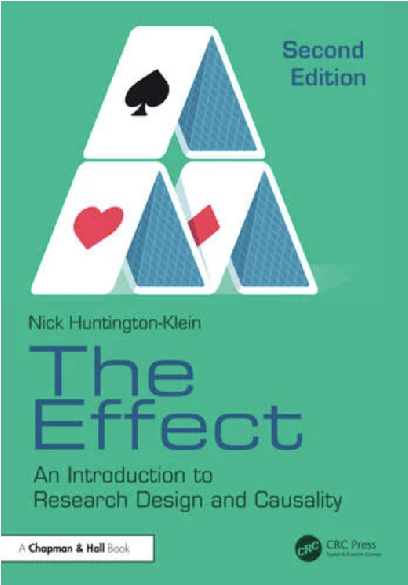

Click hereClick here toliclilililick ere ere eeeeee e ereereeeeeeee order your copy of The Effect from Chapman & Hall now! . The book can also be ordered onAAmazon.azonazz

Welcome to the web version ofThe Effect.The Effectis now out in published form from Chapman & Hall, but they have allowed this free Bookdown version to remain here ontheeffectbotttttttheeffectbook.net.ttttt eeeeeeeeeeeeeeeeeeeeee ecteeeeeeeeeectttttttttt ooooooooooooooooooooook.k.net.... etetetetetetetetetetet This Bookdown version will continue to be free, but I also hope that you willpurchase thepurchase therchrrrchase thehhhhhhhhh se these thee theeeeeeee hehehehehehehe published version nopublished version now that it is available. If you would like to be kept informed about updates toblisheblisheblisheblisheblisheblisheblisheblisheblisheblisheblishe version noversion noveveveveveveveversion noversion nosion nosion nosion nosion nosion nosion nosion no that it is availablethat it is availablethat it is availablethat it is availablethat it is availablethat it is availablethat it is availablethat it is availablethat it is availablethat it is availablethat it is availablethat it is available the book, such as when new teaching materials come out, please add your email to the mailingailingailiiliiliiiiiiiiliiliiiiiii g listlistlilist (no more than one email/month).lilistlistt

The Effectis a book intended to introduce students (and non-students) to the concepts of research design and causality in the context of observational data. The book is written in an intuitive and approachable way and doesnʼt overload on technical detail. Why teach regression and research design at the same time when they are fundamentally different things? First learn why you want to structure a design in a certain way, and what it is you want to do to the data, and then afterwards learn the technical details of how to run the appropriate model.

This book consists of a Part 1 dedicated to research design and causality, making use of causal diagrams to make the concept of identification straightforward, and a Part 2 dedicated to implementation and common research designs like regression with controls and regression discontinuity. You can see the chapters and navigate between them on the left (on in the dropdown menu up top if youʼre on a small screen).

If you would like to run the code examples in this book, youʼll need the causaldata package, which contains the example data for most of the code chunks. Causaldata can be installed using install.packages('causaldata') in R, ssc install causaldata in Stata, or pip install causaldata in Python.

Return to theReturn to the main website for Nick Huntington-Kleineturn to teturn to teturn to teturn to teturn to teturn to teturn to teturn to teturn to teturn to teturn to t eeeeeeeeeee ainaininininininininininin ebsite foreeeeeeeeeee site forsite forsite forite foriteiteiteiteiteiteite fororororororor ickiciiiiiiiiiick untington-Klein untin untin untin untin untin untin untin untin untin untinuntington-ton-ton-tontontontontontontonton- leinleinleinleinleineineineineineinein

###### 0.1 Additional Materials

A video seriesA video series accompanying thevivi i i i i i i i i i eeeeeeeeeee seriesseriesseseseseseseseseriesseriesiesiesiesiesiesiesies book. If you prefer the videos without the background music, those are availableherehere.ereereeeeeeeeereereeeeeeee

Homework assignments toomeomeomeomeomeomeomeomeomeomeomeome ork assignmentsororoooooooorork assignments ssi ssi ssssssssssss ssi ssi nmentsnmentsnmennmennmennmennmennmennmennmentssssssss accompany the book

Intro coding materials for getting started on the basics of coding for data analysis, including an

introduction to data manipulation, forRR,StataStata, andStatatatatatatatatatatatatatatatatatatatatata PythonPython.yttytt

Source codeSource code for the bookʼs code, andSooooooooooo rce corce corce corce coce cocececececece cocococococo eeeeeeeeeee citations for all software packages used (and downloadable data). Note this is code to produce the content of the book itself (graphs, calculations, etc.), not a repository for the bookʼs code examples.

The causaldata downloadable package forRR,StataStata, andStatatatatatatatatatatatatatatatatatatatatata PythonPython,yttytt which provides data you can use with the bookʼs code examples

If you want a set of slides to see how the bookʼs material can be used, I can point you to the slides for myApApplied Econometrics course, which sort of splits the difference between an econometricspplieppliepppppppppppppplieppliepplielied Econoieieieieieie Eco co co cocococococo co co ooooooooooo etricsetricsetriceeeeeeeetricsetricsicicicicicicic course and a pure causality course. I also have slides for myCausalityCausality course. As per the readmeaaaaaaaaaaa salitysalitsalityalitaaaaaaali which refers to the book not being complete, the causality course has not been updated in a while, but Lectures 1-7b should still be pretty handy in setting up your own course.

###### 0.2 Revision and Updates

While updates to this book material will not be frequent at this point, to keep consistent with the published version, please do send any comments or questions about the material to nhuntington-kleinnnnnnnnhuntington-klein@seattleu.edu or to me on Bluesky atnnnnn untinuntinuntinuntinuntinuntinuntinuntinuntinuntinuntingttttttttttt n-n-nnnnnnnn-n-kleinleinleinleinleinleinleinleinleinleinlein seattleu.eduseseseattleu.eeeeeeeee ttleu.ettleu.ettleuttleuttleuttleuttleuttleuttleu.ettleu.eeeeeee uuuuuuuuuuu nickchknickchk. You can also submit feedback,ickcickcickcickcickcckcckcckcckcckcckc kkkkkkkkkkk or report any typos or formatting errors you find, in theFeFeeFeeFeeFeeFeeFeeFeedback Form.FeeFeeFeeFeeFeedback Forack Fc FFFFFFFFFF rrrr

Next

Page built: 2025-10-17 using R version 4.5.0 (2025-04-11 ucrt)

# The Effect

Nick Huntington-Klein

▾ Chapters

###### Introduction

###### 0.3 Welcome

THE EFFECTis a textbook all about causal inference, specifically causal inference done with observational data. We want to know whether causes , and by how much, but we canʼt or donʼt want to run an experiment. How can we design a research study to answer that question? A tricky task, one that Iʼve had more than one researcher tell me to my face was impossible and not worth trying.

###### X Y

1

And thatʼs what this book is for. In this book Iʼll cover what a causal research question even is, and how we can do the hard work of answering that causal research question once we have it.

Iʼll do that while scaling far back on equations and proofs. Thereʼs absolutely a technical element to causal inference, and weʼll get to some of that in this book. But when you talk to people who actually do causal research, they think of this stuff intuitively first, not mathematically. They talk about assumptions about the real world and whether theyʼre reasonable, and what thestoryis behind the data. After theyʼve got that settled,thenthey worry about equations and statistical properties. Designing good research and proving (or even understanding) statistical theorems are separate tasks. I think they should be introduced in that order.

IN THE PART I OF THE BOOK, The Design of Research, Iʼll go over the concept ofidentification—the process of figuring out what part of the data has your answer in it, so you can start to work on digging it out. This will require us to use what we know about how the world works to learn just a little more. Youʼll come out of the first half with an idea ofwhat it is you need to doto answer a research question—what your research design is! Or, if you prefer, how you can tell whether to believe causal claims that youʼve seen other people make. What is it thattheyneeded to do to support that claim, and did they do it?

- Part I of the book is great. Youʼre gonna love it. Iʼve read a lot of causal inference books at this point, and I donʼt think thereʼs anything quite like it out there. My mom loved the first part of this book, and she is allergic to statistics.

PAR II OF THE BOOK,The Toolbox, is more technical. InThe ToolboxI go over the standard set of tools that someone doing causal inference is likely to reach for. Some of these are statistical tools like regression. Others are common research designs that have turned out to be handy in answering lots of research questions, like difference-in-differences.

Of course, I say itʼs more technical, but the emphasis is still heavily on intuition. Iʼm never going to try to sell you on a method by proving mathematically that it works. Instead, my goal is to get you to understand what these methods are trying to do, why theyʼre useful, and when they can be used. Then, I want to help you learn how to carry out these methods, which in the 2020s means how to code them up in R, Stata, or Python. Plenty of code examples in Part II of this book.

I want you to come out of Part II of this book feeling competent—ready to implement these methods and understand whatʼs going on when theyʼre used. With a little work, I think you can be.

IʼM DEFINITELY BIASED, BUT I THINK THIS BOOK IS A LOT OF FUN.It was fun to write, and I think it will be about as fun to read as a causal inference textbook can be. And it will take you on a tour of all kinds of methods and all kinds of research. Causal inference is a mutt of a field, with important contributions from medicine, epidemiology, economics, sociology, political science, finance, data science, and so on and so on. My home is in economics, so you know where Iʼm coming from, but I can guarantee Iʼll be visiting all of these fields in the course of this book. I hope youʼll come with me.

###### 0.4 Note to Students

WHEN I WAS IN COLLEGE,I was introduced to the very barest of causal inference methods. But even those felt to me like a real kind of power. These tools and ideas are the kinds of things that, if you use them right, can turn you from aconsumerof knowledge into aproducer. You can find the answer to questions nobody else has the answer to. You can figure out how the world really works on your own. I think thatʼs pretty darn cool!

Thatʼs the kind of power I want you to keep in mind as you read this book. The point I want to make clear in every page is this: the methods in this book are not blunt instruments to be whacked against some data until an answer emerges. Theyʼre designed to be usedas an extension of the researcherʼs understanding about the world.They take what we know and tell us how we can learn more, and what assumptions we need to make to do so.

2

So donʼt treat causal inference as a technical task. There are technical elements, and youʼll need to do some technical work, but thatʼs not the main point. Think of it as a reasoning task. What do you know? What theory can you rely on? And how can you use that to turn data from something confusing and jumbled into something useful and insightful?

###### 0.5 Note to Educators

IʼM A PROFESSOR.People have tried to sell me textbooks, so I know how it is. Every textbook is new, and different, and really provides real-world examples that students can latch onto, not like those stuffyoldbooks that kids hate! Then you read it and itʼs the exact same thing as the other books, but with different stock photos andNew Yorkercartoons than the competition.

This book really is different in a few major ways, though. I promise! For one, no stock photos. But the differences arenʼt just cosmetic, theyʼre structural. I suspect youʼre either going to think this book is the perfect teaching tool youʼve been waiting for all these years, or youʼre going to think itʼs completely wrong-headed and focusing entirely on the wrong things.

3

What we end up with is a book that is, for its subject, a fairly easy read without cutting back on rigor or breadth. The difficulty level is such that it is most appropriate for an undergraduate causality, observational methods, or applied econometrics course. Depending on the program, it could also be used in masterʼs-level versions of those courses. In conjunction with more technical materials you may also find it useful reading for PhD courses. Select readings from the first part of the book,The Design of Research, would also be acceptable for high school statistics classes that want to discuss causality.

There are many ways to use the book, but the way I organize the course myself is to spend the first third of my time discussing the concept of identification and how to work with causal diagrams to figure out identification. Then, the latter part of the course goes into specific methods, with plenty of opportunities to read and replicate existing research that uses those methods. Assignments and video materials are available on the textbook website at theeffectbotttttttheeffectbook.net.ttttt eeeeeeeeeeeeeeeeeeeeee ecteeeeeeeeeectttttttttt ooooooooooooooooooooook.k.net.... etetetetetetetetetetet

What makes this book so different then? THE FIRST POINT OF DIFFERENCE IS THE LEVEL OF MATHEMATICS.Compared to the existing crop of causal inference textbooks (and certainly to the existing crop of econometrics textbooks), this one is very light on equations. In my experience, even among students who are good at math and can answer mathematical questions, itʼs a pretty slim portion of students who understand a methodbecauseof an equation. But if you know what a method is trying to do, then when you do get to the equations they take on meaning beyond just being a homework problem to conquer.

4

The priorities in this book place a conceptual understanding of research design far, far above anything else. The second priority is the ability toimplement.That means writing code to perform these methods so you can see first-hand what they do and how they behave. The upside: if it works, students will understand what theyʼre doing and how to do it. Plus, I can introduce more advanced and up-to-date methods than a typical textbook that would expect to have to lay out the whole mathematical foundation.

A downside - and it is a real downside - is that this wonʼt prepare students to write proofs in a graduate statistical methods course, or develop their own estimators. However, I suspect thatʼs not where a lot of students, even the ones going into research, are heading anyway.

THE SECOND POINT OF DIFFERENCE IS THE THEORETICAL APPROACH TO CAUSALITY.This book focuses heavily not just on causal inference methods but also causal inference concepts. As such, it has a theoretical underpinning for those concepts!

There are two main theoretical frameworks to choose from in causal inference. One is potential outcomes, associated primarily with Donald Rubin, and the other is the structural causal model/causal diagram framework associated with Judea Pearl.

I make two potentially controversial choices here. The first is to omit almost entirely the potential outcomes framework. The logic of potential outcomes certainly makes its way into the book several times, but I never introduce the model formally. Why? Because the stuff that potential outcomes is great at-clarifying the “missing-data” problem, handling treatment-effect averages, expressing ignorability conditions-I either donʼt do, or I do in ways I think are more intuitive for students. Iʼve taught potential outcomes to undergraduates before. The intuition is helpful; the math is a barrier. I take what I like!

So Iʼm largely using the causal diagram framework. The second controversial choice is to use what I think of as “causal diagrams lite.” No do-calculus, and I do some things that are helpful for clarity but not part of the formal causal diagram setup, like occasionally including functional form terms on the diagram.

Both of these choices mean that there will be some additional work to do for students who want to continue on to advanced study of these methods. But hopefully theyʼll understand what

theyʼretryingto do extremely well. I hope youʼll agree with me that, while the things Iʼve left out are valuable and worth knowing in the long run, itʼs the right call to leave them for later. Better to learnonething well thantwothings poorly.

###### 0.6 Note to the Interested Passerby

THE MARK OF A TRULY EXCELLENT TEXTBOOKis when someone chooses to read it even when itʼs not

assigned. A truly, truly excellent textbook is one that someone just wants to sit down and read the whole way through. If you do this, please let me know. My ego doesnʼt need the boost, but it does wantthe boost.

While Iʼm sure Iʼm leaving some people out, I can imagine three kinds of people who might be likely to read this outside of a classroom. And for those three kinds of people, I have some reading recommendations.

For the data scientist or business analyst with little background in causality who wants to answer causal questions: glad youʼre here! This book will be taking a rather different approach to data analysis than youʼre probably used to. For the most part, data science and business analytics are both fields that are firstdata-driven. You look for patterns in the data and see what it tells you. Your goal, usually, is to make some prediction or measurement with the data.

5

Causal research, on the other hand, istheory-driven. You start with what you know and use that to interpret the data. Your goal is to use the data to uncover some broader truth about the processes and laws that generated the data.

Coming into this book, you not only are going to learn some new methods but also a whole new approach to thinking about research! Using a whole different mental framework is tough to do - I find it very difficult when I try to go in the other direction to read data science results, for example. For you, the key chapters of the book are going to be22 and2 55. Maybe even read those5 ones a couple of times until you reallygetthem. Once you do, the rest is methods. Given your background, you can pick those up in a snap. Open your mind and step inside.

For the non-researcher who wants to understand how causal inference works or get better at interpreting and evaluating studies that use causal inference: this book is conveniently arranged in such a way that you can learn what you need without getting in over your head. Chapters111 through99 will give you a look into what studies that use causal inference, as a whole, are9 trying to do. It also gives you a leg up in determining how studies (or people) who make causal claims can

support, or fail to support, the claims theyʼre making. Even as a non-researcher, youʼll become fully capable of drawing your own causal diagrams (Chapter77), and then thinking about7 what must be doneto support (identify) a causal claim (Chapters88 and8 99). Then you can ask yourself if9

they did that or not! If you find the prospect of reading about math terrifying, you can probably get away with skipping Chapters33 and3 44, but do give them a shot and see how far you get before4 skipping to Chapter55.5

- Part II of the book may also be handy for you. If youʼre not planning to do your own statistical research, youʼre not going to need to read any chapter in Part II all the way through. But if thereʼs a study out there you want to be able to understand that uses one of the designs in these chapters, you can look through the “How Does It Work?” section at the beginning of many of the Toolboxchapters to see what that design is trying to actually do. And if you wanna get real fancy and interpret some of their results more directly, the “How Is It Performed?” sections will help with that too.

For the researcher with experience in causal inference who wants to review the standard methods or get a better sense of how they work, Part II of this book,The Toolbox, is perfect for you. Each chapter on a standard causal inference design is split in three parts-a “How Does It Work?” section that will refresh you on the concepts and theory underlying the design, a “How Is It Performed?” section that probably treads the closest to the econometrics-textbook introduction to these methods youʼve already seen, and a “How the Pros Do It” section that tracks modern tweaks, concerns, and fixes that you probably want to know about. And while weʼre at it, those “How the Pros Do It” sections are perfect for the researcher who learned methods long ago and needs to get up to speed on recent developments.

That said, for both those kinds of researchers Iʼd also recommend checking out the material from the first half of the book on causal diagrams. The marginal value of learning causal diagrams for someone already trained in potential outcomes isnʼt enormous in my opinion, but itʼs still a

6

powerful tool to have in your belt. And they reallyaremagical little things when it comes to teaching. If you teach, you may find yourself adding causal diagrams in class even if you donʼt teach methods and statistics. I always used them in my Economics of the Education System class to help students understand empirical papers above their heads.

###### 0.7 Thoughts

WRITING THIS BOOK HAS BEEN A WILD TIME,in every sense of the word. I started this thing in February 2020, when my kid was six months old and almost exactly one month before the coronavirus pandemic hit the United States. Now, as I finish the book, my kid is calling every animal “puppy” and, well, the pandemic isnʼt exactly over, but I did just get my second vaccine shot on Friday. As I update the book for the second edition (and give up on figuring out the proper tense to use when updating the previous sentence), my kid has just graduated to a ``big kid bed,ʼʼ and we have for better or worse largely decided to stop doing all that much about the pandemic.

Having a book to write has been a distraction, a passion project, and a way of keeping time during this weird and very tense year. If youʼre reading this in the future and have no idea what Iʼm talking about, Iʼm sure there are many history books about 2020 you can read. Or, by the standards of your time, 2020 isnʼt even that notably weird, in which case I hope youʼre doing okay and am shocked you have the time to read causal inference textbooks.

You can also consider this book a strange and minor outgrowth of the economics community on Twitter (and the other academic communities it overlapped with at the time, when Twitter still existed). Not only did I learn quite a lot about causal inference from Twitter, but itʼs just a great intellectual environment to be in, and contributing to it has been a great motivator. Thereʼs a real rush in sharing some of your teaching materials and having a thousand people tell you they like them. So I spent a year writing a book. I guess flattery will get you anything.

###### 0.8 Acknowledgements

Thanks to Scott Cunningham for encouraging me to write this book in the first place. Thanks to Joan for being a good enough sleeper to turn midnight-to-three into writing time. Thanks to Spike for everything.

Chapter-heading illustrations are by Sara Jean, except for “Finding Stuff in This Book” and “Partial Identification,” which are by Alfa.

Many thanks to Katelyn Trujillo for editing work. Thanks also to Megha Joshi who wrote many of the chapter questions that have now been moved out of the book itself and into supplementary material, and to the reviewers (anonymous and otherwise) of each draft.

Figures and tables in the main text of this book were generated using the R packages ggplot2 by Wickham (⊕2016), Cairo by Urbanek and Horner (⊕2020), ggpubr by Kassambara (⊕2020), modelsummary by Arel-Bundock (⊕2020), sensemakr by Cinelli, Ferwerda, and Hazlett (⊕2021), and vtable by Huntington-Klein (⊕2020). Causal diagrams were generated using shinyDAG by Creed, Aden-Buie, and Gerke (⊕2020), and the LaTeX package TikZ by Tantau (⊕2013). Many other packages were used in performing analysis. Citations for all those not mentioned in the text can be found in the source code for this book, which is available atthe bookʼsttttttthe bookʼs GitHub code repository.ttttt e booe booe booe booe booe booe booe booe booe booe bookʼsʼsʼsʼsʼsssssss itititititititititititit ub code repositoryb cobbbbbbbbbb coooooooooo e ree ree ree ree ree ree ree ree ree ree re ositoryositorositorositorositorositorositorositorositorositorository

This Bookdown version was created using the R packages bookdown (⊕Xie 2016), tufte (⊕Xie and Allaire 2020), and msmbstyle (⊕Smith 2021), and with additional table-creation packages knitr by Xie (⊕2015) and kableExtra by Zhu (⊕2021).

Previous Next

Page built: 2025-10-17 using R version 4.5.0 (2025-04-11 ucrt)

4/18/26, 1:52 PM The Design of Research | The Effect

# The Effect

Nick Huntington-Klein

###### ▾ Chapters

###### The Design of Research

###### The first part of the book begins here. Just hit Next.

Previous Next

Page built: 2025-10-17 using R version 4.5.0 (2025-04-11 ucrt)

https://theeffectbook.net/the-design-of-research.html 1/1

# The Effect

Nick Huntington-Klein

▾ Chapters

###### Chapter 1 - Designing Research

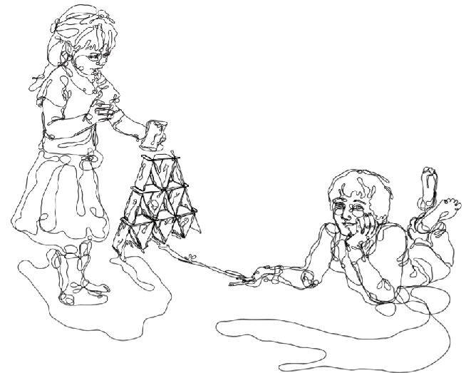

###### 1.1 I Have a Question

HOW DOES THE WORLD WORK?Thatʼs the big question, isnʼt it? And itʼs one for which our answers will always be ever so slightly incomplete.

1

That incompleteness is a curse, but also a blessing. Sure, weʼll never know everything perfectly. But that also means that weʼll always have questions that need answering. For a certain kind of person, at least, answering those questions sounds like a pretty good way to spend your time on Earth. Maybe youʼre that kind of person. I certainly am.

A RESEARCH QUESTIONis a question that you have that you plan to answer, or at least try to answer,

by doing research. Simple as that. Or, rather, as difficult as that. A good research question is welldefined, answerable, and understandable - those can be hard to figure out! Weʼll talk more about this in Chapter22.2

For one example, letʼs say that our research question is “does adding an additional highway lane reduce traffic congestion?”

Thatʼs a question about how the world works. Traffic is, unfortunately, a part of the world. And itʼs something we could likely figure out with some research!

What kind of research? Well-designed research is research capable of answering the question itʼs trying to answer. That seems simple, but it actually requires quite a lot of thought and effort.

And thatʼs the real trick.

How can you do research in such a way that, when youʼre done, you have an answer to your research question?

Thatʼs what this book is about.

###### 1.2 Empirical Research

“RESEARCH CAPABLE OF ANSWERING THE QUESTION ITʼS TRYING TO ANSWER”could mean a lot of things, of course.

There are many kinds of research. You could look in books to see what people have already had to say about your question (“what do the traffic experts say about the effects of an additional highway lane?”). You could philosophically reason your way around the question (“if I assume people try to minimize their commute times, how would I expect them to respond to an additional highway lane?”). These are all forms of research.

###### This book will focus onempiricalresearch and, specifically,quantitative empirical research.

Empirical research is any research that uses structured observations from the real world to attempt to answer questions. So instead of trying toreasonour way through what drivers would do if given an additional highway lane, we try toobservethe choices that drivers make. Perhaps we interview drivers about how they make decisions. Or maybe we get a big data set of traffic violations, or of traffic flow numbers on highways.

Quantitative empirical research is just empirical research that uses quantitative measurements (numbers, usually). More data sets, fewer interviews.

QUANTITATIVE EMPIRICAL RESEARCH,like any kind of research, can be tricky! Measurements are hard to take precisely or interpret accurately. Statistics is a difficult field.

One particularly sticky problem with quantitative empirical research is that the numbers that we observe often donʼt tell us exactly what we want to know.

After all, we might want to study the impact of additional lanes by comparing two-lane highways to three-lane highways. But we probably arenʼtactualyinterested in how much congestion there is on three-lane highways and on two-lane highways. Weʼreprobablyinterested in whether we can make traffic congestion go down by turning a two-lane highway into a three-lane highway. But as much as we want them to, the numbers we have donʼt actually tell us that right away. All we have are two-lane highways and three-lane highways. We donʼt have a “what if” highway that tells us how much congestion therewould have beenif weʼd madethattwo-lane highway one lane wider.

This problem constitutes a major headache for us researchers. If the numbers we have donʼt actually answer the research question we have, what can we do?

Well, it turns out that, if you do it right, you oftencanfigure out how to collect the right numbers, or do the right things to those numbers, to get an actual answer to our question. But it doesnʼt come free. We have to carefully design the right kind of analysis that will answer our question.

###### 1.3 Why Research Needs a Design

WHY IS IT SO IMPORTANTfor research to be properly designed? One way we can think about this is by looking at what happens when itʼs not.

Letʼs take our highways and traffic example. How might we go about researching an answer to this question? Our first pass might be to just compare congestion on highways with more lanes against congestion on highways with fewer lanes.

Seems reasonable. But then you do it, and it turns out that more lanes seem to go along with more congestion! Surprising. However, why do those highways have more lanes in the first place? It might be that the busiest routes tend to be the ones that get expanded, and so itʼs no surprise that more lanes are associated with more congestion. Sure, maybe additional lanesdolead to more congestion. But it takes research design to know that our first-pass analysis wasnʼt right and to figure out what to do instead.

2

A LACK OF SOLID RESEARCH DESIGNcan be seen in the results, as well. Have you ever noticed, for example, how the studies you read about nutrition in the news canʼt seem to make up their mind? When I was a kid in the 90s, high-carb, low-fat food was what you were supposed to eat, and frozen yogurt and bagels both counted as pretty darn good for you. None of that is considered true today. And is a glass of wine every day good for you or not? Or coffee? Or butter versus margarine? Or sugar versus corn syrup? The underlying truth about what food is good to eat canʼt possibly be changing that much, but the scientific results sure do!

3

Some of this we can blame on the news hyping up studies beyond reason, or misinterpreting them completely. But some of this comes down to a lot of nutrition studies not having research designs that allow them to answer the question “what food will make you healthier?” Different studies seem to give different answers to “what food will make you healthier?” because theyʼre not actually answering that question in the first place, even if they claim to! only has one answer, but if youʼre actually calculating something entirely different from , you might well come back with an answer of 6, or 1, or -52. Then you wake up to a news headline reading that scientists have determined that .

2 + 2 4 2 + 2

2 + 2 = −52

Nutrition is a good field to pick on here because it isnʼt really the fault of the nutrition researchers themselves. Nutrition just happens to be a topic that makes good research design really elusive.

5

So you end up with a field with shaky research design. And what does that give us? Inconsistent results that people have learned not to pay all that much attention to today, because they know it might change tomorrow.

RESEARCH DESIGN IS HARD, and just because you want to answer a question doesnʼt mean thereʼs necessarily a straightforward way of doing it. But the worst that could happen is that weʼd figure out that the answer will be difficult to get. Then, at least, weʼll know.

The best that could happen is that wecananswer our question. And we do. And then we win a Nobel Prize.

###### 1.4 In This Book

THIS BOOK IS DESIGNED TO DO A FEW THINGS.

In Part I, it aims to teach you the principles of research design. Specifically, it will go into the ways that you can build an answerable research question, and then think about what kind of quantitative empirical research you could perform in order to answer that question. What would you need to measure? How could you be sure your method would actually answer your question?

Then, in Part II, it introduces you to some of the “toolbox” methods for causal research designs using observational data (i.e., answering a causal research question without running an experiment). These methods are very commonly used in modern research as they tend to be widely applicable in answering a wide range of research questions, and the assumptions they rely on are well-understood.

Hopefully, you can walk away from this book confident in your ability to craft a research project, figure out what kind of data you need to answer your research question, and figure out what calculations you need to perform on your data.

Previous Next

Page built: 2025-10-17 using R version 4.5.0 (2025-04-11 ucrt)

# The Effect

Nick Huntington-Klein

▾ Chapters

###### Chapter 2 - Research Questions

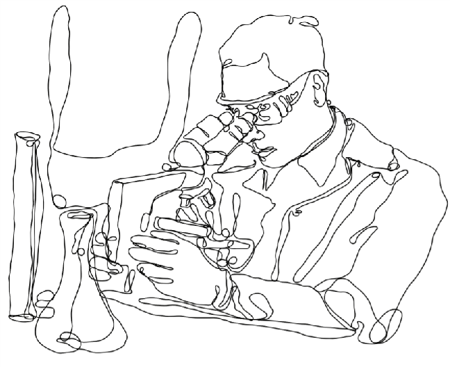

###### 2.1 What Is a Research Question?

COMING UP WITH A QUESTION IS EASY.Just ask any five-year-old and they can provide you with dozens. Coming up with a good research question is much harder.

Whatʼs the difference? The difference, at least in the case of quantitative empirical research, is that a research question is a questionthat can be answered, and for which having that answer willimprove your understanding of how the world works.

Those are both a little abstract. Letʼs take them one at a time.

WHAT DOES IT MEANto have a questionthat can be answered? It means that itʼs possible for there to be some set of evidence in the world that, if you found that evidence, your question would have a believable answer. So for example, “what is the best James Bond movie?” canʼt really be answered. No matter what evidence you find, “best” is ambiguous enough that you canʼt even imagine the evidence that would settle the question for you. You could get every person on Earth to agree itʼsMoonrakerand that still wouldnʼt necessarily settle the question.

1

On the other hand, “which era of Bond movies had the highest ticket sales?” can definitely be answered. You look at the ticket sales and see when they were highest. Evidence can tell you the answer to this question.

SO WE HAVE A QUESTION THAT CAN BE ANSWERED.But does itimprove our understanding of how the world works? What this means is that the research question, once answered, should tell you about something broader than itself. It should informtheoryin some way. Theory doesnʼt have to be something as important as the theory of gravity or the theory of evolution. It could even be something as generic as “bread costs more today than last year because bread prices have been generally increasing over time.” Theory just means that thereʼs awhyor abecauselurking around somewhere. Even hydrogen is a theory - it says that we see material like water behaving a certain waybecausethereʼs a kind of atom that behaves in certain ways and has a certain structure.

Take germ theory, for example. Germ theory says that microorganisms like bacteria and viruses can cause disease. This explainswhywe have diseases, and alsowhydisease can spread from one person to another. We donʼt call it “a theory” because weʼre uncertain about whether itʼs true. We call it a theory because it tells uswhy.

2

A good research questiontakes us from theory to hypothesis, where a hypothesis is a specific statement about what we will observe in the world, like “people who wash their hands will get sick less often.” That is, a research question should be something that, if you answer it, helps improve yourwhyexplanation. Great research questions often come from the theory themselves

- the line of thinking being “if this is my explanation of how the world works, then what should I observe in the world? Do I observe it?”

This is easy to miss! Letʼs keep working with germ theory as an example. We might ponder germ theory for a while and think “Hey, I wonder how small the smallest microorganism is.” Thatʼs a

research question that we could answer with the right evidence, and itʼsrelatedto germ theory, and would be kind of neat to know. However, learning the answer to this question wouldnʼt really tell us anything new about why we have diseases or why disease can spread from one person to another. Maybe it helps us understand someothertheory better. That would make our smallmicroorganism question a better research question for that other theory than for germ theory.

3

4

So does asking “which era of Bond movies had the highest ticket sales?” improve our understanding of how the world works? Maybe, for the right theory. Maybe we have a theory that says that action movies were generally at their most popular in the 1980s. Asking about Bond sales over time might tell us a little more information about whether that theory is an accurate explanation of ticket sales.

LETʼS WALK THROUGH AN EXAMPLE,starting with our theory. Letʼs say we have a theory that your curiosity as an adult is harmed by exposure to passive entertainment like TV and movies. Regardless of whether this is actually true or not, it still qualifies as a theory - it explains why we might see certain levels of curiosity in adults.

A natural research question here is “does watching a lot of TV as a child dull your curiosity as an adult?”

Letʼs check our two conditions for research questions. Could we answer this question? Yes! The data necessary to answer this question might be hard to come by, but we can at least conceive of it existing. If we randomized a bunch of kids to watch different amounts of TV, and then we followed them to adulthood and measured their curiosity, that would be some pretty convincing evidence on our research question.

5

Second, does this research question tell us about how the world works? Yes! If we answered this question, that would pretty clearly inform our theory. If we answered our research question with “no, watching a lot of TV as a child does not dull your curiosity as an adult,” then it would be a pretty hard sell to explain adult curiosity by saying itʼs because of passive entertainment. The research question does help us figure out if the theory is any good.

A good test for whether a research question informs theory is to imagine that you find an unexpected result, and then wonder whether it would make you change your understanding of

the world. Letʼs say that instead of answering the research question “does watching a lot of TV as a child dull your curiosity as an adult?” we use the research question “do kids who watch lots of Sesame Street tend to have lower levels of curiosity later?” We do our research and find that, actually, kids who watch Sesame Street havehigherlevels of curiosity! Uh oh. With this new information, do we have to change our theory? Well, we hem and we haw, and we think about how fond we were of that original theory. And we explain away the Sesame Street result by noting that Sesame Street might be different from most kinds of TV, and also that we just looked at which kidsdidwatch Sesame Street, not whether Sesame Street is actually responsible for their curiosity - maybe kids who are more curious in the first place choose Sesame Street.

This ability to see a bad result and still hold on to the original theory tells us that the research question wasnʼt very good, at least not for this theory. A really good research question, once answered, should be hard to explain away just because itʼs inconvenient.

6

So there we have it - “does watching a lot of TV as a child dull your curiosity as an adult?” is a good research question that could be answered with the right data, and it would inform our understanding of the world if answered. Granted, the process of actuallyansweringthat question is another hurdle. But at the very least we know that the question itself is good, even if the answer is elusive.

7

###### 2.2 Why Start with a Question?

THIS SOUNDS HARD. WHY BOTHER?We have a bunch of data at our fingertips. In fact, weʼre awash in it. Thereʼs data everywhere. So why not skip the hard part of deriving a research question from a theory and instead just see what sorts of patterns are in the data?

Well, we could. In fact, a lot of people do. This is called “data mining,” and there are people who do that very thing, and manage to do it quite well. They go to the data, look for patterns, and report back. You find a lot of this in the field of data science, but data mining can be done any time you have some data. Just look at the data, see whatʼs in there, and work backward.

So, sounds good, right? Well, data mining is well and good, but it turns out to be very good at some things, and very bad at others.

###### The kinds of things that data mining is good at are infinding paternsand inmaking predictions under stability. The kinds of things that data mining is less good at are inimproving our understanding, or in other wordshelping improve theory.It also has a tendency to findfalse positivesif you arenʼt careful.

8

FINDING PATTERNS AND MAKING PREDICTIONS ARE VERY VALUABLE.And we probably do want to rely on some sort of data mining for these tasks. After all, thereʼs no way we can really theorize about every possible pattern that could be in the data and think to check it. Doing something that just askswhatwe see rather thanwhyis the right angle to take there. Plus, sometimes seeing patterns in data can give us ideas for research questions that we can examine further in other data sources.

Itʼs also probably the best angle to take when we donʼt care about why! If I donʼt care why the stock market goes up or down, and I just want to predict if it will or not so that I know whether to buy or sell, then data mining may well be the way to go.

But outside of those realms? WHY DOES DATA MINING HAVE DIFFICULTY HELPING THEORY?There are a few main reasons.

One of the reasons is that data mining, by definition, focuses on whatʼs in the data, notwhyitʼs in the data. In other words, itʼs fantastic at revealing correlations - patterns in the data of how variables weʼve observed have varied together in the past - but the correlations it uncovers may have little to do with causality, or an understanding ofwhythose variables move together.

To introduce an example that will pop up a few times in this book, someone using data mining to try to understand ice cream sales may well notice that the proportion of people who wear shorts is a fantastic predictor of ice cream sales. But shorts-wearing isnʼtwhypeople buy ice cream. They buy ice cream and wear shorts because itʼs hot. But to a data miner, the shorts/ice cream connection is pretty compelling! After all, shorts can be a great way ofpredictingice cream eating, even if thereʼs no “why” there.

However, if what weʼre really interested in isnʼt predicting ice cream butexplaining whypeople eat ice cream, itʼs pretty tempting at that point to try to invent a story to justify why shorts might actually be the reason people eat ice cream. In the case of ice cream and shorts, we can tell thatʼs ridiculous. But itʼs a lot harder when we donʼt actually know whatʼs ridiculous and whatʼs not ahead of time.

For example, weʼd love to know what causes children to act aggressively. That sounds really important! A data mining exercise here might look through all of the things kids do or are exposed to, and check whether any of them are associated with higher levels of aggression. Maybe kids who play a lot of video games are more likely to be aggressive. So … are the video games responsible? Maybe, maybe not. Data mining is well-equipped to find the relationship but poorly-equipped to tell uswhythat relationship is there. Hopefully someone doesnʼt get worried and ban all the video games before the researcher can carefully explain the distinction.

9

Another reason is that, because itʼs so focused on the data, data mining doesnʼt really deal in abstraction. For example, take a look at a chair. How do you know itʼs a chair? Well, itʼs probably got some legs, maybe a back, definitely a flat-ish seating area, and itʼs clearly designed for sitting in. This is our “chair theory” - we theorize that there are these objects called chairs that have certain chair-like properties, united in the ability to sit on them some distance off the ground. The chair youʼre looking at now is one example of chair theory.

10

But whatʼs actuallyin the data?Thereʼs no “chair” in the data. Thereʼs just a flat bit and some straight-up-and-down bits underneath the flat bit. Data mining would be great at noticing that it sees a lot of flat bits on top of straight-up-and-down bits, but it would not be good at developing “chair theory” for us because it would misswhywe keep seeing that arrangement - because it allows us to sit on it. A data miner would never guess that the four-legged chair has anything to do with, say, a bean bag chair, which has no straight-up-and-down bits at all.

Perhaps the most visible place we can see this problem with data mining is in large language models like ChatGPT. These generative models create words or pictures not based on understanding or theory, but rather by matching patterns that they observed in the data. This is why these programs will confidently tell you incorrect facts or produce pictures with impossible objects. The ability to detect and replicate patterns is impressive, but what about all those AI-

generated pictures where the hands look weird or have the wrong number of fingers? Itʼs because, at their core, these data mining-based programs still lack “hand theory.”

11

FALSE POSITIVESare another reason data mining can be dangerous. Take the video games and aggression example. Okay, sure, maybe the video games arenʼtwhythe kids are aggressive, but we still found the relationship. Surely thereʼssomethingthere.

Well, maybe, and maybe not. Data mining means looking in the data to see whatʼs there. And thereʼs a lot of stuff to look at! If you check, say, 100 variables and see if theyʼre related to aggression,somethingis going to pop up as looking related, just by random chance. That random relationship is unlikely to pop up again if you tried another sample. Itʼs only in the sample you have by random chance, which is what makes it a “false positive.”

Thatʼs one major danger in proceeding in your work without starting with a solid research question. Without a disciplined research question, thereʼs no reason not to just check everything! Somethingis going to pop up as related by random chance if you check enough stuff. It takes a really well-behaved researcher to not pretend thatʼs exactly what theyʼd been looking for from the start, and to fill in some reason why the 100th relationship they checked makes perfect sense and supports some theory.

There are ways of avoiding false positives while doing data mining - this is something they worry about a lot in data science and have a lot of tools for. But if youʼre just sort of trawling through a data set to see what you see, youʼre likely to end up with a whole lot of false positives mixed in with the real positives. Youʼll have no way of telling one from another.

12

THAT SAID, DATA MINING ISNʼT ALL BAD.Thereʼs no way we could possiblythink upevery interesting

theory to test. Plenty of theories come from looking at the data in the first place, noticing a pattern, and wondering why the pattern is showing up, or whether the pattern is even real.

The drug Viagra, for example, was initially being tested as a blood pressure medication. The researchers testing it out to see if it worked to lower blood pressure happened to notice, uh, its other effects.

Theyʼve done data mining there - instead of coming to the data with a theory, they noticed an interesting pattern in the data.

Of course, the responsible thing to do at that point is to not just take the pattern as given.Thatʼs where the real problem of data mining is. Instead, they took the interesting pattern they noticed and looked to see if it held up inotherdata - if it replicated - before being sure that the pattern they noticed was real and explained how the drug worked.

Data mining isnʼt bad. Itʼs just bad as afinal stepif youʼre trying to explain the world. It can still work as a source of ideas. And heck, maybe it can help you earn a hojillion dollars like Viagra did, too.

###### 2.3 Where Do Research Questions Come From?

RESEARCH QUESTIONS CAN COME FROM LOTS OF PLACES.Mostly, curiosity. We want to know how the world works, and that naturally leads to questions!

There are two steps in this process: thinking about theory, and coming up with a research question. Either one can come first.

Perhaps it begins with theory: “I think this is how the world works” or “I wonder if this is how the world works” - thatʼs your theory. This could be anything from “I think people make the decisions they do because they follow incentives” to “I think plants survive without eating because they collect energy from the sun” to “I think CD sales are down because people stream music now instead.”

With the theory in place, the process continues with our hypothesis: “if this is how the world works, what would I expect to see in the world?” Our above theories might lead to the research questions “will students work harder in school if you pay them for good grades?” or “will plants die if you store them in a dark room?” or “are CDs more popular now in areas with bad Internet connections?” These research questions tell us ahypothesis to testsuch that the result of that testtels us something about the theory.

The question might come first. “Will students work harder in school if you pay them for good grades?” we might ask. Then, we might wonder why we came up with such an idea in the first place. Probably because we think students respond to incentives. Or we might wonder, if we answered the question, what sense we might make of it, leading us back to our theory. If you canʼt figure out why you would ask the question, it may not be a great research question. Or at least youʼd have a hard time getting anyone to care about the answer once you had it.

LETʼS BE HONEST,sometimes research questions also come fromopportunity.

Have a neat data set? Think about what data is available to you and whether any related research questions or theories come to mind.

13

Or, perhaps youʼve learned about something unusual or interesting that has happened in the world. Maybe youʼve learned that a few school districts have decided to try paying their students for good grades. When you hear about something like this, you might ask “what research questions would this allow me to answer?” and from there you have a research question, and from there a theory!

###### 2.4 How Do You Know if Youʼve Got a Good One?

YOUʼVE FOLLOWED THE PROCESS.You have a research question in mind. You know it can be answered with data, and youʼre pretty sure that if you get the answer to it, it will help you learn how the world works.

But is it really a good one? Just a few things to check before you get too far into the process:

Consider Potential Results. A good way to double-check the relationship between your research question and your theory is toconsider the potential answers you might get.

Then, imagine what kind of sense youʼd make of that result, or what

conclusion you would draw. Letʼs say you find that studentsdotend to work harder in school when theyʼre paid for good grades. What would this tell us about how students respond to incentives? Or letʼs say you find that studentsdonʼtwork harder when theyʼre paid. What wouldthattell us about how students respond to incentives? If you canʼt say something interesting about your potential results, that probably means your research question and your theory arenʼt as closely linked as you think! Letʼs say wedofind that kids who happen to play video games are more aggressive. Can we take that result and claim that video games are a cause of aggression? Not really, for the reasons weʼve discussed previously. So maybe that research question really isnʼt linked to that theory very well.

Consider Feasibility. A research question should be a question that can be answered using the right data, if the right data is available. Butisthe right data available? If answering your research question ispossible but requires following millions of people repeatedly for decades, or trying to measure something thatʼs really hard to measure accurately, like trying to get people to remember

what they had for lunch three years ago, or getting access to the private finances of thousands of unwilling people, then that research question might not be feasible. While sometimes you can get around these problems with a clever design, you might want to consider going back to the drawing board.

Consider Scale. What kind of resources and time can you dedicate to answering the research question? Given a lifetime of effort and considerable resources, you might be able to tackle massive questions like “what causes some countries to become rich and others poor?” Given the confines of, say, a term paper, you could take some wild swings at that question, but youʼre likely to do a much more thorough job answering questions with a lot less complexity.

Consider Design. A research question can be great on its own, but it can only be so interesting without an answer. So, an important part of evaluating whether you have a workable research question is figuring out if thereʼs a reasonable research design you can use to answer it. Figuring out whether you do have a reasonable research

design is the topic of the rest of this book.

Keep It Simple! Answering any research question can be difficult. Donʼt make it even harder on yourself by biting off more than you can chew! A common mistake is to bundle a bunch of research questions into one. “What are the determinants of social mobility?” i.e., how someone can move from one social class to another throughout their lifetime. There aremany determinants of social mobility. Youʼre unlikely to answer that question well. Instead try “is birth location a determinant of social mobility?” For another example, how about the question “how was the medium of painting affected by the Italian renaissance?” In a million ways! Youʼll get lost and do a poor job on a bunch of minor pieces instead of getting at the whole. Instead maybe “what similar characteristics are there among the countries that adopted the use of perspective in painting most quickly?”

So, consider feasibility, scale, and design. Keep it simple, and think about whether the results you might likely see would tell you anything interesting about the world. After all, learning something interesting and new about the world is our goal!

Previous Next

###### Page built: 2025-10-17 using R version 4.5.0 (2025-04-11 ucrt)

# The Effect

Nick Huntington-Klein

▾ Chapters

###### Chapter 3 - Describing Variables

###### 3.1 Descriptions of Variables

THIS CHAPTER WILL BE ALL ABOUT HOW TO DESCRIBE A VARIABLE.That seems like an odd goal. The opening to this book was all about setting up research questions and how empirical research can help us understand the world. And we jet right from that into describing variables? What gives?

1

It turns out that empirical research questions really come down entirely to describing the density distributions of statistical variables. Thatʼs, well, thatʼs really all that quantitative empirical research is. Sorry.

Maybe thatʼs the wrong approach for me to take. Perhaps I should say that all the interesting empirical research findings youʼve ever heard about - in physics, sociology, biology, medicine, economics, political science, and so on - can be all connected by a single thread. That thread is laid delicately on top of a mass of probability. The shape it takes as it lies is the density of a statistical variable, tying together all empirical knowledge, throughout the universe, forever.

Is that better? Am I at the top ofThe New York Timesnonfiction bestseller list yet?

Look, in order to make any sense of data we have to know how to take some observations and describe them. The way we do that is by describing the types of variables we have and the distributions they take. Part of that description will be in the form of describing how different variables interact with each other. That will be Chapter44. In this chapter, weʼll be describing4 variables all on their own. It will be less interesting than Chapter44, but, I am sorry to say, more4 important.

Avariable, in the context of empirical research, is a bunch of observations of the same measurement - the monthly incomes of 433 South Africans, the number of business mergers in France in each year from 1984 to 2014, the psychological “neuroticism” score from interviews with 744 children, the color of 532 flowers, the top headline from 2,348 consecutive days ofThe Washington Post. Successfullydescribing a variablemeans being able to take those observations and clearly explain what was observed without making someone look through all 744 neuroticism scores themselves. Trickier than it sounds.

###### 3.2 Types of Variables

THE FIRST STEPin figuring out how to describe a variable is figuring out what kind of variable it is.

While there are always exceptions, in general the most common kinds of variables you will encounter are:

Continuous Variables. Continuous variables are variables that could take any value (perhaps within some range). For example, the monthly income of a South African would be a continuous

2

variable. It could be 20,000 ZAR, or it could be 34,123.32 ZAR, or anything in between, or from 0 to infinity. Thereʼs no such thing as “the next highest value,” since the variable changes continuously. 20,000 ZAR isnʼt followed by 20,001 ZAR, because 20,000.5 ZAR is between them. And before you get there, you have to go through 20,000.25 ZAR, and 20,000.10 ZAR, and so on.

Count Variables. Count variables are those that, well, count something. Perhaps how many times something happened or how many of something there are. The number of business mergers in France in a given year is an example of a count variable. Count variables canʼt be negative, and they certainly canʼt take fractional values. They can be a little tougher to deal with than continuous variables. Sometimes, if a count variable takes many different values, then it acts a lot like a continuous variable, and so researchers often treat them as continuous.

Ordinal Variables. Ordinal variables are variables where some values are “more” and others are “less,” but thereʼs not necessarily a rule as to howmuchmore “more” is. A “neuroticism” score with the options “low levels of neuroticism,” “medium levels of neuroticism,” and “high levels of neuroticism” would be an example of an ordinal variable. High is higher than low, but how much higher? Itʼs not clear. We donʼt even know if the difference between “low” and “medium” is the same as the difference between “medium” and “high.” Another example of an ordinal variable that might make this clear is “final completed level of schooling” with options like “elementary school,” “middle school,” “high school,” and “college.” Sure, completing high school means you got more schooling than people who completed middle school. But how much more? Is that… two more school? Thatʼs not really how it works. Itʼs just “more.” Thatʼs an ordinal variable.

Categorical Variables. Categorical variables are variables recording which category an observation is in - simple enough! The color of a flower is an example of a categorical variable. Is the flower white, orange, or red? None of those options is “more” than the others; theyʼre just different. Categorical variables are very common in social science research, where lots of things weʼre interested in, like religious affiliation, race, or geographic location, are better described as categories than as numbers.

A special version of categorical variables isbinary variables, which are categorical variables that only take two values. Often, these values are “yes” and “no.” For example, “Were you ever in the military?” Yes or no. “Was this animal given the medicine?” Yes or no. Binary variables are handy

because theyʼre a little easier to deal with than categorical variables, since theyʼre useful in asking about the effects of treatments (Did you get the treatment? Yes or no), and also because categorical variables can be turned into a series of binary variables. Instead of our religious affiliation variable being categorical with options for “Christian,” “Jewish,” “Muslim,” etc., we could have a bunch of binary variables - “Are you Christian?” Yes or no. “Are you Jewish?” Yes or no. Why would we want that? As youʼll find out throughout this book, it just happens to be kind of convenient. Plus, it allows for things like someone in your data being both ChristianandJewish.

Qualitative Variables Qualitative variables are a sort of catch-all category for everything else. They arenʼt numeric in nature, but also theyʼre not categorical. The text of aWashington Post headline is an example of a qualitative variable. These can be very tricky to work with and describe, as these kinds of variables tend to contain a lot of detail that resists boiling-down-andsummarizing. Often, in order to summarize these variables, they first get turned into one of the other variable types above. For example, instead of trying to describe theWashington Post headlines as a whole, perhaps asking “how many times is a president referred to in this headline?” - a count variable - and summarizing that instead. Or, since we live in the future now, we can ask a large language model (AI) to read the text for us and tag whether a given topic is present or score it on some characteristic.

###### 3.3 The Distribution

ONCE WE HAVE AN IDEA OF WHAT KIND OF VARIABLE WEʼRE DEALING WITH,the next step is to look at the distributionof that variable.

A variableʼsdistributionis a description ofhow often different values occur. Thatʼs it! So, for example, the distribution of a coin flip is that it will be heads 50% of the time and tails 50% of the time. Or, the distribution of “the number of limbs a person has” is that it will be 4 most often, and each of 0, 1, 2, 3, and 5+ will occur less often.

When it comes to categorical or ordinal variables, the variableʼs distribution can be described by simply giving the percentage of observations that are in each category or value. The full

###### distribution can be shown in a frequency table or bar graph, which just shows the percentage of the sample or population that has each value.

Table 3.1: Distribution of Kinds of Degrees US Colleges Award

Variable N Percent Primary Degree Type Awarded 7424 … Less than Two-Year Degree 3495 47% … Two-Year Degree 1647 22% … Four-Year or More 2282 31% Data from College Scorecard

These tables tell you all you need to know. From Table3.13.1 we can see that, of the 7424 colleges in3.1.... our data, 3495 of them (47.1%) predominantly grant degrees that take less than two years to complete, 1647 of them (22.2%) predominantly grant degrees that take two years to complete, and 2282 of them (30.7%) predominantly grant degrees that take four years or more to complete or advanced degrees. Figure3.13.1 shows the exact same information in graph format.3.1....

3

Figure 3.1: Distribution of Kinds of Degrees US Colleges Award

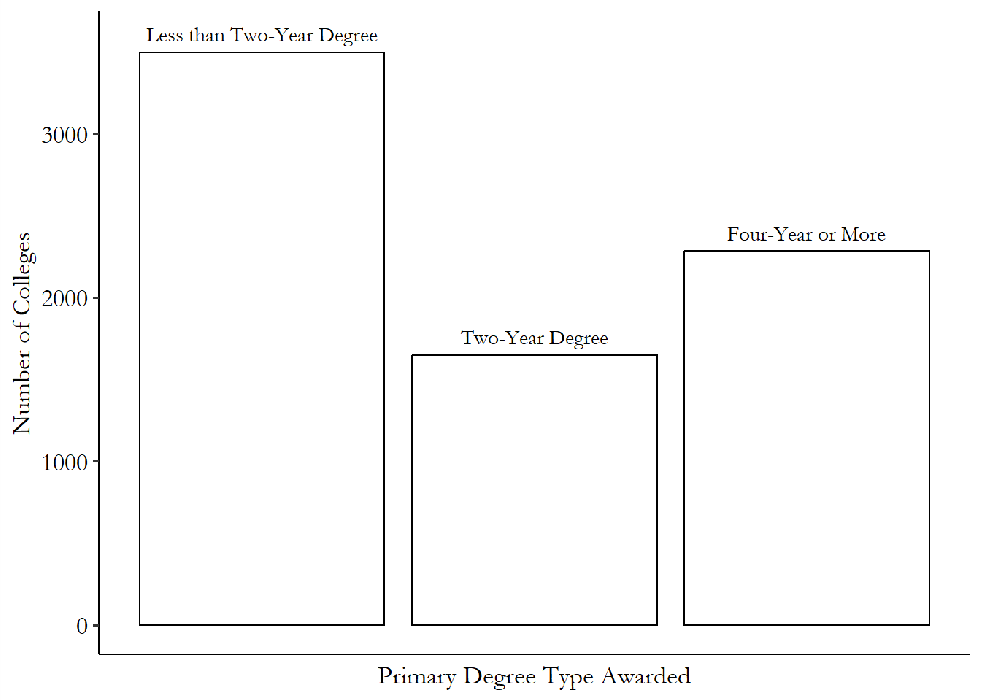

There are only so many possibilities to consider, and the table and graph each show you how often each of these possibilities comes up. Once youʼve done that, youʼve fully described the distribution of the variable. Thereʼs literally no more information in this variable to show you! If we wanted to show more detail (maybewhich majorseach college tends to specialize in), weʼd need a different data source with a different variable.

CONTINUOUS VARIABLES ARE A LITTLE TRICKIER.We canʼt just do a frequency table for continuous variables since itʼs unlikely that more than one observation takes any specific value. Sure, one personʼs 24,201 ZAR income is very close to someone elseʼs 24,202 ZAR. But theyʼre not the same and so wouldnʼt take the same spot on a frequency table or bar chart.

For continuous variables, distributions are described not by the probability that the variable takes a given value, but by the probability that the variable takes a valuecloseto that one.

One common way of expressing the distribution of a continuous variable is with ahistogram. A histogram carves up the potential range of the data into bins, and shows the proportion of

observations that fall into each bin. Itʼs the exact same thing as the frequency table or graph we used for the categorical variable, except that the categories are ranges of the variable rather than the full list of values it could take.

For example, Figure3.23.2 shows the distribution of the earnings of college graduates a few years3.2.... after they graduate, with one observation per college per graduating class (“cohorts”). We can see that there are over 20,000 college cohorts whose graduates make between $20,000 and $40,000 per year. There are a smaller number - about 4,000 - making on average $10,000 to $20,000. For a very tiny number of college cohorts, the cohort average is between $80,000 and $160,000. There are so few between $160,000 and $320,000 that you canʼt even really see them on the graph.

Figure 3.2: Distribution of Average Earnings across US College Cohorts

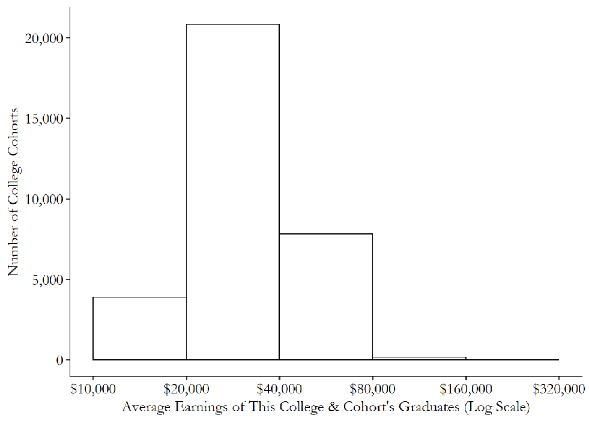

WITH A CONTINUOUS VARIABLE, WE CAN GO ONE STEP FURTHERthan a histogram all the way to a density. A density shows what would happen to a histogram if the bins got narrower and narrower, as you can see in Figure3.33.33.333333.3.333.33.33.3333333

4

5

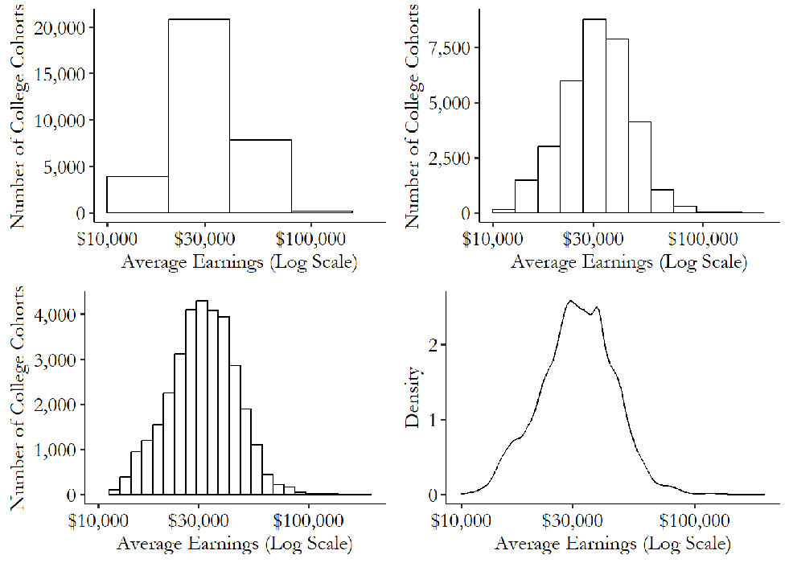

- Figure 3.3: Distribution of Average Earnings across US College Cohorts

6

- Figure 3.4: Shaded Distribution of Earnings across US College Cohorts

When we have a density plot, we can describe the probability of being in a given range of the variable by seeing how large the area

underneath the distribution is. For example, Figure3.43.4 shows the distribution of earnings and has3.4.... shaded the area between $40,000 and $50,000. That area, relative to the size of the area under theentiredistribution curve, is the probability of being between $40,000 and $50,000. That particular shaded area makes up about 16% of the area underneath the curve, and so 16% of all cohorts have average earnings between $40,000 and $50,000.

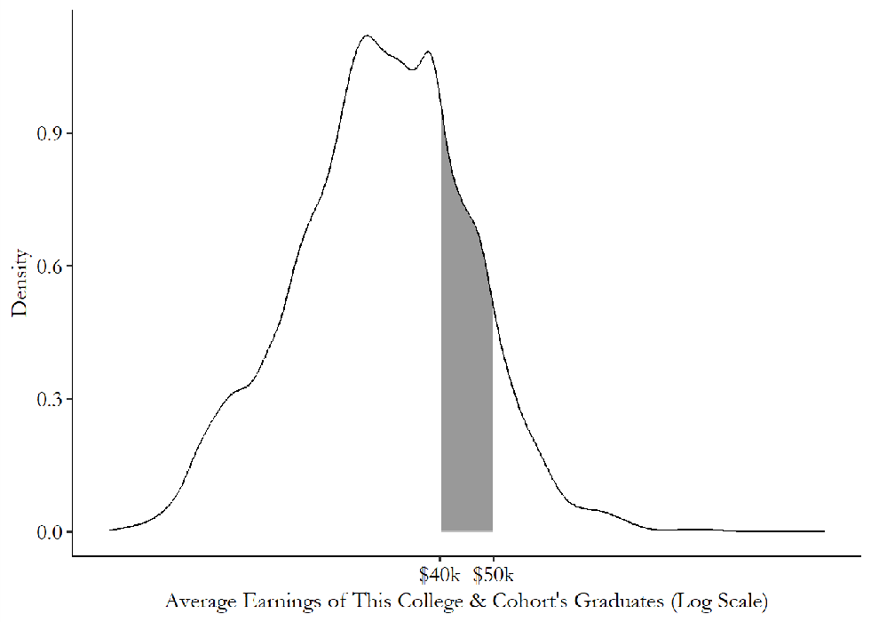

AND THATʼS IT.Once you have the distribution of the variable, thatʼs really all you can say about it. After all, what do we have? For each possible value the variablecouldtake, we know how likely that outcome, or at least an outcome like it,is. What else could you say about a variable?

7

Of course, in many cases these distributions are a little too detailed to show in full. Sure, for categorical variables with only a few categories we can easily show the full frequency table. But for any sort of continuous variable, even if we show someone the density plot, itʼs going to be difficult to take all that information in.

So, what can we do with the distribution to make it easier to understand? We pick a few key characteristics of it and tell you about them. In other words, we summarize it.

- 3.4 Summarizing the Distribution

ONCE WE HAVE THE VARIABLEʼS DISTRIBUTION,we can turn our attention tosummarizingthat variable. The whole distribution might be a bit too much information for us to make any use of, especially for continuous variables. So our goal is to pick ways to take theentiredistribution and produce a few numbers that describe that distribution pretty well.

Probably the most well-known example of a single number that tries to describe an entire distribution is themean. The mean is what you get if you add up all the observations you have and then divide by the number of observations. So if you have 2, 5, 5, and 6, the mean is

.

###### (2 + 5 + 5 + 6)/4 = 18/4 = 4.5

A little more formally, what the mean does is it takes each value you might get, scales it byhow likely you are to get it, and then adds it all up. And so on! What does the distribution look like for our data set of 2, 5, 5, and 6? Our frequency table is shown in Table3.23.2.3.2....

Table 3.2: Distribution of a Variable

Variable N Percent Observed.Values 4 … 2 1 25%

- … 5 2 50%
- … 6 1 25%

Table3.23.2 gives the distribution of our variable. Now we can calculate the mean. Again, this scales3.2.... each value by how likely we are to get it. In 2, 5, 5, and 6, we get 5 half the time, so we counthalf of 5. We get 2 a quarter of the time, so we counta quarter of 2.

Okay, so, since 2 only shows up 25% ( ) of the time, we only count of 2 to get .5. Next, 5 shows up 50% ( ) of the time, so we count half of 5 and get 2.5. We see 6 shows up 25% ( ) of the time as well, so we scale 6 by and get 1.5. Add it all up to get our mean of

1/4 1/4 1/2 1/4

1/4

.

###### .5 + 2.5 + 1.5 = 4.5

So what the mean isactualy doingis looking at thedistributionof the variable and summarizing it, boiling it down to a single number. What is that number? The mean is supposed to represent a central tendency of the data - itʼs in the middle of what you might get. More specifically, it tries to produce a representativevalue. If the variable is “how many dollars this slot machine pays out”

with a mean of $4.50, and it costs $4.50 to play, then if you played the slot machine a bunch of times youʼd break even exactly.

SOMETIMES IT PAYS TO BE MORE DIRECT.We can certainly use the mean to describe a distribution, and in this book we will, many times. But if the goal is to describe the distribution to someone, why bother doing a calculation of the mean when we could just tell people about the distribution itself?

The Xth percentile of a variableʼs distribution is the value for which X% of the observations are less. So, for example, if you lined up 100 people by height, if the person in line with 5 people in front of them is 5 foot 4 inches tall, then 5 foot 4 inches tall is the 5th percentile.

We can see percentiles on our distribution graphs. Figure3.53.5 shows our distribution of college3.5.... cohort earnings from before. We started shading in the left part of the distribution and kept going until weʼd shaded in 5% of the area underneath the curve. The point on the -axis where we stopped, $16,400, is the 5th percentile.

###### x

Figure 3.5: Distribution of Average Earnings across US College Cohorts

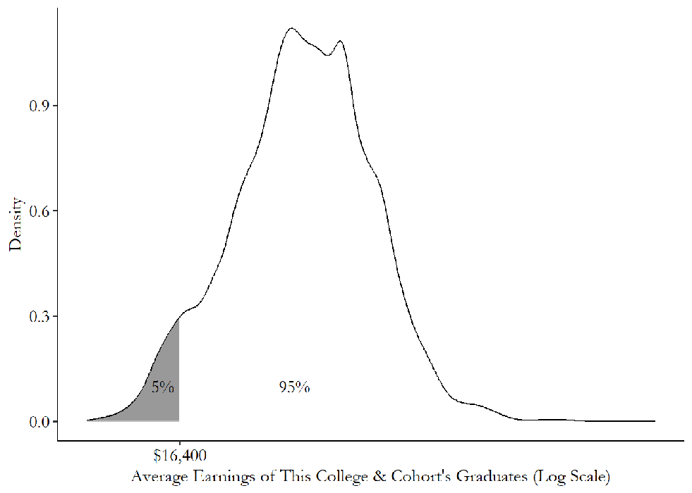

We can actually describe the entire distribution perfectly this way. Whatʼs the 1st percentile? Okay, now whatʼs the 2nd? And so on. Pretty soon weʼll have mapped out the entire distribution by just shading in a little more each time. So percentiles are a fairly direct way of describing a distribution.

8

There are a few percentiles that deserve special mention.

The first is themedian, or the 50th percentile. This is the person right in the middle - half the sample is taller than them, half the sample is shorter. Like the mean, the median is measuring a central tendency of the data. Instead of trying to produce a representativevalue, like the mean does, the median gives a representativeobservation.

For example, say youʼre looking at the wealth of 10,000 people, one of whom is Amazon founder Jeff Bezos. The mean says “hmm… sure, most people donʼt have much wealth, but once in a while youʼre Jeff Bezos and that makes up for it. The mean is very high.” But the median says “Jeff

Bezos isnʼt very representative of the rest of the people. Heʼs going to count exactly the same as everyone else. The median is relatively low.”

9

For this reason, the median is generally used over the mean when you want to describe what a typical observationlooks like, or when you have a variable that is highly skewed, with a fewrealy bigobservations, like with wealth and Jeff Bezos. The mean wealth of that room might be $15,000,000, but thatʼs almost all Jeff Bezos and doesnʼt really represent anyone else. As soon as he walks out of the room, the mean drops like a stone. The mean is very sensitive to Jeff! But the median might be closer to $90,000, a fairly typical net worth for an American family, and it would stay pretty much exactly the same if Jeff left the room. The median is great for stuff like this!

10

11

The other two percentiles to focus on are theminimum, or the 0th percentile, and themaximum, or the 100th percentile. These are the lowest and highest values the variable takes. Theyʼre handy because they show you the kinds of values that the variable produces. The minimum and maximum height of a large group of people would tell you something about how tall or short humans can possibly be, for example.

Another nice thing about the minimum and maximum is that we can take the difference between them to get therange. The range is one way of seeing how much a variablevaries. If the maximum and minimum are very far apart, as they would be for wealth with Jeff Bezos in the room, you know the variable can take a very wide range of values. If the maximum and minimum are close together, as they might be for “number of eyes you have,” you know the range of values that a variable can take is fairly small.

As an aside, technically there is some ambiguity when it come to percentiles. If there are 100 people lined up, is the 5th percentile the 5th person in line (since 5% of people areat or below their level, the “inclusive” percentile) or the 6th person in line (since 5% of people arebelowtheir level, the “exclusive” percentile)? What if the percentile you pick is between two people? In a group of 10 people, nobody is at the 25th percentile. So do you take the 2nd person in line? The 3rd? Typically you mix the two in some way, but in what way (Hyndman and Fan (⊕1996) discuss nine (!) options). None of this matters much in a big sample, but in a smaller sample these

decisions can matter a lot, and you should consider what makes sense for your case and which option your software package is defaulting to.

SOME VARIABLES VARY A LITTLE, OTHERS VARY A LOT.For example, take “the number of children a person has.” For many people, this is zero. The mean, for people in their thirties perhaps, is somewhere around 2. Some people have lots and lots of children, though. A few rare women have ten or more. There are men in the world with dozens of children. The number of children someone has can vary quite a bit.

Compare that to “the number of eyes a person has.” For a small number of people, this might be 0, or 1, or maybe even 3. But the vast majority of people have two eyes. The number of eyes a person has varies fairly little.

These two variables - number of children and number of eyes - have similar means and medians, but they are clearly very different kinds of variables. We need ways to describevariationin addition to central tendencies or percentiles.

The way that variation shows up in a distribution graph is in howwidethe distribution is. If the distribution is tall and skinny, then all of the observations are scrunched in very close to the mean. Low variation. If itʼs flat and wide, then there are a lot of observations in those fat “tails” on the left and right that are far away from the mean. High variation! See Figure3.63.6 as an example.3.6.... The distributions with more area “piled in the middle” have little variation - not a lot of area far from that middle point! The distributions with less “piled in the middle” and more in the “tails” on either side have plenty of observations far away from the middle.

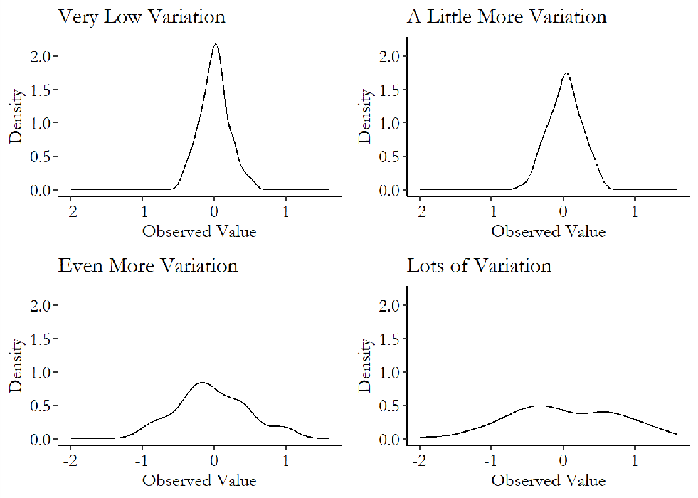

Figure 3.6: Four Variables with Different Levels of Variation

There are quite a few ways to describe variation. Some of them, like the mean, focus onvalues, and others, like the median and percentiles, focus on observations.

VARIANCE IS A MEASURE OF VARIATIONthat focuses on values and is derived from the mean. To calculate the variance in a sample of observations of our data, we:

- 1. Find the mean. If our data is 2, 5, 5, 6, we get .
- 2. Subtract the mean from each value. This turns our 2, 5, 5, 6 into -2.5, .5, .5, 1.5. This is ourvariation around the mean.
- 3. Square each of these values. So now we have 6.25, .25, .25, and 2.25.

###### (2 + 5 + 5 + 6)/4 = 18/4 = 4.5

12

###### 4. Add them up! We have

.

###### 6.25 + .25 + .25 + 2.25 = 9

###### 5. Divide by the number of observationsminus 1. So our sample variance is

13

###### .

9/(4 − 1) = 3

The bigger the variance is, the more variation there is in that variable. How does this work? Well, notice in steps 4 and 5 previously that weʼre sort of taking a mean. But the thing weʼre taking the meanofis squared variation around the actual mean. So any observations that are far from the mean get squared - making them even bigger and count for more in our mean! In this way we get a sense of how far from the mean our data is, on average.

One downside of the variance is that itʼs a little hard to interpret, since it is in “squared units.” For example, the variance of the college cohort earnings variable is 153,287,962. 153,287,962… dollars squared? Iʼm not entirely sure what to make of that. So we often convert the variance into thestandard deviationby taking the square root of it to get us back to our original units. The standard deviation of the college cohort earnings variable is . And that 12,380.95 we can think of in dollars, like the original variable!

√153,287,962 = 12,380.95

If we know that the mean is $33,348.62, and we see a particular college cohort with average earnings of $38,000, we know that that cohort is , or 37.6% of a standard deviation above the mean. This lets us know not just how much money that cohort earned ($38,000), and how far above the mean they are ($38,000 $33,348.62 = $4,651.38), but how unusual that is relative to the amount of variation we typically see (37.6% of a standard deviation).

(38,000 − 33,348.62)/12,380.95 = .376

−

Figuring out how much variation one standard deviation is can be kind of tricky, and largely just takes practice and intuition. But a graph can help. Figure3.73.7 shows how far to the left and right3.7.... you have to go to find a one standard-deviation distance. It just so happens that 32.7% of the sample is under the curve between the “Mean 1 SD” line and the “Mean” line, and another 35.5% of the sample is between the “Mean” line and the “Mean 1 SD” line. In this case, more than 60% of the sample is closer than a single standard deviation.

−

+

So how weird is being one standard deviation away from the mean? Well, roughly a third of people are between you and the average. Make of that what you will.

Figure 3.7: Distribution of Average Earnings across US College Cohorts

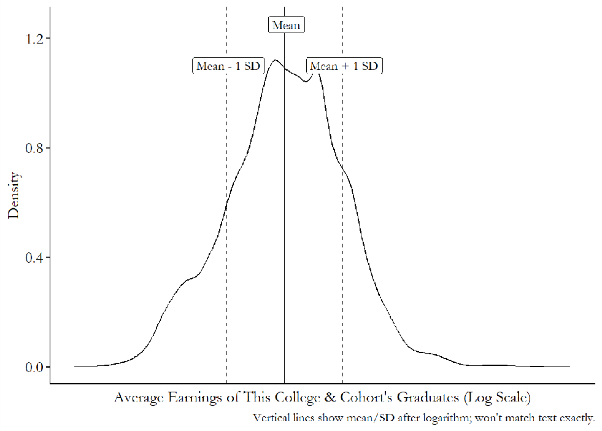

WE CAN ALSO COMPARE PERCENTILESto see how much a variable varies.

This is actually quite a straightforward process. All we have to do is pick a percentile above the median, and a percentile below the median, and see how different they are. Thatʼs it!

Weʼve already discussed the range, which gives the distance between the biggest observation and the smallest. But the range can be very sensitive to really big observations - the range of wealth is very different depending on whether Jeff Bezos is in the room. So itʼs not a great measure.

Instead, the most common percentile-based measure of variation youʼll tend to see is the interquartile range, or IQR. This gives the difference between the 75th percentile and the 25th percentile. The IQR is handy for a few reasons. First, you know that the value given by the IQR covers exactly half of your sample. So for the half of your sample closest to the median, the IQR gives you a good sense ofhowclose to the median they are. Second, unlike the variance, the IQR isnʼt very strongly affected by big tail observations. So, as always, itʼs a good way of representing observations rather than values.

14

- Figure3.83.8 shows where the IQR comes from on a distribution. In this case, the 25th and 75th3.8.... percentiles are at $39,800 and $24,700, respectively, giving us an IQR of

. So the 50% of the cohorts nearest the median have a range of average incomes of $15,100.

###### 39,800 − 24,700 = 15,100

Figure 3.8: Distribution of Average Earnings across US College Cohorts

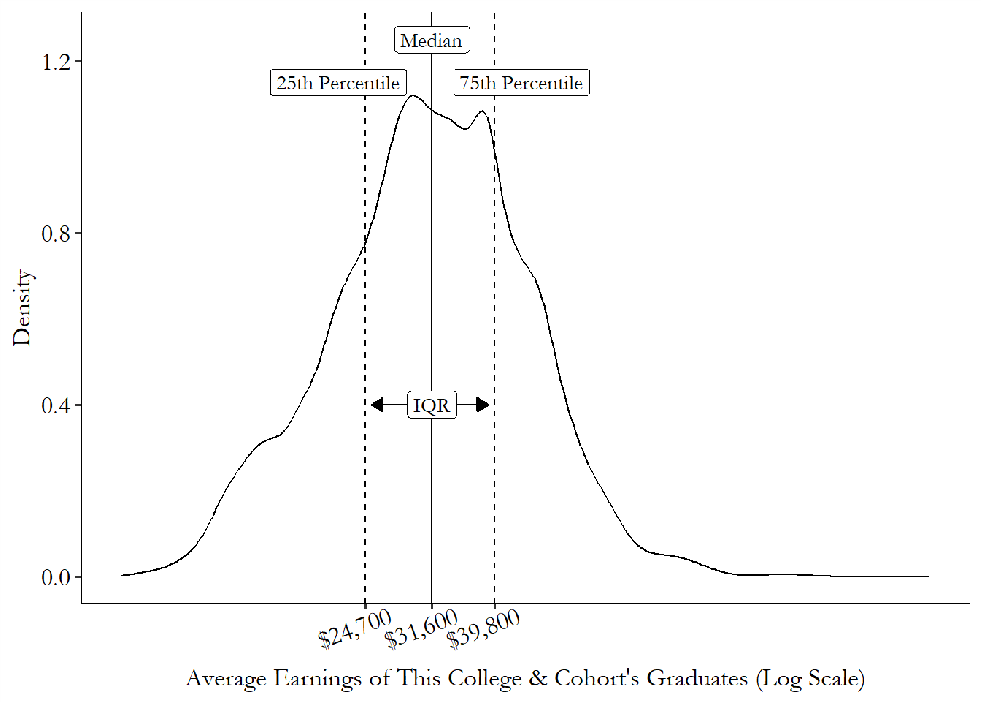

BEYOND THE VARIATION,there are of course a million other things we could describe about a distribution. I will cover only one of them here, and thatʼs theskew.

Skew describes how the distributionleansto one side or the other. For example, letʼs talk about annual income. Most people have an income in a relatively narrow range - somewhere between $0 and, say, $150,000. But there are some people - and a fair number of them, actually - who have

enormousincomes,waybigger than $150,000, perhaps in the millions or tens or hundreds of millions.

So for annual income, theright tail- the part of the distribution on the right edge - is very big.

- Figure3.93.9 shows what Iʼm talking about. Most of the weight is down near 0, but there are people3.9.... with millions of dollars in income making the right tail of the distribution stretch way far out. The same isnʼt true on the left side - at least in this data, weʼre not seeing people with negative incomes.

Figure 3.9: Distribution of Personal Income in 2018 American Community Survey

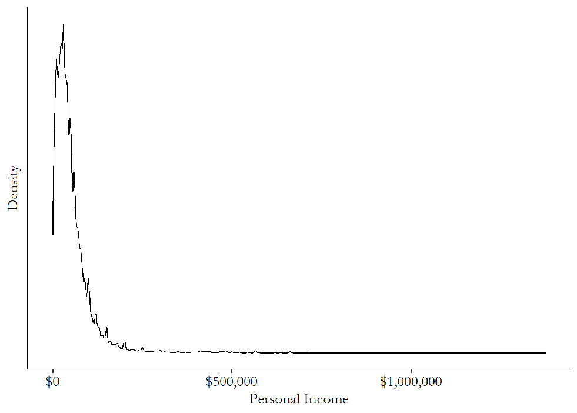

We say that distributions like this one, with a heavy right tail but no big left tail to speak of, has a “right skew” since it has a lot of right-tailed observations. Similarly, a distribution with lots of observations in the left tail would have a left skew. A distribution with similar tails on both sides is symmetric.

Right-skewed variables pop up all the time in social science. Basically anything thatʼs unequally distributed, like income, will have a lot of people with relatively little, and a few people with a lot, and the people with a lot havea lot.

Skew can be an important feature of a distribution to describe. It can also give us problems if weʼre working with means and variances, since those really-huge values will affect any measure that tries to represent values.

One way of handling skew in data is bytransformingthe data. If we apply some function to the data that shrinks the impact of those really-big observations, the mean and variance work better. A common transformation in this case is thelogtransformation, where we take the natural logarithm of the data and use that instead. This can make the data much better-behaved.15

Figure 3.10: Distribution of Logged Personal Income in 2018 American Community Survey

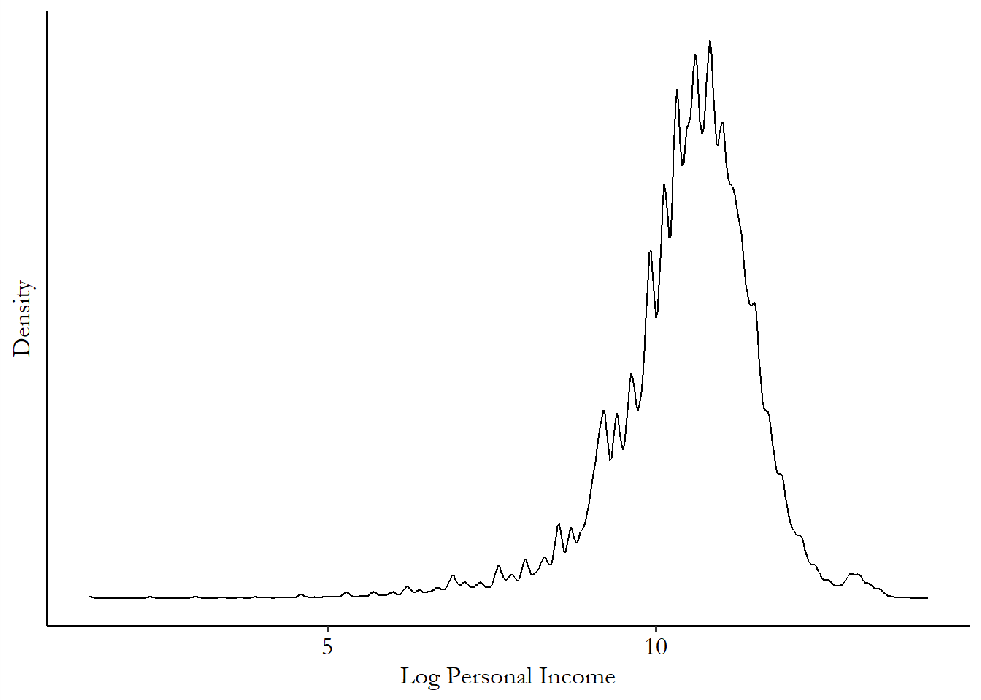

- Figure3.103.10 shows that once we take the log of income, thereʼs still a bit of a tail remaining (on the3.10.... left this time!), but in general we have a roughly symmetric distribution that our mean will work a lot better with.

16

One reason the natural log transformation is so popular is that the transformed variable has an easy interpretation. A log increase of, letʼs say, .01, translates toapproximatelya % increase in the original variable. So an increase in log income from 10.00 to 10.02 in log terms means a % increase in income itself. This approximation works pretty well for small increases like .01 or .02, but it starts to break down for bigger increases like, say, .2. Anything above .1/10% or so and you should avoid the approximation.

###### .01 × 100 = 1

###### (10.02 − 10.00) = .02 ≈ 2

17

There might be trouble brewing if you take the log and itstillooks skewed. This can be the case when you havefat tails, i.e., observations far away from the mean are very common. When you have fat tails on one side but not the other, this can make your data very difficult to work with indeed. Iʼll cover this a little bit all the way at the end of the book in Chapter2323.23

###### 3.5 Theoretical Distributions

THE DIFFERENCE BETWEEN REALITY AND THE TRUTHis that reality is always with you, but no matter how far you walk, truth is still on the horizon. So itʼs much more convenient to squint, shrug, go “eh, close enough,” and head home.

Statistics makes a very clear distinction between thetruthand the data weʼve collected. But isnʼt the data truly what weʼve collected? Well, sure, but what it is supposed torepresentis some broader truth beyond that.

Letʼs say you want to understand the average age at which children learn to share toys. So you interview 1000 parents about when their kids started doing that. You calculate a mean and get that kids in your sample start to share easily around 4.2 years old.

Of course, what youactualyhave is thatthe 1000 kids in your samplestarted to share easily around 4.2 years old. And you didnʼt set out to learn something about those 1000 kids, right? You set out to learn something about kids in general! So thetrueaverage age at which kids in general start to share is one thing, and the average age you calculated in your data is another.

Thatʼs the whole point of doing statistics. We can never check every kid who ever existed on the age they started sharing. So given the real data we actually have,what can we say about that true number?

Figuring this out will require us to think about how data behaves under different versions of the truth. If the truth is that kids learn to share on average at 3.8 years of age, what kind of data does that generate? If the truth is that kids learn to share at 5 years of age, what kind of data does that generate? Weʼll need to pair our observed distributions, the ones weʼve been talking about so far in this chapter, withtheoretical distributionsof how data behaves under different versions of the truth.

SOME QUICK NOTATIONbefore we get much further.

If youʼve read any sort of statistics before, you may be familiar with symbols like , , , . You may have memorized what means what. But it turns out you probably donʼt have to, as thereʼs an

β μ μ^ x¯

order to all this madness. What do these all mean?

English/Latin letters representdata. So might be a variable of actual observed data. Thatʼs our 1000 surveys with parents about their kidsʼ sharing ages.

x

Modifications of English/Latin letters representcalculationsdone with real data. A common way to indicate “mean” is to use a bar on top of the letter. So is the mean of we calculated in our data. Thatʼs the 4.2 we calculated from our survey.

x¯ x

18,19

Greek letters representthe truth. We donʼt know what actual values these take, but we can make assumptions. Certain Greek letters are commonly used for certain kinds of truth commonly indicates some sort of mean, the standard deviation, for correlation, for regression coefficients, for “error terms” (weʼll get there), and so on. But the important thing is that Greek letters represent the truth.

μ 20σ ρ β

ε

Modifications of Greek letters representour estimate of the truth.We donʼt know what the truth is, but we can make our best guess of it. That guess may be good, or bad, or completely misguided, but itʼs our guess nonetheless. The most common way to represent “my guess” is to put a “hat” on top of the Greek letter. So is “my estimate of what I think is.” If the way that I plan to estimate is by taking the mean of , then I would say .

μ^ μ μ x μ^ = x¯

THE THEORETICAL DISTRIBUTION IS WHAT GENERATED YOUR DATA.Thatʼs actually a good way to think about theoretical distributions. Theyʼre the distribution ofalthe data, even the data you didnʼt actually collect, and maybe could never actually collect! If you could collect literally an infinite number of observations, their distribution would be the theoretical distribution.

21

This fact tells us a few things. First, it tells us why weʼre interested in the theoretical distribution in the first place. Because thatʼs where we get our data from! If we want to learn about the average age children share at, the placethat data comes fromis the theoretical distribution. So if we want to know the value of that number beyond the data we actually have, we have to use that data to claw our way back to the theoretical distribution. Only then will we know something really interesting!

Remember, we donʼt really care about the mean in our observed data, . We care about thetrue average for everyone, !The reason we bother gathering data in the first place is because it will let us make anestimate about what the theoretical distribution it came from is like. The second thing this “infinite observations” fact tells us is that the more observations we have, the better a job our observed data will do at matching that theoretical distribution. One observation isnʼt likely to do us much good. But an infinite number would get the theoretical distribution exactly! Somewhere in the middle is going to have to be good enough. And the bigger our number of observations gets, the gooder-enougher we become.

x¯ μ

μ^

This can be seen in Figure3.13.11. No matter how many observations we have, the solid-line3.11.11.11.11.11111111111111 theoretical distribution always stays the same, of course. But while we do a pretty bad job at describing that distribution with only ten observations, by the time weʼre up to 100 weʼre doing a lot better. And by 1000 weʼve got it pretty good! Thatʼs not to say that 1000 is always big enough to be just like the theoretical distribution. But here it worked pretty well.

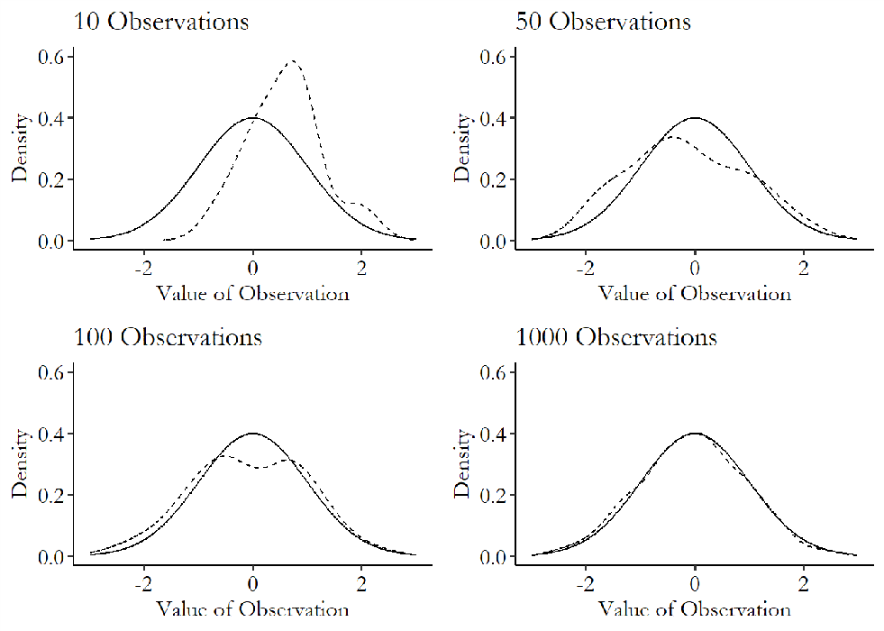

Figure 3.11: Trying to Match the Theoretical Distribution

This means as we get more and more observations, weʼre going to do a better and better job of getting an observed distribution that matches the theoretical one that we sampled the data from. Since thatʼs the distribution weʼre interested in, thatʼs a good thing! We just need to make sure to have plenty of observations.

22

THERE ARE INFINITE DIFFERENT THEORETICAL DISTRIBUTIONS, but some pop up in applied work often. There are some well-known distributions that are applied over and over again. If we think that our data follows one of these distributions weʼre in luck, because it means we can use that theoretical distribution to do a lot of work for us!

I will cover only two that are especially important to know about in applied social science work, which are both depicted in Figure3.123.12. There are many, many more I am leaving out: uniform3.12.... distribution, Poisson, binomial, gamma, beta, and so on and so on. If you are interested, you may want to check out a more purely statistics-oriented book, like any of the eight zillion books I find when I search “Introduction to Statistics” on Amazon. Iʼm sure theyʼre all nearly as good as my book. Nearly.

The first to cover is thenormaldistribution. The normal distribution issymmetric(i.e., the left and right tails are the same size, thereʼs no skew/lean). The normal distribution often shows up when describing things that face real, physical restrictions, like height or intelligence.

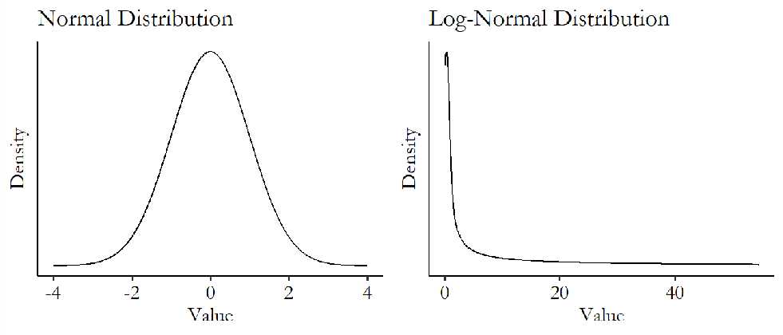

###### Figure 3.12: Normal and LogNormal Distributions

23

The normal distribution also pops up a lot when looking at aggregated values. Income might have a strong right skew, but if we take themeanof income in one sample of data, aggregating across observations, and then again in another sample of data, aggregating across different observations, and then again and again in different samples,the distribution of the mean across different sampleswould have a normal distribution.

The normal distribution technically hasinfinite range, meaning that every value is possible, even if unlikely. This means that any variable for which some values are impossible (like how height canʼt be negative) technically canʼt be normal. But if the approximation is very good, we tend to let that slide. One reason we let that slide is that the normal distribution has fairlythin tailsobservations far from the mean are extremely unlikely. Notice how quickly the distribution goes to basically 0 in Figure3.123.12. So sure, maybe saying that height follows a normal distribution3.12.... means youʼre technically saying that negative heights are possible. But youʼre saying itʼs possible with a .00000001% chance, so thatʼs close enough to count.

The second is a bit of a cheat, and itʼs the log-normal distribution. The log-normal distribution has a heavy right skew, but once we take the logarithm of it, it turns out to be a normal distribution! How handy.

The log-normal is a very convenient version of a skewed distribution, since we can take all the skew out of it by just applying a logarithm. Heavily skewed data comes up all the time in the real world. Anything thatʼs unequally distributed and that doesnʼt have a maximum possible value is generally skewed (income, wealth…) as well as many things that tend to be “winner take all” or have some super-big hits (number of song downloads, number of hours logged in a certain video game, company sizes…). Notice how much of the weight is scrunched over to the left to make room for a very tiny number of really huge observations on the right. Thatʼs skew for you!

When we see a skewed distribution, we tend to hope itʼs log-normal for convenience reasons. However, there are of course many other skewed distributions out there. Skewed distributions with fat tails can be difficult to work with and can take specialized tools. So itʼs a good idea, after taking the log of a skewed variable, to look at its distribution to confirm that the skew is gone. If it doesnʼt you may be wading into deep waters!

24

HOW CAN WE USEour empirical data to learn about the theoretical distribution?

Remember, our real reason for looking at and describing our variables is that we want to get a better idea of the theoretical distribution. Weʼre not really interested in the values of the variable in our sample; weʼre interested inusingour sample to find out about how the variable behaves in general.

We can, if we like, take our sample and look at its distribution (as well as its mean, standard deviation, and so on), figure thatʼs the best guess we have as to what the theoretical distribution looks like, and go from there. Of course, we know thatʼs imperfect. Would we really believe that the distribution we happened to get in some data really represents the true theoretical distribution?

25

One thing that is a bit easier to do is to learnwhether certain theoretical distributions are unlikely.Maybe we canʼt figure out exactly what the theoretical distributionis, but we can rule some stuff out.

How can we figure out how likely a certain theoretical distribution is? We follow these steps:

- 1. Choose some description of the theoretical distribution - its mean, its median, its standard deviation, etc. Letʼs use the mean as an example.
- 2. Use the properties of the theoretical distribution and your sample size to find the theoretical distributionof that description in random samplesmeans generally follow a normal distribution, and the standard deviation of that normal distribution is smaller for bigger sample sizes.
- 3. Make that same description of your observed data - so now we have the distribution of our theoretical mean, and we have the actual observed mean.

- 4. Use the theoretical distribution of that description to find out how unlikely it would be to get the data you got - if the theoretical distribution of the mean weʼre looking at has mean 1 and standard deviation 2, and our observed mean is 1.5, weʼre asking “how likely is it that weʼd get a 1.5 or more from a normal distribution with mean 1 and standard deviation 2?”
- 5. If itʼs really unlikely, then you probably started with the wrong theoretical distribution and can rule it out. If weʼre doing statistical significance testing, we might say that our observed mean is “statistically significantly different from” the mean of the theoretical distribution we started with.

Letʼs walk through an example.

Say youʼre interested in how many points basketball players make in each game. You collect data on 100 basketball players. Your observed data doesnʼt look particularly well-behaved and doesnʼt look like any sort of theoretical distribution youʼve heard of before. But you calculate its mean and standard deviation and find a mean of 102 with a standard deviation of 30.

Following step 1, you ask “could this have come from a distribution with a mean of 90?” - notice we havenʼt said anything here about it being from a normal distribution, or log-normal, or anything else. We are going to try to rule out distributions with means of 90, thatʼs all. Also notice we called the mean , a Greek letter (the truth!). We want to know if we can rule out that is the truth.

μ

μ μ = 90

Then, for step 2, we want to get the distribution of that description. As mentioned earlier in this chapter, means are generally distributed normally, centered around the theoretical mean itself. The standard deviation of the meanʼs distribution is just , or the standard deviation of the overall distribution divided by , where is the number of observations in the sample.

σ/√N √N N

Whatʼs going on here? Well, what this is saying is: if you survey basketball players and take the mean, and then survey another basketball players, and then another , and then another , and so on, youʼll get a different mean each time. If we take the mean from each sample as its own variable, the distribution of that variable will be normal, with a mean of the true theoretical mean, and a standard deviation of . The is because the more players we survey each time, the more likely it is that weʼll get very close to the true mean. A mean of 10 basketball players could give you a result very far from the mean. But a mean of 1,000 basketball players is pretty likely to give you a mean close to the true mean, and thus the smaller standard deviation.

###### N N N N

σ/√N /√N

is a Greek letter, and so of course thatʼs the true standard deviation, which we donʼt know. But our best estimate of it is the standard deviation of 30 we got in our data. So we say that the mean is distributed normally with a mean of , and a standard deviation of

σ

μ = 90 σ/^ √N = 30/√100 = 3 σ^ σ

(remember, means “our estimate of the true ,” which is just the standard deviation we got in our observed data).

Now for step 3, we get the same calculation in our observed data. As above, the mean in the observed data is 102.

Moving on to step 4, we can ask “how likely is it to get a 102, or even more, from a normal distribution with mean 90 and standard deviation 3?” More precisely, we are generally interested in how likely it is to get a 102or something even farther away, which could be more or less than . So 102 is 12 away from 90, and thus weʼre interested in how likely it is to get a mean of 102 or more, or 78 or less (since 78 is also 12 away from 90).

26

μ 27

By looking at the percentiles of the normal-with-mean-90-and-standard-deviation-3 distribution, we can determine that 78 is not even the 1st percentile, itʼs more like the .004th percentile. So thereʼs only a .004% chance of getting a mean of 78 or less in a 100-player sample if the true mean is 90 and the standard deviation is 30. Similarly, 102 is the 99.996th percentile, so again thereʼs

only a .004% chance of getting a mean of 102 or more in a 100-player sample if the true mean is 90 and the standard deviation is 30.

For step 5, we add those up and say that thereʼs only a .008% chance of getting something as far off as 102 or more if the true mean is 90 and the true standard deviation is 30. Thatʼs pretty darn unlikely. So this data very likely did not come from a distribution with a mean of 90.

We could also frame all of this in terms ofhypothesis testing. Following the same steps, we can say:

- Step 1: Ournul hypothesisis that the mean is 90. Ouralternative hypothesisis that the mean is not 90.

- Step 2: Pick a test statistic with a known distribution. Means are distributed normally, so we might use a Z-statistic, which is for describing points on normal distributions.

- Step 3: Get that same test statistic in the data.

- Step 4: Using the known distribution of the test statistic, calculate how likely it is to get your dataʼs test statistic, or something even more extreme ( -value).

- Step 5: Determine whether we can reject the null hypothesis. This comes down to your threshold ( ) how unlikely does your dataʼs test statistic need to be for you to reject the null? A common number is 5%. If thatʼs your threshold, then if Step 4

p

α

28

###### gave you a lower -value than your threshold, then thatʼs too unlikely for you, and you can reject the null hypothesis that the mean is 90.

###### p α

This section describes what hypothesis testing actually is and what itʼs for. Statistical significance is not a marker of beingcorrectorimportant. Itʼs just a marker of being able toreject some theoretical distribution youʼve chosen.That can certainly be interesting. At the very least, weʼve narrowed down the likely list of ways that our data could have been generated. And thatʼs the whole point!

Previous Next

Page built: 2025-10-17 using R version 4.5.0 (2025-04-11 ucrt)

# The Effect

Nick Huntington-Klein

▾ Chapters

###### Chapter 4 - Describing Relationships

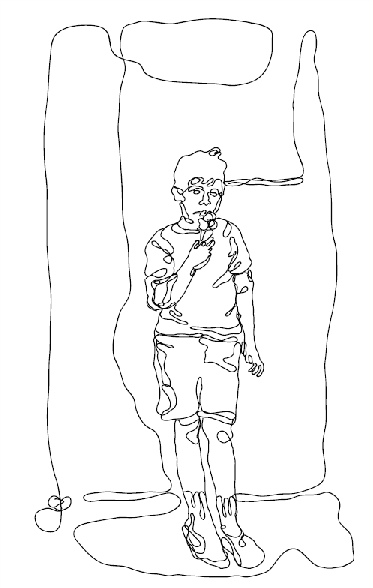

###### 4.1 What Is a Relationship?

1

FOR MOST RESEARCH QUESTIONS,we are not just interested in the distribution of a single variable. Instead, we are interested in therelationshipwe see in the data between two or more variables.

What does it mean for two variables to have a relationship? The relationship between two variables shows youwhat learning about one variable tels you about the other.

For example, take height and age among children. Generally, the older a child is, the taller they are. So, learning that one child is thirteen and another is six will give you a pretty good guess as to which of the two children is taller.

We can call the relationship between height and agepositive, meaning that for higher values of one of the variables, we expect to see higher values of the other, too (more age is associated with more height). There are also negative relationships, where higher values of one tend to go along with lower values of the other (more age is associated with less crying). There are also null relationships where the variables have nothing to do with each other (older children arenʼt any more or less likely to live in France than younger children). All kinds of other relationships are positive sometimes and negative other times, orrealypositive at first and then only slightly positive later. Or perhaps one of the variables is categorical and thereʼs not really a “higher” or “lower,” just “different” (older children are more likely to use a bike for transportation than younger children). Lots of options here.

THE GOAL IN THIS CHAPTERis to figure out how to describe the relationship between two variables, so that we can accurately relay what we see in the data about our research question, which, once again, very likely has to do with the relationship between two variables. Once we know how to describe the relationship we seein the data, we can work in the rest of the book to make sure that the relationship weʼve described does indeed answer our research question.

Throughout this chapter, weʼre going to use some example data from a study by Emily Oster (⊕2020b), who used the National Health and Nutrition Examination Survey. Her research question was: do the health benefits of recommended medications look better than they actually are because already-otherwise-healthy people are more likely to follow the recommendations?

To study this question, she looked at vitamin E supplements, which were only recommended for a brief period of time. She then answers her research question by examining the relationship between taking vitamin E, other indicators of caring about your health like not smoking, and outcomes like mortality, and how those relationships change before, during, and after the time vitamin E was recommended.

2

We can start off with an example of a very straightforward way of showing the relationship between two continuous variables, which is a scatterplot, as shown in Figure4.14.1. Scatterplots4.1....

simply show you every data point there is to see. They can be handy for getting a good look at the data and trying to visualize from them what kind of relationship the two variables have. Does the data tend to slope up? Does it slope down a lot? Or slope down just a little like in Figure4.14.1? Or go4.1.... up and down?

Figure 4.1: Age and Heart Health, 150 Observations

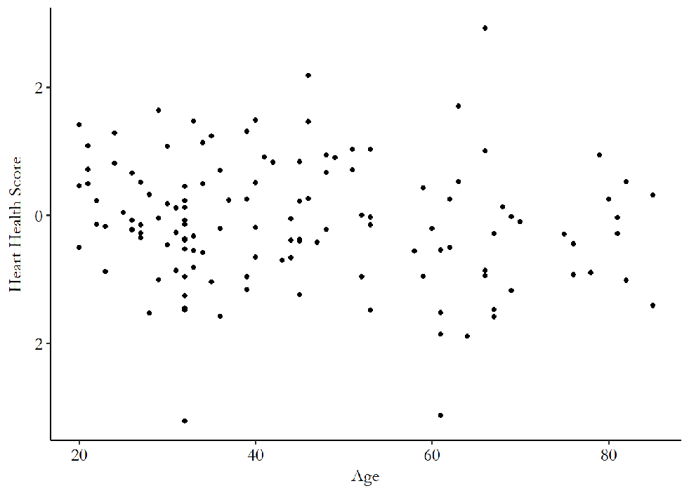

A scatterplot is a basic way to showalthe information about a relationship between two continuous variables, like the density plots were for a single continuous variable in Chapter33.3 And theyʼre usually a great place to start describing a relationship.

3

Scatterplots imply two things beyond what they actually show. One is bad, and one is good. The bad one is that itʼs very tempting to look at a relationship in a scatterplot and assume that it means that the -axis causes the -axis. Even if we know thatʼs not true, itʼs very tempting. The good one is that it encourages us to use the scatterplot to imagine other ways of describing the

###### x y

relationship that might give us the information we want in a more digestible way. Thatʼs what the rest of this chapter is about.

###### 4.2 Conditional Distributions

LAST CHAPTER WAS ALL ABOUT DESCRIBINGthe distributions of variables. The distributions in that chapter are calledunconditionaldistributions.

4

###### Aconditionaldistribution is the distribution of one variablegiven the value of another variable.

Letʼs start with a more basic version - conditional probability. The probability that someone is a woman is roughly 50%. But the probability that someonewho is named Sarahis a woman is much higher than 50%. You can also say “among al Sarahs, what proportion are women?” We would say that this is the “probability that someone is a woman conditional on being named Sarah.”

Learning that someone is named Sarah changes the probability that we can place on them being a woman. Conditional distributions work the same way, except that this time, instead of just a single probability changing, an entire distribution changes.

Take Figure4.24.2 for example. In this graph, we look at the distribution of how much vitamin E4.2.... someone takes, among people who take any. We then split out the distribution by whether someone has engaged in vigorous exercise in the last month.

Figure 4.2: Distribution of Amount of Vitamin E Taken by Exercise Level

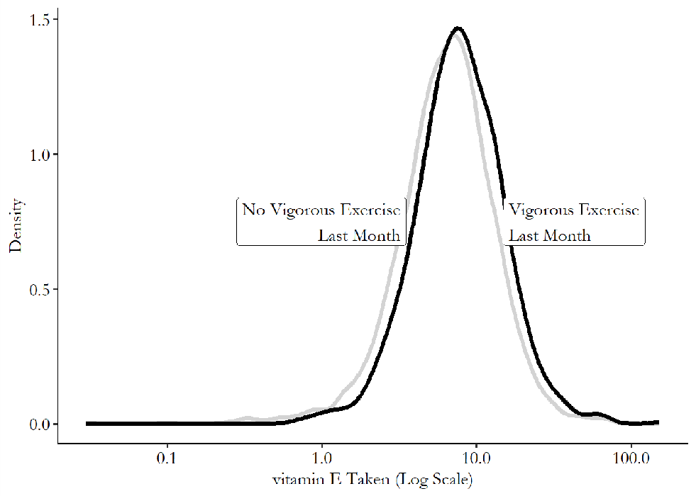

5

We can see a small shift in the distribution between those who exercise and those who donʼt. In particular, those who exercise vigorously take larger doses of vitamin E when they take it. The distribution is different between exercisers and non-exercisers, telling us that vitamin E and exercise arerelatedto each other in this data.

THE EXAMPLE IʼVE GIVENis for a continuous variable, but it works just as well for a categorical variable. Instead of looking at how large the doses are, letʼs look at whether someone takes vitamin E at all! Osterʼs hypothesis is that people who take vitamin E at all should be more likely to do other healthy things like exercise, because both are driven by how health-conscious they are.

- Figure4.34.3 shows an example of this. The distribution of whether you take vitamin E or not is4.3.... shown twice here, once for those who currently smoke, and one for those who donʼt smoke. The distributions are clearly different, with a higher proportion taking vitamin E in the non-smoking crowd, exactly what Oster would expect.

Figure 4.3: Distribution of Whether Vitamin E is Taken by Whether you Smoke

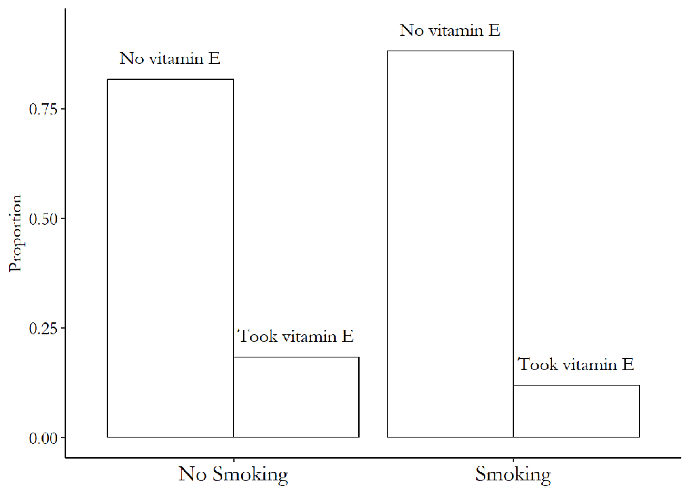

###### 4.3 Conditional Means

WITH THE CONCEPT OF A CONDITIONAL DISTRIBUTION UNDER OUR BELT,it should be clear that we can then calculateanyfeature of that distribution conditional on the value of another variable. Whatʼs the 95th percentile of vitamin E taking overall and for smokers? Whatʼs the median? Whatʼs the standard deviation of mortality for people who take 90th-percentile levels of vitamin E, and for people who take 10th-percentile levels?

While all those possibilities remain floating in the air, we will focus on the conditional mean. Given a certain value of , what do we expect the mean of to be?

- X Y 6
- Y X Y X

Once we have the conditional mean, we can describe the relationship between the two variables fairly well. If the mean of is higher conditional on a higher value of , then and are

positively related. Going further, we can map out all the conditional means of for each value of , giving us the full picture on how the mean of one variable is related to the values of the other.

Y

- X

IN SOME CASES, THIS IS EASY TO CALCULATE.If the variable you are conditioning on is discrete (or categorical), you can just calculate the mean for all observations with that value. See Figure4.44.44.444444.4,444.44.44.4444444 for example, which shows the proportion taking vitamin E conditional on whether the observations are from before vitamin E was recommended, during recommendation, or after. I just took all the observations in the data from before the recommendation and calculated the proportion who took vitamin E. Then I did the same for the data during the recommendation, and after the recommendation.

7

###### Figure 4.4: Proportion Taking Vitamin E Before It Was Recommended, During, and After

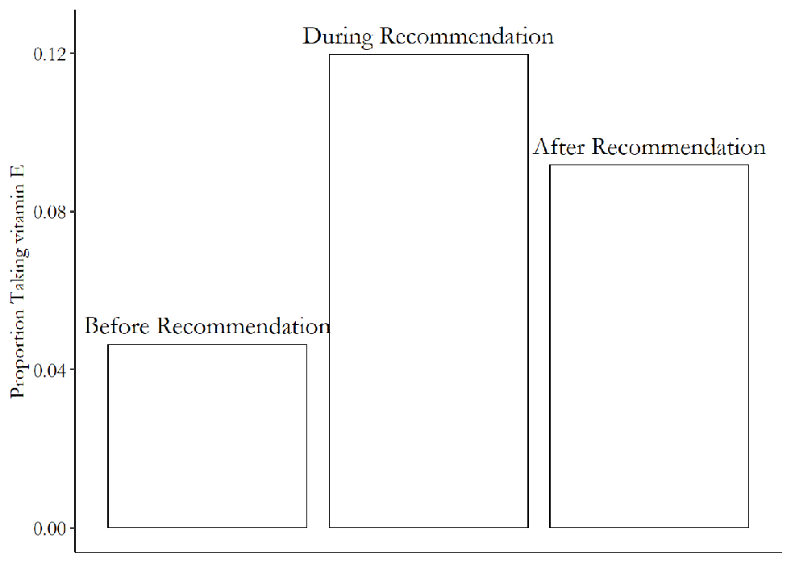

- Figure4.44.44.444444.4 shows the relationship between taking vitamin E and the timing of the444.44.44.4444444 recommendation. We can see that the relationship between taking vitamin E and the recommendation being in place is positive (the proportion taking vitamin E is higher during the

recommendation time). We also see that the relationship between vitamin E andtimeis at first positive (increasing as the recommendation goes into effect) and then negative (decreasing as the recommendation is removed).

THINGS GET A LITTLE MORE COMPLEXwhen you are conditioning on a continuous variable. After all, I canʼt give you the proportion taking vitamin E among those making $84,325 per year because thereʼs unlikely to be more than one person with that exact number. Lots of numbers would have nobody at all to take the mean over!

There are two approaches we can take here. One approach is to use arangeof values for the variable weʼre conditioning on rather than a single value. Another is to use some sort of shape or line to fill in those gaps with no observations.

Letʼs focus first on using a range of values. Table4.14.1 shows the proportion of people taking4.1.... vitamin E conditional on body mass index (BMI). Since BMI is continuous, Iʼve cut it up into ten equally-sized ranges (bins) and calculated the proportion taking vitamin E within each of those ranges. Cutting the data into bins to take a conditional mean isnʼt actually done that often in real research, but it gives a good intuitive sense of what weʼre trying to do when we use other methods later.

Table 4.1: Proportion Taking Vitamin E by Range of Body Mass Index Values

BMI Bin Proportion Taking vitamin E

(11.6,20.6] 0.133 (20.6,29.5] 0.159 (29.5,38.4] 0.171 (38.4,47.3] 0.178 (47.3,56.2] 0.203 (56.2,65.1] 0.243 (65.1,74] 0.067 (74,83] 0.143

Those same ranges can be graphed, as in Figure4.54.5. The flat lines reflect that we are assigning4.5.... the same mean to every observation in that range of BMI values. They show the mean conditional

on being in that BMI bin. We see from this that BMI has a positive relationship with taking vitamin E up until the 70+ ranges, at which point the conditional mean drops.

Figure 4.5: Proportion Taking Vitamin E by Range of Body Mass Index Values

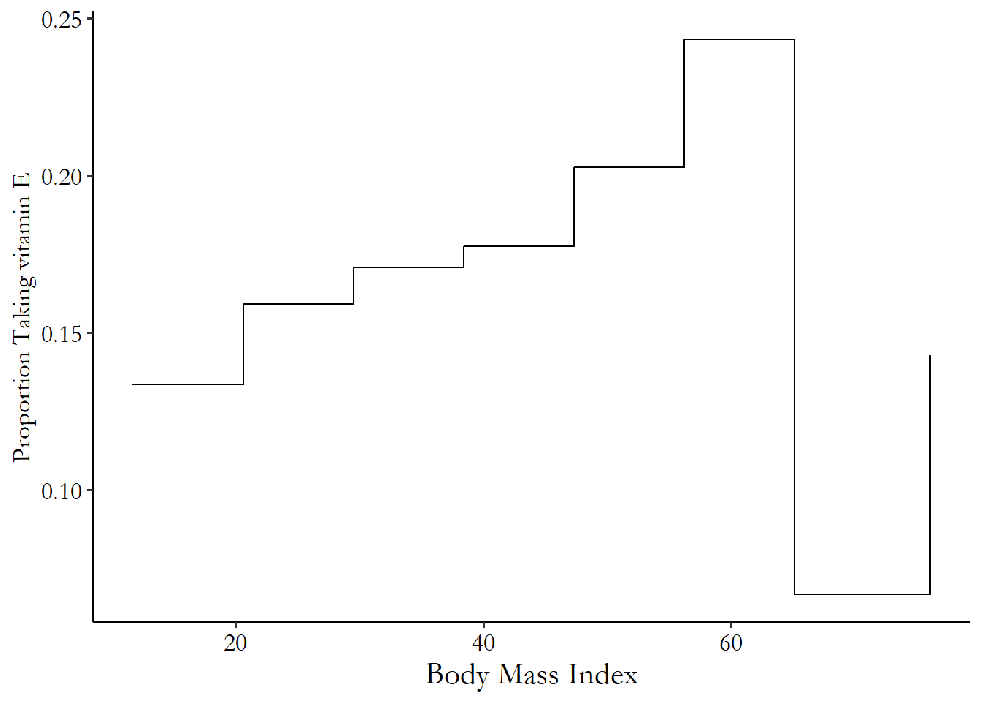

OF COURSE, WHILE THIS APPROACH IS SIMPLE AND ILLUSTRATIVE, ITʼS ALSO FAIRLY ARBITRARY.I picked the use of ten bins (as opposed to nine, or eleven, or…) out of nowhere. Itʼs also arbitrary to use evenly sized bins; no real reason I had to do that. Plus, itʼs rather choppy. Do I really think that if someone is at the very top end of their bin, theyʼre more like someone at the bottom of their bin than like the person at the very bottom end of the next bin?

Instead, we can use a range of values to get conditional means of usinglocal means. That is, to calculate the conditional mean of at a value of, say, , we take the mean of for all observations with valuesnear2.5. There are different choices to make here - how close do you have to be? Do we count you equally if youʼreveryclose vs.kind ofclose?

X Y

Y X = 2.5 Y X

8 9

A common way to do this kind of thing is with a LOESS curve, also known as LOWESS. LOESS provides a local prediction, which it gets by fitting a different shape for each value on the axis, with the estimation of that shape weighting very-close observations more than kind-of close observations. The end result is nice and smooth.

###### X

- Figure4.64.6 shows the LOESS curve for the proportion taking vitamin E and BMI.4.6....

###### Figure 4.6: Proportion Taking Vitamin E by BMI with a LOESS Curve

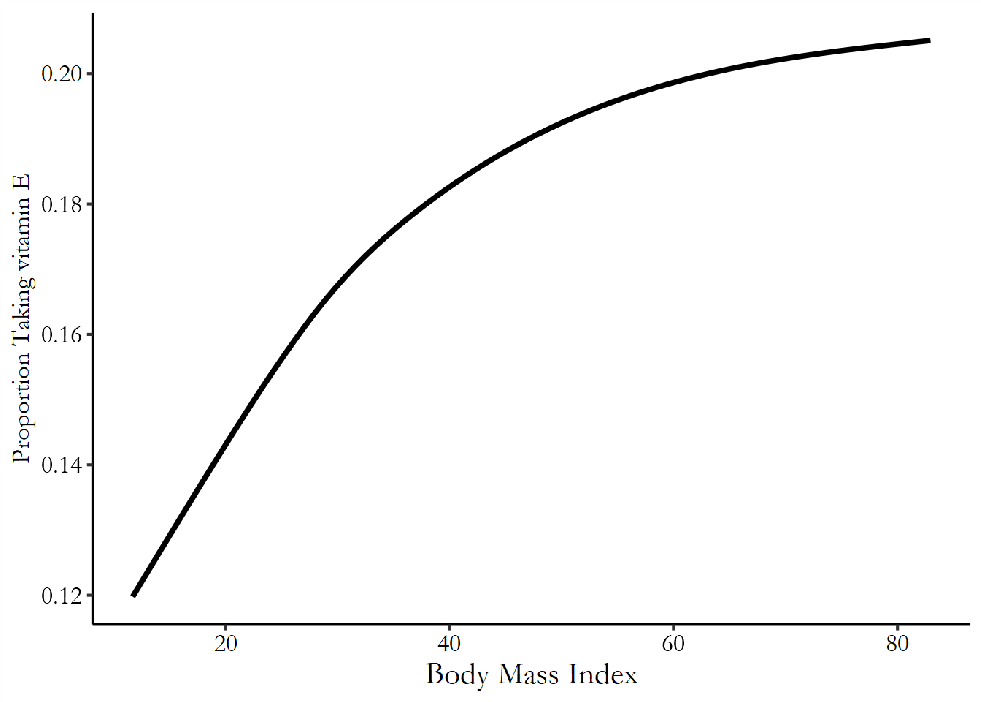

From Figure4.64.6 we can see a clear relationship, with higher values of BMI being associated with4.6.... more people taking vitamin E. The relationship is very strong at first, but then flattens out a bit, although it remains positive. It got there by just calculating the proportion of people taking vitamin E among those who have BMIs in a certain range, with “a certain range” moving along to the right only a bit at a time while it constructed its conditional means.

10

###### 4.4 Line-fitting

SHOWING THE MEAN OF AMONG LOCAL VALUES OF IS VALUABLE,and can produce a highly detailed picture of the relationship between and . But it also has limitations. There still might be gaps in your data it has trouble filling in, for one. Also, it can be hard sometimes to concisely describe the relationship you see.

###### Y X X Y

11

12

###### Enter the concept ofline-fiting,also known asregression.

Instead of thinking locally and producing estimates of the mean of conditional on values of , we can assume that the underlying relationship between and can be represented by some sort ofshape. In basic forms of regression, that shape is a straight line. For example, the line

Y X Y X

Y = 3 + 4X (4.1)

tells us that the mean of conditional on, say, is . It also tells us that the mean of conditional on a given value of would be higher if you instead made it conditional on a value of one unit higher.

Y X = 5 3 + 4(5) = 23 Y X 4

X

In Figure4.74.7, we repeat the vitamin E/BMI relationship from before but now have a straight line fit4.7.... to it. That particular straight line has a slope of .002, telling us that you are .2 percentage points more likely to take a vitamin E supplement than someone with a BMI one unit lower than you.

Figure 4.7: Proportion Taking Vitamin E by BMI with a Fitted Straight Line

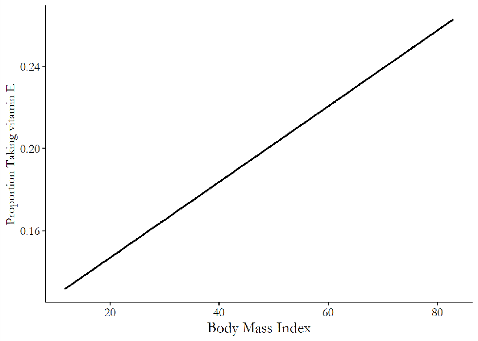

This approach has some real benefits. For one, it gives us the conditional mean of foranyvalue of we can think of, even if we donʼt have data for that specific value. Also, it lets us very cleanly describe the relationship between and . If the slope coefficient on (.002 in the vitamin E/BMI regression) is positive, then and are positively related. If itʼs negative, theyʼre negatively related.

Y

- X 13 Y X X X Y

Those are pragmatic upsides for using a fitted line. There are more upsides in statistical terms in using a line-fitting procedure to estimate the relationship. Since the line is estimated usingalthe data, rather than just local data, the results are more precise. Also, the line can be easily extended to include more than one variable (more on that in the next section).

There is a downside as well, of course. The biggest downside is that fitting a line requires us tofit a line.We need to pick what kind of shape the relationship is - a straight line? A curved line? A line that wobbles up and down and up and down? The line-fitting procedure will pick the best version of the shape we give it. But if the shape is all wrong to start with, our estimate of the conditional

mean will be all wrong. Imagine trying to describe the relationship in Figure4.64.6 using a straight4.6.... line!

The weakness here isnʼt necessarily that straight lines arenʼt always correct - line-fitting procedures will let us use curvy lines. But we have to be aware ahead of time that a curvy line is the right thing to use, and then pick which kind of curvy line it is ahead of time.

That weakness is, naturally, set against the positives, which are strong enough that line-fitting is an extremely common practice across all applied statistical fields. So, then, how do we do it?

ORDINARY LEAST SQUARES (OLS) IS THE MOST WELL-KNOWN APPLICATION OF LINE-FITTING.OLS picks the line that gives the lowestsum of squared residuals.A residual is the difference between an observationʼs actual value and the conditional mean assigned by the line.

14

Take that line I described earlier. We determined that the conditional mean of when was . But what if we see someone in the data with and ? Well then theirresidualis . OLS takes that number, squares it into a , then adds up all the predictions across all your data. Then it picks the values of and in the line

Y = 3 + 4X Y X = 5 3 + 4(5) = 23 X = 5 Y = 25

25 − 23 = 2 4 β0 β1

that make that sum of squared residuals as small as possible, as in Figure4.84.8.4.8....

- Y = β0 + β1X

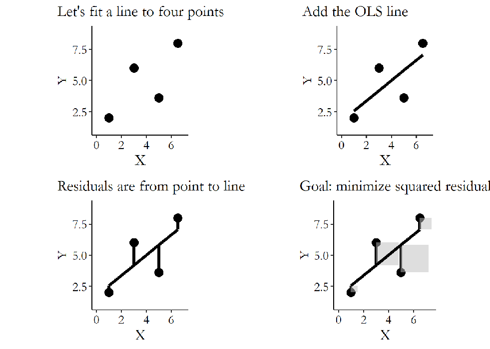

Figure 4.8: Fitting an OLS Line to Four Points 15

How does it do this? It takes advantage of information about how the two variables move together or apart, encoded in thecovariance.

If you recall the variance from Chapter33, youʼll remember that to calculate the variance of3 , we: (a) subtracted the mean of from , (b) squared the result, (c) added up the result across all the observations, and (d) divided by the sample size minus one. The resulting variance shows how much a variable actually varies.

###### X X X

The covariance is the exact same thing, except that in step (a) you subtract the mean fromtwo separate variables, and in step (b) you multiply the result from one variable by the result from the other. The resulting covariance shows how much two variables move together or apart. If they tend to be above average at the same time or below average at the same time, then multiplying one by the other will produce a positive result for most observations, increasing the covariance. If they have nothing to do with each other, then multiplying one by the other will give a positive

result about half the time and a negative result the other half, canceling out in step (c) and give you a covariance of .

0

How does OLS use covariance to get the relationship between and ? It just takes the covariance and divides it by the variance of , i.e., . Thatʼs it! This is roughly saying “of all the variation in , how much of it varies along with ?” Then, once it has its slope, it picks an intercept for the line that makes the mean of the residuals (not the squared residuals) , i.e., the conditional mean is at least right on average.

Y X

X cov(X,Y )/var(X) 16 X Y 17

0

The result from OLS is then a line with an intercept and a slope like . You can plug in a value of to get the conditional mean of . And, crucially, you can describe the relationship between the variables using the slope. Since the line has in it, we can say that a one-unit increase in is associated with a four-unit increase in .

Y = 3 + 4X X Y

4X X Y

Sometimes we may find it useful to rescale the OLS result. This brings us to the concept of correlation. Correlation, specifically Pearsonʼs correlation coefficient, takes this exact concept and just rescales it, multiplying the OLS slope by the standard deviation of and dividing it by the standard deviation of . This is the same as taking the covariance between and and dividing by both the standard deviation of and the standard deviation of .

X Y X Y X Y

The correlation coefficient also relies on this concept of fitting a straight line. It just reports the result a little differently. We lose the ability to interpret the slope in terms of the units of and . However, we gain the ability to more easily tell how strong the relationship is. The correlation coefficient can only range from to , and the interpretation is the same no matter what units the original variables were in. The closer to it is, the more strongly the variables move in opposite directions (downward slope). The closer to it is, the more strongly the variables move in the same direction (upward slope).

X Y

18

−1 1

−1

1

How about for vitamin E and BMI? OLS estimates the line

V itaminE = β0 + β1BMI (4.2)

and selects the best-fit values of and to give us

β1 β2

V itaminE = .110 + .002BMI (4.3)

So for a one-unit increase in BMI, weʼd expect a .002 increase in the conditional mean of vitamin E. Since vitamin E is a binary variable, we can think of a .002 increase in conditional mean as being a .2 percentage point increase in the proportion of people taking vitamin E.

Then, since the standard deviation of taking vitamin E is .369 and the standard deviation of BMI is

- 6.543, the Pearson correlation between the two is .

###### .002 × 6.543/.369 = .355

SOMETIMES BEING STRAIGHT IS INSUFFICIENT.OLS fits a straight line, but many sets of variables do not have a straight-line relationship! In fact, as shown in Figure4.64.6, our vitamin E/BMI relationship is4.6.... one of them. What to do?

19

Two heroes come to our rescue.

The first of them is apparently also the villain, OLS. Turns out OLS doesnʼt actually have to fit a straightline. Haha, gotcha. It just needs to fit a line that is “linear in the coefficients,” meaning that the slope coefficients donʼt have to do anything wilder than just being multiplied by a variable.

Asking it to estimate the values in is fine, as before. But so is

β Y = β0 + β1X

- not a straight line! Or - also not a straight line! And so on. What would be something thatʼsnotlinear in coefficients? That would be something like

- Y = β0 + β1X + β2X2 Y = β0 + β1ln(X)

or .

###### Y = β

- Y = β0 + Xβ

0

1

1+β1X

So that scary-looking curved line in Figure4.64.6? Not a problem, actually. As long as we take a look4.6.... at our data beforehand to see what kind of shape makes sense (do we need a squared term for a parabola? Do we need a log term to rise quickly and then level out?), we can mimic that shape. For Figure4.64.6 we could probably do with4.6.... to get the nice flexibility of the LOESS with the OLS bonuses of having fit a shape.

Y = β0 + β1X + β2X2

The second hero is “nonlinear regression” which can take many, many forms. Often it is of the form where is… some function, depending on what youʼre doing.

Y = F(β0 + β1X) F()

Nonlinear regression is commonly used when can only take a limited number of values. For example, weʼve been using all kinds of line-fitting approaches for the relationship between vitamin E and BMI, but vitamin E isbinary- you take it or you donʼt. A straight line like OLS will give us something that doesnʼt really represent the true relationship - straight lines increase gradually, but something binary jumps from “no” to “yes” all at once! Even a line that obeys the curve like will be a bit misleading. Even if we think about the dependent variable as theprobabilityof taking vitamin E, whichcanchange gradually like a straight line, follow that line out far enough and eventually youʼll predict that people with really high BMIs are more than 100% likely to use vitamin E, and people with really low BMIs are less than 0% likely. Uh-oh.

###### Y

V itaminE = β0 + β1BMI + β2BMI2

You can solve this by using an that doesnʼt go above 100% or below 0%, like a “probit” or “logit” function. More on those in Chapter1313.13

F()

There are many other functions you could use, of course, for all kinds of different variables and the values they can take. I wonʼt be spending much time on them in this book, but do be aware that theyʼre out there, and they represent another important way of fitting a (non-straight) line.

Y

###### 4.5 Conditional Conditional Means, or “Controlling for a Variable”

LET US ENTER THE LAND OF THE UNEXPLAINED.By which I mean the residuals.

When you get the mean of conditional on , no matter how you actually do it, youʼre splitting each observation into two parts - the partexplained by (the conditional mean), and the part not explained by (the residual). If the mean of conditional on is , and we get an observation with and , then the prediction is and the residual is . Figure4.94.9 shows how we can distinguish the conditional mean from the residual.4.9....

Y X

X X Y X = 5 10 X = 5 Y = 13 10 13 − 10 = 3

Figure 4.9: An OLS Line and its Residuals

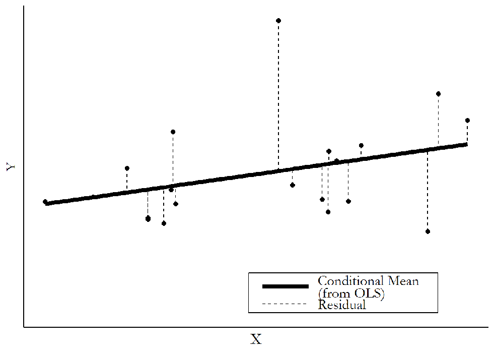

It might seem like those residuals are just little nuisances or failures, the parts we couldnʼt predict. But it turns out thereʼs a little magic in there. Because we can also think of the residual as the part of that has nothing to do with .After all, if the conditional mean is and the actual value is , then can only be responsible for the . The extra must be because of some other part of the data generating process.

Y X 10 13 X 10 3

Why would we want that? It turns out there are a number of uses for the residual. Just off the bat, perhaps we donʼt just want to know the variation in vitamin E alone. Maybe what we want is to know how much variation there is in vitamin E-taking thatisnʼt explained by BMI. Looking at the residuals from Figure4.74.7 would answer exactly that question.4.7....

Things get real interesting when we look at the residuals of two variables at once. WHAT IF WE TAKE THE EXPLAINED PART OUT OF TWO DIFFERENT VARIABLES?Letʼs expand our analysis to include a third variable. Letʼs keep it simple with , , and . So, what do we do?

Y X Z 20

- 1. Get the mean of conditional on .
- 2. Subtract out that conditional mean to get the residual of . Call this .
- 3. Get the mean of conditional on .
- 4. Subtract out that conditional mean to get the residual of . Call this .
- 5. Describe the relationship between and .

Y Z

Y Y R X Z

X XR

Y R XR

Now, since and have had the parts of and that can be explained with removed, the relationship we see between and isthe part of the relationship between and that is not explained by .

Y R XR Y X Z

Y R XR Y X Z

In other words, weʼre getting theMean of conditional on all conditional on . Weʼrewashing out the part of the / relationship that is explained by .

- Y X Z

X Y Z

Z Z

- Z Z

In doing this, we are taking out all the variation related to , in effect not allowing to vary. This is why we call this process “controlling for” (although “adjusting for” might be a little more accurate).

Letʼs take our ice cream and shorts example. We see that days where more people eat ice cream also tend to be days where more people wear shorts. But we also know that the temperature outside affects both of these things.

If we really want to know if ice cream-eating affects shorts-wearing, we would want to knowhow much of a relationship is there between ice cream and shorts that isnʼt explained by temperature?So we would get the mean of ice cream conditional on temperature, and then take the residual, getting only the variation in ice cream that has nothing to do with temperature. Then we would take the mean of shorts-wearing conditional on temperature, and take the residual, getting only the variation in shorts-wearing that has nothing to do with temperature. Finally, we get the mean of the shorts-wearing residual conditional on the ice cream residual. If the shorts mean doesnʼt change much conditional on different values of ice cream eating, then

the entire relationship was just explained by heat! If thereʼs still a strong relationship there, maybe we do have something.

THE EASIEST WAY TO TAKE CONDITIONAL CONDITIONAL MEANS IS WITH REGRESSION.Regression allows us to control for a variable by simply adding it to the equation. Now we have “multivariable” regression. So instead of

Y = β0 + β1X (4.4)

we just use

Y = β0 + β1X + β2Z (4.5)

and voila, the OLS estimate for will automatically go through the steps of removing the conditional means and analyzing the relationship between and .

β1

Y R XR

Even better, we can do things conditional onmore than one variable. So we could add and do…

W

Y = β0 + β1X + β2Z + β3W (4.6)

and now the that OLS picks will give us the relationship between and conditional onboth

β1 Y X

and .

###### Z W

Letʼs take a quick look at how this might affect our vitamin E/BMI relationship. Some variables that might be related to both taking vitamin E and to BMI are gender and age. So letʼs add those two variables to our regression and see what we get.

Before, with only BMI, we estimated

V itaminE = .110 + .002BMI (4.7)

Now, with BMI, gender, and age, we get

###### V itaminE = −.006 + .001BMI + .002Age + .016Female (4.8)

The effect of BMI has changed a bit, from .002 to .001, telling us that some of the relationship we saw between BMI and vitamin E was explained by age and/or gender. We also see that older people are more likely to take vitamin E - for each additional year of age we expect the proportion taking vitamin E to go up by .2 percentage points. Women are also more likely than men to take the supplement. A one-unit increase in “Female” (i.e., going from 0 - a man - to 1 - a woman) is associated with an increased proportion taking vitamin E of 1.6 percentage points.

21

SO HOW DOES REGRESSION DO THIS?Put your mental-visualization glasses on.

One way to understand it is mathematically. If you happen to know a little linear algebra (and if you donʼt, you can skip straight to the next paragraph), the formula for multivariate OLS is

, where is a matrix of all the variables other than , including the weʼre interested in. In other words, it washes out the influence of all the non- variables on the relationship by dividing out a bunch of covariances.

###### (A′A)−1A′Y A Y X X X/Y

Another way to understand it is graphically. If you can think of a two-variable OLS line

as being a line, you can think of a three-variable OLS line as aplanein 3-D space (or with four variables, in 4-D space, and so on). We can visualize this by looking at each of the three sides of that 3-D image one at a time.

Y = β0 + β1X

Figure4.104.10 shows the4.10.... - axis on the top-left. Then to the right you can see the - axis, and below the - axis. The coordinates are flipped on the - axis - even though weʼre getting the mean of conditional on here, Iʼve put on the -axis to be consistent with the - graph. The upward slope on the - and - axes shows that is explaining part of both and , and that we could take that explanation out to focus on the residuals.

X Y Z Y Z X Z X

X Z X x X Y Z Y Z X Z X Y

- Figure 4.10: A Three-Variable Regression from All Three Dimensions

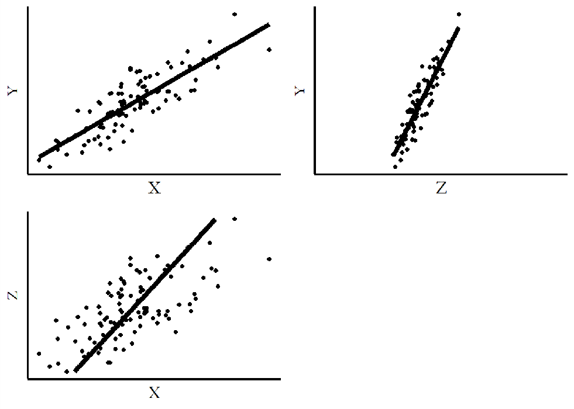

###### Figure 4.11: DA Three-Variable Regression from All Three Dimensions After Removing theVariation Explained by Z

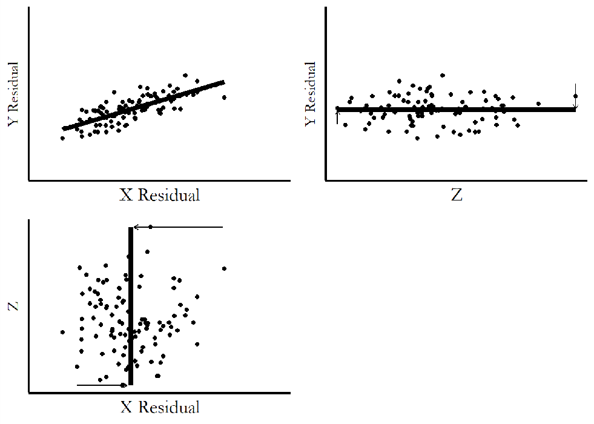

Then, in Figure4.14.11, we flatten out those explanations. The upward slopes get flattened out,4.11.11.11.11.11111111111111 moving the and points with them. You can see how subtracting out the parts explained by literally leaves the / relationship no part of to hold on to! has been flatlined in both directions, providing no additional “lift” to the points in the / graph. Whatʼs still there on / is there without .

X Y Z X Y Z Z

X Y X Y Z

###### 4.6 What Weʼre Not Covering

In the previous chapter, on describing variables, we did a pretty good job covering a lot of what youʼd want to know when describing a variable. This chapter, however, leaves out a whole lot more.

This is largely for reasons of focus. This book is about research design. Once youʼve got research design pinned down, there are certainly a lot of statistical issues you need to deal with at that

point. But things like specific probability distributions (normal vs. log-normal vs. t vs. Poisson vs. a million others we didnʼt cover), functional form (OLS vs. probit/logit vs. many others), or standard errors and hypothesis testing can be a distraction when thinking about the broad strokes of how youʼre going to answer your research question.

In one case, omission is less for focus and more to cover it more appropriately later. Notice how I introduced the Oster paper as being all about how the relationship between vitamin E and health indicators changed over time… but then I never showed how the BMI relationship changed over time? There are a number of research designs that have to do withhow a relationship changesin different settings. However, a proper treatment of this will have to wait until Part II of the book.

22

To be clear, you want to know all this stuff. And I will cover it more in this book in Chapter1313, and13 many of the other Part II chapters. You can also check out a more traditional econometrics book likeReal Econometrics(⊕Bailey 2019) orIntroductory Econometrics(⊕Wooldridge 2016). But for observational data, most of the time these are things to considerafteryou have your design and plan to take that design to actual data.

For now, I want you to think aboutwhat you want to dowith your data - what kinds of descriptions of variables your research design requires, what kinds of relationships, what kinds of conditional means and conditional conditional means. Figure out how you want your data to move, and where the relevant variation is. Figure out the journey youʼre going to take first; you can pack your bags when itʼs actually time to leave.

###### 4.7 Relationships in Software

In this section, Iʼll show you how to calculate or graph the relationship between variables in three different languages: R, Stata, and Python.

These code chunks may rely onpackagesthat you have to install. Anywhere you see library(X) or X:: in R or import X or from X import in Python, thatʼs a package X that will need to be installed if it isnʼt already installed. You can do this with install.packages('X') in R, or using a package manager like pip or conda in Python. In Stata, packages donʼt need to be

loaded each time theyʼre used like in R or Python, so Iʼll always specify in the code example if thereʼs a package that might need to be installed. In all three languages, you only have to install each package once, and then you can load it and use it as many times as you want.

The data sets for all the examples in this book can be found in the causaldata package, which Iʼve made available for all three languages. Do install.packages('causaldata') in R, ssc install causaldata in Stata, or pip install causaldata (if using pip) in Python.

So letʼs do those code examples! The Oster data, while free to download, would require special permissions to redistribute. Instead, I will be using data from Mroz (⊕1987), which is a data set of womenʼs labor force participation and earnings from 1975.

In each of these languages, Iʼm going to:

- 1. Load in the data
- 2. Draw a scatterplot between log womenʼs earnings and log other earnings in the household, among women who work
- 3. Get the conditional mean of womenʼs earnings by whether they attended college
- 4. Get the conditional mean of womenʼs earnings by different bins of other household earnings
- 5. Draw the LOESS and linear regression curves of the mean of log womenʼs earnings conditional on the log amount of other earnings in the household
- 6. Run a linear regression of log womenʼs earnings on log other earnings in the household, by itself

23

###### and including controls for college attendance and the number of children under five in the household

R Code R Code e Stata CodeStata CodeStatatatatatatatatatatatatatatatatatatatatata e Python CodePython Codeytyttt ooooooooooo o o oooooo o o o e

library(tidyverse); library(modelsummary)

df <- causaldata::Mroz %>% # Keep just working women dplyr::filter(lfp == TRUE) %>%

# Get unlogged earnings mutate(earn = exp(lwg))

- # 1. Draw a scatterplot ggplot(df, aes(x = inc, y = earn)) +

geom_point() + # Use a log scale for both axes # We'll get warnings as it drops the 0s, that's ok scale_x_log10() + scale_y_log10()

- # 2. Get the conditional mean by college attendance df %>%

# wc is the college variable group_by(wc) %>% # Functions besides mean could be used here to get other conditionals summarize(earn = mean(earn))

- # 3. Get the conditional mean by bins df %>%

# use cut() to cut the variable into 10 bins mutate(inc_cut = cut(inc, 10)) %>% group_by(inc_cut) %>% summarize(earn = mean(earn))

- # 4. Draw the LOESS and linear regression curves ggplot(df, aes(x = inc, y = earn)) +

geom_point() + # geom_smooth by default draws a LOESS; we don't want standard errors geom_smooth(se = FALSE) + scale_x_log10() + scale_y_log10()

# Linear regression needs a 'lm' method ggplot(df, aes(x = inc, y = earn)) +

geom_point() + geom_smooth(method = 'lm', se = FALSE) + scale_x_log10() + scale_y_log10()

- # 5. Run a linear regression, by itself and including controls model1 <- lm(lwg ~ log(inc), data = df) # k5 is number of kids under 5 in the house model2 <- lm(lwg ~ log(inc) + wc + k5, data = df) # And make a nice table msummary(list(model1, model2))

Previous Next

Page built: 2025-10-17 using R version 4.5.0 (2025-04-11 ucrt)

# The Effect

Nick Huntington-Klein

▾ Chapters

###### Chapter 5 - Identification

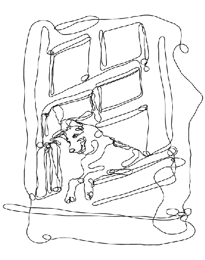

###### 5.1 The Data Generating Process

ONE WAY TO THINK ABOUT SCIENCE GENERALLYis that scientists believe that there are regular laws that govern the way the universe works.

These laws are an example of a “data generating process” (DGP) The laws work behind the scenes, doing what they do whether we know about them or not. We canʼt see them directly, but we do see thedatathat result from them. We can see that if you let go of a ball, it drops to the ground. Thatʼs our observation, our data.Gravityis a part of the data generating process for that ball. Thatʼs the underlying law.

1

We have a pretty good idea how gravity works. Basically, if we have two objects that are a distance apart, one with a mass of and another with a mass of , then the force pulling

r m1 m2 F

- them together is

m1m2 r2

###### F = G

(5.1)

where is the “gravitational constant.” That equation is aphysical law. It describes a process working behind the scenes that determines how objects move, whether we know about it or not.

###### G

In addition to thinking that thereareunderlying laws like this, scientists also believe that we can learn what these laws are from empirical observation. We didnʼt always know about the gravity equation - Isaac Newton had to figure it out. But before we had Newtonʼs equation, we had data. Lots and lots of data about objects moving around, specifically data about planets moving around in orbits.

Science says “we can see these planets moving around. We know there must besomelaw explainingwhythey move around the way they do. I bet we can use what weseeto figure out what that law is.” And we could! Or at least Newton could. Smart guy. Given the observation that planets have elliptical orbits, Newton showed that Equation(5.1)(((5.1) could generate these orbits.((5.1).... )))

2

We can infer how the world works from our data because things like equation(5.1)(((5.1) are part of the((5.1).... ))) data generating process, or DGP. If there are two planets flying around in space, their movement isactualy determinedby that equation, and then weobservetheir movement as data. If we didnʼt know the equation, then with enough observation of the actual movement, and enough understanding about the other parts of the DGP so we can block out the effects of things like momentum, we might be able to figure it out and identify the effect of gravity.

DGPs in the social sciences are generally not as well-behaved and precise as the ones in the physical sciences. Regardless, if we believe that observational data comes from at least somewhat regular laws, we are saying thereʼs a DGP.

3

THE TRICK TO DATA GENERATING PROCESSESis that there are really two parts to them - the parts we know, and the parts we donʼt. The parts we donʼt know are what weʼre hoping to learn about with

our research. Learning about gravity lets us fill in a part of our DGP for how data about movement is created.

The parts we already know about are just as important, though. The DGP combineseverything we already know about a topic and its underlying laws. Then, we can use what wedoknow to learn new things. If he were starting from nothing, Newton would have no chance of figuring out gravity. Sure, we see planets acting as though theyʼre moving towards each other. But maybe the planets move like that because of magic? Thatʼs not it. But we can only rule that out because of what we already know - the data doesnʼt do it for us. Or maybe itʼs just how momentum works? Again, thatʼs not enough on its own, but we need to know a whole lot about momentum to be able totelthat itʼs not enough. We know about forces, momentum, and velocity. With those in place, what can we learn about gravity?

So! We can use what we know to figure out as much as we can about the DGP. This will allow us to figure out reasons why we see the data we see, so we can focus just on the parts weʼre interested in. If we want to learn about gravity, we need to be sure that our data is telling us about gravity, not about momentum, or speed, or magic.

LETʼS GENERATE SOME DATA.A good way to think about how DGPs can help with research is to cheat a little and make some data where we know the data generating process for sure.

In the world that weʼre crafting, these will be the laws:

- 1. Income is log-normally distributed (see Chapter33)3

- 2. Being brown-haired gives you a 10% income boost
- 3. 20% of people are naturally brown-haired
- 4. Having a college degree gives you a 20% income boost
- 5. 30% of people have college degrees

###### 6. 40% of people who donʼt have brown hairor a college degree will choose to dye theirhair brown\footnote{The mathematicalrepresentation of these laws is:$Pr(College) = .3$

$Pr(BrownHair) = .2 + .8\times.4\time

$log(Income) = .1\times BrownHair +

where $\varepsilon$ is normally distr

###### Letʼs say that we have some data that has been generated from these laws, but we haveno idea what the laws are. Now letʼs say weʼre interested in the effect of being brown-haired on income. We might start by looking at the distribution of income by whether someone is brown-haired or not, as in Figure5.15.1, or by just looking at average income by hair color, as in Table5.1.... 5.15.1.5.1....

Figure 5.1: Distribution of Log Income by Hair Color

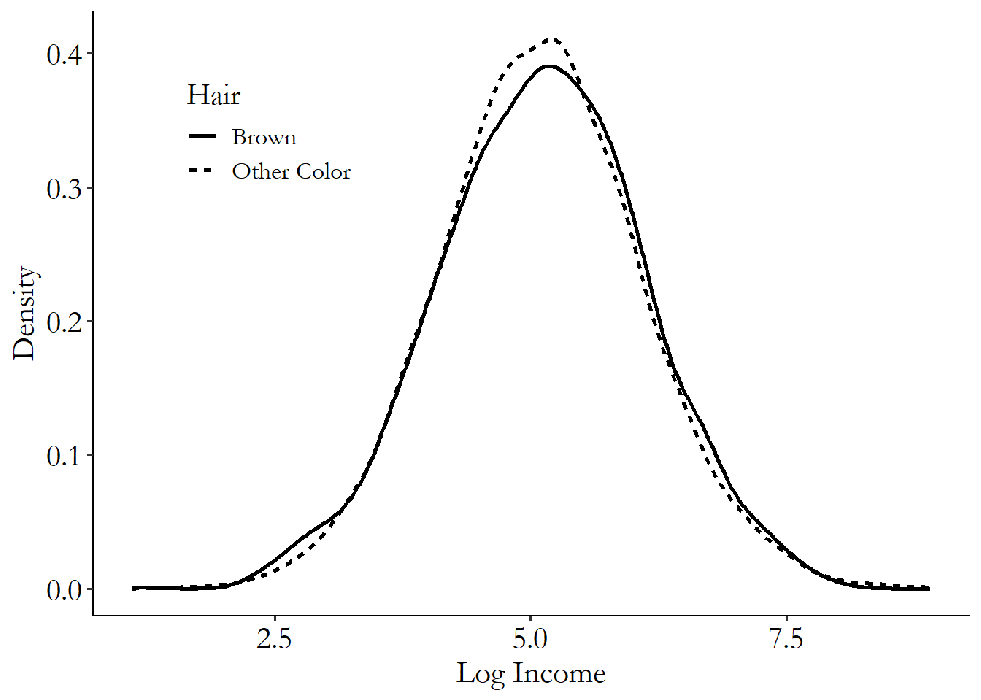

Table 5.1: Mean Income by Hair Color

Hair Log Income Brown 5.111 Other Color 5.095

What do we see in the raw data? We see that people with brown hair earn a little more. Itʼs hard to see in the figure, but in the table we can tell that they earn about .01 more in log terms, which means they earn about 1% more than people with other hair colors (see Chapter33).3

Uh-oh, thatʼs the wrong answer! We happen to know for a fact that brown hair gives you a 10% pay bump. But here in the data we see a 1% pay bump.

Where can we go from there in order to get the right answer? Not really anywhere. We have College information in our data, but without having any idea of how it fits into the DGP, we have no idea how to use it.

Now letʼs bring in some of the knowledge that we have. Specifically letʼs imagine we know everything about the DGPexceptthe effect of brown hair on income.

If we know that itʼs only non-college people who are dying their hair, and that College gives you a bump, we have some alternate explanations for our data. We donʼt see much effect of brown hair because a whole lot of non-college people have brown hair, but those people donʼt get the College wage bump, so it looks like brown hair doesnʼt do much for you even though it does.

Knowing about the DGP also lets us figure out what we need to do to the data to get the right answer. In this DGP, we can notice thatamongcollege students, nobody is dying their hair, and so thereʼs no reason we can see why brown hair and income might be relatedexceptfor brown hair giving us an income boost.

So in Table5.25.2 we limit things just to college students. Now we see that brown-haired students5.2.... get a bump of 13%. Thatʼs not exactly 10% (randomness is a pest sometimes), but itʼs a lot closer. And if we ran this little study a thousand times, on average weʼd get 10% on the nose.

Table 5.2: Mean Income by Hair Color Among College Students

Hair Log Income Brown 5.340 Other Color 5.208

HOW THE HECKdid we do that? We got the right answer (or close enough) in the end. We know that getting the right answer involves using information about the data generating process (DGP), and we did that. But what were we actually trying to accomplish by using that information, and how did we know how to use it? At this point I just sort of told you what to do. Not too helpful unless youʼve got me added as a contact in your phone.

4

We can split this into two ideas, which we will cover in the next two sections.

The first is the idea oflooking for variation. The DGP shows us all the different processes working behind the scenes that give us our data. But weʼre only interested in part of that variation - in this case, it turned out to be the variation in income by hair colorjust among colege students. How can we find the variation we need and focus just on that?

The second is the idea ofidentification. How can we use the DGP to be sure that the variation weʼre digging out is the right variation? Figuring out what sorts of problems in the data you need to clear away - like how we noticed that the non-college students dying their hair was giving us problems - is the process of identification.

###### 5.2 Whereʼs Your Variation?

IN A MOMENTIʼm going to show you a graph, Figure5.25.2. This scatterplot graph shows, on the5.2.... axis, the price of an avocado, and on the -axis, the total number of avocados sold. Each point on the graph is the price and quantity of avocados sold in the state of California in a single week between January 2015 and March 2018.

x y 5

Iʼm going to ask you to indulge me and spend a good long while looking at the graph. While youʼre doing that, I want you to ask yourself a few questions:

- 1. What conclusion can you draw from Figure5.25.2? Think literally, as though5.2.... you were a robot. Try not to see anything that isnʼt really there.

- 2. Now, think about the relationship between avocado prices and quantities more broadly. What kinds of research questions might we have about this relationship? For example, we might wonder what effect a 10% increase in price might have on the number of avocados people want to buy. Can you think of another research question?
- 3. Can you answer your research question from Step 2 using Figure

###### 5.25.2? Why or why not?5.2....

Figure 5.2: Weekly Sales of Avocados in California, Jan 2015-March 2018

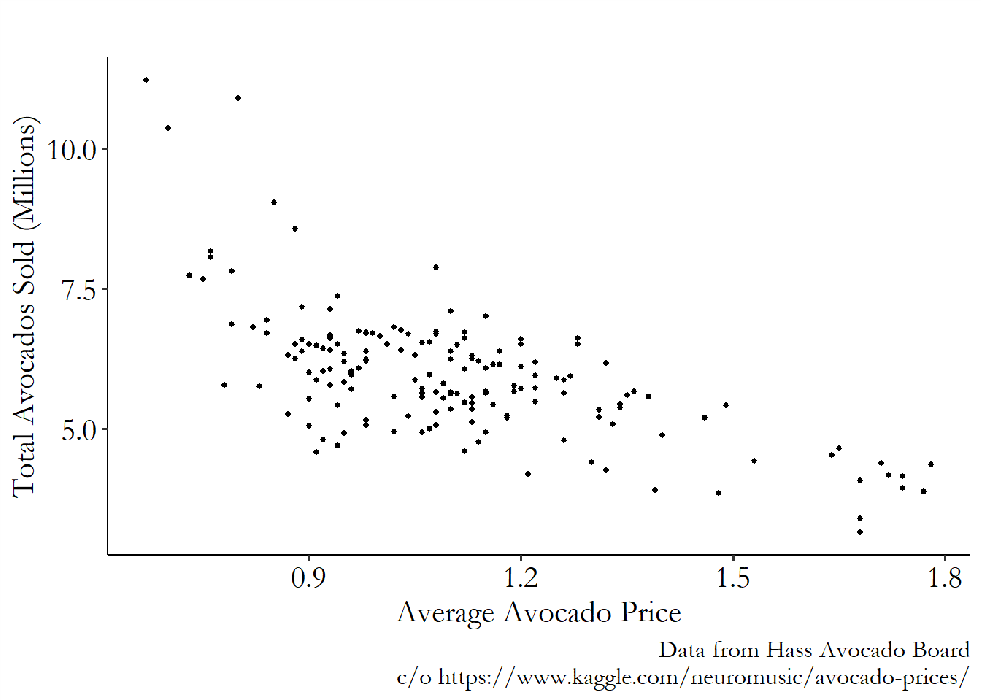

All right - hopefully youʼve been able to come up with some answers to those questions. What do we have?

First, what do we literally see in Figure5.25.2? We see that thereʼs clearly a negative relationship.5.2.... What this tells us is thatavocado sales tend to be lower in weeks where the price of avocados is high.Or, perhaps,prices tend to be higher in weeks where fewer avocados are sold.What we can see in the graph is thecovariationorcorrelationbetween price and quantity of avocados.

Thatʼs more or less it. Thatʼs all. We might be tempted to say something likean increase in the price of avocados drives down sales.But thatʼs not actually on the graph! Or we might want to say that an increase in prices makes people demand fewer avocados, but thatʼs not on there either—any good economist will tell you that both supplyanddemand are part of what generates

market prices and quantities, and weʼve got no way of pullingjustthe demand parts out yet. All we know is that quantities tend to be high when prices are low. We have no idea yet why that is.

Second, what research questions might we have about the relationship between price and quantity? There are a lot of things we could say here. Perhaps weʼre interested in how pricesensitive consumers are - what is the effect of a price increase on the number of avocados people buy? Or heck, maybe weʼre thinking about this the wrong way - maybe we should ask what is the effect of the number of avocados brought to market on the price that sellers choose to charge?

6

7

So, third, can we answer any of these questions by looking at the graph? Unfortunately, no. The graph shows thecovariationof price and quantity - how they move together or apart. But these variables move around for all sorts of reasons! Consider a simplified version of the graph, Figure

- 5.35.3. Figure5.3.... 5.35.3 has only two points, from consecutive weeks.5.3....

###### Figure 5.3: Weekly Sales of Avocados in California, Jan 2015-Feb 2015

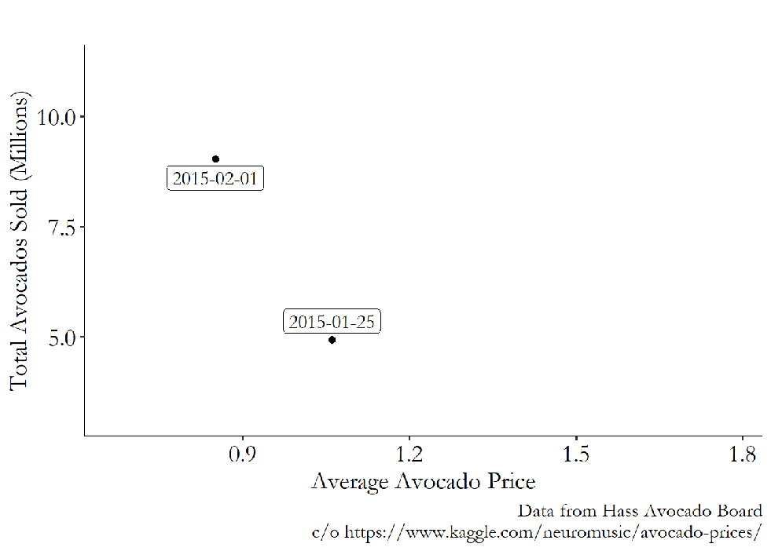

We can still see a negative relationship, which is the same as we saw in Figure5.25.2. But5.2.... whydid price drop and quantity rise from January to February that year? Is it because a drop in price made people buy more? Is it because the market was flooded with avocados so people wouldnʼt pay as much for them? Is it because the high price in January made suppliers bring way more avocados to market in February?

Itʼs probably a little bit of all of them. Variables move around for all sorts of reasons. Those reasons would be reflected in the data generating process (DGP). But when we have a research question in mind, we are usually only interested in one of those reasons.

SO THE TASK AHEAD OF US IS:how can we find the variation in the data that answers our question? The data as a whole is too messy - it varies for all sorts of reasons. But somewhere inside the data,ourreason for variation is hiding. How can we get it out?

We have to askwhat is the variation that we want to find?If we want to figure out what the effect of the price is on how many avocados people want to buy, then we want variation inpeople buying avocados(rather than people selling them) that is driven bychanges in the price(rather than, say, avocados becoming less popular).

8

As we discussed in the previous section, weʼre going to be hopeless at doing this if we donʼt know anything about the DGP. We need touse what we knowabout the DGP tolearn a litle more. So letʼs make up some facts about where this data came from. Letʼs imagine for a second that we know for a fact that at the beginning of each month, avocado suppliers make a plan for what avocado prices will be each week in that month, and never change their plans until the next month.

If thatʼs true, then the “suppliers set prices” and “suppliers set quantities” explanations only matterbetweenmonths. The variation in price and quantityfrom week to week in the same monthwill isolate variation inpeople buying avocadosand get rid of variation frompeople seling avocados. Further, because the price is set by the sellers, the variation in quantity weʼre looking at can only be driven bychanges in the price.

Our ability to find this answer is entirely based on that assumption we made about sellers making their choices between months. The reason Iʼve made this particular assumption is that it

helps us isolate (identify) only the variation on the part of consumers, conveniently getting rid of variation on the part of sellers and letting us just look at buyers. This assumption, which works so much magic for us, is entirely a fiction made up for the convenience of writing this book. Hopefully you will not find all assumptions made for the purposes of digging out variation to be convenient fictions. Some probably are.

9

By tossing out any variation between months, weʼre digging through explanations that rely on that variation and tossing them out. Since sellers only change behavior between months (given our assumption), that explanation gets tossed out when we get rid of between-month variation, leaving us only with buyer behavior.

If we just look at changeswithinmonths, as in Figure5.45.4, we can see that thereʼs still a negative5.4.... relationship. Note thatfor each of the months, thereʼs a negative relationship, ignoring any differences between the months. So, given the data and what we know about how sellers operate, an increase in price does reduce how many avocados people want to buy.

###### Figure 5.4: Weekly Sales of Avocados in California, Feb 2015-Mar 2015

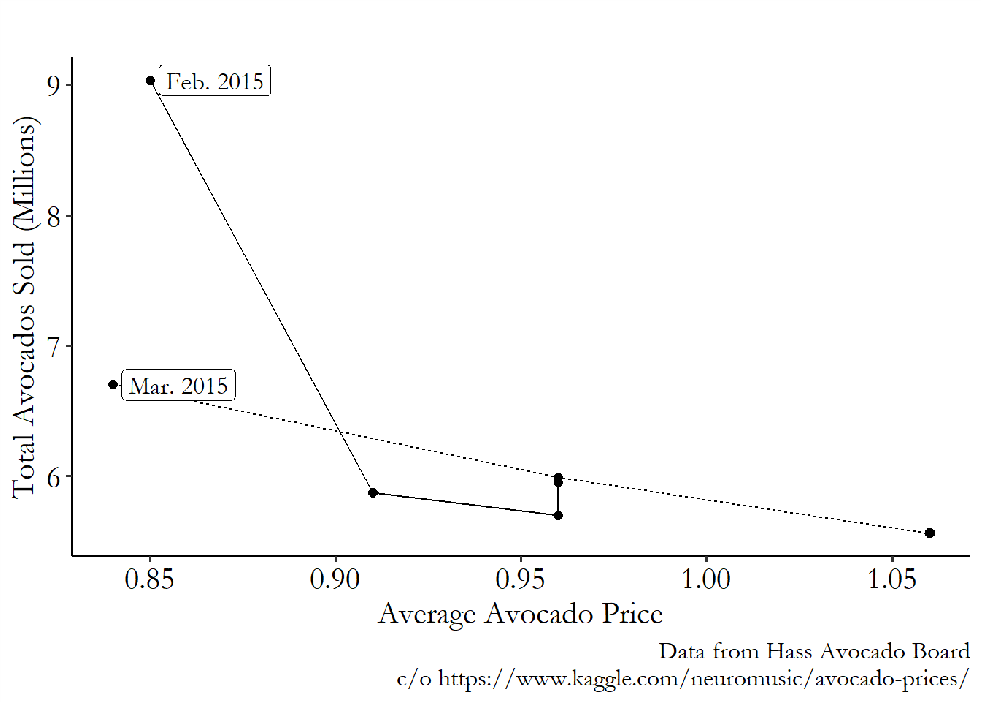

The task of figuring out how to answer our research question is really the task of figuring out

where your variation is.Itʼs unlikely that the variation in the raw data answers the question youʼre really interested in. So where is the variation thatdoesanswer your question? How can you find it and dig it out? What variation needs to be removed to unearth the good stuff underneath?

That process - finding where the variation youʼre interested in is lurking and isolatingjust that partso you know that youʼre answering your research question - is called identification.

###### 5.3 Identification

ABEL AND ANNIE VASQUEZwoke up Tuesday morning to find that their faithful dog Rex was not at the foot of their bed as normal. Distraught, they ran through the house, calling his name, whistling, offering treats. Finally, one of them opened the front door, and there was Rex, sitting on the grass, wagging his tail. They brought him back inside.

“I keep telling you to latch the doggie door,” said Abel.

“He never uses that door anyway. I bet he jumps out that open window in the basement,” said Annie.

“Sure,” said Abel, rolling his eyes. That night, he made sure to latch the doggie door.

Abel and Annie Vasquez woke up Wednesday morning. The sun was warm, the smells of the automatic coffee machine had already reached their bedroom, and Rex was gone.

It didnʼt take them long to find him this time, out on the lawn again, rolling in dew. A little patch of fur was getting rubbed raw - however he was getting out, it was clearly the same way every night.

That night, they latched the doggie door and double-bolted the back door. Thursday morning, Rex was gone.

Thursday night, they latched the doggie door, double-bolted the back door, and closed the blinds. Friday, Rex was gone.

Friday night, they latched the doggie door, double-bolted the back, closed the blinds, and blocked the air vent. Saturday morning Rex had eaten two butterflies before they found him outside.

“Iʼve had enough of this,” said Abel. That night they locked and latched every door, closed every window, boarded up the chimney, sealed up the half-inch crack between the boards in the garage, plugged the drain in the tub, and gave Rex a very stern talking-to.

Sunday morning, Annie came downstairs to find Abel, distraught, sitting on the stoop and looking at his dog, who had once again escaped the house.

“I donʼt understand… I closed off every possible way he could get out. Every crack, every crevice, every hole. Every possible exit was blocked. But there he is!”

Annie drank her coffee. “Oh, I opened the basement window back up before I went to bed. Told you thatʼs how he was getting out.”

The next night they left everything else open but closed the basement window. The next morning, finally, finally, finally, they woke up and Rex had stayed inside the whole night.

IDENTIFICATION IS THE PROCESSof figuring out what part of the variation in your data answers your research question. Itʼs called identification because weʼve ensured that our calculationidentifies a single theoretical mechanism of interest. In other words, weʼve gotten past all the misleading clues and identified our culprit.

A research question takes us from theory to hypothesis, making sure that the hypothesis weʼre testing will actually tell us something about the theory. Identification takes us from hypothesis to the data, making sure that we have a way of testing that hypothesis in the data, and not accidentally testing some other hypothesis instead.

Take Abel and Annieʼs case. What do we see in the actual data? We see, on different nights, different parts of the house being sealed off, and we also see that Rex makes it outside each

night. Annieʼs research question is whether the basement window being open is what lets Rex out.

We - and Abel - know that there are plenty of ways to get out of the house. So this data alone doesnʼt answer Annieʼs research question. As Abel closes up more and more stuff, he is tossing out some of the variation. Every time he does, the number of places Rex could get out besides the window shrinks, so there are fewer and fewer ways that Annie could bewrongabout the window, but there are still other explanations for how the dog got out.

But once weʼve closed up literally every other possible avenue out of the house, and the window is all thatʼs left, thereʼs only one conclusion to come to: the window being open is what let the dog out. This observation hasidentifiedan answer to our question, simply by closing off every other possible explanation.

10

The process of closing off other possible explanations is also how we identify the answers to research questions in empirical studies.

Consider the avocado example in the previous section. Just like Abel and Annie considered all the ways their dog might be able to get out, we askedwhat are al the ways that prices and quantities might be related?Once we have an idea of what our DGP is, i.e., what are all the different ways

that prices and quantities might be related, we will have a good idea of what work we need to do. Just like Abel and Annie closed off every possible avenue except the basement window, we closed off undesirable explanations by getting rid of between-month variation driven by sellers. The only way for price to affect quantity at that point is through the consumers.

Identification requires statistical procedures in order to properly get rid of the kinds of variation we donʼt want. But just as important, it relies ontheoryandassumptionsabout the way that the world works in order to figure out what those undesirable explanations are, and which statistical procedures are necessary. Specifically, it relies on theory and assumptions about what the DGP looks like. We need to make a claim about what wealready knowin order to have any hopes of learning something new. In the avocado example, we used our knowledge about how markets work to realize that sellers might be setting price in response to the quantity - an alternate explanation we need to deal with. Then, we used an assumption about how sellers set prices to

figure out how we can block out this alternate explanation by looking within-month just like Abel blocked up the chimney by using wood and nails.

It doesnʼt instill a lot of confidence to acknowledge that we have to be making some assumptions in order to identify our answers, does it? But it is necessary. Imagine if Abel and Annie tried to figure out how the dog got out without any assumptions or knowledge about the data generating process. The list of alternate explanations theyʼd have to deal with would include “the dog can teleport,” “the universe is a hologram,” and “our walls have invisible holes only dogs can see.” Theyʼd never come to a conclusion, and theyʼd be at serious risk of becoming philosophers.

11

SO THEN THATʼS OUR GOAL.If we want to identify the part of our data that gives the answer to our research question, we must:

- 1. Using theory and what we already know about the world from previous studies or observations, paint the most accurate picture possible of what the DGP looks like
- 2. Use that DGP to figure out the reasons our data might look the way it does thatdonʼtanswer our research question
- 3. Find ways to block out those alternate reasons and so dig out the variation we need

This process is a lot more difficult than just “look at the data and see what it says.” But if we donʼt go the extra mile of following these steps, we can end up with confusing, inconsistent, or just plain wrong results. Letʼs see what happens when we donʼt take identification quite seriously enough.

###### 5.4 Alcohol and Mortality

IF YOU ARE THE TYPEto pay attention to news articles with headlines beginning “A New Study Says…” you may find yourself deeply confused about the health effects of alcohol. Sometimes the study says that a few drinks a week is even healthier than none at all. Other studies find that alcohol is unsafe at any level. Or maybe itʼs just wine thatʼs good for you?

12

Letʼs take a look at one major study, A. M. Wood et al. (⊕2018), on the effects of alcohol on “all cause mortality” - basically, your chances of dying sooner. This study has more than 200 authors and studied the relationship between drinking and outcomes like mortality and cardiovascular disease among nearly 600,000 people. It was published in 2018 in the prominent medical journal The Lancet, and it has been used in discussions of how to set medical drinking guidelines, as in Connor and Hall (⊕2018).

The study is very well-regarded! What it found is that there did not appear to be a benefit of small amounts of drinking. Further, it found that the amount of alcohol it took to start noticing increased risk for serious outcomes like mortality was at about 100 grams of alcohol per week, which is about a drink per day, and below current guidelines in some countries. Figure5.55.55.555555.5 shows555.55.55.5555555 the relationship they found between weekly alcohol consumption and the chances of mortality. Mortality starts to rise at around 100 grams of alcohol per week, and goes up sharply from there.

Figure 5.5: Alcohol Consumption and Mortality from Wood et al. (2018). Minor changes from original.

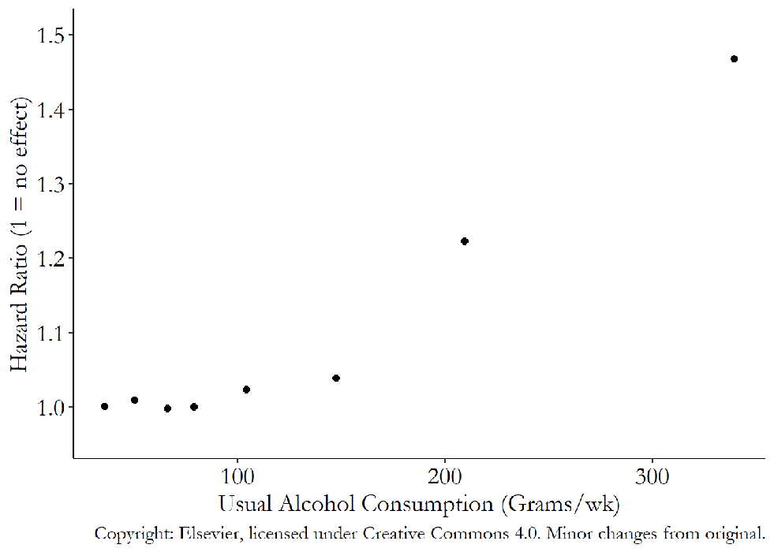

We know from previous sections in this chapter that in order to make sense of the data we need to think carefully about the data generating process (DGP).

What is the DGP? What leads us to observe people drinking? What leads us to observe them dying? What reasons might there be for us to see an association between alcohol and mortality?

Pause here for a moment and try to list five things that would be a cause of someone drinking, or at least be related to drinking. Then, try to list five things that would be a cause of someone dying. Bonus if the same things end up on both lists.

DID YOU COME UPwith some determinants of drinking and mortality? There are certainly plenty of options. For example, a tendency to take more risks might lead someone to drink more, and may cause other things like smoking. So risk-taking is a cause of drinking, and because of that, smoking is related to drinking too. As for mortality, any one of a long list of bad-health indicators could cause mortality. So could something like smoking, risk-taking, or just working in a dangerous job!

You can see pretty immediately from this that anything that ends up on both lists is automatically going to be an “alternate explanation” for the results. Take smoking, for instance. If smokers are more likely to drink, and smoking increases mortality, then one reason for the relationship between drinking and mortality might just be that smokers tend to drink, and they also die earlier because of their smoking. Anything else that ends up on both lists is going to give us an alternate explanation.

Thereʼs something else you may not have thought of - how about people who donʼt drink at all? If drinking is very bad for you, surely non-drinkers would have very low mortality rates? Maybe, but keep the DGP in mind. Why donʼt they drink? One reason people choose not to drink at all is because their health is too poor to handle it. Another reason is if they are recovering alcoholics. In these cases, we may actually see worse mortality for non-drinkers, but that relationship is almost certainly not because not-drinking is bad for them. Thatʼs an alternate explanation too.

Iʼm going to bug you once again. Now that weʼve thought about it some more, I want you to pause and try to think of a few more reasons why we might see a relationship between alcohol and mortality other than alcohol being the cause of mortality. Thereʼs no quiz, but this is a very good habit to get into, both for the purposes of understanding the content in this book and for the purpose of trying to make sense of new studies and findings you read about.

13

THANKFULLY, THE AUTHORSof the Woods et al. study did manage to deal with some of these alternate explanations. They were putting some thought into what the DGP looks like.

You may have noticed, for one, that Figure5.55.55.555555.5 actually doesnʼt contain non-drinkers. Theyʼve555.55.55.5555555 been left out of the study because of the too-sick-to-drink and ex-alcoholic alternate explanations they want to block out. This is one reason why the study doesnʼt find a positive effect of a little alcohol, while other studies do - some of those other studies leave in the non-drinkers (oops!).

The authors also use statistical adjustment to account for some other alternate explanations. They adjust for smoking, which was one thing we were concerned about, as well as age, gender, and a few health indicators like body mass index (BMI) and history of diabetes.

SO THEYʼRE GOOD, RIGHT?Well, not necessarily. Just because theyʼve been able to account for some of the alternate explanations doesnʼt mean theyʼve accounted for all of them. After all, we

mentioned risk-taking above. They adjusted for smoking, but surely risk-taking is going to matter for other reasons, and thatʼs not something they can easily measure. They took out non-drinkers who might not drink because theyʼre sick or ex-alcoholics. But that means they also took out non-drinkers who are neither of those things. And what if some very sick people just choose to drink less rather than not at all? Thereʼs plenty more to think about, some of which you might have even noticed yourself while reading this chapter, that isnʼt in their study. They clearly spent some time thinking about the DGP. But they might not have spent enough - or maybe they did spend enough but just werenʼt realistically able to account for everything.

There are still some alternate explanations for their results that they couldnʼt address. So it might be a little premature to take these results, despite the hundreds of thousands of people they examined, and use them to conclude that we have now identified the effects of alcohol on mortality.

If it feels like they did their part in addressing some of the alternate explanations and whatʼs left over feels trivial, keep in mind that these alternate explanations can lead us to very strange conclusions. Chris Auld (⊕2018) read the study, and then took the same methods as in the original paper and used them to “prove” that drinking more causes you to become a man (see Figure5.65.6).5.6....

Figure 5.6: Alcohol Consumption and Being a Man

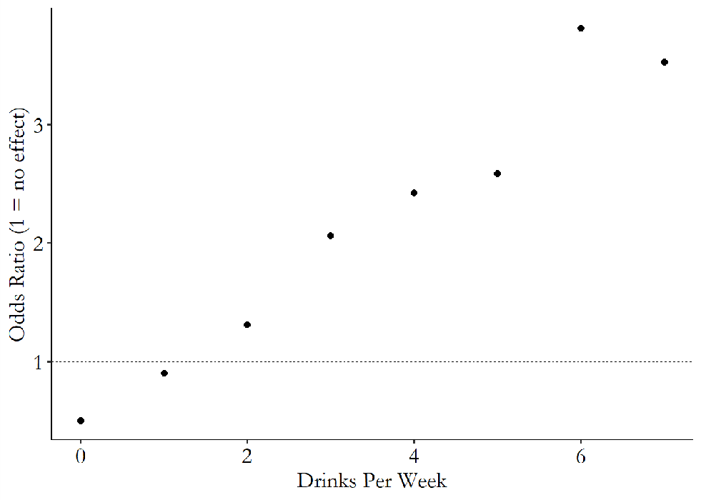

The idea that alcohol turns you into a male seems ridiculous, and in contrast it is pretty darn plausible that alcohol does really increase mortality. But if these methods can give us Figure5.65.6,5.6....

- then even if there is really an effect of alcohol on mortality, how close do we think Figure5.55.55.555555.5 is to555.55.55.5555555 identifying that effect?

Is it, then, maybe a little concerning how much certainty there seems to be in the response to the study, and others like it, from the media and from medical authorities? The authors of this study have without a doubt found a very interesting relationship, and have addressed some alternate explanations for it. But have theyidentifiedthe answer to the research question youʼre really interested in - how drinking causes your health to change? Thatʼs the question you would want to ask when making policy decisions like setting medical alcohol guidelines. Have they addressed all the necessary context? Is it even possible to do that?

###### 5.5 Context and Omniscience

ONE THING THAT I HOPEthis chapter has made clear is this: for most research questions, especially any questions that have a causal element to them, understanding context is incredibly important. If you donʼt understand where your data came from, thereʼs no way that youʼll be able to block alternative explanations and identify the answer to your question.

14

In the words of Joshua Angrist and Alan Krueger (⊕2001),

Here the chalenges are not primarily technical in the sense ofrequiring new theorems or estimators. Rather, progress comes from detailed institutional knowledge and the careful investigation and quantification of the forces at work in a particular seting. Of course, such endeavors are not realy new. They have always been at the heart ofgood empirical research.

They were specifically discussing identification using instrumental variables (see Chapter1919), but19 itʼs true generally. Before attempting to answer a research question empirically, be sure to put in plenty of time understanding the context that the data came from and how things work there. Fill in as much of the data generating process (DGP) as you can! Thatʼs going to be important both for interpreting your results properly, and for ensuring that there isnʼt some equally-plausible explanation for your data that you canʼt block out.

This means that thereʼs a lot of power in general understanding. So how should you start out designing your research project? By learning a lot of context. Read books about the environment youʼre studying. Look at the documents describing how a policy was implemented. Read accounts and talk to people about how things actually work. Make sure you get the details right, because the details all show up in the part of the DGP youʼre supposed to know.

This is either exciting news for you, or extraordinarily frustrating, depending on what kind of person you are.

15

ITʼS PROBABLY HEALTHYto see this necessary reliance on context as both a great opportunity and also as a revelation about our limitations.

Itʼs a great opportunity because it means you get to learn a lot of stuff. And learning a lot of stuff is fun. If we didnʼt like learning, we probably wouldnʼt be interested in doing research in the first place. Also, learning about context may well be where we get the idea for the research question. As discussed in Chapter22, a great way to come up with a research question is by studying an2 environment or setting and realizing that thereʼs something important about it that you donʼt know. If thatʼs what youʼre doing, by the time you have a research question, the contextuallearning part will already be done.

That learning may also help you figure out how to block off alternate explanations. Someone with a research question about gravity who has no idea about physics might be able to guess that magic isnʼt responsible for planetary movement. But someone whorealystudies how planets move will be able to do the appropriate calculations to show that itʼs not just momentum explaining how they move - you need gravity, too.

HOWEVER, THE NEED FOR CONTEXT ALSO REVEALS OUR LIMITATIONS. If we can onlyrealyanswer our research questions when we understand the context very well, then our only successful projects will tend to be in areas that we already mostly understand. Boring! What about those wild, outthere frontiers where nobody understands anything? Surely itʼs not a good idea to just ignore

- them. After all, even if we will have trouble pinning down an exact answer, some questions, like the effects of alcohol on mortality, are too important to ignore completely.

We shouldnʼt ignore those out-there exciting realms for research. But the need for context means that we should be prepared for our results to be more questionable, more prone to alternate explanations, more “exploratory.” This is just plain intellectual humility, and itʼs a good thing. Knowing less means we can prove less. Forgetting that can lead us to make wild claims that end up being wrong when we know more.

You can see this pretty much any time anythingnewis introduced to society - novels, trains, universal voting, television, the Internet, video games. When these things are new, we donʼt know how they fit into the DGP since we havenʼt seen them produce any data. But that doesnʼt stop people from producing wild claims about how they will save/destroy all of society. And thereʼs

never a shortage of questionably performed research proving both the devotees and the skeptics correct, only for it all to be overturned as we learn more about how these things work.

EVEN AT A SMALLER SCALE,the need for more context can be stymieing. Forget trying to study the effects of flying cars or space aliens. How can we even have enough context to study the effect of avocado prices on avocados sold? You can spend years studying the topic and become the worldʼs leading expert, and youʼll still never knoweverythingabout it. In order to truly be able to see all the alternative explanations for your data and truly understand all the underlying tantalizing-but-invisible laws, itʼs almost like you need to be omniscient. How can you be sure there arenʼt any holes left in your research?

Well… you canʼt!

Sorry.

No research project is perfect. All we can hope to do is:

Learn what we can about the context so that we donʼt miss any hugely important part of the DGP

Be careful to acknowledge what assumptions weʼre making, and think about how they might be wrong

Try to spot gaps in our knowledge about the DGP, and make some realistic guesses about whatmight be in that gap

Not aim for perfection, but aim for gettingas close as we can

If we try to be omniscient, weʼll always fail. So thereʼs no point in that. But there is a point in trying to be useful. For that we simply need to learn what we can, work carefully, and try to make our errors small ones.

Previous Next

Page built: 2025-10-17 using R version 4.5.0 (2025-04-11 ucrt)

# The Effect

Nick Huntington-Klein

▾ Chapters

###### Chapter 6 - Causal Diagrams

###### 6.1 Causality

IN THIS CHAPTER, we are going to discusscausal diagrams, which are a way of drawing a graph that represents a data generating process (DGP). We are going to be using causal diagrams in the rest of the book. We will use these diagrams to work out our research designs and figure out what exactly we should do with our data, and how we can identify the answers to our research questions.

Before we get to thediagramspart of causal diagrams, letʼs talk about thecausal. We are going to use causal diagrams to think about research because it will help us address causality. What does

it mean for something to be causal? What is causality? We can say “ causes ,” but what do we specifically mean by that?

###### X Y

For that matter, why worry so much about causality? Because many research questions we are interested in arecausalin nature. We donʼt want to know if countries with higher minimum wages have less poverty; we want to know ifraising the minimum wage reduces poverty. We donʼt want to know if people who take a popular common-cold-shortening medicine get better; we want to know ifthe medicine made them get beter more quickly.We donʼt want to know if the central bank raising interest rates was shortly followed by a recession; we want to know ifthe interest rate hike caused the recession.

1

Okay, maybe we do want to know those other things too. But a lot of the time, even non-causal analyses and research questions have a causal question lurking underneath. How many times have you seen a headline like “getting less than eight hours of sleep a night is linked to early death!”? The actual study itself may have made no causal claims. And “linked to” doesnʼt technically say anything about causality. But because “does a lack of sleep kill you?” (causal) is so much more interesting a question than “do people who die early also tend to sleep less?” (noncausal), we the readers apply wishful thinking to incorrectly interpret the result as causal.

2

THERE ARE LOTS OF WORDSthat are generally taken to imply causality, as well as words that describe relationships without implying causality.

What are some of these words?

We can say that causes by saying: causes , affects , the effect of on , increases/decreases , changes , leads to , determines , triggers , improves , is responsible for , and so on…

X Y X Y X Y X Y X

Y X Y X Y X Y X Y X Y X Y

We can say that and are related without implying causality by saying and : are associated, are correlated, are related, tend to occur together, tend not to occur together, go together, and so on…

X Y X Y

There are also some “weasel words” that donʼt technicallysayanything about causality but clearly really want you tohearit. If some weaselly writer (certainly notus) doesnʼt want tosay

causality but does want the reader tohearit, they might say: is linked to , is followed by ,

X Y X Y X Y X Y X Y Y X

has ramifications for , predicts , people who are more likely to , happens as happens, and many others.

Knowing these terms can help you interpret what scientific studies are really saying, and when someone might be trying to pull one over on you.

Also, looking at these words might help us figure out what exactly causality is. Look at the causal phrases. They havedirection. They tell us that isdoing somethingto . In contrast, the clearly non-causal terms donʼt even need to specify which of and goes first. They just talk about these two variables and how they work together. The weasel terms are so weaselly specifically because theyʼre written in a way that implies that direction from to , even if theyʼre not literally claiming a causal relationship.

X Y X Y

X Y

3

This idea, that isdoing somethingto , is going to help us think about what causalityis.

X Y

THERE IS NO SINGLE DEFINITION FOR CAUSALITY.But a good way to think about it, at least for the purposes of this book, is this:

We can say that causes if, were we to intervene andchangethe value of , then the distribution of wouldalsochange as a result.

- X Y X
- Y

Letʼs take that definition for a spin.

Letʼs say that penicillincausesbacteria to die. So, imagine thereʼs a bunch of bacteria in a petri dish without any penicillin on it. The bacteria is alive. If we intervene and put some penicillin in the dish (changing the value of , where is “is the bacteria exposed to penicillin”), then the bacteria will die (changing the value of , “is the bacteria alive,” as a result). So far, so good.

X X Y

This definition lets us distinguish between correlation and causation. For example, we can observe that the number of people who wear shorts is much higher on days when people eat ice cream. However, if we were to intervene and swap out someoneʼs pants for shorts, would it make

- them more likely to eat ice cream? Probably not! So this is a non-causal relationship.

We can even use this definition to link far-off variables. For example, surely the price of cigarettes by itself has no causal effect on your health. But if we were to intervene and raise the price of cigarettes, that would likely reduce the number of cigarettes smoked. So the price of cigarettes causes cigarette smoking (to go down). Also, if we were to intervene and reduce the number of cigarettes smoked, that would cause your health (to improve). So the price of cigarettes causes cigarette smoking causes health. In sum, the price of cigarettes causes health.

4

One addendum we will need is that weʼll still say causes even if changing doesnʼtalways change , but just changes theprobabilitythat occurs. As I said earlier, it changes the distributionof (see Chapter33).3 For example, itʼs pretty obvious that turning on a light switch causes the light to come on, right? The light is off and so is the switch. Then we intervene to turn the switch on (change ), and the light comes on as well ( changes too). However, sometimes the light is burned out. So on occasion, turning the switch on does nothing. Regardless, weʼd still say that “flipping a light switch” causes “the light comes on.”

X Y X Y Y

Y 5

X Y

6

This last part turns out to be very important in social science, where very little is ever for certain. Does buying a child a copy ofAlice in Wonderlandcause them to read it? Not always! Some kids wonʼt read it no matter what, and some kids would manage to read it on their own without you buying it for them. But in general, buying children copies ofAlice in Wonderlandincreases the probabilitythat they read it, and so weʼd say that buying them the book causes them to read it.

7

NOW THAT WE HAVEa basic idea of what causalityis, letʼs see what we can do with it. How can we use our ideas about what variables have causal relationships to address our research questions?

After all, what do we know so far?

For many research questions, in order to identify an answer to them we need to have an idea of the DGP (Chapter55).5

If we can think of some variables as causing others, then the causal relationships between them must be a part ofthat DGP. If causes , then

###### X Y

###### must be a part of what generates our observations of .

X

Y

So then, how can we represent the DGP and the causal relationships within it so that we can figure out how to identify the answer to our research question?

###### 6.2 Causal Diagrams

Acausal diagramis a graphical representation of a data generating process (DGP). Causal diagrams were developed in the mid-1990s by the computer scientist Judea Pearl (⊕2009), who was trying to develop a way for artificial intelligence to think about causality. He wanted reasoning about DGPs and causality to be so easy that a computer could do it. And he succeeded! Pearl brought us a whole new way of thinking about causality thatʼs far easier to approach than what came before.

8

A causal diagram contains only two things:

- 1. The variables in the DGP, each represented by anodeon the diagram
- 2. The causal relationships in the DGP, each represented by anarrowfrom the cause variable to the caused variable

9

Letʼs start with a basic example. Letʼs say Brad has taken the last slice of cake. You also want the last slice of cake, and offer to flip a coin for it. If itʼs heads, you get the cake. Brad agrees.

There are two variables we can observe: the outcome of the coin flip (which can be heads or tails), and whether you have cake (you have it or you donʼt).

There is one causal relationship - the outcome of the coin flip determines whether you get cake. We can add that to our graph with an arrow from one to the other: Coin Cake.

###### →

###### Figure 6.1: The Effect of CoinFlip on Cake

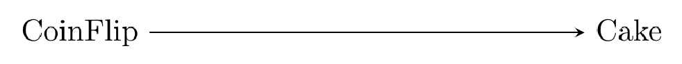

And thatʼs it! There are only two relevant variables here - the coin flip that determines whether you get cake, and whether or not you get cake. Theyʼre both there, and weʼve accurately described the relationship between them.

NOTE A COUPLE OF THINGS HERE.First, eachvariableon the graph may take multiple values. Thereʼs only one node for “CoinFlip” here, rather than one node for “Heads” and another for “Tails.” Similarly, thereʼs only one node for “Cake” rather than one for “You get cake” and another for “You donʼt get cake.”

10

Second, the arrow just tells us that one variable causes another. It doesnʼt say anything about whether that causal effect is positive or negative. All we have on the diagram is that the outcome of the coin flip affects your cake status.

Third, weʼre focusing on the important stuff here. There are plenty of things that could happen at this point that could affect the outcome of the coin flip or whether you get cake. A gust of wind could affect the outcome of your coin flip. Or perhaps a masked stranger might steal the cake while youʼre busy coin-flipping and youʼll end up with no cake regardless of the coin flip. But we can ignore these trivial possibilities and really focus on the important parts of the DGP.

11

Along the lines of “focusing on important stuff,” causal diagrams are often drawn with a particular outcome variablein mind. This is done because it allows you to ignore anything that iscaused by that outcome variable. So in this graph, if weʼre thinking of Cake as the outcome variable, we donʼt need to worry about the fact that the Cake might give you a StomachAche later on. This is a relief - otherwise every single causal diagram we drew would basically have to contain the entire world in it.

12

OF COURSE,in most DGPs, there will be more than two relevant variables.

So letʼs make our little cake scenario a bit more elaborate. Letʼs say that, first, Brad only agrees to the bet if he gets to keep the coin if he loses. And second, you know thereʼs a chance that your friend Terry might happen to walk in the room. If they do, theyʼll feel bad if you lose your coin and so give you two coins to replace it.

13

So now what are the relevant variables?

- 1. CoinFlip: as before
- 2. Cake: as before
- 3. Money: how much money you have left after keeping or losing your coin, and potentially being paid by Terry
- 4. TerryInRoom: whether or not Terry happens to show up

And what are the causal effects in the DGP?

- 1. CoinFlip causes Cake and Money
- 2. Cake doesnʼt cause anything
- 3. Money doesnʼt cause anything
- 4. TerryInRoom causes Money

###### Figure 6.2: Coin Flips, Cake, and How Great Terry Is

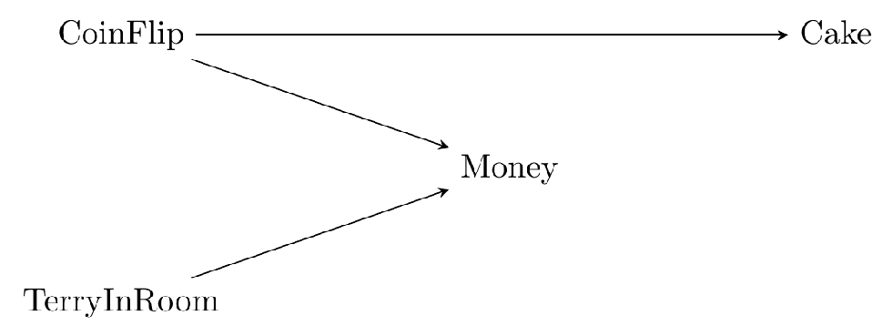

Now that our diagram is a little more complex, there are a few more things to note:

First, keep in mind that we had to think about the causal relationships betweenalthe variables. One variable might cause multiple things (like CoinFlip), and other variables might be caused by multiple things (like Money).

Second, when one variable is caused by multiple things, the diagram doesnʼt tell us exactly how those things come together. Terry only gives us money if we lost the coin flip. So Money isnʼt so much “caused by Terry” as it is “caused by a combination of CoinFlip and Terry.” But on the diagram we just have TerryInRoom Money and CoinFlip Money. Keep in mind when looking at a diagram that there might be complex interactions between the causes.

###### → →

14

ONE LAST THINGto keep in mind is thatal(non-trivial) variables relevant to the DGP should be included,even if we canʼt measure or see them.This pops up all the time in social science.

For example, letʼs say weʼre trying to figure out what variables cause you to get a promotion at your job. One thing that probably causes you to get a promotion is if the clients at your job really like you. But as researchers we probably donʼt have access to data about clients liking you, and even if we did, how could we measure that accurately? So “clients liking you” would be an important part of the DGP, but it would be anunobservedvariable.

In this book, we will indicate unobserved variables as being a shade of gray. So now letʼs say that Terry doesnʼt join you in the room at random, but rather decides to come in based on their mood today. We have no way of measuring their mood, so thatʼs unobservable.

- Figure 6.3: Terryʼs Unobservable Mood

15

- Figure 6.4: Shorts and Ice Cream

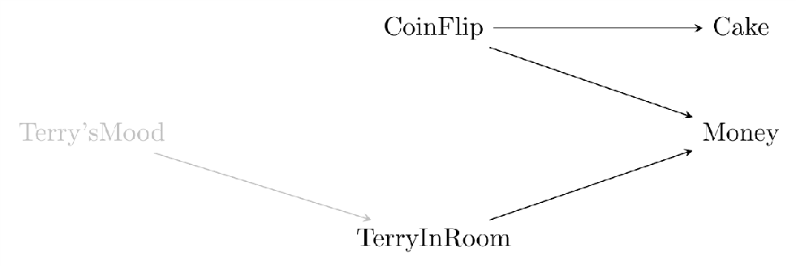

UNMEASURED VARIABLES SERVE TWO PURPOSESin causal diagrams. In addition to being key parts of the DGP, they can sometimes fill in for variables that we know mustbe there, but we have no idea what they are.

In particular, letʼs say that we have two variables that arecorrelatedbut neither of them causes the other. To borrow a previous example, people are more likely to wear shorts on days they eat ice cream, but shorts donʼt cause you to eat ice cream and ice cream doesnʼt cause you to wear shorts.

So what do we do? There has to be something between them. Otherwise, they wouldnʼt be correlated. But we canʼt have an arrow from one to the other, since neither causes the other.

In these cases we imagine that thereʼs some sort oflatent variablecausing both of them, and we can put that on the diagram, perhaps labeled something like “L1” or “U1” (and if we had another unobserved variable that might be “U2”, and so on) that similarly indicates we have no idea what it is. Then we can have that “U1” variable cause both IceCream and Shorts.

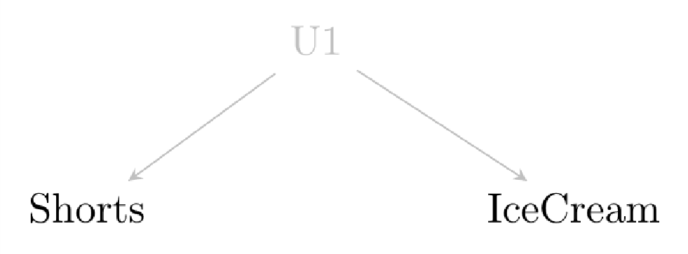

Some approaches to drawing causal diagrams will opt to leave U1 out of the picture and instead just draw a double-headed arrow between Shorts and IceCream, like Shorts IceCream, or a noheaded line between them, like Shorts - IceCream. However, I think this approach is too easily confused for “Shorts and IceCream both cause each other” and so will use the latent variable approach in this book. But if you look at materials elsewhere and see them doing this, thatʼs what is happening.

###### ↔

###### 6.3 The Real World: On an Omission Mission

SO FAR, causal diagrams seem pretty simple. And in a technical sense, they really are. As always seems to be the case, though, things get more complex when we take this neat theoretical object and expose it to the horror that is the real world.

Letʼs take a look at a causal diagram designed to address a classic question in causal inference in the social sciences: what is the effect of police presence on crime?

You would probably expect that sending additional police out into the streets, whether you think thatʼs a good idea or not, would almost certainly have the effect of getting youless crime, right?

- Figure 6.5: Police Presence and Crime Rate by County, North Carolina 1981-1987

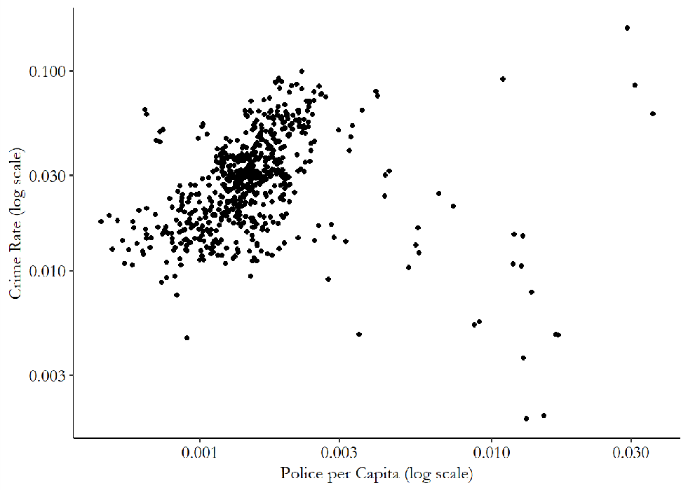

However, if you look in the data, as in Figure6.56.5, additional police presence is consistently6.5.... associated withmore crime.

16

TO UNTANGLE THIS PUZZLE, letʼs think about what a causal diagram for this data generating process

(DGP) might look like. A key part of what might be going on is that crime inprevious years(what weʼll call “lagged crime”) is likely to cause police presencenow. So the raw correlation is picking up the fact that being high-crime in the first place might lead you to being assigned lots of police in response.

What do we have here? Weʼve incorporated the effect that LaggedCrime has on PolicePerCapita and Crime. Weʼve also added some other things that might be important. The unobservable

Figure 6.6: Police Presence and Crime

ExpectedCrimePayout is how profitable a criminal might reasonably expect their crime to be before they commit it, which will be based on how many police there are (making them more likely to get caught), and the sentencing laws in their area (go to jail for longer if they are caught). Both sentencing laws and police per capita are also caused by LawAndOrderPolitics, an unmeasurable variable indicating how tough the political system in the local area wants to be on crime.

We can see very clearly the list of variables included in the diagram. We can also see the arrows that are between those variables. Hopefully, you can agree that those variables and arrows make sense.

HOWEVER, JUST AS IMPORTANTas whatʼs on the diagram is whatʼsnoton the diagram!Every variable and arrow thatʼs not on the diagram is an assumption weʼre making.In particular, for every variable not on the diagram, weʼre assuming that variable is not an important part of the DGP. And for every arrow not on the diagram, weʼre assuming that the variables not connected by an arrow have no direct causal relationship between them.

What does this mean in the context of our police and crime graph? Some assumptions weʼve made:

- 1. LaggedCrime doesnʼt cause LawAndOrderPolitics
- 2. PovertyRate isnʼt a part of the DGP
- 3. LaggedPolicePerCapita doesnʼt cause PolicePerCapita (or anything else for that matter)
- 4. RecentPopularCrimeMovie doesnʼt cause Crime

These are some hefty assumptions. And, likely, not all of them are true.

THEREʼS A BALANCING ACTto walk when talking about causal diagrams. On one hand, we want to omitfrom the diagram every variable and arrow we can possibly get away with. The simpler the diagram is, the easier it is to understand, and the more likely it is that weʼll be able to figure out how to identify the answer to our research question.

- A common misstep that some people fall into when working with causal diagrams is to omit too little. They end up with a diagram with dozens of variables, every one of which seems to cause every other one. But if you do that, youʼre going to let some variables or arrows that may not even be very important possibly ruin your chances of answering your research question of interest!

17

18

On the other hand, omitting things makes the model simpler. But the real world is complex. So in our quest for simplicity, we might end up leaving out something thatʼs really important. Like, PovertyRate definitely belongs on this graph, right? How could it not? And if we proceed with our diagram while itʼs still missing, we may end up getting our identification wrong. Youʼve probably thought of some other important omissions from this graph on your own.

As discussed in Chapter55, no study is ever perfect, and weʼll never know everything about our5 DGP. All we can try to do is build a diagram thatʼsuseful- it incorporates all the most important stuff while shedding as much extraneous baggage as it possibly can. We will discuss how to pick out just the most important bits when we donʼt know everything in Chapter111111111111111.1111111111

IN FULL,if we want to say anything about our research question, we need to have some model in mind. Itʼs not going to be perfect, but weʼll try to put all the most important stuff on there, while still making it simple enough to use.

The willingness to make a stand and say “yes, we reallycanomit that” - thatʼs what you need to answer your research question! It is truly necessary. Anybody trying to answer a research question whowonʼtdo that is still making those assumptions implicitly. They just arenʼt making clear what those assumptions are. Assumptions that are necessary to identify your answer are called “identifying assumptions.”

That can be dangerous. Thatʼs one of the benefits of drawing these causal diagrams. They make very explicit what your assumptions are about the DGP. That opens those assumptions up to

scrutiny, which can be scary. But that scrutiny can help make our research stronger.

The causal diagram, once we have it in hand and are willing to believe itʼs close enough to accurate, also gives us an extremely powerful tool for answering our research question. But how can we do that?

###### 6.4 Research Questions in Causal Diagrams

NOW THAT WE HAVEour causal diagram, we can use it to figure out how to identify the answer to our research question.

One way that the diagram can help us is in figuring out which parts of the variation in our data identify the answer and which parts donʼt.

Letʼs use our police-and-crime figure again. Even though itʼs not perfect, for a moment letʼs assume that itʼs correct, and see how we can use it to think about how to answer the question “does additional police presence reduce crime?”

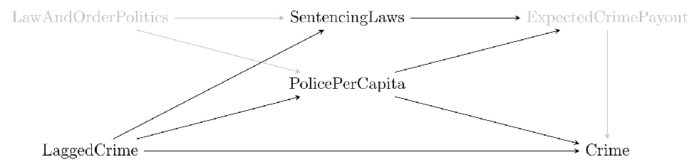

Figure 6.7: Police Presence and Crime

Looking at this diagram, we should be able to see which parts of the diagram answer our research question of interest. In particular, we should be interested in any parts of it that allow PolicePerCapita to cause Crime.

We have an obvious one here, PolicePerCapita Crime. This is thedirect effect. However, we also have PolicePerCapita ExpectedCrimePayout Crime, which is anindirect effect. Why might that count? Ask yourself - if thereason that police presence reduces crimeisbecause

→

→ →

###### criminals commit less crime when they expect to be caught(i.e., ExpectedCrimePayout is low),

19

- then isnʼt that an example of police presence reducing crime?

SO THE VARIATIONin our data that answers our research question has to do with PolicePerCapita causing Crime, and to do with PolicePerCapita causing ExpectedCrimePayout, which then affects Crime. To identify our answer, we have to dig out that part of the variation and block out the alternative explanations.

We can see the alternative explanations on the graph pretty easily, too, which is a benefit of using the graph. One alternate explanation is that LaggedCrime causes both PolicePerCapita and Crime, and so PolicePerCapita and Crime might be related because LaggedCrime causes both to rise. LawAndOrderPolitics also affects both PolicePerCapita and (indirectly) Crime. So PolicePerCapita and Crime might be related just because LawAndOrderPolitics drives both of them.

If we are willing to believe this diagram, then the next steps are pretty clear. We need to get rid of the variation due to LaggedCrime and LawAndOrderPolitics in order to isolate just the variation we need. Weʼll start to talk more in depth about how to do this in Chapter88.8

###### 6.5 Moderators in Causal Diagrams

THE FOLLOWING SECTION IS AN ODD ONEin that it addresses an aspect of causal diagrams that is likely to be confusing for seasoned researchers, but that new researchers might not have a problem with at all. That is: what about moderators?

Moderators are variables that donʼt necessarily cause another variable (although they might do that too). Instead, they modify theeffectof one variable on another. For example, consider the effect of a fertility drug ( ) on the chances of getting pregnant ( ). The effect ismoderatedby the variable “having a uterus” ( ). If you donʼt have a uterus, the drug canʼt do much for you. But if you do have a uterus, it can increase your chances of conceiving.

###### X Y Z

But in our causal diagrams, we only have arrows going from one variable to another. We donʼt have arrows that go toother arrows, which it seems like youʼd want to give a moderator effect.

TECHNICALLY, THOSE MODERATOR EFFECTS areon the diagram. Thatʼs because, in a causal diagram, we know that a variable is caused by all its incoming arrows, butnothingabout the exact shape that influence takes, just like our example with Terry in Figure6.26.2.6.2....

Figure 6.8: X and Z Cause Y , But in What Way?

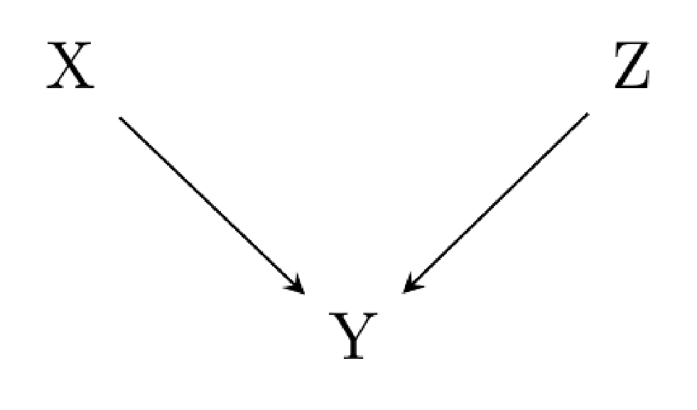

###### X → Y Z → Y 20

For example, consider Figure6.86.8. All we know from this diagram is that6.8.... and . However, this could be consistent with any of the following data generating processes (DGPs):

21

- 1.
- 2.
- 3.
- 4.

###### Y = .2X + .3Z Y = 4X + 3Z + 2Z2 Y = 1.5X + 5Z + 3XZ Y = 2X + 3XZ

and infinitely many more. Note that in item 3 on that list, has a moderating influence on the effect of . If , then a one-unit increase in will increase by . But if ,

###### Z X Z = 1 X Y 1.5 + 3 = 4.5 Z = 2 X Y 1.5 + 3 × 2 = 7.5 X Z Z X = 3 X = 5 Z Y X

- then a one-unit increase in will increase by . It goes the other way, too, with moderating the effect of - the effect of is different at or . In item 4, we go even further - has no direct effect on , but does moderate the effect of .

Phew! We can handle moderating variables in a causal diagram. But while this satisfies a technical need for moderating variables, itʼs not a veryclearway of describing your DGP. After all, if you thought there was an important moderating effect, do you really think Figure6.86.8 would get6.8.... across that idea?

IN THIS BOOK,we will cheat a little bit for the sake of clarity, and include our moderated effects right on the diagram, even though thatʼs not technically the right way to do it.

22 23

In this slightly more-relaxed approach to causal diagrams, we might reflect the third DGP on our list as itʼs depicted in Figure6.96.9. In this diagram,6.9.... and both affect directly. However, they also combine to form , which affects as well, demonstrating that there is an interaction between and , and each moderates the otherʼs effect.

X Z Y X × Z Y

X Z

- Figure 6.9: X and Z Cause Y , Each Moderating the Otherʼs Effect

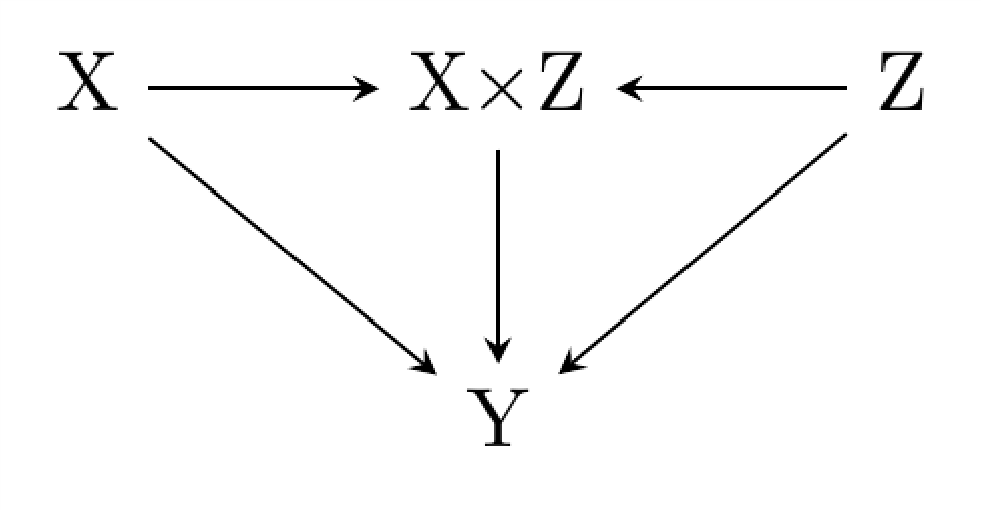

###### We can represent data generating processes (DGPs) like item 4 in our list above, where had no direct effect but moderated the effect of , as in Figure6.106.10. Here,6.10.... only affects by changing the effect of , reflected in the node.

Z X Z Y

X X × Z

- Figure 6.10: X Causes Y and Z Moderates That Effect

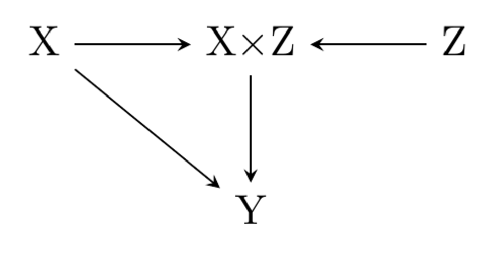

Previous Next

Page built: 2025-10-17 using R version 4.5.0 (2025-04-11 ucrt)

###### The Effect

Nick Huntington-Klein

▾ Chapters

###### Chapter 7 - Drawing Causal Diagrams

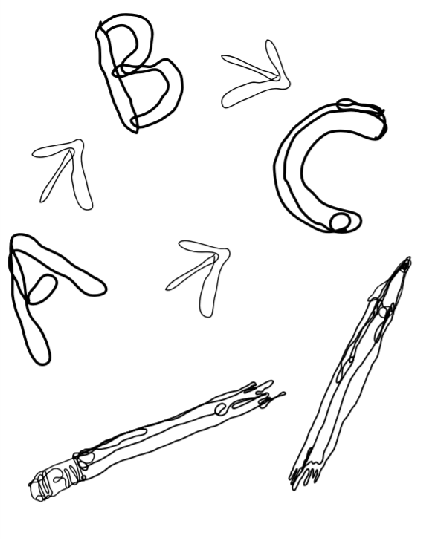

###### 7.1 Our Idea of the World

WE HAVE A BASIC IDEA NOWabout how causal diagrams work. But that assumes we have a causal diagram to work with. How can we get one? Weʼll have to draw one ourselves.

Causal diagrams represent the data generating process (DGP) that got us our data. Drawing our own causal diagram will come down to putting our idea of what the DGP is onto paper (or a computer screen).

This can be tricky! It requires that we know as much as possible about that DGP before getting started. So the first step in drawing a causal diagram is really to do some research. Lots and lots of research on your topic.

Once youʼve done that, you can combine what youʼve learned with your intuition, follow this chapter, and suddenly, hey, there it is - a causal diagram. One step closer to answering that research question.

###### 7.2 Thinking Through the Data Generating Process

HOW CAN WE POSSIBLY WRITE THE WORLD DOWN IN A GRAPH?After all, the world is very complex, and a graph is clean and simple. But weʼll figure it out.

The key is to focus in as much as possible. Think about our research question and try to live in the world of that research question. We canʼt possibly put everything in the world on our graph, so we need to work hard to not fall for the trap of trying to do so. What wecando is try to put everything relevant to our research question on the graph.

All through the process, weʼre going to want to keep in mind that weʼre trying to make a graph that mimics thedata generating process(DGP) relevant to our research question. What leads us to observe the data we do? What causes the outcome? What causes the treatment?

It will probably help if we work with an example.

Letʼs walk through a study that I worked on. That way, I can tell you exactly what sorts of things we were thinking about when considering what we thought the DGP looked like. In this study, we were interested in the effect oftaking online coursesonstaying in colege, specifically in community college in Washington State.

OUR FIRST TASK WILL BE THINKING THROUGHthe list of relevant variables.

###### First off, just so weʼre clear,what is a variable?Weʼve covered this in previous chapters, but it bears repeating since itʼs easy to forget when applying this stuff to the real world.

Avariableon a causal diagram is ameasurementwe could take that could result in different values. So, for example, one of the variables relevant to our research question is “online class.” Is the class youʼre taking online? - Thatʼs the measurement. It could be “yes,” it could be “no” - those are the values. If we like, we could call it “type of class” with the values “online class” and “faceto-face class.” Notice that we donʼt have one variable for “online class” and another for “face-toface class.” Thatʼs because those arenʼt two separate variables, theyʼre two separate values that the same variable could take.

So thereʼs one relevant variable - online class. Thatʼs our treatment variable. Weʼre interested in the effect of that variable. Another relevant variable will be “dropout” - did the student drop out of college since taking the class? This is our outcome variable. Treatment and outcome are always a good place to start.

Variable list:

###### OnlineClass

###### Dropout

All right, now what else?

We want to include all variables relevant to the DGP. That means any variable that has something

- to say about whether we observe online class-taking, or whether we observe dropout, or whether we observe them both together or apart.Every variable that causes the treatment or outcome, or causes something that causes something that causes the treatment or outcome, or causes something that causes something that causes something…is a good candidate for inclusion.

What are some things that might cause people to take online classes? Well, different students have different preferences for or against online courses, so Preferences. Those preferences might be driven by background factors like Race, Gender, Age, and SocioeconomicStatus. Those same background factors might influence how much AvailableTime students have - time-pressed students may prefer online courses. And AvailableTime might be influenced by how many WorkHours the student is doing. You also need solid InternetAccess to take online courses.

Now how about things that might cause people to drop out of community college? Some of the same background factors as before might be relevant, like Race, Gender, socioeconomic status (SES), and WorkHours. Your previous performance in school, Academics, is also likely to be a factor.

Now what does our list look like?

###### OnlineClass

###### Dropout

###### Preferences

###### Race

###### Gender

Age SES AvailableTime

###### WorkHours

###### InternetAccess

###### Academics

This is a good time to pause, look at our list, and think hard about whether thereʼs anything important that weʼve left off. You may be able to think of a thing or two. But for now, letʼs leave it at that.

HOW CAN WE TELLif something is important enough to be included? I just mentioned we should think about whether thereʼs anything important being left off. But how can we tell if a variable is important or not?

What it really comes down to ishow strongwe think the causal links out of that variable are.

For example, the presence of QuietCafes in someoneʼs area might encourage them to take an online course. A nice quiet place outside the house to do schoolwork. That may well be a real thing that encourages a few additional students to take online courses. But itʼs unlikely to really be a determining factor for too many students.

So yes, itʼs relevant, but it seems unlikely that it would have anything but a tiny effect, on average, on whether a student takes an online course. So weʼre probably okay leaving it out.

WITH OUR SET OF VARIABLES IN HAND,we must try to think about which variablescausewhich others.

Conveniently, weʼve already done most of the work here. When we were thinking about which variables to include, we were asking ourselves what variables might be out there that cause our treatment or outcome variables. So we already have an idea of what might cause those.

Whatʼs left is to think about how those variables might causeeach other, or perhaps becaused by the treatment or outcome. We might also want to consider whether any of the variables are related but neither causes the other, in which case they must have some sort of common cause we can include.

We already have some causes of our treatment and outcome, as well as some other causes, from how we described the variables as we introduced them in the previous section:

1

###### OnlineClass: causes Dropout

###### Dropout

###### Preferences: causes OnlineClass

###### Race: causes Dropout

###### Gender: causes Dropout

Age: causes Dropout SES: causes Dropout

AvailableTime: causes OnlineClass, Dropout

###### WorkHours

###### InternetAccess: causes OnlineClass

###### Academics: causes Dropout

How about which non-treatment and non-control variables cause each other? Age certainly causes SES, and all of the background variables (Race, Gender, Age, SES) affect AvailableTime and WorkHours. SES probably causes InternetAccess as well.

How about which variables are related to each other without there necessarily being a clear causal arrow in either direction? In this case, we add on common causes we can just call U1, U2, etc., that cause both variables. Our diagram isnʼt reallyompleteif two variables on the diagram have a common cause but weʼve left that common cause off. Even if we canʼt pin down what exactly that common cause is, it should be on there as an unknown.

Academics and SES are clearly correlated with Race and Gender, so weʼll want to have some sort of common cause there. Academics might also be related to the kinds of employment someone has and so affect WorkHours. InternetAccess is also likely to be caused not just by SES, but also Location, which weʼve left out up to now. So Location might want to get in that list.

Now what do we have?

###### OnlineClass: causes dropout

###### Dropout

###### Preferences: causes OnlineClass

Race: causes Preferences, Dropout, AvailableTime, WorkHours, related to Academics, SES

Gender: causes Preferences, Dropout, AvailableTime, WorkHours, related to

Academics, SES

Age: causes Preferences, Dropout, SES, AvailableTime, WorkHours

SES: causes Preferences, Dropout, InternetAccess, AvailableTime, WorkHours

AvailableTime: causes OnlineClass, Dropout

###### WorkHours: causes AvailableTime

###### InternetAccess: causes OnlineClass

Academics: causes Dropout, WorkHours, related to Race, Gender

Location: causes InternetAccess, related to SES

And now that we have our list, we can draw a diagram. With a list this long and this many causal arrows described, I can warn you itʼs going to be a little messy. Okay, very messy. That can happen. Weʼll be coming back to clean it up a bit later.

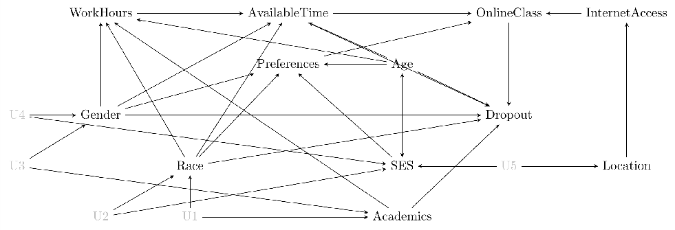

Figure 7.1: A Messy Diagram of the Effect of Online Classes on Dropout

AND THERE WE HAVE OUR DIAGRAMin Figure7.17.1. Now that we do, itʼs a7.1.... good time forrevision. Looking at the diagram, what might be left

off? What variables are likely to be relevant but arenʼt there? What arrows should probably be there but arenʼt?

There are probably a lot of things weʼre missing here. A big one is the specific community college being attended - some offer lots of online courses and some donʼt! So thatʼs likely to be a big cause of OnlineClass, and caused by plenty of other things on the list, especially Location.

But thatʼs not all. Itʼs a good exercise to look at a causal diagram and think carefully about whatʼs both important and missing.

###### 7.3 Simplify

THE REAL WORLD IS COMPLEX.The true data generating process (DGP) is too.

That leads us to a problem. The whole point of having a model like a causal diagram is to help us make sense of the DGP and, eventually, figure out how we can use it to identify the answer to our research question.

But if the diagram we end up with looks like what we have in the previous section, weʼre going to be very hard-pressed to make any sort of sense of it. It would be handy if we could simplify it in some way.

Why is it important to simplify? Ultimately, the more complex a causal diagram is, the less helpful it is likely to be. Imagine you were asking someone for directions to the next gas station and instead of saying “itʼs two exits north on the freeway, then next to the Wendyʼs,” they handed you a giant atlas where each page is so intricately detailed that it only covers a single square mile. Sometimes less information is more information.

The trick will be to simplify where we can without gettingsosimple that our diagram no longer represents the true DGP. Itʼs a bit too far in the other direction to take the atlas away and just say the nearest gas station is “on Earth somewhere.”

HOW CAN WE HIT THAT GOLDEN MEAN OF SIMPLE BUT NOT TOO SIMPLE?We can apply a few simple tests

- to see if thereʼs any needless complexity in our diagram.

- 1. Unimportance. Weʼve already discussed this one - if the arrows coming in and out of a variable are likely to be tiny and unimportant effects, we can probably remove the variable.
- 2. Redundancy. If there are any variables on the diagram that occupy thesame space- that is, they have the arrows coming in and going out of them from/to the same variables we can probably combine them and describe them together (this works even if there are arrows between some of the variables being grouped together).
- 3. Mediators. If one variable isonlyon the graph as a way for one variable to affect another (i.e., B in A B C where nothing else connects to B), then we can probably remove it and just have A C directly.
- 4. Irrelevance. This one will take some additional knowledge about causal paths from Chapter88. Some variables8 are an important part of the DGP but irrelevant to the research question at hand. If a variable isnʼt on any path between the treatment and outcome variables, we can probably remove the variable.

→ →

→ 2

Can we apply these steps to our diagram in Figure7.17.1? Weʼve already done Unimportance and left7.1.... a few variables off for that reason. Letʼs leave Irrelevance for now since we havenʼt gotten to Chapter88 yet. Can we do Redundancy or Mediators?8

We do have some variables that occupy the same space on the diagram and so might be redundant. In particular, Gender and Race have the exact same set of arrows coming in and going out. So we can combine those into one, which we can call Demographics.

How about Mediators? We have a few here, the most prominent of which is Preferences. Instead of having Gender, Race, SES, and Age affect Preferences and then have Preferences affect OnlineClass, we can just have those four variables affect OnlineClass directly. Another one here is Location Internet Access OnlineClass. We can chuck InternetAccess right out and lose nothing!

###### → →

The last one is a bit less certain. WorkHours affects OnlineClass through AvailableTime. WorkHours and AvailableTime donʼt quite fall under Redundancy, since Academics affects WorkHours but not AvailableTime. And they donʼt quite fall under Mediators, because other variables besides WorkHours affect AvailableTime.

However, the other variables besides WorkHours that cause AvailableTimealsocause WorkHours. So if we got rid of AvailableTime and just had WorkHours affect OnlineClass directly (Mediators), weʼd still have all those same AvailableTime causes affecting WorkHours and wouldnʼt lose anything (Redundancy). The only sticky thing is that Academics doesnʼt cause AvailableTime. But thatʼs fine in this case, because Academicsdoescause AvailableTime… through WorkHours! We do lose a little bit of information with this simplification because of the Academics variable, so weʼd have to think carefully about whether weʼre okay with that.

Now we have the much-better-looking, although still slightly messy, causal diagram below:

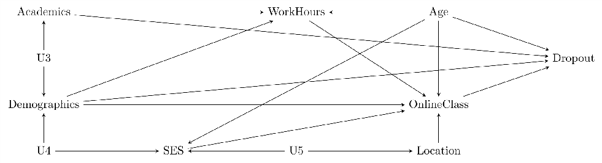

Figure 7.2: A Cleaner Diagram of the Effect of Online Classes on Dropout

While these steps can come in very handy, pay close attention to the use of “probably” in each of them. We canʼt just apply these

blindly. Even if a variable is subject to one of these steps, we donʼt want to remove it if itʼs key for our research design or crucial for communicating whatʼs going on.

For example, letʼs say weʼre interested in the effect of exercise on your lifespan. One reason exercise might lengthen your lifespan is because it raises your heart rate, and another reason is that it develops muscle. Heart rate and muscle development might be subject to the Mediator step - if the only arrows pointing to them are from exercise, and the only ones out are to lifespan, then we could eliminate both and just have exercise point to lifespan. But if weʼre interested in whyexercise works (is it heart rate or is it muscle?), weʼd have no hope of answering that question if heart rate and muscle development arenʼt actually on the diagram. So that would be a simplification too far.

To give another example, just a few paragraphs ago we eliminated InternetAccess because it was a mediator. But in the original study weʼre talking about, the fact that InternetAccess caused OnlineClass was crucial because it acted as an “instrument” (Chapter1919). If we did that19 simplification in our study, there would be no study!

###### 7.4 Avoiding Cycles

THERE IS ONE THING A CAUSAL DIAGRAM CANNOT ABIDE,and that iscycles. That is, you shouldnʼt be able to start at one variable, follow down the path of the arrows, and end up back where you started.

There are two examples of graphs with cycles below in Figure7.37.3. In the first one, you can go A7.3....

###### →

- B C A. In the second, the variables cause each other, and so you can just go A B A.

###### → → → →

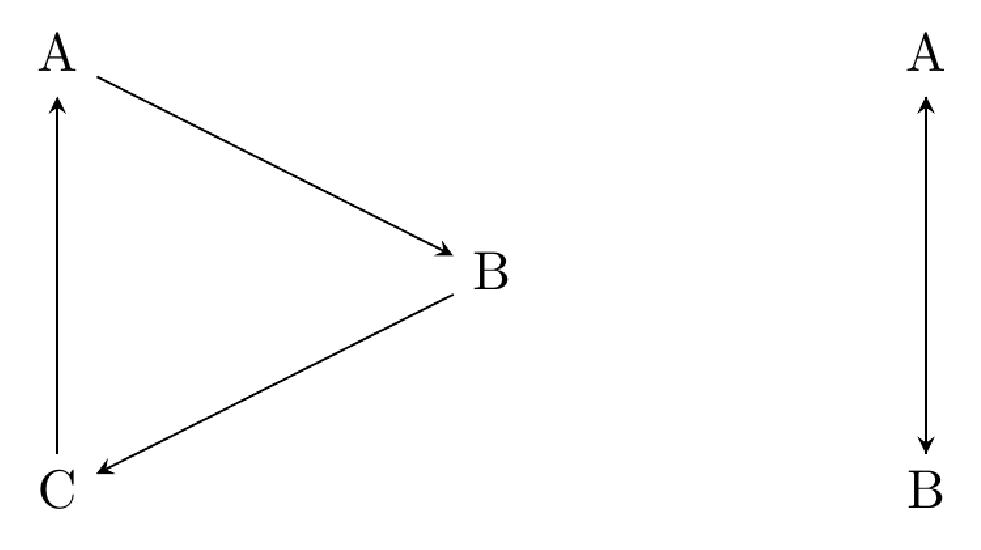

Figure 7.3: Two Causal Diagrams with Cycles

Why canʼt we have this? Because if we do, then a variable can cause itself, and suddenly weʼve lost all hope of ever isolating the cause of anything, since we canʼt separate the effect of B on A from the effect of A on B on A from the effect of B on A on B on A… and so on.

BUT HOLD ON A MINUTE.Surely there are plenty of real-world data generating processes (DGPs) with feedback loops like that. The rich get richer, objects have momentum, and if I punch you that makes you punch me, which makes me punch you.

Surely weʼre not just going to have to give up any time this happens?

Well, no. But thatʼs because in the true DGP therecanʼtreally be any cycles, if you think about it right. Thatʼs because oftime.

Letʼs think about that punching feedback loop. It certainly seems like the diagram should look like Figure7.47.4.7.4....

- Figure 7.4: A Diagram About Punching

t t + 1 t + 2 t t + 1

t t + 1 t + 2 t + 3

- Figure 7.5: Cycles are Even Worse than Punching. But Also Donʼt Punch People.

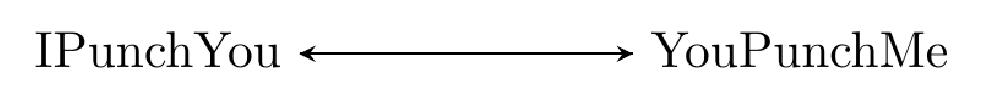

But thatʼs not quite right. After all, if I punch you, and you punch me back, that doesnʼt cause me to send thefirstpunch - it canʼt, I already did it. It might, however, cause me topunch again later.

Letʼs pay attention towhenthese punches are thrown. As is common in statistical applications where time is a factor, letʼs refer to these time periods as , , , and so on, where is “some particular time,” is “the time right after that,” and so on. Now the diagram looks like

- Figure7.57.5, and the cycle is gone. The diagram as is only has7.5.... and , but we could keep going out to the right with , , and so on, if we wanted.

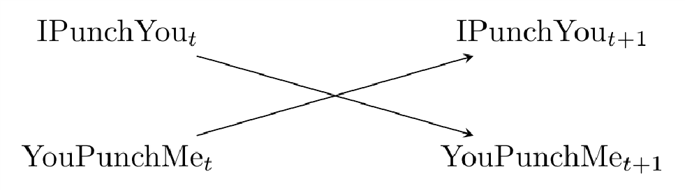

Whenever we have a cycle in our diagram, we can get out of it by thinking about adding a time dimension. And it has to work - the cycles pop up because the arrows loop back on themselves. But timeʼs arrow only moves in one direction.

3

THEREʼS ANOTHER WAYto break a cycle in a causal diagram. If you can find a source of random variation for one of the variables in the cycle (say, with a randomized experiment), then if we just focus on the part of the variable driven by randomness, the effect canʼt loop back on itself. So if instead of waiting for you to punch me, I decide to punch you based on the outcome of a coin flip,

then we still have in the diagram, but instead of we have . Now the cycle is broken.

###### IPunchY ou → Y ouPunchMe Y ouPunchMe → IPunchY ou CoinFlip → IPunchY ou 4

###### 7.5 Getting Comfortable with Assumptions

IN THIS CHAPTER, Iʼve emphasized that your causal diagram should be based as much as possible on real-world knowledge and prior research. But since we canʼt possibly know everything about every part of the data generating process (DGP), it also contains a lot of assumptions.

Thatʼs both necessary and scary! Writing down a diagram like this means sticking your neck out. Thiscausesthat, you have to say.Thatdoesnʼt causethis, or at least not enough to draw an arrow. This other thingisnʼt even worth including on the diagram. You think surely this will draw the pitchforks outside your door, or at least a slight disapproving glance from a professor.

But in order to progress, the assumptions do have to be made. The quality of your research will hinge on how accurate those assumptions are. So how can we get comfortable with the idea that we have to make assumptions, and how can we make those assumptions as accurate as possible?

THE CONVENIENT THING ABOUT EMPIRICAL WORK IS THAT ASSUMPTIONS ARE RARELY RIGHT OR WRONG.

Theyʼre more on a scale of probably-false to probably-true.

After all, if we have to make an assumption, itʼs usually because thereʼs a gap in our knowledge. Thereʼs no way to know for sure. Unlike a math problem, itʼs not up to us to prove weʼre right, but rather to get a critical reader to think “okay, that sounds plausible. I buy it.”

So itʼs not our job toproveweʼre right, at least not in the mathematical sense of “prove,” but itis our job to get that critical reader to buy it.

That narrows down our work for us. For a given assumption, ask yourself: “Is this probably true? What evidence can I provide to push this away frompossibleand towardprobable?”

Put yourself in the head of that critical reader. Why might they not believe that assumption? What evidence could they be shown to convince them? Then, produce whatever evidence you can.

For example, letʼs say youʼre drawing a diagram of whether door-knocking for a candidate actually increases votes for that candidate. On your diagram thereʼs no arrow between “how much money the candidate has” and “having a door-knocking campaign.”

- A reader might think “hold on… surely candidates with more money can more easily afford a door-knocking campaign, right? There should be an arrow there.” And to that you would look at whatever evidence you had. Do you have prior studies about the effects of candidate campaign coffers? Check them! Do you have data on the topic? Look in your data to see if thereʼs a correlation between money and door-knocking. Neither of these things would truly prove that the arrow shouldnʼt be there, but they might help tip that readerʼs scales from skeptical to buying-it (and gives you an opportunity to find out that your assumption was, in fact, wrong, so you can fix it).

THATʼS A LOT OF WHAT IT COMES DOWN TO.Think about whether our assumptions are reasonable, try

to base them as much on well-established knowledge and prior research as possible, and if we think thereʼs reason to be skeptical of them, ask what evidence would support the assumption and try to provide that evidence.

There are a few other approaches we can take that can help.

The first is just to get another set of eyes on it. It can be hard to be skeptical of your own assumptions - you made them, after all, so you probably think theyʼre pretty reasonable. But maybe there are reasons to be skeptical that you didnʼt think of! Show your model to another person, especially a person who knows something about the setting or topic youʼre trying to make a causal diagram for. Or just describe some of the assumptions you made and see what they think. You might be surprised with what they are and are not okay with.

There are also some more formal tests you can do. One nice thing about causal diagrams is that they producetestable implicationsfor us. That is, once we have the diagram written down, it will tell us some relationships thatshould bezero. And we can check those relationships in our actual data using basic correlations. If theyʼre not zero, something about our diagram is wrong! Weʼll talk more about these formal tests in Chapter88.8

Previous Next

###### Page built: 2025-10-17 using R version 4.5.0 (2025-04-11 ucrt)

###### The Effect

Nick Huntington-Klein

▾ Chapters

###### Chapter 8 - Causal Paths and Closing Back Doors

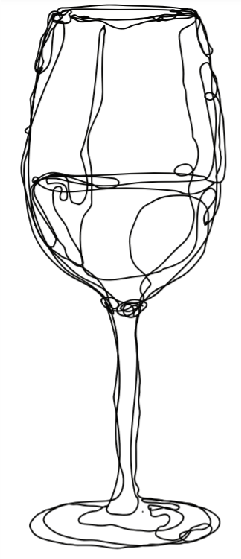

###### 8.1 I Walk the Line

PREVIOUS CHAPTERShave emphasized the concept of thecausal diagram. I, the author of this book, clearly have a thing for nodes and arrows.

The reason these diagrams can be so useful for applied researchers is that they make clearthe different reasons whytwo variables might be related to each other, and also what we need to do to identify the answer to our research question.

Both of these benefits of causal diagrams come about by thinking carefully about thepathsfrom one variable to another on a diagram.

These paths tell uswhy- why are two variables related? Which causes the other? Thatʼs the kind of crucial context we need to figure out our research question.

Those paths are what this chapter is all about. WHAT IS A PATH?A path between two variables on a causal diagram is a description of the set of arrows and nodes you visit when “walking” from one variable to another.

For example, consider the below diagram Figure8.18.1. We can observe in data that B and C are8.1.... related. Butwhyare they related?

Figure 8.1: An Example Causal Diagram for Path-Finding

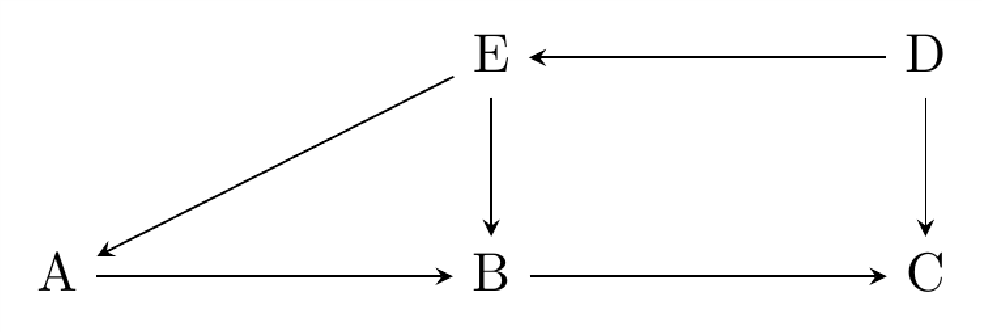

One reason is that B causes C. After all, B C is on the diagram - thatʼs onepathbetween B and C.

###### →

Another reason is that D causes both E and C, and E causes B. In other words, we have the path B

E D C. We can “walk” from B to E, and then onwards to D, and finally to C. Weʼve taken a nice little stroll along the paths laid out on our diagram, and moved from one variable, B, to another, C.

###### ← ← →

1

So why are B and C related? As mentioned, one reason is that B causes C. The path B C is on the diagram. Another is that D causes C, and D also causes E, which causes B. In other words, B and C appear to move together because theyʼre both caused by D.

###### →

If our research question is about the effect of B on C, then this second pathway - the one that D is responsible for, is another reason we would see B and C being related other than B C. Itʼs an alternate explanation for why B and C might be related, other than the explanation that answers our research question of whether (and how much) B causes C.

→

The paths can tell us the road we want to walk on, and also the road we want to avoid. Theyʼre crucial for figuring out our identification. So letʼs learn about them.

###### 8.2 Any Way You Like It

OUR FIRST TASK WILL BE FINDING ALL THE PATHS.Thatʼs right, all of them. We want to be able to write out every single path thatstartswith the treatment variable andendswith the outcome variable.

Why do we need to be sure to get every path? Because each path explains one way in which the treatment and outcome variables might be related. Theyʼre alternate explanations. For example, if we are looking at the effect of smoking on cancer, and one path is Smoking Cancer, and another is Smoking Income Cancer, then if you say “smoking causes cancer,” then someone else could, quite reasonably, say “maybe, but also, being low-income can affect both whether you smoke and your health generally, so maybe itʼs just a statistical illusion!”

→ ← →

If you want to really show how much your treatment causes your outcome, you have to be able to findthose alternate explanations so you can account for them in your research and identifyjust the explanation youʼre interested in.

Those alternate explanations live on the paths. If we want to destroy them, first we must know them.

2

SO HOW CAN WE FIND EVERY PATH FROM TREATMENT TO OUTCOME? There might be lots of paths on a more complex graph. So how can we find them?

We can follow a few convenient steps:

- 1. Start at the treatment variable

- 2. Follow one of the arrows coming in or out (either is fine!) of the treatment variable to find another variable
- 3. Then, follow one of the arrows coming in or out ofthatvariable
- 4. Keep repeating step 3 until you either come to a variable youʼve already visited (a loop! Thatʼs not a path), or find the outcome variable (thatʼs a path. Write it down)
- 5. Every time you either find a path or a loop, back up one and try a different arrow in/out until youʼve tried them all. Then, back up again and try all thosearrows
- 6. Once youʼve tried all the ways out of the treatment variable and all the eventual paths, youʼve got all the paths!

###### Letʼs do a quick example with a simple diagram in Figure8.28.2.8.2....

Figure 8.2: Diagram on Which We Will Look for Paths

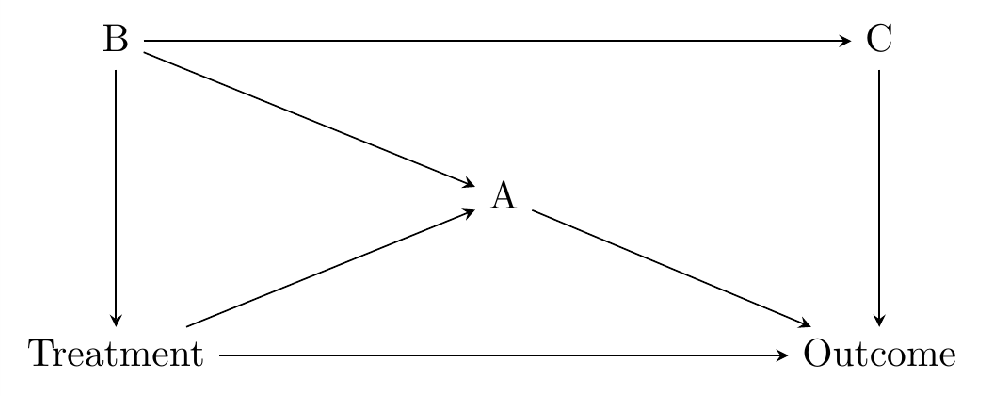

3

Letʼs follow the steps outlined above.

###### Start at Treatment.

Letʼs follow an arrow. Letʼs go straight to Outcome.

Weʼve reached Outcome, so thatʼs a path. Treatment Outcome is a path.

→

Back up to Treatment. Follow another arrow. This time to A.

Now follow an arrow out of A. Letʼs go to Outcome. Done! Treatment A Outcome is a path.

→ →

Back up to A. Take the other arrow out to B.

Where can we go from here? Only to C without repeating a variable. And from C we can only go to

- Outcome. Done! Treatment A B C Outcome is a path.

- Back up to B, but thereʼs nowhere else to go.

Back up to A, and thereʼs nowhere else to go.

Back up to Treatment. The only arrow left is B.

From B we can go to A, and then on to

- Outcome. Done! Treatment B A Outcome is a path.

→ ←

→ →

← →

→

Back up to A, then back up to B. Only path remaining is C, then Outcome. Done! Treatment B C Outcome is a path.

← → →

- Back up to C, nowhere to go, back up to B, nowhere else to go, back up to Treatment, nowhere else to go. Weʼve exhausted all the possibilities. Weʼre done!

The full list of paths is:

###### Treatment Outcome

→

###### Treatment A Outcome

→ →

- Treatment A B C Outcome

- Treatment B A Outcome

- Treatment B C Outcome

→ ← → → ← → → ← → →

LETʼS PRACTICE.The example diagram in Figure8.38.3 has a few more moving parts so we can try to8.3.... work through the full list of paths. Give it a shot yourself first - try to find all the paths you can, and then see how well youʼve matched up to the full list.

- Figure8.38.3 shows the relationship between drinking wine and your lifespan. There are a few8.3.... reasons why you might expect people who drink more wine to live longer. Perhaps wine itself really does have a causal effect on your lifespan, for one. Also, the kinds of people who choose to drink wine might also live longer for other reasons, such as their baseline level of health or their income. Also, maybe wine drinking affects your penchant for taking other drugs (perhaps as a substitute?) and so affects your lifespan in that way. All of that is on the diagram.

4

Figure 8.3: The Effect of Wine on Lifespan

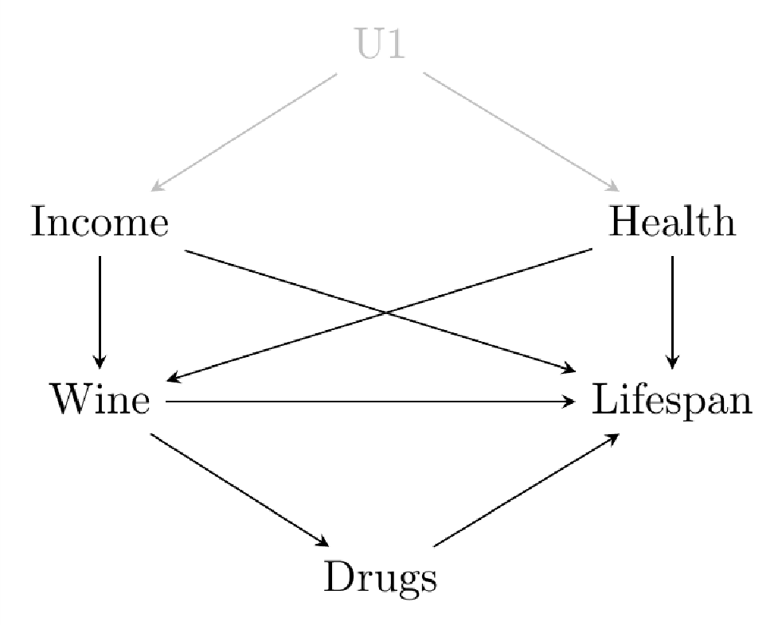

Letʼs follow our steps and see where it leads us.

From Wine, we can go to Lifespan. Easy. Wine Lifespan.

→

Now back to Wine. The next arrow out is Drugs, which only goes to Lifespan. Wine Drugs Lifespan. Back to Drugs, no other way out, so back to Wine. Next out letʼs go to Income.

→ →

From Income we can go to Lifespan: Wine Income Lifespan.

← →

Now back to Income. The only way out we havenʼt covered is U1. From there we have to go to Health. And from Health, the only options are Wine and Lifespan. Weʼve already visited Wine so the only way is Lifespan. Wine Income U1 Health Lifespan.

← ← →

→

Back to Health, every other arrow out is somewhere weʼve been. Then back to U1, then we have to go back to Income, and again weʼve already taken every arrow out already, so back to Wine.

The only arrow we havenʼt been out of yet is Health. So we go to Health and can then go on to Lifespan. Wine

Health Lifespan.

← →

Back to Health. We can take the arrow to U1 out of Health, which goes to Income, which goes to Lifespan. Wine Health U1 Income Lifespan.

← ← → →

And there we have it. Weʼve exhausted all the possible ways we can get from Wine to Lifespan. The full list of paths is:

###### Wine Lifespan

→

###### Wine Drugs Lifespan

→ → ← → ← ← → →

###### Wine Income Lifespan

Wine Income U1 Health Lifespan

Wine Health Lifespan

← → ← ← → →

Wine Health U1 Income Lifespan

And each of those paths contains a story - a reason why weʼd see a relationship between Wine and Lifespan in data. Wine can affect your drug-taking, which affects your lifespan (Wine Drugs Lifespan). Or people who drink wine tend to be richer, and richer people live longer (Wine Income Lifespan). Or people who drink Wine tend to be richer, richer people on average have better health, and health improves your lifespan (Wine Income U1 Health Lifespan). A story for every path. But which stories matter to us?

→ → ←

→

← ← → →

###### 8.3 Good Paths and Bad Paths, Front Doors and Back Doors

NOW THAT WE HAVEour list of paths, what can we do with them?

The promise Iʼve given you is that we can use these paths to figure out how to answer your research question. And we can. At this point, the next step in using the paths weʼve come up with is to figure out just exactly how they relate to your research question.

5

###### This brings us to the concept ofGood PathsandBad Paths.

In short, Good Paths are the reasons why the treatment and outcome variables are relatedthat you think should “count” for your research question.Bad paths are the paths thatshouldnʼt count,in other words the alternate explanations.

Usually, this is as simple as “every path in which all the arrows faceawayfrom Treatment are Good Paths, and the rest are Bad Paths.” Paths where all the arrows faceawayfrom Treatment are also known asfront door paths. The rest would then be “back door paths.” Paths with at least one arrow pointing towards Treatment are back door paths. So, usually, all the front door paths are good, and all the back door paths are bad.

6

Taking Figure8.38.3 as an example, there are two paths where all the arrows are going8.3.... awayfrom Wine: Wine Lifespan and Wine Drugs Lifespan. These are all the ways in which a change in Wine would cause a change in Lifespan. So these are our front door paths. And if our research question is “does Wine cause Lifespan?” then these front door paths are the Good Paths, and the other, back door paths are bad ones.

→ → →

IT MIGHT NOT BE QUITE AS SIMPLE AS THATdepending on what your research question is. For example, if instead of asking “does Wine cause Lifespan?” you want to know “other than how it might affect drug-taking, does Wine cause Lifespan?”

With this research question, the Wine Drugs Lifespan suddenly becomes a path weʼrenot interested in, even though itʼs a front door. If we look at the raw data, one reason why Wine and Lifespan would be related is because of Drugs. But we are no longer interested in that part of the effect! We might at this point consider it a Bad Path.

→ →

Research questions like this, where the only Good Path is Treatment Outcome, are looking for “direct effects.” They are uninterested in “indirect effects” that take detours through variables like Drugs.

→

SO WE HAVE ALL OUR PATHS,and weʼve figured out which of them are Good and which are Bad. The key to identifying the answer to our research question, then, is to find a way to digjust the Good Pathsout of the data without getting distracted by the Bad ones.

###### 8.4 Open and Closed Paths

THOSE PESKY BAD PATHScan cause us some real trouble. But only as long as theyʼre open for business. Open for… trouble business. In the business for trouble? Troubling business. Put something cool here.

The presence of a path on your diagram means that there is a relationship between the variables at the beginning and end of the path explained by the variables along the path. Wine Drugs Lifespan means that Wine and Lifespan will be related partly because of how Wine affects Drugs.

→ →

Wine Income Lifespan means that Wine and Lifespan will be related partly because of how Income affects both Wine and Lifespan.

← →

However, this is only true if the path isOpen. A path is Open if all of the variables along that paths are allowed to vary. It is instead Closed if at least one of the variables along that path has no variation.

What do I mean by this? Letʼs take Wine Drugs Lifespan as an example. If in our data set we have wine drinkers and non-wine drinkers, drug-users and non-drug users, and people with shorter and longer lifespans, then all the variables along this path have variation. They vary in value.

###### → →

But what if we pick a data set in whichnobody uses drugs?In this case, thereʼs no variation in Drugs, and thus none of the relationship between Wine and Lifespan can possibly be driven by Drugs. The path has Closed.

7

Thatʼs the basic idea - paths become Closed, and thus no longer a threat to our identification - if we can remove all the variation due to a variable along that path. Picking a sample in which thereʼs no variation in that variable, as we did by picking a sample where nobody did drugs, is one way to do that, although itʼs not a particularly great way. There are other ways.

For now, letʼs just assume we have some way of controlling for a variable. In other words, we have some way of statistically adjusting our data so as to remove all the variation in a variable and thus closing a path with that variable on it. Holding that variable constant and un-varying, if you prefer. We talked about how to do this by estimating conditional conditional means in Chapter44.4 We could also do this, as just mentioned, by picking a data set where the variable doesnʼt vary. Or by picking a set of untreated observations with very similar (or exactly the same) values of that variable.

8

9

If we can control for at least one variable on each of our Bad Paths without controlling for anything on one of our Good Paths, we have identified the answer to our research question.

And there it is. Thatʼs how you do it.

LETʼS TRY THIS OUT ON OUR WINE STUDY.As a recap, hereʼs the diagram again in Figure8.48.4, as well as8.4.... our list of paths:

Figure 8.4: The Effect of Wine on Lifespan

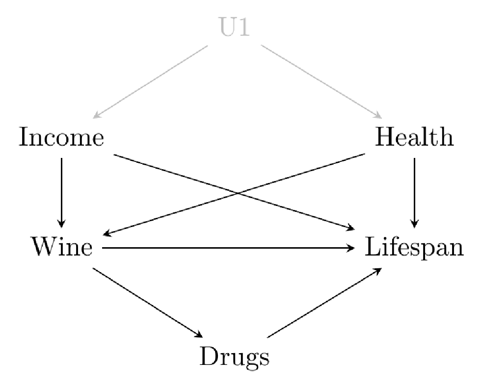

- 1. *Wine Lifespan
- 2. *Wine Drugs Lifespan
- 3. Wine Income Lifespan
- 4. Wine Income U1 Health Lifespan
- 5. Wine Health Lifespan

→

→ → ← → ← ← → →

← →

###### 6. Wine Health U1 IncomeLifespan

← ← → →

If weʼre interested in the effect of Wine on Lifespan, we want all the ways in which Wine can cause Lifespan to change. We want all the Front Door Paths. We have two Front Door Paths, which are our Good Paths, marked with *. The rest are Bad Paths.

We can identify the answer to this research question by picking at least one variable along each Bad Path to control, without controlling for anything on a Good Path.

Letʼs start by controlling for Income. What does that get us? Letʼs turn all the Closed Paths gray to see. Income shows up in paths 3, 4, and 6, so those are all now Closed.

- 1. *Wine Lifespan
- 2. *Wine Drugs Lifespan
- 3. Wine Income Lifespan
- 4. Wine Income U1 Health Lifespan
- 5. Wine Health Lifespan
- 6. Wine Health U1 Income Lifespan</span

→

→ → ← → ← ← → →

← → ← ← → →

Only one Bad Path to close! If we control for Health we can do it. Controlling for both Health and Income we get…

- 1. *Wine Lifespan
- 2. *Wine Drugs Lifespan
- 3. Wine Income Lifespan
- 4. Wine Income U1 Health Lifespan

→

→ → ← → ← ← → →

- 5. Wine Health Lifespan
- 6. Wine Health U1 Income Lifespan

###### ← → ← ← → →

So if we control for both Health and Income, any remaining relationship between Wine and Lifespan identifies the answer to our research question - what is the effect of Wine on Lifespan?

10

###### 8.5 Colliders

THEREʼS A WRINKLE: COLLIDERS.Thereʼs something Iʼve been leaving out about this whole Open and Closed Paths thing. So far, Iʼve said that paths are Open as long as every variable along the path is allowed to vary, but removing the variation from a variable on the path (controlling/adjusting for it) Closes the path.

But thatʼs not always true. Specifically, thatʼs not true when there is acolideron the path. A variable is acolideron a particular path if, on that path, both arrows point at it.

For example, on the path Treatment A B C Outcome, B is a collider, since the arrows on either side of it on the path point towards it.

← → ← →

11

When thereʼs a collider on the path, that path isClosed by default.That is, itʼs Closed even if all of the variables on the path are allowed to vary.

Further, if you control for the collider,the path Opens back up!Thankfully, you can Close it back down again by controlling for another variable along the path.

Why does this happen? Why does it matter that both arrows are pointing at the variable?

You can think of it this way: the collider variable doesnʼt cause anything else on the path. Itʼs just beingcaused bythe variables to its left and right on the path. So if weʼre looking for alternate explanations of why Treatment and Outcome might be related, the collider doesnʼt actually give

us one. It canʼt drive a relationship along that path because it doesnʼt driveanythingon that path. Itʼs the thing being driven!

If the path were Treatment C Outcome, without a collider, then one reason why Treatment and Outcome vary together is because C causes them both. But with a collider, Treatment A

← →

← → ← →

- B C Outcome, C can affect Outcome, and C can affect B, but because B doesnʼt affect Treatment, C can no longer induce a relationship between Treatment and Outcome. B saved us.

Okay, so thatʼs why a collider Closes a path by default. But why does controlling for the collider Open it back up? Because once you control for the collider,the two variables pointing to the colider become related, and suddenly C can affect A and thus affect Treatment again. The alternate explanation returns.

12

Colliders seem like not a big deal. Theyʼre only a problem if you control for them. So donʼt control for them, right? Easy. Two problems with that. First, we need to figure out that a variableisa collider so we know not to control for it—if you arenʼt careful, colliders are often disguised as variables it feels like youshouldcontrol for—after all, they do belong on the diagram, so it seems reasonable to include it as a control, right? Second, one common way we control for colliders is by selecting a sample.Remember, picking a sample with no variation in is one way of controlling for . So if you do a study, say, of college students, then youʼre controlling for college attendance whether you want to or not. If college attendance is a collider on a Bad Path… oops!

###### Z Z

WHATʼS THE GOAL, THEN?If we want to identify the answer to our research question, what we have to do isClose al the Bad Pathswhileleaving al the Good Paths Open. Once weʼve done that, any remaining relationship between Treatment and Control canonlybe going through the Good Paths, and all of the Good Paths we want are included. This is exactly what we want.

This takes a careful consideration of the diagram and the paths along it. Which ones are Good? Which are Bad? Which are Closed by default because of colliders? Which are Open and need one of the variables along it controlled for so it can be Closed? Can we be careful not to Close any Good Paths?

This is the process of identification.

###### 8.6 Using Paths to Test Your Diagram

BEFORE WE MOVE ON, thereʼs one more neat trick we can play with causal paths.

Everything weʼve talked about so far has been about looking for paths between Treatment and Outcome. But thatʼs not all you can do in a diagram. We can look for paths betweenanytwo variables.

Now, this might not directly help us answer our research question, which really only cares about paths between Treatment and Outcome. But what itcando is help us determine whether we have the right diagram in the first place.

Letʼs pick two variables on our diagram other than Treatment and Outcome. Letʼs call them A and B. The basic idea is this: list all of the paths between A and B. Then, do what you need to do to make sure theyʼrealClosed. Then, if A and B are still related to each other (as might be determined using any of the methods in Chapter44), that means there must be some4 otherpath you didnʼt account for. Your diagram is deficient, and perhaps in an important way.

13

LETʼS DO A QUICK EXAMPLE, ONCE AGAIN TURNING TO WINE.Letʼs pick two variables on Figure8.48.4. Letʼs8.4.... try it with Income and Drugs. What are all the paths between Drugs and Income? Using our steps from before, we get:

Drugs Wine Income

← ← ← ← ← →

Drugs Wine Health U1 Income

Drugs Wine Health Lifespan Income

← ← → ←

Drugs Wine Lifespan Income

← → ← ← → ← ←

Drugs Wine Lifespan Health U1 Income

→

Drugs Lifespan Income

→ ←

Drugs Lifespan Wine Income

→ ← ←

Drugs Lifespan Wine Health U1 Income

→ ← ← ←

→

Drugs Lifespan Health Wine Income

→ ← → ←

Drugs Lifespan Health U1 Income

→ ← ← →

Thatʼs a lot! But the list of Open Paths is much smaller, since Lifespan is a collider everywhere it turns up. The list of Open Paths is only:

###### Drugs Wine Income

← ← ← ← ← →

###### Drugs Wine Health U1 Income

If we can then control for Wine, both of these paths Close too. What weʼve learned is that our diagram effectively makes the claim thatthereʼs no way that Income and Drugs are related to each other except through the amount of wine you drink.That seems… unlikely. We can then check in the data to see if Income and Drugsarerelated after controlling for Wine. If they are (and they likely will be), our model is incomplete.

Tests like these, where weexpectthat a relationship should be zero because our diagram says there are no Open Paths, and we see whether itʼs actually zero, are calledplacebo tests. They get the name because, like a placebo drug, there shouldnʼt be anything there. But maybe there is anyway! Weʼll be seeing plenty of placebo tests throughout this book.

14

FAILING A PLACEBO TESTis not the end of the world, thankfully. Yes, failing one of these tests does prove that your model is incorrect and incomplete. But letʼs be honest, we already knew that before we started. Models necessarily leave things out. The question isnʼt whether youʼve omitted anything, itʼs how important the omission is.

So then whatʼs the point of these tests?

Well, even though failing a test doesnʼt mean the end of the world, it should at least lead you to reflect on whether the model can be improved. Even the process of setting up the test can be informative. Did you notice when looking at the original Figure8.48.4 that it implied that Income only8.4.... affected Drugs through Wine? Maybe, or maybe not. Regardless, the test definitely made that clear.

Also, even if we find a relationship, there are degrees of relationship. If you find a small but nonzero relationship that, according to the diagram, shouldnʼt be there, that might be a minor cause for concern. But if thereʼs anenormousand super-strong relationship that shouldnʼt be there, thatʼs when you should really worry and maybe go back to the drawing board on your diagram.

###### 8.7 Path Glossary

Weʼve talked about a lot of different kinds of paths. Here are some reminders as to what these terms mean.

Good Path. A path that relates to your research question/a path you are trying to identify.

Bad Path. A path that is not related to your research question.

Front Door Path. A path where all the arrows point away from Treatment.

Back Door Path. A path where at least one of the arrows points towards Treatment.

Open Path. A path in which there is variation in all variables along the path (and no variation in any colliders on that path).

Closed Path. A path in which there is at least one variable with no variation (or a collider with variation).

Collider. A variable is a collider along a path if both arrows on either side of it point at it.

Previous Next

###### Page built: 2025-10-17 using R version 4.5.0 (2025-04-11 ucrt)

# The Effect

Nick Huntington-Klein

▾ Chapters

###### Chapter 9 - Finding Front Doors

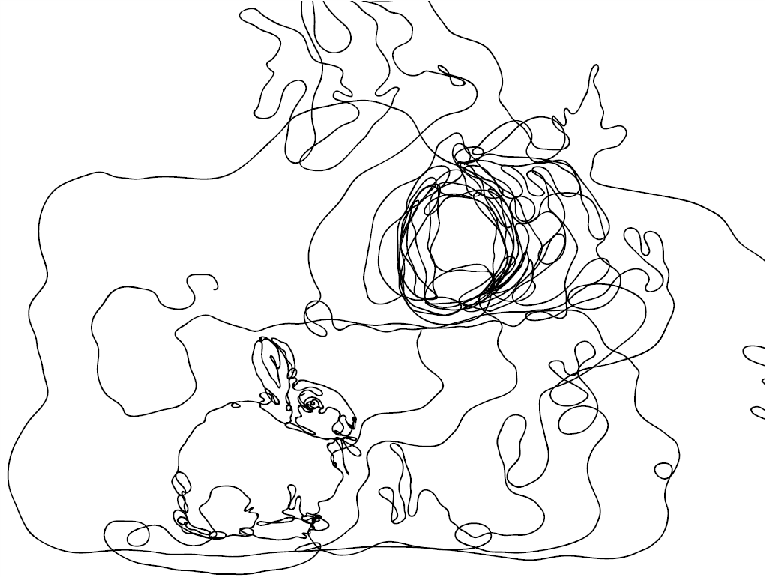

###### 9.1 Looking Ahead

THE PROSPECT OF IDENTIFYINGthe answer to your research question by closing all back doors is actually kind of daunting. Think about everything you have to do. You have to model the data generating process, you have to list out all the paths, you have to find a set of variables that close all the back doors, and you have to measure and control for all of those variables.

Tough work! Especially that last part. Actually controlling for everything is surprisingly tricky, especially in social science where there areso many thingsthat might matter that youʼre almost

certain to run into a variable youhaveto control for but canʼt. Even if itʼs possible to measure, itʼs probably not inyourdata. “Attitude towards risk,” “Curiosity,” “Customer sentiment,” “Intellectual ability” - these are all things that you might well find sitting on a bad path but donʼt have access to in your data.

Even worse,becausethere are so many variables that might be on back doors, what are the odds youʼre actually going to think of them all and include them in your causal diagram? Seems pretty likely that youʼd miss one.

1

SOUNDS BAD. SO WHAT TO DO?An alternate approach to identifying the answer to a research question is to, instead of actively closing back doors, find ways of isolating just Front Doors. If we can estimate the Front Doors directly, we donʼt need to worry about closing back doors.

How is this possible? This can work in two different ways:eitherfind a setting in which onlysome of the variation in Treatment has back doors, butsomeof the variation has no back doors, or at least only has back doors you can close - natural experiments -oryou can estimate individual arrows on the Front Door paths even if the overall effect isnʼt identified - the front door method.

For example, imagine trying to estimate the effect of Wealth on Lifespan. There are bound to be plenty of back door paths on that causal diagram, passing through all kinds of variables you donʼt have data on, like “Business Skill,” “Willingness to Commit Robberies,” and so on.

But how about wealth among people who play the lottery? Certainly, for most of the variation in wealth between people who play the lottery, they got it through means like working, inheritance, or buying assets, and for that variation in wealth all those same back doors are there. However, among people who buy lottery tickets, work, inheritance, and buying assets havenothingto do with whether youwin the lotery.So if your research design focuses just on differences in wealth driven by lottery winnings among people who play the lottery - surprise! No back doors on that variation.

2

- 9.2 Trying to Push a String

SO HOW CAN WE PICK OUT JUST THE VARIATION WE WANT?It all comes down to the fact that your treatment variable varies for different reasons. If A, B, and C are all causes of treatment, then A, B, and C are all reasons why treatment varies from one person to another. If youʼre lucky, some of those reasons lead to variation that has back doors, and other reasons donʼt. If youʼre even luckier, you can actually isolate just the part that doesnʼt have back doors.

The key idea here is that we canpartition the variationin Treatment. By either selecting a particular sample or using certain approaches to statistical adjustment, we can throw out the part thatisdriven by all that nasty back door business, and leave ourselves to do analysis with just another part thatisnʼt. Then we focus on the part thatisnʼtso we donʼt have to worry about back doors.

PERHAPS THE CLEANEST APPLICATION OF THIS APPROACHis the randomized controlled experiment. In a randomized controlled experiment, the researcher actually steps in and assigns treatment (or the absence of treatment) to people, and watches the resulting differences in outcome.

Youʼre probably familiar with the concept. You probably did a few in your science classes in middle school. You may even be familiar with the idea that randomized experiments are sometimes referred to as the “gold standard” of causal research designs. Butwhydo they work?

3

Experiments work because they create a form of variation in the treatment that has no back doors. If the treatment was assigned randomly, then for everyone in the experiment, variation in all the variables on all the back doors should be unrelated to whether they got the treatment or not. So all the back doors are closed!

Letʼs say weʼre interested in figuring out whether charter schools improve studentsʼ test scores more (or less) than traditional public schools, a hot-button issue in the United States and a frequent setting for isolating front doors (⊕Chabrier, Cohodes, and Oreopoulos 2016). There are a whole lotof variables that cause you to attend a charter school or not, with race, background, personality, location, and academic interest giving us only a few. No way we could control for enough things to close all those back doors. This is represented by the unobservable AllKindsaStuff in Figure9.19.1.9.1....

- Figure 9.1: The Effect of Charter Schools on Student Achievement
- Figure 9.2: The Effect of Charter Schools on Student Achievement with a Lottery

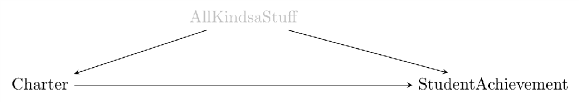

However, our diagram doesnʼt stop there. A lot of charter schools have more interested students than they have slots, and many of them assign those slots by lottery, providing a convenient setting for lots of experimental analyses. So the diagram really looks like Figure9.29.2.9.2....

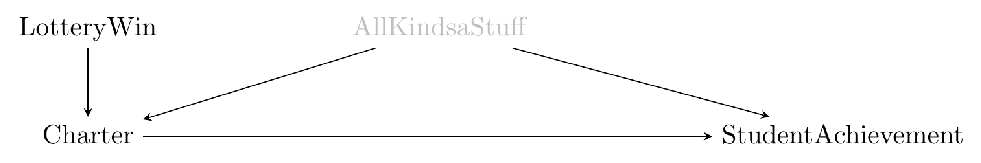

Notice a few things: First, there are no back doors from Lottery to StudentAchievement. The effect of LotteryWin on StudentAchievement is identified in the data without any controls. Second, the only way that Lottery can affect StudentAchievement is through Charter. So if we calculate the effect of LotteryWin on StudentAchievement, that must really be telling us about the effect of Charter on StudentAchievement.

This all works because there are now two reasons why people go to Charters. The first is because of AllKindsaStuff - that partʼs fraught, letʼs avoid it. The second is because of the LotteryWin. If we can isolate just the part driven by LotteryWin, weʼve identified the answer to our research question.

WE CAN ANALYZE THE DATA FROM THIS EXPERIMENT IN A FEW WAYS:

- 1. Throw out all the data where Charter isnʼt driven by Lottery, and then look

at the effect of Charter on StudentAchievement. In this context, that means throwing out data from any schools without a lottery, or data from any students that got in through means other than the lottery, or any students who werenʼt even eligible for the lottery. Just take the students who were in the lottery and compare the ones who got into the Charter against the ones who didnʼt.

4

- 2. Use LotteryWin toexplainor predict Charter. Then, take your prediction of whether someone goes to a Charter, which is based purely on their LotteryWin. Because this prediction is based only on LotteryWin and not AllKindsaStuff, the variation in the prediction contains none of the back doors of AllKindsaStuff. So then look at the relationship between the prediction and StudentAchievement to get the effect.

- 5

In both approaches we isolate just the variation in Charter driven by LotteryWin and throw out the rest of the variation, either by tossing out data subject to the rest of the variation, or by focusing just on the variation we estimate to be due to LotteryWin.

This makes clear two things - first, that a randomized experiment very cleanly lets us identify the causal effect weʼre interested in, and second, that a randomized experiment requires us to focus on a very narrow slice of the data: the slice that is randomized. If that data doesnʼt represent the wider population, we wonʼt get to our true effect no matter how big the sample is, or how clean the identification. This is one suspicion that some researchers have about charter school lotteries

- that the schools that hold lotteries, and the students who enter them, arenʼt representative of

the broader populations of charter schools and students, respectively, and so donʼt quite answer the question we want.

- 6

Putting that to the side, we definitely get a very clean identification. But to do this, we need explicit randomization. This whole book is premised on the idea that this isnʼt always possible or feasible! So what else can we do?

###### 9.3 What the World Can Do for Us

A “NATURAL EXPERIMENT” IS A REAL-WORLD SETTING IN WHICH SOME SORT OF RANDOMIZATION HAS BEEN DONE FOR US.In fact, you may have noticed a little cheat in the last section - that charter school studyisnʼta randomized controlled trial. It just so happens that the charter schools did some randomization. It wasnʼt researchers assigning things. That already is an example of a natural experiment - the randomization occurred in the world; the researcher just came along to take advantage of it. The “wealth of lottery winners” example from earlier works like this too. Researchers donʼt decide who wins the lottery. But among lottery winners, thereʼs randomization in who gets the big prize.

7

So the randomization doesnʼt need to be researcher-controlled. But can we go further? Does it even need to be as random as an explicit lottery? What does “randomization” mean, anyway?

We can think about natural experiments by considering what makes randomized experiments work in the first place. They work because they fix some of the variation in treatment to have no back doors. As long as we can makethatmagic happen, we have a working natural experiment.

SO WHAT WE NEED TO THINK ABOUT ISwhether we can find asource of variation in treatmentthat hasno open back doors. We can call this a “source of exogenous variation.”Any path we can walk from the source of exogenous variation to the outcome must be (a) closed, or (b) contain our treatment. Anidealsource of exogenous variation is not caused by any other variable that belongs on the causal diagram.

8

This means that we can use plenty of things as sources of exogenous variation even if theyʼre not purely random, as long as theyʼreas good as random in the context of our DGP.

What does the causal diagram for this look like? It looks… almost exactly like a randomized controlled trial! You can see for yourself in Figure9.39.3.9.3....

Figure 9.3: A Basic Natural Experiment Diagram

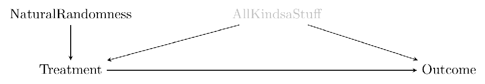

There are four real differences between randomized controlled experiments and natural experiments.

- 1. Sometimes therewilbe back doors from the NaturalRandomness to the Outcome, which doesnʼt happen with pure randomization. For example, letʼs say weʼre using the fact that Sesame Street became available at different times in different areas to examine the effects of kids watching Sesame Street. Thatʼs not purely random - it likely became available earlier in larger markets like urban areas, so thereʼs a back door with SesameStreetTiming Urban Outcome. But as long as we can control for something to shut the back door down, weʼre okay. The process is the same as when weʼre identifying the effect of our treatment by controlling for things -

###### ← →

the idea here is that weʼre just picking a variable where the back doors are easier to control for.

- 2. Natural experiments are, well, more natural. People may not even realize theyʼre a part of an experiment (in fact, nobody, including the researcher, may notice thereʼs an experiment happening at all until long after itʼs over). So the observations you get may be more realistic. Sample sizes tend to be bigger, too. And people usually donʼt have to volunteer to be part of the experiment, so your sample isnʼt made up of a bunch of volunteertypes.
- 3. Because, just like in an experiment, we are isolating just the variation in treatment that is driven by the NaturalRandomness, we are tossing out any treatment that occurs for other reasons. So we are seeing the effect only among people who are sensitive to NaturalRandomness - if the effect would be different among another group of people, we wonʼt see it for them. Some parents would never let their kids watch Sesame Street no matter whether itʼs available or not. Maybe Sesame Street would be even better for those kids than for the kids whodosee it.

- But weʼll never learn with a natural experiment!
- 4. People believe the exogeneity of pure randomization. But convincing people that your not-perfectlyrandom source of exogenous variation is exogenous in your DGP, given that weʼre doing social science where everything is related to everything else, can be a tall order. Is there really onlyoneback door from SesameStreetTiming to Outcome?

9

That last difference is a big one, and for some people it puts them off all but the purest and cleanest natural experiments. Does this whole process even work at all? Letʼs take a look at some example studies and see how far they can get.

###### 9.4 Is It Too Good to Be True?

FOR OUR FIRST STUDY,letʼs expand on what we already know: lotteries. Scott Hankins, Mark Hoekstra, and Paige Skiba published a study in 2011 on the effect of winning the lottery on declaring bankruptcy later (⊕Hankins, Hoekstra, and Skiba 2011). Specifically, they looked at the Florida lottery, and only included people who had wonsome amountof money in the lottery.

They look only at people who had won some amount of money, rather than at everybody, to remove any variation based on the kind of people who play the lottery in the first place. If everyone in your sample plays the lottery, youʼve controlled for variables related to being the kind of person who plays the lottery.

Within that group, winning a really big prize should be completely random. They then compare people who win really big prizes (between $50,000 and $150,000) against people who won smaller prizes (less than $10,000). They find that winning a big prize reduces your chances of

declaring bankruptcyinitialy, but after a while it doesnʼt seem to matter - the prize just pushed bankruptcy to a later date, rather than reduced the chances you go bankrupt. You can see their results in Figure9.49.4. People who win small prizes (the dashed line) have basically the same9.4.... bankruptcy rates whether itʼs before the prize or after, which makes sense. For people who win big prizes (the solid line), in the few years immediately following the prize, bankruptcies fall. However, after the prize they spike back up, and then revert to matching those who won a small prize. In the aggregate, the effect on bankruptcy seems to be just pushing it from one to two years in the future to three years in the future.

Figure 9.4: Winning the Lottery and Going Bankrupt, from Hankins, Hoekstra, and Skiba

(2011)

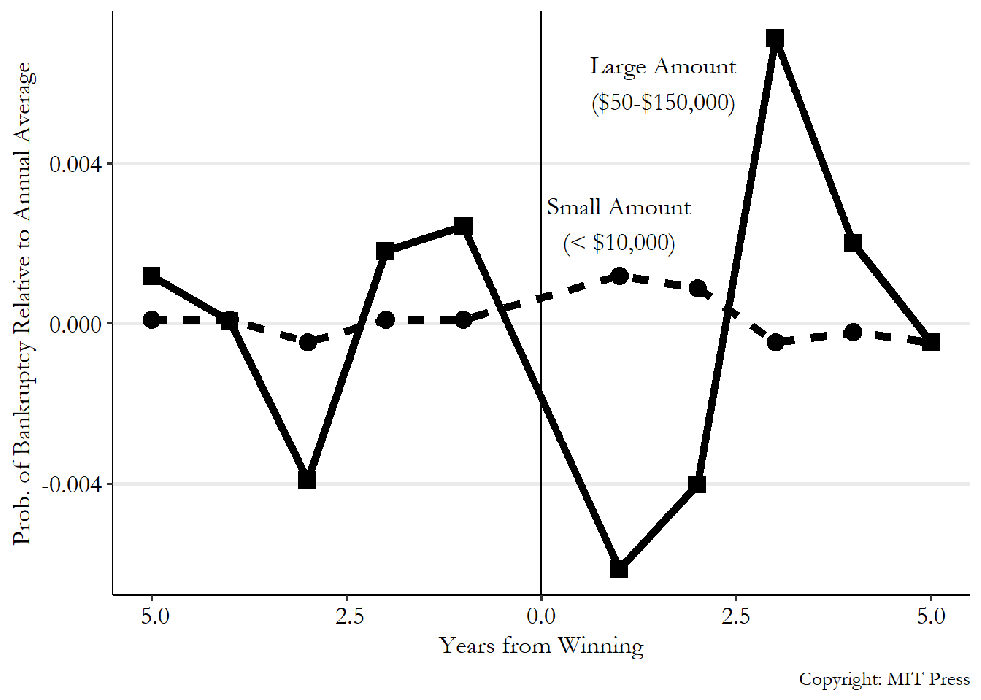

What needs to be true for this to work? It really needs to be the case that winning is random. So they do a number of things to make sure thatʼs true. They check whether the chances of winning seem to be related to anything they observe, such as the characteristics of where the winner lives. Nope! No relationship, which is a relief. However, there is one thing they come up with - the

rules of the Florida lottery changed over time, altering the number of small-prize winners. If bankruptcies also change over time, we have a Winner Time Bankruptcy back door. So they control for the year in which the prize was given to account for this.

###### ← →

10

These results seem pretty solid! Itʼs hard to imagine another reason why winning the lottery would be related to being bankrupt other than… because you won the lottery. Of course, these results only apply to the kind of people who play the lottery, but at least for that group in Florida, winning a big lottery prize doesnʼt seem to reduce your chances of going bankrupt in the long run.

SO WHEN THE WORLD PROVIDES US WITH ACTUAL LITERAL RANDOMIZATION, THAT GIVES US A CONVINCING DESIGN. LETʼS GO FURTHERand use a study where the source of exogenous variation is less clearly random: the wind. Pan He and Cheng Xu (⊕Xu 2019) look at whether air pollution being worse causes people to drive more. The research question makes sense - if itʼs smoggy and unpleasant outside, youʼre not going to want to walk, bike, or maybe even take the bus. But thatʼs a problem. Cars cause pollution. So if pollution causes cars… well, that spiral isnʼt going anywhere good.

He and Xu get their data from Beijing, where pollution is quite bad. They look at whether people drive more on days when there is more pollution, and find that they do. However, pollution is related to all sorts of things that may also be related to driving, like whether the factories are running. Back doors are afoot! They find an exogenous source of pollution variation in the direction of the wind. In Beijing, a west-blowing wind blows pollution into the city. By isolating just the variation in pollution driven by wind direction, they find that an increase in daily pollution large enough to change the governmentʼs rating from “not polluted” to “polluted” increases driving by 3%.

Is the direction of the wind exogenous? It certainly seems unlikely that anything relevant to cardriving or pollutioncausedthe wind. However, it may well be that there are still back doors. For example, the direction of the wind might change with the season, and the season is certainly related to pollution and driving. The weather is likely to be related to all of these things, too. The causal diagram might look like Figure9.59.5.9.5....

11

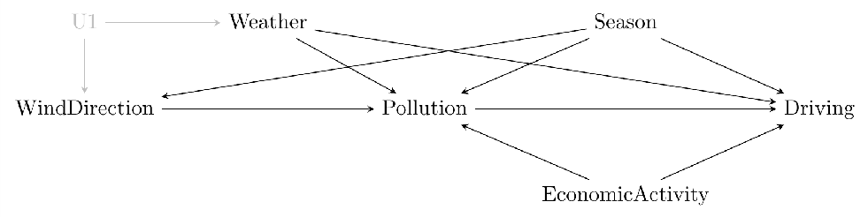

Figure 9.5: The Effect of Pollution on Driving in Beijing

So as long as we can control for season and weather - and they do

- then they should be good to go. Of course, thatʼs the thing! Are we certain that weʼve properly laid out all of the back doors? Are we missing anything? If we miss anything important, this wonʼt work.

I find the use of wind direction here pretty compelling evidence. But itʼs certainly not as rock solid as the lottery. Remember, the difficulties of identifying the effect of on by controlling to close back doors are the same here. Weʼre just hoping to pick a variable thatʼs easier to close back doors for than .

X Y

X

HOW FAR FROM TRUE RANDOMIZATION CAN WE GO?As far as our assumptions are willing to take us and as far as weʼre willing to carry those assumptions along.

Letʼs take a look at Camilleri and Diebold (⊕2019), who look at the effect of uncompensated care medical care given by hospitals that they donʼt end up being paid for - on patient experience. You can imagine that if hospitals are spending a bunch of money giving care that they donʼt get paid for, theyʼre going to have fewer resources available to give patients the best experience.

12

The amount of uncompensated care a hospital gives is related to all sorts of back-door stuff. The kinds of patients they get and how likely those patients are to pay, the kinds of procedures theyʼre known for, and so on. Camilleri and Diebold need a source of exogenous variation. They use the 2014 Medicaid expansion, in which some states but not others expanded access to the Medicaid program. Medicaid expansion considerably increased health insurance coverage in the states that accepted the additional aid. That additional coverage meant that there would be more compensation available for hospitals. Using this source of exogenous variation, they find that reductions in uncompensated care did improve patient experience, but only by a little bit.

Does this work as a source of exogenous variation? We can definitely imagine some back doors. After all, states didnʼt accept or reject Medicaid at random; the choice was highly politicized. States with different kinds of governments were more or less likely to expand Medicaid. The authors controlled for state and local characteristics to close these back doors.

Of course, the policy changed plenty of things about health care other than just improving hospital compensation. Medicaid expansion, and thus expanded access to insurance, should change lots of things about health care besides hospital compensation that might also be related to patient experience. We have to be willing to assume that the expansion really only affected hospital compensation in order to think of the variation in compensation driven by the Medicaid expansion as being exogenous.

13

So does this study work? Sure! As long as the assumptions weʼve just laid out about Medicaid expansion only working through hospital compensation sound reasonable. If we arenʼt willing to swallow those assumptions, then no, it doesnʼt work. There are lots of studies that use policy implementation as a source of exogenous variation like this. Itʼs certainly a viable path, but we need to be very careful in thinking what assumptions we have to make about the data generating process, and whether those assumptions are true.

14

Isolating front-door paths is always feasible, just like identifying the effect of a treatment by closing back doors is always feasible, even if we donʼt have anything evenremotelylike purely random variation as we would in a randomized experiment or even a lottery. However, the farther away we get from that pure randomization, the more things we need to control for, and the more assumptions we have to make, and perhaps the moreunbelievableassumptions we have to make. This isnʼt a magic formula; weʼre just replacing the difficulty of finding and closing all back doors for a treatment variable with the difficulty of finding and closing all back doors for something else.

###### 9.5 Riding a Shooting Star

AH, BUT THERE IS ANOTHER WAYin which we can identify the causal effect of a treatment on an outcome by isolating front doors. It is called, appropriately, the “front door method,” and it works

very differently from the concepts covered so far in this chapter. It also sees a lot less usage in the real world and serves only as a tiny little coda to this chapter.

The reason the approach with the seems-pretty-important name of “front door method” gets tucked away in the last section of a chapter all about isolating front doors is that it only applies in very specialized scenarios. For a long time, applied researchers didnʼt really even think about it as a possible research design. And now that they do know about it in theory, theyʼre scratching their heads thinking about when they could ever really use it in practice. So weʼll talk about it here, briefly, and heck, maybeyoucan think about how it might be useful.

The front door method works when your causal diagram looks something like Figure9.69.6, when9.6.... thereʼs a bad path that canʼt be closed, such as if W in that diagram canʼt be measured.

Figure 9.6: A Diagram on which the Front Door Method Works

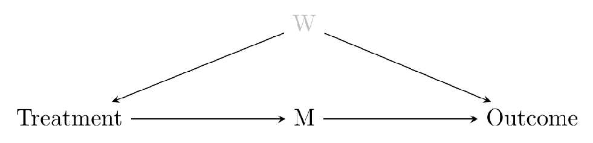

IN FIGURE9.69.6,9.6.... IF W CANʼT BE MEASURED,then we canʼt control for anything to identify the effect of Treatment on Outcome.

However, maybe we can identify something else. How about the effect of Treatment on M? We can identify that - the only back door is Treatment W Outcome M. But Outcome is a collider on that path, so itʼs already closed. We donʼt need to worry about it.

← → ←

What else can we identify? How about the effect of M on Outcome? The only back door is M Treatment W Outcome, and we can control for Treatment to close that back door path.

← ← →

So we can identify both Treatment M and M Outcome. We just need to combine those two effects to get our effect Treatment M Outcome.

###### → →

→ →

WE CAN USE THE CLASSIC EXAMPLEgiven when discussing the front door method: smoking (⊕Pearl and Mackenzie 2018). Itʼs difficult to figure out the effect of smoking on something like cancer rates because there are lots of things related to whether you smoke (background, income, healthmindedness, etc.) that can be hard to measure and would also be related to cancer rates. So we have a lot of back doors we canʼt close.

But what if we have something that sits between smoking and cancer - some measurablereason whysmoking causes cancer? Letʼs say that thing is TarInLungs. In this simplified fantasy, the only reason Smoking causes Cancer is because it causes TarInLungs, and TarInLungs causes Cancer. The diagram then looks like Figure9.79.7.9.7....

15

###### Figure 9.7: A Front-Door-Method Compatible Causal Diagram of Smoking

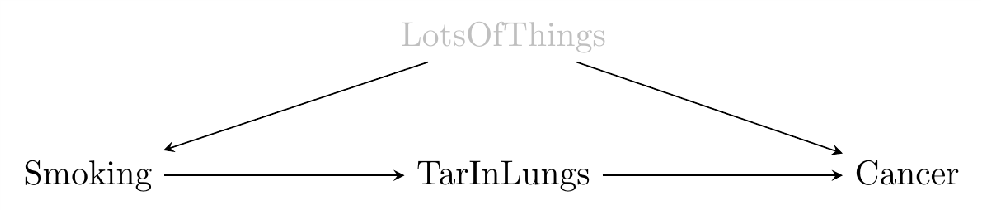

Given this diagram, letʼs say that we look at the raw, unadjusted relationship between Smoking and TarInLungs and find that an additional cigarette per day adds an additional 15 grams of tar to your lungs over 10 years.

Then, we look at the relationship between TarInLungs and Cancer while controlling for Smoking and find that an additional 15 grams of tar in your lungs increases the chances of getting cancer by 2% over your lifetime.

So, then an additional cigarette per day increases the tar in your lungs by 15 grams, which in turn increases your probability of cancer by 2%. So an additional cigarette per day increases your probability of cancer by 2%.

THATʼS THE FRONT DOOR METHOD!So why is it not used very often? Largely because it requires that there be some variable like M or TarInLungs in those diagrams that exists entirely between Treatment and Outcome without being linked to anything else, and capturing a large portion of

###### the reason why Treatment affects Outcome. Thatʼs a lot of conditions that need to be met before a method can be used. Worse, these conditions donʼt seem to pop up in the real world all that often. But hey, again, maybe you can figure it out.

Previous Next

Page built: 2025-10-17 using R version 4.5.0 (2025-04-11 ucrt)

# The Effect

Nick Huntington-Klein

▾ Chapters

###### Chapter 10 - Treatment Effects

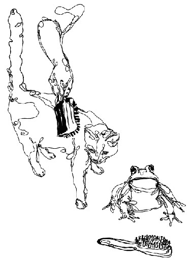

###### 10.1 For Whom the Effect Holds

FOR MOST OF THIS BOOK, AND INDEED IN THE TITLE, WE HAVE STUCK TO THE FICTIONthat there is such a thing asthe effect. As though a treatment could possibly have a single effect - the same impact on literally everybody! That might be plausible in, say, physics. But in social science, everything affects everyone differently.

1

To give a very simple example, consider a drug designed to reduce the rate of cervical cancer. This drug might be very effective. Perhaps it reduces the rate of cervical cancer by half…for

people with a cervix. For people without a cervix, we can be pretty certain that the drug has absolutely no effect on the rate of cervical cancer.

2

So at the very least, the drug has two effects - one for people with a cervix, and one for people without. But we donʼt need to stop there. Even if we just focus on people with a cervix, maybe the drug is highly effective for some people and not very effective for others. Something to do with body chemistry, or age, or dietary habits, who knows? The point is we might have a whole bunch of effects. Whenever we have a treatment effect that varies across a population (i.e., all the time), we can call that aheterogeneous treatment effect.

We can actually think of each individual as having theirowntreatment effect. Maybe the drug reduces the cancer rate by 1% for you and 0% for me and .343% for the woman who lives next door to me.

Thatʼs not even to say anything of the variation in the effectoutsidewhat you can see in the sample! The true effect of treatment is likely to vary from country to country, from year to year, and so on. Just because, say, fiscal stimulus improved the employment rate last time doesnʼt mean it will this time, at least not to the same degree. Everything varies, even effects.

3

Weʼre all unique, with different circumstances, lives, physiologies, and responses to the world. Why would we start with an assumption that any two of us would be affected in exactly the same way? Itʼs more of a convenience than anything.

SO WHAT CAN WE MAKEof the idea that we have heterogeneous treatment effects?

One thing we can try to do is to estimate those heterogeneous treatment effects. Instead of just estimating one effect, we can estimate adistributionof effects and try to predict, for a given person with a given set of attributes, what their effect might be.

This is a valid goal, and it is something that people try to do. This idea is behind concepts you might have heard of like “personalized medicine.” Itʼs also one thing that machine-learning types tend to focus on when they get into the area of causal inference.

4

However, in addition to being a valid goal and the subject of some extremely cool work, it also gets highly technical very quickly. So in this chapter, we will instead focus on the other thing we

can do with the concept of heterogeneous treatment effects: ask “if effects are so heterogeneous, then what exactly are we identifying anyway?”

After all, weʼve established in the rest of this book that we can identify causal effects if we perform the right set of adjustments. But whose causal effects are those? How can we tell?

It turns out that, if weʼve done our methods right, what we get is some sort of average of the individual treatment effects. However, itʼs often not the kind of average where everyone gets counted equally.

###### 10.2 Different Averages

WHAT WE HAVEis the concept that each person has their own treatment effect. That means that we can think of there being adistributionof treatment effects. This works just like any other distribution of a variable, like back in Chapter33. The only difference is that we donʼt actually3 observe the treatment effects in our data.

And like any typical distribution, we can describe features of it, like the mean.

The mean of the treatment effect distribution is called, for reasons that should be pretty obvious, theaverage treatment effect. The average treatment effect, often referred to as the ATE, is in many cases what weʼdliketo estimate. It has an obvious interpretation - if you impose the treatment on everyone, then this is the change the average individual will see. If the average treatment effect of taking up gardening as a hobby is an increase of 100 calories eaten per day, then if everyone takes up gardening, some people will see an increase of less than 100 calories, some will see more, but on average it will be 100 calories extra per person.

However, estimating the average treatment effect is not always feasible, or in some cases even desirable.

Letʼs use the cervical cancer drug as an example. In truth, the drug will reduce Terryʼs chances of cervical cancer by 2 percentage points and Angelaʼs by 1 percentage point, but Andrew and Mark

5

donʼt have cervices so it will reduce their chances by 0. The average treatment effect is , or .75 percentage points.

(.02 + .01 + 0 + 0) = .0075

Now, despite your repeated pleas to the drug company, they refuse to test the drug on people without cervices, since theyʼre pretty darn sure it wonʼt do anything. They get a whole bunch of people like Terry and Angela and run a randomized experiment of the drug. They find that the drug reduces the chances of cervical cancer by, on average, , or 1.5 percentage points.

(.02 + .01) = .015

Thatʼs not awrong answer- in fact, their 1.5 is probably a better answer than your .75 for the research question we probably have in mind here - but itʼs definitely not the average treatment effect among the population. So if itʼs not the population average treatment effect, what is it? We will want to keep in our back pocket some ideas of other kinds of treatment effect averages we might go for or might identify.

6

7

There are lots and lots and lots of different kinds of treatment effect averages, but only a few important ones we really need to worry about. They fall into two main categories: (1) treatment effect averages where we only count the treatment effects ofsomepeople but not others, i.e., treatment effect averages conditional on something, and (2) treatment effect averages where we count everyone, but we count some individuals more than others.

8

WHAT HAPPENS WHEN WE ISOLATE THE AVERAGE EFFECTfor just a certain group of people? And how might we do it?

To answer this question, letʼs make some fake data. This will be handy because it will allow us to see what is usually invisible - what the treatment effect is for each person.

Once we have our fake data, we will be able to: (a) discuss how we can take an average of just some of the people, and (b) give an example of how we could design a study togetthat average.

Table 10.1: Fake Data for Four Individuals

Untreated Outcome

Treated Outcome

Treatment

Name Sex

Effect Alfred Male 1 2 1

Untreated Outcome

Treated Outcome

Treatment

Name Sex

Effect Brianna Female 1 5 4 Chizue Female 2 5 3 Diego Male 2 4 2

We can see from Table10.111111110.1 that these four individuals have different treatment effects. Keep in111110.1.1.1.1.1111111 mind that this table is full of counterfactuals - we canʼt possibly see someone both treated and untreated. The table just describes what wewould seeunder treatment or no treatment. If nobody were treated, then Alfred and Brianna would have an outcome of 1, and Chizue and Diego would have an outcome of 2. But with treatment, Alfred jumps by 1, Brianna by 4, Chizue by 3, and Diego by 2. The average treatment effect is .

###### (1 + 4 + 3 + 2)/4 = 2.5

ONE COMMON WAY WE GET AN AVERAGE EFFECT FOR ONLY A CERTAIN GROUPis to literally pick a certain group. Notice in Table10.111111110.1 that we have men and women. Letʼs say we run an experiment but111110.1.1.1.1.1111111 only recruit men in our experiment for whatever reason. So we get a bunch of guys like Alfred and a bunch of guys like Diego and we randomly assign them to get treatment or not. Our data ends up looking like Table10.210.2.10.2....

9

Table 10.2: Men-Only Experiment

Name Treatment Outcome Alfreds Treated 2 Alfreds Untreated 1 Diegos Treated 4 Diegos Untreated 2

Then, using Table10.210.2, we calculate the effect. We find that the treated people on average had an10.2.... outcome of , and the untreated had and conclude that the treatment has an effect of . This is the exact same as the average of Alfredʼs and Diegoʼs treatment effect, . So we have an average treatment effectamong men, or an average treatment effectconditionalon being a man.

(2 + 4)/2 = 3 (1 + 2)/2 = 1.5

3 − 1.5 = 1.5 (1 + 2)/2 = 1.5

Again, this isnʼt awrong answer. It just represents only a certain group and not the whole population. Itʼs only a wrong answer if we think it applies to everyone.

ANOTHER COMMON WAY IN WHICH THE AVERAGE EFFECT IS TAKEN AMONG JUST ONE GROUP IS BASED ON WHO GETS TREATED.Based on the research design and estimation method, we might end up with the average treatment on the treated(ATT) or theaverage treatment on the untreated(ATUT), which averages the treatment effects among those whoactualygot treated (or not).

To see how this works, imagine that we canʼt randomize anything ourselves, but we happen to observe that Alfred and Chizue get treated, but Brianna and Diego did not. We do our due diligence of drawing out the diagram and notice that the outcome is completely unrelated to the probability that theyʼre treated or not. So weʼre identified! Great.

10

Table 10.3: Assigning Alfred and Chizue to Treatment

Name Treatment Outcome Alfred Treated 2 Brianna Untreated 1 Chizue Treated 5 Diego Untreated 2

What do we get in our actual data? We can see in Table10.310.3 that we get an average of10.3.... among the treated people, and among the untreated people,

- (2 + 5)/2 = 3.5 (1 + 2)/2 = 1.5 3.5 − 1.5 = 2

giving us an effect of . Itʼs no coincidence that this is the average of Alfredʼs and Chizueʼs treatment effects, . In other words, weʼve taken the average treatment effect among just the people who actually got treated. ATT!

(1 + 3)/2 = 2

11

Itʼs a bit harder to imagine how we might get the average treatment effect among theuntreated (ATUT). And indeed this one doesnʼt show up as often. But one way it works is that you take what you know about how treatment varies, and what predicts who has big or small treatment effects, and then use that to predict what sort of effect the untreated group would see.

For example, say we get a sample of 1,000 Alfreds and 1,000 Briannas, where 400 Alfreds and 600 Briannas have been assigned to treatment on a basically random basis, leaving 600 Alfreds and 400 Briannas untreated.

The average outcome for treated people will be , and for untreated people will be 1. However, we can run our analysis an extra two times, once just on

###### (400 × 2 + 600 × 5)/1000 = 3.8

Alfreds and once just on Briannas, and find that the average treatment effect conditional on being Alfred appears to be 1, and the average treatment effect conditional on being Brianna appears to be 4. Since we know that there are 600 untreated Alfreds and 400 untreated Briannas, we can work out that the average treatment on the untreated is . ATUT!

(600 × 1 + 400 × 4)/1000 = 2.2

The distinction between ATT and ATUT, and knowing which one weʼre getting, is an important one in nearly all social science contexts. This is because, in a lot of real-world cases, people are choosing for themselves whether to get treatment or not. This means that treated and untreated people are often different in quite a few ways (people who choose to do stuff are generally quite different from those who donʼt), and we might expect the treatment effect to be different for

- them too. Borrowing the example from the start of the chapter, if people could choose for themselves whether to take the cervical cancer drug, who would choose to take it? People with a cervix! The drug is more effective for them than for people without a cervix, so the ATT and ATUT arenʼt the same, and thatʼs not something we can avoid - the drug being more effective for them iswhy they chose to take it.

One other way in which a treatment effect can focus on just a particular group is with the marginal treatment effect. The marginal treatment effect is the treatment effect of a person who isjust on the marginof either being treated or not treated. This is a handy concept if the question youʼre trying to answer is “should we treat more people?” I wonʼt go too much into the marginal treatment effect here, as actually getting one can be a bit tricky. But itʼs good to know the idea is out there.

INSTEAD OF FOCUSING OUR AVERAGE JUST ON A GROUP OF PEOPLE,what if we include everyone, but perhaps weight some people more than others? We can generically think of these as “weighted average treatment effects.”

In general, a weighted average is a lot like a mean. Letʼs go back to the average treatment effect that was just a mean. The mean of 1, 2, 3, and 4 is , as youʼll recall from our fake data, reproduced below in Table10.410.4. Now, letʼs not change that calculation, but just10.4.... recognize that , , and so on.

(1 + 2 + 3 + 4)/4 = 2.5

1 = 1 × 1 2 = 2 × 1

Table 10.4: Fake Data for Four Individuals

Untreated Outcome

Treated Outcome

Treatment

Name Sex

Effect Alfred Male 1 2 1 Brianna Female 1 5 4 Chizue Female 2 5 3 Diego Male 2 4 2

Substituting in for , for , and so on, our calculation for the mean is now

1 × 1 1 2 × 1 2 (1 × 1 + 2 × 1 + 3 × 1 + 4 × 1)/(1 + 1 + 1 + 1) = 2.5

. Here, everyoneʼs number is getting multiplied by 1, and thatʼs the same 1 for everybody. This is a weighted average where everyone gets the same weight (1).

BUT WHAT IF PEOPLE GOT DIFFERENT NUMBERS BESIDES 1?Continuing with the same fake-data example, letʼs say for some reason that we think Brianna should count twice as much as everyone else, and Diego should count half as much. Now our weighted average treatment effect is

.

(1 × 1 + 4 × 2 + 3 × 1 + 2 × .5)/(1 + 2 + 1 + .5) = 2.89

There are some applications where we get to pick what these weights are and apply them intentionally. In the context of treatment effects, though, we rarely get to pick what the weights are. Instead, thereʼs something about thedesignthat weights some people more than others.

12

A common way this shows up is asvariance-weightedaverage treatment effects. Statistics is all about variation. And the relationship between and is a lot easier to see if moves around a whole lot. If you donʼt see a lot of change in , then itʼs hard to tell whether changes in are related to changes in because, well,whatchanges in are we supposed to look for exactly? Whatʼs the relationship between living on Earth and your upper-body strength? Statistics canʼt help there, because pretty much everybody we can sample lives on Earth. We donʼt see a lot of people living elsewhere, so we canʼt observe how it makes them different to live elsewhere.

Y X X

X Y X X

As a result, if some kinds of people have a lot ofvariation in treatmentwhile others donʼt, our estimate may weight the treatment effect of those with variation in treatment more heavily, simply because we can see them both with and without treatment a lot.

Letʼs say that we get a sample of 1,000 Briannas and 1,000 Diegos. For whatever reason, half of all Briannas have ended up getting treatment, but 90% of Diegos have. So our data looks like Table

- 10.510.5.10.5....

Table 10.5: Briannas and Diegos get Treatment at Different Rates

Name N Treatment Outcome Brianna 500 Treated 5 Brianna 500 Untreated 1 Diego 900 Treated 4 Diego 100 Untreated 2

Now, we canʼt just compare the treated and untreated groups because we have a back door. “Being a Brianna/Being a Diego” is related both to whether youʼre treated, and to the outcome (notice that their outcomes would be different if nobody got treated). So we want to close that back door. One way we can do that is by subtracting out mean differences between Brianna and Diego, both for the outcome and the treatment.

13

When we do this, and reevaluate the treatment effect, we get an effect of 3.47. This is closer to Briannaʼs treatment effect of 4 than to Diegoʼs treatment effect of 2. Weʼre weighting Brianna more heavily. Specifically, we are weighting them both by the variance in their treatment, and Briana has more variance. The variance in treatment among Briannas is . The variance in treatment among Diegos is . The weighted average, then, is

.5 × .5 = .25 14

.9 × .1 = .09 (.25 × 4 + .09 × 2)/(.25 + .09) = 3.47 15

.

Our estimate of 3.47 is closer to Briannaʼs effect (4) than Deigoʼs (2) because we see a lot of her both treated and untreated, whereas Diego is mostly treated. Less variation in treatment means we can see the effect of that variation less. Note also that Diego counts less even though we see a lot of treated Diegos - this isnʼt the average treatment on the treated. We know weʼre getting a variance-weighted average treatment effect rather than the average treatment on the treated, because if we were getting ATT, weʼd be closer to Diego and farther from Brianna.

Weighted average treatment effects pop up a lot whenever we start closing back doors. When we close back doors, we shut out certain forms of variation in the treatment. The people who really

count are the ones who have a lot of variation left after we do that.

Variance-weighted treatment effects arenʼt the only kind of weighted average treatment effect. For example, if you close back doors byselecting a samplewhere the treated and untreated groups have similar values of variables on back door paths (i.e., picking untreated observations tomatchthe treated observations), you end up withdistribution-weightedaverage treatment effects, where individuals with really common values of the variables youʼre matching on are weighted more heavily.

ANOTHER FORM OF WEIGHTED TREATMENT EFFECTSthat pops up often is based on howresponsive treatment is.

In Chapter99 we discussed the different ways that we can isolate just9 partof the variation in treatment. We either focus just on the part of the data in which treatment is determined exogenously (like running an experiment, and only including data from the experiment in your analysis) or use some source of exogenous variation topredicttreatment, and then use those predictions instead of your actual data on treatment.

Of course, heterogeneous treatment effects donʼtonlyapply to the effect of treatment on an outcome. They canalsoapply to the effect of exogenous variation on treatment.

For example, suppose youʼre running a random experiment about diet where the treatment is having to eat 100 fewer calories per day than you normally would, and the outcome is your weight. Some people have pretty good willpower and control over their diet. If you tell them to eat less, they can do that. If you tell them to keep doing what they normally do, they can do that too.

16

Other people have less willpower (or less interest in satisfying a researcher). They might only eat 90 fewer calories per day when told to eat 100 fewer. Or 50. Or 5. Or 0. Maybe a few people will be disappointed by being assigned to the “continue as normal” treatment and will cut their calories anyway.

So for some people, being assigned to treatment makes them eat 100 fewer calories. For some people itʼs 90, or 50, 0, or 10morecalories, or whatever. This is still heterogeneous treatment

effects, but instead for the effect of treatment assignment on treatment, rather than the effect of treatment on outcome.

Naturally, if we limit our data to just the people in our experiment and look at the impact of the experiment, itʼs going to give us strange results.

When this happens - we have exogenous variation, but not everybody follows it, we limit our data to just the people in our experiment, and we look at the relationship between treatment assignmentand the outcome - what we get is called theintent-to-treatestimate. Intent-to-treat is the effectof assigning treatment, although not the effect of treatment itself, since not everybody follows the assignment.

17

Intent-to-treat gives us the average treatment effect of assignment, which is usually not what we want. What does it give us for the effect of treatment? Itʼs notexactlya weighted average treatment effect at that point. It does weight each personʼs treatment effect bythe proportion of their treatment effect they received. So if you got enough treatment to get 50% of its effects, you get a weight of .5. This weighting makes a lot of sense - if you get the full treatment, we see the full effect of your treatment when we start adding up differences. If you donʼt get the treatment you were assigned to, we still include you in our addition, but it couldnʼt have had an effect so you get a 0.

18

19

20

The thing that makes it not exactly a weighted treatment effect is that instead of dividing by the sum of the weights, you divide by the number of individuals. In a weighted average treatment effect, a weight of 0 (you didnʼt respond to assignment at all) wouldnʼt affect the weighted average treatment effect. But in intent-to-treat, someone with a weight of 0 has no effect on the numerator, but they do affect the denominator, bringing the effect closer to 0.

Table 10.6: Fake Data for Four Individuals

Untreated Outcome

Treated Outcome

Treatment

Name Sex

Effect Alfred Male 1 2 1 Brianna Female 1 5 4 Chizue Female 2 5 3 Diego Male 2 4 2

Returning to our fake data once more in Table10.610.6, if we recruited two Chizues and two Diegos10.6.... and assigned one of each to treatment, but Chizue went along with assignment while Diego decided never to receive treatment, then in the treatment-assigned group weʼd see Chizueʼs 5 and Diegoʼs 2 (since Diego was never actually treated), and in the treatment-not-assigned group weʼd see Chizueʼs 2 and Diegoʼs 2. The calculated effect would be . This is also

(3.5 − 2) = 1.5

, or the effect of the two Chizues weighted by 1 (since they receive full treatment when assigned) plus the effect of the two Diegos weighted by 0 (since they never receive any treatment), divided by the number of people (4).

- (3 × 1 + 3 × 1 + 2 × 0 + 2 × 0)/(1 + 1 + 1 + 1) = 1.5

What if we take the other approach to finding front doors, where we use some source of exogenous variation topredicttreatment, and then use those predictions instead of your actual data on treatment?

This turns out to do something very similar to the intent-to-treat. However, because this approach doesnʼt just say “were you assigned treatment or not?” but rather “how much more treatment do we think you got due to assignment?” we can now replace that “number of people” denominator with a “how much more treatment was there?” denominator.

Since “how much more treatment” was also our weight in the numerator, weʼre back to an actual weighted average treatment effect. Specifically, the weights are how much additional treatment each individual would get if assigned to treatment. We call this one thelocal average treatment effect(LATE).

For example, letʼs go back to Chizue and Diego, and Diego not going along with his treatment assignment. We look at assignment and at treatment, and notice that being assigned to treatment only seems to increase treatment rates by 50% (in the not-assigned group, nobody is treated; in the assigned group, 50% are treated). Based on that prediction, we expect to see only half of the treatment effect, and we can get back to the full treatment effect by dividing by .5.

This gives us an effect estimate of . We can also get this 3 from

(3.5 − 2)/.5 = 3 (3 × 1 + 3 × 1 + 2 × 0 + 2 × 0)/(1 + 1 + 0 + 0) = 3

, which is the 3 effect of the two Chizues, each with a weight of 1 (since assignment increases their treatment from 0 to 1), and the 2 effect of the two Diegos, each with a weight of 0 (since assignment doesnʼt affect their treatment).

In other words, the LATE is a weighted average treatment effect where you get weighted more heavily the more strongly you respond to exogenous variation. This is kind of a strange concept

21

- why would we want to weight people who respond to irrelevant exogenous variation more strongly? Well, maybe we donʼt. But the LATE still looms large because it happens to be the weighted average treatment effect that pops up in a lot of research designs. Maybe itʼs not what you want, but itʼs what you get.

And along those lines, whatdoyou get? How do we know, for a given research design, which of these treatment effect estimates we will end up with?

###### 10.3 I Just Want an ATE, It Would Make Me Feel Great, What Do I Get?

BY THIS POINT WE KNOWthat there are far more ways to get a single representative treatment effect than just averaging them (to get the average treatment effect). We can get the treatment effect just for certain groups, we can weight some individuals more heavily than others, we can weight people based on how the treatment was assigned.

Now, usually (not always), what we want is the average treatment effect - the effect weʼd see on average if we took a single individual and applied the treatment to them. The reason we bring up most of thoseothertreatment effects at all is that we donʼt always get what we want!

22

The treatment effect you get isnʼt necessarily a choice you make. Itʼs a consequence of the research design you have. And since there arenʼt usually multiple available research designs that you can use to answer a given question, youʼre often stuck with the treatment effect average you get.

23

So for a given research design, which one do we get?

THE TREATMENT EFFECT WE GET IS ALMOST ENTIRELY DETERMINED BY THE SOURCE OF TREATMENT VARIATION WE USE.Thatʼs pretty much it. Ask where the variation in your treatment is coming from, and youʼll have a pretty good idea whose treatment effects you are averaging, and who is being weighted more heavily.

24

###### Weʼve already discussed one example of this. If we perform a randomized experiment, then we will be ignoring everyone who isnʼt in our experiment.The only treatment variation we are alowing is among the people in our sample - any variation outside our sample is ignored.If our

25

sample isnʼt representative of the broader population, then we will be getting the average treatment effectconditional on being in our sample, a conditional average treatment effect.

Letʼs take another example. Letʼs say weʼre interested in the effect of being sent to traffic school on your future driving performance. Letʼs also say that we know that there are only two reasons anyone goes to traffic school: making a terrible driving mistake, or havingsomeone elsemake a terrible driving mistake that you are somehow punished for. This gives us the diagram in Figure

- 10.111111110.1.111110.1.1.1.1.1111111

Figure 10.1: Going to Driving School

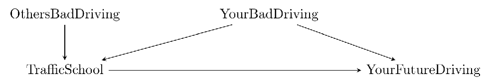

Recognizing the clear TrafficSchool YourBadDriving YourFutureDriving back door, we decide to identify the effect by measuring and controlling for your own bad driving skills.

###### ← →

This will identify the effect, but it will also shut out any variation in TrafficSchool thatʼs driven by YourBadDriving. So imagine two people, Rodney and Richard. Rodney has a 50% chance of not going to TrafficSchool, a 10% chance of going because of someone elseʼs bad driving, and a 40% chance of going because of his own bad driving. Richard has a 50% chance of not going to TrafficSchool, a 30% chance of going because of someone elseʼs bad driving, and a 20% chance of going because of his own bad driving.

Weʼre tossing out that 40% for Rodney and 20% for Richard chances of going because of their own bad driving. Thereʼs only a 10% chance that Rodney goes to TrafficSchoolfor the reason we stil alow to count, and similarly a 30% chance for Richard. That means thereʼsmore remaining

variation in treatment for Richard than for Rodney, so Richardʼs treatment effect will be weighted more heavily than Rodneyʼs will. A weighted average treatment effect!

FOLLOWING THIS LOGIC - WHICH TREATMENT VARIATION DO WE ALLOW TO COUNT - will tell us almost every time which treatment effect weʼre about to get.

We can go a little bit further and apply this logic ahead of time to develop some rules of thumb. These are just shortcuts to applying that same logic, but theyʼre often easier to think about, and they work most of the time.

- Rule of thumb 1: If you have true randomization in a representative sample and donʼt need to do any adjustment, you have an average treatment effect (ATE).
- Rule of thumb 2: If you have true randomization within a certain group, and you isolate that group so you can take advantage of that randomization, you have a conditional average treatment effect.
- Rule of thumb 3: If you know that some variation in treatment is connected to back doors and so you close those back doors, using only the remaining variation, you have a weighted average treatment effect - variance-weighted if youʼre subtracting out explained variation, or weighted by how representative the observations are if youʼre picking a subsample of the data or picking control observations by matching them with treated observations.
- Rule of thumb 4: If you are identifying your effect by assuming that some untreated group is what the treated group would look like if they hadnʼt been treated, then we have the average treatment on the treated (ATT).
- Rule of thumb 5: If part of the variation in treatment is driven by an exogenous variable, and you isolate just the part driven by that exogenous variable, then you have a local average treatment effect (LATE).

These rules of thumb are, of course, rules of thumb and not true all the time. One important caveat here, already mentioned in a sidenote earlier in the chapter, is thatresearch design alone isnʼt the only thing that determines which treatment effect average you get. The way you estimate the effect matters too. To give a basic example, take variance-weighted treatment

effects that weight the effect by the variance of treatment. We can estimate the variance of treatment. What if we just… run our analysis while adding sample weights equal to theinverseof that variance? The variances will cancel out and weʼll have an average treatment effect.

Letʼs take another, perhaps more surprising example, again on rule of thumb 3, obviously the most brain-bending of the bunch. Variance-weighting puts more weight on observations for which thereʼs more variance in treatment after we subtract out variation explained by our backdoor variables, partially because the higher variance means we can more precisely measure that groupʼs effect. However, when weʼre comparing a treated and control group to get a causal effect of treatment, we are really interested in comparing the treated groupʼs outcomes to its counterfactualoutcomes, which we estimate using thecontrolgroup. So the more treated people there are relative to controls, thelessthe estimate represents the ATT and themoreit represents the ATUT, exactly the opposite of what youʼd expect!(⊕Słoczyński 2022) Or at least thatʼs what happens if you use linear regression and use the same back-door adjustment for treated and control groups. Letting the back-door variables have different effects for the treated and control groups by interacting them can fix the problem. Little stuff like that in your estimation process can really matter!

26

The research design is a good place to start but the estimator matters. Part II of the book will talk about alternate ways ofestimatingparticular research designs that get you different treatment effect averages.

###### 10.4 Who Cares?

IT SEEMS ALMOST BEYOND THE POINTto worry too much about which kind of treatment effect average we get, doesnʼt it? After all, weʼve gone to all the work of identifying the effect in the first place. And each of these are averages of the actual treatment effects. Why should it matter?

We should care because weʼre interested in understanding causal relationships in the world!

The reason for paying attention to treatment effect averages (and which ones we are getting) is very clear if the reason we care about causal effects is thatwe want to know what wil happen if

###### we intervene.

Think way back to when we were defining causality back in Chapter66 - one way we talked about6 it was in the form of intervention. If we were to intervene to change the value of , and changes as a result, then causes .

X Y X Y

This approach to causality is one reason why we care about getting causal effects in the first place. Itʼs useful. If we know that causes , then if we want to improve , we can change . If aspirin reduces headaches, and you have a headache, then take an aspirin. We know what will happen because weʼve established the causal relationship.

X Y Y X

###### Bringing in treatment effect averages changes considerablywhat we can infer about what wil happenbased onthe estimates we get in our analysis.

For example, letʼs say we suspect that the presence of lead in drinking water has led to increased crime. If we find evidence that lead in the drinking waterdoescause crime to rise, what would we use that information to do? Probably get the lead out of the drinking water, right?

27

However, what if it doesnʼt reduce crime for everyone? Letʼs say we found a number of localities that won government grants, awarded at random, to clean up the lead in their water. But among the localities that applied for the grants, there was no change in crime rates that followed. Perhaps their crime rates were already very low, or only localities with lead levels already too low to have an effect were the ones who applied for the grant.

In the case of this study, we got an average treatment effect conditional on being in the study. That conditional average treatment effect misrepresented the average treatment effect that we would get if we reduced lead levels ineveryoneʼsdrinking water. If we donʼt pay attention to which treatment effect average weʼre getting, we might erroneously think that the effect is zero for everyone and decide not to bother removing lead from the water.

THIS CAN GO THE OTHER WAY TOO,where we estimate an average treatment effect but donʼt want that. For example, imagine you develop a new (and you think better) vaccine for the measles. You study your new vaccine with an experiment in Hungary. And because you want to get a really representative average effect, you do a very careful job randomly recruiting everyone into your

study, sampling people from all walks of life completely at random. For simplicity, letʼs assume nobody refuses being in your study.

This approach - selecting people completely at random and nobody opting out of the study - will give us an average treatment effect (at least among people in Hungary).

Then you get the results back and youʼre shocked! The vaccine reduces the chances of measles, but only by a few tenths of a percent.

Well, thatʼs probably because in Hungary, north of 90% of people already have a measles vaccine, so your vaccine wonʼt do much extra for them. What you wanted was the average treatment effect conditional on not already having had a measles vaccine.

28

IN GENERAL, WHAT YOU WANTis to think aboutwhat intervention would look like, whether it will be in the form of a policy that could be considered (changing how vaccinations occur, reducing lead for everyone, etc.) or in understanding how the world works (wages are going up for group X; what impact should we expect this will have on home ownership among group X?).

Once we know what intervention looks like, we want a treatment effect average that will match it. Planning to apply treatment to everyone, or at random? The average treatment effect is what you want. Just to a particular group? The conditional average treatment effect for that group. Wanting to expand an already-popular treatment to more people? Probably want the average treatment on the untreated or a marginal treatment effect. Planning to continue a policy that people opt into? Average treatment on the treated!

Understanding not just the overall effect, but who that effect is for, really fills in the gaps on making information from causal inference useful.

###### 10.5 Treatment Effect Glossary

Weʼve talked about a whole lot of different kinds of treatment effects. Letʼs remind ourselves what they are.

Average Treatment Effect. The average treatment effect across the population.

Average Treatment on the Treated. The average treatment effect among those who actually received the treatment in your study.

Average Treatment on the Untreated. The average treatment effect among those who did not actually receive the treatment in your study.

Conditional Average Treatment Effect. The average treatment effect among those with certain values of certain variables (for example, the average treatment effect among women).

Heterogeneous Treatment Effect. A treatment effect that differs from individual to individual.

Intent-to-Treat. The average treatment effect of assigning treatment, in a context where not everyone who is assigned to receive treatment receives it (and maybe some people not assigned to treatment get it anyway).

Local Average Treatment Effect. A weighted average treatment effect where the weights are based on how much more treatment an individual would get if assigned to treatment than if they werenʼt assigned to treatment.

Marginal Treatment Effect. The treatment effect of the next individual that would be treated if treatment were expanded.

Weighted Average Treatment Effect. A treatment effect average where each individualʼs treatment effect is weighted differently.

Variance-Weighted Average Treatment Effect. A treatment effect average where each individualʼs treatment effect is weighted based on how much variation there is in their treatment variable, after closing back doors.

Previous Next

Page built: 2025-10-17 using R version 4.5.0 (2025-04-11 ucrt)

### The Effect

Nick Huntington-Klein

▾ Chapters

###### Chapter 11 - Causality with Less Modeling

###### 11.1 Confidence

EVERYTHING WEʼVE DONE UP TO NOWwhen thinking about identifying a causal effect has started with the same idea: draw a causal diagram. Draw a causal diagram to map out our idea of the data generating process (DGP), use that diagram to list out all the paths from treatment to outcome, and then close pathways so that we are left with just the good paths we want. Then weʼve identified our effect!

So what if we canʼt get that first step? What if the causal diagram itself is beyond our reach?

Itʼs not just sheepishness at not being willing to put our assumptions down on paper. In complex situations - and most social science is about highly complex situations - we may well not know very much about what the causal diagram looks like. Sure, wecoulddraw a diagram, but it would have to be a massive simplification, and weʼd likely not eventhinkof all the important variables that should be on there. If we were being honest, weʼd map out what we know, and then have a big space labeled “I DUNNO, SOME STUFF I GUESS” with arrows pointing from that to just about everything else on the diagram.

So what then? Do we just give up?

There are certainly some reasons why this very reasonable concern might turn us away from causal inference entirely. If we donʼt know what large portions of the causal diagram look like,

- then we will likely fail to recognize important back doors that need to be handled. Or perhaps we will try to close a back door, but by accident open up a path instead because thereʼs a collider on it.

One approach we can take to this is to use the methods from Chapter99, where instead of having9

- to handle the mysterious mass that is “the entire set of back door paths,” we can instead just try to focus on isolating a few front doors we know are there.

However, outside of that, there are still some options. Weʼll never really, truly know what the actual causal diagram is. If we have apretygood idea, we can just act as though thatʼs the truth. But if we know there are a lot of unknown spaces on our graph, we can ask ourselves what we can do to identify our causal effect the best we can, while reckoning with our own lacking knowledge. Ignorance is inevitable; letʼs make it not quite so painful.

1

###### 11.2 Wide Open Spaces

WEʼVE TALKED A LOT ABOUT MODELS.Weʼve made complex models, weʼve drawn diagrams, weʼve carefully thought through the paths between treatment and outcome in a bunch of different directions. Weʼve drawn messy models and clean models.

But for a lot of researchers, especially those who see the task of carefully modeling the data generating process (DGP) as effectively impossible, the real model theyʼre working with is a lot less complex. Rather, it looks like Figure11.111.111.11111111111.1.111111.111.111.1111111

Figure 11.1: Completely Generic Causal Diagram for When You Donʼt Think a Full Model is Useful

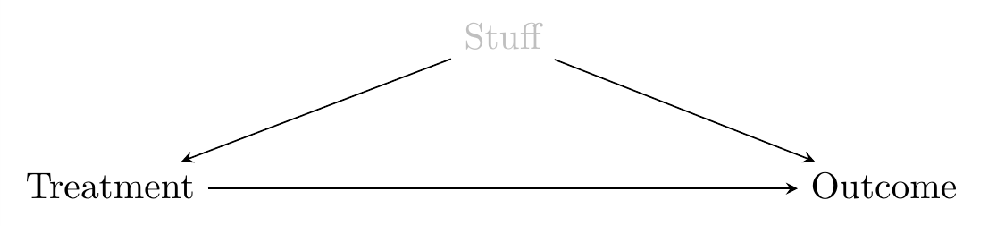

Simple, straightforward. Treatment, outcome, and a back door through, uh, something. Some stuff.

Despite being simple, this diagram is actually far more daunting. By just writing “Stuff,” weʼve given up even trying to figure out what all the back door paths are and how to close them. Sure, we can name a few things that might fall into the category of “Stuff,” but weʼll never name and measure them all.

2

This is a kind of principled ignorance. We know some things about what kinds of variables fit in “stuff,” but we recognize that we donʼt know them all. Letʼs take an econometric classic as an example - whatʼs the effect of an additional year of education on your earnings? We can be pretty certain that demographic and socioeconomic background variables go into “stuff,” as does intelligence, personality, the kind of school youʼre in, and so on. But even if we wrote out a list of fifty things and managed to control for them all, we would still say “I donʼt know everything, and the world is very complex. I must still be leaving something out. I donʼt believe Iʼve identified a causal effect yet.”

Unsurprisingly, people who think this way rarely believe that you can identify a causal effect just by controlling for variables.

SO IF WE CANʼT SEE THE WHOLE DGP, WHAT CAN WE DO?Well, we can try to fill in whatever we can. That can get us a long way.

Instead of trying to map out the entire process, we will instead imagine that the DGP looks more or less exactly like Figure11.111.111.11111111111.1, and spend all of our time asking what variables belong in “Stuff.”111111.111.111.1111111

Surely the actual diagram isnʼt quite as simple as Figure11.111.111.11111111111.1. We know that. But we can probably111111.111.111.1111111 think of most bad paths as simplifying in some way to this. In other words, we know itʼs a problem when some third variable causes both Treatment and Outcome. There are probably enough of those variables to use up all our energies anyway, so letʼs just focus on that.

Thatʼs the question, then - what variables out there likely cause both Treatment and Outcome? Donʼt worry about how those variables might cause each other, donʼt worry if there are potential collider effects going on, just worry about Stuff.

Letʼs take an example. We are interested in the concept of remittances, which are money that immigrants send back to their families in the country they came from. We want to know whether, among immigrants, the country that you immigrate to affects how much you send back in remittances.

What might cause both “destination country” and “remittance amount”? Anything that relates to the kind of work you do is likely to be a factor - training, education, intelligence, strength, and so on, since these will affect both which countries youʼre capable of immigrating to, and how much you earn once you get there (and thus can send back). The country youʼre emigrating from is a factor for similar reasons, although in this case it might affect what you send back because of how much your family needs it. Your culture, language, or religion might play a part - perhaps people prefer to immigrate to countries with similar cultures, languages, or religions where they might find it easier to fit in, and these same factors might influence what you can earn, or what expectations your family places upon you for remittances.

We could go on, but this is a decent list so far. We can think of these as “sources of bias” - if we donʼt control for them, we wonʼt identify the effect. We might accidentally include some variables in here that are colliders on some path, or that are actually irrelevant, but in general, asking

“what variables cause both treatment and outcome” is on the easier end of the spectrum when it comes to laying out a causal diagram.

The key deviation at this point from the approach taken in the rest of the book is that we take this list of necessary controls and…donʼtuse it to identify the effect.

Sure, we might control for some of them. But under this approach, we can take for granted that if we havenʼt already found a variable wecanʼtcontrol for, then that just means we didnʼt think hard enough about it. And if we think harder and do think of one, then either we canʼt control for it and weʼre stuck, or we can control for it and then we still have even more thinking to do.

Instead, this list of back-door fodder serves as a starting point. A set of considerations about the kinds of things we need to control for, but which we are going to control forindirectly, perhaps without controlling for anything at all.

HOW CAN WE CONTROL FOR STUFF WITHOUT CONTROLLING FOR STUFF?Well, we already know one way, and it might give you a hint for the other ways. In Chapter99 we talked about how we can isolate9 just some causes of the treatment that are unrelated to the outcome.

If we can do this, then, in effect, we are controlling for Stuff without controlling for any Stuff at all. The back doors simply donʼt matter! And when youʼre thinking that thereʼs no way to properly treat and close all the back doors, then doing something that makes all the back doors not matter at once sounds pretty good.

If weʼre doing this, why bother thinking about all the back-door Stuff in the first place? Because it encourages us to think about whether that exogenous source of treatment we need to find a front door is actually related to some of that Stuff - making it not so exogenous any more, or letting us know we do need to control for a little bit of Stuff too. In fact, we donʼt even need tothinkabout whether our exogenous source is related to Stuff, we can actually test it ourselves - Iʼll talk about this in the next section.

The finding-front-doors method demonstrates that our goal here is to select methods that let us close a bunch of back doors at once, even if we canʼt measure the variables on those back doors. But itʼs not the only method for accomplishing this goal.

SOMETIMES, A CONTROL IN THE HAND IS WORTH AN INFINITE NUMBER IN THE BUSH.Some controls are both easy to measure and can close a lot of back doors.

Keeping in mind that the idea of controlling for a variable meansremoving any variation explained by that variable, then by controlling for a variable we willalsobe controlling for anything else that only variesbetweenvalues of the first variable.

That was confusing. Letʼs try an example. Letʼs say weʼre doing a study on nature vs. nurture, and so to control for one aspect of nurture, we control for the house you grew up in - this would effectively result in comparing you against your siblings who grew up in the same house (or perhaps kids in other families in a multi-family household).

One other aspect of nurture we might want to control for is the geography of the region you grew up in - city vs. rural, the qualities of the neighborhood, and so on.

But once weʼve controlled for the house you grew up in, we donʼt need to control for that other stuff. The other kids who grew up in your house with youalsogrew up in your neighborhood, in your state, in your country, and so on. Something like neighborhood only varies between different houses. Once weʼve removed all variation related to your house, that will as a matter of course remove all variation related to your neighborhood. So we donʼt need to control for neighborhood, or city vs. rural, or any number of other things that only differbetweenhouses.

- 3
- 4

Most commonly, this comes up in the case of the method of “fixed effects,” where individuals are observed multiple times, and a control for individual is added. This effectively controls for everythingabout that individual, whether itʼs easy to measure or not - their upbringing, their personality, and so on - as long as itʼs constant over time. Plenty of controls knocked out in one fell swoop!

5

SOMETIMES WE CAN JUST ASSUME THINGS ARE COMPARABLE.Another approach that is often taken when there are far more controls that need to be added than are feasible is to take our group of treated people and compare them only to a group that is, by assumption, on average comparable on all these controls in some way. A control group! If we assume that a given control is identical between the treated and control groups, then we donʼtneedto control for it, since itʼs already the same.

This approach of selecting a control group is standard when implementing an experiment. We enforce the comparability of the groups in that case by randomly assigning people to treatment or control. On average, there shouldnʼt be any differences on any of the variables on the back doors, since we randomly assigned people without any regard for those variables. No need to add them as controls then.

In cases where we havenʼt explicitly randomized, however, this is a much heavier assumption to take on. In pretty much any observational context, it would be completely unbelievable to just claim that the treated and untreated groups are the same for all variables on back doors, observable or unobservable. Youʼre basically just assuming youʼve identified the treatment effect at that point, without doing anything, on no justification.

6

So do we really do that? Just assume that treatment and control are the same? No, of course not. Instead, we try to findparticular comparisonsof treatment and control that are the same.

This could be by finding a subset of the control group that really does seem like it should be the same on average for all of the Stuff, measured or not. For example, say youʼre interested in the effect of receiving community-support funds from the government on the level of upward mobility in a community. Clearly, the communities that receive the funds are different from those that donʼt, so we wouldnʼt want to just compare treatment and control.

But perhaps we could make a case thatamong the communities that applied for funding, the communities that got funding are very similar to the ones that didnʼt, with funding awards being semi-random. Thatʼs not quite as good as actual randomization, but itʼs certainly a start, and likely controls for a lot of variables we couldnʼt measure, like “need for community funding.”

7

Another way we could make particular comparisons is by comparing treatment and control not on average, but ratherjust within certain parts of the variation. For example, rather than asking whether the treatment outcome average is different from the control outcome average (a comparison for which all of those variables on back doors are very much still active), we can ask whetherchanges over timein the treatment outcome average are different fromchanges over timein the control outcome average.

By looking at changes over time in the outcome, instead of the absolute level, we make the treatment/control comparison a lot more plausible, since we donʼt need the treatment and control groups to be the same on average for all the Stuff. We just need thechange over timeof that Stuff to be the same on average. There are many other ways that we can knock out a lot of the variation in the Stuff, and rely on much narrower assumptions about what the treatment and control are comparable on.

8

SO THERE ARE SOME SAVING GRACESavailable to us that we can use to identify an effect, even if weʼre doubtful of our ability to truly map out the DGP, or toeverfigure out and measure the full set of necessary controls.

Each of these alternate approaches relies on its own sets of assumptions. And the whole idea here is that we didnʼt want to have to make a bunch of strong assumptions about the DGP! It sort of seems like, instead of having the principled ignorance to admit what we donʼt know, weʼve just traded one set of assumptions for another.

9

Thankfully, the researcher has yet another set of tools at their disposal that they can rely on to figure out whether their assumptions (which, if you remember from way way back at the beginning of the book, wehave to have assumptionsto identify anything) have indeed led them astray.

###### 11.3 Yes, Iʼm Wrong, But Am I THAT Wrong?

HERE WE ARE,an estimate to our name, a set of controls, perhaps a control group or a way of isolating front doors, and still skeptical, ever skeptical, that weʼve managed to identify what we think weʼve identified. How can we make ourselves more certain?

Testing whether our assumptions are true is rarely possible - they often arenʼt about things we can observe in the first place. However, there are a few good avenues for checking whether our assumptions seemfalse. Distressingly, this is much easier to do (at least when it comes to checking assumptions using data rather than theory) than checking whether they seem true.

THIS BRINGS US TO THE WIDE WIDE WORLD OF “ROBUSTNESS TESTS.”A robustness test is a way of either

###### (1) checking whether we can disprove an assumption, or (2) redoing our analysis in a way that doesnʼt rely on that assumption and seeing if the result changes.

One way of doing robustness tests we already covered in Chapter88. In that chapter, we looked at8 a causal diagram such as in Figure111.11.1111111111.2.111111.11.11.2.2

Figure 11.2: The Effect of Wine on Lifespan

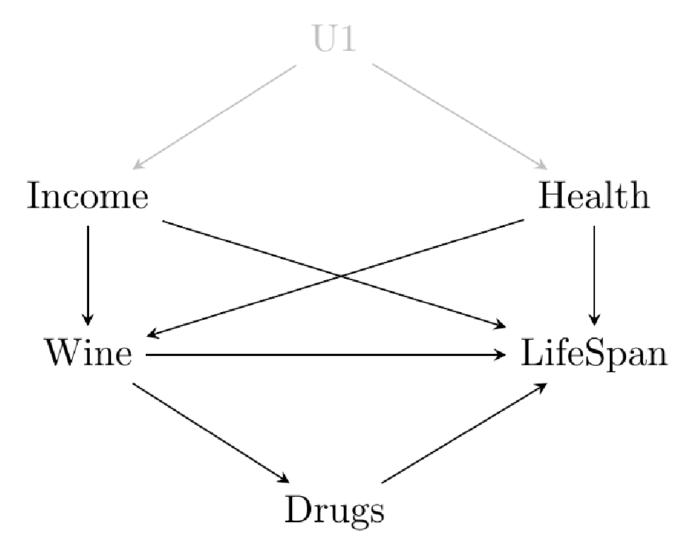

This figure doesnʼt just imply what we need to control for in order to identify the effect of Wine on LifeSpan, it also exposes some assumptions weʼre making. For example, all paths between Drugs and Income on this diagram either contain a collider or contain Wine. So we are assuming that if we control for Wine, Drugs and Income should be unrelated. If we control for Wine and theyare related, then thatʼs evidence against one of the assumptions we made.

Most robustness tests work in a similar way to this. We detail an assumption weʼre making, which usually implies that a relationship between two things is not there, and then we test it. If that relationshipisthere, then thatʼs evidence against our assumptions.

There are a whole bunch of available robustness tests for any given method you could be using. But letʼs take an example. Letʼs say weʼre relying on a control group, where weʼre comparing changes over time in the treatment group to changes over time in the control group.

Using this method assumes that the changes over time in all the back-door Stuff is the same in the treatment and control groups. So if we were to take some of those changes over time, we should find no relationship between changes over time and whether youʼre in the treatment group or the control group.

Now we havethe relationship that should not be,and weʼre set up for our robustness test. We just need to take one of those back door control variables and see if its changes over time are related to being in the treatment or control group.

If that relationship is there, thatʼs evidence against the assumptions we made for our research design. Sure, we could just add that variable as a control to fix the problem with the variable we checked, but even if we do that, we still have all the unmeasured variables in Stuff to worry about. We were operating under the assumption that weʼd solved that problem. But checking the variable wecouldcheck showed we didnʼt fix it for that one, so why believe we did any better with the others?

Figuring out what kind of robustness test to do requires thinking carefully about the assumptions being made, and what sort of observable non-relationships those assumptions imply. Then the tense moment while you hope really, really hard to not find a result… and, well… weʼll see!

10

ONE FORM OF ROBUSTNESS TEST THAT CAN HELP FERRET OUT BAD ASSUMPTIONS, especially when you are using a method that compares a treated group to a comparable control group, is theplacebo test. A placebo test is, as you might guess from the name, a test where you pretend that treatment is being assigned somewhere it isnʼt, and you check whether you estimate an effect. If you find an effect of “treatment,” that tells you that there must be a bad assumption somewhere, since youʼre

11

finding that the effect ofnothingissomething! We discussed these before in Chapter88, but8 they bear another look.

For example, say youʼre looking at the impact of an environmental conservation letter. A certain county tested a policy where, if you used above 1,200 kwh of electricity in a given month, youʼd get a letter asking you nicely to use less. We think that untreated people who use 1,151-1,200 kwh are a pretty good control group for the treated people who use 1,201-1,250 kwh. Those usage rates are so close that weʼd expect those groups to be similar on all back-door Stuff variables we can or canʼt measure. So we comparenext monthʼsusage among those who had 1,201-1,250 kwh last month to those who had 1,151-1,200 kwh last month. Thatʼs our design! Nice and simple.

A standard robustness-check approach here would just be to see if the Stuff variables we can measure are different between the 1,151-1,200 kwh and 1,201-1,250 kwh groups.

12

However, we can also do a placebo test. Letʼs imagine that the policy instead went into action at above 1,150 kwh. Now we can use the exact same design - this time comparing our faketreatment group of 1,151-1,200 kwh against the new control group of 1,101-1,150 kwh. Now, thereshouldnʼtbe a big difference between these two groups in their next monthʼs usage, because in actuality they both received the same treatment, which is no treatment at all. So if we dofind a difference between these groups, that tells us that one of our assumptions is likely to be off. Perhaps groups whose usage differs by 50 kwh, in fact, are quite different on a lot of backdoor-relevant variables!

TO BE HONEST, ALL OF THIS IS A LITTLE FANCIFUL.The whole idea that we can test whether an assumption is true or not is silly. All assumptions are wrong at some level. Weʼre not so much trying to prove these assumptions true or false as we are trying to prove them “notsowrong as to cause problems” or “too wrong to work with.”

Do we have to do that? Surprisingly, no! There is another way. This is thepartial identification approach.

13

Under partial identification, we donʼt force ourselves to keep making assumptions until weʼve identified the effect. Instead, we make the assumptions that weʼre pretty certain about. Then, we

use arange of possibilitiesabout the remaining things we must assume. Finally, we figure out what our estimate is over that range, giving us a range of possibilities for the estimate itself.

Letʼs do an example. Say weʼre interested in the effect of owning a sports car on your tendency to drive over the speed limit. We add some controls - gender, age, income, parental income, and so on. We estimate the effect and find that owning a sports car increases your chances of speeding on a given drive by 5%. There are some unmeasured things remaining, though - tendency for risktaking, for example.

We donʼt want to assume that getting a sports car is unrelated to risk-taking tendencies. That just doesnʼt sound plausible. But we can say “risk-taking is likely to be positively related to both sports car ownership and speeding,” (even though we donʼt know how strongly) “so risk-taking being left out of the model makes the treatment effect look more positive. If we could control for risk-taking, the treatment effect would become more negative.”

With that (much more plausible) assumption, we canʼt actually say what the effect of owning a sports car on speeding is precisely, but we can say that itʼsno higher than 5%.We have “bounded the effect from above” by 5%.

If we like, we can then go further. If weʼre willing to make assumptions a little stronger than just the sign, we can say something like “given all the other controls, the effect of risk-taking on buying a sports car is between 0 and X.” This would let us say that the effect of sports car ownership on speeding is not just lower than 5%, butbetween5% and some specific lower number, maybe 2%. We can adjust the strength of our assumptions as we like, getting more precise results with heavier assumptions, or less precise results with assumptions that donʼt say as much.

14

Partial identification is a wide-ranging area with plenty of methods. This second edition of the book has an entire new chapter on partial identification, in Chapter2121. If you want to go further,21 you can find a relatively gentle introduction in Gangl (⊕2013).

YOUR LAST LINE OF DEFENSE IS YOUR GUT.After all of that - checking the reasonableness of your assumptions and what they imply, checking how precise your results can get based on how strong your assumptions are - youʼre still left with a set of assumptions and a result.

And that result? Sometimes results just donʼt make sense.

Thatʼs an important thing to pay attention to. Is your result plausible at all? If itʼs not, then even if you canʼt figure out why or what you could do to fix it, then you have an assumption wrong somewhere. You just must.

For example, say youʼre studying the effect of drinking an extra glass of water once a week on your lifespan. You carefully design your research, control for all the necessary controls, do everything you can, and you find that the extra glass of water once a week makes you live twenty years longer.

Astounding! Alert the presses.

Well, probably not. Thereʼs just no way thatʼs true. Completely unbelievable. You must have made an incorrect assumption, or made an error in your statistical code, or perhaps just got a huge fluke result in your data. What you didnʼt get is the real result. Not buying it.

Thereʼs a degree of subjectivity here. We want to be willing to accept surprising results - if we werenʼt, whatʼs the point of doing research in the first place? But many results are not just surprising but darn near impossible. And it doesnʼt even need to be as extreme as a twenty-year lifespan jump. If you found that a teacher training program increased student test scores by a third of a standard deviation, is that too good to believe? If you found that a simple thirtysecond audio message played once in a laboratory changed peopleʼs behaviorat alfive years later, is that plausible? Maybe not.

###### 15

So thatʼs the last line of defense you have. Your gut. Could this result ever possibly be? If it couldnʼt, then it isnʼt.

Previous Next

Page built: 2025-10-17 using R version 4.5.0 (2025-04-11 ucrt)

4/18/26, 1:52 PM The Toolbox | The Effect

# The Effect

Nick Huntington-Klein

###### ▾ Chapters

###### The Toolbox

###### The second part of the book begins here. Just hit Next.

Previous Next

Page built: 2025-10-17 using R version 4.5.0 (2025-04-11 ucrt)

https://theeffectbook.net/the-toolbox.html 1/1

# The Effect

Nick Huntington-Klein

▾ Chapters

###### Chapter 12 - Opening the Toolbox

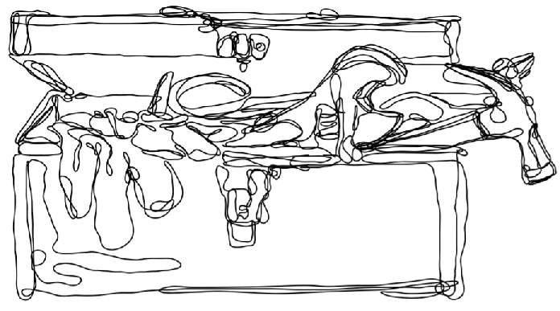

###### 12.1 Concept and Execution

BASED ON THE CONTENT OF THIS BOOK THUS FAR, we have covered the concepts of data generating processes (DGPs) and causality. Weʼve discussed how to isolate our paths of interest, and how to identifythe paths we want by either shutting down the back door paths we donʼt want, or isolating the paths we want directly.

But thatʼs all conceptual. How do we actuallydothose things?

While the first half of this book covered concepts and intuition, the second half covers execution. Weʼll be delving into thetoolboxof methods that are commonly used by researchers.

Many of these methods, especially those past the “Regression,” “Matching,” and “Simulation” chapters, are based around the idea ofsimplifyinga causal diagram. That is, in the real world,

causal diagrams get so complex and intricate that it would be very difficult to measure and adjust for all the variables we need, like I talked about in Chapter111111111111111.1111111111

But there are certain kinds of what we might calltemplatecausal diagrams that can be solved easily. We can ask ourselves whether our context and research question of interest fits one of those templates. If it does, the associated method will give us a shortcut to identification that may be more plausible to people reading your work than trying to convince them youʼve really thought of and closed every back door.

1

2

SO HOW TO USE THESE METHODS?

As always, first we want to model our DGP, and draw a causal diagram! These methods are no replacement for understanding our DGP, and indeed knowing which method to use relies on it.

Second, we want to ask ourselvesdoes our diagram look how it needs to look to use one of these methods?For example, as youʼll read in Chapter1919, to use the instrumental variables method19 there must be an “instrumental” variable that causes our treatment, and for which all paths from the instrumental variable to the outcome go through the treatment.

If it does, we can use the method. Weʼve solved our research design problem. From that point, we can start concerning ourselves with statistical issues rather than design issues.

###### 12.2 The Toolbox Chapters

The Toolbox chapters from Chapter1616 through Chapter16 2121 focus on “template” research designs21 in which the same sort of causal diagram, and thus design, applies in lots of different settings. These chapters will be structured the same, with three sub-chapters.

- 1.How Does It Work?: A conceptual overview of how the method identifies causal effects, a look at the kinds of diagrams that each of the methods works with, and a

demonstration of how the method manipulates data to give you what you need.

- 2.How Is It Performed?: This subchapter gets a little more into the weeds, showing how the method is executed, usually usingregression (which weʼll talk more about in Chapter1313).13

- 3.How the Pros Do It: If you want to actually use a given method in a realworld research project, the basic version is often not enough. This subchapter will discuss some of the additional considerations, adjustments, or methods that actual researchers often use when implementing these methods. Itʼs impossible to cover everything that researchers actually do in these chapters. So these are designed not so much to show you everything a researcher knows, but rather to make you aware of the kinds of things actual researchers are thinking about, and why.

BECAUSE THIS BOOK FOCUSESmore on research design than econometrics proper, there is little in the way of statistical proofs. If you are interested in these, I recommend the excellent textbooks by Jeffrey Wooldridge (⊕2016). Or, if you want the real advanced stuff, William Greene (⊕2003).

Itʼs also an undeniable fact that theHow the Pros Do Itsections do not tell you all the information you need to actually do it like the pros do it. This is because the way the prosactualydo it is to read a voluminous and ever-changing literature on the newest approaches to these methods, or

at least just read a bunch of other studies using the same general method and then largely follow their lead. Trying to keep up in textbook form would be fruitless, and would require nearly a whole book on each method.

- 3

Rather, theHow the Pros Do Itsections focus on highlighting some of the most important caveats and extensions, and giving you what you need to go learn about the state of the art on your own. If you are hoping for additional up-to-date applications of these methods, or information on their history, I recommendCausal Inference: The Mixtapeby Scott Cunningham (⊕2021).

###### 12.3 Code Examples

ALL OF THE CHAPTERS IN THE TOOLBOXwill include code examples in R, Stata, and Python, showing you how methods can be executed in code.

These code chunks may rely onpackagesthat you have to install. Anywhere you see library(X) or X:: in R or import X or from X import in Python, thatʼs a package X that will need to be installed if it isnʼt already installed. You can do this with install.packages('X') in R, or using a package manager like pip or conda in Python. In Stata, packages donʼt need to be loaded each time theyʼre used, so Iʼll always specify in the code example if thereʼs a package that might need to be installed. In all three languages, you only have to install each package once, and then you can load it as many times as you want.

One additional package youʼll want to install to run these code examples is causaldata, which is a package of data sets Iʼve made for this book (and several other books) and is available for all three languages. Do install.packages('causaldata') in R, ssc install causaldata in Stata, or pip install causaldata (if using pip) in Python.

The datasets all come with documentation. Using the mortgages data as an example: in R, see the description with help(mortgages, package = 'causaldata') (or just help(mortgages) if you already loaded the package with library(causaldata)). You can also see the description of each variable as you work with library(vtable) and then vtable(mortgages) after loading the data. In Stata, variable labels can be seen in the Variable

Explorer as normal, and you can get a description of the data set with the command causaldata mortgages. In Python, after loading the data with from causaldata import mortgages, you can see the data and variable descriptions with, respectively, print(mortgages.DESCRLONG) and print(mortgages.NOTE).

These code examples have been run using R 4.4, Stata 17, and Python 3.11. If your version of the language is at that level or newer, you should be good to go! If itʼs older than that, you may want to upgrade, but while I havenʼt tested the code examples on all old versions, some things might break but youʼreprobablymostly still fine as long as your R is version 3+ and your Stata is 14+. For Python, itʼs strongly recommended that you at least use 3.0+, as there are a number of major syntax changes from Python 2 to Python 3. For all three languages, you may still get somewhat different results based on updates to downloadable packages that occur after the publication of this book. If you spot such a change, please feel free to contact me.

- 4

One final note on code, specifically in Stata: Stata doesnʼt naturally allow you to split one command onto two lines. However, some lines of code are going to be too long to fit on one line of the book and so must be split! This can be accomplished with the use of /// at the end of a line, which means “the line isnʼt over yet, keep reading on to the next one.” However, for some reason, Stata has decided that this will only work if you are running code using the “Execute” button in the do-file editor. It doesnʼt work if youʼre just copy/pasting code into the Stata console. So if you see a /// at the end of a line, either be sure to run that code using Execute from your do-file editor, or just erase the /// and combine that line with the following line of code (and keep going until you hit a line that doesnʼt end in ///).

Previous Next

Page built: 2025-10-17 using R version 4.5.0 (2025-04-11 ucrt)

## The Effect

Nick Huntington-Klein

▾ Chapters

###### Chapter 13 - Regression

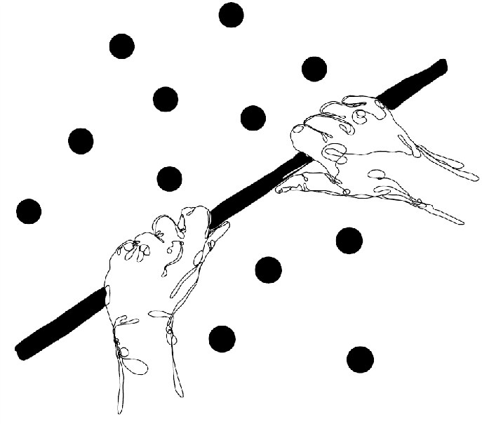

###### 13.1 The Basics of Regression

REGRESSION IS THE MOST COMMON WAY IN WHICH WE FIT A LINE TO EXPLAIN VARIATION.Using one variable to explain variation in another is a key part of what weʼve been doing the whole book so far!

When it comes to identifying causal effects, regression is the most common way of estimating the relationship between two variables while controlling for others, allowing you to close back doors with those controls.1Naturally itʼs relevant to what weʼre doing. Not only will we be discussing it

further in this chapter, but many of the methods described in other chapters of Part II of the book are themselves based on regression.

Weʼve already covered the basics of regression, back in Chapter44. So go back and take a look at4 that.

Some key points from that chapter:

We can use the values of one variable ( ) to predict the values of another (

- X
- Y Y X 2

). We call this explaining using .

While there are many ways to do this, one is to fit alineorshapethat describes the relationship. For example, . Estimating this line using ordinary least squares (standard, linear regression) will select the line that minimizes the sum of squared residuals, which is what you get if you take the prediction errors from the line, square them, and add them up. Linear regression, for example, gives us thebest linear approximationof the relationship between and . The quality of that approximation depends in part on how linear the true model is.

Y = β0 + β1X

###### X Y

Pro: Uses variation efficiently

Pro: A shape is easy to explain

Con: We lose some interesting variation

Con: If we pick a shape thatʼs wrong for the relationship, our results will be bad

We can interpret the coefficient that multiplies a variable ( ) as a slope. So, a one-unit increase in is associated with a increase in .

β1

X β1 Y

With only one predictor, the estimate of the slope is the covariance of and divided by the variance of . With more than one, the result is sort of similar, but also it accounts for the way the different predictors are correlated.

- X

Y X

- Y^

If we plug an observationʼs predictor variables into an estimated regression, we get a prediction . This is the part of that is explained by the regression. The difference between and is the unexplained part, which is also called the “residual.”

Y

Y Y^

If we add another variable to the regression equation, such as

, then the coefficient on each variable will be estimated using the variation that

Y = β0 + β1X + β2Z

remains after removing what is explained by theothervariable. So our estimate of would not give the best-fit line between and , but rather betweenthe part of not

β1

Y X

Y Z X Z Z

###### explained by andthe part of not explained by . This “controls for .”

If we think the relationship between

and isnʼt well-explained by a straight line, we can use a curvy one instead. Ordinary least squares (OLS) can handle things like

Y X

that are “linear in parameters” (notice that the parameters and are just plain multiplied by a variable, then added up), or we can use nonlinear regression like probit, logit, or a zillion other options.

Y = β0 + β1X + β2X2

β1 β2

Those are the basics that more or less explain how regression works. And as long as that regression model looks like the population model (the true relationship is well-described by the shape we choose), it has a good chance of working pretty well. But thereʼs still plenty left to cover. What else do we need to know?

Weʼre going to add a few pieces of OLS that we havenʼt covered yet, or at least not thoroughly:

The error term

Sampling variation

The statistical properties of OLS

Interpreting regression results

Interpreting coefficients on binary

###### and transformed variables

Thatʼs a lot to get through! Letʼs get going.

###### 13.1.1 Error Terms

- A LOT OF THE DETAIL OF REGRESSION IS HIDDEN IN THE PLACES IT DOESNʼT GO.I previously described fitting a straight line as figuring out the appropriate and values to give us the line

β0 β1 Y = β0 + β1X

.

However, in our actual data, that line is clearly insufficient. It will rarely predictanyobservation perfectly, much lessalof the observations. Thereʼs going to be a difference between the line that we fit and the observation we get. Thatʼs what I mean by “the places it doesnʼt go.” We can add this difference to our actual equation as an “error term” which Iʼll mark as . So now our equation is:

ε

Y = β0 + β1X + ε (13.1)

That difference goes by two names:the residual, which weʼve talked about, is the difference between the prediction we make with our fitted line and the actual value, andthe erroris the difference betweenthe true best fit-lineand the actual value. Why the distinction? Well… sampling variation. Because we only have a finite sample, the best-fit line wegetwith the data we have wonʼt quite be the same as the best-fit line weʼd get if we had data on the whole population. All we can really see will be the residual, but we need to keep that error in mind. As we know from Chapter33, we want to describe the population. Those population-level errors will3 help us figure out whatʼs going on.

3

You can see the difference between a residual and an error in Figure13.111111113.1. The two lines on the111113.1.1.1.1.1111111 graph represent thetrue modelthat I used to generate the data in the first place, and the OLS best-fit line I estimated using the randomly-generated sample. For each point, the vertical distance from that point to the OLS line is the residual (since the OLS line represents our prediction), and the vertical distance from that point to the true model is the error (since even if

we knew the true model relating and , we still wouldnʼt predict the point perfectly because of the other stuff that goes into ).

###### Y X Y

Figure 13.1: The Difference Between the Residual and the Error

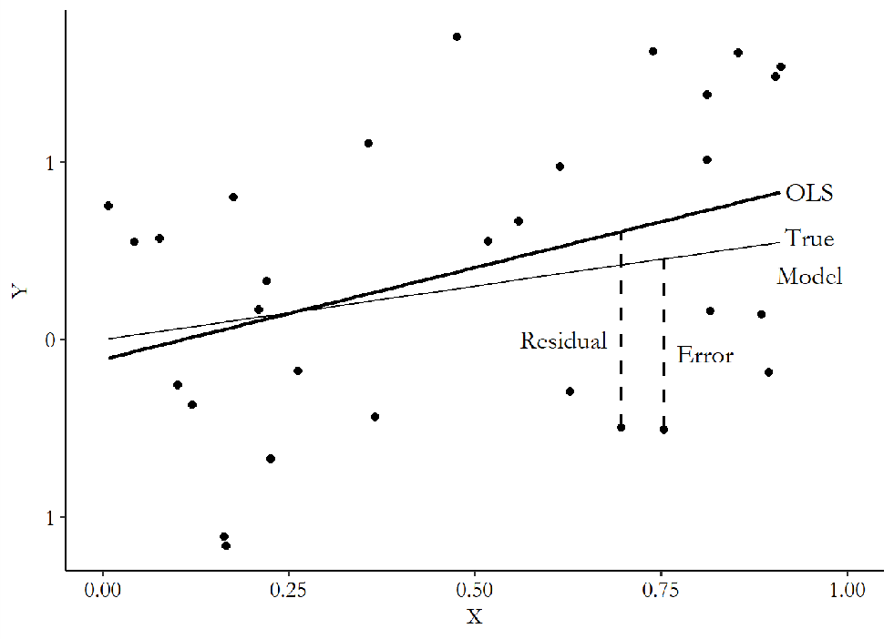

So whatʼs in an error, anyway? Where does it come from? Well, the error effectively contains everything that causes that isnot included in the model. is on the left-hand-side of the

Y Y Y = β0 + β1X + β2Z + ε

equation, and itʼs determined by the right-hand-side. So if thereʼs something that goes into but isnʼt or , then it has to come from somewhere. That somewhere is .

Y X Z ε

includes both stuff we can see and stuff we canʼt. So, for example, if the true model is given by Figure13.213.2, and we are using the OLS model13.2.... , then is made up of some combination of , , and . We know that since we can determine from the graph that ,

ε

Y = β0 + β1X + β2Z + ε ε A B C A

, and all cause , but they arenʼt in the model.

###### B C Y

Figure 13.2: Depending on the Model Used, A, B, C, and Z Might Be in the Error Term

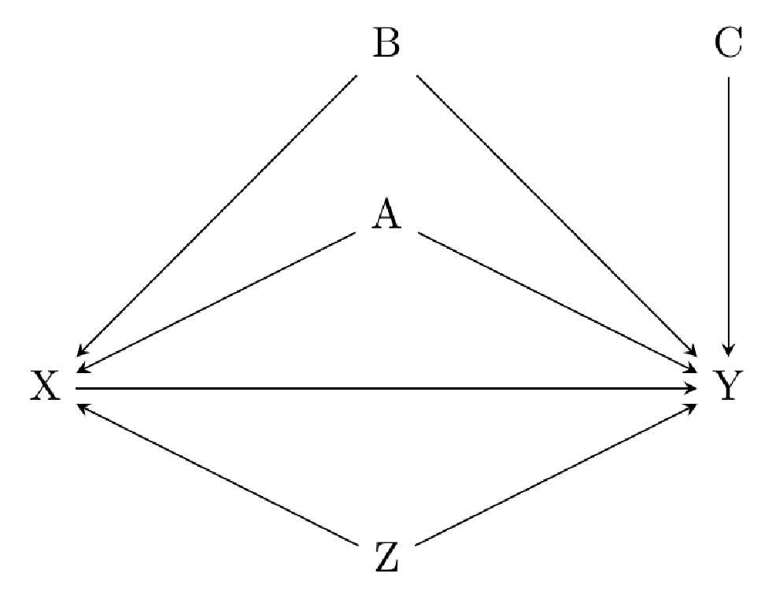

###### 13.1.2 Regression Assumptions and Sampling Variation

THINKING ABOUT WHATʼS IN THE ERROR TERMleads us to the firstassumptionweʼll need to make about the error term. There are going to be a few of these assumptions, and Iʼll bring them up as they become necessary. People who use regression tend to be obsessed about those lilʼ s and the assumptions we make about them. Go to any research seminar, and youʼll hear endless questions about error terms and whether the assumptions we need to make about them are likely to be true.

ε

The first assumption weʼll talk about links the first and second parts of the book, and itʼs the exogeneityassumption. If we want to say that our OLS estimates of will, on average, give us

β1

β1 X ε 4

the population , then it must be the case that isuncorrelatedwith .

If that sounds familiar, itʼs because weʼre really just restating the conditions for identifying a causal effect! Every variable that causes in a causal diagram like Figure13.213.2 ends up in the13.2.... regression equation somehow, whether itʼs one of the variables in the model or just in . If a variable isin the regression equation directly, then that closes any causal paths that go through that variable. By adding a variable to the regression, we “control for it” or “add it as a control.” So with the regression , the path is closed.

###### Y

ε

Y = β0 + β1X + β2Z + ε X ← Z → Y

But if something is still in the error term and is correlated with , we havenʼt closed the path. Since is in , and we know from the diagram that , then we can say either that (a) we havenʼt closed the back door path, and so the effect of isnʼt identified, or, (b) is correlated with and so is “endogenous” rather than exogenous, and the effect of isnʼt identified. These are saying, in effect, the same thing, just using lingo from different domains.

X A ε A → X

X ← A → Y X X ε X

5 6

Similarly, we can say in either set of lingo that we donʼt need to worry about being in our model. Itʼs in the error term - everything that predicts but isnʼt in the model is in the error term. But we can say either (a) thereʼs no back door from to that goes through , or (b) is unrelated to and so isnʼt leading to be endogenous.

C Y

X Y C X C C X

Speaking of lingo, if wedohave that endogeneity problem, then on average our estimate of wonʼtgive us the population value. When that happens - when our estimate on average gives us the wrong answer, we call that abiasin our estimate. In particular, this form of bias, where we are biased because a variable correlated with is in the error term, is known asomited variable bias,since it happens because we omitted an important variable from the regression equation. Previously in the book weʼd say we failed to close the back door that goes through . In this lingo, weʼd say that gave us omitted variable bias, but doesnʼt.

β1

X

A A C

So thatʼs our first assumption about the error term - the exogeneity assumption, that is uncorrelated with any variable we want to know the causal effect of. We know how to think about whether that assumption is true - the entire first half of this book is about figuring out whatʼs necessary to identify a causal effect.

ε

Of course, thatʼs only the first thing we need to assume about the error term. Many of the others, though, relate to the sampling variation of the OLS estimates.

JUST LIKE THE MEANS WE DISCUSSEDin Chapter33, regression coefficients are estimates, and even3 though thereʼs a true population model out there, the estimate we get varies from sample to sample due to sampling variation.

Conveniently, we have a good idea what that sampling variation looks like. We know that we can think of observations as being pulled from theoretical distributions. We also know that statistics like the mean can also be thought of as being pulled from theoretical distributions. In the case of the mean, thatʼs a normal distribution (see Chapter33). If you drew a whole bunch of samples of3 the population and took the mean each time, the distribution of means across the sample would follow a normal distribution. Then we can use the estimated mean we get to try to figure out what the population mean is.

Regression coefficients also follow a normal distribution, and we know what the mean and standard deviation of that normal distribution is. Or, at least we do if we make a few more assumptions about the error term.

7

What is that normal distribution that the OLS coefficients follow?

In a regression model with one predictor, like , an OLS estimate of the truemodel population follows a normal distribution with a mean of and a standard deviation of

Y = β0 + β1X + ε β^1 β1 β1

, where is the number of observations in the data, is the standard deviation of the error term , and is the variance of . This standard deviation isnʼt generally caleda standard deviation, though. The standard deviation of a sampling distribution is often referred to as astandard error. And thatʼs what weʼll call them here too.

√σ2/(var(X)n) n σ ε var(X) X 8

If thereʼs more than one variable in the model, the math starts to require matrix algebra, but itʼs the same idea. In the regression model , the OLS estimates and follow a joint normal distribution, where their respective means are the population and , and the standard deviations are the square roots of the diagonal of , where is a two-column matrix containing both and . But you can think of as saying “divide by

Y = β0 + β1X + β2Z + ε β^1 β^2

β1 β2 σ2(A′A)−1/n A

X Z (A′A)−1

the variances and covariances of and ,” just like says “divide by the variance of .”

X Z √σ2/(var(X)n) X

How can we make an OLS estimateʼs sampling variation really small? There are only three terms in the standard deviation, so only three things to change: (1) We could shrink the standard deviation of the error term , i.e., make the model predict more accurately, (2) we could pick an

σ Y X X

that varies a lot and has a big variation - an that changes a lot makes it easier to check whether is changing at the same time, or (3) we could use a big sample so gets big.

Y n

HOW ABOUT THOSE OTHER ASSUMPTIONSwe need to make about the error term? It turns out that those assumptions are necessary to assume that the stuff Iʼve said up to now about the standard error is true. Letʼs tuck that away in our back pocket for now and ignore that looming problem. Weʼll come back to it in the “Your Standard Errors are Probably Wrong” section below. All of the things Iʼm going to say now aboutusingstandard errors will still hold up. There might just need to be some minor adjustments to the way we calculate them, which is what weʼll discuss in that section.

###### 13.1.3 Hypothesis Testing in OLS

OKAY, SO WHY DID WE WANT TO KNOW THE OLS COEFFICIENT DISTRIBUTION AGAIN?The same reason we want to think aboutanytheoretical distribution - theoretical distributions let us use what we observeto come to the conclusion that certain theoretical distributions are unlikely.

And since the theoretical distribution of our OLS estimate is centered around the population parameter , that means we can use our estimate to say that certain population parameters are very unlikely, for example “itʼs unlikely that the effect of on is 13.2.”

β^1 β1 β^1

X Y

To recap what weʼre doing here, modifying only slightly what we have from Chapter33:3

- 1. We pick a theoretical distribution, specifically a normal distribution

centered around a particular value of

β1

- 2. Estimate using OLS in our observed data, getting
- 3. Use that theoretical distribution to see how unlikely it would be to get if indeed the true population value is what we picked in the first step
- 4. If itʼs super unlikely, that initial value we picked is probably wrong!

β1

β^1

β^1

9

We can take this a step further towards the concept ofhypothesis testing. Hypothesis testing is a way of formalizing the four steps above into a way of making a decision about whether we can “reject” the theoretical distribution, and thus the original we picked.

β1 10

Under hypothesis testing, we pick a “null hypothesis” - the initial value weʼre going to check against. In practice, this is almost always zero (although it certainly doesnʼt have to be), so letʼs simplify and say that our null hypothesis is .

β1

β1 = 0

Then, we pick a “rejection value” . If we calculate that the probability of getting our estimated result from the theoretical distribution based on is below , then we say thatʼs too unlikely, and conclude that is false, rejecting it. Commonly, this rejection value is , so if the estimate we get (or something even stranger) has a 5% chance or less of occurring if the null value is true, then we reject the null.

α

β1 = 0 α β1 = 0 α = .05

Once weʼve rejected , what conclusion can we come to? Not that our estimate is correct we certainly donʼt know that; there are plenty of nonzero values we havenʼt rejected. All we can say is that we donʼt think itʼs likely to be 0. Knowing itʼs not zero can be handy - if itʼs not zero, that means thereʼssomerelationship there. And thatʼs our conclusion.

β1 = 0

To see this in action, I generated 200 random observations using the true model , where is normally distributed with mean 0 and variance 1. Then, pretending that we donʼt know the truth is , I estimated the OLS model using the regression .

Y = 3 + .2X + ε ε

β1 = .2 Y = β0 + β1X + ε

The first estimate I get is . I can use the formula from the last section to also calculate that the standard error of is . So the theoretical distribution Iʼm looking at is a normal distribution with mean 0 and standard deviation .

β^1 = .142 β1 se(β1) = .077

###### .077

Under that distribution, the estimate I got is at the 96.7th percentile of the theoretical distribution, as shown in Figure13.313.3. That means that something as far from 0 as13.33.33.33333333.33.3333333 is (or farther) happens 6.6% of the time. If we started with , then we wouldnotreject the null hypothesis, since 6.6% is higher than 5%, even though we happen to know for a fact that the null is quite wrong.

###### .142

###### .142 (100 − 96.7) × 2 = 3.3 × 2 = 11 α = .05 β1 = 0

Figure 13.3: Comparison of Our .142 Estimate to a Theoretical Null Distribution Centered at 0

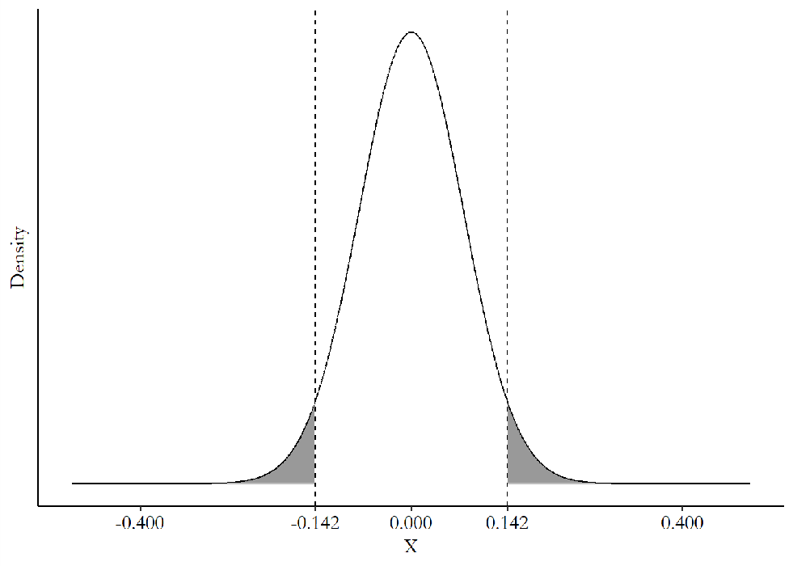

We can see how this works from a different angle in Figure13.413.4. This time Iʼm generating a bunch13.4.... of samples of random data and showing the sampling distribution against a given null value. Iʼm magically giving myself the knowledge that is the true value to test against. I generate

###### β1 = .2

random data from that same true model a whole bunch of times, estimate using OLS, and test it against the null of . Sometimes I still reject the null, even though the null is literally true, but not often. In fact, I reject it exactly 5% of the time, because of the decision. Sampling variation will do that! This is a rejection of something thatʼs true, and how often we do it is the “false positive” rate, or the terribly-named “type I error rate.”

Y = 3 + .2X + ε β^1 β1 = .2

α = .05

12

I then test those same estimates against the null of . Sometimes I fail to reject the null, even though the null is false. Sampling variation does this too! Our failure to reject false nulls is the “false negative” rate or the “type II error rate.”

###### β1 = 0

What these figures demonstrate is that hypothesis testing really isnʼt about pinning down a true value, nor is it about hard-and-fast, true-and-false results. Itʼs about showing that certain theoretical distributions are unlikely. And we can then say that if theyʼretoounlikely, we can forget about them.

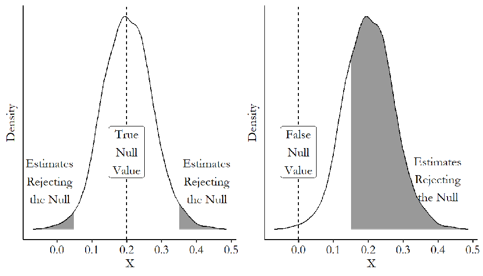

Figure 13.4: Testing 1,000 Randomly Generated Samples Against the True Null and a False Null

In practice, when applied to regression in most contexts, weʼre talking about a normally-distributed regression coefficient and an

false positive rate (with a two-tailed test), testing against a null that the coefficient is 0. So if the probability of our estimate (or something even farther

###### α = .05

from 0) occurring is less than 5%, we call that “statistically significant” and say the relationship is nonzero.

The calculation of the probability comes from computing the percentiles of the normal distribution with a mean of 0 and a standard deviation of our estimated . If our estimate is below the 2.5th percentile or above the 97.5th, thatʼs statistically significant with .

se(β^1) β^1 α = .05

We can also look at the exact percentile we get and evaluate that. If, for example, we find that our estimate of is at the 1.3rd percentile, then we can double that to 2.6, and say that we have a

β^1

- 2.6% probability of being that far away from the null or farther. This probability is called the “pvalue.” The lower that p-value is, the lower the chance is of finding a result that far from the null or farther by sampling variation alone. If you look back at Figure13.313.3, the entire shaded area is13.33.33.33333333.33.3333333 the p-value, since itʼs the area as far away from the null as the actual estimate is, or farther. If the p-value is below , thatʼs statistical significance.

α

Using some known properties of the normal distribution, we can take a shortcut without having to go to the trouble of calculating percentiles. In this context, thet-statisticis the coefficient divided by its standard error . When we scale the estimate by its standard error, that puts us on the “standard normal” theoretical distribution where the standard deviation is 1. Then, if that t-statistic is below -1.96 (the 2.5th percentile) or above 1.96 (the 97.5th percentile), thatʼs statistically significant at the 95% level, and a nonzero relationship.

β^1/se(β^1)

Using that sort of interpretation is what lets us readregression tables, which weʼll get to in a second. But before we do, one aside on this whole concept of statistical significance. Rather, a plea.

Having taught plenty of students in statistical methods, and, further, talked with plenty of people who have received teaching in statistical methods, thesingle greatest differencebetween what studentsare taughtand what studentslearnis about statistical significance. I think this is because significance is wily and tempting. Powerful, tempting, seemingly simple, but so easy to misuse, and so easy to let it take you over and make you do bad things. So please keep the following things in mind and repeat them as a mantra at every possible moment until they live within you:

13

An estimatenotbeing statistically significant doesnʼt mean itʼs wrong. It just means itʼs not statistically significant.

Never, ever, ever, ever,ever, ever, ever give in to the thought: “oh no, my results arenʼt significant, Iʼd better change the analysis to get something significant.” Bad. Iʼm pretty sure professors always say to never do this, but students somehow remember the opposite.

14

15

A lot of stuff goes into significance besides just “is the true relationship nonzero or not.” - sampling variation, of course, and also the sample size, the way youʼre doing your analysis, your choice of , and so on. A significance test isnʼt the last word on a result.

###### α

16

Statistical significanceonlyprovides information about whether a particular null value is unlikely. It doesnʼt say anything about whether the effect youʼve foundmaters. In other words, “statistically significant” isnʼt the same thing as “significant.” A result showing that your treatment improves IQ by .000000001 points is not ameaningfuleffect, whether itʼs statistically significant or not.

17

Keep in mind, generally: the point of significance testing is to think about not just the estimates themselves but also the precision of those estimates. If youʼve got a really cool result but the

standard errors are huge, thereʼs a good chance itʼs a fluke that could be consistent with lots of truerelationships. Thatʼs the kind of thinking significance testing is meant to encourage. But there are other ways to keep precision in mind. You could just think about the standard errors themselves; ask if the estimate is precise regardless of whether itʼs far from a given null value. You could ask what the range of reasonable null values is (construct a confidence interval) instead of focus on one in particular. You could go full Bayesian and do whatever the heck it is those crazy cats get up to. Significance testing is just one way of doing it, and it has its pros and cons like everything else.

###### 13.1.4 Regression Tables and Model-Fit Statistics

WE HAVE A DECENT IDEA AT THIS POINTof how to think about the line that an OLS estimation produces, as well as the statistical properties of its coefficients. But how can we interpret the model as a whole? How can we make sense of a whole estimated regression at once? For that we can turn to the most common way that regression results are presented: the regression table.

Weʼre going to run some regressions using data on restaurant and food inspections. We might be curious whether chain restaurants get better health inspections than restaurants with fewer (or only one) location. Weʼll be using this data throughout this chapter. Some basic summary statistics for the data are in Table13.111111113.1. We have data on the inspection score (with a maximum111113.1.1.1.1.1111111 score of 100), the year the inspection was performed, and the number of locations that restaurant chain has.

18

- Table 13.1: Summary Statistics for Restaurant Inspection Data

Std. Dev.

Pctl. 25

Pctl. 75

Variable N Mean

Min

Max

Inspection Score

27178 94 6.3 66 90 100 100

Year of Inspection

27178 2010 5.9 2000 2006 2016 2019

Number of Locations

27178 65 84 1 27 71 646

Now Iʼll run two regressions. The first just regresses inspection score on the number of locations the chain has:

InspectionScore = β0 + β1NumberofLocations + ε (13.2)

and the second adds year of inspection as a control:

InspectionScore = β0 + β1NumberofLocations+ β2Y earofInspection + ε (13.3)

I then show the estimated results for both in Table13.213.2.13.2....

- Table 13.2: Two Regressions of Restaurant Health Inspection Scores on Number of Locations

&nbsp;Inspection Score

&nbsp;Inspection Score

(Intercept) 94.866*** 225.333*** (0.046) (12.411)

Number of Locations

−0.019*** −0.019*** (0.000) (0.000)

Year of Inspection

−0.065***

(0.006) Num.Obs. 27178 27178 R2 0.065 0.068 R2 Adj. 0.065 0.068 F 1876.705 997.386 RMSE 6.05 6.04

* p < 0.1, ** p < 0.05, *** p < 0.01

What can we see in Table13.213.2? Each column represents a different regression. The first column of13.2.... results shows the results from the Equation(13.2)(((13.2) regression, and the second column of results((13.2).... ))) shows the results from the Equation(13.3)(((13.3) regression.((13.3)3.3)3.3)3333333.33.3)333333

The first thing we notice is that each variable used to predict Inspection Score gets its own set of two rows. The “Intercept” also gets two rows - this is , and on some tables is called the “Constant.” The first row shows the coefficient estimate. Our estimate , the coefficient on Number of Locations, is . It happens to be the same in both regressions - the addition of Year as a control didnʼt change the estimate enough to notice. There are also some asterisks - Iʼll get to those in a second.

β^0

β^1 β^1 = −.0019

19

Below the coefficient estimates, we have our measures of precision, in parentheses. In particular, in this table these are the standard errors of the coefficients. in this regression is - seems pretty precise to me. There are a few different ways you can measure the precision of a coefficient estimate. Putting standard errors here is the most common, but sometimes youʼll see something like a confidence interval. In some fields, using a t-statistic (coefficient divided by the standard error) is more common than the standard error. Ideally a table will tell you which one theyʼre doing, but not always!

se(β^1)

###### .0004

20

Finally, we have those asterisks, called “significance stars.” These let you know at a glance whether the coefficient is statistically significantly different from a null-hypothesis value of 0. To be really precise, these arenʼt exactly significance tests. Instead, theyʼre a representation of the pvalue. The lower the p-value is, the more stars we get.

21

Which p-value cutoff each number of stars corresponds to changes from field to field but should be described in the table note as it is here. A standard in many of the social sciences, and what youʼll see in this book, is that * means that the p-value is below .1 (10%), ** means itʼs below .05 (5%), and *** means itʼs below .01 (1%). So if we see *** as we do in this table for the coefficient on Number of Locations, that would mean thatif we had decided that (or higher), we would reject the null of . If we see ** then weʼd find statistical significance at or higher. Basically, itʼs a measure ofwhich values youʼd find significance withfor this coefficient. These stars are a way of, at a glance, being able to tell which of the coefficients are statistically significantly different from 0, which all of these are.

22

###### α = .01 β1 = 0 α = .05 α

23

Moving down the table, we have a bunch of things that arenʼt coefficients or precision measures. Which of these exact statistics are present will vary from table to table, but in general these are either descriptions of the analysis being run, or measures of the quality of the model. For the

24

first, itʼs common to see any additional details about estimation listed down here (such as any standard error adjustments), and just about every table will tell you the number of Observations (or sometimes “N”) included in estimating the regression.

For the second, there are a billion different ways to measure the quality of the model. Probably two of the most common are included here - and Adjusted . These are measures of the share of the dependent variableʼs variance that is predicted by the model. in the first model is

R2 R2

R2

, telling us that 6.5% of the variation in Inspection Score is predicted by the Number of Locations. If we were to predict Inspection Score with Number of Locations and then subtract out our prediction, weʼd be left with a residual variable that has only 93.5% of the variance of the original. Adjusted is the same idea, except that it makes an adjustment for the number of variables youʼre using in the model, so it only counts the variance explainedabove and beyondwhat youʼd get by just adding a random variable to the model.

.065

###### (100 − .065 =) R2

25

Finally, we have the “F-statistic.” This is a statistic used to do a hypothesis test. Specifically, it uses a null thatal the coefficents in the model(except the intercept/constant)are al zero at once, and tests how unlikely your results are given that null. Itʼs pretty rare that this will be

insignificant for any halfway-decent model, and so I for one mostly ignore this statistic.

Missing from this particular table, but present in a number of standard regression-table output styles, is the residual standard error, sometimes also called the root mean squared error (RMSE). This is, simply, our estimate of the standard deviation of the error term based on what we see in the standard deviation of the residuals. We take our predicted Inspection Score values based on our OLS model and subtract them from the actual values to get a residual. Then, we calculate the standard deviation of that residual and make a slight adjustment for the “degrees of freedom” the number of observations in the data minus the number of coefficients in the model. The bigger this number is, the bigger the average errors in prediction for the model are.

What can we do with all of these model-quality measures? Take a quick look, but in general donʼt be too concerned about these. These are usually measures of how well your dependent variable ispredictedby your OLS model. But if youʼre reading this book, youʼre probably not that concerned with prediction. Youʼre interested in identifying causal effects, and in estimating particular coefficients wel, rather than predicting the dependent variable overall.

If your or adjusted values are low, or your residual standard error is high, what this tells you is that thereʼsa lot going on with your dependent variable other than what youʼve modeled. Is that a concern? Maybe. If you thought you wrote down a diagram that explained your dependent variable super well and covered all of the things that cause it, and you chose your model and which variables to control for based on that… and then you got a tiny anyway, then your initial assumption that you really understood the data generating process of your dependent variable might be wrong. But if you donʼt care about most of the causes of your dependent variable and are pretty sure youʼve included the variables in your model necessary to identify your treatment, then is of little importance.

R2 R2

R2

R2

Similar to statistical significance, I see values as another thing that students tend to fixate on. Gets their buns in a knot. But while it can be a nice diagnostic, itʼs definitely not something to fixate on. Certainly donʼt design your model around maximizing - build the right model for identifying the effect you want to identify and answer your research question, not the right model for predicting the dependent variable. Even if you are interested in prediction, has plenty of flaws in use for building predictive models too, although thatʼs another book.

R2

26

R2

R2

KNOWING WHERE ALL THE PIECES OF A REGRESSION AREon a regression table, how can we interpret the results? Letʼs take a look at the regression table again in Table13.313.3.13.33.33.33333333.33.3333333

Table 13.3: Two Regressions of Restaurant Health Inspection Scores on Number of Locations

&nbsp;Inspection Score

&nbsp;Inspection Score

(Intercept) 94.866*** 225.333*** (0.046) (12.411)

Number of Locations

−0.019*** −0.019*** (0.000) (0.000)

Year of Inspection

−0.065*** (0.006) Num.Obs. 27178 27178 R2 0.065 0.068 R2 Adj. 0.065 0.068 * p < 0.1, ** p < 0.05, *** p < 0.01

&nbsp;Inspection Score F 1876.705 997.386 RMSE 6.05 6.04

&nbsp;Inspection Score

* p < 0.1, ** p < 0.05, *** p < 0.01

A key phrase to keep in mind when interpreting the results of an OLS regression is “a one-unit change in…” Regression coefficients are all about estimating a linear relationship between two variables, and reporting the results in terms of the slope, i.e., the relationship between a one-unit change in the predictor variable and the dependent variable.

27

If we want to get real precise about it, the interpretation of an OLS coefficient on a variable is “controlling for the other variables in the model, a one-unit change in is linearly associated with a -unit change in .” If we want to get even more precise, we can say “If two observations have the same values of the other variables in the model, but one has a value of that is one unit higher, the observation with the one unit higher will on average have a that is units higher.”

β1 X X

β1 Y

X X Y β1

Letʼs start with the first column of results, with only one variable, a on Number of Locations. Letʼs think briefly about our units here. Number of Locations is the number of locations in the restaurant chain, and the dependent variable, Inspection Score, is an inspector score on a scale that goes up to 100.

−.019

Since we have no other control variables in the model, that means “a one-unit increase in the number of locations a chain restaurant has is linearly associated with a -point decrease in inspector score, on a scale of 0-100.” Or, “comparing two restaurants, the one thatʼs a part of a chain with one more location than the other will on average have an inspection score lower.”

−.019

−.019

−.019

Notice that however Iʼm wording it, Iʼm careful to avoid saying “a one-unit increase in number of locations decreases inspector score by .” This would be implying that Iʼve estimated a causal effect. I should only use this language if, based on what we learned in the first part of the book, we think weʼve identified the causal effect of number of locations on inspector score.

−.019

How about that constant term 94.866? This is our prediction for the dependent variable when all the predictor variables are zero. Think about it - our conditional mean of the dependent variable is whatever the OLS model spits out when we plug the appropriate values in. If we plug in 0 for everything, it all drops out and all we have left is our constant. So for a restaurant with zero locations, weʼd predict an inspector score of 94.866. Of course, itʼs impossible to have a restaurant with zero locations, so this doesnʼt mean much.

28

Letʼs move to the second column. Weʼre introducing a control variable here, year of inspection. It doesnʼt seem to change the coefficient on number of locations, but it does change the interpretation.

Now we need to incorporate the fact that our interpretation of each coefficient is based on the idea that we are “controlling for” the other variables in the model. We can say this in a few ways.

29

We can say “controlling for year of inspection, a one-unit increase in the number of locations a chain restaurant has is linearly associated with a -point decrease in inspector score, on a scale of 0-100.” Instead of “controlling for” we could instead say “adjusting for” or “adjusting linearly for” or even “conditioning on.”

###### −.019

- 30

−.019

- 31

We can say “comparing two inspections in the same year, the one for a restaurant thatʼs a part of a chain with one more location than the other will on average have an inspection score lower.” After all, thatʼs the idea of controlling for variables. We want to compare like-with-like and close back doors, and so weʼre trying to remove the part of the Number of Locations/Inspector Score relationship that is driven by Year of Inspection. The idea is that by including a control for Year, we are removing the part explained by Year, and can proceed as though the remaining estimates are comparing two inspections that effectively have the same year. Thereʼs no variation in year left - we have held year constant. For this reason you will also often hear the interpretation “holding year of inspection constant, a one-unit increase in the number of locations is associated with a decrease in inspector score.”

###### −.019

This is a simple guide to interpreting a regression, and one thatʼs focused pretty heavily on semantics. But training yourself to explain regression in these terms will truly help you interpret

- them better. The same intuition will carry over when you start doing regression in more complex settings, as weʼll discuss throughout the chapter.

###### 13.1.5 Subscripts in Regression Equations

IʼVE LEFT OUT ONE COMMON FEATURE OF EXPRESSING A REGRESSION.When writing out the equation for a regression, people will commonly usesubscriptson their variables (i.e., ). We already have subscripts on our coefficients (the 1 in , etc.), but they show up on the variables themselves, too. Iʼve chosen mostly to omit these in this book, but itʼs important to be familiar with the concept when youʼre reading papers or writing your own.

Xlittletextdownhere β1

32

A regression might be expressed as

Yi = β0 + β1Xi + εi (13.4)

The here tells uswhat index the data varies across. In other words, a single observation is a whatexactly? Here we have , which generally means “individual,” i.e., an individual person or firm or country, depending on context. In this regression, and differ across individuals.

i

i

###### Y X

Alternately, we might see

Yt = β0 + β1Xt−1 + εt (13.5)

The here would be shorthand for time period. This is describing a regression where each observation is a different time period. The tells us that we are relating from a given period

t

Xt−1 Y t X (t − 1)

to the from the period before .

The subscripts do their best work when there are multiple axes that thingscouldvary along. Consider this example:

Yit = βg + βt + β1Xit + β2Wi + εit (13.6)

This is describing a regression in which and vary across a set of individuals and across time

Y X i t βt

(a panel data set). There is a different intercept for each time period , and also a different intercept for each value of (and whatʼs ? Weʼd have to look for where the researcher is describing their regression, but it might mean some rouping that the individuals are sorted into). We also see a control variable . The subscript here (and lack of a time subscript ) tells us that only varies across individual and doesnʼt change over time. Perhaps is something like birthplace that is different for individuals but does not vary over time.

g g

g i

Wi i t W W

###### 13.1.6 Turning a Causal Diagram into a Regression

OKAY, SO WEʼVE COVERED THE BASICS OF HOW REGRESSION WORKS.And we spent the first half of this whole book talking about how to identify causal effects using causal diagrams.

Itʼs tempting to think that we automatically know how to link the two, but Iʼve found that students often have difficulty making this jump. Itʼs not asuper difficultjump, mind you, but itʼs not one we can take for granted.

The chart in Figure13.513.5 may help. On the diagram, weʼre thinking about what to do with a13.5.... variable . Is it the outcome variable, or is some other variable the outcome? Is it the treatment, or is some other variable the treatment? If itʼs neither, where does it go on the diagram and also in a regression, if anywhere at all?

###### A Y X

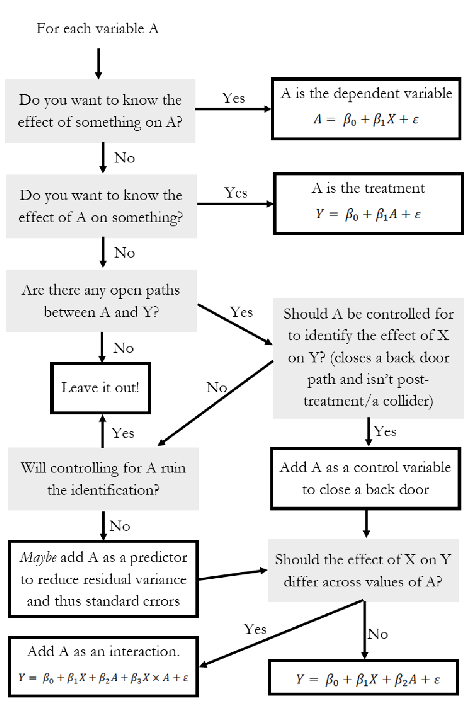

4/18/26, 1:52 PM Chapter 13 - Regression | The Effect

As shown in Figure13.513.5, each variable may play one of several13.5.... roles in a regression. It could be our outcome variable - we know all about those. Outcome variables become the dependent variables in regression, the part of . We know

Figure 13.5: Chart for Constructing a Regression Equation

Y = Y = β0 + β1X

all about treatment variables from our discussion of causal diagrams, too. Those become the part.

β1X

How about the rest? Our causal diagram tells us all about variables that need to be adjusted for in order to close back doors (and also those thatshouldnʼtbe controlled for to avoid closing front doors or opening back doors by controlling for colliders). Anything that should be included as a control should be, well, included as a control. Thatʼs the part of , where is the treatment and is the outcome.

+β2A Y = β0 + β1X + β2A X Y

There are two things we havenʼt come to yet that show up in regression but not so much in causal diagrams. First, what if a variable doesnʼtneed to becontrolled for, but also controlling for it wonʼt break the identification? In that case wecaninclude it as a control, and maybe we want to as long as is related to , then adding it will explain more of the variation in , reducing variance in the error term. And since the standard errors of the regression coefficients like rely on the variance of the error term, the standard errors will shrink.

A

A Y Y

β^1

Finally, what about that part of the graph where it asks about whether the effect of treatment will differ across values of ? Thatʼs whereinteraction termscome in. Weʼll talk about those later in the chapter.

A

###### 13.1.7 Coding Up a Regression

BEFORE WE MOVE ON, WE SHOULD PROBABLY ACTUALLY DO A REGRESSION.Seems like a good idea.

The following code chunks will replicate Tables13.213.2 and13.2.... 13.313.3 in R, Stata, and Python. They will13.33.33.33333333.33.3333333 load in the restaurant inspection data, calculate the number of locations, regress inspection score on the number of locations, do another regression that also includes year as a control, and

- then output a regression table to file.

Note that while the code for performing a regression is fairly standard in each language, the process for producing a regression table generally depends on downloadable packages. There are plenty of options for these packages. Iʼll be using the modelsummary R package (install.packages('modelsummary')), estout for Stata (ssc install estout), and stargazer for Python when thereʼs more than one regression to display (pip install stargazer). But some good alternatives include export_summs from the jtools package, or outreg2, regsave, or the Stata 17 exclusive collect in Stata.33

###### R Code R Code e Stata CodeStata CodeStatatatatatatatatatatatatatatatatatatatatata e Python CodePython Codeytyttt ooooooooooo o o oooooo o o o e

library(tidyverse); library(modelsummary) res <- causaldata::restaurant_inspections

res <- res %>% # Create NumberofLocations group_by(business_name) %>% mutate(NumberofLocations = n())

# Perform the first, one-predictor regression # use the lm() function, with ~ telling us what # the dependent variable varies over m1 <- lm(inspection_score ~ NumberofLocations, data = res)

# Now add year as a control # Just use + to add more terms to the regression m2 <- lm(inspection_score ~ NumberofLocations + Year, data = res)

# Give msummary a list() of the models we want in our table # and save to the file "regression_table.html" # (see help(msummary) for other options) msummary(list(m1, m2),

stars=TRUE, output= 'regression_table.html')

# Default significance stars are +/*/**/*** .1/.05/.01/.001. Social science # standard */**/*** .1/.05/.01 can be restored with msummary(list(m1, m2),

stars=c('*' = .1, '**' = .05, '***' = .01), output= 'regression_table.html')

###### 13.2 Getting Fancier with Regression

REGRESSION IS A TOOL- averyflexible tool. And weʼve only really learned one way to use it! This section isnʼt even going to change how we use it; itʼs just going to change the variables that go into it. This in itself will open up a whole new world.

So far, weʼve talked about regression of the format . Weʼre still working with that. But weʼve also always been working withcontinuousvariables included in the regression as their normal selves. Is there something else?

Y = β0 + β1X + β2Z + ε

First, we might not have continuous variables. Instead, we might have discrete variables, which most often pop up asbinaryvariables - true or false, rather than a particular number. How can we interpret if is “this person has blonde hair”? Or, how would we control for “hair color” if thatʼs not a variable weʼve measured continuously, and we instead have categories like “black,” “brown,” “blonde,” and “red”?

β2 Z

Second, we might not use variables as they are but firsttransformthem. We talked way back in Chapter44 that some relationships might not be well-described by straight lines. Sometimes we4 want curvy lines. How can we do that, exactly?

Third, therelationships themselvesmight be affected by other variables. For example, back in Chapter44 we talked about a study by Emily Oster that asked “is the relationship between taking4 vitamin E and health outcomes stronger during the period when vitamin E was recommended by doctors than during the periods when it wasnʼt?” We can model the relationship between taking vitamin E and health outcomes with . But how can we model howthat relationship changesover time? We need aninteraction.

Outcomes = β0 + β1V itaminE + ε

So those three things - all of which have to do with the kinds of variables we use as predictors in our OLS model - will be where we start. Once weʼve covered that, weʼll move on to how we deal with standard errors, and when ourdependent variableisnʼt continuous either.

###### 13.2.1 Handling Discrete Variables

BINARY VARIABLES ARE ABSOLUTELY EVERYWHERE IN SOCIAL SCIENCE.Did you get the treatment or not? Are you left-handed or right-handed? Are you a man or a woman? Are you Catholic or not? Are you married or not?

34

Binary variables are especially important for causal analysis, since a lot of the causes we tend to be interested in are binary in nature. Did you get the treatment or not?

Any time we have something that youareorare not, which happens any time we have some sort of qualitative description, we are dealing with a binary variable. These can be included in regression models just as normal. So we can still be working with , but now maybe or (or both) can only take two values: 0 (“are not”/false) or 1 (“are”/true). If the binary variable is a control variable, we can think of it as we normally do - weʼre just shutting off back doors that go through the variable. But what if we are interested in the effect of that binary variable? How can we interpret the binary variableʼs coefficient?

###### Y = β0 + β1X + β2Z + ε X Z 35

36

Simply put, itʼs thedifferencein the dependent variable between the trues and the falses. So for example, if we ran the regression , where is a binary variable thatʼs 1 whenever itʼs Winter and 0 when itʼs not, then would behow much higher sales are on average in Winter than in Not Winter.

###### Sales = β0 + β1Winter + ε Winter β1

37

When we estimate the model, if we got , then weʼd say that, on average, sales are 5 lower in Winter than they are in Not Winter. Take a look at the simulated data in Table13.413.4. Notice that13.4.... the coefficient on Winter (-5) is just the difference between the mean for Not Winter (15) and the mean for winter (10). Also notice that the coefficient on the intercept (15) is the expected mean when all the variables are zero - when Winter is 0, weʼre in Not Winter, and average sales in Not Winter are 15.

###### β^1 = −5

Table 13.4: Average Sales by Season, or Regression of Sales on Winter

Mean OLS Estimates Winter 10.000 -5.000

(1.103) Not Winter 15.000 (Ref.) (Intercept) 15.000

(3.413)

Note: Standard errors are in parentheses. No significance stars are shown.

One important thing to note is that weonly include one sideof the yes/no question. The model is

, not . Why is this? First off, imagine trying to interpret that. We want to compare Winter to Not Winter, but

###### Sales = β0 + β1Winter + ε Sales = β0 + β1Winter + β2NotWinter + ε β1 β2

compares Not Winter to Winter. So… whatʼs the difference between them? Interpretation would be pretty confusing. Second, this is to satisfy another OLS assumption we have to make, that there is noperfect multicolinearity. That is, you canʼt make a perfect linear prediction of any of the variables in the model with any of the other variables. Here, . We donʼt have a 1 in our model, though, so no problem, right? Wrong! There is an all-1s variable lurking in our model at all times—itʼs being multiplied by the constant!

Winter + NotWinter = 1

Why canʼt we have that linear combination? Because OLS wouldnʼt be able to figure out how to estimate the parameters. Imagine the average sales in Winter are 10, and in Not Winter itʼs 15. If your regression is , you could generate those exact same predictions with . Or with . Or with

Sales = β0 + β1Winter + β2NotWinter + ε

β0 = 15,β1 = −5,β2 = 0 β0 = 10,β1 = 0,β2 = 5 β0 = 3,β1 = 7,β2 = 12

. Or any infinite number of other ways! And while theyʼd allwork, OLS has no way of picking one estimate out of those many, many options. It canʼt give you a best estimate any more. We need to limit its options by dropping NotWinter, in effect forcing it to choose the

version.

β0 = 15,β1 = −5,β2 = 0

WE CAN EXPAND OUR INTUITION ABOUT BINARY VARIABLES JUST A BITand give ourselves the ability to includecategoricalvariables in our model. Binary variables are just yes/no. But categorical variables can take any number of categories. These include variables like “what country do you live in?” or “what decade were you born in?” You canʼt answer these questions with yes and no, but theyarediscrete and mutually exclusive categories.

38

We can handle categorical variables by justgiving each of the categories its own binary variable. So instead of one variable for “which country do you live in?” itʼs one variable for “do you live in France?”, another for “do you live in Gambia?”, another for “do you live in New Zealand?” and so on. If weʼre including the categorical variable as a control, by including these binary variables for each category we can say that weʼve closed the back doors that go through, in this example, which country you live in.

###### Income = β0 + β1France + β2Gambia + β3NewZealand+...

And what if we want to interpret the coefficient on one of these binary categories? This is just a hair trickier than with a binary variable. Just like we couldnʼt include both sides of the binary variable in the model (we had to put just Winter in the model, not Winter and NotWinter), we also

canʼt include every single category in the model. We need to drop one of them. The one we drop then becomes the “reference category.” All the coefficients arerelative to that category.

Before, with binary variables, the coefficient gave the difference between “yes” and “no.” Now, with a categorical variable and a reference category, itʼs the difference between “this category” and “the reference category.”

39

For example, if we drop France from our regression, France becomes the reference category. If we then estimate and get and , then that meansaverage income in Gambia is .5 higher than average income in Franceand average income in New Zealand is 3 higher than average income in France.Both of the interpretations only take things relative to the reference category, not each other.

Income = β0 + β1Gambia + β2NewZealand+... β^1 = .5 β^2 = 3

We can see this in the simulated data in Table13.513.5, which includes data only for France, Gambia,13.5.... and New Zealand. Notice that average income for Gambia (30.5) is higher than the average income for France (30), and the coefficient on Gambia when France is the reference category is . Similarly, the average income for New Zealand (33) is 3 higher than France, and the coefficient is

###### .5

###### .5

3. The intercept is the average income when all the predictors are 0 - so itʼs not Gambia, and itʼs not New Zealand, meaning it must be France. The average income in France is 30, so the intercept is 30.

Table 13.5: Average Income by Country among France, Gambia, and New Zealand, or Regression of Income on Country

Mean OLS Estimates France 30.000 (Ref.) Gambia 30.500 .500

(.103) New Zealand 33.000 3.000

(1.321) (Intercept) 30.000

(5.412)

Note: Standard errors are in parentheses. No significance stars are shown.

This reference category stuff means that the coefficients on the categories (and their significance) have relatively little meaning on their own. They only have meaning relative to each other. The coefficients change completely if you change the reference category. If we made New Zealand the reference category instead, the coefficient on Gambia would change from .5 to -2.5.

40

If you want to know whether a categorical variable has a significant effect as a whole, you donʼt look at the individual coefficients. Instead, you look atalthe category coefficients. This takes the form of a “joint F test,” where you compare the predictive power of the model against a version where the categorical variable has been removed as a predictor.

In R, the linearHypothesis command in the car package can perform the joint F test. You give it the full list of names of coefficients for the categories (which you can make yourself using paste and unique with a little effort, or the matchCoefs() function). Slightly easier to use is wald() in the fixest package, which lets you easily pattern-match variable names, although this also requires the use of fixestʼs feols() regression function instead of lm(). In Stata, testparm i.cat will do a joint significance test of all the categories of the cat variable. In Python, if you use smf.OLS().fit() to create a regression results object, letʼs say itʼs called m1, then you can do a joint F test with m1.f_test(). Youʼll need to read the documentation to see how to create a matrix or string indicating the factor variables to be tested.

###### 13.2.2 Polynomials

SOMETIMES, A STRAIGHT LINE ISNʼT ENOUGH.OLS assumes that the relationship between the dependent variable and each of the predictor variables can be described as a straight line (linear). If thatʼs not true, OLS will do a poor job. For example, look at Figure13.613.6. The true13.6.... relationship clearly follows the curvy line drawn on the right. If we try to estimate this relationship using a straight line, we get something that doesnʼt fit very well, shown by the line on the left.

###### Figure 13.6: Math Scores and Intelligence: OLS and the True Model

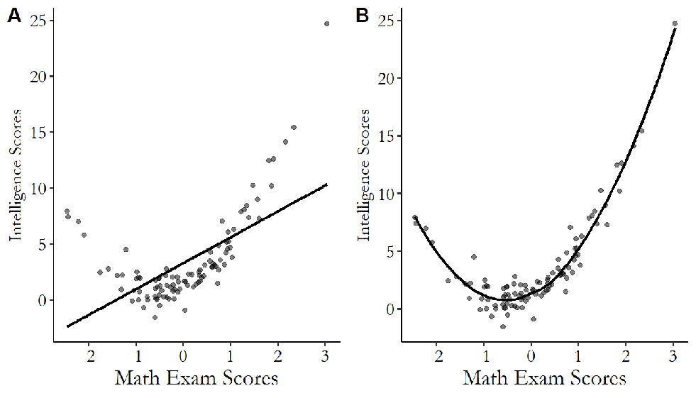

We can still use OLS for these kinds of relationships though. We just need to be careful to model that curviness right in our regression equation.

There are two main ways we can do this: we can eitheradd polynomial terms, or we can transform the data.

A POLYNOMIALis when you have the same variable in an equation as itself, as well as powers of itself. So for example, would be a “third-order polynomial” since it contains

###### β1X + β2X2 + β3X3 X X X2 X3 41,42

to the first power ( ), the second power ( ), and the third power ( ).

By adding these polynomial terms, itʼs possible to fit lines that arenʼt straight. In fact, add enough terms and you can mimic just about any shape. This can be seen in Figure13.713.7. Looking at the13.7.... data points directly, this is clearly a nonlinear relationship. On top of the data points we have the best-fit line from a linear model ( ), which gives the straight line, a second-order polynomial model, which gives the curvy dashed line ( ), and a third-order polynomial, which gives the curvy solid line ( ).

43

Y = β0 + β1X

Y = β0 + β1X + β2X2 Y = β0 + β1X + β2X2 + β3X3

Figure 13.7: Regression Using a Linear, Square, and Cubic Model

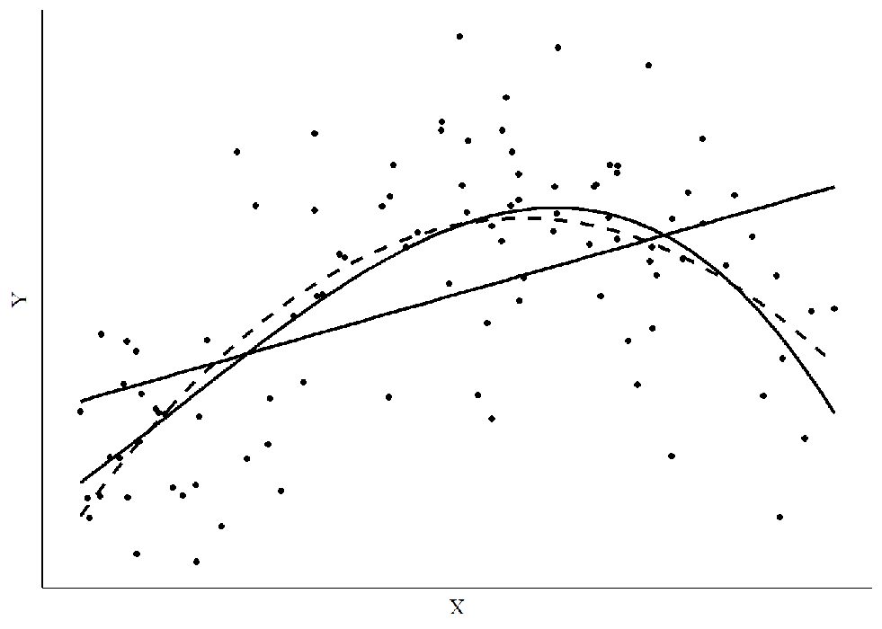

The curvy lines clearly do a better job fitting the relationship, and all we had to do was add those polynomial terms!

Thatʼs the reason to add polynomial terms then. Add polynomial terms and you can better fit a line to a non-straight relationship. But this leaves us with two pressing questions: (1) how can we interpret the regression model once we have polynomial terms, and (2) why not just add a bunch of polynomial terms all the time?

HOW CAN WE INTERPRET A MODEL WITH POLYNOMIALS?For this one, weʼre going to need a little calculus, Iʼm afraid. Letʼs take our cubic model from before:

Y = β0 + β1X + β2X2 + β3X3 (13.7)

Our typical interpretation of a regression coefficient estimate like would be “holding everything else constant, a one-unit increase in is associated with a -unit increase in .”

β^1 X β^1 Y

###### However, thatʼs a problem! Wecanʼt“hold everything else constant” because thereʼs no way to change without also changing and . So an interpretation of the effect of must take into account the coefficients oneachof its polynomial terms.When a regression model includes a polynomial for , the individual coefficients on the terms mean very litle on their own, and must be interpreted together.

X X2 X3 X

X X

How can we interpret them together? Letʼs try to get back our interpretation of “holding everything else constant, a one-unit increase in is associated with a (???)-unit increase in .” What is (???)? Well, what tool can we always reach for to figure out how one variable changes with another? The derivative! If we take the derivative of with respect to , that will tell us how a one-unit change in is related to .

X Y

Y X X Y 44

∂Y ∂X

= β1 + 2β2X + 3β3X2 (13.8)

X (β1 + 2β2X + 3β3X2) Y 45

A one-unit change in is associated with a -unit change in . Notice that the relationshipvaries with different values of . If , then the effect is . But if , then itʼs . The effect of on depends on the value of we already have. This is what weʼd expect. Look back at Figure13.713.7 - as13.7.... increases, at first increases as well, but then stops increasing and starts declining. The effect of a one-unit change in shouldvary as we move along the -axis.

X X = 1 β1 + 2β2 + 3β3 X = 2 β1 + 4β2 + 12β3 X Y X

X Y Y

X X

Letʼs use a more concrete example. Letʼs go back to our regression from Table13.213.2 but add a13.2.... squared term, which we can see in Table13.613.6.13.6....

Table 13.6: A Regression with a Second-Order Polynomial using Restaurant Inspection Data

&nbsp;Inspection Score Constant 97.5179***

(0.0588) Number of Locations −0.0802*** (0.0010) Number of Locations Squared 0.0001*** (0.0000)

* p < 0.1, ** p < 0.05, *** p < 0.01

&nbsp;Inspection Score Num.Obs. 27178 R2 0.194 R2 Adj. 0.194 F 3279.008 RMSE 5.62

* p < 0.1, ** p < 0.05, *** p < 0.01

Here we see a coefficient of on the linear term, and on the squared term. This means that a one-location increase in the number of locations associated with a restaurant chain is associated with a , or , change in the health inspection score. So for a chain with only one location, adding a second one would be associated with a reduction in the health score. But for a chain with 1000 locations, adding its 1001st would be associated with a

−.0802 .0001

β1 + 2β2NumberofLocations −.0802 + .0002NumberofLocations

−.0802 + .0002(1) = −.0800

increasein its health score. There is no single effect; it depends on what part of the -axis weʼre on. Leaving out the squared term would ignore that.

###### −.0802 + .0002(1000) = .1198 X

POLYNOMIALS SEEM PRETTY HANDY!So why not just add a whole bunch of them all the time? And while weʼre at it, why stop at just square terms and cubics? Why not add four-, five-, six-, or sevenorder polynomials to all our models?

There are a few good reasons. For one, the model does get a little harder to interpret. Of course, if itʼs the right model weʼd still want that anyway.

For another, often the higher-order polynomial terms donʼt really do anything. Take Figure13.713.713.7.... for example. The line fits from the second-order polynomial and the third-order polynomial models are almost exactly the same. So in many cases, by adding more and more polynomial terms, you make your model more complex without actually improving its fit.

46

There is also the issue that adding polynomial terms puts strain on the data and can lead to “overfitting,” where a too-flexible model winds up bending in strange shapes to try to fit noise in the data, producing a worse model. Imagine, for example, fitting a 100-order polynomial on a data set with 100 observations in it. Weʼd predict every point perfectly, but clearly that line isnʼt really going to tell us much of anything.

Adding more polynomial terms can, in general, make the model very sensitive to little changes in the data and can make its predictions kind of strange near the edges of the observed data. Take Figure13.813.8, for example, which starts with Figure13.8.... 13.713.7 and adds a regression fit using a ten-13.7.... degree polynomial. The shape doesnʼt seem to follow the data all that much better than even the two-order polynomial. And we get strange up-and-down motion that seems to chase individual observations rather than the overall relationship. The worst offender is over on the far right, where at the last moment the line springs way up to try to fit the single point on the far right of the data. Those additional degrees in the polynomial arenʼt just unnecessary, theyʼre actively making the model worse.

Figure 13.8: Regression Using a Linear, Square, Cubic, and Ten-degree Polynomial Model

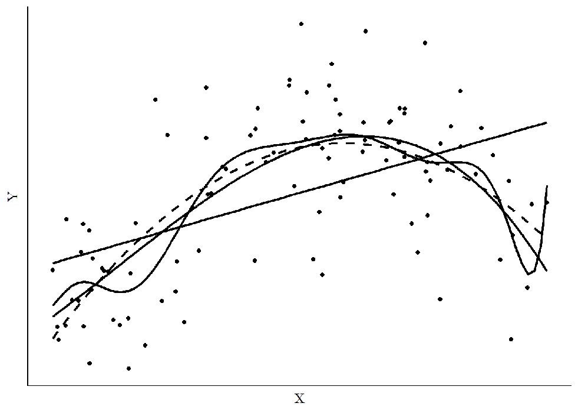

So we donʼt want “too many” polynomial terms. But how much is just right? Well, ideally, you want to have the number of polynomial terms necessary to model the actual true underlying shape of the relationship. But we donʼt actually know what that is, so that doesnʼt help much.

A good way to approach the question of how many polynomial terms to include (or whether to include them at all) is graphically. This works best when you donʼt havetoomany observations. Just draw yourself a scatterplot and see what the shape of the data looks like. Then, add your regression line and see whether it seems to explain the shape you see. If it doesnʼt, try adding another polynomial term until it does.

You can also graphically analyze the residuals. Try a regression model, calculate the residuals, and then plotthoseon the -axis against your -axis variable. If you have enough polynomial terms, there shouldnʼt be any sort of obvious relationship between and the residuals. This can be seen in Figure13.913.9. The same data from Figure13.9.... 13.813.8 is estimated using a linear OLS and a13.8.... second-order polynomial OLS, and the residuals from those regressions are plotted against . After the linear regression, thereʼs still a clear shape to the relationship between the residuals and

y x

X

X

on the left. Not enough curviness to our line. But on the right, after our second-order polynomial, itʼs just a bunch of noise around 0. Thatʼs enough, we can stop!

- X

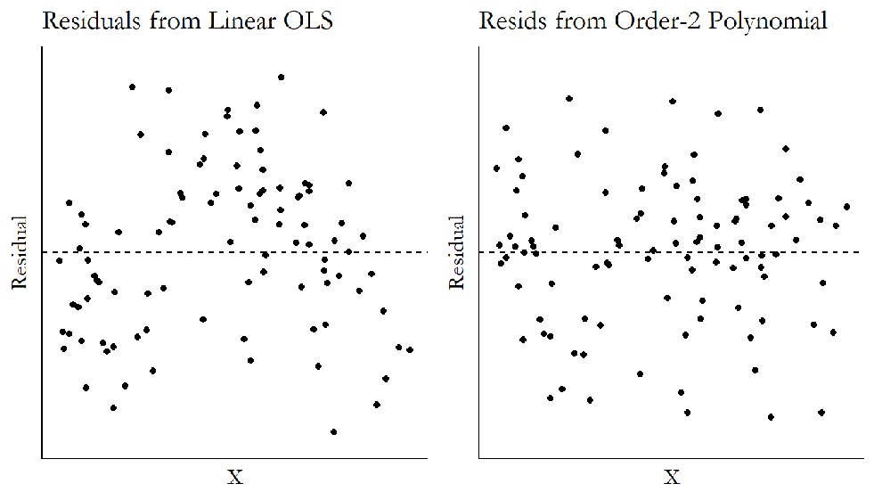

Figure 13.9: Residuals from Linear OLS and Second-Order Polynomial OLS

Besides all that, just as a good rule of thumb, you almost never want to go beyond cubic unless you have a really good reason. At

that point you have to start worrying that the statistical issues with too many terms are going to be a problem. The cure of polynomials may be worse than the disease of nonlinearity.

There are also more automatic approaches to selecting the number of polynomials. You donʼt have to look far to find people recommending that you try different amounts of polynomials, and then omit higher-order terms that are insignificant. In other words, try a quartic, and if the coefficient is insignificant, drop it. Then try the cubic, and if the term is insignificant… and so on. I donʼt recommend this approach, as you are at this point making decisions about your model based on a statistical significance test, and thatʼs not what statistical significance tests are meant to do.

###### X4 X3

47

A somewhat better approach is to use a principled model-selection algorithm like a Least Absolute Shrinkage and Selection Operator (LASSO). Information on the specifics of LASSO will have to wait until the “Penalized Regression” section later in the chapter. For now, you can just think of it as a variant of OLS that tries to not just minimize the sum of squared errors, but it tries to do so while reducing the coefficients in the model. Like dropping polynomial terms because theyʼre insignificant, it takes the approach that additional polynomial terms that donʼt improve prediction much can be dropped. However, it does so in a way that is actually designed for the purpose of figuring out whether an additional term is “worth it,” rather than using significance testing, which only by happenstance sort of tries for a similar goal.

###### 13.2.3 Variable Transformations

POLYNOMIAL TERMS ARE NOT THE ONLY WAY TO FIT A NONLINEAR SHAPE.In many cases it makes more sense totransform the variable itselfdirectly.

Generally this means running a variable through a function before you use it. So for example, instead of running the regression

Y = β0 + β1X + ε (13.9)

you might instead run

Y = β0 + β1 ln(X) + ε (13.10)

###### ln() e 48

where is the base- logarithm, or the “natural log.”

Why might we do this? There are two main reasons we might want to transform a variable before using it, some of which we already covered in Chapter33.3

49

THE FIRST REASON MIGHT BEto give the variable statistical properties that play more nicely with regression. For example, you may want to reduceskew. A variable is “right skewed” if there are a whole lot of observations with low values and just a few observations withrealy highvalues. Income is a good example of a skewed variable. Most people are somewhere near the median income, but a few super-high earners like CEOs and movie stars earnway way waymore than the median.

50

- 51
- 52

Skewed data are likely to produceoutlierobservations. An outlier is an observation that has values that are very different from the other observations. For example, if you have a hundred people who all earn roughly $40,000 per year, and one person who earns a million, that person is an outlier.

Thereʼs nothing inherently wrong with outlier observations. Sometimes people take big outliers as indications that the data has not been recorded properly and that million-dollar-salary is more likely a hundred-thousand with a typo, but often the data is fine, itʼs just an outlier. However, even though the data may be accurate, the presence of outliers can make regression models statistically weak. Because the observations are way out there, they tend to produce big errors, and so just a few observations can have the effect of really tugging on the regression line and having way too much influence.

Using a transformation that “scrunches down” the big observations to be closer to the others can reduce this skew, and make the regression model behave a bit better. This can be seen in Figure

13.1011111113.10. On the left, we have raw data, with a single big outlier way to the top-right of the rest of the111113.10.1.1.1.1111111 data. Iʼve estimated OLS twice on this data, once leaving out the outlier and once including it. The estimated OLS slope changes wildly!

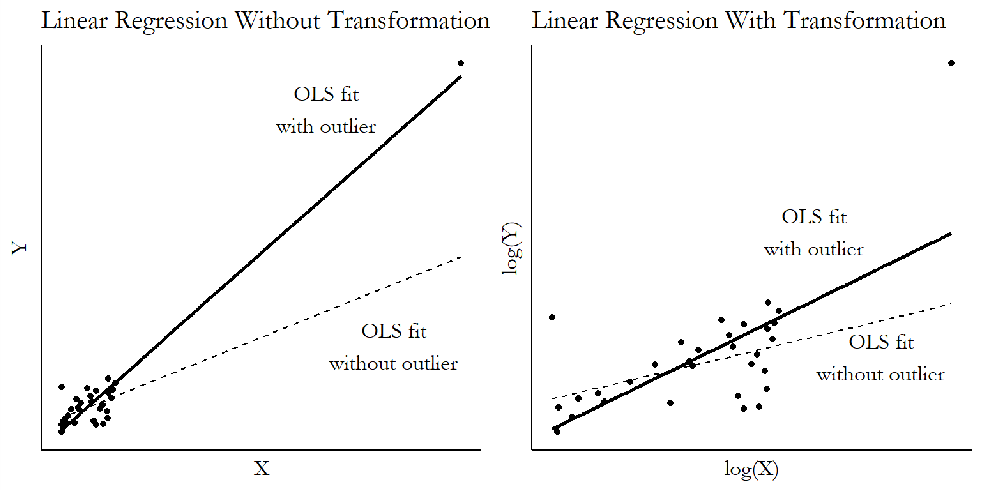

Figure 13.10: OLS Fit with and without an Outlier, with and without Log Transformations X Y

On the right, Iʼve taken the logarithm of both and . You can immediately see that the outlier comes in closer to the rest of the

data (this shows up on the graph as the other data spreading out, since we can zoom in more closely on it without losing the outlier). The distance between observations is shrunk at the high end. Also, including or excluding the outlier has a much more muted effect on what the regression line looks like.

And keep in mind, itʼs fine for the presence of the outlier to affect the slope of the OLS line. In fact, it should. Alobservations should have some sort of effect on the regression line. The problem with the graph on the left is that it hastoo muchinfluence for just being a single observation, and we can ease that a little bit with the logarithms.

53

THE SECOND REASON TO TRANSFORM A VARIABLEis to try to get a linear relationship between the variables. Remember, OLS naturally fits a straight line. It can only fit curvy lines if you transform the variables, either by using a polynomial or some other transformation.

This comes down to what kind of relationship you think youʼre modeling. Should a one-unit increase in relate to a -unit increase in ? Then youʼre talking about a linear relationship and you donʼt need a transformation. But what if a one-unit increase in should relate to some

X β1 Y

###### X

percentageincrease in ? Or if a certainpercentageincrease in should relate to a certain increase in ? Or something like that?

###### Y X Y

For example, if we were regressing your current wealth on the interest rate of your investments as of ten years ago, the true relationship is . The effect of an increase in should bemultiplicative, not linear. So we need a transformation to “linearize” the relationship. In this case, a logarithm comes in handy again. If we take the logarithm of both sides, we get

Wealth = InitialWealth × e10×InterestRate InterestRate

ln(Wealth) = ln(InitialWealth) + 10 × InterestRate (13.11)

54

and thatʼs a linear relationship. OLS will have an easy time with that one. The logarithm is handy for turning multiplicative relationships like this into additive linear ones, since

.

log(XY ) = log(X) + log(Y )

So if you have a theoretical relationship, you want to think abouthow those two variables relate. Shouldthe relationship be linear? Or will you need some sort of transformation to get a linear relationship out of it?

WHAT KINDS OF TRANSFORMATIONS ARE THERE, THEN?We have our reasons for transforming now, but what kinds of transformations can we do?

There are a lot of options here and I donʼt plan to go through all of them. But a few tend to pop up regularly in social science research.

The first is, unsurprisingly, the logarithm. Weʼve talked about this one.

The second, third, and fourth come from the problems we have with the logarithm. In particular, the logarithm canʼt handle values of zero; is undefined. So what if we want the nice skewness-handling properties of the logarithm but also have data with zeroes in it?

log(0)

There are three popular options. Our second transformation, after the logarithm, is to simply add one to the variable before taking the logarithm, . This will do the job but also is very

log(x + 1)

much a kludge that tends to lose some of the nice things we liked about the logarithm in the first place. Without going too deep in the weeds, I donʼt recommend it.

The third transformation is thesquare root. Like the logarithm, taking the square root of a variable “squishes down” its big positive outliers. But it can handle a zero, with . However, while using a square root does tamp down on big observations, it doesnʼt do so nearly asmuch as a logarithm does. For example, going from 4 to 10,000, the square root is multiplied by 50 (

√0 = 0

), whereas the logarithm is only multiplied by about 6.6 (

√10000/√4 = 100/2 = 50 log(10000)/log(4) ≈ 9.2/1.4 ≈ 6.6

). Also, you lose the nice “percent increase” interpretation that logarithms have, which weʼll talk about in a bit.

The fourth is theinverse hyperbolic sinetransformation, or “asinh,” which is equal to

. This transformation has the nice property of accepting ( ) as well

ln(x + √x2 + 1) 0 asinh(0) = 0

55

- as negative numbers. Plus, for reasonably large values (say, above 10) it provides results that areverysimilar to a plain-olʼ logarithm. So the nice stuff we like about logarithms we also get with the inverse hyperbolic sine. For skewed data with zeroes where your only goal is to reduce the effect of the skew, the inverse hyperbolic sine is usually what I recommend.

However, if the goal is to get some sort of theoretical percentage-increase interpretation out of the variable, then any sort of ad-hoc method to deal with zeroes (which by nature donʼt really belong with percentage increases) is going to get some strange results. There are some ways to lessen the problem, like ensuring the mean of the variable is large by scaling it up (using dollars rather than thousands of dollars, for example) (⊕Bellemare and Wichman 2020). You may also just be better off with a method that naturally deals with zeroes rather than either or

###### asinh(x) ln(1 + x)

, like Poisson regression or a “two-part” model that treats “is this zero or above-zero” and “what above-zero value is this” as two separate questions (⊕Mullahy and Norton 2024). THE FIFTH TRANSFORMATION WEʼLL DISCUSSdoesnʼt really deal with skew or linearizing a relationship, but it does deal with outliers.Winsorizing, especially popular in finance, is the process of taking some data and very forcefully squishing in its ends. You simply take any values that are far enough away from the center and reduce them toward the center. To Winsorize the top X%, you take every observation above the Xth percentile, and replace it with the Xth percentile.

For example, if we had 100 observations from 1 to 100, and we Winsorized the top and bottom 5%, that would mean leaving the 6-95 observations as they were, and then taking the 1, 2, 3, 4, and 5 and replacing them with 6, and also taking the 96, 97, 98, 99, and 100 observations and replacing them with 95.

This is a very brute-force way of dealing with outliers, but it tends to work. It leaves most of the data untouched, which is nice if you think the true relationship really is linear, but you donʼt want your model to be too influenced by outliers.

THE SIXTH AND FINAL TRANSFORMATIONweʼll consider doesnʼt really improve the statistical properties of the model at all. It doesnʼt account for skew, outliers, or linearization. This is the transformation ofstandardizinga variable by subtracting its mean and dividing by its standard deviation, or .

(X − mean(X))/sd(X) 56

Why do this if it doesnʼt improve the statistical properties of the model at all? Because it can make the model easier to interpret. We know that in the model , the interpretation of relies on a “one-unit increase in .” But that means we need to keep in mind the scale of all of our variables so we know how big a one-unit increase is. But if we standardize first, then instead has an interpretation based on a “one-standard-deviation increase in ,” which can be easier to think about in some cases.

Y = β0 + β1X + ε β1 X

β1 X

Same goes for standardizing . Imagine is student test scores, and is time spent watching TV per day. If , then a one-unit increase in TV hours per day reduces test scores by 5. Is that a big effect? A small effect? Weʼd need to know way more about the test itself. But if we standardize

Y Y X β^1 = −5

first, and , then an extra hour of TV a day reduces test scores by half a standard deviation - pretty big! We can more immediately interpret the result now. Naturally, this only works for variables where we have a sense of the standard deviation more than we have a sense of the units.

- Y β^1 = −.5

ONE THING ALL OF THOSE TRANSFORMATIONShave in common is that they arecontinuous transformations. A tiny change in the original variable will translate into a slightly different tiny change in the transformed version. However, we might expect the relevant transformation for a variable to bediscontinuous. For example, letʼs say weʼre interested in the effect of your age on

your chances of driving drunk. In the United States, the legal drinking age is 21. So the relevant way to think about the impact of age on driving drunk might not be “what is the impact of a oneyear increase in age,” but rather “what is the impact of going from below 21 to above 21?” Thereʼs not a smooth change from 20-and-11-months to 21-and-0-months, but rather something sharply shifts.

How can we put this into practice? Well, based on what we think the relevant points at which things shift sharply, we might create a set of categorical indicators. If we want to be fully flexible here, we could have a binary indicator for every possible value of age (this is called “saturating” the model). This lets the relationship between drunk driving and age take literally any shape, letting discontinuities show themselves. On the other hand, there probably arenʼt a lot of people in our data who are exactly, say, 22 years and three months old, so our estimates wonʼt be very precise.

57

We can get a little more power by deciding ahead of time what we think the relevant discontinuities are. We might say “turning 21 is the relevant discontinuity, so Iʼll create a categorical indicator for being below or above 21, and thatʼs how age will be included in my model.” Or we could combine this binary indicator with an interaction term (see later in the chapter) and say “age has a linear effect on drunk driving, but also there is a discontinuous jump

- at 21.” If there are special meaningful values of your variables, then modeling them directly can really help represent the data accurately!

Thinking carefully about discontinuities in your variables is important, and if you know thereʼs a discontinuity but you donʼt account for it, you can harm your model. Take for instancebunching. Bunching is when, even though your variable is continuous, thereʼs a particular value thatʼs very common. Usually this is a “corner value.” For example, how many hours per week do you work at your job? Could reasonably be 12, 13, 42, 16.25, and so on. But youʼre likely to find a lot of people in a given data set who work exactly 40 hours (or however many hours counts as full-time in your country), and alotof people who donʼt have jobs and will work exactly 0 hours.

This bunching can hide back doors! Thereʼs something fundamentally different, probably in a discontinuous and unobservable way, between people who work 0 hours and people who work 1 hour, a difference that you wonʼt get between people who work 1 hour and people who work 2

hours. So the presence of a whole bunch of people in your data who work exactly 0 hours might imply the existence of some back doors, back doors that might be open!

58

In the bunching case, thereʼs a fairly simple transformation you can apply to test whether you should really be concerned about these open back doors. Just take whatever transformation you were already using, and add a binary indicator for being exactly at the bunching point (so an indicator for “works exactly zero hours” in this case). If that coefficient is not close to zero (if you can reject 0), then that bunching is probably leaving some back doors open (⊕Caetano et al. 2021).

AND THATʼS IT- those are the only transformations weʼll cover. There are many, many more

transformations in the world, but in my experience these are the most common in social science research. Honestly, Iʼm not sure Iʼve ever had occasion to use a transformation other than one of these seven, or a polynomial.

That said, just having listed these transformations doesnʼt mean weʼre quite done with them yet. In particular, logarithms - which I just canʼt seem to stop going on about - can make our results a bit trickier to interpret. So how can we do that?

INTERPRETING THE RESULTS OF A REGRESSION WITH A LOGARITHM TRANSFORMATIONappears at first to be no problem. Then you think a little about it, and it seems like a huge problem. Then you learn even more about it, and it once again becomes no problem at all. Such is life.

59

Letʼs look first at a regression with a log transformation on (weʼll get to later).

###### X Y

Y = β0 + β1 ln(X) + ε (13.12)

So how does it appear at first? No problem! We can interpret the as “a one-unit change in is associated with a -unit change in .” Great.

β^1 ln(X) β^1 Y

Now letʼs think a little about it - what exactlyisa one-unit change in ? What does that even mean? Itʼs not the same thing as a one-unit change in .

ln(X) X

Letʼs learn even more about it, at which point it will become easy again. Linear changes in are related toproportionalchanges in . Think about it. We know that . So if we start with and weadd 1 to it, we get . Addingsomething to is equivalent tomultiplyingsomething by .

ln(X)

X ln(AB) = ln(A) + ln(B) ln(X) 1 + ln(X) = ln(e) + ln(X) = ln(eX) 60

ln(X) X

In particular, whatever we add to , letʼs call the thing we add , we are in effect multiplying by . Now we can use a convenient little fact: If that is close to 0, then is close to . Why is that convenient? Because it means that a increase in is approximately equivalent to multiplying by 1.05, or in other words a increase in is approximately equivalent to a5% increase in . Now you know why I was talking earlier about relationships that were proportional in nature.

ln(X) c

- X ec c ec 1 + c

.05 ln(X) X .05 ln(X)

X 61 62

Letʼs take this intuition and apply it so we can interpret a log no matter where it shows up in our equation.

First, back to our original equation with a log transformation for : . Letʼs use a 10% change rather than a 100% change here for , so weʼre more in the realm of reality (for most social science studies, 10% changes show up a lot more often than 100% changes) and so the approximation works better. A 10% increase in translates to a -unit increase in , which is associated with a -unit change in . So we can interpret by saying that a 10% increase in is associated with a -unit change in .

X Y = β0 + β1 ln(X) + ε X

1 + c ≈ ec X 10/100 = .1

- ln(X) .1 × β1 Y β1

- X .1 × β1 Y
- Y ln(Y ) = β0 + β1X + ε X

β1 ln(Y ) β1 × 100 Y β1

ln(Y ) = β0 + β1 ln(X) + ε X 10/100 = .1 ln(X) .1 × β1

- ln(Y ) .1 × β1 × 100 10 × β1 Y 63

Next, letʼs try putting the log on instead: . Now, a 1-unit change in is associated with a -unit change in , which then means a change in (if is small enough that we can use our approximation).

Finally, we can put the log on both. . Now, a 10% increase in is associated with a -unit increase in , which is associated with a -unit change in , which translates into a , or change in .

And thatʼs it! You can memorize those three interpretations if you want, but itʼs probably a better idea to work through the logic each time instead so you know whatʼs going on. Plus, as a bonus, this kind of thinking works foranytransformation. Not all transformations have percentage

interpretations, but you can always think through the logic of “what does a one-unit change in this transformed variablemeanin terms of the original variable?” and work out your interpretation from there.

###### 13.2.4 Interaction Terms

POLYNOMIALS AND TRANSFORMATIONS ARE GREAT FOR LETTINGthe relationship between and be

Y X

flexible. We can fit any sort of curvy line we want, so that the relationship between and can change depending on the value of . But weʼre still missing something. What if the relationship between and differs not based on the value of ,but based on the value of a different

Y X X

- Y X X
- Z

###### variable ?

For example, whatʼs the relationship between the price of gas and how much an individual chooses to drive? For people who own a car, that relationship might be quite strong and negative. For people who donʼt own a car, that relationship is probably near zero. For people who own a car but mostly get around by bike, that relationship might be quite weak. The relationship between gas prices and miles drivendiffers depending on car ownership.We might want to allow the relationship to vary so we can model it properly. We might also be interested in whether the relationshipisdifferent between these groups.

64

However, we have no way of representing this change in relationship with either a polynomial or a transformation. Instead we will need to useinteraction terms.

An interaction term is when you multiply together two different variables and include their product in the regression, like .

Y = β0 + β1X + β2Z + β3XZ + ε

In terms of putting the model together, thereʼs not a lot more to it than that. If you think that the relationship between and is different for different values of , then simply include in your model, as well as by itself.

- Y X Z X × Z
- Z 65

The real difficulty with interaction terms isinterpretingthem. Interpretation can be a bit of a brainbender, which is unfortunate; you canʼt walk two steps in a standard social science research design without running into a study where the interaction term is the most important part.

###### SO HOW CAN WE INTERPRET INTERACTION TERMS?The question of interpreting a model with interaction terms is actually two questions. The first iswhat is the effect of a variable when thereʼs an interaction between and something else in the model?The second is ishow can I interpret the interaction term?

###### X X

The intuition for both comes back to good olʼ calculus. If you donʼt know calculus, you should still be able to follow along with the intuition. But if you do know calculus, hey, calculus is pretty neat right? Letʼs be in a calculus club.

66

Letʼs tackle the first question: what is the effect of when thereʼs an interaction between and something else in the model? To solve this, we can write out the regression equation, and then just take the derivative with respect to . Done! After all, the derivative of with respect to is just how changes as changes, which is also the interpretation of a regression coefficient. If you donʼt know calculus, this is a very easy derivative. As long as there arenʼt any polynomial or transformation terms for , just gather all the terms that have an in them, and then remove the . Done. If therearepolynomial or transformation terms for , well… there are calculators online that can do derivatives for you.

X X

X Y X Y X

X X X X

So if our regression is

Y = β0 + β1X + β2Z + β3XZ + ε (13.13)

then we have

∂Y ∂X

= β1 + β3Z (13.14)

X Y 67

and thatʼs the effect of on .

Of course, weʼre not entirely done yet, as the effect of that weʼve calculated has a in it. This means that there is no single effect of . Rather, we need to ask what the effect of isat a given value of . We can say what the effect of is at (itʼs just ), or at (itʼs

X Z

X 68 X Z X Z = 0 β1 Z = 16

), or any other value.

β1 + 16β3

This also means that the individual coefficients themselves donʼt tell us much, just like with polynomials. no longer gives us “the effect of .” So if youʼre looking at effect sizes, you need to consider the entire effect-of- expression. Just looking at alone tells you very little (and, further, thesignificanceof tells you very little).

β1 X

X β1 β1

So thatʼs how we can get the effect of when itʼs involved in an interaction term. How about our other question? What is the interpretation of the interaction term itself? Formally, the same approach of taking the derivative works too - in the regression equation

###### X

, the interaction term is the cross-derivative of with respect to both and , i.e., . Thatʼs a little harder to wrap our heads around, though, so we may want to back out and think of it in a more intuitive, less mathematical way.

- Y = β0 + β1X + β2Z + β3XZ β3 Y

X Z ∂

2Y ∂X∂Z

- Y = β0 + β1Z Z Y Z X

One good way to think about interpreting interaction terms is this: in the regression

###### , the coefficient on tells ushow our prediction of changes when increases by one unit, right? But as weʼve already established, we can getthe effect of in the equation

by taking the derivative (or gathering the terms and dropping

Y = β0 + β1X + β2Z + β3XZ X

) to get . This looks familiar, doesnʼt it? Now, the coefficient on inthis equation, , tells us how our prediction of changes when increases by one unit. In other words, ishow much stronger the effect of on getswhen increases by one unit.

- X ∂X∂Y = β1 + β3Z Z β3 ∂X∂Y Z

β3 X Y Z 69

- Y = β0 + β1X + β2Child + β3X × Child Child X

Often, the variable being interacted with is binary. This doesnʼt change the interpretation, but it makes it a bit easier to work through. Say we have the regression equation

, where is a binary variable equal to 1 for children and 0 otherwise. What do we have from this equation? We can say that the effect of on

is , just as before, and that is how much stronger the effect of on gets from a one-unit increase in .

Y β1 + β3Child β3 X Y Child 70

But can only increase from 0 to 1 - those are the only values it takes. So if the effect of on

Child X Y β1 + β3Child β1 X Y Child = 0 X Y β1 Child = 0 β1 + β30 = β1 X Y Child = 1 β1 + β31 = β1 + β3

is , then that means that is the effect of on when , i.e., the effect of on for non-children is . We get that by just taking and plugging it in to get . To get the effect of on for children, we plug in and get

.

The difference between those two effects - for children and for non-children, is . This is the difference in the effect of on between children and non-children. Or, put another way, itʼs how much stronger the effect of on gets when you increase by 1, going from

β1 + β3 β1 β3 X Y

X Y Child Child = 0 Child = 1

to , i.e., non-child to child. Thatʼs the same interpretation we had before. If we find a meaningful (or, if you prefer, statistically significant) coefficient on , then we can say that “the effect of on differs between children and non-children.”

β3 X Y

Table 13.7: Regressions of Restaurant Health Inspection Scores, One of Which Uses an Interaction &nbsp;Inspection Score

&nbsp;Inspection Score

&nbsp;Inspection Score

Weekend 1.432*** 1.459*** 1.759*** (0.419) (0.418) (0.488)

Year of Inspection

−0.065*** −0.108*** −0.065*** (0.006) (0.008) (0.006)

Number of Locations x Year of Inspection

0.001***

(0.000)

Number of Locations x Weekend

−0.010

(0.008) Num.Obs. 27178 27178 27178 R2 0.069 0.072 0.069 R2 Adj. 0.069 0.072 0.069 F 669.086 525.621 502.255 RMSE 6.04 6.03 6.04

* p < 0.1, ** p < 0.05, *** p < 0.01

In Table13.713.7 we can see a continuation from Table13.7.... 13.213.2 earlier in the chapter, but this time with13.2.... some interaction terms included. In the second column we have an interaction between

and , while in the third column we have an interaction

NumberofLocations Y earofInspection

between and , a binary variable indicating whether the inspection was done on a weekend or not.

NumberofLocations Weekend

In the second column, we have an effect of of -1.466 (which is the coefficient on ) $ + .001YearofInspection$ (the coefficient on the interaction term). How can we interpret this? The -1.466 doesnʼt tell us much - thatʼs the relationship between a one-unit increase in and if we plug in

NumberofLocations NumberofLocations

NumberofLocations InspectionScore Y earofInspection = 0

, i.e., in the year 0! Thatʼs way outside our data and doesnʼt reflect a realistic prediction. But we could plug in a value like , which is in the data, and say that the relationship between a one-unit increase in and

71 Y earofInspection = 2008

NumberofLocations InspectionScore −1.466 + .001 × 2008 = .542

in 2008 is . Positive! In fact, the effect is positive for the entire range of years actually in the data, despite that big negative -1.466. Donʼt be tricked by the coefficients on their own. Always interpret them with the relevant interactions. We can also say that every year, the relationship between a one-unit increase in and gets more positive by .001.

NumberofLocations InspectionScore

In the third column, we have an effect of of . From this, we can say that on a non-weekend, the association between a one-unit increase in

NumberofLocations −.019 − .010Weekend

and is , and on the weekend, itʼs

NumberofLocations InspectionScore −.019 −019 − .010 = −.029 72

. We can also say that the relationship is .010 more negative on weekends than it is on weekdays.

73

THERE ARE A FEW THINGS TO KEEP IN MINDwhen it comes to using interaction terms. The first is to think very carefully aboutwhyyou are including a given interaction term, because they are prone to fluke results if you go fishing. Think way back to Chapter11 - if we just let the data do whatever,1 weʼll find results that donʼt mean much. We need to approach research and data with a specific design. Have a strong theoretical reasonwhyyouʼd expect the effect of to vary across different values of before adding the interaction term. “I dunno, maybe the effect is different” isnʼt a fantastic reason.

###### X Z X × Z

Itʼs always a good idea to approach data with a design and an intention rather than just fishing around, interaction terms or not. Why do I emphasize this so strongly when it comes to interaction terms? First, because there are alotof different interactions youcould try, and a lot of

them seem tantalizing. Does the effect of job training differ between genders? Between races? Between different ages? Sure, it might. We can tell ourselves a good story about why each of those might be great things to interact with job training. But if we tryalof them, weʼre likely to find a significant interaction pretty quickly even if thereʼs really nothing there. So trying interactions all willy-nilly tends to lead to false positives.

The temptation to try a bunch of stuff is extra-hard to resist when you have a null effect. Sure, maybe we didnʼt find any effect of job training. But maybe the effect is only there for women! Try a gender interaction and look for to be big/significant even when isnʼt. Or maybe itʼs only there for Pacific Islanders! Try a race interaction. Or maybe only in Iowa. Try a state interaction. However, because there are nearly infinite different sub-groups wecouldlook at (especially once you consider going deeper - maybe the effect is only there for women Pacific Islanders in Iowa!), weʼre almost certain to find some effect if we check every single one. In general, you should be highly skeptical of an effect thatisnʼt there at alfor the whole sample, but isthere for some sub-group. Surely there are plenty of effects that are, in truth, only there for a certain sub-group. But fishing around with a bunch of interactions is going to give you way too many false positives. So stick to cases where thereʼs a strong theoretical reasonwhyyouʼd expect the effect to only be there for a sub-group, or differ across groups, and make sure you believe your story before you check the data.

###### β1 + β3 β1

Second, even if we do have a strong idea of a difference in effect that might be there, interaction terms arenoisy. Theyʼre basically looking for thedifference betweentwo noisy things - the effect for one group and the effect for the other group, both of which have sampling variation. The difference between two noisy things will be noisier still. You need alotmore observations to precisely estimate an interaction term than to precisely estimate a full-sample estimate. Even if the difference is as large as one group having an effect twice the size of the other group, you may need sixteen times as many observations to have adequate statistical power for the interaction term as youʼd need for the main term (⊕Gelman 2018).

74 75

Why is noisiness a problem? Because estimates that are noisy will more often get surprisingly big effects. The sampling variation is very wide with noisy estimates. So thereʼs a better chance that when youdofind an interaction term big enough to call it interesting, itʼs just sampling variation, even if the result is statistically significant!

That said, interaction terms are still very much worthwhile if you have a solid reason to include

- them. And theyʼre super important to learn for causal inference. In fact, many of the research designs in this second half of the book are based around interaction terms. Turns out you can get a lot of identification mileage out of looking at how the effect of your treatment variable differs between, say, conditions where it should have a causal effect and conditions where any effect it has is just back-door paths. So give yourself some time to practice interpreting and using them. It will definitely pay off.

###### 13.2.5 Coding Up Polynomials and Interactions

In these two coding blocks weʼre going to be continuing to work with the restaurant-inspection data weʼve been covering in this chapter.

First, weʼll do a regression with a polynomial in it. Then, weʼll calculate the effect of

for a given value of the variable in such a way that also gives us a standard error on the effect at that value.

NumberofLocations

###### R Code R Code e Stata CodeStata CodeStatatatatatatatatatatatatatatatatatatatatata e Python CodePython Codeytyttt ooooooooooo o o oooooo o o o e

# Load packages and data library(tidyverse); library(modelsummary); library(marginaleffects) df <- causaldata::restaurant_inspections

# Use I() to add calculations of variables # Including squares m1 <- lm(inspection_score ~ NumberofLocations +

I(NumberofLocations^2) + Year, data = df)

# Print the results to a table msummary(m1, stars = c('*' = .1, '**' = .05, '***' = .01))

# Use avg_slopes to calculate the effect of locations # at 100 locations. # variables is the variable we want the effect of # and newdata can be used with datagrid to get the effect # at a particular value avg_slopes(m1,

variables = 'NumberofLocations', newdata = datagrid(NumberofLocations = 100))

# The Estimate is the AME (average marginal effect), which # we want. The standard error is reported, too.

Next, we will include an interaction term. Similarly, we will calculate the effect of locations at a specific value of the interacting variable (remember, the interaction term itself already shows the differencebetween effects, we donʼt need that from a separate command).

###### R Code R Code e Stata CodeStata CodeStatatatatatatatatatatatatatatatatatatatatata e Python CodePython Codeytyttt ooooooooooo o o oooooo o o o e

# Load packages library(tidyverse); library(modelsummary); library(marginaleffects) df <- causaldata::restaurant_inspections

# Use * to include two variables independently # plus their interaction # (: is interaction-only, we rarely use it) m1 <- lm(inspection_score ~ NumberofLocations*Weekend +

Year, data = df)

# Print the results to a table msummary(m1, stars = c('*' = .1, '**' = .05, '***' = .01))

# Use avg_slopes to calculate the effect of locations # on the weekend # variables is the variable we want the effect of # and newdata can be used with datagrid to get the effect # at a particular value avg_slopes(m1,

variables = 'NumberofLocations', newdata = datagrid(Weekend = TRUE))

# The Estimate is the AME (average marginal effect), which # we want. The standard error is reported, too.

###### 13.2.6 Nonlinear Regression

SO FAR, WHILE WEʼVE ALLOWED THE PREDICTOR VARIABLES TO BE ALL KINDS OF THINGS- binary, skewed, related in nonlinear ways to the dependent variable - weʼve kept a tighter leash on the outcome variable. Weʼve always assumed that we can predict the conditional mean of the dependent variable using a linear function of the predictors. In other words, we can predict the dependent variable by taking our predictors, multiplying them each by their coefficients, and adding everything up.

76

However, that wonʼt always work. To be able to predict something with a linear function, it needs to behave like, well, a line. It needs to change smoothly as the predictors change (so it canʼt, for

example, be a discrete value that jumps up rather than climbs up). Also, it needs to continue off forever in either direction, i.e., take any value - if your estimated model is, for example

, then your prediction for someone with $50,000 in is -.5 children. That doesnʼt make much sense.

###### NumberofChildren = 4.5 − .1IncomeinThousands Income

That brings us tononlinear regression. This is a big wide world of approaches to performing regression that donʼt rely on a linear relationship between the predictors and the outcome variable. These approaches are usually tailored to the exact kind of dependent variable youʼre dealing with. So in this chapter (unfortunately), all weʼre going to be able to cover are the probit and logit models for dealing with binary dependent variables. But thereʼs also Poisson regression for count variables, multinomial logit and probit for categorical data, tobit for censored data, and so on and so on.

77

Even though using linear regression for these strange dependent variables doesnʼt make sense, some people do it anyway. There are actually some good reasons to do OLS anyway even when the dependent variable isnʼt quite right. All of these nonlinear regression models add their own assumptions, and generally donʼt have closed-form solutions, making their estimates a little less stable. They can have a hard time with things like controls for categorical variable with lots of categories. Plus, while using OLS with a binary outcome guarantees your error terms are heteroskedastic (weʼll talk about this in a few sections), the presence of heteroskedasticity actually makes thecoefficients wrongin logit and probit models, and a specialized heteroskedasticity-robust version of the estimators is required. In the context of binary dependent variables, using OLS anyway is called the “linear probability model,” and it does see a fair bit of use.

78

That said, while in some cases the nonlinear-regression cure is worse than the incorrect-linearmodel disease, generally it is not, and you want to use the appropriate model. Why exactly is that? As I mentioned earlier, Iʼll be going through why we do this, and how it works, specifically in application to binary dependent variables.

GENERALIZED LINEAR MODELS (GLMS) ARE A WAY OF EXTENDING WHAT WE ALREADY KNOW ABOUT REGRESSION to a broader context where we need some nonlinearity. GLMs, arenʼt the only way that

nonlinear regression is done, but itʼs how probit and logit are often done, and it applies in some other contexts too. And itʼs pretty easy to think about once weʼve covered regression.

GLM says this: take that regression model, and pass it through a function in order to make your prediction. We call this function a “link function,” and we call the input to that function the “index.” Thatʼs it! So our regression equation is

###### 79 F()

Y = F(β0 + β1X) (13.15)

Notice that the index inside the function is the exact same regression equation we were working with before. Also notice that if we make be just , then weʼre back to again and are basically doing OLS.

β0 + β1X F()

80 F(x) F(x) = x Y = β0 + β1X

How does GLM let us run nonlinear regression? As long as we pick a function that mimics the properties that has, then we can ensure that we never make an unrealistic prediction.

###### Y

In the case of binary variables, we are predicting the probability that is equal to 1. In other words, should give us a probability. Probabilities should be between 0 and 1. So what are we looking for in a link function that works with a binary ?

Y F(β0 + β1X)

###### Y

It should be able to take any value from to (since can take any value from to ) It should only produce values between 0 and 1

−∞ ∞ β0 + β1X −∞ ∞

Whenever the input ( ) increases, the output should increase

β0 + β1X

There are infinitely many functions that satisfy these criteria, but two are most popular: thelogit linkfunction and theprobit linkfunction.

The logit link function is

ex 1 + ex

F(x) =

(13.16)

and the probit link function is , where is the “cumulative distribution function” of the standard normal distribution, i.e., tells you the percentile of the standard normal distribution (mean 0, standard deviation 1) that is.

Φ(x) Φ Φ(x)

x

These two link functions - probit and logit - produce nearly identical regression predictions. You donʼt generally need to worry too hard about which of the two you use. The important thing, though, is that neither of them will make predictions outside of the range of 0 and 1, and their coefficients will be estimated in a context that is aware of those boundaries and so better-suited for those non-continuous dependent variables.

81

WHATʼS SO BAD ABOUT PEACE, LOVE, AND LINEARITY?Why not just stick with OLS? What weʼre really interested in is how increases in cause changes in . Surely getting identification sorted is the real important step, and we donʼt necessarily care what values of arepredictedas long as we still get those effects, right?

X Y

Y

Two problems with this argument. First,anytime youʼre estimating a model thatʼs not the right model, strange results can creep in even in unexpected ways, and in ways that can be hard to predict ahead of time. Second, not properly accounting for nonlinearitycanmess up your estimates of how affects .

82

X Y

We can see this in action in Figure13.1111111113.11. Here we have a bunch of observations that are either111113.11.11.11.11.11111111111111

or at different values of . On top of that graph we have the fitted OLS model as well as a fitted logit model (the probit would look very similar).

Y = 0 Y = 1 X

Figure 13.11: OLS and Logit Fit on Binary Dependent Variable

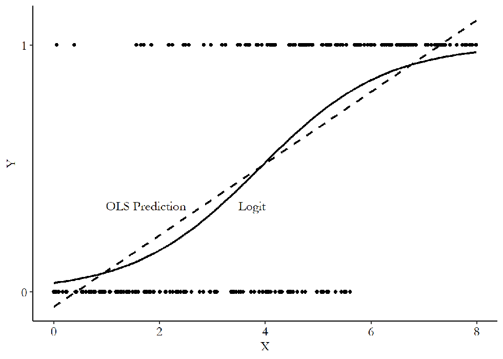

What do we see? As previously mentioned, we see the OLS prediction going outside the range of 0 and 1. But beyond that,the slopes of the OLS and logit models are different.This is especially true near the right or left sides of the graph. What does this mean? It means that the reason we were thinking about using OLS anyway - getting the effect of on rather than caring about realistic predictions - falls apart anyway.

X Y

But why is this? Well, think about it - if has a positive effect on , but you already predict that

X Y

has a .999 chance of occurring, then what should a one-unit increase in do? Almost nothing, right? Thereʼs simply not that much more that can increase by. But if your current prediction of

- Y X Y

is .5, then thereʼs a lot more room to grow, so the effect can be bigger. Itshouldbe bigger! OLS is unable to account for this.

Y

83

OLS is unable to account for how the effect of on should differ. This works in a different way to how the effect differed when we talked about polynomials. The curviness shouldnʼt be based onthe value of , as it is with a polynomial, it should be based onthe current predicted value of

X Y

X

.When the sample average of is in the middle - near .5 or so - using OLS isnʼt a huge problem, although you still might want to use probit or logit anyway. But if the average of is anywhere near 0 or 1, you have a big problem and absolutely need a nonlinear model.

###### Y YY

INTERPRETING A GENERALIZED LINEAR MODELcan be a little trickier than interpreting an OLS model. In one, very narrow and pretty useless sense, the interpretations are exactly the same. That is to say, each coefficient still means “a one-unit change in this variable is associated with a (coefficient-sized) change in the index.” Thatʼs true whether weʼre talking about linear or nonlinear regression. The difference, however, is that with OLS, the index function is just a regression equation giving us the conditional mean of the dependent variable, and we know how to interpret a change in the dependent variable. In GLM, the index function is the thing that gets put through the link function. So itʼs in terms of “units of change in the thing that gets put through the link function,” which is way harder to think about.

84

Itʼs common to present the results of probit and logit models, and nonlinear regression more generally, in terms of theirmarginal effects. Marginal effects basically translate things back into linear-model terms. While the coefficient on in a logit model gives the effect of a change in on the index, the marginal effect of gives the effect of a change in on the probability that the dependent variable is 1.

###### X X X X

Mathematically, the marginal effect is straightforward, although we do have to dip back into the calculus well once again. The marginal effect of on the probability that is just the derivative of with respect to , which has a conveniently simple solution for these binary-dependent variable models:

X Y = 1 Pr(Y = 1) X

∂Pr(Y = 1) ∂X

= β1Pr(Y = 1)(1 − Pr(Y = 1)) (13.17)

So the marginal effect of is equal to the coefficient on , , multiplied by the predicted probability that (which comes from the model, and is conditional on all the predictor values) and one minus that same probability. Note that is tiny when

X X β1 Pr(Y = 1)

Pr(Y = 1)(1 − Pr(Y = 1)) Pr(Y = 1) Pr(Y = 1) = .5

is near 0 or 1, and at its biggest when , so we retain the result from Figure13.1111111113.11 that the slope is steepest in the “middle” of the graph and flattest on the sides.111113.11.11.11.11.11111111111111

There is, however, a catch. That catch is that there is no one marginal effect for a given variable. I just said to look back at Figure13.1111111113.11. Well… keep looking at it! As111113.11.11.11.11.11111111111111 increases, the logitpredicted probability that might go up by a tiny amount (on the left or right side of the graph) or by quite a bit (in the middle). In fact, each observation in the data has its own marginal effect, based on the for that observation, as weʼd expect based on the

###### X Y = 1

Pr(Y = 1) β1Pr(Y = 1)(1 − Pr(Y = 1))

equation for the marginal effect. If the model predicts youʼre 90% likely to have , your marginal effect is . If it predicts youʼre 40% likely, your marginal effect is . So what value do we give as “the” marginal effect?

Y = 1 β1(.9)(.1) β1(.4)(.6) 85

There are two common approaches to this issue, one of which I will heavily recommend over the other. The first, which I will not recommend, is the “marginal effect at the mean.” The marginal effect at the mean first takes the mean of all the predictor variables. If weʼre just working with ,

X X Pr(Y = 1)

- then it takes the mean of . Then, it uses that mean to predict . And finally it uses that predicted to calculate the marginal effect, . This gives the marginal effect of an observation with completely average predictors. Why donʼt I recommend this? Because itʼs calculating the marginal effect for no person in particular. Who is this marginal effect for, anyway? Plus, marginal effects at the mean take the mean of each variable independently, when really these variables are likely to be correlated. Itʼs strange to take the mean of everything, for example, if someone with a near-mean value of almost always has a near-minimum value of .

Pr(Y = 1) β1Pr(Y = 1)(1 − Pr(Y = 1))

86

###### X Z

What I recommend instead is theaverage marginal effect. The average marginal effect calculates each individual observationʼs marginal effect, using that observationʼs predictors to get

and then . Then, with each individual observationʼs marginal effect in hand, it takes the average to get the average marginal effect. Thatʼs it! Then you have the mean of the marginal effect across the sample, which gives you an idea of the representative marginal effect.

###### Pr(Y = 1) β1Pr(Y = 1)(1 − Pr(Y = 1))

87

To take a quick example, letʼs say we estimated the logit model

. And for simplicityʼs sake letʼs say we did this with only two observations in the sample. The first observation has and , and the second has and .

Pr(Y = 1) = logit(.1 + .05X − .03Z)

X = 1 Z = 2 X = 0 Z = 20

The predicted value for the first observation is

. Similarly, the predicted value for the second observation is

.99

Pr(Y = 1) = logit(.1 + .05(1) − .03(2)) = logit(.99) = e

1+e.99 ≈ .729

. Then, the marginal effect of

−.5

Pr(Y = 1) = logit(.1 + 0 − .03(20)) = logit(−.5) = e

1+e−.5 ≈ .622 X X .05(.729)(1 − .729) = .010

, since the coefficient on is .05, would be for the first observation, and for the second. Average those out to get the average marginal effect of .

.05(.622)(1 − .622) = .012 (.010 + .012)/2 = .011

LETʼS CODE UP SOME PROBIT AND LOGIT MODELS!In the following code, Iʼll show how to estimate a logit model, and then how to estimate average marginal effects for those models. What about probit? Conveniently, all of the following code samples can be used to estimate probit models, simply by replacing the word “logit” with the word “probit” wherever you see it.

In each case, weʼll be seeing whether weekend inspections have become more or less prevalent over time, once again with our restaurant inspection data.

In the case of the R code, you will often see guides online telling you to use the logitmfx function from the mfx package, instead of marginaleffects. This works fine, but do be aware that it defaults to the marginal effect at the mean instead of the average marginal effect.

###### R Code R Code e Stata CodeStata CodeStatatatatatatatatatatatatatatatatatatatatata e Python CodePython Codeytyttt ooooooooooo o o oooooo o o o e

# Load packages and data library(tidyverse); library(modelsummary); library(marginaleffects) df <- causaldata::restaurant_inspections

# Use the glm() function with # the family = binomial(link = 'logit') option m1 <- glm(Weekend ~ Year, data = df,

family = binomial(link = 'logit'))

# See the results msummary(m1, stars = c('*' = .1, '**' = .05, '***' = .01))

# Get the average marginal effect of year avg_slopes(m1, variables = 'Year')

###### 13.3 Your Standard Errors Are Probably Wrong

###### 13.3.1 Why Your Standard Errors Are Probably Wrong

ALL OF THE THINGS WEʼVE DONE WITH REGRESSION UP TO THIS POINThave been focused on getting our models right, setting up any nonlinearities properly, interpreting the coefficients, and, of course, identifying our effects. But the estimated model isnʼt going to mean much for you if you donʼt have some estimate of the precision of your estimates, i.e., a standard error (SE).

88

As youʼll recall from earlier in the chapter, from estimating our model we have our OLS coefficient estimate and our estimate of the standard error (which we base on

Y = β0 + β1X + ε β^1 se(β^1)

, and our estimate of ). Then, our best guess for the sampling distribution of is a normal distribution with a mean of and a standard deviation of .This is the purpose of the standard error - it tels us about that sampling distribution, which lets us figure out things like the range of plausible estimates, confidence intervals, statistical significance, and eliminating certain theoretical/population distributions as unlikely.

var(X),n σ β^1 β^1 se(β^1)

That brings us to those error term assumptions I mentioned and said weʼd come back to later. We want very badly to know what the sampling distribution is. We bother calculating the standard error because we want to know the standard deviation of that sampling distribution. But if certain assumptions are violated, then the standard error willnotdescribe the standard deviation of the sampling distribution of the coefficient.

The first assumption we must return to is that we have to assume that theerror term itselfmust be normally distributed. That assumption about the normality of the error term is what lets us prove mathematically that the OLS coefficients are normally distributed.

###### ε

89

Conveniently, this assumption isnʼttooimportant. OLS estimates tend to have sampling distributions pretty close to normal even if is pretty far from normal. Not perfect, but you donʼt generally have to get too up in arms about this one. That said, there are some weird error-term distributions out there that really do mess things up. But thatʼs for another time.

###### ε

THE SECOND ASSUMPTION ISthat the error term isindependent and identicaly distributed. That is, we need to assume that the theoretical distribution of the error term isunrelated to the error terms of other observations and the other variables for the same observation(independent) as well asthe same for each observation(identically distributed). It doesnʼt matterwhichdata point you look at, the error term might be different from observation to observation, but it will always have been drawn from the same distribution.

What does this mean exactly? Itʼs easier to think about when it fails. One way it could fail is autocorrelation, where error terms arecorrelated with each otherin some way. This commonly pops up when youʼre working with data over multiple time periods (temporal autocorrelation) or data thatʼs geographically clustered (spatial autocorrelation).

Taking temporal autocorrelation as an example, say youʼre regressing the US unemployment rate growth on year. The economy tends to go through up and down spells that last a few years, as in Figure13.1211111113.12. Think about the errors here - there tend to be a few positive errors in a row, then a111113.12.1.1.1.1111111 few negative errors. So the distribution canʼt be independent since the error from last period predicts the error this period.

- Figure 13.12: US Unemployment Rate Over Time, with OLS Fit

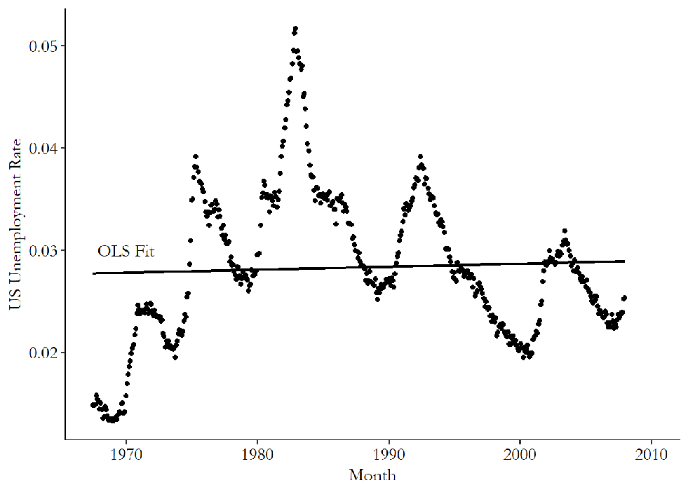

ANOTHER COMMON WAY THAT BEING INDEPENDENT AND IDENTICALLY DISTRIBUTED COULD FAILis in the presence ofheteroskedasticity. A big long word! Now this is a real textbook.

Heteroskedasticity is when thevarianceof the error termʼs distribution is related to the variables in the model. For example, say you were regressing how many Instagram followers someone has on the amount of time they spend posting daily. You might find that, as shown in Figure13.1313.1313.131313131313.13,131313.1313.1313.13131313131313 among people who spend almost no time, thereʼs very little variation in follower count. But among people who spend a lot of time, thereʼs huge amounts of variation. Small amounts of time means little variation in follower count and, accordingly, little variation in the error term. But thereʼs a lot of variation in the error term for large amounts of time spent. The error distribution isnʼt identical because the variance of the distribution changes with values of the variables in the model.

- Figure 13.13: Simulated Instagram Follower Data

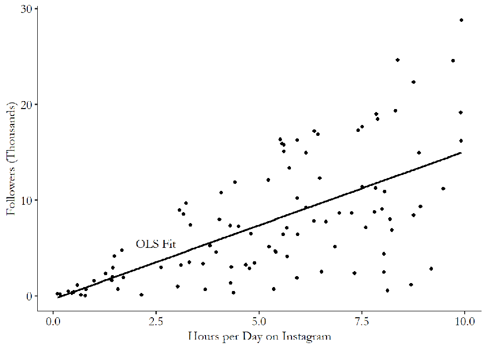

When it comes to failures of the “independent and identically distributed” assumption, we again have a convenient result. These failed assumptions donʼt actually make the OLS coefficients nonnormally distributed. However, theydomake it so that our estimate of the standard error is wrong. This means that we just have to figure out what the standard deviation of that sampling distributionis. This calculation will require some way of accounting for that autocorrelation or that heteroskedasticity.

###### √σ2/(var(X)n)

###### 13.3.2 Fixing Your Standard Errors

IN THIS SECTION IʼM GOING TO DISCUSSa few common fixes to standard errors that we can use in cases where we think the independent and identically distributed assumption fails.

90

First weʼll consider the issue of heteroskedasticity, which is when the variance of the error term changes depending on the value of (or any of the predictors in the model, for that matter). The problem with heteroskedasticity, when it comes to estimating standard errors, is that in the areas where variance is higher, the conditional mean of in that area will move around more from sample to sample. Depending on whether this occurs for higher, lower, or middling values of , this might make change more from sample to sample (increasing the standard deviation of the sampling distribution) so as to meet those changing values. But since regular OLS standard errors simply estimate the same variance for the whole sample, it will understate how much things are changing.

ε X

###### Y

###### X β^1

To provide one highly simplified example of this in action, see Figure13.1411111113.14, which contains two111113.14.1.1.1.1111111 data sets with the same level ofoveralerror term variance across the sample. On the left, we have heteroskedasticity. Imagine picking one observation from the cluster on the left and one from the cluster on the right and drawing a line between them. Thatʼs our OLS estimate from a sample size of 2. Now imagine doing it over and over. With the value fairly pinned down on the right, but moving a lot on the left, the slope moves a lot from sample to sample - itʼs that high-variance cluster driving this, which wonʼt be accounted for in the sample-wide estimate of the residual variance. Now do the same thing on the right. The slope is still going to vary from sample to sample, but the extent of this variation is driven by the variance in each cluster, which is the same, and so when we estimate that variation using the sample-wide residual variation, weʼll estimate it properly.

91 Y

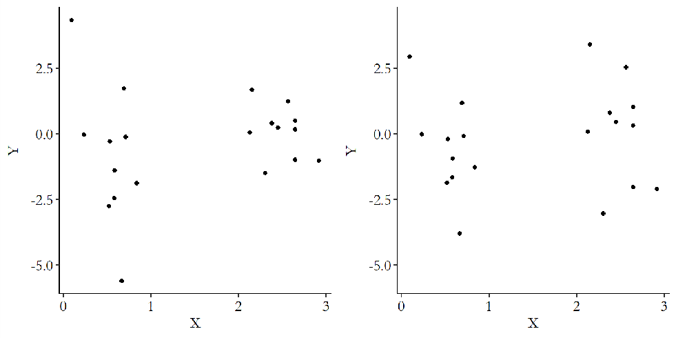

Given this problem, what can we do? Well, we can simply have our estimate of the standard error personalize what we think about the error variance. Instead of we can use a “sandwich estimator,” which, in short, allows the individual

Figure 13.14: A Very Simplified Demonstration of Why Heteroskedasticity Messes up Standard Errors √σ2/(var(X)n)

X var(X)

values that go into that calculation to be scaled up, or down, or even be multiplied by other observationsʼ values.

X 92

One of the more common heteroskedasticity-robust sandwich estimator methods is HuberWhite. In Huber-White, the scaling of the individual values works by taking each observationʼs residual, squaring it, and applying that squared residual as a weight to do the scaling. This, in effect, weights observations with big residuals more when calculating the variance.

X

There are actually several different estimators that, in very similar ways but with minor tweaks, adjust standard errors for the presence of heteroskedasticity. In general, youʼre looking here for “heteroskedasticity-robust standard errors” or just “robust standard errors,” most of which are sandwich estimators, and with Huber-White standard errors as the classic application. However, an alternative to Huber-White called HC3 is generally considered a preferred improvement and the desired default option (⊕Long and Ervin 2000), since it uses a “jackknife,” method for estimating the in the sandwich. HC3 performs about the same in big samples, but much better in small samples (⊕MacKinnon and White 1985). There are other versions besides Huber-White and HC3, to be applied in different scenarios, but these days HC3 is considered a very good place to start.

93

Σ 94

WE CAN THEN MOVE ALONG TO ERRORS THAT FAIL TO BE INDEPENDENT.In other words, theyʼre correlated with each other. Why would correlated errors require us to change how we calculate standard errors? Correlated errors will change the sampling distribution of the estimator in the same way that correlateddatawould change a sampling distribution of a mean. Say you were gathering samples of people and calculating their height. If you randomly sampled people from all over the globe each time, that would give you a certain standard deviation for the sampling distribution of the average height. But if instead you randomly sampledfamilieseach time and calculated average height, the values would be correlated - your height is likely more similar to your parents than to some stranger. Weʼd be more likely than in the randomly-sample-everyone approach to get all tall people and thus a very tall average, or all short people and thus a very

short average. So the mean is swingier, and the sampling distribution has a larger standard deviation. Some adjustment must be made.

When figuring out what adjustment to make, weʼre in a bit of a pickle - we have to figure outhow the errors correlated with each other. After all, it doesnʼt make much sense to say “my errors are correlated” - they canʼtalbe correlated. Instead, weʼd say theyʼre correlatedaccording to some feature. Each of the different ways they can be correlated calls for a different kind of fix.

One common way in which errors can be correlated isacross time- this is the time-based autocorrelation we discussed earlier. In the presence of autocorrelation we can use heteroskedasticity- and autocorrelation-consistent (HAC) standard errors.

95

A common approach to HAC standard errors is the Newey-West estimator, which is another form of sandwich estimator. This estimator starts with the heteroskedasticity-robust standard error estimate, and then makes an adjustment. That adjustment comes from first picking a number of lags - the number of time periods over which you expect errors to be correlated. Then, we calculate how much autocorrelation we observe in each of those lags, add them together - with shorter-length lags being featured more heavily in the sum - and thatʼs used to make the adjustment factor.

96

97

Autocorrelation across time is not the only form of autocorrelation, with correlation across

geographyalso being highly consequential. While I wonʼt go deeply into the subject here, Conley spatial standard errors are another form of sandwich estimator, which calculates standard errors while accounting for the presence of autocorrelation among geographic neighbors.

ANOTHER COMMON WAY FOR ERRORS TO BE CORRELATEDis in ahierarchical structure.For example, say youʼre looking at the effect of providing laptops to students on their test scores. Well, a given classroom of students isnʼt just given laptops or not, they are also in the same classroom with the same teacher. Whatever we predict about their test scores based on having laptops, theyʼre likely

- to all be similarly above-prediction or below-prediction together because of the similar environments they face - their errors will be correlated with each other. Weʼd say these errors are clusteredwithin classroom.

Conveniently, in these cases, we can applyclustered standard errors. The most common form of clustered standard errors are Liang-Zeger standard errors, which are again a form of sandwich estimator. With clustered SEs, you explicitly specify a grouping, such as classrooms. Then, instead of using the sandwich estimator to scale up or down individual values, it instead lets values interact with other values in the same group.

###### X X X 98,99

The use of clustered standard errors can account for any sort of correlation between errorswithin each grouping. This sort of flexibility is a nice relief. No need to make those restrictive assumptions about error terms having correlations of zero. Of course, statistical precision comes from assumptions. If you wonʼt assume anything, the data wonʼt tell you anything. So clustering at too broad a level (say, if your laptop-test score analysis has two schools and you cluster at the school level, or just clustering among the whole sample - everyoneʼs error is correlated with everyone elseʼs) is the equivalent of saying “uh… I dunno whatʼs happening here, could be just about anything I guess,” and youʼll get very large standard errors that might understate what your data can actually tell you. So at some point youʼve got to put your foot down on just how far that correlation is allowed to spread.

100

Whatʼs the right level to cluster at, then? First off, if you have a strong theoretical idea of when errorsshouldbe clustered together, such as in a classroom, go for it. Beyond this, another common approach is tocluster at the level of treatment.So, in the laptop example, if laptops were assigned to some classrooms but not others, youʼd cluster at the classroom level. But if they were assigned to someschoolsand not others, youʼd cluster at the school level. Even then, youʼd only want to cluster if the treatment effect varies across your clusters.[Abadie2017] These are not hard-and-fast rules, however, and clustering decisions require a lot of knowledge about the specific domain youʼre working in. See if you can find other people working on your topic and figure out how theyʼre clustering. Also see further discussion of clustering in theHow the Pros Do Itsection of Chapter @ref{ch-FixedEffects}.

Something important to remember about the Liang-Zeger clustered standard errors, though, is that they work really well forlarge numbers of clusters,say, more than 50. Fewer clusters than that and theyʼre still an improvement on regular standard errors, but theyʼre nowhere near as accurate as you want them to be. For smaller numbers of clusters, you may instead want to use wild cluster bootstrap standard errors, which are sort of a mix between clustered standard

101

errors, which weʼre discussing now, and bootstrap standard errors, which Iʼll discuss in the next section. See more about wild cluster bootstrap standard errors in Chapter1515.15

SO IS IT JUST SANDWICHES ALL THE WAY DOWN?No! Thereʼs another way of estimating standard errors that hasverybroad applications, and thatʼsbootstrap standard errors.The bootstrap is about as close to magic as statistics gets. What are wetrying to dowith standard errors? Whatʼs the point of them? We want to provide a measure of sampling distribution, right? We want to get an idea of what would happen if we estimated the same statistic in a bunch of different samples.

So the bootstrap says: “letʼs estimate the same statistic in a bunch of different samples and see what the distribution is across those samples. Ta-da! Sampling distribution.” Oh. Huh, that makes sense. Why didnʼt we think of that at the start?

But hold on, how is it possible to estimate the statistic in a bunch of different samples? We only have the one sample! Thatʼs the genius of the bootstrap. Ituses the one sample we have, but resamples it.The process for a bootstrap is:

102

- 1. Start with a data set with observations.
- 2. Randomly sample observations from that data set, allowing the same observation to be drawn more than once. This is a “bootstrap sample.”
- 3. Estimate our statistic of interest using the bootstrap sample.
- 4. Repeat steps 1-3 a whole bunch of times.
- 5. Look at the distribution of estimates from across all the times we repeated steps 1-3. The standard deviation of that distribution is the standard error of the estimate. The 2.5th and 97.5th

N

N

103

###### percentiles show the 95% confidence interval, and so on.

Does this actually work? Letʼs take a very simple example. Four observations in our data: 1, 2, 3, 4, and weʼre estimating the mean. The sample mean, of course, is . The sample variance of the data is . So the standard error that weʼd calculate by our typical process is .

(1 + 2 + 3 + 4)/4 = 2.5 ((−1.5)2 + (−.5)2 + (.5)2 + (1.5)2)/(4 − 1) = 1.67

√1.67/4 = .645

All right, now letʼs try the bootstrap. We get our first bootstrap sample and itʼs 1, 1, 4, 4 remember, the same observation can be resampled, which means that some observations from the original data show up multiple times and others donʼt show up at all. The mean of this bootstrap sample is . We resample again and get 1, 3, 4, 4, with a mean of

(1 + 1 + 4 + 4)/4 = 2.5

- 3. Do it again! The next one is 1, 2, 4, 4, mean of 2.75. Next! 1, 2, 2, 3, mean of 2. So far the average of the bootstrap samples weʼve taken is , and the standard deviation is .427.

(2.5 + 3 + 2.75 + 2)/4 = 2.56

.427 is not exactly the .645 that we know is correct, but weʼre not anywhere near done. When you do a bootstrap, you generally want to do it hundreds if not thousands of times. Remember, weʼre trying to mimic a theoretical distribution here by using real-world resampling. Weʼre going to want to get a bit closer to thetheoretical infinitenumber of observations that the theoretical distribution is based on.

Letʼs go a bit bigger. Instead of our observations being 1 to 4 letʼs do 1 to 1,000, and weʼll calculate 2,000 bootstrap samples instead of four bootstrap samples. Now, our sample mean is 500.5, and the standard error of that mean calculated using the standard method is 9.13. The mean of our bootstrap distribution is 500.5 as well, and the standard deviation of our 2,000 bootstrap samples turns out to be 9.06. A bit smaller than 9.13, but weʼre basically getting what we thought weʼd get. This is showing us that maybe those theoretical-distribution assumptions were actually a littlepessimisticabout the precision in this particular instance.

104

105

This is the basic process by which bootstrap standard errors can be calculated. A bit computationally intensive, definitely. But on the flip side, they can sometimes point out where the traditional estimates are too conservative (or not conservative enough), they let you explore

any partof the sampling distribution youʼre curious about - median, different percentiles, skew,

etc., not just the standard deviation - and theyare very useful in estimating standard errors for unusual stuff.What if we have an estimator that weʼre not sure follows a normal distribution, or any distribution we know about? No problem! Just bootstrap it.

Bootstrap does come with its own set of assumptions and weaknesses, of course - it may be magic, but while there may be such a thing as magic thereʼs no such thing as a free lunch. The bootstrap doesnʼt perform particularly well with small sample sizes, it doesnʼt perform well for “extreme value” distributions (super highly skewed data), and it has some difficulties that at the very least need to be addressed if the observations in the data are related to each other, for example in panel data where multiple observations represent the same individual over time. For another example, the standard bootstrap doesnʼt do well under autocorrelation. But for an estimate with a decent sample size and some well-behaved independently-distributed data, the bootstrap can be a great option, especially if the regular standard errors are difficult to calculate in that context. Also, there are some alternate versions of the bootstrap discussed in Chapter151515 that address some of these problems.

106

LETʼS PUT SOME OF THOSE STANDARD ERROR ADJUSTMENTS INTO ACTION.In each of the following code samples, I will show first how to implement heteroskedasticity-robust standard errors, heteroskedasticity- and autocorrelation-consistent standard errors, and then clustered standard errors.

First, robust standard errors. We will continue to use our restaurant inspection data here.

One important thing to know about robust standard errors, especially when it comes to coding them up, is that there are actually many different ways of calculating them. Each method uses different minor adjustments on the same idea. Some versions work better on small samples; others work better on certain kinds of heteroskedasticity. All of the methods below provide access to multiple different kinds of robust estimators (often given names like HC0, HC1, HC2, HC3, and so on). But different languages select different ones as defaults. For example, Stataʼs famously easy robust option unfortunately defaults to HC1, so weʼll need to instead use vce(hc3) to get the probably-should-be-default HC3. Most R methods default to HC3. Always be

107

sure to check the documentation to see which one youʼre getting, and think about which one you should use.

###### R Code R Code e Stata CodeStata CodeStatatatatatatatatatatatatatatatatatatatatata e Python CodePython Codeytyttt ooooooooooo o o oooooo o o o e

library(modelsummary) # For approach 3 library(fixest)

df <- causaldata::restaurant_inspections

# In R there are many ways to get at robust SEs # For the first two methods we'll look at, we need to estimate # the regression on its own # (most types of regressions will work, not just lm()!) m1 <- lm(inspection_score ~ Year + Weekend, data = df)

# First, the classic way, sending our regression # object to AER::coeftest(), specifying the kind # of library(sandwich) estimator we want # vcovHC for heteroskedasticity-consistent coeftest(m1, vcov = vcovHC(m1))

# Second, we can take that same regression object # and, do the robust SEs inside of our msummary() msummary(m1, vcov = 'robust',

stars = c('*' = .1, '**' = .05, '***' = .01))

# Third, we can skip all that and use a regression # function with robust SEs built in, like # fixest::feols() feols(inspection_score ~ Year + Weekend, data = df, se = 'hetero') # (this object can be sent to modelsummary # or summary as normal)

Next, we will address autocorrelation using Newey-West standard errors. Keep in mind that in each case you must select a maximum number of lags (or have one be selected for you). This

book doesnʼt focus much on time series, so I wonʼt go that deeply into it. But basically, closely examine the autocorrelation structure of your data to figure out how far to let the lags go.

Because these are intended for use with time series data, we will first need to adjust our data to be a time series.

###### R Code R Code e Stata CodeStata CodeStatatatatatatatatatatatatatatatatatatatatata e Python CodePython Codeytyttt ooooooooooo o o oooooo o o o e

library(fixest)

df <- causaldata::restaurant_inspections

# Turn into a time series df <- df %>%

group_by(Year) %>% summarize(Avg_Score = mean(inspection_score),

Pct_Weekend = mean(Weekend)) %>% # Only the years without gaps filter(Year <= 2009) %>% # feols requires an index to do this mutate(index = 1)

# Perform our time series regression m1 <- lm(Avg_Score ~ Pct_Weekend, data = df)

# Use the same coeftest method from robust SEs, but use the # NeweyWest matrix. We can set maximum lags ourselves, # or it will pick one using an automatic procedure (read the docs!) coeftest(m1, vcov = NeweyWest)

# Or just use feols from fixest # Note that fixest applies a small-sample correction and # uses a "classic" form of HAC that does not apply # "pre-whiting", so results are different feols(Avg_Score ~ Pct_Weekend, data = df,

panel.id = ~ index + Year, vcov = 'NW')

For the last of our sandwich estimators, we can use clustered standard errors. We donʼt really have any grouping that makes a whole lot of sense to cluster by in the data. But since this is only a technical demonstration, we can do whatever. Weʼll be clustering by whether the inspection

was on a weekend. There are only two values of this, which is not a lot of clusters. We could get some strange results.

###### R Code R Code e Stata CodeStata CodeStatatatatatatatatatatatatatatatatatatatatata e Python CodePython Codeytyttt ooooooooooo o o oooooo o o o e

library(modelsummary) # For approach 3 library(fixest)

df <- causaldata::restaurant_inspections

# In R there are many ways to get at clustered SEs. For the first # two methods we'll look at, we need to estimate the regression on # its own. (most commands will work, not just lm()!) m1 <- lm(inspection_score ~ Year + Weekend, data = df)

# First, the classic way, sending our regression object to # AER::coeftest(), specifying the kind of library(sandwich) estimator. # We want vcovCL for clustering. # Note the ~ before Weekend; this is technically a formula coeftest(m1, vcov = vcovCL(m1, ~Weekend))

# Second, we can pass it to msummary which will cluster if we send # a formula with the cluster variable to vcov msummary(m1, vcov = ~Weekend,

stars = c('*' = .1, '**' = .05, '***' = .01))

# Third, we can use a regression function with clustered SEs built in, # like fixest::feols(). Don't forget the ~ before Weekend. feols(inspection_score ~ Year + Weekend,

cluster = ~Weekend, data = df)

Finally, we come to bootstrap standard errors. Thereʼs a necessary choice here ofhow many bootstrap samples to make.So… how many should you make? Thereʼs not really a hard-and-fast rule. For most applications, a few thousand should be fine. So letʼs do that. The code below only shows a straightforward each-observation-is-independent bootstrap. But in general something

like a cluster boostrap, where certain observations are all included or excluded together, isnʼt far off if you read the documentation, or Chapter1515.15

###### R Code R Code e Stata CodeStata CodeStatatatatatatatatatatatatatatatatatatatatata e Python CodePython Codeytyttt ooooooooooo o o oooooo o o o e

# Load packages and data library(tidyverse); library(modelsummary); library(sandwich) df <- causaldata::restaurant_inspections

# Let's run our standard model from before m <- lm(inspection_score ~ Year + Weekend, data = df)

# And use the vcov argument of msummary with vcovBS from the # sandwich package to get boostrap SEs with 2000 samples msummary(m, vcov = function(x) vcovBS(x, R = 2000),

stars = c('*' = .1, '**' = .05, '***' = .01))

###### 13.4 Additional Regression Concerns

108

ALL THAT AND WE STILL ARENʼT DONE WITH REGRESSION?How long is this chapter? Alas, as with any statistical method, there are infinite little crevices and crannies to look into and wonder whether the method is truly appropriate for your data. And for something as widely-used as regression, itʼs worth our time to explore what we can.

In this final section weʼll look at four additional tricks or concerns weʼll want to keep in mind when working with regression.

- 13.4.1 Sample Weights

EVERYTHING WEʼVE SAID ABOUT USING A SAMPLE RELATIONSHIP TO LEARN ABOUT A POPULATION RELATIONSHIP makes the assumption that the sample is drawn randomly from that population. So if we have a sample of, say, Brazilians, then each person in Brazil is equally likely to end up in our sample, whether they live in Rio de Janeiro or the countryside, whether theyʼre rich or poor, whether theyʼre educated or not, and so on.

This is rarely true for a number of reasons. Some people are easier to survey or gather data on than others. Some sampling methods donʼt even try to randomly sample everyone, instead sampling people based on convenience, or location, or any number of other characteristics.

When this occurs, obviously, the results are better-representative of the people who were more likely to be sampled. We can solve this issue with the application ofsample weights, where each observation in the sample is given some measure of importance, with some observations being treated as more important (and thus influential in the estimation) than others.

In application to a bivariate regression, our estimate of the slope is . Without a sample weight, we estimate the covariance by taking and multiplying it by for each observation, then taking the average of that product over all the observations. With a sample weight , we do the exact same thing, but we take our for each observation and multiplythatby the observationʼs weight before taking the average of that whole thing. The higher your , the more your values will count when calculating the covariance, variance, and so on, and so youʼll be more represented in the final estimates.

Cov(X,Y )/V ar(X) X − X¯ Y − Y¯

w (X − X)(Y¯ − Y¯)

w 109 w

This whole process is known, unsurprisingly, asweighted least squares. THEREʼS MORE THAN ONE REASON TO WEIGHT.The problem I just mentioned - where certain people are more likely to be sampled than others - is a very common problem in the social sciences. Itʼs so common, in fact, that many surveys, and certainly most of the big and well-performed surveys like the census in most countries, will contain sample weights already prepared for you. The survey planners have a good idea about how their sampling was done, and so have a decent idea of how likely different individuals, households, firms, or whatever, were to be included in the sample.

These weights are sometimes created by comparing the proportion of people with a given attribute in the data against a population value. If the population has 500 men and 500 women (50% of each), and our sample of 100 people has 70 men and 30 women, then we might say that each man had a 14% chance of being included, and each woman had a 6% chance. Those probabilities would inform our sample weights.

70/500 = 30/500 =

Then, weʼd weight each individual by theinverseof those probabilities. So men would get a

weight, and women would get a weight. This weights people who were less likely to be sampled more heavily, giving us back the demographic proportions in the population, making our estimates better represent the population.

1/.14 ≈ 7.143 1/.06 ≈ 16.667

For example, if we estimated the proportion of men using our sample alone, weʼd estimate that the population has 70% men. Clearly wrong! But if we weight it, weʼd get

(7.143 × 70 + 16.667 × 0)/(7.143 × 70 + 16.667 × 30) = 110

50%. Perfect! Same idea goes when estimating regression coefficients. Without the weights, theyʼre skewed by the sampling process. With weights, we better represent the relationship in the population.

Sample weights work. If your data has sample weights (and theyʼre estimated properly, which in a professional survey they likely would be), read carefully about what they mean, and use them. Be sure to use the ones that fit the analysis youʼre doing - survey data will often have different weights for different observation levels. If you want to generalize to individuals, use the individual-person weights. If you want to generalize to households use the household weights, and so on.

THERE ARE OTHER REASONS TO WEIGHT, THOUGH.A big one comes if youʼre usingaggregated data. For example, maybe youʼre doing an analysis of the impact of distributing laptops on test scores. But instead of using data on the individual students and their individual test scores, maybe you use classroom averages.

111

Now, analyzing the classroom-average data directly would have some problems. Some classrooms are bigger than others. Bigger classrooms represent more students, so if you want a result of the form “a laptop increases a studentʼs scores by ,” then your aggregated analysis will be hard to figure out, since your results would really be on the classroom-average level. Second, whatever average data you have will be less noisy if it came from a bigger classroom, since the

###### β^1

sampling distribution of the mean has a smaller standard deviation if it comes from a bigger sample. So some of the means in your data will be better-estimated than others, but OLS will treat them as the same.

These are two different problems with two different (but similar) solutions.

The first problem, and solution, is very simple. What if one classroom represents 30 people while another represents 40? Easy! Just count the first classroom 30 times and the second classroom 40 times. These arefrequency weights, where the weight is simply the number of observations the variable represents. This returns your results to being interpretable on the individual, nonaggregated level. Itʼs not quite as good as actually having the non-aggregated data, since you lose out on that between-individual variation. But it does give you easier interpretation, and gives you a result that accounts for differences in size.

112

The second problem, relating to differences in the variance of the mean, is a bit trickier, but not much. For this problem we have inverse variance weighting. We can calculate the variance of each aggregated observationʼs mean. Then, weight each observation by the inverse of that variance.

The variance of a sample mean is , where is the number of observations in the sample, i.e., the number of observations aggregated into the observation. The inverse of that is . Under the assumption that is constant across the sample, that part drops out of the weighting (since it applies to everyone, and the weights are all relative to each other), leaving us with weights of . Each aggregate observation is weighted by the number of observations that got aggregated into it.

σ2/N N

N/σ2 σ2

###### N

Hold on… frequency weights weight by the number of observations used to aggregate, too. So whatʼs the difference between frequency weights and inverse variance weights? There actually isnʼt a difference when it comes to estimates - frequency weights and inverse variance weights will produce the exact same coefficients. However, there is a difference when it comes to standard errors. Frequency weights act as though each aggregated observation is truly a collection of separate, independent, completely identical observations. So when it calculates

for the standard errors, it usesthe unaggregated sample sizeto calculate . Inverse variance weights, however, recognize its data as being a set of means, and so usesthe aggregated

σ/var(X) σ

sample sizeto calculate . Frequency weight standard errors will then always be smaller than inverse variance weight standard errors.

###### σ

113

Inverse variance weighting has plenty of other applications too, besides aggregated data. There are lots of other situations in which we know that some observations represent a lot more variance than others. For example, treatment itself may be a lot more variable for some observations than others, and those observations will be weighted more heavily in the estimate, which we can correct by inversing that variance to make the weight. Problem solved. One application of this to the fixed effects method can be seen in Chapter1616.16

Another place where inverse variance weighting pops up that wewonʼthave room to cover is in meta-analysis. In meta-analysis, you look at a bunch of different studies of the same topic and try to estimate the overall effect, aggregating together their results. Some studies have estimates with big standard errors, and others have estimates with small standard errors. Inverse variance weighting helps weight the more precisely-estimated effects more strongly.

LETʼS ESTIMATE SOME REGRESSIONS WITH SAMPLE WEIGHTS.Most commands will let you just give them a weighting variable. The task of figuring out which kind of weighting to do is on you, and you just pass off the final weight. So if you want inverse sampling probability weights, better calculate that inverse yourself!

This also means that if a certain approach to weighting requires you to adjust the standard errors, that wonʼt happen. If you want to do frequency weights, for example, youʼll either need to adjust the standard errors yourself, or skip the use of weights altogether and just copy each observation a number of times equal to its weight and run the regression without weights. You can do this in R by passing the data df to slice(rep(1:nrow(df), weight)) after loading the tidyverse.

Python is a bit trickier - you can do it with expanded_df = df.loc[numcopies], but this requires you to calculate numcopies, the number of times you want to copy each row, yourself. The itertools package may help with that.

Stata is an exception here, since it has several weight types (aweight, fweight, iweight, pweight) that it treats differently, and not all commands accept all kinds of weights. Youʼd generally use pweight for inverse-sampling-probability weights, aweight for variance

weighting, and fweight for frequency weighting, which will properly handle the standard error adjustment for you. Look at Stataʼs help weight before using weights in Stata.

114

For these examples, weʼll be doing some inverse variance weighting with an aggregated version of our restaurant inspection data. First, weʼll aggregate the data to the different restaurant chains, and count how many inspections weʼre averaging over. Specifically, weʼll see if average inspection score is related to the first year that the chain shows up in the sample. Then, since the variance of the sample mean is proportional to the inverse of the number of observations in the sample, weʼll weight by the inverse of that inverse, i.e., the number of observations in the sample.

###### R Code R Code e Stata CodeStata CodeStatatatatatatatatatatatatatatatatatatatatata e Python CodePython Codeytyttt ooooooooooo o o oooooo o o o e

# Load packages and data library(tidyverse); library(modelsummary) df <- causaldata::restaurant_inspections

# Turn into one observation per chain df <- df %>%

group_by(business_name) %>% summarize(Num_Inspections = n(), Avg_Score = mean(inspection_score), First_Year = min(Year))

# Add the weights argument to lm m1 <- lm(Avg_Score ~ First_Year,

data = df, weights = Num_Inspections)

msummary(m1, stars = c('*' = .1, '**' = .05, '***' = .01))

These code examples, of course, just show how to run a single regression with weights. If you are working with survey data that has complex weighting structures that youʼll need to reuse over

and over again, you might want to have the language explicitly acknowledge that and help you. In R you can do this with the survey package. In Stata you can look at the range of svy commands and prefixes with help svy and help svyset.

###### 13.4.2 Collinearity

WHEN I DISCUSSED CATEGORICAL PREDICTOR VARIABLES,I talked aboutperfect multicolinearity. Perfect multicollinearity is when a linear combination of some of the variables in the model perfectly predicts another variable in the model. When this happens, the model canʼt be estimated. If the model is , then

Sales = β0 + β1Winter + β2NotWinter

produces the exact same predictions (and residuals) as

β0 = 15,β1 = −5,β2 = 0 β0 = 10,β1 = 0,β2 = 5

, as well as an infinite number of other sets of estimates. OLS canʼt pick between them. It canʼt estimate the model.

115

But what happens if we donʼt haveperfectmulticollinearity, but we do have predictor variables that aresuper highly correlated? After all, one way of thinking about and is theyʼre just two variables with a correlation of -1. What if we had two variables with a correlation of .99$ or -.99 instead of 1 or -1? Or even .9 or -.9? Weʼd call that a high degree ofcolinearity(but not perfect).

###### Winter NotWinter

Outside of the categorical-variable example, high collinearity often comes up when you have multiple variables that measure effectively the same thing. For example, say you wanted to use an “Emotional Intelligence” score to predict whether someone would get a promotion. You give people an emotional intelligence test with two halves with tiny variations on the same questions. Then, you use the first half of the test and the second half as separate predictors in the model, hoping to get an overall idea of how emotional intelligence as a whole predicts promotions. The scores from those two halves are likely highly correlated.

116

High levels of collinearity tend to make the estimates very sensitive and noisy, leading the sampling distributions to be very wide and driving the standard errors upward.

WHY DOES COLLINEARITY INCREASE STANDARD ERRORS?Letʼs stick with our Winter/Sales example. Letʼs replace the Winter variable with WinterExceptJan1. So now our predictors are WinterExceptJan1, which is 1 for all non-January 1 days in Winter, and NotWinter, which is 1 for all non-Winter days. January 1 is zero for both of them. The correlation between the two variables would be very nearly -1. is true for all observations except for January

WinterExceptJan1 + NotWinter = 1

1. So we are close to a perfect linear combination but not quite.

In that setting, with the model ,

Sales = β0 + β1WinterExceptJan1 + β2NotWinter

will not produce the exact same predictions (and residuals) as , but it will be very close. Every day but January 1 will be predicted exactly the same. Now, unlike with perfect multicollinearity, wecanpick a “best” set of estimates. Simply set equal to on January 1, equal to the average difference between on the other Winter days and on January 1, and equal to the average difference between on non-Winter days and on January 1.

β0 = 15,β1 = −5,β2 = 0 β0 = 10,β1 = 0,β2 = 5

β0 Sales β1 Sales β2 Sales

However, those estimates we picked wereentirelydependent on the January 1 value. If Sales on January 1 are 5, then we get . If on January 1 just happens to be 15 instead, then everything changes wildly to . A single observation changing value shifts every coefficient by about the amount of the shift! then moves around just as much as a single observation of does. The standard error of basicallyisthe standard deviation of , rather than shrinking quickly with the sample size as it normally would.

β0 = 5,β1 = 5,β2 = 10 Sales β0 = 15,β1 = −5,β2 = 0

β1

Sales β1 Sales

117

WHAT CAN WE DO ABOUT COLLINEARITY THEN?The first step is, as always, tothink through our model carefuly.Even before thinking about whether a calculated correlation is really high, ask yourself “why am I including these predictors in the model?” Remember, adding another predictor to the model means youʼrecontroling for itwhen estimating the effect of the other variables. Do you want to control for it?

A tempting thought when you have multiple measures of the same concept is that including

- them all in the model will in some way let them complement each other, or add up to an effect. But in reality it just forces each of them to show the effect of the variation that each measure has thatʼs unrelated to the other measures.

Going back to the example with the two halves of the emotional intelligence test, why would we want to know the effect of the first halfwhile controling for the second half?“Controlling for the second half of the exam, an additional point on the first half increases…” what would that even mean? The coefficient on the first half would represent the relationship between score on the first half and promotion probability after removing the part of that relationship thatʼs explained by the second half, but that explained part should basically be all of the relationship. There wonʼt be much variance left, making tiny and big, inflating those standard errors. In any case, where the correlation really is that strong, you probably arenʼt closing any back doors, youʼre just controlling away your treatment.

###### var(X) σ2/var(X)

In cases like this, where we have multiple measures of the same thing, one good approach to including all the predictors while avoiding collinearity is the use ofdimension reduction methods, which take multiple measures of the same thing and distill them down into their sharedparts, capturing the underlying concept you think they all represent (rather than their non-shared parts, which is what including them all in a regression would do).

Dimension reduction is a large field, largely growing out of psychometrics, and I wonʼt even try to do it justice here. But methods like latent factor analysis and principal components analysis take multiple variables and produce a small set of factors that represent different shared aspects of those variables, either looking for components that are unrelated to each other (and so produce no collinearity at all), or instead focusing on getting those underlying concepts which might be related to each other. Unsurprisingly, machine learing researchers, who often have to deal with thousands upon thousands of variables at once, have also made a lot of contributions in recent years to dimensionality reduction. See Jia et al. (⊕2022) for a review.

HOW CAN WE ADDRESS COLLINEARITY IN OTHER CONTEXTS,where the issue isnʼt multiple measures of the same thing, but multiple measures of different things that happen to be strongly correlated?

For example, maybe you want to look at the impact of an increase in wages on a firmʼs profitability, controlling for stock market indices in both Paris and Brussels, where it trades a lot. Paris and Brussels stock prices are likely correlated strongly, but theyʼre not the same thing. We can imagine how we might want to control for both, but maybe the correlation is too high and

weʼd have a collinearity problem. Should we remove one, or use dimension reduction? How much correlation is “too much”?

You could just check the correlation between all the predictors and seek out high correlations, but this wouldnʼt account for cases where it takes more than one variable to form a very close linear prediction of a variable.

118

A common tool in checking whether thereʼs too much collinearity, which takes into account the entire set of variables at once, is the variance inflation factor (VIF). The VIF is different for each variable in the model. Specifically, for variable , itʼs , where is the from a regression of variable on all the other variables in the model.

j V IFj = 1/(1 − R2j) R2j R2 j

As a very rough rule of thumb, if a variable has a VIF above 10 (i.e., if regressing that variable on the other predictors produces an above .9), then you might want to consider removing it from the model, or performing dimension reduction with the other variables itʼs strongly related to. Other people use a VIF above 5 as a cutoff. In general, using hard cutoffs as decision rules rarely makes sense in statistics. Instead, use high VIFs as an opportunity to think very carefully about your model and think about whether removing things makes sense.

###### R2

You can calculate the VIF for each variable in the model in R using vif(m1) from the car package, where m1 is your model. In Stata, run your regression, and then follow that with estat vif.

Python has the variance_inflation_factor function which you can import from statsmodels.stats.outliers_influence. However, it works a bit differently from the R and Stata versions because it operates on a data frame of the predictors instead of on the model, and only calculates the VIF for one of them at a time, so you have to loop through them if you want everything. If X is a data frame consisting only of your predictors, you can calculate the VIF for each of them with [variance_inflation_factor(X.values, i) for i in range(X.shape[1])].

- 13.4.3 Measurement Error

IT SEEMS LIKE A PRETTY REASONABLE ASSUMPTION THAT THE VARIABLES IN THE DATA ARE THE VARIABLES IN THE DATA.But what if… theyʼre not?

What I mean by this is that itʼs pretty common for the values youʼve recorded in the data to not be perfectly precise. Itʼs also common for the variable you have in the data to only be aproxyfor the variable you want, rather than the real thing.

Imprecision is a natural part of life. No measurement is perfectly precise. If you have a data set of heights, the “5 foot 6 inch” and “6 foot 1 inch” in the data probably are hiding more accurate values like “5.5132161 feet” and “6.0781133 feet” that you donʼt have access to. If the only problem is that youʼve rounded your values to a certain reasonable level of precision, thatʼs probably not a huge issue. But if the mismeasurement is more severe - if youʼre rounding both of those very-different heights to 6 feet, or if that “5 foot 6 inch” is really “5 foot 8 inch” but someone wrote it down wrong, or used the ruler incorrectly, then the values in the data donʼt match the real values, so thereʼs no way for our estimates to pick up on actually-existing values in the data.

The use of proxies is common as well. A proxy is a variable used in place of another, because you donʼt have the variable you actually want. If you want to know the effect of giving students laptops on future test scores, you may think that mathematical ability exists on a back door and so want to control for a studentʼs mathematical ability. You canʼt actually see their mathematical ability, but you have access to their scores on a math test, which isnʼt exactly the same thing but should be closely related. The test score is a proxy for mathematical ability, but itʼs not the same thing. If two students have the same ability but different test scores, the model will treat them as different when really theyʼre the same, and thus will get it wrong.

Imprecision and proxies are both examples ofmeasurement error, also known aserrors-invariables.The idea is that the variables in your model represent the truelatent valueyou want, with some error.

X = X∗ + ε (13.18)

where is the variable you have in your data, is the latent unobserved variable, and is an

X X∗ ε

119

WHY DO WE CARE ABOUT MEASUREMENT ERROR?Itʼs pretty easy to imagine how measurement error can lead our estimates astray. In the extreme, imagine using some completely unrelated variable

- as a proxy. If I want to know the effect of laptops on test scores, but instead of using the variable “has a laptop” I use “has brown hair,” we have no reason to believe that would give us the effect of having a laptop.

But what about in less extreme cases? There are two main kinds of measurement error, and they have different implications.

The easiest kind of measurement error to handle isclassical measurement error,which is measurement error where the error is unrelated to the latent variable . When this happens, the measured variable is just “the true latent variable, plus some noise.”

ε X∗ X

Classical measurement error has clear implications: in the regression , if suffers from classical measurement error, then the estimate will becloser to 0than the true youʼd get if you could run . It will “shrink towards zero,” also called “attenutation.”

Y = β0 + β1X X

β^1 β1 Y = β0 + β1X 120

Why does it do this? Well, has an effect of on , right? Whenever moves, we expect to move as well. But if we see , the noisy version of , then we wonʼt see all those moves. Weʼll see dancing around, responding to changes in that we canʼt see in . And the more changes in there are thatarenʼtrelated to , the less related and appear to be. So the estimate shrinks towards zero.

X∗ β1 Y X∗ Y

X X∗ X∗ Y X∗ X

Y X X Y

Classical measurement error also has some clear fixes, or, rather, it offers the opportunity not to fix it. Most commonly, people will just run regular OLS without actually fixing anything, and then treat the estimate as a “lower bound.” They know the effect isat leastas far away from zero as the estimate they get, although they donʼt know how much larger.

You may have noticed that Iʼve only discussed measurement error in . What about ? Turns out classical measurement error in just isnʼt much of a problem. Sure, it will reduce the modelʼs (since thereʼs now some more noise in that we canʼt predict), but it wonʼt affect the coefficients, at least not on average. Those coefficients are already used to there being noise in it canʼt predict. Thereʼs just a bit more of it now. That noise will go into the regression modelʼs

X Y Y R2 Y

Y

IF THATʼS CLASSICAL MEASUREMENT ERROR, WHATʼS NON-CLASSICAL MEASUREMENT ERROR?This is when the errorisrelated to the true value, and it makes things much trickier. Why might measurement error be non-classical? One example is if is binary, as is , so both can only be 0 or 1. If

X∗ X X∗ = 1 X∗ = 0

, then the error can only possibly be 0 or -1. If , then the error can only possibly be

- 0 or 1. The value of determines what the error can be, making them related.

X∗

Non-classical measurement error occurs with continuous variables, too. Say you have a bunch of tax data on business owners and are measuring income. You know that some people are going to misrepresent their income on their taxes, so as to pay less in tax. Misrepresenting income is a lot easier with cash-based businesses than with businesses that mostly get paid with credit cards or checks. Cash-based businesses also on average tend to have lower incomes than others. So weʼd expect more negative measurement errors (underreported income) among low-income businesses than high-income businesses. The error is related to the true value.

For another example, imagine a study that relies on a variable where people report how much they exercise each day. Someone who exercises a lot may feel comfortable reporting the truth to the survey-taker, while someone who exercises very little may bump their numbers up to look better.

Non-classical measurement error is more unpredictable than classical measurement error, because without knowing more about the exact way the error is related to , we donʼt know whether will be shrunk toward zero, inflated away from zero, biased upward, biased downward, or not biased at all! It could be anything. Also, unlike classical measurement error, non-classical measurement error is a problem when it happens to as well as when it happens to .

X∗ β1

###### Y X

So if you think you have measurement error, put some serious thought into whether you think thereʼs any way for that error to be related to the latent variable. If it is, you have a bigger problem on your hands than you thought.

IF WE HAVE MEASUREMENT ERROR AND WANT TO FIX IT, HOW CAN WE DO THAT?If you have some information about the measurement error itself, you might be able to do some adjustments to get closer to the true . I wonʼt go deeply into these methods - youʼll have to look elsewhere.

β1

Measurement error is one of those topics where diving in takes you really deep. Every textbook I can find focusing on the subject is much more advanced than the one youʼre reading now, but it still may be worth your time to look at a book likeMeasurement Error Modelsby Wayne Fuller (⊕2009).

Without going too deep, though (or, rather, rattling off the keywords you can Google for later), what can we do? If you have an idea of the ratio of the variance of the regression error to the variance of the measurement error, you can perform a Deming regression or Total Least Squares, which adjusts for the shrinkage towards zero.

There are other options out there that you can look for, including the general method of moments (GMM). Another common approach is the use of instrumental variables, although unlike with the use of instrumental variables in Chapter1919, the goal here is not to identify a19 causal effect but rather adjust for measurement error. If you have two measurements of the same latent variable, and both measurements are noisy but have unrelated errors (for example, you have two imperfect thermometers both recording temperatures a mile apart, and you want the temperature in that area), you can use one measurement as an instrumental variable to predict the other, and then use the prediction in the model. This isolates the shared part of the two measurements, which will be closer to the true latent value than either alone.

Thatʼs not even getting into the whole class of methods specially designed for use with measurement error in binary predictors! Many of these try to estimate how often a 0 turns into a

- 1, and a 1 turns into a 0, and they incorporate that into their estimates of the regression model.

Of course, these methods Iʼve listed all relate to measurement error when you have alinear model. What if youʼre working with a nonlinear model like logit, probit, or something else? Well… youʼll have to look for variants of these measurement error corrections specifically designed for those methods. Theyʼre out there. Usually they are variants on the models Iʼve already talked about, such as GMM or instrumental variables. Happy hunting.

###### 13.4.4 Penalized Regression

THE ENTIRE FIRST HALF OF THIS BOOK BEATS A VERY REPETITIVE DRUM:construct your model from theory. Use what you know to decide very carefully which controls are necessary and which should be excluded. And so on.

However, itʼs not uncommon for this process to leave us withfar too manycandidates for inclusion as controls. What do we do if we have thirty, fifty, a thousand potential control variables thatmighthelp us close a back door? Even if we have a good reason for including all of them, actually doing so would be a statistical mess that would be very difficult to interpret, and would give us a collinearity nightmare. Plus, the data would likely beoverfit- with that many predictors, the model will fit the sample very closely, but will be responsive to noise (sort of for the same reasons as collinearity), and so will not match the true model well, or predict well if applied to a new sample.

We probably want to drop some of those controls. But which ones? Ideally weʼd have some sort of principledmodel selection procedurethat would do the choosing for us.

Enterpenalized regression.Penalized regression is a tool coming from the world of machine learning. Machine learning methods are generally much more concerned with out-of-sample prediction than with causal inference, but weʼre going to be able to put one of their tricks to use here. Remember how OLS picks its coefficients by minimizing the sum of squared residuals? We can represent that goal as

121

argminβ {∑(Y − Y^)2} (13.19)

In other words pick the (arg)uments that (min)imize , which is the sum ( ) of squared ( ) residuals ( ). Note that shows up inside that , which is (plus whatever other coefficients and predictors you have).

β ∑(Y − Y^)2 ∑ 2 Y − Y^ β Y^ β^0 + β^1X

Penalized regression says “sure, minimizing the sum of squared residuals is great. But I want you to try to achieve two goals at once. Make the sum of squared residuals as small as you can, sure, butalsomake this function of the coefficients small.” The goal now becomes

β

argminβ {∑(Y − Y^)2 + λF(β)} (13.20)

where is some function that takes all the coefficients and aggregates them in some way, usually a way that gets bigger as the s grow in absolute value, and is a penalty parameter a tiny means “donʼt worry too much about the penalty, just minimize the sum of squared residuals, please,” and a big means “itʼs really important to keep the s small, worry about that more than minimizing the residuals.”

F()

β 122 λ λ

λ β

123

There are plenty of functions you could choose for , but the most common are “norm” functions, specifically the L1-norm, which gives you “LASSO regression,” and the L2-norm which gives you “ridge regression.” The L1-norm function just adds up the absolute values of the s (

###### F()

β ∑|β| ||

, where is the absolute value function), and the L2-norm function adds up the squares of the s ( ).

β ∑β2 124

Having this penalty encourages the estimator to pick values closer to 0, so as to avoid the penalty. Why is this desirable? Because less-bold predictions will back off a bit on fitting the currentdata, but as a tradeoff, youʼll probably get better predictions offuturedata, since your estimate wonʼt be distracted as much by the noise in the sample.

β

But these methods donʼt just shrink coefficients uniformly; it sort of works with a coefficient “budget,” and it spends wisely. It only makes coefficients bigger if they really help in reducing that sum of squared residuals. The L2-norm (ridge regression) ends up giving you shrunken coefficients. But the L1-norm (LASSO) version, also known as the “least absolute shrinkage and selection operator,” doesnʼt just shrink coefficients, it also tends to send a lot of coefficients to exactly zero, effectively tossing those variables out of the model entirely - thatʼs why itʼs a “selection operator.”

And thatʼs the way we can apply LASSO to our problem of having too many covariates. It figures out which variables it can drop while doing the least damage to the sum of squared residuals. It

- then ends up shrinking the coefficients that remain, to boot.

BUT IF WHAT WE WANT IS TO IDENTIFY A CAUSAL EFFECT, WONʼT LASSO GIVE US A BAD MODEL?There are two ways in which LASSO could get us in trouble. The first is that some covariates need to be included to close back doors, even if they donʼt help prediction that much. Thatʼs an easy fix - just tell LASSO not to drop specific necessary covariates. Or, after it tells you to drop them, just… donʼt do it. Add them back in.

The second way LASSO can get us in trouble is that our goal here is very muchnotto get the best out-of-sample prediction as the machine learning types aim for (and designed LASSO for), but rather to get the best estimate of a causal effect that we can. And here comes LASSO, explicitly not even trying to get the best estimate of - that part where it shrinks the coefficients doesnʼt make them more accurate estimates of the coefficients, it just makes the out-of-sample prediction better. In fact,LASSO wil in general give you biased estimates of coefficients.But thatʼs an easy fix, too. If you only want to use LASSO for variable selection, do that. Then, take the variables it says to keep in for predicting either the treatement or the outcome, and rerun good olʼ non-penalized OLS using those variables (⊕Belloni, Chernozhukov, and Hansen 2014).

β

HOW CAN WE ACTUALLY PERFORM LASSO?There are a few practical things to keep in mind when running LASSO.

One important thing to point out here is that before estimating a LASSO model, itʼs important to standardize all your variables. That is, we want to take each variable, subtract out its mean, and divide by its standard deviation.

Why do we want to do this? Because the penalty term, cares only about the size of the coefficient. And the size of the coefficient is sensitive to the scale of the variable! For example, comparing the models and , where , if we estimate in the first model, weʼll get the exact same prediction if in the second model. The from is exactly balanced by doubling the . This isnʼt a problem with regular OLS, since our interpretation just changes to match. A one-unit change in corresponds to a two-unit change in . A one-unit change in is thus twice the change of a one-unit change in , so it makes sense it has twice the effect (6 compared to 3).

∑|β|

Y = β0 + β1X Y = β0 + β1HalfofX HalfofX = X/2 β^1 = 3 β^1 = 6

/2 HalfofX β1

HalfofX X HalfofX

###### X

The fact that a smaller scale means bigger coefficients means that simply dividing by 2, which shouldnʼt make any meaningful difference in the model, doubles the penalty that the coefficient on receives, and gives LASSO more reason to shrink it or drop it.

X

X

We donʼt want that, so we make sure all variables are on the same scale by standardizing first. Some LASSO commands will do this standardization for you (or have an option to do so). For others, youʼll need to do it yourself.

The second thing to keep in mind is that LASSO lets youtry stuffand see what needs to be kept. So itʼs relatively common to run LASSOwhile including a bunch of polynomial terms and interactions for basicaly everything. If the polynomialʼs not important, it will drop out.

You can only go so wild with this, of course. If you truly interact everything with everything else and LASSO tells you to keep some strange interactions, will you be able to make sense of the model? And if you include a polynomial and it tells you only to keep the cube term and not the linear or square, youʼll have to add those lower terms back in anyway.

Third, weʼve left out an important step of LASSO - picking the value that tells us how much to penalize the coefficients. You can set this as you like, choosing a higher value to really toss out a lot of variables, or a low value to only toss out a few. Often, people will usecross-validationto select the value.

λ

125

Cross-validation is a method where you split the data up into random chunks. Then you pick a value of . Then you drop each of those chunks one at a time, and use the remaining chunks to predict the values of the dropped chunk, letting you in effect predict out-of-sample. Then bring that dropped chunk back and drop the next chunk, estimating the model again and predicting thosedropped values. Repeat until all the chunks have been dropped once, and evaluate how good the out-of-sample prediction is for the you picked. Then, pick a different value and do it all over again. Repeat over and over, and finally choose the with the best out-of-sample prediction.

λ

λ λ λ

126

That said, letʼs run some LASSO models. If you run this code, you might get slightly different results as to what to drop. Why? Because thereʼs some randomness in the LASSO estimation procedure. To get perfectly consistent results, youʼd need to set the random seed.

127

###### R Code R Code e Stata CodeStata CodeStatatatatatatatatatatatatatatatatatatatatata e Python CodePython Codeytyttt ooooooooooo o o oooooo o o o e

# Load packages and data library(tidyverse); library(modelsummary); library(glmnet) df <- causaldata::restaurant_inspections

# We don't want business_name as a predictor df <- df %>%

select(-business_name)

# the LASSO command we'll use takes a matrix of predictors # rather than a regression formula. So! Create a matrix with # all variables and interactions (other than the dependent variable) # -1 to omit the intercept X <- model.matrix(lm(inspection_score ~ (.)^2 - 1,

data = df)) # Add squared terms of numeric variables numeric.var.names <- names(df)[2:3]

- X <- cbind(X,as.matrix(df[,numeric.var.names]^2)) colnames(X)[8:9] <- paste(numeric.var.names,'squared')

# Create a matrix for our dependent variable too

- Y <- as.matrix(df$inspection_score)

# Standardize all variables X <- scale(X); Y <- scale(Y)

# We use cross-validation to select our lambda # family = 'gaussian' does OLS (as opposed to, say, logit) # nfolds = 20 does cross-validation with 20 "chunks" # alpha = 1 does LASSO (2 would be ridge) cv.lasso <- cv.glmnet(X, Y,

family = "gaussian", nfolds = 20, alpha = 1)

# I'll pick the lambda that maximizes out-of-sample prediction # which is cv.lasso$lambda.min and then run the actual LASSO model lasso.model <- glmnet(X, Y,

family = "gaussian", alpha = 1, lambda = cv.lasso$lambda.min) # coefficients are shown in the beta element - . means LASSO dropped it lasso.model$beta

# The only one it dropped is Year:NumberofLocations # Now we can run OLS without that dropped Year:NumberofLocations m1 <- lm(inspection_score ~ (.)^2

- Year:NumberofLocations

+ I(Year^2)

+ I(NumberofLocations^2), data = df)

msummary(m1, stars = c('*' = .1, '**' = .05, '***' = .01))

Something you might notice if you read the code for all three languages is that the results are different across languages. Each of the LASSO estimates was different in selecting what to drop, despite being given the exact same data (except for the Stata version, which was also given the interaction between all three variables). This is not as uncommon as you might expect in statistical software - results can be different across different languages all the time (⊕McCullough and Vinod 2003), especially for methods like LASSO that arenʼt “solved” and so you have to search over a bunch of different coefficients to find ones that work. Those search methods can differ a lot over software packages.

Also, thedefault optionsmay differ a lot. Even if the underlying estimation code was the same, these different languages may have still produced different results based on issues like where to start the estimation search, how to perform cross-validation, and which values to check in cross-validation. Whatever language you use, be sure to read the documentation, be sure you know what youʼre asking it to estimate, and ideally try your estimate in more than one language

###### λ

- to see if itʼs consistent.

Previous Next

Page built: 2025-10-17 using R version 4.5.0 (2025-04-11 ucrt)

###### The Effect

Nick Huntington-Klein

▾ Chapters

###### Chapter 14 - Matching

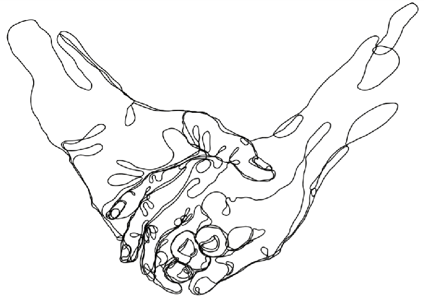

###### 14.1 Another Way to Close Back Doors

REGRESSION GETS A LOT OF ATTENTION,but itʼs not the only way to close back doors. Through the first half of this book I was pretty insistent about it, in fact:choosing a sample in which there is no variation in a variable closes any open back doors that sits on.

###### W W 1

That sounds simple enough, and indeed itʼs an intuitive idea. “We picked two groups that look pretty comparable, and compared them,” is a lot easier to explain to your boss than “we made some linearity assumptions and minimized the sum of squared errors so as to adjust for these back-door variables.” But once you actually start trying todomatching you quickly realize that there are a bunch of questions abouthow exactly you do such a thingas picking comparable groups. Itʼs not

2

obvious! And the methods for doing it can lead to very different results. Surely some smart people have been thinking about this for a while? Yes, they have.

Matchingis the process of closing back doors between a treatment and an outcome byconstructing comparison groups that are similar according to a set of matching variables.Usually this is applied to binary treated/untreated treatment variables, so you are picking a “control” group that is very similar to the group that happened to get “treated.”

3,4

To suggest a very basic example of how matching might work, imagine that we are interested in getting the effect of a job-training program on your chances of getting a good job. We notice that, while the pool of unemployed peopleeligiblefor the job-training program was about 50% men/50% women, the program just happened to be advertised heavily to men. So the people actually in the program were 80% men/20% women. Since labor market outcomes also differ by gender, we have a clear back door .

Outcomes ← Gender → JobTrainingProgram

The matching approach would look at all the untreated people and would construct a “control group” that was also 80% men/20% women, to compare to the already 80-20 treated group. Now, comparing the treated and untreated groups, thereʼs no gender difference between the groups. The

arrow disappears, the back door closes, and weʼve identified the effect weʼre interested in.

Gender → JobTrainingProgram JobTrainingProgram → Outcomes 5

Matching and regression are two different approaches to closing back doors, and while identifying an effect using a set of control/matching variables assumes in both cases that our set of control/matching variables is enough to close all back doors, the other assumptions we rely on are different (but not better or worse) using the two approaches. To give one example, itʼs fairly easy to use matching without relying on the assumption oflinearitythat we had to rely on or laboriously work around in Chapter1313. To give another, matching is a lot more flexible in its ability to give you13 the kind of treatment effect average that you want (as in Chapter1010). Neither method is necessarily10 better than the other, and in fact they can be used together, with their different assumptions used to complement each other (as will be discussed later in the chapter).

Ugh. If matching were purely worse, we could simply ignore it. Or if it were better, we could have skipped that whole regression chapter. But itʼs neither, so we should probably learn about both.

Naturally, there are a lot of details to nail down when we decide to do matching. Thatʼs exactly what this chapter is about.

6

###### 14.2 Weighted Averages

FIRST OFF, WHAT ARE WE EVEN TRYING TO DOwith matching? As I said, we want to make our treatment and control groups comparable. But what does that mean, exactly?

Matching methods create a set ofweightsfor each observation, perhaps calling that weight . Those weights are designed to make the treatment and control groups comparable.

###### w

Then, when we want to estimate the effect of treatment, we would calculate aweighted meanof the outcomes for the treatment and control groups, and compare those.

7

AS YOU MAY RECALL FROM EARLIER CHAPTERS,a weighted mean multiplies each observationʼs value by its weight, adds them up, and then divides by the sum of the weights. Take the values 1, 2, 3, and 4, for example. The regular olʼ non-weighted mean actuallyisa weighted mean; itʼs just one where everyone gets the same weight of 1. So we multiply each value by its weight:

. Then add them up: . Finally, divide the total by the sum of the weights, - to get .

1 × 1 = 1,2 × 1 = 2,3 × 1 = 3,4 × 1 = 4 1 + 2 + 3 + 4 = 10 1 + 1 + 1 + 1 = 4 10/4 = 2.5 8

Now letʼs do it again with unequal weights. Letʼs make the weights . Same process. First, multiply each value by its weight: . Then, add them up: . Finally, divide by the sum of the weights: , for a weighted mean of .

.5,2,1.5,1 1 × .5 = .5,2 × 2 = 4,3 × 1.5 = 4.5,4 × 1 = 4

.5 + 4 + 4.5 + 4 = 13 .5 + 2 + 1.5 + 1 = 5 13/5 = 2.6

We can write the weighted mean of out as an equation as:

###### Y

∑wY ∑w

(14.1)

or in other words, multiply each value by its weight , add them all up ( ), and then divide by the sum of all the weights . You might notice that if all the weights are , this is the same as

Y w Σ Σw w = 1

taking a regular olʼ mean. BUT WHERE DO THE WEIGHTS COME FROM?There are many different matching processes, each of which takes a different route to generating weights. But they all do so using a set of “matching variables,” and using those matching variables to construct a set of weights so as to close any back doors that those matching variables are on. The idea is to create a set of weights such that thereʼs no longer any variation between the treated and control groups in the matching variables.

In the last section I gave the 80/20 men/women example. Letʼs walk through that a bit more precisely.

Letʼs say we have a treated group, each of whom has received job training, consisting of 80 men and 20 women. Of the 80 men, 60 end up with a job and 20 without. Of the women, 12 end up with a job and 8 without.

Now letʼs look at the control group, which consists of 500 men and 500 women. Of the men, 350 end up with a job and 150 without. Of the women, 275 end up with a job and 225 without.

If we look at the raw comparison, we get that 72% of those with job training end up with jobs, while in the control group 62.5% end up with jobs. Thatʼs a treatment effect of 9.5 percentage points. Not shabby! But we have a back door through gender. The average job-finding rates are different by gender, and gender is also related to whether someone got job training.

(60 + 12)/100 = (350 + 275)/1000 =

There are many different matching methods, each of which might create different weights, but one method might create weights like this:

Give a weight of 1 to everyone who is treated

Give a weight of 80/500=.16 to all untreated men

Give a weight of 20/500=.04 to all untreated women

With these weights, letʼs see if weʼve eliminated the variation in gender between the groups. The treated group will still be 80% men - giving all the treated people equal weights wonʼt change anything on that side. How about the untreated people? If we calculate the proportion male, using a value of 1 for men and 0 for women, the weighted mean for them is

(.16 × 500 + .04 × 0)/(.16 × 500 + .04 × 500) = 9

80%. Perfect!

Now that weʼve balanced gender between the treated and control groups, whatʼs the treatment effect? Itʼs still 72% of people who end up with jobs in the treated group - again, nothing changes there. But in the untreated group itʼs 67%, for a treatment effect of percentage points. Still not bad, although not as good as the 9.5 percentage points we had before. Some of that gain was due to the back door through gender.

(.16 × 350 + .04 × 275)/(.16 × 500 + .04 × 500) = 10

.72 − .67 = 5

###### 14.3 Matching in Concept: A Single Matching Variable

IʼVE SAID THERE ARE MANY WAYS TO DO MATCHING. SO WHAT ARE THEY?For a demonstration, weʼll start by matching on a single variable and see what we can do with it. Itʼs relatively uncommon to match on only one variable, but itʼs certainly a lot easier to think about, and lets us separate out a few key concepts from some important details Iʼll cover in the multivariate section.

This will be easier still if we have an example. Letʼs look at defaulting on credit card debt. Sounds fun. I havedatadata on 30,000 credit card holders in Taiwan in 2005, their monthly bills, and theirataataaaaaaaaataataaaaaaaa repayment status (pay on time, delay payment, etc.) in April through September of that year (⊕Lichman 2013). We want to know about the “stickiness” of credit problems, so weʼre going to look

- at the effect of being late on your payment in April ( ) on being late on your payment in September ( ). There are a bunch of back doors Iʼm not even going to try to address here, but one back door is the size of your bill in April, which should affect both your chances of being behind in April and September. So weʼll be matching on the April bill ( ).

LateApril LateSept

BillApril

In performing our matching on a single variable, there will be some choices weʼll make along the way:

- 1. What will our matching criteria be?

- 2. Are weselecting matchesor constructing a matched weighted sample?
- 3. If weʼreselecting matches, how many?
- 4. If weʼreconstructing a matched weighted sample, how will weights decay with distance?
- 5. What is the worst acceptable match?

- (1) WHAT WILL OUR MATCHING CRITERIA BE?When performing matching, we are trying to select observations in the control group that are similar to those in the treated group (usually). But what does “similar to” even mean? We have to pick some sort of definition of similarity if we want to know what weʼre aiming for.

11

There are two main approaches to picking a matching criterion: distance matching and propensity score matching.

Distance matching says “observations are similar if they have similar values of the matching variables.” Thatʼs it. You want to minimize thedistance(in terms of how far the covariates are from each other) between the treatment observations and the control observations.

Thereʼs a strong intuitive sense here of why this would work - weʼre forcefully ensuring that the treatment and control groups have very little variation in the matching variables between them. This closes back doors. The diagram in Figure14.111111114.1 looks familiar, and itʼs exactly the kind of thing111114.1.1.1.1.1111111 that distance matching applies to. We have some back doors. We can measure at least one variable on each of the back doors. We match on those variables. Identification!

Figure 14.1: Standard Back-door Causal Diagram for Distance Matching

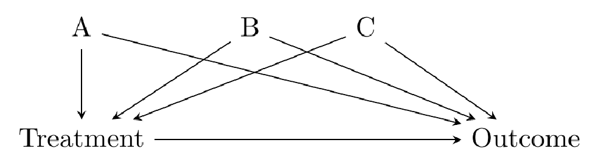

Using our credit card debt example, letʼs pick one of the treated (late payment in April) observations: lucky row number 10,305. This person had a of 91,630 New Taiwan dollars (NT$), their payment was late in April ( is true), but their payment was not late in September ( is false).

BillApril LateApril

LateSept

Since our matching variable is , weʼd be looking for untreated matching observations with values very close to NT$91,630. A control with a of NT$113,023 (distance of

BillApril BillApril BillApril |91,630 − 113,023| = 21,393 |91,630 − 0| = 91,630

) or 0 (distance of ) wouldnʼt be ideal matches for this treated observation. Someone with a value of 91,613 (distance

BillApril |91,630 − 91,613| = 17

) might be a very good match, on the other hand. Thereʼs very little distance between them.

12

If we were to pick a single matching control observation for row number 10,305, weʼd pick row 27,281, which wasnotlate in April (and so was untreated), and has a of NT$91,609 (distance ), which is the closest in the data to NT$91,630 among the untreated observations. We can see this match graphically in Figure14.214.2. We have our treated14.2.... observation from row 10,305, which you can see near the center of the graph. The matches are the untreated observations that are closest to it on the -axis (our matching variable). The observation from row 27,281 is just to the left - pretty close. Only a bit further away, also on the left, is the observation from row 27,719 - weʼll get to that one soon.

BillApril |91,630 − 91,609| = 21

x

Figure 14.2: Matching on April 2005 Credit Card Bill Amount in Taiwanese Data (Data Range Limited)

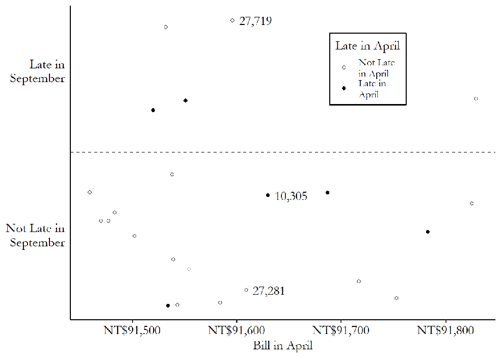

The other dominant approach to matching is propensity score matching. Propensity score matching says “observations are similar if they were equally likely to be treated,” in other words have equal treatment propensity.

13

Like with distance matching, thereʼs a logic here too. Weʼre notrealyinterested in removing all variation in the matching variables, right? Weʼre interested in identifying the effect of the treatment on the outcome, and weʼre concerned about the matching variables being on back doors. Propensity score matching takes this idea seriously and figures that if you match on treatment propensity, youʼre good to go.

14

15,16

The causal diagram in mind here looks like Figure14.314.3. The matching variables14.3.... , , and are all on back doors, but those back doors go through , the probability of treatment. The probability of treatment is unobservable, but we can estimate it in a pretty straightforward way using regression of treatment on the matching variables.

###### A B C TreatmentPropensity

17

Figure 14.3: Causal Diagram Amenable to Propensity Score Matching

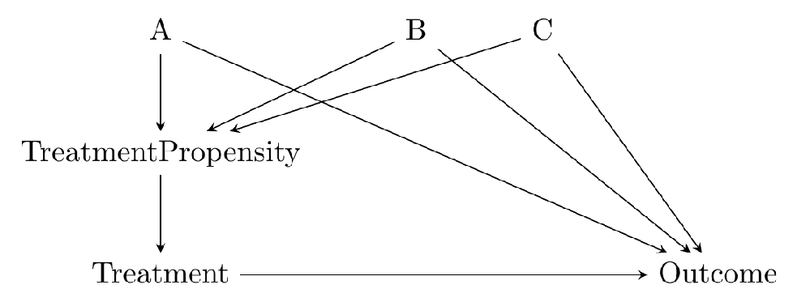

Returning to our credit card example, if I use a logit regression of treatment on in thousands of New Taiwan dollars, I get an intercept of .091 and a coefficient on of .0003. If we are again looking for a match for our treated friend in row 10,305 with a of NT$91,630, we would first predict the probability of treatment for that person. Plugging in 91.630 for in thousands, we get a predicted probability of treatment of .116.

BillApril BillApril

BillApril

18

###### BillApril 19

Now we calculate the predicted probability of treatment for all the control observations, too. We want to find matches with a very similar predicted probability of treatment. Once again we find a great match in row 27,281, also with a predicted probability of .116. Hard to get closer than that!

20

- (2) ARE WE SELECTING MATCHES OR CONSTRUCTING A MATCHED WEIGHTED SAMPLE?A few times Iʼve referred to the matching process in the context of “finding matches,” and other times Iʼve referred to the construction of weights. Both of these represent different ways of matching the treatment and control groups. Neither is the default approach - they both have their pros and cons, and doing matching necessarily means some choices between different options, neither of which dominates the other.

The process of selecting matches means that weʼre picking control observations to either beinor outof the matched control sample. If youʼre a good enough match, youʼre in. If youʼre not, youʼre out. Everyoneinthe matched sample receives an equal weight.

21

In the previous section, we selected a match. We looked at the treated observation on row 10,305, and then noticed that the control observation on row 27,281 was the closest in terms of both distance between matching variables and the value of the propensity score. If we were picking only a single match to be “in,” weʼd select row 27,281, and that row would get a weight of 1. Everyone else would be “out” and get a weight of 0 (at least unless theyʼre the best match for a different treated observation).

Thatʼs just one method though. How else might we determine which controls are in and which are out? For that youʼll need to look at step (3).

How about the alternate approach of constructing a matched weighted sample? This process, like the process of selecting matches, entails looking at all the control observations and seeing how close they are to the treated observations. However, instead of simply being in or out, each control will receive adifferentweight depending on how close it is to a treated observation, or how handy it will be in making the matched control group look like the treated group.

Often, although not always, the matched-weighted-sample approach entails weighting observations more heavily the closer they are to a given treated observation, and less heavily the farther away they are. So for example we found that the difference in the matching variable between rows 10,305 and 27,281 was . But thesecond-best control match is in row 27,719, with a difference of . We might want to include both, but weight the observation with the smaller difference (27,281) more than the observation with the bigger difference (27,719). Maybe we give row 27,281 a weight of and give row 27,719 a weight of .

|91,630 − 91,609| = 21 |91,630 − 91,596| = 34

1/21 1/34 22

How exactly would we construct these weights? Thatʼs a question for step (4).

We can contrast these two approaches in Figure14.414.4. On the left, we look for matches that are very14.44.44.44444444.44.4444444 near our treated observation. In this case, weʼre doing one-to-one matching and so only pick the observation in row 27,281, the closest match, as being “in.” Everything else gets grayed out and doesnʼt count at all. On the right, we construct our comparison estimate for 10,305 usingalthe untreated data (the other treated observations get dropped here, but weʼd want to come back later and do matching for them too). But they donʼt all count equally. Observations near our treated

observation on the -axis get counted a lot (big bubbles). As you move farther away, they count less and less. Get far enough away and the weights fall to zero.

###### x

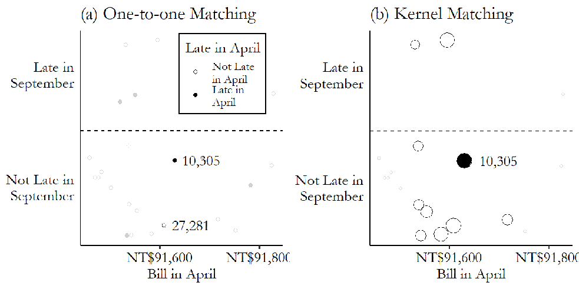

Figure 14.4: Selecting Matches or Weighting by Kernel

So which should we do? Should we select matches or should we give everyone different weights? Naturally, thereʼs not a single right answer - if there was I could skip telling you about both approaches.

23

The selecting-matches approach has some real intuitive appeal. Youʼre really just constructing a comparable control group by picking the right people. Itʼs also, often, a little easier to implement than something with more fine-tuned weights, and itʼs easier to see what your match-picking method is doing. You also avoid scenarios where you accidentally give one control observation an astronomical weight - what if the difference between row 10,305 and row 27,281 was only .000001 instead of 21? It would receive an enormous weight, and the weighted control group mean would be almost entirely determined by that one observation! There are, of course, ways to handle that, but itʼs a concern you have to keep in mind.

###### 1/.000001

On the other hand, the weighted-group approach has some nice statistical properties. Itʼs a little less sensitive - “in” or “out” is a pretty stark distinction, and so tiny changes in things like caliper (weʼll get to it) or measurement error can change results significantly, making the selectingmatches approach a little noisier. Varying weights also offer nice ways of accounting for the fact that different observations will simply have better or worse matches available in the data than others.

One place you shoulddefinitelyuse the weighted-group approach is if youʼre using propensity scores. Despite the practice being very popular, propensity scores shouldnʼt be used to select matches on an “in”/“out” basis (⊕King and Nielsen 2019). The combination of these approaches can actually serve toincreasethe amount of matching-variable variation between treatment and control, due to the way that different variables can both affect propensity, so you might match a high value of one with a high value of the other.

- (3) IF WEʼRE SELECTING MATCHES, HOW MANY?If we do decide to go with the selecting-matches approach, we need to figure outhow manycontrol matches we want to pick for each treatment observation.

The three main approaches here are to pick theonebest match (one-to-one matching), to pickthe

- top kof best matches (k-nearest-neighbor matching), or to pickalthe acceptable matches, also known as radius matching since you accept every match in a radius of acceptability.

These procedures all pretty much work as youʼd expect. With one-to-one matching, you pick the single best control match for each treated observation. With k-nearest-neighbor matching, you pick the best control match… and also the second-best, and the third best… until you get to k matches (or run out of potential matches). And picking all the acceptable matches just means deciding whatʼs an acceptable match or not (see step 5), and then matching with all the acceptable matches.

With each of these procedures, we also need to decide if weʼre matchingwith replacementor without replacement. What do we do if a certain control observation turns out to be the best match (or one of the k-best matches, as appropriate) for two different treated observations? If weʼre matching without replacement, that control can only be a match for one of them, and the other treated observation needs to find someone different. If weʼre matching with replacement, we can use the same control multiple times, giving it a weight equal to the number of times it has matched.

How can we choose between these different options? It largely comes down to a tradeoff between bias and variance.

The fewer matches you have for each treated observation, thebeterthose matches can be. By definition, the best match is a better match than the second-best match. So comparing, for example, one-to-one matching with 2-nearest-neighbors matching, the 2-nearest-neighbors match will include some observations in the control group that arenʼtquiteas closely comparable to the

treated group. This introduces bias because you canʼt claim quite as confidently that youʼve really closed the back doors.

On the other hand, themorematches you have for each treated observation, theless noisyyour estimate of the control group mean can be, and so the more precise your treatment effect estimate can be. If you have 100 treated observations, the mean of 100 matched control observations will have a wider sampling distribution than the mean of200matched control observations. Simple as that! More matches means less sampling variation and so lower standard errors.

So the choice of how many matches to do will be based on how important bias and precision are in your estimate, andhow bad the matches wil get if you try to do more matches.If you have zillions of control observations and will be able to pick a whole bunch of super good matches for each treated observation, then youʼre likely not introducing much bias by allowing a bunch of matches, and you can reduce variance by doing so. So do it! But if your control group is tiny, your third-best match might be a pretty bad match and would introduce a lot of bias. Not worth it.

How about the with-replacement/without-replacement choice? A bias/variance tradeoff comes into play here, too. Matching with replacement ensures that each treated observation gets to use its best (or k best, or all acceptable) matches. This reduces bias because, again, this approach lets us pick the best matches. However, this approach means that weʼre using the same control observations over and over - each control observation has more influence on the mean, and so sampling variation will be larger (what happens if onerealy good matchis matched to 30 treatments in one sample, but isnʼt there in a different sample?). In the extreme, imagine only having one control observation and matching it to all the controls - the sample mean for the controls would just be that one observationʼs outcome value, and would have a standard error thatʼs just equal to the standard deviation of the outcome. Dividing by to get the standard error doesnʼt do much if .

###### √N N = 1

Matching with replacement does have something else to recommend it, though, in addition to having lower bias - itʼs notorder-dependent.Say youʼre matching without replacement. Treated observations 1 and 2 both see control observation A as their best match. But the second-best match is B for observation 1, and C for observation 2. Who gets to match with A? If observation 1 does, then C becomes part of the control group. But if observation 2 does, then B becomes part of the control group. The makeup of the control group, and thus the estimate, depends on who we decide to

“award” the good control A to. There are some principled methods for doing this (like giving the good control to the treated observation with the worse backup), but in general this is a bit arbitrary.

- (4) IF WEʼRE CONSTRUCTING A MATCHED WEIGHTED SAMPLE, HOW WILL WEIGHTS DECAY WITH DISTANCE?Both of the main approaches to matching - selecting a sample or constructing weights - have some important choices to make in terms of how theyʼre done. In a matched weighted sample approach, we will be taking our measure of distance, or the propensity score, and using it to weight each observation separately. But how can we take the distance or propensity score and turn it into a weight?

Once again, we have a few options. The two main approaches to using weights arekernel matching, or more broadlykernel-based matching estimatorson one hand, andinverse probability weighting on the other hand.

Kernel-based matching estimators use akernel functionto produce weights. In the context of matching, kernel functions are functions that you give adifferenceto, and it returns a weight. The highest value is at 0 (no difference), and then the value smoothly declines as you move away from 0 in either direction. Eventually you get to 0 and then the weight stays at 0. This approach weights better matches highly, less-good matches less, and bad matches not at all.

24

There are an infinite number of potential kernels we could use. A very popular one is the Epanechnikov kernel. The Epanechnikov kernel has the benefit of being very simple to calculate:

25

- 3

- 4

(1 − x2) (14.2)

K(x) =

where means “kernel function” and this function only applies in the bounds of being between -1 and 1. The kernel is 0 outside of that. Figure14.514.5 shows the Epanechnikov kernel14.5.... graphically.

K(x) x

26

###### Figure 14.5: The Epanechnikov Kernel

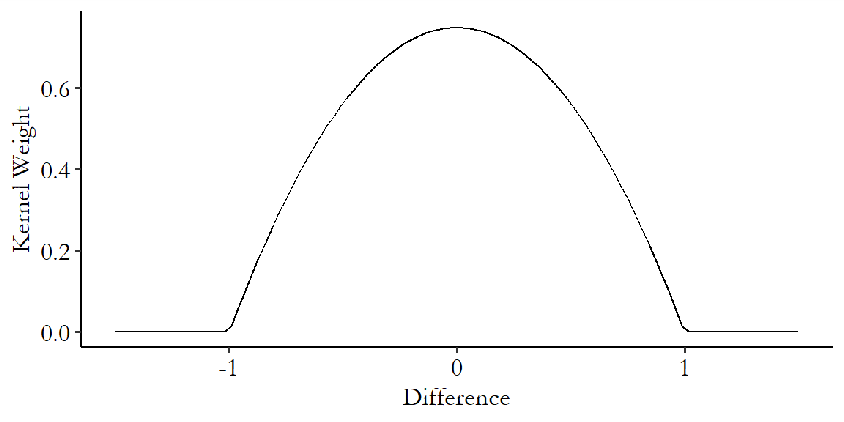

Note the hard-encoded range - this kernel only works from a difference of -1 to a difference of 1. It is standard, then, to standardize the distance before calculating differences to give to the kernel. This ensures that you donʼt get different matching results just because you had a differently-scaled variable.

27

28

Once the kernel gives you back your weights, you can use them to calculate a weighted mean. Or… I did saykernel-basedmatching estimators. There are some other methods that start with the kernel but then use that kernel to estimate the mean in more complex ways. Iʼll cover those in the “Estimation with Matched Data” section below.

29

How does this work in our credit card debt example? We already calculated two differences. The difference between the matching variable in rows 10,305 and 27,281 was

BillApril

, and the difference between row 10,305 and row 27,719 was

|91,630 − 91,609| = 21 |91,630 − 91,596| = 34 BillApril

. Next we standardize - the standard deviation of is 59,994, making those two differences into and standard deviations, respectively. Next we pass them through the Epanechnikov kernel, giving weights of

21/59,994 = .00035 34/59,994 = .00056

and , respectively (clearly, the kernel thinks both these controls are just about as good as each other). Now, weʼd want to repeat this process for althe controls, but if we imagine these are the only two close enough to matter, then we compare the treated mean outcome value of 0 (false) for row 10,305 against the values of 0 for row 27,281 and 1 for 27,719, which we average together with our weights to get

- 3

- 4 (1 − .000352) = .9999999 34 (1 − .000562) = .9999997

###### LateSept

. Finally we get a treatment effect of .

(.9999999 × 0 + .9999997 × 1)/(.9999999 + .9999997) = .4999999 0 − .4999999 = −.4999999

How aboutinverse probability weightingthen? Inverse probability weighting, which descends from work by Horvitz and Thompson (⊕1952) via Hirano, Imbens, and Ridder (⊕2003), is specifically designed for use with a propensity score. Then, it weights each observation by theinverse of the probability that it had the treatment value it had.So if you were actually treated, and your estimated propensity score is .6, then your weight would be . If youwerenʼtactually treated and your estimated propensity score was .6, then your weight would be one divided by the chance that youwerenʼttreated, or .

1/.6

1/(1 − .6) = 1/.4

We weight by theinverseof the probability of what youactualy areto make the treated and control groups more similar. The treated-group observations that get the biggest weights are the ones that aremost likethe untreated group - the ones with small propensities (and thus biginverse propensities) least likely to have gotten treated who got treated anyway. Similarly, the controlgroup observations with the biggest weights are the ones most like the treated group, who were most likely to have gotten treated but didnʼt for some reason.

Inverse probability weighting has a few nice benefits to it. You donʼt have a lot of choices to make outside of specifying the propensity score estimation regression, so thatʼs nice. Also, you can do inverse probability weighting without doing any sort of matching at all - no need to check each treated observation against each control, just estimate the propensity score and you already know the weight. Plus, as Hirano, Imbens, and Ridder (2003) show, weighting is the most precise way to estimate causal effects as long as youʼve got a big enough sample and a flexible way to estimate the propensity score.

30

There are downsides as well, big surprise. In particular, sometimes you get a really unexpected treatment or non-treatment, and then the weights get huge. Imagine someone with a .999 propensity score who ends up not being treated - a one in a thousand chance (but with a big sample, likely to happen sometime). That personʼs weight would be . Thatʼs really big! This sort of thing can make inverse probability weighting unstable whenever propensity scores can be near 0 or 1.

###### 1/(1 − .999) = 1,000

There are fixes for this. The most common is simply to “trim” the data of any propensity scores too near 0 or 1. But this can make the standard errors wrong in ways that are a little tricky to fix. Other fixes include first turning the propensity score into an odds ratio ( instead of just ), and then,within the treated and control groups separately, scaling the weights so they all sum to 1 (⊕Busso, DiNardo, and McCrary 2014).

p/(1 − p) p

Letʼs bring inverse probability weighting to our credit card debt example. We previously calculated using a logit model that the treated observation in row 10,305 had a .116 probability of treatment, as did the control observation in 27,281. Onto that we can add row 27,719, which has a propensity of .116 as well (we did pick them for being similar, after all. With such similar values, differences in predicted probability of treatment donʼt show up until the fifth decimal place).

BillApril

What weights does everyone get then? Row 10,305 is actually treated, so we give that observation a weight of 1 divided by the probability of treatment, or . It gets counted a lot because it was unlikely to be treated, and so it looks like the untreated groups, but was treated!

1/.116 = 8.621

The control rows will both get weights of 1 divided by the probability ofnon-treatment, or

. Theyʼre likely to be untreated, and so they arenʼt like the treated group, and donʼt get weighted too heavily. From here we can get weighted means on both the treated and control sides.

1/(1 − .116) = 1.131

- (5) WHAT IS THE WORST ACCEPTABLE MATCH?The purpose of matching is to try to make the treated and control groups comparable by picking the control observations that are most similar to the treated observations. But what if thereʼs a treated observation for which therearenʼtany control observations that areat allike it? We canʼt very well use matching to find a match for that treated observation then, can we?

Most approaches to matching use some sort ofcaliperorbandwidthto determine how far off a match can be before tossing it out.

The basic idea is pretty straightforward - pick a number. This is your caliper/bandwidth. If the distance, or the difference in propensity scores, is bigger in absolute value than that number, then you donʼt count that as a match. If that leaves you withoutanymatches for a given treated observation, tough cookies. That observation gets dropped.

Usually, the caliper/bandwidth is defined in terms ofstandard deviationsof the value youʼre matching on (or the standard deviation of the propensity score, if youʼre matching on propensity score), rather than the value itself, to avoid scaling issues. As mentioned in the previous section, in our credit card debt example, the treated observation 10,305 had a distance of .00035 standard deviations of with control observation 27,281, and standard deviations of difference with observation 27,719. If we had defined the caliper as being .0005 of a standard deviation (which would probably be a bit conservative if you ask me), then only one of those matches would count. The other one would be dropped.

BillApril .00056

Some matching approaches end up using calipers/bandwidths naturally. Any kernel-based matching approach will place a weight of 0 on any match that is far enough away that the kernel function youʼve chosen sets it to 0. For the Epanechnikov kernel thatʼs a distance of 1 or greater.

Another matching approach that does this naturally isexact matching. In exact matching, the caliper/bandwidth is set to 0! No ifs, ands, or buts. If your matching variables differat al, thatʼs not a match. Usually, exact matching comes in the form ofcoarsened exact matching(⊕Iacus, King, and Porro 2012), which is exact matching except that whenever you have a continuous variable as a matching variable you “coarsen” it into bins first. Otherwise you wouldnʼt be able to use continuous variables as matching variables, since itʼs pretty unlikely that someone else has, for example, the exact same as you, down to the hundredth of a penny. Coarsened exact matching is actually a pretty popular approach, for reasons Iʼll discuss in the “Matching on Multiple Variables” section.

BillApril

How can we select a bandwidth if our method doesnʼt do it for us by helpfully setting it to zero? Uh, good question. There is, unfortunately, a tradeoff. And yes, you guessed it, itʼs a tradeoff between bias and variance.

The wider we make the bandwidth, the more potential matches we get. If weʼre allowing multiple matches, weʼll get to calculate our treated and control means over more observations, making them more precise. If weʼre only allowing one match, then fewer observations will be dropped for being matchless, again letting us include more observations.

However, when we make the bandwidth wider, weʼre allowing in more bad matches, which makes the quality of match worse and the idea that weʼre closing back doors less plausible. This brings

bias back into the estimation.

31

There is a whole wide literature on “optimal bandwidth selection,” which provides a whole lot of methods for picking bandwidths that best satisfy some criterion. Often this is something like “the bandwidth selection rule that minimizes the squared error comparing the sample control mean and the actual control mean.” Software will often implement some optimal bandwidth selection procedure for you, but also itʼs a good idea to look into what those procedures are in the software documentation so you know whatʼs going on.

In general, when making any sort of decision about matching, including this one, the choice is often between fewer, but better, matches that produce estimates with less bias but less precision, or more, but worse, matches that produce estimates with more bias but more precision.

AND THATʼS JUST ABOUT IT.While there are still some details left to go, those are the core conceptual questions you have to answer when deciding how to go about doing an estimation with matching. And maybe a few more detail-oriented questions too. This should at least give you an idea of what youʼre trying to do and why. But, naturally, there are more details to come.

###### 14.4 Multiple Matching Variables

PHEW, THAT SURE WAS A LOT IN THE PREVIOUS SECTION!Distance vs. propensity, numbers of matches, bias vs. variance tradeoff… no end of it. And that was all just about matching ononevariable. Now that weʼre expanding to matching onmultiplevariables, as would normally be done, surely this is the point where weʼll get way more complex.

Well, not really. In fact, going from matching on one variable to matching on multiple variables, thereʼs really only onecorequestion to answer: how do we, uh, turn those multiple variables into one variable so we can just do all the stuff from the previous section?

There are, of course, details to that question. But thatʼs what it boils down to. We have many variables. Matching relies on picking something “as close as possible” or weighting by how close they are, which is a lot easier to do if “close” only has one definition. So we want to boil those many variables down to a single measure of difference. How can we do that? We could do it by distance,

or by propensity score, or by exact matching. We could mix it up, requiring exact matching on some variables but using distance or propensity score for the others. In each case, there are choices to make. Thatʼs what this section is about.

32

Throughout this section and the rest of the chapter, Iʼll be adding example code using data from Broockman (⊕2013). In this study, Broockman wants to look at theintrinsic movitationsof American politicians. That is, what is the stuff theyʼll do even if thereʼs no obvious reward to it? One example of such a motivation is that Black politicians in America may be especially interested in supporting the Black American community. This is part of a long line of work looking at whether politicians, in general, offer additional support to people like them.

To study this, Broockman conducts an experiment. In 2010 he sent a whole bunch of emails to state legislators (politicians), simply asking for information on unemployment benefits. Each email was sent by the fictional “Tyrone Washington,” which in the United States is a name that strongly suggests it belongs to a Black man.

33

The question is whether the legislator responds. How does this answer our question about intrinsic motivation? Because Broockman varies whether the letter-writer claims to liveinthe legislatorʼs district, or in a city far away from the district. Thereʼs not much direct benefit to a legislator of answering an out-of-district email. That person canʼt vote for you! But you still might do so out of a sense of duty or just being a nice person.

Broockman then asks: do Black legislators respond less often to out-of-district emails from Black people than in-district emails from Black people? Yes! Do non-Black legislators respond less to outof-district emails from Black people than in-district emails from Black people? Also yes! Then the kicker: is the in-district/out-of-district differencesmalerfor Black legislators than non-Black ones? If so, that implies that Black legislators have additional intrinsic motivation to help the Black emailer, evidence in favor of the intrinsic-motivation hypothesis and the legislators-help-those-likethemselves hypothesis.

34

Where does the matching come in? Itʼs in that last step where we compare the in-/out-of-district gap between Black and non-Black legislators. Those groups tend to be elected in very different kinds of places. Back doors abound. Matching can be used to make for a better comparison group. In the

original study, Broockman used median household income in the district, the percentage of the districtʼs population that is Black, and whether the legislator is a Democrat as matching variables.

35

###### 14.4.1 Distance Matching with Multiple Matching Variables

LETʼS START WITH DISTANCE MEASURES.How can we take a lot of different matching variables and figure out which two observations are “closest?” We have to boil them down to a single distance measure.

Finally, we can wipe our brow: thereʼs a single, largely agreed-upon approach to doing this: the

36

###### Mahalanobis distance.

The Mahalanobis distance is fairly straightforward. Weʼll start with a slightly simplified version of it. First, take each matching variable and divide its value by its standard deviation. Now, each matching variable has a standard deviation of 1. This makes sure that no variable ends up being weighted more heavily just because itʼs on a bigger scale.

After weʼve divided by the standard deviation, we can calculate distance. For a given treated observation and a given control observation , the Mahalanobis distance is the sum of the squares of all the differences between and . Then, after youʼve taken the sum, you take the square root. In other words, itʼs the sum of squared residuals weʼd get if trying to predict the matching variables of using the values of , if the standard deviation of each matching variable was 1. Thatʼs it! Thatʼs the Mahalanobis distance.

A B A B

A B

Or itʼs a simplified version of it, anyway. The one piece I left out is that weʼre not just dividing each variable by its standard deviation. Instead, weʼre dividing outthe whole covariance matrixfrom the squared values of the variables. If all the matching variables are unrelated to each other, this simplifies to just dividing each variable by its standard deviation. But if theyarerelated to each other, this removes the relationships between the matching variables, making them independent before you match on them.

This requires some matrix algebra to express, but even if you donʼt know matrix algebra, all you really need to know is that can be read as “square all the s, then add them up.” Then you can

x′x x

figure out whatʼs going on here if you squint and remember that taking the inverse ( ) means “divide by.” The Mahalanobis distance between two observations and is:

−1 x1 x2

d(x1,x2) = √(x1 − x2)′S−1(x1 − x2) (14.3)

where is a vector of all the matching variables for observation 1, similarly for , and is the covariance matrix for all the matching variables.

x1 x2 S

Why is it good for the relationships between different variables to be taken out? Because this keeps us from our matching relyingrealy stronglyon some latent characteristic that happens to show up a bunch of times. For example, say you were matching on beard length, level of arm hair, and score on a “masculinity index.” All three of those things are, to one degree or another, related to “being a male.” Without dividing out the covariance, youʼd basically be matching on “being a male” three times. Redundant, and the matching process will probably refuse to match any males to any nonmales, even if theyʼre good matches on other characteristics. If we divide out the covariance, weʼre still matching on maleness, but it doesnʼt count multiple times.

Returning once again to our credit card debt example, letʼs expand to two matching variables: and also the , in years, of the individuals. Comparing good olʼ treated observation 10,305 and untreated observation 27,281, we already know that the distance between them in their is . The difference in ages is .

BillApril Age

BillApril |91,630 − 91,609| = 21 |23 − 37| = 14

Letʼs calculate Mahalanobis distance first using the simplified approach where we ignore the relationship between the matching variables. The standard deviation of is NT$59,554, and so after we divide all the values of by the standard deviation, we get a new difference of standard deviations. Not much! Then, the standard deviation of is 9.22, and so we end up with a distance of standard deviations.

BillApril BillApril

|1.5386 − 1.5382| = .0004 Age |2.49 − 4.01| = 1.52

We have our differences in standard-deviation terms. Square them up and add them together to get

, and then take the square root - - to get the Mahalanobis distance of 1.520. We would then compare this Mahalanobis distance to the distance between row 10,305 and all the other untreated rows, ending up in a match with whichever untreated observation leads to the lowest distance.

###### .00042 + 1.522 = 2.310 √2.310 = 1.520

Letʼs repeat that, but properly, taking into account the step where we divide by the covariance matrix. We have a difference of 21 in and a difference of -14 in age. We put that next to its covariance matrix and get a Mahalanobis distance of

BillApril

1/2

−1

′

d(x1,x2) = ([ ]

[ ])

59,5442 26,138 26,138 85

[ ]

21 −14

21 −14

###### =

√.0000257 + 2.312 = 1.521

Okay, not a huge difference from the simplified version in this particular case (1.521 vs. 1.520). But still definitely worth doing. Itʼs not like weknewit wouldnʼt matter before we calculated it both ways.

The Mahalanobis distance has a convenient graphical interpretation, too. Weʼre squaring stuff, adding it up, and then taking the square root. Ring any bells? Well, for two matching variables, thatʼs just the distance between those two points, as we know from Pythagorasʼ theorem. The Mahalanobis distance is the length of the hypotenuse of a triangle with the difference of the first matching variable for the base and the difference of the second matching variable for the height.

Figure 14.6: Mahalanobis Distance with Two Matching Variables

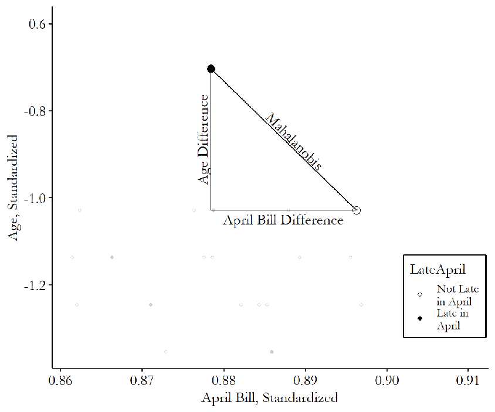

You can see the distance calculation in Figure14.614.6. Itʼs just how long a straight line between the two14.6.... points is, after you standardize the axes. Thatʼs all! This generalizes to multiple dimensions, too. Add a third matching variable and youʼre still drawing a line between two points; itʼs just in three dimensions this time. Look around you at any two objects and imagine a line connecting them. Thatʼs the Mahalanobis distance between them if youʼre matching on the three spatial dimensions: width, length, and height.

And so on and so forth. Four dimensions is a bit harder to visualize since we donʼt see in four dimensions, but itʼs the same idea. Add as many dimensions as you like.

This does lead us to one downside of Mahalanobis matching, and distance matching generally - the curse of dimensionality.The more matching variables you add, the “further away” things seem. Think of it this way - imagine a top-down map of an office building. This top-down view has only two dimensions: north/south and east/west. Wanda on the southwest corner of the building is right next to Taylor whoʼs also on the southwest. A great match! Now move the camera to the side so we can see that same building in three dimensions: north/south, east/west, and up/down. Turns out

Wandaʼs in the southwest of the 1st floor, but Taylorʼs in the southwest of the 22nd floor. No longer a great match.

The curse of dimensionality means that the more matching variables you add, the less likely you are to find an acceptable match for any given treated observation. There are a few ways to deal with this. One approach is to try to limit the number of matching variables, although that means weʼre not going to be closing those back doors - no bueno. Another is to just have a whole bunch of observations. Matches being hard to find is okay if you have eight zillion observations to look through to find one. That sounds good, but also, we only have so many observations available.

A third approach is to simply be a little more forgiving about match quality, or at least the value of the caliper/bandwidth, as the number of dimensions goes up. Sometimes people will just try different bandwidths until the amount of matches looks right. One more disciplined approach is to use your normal bandwidth, but divide the Mahalanobis score by the square root of the number of matching variables (⊕Mahony 2014).

Letʼs take Broockman to meet Mahalanobis! Weʼll be using one-to-one nearest neighbor matching with a Mahalanobis distance measure, calculated using our three matching variables (

, , ). Weʼll be matching districts with Black legislators to those without ( ). There are two parts to the code here: the calculation of matching weights, and the estimation of the treatment effect on the outcome variable. Iʼll show how to do both. In the case of the Broockman example, the outcome variable is , whether the legislator responded to the email. Of course, the actual design was a bit more complex than just looking at the effect of on , but weʼll get to that later. For now, weʼre just showing the relationship between and after matching on ,

medianhhincom blackpercent leg_democrat leg_black

responded

leg_black responded

leg_black responded medianhhincom blackpercent leg_democrat 37

, and .

###### R Code R Code e Stata CodeStata CodeStatatatatatatatatatatatatatatatatatatatatata e Python CodePython Codeytyttt ooooooooooo o o oooooo o o o e

library(Matching); library(tidyverse) br <- causaldata::black_politicians

# Outcome Y <- br %>%

pull(responded)

# Treatment D <- br %>%

pull(leg_black) # Matching variables # Note select() is also in the Matching package, so we specify dplyr

- X <- br %>% dplyr::select(medianhhincom, blackpercent, leg_democrat) %>% as.matrix()

# Weight = 2, oddly, denotes Mahalanobis distance M <- Match(Y, D, X, Weight = 2, caliper = 1)

# See treatment effect estimate summary(M)

# Get matched data for use elsewhere. Note that this approach will # duplicate each observation for each time it was matched matched_treated <- tibble(id = M$index.treated,

weight = M$weights) matched_control <- tibble(id = M$index.control,

weight = M$weights) matched_sets <- bind_rows(matched_treated,

matched_control) # Simplify to one row per observation matched_sets <- matched_sets %>%

group_by(id) %>% summarize(weight = sum(weight))

# And bring back to data matched_br <- br %>%

mutate(id = row_number()) %>% left_join(matched_sets, by = 'id')

# To be used like this! The standard errors here are wrong lm(responded~leg_black, data = matched_br, weights = weight)

PERHAPS MAHALANOBIS DOESNʼT GO FAR ENOUGH.We can forget about trying to boil down a bunch of distances into one, and really any concerns about one variable being more important than the others, by making the case thatal the variables are infinitely important.No mismatch at all. Weʼre back to exact matching, and specifically coarsened exact matching, which I first mentioned in the section on matching concepts (⊕Iacus, King, and Porro 2012).

In coarsened exact matching, something only counts as a match if itexactlymatches on each matching variable. The “coarsened” part comes in because, if you have any continuous variables to match on, you need to “coarsen” them first by putting them into bins, rather than matching on exact values. Otherwise youʼd never get any matches. What does this coarsening look like? Letʼs take from the credit card debt example. We might cut the variable up into ten deciles. So for our standby treated observation on row 10,305, instead of matching in that rowʼs exact value of NT$91,630 (which no other observation shares), weʼd recognize that the value of NT$91,630 is between the 80th and 90th percentiles of , and so just put it in the category of “between NT$63,153 (80th percentile) and NT$112,110 (90th percentile)” (which about 10% of all observations share).

BillApril

BillApril

38

Once youʼve determined how to bin each continuous variable, you look for exact matches. Each treated observation is kept only if it finds at least one exact match and is dropped otherwise. Each control observation is kept only if it finds at least one exact match as well, and given a weight corresponding to the number of treated-observation matches it has, divided by the number of control observations matched to that treated observation. Then all of that is further multiplied by the total number of matched control observations divided by the total number of matched treatment observations. In other words,

###### (MyTreatedMatches/MyControlMatches) × (TotalControlMatches/TotalTreatedMatches)

. This process ensures, without a doubt, that there are absolutely no differences in the matching variables (after binning) between the treated and control groups.

39

Coarsened exact matching does require some serious firepower to work, especially once the curse of dimensionality comes into play. Z. Zhao (⊕2004) looks at an example of some fairly standard data, and an attempt to match on twelve variables. This creates about six million cells after

interacting all twelve variables. The data set had far fewer than six million observations. Not everyone is going to find a match.

The need for a really big sample size is no joke or something you can skim over, either. Coarsened exact matching, if applied to moderately-sized samples (or any size sample with too many matching variables), can lead to lots of treated observations being dropped. Black, Lalkiya, and Lerner (⊕2020) replicated five coarsened exact matching studies and found that lots of treatment observations ended up getting dropped, which made the treatment effect estimates much noisier, and can also lead the result to be a poor representation of the average treatment effect if certain kinds of treated observations are more likely to find matches than others. One of those studies was Broockman (2013) - uh oh! If youʼve been wondering why the list of matching variables in the Broockman (2013) code examples is so short, itʼs because even this list already leads quite a few observations to be dropped with coarsened exact matching, and any more would worsen the problem. Black, Lalkiya, and Lerner (2020) recommend forgetting the method entirely, although I wouldnʼt go that far. I would say that you should probably limit its use to huge datasets, and you mustcheck how many treated observations you lose due to not finding any matches. If thatʼs a lot, you should switch to another method.

The need for a lot of observations, and the relative ease and low computational requirements of calculation, makes coarsened exact matching fairly popular in the world of big-data data science. There you might hear the exact matches referred to as “doppelgangers.” Itʼs also fairly popular in the world of enormous administrative data sets, where a researcher has managed to get their hands on, say, governmental records on the entire population of a country.

40

41

42

Letʼs look at Klemick, Mason, and Sullivan (⊕2020) as one example of coarsened exact matching at work in neither of those contexts. They are interested in the effect of the Environmental Protection Agencyʼs (EPA) Superfund Cleanup project on the health of children. This was a project where the EPA located areas subject to heavy environmental contamination and then cleaned them up. Did the cleanup process improve childrensʼ health?

Their basic research design was to compare the levels of lead in the blood of children in a neighborhood before the cleanup to after, expecting not only that the lead level will drop after cleanup, but that it will improve more in areas very near the site (less than 2 kilometers) than it will

in areas a little farther away (2-5 kilometers), which likely werenʼt as affected by the pollution when it was there.

43

As always, there are back doors between distance to a Superfund site and general health indicators, including blood lead levels. The authors close some of these back doors using coarsened exact matching at the neighborhood level, matching neighborhoods on the basis of which Superfund site theyʼre near, the age of the housing in the area (what percentage of it was built before 1940), the percentage of the population receiving welfare assistance, the percentage who are African American, and the percentage of the population that receives the blood screenings used to measure the blood lead levels used as the dependent variable in the study.

They start with data on about 380,000 people living within 2 kilometers of a Superfund site, and 900,000 living 2-5 kilometers from a Superfund site. Then, the matching leads to a lot of observations being dropped. The sample after matching is about 201,000 from those living within 2 kilometers of a Superfund site, and 353,000 living 2-5 kilometers from a site.

The large drop in sample may be a concern, but we do see considerably reduced differences between those living close to the site or a little farther away. The matching variables look much more similar, of course, but so do other variables that potentially sit on back doors. Percentage Hispanic was not a matching variable, but half of the pre-matching difference disappears after matching. There are similar reductions in difference for traffic density and education levels.

What do they find? Superfund looks like it worked to reduce blood lead levels in children. Depending on specification, they findwithoutdoing any matching that lead levels were reduced by 5.1%-5.5%.Withmatching the results are a bit bigger, from 7.1%-8.3%.

How can we perform coarsened exact matching ourselves? Letʼs head back to Broockman (2013), who performed coarsened exact matching in the original paper.

###### R Code R Code e Stata CodeStata CodeStatatatatatatatatatatatatatatatatatatatatata e Python CodePython Codeytyttt ooooooooooo o o oooooo o o o e

library(cem); library(tidyverse) br <- causaldata::black_politicians

# Limit to just the relevant variables and omit missings brcem <- br %>%

select(responded, leg_black, medianhhincom, blackpercent, leg_democrat) %>% na.omit() %>% as.data.frame() # Must be a data.frame, not a tibble

# Create breaks. Use quantiles to create quantile cuts or manually for # evenly spaced (You can also skip this and let it do it automatically, # although you MUST do it yourself for binary variables). Be sure # to include the "edges" (max and min values). So! Six bins each: inc_bins <- quantile(brcem$medianhhincom, (0:6)/6)

create_even_breaks <- function(x, n) {

minx <- min(x) maxx <- max(x) return(minx + ((0:n)/n)*(maxx-minx))

}

bp_bins <- create_even_breaks(brcem$blackpercent, 6)

# For binary, we specifically need two even bins ld_bins <- create_even_breaks(brcem$leg_democrat,2)

# Make a list of bins allbreaks <- list('medianhhincom' = inc_bins,

'blackpercent' = bp_bins, 'leg_democrat' = ld_bins)

# Match, being sure not to match on the outcome # Note the baseline.group is the *treated* group c <- cem(treatment = 'leg_black', data = brcem,

baseline.group = '1', drop = 'responded', cutpoints = allbreaks, keep.all = TRUE)

# Get weights for other purposes brcem <- brcem %>%

mutate(cem_weight = c$w) lm(responded~leg_black, data = brcem, weights = cem_weight)

# Or use their estimation function att. Note there are many options # for these functions including logit or machine-learing treatment # estimation. Read the docs! att(c, responded ~ leg_black, data = brcem)

###### 14.4.2 Entropy Balancing

THERE IS A NEWCOMERin the world of distance matching that, while it hasnʼt been quite as popular in application relative to other options, seems to have some really nice properties. The newcomer is entropy balancing, which grows out of Hainmueller (⊕2012).

In other matching methods, you aggregate together the matching variables in some way and match onthat. Then you hope that the matching you did removed any differences between treatment and control. And as Iʼll discuss in the “Checking Match Quality” section, you look at whether any differences remain and cross your fingers that theyʼre gone.

The basic concept of entropy balancing is this: instead of aggregating, matching, and hoping, we insteadenforce restrictionson the distance between treatment and control. We say “no difference between treatment and control for these moment conditions for these matching variables,” where moment conditions are things like means, variances, skew, and so on. For example “no difference between treatment and control for the mean of .” You can add a lot of those restrictions. Add another restriction that the mean of must be the same, and , and so on. The descriptive statistics donʼt have to be means, either. Entropy balancing lets you require that things like the variance or skewness are the same, too, if you like.

###### X1 X2 X3

44

Once you have your set of restrictions, entropy balancing gets to work searching for a set of weights that satisfies those restrictions. As long as the restrictions arepossibleto satisfy, youʼll get them, too. Thatʼs just about it! Entropy balancing gives the assured-no-difference result that coarsened exact matching does, but without having to limit the number of matching variables or drop a bunch of treated observations. Why didnʼt we do this before?

45

This section is short for two reasons: first, the intuitive explanation of entropy balancing is quite simple, but to go into any sort of detail would require going alotmore complex. And second, because entropy balancing is not as well-known as other approaches at the time of this writing. Perhaps this is because it requires a fair bit more technical detail than other methods.

46

But itʼs still worth learning about. Perhaps it will become more popular and expected in the future. Perhaps youʼll use it andthat wil make itmore popular and expected in the future. Or at the very least, it can act as a stand-in for the many other matching approaches that didnʼt make this book. And there are a few. What, the eight million combinations of options for the matching procedures we have arenʼt enough? No! Thereʼs genetic matching, subclassification, optimal matching, etc..

Letʼs code up an entropy balance estimation. The examples will use R and Stata. There is a working Python library empirical_calibration that includes entropy balancing, but youʼre in for a ride, as even installing it is not as straightforward as other packages. Iʼll leave that one out for now, but you can pursue it on your own.

47

###### R Code R Code e Stata CodeStata CodeStatatatatatatatatatatatatatatatatatatatatata e

library(ebal); library(tidyverse); library(modelsummary) br <- causaldata::black_politicians

# Outcome

- Y <- br %>% pull(responded)

# Treatment D <- br %>%

pull(leg_black) # Matching variables

- X <- br %>% select(medianhhincom, blackpercent, leg_democrat) %>% # Add square terms to match variances if we like mutate(incsq = medianhhincom^2, bpsq = blackpercent^2) %>% as.matrix()

eb <- ebalance(D, X)

# Get weights for usage elsewhere # Noting that this contains only control weights br_treat <- br %>%

filter(leg_black == 1) %>% mutate(weights = 1)

br_con <- br %>% filter(leg_black == 0) %>% mutate(weights = eb$w)

br <- bind_rows(br_treat, br_con)

m <- lm(responded ~ leg_black, data = br, weights = weights) msummary(m, stars = c('*' = .1, '**' = .05, '***' = .01))

###### 14.5 Propensity Score Weighting with Multiple Matching Variables

THE PROPENSITY SCORE IS PROBABLY THE MOST COMMON WAYof aggregating multiple matching variables into a single value that can be matched on. Remember, the propensity score is the estimated

probability that a given observation would have gotten treated. Propensity score matching often means selecting a set of matched control observations with similar values of the propensity score. However, as previously mentioned, modern advice tends to be toward using the propensity score to conduct inverse probability weighting (⊕King and Nielsen 2019).

In this section Iʼll focus on the estimation of the propensity score itself. Then, as suggested by the section title, youʼll go on to use these propensity scores to construct matching weights, rather than select a set of matched observations. The specific details on how those weights are constructed from the propensity score will be shown in the code examples, and also detailed further in the “Matching and Treatment Effects” section at the end of the chapter, since the calculation of weights depends on the kind of treatment effect you want.

PROPENSITY SCORES ARE USUALLY ESTIMATED BY REGRESSION.This is highly convenient for me because I just wrote a whole dang chapter about regression, and you can just go read that.

48

49

Specifically, propensity scores are usually estimated by logit or probit regression. The main work of doing propensity score estimation by regression is in constructing the regression model.

What choices are there to make in constructing the regression model? Youʼve got your standard model-construction problems - anything thatʼs a determinant of treatment should definitely be in there. But there are also important functional form concerns. Which matching variables should be included with polynomials? Or interactions?

Youʼre trying to predict something here - the propensity score - but you do want to keep your thinking in the realm of causal diagrams. After all, youʼre trying to close back doors. So including things as predictors if theyʼre on back doors, and excluding them if theyʼre on front doors, is still key when constructing your model.

Youʼre not totally in the dark (or reliant entirely on theory) for the selection of your model, though. After all, a good propensity score should serve the purpose of closing back doors, right? We can check this. Back doors in Figure14.314.3 are of the form14.3....

Treatment ← TreatmentPropensity ← A → Outcome TreatmentPropensity Treatment A

. Controlling for should close all doors between

and the matching variable . So, as Dehejia and Wahba (⊕2002) suggest, you can split the propensity score up into bins. Then, within each bin (i.e., controlling for ), you can check whether each matching variable is related to treatment. If it is, you might want to

TreatmentPropensity

try adding some more polynomial or interaction terms for the offending matching variables. This is called a “stratification test,” and is a form of balance checking, which Iʼll cover more in the “Balance Checking” section below.

50

Once youʼve estimated the logit or probit model, you get the predicted probabilities, and thatʼs it! Thatʼs your propensity score.

###### R Code R Code e Stata CodeStata CodeStatatatatatatatatatatatatatatatatatatatatata e Python CodePython Codeytyttt ooooooooooo o o oooooo o o o e

library(causalweight); library(tidyverse) br <- causaldata::black_politicians

# We can estimate our own propensity score m <- glm(leg_black ~ medianhhincom + blackpercent + leg_democrat,

data = br, family = binomial(link = 'logit')) # Get predicted values br <- br %>%

mutate(ps = predict(m, type = 'response')) # "Trim" control observations outside of # treated propensity score range # (we'll discuss this later in Common Support) minps <- br %>%

filter(leg_black == 1) %>% pull(ps) %>% min(na.rm = TRUE)

maxps <- br %>% filter(leg_black == 1) %>% pull(ps) %>% max(na.rm = TRUE)

br <- br %>% filter(ps >= minps & ps <= maxps)

# Create IPW weights br <- br %>%

mutate(ipw = case_when( leg_black == 1 ~ 1/ps, leg_black == 0 ~ 1/(1-ps)))

# And use to weight regressions (The standard errors will be wrong # here unless we bootstrap the whole process - See the code examples # from the doubly robust estimation section or the simulation chapter) lm(responded ~ leg_black, data = br, weights = ipw)

# Or we can use the causalweight package! # First, pull out our variables # Outcome

- Y <- br %>% pull(responded)

# Treatment D <- br %>%

pull(leg_black)

# Matching variables X <- br %>%

select(medianhhincom, blackpercent, leg_democrat) %>% as.matrix()

# Note by default this produces average treatment effect, # not average treatment on the treated, and trims propensity # scores based on extreme values rather than matching treated range. # It bootstraps your standard errors too, just how we like it. IPW <- treatweight(Y, D, X, trim = .001, logit = TRUE)

# Estimate and SE IPW$effect IPW$se

THERE ARE OTHER WAYS TO ESTIMATE THE PROPENSITY SCORE.Really, any method you could use to run a regression of a binary variable on multiple predictors and get a predicted value between 0 and 1 couldwork. That doesnʼt mean that all of those methods would be good ideas.

Other approaches have turned out to be particularly useful among the bevy of alternatives. In general, the methods aside from logit and probit that are useful manage to do something that logit and probit canʼt. Two things that logit and probit have trouble with arehigh degrees of nonlinearityandhigh dimensions.

51

High degrees of nonlinearity is a problem? Arenʼt logit and probitnonlinearregression models? Well, yes, but they do require linearityin the index function, if you look back to the “Nonlinear Regression” section in Chapter1313. You can add polynomial terms, of course. But how many? Is it13 enough? Too many and things will start to get weird.

High dimensions occur when you havelotsof matching variables. Or, alternately, when you have lots of interactionsbetween all your matching variables in your regression. Again, this is stuff that itʼs theoretically possible for regression to handle, but as the number of terms creeps higher and higher, regression ceases to be the best tool for the job.

So what is the best tool for the job? There are lots of options. One thatʼs relatively well-known in health fields is high-dimensional propensity score estimation (⊕Schneeweiss et al. 2009), which just

picks a set of “best” covariates from a long list based on theoretical importance, and which seem to predict really well, before running logit.

A bit further afield, but seeing good results, are machine learning methods. Machine learning is great at predicting stuff given data that has a lot of dimensions. And predicting treatment using a lot of dimensions is exactly what we want to do.

Two popular approaches to propensity score estimation using machine learning methods are regularized regression, as discussed in Chapter1313, where you toss everything in and let a penalty13 parameter decide what to down-weight or throw out, and boosted regression.

Boosted regression is an iterative method that starts with a binary regression model (like a logit), checks which observations are particularly poorly predicted, and then runs itself again, weighting the poorly-estimated observations more heavily so the prediction model pays more attention to them, reducing their prediction error. Then it continues doing this a bunch of times. In the end, you combine all the different models you ran to produce some sort of aggregated score. In the context of propensity scores, this leads to pretty good estimates of the propensity score (⊕Griffin et al. 2017).

###### 14.6 Assumptions for Matching

###### 14.6.1 Conditional Independence Assumption

AS WITH ANY STATISTICAL METHOD,however well thought-out our methods are, they always rely on assumptions. Using matching can relax some assumptions, like linearity (unless weʼre using a regression to estimate a propensity score). But that certainly doesnʼt make it assumption-free.

Some assumptions carry over from our other work. The main one of those is theconditional independence assumption. Remember in Chapter1313 where I talked about omitted variable bias13 being the regression lingo for “open back doors”? Well, the conditional independence assumption is matching lingo for “all the back doors are closed.”

In other words, the conditional independence assumption says that the set of matching variables youʼve chosen is enough to close all back doors. The entirety of the relationship between treatment and outcome is either one of the causal front-door paths you want, or is due to a variable that youʼve measured and included as a matching variable.

Thatʼs just new lingo for an assumption weʼve already covered. What else do we need to think about?

###### 14.6.2 Common Support

THE MATCHING PROCESS, NO MATTER HOW YOU DO IT, ASSUMES THAT THERE ARE APPROPRIATE CONTROL OBSERVATIONS TO MATCH WITH.But what if there arenʼt? Chaos ensues! This is called a failure of common support.

Why is this a problem? Letʼs take an extreme example. Youʼre interested in the effect of early-release programs on recidivism. These are programs that allow people who have been sentenced to prison time to leave before their sentence is up, often under certain terms and conditions. Youʼve got a group of treated ex-prisoners who were released early, and a group of untreated ex-prisoners who served their full sentence, and information on whether they committed any additional crimes in the ten years after they got out.

52

You figure that the prisonerʼs behavior while in prison might be related both to getting an early release and to their chances of recidivism. So you match on a “behavior score” given by the prison review board that decides whether someone gets early release.

But uh-oh! Turns out that the review board score, which goes from 1 to 10, translates too directly to early release. Everyone with an 8-10 gets early release, and everyone with a 1-7 doesnʼt. So when you go looking for matches for your treated observations, you end up trying to find ex-prisoners who got a score of 8-10 but didnʼt get early release. And there arenʼt any of those. The analysis lacks common support- there simply arenʼt any comparable control observations.

Or imagine that instead of trying to select matches, youʼre constructing weights. What weight do you give to the 1-7s so that the control group is comparable to the treatment group? Uh, zero I guess. So everything gets a weight of zero and… you again have nothing to compare.

The problem is still there even if it isnʼt quite as stark. Maybe all 9-10s get early release, while some 8s do and other 8s donʼt. We still donʼt have any good matches for the 9-10s. Or maybe therearea handful of 9s and 10s that donʼt get early release. Now we have matches, but how heavily do we want to rely on that tiny number of matches?

The assumption of common support says that there must besubstantialoverlap in the distributions of the matching variables comparing the treated and control observations. Or in the context of propensity scores, there must be substantial overlap in the distribution of the propensity score.

COMMON SUPPORT IS FAIRLY EASY TO CHECK FOR,and there are a few ways to do it.

The first approach to checking for common support is simply to look at the distribution of a variable for the treated group against the distribution of that same variable for the untreated group, as in Figure14.714.7 (a), which shows the distribution of the percentage Black in district (14.7.... ) matching variable in our Broockman (2013) study.

###### blackpercent

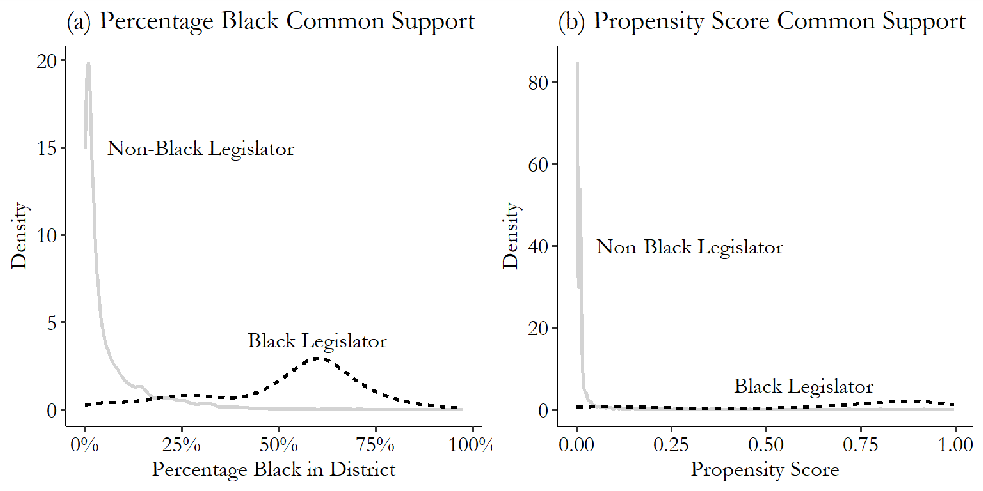

Figure 14.7: Common Support of the Percentage Black Variable and the Propensity Score in Broockman (2013) Data

Is there good common support for this variable? Itʼs a bit iffy. Itʼs not a problem that the distributions aredifferent- we can use matching or reweighting to scale up the parts of the control distribution until

theyʼre the same as the treated distribution…assuming that those parts of the control distribution exist to be scaled up.If thereʼs nobody home at that part of the distribution, not much we can do.

And there are certainly some regions here where thereʼs not much to compare to. There arenʼt that many districts with a more than 50% Black population but a non-Black legislator. Thatʼs a problem for common support, as many of the Black legislators we do have represent areas with a 50-80% Black population.

If thereareareas with a 50-80% Black population but a non-Black legislator, then those areas will receive huge weights and increase noise in the estimate. Or if therearenʼtany, then those areas with 50-80% Black population and a Black legislator will have to be dropped. And thatʼs the bulk of the treated data! The comparison wonʼt be all that representative of the actual groups with Black legislators.

This same approach of contrasting the distribution works for propensity scores. In Figure14.714.7 (b)14.7.... you can see the distribution of the propensity score for the treated and control groups. As you would expect, the distribution is further to the right for the treated group than the control group. Thatʼs not a problem. The problem arises if there are big chunks of the distribution for one group (particularly the treated group) where there isno or very very litleweight in the control group. Again, we do have some issues here, where there simply arenʼt that many districts with non-Black legislators but high propensity scores. In fact, the propensity is so bunched down near 0 for that group that the density in that region is enormous, squashing down the rest of the graph and making it hard to see.

53

In the context of propensity scores, we may as well take this opportunity to check something else, too - in propensity score estimation we need to assume that the true propensity score is never exactly 0 or 1. If we see big parts of the distribution right around 0 or 1, this should raise a concern.

54

Another way to check for common support when youʼre selecting matches is simply to see how successful you are at finding matches. If 1% of your treated observations fail to find an acceptable match, thatʼs pretty good. If 90% of your treated observations fail to find an acceptable match, then you lack common support.

WHAT TO DO ABOUT SUPPORT?The first step we can take in dealing with support is to avoid trying to match where we donʼt have any support. That is, we want to drop observations that donʼt match well.

Some matching methods do this for us. If weʼre picking matches with a caliper, then bad matches wonʼt be selected as matches. Observations without common support wonʼt make it to the matched sample. Done!

Other methods require a little extra work after the fact. Propensity score approaches, especially inverse probability weighting, wonʼt automatically drop observations outside the range of common support. For this reason itʼs common to “trim” the propensity score. For the treated and control groups separately, look for the range of values of the propensity score where the density distribution is zero (or close to zero, below some cutoff value). Then, drop all observations in the othergroup that have propensity scores in the range that doesnʼt exist inyourgroup (⊕Caliendo and Kopeinig 2008). In other words, limit the data to the range of common support.

Figure14.814.8 repeats Figure14.8.... 14.714.7 (b), but then trims to the region of common support, requiring at14.7.... least ten control observations in a given propensity score bin .02 wide. In the data we have left, every observation has at least a few observations that have comparable propensity scores. We now know that when we weight to make each group more like the other, weʼre not trying to jam in truly incomparable observations. Only the ones wecanuse to build a comparable group.

55

Figure 14.8: Propensity Scores After Trimming to Common Support

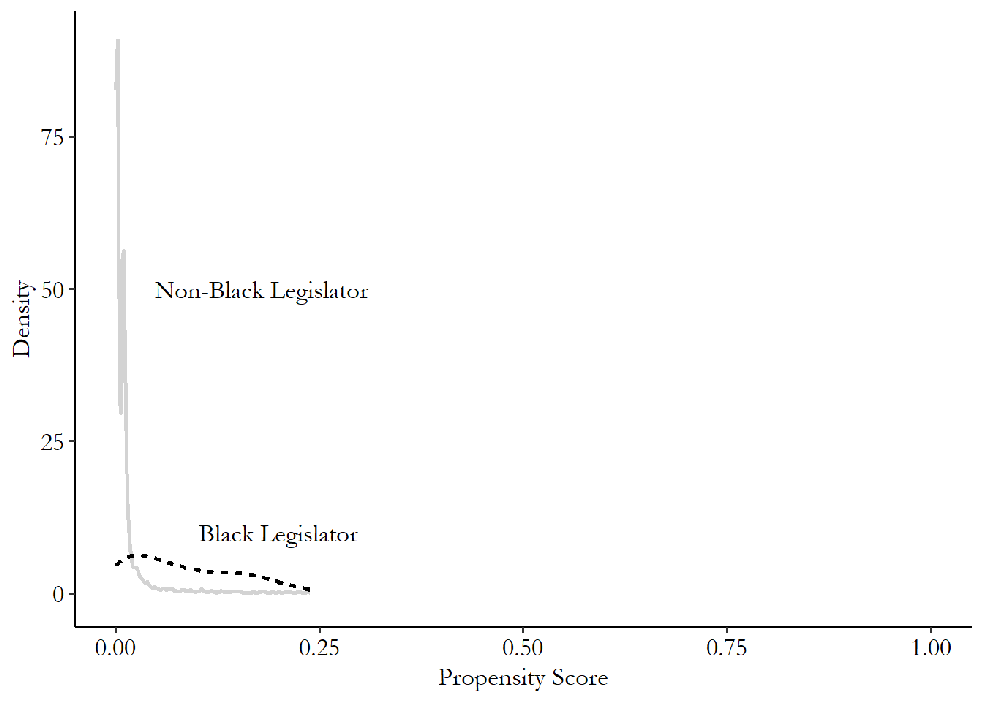

This is not the only way to trim for common support. A common approach is to trim outliers - any observation with a propensity score in the top or bottom X% gets trimmed. Or instead of working with percentiles, simply trim anything near 0 or 1, maybe anything from and remember, we are assuming we donʼt have any true 0 or 1 propensities anyway. Another is to just look foranymatch, rather than a sufficient number of matches in the region. So for example, look at the minimum and maximum propensity score for the treated observations, and get rid of any control observations outside that range.

###### 0 − .01 .99 − 1

All of these approaches to enforcing common support entail dropping data. This brings us to the stinging welt of the whole thing - if this process leads to us dropping alotof observations, especially treated observations, then at best we can say that weʼll be able to generate an estimate of the treatment effectamong the individuals that match wel, whatever that means, and at worst we can say the matching has failed. Matching relies on the existence of comparable observations, and those might not be around. Maybe a different matching method would work, but more likely matching isnʼt going to be able to close your back doors.

###### 14.6.3 Balance

THE GOAL OF MATCHING IS TO CLOSE BACK DOORS THROUGH THE MATCHING VARIABLES.So, uh, did it? Balanceis the assumption that our approach to selecting a matched group has closed back doors for the variables weʼre interested in. In theory (and in a perfect world), the weights we select should lead to treated and control groups with the exact same values of the back-door variables. No variation between treatment and control for that back-door variable means thereʼs no back door any more. It has been closed.

“The exact same values” isnʼt really going to happen though. So how can we check if we have acceptablelevels of balance? And what happens if we donʼt? Like anything else that allows for worse matches, bad balance leads to bias. If the balance is bad, the back doors arenʼt being closed, so the treatment effect gets contaminated with all those nasty back doors.

56

Thankfully we donʼt have to do much theorizing about whether thereʼs a problem. We can check in the matched data we have whether there are meaningful differences between the treated and control groups in variables for which there should be no differences - variables that should be balanced.

And if we find that we do have a balance problem, by any of these methods? Then itʼs back to the matching procedure. Itʼs not uncommon for matching-based estimation to be iterative. Match the data, check balance, and if itʼs bad, change something about the matching procedure (more variables, different functional form for a propensity score model, a tighter caliper, etc.) and repeat the process.

57

A COMMON WAY OF CHECKING FOR BALANCE IS A BALANCE TABLE.Balance tables are pretty straightforward. Take a bunch of variables that should have balance. Then, show some of their summary statistics (usually, mean and standard deviation, maybe some other stuff) separately for the treated and control groups. Finally, do a difference-of-means test for each of the variables to see if the treated and control groups differ. You might add some other bells and whistles like a standardized difference in means, where the difference between treated and control groups is divided by their shared standard deviation - fancy! Thereʼs also a variant on standardized

58

difference-in-means called “standardized bias,” a measure you might see on some balance tables, which is standardized difference-in-means with a slightly different standardization.

59

Often, the balance table is created twice: once with the raw, unmatched data to show the extent of the balance problem that matching is to solve, and then again with the matched data to ideally show that the balance problem is gone. What does good balance look like? It looks like no meaningfully large differences in means. And if youʼre doing a test, you should find no statistically significant differences in means, or at least no more than youʼd expect by chance.

60

Balance tables are often fairly easy to code. In R, there are many good options in MatchBalance in the Matching package and sumtable in the vtable package, both of which can either be run both without and with matching weights, or with the output from Match, to compare balance before and after matching. In Stata you can follow a teffects analysis with tebalance summarize (although this wonʼt do significance tests). For a more standard balance table in Stata you can use the balancetable package, adding weights to check the post-matching balance. In Python, if youʼve created a CausalModel() called M using the causalinference package, you can get a balance table using print(M.summary_stats).

We can see an example of a balance table for Broockman (2013), which is a subset of the output produced by MatchBalance in R following the Mahalanobis matching from earlier in this chapter. Importantly, thereʼs no one standard way to present a balance table, so the format that your software gives you may not match this one. For each variable, before and after matching, it shows the mean of the variable for the treated group, the mean of the variable for the control group, the standardized difference (a.k.a. standardized bias from earlier in this section), and a p-value from a test for the mean being different in the treated and control groups.

###### t

Table 14.1: Broockman (2013) Balance Table Before and After Mahalanobis Matching

Before Matching After Matching

Median Household Income Mean Treatment 3.33 3.333 Mean Control 4.435 3.316 Std. Mean Diff -97.057 1.455 t-test p-value <.0001 0.164 Black Percent

Before Matching After Matching

Mean Treatment 0.517 0.515 Mean Control 0.063 0.513 Std. Mean Diff 224.74 1.288

- t-test p-value <.0001 0.034 Legislator is a Democrat Mean Treatment 0.978 0.978 Mean Control 0.501 0.978 Std. Mean Diff 325.14 0
- t-test p-value <.0001 1

What do we see here? First, before matching takes place, thereʼs a serious amount of imbalance. The mean values are both meaningfully and statistically significantly different between the treatment and control groups. How about after matching? Balance looks pretty good. Thereʼs no meaningfully large difference in the means between treatment and control for any of the three variables weʼre looking at. For “Legislator Is a Democrat” ( in the code), thereʼs literally zero difference in the mean.

leg_democrat

We do see a statistically significant (at the 95% level) difference in the percentage of the district that is Black after matching, with a -statistic p-value below . However, this goes along with a meaningfully very close mean value (.515 vs. .513). Additionally, to see if we should be concerned, we might want to look at the full distributions and see whetherthoseare different.

t .05

61

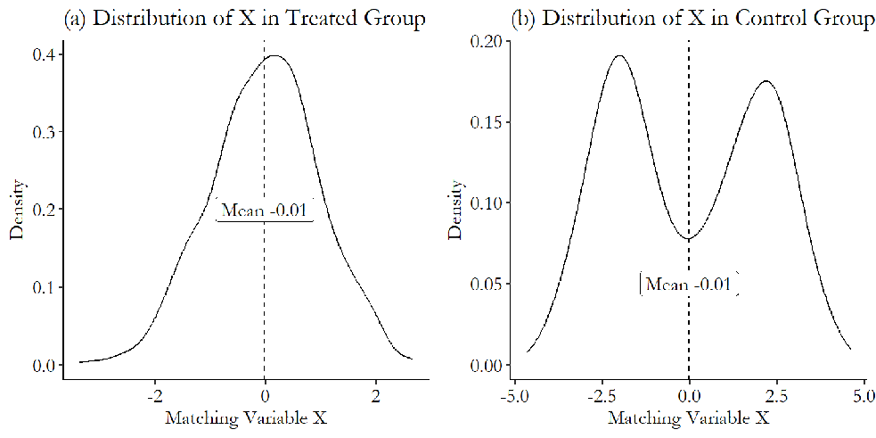

BALANCE TABLES TEND TO FOCUS ON THE MEAN.Is the mean the same in the treated and control groups? Sure, youcoulduse a balance table to check if other things are the same, but you donʼt see that a lot.

- Figure 14.9: Distribution of a Matching Variable After Matching in the Treated and Control Groups
- Figure 14.10: Overlaid Distribution of a Matching Variable After Matching in the Treated and Control Groups

And thatʼs a problem! Would you really believe that youʼd closed a back door if the treated and control groups had distributions of a matching variable that looked like Figure14.914.9? Sure the means are the same. But thereʼs clearly a difference there.14.9....

How can we check for differences between the treated and control groups in the distribution of a variable? Well… I already sorta answered that with Figure14.914.9. Just plot the distribution of the14.9.... variable for both the (matched) treated and control groups, and see how badly they differ. The only difference from Figure14.914.9 is that youʼd typically overlay the distributions on top of each other so14.9.... you can more easily see any differences. Overlaying the distributions from Figure14.914.9 in Figure14.9....

- 14.1011111114.10 makes it pretty easy to spot the problem.111114.10.1.1.1.1111111

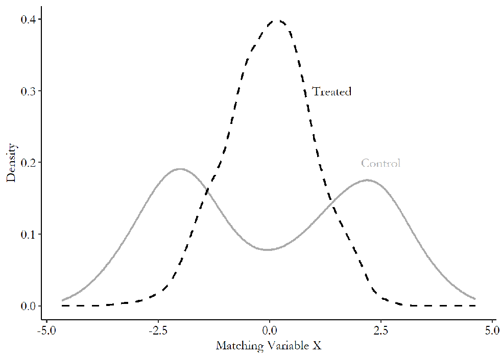

We wouldnʼt necessarily throw out matching foranymismatch between the distributions, but egregious mismatches like the one in Figure14.1011111114.10 might be a cause to go back to the drawing111114.10.1.1.1.1111111 board. You can make these graphs for any continuous matching variable, and you can use the tools for discrete distributions from Chapter33 to do the same for categorical or binary matching3 variables.

One place that this overlaid density graph is almost mandatory is when youʼre working with propensity scores. Youʼve only got one real matching variable that matters - the propensity score so youʼd better hope the density lines up pretty well.

You can see this in action in Figure14.1111111114.11, which shows overlaid density plots for the Broockman111114.11.11.11.11.11111111111111 study for the matching variable “Black percentage in district,” and for the propensity score, both after applying inverse probability weights (and trimming any propensity scores from to or from to ).

0 .02

###### .98 1

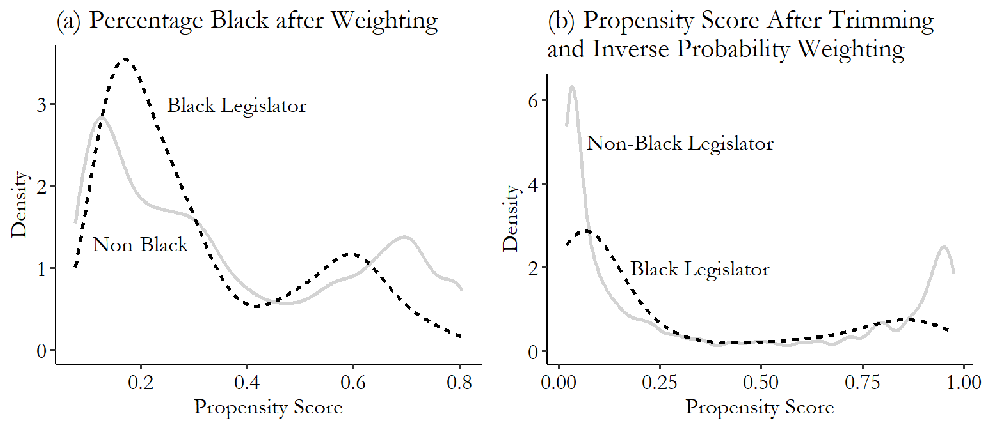

Figure 14.11: Percentage Black in District and Propensity Score Distributions Before and After Inverse Probability Weighting

How do these look now? Theyʼre… not perfect. With a really good propensity score model, the propensity score distributions for treated and control observations should really be nearly identical.

These are a lot better than they were before the matching, but theyʼre still pretty dissimilar. The same thing goes for percentage Black in district. This might be a good indication to go back to the propensity score model and try adding some things to it to improve the balance we see.

Overlaid density plots are fairly easy to create by hand, but in some cases there are prepackaged versions we can go with.

###### R Code R Code e Stata CodeStata CodeStatatatatatatatatatatatatatatatatatatatatata e Python CodePython Codeytyttt ooooooooooo o o oooooo o o o e

library(tidyverse) br <- causaldata::black_politicians

# We can estimate our own propensity score m <- glm(leg_black ~ medianhhincom + blackpercent + leg_democrat,

data = br, family = binomial(link = 'logit')) # Get predicted values br <- br %>%

mutate(ps = predict(m, type = 'response'))

# Create IPW weights br <- br %>%

mutate(ipw = case_when( leg_black == 1 ~ 1/ps, leg_black == 0 ~ 1/(1-ps)))

# Let's check the raw pre-matching balance of a given matching variable ggplot(br, aes(x = medianhhincom, color = factor(leg_black))) +

geom_density()

# And using our matching weights ggplot(br, aes(x = medianhhincom, color = factor(leg_black),

weight = ipw)) + geom_density()

THE USE OF A PROPENSITY SCORE ALLOWS US TO TEST ANOTHER ASPECT OF BALANCE.In particular, if our sample is properly balanced and the matching has worked to close back doors, thencontroling for the propensity score, we should also see no relationship between the matching variables and treatment status, i.e., balance. This is evident from our propensity score causal diagram,

reproduced in Figure14.1211111114.12. Shut down111114.12.1.1.1.1111111 and there should be no path from , , or to .

###### TreatmentPropensity A B C Treatment

Figure 14.12: Causal Diagram Amenable to Propensity Score Matching

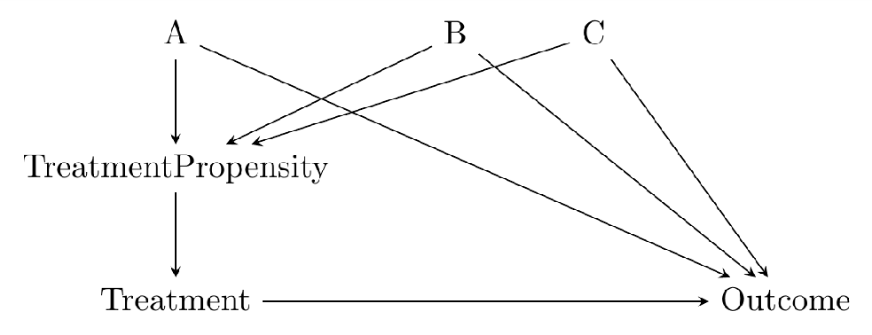

Dehejia and Wahba (⊕2002) offer a way of testing this implication of our diagram using a stratification test. In a stratification test we repeatedly lookwithin limited ranges of the propensity score. By limiting ourselves to a narrow chunk of the propensity score, we are in effect controlling for it. So split the whole range of propensity scores up into chunks and check whether the matching variables and treatment are related within each chunk.

62

###### 14.7 Estimation with Matched Data

###### 14.7.1 Estimating Mean Differences

WEʼRE NEARLY TO THE END OF THE CHAPTER, AND WEʼRE JUST NOW GETTING TO ESTIMATING A TREATMENT EFFECT?Well, yeah. When it comes to matching, most of the work - picking a matching method, doing the matching and making the weights, checking common support and balance, and maybe going back to tweak the matching method if the balance is bad - is already done before we need to estimate anything. But now weʼve done that stuff, and itʼs time.

63

With a set of matching weights in hand, how can we estimate the effect of treatment? Get the weighted mean of the outcome for the treated and control groups and compare them. Okay, thatʼs it, bye.

All right, well, thatʼs notrealyit. That is quite a lot of it, though. If all youʼre interested in doing is getting the effect of treatment on the mean of the outcome, comparing the weighted means will do it.

ONE IMPORTANT DETAIL TO KEEP IN MINDis that while the treatment effect is that simple to estimate, thestandard errorson that treatment effect wonʼt be quite as simple. Calculating the standard error of a weighted mean is easy. But the standard error you calculatewonʼt remember that the weights had to be estimatedand perhaps that some observations were dropped in the matching process. The step of preprocessing the data to match observations and create weights introduces some uncertainty, and so increases the standard errors. Incorporating this uncertainty into your standard errors is important.

There are a few different ways to calculate the appropriate standard error adjustments, most of them having to do with figuring out the variance of the outcome variable conditional on treatment and on the matching variables (or on the weights that come from the matching variables). However, theyʼre all quite complex, and not really the aim of this book. Until youʼre ready to delve into the econometric papers that describe the standard error adjustments youʼd want to do, youʼre probably going to be using software that does it for you. So the key takeaway here is “unless youʼre willing to put in the time to do it right, donʼt calculate your own standard errors for treatment effects under matching, let matching-based estimation software do it for you.”

64

ONE EXCEPTION IS THE USE OF BOOTSTRAP STANDARD ERRORS,as discussed in Chapter1313 on regression.13 Bootstrap standard errors can be applied to matching estimates. In application of a bootstrap to matching, you first randomly resample the data with replacement (so you get the same sample size you started with, but some observations are replaced with multiple copies of others), then reperform the matching from scratch, and finally estimate the treatment effect in your bootstrap sample. Repeat this process many, many times, and the standard deviation of the treatment effect across all the bootstrap samples is the standard error of your treatment effect. You can see how this process naturally incorporates any uncertainty we get from the matching process - it allows that uncertainty to feed right into our treatment effect distribution.

Both intuitively (because you are actively incorporating how the matching process affects the sampling distribution) and mechanically (because bootstrap standard errors are fairly simple to do yourself by hand, it takes only a little coding if itʼs not already in the command youʼre using), bootstrap standard errors can be a great option for matching estimates. That said, bootstrap standard errors can only be used with the “constructing a weighted matched sample” approach to matching. They simply donʼt work properly for the “selecting matches” approach, because the sharp in/out decisions that process makes donʼt translate into the bootstrap having the proper sampling distribution (⊕Abadie and Imbens 2008). So if youʼre using a weighting approach, go for it. If not, either go with an appropriate standard error adjustment in your software, or if youʼre feeling real spicy you can go find one of the bootstrap variants designed to work properly with selectingmatches approaches.

Bootstrapping a matching process can be a little tricky to code up if youʼre not using a command that offers it already, since you arenʼt just bootstrapping a single command (or asking for the “bootstrap standard error” option in a regression). You need to bootstrapthe whole matching process from start to finish. I offer some coding examples later in the chapter in application to doubly robust estimation, and also in Chapter1515. Slight tweaks on this code should help you15 provide bootstrap standard errors for all kinds of matching processes.

###### 14.7.2 Combining Matching and Regression

IN MANY CASES WE WANT TO DO SOMETHING A LITTLE MORE COMPLEXthan comparing means between the treated and control groups. For example, maybe our research design depends on a specific functional form of the relationship between treatment and outcome, which would be difficult to capture with matching but easy with regression. But we still want to close back doors by matching. What then? We can combine our matching weights with a regression model to do

65

###### regression adjustment.

The approach here is pretty straightforward. We already have a set of selected matched observations, or a set of matching weights, from our matching procedure. We can apply that subsample, or those weights, to our regression model, just as we did with sample weights in Chapter1313.13

In fact, weʼve already done this procedure - the basic difference in weighted means we talked about before can be achieved by applying matching weights to a regression with only treatment as a predictor, i.e., . The estimate of the effect would be . This is the method Iʼve been using in the code examples. Itʼs not a big jump to start adding other things to that regression.

Outcome = β0 + β1Treatment + ε β^1

Using weights isnʼt the only way to go (and may not be ideal if you already have other plans for those weights, like survey sample weights). Another approach to using matching with regression is to think carefully about what the propensity score is - itʼs a variable that, if controlled for, should block all back doors from to . So… control for it! The propensity score (or the inverse probability weight based on the propensity score) can be added to regression as a control.

Treatment Outcome

In fact, now that weʼre at this section we can finally come back around and run the analysis that Broockman (2013) actually ran. He didnʼt just do matching and estimate a treatment effect from that. No! He took those matching weights and used them in a regression that let him not just see the difference in response rates between Black legislators and others, but see whether the difference between in-district vs. out-of-districtresponse rates for these letters from Black people was different between Black legislators and others. That calls for an interaction term in a regression. Not to mention we can add plenty of other controls.

###### R Code R Code e Stata CodeStata CodeStatatatatatatatatatatatatatatatatatatatatata e Python CodePython Codeytyttt ooooooooooo o o oooooo o o o e

library(cem); library(tidyverse); library(modelsummary) br <- causaldata::black_politicians

# This copies the CEM code from the CEM section # See that section's code for comments and notes

# Limit to just the relevant variables and omit missings # (of which there are none in this data) brcem <- br %>%

select(responded, leg_black, medianhhincom, blackpercent, leg_democrat) %>% na.omit() %>% as.data.frame()

# Create breaks inc_bins <- quantile(brcem$medianhhincom, (0:6)/6)

create_even_breaks <- function(x, n) {

minx <- min(x) maxx <- max(x) return(minx + ((0:n)/n)*(maxx-minx))

}

bp_bins <- create_even_breaks(brcem$blackpercent, 6) ld_bins <- create_even_breaks(brcem$leg_democrat,2)

allbreaks <- list('medianhhincom' = inc_bins,

'blackpercent' = bp_bins, 'leg_democrat' = ld_bins)

c <- cem(treatment = 'leg_black', data = brcem, baseline.group = '1', drop = 'responded', cutpoints = allbreaks, keep.all = TRUE)

# Get weights for other purposes. Note this exact code only # works because we didn't have to drop any NAs. If we did, # lining things up would be trickier br <- br %>%

mutate(cem_weight = c$w)

m1 <- lm(responded~leg_black*treat_out + nonblacknonwhite + black_medianhh + white_medianhh + statessquireindex + totalpop + urbanpercent, data = br, weights = cem_weight)

msummary(m1, stars = c('*' = .1, '**' = .05, '***' = .01))

From these regressions we get a coefficient of -.142 on , -.351 on , and .229 on

###### leg_black treat_out legblack × treat_out

. Recalling what we learned about interpreting a model with interaction terms from Chapter1313, we know that this means that Black legislators were 14.2 percentage points less13 likely than White legislators to respond to in-district emails, and out-of-district emails were 35.1 percentage points less likely to get a response than in-district emails from White legislators. But the in-district vs. out-of-district gap is 22.9 percentage pointssmalerfor Black legislators than White ones, which is evidence in favor of the idea that Black legislators have an intrinsic motivation to help Black people.

IF WE PLAY OUR CARDS RIGHT, REGRESSION AND MATCHING CAN COMBINE TO BE MORE THAN THE SUM OF THEIR PARTS. Doubly robust estimationis a way of combining regression and matching that works even if thereʼs something wrong with the matchingorsomething wrong with the regression - as long as itʼs not both.

What do I mean by “something wrong”? It doesnʼt cover everything - you still need to, you know, actually measure for and include the variables that allow you to close back doors. Doubly robust estimation wonʼt let you get around that. But regression and matching both rely on assumptions. For example, perhaps your regression model ismisspecified- youʼve got all the right variables in there, but maybe the functional form isnʼt quite right. The same thing can happen when specifying the model you use to estimate your propensity score.

66

Doubly robust estimation is any method that still works as long asone of those two modelsis properly specified. The other one can be wrong.

Double-robustness isa thing that some estimators haverather than being a specific estimator. So there are actually lots of methods that are doubly robust. I could list a dozen right here without even thinking too hard. But we donʼt have all day. So weʼll look at three, the first one in detail.

67

The first estimator weʼll look at is the one described in Wooldridge (2010, chapter 21.3.4). This one is appealing because the process of doing it isalmostlike youʼd guess doubly robust estimation works on your own if youʼd just heard about it and had to come up with it yourself. And it actually does work!

The steps are fairly straightforward:

- 1. Estimate the propensity score for each observation using your matching variables
- 2. Use the propensity score to produce the inverse probability weights: for treated observations and for untreated observations
- 3. Usingonly treated observations, estimate your regression model, using the matching variables as predictors (and perhaps some other predictors too, depending on what youʼre doing), and inverse probability weights
- 4. Repeat step (3) but using only untreated observations
- 5. Use the models from steps (3) and (4) to produce “treated” and “untreated” predicted observations for the whole sample
- 6. Compare the “treated” means to the “untreated” means to get the estimate of the causal effect
- 7. To get standard errors, use bootstrap standard errors, or the heteroskedasticity-robust errors described in Wooldridge (2010) (not just the same as asking for regular heteroskedasticity-robust standard errors)

p

1/p 1/(1 − p)

While there are a lot of steps here, none of them are particularly complex, and all are fairly easy to do by hand. In fact, letʼs work through the code for this approach.

###### R Code R Code e Stata CodeStata CodeStatatatatatatatatatatatatatatatatatatatatata e Python CodePython Codeytyttt ooooooooooo o o oooooo o o o e

library(boot); library(tidyverse) br <- causaldata::black_politicians

# Function to do IPW estimation with regression adjustment ipwra <- function(br, index = 1:nrow(br)) {

# Apply bootstrap index br <- br %>% slice(index)

# estimate and predict propensity score m <- glm(leg_black ~ medianhhincom + blackpercent + leg_democrat,

data = br, family = binomial(link = 'logit')) br <- br %>%

mutate(ps = predict(m, type = 'response'))

# Trim control observations outside of treated PS range minps <- br %>%

filter(leg_black == 1) %>% pull(ps) %>% min(na.rm = TRUE)

maxps <- br %>% filter(leg_black == 1) %>% pull(ps) %>% max(na.rm = TRUE)

br <- br %>% filter(ps >= minps & ps <= maxps)

# Create IPW weights br <- br %>%

mutate(ipw = case_when( leg_black == 1 ~ 1/ps, leg_black == 0 ~ 1/(1-ps)))

# Estimate difference with IPW weights w_means <- br %>%

group_by(leg_black) %>% summarize(m = weighted.mean(responded, w = ipw)) %>% arrange(leg_black)

return(w_means$m[2] - w_means$m[1]) }

b <- boot(br, ipwra, R = 200) # See estimate and standard error b

How about the other two methods I mentioned? Iʼll talk about these briefly. Just a tour of the space.

One is the Augmented Inverse Probability Weighted Estimator (AIPWE) (⊕Tan 2010). Like the Wooldridge approach, AIPWE has both a matching model to estimate, with treatment as a dependent variable, and a regression model, with the outcome as a dependent variable. The basic idea of AIPWE is that it includes an augmentation term (surprise) in the regression model that adjusts the results based on the degree of misspecification in the matching model.

AIPWE has some nice properties. It does okay in some settings even with mild misspecification in bothmodels (although again, you would prefer at least one being correct). Plus, if it turns out that thereisnʼtany misspecification in the model for treatment, AIPWE will produce lower standard errors in the outcome model. Neat!

The third and final method can be discussed briefly because Iʼve already discussed it. Entropy balancing, which showed up back in the “Distance Matching” section, is itself doubly robust (⊕Q. Zhao and Percival 2017). Despite not directly including a regression, entropy balancingʼs focus on removing differences in means between treatment and control turns out to work a lot like regressionʼs focus on removing differences in means. Double robustness!

###### 14.8 Matching and Treatment Effects

AS WITH ANY DESIGN AND ESTIMATION APPROACH,we have to ask what kind of treatment effect average (as in Chapter1010) we are getting.10

When it comes to matching, that turns out to be a very interesting question. One of the coolest things about matching is that, unlike with regression, itʼs super easy to have a matching estimator give you just about any treatment effect average you want.

68

How is that possible? Well, first letʼs start by thinking about the matching procedures Iʼve been talking about this whole time throughout this chapter - what kind of treatment effect average do these give us?

69

We can think it through logically. Weʼre using matching to produce a group of control observations that are comparably similar to the treated group. Theyʼre supposed to be just like the treated group if the treated group hadnʼt been treated.

So… comparing our estimate of whatthe treated group would have goten without treatment againstwhat the treated group actualy got? Using the rule-of-thumb logic from Chapter1010, that10 sounds like the average treatment on the treated to me. And indeed, thatʼs what most of the methods Iʼve described so far in this chapter will give you.

70

OR AT LEAST PRETTY CLOSE TO WHAT THEYʼLL GIVE YOU.Matching doesnʼt give youexactlythe average treatment on the treated. Like with regression, it gives you an average that is affected by its approach to closing back doors. Just like regression gave variance-weighted treatment effects, matching givesdistribution-weightedtreatment effects, where each observationʼs treatment effect is weighted more heavily the more common its mix of matching variables is.

To give a basic example of this in action, letʼs imagine some types of people like we did back in Chapter1010. Table10 14.214.2 shows two different types of people we might be sampling.14.2....

Table 14.2: Individual Hypothetical Outcomes

Unreated Outcome

Treated Outcome

Treatment

Name Gender

Effect Alfred Male 2 4 2 Brianna Female 1 5 4

Now, imagine that we happen to end up with a sample with 500 untreated Alfreds and 500 untreated Briannas, as well as 1,000 treated Alfreds and 200 treated Briannas. And weʼre matching on Gender.

In the treated group weʼd see an average outcome of . How about in the matched untreated group? Well, if we did one-to-one matching with replacement, for example, weʼd end up with, just like in the treated group, 1,000 Alfreds and 200 Briannas, but

###### (1,000 × 4 + 200 × 5)/(1,200) ≈ 4.17

theyʼre untreated this time. So the average among the untreated group is

. This gives us a treatment effect of . This is much closer to the male treatment effect of 2 than the female treatment effect of 4 because there are far more men in the treated sample than women - itʼs weighted by how common a given observationʼs matching variable values are.

###### (1,000 × 2 + 200 × 1)/(1,200) ≈ 1.83 4.17 − 1.83 = 2.34

71

###### 14.8.1 Getting Other Treatment Effects from Matching

AH, BUT I HAVE BURIED THE LEDE. The average treatment on the treated is not the only thing that matching can give you. We can get the average treatment effect, or even the average treatment on theuntreated. How can we do that?

72

73

Itʼs actually fairly straightforward. If you want average treatment on the treated, as weʼve been getting, then construct a control group that is as similar to the treated group as possible.

Want average treatment on theuntreated? Simple! Just reverse things. Instead of matching control observations to treated observations, instead matchtreatedobservations tocontrolobservations. Same procedure, but reverse which group is which. The result gives you a treated group that is as much like the untreated group as possible. Comparing that to the untreated group compares what you actually got from no treatment against what we think that groupwould have gotenif treated. Average treatment on the untreated!

74

From here you can get to the average treatment effect fairly easily. If the average among your treated group is the average treatment effect on the treated (ATT), and the average among your untreated group is the average treatment effect on the untreated (ATUT), then whatʼs the overall average, also known as the average treatment effect? Well, if a proportion of people are getting treated, then itʼs just . Youʼre just averaging the average from each “side,” weighted by how big each side is, to get the overall average.

###### x ATE = (x × ATT) + ((1 − x) × ATUT)

The use of matching to get average treatment effects is fairly common, and sometimes is even the default option in software commands designed to do treatment effects by matching. Stataʼs teffects is an example of this - the teffects examples in this chapter produce average

treatment effects by default (and all of them have an atet option for getting average treatment on the treated).

HOW DOES THIS APPLY TO INVERSE PROBABILITY WEIGHTING?After all, when youʼre doing inverse probability weighting you arenʼt really matchingtoanything, youʼre just weighting on the basis of the inverse propensity weight.

It turns out that the specific way you choose to turn the propensity score into an inverse propensity weight determines the kind of treatment effect average you get. Weighting to make the control group look like the treatment? Average treatment on the treated! Doing the reverse? Average treatment on the untreated! Doing both? Average treatment effect!

In fact, the approach to inverse probability weighting Iʼve been talking about this whole time - with a weight of for the treated group and for the untreated group, where is the propensity score - serves to both upweight the members of the untreated group that are most like the treated groupandupweight the members of the treated group that are most like the untreated group. This actually gives us the average treatment effect, not the average treatment on the treated.

1/p 1/(1 − p) p

What if we do want one of those other averages? We just use different weights.

What if we want average treatment on the treated? Intuitively here we want to make the untreated group like the treated group. So first we givealof the treated group the same weight of 1. We donʼt need to adjust them to be like anyone else - we want to adjusteveryone else to be like themso the others can serve as a comparison. Sounds like average treatment on the treated to me.

The treated group gets a weight of 1. How about the untreated group? Instead of a weight of

, they get . The , which we did before, sort of brings the representation of the untreated group back to neutral, where everyone is counted equally. But we donʼt want equal. We want the untreated group to belike the treated group, which means weighting themeven morebased on how like the treated group they are. And thus , which is more heavily responsive to than is.

1/(1 − p) p/(1 − p) 1/(1 − p)

p/(1 − p) p 1/(1 − p)

From there, average treatment on the untreated is pretty easy to figure out and works for largely the same reason. The untreated group in this case gets a weight of 1, and the treated group, instead of

###### the that gave us the ATE, gets , which makes things match the untreated group properly and gives us the ATUT we want.

###### 1/p (1 − p)/p

Previous Next

Page built: 2025-10-17 using R version 4.5.0 (2025-04-11 ucrt)

## The Effect

Nick Huntington-Klein

▾ Chapters

###### Chapter 15 - Simulation

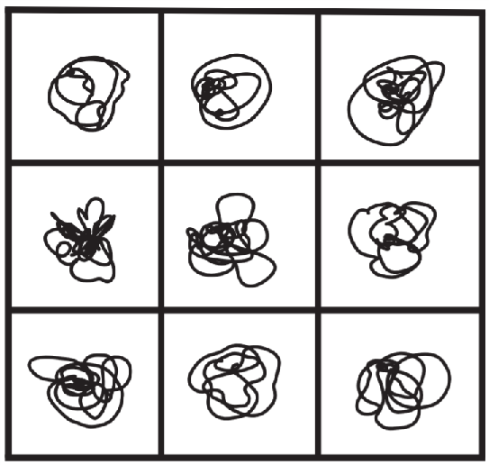

###### 15.1 It Is Proven

UNLIKE STATISTICAL RESEARCH, WHICH IS COMPLETELY MADE UP OF THINGS THAT ARE AT LEAST SLIGHTLY FALSE, STATISTICS ITSELF IS ALMOST ENTIRELY TRUE.Statistical methods are generally developed by mathematical proof.If we assume A, B, and C, then based on the laws of statistics we can prove that D is true.

For example, if we assume that the true model is , and that is unrelated to , then we can prove mathematically that the ordinary least squares estimate of will be the true on average. Thatʼs justtrue, as true as the proof that there are an infinite number of prime

Y = β0 + β1X + ε X ε 1 β^1

β1

numbers. Unlike the infinite-primes case, we can (and do) argue endlessly about whether those underlying true-model and unrelated-to- assumptionsapply in our research case. But we all agree that if theydidapply, then the ordinary least squares estimate of will be the true on average. Itʼs been proven.

ε

β^1 β1

Pretty much all of the methods and conclusions I discuss in this book are supported by mathematical proofs like this. I have chosen to omit the actual proofs themselves, but theyʼre lurking between the lines, and in the citations I can only imagine youʼre breezing past.

2

Why go through the trouble of doing mathematical proofs about our statistical methods? Because they let us know how our estimates work. The proofs underlying ordinary least squares tell us how its sampling variation works, which assumptions must be true for our estimate to identify the causal effect, what will happen if those assumptionsarenʼtcorrect, and so on. Thatʼs super important!

SO WE HAVE AN OBVIOUS PROBLEM.I havenʼt taught you how to do econometric proofs. Thereʼs a good chance that youʼre not going to go out and learn them, or at least youʼre unlikely to go get good at them, even if you do econometric research. Proof-writing is really a task for the people developing methods, not the consumers of those methods. Many (most?) of the people doing active statistical research have forgotten all but the most basic of statistical proofs, if they ever knew them in the first place.

3

But we still must know how our methods work! Entersimulation. In the context of this chapter, simulation refers to the process ofusing a random process that we have control over(usually, a data generating process) to produce data that we can evaluate with a given method. Then, we do that over and over and over again. Then, we look at the results over all of our repetitions.

4

WHY DO WE DO THIS?By using a random process that we have control over, we canchoose the truth. That is, we donʼt need to worry or wonder about which assumptions apply in our case. We canmakeassumptions apply, or not apply, by just varying our data generating process. We can choose whether thereʼs a back door, or a collider, or whether the error terms are correlated, or whether thereʼs common support.

Then, when we see the results that we get, we cansee what kind of results the method wil produce given that particular truth.We know the true causal effect since wechosethe true causal effect - does our method give us the truth on average? How big is the sampling variation? Is the estimate more or less precise than another method? If we do get the true causal effect, what happens if we rerun the simulation but make the error terms correlated? Will it still give the true causal effect?

Itʼs a great idea, when applying a new method, or applying a method you know in a context where youʼre not sure if it will work, to just go ahead and try it out with a simulation. This chapter will give you the tools you need to do that.

###### 15.1.1 The Anatomy of a Simulation

TO GIVE A BASIC EXAMPLE,imagine we have a coin that weʼre going to flip 100 times and then estimate the probability of coming up heads. What estimator might we use? Weʼd probably just calculate the proportion of heads we get in our sample of .

N = 100

What would a simulationlook like?

- 1. Decide what our random process/data generating process is. We have control! Letʼs say we choose to have a coin thatʼs truly heads 75% of the time
- 2. Use a random number generator to produce our sample of 100 coin flips, where each flip has a 75% chance of being heads
- 3. Apply our estimator to our sample of 100 coin flips. In other words, calculate the proportion of heads in that sample

- 4. Store our estimate somewhere
- 5. Iterate steps 2-4 a whole bunch of times, drawing a new sample of 100 flips each time, applying our estimator to that sample, and storing the estimate (and perhaps some other information from the estimation process, if we like)
- 6. Look at the distribution of estimates across each of our iterations

Thatʼs it! Thereʼs a lot we can do with the distribution of estimates. First, we might look at the mean of our distribution. Thetruththat we decided on was 75% heads. So if our estimate isnʼt close to 75% heads, that suggests our estimate isnʼt very good.

WE COULD USE SIMULATION TO RULE OUT BAD ESTIMATORS.For example, maybe instead of taking the proportion of heads in the sample to estimate the probability of heads, we take thesquared proportion of heads in the sample for some reason. You can try it yourself - applying this estimator to each iteration wonʼt get us an average estimate of 75% heads.

We can also use this toprove the value of good estimators to ourselves.Donʼt take your stuffy old statistics textbookʼs word that the proportion of heads is a good estimate of the probability of heads. Try it yourself! You probably alreadyknewyour textbook was right. But I find that doing the simulation can also help you tofeelthat theyʼre right and understandwhythe estimator works, especially if you play around with it and try a few variations.

5

On a personal note, simulation is far and away the first tool that I reach for when I want to see if an approach Iʼd like to take makes sense. Got an idea for a method, or a tweak to an existing method, or just a way youʼd like to transform or incorporate a particular variable? Try simulating it and see whether the thing you want to doworks. Itʼs not too difficult, and itʼs certainly easier thannotchecking, finishing your project, and finding out at the end that it didnʼt work when people read it and tell you how wrong you are.

ASIDE FROM LOOKING AT WHETHER OUR ESTIMATOR CAN NAIL THE TRUE VALUE,we can also use simulation to understandsampling variation.Sure, on average we get 75% heads, but what proportion of samples will get 50% heads? Or 90%? What proportion will find the proportion to be statistically significantly different from 75% heads?

Simulation is an important tool for understanding an estimatorʼs sampling distribution. The sampling distribution (and the standard errors it gives us that we wantso badly) can be really tricky to figure out, especially if analysis has multiple steps in it, or uses multiple estimators. Simulation can help to figure out the degree of sampling variation without having to write a proof.

Sure, we donʼt need simulation to understand the standard error of our coin-flip estimator. The answer is written out pretty plainly on Wikipedia if you head for the right page. But whatʼs the standard error if we first use matching to link our coin to other coins based on its observable characteristics, apply a smoothing function to account for surprising coin results observed in the past, and then drop missing observations from when we forgot to write down some of the coin flips? Uhhh… Iʼm lost. I really donʼt want to try to write a proof for that standard error. And if someone has already written it for me, Iʼm not sure Iʼd be able to find it and understand it. Simulation can help us get a sense of sampling variation even in complex cases.

6

Indeed, even the pros who know how to write proofs often use simulation for sampling variation see the bootstrap standard errors and power analysis sections in this chapter.

LASTLY, SIMULATION IS CRUCIAL IN UNDERSTANDING HOW ROBUSTan estimation method can be to violations of its assumptions, and how sensitive its estimates are to changes in the truth. Sure, we know that if a true model has a second-order polynomial for , but we estimate a linear regression without that polynomial, the results will be wrong. But how wrong will it be? A little wrong? A lot wrong? Will it be more wrong when is a super strong predictor or a weak one? Will it be more wrong when the slope is positive or negative, or does it even matter?

X

X

Itʼs very common, when doing simulations, to run multiple variations of the same simulation. Tweak little things about the assumptions - make a stronger predictor in one and a weaker predictor in the other. Add correlation in the error terms. Try stuff! Youʼve got a toy; now itʼs your job to break it so you know exactly when and how it breaks.

X

###### 15.1.2 Why We Simulate

TO SUM UP,simulation is the process of using a random process that we control to repeatedly apply our estimator to different samples. This lets us do a few very important things:

We can test whether our estimate will, when applied to the random process / data generating process we choose, give us the true effect

We can get a sense of the sampling distribution of our estimate

We can see how sensitive an estimator is to certain assumptions. If we make those assumptions no longer true, does the estimator stop working?

7

Now that we knowwhysimulation can be helpful, letʼs figure out how to do it.

###### 15.2 Alas, We Must Code

THEREʼS NO WAY AROUND IT.Modern simulation is about using code. And you wonʼt just have to use prepackaged commands correctly - unless youʼre willing to trust an AI to write code this detailoriented without missing something, youʼll actually have to write your own.

8

Thankfully, not only are simulations relatively straightforward, theyʼre also a good entryway into writing more complicated programs.

A typical statistical simulation has only a few parts:

- 1. A process for generating random data
- 2. An estimation
- 3. A way of iterating steps 1-2 many times
- 4. A way of storing the estimation results from each iteration
- 5. A way of looking at the distribution of estimates across iterations

Letʼs walk through the processes for coding each of these.

HOW CAN WE CODE A DATA GENERATING PROCESS?This is a key question. Often, when youʼre doing a simulation, the whole point of it will be to see how an estimator performs under a particular set of data generating assumptions. So we need to know how to make data that satisfies those assumptions.

9

The first question is how to produce random data in general. There are, generally, functions for generating random data according to all sorts of distributions (as described in Chapter33). But we3 can often get by with a few:

Random uniform data, for generating variables that must lie within certain bounds. runif() in R, runiform() in Stata, and numpy.random.default_rng().uniform() in Python.

10

Normal random data, for generating continuous variables, and in many cases mimicking real-world distributions. rnorm() in R, rnormal() in Stata, and

numpy.random.default_rng().normal()

in Python.

Categorical random data, for categorical or binary variables. sample() in R, runiformint() in Stata, or numpy.random.default_rng().choice()

in Python. The Stata function will only work if you want an equal chance of each category. Want unequal probabilities in Stata? Try carving up uniform data, as in the previous note. Or if you have only two categories, use rbinomial(1,p).

You can use these simple tools to generate the data generating processes you like. For example, take the code snippets a few paragraphs after this in which I generate a data set with a normally distributed error variable I call , a binary variable which is 1 with probability .2 and 0 otherwise, and a uniform variable.

ε eps 11 X Y

###### R Code R Code e Stata CodeStata CodeStatatatatatatatatatatatatatatatatatatatatata e Python CodePython Codeytyttt ooooooooooo o o oooooo o o o e

library(tidyverse)

# If we want the random data to be the same every time, set a seed set.seed(1000)

# tibble() creates a tibble; it's like a data.frame # We must pick a number of observations, here 200 d <- tibble(eps = rnorm(200), # by default mean 0, sd 1

Y = runif(200), # by default from 0 to 1 X = sample(0:1, # sample from values 0 and 1

200, # get 200 observations

replace = TRUE, # sample with replacement prob = c(.8, .2))) # Be 1 20% of the time

12

Using these three random-number generators, we can then mimic causal diagrams. This is, after all, a causal inference textbook. We want to know how our estimators will fare in the face of different causal relationships!

###### 15.2.1 Creating Data

HOW CAN WE CREATE DATA THAT FOLLOWS A CAUSAL DIAGRAM? EASY!If we use variable to create variable , then . Simple as that. Take the below code snippets, for example, which modify what we had above to add a back-door confounder (and make normal instead of uniform). These code snippets, in other words, are representations of Figure15.111111115.1.111115.1.1.1.1.1111111

A B A → B

W Y

Figure 15.1: Causal Diagram to Be Replicated by Simulation Code

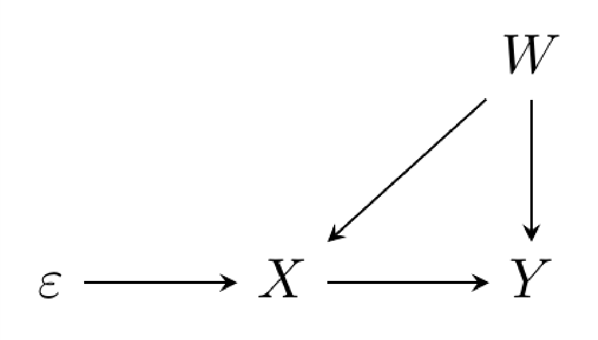

As in Figure15.111111115.1, we have that111115.1.1.1.1.1111111 causes and , so we put in that makes the binary variable more likely to be 1, but reduces the value of the continuous variable. We also have that is a part of creating , since it causes , and that is a part of creating , with a true effect of

W X Y W X Y

ε X X X Y X Y X Y 13

on being that a one-unit increase in causes a 3-unit increase in . Finally, itʼs not listed on the diagram, but we have an additional source of randomness, , in the creation of . If the only arrows heading into were truly and , then would becompletely determinedby those two variables - no other variation once we control for them.

14 ν Y Y X W Y

But presumably thereʼs something else going into , and thatʼs , which is also the error term if we regress on and . You can imagine being added to Figure15.111111115.1 with an arrow111115.1.1.1.1.1111111 . Whereʼs in the code? Itʼs that random normal data being added in when is created. Youʼll also notice that has left the code, too. Itʼs actually still in there - itʼs the uniform random data! We create by checking if some uniform random data ( ) is lower than .2 plus - higher values make it more likely weʼll be under , and so more likely that . “Carving up” the different values of a uniform random variable can sometimes be easier than working with binomial random data, especially if we want the probability to be different for different observations.

Y ν

Y X W ν ν → Y ν Y

eps X ε W W

###### .2 + W X = 1

R Code R Code e Stata CodeStata CodeStatatatatatatatatatatatatatatatatatatatatata e Python CodePython Codeytyttt ooooooooooo o o oooooo o o o e

library(tidyverse)

# If we want the random data to be the same every time, set a seed set.seed(1000)

# tibble() creates a tibble; it's like a data.frame # We must pick a number of observations, here 200 d <- tibble(W = runif(200, 0, .1)) %>% # only go from 0 to .1

- mutate(X = runif(200) < .2 + W) %>%
- mutate(Y = 3*X + W + rnorm(200)) # True effect of X on Y is 3

We can go one step further. Not only do we want to randomly create this data, we are going to want to do soa bunch of timesas we repeatedly run our simulation. Any time we have code we want to run a bunch of times, itʼs often a good idea to put it in its ownfunction, which we can repeatedly call. Weʼll also give this function an argument that lets us pick different sample sizes.

R Code R Code e Stata CodeStata CodeStatatatatatatatatatatatatatatatatatatatatata e Python CodePython Codeytyttt ooooooooooo o o oooooo o o o e

# Make sure the seed goes OUTSIDE the function. It makes the random # data the same every time, but we want DIFFERENT results each time # we run it (but the same set of different results, thus the seed)

set.seed(1000)

# Make a function with the function() function. The "N = 200" argument # gives it an argument N that we'll use for sample size. The "=200" sets # the default sample size to 200 create_data <- function(N = 200) {

d <- tibble(W = runif(N, 0, .1)) %>%

- mutate(X = runif(N) < .2 + W) %>%
- mutate(Y = 3*X + W + rnorm(N))

# Use return() to send our created data back return(d)

}

# Run our function! create_data(500)

WHAT IF WE WANT SOMETHING MORE COMPLEX?Weʼll just have to think more carefully about how we create our data!

A common need in creating more-complex random data is in mimicking a panel structure. How can we create data with multiple observations per individual? Well, we create an individual identifier, we give that identifier some individual characteristics, and then we apply those to the entire time range of data. This is easiest to do by merging an individual-data set with an individual-time data set in R and Python, or by use of egen in Stata.

###### R Code R Code e Stata CodeStata CodeStatatatatatatatatatatatatatatatatatatatatata e Python CodePython Codeytyttt ooooooooooo o o oooooo o o o e

set.seed(1000)

# N for number of individuals, T for time periods create_panel_data <- function(N = 200, T = 10) {

# Create individual IDs with the crossing() # function, which makes every combination of two vectors # (if you want some to be incomplete, drop them later) panel_data <- crossing(ID = 1:N, t = 1:T) %>% # And individual/time-varying data # (n() means "the number of rows in this data"): mutate(W1 = runif(n(), 0, .1))

# Now an individual-specific characteristic indiv_data <- tibble(ID = 1:N,

W2 = rnorm(N))

# Join them panel_data <- panel_data %>%

full_join(indiv_data, by = 'ID') %>% # Create X, caused by W1 and W2

- mutate(X = 2*W1 + 1.5*W2 + rnorm(n())) %>% # And create Y. The true effect of X on Y is 3 # But W1 and W2 have causal effects too
- mutate(Y = 3*X + W1 - 2*W2 + rnorm(n()))

return(panel_data) }

create_panel_data(100, 5)

Another pressing concern in the creation of random data is in creating correlated error terms. If weʼre worried about the effects of non-independent error terms, then simulation can be a great way to try stuff out, if we can make errors that are exactly as dependent as we like. There are infinite varieties to consider, but Iʼll consider two: heteroskedasticity and clustering.

Heteroskedasticity is relatively easy to create. Whenever youʼre creating variables that are meant to represent the error term, we just allow the variance of that data to vary based on the observationʼs characteristics.

###### R Code R Code e Stata CodeStata CodeStatatatatatatatatatatatatatatatatatatatatata e Python CodePython Codeytyttt ooooooooooo o o oooooo o o o e

library(tidyverse) set.seed(1000)

create_het_data <- function(N = 200) { d <- tibble(X = runif(N)) %>% # Let the standard deviation of the error # Be related to X. Heteroskedasticity! mutate(Y = 3*X + rnorm(N, sd = X*5))

return(d) }

create_het_data(500)

If we plot the result of create_het_data we get Figure15.215.2. The heteroskedastic errors are15.2.... pretty apparent! We get much more variation around the regression line on the right side of the graph than we do on the left. This is a classic “fan” shape for heteroskedasticity.

Figure 15.2: Simulated Data with Heteroskedastic Errors

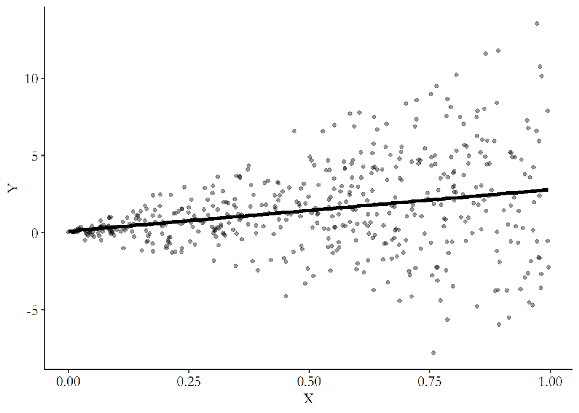

Clustering is just a touch harder. First, we need something to clusterat. This is often some groupidentifier variable like the ones we talked about earlier in this section when discussing how to mimic panel structure. Then, we can create clustered standard errors by creating or randomly generating a single “group effect” that can be shared by the group itself, adding on individual noise.

In other words, generate an individual-level error term, then an individual/time-level error term, and add them together in some fashion to get clustered standard errors. Thankfully, we can reuse a lot of the tricks we learned for creating panel data.

###### R Code R Code e Stata CodeStata CodeStatatatatatatatatatatatatatatatatatatatatata e Python CodePython Codeytyttt ooooooooooo o o oooooo o o o e

library(tidyverse) set.seed(1000)

# N for number of individuals, T for time periods create_clus_data <- function(N = 200, T = 10) {

# We're going to create errors clustered at the # ID level. So we can follow our steps from making panel data panel_data <- crossing(ID = 1:N, t = 1:T) %>%

# Individual/time-varying data mutate(W = runif(n(), 0, .1))

# Now an individual-specific error cluster indiv_data <- tibble(ID = 1:N,

C = rnorm(N))

# Join them panel_data <- panel_data %>%

full_join(indiv_data, by = 'ID') %>% # Create X, caused by W1 and W2

- mutate(X = 2*W + rnorm(n())) %>% # The error term has two components: the individual # cluster C, and the individual-and-time-varying element
- mutate(Y = 3*X + (C + rnorm(n())))

return(panel_data) }

create_clus_data(100,5)

HOW ABOUT OUR ESTIMATOR?No causal-inference simulation is complete without an estimator. Code-wise, we know the drill. Just, uh, run the estimator weʼre interested in on the data weʼve just randomly generated.

Letʼs say weʼve read in our textbook that clustered errors only affect the standard errors of a linear regression, but donʼt bias the estimator. We want to confirm that for ourselves. So we take some data with clustered errors baked into it, and we estimate a linear regression on that data.

The tricky part at this point is often figuring out how to get the estimate you want (a coefficient, usually),outof that regression so you can return it and store it. If what youʼre going afterisa coefficient from a linear regression, you can get the coefficient on the variable varname in R with coef(m)['varname'] for a model m, in Stata with _b[varname] just after running the model, and in Python with m.params['varname'] for a model m.

15

Since this is, again, something weʼll want to call repeatedly, weʼre going to make it its own function, too. A function that, itself, calls the data generating function we just made! Weʼll be making reference to the create_clus_data function we made in the previous section.

###### R Code R Code e Stata CodeStata CodeStatatatatatatatatatatatatatatatatatatatatata e Python CodePython Codeytyttt ooooooooooo o o oooooo o o o e

library(tidyverse) set.seed(1000)

# A function for estimation est_model <- function(N, T) {

# Get our data. This uses create_clus_data from earlier d <- create_clus_data(N, T)

# Run a model that should be unbiased # if clustered errors themselves don't bias us! m <- lm(Y ~ X + W, data = d)

# Get the efficient on X, which SHOULD be true value 3 on average x_coef <- coef(m)['X']

return(x_coef) }

# Run our model est_model(200, 5)

NOW WE MUST ITERATE.We canʼt just run our simulation once - any result we got might be a fluke. Plus, we usually want to know about thedistributionof what our estimator gives us, either to check how spread out it is or to see if its mean is close to the truth. Canʼt get a sampling distribution without multiple samples. How many times should you run your simulation? Thereʼs no hard-and-fast number, but it should be a bunch! You can run just a few iterations when testing out your code to make sure it works, but when you want results you should go for more. As a rule of thumb, the more detail you want in your results, or the more variables there are in your estimation, the more you should run - want to see the bootstrap distribution of a mean? A thousand or so should be more than you need. Want a correlation or linear regression coefficient? A few thousand. Want to precisely estimate a bunch of percentiles of a sampling distribution? Maybe go for a number in thetensof thousands.

Iteration is one thing that computers are super good at. In all three of our code examples, weʼll be using afor loopin slightly different ways. A for loop is a computer-programming way of saying “do the same thing a bunch of times, once for each of these values.”

For example, the (generic-language/pseudocode) for loop:

for i in [1, 4, 5, 10]: print i

would do the same thing (print i) a bunch of times, once for each of the values weʼve listed (1, 4, 5, and 10). First, it would do it with i set to 1, and so print the number 1. Then it would do it with i set to 4, and so print the number 4. Then it would print 5, and finally it would print 10.

In the case of simulation, our for loop would look like:

for i in [1 to 100]: do my simulation

16

where weʼre not using the iteration number i at all, but instead just repeating our simulation, in this case 100 times.

The way this loop ends up working is slightly different in each language. Python has the purest, “most normal” loop, which will look a lot like the generic language. Rcouldalso look like that, but Iʼm going to recommend the use of the purrr package and its map functions, which will save us a step later. For Stata, the loop itself will be pretty normal, but the fact that weʼre creating new

data all the time, plus Stataʼs limitation of only using one data set at a time, is going to require us to clear our data out over and over (plus, it will add a step later).

All of these code examples will refer back to the create_clus_data and est_model functions we defined in earlier code chunks.

###### R Code R Code e Stata CodeStata CodeStatatatatatatatatatatatatatatatatatatatatata e Python CodePython Codeytyttt ooooooooooo o o oooooo o o o e

library(tidyverse) library(purrr) set.seed(1000)

# Estimate our model 1000 times (from 1 to 1000) estimates <- 1:1000 %>%

# Run the est_model function each time map_dbl(function(x) est_model(N = 200, T = 5))

# There are many map functions in purrr. Since est_model outputs a # number (a "double"), we can use map_dbl and get a vector of estimates

NOW FOR A WAY OF STORING THE RESULTS.We already have a function that runs our estimation, which itself calls the function that creates our simulated data. We need a way to store those estimation results.

In both R and Python, our approach to iteration is enough. The map() functions in R, and the standard for-loop structure in Python, give us back a vector of results over all the iterations. So for those languages, weʼre already done. The last code chunk already has the instructions you need.

Stata is a bit trickier given its preference for only having one data set at a time. How can you store the randomly generated data and the result-of-estimation data at once? We can use the preserve/restore trick - store the results in a data set, preserve that data set so Stata

remembers it, then clear everything and run our estimation, save the estimate as a local, restore back to our results data set, and assign that local into data to remember it.

17

Now, I will say, thereisa way around this sort of juggling, and thatʼs to use the simulate command in Stata. With simulate, you specify a single function for creating data and estimating a model, and then pulling all the results back out. help simulate should be all you need to know. I find it a bit less flexible than coding things explicitly and not much less work, so I rarely use it in this book. But you might want to check it out - you may find yourself preferring it.

18

###### Stata CodeStata CodeStatatatatatatatatatatatatatatatatatatatatata e

set seed 1000

- * Our "parent" data set will store our results clear
- * We're going to run 1000 times and so need 1000
- * observations to store data in set obs 1000
- * and a variable to store them in g estimates = .
- * Estimate the model 1000 times forvalues i = 1(1)1000 {
- * preserve to store our parent data preserve quietly est_model 200 5
- * restore to get parent data back restore
- * and save the result in the ith row of data replace estimates = _b[X] in `i'

}

FINALLY, WE EVALUATE.We can now check whatever characteristics of the sampling estimator we want! With our set of results across all the randomly-generated samples in hand, we can, say, look and see whether the mean of the sampling variation is the true effect we decided.

Letʼs check. We know from our data generation function that the true effect of on is 3. Do we get an average near 3 in our simulated analysis? A simple mean() in R, summarize or mean in Stata, or np.mean() in Python, gives us a mean of 3.00047. Pretty close! Seems like our textbook was right: clustered errors alone wonʼt bias an otherwise unbiased estimate.

###### X Y

How about the standard errors? The distribution of estimates across all our random samples should mimic sampling distribution. So, the standard deviation of our results is the standard error of the estimate. sd() in R, summarize in Stata, or np.std() in Python each show a

standard deviation of .045.

So an honest linear regression estimator should give standard errors of .045. Does it? We can use simulation to answer that. We can take the simulation code we already have but swap out the part where we store a coefficient estimate to instead store the standard error. This can be done easily with tidy() from the broom package in R, _se[X] in Stata, or m.bse['X'] in Python, where X is the name of the variable you want the standard errors of. When we simulatethata few hundred times, the mean reported standard error is .044. Just a hair too small. If we instead estimate heteroskedasticity-robust standard errors, we get .044. Not any better! If we treat the standard errors as is most appropriate, given the clustered errors we know we created, and use standard errors clustered at the group level, we get .045. Seems like that worked pretty well!

19

###### 15.3 The Old Man and the C

20

AS I MENTIONED, one of the most powerful things that simulation can do in the context of causal inference is let you know if a given estimatorworksto provide, on average, thetruecausal effect. Bake a true causal effect into your data generating function, then put the estimator youʼre curious about in the estimation function, and let ʼer rip! If the mean of the estimates is near the truth and the distribution isnʼt too wide, youʼre good to go.

This is a fantastic way to test outanynew method or statistical claim youʼre exposed to. We already checked whether OLS still works on average with clustered errors. But we could do plenty more. Can one back door cancel another out if the effects on the treatment have opposite signs? Does matching really perform better than regression when one of the controls has a nonlinear

relationship with the outcome? Does controlling for a colliderrealyadd bias? Make a data set with a back-door path blocked by a collider, and see what happens if you control or donʼt control for it in your estimation function.

21

This makes simulation a great tool for three things: (1) trying out new estimators, (2) comparing different estimators, and (3) seeing what we need to break in order to make an estimator stop working.

We can do all of these things without having to write econometric proofs. Sure, our results wonʼt generalize as well as a proof would, but itʼs a good first step. Plus, it puts the power in our hands!

We can imagine an old man stuck on a desert island somewhere, somehow equipped with a laptop and his favorite statistical software, but without access to textbooks or experts to ask. Maybe his name is Agus. Agus has his own statistical questions - what works? What doesnʼt? Maybe he has a neat idea for a new estimator. He can try things out himself. I suggest you do too. Trying stuff out in simulation is not just a good way to get answers on your own, itʼs also a good way to get to know how data works.

###### 15.3.1 Trying out New Estimators

PROFESSORS TEND TO SHOW YOU THE ESTIMATORS THAT WORK WELL.But that can give the false illusion that these estimators fell from above, all of them working properly. Untrue! Someone had to think them up first, try them out, and prove that they worked.

Thereʼs no reason you canʼt come up with your own estimator and try it out. Sure, it probably wonʼt work. But I bet youʼll learn something.

Letʼs try our own estimator. Or Agusʼ estimator. Agus had a thought: you know how the standard error of a regression gets smaller as the variance of gets bigger? Well… what if we only pick the extreme values of ? That will make the variance of get very big. Maybe weʼll end up with smaller standard errors as a result.

###### X X X

So thatʼs Agusʼ estimator: instead of regressing on as normal, first limit the data to just observations with extreme values of (maybe the top and bottom 20%), and then regress on

Y X

X Y X 22

usingthatdata. We think it might reduce standard errors, although weʼd also want to make sure it doesnʼt introduce bias.

Agus has a lot of ideas like this. He writes them on a palm leaf and then programs them on his old sandy computer to see if they work. For the ones that donʼt work, he takes the palm leaf and floats it gently on the ocean, giving it a push so that it drifts out to the horizon, bidden farewell. Will this estimator join the others at sea?

Letʼs find out by coding it up ourselves. Can you really code up your own estimator? Sure! Just write code that tells the computer to do what your estimator does. And if you donʼt know how to write that code, search the Internet until you do.

Thereʼs a tweak in this code, as well. Weʼre interested in whether the effect is unbiased, but also whether standard errors will be reduced. So we may want to collect both the coefficientandits standard error. There are two things to return. How can we do it? See the code.

###### R Code R Code e Stata CodeStata CodeStatatatatatatatatatatatatatatatatatatatatata e Python CodePython Codeytyttt ooooooooooo o o oooooo o o o e

library(tidyverse); library(purrr); library(broom) set.seed(1000)

# Data creation function. Let's make the function more flexible # so we can choose our own true effect! create_data <- function(N, true) {

d <- tibble(X = rnorm(N)) %>% mutate(Y = true*X + rnorm(n()))

return(d) }

# Estimation function. keep is the portion of data in each tail # to keep. So .2 would keep the bottom and top 20% of X est_model <- function(N, keep, true) {

d <- create_data(N, true)

# Agus' estimator! m <- lm(Y~X, data = d %>%

filter(X <= quantile(X, keep) | X >= quantile(X, (1-keep))))

# Return coefficient and standard error as two elements of a list ret <- tidy(m) return(list('coef' = ret$estimate[2], 'se' = ret$std.error[2]))

}

# Run 1000 simulations. use map_df to stack all the results # together in a data frame results <- 1:1000 %>%

map_df(function(x) est_model(N = 1000,

keep = .2, true = 2))

mean(results$coef); sd(results$coef); mean(results$se)

If we run this, we see an average coefficient of 2.00 (where the truth was 2), a standard deviation of the coefficient of .0332, and a mean standard error of .0339. See, told you the standard deviation of the simulated coefficient matches the standard error of the coefficient!

So the average is 2.00 relative to the truth of also 2. No bias! Pretty good, right? Agus should be celebrating. Of course, weʼre not done yet. We didnʼt just want no bias, we wanted lower standard errors than the regular estimation method. How can we get that?

###### 15.3.2 Comparing Estimators

ONE THING THAT SIMULATION ALLOWS US TO DOiscompare the performanceof different methods. You can take the exact same randomly generated data, apply two different methods to it, and see which performs better. This process is often known as a “horse race.”

The horse race method can be really useful when considering multiple different ways of doing the same thing. For example, in Chapter1414 on matching, I mentioned a bunch of different choices14 that could be made in the matching process that, made one way, would reduce bias, but made another way would improve precision. Allowing a wider caliper brings in more, but worse matches, increasing bias but also making the sampling distribution narrower so youʼre less likely to bewayoff. Thatʼs a tough call to make - lower average bias, or narrower sampling distributions? But it might be easier if it just happens to turn out that the amount of bias reduction you get isnʼt very high at all, but the precision savings are massive! How could you know such a thing? Try a horse race simulation.

23

IN THE CASE OF AGUSʼ ESTIMATOR,we want to know whether it produces lower standard errors than a regular regression. That was the whole idea, right? So letʼs check. These code examples all use the create_data function from the previous set of code chunks.

###### R Code R Code e Stata CodeStata CodeStatatatatatatatatatatatatatatatatatatatatata e Python CodePython Codeytyttt ooooooooooo o o oooooo o o o e

library(tidyverse); library(purrr); library(broom); library(vtable) set.seed(1000)

# Estimation function. keep is the portion of data in each tail # to keep. So .2 would keep the bottom and top 20% of X est_model <- function(N, keep, true) {

d <- create_data(N, true)

# Regular estimator! m1 <- lm(Y~X, data = d)

# Agus' estimator! m2 <- lm(Y~X, data = d %>%

filter(X <= quantile(X, keep) | X >= quantile(X, (1-keep))))

# Return coefficients as a list return(list('coef_reg' = coef(m1)[2], 'coef_agus' = coef(m2)[2]))

}

# Run 1000 simulations. Use map_df to stack all the # results together in a data frame results <- 1:1000 %>%

map_df(function(x) est_model(N = 1000,

keep = .2, true = 2)) sumtable(results)

What do we get? While both estimators get 2.00 on average for the coefficient, the standard errors are actually lower for the regular estimator. The standard deviation of the coefficientʼs distribution across all the simulated samples is .034 for Agus and .031 for the regular estimator. Regular wins! Looks like Agus will set his creation adrift at sea once again.

24

- 15.3.3 Breaking Things

STATISTICAL ANALYSIS IS ABSOLUTELY FULL TO THE BRIM WITH ALL KINDS OF ASSUMPTIONS.Annoying,

really. Hereʼs the thing, though - these assumptions all need to be true for us toknowwhat our estimators are doing. But maybe there are a few assumptions that could be false and weʼdstil have a prety good ideawhat those estimators are doing.

So… how many assumptions can be wrong and weʼll still get away with it? Simulation can help us figure that out.

For example, if we want a linear regression coefficient on to be an unbiased estimate of the causal effect of , we need to assume that is unrelated to the error term. In other words, there are no open back doors.

X X X

In the social sciences, this is rarely going to betrue. Thereʼs alwayssomelittle thing we canʼt measure or control for thatʼs unfortunately related to both and the outcome. So should we never bother with regression?

X

No way! Instead, we should ask “how big a problem is this likely to be?” and if itʼs only a small problem, then hey, close to right is better than far, even if itʼs not all the way there.

SIMULATION CAN BE USED TO PROBE THESE SORTS OF ISSUESby making a very flexible data creation function, flexible enough to try different kinds of assumption violations or degrees of those violations. Then, run your simulation with different settings and see how bad the results come out. If theyʼre pretty close to the truth, even with data that violates an assumption, maybe itʼs not so bad!

25

Perhaps you design your data generation function to have an argument called error_dist. Program it so that if you set error_dist to "normal" you get normally-distributed error terms. "lognormal" and you get log-normally distributed error terms, and so on for all sorts of distributions. Then, you can simulate a linear regression with all different kinds of error distributions and see whether the estimates are still good.

How could we use simulation in application to a remaining open back door? We can program our data generation function to have settings for the strength of that open back door. If we have

on our diagram, whatʼs the effect of on , and whatʼs the effect of on ? How strong do those two arrows need to be to give us an unacceptably high level of bias?

###### X ← W → Y W X W Y

Once we figure out how bad the problem would need to be to give us unacceptably high levels of bias, you can ask yourself how bad the problem is likely to be in your case - if itʼs under that bar, you might be okay (although youʼd certainly still want to talk about the problem - and why you think itʼs okay - in your writeup).

26

27

Letʼs code this up! Weʼre going to simply expand our create_data function to include a variable that has an effect on both our treatment and our outcome variable . Weʼll then include settings for the strength of the and relationships. There are, plenty of other tweaks wecouldadd as well - the strength of , the standard deviations of and , the addition of other controls, nonlinear relationships, the distribution of the error terms, and so on and so on. But letʼs keep it simple for now with our two settings.

W X Y W → X W → Y X → Y X Y

Additionally, weʼre going to take ouriteration/loop step and put that in a function too, since weʼre going to want to do this iteration a bunch of times with different settings.

###### R Code R Code e Stata CodeStata CodeStatatatatatatatatatatatatatatatatatatatatata e Python CodePython Codeytyttt ooooooooooo o o oooooo o o o e

library(tidyverse); library(purrr) set.seed(1000)

# Have settings for strength of W -> X and for W -> Y # These are relative to the standard deviation # of the random components of X and Y, which are 1 each # (rnorm() defaults to a standard deviation of 1) create_data <- function(N, effectWX, effectWY) {

d <- tibble(W = rnorm(N)) %>%

- mutate(X = effectWX*W + rnorm(N)) %>% # True effect is 5
- mutate(Y = 5*X + effectWY*W + rnorm(N))

return(d) }

# Our estimation function est_model <- function(N, effectWX, effectWY) {

d <- create_data(N, effectWX, effectWY)

# Biased estimator - no W control! # But how bad is it? m <- lm(Y~X, data = d)

return(coef(m)['X']) }

# Iteration function! We'll add an option iters for number of iterations iterate <- function(N, effectWX, effectWY, iters) {

results <- 1:iters %>%

map_dbl(function(x) { # Let's add something that lets us keep track # of how much progress we've made. Print every 100th iteration if (x %% 100 == 0) {print(x)}

# Run our model and return the result return(est_model(N, effectWX, effectWY))

})

# We want to know *how biased* it is, so compare to true-effect 5 return(mean(results) - 5)

}

# Now try different settings to see how bias changes! # Here we'll use a small number of iterations (200) to # speed things up, but in general bigger is better

- iterate(2000, 0, 0, 200) # Should be unbiased
- iterate(2000, 0, 1, 200) # Should still be unbiased iterate(2000, 1, 1, 200) # How much bias? iterate(2000, .1, .1, 200) # Now? # Does it make a difference whether the effect # is stronger on X or Y? iterate(2000, .5, .1, 200) iterate(2000, .1, .5, 200)

What can we learn from this simulation? First, as weʼd expect, with either or

effectWX effectWY

set to zero, thereʼs no bias - the mean of the estimate minus the truth of 5 is just about zero. We also see that if and are both 1, the bias is about .5 - half a standard deviation of the error term - and about 50 times bigger than if and

effectWX effectWY

effectWX

are both .1. Does the size of the bias have something to do with the product of and ? Sorta seems that way… itʼs a question you could do more

effectWY effectWX effectWY

simulations about!

###### 15.4 Power Analysis with Simulation

###### 15.4.1 What Is Power Analysis?

STATISTICS IS AN AREA WHERE THE LESSONS OF CHILDRENʼS TELEVISION ARE MORE OR LESS TRUE: IF YOU TRY HARD ENOUGH, ANYTHING IS POSSIBLE.Itʼs also an area where the lessons of violent video games are more or less true: if you want to solve a really tough problem, you need to bring a whole lot of firepower (plus, a faster computer can really help matters).

Power analysisis the process of trying to figure out if the amount of firepower you have is enough. While there are calculators and analytical methods out there for performing power analysis, power analysis is very commonly done by simulation, especially for non-experimental studies.

28

WHY IS IT A GOOD IDEA TO DO POWER ANALYSIS?Once we have our study design down, there are a number of things that can turn statistical analysis into a fairly weak tool and make us less likely to find the truth:

- 1. Really tiny effects are really hard to find - good luck seeing an electron without a super-powered microscope! (in , is tiny)
- 2. Most statistical analyses are about looking at variation. If thereʼs little variation in the data, we wonʼt have much to go on ( is tiny)
- 3. If thereʼs a lot of stuff going on other than the effect weʼre looking for, it will be hard to pull the signal from the noise ( is big)
- 4. If we have really high standards for what counts as evidence, then a lot of good evidence is going to be ignored, so we need more evidence to make up for it (if youʼre insisting on a really tiny )

Y = β1X + ε β1

var(X)

var(ε)

se(β^1)

Conveniently, all of these problems can be solved by increasing our firepower, by which I mean sample size. Power analysis is our way of figuring out exactly how much firepower we need to bring. If itʼs more than weʼre willing to provide, we might want to turn around and go back home.

If you have bad power and canʼt fix it, you might think about doing a different study. The downsides of bad statistical power arenʼt just “we might do the study and not get a significant effect - oh darn.” Bad power also makes it more likely that, if youdofind a statistical effect, itʼs overinflated or not real! Thatʼs because with bad power we basicallyonlyreject the null as a fluke. Think about it this way - if you want to reject the null at the 95% level that a coin flip is 50/50 heads/tails, you need to see an outcome thatʼs less than 5% likely to occur with a fair coin. If you flip six coins (tiny sample, bad power), that can only happen with all-heads or all-tails. Even if the truth is 55% heads so the null really is false, theonlyway we can reject 50% heads is if we estimate 0% heads or 100% heads. Both of those are actually way further from the truth than the 50% we just rejected! This is why, when you read about a study that seems to find an enormous effect of some innocuous thing, it often has a tiny sample size (and doesnʼt replicate).

Power analysis can be a great idea no matter what kind of study youʼre running. However, itʼs especially helpful in three cases:

If youʼre looking for an effect that you think is probably not that central or important to whatʼs going on - itʼs a small effect, or a part of a system where a lot of other stuff is going on (

times is tiny relative to

β1 var(X) var(Y )

) a power analysis can be a great idea - the sample size required to learn something useful about a small effect is often much bigger than you expect, and itʼs good to learn that now rather than after youʼve already done all the work

If youʼre looking forhow an effect varies across groups(in regression, if youʼre mostly concerned with the interaction term), then a power analysis is a good idea. Finding differences between groups in an

effecttakes a lot more firepower to

find than the effect itself, and you want to be sure you have enough

If youʼre doing a randomized experiment, a power analysis is a must - you can actually control the sample size, so you may as well figure out what you need before you commit to way too little!

###### 15.4.2 What Power Analysis Does

POWER ANALYSIS BALANCES FIVE THINGS,like some sort of spinning-plate circus act. Using to represent treatment and for the outcome, those things are:

X Y

- 1. The true effect size (coefficient in a regression, a correlation, etc.)
- 2. The amount of variation in the treatment ( )
- 3. The amount of other variation in (either the variation from the residual after explaining with , or just )
- 4. Statistical precision (the standard error of the estimate or statistical power, i.e., the true-positive rate)
- 5. The sample size

var(X)

Y

Y X var(Y )

A power analysis holds four of these constant and tells you what the fifth can be. So, for example, it might say “if we think the effect is probably A, and thereʼs B variation in , and thereʼs C variation in unrelated to , and you want to have statistical precision of D or better, then youʼll

X Y X

need a sample size of at least E.” This tells us theminimum sample sizenecessary to get sufficient statistical power.

Or we can go in other directions. “If youʼre going to have a sample size of A, and thereʼs B variation in , and thereʼs C variation in unrelated to , and you want to have statistical precision of D or better, then the effect must be at least as large as E.” This tells us theminimum detectable effect, i.e., the smallest effect you can hope to have a chance of reasonably measuring given your sample size.

###### X Y X

You could go for the minimum acceptableanyone of the five elements. However, minimum sample size and minimum detectable effect are the most common ones people go for, followed closely by the level of statistical precision.

HOW ABOUT THAT “STATISTICAL PRECISION” THING?What do I mean by that, specifically? Usually, statistical precision in power analysis is measured by a target level of statistical power (thus the name “power analysis”). Statistical power, also known as the true-positive rate, is a concept specific to hypothesis testing. Consider a case where we know the null hypothesis is false. If we had an infinitely-sized sample, weʼd definitely reject that false null. However, we donʼt have an infinite sample. So, due to sampling variation, weʼll correctly reject the null sometimes, and falsely fail to reject it other times. The proportion of times we correctly reject the false null is the true-positive rate, also known asstatistical power. If we reject a false null 73% of the time, thatʼs the same as saying we have 73% power to reject that null.

29

Statistical power is dependent on the kind of test youʼre running, too - if you are doing a hypothesis test at the 95% confidence level, youʼre more likely to reject the null (and thus will have higher statistical power) than if youʼre doing a hypothesis test at the 99% confidence level. The more careful you are about false positives, the more likely you are to get a false negative. So thereʼs a tradeoff there.

Power analyses donʼt have to be run with statistical power in mind. In fact, you donʼt necessarily need to think about things in terms of “the ability to reject the null,” which is what statistical power is all about. You could run your power analysis with any sort of statistical precision as a goal, like standard errors. Given A, B, and C, what sample size D do you need to make your standard errors E or smaller?

###### 15.4.3 Where Do Those Numbers Come From?

IN ORDER TO DO POWER ANALYSIS,you need to be able to fill in the values for four of those five pieces, so that power analysis can tell you the fifth one. How do we know those things?

We have to make an informed guess. We can use previous research to try to get a sense of how big the effect is likely to be, or how much variation thereʼs likely to be in X. If thereʼs no prior research, do what you can - think about what is likely to be true, make educated guesses. Power analysis at a certain level requires some guesswork.

Other pieces arenʼt about guesses but about standards. How much statistical power do you want? The higher your statistical power, the less chance there is of missing a true effect. But that means your sample size needs to go up a lot. Often people use a rule of thumb here. In the past, a goal of 80% statistical power has been standard. These days I see 90% a lot more often.

In practical terms, power analysis isnʼt a super-precise calculation; itʼs guidance. It doesnʼt need to be exact. A little guesswork (although ideally as little as possible) is necessary. After all, even getting the minimum sample size necessary doesnʼt guarantee your analysis is good, it just gives you a pretty good chance of finding a result if itʼs there. Often, people take the results of their power analysis as a baseline and then make sure to overshoot the mark, under the assumption theyʼve been too conservative. So donʼt worry about being fully accurate, just try to make the numbers in the analysis close enough to be useful.

###### 15.4.4 Coding a Power Analysis Simulation

MOST OF THE PIECESfor doing a power analysis simulation we already have in place from the rest of the chapter. The “Breaking Things” section is the most informative, since many power analysis simulations will want to try things while changing quite a few settings.

Letʼs consider three components weʼve already gone over:

Data creation. We need a data creation function thatmimics what we think the actual data generating process looks like.Thatʼs right, itʼs back to drawing out the causal diagram of our research setting! You already did this, right?

You can simplify a bit - maybe instead of sixteen variables you plan to measure and control for, and eight you donʼt, you can combine them all into “controls” and “unmeasured variables.” But overall you should be thinking about how to create data as much like the real world as possible. Youʼll also want to try to match things like how much variation there is - how much variation in treatment do you expect there to be? How much variation in the outcome? In the other variables? You wonʼt get it exactly, but get as close as you can, even if itʼs only an educated guess.

30

Estimation and storing the results. Once we have our data, we need to perform the analysis we plan to perform. This works the exact same way it did before - just perform the analysis you plan to perform in your study, but using the simulated data!

The only twist comes if you are planning to use statistical power as your measure of statistical precision. How can we pull statistical power out of our analysis?

Remember, statistical power is the proportion of results that are statistically significant (assuming the null is false, which we know it is as long as our data creation process has a nonzero effect). So in each iteration of the simulation, we need to pull outa binary variable indicating whether the effect was statisticaly significantand return that. Then, the proportion of results thataresignificant across all the simulations is your statistical power. 45% of iterations had a significant effect (and your null was false)? 45% statistical power!

Getting out whether an effect was significant is a touch harder than pulling out the coefficient or standard error. In R, for a model m you can load the broom package and do d <- tidy(m). Then, d$p.value[2] < .05 will be TRUE if the p-value is below .05 (for a 95% significance test). The [2] there assumes your coefficient of interest is the second one (take a look at the tidy() output for one of the iterations to find the right spot for your coefficient).

In Stata, youʼll need to dip a bit into the Mata matrix algebra underlying many of Stataʼs commands. Donʼt worry - it wonʼt bite. Following a regression, pull out the matrix of results with

matrix R = r(table). Then, get the p-value out with matrix p = R["pvalue","X"]. Then, you can put that p-value where you want by referring to it with p[1,1].

In Python, mercifully, things are finally easy. For a model m from statsmodels, we can get the pvalue for the coefficient on with m.pvalues['X']. Compare that to, say, .05 for a significance test. m.pvalues['X'] < .05 is True if the coefficient is significant at the 95% level, and False otherwise.

###### X

Iteration. Running the simulation over multiple iterations works the same as it normally would! No changes there.

31

However, we might want to addanotheriteration surrounding that one! Say, for example, we want to know the minimum detectable effect that gives 90% power. How can we find it? Well, we might try a bunch of different effect sizes, increasing them a little at a time until we find one that produces 90% power. “Trying a bunch of different effect sizes” is a job for a loop.

Similarly, if we want to find the minimum necessary sample size to get 90% power, weʼd try a bunch of different sample sizes until power reached 90%.

SO LETʼS DO THE THING.I mentioned earlier that one case where thereʼs poor power is where we want to know thedifference in the effect between two groups,in other words the coefficient on an interaction term in a regression (where one of the terms being interacted is binary).

Letʼs see how bad the power actually is! Letʼs imagine that we want to know the effect of a reading-training program on childrenʼs reading test scores. Also, weʼre interested in whether the effect differs by gender.

In the study we plan to do, we know that the test score is explicitly designed to be normally distributed (many tests are designed with this in mind) with a standard deviation of 10.

32

Other stuff matters for test scores too - letʼs pack a bunch of stuff together into a single variable weʼll include as a control - a one-standard-deviation change in this control increases test scores by 4.

###### W

The reading-training program, in truth, increases test scores by 2 for boys and 2.8 for girls. Thatʼs a pretty big difference - the program is 40% more effective for girls! The training program is administered in a nonrandom way, with higher values making it less likely you get the training.

###### W

We can estimate the difference in the effect of training between boys and girls with a regression

TestScore = β0 + β1Training + β2Girl+ β3Training × Girl + β4W + ε (15.1)

where we will focus on .

β^3

We want to know the minimum sample size necessary to get 90% power to detect the difference in the effect between boys and girls. Then, letʼs imagine we donʼt know the true difference in effects, butdoknow that there are only 2,000 children available to sample, and ask what the smallest possible difference in effects is that we could detect with 90% power with that sample of

- 2,000. Letʼs code!

###### R Code R Code e Stata CodeStata CodeStatatatatatatatatatatatatatatatatatatatatata e Python CodePython Codeytyttt ooooooooooo o o oooooo o o o e

library(tidyverse); library(purrr); library(broom) set.seed(1000)

# Follow the description in the text for data creation. Since we want # to get minimum sample size and minimum detectable effect, allow both # sample size and effect to vary. # diff is the difference in effects between boys and girls create_data <- function(N, effect, diff) {

d <- tibble(W = rnorm(N), girl = sample(0:1, N, replace = TRUE)) %>% # A one-SD change in W makes treatment 10% less likely mutate(Training = runif(N) + .1*W < .5) %>% mutate(Test = effect*Training + diff*girl*Training +

4*W + rnorm(N, sd = 9))

return(d) }

# Our estimation function est_model <- function(N, effect, diff) {

d <- create_data(N, effect, diff)

# Our model m <- lm(Test~girl*Training + W, data = d) tidied <- tidy(m)

# By looking we can spot that the interaction # term is in the 5th row sig <- tidied$p.value[5] < .05

return(sig) }

# Iteration function! iterate <- function(N, effect, diff, iters) {

results <- 1:iters %>% map_dbl(function(x) {

# To keep track of progress if (x %% 100 == 0) {print(x)}

# Run our model and return the result

return(est_model(N, effect, diff)) })

# We want to know statistical power, # i.e., the proportion of significant results return(mean(results))

}

# Let's find the minimum sample size mss <- tibble(N = c(10000, 15000, 20000, 25000)) mss$power <- c(10000, 15000, 20000, 25000) %>%

# Before we had to do function(x) here, but now the argument we're # passing is the first argument of iterate() so we don't need it map_dbl(iterate, effect = 2, diff = .8, iter = 500)

# Look for the first N with power above 90% mss

# Now for the minimum detectable effect mde <- tibble(effect = c(.8, 1.6, 2.4, 3.2)) mde$power <- c(.8, 1.6, 2.4, 3.2) %>%

map_dbl(function(x) iterate(N = 2000, effect = 2,

diff = x, iter = 500)) # Look for the first effect wth power above 90% mde

What do we get from these analyses? From the minimum-sample-size power analysis we get Table15.111111115.1. In that table, we see that we find 88.2% power with a sample size of 20,000, and 93.8%111115.1.1.1.1.1111111 power with a sample size of 25,000. So our sweet spot of 90% power must be somewhere between them. We could try increasing the number of iterations, or trying different s between 20,000 and 25,000 to get a more precise answer, but “a little more than 20,000 observations is necessary to get 90% power on that interaction term” is pretty good information as is.

###### N

33

###### Table 15.1: Results of Minimum Sample Size Power Analysis Simulation

N Power 10,000 0.602 15,000 0.788

N Power 20,000 0.882 25,000 0.938

Wait, uh, twentythousand?For thatmassiveinteraction term (how often do you think a treatment intended to apply to everyone is really 40% more effective for one group than another)? Yep! “40% more effective” isnʼt as important as “.8 relative to the standard deviation of 10 for .”

Test

Itʼs no surprise that if we have only 2,000 observations, weʼre nowhere near 90% power for the true interaction effect of .8. But whatʼs the minimum detectable effect wecandetect with our sample size of 2,000? The results are in Table15.215.2.15.2....

Table 15.2: Results of Minimum Detectable Effect Power Analysis Simulation

Effect Power

- 0.8 0.164
- 1.6 0.528
- 2.4 0.838
- 3.2 0.976

In Table15.215.2 we reach 90% power with an effect somewhere between 2.4 and 3.2. Again, we15.2.... could try with more iterations and more effect sizes between 2.4 and 3.2 to get more precise, but this gives us a ballpark.

If we only have 2,000 observations to work with, weʼd need the effect for girls to be something like 220% of the effect for boys (or 40% of the effect but with an opposite sign) to be able to detect gender differences in the effect with 90% power. Do we think thatʼs a reasonable assumption to make? If not, maybe we shouldnʼt estimate gender differences in the effect for this study, even if we really want to. Thatʼs what power analysis is good at - knowing when a fight is lost and you should really go home.

34

- 15.5 Simulation with Existing Data: The Bootstrap

SERIOUSLY, THE THIRD CHAPTER IN A ROW WHERE IʼM TALKING ABOUT THE BOOTSTRAP?Well, deal with it. The bootstrap is basically magic. Donʼt you want magic in your life?

35

Bootstrappingis the process of repeating an analysis many times afterresampling with replacement.Resampling with replacement means that, if you start with a data set with

###### N N

observations, you create a new simulated data set by picking random observations from that data set… but each time you draw an observation, you put it back so you might draw it again. If your original data set was 1, 2, 3, 4, then a bootstrap data set might be 3, 1, 1, 4, and another one might be 2, 4, 1, 4. Alternately, you could create random sample weights from 0 to 1 instead of making each observation a stark in/out decision, although we wonʼt code this up ourselves here (⊕Rubin 1981).

The resampling process mimics the sampling distribution in the actual data. On average, the means of the variables will match your means, as will the variances, the correlations between the variables, and so on. In this way, we canrun a simulation using actualy-existing data. The resampling-with-replacement process replaces the create_data function in our simulation. One of the toughest parts of doing a simulation is figuring out how to create data that looks like the real world. If we can just use real-world data, thatʼs miles better.

THE ONLY DOWNSIDE IS THAT,unlike with a simulation where you create the data yourself,you donʼt know the true data generating process.So you canʼt use bootstrapping to, say, check for bias in your estimate. You can see what your bootstrap-simulated estimate is, but you donʼt know the truth to compare it to (since you didnʼt create the data yourself), so you canʼt check whether youʼre right on average.

This means that the bootstrap, as a simulation tool, is limited to cases where the question doesnʼt rely on comparing your results to the truth. Usually this means using the bootstrap to estimate standard errors, since by mimicking the whole resampling process, you automatically simulate the strange interdependencies between the variables, allowing any oddities in thetrue sampling distribution to creep into your bootstrap-simulated sampling distribution.

Standard errors arenʼt all itʼs good for, though! Machine learning people use bootstrapping for all sorts of stuff, including using it to generate lots of training data sets for their models. You can also use a bootstrap to look at the variation of your model more generally. For example, if you make a

bootstrap sample, estimate a model, generate predicted values from that model, and then repeat, you can see how yourpredictions for each observationvary based on the sampling variation of the whole model, or just aggregate all the simulated predictions together to get your actual prediction.

36,37

HOW CAN YOU DO A BOOTSTRAP?Borrowing from Chapter1313:13

- 1. Start with a data set with observations.
- 2. Randomly sample observations from that data set, allowing the same observation to be drawn more than once. This is a “bootstrap sample”.
- 3. Estimate our statistic of interest using the bootstrap sample.
- 4. Repeat steps 1-3 a whole bunch of times.
- 5. Look at the distribution of estimates from across all the times we repeated steps 1-3. The standard deviation of that distribution is the standard error of the estimate. The 2.5th and 97.5th percentiles show the 95% confidence interval, and so on.

N

N

38

How many times is “a bunch of times” in step 4? It varies. When youʼre just testing out code, you can do it a few hundred times to make sure things work, but you wouldnʼt trust those actual results. Really, you should do it as many times as you feasibly can given the computing power available to you. Be prepared to wait! For anything serious, you probably want to do it at least a few thousand times.

Bootstrapping comes with its own set of assumptions to provide good estimates of the standard error. We need a reasonably large sample size. We need to be sure that our data is at least

reasonably well behaved - if the variables follow extremely highly skewed distributions, bootstrap will have a hard time with that. We also need to be careful in accounting for how the observations might be related to each other. For example, if there are individuals observed multiple times (panel data), we may want a “cluster bootstrap” that samplesindividualswith replacement, rather than observations (getting the 2005 and 2007 observations for you, and the 2005 observation for me twice, might not make sense). Or if the error terms are correlated with each other - clustered, or autocorrelated - the bootstrapʼs resampling approach needs to be very careful to deal with it.

###### 15.5.1 Coding a Bootstrap

IN THE INTEREST OF NOT REPEATING MYSELF TOO MUCH,this section will be short. There are already coding examples for using built-in bootstrap standard error tools in Chapter1313 on Regression,13 and for inverse probability weighting with regression adjustment in Chapter1414 on Matching.14

Whatʼs left to do? In this section, Iʼll show you how to do two things:

- 1. A generic demonstration of how to perform a bootstrap “by hand.” The example will provide bootstrap standard errors. For R and Stata, bootstrap standard errors are easier done by the built-in methods available for most models, but the code here gives you a better sense of whatʼs happening under the hood, can be easily manipulated to do something besides standard errors, which those built-in methods canʼt help with, and can work with commands that donʼt have built-in bootstrap standard error methods.

###### 2. After this short refresher, Iʼll go into alittle more about some variants ofthe bootstrap

LETʼS DO A BOOTSTRAP BY HAND!The process here is super simple. We just copy all the stuff we have already been doing with our simulation code. Then, we replace the create_data function, which created our simulated data, with a function that resamples the data with replacement.

Or, we can save ourselves a little work and skip making the bootstrap process its own function usually it only takes one line anyway. If we have observations, just create a vector thatʼs long, where each element is a random integer from 1 to (or 0 to in Python). Then use that vector to pick which observations to retain. In R and Python, this is simply:

###### N N N N − 1

###### R Code R Code e Python CodePython Codeytyttt ooooooooooo o o oooooo o o o e

library(tidyverse)

# Get our data set data(mtcars)

# Resampling function create_boot <- function(d) {

d <- d %>%

slice_sample(n = nrow(d), replace = TRUE) return(d)

# Or more "by-hand" # index <- sample(1:nrow(d), nrow(d), replace = TRUE) # d <- d[index,]

}

# Get a bootstrap sample create_boot(mtcars)

Easy! You can slot that right into your simulations as normal.

However, when it comes to bootstrapping “by hand” we might want to take a half-measure doing the estimation method, and returning the appropriate estimate, by hand, but letting a function do the bootstrap sampling and iteration work. All three languages have built-in bootstrap-running commands. We already saw Stataʼs in Chapter1414.14

For all of these, we need to specify an estimation functionfirst. Unlike in our previous code examples, that estimation function wonʼt call a data-creation function to get data to estimate with. Instead, weʼll call that estimation functionwith our bootstrapping function, which will provide a bootstrapped sample to be estimated, take the estimates provided, and aggregate them all together.

###### R Code R Code e Stata CodeStata CodeStatatatatatatatatatatatatatatatatatatatatata e Python CodePython Codeytyttt ooooooooooo o o oooooo o o o e

library(tidyverse); library(boot) set.seed(1000)

# Get our data set data(mtcars)

# Our estimation function. The first argument must be the data # and the second the indices defining the bootstrap sample est_model <- function(d, index) {

# Run our model # Use index to pick the bootstrap sample m <- lm(hp ~ mpg + wt, data = d[index,])

# Return the estimate(s) we want to bootstrap return(c(coef(m)['mpg'],

coef(m)['wt'])) }

# Now the bootstrap call! results <- boot(mtcars, # data

est_model, # Estimation function,

1000) # Number of bootstrap simulations

# See the coefficient estimates and their bootstrap standard errors results

NOT TOO BAD!Okay, not actually easier so far than doing it by hand, but thereʼs a real benefit here, in that these purpose-built bootstrap commands often come with options that let you bootstrap in ways that are a bit more complex than simply sampling each observation with replacement. Or they can provide ways of analyzing the distribution of outputs in slightly more sophisticated ways than just taking the mean and standard deviation.

One of the nicest benefits you get from these commands is the opportunity to do somebias

correction. Here bias doesnʼt refer to failing to identify our effect of interest, but rather how the shape of the data can bias our statistical estimates. Remember how I mentioned that bootstrap methods can be sort of sensitive to skewed data? Skewed data will lead to skewed sampling

distributions, which will affect how you get an estimate and standard error from that sampling distribution.

But there are ways to correct this bias, the most common of which is “BCa confidence intervals.” This method looks at the proportion of times that a bootstrap estimate islowerthan the nonbootstrapped estimate (if the distribution isnʼt skewed, this should be 50%), and the skew of the distribution. Then, the BCa confidence intervals you get account for the skewing of the bootstrap sampling distribution. You can then use these confidence intervals for hypothesis testing.

39

40

In R, you can pass your results from boot to boot.ci(type = 'bca') to get the BCa confidence intervals. In Stata, add the bca option to your bootstrap command, and then once itʼs done do estat bootstrap, bca (although in my experience this process is a bit finicky). In Python, import and run confidence_interval instead of bootstrap from resample.bootstrap.

###### 15.5.2 Bootstrap Variants

LIKE JUST ABOUT EVERY STATISTICAL METHOD, THE BOOTSTRAP STUBBORNLY REFUSES TO JUST BE ONE THING,and instead there are a jillion variations on it. The fact that Iʼve been referring to the thing Iʼve been showing you as “thebootstrap” instead of more precisely as “pairs bootstrap” has almost certainly angeredsomeone. Iʼm not entirely sure who, though.

41

One classic alternative is the Bayesian bootstrap, which is pretty straightforward (⊕Rubin 1981). Resampling with replacement is just like assigning sample weights to your data (see1313, where all13 the weights are integers representing the number of times you sampled that observation. But why limit yourself to integers? Instead of resampling, you could instead draw continuous sample weights from the Dirichlet distribution (rdirichlet() from extraDistr or a few other packages in R or np.random.default_rng.dirichlet() in Python), setting the parameter to 4 (⊕Shao and Tu 2012). The rest is the same. The result is usually faster to run, and is a little less noisy from iteration to iteration, because the continuous weights are not quite as jarring as the stark in/out decision of the standard bootstrap. You also run into fewer issues where, for example,

42 α

your model can no longer be estimated because you happened to drop just the wrong set of observations. Perhaps one day it will be more popular than the standard bootstrap, although that day is not today.

Thatʼs just one. There are far more variants of the bootstrap than Iʼll go into here, but I will introduce a few more, specifically the ones that focus onnon-independent data. Remember when I said that the bootstrap only works if the observations are unrelated to each other? Itʼs true! Or at least itʼs true for the basic version. But what if we have heteroskedasticity? Or autocorrelation? Or if our observations are clustered together? Itʼs not the case that the bootstrap canʼt work, but itisthe case that our bootstrapping procedure has to account for the relationship between the observations.

THE CLUSTER/BLOCK BOOTSTRAP SEEMS LIKE A GOOD PLACE TO START,since Iʼve already talked about it a bit. The cluster bootstrap is just like the regular bootstrap, except instead of resampling individual observations, you instead resampleclustersof observations, also known asblocks. Thatʼs the only difference!

Youʼd want to think about using a cluster bootstrap any time you havehierarchicalorpanel data. Hierarchical data is when observations are nested within groups. For example, you might have data from student test scores. Those students are within classrooms, which are within schools, which are within regions, which are within countries.

43

Depending on the analysis youʼre doing, that might not necessitate a cluster bootstrap (after all, all data is hierarchical insomeway). But if the hierarchical structure is built into your model - say, you are incorporating classroom-level characteristics into your model, then an individualobservation bootstrap might not make much sense.

Not all hierarchical data sets call for a cluster bootstrap, but when it comes to panel data, itʼs often what you want. In panel data we observe the same individual (person, firm, etc.) multiple times. Weʼll talk about this a lot more in Chapter1616. When this happens, it doesnʼt make too16 much sense to resample individual observations, since that would sort of split each person in two and resample only part of them. So weʼd want to sampleindividuals, and all of the observations we have for that individual, rather than each observation separately.

44

Another place where the cluster/block bootstrap pops up is in the context of time series data. In time series data, the same value is measured across many time periods. This often means there is autocorrelation. When data is correlated across time, if you just resample randomly youʼll break those correlation structures. Also, if your model includes lagged values, youʼre in trouble if you happen not to resample the value just before yours!

So, when applying a bootstrap to time series data, the time series is first divided into blocks of continuous time. The blocks themselves are often determined by one of several different available optimal-block-length algorithms (⊕Politis and White 2004). If you have daily stock index prices from 2000 through 2010, maybe each month ends up its own block. Or every six weeks is a new block, or every year, or something, or maybe some blocks are longer than others. The important thing is thatwithineach block you have a continuous time series. Then, you resample the blocks instead of individual observations.

45

THE CLUSTER/BLOCK BOOTSTRAP CAN BE IMPLEMENTEDin Stata by just adding acluster()option onto your regular bootstrap command. In R, you can use the cluster option in the vcovBS() function in the sandwich package if what you want is bootstrap standard errors on a regression model (pass the vcovBS() result to the vcov argument in your modelsummary table). There doesnʼt appear to be a more general implementation in R or Python that works with any function like bootstrap does. There doesnʼt appear to be any cluster bootstrap implementation at all in Python, but several varieties of block bootstrap are in arch.bootstrap in the arch package, and there is a wild cluster bootstrap implementation available (later in the chapter).

Thankfully, the cluster bootstrap is not too hard to do by hand in R and Python. Just (1) create a data set that contains only the list of ID values identifying individuals, (2) do a regular bootstrap resampling onthatdata set, and (3) use a merge to merge that bootstrapped data back to your regular data, using a form of merge that only keeps matches (inner_join() in R, or d.join(how = 'inner') in Python). This will copy each individual the appropriate number of times. This same methodcouldalso be used to do a block bootstrap, but only if youʼre willing to define the blocks yourself instead of having an algorithm do it (probably better than you can).

###### R Code R Code e Python CodePython Codeytyttt ooooooooooo o o oooooo o o o e

library(tidyverse) set.seed(1000)

# Example data d <- tibble(ID = c(1,1,2,2,3,3), X = 1:6) # Now, get our data set just of IDs IDs <- tibble(ID = unique(d$ID))

# Our bootstrap resampling function create_boot <- function(d, IDs) {

# Resample our ID data bs_ID <- IDs %>%

sample_n(size = n(), replace = TRUE)

# And our full data bs_d <- d %>%

inner_join(bs_ID, by = 'ID',

relationship = 'many-to-many') return(bs_d)

}

# Create a cluster bootstrap data set create_boot(d, IDs)

###### ANOTHER POPULAR TYPE OF BOOTSTRAP ACTUALLY WORKS IN A VERY DIFFERENT WAY.Inresidual resampling, instead of resamplingwhole observations, you instead resample theresiduals. Huh?

Under residual resampling, you follow these steps:

- 1. Perform your analysis using the original data.
- 2. Use your analysis to get a predicted outcome value , and also the residual , which is the difference

###### Y^ r^

between the actual outcome and the predicted outcome, .

r^ = Y − Y^

- 3. Perform bootstrap resampling to get resampled residuals .
- 4. Create a new outcome variable by adding the residual to the actual outcome, .
- 5. Estimate the model as normal using

.

- 6. Store whatever result you want, and iterate steps 3-5.

rb

Yb = Y + rb

Yb

The idea here is thatthe predictors in your model never changewith this process. So whatever kind of interdependence they have, you get to keep that! A downside of residual resampling is that it doesnʼt perform well if the errors arein any wayrelated to the predictors—this is a stronger assumption than even the OLS assumption that errors are onaverageunrelated to predictors.

Another popular form of the bootstrap in this vein, which both has a very cool name and gets around the unrelated-error assumption, is thewild bootstrap. The wild bootstrap is popular because it works under heteroskedasticity - even when we donʼt know the exact form the heteroskedasticity takes. It also performs well when the data is clustered. We already have the cluster/block bootstrap for that. However, the cluster bootstrap doesnʼt work very well if the clusters are of very different sizes. If your classroom has 100 kids in it, but mine has five, then resampling classrooms can get weird real fast. The cluster-based version of the wild bootstrap works better in these scenarios. The cluster-based version of the wild bootstrap also works much better than regular sandwich-based clustered standard errors when there are asmal numberof clusters, where “small” could even be as large as 50.

46

Without getting too into the weeds, letʼs talk about what the wild bootstrap is. For a wild bootstrap, you follow the general outline of residual resampling. Except youdonʼt resample the residual.You keep each residual lined up with its original observation each time you create the bootstrap data.

Instead of resampling the residuals, you first transform them according to a transformation function, and then multiply them by a random value with mean 0 (plus some other conditions). Thatʼs it! You take your random value for each observation, multiply by the transformed residual, use that to get your new outcome value . Estimate the model with that, then iterate.

47

###### Yb

Do note that there are quite a few options for which transformation function and which random distribution to draw from. Different choices seem to perform better in different scenarios, so I canʼt give any blanket recommendations. If you want to use a wild bootstrap, you might want to do a little digging about how it applies to your particular type of data. If youdowant to get into the weeds, I can recommend a nice introduction by Martin (⊕2017).

It seems incomprehensible as towhythe wild bootstrap actually works. But the short of it is that the random value you multiply the residual by does manage to mimic the sampling distribution. Plus, it does so in a way that respects the original model, making things a bit more cohesive for the coefficients youʼre trying to form sampling distributions for.

Wild bootstrap standard errors can be implemented in R using the type argument of vcovBS() in the sandwich package, or there are some faster options in the fwildclusterboot package. There are different options for type depending on the kind of distribution you want to use to generate your random multipliers, although the default 'wild' option uses the Rademacher distribution, which is simply -1 or 1 with equal probability. In Python there is the wildboottest package with a few different variants of wild cluster bootstraps available.

Previous Next

Page built: 2025-10-17 using R version 4.5.0 (2025-04-11 ucrt)

# The Effect

Nick Huntington-Klein

▾ Chapters

###### Chapter 16 - Fixed Effects

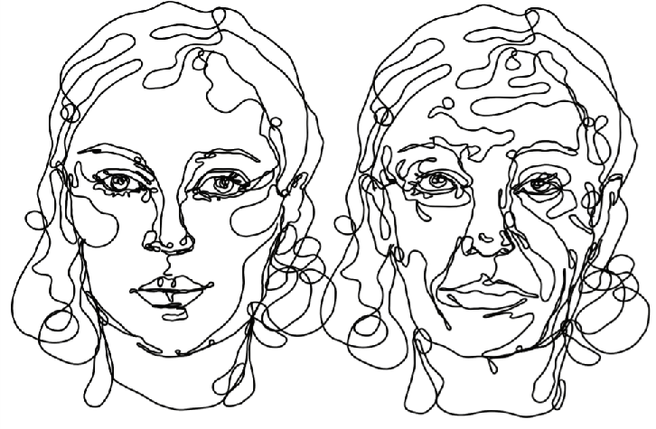

###### 16.1 How Does It Work?

###### 16.1.1 Controlling for Unobserved Confounders

A LOT OF THIS BOOKhas discussed ways to identify the answer to your research question by controlingfor variables. If we have the diagram, then we can figure out what we need to control for, and control for it, perhaps by following the methods in Chapters1313 or13 1414.14

There are two big problems we keep running into, though. First, what if we canʼt figure out the correct causal diagram that will tell us what to control for? And second, what if we canʼt measure

all the variables we need to control for? In either of those cases, we canʼt identify our answer by controlling for stuff.

Or can we?

Fixed effectsis a method of controlling foralvariables, whether theyʼre observed or not,as long

- as they stay constant within some larger category.How can we do that? Simple! We just control for the larger category, and in doing so we control for everything that is constant within that category.

1,2

What does it mean for a variable to be “constant within some larger category”? For example, letʼs say weʼre looking at the effect of rural towns getting electricity on their productivity. An obvious back door is geography. Rural towns up in the mountainous hillside will be more difficult to electrify, and also they might be different in their productivity for other reasons.

However, geography doesnʼt change a whole lot. If you observe the same town multiple times, itʼs likely to have the same geography every single time. So what if, observing the same town in many different years, we control for town? If we do that, weʼll be removing any variation explained by town. And since thereʼs no variation in geography that isnʼt explained by town, after we control for town weʼll have controlled for geography - there will be no variation in geography left!

3

NOW IN THIS CASE,we probably could have measured and controlled for geography, no big deal. But what about the stuff we canʼt control for?

To give one prominent example, there are lots of social science contexts where weʼd want to control for “personʼs background,” but thatʼs a high-dimensional thing with lots of aspects we canʼt possibly measure. Itʼs unobserved. But add fixed effects for individual person? Boom! Itʼs controlled for.

4

FIXED EFFECTS CAN BE THOUGHT OFas taking a whole long list of variables on back doors that are constant within some category and collapsing them to just be that category. Then, controlling for that category.

To give an example, letʼs say weʼre interested in the effect of a visit from the German chancellor on a countryʼs level of trade with Germany, as depicted in Figure16.111111116.1.111116.1.1.1.1.1111111

- Figure 16.1: Causes of Trade with Germany
- Figure 16.2: Simplified Causes of Trade with Germany

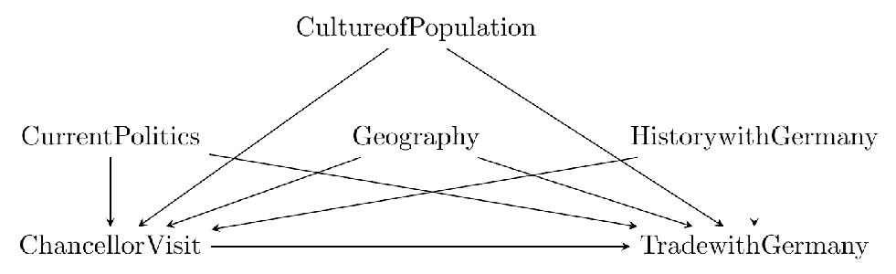

In the diagram, there are quite a few causes of trade with Germany, many of which would be difficult to keep track of or even measure. However, we can also note that several of these variables - the countryʼs geography, the culture of the population, and the history that country has with Germany - are constant within country or at least (like the culture of the population) are not likely to change much within the span of any data we have.^[“The span of any data you have” is relevant! The longer a time frame your data covers, the more likely it is that some sorta-fixed variable, like geography, is not actually fixed. For example, the geographic borders of Germany have been constant for a long time, but theydidvary quite a bit in the 1930s and 1940s. When considering whether a variable is constant over time, itʼs really more important to consider whether itʼs constant overthe time span your data covers.} So we can redraw the diagram as in Figure16.216.2.16.2....

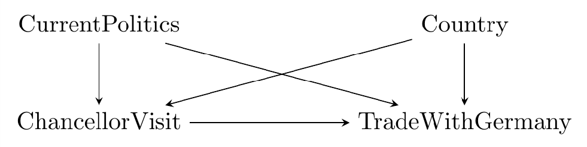

Now, with our simplified figure, we can identify the effect without needing to control for each of the variables in Figure16.111111116.1. We can just control for country instead.111116.1.1.1.1.1111111

5

Keep in mind that we havenʼt collapsed everything into country. Anything likely to change regularly over time, like the current politics of a country, wonʼt be addressed by fixed effects. So if we wanted to identify this effect, weʼd still need to control for CurrentPolitics in addition to fixed effects for country.

###### 16.1.2 The Variation Within

FIXED EFFECTS, IN ESSENCE, controls for individual, whether “individual” in your context means “person,” “company,” “school,” or “country,” and so on.

6

What this means is that it gets rid of any variationbetweenindividuals. We know that because thatʼs what it means to control for individual. Weʼre taking all the variation in our data explained by individual (i.e., all the variation between individuals) and getting rid of it.

Whatʼs left is variationwithinindividual. What is variation within individual? For example, letʼs say youʼre a fairly tall person and weʼre tracking your height over time. The fact that youʼre taller than other people isbetweenvariation. Comparing you to someone else, youʼre generally taller. However, we also can observe that, as you grew up from a child to an adult, your height changed over time. Comparing you to your shorter, younger self iswithinvariation. Something changed withinindividual and thatʼs what weʼre picking up.

The idea of fixed effects is that by sweeping away all that variation between individuals, weʼve controlled for any variables that are fixed over time. For example, no matter where I move in life, I will always have been born in the same city. The same goes for everybody else. So all the variation in “city of birth” isbetweenvariation. If we get rid of all between variation, weʼve gotten rid of all variation in city of birth, thus controlling for it.

7 8

One thing to note about this is that we really have gotten rid of that between variation. So if between variation is what weʼre interested in - say, wewantto know the effect of city of birth - we canʼt do that with fixed effects.

9

LETʼS WALK THROUGHtwo technical examples of this, one with tables and one with graphs. Letʼs say weʼre interested in the effect of exercise on the number of times a year you get a cold. For subjects in our study, we have you and me. We also suspect there are some variables like “genetics” that are fixed over time that we can adjust for with fixed effects. Letʼs start by looking

- at the data we have on exercise.

- Table 16.1: Exercise and Colds
- Table 16.2: Exercise with Within Variation

Individual Year Exercise

- You 2019 5
- You 2020 7 Me 2019 4 Me 2020 3

###### Table16.111111116.1 shows our raw data, with exercise measured in hours per week. To get our within and111116.1.1.1.1.1111111 between variation, weʼll need to get the within-individual means, shown in Table16.216.2.16.2....

Individual Year Exercise MeanExercise WithinExercise

- You 2019 5 6.0 -1.0
- You 2020 7 6.0 1.0

- Me 2019 4 3.5 0.5
- Me 2020 3 3.5 -0.5

Table16.216.2 shows how we can take the mean of exercise for each individual, and then subtract out16.2.... that mean. Thedifference between individuals in the meansis thebetween variation. So the between variation for exercise comes from comparing your average 6 hours per week against my

- 3.5 hours per week.

If we subtract out those individual means, weʼre left with the way in which we vary from time period to time period relative to our own averages. This is the within variation, looking at how things vary within individual. So my within variation in exercise compares the fact that in 2019 I exercised half an hour per week more than average, and in 2020 I exercised half and hour per week less than average.

WE CAN SEE THIS GRAPHICALLYas well. The top-left of Figure16.316.3 shows what the data might look16.3.... like if we gathered it for a few more years.

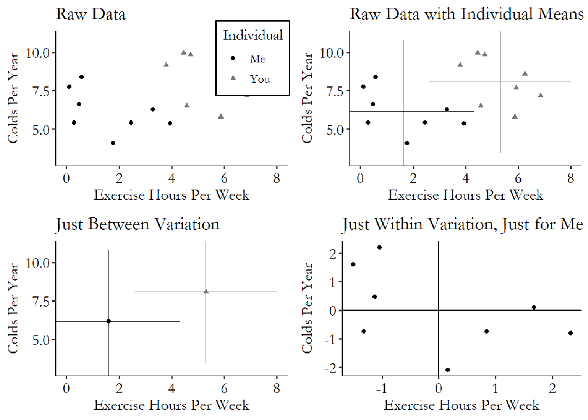

Figure 16.3: Fictional data on exercise per week and number of colds per year for You and for Me, showing how we can isolate between variation by taking You- and Me-specific means, and within variation by subtracting those means out

The top-right takes that raw data and adds some individual-level means. Sort of like each of us is getting their own set of axes. We find the mean exercise and mean number of colds for you, and draw your set of axes at that point. Thatʼs onyourgraph. Similarly, we draw my set of axes where my means are. Thatʼs

(0,0)

onmygraph. Of course, on our shared graph, itʼs not for anyone, itʼs our individual means on both the - and -axes.

(0,0) (0,0) x y

The bottom-left looks just at those axes. We put a point at the center of those axes and ignore everythingbutthose individual means. If we then compare them, say, by drawing a line from one to the other, then weʼre looking at thebetweenvariation.

10

In the bottom-right, we forget about you for a second, and just focus on me. We zoom in to my set of axes and call those axes . Now we can see that everything is relative to my own mean. Take that point in the bottom-left, for example. In the top-right graph, that point was about .3 exercise hours per week and about 5.5 colds per year. But in this bottom-right graph, everything is relative to my mean. So instead of .3 and 5.5, itʼs about 1.3fewer hours of exercise per week than my average, and about .8fewer colds per year than my average.

###### (0,0)

To actually perform fixed effects, weʼd then take your set of axes and slide it over on top of mine! Letʼs see how that works.

###### 16.1.3 Fixed Effects in Action

WHAT DOES FIXED EFFECTSactually do to data? Well, itʼs largely the same as controlling for a categorical variable as described in Chapter1313. Weʼre isolating within variation. So we find the13 mean differences between groups (individuals) and subtract them out. Thatʼs basically it.

We begin in Figure16.416.4 with our raw data, noting that we have several individuals in there. In16.4.... particular, we are interested in the effects of healthy-eating reminders on actual healthy eating. Our four subjects have each downloaded an app that, at random times, reminds them to eat healthy. Theyʼve each chosen how frequently they want reminders, but donʼt control exactly on which days they come. Weʼve recorded how often they get reminders, and also scored them on how healthy they actually eat.

So we have variation over time in how intensively each individual gets reminders, and variation in their healthy eating. There might be some individual-level back doors that led them to choose their frequency and also their general healthy-eating level, so we will want to use fixed effects to close those back doors.

- Figure 16.4: Healthy Eating Reminders and Healthy Eating for Four Individuals

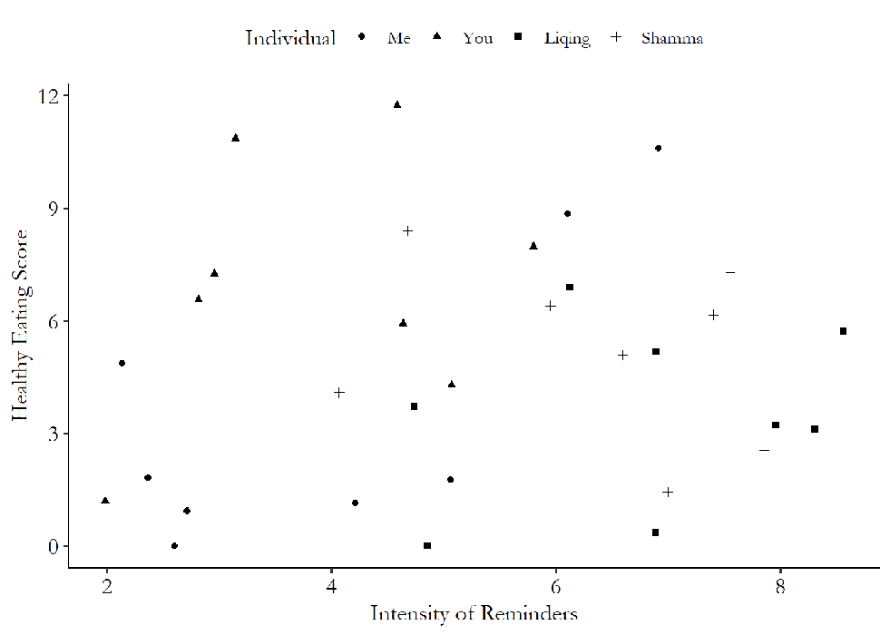

In Figure16.416.4 thereʼs a small positive correlation of .111 between reminders and healthy eating -16.4.... more reminders means eating healthier! Maybe the messages are effective, if only a tiny little bit. But of course, we havenʼt identified the answer to our question yet, since we know there are individual-based back doors. So we start our fixed effects estimation by calculating the mean reminders and mean healthy eating scores for each of our individuals.

11

Figure16.516.5 shows the individual means. Thereʼs clearly a negative relationship between16.5.... reminders and healthy eating for the individual means. If you just look at the big crosses,they seem to follow a downward slope. Thebetweenpart of the relationship is negative - the people who choose more frequent messages are the people who tend to eat more poorly on average. Thebetweencorrelation is -.440.

###### Figure 16.5: Healthy Eating Reminders and Healthy Eating for Four Individuals

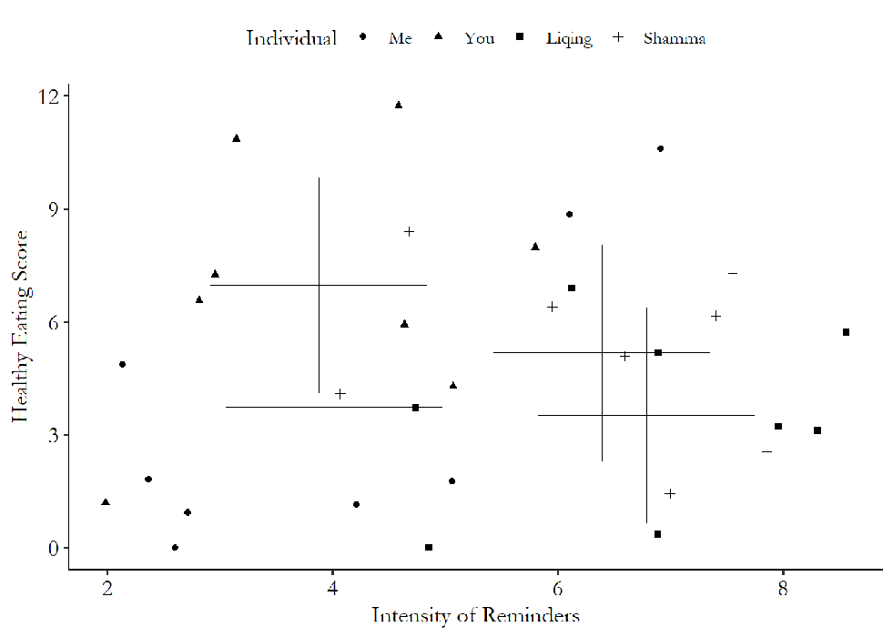

###### Our next task is to remove any variation between individuals. So weʼre effectively going to take all four of those +ʻs and slide them on top of each other. First letʼs zoom in on each of the four individualsʼ within-variation alone, in Figure16.616.6.16.66.66.66666666.66.6666666

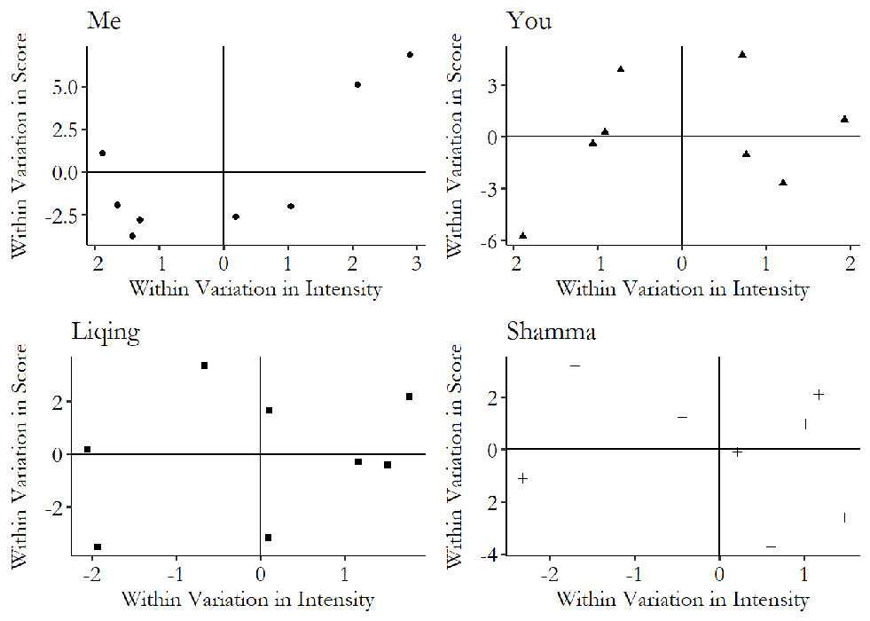

Figure 16.6: Healthy Eating Reminders and Healthy Eating for Four Individuals

Notice that for each of the four graphs in Figure16.616.6, the data is16.66.66.66666666.66.6666666 centered at 0 on both the - and -axes. So now when we put all

###### x y

four on top of each other, theyʼll be hanging around the same part of the graph.

We put them all on top of each other, aligning all the +ʼs, in Figure16.716.7.16.7....

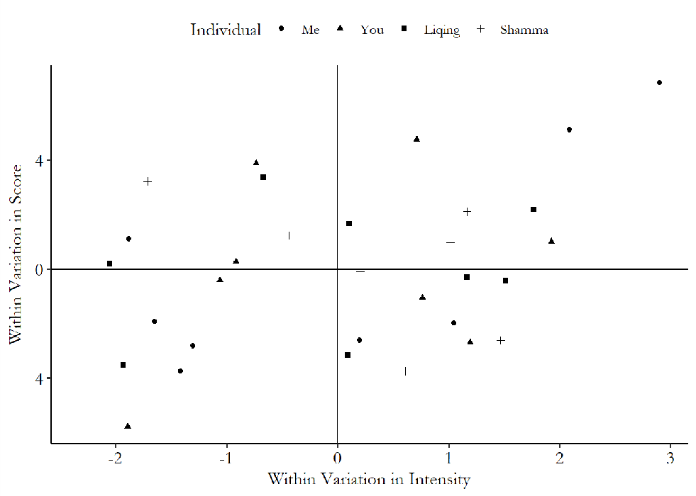

Figure 16.7: Healthy Eating Reminders and Healthy Eating for Four Individuals

Now, with the different individuals moved on top of each other, we see a more clear picture emerging, with a positive relationship

between the intensity of reminders and the scores. While the correlation in the raw data was very small, the correlation in the within variation is .363. Much more positive. And since I created this data generating process myself, I can tell you that a positive relationship is indeed correct.

12

###### 16.2 How Is It Performed?

###### 16.2.1 Regression Estimators

FIXED EFFECTS REGRESSIONS GENERALLY STARTwith a regression equation that looks like this:

###### Yit = βi + β1Xit + εit (16.1)

This looks exactly like our standard regression equation from Chapter1313 with two main13 exceptions. The first is that has the subscript , indicating that the data varies both between individuals ( ) and over time ( ).

X it i t

The second is that the intercept term now has a subscript instead of an 0, making it . Thinking of regression as a way of fitting a straight line, this means that all the individuals in the data are constrained to have the sameslope(thereʼs no subscript on ), but they have different intercepts.

β i βi

i β1

Three obvious questions arise.

- QUESTION 1.How does allowing the intercept to vary give you a fixed effects estimate where you use only within variation?

There are two ways to think about this intuitively. The first is procedural. By allowing the intercept to vary, itʼs sort of like weʼre adding a control for each person. Letʼs take a study of countries for example. If India is in our sample, then one of the intercepts is . This intercept onlyapplies to India, not to any of the other countries.

βIndia

Thatʼs a lot like adding a “This is India” binary control variable to our regression, and is the coefficient on that control variable. We have one of these controls for each country in our data. So weʼre controlling for each different country. And we know what happens when we control for country. We get within-country variation.

βIndia

The second way to think about why this works intuitively is to think in terms of a graph. Figure

- 16.816.8 uses data on GDP per capita and life expectancy from the Gapminder Institute (16.8.... ⊕Gapminder Institute 2020). Here weʼve isolated just two countries - India and Brazil - and are looking at their data since 1952.

- Figure 16.8: GDP per Capita and Life Expectancy in Two Countries

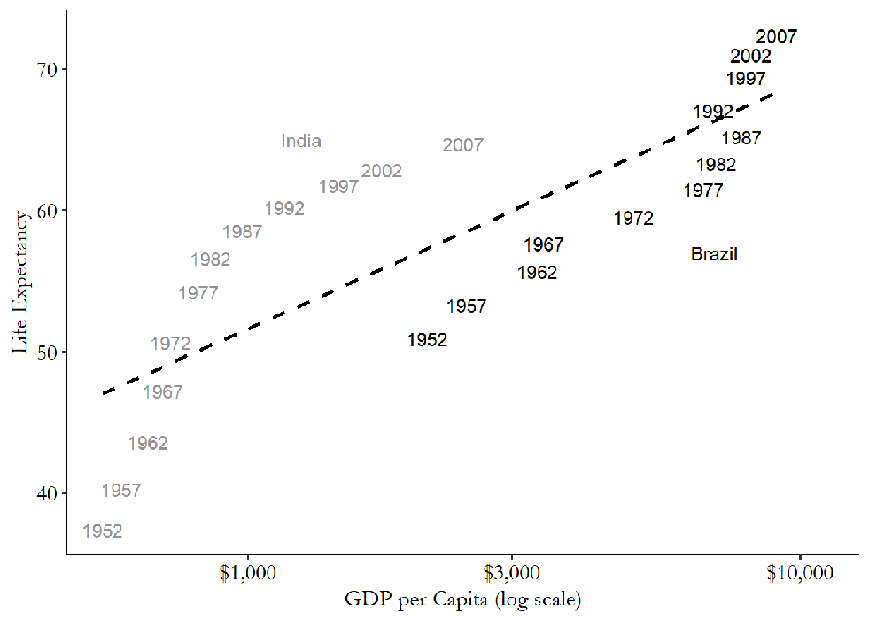

We can see a few things clearly in Figure16.816.8. First, things in both countries are clearly getting16.8.... better over time. However, there are also some clear between-country differences we want to get rid of. And that regression line, with a single intercept for both, is clearly underestimating the slope of the lines that each of the two of them has.

13

By breaking up the intercept, we can instead usetwolines - parallel lines, since they have the same slope - and move them up and down until we hit each country. This lets us not care how far up or down each countryʼs cluster of points is since we can just move up and down to hit it (we get within variation in the -axis variable), and also lets us not care how far left or right each countryʼs cluster is, since by moving up and down, the same slope can hit the cluster no matter how far out to the right it is (we get within variation in the -axis variable). And thus we have within variation.

y

x

- Figure 16.9: GDP per Capita and Life Expectancy in Two Countries

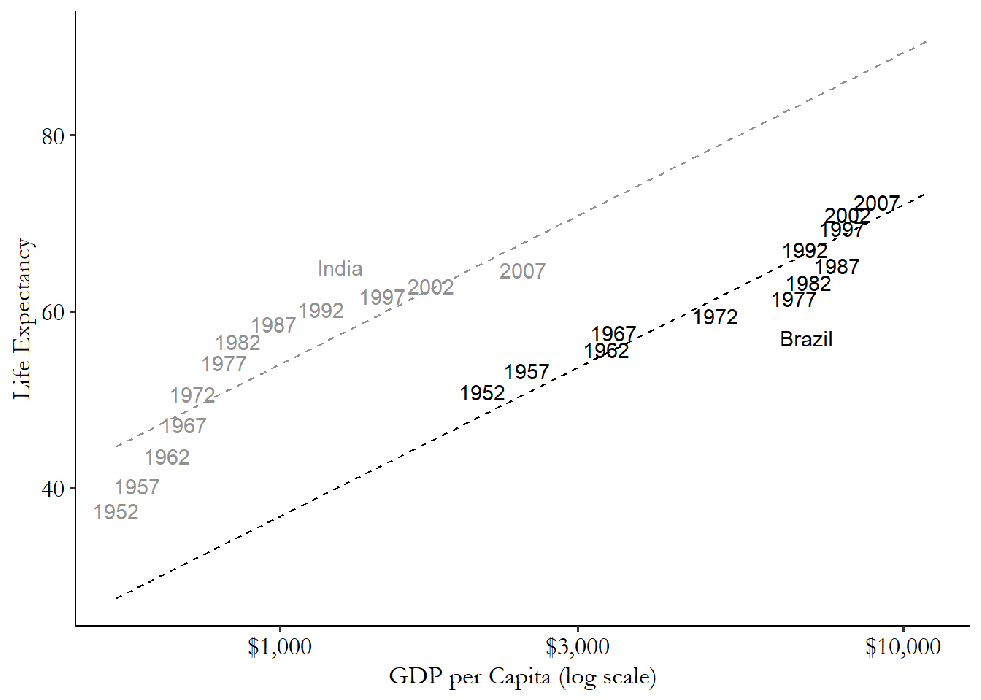

We do exactly this - the same slope but with different intercepts - in Figure16.916.9. The lines are a lot16.9.... closer to those points now. Those lines capture the relationship thatʼs clearly there a lot better than the single regression line did.

- QUESTION 2.How do we estimate a regression with individual intercepts?

There are actually a bunch of ways to do this. Some of them we will cover in later parts of this chapter. But within that long list of ways, there are two standard methods, both of which are dead-simple and only use tools we already know.

14

15

The first method is just to extract the within variation ourselves, and work with that. Just calculate the mean of the dependent variable for each individual ( ) and subtract that mean out ( ). Then do the same for each of the independent variables ( ). Then run the regression

Y¯i Yit − Y¯i Xit − X¯i

Yit − Y¯i = β0 + β1(Xit − X¯i) + εit (16.2)

16

This method is known as “absorbing the fixed effect.” Letʼs run this approach using the Gapminder data once again.

###### R Code R Code e Stata CodeStata CodeStatatatatatatatatatatatatatatatatatatatatata e Python CodePython Codeytyttt ooooooooooo o o oooooo o o o e

library(tidyverse); library(modelsummary) gm <- causaldata::gapminder

gm <- gm %>% # Put GDP per capita in log format since it's very skewed mutate(log_GDPperCap = log(gdpPercap)) %>% # Perform each calculation by group group_by(country) %>% # Get within variation by subtracting out the mean mutate(lifeExp_within = lifeExp - mean(lifeExp), log_GDPperCap_within = log_GDPperCap - mean(log_GDPperCap)) %>% # We no longer need the grouping ungroup()

# Analyze the within variation

m1 <- lm(lifeExp_within ~ log_GDPperCap_within, data = gm) msummary(m1, stars = c('*' = .1, '**' = .05, '***' = .01))

The second simple method is to add a binary control variable for every country (individual). Or rather, every countryexcept one- if our model also has an intercept/constant in it, then including everycountry will make the model impossible to estimate, so we leave one out, or leave the intercept out. That one left-out country is still in the analysis; it just doesnʼt get its own coefficient. Itʼs stuck with the lousy constant. Thankfully, most software will do this automatically.

17

I should point out that this is rarely the way you want to go. Including a set of binary indicators in the model is fine when you have a few different categories, but if youʼre controlling foreach individual, you may have hundreds orthousandsof terms. This can get very, very slow. And

cʼmon, were you really going to interpret all those coefficients anyway? One common reason to run things this way is so you can do a test of joint significance to see if you even have evidence that therearevarying intercepts (see the stuff on the “joint F-test” in Chapter1313). Still, this wonʼt13 be your usual go-to for estimating fixed effects. But for demonstrative purposes, weʼll run this version to see what we get.

###### R Code R Code e Stata CodeStata CodeStatatatatatatatatatatatatatatatatatatatatata e Python CodePython Codeytyttt ooooooooooo o o oooooo o o o e

library(tidyverse); library(modelsummary) gm <- causaldata::gapminder

# Simply include a factor variable in the model to get it turned # to binary variables. You can use factor() to ensure it's done. m2 <- lm(lifeExp ~ factor(country) + log(gdpPercap), data = gm)

msummary(m2, stars = c('*' = .1, '**' = .05, '***' = .01))

Letʼs take a look at our results from the two methods, using the R output, in Table16.316.3. With our16.3.... second method we also estimated a bunch of country coefficients, but those arenʼt on the table (there are a lot of them).

Table 16.3: Two Different Regression Approaches to Estimating a Model with Fixed Effects

Life Expectancy (within)

Life Expectancy

Log GDP per Capita (within)

9.769*** (0.284)

Log GDP per Capita 9.769*** (0.297)

Num.Obs. 1704 1704 R2 0.410 0.846 RMSE 5.06 5.06

* p < 0.1, ** p < 0.05, *** p < 0.01

There are some minor differences between the two in terms of their standard errors, and some big differences in , but the coefficients are the same. So now that we have the coefficients, how can we interpret them?

R2 18

- QUESTION 3.How do we interpret the results of this regression once we have estimated it?

The interpretation of the slope coefficient in a fixed effects model is the same as when you control for any other variable - within the same value of country, how is variation in log GDP per capita related to variation in life expectancy?

Put another way, since we have a coefficient of 9.769, we can say that for a given country, in a year where log GDP per capita is one unithigher than it typicaly is for that country, then weʼd expect life expectancy to be 9.769 yearslonger than it typicaly is for that country.

19

What else do we have on the table?

We can see that the values are quite different in the two columns. Why is this?

R2

Remember that is a measure based on how much variation there is in our residuals relative to our dependent variable. In the first column, our dependent variable is , not

R2

20 lifeExp_within lifeExp R2

. So the is based on how much variation there is in the residuals relative to thewithin variation, not the overall variation in . This is called the “within .” On the other ahnd, the second column tells us how much variation there is in (those very same) residuals relative to all the variation in . It counts the parts of explained by between variation (our binary variables).

lifeExp R2

lifeExp lifeExp

Lastly, letʼs think about something thatʼsnoton the table - the fixed effects themselves. That is, those coefficients on the country binary variables we got in the second regression. For example, Indiaʼs is 13.971 and Brazilʼs is 6.318. These are the intercepts in the country-specific fitted lines, like in Figure16.916.9.16.9....

21

What can we make of these fixed effects? Not too much in absolute terms, but they make sense relative to each other.So Indiaʼs intercept is higherthan Brazilʼs.

###### 13.971 − 6.318 = 7.653

We can interpret that to mean that, if India and Brazil had the same GDP per capita, weʼd predict that Indiaʼs life expectancy would be 7.653 higher than Brazilʼs. Weʼre still looking at the effect of one variable controlling for another - just now, weʼre looking at the effect ofcountrycontrolling forGDP per capitarather than the other way around.

Sometimes researchers will use these fixed effects estimates to make claims about the individuals being evaluated. They might say, for example, that India has especially high life expectancygiven its level of GDP per capita.

This can be an interesting way to look at differences between individuals. However, keep in mind that fixed effects is a good way ofcontroling for a long list of unobserved variables that are fixed over timeto look at the effect of a few time-varying variables. Those individual effects donʼt have the same luxury of controlling for a bunch of unobserved time-varying variables. We can rarely think of these individual fixed effects estimates as causal.

22

ONE LAST THINGto keep in mind about fixed effects. It focuses onwithinvariation. So the treatment effect (Chapter1010) estimated will focus a lot more heavily on people with a lot of10 within variation. In that life expectancy and GDP example, the coefficient on GDP we got is closer to estimating the effect of GDP on life expectancy in countries where GDP changed alotover time. If your GDP was fairly constant, you count less for the estimate! You can address this by using weights to address the problem.

23

###### 16.2.2 Multiple Sets of Fixed Effects

WEʼVE DISCUSSED FIXED EFFECTSas being a way of controlling for a categorical variable. This ends up giving us the variation that occurswithinthat variable. So if we have fixed effects for individual, we are comparing that individual to themselves over time. And if we have fixed effects for city, we are comparing individuals in that city only to other individuals in that city.

So why not include multiple sets of fixed effects? Say we observe the same individuals over multiple years. We could include fixed effects for individual - comparing individuals to

themselves at different periods of time, or fixed effects for year - comparing individuals to each other at the same period of time. What if we include fixed effects for both individual and year?

This approach - including fixed effects for both individual and for time period - is a common application of multiple sets of fixed effects, and is commonly known astwo-way fixed effects. The regression model for two-way fixed effects looks like:

###### Yit = βi + βt + β1Xit + εit (16.3)

What does this get us? Well, we are looking at variationwithinindividual as well aswithinyear at this point. So we can think of the variation thatʼs left as being variationrelative to what weʼd expect given that individual, and given that year.

24

FOR EXAMPLE,letʼs say we have data on how much each person earns per year ( ), and we also have data on how many hours of training they received that year ( ). We want to know the effect of experience of in-job training on pay at that job.

###### Yit Xit

We do happen to know that the year 2009 was a particularly bad year for earnings, what with the Great Recession and all. Letʼs say that earnings in 2009 were $10,000 below what they normally are. And letʼs say that weʼre looking at Anthony, who happens to earn $120,000 per year, a lot more money than the average person ($40,000).

In 2009 Anthony only earned $116,000. Thatʼs way above average, but that can be explained by the fact that itʼs Anthony, and Anthony earns a lot. Sogiven that itʼs Anthony, itʼs $4,000 below average. Butgiven that itʼs 2009, most people are earning $10,000 less, but Anthony is only earning $4,000 less. Sogiven that itʼs Anthony, and given that itʼs 2009, Anthony in 2009 is earning $6,000 more than youʼd expect.

Or at least thatʼs aroughexplanation. Two-way fixed effects actually gets a fair amount more complex than that, since the individual fixed effects affect the year fixed effects and vice versa. Just like with one set of fixed effects, the variation that actually ends up getting used to estimate the treatment effect (Chapter1010)10 focuses more heavilyon individuals that have a lot of variation over time. So if Anthonyʼs level of in-job training is pretty steady over time, but some other

person, Kamala, has a level of training that changes a lot from year to year, then the two-way fixed effects estimate will represent Kamalaʼs treatment effect a lot more than Anthonyʼs (⊕De Chaisemartin and dʼHaultfoeuille 2020).

TWO-WAY FIXED EFFECTS, WITH INDIVIDUAL AND TIME AS THE FIXED EFFECTS, ARENʼT THE ONLY WAYto have multiple sets of fixed effects, of course. As described above, for example, you could have fixed effects for individual and also for city. Neither of those is time!

The interpretation here is a lot closer to thinking of just including controls for individual and controls for city.

One thing to remember, though: weʼre isolating variationwithinindividual and alsowithincity. So in order for you to have any variation at all to be included, you need to show up in multiple cities. This is a more common problem here (two sets of fixed effects, neither of them is time) than with two-way fixed effects (individual and time), since generally each person shows up in each time period only once anyway.

If we ran our income-and-job-training study with individual and city fixed effects, the treatment effect wouldonlybe based on peopleand citieswhich see variation in treatment over time. A given person or city is always treated? It doesnʼt count!

ESTIMATING A MODEL WITH MULTIPLE FIXED EFFECTScan be done using the same “binary controls” approach as for the regular (“one-way”) fixed effects estimator with only one set of fixed effects. No problem!

However, this can be difficult if there are lots of different fixed effects to estimate. The computational problem gets thorny real fast. Unless your fixed effects only have a few categories each (say, fixed effects for left- or right-handedness and for eye color), itʼs generally advised that you use a command specifically designed to handle multiple sets of fixed effects.

These methods usually use something calledalternating projections, which is sort of like our original method of calculating within variation and using that, except that it manages to take into account the way that the first set of fixed effects gives you within-variation in the other set, and vice versa.

Letʼs code this up, continuing with our Gapminder data.

###### R Code R Code e Stata CodeStata CodeStatatatatatatatatatatatatatatatatatatatatata e Python CodePython Codeytyttt ooooooooooo o o oooooo o o o e

library(tidyverse); library(modelsummary); library(fixest) gm <- causaldata::gapminder

# Run our two-way fixed effects model (TWFE). # First the non-fixed effects part of the model # Then a |, then the fixed effects we want twfe <- feols(lifeExp ~ log(gdpPercap) | country + year,

data = gm) # Note that standard errors will be clustered by the first # fixed effect by default. Set se = 'standard' to not do this msummary(twfe, stars = c('*' = .1, '**' = .05, '***' = .01))

###### 16.2.3 Random Effects

AS A RESEARCH DESIGN,fixed effects is all about isolatingwithin variation. We think that there are

some back doors floating around in that between variation, so we get rid of it and focus on the within variation. But as astatistical method, fixed effects can really be thought of as a model in which the intercept varies freely across individuals. As Iʼve put it before, hereʼs the model:

Yit = βi + β1Xit + εit (16.4)

It turns out that fixed effects is, statistically, a relatively weak way of letting that intercept vary. After all, weʼre only allowing within variation. And how many observations per individual do we really have? We may be estimating those s with only a few observations, making them noisy, which in turn could make our estimate of noisy too.

βi β1

Random effects takes a slightly different approach. Instead of letting the s be anything, it puts some structure on them. Specifically, it assumes that the s come from a known random distribution, for example assuming that the s follow a normal distribution.

βi βi

βi

This does a few things:

It makes estimates more precise (lowers the standard errors).

It improves the estimation of the individual effects themselves.

25

βi

Instead of just using within variation, it uses a weighted average of within and between variation.

It solves the same back door problem that fixed effects doesifthe terms are unrelated to the right-hand side variables .

βi

Xit

THAT LAST ITEMis a bit of a doozy. Sure, better statistical precision is nice. But weʼre only doing fixed effects in the first place to solve our research design problem. Random effects only solves the same problem if the individual fixed effects are unrelated to our right-hand side variable, including our treatment variable.

That seems unlikely. Consider our Gapminder example. For random effects to be appropriate, the “country effect” would need to be unrelated to GDP. That is, all the stuff about a country thatʼs fixed over time and determines its life expectancyotherthan GDP per capita needs to be completely unrelated to GDP per capita. And that list would include things like industrial development and geography. Those seem likely to be related to GDP per capita.

26

For this reason, fixed effects is almost always preferred to random effects, except when you can be pretty sure that the right-hand side variables are unrelated to the individual effect. For example, when youʼve run a randomized experiment, is a truly randomly-assigned experimental variable and so is unrelated to any individual effect.

###### Xit

One common way around this problem is the use of theDurbin-Wu-Hausman test. The DurbinWu-Hausman test is a broad set of tests that compare the estimates in one model against the estimates in another and sees if they are different. In the context of fixed effects and random effects, if the estimates are found to not be different (you fail to reject the null hypothesis that theyʼre the same), then the relationship between and probably isnʼt too strong, so you can go ahead and use random effects with its nice statistical properties.

###### βi Xit

27

However, I do not recommend the use of the Durbin-Wu-Hausman test for this purpose. For one thing, if we donʼt have a strongtheoreticalreason to believe that the unrelated- -andassumption holds, itʼs hard to really believe that failing to reject a null hypothesis can justify it for you.

###### βi Xit

For another, the Durbin-Wu-Hausman test compares fixed effects to the simplest version of random effects, which doesnʼt really use random effects to its full advantage. Most studies that use random effects use them in more useful ways that get around that doozy of an assumption. For that, youʼll want to look at the “Advanced Random Effects” section below.

###### 16.3 How the Pros Do It

###### 16.3.1 Clustered Standard Errors

ONE OF THE ASSUMPTIONSof the regression model is that the error terms are independent of each other. That is, the parts of the data generating process for the outcome variable thatarenʼtin the model are effectively random. This assumption is necessary to correctly calculate the regressionʼs standard errors.

However, we might imagine that this assumption is a tough sell when it comes to fixed effects. After all, we have multiple observations from the same individual or group. We might expect that some of the parts of the data generating process that are left out are shared across all of that individual or groupʼs observations, making them correlated with each other, and making the standard errors wrong.

For this reason, itʼs not uncommon to hear economists say that you should almostalwaysuse clustered standard errors when you use fixed effects, specifically standard errors clustered at the same level as the fixed effect. So for person fixed effects, for example, using standard errors clustered at the person level. Or for city fixed effects, using standard errors clustered at the city level. Clustered standard errors calculate the standard errors while allowing some level of correlation between the error terms.

- 28
- 29
- 30

HOWEVER, THIS COMMON WISDOMgoes a bit too far. For clustering with fixed effects to be necessary

(and a good idea), several conditions need to hold. First, there needs to betreatment effect heterogeneity. That is, the treatment effect must be quite different for different individuals.

If that is true, thereʼs a second condition. Either the fixed effect groups/individuals in your data need to be a nonrandom sampling of the population, or, within fixed effect groups/individuals, your treatment variable is assigned in a clustered way.

So before clustering, think about whether both conditions are likely to be true (⊕Abadie et al. 2023). If it is, go ahead and cluster! If not, donʼt bother, as the clustering will make your standard errors larger than theyʼre supposed to be.

CLUSTERED STANDARD ERRORSusually come packaged with the same commands that are used to perform fixed effects, since people so commonly use clustered errors with fixed effects. Using Gapminder data once again:

###### R Code R Code e Stata CodeStata CodeStatatatatatatatatatatatatatatatatatatatatata e Python CodePython Codeytyttt ooooooooooo o o oooooo o o o e

library(tidyverse); library(modelsummary); library(fixest) gm <- causaldata::gapminder

# feols clusters by the first fixed effect by default

clfe <- feols(lifeExp ~ log(gdpPercap) | country, data = gm) msummary(clfe, stars = c('*' = .1, '**' = .05, '***' = .01))

###### 16.3.2 Fixed Effects in Nonlinear Models

THE INTUITION BEHINDthe fixed effects research design applies consistently to all sorts of statistical models. We think thereʼs a back door that can be closed by getting rid of all the between variation, so we do that.

However, the methods we have for getting rid of that variation - adding a set of binary control variables for the fixed effects, or subtracting out the individual means - donotextend to all sorts of statistical models. Both of those approaches assume that weʼre using a linear model. That will be a problem if weʼre not using a linear model. Perhaps weʼre using probit, or logit, or Poisson, or tobit, or ordered logit, and so on and so on.

Why might this be a problem?

First, letʼs consider the approach where we include binary control variables. Including a set of binary control variables is fine as long as there arenʼt too many of them. For example, fixed effects for left-or-right handedness, or fixed effects for eye color. There arenʼt too many variations of those, so including controls for each option isnʼt too bad. The problem comes when there are lots of groups, as there might be in many “fixed effects for individual” settings. For example, in our Gapminder analysis there are 142 different countries in the data. This entails adding 142 control variables and estimating 142 coefficients. Thatʼs fine in a linear model, but in a nonlinear model you run into the “incidental parameters problem,” where it just canʼt handle estimating that much stuff. The estimates start getting noisy and bad.

Second, letʼs consider the version where we subtract out the within-group means. This no longer works because the outcome variable isnʼt a continuous variable any more, so the mean is no longer a good representation of “what I need to subtract out to get rid of the between variation.” The intuition still works, but subtracting out the mean is no longer the right trick.

SO WHAT CAN WE DO?We still might want to use a fixed effects design even if we have a nonlinear dependent variable.

There are two common approaches people take. One is to drop the “nonlinear” part and just estimate a linear model anyway with your nonlinear dependent variable. This is especially common when the dependent variable is binary or ordinal. Many researchers, especially economists, consider the downsides of the misspecified linear model (with heteroskedasticityrobust standard errors) to not be as bad as the downsides associated with trying to estimate an actual nonlinear model with fixed effects.

31

Another common approach is to use a nonlinear model variant thatisdesigned to handle fixed effects properly. Things are likely out of your hands at this point and in the hands of the econometricians. Look for a method (or a software command) designed to do what you need. It might not exist! But if it does, make sure to read the documentation so you understand what youʼre doing, and then use that.

There are too many different methods to go into them here, but once you come to this point you are probably down to searching the Internet and reading about your particular application. And keep in mind that there are usually multiple different ways to do this, each of which means something different.

However, the most common applications here are for binary dependent variables and wanting to do probit or logit with fixed effects. In R, look at the generalized linear model options in the fixest package. In Stata use the commands xtprobit, xtlogit, or xtPoisson. In Python there is the pylogit package, which allows you to doconditional logitregression, which is similar but not

quite the same.

###### 16.3.3 Advanced Random Effects

IN THE RANDOM EFFECTS SECTIONabove, I mentioned that fixed effects is usually preferred to random effects unless you have a strong reason (like randomization) to think that your right-hand side variables are unrelated to the individual effects.

However, this argument uses a bit of a straw-man version of random effects. Lots of researchers use random effects even when the individual effect is almost certainly related to the right-hand side variables. Surely they canʼt all be unaware of the problem!

And in fact, they are not. Modern approaches to random effects are more than capable of handling this issue (⊕Bell and Jones 2015). This generally works by seeing your model as containing multiplelevels. This makes sense for the context - in any fixed effects setting our data ishierarchical. At the very least, it has multiple observations over timewithinindividual. The data has levels. Letʼs model those levels.

So for example, perhaps we have the model:

Yit = βi + β1Xit + εit (16.5)

Thatʼs one of our levels. We would then say that the term itself follows itsownequation:

βi

βi = β0 + γ1Zi + μi (16.6)

where is a set of individual-level variables that determine the individual effect, and is an error term.

Zi μi

This allows us to deal with the correlation between the and the because weʼre modeling it directly. That individual-level time-consistent part of that might be related to - hopefully we account for that part of it with the .

βi Xit

Xit βi Zi

This approach does a few nice things for us. First of all, it gets us the nice statistical properties that random effects gives us over fixed effects, but without imposing as many additional assumptions.

Second, it lets us look at the effect of variables that are constant within individual. Letʼs say we wanted to look at the effect of hometown on whether you become an inventor. Well, each personʼs hometown doesnʼt change over their lifetime, so fixed effects would never let us study that question. But multi-level random effects would.

Third, it lets us explicitly look at between and within effects separately. Fixed effects says “within effects only, please.” Basic random effects says “some mix of between and within.” Multi-level

random effects, if done properly, says “here are the between effects, and here are the within effects. Do what you will.”

THERE ARE TWO DIRECTIONSwe can go with this multi-level intuition in mind.

One approach, which helps explicitly separate out the between and within effects, is just to… include both effects in the regression. Simple as that!

32

All you do is:

- 1. Calculate within-individual means for each predictor ( ).
- 2. Calculate the within variation for each predictor ( ).
- 3. Regress the dependent variable on the within-individual means ( ), the within variation ( ), and any other individual-level controls you like ( ), and use random effects for the intercept.

X¯i

Xit − X¯i

X¯i Xit − X¯i

Zi

This is referred to as “correlated random effects.” It is handy in that it separates out for you the “between variation effect” (the coefficients on the s) and the “within variation effect” (the coefficients on the s), and also lets you see the effect of individual-level variables . You wanted that within effect from fixed effects anyway, and now you get some bonus stuff on top.

X¯i Xit − X¯i Zi

This approach is easy to implement and easy to interpret. If you can calculate within-individual means and within variation (code in the “How Is It Performed” section), then you can just toss everything into a model with random effects (in R, see lmer in the lme4 package; in Stata see xtreg with the re option; and in Python see RandomEffects in the linearmodels package).

THE OTHER WAY WE CAN GOwith our multi-level intuition iswhole hoginto mixed models, also known as hierarchical linear models.

Mixed models say we donʼt need to stop at theinterceptfollowing a random distribution. Why stop there? How about the slope coefficients on the other variables?

Yit = β0i + β1iXit + εit (16.7)

- β0i = β0 + γ1Zi + μi (16.8)
- β1i = β1 + δ1Zi + ηi (16.9)

These models can get complex, but they can be used to represent very complex interactions between variables. After all, this is social science. Everything is complex! We might well expect that there are a bunch of variables that donʼt just explain , but explainhow affects and we want to model that.

Yit Xit Yit

Mixed models are extremely common in many fields, and if youʼre from one of those fields you might be surprised to find them tucked away in a little subsection in one chapter of this book. Alas, as the focus of this book is design rather than estimation, it makes sense to talk about fixed effects first and include mixed models as an extension of that.

33

Still, they are worth exploring outside the confines of this book. I recommend the textbook by Gelman and Hill (⊕2006) for further reading. You can also try mixed models out yourself with lmer in the lme4 package in R; xtmixed in Stata; or mixedlm in the statsmodels package in Python. More broadly, there is Stan, which is sort of its own language dedicated entirely to fast and flexible estimation of hierarchical models. Stan can be used from other languages, and the intuitively-named RStan, StataStan, and PyStan packages are all available.

34

Previous Next

Page built: 2025-10-17 using R version 4.5.0 (2025-04-11 ucrt)

## The Effect

Nick Huntington-Klein

▾ Chapters

###### Chapter 17 - Event Studies

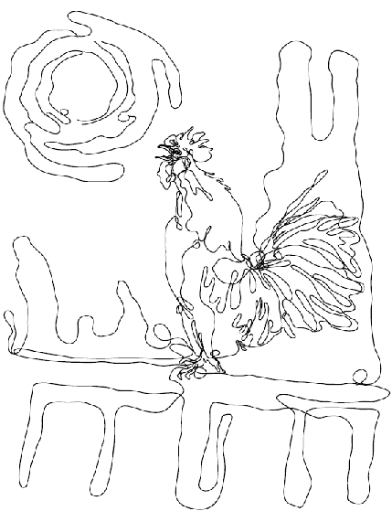

###### 17.1 How Does It Work?

###### 17.1.1 An Event as Old as Time

THE EVENT STUDY IS PROBABLY THE OLDEST AND SIMPLEST CAUSAL INFERENCE RESEARCH DESIGN.It predates experiments. It predates statistics. It probably predates human language. It might predate humans. The idea is this: at a certain time, an event occured, leading a treatment to be put into place at that time. Whatever changed from before the event to after is the effect of that treatment. Like in Chapter1616 on fixed effects, we are using only the within variation. Unlike16

Chapter1616, we are looking only at treatments that switch from “off” to “on,” and (usually) instead16 of using panel data we use time series data where we track only one “individual” across multiple periods.

So when someone has a late-night beer, immediately falls asleep, and concludes the next day that beer makes them sleepy, thatʼs an event study. When you put up a “no solicitors” sign on your door, notice fewer solicitors afterwards, and conclude the sign worked, thatʼs an event study. When your dog is hungry, then finds you and whines, and becomes fed and full, then concludes that whining leads to getting fed, thatʼs an event study. When a rooster concludes theyʼre responsible for the sun rising because it rises every morning right after they crow, thatʼs an event study.

EVENT STUDIES ARE DESIGNED TO WORKin cases where the relevant causal diagram looks like Figure 17.111111117.1. At some given time period, we move from “before-event” to “after-event” and a treatment111117.1.1.1.1.1111111 goes into effect. “After” here doesnʼt mean “the treatment came and went” but rather “in the time after the event occurred,” so the treatment could still be in effect. By comparing the outcome when the treatment is in place to the outcome when itʼs not, we hope to estimate the effect of .

1

###### Treatment → Outcome

Figure 17.1: A Causal Diagram that Event Studies Work for

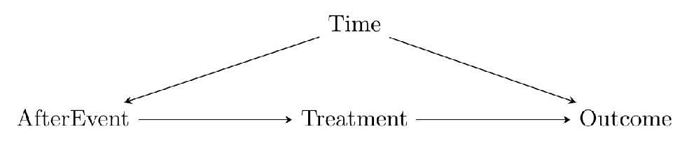

There is a back door to deal with, of course:

Treatment ← AfterEvent ← Time → Outcome

here sort of collects “all the stuff that changes over time.” We know the rooster isnʼt responsible for the crowing because it was going to rise anyway. We have to close the back door somehow for an event study to work. We canʼt really control for - that would in

Time

2

###### AfterEvent

effect control for too. The two variables are basically the same here - youʼre either before-event and untreated or after-event and treated. Theyʼre just separated in the diagram for clarity. However, because only affects through , there is the possibility that we can close the back door by controlling for some elements of , while still leaving variation in .

Treatment

Time Treatment AfterEvent

Time AfterEvent

THINKING CAREFULLYabout Figure17.111111117.1 is the difference between a good event study and a bad one.111117.1.1.1.1.1111111 And you can already imagine the bad ones in your head. In fact, many of the obviously-badcausal-inference examples in this book are in effect poorly done event studies. Many superstitionsare poorly done event studies. Maybe you have a friend who wore a pair of green sweatpants and then their sports team won, and they concluded that the sweatpants helped the team. Or maybe a new character is introduced to a TV show that has seen declining ratings for years. The show is canceled soon after, and the fans blame the new character. Those are both event studies.

But theyʼre event studies done poorly! Thinking carefully about the causal diagram means two things: (1) Thinking hard about whether the diagram actually applies in this instance - is the treatment theonlything that changed from before-event to after-event, or is there something else going on at the same time that might be responsible for the outcomes we see? Event studies arenʼt bad, but they only apply in certain situations. Is your research setting one of them? (2) Thinking carefully about how the back door through can be closed.

Time

Fans of the canceled TV show have failed in step (2) - they needed to account for the fact that ratings were already on the decline in order to understand the impact of the new character. The sweatpants-wearing sports fan has probably fallen afoul more of estimation than the causal diagram - figuring out how to handle sampling variation properly can be tricky given that we only have a single repeated measurement.

###### 17.1.2 Prediction and Deviation

THE REAL TRICKY PART ABOUT EVENT STUDIES IS THE BACK DOOR.The whole design of an event study is based around the idea that something changes over time - the event occurs, the treatment goes

into effect. Then we can compare before-event to after-event and get the effect of treatment. However, we need that treatment to be theonlything thatʼs changing. If the outcome would have changed anyway for some other reason and we donʼt account for it, the event study will go poorly.

This is the tricky part. After all, things arealwayschanging over time. So how can we make sure weʼve removed all the ways that affects the outcomeexceptfor that one extremely important part we want to keep, the moment we step from before-event to after-event?

###### Time

In short, we have to have some way ofpredicting the counterfactual.We have plenty of information from the before-event times. If we can make an assumption that whatever was going on before would have continued doing its thing if not for the treatment, then we can use that before-event data to predict what weʼd expect to see without treatment, and then see how the actual outcomedeviatesfrom that prediction. The extent of the deviation is the effect of treatment.

For example, see Figure17.217.2. There are two graphs here. In each case we have a dark black line17.2.... representing the actual time series data we see. Things seem pretty well-behaved up to the date when the event occurs, at which point the time series veers off course - in Figure17.217.2 (a) it juts17.2.... up, and in Figure17.217.2 (b) it drops down.17.2....

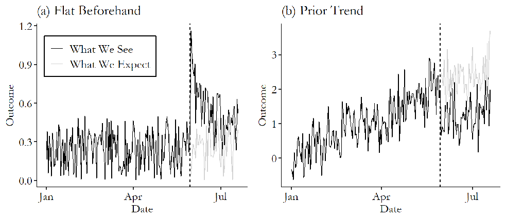

Figure 17.2: Two Examples of Graphs Representing Event Studies

For our event study to work, we need to have a decent idea of what would have happened without the event. Generally, weʼll assume that whatever pattern we were seeing before the event will continue. In the case of Figure17.217.2 (a), the time series is jumping up and down on a17.2.... daily basis, but doesnʼt seem to be trending generally up or down or really changing at all. Seems like a safe bet that this would have continued if no event occurred. So we get the gray line representing what we might predict would have happened if that trend continued. To get the event study estimate, just compare the black line of real data to the gray line of predicted counterfactual data after the event goes into place. Looks like the treatment had an immediate positive effect on the outcome, with the black line far above the gray right after the treatment, but then that effect fades out over time and the lines come back together.

The same idea applies in Figure17.217.2 (b). Here we have a clear upward trend before the event17.2.... occurs. So it seems reasonable to assume that the trend would have continued. So this time, the gray line representing what we would have expected continues on that upward trend. The actual data on the black line drops down. Weʼd estimate a negative effect of treatment on the outcome in this case. Unlike in Figure17.217.2 (a), the effect seems to stick around, with the black line17.2.... consistently below the gray through the end of the data.

SO HOW CAN WE MAKE THOSE PREDICTIONS?While there are plenty of details and estimation methods to consider when it comes to figuring out the gray counterfactual line to put on the graph, on a conceptual level there are three main approaches.

- Approach 1: Ignore It. Yep! You can just ignore the whole thing and simply compare after-event to before-event without worrying about changes over time at all. This is actually a surprisingly common approach. But, surely, a bad approach, right?

Whether this is bad or not comes down to context. Sure, some applications of the “ignore it” approach are just wishful thinking. But if you have reason to believe that there really isnʼt any sort of time effect to worry about, then why not take advantage of that situation?

There are two main ways that this can be justified. The first is if your data looks a lot like Figure

3

17.217.2 (a).17.2.... The time series is extremely flat before the event occurs, with no trend up or down, no change, no nothing. Just a nice consistent time series at roughly the same value, and ideally not too noisy. If this is the case, and also you have no reason to believe that anything besides the

treatment changed when the event occurred, then you could reasonably assume that the data would have continued doing what it was already doing.

The second common way to justify ignoring the time dimension is if youʼre looking only at an extremely tinyspan of time. This approach is common in finance studies that have access to super high-frequency data, where their time series goes from minute to minute or second to second. Sure, a companyʼs stock may trend upward or downward over time, or follow some other weird pattern, but that trend isnʼt going to mean much if youʼre zooming way, way, way in and just looking at the stockʼs price change over the course of sixty seconds.

- Approach 2: Predict After-Event Data Using Before-Event Data. With this approach, you take a look at the outcome data you have leading up to the event and use the patterns in that data to predict what the outcome would be afterward. You can see this in Figure17.217.2 (b) - thereʼs an17.2.... obvious trend in the data. By extrapolating that trend, we end up with some predictions that we can compare to the actual data.

Simple! Simple in concept anyway. In execution, there are many different ways to perform such a prediction, and some ways will work better than others. Iʼll discuss this later in the chapter.

- Approach 3: Predict After-Event Data Using After-Event Data. This approach is very similar to Approach 2. Like in Approach 2, you use the before-event data to establish some pattern in the data. Then, you extrapolate to the after-event period to get your predictions.

The only difference here is that instead of only looking for things like trends in the outcome, you also look forrelationshipsbetween the outcome and some other variables in the before-event period. Then, in the after-event period, you can bolster your prediction by also seeing how those other variables change.

A common application of this is in the stock market. Researchers doing an event study on stock X will look at how stock Xʼs price relates to the rest of the market, using data from the before-event period. Maybe they find that a 1% rise in the market index is related to a .5% rise in stock Xʼs price.

Then, in the after period, they extrapolate on any trend they found in stock Xʼs price, like in Approach 2. But they also check the market index. If the market index happened to rise by 5% in the after-event period, then weʼd expect stock Xʼs price to rise by 2.5% for that reason, regardless of treatment. So weʼd subtract that 2.5% rise out before looking for the effect of treatment.

SOMETHING THAT ALL THREEof these methods should make clear is that event studies are generally intended for a fairly short post-event window, or a “short horizon” in the event study lingo. The farther out you get from the event, the worse a job your pre-event-based predictions are going to do, and the more likely it is that the back door will creep in, no matter your controls. So keep it short, unless youʼre in a situation where youʼre sure that in your case there reallyis nothing else going on besides your treatment and business-as-usual in the long term, or you have a good model for handling those changes in the long term. Going for a long horizon is possible, but the time series design does a lot less for you, and youʼll need to bolster the validity of your design, be more careful about the possibility of unrelated trends, and swat away the back doors and general noisiness that will start creeping back in (⊕Kothari and Warner 2007).

###### Time

THATʼS ABOUT IT.The details are a bit more thorny than that, but event studies are ancient for a reason. They really are conceptually simple. The complexities come when trying to get the estimation right, which Iʼll cover in the How Is It Performed section.

###### 17.1.3 A Note on Terminology

IN THIS CHAPTER,Iʼll be covering what I call “event studies.” However, as you might expect for such an intuitively obvious method, event studies were developed across many fields independently, and so terminology differs, sometimes with some slight variation in meaning.

For example, in health fields, you might hear about “statistical process control,” which is only intended to be used if there are no apparent pre-event trends (Approach 1 in the previous section). Iʼm just gonna call these, and the wide family of other similar methods, a form of event study.

Another confusing term is “interrupted time series.” Thiscouldjust refer to any event-study method where you account for a before-event trend. But in practice it usuallyeitherrefers to an event study that uses time series econometrics,orto a regression-based approach that fits one regression line before-event and another after-event. And, naturally, users of either method will become scared and confused if the term is used to refer to the other one.

4

There are also variants of event studies that control for by introducing acontrol groupthat is unaffected by the event. I wonʼt cover this concept in the event study chapter, but youʼll see the idea of combining before-event vs. after-event comparisons with a control group later in the chapters on difference-in-differences (Chapter1818) and synthetic control (Chapter18 222222222222222). Those2222222222 cover the concept, anyway. In practice, studies calling themselves “event study with a control” or “interrupted time series with a control” will often include a bit more of the time series methodology I cover in the “How the Pros Do It” section than difference-in-differences or synthetic control approaches will.

Time

5

Even more confusing, some economists use the term “event study”onlyto refer to studies that use multiple treated groups, all of which are treated at different times, whether or not thereʼs also a control group. Oy. Weʼll similarly cover that in Chapter1818.18

For now, just before-and-after event studies.

###### 17.2 How Is It Performed?

ITʼS A BIT STRANGEto talk about “how event studies are performed.” Because itʼs such a general idea of a method, and because so many different fields have their own versions of it, ways of performing event studies are highly varied.

So, instead of trying to take you on a tour of every single way that event study designs are applied, Iʼll focus on three popular ones. First, Iʼll take a look at event studies in finance, where a common approach is to explicitly calculate a prediction for each after-event period, and compare that to the data. Second, Iʼll look at a regression-based approach. Third, in the “How the Pros Do It” section, Iʼll get into methods that take the time series nature of the data a bit more seriously.

6

###### 17.2.1 Event Studies in the Stock Market

EVENT STUDIES ARE HIGHLY POPULARin studies of the stock market. Specifically, theyʼre popular when the outcome of interest is a stockʼs return. Why? Because in any sort of efficient, highly traded stock market, a stockʼs price should already reflect all the public knowledge about a company. Returns might vary a bit from day to day or might rise if the market goes up overall, but the only reason the price should have any sort of sharp change is if thereʼs surprising new information revealed about the company. Yʼknow, some sort of event!

Even better, the fact that stock prices reflectinformationabout a company means that we can see the effect of that information immediately and so can look at a pretty short time window. This is good both for supporting the “nothing else changes at the same time” assumption, and for pinpointing exactlywhenan event is. Say a company announces that theyʼre planning a merger. That merger wonʼt actually happen for quite a long time, but because investors buy and sell based on what theyanticipatewill happen, weʼll be able to see the effect on the stock price right away, rather than having to wait months or years for the actual merger, allowing the time back door to creep back in.

7

The process for doing one of these event studies is as follows:

- 1. Pick an “estimation period” a fair bit before the event, and an “observation period” from just before the event to the period of interest after the event.
- 2. Use the data from the estimation period to estimate a model that can make a prediction of the stockʼs return in each period. Three popular ways of doing this are:

###### R^ R

8

- 1. Means-adjusted returns model.

Just take the average of the stockʼs return in the estimation period, .

R^ = R¯

- 2. Market-adjusted returns model. Use the market return in each period, .
- 3. Risk-adjusted returns model. Use the data from the estimation period to fit a regression describing how related the return is to other market portfolios, like the market return:

R^ = Rm

R

.

R = α + βRm

Then, in the observation period, use that model and the actual to predict in each period.

Rm R^

- 3. In the observation period, subtract the prediction from the actual return

to get the “abnormal return.”

.

###### AR = R − R^ AR AR AR

- 4. Look at in the observation period. Nonzero values before the event imply the event was anticipated, and nonzero values after the event give the effect of the event on the stockʼs return. For the same efficientmarket reason that stock returns are a good candidate for event studies in the first place, effects will generally spike and then fade out quickly.

Letʼs put this into action with an example. One of the nice things about event studies in finance is that you can apply them just aboutanywhere. So instead of borrowing an event study from a published paper, Iʼll make my own.

On August 10, 2015, Google announced that they would be rearranging their corporate structure. No longer would “Google” own a bunch of other companies like Fitbit and Nest, but instead there would be a new parent company called “Alphabet” that would own Google along with all that other stuff.

How did the stock market feel about that? To find out, I downloaded data on the GOOG stock price (the stock symbol for Google before and Alphabet now) from May 2015 through the end of August 2015. I also downloaded the price of the S&P 500 index to use as a market-index measure.

Then, I calculated the daily return for GOOG and for the S&P 500 (which is the price divided by the previous dayʼs price, all minus 1). Why use returns instead of the price? Because weʼre interested in seeing how the new informationchangesthe price, so we may as well isolate those changes so we can look at them. Looking at returns also makes it easier to compare stocks that have wildly different prices.

Figure 17.3: Stock Returns for Google and the S&P 500

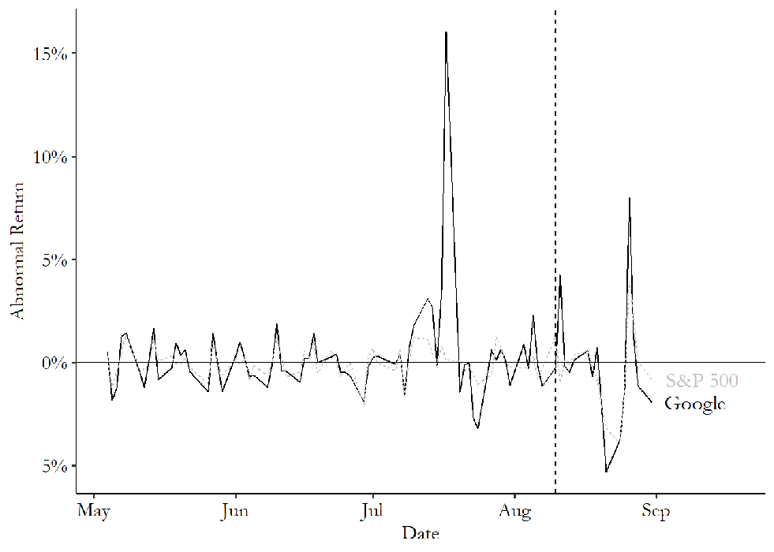

You can see those daily returns in Figure17.317.3. Something worth noticing in the graph is that17.3.... Googleʼs returns and the S&P 500 returns tend to go up and down at the same time. This is one reason why two of our three prediction methods make reference to a market index - we donʼt want to confuse a market move with a stock move and think itʼs just all about the stock! Also, the returns are very flat a lot of the time. There are some spikes - a big one in mid-July, for example. But in general, returns can be expected to stay at fairly constant levels a lot of the time, until something happens.

Letʼs do the event study. Weʼll first pick an estimation period and an observation period. For estimation Iʼll go May through July, and then for observation Iʼll start a few days before the announcement, from August 6 through August 24.

9

Next, weʼll use the data in the observation period to construct our prediction models, and compare. The code for doing so is:

###### R Code R Code e Stata CodeStata CodeStatatatatatatatatatatatatatatatatatatatatata e Python CodePython Codeytyttt ooooooooooo o o oooooo o o o e

library(tidyverse); library(lubridate) goog <- causaldata::google_stock

event <- ymd("2015-08-10")

# Create estimation data set est_data <- goog %>%

filter(Date >= ymd('2015-05-01') & Date <= ymd('2015-07-31'))

# And observation data obs_data <- goog %>%

filter(Date >= event - days(4) & Date <= event + days(14))

# Estimate a model predicting stock price with market return m <- lm(Google_Return ~ SP500_Return, data = est_data)

# Get AR obs_data <- obs_data %>%

# Using mean of estimation return mutate(AR_mean = Google_Return - mean(est_data$Google_Return), # Then comparing to market return AR_market = Google_Return - SP500_Return, # Then using model fit with estimation data risk_predict = predict(m, newdata = obs_data), AR_risk = Google_Return - risk_predict)

# Graph the results ggplot(obs_data, aes(x = Date, y = AR_risk)) +

geom_line() + geom_vline(aes(xintercept = event), linetype = 'dashed') + geom_hline(aes(yintercept = 0))

If we plot all three lines together, we get Figure17.417.4. What do we have? We certainly have a pretty17.4.... big spike just after August 10, no matter which of the three methods we use. However, itʼs only a one-day spike. As we might expect in an efficient market, Google reaches its new Alphabetinclusive price quickly, and then the daily returns dip back down to zero (even though the price itself is higher than before). We also donʼt see a whole lot of actionbeforethe event, telling us that this move was not highly anticipated.

Figure 17.4: Event Study Estimation of the Impact of Googleʼs Alphabet Announcement on its Stock Return

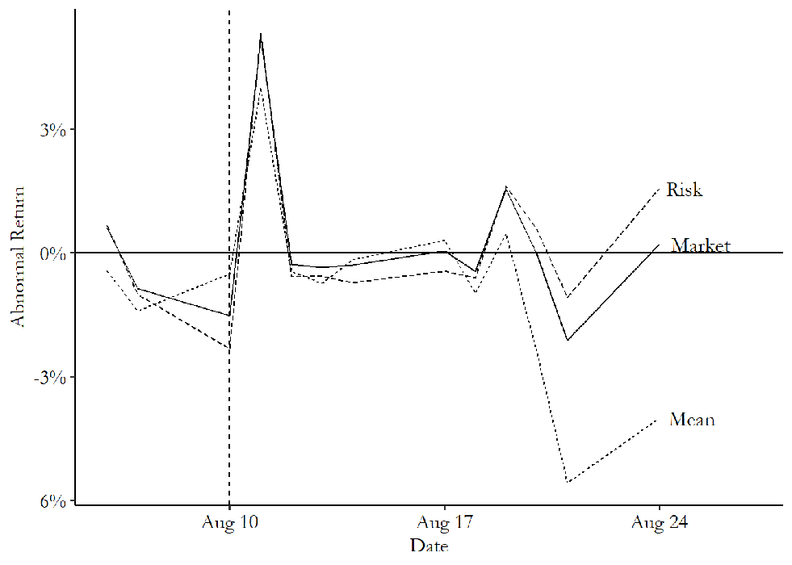

As we look out to the right in Figure17.417.4, we can spot a few quirks of this methodology that17.4.... remind us to keep on our toes. First, notice how around August 20, the Mean line takes a dive, while the Market and Risk lines stay near zero? Thatʼs a spot where the Google price dipped, but so did the market. Probably not the result of the Alphabet switch, since it happened to the whole market. This is one good reason to use a method that incorporates market movements.

The graph and the movement around August 20 also nudge us toward using a narrow window and not trying to get an event study effect far after the event. Given that the Alphabet change had a one-day effect that then immediately went away, the changes a week and a half later probably arenʼtbecauseof the Alphabet change. And yet theyʼre showing up as effects! In the stock market, a week and a half is plenty of time for somethingelseto change, and weʼre confusing whatever that is for being an effect of the Alphabet change because our horizon is too long.

NOW THAT WE HAVE THE DAILY EFFECTS,there are a few things we can do with them.

The first thing we might do is first ask whether a given day shows an effect by performing a significance test on the abnormal return that day. The most commonly-applied test is pleasingly simple. Just calculate for thewholetime window, not just the observation window. Then get the standard deviation of . Thatʼs your standard error. Done! Divide the on your day of interest by the standard error to get a -statistic, and then check if the on your day of interest is greater (or less than) than some critical value, usually 1.96 or for a 95% significance test.

###### AR

AR AR t AR −1.96

If I calculate the standard deviation of GOOGʼs for the whole time window, I get .021. The

ARrisk ARrisk t .054/.021 = 2.571

the day after the announcement is .054. The -statistic is then . This is well above the critical value 1.96, and so weʼd conclude that the Alphabet announcement did increase the returns for GOOG, at least for that one day.

We might also be interested in the effect of the event on theaveragedaily return, or the cumulativedaily return. Calculating these is straightforward. For the average, just average all the

s over the entire (post-event) observation period. For the cumulative, add them up.

AR

Getting a standard error or performing a test for these aggregated measures, though, is another issue. There are lots and lots of different ways you can devise a significance test for them. These approaches generally rely on calculating the average or cumulative across lots of different stocks and using the standard deviation across the different stocks.

AR

The simplest is the “cross-sectional test,” which constructs a -statistic by taking the average or cumulative for each firm, dividing by the standard deviation of those average or cumulative

t AR

s, respectively, and multiplying by the square root of the number of firms. Easy!

###### AR

Of course, this simple approach leaves out all sorts of stuff - time series correlation, increased volatility, correlation between the firms, and so on. There are, as I mentioned, a zillion alternatives. These include a number of tests descended from Patell (⊕1976). Patellʼs test accounts for variability in whether the returns come early or late in the observation window. The Adjusted Patell Test accounts also for the correlation of returns between firms. Thereʼs the Standardized Cross-Sectional Test, which also accounts for time series serial correlation and the possibility that the event increased volatility. And the Adjusted Standardized Cross-Sectional Test adds in the ability to account for correlation between firms. And thatʼs before we even get into the non-parametric tests based on rankings of the abnormal returns. Oy, so many options.

These additional tests can be implemented in R in the estudy2 package, and in Stata in the eventstudy2 package. In Python you may be on your own.

###### 17.2.2 Event Studies with Regression

THE METHOD USED IN FINANCEis purpose-built for effects that spike and then, usually, quickly disappear. Not uncommon in finance! But what about other areas? What if youʼre interested in an event that changes the time series in a long-lasting way? In that case, one good tool is an event study design implemented with regression.

The basic idea is this: estimate one regression of the outcome on the time period before the event. Then estimate another time series of the outcome on the time periodafterthe event. Then see how the two are different.

This approach can be implemented with the simple use of an interaction term (or “segmented regression” in the event-study lingo):

Outcome = β0 + β1t + β2After + β3t × After + ε (17.1)

where is the time period and is a binary variable equal to 1 in any time after the event. This is just a basic linear example, of course, and forces the time trend to be a straight line. You

t After

could easily add some polynomial terms to allow the time series to take other shapes, as discussed in Chapter1313.13

There are some obvious upsides and downsides to this method. As an upside, you can get a more precise estimate of the time trend than going day by day (or second by second, or whatever level your data is at). As a downside, youʼre going to be limited in seeing the exactshapethat the effect takes - seeing something like the one-day Google stock price bump in the previous section would be hard to do. And if you have the shape of the time trend wrong overall, your results will be bad. But if you can add the right polynomial terms to get a decent representation of the time series on either side of the event, youʼre good to go on that front.

Anotherbigdownside is that you need to be very careful with any sort of statistical significance testing. If your data is autocorrelated - each periodʼs value depends on the previous periodʼs value - then youʼreextremelylikely to find a statistically significant effect of the event, even if it truly had no effect. This occurs because the data tends to be “sticky” over time, with similar values clustering in neighboring time periods, which can make the regression a little too confident in where the trend is going. In data with a meaningful amount of autocorrelation, you can pick a fake “event” day at random, run a segmented regression, and get a statistically significant effect about half the time - much more than the 5% of the time youshouldget when doing a 95% significance test on a true-zero effect.

10

There are ways to handle this autocorrelation problem, though. Using heteroskedasticity- and autocorrelation-robust standard errors, as discussed in Chapter1313, definitely helps. Even better13 would be to use a model that directly accounts for the autocorrelation, as discussed in the “How the Pros” Do It section of this chapter.

THEREʼS NO NEW CODEfor the segmented regression method; just run a regression of the outcome on some-order polynomial of the time period, with as an interaction term. Then, since weʼre dealing with time series data, use heteroskedasticity- and autocorrelation-consistent (HAC) standard errors. Both interaction terms and HAC standard errors are discussed in Chapter1313.13

###### After

Instead of new code, letʼs see how this might work in real life with an example. Taljaard et al. (⊕2014) use a regression-based approach to event studies to evaluate the effect of a policy intervention on health outcomes. Specifically, they looked at an English policy put in place in

mid-2010 to improve quality of health care received in the ambulance on the way to the hospital on the chances of heart attack and stroke afterward. A bunch of quality-improvement teams were formed, they all collaborated, they shared ideas and they informed staff. So did it help with heart attack care?

Thatʼs what Taljaard et al. (2014) look at. They run a regression of heart attack performance ( , or Acute Myocardial Infarction performance) on (subtracting 27 “centers”

AMI Week − 27 Week Week − 27

at the event period, which allows the coefficient on to represent the jump in the line), (an indicator variable for being after the 27-week mark of the data where the policy was introduced), and an interaction term between the two:

After

11

AMI = β0 + β1(Week − 27) + β2After+ β3(Week − 27) × After + ε (17.2)

Their results for heart attack can be summarized by Figure17.517.5. You can see the two lines that are17.5.... fit to the points on the left and right sides of the eventʼs starting period. Thatʼs the interaction term at work. The line to the left of 27 weeks is , and the line to the right is

β0 + β1(Week − 27) (β0 + β2) + (β1 + β3)(Week − 27)

.

Figure 17.5: Effect of an Ambulance Quality Control Cooperative Policy on Heart Attack Care in Taljaard et al. (2014)

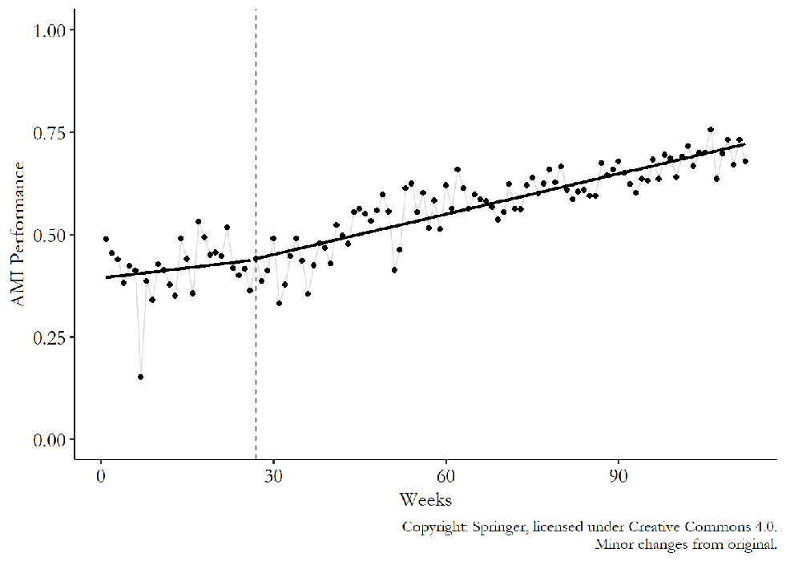

So what do we see here? We certainly donʼt see any sort of jump at the cutoff. So no immediate effect of the policy on outcomes. Thatʼs not super surprising, given that you might expect that sort of collaborative behavior-changing policy to take time to work. The jump is represented by the change in prediction at the event time, . Comparing the lines on the left and the right at that time, we get a prediction of on the left and on the right (if , then and the and terms in both lines fall out). The difference is

Week = 27

β0 β0 + β2 Week = 27 Week − 27 = 0 β1 β3

. is the jump in the prediction at the moment the treatment goes into effect. In other words, thatʼs the event study estimate.

(β2 + β0) − β0 = β2 β2

- As you might expect given the lack of a visible jump on the graph, the logit regression in Table 17.111111117.1 that goes along with this result shows that the coefficient on111117.1.1.1.1.1111111 ( ) is not significantly different from 1. As with most medical studies, coefficients are in their odds-ratio form, meaning that the effect is multiplicative instead of additive. A null effect is 1, not 0, since multiplying by 1 makes no difference.

After β1

Table 17.1: Event-Study Logit Regression of Heart Attack Performance on Ambulance Policy from Taljaard et al. (2014)

Variable Coefficient 95% C.I. p-value (Odds ratio)

Week-27 1.02 .97 to 1.07 .362 After 1.16 .93 to 1.44 .199 (Week - 27) x After 1.02 .97 to 1.08 .346

Note: Odds ratios are multiplicative, so “no effect.” is 1 not 0. Copyright: Springer

It does look in Figure17.517.5 like we have a change in slope, though. This is the kind of thing that a17.5.... regression model can pick up well on that the finance approach would have trouble with. Maybe the policy didnʼt change anything right away, but made things better slowly over time? It looks that way, except that when we look at the regression results, the change in slope is insignificant as well. The slope goes from to , for a change of . So the slope changes by , which is the coefficient on the interaction, which is insignificant in Table17.111111117.1. Ah well, so much for that policy!111117.1.1.1.1.1111111

###### β1 β1 + β3 (β1 + β3) − β1 = β3 β3 (Week − 27) × After

###### 17.3 How the Pros Do It

###### 17.3.1 Event Studies with Multiple Affected Groups

ALL THE METHODS SO FARin this chapter have assumed that weʼre talking about an event that affects onlyonegroup, or at least weʼre trying to get an effect only for that group. Weʼre interested in the effect of the Alphabet announcement on Googleʼs stock, not anyone elseʼs, and we wouldnʼt really expect there to be much of an effect anyway.

However, there are plenty of events that apply tolotsof groups. The Alphabet announcement really only affects Googleʼs stock. But how about the announcement of something like the Markets in Financial Instruments Directive - a regulatory measure for stock markets in the

European Union that should affectalthe stocks traded there? How can we run an event study in a case like that?

There are a few ways we can go. WE CAN PRETEND THAT WE ACTUALLY DONʼT HAVE A BUNCH OF GROUPS.We have a method designed for a single time series, but we have lots of different time series that matter. Just squish ʼem all together! If you have ten different groups that might be affected by the event, average together their values in each time period to produce a single time series. Then do your event study estimation on that one time series.

Not really much to explain further. Youʼre just averaging together a bunch of time series, and then doing what you already would do for a single group. There are some obvious downsides to this simple approach. Youʼre losing a lot of information when you do this. Your estimate is going to be less precise than if you take advantage of all the variation you have, rather than throwing it out.

WE CAN TREAT EACH GROUP SEPARATELY.We have event study methods for single groups. And we have lots of groups. So… just run lots of event studies, one for each group. This will give us a different effect for each group.

12

- At this point you have an effect for each group - and this could be an immediate effect from a single post-event time period or the coefficient on in a regression, or an average effect over the entire post-event period, or a cumulative effect. From there you can look at the distribution of effects across all the groups. You can also aggregate them together to get an overall immediate/average/cumulative effect.

After

WE CAN AGGREGATE WITH REGRESSION.The regression approach to event study estimation described in the “How Is It Performed” section will happily allow you to have more than one observation per time period. So stack those event studies up! In fact, this is actually what the Taljaard et al. ambulance study was doing - it had several different hospitalsʼ worth of data to work with.

The regression model is nearly the same as when thereʼs just one time series:

Outcome = βi + β1t + β2After + β3t × After + ε (17.3)

Just as before, thereʼs a line being fit before the event ( ) and a line after the event (

βi + β1t (βi + β2) + (β1 + β3)t β0 βi

) The only difference is the switch from to a group fixed effect of (as in Chapter1616). This isnʼt always necessary, but if the different groups youʼre working with have16 different baseline levels of , the fixed effect will help deal with that. Also, as before, this equation allows you to fit astraightline on either side of the event, but you could easily add polynomial terms to make it curvy.

Outcome

13

This regression will produce very similar results to what youʼd get if you first averaged all the data together and then estimated a regression on that single time series. But because it has all the individual data points to work with, it will know how much variation there is in each time period and will do a better job estimating standard errors.

Of course, this regression method puts us in a box of having to fit a particular shape. What if we are looking at an event that should only matter for a day? Or we want to know the full shape? In that case we can use a different kind of regression:

14

Outcome = β0 + βt + ε (17.4)

Whatʼs this stubby little equation? This is a regression of the outcome onjusta set of time-period fixed effects. And we do the fixed effects in a particular way - we specifically select thelast time period before the event should have an effectas the reference category (remember: any time we have a set of binary indicators, we have to leave one out as the reference).

The fixed effect for a given period is then just an estimate of the mean outcome in that period relativeto the period just before the event. If we plot out the time-period fixed effects themselves, it will be a sort of single time series, just like if weʼd mashed everything together ourselves by just taking the mean in each period. The only difference is that we now have standard errors for each of the periods, and weʼve made everything relative to the period just before the event.

Because weʼve made the period just before the event the reference group, we can more easily spot the event study effects. If the first post-event period is, say, period 4, and , then weʼd say that the event made the outcome increase from period 3 to period 4 by .3, and the one-day

β^4 = .3

effect is .3. And if , then weʼd say that the event made the outcome increase from period 3 to period 5 by .2. You can also get average or cumulative effects by averaging, or adding up, the coefficients.

###### β^5 = .2

The process for doing this in code, using some fake data, is:

###### R Code R Code e Stata CodeStata CodeStatatatatatatatatatatatatatatatatatatatatata e Python CodePython Codeytyttt ooooooooooo o o oooooo o o o e

library(tidyverse); library(fixest) set.seed(10)

# Create data with 10 groups and 10 time periods df <- crossing(id = 1:10, t = 1:10) %>%

# Add an event in period 6 with a one-period positive effect mutate(Y = rnorm(n()) + 1*(t == 6))

# Use i() in feols to include time dummies, # specifying that we want to drop t = 5 as the reference m <- feols(Y ~ i(t, ref = 5), data = df,

cluster = 'id')

# Plot the results, except for the intercept, # and add a line joining # them and a space and line for the reference group coefplot(m, drop = '(Intercept)',

pt.join = TRUE, ref = c('t:5' = 6), ref.line = TRUE)

Random number generation makes the results for each of these a bit different, but the R results look like Figure17.617.6.17.6.... You can see that weʼve fixed the effect at the last pre-event period, 5, to be 0 so that everything is relative to it. And we do see the expected jump at period 6 where the effect is. The confidence interval doesnʼt come anywhere near 0 - the effect is statistically significant on that day. We do also see significant effects in periods 2 and 4, though, where there isnʼt actually any effect. Oops! Thatʼs small samples for you.

15

Figure 17.6: Event Study with Multiple Groups

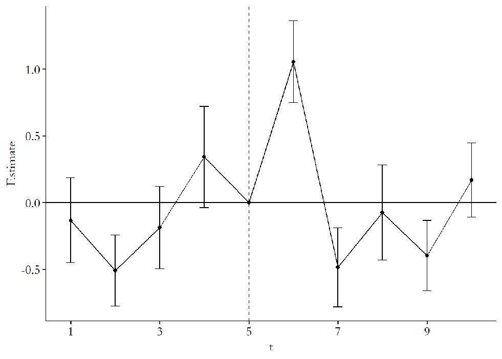

When doing an event study this way, itʼs important to keep in mind exactly what itʼs doing. This approach isnʼt incorporating any sort of trend - itʼs treating each time period separately. The predicted counterfactual in each period is purely determined by period 5 - everything is relative to that. This approach really only works if thereʼs no time trend to worry about. And even then we should carefully check the pre-event periods.

16

This approach assumes that all the pre-event effects should be zero. If theyʼre not, that implies some sort of problem. This is actually a neat bonus effect - we want to be able to spot if thereʼs a problem in our design, and this approach lets us do that. It could just be that itʼs sampling variation (as it is here, given what we know about how the data was generated), but it could just as well be that there are some time-based back doors we arenʼt accounting for properly. Hopefully, if you find nonzero effects in the pre-event period, they follow some sort of obvious trend, and then you can just build that trend into your model. But if not, it might be an indication that your research design just doesnʼt work!

WHICHEVER APPROACH TO MULTIPLE-GROUP EVENT STUDIES WE TAKE,we are a little limited in how we construct our counterfactual predictions. Any approach that uses information from other groups to get a counterfactual - such as methods that use general market trends to predict what would have happened to an affected group if there were no treatment - obviously doesnʼt work as counterfactuals any more, sincelotsof groups are treated. However, any method that doesnʼt rely on using other groups to predict counterfactuals is fine - the regression methods still work, as does the “mean” method for stock returns that takes the mean of pre-event returns as the post-event prediction.

###### AR

There is always the possibility of finding still further groups that arenʼt treated and using them as a control group. But this is a task for other chapters, including Chapter1818 on difference-in-18 differences and Chapter222222222222222 on synthetic control.2222222222

###### 17.3.2 Forecasting Properly with Time Series Methods

THE CONCEPT BEHIND AN EVENT STUDY ISthat you have some actual data in the after-event period and need, as a comparison, a prediction of what would have happened in the after-event period if the event hadnʼt occurred. Our prediction is invariably based on the idea that, without the event, whatever was going on before the event would have continued.

In other words, weʼre using the time series from before the event (and maybe some additional predictors) to predict beyond the event. This is the kind of thing thattime series forecastingwas designed for.

Technically, all the stuff weʼve done so far in this chapter is a form of time series forecasting, but only technically. Real time series forecasting uses methods that carefully consider the time dimension of the data. In a time series, observations are related across time. If a change happens in one period, the effects of that change can affect not just that period, but the whole pathway afterwards. This messes up both statistical estimation and prediction in an incalculable number of ways.

So if we want to get serious about predicting that counterfactual, and we arenʼt in a convenient setting like a well-behaved stock return, weʼre probably going to want to use a forecasting model

that takes the time series element seriously.

That said, time series estimation and forecasting isnʼt just an entire field of statistics, itʼs ahuge field in statistics and econometrics… and machine learning, and finance. And also itʼs an industry. And thereʼs a whole parallel Bayesian version. Iʼm not even going to attempt to do the whole thing justice. Instead I will give you one peek into a single standard time series model used for forecasting, the ARMA, and then Iʼll point you toward a resource like Montgomery, Jennings, and Kulahci (⊕2015) if you want to get started on your very own time series estimation journey.

THE ARMA MODEL IS AN ACRONYM FORtwo common features we see in time series data. AR stands forautoregression, meaning that the value of something today influences its value tomorrow. If I put a dollar in my savings account today, that increases the value of my account by a dollar today but also by a dollar tomorrow (plus interest), and the next day (plus a little more interest), and on into the future forever. Thatʼs autoregression. My savings account would be a model with an AR(1) process - the 1 meaning that the value of in the single (1) most recent period is the only one that matters for predicting inthisperiod. If I want to predict my bank balancetoday, then knowing what it wasyesterdayis very important. And if I already know what yesterday was, then learning about the day before that wonʼt tell me anything new (if day-before-yesterday held additional information that yesterday didnʼt have, weʼd have an AR(2), not an AR(1)). An AR(1) model looks like

###### Y Y

Yt = β0 + β1Yt−1 + ε (17.5)

where the and indicate that the predictor for in a given period is in the previous period, i.e., the “lag” of .

t t − 1 Y Y Y

The MA stands formoving-average. Moving-average means thattransitoryeffects on something last a little while and then fade out. If I lend my friend ten bucks from my savings account and she pays me back over the next few weeks, thatʼs a ten-dollar hit to my account today, a little less next week as she pays some back, a little less the week after that as she pays more back, and then when she pays it all back, the amount in my account is back to normal as though nothing had ever happened. Thatʼs a moving-average process. An MA(1) process - where only the most recent transitory effect matters - would look like

###### Yt = β0 + (εt + θεt−1) (17.6)

Of course, since we canʼt actually observe or , we canʼt estimate by regular regression. There are alternate methods for that.

εt εt−1 θ

Given how Iʼve just described it, since the amount in my savings account clearly has both AR and MA features, weʼd say that the time series of my savings balance follows an ARMA process, and weʼd want to use an ARMA model to forecast my savings in the future. An ARMA(2,1) model, for example, would include two autoregressive terms and one moving-average term, such that the current value of the time series depends on the previous two values, and the transitory effect in one previous period:

Yt = β0 + β1Yt−1 + β2Yt−2 + (εt + θεt−1) (17.7)

You can see how these things work out in Figure17.717.7. In Figure17.77.77.77777777.77.7777777 17.717.7 (a) we have some completely17.77.77.77777777.77.7777777 random white noise. Then in the other graphs, I start taking thatexact same white noiseand make it those terms in the above processes. First you can see the MA(1) process in Figure17.717.717.77.77.77777777.77.7777777 (b). You can see how each period in time is a bit closer to its neighbors than before. In (c) we have an AR(1) process. Things look a lot smoother - thatʼs because each value directly influences the next. And finally in ARMA(1,1) the data looks more related still. Keep in mind, each of these four graphs has theexact same amount of randomnessto start with. Itʼs just made successively more strongly organizedin time.

ε

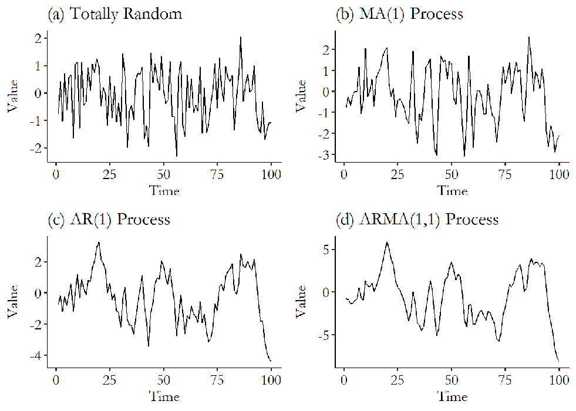

Figure 17.7: White Noise, and Different Time Series Processes

AR and MA are by no means the only features we can account for in a model, and time series analysts like to stack on all sorts of stuff. You can add an Integration term (I), whichdifferencesthe data (i.e., instead of evaluating the amount in my account, you evaluate the dailychangein the amount) and get an ARIMA. You can add other time-varying eXogenous (X) predictors, like how much I get paid at my job, and get an ARIMAX. You can account for Seasonality (S), like how my savings dips every Christmas, and get a SARIMAX, and so on.

17

18

THE CORE PART OF TIME SERIES FORECASTING ISfinding the right kind of model to fit, fitting it, and then forecasting. Very similar in concept to finding the right kind of non-time-series model. Except this time, instead of thinking about the right functional form for the relationship between variables, and which controls to include, youʼre concerned with the features of that one time series. Is it seasonal? Do you need to integrate? Does it have autocorrelation, and if so, how many terms? Does it have a moving-average process, and if so, again, how many terms? How can you even tell how many terms you need?

Answering all these questions is, as I previewed before, an entire field in itself. Usually this is where Iʼd provide a code example of how to do this. But while Iʼve introduced the concepts here, I canʼt pretend to have given you enough information to actually be able to do all this properly, so Iʼll refrain from leaving out the sharp knives in the form of a deficient demonstration. Go find a textbook all about time series.

I will leave you with just a few pointers, the first of which is to note that most packages will skip an ARMA function and just have ARIMA (which becomes an ARMA if you set the I term to 0). In R, estimation and forecasting for a few key models like ARIMA can be done easily in the fable package. In Stata, standard models like ARIMA are built-in with easily guessable names (arima), and you can do forecasting by adding a dynamic() option to predict. In Python, plenty of time series models are in statsmodels.tsa, and they come with .predict() methods for forecasting.

###### 17.3.3 The Joint-Test Problem

EVENT STUDY DESIGNS ARE HIGHLY RELIANTon making an accurate prediction of the counterfactual. That prediction is the only thing making the event study work. If you expect that, say, stock returns would have stayed the same if no treatment had occurred, but in fact they would have increased by .1%, then your event study estimates are all off by .1%, which can be a lot if youʼre talking about daily portfolio returns.

19

This means that the results we get from an event study are a combination of two things - the actual event study effect, and the model we used to generate the counterfactual prediction. And if you, say, do a significance test of that effect, youʼre not just testing the true event-study effect. Youʼre doing ajointtest of both the true effect and whether the predictive model is right. Canʼt separate ʼem!

This is worrying, especially since we can never really know for sure whether we have the right model. Sure, maybe weʼve picked a model that fits the pre-event data super duper well. But thatʼs the rub with counterfactuals - you canʼt see them. Maybe that super great fitwouldhave stopped working at the exact same time the treatment went into effect.

WHAT CAN YOU DOto deal with this joint-test problem? The joint-test problem never really goes away. But we can help make it less scary by doing the best we can to make sure our counterfactual-prediction model is as good as possible. There is, however, something we can do to try to jimmy off one part of that joint test.

The application of placebo testing in event studies has been around a long time and the approach seems to have been largely codified by the time of Brown and Warner (⊕1985).

20

The idea is this: when thereʼs supposed to be an effect, and we test for an effect, we canʼt tease apart what part of our findings is the effect, and what part is the counterfactual model being wrong. But what if weknewthere were no effect? Then, anything we estimated could only be the counterfactual model being wrong. So if we got an effect under those conditions, weʼd know our model was fishy and would have to try something else.

So, get abunchof different time series to test, especially those unaffected by the event. In the context of stock returns, for example, donʼt just include the firm with the great announcement on a certain day, also include stocks for a bunch of other firms that had no announcement.

Then, start doing your event study over and over again. Except each time you do it, pick a random time series to do it on, and pick a random day when the “event” is supposed to have happened.

21

On average, there shouldnʼt be any true effect in these randomly picked event studies. Sure, sometimes by chance youʼll pick a time series and day where somethingdidhappen to make it jump, but youʼre just as likely to pick one where something made it drop, or nothing happened at all. It will average out to 0. Do a bunch of these and your average should be 0. If itʼs not, that means that youʼre getting an effect when no effect is there. The culprit must be your counterfactual model. Better try a different one.

Previous Next

Page built: 2025-10-17 using R version 4.5.0 (2025-04-11 ucrt)

##### The Effect

Nick Huntington-Klein

▾ Chapters

###### Chapter 18 - Difference-in-Differences

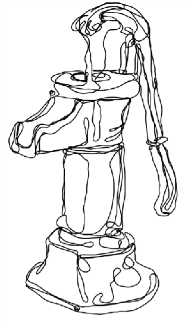

###### 18.1 How Does It Work?

###### 18.1.1 Across Within Variation

THERE ARE PLENTY OF EXAMPLES OF TREATMENTSthatoccurat a particular time. We can see the world before the treatment is applied, and after. We want to know how much of the change in the world is due to that treatment. Thatʼs the causal inference task we have set before us.

This sounds like Iʼm setting myself up to do Chapter1717 on event studies again. And in a sense,17 event studies will be our jumping-off point. Just like with an event study, we will be identifying a causal effect by comparing a group that received treatment before they received the treatment to after. We are focusing on the within variation here.

Also just like with an event study, the obvious back door we have to deal with can be summed up

- as “time.” As in Figure18.111111118.1, identifying the effect of111118.1.1.1.1.1111111 on requires us to close the back door that goes through . But we canʼt do this entirely, becausealof the variation in is explained by . Youʼre either in a before-treatment time and untreated, or in an after-treatment time and treated.

Treatment Outcome Time

Treatment Time

- Figure 18.1: A Basic Time Back Door

1

- Figure 18.2: A Causal Diagram Suited for Difference-in-differences

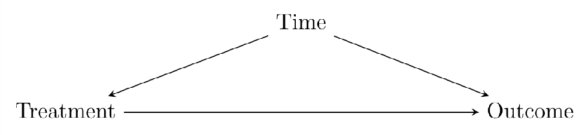

EVENT STUDIES GET AROUND THIS PROBLEMby trying to use before-treatment information to construct a counterfactual after-treatment untreated prediction. Difference-in-differences (DID) takes a different approach. Instead, it brings inanothergroup that isnevertreated. So now in the data we have both the group that receives treatment at a certain point, and another group that never receives treatment. At first, this seems counterintuitive - that untreated group may be different from the treated group! We have introduced a second back door, as in Figure18.218.2.18.2....

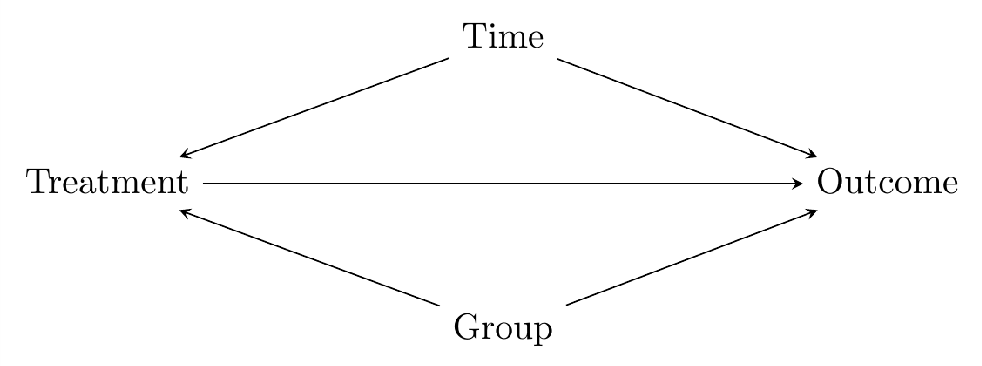

Seems like weʼve made things worse by introducing the control group. The key is this, though: now that we have that untreated group, even though weʼve added a new back door,we can now close both back doors.How is this possible?

- 1. Isolate the within variation for both the treated group and untreated group. Because we have isolated within variation, we are controlling for group differences and closing the back door through (the “differencesʼʼ).
- 2. Compare the within variation in the treated group to the within variation in the untreated group. Because the within variation in the untreated groupisaffected by time, doing this comparison controls for time differences and closes the back door through (the “difference” in those differences).

Group

Time

In other words, we are looking forhow much more the treated group changed than the untreated groupwhen going from before to after. What we want is this: (treated group after treated group before) (untreated group after untreated group before). The change in the untreated group

− − −

representshow much change we would have expectedin the treated group if no treatment had occurred. So anyadditionalchange beyond that amount must be the effect of the treatment.

###### 18.1.2 Difference-in-Differences and Dirty Water

LETʼS WALK THROUGH AN EXAMPLE OF DIFFERENCE-IN-DIFFERENCESwith data from probably its first, and almost certainly its most famous, application: John Snowʼs 1855 findings that demonstrated to the world that cholera was spread by fecally-contaminated water and not via the air (⊕Snow 1855).

2 ,3

Before the germ theory of disease became standard, medical thinkers of the world had a wide variety of ideas as to how disease spread. A popular one in Europe in the 19th century was “miasma theory” which held that disease spread through bad air coming from rotting material. This included cholera, which had routine outbreaks in many European cities. Other explanations for cholera besides miasma also abounded - bad breeding, low elevation, poverty, bad ground.

4

John Snow, however, had reason to believe that cholera instead spread by dirty drinking water. He had a few ways of providing evidence, one of which is very similar to a modern-day differencein-differences research design, and can be easily discussed in those terms (⊕Coleman 2019).

Snowʼs “before” and “after” periods were 1849 and 1854, respectively. Londonʼs water needs were served by a number of competing companies, who got their water intake from different parts of the Thames river. Water taken in from the parts of the Thames that weredownstreamof London contained everything that Londoners dumped in the river, including plenty of fecal matter from people infected with cholera. Between those two periods of 1849 and 1854, a policy was enacted the Lambeth Company was required by an Act of Parliament to move their water intake upstream of London.

Lambeth moving their intake source gives us the Treated group: anyone in an area where the water came from the Lambeth company, and an Untreated group: anyone in an area without Lambeth.

5

###### So then the question is:did areas geting water from Lambeth see their Cholera numbers go down from 1849 to 1854 relative to areas geting no water from Lambeth?

- Table 18.1: London Cholera Deaths per 10,000

Death Rates 1849

Death Rates

Region Supplier

1854 Non-Lambeth Only (Dirty) 134.9 146.6 Lambeth + Others (Mix Dirty and Clean)

130.1 84.9

Note: Death rates are deaths per 10,000 for the 1851 population, from Snow (1855).

We can see the death rates in these areas in Table18.111111118.1. First, we can see that in the pre-treatment111118.1.1.1.1.1111111 period, the cholera death rates were fairly similar in the Lambeth and non-Lambeth areas. This isnʼt necessary for difference-in-differences, but does lend a bit of credibility to the assumption that these groups are comparable. Then, we can see that from 1849 to 1854, the cholera problem in non-Lambeth areas gotworse, rising from 135 to 147, while the problem in the Lambeth areas gotbeter, dropping from 130 to 84.9.

Pretty convincing. Of course, looking at the Lambeth areas alone wouldnʼt be convincing - maybe cholera just happened to be going away at the time. We really need the non-Lambeth comparison to drive it home. The specific DID estimate we can get here is the Lambeth difference minus the non-Lambeth difference, or . The movement of the Lambeth pump reduced cholera mortality rates by 57.1 per 10,000 people. Thatʼs quite a lot!

###### (84.9 − 130) − (147 − 135) = −57.1

###### 18.1.3 How DID Does?

LETʼS WORK THROUGH THE MECHANICS OF DIFFERENCE-IN-DIFFERENCESusing a slightly more modern example, albeit one still on the topic of health. Specifically weʼll be looking at a paper by Kessler and Roth (⊕2014), which studies the rate at which people sign up to be organ donors.

6

In the United States, people are not signed up to be organ donors by default. In most states, you are assumed tonotbe an organ donor. When you sign up for a driverʼs license, you can choose to

opt into the organ donation program. Check the organ donation box and - poof! - youʼre a donor. Itʼs probably not surprising that organ donation rates in the US are considerably lower than in other countries where organ donation is opt-out- youʼre assumed to be a donor unless you actively choose not to be.

Outside of the opt-in and opt-out varieties of organ donation, thereʼs also “active choice.” Under active choice, when you sign up for a driverʼs license, you are asked to choosewhether or notto be a donor. You can choose yes or no, but now the “no” option isactively checking the “no” box rather than skipping the question entirely as you can with opt-in approaches. Some policymakers have been advocating for active choice, with a goal of increasing donation rates, and active choice is the way things work in many states.

So does active choice work? In July 2011, the state of California switched from opt-in to active choice. Kessler and Roth decided to compare California against the twenty-five states that either have opt-in or a verbally given question with no fixed response (difference). Specifically, they compared the states on the basis of how their organ donation rates changed from before July 2011 to after (in differences).

We can see the kernel of the idea in Figure18.318.3, which shows the raw data on organ donation18.3.... rates in each state in each quarter.

Figure 18.3: Organ Donation Rates in California and Other States

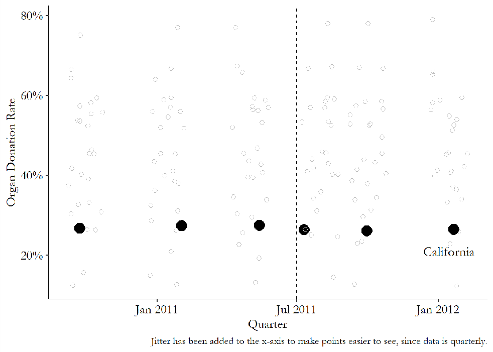

What can we see in the raw data? First, we can see that California already doesnʼt have a great organ donation rate, sitting near the bottom of the pack. Second, you can see that Californiaʼs rate didnʼt rise much after the policy went into effect - in fact, it seems to have dropped slightly. But maybe it just dropped becauseeveryoneʼsrates were dropping at that time? Nope - if anything, the other states seem to increase slightly.

Off the bat, this already isnʼt looking too good for active choice. But how would difference-indifferences actually handle the data to tell us that?

We can see the steps in Figure18.418.4. First, we calculate four averages: before-treatment in the18.4.... treated group (California), after-treatment in the treated group, before-treatment in the untreated group, and after-treatment in the untreated group. We can see these averages in Figure18.418.4 (a).18.4....

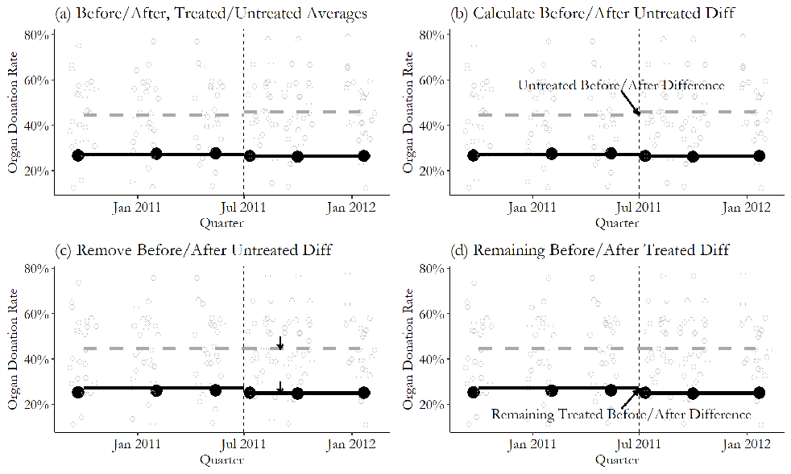

Figure 18.4: The Difference-inDifferences Effect of ActiveChoice Organ Donation Phrasing

Second, we figure that any pre-/post-difference in theuntreated group is the time effect. So we look at how that average changed from before to after for the untreated group (from 44.5% to 45.9%,

an increase of 1.4 percentage points), in Figure18.418.4 (b). We want to get rid of that time effect, so in18.4.... Figure18.418.4 (c) we subtract it out. Importantly, we subtract it out of both the untreated18.4.... andthe treated group, lowering the treated after-treatment values by 1.4 percentage points.

Finally, in Figure18.418.4 (d), any remaining before/after difference in the treated (California) group is18.4.... the difference-in-difference effect. The raw difference is 26.3% 27.1%, or a reduction of .8 percentage points. Take out the 1.4-percentage-point reduction from the untreated group, and we see a DID effect of -2.2 percentage points of the active-choice phrasing on organ donor rates. Not great!

###### −

In this particular example, the before/after difference we see for the untreated group isnʼt that large, meaning thereʼs not actually much of a time effect at all. This is actually nice - if thereʼs a huge time effect we have to wonder if that time effect reallyshouldaffect the treated and untreated groups differently. In any case, we can see how DID uses the data to come to its conclusion.

###### 18.1.4 Untreated Groups and Parallel Trends

FOR ALL OF THIS TO WORK, WE HAVE TO HAVE AN UNAFFECTED GROUP,which we call the untreated group. Canʼt do difference-in-differences without them. So what do we need in an untreated group?

7

I can talk about a lot of good features we can look for in an untreated group. But all of these are just observable pieces of the unobservable thing we really want to be true: We want our untreated group to be something that satisfies theparalel trends assumptionwith the treated group.

The parallel trends assumption says that,if no treatment had occurred,the difference between the treated group and the untreated group would have stayed the same in the post-treatment period as it was in the pre-treatment period.

Parallel trends is inherentlyunobservable.Itʼs about the counterfactual of what would have happened if treatment had not occurred.

As an example of a clear failure of parallel trends, imagine youʼre looking at the effect of building additional roads on the popularity of its downtown restaurants. You find that Chicago built a bunch of additional roads in 2018, but Los Angeles did not. So you use Los Angeles as your untreated group.

You look at Chicago and Los Angeles in 2017 (pre-roads) and 2018 (post-roads), and use difference-in-differences to find that the roads somehow made downtown restaurantsless popular in Chicago. What happened? Well, you might find that in 2018, a bunch of new highlyhyped restaurants opened in Los Angelesʼ downtown. So the 2017/2018 change in the Chicago/LA gap reflects both the new Chicago roads and the new Los Angeles restaurants. Obviously, we canʼt take this as a good estimate of the impact of the roads alone. We havenʼt properly identified the effect of the roads. We should have picked a city that didnʼt build a bunch of new restaurants at the time.

Unfortunately, any other city we may pick as our untreated comparison group for Chicago may haveotherthings changing. There may not even be anything obvious to pin it on. Maybe we pick

New York as a comparison, and find that the roadsrealyimproved traffic to Chicago restaurants. Then we look at the New York data and notice that restaurant popularity has been trending down for years. Nothing special about 2018 in particular, but given the existing trend, the Chicago/New York gap likely would have grown in Chicagoʼs favor even without the roads. The effect we get is clearly a combination of the long-term trend in New York with the roads in Chicago. Again, not identified.

8

Remember, the entire plan behind a difference-in-differences design is touse the change in the untreated group to represent al non-treatment changes in the treated group.That way, once we subtract the untreated groupʼs change out, all weʼre left with is the treated groupʼs change. Parallel trends is necessary for us to assume that works. If, without a treatment, the gap between the two groups would have changed from the pre-period to the post-periodfor any reason, or for no reason at al, then that non-treatment-related change will get mixed up with the treatmentrelated change, and we wonʼt be able to tell them apart.

We can put this in mathematical terms:

###### The difference between pretreatment and post-treatment in the treated group is +

EffectofTreatment OtherTreatedGroupChanges

###### The difference between pretreatment and post-treatment in the untreated group is

OtherUntreatedGroupChanges

Difference-in-difference subtracts one from the other, giving us

+

EffectofTreatment OtherTreatedGroupChanges OtherUntreatedGroupChanges

-

For DID to identify just , it has to be the case that exactly cancels out with . Thatʼs

EffectofTreatment OtherTreatedGroupChanges OtherUntreatedGroupChanges

what parallel trends is really about. This is the assumption that we need to identify the effect. So think carefully about whether itʼs true in your case.

SO IF WHAT WE WANT IS PARALLEL TRENDS, HOW SHOULD WE PICK AN UNTREATED COMPARISON GROUP?

What we want in an untreated group is for it to change by the same amount as the treated group (if treatment had occurred) from before the treatment is applied to afterward.

This means that there are a few good signs we can look for. While none of these things are requirements, exactly, they are all things someone would look for when thinking about whether your DID design is believable:

- 1. Thereʼs no particular reason to believe the untreated group would suddenly change around the time of treatment.
- 2. The treated and untreated groups are generaly similar in many ways.
- 3. The treated and untreated groups hadsimilar trajectories for the dependent variable before treatment.

The first tip - that thereʼs no reason to believe the untreated group would suddenly change at the time of treatment - weʼve already covered with the Chicago/Los Angeles roads example. If thereʼs something obviously changing in the untreated group at the same time, DID will mix up the effects of the treatment and whatever was changing in the untreated group.

Looking for an untreated group that isgeneraly similar in many waysmakes sense. We are relying on an assumption that, in the absence of treatment, the treated and untreated groups would have changed over time in the same way. Groups that are similar seem likely to have changed in similar ways over time. Say weʼre looking at the impact of an event that considerably increased immigration to Miami, Florida, in the United States, as in the classic DID Mariel Boatlift study (⊕Card 1990), where a policy change in Cuba led to a huge wave of immigrants coming to Miami

all at the same time, allowing us to look at the effects of immigration on the labor market. In looking at how immigration affected the Miami labor market, our results would be more plausible if using a demographically or geographically similar city like, say, Atlanta or Tampa, as opposed to something far-off and very different like Reykjavik in Iceland.

9

We may also want to look for an untreated group that has asimilar trajectory for the dependent variable before treatment.That is, the outcome variable was growing or shrinking at about the

same rate in both the treated and untreated groups in the pre-treatment period. If the two groups were trending similarly before treatment went into effect, thatʼs a good clue that they would have continued to trend similarly if no treatment had occurred.

HOW CAN WE CHECK IF OUR UNTREATED GROUP IS APPROPRIATE?There are a few common ways to evaluate the parallel trends assumption, so core to our use of DID, and see whether itʼs plausible. I want to emphasize thatthese are not tests of whether paralel trends is true.“Passing” these tests does not mean that parallel trends is true. In fact, no test of the data could possibly confirm or disprove the parallel trends assumption, since itʼs based on a counterfactual we canʼt see. These tests are more along the lines ofsuggestive evidence. If these tests fail, that makes the parallel trends assumptionless plausible.And thatʼs about it.

Hedging aside, there are some things we can do. One of them is the test ofprior trends. This test simply looks to see whether the treated and untreated groups were trending similarly before treatment. For example, Figure18.518.5 shows an example of a treated and untreated group that were18.5.... heading in the same direction, and a pair that werenʼt. On the left, the distance between the treated and untreated group stays roughly constant in the leadup to treatment, even though both are trending upwards. This implies that, had the treatment not occurred, they likely would have continued having similar trends, lending more credibility to the parallel trends assumption. On the right, the fairly large gap between the two has already shrunk by the time treatment goes into effect, with the untreated group starting lower but gaining on the treated group. That trend likely would have continued without treatment, and so parallel trends is unlikely to hold.

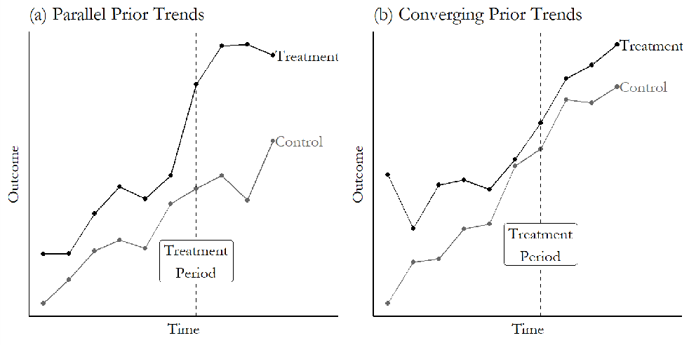

Figure 18.5: A Graph Where the Prior Trends Test Looks Good for DID, and a Graph Where It Doesnʼt

Finding that the trends werenʼt identical doesnʼt necessarily disprove that DID works in your instance, but youʼll definitely have some explaining to do as to why you think that the gap from just-

before to just-after treatment didnʼt change even though it did change from just-just-before to just-before!

10

The second test we can perform is theplacebo test. In a placebo test for difference-in-differences, weʼd take a situation where a treatment was applied in, for example, March 2019. Then, weʼd use data only frombeforeMarch 2019, ignoring all the data from the periods where treatment was actually applied.

Then, using the pre-March 2019 data, weʼd pick a few different periods andpretendthat the treatment was applied at that time. Weʼd estimate DID using that pretend treatment date. If we consistently find a DID “effect” at those pretend treatment dates, that gives us a clue that something may be awry about the parallel trends assumption.

Certainly, a nonzero DID effect at a period where there is no actual treatment tells us that the nontreatment changes in the treated group donʼt exactly cancel out the non-treatment changes in the untreated group at the pretend-treatment time. So again, youʼd have some explaining to do as to why we should believe that they exactly cancel out at theactualtreatment time.

What if you come to the sad conclusion that parallel trends probably doesnʼt hold for you? Well, you donʼt have to give up the game entirely. If you think that you havesomeviolation of parallel trends but it probably isnʼt too bad, you can say stuff like “if parallel trends were violated by .1, then my estimate is biased by .1, and I can just correct for that.” Taking a range of plausible parallel trends violation amounts and turning that into a range of plausible effects estimates is a form of partial identification. See Chapter2121.21

ONE FINAL NOTE ABOUT PARALLEL TRENDSthat is too often overlooked: parallel trends means we have to thinkvery carefulyabout how our dependent variable is measured and transformed. Thatʼs because parallel trends isnʼt just an assumption about causality, itʼs an assumption about the size of a gap remaining constant, which means something different depending on how you measure that gap.

11

The most common way this pops up is when thinking about a dependent variable with a logarithm transformation. If parallel trends holds for dependent variable ,then it doesnʼt hold for , and vice versa - if it holds for , it doesnʼt hold for .

Y ln(Y ) ln(Y ) Y

For example, say that in the pre-treatment period is 10 for the control group and 20 for the treated group. In the post-treatment period, in the counterfactual world where treatment never happened, would be 15 for the control group and 25 for the treated group. Gap of before, and after. Parallel trends holds!

Y

Y 20 − 10 = 10 25 − 15 = 10

What about for ? The gap before treatment is , but the gap after treatment is . Parallel trends doesnʼt hold!

ln(Y ) ln(20) − ln(10) = .693 ln(25) − ln(15) = .511 12

This is the kind of thing thatʼs obvious if you think about it for a second, but many of us never think about it for a second. So think carefully aboutexactly what form of the dependent variable you think parallel trends holds for, and use that form of the dependent variable.

- 18.2 How Is It Performed?

###### 18.2.1 Two-Way Fixed Effects

THE CLASSIC APPROACH TO ESTIMATING DIFFERENCE-IN-DIFFERENCES IS VERY SIMPLE.The goal here is to control for group differences, and also control for time differences. So… easy. Just control for group differences and control for time differences. The regression is

13

Y = αg + αt + β1Treated + ε (18.1)

where is a set of fixed effects for the group that youʼre in - in the simplest form, just “Treated” or “Untreated” - and is a set of fixed effects for the time period youʼre in - in the simplest form, just “before treatment” and “after treatment.” , then, is a binary variable indicating that you are being treatedright now- in other words, youʼre in a treated group in the after-treatment period. The coefficient on is your difference-in-differences effect.

αg

αt

Treated

Treated 14

How about getting some control variables in that equation? Well, maybe. Any control variables that vary over group but donʼt change over time are unnecessary and would drop out - we already have group fixed effects (remember Chapter1616?). But what about control variables that do16 change over time? We may well think that parallel trends only holds conditional on some variables - perhaps the untreated group dropped relative to treatment because some predictor unrelated to treatment just happened to drop at the same time treatment went into effect, but we can control for . However, the inclusion of time-varying controls imposes some statistical problems related to whether those controls impact treated and untreated similarly, and, importantly, the assumption that treatment doesnʼt affect later values of covariates. If you need to include covariates, itʼs often a good idea to show your results both with and without them.

W

W

15

Another way to write the same difference-in-difference equation if you have only two groups and two time periods is

###### Y = β0 + β1TreatedGroup + β2AfterTreatment+ β3TreatedGroup × AfterTreatment + ε (18.2)

where is an indicator that youʼre in the group being treated (whether itʼs before or after treatment is actually implemented), and is an indicator that youʼre in the “postʼʼ-treatment period (whether or notyourgroup is being treated). The third term is an interaction term, in effect an indicator for being in the treated group AND in the post-treatment period, i.e., youʼre actually being treated right now. This third term is equivalent to in the last equation, and is our difference-in-differences estimate. This interaction-term version of the equation is attractive because it makes clear whatʼs going on. By standard interaction-term interpretation, tells ushow much biggerthe effect is in the than in the before-period. That is, how much bigger the treated/untreated gap grows after you implement the treatment. Difference-in-differences!

TreatedGroup

AfterTreatment

16

Treated β^3

β3 TreatedGroup AfterTreatment

Whichever way you write the equation, this approach is called the “Two-way fixed effects difference-in-difference estimator” since it has two sets of fixed effects, one for group and one for time period. This model is generally estimated using standard errors that are clustered at the group level.

17

Two-way fixed effects (TWFE) has some desirable properties in the sense that it is highly intuitive we want to control for group and time differences, so we, uh… do exactly that. It also lets us apply what we already know about fixed effects. It gives us the exact same results as directly calculating (treated group after treated group before) (untreated group after untreated group before). It also lets us account for multi-group designs where we have multiple groups, some of which are treated and some are not, rather than just one treated and untreated group.

###### − − −

There are some downsides of the TWFE approach, though. In particular, it doesnʼt work very well for “rollout designs,” also known as “staggered treatment timing,” where the treatment is applied

- at different times to different groups. Researchers used TWFE for these cases for a long time, but it turns out to not work very well - more on that later in the chapter. But if you have a single treatment period, TWFE can be an easy way to estimate difference-in-differences.

HOW CAN WE ESTIMATE DIFFERENCE-IN-DIFFERENCES WITH TWO-WAY FIXED EFFECTS IN CODE?The following code chunks apply the same fixed effects code we learned in Chapter1616 to the Kessler and Roth16 organ donation study discussed earlier, with clustered fixed effects applied at the state level. Following the code, weʼll look at a regression table and interpret the results.

18

###### R Code R Code e Stata CodeStata CodeStatatatatatatatatatatatatatatatatatatatatata e Python CodePython Codeytyttt ooooooooooo o o oooooo o o o e

library(tidyverse); library(modelsummary); library(fixest) od <- causaldata::organ_donations

# Treatment variable od <- od %>%

mutate(Treated = State == 'California' & Quarter %in% c('Q32011','Q42011','Q12012'))

# feols clusters by the first # fixed effect by default, no adjustment necessary clfe <- feols(Rate ~ Treated | State + Quarter,

data = od) msummary(clfe, stars = c('*' = .1, '**' = .05, '***' = .01))

- Table 18.2: Difference-in-differences Estimate of the Effect of Active-Choice Phrasing on Organ Donor Rates

Organ Donation Rate Treatment −0.022***

(0.006) Num.Obs. 162 RMSE 0.02 FE: State X FE: Quarter X * p < 0.1, ** p < 0.05, *** p < 0.01 Standard errors clustered at the state level.

Table18.218.2 shows the result of this two-way fixed effects regression, with the fixed effects18.2.... themselves excluded from the table and only the coefficient on the variable (“treatedgroup” and “after-treatment” interacted) shown. Notice at the bottom of the table a row each for the state and quarter fixed effects. The “X” here just indicates that the fixed effects are included. Itʼs fairly common to skip reporting the actual fixed effects - there are so many of them!

Treated

The coefficient is with a standard error of .006. From this we can say that the introduction of active-choice phrasing in California saw areductionin organ donation rates that was .022 (or 2.2 percentage points) larger in California than it was in the untreated states. The standard error is

−.022

.006, so we have a -statistic of , which is high enough to be considered statistically significant at the 99% level. We can reject the null that the DID estimate is 0.

t −.022/.006 = 3.67

###### 18.2.2 Treatment Effects in Difference-in-Differences

AS WITH ANY RESEARCH DESIGN, WE WANT TO THINK CAREFULLY ABOUT WHAT OUR RESULT ACTUALLY MEANS.

When we estimate difference-in-differences,whoare we getting the effect for?

The chapter on treatment effects, Chaper1010, gives us some clues. What are we comparing here?10 Difference-in-differences compares what weseefor the treated group after treatment againstour best guess at what the treatment group would have been without treatment.

We are specifically isolating the difference between being treated and not being treatedfor the group that actualy gets treated.So, we are getting an average treatment effect among that group. In other words, itʼs the “average treatment on the treated.ʼʼ

So, the estimate that standard difference-in-differences gives us is all about how effective the treatment was for the groups that actually got it. If the untreated group would have been affected differently, we have no way of knowing that.

19

###### 18.2.3 Supporting the Parallel Trends Assumption

THE PARALLEL TRENDS ASSUMPTION SAYSthat, if no treatment had in fact occurred, then the difference in outcomes between the treated and untreated groups would not have changed from before the treatment date to afterward. Itʼs okay that thereisa difference, but that difference canʼt change from before treatment to after treatment for any reasonbuttreatment.

20

This assumption, though itʼs completely crucial for what weʼre doing with difference-indifferences, must remain an assumption. It relies directly on a counterfactual observation - what

would have happened without the treatment.

We canʼtproveor even reallytestparallel trends, but in the last section I discussed two tests that can provide some evidence that at least makes parallel trends look more plausible as an assumption. Those are thetest of prior trendsand theplacebo test.

THE TEST OF PRIOR TRENDS LOOKS ATwhether the treated and untreated groups already had differing trends in the leadup to the period where treatment occurred. There are two good ways to actually perform this test. The first is to graph the average outcomes over time in the pretreatment period and see if they look different, as we already did in Figure18.518.5.18.5....

The second is to perform a statistical test to see if the trends are different, and if so, how much different. The simplest form of this uses the regression model

Y = αg + β1Time + β2Time × Group + ε (18.3)

estimated using only data from before the treatment period, where allows the time trend to be different for each group. A test of provides information on whether the trends are different. This is the simplest specification, and you could look for more complex time trends by adding polynomial terms or other nonlinearities to the model.

β2Time × Group β2 = 0

21

If you do find that the trends are different, youʼll want to look at how different, exactly. Are the trends barely different, but the difference is statistically significant because of a large sample? Are the trends different because they were mostly consistent with each other, but there was a brief period of deviation a few years back? Think about it! Donʼt just use the significance test to answer the question. In general, this test suffers from low statistical power, so if youaregoing to use a significance test you may want to check whether you even have enough observations to do it using the pretrends package in Stata or R (⊕Roth 2022).

When failing a prior trends test, some researchers will see this as a reason to add “controls for trends” to salvage their research design by including the variable in their difference-indifferences model directly, rather than the time fixed effects . If youʼre willing to make the probably-untrue assumption that the treatment effect doesnʼt vary over groups, this changes

###### Time αt

your parallel trends assumption from being about the difference between treated and control groups in the outcome to being about the difference between treated and control groups in the outcome variableʼstrend. However, this approach can have the unfortunate effect of controlling away some of the actual treatment effect, especially for treatments with effects that get stronger or weaker over time (⊕Wolfers 2006). There are also ways to control only forpriortrends, sort of like running an event study separately for the treated and untreated groups, but this can make things worse in its own way unless itʼs done precisely (and youʼre definitely at the “How the Pros Do It” stage there) (⊕Roth 2018).

22

NEXT WE CAN CONSIDER THE PLACEBO TEST.Placebo tests are good ways of evaluating untestable assumptions in a number of different research designs, not just difference-in-differences, and they pop up a few times in this book.

For the difference-in-differences placebo test, we can follow these steps:

- 1. Use only the data that came before the treatment went into effect.
- 2. Pick a fake treatment period.
- 3. Estimate the same difference-indifferences model you were planning to use (for example

), but create the variable as equal to 1 if youʼre in the treated group and after thefaketreatment date you picked.

- 4. If you find an “effect” for that treatment date where there really shouldnʼt be one, thatʼs evidence that thereʼs something wrong with your design, which may imply a violation of parallel trends.

23

###### Y = αt + αg + β1Treated + ε Treated

Another way to do this if you have multiple untreated groups is to usealof the data, but drop the data from the treated groups. Then, assign different untreated groups to be fake treated groups, and estimate the DID effect for them. This approach is less common since it doesnʼt address parallel trends quite as directly (and itʼs not really a problem if parallel trends failsamong your untreated groups), but this is a very common placebo test for the synthetic control method (which will be discussed later in this chapter, and in Chapter222222222222222).2222222222

WE CAN PUT THE FAKE-TREATMENT-PERIOD PLACEBO METHOD TO WORKin code form in the following examples. We will continue to use our organ donation data, although this process tends to work better when you have a lot of pre-treatment periods, rather than just the three we have here:

###### R Code R Code e Stata CodeStata CodeStatatatatatatatatatatatatatatatatatatatatata e Python CodePython Codeytyttt ooooooooooo o o oooooo o o o e

library(tidyverse); library(modelsummary); library(fixest) od <- causaldata::organ_donations %>% # Use only pre-treatment data filter(Quarter_Num <= 3)

# Create our fake treatment variables od <- od %>%

mutate(FakeTreat1 = State == 'California' & Quarter %in% c('Q12011','Q22011'), FakeTreat2 = State == 'California' & Quarter == 'Q22011')

# Run the same model we did before but with our fake treatment

- clfe1 <- feols(Rate ~ FakeTreat1 | State + Quarter, data = od)
- clfe2 <- feols(Rate ~ FakeTreat2 | State + Quarter, data = od)

msummary(list(clfe1,clfe2), stars = c('*' = .1, '**' = .05, '***' = .01))

Table 18.3: Placebo DID Estimates Using Fake Treatment Periods Second-Period Treatment

Third-Period Treatment Treatment 0.006 −0.002

(0.005) (0.003) Num.Obs. 81 81 RMSE 0.01 0.01 FE: State X X FE: Quarter

X X

* p < 0.1, ** p < 0.05, *** p < 0.01 Standard errors clustered at the state level.

In Table18.318.3, we see that if we drop all data after the actual treatment (which occurs between the18.3.... third and fourth period in the data), and then pretend that the treatment occurred either between the first and second, or second and third periods, we find no DID effect. Thatʼs as it should be! There wasnʼt actually a policy change there, so there shouldnʼt be a DID effect.

###### 18.2.4 Long-Term Effects

THE WAY WEʼVE BEEN TALKING ABOUT TIME SO FARwith difference-in-differences has basically assumed weʼre dealing with two time periods - “before treatment” and “after treatment.” Sure, the two-way fixed effect model allows for as many time periods as you like, but in talking about it Iʼve lumped all those time periods into those two big buckets: before and after, and weʼve only estimated a single effect thatʼs implied to apply to the entire “after” period.

This can leave out a lot of useful detail. Weʼre interested in the effect of a given treatment. Certain treatments become more or less effective over time, or take a while for the effect to show up. And if you think about it, “after” is sort of an arbitrary time period. If wewerelooking at only one “after” period, when is that? The day after treatment? The month? The year? Four years? Well, dang, why not just checkalthose “after” periods?

24

We can do that! Difference-in-differences can be modified just a bit to allow the effect to differ in each time period. In other words, we can havedynamic treatment effects.This lets you see things

25

like the effect taking a while to work, or fading out.

A common way of doing this is to first generate acenteredtime variable, which is just your original time variable minus the treatment period. So time in the last period before treatment is

, the first period with treatment implemented is , the second-to-last period before treatment is , and so on.

t = 0 t = 1 t = −1

Then, interact your variable with a set of binary indicator variables for each of the time periods. Done!

Treatment

Y = αg + αt+ β−T1Treated + β−(T

1−1)Treated+...+β−1Treated+ β1Treated+...+βT2Treated + ε (18.4)

Where there are periods before the treatment period, and periods afterwards. Do note that thereʼs no coefficient for the last period before treatment here - that needs to be dropped or else you get perfect multicollinearity.

T1 T2 β0

26

THIS SETUP DOES A FEW THINGS FOR YOU.First, youshouldnʼtfind effects among the beforetreatment coefficients . These should be close to zero (and insignificant, if doing statistical significance testing). This is a form of placebo test - it gives difference-indifferences an opportunity to find an effect before it should be there, and hopefully you find nothing.

β−T1,β−(T

1−1),...,β−1

27

Second, the after-treatment coefficients show the difference-in-difference estimated effect in the relevant period: the effect one period after treatment is , and so on.

β1,...βT2

β1

This approach is additionally easy to implement with a good olʼ interaction term. Adjust your time variable time such that the last period before treatment is 0. Then just add interactions between being in a treated group andevery time-period fixed effectto your model. In R this is factor(time)*treatedgroup (or, if youʼre using fixest, i(time, treatedgroup)). In Stata itʼs i.time##i.treatedgroup. In Python, C(time)*treatedgroup. The code may have to

be a bit fancier if you want to pick which time period to drop, or graph the results. See the below code for that.

THERE ARE A FEW IMPORTANT THINGS TO KEEP IN MINDwhen using a dynamic difference-in-differences approach.

First, regular difference-in-differences takes advantage of all the data in the entire “after” period to estimate the effect. As you might guess, each periodʼs effect estimate in the dynamic treatment effects approach relies mostly on data from that one period. Thatʼs a lot less data. So you can expect much less precision in your estimates. And donʼt be surprised if your confidence intervals exclude 0 in the overall difference-in-differences estimate but donʼt do so here (i.e., the overall effect is statistically significant but the individual-period effects arenʼt).

Second, when interpreting the results, everything is relative to that omitted time-0 effect. As always, when we have a categorical variable, everything is relative to the omitted group. So the coefficient, for example, means that the effect two periods after treatment is higherthan the effect in the last period before treatment. Of course, thereshouldbe no actual effect in period 0. But if there was (oops), it will make your results wrong, but youʼll have a hard time spotting the problem.

β2 β2

Third, a good way to present the results from a dynamic estimate like this is usually graphically, with time across the -axis, and with the difference-in-difference estimates and (usually) a confidence interval on the -axis. This lets you see at a glance much easier than a table how the effect evolves over time, and how close to 0 those pre-treatment effects are.

x

y

The following code examples show how to run the dynamic treatment effect model and then produce these graphs, again using our organ donation data.

###### R Code R Code e Stata CodeStata CodeStatatatatatatatatatatatatatatatatatatatatata e Python CodePython Codeytyttt ooooooooooo o o oooooo o o o e

library(tidyverse); library(fixest) od <- causaldata::organ_donations

# Treatment variable od <- od %>% mutate(California = State == 'California')

# Interact quarter with being in the treated group using # the fixest i() function, which also lets us specify # a reference period (using the numeric version of Quarter) clfe <- feols(Rate ~ i(Quarter_Num, California, ref = 3) |

State + Quarter_Num, data = od)

# And use coefplot() for a graph of effects coefplot(clfe)

###### Figure 18.6: The Dynamic Effect of Active-Choice Phrasing on Organ Donation Rates

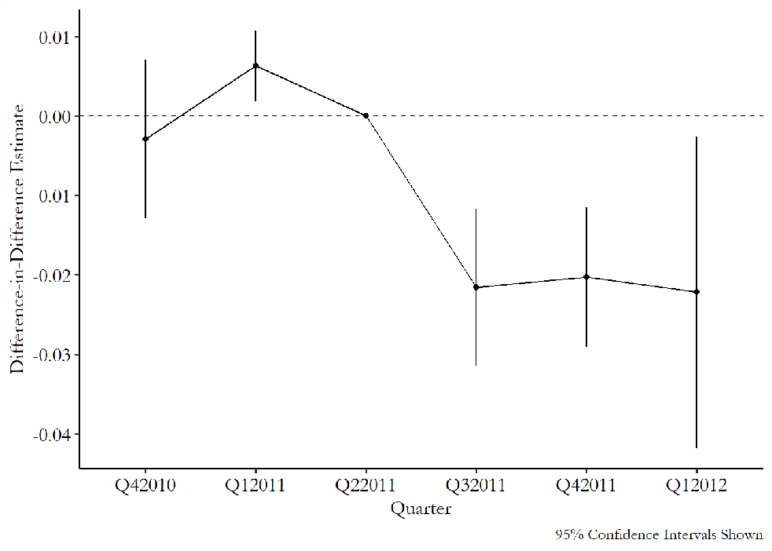

From Figure18.618.6 we can see effects near zero in the three pre-treatment periods - always good,18.6.... although the confidence interval for the first quarter of 2011 is above zero. Thatʼs not ideal, but as I mentioned, a single dynamic effect behaving badly isnʼt a reason to throw out the whole model or anything, especially when the deviation is fairly small in its actual value. We also see three similarly negative effects for the three periods after treatment goes into effect. The impact appears to be immediate and consistent, at least within the time window weʼre looking at.

###### 18.2.5 Control Variables in Difference-in-Differences

YOU MAY BE TEMPTED,as in many causal inference cases, to add control variables to your difference-in-differences estimation. This is certainly possible, but you canʼt just do it unthinkingly. You have to pick your controls carefully, in a somewhat different way than you normally would, and youʼll often have to use a specialized estimator designed to use covariates.

Before thinking about how we can add control variables, itʼs important to think about what theyʼre actually for. Weʼre used to adding covariates to close back doors between treatment and outcome. However, in a DID setting, the research design itself is supposed to do that for you, using within variation to account for differences between treated and control groups, and comparing that within variation across groups to account for changes over time. In DID, then, covariates really only serve the purpose ofsupporting the paralel trends assumption. Including a covariate is making a “conditional parallel trends” claim that “I donʼt think parallel trends holds in my setting, but itdoeshold after you account for the influence of this covariate.* If thatʼs not what youʼre saying, then you donʼt want the control! Donʼt just add control variables because it feels like you should. Thatʼs not a good reason.

How could it be that parallel trends only holds conditional on something? The most obvious is when you have multiple possible control groups to use, and you suspect that parallel trends is most likely to hold if we compare the treated groups to the control groupsmost likethe treated groups, with the most-similar characteristics. It may feel plausible that more-similar groups have more-similar trends, even if thereʼs no particular reason to think that a specific covariate makes trends deviate. This isnʼt thegreatestreason to control for stuff, but I see why people do it.

Another reason might be that we think that there are specific variables where different starting valuesrealy do lead to differences in trend. For example, letʼs say weʼre looking at the influence of a new government nutrition policy on height. If youʼre 5 years old at the time the policy is introduced, itʼs likely youʼre going to grow by more inches in the first year of the policy than someone who is 23 years old at the time the policy is introduced. The use of within variation in DID itself accounts for the fact that the 23-year-old starts out taler than the 5-year-old. But within variation wonʼt account for the fact that, in the absence of treatment, the 5-year-old would have grown by more*. If the treated group has a different age profile than the control group, parallel trends violation! But if we can control for age, parallel trends is restored.

ALRIGHT, SO WEʼVE GOT SOME VARIABLESthat weʼre pretty sure we want to control for, for the reasons just outlined. How do we do it? Just toss them in the regression model like weʼd normally do, right?

No! If only it were so easy! But tossing controls into a two-way fixed effects regression or a dynamic difference-in-differences model doesnʼt do what you want it to do. If youʼre controlling for something because you think more-similar groups have more-similar trends, you end up with a weird average treatment effect that heavily weights theleast-common kinds of groups. And if youʼre controlling because you think different starting values lead to differences in trend, two-way fixed effects only accounts for the differences in levels, not in trend, so it doesnʼt control like you want it to (⊕Callaway and SantʼAnna 2021).

Alright, so adding control variables to a regression doesnʼt work. What does? Common ways of incorporating control variables into difference-in-differences use covariates that are fixed over time, or measured only pre-treatment, and then either matches on them (as in Chapter1414), or14 includes them in a regression with an interaction between the control and time, so you can allow the control to influence the outcomeʼs trend, not just its level.

One additional approach that seems promising, and likely to be used heavily in the future, is synthetic difference-in-differences by Arkhangelsky et al. (⊕2021), which combines difference-indifferences with synthetic control (Chapter222222222222222). This approach doesnʼt actually require covariates,2222222222 but instead adjusts for differences between treated and control groups using the prior trends themselves.

These methods are all covered in the “How the Pros Do It” section below, both in “Doing Multiple Treatment Periods Right!” and “Picking an Untreated Group with Matching.”

SO WEʼRE USINGcovariates that are fixed over time. We are really allowing covariate-specifictrends that will allow us to account for how different starting covariates might encourage the untreated group to grow at a different rate, and thus break parallel trends. Once we have this, there are two important checks we need to perform.

28

First, we need to make sure that we actually fixed the problem. Remember, the whole point of this was to fix violations of parallel trends. Weʼre adding covariates because we think that parallel trends doesnʼtnaturalyhold, but we do think that itconditionalyholds.

We probably established that parallel trends doesnʼt naturally hold by looking at a graph or doing a test or prior trends, right? So… letʼs make sure we fixed the problem by looking at that graph again! After youʼve added your control variables, youʼll want to reexamine your prior trends tests. This will entail estimating the effect of treatment in the pre-treatment periods (like in the “Dynamic Difference-in-Differences” section), but with your control variables included this time, and making sure the violations have gone away. If youʼre using a staggered-rollout design, that means checking prior trends for every treatment cohort youʼre looking at.

Second, youʼll want to look to make sure your comparison groups are actually comparable after you add your control variables. If you are using matching to add your control variables, the methods described in Chapter1414 for looking for common support will apply here. If youʼre using14 regression, then youʼll still want to check how many control observations you evenhavewith similar values on the covariates as your treated observations have. If thatʼs a small number, then technically you can proceed, but youʼre relying pretty heavily on your regression being able to extrapolate outside the range of your data. A little iffy!

What if none of it works? Your original prior trends test looked bad. Then you added covariates and the new prior trends test also looks bad, or your sample size of appropriate-match control observations is tiny. In that case, you may want to finally give up the ghost. Difference-indifferences may not be able to help you, and you should try looking for another design.

BUT WEʼVE LEFT SOMETHING OUT.Our reasons-for-controlling and also the estimators I just mentioned only account for covariates that are measured entirely before treatment. If different levels of a covariate at the outset influence the trend, weʼre good to go. But what about covariates that break parallel trends because the covariate itself changes over time?

Letʼs go back to that government nutrition policy. Say that rich people are taller on average, and after the policy is introduced they like the look of the treated areas and move there. Health should improve because there are just more treated rich people now! So itʼs not so much that initial wealth levels in the area drove parallel trends to break, but ratherchangesin wealth levels broke parallel trends. So we want to control for changes in wealth levels!

Thereʼs a problem, though, and that problem is , or closing a front door path in the language of Chapter88. Any covariate measured after treatment occurred may itself have been influenced by8 the treatment, like how in this case wealth levels in treated areas went up because wealthy people wanted to get treated. Controlling for wealth may shut off part of the actual effect of treatment, for one. We might not worry about that in particular case, since we donʼt want to count ``causes rich people to move thereʼʼ as a part of the effect anyway. However, in many settings we worry about that (what if treatment makes people taller because it makes them richer? Wouldnʼt want to control that effect away!). And even if we donʼt want the effect to count, controlling may introduce collider bias issues. No good!

So in general, even if you have a reason why youʼd want to control for a time-varying covariate, itʼs advised against, and most of the methods we have for adding covariates actually forbid it. What do we do then, when we need to control for time-varying covariates? There are some methods, like in Callaway and SantʼAnna (⊕2021), but they only work in very specific circumstances. Aw, shucks.

###### 18.2.6 Rollout Designs and Multiple Treatment Periods

AND NOW WE COME TO THE SECRET SHAME OF ECONOMETRICS, which concerns the issue ofrolout designs. Itʼs one thing to have a difference-in-difference setup with multiple groups in the

29

“treated” category. Thatʼs fine. A rollout design is when you have all that, but alsothe groups get treated at different times.

For example, say we wanted to know the impact of having access to high-speed Internet on the formation of new businesses. We know that King County got broadband in 2001, Pierce County got it in 2002, and Snohomish County got it in 2003. They each have a before and after period, but those treatment times arenʼt all the same.

Whatʼs the problem? Well, from aresearch designperspective, thereʼs no problem. Youʼre just tossing a bunch of valid difference-in-difference designs together. But from astatistical perspective, this makes our two-way fixed effects regression not work any more (⊕GoodmanBacon 2021). The problem can actually be so bad that, in some rare cases, you can get a negative difference-in-differences estimateeven if the true effect is positive for everyone in the sample. And thus the secret shame: fordecadesresearchers were basically unaware of this problem and used two-way fixed effects anyway. Only recently is the tide beginning to turn on this.

Why doesnʼt two-way fixed effects work when we have multiple treatment periods? Itʼs a little complex, but the real problem occurs because this setupleads already-treated groups to get used as an untreated group.Think about what fixed effectsdoes- it makes us look at variation within group. And in a sense, “no treatment last period, no treatment this period” is the same amount of within-group variation in treatment as “treatment last period, treatment this period.” No change either way. So groups that stick with “still treated” get used as comparisons just as groups that stick with “not treated” do.

30

And why isthata problem? Sure, itʼs a little weird to use a continuously-treated group as your comparison, but why wouldnʼt parallel trends hold there anyway? It might, but also, ifthe effect itself is dynamic, as I discussed in the previous section, or ifthe treatment effect varies across groups, as in Chapter1010, then youʼve set your estimation up in a way so that parallel trends wonʼt10 hold. If you have a treatment effect that gets stronger over time, for example, then the “treated comparison group” should be trending upwards over time in a way that the “just-now treated group” shouldnʼt. Parallel trends breaks and the identification fails.

31

If you are using a balanced panel (each group is observed in every time period) and youʼre not using control variables, you can check how much of a problem the use of two-way fixed effects is

in a difference-in-differences given study using the Goodman-Bacon decomposition, as described in Goodman-Bacon (2018). The decomposition shows how much weight the just-treated vs. already-treated comparisons are getting relative to the cleaner treated vs. untreated comparisons. The decomposition can be performed in R or Stata using their respective bacondecomp packages.

What to do, then, when we have a nice rollout design? Donʼt use two-way fixed effects, but also donʼt despair. Youʼre not out of luck, youʼre just moving into the realm of what the pros do.

###### 18.3 How the Pros Do It

###### 18.3.1 Doing Multiple Treatment Periods Right!

AN AREA OF ACTIVE RESEARCH PRESENTS TO THE TEXTBOOK AUTHORboth the purest terror and the sweetest relief. Whatever I say will almost certainly be outdated by the time you read it. But the inevitability of failure, dang, thatʼs some real freedom.

When it comes to ways of handling multiple treatment periods in difference-in-differences, where some groups are treated at different times than others (rollout designs), “active area of research” is right! Because concern over the failure of the two-way fixed effects model for rollout designs is relatively recent, at least on an academic time scale, the approaches to solving the problem are fairly new, and itʼs not yet clear which will become popular, or which will be proven to have unforeseen errors in them.

I will show three ways of addressing this problem. First, Iʼll discuss the method described in Callaway and SantʼAnna (⊕2021). Second, I will show how our approach to dynamic treatment effects can help us fix the staggered rollout problem. Finally Iʼll discuss the “imputation estimator” described in Borusyak, Jaravel, and Spiess (⊕2024). More technical details are in Roth et al. (⊕2023).

THE FIRST THING CALLAWAY AND SANTʼANNA DOis focus closely onwhen each group was treated. Whatʼs one way to deal with all those different treatment periods giving your estimation a hard

time? Consider them separately! They consider each treatment period just a little different, and instead of estimating an average treatment-on-the-treated for the whole sample, they estimate “group-time treatment effects,” which are average treatment effects on the group treatedin a

particular time period,so you end up with a bunch of different effect estimates, one for each time period where the treatment was new tosomeone.

Now dealing with the treated groups separately by when they were treated, they compare between each treatment group and the untreated group, and use propensity score matching (as in Chapter1414) to improve their estimate. So each group-time treatment effect is based on14 comparingthe post-treatment outcomes of the groups treated in that periodagainstthe nevertreated groups that are most similar to those treated groups.

###### Y

Once you have all those group-time treatment effects, you can summarize them to answer a few different types of questions. You could carefully average them together to get a single averagetreatment-on-the-treated. You could compare the effects from earlier-treated groups against later-treated groups to estimate dynamic treatment effects. Plenty of options.

32

The Callaway and SantʼAnna method can be implemented using the R package did. In Stata you can use the csdid package (or hdidregress if you have Stata 18), and in Python there is differences or the more narrowly dedicated csdid (seehttps://d2chtthtthtthtthtthtthttps://d2cml-ai.github.io/csdid)..htthtthtthtthtt s://ds://dsssssss://ds://ds://d2c//d//d//d//d//d//d cccccccccc l-ai.github.io/csdidl-l-ll-l-ai.githi.i.i.i.i.i.i.i.i.i. ithithithithithithithithithith .i.i.i.i.i.i.i.i.i.i.i /csdid/csdid/csdid/csdid/csdid/csdid/csdid/csdid/csdid/csdid/csdid

MODELS FOR DYNAMIC TREATMENT EFFECTS, modified for use with staggered rollout, can help in the case of staggered difference-in-differences in a few ways.

First, they separate out the time periods when the effects take place. Since our whole problem is overlapping effects in different time periods, this gives us a chance to separate things out and fix our problem.

Second, theyʼre just plain a good idea when it comes to difference-in-differences with multiple time periods. As described in the “Long-Term Effects” section, we can check the plausibility of prior trends, and also see how the effect changes over time (and most effects do).

Third, because theydolet us see how the treatment effect evolves, and because treatment effects evolving is one of the problems with two-way fixed effects, that gives us another opportunity to

separate things out and fix them.

What do I mean by “modified for use with staggered rollout,” then? A few things, all described in Wooldridge (⊕2021).

You know how the dynamic treatment effect model just tosses together a whole bunch of interactions? Well, Wooldridge asks “those interactions seemed to solve some problems for us… letʼs toss in a bunch more and see if that solves all our other problems!” And they kind of do!

In addition to your standard group and time fixed effects plus an interaction between a treatment indicator and indicators for periods-since-treatment (as in the dynamic treatment effect model, which also includes periods-until-treatment indicators we omit here), youalsointeract all those interactions with a set of cohort indicators for when the treatment was first applied, sort of like in Callaway and SantʼAnna. So you might have a single coefficient just for the effect of treatment in 2006 of people who started getting treated in 2004, since youʼre interacting “started in 2004” with “itʼs been two years,” and similarly for every other combination. You can average those coefficients together in a way that gives you a time-varying treatment effect. Points for simplicity! Conveniently, this approach works for nonlinear models like logit or Poisson regression, too.

The Wooldridge “extended two-way fixed effects” estimator can be estimated in R using the etwfe package, or in Stata using the jwdid package.

BORUSYAK, JARAVEL, AND SPIESS TAKE A PLEASANTLYintuitive approach. The whole idea of differencein-differences, and its parallel trends assumption, is that our control group gives us a good proxy of what would have happened to the treated group if treatment had not occurred. The imputation estimator takes that quite literally. It uses untreated data to produce a prediction (an “imputation”) of what the treated data would have looked like if it were untreated. Then, compare what you actually got to that prediction. Similarly to Callaway and SantʼAnna, you now have a whole bunch of estimates for different groups and at different times, which you can average together to get treatment effects.

And, although it doesnʼt quite sound like it, you can view this as an extension of our “modified models of dynamic treatment effects” we just discussed. In fact, this is a more general version of

the Wooldridge estimator we already discussed, except that it can handle covariates that change over time and unbalanced panels, in addition to a few other differences.

The Borusyak, Jaravel, and Spiess method can be implemented using the R package didimputation or the Stata package did_imputation.

###### 18.3.2 Picking an Untreated Group with Matching

DIFFERENCE-IN-DIFFERENCES ONLY WORKS IF THE COMPARISON GROUP IS GOOD.You really need parallel trends to hold. And since you canʼt check parallel trends directly, you need to pick an untreated group (or a set of untreated groups) good enough that the assumption is as plausible as it can be. So however youʼre doing your difference-in-differences, you want to be sure that you can really

###### justify why your untreated group makes sense and paralel trends should hold.

That said, what do you do when you have a bunch of potential untreated groups? You can choose between them (or aggregate them together) bymatchinguntreated and treated groups, as Callaway and SantʼAnna did in the previous section.

The idea here is pretty straightforward. Pick a set of predictor variables from the pre-treatment period, and then use one of the matching methods from Chapter1414 to match each treated14 group with an untreated group, or produce a set of weights for the untreated groups based on how similar they are to the treated groups.

###### X

33

Then, run your difference-in-difference model as normal, with the matching groups/weights applied. Done! Make sure to adjust your standard errors for the uncertainty introduced by the matching process, perhaps using bootstrapped standard errors, as discussed in Chapter1414.14

You can go even further and look into thesynthetic controlmethod, which is further discussed in Chapter222222222222222. In synthetic control, you match your treated group to a bunch of untreated groups2222222222 based not just on prior covariates but alsoprior outcomes. If the synthetic control matching goes well, then prior trends are just about forced to be the same because youʼve specifically chosen weights for your untreated groups that have the same average outcomes as your treated group in each prior period. Why donʼt we just call this a form of difference-in-differences with matching?

There are some differences, like the way the result is calculated and how the matches are made. Plus, you can make it into a form of difference-in-differences with matching! Synthetic differencein-differences (⊕Arkhangelsky et al. 2021) extends this weight-finding approach into something more specific to the difference-in-differences case. It creates a set of control-unit weights as well as time-period weights such that you end up not just comparing your treated group to the control groups most like the treated group, but also balancing time periods before and after the treatment. With the weights in place, you can more or less just run two-way fixed effects.

THIS COMBINED MATCHING/DIFFERENCE-IN-DIFFERENCES APPROACHsatisfies a few nice goals. First, we have difference-in-differences. Since DID has group fixed effects, it already controls for any differences between treated and untreated groups that areconstant over time. However, what DIDdoesnʼtdo is say anything aboutwhy certain groups come to be treated and others donʼt.

If thereʼs some back door between “becomes a treated group” and “evolution of the outcome in the post-treatment period,” as it seems likely there would be, then we still arenʼt identified. Thatʼs where matching comes in. If we can pick a set of matching variables that close the back doors betweenwhich groups become treated and whenand the outcome, we get parallel trends back.

###### X

If you like, you can go even further and use doubly robust difference-in-differences, which applies both matching and regression in ways that identify the effect you want even if one of those two methods has faulty assumptions (although youʼre still in trouble if both are faulty) (⊕SantʼAnna and Zhao 2020). You can apply this method in R with the DRDID package or in Stata with the drdid package.

WHEN THINKING ABOUT MATCHING WITH DIFFERENCE-IN-DIFFERENCES GENERALLY, THERE IS ONE THINGto be concerned about, and that isregression to the mean. Regression to the mean is a common problem whenever you are looking at data that varies over time. The basic idea is this: if a variable is far above its typical averagethisperiod, then itʼs likely to go downnextperiod, i.e., regress back towards the mean. This is because a far-above-average observation is, well, far above average. In a random period, youʼre likely to be closer to the mean than far-above-average. So typically an extreme observation (either above or below) will be followed by something closer to the mean.

34

Another way to think about it is this: the day you win the ten-million-dollar lottery is likely to be followed by a day where you make way less than ten million dollars.

What does this have to do with difference-in-differences and matching? The problem arises if the pre-period outcome levelsare related to the probability of treatment. For example, say there are two cities with similar covariates. Policymakers are planning to put a job training program in place and want to know the effects of the program on unemployment. They choose City A for the program since unemployment is currently really bad in City A. Then they use A as the treated group and B as the untreated group, since B has similar covariates.

What happens then? After the policy goes into effect, unemployment might get better in City A for two reasons: the effect of the policy,orregression to the mean, if A was just having an unusually bad period when policymakers were choosing where to put the training program. Difference-indifferences canʼt tell the two apart, so the estimate is wrong (⊕Daw and Hatfield 2018).

Strangely, this is only a problembecausewe matched A and B. If weʼd just used a bunch of untreated cities, or a random city from a set of potential comparisons, the bias wouldnʼt be there. Thatʼs because B was selected as a good match for anunusualy badtime in Aʼs history. Heck, maybe Bʼs unemployment is usuallywayworse, and this is an unusually good time for them. The matching emphasizes comparisons that are especially subject to regression to the mean.

35

That said, this applies specifically whenoutcome levelsare strongly related to whether your group gets treated, and is worse the more different your treated and untreated groupʼs typical outcome levels are. Treatment being related to outcome trends is less of an issue. This also isnʼt an issue if youʼre matching on covariates that donʼt change much over time. Plus, if this outcomelevel-based-assignment thingisnʼtan issue, then matching can really help. So this isnʼt a reason to throw out matching in difference-in-differences, just a reason to think carefully about it.

###### 18.3.3 The Unfurling Logic of Difference-in-Differences

AT ITS CORE, BEYOND ALL THE CALCULATION DETAILS,difference-in-differences is extremely simple. We see a difference - a gap in outcome levels - and see how that difference changes from before a policy change to afterward. But then who says we have to be limited to looking at how agap in outcome levelschanges? We could look at how a gap in just aboutanythingchanges.

What do I mean? For example, maybe we want to see how a difference in arelationshipchanges from before to after. Letʼs consider a teacher training program that is introduced in some districts but not others. The goal of this training program is to help ease educational income disparities. That is,the relationship between parental income and student test scores should be weaker with the introduction of the training program.

So, what can we do? We already know how to get the effect of on :

Income TestScores

TestScores = β0 + β1Income + ε (18.5)

Now, we want to do difference-in-differences but on instead of on . In other words

β1 Y (βT1reated,After − βT1reated,Before)− (βUntreated,After1 − βUntreated,Before1 )

. That looks like difference-indifferences to me!

36

We can get at these sorts of effects with interaction terms. If we want to know the “within” variation in the effect, we interact with what we have:

After

TestScores = β0 + β1Income + β2After + β3Income × After + ε (18.6)

Estimate that model for the treated group, and gives us

β3

(βT1reated,After − βT1reated,Before) (18.7)

Estimate it for the untreated group and we get

(βUntreated,After1 − βUntreated,Before1 ) (18.7)

We can combine everything into one regression with atriple-interaction term:

TestScores = β0 + β1Income + β2After + β3Income × After+ β4Treated + β5Treated × Income + β6Treated × After+

β7Treated × Income × After + ε (18.8)

Letʼs walk through the logic carefully here. looks at the effect of , and sees how that effect changes from before to after ( ), and then sees howthat before-after changeis different between the treated and untreated groups ( ). This is difference-in-differences but on a relationship rather than the average of an outcome.

β7 Income Income × After

Treated × Income × After

This approach works for basically any kind of research design. Weʼve done it here for a basic correlation, but with the right setup you could see how an instrumental variables (Chapter1919) or19 regression discontinuity (Chapter2020) estimate changes from before to after. As long as you want20 to know the effect of some policyon the strength of some other effect, you can do what you like.

Aside from applying DID to effects themselves (relationships), you can also apply difference-indifferences logic to other kinds of summary descriptions of a single variable rather than the mean (like DID would do). One application of this is in using DID with quantile regression - a form of regression that looks at how predictors affectthe entire distributionof a variable. This lets you use a DID research design to see how a policy affects, say, values at the tenth percentile.

WE CAN EVEN APPLY THIS TO DIFFERENCE-IN-DIFFERENCES ITSELFand get the difference-in-difference-indifferences model, also known as triple-differences or DIDID! DIDID could be used to see how a newly implemented policy changes a DID-estimated effect. However, DIDID is also used to help strengthen the parallel trends assumption by finding a treated group thatshouldnʼtbe affected at all, and subtracting out their effect. This works using the same triple-interaction regression we just discussed.

37

For example, imagine a new environmental policy that increases funding to remove trash from marshes. The policy is implemented in some prefectures but not others. You want to run DID to see if the policy actually reduced trash levels. But what if you ran DID onparksinstead of marshes and found an effect? That tells you thereʼs something going on that breaks parallel trends - trash levels in the treated and untreated groups are trending apart even in places that shouldnʼt be affected by the policy. What can we do? Well, just run DID on marshes, and also run DID on parks, and take the difference of them (difference-in-DID or DIDID). This hopefully subtracts out the violation of parallel trends we saw, leaving us with a better estimate of the effect on marshes.

38

To see how this might work in action, take Collins and Urban (⊕2014). This paper looks at a policy enacted in the state of Maryland in 2008 intended to help reduce home foreclosure rates. When

someone misses payments on their mortgage, the loan servicercouldforeclose on them,orthey could do nothing and just wait to see if they start paying again,orthey could help the mortgage holder modify their loan so they might be able to get back on track with payment. All the policy did was require mortgage servicers to report what sorts of loan-modification activities theyʼd done to help people. Collins and Urban wanted to know whether the policy got loan servicers to modify more loans and reduce foreclosures.

Theycouldhave just run DID. Simply compare loan modifications and foreclosures in Maryland and some untreated state before and after the policy. However, it might be tricky to believe that parallel trends would hold. After all, 2008 was heading right into the Great Recession, and all sorts of things were changing all over the place,especialyin regards to loan delinquencies and foreclosures. Maryland and whatever untreated state got picked might trend apart for no reason other than pure unbridled financial chaos.

However, Collins and Urban were in luck: the policy only applied tosomeloan servicers but not others. So they added that third difference in: see how different the DID effect is between servicers subject to the new policy and those that werenʼt. After all, the servicersnotsubject to the policy shouldnʼt be affected at all, so any DID effect wedosee is more on the “financial chaos” side of things rather than the “effect of the policy” side, and we can subtract that out.

What did they find? They found that the policydidget loan servicers to modify more loans to make them easier to pay, even though the underlying financial reality of the loan stayed exactly the same. However, theyalsofound that the policy led to more foreclosures, contrary to the intent of the policy. These results can be seen in Figure18.718.7 - on the left, the number of loans18.7.... that get modified is the dependent variable, and on the right, itʼs the foreclosure rate. Each point is the difference between Maryland and other states (difference), and the different lines represent the ESRR loan servicers affected and the not-ESRR servicers not affected by the policy (in difference). You can see how the gap grows by quite a bit after the policy goes into effect (in difference).

39

40

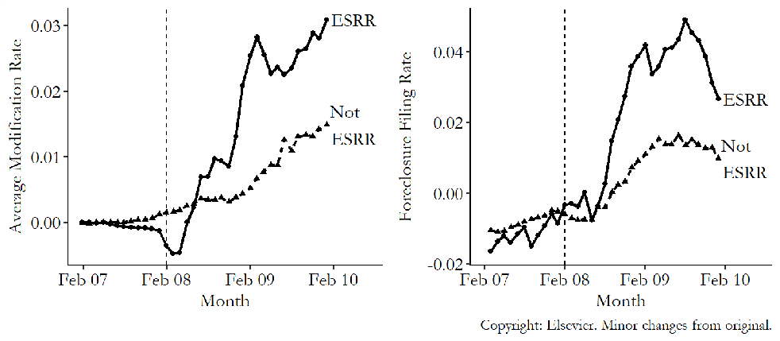

Figure 18.7: Differences Between Maryland and Other States from Collins and Urban (2014)

Previous Next

Page built: 2025-10-17 using R version 4.5.0 (2025-04-11 ucrt)

###### The Effect

Nick Huntington-Klein

▾ Chapters

###### Chapter 19 - Instrumental Variables

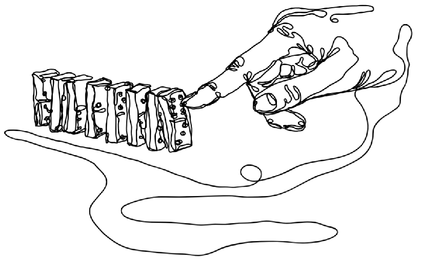

###### 19.1 How Does It Work?

###### 19.1.1 Isolating Variation

IF YOU WANT TO BUILD A STATUE, ONE WAY TO GO ABOUT IT IS TO GET A BIG BLOCK OF MARBLEand chip away at it until you reveal the desired form underneath. Another way is to take something like concrete or molten steel, and pour it into a mold that only allows the desired form to show through. Research designs based on closing back doors and removing undesirable variation are sort of like the former. Instrumental variables designs are like the latter.

Instrumental variables are more like using a mold because instead of trying to strip away all the undesirable variation using controls, it finds a source of variation that allows you to isolate just the front-door path you are interested in. This is similar to how a randomized controlled experiment works. In a randomized experiment, you have control over who gets treatment and who doesnʼt. You can choose to assign that treatment in a random way. When you do so, the variation in treatmentamong participants in your experimenthas no back doors. By using randomized assignment to treatmentinstead ofreal-world treatment, you isolateonlythe covariation between treatment and outcome thatʼs due to the treatment, and completely purge the variation thatʼs due to those nasty back doors.

Instrumental variables designs seize directly on the concept of randomized controlled experiments, and are in effect an attempt to mimic a randomized experiment, but using statistics and opportune settings instead of actually being able to influence or randomize anything.

1

IN A TYPICAL SETTING,if we have a and an , we want to know the effect of treatment on outcome, . However, there is, to say the least, anannoying back door path. There could be a lot going on here, but letʼs just say we also have

Treatment Outcome Treatment → Outcome

. Further, because in the social sciences representsa bunchof different things, itʼs unlikely we can control for it all. A randomized experiment shakes up this system by adding a new source of variation, , thatʼs completely unrelated to . This is all shown in Figure19.111111119.1.111119.1.1.1.1.1111111

Treatment ← Annoyance → Outcome Annoyance

Randomization Annoyance 2

Figure 19.1: Randomization Helps Avoid Back Doors

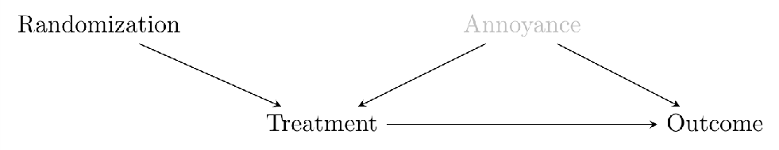

The instrumental variables design works in theexact same way. The only difference is that, instead of randomizing the variable ourselves, we hope that something has already randomized it

3

###### for us.We look in the real world for a source of randomization that has no back doors, and use that to mimic a randomized controlled experiment.

An instrumental variables design does not remove the requirement to identify an effect by closing back doors. But it doesmove the requirement,hopefully to something easier! Instead of needing to close the back doors between and , which would require us to control for

Treatment Outcome Annoyance Randomization Outcome Randomization Outcome

, we instead just need to close the back doors between and

(if there are any), as well as any front door between and that doesnʼt pass through .

Treatment

THE MECHANICS FOR ACTUALLY IMPLEMENTING INSTRUMENTAL VARIABLESare, in effect, a means of trying to do what an experiment does when you donʼt actually have perfect control of the situation makes sense, as thatʼs what is happening.

How can we mimic a randomized experiment? Well, in a randomized experiment, we generate some random variation and then just isolate the part of the treatment that is driven by that random variation - we only use the data from the experiment. So in instrumental variables weʼre going to isolate just the part of the treatment that is driven by the instrument, butstatisticaly.

In other words, weʼre going to:

- 1. Use the instrument to explain the treatment
- 2. Remove any part of the treatment that isnotexplained by the instrument
- 3. Use the instrument to explain the outcome
- 4. Remove any part of the outcome that isnotexplained by the instrument
- 5. Look at the relationship between the remaining, instrument-explained part of the outcome and the remaining,

4

###### instrument-explained part of the treatment

This is, in effect, theoppositeof controlling for a variable. When we get the effect of on while controlling for , we use to explain and and remove the explained parts, since we want to close any path that goes through . But when we get the effect of on using as an instrument, we use to explain and and remove theunexplainedparts, to give usonlythe paths that come from . The part thatʼs explained by is the part with no back doors, which is what we want.

X Y W W X Y

W X Y Z Z X Y

Z Z

The whole story can be seen in Figure19.219.2, which demonstrates what an instrumental variables19.2.... design actually does to data to get its estimate. The figure uses a binary instrument - this isnʼt necessary for instrumental variables generally, but the figure is much easier to follow this way. We start with Figure19.219.2 (a), graphing the raw data, which shows a slight positive relationship19.2.... between and . We can also see the different values of on different parts of the graph - the 0s to the bottom-right and the 1s to the top-left.

X Y Z

We can move on to Figure19.219.2 (b), which shows us taking the mean of19.2.... within the different values. Instrumental variables uses the part of that is explained by . When is binary, thatʼs just the mean of for each group. We only want to use the part of thatʼs explained by - thatʼs the part without any back doors, so in Figure19.219.2 (c) we get rid of all the variation in19.2.... thatisnʼt explained by , leaving us with only those predicted (mean-within- ) values.

X Z X Z Z

X X Z

X Z Z X

Then in Figures19.219.2 (d) and (e), we repeat the process with19.2.... . We do this, again, to close the back doors between and . That nice -driven variation is free of back doors, so we want to isolate just that part.

Y

- X Y Z

X

- Y Z
- Z = 0 X Y Z = 1 X Y X

Finally, in Figure19.219.2 (f), we look at the relationship between the predicted part of19.2.... and the predicted part of . Since is binary, each observation in the data gets only one of two predictions - the prediction for and , or the prediction for and . Only two predictions means only two dots left on the graph, and we can get the relationship between and by just drawing a line between those two points. The slope of that line is the effect of on

Y X

, as estimated using as an instrumental variable, i.e., isolating only the part of the /

- Y Z X Y

relationship that is predicted by . The slope we have here is negative, unlike the positive relationship from (a). And since I generated this data myself, I can tell you that the true relationship between and in this data is in fact negative, just like the slope in (f).

Z

X Y

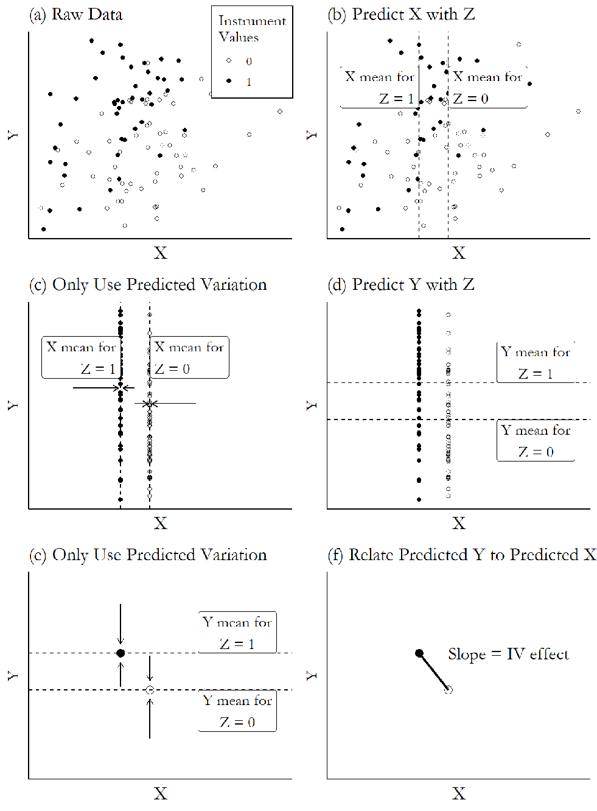

Figure 19.2: Instrumental Variables with a Binary Instrument, Step by Step

###### 19.1.2 Assumptions for Instrumental Variables

FOR INSTRUMENTAL VARIABLES (IVS) TO WORK,we must satisfy two assumptions:relevanceof the instrument, andvalidityof the instrument.

5

Relevanceis fairly straightforward. The idea of instrumental variables is that we use the part of , the treatment, that is explained by , the instrument. But what if no part of is explained by ? What if theyʼre completely unrelated? In that case, instrumental variables doesnʼt work.

X Z X Z

This follows pretty intuitively - we canʼt isolate the part of explained by if there isnʼt a explained part of to isolate. Also, if we follow the steps described earlier in the chapter, then instrumental variables in effect asks “for each -explained movement in , how much explained movement in was there?” In other words, in its basic form instrumental variables gives us . If doesnʼt explain , then and we get

X Z Z X 6

Z X Z Y

Cov(Z,Y )/Cov(Z,X) 7 Z X Cov(Z,X) = 0 Cov(Z,Y )/0 8

. And we canʼt divide by 0. The estimation simply wouldnʼt work.

Now in real-world settings, hardly any correlation is truly zero. But even if is justsmal rather than zero, we still have problems. If the covariance is small, weʼd call aweak

Cov(Z,X)

Cov(Z,X) Z X Cov(Z,X)

instrumentfor . The estimate of is likely to jump around a bit from sample to sample - thatʼs the nature of sampling variation. If is, for example, on average 1, and it varies a bit from sample to sample, we might get values from .95 to 1.05, changing our

Cov(Z,X)

instrumental variables estimate by maybe 10% across samples. But if

Cov(Z,Y )/Cov(Z,X) Cov(Z,X)

follows the same range for a much lower baseline, maybe from .01 to .11, that changes our estimate by as much as 1100% across samples. Big, swingy estimates! Big and swingy may be positive qualities in some areas of life but not in statistics.

Cov(Z,Y )/Cov(Z,X)

So we need to be sure that actually relates to . Thankfully, this is one of the few assumptions in this half of the book we can really confidently check. Simply look at the relationship between

Z X

X

and and see how strong it is. The stronger it is, the more confident you can be in the relevance assumption, and the less the estimate will jump around from sample to sample.

###### Z

9

PERHAPS THE MORE FRAUGHT OF THE TWO ASSUMPTIONSis the assumption ofvalidity. Validity is, in effect, the assumption that the instrument isa variable that has no open back doors of its own.

###### Z

10

###### Perhaps a bit more precisely,any paths between the instrument and the outcome must either pass through the treatment or be closed.Remember, instrumental variables doesnʼt

Z Y X

relieve us of the duty of closing all the back doors that are there; it just moves that responsibility from the treatment to the instrument, and hopefully the instrument is easier to close back doors for.

Take Figure19.319.3 for example. If we want to use19.3.... as an instrumental variable to identify the effect of on , what needs to be true for the validity assumption to hold?

Z

- X Y

Figure 19.3: A Diagram Amenable to Instrumental Variables Estimation… If We Pick Controls Carefully!

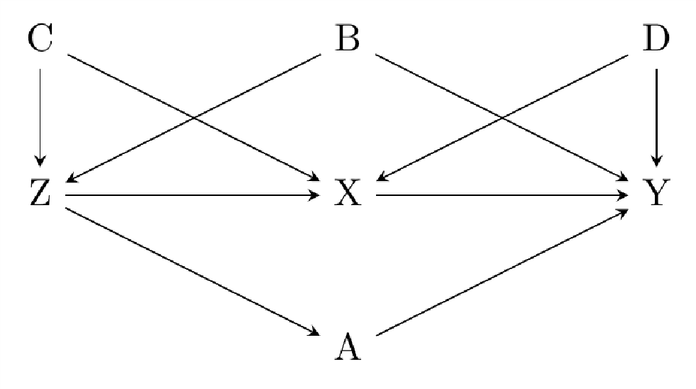

There are a few paths from to we need to think about:

###### Z Y

Z → X → Y Z → X ← D → Y Z ← C → X → Y Z ← C → X ← D → Y Z ← B → Y Z → A → Y

We want all open paths from to to contain . The first four paths in the list contain , so those are good to go. Itʼs not even a problem that we have . If that path is left open, we canʼt identify . But who cares? We donʼt have to identify , we just need there to be no way to get from to except through .

Z Y X X Z ← C → X Z → X Z → X Z Y X 11,12

How about ? Thatʼs the annoying source of endogeneity that we presumably couldnʼt control for that made unidentified and required us to use IV in the first place. But even though we have , thatʼs fine. Once we isolate the variation in driven by , any other arrow leadingto basically doesnʼt matter anymore. Those arrows might go to , but they donʼt go to , and weʼre only using variation that starts with .

D

X → Y Z → X ← D → Y X Z

X X Z Z

Putting the paths with in them to the side, that leaves us with two: and

X Z ← B → Y

. These two pathsareproblems and must be shut down for to be valid.

- Z → A → Y Z Z ← B → Y

is an obvious one. That looks just like any normal back door weʼd be concerned about.

But why is a problem, too? Because it gives another way to be related to other than through . When we isolate the variation in driven by , that variation will also be closely related to . So when we then look at the relationship between and the variation in driven by , weʼll mix together the effect of and the effect of .

Z → A → Y Z Y X X Z

A 13 Y X Z X A

So for the validity assumption to hold for , we need to close both the path and the path. If we can control for both and , then weʼre fine.

Z Z ← B → Y Z → A → Y A B 14

WE NEED RELEVANCE AND VALIDITY. HOW REALISTIC IS VALIDITY, ANYWAY?We ideally want our instrument to behave just like randomization in an experiment. But in the real world, how likely is that to actually happen? Or, if itʼs an IV that requires control variables to be valid, how confident can we be that the controls really do everything we need them to?

In the long-ago times, researchers were happy to use instruments without thinking too hard about validity. If you go back to the 1970s or 1980s, you can find people using things like parental education as an instrument for your own (surely your parentsʼ education canʼt possibly affect your outcomes except through your own education!). It was the Wild West out there…

But these days, go to any seminar where an instrumental variables paper is presented and youʼll hear no end of worries and arguments about whether the instrument is valid. And as time goes on, it seems like people have gotten more and more difficult to convince when it comes to validity.

15

Thereʼs good reason to be concerned. Not only is it hard to justify that there exists a variable strongly related to treatment that somehowisnʼt at alrelated to all the sources of hard-tocontrol-for back doors that the treatment had in the first place, we also have plenty of history of instruments that we thought sounded pretty good that turned out not to work so well.

To pick two examples of many, we can first look at Acemoglu and Johnson (⊕2007). In this study, they want to understand the effect that a populationʼs health has on economic growth in that country. Weʼd expect that a healthier population leads to better economic growth, right? They use the timing of when new medical technology (like vaccines for certain diseases) is introduced as an instrument for a countryʼs health (specifically, mortality from certain diseases). They find that changes in health in a given year driven by changes in medical technology that year actually have anegativeeffect on a countryʼs economic growth!

Bloom, Canning, and Fink (⊕2014) have a different view on the instrument that Acemoglu and Johnson used. Bloom, Canning, and Fink point out that the original study didnʼt account for the possibility that changes in health may havelong-termeffects on growth. Why might this matter? Because the healthier youalready are, the less a new medical technology can improve your mortality rates even further. So the effectiveness of that medical technology is related to preexisting health, which is related to preexisting economic factors, which is related to current

economic growth. A back door emerges. Bloom, Canning, and Fink find that when they add a control for preexisting factors, presumably fixing the validity issue, the negative effect that Acemoglu and Johnson found actually becomes positive.

16

A particularly well-known example of a popular IV falling into disrepute is rainfall, which was a commonly-used instrument in studies of modern agricultural societies. Rainfall levels have been used as an instrument for all sorts of things, like personal income or economic activity. Less rain (or too much rain) can harm agricultural output. If everyoneʼs a farmer, well… thatʼs no good! Since farmers donʼt have any control over rainfall, it seems reasonable to treat it as exogenous and without any back doors.

17

18

To follow one example of a study that uses rainfall as an instrument, Miguel, Satyanath, and Sergenti (⊕2004) use rainfall as an instrument for economic growth in different countries in Africa, and then look at how economic growth affects civil conflict. They find a pretty big effect: a negative change in income growth of five percentage points raises the chances of civil war by 50% in the following year.

But is rainfall a valid instrument for income? Sarsons (⊕2015) looks at data from India and finds that the relationship between rainfall and conflict is similar in areas irrigated by dam water (where rainfall doesnʼt affect income much) and in areas without dams (where rainfall matters for income a lot). This implies that rainfall must be affecting conflict via some mechanism other than income. Some of her potential explanations include rainfall spurring migration, rainfall affecting dam-fed areas by spillovers from nearby non-dam-fed areas, or rainfall making it difficult to riot or protest.

19

IF VALIDITY IS SO DIFFICULT, WHY BOTHER?You canʼt use data to prove that your instrument is valid, and convincing others itʼs valid on the basis that you think your causal diagram is right is difficult. That said, that doesnʼt mean we need to give up on instrumental variables entirely. We just may need to be choosy in when we apply it.

First, there really are some situations where the instrument is as-good-as-random. You just have to pay attention and get lucky to find one! Some force happens to act to assign treatment that truly comes from outside the systemor is appliedalmost completely randomly.A really good instrument usually takes one of two forms. Either it represents real randomization, like an actual

randomized experiment, or something like “Mendelian randomization,” which uses the random process of combining parental genes to produce a child as an instrument. Alternately (and more common in the social sciences) a good instrument is probably one that you would never think to include in a model of the outcome variable, and in fact you may be surprised to find that it ever had anything to do with assigning treatment.

20

To pick one example of this kind of thing, Iʼll toot my own horn and mention the only study Iʼve ever worked on using a validity assumption (⊕Goldhaber, Grout, and Huntington-Klein 2017). The paper was about the teacher hiring process in a school district that used a scoring system to evaluate applicants before hiring them. When we looked at the data, we realized that the evaluation scores on the different criteria were added up to produce an overall score by hand. Sometimes this adding-up was done incorrectly. Addition errors were a cause of making it to the next stage of the hiring process, and sound pretty random to me.

21

22

Second, there are some forms of IV analysis that allow for a little bit of failure of the validity assumption. So as long as you can make the validity assumptioncloseto being true, you can get something out of it. Weʼll talk about that in the “How the Pros Do It” section.

Third, there are certain settings where randomness is really more believable. For one, you can apply instrumental variables toactual randomized experiments,and in fact this is commonly done when not everybody does what youʼve randomized them to do (“imperfect compliance”).

23

Did you randomize some people to take a new medication and others not to, but some people skipped their medication doses anyway? If you just analyze the experiment as normal, youʼll underestimate the effect of the medication, since youʼll have people who never actually took it mixed in there. This would be the “intent-to-treat” estimate, the effect ofassigningpeople to take medication, rather than the effect of the medication itself. But if you use the random assignment

- as an instrument fortakingthe medication (treatment), you get the effect of treatment. And that random assignment sounds pretty darn valid. After all, it really was random. No alternate paths!

Another place where IV pops up with a really believable validity assumption is in application to regression discontinuity designs. Weʼll get to those in Chapter2020. But for now, letʼs get a little20 deeper into how we can actually use IV ourselves, if we do happen to believe that validity assumption.

###### 19.1.3 Canonical Designs

THE USE OF INSTRUMENTAL VARIABLES MEANSyou can find causal inference using all sorts of clever designs, and in all sorts of places that seem helplessly chock-full of back doors. “Clever” is probably the most common adjective youʼll hear for a good instrument.

24

One downside of super clever instruments, though, is that theyʼre often highly contextdependent. But some instrumental variables designs seem to be both pretty plausible, apply in lots of different situations, and get used over and over again. Some of these Iʼve already discussed - charter school lotteries from Chapter99 are an example. And of course the use of9 instruments in the case of random experiments with imperfect compliance. Another is - uh-oh rainfall as an instrument for agricultural productivity. But others have weathered years of criticism a bit better than rainfall did.

25

26

One good example of a canonical instrumental variables design isjudge assignment(⊕Aizer and Doyle Jr 2015). In many court systems, when you are about to go on trial, the process of assigning a judge to your trial is more or less random. This is important because some judges are harsher, and others are less harsh. This means that can act as an instrument for

###### JudgeHarshness Punishment

. Simply estimate the harshness of each judge using their prior rulings. Then, the harshness ofyourjudge is an instrument for your punishment. This can be used anywhere you have randomly-assigned judges and want to know the impact of harsher punishments (or even being judged guilty) on some later outcome.

Another is the use of the military draft as an instrument for military service (⊕Angrist 1990). Military drafts are usually done semi-randomly, with the order in which people are drafted assigned in a random way. Whether you are drafted or not is a combination of where you are in the order and how many people they want to draft. So where you fall in the random draft order is a source of randomization for military service. It can also be a source of randomization for other things, like going to college, that may let you avoid the draft.

27

Perhaps the most commonly used instrumental variables design ever is compulsory schooling as an instrument for years of education (⊕Angrist and Keueger 1991). There are a zillion things that

28

go into your decision of how long to continue in education and when to stop. But in many places, there is a compulsory schooling age - you canʼt legally drop out until a certain age. So if youʼd like to drop out at fifteen, but the law keeps you in until sixteen, thatʼs a little nudge of extra education for you. Variation between regions in these laws over time can act as an instrument for how much education you get.

Lastly, thereʼs the “Bartik Shift-Share IV” (⊕Bartik 1991). In this design, shared economy-wide trends are combined with the distribution of industries across different regions as an instrument for economic activity. In other words, if you live in Ice Cream Town, which makes a lot of ice cream, and the next town over is Popcorn Town, which makes a lot of popcorn, and over the past ten years ice cream has gotten way more popular on a national level, thatʼs going to be a fairlyrandom boon for your town. Easy! Recent work looks more closely at this design and finds a few changes in how we interpret it (⊕Goldsmith-Pinkham, Sorkin, and Swift 2020), but the design lives on.

There are plenty of other canonical designs, of course. Settling locations of an original wave of immigrants as an instrument for further immigration, the birth of twins as an instrument for the number of children, housing supply elasticity as an instrument for housing prices, natural disasters as instruments for all sorts of things… I could go on. In the course of the chapter, Iʼll talk about three other canonical designs: the direction of the wind as an instrument for pollution, whether your first two children are the same sex as an instrument for having a third, and “Mendelian randomization,” which uses someoneʼs genetic code as an instrument for all sorts of things.

###### 19.2 How Is It Performed?

###### 19.2.1 Instrumental Variables Estimators

WE CAN START WITH OUR APPROACH TO ESTIMATING INSTRUMENTAL VARIABLES BY TAKING IT PRETTY LITERALLY.Instrumental variables as a research design is all about isolating the variation in the treatment that is explained by the instrument. So letʼs just, uh, do that.

29

Two-stage least squares (2SLS) is a method that uses two regressions to estimate an instrumental variables model. The “first stage” uses the instrument (and other controls) to predict the treatment variable. Then, you take the predicted (explained) values of the treatment variable from that first stage, and use that to predict the outcome in the second stage (along with the controls again).

Given our instrument , treatment , outcome , and controls , we would estimate the models:

###### Z X Y W

- X = γ0 + γ1Z + γ2W + ν (19.1)
- Y = β0 + β1X^ + β2W + ε (19.2)

where and are both error terms, are the predicted values of , predicted using an OLS estimation of the first equation, and are regression coefficients just like , only given a different Greek letter to avoid confusing them with the s.

ν ε X^ X γ β β 30

The procedure is quite easy to do by hand (although I wouldnʼt recommend it, for reasons Iʼll get to in a moment). Simply run OLS of on (lm in R, regress in Stata, sm.ols().fit() in Python with statsmodels). Then, predict using the results of that regression (predict() in R, predict in Stata, sm.ols().fit().predict() in Python). Finally, do a regression of on the predicted values. Donʼt forget to include any controls in both the first and second stages.

X Z X

Y

Weʼre not entirely done yet - if we simply do this procedure as Iʼve described it, our standard errors will be wrong. So thereʼs a standard error adjustment to be done, changing them to account for the fact that weʼveestimated rather thanmeasuringit, and therefore thereʼs more uncertainty in those values than OLS will pick up on.

X^

31

But with that under our belt, we have created our own instrumental variables estimate!

What is it doing, precisely, anyway? 2SLS produces aratioof effects, dividing the effect of on by the effect of on . It asks “for each movement in we get by changing , how much

###### Z Y Z X X Z

movement in does that lead to?” The answer to this question, since has no back doors, should give us the causal effect of on .

Y Z X Y

2SLS has some nice features - itʼs easy to estimate, itʼs flexible (adding more instruments to the first stage is super easy, although adding more treatment variables is less easy), and since it really just uses OLS, itʼs easy to understand. These are the reasons why 2SLS is by far the most common way of implementing instrumental variables.

2SLS has some downsides too. It doesnʼt perform that well in small samples, for one. While the instrumentin theoryhas no back doors, in an actual data set the relationship between and the non- parts of is going to be at least alitlenonzero, just by random chance. The smaller the sample is, the more often this “nonzero by random chance” is going to be not just nonzero but fairly large, driving to not be quite valid in a given sample and giving you bias. Additionally, 2SLS doesnʼt perform particularly well when the errors are heteroskedastic.

Z X Y

Z

32

WHILE TWO-STAGE LEAST SQUARES IS THE MOST LITERAL WAY OF THINKING ABOUT INSTRUMENTAL VARIABLES,

it is only one estimator of many. And thereʼs a good case to be made that it isnʼt even that great a pick among the different estimators, despite its popularity.

Here, Iʼll talk a bit about the generalized method of moments (GMM) approach to estimating instrumental variables. Some other methods, each with its own strengths, will pop up throughout the chapter.

GMM is an approach to estimation thatʼs much broader than instrumental variables, but in this chapter at least weʼre just using it for IV. The basic idea is this: based on your assumptions and theory, construct some statisticalmoments(means, variances, covariances, etc.) thatshouldhave certain values.

33

For example, if we want to use GMM to estimate the expected value (mean, basically) of a variable , weʼd say that the difference between our sample estimation of the expected value and the population expected value should be zero. So weʼd make a condition of our estimation. Replace with its sample value and solve the equation to get

- Y μ E(Y ) μ − E(Y ) = 0

E(Y ) N1 ∑Y μ^ = N1 ∑Y μ

. GMM will pick the that makes the moment condition true on average. Or for OLS, we assume that is unrelated to the error term . So we use the condition that . In

###### X ε Cov(X,ε) = 0

the actual data, that works out to , where is the residual. Do a little math and you end up back at the same estimate for that we already had.

∑Xr = 0 r β1 34,35

You might be able to guess how GMM works with IV from the OLS example. We assume that is unrelated to the second-stage error term . So we use the condition . Substitute in the sample-data version of the covariance and do a little math to end up with , which is what we had before.

Z ε Cov(Z,ε) = 0

β1 = ∑(ZY )/∑(ZX)

So, same answer. Big whoop, right? Except that things get a bit more interesting when we either have heteroskedasticity(which we probably do) oradd more instruments.

GMM and 2SLS are both capable of handling heteroskedasticity. GMM does so naturally, as it doesnʼt really make assumptions about the error terms in the same way that the OLS equations making up 2SLS do. But we can get there with 2SLS by simply using heteroskedasticity-robust standard errors.

But things get more interesting when the number of instruments is bigger than the number of treatment/endogenous variables you have, which is called being “overidentified.”

36

When your model is overidentified, 2SLS and GMM diverge. GMM is going to be more precise, at least if thereʼs heteroskedasticity involved. GMM will have less sampling variation (and thus smaller standard errors) under heteroskedasticity than 2SLS, even if you add heteroskedasticityrobust standard errors. This continues to be true if you start applying clustered standard errors or corrections for autocorrelation.

Keep in mind - GMM isnʼt just a different way of adjusting the standard errors. The estimates themselves will actually be different when thereʼs overidentification. The GMM standard errors are smaller not because we choose to claim we have more information and thus more precision, but because the method itself produces more precise estimates, and the smaller standard errors reflect that.

LETʼS CODE UP SOME INSTRUMENTAL VARIABLES.For this exercise weʼll be following along with the paper “Social Networks and the Decision to Insure” by Cai, De Janvry, and Sadoulet (⊕2015). The authors are looking into the decision that farmers make about whether to buy insurance against

weather events. In particular, theyʼre interested in whether information about insurance travels through social networks.

They look at a randomized experiment in rural China, where households were randomized into two rounds of different informational sessions about insurance. The question then is: how much doeswhat your friends learn about insuranceaffect your own takeup of insurance? They look at people in the second round of sessions, and they look at what their friends did and saw in the first round of sessions, to see how the former is affected by the latter.

37

Cai, De Janvry, and Sadoulet do in general find that farmersʼ decisions were affected by what their friends saw and the information they received. Iʼll be looking at a particular one of their analyses where they ask whether farmersʼ decisions were affected by what their friendsdid: does your friendsactualy buyinginsurance make you more likely to buy?

We want to identify the effect of on among people in the second-round informational sessions, looking at the average purchasing behavior of their friends who were in the first-round informational sessions. This effect has some obvious back doors. Preferences for insurance may be higher or lower by region, or you may simply be more likely to have friends with preferences similar to yours, including on topics like insurance.

FriendsPurchaseBehavior Y ourPurchaseBehavior

As an instrument for they use the variable , which is a binary indicator for whether your friends were randomly assigned to a “default buy” informational session, where attendees were assigned to buy insurance by default, and had to specify their preference not to buy it, or a “default no buy” session, where attendees were assigned to not buy insurance by default, and had to specify their preference to buy it. Everyone had the same options and got the same information, but the defaults were different. People follow defaults! Those in the “default buy” sessions were twelve percentage points more likely to buy insurance than those in the “default no buy” sessions. The fact that is randomized makes the argument that itʼs a valid instrument pretty believable. Plus, a twelve percentage point jump seems like plenty to satisfy the relevance assumption.

FriendsPurchaseBehavior FirstRoundDefault

FirstRoundDefault

38

Okay, now,finalyletʼs code the thing. Weʼll start with 2SLS, and then, using the same data, will do GMM, LIML, and IV with fixed effects (“panel IV”). Wait, I slipped “LIML” in there - whatʼs that?

Thatʼs limited-information maximum likelihood. Iʼll show how to code it up here, since itʼs easy enough to switch out methods, but Iʼll actually talk about the method later in the chapter.

###### R Code R Code e Stata CodeStata CodeStatatatatatatatatatatatatatatatatatatatatata e Python CodePython Codeytyttt ooooooooooo o o oooooo o o o e

# There are many ways to run 2SLS; # the most common is ivreg from the AER package. # But we'll use feols from fixest for speed and ease # of fixed-effects additions later library(tidyverse); library(modelsummary); library(fixest) d <- causaldata::social_insure

# Include just the outcome and controls first, then endogenous ~ instrument # in the second part, and for this study we cluster on address m <- feols(takeup_survey ~ male + age + agpop + ricearea_2010 +

literacy + intensive + risk_averse + disaster_prob + factor(village) | pre_takeup_rate ~ default, cluster = ~address, data = d)

# Show the first and second stage, omitting all # the controls for ease of visibility msummary(list('First Stage' = m$iv_first_stage$pre_takeup_rate,

'Second Stage' = m), coef_map = c(default = 'First Round Default', fit_pre_takeup_rate = "Friends' Purchase Behavior"), stars = c('*' = .1, '**' = .05, '***' = .01))

This gives us the result in Table19.111111119.1 (keeping in mind this table doesnʼt show a bunch of111119.1.1.1.1.1111111 coefficients for all the control variables). The first stage regression has the endogenous variable (whether your friends purchased insurance) as the dependent variable, and a coefficient for our instrument. The coefficient is .118 and statistically significant. Itʼs showing that your friends being assigned to the “default-purchase” experimental condition leads to a 11.8 percentage point increase in the probability that theyʼll buy insurance. We predict whether your friends bought

39

###### insurance using that .118 bump (as well as the other predictors not shown on the table) and use those predicted values in the second stage.

Table 19.1: Instrumental Variables Regression from Cai, de Janvry, and Sadoulet (2015)

First Stage Second Stage First Round Default 0.118***

(0.034)

Friends Purchase Behavior

0.791***

(0.273) Num.Obs. 1378 1378 R2 0.469 0.127 R2 Adj. 0.448 0.092 RMSE 0.18 0.47 Std.Errors by: address by: address

* p < 0.1, ** p < 0.05, *** p < 0.01 Controls for gender, age, agricultural proportion, farming area, literacy, intensiveness of assigned treatment, risk aversion, perceived disaster probability, and village excluded from table.

The second stage has the actual outcome ofyoubuying insurance as the outcome. A one-unit increase in the rate at which your friends buy insurance, using only the random variation driven by the random experimental assignment and the controls, increases your chances of buying insurance by .791. Thatʼs a pretty strong spillover effect!

Thatʼs 2SLS. How about GMM and LIML? In Stata and Python the transition is easy. In Stata, run ivregress gmm or ivregress liml instead of ivregress 2sls. Unfortunately, there are some important LIML parameters and weʼll discuss later that ivregress liml wonʼt let you set on your own. In Python, you can use IVGMM or IVLIML instead of IV2SLS, and IVLIML does give you control over and .

α κ

α κ

And in R? In R we unfortunately have to switch packages, at least for now. The ivmodel() function in the ivmodel package is capable of doing LIML, with options for setting and . How about GMM? For the moment, youʼll have to set up the whole two-equation GMM model yourself using the gmm() function in the gmm package, although your options for standard error

α κ

adjustments are a bit more limited. There is also the momentfit package which has some nice improvements but is similarly difficult to set up. The syntax for this example is:

###### R Code R Code e

library(modelsummary); library(gmm) d <- causaldata::social_insure # Remove all missing observations ourselves d <- d %>%

select(takeup_survey, male, age, agpop, ricearea_2010, literacy, intensive, risk_averse, disaster_prob, village, address, pre_takeup_rate, default) %>%

na.omit()

m <- gmm(takeup_survey ~ male + age + agpop + ricearea_2010 + literacy + intensive + risk_averse + disaster_prob + factor(village) + pre_takeup_rate, ~ male + age + agpop + ricearea_2010 + literacy + intensive + risk_averse + disaster_prob + factor(village) + default, data = d)

# We can apply the address clustering most easily in msummary msummary(m, vcov = ~address, stars = c('*' = .1, '**' = .05, '***' = .01))

Finally, what if we have a lot of fixed effects in our IV model? There are some technical adjustments that must be made in these cases. This time itʼs R that has the easiest transition. The feols() function we already used can easily incorporate fixed effects - the +factor(village) just becomes | village. Stata and Python arenʼt too hard though. In Stata you switch from ivregress to xtivreg. This comes with a few other changes - you must xtset your data to tell Stata what the panel structure is, it only does 2SLS rather than GMM or LIML, and you must tell it whether you want fixed effects (fe), random effects (re), or something else (see the help file). At the moment, there is no Python equivalent for this, although our typical Python syntax will let you estimate IV models with fixed effects in them by adding sets of binary indicator variables.

###### 19.2.2 Instrumental Variables and Treatment Effects

WHAT DOES INSTRUMENTAL VARIABLES ESTIMATE?We can refer back to Chapter1010 when thinking10 about what kind of treatment effect average instrumental variables produces.

In general, we know that IV is a method all about isolating the variation in treatment that is explained by the instruments. This means we are looking at a local average treatment effect, where the individual treatment effects are weighted by how responsive that individual observation is to the instrument.

In the case of a standard estimator like 2SLS or GMM with one treatment/endogneous variable and one instrument, the weights are what the individual effect of the instrument would be for you in the first stage.

For example, say there has been a recent set of television advertisements that encourage people to exercise more. You want to use exposure to the advertisements as an instrument for how much you exercise, and then you will look at the effect of exercise on blood pressure.

Consider three people in the sample: Jakeila, Kyle, and Li. The advertisements would make Jakeila exercise an additional half hour each week, and an additional hour of exercise each week would lower her blood pressure by 2 points. You can see these values, as well as the values for Kyle and Li, on Table19.219.2.19.2....

Table 19.2: Effect Sizes for Three People in our Exercise Study

Effect of Ads on Exercise Hours

Effect of Exercise Hours on

Name

Blood Pressure Jakeila 0.50 -2 Kyle 0.25 -8 Li 0.00 -10

Keep in mind - those effects of ads on exercise hours are what the effecttheoreticaly would befor those individual people. Obviously we canʼt see Jakeila both advertised to and not advertised to

- at the same time. But this is saying that Jakeila-with-ads exercises half an hour more each week than Jakeila-without-ads.

What will 2SLS tell us the effect of exercise hours on blood pressure is? Well, Jakeila responds the strongest to the ads, so the -2 effect of exercise thatshegets will be more heavily weighted. Specifically, it gets the .5 weight she has on the effect of ads. Similarly, Kyle gets a weight of .25. Li, on the other hand, doesnʼt respond to the ads at all - they make no difference to him. So it turns out he makes no difference to the 2SLS estimate. He gets a weight of 0.

When we perform our 2SLS estimation, it canʼt see any of these theoretical individual-person effects. Regardless, the LATE it gives us is based on them! Specifically, the LATE is

(.5 × (−2) + .25 × (−8) + 0 × (−10) (.5 + .25 + 0)

(−1 + −2) (.75)

=

= −4 (19.3)

Thatʼs what 2SLS will give us. This is in contrast to the average treatment effect which is

.

((−2) + (−8) + (−10))/3 = −6.67

This immediately points us to a very important result:2SLS wil give different results depending on which IV is used.If we had picked an instrument that was really effective at getting Li to exercise but not so effective for Jakeila, then 2SLS would estimate a much stronger effect of exercise on blood pressure.

What if thereʼs more than one instrument? The same logic applies - the stronger the effect of the instrument for you, the more strongly your treatment effect will be weighted. But at this point the math gets a bit more complex, because itʼs going to be a mix of the different weights youʼd have had from the different instruments. So if one instrument would give Jakeila a .5 weight, but a different one would give her .8, the weight sheʼd get from using both instruments would be some mix of the .5 and .8 (and not necessarily just an average of the two).

One thing to emphasize here is that the specific weights we getaredependent on the estimator. Different ways of estimating instrumental variables can produce different weighted average treatment effects. If youʼre not using 2SLS, do look into what precisely you are getting. Although outside of some corner cases you are generally still getting something that weights you more

strongly the more you are affected by the instrument. The idea that weʼre estimating a LATE does hold up in most cases, although the specifics onwhich LATE weʼre getingchange from estimator to estimator.

THEREʼS A COMMON TERMINOLOGY USED IN INSTRUMENTAL VARIABLES WHEN THINKING ABOUT THESE WEIGHTS, AND IN PARTICULAR THE 0S.We can divide the sample into three groups:

Compliers: For compliers, the effect of the instrument on the treatment is in the expected direction. Jakeila and Kyle were compliers in Table19.219.219.2.... because the ad telling them to exercise more got them to exercise more.

Always-takers/never-takers: Alwaystakers/never-takers are completely unaffected by the instrument. Li was an always-taker/never-taker in Table 19.219.2 because the effect of the ads on19.2.... his exercise level was zero.

40

Defiers: Defiers are affected by the instrument in theoppositeof the expected direction.

41

From this terminology we can get one result and one assumption we need to make:

First, the result: if all of the compliers are affected by the instrument to the same degree, then 2SLS gives the average treatment effect… among compliers. Neat! Although it is unlikely that everyone is affected in the same way by the instrument.

42

Second, the assumption: for all of this to work, we need to assume that there areno defiers. Imagine we add a fourth person to Table19.219.2: Macy, who is so annoyed by the ads that she19.2.... decides to exercise .25 hourslessif she sees them. An hour of weekly exercise would reduce her blood pressure by 8 points.

How do the LATE weights work out now? Macy gets a weight of -.25. The weighted-average calculation now gives us

(.5 × (−2) + .25 × (−8) + 0 × (−10) + −.25 × (−4)) (.5 + .25 + 0 + −.25)

= (−1 + −2 + 2) (.5)

= −2 (19.4)

Exercise was actuallymoreeffective for Macy than the effect we already estimated, but adding her made the effectshrink! This is because she had a negative weight, which makes the math of weighted averages get all wonky so theyʼre not really weighted averages any more.

43

The assumption that there are no defiers is also known as themonotonicity assumption. Along with validity and relevance, this is another key assumption we need to make for instrumental variables, although this one tends to receive a lot less attention.

So if you have an instrument that has an effecton average, think carefully about whether that effect is likely to be in the same direction for everyone. There are plenty of cases where it wouldnʼt be, for example, if there are people out there who would be so annoyed by an intervention that it would have the opposite effect of whatʼs intended.

Or, more broadly, people are just different and react in different ways. Angrist and Evans (⊕1998) are a good example for thinking about this. They observed that families appeared to have a preference for having both a boyanda girl. A family that happens to have two boys as their first two children, or two girls, would be more likely to have a third child so as to try for a mix. So, “your first two kids being the same gender” has been used as an instrument for “having a third child” in a whole bunch of studies, following on from Angrist and Evans.

But for this to work, there have to be no defiers. Even ifmostpeople would be more likely to have the third kid if the first two are the same gender (or not base their third-kid decision on that at all), if there aresomepeople who would belesslikely to have the third kid because the first two are the same gender, then monotonicity is violated. Maybe some parents are terrified by the possibility of three kids of the same gender? Whatever story we come up with, people have a lot of complex reasons for choosing to have more kids, and some of them might contradict what we

need them to be. So studies using this instrument need to think carefully about whether monotonicity is likely to be satisfied, and what they can do about it.

###### 19.2.3 Checking the Instrumental Variables Assumptions

FOR IV TO DO WHAT WE WANT IT TO, WE ARE RELYING ON THE RELEVANCE ASSUMPTION.Remember, the relevance assumption is the assumption that the instrumental variable and the treatment/endogenous variable are related to each other.

Z X

We can go a bit further and say that we need to assume that and arestrongly enough related to each otherthat we donʼt run into the “weak instruments problem.”

X Z

Aweak instrumentis one that is valid and does predict the treatment variable, but it only predicts the treatment variable a little bit. It predicts weakly. Keeping in mind our general intuition that IV gives us , then if issmal, weʼre nearing a divide-by-zero problem! The estimate as a whole balloons up really big (since youʼre dividing by something tiny) and the sampling variation gets huge.

Cov(Z,Y )/Cov(Z,X) Cov(Z,X)

Thankfully, unlike a lot of the assumptions we cover, weak instruments (and by extension relevance) is fairly easy to test for. After all, we just need to make sure that and are related, and not in a weak way. We know how to measure and test relationships!

44 Z X

45

By far the most common way to check for relevance is thefirst-stage F-statistic test. Conveniently, itʼs also the easiest. All you have to do is:

- 1. Estimate the first stage of the model (regress the treatment/endogenous variable on the controls and instruments)
- 2. Do a joint F-test on the instruments
- 3. Get the F-statistic from that joint Ftest and use it to decide if the

###### instrument is relevant

Thatʼs it! The calculation gets a bit trickier if thereʼs more than one treatment/endogenous variable (since thereʼs not really a single first stage in the same way), but the idea remains the same.

We covered the code for doing a joint F-test back in Chapter1313 on Regression, but because this is13 such a common test, your IV command will often do it for you. In R, if your feols regression is stored as m, summary(m) will report a “first-stage F-statistic.” In Stata you can follow your ivregress command with estat firststage. In Python with statsmodels you can do IV2SLS().fit().first_stage and look at the “partial F-stat.”

46 47

WEʼVE GOT OUR FIRST-STAGE F-STATISTIC NOW. HOW BIG DOES IT NEED TO BE?Checking if the instrument is statistically significant is not nearly enough - we arenʼt just concerned that the relationship is zero, weʼre concerned that itʼssmal.

Since thereʼs no single precise definition of “small,” thereʼs no single correct cutoff F-statistic to look for. Instead, we have a tradeoff. The bigger your F-statistic, the less bias you get. So the Fstatistic you want will be based on how much bias youʼre willing to accept.

Wait - what bias? Who said anything about bias? Weak instruments lead to bias because, even if the instrument is truly valid, in an actual sample of data the instrument will have a nonzero relationship with the error term just by random chance, worsening validity and giving you bias. The weaker the instrument is, the worse this gets.

We can frame our choice of cutoff F-statistic in responding to this tradeoff. Stock and Yogo (⊕2005) calculate the bias that you get with instrumental variablesrelative to the bias youʼd get by just running OLS on its own. The stronger the instrument is, the less the IV bias will be relative to the OLS bias. For especially weak instruments, you may as well just go back to OLS (or, if that doesnʼt work either, you may be out of luck). Their tables at the end of the paper will show you that, for example, if you have one treatment/endogenous variable and three instruments, you need an Fstatistic above 13.91 to reduce IV bias to less than 5% of OLS bias in 2SLS, but only an F-statistic above 9.08 to reduce IV bias to less than 10% of OLS bias. What if you have four instruments? Then

you need 16.85 or 10.27. Some first-stage test commands (like Stataʼs) will tell you the relevant cutoffs automatically.

48

What to do if your F-statistic doesnʼt measure up? You could just give up at that point - more than a few researchers would advise ditching a project with a small first-stage F-statistic. But this practice is bad if everyone does it, especially if youʼre talking about projects that might end up getting published. If low-F-statistic projects get dropped based on an F-statistic cutoff, then the projects thatdoget published will be a mix of actually-strong IVs and actually-weak IVs where the researcher just happened to get a sample where the F-statistic was large. When an actually-weak IV happens to produce a large F-statistic, thatʼs what gives usthe exact kind of weak-instrument bias we were worried about.Weʼre specifically selecting projects to complete based on getting samples where the instrument is invalid by random chance. So the F-statistic cutoff leads to a larger proportion of biased results in the published literature.

What to do? In the case of weak instruments, as long as you are indeed pretty certain that the instrument is valid, instead of ditching the project, you might want to try an approach to IV that is more robust to weak instruments. A few of these methods, like Anderson-Rubin confidence intervals, are shown in the “How the Pros Do It” section.

In fact, you may just want to go ahead and use those weak-instrument-robust methods from “How the Pros Do It” anyway. The problem with weak instruments is that they introduce a lot of sampling variation and mess with your standard errors. The idea with pre-testing is that you only pursue analyses where you know the problem isnʼttoobig. But that doesnʼt mean the problem goes away. Lee et al. (⊕2022) show that your confidence intervals will at least be ateenybit wrong all the way up to a first-stage statistic of 104.7. Keane and Neal (⊕2022) show that typical cutoffs ignore things like statistical power, and there are very realistic scenarios where youʼd want at least 50. Yikes! That doesnʼt mean toss out anything with below 104.7 or 50 or anything like that. Instead it just means that maybe pre-testing isnʼt going to solve the real problem.

F

F

SO WE CAN TEST FOR RELEVANCE AND WEAK INSTRUMENTS. HOW ABOUT VALIDITY?There are a few tests I should probably mention, despite the fact that they make me grumpy. In particular, there are several very well-known tests that are designed to test the validity assumption. While these tests have their uses, they are commonly applied in a way that I find thoroughly unconvincing, for

reasons Iʼll mention. However, they are very common and so worth at least knowing enough about to know whatʼs going on.

First off, what does it mean exactly to test for validity? We want to test whether there are any open back doors between the instrument and the outcome . We can reframe this as checking whether is related to the second-stage error term . We want and to be unrelated. If theyʼre related, validity is violated.

Z Y Z ε Z ε

Testing for validity has some obvious hurdles to overcome. First off, we canʼt actually observe the error term , and so canʼt just look at the relationship between and .

ε Z ε

Why not just look at the relationship between and the residual instead? We use in place of all the time for calculating things like standard errors. However, if isinvalid, then the secondstage estimates will be biased, which will make the residuals not a great representation of the error. Since the error is the difference between thetrue-modelprediction and the outcome, and we know that the model is biased, the estimated model isnʼt even the true model on average, so the residuals donʼt represent the errors very well.

Z r r ε Z

What, then, can we do?

One approach that you see a lot, but that actually doesnʼt make any sense, is to run the secondstage model but include the instrument as a control.

Y = β0 + β1X + β2Z + ε (19.5)

If the coefficient on the instrument is nonzero, that suggests a violation of validity. Why? Because all open paths from to should run through , right? So if we look at the effect of on while controlling for , that should close all pathways. If thereʼs still a relationship evident in , then it seems that there are other, validity-breaking pathways still open! I keep saying it suggests'' andseems likeʼʼ that because it doesnʼtactualytell you anything! Why not? Collider bias! If both and cause , then even if and are unrelated, theyʼre suddenly related again if you control for , which weʼre doing here. So we get a biased estimate of , and that estimate doesnʼt tell us anything about the direct effect of on .

Z

Z Y X Z Y X

β^2

Z ε X Z ε X β2 Z Y

Another approach uses the Durbin-Wu-Hausman test. The Durbin-Wu-Hausman test compares the results from two models, one of which may have inconsistent results if some assumptions are wrong, while the other doesnʼt rely on those assumptions but is less precise. If the results are similar, it suggests that the assumptions at least arenʼtsowrong that they mess up the results, and it means a green light to use the more precise model.

In the context of instrumental variables, Durbin-Wu-Hausman is used in two ways. First, it can be used to compare OLS (inconsistent if is related to ) to IV (less precise). If the results are different, that means that reallydoeshave open back doors, and we should probably be using IV.

###### X ε X

Second, Durbin-Wu-Hausman can be used to compare two different IV models in an overidentification test. If we havemore instruments than we need(we are overidentified), then as long as weʼrerealy certainthat we have as many valid instruments as we need, we can compare the IV model that uses all of our instruments (inconsistent if some of them are invalid) against an IV model that only uses the instruments weʼre really sure about (less precise). If theyʼre different, that tells us that the additional instruments are likely invalid.

In practice, overidentification tests are more commonly performed for 2SLS using a Sargan test, which gets the residuals from the second stage of a 2SLS model and looks at the relationship between those residuals and the instruments. For GMM models, often a Hansen test is used, which I wonʼt go into deeply here. For all of these tests, there are many ways to go at them.

In R you get both Durbin-Wu-Hausman exogeneity tests and Sargan overidentification tests automatically when you summary() the IV model you get from feols. If youʼre using a different command, you may need to use the diagnostics = TRUE option. In Stata you can follow your regression with estat endog to test OLS vs IV or estat overid to do the Sargan test. In Python you can get the Durbin-Wu-Hausman exogeneity test from your model with the

.wu_hausman() method, or the Sargan test with .sargan().

So those are the main tools in our belt for testing for validity of instruments. Why do they make me grumpy? Because people try to use them to justify iffy instruments. Imagine someone was showing you some research with an instrument that you didnʼt think was valid, or an OLS model with a treatment you thought had some open back doors remaining. But ah - no worries! Theyʼve

done an endogeneity test and have failed to reject the null hypothesis that the iffy treatment/instrument is valid. No problem, right?

Still a problem! Thereʼs a lot that goes into whether a null hypothesis is rejected other than whether the underlying thing youʼre testing is true or not - statistical power, sampling variation, and so on. Failing to find evidence of a validity violationcouldmean the instrument is valid, or it could mean one of those other things.

A more reasonable use of these tests is when you have an instrument that youarereally certain about, but are worried that maybe youʼve just had a bad luck of the draw. Using these tests to disappoint yourself about an instrument you were pretty certain on is a much more justifiable use of them than using them to reassure yourself about an instrument youʼre uncertain on.

49

Thereʼs another reason these tests, in particular overidentification tests, make me grumpy. It has to do with the local average treatment effect (LATE) estimate being produced by the instrumental variables model. When you have more than one instrument, those instruments will generate different LATE estimates, because they explain different parts of variation in the treatment. When you combine the two instruments, youʼll get yet again another LATE. So if your overidentification test finds that the model produces different results with different instruments, well… that doesnʼt necessarily mean that the instruments are invalid. It just means that the instruments donʼt produce the same results (⊕Parente and Silva 2012).

50

###### 19.3 How the Pros Do It

###### 19.3.1 Donʼt Just TEST for Weakness, Fix It!

WEAK INSTRUMENTS ARE A REAL PROBLEM.Iʼve already discussed ways to try to detect weak instruments using an F-test. But this test has its own problems. We could, instead, just go ahead and use a method for estimating instrumental variables that is not as strongly affected by weak instruments. They do exist!

The first fix is also the easiest. In the case where we have one treatment/endogenous variable and one instrument, we can adjust the standard errors to account for the possibility that the instruments are weak.

51

This solution is very old, as far back as 1949. Anderson-Rubin confidence intervals provide valid measures of uncertainty in our estimate of the effect even if the instruments are weak (⊕Anderson and Rubin 1949). This doesnʼt reallysolvethe problem of having a weak instrument. That is, you still have a weak instrument and have the sampling variation issues that go along with it. But it does make sure that your resultsreflectthat variation. In other words, theyʼll be more honest about your weak-instrument problems.

52

Thatʼs… thatʼs really it. If you have one instrument and one treatment/endogenous variable, you may as well skip the whole process of testing for weak instruments and just report AndersonRubin confidence intervals whether your instrument is weak or not. Itʼs kind of a shocker that this isnʼt a completely universal practice. As youʼll see in the next paragraph, it isnʼt even included as an option in common IV commands. Weʼve known about it for ages. Ah, well.

In R you can get Anderson-Rubin confidence intervals by first estimating your IV model using the ivreg function in the AER package, and then passing that to the anderson.rubin.ci function

in the ivpack package. In Stata you can get Anderson-Rubin confidence intervals by following up your ivregress model with the weakiv function from the weakiv package. To my knowledge, thereʼs no prepackaged way of getting Anderson-Rubin confidence intervals in Python.

A newer method, “valid t-ratio inference,” comes from Lee et al. (⊕2022). This method sticks to more standard types of 2SLS statistics, but adjusts the standard errors and confidence intervals to account for the additional noise the first-stage estimation and weak instruments can lead to. Valid t-ratio inference can be performed in R in the ivDiag package. In Stata the tf package can be installed using net install tf, force from(http://www.princeton.edu/~davidlee/wp/).

WE CAN MORE HONESTLY REPORT OUR WEAK-INSTRUMENT PROBLEM, BUT CAN WE REALLY FIX IT?Maybe!

A common estimation method that attempts to perform better when the instrument is weak is limited-information maximum likelihood (LIML).

53

In short, instrumental variables uses the parts of the treatment/endogenous variable and the outcome that are predicted by the instrument . LIML in the context of instrumental variables does the same thing, except that it scales down the prediction, making it weaker, using a parameter , which is generally estimated in the model based on the data. If , we scale the prediction by 1, making no change, and ending up back with 2SLS. But if , we bring back a little of the original endogenous variable we would have used in OLS, relying less on that weak instrument.

###### X Y Z

κ κ = 1 κ < 1

We can also make adjustments to using the parameter known as Fullerʼs . Instead of estimated on the basis of the data, makes it even smaller, using instead , where is the number of observations and is the number of instruments. , for example, minimizes the mean squared error of the estimate across samples. It can also be estimated using the data. The LIML procedure reduces the bias that comes along with weak instruments, but this may come, surprise surprise, at the expense of worse precision (⊕Blomquist and Dahlberg 1999).

κ α κ = κ^

α κ = κ^ − α/(N − NI) N NI α = 4

Anything else? One of the most promising avenues of research looks at the use oflotsof weak instruments. Sure, no one of them means much for the treatment. But an army of them? This is the finale to a movie. I cannot possibly do the whole literature justice here, but one starting place is with Chao and Swanson (⊕2005).

###### 19.3.2 Way Past LATE

ARE WE STUCK WITH LOCAL AVERAGE TREATMENT EFFECTS?Not at all! A local average treatment effect is what 2SLS gives us by default, but there are other approaches. Thereʼs a wide literature out there on various approaches to instrumental variables estimation that produce average treatment effects (or other averages) instead of a local average treatment effect. Naturally, they all rely on different assumptions or apply in different contexts.

Iʼll mention only two here, briefly. These are only two papers representing two different general approaches to getting average treatment effects, and those two approaches are far from the only two. These are starting points.

54

First, Heckman and Vytlacil (⊕1999) look at instrumental variables that take lots of different values. They realize that you can identify a bunch of effects by comparing different values—whatʼs the treatment effect among those pushed from the very lowest value of the instrument to just above that? Whatʼs the effect from those pushed from the just-above-that value to just-abovethat? And so on. So now youʼve got a whole bunch of effects for the range of the instrument. Under the condition that the probability of treatment is zero for some values of the instrument, and one for others, you can average out this whole distribution of effects to get an average treatment effect.

Second is the literature using correlated random effects (remember those from Chapter1616?) in16 combination with 2SLS. Another way to think about heterogeneous treatment effects is that the treatment interacts with some individual variation we canʼt observe. Correlated random effects try to model unobserved individual variation. Seems like a good starting place.

By interacting treatment with a set of control variables, and then estimating the model with correlated random effects, you can produce an average treatment effect. Or, heck, get the conditional average treatment effect for any group you like, defined by the control variables youʼve given the model. Wooldridge (⊕2008) provides a readable overview of the method and when it does or doesnʼt work well. One important note is that this method tends to work better the more continuous the treatment variable is, and things get pretty dicey for a binary treatment.

###### 19.3.3 Nonlinear Instrumental Variables

WHAT CAN WE DO WITH INSTRUMENTAL VARIABLES AND A NONLINEAR MODEL?What weʼve talked about so far with instrumental variables, andespecialywith two-stage least squares, has all assumed that weʼve been in the realm of linear models. But what if we have a binary outcome or treatment/endogenous variable? Wonʼt we want to run a probit or logit?

The obvious temptation in the common case where you have a binary treatment/endogenous variable is to run the “first stage” of 2SLS using probit or logit, take the predicted values, and use those to estimate the second stage. Maybe run a probit or logit in that second stage too if the outcome is binary. This approach has been termed by econometrician Jerry Hausman as the

“forbidden regression” as it simply does not work the way you want it to (⊕Wooldridge 2010). The reason it doesnʼt work has to do with the fact that in a nonlinear regression, each variableʼs effect depends on the values of the other variables. So while the instrument and the second-stage error term are unrelated, thefited values no longer get to borrow that nice unrelatedness from . The back door remains.

Z ε X^

###### Z

Another temptation is, upon learning that you canʼt just mix probit/logit and 2SLS all willy-nilly, is to simply run a linear model, that is, a linear probability model, ignoring the nonlinearity issue. This isnʼt the worst idea - 2SLS doesworkthis way, unlike with the “forbidden regression.” But on the other hand, you do get all the downsides of linear probability models relative to probit/logit. Donʼt forget the poor performance of OLS vs. probit/logit when the mean of the binary variable is near 0 or 1. Quite a few binary treatment variables we might be interested in that are very rare, or very common. Plus, this approach produces estimates that are less precise than models that do properly take into account the nonlinearity.

55

56

So then what to do? Our options are many at this point, and depend on where it is you want to model the nonlinearity - the first or second stage. In this section weʼll keep it simple and only focus on binary treatments/outcomes, rather than the infinite alternative forms of nonlinear modeling we might be worried about. Iʼll also keep from going intoeveryway of estimating these models, as there is no shortage of approaches.

LETʼS START WITH BINARY TREATMENTS.There is a handy and easy-to-implement method for incorporating a binary treatment into 2SLS popularized by Jeffrey Wooldridge (⊕2010).

First, estimate the first stage using nonlinear regression of the treatment/endogenous variable on the instruments and controls. Run that probit! Then, get the predicted values.

Then, instead of sticking those predicted values into the second stage as in the forbidden regression, use those predicted valuesin place of the instrumentin 2SLS.

Thatʼs it! Under this process, the nonlinearity no longer biases the estimate, and we get more precise estimates than if weʼd run a linear probability model.

You may prefer a “treatment effect regression” approach, which avoids 2SLS entirely and directly models the actual binary structure of the data. These approaches basically estimate the probit first stage and the linear second stageat the same time, allowing the instrument to influence the treatment/endogenous variable as usual. To estimate a treatment effect regression, you can look into treatReg in the sampleSelection package in R, or the etregress function in Stata. These functions also have tools for helping to estimate treatment effect averages other than the LATE. Youʼll have to do it yourself in Python, at least for now.

57

WHAT IF THE OUTCOME IS BINARY INSTEAD?In these cases a common fix is to use thecontrol function approach to instrumental variables.

The control function approach is a lot like 2SLS, except that instead ofisolating the explained part of and using that in the second stage, you instead use regular olʼ , but alsocontrol for the unexplained part of . In regular linear instrumental variables, 2SLS and the control function give the same point estimates.

###### X X X

58

However, when youʼre looking atnonlinearinstrumental variables, the two methods are no longer the same. And while the 2SLS approach stops working, the control function approach where the residuals from a linear first stage are added as a control to a probit second stage does not stop working.

That said, like with 2SLS, there are a few adjustments that must be made to use the control function approach properly with a binary outcome variable, so you will generally want to use an estimation function designed for the job. In R this can be done in the ivprobit package. In Stata this is ivprobit with the twostep option. To my knowledge, if you want to do this in Python, youʼll have to do it yourself. Walking through the code for the R ivprobit package is a good place to start on that project.

59

UH OH. WHAT IF THEYʼRE BOTH BINARY?In these cases itʼs common to apply abivariate probit model. Remember the treatment effect regression from a few paragraphs ago? In that model, we estimate the probit first stage and the linear second stage at the same time using maximum likelihood.

In the bivariate probit, we use maximum likelihood to estimate two probit models at the same time, where the dependent variables of the two models are correlated. So if we make one of those dependent variables a predictor of the other and also give it a predictor excluded from the other model, then that means we are estimating the probit first stage and theprobit second stageat the same time. Instrumental variables! The technical details of the treatment effect regression and bivariate probit models are different, but the concept is the same.

60

Bivariate probit is important as a 2SLS alternative because 2SLS can be especially imprecise when both stages are binary. As a bonus, bivariate probit can give you an average treatment effect, as opposed to a local average treatment effect. That can come in handy (⊕Chiburis, Das, and Lokshin 2012).

Bivariate probit can be estimated in R using gjrm in the GJRM package with the options Model = "B" (bivariate model) and margins = c('probit','probit'). In Stata you can use the biprobit command. In Python you are unfortunately once again on your own.

###### 19.3.4 Okay, You Can Have a Little Validity Violation

ONCE AGAIN WE ASK OURSELVES, IS IT WORTH IT?We futz around with all these details - estimation approaches, tests for the plausibility of assumptions, IV with panel data, IV with nonlinear variables, weak instruments, monotonicity. But none of it matters if validity doesnʼt hold. And we are rightfully skeptical about whether it does outside of actually-randomized treatments.

Thankfully there is an ongoing literature on approaches to using IV that work even if validity doesnʼt perfectly hold.

To be clear, by “work” I mean that you can get useful inferences out of the analysis. You may have to provide more kinds of other information, or perhaps the inferences you get might not be quite as precise as when you do have a fully valid IV.

There are two popular approaches here. The firsttries to do what it can with a mostly-valid instrument, and the secondmakes up for invalidity by using a large number of instruments.

AS LONG AS THE INSTRUMENT IS PUSHING AROUND THE TREATMENT,surely we can dosomethingwith it, right? Yes!

One thing we can do is, instead of treating an invalid instrument as a reason to throw out the analysis, instead think abouthow badthat validity violation is - how strongly the instrument is related to the second stage error term - and construct arangeof plausible estimates based on the plausible range of violations.

This approach gives us something called “partial identification,” since instead of giving you a singleestimate (identifying an estimate exactly), it gives you a range, based on a range of different assumptions you might make. Iʼll go much more into detail on this approach generally in Chapter 2121, but when it comes to partial identification in instrumental variables specifically a key paper is21 Conley, Hansen, and Rossi (⊕2012). They show how, instead of assuming the instrument is completely valid, you can construct a range of plausible invalidity values, and produce a range of reasonable estimates that go with those values. Major validity violation? Then your range is big. But the stronger your instrument, the narrower your range as well. This method can be implemented in R using the ivDiag package, or in Stata using the plausexog package. To my knowledge, there is no implementation in Python.

ANOTHER COMMON APPROACHis to replace your validity assumption with someotherassumption about the instrument that may be more plausible than validity, and seeing how far that assumption can take you. There are many of these papers, each relying on different assumptions about the instrument. Maybe thereʼs a paper out there using assumptions that are very plausible for your instrument!

One such paper is Nevo and Rosen (⊕2012). Here, the key additional assumption we have to make about the instrument is that the correlation between the instrument and the second-stage error term isthe same signas the correlation between the endogenous/treatment variable and the error term, but is smaller. This produces a partial-identification range of estimates based on where exactly the correlation with the instrument is - somewhere between 0 and the correlation with the endogenous/treatment variable.

Another is Flores and Flores-Lagunes (⊕2013). The assumption they rely on here is monotonicity specifically, that the effect of the instrument has the same sign within groups. From this, they are

once again able to produce partial-identification bounds on the estimate by taking advantage of how the instrument is always pushing in the same direction.

These approaches, of course, require us to check whether our instrument satisfies these alternative assumptions theoretically. And hopefully they do! But there might be some more firepower we can bring to the party.

ANOTHER LARGE AND GROWING LITERATURE ON INVALID INSTRUMENTS REALLY STRESSES THE “S” IN “INSTRUMENTS.”In other words, it focuses on situations where many instruments are available. And yes, therearesituations where many instruments are available. Often, this shows up in places where an instrument has many different subcomponents that can each be measured separately and treated as a separate instrument. For example, perhaps the instrument is assignment to a particular group, which results in a whole bunch of binary-variable fixed effect instruments, like some of the designs from “Canonical Designs”earlier in the chapter: the randomly-assigned judges design, or Mendelian randomization, which uses genes as instruments. Each part of the gene (of which there are many) can be its own instrument!

If you think back to the discussion of regularized regression, LASSO in particular, in Chapter1313, it13 may not come as much of a surprise that it gets applied here too. LASSO is a method that modifies OLS to tell it to minimize a sum of the absolute values of the coefficients, in addition to the sum of squared residuals, in effect encouraging it to toss variables out of the model entirely.

LASSO can be used as it normally is, here, selecting the most important predictors among both control variables and instruments (⊕Chernozhukov, Hansen, and Spindler 2015). However, LASSO can also be used to helpspotinvalid instruments. By including all of the instruments in the second stage and estimating the model with LASSO, you would expect that thevalidinstruments would have no predictive power once the treatment is controlled for, and so would be chucked out of the second stage (and back into the first stage where they belong). Windmeijer et al. (⊕2019) refine this approach so that it can be expected to work as long as fewer than half of the instruments are invalid.

61

The fact that we have lots of instruments (many of them valid, we think) might also just make our standard methods work all on their own. Kolesár et al. (⊕2015) show that in a many-instruments setting, 2SLS just plain works even with some invalid instruments, under some conditions.

62

###### Since the 2SLS first stage sorta squashes together the effects of all the instruments, the valid instruments can wash out the invalid instruments. This doesnʼt happen all the time, but they lay out the conditions under which it does, which rely on the relationship between the effect of the valid instruments and the invalid ones. Their result also doesnʼt come from regular-olʼ-2SLS; they use a version that comes with a bias correction.

Previous Next

Page built: 2025-10-17 using R version 4.5.0 (2025-04-11 ucrt)

#### The Effect

Nick Huntington-Klein

▾ Chapters

###### Chapter 20 - Regression Discontinuity

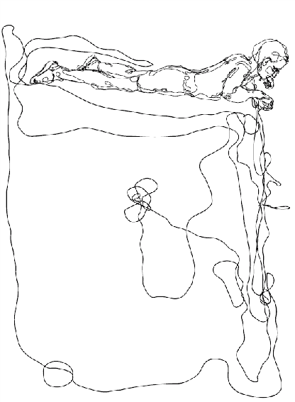

###### 20.1 How Does It Work?

SAN DIEGO IS A LARGE CITY IN THE UNITED STATES THAT COVERS A FAIRLY WIDE GEOGRAPHIC AREA OF MORE THAN 300 SQUARE MILES.Itʼs pretty well-off too, with an average annual household income above $85,000 as of 2019, about 50% above the US national average. As you move south through the area, the scene changes a bit. Thereʼs a little less money in some southern parts of the city. By the time you get to San Ysidro, the district of the city just on the Mexican border, household income has dropped to more like $50,000 or $55,000. The further south you go, the lower you can expect incomes to be.

But our trip through the city has nothing on what happens when wecrossthat border into Tijuana, Mexico. It took us 16 miles to drive from downtown to San Ysidro and watch incomes drop by 25%. But you could get out of the car in an area with $50,000 household income and just walk a few feet over the border into Tijuana. Suddenly and sharply, household income drops to $20,000.

Sure, there may be something different about the people, the opportunities, or the geography that is different in south San Diego as opposed to the downtown area that could explain some of the difference in incomes. But thereʼs no way thatjust going southexplains what happens when we take one step over the border and see incomes crash. From downtown to San Ysidro thereʼs continuous change. But at the border itjumps. Something isfundamentaly different.We have a cutoff.

Whenever some treatment is assigneddiscontinuously- people just on one side of a line get it, and people just on the other side of the line donʼt, we can be pretty sure that the differences we see arenʼt just because thereʼs something different about how far south they are. Without the line they might be a little different, but notthatdifferent. The big change we can attribute to that line separating Mexico and the US.

This is the idea behindregression discontinuity. Compare peoplejuston either side of a cutoff. Without the cutoff, theyʼd likely be pretty similar. So if theyʼre different, we can probably attribute the difference to whatever it is that happens at that cutoff.

1

REGRESSION DISCONTINUITY FOCUSES ON TREATMENT THAT IS ASSIGNED AT A CUTOFF.Just to one side, no treatment. Just to the other, treatment!

2

Itʼs worth establishing some terminology here:

Running variable. The running variable, also known as a forcing variable, is the variable that determines whether youʼre treated or not. For example, if a doctor takes your blood pressure and will assign

you a blood-pressure-reducing medicine if your systolic blood pressure is above 135, then your blood pressure is the running variable.

Cutoff. The cutoff is the value of the running variable that determines whether you get treatment. Using the same blood pressure example, the cutoff in this case is a systolic blood pressure of 135. If youʼre above 135, you get the medicine. If youʼre below 135, you donʼt.

3

Bandwidth. Itʼs reasonable to think that peoplejust barely to either side of the cutoff are basically the same other than for the cutoff. But people farther away (say, downtown San Diego vs. further inside of Mexico) might be different for reasons other than the cutoff. The bandwidth is how much areaaroundthe cutoff youʼre willing to consider comparable. Ten feet to either side of the US/Mexico border? 1000 feet? 80 miles?

The core of the research design of regression discontinuity is to (a) account for how the running variable normally affects the outcome, (b) focus on observations right around the cutoff, inside the bandwidth, and (c) compare the just-barely-treated against the just-barely-untreated to get the effect of treatment.

THERE ARE PLENTY OF CUTOFFS LIKE THIS IN THE WORLD.Quite a few policies are designed with explicit cutoffs in mind. Make just slightly too much money? You might not qualify for some means-tested

program. Or have a test score just slightly too low? You might not qualify for the gifted-andtalented program.

These cutoffs could be geographic - we already had the San Diego/Tijuana example. But also, live just to one side of a time zone border or another? You might be getting up an hour earlier. Or if youʼre just to one side of a police jurisdictionʼs border, you may be experiencing different policing policies.

Politics is another place where we have hard cutoffs. In an election and win 49.999% of the vote among the top two in your election? You donʼt get the office. But win 50.001%? Enjoy your office! Now we can see what the effect ofyouis.

In each of these cases, we can pretty reasonably imagine that cases that arejust barelyto either side of the cutoff are comparable, and any differences between them are really the fault of treatment. In other words, weʼve identified the effect of treatment.

The goal of this approach is to carefully select the variation that lets us ignore all sorts of back doors without actually having to control for them.

WHEN CAN WE APPLY REGRESSION DISCONTINUITY?What weʼre looking for is some sort of treatment that is assigned based on a cutoff. Thereʼs the running variable that determines treatment. And thereʼs some cutoff value. If youʼre just to one side of the cutoff value, you donʼt get treated. If youʼre to the other side, you do get treated. Plus, since our strategy is going to be assuming that people close to the cutoff are effectively randomly assigned, there shouldnʼt be any obvious impediments to that randomness - peopleshouldnʼt be able tomanipulate the running variable so as to choose their own treatment, and also the people who choose what the cutoff isshouldnʼt be able tomake that choicein responseto finding out who has which running variable values.

4

5

This gives us a causal diagram that looks like Figure20.120.1. Here we have a20.1.... with a back door through (which perhaps we canʼt control for). also has a direct effect on the .

RunningV ariable Z RunningV ariable

Outcome

Figure 20.1: A Causal Diagram That Regression Discontinuity Works For

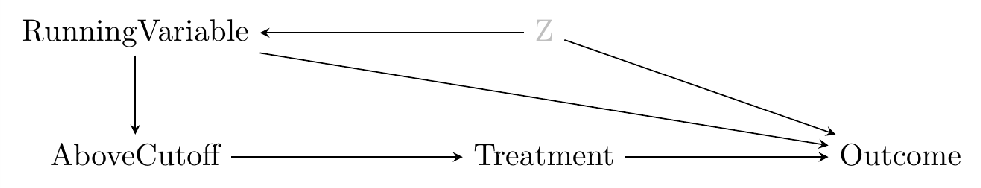

Now, we arenʼt actually interested in the effect of . Weʼre interested in the effect of . has a back door through . However, if we control foral the variation in except for being above the cutoff, then we can close that back door, identifying the effect of on .

RunningV ariable Treatment Treatment RunningV ariable RunningV ariable Treatment Outcome 6

Based on the diagram, it sort of seems like regression discontinuity is just a case of controlling for a variable ( ) and saying weʼve identified the effect. But itʼs a bit more interesting than that. Weʼre actuallyisolating a front-door path, as in Chapter99 (Finding Front9 Doors) or Chapter1919 (Instrumental Variables), not closing back doors. By only looking right19 around the cutoff we are getting rid ofanyvariation that doesnʼt lie on the

RunningV ariable

path. Nothing else should really be varying once we limit ourselves to that cutoff, so all the other variables go away!

AboveCutoff → Treatment → Outcome

So, sure, in Figure20.120.1 we could identify the effect by doing regular olʼ statistical adjustment for20.1....

. But what if there were other back doors? Perhaps even back doors for itself, for example if were on the graph? Controlling for

RunningV ariable Treatment Z → Treatment RunningV ariable AboveCutoff → Treatment → Outcome Treatment 7

wouldnʼt solve the problem, but regression discontinuity would, by isolating and letting us ignore any other arrows heading into

.

SO HOW DOES REGRESSION DISCONTINUITY DO ALL THIS COOL STUFF, EXACTLY?We can perform regression discontinuity by making only a few basic choices. Once weʼve done that, the process is pretty straightforward.

- 1. Choose a method for predicting the outcome on each side of the cutoff
- 2. Choose a bandwidth (optional)

8

Thatʼs it! Letʼs put these choices to work on some simulated data. You can see the process all worked out in Figure20.222222220.2.222220.2.2.2.2.2222222

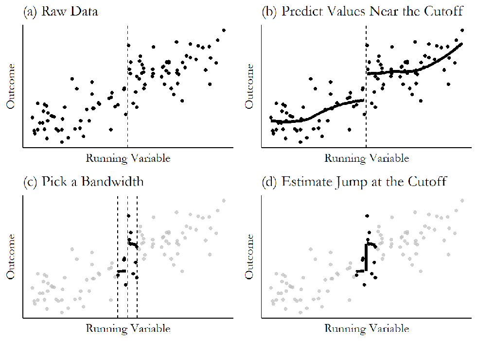

Figure 20.2: Regression Discontinuity, Step by Step

In part (a), we see a setup thatʼs pretty typical for regression discontinuity: a running variable along the -axis. The running variable does seem to be related to the outcome even when weʼre not around the cutoff, which is fine. We have a clear upward slope here. We also have a cutoff value at which treatment was applied. And we see a jump in the outcome at that cutoff! Thatʼs exactly what we want to see.

###### x

Moving on to part (b), we need a way of predicting what the outcome will be just to either side of the cutoff. There are a bunch of different prediction methods we could use - regression, local means, and so on. In this case, weʼre using local means with LOESS, which is just a smoothed line based on the prediction from a regression that uses only points within a certain range of each

9

-axis value.

###### x

In part (c) we can see our bandwidth being applied (which will modify the predictions that our method in (b) makes). We are really only interested in the values right around the cutoff. Values far away from the cutoff still have value - we can use them to figure out trends and lines that let us better predict the values at the cutoff. But get too far away and youʼre allowing in a bunch of back-door variation that weʼre doing regression discontinuity to avoid in the first place. But maybe we plan to account for that problem by adjusting for the relationship between the outcome and the running variable and the regression, and we can skip the bandwidth step. Weʼll get to the details of this later, but for now letʼs opt to use a bandwidth. Here weʼre using only data thatʼs really close to the cutoff to calculate our prediction around the cutoff. Everything else gets ignored.

10

Finally, based on our bandwidth and prediction method, we have our predictions for what the outcome is just on either side of the cutoff. Our regression discontinuity estimate is then just how much the prediction jumps at the cutoff. We can see that in part (d), where the estimate is the vertical line going from the prediction just-on-the-left to the prediction just-on-the-right.

SO FAR, IʼVE SHOWN EXAMPLES WHERE THE CUTOFF IS THE ONLY DETERMINANT OF TREATMENT.Often this isnʼt the case. In a lot of regression discontinuity applications, being on one side or another of the cutoff onlychanges the probabilityof treatment. In these cases we have whatʼs called afuzzy regression discontinuity, as opposed to a “sharp” regression discontinuity where treatment rates jump from 0% to 100%.

11

Figure20.320.3 shows how treatment rates might change in sharp and fuzzy designs.20.3.... While each shows a jump in the rate of treatment at the cutoff, the sharp design shows no action at all anywhere but the cutoff.

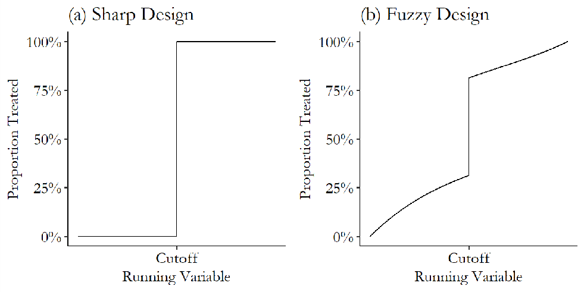

- Figure 20.3: Proportion Treated in Sharp and Fuzzy Regression Discontinuity Designs

12

- Figure 20.4: The Proportion of Household Heads Retired by Years to Pension Eligibility in 2000, from Battistin, Brugiavini, Rettore, and Weber (2009)

One example of a topic where fuzzy regression discontinuity is applied a lot is in looking at the impact of retirement. In many

occupations and countries, there are certain ages, or number of years youʼve been at your job, where a new policy kicks in - pension income, access to retirement funds - and the retirement rate jumps significantly at these points. Not everyone retires as soon as theyʼre able to, though, and some retire earlier, making this a fuzzy discontinuity.

Battistin et al. (⊕2009) are one paper of many that apply fuzzy regression discontinuity to retirement. In their paper, they look atconsumptionand how it changes at the point of retirement. Specifically, they want to know if retirement causes consumption to immediately drop. And if it does drop, why?

They look at data from Italy in 1993-2004, where they have information on when people become eligible for their pension. At the exact age of eligibility, thereʼs a more than 30 percentage point jump in the proportion of men who are retired. Thatʼs not a 0% to 100% jump (and thus is fuzzy), but a 30 percentage point jump is something we can work with! We can see the jump in one of the years they studied in Figure20.420.4. Thereʼs clearly20.4.... somethinggoing on at that cutoff.

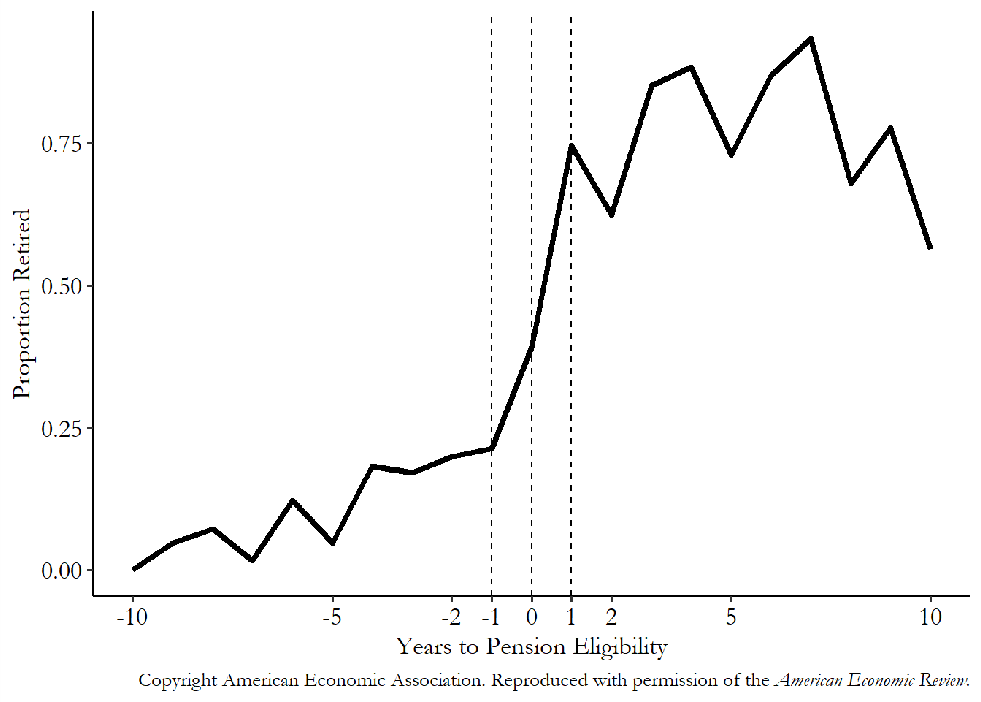

They want to look at how consumption changes at that cutoff, just as you normally would with a non-fuzzy RDD. But if they just treated it as normal, their results would be way off. Theyʼd be acting as though the cutoff madeeveryoneretire, when actually it only increased the retirement rate by 30 percentage points. A 30-percentage point change in retirement will change consumption less than a 100-percentage point change will, so the effect we estimate will naturally be disappointing! But itʼs only disappointing because our estimateexpectsa 100 percentage point change.

The authors want to properly temper the estimatorʼs expectations. So they scale by the effect of the cutoff. Roughly, they scale the effects they see by dividing them by the 30 percentage point jump (dividing by .3) to see how big the change would have been if everyone got treated.

13

What do they find? They do indeed find a drop in consumption at the moment someone retires. But conveniently, their regression discontinuity design doesnʼt just identify the effect of retirement on overall consumption, it identifies the effect of retirement on just about anything, in this casespecific typesof consumption and the number of kids at home. They find that

consumption drops resulting from retirement are largely due to things like using your extra leisure time to cook rather than order from a restaurant, not needing nice work clothes any more, and adult children tending to move out of the house. Not so bad as a drop in consumption might seem.

SURELY THEREʼS A CATCH.Well, sort of. As with anything, we need to ask ourselves what assumptions need to be made for all of this to work, what the pros and cons are, and what exactly we end up estimating.

First, as with any other method where we isolate just the part of the variation where we can identify the effect, we need to assume that nothing fishy is going on in that variation. Weʼre estimating the effect of treatment, sure, but really weʼre estimating the effectof the cutoffand attributing that (or part of that, if itʼs fuzzy) to the treatment. So if anything else is changing at the cutoff, weʼre in trouble. The assumption we need to make is that the outcome issmooth at the cutoff. That is, if treatment status actually hadnʼt changed at the cutoff (if nobody near the cutoff had gotten treated, or everyone had, or everyone had the same chance of being treated), then there would be no jump or discontinuity to speak of.

14

Say we want to know the effect of a gifted-and-talented school program that requires a score of

- 95 out of 100 on a math test to get in. Does getting a 95 or more on your math test both get you into the gifted-and-talented programandthe science-museum-field-trip program? Well, then you canʼt use regression discontinuity to get just the effect of the gifted-and-talented program. No way to separate it from those field trips.

This is a problem even if there isnʼt another explicit treatment happening at the cutoff. Maybe gifted-and-talented is the only program assigned with a 95-score cutoff, but if it just so happens that the proportion of tall people is way different for people with 94s as opposed to people with 96s. Even if getting a 94 vs. a 96 is completely random and the height difference was happenstance, itʼs hard to distinguish the effect of gifted-and-talented from the effect of being tall.

Second, the whole crux of this thing is that people are basically randomly assigned to either side of the cutoff if we zoom in close enough. So we need to assume that the running variable is randomly assigned around the cutoff and isnʼt manipulated. If teachers want more students in

15,16

gifted-and-talented, so they take kids with scores of 94 and secretly regrade their tests so they get

- 96s instead, then suddenly itʼs not really random whether you get a 94 or a 96. We canʼt say that a comparison between the 94s and 96s identifies the effect any more!

Plus, since this is based on being able to zoom in far enough that assignment to either side of the cutoff is random, we need to have a running variable thatʼs precisely measured enough to let us zoom in to the necessary level. Sure, maybe the 94s and 96s are comparable. But what if the test data is only reported in 5-point bins, so we have to compare the 90-94s against the 95-100s? We might trust our random-assignment assumption a lot less then.

Moving on from the key assumptions, our third concern is about statistical power. Regression discontinuity by necessity focuses in on a tiny slice of the data - the people just around the cutoff. There simplyarenʼt that many peoplewith a 94, 95, or 96. Alternately, in Figure20.222222220.2 (c) you can222220.2.2.2.2.2222222 see how much data weʼre graying and throwing out. So, in comparing just the people on either side, weʼre severely limiting our sample size and so making our estimate noisier. We can fix this by incorporating more data from people farther away from the cutoff, but this reintroduces the bias we were trying to get rid of.

17

FINALLY, IF WE DO THIS ALL,what kind of treatment effect are we estimating (Chapter1010)?10 Regression discontinuity is fairly easy to figure out on this front. Weʼre using variation only from just around the cutoff. So we get the effect of treatment for people who are just around the cutoff. This is a local average treatment effect, getting the weighted average treatment effect for those just on the margin of being given treatment.

There are pros and cons to getting the local average treatment effect in regression discontinuity. As a pro, if we were to use the information from our study to expand treatment to more people, weʼd probably do it by shifting the cutoff a bit to allow for more people. The newly treated people are very similar to the at-the-cutoff people we just estimated the effect for. After all, knowing the effect of a gifted-and-talented program on someone who gets a 5 out of 100 on their math test isnʼt too useful - theyʼre unlikely to ever be put in the program anyway. Knowing the local effect could be more useful than knowing the overall average treatment effect.

Of course, in other situations we might rather have the average treatment effect. In plenty of cases weʼre looking at the effect of a treatment thatcouldbe applied to everyone, but we just got

lucky enough to be able to identify the effect in a place where it was assigned based on a cutoff. For example, imagine a relief program that sends $1,600 relief checks to major portions of the populace, with an income cutoff of $75,000. If we were to analyze the effect of these checks using regression discontinuity, weʼd get the effect for people who earn very close to $75,000. But weʼll never know what the effect would have been for people who earn $100,000. More concerning, weʼd have no idea what the effect was for people who earn closer to $20,000 - theyʼre the ones who would probably need the most help. But even though the $20,000-earnersgotchecks, we canʼt use regression discontinuity to see the effect of checks for them since theyʼre not near the cutoff.

###### 20.2 How Is It Performed?

###### 20.2.1 Regression Discontinuity with Ordinary Least Squares

THUS FAR, IʼVE WRITTEN ABOUT REGRESSION DISCONTINUITY IN TERMS OF DISCONTINUITIES BUT HAVE LEFT OUT THE REGRESSION.Seems inappropriate, so letʼs fix it. There are many ways to predict the outcome just on either side of the regression, but weʼll start with a very simple interaction-termbased approach:

Y = β0 + β1(Running − Cutoff) + β2Treated+ β3(Running − Cutoff) × Treated + ε (20.1)

This is a simple linear approach to regression discontinuity, where is the running variable, which weʼve centered around the cutoff by using .

Running

(Running − Cutoff) (Running − Cutoff)

takes a negative value to the left of the cutoff, zero at the cutoff, and a positive value to the right. Weʼre talking about a sharp regression discontinuity here, so is both an indicator for being treated and an indicator for being above the cutoff - these are the same thing, and you could easily write the equation with instead of . The model is generally estimated using heteroskedasticity-robust standard errors, as one might expect the discontinuity and general shape of the line weʼre fitting to exhibit heteroskedasticity in

Treated

18 AboveCutoff Treated

19

most cases. Weʼll ignore the issue of a bandwidth for now and come back to it later - this regression approach can be applied whether you use all the data or limit yourself to a bandwidth around the cutoff.

Notice the lack of control variables in Equation(20.1)(((20.1). In most other chapters, when I do this itʼs to((20.1).... ))) help focus your attention on the design. Here, itʼs very intentional. The whole idea of regression discontinuity is that you have nearly random assignment on either side of the cutoff. You shouldnʼt need control variables because the design itself should close any back doors. No open back doors? No need for controls. Adding controls implies you donʼt believe the assumptions necessary for the regression discontinuity method to work, and it makes the whole thing becomes a bit suspicious to any readers.

20

Itʼs not that adding controls iswrong, but you should think carefully about whether you need

- them if you think that treatment is completely assigned by the cutoff - whereʼs the back door youʼre closing in that case? Youʼd have to think there are some back doors just around the cutoff (which isnʼt impossible, just not agiven). Controls may be more necessary in fuzzy regression discontinuity, where there definitelyaredeterminants of treatment other than the cutoff, so maybe there are back doors to be worried about. And maybe you have reason to believe that you doyou have random assignment but only conditional on your controls, especially if to increase your effective sample size you had to accept more observations further from the cutoff. As always, you could still add controls to try to reduce the size of the residuals and so shrink standard errors.

We end up with two straight lines - one with the intercept and the slope , to the untreated side of the cutoff, and another with the intercept and the slope to the treated side of the cutoff. Applying this regression to some simulated data gives us Figure20.520.5.20.5....

###### β0 β1 β0 + β2 β1 + β3

Figure 20.5: Regression Discontinuity Estimated with Linear Regression with an Interaction

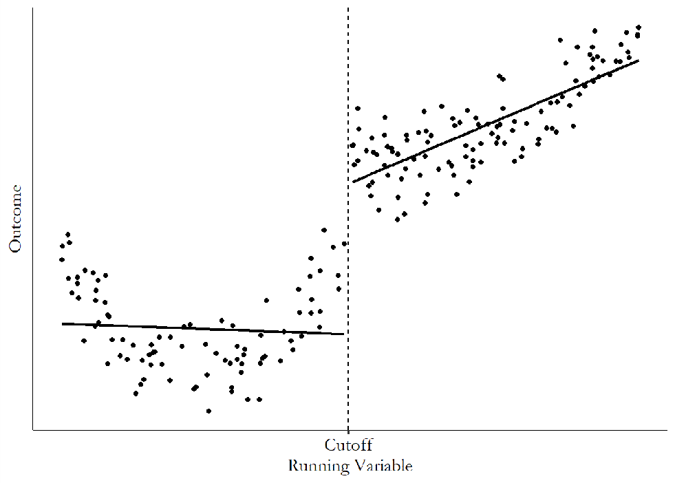

Ah, but donʼt forget - since we centered the running variable to be 0 at the cutoff, the intercept of each of these lines is our predictionatthe cutoff. So our estimate of how big the jump is from one line to the other at the cutoff is simply the change in intercepts, or . gives us our estimate of the regression discontinuity effect.

21

###### (β0 + β2) − (β0) = β2 β2

WHAT ARE SOME OF THE PROS AND CONS OF THIS APPROACH?An obvious pro is that this is easy to do, but thatʼs probably not a great reason to pick an estimation method.

The real pros and cons are sort of wrapped up together, and it has to do with the fact that weʼre using a fitted shape to predict the outcome at the cutoff. There are some clear benefits to this, especially in the form of statistical precision. Using a shape lets us incorporate information from points further from the cutoff to inform the trajectory that the outcome is taking as you get closer and closer to the cutoff. See that clear positive trend to the right of the cutoff in Figure20.520.5?20.5.... Thereʼs a bit of a flat, or even downward-sloping area in the data before the trend becomes obvious - it would be difficult to pick that trend up cleanly without incorporating the data further

from the cutoff, which could lead us to overestimate the value at the cutoff coming from the right, as shown in Figure20.620.6.20.6....

Figure 20.6: Regression Discontinuity Estimated with Linear Regression with an Interaction, both Without and With a Bandwidth Restriction

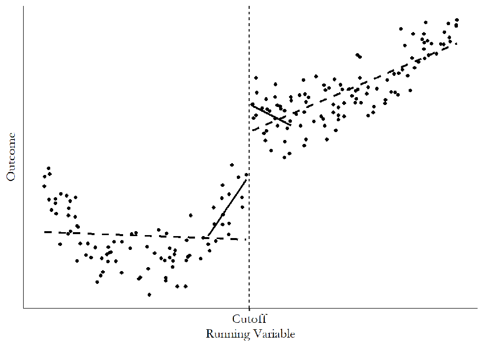

However, applying a fitted shape only works if we are applying therightfitted shape. If we pick the wrong one, as we clearly have in Figure20.520.5 to the left of the cutoff, the prediction we get20.5.... from our shape will be wrong.

Thatʼs always the case when we use ordinary least squares and fitted shapes, of course. But the problem is especially bad here becausefited shapes tend to be at their most wrong at the edges of the available data. As you get to the very edge of your data, the prediction may just veer off in a strange direction because the shape youʼve chosen forces it to keep going in that direction. Again, we see this in Figure20.620.6 on the left, comparing the dashed line (which veers off) to the solid line20.6.... showing the actual slope near the cutoff.

An obvious instinct is to just try a more flexible shape. We can do this using the exact same idea as Equation(20.1)(((20.1), but we use some more flexible function for((20.1).... ))) :

(Running − Cutoff)

Y = β0 + f(Running − Cutoff,Treated) + β2Treated + ε (20.2)

where is some nonlinear function of , with one version for and another for . For example, this might be a second-order polynomial:

f() Running − Cutoff Treated = 0 Treated = 1

Y = β0 + β1(Running − Cutoff) + β2(Running − Cutoff)2+ β3Treated + β4(Running − Cutoff) × Treated+

β5(Running − Cutoff)2 × Treated + ε (20.3)

Equation(20.3)(((20.3) again produces two lines - a parabola to the left of the cutoff, and a parabola to((20.3).... ))) the right. Like before, the coefficient on (here ) shows us how the prediction jumps at the cutoff, giving us the regression discontinuity estimate.

Treated β3

However, we need to be careful with more flexible OLS lines. Itʼs hard to fix the “wrong shape” problem in RDD by making the shape more flexible, because more-flexible shapes make even weirderpredictions and hard-left-turns-to-infinity than simpler shapes near the edges of the data. Figure20.720.7 shows regression discontinuity estimated for the same data using (a) the second-20.7.... order polynomial from Equation(20.3)(((20.3), as well as (b) a fourth-order polynomial and (c) an 25th-((20.3).... ))) order polynomial. Adding all those polynomials, we get stranger and stranger results, with huge swings near the cutoff that donʼt even seem to track the data all that well.

Figure 20.7: Regression Discontinuity with Different Polynomials

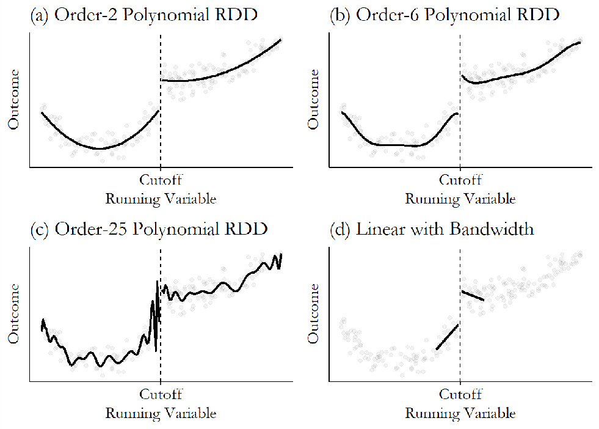

Because the data is simulated, I can tell you that the true effect is .15 and the true model is an order-2 polynomial. The linear model gives an effect of .29. The second, sixth, and 25th-order polynomial models give .17, .26, and… even if that 25th-order polynomialhappenedto get close to the true effect it would just be luck. Look how wild that curve is near the cutoff! Flexibility isnʼt always so good.

Because of this problem, itʼs not a great idea to go above the second-order term when performing regression discontinuity with ordinary least squares (⊕Gelman and Imbens 2019). If thereʼs a complex shape that needs fitting, instead try limiting the range of the data with a bandwidth and use a simpler shape. All those twists and curves tend to go away when you zoom in close with a bandwidth, anyway, and a straight line may be just fine. This can be seen in Figure20.720.7 (d), which20.7.... gives an effect of .19, as compared to the true effect of .15. It did just about as well as the order-2 polynomial, but without having to use the knowledge that the true underlying model is order-2.

WE CAN THINK OF THIS “ZOOM-IN-AND-GO-SIMPLE” APPROACHas alocal regression.A local regression is one that estimates the relationship between some predictor X and some outcome Y as

###### X 22

normal, but allows that relationship to vary freely across the range of . Local regression of some kind is how most researchers choose to implement their regression discontinuity design, at least if they have a large sample.

23

What local regression does in particular is: for each value of , say, , it gets its estimate of

X X = 5 Y X = 5 X = 5

by running its own special regression. This regression fits some sort of regression shapespecific to . How is it specific? When estimating the regression, it weights observations more heavily the closer they are to . The specific form of weighting is called thekernel.Sometimes the kernel is a cutoff - the weight is 1 if youʼre close and 0 if youʼre too far away. Other times itʼs more gradual - your weight goes down and down the farther you get until finally, slowly, you reach zero. A very commonly-used kernel in regression discontinuity is the triangular kernel, which in Figure20.820.8 looks just like it sounds - a full weight right at the value20.8.... youʼre looking at, and a linearly declining weight as you move away, until you get to 0 at a certain point. That point is the “bandwidth” - i.e., how far away you can get and still count. This draws a neat lilʼ triangle.

X = 5

X = 5

Figure 20.8: Example of a Triangular Kernel Weight Function

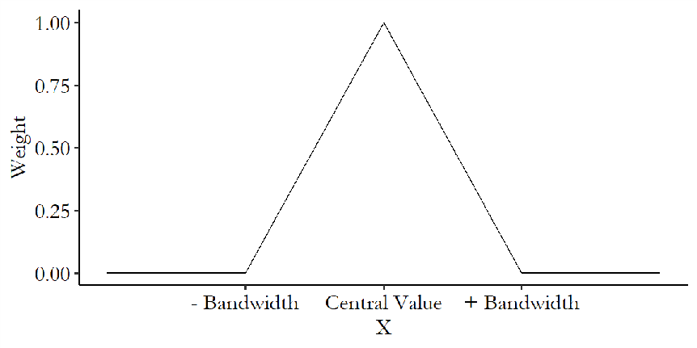

Computationally, local regression takes a lot of computing firepower. But conceptually this is very simple. Just roll along that -axis, making a bunch of new regressions along the way based on the observations closest at hand at the time. Then predict values from it, and thatʼs your curve.

###### x

What kind of regression should be run at each point, though?

We might just take the average instead of running a regression, in which case we end up with kernel regression. Kernel regression can give us problems in the case of regression discontinuity, especially if thereʼs any sort of trend in the outcome in the lead-up to the cutoff. Since itʼs just taking the average, it tends to flatten out the trend, leading to an at-the-cutoff prediction that attributes some of the trend thatʼs really there to the jump at the cutoff. Figure20.920.9 shows an20.9.... exaggerated example of how this can occur. Notice that the prediction to the left of the cutoff is way lower than all the actual data, because itʼs missing the upward trend.

Figure 20.9: Regression Discontinuity with Means at the Cutoff

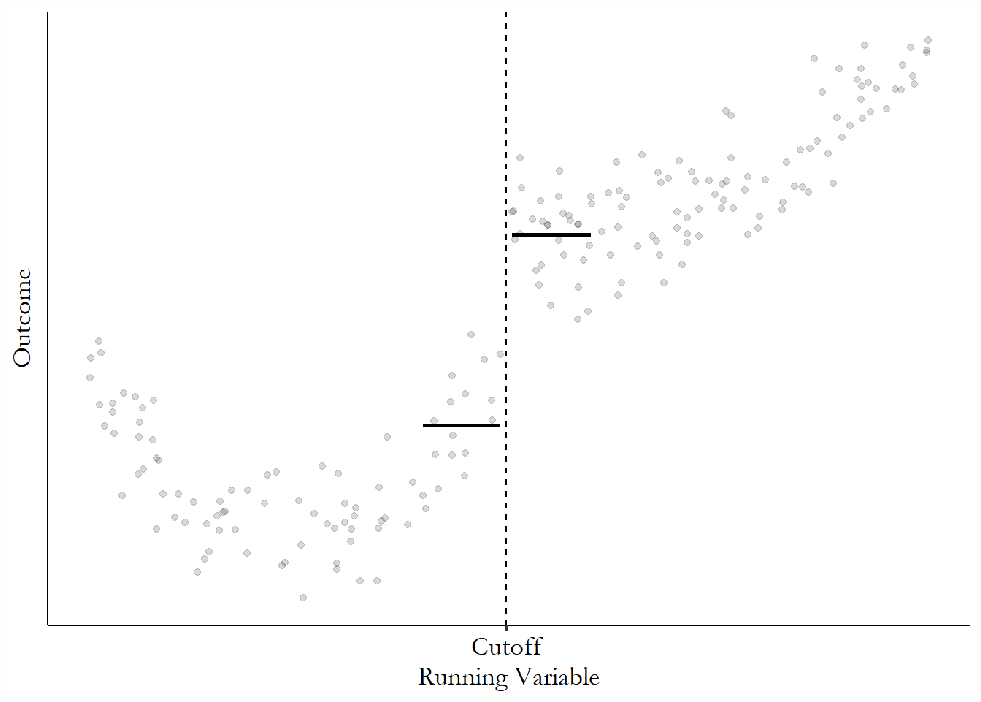

More commonly, in application to regression discontinuity, weʼll dolocal regression, the most common form of which is LOESS, which we already discussed in Chapter44 on “Describing4 Relationships,” and earlier in this chapter in Figure20.222222220.2. Instead of taking a local mean, LOESS222220.2.2.2.2.2222222

estimates a linear (“local linear regression”) or second-order polynomial (“local polynomial regression” or “local quadratic regression”) regression at each point.

The local regression approach allows for the relationship between and to not be totally flat. Depending on how curvy it is, the linear or second-order polynomial function weʼve chosen might not be quite enough to capture the relationship. However, since weʼve zoomed in so far, itʼs unlikely that anything will be that highly nonlinear over such a narrow range of the -axis.

###### X Y

###### x

Of course, given our plans to use local regression, we donʼt actually have to do anything special. While applying a local regression estimator across the whole range of the data will give us a great idea of what the overall relationship between running variable and outcome is, if weʼre just interested in estimating regression discontinuity, well… weʼre only really interested in two local points - just to the left of the cutoff, and just to the right. So if we estimate a regular-olʼ interacted linear regression like in Equation(20.1)(((20.1) (for local linear regression) or Equation((20.1).... ))) (20.3)(((20.3) (for local((20.3).... ))) polynomial regression), but with a bandwidth (or perhaps some weighting for a slow-fade-out kernel), weʼve got it.

LETʼS CODE UP SOME REGRESSION DISCONTINUITY!Iʼm going to do this in two ways. First, Iʼm going to run a plain-olʼ ordinary least squares model with a bandwidth and kernel weight applied, with heteroskedasticity-robust standard errors. However, there are a number of other adjustments weʼll be talking about in this chapter, and it can be a good idea to pass this task off to a package that knows what itʼs doing. So weʼll be using those specialized commands as well, and Iʼll talk later about some of the extra stuff theyʼre doing for us.

For this example weʼre going to use data from Government Transfers and Political Support by Manacorda, Miguel, and Vigorito (⊕2011). This paper looks at a large poverty alleviation program in Uruguay which cut a sizeable check to a large portion of the population. They are interested in whether receiving those funds made people more likely to support the newly-installed centerleft government that sent them.

24

Who got the payments? You had to have an income low enough. But they didnʼt exactly use income as a running variable; that might have been too easy to manipulate. Instead, the government used a bunch of factors - housing, work, reported income, schooling - andpredicted what your income would be from that. Then, the predicted income was the running variable, and

treatment was assigned based on being below a cutoff. About 14% of the population ended up getting payments.

The researchers polled a bunch of people near the income cutoff to check their support for the government afterwards. Did people just below the income cutoff support the government more than those just above?

The data set we have on government transfers comes with the predicted-income variable precentered so the cutoff is at zero. Then, support for the government takes three values: you think theyʼre better than the previous government (1), the same (1/2) or worse (0). The data only includes individuals near the cutoff - the centered-income variable in the data only goes from -.02 to .02.

25

Before we estimate our model, letʼs do a nearly-compulsory graphical regression discontinuity check so we can confirm that there does appear to be some sort of discontinuity where we expect it. This is a “plot of binned means.” There are some pre-programmed ways to do this like rdplot in the rdrobust package (all three languages) or binscatter in Stata from the binscatter package, but this is easy enough that we may as well do it by hand and flex those graphing muscles.

26

For one of these graphs, you generally want to (1) slice the running variable up into bins (making sure the cutoff is the edge between two bins), (2) take the mean of the outcome within each of the bins, and (3) plot the result, with a vertical line at the cutoff so you can see where the cutoff is. Then youʼd generally repeat the process with treatment instead of the outcome to produce a graph like Figure20.320.3.20.3....

###### R Code R Code e Stata CodeStata CodeStatatatatatatatatatatatatatatatatatatatatata e Python CodePython Codeytyttt ooooooooooo o o oooooo o o o e

library(tidyverse) gt <- causaldata::gov_transfers

# Use cut() to create bins, using breaks to make sure it breaks at 0 # (-15:15)*.02/15 gives 15 breaks from -.02 to .02 binned <- gt %>%

mutate(Inc_Bins = cut(Income_Centered,

breaks = (-15:15)*(.02/15))) %>% group_by(Inc_Bins) %>% summarize(Support = mean(Support), Income = mean(Income_Centered))

# Taking the mean of Income lets us plot data roughly at the bin midpoints

ggplot(binned, aes(x = Income, y = Support)) + geom_line() + # Add a cutoff line geom_vline(aes(xintercept = 0), linetype = 'dashed')

27

A little extra theming gets us Figure20.1020.10.20.100.0.0000000.0. 0000000000 Thereʼs definitely a break at the cutoff there, and some higher support to the left of the cutoff (treatment is to the left here since you need low income to get paid) that isnʼt what weʼd expect by following the trend on the right of the cutoff.

###### Figure 20.10: Government Support by Income with Policy Cutoff

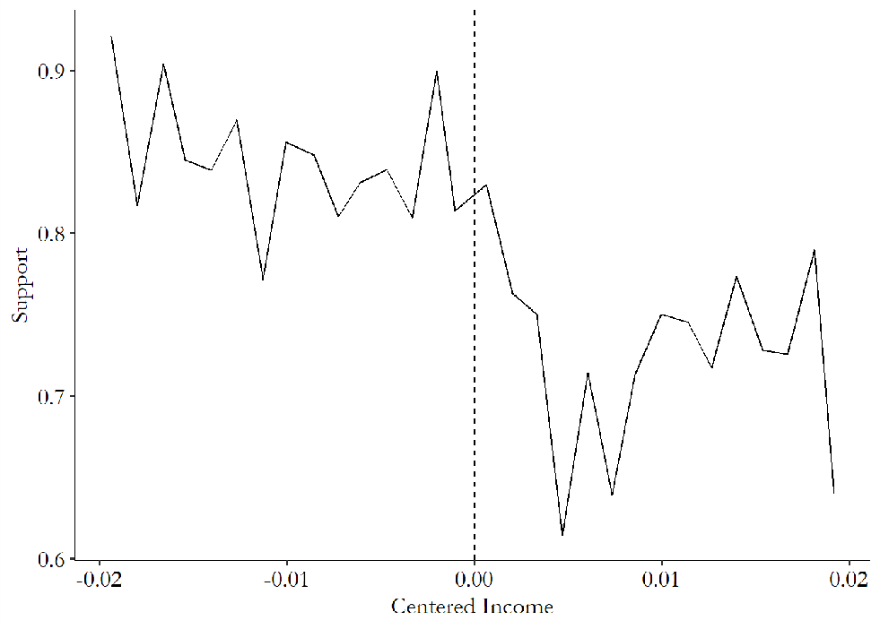

Now that we have our graph in mind, we can actually estimate our model. Weʼll start doing it with OLS and a second-order polynomial, and then weʼll do a linear model with a triangular kernel weight, limiting the bandwidth around the cutoff to .01 on either side. The bandwidth in this case isnʼt super necessary - the data is already limited to .02 on either side around the cutoff - but this is just a demonstration.

Itʼs important to note that the first step of doing regression discontinuity with OLS is to center the running variable around the cutoff. This is as simple as making the variable

, translated into whatever language you use. The second step would

RunningV ariable − Cutoff

- then be to create a “treated” variable (since treatment is applied below the cutoff in this instance). But in this case, the running variable comes pre-centered (

RunningV ariable < Cutoff

) and the below-cutoff treatment variable is already in the data ( ), so Iʼll leave those parts out.

IncomeCentered Participation

###### R Code R Code e Stata CodeStata CodeStatatatatatatatatatatatatatatatatatatatatata e

###### Python CodePython Codeytyttt ooooooooooo o o oooooo o o o e

library(tidyverse); library(modelsummary) gt <- causaldata::gov_transfers

# Linear term and a squared term with "treated" interactions m <- lm(Support ~ Income_Centered*Participation +

I(Income_Centered^2)*Participation, data = gt)

# Add a triangular kernel weight kweight <- function(x) {

# To start at a weight of 0 at x = 0, and impose a bandwidth of .01, # we need a "slope" of -1/.01 = 100, # and to go in either direction use the absolute value w <- 1 - 100*abs(x) # if further away than .01, the weight is 0, not negative w <- ifelse(w < 0, 0, w) return(w)

}

# Run a linear version of the but with the weight mw <- lm(Support ~ Income_Centered*Participation, data = gt,

weights = kweight(Income_Centered))

# See the results with heteroskedasticity-robust SEs msummary(list('Quadratic' = m, 'Linear with Kernel Weight' = mw),

stars = c('*' = .1, '**' = .05, '***' = .01), vcov = 'robust')

From this, we get the results in Table20.120.1. In the second-order polynomial model, our estimate is20.1.... that receiving payments increased support for the government by 9.3 percentage points - not bad! The version with the kernel weight shows a statistically insignificant effect of 3.3 percentage points. The first model is more plausible to me - the bandwidth was already fairly narrow since the data only included observations near the cutoff anyway, so limiting the data further isnʼt necessary. You can also see the reduction in sample size from 1948 to 937 - this occurs because itʼs not counting anyone who gets a weight of 0 as being a part of the sample. The

28

###### potential for reduced bias (by taking fewer people farther from the cutoff) comes with the price of a reduced sample and less precision.

Table 20.1: The Effect of Government Payments on Support, Regression Discontinuity Estimates

Linear with Kernel Weight

Quadratic

Constant 0.769*** 0.819*** (0.034) (0.015) Income (Centered) −11.567 −23.697***

(8.101) (3.219) Participation 0.093** 0.033

(0.044) (0.021)

Income (Centered) x Participation

19.300* 26.594*** (10.322) (4.433)

Income (Centered) Squared 562.247 (401.982)

Income (Centered) Squared x Participation

−101.103 (502.789)

Num.Obs. 1948 937 R2 0.036 0.041 RMSE 0.31 0.34 Std.Errors HC3 HC3 * p < 0.1, ** p < 0.05, *** p < 0.01

Now that we have our by-hand version down, we can try things out using some pre-packaged commands, both for estimating the model effects and for making regression discontinuity-style plots. For all three languages, there is the rdrobust package, which is a part of the “RD packages” universe that contains a bunch of useful tools Iʼll be including throughout this chapter.

- 29

The rdrobust function in the rdrobust package does a few things for us. First, we donʼt have to choose the bandwidth. It will do an optimal bandwidth selection procedure for us. More on how that works in the “How the Pros Do It” section.

Second, it will properly implement local regression with your polynomial order of choice (linear by default) and a triangular kernel.

Third, as implied by the name, it will apply heteroskedasticity-robust standard errors. Specifically, it uses a robust standard error estimator that takes into account the structure of the regression discontinuity problem. It looks for each observationʼsnearest neighborsalong the running variable, and uses that information to figure out the amount of heteroskedasticity and how to correct for it.

Fourth, it applies abias correction. Methods for optimal bandwidth choice tend to select bandwidths that are wide, so as to help increase the effective sample size and improve precision. However, estimates of standard errors rely on our idea of what the distribution of the error term is. And those wide bandwidths futz up what those distributions look like. So there is a method here to correct for that bias, improving the estimate of the standard error. More on this in the “How the Pros Do It” section.

###### R Code R Code e Stata CodeStata CodeStatatatatatatatatatatatatatatatatatatatatata e Python CodePython Codeytyttt ooooooooooo o o oooooo o o o e

library(tidyverse); library(rdrobust) gt <- causaldata::gov_transfers

# Estimate regression discontinuity and plot it m <- rdrobust(gt$Support, gt$Income_Centered, c = 0) summary(m) # Note, by default, rdrobust and rdplot use different numbers # of polynomial terms. You can set the p option to standardize them. rdplot(gt$Support, gt$Income_Centered)

If you run this code, youʼll find a fairly different rdrobust output as opposed to when we did it by hand. Results are insignificant and in the opposite direction of the original paper. This comes down to rdrobust selecting a narrow bandwidth - if you force the bandwidth to be the entire range, as might be reasonable given how narrow it already is - you get results that are nearly identical to the quadratic-model results from Table20.120.1. Making these decisions is hard! Just20.1....

- 30

because we have a premade package doesnʼt mean we can let it make all the decisions. Use that head of yours, and explore the options in the functions you use by reading the documentation.

###### 20.2.2 Fuzzy Regression Discontinuity

HOW MANY TREATMENTS ARE THERE REALLYthat arecompletelydetermined by a cutoff in a running variable? Some, certainly. But we live in the real world. Even in cases where a policy issupposed

- to be assigned based on a cutoff, surely there might be a few people above or below who manage to get the “wrong” treatment. Forgetting that, there are plenty of scenarios where the policy isnʼt necessarilysupposed tobe assigned based on a cutoff, but still for some reason the chances of treatment jump significantly at a cutoff. Perhaps you wanted to evaluate the effect of holding a high school degree on some outcome. The chances that you hold a high school degree jump significantly in the summer following your 18th birthday. But there are quite a few people who graduate at 17, or 19, or not in the summer, or never graduate at all. Thereʼs ajumpin the treatment rate at that summer cutoff, but itʼs not from 0% to 100%. We can see how the treatment rate might look across the running variable in Figure20.120.11.20.11.11.11.11.11111111111111

Figure 20.11: An Example of Treatment Rates in a Fuzzy Regression Discontinuity

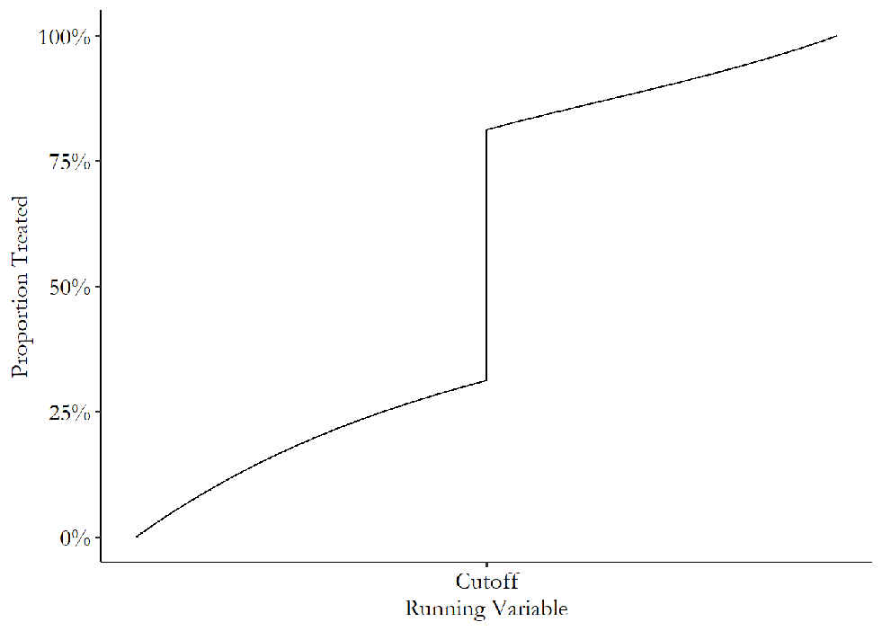

I already covered the basic concept in the “How Does It Work” section. But how can we actually implement a fuzzy regression discontinuity design?

We can figure it out by modifying the causal diagram we had in Figure20.120.1. The only changes we20.1.... need to account for is that thereʼs some other way for and to be relatedotherthan the cutoff, which is why we see changes in the treatment rate at non-cutoff points in Figure20.120.11. We also might have some non-20.11.11.11.11.11111111111111 determinants of

RunningV ariable Treatment

RunningV ariable Treatment

.

Figure 20.12: A Causal Diagram That Fuzzy Regression Discontinuity Works For

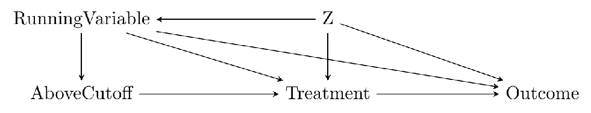

31

We get our modified causal diagram in Figure20.1222222220.12.222220.12.... 2222222222 What can we get out of this diagram?

Well, one thing to note is that the idea for identifying the effect is still basically the same. If we control for , then there is no back door from to . By cutting out any variation driven by anywherebutthe cutoff, weʼre left only with variation that has no back doors and identifies the effect of on .

RunningV ariable AboveCutoff Outcome RunningV ariable

Treatment Outcome

The only real change is this: we can no longer simply limit the data to the area around the cutoff and call that a day on controlling for . Doing that would lead us to understate the effect. If weʼre only getting a jump in treatment rates of, say, 15 percentage points, then we should only expect to see 15% of the effect. We have to scale it back to the full size.

RunningV ariable

Thankfully, this can be done by applying instrumental variables, as in Chapter1919, using basically19 the same regression discontinuity equations as for the sharp RDD, like Equation(20.1)(((20.1) or((20.1).... ))) Equation(20.3)(((20.3). Except these equations now become our second-stage equations. Our first stage((20.3).... ))) uses as an instrument for (and interactions with as instruments for the interactions with ).

AboveCutoff Treated AboveCutoff Treated

This scales the estimate exactly as we want it to. In its basic form, instrumental variables divides the effect of the instrument on the outcome by the effect of the instrument on the endogenous/treatment variable. In other words, weʼre scaling the effect of being above the cutoff on the outcome (i.e., what weʼd get from a typical sharp-regression-discontinuity model) to account for the fact that being above the cutoff only led to a partial increase in treatment rates.

32

JUST LIKE WITH SHARP REGRESSION DISCONTINUITY,we can implement fuzzy regression discontinuity in code either using our standard tools (the same instrumental variables estimators we used in Chapter1919), or specialized regression-discontinuity specific tools. Letʼs do both here.19

For this, weʼll be using data from Fetter (⊕2013). Fetter also gives us an opportunity to see regression discontinuity performed in a slightly less-clean setting. Fetterʼs main question of interest is how much of the increase in the home ownership rate in the mid-century US was due to mortgage subsidies given out by the government.

How does he get at this question? He looks at people who were about the right age to be veterans of major wars like World War II or the Korean War. Anyone who was a veteran of these wars received special mortgage subsidies.

What does this have to do with regression discontinuity? Thereʼs an age requirement to join the military. If you were born one year too late to join the military to fight in the Korean War, then you wonʼt get these mortgage subsidies (or at least far fewer veterans were eligible). Born just in time? You can join up and get subsidies! So thereʼs a regression discontinuity here based on birth year. Born just in time, or a bit too late?

- 33
- 34

Of course, not everybody born in a given year joins the military. So the “treatment” of being eligible for mortgage subsidies would only apply to some people born at the right time. Treatment rates jump from 0% to… above 0% but not 100%. Thatʼs fuzzy!

And why do I say this is “less clean” than some of other examples? Because this isnʼt an explicitly designed cutoff. Thereʼs a lot more choice in terms of who gets treated, and, heck, some people were probably getting into the military underaged. We have to think very carefully here about whether we believe the assumptions necessary to use regression discontinuity. I think the design here is pretty reasonable, but my opinion on that is not as rock-solid as it might be for something for which the assignment of treatment had fewer moving parts.

The author also has to go through some checks and tests that someone with a simpler story might not have to. For example, while I wonʼt show it in the code below, he performs a placebo test by repeating the analysis using data from other eras, where veteran status wouldnʼt have an effect on receiving mortgage subsidies, finding no effect at those times. Youʼre about to see the analysis include control variables for season of birth, race, and the US state in which they were born - controls generally arenʼt necessary for sharp regression discontinuity, but it makes sense to include them here. If the design itself wonʼt do all the work for you, then geez I guess youʼre gonna have to work a little harder.

Letʼs code up the analysis. First weʼll do it ourselves using the instrumental variables code we used in Chapter1919. Weʼre using the running variable quarter of birth (19 qob), which has been centered on the quarter of birth youʼd need to be eligible for a mortgage subsidy for fighting in the Korean War (qob_minus_kw). This determines whether you were a veteran of either the

Korean War or World War II (vet_wwko). All of this is to see if veteran status (and its accompanying mortgage subsidies) affects your home ownership status (home_ownership) remember, the goal here is looking for the effect of those mortgage subsidies. There are also controls for being white or nonwhite, and your birth state.

To keep things simple, weʼll apply a bandwidth before doing estimation, weʼll skip the kernel weighting, and weʼll just do a linear model. The code we did before for incorporating these things still works here, though, if you want to add them.

###### R Code R Code e Stata CodeStata CodeStatatatatatatatatatatatatatatatatatatatatata e Python CodePython Codeytyttt ooooooooooo o o oooooo o o o e

library(tidyverse); library(fixest); library(modelsummary) vet <- causaldata::mortgages

# Create an "above-cutoff" variable as the instrument vet <- vet %>% mutate(above = qob_minus_kw > 0)

# Impose a bandwidth of 12 quarters on either side vet <- vet %>% filter(abs(qob_minus_kw) < 12)

m <- feols(home_ownership ~ nonwhite | # Control for race bpl + qob | # fixed effect controls qob_minus_kw*vet_wwko ~ # Instrument our standard RDD qob_minus_kw*above, # with being above the cutoff se = 'hetero', # heteroskedasticity-robust SEs data = vet)

# And look at the results msummary(m, stars = c('*' = .1, '**' = .05, '***' = .01))

These show that veteran status at this margin increases home ownership rates by 17 percentage points. Not bad. We could also apply the exact same regression discontinuity plot code from last

time (thereʼs no special “fuzzy” plot, although now weʼd call the typical regression discontinuity plot the “second stage” plot), and also apply that plot code using the treatment variable as an outcome (the “first stage”), to make sure that the assignment variable is working as expected. This gives us Figure20.1320.13.20.13.... It looks good! We definitely see a sharp change in the rate of eligible veterans around the cutoff, and we see a discontinuity in the rate of home ownership at the same point. The fuzzy RDD estimate is the jump at the cutoff in Figure20.1320.13 (b) divided by the jump at20.13.... the cutoff in Figure20.1320.13 (a).20.13....

35

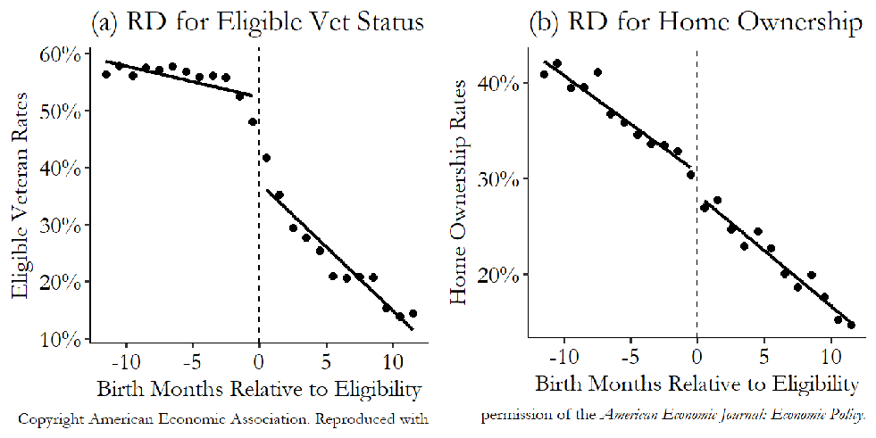

Figure 20.13: Eligibility for Mortgage Subsidies for being a Korean War Veteran and Home Ownership from Fetter (2013)

Next we can, as before, use the rdrobust function to do local polynomial regression, kernel weighting, easy graphs, all that good stuff. We just need to use vet_wwko as our “treatment

status indicator” and give that to the fuzzy option.

###### R Code R Code e Stata CodeStata CodeStatatatatatatatatatatatatatatatatatatatatata e Python CodePython Codeytyttt ooooooooooo o o oooooo o o o e

library(tidyverse); library(rdrobust) vet <- causaldata::mortgages

# It will apply a bandwidth anyway, but having it # check the whole bandwidth space will be slow. So let's # pre-limit it to a reasonable range of 12 quarters vet <- vet %>%

filter(abs(qob_minus_kw) <= 12)

# Create our matrix of controls controls <- vet %>%

select(nonwhite, bpl, qob) %>% mutate(qob = factor(qob))

# and make it a matrix with dummies conmatrix <- model.matrix(~., data = controls)

# This is fairly slow due to the controls, beware! m <- rdrobust(vet$home_ownership, vet$qob_minus_kw,

fuzzy = vet$vet_wwko, c = 0, covs = conmatrix)

summary(m)

Itʼs not included in the code, but we could easily apply rdplot (and maybe apply it with the treatment as the dependent variable as well, just to make sure it looks like we expect).

The rdrobust estimate is quite different from the linear instrumental variables estimate we did earlier, with veteran status increasing home ownership rates by 51.8 percentage points, as opposed to 17.0! Thatʼs quite a difference. Itʼs useful to know when estimation methods differ like this. Which should we trust? Well, letʼs think through why they differ: rdrobust uses a secondorder polynomial rather than a linear regression, it uses local regression, and it uses a narrower bandwidth (it picks 3.39 birth quarters on either side of the cutoff, rather than 12).

Our first step in thinking which to trust would have to ask if one of the models is making assumptions that are much more likely to be accurate. These are the sorts of things youʼd have to defend when describing your research design. If we think linearity is reasonable, for example,

then the linear model might be less noisy and a more precise estimate than the second-order polynomial. Does Figure20.1320.13 look linear? If we think that the wider bandwidth is likely to20.13.... contain too many noncomparable people, then we might think the narrower bandwidth is better. Do we think 12 months on either side of the cutoff is too far away to be comparable?

Often these days, researchers performing regression discontinuity will see how sensitive the estimate is to different bandwidths, running the model many times and reporting how the effect changes, letting the reader of the study think about how close to the cutoff things should be limited. The Bana, Bedard, and Rossin-Slater (⊕2020) paper I discuss in the “Regression Kink” section does this.

36

###### 20.2.3 Placebo Tests

THE ASTONISHING THING ABOUT REGRESSION DISCONTINUITYis that it closes all back doors, even the ones that go through variables we canʼt measure. Thatʼs the whole idea - since weʼre isolating variation in such a narrow window of the running variable, itʼs pretty plausible to claim that the onlything changing at the cutoff is treatment, and by extension anything that treatment affects (like the outcome).

Even more convenient is that this extremely-nice result from regression discontinuity gives us a fairly straightforward way to test if itʼs true. Simply run your regression discontinuity model on something that the treatmentshouldnʼtaffect. Anything we might normally use as a control variable should serve for this purpose. If wedofind an effect, our original regression discontinuity design might not have been quite right. Perhaps things werenʼt as random at the cutoff as weʼd like, for some reason.

37

Thereʼs not too much to say here. The equations, code, everything is the exact same for this test as for regular regression discontinuity. We just swap out the actual outcome variable for some other variable that the treatment shouldnʼt affect. In many cases we can try it with a long list of variables that might serve as control variables.

Figure20.1420.14 shows this test with two variables from the Government Transfers and Political20.14.... Support paper. No effects here! Exactly what we were hoping for.

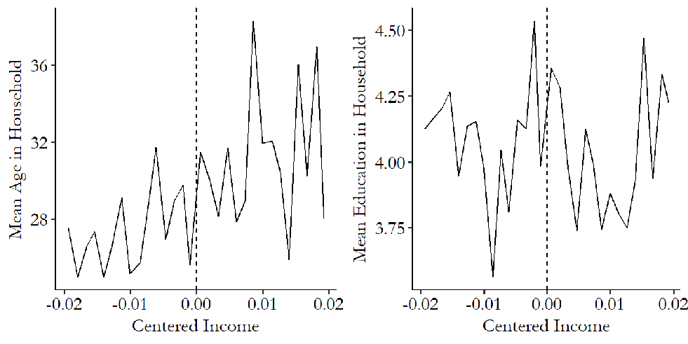

Figure 20.14: Performing Regression Discontinuity with Controls as Outcomes for a Placebo Test

One important thing to keep in mind with these placebo tests is that, since you can run them on a long list of potential placebo outcomes, youʼre likely to find a few nonzero effects just by

random chance. It happens. If you test a long list of variables and find a few differences, thatʼs not a fatal problem with your design. In these cases, you may want to add the variables with the failed placebo tests to the model as control variables. Adding controls can be tricky if youʼre using local regression, but there are methods for doing it (⊕Calonico et al. 2019), and pre-packaged regression discontinuity commands often incorporate them.

###### 20.2.4 The Density Discontinuity Test

FOR REGRESSION DISCONTINUITY TO WORK, WE NEED A SITUATION WHEREpeople just on either side of the cutoff are effectively randomly assigned to treatment. That wonʼt happen if someoneʼs thumb is on the scale!

There are two ways manipulation could happen. First, whoever (or whatever) is in charge of setting the cutoff value might do so with the knowledge of exactly who it will lead to getting treated. Imagine the track and field coach during tryouts whoconvenientlydecides that anyone

on the team must run a mile in 5 minutes and 37 seconds or betterjust afterhis son clocks in at 5 minutes and 35 seconds.

Second, individuals themselves might have some control over their running variable. Sometimes they have direct control - if my local supermarket offers me a discounted price on tuna when I buy 12 or more cans, then I can choose exactly what my running variable (number of cans of tuna I buy) is, and itʼs not really plausible to say that someone buying 12 cans is comparable to someone buying 11 so I can identify the effect of the discount.

More often, they have indirect control - if Iʼm trying out for that track-and-field team, I can decide to take it easy or push myself really hard to run faster. Or maybe the person keeping time really likes me and decides to shave a few seconds off of the time they write down for me. This is a problem if we have indirect control and also know what the cutoff is. If I know the cutoff is 5:37 and I usually run a 5:40, I know I have to push extra hard to get a chance at the team and so will try very hard, whereas someone who normally runs 4:30 would just take it easy. Or maybe the person keeping time might see that I actually ran a 5:38, and figure I cameso closeit wouldnʼt hurt to cheat a little and write down 5:36 instead so I can get on the team. The person who runs 6:30 isnʼt likely to get a whole minute chopped off, though; that would be too much to ask.

In all of these cases, we want to be sure we understand how the running variable is determined. Are we in a cans-of-tuna situation? A slyly-choose-the-cutoff situation? A situation where we know the cutoff and may manipulate our behavior for it? For any of these, we may be worried that manipulation of the cutoff, or of the running variable near the cutoff, makes people on either side incomparable. If my friendly run-timer shaves off a few seconds for me so I get on the team, but not for Denny who also runs a 5:38 but the run-timer doesnʼt like, then treatment assignment wasnʼt random, it was based on who the run-timer liked, which has all sorts of back doors.

38

IN THE CASE OF INDIRECT CONTROLwe do have a test we can perform to check whether manipulation seems to be occurring at the cutoff. Conceptually, itʼs very simple. We just look at the distribution of the running variable around the cutoff. It should be smooth, as we might expect if the running variable were being randomly distributed without regard for the cutoff.

But if we see a distribution that seems to have a dip just to one side of the cutoff, with those observations sitting just on the other side, that looks a lot like manipulation. If you looked at the

run times at track-and-field tryouts and there was only Denny with a time anywhere from 5:38 to 5:45, but ten people just a second or two below the cutoff, that looks pretty fishy! That run-timer seems to be up to no good.

The idea of putting this intuition into action comes from McCrary (⊕2008), although there have been improvements to the basic idea since then, with better density estimation and power. While, just like with nearly everything else in this book, these tests continue to evolve for better performance in certain situations (for example, see Bugni and Canay (⊕2021)), the instructions in the code below are for Cattaneo, Jansson, and Ma (⊕2020).

The McCrary plan is this:

- 1. Calculate the density distribution of the treatment variable
- 2. Allow that density to have a discontinuity at the cutoff
- 3. See if there is a significant discontinuity at the cutoff
- 4. Also, plot the density distribution and look at it, and see if it looks like thereʼs a discontinuity

A big discontinuity is not a good sign. It implies manipulation. WE CAN CODE UP A DENSITY TESTusing pre-packaged commands. The code will still use the example data from Government Transfers and Political Support.

Before running our code, we can ask ourselves about the potential for manipulation here. The government assigned treatment on the basis of not just one characteristic, but a sum of a whole bunch of things. It determined that process before knowing exactly who would qualify (making it hard for the government to manipulate). The whole process wasnʼt fully obvious (making it hard for people to manipulate), and it would be difficult to know beforehand exactly how close to the cutoff you were (making it hard to know if you should bother trying to manipulate).

So it seems unlikely that this particular study will show evidence of manipulation. But you never know! Letʼs see. This test uses a slightly expanded version of the data including people who werenʼt surveyed at the right time to be included in the study, and those outside the bandwidth used in estimation (so we limit to the bandwidth ourselves).

###### R Code R Code e Stata CodeStata CodeStatatatatatatatatatatatatatatatatatatatatata e Python CodePython Codeytyttt ooooooooooo o o oooooo o o o e

library(tidyverse); library(rddensity) # Limit to the bandwidth ourselves gt <- causaldata::gov_transfers_density %>%

filter(abs(Income_Centered) < .02)

# Estimate the discontinuity gt %>%

pull(Income_Centered) %>% rddensity(c = 0) %>% summary()

As expected, we find no statistically significant break in the distribution of income at the cutoff. Hooray!

Of course, we are more interested in seeing whether our assumption of no manipulation is plausiblethan we are in seeing whether we can reject it to a statistically significant degree. Does it pass the sniff test? We can check this by plotting the distribution of the (binned) running variable, as in Figure20.1520.15. It certainly doesnʼt20.15.... looklike thereʼs any sort of discontinuity in the distribution at the cutoff. You can make a very similar graph to this one with rdplotdensity in the rddensity package in R or Python. In Stata itʼs a plot option on the regular rddensity command.

Figure 20.15: Distribution of the Binned Running Variable

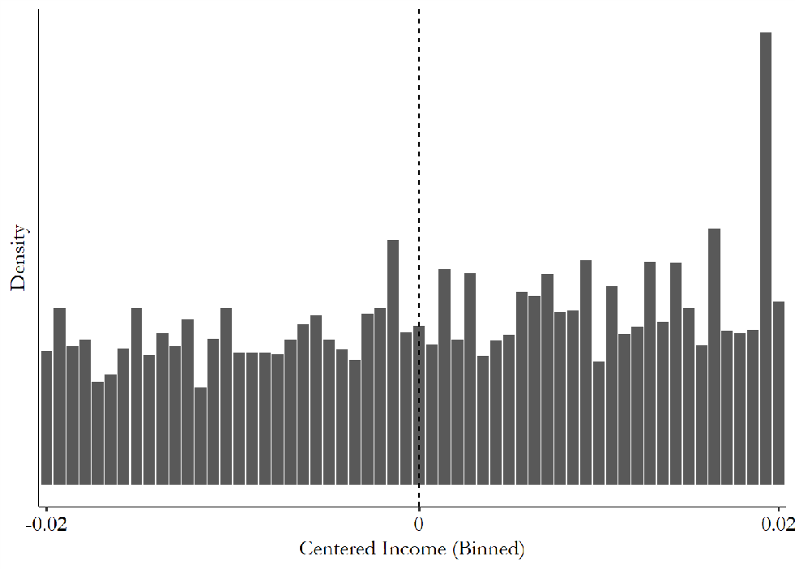

What can we do if we find manipulation? There are ways to estimate a range of plausible effect estimates that allow for a little bit of manipulation. See the final section of Chapter2121.21

###### 20.3 How the Pros Do It

###### 20.3.1 Regression Kink

REGRESSION DISCONTINUITY LOOKS FOR A CHANGE IN THE MEAN OUTCOME AT THE CUTOFF.Why not look for a change in something else? Why not, indeed? You could theoretically look for a change in just about anything. Why not a change in the standard deviation of the outcome? Or the median? Or an R2 of a regression of the outcome on a whole bunch of predictors?39

The most common “other thing” to look at, though, is a change in theslopeof the relationship between the outcome and the running variable. The treatment administered at the cutoff doesnʼt make the outcome itself change/jump - instead, the treatment changes the strength of the relationship between and . The resulting graph might look something like Figure20.1620.16 - no jump at the cutoff, but thereʼs sure20.16.... somethinghappening.

###### Y

###### Y RunningV ariable

###### Figure 20.16: A Regression Kink on Simulated Data

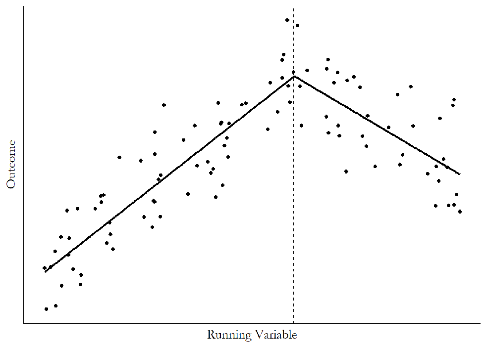

WHY MIGHT A TREATMENT CHANGE THE RELATIONSHIP?There are two main ways it might pop up. One might be that a treatment literally changes the relationship. For example, say we were running a regression discontinuity with time as our running variable, and the amount of employment in tech companies as the outcome. Then, at a particular time (our cutoff), a new policy goes into place that encourages more investment in tech companies. We wouldnʼt see tech employment rise right away (no jump), but weʼd expect tech employment to start increasing more quickly than it did before (increase in the slope).

40

A more common application of regression kink is whentreatment itself has a kink, like Figure

- 20.1620.16 but with “Treatment level/rate” on the20.16.... -axis instead of “Outcome.” Lots of government policies work this way. Take unemployment insurance, for example, which is a common regression kink application. Iʼll cite Card et al. (⊕2015) as one example of many, picking it largely because I was already going to cite it for another reason below. They look at data from Austria, where unemployment insurance benefits are 55% of regular earnings, up to the point where you hit the maximum amount of generosity, and then you get no more. So your regular earnings (running variable) positively affect the amount of unemployment insurance you get (treatment), up to the cutoff, at which point the effect of regular earnings on your unemployment insurance payment becomes zero.

###### y

So if you think, for example, that more-generous unemployment benefits make people take longer to find a new job, then you should expect to find a positive relationship between your regular earnings (running variable) and time-to-find-a-new-job (outcome) up to the point of the cutoff, and then it should be flat after the cutoff. Thatʼs exactly what they found.

ONE EXAMPLE OF TREATMENT-HAS-A-KINK REGRESSION KINK DESIGNis in Bana, Bedard, and RossinSlater (⊕2020). They look at the impact of paid family leave in California. Paid family leave is a policy where pregnant mothers can take an extended paid time off of work so they can, you know, give birth and care for a newborn without having to reply to emails. In California, the state pays 55% of regular earnings up to a maximum benefit amount. So the paid family leave payment (treatment) increases with regular earnings (running variable), until you get to the level of earnings (cutoff) where youʼre being paid the maximum benefit amount. After that, additional regular earnings donʼt increase your family leave payment. The setup is very similar to the unemployment insurance case I discussed from Card et al. (⊕2015), down to the 55% reimbursement rate, coincidentally.

The first thing to check is whether or not they actually see a change in the slope of treatment at the cutoff, and they definitely do. Figure20.1720.17 shows the average amount of paid family leave20.17.... received in the sample based on the base-period earnings that their benefits were figured on. Even without a regression line slapped on top of it, that looks like a change in slope to me.

Figure 20.17: Paid Family Leave Benefits (Treatment) and Pre-Leave Earnings (Running Variable) from Bana, Bedard, and Rossin-Slater (2020)

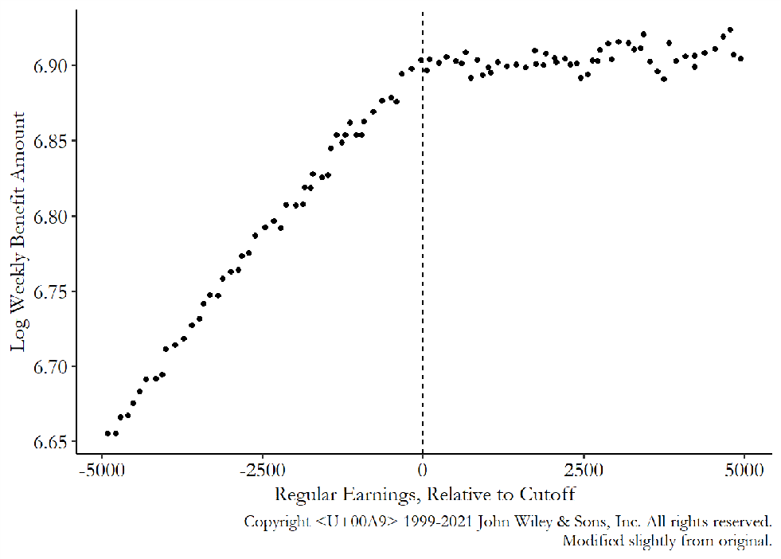

Next we can replace treatment on the -axis with some outcomes to see whether those outcomes also change slope. If they do, thatʼs evidence of an effect. They look at a number of outcomes in their paper, but Iʼve specifically picked out two: how long the mothers stay on family leave, and whether they use family leave again in the next three years, conditional on going back to work. Iʼve picked these two because you can see an effect on one of them, but no effect on the other, shown in Figure20.1820.18.20.18....

###### y

41

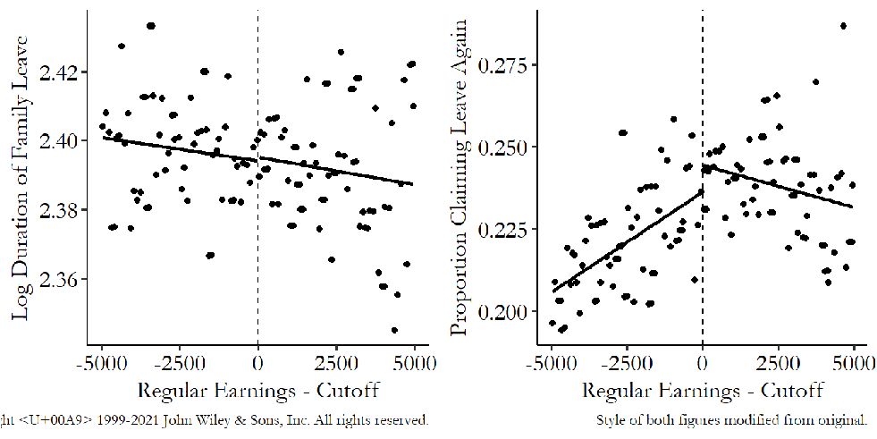

Figure 20.18: Log Leave Duration or Proportion Claiming Leave Again (Outcomes) and Pre-Leave Earnings (Running Variable) from Bana, Bedard, and Rossin-Slater (2020)

What do we see in Figure20.1820.18? On the left we see basically20.18.... nothing. No change in slope at the cutoff at all! This tells us that additional family leave payments didnʼt affect how long the family leave ends up being - if it did, weʼd expect the slope to change when the payments stopped increasing. In contrast, on the right,

thereʼs a big change in slope at the cutoff. This tells us that bigger leave paymentsdoincrease the chances of claiming family leave again (i.e., having another kid), since the chance of doing so is increasing while benefits are increasing, but then that stops as soon as the benefit increases stop.

The graph on the right doesnʼt just change slope though; itjumps! What can we make of that? Uhoh, that might be a cause for concern. Treatment didnʼt jump; it just changed slope. So if the outcome jumps, rather than just changing slope, that implies that an assumption may be wrong.

Or at least it would be if thatʼs what the original paper actually found. In the original paper there was no jump at all, just a nice change in slope. I just did regular olʼ straight-lines-on-either side, but they did some stuff that was a little fancier. In any case, the jump isnʼt big enough to be convincingly nonzero. I just included it myself to have a reason to talk about this, and to emphasize the importance of gut-checking your results.

42

ACTUALLY PERFORMING A REGRESSION KINKisnʼt too hard once you have the concept of regression discontinuity down. Youʼre just adding one layer of complexity on top of that. Most of the stuff I

already covered still applies here - kernels, bandwidths, polynomials, local regression, and whatnot. The same placebos largely apply - there shouldnʼt be a change in the slope if you estimate the regression kink model with a control variable as the outcome, for example, and youʼll want to make sure the running variable isnʼt discontinuous at the cutoff. The code doesnʼt change much - just set the deriv (which “deriv”ative of the regression equation do you want) option to 1 in your rdrobust code.

Even the underlying regression equation isnʼt changing much. The idea is that youʼre still just estimating a line to the left and right of the cutoff, just like way back in Equation(20.1)(((20.1):((20.1).... )))

- Y = β0 + β1(Running − Cutoff) + β2Treated+ β3(Running − Cutoff) × Treated + ε (20.4)

There is sometimes a difference in the equation: some researchers will allow a slope change but notallow any sort of jump, i.e., dropping by itself from the model, setting . Dropping helps reduce the influence of noise around the cutoff (and regression kink can use the noise-reducing help), although if there actuallyshouldbe a jump there you wouldnʼt notice it. The other difference is that now, instead of focusing on the coefficient representing the jump, (if itʼs even still in the model), youʼre instead focusing on the coefficient representing the change in slope, .

Treated β2 = 0 Treated

43

β2

β3

Of course, if youʼre using a setting where youʼve got a kink because the treatment level has a kink, youʼd be using the cutoff as an instrument for treatment just like you did before with fuzzy regression discontinuity.

44

So is anything else different? Some things, sure. Optimal bandwidth selection procedures are different, for one. You also might be more likely to use a uniform kernel rather than a triangular one (which conveniently makes calculation way easier - just drop observations outside the bandwidth and go!) (⊕Card et al. 2017). See the “uniform” option for kernel in rdrobust. Also,

- as you might expect, since weʼre interested in the slope now instead of just a jump in the outcome, failing to properly model a nonlinear relationship is more of a problem here than for regression discontinuity (⊕Ando 2017).

One big difference to watch out for is that the statistical power issue, which was already there with regression discontinuity, gets a lot more pressing. Estimating a change in relationship (slope) precisely takes a lot more observations than estimating a jump in a mean. Youʼre trying to estimate that slope only using the observations you have right around the cutoff. Youʼd better hope you have alotof observations near that cutoff.

###### 20.3.2 Cutoffs Cut Off

SHARP CUTOFFS, FUZZY CUTOFFS, SLOPE-CHANGING CUTOFFS. WHO CAN HANDLE ALL THESE CUTOFFS?I hope itʼs you because youʼre about to be buried in cutoffs. Ofcoursethereʼs such a thing as a multi-cutoff design.

And ifthatwasnʼt enough, there are actuallyseveral different kindsof multi-cutoff designs. Multi multi-cutoff designs. This is exhausting. Letʼs talk about them, at least briefly.

SOMETIMES, CUTOFFS ARE A MOVING TARGET.A given treatment might have a cutoff thatʼs different depending on where it is, who you are… you name it! This is fairly common. For example, a college admissions office might have one entrance-exam cutoff score for most students, and a different cutoff for students applying for positions on the major sports teams. Or, speaking of exams, in the US if you want a GED (an alternative to a high school degree) you have to take an exam and get above a certain minimum score. But the cutoff score is different for each state. Or maybe you want to use regression discontinuity to analyze elections where third parties are prevalent. In some elections you might need 50.1% of the vote to win, but in others you might be able to win with, say, 42.7%.

Or maybe there is only one cutoff, but it changes over time. The Bana, Bedard, and Rossin-Slater

(2020) paper on paid family leave from the last section is an example of this. The quarterly income

- at which you max out your family leave payments went up over time, from a little under $20,000 in 2005 to a little over $25,000 in 2014.

So the cutoff changes by group, or across regions, or across time, but presumably we want to gather all that data together - observations are at a premium in low-powered regression discontinuity, after all. What can we do?

The most common approach is to simply center the data and pretend thereʼs nothing different. As you normally would, estimate your model using , but simply allow each personʼs to be different depending on their scenario. Easy fix. This is exactly what Bana, Bedard, and Rossin-Slater did.

###### RunningV ariable − Cutoff Cutoff

But is that all we can do? No. Centering the data works, but what exactly itʼs workingonis a little different, especially once you consider treatment effect averages (⊕Cattaneo et al. 2016). Regular regression discontinuity gives us a local average treatment effect - the average treatment effect among those just around the cutoff. So what do we get if we have multiple cutoffs? Itʼs not exactly the average of those local effects. Instead you get weighted averages of those effects, weighted by how many observations are close to the respective cutoffs. Thatʼs a bit more complex than just “average of those at the cutoff,” which may impact how useful your results would actually be for policy.

Additionally, by lumping everything together, youʼre throwing out some useful information. Why settle for some weird average when you can use the different cutoffs to try to get at treatment effectsawayfrom the cutoff? Perhaps you have group A with a low cutoff for treatment, and group B with a high cutoff. With a few assumptions about how much extrapolating we can do, we can produce an estimate for the treatment effect for people in group A who are far away from the group A cutoff, but near the group B cutoff (⊕Cattaneo et al. 2020).(For another approach to the same idea, see⊕Bertanha 2020.)$, $ Now, instead of the multiple cutoffs giving us a treatment effect

45

average the equivalent of mashed potatoes, we get estimates that are even more informative than the straightforward single-cutoff version. Is this french fries in this analogy? Iʼve lost the thread.

Conveniently, these approaches to multiple cutoffs make it into the family of regressiondiscontinuity software packages alongside rdrobust, rddensity, and rdpower, in the form of rdmulti in all three languages. The rdmulti package contains the rdmc function, which can be used to evaluate multi-cutoff settings.

46

The rdmulti package also offers the rdms function, which can be used foryet anotherway in which you can have multiple cutoffs - when everyone is subject to the same cutoffs, but different cutoffs of the same running variable give different kinds or levels of treatment. For example,

consider a blood pressure medication, where youʼre given a low dose if your blood pressure rises into a range of “potential concern,” but a strong dose if your blood pressure becomes “dangerously high.” The intuition here isnʼt wildly different from the idea of just running regression discontinuity twice, once at each cutoff.

OF COURSE, THATʼS ALL IF YOUR MULTIPLE CUTOFFS COME FROM ONLY ONE RUNNING VARIABLE. HOW DINKY! OVER HERE, US COOL KIDS HAVE TWO RUNNING VARIABLES.There are a fair number of cases where a treatment is assigned not on the basis of a cutoff of one running variable, but a cutoff on each of two (or more) running variables.

One place this is common is ingeographicregression discontinuity. In a regression discontinuity based on geography, treatment occurs on one side of the border or another (like in our San Diego/Tijuana example from the start of this chapter). In many applications of geographic regression discontinuity, to cross from an untreated region into a treated one, you have to cross both a certain latitude and a certain longitude. Two running variables!

47

While there are applications of multiple running variables everywhere, one place where this seems to be fairly common is in education (⊕Reardon and Robinson 2012). For example, perhaps to progress to the next grade, a student needs to meet minimum scores on the math examsand on the English exams. Or to get a bonus, a teacher needs their students to meet a certain standard inbothof the classes they teach. Or a school may be designated as failing to meet state standards only if it falls below multiple performance thresholds.

This is a problem, because now we have, in effect,infinitecutoffs. Or at least multi-dimensional ones. Say you need a 60 in both math and English to go to the next grade. Itʼs not just that thereʼs a cutoff at 60 for math and a cutoff at 60 for English. Thereʼs a cutoff at 60 for math when English is 61, and a cutoff at 60 for math when English is 61.1, and a cutoff at 60 for math when English is 73.7, and a cutoff…

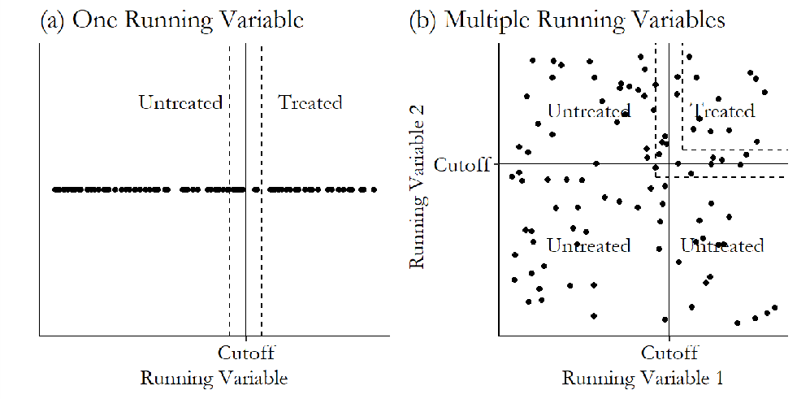

Figure 20.19: A Comparison of Single vs. Multiple Running Variables

The problem is illustrated in Figure20.1920.19. With a single running20.19.... variable, itʼs easy to figure out who youʼre comparing - those

within the bandwidth near the cutoff. But with two running variables, you still want to compare people near the cutoff, but who are you comparing them to? The cutoff is L-shaped! You probably donʼt want to compare people at the top-left of the L to people in the bottom-right - theyʼre probably not that similar. And if some parts of the L are more populated than others, just going for it may not give you what you want. So you have to figure out how to do an appropriate comparison.

Not only might the groups not be comparable, but the effect of treatment is probably not the same for all parts of the L. Being held back a grade may have very different effects for someone failing math as opposed to someone failing English. So you have to decidewhich part(s) of the L you want to estimate the effect at.

There are a few approaches to estimation in these cases, with Reardon and Robinson (⊕2012) covering five of them. There are also versions, such as the one discussed in Papay, Willett, and Murnane (⊕2011), specifically designed for cases where the treatment you get differs depending on which part of the L you cross - perhaps instead of being held back a grade, kids failing math take remedial math while kids failing English take remedial English.

One potential approach, and the one taken by the rdms function in rdmulti, is to pick specific points on the L and estimate what amounts to a fairly normal regression discontinuity using the other running variable. Do this with enough points on the L and you can get an idea of the effect and how it varies depending on where you cross the border.

###### 20.3.3 When Running Variables Misbehave

REGRESSION DISCONTINUITY IS NICE. ITʼS LIKE A VACATION.The treatment variable has few or no arrows

heading into it on the causal diagram in the region around the cutoff. Things are simple and results are believable. Weʼre laying back, sipping vodka from a coconut, and idly wondering whether to use a linear model or a second-order polynomial.

Then the rain clouds roll in. Vacation ruined. The running variable isnʼt behaving.

The main thing that a running variable needs to do in a regression discontinuity, other than be responsible for assigning treatment, is be nice and continuous and smooth, like a gently ebbing tide on the beach.

Weʼve already talked about the problems that can come from manipulation of the running variable. But two other potential issues are the running variable being toogranular- measured at a very coarse level, or the running variable exhibitingheaping- having some values that are suspiciously much more common than others. Either of these can cause problems.

GRANULARITY IS WHENa variable is measured at a coarse level. For example, if we were measuring annual income, we could say that you earned $40,231.36 last year, or we could say that you earned $40,231, or we could say that you earned $40,000. Or we could even say that you earned “$40 to 50,000.” Or, heck, we could say “less than $100,000.” These are measurements of your income in decreasing order of granularity.

You can imagine why this might be a problem for regression discontinuity. The whole idea of regression discontinuity is that people just on each side of the cutoff should be pretty easily comparable, with treatment the only real difference between them. That might be pretty believable if the cutoff is $40,000 and weʼre comparing you at $40,231.36 against someone at

$39,990.32. But what if we only have you measured as $40 to 50,000? Then weʼre comparing not only you against the $39,990.32 person. Weʼre also comparing someone who earns $49,999 against someone who earns $30,001. Not so easy to say that treatment is the only thing separating them.

How granular is granular enough? Itʼs subjective, of course, but as long as you can measure the variable precisely enough that you can distinguish who you think is comparable from who you think isnʼt, youʼre good to go.

That said, even if youcandistinguish well enough to do that, but still donʼt have a variable thatʼs finely measured, you might not be able to properly model the shape of the relationship between the outcome and the running variableleading upto the cutoff. If the outcome is increasing with income from $30,000 to $40,000, but youʼve only got the bin $30 to 40,000, then youʼll get the predicted value at the cutoff wrong, and so your estimate will be wrong too. At the very least, your inability to model that trend will increase your sampling variation.

The real solution here is “find a running variable thatʼs granular enough.” But no variable is infinitely granular. So if youʼre worried about granularity, you may want to pick an estimator that will account for that granularity.

A few papers springing from Kolesár and Rothe (⊕2018) do this. Kolesár and Rothe build better estimates of the sampling variation of the regression discontinuity estimator by making some assumptions about the relationship between the outcome and the running variablewithinthat big coarse $30 to 40,000 bin we canʼt look inside. One of their estimates assumes that the relationship isnʼt too nonlinear, and the other assumes that you wonʼt get the shape anymore wrong than you do at the cutoff. These estimators are available in R in the RDHonest package.

One thing Kolesár and Rothe (2018) point out is that youshouldnʼttry to solve the problem by clustering your standard errors on the different values of the running variable. This was standard practice for a long time, but it turns out to be worse in many cases than not addressing the problem at all. Oops! Donʼt do it.

NONRANDOM HEAPINGhappens when the running variable ismuch more likelyto take certain values than others. Often this can come in the form of rounding. Ask people how old they are, and

the vast majority of them are going to give you a round number, like “36 years old.” However, some of them will be more precise and say “36 years, eight months, and two days.” The canonical example is from Almond, Doyle, Kowalski, and Williams (2010), where they found that baby birth weights were highly likely to be reported as being rounded to the nearest 100 grams.

Either of these processes might result in the distribution of your running variable looking like the simulated data in Figure20.2020.2020.202020202020.20 (a). You can see how, every time the running variable hits a certain202020.2020.2020.20202020202020 value (here, a round number), the proportion of observations with that value jumps sky-high. These are the “heaps.”

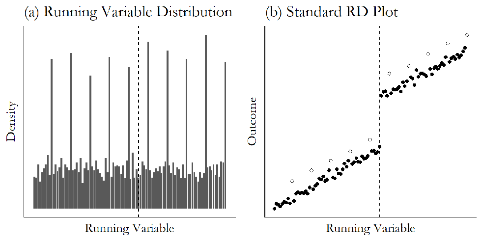

Figure 20.20: Regression Discontinuity Data That Shows Nonrandom Heaping

Now, this might not be a huge problem by itself. Having huge numbers of observations at certain points on the -axis will

###### x

heavily influence the regression line you fit. But on average, no harm, no foul. The real problem comes when the heaping isnonrandom. Notice in Figure20.2020.2020.202020202020.20 (b) that not only are the heaps very202020.2020.2020.20202020202020 common, theyʼre also different. The heaps are the non-filled circles, and they have on average higheroutcome values than the others.

Nonrandom heaping is likely to occur whenever thereʼs heaping. After all, is it really the same kind of person (or hospital) who rounds their answer as opposed to not rounding it?

With nonrandom heaping, we have highly influential values of the running variable (because theyʼre way more common than the other values) that are also not representative. This can pull our estimate away from the true effect and can even flip its sign! You can imagine how this might be especially bad if the cutoff is at one of the heaps - one side of the cutoff would be a heap, and the other side wouldnʼt. When heaps are inherently different, thatʼs a recipe for bias.

A common approach to this is “donut hole regression discontinuity,” where you simply drop observations just around the cutoff so as to clear out heaps near the cutoff. Seems counterintuitive to drop near-cutoff observations in regression discontinuity, which is all about realy wantingthose near-cutoff observations. But thatʼs the problem we face.

However, Barreca, Lindo, and Waddell (⊕2016) examine the problem of heaping and the donuthole fix. They show that heaping is a problem even when itʼsawayfrom the cutoff. So donut-hole wonʼt fix the problem unless youʼve gotten rid of the only heap. Instead, they recommend splitting the sample by whether a value is a heap or not, and analyzing each side separately. This gets rid of the problem of there being a clear back door between “being in a heap” and the outcome.

###### 20.3.4 Dealing with Bandwidths

HOW FAR AWAY FROM THE CUTOFF CAN YOU GETand still have comparable observations on either side of it? Itʼs an important question, and thereʼs a real tradeoff at play. Pick a bandwidth around the cutoff thatʼs too wide, and you bring in observations that arenʼt comparable (and rely more on the idea that youʼve picked the correct functional form), making your estimates less believable and more biased. Pick a bandwidth thatʼs too narrow, and youʼll end up estimating your effect on hardly any data, resulting in a noisy estimate. This is the “efficiency-robustness tradeoff.” Do you want a precise (efficient) estimate with lots of observations? Well, youʼre inviting in some bias which will make your estimate less robust to the presence of back doors or poorly-chosen functional form.

48

What should the bandwidth be? There are three main approaches you can take:

- 1: Just pick a bandwidth. This is a pretty common approach. Although perhaps it is becoming less common over time. For this one, you just look at your data and think about how far out you can go without feeling iffy about how far out youʼve gone. Ideally you can justify why that bandwidth makes sense. Or maybe you just take all the data you have and figure that the range youʼve got is good enough.
- 2: Pick a bunch of bandwidths. This sensitivity test-based approach is also fairly common - both the Fetter (2013) and the Bana, Bedard, and Rossin-Slater (2020) papers mentioned earlier in this chapter do it (in addition to a little of option 3 below). For this approach, you pick the biggest bandwidth you think makes any sense for the research design, and then you start shrinking it. Each time, estimate your regression discontinuity model.

Once youʼve got your estimates from each bandwidth, youʼd present all the results, potentially in a graph like Figure20.2122222220.21, which I made using a very basic non-local linear regression222220.21.2.2.2.2222222 discontinuity with the Fetter (2013) data, varying the size of the bandwidth. We can see the risks of the noise that comes from a too-small bandwidth on the graph. Actually, you canʼt… I had to cut the tiniest bandwidths (1-3 months) off of the graph because their estimates were so wild, and the confidence intervals so large, that you couldnʼt really see the other estimates. What youcan see is that the confidence interval shrinks as the bandwidth expands. Makes sense - a bigger bandwidth means more observations means smaller standard errors.

Figure 20.21: Estimating the Effect of Veteran Mortgage Subsidy Eligibility on Home Ownership Rate with Different Bandwidths

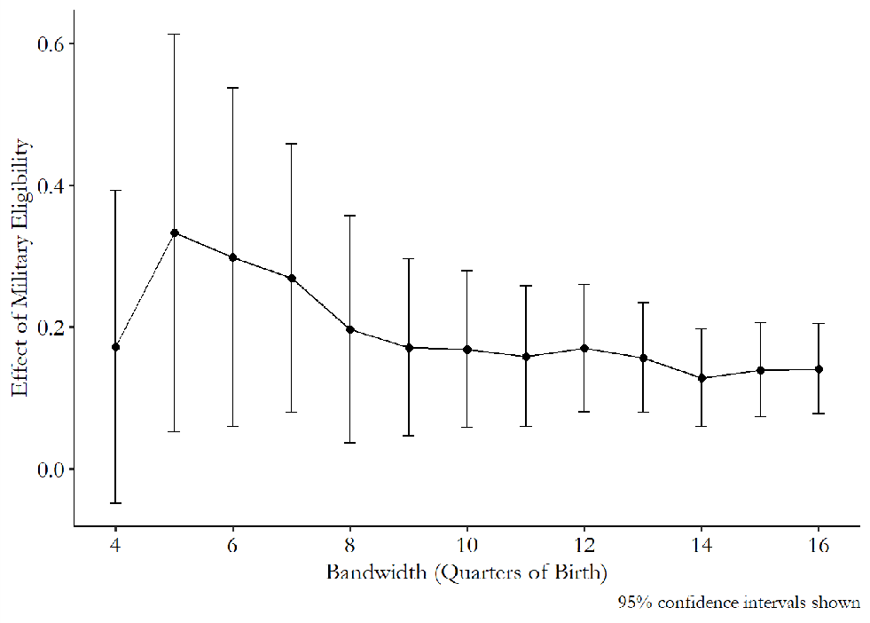

Figure20.2122222220.21 is largely what you want to see when using this method. The estimate doesnʼt seem222220.21.2.2.2.2222222 to change that much as I use a wider and wider bandwidth, within reason. So it probably doesnʼt matterthatmuch which one we choose (in the original paper, 12 was the bandwidth in the primary analysis).

- 3: Let the data pick the bandwidth for you. Or, rather, pick an objective of “what a good bandwidth looks like” and then use your data to figure out how wide a bandwidth is the best one by that criterion.

There are a few ways to do this. The first, discussed in Imbens and Lemieux (⊕2008), is crossvalidation. I introduced cross-validation in Chapter1313. The basic idea is that youʼre trying to get13 the best out-of-sample predictive power. So you split your data into random chunks. For each chunk, you estimate your model usingal the other chunks, and then make predictions for the now out-of-sample chunk you left out. Repeat this for every chunk, and then see overall how well your out-of-sample prediction went. Then, repeatthatwhole process for each potential bandwidth and see which one does the best.

The cross-validation approach was very popular and you still see it often. This is what the Fetter

(2013) paper did. However, what werealywant is good prediction at the cutoff. The standard cross-validation method can give a little too much attention to trying to fit points farther away from the cutoff.

The second approach is the “optimal bandwidth choice” approach, originating in Imbens and Kalyanaraman (⊕2012). This approach takes as its goal getting the best prediction right at the cutoff, just on either side. Of course, we donʼt know what the true value is right at the cutoff, so we estimate it the best we can.

The processes for several different methods of picking the optimal bandwidth are described in Cattaneo and Vazquez-Bare (⊕2016), which is not too difficult a read as these sorts of papers go. In short, by pursuing the goal of getting the best prediction at the cutoff, you end up wanting a bandwidth that is smaller for bigger samples (since you can afford to lose the observations), bigger the more polynomial terms you use (since you can better fit any nonlinearities you introduce by going wider), and beyond that is based on the extent of bias that is introduced from having the wrong functional form, as well as plenty of other details.

The Cattaneo and Vazquez-Bare (2016) paper also points out that using the optimal bandwidth choice approach messes up the standard errors and confidence intervals. The fix for this is to apply abias correction, estimating how big the bias from having the wrong functional form is, and adjusting both the estimate of the effect and the estimate of the variance for it.

They go even further, to talk about bandwidth selection procedures that, instead of trying to get the best prediction at the cutoff, try to minimizecoverage error- the mismatch between the estimated sampling distribution and the actual sampling distribution. This process tends to lead to narrower bandwidths, and is what youʼll get as of this writing from running rdrobust from the rdrobust package.

These bandwidth selection procedures matter a fair amount. Taking Fetter (2013) again as an example, the cross-validation approach in the original paper led to choosing a bandwidth of 12 quarters, which with our method gave an estimate of .170 (.177 using the methods in the original paper). We also saw that the rdrobust approach chose a bandwidth of 3.39 quarters, and gave an estimate of .518 - very different. And in this case, it really is the bandwidth selection that

makes the difference. Forcing rdrobust to use the 12-quarter bandwidth brings the estimate to

.200, very close to the original paper.

Previous Next

Page built: 2025-10-17 using R version 4.5.0 (2025-04-11 ucrt)

###### The Effect

Nick Huntington-Klein

▾ Chapters

###### Chapter 21 - Partial Identification

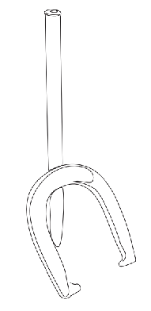

###### 21.1 How Does It Work?

###### 21.1.1 Strength Through Relaxation

CAUSAL IDENTIFICATIONcomes from a theoretical model of the world. We write down what variables we think are important and how they affect each other, and then the necessary steps to isolate a causal relationship come out of that model. However, the process of writing this model requires we make a bunch of assumptions: affects but doesnʼt affect , doesnʼt affect or , and doesnʼt even belong on the causal diagram.

A B B A C A B D

1

But if youʼve actually taken the time to sit down and draw a causal diagram (and I hope by this point in the book that you have), you realize how hard it is to make those assumptions. Saying that doesnʼt affect , for example, is equivalent to saying that has an effect on of 0. Wow,exactlyzero? Not just a small effect or an unimportant effect or less-than-.00001, butzero. That seems like astrongassumption.

###### C A C A

Figure 21.1: A Basic Back Door

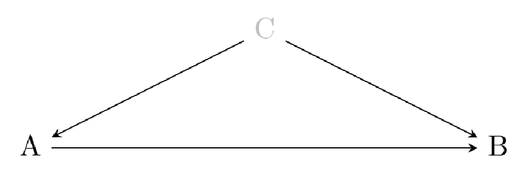

But itʼs an assumption we have to make! Letʼs say we are looking at Figure21.121.1. If we havenʼt measured21.11.11.11111111.11.1111111 and so canʼt control for it, then the only way we can identify the effect of on is to assume that those arrows from to and/or have an effect of zero.

C A B

C A B

Ordowe have to make that assumption? Letʼs consider something analogous, a basic algebra problem:

x + y = 10 (21.1)

If you want to know the value of , then I need to tell you the value of , right? If , then , and so on. Before we say what is, could beanything. But saying narrows down the possible range of values for to a single point. Saying point identifies to be 4. But what if we donʼt know what is? Weʼre hopeless, right?

x y y = 6 x = 4 y x y = 6 x

y = 6 x 2 y

Not entirely. Maybe we canʼt say what isexactly, but maybe we know enough to be able to say something like “ is between 4 and 7.” In that case, we wonʼt know exactly what is, but we can confidently claim that is between 3 and 6. “ is between 4 and 7” is aweakerassumption than “ ” and so the results it gets us arenʼt quite as conclusive, but we do get results.

y y x x y y = 6

Partial identification, also known as set identification, is the process of doing this same thing in a causal identification context. Instead of figuring out what set of possiblystrongassumptions need to be true in order for us to pin down an exact answer (which will usually back us into a corner of having to assume something we arenʼt really sure about), we relax those strong assumptions and instead try to see whatweaker assumptions we can make that we actually believe in. Then, we see what claims wecanmake given those assumptions.

3

Research done with more-credible assumptions will itself be more trustworthy and credible, even if the results wonʼt come with quite as much certitude (almost as though itʼs honestly reflecting the uncertainty we have about the world!) (⊕Manski 2020). Sometimes, point identification is too much to plausibly ask for. So we ask what wedoknow, and what we can learn from it.

So what about that identification problem from Figure21.121.1? Perhaps we canʼt confidently say that21.11.11.11111111.11.1111111 has a zero effect on both and . But maybe weareconfident that the effects of on and are each no larger than .1, for example. Using one of our partial identification methods, we might end up saying something like “we donʼt know exactly what the effect of on is, but if the effects of arenʼt any bigger than .1 each, then the effect of on issomewhere between.03 and .15,” to make up some numbers.

C A B C A B

A B C A B

###### 21.1.2 Establishing Clear Boundaries

SO HOW CAN WE CONVERT WEAK ASSUMPTIONSinto ranges of possible answers? There are quite a few ways. Thereʼs no single method for partial identification, but we can start with a demonstration. Specifically, letʼs demonstrate how partial identification can help us figure out a thorny issue of sample selection that we typically wouldnʼt be able to do much about.

4

5

Sample selection occurs when some of the relevant variables on your causal diagramcause you to be included or excluded from the sample.For example, letʼs say that we have a nicely-randomized treatment, where we randomly give 5,000 parents $1,000 and ask them nicely to keep their kids in school, and we give another 5,000 parents $0 and ask them nicely to keep their kids in school. Then we check in a month later to see if their kids are attending school. However, parents who get nothing may be more likely to quit the study and drop out of the sample, and also people capable of keeping their kids in school may be more capable of following up with the study. This gives us a diagram like Figure21.222222221.2.222221.2.2.2.2.2222222

Figure 21.2: Sample Selection

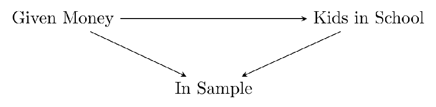

This is a problem because we can only estimate our results based on the people in the sample! This means we are controlling for “in sample” and have collider bias. If we didnʼt have to worry about people being in the

sample, since the treatment is randomized we could get the effect by just comparing means:

Effect of Treatment = Share in School conditional on being Treated− (21.2)

Share in School conditional on being Untreated

But we donʼt observe either of those values, since we donʼt observe all the treated and untreated people. We just see the ones in the sample! But letʼs think about what wecansee, using some hypothetical numbers.

We know that 5,000 people started out treated, and in our final sample we have 4,500 of them.

We know that 5,000 people started out untreated, and in our final sample we have 4,000 of them.

Among the treated people still in the sample, 80% of their kids are in school. Among the untreated people still in the sample, 60% of their kids are in school.

WE CAN STILL SAY SOMETHINGabout the results using just these actual observations. To do this, we notice that the actual value is just an average of the observed and unobserved people:

Share in School conditional on being Treated = (Prob(Observed conditional on Treated) (21.3)

×Share in School conditional on Treated and Observed)+ ((1 − Prob(Observed conditional on Treated)) × Share in School conditional on Treated and Unobserved)

6

We have three numbers here, and conveniently we know two of them! Since we started with 5,000 treated people and still have 4,500 of them, the probability of being observed conditional on being treated is .9. And we know that 80% of kids are in school for the treated group thatʼs observed.

So we get:

Share of Kids in School conditional on being Treated = (21.4)

.9 × .8 + .1 × Share in School conditional on Treated and Unobserved

Only one piece of the puzzle left! We donʼt know the share of kids in school among those who were treated but not observed. But we do know itʼs a proportion, so itʼs got to be between 0 and 1 by definition. At the lowest itʼs 0, and at the highest itʼs 1. We get:

Share in School cond. on being Treated ≥ .9 × .8 + .1 × 0 = .72 (21.5)

Share in School cond. on being Treated ≤ .9 × .8 + .1 × 1 = .82

The share for the treated groupmustbe between .72 and .82, and we didnʼt have to make any additional assumptions about our causal diagram or our data to figure it out! We can do the same calculation on the untreated group (try it yourself - itʼs not hard!) and find that the share for the untreated group must be between .48 and .68.

So what does this mean for the effect of treatment? The effect is still the difference between the two shares. The biggest this can be is when the treated-group share is at its maximum of .82 and the untreated-group share is at its lowest at .48, for a difference of . Take the other end of both ranges for a difference of .

###### .82 − .48 = .34

.72 − .68 = .04

The effect of that $1,000 checkmustthen be somewhere between a 4 percentage-point increase in the share of kids in school and a 34 percentage-point increase. We can call this theidentified set. Valuesoutsidethat range would be inconsistent with our data, so we can reject them. Butanyvalue in that range could be consistent with our data, so we canʼt really distinguish between them without making further assumptions. Weʼve unsnarled a collider-bias problem, and without having to have data on any of our missing people! Seems impressive to me.

Sure, those are still pretty wide bounds. But we could narrow them further by making additional assumptions like “the share of kids in school is higher in the observed group than the unobserved group” (which would narrow the bounds to between .12 and .32), “the percentage-point difference in share of kids in school between observed and unobserved people is the same in the treated and untreated conditions” (bounds between .2 and .26) or “there is no difference on average between the observed and unobserved groups” (this point identifiesthe effect to be exactly .2). Do you buy any of these additional assumptions? The first one doesnʼt seemtoostrong, and maybe even the second one is okay, but also Iʼm not sure!

Wecouldadd some of these assumptions to narrow our bounds, but the bonus here is that we already have an answer of some sort without having to make them, and we can decide for ourselveson the basis of whether the assumption is plausible enough to justify adding it, instead of thinking “dang, Ihaveto make that assumption to get an answer at all, guess I better make it.” If we really wanted point identification rather than

partial identification, weʼd have to pick an assumption as strong as “there is no difference between the observed and unobserved groups” to get there. And do we really believe that? I donʼt!

###### 21.2 How Is It Performed?

###### 21.2.1 Being Sensitive

PARTIAL IDENTIFICATION ISanapproachmore than it is a particular method. As such, you could take pretty much any of the methods covered in this book and make a partial-identification version of it, allowing you to relax some or all of the assumptions that go into the method. Obviously, I canʼt actually do that here foreverything, but weʼll cover a few things in the “How the Pros Do It” section below.

Inthissection I will cover two applications of partial identification that I think are very broadly useful for causal inference in cases where youʼre not applying some fancy quasi-experimental research design, but just using some covariates to close back doors and isolate a causal effect. The two methods in this section are about how you can use partial identification to get an answereven if you have back doors you canʼt close because you canʼt measure all the variables you need to control for. In the first subsection weʼll cover how to do this when youʼre using regression (by using what we know about omitted variable bias and how big it can be), and second how to do this when youʼre using propensity score matching (by using what we know about imperfect matches and how much bias they can introduce).

These approaches fall under the banner of “sensitivity analysis,” which sounds to me like a generic way of describing partial identification as a whole, but in practice often refers to one of these methods. Thereʼs more to partial identification than just sensitivity analysis: in the “How the Pros Do It” section weʼll cover some approaches that are specific to certain research designs like difference-in-differences. However, I think that sensitivity analysis approaches are broadly useful, and you should consider giving them a go nearly every time youʼre trying to identify an effect solely by controlling for a set of covariates. I think these ideas are quite powerful! As discussed in Chapter111111111111111, itʼs a pretty strong claim to say that youʼve modeled the data generating1111111111 process accurately enough that you can identify an effect just using control variables. Lots of people instinctively reject that this is even possible outside of the simplest cases. Iʼm sympathetic to that view.

7

Suspicion of attempts to identify causal effects using only controls is one reason why designs like regression discontinuity or instrumental variables, which use random-ish variation to mimic experiments, are so popular. But they can only be done in very special and lucky circumstances! Using sensitivity analysis to be able to produce results even without a quasi-experiment, in a way thatʼs more plausible than just saying “yep, Iʼm

pretty sure I controlled for everything important,” means that we can study all sorts of settings where there is no useful real-world experiment-like shock to the system.

These kinds of approaches go way back, and were highly useful in one of the earliest high-profile cases of causal inference using observational data: smoking. Back in the 1950s, there was a major scientific attempt to establish, to a level of certainty that could be used to justify government policy, that smoking tobacco causes lung cancer. However, it would be unethical to randomly assign people to smoke and then check whether it gave them cancer. This meant scientists were stuck trying to prove the causal relationship using observational data, as we do in this book. Even after adjusting for variables on obvious back doors: income, demographics, and so on, cancer rates were still far higher among smokers, as youʼd expect. But cigarette companies argued (correctly!) that the effect still was not identified because some background factors were left out. So Cornfield et al. (1959) did methods much like those in the section (⊕Cornfield et al. 1959; ⊕Rosenbaum 2010). They admitted that there were still open back doors in the analysis. But they showed that those open back doors would need to haveenormousimpact in order to explain away the apparent effect of smoking on lung cancer. We donʼt know what the effect is exactly, but using weak assumptions we can at least tell itʼs quite far above zero!

Estimating a causal effect using only a set of covariates worked for smoking. In my opinion, we should be much more comfortable with covariates-only approaches to estimating causal effects… as long as we can account for the very high likelihood that weʼve left something out. Partial identification can do that.

###### 21.2.2 Resolving Back Doors with Partial Identification in Regression

REMEMBER ALL THE WAY BACKin Chapter1313 when we talked about13 omited variable bias? Omitted variable bias happens when you run a regression without controlling for the proper set of variables to close all back door paths.

Thankfully, we have a very good picture of how bad our bias will be if we have the proper model but fail to control for something important. Letʼs say we have a data generating process:

X = γ0 + γ1Z + ν (21.6) Y = β0 + β1X + β2Z + ε (21.7)

where and are unrelated. If we just regress on , then the estimate weʼll get for will be biased, since is clearly on a back door path that we didnʼt close. The exact value of the bias in expectation will be

X ε Y X β1

- Z

cov(X,β2Z + ε) var(X)

β2cov(X,Z) var(X)

→

(21.8)

where is the covariance, and with the part dropping out in that second step because we assumed that and were unrelated. If you prefer correlation to covariance, we can rewrite this as

cov() ε X ε β2corr(X,Z) × sd(β2Z)/sd(X) X Z γ1

. So, our bias is bigger the more strongly and are related (the bigger is in absolute value and thus the bigger is), the more strongly affects (the bigger is) and smaller the more variance there is in overall. And, heck, we can measure . That leaves us only with

cov(X,Z) Z Y β2 X var(X)

and !

β2 cov(X,Z)

Since those are the only unknowns, if we can make some reasonable assumptions about how strong those relationships are, that will give us a reasonable range for the bias, which will give us a reasonable range for the estimate. Things might get more complex if thereʼs more than one or more than one , but thatʼs the basic idea.

X Z

THIS IDEA FOR BOUNDING REGRESSION ESTIMATESgoes back a fair ways, perhaps most prominently in Imbens (⊕2003) and Altonji, Elder, and Taber (⊕2005), who do partial identification by trying to pin down what reasonable assumptions about the relationship between and . Since then, Oster (⊕2019) offered a popular variation on Altonjiʼs method.

X Z

However, the specific method weʼll be using is from Cinelli and Hazlett (⊕2020) This method uses a few different approaches to bounding the relationship between and , and then asks questions like “how strong does that bias need to be for us to think that our estimate isalbias and the true effect might be 0?” or “if we were able to measurealthe predictors of other than , how strong would their relationship with need to be for the true effect of to be 0?”

X Z

Y X X X

Cinelli and Hazlett operate by thinking carefully aboutpartial values. A partial value is sort of like a regular value (see Chapter1313), except that instead of measuring the share of variation statistically13 explained byalthe predictors, it instead asks “after we remove the share of variation explained byoneset of predictors, how much of the residual share is explained by thisotherset of predictors?” For example, to get the partial for in explaining , weʼd first regress on all theotherpredictors in the model, take the residuals, regress those residuals on , and get the from that final regression.

R2 R2 R2

R2 X Y Y

- X R2

R2 R2

- Y R2

Cinelli and Hazlettʼs approach is based on thinking about two partial values: the partial of theomited variablesin explaining the outcome , and also the partial of the omitted variables in explaining the treatment variable . From our omitted variable bias calculation above, these conceptually (although not exactly) represent and , respectively. If both partial s are low, then youʼve got low bias. If one is high, you might be able to offset it with the other being low and still have low bias. Thereʼs a tradeoff between the two. We canʼt actually measure these relationships in the data, but Cinelli and Hazlett use graphs to show how differenthypotheticalcombinations of partial values would lead to different levels of bias.

X β2 cov(X,Z) R2

R2

LETʼS GIVE CINELLI AND HAZLETT A SPIN.For this chapter weʼll be using as an example a study by Pina-Sánchez and Harris (⊕2020). In this study, the authors are interested in whether there are gender disparities in prison sentencing in England and Wales. They look at data from 2011 to 2015 for several different offenses, and ask whether a man or a woman is more likely to be sentenced to custody for the same crime. The “treatment” here is being treated as a male in the courts, and the outcome is whether or not someone is sentenced to custody for the given crime. They also add 43 control variables to adjust for sentencing-relevant factors that might be different between men and women and affect their sentencing for reasons other than their gender, including the severity of the crime, their previous convictions, and whether they are the only caretaker for any children, among other factors.

One of their analyses looks at drug crimes, where men are 13.3 percentage points more likely than women to be taken into custody after adjusting for controls. Our analysis will focus here. The original paper includes plenty of controls when isolating this gender disparity, but surely they cannot adjust foralrelevant factors! How much confidence can we really put in that 13.3 percentage point number, and what might be a more reasonable range of results?

8

We can take a look at how sensitive these results are in Figure21.321.3. How can we read this figure? Along the x-21.3.... axis we have the partial of omitted confounders with the treatment, and along the y-axis we have the same for the outcome. Then, on the graph itself we have some curves labeled with treatment effects. Keep in mind those x- and y-axis “partial ” values refer to the amount of variation explained by the omitted confounders afteraccounting for the other controls we already have.

R2

R2

To interpret this, letʼs take as an example the value .1 on the x-axis and .2 on the y-axis, which rougly meet at the line labeled -.1. We can read this as “if there is a set of omitted variables that explain 10% of the residual variation in gender, and 20% of the residual variation in being taken into custody, then controlling for those omitted variables could take the estimated effect all the way down to -.1.” Our original estimate is positive (men are more likely to be taken into custody), shown at the bottom-left of the graph, so the graph shows how adjusting for a control of that level of importance could switch the sign of the effect.

9

Figure 21.3: Sensitivity of Gender Disparities in Drug-Crime Sentencing to Omitted Variable

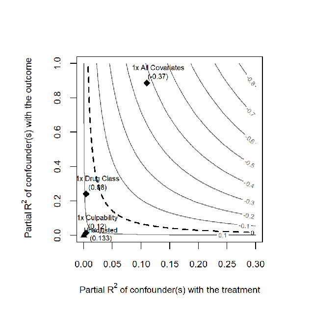

Looking for combinations of x- and y-axis values that push us over that thick dotted 0 line are of particular interest, since if we have omitted variables that contribute that much bias, that can explain away all of the effect we found. As a simple metric, Cinelli and Hazlett suggest a “robustness value” which is the value on the zero-treatment-effect-line where the x-axis value and y-axis value are the same. On this graph, thatʼs .083. We can then say that our effect is robust to omitted variable bias if the omitted variables explain less than 8.3% of the residual variation of both treatmentandoutcome. But if itʼs higher than 8.3% for both (or perhaps higher for one but lower for the other, for some tradeoff), weʼre in trouble. The question then is if we think thereisa set of unobserved controls as strong as that.

Is there? Itʼs hard to get a sense of what exactly that would mean. Thatʼs where the points on the graph come in. We can say “we donʼt know exactly how much the unobserved variables bias us, but we do know how much weʼd be biased if we removed some of the controls wedohave.” So we take some of the controls already in the model and check how sensitive the results are to there beinganotherset of unobserved controls as strong as the ones we have.

On the graph we see four points, the first for the original Unadjusted estimate. Right next to it we see “ Culpability.” Culpability is whether the suspect had a leading, significant, or lesser role in the drug crime. This point is right next to the unadjusted point, saying that if there were some other set of unobserved controls equally as strong ( ) as Culpability, the result wouldnʼt change much. The results are robust! Or at least

1×

1×

theyʼre robust to that one. If instead thereʼs another set of unobserved controls that contribute as much bias as Drug Class (cocaine/marijuana/etc.) does, the actual effect is still positive, with men receiving higher sentences, but now only by 8 percentage points, not 13. What if there are so many omitted variables biasing us that they collectively have the strength ofalthe 43 covariates we already have? In that case our original positive result doesnʼt survive at all, and we find ourselves all the way down at -.37.

This exercise gives us a sense of how robust our original result is to additional sources of omitted variable bias. We can pick one of our controls that we might think would have been a fairly strong contributor to bias, like the type of drug, and say “even if there is another set of confounders out there as strong as this, the effect is still of the same sign we started with.” We might even say that we are willing to bound the effect as being at least as large as .08, if we think that something as strong as drug class is the strongest unmeasured variable still out there. Alternately, we do need to claim at least that there isnʼt a set out there as strong as thefullist we already have. But given our list already covers quite a lot of bias, we may be comfortable saying there isnʼt another set out there equally as strong.

ANOTHER WAY TO PUT SENSITIVITY INTO CONTEXTis with an extreme-value analysis. This approach imagines that weʼve found variables thatfulyexplain all the residual variation in our outcome, or some other share like 50% of the residual variation. Then it asks how strongly those variables would need to be related to treatment in order to drive the estimated effect to .

10

We can see this analysis in action in Figure21.421.4. This one doesnʼt look quite so rosy! Looking at the “100%”21.4.... line, we see that it starts positive but crosses 0 at a value of only about .01. This means that our result is not robust to all the residual variation in being taken into custody explaining even 1% of the residual variation in being male. Maybe this is a claim weʼre willing to make. After all, regressing “male” on the rather lengthy and comprehensive set of predictors we have only gives us an of .099. Would we claim that the remaining variation in custody wouldnʼt move that needle by another .01? Maybe. But at the very least, now we know itʼs a claim we need to make.

11

###### R2

Figure 21.4: Gender Disparities

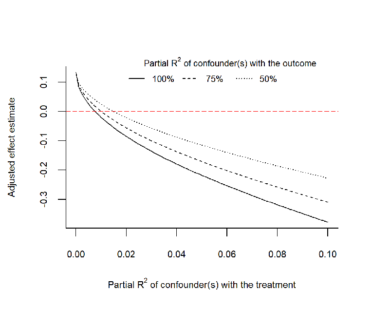

IMPLEMENTING A CINELLI AND HAZLETT SENSITIVITY ANALYSISis fairly straightforward to do in code because the

method has downloadable packages in R, Stata, and Python, all called sensemakr, although for Python it is installed with pip install PySensemakr. The below code replicates the analysis and both graphs from this section.

###### R Code R Code e Stata CodeStata CodeStatatatatatatatatatatatatatatatatatatatatata e Python CodePython Codeytyttt ooooooooooo o o oooooo o o o e

library(tidyverse); library(sensemakr) cc <- causaldata::ccdrug

# The . means "include all the variables you haven't # mentioned yet" which is just custody m <- lm(custody ~ ., data = cc)

# The full set of covariates, everything but intercept and treatment all_covs <- m %>% coef() %>% names() all_covs <- all_covs[3:length(all_covs)]

# Create bounds with strength similar to different covariates all_bounds <- ovb_bounds(m, treatment = 'male',

benchmark_covariates = list( 'All Covariates' = all_covs, 'Culpability' = all_covs[6:8], 'Drug Class' = all_covs[12:16]))

# Make a graph, with a big range for the "All Covariates" adjustment ovb_contour_plot(m, treatment = 'male',

lim = .3, lim.y = 1) # And add our adjusted estimates to the plot add_bound_to_contour(bounds = all_bounds) # Find the robustness value from the graph robustness_value(m, 'male')

# Extreme-case analysis ovb_extreme_plot(m, treatment = 'male')

###### 21.2.3 What About Matching?

ALLOWING FOR THE POSSIBILITYthat some back doors are still open is not limited to linear regression approaches. However, your humble textbook author comes to a crossroads. The most common way of doing partial identification with matching is called Rosenbaum bounds, from Rosenbaum and Rubin (⊕1983; ⊕Rosenbaum 2010). Itʼs also highly intuitive and easy to explain. A slam dunk for being the method that I choose to explain to you.

However! Rosenbaum bounds is specifically designed to apply only when you select good matches using a propensity score. This is a problem, since I spent much of Chapter1414 telling you not to select matches with a14 propensity score! If youʼre selecting matches, use a different distance measure, and if youʼre using a

propensity score, use inverse probability weighting. Worse, thereareways of doing partial identification with those methods, but theyʼre newer and less tested, as well as more complex. So whatʼs an author to do?

Iʼve decided to go ahead with telling you about Rosenbaum bounds. However, in a “How the Pros Do It” miniedition, Iʼll also point you to some of those other methods. Liu, Kuramoto, and Stuart (⊕2013) offer an accessible introduction to seven approaches to partial identification in matching (three of which are variations on Rosenbaum bounds), as well as pointing the way to many others. In more recent developments, Chernozhukov et al. (⊕2022) cover a range of ways that matching is used in causal machine learning, and they offer approaches to performing partial identification in those settings. Many of these machine learning methods are implemented in the dml.sensemakr package in R, which works much like the sensemakr package covered in the previous section. Crucially, theconceptof what is going on is very similar across these methods, even if the calculations are different (necessarily so; youʼll see how heavily the Rosenbaum bounds calculations rely on the use of matched pairs), so much of it ports over anyway.

ON TO ROSENBAUM BOUNDS!Like other kinds of partial identification, Rosenbaum bounds look at a particularly strong assumption and then ask “if we weaken this, what can we still say?” Rosenbaum bounds do this by looking at a single matched pair at a time.

The idea behind matching in general is that you are constructing a treated sample and a control sample that do not differ in terms of any variables that would be on a back door. If, say, income is a variable on a back door path, but your treated and control groups have exactly the same income, then income canʼt really explain any differences between the groups, can it? So income doesnʼt cause treatment any more and youʼve closed the back door.

Another way to think about this approach, when youʼre matching by choosing matched pairs, is that for any given pair of individual observations that are matched to each other, they should have the exact same probability of being treated. Letʼs call the probability of being treated for a given individual . So if we have a treated individual and an untreated individual who are matched on the basis of all their matching variables, then should equal . Maybe both probabilities are, for example, 50%, but the coin flip just happened to land on “treated” for and “untreated” for .

πi i t u

πt πu

t u

In this case, the probabilities are equal, so the odds ( ) will also be equal, and the odds ratio (one of the odds divided by the other) will be 1. When this happens, matching willpoint identifythe causal effect of treatment.

πi/(1 − πi)

- πt/(1 − πt)

- πu/(1 − πu)

= 1 (21.9)

NATURALLY, THE RESEARCHER MUST ASKwhat happens if theyʼrenotexactly equal, perhaps because some backdoor variable wasnʼt measured and couldnʼt be matched on. Rosenbaum bounds propose a “gamma” parameter that isgreaterthan 1 and representsthe worst possible odds ratioweʼre willing to consider.

Γ

1 Γ

πt/(1 − πt) πu/(1 − πu)

≤

≤ Γ (21.10)

In other words, weʼre allowing there to be a mismatch, but the odds ratio canʼt be any farther away from 1 than is. This is our weaker assumption: considering a above 1 instead of forcing it to be 1.

Γ Γ

From there, weʼre pretty much home free! Something important about that equation is that itʼs not just true over your whole sample, itʼs true forevery matched pair individualy. So for each pair in your data, you have this equation. You can then estimate your bounds by letting the degree of mismatch range from a worst-case where the treated individual was farlesslikely to be treated than their matched partner who was actually untreated (so the odds ratio is ), all the way up to the worst-case where the treated individual was farmore likely to be treated than the matched partner who was actually untreated (so the odds ratio is ).

1/Γ

Γ

At each of these extremes you can get the effect, and with some additional calculations you end up with a range of effect estimates, as well as a range of p-values testing the effect against zero. And there you have your Rosenbaum bounds for a given . You can say something like “if the odds ratio is no worse than , then the estimated effect is between (A) and (B).” Or, alternately, you can try several different values of and say “the estimated effect is larger than 0 as long as is smaller than (C).”

Γ Γ

Γ Γ 12

ODDS ARE, WE HAVE A PROBLEM HERE.We have our nice calculation, and it tells us the range of effects for a given

. But is a restriction on theodds ratio. Oddsarenʼt too difficult to understand, but oddsratiosare just

Γ Γ

13

about impossible to interpret intuitively. Itʼs even common for people who work with them all the time to mistake them for risk ratios (“the risk for something is X times higher in group A than group B”, and no thatʼs

notwhat odds ratios are) (⊕Holcomb Jr et al. 2001). How weak of an assumption is , exactly? Or ? Or 4? The whole point of this is to say that we know how strong our assumptions need to be to generate useful conclusions. If we donʼt actually know how strong those assumptions are, thereʼs no point!

Γ = 1.2 Γ = 2

One approach we can take here is to just do the conversion ourselves! Itʼs not too hard. Want to know whether your results are robust to the mismatch between pairs being as big as one member of the pair having a treatment probability of .4 while the other is .45? Calculate the odds ratio yourself:

(.45/(1 − .45))/(.4/(1 − .4)) = 1.23 Γ 14

. So we know a of 1.23 covers a gap in treatment rates of that size.

Alternatively, we can take a further step in our Rosenbaum bounds calculation, one that uses the fact that our matched pair is one treated and one control observation. We rewrite our condition for each pair as:

1 1 + Γ

Γ 1 + Γ

πt πt + πu

≤

≤

(21.11)

This doesnʼtseemmuch better at first, but that in the middle looks a lot easier to interpret to me! In a given matched pair, youʼre always matching a treated person to an untreated person . So, if we know that exactly one of these two people is going to be treated ( ), whatʼs the probability that it was going to be the person whodidget treated ( )? Keep in mind that if matching is perfect, itshouldbe a coin flip, since youʼre matching people with equal probabilities of treatment. Still not the easiest interpretation in the world, but easier.

πt/(πt + πu)

t u πt + πu

πt

This allows us to convert our of 1.2 (for example) into a lower bound of and an upper bound of , which are both .045 away from a “fair coin” of .5. Now we can interpret our of 1.2 as “if I took a matched pair and then somehow learned about all the ways they are different despite the matching, I still wouldnʼt be able to guess which one of the pair was the treated one more than 54.5% of the time.”

Γ 1/(1 + 1.2) = .455 1.2/(1 + 1.2) = .545 Γ

Thatʼs… better I think? Still one to sit with a while. But hey, youʼve got time. What else are you doing anyway? LETʼS CODE UP SOME ROSENBAUM BOUNDS.Packages to calculate Rosenbaum bounds are readily available! In fact there are many, for the many different flavors of Rosenbaum bounds. I will show a demonstration in this section, but before copy/pasting this code for your own application, itʼs likely worth a little internet searching to see if thereʼs an implementation out there that more closely matches what youʼre doing.

15

For the basics, in R and Stata there are packages both called rbounds. Inconveniently, however, the specific kind of Rosenbaum-style bounds you need to calculate depends on whether your outcome variable is continuous or binary. So Iʼll show both, keeping in mind that the version for a continuous outcome will be incorrect since our example data has a binary outcome, but you can use it ifyouhave a continuous outcome. In the case of Stata, the rbounds package will only do continuous outcomes, and the binary-outcome approach will require a switch to the mhbounds package (see also the slightly updated rmhbounds package). In Python there does not appear to be a mature and maintained package that calculates Rosenbaum bounds, so we are out of luck there.

Weʼll continue our application from Pina-Sánchez and Harris (⊕2020) as used in the previous section on regression. So weʼre looking at people who have been arrested for drug crimes in England and Wales, and we want to know whether men are more likely than women to be taken into custody, after adjusting for a bunch of variables likely to differ on average between sexes and also influence the decision to take someone into custody.

###### R Code R Code e Stata CodeStata CodeStatatatatatatatatatatatatatatatatatatatatata e

library(rbounds); library(MatchIt); library(tidyverse) cc <- causaldata::ccdrug

# We are using MatchIt to match, as that's the original way rbounds was # designed to work, but anything that makes pairs should work fine. # use everything but custody to match m <- matchit(male ~ . - custody,

data = cc, replace = TRUE) # Get the outcomes for each pair, match.matrix contains # row numbers for the treated and control observations # Make sure that your rownames() are 1, 2, 3, etc. treated_rows <- as.numeric(rownames(m$match.matrix)) control_rows <- as.numeric(m$match.matrix) pairs <- data.frame(Treated = cc$custody[treated_rows],

Control = cc$custody[control_rows]) %>% # don't include unmatched treated observations filter(!is.na(Control))

# For a binary outcome, we count up the number of # "discordant pairs" with different outcomes

true_only_treated = sum(pairs$Treated == 1 & pairs$Control == 0) true_only_control = sum(pairs$Treated == 0 & pairs$Control == 1)

# For our binary outcome. Select which Gammas to evaluate binarysens(true_only_control, true_only_treated,

Gamma = 2, GammaInc = .1)

# Pretending we have a continuous outcome psens(pairs$Treated, pairs$Control, Gamma = 2, GammaInc = .1)

# For continuous outcomes, we can use the sensitivitymw # package to get a confidence interval for our effect library(sensitivitymw) senmwCI(as.matrix(pairs), gamma = 1.6)

Γ = 1.5 16 πt/(πt + πu) 1/(1 + 1.5) = .4 1.5/(1 + 1.5) = .6

From this, it looks like our effect loses significance somewhere around . Using our calculation from the previous section, we get that is bounded between and . So if, for a given matched pair, we could use their unobserved data to guess which of the two is the treated one more than 60% of the time, then we cannot reject an effect of 0, given our range of plausible estimates. If we canʼt guess that well, then we can still reject .

###### 21.3 How the Pros Do It

###### 21.3.1 Formal Partial Identification

WHEN THINKING ABOUT HOW“the pros” do partial identification, there are two extremely different kinds of things I can recommend. The first isformal partial identification. This really isnʼt so much a specific tool or estimator as it is, well… just sorta doing everything by hand.

We saw a little bit of this in the “How Does it Work?” section when we walked through the selection-bias calculation. In that calculation, we wrote out what we planned to estimate, and plugged in what it represented theoretically. That process made fairly clear what assumptions we needed to make about things wecouldnʼtsee in our data, and we put in a reasonable range of assumptions to get a reasonable range of estimates.

That same process can be repeated foranycausal estimation, not just ones as simple as we walked through. This process is highly flexible and lets you see how sensitive your results are to the relaxation of all kinds of assumptions, to all different degrees of relaxation. Pretty neat!

UNFORTUNATELY, WITH THAT FREEDOM COMES COMPLEXITY.This section is fairly short because I canʼt really do justice to the process of formal partial identification without very quickly getting into the weeds, and showing you a far deeper level of technical detail than youʼd find in the rest of this book. This generally looks like walking very carefully through complex conditional probability calculations. That example from “How Does It Work” is doing exactly this, but it wasvery specificaly chosento be an example I could walk through fairly simply. Most applications are much trickier.

So I wonʼt attempt to show you how to do this. But I will give you a few places to look in case youʼre interested. One straightforward introduction (as these things go) is the classic Charles Manski (⊕1995) book Identification Problems in the Social Sciences. Tamer (⊕2010) provides a somewhat more updated, but brief, overview. If you really like what you see, you can begin your journey into the deep end with Manski (⊕2003) or Gangl (⊕2013).

###### 21.3.2 Design-Specific Partial Identification

THAT SHORT AND BREEZY OVERVIEWof formal partial identification leads to another way the pros approach partial identification that probably gets used way more often, although it is much less general in its application.

All the different standard research designs Iʼve described in this book, from Fixed Effects to Regression Discontinuity Design, always rely on key identifying assumptions. Rather, they rely on alotof identifying assumptions of many kinds, but there are often a few that get the most attention or are viewed as being the most difficult to support despite being key to the method. Somewhat like in a Hollywood movie, the star of the show when it comes to building trust in your causal inference study is the underdog nobody really believes in at first, until they get a chance to prove themselves. These are things like parallel trends in Difference-in-Differences, or the validity assumption in Instrumental Variables.

As you might expect, this is prime territory for partial identification to move in on. Have a key identifying assumption that you can never reallyproveis true, and you know readers of your study will be suspicious of? Well, why not do some partial identification so that readers can know how much your results really do rely on that assumption, and what you get if the result is weakened?

A GREAT EXAMPLEof this kind of thing is the “honest Difference-in-Differences” estimator for, well, difference-indifferences (DID) (⊕Rambachan and Roth 2023). A key assumption in DID studies isparalel trends. In DID, you are taking a group that got a treatment at a particular period of time and seeing how their outcomes changed from before treatment to after. Then, you compare those changes against a control group who never received the treatment. For this analysis to give you the causal effect of treatment, you must assume that, if the treatment had never been given toanyone, then the gap between the treated and control groups would have been exactly the same before treatment and after.

Exactlythe same is a pretty high bar, isnʼt it? Truly zero change in the gap between two groups? Cʼmon now. Iʼd probably never believe that parallel trends holdsexactly. But what if it doesnʼt holdexactlybut rather is pretty close to holding, but notsoclose that we can justify ignoring the problem? Maybe just a tiny change in the gap would have happened. Surely we can work with that? And we can. Obviously, if the gap would have grown by

.01, then our estimated effect would also be off by .01. So we have a pretty direct relationship between “amount of parallel trends violation” and “bias in our estimate.” Honest DID starts with a range of reasonable parallel trends violation values, based on a few different approaches including prior-trends tests (see the DID chapter), and turns those into adjusted effect estimates, including confidence intervals. This lets you say stuff like “if the parallel trends violation is no worse than the size of our prior trends violation, then we can bound the effect estimate between A and B.” Honest DID can be implemented in R using the HonestDiD package, or in Stata using honestdid.

###### 2×

IN REGRESSION DISCONTINUITY DESIGNS,there are several key assumptions to be concerned about, but a big one has to do with manipulation of the running variable. Regression discontinuity is based on the idea that there is a cutoff value of some variable that assigns you to treatment (or at least makes you much more likely to be treated on one side of the cutoff than the other), and thatfor those realy close to the cutoff, itʼs sort of happenstance whether you end up just on one side of the cutoff or just on the other, making people just above

and just below the cutoff good comparisons who really only differ based on random noise. But there might be some reasons why itʼsnotjust random noise which side you end up on. If you know where the cutoff is, maybe you can change your behavior to just barely nudge yourself over that line. In that case, getting treated or not isnʼt quite so random! In Chapter2020 I showed how we can test for the20 presenceof manipulation, but not what to do if it happens.

Gerard, Rokkanen, and Rothe (⊕2020) show how the extent of manipulation in the running variable translates into a range of effect estimates. You can either specify an upper bound on how much manipulation you expect there to be, or allow it to vary, and translate that into a range of effect estimates that allow for the potential presence of manipulation in your running variable. Their method has packages available for R and Stata, both of which can be downloaded fromhttps://francoisgerard.github.io/rdbounds/htthtthtthtthtthtthttps://francoisgerard.github.io/rdbounds/.htthtthtthtthtt s://francoisgs://fransssssss://frans://frans://francoisgerard.github.io/rdbounds///////////// ranranranranranran oisgoisgoisgoisgoisgoisgoisgoisgoisg rard.github.io/rdbounds/rard.github.io/rdbounds/rard.github.io/rdbounds/rard.github.io/rdbounds/rard.github.io/rdbounds/rard.github.io/rdbounds/rard.github.io/rdbounds/rard.github.io/rdbounds/rard.github.io/rdbounds/rard.github.io/rdbounds/

17

HOW ABOUT INSTRUMENTAL VARIABLES?Iʼm leaving this one for last because, well, I already covered it back in Chapter1919 in the “Okay, You Can Have a Little Validity Violation” section. In instrumental variables, a key19 difficult-to-justify assumption is validity, which says that there are no open back doors from your instrumental variable to your outcome, except for those going through your treatment variable.

Partial identification in instrumental variables starts basically how youʼd expect. Allow a range of validity violation amounts and get a range of estimates. Other approaches add more assumptions: if you assume, for example, that the instrument affects the treatment in the same direction in all subgroups, you can narrow your bounds. Or if you can choose whether the part of the instrument violating validity has a positive or negative relationship with the outcome, you can narrow your bounds.

Previous Next

Page built: 2025-10-17 using R version 4.5.0 (2025-04-11 ucrt)

# The Effect

Nick Huntington-Klein

▾ Chapters

###### Chapter 22 - A Gallery of Rogues: Other Methods

###### 22.1 It Never Stops

THE TERRIFYING AND DELIGHTFUL THING ABOUT RESEARCH DESIGN IS THAT THEREʼS ALWAYS MORE- new research designs, new estimation methods, new estimators, new adjustments, new critiques of oldeverything.

1

Thatʼs what this chapter is about. The whole wide world of research design and causality is far too big to cram into one little book. What youʼve seen so far is me playing the hits. Difference-indifferences. Regression discontinuity. Everyone knows ʼem, everyone loves ʼem. Theyʼre why you bought the concert ticket. But what about the new album or the b-sides?

It simply wouldnʼt make sense to spendtoomuch time on new methods. Theyʼre untested! Itʼs simply impossible at this point to know which ones will stand the test of time and which will fall by the wayside. And even the ones that will be around a decade from now almost certainly arenʼt in their final form yet. The chapter would be immediately outdated.

This chapter, however,isabout methods that are either new, or developing, or just super interesting but a bit too technologically complex to try to teach them in this book. Iʼm not going to go deep into detail on them. No deep dive into caveats and details, no code examples (although I may recommend a few packages you can look into on your own). This chapter is about starting you on a journey of exploration. Iʼll tell you whatʼs out there. Iʼll give you an idea of how it works. And if it sounds interesting to you, youʼll have some sources to follow up on.

Letʼs get going.

###### 22.2 Other Templates

In this section, Iʼll discuss a few promisingtemplate research designs. That is, theyʼre research designs that have a chance of applying in many different contexts, much like difference-indifferences, instrumental variables, and the other methods Iʼve devoted whole chapters to in the second part of this book. Perhaps in some revision of this book, one of these will become a breakout star and get its own chapter and dressing room.

###### 22.2.1 Synthetic Control

2

SYNTHETIC CONTROL IS THE CLOSEST THINGto another chapter that this book got. Itʼs already wellestablished, popularized in Abadie, Diamond, and Hainmueller (⊕2010), but around before that, and showing up in many places since then. However, itʼs still enough on the fringe that it wouldnʼt quite be considered astandardpart of the toolbox yet, at least not to the degree something like regression discontinuity is. Maybe it will get there.

Synthetic control issort oflike a variant of difference-in-differences with matching (Chapter1818).18 We have the same basic setup as difference-in-differences: thereʼs a policy that goes into effect at a particular time, but only for a particular group. You use data from the pre-treatment period to adjust for differences between the treatment and control groups, and then see how they differ after treatment goes into effect. The post-treatment difference, adjusting for pre-treatment differences, is your effect.

3

So then, whatʼs the difference? A few things:

Unlike with difference-in-differences, those pre-treatment difference adjustments are not done with regression, but rather by matching. Plus, unlike DID with matching, the purpose of matching is to eliminate these prior differences in outcomes, not to account for the propensity to be treated.

Synthetic control relies on having many pre-treatment periods.

After matching, the treated and control groups should have basically no pre-treatment differences. This is often accomplished by including the outcome variable as a matching variable.

Statistical significance is generally not determined by figuring out the sampling distribution of our estimation method beforehand, but rather by “randomization inference,” which is a method of using placebo tests to estimate a null distribution

4

###### we can compare our real estimate to.

5

Synthetic control starts with a treated group and a “donor set” of potential control groups. Using the pre-treatment data periods, it implements a matching algorithm that goes through all the control groups and assigns each of the potential controls a weight. These weights are designed such that the time trend of the outcome for the treated group should be almost exactly the same as the time trend of the outcome for the weighted average of the control group (the “synthetic control” group).

6

LETʼS SEE HOW THIS LOOKS IN DATAfrom Abadie and Gardeazabal (⊕2003). This study looks at an outbreak of violent conflict in the Basque region of Spain in the late 1960s to see what effect the conflict had on economic activity. It compares growth in the Basque region to growth in a synthetic control group. Not too surprisingly, they find that GDP in the region was negatively impacted by the conflict.

Abadie and Gardeazabal match the Basque region to seventeen other nearby regions. The synthetic control algorithm creates weights for each of those seventeen regions in order to make prior trends equal, using information about those prior trends as well as other matching variables including population density, education, and investment levels. Conflict started around 1970, although it didnʼt really kick into gear for a few years. So matching is done only on the basis of data up to 1969. Cataluna and Madrid turn out to be the strongest matches and get the most weight, with the other regions getting very little weight. These same weights are then applied across the entire time period.

The results of the matching process can be seen in Figure222.22.2222222222.1. As weʼd expect, the values of the222222.22.22.1.1 outcome are very similar in the pre-treatment period for the treated and synthetic control group. It sure looks like weʼd expect them to continue to be the same in the absence of any treatment. Reassuringly, they continue to trend very closely together for a few years after treatment starts, but before the conflict really gets going. Weʼre not actively matching here (nothingʼsforcingthe lines to stay together), but they stay together nevertheless in a time period where the treatment intensity was very low. Thatʼs good!

Figure 22.1: Synthetic Control Effect of Conflict on Basque Country Economic Growth, from Abadie and Gardeazabal (2003)

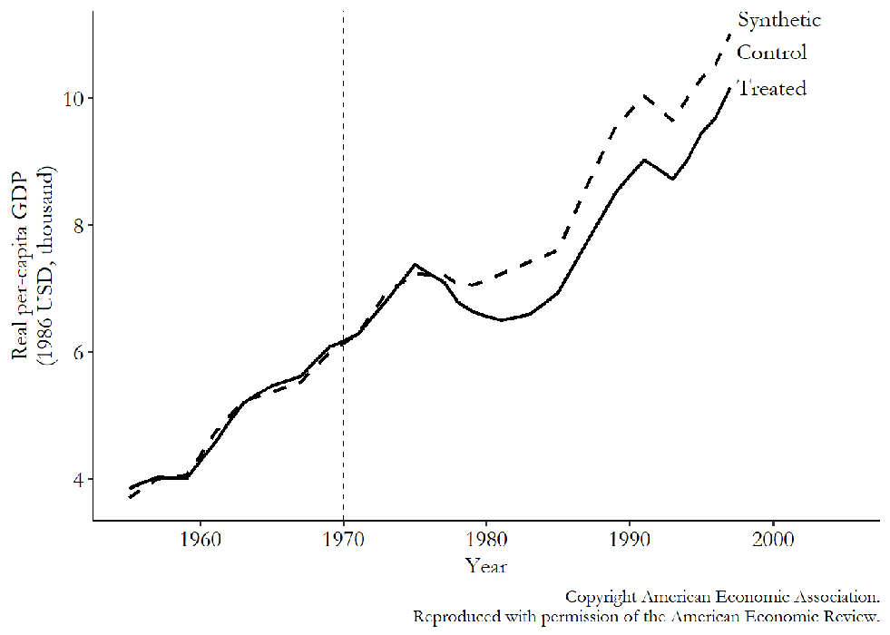

Then, the conflict really ramps up. At the same time we see the treated group and the synthetic control start to diverge, with GDP dipping lower for the Basque Country than for its synthetic control. Sure looks like the conflict is having a negative effect!

LIKE ANYTHING, SYNTHETIC CONTROL HAS ITS PROS AND CONS.Its benefits in comparison to differencein-differences are obvious. It doesnʼt need to rely on that iffy parallel trends assumption like difference-in-differences did (it sortaforcesthe assumption to be true, or at least forces prior trends to be true, by its method). It makes the process of selecting a control group a little more disciplined. And because it doesnʼt rely on regression, it is not as sensitive to functional form issues as difference-in-differences is (and naturally shows you dynamic effects without having to trot out a bunch of interaction terms). It may well be the “most important innovation in the policy evaluation literature in the last fifteen years” (⊕Athey and Imbens 2017), and thatʼs coming from two of the authors of the next method in this chapter.

7

Why isnʼt it more popular than it is, then? Itʼs not quite as widely applicable as difference-indifferences, since it relies on cases where you have access to a lot of pre-treatment data (otherwise, the matching quality, or at least your ability to check match quality, will get iffy). It does have a tendency to overfit any noise in the outcome variable when matching - thatʼs no good. Also, the fact that it matches on the outcome variable justfeelsfishy - like using the outcome itself to close back doors is cheating. This is a natural skepticism, and like any method, synthetic control comes with its own set of assumptions that have to hold. But it is important to keep in mind that itʼs only matching on pre-treatment outcomes, not the post-treatment outcomes where you actually estimate the effect. Plus, other methods like difference-indifferences also use information about pre-treatment outcomes to produce their estimate. They just do so in less obvious ways. Synthetic control isnʼt pulling a fast one - youʼve been using pretreatment outcomes all along.

If you are interested in learning more about synthetic control, I recommend the extended chapter on the method in Scott CunninghamʼsCausal Inference: The Mixtape(⊕Cunningham 2021). Or for a bit more detail, Abadie (⊕2021) covers cases when synthetic control works, and when it doesnʼt. Synthetic control can be implemented in Stata using the synth package, often paired with the synth_runner package for easier use. In R, there is both the tidysynth package, which is a bit easier to use, or gsynth, which has more flexibility in how the design works. In Python you can use the scpi package, which is also available for R and Stata.

###### 22.2.2 Matrix Completion

LETʼS SWING ALL THE WAY FROM ONE OF THE MOST-ESTABLISHED METHODS IN THIS CHAPTER TO ONE OF THE LEAST.Matrix completion is fairly new of this writing, making its debut in Athey et al. (⊕2021), and

8

despite that year of publication, it was around for about five years before that. But it is very promising, and the first of a few causal inference innovations derived from machine learning youʼll see in this chapter.

Matrix completion works with panel data, where you observe the same units over multiple time periods. In your panel data set, for a given individual (person, firm, country, etc.) in a given time

period, that observation is either treated or untreated. We donʼt just observe whether that observation is treated or untreated, but also we observe theiroutcome . Simple enough so far.

Y

But what about that outcome ? Itʼs not justanyoutcome. Itʼs specifically the outcome that observation getsconditional on its treatment status. Say the treatment is that you watched the movieHome Aloneon Netflix in a particular month, and the outcome is you choosing whether to watchMy Girl, another Macaulay Culkin movie, on Netflix in that same month when given the chance. If you saw both movies, then your individual outcome is that you did watchMy Girlthat month conditional on having watchedHome Alone. We haveno ideawhether you would have watchedMy Girlif you hadnʼt watchedHome Alone.

Y

We can imagine a matrix (spreadsheet, basically) of outcomes. Each column is a time period, each row is an individual, and each element/cell of the matrix is your outcome. If you watchedMy Girlthat month, then your outcome is 1, so that monthʼs column of your row would get a 1. If you didnʼt, it gets a 0.

9

But we donʼt just have one matrix, we have two. We have one matrix conditional on you getting the treatment (watchingHome Alone) and a separate matrix conditional on you not watching Home Alone. And - hereʼs the kicker - if weʼre looking in the “treated” matrix in your row, in a month youdidnʼtget treated, then we have no idea what your outcome is conditional on getting the treatment, since you didnʼt get the treatment. So instead of a 1 or a 0 for your outcome, you get a big olʼ “?”. We donʼt know what your outcome would be if youʼd gotten treated, since you werenʼt treated. Weʼd love to compare your treated self to your untreated self to see how you were affected, but we canʼt because we never observe both at once.

This whole idea - where the outcome youwouldhave gotten is thought of as a missing value weʼd love to compare to but canʼt - is a pretty pure application of the potential outcomes model, which is another way of representing causal relationships besides causal diagrams.

Table 22.1: Table 22.2: Outcomes for Treated and Untreated Individuals

Untreated Treated Ind Time1 Time2 Time3 Ind Time1 Time2 Time3

- 1 1 0 1 1 ? ? ?

Untreated Treated

- 2 ? 1 ? 2 0 ? 1
- 3 1 ? 1 3 ? 0 ?
- 4 ? ? ? 4 1 1 0

One example of these matrices can be seen in Table222.22.2222222222.1. Individual 2 was treated in periods 1222222.22.22.1.1 and 3, so we see in the Treated matrix that their outcomes in periods 1 and 3 were 0 and 1, respectively, but period 2 gets a “?.” In the Untreated matrix, weonlysee the outcome for period 2 - a 1 - since thatʼs the only period theyʼre untreated.

MATRIX COMPLETION IS ALL ABOUT FILLING IN ?Sto complete the matrix. Specifically, it needs an untreated comparison unit for every treated observation, and so it tries to fill in the ?s in the Untreated matrix. If we can do that, in other words getting our best guess of whatwouldhave happened to all the treated observations if theyʼd been untreated, we can compare those outcomes to the ones theydidget while treated. If you were treated and did seeMy Girl, but we predict that you wouldnʼt have seenMy Girlthat month if you hadnʼt been treated, then seeing Home Alonehad a positive effect on yourMy Girl-watching outcome. Average together the estimated treatment effects over all the treated observations to get an average treatment on the treated.

10

11

How can we predict what those ?s would have been? We use the other data in the Untreated matrix. For example, in Table222.22.2222222222.1, we can see that for Individual 3, their Untreated outcomes in222222.22.22.1.1 periods 1 and 3 are both 1, which makes it more likely that the ? in period 2 for Individual 3 would also have been 1 if weʼd observed it. Similarly, in period 3, Individuals 1 and 3 both got 1s, making it seem more likely that Individuals 2 and 4 also would have had 1s if theyʼd been untreated. This is conceptuallysort oflike a two-way fixed effects model with fixed effects for both individual and time. Sort of.

12

Thatʼs the rough idea, but the application is a bit more complex than that. Crucially, it uses regularization, as we talked about in Chapter1313, to improve its prediction powers when filling in13 the matrix. Also, so far Iʼve talked about using outcomes from other parts of the matrix to fill in ?s, but you could also use covariates to develop something like matching weights that would tell you how useful eachothercell is in predictingyour?. Like with regression and matching, identifying a

causal effect using matrix completion requires that the treatment is random conditional on whatever you use to create comparison weights.

If this sounds like an oversimplified description of the method, it is. The technical details do ramp up here quite quickly. But youʼre about 80% of the way there (and only slightly incorrect) if you think of it as “using regularized regression to predict missing Untreated values, and then comparing the actual Treated values to those predictions in order to get an average treatment on the treated.”

APPLICATIONS OF MATRIX COMPLETION ARE FEW AND FAR BETWEEN,with more papers written on improving or understanding the method than using it. Thatʼs fair - you donʼt want to write a whole paper using a new method only to find out a year later something has been discovered and the method doesnʼt work!

One application is G. Wood, Tyler, and Papachristos (⊕2020). The authors in this paper are interested in the use of force by police officers, and whether a training course on procedural justice methods - which encourage respect, neutrality, and transparency in the course of police work - can reduce the use of force.

The authors look at Chicago, which got thousands of police officers to take the course. Treatment was staggered, with different officers receiving treatment at different times. They then checked whether the officer in question received complaints or used force on the job. Of course, we canʼt see what amount of complaints they would have gotten, or force they would have used, without the training, but we can use matrix completion to guess.

They find that the training reduced complaints by 11% and the use of force by almost 8%. Not bad! Sure, they donʼt have a lot of ways for controlling for officer characteristics in regards to who accepts the training. But matrix completiondoesallow them to see that each officerʼs reductions in complaints and force seems to be timed to when they got the training, rather than just reflecting preexisting changes.

Matrix completion can be implemented in R using the estimator = "mc" option in the gsynth() function in the gsynth package. In Stata you can use the method("mc") option for fect in the fect package, and in Python there is the causaltensor package.

13

###### 22.2.3 Causal Discovery

OOPS, I LIED.Remember all that business from the first part of this book about needing to use theory and experience to come up with a causal diagram that you could then use for identification? Sure, you could use data to show that you had the wrong diagram - a diagram might imply that two variables are unrelated; so if theyʼre related in data, your diagram is wrong but data could never tell you what the diagram should be in the first place. Or could it?

Causal discovery is the process of using data to develop causal diagrams. How can this be possible? How can we possibly use data to uncover a causal diagram when we know that a given data set must be consistent withlotsof different causal diagrams? Thereʼs no one answer to that, as there are many different algorithms and processes for performing causal discovery - itʼs more a general idea than a specific method. But letʼs look at a classic (albeit slow) implementation, the SGS algorithm (⊕Spirtes et al. 2000).

WE START THE SGS ALGORITHM WITH THE SET OF RELEVANT VARIABLESfor our diagram. Letʼs say we have four variables, just called , , , and .

###### A B C D 14

To build a causal diagram from these variables, we have two tasks ahead of us. First, we need to figure out, for each pair of variables, if thereʼs a direct arrow between them. Second, once we know where the direct arrows are, we need to figure out which direction those direct arrows point.

Letʼs tackle the first problem. How can we figure out whether thereʼs a direct arrow (of either direction) between two variables? We check for conditional associations in the data. Simple as that. We start with a completely agnostic diagram in Figure22.222.222.22222222222.2, where every pair of variables is222222.222.222.2222222 connected (note the lack of arrowheads - we donʼt know what direction these arrows run).

- Figure 22.2: A Diagram Where Everything Is Related to Everything Else

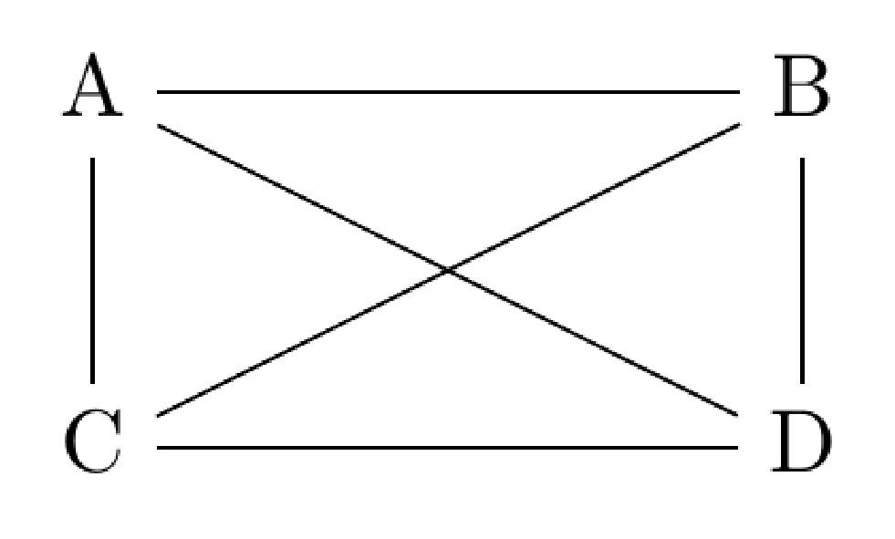

Letʼs consider that line between and . Should it be there? How can we tell from the data alone? Well, if thereʼs a direct line between and in either direction, then we should see a nonzero relationship between and no mater what we control for. So, first we just look at the relationship between and . If thatʼs zero, no direct line! But if itʼs not zero, try controlling for stuff. Control for . Control for . Control for and . If any of those sets of controls shuts off the to relationship, that means that the relationship theydohave is blockable by some set of controls, which wouldnʼt be possible if there was a direct line between them.

A B

A B

A B 15 A B

C D C D A B

16

Repeat this process for each pair of nodes. Any relationship that can be set to zero by the use of controls is one more arrow you can knock off.

###### Figure 22.3: A Causal Diagram After Deleting Several Direct Arrows with Causal Discovery

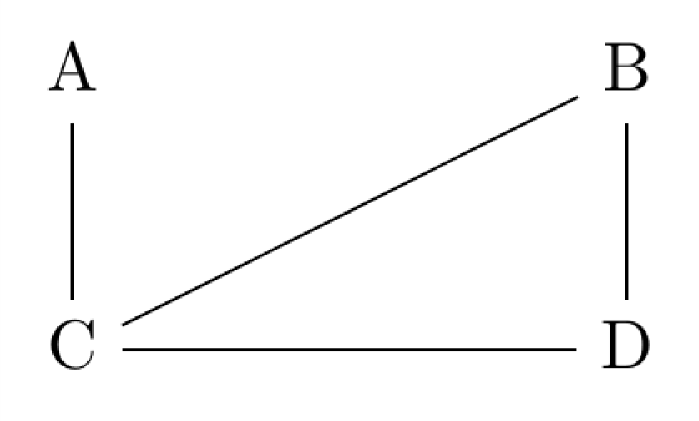

Letʼs say that we did this whole process and what we ended up with was Figure222.22.2222222222.3. Weʼre222222.22.22.3.3 already on our way.

NEXT, WEʼLL WANT TO FIGURE OUT WHICH DIRECTION THE ARROWS POINT.For this, we can head all the way back to Chapter88 to think about colliders. Remember, if thereʼs a path8 on a diagram, where both of the arrows are pointing at the same variable ( here), then that path is pre-closedwithout any controls, but if we control for the collider, it opens back up.

###### X → Y ← Z Y

Letʼs apply this to Figure222.22.2222222222.3. In particular letʼs look at the path222222.22.22.3.3 . This path could be filled in a few different ways: , , , or .

A − C − B A → C → B A ← C ← B A ← C → B A → C ← B

What we want to do at this point is look at the relationship between and both while controlling for and not controlling for .

A B C C

What could this tell us? If we observe thatwithout a control for thereʼs zero relationship between and and alsowith a control for thereʼs a nonzero relationship between and , then thereʼs only one thing it could be - a collider! So if we do find that, it must be . Now we have some arrows, shown in Figure222.22.2222222222.4.222222.22.22.4.4

C A B C A B A → C ← B

Figure 22.4: A Causal Diagram After Discovering C is a Collider between A and B

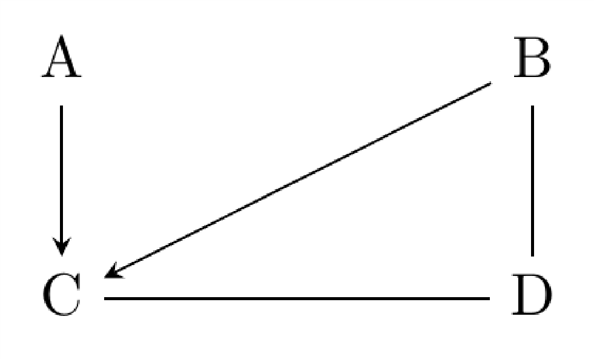

But what if wedonʼtget that? Letʼs say we want to finish out our diagram and so check the

path. This time we get a relationship between and whether or not we control for

C − D − B B C D C → D → B C ← D ← B C ← D → B 17

. This could be consistent with , , or .

When we come to a case like this, we might still be able to progress - perhaps solving some other part of the diagram would let us determine and thus narrow down our options. But also we might have run into anequivalence class- a set of diagrams that our data canʼt distinguish. Sometimes causal discovery can only get us part of the way there. So weʼll stay with Figure222.22.2222222222.4.222222.22.22.4.4 Still, we know more than we did at the start. Maybe other methods, or bringing in some intuition and theory like normal, could help us narrow down the options.

D → C

SO THATʼS YOUR START IN THE WORLD OF CAUSAL DISCOVERY.We can ask the data what the causal

diagram should be, and then once we have the diagram we can ask the computer how to identify it. Who knows, maybe the whole process will get so effective that we wonʼt even need any people to do causal inference, and this whole book will have been a waste of everyoneʼs time.

This description of the algorithm leaves out how causal discovery deals with things like unmeasured variables, and also plenty of other approaches to the problem, some of which use timing to narrow down the potential graphs, orchangesin the graph itself to figure things out, not to mention all the massive speed improvements. Several causal discovery algorithms can be implemented in R using the pcalg package, or in Python using the Cdt package. Thereʼs lots of cool stuff in this literature, and some of the algorithms are really ingenious. There are even algorithms that donʼt require you to settle on anyonecausal diagram, and let you consider a whole bunch of possible diagrams at once, weighting them by how likely they are (⊕Castelletti and Mascaro 2021), which can be implemented in the R package BCDAG.

###### 22.2.4 Double Machine Learning

A LOT OF THESE METHODS ARE PRETTY BRAIN-BUSTING.Letʼs kick back with something considerably more straightforward and familiar.Double machine learning(also known as debiased machine learning) is just another way to close back doors, like regression or matching (⊕Chernozhukov et al. 2018).

Letʼs think back to a basic regression setup. We want to know the effect of treatment on outcome . Weʼre in a setting where if we simply regress on , our causal diagram tells us that we wonʼt identify the effect of on . So we need to include some control variables. For simplicity, letʼs just say we only need two control variables to close all the back doors: and . Then, we can identify the effect of on with the regression equation

X Y Y X

X Y

W Z X Y

Y = β0 + β1X + β2W + β3Z + ε (22.1)

Simple! But then we remember the whole idea of whathappenswhen we include a control variable - weʼre removing the variation in both and that is explained by the controls, and thus the part of their relationship that is explained by the controls. This closes any back doors through the controls, hopefully just leaving us with the front-door paths we want. This is how we described controlling for variables in Chapter44.4

###### X Y

As you might expect given this interpretation, we can get the exact same estimate for as in Equation(2(22.(22.(22.1) by removing the variation in(22.(22.1)22222222222222..1)))) and explained by the controls ourselves:

β^1 X Y 18

- 1. Regress on the controls and , and calculate the residual values of , . Remember, the residual values are the actual value minus the predicted value from the regression,

. This residual has removed all parts of that can be explained by the controls.

- 2. Regress on the controls and , and calculate the residual values of , . These residuals, too, have been scrubbed of all parts of explained by the controls.
- 3. Regress on .

Y W Z

Y Y R

Y − Y^

Y

X W Z

X XR

X

Y R XR

Hereʼs where the double machine learning comes in. It looks at this list of instructions and asks the question: “uh… why does it have to be regression?”

THE PROCESS FOR DOUBLE MACHINE LEARNING IS SIMPLE.First, predict using your set of control variablessomehowand get the residuals . Then, predict using your control variables somehow. Finally, regress on and get your effect.

Y Y R X

Y R XR 19

Thesomehowis where the “machine learning” part comes in. You just use a machine learning algorithm to do the predicting of and using your controls, instead of regression. Thatʼs it! It really could be any prediction-based machine learning algorithm. Regularized regression like we talked about in Chapter1313 is one option. As is the random forest, which will get a brief13 introduction later in this chapter. So is a bunch of stuff youʼll need a different, machine learningfocused book to read about. Neural nets, boosted regression, and the fifteen other new ones they came up with while I was writing this sentence.

Y X

Thereʼs slightly more to double machine learning than just that, but not much - it also employs sample splitting to avoid overfitting. In its basic form, it splits the sample randomly into two halves. Then, it fits its machine learning model using only one half (half A), and then applies that model to get , , and the resulting coefficient in theotherhalf (half B). Then the halves trade places, fitting a model using B and using that to get residuals in A. Then average the coefficients from your two samples to get an effect.

###### Y R XR β^1

WHY WOULD YOU WANT TO DO DOUBLE MACHINE LEARNING?The problem with applying machine learning methods to causal inference is that theyʼre usually designed to be good atprediction, not inference (statistical or causal). But they are really good at prediction! Double machine learning finds one step in a standard causal inference design that is, inherently, a prediction problem. Then it gives that problem to a machine learning algorithm instead of a linear regression, so machine learning can do what itʼs good at.

20

Sometimes, linear regression is just fine. But sometimes itʼs not. Machine learning methods are much better than linear regression when there are lots and lots and lots of controls (highdimensional data), and also when the true model has lots of interaction terms or highly nonlinear functional forms. In these cases, double machine learning will do a better job fitting all those peculiarities than linear regression. Seems handy to me.

###### 22.3 Modeling Heterogeneous Effects

IT ALMOST GOES WITHOUT SAYING THAT CAUSAL INFERENCE WOULD BE A LOT EASIER IF EACH CAUSAL EFFECT WERE THE SAME FOR EVERYBODY.If every treatment had the exact same effect on every individual,

we wouldnʼt need to worry about whether our results will generalize to other settings, or about which kind of treatment effect average our estimate has picked up. I could have cut Chapter101010 out entirely. But, alas, we live in a world of heterogeneous effects.

We canʼt escape heterogeneous effects entirely, but we can give ourselves some tools to face them head on. Why not, instead of treating heterogeneous effects as some sort of nuisance where we have to figure out which average weʼve just drawn, we justestimate the distribution of effects? Then, not only could we take whatever average of that distribution we wanted, but we could toss

out the average and look at the distribution overall. Sure, a mean is neat, but why wouldnʼt we be interested in how the effect varies over the sample? Whatʼs the standard deviation of the effect? The effect is bigger or smaller forwhoexactly? Is treatment more effective for old people than young? Poor than rich? French than Russian? And so on.

WEʼVE ALREADY DIPPED OUR TOES INTO THE WATERof estimating the heterogeneity in treatment effects. We talked about interaction terms in regression in Chapter1313. Thatʼs one way to see how13 an effect differs across a sample, but itʼs very limited - you can really only include a couple of interaction terms before your model turns into a poorly-powered impossible-to-interpret slurry.

We discussedhierarchical linear modelsin Chapter1616. These are much better than interaction16 terms in regression if your goal is understanding the full extent of the variation in an effect across the sample. In a similar way to how regression models an outcome variable as varying based on the values of our predictors, hierarchical linear models modelcoefficientsas varying based on the values of predictors. If one of those coefficients is our effect of interest, weʼll get a decent idea about how much that effect varies, and who gets the strongest and weakest effects.

While weʼre at it, letʼs take a little peek at what else is out there. Research on the estimation of heterogeneous effects has been particularly active since the 2010s. One problem with estimating heterogeneous effects is that there are so many dimensions theycouldvary along. How could we check everything? But you know whatʼs good at checking everything and handling lots and lots and lots of interactions? Machine learning! The estimation of heterogeneous effects may well end up being machine learningʼs most important contribution to causal inference. There are lots of these approaches. Iʼll pick only one of these methods - causal forests, for being relatively straightforward to understand, easy to use, and likely to rank among the more popular options. But I want to be clear that there arezilionsof such approaches, and more on the way. A good overview is available in Chapters 14 and 15 of Chernozhukov et al. (⊕2024).

Itʼs worth pointing out that these methods arenʼt designed toidentify an effectin some clever way. These assume that youalreadyhave a design for identifying an effect. But once youʼve identified the effect, these can help you see the entire distribution of that effect. You could just as easily use them to see the distribution of a non-causal association.

###### 22.3.1 Causal Forests

WEʼRE USED TO THE IDEA OF FITTING A MODEL, AND THEN USING IT TO MAKE A UNIQUE PREDICTION OF THE OUTCOME FOR EACH OBSERVATION.Simply regress an outcome on a bunch of predictors, then plug in the values of someoneʼs predictors to see what prediction the model spits out.

But what if we want to get a unique estimate ofthe effect of on for each observation? Thatʼs tougher. We donʼt have a variable called “the effect of on ” in the data, so we canʼt just do what we did for predicting the outcome. One thing we could do is estimate a model with interaction terms. If we regress the outcome on the treatment as well as the treatment interacted with other predictors, we can plug in the values of someoneʼs predictors to see what the effect of

X Y X Y

on is for them. The problem with this is that regression simply canʼt handle a lot of interaction terms, or highly nonlinear interactions. So we end up only using a few predictors to estimate differences in the effect on a pretty basic level.

X Y

Enter causal forests! Causal forests manage to take the task of estimating a unique effect for each individual, and morph it into a format that works basically the same as predicting the outcome in a certain non-regressiony way (⊕Wager and Athey 2018). Our ability to handle lots of predictors and high degrees of nonlinearity then works just as well for estimating an individualʼs effect as it does for predicting their outcome.

21

How do causal forests manage this? To figure that out, Iʼll need to start by describing the prediction method that causal forests modify to work for effect estimation - therandomforest.

RANDOM FORESTS MAKE PREDICTIONS BY SPLITTING THE SAMPLE.Imagine we were trying to predict how many hours of TV you watch per day, and we have only one predictor - whether or not you are married. In that case, itʼs pretty obvious how weʼd make our prediction. Weʼd split the sample and take conditional means. First, take the nonmarried people and get their average TV watching letʼs say itʼs 3 hours per day. Then we take the married people and get their average TV watching -

- 4 hours per day. Now if weʼre asked to make a prediction, weʼd predict 3 hours a day for a nonmarried person and 4 hours per day for a married person. Thatʼs simply the best prediction we can make with that predictor.

How about a different predictor? Instead of having marital status, our only predictor now is age. We can still make a prediction by splitting the sample in two, but now we have more choice. We could compare people age 6 and below to those 7 and above. Or 7 and below vs. 8 and above. Or 21 and below vs. 22 and above. Or 64 and below vs. 65 and above. Really, we could pickanyage to split the data at. Whatʼs the best prediction we can make? Itʼs whichever one most reduces our prediction error. Often this is measured as the sum of squared residuals. So if the sum of squared residuals when splitting the data by 21-and-below vs. 22+ is 4030.1, but the sum of squared residuals when splitting 64-and-below vs. 65+ is 3901.2, then the split at age 65 is a better one. We wouldnʼt just pick a few cutoffs to compare, though; weʼd tryeverypossible cutoff and pick the best (lowest prediction error) option. So we try splitting at 2, and 3, and 4, and so on, all the way up to the oldest people in the sample. If the best cutoff really is at age 65, we use that. If the average below the cutoff is 2.7 and above the cutoff is 4.8, then we predict 2.7 for each person under 65, and 4.8 for each person 65+.

Nothing special so far, and as you can guess, just splitting the sample in two doesnʼt get you very good predictions. There are still two steps to go before we get to a random forest though.

First is the step of creating adecision tree. A decision tree takes this sample-splitting idea and does it repeatedly. Now maybe you have abunchof predictors to work with. Start by finding the best possible splitfor the sample by not just considering each possible cutoff level, but doing so for every predictor variable you have. So you check all the cutoffs possible across marital status, age, race, income, education, etc. etc. etc., and pick the best cutoff for the best variable.Then split the sample. Maybe age 64-and-below vs. 65+ does turn out to be the best split overall. Then we can draw a tree describing our split like in Figure222.22.2222222222.5.222222.22.22.5.5

Figure 22.5: A Decision Tree with a Single Split

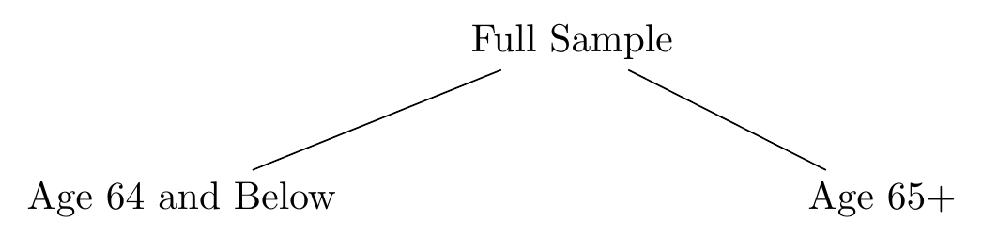

Weʼre not done! Like I said, splitting the sample in two doesnʼt get you far. So we split it again. Take just the 64-and-below split and repeat the process of finding the best cutoff for the best variable forthem. It might even be age again. Letʼs say itʼs marital status. Now we head over to the 65+ split and do the process again for them. Letʼs say the best split for them is income above $65,324 or below. Now our tree looks like Figure222.22.2222222222.6. Our sample is split into four distinct groups:222222.22.22.6.6 non-married 64-and-unders, married 64-and-unders, 65+ who earn less than $65,324, and 65+ who earn $65,324 or more.

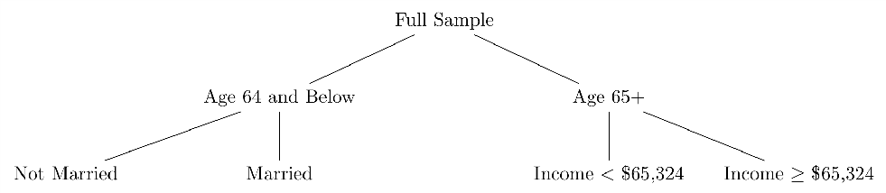

Figure 22.6: A Decision Tree with Two Splits

And we keep going. Keep splitting the sample over and over, finding the best split each time, until the sample weʼre splitting gets to some definition of “too small,” and you stop there. Now we have a decision tree. My prediction for you is whatever the mean is in your split. So if youʼre a 36-year-old Asian married person with a community college degree making $43,225, I make your prediction by following the splits down the tree until I find the small group of people very much like you. Then I take the mean, and thatʼs my prediction.

22

How do we get from a decision tree to a random forest? Add a bunch of randomness! First off, we bootstrap the whole process, like in Chapter1515, and create a decision tree for each sample. We15 create that decision tree with a bit of a difference, too: each time we try to split the sample, we donʼt actually consideralthe variables. We consider a random subset of the predictor variables instead (choosing a different random sample every time we split), and only look for the best split among those.

Once weʼre done, we have a wholebunchof decision trees, each different and with its own predictions for each individual. The randomness we injected into the process helped make sure the predictions were as independent as possible, so no observation or predictor could be overly influential. The many predictions for each observation can then be averaged together to create a

great prediction, taking advantage of the wisdom of crowds from these “independent” predictions.

THATʼS RANDOM FOREST. WHAT IS A CAUSAL FOREST?Causal forests are really just random forests but with a tweak. In a random forest, we chose splits for our data with a goal of minimizing prediction error, because we wanted to predict the outcome. In a causal forest, we want to see variation in the treatment effect. So instead, we choose splits based onhow different the estimated effect is in each side of the split.

Letʼs say we are still looking at TV watching. But now we want to see heterogeneity in the effect of “cord-cutting” (cancelling cable TV and just using streaming services) on TV watch time.

Now when weʼre considering a split of age 64-and-below vs. 65+, weestimate the effect of cordcuting on TV watchingamong those 64 and below (however we estimate that effect - controls, instruments, etc.). Then we estimate the same effect among those 65+. We then check how different the effect is. Maybe cord-cutting increases TV watching by .5 hours for those below 65, but decreases it by 1 hour for those 65+. Thatʼs a difference of in the effect. We do the same thing across all other possible splits and choose thebiggestdifference.

###### 1 − (−.5) = 1.5

Then, once the split gets small enough, we stop splitting. The estimate of the effect within your split is what we think the effect isfor you. Then, as before, we bootstrap the whole thing and limit our choice of splitting variables each time. The overall estimated effect for you is the average across all those bootstrap samples.

23

THATʼS ABOUT IT!Once the process is done, we have an estimate of the treatment effect for each individual. The method is also capable of estimatingstandard errorsfor each of those individual effects. Once you have the individual estimates, you can ask questions like “whose effects are highest, and whose are lowest?” or investigate the whole distribution of effects.

24

Causal forests can be estimated using the causal_forest() function in the grf package in R. In particular the grf package uses “honest” causal forests, which just means that the sample is split in half, with one half being used to make tree-splitting decisions, and the other used to estimate effects. In Python, honest causal forests can be estimated with econml.grf.CausalForest(). There is not currently an implementation in Stata.

###### 22.3.2 Sorted Effects

CAUSAL FORESTS WERE JUST ONE REPRESENTATIVEfrom a huge and growing literature on the use of machine learning to estimate treatment effect heterogeneity. Now letʼs cover a neat little approach that isnʼt even particularly popular as I write this, but, letʼs be honest, I like it so itʼs in the book. That approach is the sorted effects method (⊕Chernozhukov, Fernández-Val, and Luo 2018).

Sorted effects is pretty darn simple. There are plenty of regression-based methods that already allow for treatment effect heterogeneity. Regressions with interactions are one of them. But also, many nonlinear regression models like logit and probit naturally have treatment effect heterogeneity, since the effect canʼt be that big if your probability of having a dependent value of 1 is near 1 or 0.

Sorted effects simply takes models like that and says “Hey! Why not, instead of reporting average treatment effects with these models, you estimate each individual personʼs treatment effect, which the model already allows you to do?” Then, once you have that range of estimates, you can present the whole range instead of trying to smush things together into an average. Then, you present the estimates from lowest to highest (i.e., sorted).

This seems… super obvious, to be frank. What makes this its own method? Three things. First, the designers of sorted effects managed to figure out, using bootstrapping, how to estimate the standard errors on these individual effects in an accurate way, and how to handle the noisiness in the tails of the effect distribution, both of which can be difficult. Second, they introduced a few methods for what you can do with the distribution of effects, including comparingwhois in different parts of the distribution. Who is affected the most, and who is affected the least? Third, because this is an approach to treatment effect heterogeneity that lets you summarize that heterogeneity in a single dimension (the effect itself), it allows you to make models with more built-in heterogeneity. A regular model with a whole bunch of interactions would be impossible to interpret. But sorted effects would let you interpret it easily, and also provide standard errors that account for all the interactions.

LETʼS SEE WHAT SORTED EFFECTS CAN DO.Letʼs head back to the data from Osterʼs study in Chapter44.4 In this study, Oster was interested in the effect of a short-lived recommendation for taking vitamin E on the chances that someone would take it. The main thrust of the study is that the people who respond to these recommendations are the ones paying the most attention to their health in general. So when the recommendation is on, it shouldlooklike vitamin E has all these great health benefits, simply because healthy people are most likely to respond to the new recommendation.

Part of her study was in establishing that people with other great health indicators were most likely to take up vitamin E in response to the recommendation. Oster had a few ways of doing that descriptively. Letʼs see what sorted effects can do with a more structured approach.

Weʼre going to regress, in a logit model, the probability of taking vitamin E on being in a duringrecommendation period. Weʼll include as predictors (which weʼll also interact with treatment) whether they ever smoked, a standardized score of their exercise level, and a standardized score of their vitamin-taking behavior. The list could reasonably be much longer than that, but letʼs keep it simple.

The sorted effects method estimates the distribution of effects, as shown in Figure222.22.2222222222.7. The222222.22.22.7.7 average effect, while itʼs more precise than any particular effect, leaves out a whole lot of the distribution. There are people in the data estimated to have effectsmuchlower andmuchhigher than the average. In fact, very few seem to beatthe average, or even inside its 90% confidence interval. Who is it describing really?

Figure 22.7: Sorted Distribution of Effects of Vitamin E Recommendation on Taking Vitamin

- E

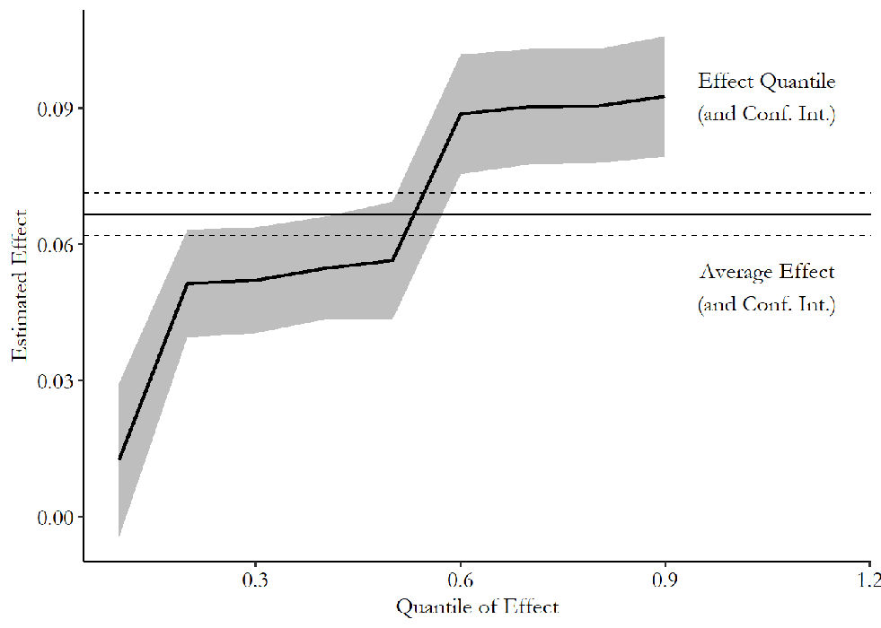

###### Sorted effects also lets us see who those people are. Table222.22.2222222222.3 shows the mean and standard222222.22.22.3.3 deviation of the predictors in the model among those with estimated effects in the top 10% and bottom 10%.

Table 22.3: Characteristics of Those Least and Most Responsive to Health Recommendation for Vitamin E

10% Most Affected Variable Mean SD Mean SD Smoking 1 0 0 0 Exercise Rating Score

10% Least Affected

Effect:

-0.515 0.612 1.45 0.193

Vitamin Behavior Score

-2.04 0.332 1.71 0.105

The differences are pretty stark. Smoking is the biggest tell. Among those who were estimated to be in the 10% least responsive to the vitamin E recommendation, literally 100% of them were

smokers. And among the 10% most responsive? 0% were smokers! Thatʼs a big difference. Maybe itʼs not too surprising that people who smoke arenʼt that responsive to recommendations from health officials, but I didnʼt expect the difference to be 0 vs. 100!

25

We also see differences for the exercise and vitamin behavior scores. Those who responded the most had considerably higher scores on both of these measures.

These results are pretty strongly supportive of the idea that people who already follow other health recommendations were more likely to follow the vitamin E recommendation, as Oster found. You can imagine, also, how this might be used to see how a given policy intervention might be more helpful to some people than to others.

The sorted effects method can be performed using the SortedEffects package in R.

###### 22.4 Last But Not Least: Structural Estimation

LETʼS FINISH THINGS OUT WITH A LITTLE CHERRY ON TOP.Throughout the first part of this book, I focused almost exclusively on attempting to map out the entire data generating process in a causal diagram. Then, we thought about identification in the form of shutting down back-door paths. Then in the second part, I walked that back a bit and have been talking mostly about methods designed to work even if you donʼt have a firm grasp on the entire data generating process.

The first approach - thinking about the entire underlying model and figuring out from that how to estimate an effect - is known in economics as astructuralapproach. Structural approaches do require some strong assumptions - they only work if you are right about the underlying data generating process. But if youʼre wrong about that, itʼs not always clear what other methods actually tell you anyway. So why not take a structural approach?

26

Thatʼs why I devoted the first part of this book, and many sections in the second part, to thinking structurally about your modeling and research design process. If weʼve covered it already, whatʼs this section on structural estimation about?

This section is about the fact that structural estimationdoesnʼt stop there.Using theory to figure out a list of control variables to add to a linear regression is a pretty limited way to do structural modeling. Someone doing structural modeling properly would not just use theory to determine a set of alternative pathways to consider, but would also see what kind of statistical model the theory implies.

FOR EXAMPLE, IF WE HAD A BUNCH OF DATAon object masses and the gravitational force pulling them to other objects. Weʼd think about the underlying theoretical model, where the gravitational pull between two objects is , where and are the masses of those two objects, is the distance between them, and is the gravitational constant.

F = G m

1m2 r2 m1 m2 r G

If we want to know the effect of on , A basic approach would recognize that and may be alternative explanations for the relationship, and so you might end up running a model like

m1 F m2 r

. This is not a great model. It ignores the actual way that the

- F = β0 + β1m1 + β2m2 + β3r + ε m1 F

variables come together and all that theory you worked on. The effect of on shouldnʼtbe linear, and we know that from the theoretical equation. Structural estimation would hold on to the theory and would estimate the equation directly. Itʼs the process of estimating theactual model implied by theory.

F = G m

1m2 r2

As a bonus, once youʼre done, you know exactly which theoretical parameters relate to which estimated parameters. As another bonus, the structural process shows you exactly how to handle different unobserved theoretical concepts that you canʼt actually measure.

27

Because structural models estimate theoretical parameters like directly also means that itʼs much easier to answer complex causal questions. Most of this book has been laser-focused on “does cause and how much?” with only a few exceptions. But if you have a structural model, you immediately get access to howanyvariable in the model causesany othervariable. And how that effect differs in different settings. And how the effect might change if we tried something completely new that isnʼt even in the data. You have access to the whole model at that point (assuming, again, you have the right model). You can askthe modelwhatʼs going on; you donʼt have to wait to see more data.

G

X Y

HOW CAN YOU ESTIMATE A WHOLE THEORETICAL MODEL YOURSELF?Structural estimation constructs statisticalstatements out of theoretical ones and uses those to estimate. For example, the gravitational equation I just used isnʼt perfect; it leaves out quantum effects. So there is some error and we might claim it looks like this: . If we are willing to make a claim about the distribution that follows, then we can pick values of our parameters (perhaps trying out ) and see how unlikely our observed data was to occur given the model. We try a bunch of different parameter values , and so on, until we find the ones that best fit the data. This is estimating the structural model by maximum likelihood. You can do a similar process with other estimation methods like the generalized method of moments.

28

###### F = G m

1m2

r2 + ε ε

G = 3

G = 4,G = 5.3

Now we come to the reason why I havenʼt covered this yet. Simply put, the math gets hard! Drawing a causal diagram for your model doesnʼt cut it - you need to specifically write out, and solve, the mathematical form of your model. Then you need to set up the statistical statements properly - remember, you have to do this all yourself, as the whole idea is that the estimation is unique to your model. Then you can finally estimate your parameters.

29

So thatʼs why I donʼt go too deep into structural estimation in this book. However, if youʼre interested and have the chops for it, I can recommend starting with Reiss and Wolak (⊕2007), which is specifically about structural modeling and estimation in the economic subfield of industrial organization, but it does a good job at introducing the general concepts youʼd use elsewhere. Galiani and Pantano (⊕2021) do a similar kind of introduction, focusing on labor economics.

Previous Next

Page built: 2025-10-17 using R version 4.5.0 (2025-04-11 ucrt)

# The Effect

Nick Huntington-Klein

▾ Chapters

###### Chapter 23 - Under the Rug

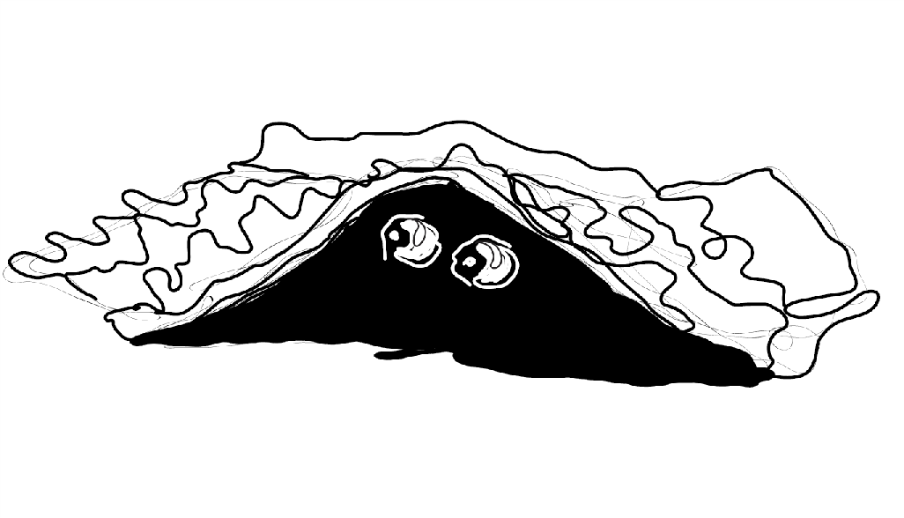

###### 23.1 The Light, It Burns Us

SO MUCH OF THIS BOOK HAS BEEN DEDICATED TO BEING CAREFUL.We need to be careful to create good models. We need to think about the assumptions behind our design. We need to think about sampling variation, and so on and so on and so on.

A statistician is always prepared to give you something to worry about, as though you didnʼt have enough already!

This chapter is all about the assumptions and concerns that are a part of pretty muchanycausal inference research study, but which often get ignored or at least brushed aside. Turns out that weʼre assuming a lot that we donʼt even think about. By the time youʼre through with this chapter, youʼll doubt you even have a strong enough research design to prove that your eyes are real.

That said,someonehas been thinking about this stuff, and just because itʼs uncomfortable doesnʼt make it go away. Iʼll tell you about tools to help think about these topics and grapple with them in regards to your own research.

This is a sort of survey chapter. I wonʼt be going super in-depth on any of these. But I will tell you what theyʼre all about and give you a few places to look in if youʼre interested in learning more.

Perhaps the scariest thing I can say at this moment is that the list of topics in this chapter isonly a subset of topics that could have easily been included.

###### 23.2 How Sure Are You? Model Uncertainty

IF YOUʼVE TAKEN THE TIME TO SIT DOWN AND ACTUALLY TRY TO DESIGN AN ANALYSIS TO ANSWER A RESEARCH QUESTION (as I certainly hope you have by this point), youʼll very quickly come to a realization about how many choices you have to make in that process, and how many of those choices youʼre unsure about. Those arrows in the causal diagram you werenʼt sure about. The unnecessary control you couldnʼt decide whether to include or not.

- As careful as we like to be about designing our causal diagrams (and using the analyses they imply), weʼre never going to be certain what the “best” model really is. We might have quite a few reasonable candidates, once weʼve pinned down the really important parts weʼre sure about. So we havemodel uncertaintyin our analysis. Variation in our estimates comes down not just to sampling variation, but also uncertainty in the question of which statistical model is the right one to estimate.

1

2

In many cases, researchers present results from only one preferred model, either ignoring the possibility of model uncertainty or using some criterion, usually based on fit or predictive power, to pick a single best model. Maybe theyʼll present a few models, checking whether the addition of a few controls thatmightbe necessary would change the results. The idea here being that you arenʼt 100% certain about the causal model - one potential causal model says variable must be controlled for, another says it doesnʼt. If you get similar results controlling it or not, then your result is “robust” to which of the two causal models are right.

Z

Presenting a few hand-picked models is a basic but pretty ad-hoc way to deal with the reality of model uncertainty. Can we do better?

INSTEAD OF TRYING A FEW MODELS WE COULDtrylotsof different models, often differing along the

lines of which control variables are included. Then, once you have the results for those models, we both have an idea of what degree of model uncertainty we have, and can maybe use that to produce a single estimate.

Letʼs say that you have a set of variables that youknowyou have to control for to identify your effect, and a set of variables that you donʼt think need to be included, but you either arenʼt sure or are thinking of including them anyway.

W1 W2

You can estimate every possible model with every possible combination of all the variables in . Or at least a smartly chosen subset of those models (after all, doingalthe models means models if there are variables in - that grows quickly!). From each model you get an estimate.

W2 2J

J W2

Once you have all the models you could show the distribution of all those estimates, which would show in an easy-to-understand way both what a “typical” estimate looks like (perhaps even reporting the mean of the distribution as an average effect), and also how much potential variation in the estimate model uncertainty might be responsible for. If the distribution of the estimates is fairly narrow, then model uncertainty doesnʼt seem to matter too much and youʼre good to go. If itʼs wide, then the results from any particular model should be viewed with the knowledge that itʼs highly contingent on which controls are included.

ALTERNATELY, YOU COULD GO EVEN MORE PRINCIPLEDand use Bayesian model averaging (⊕Clyde and George 2004). Bayesian model averaging has been around for a long time. The basic idea is that

you donʼt just plain take the mean of your estimates across all the models. The models should be weighted by how likely they are to be true!

How do we figure out how likely they are to be true? Well, we start by tellingithow likely we think each is to be true. We pick a “prior probability” for each candidate model. Then, we estimate the models. Based on how well each model explains the data, we update those prior probabilities to get posterior probabilities. Models that fit really well are counted as more likely to be true than the prior, and models that fit poorly are counted as less likely to be true than the prior.

Then, once we have those posterior probabilities, we can use them as weights to average together the results of all of the candidate models, providing us with a good guess about the coefficients while averaging out all the model uncertainty.

3

DEMONSTRATING OR AVERAGINGthe distribution of effects across many models is handy, and a great way to deal with uncertain control-variable decisions. Of course, it canʼt address the underlying problem completely - there will always be modeling uncertainties. And our methods generally donʼt incorporate that kind of uncertainty into our understanding. But we really should know itʼs there.

###### 23.3 When Is The Data Not The Data? Measurement and Validity

WHEN YOU OPEN UP A DATA SET THAT HAS BEEN PREPARED FOR YOU,itʼs easy to forget the whole process of putting the data together in the first place. And yet!

Before you opened it up on your computer, someone had to produce that data for you. If the data comes from some sort of survey, for example, someone had to decide which questions to ask people and how, what the set of acceptable responses was, and who to sample and when. Then someone had to go out and actually ask the questions and record the answers. Then, the responses come from actual people, not some omnipotent observer of the truth.

4

5

Data doesnʼt fall from the sky. It is produced by humans, or at the very least collected by them. The way in which it is produced affects the way we can use it, and it often runs us into problems

when the theoretical or statistical model we have in mind relies on assumptions about the data that just arenʼt true given how it was made.

I already discussed two issues in this vein in Chapter1313. One was the use of sample weights. Our13 statistical models assume that individuals are sampled randomly, but this is rarely true. Thankfully, many professional surveys provide survey weights that can be used to make the survey sample look more like the general population youʼd like to generalize to.

6

Another issue I brought up in Chapter1313 was measurement error. A lot of the time, variables are13 simply written down wrong, or reported incorrectly. I canʼt tell you how many papers Iʼve read trying to solve the problem that people often canʼt even report their own level of educational attainment correctly. Thatʼs the kind of thing youʼd think someone would remember!

These two already have their own dedicated sections. What other kinds of concerns arise when we think about the difference between the data wehaveand what we think the datashould be?

###### 23.3.1 Construct Validity

CONSTRUCT VALIDITY ASKS WHAT OUR DATA ACTUALLY MEASURES.What do we want data to do, really?

We have a theoretical model that weʼd like to estimate some parts of. To do that, we need to get measurements of the variables in that model. If we gather some data and that data does a good job at representing that theoretical concept, weʼd say that we have construct validity.

This is harder than it seems. Letʼs say that we have a theoretical model and one of the variables in that model is “trust.” That is, how trusting someone is of the world. You can easily theorize about where this variable fits in your model. You know where the arrows come in and go out of it.

But how do you measure it? Maybe you just ask people to rate how much they trust the world on a scale of 1 to 10. Seems like a good place to start at least.

Someone concerned with construct validity would immediately spot the problems with that plan. Are people good at self-reporting their own trust levels? Will people understand a rating scale and what the numbers mean? How likely is someone to misunderstand the question, or perhaps think

that “trust” means something different than what you think it means? Will the answer to this even be that closely relatedto your idea of trust? Or will it better represent something like “how important someone thinks trust is”?

One example of this problem at play comes from Hertwig and Gigerenzer (⊕1999). They look at the classic “Linda problem” from behavioral economics. In the Linda problem, people are given a small vignette about someone named Linda. The vignette is written in such a way that suggests that Linda is a politically active feminist. Then, they are asked which is “more likely” - that Linda is a bank teller, or that Linda is a bank telleranda feminist.

People routinely say that itʼs more likely that sheʼs a bank telleranda feminist. However, this breaks the laws of probability. Every bank-teller-and-feminist is a bank teller. So being a bank teller must be at least as likely as being both. This is taken as evidence that people make errors in probabilistic judgment.

However, Hertwig and Gigerenzer (⊕1999) point out that this assumes that respondents are using a probability-based interpretation of the term “more likely.” By other interpretations, their response might be perfectly rational! For example, by the laws of conversation (not their term), we would be more likely to have given them that feminism-focused vignette in order to demonstrate Lindaʼs feminism, making the bank-teller-and-feminist option more “likely.” They also show that, by asking the question in a different way that emphasizes that they really do mean the probability-based interpretation of “more likely,” people donʼt make the error nearly as often.

This problem isnʼt limited to surveys and experiments. Letʼs say you want income as a part of your model, and you have complete access to tax data, no surveys involved. Do you use wage income? Or total income? Or family income? Or post-tax income? Which version of income represents the “income” you have in mind for your theory? Do any of them?

What can we do to make sure that we have good construct validity? Well, we can think carefully about what underlying construct our data is likely to actually represent. Thatʼs always a good idea. More broadly, we can pay attention to psychometrics. Construct validity is very much their jam. In fact, theyʼd probably say Iʼm leaving out a number of other aspects of whether a measure does a good job representing a theoretical concept, such as whether it representsalof that

concept (content validity), and whether the measure tends to give you the same value when you collect it in the same setting (reliability, i.e., if you measure “trust” for the same person on two different days, do you get more or less the same result?).

Iʼm not going to attempt to squish the entire field into this section, but one thing they do to help construct validity along is takemultiplemeasures, or ask multiple survey questions, that are all intended to represent the same concept. Then, they combine them together with tools like factor analysis or structural equation modeling in order to extract a number representing the underlying theoretical concept that you actually want. The idea here is that every way you ask about your intended theoretical concept is an imperfect representation of what you want, so by looking for the statistical similarities between them youʼre probably picking up on the real deal. Seems like a good place to start.

7

###### 23.3.2 The Observer Effect

THE DOWNSIDE OF DOING SOCIAL SCIENCE IS THAT ITʼS THE ONLY FIELD WHERE THE SCIENTIFIC SUBJECTS KNOW THEYʼRE SCIENTIFIC SUBJECTS.This leads to another way in which our measurements might fail to represent our theoretical concept - if people modify their behavior knowing that weʼre watching them. There are a number of names for this, each of which varies slightly in meaning from the others - researcher expectations, researcher demand, hypothesis guessing, Hawthorne effects, observer bias, etc..

8

For simplicity Iʼll refer to the whole bundle of concepts as the “observer effect,” borrowing a term from physics. The observer effect applies most often in lab experiments, surveys, and polls, although occasionally it pops up in other settings.

9

There are a bunch of ways in which thefact that people know weʼre colecting data on them might change their behavior, or at least what they say their behavior is:

They may tell the researcher what they think the researcher wants to hear.

They may try to guess what the researcher will do with the data and so act in a way that means the data shows what they want it to show (or think it should show).

They may respond in a way that makes them look good to the researcher.

They may not like being research subjects, or they may just like causing trouble, and so may actively try to mess up the data.

10

They may get self-conscious and selfaware of their responses.

They may respond to cues from the researcher, who themselves may be consciously or subconsciously trying to get the data to support their hypothesis.

The list goes on. People do stuff for all sorts of reasons.

Unfortunately thereʼs nottoomuch you can do after the fact if you think thereʼs likely to be a problem. This is more a problem you need to tackle at the data-collection stage. The study and data collection process itself needs to be designed around the task of getting people to answer questions, often difficult ones, without thinking too much about the fact that theyʼre answering questions.

11

- 23.3.3 Processing Data

THEN WE COME TO THE REAL EMBARRASSING CORNER.Perhaps the data collection mechanism has been immaculately designed. The survey is perfectly put together and implemented, the sampling is representative. Then the data comes and you, well… you have some work to do!

Itʼs pretty rare in the real world (that is, outside a classroom) that you are working with a data set that comes to you completely ready to run your analysis on. You generally have to clean and manipulate the data in some way before you can use it.

Therein lies the problem. Just like with model uncertainty, there are often multiple ways to do the data cleaning process. Which observations are likely to be mistakes and should be fixed? Which observations donʼt apply to your model and should be dropped? How can you code up the free-response survey question into usable categories? How should you define the different variables - for something like education, do you keep it at its original value or “bin” it into bigger groups? How big are the bins?

Different people will make these choices in different ways, which can affect the estimates. In Huntington-Klein et al. (⊕2021), we found that multiple researchers separately cleaning the data for the same research project made considerably different decisions, and no two researchers ended up with the same sample size. This affected the estimates - the standard deviation of estimates across different researchers was much bigger than the reported standard errors for each researcher.

Thatʼs just differences in data preparation that come down to “reasonable people can disagree on how to do this.” Sometimes there are just errors that are hard to catch. One particularly scary version of this popped up in genetics. Geneticists are fond of doing data analysis (or at least data entry) in Microsoft Excel. Excel, however, likes to convert things to dates if it thinks theyʼre dates. And do you know some things that look a lot like dates? Certain names of genes.

Analyses of the genetics literature found that up to 20% of all recent papers had errors in them related to Excel reading gene names as dates. Oops! Geneticists actually ended up renaming a lot of date-like terms instead of giving up on Excel (⊕Vincent 2020).

Data cleaning is a human process just like data collection. The way you do it matters, whether itʼs an error or just a difference of opinion. Worse, itʼs the kind of thing where you might not even

noticethat an error has been made until itʼs far, far too late.

###### 23.4 Why It Had To Go, I Donʼt Know: Missing Data

YOU MIGHT THINK THAT, IF YOU HAVE AN OBSERVATION IN YOUR DATA, THEN YOU HAVE THAT OBSERVATION IN YOUR DATA.If only it were that simple! Itʼs pretty darn common to have observations in your data where you have data onsomeof the variables but not others. For example, in a data set of height and weight for a group of people, there might be some people for whom you have measures of both height and weight, some you only have height but not weight, and some you only have weight but not height. When this happens, you havemissing data.

Missing data can be a real problem. The first, obvious, problem is figuring out what the heck we do with observations that have missing data. If we want to regress, say, weight on height, a regression wonʼt allow someone to be in the model if they only have weightorheight but not both.

The simplest solution is “listwise deletion,” where you simply drop everyone from the data if they have missing data for any of the variables in your model. This is the default behavior of most statistical software.

But just because itʼs the default doesnʼt mean itʼs a fantastic idea. Sure, it will let you just run your darn model, but listwise deletion can introduce real problems, even beyond the fact that it shrinks your sample size. Why? It all comes down towhythe data is missing.

12

Data can be missing for a number of reasons:

Not in Universe (NIU). A value is NIU if the variable simply doesnʼt apply to that observation. For example, the variable “number of employees in your small business”shouldbe

missing for people who donʼt own a small business.

Missing Completely at Random (MCAR). A value is MCAR if the fact that itʼs missing is completely unrelated to both the value itself and to the other variables in the model. So in our height and weight example, weight is MCAR if it is equally likely to be missing regardless of someoneʼs true weight and regardless of their height.

Missing at Random (MAR). A value is MAR if the fact that itʼs missing is unrelated to the value itself conditional on the other variables. Weight is MAR if it is equally likely to be missing whether your true weight is higher, lower, or equal to what weʼd expect your weight to be given your height.

13

Missing Not at Random (MNAR). A value is MNAR if the fact that itʼs missing is related to the missing value itself. For example, weight is MNAR if people with lower actual weights are more likely to have missing weight values in the data.

Listwise deletion works okay for the first two of these: Not in Universe and Missing Completely at Random (MCAR). For Not in Universe missing values, youwantthose observations out of your analysis, since presumably your analysis is trying to model a group that they are not a part of. For MCAR, itʼs basically a complete fluke that thereʼs missing data somewhere. So dropping an

14

observation with missing data is hardly different from having gathered one less observation in the first place. No problem.

But think about why data might be missing and ask how likely MCAR really is. Why might weight data be missing, for example? People think their weight is personal and donʼt want to share it? People with particular weights are ashamed of it and donʼt want to tell a researcher? People lie about their weight and the survey-taker doubts the answer and so doesnʼt write anything down? If thereʼs areason whythe data is missing and it isnʼt some complete fluke, that reason is probably related to the value of the variable, or at least to one of the other variables in the model.

If the data is Missing at Random or Missing Not at Random, listwise deletion will do some bad things. In these cases, “Missingness” gets a spot on the causal diagram itself. Using only data without any missing values is like controlling for Missingness. Depending on the exact diagram, this is just asking for collider effects, post-treatment controls, or just violating your assumptions about random sampling. Your estimates can get biased.

15

There are some approaches available for dealing with missing data, thankfully. Of course, they bring their own kind of complexity.

###### 23.4.1 Filling in Blank Spots

ONE OBVIOUS WAY TO DEAL WITH MISSING DATAis to fill that data in. There are a host of different methods forimputingmissing values. That is, trying to figure out what they should be and filling

- them in.

To get an idea of how this could work, letʼs start with a bad way of doing it that is nonetheless popular among the “just let me run my regression please” crowd: mean imputation.

Letʼs say we have some height and weight data with some missing weight values in Table23.123.1.23.1....

Table 23.1: Height and Weight Data with Missing Values

Height (in.) Weight (lbs.)

- 65 120

Height (in.) Weight (lbs.) 70 ?

- 66 ? 70 180

###### We donʼt know what the ?s are. So we just take the mean of weight ( ) and fill in all the missing values with that. This gives us Table23.222222223.2.222223.2.2.2.2.2222222

###### (120 + 180)/2 = 150

Table 23.2: Height and Weight Data with Missing Values Filled in Poorly by Mean Imputation

Height (in.) Weight (lbs.)

- 65 120 70 150*
- 66 150* 70 180

Note: * Imputed

Now we can run our analysis with all four observations intact. However, this method completely ignores any way in which the rows with missing data might be different. So you can get some weird predictions. Imagine we had a super-tall 84-inch person here with missing weight. Weʼd predict their weight to be 150 pounds as well. That doesnʼt seem right.

More sophisticated methods of imputation, which are designed to work for data that is Missing at Random, take basically the exact same idea but do it better, using the other data that is available to make much better predictions about the missing values.

THE MOST COMMON SOPHISTICATED FORM OF IMPUTATIONis probably multiple imputation. In multiple imputation, you (1) fit a model that allows you to predict the variable with missing values using all the other variables in your data, and (2) use that model to predict the missing values.

16

17 18

What kind of model can you fit? Multiple imputation allows for pretty much any kind of model. Traditional approaches have used good olʼ regression. However, as with any method where prediction is the real goal, a number of methods have popped up based on the use of machine learning algorithms to do the prediction (⊕Deng et al. 2016).

- At this point, you have asingleimputation. How do you get from that tomultipleimputation? You

(3) add some random noise to your prediction process (drawing random values of the regression coefficients rom the sampling distributions youʼve estimated, and then getting the predicted valuesfrom that), (4) predict the value a bunch of different times, with different random draws each time. This multiple imputation process improves on the single imputation by not imposing too much certainty on those predictions, which both better reflects the uncertainty in your predictions and makes for better predictions overall.

Now you have multiple predictions for each missing value. Letʼs say you want to produce ten imputations. Youʼd end up with ten full data sets, each of them having the missing values filled in slightly different ways. Then, when you want to estimate your model, you estimate it ten different times, once for each imputed data set. Finally, you combine your estimates together according to some estimation-combination equations known as “Rubinʼs Rule” (⊕Rubin 1987). Now you have your estimate!

Multiple imputation has its ups and downs. It does get you a complete data set that you can work with. However, it also requires that you make alotof decisions in setting it up without a whole lot of guidance, picking a full predictive model for each variable in your data set with missing values, and selecting things like how many imputed data sets to make. Also, because itʼs such a general method for filling in data, it isnʼt customized for, or even aware of, the model itʼs going to be used in, and misses some opportunities there. For that reason, many people prefer the methods I talk about in the next subsection. But multiple imputation still has a real appeal and is intuitively very straightforward.

Now, do keep in mind, this is all intended to work with MAR data (or MCAR I suppose). If missingness is related to the missing value in a way that isnʼt explained by the other variables,

- then, well… a method designed to predict those missing values using the other variables wonʼt work well. Are you out of luck if the data is MNAR? Not entirely. You can use multiple imputation with MNAR data. But doing this requires that you explicitly model what you think the missingdata process is so your predictions can account for it. This is really only feasible if you have a very strong grasp on why your data is missing. Have fun!

###### 23.4.2 Stronger Without You

MAYBE WE DONʼT NEED TO FILL IN THE VALUES.After all, we donʼt really care about predicting those missing values. Thatʼs just a nuisance we have to get out of the way before we can do what we really want, which is estimating our model. What if we had a method that would let us estimate a model even in the presence of missing values? There are actually several ways to do this.

THE FIRST METHOD FOR ESTIMATING A MODEL WITH MISSING DATA INCLUDEDis also the simplest. Just… model it!

This works especially well when youʼre dealing with categorical data. Just add “missing value” as its own category. Then youʼre done. Run the model as normal otherwise.

This is a fairly common approach in the machine learning world. There are some weaknesses, of course. Like the mean imputation method that worked so poorly, this method ignores the differences between different observations with missing data. However, unlike mean imputation, this approachdoesaccount for the differences between the missing and non-missing observations, and does to some extent model the relationship between missingness and the other predictors.

THE SECOND METHOD IS FULL INFORMATION MAXIMUM LIKELIHOOD.Full information maximum likelihood is a way of estimating youractualmodel while letting each observation contribute whatever observed data it has, without requiring it to all be there.

Maximum likelihood in general operates on the idea that, for a given model, you can calculate the probability of a given observation occurring, which we call the likelihood. For example, if your model estimates that a coin has a .6 chance of being heads, then two observations of heads followed by one observation of tails has a likelihood of , i.e. a .144 chance of occurring. Then, you pick themodelthat makes thedata you gotas likely as possible. In our coin example with two observed heads flips and one observed tails, weʼd pick whatever value maximized , which would be .

.6 × .6 × .4 = .144

P(Heads) P(Heads) × P(Heads) × (1 − P(Heads)) P(Heads) = 2/3

Ful informationmaximum likelihood just calculates the probability of a given observation occurring without having to refer to all of the variables together. So if you have data on height and weight, we calculate the probability of observing the particular combination of height and weight you have, and thatʼs your likelihood. But for me we only observe weight. So weʼd calculate the probability of observing the weight that I have, and thatʼs my likelihood. Then we combine them together and pick the model that maximizes the likelihood of the whole sample.

The technical details are deeper than that, but thatʼs the main insight here. Full information maximum likelihood figures out how to let an observation contribute only partially, and estimates the model on that basis.

ONE LAST METHOD: THE EXPECTATION-MAXIMIZATION (EM) ALGORITHM.The EM algorithm is an estimation method with broader applications than missing data, but missing data is one prominent place where you see it.

The EM algorithm is sort of like a cross between imputation and full information maximum likelihood without really being either. Like imputation, it does “fill in” values, but like full information maximum likelihood, it does so using the model youʼre estimating. The process of estimating a model with EM is:

- 1. Use some prediction method to make an initial guess of what the missing values are
- 2. (The maximization step) Use the current version of the filled-in data to estimate your analysis model
- 3. (The expectation step) Use the estimated model to predict the most likely values of the missing data
- 4. Repeat steps 2 and 3 many times

In other words, we use some filled-in guesses of the missing data to estimate our model. Then, the model itself is used to produce better guesses of the missing values than we had before. The

guessing doesnʼt work like it does in multiple imputation, where each variable is predicted in its own model. Instead, the estimated model from the maximization step is used to figure out the joint distribution of all the variables, and you draw random values from that.

LIKE WITH MULTIPLE IMPUTATION,these methods all are based on using the information you have to infer what you donʼt. That means that theyʼre all designed to work with data that is Missing at Random. What if we have data thatʼs Missing Not at Random (MNAR)? Oof. Well, like with multiple imputation, you can apply any of these methods to MNAR data. However, doing so once again requires you to explicitly model what you think the missing-data procedure looks like. Itʼs a tall order.

19

###### 23.5 It Lurks! They Call it SUTVA

IT STRIKES FEAR IN THE HEART OF ANYONE DOING CAUSAL INFERENCE.It is the Stable Unit Treatment Value Assumption, or SUTVA (known in some fields, like epidemiology, as the “consistency assumption”). SUTVA is an assumption that, in simplified terms, means that we know what “treatment” is.

How could we not know what treatment is? There are two ways that concern SUTVA. The SUTVA says that neither of them happens. But if either of them does happen, SUTVA is violated and we have a problem (⊕Imbens and Rubin 2015).

- 1. Treatment means different things for different observations, such that different “treated” individuals didnʼt really get the same thing. For example, say you want to know the effects of workplace diversity training. But in one workplace that means watching an old VHS and reading a brochure, while in another workplace that means a week-long

intensive participatory training program.

- 2. Your outcome is determined in part by the treatment receivedby other people. In other words, there are spillovers. For example, say we want to know the effect of offering tax incentives on a cityʼs economic growth. My neighboring citydoes offer incentives, which makes it grow, and some of that growth comes to mycity in the form of increased growth as well, whether or not I have tax incentives too.

Itʼs not hard to see how either of these could lead to problems, even if we have completely random assignment to treatment. Treatment meaning different things in different cases means that we donʼt really know what is in “the effect of on ,” so what are we even estimating? Spillovers mean that our treatmentactualyreflects the treatment of many, many people, and picking out just the effect of our own is going to be quite the task.

20

###### X X Y

Even worse, SUTVA violations seem to be just all over the darn place once you start looking for them. When does “receiving treatment”evermean exactly the same thing to everyone who gets it? And when is it ever really the case that whatʼs going on with some people doesnʼt affect some others?

21

SO WHAT CAN BE DONE?Unfortunately, there arenʼt exactly “SUTVA fixes” running around. However, there are some things that can be done that allow you tomodify the design itselfto help avoid SUTVA violations.

After all, SUTVA is about not having a stable idea of what treatment is, so… what if we did? Often SUTVA violations can be avoided by just thinking about what treatments wecandefine precisely.

In the case of treatment meaning different things in different cases, one obvious solution, if possible, is to measure not just whether treatment was assigned, but the actual flavor of treatment that was administered. Some experimental designs, for example, will include followup measurement that checks in on how faithfully the assigned treatment was followed. Accounting properly for differences in treatment adherence, or just considering different kinds of implementation as actual different treatments, allows the SUTVA violation to be sidestepped.

In the case of spillovers, one common approach is to specify treatment at a broader level. Say weʼre interested in the effect of tutoring on test scores, but weʼre worried thatmebeing tutored might improveyourtest scores if weʼre in the same classroom. SUTVA violation! But what if “treatment” is not “this student was tutored,” but rather “the proportion of students in a classroom who were tutored”? As long as we donʼt think there are spilloversbetween classrooms, weʼre good to go.

This doesnʼt necessarily solve all our problems, though. What if the effect weʼre interested in really does rely on that social interaction? This comes up when the spillovers, peer effects, or social dynamics (the stuff SUTVA said couldnʼt happen or weʼd be in trouble) arethe very thing weʼre interested in.

Itʼs not the end of the world. The problems with trying to estimate causal effects in social settings have been known to be real thorny since at least Manski (⊕1993), and the many papers following after it. However, progress has been made in using models that explicitly model the social network going on underneath the data. This is an entire subfield in itself that unfortunately wonʼt get the full treatment in this book, but you can get started with the excellent overview in Frank and Xu (⊕2020).

###### 23.6 I Mean Nothing By It: Nonexistent Moments

ONE BIG FAT UNSTATED ASSUMPTION THROUGHOUT THIS ENTIRE BOOK IS THATthe tails of our relevant distributions are neither too big nor too fat. All of the statistical methods we have used have made the implicit assumption that things like “the mean” or “the variance”exist.22

Hold on, how is it possible that the mean or variance could justnot exist? If you have a sample of data, you can calculate the mean and the variance. Nothingʼs stopping you.

Thatʼs true, but those calculations only give you thesamplemean and thesamplevariance. Itʼs entirely possible, however, to have theoretical distributions for which the mean and variance (technically, the first and second moment) are just plain undefined! When that happens, for one thing, itʼs harder to figure out sampling variation, and for another, itʼs hard to do things like hypothesis testing when we canʼt even specify a theoretical mean to reject. For yet another thing, weird distributions can lead to noisy data sets that are hard to get a handle on.

One common place where distributions with undefined moments pop up the most is in the case offat-taileddistributions. These are distributions with a lot of weight in the tails. In a normal distribution, the probability of an outcome declines very rapidly as you move away from the mean. But in a fat-tailed distribution, the probability of an outcome declines very, very slowly. These tails are even fatter than youʼd get in a log-normal distribution like we discussed in Chapter 33.3

Fat-tailed distributions usually pop up in the social sciences in the context of apower law distribution. Under a power law distribution, most people have pretty small values, but thereʼs no shortage of people with pretty big values, and there seems to be no maximum. Plus, the bigger values arewaybigger. You can see how this looks in Figure23.123.1, which shows an example of a23.1.... Pareto distribution, which is one type of power-law distribution. For the scale and shape parameters Iʼve given, the distribution, its mean and variance are undefined.

Figure 23.1: Example of a Power Law Distribution (Pareto scale = .5, shape = .9)

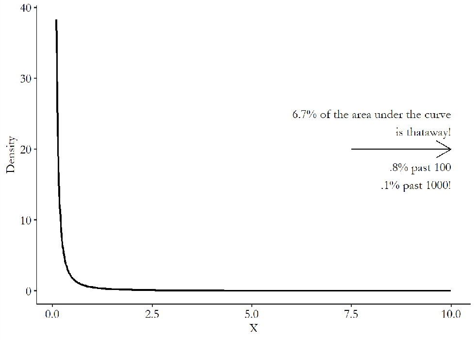

In Figure23.123.1, we see the sharp initial drop that weʼd expect from, say, a log-normal distribution.23.1.... A lot of the values are extremely tiny. Then itlookslike it goes to 0. So, nothing at the high values, right? Wrong! Thereʼs an area underneath that curve; itʼs just decliningveryslowly. By the time we get to an -axis value of 10, thereʼs still 6.7% of the distribution left to go. Go out ten times further than that and thereʼs still .8% left to go. Nearly a percent of the distribution isover 100, even though the majority of the data is below 1. Go ten times further than that and thereʼs still .1% of the distribution left to go! One in a thousand observations will be1,000 times higherthan the median. If .1% doesnʼt seem impressive to you, a normal distribution with mean (and thus median) 1 and standard deviation 1 has about .00002% of the distribution left to go at onlyfive times the median. At 1,000 times the median, weʼre dealing with a percentage represnted by a decimal point, followed by 216,717 zeroes, followed by a 3.

###### x

This distribution also lets us see what it means for the moments to be undefined. If I generate 100,000 random values from this Pareto distribution and calculate the sample mean and variance, they jump around wildly. With a sample that large, normally-distributed data would

produce sample data with the true mean and standard deviation nearly every time. But in the ten samples I try with the Pareto, I get sample means anywhere from 9.6 to 38.2 (and if I kept going, Iʼd get means in the hundreds or thousands occasionally), and sample standard deviations from 282 to 4,413.

FAT-TAILED DISTRIBUTIONS IN THE SOCIAL SCIENCEStend to pop up around issues of highly unequal distribution (like income) or anything to do with popularity, where the big tend to be far bigger than the rest. Letʼs take music as an example, pulling some information about Spotify followers from Wikipedia at the time I write this in April 2021.

The artist with the most followers on Spotify is Ed Sheeran, with 78.7 million followers. The second-most followed artist is Ariana Grande, with 61.0 million. The #1 spot has a value a full 29% bigger than the #2 spot. By the time we get to #20, Alan Walker, weʼre down to 27.9 million. The #1 spot is fully 281% as large as the20thspot. Thatʼs an enormous drop over a space of only twenty artists, especially when you consider that there are approximately7 milionartists on Spotify. I donʼt have figures on all of them, but I can guarantee you that even though Alan Walker is tiny compared to Ed Sheeran, he isenormouscompared to the 50th artist on the list, who in turn is enormous compared to the 100th, who in turn… and so on. A massive portion of those 7 million artists probably have no followers at all.Thatis what a fat tail looks like. The big are very big, and there arenʼt just one or two of them.

23

24

Compare that to a distribution that doesnothave a fat tail, like the time it takes someone to run 1500 meters. Hicham El Guerrouj is the world-record holder as of this writing with a time of 3 minutes and 26 seconds. Second place is Bernard Lagat, with 3 minutes and 26.34 seconds. Thatʼs a .16% difference between first and second place, a far cry from the 29% difference between Ed Sheeran and Ariana Grande. By the time we get to 20th place weʼre only up to 3 minutes and 29.46 seconds, 1.7% away from first. Your humble author, not a highly athletic man, can do it in about 6 minutes. In the global population of billions, Iʼm almost certainly worse than 1 billionth place. And yet the ratio of my time to the all-time world record holder is less than 2. But if I started a locally-popular band, released a few tracks, and got a thousand followers on Spotify (which would be pretty darn good), even Alan Walker would still be beating me by a factor of 27,900. Last I checked, 27,900 is a lot bigger than 2!

Fat tails are far from just for music streams. Power law distributions pop up for income, wealth, city populations,word usages, follower counts on social media, and so on and so on. Further, quite a few variables follow a fairly typical distribution formostof the data, but then follow a power law only in the tails. City sizes are a good example of this - the worldʼs biggest city, Tokyo, is about twice as large as #11, New York City, which is about 50% larger than #22, Guangzhou. It drops off super quickly. But among cities thatdonʼthave millions of people in them, the distribution is much better-behaved.

SO WHO CARES?Different variables have different distributions! So what?

As previously mentioned, the fact that the moments are undefined, but our estimators assume theyaredefined, means that weʼre getting something wrong about our estimates of sampling distribution. How wrong? It depends on the setting. Also, these fat-tail distributions are inherently extra noisy. Whether or not youhappento get the extra-extra-big observations in your data can really change your estimates.

The most common way of dealing with this problem is with the use of logarithms, as in Chapter

1313. If13 follows a power law distribution, then regressing on , instead of on , can help turn the relationship into a straight line that OLS can handle.

###### Y log(Y ) log(X) Y X

However, logarithms only go so far. If the tails get fat enough, even the logarithm wonʼt be able to handle it. A great example of this has been people trying to model pandemic spread during the coronavirus. Viruses tend to spread at exponential rates, since each additional infected person has a chance of infecting others, and some “super-spreaders” who come into contact with high numbers of people spread an astonishing amount of the disease. So thereʼs a fat tail (⊕Wong and Collins 2020). And yet, the number of attempts Iʼve seen that try to use a linear non-fat-tailed model to measure the causal effect of, say, lockdowns, sunlight, vaccines, or alternative treatments on coronavirus case rates, throwing at best a logarithm or a polynomial at the problem - letʼs just say there are a lot of those attempts. And it doesnʼt work that well.

25

In these cases there are some methods we can turn to. One is to usequantile regression, which is a form of regression that, in short, tries to predict a percentile (often the median) instead of a mean. Because percentiles near the center of the distribution are not sensitive to whatʼs going on in the tail, these can perform better with fat-tailed data.

There are also methods designed to estimate fat tails directly. But this is a deep, deep well of research that gets highly technical. Machine learning techniques have also stepped in to help estimate these models while dealing with the wild values a power-law distribution can throw at you. One approach that is a bit easier to grasp is the application of maximum likelihood (⊕Bauke 2007), as in the “Stronger Without You” section of this chapter. Maximum likelihood is all about picking a model that makes the data as likely as possible based on the probability distribution you give it. So, when having it calculate how likely the data is, give it a power-law distribution to work with. It will then pick parameters to help fit the model. Of course, this relies on us having an idea ofwhichpower-law distribution weʼre working with. There are many!

###### 23.7 The Treatment Mystery

AT THE END OF A LONG AND DEPRESSING CHAPTER,I will lead you to a short and depressing question. Itʼs what I call “the treatment mystery,” and itʼs this:

If the observations with different values of treatment are so comparable, then why did one of

- them get more treatment than the other?

This whole causal inference exercise is about trying to find observations with different levels of treatment but that are otherwise comparable. Then, the differences we see between them in the outcome should just be due to the treatment. We accomplish this by closing back doors, or isolating front doors.

But if weʼve really gotten rid of the ways in which different observations are non-comparable,

- then why did some of them get more treatment than others? Youʼd think if weʼd really accounted for all the reasons theyʼre different, there wouldnʼt be any difference in treatment, either.

A great example of this is in twin studies. There are a lot of research questions that want to know the effect of education on something - wages, civic participation, etc. There are a lot of back doors into education, however, with things like family background, genetics, demographics, personality, and so on affecting both educational attainment and other outcomes. One way to deal with this problem is by usingidentical twins.

By comparing one identical twin who has more education to another twin who has less, you are by necessity making a comparison between people with the same family background, genetics, demographics, and probably a lot of similarities on things like personality. Seems like a slam dunk for all those back doors being closed! And so there are quite a few studies using this design. Some of the early ones are collected in Card (⊕1999).

But then the question rears its head again. If those twins are really so identical, then why does one of them have more education than the other? Is it the result of some random outside force, as the research design would imply, or is there some real difference between the twins that led one to get more education? If itʼs the latter, then that same difference that led to more education may also lead to better outcomes in some other way. The back door returns.

Sometimes this mystery isnʼt such a mystery. If the process leading to treatment is really well known (as in an experiment or regression discontinuity), then thereʼs no real problem. But if itʼs not, itʼs something we have to grapple with.

Previous Next

Page built: 2025-10-17 using R version 4.5.0 (2025-04-11 ucrt)

4/18/26, 1:52 PM References | The Effect

# The Effect

Nick Huntington-Klein

###### ▾ Chapters

###### References

Previous

Page built: 2025-10-17 using R version 4.5.0 (2025-04-11 ucrt)

https://theeffectbook.net/references.html 1/1

