NBER WORKING PAPER SERIES

HOW TO RUN SURVEYS: A GUIDE TO CREATING YOUR OWN IDENTIFYING VARIATION AND REVEALING THE INVISIBLE

Stefanie Stantcheva Working Paper 30527 http://www.nber.org/papers/w30527

NATIONAL BUREAU OF ECONOMIC RESEARCH 1050 Massachusetts Avenue Cambridge, MA 02138 September 2022, Revised October 2022

I thank my students and co-authors who have worked with me to develop these methods and have taught me a lot. I thank Alberto Binetti, Martha Fiehn, and Francesco Nuzzi for excellent research assistance. The views expressed herein are those of the author and do not necessarily reflect the views of the National Bureau of Economic Research.

NBER working papers are circulated for discussion and comment purposes. They have not been peer-reviewed or been subject to the review by the NBER Board of Directors that accompanies official NBER publications.

© 2022 by Stefanie Stantcheva. All rights reserved. Short sections of text, not to exceed two paragraphs, may be quoted without explicit permission provided that full credit, including © notice, is given to the source.

How to Run Surveys: A Guide to Creating Your Own Identifying Variation and Revealing the Invisible Stefanie Stantcheva NBER Working Paper No. 30527 September 2022, Revised October 2022 JEL No. D9,H0,J0,P20

##### ABSTRACT

Surveys are an essential approach for eliciting otherwise invisible factors such as perceptions, knowledge and beliefs, attitudes, and reasoning. These factors are critical determinants of social, economic, and political outcomes. Surveys are not merely a research tool. They are also not only a way of collecting data. Instead, they involve creating the process that will generate the data. This allows the researcher to create their own identifying and controlled variation. Thanks to the rise of mobile technologies and platforms, surveys offer valuable opportunities to study either broadly representative samples or focus on specific groups. This paper offers guidance on the complete survey process, from the design of the questions and experiments to the recruitment of respondents and the collection of data to the analysis of survey responses. It covers issues related to the sampling process, selection and attrition, attention and carelessness, survey question design and measurement, response biases, and survey experiments.

Stefanie Stantcheva Department of Economics Littauer Center 232 Harvard University Cambridge, MA 02138 and NBER sstantcheva@fas.harvard.edu

# How to Run Surveys: A guide to creating your own identifying variation and revealing the invisible ∗

### Stefanie Stantcheva

###### October 11, 2022

Abstract Surveys are an essential approach for eliciting otherwise invisible factors such as perceptions, knowledge and beliefs, attitudes, and reasoning. These factors are critical determinants of social, economic, and political outcomes. Surveys are not merely a research tool. They are also not only a way of collecting data. Instead, they involve creating the process that will generate the data. This allows the researcher to create their own identifying and controlled variation. Thanks to the rise of mobile technologies and platforms, surveys offer valuable opportunities to study either broadly representative samples or focus on specific groups. This paper offers guidance on the complete survey process, from the design of the questions and experiments to the recruitment of respondents and the collection of data to the analysis of survey responses. It covers issues related to the sampling process, selection and attrition, attention and carelessness, survey question design and measurement, response biases, and survey experiments.

#### 1 Introduction

Surveys are an invaluable research method. Historically, they have been used to measure important variables, such as unemployment, income, or family composition. Today, there often is high-quality administrative or other big data that we can use for this purpose. However, some things remain invisible in non-survey data: perceptions, knowledge and beliefs, attitudes, and reasoning. These invisible elements are critical determinants of social, economic, and political outcomes.

As economists, we typically tend to prefer “revealed preference” approaches, which involve inferring unobserved components from observed behavior and constraints. These methods are useful and suitable for a wide range of questions. However, when it comes to measuring and identifying the above-mentioned invisible factors, there are many challenges. One could, in principle, specify a complete structural model of beliefs or other invisible factors and use observational or quasi-experimental data on some behaviors to estimate these underlying factors. However, this requires many assumptions and identifying variations that may be absent in the data. For instance, suppose you wanted to measure people’s beliefs about whether a carbon tax would reduce car emissions or whether trade policy will lead to adverse distributional consequences. You would likely have difficulty finding behaviors that allow you to identify these perceptions. There are plenty of other examples of perceptions, beliefs, attitudes, or reasonings that profoundly shape our views on policy and social issues but that we do not necessarily “reveal” with our microeconomic, observed behavior. Surveys are an essential approach for eliciting these intangibles more directly.

Surveys are not merely a research “tool” – they are part of a unique and distinct research process. Furthermore, surveys are not only a way of “collecting data.” Unlike when using observational data, you

∗Stantcheva: Harvard, CEPR, and NBER (e-mail: sstantcheva@fas.harvard.edu). I thank my students and co-authors who have worked with me to develop these methods and have taught me a lot. I thank Alberto Binetti, Martha Fiehn, and Francesco Nuzzi for excellent research assistance.

are the one creating the process that will generate the data. You can therefore create your own controlled and identifying variation. This process presents many opportunities as well as many challenges. Your survey design is an integral part of your research process.

Thanks to the rise of mobile technologies and platforms, online surveys offer valuable opportunities to study either broadly representative samples or focus on specific groups. They are flexible and customizable and can be made appealing and interactive for respondents. They allow researchers to conduct large-scale investigations quickly –sometimes in real time–and explore new questions. They are indeed a way to engage with people and get a glimpse of their mental processes.

In order to use surveys for economic research in a fruitful way, there are, however, important issues to take into account. This paper provides a practical and complete guide to the whole survey process, from the design of the questions and experiments to the collection of data and recruitment of respondents to the analysis of the survey responses. The goal is to give researchers from many fields and areas practical guidance on leveraging surveys to collect new and valuable data and answer original questions that are challenging to answer with other methods. The examples used in the paper come from a wide range of fields–a testimony of the extensive use of survey methods. Although the paper focuses on written surveys, specifically online ones, many of the concepts and tips apply to surveys more broadly, regardless of the mode.

The paper is organized as follows. Section 2 describes the sampling process and recruiting of respondents. It also discusses how to deal with selection and differential attrition. Section 3 presents methods to foster the attention of respondents and minimize careless answers, as well as methods to screen for inattentive respondents or careless answer patterns. Section 4 dives into the design of survey questions. It covers topics such as general best practices, open-ended questions, closed-ended questions, visual design, measurement issues, monetary incentives and real-stakes questions, and the ordering of questions. Section 5 addresses common biases that threaten the validity of surveys, such as order biases, acquiescence bias, social desirability bias, and experimenter demand effects. Section 6 offers guidance on conducting different types of survey experiments. The Appendix contains useful supplementary materials, including reviews of many papers relevant to each section.

#### 2 Sample

###### 2.1 Types of samples

The first question is what kind of sample you need for your research question. A nationally representative sample can be valuable in many settings, while a more targeted sample, e.g., one obtained by oversampling minorities, specific age groups, restricting to employees or job seekers, etc., may be more appropriate in others.1 A useful notion is “sampling for range” (Small, 2009), i.e., the idea that your sample should be intentionally diverse in terms of conceptually important variables. Appendix A-1.1 reviews different sampling methods. There are different types of survey channels you could use to build your sample:

- i) Nationally representative panels. In the US, examples include the Knowledge panel,2 NORC’s AmeriSpeak3 and the Understanding America Study.4
- ii) Commercial survey companies which use quota sampled panels, such as Qualtrics, Dynata, Bilendi, and Prolific Academic.
- iii) Commercial survey marketplaces (such as Lucid), which are very similar to commercial survey companies but require more “in-house” and hands-on management of the survey process by the researcher. I will discuss these at the same time as the survey companies.
- iv) Convenience samples, which, as the name indicates, are sample populations that are “convenient” for the researcher to access. Examples are university students or conference participants.

1Surveys can also be done for firms, instead of individuals or households, as in Link et al. (2022) and Weber et al. (2022).

- 2https://www.ipsos.com/en-us/solutions/public-affairs/knowledgepanel
- 3https://amerispeak.norc.org/us/en/amerispeak/about-amerispeak/overview.html
- 4https://uasdata.usc.edu/index.php

- v) Online work platforms like Amazon’s Mechanical Turk (MTurk), which are in between convenience samples and quota sampled panels, given the large pool of respondents.
- vi) Targeted groups from specific pools, such as experts, employees at a firm, economists, etc.
- vii) Government or institutions’ surveys, e.g., surveys run by Statistics Denmark for matching tax data with survey data, or the Survey of Consumer Expectations.

These survey channels differ in the control they give you over the recruiting process of your respondents. Therefore, the advice below tries to distinguish between the cases where you do a survey “in-house,” with complete control over your process, versus using a platform with a given process in place. Appendix A-1.2 provides information pooled from several survey companies’ documentation about their recruitment processes, rewards, and pools of respondents.

Sometimes you may be able to use mixed-method surveys to reach different types of respondents (e.g., online plus phone survey or online plus door-to-door surveys). For instance, the Understanding America Panel recruits panel members through address-based sampling with paper invitation letters. Individuals who lack internet access are provided with a tablet and an internet connection, which increases the coverage rate of this panel. While mixed methods could introduce discrepancies between respondents who answer through different modes, they could be particularly valuable if you are interested in surveying populations that are less likely to be online, including segments of the population in developing countries. This paper’s content and visual design issues also apply to mixed methods. However, there are specificities to consider if the survey is over the phone or in person.

###### 2.2 Survey errors and selection into online surveys

This section discusses how online survey respondents compare to the target populations, starting with a review of survey errors.

Survey errors and threats to representativeness. Figure 1 illustrates the different stages, from the target population to the final sample, and the errors that occur at each stage. The target population is your population of interest, e.g., all adults 18-64 in the US. The sampling frame or pool of potential respondents represents all the people in the population you can potentially sample and invite to the survey. One bias occurs from coverage error, which is the difference between the potential pool of respondents and the target population. For instance, in online surveys, you will not be able to sample people who are not online. The planned or target sample is all the people you would ideally like to complete your survey. The difference between the planned sample and the sampling frame is due to sampling error, i.e., the fact that you are drawing only a sample from the full sampling frame. Different types of sampling are reviewed in Appendix

- A-1.1. For instance, probability sampling will lead to random differences between your target sample and the sampling frame. The actual sample or “set of respondents” represents the people who end up taking your survey. Non-response error refers to the differences between the target sample and the actual sample. This error can be due to the respondent not receiving or seeing the invitation, ignoring the invitation, or following up on the invitation but refusing to participate. In general, it is difficult to distinguish between these cases (not just in the case of survey companies). Most of the time, we know little about non-responders, other than information embedded in the sampling frame. Sometimes we do have extra information (e.g., in consecutive waves of a longitudinal survey or from additional data, such as administrative records from which the sample is selected).

We can further distinguish between unit non-response bias (the difference between respondents who start the survey and those in the planned sample) and item non-response when respondents start the survey but some answers are missing. A special case of item non-response is attrition, the phenomenon of respondents dropping out of the study before completing it. In this case, all items past a specific question are missing. Attrition induces a bias if it is differential, i.e., not random.5 There are ways to minimize non-response bias and attrition bias ex-ante and ways to correct for them ex-post. Conditional on respondents seeing the

5In longitudinal surveys in which respondents are interviewed multiple times, selection into subsequent rounds is typically called “attrition.”

survey invitation, one can expect that a good design of the invitation and landing page, as explained in Section 2.3, minimizes the selection of respondents based on the topic. These errors and biases will greatly depend on the survey channels and methods used. Next, we discuss the typical case of commercial survey companies.

###### Figure 1: From the target population to the actual sample

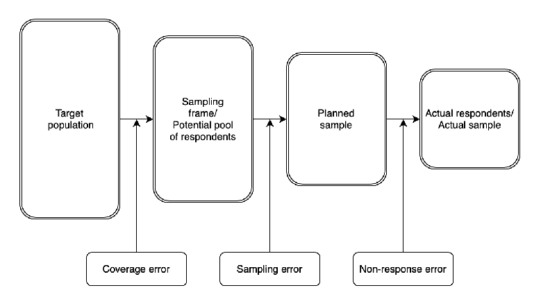

Selection in online surveys. What do we know about these survey errors in the case of commercial survey companies and survey marketplaces? Appendix A-1.2 provides information on their recruiting channels, processes, and pools of respondents. The sampling frame is respondents who are in the panels of the company. Table A-1 shows how these pools of respondents compare to the population of several countries and two large survey companies. The sampling procedure is akin to quota sampling, which makes it difficult to estimate the sampling error and identify the planned sample. Typically, survey companies can target the invitations to background characteristics, and invitations are likely somewhat random, conditional on observed characteristics (see Appendix A-1). When using survey companies, it is not easy to clearly differentiate between sampling error and non-response error. Because it is difficult to track the respondents in each of these stages, we can use the term selection bias to jointly denote the difference between respondents who start the survey and those in the target population.

Online surveys have some key advantages in terms of selection, as compared to in-person, phone, or mail surveys: (i) they give people the flexibility to complete the survey at their convenience, which reduces selection based on who is free to answer during regular work hours or who opens the door or picks up the phone; (ii) the convenience of mobile technologies may entice some people who would otherwise not want to fill out questionnaires or answer questions on the phone to take surveys; (iii) they allow surveyors to reach people that are otherwise hard to reach (e.g., younger respondents, those who often move residences, respondents in remote or rural areas, etc.); (iv) they offer a variety of rewards for taking surveys, which can appeal to a broader group of people (especially when done through survey platforms). Some rewards can appeal to higher-income respondents as well (e.g., points for travel or hotels).6

6While different in their goal, which is typically measurement and provision of statistics, government surveys (done over the phone, mail, or in-person, now with computer-assisted technology) also face selection problems. For instance, Census Bureau (2019) lists hard-to-survey populations, some of which could be significantly easier to reach via online surveys or other types of platforms, particularly people in physically hard-to-reach areas, dense urban areas, temporary situations (e.g., short-term renters), or younger respondents, which still have mobile or internet access. Other target populations are likely challenging to reach through any survey channel, such as people who are migrant and minorities, homeless, in disaster areas, institutionalized, seafarers and fishers, nomadic and transitory, face language barriers, have disabilities preventing them from taking surveys, or have limited connectivity. Some other key surveys also suffer from misrepresentation of some groups, sometimes in a way that

Comparing online samples to nationally representative samples. We compare the characteristics of samples from surveys using online commercial survey platforms to the characteristics of the target population across various papers in Appendix A-1. Table 1 shows that, in the US, across many platforms, online samples can offer a good representation of a broad spectrum of incomes ($25,000 - $100,000). However, like many other survey methods, they are not suitable for reaching the tails of the income distribution (i.e., the very poor or very rich). They tend to skew more educated, white (white and non-Hispanic respondents are typically oversampled whereas Black respondents tend to be undersampled), and somewhat Democratic (at the expense of both Republican and Independent-leaning respondents). Respondents from larger urban areas and urban clusters tend to be overrepresented, whereas those from medium- and small-sized urban and rural areas are often underrepresented. Some papers do use online platforms to successfully replicate studies done on nationally representative or convenience samples (see Berinsky et al. (2012), Heen et al. (2020) and Appendix A-1.3).

In other high-income countries, according to Table 1, the representativity of online samples looks relatively consistent with that in the US. However, in developing or middle-income countries, online samples are not nationally representative. Instead, they could be considered online representative because they represent people who are well-connected to the internet and use mobile technologies.

Papers that match survey data to population-wide administrative data can also provide valuable information on selection into online surveys. For example, a sample recruited by Statistics Denmark looks almost identical to the target population (as in Hvidberg et al. (2021)).7

These comparisons between the samples and the target population rely, by necessity, on observable variables. Non-probability sampling, such as the quota sampling performed by survey companies, carries risks in terms of representativeness. Therefore, it is important to always critically assess your sample in light of your survey method and topic before suggesting that your results generalize to the target population (see Section 2.6).

###### 2.3 Recruiting respondents

When using a more hands-on survey channel, you can directly control the content and format of the initial email or invitation to respondents, the number and timing of reminders, and the rewards system. On the contrary, commercial survey companies essentially handle the recruitment process (as explained in Appendix

- A-1.2). Regardless of the survey channel used, you have complete control over your survey landing page and your survey design. You can check existing papers (including the many referenced in this paper) for examples of recruiting emails and survey landing pages. It is good practice to include screenshots of your consent and landing page in your paper. If you are doing a more hands-on survey, you should also include all recruitment materials.

###### 2.3.1 The survey landing page

The initial recruitment email and landing page of your survey are critical. You need to increase your survey engagement while avoiding selection based on your topic. Below are some general tips.

Reduce the perceived costs of taking the survey from the start by specifying the (ideally short) survey length.

Use simple language and a friendly visual design. Make sure everything is easily readable (on mobile devices, too), which signals to respondents that the rest of your survey will be clear and well-designed.

Do not reveal too much about the identity of the surveyor. There is a tradeoff between revealing more about yourself and your institution and telling respondents just the bare minimum for them to feel confident in taking the survey. Think about the difference between “We are a group of non-partisan academic

is quite different from online samples. For instance, Brehm (1993) shows that in the National Election Studies Survey and the General Social Survey, young and elderly adults, male respondents, and high-income respondents are underrepresented, while people with low education levels are over-represented.

7Other papers that have matched admin data to survey data and find good representativity include Karadja et al. (2017), who use paper mail surveys, and Epper et al. (2020), who invite people through paper mail to take an online survey.

researchers” versus “We are a group of faculty members from the Economics Department at Harvard and Princeton.” On the one hand, revealing more may bias respondents’ perceptions of the survey based on their perception of your institution (and its political leaning). On the other hand, it can provide legitimacy. Some amount of information is often required by IRB, and these requirements can differ by institution. You can ask respondents whether they perceive your institution and survey as biased at the end of the study.

Appear legitimate and trustworthy. (i) Think about the tradeoff between revealing more about your identity and institution versus not. (ii) Provide contact information where respondents can express complaints and issues or provide other feedback. Respondents need to be able to get in touch with you. (iii) Provide information about how the data will be stored and used. IRB will often ask for specific language and a link to their contact and information page. If surveys are conducted outside of the US, there will be specific rules, such as the GDPR in the EU. (iv) Reassure respondents about complete anonymity and confidentiality. Survey companies have rules and agreements for respondents, but it is always good to reiterate that respondents are anonymous and their data is protected.

Provide limited information about the purpose of the study. Some information about the survey is needed, but I would advise against revealing too much about the actual research topic to avoid selection. For instance, “This is a survey for academic research” may be sufficient, and “This is a survey for academic research in social sciences” is probably ok, too. “This is a survey for academic research on immigration,” instead, will likely induce some selection based on the topic. You should never reveal the purpose or intent of the study (“We are interested in how people misperceive immigrants” or “We are interested in how information about immigrants can change people’s perceptions”).

Specify some possible benefits of the survey either for research and society more broadly or for the respondent themselves (e.g., they may learn exciting things and may be able to express their opinion).

Warn against poor response quality. If appropriate for your audience, inform respondents that careless answers may be flagged and their pay may be withheld. Note that in the case of commercial survey companies, there are typically already explicit agreements between respondents and companies on the quality of the survey responses.

There is some tradeoff between getting people interested in your topic and inducing selection bias because of it. Survey companies tend to provide little information about the survey (see Appendix A-1.2). Selection is a more serious issue in some settings than others, so you must assess based on your specific situation. In surveys through commercial survey companies, I try to provide as little information as possible about the topic on the consent page (and in the first few pages of the survey). Instead, I first try to collect basic information on respondents, which will allow me to identify whether there is differential attrition or selection based on the topic. Given the large potential pool of respondents, differential attrition and selection are much greater concerns than getting enough sample size. However, in another survey done on a high-quality sample with the help of Statistics Denmark (Hvidberg et al., 2021), we already have complete information on anyone in the target population and can quickly check for selection. In this case, we worry less about selection and maximizing engagement, since we are interested in getting a large enough and broad sample. In such cases, the tradeoff is in favor of a more informative landing page.

###### 2.3.2 Other elements of the recruiting process

There are additional elements of the recruitment process that you will have to address unless you hire a survey company to do them for you.

Writing an invitation email. This can be personalized to the respondent and incorporate the tips about the survey landing page discussed above.

Sending reminders. You must plan for and send reminder emails to respondents to encourage them to take the survey.

Ensuring that your respondents are legitimate and verified. Survey companies have several layers of verification in place (see Appendix A-1.2). Following the rise in bots, automatic survey-takers, and fraudsters, you will need to (i) employ CAPTCHAs and more sophisticated tasks at the start of the survey,

such as open-ended questions (for which you can check the content) or logical questions; (ii) not share the link publicly and only distribute it through reliable channels; (iii) double down on the data quality checks discussed in Section 3.

Managing incentives and rewards. While survey companies will do this for you, if you are running your survey independently, you will need to set appropriate rewards and ensure you have a way to transfer rewards to respondents. Note also that, typically, respondents that are part of survey panels are, by construction, more likely to respond to surveys than those who have not signed up for surveys. If not using survey companies or panels of respondents, you will need to work hard on recruitment and incentives.

Setting quotas. Although survey companies may do this for you, you can generally impose your quota screening at the start of the survey. This involves asking respondents some screening questions and channeling them out of the survey in case their quota is already full.

###### 2.4 Managing the survey

When administering your survey, you need to carefully monitor the entire process to avoid issues you may not have noticed during the design phase.

Soft-launch the survey. Before launching the full-scale survey, you should run a small-scale version or “soft launch” of the complete survey. This is slightly different from the pre-testing and piloting discussed in Section 4, which is about testing the content and questions. It is about figuring out whether there are technical issues with your survey flow.

Monitor the survey. One advantage of online surveys is that you can monitor the data collection in real-time and adapt to unforeseen circumstances. First, you must pay attention to dropout rates. If you notice respondents dropping out at particular points, you may want to pause the survey and figure out the problem. This will also help you flag potential technical issues you may have missed while testing. Similarly, monitor your quotas. If one quota is filling up too fast, it will be challenging to fill the other groups later on. Finally, regularly check the designated survey email inbox in case respondents have sent emails that flag problems.

Check the data during the collection process. From the earliest responses, you should have a procedure to start checking the validity of answers, tabulating answers, and spotting possible misunderstandings or errors. Also, check that the data you are collecting is being recorded correctly.

###### 2.5 Attrition

Reporting attrition. The level of attrition and its correlation with observable and unobservable characteristics are important issues in a survey. It is good practice to report detailed statistics on attrition for your survey, including i) your total attrition rate with a clear definition (for example, which respondents count as “having started the survey” versus “completed” it? Do you count respondents who failed possible attention checks? Who skipped the basic demographic questions?); ii) your attrition rate at key stages in the survey, such as upon or after learning the topic of the survey, answering socioeconomic questions, seeing an experimental treatment, etc.; and iii) correlations of attrition with respondent characteristics. To be able to test for differential attrition, some background information on the respondent is needed. If there is no outside source for that information (e.g., administrative data), there is a strong rationale for asking socioeconomic and background questions earlier in the survey to see whether respondents are selectively dropping out. There are tradeoffs in this ordering of survey blocks, which I discuss further in Section 4.6.

Table 2 gives a sense of the distribution of attrition rates across various papers and platforms. Subject to the caveat that attrition is not defined in the same way across different studies, attrition rates tend to range between 15% and somewhat above 30%, depending on the platform used and the survey length. Patterns of correlation between personal attributes and attrition are not clear cut and will likely depend on the topic and design of the survey. In a study across 20 countries, Dechezleprˆetre et al. (2022) find that women, younger, lower-income, and less-educated respondents are more likely to drop out, but differences in attrition rates

are not large. Table 2 shows that survey length may be correlated with higher attrition. Respondents in the treatment branches of surveys with an experimental component are sometimes more likely to drop out, either because of the added time commitment or based on the topic (which can introduce bias in the treatment effects estimated).

Preventing attrition. The best remedies for attrition are a smooth respondent experience (e.g., pages loading quickly, a clear visual design, well-formulated questions as described in Section 4), a shorter survey, and good incentives (here again, it helps if survey companies have a variety of possible rewards that appeal to a broad range of people, rather than just one type of reward, which may induce selection). It is a good idea to avoid too many attention check questions (see Section 3), personal questions, and complex questions, all of which could irritate respondents. It is also good to be careful about revealing the topic too early on before you know enough about who the respondents are (so that you can check for selective/differential attrition based on the topic.

###### 2.6 Correcting for non-response bias (selection and attrition)

Correcting for non-response biases is essentially a question of how to deal with missing data. Data can be missing for specific entries (item non-response), for all entries (unit non-response), or for all entries after a given point (attrition). It can be missing completely at random, at random conditional on observables, or not at random. The corrections to apply, if any, depend on your goal and the statements you are trying to make. Are you trying to provide descriptive statistics that are supposed to represent the views of the target population? Or to present treatment effects that are generalizable? Data is very rarely missing truly at random, but that does not mean selection is always a serious problem.

In some cases, if your sample looks very close to the target population in terms of observables and if attrition is small and not systematically correlated with observables, it may be best to not attempt any correction. All corrections require some assumptions and can introduce additional noise. Policy views depend on observables like income, age, or political affiliation. The questions then are whether policy views are systematically correlated with other characteristics (conditional on these observables) that make people more or less prone to taking surveys or to dropping out of the survey, e.g., upon learning the topic or seeing a treatment based on their policy views. These cannot be checked per se (you can only check selection and attrition based on observables), but you can think about the likelihood of this issue. It is reassuring if the sample is already close to representative of your target population along observable dimensions.

Three proposed solutions involve making adjustments as part of the estimation process (computing means or treatment effects). One involves re-weighing observations according to one of several methods, in order to adjust for non-response or align sample characteristics with the target population (described in Section

- 2.6.1). Re-weighting typically requires assuming that data is missing at random conditional on observables and may increase your standard errors. Another solution is to explicitly model selection or attrition into the survey, which does not require assuming that selection or attrition are random conditional on observables but requires modeling assumptions and some credible “instrument” for the selection (see Section 2.6.2). A third solution is to bound the effects of interest, rather than provide point estimates (see Section 2.6.3).

A fourth solution is to impute missing data directly, according to one of several approaches, directly estimating the value each non-respondent might have reported (imputation) had they been a respondent (described in Section 2.6.4). Imputations are most often used for item non-response and can be used for one or multiple entries (e.g., one can impute all entries, after someone drops out due to attrition, or individual missing entries throughout the survey).

###### 2.6.1 Weighting methods

In this subsection, we consider weighting methods that can be used to deal with two issues: adjusting for unit non-response and aligning sample characteristics with population characteristics (called poststratification weighting). Kalton and Flores-Cervantes (2003) provide an extensive summary of these methods. For more coverage of weighting methods, see Section 3.3 of Little and Rubin (2002). The general strategy in weighting consists in finding responders who are similar to non-responders based on auxiliary data and increasing their weight. Non-longitudinal surveys typically do not contain much auxiliary data (unlike in panel surveys,

where you have information about the respondents from previous rounds). The reweighing methods are similar in the cases of non-response and post-stratification because the purpose is to align the sample data with some external data (in the case of non-response correction, the goal is to align the actual sample with the total targeted sample; in the case of poststratification, the goal is to align it with the population characteristics). Poststratification weighting is covered in more detail in Kalton (1983), Little (1986), and Little (1993). Below, we discuss the examples in the case of aligning sample data with population data, but the methods are readily applied to nonresponse corrections by replacing “population data” with “data for the planned sample” as done in Kalton and Flores-Cervantes (2003).

Cell-weighting. Cell-weighting adjustments involve sorting respondents and non-respondents into cells based on certain characteristics and adjusting the weights of respondents in each cell by a given factor so that the sample totals conform to the population totals on a cell-by-cell basis. You first need some data on the population, cell by cell (which may be difficult to find for some target populations). When the target is the national population, you can use censuses. The assumption needed for the validity of this adjustment is that the people who did not answer the survey are like those who did answer, which means that in any given cell, a random sample of people was invited to participate and a random set of those invited answered the survey.

The choice of variables to construct the poststratification cells can be made by simple methods or sophisticated algorithms (see Kalton and Flores-Cervantes (2003)). Some useful results to keep in mind are, first, that poststratification based on cells that are homogeneous with respect to the outcome of interest reduces both the variance and bias in estimates based on the data (Holt and Smith, 1979). Poststratification based on cells that are homogeneous with respect to the participation in the survey reduces the bias but may increase the variance (Little, 1986). In a nutshell, this means that you should choose variables that (you think) are good predictors of the survey outcome in the first place and the propensity to respond to the survey in the second place.

Related weighting methods. Related methods include raking (which uses an iterative procedure to make the marginal distributions of the sample, instead of the joint distributions, conform to the population) and generalized regression estimation (which constructs weights based on several variables, including transformed or interacted ones). Cell weighting can lead to unstable weighting adjustments if there are cells with very few respondents. Mixture methods can be used in that case: You can use multilevel regression for small cells before poststratification cell-reweighing (see Gelman and Little (1997)).

Logistics regression weighting and inverse probability weighting methods predict the probability of responding or completing the survey based on auxiliary information. They require you to know the pool of respondents (e.g., the characteristics of the full population) so you can estimate a probit of participating/dropping out based on observables (that can be exogenous but also endogenously related to the variables of interest). For a treatment of these methods, see Fitzgerald et al. (1998), Wooldridge (2002a), and Wooldridge (2007). Inverse probability weights are a common approach for dealing with differential attrition (Bailey et al., 2016; Imbens and Wooldridge, 2009). In this application, observations in the treatment and control groups are reweighed to remain comparable to their pre-attrition samples.8

Standard errors. You must account for weighting when computing your standard errors, which most software can do. Weighting can increase your variance by a little or a lot, depending on the adjustment size. If some weight adjustments become too large, there are methods to trim the weights or collapse cells (Kalton and Flores-Cervantes, 2003).

###### 2.6.2 Model-based approaches

Model-based approaches tackle attrition and sample selection parametrically. They explicitly model the selection or attrition process and do not need to assume that they are random, conditional on observables. Typical econometric methods are covered in Chapter 17 of Wooldridge (2002b). They were developed in the

8More generally, most methods in this section can be used for differential attrition too).

context of program evaluation and general non-response (leading to missing data on dependent or explanatory variables) and can also be applied to surveys.

Models like Heckman (1979) selection require finding an instrument that affects selection or attrition, but not the outcomes of interest. In the context of surveys, this could be some randomized variation in the survey process, such as the number of times a respondent was contacted or the rewards offered. Such variation is not always available. If you have control over these survey parameters, you can think ahead to their use later during your analysis. Such a model-based correction is proposed in Dutz et al. (2021) and uses variation in participation rates due to randomly-assigned incentives and in the timing of reminder emails and text messages. Behaghel et al. (2015) similarly provide a model that mixes the Heckit model and the bounding approach of Lee (2009) (covered below), using the number of prior calls made to each individual before obtaining a response to the survey as a pseudo-instrument for sample selectivity correction models. The method can be applied whenever data collection entails sequential efforts to obtain a response (in their case, trying to call several times in a phone survey or making several visits to the respondent’s home; in the case of online surveys, sending repeated invitations to take the survey) or even gradually offering higher incentives (rewards) to potential respondents.

###### 2.6.3 Bounding methods

Bounding methods are typically non-parametric techniques to provide interval estimates for the effects of interest, relying on relatively few assumptions. Some bounding techniques use imputations (similar to the methods in Section 2.6.4), while others use trimming.

The worst-case approach by Horowitz and Manski (2000) imputes missing information using minimal and maximal possible values of the outcome variables and bound population parameters with almost no assumptions except that the variables need to be bounded. These bounds can be wide and non-informative, but are useful benchmarks, especially for binary variables. For estimating treatment effects when there is attrition, Kling et al. (2007) construct bounds using the mean and standard deviation of the observed treatment and control distributions, which leads to tighter bounds than the “worst-case approach.”

Lee bounds. Lee (2009) proposes a method to bound the treatment effects estimates when the control and treatment groups’ attrition is differential. Bounds are estimated by trimming a share of the sample, either from above or below.9 To obtain tighter bounds, lower and upper bounds can be estimated using several (categorical) covariates and trimming the sample by cells instead of overall. Many improvements and refinements for Lee bounds exist. To apply this type of bounds, the treatment has to be randomly assigned, and treatment assignment should only be able to affect attrition in one direction (monotonicity assumption).

###### 2.6.4 Imputation methodsImputation methods are non-parametric techniques to fill in missing data.

Hot deck imputations replace missing values with a random draw from some “donor pool.” Donor pools are values of the corresponding variable for responders that are similar, according to some metric, to the respondent with the missing value. For instance, hot decks may be defined by age, race, sex, or finer cells.10 In some cases, the donor is drawn randomly from a set of potential donors (“random hot deck method,” see Andridge and Little (2010)). In other cases, a single donor is drawn based on a distance metric (“deterministic hot deck methods”). With a stretch of terminology, some methods impute summary values, such as a mean over a set of donors.

- 9The actual method is as follows: 1) Calculate the trimming fraction p defined as the fraction remaining in the group with

less attrition minus the fraction remaining in the group with more attrition, scaled by the fraction remaining in the group with less attrition. 2) Drop the lowest p% of outcomes from the group with less attrition. Again, calculate the mean outcomes (descriptive stats or treatment effects) for the trimmed group with less attrition. This is one bound. 3) Repeat step 2) by dropping the highest p% of outcomes from the group with less attrition, which yields another bound.

- 10The US Census Bureau uses a classic hot deck procedure for item non-response in the Income Supplement of the Current

Population Survey (CPS).

Regression-based imputations replace missing values with predicted values from a regression of the missing variable on variables observed for the respondent, typically estimated on respondents who do not have this missing variable or who have complete responses. Stochastic regression imputation replaces missing values with a value predicted by regression imputation plus a residual drawn to reflect uncertainty in the prediction.

Random hot-deck or stochastic regression imputations align with the guidelines for creating good imputations in Little and Rubin (2002). They suggest that imputations need to be i) conditional on observed variable to improve precision and reduce bias from non-response, and account for the correlation between missing and observed variables; ii) multivariate, to preserve the relations between missing variables; and iii) randomly drawn from predictive distributions, to account for variability (rather than deterministically set to a value such as a conditional mean).

###### 2.6.5 Best practice tips

The first step in dealing with selection and attrition is accurately reporting them to your readers. For attrition, i) describe your overall rate of attrition; ii) correlate it with observables; and iii) provide the timeline of when people drop out (see Section 2.5). For selection, compare your sample carefully to the target population along as many dimensions as possible. If the characteristics are similar, this is reassuring, although responders may differ from non-responders in other ways that are not measurable (and this is not testable). For item non-response, you can identify specific questions where there are more or many missings. For example, if you have to use a variable with many missing observations, you need to discuss this more extensively than if the variable has only a few missing responses. Your adjustments or corrective procedure and reporting should depend on the magnitude of the non-response, selection, and attrition problems. It may be worthwhile checking the robustness of your results to various correction methods among those described here.

It is helpful to report your “raw” survey results before any adjustment, either as a benchmark case or in the Appendix. You can acknowledge that the results hold, strictly speaking, just for your sample and may or may not hold for the target population. After you apply one or several correction methods (reweighting, bounding, imputation, or model-based adjustments), you can report these results (in the main text or Appendix) for comparison with the raw ones. A final tip is to use questions on attitudes, views, or beliefs from existing, high-quality, representative (of your target population) surveys that can serve as benchmarks. You can compare the answers in your study to those in benchmark surveys so that you have an extra validation beyond comparing socioeconomic or demographic characteristics.

#### 3 Managing Respondents’ Attention

Once you have recruited a high-quality sample, the essential asset in your survey is your respondents’ attention. As is the case for many other survey issues, the condition sine qua non in dealing with respondents’ attention or lack thereof is a good survey design. Beyond that, there are some targeted methods, described here.

###### 3.1 Ex ante methods to check for attention

First, you need to collect extensive “meta-data” for your surveys to diagnose issues with attention and carelessness. There are options to do so in survey software such as Qualtrics. They include time spent on each survey screen and the entire survey, number of clicks or scrolling behavior, time of the day the survey was taken, and the device used (e.g., browser versus mobile phone).

One way to identify careless respondents is through “Screeners,” i.e., questions specifically designed to detect inattentive answers. There are different ways of structuring such questions:

- • Logical questions require logical reasoning and have a clear, correct answer (e.g., “would you rather eat a fruit or soap?”), as described in Abbey and Meloy (2017). The issue is that there is a clear tradeoff between the subtlety of the question and the existence of an unambiguously correct answer.

- • Instructional manipulation checks are questions that look like standard survey questions but instruct the respondent to provide a certain answer. Note, however, that they may affect, rather than measure, the attentiveness of the respondent (Kane and Barabas, 2019). An adapted example from Berinsky et al. (2014) is:

Example: People often consult internet sites to read about breaking news. We want to know which news you trust. We also want to know if you are paying attention, so please select ABC News and Fox News regardless of which sites you use. When there is a big news story, which is the one news website you would visit first? (Please only choose one)

- □ New York Times website □ The Drudge Report □ The Associated Press (AP) website
- □ Huffington Post □ Fox News □ Reuters website
- □ Washington Post website □ ABC News website □ National Public Radio (NPR) website

• Factual manipulation checks are questions with correct answers that are placed after experimental treatments and relate to their content. These questions can either be before or after the measurement of the outcome and can be about treatment-relevant information (which is manipulated across treatment groups, in which case the questions serve as a check of comprehension) or treatment-irrelevant information (not manipulated across treatment groups, in which case they act as attention checks only). Section 6 provides more advice on ordering such questions in a survey experiment.

Overall, while screeners have the advantage of increasing attention and measuring carelessness, they can also annoy respondents and increase attrition rates (Berinsky et al., 2016). If you decide to use screeners, use them sparingly and strategically. For instance, you could consider using them at random points to check for survey fatigue or attention at different points in the survey.

Once you have identified careless respondents, you must decide whether to drop them (threatening external validity) or leave them in (threatening internal validity and increasing noise). There is some evidence that screener passages correlate with relevant characteristics, and excluding those who fail them may limit generalizability (Berinsky et al., 2014).11

Another possible solution is to try to induce more attention in the first place. Berinsky et al. (2016) study ways to prompt people to pay more attention: i) “training” respondents (letting them answer the attention check question again until they get it right). This increases dropout from the survey, presumably as respondents get annoyed. ii) Warning that the researcher can spot careless answers along the lines of “The researchers check responses carefully to ensure they read the instructions and responded carefully”, which also slightly increases dropout. iii) Thanking respondents: “Thank you very much for participating in our study. We hope that you will pay close attention to the questions on our survey”. This method reduces dropout by a bit. None of these conditions is thus really effective. Krosnick and Alwin (1987) suggest reminding a respondent to focus if a question is tricky. Such prompts have to be used sparingly, or they lose their effectiveness. In a nutshell, it is challenging to prompt attention through artificial methods. One of the best bets is good design to avoid squandering precious respondent attention (as explained in Section 4).

###### 3.2 Ex post data quality checks

Instead of inserting ad-hoc questions, you can also verify the respondent’s attention ex-post through various techniques. Once you have identified potentially problematic and careless respondents, you could check the robustness of your results to including these cases versus dropping them. You can also create flags for different degrees of carelessness by applying several checks and identifying “very careless respondents” (e.g., who get flagged in many of the checks) versus “moderately careless” or “mildly careless” ones and checking the robustness of your results to dropping and including these groups.

11That paper finds that, across five different surveys, older respondents are more likely to pass the screener (but this relationship dampens for those older than 60), women are significantly more likely to pass screeners than men, and racial minorities are less likely to pass screeners.

Consistency indices are measures that match items supposed to be highly correlated by design or empirically and check whether they are correlated. Some common techniques are i) Psychometric Synonyms and Antonyms which are pairs of items that are highly positively correlated (synonyms) or negatively correlated (antonyms). An example of psychometric antonyms would be the answers to the questions “Are you happy?” and “Are you sad?” (Curran, 2016). You can check the within-respondent correlation for these pairs. ii) Odd-Even Consistency checks involve splitting survey questions based on their order of appearance and checking that items that should be correlated are correlated (see Appendix A-2). Consistency indices are mainly useful if your survey includes several questions on the same topic (that we expect to be correlated) and is asked on similar scales. These methods are reviewed in Meade and Craig (2012).

Response pattern indices detect patterns in consecutive questions (see Meade and Craig (2012)). i) The LongString measure is the longest series of consecutive questions on a page to which the respondent gave the same answer (e.g., for how many questions in a row a respondent consistently selects the middle option);

- ii) the Average LongString measure is the average of the LongString variable across all survey pages; and
- iii) the Max LongString measure is the maximum LongString variable on any of the survey pages. Response pattern indices are only helpful when a relatively long series of questions use the same scale. It is not easy to compare different surveys according to these measures because they depend on the type and position of the questions. These methods are likely to only detect respondents who employ minimum effort strategies such as choosing the same answer repeatedly.

Outlier indices attempt to spot outlier answers. Zijlstra et al. (2011) review six methods for computing outlier statistics (or scores) for each respondent and identifying the level of discordance with other observations in the sample. For better results, these methods typically rely on multiple survey questions at once. One of the most commonly used outlier statistics is the Mahalanobis distance, which computes the distance between an observation and the center of the data, taking into account the correlational structure.

Honesty checks or self-reported attention. An additional possibility is to insert a direct question about the respondent’s “honesty,” asking the respondent to evaluate their interest and attention on a single item or the whole survey. These measures correlate with the other attention checks but are not appropriate if the respondent loses from being honest (e.g., if their survey reward is withheld, Meade and Craig (2012)). The example from Meade and Craig (2012) is “Lastly, it is vital to our study that we only include responses from people that devoted their full attention to this study. Otherwise, years of effort (the researchers’ and the time of other participants) could be wasted. You will receive credit for this study no matter what; however, please tell us how much effort you put forth towards this study.” [Almost no effort, Very little effort, Some effort, Quite a bit of effort, A lot of effort] As an example, Alesina et al. (2022) includes the following question, which is not placed at the end of the survey, but rather strategically to foster attention in the subsequent questions (regardless of what the respondents answer):

Before proceeding to the next set of questions, we want to ask for your feedback about the responses you provided so far. It is vital to our study that we only include responses from people who devoted their full attention to this study. This will not affect in any way the payment you will receive for taking this survey. In your honest opinion, should we use your responses, or should we discard your responses since you did not devote your full attention to the questions so far?

- □ Yes, I have devoted full attention to the questions so far and I think you should use my responses for your study.
- □ No, I have not devoted full attention to the questions so far and I think you should not use my responses for your study.

Time spent on the survey. You can also decide to discard respondents who spent too little or too much time on the survey as a whole (the cutoff will depend on what you consider to be a reasonable time for a given survey). Indeed, while you should probably allow respondents to interrupt and complete the survey at a later time (because they may otherwise drop out altogether), you need to check the answers of respondents who took really long for quality because they may be distracted by other things (which could be a problem, especially when estimating treatment effects as in Section 6). It is always worth checking

whether time spent on the survey (and lack of attention or carelessness) is systematically correlated with respondent characteristics.

###### 3.3 Survey fatigue

An important concern in surveys is survey fatigue, i.e., the decay of respondents’ focus and attention over the course of the survey.

Reducing survey fatigue. Good design is particularly critical for reducing survey fatigue. Questions that are inconsistent, vary a lot, and do not have good visual design can impose undue cognitive load on respondents and tire them out more quickly. The length of the survey is, of course, critical. However, there are no hard rules as a long, but interesting and well-designed survey may foster more engagement than a shorter, but poorly designed or boring one.

Testing for survey fatigue. To spot survey fatigue in your survey, you can check whether patterns of carelessness such as those described in Section 3.2 increase over the course of the survey. However, this is not always conclusive as the types of questions asked over the course of the survey change as well. Stantcheva

- (2021) suggests a test check based on the randomization of survey order blocks: one can test whether respondents who (randomly) saw a given survey block later in the survey spend less time on it and exhibit more careless answer patterns on questions in that block than respondents who saw that same block earlier on.

4 Writing Survey Questions

When you decide to run a survey, you may wish to start writing the questions quickly. However, do not jump into this before a lot of careful thinking. There may be a temptation to think about writing your survey as just the equivalent of “getting the data” in observational empirical work. However, you are the one creating the data here, which gives you many opportunities and presents many challenges. Writing your survey questions is already part of the analysis stage.

You first need to outline very clearly what your research question is. There is no such thing as a “good survey” or a “good question” in an absolute sense (although there are bad surveys and bad questions). A good survey is adapted to your research issue. Therefore, when writing survey questions, you must always remember how you will analyze them; the right design will depend on your goal. In this section, I outline some best practices for writing questions, based on the many references cited in this review article and my own experience. Section 4.3 builds extensively on Dillman et al. (2014) and Pew Research Center (nd). Some of the examples there are intentionally adapted to be more suitable for economics surveys with a few examples used with very minor modifications.

###### 4.1 General advice

Types of questions. There are several different types of survey questions. Questions are made of question stems and then answer options or entry fields. Closed-ended questions, which typically make up most of the survey questions, have a given fixed set of answer options. Closed-ended questions can be nominal, with categories that have no natural ordering (e.g., “What is your marital status?”), or ordinal, with categories that have some ordering (e.g., Questions such as “Do you support or oppose a policy?” with answer options ranging from “strongly oppose” to “strongly support”; or questions about frequencies, with answer options ranging from “never” to “always”). Open-ended questions instead have open answer fields of varying lengths and do not constrain respondents to specific answer choices. Hybrid questions are closed-ended questions with open-ended answer choices, such as “Other (please specify): [empty text field].”

Well-designed survey questions allow you to create your own controlled variation. This distinguishes social and economic surveys from other types of surveys. The goal is not only to collect statistics, the goal is to understand reasoning, attitudes, and views and tease out relationships. When you design your

questions, you need to keep the concept of Ceteris Paribus, or “all else equal,” in mind and think of the exercise as creating your own controlled (identifying) variation. Each question needs to ask about only one thing at a time and hold everything else as constant as possible (and respondents need to be aware of that).

For instance, as discussed in Alesina et al. (2018), if you want to understand whether people want to increase spending on a given social program, it is difficult to infer much from answers to a question such as “Do you support or oppose increasing spending on food stamps?” The reason is that this question mixes many different considerations, including i) how much government involvement respondents want; ii) how they think the spending increase will be financed (e.g., will it come at the expense of other programs?); and iii) whether they prefer another, related program (e.g., cash transfers to low-income households). This is why Alesina et al. (2018) split this question into three different questions: one about the preferred scope and involvement of the government, one about how to share a given tax burden, and one about how to allocate a given amount of government funds to several spending categories ranging from infrastructure and defense to social safety net programs.

Note that if you are only interested in treatment effects in survey experiments, you may have a bit more leeway because, presumably, the variations in interpretation of a question will be similar across the treatment and control groups. Even then, I would advise having as precise and clear questions as possible.

Writing precise and clear questions. When writing survey questions, precision and clarity are key. This involves, among others, avoiding the following types of questions:

- • Double-barreled questions, i.e., questions that ask about two things simultaneously. This is sometimes grammatically evident (“Do you support or oppose increasing the estate tax and the personal income tax in the top bracket?”) but often more subtle, as explained above, when your question does not hold all other relevant factors constant.
- • Vague questions. “Do you support or oppose raising taxes on the rich?” may be helpful in some settings, but presumably, it would be more beneficial to specify what you mean by “rich” and which taxes exactly you have in mind.
- • All-or-nothing questions. These questions are not informative because everyone will tend to respond the same. For instance: “Should we raise taxes to feed starving children?”

Being very specific in your questions avoids ambiguity, which can lead to misinterpretation and heterogeneous interpretations of the question across respondents. These in turn lead to measurement error.

Allow for a respondent to answer that they do not know or are indifferent. There may be respondents who have not given much thought to the issues researchers ask about, especially if these issues relate to broader social or economic phenomena as opposed to respondents’ own lives. Therefore, allowing them to express indifference toward or absence of a strong view on the issue makes sense. It is similarly recommended to let respondents answer that they do not know when asked knowledge-related questions.

Use simple, clear, and neutral language. Using simple, clear, and neutral language involves several elements:

- • Know your audience. Questions that are easy to answer for one type of audience may be difficult for another. For instance, Alesina et al. (2021) survey both adults and teenagers in their study on racial gaps and adapt the teenagers’ questionnaire to be shorter and with simpler words.
- • Do not use jargon or undefined acronyms.
- • Do not use negative or double negative formulations that are harder to understand. An example of a negative formulation that is mentally burdensome is “Do you favor or oppose not allowing the state to raise state taxes without approval of 60% of voters?” Instead, you could ask “Do you favor or oppose requiring states to have 60% of the approval of voters to raise state taxes?” You should minimize your respondents’ cognitive load, so the answer “yes” should mean yes, and “no” should mean no.

- • Eliminate all unnecessary words and keep your questions as short as possible. One application of this principle is to include answer options only after the question stem. For instance, a formulation such as “Are you very likely, somewhat likely, somewhat unlikely, or very unlikely to hire a tax preparer next year?” is tiring to read. A better formulation would be “How likely or unlikely are you to hire a tax preparer next year?” with answer options [Very likely, Somewhat likely, Somewhat unlikely, or Very unlikely].
- • Be careful with sensitive words or words that may be offensive to some people.

Adapt your questions to your respondents. Make sure your questions apply to all respondents in your sample. If they do not, either i) create survey branches based on your respondents’ characteristics or ii) ask contingent questions. For instance, do not ask someone currently unemployed about their job. Instead, you can ask about their current job, but add the contingency “if you do not currently have a job, please tell us about your last job.”

Write neutral questions. You should strive to write neutral questions that do not bias the responses.

- • Phrase questions as actual questions rather than using “Do you agree or disagree with this statement” formulations. In fact, you should strive to avoid Agree/Disagree and True/False questions (see the detailed discussion in Section 5.4).
- • Avoid leading questions that nudge the respondent in one answer direction. An example of a leading question is “More and more people have come to accept using a tax preparer to reduce one’s tax burden as beneficial. Do you feel that using a tax preparer to reduce your tax burden is beneficial?”
- • Avoid judgmental and emotionally charged words in your questions.
- • Do not ask sensitive or private questions unless you must (of course, for research, we sometimes must).
- • Avoid giving reasons for a given behavior in your question because the answers will mix what the respondent thinks about the issue you are asking about and the cause. For instance: “Do you support or oppose higher taxes so that children can have a better start in life?” will not lead to informative answers about people’s attitudes to either taxes or equality of opportunity.
- • You can consider including a counter-biasing statement to signal neutrality. For instance: “Some people support very low levels of government involvement in the economy, while others support very high levels of government involvement. How much government involvement do you support?”
- • When asking either/or types of questions, state both the positive and negative sides in the question stem. For instance, instead of asking “Do you favor increasing the tax rate in the top bracket?”, ask “Do you favor or oppose increasing the tax rate in the top bracket” [Favor, Oppose]. Similarly, instead of asking “How satisfied are you with the overall service you have received from your tax preparer?”, ask “How satisfied or dissatisfied are you with the overall service you have received from your tax preparer?” [Very satisfied, Somewhat satisfied, Somewhat dissatisfied, Very dissatisfied].

Use simple question formats unless the question requires more complexity. Sometimes, you will need to elicit complex perceptions or attitudes, which justifies the use of a more involved question format (see Section 4.4). In general, however, a simpler question design consistent throughout the survey makes the most sense, as it involves a lower cognitive burden for respondents. Some common question design types are:

- • Checkbox questions. In these questions, respondents simply select one or multiple answer options by clicking on them.
- • Radio buttons questions. Respondents can select one single option by clicking on it.

- • Slider questions. Respondents select an answer by moving a slider. The benefit of sliders is that they yield more continuous and perhaps more fine-grained answers than fixed point scales. The disadvantages are that some of that variation is almost surely noise, that they can take longer to answer than checkbox or radio button questions, and that they may be hard to control precisely, especially on mobile phones. Sliders can be a good and intuitive visual representation if you are truly interested in a continuous variable rather than discrete ordinal categories. If not, a standard question design with radio buttons is recommended.
- • Ranking questions. Ranking questions can be cumbersome, and forcing respondents to rank items that are not truly on a unidimensional scale can lead to misleading results, with gaps between items that are not meaningful. They should only be used for actual rankings. For instance: “Which region contributes most to global greenhouse gas emissions? Please rank the regions from the one contributing most to the one contributing least” from Dechezleprˆetre et al. (2022).

Do not force responses. In general, you should not force respondents to answer questions unless their responses are needed to screen them at the start of the survey. For most questions, respondents can be branched appropriately even if their response to a question is missing. When you think about the branches in your survey, you should always consider where respondents who leave an item blank should go next. You can, however, “prompt” for responses. For instance, Qualtrics has a pop-up window that appears if respondents try to move to the next survey screen while leaving questions blank, asking them whether they are sure they want to leave some items unanswered.

Provide informative error messages. Your survey should provide informative error messages, i.e., messages that help the respondents recognize the error in their responses. A message such as “your answer is invalid” is not helpful; a message that specifies “please only enter integer numbers” is much more useful.

Look for precedent. You are often not the first to ask survey questions on a topic. As a starting point, it would be best always to examine the literature and existing surveys for questions that have already been validated and tested. However, the fact that a question has once been used should never be a sufficient reason to use it again and does not guarantee that it will be suitable for your survey.

Pre-test. You must pre-test your questionnaire multiple times. This involves surveying not only “content experts,” which are people who are experts on the topic (e.g., your colleagues), but a wider, non-expert audience. You should ask for feedback on your questionnaire. You can formally test various survey versions and run small-scale pilots on smaller samples from your target population. Pre-testing is particularly valuable when designing new questions on less-explored topics. During pilots, leave ample space for feedback in openended text boxes and encourage respondents to give feedback. Money spent on pilots and pre-testing is wisely spent because it can save you more money and disappointment later. Part of the testing is also to see whether your data is being recorded correctly. Further, it is invaluable to do in-depth cognitive interviews with people from your target audience, especially when studying new topics. Cognitive interviews involve having someone take the survey and share their impressions, questions, and reactions to it in real time. They are a complement to experimental pre-testing, not a substitute.

Include feedback questions. Even beyond the pilot and pre-testing rounds, you should always include feedback entry fields at the end of your survey. Some can be more general, e.g., “Do you feel that this survey was left- or right-wing biased or unbiased?” [Left-wing biased, Right-wing biased, Unbiased]. Others can be more targeted. For instance, you may want to elicit whether respondents understood the purpose of your research, which may be problematic in light of social desirability bias or experimenter demand effects (see Section 5).

###### 4.2 Open-ended questions

Purposes of open-ended survey questions. Open-ended questions have many benefits. Thanks to ever-evolving text analysis methods, researchers can easily analyze them. Ferrario and Stantcheva (2022) provide an overview of the use of open-ended questions to elicit people’s concerns in surveys. Open-ended questions have several purposes.

First, they allow researchers to elicit people’s views and concerns on many issues without priming them with a given set of answer options (Ferrario and Stantcheva, 2022). Ferrario and Stantcheva (2022) leverage text analysis methods to study people’s first-order concerns on income taxes and estate taxes, based on answers to open-ended questions. These questions can be very broad (for instance: “When you think about federal personal income taxation and whether the U.S. should have higher or lower federal personal income taxes, what are the main considerations that come to your mind?”), more directed (for instance: “What do you think are the shortcomings of the U.S. federal estate tax?”), or very specific (for instance: “Which groups of people do you think would gain if federal personal income taxes on high earners were increased?”). Appendix Figure A-4 provides an example of how open-ended questions can shed light on the types of words used by respondents and on the different topics that matter to them based on political affiliation. Stantcheva

- (2022) elicits people’s main considerations about trade policy using a series of open-ended questions. Second, they are helpful in exploratory work ahead of writing a complete survey. When unsure about

relevant factors, a pilot study with open-ended questions can help you determine the answer choices to include in closed-ended questions. It may bring to light unforeseen factors and issues.

Third, they avoid leading and priming respondents when unaware of the suitable scales and answer options. We discuss the choice of answer scales in more detail below. In brief, answer scales should ideally approximate the actual distributions of answers in the population to avoid biasing respondents who may look for clues in the provided options, especially when some mental work is involved in remembering something or thinking about an answer. However, on some issues, you may not know the right scales. Open-ended questions can be beneficial in these cases.

Finally, in the context of information experiments (see Section 6.3), you can use open-ended questions to validate the answers to other questions, such as quantitative ones, and to test whether a treatment changes people’s attention on a topic (as in Bursztyn et al. (2020)).

Best practices for open-ended questions. Some best practices for open-ended questions are as follows:

- • Because these questions can be more time-consuming than closed-ended ones, especially when the answers required are longer, you may need to motivate respondents to answer using prompts, such as “This question is very important to understanding tax policy. Please take your time answering it.”
- • To encourage more extended responses, you can consider adding follow-up questions on the next screen (without overdoing it), such as “Are there any other reasons you can think of?”
- • As a result, you should use them sparingly and, if they are essential for your research, place them earlier on in the survey while respondents are less tired.
- • Specify what type of answers you are looking for to guide respondents and facilitate your subsequent analysis of the data (“Please spend 1 or 2 minutes”; “Please think of several reasons...”; “Please list any words that come to your mind...”).
- • Adapt the visual format to the type of answers you need. For instance, if you only need a single answer, provide a single answer box. If you need multiple answers, provide multiple answer entry fields. Make the length and sizes of the entry fields appropriate to the type of answer you need (e.g., if you want respondents to write longer responses, provide ample space). To avoid issues with interpretation and mixing up of units, you can sometimes provide a template below or next to the answer space. For example, if you are looking for a dollar amount, you can put the sign “$” next to the box; if you are looking for a duration, you can add “months” next to the answer box; for a date, you can specify “MM/YYYY”).

###### 4.3 Closed-ended questions

Qualitative versus quantitative questions. There are two general types of closed-ended ordinal questions: those that offer more vague qualitative response options (e.g., never, rarely, sometimes, always) and those that offer response options using a natural metric (e.g., once a week, twice a week, etc.). More generally, a question to ask yourself is whether a qualitative or quantitative answer to a given question is better suited to your research needs. Questions using vague quantifiers as answer options have the disadvantage

that they are, by construction, vague and, thus, can mean different things to different people. At the same time, they are easy to understand. Furthermore, respondents may not be able to precisely assess something in a quantitative manner, so they may make errors, and variations in answers could reflect a lot of noise. In a sense, we have to be realistic about some issues. The reality is that it may be impossible to get precise measures of some constructs, and using vague quantifiers may be the best we can do. Still, there are plenty of best practices to minimize response errors and noise in both qualitative and quantitative questions. Overall, qualitative questions can be highly useful complements to quantitative questions. For example, Alesina et al. (2018) use a depiction of a ladder to elicit perceived mobility, see Figure 3. They also ask respondents a corresponding qualitative question: “Do you think the chances that a child from the poorest 100 families will grow up to be among the richest 100 families are:” [Close to zero, Low, Fairly low, Fairly high, high] (Alesina et al., 2018, p. 528). Multiple measurements are critical for especially important variables in your survey.

###### 4.3.1 General advice for closed-ended questions

Use exhaustive answer options that span all possible reasonable answers. The following example does not contain all reasonable answer options. Furthermore, the options are not mutually exclusive either because they mix the issues of how and where the respondent learned about the 2017 Tax Cuts and Jobs Act.

From which one of these sources did you first learn about the 2017 tax reform (the Tax Cuts and Jobs Act, or TCJA)?

- □ Radio
- □ Television
- □ Someone at work
- □ While at home
- □ While traveling to work

A better formulation of the question would instead be:

From which one of these sources did you Where were you when first learn about the 2017 tax reform you first heard about it? (the Tax Cuts and Jobs Act, or TCJA)?

- □ Radio □ At work
- □ Television □ At home
- □ Internet □ Traveling to work
- □ Newspaper □ Somewhere else
- □ A person

You may also need to include options such as “Don’t know,” “Undecided,” or “Indifferent.” In questions with ordinal scales, there is often a middle option reflecting neutrality or indifference, such as “neither support nor oppose.” In other questions, there is a tradeoff: such answer options may be useful for respondents who genuinely do not have a view or do not know, but they also give respondents an easy way out. On balance, you should think carefully case by case whether it makes sense to have such an option. If you can expect respondents to genuinely not know, you should include such an option.

Furthermore, it may be beneficial to use hybrid question types, which are closed-ended, but also include an “Other” option with an empty text field for the respondent to provide further detail.

Make sure answer categories are non-overlapping. Answer categories should be non-ambiguous, which means avoiding any overlap. Even minor overlaps can be misleading and annoying for the respondents, such

- as in the question “What should the marginal tax rate for incomes above $1,000,000 be?” with answer options [0% to 20%, 20% to 30%, etc.] instead of a non-overlapping scale such as [0% to 19%, 20% to 29%, etc.].

Use a reasonably small number of answer options. In general, you want to avoid having respondents read through long lists of answer options and should keep the answer options list as short as possible. How-

ever, there are exceptions. For instance, when you are asking about demographic or background information, such as ethnicity, gender, etc., you should put as many categories as possible and be very inclusive.

###### 4.3.2 Specific advice for nominal closed-ended questions

Avoid unequal comparisons. It is important that your answer options are comparable. For instance, it can be misleading if you make one answer option sound negative and another one positive.

Which of the following do you think is most responsible for the rise in wealth inequality in the US? Mixing positive and negative options More comparable answer options

- □ Bad tax policies □ Tax policies
- □ Technological change □ Technological change
- □ Greedy corporations □ Corporate policies
- □ Decrease in unionization rates □ Decrease in unionization rates

Another possibility, which is lengthier but more neutral, is to ask a question separately for each of the answer options, along the lines of:

To what extent do you feel that tax policies are responsible for the rise in wealth inequality in the US?

- □ Completely responsible
- □ Mostly responsible
- □ Somewhat responsible
- □ Not at all responsible

and so forth for the remaining concepts.

Multiple choice questions: “check-all-that-apply” versus “forced-choice.” For questions where there can be multiple answer options selected, you have to decide between using a “forced-choice” or a “check-all-that-apply” format. Forced-choice questions ask item by item and require respondents to judge all items presented independently. Check-all-that-apply formats list all options simultaneously and ask respondents to select some of the items presented (Smyth et al., 2006). Forced-choice questions generally lead to more items being selected and respondents thinking more carefully about the answer options. As discussed below, forced-choice questions will also circumvent the problem of order effects in the answer options, whereby respondents may be tempted just to select one of the first answers and move on without considering every choice. If you can, try to convert your “check-all-that-apply” questions into individual forced-choice questions.

Check-all-that-apply question Forced-choice question Which of the following policies do you Do you think of the following policies think could reduce inequality? Check could reduce inequality? all that apply. Yes No Job re-training programs □ □ Higher income taxes □ □ Higher minimum wage □ □ Free early childhood education □ □ Anti-trust policies □ □ Unemployment insurance □ □

- □ Job re-training programs
- □ Higher income taxes
- □ Higher minimum wage
- □ Free early childhood education
- □ Anti-trust policies
- □ Unemployment insurance

Order of the response options. As discussed in more detail in Section 5.1, the order in which response options are provided may not be neutral. Respondents may tend to pick the last answer (a “recency effect” most often encountered in phone or face-to-face surveys) or the first answer (a “primacy effect”). In addition to the advice of avoiding long lists of options and using forced-choice instead of select-all-that-apply, it makes sense to randomize the order of answer options for questions that do not have a natural ordering or where the ordering can be inverted.

###### 4.3.3 Specific advice for ordinal closed-ended questions

Choice between a unipolar or bipolar ordinal scale. Unipolar ordinal scales measure magnitudes or intensity along one dimension and the “zero point” is on one end of the scale. Bipolar ordinal scales measure responses along two opposite dimensions, with a zero point located in the middle of the scale, or

- at the point where options switch from positive to negative. Such scales measure both the direction of the answer (i.e., positive or negative) and their level or magnitude (i.e., how positive or how negative). Clearly, the choice between these two types of scales depends on your question. Some questions are naturally on a unipolar scale, e.g., asking about frequencies. If you can, bipolar scales are recommended for questions with no natural unipolar scale to avoid priming respondents in one direction or another.

Example question with a unipolar answer scale How helpful was this section on writing survey questions?

□ Extremely helpful □ Very helpful □ Somewhat helpful □ Slightly helpful □ Not at all helpful ↑ Implicit zero point

Example question with a bipolar answer scale How likely or unlikely is it that personal income taxes in the top income bracket will be raised during the coming year?

□ Very likely □ Somewhat likely □ Neither likely nor unlikely □ Somewhat unlikely □ Very unlikely ↑ Implicit zero point

Example question with an unclear scale (not unipolar or bipolar) How important is it to you that college education is made affordable to everyone?

□ Very important □ Somewhat important □ Somewhat unimportant □Not important at all ↑ Missing zero point ↑ Implicit zero point

Limit scales to a manageable number of items. Your scales should have sufficiently many categories to allow for proper nuance and variation, but not so many categories that the difference between the two becomes vacuous. The advice from Dillman et al. (2014) is to stick to 4 or 5 answer categories for unipolar scales and for 5 or 7 categories for bipolar scales (the odd number is important in order to allow for neutral middle options, or a “zero point”).

Examples of unipolar scales: 4-point scale 5-point scale How important do you feel How successful do you feel it is that the government the government has been at addresses income inequality? redistributing income to the poor?

- □ Very important □ Completely successful
- □ Somewhat important □ Very successful
- □ Slightly important □ Somewhat successful
- □ Not at all important □ Slightly successful

□ Not at all successful

Examples of bipolar scales: 5 [or 7]-point scale 5 [or 7]-point scale How likely or unlikely How fair or unfair do you think is it that you will switch jobs the distribution of income in the next two years? is in the US?

- □ Very likely □ Very fair
- □ Somewhat likely □ Somewhat fair
- □ [Slightly likely] □ [Slightly fair]
- □ Neither likely nor unlikely □ Neither fair nor unfair
- □ [Slightly unlikely] □ [Slightly unfair]
- □ Somewhat unlikely □ Somewhat unfair
- □ Very unlikely □ Very unfair

Think about but do not worry excessively about a middle option. Including or excluding a middle option will not make a huge difference (Dillman et al., 2014).

Chose direct and adapted scales. It is crucial to choose scales that are directly mapped to your question. You should avoid having respondents do extra work by trying to map a question to indirect or nonspecific answer option scales. The examples below illustrate a question with an indirect construct and one with construct-specific answer options.

Question with indirect scales Construct-specific questions To what extent do you agree or disagree that the income distribution in the US is fair?

How fair or unfair do you think the distribution of income is in the US?

- □ Strongly agree □ Very unfair
- □ Agree □ Somewhat unfair
- □ Neither agree nor disagree □ Neither fair nor unfair
- □ Disagree □ Somewhat fair
- □ Strongly disagree □ Very fair

Note how in the indirect construct, the respondent has to create a mental map between “fairness” and then agreement/disagreement. In the direct construct, the respondent only needs to think about the level of fairness/unfairness on a direct scale, which requires less cognitive effort.

Use natural metrics. When a natural metric is available, you should use it instead of vague quantifiers. For instance, instead of imprecise quantifiers such as “regularly” or “often,” you can ask the respondent about how many times they performed a given activity in a time span that makes sense for the question (e.g., “last week” or “last month”). The tradeoff between quantitative and more qualitative questions was already discussed above, but to reiterate: it only makes sense to ask quantitative questions when the respondent is expected to know the answer with sufficient confidence and precision. Otherwise, you may introduce a lot of noise and be prone to reference point effects (like respondents using very rough round numbers).

Use balanced scales for questions with bipolar scales. Balanced scales contain an equal number of positive and negative options and categories are conceptually roughly evenly spaced.

Question with vague quantifiers Question with natural metric How often do you work overtime: How often do you work regularly, occasionally, rarely, or never? overtime?

- □ Regularly □ More than once a week
- □ Occasionally □ About once a week
- □ Rarely □ Two to three times a month
- □ Never □ About once a month
- □ A few times per year
- □ Never

Unbalanced scale with uneven distance between categories

Balanced scale with more even distance between categories

Do you think the government should increase or decrease taxes on people earning more than 1 million USD a year?

Do you think the government should increase or decrease taxes on people earning more than 1 million USD a year?

- □ Increase them □ Increase them a lot
- □ Keep them the same □ Increase them a little
- □ Decrease them a little □ Keep them the same
- □ Decrease them some □ Decrease them a little
- □ Decrease them a lot □ Decrease them a lot

Label all options in an answer scale, not just the extremes. It is much easier for respondents to have all options in an answer scale labeled, rather than just the end ones. Otherwise, you are leaving the middle options open to interpretation, as in the following example.

A polar-point labeled scale with labels only for the endpoints

How likely or unlikely are you to change health insurance provider within the next two years?

- □ 5 Very likely
- □ 4
- □ 3
- □ 2
- □ 1 Very unlikely

Remove numerical labels unless they have a true meaning. Unless the question is numeric, do not add numeric labels to answer options (such as “1 = Strongly disagree, 2 = Disagree, ..., 5 = Strongly agree”). Respondents will interpret numbers, which is both distracting and potentially misleading. For instance, Dillman et al. (2014) report that respondents may interpret the answer options differently based on the numbers assigned, even if the numbers themselves are meaningless. Thus, respondents will interpret a scale labeled from -5 to 5 differently than one labeled from 0 to 10, even with the same answer option labels. Respondents tend to assign more positive meaning to larger numbers (e.g., +10 as opposed to +5). You should always ask yourself whether you need numerical labels and, if not, remove them.

Provide scales that approximate the actual distribution in the population or use open-ended questions to avoid biasing responses. This advice applies mainly to questions requiring respondents to do mental work to recall or estimate a number. In that case, the scale you choose may matter as respondents tend to draw information from it implicitly. For instance, when asked to recall mundane activities, which people do not keep track of systematically, or to estimate numbers around which there is uncertainty, respondents may look to the answer options provided as clues to the correct answer. Dillman et al. (2014) give the example of students asked to estimate how many hours a day they study. Students tend to report fewer study hours when offered lower answer options and vice versa. If you do not know the distribution of

answers in the population (which may be why you are asking this question in the first place!), it can make sense to use open-ended questions instead.

Logically order answer options. Even in the absence of a clear direction for answer options (like on a negative to positive gradient), there is often some more intuitive ordering, such as between “Yes/No” versus “No/Yes” options or between “Favor/Oppose” and “Oppose/Favor.” It is not worth agonizing over whether to put options in an ascending or descending order. Still, it is worth thinking of a more intuitive direction and keeping a consistent format and order within the survey. Although you may want to test for order effects (as discussed below), respondents may come to expect a given format. They may get thrown off by a change in the answer order, not because they are satisficing or careless.

Pitfalls. Finally, even if you follow all of this advice, you still need to check your questions for consistency. Although the question stem and answer options may each be well-designed, they must also fit together. Otherwise, the question phrasing may be mismatched with the answer options and throw off the respondents. Consider the examples below, in which the question stems and answer options are mismatched.

Discrepancy: The question stem asks for a quantitative answer, but the answer options are qualitative.

Discrepancy: The question stem is written like an open-ended question, but answer options are provided.

How many dollars did you pay What should the government’s trade policy in taxes in 2021? be?

- □ Way too much □ Tariffs
- □ A lot □ Quotas
- □ Not that much □ Made-in-USA
- □ A little □ Anti-China
- □ None □ No restrictions
- □ I got money back □ Protecting infant industries

Discrepancy: The question stem implies a Yes/No answer, but the answer options are about intensity.

Is the income distribution in the US fair?

- □ Very unfair
- □ Unfair
- □ Neither fair nor unfair
- □ Fair
- □ Very fair

Discrepancy: The question stem asks to check all options that apply, but the answer options are in a forced-choice format.

Please check all the characteristics that you think describe a “good job.”

Yes No

High salary □ □ Flexible hours □ □ Good colleagues □ □ Autonomy □ □ Good benefits □ □

###### 4.4 Measurement issues

Quantitative and technical questions. Many original studies will require new, creative, and sometimes complex questions.

Examples of such more complex questions are shown in Figures 3 to 8. For instance, Alesina et al. (2018) ask respondents to assess the social mobility of children born in poor families, using two ladders to depict the quintiles of the parental income distribution and the children’s income distribution (see Figure 3). In Hvidberg et al. (2021), respondents are asked to select their position on a ladder representing the income distribution using a slider (see Figure 5). Alesina et al. (2022) ask respondents about the share and origins of immigrants in a country, with a pie chart that updates in real time when respondents move a set of sliders (see Figures 6 and 7).

The general advice from Section 4 still applies, and there are some additional elements to pay attention to, which we discuss here. Because these questions are typically new, you should try to pilot them in several versions and check that respondents understand them. Unless you are checking for the ability to make

specific calculations or consistency (which is the goal in some settings!), it is best not to make respondents do any calculations. Instead, automate it through your survey code such that, for instance, categories are adjusted to sum to 100. Figure 8 shows an example from Alesina et al. (2018), in which respondents select tax rates on various income groups using sliders, and the slider at the bottom adjusts thanks to a background code to depict the total revenue raised as a share of the target revenue. For such complex questions, a good visual representation is key.

Point beliefs versus probabilistic beliefs. In some surveys, you will need to ask about perceptions or beliefs. Should you ask respondents about a point estimate for a given belief or their probability distribution over possible values?

Point beliefs are easier for respondents to understand, but they do not allow respondents to express uncertainty over their estimates. Therefore, asking respondents about their confidence and uncertainty is a valuable complement to such questions, especially for the critical perceptions you are trying to elicit. Furthermore, you must be clear about the variable you are asking about, e.g., the mean or the median? For instance, Hvidberg et al. (2021) first show respondents an explanatory video that explains the concept of median and 95th percentile before asking respondents questions about these statistics.

Probabilistic belief elicitation may be harder to understand and yield noisier results, but it also allows respondents to express uncertainty directly. A clever design is in Luttmer and Samwick (2018), who ask respondents to place balls in different boxes to represent their probability beliefs (see Figure 4). Your choice between simpler (point estimate) questions and more complex (probability distribution) questions boils down to judgment about how much you can expect respondents to know about a given topic and how much you can ask for before answers become extremely noisy. Sometimes, well-formulated qualitative or well-designed simple quantitative questions can be more fruitful than complex probability-based questions. For an overview of papers on measuring probabilistic beliefs, see Appendix A-3.2.

Multiple measurements. Because perceptions and beliefs can be hard to measure, there is a serious risk of measurement error. One possible solution is to use multiple measurements of the same variable to deal with measurement error. For instance, you could combine a more qualitative question with a quantitative one and even a probabilistic question. In cases where you need to estimate the effect of a given perception or belief on another outcome, you can use the IV approach of Gillen et al. (2019) based on these multiple measurements. Similarly, you can use randomly assigned information treatments to instrument perceptions or beliefs (see Section 6.3 and the possible violations of the information equivalence assumption). You have to weigh the benefits of these additional measures against the added survey fatigue.

The importance of benchmarking. Suppose you find that respondents estimate a given variable quite wrongly. Is this misperception specific to the given variable, or is it the manifestation of a more general bias and misperception? For instance, Alesina et al. (2022) find that people starkly overestimate the share of unemployed immigrants. However, as it turns out, they also starkly overestimate the percentage of nonimmigrants who are unemployed. People confuse unemployment (defined by economists and perhaps less intuitive for broader audiences) with being out of the labor force. The misperception of the unemployment rate of immigrants relative to the misperception of the unemployment rate of nonimmigrants is thus perhaps a better measure of the misperception specifically about immigrants (i.e., we are filtering out the common mistake people make on unemployment levels). This example points to the importance of benchmarking. For instance, whenever you are interested in views about a specific group (say, immigrants), it may also make sense to elicit views about another group (say, nonimmigrants) to identify fixed effects or common misperceptions that you may otherwise wrongly attribute to biased views about the group of interest specifically. If you do so, it could make sense to randomize the order in which you ask about the two groups as in Alesina et al. (2021), who ask about a range of characteristics of white and Black Americans. The same strategy applies when you ask about other perceptions: can you find another related variable that can be used as a benchmark?

Interpersonal comparisons and anchoring. When comparing survey answers across respondents, we are bound to run into the issue of whether respondents understood the question in the same way and assigned the same meaning to the answer options. Different interpretations may be particularly common in cross-country settings or when comparing respondents with very different backgrounds.

Anchoring vignettes or anchoring questions may reduce the problem of interpersonal comparison.12 These are short descriptions of hypothetical people or situations that survey researchers can use to correct survey responses of different respondents. For instance, in health settings related to pain or well-being, we can compare respondents’ self-assessments to their assessments of hypothetical people described in short vignettes that have known characteristics (and thus, serve as anchors) and use the latter to adjust the former. More concretely, the survey can first show respondents hypothetical people with various abilities to do daily tasks and ask them to rate the difficulties of these individuals in moving on a scale from None/Mild/Moderate/Severe/Extreme. Then, respondents would be asked to rate their own difficulty moving around on this same scale. The answers to the anchoring vignettes provide a standard that can be elicited in the survey itself and adapted to the setting.

Such anchoring vignettes can be used to i) adjust for differences in the meaning individuals assign to ordinal response categories; ii) combine different items on a unidimensional measure (for instance, following up on the example above, we can ask about two different activities and see how respondents believe they contribute to overall mobility); and iii) combine items across surveys, thanks to one common anchoring question.

To use anchoring vignettes to improve interpersonal comparability, respondents must be answering consistently in the vignettes and the question of interest (within-respondent response consistency). Furthermore, we need “vignette equivalence,” meaning that respondents all understand the hypothetical vignettes the same way on average (even if they use answer categories differently).

###### 4.5 Visual design

The visual design of questions and of your survey from the landing page onwards is very important. Here is some advice to help make the survey more visually appealing.

Mobile version. Make sure to check how all questions and the overall layout display on mobile phones and on a range of browsers when testing. Since people will use a variety of interfaces, aim to make the survey look as similar as possible across these settings. At least, you may be able to control for the survey mode (mobile or browser) that the respondent used.

Fonts. Use darker font and/or larger fonts for the question stem and lighter and/or smaller fonts for the answer options.

Spacing. Use spacing to help create sets within a question. For instance, separate the question stems from the answer options.

Standardize. Use a common graphic standard for all or most questions. For example, put all answer options horizontally rather than vertically. Have equal spacing between all answer options (hence, no uneven spacing because of different lengths of answer options).

Emphasis and de-emphasis. Visual design can help guide the respondent’s attention by highlighting important parts and de-emphasizing less important ones. For instance, if a word is particularly important, consider bolding it.

Special instructions. Some questions contain special instructions. For instance: “How many hours does it usually take you to file your taxes? [Special instruction] If you do not usually file your taxes yourself, please give us an estimate of how long it might take you if you had to file them yourself.” Such special instructions should be placed where they are needed (in this case, before the answer options) rather than separately (e.g., after the answer options), since many respondents will skip those. Wherever possible, it actually makes sense to adapt your survey to your respondents and avoid such special instructions altogether. This adaptability is an advantage of online surveys. For instance, in this case, you could first ask respondents whether they file their taxes themselves and then ask them a question contingent on whether they answer yes or no.

Optional or occasionally needed instructions. You should try to reduce respondents’ burden by visually separating elements they do not need to read from elements that are required. Once respondents get the

12See the website https://gking.harvard.edu/vign on anchoring vignettes from which the material in this section is drawn.

hang of the questionnaire, they learn what can be skipped, and it is counterproductive to make them read through a lot of not necessary material. For instance, reminders of previous instructions, such as “Check all that apply” or “If you do not know, please give us your best guess.”

Separate substantial and non-substantial answer options. Options that are not truly part of the answer scale, such as “I don’t know” or “Undecided,” should be at the end of the answer options and clearly separated since it makes sense to require the respondent to read through all other options first.

Simplify. Section 4.4 provided cases in which you need to measure more complex variables and more sophisticated designs are beneficial. Outside of these cases, a simple visualization often makes the most sense: Questions that display all options with clickable buttons.

Try to avoid visual clutter on the page. Do not place two questions next to each other (in the “double grid question format,” as illustrated below) as this entails a heavy cognitive burden for respondents.

|Type of tax|To what extent do you think that|Do you think this tax is fair|
|---|---|---|
| |an increase in this tax will hurt|or unfair?|
| |economic activity in the US?| |
| |Not Hurt Hurt Hurt|Very Fair Neither fair Unfair Very|
|Personal Income tax Property tax Sales tax Excise tax Payroll tax|at all somewhat a lot  □ □ □ □ □ □ □ □ □ □ □ □ □ □ □ |fair nor unfair unfair  □ □ □ □ □ □ □ □ □ □ □ □ □ □ □ □ □ □ □ □ □ □ □ □ □ |

More generally, it is best to minimize the use of complex question designs, such as matrices and grids. If you must use these, minimize their complexity by reducing the number of rows and columns, limiting answer options, and clearly labeling each answer option, as shown below.

|Type of Tax  |To what extent do you think that an increase in this tax will hurt economic activity in the US?  Not Hurt at all Hurt Somewhat Hurt a lot|
|---|---|
|Personal Income Tax Property Tax Sales Tax Excise tax Payroll Tax  |□ Not Hurt at all □ Hurt Somewhat □ Hurt a lot □ Not Hurt at all □ Hurt Somewhat □ Hurt a lot □ Not Hurt at all □ Hurt Somewhat □ Hurt a lot □ Not Hurt at all □ Hurt Somewhat □ Hurt a lot □ Not Hurt at all □ Hurt Somewhat □ Hurt a lot |

|Type of Tax  |Do you think these taxes are fair or unfair? Very fair Fair Neither Fair nor Unfair Unfair Very Unfair|
|---|---|
|Personal Income Tax Property Tax Sales Tax Excise tax Payroll Tax|□ Very fair □ Fair □ Neither fair nor Unfair □ Unfair □ Very Unfair  □ Very fair □ Fair □ Neither fair nor Unfair □ Unfair □ Very Unfair  □ Very fair □ Fair □ Neither fair nor Unfair □ Unfair □ Very Unfair  □ Very fair □ Fair □ Neither fair nor Unfair □ Unfair □ Very Unfair  □ Very fair □ Fair □ Neither fair nor Unfair □ Unfair □ Very Unfair |

Similarly, if a respondent needs to search for a specific answer option and scroll through the menu of items, drop-down menus can be tricky. The exception is for questions where the respondent knows the answer right away without having to read answer options (e.g., their month of birth or state of residence), in which case drop-down menus can save space.

###### 4.6 Question ordering

This section discusses some basics about the ordering of blocks and questions in the questionnaire. In Section 5.2, we investigate some unintended consequences arising from order effects and solutions.

In general, the ordering of the questionnaire needs to be guided by three (sometimes conflicting) concerns: i) Respondents are often more engaged and less tired earlier in the survey; ii) at the same time, questions that come earlier can influence responses to subsequent questions through the channels explained in Section 5.2; and iii) respondents form an opinion about your survey in the first few questions, and capturing their interest is critical.

Therefore, balancing these three concerns, you must tailor the ordering to your specific question and setting. It is thus difficult to give general advice. Many survey manuals suggest first asking the most engaging and exciting questions to capture respondents’ interest. But if you are concerned about attrition, specifically attrition based on the topic, you would ask demographics and background questions first to know who your respondents are before they drop out. Suppose you have this information about respondents from other sources already. In that case, you may be able to skip these questions or place them at the end of the survey (however, while external sources may capture demographics like age or gender, important variables like political leanings are often not). A compromise may be to ask the essential background questions first and more detailed ones later.

More sensitive questions should ideally come later in the survey, both because they have the potential to influence subsequent answers strongly and because they may require respondents to build some trust in the quality of your survey first. If possible, gradually introduce more sensitive topics to not shock respondents.

It is best to organize the survey logically and to guide respondents without jumping from one topic to another, which can irritate respondents. Unless you have a concrete experimental goal, respondents should not be surprised and confused by questions.

Finally, when you ask a series of filter plus follow-up questions, you should ask all of the filter questions first before going into the follow-up questions. If you alternate them, respondents tend to quickly learn that, if they answer “no” to a question, they will get fewer follow-up questions. Examples of such filters plus follow-up questions are (note that respondents do not see the conditions in square brackets):

“Are you self-employed?” [If yes:] “What is your income from self-employment?” [If no:] No follow-up question.

“Do you own any Treasury bonds?” [If yes:] “What is the total value of the bonds you own?” [If no:] No follow-up question.

###### 4.7 Using monetary incentives and real stakes questions

Monetary incentives for truthful revelation. The use of monetary incentives for truthful revelation, as a possible solution to several biases, merits a discussion. These are incentives that reward accurate answers or particular behaviors, above and beyond the reward respondents receive for taking the survey overall.

Monetary incentives can really only be used when there is a “true” answer that the researcher knows and may encourage truthful responses. A shortcoming is that answers to such questions may sometimes be easily searchable on Google. It may be complicated to reward more complex elicitations, such as probabilistic beliefs without making the scoring rule and incentive structure too difficult to understand.

Monetary incentives can be used in settings where ideology or motivated beliefs shape answers (Bullock et al. (2015), Prior et al. (2015), Peterson and Iyengar (2021)). For instance, they can reduce the partisan bias in beliefs about the current unemployment rate (Peterson and Iyengar, 2021).

Overall, the evidence on the effectiveness of monetary incentives is mixed, with few papers finding strong differences in the answers to incentivized and non-incentivized questions (see a review of papers in Appendix A-3.3.1). However, this finding does not mean that the use of monetary incentives is useless. More trivially, it may be that the incentives used are not large enough to make a difference. More substantially, a randomized use of monetary incentives can provide a valuable test for whether beliefs are held confidently and whether respondents are already giving their best guess (see Alesina et al. (2022)).

Real stakes questions. One common critique related to surveys is that they only capture self-reported behavior but not real outcomes. Researchers have found innovative ways to overcome this criticism, using

so-called “real stakes” questions. While monetary incentives for truthful revelation foster respondents to give accurate answers, real-stakes questions can be used to lend credibility to self-reported attitudes, policy views, and a range of beliefs. Commonly used techniques include petitions related to the issue of interest (e.g., a petition to foster action on climate change in the survey on climate change attitudes in Dechezleprˆetre et al. (2022)), donations to particular charities or cases related to the topic of interest (e.g., charities to help the poor as a measure of preferences for redistribution in Alesina et al. (2022)), and making respondents “spectators” in the survey, as discussed next. Appendix A-3.3.2 provides examples of real-stakes questions from several papers.

Making respondents spectators. One way to make respondents internalize their self-reported choices is to make them “spectators” in the survey, whereby they observe the actions or choices of other respondents (the “stakeholders”) and are asked to allocate rewards to them (Alm˚as et al., 2020; Fisman et al., 2020). Oftentimes, respondents are told that their choices will be implemented with a certain probability (below 100%), which is done to economize on research funds. Spectator experiments are survey experiments where the characteristics of the situation witnessed by the spectator respondents are varied randomly. Appendix A-3.3.3 reviews some papers that make respondents spectators in order to provide them with real stakes in their choices.

#### 5 Response Biases

This section reviews methods for detecting, minimizing, and dealing with different response biases that can arise in surveys.13 Sources of biases include the respondents’ behavior (e.g., carelessness or social desirability bias), the content of the question (e.g., leading questions), the design of the questionnaire (e.g., the order of questions that can induce priming), and the characteristics of the survey situation itself (e.g., experimenter demand effect). The section covers biases related to the choice of answer options that are unrelated to their content (moderacy bias, extreme response bias, and ordering bias), acquiescence bias, experimenter demand effect, and social desirability bias.14 The first line of defense against these biases is, once again, proper survey design. Good design avoids inducing biases (e.g., by using neutral rather than slanted questions) and reduces survey fatigue and annoyance, which can exacerbate the likelihood of all these biases occurring. Accounting for these biases may be particularly important in cross-country studies and when comparing different groups within a country, since the tendency to respond in a given way may vary across cultures and within-country by socio-economic and other factors.

###### 5.1 Biases in answer selection: Moderacy, extreme response, and response or-der biases

There are three biases related to systematically picking a given type of answer option regardless of the content of the question (Bogner and Landrock, 2016). They may occur out of satisficing or carelessness. Krosnick et al. (1996) suggest that these biases occur as respondents “for reasons of low motivation, low cognitive abilities, or high task difficulty [...] wish to simplify the cognitive response process.” They may also be natural consequences of how we process information based on the serial position of alternatives and their visual presentation.

- • Moderacy response bias is the tendency to respond to each question by choosing a category in the middle of the scale.
- • Extreme response bias is the tendency to respond with extreme values on the rating scale.

- 13This section is not about psychological biases in general (e.g., lack of understanding of probabilities, overestimation of rare

events, other fallacies, etc.). It is about biases precisely due to the survey setting or question design.

- 14This is not an exhaustive list of biases, but it does cover the most important ones. Other biases include hostility bias

(responses due to feelings of anger from the respondent, e.g., if forced to complete a long survey or the questions are upsetting) and sponsorship bias (whereby a respondent is influenced by the perceptions of the person or organization conducting the survey), which are addressed by similar methods to the ones discussed related to social desirability bias (Section 5.3) and experimenter demand effect (Section 5.5), as well as the general advice on question design in Section 4 and recruitment (Section 2.3).

• Response-order bias is when the order of response options in a list or a rating scale influences the response chosen. The primacy effect occurs when respondents are more likely to select one of the first alternatives provided and is more common in written surveys. This tendency can be due to satisficing, whereby a respondent uses the first acceptable response alternative without paying particular attention to the other options. The recency effect occurs when respondents choose one of the last items presented to them (more common in face-to-face or orally presented surveys).

Detecting these biases is not easy. A given answer pattern can arise because of carelessness combined with a particular reaction (e.g., picking the “middle option” versus “picking the first available option”) or because a respondent may legitimately have extreme or uninformed/neutral views on a given topic. Incidentally, these biases can be difficult to disentangle from each other. For instance, systematically picking the first answer option (order bias) may look like extreme response bias, depending on the content of these answer options and their ordering (the first option may systematically be an extreme one), especially in the case of ordinal closed-ended questions. Nominal closed-ended questions are most likely to be prone to order bias.

Possible solutions. Solutions for detecting and correcting these biases come in three shapes: design solutions, reduced-form solutions, and model-based solutions. Design-based solutions, described in the best practices in Section 4, involve keeping the cognitive burden to a minimum to reduce the risk of satisficing. Customized scales and answer option scales with differentiated options are essential. For instance, 3-point answer scales will almost mechanically lead to situations that look like extreme response bias or moderacy bias because there are too few differentiated options. You should not eliminate a truly neutral middle option for fear of moderacy bias. Instead, informative options should reduce the likelihood that respondents pick middle answers due to a lack of alternatives.

Reduced-form solutions involve constructing an index measuring the extent of each problem for a given respondent. For extreme response bias, an easy method is to build an extreme response sum-score (ERS) index (Johnson et al., 2005). For each variable potentially subject to the bias, you can create a dichotomized variable equal to one if the answer is an extreme value and equal to zero if not, and then sum these variables. The ERS sum-score index could potentially serve as a control in the analysis. The validity of such reducedform approaches is greater if the underlying items are not too similar in content. Otherwise, such measures mix substantive issues with bias, as it could well be that the respondent has extreme views on a set of closely related topics. Similar approaches can be taken for moderacy bias. For each of these biases, there can also be specific sets of questions designed to explicitly measure them (e.g., ask about unrelated issues and see whether respondents select similar options despite the differences in content). Still, such questions increase the survey’s burden and can appear weird to respondents.

Model-based solutions consider the response style, substantive factors, and content of each question.15

Specific solutions for response order bias. There is a range of solutions specifically for response-order bias.

- • Avoid long response lists. Response order bias is more likely to occur when respondents need to read through long lists of alternatives.
- • Use seemingly open-ended questions as suggested by Pasek and Krosnick (2010). These questions separate the question stem from the response alternatives with a short semantic pause to encourage individuals to stop and think before answering the question, almost as if they were answering an openended question. For instance, instead of asking, “If more revenues were needed to finance transfers to low-income households, would you rather that the personal income tax or corporate income tax were increased?,” response order effects can be reduced by asking, “If more revenues were needed to finance transfers to low-income households, which tax would you rather increase? [Implicit pause] Would you rather increase the personal or corporate income tax?”

15Examples of such models include the item response (IRT) as in De Jong et al. (2008); the multiple-groups confirmatory factor analysis (CFA) used by Byrne (1989), Byrne et al. (1989) and Jo¨reskog (2005); the multi-group structural equation model (SEM) developed by Cheung and Rensvold (2000); and the latent class factor analysis used by Morren et al. (2011). Billiet and McClendon (2000) and Welkenhuysen-Gybels et al. (2003) develop an SEM specification to correct for acquiescence bias, but this is not applicable for ERS as the relationship of the response outcome with the response style is non-monotone.

- • Randomize the order of response options for questions with unordered (nominal) response options or invert the order for ordinal questions. This is mainly to detect rather than to solve for response order bias and could trap even nonbiased respondents who try to answer survey questions efficiently if they are caught by surprise by a different order.
- • Prefer forced-choice response formats to check all response formats (see Section 4), i.e., essentially asking respondents to evaluate each response option rather than a list of alternatives.

###### 5.2 Unintended question order effects

Why do question order effects occur? To deal with unintended question order effects, it is useful to consider why they arise in the first place. We can distinguish between “Cognitive-based order effects” and “Normative-based order effects” (Dillman et al., 2014). Cognitive-based order effects include i) priming, i.e., bringing to mind content that becomes more salient in subsequent questions; ii) carryover, i.e., answering two questions that appear related using similar criteria and thought processes;16 and iii) anchoring, i.e., applying a standard to one question shapes the standard applied to a second one.

Normative-based order effects include the wish to appear: i) evenhanded or fair, so that respondents will adjust their answers when asked about two different situations, groups, policies, etc. (and answer differently than if they had been asked about only one of them or in a different order); ii) consistent, whereby respondents would prefer that answers to a later question are consistent with answers to the first; and iii) moderate, whereby respondents who try not to appear extreme will tend to reject some items and support others. The literature distinguishes between “assimilation,” i.e., making answers across questions more similar than they would otherwise be, and “contrasting,” i.e., making answers more different. In general, it is difficult to pinpoint the direction of the induced bias without further case-specific information.

Possible solutions. First of all, it is important to consider the order of questions when designing the survey carefully. There is no general solution, but you must be aware of these effects. If you worry about order effects and it is possible to vary the order of questions without destroying the logical flow of your survey, it makes sense to randomize the order of individual questions or question blocks. However, be aware that later questions suffer more from survey fatigue, so try not to conflate order randomization by shifting the questions or blocks too far across the survey. Suppose you worry about order effects between two questions and want to prevent respondents from associating them together. In that case, you should try to visually dissociate them, e.g., on different survey pages or spread them out in the questionnaire. The design of the survey with order effects in mind is bound to be an iterative process: once you have focused on arranging questions to reduce order effects, make sure you have not disturbed the logic and consistency of the questionnaire.

###### 5.3 Social desirability bias and solutions

Social desirability bias (SDB) typically stems from the desire of respondents to avoid embarrassment and project a favorable image to others, resulting in respondents not revealing their actual attitudes. The prevalence of this bias will depend on the topic, questions, respondent, mode of the survey, and the social context. For instance, in some circles, anti-immigrant views are not tolerated, and those who hold them may try to hide them. In other settings, people express such views more freely.

Social desirability bias in online surveys: some general issues. Overall, there are some general issues to take into account. The setting of online surveys likely minimizes SDB because there is no surveyor in front of the respondent or on the phone. The “social context” equivalent in an online survey relates to i) the revealed identity of the surveyor or entity running the survey; ii) the level of anonymity provided to the respondent; and iii) the knowledge of what questions will be used for. These three aspects can be controlled and tested for. Regarding the identity of the surveyor, it is important to be very aware of what you reveal to the respondent (e.g., “non-partisan researchers” versus “researchers from the Economics Department at

16An example from Dillman et al. (2014) is that when people were asked “How would you describe your marriage?” and “How would you say things are these days?” answers to these two questions varied greatly depending on which was asked first because of carryover effects.

Harvard”) and, more generally, to consider the issues raised about recruiting respondents in Section 2.3. Both i) and iii) can be tested thanks to questions at the end of the survey, asking about the attitude towards the surveyor or entity (Do respondents think they are biased in a particular way? Do they have favorable or unfavorable views of them?) and questions about the perceived purpose and intent of the survey.

Respondents should be assured of complete anonymity in the survey landing and consent page (see Section 2.3). However, if your survey contains sensitive questions, it can be helpful to re-emphasize that their answers are confidential and anonymous before asking a particular set of questions. You can strategically place sentences such as “As a reminder, all of your answers on this survey are confidential and anonymous” before sensitive questions. However, do not overdo this as it has diminishing returns if used more than once or twice in a survey. More generally, you will need to be careful not to have too many sensitive items as no method can prevent SDB in that case. These items must be placed strategically in your survey (see Section

- 4.6). The methods to deal with SDB reviewed below have some disadvantages. Some may only help if SDB

arises out of the wish to appear in a certain way to the surveyor or others and not be effective in reducing SDB that is due to self-image concerns. As a general rule, the less directly respondents have to answer a problematic question, the more you can minimize the self-image bias. Furthermore, some questions may be too sensitive, and no method may work. Some of these methods can only identify group-level distributions in the answers to the sensitive questions but not respondent-level responses (only probabilistically). Some methods involve questions that are hard to understand and involve lengthier instructions, which respondents may find strange and confusing. For some questions, respondents need to understand the procedures and underlying logic to understand they are protected and trust the anonymity. Regardless, even with these methods, some may be reluctant to answer sensitive questions. Respondents may still worry that surveyors can infer their views (particularly in randomized response technique or crosswise technique). I now describe several methods to dampen SDB and provide examples.

- 5.3.1 Randomized response technique

The randomized response technique uses a randomization device, such as a coin flip, for which only the respondent sees the outcome. The outcome of the randomization determines which question a respondent needs to answer or how they are instructed to answer (e.g., using a predetermined response or a given expression) in a way that hides their individual response. By knowing the probability of each random event, the researcher can guess the true proportion of a socially-undesirable behavior, even if they do not know the realization of the event. There are several variations of this technique, as described in Blair et al. (2015).

Mirrored questions were introduced by Warner (1965). The basic idea is to randomize whether or not a respondent answers the sensitive item (Statement A below) or its inverse (Statement B). The setup is such that a random event will occur with probability p (which should not be equal to 1/2 for Yes/No questions, or else, the probability of answer options is not identified). The surveyor will not know whether event A occurred or not. If the event occurs, respondents answer question A. Otherwise, they answer question B, which is the inverse of A.

Example: On your screen, you will see a virtual dice. Click on it to roll the dice. If the number on the dice is 1, 2, 3, or 4, please respond whether Statement A is true or false for you. Otherwise, please respond whether Statement B is true or false for you. Only you can see the number on the dice.

- A I have underreported some of my income in my federal income tax return at least once.
- B I have never underreported any of my income in my federal income tax return.

□ True □ False

- A shortcoming of this approach is that both questions are sensitive in nature, which may worry the respondent. The unrelated question design below alleviates this concern.

Forced-response questions were developed by Boruch and Cecil (1979). Randomization determines whether a respondent truthfully answers the sensitive question or simply replies with a forced answer, “yes” or “no.”

Example: On your screen, you will see a virtual dice. Click on the dice to roll it. Once you have rolled the dice, you will see a question. For this question, you should answer yes or no, but you need to consider the number of your dice throw. Only you know this number. If 1 shows on the dice, answer no, regardless of your true opinion. If 6 shows, answer yes. But if another number, like 2, 3, 4, or 5 shows, please answer truthfully to the question below.

Have you ever underreported any of your income in your federal tax return?

□ Yes □ No This design is also relatively simple to understand, but the respondent may still worry about answering “yes” in some circumstances.

The disguised response technique, developed by (Kuk, 1990). For this technique, “yes” and “no” are replaced with more innocuous words such as “red” or “black” to address the worry that respondents may still feel uncomfortable directly saying “yes” or “no” for sensitive questions.

For instance, the randomization device consists of two stacks of cards with both black and red cards. One stack is designated to be the “yes” stack (e.g, the right one), and the other is the “no” stack. In the “yes” stack, the proportion of red cards is p, whereas in the “no” stack, it is 1−p (different from 0.5). Respondents are asked to draw one card from each stack and keep them hidden. Instead of answering “yes” (“no”) to a sensitive question, they are instructed to name the color of the card that came from the stack representing their answer. Such a design could be mimicked (with the help of some coding) in an online platform too.

The unrelated question design, developed by Greenberg et al. (1969). In this design, randomization determines whether a respondent needs to answer a sensitive question or an unrelated, nonsensitive question. Unlike the other designs, this design introduces an unrelated question to increase respondents’ confidence that their answer is hidden. It also allows for quantitative questions.

Example: There is an urn with balls on the screen. Some balls are black and others are white. Please press the button, which will randomly draw out one ball, and take note of what color it is. Do not report the color. If you took a black ball, please answer the following question:

Have you ever under-reported any of your income in your federal tax return? If you took a white ball, please answer the question:

Is your birthday in May, July, or August?

□ Yes □ No

Ultimately, the choice of technique depends on how sensitive the question is, and a pilot can be very helpful in testing which responses generate the least reluctance. Open-source software can help with randomization devices.

###### 5.3.2 The unmatched count technique or list experiment

In a list experiment, there are (at least) two groups: a control and a treatment. Each group is given a list of items: the control group receives control items only, while the treatment group receives the control items plus a sensitive item. Each group is asked to answer a question that involves counting how many of the items in the list apply to them. By comparing the difference in the mean number of items reported by the control and treatment groups, the researcher can infer the prevalence of the sensitive item.17

17These methods were developed by Miller (1984) and Raghavarao and Federer (1979).

Example: (Note that the control group receives the lists without the sensitive item) How many of the following statements apply to you? You do not need to tell us which ones, just how many:

- 1. My shoe size is below 10
- 2. I know how to ride a bike
- 3. I have a brother or sister
- 4. I have under-reported my income occasionally [sensitive item]
- 5. I like doing crosswords

Of the following four (five) statements, could you tell us how many of them upset you? We do not want to know which ones, just how many:

- 1. The government not doing enough to address climate change
- 2. CEOs earning much more than the average worker in their company
- 3. That inflation is so high
- 4. That the legal drinking age is 21
- 5. A black woman being vice-president [sensitive item]

Double list experiment. In a double list experiment, there are two such lists, with the same sensitive item (possibly slightly paraphrased). Baseline lists refer to all items excluding the sensitive one. Let’s use this example from the 2008–2009 American National Election Studies (ANES) Panel Study. One randomly chosen group, Group 1, will be asked about two lists: Baseline List A (without the sensitive item) and List

- B with the sensitive item. The other group, Group 2, will receive baseline List A with the sensitive item appended and Baseline list B. Therefore, Group 1 will serve as a control group for Group 2 with regard to List A, and Group 2 will serve as a control group for Group 2 with regard to List B.

Example: Below are four items. Please tell us how many of them you dislike. We do not need to know which ones you dislike, just how many.

- Baseline List A:

- 1. Listening to music
- 2. Making it legal for two men to marry
- 3. Teaching intelligent design along with evolution in public schools
- 4. Getting a phone call from a telemarketer

- Baseline List B:

- 1. Watching movies
- 2. Making it legal for two men to form a civil union
- 3. Teaching creationism along with evolution in public schools
- 4. Being a garbage collector

Sensitive item: A black person becoming president

Double-list experiments have more complicated designs and potentially higher cognitive burden, but they can increase precision and reduce standard errors.

Design advice. Question design remains important even with these methods. In particular, the options should not sound “shocking” or too sensitive. The list experiment works best when the answer to the sensitive question is “No” rather than “Yes” (Coffman et al., 2017). Furthermore, you should be careful not to have floors or ceilings (i.e., as when the answers to all non-sensitive items are likely to be either “yes” or “no”). This means avoiding the use of many high-prevalence nonsensitive items, which could create ceiling effects, and the use of many low-prevalence nonsensitive items, which could create floor effects. If respondents are aware that all the nonsensitive items have a low prevalence, they may become concerned about the level of privacy protection and hide their true answers to the sensitive item. In other words, you need to avoid too many low-variance items (high prevalence or low prevalence). Moreover, lists should not be too short because short lists will also tend to increase the likelihood of ceiling effects. Longer lists will lead to estimators with higher variance, but this can, to some extent, be alleviated by making sure some non-sensitive items are

negatively correlated (Glynn, 2013). These types of techniques may require a larger sample size for sufficient precision (as they are, essentially, estimating treatment effects).

###### 5.3.3 Cross-wise technique

In the cross-wise technique (Yu et al., 2008), a sensitive question is paired with a non-sensitive question, the answers to which have a known distribution. Respondents are asked to answer the questions jointly, namely to select between two options. Option A: the answers to the questions are both yes or both no, and Option B: the answer to one question is yes, and the answer to the other one is no.

Example: Sensitive question: When filing your income tax return, have you ever not reported some income that you got during the year and were supposed to report? Non-sensitive question: Is your mother’s birthday in January, February, or March?

- □ “No” to both or “Yes” to both.
- □ “Yes” to one, “No” to the other.

The advantage of this technique is that no randomization device is required and it may, thus, be a bit easier for respondents to understand. Respondents also do not need to answer the sensitive question directly, which may better help overcome SDB due to self-image concerns.

###### 5.3.4 Face-saving language

Another method to cope with SDB is to frame questions in a way that normalizes the sensitive behavior or that includes face-saving alternatives to signal the surveyor’s acceptance of the sensitive behavior ((Persson and Solevid, 2014)). An example of normalizing the behavior in a question related to voting is: “Many people feel that they have little time to get engaged in societal and political issues. Have you been able to do any of the following things in the last 12 months?” A neutral formulation would be “There are many ways to engage in societal and political issues. Have you engaged in any of the following activities to express your political opinions in the last 12 months?” A socially desirable phrasing is “It is important for a well-functioning democracy that many people actively participate in societal and political issues. Have you engaged in any of the following activities to express your political opinions in the last 12 months?” (examples from Persson and Solevid (2014)).

Another possibility is to add answer options with face-saving alternatives. For instance, rather than just having the options “Yes, I voted” and “No, I did not vote” in a question on voting behavior, there could be options such as “I usually vote but I was not able to in the last election” (Belli et al., 1999). Adding this option is likely to increase the accuracy of your voting measure since fewer respondents will now report they voted when they did not. When analyzing your data, respondents picking this option will be treated as having ”not voted,” but including it has the benefit of increasing the accuracy of the “yes” responses.

A related approach involves giving respondents a chance to explain their choices and, thus, a psychological “way out” from social desirability pressures (Krupnikov et al., 2016). For instance, you can tell respondents that they have the option of explaining their answers and choices and providing an empty text box for this purpose (see Krupnikov et al. (2016) in the context of explaining whether they would vote for a Black or female candidate). Finally, you can include reassuring language as in Fisman et al. (2020) such as “there is no right or wrong answer.” These strategies can reduce SDB but do not allow measuring it directly. If you are interested in measuring SDB, you could consider randomizing the use of face-saving language.

###### 5.4 Acquiescence bias

Acquiescence is the tendency to answer items in a positive way regardless of their content, for instance, systematically selecting categories such as “agree,” “true,” or “yes” (Billiet and Davidov, 2008).

There is evidence that acquiescence bias correlates with difficult questions, survey fatigue, and lack of knowledge or interest in a topic (Krosnick, 1999). Answering in a positive manner may be a way out at a low cognitive cost for the respondent and requires less effort than having to think of the pros and cons of

an issue. It is debatable whether it represents an individual trait or is rather due to the question or survey itself.18

Possible solutions to acquiescence bias. Some of the ways to prevent acquiescence bias were already covered in the question design in Section 4.

- • Do not ask ambiguous, unclear, or complicated questions. Respondents may be tempted to “agree” as an easy way out instead of trying to guess what you mean.
- • Ultimately, the most robust way to decrease the likelihood of acquiescence is to avoid questions of the type “agree-disagree,” “true-false,” and “yes-no” (Krosnick, 1999). Instead of such agree-disagree questions, ask questions with direct, item-specific scales, in which the categories used to express the opinion are precisely adapted to the item. For instance, instead of asking “Do you agree or disagree that your health is good?” with answer options [agree completely, agree somewhat, neither agree nor disagree, disagree somewhat, disagree completely], change the question to “How would you rate your health?” with answer options [Very bad, Bad, Neither good nor bad, Good, Very good].
- • Instead of yes-no and true-false questions, change the type of question to offer answer options that include all possible views: For example, instead of asking “Do you think that student loans should be forgiven for everyone?” [Yes, No], you could ask “Do you believe that student loans should or should not be forgiven for everyone? [They should be forgiven, They should not be forgiven]”.
- • In the case of bipolar questions, you should always use a balanced scale that includes equal numbers of positive and negative options.
- • You can consider having two versions of fundamental questions in your survey, one with a positive statement and one with a negative one, to test for bias. This only works if positive and negative items in a scale are equally likely to be subject to acquiescence. It also requires burdensome negative or double negative formulations, so you should use them sparingly and not one after the other. A more general version of this advice is that if you ask for people’s opinions on some topic or issue, you could try to have half the items phrased in a “pro” direction and the other half in a “con” direction.
- • At a group level (e.g., within a country, within an age bracket, etc.), you can randomize who sees a given question and who sees its inverse to get an estimate of acquiescence bias (see Dechezleprˆetre et al. (2022)).
- • The reduced-form and model-based approaches outlined for extreme response bias in Section 5.1 can be adapted to acquiescence bias as well (with their advantages and shortcomings).

###### 5.5 Experimenter demand effect

Experimenter demand effect (EDE) refers to the fact that respondents who are in the treatment branch may differentially form views about the experimenter’s expectations than those in the control group. Thus, their responses may reflect other considerations in addition to the actual treatment effect. I would broaden that definition to “surveyor demand effect,” which means that, more generally, respondents may feel that the surveyor wants them to respond in a given way to some questions of the survey. In this case, the threat is to the validity of descriptive statistics too (not only treatment effects). This section closely follows Haaland et al. (2020) and Stantcheva (2021). Because EDE shares similarities with SDB, it is useful to think of the general advice (related to anonymity, the identity of the surveyor, and the purpose of the survey) discussed in Section 5.3.

###### Possible solutions to experimenter demand effect.

18This bias is likely more prevalent in face-to-face or phone surveys, where the surveyor may not be able to keep an entirely neutral tone than in online surveys. Note that, unlike the experimenter demand effect below, it may not matter whether the respondent knows the purpose of the study since acquiescence bias reflects a tendency to agree with statements, rather than to try to please the experimenter.

- • Anonymity is one way to minimize EDE. Online surveys can relieve social pressure since respondents are anonymous and take the survey on their computers or phones with complete privacy. Some of the solutions to EDE can be found in the section on SDB since SDB partially stems from thinking about what is socially desirable to the surveyor.
- • Monetary incentives and real-stakes questions could help motivate respondents to answer accurately. As discussed in Section 4.7, monetary incentives for truthful revelation can only be used for questions that have a correct answer, while real-stakes questions can be used for attitudes and policy views.
- • Obfuscated follow-ups to estimate treatment effects, as suggested by Haaland and Roth (2020) and Haaland and Roth (2021). These are follow-up studies with the same respondents as in the initial experiment, where dependent variables are elicited to estimate treatment effects, but without the respondents knowing that the original and follow-up surveys are related.
- • Obfuscated information treatments try to obscure the purpose of the experiment. Three ways of doing this are i) to provide respondents with additional pieces of information which are irrelevant to the actual goal, ii) to ask respondents questions or give them tasks on unrelated issues, and iii) to give people an unrelated (but valid) reason for why they receive the information of interest.
- • Design and question wording are important, in particular the advice on neutral and balanced framing from Section 4.
- • Hiding the purpose of the experiment or the study from respondents can help alleviate EDE. Having different blocks and focusing on different angles in the survey can help in that regard. For instance, in Stantcheva (2021), respondents are walked through multiple different blocks that have different foci: open-ended questions about their main concerns and shortcomings of the tax system, factual knowledge questions, questions on the efficiency costs or distributional impacts of taxes, and, only at the end, questions about their preferred policies. On balance, because different aspects are touched upon, the questions do not appear to lean either in favor or against taxes.
- • Measuring beliefs about the study purpose. The related idea is to measure respondents’ views about the purpose of the study, which should be done at the end to avoid impacting subsequent answers. It is, in general, good practice to have feedback questions and entry boxes at the end of the survey to assess whether respondents thought the study was biased and, if yes, in which direction.
- • Demand treatments explicitly introduce (possibly randomized) questions that use explicit signals of the surveyor’s wishes and use them to measure the extent of EDE. In particular, one can compare the answers to self-reported (more likely to be sensitive to EDE) versus real-stakes questions (less likely to be sensitive to EDE). Allcott and Taubinsky (2015) argue that if demand effects are driving behavior in experiments, then they should be more pronounced for respondents who are more able to detect the intent of the study and are more willing to change their choices given the experimenter’s intent.

#### 6 Survey Experiments

A survey experiment is simply an experiment embedded in a survey. You do not necessarily need an experimental part in your survey. The outcomes of interest are the endogenous variables; the experimentally manipulated conditions are the independent variables. Respondents can be part of a control group or one of several treatment groups in which they are subject to some experimental treatment.

There are multiple benefits to survey experiments. Similar to other experiments, they allow you, in principle, to test for and identify causal relationships. They are very flexible in their design and process and come in many different forms described below. Because you have control over creating the questionnaire, you can measure precisely the input and dependent variables needed. Finally, you can sample the type of respondents most suited for your research question (e.g., sampling for range, representation, expertise, etc.) and include a wide variety of people in your experiment.

###### 6.1 General considerations

Challenges in survey experiments. Survey experiments face some of the same challenges as other types of experiments (e.g., lab or field experiments) and some specific ones. First, there is a risk of confounding (by unobservable factors) and pre-treatment contamination (i.e., respondents may experience a similar treatment outside of the experiment, which means that the treatment and control groups will not show as marked differences in outcomes, even if the underlying causal effect of the treatment on the outcome exists).

The problem of Information Equivalence is more specific to survey experiments. Different respondents can interpret an experimental intervention designed to shift beliefs or information sets differently, resulting in them de facto experiencing a different treatment (Dafoe et al., 2018). In other words, an experimental treatment meant to trigger a given construct A could also trigger an unintended one B. Suppose B is not experimentally manipulated or held constant at the level of analysis in the experimental design. In that case, we cannot disentangle the effects of A and B on the outcome. In the case of survey experiments, a treatment might unintentionally create associations with correlated elements from the respondents’ real life, preventing us from estimating the effect of the manipulated factor separately from that of the confounder. An assumption required to estimate the causal impact of a given factor of interest is that the survey manipulation is information equivalent with respect to the background features of the scenario. However, manipulating respondents’ beliefs about a given factor will often affect their beliefs about other background factors in the scenario too. An example given by Dafoe et al. (2018) is that labeling a country “a democracy” affects respondents’ beliefs about where the country is located and about its demographic characteristics. Information equivalence is similar to the exclusion restriction in IV. As a result, it is generally difficult to use a survey treatment as an IV for an endogenous variable.19 More often than not, we focus on the reduced form of the treatment on outcome variables.

An additional concern in survey experiments is whether the treatment is supposed to mimic a real-world treatment, e.g., the information we could see in the media, or whether it is more abstract. External validity is also a concern based on the sample composition and setting (see Section 2).

Different types of survey experiments. There are many different types of survey experiments. In brief, we will cover the following: Information treatments work by correcting or expanding respondents’ information via learning and updating. Priming treatments activate certain mental concepts or mindsets or make certain features more salient than others. Vignette designs and factorial experiments modify various attributes of the choice context in a controlled manner to study their impacts on judgment and behavior.

Design choices. Regardless of your treatment type, you need to make some decisions on design, particularly on two interconnected issues: Will you use a between or within-respondent design? When will you measure your dependent variable of interest: before, after, or both before and after the treatment?

Between-subject designs are those in which each respondent is only subject to one experimental condition. For example, a treatment group sees one video, and the control group sees no video. In within-subject designs, each respondent is subject to multiple experimental conditions (not necessarily all). The only difference between the groups is the order in which the conditions are administered, which allows researchers to rule out confounds between time and the treatment. For instance, both groups see the video, but at different points in the experiment.

There can be multiple dependent variables of interest. In information or pedagogical experiments (and sometimes in other types of experiments too), there is an extra consideration: there are dependent variables that can be labeled “first-stage” variables, i.e., the belief, information, or knowledge that your treatment is trying to shift (e.g., the perceived share of immigrants in the respondent’s country), and “second-stage” variables, which are dependent variables influenced by those first-stage ones (e.g., policy views such as whether there should be more immigration). Another example comes from Stantcheva (2021). The perceived mechanisms of income taxes (their efficiency effects or distributional impacts) are first-stage variables. In contrast, the preferred level of the top income tax rate is a second-stage variable.

19This is not that different from field RCTs or other types of treatment.

###### Figure 2: Different types of experimental designs (Clifford et al., 2021)

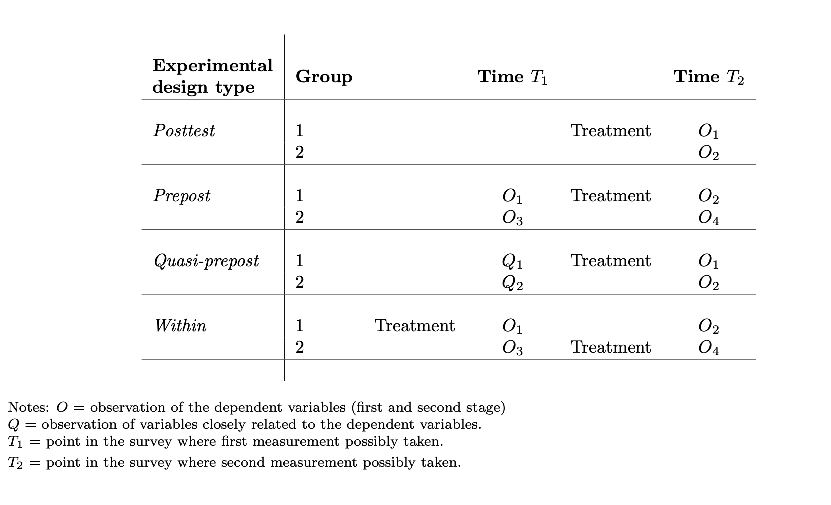

Figure 2 illustrates different experimental designs. Each group of two rows is one experiment, and each row represents a randomization branch within the experiment, denoted by groups 1 and 2. Treatment refers to when the respondent is exposed to treatment. Measurements of the dependent variables are represented by the letter O; Q denotes measurements of closely related but not identical variables. Note that the measurements O and Q can represent measurements of the first- or second-stage variables or both.

The first three experimental designs represent between-respondent designs. In the Posttest design, which is very standard, one group is exposed to treatment, the other one is not, and the dependent variables are measured after the treatment only. The dependent variables are measured twice, before and after the experiment, in the Prepost design. In the Quasi-prepost, the dependent variables are again measured before and after, using similar rather than identical elicitations. Furthermore, one can imagine variations on these designs for information and pedagogical experiments, where, e.g., first-stage variables are measured before and after (prepost or quasi-prepost) while second-stage variables are only measured after the treatment (posttest). The Within design subjects the two groups to the same treatment but at different points in time and measures the dependent variables twice (and at the same time) for both groups. A within-subject design makes the most sense with prior measurement of the outcome variable for at least one group (e.g., measurement O3 for group 2).

In general, eliciting posterior first-stage variables (after the treatment) is advisable. It is the only way to get an actual first stage of your treatment and see if it worked; and, if yes, by how much. Furthermore, it is often of interest per se to estimate the effects of information on these first-stage variables (e.g., on knowledge), the direction and speed of learning, and the updating that people do.

There are also benefits of eliciting prior first-stage variables (before the treatment). First, this allows you to estimate heterogeneous treatment effects based on the prior value of the dependent variable. In particular, you will be able to check whether treatment effects are larger for those who, given their baseline values of the dependent variable, de facto received a larger shock from the treatment. It can also increase statistical power in conjunction with post-measures (this is true for the measurement of second-stage variables too).

Dependent second-stage variables always have to be measured (at least) post-treatment. The question is whether you need to measure them pre-treatment too. Pre-treatment measures can add precision since they allow you to filter out an individual fixed effect and the tendency of a respondent to respond in a given way. As a first pass, a substitute is, of course, to control for covariates (measured pre-treatment only ideally) that are relevant.

Yet, for both first- and second-stage variables, there are concerns about asking twice: i) “consistency pressures” may prompt the respondents to answer similarly pre-and post-treatment. Yet, it is possible to ask similar, but not identical, questions to avoid making the inconsistency salient and to vary the question format. ii) Asking “twice” about the same thing may also lead to more experimenter demand or social desirability bias if it makes the respondent more aware of the topic of the experiment. iii) Related to this, the biggest worry is perhaps that, by asking these questions, you are already priming respondents to think about the topic, and priming in itself may not be neutral. iv) More elicitations also mean more time commitment for the respondents, increasing survey fatigue and cognitive load and potentially leading to the problems discussed in Section 3. The tradeoff will generally depend on the topic and on how sensitive and prone to priming, experimenter demand, and social desirability bias it is. If performing a prior measurement, it may be advisable to use similar but not identical questions.

Some of the benefits and shortcomings of the within-subject design, since it often goes hand-in-hand with measuring dependent variables before and after the treatment for at least some respondents, are the same as for the elicitations just discussed (e.g., they increase statistical power). In addition, a within-subject design lets you control for time and duration effects or order effects in the survey itself. In Figure 2, if the order of conditions were not randomly assigned, there would not be two distinct experimental groups, and any effect of time or repeated measurement of the dependent variable would be confounded with the treatment. Because respondents receive multiple treatments, they may require smaller samples to achieve sufficient power.

For any of these designs, a good elicitation of first- and second-stage variables goes through proper question design, as explained in Section 4.

###### 6.2 Priming treatments

Priming treatments activate mental concepts or mindsets through subtle situational cues. Typical priming techniques include actively prompting subjects to think about specific concepts or, more subtly, subjecting them to visual or other stimuli. Researchers can use priming to measure implicit attitudes without the respondent knowing what is being measured. This lack of awareness makes measured effects less likely to be distorted by the biases described in Section 5. In the context of priming experiments, the goal is to trigger the relative salience of a concept and mindset to measure its causal effect on outcome variables of interest. Priming treatments can extract relationships between different constructs even when the respondent may not be aware these relationships exist. Cohn and Mar´echal (2016) review the literature on priming in economics, and Bargh and Chartrand (2014) offer a theoretical framework and review the literature in psychology.

Mechanism and theoretical aspects. Priming can change the relative weight (or salience) individuals attach to the primed concept at a given moment (Cohn and Mar´echal, 2016). Hence, priming acts differently from more explicit treatments such as information treatments, since it exploits a subconscious exogenous increase in salience with respect to the primed element. Often, priming is concerned with unintended effects of environmental forces on feelings, behaviors, and attitudes, which individuals may not be aware of. Following Bargh and Chartrand (2014), experiments can focus on: i) conceptual priming, which activates mental concepts in one context so as to induce mental representations that are used subconsciously in subsequent contexts, or on ii) mindset priming, which primes a given way of or procedure for thinking (i.e., a “mindset”) by having the participant actively use that procedure. For instance, Cohn et al. (2015) prime financial professionals to think in a risk-averse way (a risk-averse mindset), while Alesina et al. (2022) prime respondents to think about immigration (a concept). Some experiments prime “identity” by highlighting specific groups the respondent is part of.

Two channels through which priming works are accessibility, i.e., by making some features more salient, knowledge stored in memory can be reactivated for a judgment task, and applicability, the degree to which the presented stimulus or stored knowledge is perceived as applicable to another context (Althaus and Kim, 2006). Scheufele (2000) describes the theoretical difference between priming and framing, arguing that the former works through the channel of accessibility, while the latter works through prospect theory (i.e., leading to a different cognitive scheme to interpret the issue). For instance, framing may change the criteria according to which a policy is judged.

An important distinction to keep in mind when priming is that certain dimensions may be contextdependent, while others are hardwired in how we think. This can explain why certain priming interventions work (as they act on the dimensions that are context-dependent) and others do not (as they act on those that are hardwired). In other words, certain dimensions of our thinking, identity, or mindset are already salient before the priming treatment. If the treatment tries to emphasize them, it may be difficult to detect an additional effect. If the treatment tries to dampen them, it may not produce meaningful change.

Types of priming. Priming can rely on different textual, audio, or visual modes. Some types of priming techniques used in the literature include:

- • Slanted questions. Kuziemko et al. (2015) prime respondents to think negatively about the government by asking them questions about issues they dislike, such as the Citizens United Campaign or the Wall Street bailout. Stantcheva (2022) primes respondents to think about their benefits and costs from international trade as consumers versus employees, by asking them a series of questions about how trade has impacted their consumption and labor market experience.
- • Order randomization/changing order of questions. This is done for instance in Alesina et al.

(2022), who randomize the order in which respondents are asked questions about immigrants versus questions about redistribution to test the effect of immigration perceptions on views on redistribution.

- • Use of words or names with different connotations. One method of priming is presenting respondents with hypothetical scenarios, in which the names of the people are varied. Names are chosen so as to evoke specific ethnicities or nationalities (e.g., Alesina et al. (2022) randomize the name of immigrants used in hypothetical examples). One can also use words with different connotations, without the respondent being aware of this. For instance, Merolla et al. (2013) test whether support for the DREAM act and birthright citizenship changes when the questions refer to immigrants as “unauthorized,” “undocumented,” or “illegal.”
- • Varying the illustrations and images shown alongside the information. Another priming method involves showing respondents the same information, but with different illustrations. For instance, Kuziemko et al. (2015) provide respondents with information about the (low) share of households who pay the estate tax. However, respondents who receive this information are split into two treatment groups. One group has a picture of a mansion on the page, alongside the information, while the other does not (see Appendix Figure A-8). Thus, respondents who see the mansion picture are primed to think about the lifestyles of the wealthy, while also receiving information, and the differential treatment effect between these two groups can be attributed to that prime. Brader et al. (2008) prime the racial identity of immigrants by presenting respondents with a pseudo-article from the New York Times about an immigrant, varying the appearance of the immigrant depicted in the picture that accompanies the article.
- • Priming through images. Specific images can be used to prime respondents. For instance, Israel et al. (2014) prompts respondents to think about vacation or old age using images and text. Their goal is to influence respondents’ time preferences and discount rates. Vacation scenes tilt time preferences towards the present, while pictures of old age increase the discount factor.
- • Priming through videos. Videos can prime respondents as well, sometimes in an immersive way. For example, Guiso et al. (2018) make respondents watch a horror movie to test whether fear increases risk aversion.

Note that, with some of these techniques, it may be difficult to disentangle the effect of priming from that of information provision. A prime should ideally not lead to any learning or belief updating, since it would then be impossible to disentangle the effect of the prime from the effect of the new information. It is also possible to probe whether respondents are aware of the prime at the end of the survey, by asking them about their perceived purpose of the survey and whether they noticed links between different parts. Appendix A-4.1 provides examples of papers using different priming techniques in survey experiments. There is a bit of recent controversy on the soundness of priming studies in the cognitive psychology literature (see Appendix A-4.1).

###### 6.3 Information and pedagogical treatments

Information provision experiments exogenously change the information sets of respondents. Pedagogical treatments are closely related but go beyond providing information and facts and provide explanations and statements of how something works. For instance, Stantcheva (2021) explains to respondents how progressive taxes impact different people and what their efficiency costs are; Dechezleprˆetre et al. (2022) provide explanations of how three critical policies to fight climate change can reduce emissions and benefit households with different income levels; Stantcheva (2022) provides treatments to respondents explaining the impacts of trade and trade policy on consumers and workers. Information or pedagogical treatments typically allow testing for the effects of specific information on outcomes, such as policy views or individual choices. They permit studying the impact of correcting misperceptions and checking belief updating.

Types of information and pedagogical treatments. There are many different types of information and pedagogical treatments. Appendix A-4.2 provides a review and examples of papers using these various methods.

- • Quantitative information. Quantitative information can be precise and clear and minimize differences in interpretation across respondents. Yet, such treatments may be harder to understand and less appealing to respondents. For instance, Alesina et al. (2022) tell respondents in one treatment group the share of immigrants in their country and compare it to the share of immigrants in the countries with the highest and lowest immigrant shares in the OECD. Alesina et al. (2021) show respondents the evolution of the earnings gap between a Black man and a white man since the 1970s.
- • Qualitative information. Treatments can provide more qualitative information, sometimes more effective than exact numbers and better suited to the question you are trying to answer. Qualitative information can also help make the treatment more homogeneous when doing an experiment in several countries or settings. For instance, Alesina et al. (2018) show respondents from five countries an animation on the lack of social mobility in their country. Without giving exact numbers, the treatment nevertheless gives the impression that few children born in the bottom of the distribution will move up in position.
- • Anecdotes, stories, and narratives. Treatments can also take the form of anecdotes, stories, or narratives. For instance, Alesina et al. (2022) show respondents in one of the treatment groups an animation about a “day in the life” of a hardworking immigrant. Alesina et al. (2021) show a group of respondents a video about the differences in opportunities of a white child and a Black child and use it to explain the deeper historical roots and consequences of systemic racism.

Pedagogical treatments may provide a mix of these types of content. For instance, an explanation may be bolstered by some concrete numbers and an example anecdote.

Form of the treatment. These treatments can be done through different media, including text, images, audio, videos, interactive exercises, and combinations of these.

Additional dimensions of the treatment. There are some more variations in treatments to consider.

- • Source of the information. Think about whether and how you want to inform respondents about the sources of the information. In some cases, it could increase the credibility of your information. The source per se may be part of the treatment and have its own effect. Indeed, there is evidence that the identity of the “sender” of information in experiments matters (see a review of papers in Appendix A-4.2).
- • Information specific to the respondent. You can also adapt the content of the treatments to be targeted to respondents, which can generate more attention and interest and be well-suited for some questions. Kuziemko et al. (2015) show respondents where they would have been in the income distribution had inequality not increased since the 1980s. Hvidberg et al. (2021) shows respondents where they rank in the income distributions of several reference groups, such as their neighbors or people with the same level of education.

Methodological issues. There are some methodological issues to pay attention to when running information and pedagogical treatments.

- • The treatment should be relatively short. If it is a video or animation, do not force respondents to watch it before they are able to move on from the page. If you do this, some inattentive respondents may simply do something else while the video is running, and you will not be able to control for those who skip the treatment. Instead, encourage respondents to watch it and record the time spent on the page so that you can account for those that carelessly rushed through the treatment.
- • Focus extensively on the design of your treatment, including the content and the format. Good graphics and appealing visual presentation are critical, especially given the quality of images, videos, or audio that people see every day on the web or social media. A treatment that appears poorly or non-professionally designed may generate negative reactions unrelated to the content.20
- • The treatment should have a neutral tone (even if the information itself may not be neutral) and be easily understandable so as to avoid priming, EDE, and SDB.
- • You have to be mindful of the tradeoff between respondents’ time and patience and the length and content of your treatment. For instance, videos take time to watch but can be vivid and powerful. Animations with text can be quicker to read and watch and can also be effective. Sometimes, simple text is enough to convey important information. For example, Kuziemko et al. (2015) simply tell respondents the share of people who pay the estate tax and show that this information significantly increases support for it.
- • The more sophisticated your design, the harder it may become to avoid violating information equivalence and priming your respondents on some other dimension. For instance, if you want to convey information with videos that include people, the appearance and perceived identity of people may not be neutral. The same goes for images or audio, as explained in the section on priming treatments (Section 6.2).
- • It is critical to elicit beliefs, perceptions, attitudes, and other first- and second-stage variables properly, which highlights the importance of the discussions around measurement from Section 4.4. Furthermore, you must adapt your belief elicitation to your treatment. For instance, asking only qualitative questions when the treatment conveys quantitative information may not be appropriate. Multiple measurements for your key variables are desirable.
- • Updating versus priming: Ideally, you want to ensure that your treatment works through updating of beliefs and perceptions and not through mere priming (see Section 6.2). Common methods to mitigate concerns about priming include i) measuring the first-stage variables (which your treatment manipulates) prior to the experiment in both the treatment and control group, which ensures that both groups are similarly primed on the topic of interest; ii) introducing some separation between the experimental information or explanation provision and the elicitation of your dependent variables to ensure that short-term priming effects have dissipated. One possibility is to elicit your outcomes of interest in a follow-up survey rather than at the same time as the treatment. Because recontacting respondents can be difficult (see Section 6.5), you can alternatively try to space out the experiment and the elicitation of outcomes in your survey; and (iii) including an “active control group” as described in more detail below.
- • You can check whether respondents understood your treatment by using comprehension check questions. These questions should be adapted to address the key pieces of information in your treatment. For instance, there is no need to make them too difficult and ask about an exact number, if all that matters is that respondents got a general sense of the magnitudes. However, such questions are likely to signal to respondents the topic you are studying and the effects you may be interested in. Therefore,

20Projects done ten years ago may have been very well-designed for the standards of the time, but these standards change very fast!

it may be a good idea to place them towards the end of your survey, or at least after eliciting your outcomes of interest.

Active versus passive control groups. An active control group is a control group that receives different information on the topic of interest than the treatment group(s) (see, e.g., Bottan and Perez-Truglia (2022) who provide medical residents information on their ranking in the income distribution in different cities using two different data sources). Because providing information takes time and attention and may generate emotions or thoughts that are not simply due to the information content, an active treatment group may offer a better comparison than a passive control group (that sees no information). Furthermore, since different respondents receive different information, there may be more variation caused by the treatment even for those with more accurate priors (i.e., the different treatments may shift the perceptions or beliefs of different people, with more or less accurate priors). The difficulty in using active control groups is that the information received is not neutral, so you cannot estimate the effect of the treatment group’s information per se, which may be your goal. In addition, it may not be possible to find information that is both different enough and yet truthful on the same variable of interest.

Related to this, you could have a “mock” treatment group that would see some unrelated information in order to make the total survey duration identical for the control and treatment groups (different from an active control group that receives different information on the same topic). It is essential, however, that the information of the mock control group is truly neutral concerning the issue of interest, which can be difficult.

###### 6.4 Factorial experiments: vignette and conjoint designs

Often also described as vignette experiments or conjoint designs, factorial experiments experimentally vary attributes and factors in hypothetical situations. A common design involves asking respondents to make normative judgments or hypothetical decisions in situations described in “vignettes” within which attributes and factors vary experimentally. The randomized variation of these attributes allows estimating their causal effect on responses.21

Types of factorial designs. Although the terminology is not clear-cut, factorial experiments can typically come in two formats. Vignettes are short descriptions or stories that vary across experimental conditions only along key factors of interest. They can be simple paragraphs of text describing people or situations but can also involve much more creative designs and media formats like images and videos. Conjoint designs often refer to tables or list descriptions of people and situations that only show attributes and their levels and avoid additional text. They are thus more direct, do not focus on storytelling, and can make specific features very salient. Both vignettes and conjoint designs can be in the form of “simple designs” (presenting a single profile or situation) or “paired designs” (presenting two profiles, which the respondent needs to rate or rank). Appendix Figure A-9 provides examples of single and paired vignette and conjoint designs.

Factorial designs can be compelling as they allow you to examine the overall effects of a factor and its impact when presented in combination with other factors. Factorial designs are multiplicative (e.g., they can show combinations of attributes such as race and gender). They can also have high statistical power, as a small number of participants can evaluate many vignettes.

Benefits and challenges. One benefit of factorial designs is that they can present realistic, albeit hypothetical, scenarios. They can manipulate the effects of interest and present more complex scenarios while providing experimental variation. They allow us to test multiple hypotheses at once and to test for the effects of multiple treatment components separately, giving room to more complex behavioral explanations.

Another benefit is that factorial designs may limit the likelihood of social desirability bias. When several (sometimes many) dimensions vary, it may be harder for respondents to know what is being sought after. In that sense, a conjoint design that lists characteristics may be more prone to social desirability bias than vignettes, where characteristics can be smoothly hidden in stories.

21The use of a different type of vignettes, namely “anchoring vignettes,” is discussed in Section 4.

One challenge of factorial designs is external validity. Would people make similar choices in “real life” as in hypothetical scenarios? Reassuringly, Hainmueller et al. (2015) compare the results from different conjoint and vignette designs with data from a referendum on giving foreign residents citizenship in Switzerland. They find that paired designs perform better in terms of predicting real-world voting. One possible explanation is that they lead to higher engagement, increase immersion, and reduce satisficing. A challenge is also the cognitive processes involved in these experiments, which may differ from those in everyday settings. Respondents simultaneously see different pieces of information that they may not otherwise see so clearly in everyday settings. This can also cause cognitive overload.

Furthermore, because the experiments are supposed to represent hypothetical but real-life scenarios, researchers must be careful to conceptually and theoretically specify all relevant dimensions to the situation and not omit any. A frequent criticism of vignette designs is that they miss important factors relevant to people’s choices. At the same time, the number of cases in factorial designs can quickly become large since they are multiplicative.

Design issues and practical recommendations. Some practical recommendations are useful for designing factorial experiments.

- • Avoid implausible combinations. When varying many attributes mechanically, some implausible combinations will arise but should be excluded (e.g., asking about a 30-year-old job seeker with 20 years of labor market experience).
- • Keeping cognitive load manageable. Factorial designs can get tiring for respondents. Therefore, you need to keep the number of factors tested manageable and stick to a reasonable number of tasks (i.e., the number of vignettes or conjoint choices a respondent needs to make). There is no hard rule here, and it will depend on how long the rest of your survey and each vignette are.22
- • Randomizing conditions. There are some decisions to make when designing the randomization of the vignettes or conjoint designs. Pure randomization is typically not ideal for experiments with many experimental conditions and where respondents are asked to make many choices. More often, there are ways to create different sets of conditions with better statistical and practical properties. For instance, one can create different sets of conditions to avoid having a respondent rate the same condition multiple times or only receiving randomizations along one dimension. “D-efficient” designs chose the sets of administered conditions that maximize statistical power.23
- • Randomization of attribute order. Within each vignette or conjoint design, you can randomize the order of attributes to control for order effects. It is better to do this at the respondent level rather than the question level to avoid cognitive overload (the respondent has to find information in different orders in each task).
- • Advantages of table formats. Table formats have some advantages: they allow to potentially randomize the order in which attributes are presented on a page in a way that natural running text cannot easily do. They may also be clearer and less tiring to read, especially if respondents are asked to perform many choice tasks. For a comparison between the single versus paired vignette and conjoint tables, see Hainmueller et al. (2015).
- • Within-respondent design. In general, it is not advisable to have a pure between-person design, where each person only sees one vignette or conjoint design. Instead, the within-person design lets you control for respondent fixed effects.
- • Mixed designs. In mixed designs, different groups of respondents will see different groups of vignettes. You can then make comparisons across respondents (since they see the same set) and also within respondents.

22Bansak et al. (2018) find that response quality does not degrade up to 30 tasks in MTurk data. 23The reasons for using D-optimal designs instead of standard classical designs generally fall into two categories: standard

factorial designs require too many combinations for the amount of resources or time allowed for the experiment, and the design space is constrained (i.e., there are combinations of attributes that are not feasible or undesirable).

- • Improve the level of immersion of respondents by using the appropriate media. Text is simple and may be the best choice in some settings. Images, animations, and videos can help in other settings.
- • Choose the right attributes. To avoid omitting essential variables, one can either focus on an attribute-driven approach, selecting features that are orthogonal to each other or focusing on actual profile classes that are documented in the real world.
- • Choose the setting. Particularly for vignettes, asking hypothetical questions about a setting close to a real-world environment can help participants to feel more immersed and thus avoid satisficing.

Causal Identification. Techniques to analyze the experimental results from vignettes include variance decomposition such as ANOVA or multilevel modeling (see Steiner et al. (2017)). One commonly used quantity of interest in the conjoint analysis is the average marginal component effect (AMCE), which represents the causal effect of changing one profile attribute while averaging over the distribution of the remaining profile attributes (Hainmueller et al., 2014). For instance, a researcher may be interested in the AMCE of an immigrant’s ethnicity that averages over the distribution of other immigrant characteristics such as age, education, or country of origin. Averaging over the distribution of other attributes can be more practical than conditioning on their specific values if many attributes are considered. However, the AMCE critically depends on the distribution used to average over profile attributes. Appendix A-4.3 reviews some methodological issues related to identification in factorial experiments.

###### 6.5 Follow-up surveys and persistence

When doing survey experiments, you may worry that the treatment effects are temporary and will not persist. Treatment effects can dissipate for several reasons. Most worrying is that the estimated initial impact could have been due to EDE or SDB. The techniques in Sections 5.5 and 5.3 can alleviate some of these worries. Perhaps respondents forget a treatment that is not particularly salient or interesting. Or maybe, for topics encountered frequently in daily life, there are other countervailing forces that dampen or even counter the treatment’s effect. In principle, the persistence of treatment effects can be assessed using follow-up surveys, where members of the original sample are re-contacted and asked questions related to the dependent variables of interest, without administering the treatment again.

The degree of persistence of an experiment will depend on its type. Priming treatments’ effects which simply change the (momentary) accessibility or salience of some beliefs are likely to dissipate back quickly. Factorial studies have a different goal (namely understanding the marginal effect of one or several specific features on a certain outcome in complex issues) and, per se, do not try to convey new content to the respondent (unless combined with an information or pedagogical experiment). Persistence is thus perhaps most relevant for information and pedagogical experiments. In this case, we may expect the effect to persist more if the initial treatment is more powerful and interesting enough to the respondent and if it has wider applicability, i.e., provides content that is usable in more situations. A follow-up can be useful to test for persistence, but will not easily uncover the reasons why a treatment effect persists or not.

Recontacting the same respondents can be challenging, and the success rates will depend on the platform you use. Table 3 reviews recontact rates across different studies and platforms and the persistence of treatment effects. Recontact rates differ drastically depending on the survey channel and the time between the first survey and the follow-up. Typically, to maximize recontact rates, you should think about increasing the incentives and offering extra rewards for people to take your follow-up survey (many commercial survey companies will do this), as well as making it as short as possible.

Design of a follow-up survey. While the follow-up survey design broadly follows the guidelines already described here, there are two issues to pay attention to.

• Questions. The questions that are asked to assess the persistence of the effect should be identical to the original ones to avoid measurement error. If respondents are aware of their purpose, this may re-create experimenter demand effects and produce biased estimates.24

24One can run an obfuscated follow-up (as Haaland and Roth (2020) do) to hide the connection with the main survey.

• Differential Attrition. Especially when the recontact rate is low, there could be differential selection in the follow-up, causing problems similar to differential attrition (see Section 2.5 for a discussion of attrition). The same best practice tips and possible corrections as in Section 2.6 also apply to follow-up surveys.

#### 7 Conclusion

Surveys offer a unique opportunity to dive into people’s minds to better understand how their reasoning, the things they care about, and their preferences. To ensure high data quality and reliable results, it is key to focus on proper design, sampling, and analysis. This paper offered some practical recommendations for each step of the survey process that can hopefully help researchers across different fields make use of this valuable approach to research.

#### References

Abbey, J. D. and M. G. Meloy (2017). Attention by Design: Using Attention Checks to Detect Inattentive Respondents and Improve Data Quality. Journal of Operations Management 53-56, 63–70. Alesina, A., M. F. Ferroni, and S. Stantcheva (2021). Perceptions of Racial Gaps, Their Causes, and Ways to Reduce Them. NBER Working Paper 29245. National Bureau of Economic Research. Alesina, A., A. Miano, and S. Stantcheva (2022). Immigration and Redistribution. The Review of Economic Studies. Alesina, A., S. Stantcheva, and E. Teso (2018). Intergenerational Mobility and Preferences for Redistribution. American Economic Review 108(2), 521–554. Allcott, H. and D. Taubinsky (2015). Evaluating Behaviorally Motivated Policy: Experimental Evidence from the Lightbulb Market. American Economic Review 105(8), 2501–2538.

Alm˚as, I., A. W. Cappelen, and B. Tungodden (2020). Cutthroat Capitalism versus Cuddly Socialism: Are Americans More Meritocratic and Efficiency-Seeking than Scandinavians? Journal of Political Economy 128(5), 1753–1788.

Althaus, S. L. and Y. M. Kim (2006). Priming Effects in Complex Information Environments: Reassessing the Impact of News Discourse on Presidential Approval. The Journal of Politics 68(4), 960–976. Andridge, R. R. and R. J. A. Little (2010). A Review of Hot Deck Imputation for Survey Non-response. International statistical review 78(1), 40–64. Bailey, M. A., D. J. Hopkins, and T. Rogers (2016). Unresponsive and Unpersuaded: The Unintended Consequences of a Voter Persuasion Effort. Political Behavior 38(3), 713–746. Bansak, K., J. Hainmueller, D. J. Hopkins, and T. Yamamoto (2018). The Number of Choice Tasks and Survey Satisficing in Conjoint Experiments. Political Analysis 26(1), 112–119. Bargh, J. A. and T. L. Chartrand (2014). The Mind in the Middle: A Practical Guide to Priming and Automaticity Research (2 ed.)., pp. 311–344. Cambridge University Press. Behaghel, L., B. Cr´epon, M. Gurgand, and T. L. Barbanchon (2015). Please Call Again: Correcting Nonresponse Bias in Treatment Effect Model. The Review of Economics and Statistics 97(5), 1070–1080.

Belli, R. F., M. W. Traugott, M. Young, and K. A. McGonagle (1999). Reducing Vote Overreporting in Surveys: Social Desirability, Memory Failure, and Source Monitoring. Public Opinion Quarterly 63(1), 90–108.

Berinsky, A. J., G. A. Huber, and G. S. Lenz (2012). Evaluating Online Labor Markets for Experimental Research: Amazon.com’s Mechanical Turk. Political Analysis 20(3), 351–368.

Berinsky, A. J., M. F. Margolis, and M. W. Sances (2014). Separating the Shirkers from the Workers? Making Sure Respondents Pay Attention on Self-Administered Surveys. American Journal of Political Science 58(3), 739–753.

Berinsky, A. J., M. F. Margolis, and M. W. Sances (2016). Can We Turn Shirkers into Workers? Journal of Experimental Social Psychology 66, 20–28. Billiet, J. and E. Davidov (2008). Testing the stability of an acquiescence style factor behind two interrelated substantive variables in a panel design. Sociological Methods & Research 36, 542–562.

Billiet, J. B. and M. J. McClendon (2000). Modeling Acquiescence in Measurement Models for Two Balanced Sets of Items. Structural Equation Modeling 7(4), 608–628. Blair, G., K. Imai, and Y.-Y. Zhou (2015). Design and Analysis of the Randomized Response Technique.

Journal of the American Statistical Association 110(511), 1304–1319. Bogner, K. and U. Landrock (2016). Response Biases in Standardised Surveys. GESIS Survey Guidelines. Boruch, R. F. and J. S. Cecil (1979). Assuring the Confidentiality of Social Research Data. University of

Pennsylvania Press. Bottan, N. L. and R. Perez-Truglia (2022). Choosing your Pond: Location Choices and Relative Income. Review of Economics and Statistics 104(5), 1010–1027.

Brader, T., N. A. Valentino, and E. Suhay (2008). What Triggers Public Opposition to Immigration? Anxiety, Group Cues, and Immigration Threat. American Journal of Political Science 52(4), 959–978. Brehm, J. (1993). The Phantom Respondents: Opinion Surveys and Political Representation. University of

Michigan Press. Bullock, J. G., A. S. Gerber, S. J. Hill, and A. Huber (2015). Partisan Bias in Factual Beliefs about Politics. Quarterly Journal of Political Science 10(4), 60. Bursztyn, L., I. K. Haaland, A. Rao, and C. P. Roth (2020). Disguising Prejudice: Popular Rationales as

Excuses for Intolerant Expression. NBER Working Paper 27288. National Bureau of Economic Research. Byrne, B. M. (1989). Multigroup Comparisons and the Assumption of Equivalent Construct Validity Across

Groups: Methodological and Substantive Issues. Multivariate Behavioral Research 24(4), 503–523. Byrne, B. M., R. J. Shavelson, and B. Muth´en (1989). Testing for the Equivalence of Factor Covariance and

Mean Structures: the Issue of Partial Measurement Invariance. Psychological bulletin 105(3), 456. Census Bureau (2019). Counting the Hard to Count in a Census: Select Topics in International Censuses. Cheung, G. W. and R. B. Rensvold (2000). Assessing Extreme and Acquiescence Response Sets in Cross-

cultural Research Using Structural Equations Modeling. Journal of cross-cultural psychology 31(2), 187– 212.

Clifford, S., G. Sheagley, and S. Piston (2021). Increasing Precision without Altering Treatment Effects: Repeated Measures Designs in Survey Experiments. American Political Science Review 115(3), 1048–1065.

Coffman, K. B., L. C. Coffman, and K. M. M. Ericson (2017). The Size of the LGBT Population and the Magnitude of Antigay Sentiment Are Substantially Underestimated. Management Science 63(10), 3168–3186.

Cohn, A., J. Engelmann, E. Fehr, and M. A. Mar´echal (2015). Evidence for Countercyclical Risk Aversion: An Experiment with Financial Professionals. The American Economic Review 105(2), 860–885. Cohn, A. and M. A. Mar´echal (2016). Priming in Economics. Current Opinion in Psychology 12, 17–21. Social priming. Curran, P. G. (2016). Methods for the Detection of Carelessly Invalid Responses in Survey Data. Journal of Experimental Social Psychology 66, 4–19. Rigorous and Replicable Methods in Social Psychology. Dafoe, A., B. Zhang, and D. Caughey (2018). Information Equivalence in Survey Experiments. Political Analysis 26(4), 399–416.

De Jong, M. G., J.-B. E. Steenkamp, J.-P. Fox, and H. Baumgartner (2008). Using Item Response Theory to Measure Extreme Response Style in Marketing Research: A Global Investigation. Journal of Marketing Research 45(1), 104–115.

Dechezlepreˆtre, A., A. Fabre, T. Kruse, B. Planterose, A. Sanchez Chico, and S. Stantcheva (2022). Fighting Climate Change: International Attitudes Toward Climate Policies. NBER Working Paper No. 30265. National Bureau of Economic Research.

Dillman, D., J. Smyth, and L. Christian (2014). Internet, Phone, Mail, and Mixed-Mode Surveys: The Tailored Design Method. John Wiley & Sons, Incorporated. Dutz, D., I. Huitfeldt, S. Lacouture, M. Mogstad, A. Torgovitsky, and W. van Dijk (2021). Selection in Surveys. NBER Working Paper No. 29549. National Bureau of Economic Research. Epper, T., E. Fehr, H. Fehr-Duda, C. T. Kreiner, D. D. Lassen, S. Leth-Petersen, and G. N. Rasmussen

(2020). Time Discounting and Wealth Inequality. American Economic Review 110(4), 1177–1205. Ferrario, B. and S. Stantcheva (2022). Eliciting People’s First-Order Concerns: Text Analysis of Open-Ended Survey Questions. AEA Papers and Proceedings 112, 163–169.

Fisman, R., K. Gladstone, I. Kuziemko, and S. Naidu (2020). Do Americans Want to Tax Wealth? Evidence from Online Surveys. Journal of Public Economics 188, 104207. Fitzgerald, J., P. Gottschalk, and R. Moffitt (1998). An Analysis of Sample Attrition in Panel Data: The Michigan Panel Study of Income Dynamics. The Journal of Human Resources 33(2), 251–299. Gelman, A. and T. C. Little (1997). Poststratification Into Many Categories Using Hierarchical Logistic Regression. Survey Methodology 23(2). Gillen, B., E. Snowberg, and L. Yariv (2019). Experimenting with Measurement Error: Techniques with Applications to the Caltech Cohort Study. Journal of Political Economy 127(4), 38. Glynn, A. N. (2013). What Can We Learn with Statistical Truth Serum?: Design and Analysis of the List Experiment. Public Opinion Quarterly 77(S1), 159–172.

Greenberg, B. G., A.-L. A. Abul-Ela, W. R. Simmons, and D. G. Horvitz (1969). The Unrelated Question Randomized Response Model: Theoretical Framework. Journal of the American Statistical Association 64(326), 520–539.

Guiso, L., P. Sapienza, and L. Zingales (2018). Time Varying Risk Aversion. Journal of Financial Economics 128(3), 403–421.

- Haaland, I. and C. Roth (2020). Labor Market Concerns and Support for Immigration. Journal of Public Economics 191, 104256.
- Haaland, I. and C. Roth (2021). Beliefs about racial discrimination and support for pro-black policies. The Review of Economics and Statistics, 1–38.

Haaland, I., C. Roth, and J. Wohlfart (2020). Designing Information Provision Experiments. SSRN Scholarly Paper ID 3638879, Social Science Research Network.

Hainmueller, J., D. Hangartner, and T. Yamamoto (2015). Validating Vignette and Conjoint Survey Experiments Against Real-World Behavior. Proceedings of the National Academy of Sciences 112(8), 2395–2400.

Hainmueller, J., D. J. Hopkins, and T. Yamamoto (2014). Causal Inference in Conjoint Analysis: Understanding Multidimensional Choices via Stated Preference Experiments. Political Analysis 22(1), 1–30. Heckman, J. J. (1979). Sample Selection Bias as a Specification Error. Econometrica 47(1), 153–161. Heen, M., J. D. Lieberman, and T. D. Meithe (2020). A Comparison of Different Online Sampling Approaches

for Generating National Samples. UNLV Center for Crime and Justice Policy. Holt, D. and T. M. F. Smith (1979). Post Stratification. Journal of the Royal Statistical Society. Series A (General) 142(1), 33–46. Horowitz, J. L. and C. F. Manski (2000). Nonparametric Analysis of Randomized Experiments with Missing Covariate and Outcome Data. Journal of the American Statistical Association 95(449), 77–84. Hvidberg, K. B., C. Kreiner, and S. Stantcheva (2021). Social Position and Fairness Views. NBER Working Paper 28099. National Bureau of Economic Research. Imbens, G. W. and J. M. Wooldridge (2009). Recent Developments in the Econometrics of Program Evaluation. Journal of Economic Literature 47(1), 5–86.

Israel, A., M. Rosenboim, and T. Shavit (2014). Using Priming Manipulations to Affect Time Preferences and Risk Aversion: An Experimental Study. Journal of Behavioral and Experimental Economics 53, 36–43.

Johnson, T., P. Kulesa, Y. I. Cho, and S. Shavitt (2005). The Relation Between Culture and Response

Styles: Evidence from 19 Countries. Journal of Cross-cultural psychology 36(2), 264–277. J¨reskog, K. G. (2005). Structural Equation Modeling with Ordinal Variables Using LISREL. Kalton, G. (1983). Introduction to Survey Sampling. SAGE Publications, Inc. Kalton, G. and I. Flores-Cervantes (2003). Weighting Methods. Journal of Official Statistics 19(2), 81–97. Kane, J. V. and J. Barabas (2019). No Harm in Checking: Using Factual Manipulation Checks to Assess

Attentiveness in Experiments. American Journal of Political Science 63(1), 234–249. Karadja, M., J. Mollerstrom, and D. Seim (2017). Richer (and Holier) than Thou? The effect of Relative

Income Improvements on Demand for Redistribution. Review of Economics and Statistics 99(2), 201–212. Kling, J. R., J. B. Liebman, and L. F. Katz (2007). Experimental Analysis of Neighborhood Effects.

Econometrica 75(1), 83–119. Krosnick, J. A. (1999). Survey Research. Annual Review of Psychology 50(1), 537–567. Krosnick, J. A. and D. F. Alwin (1987). An Evaluation of a Cognitive Theory of Response-Order Effects in

Survey Measurement. The Public Opinion Quarterly 51(2), 201–219.

Krosnick, J. A., S. Narayan, and W. R. Smith (1996). Satisficing in Surveys: Initial Evidence. New Directions for Evaluation 1996, 29–44. Krupnikov, Y., S. Piston, and N. M. Bauer (2016). Saving Face: Identifying Voter Responses to Black

Candidates and Female Candidates. Political Psychology 37(2), 253–273. Kuk, A. (1990). Asking Sensitive Questions Indirectly. Biometrika 77(2), 436–438. Kuziemko, I., M. Norton, E. Saez, and S. Stantcheva (2015). How Elastic Are Preferences for Redistribution?

Evidence from Randomized Survey Experiments. American Economic Review 105(4), 1478–1508. Lee, D. S. (2009). Training, Wages, and Sample Selection: Estimating Sharp Bounds on Treatment Effects. Review of Economic Studies 76(3), 1071–1102. Link, S., A. Peichl, C. Roth, and J. Wohlfart (2022). Information Frictions among Firms and Households, CESifo No. 8969. CESifo Working Paper, 85. Little, R. J. A. (1986). Survey Nonresponse Adjustments for Estimates of Means. International Statistical Review 54(2), 139–157. Little, R. J. A. (1993). Post-Stratification: A Modeler’s Perspective. Journal of the American Statistical Association 88(423), 1001–1012. Little, R. J. A. and D. B. Rubin (2002). Statistical Analysis with Missing Data. Wiley Series in Probability and Statistics. New York: John Wiley & Sons, Incorporated. Luttmer, E. F. P. and A. A. Samwick (2018). The Welfare Cost of Perceived Policy Uncertainty: Evidence from Social Security. American Economic Review 108(2), 275–307. Meade, A. W. and S. B. Craig (2012). Identifying Careless Responses in Survey Data. Psychological Methods 17(3), 437–455.

Merolla, J., S. K. Ramakrishnan, and C. Haynes (2013). “Illegal,”“undocumented,” or “unauthorized”: Equivalency Frames, Issue Frames, and Public Opinion on Immigration. Perspectives on Politics 11(3), 789–807.

Miller, J. D. (1984). A New Survey Technique for Studying Deviant Behavior. Ph. D. thesis, George Washington University.

Morren, M., J. P. Gelissen, and J. K. Vermunt (2011). Dealing with Extreme Response Style in Cross-cultural Research: A Restricted Latent Class Factor Analysis Approach. Sociological Methodology 41(1), 13–47. Pasek, J. and J. Krosnick (2010). Optimizing Survey Questionnaire Design in Political Science: Insights

from Psychology. The Oxford Handbook of American Elections and Political Behavior. Persson, M. and M. Solevid (2014). Measuring Political Participation—Testing Social Desirability Bias in a Web-Survey Experiment. International Journal of Public Opinion Research 26, 98–112. Peterson, E. and S. Iyengar (2021). Partisan Gaps in Political Information and Information-Seeking Behavior: Motivated Reasoning or Cheerleading? American Journal of Political Science 65(1), 133–147. Pew Research Center (n.d.). Writing Survey Questions. Accessed September 7, 2022. https://www.pewresearch.org/our-methods/u-s-surveys/writing-survey-questions/.

Prior, M., G. Sood, K. Khanna, et al. (2015). You Cannot Be Serious: The Impact of Accuracy Incentives on Partisan Bias in Reports of Economic Perceptions. Quarterly Journal of Political Science 10(4), 489–518.

Raghavarao, D. and W. T. Federer (1979). Block Total Response as an Alternative to the Randomized Response Method in Surveys. Journal of the Royal Statistical Society: Series B (Methodological) 41(1), 40–45.

Scheufele, D. A. (2000). Agenda-Setting, Priming, and Framing Revisited: Another Look at Cognitive Effects of Political Communication. Mass communication & society 3(2-3), 297–316. Small, M. L. (2009). ’How Many Cases Do I Need?’ On Science and the Logic of Case Selection in Field-Based Research. Ethnography 10(1), 5–38. Smyth, J. D., D. A. Dillman, L. M. Christian, and M. J. Stern (2006). Comparing Check-All and ForcedChoice Question Formats in Web Surveys. Public Opinion Quarterly 70(1), 66–77.

- Stantcheva, S. (2021). Understanding Tax Policy: How do People Reason? The Quarterly Journal of Economics 136(4), 2309–2369.
- Stantcheva, S. (2022). Understanding of Trade. NBER Working Paper 30040. National Bureau of Economic Research.

Steiner, P., C. Atzm¨uller, and D. Su (2017). Designing Valid and Reliable Vignette Experiments for Survey Research: A Case Study on the Fair Gender Income Gap. Journal of Methods and Measurement in the Social Sciences 7(2), 52–94.

Warner, S. L. (1965). Randomized Response: A Survey Technique for Eliminating Evasive Answer Bias. Journal of the American Statistical Association 60(309), 63–69.

Weber, M., F. D’Acunto, Y. Gorodnichenko, and O. Coibion (2022). The Subjective Inflation Expectations of Households and Firms: Measurement, Determinants, and Implications. Journal of Economic Perspectives 36(3), 157–184.

Welkenhuysen-Gybels, J., J. Billiet, and B. Cambr´e (2003). Adjustment for Acquiescence in the Assessment of the Construct Equivalence of Likert-type Score Items. Journal of Cross-Cultural Psychology 34(6), 702–722.

Wooldridge, J. (2002a). Inverse Probability Weighted M-estimators for Sample Selection, Attrition, and Stratification. Portuguese Economic Journal 1, 117–139.

Wooldridge, J. M. (2002b). Sample Selection, Attrition, and Stratified Sampling (first ed.). The MIT Press. Wooldridge, J. M. (2007). Inverse probability weighted estimation for general missing data problems. Journal

of Econometrics 141(2), 1281–1301. Yu, J.-W., G.-L. Tian, and M.-L. Tang (2008). Two New Models for Survey Sampling with Sensitive Characteristic: Design and Analysis. Metrika 67(3), 251–263.

Zijlstra, W. P., L. A. van der Ark, and K. Sijtsma (2011). Outliers in Questionnaire Data: Can They Be Detected and Should They Be Removed? Journal of Educational and Behavioral Statistics 36(2), 186–212.

###### Figure 3: Ladder Visual Representation from Alesina et al. (2018)

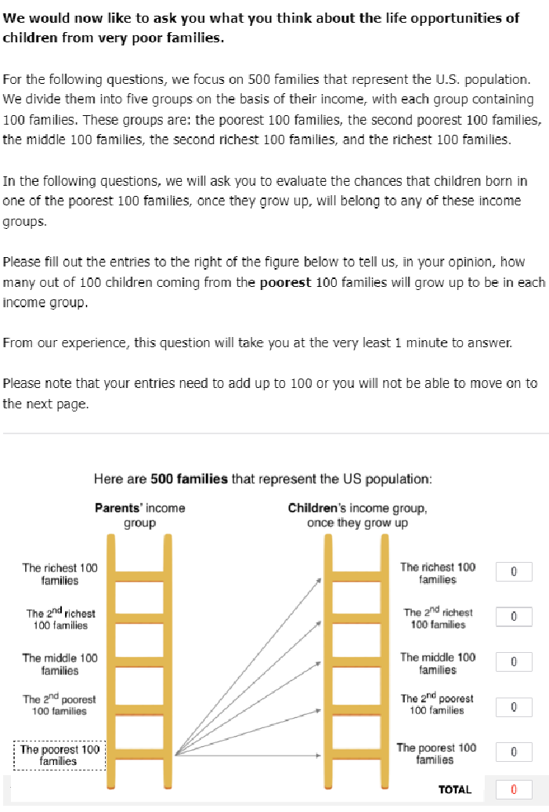

Note: The ladder in this figure is designed to help respondents visualize children’s mobility across the income distribution. In the empty boxes on the right of the ladders, respondents are asked to indicate how many children from the poorest 100 families can make it to each of the income quintiles when they grow up. The answers must add up to 100; if they do not, respondents receive an error message and are asked to correct them.

###### Figure 4: Probability elicitation question from Luttmer and Samwick (2018)

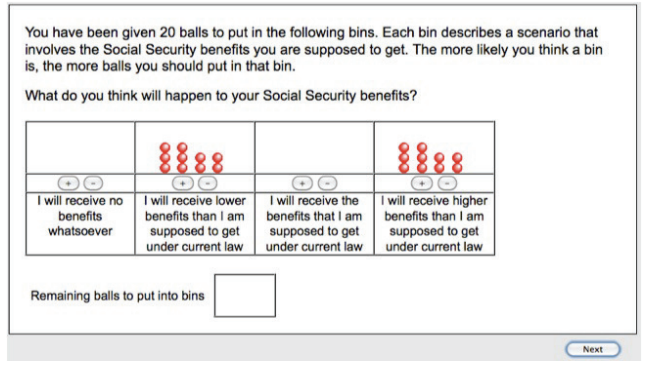

Note: This figure shows an exercise in which respondents are asked to place balls in bins to elicit a probability distribution. In this case, each ball represents a one in twenty chance that a specific social security benefit amount occurs.

Figure 5: Belief Elicitation (left) and Information Treatment (right), from Hvidberg et al. (2021)

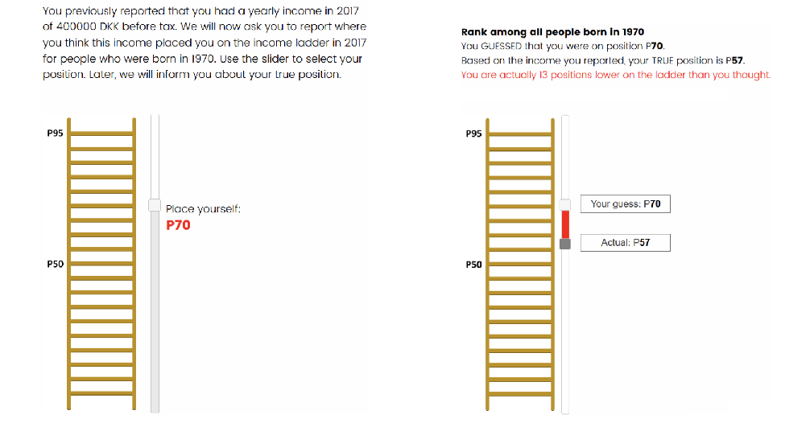

Note: This figure shows how Hvidberg et al. (2021) use a ladder and slider to illustrate respondents’ perceived versus actual position within the income distribution of a given reference group (in this case, the respondent’s birth cohort; see Appendix A-4.2 for a description of the paper). First, respondents are asked to indicate where they think they are in the income distribution relative to the reference group using a slider (left panel). Then, the authors illustrate the difference between where respondents placed themselves and where the respondent actually is within the income distribution (right panel).

###### Figure 6: Pie Chart Visual Representation from Alesina et al. (2022)

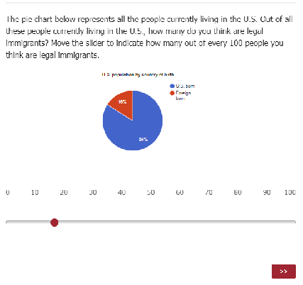

Note: This figure “shows the slider and pie chart US respondents see when they are asked about their perceived share of immigrants. When respondents land on the page, the pie chart is fully gray and the slider is at zero. The pie chart adjusts in real-time as respondents move the slider, appearing in two colours: one representing the share of US-born people, the other representing the share of foreign-born ones.” (Alesina et al., 2022, p.8)

###### Figure 7: Slider Visual Representation from Alesina et al. (2022)

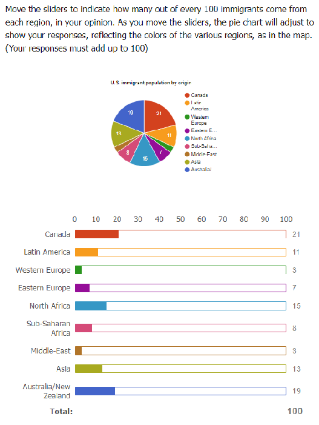

Note: This figure shows a slider for a question that asks respondents to estimate how many immigrants come from a given region. For reference, respondents are also presented with a map where the regions are in the same color as the slider.

###### 55

###### Figure 8: Slider Visual Representation from Alesina et al. (2018)

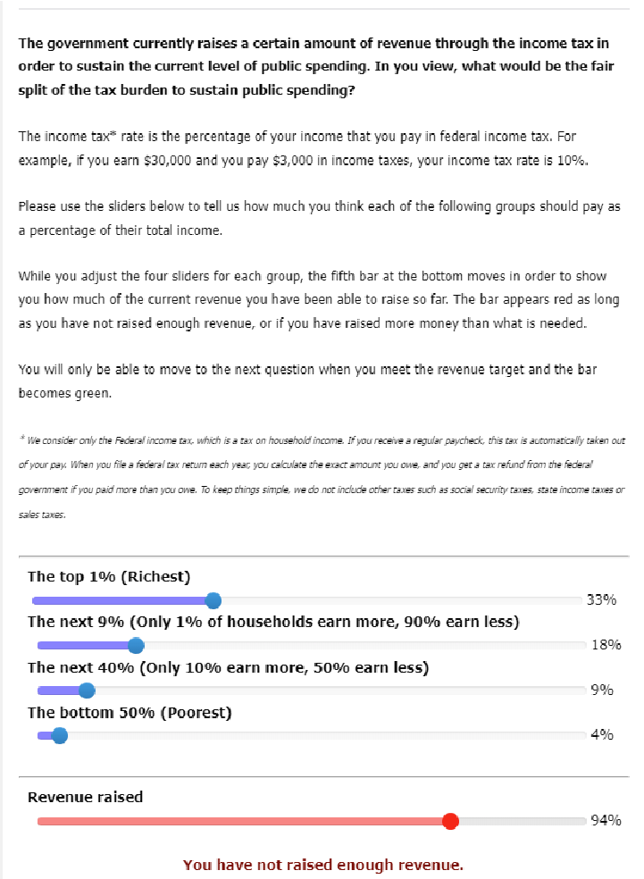

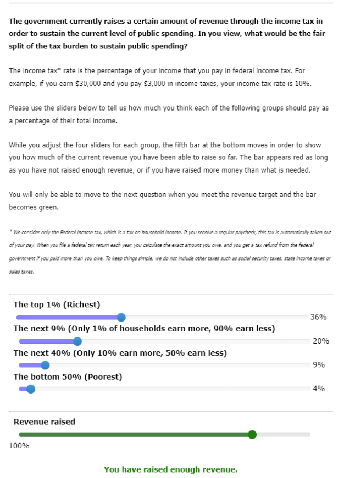

Note: This figure shows sliders used by respondents to choose a level of taxation that they would consider “fair” for four different income groups: the top 1 percent, the next 9 percent, the next 40 percent, and the bottom 50 percent. Respondents are asked to choose the tax rates so as to raise tax revenue equal to the current revenue. In the background, a code uses as inputs the respondents’ selection of the tax rates for these groups and the national income shares of these groups to compute the total revenue raised. The algorithm compares the total revenue raised to the revenue target and adjusts the position and color of the bar at the bottom to indicate whether the chosen tax structure raises enough revenue.

###### 56

Table 1: Sample representativeness across papers

Paper Country Over-represented Under-represented Correctly represented Platform

US (Black population, Adult)

Gender, Age, Income (except $110k+), Region, Republican, Employed, Self-employed, Unemployed

Income $110k+, Independent, High school or less∗

Democrat∗, College education

Alesina et al. (2021)

Respondi

US (White population, Adult)

US (Black population, Teenager)

US (White population, Teenager)

Alma˚s et al. (2020) US

Democrat∗, College education∗

Independent, High school or less∗

Parental income $0-$19,999

Gender, Age, Income, Region, Employed, Self-employed, Unemployed, Republican

Gender, Age, Parental income (except $0-$19,999), Region

Gender, Age, Parental income, Region

College education∗, Conservative share High school or less∗ Gender, Age, HH income Norstat

& Research Now

Norway College education∗ High school or less∗

Alsan et al. (2020) Australia 4th Income bracket∗

1st Income bracket, 2nd Income bracket∗

Gender, Age, HH income, Conservative share

Gender, Age, 3rd and 5th Income bracket, Employed, Region

Dynata

Canada

- 4th Income bracket∗,
- 5th Income bracket∗

1st Income bracket∗, 2nd Income bracket∗

Gender, Age, 3rd Income bracket, Employed, Region

France Employed

Over 66 years old, 1st Income bracket∗

Gender, Age (up to 66 years old), 2nd to 4th Income bracket, Region

Germany

India

Italy

3rd Income bracket∗, 4th Income bracket∗

3rd Income bracket∗, 4th Income bracket∗, Employed∗

18-25 years old∗, 2nd Income bracket∗, Employed∗

Japan 5th Income bracket∗

1st Income bracket*

4th Income bracket∗, 2nd Income bracket∗

66+ years old∗, 1st Income bracket∗

1st Income bracket∗, 2nd Income bracket∗, 4th Income bracket∗

Gender, Age, 2nd Income bracket, Employed, Region

Gender, Age, Region

Gender, Age (up to 66 years old), 3rd and 4th income bracket, Region

Gender, Age, 3rd Income bracket, Employed, Region

Gender, Age, Income, Employed, Region

Netherlands

###### 57

Employed∗, 2nd Income bracket, 3rd Income bracket

Gender, Age, 1st and 4th Income bracket, Region

5th Income bracket∗

Singapore

Spain

2nd Income bracket∗, 3rd Income bracket∗, 4th Income bracket*, Employed∗

66+ years old, 1st Income bracket∗

Gender, Age, Region

Sweden Employed Gender, Age, Income, Region

UK 1st Income bracket 2nd Income bracket

Gender, Age, 3rd to 5th Income bracket, Employed, Region

US 5th Income bracket 1st Income bracket∗

Gender, Age, 2nd to 4th Income bracket, Employed, Region

Andre et al. (2022) US

College education∗ (Wave 5)

Age +55 (Wave 5)

Region, Median income, Gender, College education (Wave 1-4), Age (except +55 in Wave 5)

Dynata & Lucid

Armona et al. (2019) US

Home-owners∗, College education∗

Age, Income below $60,000

Survey of Consumers Expectations

Bechtel and Scheve (2013) France Age, Education, Gender YouGov

Germany Age 40-54 Age (excluding 40-54), Education, Gender

UK Age 35-54 Education: 16yrs or fewer

Age (excluding 35-54), Education (excluding 16yrs or fewer), Gender

US College education∗

Brown et al. (2021)‡ US

Age 50-64, Female, Married, Non-Hispanic white∗, Some college, HH size: 1

Age 18-34, High school or less, Some college

Age (excluding 18-34), Gender, Post-graduate education

Age: 35-49, 65+; Non-Hispanic black, NonHispanic other, Bachelor’s degree∗, Graduate degree HH income (all levels) HH size: 2 and 3

Age: 18-34, Hispanic, High school dropout, High school education, HH size: ≥ 4, Any kids

Understanding America Study

- Cavallo et al. (2016) Argentina

Share living in Buenos Aires∗, College education*

Share who voted for Kirchner Female, Age

Authors’ online opinion survey

- Cavallo et al. (2017) US College degree∗ Older people∗ Female MTurk

Argentina Female, College Degree* Age Public opinion firm

###### 58

Age∗, Female∗, Black, Hispanic, Income∗

White, Supported Obama Mturk

Charite´ et al. (2016) US College education∗

US

White∗, College education∗

Dechezlepreˆtre et al. (2022) Australia 1st income quartile∗, Male, Share of voters∗

Black, Hispanic, Supported Clinton

4th income quartile∗

Age, Female, Income

Age, 2nd and 3rd income quartile, Region, Urban, College education, Voters, Inactive, Unemployed, Employed

Understanding America Study

Dynata & Respondi

Brazil

China

Urban, College education∗, Share of voters∗, Employed∗

4th income quartile, College education∗, Employed∗

Inactive∗, Left voter, Center voter

More than 50 years old∗, 1st income quartile∗, Urban, Inactive∗

Canada Share of voters∗ Right voter

Denmark

Share of voters∗, Inactive, Unemployed, College education

Employed∗

Gender, Age, Income, Region, Right voter, Unemployed

Gender, Age (up to 50 years old), 2nd and 3rd income quartile, Region, Unemployed

Gender, Age, Income, Region, Urban, College education, Left and center voters, Inactive, Unemployed, Employed

Gender, Age, Income, Region, Urban, Voters

France Share of voters 4th income quartile∗, Center voter∗,

Gender, Age, 1st to 3rd income quartile, Region, Urban, College education, Voter, Inactive, Unemployed, Employed

Germany Share of voters∗

Gender, Age, Income, Region, Urban, College education, Voter, Inactive, Unemployed, Employed

Male, Urban, College education∗, Share of voters∗, Right voter∗, Employed∗

Left voter∗, Inactive∗ Age, Income, Region, Unemployed

India

College education∗, Share of voters∗, Left voter∗, Employed, Urban

Center voter∗, Right voter∗, Inactive

Gender, Age, Income, Region, Unemployed

Indonesia

College education∗, Share of voters∗, Left voter, Right voter

Center voter∗, Inactive∗, Urban, Unemployed, Employed

Italy

Gender, Age, Income, Region

Center voter∗, 4th income quartile, Left voter

Age, 1st to 3rd income quartile, Region, Inactive, Unemployed, Employed

College education∗, Right voter, Male, Urban

Japan

Urban∗, College education∗, Share of voters∗, Employed* Inactive*

Gender, Age, Income, Region, Voters, Unemployed

Mexico

College education∗, Share of voters∗, Urban, Unemployed, Employed

Gender, Age, Income, Region, Voters

Inactive∗

Poland

###### 59

South Africa

3rd income quartile, College education∗, Urban∗, Share of voters∗, Center voter∗, Employed∗

1st income quartile, Left voter∗, Inactive∗, Unemployed∗

Gender, Age, 2nd and 4th income quartile, Region, Right voter

South Korea

Spain

Male, College education∗, Left voter∗, Employed

College education∗, Share of voters∗, Urban, Employed

4th income quartile∗, Center voter*, Right voter∗, Inactive∗, More than 50 years old

Right voter∗, Inactive

Age (up to 50 years old), 1st to 3rd income quartile, Region, Urban, Unemployed

Gender, Age, Income, Region, Unemployed

Turkey

Male, College education∗, Employed∗, Urban

1st income quartile*, Inactive∗, More than 50 years old

Age (up to 50 years old), 2nd to 4th income quartile, Region, Voters, Unemployed

UK College education∗, Share of voters∗ Employed

Gender, Age, Income, Region, Urban, Voter, Inactive, Unemployed

Ukraine

Male∗, 35-49 years old*, 4th income quartile∗, Urban∗, Share of voters∗, Employed∗

More than 50 years old∗, 1st income quartile, Right voter, Inactive∗

US Share of voters∗, Left voter

Di Tella and Rodrik (2020) US

Young, Postgraduate degree, Only college degree∗, Full time employee∗, Self-employed

Right voter∗, 4th income quartile∗

No college degree, Part-time employee, Not in labor force∗

Enke (2020) US Not full-time employed Full-time employed

Age (up to 34 years old), 2nd and 3rd income quartile, Region, Left and center voters, Unemployed

Gender, Age, 1st to 3rd income quartile, Region, Urban, College education, Inactive, Unemployed, Employed

Gender, White, Black, Hispanic, Asian, Unemployed, Student

Gender, 2016 vote, Age, HH income, Education, Ethnicity, State

Mturk

Research Now

Epper et al. (2020) Denmark

Gross income, Wealth†

Gender, Age, Years of education

Letter writing to target population

- Fisman et al. (2020) US

Male∗, Young∗, White∗, College education∗

Female∗, HH income

Supported Obama, Supported Clinton, Supports government redistribution

Mturk

US

Old, Non-Hispanic White∗, White∗ College education∗ Supported Clinton

Gender, HH income

Understanding America Study

- Fisman et al. (2021) US

Female∗, Age∗, HH income, Thinks hard work most important to get ahead∗

Supports government redistribution

College education∗, Voted in last election

Mturk

###### 60

Fuster et al. (2022) US

Homeowners∗, Bachelor’s degree∗, (higher) median income∗

Young Female

Survey of Consumer Expectations

Hoy and Mager (2021) Australia Male, Age 18-34 Ipsos, RIWI,

YouGov

India Male∗, Age 18-34* Mexico Male, Age 18-34∗ Morocco Male∗, Age 18-34* Netherlands Male*, Age 18-34∗ Nigeria Male∗, Age 18-34∗ South Africa Male∗, Age 18-34∗ Spain Male∗, Age 18-34∗ UK Age 18-34 Male US Male, Age 18-34∗

Hainmueller et al. (2015) Switzerland Lower professional school∗

Employed∗, Vocational training∗

Age, Gender, Political interest, Referendums, Education (except vocational training and lower professional school)

gfs.bern

Kuziemko et al. (2015) US

Young, College education∗, Voted for Obama∗

Black, Hispanic, Employed, Married Gender, Unemployed Mturk

US (age 25-59)

Luttmer and Samwick (2018)

College education Never married

Roth et al. (2022a), (2nd experiment)

US

Age 25-34∗, Age 35-44 Income $25-50k, Income $50-75k,

Female, Age 55-64∗, Age 65+∗, Income $100-150k, Income $200k or more

Age, Gender, Race, High School dropout, High school, Some college, Marital status, Region, HH size, HH income

Knowledge Networks

Age 18-24, Region, Income less than $15k, Income $15-25k , Income $75-100k

Mturk

Note: HH stands for “household.” A variable is included in the over-represented column if the difference between its value in the online sample and in the population of interest is larger than 5pp, while the opposite holds for variables in the under-represented column. ∗: denotes where the difference between the population and sample mean is larger than 10pp. Most papers do not report whether the difference between the sample and the population is statistically significant. †: the distribution of gross income and wealth in the sample is slightly shifted to the right, but differences between different percentiles are significant only for the 50th percentile. ‡: Brown et al. (2021) note that except for four of the characteristics (non-Hispanic other, HH income < $25k, HH income 50-75k, and HH income 75-100k) all sample means are statistically different from the population mean at the 1% level.

###### Table 2: Attrition Rates Across Papers

Paper Country Context Target Pop Survey Length Attrition Rate Andre et al. (2022) U.S.

Beliefs about the macroeconomy; experimental treatments

nationally representative; subject-matter experts

N/A 21-38%

Bublitz (2022) 6 countries*

Dechezlepreˆtre et al. (2022) 20 countries**

Redistribution and misperceptions about income distribution; information treatments

nationally representative 7 min. 6%

Attitudes toward climate policies; experimental treatments

nationally representative for high income countries; online representative for middle-income countries.

28 minutes (median)

23%

Grigorieff et al. (2020) U.S.

Attitudes on immigration; experimental treatments

Hoy and Mager (2021) 10 countries***

Redistributive preferences and income distribution; information treatments

Hvidberg et al. (2021) Denmark

Fairness views and perceptions on inequality; information treatment

nationally representative N/A under 2%

online representative N/A 25-30%

representative sample for people born in Denmark 1969-1973

25 minutes (median)

24.5%

J¨ger et al. (2021) Germany

Kuziemko et al. (2015) U.S.

Roth et al. (2022a) U.S.

Worker’s beliefs about wages outside their job; information treatments

Preferences for redistribution; experimental treatments

Effect of debt on attitudes toward public spending; experimental treatments

nationally representative

10 minutes (median)

nationally representative

15 minutes (est.)

15%

22%

nationally representative N/A under 2%

Stantcheva (2021) U.S.

Reasoning about income and estate taxation; experimental treatments.

nationally representative

35 minutes (median)

19-20%

- *Countries are: Brazil, France, Germany, Russia, Spain and the U.S.
- ** Countries are: Australia, Canada, Denmark, France, Germany, Italy, Japan, Poland, South Korea, United States, Brazil, China, India, Indonesia, Mexico, South Africa, Turkey, and the Ukraine

*** Countries are: Australia, India, Mexico, Morocco, the Netherlands, Nigeria, South Africa, Spain, the U.K., and the U.S.

###### 61

Table 3: Persistence of treatment effect

Persistence magnitude

Paper Sample Effect Recontact

rate

Perspective taking exercise on attitudes towards Syrian refugees

No effect after 1 week

Adida et al. (2018) US

Alesina et al. (2018)

France Germany Italy Sweden UK US

Information about intergenerational mobility on support for redistribution

21.2% first wave 29.3% second wave (only in US)

Persistent after 1-3 weeks (slightly decreased)

Armona et al. (2019) US

Information about past home prices changes on home price expectations

87.5%

Persistent after 2 months (slightly decreased)

Arntz et al. (2022)

US, Germany

Bottan and Perez-Truglia (2022) US

Information about zero net employment effect of automation on concerns about automation

Information about cost of living and earnings rank of US cities on stated choice of location and attributes of city

75%

90.62%

Persistent after 4 weeks only for some dimensions of concern (decreased)

Persistent after 38.4 days on average (slightly reduced)

Broockman and Kalla (2016) US

Bruneau and Saxe (2012)

US Mexico Israel

Perspective taking exercise on support for non-discrimination law

Perspective taking exercise on attitudes towards outgroup members

85.6% 3 days after 79.6% 3 weeks after 80% 6 weeks after 76.8% 3 months after

Cavallo et al. (2017) US and Argentina Information about inflation

Coibion et al. (2018)

Coibion et al. (2021)

New Zealand (firms)

New Zealand (firms)

Fuster et al. (2022) US

Information about inflation on inflation expectations 69%

Information about other firms’ inflation expectations on inflation expectations

Endogenously acquired information on home price changes on home price expectations

50%

75.2%

Grigorieff et al. (2020) US

Haaland and Roth (2021) US

Haaland and Roth (2020) US

Kalla and Broockman (2021) US

Kuziemko et al. (2015) US

Roth et al. (2022a) US

Roth and Wohlfart (2020) US

Simonovits et al. (2018) Hungary

Settele (2022) US

Information about immigration on attitudes towards migrants

Information about racial discrimination in labor market on support for pro-Black policies

Information about labor market impact of immigration on attitudes toward immigration

Perspective-taking exercise on prejudice towards illegal immigrants and transgender people

Priming about trust in government on support for transfer programs and information about inequality and taxes on preferences for redistribution

Information about public debt on support for government spending

Information about recession likelihood on consumption plan and unemployment expectations

Perspective taking exercise on prejudice towards Roma in Hungary

Information about size of gender wage gap on support for equal-pay legislation and affirmative action programs

88%

83%

65.7%

14%

74%

65%

66%

36%

Persistent after 3 months (decreased)

No effect after 1 week

Persistent after 2 months in US (decreased)

No effect after 6 months

Persistent after 3 months (varies across treatment condition)

Persistent after 4 months (decreased)

Persistent after 4 weeks (decreased for characteristics of migrants, increased for policy preferences)

Persistent after 1 week (decreased)

Persistent after 1 week (decreased)

Persistent after 4 months (decreased)

No effect after 1 month for priming, persistent after 4 weeks for information (decreased)

Persistent after 4 weeks (decreased)

Persistent after 2 weeks (decreased)

Persistent after 1 month (decreased)

Persistent after 2 weeks (decreased)

###### 62

## Online Appendix for “How to Run Surveys: A guide to creating your own identifying variation and revealing the invisible” by Stefanie Stantcheva

###### A-1 Sample A-2

- A-1.1 Types of sampling methods . . . . . . . . . . . . . . . . . . . . . . . . . . . . . . . . . . . . . . . . A-2
- A-1.2 Recruiting respondents . . . . . . . . . . . . . . . . . . . . . . . . . . . . . . . . . . . . . . . . . . A-2
- A-1.3 Selection into Surveys . . . . . . . . . . . . . . . . . . . . . . . . . . . . . . . . . . . . . . . . . . . A-6

###### A-2 Managing Respondents’ Attention A-10

- A-2.1 Ex post data quality checks . . . . . . . . . . . . . . . . . . . . . . . . . . . . . . . . . . . . . . .A-10

A-3 Writing Survey Questions A-10

- A-3.1 Open-ended questions . . . . . . . . . . . . . . . . . . . . . . . . . . . . . . . . . . . . . . . . . . .A-10

- A-3.2 Measurement issues . . . . . . . . . . . . . . . . . . . . . . . . . . . . . . . . . . . . . . . . . . . .A-10
- A-3.3 Using monetary incentives and real stakes questions . . . . . . . . . . . . . . . . . . . . . . . . . .A-11

- A-3.3.1 Monetary incentives . . . . . . . . . . . . . . . . . . . . . . . . . . . . . . . . . . . . . . . . .A-11
- A-3.3.2 Real stakes questions . . . . . . . . . . . . . . . . . . . . . . . . . . . . . . . . . . . . . . . .A-12
- A-3.3.3 Spectator setting . . . . . . . . . . . . . . . . . . . . . . . . . . . . . . . . . . . . . . . . . . .A-18

###### A-4 Survey Experiments A-19

- A-4.1 Priming Treatments . . . . . . . . . . . . . . . . . . . . . . . . . . . . . . . . . . . . . . . . . . . .A-19
- A-4.2 Information and pedagogical treatments . . . . . . . . . . . . . . . . . . . . . . . . . . . . . . . . .A-21
- A-4.3 Factorial experiments: vignette and conjoint designs . . . . . . . . . . . . . . . . . . . . . . . . . .A-28

###### A-5 Libraries of Questions A-34

#### A-1 Sample

###### A-1.1 Types of sampling methods

There are two main kinds of sampling methods: probability sampling and non-probability sampling. Probability sampling means that elements from a population are randomly selected. Each of these elements has a non-zero, known probability of being selected. It includes four broad categories of sampling:

- 1. Simple Random Sampling: when every element in a population has an equal chance of being selected.
- 2. Systematic Sampling: when every nth element is selected from a population.
- 3. Stratified Sampling: when researchers divide a population according to certain parameters (for example, whether a person has children or not in a study of inheritance taxation) and sample at random within each stratum.
- 4. Cluster Sampling: when researchers draw a sample with elements in groups (“clusters”) such as zip codes instead of individually.

Non-probability sampling is not random, and the probability of each element being selected may be unknown. Types of non-probability sampling include:

- 1. Convenience Sampling: when researchers create their sample from a population that is easily accessible. A common convenience sample is undergraduate students at a university.
- 2. Quota Sampling: when researchers determine the percentage (quotas) for different respondent characteristics and sample until the quotas are filled. This procedure entails screening out (not allowing them to complete the survey) respondents whose quotas are already full. Quotas can be set in line with population distributions or to meet other goals, e.g., oversampling minorities.
- 3. Purposive Sampling: when researchers choose specific respondents based on their knowledge.
- 4. Snowball Sampling: when a respondent refers other potential study participants. This kind of method can be particularly helpful for sampling populations that are hard to reach (e.g., undocumented immigrants).

###### A-1.2 Recruiting respondents

Channels of recruitment and rewards. Survey companies tend to employ various recruitment channels. Each channel has its own rewards system and captures different kinds of respondents. The respondents are then “blended” from the different channels in order to create panels with a diverse set of characteristics.

- i Loyalty Panels: Recruitment through loyalty programs in travel, entertainment, media, and retail. They reward participants in points or miles relevant to the program source. These panels tend to recruit more affluent, pre-validated individuals with known characteristics.
- ii Open: Recruitment across the web and beyond via mobile app panels, social media influencers, billboards, online and in-app advertising, paid search, and more. This group generally mirrors the general population well and includes different income and education levels. It provides strong population coverage across most countries globally. Some of these sites can be characterized as the ‘Rewards community’ (within Get-Paid-To (or GPT) sites), which are databases or panels where people can take surveys, watch ads, etc. in exchange for a reward. Rewards take the form of points to redeem for cash, prizes, and gift cards. Some of the platforms tend to “gamify” the survey experience.
- iii Integrated: People come from partnerships with publishers, social networks, and additional websites (schools and various communities’ websites). Members logging into communities can be invited to participate in surveys. Rewards typically are in the form of points that can be redeemed for cash, prizes, and gift cards. This channel can help engage people who might not otherwise take surveys, appeal to younger audiences, and can add coverage of minorities. Other types of rewards across all channels can take the form of charitable donations, cash, and vouchers. Sometimes, survey companies can survey hard-to-reach groups with specialized recruitment campaigns.

Process for survey companies. Potential survey respondents enter the company’s survey “router” (which matches them to specific surveys) in one of two ways: by receiving a general email inviting them to take part in an unspecified survey or by visiting their panel portal. Figure A-1, Panel (A) and Figure A-2 provide some screenshots of sample invitation emails from commercial survey companies. Once they are in their portal, the system verifies that they are eligible for the survey based on the information already available about the person (e.g., their age group) and seeks to match them to surveys for which they are eligible. Respondents are then offered one specific survey. If they choose to take this survey and pass further qualifying criteria, they can complete the survey. If they

do not pass these additional “screener” questions, the respondent is either offered another survey or the session is ended.

Figure A-1 demonstrates what a typical flow for a survey conducted through a survey company might look like. Panel (A) shows the invitation email, Panel (B) shows the respondent dashboard. Once the respondent has selected a survey to qualify for from the dashboard, they answer qualifying questions in the router (Panel (C)). If they qualify, the respondent is offered a survey to take (Panel (D)). Because of the company’s router, the survey may be matched to existing characteristics. In this case, the respondent had indicated that they lived in the Boston area when they signed up to take surveys, so they are shown a survey that is specific to Boston (Panel (E)). If a respondent does not qualify to take a survey – either because they fail the initial screener questions (as in Panel (C)) or because they fail the survey’s own screener questions– they are redirected to either take another survey or return to the dashboard.

There may be some biases that can stem from prioritization in the order in which surveys are presented to participants and how participants are matched to one of the various surveys for which they appear to qualify. However, it is unclear whether these biases would be systematic, given the large pool of respondents and the algorithmic approach. Importantly, the selection is minimized by the small amount of information that the respondent actually sees about the survey, which boils down to the time it takes and the reward for completion.

Firms perform some level of quality assurance, for example, checking for IP anomalies, digital fingerprinting, using geolocation clues, and employing screeners before and within the survey. The identity of respondents tends to be verified by the underlying partner (which differs for the three recruitment channels described above).

It is difficult to obtain information on the “universe” of respondents available across various countries, given the many platforms and channels through which these respondents are sourced. Nevertheless, Table A-1 shows how the pools of respondents for two large survey companies compare roughly to the population in some select countries. Overall, the pool of respondents in high-income countries may be roughly representative along key dimensions such as age, income, gender, and education to a broad “middle” range of the population. For middle- or low-income countries, the pools are, almost by construction, roughly representative only of the online population.

Process for survey marketplaces. Survey companies offer a range of recruiting and quality assurance services. Another option for researchers is to use “marketplaces” of potential survey respondents, which pool together various panels and partner companies. An example is Lucid. In this case, much more is done “in-house” (in the lab/on the researcher’s side) and managed internally by the research team rather than the survey company. Similar to survey companies, respondents can sign up on a ”Get-Paid-To” site or through other channels. When they sign up, they are asked a number of questions about their gender, age, job, and income. Once they have filled out this information and verified their email, they can start taking surveys. These surveys are presented on a dashboard where limited information. Figure A-3 shows examples of dashboards for partner companies that can pool respondents in such a marketplace. Respondents can click on one of these surveys and are directed to a series of qualifying questions. If they pass these qualifying questions, they are automatically directed to a survey. If not, they are taken back to the dashboard (they may receive a small number of credits for having attempted to take the survey). If respondents reach the survey, they typically have to answer additional “screener” questions, and if they do not pass them, they are taken back to the dashboard as well.

It is important to be aware of what exactly respondents see on the platform you choose. In Panel (B) of Figure A-1, the dashboard provides information on the topic area of the survey (e.g., “Home and Family” or “Food and Beverage”), presumably increasing the probability of selection based on the topic. Figure A-3 shows dashboards that only provide information on the duration and rewards for each survey.

A-4

###### Figure A-1: Example Respondent Experience for Survey Companies

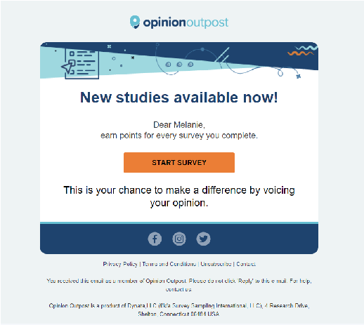

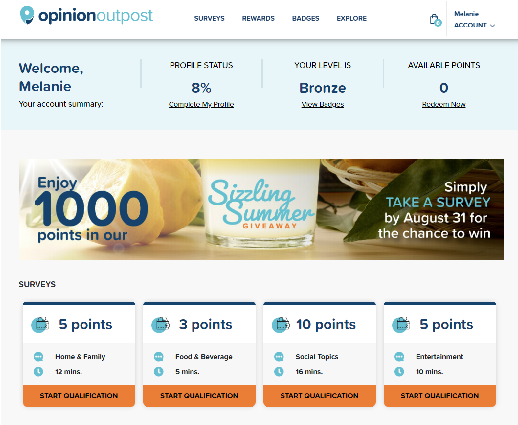

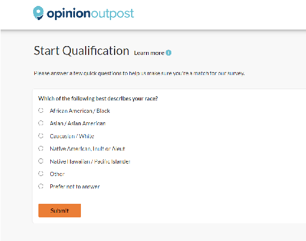

(a) (b) (c)

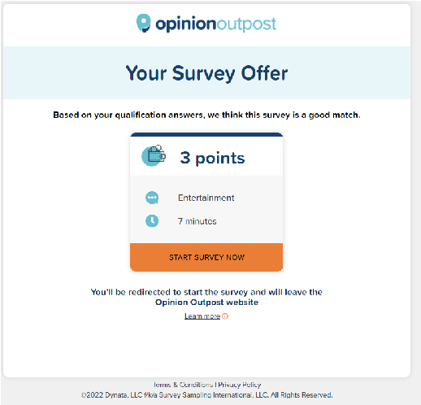

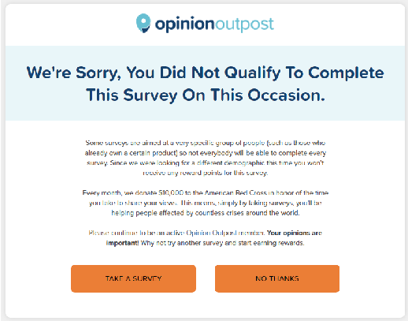

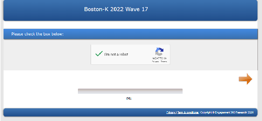

(e)

(f)

(d)

###### Figure A-2: Recruitment Email from Survey Company 2

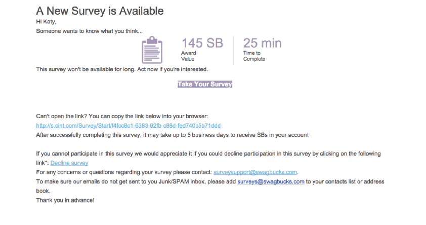

###### Figure A-3: Example Dashboards for Respondent Panels

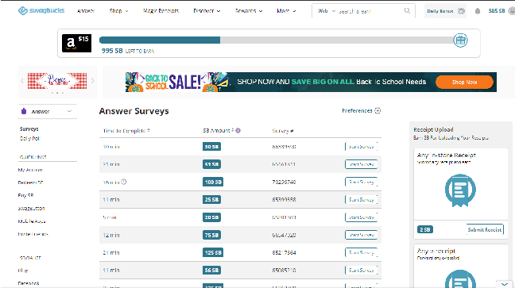

(a) (b)

###### A-6

###### A-1.3 Selection into Surveys

Table A-1: Population vs. Panel Samples

Demark France Germany Population Qualtrics Dynata Population Qualtrics Dynata Population Qualtrics Dynata Number 5.831mil 640,412 N/A 67.39mil 4.93mil N/A 83.24 mil 4.68 mil N/A Female .50 .46 .46 .04 .07 N/A .51 .45 .50 under 18 years old .05 .07 N/A .04 .07 N/A .16 .07 N/A 18-24 years old .09 .35 .13 .08 .37 .19 .08 .35 .13 25-34 years old .13 .22 .16 .12 .24 .19 .13 .27 .18 35-44 years old .12 .12 .13 .12 .15 .19 .12 .14 .18 45-54 years old .14 .10 .16 .13 .10 .18 .14 .08 .17 55-64 years old .13 .07 .18 .13 .05 .14 .15 .05 .19 65 years and over .20 .06 .26 .20 .02 .10 .22 .02 .15

- Income Bracket 1 .87 .55 .58 .80 .66 .67 .74 .49 .50
- Income Bracket 2 .10 .21 .30 .17 .15 .29 .23 .27 .40
- Income Bracket 3 .02 .04 .09 .029 .01 .03 .02 .03 .06
- Income Bracket 4 .01 .01 .04 .001 N/A .004 .01 .03 .03 Prefer not to answer N/A .11 N/A N/A .18 N/A N/A .17 N/A

Secondary Education or below .25 .45 .55 .28 .54 .42 .18 .41 .32 Cert., Vocational Training .40 .19 .12 .47 .16 .26 .51 .36 .44 Bachelor’s Degree .20 .12 .15 .11 .17 .16 .17 .17 .24 Postgraduate Degree or above .15 .12 .18 .14 .14 .16 .14 N/A N/A Prefer not to answer N/A .11 N/A N/A .07 N/A N/A .08 N/A

Urban .53 .66 N/A .60 .54 N/A .80 .72 N/A

Note: This table displays summary statistics of the sample of survey companies alongside national statistics. For the education statistics, the population statistics are for the ages of 25-64. The Under 18 years old variable includes ages 13-17 for Denmark and 15-17 for France and Germany. For Denmark, the income brackets are as follows: Bracket 1: <400k DKK; Bracket 2: 440-880k DKK; Bracket 3: 880k-1.5mil DKK; and Bracke 4: >1.5mil DKK. For France, they are: Bracket 1: <40k EUR; Bracket 2: 40-100k EUR; Bracket 3: 100-500k EUR; Bracket 4 >500k EUR. For Germany: Bracket 1: < 40k EUR; Bracket 2: 40-120k EUR; Bracket 3: 120-200k EUR; Bracket 4: >200k EUR

###### A-7

Population vs. Panel Samples

Italy Mexico Poland

Population Qualtrics Dynata Population Qualtrics Dynata Population Qualtrics Dynata Number 59.55mil 2.85mil N/A 128.9mil 2.86mil N/A 37.95mil 1.55mil X Female .52 .48 .49 .52 .38 .56 .52 .55 .59 under 18 years old .03 .04 N/A .08 .08 N/A .03 .02 N/A 18-24 years old .07 .27 .10 .12 .43 .24 .07 .32 .17 25-34 years old .11 .25 .18 .16 .31 .34 .14 .28 .29 35-44 years old .13 .20 .23 .14 .12 .24 .16 .21 .23 45-54 years old .16 .14 .24 .12 .05 .12 .13 .11 .15 55-64 years old .14 .07 .15 .09 .02 .04 .13 .04 .10 65 years and over .22 .03 .09 .08 .01 .01 .18 .01 .06

- Income Bracket 1 .94 .70 .84 .20 .39 .28 .44 .52 .53
- Income Bracket 2 .04 .11 .11 .36 .24 .30 .17 .12 .18
- Income Bracket 3 .01 .03 .04 .29 .18 .30 .13 .09 .15
- Income Bracket 4 .01 .02 .02 .15 .06 .11 .26 .10 .14 Prefer not to answer N/A .17 N/A N/A .12 N/A N/A .16 N/A

Secondary Education or below .47 .51 .51 .77 .23 .14 .15 .45 .46 Cert., Vocational Training .33 .17 .16 .04 .30 .40 .52 .09 .12 Bachelor’s Degree .05 .12 .11 .17 .32 .45 .07 .23 .15 Postgraduate Degree or above .15 .15 .21 .02 .09 .11 .25 .17 .28 Prefer not to answer N/A .05 N/A N/A .06 N/A N/A .07 N/A Urban .83 .61 N/A .64 .91 N/A .66 .70 N/A

Note: The Under 18 years old variable includes ages 13-17 for Mexico and 15-17 for Italy and Poland. See the notes to Table A-1 for further details. For Italy, the income brackets are as follows: Bracket 1: < 60k EUR; Bracket 2: 60-100k EUR; Bracket 3: 100-300k EUR; Bracket 4: > 300k EUR. For Mexico, they are: Bracket 1: < 50k MXN; Bracket 2: 50-150k MXN; Bracket 3: 150-500k MXN; Bracket 4: > 500k MXN. For Poland, they are: Bracket 1: < 60k PLN; Bracket 2: 60-80k PLN; Bracket 3: 80-100k PLN; Bracket 4: > 100k PLN

###### A-8

Population vs. Panel Samples

South Korea Turkey US

Population Qualtrics Dynata Population Qualtrics Dynata Population Qualtrics Dynata Number 51.78 1.30mil N/A 84.24mil 1.97mil N/A 331.89mil 56.40mil N/A Female .50 .51 .50 .51 .28 .44 .52 .62 .57 under 18 years old .04 .10 N/A .07 .10 N/A .07 .06 N/A 18-24 years old .09 .32 .08 .11 .44 .28 .09 .30 .11 25-34 years old .13 .28 .29 .16 .26 .32 .14 .26 .20 35-44 years old .15 .17 .32 .15 .11 .22 .13 .16 .23 45-54 years old .17 .09 .21 .13 .04 .11 .12 .10 .14 55-64 years old .16 .03 .08 .10 .02 .05 .13 .07 .14 65 years and over .32 .01 .02 .08 .02 .01 .17 .04 .19

Income Bracket 1 .79 .43 .35 .56 .48 .50 .71 .30 .41 Income Bracket 2 .10 .26 .37 .25 .10 .19 .24 .26 .46 Income Bracket 3 .03 .12 .21 .09 .15 .20 .04 .05 .11 Income Bracket 4 .08 .06 .08 .10 .06 .11 .01 N/A .02 Prefer not to answer N/A .14 N/A N/A .20 N/A N/A .14 N/A

Secondary Education or below .49* .30 .17 .69 .41 .33 .37 .40 .08 Cert., Vocational Training 14*˙ .13 .07 .15 .16 .16 .25 .34 .12 Bachelor’s Degree .32 .42 .64 .13 .25 .36 .24 .16 .74 Postgraduate Degree or above .04 .08 .12 .02 .12 .15 .14 .09 .06 Prefer not to answer N/A .08 N/A N/A .06 N/A N/A .03 N/A Urban .92 .93 N/A .64 .92 N/A .73 .74 N/A

Note: The Under 18 years old variable includes ages 13-17 for South Korea, Turkey, and the US. For the US, population education statistics are for ages ages 25 and older. The income brackets for South Korea are as follows: Bracket 1: < 40mil KRW; Bracket 2: 40-70mil KRW; Bracket 3: 70-100mil KRW; Bracket 4: > 100mil KRW. For Turkey, they are: Bracket 1: < 50k TRY; Bracket 2: 50-100k TRY; Bracket 3: 100-200k TRY; Bracket 4: > 200k TRY. For the US, they are: Bracket 1: < 50k USD; Bracket 2: 50-150k USD; Bracket 3: 150-500k USD; Bracket 4: > 500k USD.

* The Secondary Education or below variable for South Korea also includes vocational training

###### Papers comparing different types of online samples

- • Berinsky et al. (2012) show that MTurk samples are more representative than typical convenience samples, but less representative than the samples from other panel providers or national probability samples. The authors also replicate experimental studies previously conducted using convenience and nationally representative samples and find that the estimates of average treatment effects are similar in the MTurk and convenience and nationally representative samples. They conclude that potential limitations to using MTurk to recruit subjects and conduct research (e.g., concerns about heterogeneous treatment effects, subject attentiveness, and the prevalence of habitual survey takers) are not large in practice.
- • Heen et al. (2020) compare different online samples (from Survey Monkey, Qualtrics, and MTurk) to US census characteristics. The differences highlighted in Section 2 between online panels and nationally representative samples hold for these various platforms. In addition, on platforms such as MTurk, the sample skews significantly younger and male. Overall, MTurk tends to be less representative.
- • Coppock (2019) replicates experimental results from samples representative of the target population (which is not always national) on MTurk, and finds broad consistency in the results. Since the heterogeneity of treatment effects within the same experiment is very low, the author concludes that the replicability of results is most likely due to homogeneous treatment effects.
- • Coppock and McClellan (2019) conclude that the Lucid Platform can replicate a range of experimental results from nationally representative samples (and performs better than the platform MTurk)
- • Fisman et al. (2020) document a “quality crisis” of MTurk in the summer of 2018, when one-quarter of the responses to open-ended questions of their replication survey were unintelligible. They suspect that this was the result of algorithms answering by using the questions’ keywords. To deal with this issue, the authors increase the minimum requirement to enroll in the survey on MTurk (minimum approval rate of 98% and at least 1,000 past tasks completed). They do not drop suspected bots from the MTurk sample to avoid hand-selecting which observations to include.

###### Online vs. offline samples and mixed-mode surveys

• Grewenig et al. (2018) aim to identify the differences between adults in Germany who take online surveys and those who do not. The target population is stratified into three groups: onliners (people who use the internet) in an online survey mode, offliners (people who do not use the internet) in a face-to-face survey mode, and onliners in a face-to-face mode. Compared to onliners, offliners tend to be older, less educated, more likely to be female, less likely to be full-time employed, have lower income, and are more likely to live alone and in smaller cities. Once these differences are controlled for, the authors find that response differences disappear, implying that survey mode rather than unobserved characteristics cause these differences.

###### Examples of related survey modes

- • Cappelen et al. (2022) introduce the Global Universalism Survey (GUS) to study how people make distributive decisions between in-group members and strangers. The GUS, embedded in the Gallup World Poll 2020, was administered by local professional enumerators via telephone, and the sampling procedure is conducted using random digit techniques. In India and Pakistan, the survey was conducted through face-to-face interviews. The survey was administered in 60 countries over the world, and it aims at being representative at the country level as well as at the global level.
- • Karadja et al. (2017) send respondents a survey over postal mail in cooperation with Statistics Sweden. They document misperceptions about respondents’ position in the income scale, and whether correcting them changes preferences for redistribution. The sample is representative in terms of age, gender, and marital status, but respondents are in general more educated, earn a higher taxable income, have fewer children, and are less likely to live in urban areas.

#### A-2 Managing Respondents’ Attention

- A-2.1 Ex post data quality checks

The following example is adapted from Niessen et al. (2016) to illustrate the even-odd consistency index procedure in practice. Suppose you have a survey with 20 questions, divided into 4 sections of 5 questions each. Each section is about a specific topic and the questions are all on similar scales. The procedure to build the consistency index is the following:

- 1. Split each section into two blocks, an “even” block and an “odd” block, based on the order of appearance in the survey.
- 2. For each block, compute the average of the response.
- 3. Compute the correlation of the average response in the even and odd blocks for all sections.
- 4. Adjust the correlation coefficient using the Spearman-Brown prophecy formula for the length of the survey.

Then, the measure obtained is a within-respondent measure of consistency. If questions in the same section are supposed to measure the same construct, their responses should be highly correlated.

A-3 Writing Survey Questions

- A-3.1 Open-ended questions

###### Figure A-4: Analysis of Open-ended Questions from Ferrario andStantcheva (2022)

||Distribution|Fairness|Gov. Spending|Efficiency|Loopholes|
|---|---|---|---|---|
|50|50|50|50|50|
|40|40|40|40|40|
|30|30|30|30|30|
|20|20|20|20|20|
|10|10|10|10|10|
|0|0|0|0|0|
|Double Tax|Grieve|Public Goods|Don't Know| |
|50|50|50|50| |
|40|40|40|40| |
|30|30|30|30| |
|20|20|20|20| |
|10|10|10|10| |
|0|0|0|0| |
  |Clinton Liberal Clinton Moderate Trump Moderate Trump Conservative|
|---|
|
|---|

government no tax

benefit wealthy

government greedy

government double

government revenue

good government

higher way

income income

tax previously

lower government

higher class

farm business

government family

work family

large sum

income inherit

tax fund

small business wealthy higher

inherit tax

low family

poor rich

transfer fund

family government

no tax government

poor class

work tax

family without

two thousand

tax inherit

asset tax

lower afford

higher income

lower inherit

lose lovedone

class poor

rich poor

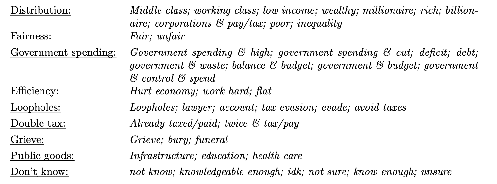

rich tax

lower way

income bracket

class lower

cost live

lower high

owner tax

first place

tax bracket

fair share

capital gain

tax fair

no tax tax

financial situation inherit large

tax income

lower income

higher rich

family business

class afford

government tax

lower tax

higher little

tax free

tax died

lower lose

lower hard

tax impose

higher higher

lower class

working class

high income

left behind

either way

cant afford

middle class

lower middle

transfer higher

tax good

tax high

lower family

way lower

double tax

middle lower

high tax

bracket higher

transfer tax upper class

work life

whole life

entire life

tax higher

hard life

fair tax

tax transfer

hard tax

lower since

flat tax

wealthy income

tax government

income tax

burden family

eliminate tax

tax wealthy

tax double

tax way

five million

family tax

lower poor

little higher

wealthy tax

save tax

tax no tax

since tax

lower burden

work save

good way

work hardtax taxtax twice

income level

hard family

tax lower family family

higher bracket

lower higher likely tax

lower no tax

higher tax

hundred thousand

tax save

family work

rich higher

tax time

family good

tax live

higher lower

low income

class family

lower good

family farm

government right

ten million

tax since

fair inherit

lowered tax lower fair

income family

life insurance

hard work

rich rich

afford higher

belong family

tax asset

wealthy family way government

slide scale

hard save

lower lower

lower work

higher wealthy

life work

family no tax

exist tax

financial burden

ultra wealthy

government transfer

next generation

higher transfer

wealthy fair

work child

lower bracket family generation

life government

higher middle

(a)

(b)

Note: This figure shows two ways to visualize responses to open-ended questions: word clouds (Panel (A)) and through topic analysis (Panel (B)). In this case, respondents were asked about their main considerations on whether the US should have a higher or lower federal estate tax. In word clouds, when a certain kind of word group (called “n-grams,” which are groups of n words) appears more frequently, the size of the font in the word cloud is larger. For example, in Panel (A), “double tax,” “fair tax,” and “middle class” appeared the most frequently in answers. Panel (B) shows a visualization of answers to open-ended questions in which the bars represent the frequency of a topic being mentioned, categorized by respondents’ political affiliation. These topic groupings are constructed using “keywords” (displayed below the bar graphs) that respondents used in their answers.

###### A-3.2 Measurement issuesProbabilistic beliefs

- • Manski (2004) argues that probabilistic beliefs (i.e., asking directly the respondent to attach a probability to a certain event) can be used to reliably measure beliefs, as opposed to revealed preferences analysis (i.e., inferring decision processes from data on observed choices). The author provides an overview of the literature on probabilistic belief measurement and describes areas where it can be applied. Additionally, the paper reports several methods that can be used to assess the accuracy of subjective beliefs, such as comparing individual or mean expectations with events that are predicted or that have already happened.
- • Manski (2018) provides an overview of the history leading to probabilistic beliefs measurement and describes i) areas of research where it has been applied that could be relevant for macroeconomics (equity returns, inflation expectations, and professional macroeconomic forecasters) and ii) possible problems with survey measurements (rounding, ambiguity, confounding beliefs and preferences).
- • Enke and Graeber (2019) use online surveys and experiments to measure cognitive uncertainty related to how people think about probabilities i.e., “ people’s subjective uncertainty over which decision maximizes their expected utility.” The authors have several treatments and experiments. For example, they are asked whether they would prefer receiving $15 with a 1% probability, $16 with a 5% probability, 17% with a 10% probability, and so on. Respondents are also asked about how certain they are about their preferences. They find that, when facing complex questions, people tend to regress to an intermediate option. This insight is relevant for probabilistic beliefs measurement as it documents the existence of cognitive overload and measures its extent.
- • Attanasio et al. (2020) elicit probabilistic beliefs of parents in the UK on the returns to different types of parental investments (time, money, school quality) in terms of future earnings of their children. Respondents are presented with different hypothetical scenarios about parental investments and then are asked to predict the children’s likely future earnings. See Appendix A-4.3 for a discussion of the findings.
- • Boneva and Rauh (2019) elicit probabilistic beliefs of secondary school students on the pecuniary and non-pecuniary benefits of university. This is done by presenting students with different hypothetical scenarios related to life after university and asking them to allocate probabilities to different events (e.g., “if you go start working how likely do you think it is that you will enjoy the social life and activities you engage in?”). See Appendix A-4.3 for a discussion of the findings.
- • Boneva et al. (2022) elicit probabilistic beliefs of university students on the pecuniary and nonpecuniary benefits of postgraduate education. This is done by presenting them with different hypothetical scenarios similar to those in Boneva and Rauh (2019).
- • Wiswall and Zafar (2018) elicit probabilistic beliefs on expected attributes of jobs/workplace to study how these beliefs affect pre-labor market human capital decisions. Respondents, who are NYU students, are presented with three different hiring offers and asked to state the probability of accepting each of them. See Appendix A-4.3 for a discussion of the findings.
- • Wiswall and Zafar (2021) elicit probabilistic beliefs of high-ability college students at NYU on future returns (future earnings, employment, marriage prospects, fertility) of their college major by asking them to allocate a probability to each specific event (such as marrying, future earnings, and fertility) at different points in time in the future (i.e., at 23 years of age, at 30 years of age and at 45). See Appendix A-4.3 for a discussion of the findings.

###### A-3.3 Using monetary incentives and real stakes questions

###### A-3.3.1 Monetary incentives

- • Grewenig et al. (2020) study the effect of monetary incentives on accuracy of responses. In a first survey experiment, they find that monetarily incentivized individuals (who can receive approximately e0.33 if their estimate of average earnings by degree and public school spending are above the median of others’ responses in terms of accuracy) provide more accurate answers as a result of increased online search,

- rather than increased recall effort. This evidence is then validated in a second survey experiment, in which respondents are simply encouraged to look for the answers online. Hence, there is a tradeoff between incentivizing memory recalls and incentivizing online searches.
- • Allcott et al. (2020) study the partisan gap in beliefs and behaviors during the pandemic between January and July 2020. The authors incentivize half of the survey respondents to predict future Covid-19 cases. They were informed that 10 randomly drawn respondents would receive $100 minus the percentage point difference (in dollars) between their prediction and reality. The authors find that incentives do not reduce the partisan gap in terms of the number of cases predicted, self-reported social distancing, or beliefs about the efficacy of social distancing, which suggests that the gap is due to true beliefs rather than partisan cheerleading.
- • Alesina et al. (2022) study the relationship between misperceptions about immigration and preferences for redistribution. They provide a random subsample of respondents with monetary incentives, designed as a tournament, where the 5 most accurate responses for each question about immigrants will receive an additional reward, randomized between $5, $10, $20, and $30. They find that incentives do not affect respondents’ answers about immigrants, suggesting that respondents are either already truthful or hold their views strongly.
- • Andre et al. (2022) study the existence and differences between the subjective models of the economy held by laypeople and experts. A random subset of respondents is incentivized to make accurate predictions about unemployment and inflation: they can earn $0.5 if one of their randomly selected answers is within 0.2 percentage points of the average expert answer. Incentives do not make predictions of inflation and unemployment more consistent with the benchmark of the average expert answer.
- • Roth and Wohlfart (2020) study how individual macroeconomic expectations affect consumption plans, stock purchases, and beliefs about the economy. In a robustness experiment, the authors elicit beliefs about the likelihood of a recession from a sample in which treated individuals are incentivized according to a quadratic scoring rule (and can earn up to $1 for accurate responses). They find that incentives do not increase the accuracy of responses.
- • Stantcheva (2021) studies how US respondents perceive and understand income and estate taxation. The author finds that providing monetary incentives to a random subsample of respondents to encourage accurate responses does not significantly change answers regarding the tax system. This suggests that people were already answering questions to the best of their knowledge.
- • Berinsky (2018) provides a different type of incentives, namely time incentives. The author studies the relevance of expressive responses (i.e., responses designed to express opposition towards politicians and policies rather than true beliefs) in the context of political rumors. In a survey, respondents are randomly assigned to either a control condition or incentivized conditions. In the latter, they receive a time incentive if they reject the political rumor described (i.e., they would receive fewer questions and finish the survey earlier if they reject the political rumor described in the question). The author finds no effect of this incentive on the share of expressive answers and interprets this as evidence that, although present, the share of expressive responses is small in magnitude

- A-3.3.2 Real stakes questions Immigration

• Adida et al. (2018) use a representative sample of the US to investigate whether perspective-taking increases inclusionary attitudes and behaviors towards refugees. To induce perspective taking, the authors ask respondents to imagine themselves as refugees fleeing from war. To obtain a real-stakes measure of inclusionary attitudes, they ask respondents whether they are willing to write a letter to the US President to express support for refugees. See Figure A-5 for examples of answers to this question.

- Figure A-5: Example of a real-stake question answers from Adida et al.

(2018)

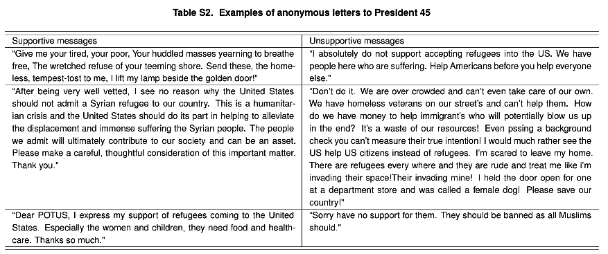

- • Alesina et al. (2022) use survey experiments in six countries (Germany, France, Italy, Sweden, the UK, and the US) to investigate misperceptions about immigrants and the link between these misperceptions and preferences for redistribution. The authors include a real-stakes question to capture preferences for redistribution. They ask respondents whether they want to donate part of their potential lottery winnings to a charity that helps poor people. The question reads:

– “By taking this survey, you are automatically enrolled in a lottery to win $1000. In a few days you will know whether you won the $1000. The payment will be made to you in the same way as your regular survey pay, so no further action is required on your part. In case you won, would you be willing to donate part or all of your $1000 gain for a good cause? Below you will find 2 charities that help people in the US deal with the hurdles of everyday life. You can enter how many dollars out of your $1000 gain you would like to donate to each of them. If you are one of the lottery winners, you will be paid, in addition to your regular survey pay, $1000 minus the amount you donated to charity. We will directly pay your desired donation amount to the charity or charities of your choosing. Enter how much of your $1000 gain you’d like to donate to each charity:

- □Feeding America
- □The Salvation Army

- • Grigorieff et al. (2020) conduct a survey experiment in the US by randomly providing participants with official statistics on immigrants (total share, illegal share, unemployment rate, incarceration rate, and share that does not speak English). To obtain a real-stakes measure of preferences on immigration policy, the authors ask respondents whether they would be willing to sign a real petition that would be sent to the White House. Respondents are further asked whether they would be willing to donate to a nonprofit working in the immigration sector. The questions read:

- – “You will now have the possibility of signing a petition regarding immigration policy. Consider the following petition, and decide whether you would like to sign it or not.”

∗ “Facilitate legal immigration into the US! Immigration is beneficial to the US economy, and it is therefore important to increase the number of green cards available for immigrants. Indeed, not only do immigrants strengthen the US economy, but they are also hard-working and law-abiding. Moreover, most of them adapt to our way of life, and they enrich our culture tremendously. This is why we believe that more green cards should be issued to immigrants so, that more of them can take part in the American Dream.”

- □ I want to sign this petition
- □ I do not want to sign this petition

- – “Every tenth participant taking part in this survey will receive an extra $10. They will have to choose how much money they want to keep for themselves, and how much money they want to donate to the American Immigration Council. Here is a short presentation of the American Immigration Council: “The American Immigration Council is a non-profit, non-partisan, organization [which] exists to promote the prosperity and cultural richness of our diverse nation by:

∗ Standing up for sensible and humane immigration policies that reflect American values. ∗ Insisting that our immigration laws be enacted and implemented in a way that honors funda-

mental constitutional and human rights. ∗ Working tirelessly to achieve justice and fairness for immigrants under the law.”

“To learn more about the American Immigration Council, please click on the following link: https://www.americanimmigrationcouncil.org/about/our-mission If you do receive an extra $10, how much money would you donate to the American Immigration Council?

[slider from 0 to 10]

- • Haaland and Roth (2020) conduct a survey on a nationally representative US sample investigating the relationship between labor market concerns and support for immigration. In the experiment, respondents in the treatment group are presented with research demonstrating that immigration does not have adverse effects on labor market outcomes. To obtain a real-stakes measure of support for immigration, the authors ask respondents whether they are willing to sign a petition aimed at increasing the number of low-skilled workers in the US. If respondents indicate that they wish to sign one of the petitions (detailed below), they are linked to a real petition on the White House website. Treatment and control groups receive different links to these identical petitions so that differences in signing can be determined. The White House requires email confirmation, which adds an additional cost that the respondents face. The petition reads:

– “H-2B visas are work permits that allow US companies to temporarily hire low-skilled workers from abroad for seasonal, non-agricultural jobs, typically for work in restaurants, tourism, or construction. The annual cap on H-2B visas is currently 66,000. Congress is debating whether to change the annual cap. Some argue that the quota should be increased because private companies say that there are not enough low-skilled American workers for hire. Others argue that the quota should be decreased because access to more foreign workers makes it easier for private companies to cut the wages of low-skilled American workers. You will now have the possibility of signing a real petition related to this debate. If enough people sign the petition, the White House will consider it and post an official response. Consider the following two petitions and decide whether you would like to sign one of them:

This petition suggests an increase in the annual cap on H-2B visas from 66,000 to 99,000.

- □ I want to sign this petition
- □ I do not want to sign this petition This petition suggests a decrease in the annual cap on H-2B visas from 66,000 to 33,000.
- □ I want to sign this petition
- □ I do not want to sign this petition

###### Climate change

- • Dechezleprˆetre et al. (2022) conduct online surveys in 20 countries to understand the drivers of support for climate policies. To obtain real-stakes measures of support for climate action, the authors ask respondents whether they are willing to support a petition for climate action and donate to a nonprofit organization that fights deforestation. The authors also inform users that they will communicate the share of respondents who signed the petition to the government of their country. The wording on the petition and donation questions are as follows:

- – “Finally, are you willing to sign a petition to “stand up for real climate action?” As soon as the survey is complete, we will send the results to the [head of state’s] office, informing them what share of people who took this survey were willing to support the following petition. “I agree

that immediate action on climate change is critical. Now is the time to dedicate ourselves to a low-carbon future and prevent lasting damage to all living things. Science shows us we cannot afford to wait to cut harmful carbon emissions. I’m adding my voice to the call to world leaders in [country] and beyond – to act so we do not lose ground in combating climate change.” Do you support this petition (you will NOT be asked to sign, only your answer here is required and remains anonymous)?

- □ Yes
- □ No

- – “By taking this survey, you are automatically entered into a lottery to win [$100]. In a few days, you will know whether you have been selected in the lottery. The payment will be made to you in the same way as your compensation for this survey, so no further action is required on your part. You can also donate a part of this additional compensation (should you be selected in the lottery) to a reforestation project through the charity The Gold Standard. This charity has already proven effective in reducing 151 million tons of CO2 to fight climate change and has been carefully selected by our team. The Gold Standard is highly transparent and ensures that its projects feature the highest levels of environmental integrity and contribute to sustainable development. Should you win the lottery, please enter your donation amount using the slider below:

[Slider from 0 to 100]

- • Kuziemko et al. (2015) conduct a survey experiment in the US to study the drivers of preferences for redistribution. To obtain a real-stakes measure of redistribution preferences, the authors ask respondents whether they are willing to sign a letter to their state senator asking for higher estate tax for the rich. Respondents are provided with the senators’ emails and a sample messages they could send. The wording of the question is as follows:

– “Writing to the Senators of your state gives you an opportunity to influence taxation policy. Few citizens email their elected officials, therefore Senators and their staff take such emails from their constituents very seriously. If you would like to write to your Senator, go to the official US Senate list and click on your Senator’s contact webpage. Two sample letters are provided below, one asking for higher estate taxes on the rich, one asking not to increase estate taxes on the rich. Feel free to cut-and-paste and edit the text before sending it to your Senator. Most Senators’ websites ask for your name and address to avoid spam. We are not able to record what you write on the external (Senator’s) website, so your letter and private information are kept fully confidential. For the purpose of our survey, we would just like to know from you:

- □ I sent or will send an email to my Senator asking for higher estate taxes on the rich
- □ I sent or will send an email to my Senator asking to not increase estate taxes on the rich
- □ I do not want to email my Senator

- • Roth et al. (2022a) use an online survey in the US in which a random half of the respondents are provided the debt-to-GDP ratio. To obtain a real-stakes measure of support for reduced government spending, the authors ask respondents whether they are willing to donate to the Cato Institute (which is described to respondents as an NGO advocating for the downsizing of the government). Specifically, respondents are informed that one in twenty respondents will receive an additional $5 after completing the experiment, and are asked how much they would be willing to donate if they win. Furthermore, they asked whether they would sign a petition for a balanced budget rule. Those who agree to sign the petition receive a link to the White House petition website. Since the petition is posted on this governmental website, it will receive a response from the White House if its content is appropriate and it reaches 100,000 signatures within 30 days. The description of the Cato Institute and the wording of the petition presented to the respondent are as follows:

- – “The Cato Institute seeks to help policymakers and the public understand where federal spending goes and how to reform each government department. It describes the failings of agencies and identifies specific programs to cut. We believe that cutting the federal budget would enhance personal freedom, increase prosperity, and leave a positive fiscal legacy to the next generation”

- – “We propose the introduction of a balanced budget amendment. A balanced budget amendment is a constitutional rule requiring that the government cannot spend more than its income. It requires a balance between the projected receipts and expenditures of the government. A balanced budget rule is designed to prevent the government from accumulating debt.”

###### Altruism

• Fong and Luttmer (2009) study the determinants of altruism by looking at which features (race, income, perceived worthiness) drive donations to victims of Hurricane Katrina. The authors investigate how these features affect respondents’ choices when they are asked to split $100 between themselves and the victims. Respondents are informed that there is a 10% chance that their proposed allocation will be implemented; this type of real stakes question is used to obtain a behavioral measure of altruism. On average, victims’ race and worthiness do not change generosity, but people tend to donate more to others in disadvantaged economic areas. Moreover, race becomes important when respondents have a high or low degree of in-group loyalty: those who feel closer to their race tend to donate more to victims of the same race, while the opposite holds for those who feel less close. The wording is as follows:

– “We will give $100 to one out of every 10 participants in this study. We ask you to decide in advance how much of this $100, if any, you would like to give to the local chapter of Habitat for Humanity in [CITY]. You can give any amount you wish, including nothing. If you are selected, this $100 is yours, and you are free to keep or to give away any amount you wish, including nothing. While many people give some away, we expect that most people will keep at least some of this amount for themselves. If you are randomly selected to receive $100, we will send the amount that you want to donate, if any, to the local Habitat for Humanity chapter in [CITY]. The amount that you decide to keep for yourself will be credited to your Knowledge Networks account (you get 1000 bonus points for each dollar you decide to keep). If you decide to donate money, Habitat for Humanity in [CITY] will mail you a note to confirm that we sent them exactly the amount you specified.”

###### Health insecurity

• Alsan et al. (2020) use large online surveys in 15 countries to investigate how citizens evaluate the tradeoff between individual civil liberties and societal well-being in the context of the Covid-19 pandemic. To see how stated preferences relate to revealed preferences, the authors employ three kinds of real-stakes questions: whether respondents would be interested in downloading a contact tracing app, whether the respondent would want to donate to not-for-profit organizations using the researchers’ funds, and whether the respondent would want the researchers to disseminate petitions related to Covid-19. Each of these real stakes examples is further detailed below.

In the survey, the question about the contact tracing app was worded as follows:

– “Recently, several apps have been developed that help track who has been infected with COVID19, and that help contact those who have been in close contact with infected individuals. The Massachusetts Institute of Technology (MIT) has developed such an app. Are you interested in finding out more about it?”

The survey further asks about donations to three not-for-profit organizations related to civil liberties such as on privacy, media freedom, and democratic procedures. The example below illustrates the questions for one of these:

– The first organization is Privacy International, a not-for-profit organization that, among other activities, runs campaigns to protect the right to privacy during the COVID-19 pandemic. Would you like the research team to donate $1,000 to Privacy International or would you rather the funds remained in the research team’s account? IMPORTANT: if you and this questions are indeed randomly selected, we will implement the decision you make below. (Bolding and hyperlink in original)

- □ Donate $1,000 to Privacy International
- □ Keep the funds in the research team’s account

Next, the survey asks respondents to rank five not-for-profits – three related to civil liberties and two not. The ranking determines the probability that a given not-for-profit would receive $1,000.

– Next, we will ask you to rank 5 not-for-profit organizations, from the one that you would most like to receive a $1,000 donation to the one that you would least like to receive a $1,000 donation. At the end of the data collection process, one respondent’s answer will be selected at random. It could be yours! If your answer to this question is selected, we will randomly choose a not-forprofit organization with a probability that depends on your ranking (see below for additional details) and we will donate $1,000 to that not-for-profit organization. (Bolding in original)

The survey details information on each of these organizations and then provides the details for ranking the organizations:

###### – Please drag the organizations in order from most preferred (top) to least preferred (bottom).

Privacy International (to protect privacy)

Reporters Without Borders (to protect media freedom)

Freedom House (to protect democratic procedures)

National Mill Dog Rescue (to protect discarded breeding dogs)

Plastic Oceans Foundation (to protect the ocean from plastic pollution)

After asking about donations, the survey goes on to ask about petitions, first about whether the research team should circulate each of three petitions about civil liberties and then about the ranking of five petitions with a chance that one of them might be circulated.

- – Next, we would like to ask you some questions about various petitions. Specifically, we will show you four petitions currently active on change.org. We will ask you, for each petition, whether you would like the research team to disseminate that petition to 10 people via advertisements on social media. At the end of the data collection process, one respondent to this survey and one of the questions will be selected at random, and the respondent’s decision will be implemented. It could be you! For each petition below, please make your decision. You can read more about the petition by clicking on the link. (Bolding in original)

The first petition demands that the government NOT force people to get vaccinated. Would you like the research team to disseminate this petition on social media? (Hyperlink in original).

- □ Yes, I want the research team to disseminate this petition on social media
- □ No, I do not want the research team to disseminate this petition on social media

- – Next, we will ask you to rank 5 petitions currently active on change.org, from the one you would most like see succeed to the one that you would least like to see succeed. At the end of the data collection process, one respondent’s answer will be selected at random. It could be yours! If your answer to this question is selected, we will randomly choose a petition with a probability that depends on your ranking (see below for additional details) and we will disseminate that petition to 10 people via advertisements on social media. Notice: if you choose not to answer this question, we will not disseminate any petition on social media. Details of procedure to determine the probability of selecting a particular petition: you can think of ranking the petitions as assigning them lottery tickets. The petition at the top of the ranking receives 6 lottery ticket; the petition that is second in the ranking receives 5 lottery tickets, and so on until the last petition in the ranking, which receives only 1 lottery ticket. If you and this question are randomly selected, we will extract a lottery ticket at random and we will disseminate the petition that corresponds to that lottery ticket to 10 people via advertisements on social media.
- – Please drag the petitions in order from most preferred (top) to least preferred (bottom).

Petition against mandatory vaccinations (link)

Petition against curfews (link)

Petition against lockdowns (link)

Petition against research that relies on experiments on dogs (link)

Petition against farm animal cruelty (link)

###### A-3.3.3 Spectator setting

- • Alm˚as et al. (2020) run an online experiment to ascertain the drivers of differences between redistributive preferences and inequality acceptance between the US and Scandinavia. The spectator setting in this paper is as follows:

- – Participants: In the main experiment, there are two kinds of participants: Workers and spectators. Workers were recruited through MTurk and had to complete three tasks. They received $2 at baseline and were also told that a third party would be informed about the tasks and allocate additional money between them and another worker. The third party is the spectator.
- – Treatments: The spectators were recruited through Norstat in Norway and Research Now in the US. Each spectator was assigned into one of three treatments: luck, merit, and efficiency. In each of the experiments, at baseline, $6 were assigned to one worker and $0 to another. The reason for this allocation varied by treatment. In the luck treatment, spectators were told that the allocation was by lottery. In the merit treatment, it was the worker’s productivity, and in the efficiency treatment, the allocation was by lottery but there is a cost to redistribution whereby the “lucky” worker’s earnings would be reduced by $2 for every $1 redistributed.

- • Fisman et al. (2021) conduct several experiments on MTurk to estimate respondents’ distributional preferences. Respondents are presented with two hypothetical societies that differ in income inequality. Each society is made up of 7 individuals (including the respondent) with different incomes. In the main experiment, the respondent’s income within the hypothetical distribution is fixed. That is, respondents are presented with 7 bars on a bar graph to illustrate each individual’s income in the society, and “their” income in each is the same. The respondents are then asked to choose their preferred society. One variant of the experiment includes a spectator setting as follows:

– In this variant, the respondent’s position within the income distribution varies between the two choices. For example, in one distribution, the respondent’s “own” income might be $150,000 and in the other one, it might be $140,000. The respondent chooses between the two options and is informed that, with a 10% probability, “their” income, scaled down by a factor of 10,000, would be allocated to a randomly selected MTurk worker. For instance, if the respondent chooses a distribution where he or she has an income of $140,000, then there is a 10% probability that a random MTurk worker receives $14.

- • Cohn et al. (2021) use an online survey experiment to determine whether and why the top 5% of individuals in the US in terms of income hold less distributive views than the rest 95%.

– To disentangle redistributive preferences from self-interest, the authors employ a spectator experiment similar to the one used by Alm˚as et al. (2020), where a spectator watches two MTurk workers complete their task. The distribution of additional earnings of $6 among them can be random (luck treatment), can depend on the quality of the work done (the one who performed better got all the money, merit treatment), or a mixture of the two, which combines luck and merit to mimic the dynamics of inequality in the real world. Then, the spectator can decide to reallocate the money.

- • Mu¨ller and Renes (2021) leverage data from the German Internet Panel to elicit different distributional fairness ideas.

– To elicit distributional principles, the authors follow a spectator design where respondents are asked to choose one of four different options, which allocates specified amounts of money to other two randomly selected participants. The different options are designed in such a way that each one of them closely mirrors a distributional principle. This setting, in which the spectator is

impartial with respect to the outcome, prevents choices from being influenced by self-interest considerations.

- • Cappelen et al. (2022) leverage a representative sample from Norway to understand whether the principle of personal responsibility (i.e., the idea that a person should not be held accountable for her choices if there is no ex ante causal responsibility and if she could have avoided the choice only at an unreasonable cost) applies to inequality acceptance.

– To measure this principle, a spectator design is implemented where spectators have to split the earnings of two MTurk workers. In the baseline treatment, the initial division of earnings is determined by randomly drawing a colored ball, while in subsequent treatments (choice treatments) the choice of the color of the winning ball is done by MTurk workers (but they do not know the color of the ball that is then drawn). The evidence shows that spectators were more likely to implement a more unequal distribution in the choice treatments rather than in the baseline, reflecting the belief that choices, even when uninformed, still create the perception of agency and social responsibility.

- • Freyer and Gu¨nther (2022) use an online representative sample of the US to assess whether people have different distributional preferences if an individual’s wealth comes from luck or effort and if an individual’s wealth comes from work or inheritance.

– To understand the impact of different sources of wealth on distributive preferences, the authors use a spectator design which allows them to separate preferences from self-interest. Spectators are presented with a pair of workers and an allocation of earnings between them, which can be caused by a combination of luck (earnings are randomly distributed) and inheritance (additional money could be given to one of the workers by her friend). Then, with information about the determinants of the earnings distribution, they must decide how to reallocate earnings.

#### A-4 Survey Experiments

###### A-4.1 Priming TreatmentsMethodological issues

- • Lenz (2009) argues that the effects of media campaigns that are generally attributed to priming can instead be explained by information provision and alignment with the preferred party’s view. This highlights the thin line that separates subconsciously increasing the salience of an issue (priming) and explicitly informing the respondent. The author highlights other additional concerns about the robustness of results from priming experiments, which include the fact that respondents may be primed before the experiment and that priming one concept may activate other mental representations of another as well.
- • Shanks et al. (2013) try to replicate results from psychology studies claiming that accuracy in general knowledge questions can be improved through intelligence priming, i.e., priming intelligence-related concepts. In the nine experiments the authors conduct, the effect is null, suggesting that the influence of priming is small and short-lived.
- • Rivers and Sherman (2018) argue that failures to replicate the results of Bargh et al. (1996) are due to the different statistical power required by the research design: between-subjects designs (in which subjects experience only one of the experimental conditions) require a larger sample size than withinsubject designs (which sample from the same participant under different experimental conditions).
- • Alempaki et al. (2019) test replicability of priming on risk preferences through a series of experiments on MTurk. The authors seek to investigate the impact that emotions (and in particular, fear) have on risk preferences. For example, they ask respondents to recall a negative (or positive) experience when gambling. The authors fail to replicate the results of Cohn et al. (2015).

- • In an email, Kahneman (2012) warns his colleagues about a “train wreck looming” due to doubts about the robustness and replicability of priming studies. The author also proposes an experimental protocol to ensure replicability.
- • Meta-analyses of priming studies have shown that existing results may be subject to p-hacking, publication bias, and small study effects (see Gomes and McCullough (2015), Shanks et al. (2015) and Vadillo et al. (2016))

Examples of priming treatments On globalization

- • Di Tella and Rodrik (2020) study the relationship between labor market shocks and the demand for trade protection. They present respondents with six different scenarios for why a manufacturing plant has closed and jobs were destroyed: technological change, a demand shift, bad management, outsourcing to a developing country, outsourcing to a developed country, and outsourcing to a developing country with weak labor standards. The authors find that the primes have heterogeneous effects on demand for trade protection based on respondents’ political affiliation. For instance, priming respondents to think about outsourcing to a country with weak labor standards as the cause of job losses increases demand for trade protection among Clinton supporters but not among Trump supporters.
- • Margalit (2012) investigates the reasons for opposition to globalization. The author finds that priming cultural threats (by asking the respondents about the perceived changes in traditional life in the US and whether the national anthem could be sung in languages other than English) reduces support for globalization only among people without a college degree.
- • Naoi and Kume (2011) studies the determinants of attitudes toward trade in a developed-country context. The authors prime respondents in Japan to think about trade either from a worker or consumer perspective. Respondents in the worker priming treatment are shown photographs representing major sectors of the economy (an office, a factory, and a rice field to represent the service, agricultural, and manufacturing sectors respectively). Respondents in the consumer priming treatment were shown photographs representing major areas of consumer goods (a supermarket, an electronics store, and a clothing store). Consumer priming does not change attitudes toward food imports, while worker priming reduces support for them, especially among those who are worried about their own job.
- • Stantcheva (2022) studies people’s understanding of trade in the US. She primes respondents to think about the effect of trade on prices and their job by asking questions that make either their identity as a consumer or as a worker salient. Priming individuals about their benefits from trade as consumers does not increase their support for free trade while priming them about the possible negative impact of trade on their job significantly reduces support for free trade.

###### On risk preferences

• Cohn et al. (2015) investigate counter-cyclical risk aversion. They prime financial professionals by showing them an unspecified “boom” or a “bust” chart and find that professionals who are shown the bust scenario make significantly less risky investment decisions in the subsequent questions.

###### On social norms

- • Cohn et al. (2014) study dishonesty and business culture in the banking industry. They prime bank employees with their professional identity by asking them questions about their work. When their identity as a banker is made salient, respondents are more likely to cheat in a subsequent unsupervised coin toss game with a payoff of $20.
- • Berlinski et al. (2021) conduct an online survey experiment to understand the effect of claims of voter fraud on confidence in elections. To do so, treated individuals are presented with images of different tweets (for instance, tweets from Donald Trump) regarding the 2018 midterm election: i) four tweets

alleging voter fraud, ii) eight tweets alleging voter fraud iii) four tweets alleging voter fraud along with four fact-check tweets. They show that alleging voter fraud significantly undermines confidence in elections but not in the concept of democracy. The effect is concentrated among Republicans and Trump supporters, for whom fact-checks do not restore the damage to the credibility of elections done by these claims.

###### On preferences

• Kuziemko et al. (2015) investigate people’s preferences on redistributive policies. In a follow-up survey to the main experiment, they develop primes about government trust by asking respondents about aspects of the government they disliked, for example regarding the “Wall Street bailout” in 2008 or the influence of money in political campaigns. This priming allows the author to isolate the effect of trust in government without affecting respondents’ concern about inequality or poverty. The priming treatment reduces support for all poverty-alleviation policies except the minimum wage.

###### On prosociality

• Fanghella et al. (2021) investigate the impact of differently projected information on prosocial behavior and expectations about economic and environmental outcomes. They prime respondents in the UK about the positive and negative consequences of the Covid-19 pandemic when the first lockdown was introduced by making them read a paragraph about it. Primes affect the expectations of respondents about economic and environmental outcomes, but do not affect their prosociality in a dictator game.

###### On immigration and race

- • Brader et al. (2008) investigate the reasons for opposition to immigration. Using a sample of white males from the US, the authors prime the racial identity of immigrants by presenting respondents with a mock NYT article about an immigrant who can either be Latino or European, with either a positive or negative framing. Opposition to immigration increases more in the case of negative framing with a picture of a Latino immigrant than negative framing with a picture of a European one; in the case of positive framing, support for immigration increases more in the European case.
- • D’Acunto et al. (2021) study whether changing the salience of diversity of the FOMC affects how people process information coming from the Fed. Their experiment has six treatment arms, including treatments such as priming perceptions on diversity by showing pictures in which members’ race and gender are clear. They find that underrepresented groups such as women and Black people tend to form unemployment expectations more in line with the FOMC when primed about the FOMC’s diversity, while white males are not affected.
- • McCabe et al. (2021) run a nationally representative survey to investigate how priming the legal status of Latino immigrants affects perceptions of this group. One group of respondents is first shown questions about Latino immigrants with the legal modifiers “(un)documented” and “(il)legal” before being asked questions about Latino immigrants generally. In this way, they are primed about the legal status of immigrants. The other group of respondents is first asked questions about Latino immigrants without the legal modifiers and then with the modifiers. The authors find that priming with legal modifiers worsens perceptions about Latino immigrants as a whole.
- • Merolla et al. (2013) use a representative US sample to explore the role of priming different definitions of undocumented migrants (illegal, unauthorized, undocumented) and framing of immigration policies (legalization, DREAM Act, citizenship rights for children of undocumented immigrants) on the support for these policies. Treatment and control groups are shown different questions where the definition of undocumented migrants changes. Overall, the effect of priming different dimensions of documentation status is not significant.

###### A-4.2 Information and pedagogical treatmentsExamples of information and pedagogical treatmentsOn immigration

- • Alesina et al. (2022) use survey experiments in six countries (Germany, France, Italy, Sweden, the UK, and the US) to investigate misperceptions about immigrants and their relationship with preferences for redistribution. Respondents are first asked about their perceptions of the origins and shares of immigration. In two treatment arms, the authors provide information on the actual shares and origins of immigrants using animations. In a third treatment arm, they use a narrative treatment, showing a day in the life of a hard-working immigrant. While information about the true share of immigrants and their origin does not change support for redistribution, an anecdote about a hard-working immigrant has stronger effects. This treatment is presented in Figure A-6.

- Figure A-6: Description of a day in the life of a hard-working immigrant from Alesina et al. (2022)

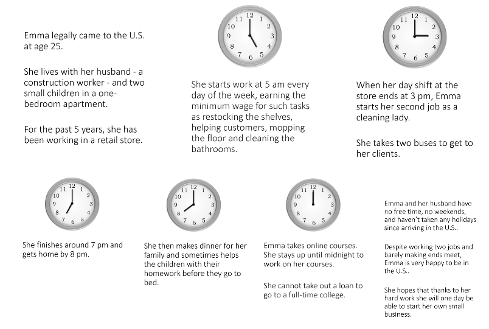

- • Grigorieff et al. (2020) investigate whether information changes attitudes toward immigrants. The authors conduct a survey experiment in the US in which they randomly provide participants with official statistics on immigrants (total share, undocumented share, unemployment rate, incarceration rate, and share that does not speak English). They find that information provision improves beliefs and attitudes of participants toward immigrants but does not significantly affect policy preferences.

###### On inflation

- • Armantier et al. (2016) conduct a survey experiment in the US in which they randomly provide information about past or future inflation. The authors find that respondents update their beliefs about inflation consistently with Bayesian updating (i.e., the distribution of expected inflation converges towards its center), with some heterogeneity by gender.
- • Cavallo et al. (2016) investigate how individuals learn when information may be biased. Critical to the analysis is that during the period of investigation, the Argentinian government was systematically underreporting official inflation statistics. In their survey, the authors randomly vary the level of inflation and the source (either official or unofficial) when they provide information on inflation to respondents. These treatments highlight the role not just of information itself, but also of its source.

- The authors find that information provision affects inflation expectations and perceptions, but also that individuals are able to de-bias official statistics.
- • Cavallo et al. (2017) investigate information frictions in household inflation expectations by conducting a survey experiment using representative samples in the US and Argentina. Respondents are provided with information about inflation either through official statistics or through supermarket prices. The authors find that the mode through which information is provided matters: individuals are more influenced by information that is less costly to acquire (i.e., supermarket prices). Individuals in the US, which is considered a low inflation country, display higher learning rates, consistently with rational inattention models.
- • Coibion et al. (2021) use a survey of firms in New Zealand and provide information about others’ firstlevel and higher-level beliefs about inflation. Firms adjust their inflation expectations when provided with information, and the effect is stronger when they receive information about other firms’ high-level beliefs.
- • Coibion et al. (2020) leverage an information provision experiment embedded in a firms’ survey administered by the Bank of Italy in which a random set of firms is informed about inflation in recent periods. The authors then use inflation expectations expressed after the treatment as an instrumental variable for subsequent economic behavior. Treated firms with higher inflation expectations increase their prices and demand for credit and reduce capital and employment. When policy rates are at the lower bound demand effects are stronger and, while still increasing prices, firms with higher inflation expectations no longer decrease employment.
- • Coibion et al. (2022) conduct a survey experiment in the US in which respondents are provided different types of information about inflation to understand their different impacts on inflation expectations. The information includes quantitative information (for instance the actual CPI inflation rate, the inflation target of the Fed) and qualitative information (for instance, the most recent FOMC statement and its coverage in USA Today). They find that reading the FOMC statement has the same effect on inflation expectations as being told the inflation target, while simply reading news about the FOMC meeting yields a revision that is half of the size.
- • Roth and Wohlfart (2020) conduct a survey experiment in the US in which respondents are randomly provided professional forecasts about the likelihood of a recession to see if information provision affects individual expectations. Respondents are provided with forecasts from different sources (one that places the risk of entering a recession at 35% and another one that places it at 5%) and are then shown a figure contrasting their prior estimation with the information they have received. The authors find that individuals extrapolate information and adjust their expectations to their personal economic situation.

###### On health

- • Alsan and Eichmeyer (2021) investigate the effectiveness of encouragement to vaccinate against the flu within a sample of men aged 25-51 in the US without a college degree. Respondents are randomly shown videos from both experts and laypeople. The authors find that non-expert senders are more effective, especially among those least willing to vaccinate.
- • Carey et al. (2022) conduct a repeated online experiment in the US, Great Britain, and Canada to investigate the impact of fact-checking Covid-19 information on misperceptions about the pandemic. Treated individuals are shown fact-checks on specific issues such as the origin of the coronavirus (to debunk the view that it was created by the Chinese government as a bioweapon) or the ineffectiveness of hydroxychloroquine in curing infections. The evidence shows that these fact-checks reduce the targeted misperceptions, but do not persist over time even after repeated exposures.

###### On housing

- • Armona et al. (2019) conduct a survey on home price expectations to investigate the formation and behavioral impact of expectations. First, respondents are asked about their perceptions about housing prices in the past one and five years, as well as their expectations for future housing prices in one or five years. Then, respondents are randomly allocated into one of two information treatments or the control group. The treatment groups receive information about the actual housing price change over the prior year or prior five years, while the control group receives no information. They find that treatment leads to directional extrapolation (i.e., over/underestimation in the first step leads to an upward/downward extrapolation in the second), that respondents do not expect reversion towards the mean (that is, that housing prices will eventually return to their average level) of housing price growth (which is instead empirically documented) and finally that these expectations impact subsequent decisions made in a portfolio choice task within the survey.
- • Coibion et al. (2020) provide 25,000 US individuals information about past, current, and/or future interest rates for housing to investigate whether information provision affects expectations. They find that information about current and future policy rates and interest rates moves both the interest rate and inflation expectations by about the same amount. Information about the mortgage rates has the greatest impact on real interest rate expectations.
- • Fuster et al. (2022) conduct a survey experiment within the Survey of Consumer Expectations to understand differences in preferred sources of information. Respondents are incentivized to give correct forecasts about house prices and can also decide to buy information in the form of either official statistics or experts’ forecasts, which allows the authors to estimate willingness to pay for information. The authors document that individuals disagree on which information to buy, but consistently incorporate the acquired information in their predictions.

###### On labor

- • Arntz et al. (2022) use a sample from an online survey in Germany and US to understand employment concerns related to automation. Treated individuals receive information about the effect of automation in two different framings: either respondents are informed that automation has a net zero effect on employment, or they are informed that the impact of automation on employment depends on employees’ educational background. Information reduces automation angst, but effects vary on the basis of prior beliefs about the future of work. Moreover, the effect is not the same for all dimensions of automation (e.g., different across economy-wide implications, individual implications, and policy preferences).
- • Bottan and Perez-Truglia (2022) conduct a survey experiment with 1100 medical students participating in the National Residency Match Program (US) to investigate the importance of relative income position and consumption in making life decisions. They provide statistics on the cost of living and earnings ranking of the cities which then students are asked to rank. By randomizing the value of the relative income position given for each city choice, the authors estimate the importance of relative (to others) consumption in program choice. A 1 percentage point increase in relative consumption increases the probability that the city (and the program) is chosen by 0.185 percentage points.
- • Bursztyn et al. (2020) use an experimental sample in Riyadh and a national sample in all of Saudi Arabia to study the effect of beliefs about others’ support of female labor force participation (FLFP) on respondents’ own support of FLFP. The authors show that, when respondents are made aware that other men support women working outside the home more than they previously thought, they increase their support in helping their wives find jobs. This support is lasting, as shown in a follow-up survey, in which partners of treated individuals are more likely to have entered the job market.
- • Cullen and Perez-Truglia (2022) survey a sample of 2,060 employees at a large firm in Southeast Asia to evaluate the extent to which employees are aware of pay differences between themselves and their bosses. Respondents are first asked an incentivized question about how much they think their managers and peers earn and then asked a real-stakes question that elicits their willingness to pay for this information. Next, respondents are randomly assigned to receiving salary information about a sample of five of their managers or peers. Regardless of treatment status, respondents are then able

- to revise their beliefs. The authors use this experiment to see whether employees share information with each other about salary and whether exogenous shocks to salary perceptions affect motivation or effort. They document large misperceptions about the salaries of both managers and peers. When workers find out that managers earn more than they expected, they increase their effort. On the other hand, workers decrease their effort if they find out that their peers make more than they expected.
- • Korlyakova (2021) studies whether receiving information about ethnic discrimination in the Czech labor market from different sources (laypeople, HR managers, researchers) leads to different belief updating. She finds that individuals update their beliefs more when receiving information from experts, and tend to prefer these sources to the other ones.
- • Roth et al. (2022b) conduct a survey experiment in the US in which participants are randomly shown a bar chart that compares their risk of unemployment during a recession with individuals similar to themselves. This information generally increases the concern about becoming unemployed in the next recession and increases the demand for expert forecasts on the likelihood of a recession.

###### On political participation, political economy, and voting

- • Bursztyn et al. (2020) run an online survey experiment in which they randomly inform respondents that Donald Trump was 100% likely to win in the 2016 presidential election in Alabama, Arkansas, Idaho, Nebraska, Oklahoma, Mississippi, West Virginia, and Wyoming. Without the information about the odds, individuals are less likely to make an indirect donation to an anti-immigration organization when their responses are not anonymous. Treated individuals do not display this wedge between private and public behavior.
- • Bursztyn et al. (2020) use an online survey of Republicans and Independents in the US to study the use of excuses to justify socially stigmatized behavior. A random sample of the respondents is shown the results of a study that finds higher crime rates of immigrants compared to Arizonians. Respondents are then informed whether or not others can see if they received this information. Subjects who thought they were being observed increased donations to an anti-immigration organization. Moreover, in a second experiment, respondents are informed that a previous user who has read the study has made such a donation; respondents tend to find the previous user less intolerant and more persuadable.
- • Hermle and Roth (2019) leverage a survey sent to party members before the general election in a western European country to assess whether knowing about others’ intentions of canvassing increases or decreases the respondent’s own intention. Treated respondents are informed about others’ intentions of canvassing. The authors find that individuals who are informed about a high level of participation are less likely to participate, consistent with the interpretation of effort choices made by the individual and made by others as strategic substitutes (i.e., that when some put in more effort into a public good, others reduce their own effort – they freeride).
- • Hager et al. (2021) use the same setting as Hermle and Roth (2019), but focus on the role of partycompetition as a mediating factor. The authors find that receiving information about others’ intentions of canvassing reduces beliefs of self-efficacy when party competition is higher, which leads to nonparticipation.
- • Nyhan et al. (2022) conduct an online survey experiment to understand the extent to which exposure to information changes beliefs about climate change and support for government action. Treated individuals are shown either scientific coverage on the climate crisis or opinion coverage that is skeptical about the scientific consensus. The authors find that exposure to information increases accuracy about climate change beliefs and support for government action, but that these effects diminish over time and are eroded by exposure to a skeptical opinion.
- • Hvidberg et al. (2021) use survey data matched to administrative data to document people’s misperceptions about their position in the income distribution and how study updating these misperceptions affects attitudes towards inequality. The authors explain what percentiles of the income distribution

are and then ask them in which percentile they think they are with respect to different reference groups. The authors consider both large reference groups (cohort, gender, municipality, education level, and sector of work) and small reference groups (schoolmates, co-workers, and neighbors) that could influence a respondent’s perception of fairness. In the treatment, respondents are first asked about their perception of their position within the given reference group and then provided with information about their actual position (see Figure 5). Next, they are asked questions about the perceived unfairness of income inequality for each of these reference groups. The treatment increases the perception of unfairness across all reference groups and the effect is larger for those who initially overestimated their percentile.

###### On taxation

- • Doerrenberg and Peichl (2022) conduct a randomized survey experiment on tax morale (i.e., intrinsic and non-pecuniary motives driving tax compliance) to understand how information can affect it. They have two treatments: a social norm treatment and a reciprocity treatment. In the social norm treatment, respondents are informed about the tax compliance gap – that about 10% of taxes worldwide are being evaded. In the reciprocity treatment, respondents are informed about how much education expenditures could increase with the missing tax revenue. Relative to the control group, which just receives a short opener saying that tax evasion is often discussed in the media, respondents have lower and higher tax morale in the social norm and reciprocity treatments, respectively.
- • Kuziemko et al. (2015) conduct a survey experiment in the US in which they randomly provide participants with official statistics on income inequality in the US, the link between top income tax rate and economic growth, and the estate tax. The authors find that information provision changes views and concerns about inequality but does not affect policy preferences much, with the exception of the estate tax.

In one of the treatment variations, respondents are provided information on the number of Americans living in poverty, including the number of American children and number of disabled Americans in poverty. This information is accompanied by pictures of low-income families (see Figure A-7). Then, respondents are asked to estimate the monthly budget of a low-income family. This budget is then compared with the estimated poverty line, and respondents are informed whether the budget is above or below the line. This type of treatment, which combines tailored information with a perspective-taking exercise, has a strong and significant positive effect on support for an estate tax.

In a different treatment variation, respondents are provided information about the estate tax. In this case, both the treatment group and the control group receive information about the estate tax. However, the treatment group also receives a picture of a mansion that emotionally primes them about the lifestyles of the rich, as discussed in Section 6.2 (see Panels (A) and (B) of Figure A-8 for the information provided to the control group and the treatment group, respectively). The authors do not find that the emotional prime has an effect on inequality views.

Figure A-7: Customized poverty information from Kuziemko et al. (2015)

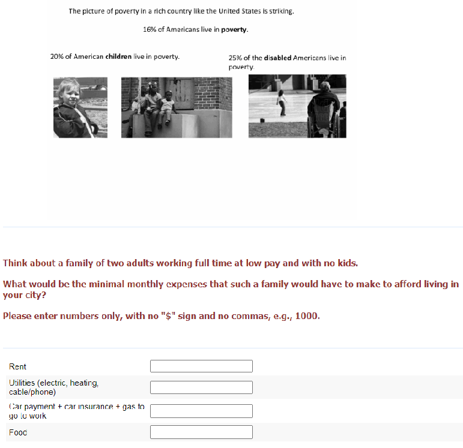

Figure A-8: Information Provision with and without Emotional Priming from Kuziemko et al.

(2015)

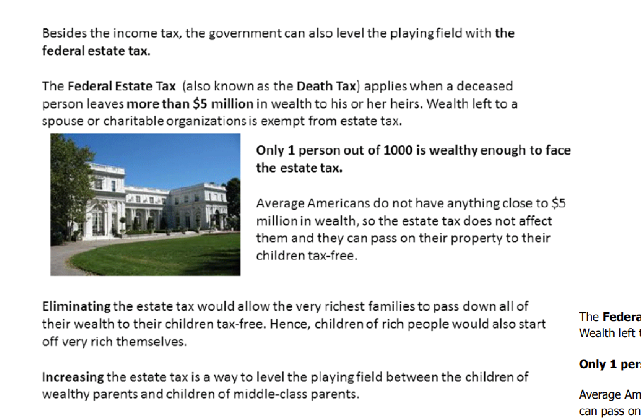

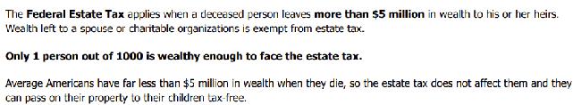

(a) Information Provision with Priming (b) Neutral Information Provision

A-27

###### A-4.3 Factorial experiments: vignette and conjoint designs

###### Methodological papers

- • Sauer et al. (2020) conduct experiments in which they investigate the effects of presentation style, answering scales, and order of vignettes on experimental results. They find no difference in results when vignettes were presented as texts or tables. Furthermore, they find that compared to rating scales open scales lead to more measurement problems and that variation of vignette order does not substantially affect results. Rating scales are scales with a discrete, ordered number of options, for example from -5 to 5. Open scales, on the other hand, allow respondents to assign a number to how they perceive a certain aspect. They are often used in multi-part questions. For example, in this case, respondents are presented a vignette on earnings first asked whether they think the earnings are just or unjust, then whether the earnings are too high or too low, and lastly are asked to assign a number to the amount of injustice they perceive.
- • Jasso (2006) provides guidance on how to conduct factorial survey analysis. Specifically, the author proposes a framework that differentiates between individuals’ normative and positive beliefs and presents guidelines on how to generate and collect vignette data.
- • Sauer et al. (2014) study respondents’ comments about a vignette question bout the fairness of earnings asked in the 2008 German Socio-Economic Panel (SOEP). Overall, older and less-educated respondents found the question difficult to comprehend and many respondents thought that some profiles were unrealistic.

###### On econometric analysis of conjoint experiments

- • Hainmueller et al. (2014) formalize conjoint analysis within the potential outcomes framework. Assuming i) stability across choice tasks, ii) that randomization in one task does not affect respondents’ choice in the others, iii) randomization of the order of vignettes presented, and iv) no order effects, one can unbiasedly estimate the Average Marginal Component Effect (AMCE). This measure represents the direct causal effect of a single attribute on the outcome of interest while averaging the distribution of the other features.
- • Bansak et al. (2022) highlight the central importance of the ACME in conjoint analysis through its formal and conceptual underpinnings. The authors particularly focus on voting behavior and show that the AMCE represents an aggregation of individual-level preferences that combines their direction and intensity and that this holds true for other common estimands such as the Average Treatment Effect (ATE).
- • de la Cuesta et al. (2022) study how the choice of profile distribution affects the conclusions of conjoint analysis. Simply assuming a uniform distribution, which is likely to be different from what happens in the real world, hinders external validity. To correct for this, they introduce the concept of population AMCE (pAMCE), which accounts for the relative frequency of each profile in the target population. The latter can be chosen on the basis of real-world data or it can be a theoretically derived counterfactual.
- • Leeper et al. (2020) focus on the practice of computing differences in AMCE to perform subgroup analysis, that is, looking at AMCE for the same feature across groups and using that difference as an estimate of the between-group difference in preference for that feature. The authors show that since AMCE is conditional on a reference category, this difference can yield misleading results when the reference category is different across groups. Hence, they suggest using the difference in conditional marginal means to report the analysis descriptively and include interaction terms between subgroup covariates and all features level to formally test for subgroup differences.

Examples of factorial experiments On labor market and discrimination

- • Folke and Rickne (2022) investigate the impact of sexual harassment in the labor market. They run a survey experiment in which respondents choose from hypothetical job offers that vary in wages and work conditions. In this design, the authors incorporate a forced-choice paired vignette design that presents respondents with one of four different kinds of vignettes: one where most people are content in the job, one without any particular information, one with some employees having a conflict with the manager, and one with a sexual harassment scenario. Vignettes are a particularly useful instrument here because unlike information on pay that would be included in a contract, information on harassment would likely be transmitted via rumors or anecdotes. Furthermore, through the vignette design, the authors can include different types of sexual harassment and the authors are able to avoid using the term “sexual harassment,” instead leaving the interpretation of scenarios to the respondent. They find that when respondents see a vignette in which someone of their sex experiences sexual harassment, they are willing to accept a 17% pay decrease to avoid this job, but when the vignette shows someone of the opposite sex experiencing such harassment, this willingness to pay is only 6%.
- • Teele et al. (2018) investigate the forms of bias that could limit women’s representation in politics. They run surveys on three samples in the US (one nationally representative, two of public officials) and conduct paired-conjoint analysis in which respondents compare two candidates that vary in gender, political experience, occupation, number of children, and age. Rather than outright hostility or double standards, the evidence suggests a double bind: characteristics that usually impede a career in politics, such as having a large family, are seen as more important for women than for men.

###### On taxation

- • Gross et al. (2017) exploit a vignette design to determine the drivers of attitudes toward inheritance taxes using a German sample. In the survey, the authors present respondents with situations in which the gender of the heir, the type of inheritance, the relationship of the heir with the testator, and the income of the heir can vary. Then, respondents are asked their preferred wealth tax rate. They find that desired tax rates are higher when the bequest is large and when the income level of the heir is high. On the other hand, the desired tax rate decreases when the heir had a close relationship with the testator.
- • Fisman et al. (2020) use a vignette design in which profiles differ on their income, wealth, and source of wealth to jointly estimate the preferred tax rates for income and wealth in the US. They find that respondents prefer a roughly linear tax on income (around 13-15%), while the preferred tax rate on wealth differs depending on its source: if it comes from savings, then the desired level is 0.8% whereas for wealth coming from inheritance this figure increases to 3%.
- • Saez and Stantcheva (2016) complement their theoretical findings for optimal tax theory with an online survey of US respondents that tests people’s utilitarian and libertarian preferences. In the survey, respondents are asked to allocate a tax break between two different families that differ in their pre-tax and post-tax income, among other kinds of questions. They show that both pre-tax and post-tax are important predictors of the allocation of the tax break.

###### On macro-finance

- • Andre et al. (2022) use a representative sample of the US and a sample of experts to investigate different subjective models of the economy. The authors use vignettes that describe hypothetical future shocks to oil supply, government spending, monetary policy, and income taxes. These shocks can either be increases or decreases in these variables. The authors find that households and experts focus on different channels when making predictions about unemployment and inflation: experts focus on standard textbook channels whereas households tend to recall channels they were exposed to in the past.

- • Christelis et al. (2019) use a representative sample of Dutch households to study the consumption response to income shocks (i.e., the marginal propensity to consume (MPC). By presenting respondents with shocks of different sizes and directions, they find that households’ MPCs are larger for negative shocks, for poorer households, and that it increases with age.
- • Fuster and Zafar (2021) estimate the sensitivity of willingness to pay for a house to changes in financing conditions using an online survey. In particular, they present respondents with different mortgage rates, downpayment sizes, and an exogenous shock to non-housing wealth. They find that sensitivity to downpayment size and non-housing wealth is high, especially for credit-constrained households, while changing the mortgage rate has a more moderate effect on the willingness to pay.
- • Fuster et al. (2020) study features of marginal propensities to consume in order to better inform consumption theories. They use a survey to create hypothetical scenarios of income shocks. These shocks can vary in size ($500 to $2,500 to $5,000), direction (loss vs. gain), and whether there was news about the shock. The authors also include one treatment condition on an unexpected, interest-free loan opportunity. They find evidence of loss aversion, that households’ responses to gains are very heterogeneous, and that responses to losses are greater than responses to gains. Moreover, news about gains do not have behavioral responses, households do not respond to the one-year interest-free loan, and news about future income losses leads people to reduce their spending.

###### On returns to education

- • Wiswall and Zafar (2021) study how students perceive returns to human capital. They elicit beliefs of high-ability college students on future returns (future earnings, employment, marriage prospects, fertility) of their degree major choice by asking them to allocate a probability to each specific event (such as marrying, future earnings, and fertility) at different points in time in the future (i.e., at 23 years of age, at 30 years of age and at 45). They find that students sort into majors on the basis of these perceived returns and that students see their choice of major as related not only to future earnings but also to marriage and the number of children.
- • Boneva and Rauh (2019) study why students from low socio-economic backgrounds are less likely to go to university by eliciting pecuniary and non-pecuniary motives that may drive students’ enrollment decisions. They present scenarios with differing grades and future labor market outcomes and find that students with low socio-economic backgrounds perceive both the pecuniary and non-pecuniary returns to education to be significantly lower.
- • Kiessling (2021) uses different hypothetical scenarios with varying parenting styles and neighborhood qualities to understand how parents perceive the interaction between the environment and their parenting. The author finds that parents perceive large returns to parental warmth and neighborhood quality.
- • Attanasio et al. (2020) elicit beliefs of parents in the UK on the returns to different types of investments in school children by presenting them with different hypothetical scenarios that vary in time investment, cost, and school quality. They find that parents perceive the returns of higher investments in time or money to be more important than school quality.
- • Wiswall and Zafar (2018) elicit beliefs on expected attributes of jobs/workplace by presenting different hypothetical scenarios that vary in flexibility, probability of dismissal, and future earnings to study how these attributes affect pre-labor-market human capital decisions, They find that women prefer flexibility and stability and men prefer higher earnings growth.

###### On policy support

- • Bansak et al. (2021) use a sample of respondents from five European countries to understand the drivers of support for austerity. The authors use a paired conjoint design in Italy and Spain in which respondents compare two different austerity packages that differ in terms of tax hikes and spending cuts. They find that support heavily depends on the identity of political backers of the package and on the precise composition of spending cuts and tax hikes.

- • Bechtel and Scheve (2013) use nationally representative samples from France, Germany, the UK, and the US to understand what drives support for climate agreements. They use a forced-choice paired conjoint analysis that asks respondents to choose between two climate agreements that vary in costs and distribution, participation, and enforcement. The authors find that people prefer climate agreements that cost less, have a fair cost distribution, involve more countries, and include small sanctions for non-compliant countries.
- • Christensen and Rapeli (2021) leverage a sample of voting-age Finnish citizens to document the drivers of differences in preferences on how long a given public policy takes to produce tangible results. Using a paired conjoint design, they present respondents with policies that can differ on time horizon, policy topic, level of decision-making, costs, benefits, certainty, and support from politicians and experts. They find that people do have a preference for more immediate policies, but not a strong one. They further find that willingness to wait for results is driven by education levels (more educated people are more willing to wait for policies’ impact) rather than political trust.
- • Hanksinson (2018) uses a national sample in the US to see what features of new buildings drive support for the Not In My Backyard (NIMBY) movement. They further investigate differences in NIMBY attitudes between homeowners and renters. By using a forced-choice paired conjoint design in which respondents are asked to evaluate two buildings that differ in size, purpose, distance from residence, and share available as affordable housing, they find that renters in high-rent cities display NIMBYism to the same degree as homeowners when new buildings are available at market rate because they fear upward pressure on rents.
- • Gallego and Marx (2017) use a nationally representative sample from Spain to understand which dimensions (for example, how much a program costs) affect support for labor market policies. The authors use a forced-choice paired conjoint analysis that compares two labor market policies differing in cost, purpose, source of funding, training, and target population. They find that respondents prefer policies that support the poor and policies that are funded at the expense of unpopular policies.

###### On immigration

- • Bansak et al. (2016) leverage a representative sample for 15 European countries and use a paired conjoint design to understand which features of refugees drive differences in attitudes towards asylum seekers. Respondents tend to favor Christian refugees, those who have fled from physical distress rather than economic hardship, and those who are more likely to contribute to the economy.
- • Wright et al. (2016) leverage two national surveys in the US to investigate what drives the differences in attitudes toward legal and illegal immigrants. Using a forced-choice paired conjoint design, the authors present respondents with two profiles differing in their legal status, education, family structure, employment history, origin, religion, language level, and work. The authors find that the key driver is the illegal status rather than personal attributes such as age, education, or marital status.

###### On health and ethics

- • Ambuehl et al. (2015) use an online sample from MTurk to investigate perspectives on transactions such as paid kidney donations and prostitution from an economic and ethical point of view. Ethicists may think that such monetary incentivization damages the judgment of a person whereas economists may think that it is best for people to have as many choices as possible and to compensate such transactions highly. To separate respondents into these two categories, the authors present them with hypothetical clinical trials that differ only in the compensation offered to participants. They find that “economists” would rate a payment of $10,000 as more ethical than a payment of $1,000 whereas the opposite holds true for the “ethicists.”
- • Ambuehl and Ockenfels (2017) use a vignette design to understand why individuals may find monetary incentives to participate in complex transactions (such as human egg donations) unethical. They present respondents with profiles of participants in these transactions that can differ in cognitive

ability, level of education, and financial situation. They find that respondents are more opposed to increasing the incentive for such transactions (i.e., paying more for an egg) when the donor is low ability than when the donor is in financial distress.

###### On social norms

- • Fong and Luttmer (2011) use a factorial design to understand which features drive donations to charities supporting the poor in the US. By changing the racial composition and perceived worthiness of the recipients through different photos and audio presentations, the authors find that donations increase when recipients are presented as worthy. Moreover, presenting recipients as worthy and showing a picture of Black individuals leads to higher donations from Black individuals than from non-Black ones.
- • Fong and Luttmer (2009) use a factorial design in which respondents are presented with different profiles of victims of Hurricane Katrina. By changing race, income, and worthiness in an audio presentation of victims, the respondents are asked to split $100 between themselves and the victims, as described in A-3.3. On average, race and worthiness do not change generosity, but people do tend to donate more in disadvantaged economic areas. Moreover, race becomes important when respondents have a high or low degree of in-group loyalty: those that feel closer to their race tend to donate more to victims of the same race, while those who feel less close to their race donate less to victims of the same race.

###### On politics

- • Carey et al. (2021) conduct an online survey experiment to understand whether electoral inversion (i.e., when a candidate or party wins an election despite losing the popular vote) decreases the perceived legitimacy of the winner. To do so, they run two experiments with different scenarios for the 2020 US Presidential election. In the first experiment, they employ a factorial design in which the Electoral College vote remains constant but the margin of victory and the winning party vary. In the second experiment, they also vary the margin of victory and randomly reminded half of the respondents that the 2016 election was an electoral inversion. The results suggest that electoral inversion decreases the legitimacy of the candidate regardless of the popular vote margin and that this effect is mostly driven by Democrats.
- • Hainmueller et al. (2015) use an online sample of Swiss citizens representative of the Swiss population of voting age to see how well conjoint analysis can predict subsequent political choices. The authors use different designs, reported below in Appendix Figure A-9 to present respondents with profiles of foreign residents that differ in age, gender, education, origin, language skills, and integration status. Respondents are then asked to decide whether or not to give each profile the right of citizenship. Results from this experiment are then compared to results of a natural experiment, in which Swiss municipalities decided to use referendums to decide on citizenship applications. The authors find that all designs match the real-world data and that the paired conjoint design, described in Section 6.4, is the best performing one.

###### A-33

###### Figure A-9: Vignette and Conjoint Designs from Hainmueller et al. (2015)

###### (a) Single Vignette

###### (b) Paired Vignette

Please take a thorough look at the applicant’s profile and then make your decision.

Applicant 1 from Turkey is 30 years old and has lived in Switzerland since birth. He has completed an apprenticeship. The applicant speaks good German with an accent and is assimilated in Switzerland. Do you want Applicant 1 to be granted Swiss citizenship?

□Yes □ No

###### (c) Single Conjoint

Please take a thorough look at the applicant’s profile and then make your decision.

| |Applicant 1|
|---|---|
|Sex Country of Origin Age In Switzerland since Educational Status Language Proficiency Integration Status|Female  Italy  55 years  Birth  Mandatory schooling  Speaks Swiss accent-free  Hardly different from a Swiss|

Do you want Applicant 1 to be granted Swiss citizenship?

□Yes □ No

Please take a thorough look at the profiles of the two applicants and then make your decision.

- Applicant 1 from the former Yugoslavia is 30 years old and has lived in Switzerland for 29 years. He graduated from university. The applicant speaks Swiss German without an accent and can hardly be distinguished from a Swiss.
- Applicant 2 from Austria is 30 years old and has lived in Switzerland for 29 years. He has completed an apprenticeship. The applicant speaks Swiss German without an accent and can hardly be distinguished from a Swiss. Do you want the applicants to be granted Swiss citizenship?

| |Yes No|
|---|---|
|Applicant 1  Applicant 2   |□ □ □ □ |

###### (d) Paired Conjoint

Please take a thorough look at the two applicant profiles and then make your decision.

| |Applicant 1|Applicant 2|
|---|---|---|
|Sex|Female|Male|
|Country of Origin|the Netherlands|Bosnia and Herzegovina|
|Age|55 years|55 years|
|In Switzerland since|Birth|14 years|
|Educational Status|Mandatory schooling|Mandatory schooling|
|Language Proficiency|Speaks German fluently without accent|Speaks accent-free Swiss German|
|Integration Status|Hardly different from a Swiss|Is integrated into Switzerland|

Do you want the applicants to be granted Swiss citizenship?

| |Yes No|
|---|---|
|Applicant 1 Applicant 2 |□ □  □ □ |

###### (e) Paired Conjoint with Forced Choice

###### Please take a thorough look and then make your decision. Which of the two applicants do you prefer for the granting of Swiss citizenship?

| |Applicant 1|Applicant 2|
|---|---|---|
|Sex|Male|Male|
|Country of Origin|the Netherlands|Italy|
|Age|30 years|41 years|
|In Switzerland since|20 years|Birth|
|Educational Status|Mandatory schooling|Mandatory schooling|
|Language Proficiency|Speaks good German with an accent|Can communicate well in German|
|Integration Status|Highly familiar with Swiss traditions  □|Highly familiar with Swiss traditions  □|

Note: This figure shows translated vignette and conjoint designs from Hainmueller et al. (2015), in which respondents are asked to choose applicants for obtaining Swiss citizenship in several different formats. Attribute order is fixed in all examples. In the single vignette (Panel (A)) and single conjoint (Panel (C)), respondents have to select “yes” or “no” for the applicant. The same applies to the paired variation (Panels (B) and (D) for vignette and conjoint, respectively), but have to select “yes” or “no” for each of the two applicants. In Panel (E), respondents have to choose between one of the two applicants.

#### A-5 Libraries of Questions

- • The General Social Survey: http://www.gss.norc.org/
- • The World Value Survey: https://www.worldvaluessurvey.org/wvs.jsp
- • The National Election Survey: https://electionstudies.org
- • Gallup Analytics: https://www.gallup.com/analytics/213617/gallup-analytics.aspx
- • Roper Center for Public Opinion Research: https://ropercenter.cornell.edu
- • Pew Research Center: https://www.pewresearch.org/question-search/
- • The Inter-University Consortium for Political and Social Research (ICPSR) is a great resource

#### References

Adida, C. L., A. Lo, and M. R. Platas (2018). Perspective Taking Can Promote Short-Term Inclusionary Behavior Toward Syrian Refugees. Proceedings of the National Academy of Sciences 115(38), 9521–9526. Alempaki, D., C. Starmer, and F. Tufano (2019). On the Priming of Risk Preferences: The Role of Fear and

General Effect. Journal of Economic Psychology 75, 102137. Alesina, A., M. F. Ferroni, and S. Stantcheva (2021). Perceptions of Racial Gaps, Their Causes, and Ways to Reduce Them. NBER Working Paper 29245. National Bureau of Economic Research. Alesina, A., A. Miano, and S. Stantcheva (2022). Immigration and Redistribution. The Review of Economic Studies. Alesina, A., S. Stantcheva, and E. Teso (2018). Intergenerational Mobility and Preferences for Redistribution. American Economic Review 108(2), 521–554.

Allcott, H., L. Boxell, J. Conway, M. Gentzkow, M. Thaler, and D. Yang (2020). Polarization and Public Health: Partisan Differences in Social Distancing During the Coronavirus Pandemic. Journal of Public Economics 191, 104254.

Alm˚as, I., A. W. Cappelen, and B. Tungodden (2020). Cutthroat Capitalism versus Cuddly Socialism: Are Americans More Meritocratic and Efficiency-Seeking than Scandinavians? Journal of Political Economy 128(5), 1753–1788.

Alsan, M., L. Braghieri, S. Eichmeyer, M. J. Kim, S. Stantcheva, and D. Y. Yang (2020). Civil Liberties in Times of Crisis. NBER Working paper 27972. National Bureau of Economic Research. Alsan, M. and S. Eichmeyer (2021). Experimental Evidence on the Effectiveness of Non-Experts for Improving Vaccine Demand. NBER Working paper 28593. National Bureau of Economic Research. Ambuehl, S., M. Niederle, and A. E. Roth (2015). More Money, More Problems? Can High Pay Be Coercive and Repugnant? American Economic Review: Papers and Proceedings 105(5), 357–60. Ambuehl, S. and A. Ockenfels (2017). The Ethics of Incentivizing the Uninformed: A Vignette Study. American Economic Review 107(5), 91–95. Andre, P., C. Pizzinelli, C. Roth, and J. Wohlfart (2022). Subjective Models of the Macroeconomy: Evidence From Experts and Representative Samples. The Review of Economic Studies.

Armantier, O., S. Nelson, G. Topa, W. Van der Klaauw, and B. Zafar (2016). The Price is Right: Updating Inflation Expectations in a Randomized Price Information Experiment. Review of Economics and Statistics 98(3), 503–523.

Armona, L., A. Fuster, and B. Zafar (2019). Home Price Expectations and Behaviour: Evidence From a Randomized Information Experiment. The Review of Economic Studies 86(4), 1371–1410. Arntz, M., S. Blesse, and P. Doerrenberg (2022). The End of Work is Near, Isn’t It? Survey Evidence on Automation Angst. Attanasio, O., T. Boneva, and C. Rauh (2020). Parental Beliefs about Returns to Different Types of Investments in School Children. Journal of Human Resources, 0719–10299R1. Bansak, K., M. M. Bechtel, and Y. Margalit (2021). Why Austerity? The Mass Politics of a Contested Policy. American Political Science Review 115(2), 486–505. Bansak, K., J. Hainmueller, and D. Hangartner (2016). How Economic, Humanitarian, and Religious Concerns Shape European Attitudes Toward Asylum Seekers. Science 354(6309), 217–222.

Bansak, K., J. Hainmueller, D. J. Hopkins, and T. Yamamoto (2022). Using Conjoint Experiments to Analyze Election Outcomes: The Essential Role of the Average Marginal Component Effect. Political Analysis, 1–19.

Bargh, J. A., M. Chen, and L. Burrows (1996). Automaticity of Social Behavior: Direct Effects of Trait Construct and Stereotype Activation on Action. Journal of personality and social psychology 71(2), 230.

Bechtel, M. M. and K. F. Scheve (2013). Mass Support for Global Climate Agreements Depends on Institutional Design. Proceedings of the National Academy of Sciences 110(34), 13763–13768. Berinsky, A. J. (2018). Telling the Truth About Believing the Lies? Evidence for the Limited Prevalence of Expressive Survey Responding. The Journal of Politics 80(1), 211–224. Berinsky, A. J., G. A. Huber, and G. S. Lenz (2012). Evaluating Online Labor Markets for Experimental Research: Amazon.com’s Mechanical Turk. Political Analysis 20(3), 351–368. Berlinski, N., M. Doyle, A. M. Guess, G. Levy, B. Lyons, J. M. Montgomery, B. Nyhan, and J. Reifler

(2021). The Effects of Unsubstantiated Claims of Voter Fraud on Confidence in Elections. Journal of Experimental Political Science, 1–16.

Boneva, T., M. Golin, and C. Rauh (2022). Can Perceived Returns Explain Enrollment Gaps in Postgraduate Education? Labour Economics 77, 101998. Boneva, T. and C. Rauh (2019). Socio-Economic Gaps in University Enrollment: The Role of Perceived

Pecuniary and Non-Pecuniary Returns: CESifo Working Paper Series 6756. Center for Economic Studies. Bottan, N. L. and R. Perez-Truglia (2022). Choosing your Pond: Location Choices and Relative Income.

Review of Economics and Statistics 104(5), 1010–1027.

Brader, T., N. A. Valentino, and E. Suhay (2008). What Triggers Public Opposition to Immigration? Anxiety, Group Cues, and Immigration Threat. American Journal of Political Science 52(4), 959–978. Broockman, D. and J. Kalla (2016). Durably Reducing Transphobia: A Field Experiment on door-to-door

Canvassing. Science 352(6282), 220–224.

Brown, J. R., A. Kapteyn, E. F. P. Luttmer, O. S. Mitchell, and A. Samek (2021). Behavioral Impediments to Valuing Annuities: Complexity and Choice Bracketing. The Review of Economics and Statistics 103(3), 533–546.

Bruneau, E. G. and R. Saxe (2012). The Power of Being Heard: The Benefits of ‘Perspective-giving’ in the Context of Intergroup Conflict. Journal of Experimental Social Psychology 48(4), 855–866. Bublitz, E. (2022). Misperceptions of Income Distributions: Cross-Country Evidence from a Randomized Survey Experiment. Socio-Economic Review 20(2), 435–462. Bursztyn, L., G. Egorov, and S. Fiorin (2020). From Extreme to Mainstream: The Erosion of Social Norms. American Economic Review 110(11), 3522–48. Bursztyn, L., A. L. Gonz´lez, and D. Yanagizawa-Drott (2020). Misperceived Social Norms: Women Working Outside the Home in Saudi Arabia. American Economic Review 110(10), 2997–3029. Bursztyn, L., I. K. Haaland, A. Rao, and C. P. Roth (2020). I Have Nothing Against Them, But.... NBER Working Paper 27288. National Bureau of Economic Research. Cappelen, A. W., B. Enke, and B. Tungodden (2022). Universalism: Global Evidence. nber working paper

30157. National Bureau of Economic Research. Cappelen, A. W., S. Fest, E. Ø. Sørensen, and B. Tungodden (2022). Choice and personal responsibility: What is a morally relevant choice? Review of Economics and Statistics 104(5), 1110–1119.

Carey, J. M., A. M. Guess, P. J. Loewen, E. Merkley, B. Nyhan, J. B. Phillips, and J. Reifler (2022). The Ephemeral Effects of Fact-checks on COVID-19 Misperceptions in the United States, Great Britain and Canada. Nature Human Behaviour 6(2), 236–243.

Carey, J. M., G. Helmke, B. Nyhan, M. Sanders, S. C. Stokes, and S. Yamaya (2021). The Effect of Electoral Inversions on Democratic Legitimacy: Evidence from the United States. British Journal of Political Science, 1–11.

- Cavallo, A., G. Cruces, and R. Perez-Truglia (2016). Learning from Potentially Biased Statistics. Brookings Papers on Economic Activity.
- Cavallo, A., G. Cruces, and R. Perez-Truglia (2017). Inflation Expectations, Learning, and Supermarket Prices: Evidence from Survey Experiments. American Economic Journal: Macroeconomics 9(3), 1–35.

Charit´e, J., R. Fisman, and I. Kuziemko (2016). Reference Points and Redistributive Preferences: Experimental Evidence. NBER Working Paper 21009. National Bureau of Economic Research. Christelis, D., D. Georgarakos, T. Jappelli, L. Pistaferri, and M. Van Rooij (2019). Asymmetric Consumption Effects of Transitory Income Shocks. The Economic Journal 129(622), 2322–2341. Christensen, H. S. and L. Rapeli (2021). Immediate Rewards or Delayed Gratification? A Conjoint Survey Experiment of the Public’s Policy Preferences. Policy Sciences 54(1), 63–94. Cohn, A., J. Engelmann, E. Fehr, and M. A. Mar´echal (2015). Evidence for Countercyclical Risk Aversion: An Experiment with Financial Professionals. The American Economic Review 105(2), 860–885. Cohn, A., E. Fehr, and M. A. Mar´echal (2014). Business Culture and Dishonesty in the Banking Industry. Nature 516(7529), 86–89. Cohn, A., L. J. Jessen, M. Klasnja, and P. Smeets (2021). Why Do the Rich Oppose Redistribution? An Experiment with America’s Top 5%.

Coibion, O., D. Georgarakos, Y. Gorodnichenko, and M. Weber (2020). Forward Guidance and Household Expectations. NBER Working Paper 26778. National Bureau of Economic Research.

- Coibion, O., Y. Gorodnichenko, and S. Kumar (2018). How Do Firms Form Their Expectations? New Survey Evidence. American Economic Review 108(9), 2671–2713.

Coibion, O., Y. Gorodnichenko, S. Kumar, and J. Ryngaert (2021). Do you know that i know that you know...? higher-order beliefs in survey data. The Quarterly Journal of Economics 136(3), 1387–1446.

- Coibion, O., Y. Gorodnichenko, and T. Ropele (2020). Inflation Expectations and Firm Decisions: New Causal Evidence. The Quarterly Journal of Economics 135(1), 165–219.

Coibion, O., Y. Gorodnichenko, and M. Weber (2022). Monetary Policy Communications and Their Effects on Household Inflation Expectations. Journal of Political Economy 130(6), 1537–1584. Coppock, A. (2019). Generalizing from Survey Experiments Conducted on Mechanical Turk: A Replication Approach. Political Science Research and Methods 7(3), 613–628.

Coppock, A. and O. A. McClellan (2019). Validating the Demographic, Political, Psychological, and Experimental Results Obtained from a New Source of Online Survey Respondents. Research & Politics 6(1), 1–14.

Cullen, Z. and R. Perez-Truglia (2022). How Much Does Your Boss Make? The Effects of Salary Comparisons. Journal of Political Economy 130(3), 766–822. de la Cuesta, B., N. Egami, and K. Imai (2022). Improving the External Validity of Conjoint Analysis: The Essential Role of Profile Distribution. Political Analysis 30(1), 19–45.

Dechezlepreˆtre, A., A. Fabre, T. Kruse, B. Planterose, A. Sanchez Chico, and S. Stantcheva (2022). Fighting Climate Change: International Attitudes Toward Climate Policies. NBER Working Paper No. 30265. National Bureau of Economic Research.

Di Tella, R. and D. Rodrik (2020). Labour Market Shocks and the Demand for Trade Protection: Evidence from Online Surveys. The Economic Journal 130(628), 1008–1030. Doerrenberg, P. and A. Peichl (2022). Tax Morale and the Role of Social Norms and Reciprocity: Evidence from a Randomized Survey Experiment. FinanzArchiv/Public Finance Analysis, 44–86. D’Acunto, F., A. Fuster, and M. Weber (2021). Diverse Policy Committees Can Reach Underrepresented

Groups. NBER Working Paper 29275. National Bureau of Economic Research. Enke, B. (2020). Moral Values and Voting. Journal of Political Economy 128(10), 3679–3729. Enke, B. and T. Graeber (2019). Cognitive Uncertainty. NBER Working Paper 29577. National Bureau of

Economic Research. Epper, T., E. Fehr, H. Fehr-Duda, C. T. Kreiner, D. D. Lassen, S. Leth-Petersen, and G. N. Rasmussen

(2020). Time Discounting and Wealth Inequality. American Economic Review 110(4), 1177–1205. Fanghella, V., T.-T.-T. Vu, and L. Mittone (2021). Priming Prosocial Behavior and Expectations in Response to the Covid-19 Pandemic–Evidence from an Online experiment. arXiv preprint arXiv:2102.13538. Ferrario, B. and S. Stantcheva (2022). Eliciting People’s First-Order Concerns: Text Analysis of Open-Ended Survey Questions. AEA Papers and Proceedings 112, 163–169. Fisman, R., K. Gladstone, I. Kuziemko, and S. Naidu (2020). Do Americans Want to Tax Wealth? Evidence from Online Surveys. Journal of Public Economics 188, 104207.

Fisman, R., I. Kuziemko, and S. Vannutelli (2021). Distributional Preferences in Larger Groups: Keeping up with the Joneses and Keeping Track of the Tails. Journal of the European Economic Association 19(2), 1407–1438.

Folke, O. and J. Rickne (2022). Sexual Harassment and Gender Inequality in the Labor Market. The Quarterly Journal of Economics.

Fong, C. M. and E. F. Luttmer (2009). What Determines Giving to Hurricane Katrina Victims? Experimental Evidence on Racial Group Loyalty. American Economic Journal: Applied Economics 1(2), 64–87.

Fong, C. M. and E. F. Luttmer (2011). Do Fairness and Race Matter in Generosity? Evidence from a Nationally Representative Charity Experiment. Journal of Public Economics 95(5-6), 372–394. Freyer, T. and L. R. G¨unther (2022). Inherited inequality and the dilemma of meritocracy. ECONtribute Discussion Paper Series 171. Fuster, A., G. Kaplan, and B. Zafar (2020). What Would You Do with $500? Spending Responses to Gains, Losses, News, and Loans. The Review of Economic Studies 88(4), 1760–1795. Fuster, A., R. Perez-Truglia, M. Wiederholt, and B. Zafar (2022). Expectations with endogenous information acquisition: An experimental investigation. Review of Economics and Statistics 104(5), 1059–1078. Fuster, A. and B. Zafar (2021). The Sensitivity of Housing Demand to Financing Conditions: Evidence from a Survey. American Economic Journal: Economic Policy 13(1), 231–65. Gallego, A. and P. Marx (2017). Multi-dimensional Preferences for Labour Market Reforms: a Conjoint Experiment. Journal of European Public Policy 24(7), 1027–1047.

Gomes, C. M. and M. E. McCullough (2015). The Effects of Implicit Religious Primes on Dictator Game Allocations: A Preregistered Replication Experiment. Journal of Experimental Psychology: General 144(6), e94.

Grewenig, E., P. Lergetporer, L. Simon, K. Werner, and L. Woessmann (2018). Can Online Surveys Represent the Entire Population? SSRN Scholarly Paper ID 3275396, Social Science Research Network, Rochester, NY.

Grewenig, E., P. Lergetporer, K. Werner, and L. Woessmann (2020). Incentives, Search Engines, and the Elicitation of Subjective Beliefs: Evidence from Representative Online Survey Experiments. Journal of Econometrics 231(1), 304–326.

Grigorieff, A., C. Roth, and D. Ubfal (2020). Does Information Change Attitudes Toward Immigrants? Demography 57(3), 1117–1143. Gross, C., K. Lorek, and F. Richter (2017). Attitudes Towards Inheritance Taxation–Results from a Survey Experiment. The Journal of Economic Inequality 15(1), 93–112.

- Haaland, I. and C. Roth (2020). Labor Market Concerns and Support for Immigration. Journal of Public Economics 191, 104256.
- Haaland, I. and C. Roth (2021). Beliefs about racial discrimination and support for pro-black policies. The Review of Economics and Statistics, 1–38.

Hager, A., J. Hermle, L. Hensel, and C. Roth (2021). Does Party Competition Affect Political Activism? The Journal of Politics 83(4), 1681–1694.

Hainmueller, J., D. Hangartner, and T. Yamamoto (2015). Validating Vignette and Conjoint Survey Experiments Against Real-World Behavior. Proceedings of the National Academy of Sciences 112(8), 2395–2400.

Hainmueller, J., D. J. Hopkins, and T. Yamamoto (2014). Causal Inference in Conjoint Analysis: Understanding Multidimensional Choices via Stated Preference Experiments. Political Analysis 22(1), 1–30. Hanksinson, M. (2018). When Do Renters Behave Like Homeowners? High Rent, Price Anxiety, and

NIMBYism. American Political Science Review 112(3), 473–493. Heen, M., J. D. Lieberman, and T. D. Meithe (2020). A Comparison of Different Online Sampling Approaches for Generating National Samples. UNLV Center for Crime and Justice Policy. Hermle, L. H. J. and A. R. C. Roth (2019). Political Activists as Free-riders: Evidence from a Natural Field Experiment. IZA DP 12759. IZA Institute of Labor Economics.

Hoy, C. and F. Mager (2021). Why Are Relatively Poor People Not More Supportive of Redistribution? Evidence from a Randomized Survey Experiment across Ten Countries. American Economic Journal: Economic Policy 13(4), 299–328.

Hvidberg, K. B., C. Kreiner, and S. Stantcheva (2021). Social Position and Fairness Views. NBER Working Paper 28099. National Bureau of Economic Research. J¨ger, S., C. Roth, N. Roussille, and B. Schoefer (2021). Worker Beliefs About Outside Options. NBER Working Paper No. 29623. National Bureau of Economic Research. Jasso, G. (2006). Factorial Survey Methods for Studying Beliefs and Judgments. Sociological Methods &

Research 34(3), 334–423. Kahneman, D. (2012). A Proposal to Deal with Questions about Priming Effects. Kalla, J. L. and D. E. Broockman (2021). Which Narrative Strategies Durably Reduce Prejudice? Evidence

from Field and Survey Experiments Supporting the Efficacy of Perspective-Getting. American Journal of Political Science.

Karadja, M., J. Mollerstrom, and D. Seim (2017). Richer (and Holier) than Thou? The effect of Relative

Income Improvements on Demand for Redistribution. Review of Economics and Statistics 99(2), 201–212. Kiessling, L. (2021). How do Parents Perceive the Returns to Parenting Styles and Neighborhoods? European

Economic Review 139, 103906.

Korlyakova, D. (2021). Learning about Ethnic Discrimination from Different Information Sources. CERGEEI Working Paper Series 689. Center for Economic Research and Graduate Education - Economics Institute.

Kuziemko, I., M. Norton, E. Saez, and S. Stantcheva (2015). How Elastic Are Preferences for Redistribution? Evidence from Randomized Survey Experiments. American Economic Review 105(4), 1478–1508. Leeper, T. J., S. B. Hobolt, and J. Tilley (2020). Measuring Subgroup Preferences in Conjoint Experiments. Political Analysis 28(2), 207–221. Lenz, G. S. (2009). Learning and Opinion Change, not Priming: Reconsidering the Priming Hypothesis. American Journal of Political Science 53(4), 821–837. Luttmer, E. F. P. and A. A. Samwick (2018). The Welfare Cost of Perceived Policy Uncertainty: Evidence

from Social Security. American Economic Review 108(2), 275–307. Manski, C. F. (2004). Measuring Expectations. Econometrica 72(5), 1329–1376. Manski, C. F. (2018). Survey Measurement of Probabilistic Macroeconomic Expectations: Progress and

Promise. NBER Macroeconomics Annual 32, 411–471.

Margalit, Y. (2012). Lost in Globalization: International Economic Integration and the Sources of Popular Discontent. International Studies Quarterly 56(3), 484–500. McCabe, K. T., Y. Matos, and H. Walker (2021). Priming Legality: Perceptions of Latino and Undocumented Latino Immigrants. American Politics Research 49(1), 106–113.

Merolla, J., S. K. Ramakrishnan, and C. Haynes (2013). “Illegal,”“undocumented,” or “unauthorized”: Equivalency Frames, Issue Frames, and Public Opinion on Immigration. Perspectives on Politics 11(3), 789–807.

Mu¨ller, D. and S. Renes (2021). Fairness Views and Political Preferences: Evidence from a Large and Heterogeneous Sample. Social Choice and Welfare 56(4), 679–711. Naoi, M. and I. Kume (2011). Explaining Mass Support for Agricultural Protectionism: Evidence from a Survey Experiment During the Global Recession. International Organization 65(4), 771–795. Niessen, A. S. M., R. R. Meijer, and J. N. Tendeiro (2016). Detecting Careless Respondents in Web-based Questionnaires: Which Method to Use? Journal of Research in Personality 63, 1–11.

Nyhan, B., E. Porter, and T. J. Wood (2022). Time and Skeptical Opinion Content Erode the Effects of Science Coverage on Climate Beliefs and Attitudes. Proceedings of the National Academy of Sciences 119(26), e2122069119.

Rivers, A. M. and J. Sherman (2018). Experimental Design and the Reliability of Priming Effects: Reconsidering the “Train Wreck”.

- Roth, C., S. Settele, and J. Wohlfart (2022a). Beliefs about public debt and the demand for government spending. Journal of Econometrics 231(1), 165–187.
- Roth, C., S. Settele, and J. Wohlfart (2022b). Risk Exposure and Acquisition of Macroeconomic Information. American Economic Review: Insights 4(1), 34–53.

Roth, C. and J. Wohlfart (2020). How do expectations about the macroeconomy affect personal expectations and behavior? Review of Economics and Statistics 102(4), 731–748. Saez, E. and S. Stantcheva (2016). Generalized Social Marginal Welfare Weights for Optimal Tax Theory. American Economic Review 106(1), 24–45.

Sauer, C., K. Auspurg, and T. Hinz (2020). Designing multi-factorial survey experiments: Effects of presentation style (text or table), answering scales, and vignette order. Methods, Data, Analyses: a Journal for Quantitative Methods and Survey Methodology 14(2), 195–214.

Sauer, C., K. Auspurg, T. Hinz, S. Liebig, and J. Schupp (2014). Method Effects in Factorial Surveys: an Analysis of Respondents’ Comments, Interviewers’ Assessments, and Response Behavior. SOEP Paper 629.

Settele, S. (2022). How Do Beliefs about the Gender Wage Gap Affect the Demand for Public Policy? American Economic Journal: Economic Policy 14(2), 475–508. Shanks, D. R., B. R. Newell, E. H. Lee, D. Balakrishnan, L. Ekelund, Z. Cenac, F. Kavvadia, and C. Moore

(2013). Priming Intelligent Behavior: An Elusive Phenomenon. PloS one 8(4), e56515. Shanks, D. R., M. A. Vadillo, B. Riedel, A. Clymo, S. Govind, N. Hickin, A. J. Tamman, and L. Puhlmann

(2015). Romance, Risk, and Replication: Can Consumer Choices and Risk-taking be Primed by Mating Motives? Journal of Experimental Psychology: General 144(6).

Simonovits, G., G. Kezdi, and P. Kardos (2018). Seeing the World Through the Other’s Eye: An Online Intervention Reducing Ethnic Prejudice. American Political Science Review 112(1), 186–193. Stantcheva, S. (2021). Understanding Tax Policy: How do People Reason? The Quarterly Journal of Economics 136(4), 2309–2369. Stantcheva, S. (2022). Understanding of Trade. NBER Working Paper 30040. National Bureau of Economic Research. Teele, D. L., J. Kalla, and F. Rosenbluth (2018). The Ties that Double Bind: Social Roles and Women’s Underrepresentation in Politics. American Political Science Review 112(3), 525–541.

Vadillo, M. A., T. E. Hardwicke, and D. R. Shanks (2016). Selection Bias, Vote Counting, and Money-priming Effects: A Comment on Rohrer, Pashler, and Harris (2015) and Vohs (2015). Journal of Experimental Psychology: General 145(5), 655–663.

Wiswall, M. and B. Zafar (2018). Preference for the Workplace, Investment in Human Capital, and Gender. The Quarterly Journal of Economics 133(1), 457–507. Wiswall, M. and B. Zafar (2021). Human Capital Investments and Expectations about Career and Family. Journal of Political Economy 129(5), 1361–1424.

Wright, M., M. Levy, and J. Citrin (2016). Public Attitudes Toward Immigration Policy across the legal/illegal Divide: The Role of Categorical and Attribute-based Decision-making. Political Behavior 38(1), 229–253.

