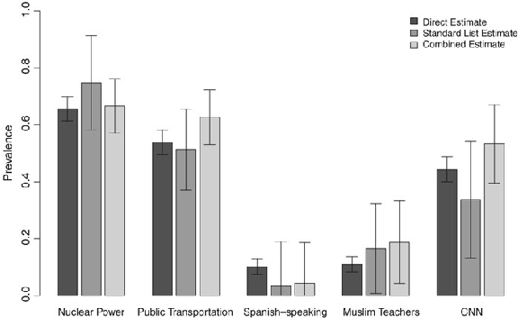
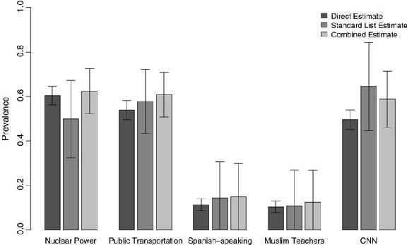

Journal of Survey Statistics and Methodology (2015) 3, 43–66

# COMBINING LIST EXPERIMENT AND DIRECT QUESTION ESTIMATES OF SENSITIVE BEHAVIOR PREVALENCE

PETER M. ARONOW* ALEXANDER COPPOCK FORREST W. CRAWFORD DONALD P. GREEN

Survey respondents may give untruthful answers to sensitive questions when asked directly. In recent years, researchers have turned to the list experiment (also known as the item count technique) to overcome this difficulty. While list experiments are arguably less prone to bias than direct questioning, list experiments are also more susceptible to sampling variability. We show that researchers need not abandon direct questioning altogether in order to gain the advantages of list experimentation. We develop a nonparametric estimator of the prevalence of sensitive behaviors that combines list experimentation and direct questioning. We prove that this estimator is asymptotically more efficient than the standard difference-in-means estimator, and we provide a basis for inference using Wald-type confidence intervals. Additionally, leveraging information from the direct questioning, we derive two nonparametric placebo tests for assessing identifying assumptions underlying list

PETER M. ARONOW is Assistant Professor in the Department of Political Science, Yale University, 77 Prospect Street, New Haven, CT 06520, USA. ALEXANDER COPPOCK is a doctoral student in the Department of Political Science, Columbia University, 420 W. 118th Street, New York, NY 10027, USA. FORREST W. CRAWFORD is Assistant Professor in the Department of Biostatistics, Yale School of Public Health, 60 College Street, New Haven, CT 06520, USA. DONALD P. GREEN is Professor of Political Science at Columbia University, 420 W. 118th Street, New York, NY 10027, USA. The authors are grateful to Columbia University, which funded components of this research but bears no responsibility for the content of this report. This research was reviewed and approved by the Institutional Review Board of Columbia University (IRB-AAAL2659). This work was supported by the National Center for Advancing Translational Science (NCATS) [CTSA Grant Number UL1 TR000142 and KL2 TR000140 to F.W.C.], components of the National Institutes of Health (NIH), and the NIH roadmap for Medical Research. Helpful comments from Xiaoxuan Cai, Albert Fang, Cyrus Samii, Chris Schuck, Michael Schwam-Baird, and two anonymous reviewers are greatly appreciated.

*Address correspondence to Peter Aronow; E-mail: peter.aronow@yale.edu.

doi: 10.1093/jssam/smu023 Advance access publication 19 March 2015 © The Author 2015. Published by Oxford University Press on behalf of the American Association for Public Opinion Research. All rights reserved. For permissions, please e-mail: journals.permissions@oup.com.

at Columbia University Libraries on April 9, 2015http://jssam.oxfordjournals.org/Downloaded from

experiments. We demonstrate the effectiveness of our combined estimator and placebo tests with an original survey experiment.

KEY WORDS: Causal inference; Design-based inference; Political science; Randomized experiments; Sampling theory.

# 1. INTRODUCTION

The prevalence of sensitive attitudes and behaviors is difficult to estimate using standard survey techniques due to the tendency of respondents to withhold information in such settings. In recent years, the list experiment has grown in popularity as a method for eliciting truthful responses to sensitive questions. Introduced as the “item count technique” by Miller (1984), the procedure has been used to study racial prejudice (Kuklinski, Cobb, and Gilens 1997; Sniderman and Carmines 1997; Redlawsk, Tolbert, and Franko 2010), drug use (Biemer, Jordan, Hubbard, and Wright 2005; Coutts and Jann 2011), risky sexual activity (LaBrie and Earleywine 2000; Walsh and Braithwaite 2008), vote buying (Gonzalez-Ocantos, Kiewiet de Jonge, Meléndez, Osorio, and Nickerson 2012), and support for military occupation by foreign forces (Blair, Imai, and Lyall 2013). The standard list experiment proceeds by randomly partitioning respondents into control and treatment groups. Subjects in the control group receive a list of J non-sensitive items and report how many of the items apply to them. Subjects in the treatment group receive a list of J + 1 items comprised of the same J non-sensitive items plus one sensitive item. The list experiment estimate of the prevalence of the sensitive behavior is the difference-in-means between the treatment and control groups. The list experiment gives respondents cover to admit to engaging in the sensitive behavior—so long as the respondent reports between 1 and J items, the researcher cannot be certain whether an individual respondent engages in the sensitive behavior, but aggregate prevalence can be estimated.

List experiments may be useful because prevalence estimates based on direct questions are biased when some subjects tell the truth and others withhold information. In particular, the researcher cannot distinguish a respondent who does not engage in the sensitive behavior from one who does but is withholding: both types answer “No” to the direct question. Nevertheless, direct questions provide an important source of information when subjects admit to engaging in a sensitive behavior. Direct questions are biased but yield precise estimates of prevalence. Under certain assumptions, list experiments provide unbiased estimates of prevalence, but these estimates can be quite variable. The method we detail below allows researchers to reap the benefits of both direct questions and list experiments: increased precision and decreased bias. The central intuition of our approach is that, given a Monotonicity assumption (no false confessions), the true prevalence is a weighted average of two subject

at Columbia University Libraries on April 9, 2015http://jssam.oxfordjournals.org/Downloaded from

types: those who admit to the sensitive behavior and those who withhold; we estimate the former with direct questions and the latter with list experiments.

A popular design for the list experiment is to randomly split the sample into three groups: those receiving the control list and no direct question, those receiving the treatment list and no direct question, and those receiving a direct question but no list at all (Brueckner, Morning, and Nelson 2005; Holbrook and Krosnick 2010; Heerwig and McCabe 2009). This design is often used so that direct and list experiment estimates can be compared within the same population. A variant of this design asks only subjects in the control group the direct question (Gilens, Sniderman, and Kuklinski 1998; Ahart and Sackett 2004). Our estimator requires that both treatment and control subjects receive a direct question. Examples of this more extensive measurement approach include Droitcour, Caspar, Hubbard, Parsley, Visscher, et al. (1991) and Gonzalez-Ocantos et al. (2012). Echoing similar design advice given in Kramon and Weghorst (2012) and Blair and Imai (2012), we advocate asking the direct question whenever feasible and investigating possible ordering effects.

When respondents are asked both direct and list questions, researchers can also test core assumptions underlying the list experiment: No Liars, No Design Effects, and ignorable treatment assignment (Imai 2011). The No Liars assumption requires that those who engage in the sensitive behavior do in fact include the sensitive item when reporting the number of list items that apply. The No Design Effects assumption requires that subjects’ responses to the non-sensitive items on the list are unaffected by the presence or absence of the additional sensitive item. The treatment ignorability assumption requires that assignment be independent of both list experiment and direct question potential outcomes. These tests complement the one proposed by Blair and Imai (2012), which assesses whether any identified proportions of respondent types are negative, which would imply a contradiction between the model and the observed data.

We propose two tests. The logic of the first test, which is formalized below, is as follows: under the core list experiment assumptions and a Monotonicity assumption, the treatment versus control difference-in-means is in expectation equal to 1 among those who answer “Yes” to the direct question. Failing to reject the null hypothesis that the true difference-in-means for this subset is equal to 1 is equivalent to failing to reject the null hypothesis that the assumptions hold. We also propose a test of a variant of the ignorable treatment assignment assumption by assessing the dependence between responses to the direct question and the experimental treatment. While not conclusively demonstrating that the assumptions hold, these test results may give researchers more confidence that their survey instruments are providing reliable prevalence estimates.

Previous methodological work on list experiments has largely focused on two goals: decreasing the variance of list experiment estimates and modeling prevalence in a multivariate setting. Droitcour et al. (1991) propose the “Double List Experiment” design in which the prevalence of the same sensitive item is

at Columbia University Libraries on April 9, 2015http://jssam.oxfordjournals.org/Downloaded from

investigated by two list experiments conducted with the same subjects, thereby reducing sampling variability. Holbrook and Krosnick (2010) use multivariate regression with treatment-by-covariate interaction terms to explore prevalence heterogeneity. Glynn (2013) suggests constructing the non-sensitive items so that they are negatively correlated with one another, a design feature that simultaneously reduces baseline variability and avoids ceiling effects. Corstange (2009) modifies the standard list experiment design by asking the control group each of the non-sensitive items directly, so that responses to the non-sensitive items can be modeled and more precise estimates of the sensitive items can be calculated. Imai (2011) proposes a nonlinear least squares estimator and a maximum likelihood estimator to model responses with covariate data. Blair and Imai (2012) offer a detailed review of these techniques.

Our contribution to the list experiment literature is to show the ease with which the additional information yielded by direct questioning can be incorporated into existing techniques. We demonstrate our proposed estimator and placebo tests on data from an original survey experiment conducted on Amazon’s Mechanical Turk platform. We conclude with suggestions for the design and analysis of list experiments in scenarios where it is ethically feasible to ask direct questions as well.

# 2. SETTING AND IDENTIFICATION

Suppose we have a random sample of n subjects independently drawn from a large population. Let Xi = 1 if subject i engages in a sensitive behavior and Xi = 0 otherwise. We attempt to measure the behavior Xi using two methods: direct questioning and list experimentation. Our goal is to identify the prevalence of the sensitive behavior in the population, µ = Pr[Xi = 1]. Let Yi be the report of subject i to the direct question. We assume that, under direct questioning, subjects may lie and claim that they do not engage in the behavior but will not lie and falsely claim that they do engage in the behavior.

- Assumption 1 (Monotonicity). There exist three latent classes of respondents under direct questioning: those who do not engage in the behavior and report truthfully (Xi = 0, Yi = 0), subjects who engage and report truthfully (Xi = 1, Yi = 1), and subjects who engage but report that they do not, i.e., withhold (Xi = 1, Yi = 0).

Let p = Pr[Yi = 1 | Xi = 1] be the probability of a subject reporting truthfully to the direct question, given that he or she engages in the sensitive behavior. The response of subject i is

Yi ¼

- 0 with probability 1 mþ mð1 pÞ
- 1 with probability mp:

at Columbia University Libraries on April 9, 2015http://jssam.oxfordjournals.org/Downloaded from

The response Yi = 0 can be seen as a mixture of truthful negative reports and withholding. The probability that subject i engages in the behavior, given a negative response, is therefore

ð1 pÞm 1 mp

Pr½Xi ¼ 1j Yi ¼ 0  ¼

:

While direct questioning is sufficient to reveal Pr[Yi = 1] = µp, it is not sufficient to identify Pr[Yi = 0 | Xi = 1] = 1 − p.

In contrast, the list experiment provides sufficient information to identify µ. Suppose we have a treatment Zi ∈{0,1}. In the list experiment, treated subjects (Zi = 1) receive a number of control questions and an additional question about the sensitive behavior. We denote the number of items that the subject states are applicable with Vi.

- Assumption 2 (No Liars and No Design Effects). Reframing Imai’s (2011)

formulations, we observe Vi = Wi + XiZi, where Wi is the baseline outcome (under control) for subject i for the list experiment.

We further require that the treatment assignment be independent of the actual behavior, direct question, and baseline response. This is a stricter variant of Imai’s (2011) ignorability assumption.

- Assumption 3 (Treatment Independence). (Wi,Xi,Yi) ⫫Zi.

- Assumption 3 would be violated if (i) we did not have random assignment

of the treatment or (ii) there are additional design effects; e.g., the treatment assignment affects the response to the direct question. Given random assignment, only the latter is a concern.

To ensure that all target quantities are well defined (and, later, to facilitate inference), we impose the mild regularity condition that all population variances are positive.

- Assumption 4 (Non-Degenerate Distributions). Var[Vi | Zi = z, Yi = y] > 0, for z,y∈{0,1}, Var[Zi] > 0 and Var[Yi] > 0.

We now turn to our primary identification result.

- Lemma 1. Given Assumptions 1–4 (Monotonicity, No Liars, No Design Effects, Treatment Independence, and Non-Degenerate Distributions), the prevalence may be represented as

m¼ E½Yi  þ E½1 Yi ðE½Vi jZi ¼ 1;Yi ¼ 0 E½Vi jZi ¼ 0;Yi ¼ 0 Þ: ð1Þ

at Columbia University Libraries on April 9, 2015http://jssam.oxfordjournals.org/Downloaded from

Proof. By Assumptions 2 and 3,

E½Vi jZi ¼ 1 E½Vi jZi ¼ 0  ¼ Wi þ m Wi ¼ m: ð2Þ

Then, expanding the left-hand side of (2) by marginalizing over Yi, we represent the prevalence of the sensitive behavior as

- m¼ E½VijYi ¼ 0;Zi ¼ 1 E½1 Yi þE½VijYi ¼ 1;Zi ¼ 1 E½Yi  ðE½Vi jYi ¼ 0;Zi ¼ 0 E½1 Yi þE½Vi jYi ¼ 1;Zi ¼ 0 E½Yi Þ

¼ ðE½Vi jYi ¼ 1;Zi ¼ 1 E½Vi jYi ¼ 1;Zi ¼ 0 ÞE½Yi þðE½Vi jYi ¼ 0;Zi ¼ 1 E½Vi jYi ¼ 0;Zi ¼ 0 ÞE½1 Yi

¼ E½Xi jYi ¼ 1 E½Yi þðE½Vi jYi ¼ 0;Zi ¼ 1 E½Vi jYi ¼ 0;Zi ¼ 0 ÞE½1 Yi : The result follows since E[Xi | Yi = 1] = 1 by Assumption 2.

Note that if Assumptions 2–4 hold, but Assumption 1 (Monotonicity) does not hold, then E[Yi] + E[1 − Yi](E[Vi | Zi = 1,Yi = 0] − E[Vi | Zi = 0,Yi = 0]) > µ, as then E[Xi | Yi = 1] < 1.

# 3. ESTIMATION, INFERENCE, AND EFFICIENCY

In this section, we propose a simple nonparametric estimator of µ based on (1) and provide a basis for inference using Wald-type confidence intervals under a normal approximation. We also prove that our estimator is asymptotically more efficient than the standard difference-in-means estimator for the list experiment alone.

Define the sample means:

1 nXn

Yi

Y ¼

i¼1

V1;0 ¼ Pn

and V0;0 ¼ Pn

i¼1 ViZið1 YiÞ Pn

i¼1 Við1 ZiÞð1 YiÞ Pn

:

i¼1 Zið1 YiÞ

i¼1 ð1 ZiÞð1 YiÞ

Define an estimator of µ based on (1),

m^ ¼ Y þ ð1 YÞð V1;0 V0;0Þ: A preliminary lemma will assist us in deriving the asymptotic variance of this estimator.

- Lemma 2. V1;0 and V0;0 are uncorrelated with 1 Y. A proof is given in Appendix B.

We can derive results on the sampling variance of m^. Let γ = Pr(Zi = 1) be the probability of receiving the treatment question in the list experiment.

at Columbia University Libraries on April 9, 2015http://jssam.oxfordjournals.org/Downloaded from

- Proposition 1. Given Assumption 4 (Non-Degenerate Distributions), the asymptotic variance of m^ is characterized by

plim

n!1

nVar½m^  ¼

ð1 mÞ2 1 mp

mp þ ð1 mpÞ

Var½Vi jZi ¼ 1;Yi ¼ 0

g þ

Var½Vi jZi ¼ 0;Yi ¼ 0

1 g

: ð3Þ

The proof is given in Appendix B. Under Assumptions 1–4, m^ is root-n consistent and asymptotically normal, with a consistent estimator of the variance obtained by substituting sample analogues (i.e., sample means and sample variances) for population quantities. Namely, let

nVard½m^  ¼

ð1 m ^Þ2 1 Y

Y þ ð1 YÞ

s^2ðVi jZi ¼ 1;Yi ¼ 0Þ g^ þ

s^2ðVi jZi ¼ 0;Yi ¼ 0Þ 1 g ^

;

where s^2ð Þ denotes the sample variance and g^ ¼ Pn

i¼1 Zi=n. These properties are sufficient for construction of Wald-type confidence intervals using Vard½m^ . Corollary 1. If Assumptions 1–4 hold, then confidence intervals constructed as m^ + z1 a=2 ffiffiffiffiffiffiffiffiffiffiffiffiffiffi

qVard½m^ will have µ 100(1 − α)% coverage for µ for large n.

A proof follows directly from asymptotic normality and Slutsky’s theorem. An estimator based upon (1) will have efficiency gains relative to standard

difference-in-means-based estimators. Consider the standard difference-inmeans-based estimator for the list experiment,

m^S ¼ V1 V0; where

V1 ¼ Pn

i¼1 ViZi Pn

i¼1 Zi

and V0 ¼ Pn

i¼1 Við1 ZiÞ Pn

i¼1ð1 ZiÞ

:

We now show that the combined estimator m^ is asymptotically more precise than m^S.

- Proposition 2. Under Assumptions 1–4 (Monotonicity, No Liars, No Design Effects, Treatment Independence, and Non-Degenerate Distributions),

nVar½m^ , plim

nVar½m^S :

plim

n!1

n!1

The proof is given in Appendix B.

at Columbia University Libraries on April 9, 2015http://jssam.oxfordjournals.org/Downloaded from

# 4. PLACEBO TESTS

In this section, we derive two placebo tests to assess the validity of the identifying assumptions.

## 4.1. Placebo Test I

It is possible to jointly test the Monotonicity, No Liars, No Design Effects, and Treatment Independence assumptions. Under these assumptions, for all t, Pr[Vi = t | Zi = 0,Yi = 1] = Pr[Vi = (t + 1) | Zi = 1,Yi = 1], thus tests of distributional equality are appropriate. Any valid test of distributional equality between Vi (under Zi = 0, Yi = 1) and Vi + 1 (under Zi = 1, Yi = 1) will permit rejection of the null.

However, since distributional equality implies that E[Vi|Zi = 1, Yi = 1] − E[Vi|Zi = 0, Yi = 1] = 1, a simple test is available. Define β = E[Vi | Zi = 1, Yi = 1] − E[Vi | Zi = 0, Yi = 1]. Consider estimators

b^ ¼ V1;1 V0;1 and

s^2ðVi jZi ¼ 1;Yi ¼ 1Þ

s^2ðVi jZi ¼ 0;Yi ¼ 1Þ

Vard½b^  ¼

Pn

Pn

i¼1 ZiYi þ

:

i¼1ð1 ZiÞYi

- Proposition 3. Under the null hypothesis that Assumptions 1–4 (Monotonicity, No Liars, No Design Effects, and Treatment Independence) hold, β = 1. For large n, if Assumption 4 (Non-Degenerate Distributions) holds, then a twosided p-value is given by

0 B @

1 C A;

2F  jb^ 1j

ffiffiffiffiffiffiffiffiffiffiffiffiffiffi qVard½b^

where Φ(·) is the normal CDF.

A proof for Proposition 3 follows directly from calculations analogous to those for Proposition 1.

We also explore the power of Placebo Test I using a series of Monte Carlo simulations. We vary a number of factors, including the number of subjects answering “Yes” to the direct question, the proportions of false confessors, liars, and the design affected, and the variance of responses to the control list. The placebo test does not always have high power. For example, if 20 percent of 200 subjects responding “Yes” to the direct question are false confessors, the placebo test only has about 30 percent power. But when 20 percent of 800 subjects answering “Yes” are falsely confessing, the test has approximately

at Columbia University Libraries on April 9, 2015http://jssam.oxfordjournals.org/Downloaded from

80 percent power. In general, the power of the placebo test depends on both the number of subjects answering “Yes” and the proportion of subjects violating the assumptions. These results are presented in Appendix C (please see the supplementary data online).

## 4.2 Placebo Test II

We can probe the validity of the Treatment Independence assumption with a second placebo test. Treatment Independence is violated if the answer to the direct question is systematically related to treatment assignment (i.e., Yi??= Zi). Define δ = E[Yi | Zi = 1] − E[Yi | Zi = 0]. Consider the estimators

d^ ¼ Pn

Pn

i¼1 Yið1 ZiÞ Pn

i¼1 YiZi Pn

i¼1ð1 ZiÞ and

i¼1 Zi

s^2ðYi jZi ¼ 1Þ

s^2ðYi jZi ¼ 0Þ

Vard½d^  ¼

Pn

Pn

i¼1 Zi þ

:

i¼1ð1 ZiÞ

Proposition 4. Under the null hypothesis that Assumption 3 holds, δ = 0. For large n, if Assumption 4 (Non-Degenerate Distributions) holds, then a twosided p-value is given by

0 B @

1 C A:

2F  jd^ j

ffiffiffiffiffiffiffiffiffiffiffiffiffi qVard½d^

A proof for Proposition 4 again follows directly from calculations analogous to those for Proposition 1. When the treatment is randomly assigned, Placebo Test II is simply a test of whether Zi has a causal effect on Yi. When Zi is randomly assigned and the list experiment treatment is presented after the direct question, Assumption 3 holds by design.

# 5. APPLICATION

We tested the properties of our estimator with a pair of studies carried out on Amazon’s Mechanical Turk service, an Internet platform where subjects perform tasks such as the completion of surveys. Our main purpose was to assess the properties of our estimator by investigating an array of different behaviors, some of which may be considered socially sensitive. The relative anonymity of Internet surveys provides a favorable environment for list experiments precisely because we expect subjects to withhold less often than they might in face-to-face or telephone settings.

at Columbia University Libraries on April 9, 2015http://jssam.oxfordjournals.org/Downloaded from

- Table 1. Number of Subjects in Each Treatment Condition

Study A or B

List 1 List 2 List 3 List 4 List 5

A B T C T C T C T C T C

- Study A or B A 500 0 245 255 238 262 275 225 243 257 232 268

- B 0 514 272 242 259 255 253 261 271 243 260 254

- List 1 T 517 0 251 266 273 244 269 248 273 244

C 0 497 246 251 255 242 245 252 219 278

- List 2 T 497 0 253 244 246 251 240 257 C 0 517 275 242 268 249 252 265
- List 3 T 528 0 269 259 263 265 C 0 486 245 241 229 257
- List 4 T 514 0 256 258 C 0 500 236 264
- List 5 T 492 0 C 0 522

## 5.1 Experimental Design

We conducted five list experiments that paralleled five direct questions. The exact wording of the list experiments and direct questions is given in Appendix A. In three list experiments, we chose topics that are not socially sensitive: preferences over alternative energy sources, neighborhood characteristics, and news organizations. Two of the five list experiments dealt with racial and religious prejudice, topics where we would expect some withholding of antiHispanic and anti-Muslim sentiment.

We recruited a convenience sample of 1,023 subjects from Mechanical Turk. We offered subjects $1.00 to complete our survey, which is equivalent to a $15.45 hourly rate—a comparatively high wage by the standards of Mechanical Turk (Berinsky, Huber, and Lenz 2012). In order to defend against the potential for subjects to supply answers without reading or considering our questions, we included an “attention question” that required subjects to select a particular response in order to continue with the survey. Two subjects failed this quality check, and we exclude them from the main analysis. An additional seven subjects failed to respond to one or more of our questions, so we exclude them from the main analysis as well. The resulting sample size is n = 1,014.

Subjects were first assigned at random to either Study A or Study B. In

- Study A, direct questions were posed before the list questions, whereas in
- Study B, list questions were asked first. Subjects in both studies were then assigned to either the treatment or control conditions of each of the five list experiments. Table 1 displays the number of subjects in each treatment condition for each study, as well as every pairwise crossing of conditions.

at Columbia University Libraries on April 9, 2015http://jssam.oxfordjournals.org/Downloaded from

- Table 2. Covariate Balance: List Experiment 1 Study A Study B

Treat Control Treat Control

18–24 24.49 25.49 23.53 32.64 25–34 40.82 43.92 41.18 40.91 35–44 20.00 15.29 17.28 14.88 45–54 8.16 10.98 10.66 6.20 55–64 4.90 3.92 5.88 3.72 65 or over 1.63 0.39 1.47 1.65

Female 46.12 47.45 46.32 42.98 Male 53.88 52.16 53.31 57.02 Prefer not to say—Gender 0.00 0.39 0.37 0.00

Liberal 50.61 42.35 50.37 51.65 Moderate 28.16 34.51 26.84 28.51 Conservative 18.37 19.22 20.59 14.46 Haven’t thought much about this 2.86 3.92 2.21 5.37

Less than high school 0.41 0.78 0.74 1.24 High school/GED 11.02 11.76 10.66 7.44 Some college 42.45 42.75 40.44 40.91 4-Year college degree 33.47 33.73 35.29 36.36 Graduate school 12.65 10.98 12.87 14.05

White, non-Hispanic 79.18 77.65 79.78 80.17 African American 7.76 10.98 6.62 4.55 Asian/Pacific Islander 5.71 4.71 5.15 9.92 Hispanic 4.90 3.92 6.25 4.13 Native American 0.82 0.78 1.10 0.83 Other 1.22 1.18 1.10 0.41 Prefer not to say—Race 0.41 0.78 0.00 0.00

- n 245 255 272 242

All randomizations used Bernoulli random assignment with equal probability 0.5. Consistent with our randomization procedure, each cell in the table (with the exception of the diagonal) contains approximately one-quarter of the subjects.

Before being randomized into treatment groups, subjects answered a series of background demographic questions. Table 2 shows balance statistics across age, gender, political ideology, education, and race across the treatment and control groups for the first list experiment in both studies. Our subject pool is more likely to be white, male, liberal, well educated, and young than the general population. This pattern is consistent with the demographic description of Mechanical Turk survey respondents given by Mason and Suri (2012).

at Columbia University Libraries on April 9, 2015http://jssam.oxfordjournals.org/Downloaded from

## 5.2 Study A (Direct Questions First)

In Study A, subjects were presented with the five direct questions before receiving the five list experiments. Table 3 presents three estimates of the prevalence in our subject pool. The first is a naive estimate computed by taking the average response to the direct question, Y (Direct). The remaining two estimates are m^S (Standard List) and m^ (Combined List). For example, the direct question estimate Y of the percentage agreeing that Muslims should not be allowed to teach in public schools1 is 11 percent, the list experiment estimate m^S is 17 percent, and the combined estimate m^ is 19 percent. Of particular note are the standard errors associated with the standard list experiment as compared with those associated with the combined estimate: the reductions in estimated sampling variance are dramatic, ranging from 14 to 67 percent. As expected, reductions tend to be larger when a larger number of subjects respond “Yes” to the direct question. Figure 1 presents these results graphically: the estimates generally agree (providing confidence that the list experiments and the direct questions are measuring the same quantities), and the 95 percent confidence intervals around the combined estimate are always tighter than those around the standard estimate.

Table 4 presents the results of Placebo Test I. If these assumptions hold, the standard list experiment difference-in-means estimator will recover estimates that are in expectation equal to one among the subsample that answers “Yes” to the direct question. In two cases, we reject the joint null hypothesis of Monotonicity, No Liars, and No Design Effects: Public Transportation (p =

- 0.02) and CNN (p = 0.03). We speculate that some subjects may have felt

- Table 3. Study A (Directs First): Three Estimates of Prevalence

Direct Standard list Combined list

% Reduction in sampling variance

Y SE m^S SE m^ SE

- Nuclear power 0.656 0.021 0.748 0.084 0.666 0.048 67.1 Public transportation 0.538 0.022 0.513 0.072 0.627 0.049 54.0 Spanish speaking 0.102 0.014 0.035 0.079 0.042 0.074 14.0

- Muslim teachers 0.110 0.014 0.166 0.081 0.187 0.074 15.3 CNN 0.444 0.022 0.338 0.105 0.533 0.070 54.9

NOTE. n = 500 for all estimates.

- 1. The pattern for the other socially sensitive topic, Spanish speaking, is reversed: the direct question estimate is greater than both list experimental estimates. Our replication study (described below) found the opposite pattern, suggesting that this apparent contrast is due to sampling variability.

at Columbia University Libraries on April 9, 2015http://jssam.oxfordjournals.org/Downloaded from

- Figure 1. Study A (Directs First): Three Estimates of Prevalence.

- Table 4. Study A (Directs First): Placebo Test I b^ SE p-value n

- Nuclear power 1.054 0.095 0.568 328 Public transportation 0.790 0.091 0.021 269 Spanish speaking 0.848 0.279 0.585 51

- Muslim teachers 1.008 0.237 0.973 55 CNN 0.696 0.143 0.034 222

that claiming to watch CNN was socially desirable, thereby violating Monotonicity.

Since we employed random assignment and the experimental treatment comes after the administration of the direct question, we expect to pass Placebo Test II, which seeks to verify that the treatment does not affect direct question responses. Indeed, as shown in table 5, the Placebo Test II results show no significant differences in mean responses to the direct questions by the list experimental treatment assignments.

## 5.3 Study B (List Experiments First)

- Study B reverses the order of the direct questions and list experiments: subjects participated in all five list experiments before answering the direct questions. This design choice risks priming subjects in the treatment group in ways that might alter their responses to subsequent direct questions. For example, treated

at Columbia University Libraries on April 9, 2015http://jssam.oxfordjournals.org/Downloaded from

Table 5. Study A (Directs First): Placebo Test II

b^ SE p-value n

Nuclear power 0.066 0.042 0.118 500 Public transportation −0.000 0.045 0.994 500 Spanish speaking 0.016 0.027 0.560 500 Muslim teachers −0.030 0.028 0.285 500 CNN −0.056 0.045 0.206 500

- Table 6. Study B (Lists First): Three Estimates of Prevalence

Direct Standard list Combined list % Reduction

in sampling Y SE m^S SE m^ SE variance

Nuclear power 0.603 0.022 0.499 0.089 0.624 0.052 66.0 Public transportation 0.539 0.022 0.578 0.073 0.608 0.051 51.9 Spanish speaking 0.113 0.014 0.144 0.083 0.149 0.076 16.4 Muslim teachers 0.103 0.013 0.107 0.083 0.123 0.074 20.1 CNN 0.496 0.022 0.645 0.101 0.587 0.064 60.2

NOTE. n = 514 for all estimates.

subjects may be prone to misreport if subjects suspect that a particular topic is being given special scrutiny.

All three prevalence estimates for Study B are presented in table 6 and figure 2. The direct question estimates are very similar between Studies A and B—none of the differences between the estimates is significant at the 0.05 level. The standard list experiment estimates differ between Studies A and B, suggesting a question order effect. The combined estimator produces tighter estimates in Study B as well, with estimated sampling variability reductions in a very similar range. Appendix E (please see the supplementary data online) presents formal tests of the differences in estimates across the studies.

The results of Placebo Test I for Study B are presented in table 7. Among the subgroup of respondents who answer “Yes” to the direct question, the list experiment difference-in-means estimate β should be equal to 1, under Assumptions 1–4 (Monotonicity, No Liars, No Design Effects, and Treatment Independence). None of the values of β are statistically significantly different from 1 using the placebo test, and a joint test via Fisher’s method is insignificant as well.

As described in section 4.2, the combined estimator relies in part on the assumption that a subject’s response to the direct question is unaffected by the

at Columbia University Libraries on April 9, 2015http://jssam.oxfordjournals.org/Downloaded from

- Figure 2. Study B (Lists First): Three Estimates of Prevalence.

- Table 7. Study B (Lists First): Placebo Test I b^ SE p-value n

Nuclear power 0.881 0.113 0.294 310 Public transportation 0.913 0.091 0.339 277 Spanish speaking 0.767 0.229 0.309 58 Muslim teachers 0.700 0.285 0.293 53 CNN 0.847 0.135 0.256 255

list experimental treatment assignment. Violations of this assumption are directly testable using Placebo Test II. In Study B, subjects were exposed to either a treatment or a control list before answering the direction question. Table 8 below presents the effect the treatment lists may have had on answers to the direct questions. In two of the five cases, direct questions were significantly affected by the treatment list: treated subjects were 8.6 percentage points less likely to declare their support for nuclear power and were 13.2 percentage points more likely to report watching CNN. These findings indicate that the Treatment Independence assumption is most likely violated for these questions, rendering the Study B combined list estimates for these two questions unreliable.

## 5.4 Replication Study

We conducted a replication study following the identical design with 506 new Mechanical Turk subjects in a replication of Study A and 506 in a replication of

at Columbia University Libraries on April 9, 2015http://jssam.oxfordjournals.org/Downloaded from

Table 8. Study B (Lists First): Placebo Test II

b^ SE p-value n

Nuclear power −0.086 0.043 0.045 514 Public transportation 0.034 0.044 0.434 514 Spanish speaking 0.027 0.028 0.337 514 Muslim teachers 0.016 0.027 0.549 514 CNN 0.132 0.044 0.003 514

Study B. Full results of this replication study are presented in Appendix F (please see the supplementary data online), but the findings are strikingly similar to the first investigation. The list experimental estimates vary somewhat between the original experiments and the replication, but none of these differences are significant (p > 0.05). One of the five placebo tests was significant in Study A, and three of the five were significant in Study B. Perhaps surprisingly, the effect of the treatment list on direct answers to the CNN question presented in table 8 was also replicated.

# 6. DISCUSSION

Social desirability effects may bias prevalence estimates of sensitive behaviors and opinions obtained using direct questioning, but that does not mean that direct questions are useless. Under an assumption of Monotonicity (subjects who do not engage in the sensitive behavior do not falsely confess), direct questions reveal reliable information about those who answer “Yes.” Among those who answer “No,” we cannot directly distinguish those who withhold from those who do not engage in the sensitive behavior—for these subjects, list experiments may provide a workaround. Combining these two techniques into a single estimator yields more precise estimates of prevalence, and employing direct and list questions in tandem also enables the researcher to test crucial identifying assumptions.

A few caveats are in order with respect to empirical applications. First, Monotonicity is not guaranteed to hold, especially when social desirability cuts in opposite directions for different subgroups. For example, moderates in liberal areas may feel pressure to support Muslim teachers, whereas moderates in conservative areas may feel pressure to oppose them. Second, list experiments are often employed when the safety of respondents would be compromised if they admitted to sensitive opinions or behaviors (e.g., Pashtun respondents admitting support for NATO forces; Blair et al. 2013). We do not take these concerns lightly, and in such cases would not recommend the use of our method. Third, the order in which direct questions and list experiments are asked appears to matter. Unfortunately, the empirical results of Placebo Test I

at Columbia University Libraries on April 9, 2015http://jssam.oxfordjournals.org/Downloaded from

fail to provide clear guidance with respect to ordering: we reject the joint null hypothesis of Monotonicity, No Liars, and No Design Effects for two of the experiments in Study A but fail to reject it for any of the five experiments in Study B. Our replication study saw the opposite pattern: one rejection in Study A, and three rejections in Study B. Placebo Test II, on the other hand, suggests that, at least in our application, asking the direct question second induced a violation of the Treatment Independence assumption. In sum, we recommend randomizing the order in which the list experiment and the direct question are presented so that (a) question-order effects can be contained and (b) the relevant tests of the assumptions can be performed. Finally, the power of Placebo Test I varies with the prevalence rate, and is consequently less useful when the goal of the list experiment is to estimate the prevalence of a rare attitude or behavior—a common circumstance if one imagines that sensitive behaviors also tend to be low prevalence. Nevertheless, Placebo Test I detected many instances of violated assumptions (six of twenty opportunities), suggesting that caution is warranted when interpreting list experimental estimates of prevalence.

We have combined direct question estimates with the simplest of the various list experiment estimators: difference-in-means. This work could be extended straightforwardly to the multivariate settings discussed by Corstange (2009), Holbrook and Krosnick (2010), and Imai (2011). One such approach would involve regression estimation (Särndal, Swensson, and Wretman 1992; Lin 2013) or post-stratification (Holt and Smith 1979; Miratrix, Sekhon, and Yu 2013) for computing covariate adjusted means. Such an approach would improve asymptotic efficiency without any parametric assumptions, and a consistent variance estimator may be derived by substituting residuals from the regression fit. Finally, we note that other methods for eliciting truthful responses to sensitive questions, such as randomized response (Warner 1965) and endorsement experiments (Bullock, Imai, and Shapiro 2011; Lyall, Blair, and Imai 2013), could also be combined with direct questioning to improve precision.

# Supplementary Materials

Supplementary materials are available online at http://www.oxfordjournals. org/our_journals/jssam/.

at Columbia University Libraries on April 9, 2015http://jssam.oxfordjournals.org/Downloaded from

## Appendix A.1

Survey Text

Table A1. Survey Questions and Response Options

List question (sensitive item in bold) Direct question Nuclear power (L1

Some people think nuclear power is an alternative energy source that the United States should be developing. How about you? Do you think nuclear power is an alternative energy source that the United States should be developing?

Here is a list of four (five) alternative energy sources that some people think the United States should be developing. Please read all four (five) and select how many of them you think the United States should be developing. We do not want to know which ones, just how many.

& D1)

Wind Yes Solar No Nuclear power Natural gas Ethanol

Some people consider access to public transportation important when choosing a neighborhood to live in. How about you? Do you consider access to public transportation important when choosing a neighborhood to live in?

Here is a list of three (four) things some people consider important when choosing a neighborhood to live in. Please read all three (four) and select how many of them you consider important when choosing a neighborhood. We do not want to know which ones, just how many.

Public transportation (L2 & D2)

Proximity to shops and restaurants Yes Quality of local schools No Neighbors who share my values Access to public transportation

60Aronow et al.

Sometimes people are angry or upset when a Spanishspeaking family moves in next door. How about you? Would a Spanish-speaking family moving in next door upset you?

Spanish speaking (L3 & D3)

Here is a list of four (five) things that sometimes make people angry or upset. Please read all four (five) and select how many of them upset you. We do not want to know which ones, just how many.

The federal government increasing the tax on gasoline Yes Professional athletes earning large salaries No A Spanish-speaking family moving in next door Requiring seat belts be used when driving Large corporations polluting the environment

Sometimes people think that Muslims should be prohibited

Muslim teachers (L4 & D4)

Here is a list of three (four) groups that some people think should be prohibited from teaching in public schools. We do not want to know which ones, just how many.

from teaching in public schools. How about you? Do you think that Muslims should be prohibited from teaching in public schools?

18–21-year-olds Yes Muslims No People without a master’s degree in education People who earn a 2.0 GPA or lower

In the course of an ordinary month, do you watch CNN?

CNN (L5 & D5) Here is a list of four (five) news organizations. Please read all four (five) and select how many you read or watch in the course of an ordinary month. We do not want to know which ones, just how many.

The New York Times Yes CNN No The Huffington Post Fox News Politico

Combining List Experiments and Direct Questions61

## Appendix B.1

Proofs Proof of Lemma 2

Proof. To show that V1;0 and V0;0 are uncorrelated with 1 Y, we demonstrate that the expected values of these variables are invariant to conditioning on 1 Y. Suppose that exactly k direct responses are zero, so 1 Y ¼ k=n. Then,

" #

k n ¼ E Pn

j¼1 VjZjð1 YjÞ Pn

k n

j1 Y ¼

E V1;0 j1 Y ¼

j¼1 Zjð1 YjÞ

ð4Þ

" j¼1 Zj jYj ¼ 0for j¼ 1;:::;k#;

¼ E Pk

j¼1 VjZj Pk

where we have reordered the indices so that Y1=···=Yk = 1. Then, applying the law of iterated expectation, we have

" " Zj ¼ i##

k n ¼ EZ E Pk

j¼1 Zj jYj ¼ 0 for j ¼ 1; : : :;k;Xk

j¼1 VjZj Pk

E V1;0 j1 Y ¼

j¼1

Zj ¼ i!;

Pi

¼ Xk

Pr Xk

j¼1 E½Vj jZj ¼ 1;Yj ¼ 0 i

i¼1

j¼1

ð5Þ

where we have again reordered the indices so that Z1 ¼      ¼ Zi ¼ 1. Since E½Vj j Zj ¼ 1;Yj ¼ 0 is the same for every j ¼ 1;: : :;i,

Zj ¼ i!

k n ¼ E½V1 jZ1 ¼ 1; Y1 ¼ 0 Xk

Pr Xk

E V1;0 j1 Y ¼

ð6Þ

i¼1

j¼1

¼ E½V1 jZ1 ¼ 1;Y1 ¼ 0 :

Then, since the last line does not depend on k, we conclude that

k n ¼ E V1;0 j 1 Y ¼

k0 n

E V1;0 j1 Y ¼

for k≠k0. It follows that the expectation of V1;0 is invariant to conditioning on 1 Y, and so E½ V1;0 j1 Y  ¼ E½ V1;0 .

at Columbia University Libraries on April 9, 2015http://jssam.oxfordjournals.org/Downloaded from

A similar argument holds for V0;0:

" #

k n ¼ E Pn

j¼1 Vjð1 ZjÞð1 YjÞ Pn

k n

j 1 Y ¼

E V0;0 j 1 Y ¼

j¼1ð1 ZjÞð1 YjÞ

" j Yj ¼ 0 for j ¼ 1; : : :k#

¼ E Pk

j¼1 Vjð1 ZjÞ Pk

j¼1ð1 ZjÞ

" " ð1 ZjÞ ¼ i##

¼ EZ E Pk

j Yj ¼ 0 for j ¼ 1;: : :;k;Xk

j¼1 Vjð1 ZjÞ Pk

j¼1ð1 ZjÞ

j¼1

ð1 ZjÞ ¼ i!

Pi

Pr Xk

¼ Xk

j¼1 E½Vj j Zj ¼ 0;Yj ¼ 0 i

i¼1

j¼1

ð1 ZjÞ ¼ i!

¼ E½V1 j Z1 ¼ 0; Y1 ¼ 0 Xk

Pr Xk

i¼1

j¼1

¼ E½V1 j Z1 ¼ 0; Y1 ¼ 0 :

ð7Þ

Since the expectations of both V1;0 and V0;0 are unchanged by conditioning on 1 Y, these variables are uncorrelated with 1 Y, as claimed.

Proof of Proposition 1 Proof. The proof proceeds by working with linearized variances:

Var½m^  ¼ Var½1 þ ð1 YÞð V1;0 V0;0 1Þ 

¼ Var½ð1 YÞð V1;0 V0;0 1Þ : ð8Þ By Lemma 2, V1;0 and V0;0 are uncorrelated, so the variance of the product

in (8) decomposes as follows:

Var½m^ ¼ðE½1 Y Þ2Var½ V1;0 V0;0 þVar½1 Y ðE½ V1;0 V0;0 1 Þ2

þVar½1 Y Var½ V1;0 V0;0

2

mpð1 mpÞ n

1 m 1 mp

¼ð1 mpÞ2Var½ V1;0 V0;0 þ

mpð1 mpÞ n

Var½ V1;0 V0;0 þOðn 2Þ

þ

mpð1 mÞ2 nð1 mpÞ

Var½VijZi ¼1;Yi ¼0

Var½VijZi ¼0;Yi ¼0 ð1 mpÞðn ngÞ

þð1 mpÞ2

þOðn 2Þ

ð1 mpÞng þ

¼

mpð1 mÞ2 nð1 mpÞ

Var½VijZi ¼1;Yi ¼0

Var½VijZi ¼0;Yi ¼0

n ng þOðn 2Þ;

þð1 mpÞ

ng þ

¼

ð9Þ where gis the probability of receiving treatment, so ng¼Pn

i¼1Zi. Multiplying by n yields the desired result.

at Columbia University Libraries on April 9, 2015http://jssam.oxfordjournals.org/Downloaded from

Proof of Proposition 2 Proof. We begin by expressing the asymptotic variance of m^S:

Var½Vi j Zi ¼ 1; Yi ¼ 0

Var½Vi jZi ¼ 0; Yi ¼ 0

plim

nVar½m^S   ¼ ð1 mpÞ

g þ

1 g þ mp

n!1

Var½Vi j Zi ¼ 1;Yi ¼ 1

Var½Vi j Zi ¼ 0; Yi ¼ 1

g þ

1 g

ðE½Vi j Zi ¼ 1;Yi ¼ 0 E½Vi jZi ¼ 1 Þ2

þ ð1 mpÞ

g

ðE½Vi j Zi ¼ 0;Yi ¼ 0 E½Vi jZi ¼ 0 Þ2 1 g

þ ð1 mpÞ

þ mp ðE½Vi jZi ¼ 1;Yi ¼ 1 E½Vi jZi ¼ 1 Þ2 g

þ mp ðE½Vi jZi ¼ 0;Yi ¼ 1 E½Vi jZi ¼ 0 Þ2

1 g ¼ ð1 mpÞ

Var ½Vi jZi ¼ 1; Yi ¼ 0

Var ½Vi j Zi ¼ 0; Yi ¼ 0

g þ

1 g þ mp

Var½Vi j Zi ¼ 1;Yi ¼ 1

Var½Vi j Zi ¼ 0; Yi ¼ 1

g þ

1 g

" #

i ¼ 1;Yi ¼ 0 E½Vi j Zi ¼ 1; Yi ¼ 1 Þ2

ðE½Vi j Z

þ mpð1 mpÞ

g

ðE½Vi jZi ¼ 0;Yi ¼ 0 E½Vi j Zi ¼ 0; Yi ¼ 1 Þ2 1 g

þ mpð1 mpÞ

:

By Assumptions 1 and 2 (Monotonicity, No Liars, and No Design Effects), E½Vi j Zi ¼ 1;Yi ¼ 1  ¼ E½Vi jZi ¼ 0;Yi ¼ 1  þ 1. Then,

plim

nVar½m^S

n!1

Var½Vi jZi ¼ 1; Yi ¼ 0

Var½Vi jZi ¼ 0; Yi ¼ 0

¼ ð1 mpÞ

g þ

1 g þ mp

Var½Vi j Zi ¼ 1; Yi ¼ 1

Var½Vi jZi ¼ 0; Yi ¼ 1

g þ

1 g

ððm 1Þ=ð1 mpÞ þ E½Vi jZi ¼ 0;Yi ¼ 0 E½Vi jZi ¼ 0;Yi ¼ 1 Þ2 g

þ mpð1 mpÞ

ðE½Vi jZi ¼ 0; Yi ¼ 0 E½Vi j Zi ¼ 0; Yi ¼ 1 Þ2 1 g

þ mpð1 mpÞ

:

Applying the first-order condition, plimn!1nVar½m^S is minimized when E½Vi jZi ¼ 0;Yi ¼ 0 E½Vi jZi ¼ 0;Yi ¼ 1  ¼ ½g 1 ½ðm 1Þ=ð1 mpÞ .

at Columbia University Libraries on April 9, 2015http://jssam.oxfordjournals.org/Downloaded from

Substituting terms, it follows that

Var½Vi jZi ¼ 1;Yi ¼ 0

Var½Vi j Zi ¼ 0;Yi ¼ 0

nVar½m^S     ð1 mpÞ

plim

g þ

1 g þ mp

n!1

Var½Vi jZi ¼ 1;Yi ¼ 1

Var½Vi j Zi ¼ 0;Yi ¼ 1

g þ

1 g

þ mpð1 mpÞ

1 m 1 mp

2

plim

nVar½m^ :

n!1

ð10Þ

Assumption 4 (Non-Degenerate Distributions) ensures that the inequality holds strictly.

## References

Ahart, A. M., and P. R. Sackett (2004), “A New Method of Examining Relationships between Individual Difference Measures and Sensitive Behavior Criteria: Evaluating the Unmatched Count Technique,” Organizational Research Methods, 7(1), 101–114.

Berinsky, A. J., G. A. Huber, and G. S. Lenz (2012), “Evaluating Online Labor Markets for Experimental Research: Amazon.com’s Mechanical Turk,” Political Analysis, 20(3), 351–368.

Biemer, P. P., B. K. Jordan, M. L. Hubbard, and D. Wright (2005), “A Test of the Item Count Methodology for Estimating Cocaine Use Prevalence,” in Evaluating and Improving Methods Used in the National Survey on Drug Use and Health, eds. J. Kennet and J. Gfroerer, Department of Health and Human Services.

Blair, G., and K. Imai (2012), “Statistical Analysis of List Experiments,” Political Analysis, 20

(1), 47–77. Blair, G., K. Imai, and J. Lyall. (2013), “Comparing and Combining List and Endorsement Experiments: Evidence from Afghanistan,” unpublished manuscript. Brueckner, H., A. Morning, and A. Nelson (2005), “The Expression of Biological Concepts of Race,” unpublished manuscript. Bullock, W., K. Imai, and J. N. Shapiro (2011), “Statistical Analysis of Endorsement Experiments: Measuring Support for Militant Groups in Pakistan,” Political Analysis, 19(4), 363–384. Corstange, D. (2009), “Sensitive Questions, Truthful Answers? Modeling the List Experiment with LISTIT,” Political Analysis, 17(1), 45–63.

Coutts, E., and B. Jann (2011), “Sensitive Questions in Online Surveys: Experimental Results for the Randomized Response Technique (RRT) and the Unmatched Count Technique (UCT),” Sociological Methods & Research, 40(1), 169–193.

Droitcour, J., R. A. Caspar, M. L. Hubbard, T. L. Parsley, W. Visscher, and T. M. Ezzati (1991), “The Item Count Technique as a Method of Indirect Questioning: A Review of Its Development and a Case Study Application,” in Measurement Errors in Surveys, eds. P. P. Biemer, R. M. Groves, L. E. Lyberg, N. A. Mathiowetz, and S. Sudman, chapter 11, pp. 185–210, Hoboken, NJ: John Wiley & Sons.

Gilens, M., P. M. Sniderman, and J. H. Kuklinski (1998), “Affirmative Action and the Politics of Realignment,” British Journal of Political Science, 28(1), 159–183. Glynn, A. N. (2013), “What Can We Learn with Statistical Truth Serum? Design and Analysis of the List Experiment,” Public Opinion Quarterly, 77(S1), 159–172.

at Columbia University Libraries on April 9, 2015http://jssam.oxfordjournals.org/Downloaded from

Gonzalez-Ocantos, E., C. Kiewiet de Jonge, C. Meléndez, J. Osorio, and D. W. Nickerson (2012), “Vote Buying and Social Desirability Bias: Experimental Evidence from Nicaragua,” American Journal of Political Science, 56(1), 202–217.

Heerwig, J. A., and B. J. McCabe (2009), “Education and Social Desirability Bias: The Case of a Black Presidential Candidate,” Social Science Quarterly, 90(3), 674–686. Holbrook, A. L., and J. A. Krosnick (2010), “Social Desirability Bias in Voter Turnout Reports: Tests Using the Item Count Technique,” Public Opinion Quarterly, 74(1), 37–67. Holt, D., and T. M. F. Smith (1979), “Post Stratification,” Journal of the Royal Statistical Society. Series A, 142(1), 33–46. Imai, K. (2011), “Multivariate Regression Analysis for the Item Count Technique,” Journal of the American Statistical Association, 106(494), 407–416.

Kramon, E., and K. R. Weghorst (2012), “Measuring Sensitive Attitudes in Developing Countries: Lessons from Implementing the List Experiment,” Newsletter of the APSA Experimental Section, 3(2), 14–24.

Kuklinski, J. H., M. D. Cobb, and M. Gilens (1997), “Racial Attitudes and the New South,” Journal of Politics, 59(2), 323–349.

LaBrie, J. W., and M. Earleywine (2000), “Sexual Risk Behaviors and Alcohol: Higher Base Rates Revealed Using the Unmatched-Count Technique,” Journal of Sex Research, 37(4), 321–326.

Lin, W. (2013), “Agnostic Notes on Regression Adjustments to Experimental Data: Reexamining Freedman’s Critique,” Annals of Applied Statistics, 7(1), 295–318. Lyall, J., G. Blair, and K. Imai (2013), “Explaining Support for Combatants during Wartime: A Survey Experiment in Afghanistan,” American Political Science Review, 107(4), 679–705. Mason, W., and S. Suri (2012), “Conducting Behavioral Research on Amazon’s Mechanical Turk,” Behavior Research Methods, 44(1), 1–23. Miller, J. D. (1984), “A New Survey Technique for Studying Deviant Behavior,” Ph.D. thesis, George Washington University.

Miratrix, L. W., J. S. Sekhon, and B. Yu (2013), “Adjusting Treatment Effect Estimates by PostStratification in Randomized Experiments,” Journal of the Royal Statistical Society, Series B (Methodology), 75(2), 369–396.

Redlawsk, D. P., C. J. Tolbert, and W. Franko (2010), “Voters, Emotions, and Race in 2008: Obama as the First Black President,” Political Research Quarterly, 63(4), 875–889. Särndal, C.-E., B. Swensson, and J. Wretman (1992), Model Assisted Survey Sampling, New York: Springer. Sniderman, P. M., and E. G. Carmines (1997), Reaching Beyond Race, Cambridge, MA: Harvard University Press.

Walsh, J. A., and J. Braithwaite (2008), “Self-Reported Alcohol Consumption and Sexual Behavior in Males and Females: Using the Unmatched-Count Technique to Examine Reporting Practices of Socially Sensitive Subjects in a Sample of University Students,” Journal of Alcohol and Drug Education, 52(2), 49–72.

Warner, S. L. (1965), “Randomized Response: A Survey Technique for Eliminating Evasive Answer Bias,” Journal of the American Statistical Association, 60(309), 63–69.

at Columbia University Libraries on April 9, 2015http://jssam.oxfordjournals.org/Downloaded from

