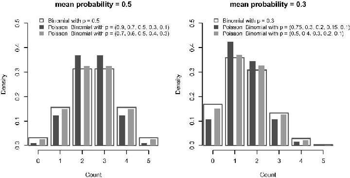
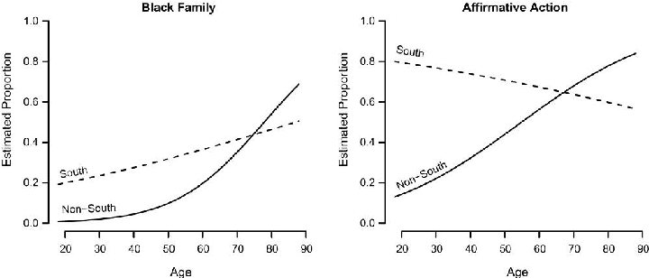
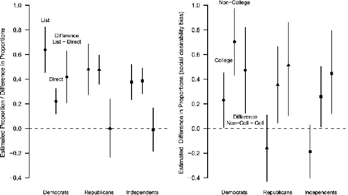
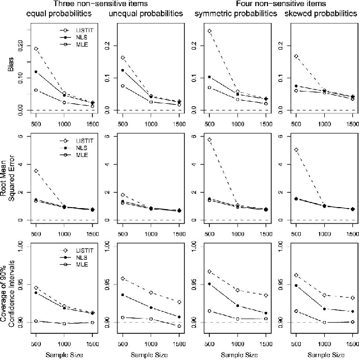
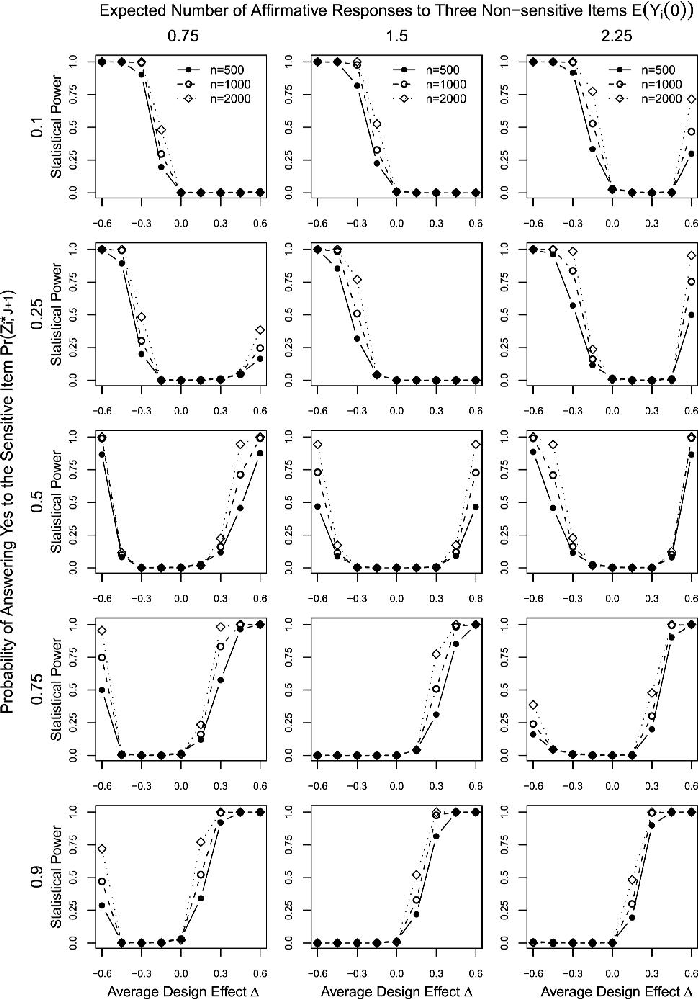

Political Analysis (2012) 20:47−77 doi:10.1093/pan/mpr048

# Statistical Analysis of List Experiments

Graeme Blair and Kosuke Imai Department of Politics, Princeton University, Princeton, NJ 08544 e-mail: gblair@princeton.edu; kimai@princeton.edu (corresponding authors)

Edited by R. Michael Alvarez

The validity of empirical research often relies upon the accuracy of self-reported behavior and beliefs. Yet eliciting truthful answers in surveys is challenging, especially when studying sensitive issues such as racial prejudice, corruption, and support for militant groups. List experiments have attracted much attention recently as a potential solution to this measurement problem. Many researchers, however, have used a simple difference-in-means estimator, which prevents the efficient examination of multivariate relationships between respondents’ characteristics and their responses to sensitive items. Moreover, no systematic means exists to investigate the role of underlying assumptions. We fill these gaps by developing a set of new statistical methods for list experiments. We identify the commonly invoked assumptions, propose new multivariate regression estimators, and develop methods to detect and adjust for potential violations of key assumptions. For empirical illustration, we analyze list experiments concerning racial prejudice. Open-source software is made available to implement the proposed methodology.

at Princeton University on January 18, 2012http://pan.oxfordjournals.org/Downloaded from

## 1 Introduction

The validity of much empirical social science research relies upon the accuracy of self-reported individual behavior and beliefs. Yet eliciting truthful answers in surveys is challenging, especially when studying such sensitive issues as racial prejudice, religious attendance, corruption, and support for militant groups (e.g., Kuklinski, Cobb, and Gilens 1997a; Presser and Stinson 1998; Gingerich 2010; Bullock, Imai, and Shapiro 2011). When asked directly in surveys about these issues, individuals may conceal their actions and opinions in order to conform to social norms or they may simply refuse to answer the questions. The potential biases that result from social desirability and nonresponse can seriously undermine the credibility of self-reported measures used by empirical researchers (Berinsky 2004). In fact, the measurement problem of self-reports can manifest itself even for seemingly less sensitive matters such as turnout and media exposure (e.g., Burden 2000; Zaller 2002).

The question of how to elicit truthful answers to sensitive questions has been a central methodological challenge for survey researchers across disciplines. Over the past several decades, various survey techniques, including the randomized response method, have been developed and used with a mixed record of success (Tourangeau and Yan 2007). Recently, list experiments have attracted much attention among social scientists as an alternative survey methodology that offers a potential solution to this measurement problem (e.g., Kuklinski, Cobb, and Gilens 1997a; Kuklinski et al. 1997b; Sniderman and Carmines 1997; Gilens, Sniderman, and Kuklinski 1998; Kane, Craig, and Wald 2004; Tsuchiya, Hirai, and Ono 2007; Streb et al. 2008; Corstange 2009; Flavin and Keane 2009; Glynn 2010; Gonzalez-Ocantos et al.

Authors’ note: Financial support from the National Science Foundation (SES-0849715) is acknowledged. All the proposed methods presented in this paper are implemented as part of the R package, “list: Statistical Methods for the Item Count Technique and List Experiment,” which is freely available for download at http://cran.r-project.org/package=list (Blair and Imai 2011a). The replication archive is available as Blair and Imai (2011b), and the Supplementary Materials are posted on the Political Analysis Web site. We thank Dan Corstange for providing his computer code, which we use in our simulation study, as well as for useful comments. Detailed comments from the editor and two anonymous reviewers significantly improved the presentation of this paper. Thanks also to Kate Baldwin, Neal Beck, Will Bullock, Stephen Chaudoin, Matthew Creighton, Michael Donnelly, Adam Glynn, Wenge Guo, John Londregan, Aila Matanock, Dustin Tingley, Teppei Yamamoto, and seminar participants at New York University, the New Jersey Institute of Technology, and Princeton University for helpful discussions.

c The Author 2012. Published by Oxford University Press on behalf of the Society for Political Methodology. All rights reserved. For Permissions, please email: journals.permissions@oup.com

47

- 2010; Holbrook and Krosnick 2010; Janus 2010; Redlawsk, Tolbert, and Franko 2010; Coutts and Jann
- 2011; Imai 2011).1 A growing number of researchers are currently designing and analyzing their own list experiments to address research questions that are either difficult or impossible to study with direct survey questions.

The basic idea of list experiments is best illustrated through an example. In the 1991 National Race and Politics Survey, a group of political scientists conducted the first list experiment in the discipline (Sniderman, Tetlock, and Piazza 1992). In order to measure racial prejudice, the investigators randomly divided the sample of respondents into treatment and control groups and asked the following question for the control group:

Now I’m going to read you three things that sometimes make people angry or upset. After I read all three, just tell me HOW MANY of them upset you. (I don’t want to know which ones, just how many.)

at Princeton University on January 18, 2012http://pan.oxfordjournals.org/Downloaded from

- (1) the federal government increasing the tax on gasoline
- (2) professional athletes getting million-dollar-plus salaries
- (3) large corporations polluting the environment How many, if any, of these things upset you?

For the treatment group, they asked an identical question except that a sensitive item concerning racial prejudice was appended to the list,

Now I’m going to read you four things that sometimes make people angry or upset. After I read all four, just tell me HOW MANY of them upset you. (I don’t want to know which ones, just how many.)

- (1) the federal government increasing the tax on gasoline
- (2) professional athletes getting million-dollar-plus salaries
- (3) large corporations polluting the environment
- (4) a black family moving next door to you How many, if any, of these things upset you?

The premise of list experiments is that if a sensitive question is asked in this indirect fashion, respondents may be more willing to offer a truthful response even when social norms encourage them to answer the question in a certain way. In the example at hand, list experiments may allow survey researchers to elicit truthful answers from respondents who do not wish to have a black family as a neighbor but are aware of the commonly held equality norm that blacks should not be discriminated against based on their ethnicity. The methodological challenge, on the other hand, is how to efficiently recover truthful responses to the sensitive item from aggregated answers in response to indirect questioning.

Despite their growing popularity, statistical analyses of list experiments have been unsatisfactory for two reasons. First, most researchers have relied upon the difference in mean responses between the treatment and control groups to estimate the population proportion of those respondents who answer the sensitive item affirmatively.2 The lack of multivariate regression estimators made it difficult to efficiently explore the relationships between respondents’ characteristics and their answers to sensitive items. Although some have begun to apply multivariate regression techniques such as linear regression with interaction terms (e.g., Holbrook and Krosnick 2010; Glynn 2010; Coutts and Jann 2011) and an

- 1A variant of this technique was originally proposed by Raghavarao and Federer (1979), who called it the block total response method. The method is also referred to as the item count technique (Miller 1984) or unmatched count technique (Dalton, Wimbush, and Daily 1994) and has been applied in a variety of disciplines (see, e.g., Droitcour et al. 1991; Wimbush and Dalton 1997; LaBrie and Earleywine 2000; Rayburn, Earleywine, and Davison 2003 among many others).

2Several refinements based on this difference-in-means estimator and various variance calculations have been studied in the methodological literature (e.g., Raghavarao and Federer 1979; Tsuchiya 2005; Chaudhuri and Christofides 2007).

approximate likelihood-based model for a modified design (Corstange 2009), they are prone to bias, much less efficient, and less generalizable than the (exact) likelihood method we propose here (see also Imai 2011).3

This state of affairs is problematic because researchers are often interested in which respondents are more likely to answer sensitive questions affirmatively in addition to the proportion who do so. In the above example, the researcher would like to learn which respondent characteristics are associated with racial hatred, not just the number of respondents who are racially prejudiced. The ability to adjust for multiple covariates is also critical to avoid omitted variable bias and spurious correlations. Second, although some have raised concerns about possible failures of list experiments (e.g., Flavin and Keane 2009), there exists no systematic means to assess the validity of underlying assumptions and to adjust for potential violations of them. As a result, it remains difficult to evaluate the credibility of empirical findings based upon list experiments.

In this paper, we fill these gaps by developing a set of new statistical methods for list experiments. First, we identify the assumptions commonly, but often only implicitly, invoked in previous studies (Section 2.1). Second, under these assumptions, we show how to move beyond the standard difference-inmeans analysis by developing new multivariate regression estimators under various designs of list experiments (Sections 2.1–2.4). The proposed methodology provides researchers with essential tools to efficiently examine who is more likely to answer sensitive items affirmatively (see Biemer and Brown 2005 for an alternative approach). The method also allows researchers to investigate which respondents are likely to answer sensitive questions differently, depending on whether asked directly or indirectly through a list experiment (Section 2.2). This difference between responses to direct and indirect questioning has been interpreted as a measure of social desirability bias in the list experiment literature (e.g., Gilens, Sniderman, and Kuklinski 1998; Janus 2010).

at Princeton University on January 18, 2012http://pan.oxfordjournals.org/Downloaded from

A critical advantage of the proposed regression methodology is its greater statistical efficiency because it allows researchers to recoup the loss of information arising from the indirect questioning of list experiments.4 For example, in the above racial prejudice list experiment, using the difference-in-means estimator, the standard error for the estimated overall population proportion of those who would answer the sensitive item affirmatively is 0.050. In contrast, if we had obtained the same estimate using the direct questioning with the same sample size, the standard error would have been 0.007, which is about seven times smaller than the standard error based on the list experiment. In addition, direct questioning of sensitive items generally leads to greater nonresponse rates. For example, in the Multi-Investigator Survey discussed in Section 2.2 where the sensitive question about affirmative action is asked both directly and indirectly, the nonresponse rate is 6.5% for the direct questioning format and 0% for the list experiment. This highlights the bias-variance trade-off: list experiments may reduce bias at the cost of efficiency.

We also investigate the scenarios in which the key assumptions break down and propose statistical methods to detect and adjust for certain failures of list experiments. We begin by developing a statistical test for examining whether responses to control items change with the addition of a sensitive item to the list (Section 3.1). Such a design effect may arise when respondents evaluate list items relative to one another. In the above example, how angry or upset respondents feel about each control item may change depending upon whether or not the racial prejudice or affirmative action item is included in the list. The validity of list experiments critically depends on the assumption of no design effect, so we propose a statistical test with the null hypothesis of no design effect. The rejection of this null hypothesis provides evidence that the design effect may exist and respondents’ answers to control items may be affected by the inclusion of the sensitive item. We conduct a simulation study to explore how the statistical power of the proposed test changes according to underlying response distributions (Section 3.5).

Furthermore, we show how to adjust empirical results for the possible presence of ceiling and floor effects (Section 3.2), which have long been a concern in the list experiment literature (e.g., Kuklinski,

- 3For example, linear regression with interaction terms often produces negative predicted values for proportions of affirmative responses to sensitive items when such responses are rare.
- 4Applied researchers have used stratification and employed the difference-in-means estimator within each subset of the data defined by respondents’ characteristics of interest. The problem of this approach is that it cannot accommodate many variables or variables that take many different values unless a large sample is drawn.

Cobb, and Gilens 1997a; Kuklinski et al. 1997b). These effects represent two respondent behaviors that may interfere with the ability of list experiments to elicit truthful answers. Ceiling effects may result when respondents’ true preferences are affirmative for all the control items as well as the sensitive item. Floor effects may arise if the control questions are so uncontroversial that uniformly negative responses are expected for many respondents.5 Under both scenarios, respondents in the treatment group may fear that answering the question truthfully would reveal their true (affirmative) preference for the sensitive item. We show how to account for these possible violations of the assumption while conducting multivariate regression analysis. Our methodology allows researchers to formally assess the robustness of their conclusions. We also discuss how the same modeling strategy may be used to adjust for design effects (Section 3.3).

For empirical illustrations, we apply the proposed methods to the 1991 National Race and Politics Survey described above and the 1994 Multi-Investigator Survey (Sections 2.5 and 3.4). Both these surveys contain list experiments about racial prejudice. We also conduct simulation studies to evaluate the performance of our methods (Sections 2.6 and 3.5). Open-source software, which implements all of our suggestions, is made available so that other researchers can apply the proposed methods to their own list experiments. This software, “list: Statistical Methods for the Item Count Technique and List Experiment”(Blair and Imai 2011a), is an R package and is freely available for download at the Comprehensive R Archive Network (CRAN; http://cran.r-project.org/package=list).

at Princeton University on January 18, 2012http://pan.oxfordjournals.org/Downloaded from

In Section 4, we offer practical suggestions for applied researchers who design and analyze list experiments. While statistical methods developed in this paper can detect and correct failures of list experiments under certain conditions, researchers should carefully design list experiments in order to avoid potential violations of the underlying assumptions. We offer several concrete tips in this regard. Finally, we emphasize that the statistical methods developed in this paper, and list experiments in general, do not permit causal inference unless additional assumptions, such as exogeneity of causal variables of interest, are satisfied. Randomization in the design of list experiments helps to elicit truthful responses to sensitive questions, but it does not guarantee that researchers can identify causal relationships between these responses and other variables.

## 2 Multivariate Regression Analysis for List Experiments

In this section, we show how to conduct multivariate regression analyses using the data from list experiments. Until recently, researchers lacked methods to efficiently explore the multivariate relationships between various characteristics of respondents and their responses to the sensitive item (for recent advances, see Corstange 2009; Glynn 2010; Imai 2011). We begin by reviewing the general statistical framework proposed by Imai (2011), which allows for the multivariate regression analysis under the standard design (Section 2.1). We then extend this methodology to three other commonly used designs.

First, we consider the design in which respondents are also asked directly about the sensitive item after they answer the list experiment question about control items. This design is useful when researchers are interested in the question of which respondents are likely to exhibit social desirability bias (Section 2.2). By comparing answers to direct and indirect questioning, Gilens, Sniderman, and Kuklinski (1998) and Janus (2010) examine the magnitude of social desirability bias with respect to affirmative action and immigration policy, respectively. We show how to conduct a multivariate regression analysis by modeling this difference in responses as a function of respondents’ characteristics.

Second, we show how to conduct multivariate regression analysis under the design with more than one sensitive item (Section 2.3). For scholars interested in multiple sensitive subjects, a common approach is to have multiple treatment lists, each of which contains a different sensitive item and the same set of control items. For example, in the 1991 National Race and Politics Survey described above, there were two sensitive items, one about a black family moving in next door and the other about affirmative action. We show how to gain statistical efficiency by modeling all treatment groups together with the control group rather than analyzing each treatment group separately. Our method also allows researchers to explore the relationships between respondents’ answers to different sensitive items.

5Another possible floor effect may arise if respondents fear that answering “0” reveals their truthful (negative) preference.

Finally, we extend this methodology to the design recently proposed by Corstange (2009) in which each control item is asked directly of respondents in the control group (Section 2.4). A potential advantage of this alternative design is that it may yield greater statistical power when compared to the standard design because the answers to each control item are directly observed for the control group. The main disadvantage, however, is that answers to control items may be different if asked directly than they would be if asked indirectly, as in the standard design (see, e.g., Flavin and Keane 2009; see also Section 3.1 for a method to detect such a design effect). Through a simulation study, we demonstrate that our proposed estimators exhibit better statistical properties than the existing estimator.

- 2.1 The Standard Design

Consider the administration of a list experiment to a random sample of N respondents from a population. Under the standard design, we randomly split the sample into treatment and control groups where Ti = 1 (Ti = 0) implies that respondent i belongs to the treatment (control) group. The respondents in the control group are presented with a list of J control items and asked how many of the items they would respond to in the affirmative. In the racial prejudice example described in Section 1, three control items are used, and thus we have J = 3. The respondents in the treatment group are presented with the full list of one sensitive item and J control items and are asked, similarly, how many of the (J + 1) items they would respond in the affirmative to. Without loss of generality, we assume that the first J items, that is, j = 1,..., J, are control items and the last item, that is, j = J +1, is a sensitive item. The order of items on the partial and full lists may be randomized to minimize order effects.

at Princeton University on January 18, 2012http://pan.oxfordjournals.org/Downloaded from

- 2.1.1 Notation

To facilitate our analysis, we use potential outcomes notation (Holland 1986) and let Zij(t) be a binary variable denoting respondent i’s preference for the jth control item for j = 1,..., J under the treatment status t = 0,1. In the racial prejudice list experiment introduced in Section 1, Zi2(1) = 1 means that respondent i would feel she is upset by the second control item—“professional athletes getting million-dollar-plus salaries”—when assigned to the treatment group. Similarly, we use Zi,J+1(1) to represent respondent i’s answer to the sensitive item under the treatment condition. The sensitive item is not included in the control list and so Zi,J+1(0) is not defined. Finally, Z∗

ij denotes respondent i’s truthful answer to the jth item where j = 1,..., J + 1. In particular, Z∗

i,J+1 represents the truthful answer to the sensitive item.

Given this notation, we further define Yi(0) = Jj=1 Zij(0) and Yi(1) = Jj=+11 Zij(1) as the potential answer respondent i would give under the treatment and control conditions, respectively. Then, the observed response is represented by Yi = Yi(Ti). Note that Yi(1) takes a nonnegative integer not greater than (J + 1), while the range of Yi(0) is given by {0,1,..., J}. Finally, a vector of observed (pretreatment) covariates is denoted by Xi ∈ X, where X is the support of the covariate distribution. These covariates typically include the characteristics of respondents and their answers to other questions in the survey. The randomization of the treatment implies that potential and truthful responses are jointly independent of the treatment variable.6

- 2.1.2 Identification assumptions and analysis

We identify the assumptions commonly but often only implicitly invoked under the standard design (see also Glynn 2010). First, researchers typically assume that the inclusion of a sensitive item has no effect on respondents’ answers to control items. We do not require respondents to give truthful answers to the control items. Instead, we only assume that the addition of the sensitive item does not change the sum of affirmative answers to the control items. We call this the no design effect assumption and write formally as,

ij}Jj=+11,{Zij(0), Zij(1)}Jj=1, Zi,J+1(1)} Ti for each i = 1,..., N.

6Formally, we write {{Z∗

Table 1 An example illustrating identification under the standard design with three control items

Response Treatment group Control group Yi (Ti = 1) (Ti = 0) 4 (3, 1) 3 (2, 1) (3, 0) (3, 1) (3, 0) 2 (1, 1) (2,0) (2, 1) (2, 0) 1 (0, 1) (1, 0) (1, 1) (1, 0) 0 (0, 0) (0, 1) (0, 0)

Note. The table shows how each respondent type, characterized by (Yi(0), Z∗

i,J+1), corresponds to the observed cell defined by (Yi, Ti), where Yi(0) represents the total number of affirmative answers for J control items and Z∗

i,J+1 denotes the truthful preference for the sensitive item. In this example, the total number of control items J is set to 3.

- Assumption 1. (No design effect). For each i = 1,..., N, we assume J

j=1

Zij(0) =

J

j=1

Zij(1) or equivalently Yi(1) = Yi(0) + Zi,J+1(1).

The second assumption is that respondents give truthful answers for the sensitive item. We call this the no liars assumption and write it as follows:

- Assumption 2. (No liars). For each i = 1,..., N, we assume

at Princeton University on January 18, 2012http://pan.oxfordjournals.org/Downloaded from

Zi,J+1(1) = Zi∗,J+1 where Z∗

i,J+1 represents a truthful answer to the sensitive item.

Under these two assumptions, the following standard difference-in-means estimator yields an unbiased estimate of the population proportion of those who give an affirmative answer to the sensitive item,

N

N

1 N1

1 N0

τˆ =

TiYi −

(1 − Ti)Yi, (1)

i=1

i=1

where N1 = i N=1 Ti is the size of the treatment group and N0 = N −N1 is the size of the control group.7

Although this standard estimator uses the treatment and control groups separately, it is important to note that under Assumptions 1 and 2, we can identify the joint distribution of (Yi(0), Z∗

i,J+1) as shown by Glynn (2010). This joint distribution completely characterizes each respondent’s type for the purpose of analyzing list experiments under the standard design. For example, (Yi(0), Z∗

i,J+1) = (2,1) means that respondent i affirmatively answers the sensitive item as well as two of the control items. There exist a total of (2 × (J + 1)) such possible types of respondents.

Table 1 provides a simple example with J = 3 that illustrates the identification of the population proportion of each respondent type. Each cell of the table contains possible respondent types. For example, the respondents in the control group whose answer is 2, that is, Yi = 2, are either type (Yi(0), Z∗

i,J+1) = (2,1) or type (2,0). Similarly, those in the treatment group whose answer is 2 are either type (1,1) or (2,0). Since the types are known for the respondents in the treatment group with Yi = 0 and Yi = 4, the population proportion of each type can be identified from the observed data under Assumptions 1 and 2. More generally, if we denote the population proportion of each type as πyz = Pr(Yi(0) = y, Z∗

i,J+1 = z) for y = 0,..., J and z = 0,1, then πyz is identified for all y = 0,..., J as follows:

πy1 = Pr(Yi y|Ti = 0) − Pr(Yi y|Ti = 1), (2) πy0 = Pr(Yi y|Ti = 1) − Pr(Yi y − 1|Ti = 0). (3)

7The unbiasedness implies E(τ)ˆ = Pr(Z∗

i,J+1 = 1).

- 2.1.3 Multivariate regression analysis

The major limitation of the standard difference-in-means estimator given in equation (1) is that it does not allow researchers to efficiently estimate multivariate relationships between preferences over the sensitive item and respondents’ characteristics. Researchers may apply this estimator to various subsets of the data and compare the results, but such an approach is inefficient and is not applicable when the sample size is small or when many covariates must be incorporated into analysis.

To overcome this problem, Imai (2011) developed two new multivariate regression estimators under Assumptions 1 and 2. The first is the following nonlinear least squares (NLS) estimator:

Yi = f (Xi,γ) + Tig(Xi,δ) + i, (4)

where E( i|Xi, Ti) = 0 and (γ,δ) is a vector of unknown parameters. The model puts together two possibly nonlinear regression models, where f (x,γ) and g(x,δ) represent the regression models for the conditional expectations of the control and sensitive items given the covariates, respectively, where x ∈ X.8 One can use, for example, logistic regression submodels, which would yield f (x,γ) = E(Yi(0)|Xi = x) = J × logit−1(x γ) and g(x,δ) = Pr(Z∗

at Princeton University on January 18, 2012http://pan.oxfordjournals.org/Downloaded from

i,J+1 = 1|Xi = x) = logit−1(x δ). Heteroskedasticityconsistent standard errors are used because the variance of error term is likely to be different between the treatment and control groups.

This estimator includes two other important estimators as special cases. First, it generalizes the difference-in-means estimator because the procedure yields an estimate that is numerically identical to it when Xi contains only an intercept. Second, if linearity is assumed for the two submodels, that is,

f (x,γ) = x γ and g(x,δ) = x δ, then the estimator reduces to the linear regression with interaction terms (e.g., Holbrook and Krosnick 2010; Coutts and Jann 2011),

Yi = X i γ + Ti X i δ + i. (5)

As before, heteroskedasticity-consistent robust standard errors should be used because the error variance necessarily depends on the treatment variable. This linear specification is advantageous in that estimation and interpretation are more straightforward than the NLS estimator, but it does not take into account the fact that the response variables are bounded.

The proposed NLS estimator is consistent so long as the conditional expectation functions are correctly specified regardless of the exact distribution of error term.9 However, this robustness comes with a price. In particular, the estimator can be inefficient because it does not use all the information about the joint distribution of (Yi(0), Z∗

i,J+1), which is identified under Assumptions 1 and 2 as shown above. To overcome this limitation, Imai (2011) proposes the maximum likelihood (ML) estimator by modeling the joint distribution as,

g(x,δ) = Pr(Zi∗,J+1 = 1|Xi = x), (6) hz(y; x,ψz) = Pr(Yi(0) = y|Zi∗,J+1 = z, Xi = x), (7)

where x ∈ X, y = 0,..., J, and z = 0,1. Analysts can use binomial logistic regressions for both g(x,δ) and hz(y; x,ψz), for example. If overdispersion is a concern due to possible positive correlation among control items, then beta-binomial logistic regression may be used.

The likelihood function is quite complex, consisting of many mixture components, so Imai (2011) proposes an expectation–maximization (EM) algorithm by treating Z∗

i,J+1 as (partially) missing data (Dempster, Laird, and Rubin 1977). The EM algorithm considerably simplifies the optimization problem because it only requires the separate estimation of g(x,δ) and hz(y; x,ψz), which can be accomplished

- 8To facilitate computation, Imai (2011) proposes a two-step procedure where f (x,γ) is first fitted to the control group and then

g(x,δ) is fitted to the treatment group using the adjusted response variable Yi − f (x,γˆ), where γˆ represents the estimate of γ obtained at the first stage. Heteroskedasticity-consistent robust standard errors are obtained by formulating this two-step estimator as a method of moments estimator.

- 9The precise regularity conditions that must be satisfied for the consistency and asymptotic normality of the two-step NLS estimator of Imai (2011) are the same as those for the method of moments estimator (see Newey and McFadden 1994). Note that the functions

f (x,γ) and g(x,δ) are bounded because the outcome variable is bounded.

using the standard fitting routines available in many statistical software programs. Another advantage of the EM algorithm is its stability, represented by the monotone convergence property, under which the value of the observed likelihood function monotonically increases throughout the iterations and eventually reaches the local maximum under mild regularity conditions.10

In the remainder of this section, we show how to extend this basic multivariate regression analysis methodology to other common designs of list experiments.

- 2.2 Measuring Social Desirability Bias

In some cases, researchers may be interested in how the magnitude of social desirability bias varies across respondents as a function of their characteristics. To answer this question, researchers have designed list experiments so that the respondents in the control group are also directly asked about the sensitive item after the list experiment question concerning a set of control items.11Note that the direct question about the sensitive item could be given to respondents in the treatment group as well, but the indirect questioning may prime respondents, invalidating the comparison. Regardless of differences in implementation, the basic idea of this design is to compare estimates about the sensitive item from the list experiment question with those from the direct question and determine which respondents are more likely to answer differently. This design is not always feasible, especially because the sensitivity of survey questions often makes direct questioning impossible.

For example, the 1994 Multi-Investigator Survey contained a list experiment that resembles the one from the 1991 National Race and Politics Survey with the affirmative action item.12 Gilens, Sniderman, and Kuklinski (1998) compared the estimates from the list experiment with those from a direct question13 and found that many respondents, especially those with liberal ideology, were less forthcoming with their anger over affirmative action when asked directly than when asked indirectly in the list experiment. More recently, Janus (2010) conducted a list experiment concerning immigration policy using the same design. The author finds, similarly, that liberals and college graduates in the United States deny supporting restrictive immigration policies when asked directly but admit they are in favor of those same policies when asked indirectly in a list experiment.

- 2.2.1 Multivariate regression analysis

To extend our proposed multivariate regression analysis to this design, we use Zi,J+1(0) to denote respondent i’s potential answer to the sensitive item when asked directly under the control condition. Then, the social desirability bias for respondents with characteristics Xi = x can be formally defined as,

S(x) = Pr(Zi,J+1(0) = 1|Xi = x) − Pr(Zi∗,J+1 = 1|Xi = x) (8)

for any x ∈ X. Provided that Assumptions 1 and 2 hold, we can consistently estimate the second term using one of our proposed estimators for the standard list experiment design. The first term can be estimated directly from the control group by regressing the observed value of Zi,J+1(0) on respondents’ characteristics via, say, the logistic regression. Because the two terms that constitute the social desirability bias, S(x), can be estimated separately, this analysis strategy extends directly to the designs considered in Sections 2.3 and 2.4 as well so long as the sensitive items are also asked directly.

- 2.3 Studying Multiple Sensitive Items

at Princeton University on January 18, 2012http://pan.oxfordjournals.org/Downloaded from

Researchers are often interested in eliciting truthful responses to more than one sensitive item. The 1991 National Race and Politics Survey described in Section 1, for example, had a second treatment group with

- 10Both the NLS and ML estimators (as well as the linear regression estimator) are implemented as part of our open-source software (Blair and Imai 2011a). Imai (2011) presents simulation and empirical evidence showing the potentially substantial efficiency gain obtained by using these multivariate regression models for list experiments.
- 11Asking in this order may reduce the possibility that the responses to the control items are affected by the direct question about the sensitive item. 12The key difference is the following additional control item: requiring seat belts be used when driving.

- 13In this survey, the direct question about the sensitive item was given to a separate treatment group rather than the control group.

another sensitive item about affirmative action, which was presented along with the same three control items:

(4) black leaders asking the government for affirmative action

The key characteristic of this design is that the same set of control items is combined with each of the sensitive items to form separate treatment lists; there is one control group and multiple treatment groups. In this section, we extend the NLS and ML estimators described above to this design so that efficient multivariate regression analysis can be conducted.

- 2.3.1 Notation and Assumptions

Suppose that we have J control items and K sensitive items. As before, we use Ti to denote the treatment variable that equals 0 if respondent i is assigned to the control group and equals t if assigned to the treatment group with the tth sensitive item where i = 1,..., N and t = 1,..., K. We use Zij(t) to denote a binary variable that represents the preference of respondent i for control item j for j = 1,..., J under the treatment status t = 0,1,..., K. Under the control condition, we observe the total number of affirmative responses to J control items, that is, Yi(0) = Jj=1 Zij(0). Under the tth treatment condition Ti = t, where t = 1,..., K, we observe Yi(t) = Zi,J+t(t) + Jj=1 Zij(t), where Zi,J+t(t) represents the answer respondent i would give to the tth sensitive question under this treatment condition. As before, Zi,J+t(t ) is not defined for t  = t, and we use Z∗

at Princeton University on January 18, 2012http://pan.oxfordjournals.org/Downloaded from

i,J+t to denote the truthful answer to the tth sensitive question for t = 1,..., K. Finally, the observed response is given by Yi = Yi(Ti).

Given this setup, we can generalize Assumptions 1 and 2 as follows:

J

J

Zij(t) and Zi,J+t(t) = Zi∗,J+t (9)

Zij(0) =

j=1

j=1

for each i = 1,..., N and t = 1,..., K. The substantive implication of these assumptions remains identical under the current design. That is, we assume that the addition of sensitive items does not alter responses to the control items (no design effect) and that the response for each sensitive item is truthful (no liars).

- 2.3.2 Multivariate regression analysis

Under these assumptions, the NLS estimator reviewed above can be directly applied to each sensitive item separately. However, this estimator is inefficient because it does not exploit the fact that the same set of control items is used across all control and treatment groups.14Thus, we develop an ML estimator that analyzes all groups together for efficient multivariate analysis.

We construct the likelihood slightly differently than that of the standard design. Here, we first model the marginal distribution of the response to J control items and then model the conditional distribution of the response to each sensitive item given the response to the control items. Formally, the model is given by,

h(y; x,ψ) = Pr(Yi(0) = y|Xi = x), (10) gt(x, y,δty) = Pr(Zi∗,J+t = 1|Yi(0) = y, Xi = x) (11)

for each x ∈ X, t = 1,..., K, and y = 0,1,..., J. For example, one can use the following binomial logistic regressions to model the two conditional distributions:

h(y; x,ψ) = J × logit−1(x ψ), (12) gt(x, y,δty) = logit−1(αt y + x βt), (13)

- 14In theory, one can estimate the NLS using all groups, that is, Yi = f (Xi,γ) + t K=1 1{Ti = t}gt(Xi,δt) + i, where gt(x,δ) =

Pr(Z∗

i,J+t = 1|Xi = x). However, the optimization problem may be difficult unless we assume a linear specification.

where δty = (αt,βt). Note that this particular specification for the sensitive item assumes that the slope coefficient βt is equal across different responses to the control items and the response to the control items enter as an additional linear term in order to keep the model parsimonious. Clearly, many other model specifications are possible.15 As under the standard design, if overdispersion is a concern, then beta-binomial regression might be more appropriate. In Supplementary Materials Section 1, we derive the likelihood function based on this formulation and develop an EM algorithm to estimate the model.

Finally, one important quantity of interest is the conditional probability of answering the sensitive item affirmatively given a certain set of respondents’ characteristics x ∈ X. This quantity can be obtained via:

J

Pr(Zi∗,J+t = 1|Xi = x) =

gt(x, y,δty)h(y; x,ψ). (14)

y=0

- 2.4 Improving the Efficiency of List Experiments

at Princeton University on January 18, 2012http://pan.oxfordjournals.org/Downloaded from

While list experiments can protect the privacy of respondents, their main drawback is a potential loss of statistical efficiency due to the aggregation of responses. Corstange (2009) recently proposed one possible way to address this problem by considering an alternative experimental design in which the control items are asked directly in the control group. Below, we extend the NLS and ML estimators of Imai (2011) to this design (see Glynn 2010 for other suggestions to improve efficiency). While doing so, we derive the exact likelihood function rather than an approximate likelihood function such as the one used for Corstange’s multivariate regression model, LISTIT. A simulation study is conducted to assess the relative performance of the proposed estimator over the LISTIT estimator.

- 2.4.1 Notation and Assumptions

We continue to use the notation introduced in Section 2.1. Under this design, we observe a respondent’s answer for each of J control items because these items are asked directly. We observe Zij = Zij(0) for each j = 1,..., J and all respondents in the control group. As before, for the treatment group, we only observe the total number of affirmative answers to (J + 1) items on the list that includes one sensitive item and J control items.

The identification assumptions under this design are somewhat stronger than Assumptions 1 and 2. Specifically, we assume that the treatment status does not influence answers to each of the control questions and that the respondents give truthful answers to the sensitive item. Note that as before the answers to the control items do not have to be truthful. Formally, we assume, for each i = 1,..., N, that:

Zij(1) = Zij(0) for j = 1,..., J and Zi,J+1(1) = Zi∗,J+1. (15)

Under this design, researchers often worry about the possibility that asking directly alters responses even for control items. In an attempt to minimize such a design effect, all the control items can be presented together to the respondents in the control group before they are asked to answer each item separately. Under this setup, the administration of the questions is more consistent across the treatment and control conditions. For example, Flavin and Keane (2009) use the following question wording for the control group:

Please look over the statements below. Then indicate which of the following things make you angry or upset, if any.

- (1) The way gasoline prices keep going up
- (2) Professional athletes getting million-dollar-plus salaries
- (3) Requiring seat belts be used when driving
- (4) Large corporations polluting the environment

15For example, a slightly more general model would be gt(x, y,δty) = logit−1(αty + x βt), which allows for variation in slopes by treatment status.

- 2.4.2 Multivariate regression analysis

We develop two new estimators for the modified design: the NLS and ML estimators. The former is more robust than the latter in that it allows for arbitrary correlations across answers to different items on the list. However, the ML estimator can be potentially more efficient than the NLS estimator. First, we consider the NLS estimator based on the following multivariate regression model:

J

Yi = g(x,δ) +

πj(Xi,θj) + i for the treatment group, (16)

j=1

 

Zi1 = π1(Xi,θ1) + ηi1

for the control group, (17)

. ZiJ = πJ(Xi,θJ) + ηiJ



where πj(Xi,θj) = Pr(Zij = 1|Xi) and E( i | Xi) = E(ηij|Xi) = 0 for j = 1,..., J. The model is general and permits any functional form for πj(x,θj) and g(x,δ). As in Corstange (2009), one may assume the logistic regression model, that is, g(x,δ) = logit−1(x δ) and πj(x,θj) = logit−1(x θj) for j = 1,..., J.

at Princeton University on January 18, 2012http://pan.oxfordjournals.org/Downloaded from

To facilitate computation, we developed a two-step estimation procedure.16 Like any two-step estimator, the calculation of valid standard errors must take into account the estimation uncertainty from both the first and second steps. In Supplementary Materials Section 2, we derive the asymptotic distribution of this two-step NLS estimator. The resulting standard errors are robust to heteroskedasticity and within-respondent correlation across answers for control items. Note that this two-step estimation is unnecessary if all conditional expectation functions are assumed to be linear, that is, g(x,δ) = x δ and πj(x,θj) = x θj for each j = 1,..., J because then the model reduces to the linear regression with interaction terms.

Next, we develop the ML estimator. Corstange (2009) is the first to consider likelihood inference under this modified design. He begins by assuming conditional independence between each respondent’s answers to different items given her observed characteristics Xi. Under this setup, Corstange (2009) uses an approximation based on the assumption that the response variable Yi for the treatment group follows the binomial distribution with size J + 1 and success probability π(ˉ Xi,θ) = Jj=+11 πj(Xi,θj)/(J + 1), where, for the sake of notational simplicity we use πJ+1(x,θJ+1) = g(x,δ) with θJ+1 = δ.

However, the sum of independent, but heterogeneous, Bernoulli random variables (i.e., with different success probabilities) follows the Poisson–Binomial distribution rather than the Binomial distribution. Since a Binomial random variable is a sum of independent and identical Bernoulli random variables, it is a special case of the Poisson–Binomial random variable. In list experiments, this difference is present because the probability of giving an affirmative answer to a control item usually differs across items.

Although the two distributions have identical means, the Poisson–Binomial distribution is different from the Binomial distribution. Figure 1 illustrates the difference between the two distributions with five trials and selected mean success probabilities (0.5 for the left panel and 0.3 for the right panel). The figure shows that although the means are identical, these distributions can be quite different especially when the variation of success probabilities is large (the density represented by dark grey rectangles). In general, the variance of the Poisson–Binomial distribution is no greater than that of the Binomial distribution.17

Given this discussion, the exact likelihood function for the modified design should be based on the Poisson–Binomial distribution. In Appendix 4, we derive this exact likelihood function and develop an EM algorithm to estimate model parameters.

- 16In the first step, we fit each model defined in equation (17) to the control group using NLS. This step yields a consistent estimate of θj for j = 1,..., J. Denote this estimate by θˆj. In the second step, we substitute θˆj into the model defined in equation (16) and fit the model for the sensitive item g(x,δ) to the treatment group using NLS with the adjusted response variable Yi − Jj=1 πj(x,θˆj). This step yields a consistent estimate of δ.
- 17Formally, we have Jj=+11 πj(Xi,θj)(1 − πj(Xi,θj)) (J + 1)πˉ (Xi,θ)(1 − π(ˉ Xi,θ)). Ehm (1991) shows that the Poisson–

Binomial distribution is well approximated by the Binomial distribution if and only if the variance of success probabilities, i.e., J+1 j=1(πj(Xi,θj) − π(ˉ Xi,θ))2/(J + 1), is small relative to π(ˉ Xi,θ)(1 − π(ˉ Xi,θ)).

at Princeton University on January 18, 2012http://pan.oxfordjournals.org/Downloaded from

- Fig. 1 Differences between the Binomial and Poisson–Binomial distributions. The two density plots illustrate the difference between the Binomial (open rectangles) and Poisson–Binomial (grey rectangles) distributions with identical mean success probabilities (0.5 for the left panel and 0.3 for the right panel) and the same number of trials, five. The Poisson–Binomial distributions whose success probabilities p vary greatly are markedly different from the Binomial distribution.

Table 2 Observed data from the list experiment in the 1991 National Race and Politics Survey Control Group Treatment Groups

Response Black family Affirmative action value Frequency Proportion Frequency Proportion Frequency Proportion

- 0 8 1.4% 19 3.0% 9 1.5%
- 1 132 22.4 123 19.7 78 13.4
- 2 222 37.7 229 36.7 172 29.6
- 3 227 38.5 219 35.1 184 31.6
- 4 34 5.4 139 23.9

Total 589 624 582

Note. The table displays the number of respondents for each value of the observed outcome variable y and its proportions, separately for the control and two treatment groups (black family and affirmative action items). The proportions do not sum to 100% due to rounding.

- 2.5 An Empirical Application

We apply the ML estimator developed in Section 2.3 to the 1991 National and Race and Politics Survey. As described in Section 1, this list experiment has two treatment groups, regarding moving near a black family and affirmative action and has three control items that are common across all treatment and control groups. Therefore, we have J = 3 and K = 2. The sample size is 1795 (all are white respondents), of which 624 and 582 are in the treatment groups for the black family item and the affirmative action item, respectively. Table 2 summarizes the data from this experiment. We observe that nearly 40% of respondents in the control group answer all control items in the affirmative. From a design perspective, this is less than ideal because such a right-skewed response distribution indicates the potential risk of ceiling effects (see Section 3.2). Ideally, control items should be chosen such that fewer extreme responses are observed in the control group.

- 2.5.1 The New South hypothesis

In an influential paper, Kuklinski, Cobb, and Gilens (1997a) analyzed this list experiment to test the “New South” hypothesis that southern whites had become less racially prejudiced over time and as a result

Table 3 Estimated coefficients from the combined logistic regression model where the outcome variables are whether or not “A Black Family Moving Next Door to You” and whether or not “Black Leaders Asking the Government for Affirmative Action” will make (white) respondents angry

Sensitive items Control items Black family Affirmative action Variables Est. SE Est. SE Est. SE

Intercept −7.575 1.539 −5.270 1.268 1.389 0.143 Male 1.200 0.569 0.538 0.435 −0.325 0.076 College −0.259 0.496 −0.552 0.399 −0.533 0.074 Age 0.852 0.220 0.579 0.147 0.006 0.028 South 4.751 1.850 5.660 2.429 −0.685 0.297 South × age −0.643 0.347 −0.833 0.418 0.093 0.061 Control items Yi(0) 0.267 0.252 0.991 0.264

at Princeton University on January 18, 2012http://pan.oxfordjournals.org/Downloaded from

Note. The key variables of interest are South, which indicates whether or not a respondent lives in one of the Southern states, and its interaction with the age variable.

the level of their racial prejudice had become no higher than that of non-southern whites. The authors used the simple difference-in-means estimator and estimated the difference in the proportions of those who answer each sensitive item in the affirmative between southern and non-southern whites. They find that southern whites are substantially more racially prejudiced than non-southern whites with respect to both sensitive items. However, as acknowledged by the authors (pp. 334–335), in the absence of multivariate regression techniques at that time, they were unable to adjust for differences in individual characteristics between southern and non-southern whites, which could explain the difference in the degree of racial prejudice they found.

Furthermore, at the core of the New South hypothesis is a theory of generational change. As Kuklinski, Cobb, and Gilens (1997a) put it, “Young white southerners look more like their non-southern counterparts than their parents did; and the older generations themselves have become more willing to acknowledge the rights of black people” (p. 325). Due to the lack of multivariate regression methods for list experiments, however, the original analysis of this generational change dichotomized the age variable in a particular manner and compared the mean level of prejudice among white southerners born before 1960 to those born after 1960, finding that the estimated proportion of those southern whites who are angry declined from 47% to 35%. Clearly, a better approach is to treat age as a multivalued variable rather than a binary variable.

We apply our proposed multivariate regression methodology and improve the original analysis at least in three ways. First, we take into account potentially confounding demographic differences between southern and non-southern whites. We adjust for age, education (whether respondents attended college), and the gender of survey respondents. Second, we analyze three groups (two treatment and one control groups) together to take advantage of the fact that the same set of control items were asked in all groups, thereby improving statistical efficiency. Finally, we examine the generational changes among southern and non-southern whites by utilizing the interaction variable in regression rather than dichotomizing the age variable.

Table 3 presents the estimated coefficients and their standard errors from the fitted binomial logistic regression model where we analyze the two treatment groups and one control group simultaneously. We include the interaction term between the age and south variables in order to examine possibly different generational changes among southern and non-southern whites.18 We find that both the age and south variables play a significant role in explaining the variation in answering the sensitive item affirmatively. In addition, there appear to be different patterns in generational changes between southern and non-southern whites. These findings are obtained while adjusting for gender and education level.

- 18The likelihood ratio test, comparing the model presented in this paper and the expanded model with the square of the age variable and its interaction with the South variable, fails to reject the null hypothesis of no difference between the two models, with p value of 0.840.

- Fig. 2 Estimated proportions of respondents answering each sensitive item in the affirmative by respondent age for southern and non-southern whites. The sensitive items are whether or not “A Black Family Moving Next Door to You” and whether or not “Black Leaders Asking the Government for Affirmative Action” will make (white) respondents angry. The estimates (dashed and solid lines) are based on the regression model given in Table 3.

at Princeton University on January 18, 2012http://pan.oxfordjournals.org/Downloaded from

To facilitate the substantive interpretation of the regression results given in Table 3, Fig. 2 plots the estimated proportions of southern and non-southern white respondents who are angered by each sensitive item as a function of respondent age while adjusting for gender and education.19 We find that there is a dramatic generational shift among non-southern whites in terms of pure racial prejudice, measured by aversion to “black families moving in next door” (left panel). In contrast, generational change among southern whites is much slower. In every age group of southern whites, the proportion of racially prejudiced individuals is estimated to be 20% or greater. This difference in the pattern of generational change between southern and non-southern whites yields convergence in the degree of racial prejudice, which becomes approximately equal between the two groups at approximately age 70.

With respect to the affirmative action item (right panel of Fig. 2), we find a similar but slightly different pattern of generational change. In particular, younger whites in the South are more upset by the idea of black leaders asking for affirmative action than their parents and grandparents are. In contrast, among non-southern whites, we observe the same rapid generational shift as we did for the black family item in which case young individuals are much less angry about the affirmative action item.

In sum, the proposed multivariate regression analysis yields new insights about generational changes among southern and non-southern whites. Our analysis suggests that these generational changes play an important role in explaining the persistent differences in racial prejudice between southern and nonsouthern whites even after adjusting for gender and education. This finding also contrasts with that of Kuklinski, Cobb, and Gilens (1997a) who state that “prejudice is concentrated among white southern men” (pp. 323). This gender difference seems to largely disappear once we adjust for other covariates.20 As these results suggest, the proposed multivariate regression methodology allows researchers to conduct richer statistical analyses of list experiments than they could with standard methods.

- 2.5.2 Social desirability bias

Next, we analyze the responses to the list experiment and direct question about affirmative action from the 1994 Multi-Investigator Survey. Gilens, Sniderman, and Kuklinski (1998) investigated the relationship between partisanship and social desirability bias. The authors measure the extent to which individuals hide their true beliefs by estimating the difference in responses to the direct and indirect questions about

- 19To obtain the estimated proportion at each age for each subgroup, we compute the predicted probability by setting all the other covariates to their observed values of each respondent. We then average these predicted probabilities over all respondents.

20Both the main effect of gender and its interaction effect with the South variable are estimated with large standard errors, failing to provide conclusive evidence about gender effects. In the model of views of affirmative action, for example, the coefficient on the male indicator is 0.140 (SE = 0.377), and the interaction effect coefficient is −0.757 (SE = 1.03).

at Princeton University on January 18, 2012http://pan.oxfordjournals.org/Downloaded from

- Fig. 3 Estimated proportions of respondents answering the sensitive item in the affirmative by partisanship and their differences between direct and indirect questioning. Indirect questioning is based on the standard design of the list experiment in the 1994 Multi-Investigator Survey. The sensitive item is whether or not “Black Leaders Asking the Government for Affirmative Action” will make (white) respondents angry. The estimates (solid circles, triangles, and squares) are based on a logistic regression model for the direct measure and the proposed binomial logistic regression model for the indirect measure from the list experiment. Both models contain the three-category partisanship variable as well as the same age, male, South, and college covariates. The 95% confidence intervals (vertical lines) are obtained via Monte Carlo simulations.

affirmative action. Using the multivariate regression method described in Section 2.2, we examine the extent to which respondents answer the direct and indirect questions about the same sensitive item differently. We use the proposed standard design binomial logistic regression model for responses to the list experiment and a binary logistic regression to model answers to direct questions. Each model includes a three-category partisanship variable (Democrats, Republicans, and Independents) as well as the age, male, South, and college covariates. As before, we limit our analysis to the subsample of white respondents.

The left panel of Fig. 3 presents the estimated proportion of respondents answering the sensitive question in the affirmative and the differences between direct and indirect questioning, separately for Democrats (solid circles), Republicans (solid triangles), and Independents (solid squares). The vertical bars represent 95% confidence intervals.21 Consistent with the findings of Gilens, Sniderman, and Kuklinski (1998), even after adjusting for age, gender, South, and education, the size of social desirability bias is estimated to be the greatest among Democrats. In contrast, Republicans and Independents have a similar response pattern regardless of question format.

Does this partisan gap explain most of variation in social desirability bias? The right panel of Fig. 3 presents the difference between responses to direct and indirect questions across education levels within each possible party identification. The results show dramatic differences in social desirability bias within each partisan group and suggest that education may explain the partisan gap. In particular, we find that noncollege educated respondents are much more likely to conceal their true anger over affirmative action than are college graduates and this difference is consistent across parties (between a 44.5% point difference for independents and a 51.5 point difference for Republicans). College educated Democrats, whom the Gilens, Sniderman, and Kuklinski study suggests are the group that may hide their true beliefs most, exhibit low social desirability bias, while noncollege educated Democrats, labeled “sympathetic” to racial causes, exhibit a high degree of social desirability bias. These findings highlight the importance

21The confidence intervals are calculated by first sampling parameters from the multivariate normal distribution with mean set to the vector of parameter estimates and the variance set to the estimated covariance matrices. We then calculate each quantity of interest based on equation (14), and average over the empirical distribution of covariates from the entire data.

of adjusting for additional covariates, which is made possible by the proposed multivariate regression analysis.

Finally, we emphasize that this measure of social desirability bias relies on Assumptions 1 and 2. If these assumptions are violated, then the estimates based on list experiments are invalid and hence the difference between responses to direct questioning and list experiments no longer represent the degree of social desirability bias. For example, it is possible that college educated Democrats are more likely to lie under the list experiment than noncollege educated Democrats and that this may explain the difference we observe. We address this issue in Section 3 by developing statistical methods to detect and correct violations of the assumptions.

- 2.6 A Simulation Study

We now compare the performance of three estimators for the modified design: LISTIT (Corstange 2009) as well as the proposed NLS and ML estimators. Our Monte Carlo study is based upon the simulation settings reported in Corstange (2009). We sample a single covariate from the uniform distribution and use the logistic regression model for the sensitive item where the true values of the intercept and the coefficient are set to 0 and 1, respectively. We vary the sample size from 500 to 1500 and consider two different numbers of control items, three and four. We begin by replicating one of the simulation scenarios used in Corstange (2009), where the success probability is assumed to be identical across all three control items. Thus, the true values of coefficients in the logistic models are all set to one. In the other three scenarios, we relax the assumption of equal probabilities. Following Corstange, we choose the true values of coefficients such that the probabilities for the control items are equal to 12, 14, 34 (three control items with unequal symmetric probabilities), 15, 25, 35, 45 (four control items with unequal, symmetric probabilities), and

at Princeton University on January 18, 2012http://pan.oxfordjournals.org/Downloaded from

1 6, 36, 46, 46 (four control items with unequal, skewed probabilities).

Figure 4 summarizes the results based on 10,000 independent Monte Carlo draws for each scenario. The four columns represent different simulation settings and the three rows report bias, root mean squared error (RMSE), and the coverage of 90% confidence intervals. As expected, across all four scenarios and in terms of all three criteria considered here, the ML estimator (open circles) exhibits the best statistical properties, while the NLS estimator (solid circles) outperforms the LISTIT estimator (open diamonds). The differences are larger when the sample size is smaller. When the sample size is as large as 1,500, the performance of all three estimators is similar in terms of bias and RMSE. Given that both the NLS and LISTIT estimators model the conditional means correctly, the differences can be attributed to the fact that the ML estimator incorporates the knowledge of response distribution. In addition, a large bias of the LISTIT estimator in small samples may come from the failure of the Newton-Raphson-type optimization used to maximize the complex likelihood function. This may explain why the LISTIT estimator does not do well even in the case of equal probabilities. In contrast, our EM algorithm yields more reliable computation of the ML estimator.

In sum, this simulation study suggests that our proposed estimators for the modified design can outperform the existing estimator in terms of bias, RMSE, and the coverage probability of confidence intervals especially when the sample size is small.

## 3 Detecting and Correcting Failures of List Experiments

The validity of statistical analyses of list experiments, including those discussed in previous studies and those based on the methods proposed above, depends critically upon the two assumptions described in

- Section 2.1: the assumption of no design effect (Assumption 1) and that of no liars (Assumption 2). When analyzing list experiments, any careful empirical researcher should try to detect violations of these assumptions and make appropriate adjustments for them whenever possible.

In this section, we develop new statistical methods to detect and adjust for certain types of list experiment failures. We first propose a statistical test for detecting design effects, in which the inclusion of a sensitive item changes responses to control items. We then extend the identification analysis and likelihood inference framework described in Section 2.1 to address potential violations of another key assumption – respondents give truthful answers to the sensitive item. In particular, we model ceiling and floor effects, which may arise under certain circumstances in which respondents suppress their truthful answers to the sensitive item despite the anonymity protections offered by list experiments.

at Princeton University on January 18, 2012http://pan.oxfordjournals.org/Downloaded from

- Fig. 4 Monte Carlo evaluation of the three estimators, LISTIT (Corstange 2009), NLS, and ML. Four simulation scenarios are constructed. The left most column is identical to a simulation setting of Corstange (2009) with three control items whose probability distributions are identical. The other columns relax the assumption of equal probabilities with different numbers of control items. Bias (first row), root mean squared error (second row), and the coverage of 90% confidence intervals (third row) for the estimated coefficient are reported under each scenario. The sample size varies from 500 to 1500. In all cases, the ML estimator (open circles) has the best performance while the NLS estimator (solid circles) has better statistical properties than the LISTIT estimator (open diamonds). The differences are larger when the sample size is smaller.

- 3.1 A Statistical Test for Detecting Design Effects

First, we develop a statistical test for detecting potential violations of Assumption 1 by considering the scenario in which the inclusion of a sensitive item affects some respondents’ answers to control items. Such a design effect may arise if respondents evaluate control items relative to the sensitive item, yielding different propensities to answer control items affirmatively across the treatment and control conditions. We define the average design effect as the difference in average response between treatment and control conditions,

Δ = E(Yi(0) | Ti = 1) − E(Yi(0) | Ti = 0). (18) The goal of the statistical test we propose below is to detect the existence of such a design effect.

- 3.1.1 Setup

We first consider the standard design described in Section 2.1. Our statistical test exploits the fact that under the standard assumptions all of the proportions of respondent types, i.e., πyt’s, are identified

(see Section 2.1). If at least one of these proportions is negative, the assumption of no design effect is necessarily violated (see also Glynn 2010). Note that the violation of Assumption 2 alone does not lead to negative proportions of these types while it may make it difficult to identify certain design effects. Thus, the statistical test described below attempts to detect violation of Assumption 1.

Formally, using equations (2) and (3), we can express the null hypothesis as follows:

- Pr(Yi y|Ti = 0) Pr(Yi y|Ti = 1) for all y = 0,..., J − 1 and
- Pr(Yi y|Ti = 1) Pr(Yi y − 1|Ti = 0) for all y = 1,..., J.

(19)

H0 :

Note that some values of y are excluded because in those cases the inequalities are guaranteed to be satisfied. An equivalent expression of the null hypothesis is πyt 0 for all y and t. The alternative hypothesis is that there exists at least one value of y that does not satisfy the inequalities given in equation (19).

Given this setup, our proposed test reduces to a statistical test of two first-order stochastic dominance relationships. Intuitively, if the assumption of no design effect is satisfied, the addition of the sensitive item to the control list makes the response variable of the treatment group larger than the control response (the first line of equation (19)) but at most by one item (the second line of equation (19)). If the estimates of πyt’s are negative and unusually large, we may suspect that the null hypothesis of no design effect is false.

at Princeton University on January 18, 2012http://pan.oxfordjournals.org/Downloaded from

The form of the null hypothesis suggests that in some situations the detection of design effects is difficult. For example, when the probability of an affirmative answer to the sensitive item is around 50%, design effects may not manifest themselves clearly unless the probability of answering affirmatively to control items differs markedly under the treatment and control conditions (i.e., the design effect is large). Alternatively, when the probability of answering affirmatively to the sensitive item is either small (large) and the design effect Δ is negative (positive), then the power of the statistical test is greater. This asymmetry offers some implications for design of list experiments. In particular, when only few (a large number of) people hold a sensitive viewpoint, researchers may be able to choose control items such that the likely direction of design effect, if it exists, is going to be negative (positive) so that the power of the proposed test is greater.

- 3.1.2 The proposed testing procedure

Clearly, if all the estimated proportions πˆyt are nonnegative, then we fail to reject the null hypothesis. If some of the estimated proportions are negative, however, then the critical question is whether such negative values have arisen by chance. The basic idea of our proposed statistical testing procedure is to first conduct a separate hypothesis test for each of the two stochastic dominance relationships given in equation (19) and then combine the results using the Bonferroni correction.22 That is, we compute two p values based on the two separate statistical tests of stochastic dominance relationships and then reject the null hypothesis if and only if the minimum of these two p values is less than α/2, where α is the desired size of the test chosen by researchers, for example, α = 0.05. Note that the threshold is adjusted downward, which corrects for false positives due to multiple testing. This Bonferroni correction results in some loss of statistical power but directly testing the entire null hypothesis is difficult because the least favorable value of π under the null hypothesis is not readily available (see Wolak 1991).

To test each stochastic dominance relationship, we use the likelihood ratio test based on the asymptotic multivariate normal approximation (see Kudˆo 1963; Perlman 1969). The test statistic is given by

λˆt = min

(πˆt − πt) Σt−1(πˆt − πt) subject to πt 0 (20)

πt

for t = 0,1, where πt is the J dimensional stacked vector of πyt’s and Σt is a consistent estimate of the covariance matrix of πˆt. It has been shown that the p value of the hypothesis test based on λˆt can be computed based upon the mixture of chi-squared distributions. Finally, to improve the power of the

22When test statistics are either independent or positively dependent, a procedure that uniformly improves the Bonferroni correction has been developed (see, e.g., Holland and Copenhaver 1987, Section 3). However, in our case, the two test statistics are negatively correlated, implying that improvement over the Bonferroni correction may be difficult.

proposed test, we employ the generalized moment selection (GMS) procedure proposed by Andrews and Soares (2010). The GMS procedure can improve the power of the test in some situations because in practice many of the moment inequalities, πyt 0, are unlikely to be binding and hence can be ignored. The technical details of the test including the expression of Σ is given in Appendix 4.

- 3.1.3 Applications to other designs

The statistical test proposed above can be applied to the other designs considered in Section 2. First, consider the design with multiple sensitive items. If there exist K sensitive items, for each sensitive item we can form the null hypothesis of no design effect given in equation (19) and conduct the proposed statistical test.23

Similarly, the proposed test can be applied to the design with the direct questioning of control items in the control group. Under this design, the careful examination of possible design effect may be especially important because the control group is presented with each item rather than a list of items. Based on the two list experiments about racial prejudice in the United States, for example, Flavin and Keane (2009) find that respondents’ answers to control items differ depending on whether they are asked directly. The application of the proposed statistical test under this design is straightforward. Before applying the test, researchers must aggregate all the separate answers to control items for each respondent in the control group, that is, Yi(0) = Jj=1 Zi(0). Once this is done, our proposed statistical test can be applied to this alternative design in the exactly same manner as under the standard design.

- 3.1.4 Limitations

at Princeton University on January 18, 2012http://pan.oxfordjournals.org/Downloaded from

Finally, we briefly discuss the limitations of the proposed hypothesis test. First, it is important to emphasize that, as is the case in general for any statistical hypothesis test, the failure to reject the null hypothesis of no design effect does not necessarily imply that Assumption 1 is validated. In particular, researchers may fail to reject the null hypothesis due to a lack of statistical power. For example, certain violations of Assumption 2 may mask the presence of design effects. Correction for multiple testing also reduces the power of statistical tests for design effects. After describing the proposed statistical test, we conduct a Monte Carlo simulation study to assess its statistical power. Second, the proposed test may fail to detect design effects if positive design effects from some respondents are canceled out by negative design effects from others. To address this problem, one may apply the proposed test to different subsets of the data but such an approach often lacks statistical power and also faces the problem of multiple testing.

These limitations point to the simple and general fact that the failure to reject the null hypothesis of no design effect should not be taken as evidence to support the null hypothesis (although the rejection of the null hypothesis certainly constitutes evidence against it).

- 3.2 Adjusting for Ceiling and Floor Effects

Even if we assume that design effects do not exist (Assumption 1), we may wish to address the possibility that some respondents in the treatment group lie about the sensitive item, which would violate Assumption 2. Below, we consider two scenarios in which this second assumption is violated. The first is the problem of a “ceiling effect,” which is caused by the fact that privacy is not protected for those respondents in the treatment group whose true preferences are affirmative for all the sensitive and control items. Here, we entertain the possibility that some of these respondents would lie and give an answer Yi = J rather than Yi = J + 1 in order to conceal their true affirmative preference for the sensitive item.

We also investigate the possibility of a “floor effect” in which some of the respondents whose truthful answer is affirmative only for the sensitive item (and thus negative for all control items) give Yi = 0 as an answer instead of the truthful Yi = 1. This may occur when the control items are expected to generate many negative answers. In such a situation, the respondents in the treatment group whose truthful answer is affirmative only for the sensitive item may fear that their true preference for the sensitive item would be

23If desired, a procedure can be derived to further account for multiple testing across K sensitive items (e.g., by controlling the false discovery rate), but the development of such a procedure is beyond the scope of this paper.

Table 4 An example illustrating ceiling and floor effects under the standard design with three control items

Response Treatment group Control group Yi (Ti = 1) (Ti = 0) 4 (3, 1) 3 (2, 1) (3, 0) (3, 1)† (3, 1) (3, 0) 2 (1, 1) (2, 0) (2, 1) (2, 0) 1 (0, 1) (1, 0) (1, 1) (1, 0) 0 (0, 0) (0, 1)† (0, 1) (0, 0)

Note. The table shows how each respondent type, characterized by (Yi(0), Z∗

i,J+1), corresponds to the observed cell defined by (Yi, Ti), where Yi(0) represents the total number of affirmative answers for J control items and Z∗

i,J+1 denotes the truthful preference for the sensitive item. The symbol † represents liars who are affected by ceiling and floor effects.

at Princeton University on January 18, 2012http://pan.oxfordjournals.org/Downloaded from

revealed by giving Yi = 1 as their answer. For the reminder of this section, we assume that the number of control items is no less than three (J 3) to focus on realistic situations.

- 3.2.1 Setup

What are the consequences of such violations of Assumption 2? Table 4 illustrates ceiling and floor effects when there are three control items. The difference between this table and Table 1 is the presence of ceiling and floor effects. Among those in the treatment group who give the answer Yi = 3, for example, there exist some respondents whose truthful answer is Yi = 4. Similarly, some of the respondents in the treatment group who give the answer Yi = 0 are lying, since their truthful answer is affirmative for the sensitive item. In the table, the types of these respondents are marked with the symbol †.

Intuitively, the presence of such ceiling and floor effects would lead to the underestimation of the population proportion of those who would answer affirmatively for the sensitive item. This is because both types of lies lower the observed mean response of the treatment group. How large can this bias be? To derive the magnitude of bias, we begin by defining the conditional probability of lying under these two scenarios as,

qˉ ≡ Pr(Yi(1) = J|Yi(0) = J, Zi∗,J+1 = 1), (21) q ≡ Pr(Yi(1) = 0|Yi(0) = 0, Zi∗,J+1 = 1). (22)

In words, qˉ represents the population proportion of liars who give the answer Yi = J if assigned to the treatment condition, among the respondents whose truthful answer is affirmative for both sensitive and control items. Similarly, q denotes the population proportion of liars who report Yi = 0 if assigned to the treatment condition, among the respondents whose truthful answer is affirmative only for the sensitive item. When qˉ = 0 (q = 0), the standard assumption holds and the ceiling effects (the floor effects) are zero.

Given these definitions, Table 4 shows that the respondents in the treatment group who answer Yi = J + 1 consist of the (1 − qˉ) proportion of the respondent type (Yi(0), Z∗

i,J+1) = (J,1), whereas those in the treatment group whose answer is Yi = J are a mixture of three types: (J − 1,1),(J,0), and the qˉ proportion of the type (J,1). Similarly, the respondents in the treatment group whose answer is Yi = 0 form a mixture of two types, (0,0) and the proportion q of the type (0,1), whereas those in the treatment group who give the answer Yi = 1 also consist of two types: (1,0) and the proportion (1 − q) of the type (0,1).

- 3.2.2 Modeling ceiling and floor effects

One approach to the potential existence of ceiling and/or floor effects is to derive the sharp bounds on the true population proportion for the sensitive item (Manski 2007). Such an approach characterizes what can be learned about responses to the sensitive item from the observed data alone without making additional assumptions. In Appendix 4, we show that the existence of ceiling and/or floor effects leads to underestimation of the true population for the sensitive item. However, this approach cannot easily

incorporate various types of covariates. As a result, the direction and magnitude of bias are difficult to ascertain for estimating the effects of these covariates on the probability of answering the sensitive item affirmatively.

To overcome these limitations, we take an alternative strategy of directly modeling certain ceiling and floor effects at the cost of making an additional assumption. This strategy will allow researchers to estimate the population proportion of respondents responding affirmatively to the sensitive item as well as the relationship between covariates and the probability of answering in the affirmative. Below, we present one way to model dishonest responses in the form of ceiling and floor effects within the likelihood framework described in Section 2.1. The proposed methodology, therefore, enables inferences about responses to the sensitive item and their association with covariates, while correcting for certain violations of Assumption 2.

In the absence of ceiling and floor effects, πyz is just identified, meaning that the identification of this quantity requires the use of all information contained in the data.24 One implication of this fact is that to model ceiling and floor effects we must introduce at least two additional constraints because we now have to identify two additional unknown quantities, qˉ and q. Our proposed assumption is that respondents’ truthful answer for the sensitive item is independent of their answers for control items conditional upon the pretreatment covariates Xi. Such an assumption may be plausible if, for example, the control items are not substantively related to the sensitive item. Moreover, researchers may be able to increase the plausibility of this assumption by collecting relevant covariates that can predict respondents’ answers so that what is left unexplained for each item can be thought of as an idiosyncratic error term. We emphasize that this assumption may not be plausible in certain applications and must be made with great care. If liars decide their truthful responses to sensitive items based on their answers to control items, for example, then this assumption will be violated.

at Princeton University on January 18, 2012http://pan.oxfordjournals.org/Downloaded from

Formally, the assumption can be written as

Pr(Yi(0) = y|Zi∗,J+1 = 1, Xi = x) = Pr(Yi(0) = y|Zi∗,J+1 = 0, Xi = x) (23)

for all y = 0,1,..., J given any x. It can be shown that πyz is identified under this additional assumption even when ceiling and floor effects exist.25 Under this assumption, we define the model for the control item as h(y; x,ψ) = Pr(Yi(0) = y|Xi = x) under the conditional independence assumption given in equation (23). We then model qˉ and q using covariates as

qˉ(x,φ) = Pr(Yi(1) = J|Yi(0) = J, Zi∗,J+1 = 1, Xi = x), (24)

q(x,κ) = Pr(Yi(1) = 0|Yi(0) = 0, Zi∗,J+1 = 1, Xi = x). (25)

In Supplementary Materials Section 3, we derive the likelihood function based on this approach and develop an EM algorithm to estimate model parameters. While the setup is general, in practice we may use binomial logistic regression models for each component, g(x,δ), h(y; x,ψ), qˉ(x,φ), and q(x,κ). In some applications, including the racial prejudice example analyzed below, we find that complete separation of covariates occurs in logistic regression models when adding the models for ceiling and floor effects. In such situations, weakly informative priors can be added to the models for ceiling/floor effects by following the recommendations of Gelman et al. (2008) and calculating the uncertainty estimates based on this pseudoposterior distribution.

- 24To see why this is the case, note that there exist (2×(J +1)) types of respondents. Since the population proportions of these types have to sum to unity, there are a total of (2J +1) unknowns. Now, for these unknown quantities, the data from the treatment group provide (J +1) independent linear constraints and the data from the control group provide J independent linear constraints (again noting the fact that within each group the observed proportions of each response have to sum up to unity). Since the number of linearly independent constraints match exactly with the number of unknowns, it follows that πyz is just identified.
- 25Specifically, equation (23) implies the following nonlinear constraint, Jj =0 πj 1 = πj1π+j1πj0 for each j = 0,..., J. Therefore, there exist a total (3J +2) constraints including (2J +1) constraints that are already implied by the data generating process. When the ceiling and floor effects are present, there are (2J + 3) unknowns and therefore identification is possible.

- 3.2.3 Quantities of interest

When modeling ceiling and floor effects, we may be interested in the conditional probability of lying under two scenarios. First, the population proportion of liars among those who would affirmatively answer both sensitive and control items, as defined in equation (21), is given by,

qˉ = q ˉ(Xi;ψ)dP(Xi|Yi(0) = J, Zi∗,J+1 = 1)

n i=1 qˉ(Xi;ψ)h(J; Xi,φ)g(Xi,δ)

q ˉ(Xi;ψ)h(J; Xi,φ)g(Xi,δ)dP(Xi) h(J,; Xi,φ)g(Xi,δ)dP(Xi) ≈

=

, (26)

n i=1 h(J,; Xi,φ)g(Xi,δ)

where the second equality follows from Bayes’ rule and the distribution of Xi is approximated by its empirical distribution. In addition, researchers may be interested in the population proportions of these liars. In the case of ceiling effects, this quantity can be estimated as

at Princeton University on January 18, 2012http://pan.oxfordjournals.org/Downloaded from

n

1 n

Pr(Zi,J+1(1) = 0, Zi∗,J+1 = 1,Yi(0) = J) ≈

qˉ(Xi;ψ)h(J; Xi,φ)g(Xi,δ). (27)

i=1

Similarly, the population proportion of liars among those who would negatively answer all control items and answer affirmatively about the sensitive item, that is, q defined in equation (22), is approximated by

n i=1 q(Xi;ψ)h(0; Xi,φ)g(Xi,δ)

q ≈

. (28)

n i=1 h(0; Xi,φ)g(Xi,δ)

The population proportion of these liars can be estimated as follows:

n

1 n

Pr(Zi,J+1(1) = 0, Zi∗,J+1 = 1,Yi(0) = 0) ≈

q(Xi;ψ)h(0; Xi,φ)g(Xi,δ). (29)

i=1

- 3.3 Adjusting for Design Effects

The modeling strategy described above can be also used to adjust for certain design effects. As a general example, consider a situation where there is a negative design effect such that adding the sensitive item may reduce the answer of some respondents by at most one item. This scenario is summarized in Table 5 in the same manner as Table 4. Under the assumption of independence between responses to sensitive and control items, we have two free parameters. Thus, we may model the probability of being affected by this negative design effect separately for those whose answer to the sensitive item is affirmative and those whose answer is not affirmative, that is, r0(x) = Pr(Yi = j − 1|Yi(0) = j, Z∗

i,J+1 = 0, Xi = x) and r1(x) = Pr(Yi = j − 1|Yi(0) = j − 1, Z∗

i,J+1 = 1, Xi = x), respectively. Given this setup, the ML estimation can be accomplished in a manner similar to the way described in Supplementary Materials

- Section 3.

Table 5 An example illustrating a particular negative design effect under the standard design with three control items

Response Treatment group Control group Yi (Ti = 1) (Ti = 0) 4 (3,1) 3 (2,1) (3,0) (3,1)† (3,1) (3,0) 2 (1,1) (2,0) (2,1)† (3,0)† (2,1) (2,0) 1 (0,1) (1,0) (1,1)† (2,0)† (1,1) (1,0) 0 (0,0) (1,0)† (0,1) (0,0)

Note. The table shows how each respondent type, characterized by (Yi(0), Z∗

i,J+1), corresponds to the observed cell defined by (Yi, Ti), where Yi(0) represents the total number of affirmative answers for J control items and Z∗

i,J+1 denotes the truthful preference for the sensitive item. The symbol † represents respondents who are affected by the negative design effect and underreport their total count by one.

Table 6 Estimated respondent types for the list experiment in the 1991 National Race and Politics Survey

Black family Affirmative action y value πˆy0 SE πˆy1 SE πˆy0 SE πˆy1 SE

- 0 3.0% 0.7 −1.7% 0.8 1.5% 0.5 −0.2% 0.7
- 1 21.4 1.7 1.0 2.4 13.6 1.6 8.8 2.3
- 2 35.7 2.6 2.0 2.8 20.7 2.7 17.0 2.9
- 3 33.1 2.2 5.5 0.9 14.7 2.7 23.9 1.8

Total 93.2 6.8 50.5 49.5

Note. The table shows, for each of the two sensitive items, the estimated proportion of respondent types, πˆyz, characterized by the total number of affirmative answers to the control questions, y, and the truthful answer for the sensitive item (1 indicates affirmative and 0 represents negative). Standard errors are also provided for each estimated proportion.

- 3.4 An Empirical Application

at Princeton University on January 18, 2012http://pan.oxfordjournals.org/Downloaded from

To illustrate the proposed methods described in this section, we analyze the list experiment from the 1991 National Race and Politics Survey discussed in Section 1 and analyzed in Section 2.5. The summary statistics are presented in Table 2. The two treatment groups (the black family and affirmative action items) and the control group all share the same three control items (J = 3).

Under the assumptions of no design effect and no liars (Assumptions 1 and 2), we estimate the population proportions of each respondent type. These estimates are shown in Table 6. The results indicate that the estimated proportion for one type, those respondents whose truthful answers are negative for all items except the sensitive one, is below zero for both experiments with standard errors of 0.8 and 0.7, while the other estimated proportions are all positive. How likely is it to observe such a negative estimate in each experiment under the assumption of no design effect? We use the statistical test proposed in Section 3.1 in order to answer this question and detect possible failures of each list experiment.

Suppose that we use α = 0.05 as the significance level of the test. We conduct the proposed statistical test for the “black family” sensitive item and find the minimum p value to be 0.022. With the Bonferroni correction for multiple testing, we reject the null hypothesis of no design effect because the minimum p value is below the threshold, which is α/2 = 0.025. The result suggests that the observed data provide evidence for the possible existence of the design effect in this list experiment. Using the affirmative action item, we find the minimum p value to be 0.394, which, with the Bonferroni correction, is above the threshold. Thus, for the affirmative action item, we fail to reject the null hypothesis of no design effect.

Given these test results, we proceed to analyze the affirmative action list experiment under the assumption of no design effect. We use the proposed ML estimators to statistically adjust for the possible existence of floor and ceiling effects. As explained in Section 2.5, the key covariate of interest in the original analysis is the South variable, which indicates whether or not a respondent lives in a southern state. The other covariates include each respondent’s gender, education, and age as before.

Table 7 presents the results of our analysis. First, assuming that there are neither ceiling nor floor effects, we fit the standard binomial logistic model proposed by Imai (2011) and report the estimated coefficients of the logistic regression model for the sensitive item in the first two columns of the table. The results suggest that white respondents in the South are significantly more likely to report that they would be “angry” if a black leaders asked the government for affirmative action. This finding is consistent with that of the original study by Kuklinski, Cobb, and Gilens (1997a).

We then relax the assumptions of no ceiling and floor effects and model them using the methodology described in Section 3.2. We fit three models with ceiling effects, floor effects, and both simultaneously, and estimate the population proportions of liars separately for ceiling effects and floor effects. The estimated coefficients for the sensitive item based on these models are reported in the right six columns of Table 7. In general, we find that the population proportion of liars who may cause ceiling and floor effects is estimated to be relatively small because, as shown in Table 6, πˆ01 and πˆ31 are both estimated to be small. The estimated population proportion of ceiling liars is close to zero, while the population proportion of floor liars is 1.2%.

We can now estimate the population proportion of respondents answering the affirmative action item in the affirmative while accounting for ceiling and/or floor effects. In the analysis based on the standard

Table 7 Estimated coefficients from the logistic regression models where the outcome variable is whether or not “Black Leaders Asking the Government for Affirmative Action” will make (white) respondents angry

Without ceiling Both ceiling and floor effects Ceiling effects alone Floor effects alone and floor effects

Variables Est. SE Est. SE Est. SE Est. SE

Intercept −1.299 0.556 −1.291 0.558 −1.251 0.501 −1.245 0.502 Age 0.295 0.101 0.294 0.101 0.314 0.092 0.313 0.092 College −0.343 0.336 −0.345 0.336 −0.605 0.298 −0.606 0.298 Male 0.040 0.346 0.038 0.346 −0.088 0.300 −0.088 0.300 South 1.177 0.480 1.175 0.480 0.682 0.335 0.681 0.335 Proportion of liars

Ceiling effects 0.0002 0.0017 0.0002 0.0016 Floor effects 0.0115 0.0000 0.0115 0.0000

Note. The key coefficient of interest is the one for the variable South, which indicates whether or not a respondent lives in one of the southern states. The results in the left two columns are based on the standard Binomial logistic model of Imai (2011) (without ceiling or floor effects), and the remaining columns report the results based on the models with ceiling effects, floor effects, and then both. The last two rows report the estimated population probability of lying separately for ceiling and floor effects.

at Princeton University on January 18, 2012http://pan.oxfordjournals.org/Downloaded from

binomial logistic model, we find that the difference between this proportion for respondents in the South and for respondents in the non-South is 0.250 (SE = 0.095). After adjusting for ceiling and floor effects, the estimated difference in proportions is 0.146 (SE = 0.074), well within the margin of error. This finding is consistent with the result of a standard model selection procedure. Indeed, according to the Bayesian information criterion (BIC), the model without ceiling or floor effects is most preferred.26

In sum, the analysis reported here implies that the original conclusion of Kuklinski, Cobb, and Gilens (1997a)—the degree of racial prejudice is greater for southern whites than their non-southern counterparts—is robust to the possible existence of ceiling and floor effects.

- 3.5 A Simulation Study

We conduct a Monte Carlo simulation study to explore the statistical power of the proposed test (with the GMS procedure) under various conditions. Figure 5 presents the results of the simulation study. The data generating process is as follows: We independently sample the total number of affirmative answers to three control items Yi(0) from the binomial distribution with success probability equal to 0.25 (left column), 0.5 (middle column), or 0.75 (right column). This means that the expected number of affirmative responses to these control items is equal to 0.75, 1.5, and 2.25, respectively. We then sample the answer to the sensitive item, again independently, from the Bernoulli distribution with success probability equal to 0.1 (top row), 0.25 (second row), 0.5 (middle row), 0.75 (fourth row), or 0.9 (bottom row). We also vary the magnitude of the average design effect Δ from −0.6 to 0.6 (horizontal axis). Finally, we consider three different realistic sample sizes, 500, 1000, and 1500. For all the simulations we conduct, the size of the treatment group is identical to that of the control group. Together, our simulation study covers a wide range of response distributions for both the sensitive and control items.

Figure 5 confirms the intuition noted earlier that the statistical power of the proposed test depends, in a predictable way, upon the probability of answering affirmatively to the sensitive item Pr(Z∗

i,J+1 = 1) as well as the expected number of affirmative responses to the control items E(Yi(0)). For example, the test lacks statistical power when Pr(Z∗

i,J+1 = 1) and E(Yi(0)) are in their medium range as shown by the plot in the third row and the second column. As the probability for the sensitive item increases, the test becomes more likely to reject the null hypothesis when the average design effect is positive whereas it has a harder time detecting a negative design effect.

In general, the statistical power of the proposed test is the greatest when the probability for the sensitive item takes an extreme value, which may be a desired property if viewpoints become “sensitive” only when a small number of people share them (in which case a negative design effect can be relatively easily

26The BIC values for the models are, in the order of Table 7: 2939.7,2975.1,2983.1, and 3018.5.

at Princeton University on January 18, 2012http://pan.oxfordjournals.org/Downloaded from

- Fig. 5 Statistical power of the proposed test to detect design effects. The data for the control items (J = 3) are generated independently according to the Binomial distribution with mean 0.75 (left column), 1.5 (middle column), and 2.25 (right column). The probability of the affirmative answer for the sensitive item varies from 0.1 (top row) to 0.9 (bottom row). For each plot, the horizontal axis represents the average design effect Δ, ranging from −0.2 to 0.2, and three lines represent different sample sizes 500 (solid circles), 1000 (open circles), and 2000 (open diamonds). The figure shows that under certain circumstances the proposed test has strong power for detecting the design effect.

detected). Although a greater sample size generally leads to a greater statistical power, the region where the proposed test has zero statistical power stays the same regardless of the sample size. This implies that increasing the sample size in list experiments has only a limited impact on the ability of researchers to detect the design effect. Our simulation study suggests instead that anticipating the direction of the

design effect and choosing appropriate control items are essential for efficiently detecting this type of list experiment failure.

## 4 Concluding Remarks and Suggestions for Applied Researchers

Eliciting truthful answers to sensitive questions is one of the most important challenges for survey researchers. List experiments have recently emerged as an alternative to the randomized response technique that has been the most commonly used methodology for addressing this problem (see Warner 1965; Gingerich 2010). The advantages of the list experiment over the randomized response method are in its simplicity, both for respondents and for the researcher. Most respondents find it easy to understand why list experiments provide them with some degree of privacy protection, while many find it difficult to see why randomization can protect privacy. In addition, unlike list experiments, which only involve separate questions for different respondents, the randomized response method often requires survey respondents to conduct randomization without the supervision of enumerators, which can lead to logistical challenges and the difficulty of verifying accurate implementation. The simplicity of implementation of the list experiment comes with unique challenges: researchers must design list experiments such that the assumptions of no design effect and no liars are credible, and the statistical analysis of list experiments require the modeling of both sensitive and control items.

at Princeton University on January 18, 2012http://pan.oxfordjournals.org/Downloaded from

Despite their growing popularity among applied researchers and their unique methodological challenges, statistical analysis of list experiments has remained rudimentary. The set of new tools we develop in this paper should help empirical researchers get the most out of list experiments. Here, we offer general guidelines that can help applied researchers navigate the statistical analysis of list experiments:

- • Estimate the proportion of each respondent “type” under the standard assumptions of list experiments as in the example in Table 6. If there is a negative value, conduct the proposed statistical test for detecting design effects (see Section 3.1).
- • Conduct multivariate regression analysis. We recommend the ML estimator for statistical efficiency, but linear and NLS provide slightly more robust alternatives at the cost of losing efficiency (see Section 2).
- • Investigate the robustness of any conclusions to the potential existence of ceiling and/or floor effects. Start first by estimating the population proportion of liars using the intercept-only model and if this proportion is large run a multivariate regression model that incorporates ceiling and/or floor effects (see Section 3.2).

Finally, although this paper has focused upon the statistical analysis of list experiments, we emphasize that the success of list experiments hinges upon their design. Only when careful design is combined with efficient statistical analysis can we effectively exploit the power of list experiments to elicit truthful answers from survey respondents. Thus, we conclude this paper by highlighting the following important issues to which applied researchers should pay attention when designing list experiments (see also Glynn 2010).

- • To recoup the loss of information due to indirect questioning, use blocking or matched-pair designs before randomization. (Imai, King, and Stuart 2008).
- • To avoid ceiling and floor effects, choose control items such that few respondents in the control group would answer affirmatively or negatively to all control items. For example, researchers may choose control items whose responses are negatively correlated with each other (Glynn 2010).
- • To avoid design effects, choose control items whose evaluation is not affected by the inclusion of sensitive items. For example, researchers should select control items that are unambiguous and for which respondents have strong opinions.
- • Researchers should conduct a pilot study to assess the possibility of departures from the key assumptions. The results of pilot studies can also be used to construct a design that maximizes the power of the proposed statistical test for detecting design effects (see Sections 3.1 and 3.5).

- • To explore social desirability bias, it is useful to include direct questioning of the sensitive items. Such direct questioning can be administered to both treatment and control groups, but after indirect questioning is done, through list experiments (see Section 2.2).
- • Asking control items directly can be useful for improving statistical efficiency, but researchers should be aware of the possibility of introducing additional design effects. Presenting all control items together first before asking each one separately may mitigate such design effects (see Section 2.4).

Mathematical Appendix

- A.1 The Details of the ML Estimator of Section 2.4

In this appendix, we derive the likelihood function based on the Poisson–Binomial distribution as discussed in Section 2.4. We also develop an EM algorithm to obtain the ML estimates of model parameters. For the sake of notational simplicity, we use Zi,J+1 = Z∗

at Princeton University on January 18, 2012http://pan.oxfordjournals.org/Downloaded from

i,J+1. Formally, the distribution of Yi for respondent i in the treatment group is given by the Poisson–Binomial distribution with the following density function:

J+1

Pr(Yi = y|Ti = 1,{πj(Xi,θj)}Jj=+11) =

πj(Xi,θj)Zij(1 − πj(Xi,θj))1−Zij (A1)

z∈Zy

j=1

for y = 0,1,..., J + 1, where Zy ≡ {z = (Zi1,..., Zi,J+1): Zij ∈ {0,1}, and Zi1 +∙∙∙ + Zi,J+1 = y}. Following Chen, Dempster, and Liu (1994), this density function can be written more compactly as

Pr(Yi = y|Ti = 1,{πj(Xi,θj)}Jj=+11) = R(y, S;{πj(Xi,θj)}Jj=+11)

(1 − πj(Xi,θj)) (A2)

j∈S

for y = 0,1,..., J + 1, where S = {1,..., J + 1} and R(k,C;{πj(Xi,θj)}Jj=+11) ≡

πj(Xi,θj)

1−πj(Xi,θj) for any nonempty set C ⊂ S and 1 k |C| with R(0,C;{πj(Xi,θj)}Jj=+11) = 1 and R(k,C;{πj(Xi,θj)}Jj=+11) = 0 for any k > |C|. Note that R(k,C; {πj(Xi,θj)}Jj=+11) completely characterizes the distribution up to a normalizing constant. To evaluate this function, we use a fast algorithm developed by Chen, Dempster, and Liu (1994).

B⊂C,|B|=k j∈B

Now, we can write the likelihood function under this modified design as follows:

  

 

 

Ti

N

R(Yi, S;{πj(Xi,θj)}Jj=+11)

L(θ | Y, T, X,{Z j}Jj=1) =

(1 − πj(Xi,θj))





j∈S

i=1

1−Ti

 

 

J

 .

πj(Xi,θj)Zij(1 − πj(Xi,θj))1−Zij

×





j=1

(A3)

Due to the complex functional form of the Poisson–Binomial density function, the direct maximization of this likelihood function is challenging. Thus, as before, we derive the EM algorithm for this setup by considering the answers for control items as missing data for the respondents in the treatment group.

In this case, the complete-data likelihood function is given by Lcom(θ | T, X,{Z j}Jj=+11)

 

 

N

J

πJ+1(Xi;θj)TiZi,J+1(1 − πJ+1(Xi;θj))Ti(1−Zi,J+1)

πj(Xi;θj)Zij(1 − πj(Xi;θj))1−Zij

=

.





i=1

j=1

(A4)

For each respondent i in the treatment group, the E-step of the EM algorithm requires the conditional expectation of missing data Zij for j = 1,..., J + 1 given the observed data, that is, (Xi,Yi), and the current parameter values {πj(Xi,θj)}Jj=+11. Chen, Dempster, and Liu (1994) derives the exact expression for this conditional expectation as follows:

πj(Xi,θj)R(Yi − 1, S \ {j};{πj (Xi,θj )}Jj+ =11) (1 − πj(Xi,θj))R(Yi, S;{πj (Xi,θj )}Jj+ =11)

E(Zij | Yi, Ti = 1,{πj (Xi,θj )}Jj+ =11}) =

, (A5)

for each j = 1,..., J + 1. We can calculate this quantity by again applying the efficient numerical algorithm of Chen, Dempster, and Liu (1994). Finally, the M-step of the EM algorithm is simple and consists of maximizing the weighted log-likelihood function for each regression model πj(x,θj), where

- j = 1,..., J + 1.

A.2 The Details of the Hypothesis Test of Section 3.1

We first derive the covariance matrix of πˆ , which is denoted by Σ. Suppose that we use simple sample analogue estimators, πˆy1 = N1

0

N i=1(1 − Ti)1{Yi y} − N1

1

N i=1 Ti1{Yi y} and πˆy0 =

1 N1

N i=1 Ti1{Yi y} − N1

0

N i=1(1 − Ti)1{Yi y − 1} for each y. Now, for any y y , we have

Cov(1{Yi y}, 1{Yi y }) = E[1{Yi y}1{Yi y }] − E[1{Yi y}]E[1{Yi y }] (A6)

= Pr(Yi y){1 − Pr(Yi y )}. (A7) Therefore, for any y y , the required covariance terms are given by

Cov(πˆy1, πˆy 1) =

1

t=0

Pr(Yi y | Ti = t){1 − Pr(Yi y | Ti = t)} Nt

, (A8)

Cov(πˆy0, πˆy 0) =

1

t=0

Pr(Yi y − 1 + t | Ti = t){1 − Pr(Yi y − 1 + t | Ti = t)} Nt

. (A9)

Each of these covariance terms can be consistently estimated by their sample analogues. Given this expression, the p value is given by

pˆt =

J

k=0

w(J, J − k, Σt)Pr(Vk λ ˆt), (A10)

where Vk is the chi-square random variable with k degrees of freedom, and w(J, J − k, Σt) is the weight whose expression is given in Kudˆo (1963) and Shapiro (1985) when J 4, a condition met by most list experiments. When J 5, we employ a Monte Carlo approximation leveraging the fact that w(J, J −

- k, Σt) equals the probability of π˜t having exactly J − k positive elements, where π˜t is the solution to equation (20) and πˆt is distributed multivariate normal with mean zero and the covariance matrix Σ. Note that if all the estimated proportions are nonnegative, that is, πˆyt 0, then λt = 0 and hence pˆt = 1 for t = 0,1.

at Princeton University on January 18, 2012http://pan.oxfordjournals.org/Downloaded from

- A.3 Derivation of the Sharp Bounds in the Presence of Ceiling and Floor Effects First, note that πJ1 satisfies the following constraints:

Pr(Yi = J + 1|Ti = 1) = (1 − qˉ)πJ1, (A11) Pr(Yi = J|Ti = 1) = πJ−1,1 + πJ0 + qˉπJ1, (A12) Pr(Yi = J|Ti = 0) = πJ1 + πJ0. (A13)

Equations (A11) and (A13) imply that the lower and upper bounds on πJ1 equal to Pr(Yi = J +1|Ti = 1) and Pr(Yi = J|Ti = 0), respectively. Next, we investigate whether or not the information from equation (A12) can improve these bounds. Since πJ−1,1 is identified even in the presence of the ceiling and floor effects, we can rewrite equation (A12) as:

Pr(Yi J|Ti = 1) − Pr(Yi J − 1|Ti = 0) = πJ0 + qˉπJ1. (A14)

Now, equation (A13) is a linear combination of equations (A11) and (A14), and thus it follows that equation (A12) does not improve the above bounds.

Similarly, π01 satisfies the following constraints:

Pr(Yi = 1|Ti = 1) = (1 − q)π01 + π10, (A15) Pr(Yi = 0|Ti = 1) = π00 + qπ01, (A16) Pr(Yi = 0|Ti = 0) = π00 + π01. (A17)

at Princeton University on January 18, 2012http://pan.oxfordjournals.org/Downloaded from

Even in the presence of the ceiling and floor effects, we can identify π10 and rewrite equation (A15) as Pr(Yi = 0|Ti = 0) − Pr(Yi = 0|Ti = 1) = (1 − q)π01, (A18)

which implies that the lower bound of π01 is equal to Pr(Yi = 0|Ti = 0) − Pr(Yi = 0|Ti = 1). Equation (A17) implies that the upper bound is equal to Pr(Yi = 0|Ti = 0), and since equation (A16) is redundant given equations (A17) and (A18), it follows that these bounds cannot be further improved.

Together, these bounds imply the following sharp bounds on the population proportion of the respondents whose truthful answer is affirmative for the sensitive item

J

{Pr(Yi y|Ti = 0) − Pr(Yi y|Ti = 1)} Pr(Zi∗,J+1 = 1),

y=0

J−1

Pr(Yi = 0|Ti = 0) +

{Pr(Yi y|Ti = 0) − Pr(Yi y|Ti = 1)} + Pr(Yi = J|Ti = 0). (A19)

y=1

Since the lower bound corresponds to the true population proportion for the sensitive item under Assumptions 1 and 2, the result confirms the intuition that the existence of ceiling and floor effects leads to underestimation.

## References

Andrews, D. W. K., and G. Soares 2010. Inference for parameters defined by moment inequalities using generalized moment selection. Econometrica 78:119–57.

Berinsky, A. J. 2004. Silent voices: Public opinion and political participation in America. Princeton, NJ: Princeton University Press. Biemer, P., and G. Brown. 2005. Model-based estimation of drug use prevalence using item count data. Journal of Official Statistics

21:287–308. Blair, G., and K. Imai. 2011a. list: Statistical Methods for the Item Count Technique and List Experiment. Comprehensive R Archive Network (CRAN). http://CRAN.R-project.org/package=list.

———. 2011b. Replication data for: Statistical analysis of list experiments. hdl:1902.1/17040. The Dataverse Network. Bullock, W., K. Imai, and J. N. Shapiro. 2011. Statistical analysis of endorsement experiments: Measuring support for militant

groups in Pakistan. Political Analysis 19:363–84. Burden, B. C. 2000. Voter turnout and the national election studies. Political Analysis 8:389–98. Chaudhuri, A., and T. C. Christofides. 2007. Item count technique in estimating the proportion of people with a sensitive feature.

Journal of Statistical Planning and Inference 137:589–93. Chen, X., A. P. Dempster, and J. S. Liu. 1994. Weighted finite population sampling to maximize entropy. Biometrika 81:457–69. Corstange, D. 2009. Sensitive questions, truthful answers? Modeling the list experiment with LISTIT. Political Analysis 17(1):

45–63. Coutts, E., and B. Jann. 2011. Sensitive questions in online surveys: Experimental results for the randomized response technique (RRT) and the unmatched count technique (UCT). Sociological Methods & Research 40:169–93.

Dalton, D. R., J. C. Wimbush, and C. M. Daily. 1994. Using the unmatched count technique (UCT) to estimate base rates for sensitive behavior. Personnel Psychology 47:817–29. Dempster, A. P., N. M. Laird, and D. B. Rubin. 1977. Maximum likelihood from incomplete data via the EM algorithm (with discussion). Journal of the Royal Statistical Society, Series B, Methodological 39(1):1–38.

Droitcour, J., R. A. Caspar, M. L. Hubbard, T. L. Parsley, W. Visscher, and T. M. Ezzati. 1991. Measurement errors in surveys. In The Item Count Technique as a method of indirect questioning: A review of its development and a case study application, eds. P. P. Biemer, R. M. Groves, L. E. Lyberg, N. A. Mathiowetz, and S. Sudman, 185–210. New York: John Wiley & Sons.

Ehm, W. 1991. Binomial approximation to the Poisson binomial distribution. Statistics & Probability Letters 11:7–16. Flavin, P., and M. Keane. 2009. How angry am I? Let me count the ways: Question format bias in list experiments. Technical Report,

Department of Political Science, University of Notre Dame. Gelman, A., A. Jakulin, M. G. Pittau, and Y. Su. 2008. A weakly informative default prior distribution for logistic and other regression models. Annals of Applied Statistics 2:1360–83. Gilens, M., P. M. Sniderman, and J. H. Kuklinski. 1998. Affirmative action and the politics of realignment. British Journal of Political Science 28:159–83. Gingerich, D. W. 2010. Understanding off-the-books politics: Conducting inference on the determinants of sensitive behavior with randomized response surveys. Political Analysis 18:349–80. Glynn, A. N. 2010. What can we learn with statistical truth serum? Design and analysis of the list experiment. Technical Report, Department of Government, Harvard University. Gonzalez-Ocantos, E., C. Kiewet de Jonge, C. Melendez, J. Osorio, and D. W. Nickerson. 2010. Vote buying and social desirability bias: Experimental evidence from Nicaragua. Technical Report, Department of Political Science, University of Notre Dame. Holbrook, A. L., and J. A. Krosnick. 2010. Social desirability bias in voter turnout reports: Tests using the item count technique. Public Opinion Quarterly 74(1):37–67. Holland, P. W. 1986. Statistics and causal inference (with discussion). Journal of the American Statistical Association 81: 945–60. Holland, B. S., and M. D. Copenhaver. 1987. An improved sequentially rejective Bonferroni test procedure. Biometrics 43: 417–23. Imai, K. 2011. Multivariate regression analysis for the item count technique. Journal of the American Statistical Association 106:407–16. Imai, K., G. King, and E. A. Stuart. 2008. Misunderstandings between experimentalists and observationalists about causal inference. Journal of the Royal Statistical Society, Series A (Statistics in Society) 171:481–502. Janus, A. L. 2010. The influence of social desirability pressures on expressed immigration attitudes. Social Science Quarterly 91:928–46. Kane, J. G., S. C. Craig, and K. D. Wald. 2004. Religion and presidential politics in Florida: A list experiment. Social Science

at Princeton University on January 18, 2012http://pan.oxfordjournals.org/Downloaded from

Quarterly 85:281–93. Kudˆo, A. 1963. A multivariate analogue of the one-sided test. Biometrika 50:403–18. Kuklinski, J. H., M. D. Cobb, and M. Gilens. 1997a. Racial attitudes and the “New South.” Journal of Politics 59:323–49. Kuklinski, J. H., P. M. Sniderman, K. Knight, T. Piazza, P. E. Tetlock, G. R. Lawrence, and B. Mellers. 1997b. Racial prejudice and

attitudes toward affirmative action. American Journal of Political Science 41:402–19. LaBrie, J. W., and M. Earleywine. 2000. Sexual risk behaviors and alcohol: Higher base rates revealed using the unmatched-count

technique. Journal of Sex Research 37:321–26. Manski, C. F. 2007. Identification for Prediction and Decision. Cambridge, MA: Harvard University Press. Miller, J. D. 1984. A new survey technique for studying deviant behavior. PhD diss, The George Washington University. Newey, W. K., and D. McFadden. 1994. Large sample estimation and hypothesis testing. In Handbook of Econometrics, ed.

R. F. Engle and D. L. McFadden, volume IV, 2111–245. Amsterdam, The Netherlands: North Holland. Perlman, M. D. 1969. One-sided testing problems in multivariate analysis. The Annals of Mathematical Statistics 40:549–67. Presser, S., and L. Stinson. 1998. Data collection mode and social desirability bias in self-reported religious attendance. American

Sociological Review 63:137–45. Raghavarao, D., and W. T. Federer. 1979. Block total response as an alternative to the randomized response method in surveys. Journal of the Royal Statistical Society, Series B, Methodological 41(1):40–5. Rayburn, N. R., M. Earleywine, and G. C. Davison. 2003. An investigation of base rates of anti-gay hate crimes using the unmatchedcount technique. Journal of Aggression, Maltreatment & Trauma 6:137–52. Redlawsk, D. P., C. J. Tolbert, and W. Franko. 2010. Voters, emotions, and race in 2008: Obama as the first black president. Political Research Quarterly 63:875–89. Shapiro, A. 1985. Asymptotic distribution of test statistics in the analysis of moment structures under inequality constraints.

Biometrika 72:133–44. Sniderman, P. M., and E. G. Carmines. 1997. Reaching Beyond Race. Cambridge, MA: Harvard University Press. Sniderman, P. M., P. E. Tetlock, and T. Piazza. 1992. Codebook for the 1991 National Race and Politics Survey. Survey Research

Center, Berkeley, California. http://sda.berkeley.edu/D3/Natlrace/Doc/nrac.htm. Streb, M. J., B. Burrell, B. Frederick, and M. A. Genovese. 2008. Social desirability effects and support for a female american

president. Public Opinion Quarterly 72(1):76–89. Tourangeau, R., and T. Yan. 2007. Sensitive questions in surveys. Psychological Bulletin 133:859–83. Tsuchiya, T. 2005. Domain estimators for the item count technique. Survey Methodology 31(1):41–51. Tsuchiya, T., Y. Hirai, and S. Ono. 2007. A study of the properties of the item count technique. Public Opinon Quarterly 71:

253–72.

Warner, S. L. 1965. Randomized response: A survey technique for eliminating evasive answer bias. Journal of the American Statistical Association 60(309):63–9. Wimbush, J. C., and D. R. Dalton. 1997. Base rate for employee theft: Convergence of multiple methods. Journal of Applied Psychology 82:756–63. Wolak, F. A. 1991. The local nature of hypothesis tests involving inequality constraints in nonlinear models. Econometrica 59: 981–95. Zaller, J. 2002. The statistical power of election studies to detect media exposure effects in political campaigns. Election Studies 21:297–329.

at Princeton University on January 18, 2012http://pan.oxfordjournals.org/Downloaded from

