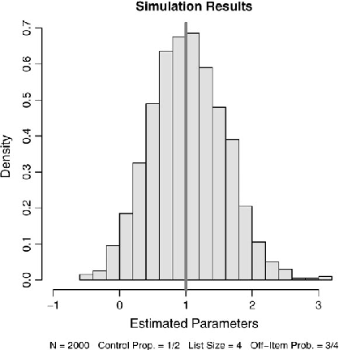
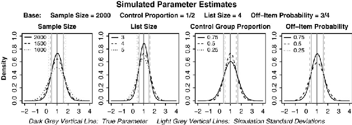
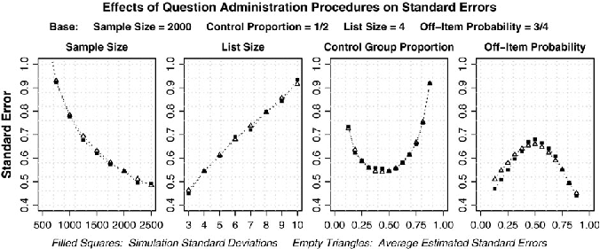
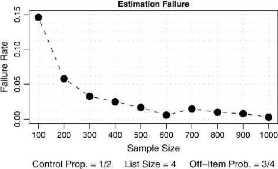
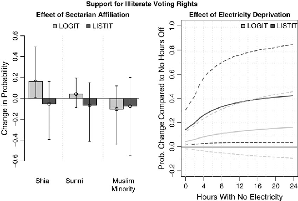

Published online by Cambridge University Press

https://doi.org/10.1093/pan/mpn013

Advance Access publication December 16, 2008 Political Analysis (2009) 17:45–63 doi:10.1093/pan/mpn013

# Sensitive Questions, Truthful Answers? Modeling the List Experiment with LISTIT

Daniel Corstange Department of Government and Politics, University of Maryland, College Park, MD 20742 e-mail: dcorstange@gvpt.umd.edu (corresponding author)

Standard estimation procedures assume that empirical observations are accurate reflections of the true values of the dependent variable, but this assumption is dubious when modeling self-reported data on sensitive topics. List experiments (a.k.a. item count techniques) can nullify incentives for respondents to misrepresent themselves to interviewers, but current data analysis techniques are limited to difference-in-means tests. I present a revised procedure and statistical estimator called LISTIT that enable multivariate modeling of list experiment data. Monte Carlo simulations and a field test in Lebanon explore the behavior of this estimator.

1 Introduction

Would you be upset by a black family moving in next door? Do you support the use of suicide bombs against civilians? Have you accepted a bribe to perform an illegal service in the past week? Which of these survey questions will be answered honestly?

Racism, terrorism, corruption: political questions can be sensitive, and what makes them interesting is also what makes them sensitive. Yet what makes them sensitive also makes them difficult to study: illegal activities and socially undesirable attitudes are probably not just underreported, but underreported in systematic and unmeasurable ways. The problem is not confined to politics, of course: questions about the prevalence of drug use, pornography consumption, and child abuse are likely to be underreported precisely by drug users, pornography consumers, and child abusers.

To study sensitive topics, we are often stuck taking respondents at their dubious word. Since we do not observe their behavior or attitudes directly, we must rely on what people are willing to tell us—and when the topic is sensitive, what they are willing to tell us may very well be ‘‘not much.’’ This problem is especially pronounced on formal and impersonal attitude surveys, where time constraints, nonrepeated interaction, and standardized wording all stack the deck against interviewers gaining sufficient rapport with respondents to coax them into discussing sensitive topics openly. What a respondent might be willing to confide to an ethnographer after months of repeated interactions may be simply unattainable in a one-hour interview with a stranger who will never be seen again.

Author’s Note: My thanks to Robert Axelrod, Janet Box-Steffensmeier, Sarah Croco, Adam Glynn, Sunshine Hillygus, John Jackson, Luke Keele, Gary King, James Kuklinski, Irfan Nooruddin, Mark Tessler, Ashutosh Varshney, and two anonymous reviewers for their comments and suggestions. Replication materials are available on the Political Analysis web site.

The Author 2008. Published by Oxford University Press on behalf of the Society for Political Methodology. All rights reserved. For Permissions, please email: journals.permissions@oxfordjournals.org

45

Published online by Cambridge University Press

https://doi.org/10.1093/pan/mpn013

People misrepresent themselves on attitude surveys, and one can hardly blame them. Aside from some small satisfaction derived from adhering to the norm to ‘‘always tell the truth,’’ there is little personal benefit they can gain from honesty. Meanwhile, the costs of answering questions truthfully need not be great to outweigh the minimal benefits: simple embarrassment at admitting to a distaste for blacks or a penchant for pornography will be sufficient to drive down reports of these outcomes. The costs are even greater when the possibility of ridicule, stigma, or legal penalties, real or imagined, enters into a respondent’s decision to discuss sensitive topics openly.

The fact that people may misrepresent themselves about sensitive topics on attitude surveys should force us to ask whether or not it is worth all the trouble to administer such surveys in the first place. How much damage do these misreports do to the data we collect and the inferences we try to draw from them? The answer is, unsurprisingly, ‘‘a great deal,’’ if we proceed naively as if the data we have are not measured with bias. The intentional misrepresentation of true attitudes and behavior by some of our sample respondents does not just meanthatourdataareofpoorqualityandthatourproblemissimplymeasurementerror.Ifthis propensityformisrepresentationissystematic,thentheinferencesdrawnfromourdataarealso wronginasystematicway.Coefficientestimatesareincorrect,signscanflip,andvariableswith no true explanatory power can appear to explain a lot. All this makes response bias not just an epistemological problem but ‘‘an epistemological problem with teeth’’ (Brehm1993, 20).

2 The Problem of Response Bias

Survey questions ask people to make public declarations about private information and, in this sense, the act of reporting what one does or believes is distinct from the actual doing or believing. The content of these public declarations may reflect not only the private information in which we are interested but also other incentives and constraints that can cause self-reported outcomes to deviate from actual outcomes. Suppose, for example, that we wish to test hypotheses about processes leading to some outcome y* but that we observe only y, which is the self-reported value of y*. Were y* not sensitive, we would have little reason to doubt that y is an accurate measurement of y*, with deviations from the truth (due to misspeaking, misunderstanding the question, or whatever else) being wholly nonsystematic and falling into the error term. Yet if the processes are sensitive, then the outcomes presumably are as well, and we would expect self-reported outcomes to deviate from the truth in a systematic way. Supposing that this systematic deviation is the product of an incentive z* to misrepresent one’s answers, then the problem appears to be one of omitted variable bias: because what we observe is a function of both the truth and an incentive to misrepresent the truth, ignoring the latter leads to incorrect estimates. But there is a twist: because the true outcome y* is sensitive, then the incentive z* to misrepresent it is surely in part a function of this sensitivity.

To see this, assume that we observe y, the self-reported value of true y*, and that the true model for observed y is given by y 5 y*s 1 z*k 1 e1, where self-reported y is a positive function of true y* (with s for true) and a negative function of an incentive z* to misrepresent the truth (with k for lie, and thus k < 0). For simplicity, assume that s 5 1, meaning that deviation in self-reported outcomes from actual outcomes is a product only of z* and the random error. Assume that values of y* become more sensitive as they become larger and that incentives to misrepresent the truth become greater as the truth becomes more sensitive: y* 5 Xb* 1 e2 and z* is a positive function of y* such that z* 5 y*r 1 e3 (with r for sensitive, and thus r > 0, because the more sensitive the behavior, the more likely is the respondent to misrepresent this behavior).

Published online by Cambridge University Press

https://doi.org/10.1093/pan/mpn013

For simplicity, consider a linear specification which omits z* and models only y 5 y*s 1 e1. The least-squares coefficient estimate b* is given by b* 5 AXy, where AX[ X#X 21X#, and thus:

b 5AXy 5AXðy s1z k1e1Þ 5AXðy s1½y r1e3 k1e1Þ 5AXð½Xb 1e2 s1½ðXb 1e2Þr1e3 k1e1Þ 5b ðs1rkÞ1AXðe11e2s1e2rk1e3kÞ

Eðb Þ5b ðs1rkÞ: ð1Þ

Estimatesofb*,thecoefficientsofinterest,areinconsistent.b*ismultipliedbyðs1rkÞ,and thisquantityisunambiguouslylessthanone,aswehaveassumeds51,whereastheproduct of r and k is negative.Thus, if the propensity to misrepresent one’s behavior depends solely on the degree of the sensitivity of that behavior, then our coefficient estimates are biased downward, which can take the form of estimates attenuating to zero or even complete sign flips.1Ifwedonotconsiderhowincentivestomisrepresentactualbehaviorandbeliefsaffect whatpeoplearewillingtotellusonasurvey,inferenceswemaytrytodrawfromtheresulting data will be inaccurate—perhaps marginally, and perhaps wildly so.

3 Techniques to Neutralize Response Bias

The most basic approach used in anticipation of response bias is simply to make the question-phrasing less sensitive. Yet we may only sanitize the wording so far before the question ceases to measure what we wish to measure. An alternative approach has been to correct for nonresponse bias, that is, unit nonresponse, in which potential respondents fall out of the sample in a systematic way (Brehm 1993), and item nonresponse, in which in-sample respondents systematically decline to answer certain questions (e.g., Berinsky 1999, 2004 on school integration). Although a great deal better than nothing, this approach remains an imperfect solution. It plausibly dampens the effects of response bias, but it does not eliminate those effects, as respondents giving substantive answers still face incentives to misrepresent themselves. The ‘‘don’t know’’ category is itself subject to the effects of response bias: it may be interpretable as an intermediate category between the desirable and undesirable responses and in any event will be composed of individuals trying to hide their opinions and those who truly do not know.

Randomized response (RR) provides another technique to neutralize response bias (Warner1965;Zdepetal.1979;Gingerich2006).RRintroducesacomponentofpurenoiseto responses—forexample,respondentsflipacoinandanswereitherasensitiveornonsensitive questionbasedontheresults—whichhidesindividualanswersbutenablesanalyststoextract the systematic component about the population because the noise probability is known. In practice, however, the novelty of RR questions (flipping coins, rolling dice, using spinners) draws attention to the act of measurement itself. We must worry that respondents will be suspicious of intent and claims to anonymity, will focus more on looking for the trick in the question, or feel that RR trivializes the subject matter (on the latter see Droitcour et al. 1991).

The implicit association test (IAT) is a newer, very promising measurement technique (Greenwald et al. 1998, Lane et al. 2006, Nosek et al. 2007). IAT measures how long it

1In the more complicated casewhere the propensity to lie is also related to other covariates (z* 5 y*r 1 Wx 1 e3), the resulting situation is worse still in that we do not even have assurances as to the direction of the bias.

Published online by Cambridge University Press

https://doi.org/10.1093/pan/mpn013

takes respondents to associate counterposed attributes (e.g., good or bad words) to counterposed social categories (e.g., white or black), with differences in response time indicating attitudinal differences to the categories. IAT is designed to measure implicit attitudesthose not influenced by introspection—making it applicable beyond the discrete case of consciouseffortsbyrespondentstomisrepresentthemselves.YetIATlosesitsutilityforquestions on which we want respondent introspection (e.g., support for affirmative action as distinct from latent racism). Further, IATadministration is nontrivial. Response latencies are measured in milliseconds, which makes IAT impossible to use without computer-assisting interviewing, which is a challenging consideration for field surveys (most IAT studies have been laboratory or web based). In addition, IATadministration is time consuming: a typical 5–10 minute procedure would consume up to one-third of a half-hour survey interview.

In summary, sanitizing questions may prevent us from measuring what we want to measure and does not solve the problem of respondents misrepresenting themselves. Correcting for nonresponse provides a partial fix but is still subject to response bias. RR grants respondents anonymity in principle, but draws attention to the process of measurement by its novel and obtrusive administration, causing at least some respondents to doubt that their anonymity is real. IAT, although promising, may be less useful for questions for which we desire respondent introspection and presents significant practical challenges in administration in field surveys. Ideally, then, we would hope for a technique that enables us to neutralize response bias by offering respondents transparent anonymity and to do so in an unobtrusive and easily administered way.

4 The List Experiment

Another procedure with considerable potential to nullify incentives to hide the truth from interviewers is the list experiment (a.k.a. the item count technique), which is an unobtrusive means of eliciting truthful responses that was brought to salience in political science by Kuklinski and colleagues (1997; see also Droitcour et al. 1991). As originally conceived, the survey sample is split into two groups. Control group respondents receive a list of nonsensitive, yes/no items and are asked to tell the interviewer how many of the listed items they do/believe, and specifically not which items they are. Treatment group respondents, meanwhile, receive the same list as the control group, plus one more item that measures a sensitive topic, and receive the same instructions. Respondent anonymity is assured transparently because no one, not even the interviewer or analyst, can know whether or not a treatment group respondent’s answer included or excluded the sensitive item.2 We can then use difference-in-means tests between the treatment and control groups to infer the prevalence of the sensitive behavior/opinion.

For example, in a study on racial prejudice, Kuklinski et al. (1997, 405) prompt all respondents with, ‘‘now I’m going to read you three (four) things that sometimes make people angry or upset. After I read all three (four), just tell me HOW MANYof them upset you. I don’t want to know which ones, just HOW MANY.’’ They then give the following three list items to control group respondents:

2This is not strictly true: there is no ambiguity when respondents claim that they do/believe none of the items on the list (and so answered ‘‘no’’ to the sensitive item) or all of the items on the list (and so answered ‘‘yes’’ to the sensitive item). We may overcome this shortcoming in practice by including at least one item for which most respondents would say ‘‘yes,’’ and/or make two items strongly negatively correlated.

Published online by Cambridge University Press

https://doi.org/10.1093/pan/mpn013

- 1. The federal government increasing the tax on gasoline.
- 2. Professional athletes getting million-dollar salaries.
- 3. Large corporations polluting the environment.

Meanwhile, treatment group respondents get a fourth item, ‘‘a black family moving in next door.’’ In analyzing these data, they find evidence that white residents of the South are more likely than those living elsewhere in the country to express anger at the idea of having a black neighbor, and report that this prejudice is concentrated in white southern men.3 To draw these inferences, the authors make use of difference-in-means tests across a series of independent variables of interest: differences between the south and the non-south, between those with a high school education against those with a college education, and the like.

This is the state of the art as it stands. Unfortunately, difference-in-means tests are very crude procedures and make multivariate analysis highly impractical.4 As a data collection procedure, the list experiment has considerable potential to nullify incentives for respondents to misrepresent themselves to interviewers. This potential is largely untapped, however, because data analysis procedures are severely limited. To make this technique a serious, viable option for more rigorous applications, we need a procedure to model statistically the underlying data-generating process of the list experiment to enable multivariate analysis, in the same fashion as we would were we running something akin to basic ordinary least squares. Here, I detail a new procedure and statistical estimator to enable multivariate analysis of list experiment data, which I call listit. To do this, I make one important change in the data collection technique: although the question posed to treatment group respondents works exactly the same as before, members of the control group are asked each of the list items individually. This difference in application makes it possible to model the procedure statistically.

4.1 Modeling the List Experiment

Intuitively, the data generated by the list experiment appear to analysts as a count of ‘‘yes’’ responses ranging between zero and the total number of list items. This count, in turn, comprise a number of Bernoulli outcomes, but we would expect list items to differ in their probabilities of producing a ‘‘yes,’’ meaning that list experiment data are not distributed binomially in a simple sense. Although we do not know the individual probabilities associated with each item, we do know the sample average probability across the entire list, which enables us to model the process as if it were binomial. We cannot yet make inferences about the sensitive item, however, because an infinite set of combinations of probabilities can produce the same average probability that we observe. It is for this reason that we ask control group respondents each of the list items individually, which enables us to reduce the number of unknown probabilities to one (the probability associated with the sensitive item) by estimating the individual probabilities of the nonsensitive items on control group respondents and using these estimates to identify the probability of the sensitive item.

- 3Compare Kane et al. (2004), who use a list experiment to study public reaction to the nomination of Jewish candidates for high elected office.
- 4Essentially the only way to achieve ‘‘multivariate’’ analysis is to repeatedly split the samples and run differencein-means tests. This quickly runs into degrees of freedom constraints and is problematic for continuous-like variables such as income or education.

Published online by Cambridge University Press

https://doi.org/10.1093/pan/mpn013

Formally, the binomial distribution assumes that the probability p of observing each of K total possible instances on Y is independently and identically distributed, such that EðYÞ5Kp. Although the assumption of independence among the K possible outcomes is not unreasonable here, we enter the list experiment estimation procedure assuming that each kj e K may (and probably does) have its own pj. In this case, we may average over all pj and use the mean probability p5

 .

PK j51 pj

K to predict the observed outcome such that EðYÞ5K p.

Treatment group respondents receive a list of K items, one of which is sensitive and the remaining K 2 1 of which are not. We are only interested in the p i associated with the sensitive item, and the remaining K 2 1 items are present only to help us estimate p i . Utilizing the notational convention whereby quantities associated with the sensitive item are marked with a star (*) and those associated with the remaining non-sensitive items are marked with a dagger (y), we may express the mean probability pi as

pyi !K21: ð2Þ

XK

pi 5 p i 1

y6¼ 

Rearranging terms in equation (2) allows us to express the probability p i associated with the sensitive item as

XK

pyi : ð3Þ

p i 5K pi2

y6¼ 

We can model the data-generating process that produces p i by assuming that this probability is distributed logistically, such that

p i 12p i Þ5X i b ; ð4Þ

lnð

but because we do not observe p i directly, but only pi, we must substitute equation (3) into (4). Rearranging terms to produce equation (5), we may express pi in terms of b*, the parameters of interest, as

pi 5" 11e2X i b

pyi #K21: ð5Þ

XK

21

1

y6¼ 

Note that the right-hand side of equation (5) includes the heretofore unknown probabilities pyi associated with the nonsensitive list items. Their presence in equation (5) is what necessitates the change in the administrative procedure. Although unknown, and although we have no data from the treatment group respondents from which to estimate these probabilities directly, we may estimate them indirectly via data from control group respondents. More specifically, assuming that each pyi is distributed logistically according to some set of covariates Xy, the unknown quantity is

XK

XK

21

y i by

pyi 5

11e2X

: ð6Þ

y6¼ 

y6¼ 

The crucial trick is that the parameters by are estimated on data drawn from the control group, and these estimates are then subsequently applied to the values of their

Published online by Cambridge University Press

https://doi.org/10.1093/pan/mpn013

corresponding covariates among treatment group respondents. Doing so allows us to express equation (5) as

XK

21

21

y i by

pi5½ 11e2X i b

11e2X

K21: ð7Þ

1

y6¼ 

The task remaining is to estimate the coefficient vector b*—the parameters associated with the sensitive item—given what we know about the characteristics of the treatment group respondents and pi. We may, at this point, proceed with maximum likelihood estimation. The full likelihood function, L[L pi;pyj ;y i ;yyj ;Nt;Nc ,5 must account for pi distributed binomial, as well as each pyj distributed Bernoulli, and may be expressed as

QN

t

L 5

- i51

K y i ð piÞy

i

ð12 piÞK2y

i

QNc

- j51 QK

ðpyj Þy

y6¼ 

Consequently, the log-likelihood function is

y

y

j ð12pyj Þ12y

j :

ð8Þ

PN

K y i

t

1y i lnð piÞ1 k2y i lnð12 piÞ 1

ln L 5

ln

i51

PNc j51 PK

yyj lnðpyj Þ1 12yyj lnð12pyj Þ ;

y6¼ 

and the derivative of ln L with respect to b is

ð9Þ

@ðln LÞ @b

5

where @ pi=@b is

!)

(y i ð piÞ21

!1 K2y i !ð12 piÞ21

XN

@ð12 piÞ @b

@ pi @b

t

i51

( yyj 2pyj !Xjy); ð10Þ

XNc

XK

1

j51

y6¼ 

@ pi @b

5

X i e2X i b 11e2X i b 21

y6¼ 

y i by

!K21: ð11Þ

Xiye2X

XK

2

y i by

11e2X

Setting @ ln L/@b to zero and solving maximizes the log-likehood with respect to the parameters. Note that the estimates of b* are those that would be returned if we had asked the sensitive item directly as a yes/no question and respondents had not misrepresented their answers. Interpreting the coefficient estimates requires no more of the analyst than the ability to interpret logit coefficients, because they are logit coefficients.

5Where y i are treatment group responses to the list question, yyj are control group responses to the individual nonsensitive questions and Nt and Nc are the treatment and control group sizes.

Published online by Cambridge University Press

https://doi.org/10.1093/pan/mpn013

Fig. 1 Coefficient estimate distribution.

4.2 Monte Carlo Simulations

To explore the behavior of the new listit estimator, I subjected it to a series of Monte Carlo simulations while varying four key elements of the administrative procedure: total sample size, the control group proportion of the sample, list size, and the probabilities associated with the nonsensitive list items. For simplicity, I focus here on simulations run in batches of 1000 repetitions with an intercept term parameter of b 0 50 and a single covariate parameter set to b 1 51, although results are analogous with different parameter settings and additional covariates.

The procedure used for each repetition is as follows. I draw individual covariate values randomly from a uniform distribution bounded at zero and one and thus EðX1Þ51=2. I use these covariate values to calculate the probabilities for the single sensitive item p i and the remaining nonsensitive items pyi via logistic processes, and from these probabilities draw the yes/no responses for the sensitive and nonsensitive items. The outcome variable for treatment group respondents is a single list composed by adding together their responses to the sensitive and nonsensitive items, and the outcome variables for control group respondents are the set of binary yes/no responses to each of the nonsensitive items. I then run the listit estimator on these simulated values.

Although the true parameter values for the sensitive item are constant (here, b 0 50 and b 1 51) across all administration procedure variations, I vary the parameter values for the nonsensitive items systematically in order to examine the effect of greater or lesser cer-

tainty in the nonsensitive outcomes, that is, the expected probability of a yes for each item. To do so, I utilize the fact that EðX1Þ51=2 to calculate appropriate parameter estimates by setting the intercept parameters to 0 and calculating the necessary parameter for the

h

. 

 i

covariate as by15ln

py

12 py

2. Thus, for example, when the average probability

Published online by Cambridge University Press

https://doi.org/10.1093/pan/mpn013

- Fig. 2 Estimates by various administrative procedures.

- Fig. 3 Standard errors by various administrative procedures.

of yes for a nonsensitive item is set to 1/4, by1 –2.197, when set to 1/2, by1 5 0, and when set to 3/4, by1 2.197.6

To present results from the simulations, I focus on b 1, the parameter associated with the covariate (hereafter dropping the subscript), and b*, the estimated parameter averaged across the 1000 repetitions. These results show that, across a variety of combinations of administrative procedures, b* 5 1 b*. Figure 1 shows a histogram of the parameter estimates with a sample size of 2000, half the respondents in the control group, a list size of 4, and an average off-item (i.e., nonsensitive item) probability of 3/4 (these constitute the baseline administrative conditions used in subsequent figures). Figure 2 demonstrates that the listit estimator returns consistent parameter estimates under a variety of administrative procedure regimes.

Figure 3 demonstrates how different administration procedures affect the standard errors of the estimates. First note that the average standard error estimate maps tightly onto

6These calculations follow directly from the assumption of a logistic data generating process whereby p 12p 5eXb, and thus Xb5ln½p=ð12pÞ . By setting the intercept term to 0 and given that EðxÞ51=2, we have 0 b01ð1=2Þ   b15ln½p=ð12pÞ  and thus b1 5ln½p=ð12pÞ    2.

Published online by Cambridge University Press

https://doi.org/10.1093/pan/mpn013

Fig. 4 Estimation failures.

the sample standard deviation of the parameter estimate: the listit estimator returns the correct standard errors.7 Next, note how the degree of certainty around the coefficient point estimates varies with different administrative procedures. First, standard errors shrink at a decreasing rate at the sample size grows, as expected. Second, there is a curvilinear relationship between point estimate uncertainty and the proportion of respondents in the control group. Standard errors are at their smallest when the proportion is about half of the sample size, but differences in the magnitude of the uncertainty only become substantial when the proportion approaches extreme values. Third, standard errors appear to increase at approximately a constant rate with list size, implying that the uncertainty ‘‘penalty’’ analysts must pay to grant respondents anonymity does not become increasingly costlier as the list size grows. Finally, the relationship between point estimate uncertainty and the uncertainty of the nonsensitive items is also curvilinear. Standard errors are at their maximum when we are least certain on the nonsensitive outcomes—that is, when there are equal chances of a yes or a no—and shrink on either side of the midpoint.8 This result is consistent with the intuitive idea that greater certainty in the nonsensitive items enables us to guess answers to the sensitive item because we ‘‘know’’ more about the underlying composition of the list answers than if we are more uncertain about the answers to the nonsensitive items.

Finally, note that, under extreme conditions, the estimation procedure can break down, returning noncredibly large or small parameter estimates or otherwise failing to converge. Although this can occur with extreme values of the control group proportion and the offitem probability, I focus here on estimation breakdowns with small sample sizes. Figure 4 charts the failure rate of the estimation procedure for sample sizes between 100 and 1000 respondents, defining a failure as either a nonconvergence, or an estimate three (corrected)

- 7In other words, the average standard error estimate is the standard error returned by the listit estimator and averaged over the 1000 repetitions. The sample standard deviation is the standard deviation of the coefficient estimates over the 1000 repetitions.
- 8The mean of a variable distributed Bernoulli is p with variance p(1 2 p), and consequently we have the most uncertainty (largest variance) when p 5 1/2.

Published online by Cambridge University Press

https://doi.org/10.1093/pan/mpn013

standard deviations above or below the mean.9 Note that the failure rate is large at small sample sizes, with failures occurring in approximately 150 of 1000 repetitions for a sample size of 100, but quickly growing smaller as sample size increases, with hardly any occurring once the sample size reaches about 1000 respondents. Although these breakdowns are likely to be at least partially the result of numeric limitations in the application of optimization algorithms (and thus may diminish as the coding improves), early results suggest that this estimation procedure is not appropriate for small sample sizes, both due to the possibility of an estimation breakdown as well as the large standard errors returned at low sample sizes. In application, this suggests that the list experiment is not suitable for smallsample elite surveys, but rather works for mass attitude surveys utilizing samples sizes of at least N 5 1000, preferably closer to N 5 2000.

5 Field Test in Lebanon

Here, I present results from the first applied use of the listit estimator, used to study attitudes toward voting rights for illiterates in Lebanon. Respondents were drawn randomly from a stratified sample of Lebanese adults across all provinces and religious communities, for a sample size of 1000 individuals. Beirut-based MADMA Co. administered the face-toface interviews in the fall of 2005, approximately equidistant from the spring 2005 pullout of the Syrian armed forces from Lebanon and the summer 2006 Israel-Hizballah armed conflict. MADMA’s sample frame is based on household demographics surveys conducted in the late-1990s by the Lebanese government on tens of thousands of households. Given the absence of official census data due to political sensitivity, this represents among the most reliable sample frames available in practice. The overall response rate was 70%, which did not vary significantly between members of the religious communities.

I make no attempt to cover the intricacies of Lebanese public life here, restricting the background detail to a few key points. First, sectarian (ethnic) cleavages are among the most salient in Lebanese politics. Second, sectarian cleavages overlap to a degree with socioeconomic status differences—on average, Christians are wealthiest and best educated, and Shiites are poorest and least educated—but there is considerable within-sect socioeconomic heterogeneity. Third, Lebanon’s consociational power-sharing system defines unequitable representation for the sects in the state’s formal institutions from a purely demographic perspective, with Christians somewhat overrepresented and Shiites especially underrepresented. These three broad contextual factors are important when considering attitudes toward voting rights, the subject of the data analysis.

5.1 Voting Rights under Ethnic Competition

Given the ramifications of who has the right to vote on eventual electoral and policy outcomes, we might wonder how ethnic (sectarian) competition influences attitudes toward

9Failures resulting in noncredibly large (small) estimates cause the mean standard errors and sample standard deviations to balloon. I calculate the ‘‘correct’’ standard errors in the following manner, utilizing the formula that the standard error equals the standard deviation divided by the square root of the sample size. I first obtain the ‘‘true’’ standard deviation by multiplying the mean standard error for a simulation batch with a sample size of 2000 by the square-root of 2000 (N 5 2000 chosen because the procedure appears very well-behaved at this point) and then recalculate the ‘‘corrected’’ standard errors for the smaller sample sizes by dividing this ‘‘true’’ standard deviation by the square-roots of the sample sizes. This procedure is of course not exact, but it is intended only to demonstrate the magnitude of the estimation breakdowns. Note that 1 minus the standard normal density at three standard deviations is approximately 0.001, that is, 1 in 1000, and thus we should expect one ‘‘failure’’ per batch of 1000 repetitions under normal conditions.

Published online by Cambridge University Press

https://doi.org/10.1093/pan/mpn013

the extension of the suffrage. In particular, we might wonder if attitudes are responsive to social group identity, or if they are responsive to socioeconomic differences that overlap with this group identity. In Lebanon’s case, we might wonder if attitudes vary according to sectarian identity or according to socioeconomic conditions. If the former is true, we would expect Shiites, given their demographic plurality and their malrepresentation in government, to be particularly supportive of the most permissive view on voting rights, and to do so because they are Shiites rather than because they are poor. If the latter is true, we would expect poorer individuals to be particularly supportive of the broadest possible application of the suffrage for its redistributive repercussions, and to do so because they are poor rather than because they are members of particular communities.

Although these rival hypotheses are reasonably straightforward and make qualitatively different predictions, adjudicating between them is significantly complicated by the fact that the extension of the suffrage is a sensitive topic, and answers to direct questions about who should have the right to vote likely suffer from response bias. First, the extension of voting rights, apart from their distributional consequences, is a normative question for which there is a clear socially desirable response in favor of universal voting rights.10 Yet apart from these normative considerations, universal (or near-universal) suffrage also has significant redistributive repercussions, as the nineteenth-century debate in Europe over the extension of voting rights beyond the propertied classes demonstrated. Given the stylized fact that poorer people prefer more redistribution, we might expect wealthier individuals to be sympathetic to attempts to restrict the impact of the poor vote, but to be restrained from saying so given the normative implications of such a discriminatory restriction.

Given the discussion above, we might expect questions about the extension of the suffrage to be sensitive in Lebanon, and particularly so for Shia respondents. Despite the prevailing conventional wisdom that Shiites are generally poor and uneducated, there is nonetheless significant variation within this community, including a relatively new middle class as well as an upper class composed of both old and new money. In a recent study on the Shiites of the South (considered among the most backward in the community), one researcher noted that the individuals most disapproving of her choice of topic were well-heeled, educated Shiites ‘‘who embraced traditional urbane Lebanese formulas and prejudices with even more francophone fervor than their Christian compatriots’’ because the topic ‘‘touched an unhappy chord in their own identity’’ (Chalabi 2006, 1). Such individuals are caught between possibly conflicting influences: community-based interests to grant the broadest possible voting rights given their community’s underrepresentation in power, and economic interests to limit the impact of the poor vote and thus the scope of redistribution. Given the importance of sectarianism in Lebanese politics and political discourse, however, it is particularly difficult to express support for policies that could disadvantage one’s community against the others, making restriction of the franchise particularly sensitive for Shiites.

5.2 Data Analysis

Given the sensitivity due to the sectarian implications of extending or restricting the suffrage, as well as the normative implications that make broadly extended voting rights the

10Although restrictions on certain classes of individuals—resident aliens, minors, expatriates, and so on—are common across democracies and differences of opinion on these restrictions are accepted as legitimate, most countries have constitutional clauses against discrimination based on race, religion, ethnic group, sex, and so on.

Published online by Cambridge University Press

https://doi.org/10.1093/pan/mpn013

socially desirable answer, I employ a list experiment procedure to analyze Lebanese preferences over who gets the right to vote. In particular, I use this procedure to adjudicate between the two rival hypotheses outlined in Section 5.1, the first being that preferences follow from sectarian affiliation and the second being that preferences follow from material conditions regardless of sectarian affiliation.

I conducted this experiment in the context of key political changes in Lebanon, which made debates over institutions and electoral procedures particularly widespread. After the domestic political balance was upended by the assassination of former Prime Minister Rafik Hariri in February 2005, the subsequent mass demonstrations, and the Syrian pullout from the country, the public debate over electoral institutions and electoral laws took on added salience in the lead-up to the parliamentary elections held in late-spring of that year. Although the main discussion was over the relative merits of small versus large districts and proportional representationversus plurality voting, a subthread of this debate was a discussion of who should be allowed to vote at all. In particular, the question centered on young Lebanese and expatriates. Although the voting age is 21, many wanted it reduced to 18, whereas others pressed for the extension of voting rights to expatriates. Although both proposals would have sectarian implications, proponents and detractors on both issues discussed their positions openly.11

The list experiment was conducted as follows. After splitting the sample randomly into treatment and control groups on a 3:1 ratio,12 all respondents were read the following prompt:

There has been some debate recently over who should have the right to vote in Lebanese elections. I’ll read you some different groups of people: please tell me if they should be allowed to vote or not.

Respondents were then given the following list of options:

- 1. Young people between the ages of 18 to 21.
- 2. Lebanese expatriates living abroad.
- 3. Illiterate people.
- 4. Palestinians without Lebanese citizenship.

Control group respondents were asked to give yes or no responses to each of the items individually. Treatment group respondents were asked to answer how many of the groups should be allowed to vote and not which ones.13

I selected the first and second groups, young adults and expatriates, based on the fact that their voting rights were salient and openly discussed in Lebanese public discourse, and thus helped to validate the prompt for respondents that there had recently been debate over

- 11In particular, the more vocal supporters of reducing the voting age to 18 tended to be Muslim given that the Muslim communities are younger than the Christian communities, although numerous Christian leaders made public declarations of support for reducing the voting age as well. Meanwhile, the most vocal supporters of extending voting rights to expatriates tended to be Christian given the large size of the Lebanese Christian diaspora, although numerous Muslim leaders also expressed willingness to support expatriate voting.
- 12I chose to put three-quarters of the sample in the treatment group to ensure a sufficiently large number of responses should treatment group respondents not understand the procedure or else refuse to answer, although in retrospect these cautions were unnecessary and a more optimal 1:1 ratio split would have not have caused problems in practice.

13More specifically, treatment group respondents were prompted with the following statement, which replicates the prompt used in prior applications of the list experiment:

I’m going to read you thewhole list, and then I want you to tell me how many of the different groups you think should be allowed to vote. Don’t tell me which ones, just tell me how many.

Published online by Cambridge University Press

https://doi.org/10.1093/pan/mpn013

who should have the right to vote.14 I selected the fourth group, non-citizen Palestinians, to provide respondents with a group to whom most would not grant voting rights and thus minimizing the chance that a respondent would say yes to all of the list items. The third group, illiterate people, is the sensitive option. Although there are defensible and socially acceptable reasons for restricting the franchise for the other options listed, preventing people from voting due to low educational status is difficult to justify in normative terms. Further, in addition to the distributive implications of voting rights for illiterates—who are almost certainly poor and sympathetic to redistribution—there are also sectarian implications. In particular, ‘‘illiterate people’’ can be perceived as an indirect way of discussing Shiites given the conventional wisdom and stereotypes that persist in Lebanon’s sectarian rank ordering.

To adjudicate between rival hypotheses and to assess the impact of sensitivity on responses, I analyzed attitudes toward voting rights for illiterate people when the question is asked directly and when it is asked indirectly via the list experiment. The former comes from control group yes/no responses to the ‘‘illiterate people’’ item on the list. Note that responses to this question are unnecessary for the purposes of analyzing the list experiment data (and thus ordinarily it need not be asked at all), but I asked it of control group respondents in order to provide a comparison between the direct and indirect means of eliciting respondent attitudes. For both estimation procedures, logit for the direct question and listit for the indirect list question, I utilized the same set of explanatory variables.

The first set of covariates comprises three community dummy variables, Shia, Sunni, and Muslim Minority (for Druze and Alawi respondents), making Christians the baseline category. Because the question asks about voting rights for illiterate people, I control for Education, a five-point indicator rescaled 0–1 for ease of interpretation.15 As a measure of material well-being and access to basic government services, I used Electricity, which is the average number of hours per day the electricity is off in the respondent’s home, modeled with a square-root transformation.16 Finally, I included Deconfess, an indicator variable taking on the value of 1 when respondents cited ‘‘the people’’ in an open-response question to who they believe would benefit most from the deconfessionalization of the parliament (i.e., removing the sectarian quotas for seats), and 0 otherwise.17 Deconfess provides a control for attitudes on fuller democratization in the majoritarian sense.

Before turning to the results, there is one final element of the modeling procedure to clarify. Mechanically, there is no need for the covariate predictors of the nonsensitive items on the list to match the covariates predicting the sensitive item. This point is helpful given the control group responses to this list experiment. In particular, 241 of 251 (96%) of

- 14It is plausible that, without at least some list items grounded in actual public debate, respondents may be prompted by the novelty of the list options to look for the indirect rationale for asking the question—precisely what the analyst does not want. This point is an administrative rather than mechanical issue and as such should be subject to further social psychological inquiry.
- 15The question asks for the highest level of education the respondent has reached, with the following categories: Illiterate, Primary, Secondary, Bachelor’s Degree, and Master’s Degree or Higher.
- 16Close to 20% of respondents refused to answer income questions, making this more conventional indicator unavailable. More positively, Electricity is a direct measure of material deprivation for which the government, via the much-maligned state-run E´lectricite´ du Liban, is directly responsible.
- 17The open-response question text reads as: ‘‘Which Lebanese group do you think benefits the most from deconfessionalization of the parliament? This could be any group, for instance, a political party, a sectarian group, the middle class, or whatever.’’ I categorized answers as ‘‘the people’’ when respondents used clear variants on that phrase, including ‘‘citizens’’ or ‘‘the nation’’ (other answers given included particular parties, leaders, sects, and social classes). In the full sample, 705 respondents (70%) gave this answer, whereas in the community subsamples, 66% of Shiites, 87% of Sunnis, 61% of Christians, and 46% of Muslim Minorities answered with ‘‘the people.’’

Published online by Cambridge University Press

https://doi.org/10.1093/pan/mpn013

control group respondents answered yes to extending voting rights to youths age 18–21, and 9 of 210 (4%) answered yes to voting rights for noncitizen Palestinians. Because youth nos and Palestinian yeses are rare events, modeling these outcomes with covariates can become unstable. Hence, I use the covariates described above as predictors for attitudes on voting rights for illiterate people and for expatriates, whereas I model responses on youths and Palestinians with constant terms only. Although substantively we are not interested in the content of the nonsensitive item models per se, future research on the list experiment should include an examination of the effects of differing model specifications for the nonsensitive items on estimates returned on the sensitive item.18

5.3 Results

If the sectarian affiliation hypothesis is correct, we should see a positive, statistically significant coefficient on Shia, indicating that Shiites are relatively more supportive than Christians (the baseline) of allowing illiterate people to vote—indicating that they are more supportive precisely because they are Shia. If the material welfare hypothesis is correct, we should expect to see no significant results on any of the community indicators, but rather a positive coefficient on Electricity, indicating that poorer individuals who lack access to basic services are more likely to support illiterate voting rights, and to do so because they are poor rather than members of a particular community.

Table 1 reports results in two columns: estimates from a standard logistic regression procedure applied to responses to the direct question asked of control group respondents (left) and estimates from a listit procedure applied to treatment group responses to the indirect question asked in the list format (right). As the left column of Table 1 reports, the only statistically significant factor influencing attitudes toward illiterate voting rights is membership in the Shia community. The very large, positive coefficient on Shia indicates

Table 1 Experiment results LOGIT LISTIT b se(b) b se(b)

Shia 2.017 0.775y –0.351 0.953 Sunni 0.372 0.500 –0.517 0.949 Muslim minority –0.577 0.772 –0.439 1.365

Electricity 0.259 0.172 0.880 0.310y Deconfess 0.531 0.440 1.619 0.968* Education –1.279 0.953 –0.348 1.332 Intercept 0.936 0.824 –1.341 1.036 ln L –92.182 –951.918

N 238 714 Nc 195

yp < 0.01, *p < 0.10.

18I thank an anonymous reviewer for this point. The potential concern is that model misspecification for the nonsensitive items could produce incorrect estimated effects on the sensitive item. Mechanically, we need consistent predictions of nonsensitive item ps (yes/no outcomes) rather than bs (individual covariates). Speculatively, more accurate models (better choice of covariates) will produce more precise nonsensitive item predictions, which may in turn provide more precise coefficient estimates for the sensitive item of interest. Ultimately, this supposition may be examined via additional research and Monte Carlo simulations.

Published online by Cambridge University Press

https://doi.org/10.1093/pan/mpn013

that Shiites are much more likely to support illiterate voting rights and, because there are no statistically discernible effects associated with material conditions, to be more supportive because they are Shiite than because they are poor. These findings, if taken at face value, provide evidence in favor of the sectarian affiliation hypothesis and against the material conditions hypothesis.

Let us now compare this first set of findings with what happens when we acknowledge and attempt to neutralize the sensitivity of the voting rights question by asking it indirectly via the list experiment. A brief glance at the two columns indicates that the estimates differ in substantively crucial ways and yield qualitatively different interpretations. First, after accounting for the sensitivity of the question, there are no direct sectarian community effects. The Shia coefficient shrinks dramatically to less than a fifth of its original magnitude, and the point estimate actually becomes negative. No community effects are even close to statistical significance, with standard errors that are roughly two to three times the size of their respective coefficient estimates. Second, the effect of material conditions is now both statistically and substantively very significant. The coefficient on Electricity, which is more than three times larger than reported in the direct question model, indicates that increasing deprivation leads to greater support for illiterate voting rights. Further, Deconfess, the effect of which was modest and statistically insignificant in the direct question model, is now substantively large as well as statistically significant (albeit at the marginal p < .10 level), indicating that individuals predisposed to fuller democratization in the majoritarian sense are also more likely to support voting rights for illiterates. Figure 5 illustrate these effects graphically as first differences with 95% confidence intervals around those differences.19

Fig. 5 Probability differences.

19The left panel is the difference in probability of support between the named community and baseline Christians with Education set to the sample median and Electricity set to the sample mean. The right panel tracks the differences in probability compared to a baseline respondent whose electricity was never off, with Education set to the sample median and Deconfess set to the sample mode of 1 (i.e., ‘‘the people’’ benefit most from deconfessionalization).

Published online by Cambridge University Press

https://doi.org/10.1093/pan/mpn013

In short, when asking a direct question about illiterate voting rights as if it were not sensitive, we get a sectarian answer: Shiites are more supportive of illiterate voting because they are Shiites. If, however, we acknowledge the question’s sensitivity and attempt to do something about it by asking it indirectly, we find that support does not vary according to community membership but according to individual material conditions. Shiites on the whole might be more supportive of illiterate voting, but this is because they are poorer than members of the other communities and not because they are Shiites—and analogous conclusions follow for Christians, Sunnis, Druze, and so on. Hence, attempting to neutralize the sensitivity of the voting rights question via the list experiment yields polar opposite inferences from the ones we can make when we do not attempt to account for this sensitivity.

6. Discussion

In this paper, I have discussed some of the problems we encounter when studying sensitive topics with self-reported survey data and demonstrated how such data can be exceedingly misleading when drawing inferences. Although the list experiment (item count technique) provides a promising means for data collection when dealing with sensitive topics, this promise has been largely untapped due to a lack of adequate means to analyze these data. Here, I have extended the usefulness of the list experiment by improving our capacity for data analysis by deriving a new statistical estimator, listit, that enables us to employ multivariate analysis on list experiment data. I explored the properties of this estimator with Monte Carlo simulations, showing that listit returns consistent coefficient estimates and that the degree of certainty about these estimates depends in part on how we administer the procedure to respondents. I then provided a first, practical application of this new procedure using original survey data from Lebanon, demonstrating how inferences can change dramatically when we acknowledge and attempt to neutralize the sensitivity of the questions we ask.

Hopefully, readers will have little difficulty in imagining applications of the list experiment to substantive questions fitting their specific interests. Given the wide range of sensitive topics studied in the social sciences—race and politics, corruption, drug use, tax evasion, sexuality, support for terrorism, and the list goes on—there is clearly a large and diverse body of work that can make use of the improved list experiment procedure to address one of the most glaring and seemingly intractible problems on the practical data analysis side: question sensitivity. As the theoretical development of the response bias problem and the results from the Lebanon field test demonstrate, attempting to neutralize these sensitivity effects can have marked effects on the inferences we are able to draw.

In particular, this suggests that those stylized facts about sensitive topics that have emerged iteratively from self-reported empirical data—findings that originated in data exploration, followed by theorizing, followed by more data exploration, and so on—should probably be reexamined with a procedure such as the list experiment. Although the original findings may very well hold up, if the initial data-derived explanations were in fact derived from data contaminated with sensitivity and response bias, a significant rewrite of the stylized facts may be in order. Further, question sensitivity may also help account for hypotheses originating in well-grounded theory that inexplicably have not held up well to empirics. Although it is always possible (albeit disappointing to its author) that a given hypothesis is simply wrong, it is also possible that the hypothesis is correct but response bias prevents the analyst from finding empirical support for it. This is not meant to be a call for awholesale reexamination of discarded hypotheses, but rather to suggest that a common

Published online by Cambridge University Press

https://doi.org/10.1093/pan/mpn013

difficulty—good theory, no reliable way to test it—may no longer be quite so insurmountable if the primary difficulty is question sensitivity.

The extended list experiment procedure developed in this paper is not without costs and limitations,ofcourse.First,thereisanunavoidableprecisioncostassociatedwithusingthelist experiment.Althoughthetechniquemayhelpusneutralizeincentivesforrespondentstomisrepresent themselves—and thus enables us to estimate consistent coefficients—the standard errorsaroundthesepointestimatesarenontriviallylargerthantheywouldbeifwewereableto ask the question directly and there were no response bias. This comparison is somewhat misleading, however, because in practice we do not really have this choice to make. If sensitivity is a characteristic of the data-generating process, we cannot assume or wish it away, but we can do something about it by acknowledging and attempting to neutralize it. Hence, larger standard errors are simply the cost of doing business when the question is sensitive. Further, it is a cost we should gladly pay: precise estimates around the wrong answer are precisely wrong, and far worse than more tentative estimates around the right answer.

Further, the precision of these estimates may be manipulated by changing elements of the question administration procedure. In some senses, precision is one of those rare issues that may, all else equal, be improved simply by throwing money at it: paying to administer more interviews increases the sample size and thus decreases the size of the standard errors. Two other manipulations are available: changing the size of the list itself and selecting nonsensitive list items that are more or less ‘‘sure things.’’ Monte Carlo results show that standard errors are at their lowest when the list size is small and we are almost certain of the answer to nonsensitive items. Yet there is an important note of caution to make before choosing these administrative procedure parameters: the anonymity of the list experiment must appear credible to the respondents, not to the analysts. This, in turn, is no longer simply a mechanical issue but rather a social psychological one. The list size must be big enough for respondents to feel comfortable that their answers to the sensitive question are unidentifiable, and how big ‘‘big enough’’ must be is a question that requires psychological study.

Likewise, how respondents perceive the nonsensitive list items is a psychological rather than mechanical question. Items that are practically ‘‘sure things’’ are mechanically desirable because they increase the precision of the estimates in which we are interested but may not be credible to respondents. If respondents do not believe that the nonsensitive items are sufficient to provide anonymity to their responses to the sensitive item, then the whole purpose of administering the list experiment has been compromised. In other words, an important next step is to research the psychology, rather than the mechanics, of the list experiment. This research is necessary to investigate how large a list is required to convince respondents of their anonymity (and if that size varies from question to question), as well as the composition of the nonsensitive items necessary to maintain the credibility of the list experiment.

Despite these limitations and unresolved questions, however, the augmented list experiment procedure holds considerable promise as a means first to elicit honest responses to sensitive questions and then to analyze these responses in a rigorous way. Although further research andsuccessfulfieldtestswillofcourseincreaseourconfidenceintheprocedure,theinitialfindings contained in this paper suggest that this additional work will be worth the effort.

Funding

A National Science Foundation Dissertation Improvement Grant and the University of Michigan’s Va´clav Havel Dissertation Fellowship provided funding for the Lebanon survey, which is gratefully acknowledged.

References

Berinsky, A. J. 1999. The two faces of public opinion. American Journal of Political Science 43(4):1209–30.

———. 2004. Silent voices: Public opinion and political participation in America. Princeton, NJ: Princeton

University Press. Brehm, J. 1993. The phantom respondents. Ann Arbor, MI: University of Michigan Press. Chalabi, T. 2006. The Shi’is of Jabal ‘Amil and the New Lebanon. New York: Palgrave MacMillan. Droitcour, J., R. A. Caspar, M. L. Hubbard, T. L. Parsley, W. Visscher, and T. M. Ezzati. 1991. The item count technique as a method of indirect questioning: A review of its development and a case study application. In Measurement errors in surveys, eds. P. P. Biemer, R. M. Groves, L. E. Lyberg, N. A. Mathiowetz, and S. Sudman, 185–210. New York: John Wiley & Sons.

Gingerich, D. 2006. Corruption in general equilibrium: Political institutions and bureaucratic performance in South America. Ph.D. thesis, Harvard University, Cambridge, MA. Greenwald, A. G., D. E. McGhee, and J. L. K. Schwartz. 1998. Measuring individual differences in implicit cognition: The implicit association test. Journal of Personality and Social Psychology 74(6):1464–80. Kane, J., S. Craig, and K. Wald. 2004. Religion and presidential politics in Florida: A list experiment. Social Science Quarterly 85(2):281–93. Kuklinski, J. H., M. D. Cobb, and M. Gilens. 1997. Racial attitudes and the ‘‘New South’’. Journal of Politics 59(2):323–49. Kuklinski, J. H., P. Sniderman, K. Knight, T. Piazza, P. Tetlock, G. Lawrence, and B. Mellers. 1997. Racial prejudice and attitudes toward affirmative action. American Journal of Political Science 41(2):402–19.

Lane, K. A., M. R. Banaji, B. A. Nosek, and A. G. Greenwald. 2006. Understanding and using the implicit association test: IV, what we know (so far) about the method. In Implicit measures of attitudes, eds. Wittenbrink, B. and N. Schwarz, 59–102. New York: Guildford Press.

Nosek, B. A., A. G. Greenwald, and M. R. Banaji. 2007. The implicit association test at age 7: A methodological and conceptual review. In Social psychology and the unconscious: The automaticity of higher mental processes, ed. J. A. Bargh, 265–92. Philadelphia, PA: Psychology Press.

Warner, S. 1965. Randomized response: A survey technique for eliminating evasive answer bias. Journal of the American Statistical Association 60(309):63–9. Zdep, S. M., I. Rhodes, R. M. Schwarz, and M. Kilkenny. 1979. The validity of the randomized response technique. Public Opinion Quarterly 43(4):544–9.

Published online by Cambridge University Press

https://doi.org/10.1093/pan/mpn013

