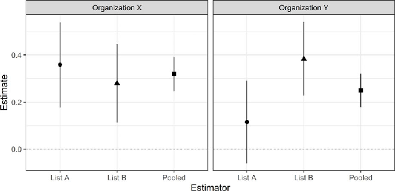
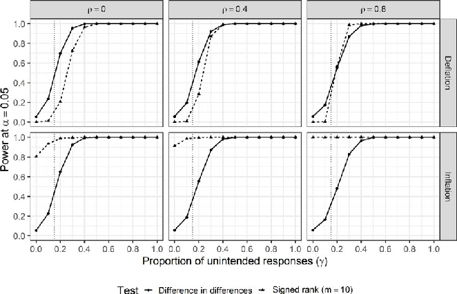

Journal of Experimental Political Science (2024), 11, 162–174 doi:10.1017/XPS.2023.24

RESEARCH ARTICLE

# Assessing the Validity of Prevalence Estimates in Double List Experiments

Gustavo Diaz

Department of Political Science, McMaster University, Hamilton, ON, Canada Email: diazg2@mcmaster.ca

Abstract

Social scientists use list experiments in surveys to estimate the prevalence of sensitive attitudes and behaviors in a population of interest. However, the cumulative evidence suggests that the list experiment estimator is underpowered to capture the extent of sensitivity bias in common applications. The literature suggests double list experiments (DLEs) as an alternative to improve along the bias-variance frontier. This variant of the research design brings the additional burden of justifying the list experiment identification assumptions in both lists, which raises concerns over the validity of DLE estimates. To overcome this difficulty, this paper outlines two statistical tests to detect strategic misreporting that follows from violations to the identification assumptions. I illustrate their implementation with data from a study on support toward anti-immigration organizations in California and explore their properties via simulation.

Keywords: sensitivity bias; social desirability bias; list experiment; validity; California

Introduction

Social scientists use list experiments in surveys to estimate the prevalence of sensitive attitudes and behaviors in a population of interest, with topics including racial prejudice (Kuklinski, Cobb, and Gilens 1997), vote-buying (GonzalezOcantos et al. 2011), sexual behavior (Chuang et al. 2021), and voter turnout (Holbrook and Krosnick 2010). A recent review shows that the standard difference in means estimator in the list experiment is underpowered to capture the extent of sensitivity bias in common applications. This happens because the bias reduction of list experiments relative to direct questioning comes at the cost of increased variance (Blair, Coppock, and Moor 2020).

Miller (1984) proposes double list experiments (DLEs) as an alternative research design to improve along the bias-variance frontier. DLEs consist of two parallel list

This article has earned badges for transparent research practices: Open Data and Open Materials. For details see the Data Availability Statement.

© The Author(s), 2023. Published by Cambridge University Press on behalf of American Political Science Association. This is an Open Access article, distributed under the terms of the Creative Commons Attribution licence (http:// creativecommons.org/licenses/by/4.0/), which permits unrestricted re-use, distribution and reproduction, provided the original article is properly cited.

experiments implemented simultaneously, with the average of the treatment effects in each experiment as an estimator of the prevalence of the sensitive trait. Because in this design every respondent sees the sensitive item once, the variance of the pooled DLE estimate is, in expectation, reduced by half.

While DLEs promise more precise estimates, they are yet to become widespread practice. This is because they bring the additional burden of justifying the list experiment assumptions for two lists of baseline items, which in turn requires extensive piloting. This is a challenge considering that different baseline lists can yield diverging prevalence estimates of the same sensitive behavior (Chuang et al. 2021).

This paper outlines two statistical tests to detect a form of strategic misreporting that would violate the identification assumptions in a DLE. Both tests leverage variation in the timing with which the sensitive item is presented to respondents in DLEs. I refer to these as treatment schedules. In a DLE, respondents see two baseline lists and the sensitive item appears at random in the first or second list. When respondents see the sensitive item in the first list, they can alter their response to both lists. When they see the sensitive item in the second list, they can only alter their response to that list. By comparing the association between responses across treatment schedules, one can detect carryover design effects, which helps in assessing the validity of prevalence estimates.

I propose the difference in differences and Stephenson’s signed rank (Stephenson 1981) to detect carryover design effects. I illustrate the implementation of these tests with a reanalysis of a DLE on support for anti-immigration organizations in California (Alvarez et al. 2019) and examine their properties via simulation.

## DLEs: Promise and challenge

As a running example, consider the study by Alvarez et al. (2019) on support for anti-immigration organizations in California.1 Participants in an online survey in

- 2014 were asked to indicate how many, not which ones, of the following organizations they support:

- • Californians for Disability (organization advocating for people with disabilities)
- • California National Organization for Women (organization advocating for women’s equality and empowerment)
- • American Family Association (organization advocating for pro-family values)
- • American Red Cross (humanitarian organization)

In the standard list experiment, the control group sees the list as it appears above. The treatment group also sees the following sensitive item:

1This study also appears in Li (2019). See Miller (1984), Blair and Imai (2012), and Glynn (2013) for details on list experiments and DLEs.

• Organization X (organization advocating for immigration reduction and measures against undocumented immigration)

Respondents saw the name of real organizations, but the replication materials censor them for ethical reasons. In the standard list experiment, the difference in means between treatment and control estimates the proportion of the population who supports Organization X. This estimator is valid under standard experimental assumptions, plus two more (Blair and Imai 2012). First, respondents do not misreport holding the sensitive trait (no liars). This assumption is violated if respondents who hold the sensitive trait give exactly the same response under treatment and control. Li (2019) develops estimate bounds that allow researchers to relax this assumption.

Second, participants do not alter their response to baseline items when the sensitive item is included (no design effects). This is violated when respondents deflate (inflate) their responses to avoid (emphasize) association with the sensitive item (Miller 1984). Blair and Imai (2012) propose a test to detect violations of this assumption in the standard list experiment.2

- A recent meta-analysis shows that the list experiment estimator is underpowered

to detect sensitivity biases in common applications (Blair, Coppock, and Moor

- 2020). This is because of the bias-variance tradeoff. A validation study shows that, compared to direct questioning, list experiments produce estimates closer to the true prevalence, albeit with wider confidence intervals (Rosenfeld, Imai, and Shapiro 2015).

An alternative to reduce variability in estimates without compromising bias reduction is to implement a DLE (Miller 1984). A DLE differs from the standard list experiment in two ways. First, DLEs include two lists of baseline items as separate questions, usually close to each other in the survey flow.

Continuing with the running example, Alvarez et al. (2019) include a second list:

- • American Legion (veterans service organization)
- • Equality California (gay and lesbian advocacy organization)
- • Tea Party Patriots (conservative group supporting lower taxes and limited government)
- • Salvation Army (charitable organization)

For simplicity, these are list A and B. The second way in which DLEs differ from the standard design is that the sensitive item is randomly assigned to appear in A or

- B. This is equivalent to conducting two parallel list experiments. In this case, some respondents receive A under treatment and B under control, others receive A under control and B under treatment.

2Aronow et al. (2015) characterize both no liars and no design effects as a single monotonicity assumption, under which individual potential outcomes under treatment are never smaller than potential outcomes under control.

- Table 1. Research design in Alvarez et al (2019) Placement

List A List B Sensitive item

- Organization X 545 525
- Organization Y 537 543

This implies one difference in means for each list. The DLE estimator is the average of these two. Because each respondent serves as both treatment and control in parallel experiments, DLE estimates have roughly half of the variance of the single-list estimator (Miller 1984).

DLEs promise increased precision at the cost of an additional survey question and no additional assumptions. However, one must now justify these assumptions for two lists, which requires extensive piloting to find the right combination of items. Under limited resources, the additional piloting may decrease the budget available to conduct confirmatory analysis, resulting in a smaller sample size than what a single-list experiment could afford. This means the precision improvements from implementing a DLE can be offset by sample loss. Section E of the appendix provides guidelines to navigate this tradeoff with simulations that compare the statistical power of the single-list experiment and the DLE under different degrees of expected sample loss.

Even after carefully choosing baseline items, the challenge is that single-list prevalence estimates can vary considerably across comparable lists (Chuang et al.

- 2021). Since single-list estimates often have wide confidence intervals, a likely scenario is to find different point estimates with confidence intervals that overlap. This means one cannot determine whether the average of the two is a credible approximation of the true prevalence.

The design in Alvarez et al. (2019) helps to illustrate this point. The study also includes a second sensitive item:

• Organization Y (citizen border patrol group combating undocumented immigration)

Organizations X and Y are mutually exclusive, so one can analyze them as separate DLEs. Since respondents always see list A first, the experiment has four possible combinations of sensitive items and their placement, these appear in Table 1. Each experiment has three different estimates: two single-list estimates and the pooled DLE estimate.

Figure 1 shows these estimates for both sensitive items. For Organization X, all estimators suggest a non-zero prevalence rate around 0.3. For Organization Y, estimates vary more. The estimate for list A suggests a prevalence of 0.1 that is indistinguishable from zero, list B suggests a non-zero prevalence of 0.4, and the pooled DLE estimate suggests a non-zero prevalence of 0.3.

Figure 1. Standard and DLE estimates for Alvarez et al (2019).

Note: Rows indicate different estimators. Vertical lines denote 95% confidence intervals.

The baseline lists do not change across organizations, so the different estimate patterns come from how respondents interpret the lists after the inclusion of the sensitive item. Organization Y is a group attempting to take matters against undocumented immigration into their own hands rather than just pushing for stricter policies, so it is more likely to stand out.

Since list A always appears first, the pattern of estimates for Organization Y suggests response deflation. In the list experiment using list A, only the treatment group sees the sensitive item, so they can deflate their responses to avoid signaling support for Organization Y. Since the control group has not seen the sensitive item yet, they respond truthfully, which biases the single-list estimate toward zero. In contrast, since list B always appears second, both treatment and control groups have already seen the sensitive item, so both shift in the same direction.3

Since the confidence intervals for the single-list estimates for list A and B in the Organization Y experiment overlap, one cannot determine whether this pattern reflects violations to the list experiment assumptions. The next section outlines two statistical tests that allow researchers to make uncertainty statements about this possibility.

## Statistical tests

Setup

The DLEs in Alvarez et al. (2019) keep the order of baseline lists fixed and randomize the location of the sensitive item. This is not the only admissible version of the DLE. Researchers can choose whether to randomize the order of lists and the location of the sensitive item. The possible combinations are outlined in Table 2.

3An alternative explanation is that list A for Organization Y is more prone to ceiling effects. However, Figure D2 in the appendix suggests that the distributions to control responses are similar across organizations, which implies that ceiling effects, if they exist, would affect both single-list experiments.

- Table 2. DLE variants List order Sensitive item location Fixed Fixed Randomized Fixed Fixed Randomized Randomized Randomized

The fixed-fixed design is inadmissible since it does not include any experimental manipulation. The randomized-fixed design changes the order of baseline lists but fixes the sensitive item, usually in the second list. This design is not compatible with the proposed tests because the location of the sensitive item does not vary. One may consider this desirable since it prevents respondents from altering responses to the second list after seeing the sensitive item in the first list. The proposed tests only apply for designs that manipulate the location of the sensitive item, fixedrandomized and randomized-randomized. One may consider adopting these designs, at least at the piloting stage, to justify the choice of baseline lists through the proposed tests.

The purpose of the tests is to detect strategic misreporting that violates the assumptions of a DLE. The no design effects assumption states that the inclusion of a sensitive item does not alter the responses to the baseline items (see Blair and Imai 2012 for details). Ceiling and floor effects are common violations to this assumption. If none or all of the baseline items apply to a respondent, then answering truthfully may entail revealing the sensitive item to the researcher unequivocally, which betrays anonymity. This may lead respondents with answers at the extremes to deflate or inflate their responses (Miller 1984; Kuklinski, Cobb, and Gilens 1997).4 The conventional advice to avoid ceiling and floor effects is to prevent extreme answers while crafting baseline lists, for example, by inducing negative correlation between items (Glynn 2013).

This paper focuses on the strategic misreporting that happens when the inclusion of a sensitive item in the first list of a DLE leads respondents to alter responses in both lists. I term this carryover design effects. Ceiling or floor effects are unlikely to produce them, since they pertain to the distribution of items within a baseline list.

Instead, carryover design effects happen when the inclusion of a sensitive item leads respondents to interpret baseline items differently (Miller 1984). In this context, response deflation happens when the sensitive item is a frowned-upon attitude, such as admitting to racial prejudice. Similarly, response inflation happens when the absence of the sensitive behavior is frowned upon, such as supporting the regime in a dictatorship. In either case, deflation/inflation happens because the sensitive item stands out to respondents, which cues them on the attitude or

4Another form of design effect arises from non-strategic errors, such as response inflation by having a longer list in the treatment group. I do not consider these here since previous work already outlines strategies to address them (Ahlquist 2017; Alvarez et al. 2019; Blair, Chou, and Imai 2019; Kuhn and Vivyan 2021; Riambau and Ostwald 2020).

- Table 3. An illustration of strategic responses in a DLE Observed response Yi1 Yi2 Yi1 Yi2 zi 1 zi Yi1 Yi2 Baseline 2 2 0 0 Deflation

zi 1 1 1 0 0

- zi 0 2 1 1 −1

Inflation

- zi 1 3 3 0 0

- zi 0 2 3 −1 1

Sensitive item

- zi 1 3 2 1 1 zi 0 2 3 −1 1

behavior of interest. This leads to altered responses in the baseline items that are associated with the sensitive item. These effects can happen regardless of the number of baseline items that apply to a respondent, and even among those who do not hold the sensitive trait.

Carryover design effects happen in DLEs because list experiment questions have a distinct format, tend to appear close to each other in survey flows, and the advice of using lists with paired items to induce positive correlation across lists for the sake of precision (Glynn 2013). These factors allow respondents to connect items across lists when the sensitive item stands out. For example, in Alvarez et al. (2019), supporters of the American Family Association (list A) may also support the Tea Party Patriots (list B). The inclusion of an anti-immigration organization as the sensitive item in the first list may alert respondents about the researcher’s interest on support for conservative organizations, which may lead to response deflation in both lists if the sensitive item appears first.

Fixed-randomized and randomized-randomized DLE designs allow diagnosis of carryover design effects. Let Yi1 ziYi1 1 1 zi Yi1 0 be individual i’s observed response to the first list, and Yi2 1 zi Yi2 1 ziYi2 0 the observed response to the second list, with zi indicating whether a respondent sees the sensitive item first. At the individual level, the researcher only observes the paired responses

Yi1 1 ; Yi2 0 or Yi1 0 ;Yi2 1 . These reflect treatment schedules with the sensitive item appearing first or second, respectively. Under the first schedule, respondents can react to the sensitive item in both questions. Under the second schedule, respondents can only react to the sensitive item in Yi2.

To illustrate carryover design effects. Table 3 shows the answers of a hypothetical respondent. The first two columns denote the observed responses under different scenarios. As a baseline, the respondent answers the same number in both questions. For now, assume that the sensitive item does not apply to this individual and that they do not engage in any kind of misreporting.

Now imagine that the respondent does not hold the sensitive trait but still seeks to avoid association with it by deflating (inflating) their response by one unit. In this case, the observed responses depend on the placement of the sensitive item. When zi 1, the relationship between Yi1 1 and Yi2 0 stays the same because both shift in the same direction. However, under zi 0, the respondent alters their response only in the second list. In this example, responses become further apart because the baseline counts were the same.

More generally, with similar baseline lists, carryover design effects under the zi 1 schedule lead to changes in responses in the same direction, although not necessarily in the same magnitude. However, the zi 0 schedule only allows for strategic misreporting in the second list. The goal of the tests is to detect this asymmetric shift across treatment schedules.

Difference in differences

This test compares whether mean responses vary across treatment schedules. The quantities

and

τˆ1

XN

1 N11

ziYi1

i 1

XN

1 N01

1 zi Yi1 (1)

i 1

τˆ2

XN

1 N12

1 zi Yi2

i 1

XN

1 N02

ziYi2 (2)

i 1

denote the difference in means between responses with and without the sensitive item for the first and second list, with N as the sample size for the treatment and control groups in each question.5

The null hypothesis is that the two differences in means are equal,

- H0 : τˆ1 τ ˆ2 0. For a fixed-randomized DLE, τˆ1 and τˆ2 correspond to the single-list prevalence estimates, and the test is equivalent to the consistency test proposed by Chuang et al. (2021). For the randomized-randomized design, this quantity is the difference in differences in means between responses to the first and second question instead.

Since the control group in the first question has not seen the sensitive item yet, the sign of the test statistic depends mainly on τˆ1. A negative test statistic suggests deflation, while a positive value suggests inflation. Calculating the difference in differences is straightforward, but the computation of p-values must consider the clustered structure of the data, since each participant has two responses. Both randomization inference and linear regression with clustered standard errors accommodate this structure.

5What matters here is the order, even if lists are shuffled.

Signed rank test

The alternative test evaluates whether one can attribute extreme differences in paired responses to the variation in treatment schedules. Rosenbaum (2007, 2020) proposes Stephenson’s (1981) signed rank test to detect heterogeneous effects in pair-randomized experiments.6

The test applies to DLEs since responses are paired by participant. The test statistic is

T˜ XN i 1

sgnf zi 1 zi Yi1 Yi2 g × q˜i (3)

which is the sum of signed ranks q˜i, defined as

q˜i qi 1

for qi ≥ m;q˜i 0 for qi > m (4)

m 1

with qi denoting the rank of the absolute difference in paired responses jYi1 Yi2j. So q˜i records the number of possible subsets of size m in the data in which jYi1 Yi2j is the largest.

The choice of 1 ≤ m ≤ N determines what counts as an extreme difference. For example, with m 2 the test is equivalent to Wilcoxon’s signed rank, but with ranks ranging from 0 to n 1. As m increases, more ranks are considered zero and more weight goes to large differences. The choice of m is arbitrary, but researchers can use simulations at the pre-analysis stage to find the value that maximizes the power of the test.7 In the application and simulations, I report only m 10 to facilitate exposition. Section D of the appendix reports results under additional values and gives an example of how to calibrate m.

Without ties in ranks, T˜ is a distribution-free statistic, meaning its p-values are known in advance. With ties, one can compute exact p-values in small samples, while the analytical derivation is a good approximation for experiments with large samples (Rosenbaum 2020).

To illustrate the behavior of this test statistic, consider the last two columns of

- Table 3. Under the baseline, treatment assignment does not change responses, so the

sign of q˜i flips randomly and T˜ is zero in expectation. The only way T˜ can be negative is in the presence of response deflation. In the example, the first treatment schedule does not contribute to the test statistic, but the second schedule adds negatively.

One limitation of this test is that T˜ can be positive in the presence of either response deflation or a non-zero prevalence rate, leading to false positives. In the example, response inflation exhibits the mirror pattern of response deflation, now contributing to a positive test statistic. However, as the last two rows show, a respondent who reports the sensitive item without strategic misreporting also contributes to a positive test statistic on either treatment schedule.

6This is a general version of Wilcoxon’s (1945) signed rank test. 7While m N is possible, it is not informative, since m should introduce meaningful variation in ranks.

Since responses to list experiment questions have a limited range, one should consider starting with small values of m to avoid conditioning the result on few observations.

- Table 4. Testing for response deflation in Alvarez et al (2019)

Stephenson’s signed rank (m = 10)

Difference in differences

Experiment Statistic p-value Statistic p-value

- Organization X 0:079 0:623 179:2 1021 1
- Organization Y 0:268 0:082 182:6 1021 1

This means that the signed rank test is more appropriate to evaluate the alternative hypothesis of Ha : T˜ < 0. Addressing response inflation with this test requires a null hypothesis different than the sharp null, which involves making statements on the prevalence rate, sample size, distribution of outcomes, and m. These are rarely known in advance.

Application

- Table 4 applies both tests to the running example, treating each sensitive organization separately. Since Figure 1 suggests response deflation for Organization Y, I report two-sided p-values for the difference in differences and one-sided lower-tail p-values for the signed rank.

For Organization X, including the sensitive item in the first question leads to a difference in means about 0:08 points larger than in the second question, the p-value of 0:62 suggests little evidence against the null of equal differences in means. For Organization Y, the difference in differences is around 0:26, which implies a smaller difference in means when the sensitive item goes first. The p-value of 0:08 gives evidence against the null, although not sufficient to reject it under conventional standards.

The signed rank test statistic is positive for both sensitive items, and since both p-values are 1, one may conclude that the difference in differences test more appropriate. The simulations in the next section check if this intuition generalizes.

## Simulation

Setup

- I simulate DLEs with a sample size of 1;000 respondents and fixed list order. The

potential outcome of responses to the first list is Yi1 0 B 4;0:5 . This implies four baseline items, each applying to respondent i with probability 0.5. This creates responses centered around middle values, which mimics an attempt to avoid floor and ceiling effects. The potential outcome for the second list, Yi2 0 , follows the same distribution and associates with Yi1 0 with rank correlation ρ. I consider ρ f 0;0:4;0:8g to capture how inducing correlations between lists affects performance.

I assume 15% of the respondents hold the sensitive trait at random. Following the simulations in Blair, Coppock, and Moor (2020), a standard list experiment is

Figure 2. Statistical power under response deflation and inflation.

Note: Each point is based on 1,000 simulations. The dotted vertical line denotes the true prevalence rate.

underpowered to detect this under conventional standards, but a DLE has over 80% power. This is a case in which opting for a DLE is consequential.

Also at random, a proportion γ 2 0;1 of the participants alter responses by 1 or 2 units when they see the sensitive item, doing so in both questions if they see it first. The magnitude is chosen at random and independently between questions. This reflects a setting with moderate but not symmetrical carryover design effects. To facilitate interpretation, I simulate response deflation and inflation separately. Figure D3 in the appendix shows how inflation and deflation introduce bias in DLE estimates.

For each combination of parameters, I simulate 1;000 experiments and calculate power as the proportion of tests with p-values smaller or equal than 0:05. For the difference in means, the p-values are always two sided. For the signed rank, the p-values are left-tailed for deflation and right-tailed for inflation.

Results

Figure 2 shows the power of the proposed tests across parameter combinations for deflation and inflation. In general, power increases with the proportion of unintended responses in both tests. The exception is the signed rank test under inflation, which is sensitive to false positives as it captures the positive prevalence rate. Exception aside, both tests are well powered to detect a proportion of unintended responses that exceeds the true prevalence rate.

Everything else constant, the difference in differences has more power under response deflation than under inflation. One implication of this result is that, if possible, researchers should prefer sensitive items that are frowned upon over those

one would pretend to have. For example, “I do not support the regime” over “I support the regime.” Yet this conversion is not always straightforward.

Finally, as the correlation between baseline lists increases, the difference in differences has less power under both deflation and inflation. Under deflation, the performance of the signed rank test improves with the correlation. The difference appears trivial in stylized simulations, but Figure D5 in the appendix shows that it becomes more pronounced as the magnitude of response deflation increases. Since previous work recommends inducing positive correlation between lists to increase the precision of the DLE estimator (Glynn 2013), researchers should consider reporting both tests if response deflation is a concern.

## Conclusion

I propose two statistical tests to assess the validity of estimates in DLEs. This helps in facilitating the widespread implementation of a variant of the list experiment that improves along the bias-variance frontier. This is compatible with previous efforts to increase precision, such as using responses to direct questions (Aronow et al.

- 2015) or auxiliary information (Chou, Imai, and Rosenfeld 2017) to adjust estimates.

These tests are most useful at the pre-analysis stage, as researchers can use them to justify the choice of baseline and sensitive items. Future work should use the tests as metrics to identify best research design practices to further improve our ability to address sensitive attitudes and behaviors through surveys.

Supplementary material. The supplementary material for this article can be found at https://doi.org/10. 1017/XPS.2023.24.

Data availability statement. The data, code, and any additional materials required to replicate all analyses in this article are available at the Journal of Experimental Political Science Dataverse within the Harvard Dataverse Network, at: https://doi.org/10.7910/DVN/SUV8DK (Diaz 2023).

Acknowledgments. I thank Jake Bowers, Alex Coppock, Luke Sanford, workshop participants at Tulane CIPR, and audiences at the 2020 NYU CESS Conference on Experimental Political Science, Polmeth 2021, APSA 2021, and Latin American Polmeth 2021 for valuable feedback.

Competing interests. None.

Ethics statement. No IRB approval was sought for this research since it does not involve any new data collection involving human subjects. This research adheres to APSA’s Principles and Guidance for Human Subjects Research. See sections B and C of the appendix for more details.

## References

Ahlquist, John S. 2017. “List Experiment Design, Non-Strategic Respondent Error, and Item Count Technique Estimators.” Political Analysis 26(1): 34–53. Alvarez, R. Michael, Lonna Rae Atkeson, Ines Levin, and Yimeng Li. 2019. “Paying Attention to Inattentive Survey Respondents.” Political Analysis 27(2): 145–62.

Aronow, Peter M., Alexander Coppock, Forrest W. Crawford, and Donald P. Green. 2015. “Combining List Experiment and Direct Question Estimates of Sensitive Behavior Prevalence.” Journal of Survey Statistics and Methodology 3(1): 43–66.

Blair, Graeme, Winston Chou, and Kosuke Imai. 2019. “List Experiments with Measurement Error.” Political Analysis 27(4): 455–80.

Blair, Graeme, Alexander Coppock, and Margaret Moor. 2020. “When to Worry about Sensitivity Bias: A Social Reference Theory and Evidence from 30 Years of List Experiments.” American Political Science Review 114(4): 1297–315.

Blair, Graeme, and Kosuke Imai. 2012. “Statistical Analysis of List Experiments.” Political Analysis 20(1): 47–77. Chou, Winston, Kosuke Imai, and Bryn Rosenfeld. 2017. “Sensitive Survey Questions with Auxiliary Information.” Sociological Methods & Research 49(2): 418–54.

Chuang, Erica, Pascaline Dupas, Elise Huillery, and Juliette Seban. 2021. “Sex, Lies, and Measurement: Consistency Tests for Indirect Response Survey Methods.” Journal of Development Economics 148(January): 102582.

Diaz, Gustavo. 2023. “Replication Data for: Assessing the Validity of Prevalence Estimates in Double List Experiments.” Harvard Dataverse. https://doi.org/10.7910/DVN/SUV8DK. Glynn, Adam N. 2013. “What Can We Learn with Statistical Truth Serum?” Public Opinion Quarterly 77(S1): 159–72.

Gonzalez-Ocantos, Ezequiel, Chad Kiewiet de Jonge, Carlos Meléndez, Javier Osorio, and David W. Nickerson. 2011. “Vote Buying and Social Desirability Bias: Experimental Evidence from Nicaragua.” American Journal of Political Science 56(1): 202–17.

Holbrook, Allyson L., and Jon A. Krosnick. 2010. “Social Desirability Bias in Voter Turnout Reports: Tests Using the Item Count Technique.” Public Opinion Quarterly 74(1): 37–67.

Kuhn, Patrick M., and Nick Vivyan. 2021. “The Misreporting Trade-Off Between List Experiments and Direct Questions in Practice: Partition Validation Evidence from Two Countries.” Political Analysis, April, 1–22.

Kuklinski, James H., Michael D. Cobb, and Martin Gilens. 1997. “Racial Attitudes and the “New South”.” The Journal of Politics 59(2): 323–49. Li, Yimeng. 2019. “Relaxing the No Liars Assumption in List Experiment Analyses.” Political Analysis 27(4): 540–55. Miller, Judith Droitcour. 1984. “A New Survey Technique for Studying Deviant Behavior.” PhD thesis, George Washington University. Riambau, Guillem, and Kai Ostwald. 2020. “Placebo Statements in List Experiments: Evidence from a Face-to-Face Survey in Singapore.” Political Science Research and Methods 9(1): 172–79. Rosenbaum, Paul R. 2007. “Confidence Intervals for Uncommon but Dramatic Responses to Treatment.”

Biometrics 63(4): 1164–71. Rosenbaum, Paul R. 2020. Design of Observational Studies. Springer International Publishing. Rosenfeld, Bryn, Kosuke Imai, and Jacob N. Shapiro. 2015. “An Empirical Validation Study of Popular

Survey Methodologies for Sensitive Questions.” American Journal of Political Science 60(3): 783–802. Stephenson, W. Robert. 1981. “A General Class of One-Sample Nonparametric Test Statistics Based on Subsamples.” Journal of the American Statistical Association 76(376): 960–66. Wilcoxon, Frank. 1945. “Individual Comparisons by Ranking Methods.” Biometrics Bulletin 1(6): 80.

Cite this article: Diaz G (2024). Assessing the Validity of Prevalence Estimates in Double List Experiments. Journal of Experimental Political Science 11, 162–174. https://doi.org/10.1017/XPS.2023.24

