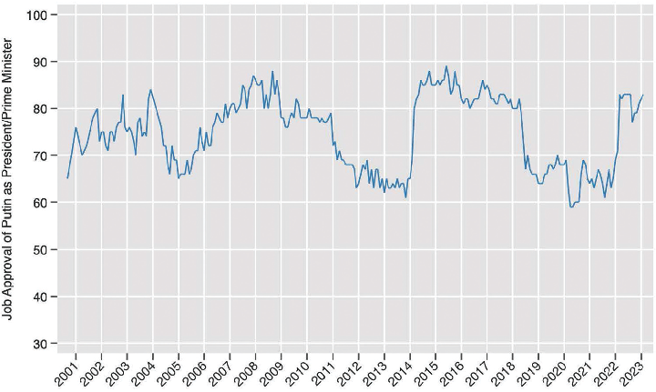
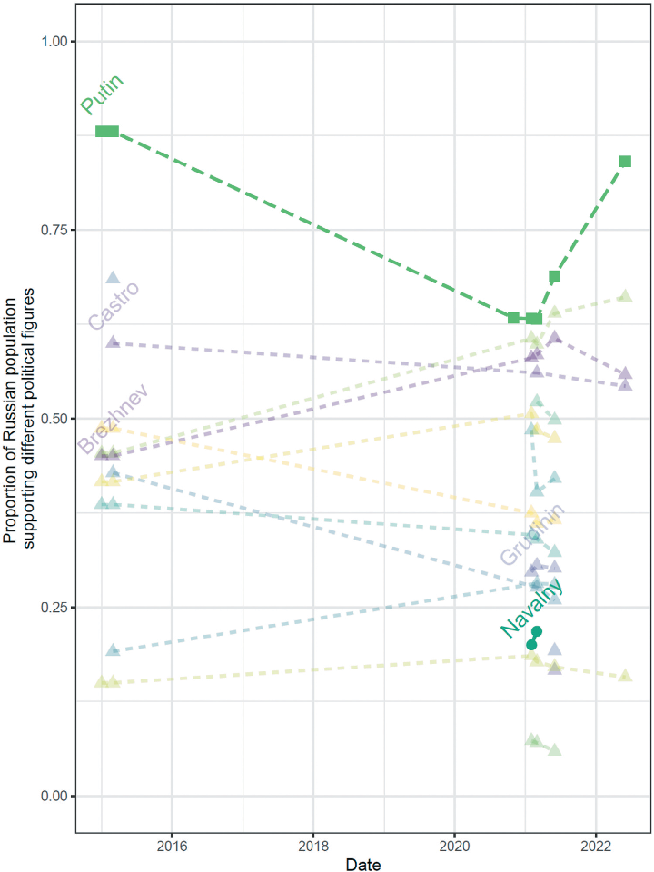

POST-SOVIET AFFAIRS 2023, VOL. 39, NO. 3, 213–222 https://doi.org/10.1080/1060586X.2023.2187195

# Is Putin’s popularity (still) real? A cautionary note on using list experiments to measure popularity in authoritarian regimes

Timothy Fryea, Scott Gehlbachb, Kyle L. Marquardtc and Ora John Reuterd

aDepartment of Political Science, Columbia University, New York, NY, USA; bDepartment of Political Science and Harris School of Public Policy, University of Chicago, Chicago, IL, USA; cDepartment of Comparative Politics, University of Bergen, Bergen, Norway; dDepartment of Political Science, University of Wisconsin–Milwaukee, Milwaukee, WI, USA

### ABSTRACT

### ARTICLE HISTORY

Opinion polls suggest that Vladimir Putin has broad support in Russia, but there are concerns that some respondents may be lying to pollsters. Using list experiments, we revisit our earlier work on support for Putin to explore his popularity between late 2020 and mid-2022. Our findings paint an ambiguous portrait. A naive interpretation of our estimates implies that Putin was 10 to 20 percentage points less popular than opinion polls suggest. However, results from placebo experiments demonstrate that these estimates are likely subject to artificial deflation – a design effect that produces downward bias in estimates from list experiments. Although we cannot be definitive, on balance our results are consistent with the conclusion that Putin is roughly as popular as opinion polls suggest. Methodologically, our research highlights artificial deflation as a key limitation of list experiments and the importance of placebo lists as a tool to diagnose this problem.

Received 16 June 2022 Accepted 2 February 2023

### KEYWORDS

Public opinion; preference falsification; Putin; presidential approval; list experiments

## Introduction

Questions about Russian President Vladimir Putin’s popularity are inextricable from discussions about Russia’s war on Ukraine. As Figure 1 illustrates, recent polls suggest that the war has encouraged Russian citizens to “rally around the flag,” boosting Putin’s poll numbers and thereby potentially strengthening his regime (Levada Center 2022).1 These developments have led to renewed debate about whether Putin really is popular. The increasingly repressive nature of the Russian state raises questions about whether we can trust respondents in opinion polls: some respondents may fear that revealing their opposition to the president could lead to negative consequences and will therefore “falsify” their preferences (Kuran 1997; see also Wintrobe 1998; Wedeen 2015). As a result, they may tell survey enumerators that they support Putin, regardless of their true preferences (e.g. Eckel 2022). Putin’s actual level of support could therefore be lower than responses to direct questions in opinion polls suggest.

Earlier research investigated this concern. In 2015, we used list experiments – a common technique to elicit sensitive opinions from survey respondents – to estimate support for Vladimir Putin (Frye et al. 2017). Our results suggested that Putin’s high approval ratings mostly reflected sincere support. In 2020–22, we investigated whether the results from our earlier work still held true. These more recent analyses paint a more ambiguous portrait, such that there is considerably more uncertainty about Putin’s true support than was apparent in 2015.

CONTACT Timothy Frye tmf2@columbia.edu Department of Political Science, Columbia University, 420 W, 118th, 811 IAB, New York, NY 10027, USA

Supplemental data for this article can be accessed online at https://doi.org/10.1080/1060586X.2023.2187195.

© 2023 Informa UK Limited, trading as Taylor & Francis Group

- Figure 1. Support for Putin, 1999–2023. Note: Data from monthly nationally representative Levada surveys of the population of Russia.

A naive interpretation of our results implies that Putin is 10–20 percentage points less popular than opinion polls suggest. However, results from placebo experiments demonstrate that these estimates are likely subject to artificial deflation, a design effect that produces downward bias in estimates from list experiments – perhaps especially those that measure support for political figures. Importantly, additional experiments that we conducted in June 2022 demonstrate that this deflation is not unique to our particular list format, suggesting that the issue may be a pervasive and underappreciated design effect in applications such as ours. Our work therefore holds lessons for those who would use list experiments to measure the popularity of authoritarian leaders, in Russia and elsewhere: it is imperative to check for artificial deflation through the use of placebo experiments, which are particularly well suited to diagnosing this type of design effect.

Substantively, these results do not yield any firm verdict regarding Putin’s popularity. However, by way of conclusion, we outline the assumptions necessary to infer that Putin is as popular as opinion polls suggest, as well as the assumptions required to conclude that there is significant preference falsification. Our judgment is that the former assumptions are more plausible, though we cannot rule out some bias in estimates from direct questioning. Notwithstanding any ambiguity, these results are consistent with the view that Putin’s popularity was near historic lows in 2020–21 and increased markedly after Russia’s full-scale invasion of Ukraine in 2022.

## Putin’s popularity in 2015

To understand the ambiguity in our results, it is important to understand the method we use to estimate Putin’s popularity. This technique – widely employed to study sensitive attitudes or behavior (Glynn 2013; Blair, Coppock, and Moor 2020) – is known as an “item count” or “list” experiment. The specific procedure for the experiments we designed to estimate support for Putin is as follows. First, we randomly divide survey respondents in a nationally representative sample of the Russian population into two groups. The first, “control,” group is presented with a list of three political figures. The second, “treatment,” group receives the same list of three figures, plus Putin.

Respondents in each group are asked how many – but not which – politicians they support. As respondents only tell the survey enumerator how many politicians they support, it is generally impossible to determine whether any particular respondent supports Putin. In the aggregate, however, support for Putin can be estimated as the difference between the mean response for respondents in the treatment and control groups, respectively. Random assignment ensures that any such difference is attributable only to the presence or absence of Putin on the list, not to characteristics of the respondents themselves.

For example, we used the following list to estimate support for Putin in 2015: Take a look at this list of politicians and tell me for how many you generally support their activities2:

- ● Vladimir Zhirinovsky
- ● Gennady Zyuganov
- ● Sergei Mironov
- ● [Vladimir Putin]

All of the figures in the list were relatively prominent contemporary Russian politicians at the time of our surveys: Zhirinovsky (since deceased) and Zyuganov were the leaders of the ersatz opposition Liberal Democratic Party and Communist Party, respectively, whereas Mironov was the leader of A Just Russia, a party that is also part of the “systemic opposition.”

In this January 2015 experiment, we found that respondents in the control group (i.e. without Putin) reported supporting 1.11 of the listed politicians on average. Respondents in the treatment group (i.e. with Putin) reported supporting 1.92 politicians on average. The difference between these two means is 1.92–1.11 = 0.81. This implies that 81% of survey respondents supported Putin, some five percentage points less than implied by the direct question – a difference that is not statistically significant. The list experiment thus provides little evidence that respondents were “falsifying” their preferences due to fear of expressing opposition to Putin (Kuran 1997).3

In addition to this list of “contemporary” politicians, we also designed an experiment in which the control items were “historical” Russian or Soviet leaders: Joseph Stalin, Leonid Brezhnev, and Boris Yeltsin. We ran experiments with both sets of lists in January and March 2015, with approximately 1,600 respondents in each case. Table 1 reports results from these experiments. After accounting for uncertainty, the estimates are remarkably similar – to each other and to the direct estimates – suggesting that support for Putin was largely genuine.

We also conducted various auxiliary analyses to check for design effects.4 Although the differences between the estimates from the list experiments and direct questions are relatively small and statistically insignificant, they still hint at the possibility of “artificial deflation,” a generic term for a tendency to undercount list items that increases with the length of the list (Kiewiet de Jonge and Nickerson 2013). To check for this possibility, we conducted a list experiment with various international figures: Belarusian President Alexander Lukashenko, German Chancellor Angela Merkel, former South African President Nelson Mandela, and (in the treatment condition) former Cuban leader Fidel Castro. The premise of this “placebo” experiment was that support for Castro is not sensitive in the Russian context. If true, any difference between the list and direct estimates of support for Castro would be evidence of artificial deflation rather than preference falsification. The results from the

Table 1. Estimated support for Putin in 2015 from direct questions and list experiments.

Direct Contemporary list Historical list

January 86% (85%, 88%) 81% (70%, 91%) 79% (69%, 89%) March 88% (86%, 90%) 80% (69%, 90%) 79% (70%, 88%)

Note: Values in parentheses represent 95% confidence intervals.

placebo experiment, in which estimated support for Castro was nine percentage points lower than implied by the direct question (60%), is thus evidence of artificial deflation in the Putin list estimates.

In summary, our list experiments in 2015 suggest that Putin’s popularity was largely “real,” with those small differences between the list and direct estimates more likely attributable to design effects than to preference falsification.5

## Putin’s popularity in 2020–21

In late 2020 and early 2021, we revisited our analysis of Vladimir Putin’s popularity. Putin’s apparent popularity had dropped dramatically from 2015 to 2020. As Figure 2 illustrates, this drop is unique among the various political figures for whom we have data in both periods.6 Moreover, many aspects of Russian politics had changed during this period. Perhaps most prominently, Russian opposition activist Alexei Navalny was poisoned by Russian security services and left the country for treatment in August 2020. When Navalny returned to Russia in January 2021, he was promptly arrested, resulting in mass protests and the detention of many demonstrators. As the repressive nature of the Russian state became more apparent, so too might have the perceived risks of voicing opposition.

As in 2015, we contracted with the highly regarded Levada Center to conduct list experiments on a nationally representative sample of the Russian population (in November 2020, and then again in February, March, and June 2021). To estimate support for Putin we used the contemporary and historical lists described above. In one wave of the survey, we additionally employed a modified version of the list used to estimate support for Castro in 2015 (the “international” list), in which we replaced Belarusian President Lukashenko as a control item with the first president of Kazakhstan, Nursultan Nazarbayev.7

Table 2 reports the results from our list experiments in 2020 and 2021; as in our prior work, there were approximately 1,600 respondents in each wave.8 Across survey waves, the list experiments suggest support for Putin 9 to 23 percentage points lower than implied by the direct questions – a generally greater difference than for any of the lists in 2015.9 If artificial deflation is of the magnitude inferred in 2015 (i.e. around five to nine percentage points), this suggests that true support for Putin fell even more over the preceding period than the decline in approval ratings from direct questioning suggest. Indeed, under this assumption Putin’s true support could lie below 50%.

We cannot, however, assess these results in isolation. As in 2015, we compare these results to a series of placebo experiments. In March 2021, we repeated the Castro experiment from 2015, with the modification to the “international” list described above. In June 2021 we also conducted list experiments to estimate support for two other political figures we understand to be comparatively non-sensitive: Soviet leader Leonid Brezhnev and Communist Party presidential candidate and entrepreneur Pavel Grudinin.10 The idea again is to use non-sensitive figures to determine whether the reduced support for Putin that we observe in the list experiment is a consequence of preference falsification or some design effect such as artificial deflation.

Table 3 reports results from these analyses. Across all three placebo experiments, the difference between the list and direct estimates is greater than for the Castro experiment in 2015—in two cases (Castro and Brezhnev), dramatically so. As discussed, we have no strong reason to believe that support for any of the three treatment figures – Castro, Brezhnev, and Grudinin – would be politically sensitive. If anything, support for Grudinin might work in the other direction, with respondents hesitant to express support for a quasi-opposition figure, implying estimates from the list experiment higher than from the direct question. We therefore conclude that there is substantial evidence of artificial deflation in the list experiments from 2020–21.

As a final wrinkle in these analyses, we also ran list experiments to estimate the popularity of opposition figure Alexei Navalny. In contrast to the placebo figures, it is very plausible that support for Navalny is sensitive: our study was conducted just after his return to the country and arrest in

- Figure 2. Change in direct estimates of political figures’ popularity between 2015 and 2020–22.

January 2021. Thus, as with Grudinin, but much more strongly, we might expect the lists to reveal higher support for Navalny than do the direct questions.

Table 4 presents results from the Navalny experiments. We use two lists to estimate his support: the “contemporary” list we used for Putin, and a “society” list that includes conservative filmmaker Nikita Mikhalkov, socialite and opposition figure Ksenia Sobchak, and Grudinin. We repeated the latter experiment a month later. In each case, the list estimates are close to those from the direct question. Indeed, in two of the three experiments, the point estimates from the list experiments are

Table 2. Estimated support for Putin in 2020–2021 from direct questions and list experiments.

Direct Contemporary list Historical list International list

November 2020 63% (61%, 66%) 54% (44%, 64%) 50% (41%, 58%) February 2021 63% (61%, 66%) 40% (31%, 49%) March 2021 63% (61%, 66%) 40% (30%, 50%) 44% (36%, 53%) June 2021 69% (67%, 71%) 46% (36%, 56%) 48% (38%, 57%)

Note: Values in parentheses represent 95% confidence intervals.

Table 3. Estimated support for placebo figures in 2021 from direct questions and list experiments.

Castro (March) Brezhnev (June) Grudinin (June)

Direct estimate 56% (54%, 59%) 61% (58%, 63%) 30% (28%, 33%) List estimate 34% (25%, 44%) 39% (30%, 47%) 18% (10%, 26%)

Note: Values in parentheses represent 95% confidence intervals.

Table 4. Estimated support for Navalny in 2021 from direct questions and list experiments.

Direct Contemporary list Society list

February 20% (18%, 22%) 21% (12%, 31%) 15% (8%, 23%) March 22% (20%, 24%) 23% (15%, 30%)

Note: Values in parentheses represent 95% confidence intervals.

marginally higher than from the direct questions, in line with our prior belief that the sensitivity of support for Navalny would lead to underreporting of that attitude when asked directly. If we assume that the list estimates artificially deflate actual support for Navalny, as may be the case with Putin and the placebo figures, then his true popularity could be higher yet.

## Putin’s popularity in 2022 and list robustness

To explore the robustness of our results, we repeated our analyses of both Putin and a placebo figure (Castro) in June 2022, four months after Russia’s invasion of Ukraine on February 24. Table 5 shows striking similarities with the results from 2020/21, notwithstanding the wartime political context. Between June 2021 and June 2022, we see a sharp increase in estimated support for Putin from both the direct question and the list experiment. Nonetheless, the difference between the two estimates in 2022 (around 21 percentage points) is similar to that in 2020/21: we estimate 84% support for Putin in the direct question, but just 63% in the historical list experiment. Our placebo test of Castro’s popularity again suggests that the difference in Putin’s estimated popularity may be due to artificial deflation: the estimate of Castro’s popularity from the international list experiment is 40%, versus 54% from the direct question.

In this survey wave we also investigated whether our use of individuals as control items is uniquely prone to artificial deflation. To do so, we ran list experiments to estimate Putin’s and Castro’s popularity using a qualitatively different type of control list. Borrowing from Hale (2022), we

Table 5. Estimated support for Putin and Castro, June 2022.

Putin Castro Direct estimate 84% (82%, 86%) 54% (52%, 57%)

Historical list Statement list International list Statement list List estimate 63% (54%, 72%) 55% (46%, 64%) 40% (32%, 49%) 23% (14%, 33%)

Difference between direct and list estimates −21% (−30%, −12%) −29% (−38%, −20%) −14% (−23%, −6%) −31% (−41%, −21%) Note: Values in parentheses represent 95% confidence intervals.

included the following three statements as control items in a list experiment estimating support for Putin: “I usually read more than one newspaper or journal in a week”; “I can name the chief justice of the Constitutional Court of the Russian Federation”; and “I am satisfied with my income level.” In this formulation, the potentially sensitive item is “I support the activities of Vladimir Putin.” We constructed an analogous control list for Castro.11 As reported in Table 5, these “statement” list experiments exhibit even greater levels of deflation than do those with individuals as control items: the difference in point estimates between the direct question and the list experiment is 29 percentage points for Putin and 31 percentage points for Castro.12 These results constitute strong evidence that the list format in our work between 2015 and 2022 —with individuals as control items – is not uniquely prone to artificial deflation.

## Methodological context and recommendations

Frye et al. (2017) has been much referenced as evidence of the reliability of public opinion polling on Putin’s popularity.13 We remain broadly confident of the conclusions of that study, but our recent experience suggests caution about the use of list experiments more generally to measure the popularity of political figures, and perhaps other political attitudes and behavior. As we anticipate that other scholars of Russia will gravitate to such designs in response to the increasing criminalization of dissent and associated concerns about preference falsification (e.g. Chapkovski and Schaub 2022), we provide here some context and recommendations.

We begin with a brief discussion of what could have gone wrong – though probably did not – in 2020–22. Although we used the same survey firm (the well-respected Levada Center) as in 2015, there was a potentially consequential change in survey mode, from pen/paper to computer-assisted personal interview (CAPI, i.e. tablet). We do not know why this would matter, but it could have.14 In addition, in 2015 we did our own randomization, whereas in 2020–21 Levada did the randomization itself. We see no evidence that Levada’s randomization failed (as indicated by balance checks, see online Appendix B.2), but this is again a difference in implementation.

We additionally provide two recommendations to scholars who are considering similar research designs. When used with the diagnostics that Blair and Imai (2012) discuss, such practices can minimize the risk of drawing unwarranted conclusions from list experiments. Indeed, had we not followed these practices ourselves, we might have made very strong – and potentially very wrong – claims about the extent of preference falsification and level of support for Putin in 2020–22.

- (1) The use of placebo experiments should be standard practice for list experiments, especially those intended to gauge the popularity of political figures. Absent supportive evidence that artificial deflation is not biasing list estimates, scholars should not assume that any difference between direct and list estimates represents preference falsification.
- (2) Following our work in 2015, we used direct questions about control items to explore the presence of floor and ceiling effects (online Appendix B.4). As with placebo experiments, the inclusion of such direct questions should be standard practice in list designs.

Finally, it is worth emphasizing that, while artificial deflation complicates the task of obtaining unbiased estimates of quantities of interest, we have no evidence to suggest that the deflation we observe follows from respondents’ worry about revealing sensitive attitudes. List experiments are therefore likely to remain useful in contexts where potential design effects can either be quantified or otherwise accounted for (e.g. estimating treatment effects from another experiment).

## How popular is Putin (really)?

What do these results tell us about Putin’s popularity? When considered in isolation, the list experiments we conducted in 2020–2022 appear to suggest that Putin is considerably less popular

than estimates from direct questions would imply. This interpretation rests, however, on the assumption that our five placebo experiment results are not indicative of artificial deflation. In other words, one would have to conclude that there are roughly similar levels of preference falsification for Vladimir Putin, Fidel Castro, Leonid Brezhnev, and Pavel Grudinin. In addition, one would need to assume that preference falsification for Castro has increased substantially since 2015, when we found little evidence of such sensitivity. Under this interpretation, one would also have to conclude that expressing support for Navalny in 2021 was not sensitive, given the similarity of list and direct estimates of his support. Thus, this interpretation would imply that Navalny is not a sensitive figure, but Putin, Castro, Grudinin, and Brezhnev are. Together, these implications cast doubt on this interpretation.

By contrast, if one interprets the results of our placebo experiments as indicative of artificial deflation, then Putin’s actual support may be as large as implied by direct questioning. Under this interpretation, the key assumption is that support for Castro, Brezhnev, and Grudinin is not sensitive. Intriguingly, this assumption also implies that Navalny (with roughly similar direct and list estimates of support) is much more popular than direct questions imply. Although we cannot be definitive, our view is that the assumption required for this interpretation is simpler and more plausible than those required for the interpretation that Putin is considerably less popular than direct questioning implies.

Finally, it could also be that design effects such as artificial deflation differ from one politician to the next or follow some unknown process related to the politician’s underlying popularity.15 This interpretation is also plausible, though if true, we do not have sufficient information to estimate the popularity of any politician with the list experiments we discuss here. In any case, if we are willing to assume that design effects did not change between 2020–21 and 2022, we can use the difference in estimates between survey waves to assess the degree to which Putin’s popularity changed during this period. From this perspective, our results are consistent with the conclusion that Putin’s actual popularity increased after Russia’s full-scale invasion of Ukraine in 2022.

## Notes

- 1. To estimate direct support for Putin, we use affirmative responses to the standard dichotomous Levada question “In general, do you support or not the activities of Vladimir Putin as president of Russia?” (Vy v tselom odobryaete ili ne odobryaete deyatel’nost’ Vladimira Putina na postu Prezidenta Rossii?). The only exception is May 2008– May 2012, during which period Putin was the prime minister of Russia and the question referred instead to his activities in that capacity.
- 2. The question wording mirrors the analogous direct question about Putin’s and others’ support. Online Appendix E provides the Russian-language formulation of all list experiments we use in this article.
- 3. In online Appendix A, we provide confidence intervals for the difference between direct and list estimates of support. Under the assumption of no design effects, this difference represents the degree of preference falsification.
- 4. We provide additional diagnostics of the list experiments in online Appendix B. In general, we find little evidence of either design effects (other than deflation, discussed below) or balance issues. In particular, although floor effects are a clear concern in all our list experiments due to the general unpopularity of politicians in Russia, there is little evidence that these effects substantially influence the estimates in our prior research or our more recent analyses. Moreover, as the prevalence of respondents at the floor has not greatly changed across survey waves, there is also little reason to believe that floor effects account for the changes in list estimates of support for Putin that we discuss.
- 5. Other list experimental designs have generally suggested greater preference falsification in responses to questions about voting (as opposed to support) for Putin (Kalinin 2016; Hale 2022). A systematic comparison of the designs in those papers and in our approach is an important task for future research.
- 6. Besides Putin, these figures are those whom we included in other list experiments (either as control list or sensitive figures). Online Appendix D provides a detailed summary of changes in directly estimated support for all political figures in Figure 2. Joseph Stalin shows the largest increase in support between March 2015 and March 2021 (from 45% to 60%), whereas Nelson Mandela shows the largest decrease after Putin (from 43% to 28%).
- 7. Opinions about Lukashenko were plausibly more politically sensitive following the violent repression of mass anti-government protests in Belarus in 2020. By a similar logic, attitudes toward Nazarbaev likely became more

- sensitive following mass unrest and violent repression in Kazakhstan in January 2022, which could have influenced responses to the June 2022 experiments when we again ran this list with Castro as the potentially sensitive figure. A comparison of responses to the March 2021 and June 2022 lists provides inconclusive evidence on this point: although there was less deflation in estimated support for Castro in June 2022 than in March 2021 (14 versus 22 percentage points), the difference is not extremely large and is plausibly attributable to sampling error.
- 8. The sample design for these face-to-face surveys is the nationally representative sample design used by the Levada Center for their monthly courier surveys. Sampling consists of four stages. The first stage entails selecting primary sampling units within 48 regions. Cities of over 1 million population are included as self-representative units, whereas all other units are selected with a probability proportional to the size of the unit. In the second stage, survey units (polling stations for urban areas, villages for rural areas) are selected randomly. In the third stage, households are selected randomly via the route systematic method. In the fourth stage, household respondents are selected according to sex-age and sex-education quotas. The survey margin of error for these surveys does not exceed 3.4%. The cooperation rates are: 45% in November 2020, 48% in February 2021, 51% in March 2021, 54% in June 2021, and 43% in June 2022.
- 9. There is no evidence of systematic changes in item nonresponse in support for Putin that could explain the increased difference between direct and list estimates of this quantity (online Appendix D). Equally important, there is little evidence that the differences in results between 2015 and 2020/2022 are attributable to low statistical power. List estimates of Putin’s popularity in both sets of surveys are largely consistent across waves within 2015 and 2020–21, indicating robustness. Moreover, in four of the six survey waves (and a seventh in 2022), we can estimate support for Putin as a double list experiment (Glynn 2013), providing greater precision than implied by the estimates reported in Table 2. Online Appendix C presents the results of these analyses, which are consistent with those reported in the text. We find that the difference between the direct and doublelist estimates of Putin’s popularity in March 2021 is substantially larger (12 percentage points) and statistically significantly different from that in March 2015.
- 10. The Brezhnev experiment used a modified version of the historical list, replacing Brezhnev (now the “sensitive” item) with the final Soviet leader, Mikhail Gorbachev. The Grudinin experiment used a design similar to that we describe below for the Navalny “society” experiment, with control figures Alexei Kudrin (a regime-affiliated liberal economist), Nikita Mikhalkov, and Ksenia Sobchak.
- 11. The control list items in this list were: “I can name the secretary general of the United Nations”; “I watch TV, YouTube, or a streaming service (IVI, OKKO, Kinopoisk, etc.) at least once a week”; and “I know a person who visited Cuba.”.
- 12. Our results are not directly comparable to Hale (2022), as we use three rather than four control items for consistency with our other list experiments.
- 13. The four (closely related) list experiments in 2017), for example, constitute four of the 34 studies included in Blair, Coppock, and Moor’s (2020) meta-analysis of the use of list experiments used to study support for authoritarian regimes.
- 14. See also Kao and Lust (2022) and Kramon and Weghorst (2019) on implementation failures in list experiments when interviews are face-to-face. Buckley et al. (2022) find evidence of artificial inflation (as opposed to deflation) of the sensitive item (Putin) in a list experiment similar to those described above, but with online samples. Although this runs counter to what we observe with the CAPI surveys here, it highlights the potential importance of survey mode and diagnostics – in the case of Buckley et al., using direct questions about control items.
- 15. For example, a model of uniform nonstrategic error (Ahlquist 2018; Blair, Chou, and Imai 2019) suggests that error will bias estimates of sensitive item prevalence toward 50%, inflating estimates for sensitive items that have a true prevalence below 50% and deflating estimates for items that have a true prevalence above 50%.

## Acknowledgments

Drafts were presented at the PONARS Eurasia Workshop on Social Activism in Eurasia and the APSA Annual Meeting in 2021. We thank Bryn Rosenfeld and Ashley Blum for their comments on earlier drafts. We also thank Post-Soviet Affairs editorial board member Daniel Treisman for overseeing the double-blind peer review process and two anonymous reviewers for their helpful comments. Replication materials are available at the Harvard Dataverse: https://doi.org/10. 7910/DVN/VHZ5W8.

## Disclosure statement

No potential conflict of interest was reported by the authors.

## References

Ahlquist, John S. 2018. “List Experiment Design, Non-Strategic Respondent Error, and Item Count Technique Estimators.” Political Analysis 26 (1): 34–53. doi:10.1017/pan.2017.31. Blair, Graeme, Winston Chou, and Kosuke Imai. 2019. “List Experiments with Measurement Error.” Political Analysis 27 (4): 455–480. doi:10.1017/pan.2018.56.

Blair, Graeme, Alexander Coppock, and Margaret Moor. 2020. “When to Worry About Sensitivity Bias: Evidence from 30 Years of List Experiments.” The American Political Science Review 114 (4): 1297–1315. doi:10.1017/ S0003055420000374.

Blair, Graeme, and Kosuke Imai. 2012. “Statistical Analysis of List Experiments.” Political Analysis 20 (1): 47–77. doi:10. 1093/pan/mpr048. Buckley, Noah, Kyle L. Marquardt, Ora John Reuter, and Katerina Tertytchnaya. 2022. “Endogenous Popularity: How Perceptions of Support Affect the Popularity of Authoritarian Regimes.” V-Dem Institute Working Paper 132.

Chapkovski, P., and M. Schaub. 2022. “Solid Support or Secret Dissent? A List Experiment on Preference Falsification During the Russian War Against Ukraine.” Research & Politics 9 (2): 205316802211083. doi:10.1177/ 20531680221108328.

Eckel, Mike. 2022. “Polls Show Russians Support Putin and the War on Ukraine. Really?” RFE/RL, April 7. Accessed November 13, 2022. https://www.rferl.org/a/russia-support-ukraine-war-polls-putin/31791423.html Frye, Timothy, Scott Gehlbach, Kyle L. Marquardt, and Ora John Reuter. 2017. “Is Putin’s Popularity Real?” Post-Soviet Affairs 33 (1): 1–15. 10.1080/1060586X.2016.1144334 Glynn, Adam N. 2013. “What Can We Learn with Statistical Truth Serum? Design and Analysis of the List Experiment.” Public Opinion Quarterly 77 (S1): 159–172. doi:10.1093/poq/nfs070. Hale, Henry. 2022. “Authoritarian Rallying as a Reputational Cascade: Evidence from Putin’s Popularity Surge After Crimea.” The American Political Science Review 116 (2): 580–594. doi:10.1017/S0003055421001052.

Kalinin, Kirill. 2016. “The Social Desirability Bias in Autocrat’s Electoral Ratings: Evidence from the 2012 Russian Presidential Elections.” Journal of Elections, Public Opinion and Parties 26 (2): 191–211. doi:10.1080/17457289.2016. 1150284.

Kao, Kristen, and Ellen Lust. 2022. “Do List Experiments Run as Expected? Examining Implementation Failure in Kenya, Zambia, and Malawi.” GLD Program Working Paper 57. Kiewiet de Jonge, Chad P., and David Nickerson. 2013. “Artificial Inflation or Deflation: Assessing the Item Count Technique in Comparative Surveys.” Political Behavior 36 (3): 659–682. doi:10.1007/s11109-013-9249-x. Kramon, Eric, and Keith Weghorst. 2019. “Mismeasuring Sensitive Attitudes with the List Experiment: Solutions to List Experiment Breakdown in Kenya.” Public Opinion Quarterly 83 (S1): 236–263. doi:10.1093/poq/nfz009. Kuran, Timur. 1997. Private Lies, Public Truths. The Social Consequences of Preference Falsification. Cambridge, MA:

Harvard University Press. Levada Center. 2022. “Indikatory [Indicators].” Accessed November 13, 2022. https://www.levada.ru/indikatory/ Wedeen, Lisa. 2015. Ambiguities of Domination: Politics, Rhetoric, and Symbols in Contemporary Syria. New York:

Cambridge University Press. Wintrobe, Ronald. 1998. The Political Economy of Dictatorship. New York: Cambridge University Press.

