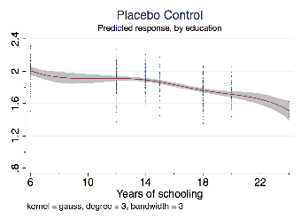
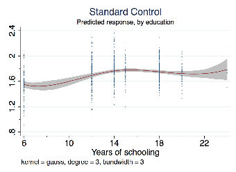
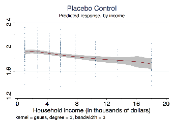
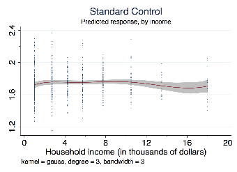

# Placebo Statements in List Experiments

Evidence from a Face-to-Face Survey in Singapore

Kai Ostwald∗ Guillem Riambau† March 26, 2019

Abstract

List experiments are a widely used survey technique for estimating the prevalence of socially sensitive attitudes or behaviors. Their design, however, makes them vulnerable to bias: because treatment group respondents see a greater number of items (J+1) than control group respondents (J), the treatment group mean may be mechanically inflated due simply to the greater number of items. The few previous studies that directly examine this do not arrive at definitive conclusions. We find clear evidence of inflation in an original dataset, though only among respondents with low educational attainment. Furthermore, we use available data from previous studies and find similar heterogeneous patterns. The evidence of heterogeneous effects has implications for the interpretation of previous research using list experiments, especially in developing world contexts. We recommend a simple solution: using a necessarily false placebo statement for the control group equalizes list lengths, thereby protecting against mechanical inflation without imposing costs or altering interpretations.

Keywords: List experiment, item count technique, survey design, placebo statement, social desirability bias.

### Word count: 2,844 using https://www.sharelatex.com

∗email: kai.ostwald@ubc.ca †email: griambau@gmail.com

We would like to thank Eugene Choo, Allen Hicken, Gillian Koh, Edmund Malesky, Steven Oliver, and the audiences at NUS, Yale-NUS, Universitat Aut`noma de Barcelona, and the WPSA and AAS conferences, for insightful comments and suggestions. All errors are ours.

## 1 Introduction

List experiments (also known as Item Count Technique - ICT) are a widely-used survey technique designed to elicit true preferences on sensitive topics that are vulnerable to social desirability bias (Rosenfeld et al. 2016). They work as follows: respondents are divided into control and treatment groups. The control group is shown J non-sensitive statements and asked to indicate how many are true. The treatment group is shown J +1 statements, where the J statements are the same as the control group, but the +1 is a sensitive item that may elicit socially desirable responses if asked directly. The difference in the mean number of true statements between the control and treatment groups, referred to as the difference-in-means (DiM) estimator, is interpreted as the percentage of the population for whom the sensitive statement is true. This technique has been used to estimate the prevalence of a wide-range of socially sensitive attitudes and behaviors from ethnic prejudice to sexual practices and voting behavior.1

List experiments are subject to both strategic and non-strategic respondent error (Ahlquist 2017). Strategic errors arise when respondents lie to conceal their position on the sensitive issue, which is revealed when all or none of the statements are indicated as true. To prevent these ceiling and floor effects, best practice calls for one relatively rare and one relatively common item (Blair and Imai 2012; Glynn 2013). Non-strategic error includes such things

- as coding errors and poor quality responses that arise when respondents do not understand or rush through the list experiment. As noted by Ahlquist (2017), previous work on ICT has generally disregarded the implications of non-strategic error.

We raise attention to a potential non-strategic error that emerges from the differential list lengths in typical ICT designs: the higher number of statements in the J+1 treatment group relative to the J control group may produce an artificial inflation of “true” statements in the treatment group if respondents resort to satisficing, for example by selecting the perceived

1See Koisuke Imai’s webpage for a list of examples: http://imai.princeton.edu/research/files/ listExamples.pdf.

middle point (Krosnick 1999). Despite the potential for this error, only a few studies (Ahlquist et al. 2014; Holbrook and Krosnick 2010; Kiewiet de Jong and Nickerson 2014) have directly examined the effect of ICT design on responses. They take the following approach: A placebo statement that is exceedingly rare or impossible is added to an alternative control group. Since it should be false for all respondents, the mean of the J + 1 alternative control group with the placebo statement should be the same as the J control group. Any significant difference in means is the result of bias from the standard ICT design.

Individually, the studies are inconclusive. Holbrook and Krosnick (2010) find a difference in means that suggests inflation; the effect, however, does not reach significant levels using a two-tailed t-test. Ahlquist et al (2014) likewise find evidence of inflation, this time at statistically significant levels.2 Kiewiet de Jong and Nickerson (2014) explicitly look for inflation or deflation; they find “little evidence of an upward bias in estimates” (p. 662). None of the studies note strong evidence of heterogeneous effects.

This paper brings a representative sample that provides substantial statistical power to bear on the question of non-strategic bias in ICT design.3 As with the previous studies, we use a placebo statement to identify the potential effects of differential list lengths. We find strong evidence for mechanical inflation, though only among the subgroup with relatively low levels of educational attainment. This finding is consistent with previous research that shows response quality to vary depending on cognitive ability and education levels (see Krosnick 1991). As list experiments require greater attention to detail and concentration than conventional questions, this subgroup may have an increased propensity to resort to satisficing (Kramon and Weghorst 2012), which in turn can drive mechanical inflation.

We also conduct a meta-analysis of previous work, finding inflation to be more likely than not, and roughly the size of many reported treatment effects at around 7–8%. Details are

210% of voters are estimated to agree to an impossible statement, with a p-value of 0.017 (7% and p = 0.051 if unweighted data). These figures are reported in Zigerell (2017).

3Assuming the observed effect size, power in our sample is at least 40% greater than previous studies. All calculations done with the sampsi command in STATA. See Section 3 in the supplementary materials for details concerning power calculations.

in Section 4 of the supplementary materials. Moreover, we reanalyze data from Ahlquist et al (2014) for heterogeneous effects and find, consistent with our study, evidence of inflation among the subgroup with relatively low levels of educational attainment.4

Our findings have important implications for list experiment best practices. They suggest that the conventional J / J +1 design is vulnerable to bias towards positive findings, at least in contexts where some respondents have low levels of formal education or are especially prone to satisficing. To protect against this bias, we recommend inclusion of a placebo statement in the control group that equalizes the list lengths at J + 1 / J + 1. The placebo statement should be false for all or nearly all respondents, and should not be so disruptive that it triggers a low quality response to the remaining list items.5 Ultimately, the inclusion of a placebo statement is a costless preventative measure that does not increase cognitive demands or alter interpretation of survey experiments, but does protect against the observed mechanical bias among vulnerable subgroups.

## 2 Data and survey design

The data described below come from a list experiment embedded in a survey on social and political beliefs in Singapore, conducted between September 2016 and April 2017. The survey was administered in person by a multi-ethnic team of enumerators comprised of local university students, either on weekdays (6–9pm) or weekends (9am–6pm). Most respondents required between 5 and 10 minutes to complete the questionnaire, which was comprised of closed questions. Buildings were randomly selected to approximate a representative sample

- 4The previous non-findings for heterogeneous effects are unsurprising. Studies like Holbrook and Krosnick (2010) that rely on internet convenience samples in fully industrialized countries are likely to under-represent low education attainment respondents, making them less vulnerable to heterogeneous effects through selection bias. While Kiewiet de Jong and Nickerson (2014) use a representative sample in a developing context, their limited sample size may not be sufficiently sensitive to subgroup variation, which they concede (p. 671).
- 5Examples include “I moved to my current home less than one week ago”; “I spent last New Year’s eve

- at the top of the Eiffel Tower”; or “I had dinner with the President of my country last week”. Albeit highly unlikely, these are all plausible. We caution against false but potentially disruptive statements like “I have the ability to teleport myself to different countries” because they may reduce the seriousness with which respondents approach the remaining items.

of the resident population. The response rate was 34.4%, marginally above the typical rate of surveys carried out by official institutions in Singapore.6 While the full dataset includes 3,480 responses, only the 1,249 from the control groups are relevant to this paper. Full details of the survey methodology and a copy of the questionnaire are included in the supplementary materials. See also [Citation removed for anonymity].

The list experiment was designed to estimate the belief in ballot secrecy in Singapore. We opted for two control groups, into which respondents were randomly assigned. The 4-item control group received 4 neutral statements, while the 5-item placebo group received the same 4 neutral statements, plus a (necessarily false) placebo statement.

All groups received the same instructions: “Look at the following statements below. Can you tell us how many statements are true for you? Please don’t tick individual statements, just tell us the total number” [Emphasis in the original]. The four neutral statements were chosen using the generally accepted criteria for list experiments: natural fit into the context of the survey, uncorrelated (both with one another and with other broader socio-economic characteristics), and resistant to ceiling and floor effects.

The placebo statement was designed to be plausible but false for all respondents: “I have been invited to have dinner with PM Lee at Sri Temasek next week.”7 This is the equivalent of being asked to have dinner with the President of the United States in the White House or some other equally improbable event. Hence we assume that it is false for all respondents and easily recognized as such.

## 3 Results

Table 1 provides a summary of the overall findings. For the whole sample, the mean number of reported true statements is higher (1.85) for the placebo group than for the standard

- 6For instance, 24.6% in the Institute of Policy Studies “Post-Election Survey 2015” (Institute of Policy Studies 2015).
- 7Lee Hsien Loong is the Primer Minister of Singapore. Sri Temasek is the Prime Minister’s official residence.

control group (1.72). The magnitude is substantial: this suggests that the inclusion of the +1 placebo statement induces roughly 13% of respondents in the 5-item placebo group to increase their reported number of true statements by 1 above their counterparts in the 4-item control group. Figure 1 in the supplementary materials provides the frequency distribution for both the 4-item and the 5-item groups. Few respondents in either group indicate 0 or all statements to be true, which suggests that the presence of a clearly false placebo statement does not induce respondents to indicate extreme counts.8

- Table 1: Mean number of reported true statements by group. Number of observations in parentheses.

Control 4–item 5–item p-value

(Control) (Placebo) Whole sample 1.72 (757) 1.85 (492) 0.0096 Political knowledge

Low 1.72 (491) 1.91 (309) 0.0045 High 1.72 (264) 1.74 (183) 0.3929

None or primary 1.49 (98)0 2.08 (48)0 0.0005 Secondary 1.70 (234) 1.83 (140) 0.0950 College or above 1.74 (227) 1.74 (173) 0.4950

Education

< $3.5K per month 1.75 (267) 1.96 (165) 0.0169 ≥ $3.5K per month 1.74 (406) 1.80 (280) 0.1961

Household income

61+ 1.54 (142) 1.84 (85)0 0.0103 60 or below 1.80 (602) 1.84 (403) 0.0633

Age

Reported p−values are from a one-sided difference in means t-test between the 4-item control and 5-item placebo groups. Political knowledge: ‘1’ if respondents know the electoral district in which they reside, ‘0’ otherwise.

Table 1 also reports mean number of true statements by subgroups on the dimensions of political knowledge, educational attainment, household income, and age.9 We opt for simple categories to facilitate comparisons: respondents are coded as having high political knowledge when they are able to correctly name their electoral district; household income is above and below 3,500 Singapore dollars per month (which represents roughly the bottom

- 8In the 4-item control group, 11.62% of respondents indicated 0 or 4 statements to be true. In the 5-item placebo group, 11.99% indicated 0, 4, or 5 to be true. See Figure 1 in supplementary materials for the full distribution of responses.
- 9While Singapore has high levels of educational attainment and close to full literacy, some segments of the population—particularly among the elderly and migrants—lag substantially.

third); while age is above or below 60 years.

The findings suggest that the treatment effect of the placebo statement is highly heterogeneous: for the politically knowledgeable, relatively educated, and middle and upper income, the difference in means between the 4-item control and 5-item placebo groups is insignificant, meaning that the inclusion of the placebo statement does not inflate the reported number of true statements. By contrast, the difference in means is statistically significant and substantively meaningful among the counterpart subgroups. This provides a strong initial indication of which respondent types are most vulnerable to mechanically inflating their true statement count in conventional list experiments.

In order to check the robustness of these findings to a different context, we examine data from Ahlquist et al. 2014, which is available online at Harvard Dataverse.10 The study likewise uses a standard 4-item control group and a 5-item placebo group, in which the extra placebo statement is necessarily false for all respondents. The 3,000 responses were collected via online survey in the United States. The results of the replication study are broadly in line with our general conclusions. The mean item count in the 5-item placebo group is .07 points higher than the 4-item control group; the difference reaches conventional levels of statistical significance. Furthermore, the elderly and those with lower levels of formal education are more likely to mechanically increase their reported number of true statements in response to the placebo statement, supporting our finding of heterogeneous treatment effects. The effect of income, however, is inconclusive. Details of the replication study and further discussion can be found in section 3.3 in the supplementary materials.

We return to our dataset to examine the heterogeneous treatment effects more precisely. Since formal education, age, and income may themselves be correlated, we estimate an OLS regression model using the following specification originally from Holbrook and Krosnick

10https://dataverse.harvard.edu/dataverse/.

(2010), then adopted by Imai (2011) and Blair and Imai (2012):

(1) LISTi = α + βXi + δPLACEBOi + γ (PLACEBOi × Xi) + εi,

where LISTi is the number reported in the list experiment, Xi are sociodemographic variables, and PLACEBOi is a dummy that takes value ‘1’ if the respondent was part of the 5-item placebo group, ‘0’ if part of the 4-item control group. γ is the vector of our coefficients of interest: we expect it to be significant for the variables specified in Table 1.

Table 2 reports the results. Panel A captures the interaction between individual characteristics and the placebo statement, which can be read as the propensity to inflate the number of “true” statements in the 5-item placebo list. Panel B captures the baseline relationship, i.e., the correlation between individual characteristics and number of “true” statements in the 4-item control list. For example, Panel B indicates that an elderly respondent from the

- 4-item group reports on average .248 items less than a younger counterpart from the 4-item group. Panel A indicates that an elderly respondent from the 5-item group reports on average

.183 more items than a younger counterpart from the 5-item group, though the difference does not reach conventional levels of statistical significance. Note that the baseline for Panel A (5-item placebo group) is 1.85 items, i.e., .13 higher than the Panel B (4-item control group) baseline of 1.72.

Specifications (1) − (4) confirm the unconditional results of Table 1 using fixed effects and clustered standard errors: age, education levels, political sophistication, and income are associated with mechanical inflation, although only education reaches conventional levels of statistical significance. Results also suggest that, on average, respondents with only a primary school education report .5 more true items than those with a college degree when presented with the placebo statement.

Specifications (5) − (9) further add sociodemographic controls (gender, ethnicity, and apartment size): earlier findings are robust to their inclusion. Specification (9), which

- Table 2: Heterogeneous Treatment Effects: Estimated coefficients from the list experiment with

- 5-item placebo group and 4-item control group. Linear regression with interactions. See expression (1) for details on the specification.

No controls With controls

(1) (2) (3) (4) (5) (6) (7) (8) (9)

- Panel A: 5-item placebo group PLACEBO × ...

... 61+ years old 0.183 0.188 0.105

(0.117) (0.122) (0.153)

... Education -0.042∗∗∗ -0.043∗∗∗ -0.033∗

(0.012) (0.012) (0.018)

... Political knowledge -0.261∗ -0.280∗ -0.231

(0.142) (0.152) (0.166)

... Hhd. Income -0.015 -0.019 0.003

(0.011) (0.013) (0.015)

- Panel B: 4-item control group 61+ years old -0.248∗∗∗ -0.259∗∗∗ -0.226∗∗∗

(0.080) (0.083) (0.105)

Education 0.013 0.017 0.012

(0.009) (0.011) (0.013)

Political knowledge 0.074 0.081 0.0374

(0.069) (0.066) (0.069)

Hhd. Income -0.000 0.004 -0.008

(0.007) (0.008) (0.009)

Controls No No No No Yes Yes Yes Yes Yes R2 0.03 0.03 0.03 0.03 0.05 0.05 0.05 0.05 0.06 Observations 1247 1247 1247 1247 1247 1247 1247 1247 1247

Standard errors (in parenthesis) clustered at the electoral district level (25 districts). Dependent variable: number of ‘true’ items in the list experiment. District fixed effects included in all specifications. Education: years of schooling. 61+ years old: dummy for being 61 years of age or older. Hhd. Income: monthly household income, in thousands of Singapore dollars. Political knowledge: ‘1’ when respondent correctly names the electoral district in which they reside; otherwise ‘0’. Controls: gender, ethnicity, apartment size. PLACEBO: Dummy for being in the 5-item placebo group. All coefficients reported in panel A are the interaction of PLACEBO × ‘variable’.

includes all controls and variables of interest, reveals that educational attainment is the strongest predictor of inflating the number of true statements due to the inclusion of the placebo statement. Other variables (especially, income and political knowledge) likely lose their significance due to power and multicollinearity issues. Finally, note that the R2s are generally quite low: this is evidence that, as intended by design, agreement to the statements in our list experiment is randomly distributed across the population and hard to correlate

with observables.11

To illustrate the effect of education and income on propensity to inflate item counts, we predict the number of ‘true’ statements using specification (9) from Table 2 and present this through a smooth polynomial fit. Figure 1 shows the results, with the left panels comprising the responses from the 5-item placebo group and the right panel the responses from the 4-item control group.

We see that once all controls are added, a respondent with primary school education (or below) is likely to report .2 more true items on average than a respondent with a secondary school diploma, and .4 more true items than a respondent with college education (panel a). Furthermore, respondents in the lowest income groups report on average .2 more true items than high income respondents (panel c). This suggests mechanical inflation in the lower socioeconomic strata.

## 4 Conclusion

This paper uses original data to provide evidence for mechanical inflation in conventional list experiments. It finds evidence of heterogeneous effects, with inflation most pronounced among low educational attainment respondents who may be most inclined towards satisficing. We find additional evidence for this conclusion in a replication exercise using data from Ahlquist et al. (2014). Moreover, we conduct a meta-analysis using results from Ahlquist et al (2014), Holbrook and Krosnick (2010), and Kiewiet de Jong and Nickerson (2014). This shows inflation to be more likely than not and roughly the size of many reported treatment effects; that is, around .08 points when pooling all studies together and weighting by number of observations.12

- 11To further check for the robustness of our results, we also use the non-linear specification suggested by Imai (2011) and Blair and Imai (2012). Results can be found in the supplementary materials (Table 4 in Section 3.2).
- 12All details are in Section 4 of the supplementary materials. Note that we have focused only on a placebo that is false for all respondents. Kiewiet de Jong and Nickerson (2014) also test a placebo that is true for

#### Figure 1: Predicted number of ‘true’ statements. Points are in-sample predictions computed using the results from specification (9) in Table 2. Line is a local polynomial fit with 95% confidence intervals.

(a) Mean prediction by education (years), placebo control

(b) Mean prediction by education (years), standard control

(c) Mean prediction by income, placebo control

(d) Mean prediction by income, standard control

The findings have clear implications. Studies that rely on list experiments in contexts where low educational attainment is widespread may have artificially inflated treatments that lead to invalid conclusions. By contrast, studies using convenience sampling that overrepresents young and educated respondents are comparatively less vulnerable, though they may likewise be problematic if respondents resort to satisficing, for example when incentives for providing accurate responses are inadequate or when the questionnaire is particularly long or cognitively demanding.

We suggest a simple preventative solution. Inclusion of a placebo statement in the control group equalizes the control and treatment list lengths, thereby preventing artificial inflation of the treatment group when respondents resort to satisficing. The placebo statement should:

nearly all respondents; it increases the number of true statements by significantly less than 1, which further supports the notion that satisficing is responsible for the bias from unequal list lengths in treatment and control groups.

- (i) be false for all or nearly all respondents and be easily recognized as such; (ii) be orthogonal to other items in the list to avoid interactions that may themselves introduce bias; and (iii) not be so outlandish or disruptive that respondent seriousness declines, which may increase the risk of extreme responses like ‘all’ or ‘none’. When samples are sufficiently large, requirement
- (ii) can be confirmed by randomly alternating between different placebo statements and ensuring there is no difference in means.

Placebo statements are essentially costless, as they do not alter the mechanics, cognitive demands, or interpretation of list experiments. Given their potential benefits, we see no reason to exclude their usage in any setting, but they are especially valuable in contexts where educational attainment is low, or in instruments that are unusually vulnerable to satisficing.

## References

Ahlquist, John S., Kenneth R. Mayer, and Simon Jackman. 2014. “Alien Abduction and Voter Impersonation in the 2012 U.S. General Election: Evidence from a Survey List Experiment”, Election Law Journal, 13(4): 460-475.

Ahlquist, John S. 2017. “List Experiment Design, Non-Strategic Respondent Error, and Item Count Technique Estimators”, forthcoming in Political Analysis.

Blair, Graeme, and Kosuke Imai. 2012. “Statistical Analysis of List Experiments”, Political Analysis, 20(1): 47-77.

Glynn, Adam. 2013. “What Can We Learn with Statistical Truth Serum? Design and Analysis of the List Experiment”, Public Opinion Quarterly, 77(1): 159-172.

Holbrook, Allyson L, and Jon A. Krosnick. 2010. “Social Desirability in Voter Turnout Reports: Tests Using the Item Count Technique”, The Public Opinion Quarterly, 74(1): 37-67.

Imai, Koisuke. 2011. “Multivariate Regression Analysis for the Item Count Technique”, Journal of the American Statistical Association, 106 (494): 407-416.

Institute of Policy Studies POPS (8): IPS Post-Election Survey 2015. Available at https://lkyspp.nus.edu.sg/ips/wp-content/uploads/sites/2/2015/10/POPS-8_ GE2015_061115_web-Final.pdf Last accessed, July 9, 2017.

Kiewiet de Jong, Chad P. and David W. Nickerson. 2014. “Artificial Inflation or Deflation? Assessing the Item Count Technique in Comparative Surveys”, Political Behavior, 36(3): 659-682.

Krosnick, Jon A. 1991. “Response Strategies for Coping with the Cognitive Demands of

Attitude Measures in Surveys”, Applied Cognitive Psychology, 5(3): 213-236. Krosnick, Jon A. 1999. “Survey Research”, Annual Review of Psychology, 50: 537-567. Kramon, Eric, and Keith R. Weghorst. 2012. Newsletter of the APSA Experimental

Section, 3(2): 14-24.

Rosenfeld, Bryn, Kosuke Imai, and Jacob Shapiro. 2016. “An Empirical Validation Study of Popular Survey Methodologies for Sensitive Questions”, American Journal of Political Science, 60(3): 783-802.

Zigerell, L.J. 2017. “List Experiments for Estimating Vote Fraud in US Elections: The 32 Percent of Republicans Abducted By Aliens Can Be Wrong”, unpublished manuscript, available at http://www.ljzigerell.com/wp-content/uploads/2016/07/ List-Experiments-for-Estimating-Vote-Fraud-in-US-Elections-FULL.pdf.

