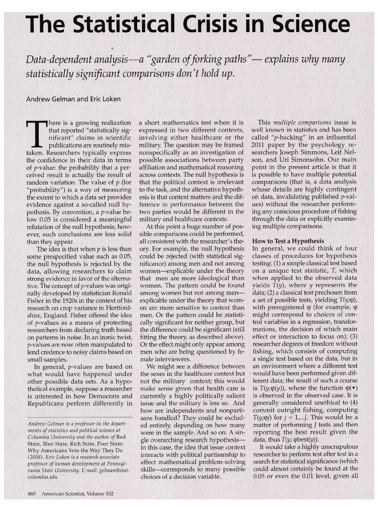
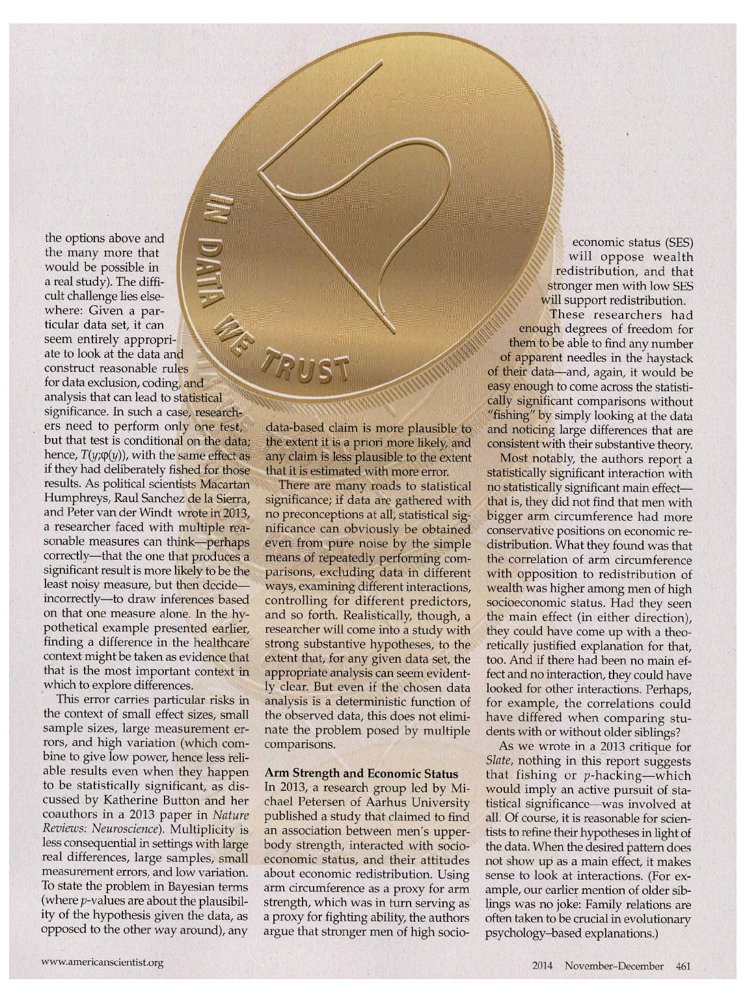
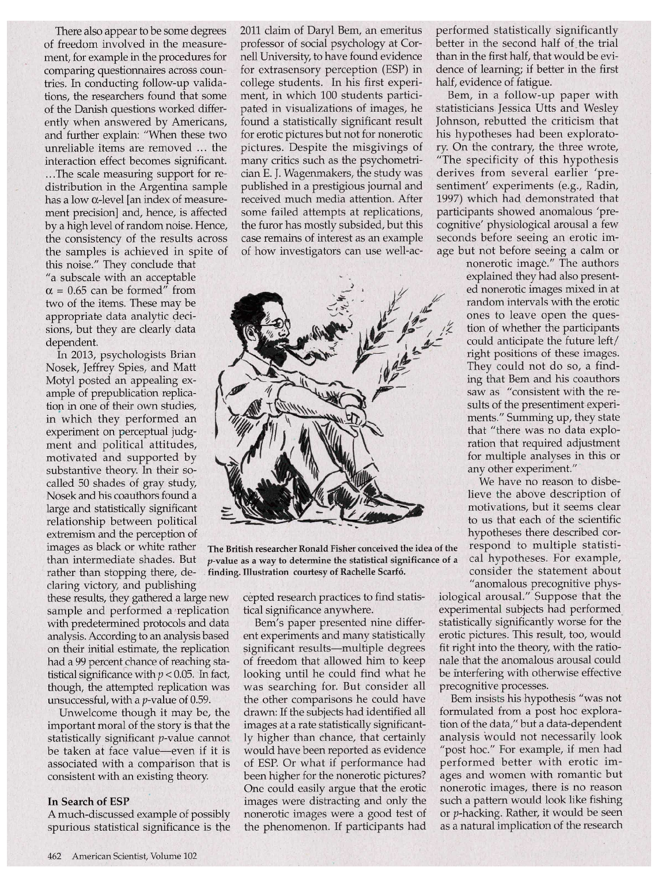
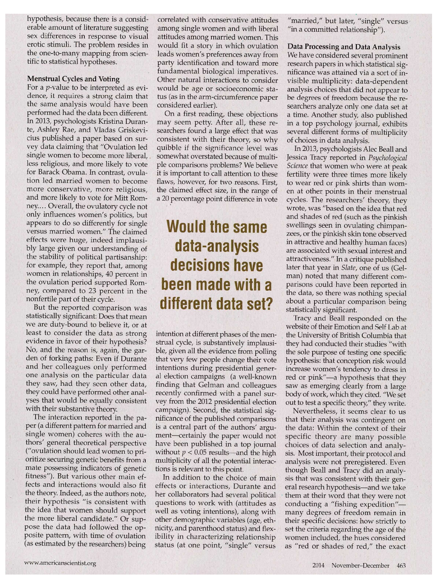
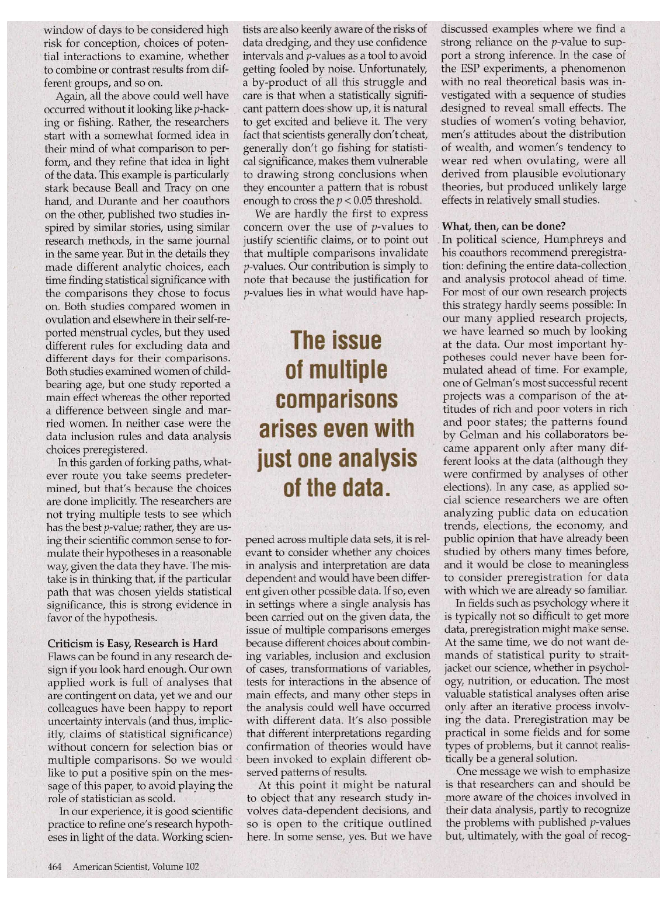
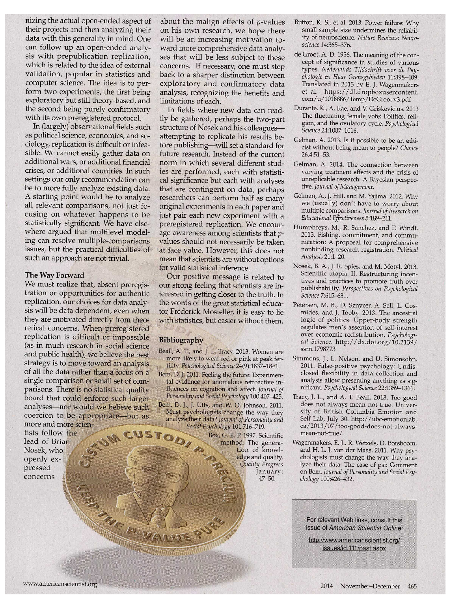

# T he Statistical Crisis in Science

### Data-dependent analysis— a "garden of forking paths" — explains why many statistically significant comparisons don't hold up.

Andrew Gelman and Eric Loken

T

This multiple comparisons issue is well known in statistics and has been called "p-hacking" in an influential 2011 paper by the psychology re searchers Joseph Simmons, Leif Nel son, and Uri Simonsohn. Our main point in the present article is that it is possible to have multiple potential comparisons (that is, a data analysis whose details are highly contingent on data, invalidating published p-values) without the researcher perform ing any conscious procedure of fishing through the data or explicitly examin ing multiple comparisons. How to Test a Hypothesis In general, we could think of four classes of procedures for hypothesis testing: (1) a simple classical test based on a unique test statistic, T, which when applied to the observed data yields T(y), where y represents the data; (2) a classical test prechosen from a set of possible tests, yielding T(y;cp), with preregistered (p (for example, <p might correspond to choices of con trol variables in a regression, transfor mations, the decision of which main effect or interaction to focus on); (3) researcher degrees of freedom without fishing, which consists of computing a single test based on the data, but in an environment where a different test would have been performed given dif ferent data; the result of such a course is T(y;(p(y)), where the function (p(») is observed in the observed case. It is generally considered unethical to (4) commit outright fishing, computing T(y;<p;) for j = 1,.../. This would be a matter of performing / tests and then reporting the best result given the data, thus T(y; cpbest(y)).

a short mathematics test when it is expressed in two different contexts, involving either healthcare or the military. The question may be framed nonspecifically as an investigation of possible associations between party affiliation and mathematical reasoning across contexts. The null hypothesis is that the political context is irrelevant to the task, and the alternative hypoth esis is that context matters and the dif ference in performance between the two parties would be different in the military and healthcare contexts.

here is a growing realization that reported "statistically sig nificant" claims in scientific publications are routinely mis taken. Researchers typically express

the confidence in their data in terms of p-value: the probability that a per ceived result is actually the result of random variation. The value of p (for "probability") is a way of measuring the extent to which a data set provides evidence against a so-called null hy pothesis. By convention, a p-value be low 0.05 is considered a meaningful refutation of the null hypothesis; how ever, such conclusions are less solid than they appear.

At this point a huge number of pos sible comparisons could be performed, all consistent with the researcher's the ory. for example, the null hypothesis could be rejected (with statistical sig nificance) among men and not among women—explicable under the theory that men are more ideological than women. The pattern could be found among women but not among menexplicable under the theory that wom en are more sensitive to context than men. Or the pattern could be statisti cally significant for neither group, but the difference could be significant (still fitting the theory, as described above). Or the effect might only appear among men who are being questioned by fe male interviewers.

The idea is that when p is less than some prespecified value such as 0.05, the null hypothesis is rejected by the data, allowing researchers to claim strong evidence in favor of the alterna tive. The concept of p-values was origi nally developed by statistician Ronald Fisher in the 1920s in the context of his research on crop variance in Hertford shire, England. Fisher offered the idea of p-values as a means of protecting researchers from declaring truth based on patterns in noise. In an ironic twist, p-values are now often manipulated to lend credence to noisy claims based on small samples.

We might see a difference between the sexes in the healthcare context but not the military context; this would make sense given that health care is currently a highly politically salient issue and the military is less so. And how are independents and nonparti sans handled? They could be exclud ed entirely, depending on how many were in the sample. And so on: A sin gle overarching research hypothesisin this case, the idea that issue context interacts with political partisanship to affect mathematical problem-solving skills—corresponds to many possible choices of a decision variable.

In general, p-values are based on what would have happened under other possible data sets. As a hypo thetical example, suppose a researcher is interested in how Democrats and Republicans perform differently in

Andrew Gelman is a professor in the depart ments of statistics and political science at Columbia University and the author o/Red State, Blue State, Rich State, Poor State: Why Americans Vote the Way They Do (2008). Eric Loken is a research associate professor of human development at Pennsyl vania State University. E-mail: gelman@stat. columbia.edu

It would take a highly unscrupulous researcher to perform test after test in a search for statistical significance (which could almost certainly be found at the 0.05 or even the 0.01 level, given all

the options above and the many more that would be possible in a real study). The diffi cult challenge lies else where: Given a par ticular data set, it can seem entirely appropri ate to look at the data and construct reasonable rules for data exclusion, coding, and analysis that can lead to statistic, significance. In such a case, r e s e ll Lit ers need to perform only one test, but that test is conditional on the data; hence, T(y;cp(y)), with the same effect as if they had deliberately fished for those results. As political scientists Macartan Humphreys, Raul Sanchez de la Sierra, and Peter van der Windt wrote in 2013, a researcher faced with multiple rea sonable measures can think—perhaps correctly—that the one that produces a significant result is more likely to be the least noisy measure, but then decideincorrectly—to draw inferences based on that one measure alone. In the hy pothetical example presented earlier, finding a difference in the healthcare context might be taken as evidence that that is the most important context in which to explore differences.

economic status (SES) will oppose wealth

redistribution, and that

stronger men with low SES will support redistribution.

These researchers had

enough degrees of freedom for them to be able to find any number

of apparent needles in the haystack of their data—and, again, it would be easy enough to come across the statisti cally significant comparisons without "fishing" by simply looking at the data and noticing large differences that are consistent with their substantive theory.

data-based claim is more plausible to the extent it is a priori more likely, and any claim is less plausible to the extent that it is estimated with more error.

Most notably, the authors report a statistically significant interaction with no statistically significant main effectthat is, they did not find that men with bigger arm circumference had more conservative positions on economic re distribution. What they found was that the correlation of arm circumference with opposition to redistribution of wealth was higher among men of high socioeconomic status. Had they seen the main effect (in either direction), they could have come up with a theo retically justified explanation for that, too. And if there had been no main ef fect and no interaction, they could have looked for other interactions. Perhaps, for example, the correlations could have differed when comparing stu dents with or without older siblings?

There are many roads to statistical significance; if data are gathered with no preconceptions at all, statistical sig nificance can obviously be obtained even from pure noise by the simple means of repeatedly performing com parisons, excluding data in different ways, examining different interactions, controlling for different predictors, and so forth. Realistically, though, a researcher will come into a study with strong substantive hypotheses, to the extent that, for any given data set, the appropriate analysis can seem evident ly clear. But even if the chosen data analysis is a deterministic function of the observed data, this does not elimi nate the problem posed by multiple comparisons.

This error carries particular risks in the context of small effect sizes, small sample sizes, large measurement er rors, and high variation (which com bine to give low power, hence less reli able results even when they happen to be statistically significant, as dis cussed by Katherine Button and her coauthors in a 2013 paper in Nature Reviews: Neuroscience). Multiplicity is less consequential in settings with large real differences, large samples, small measurement errors, and low variation. To state the problem in Bayesian terms (where p-values are about the plausibil ity of the hypothesis given the data, as opposed to the other way around), any

As we wrote in a 2013 critique for Slate, nothing in this report suggests that fishing or p-hacking—which would imply an active pursuit of sta tistical significance—was involved at all. Of course, it is reasonable for scien tists to refine their hypotheses in light of the data. When the desired pattern does not show up as a main effect, it makes sense to look at interactions. (For ex ample, our earlier mention of older sib lings was no joke: Family relations are often taken to be crucial in evolutionary psychology-based explanations.)

Arm Strength and Economic Status In 2013, a research group led by Mi chael Petersen of Aarhus University published a study that claimed to find an association between men's upperbody strength, interacted with socio economic status, and their attitudes about economic redistribution. Using arm circumference as a proxy for arm strength, which was in turn serving as a proxy for fighting ability, the authors argue that stronger men of high socio

www.amerkansdentist.org 2014 November-December 461

performed statistically significantly better in the second half of the trial than in the first half, that would be evi dence of learning; if better in the first half, evidence of fatigue.

2011 claim of Daryl Bern, an emeritus professor of social psychology at Cor nell University, to have found evidence for extrasensory perception (ESP) in college students. In his first experi ment, in which 100 students partici pated in visualizations of images, he found a statistically significant result for erotic pictures but not for nonerotic pictures. Despite the misgivings of many critics such as the psychometri cian E. J. Wagenmakers, the study was published in a prestigious journal and received much media attention. After some failed attempts at replications, the furor has mostly subsided, but this case remains of interest as an example of how investigators can use well-ac

There also appear to be some degrees of freedom involved in the measure ment, for example in the procedures for comparing questionnaires across coun tries. In conducting follow-up valida tions, the researchers found that some of the Danish questions worked differ ently when answered by Americans, and further explain: "When these two unreliable items are removed ... the interaction effect becomes significant. .. .The scale measuring support for re distribution in the Argentina sample has a low a-level [an index of measure ment precision] and, hence, is affected by a high level of random noise. Hence, the consistency of the results across the samples is achieved in spite of this noise." They conclude that "a subscale with an acceptable a = 0.65 can be formed" from two of the items. These may be appropriate data analytic deci sions, but they are clearly data dependent.

Bern, in a follow-up paper with statisticians Jessica Utts and Wesley Johnson, rebutted the criticism that his hypotheses had been explorato ry. On the contrary, the three wrote, "The specificity of this hypothesis derives from several earlier 'pre sentiment' experiments (e.g., Radin, 1997) which had demonstrated that participants showed anomalous 'precognitive' physiological arousal a few seconds before seeing an erotic im age but not before seeing a calm or

nonerotic image." The authors explained they had also present ed nonerotic images mixed in at random intervals with the erotic ones to leave open the ques tion of whether the participants could anticipate the future left/ right positions of these images. They could not do so, a find ing that Bern and his coauthors saw as "consistent with the re sults of the presentiment experi ments." Summing up, they state that "there was no data explo ration that required adjustment for multiple analyses in this or any other experiment."

In 2013, psychologists Brian Nosek, Jeffrey Spies, and Matt Motyl posted an appealing ex ample of prepublication replica tion in one of their own studies, in which they performed an experiment on perceptual judg ment and political attitudes, motivated and supported by substantive theory. In their socalled 50 shades of gray study, Nosek and his coauthors found a large and statistically significant relationship between political extremism and the perception of images as black or white rather than intermediate shades. But rather than stopping there, de claring victory, and publishing these results, they gathered a large new sample and performed a replication with predetermined protocols and data analysis. According to an analysis based on their initial estimate, the replication had a 99 percent chance of reaching sta tistical significance with p < 0.05. In fact, though, the attempted replication was unsuccessful, with a p-value of 0.59.

We have no reason to disbe lieve the above description of motivations, but it seems clear to us that each of the scientific hypotheses there described cor respond to multiple statisti cal hypotheses. For example, consider the statement about "anomalous precognitive phys

The British researcher Ronald Fisher conceived the idea of the p-value as a way to determine the statistical significance of a finding. Illustration courtesy of Rachelle Scarfo.

iological arousal." Suppose that the experimental subjects had performed statistically significantly worse for the erotic pictures. This result, too, would fit right into the theory, with the ratio nale that the anomalous arousal could be interfering with otherwise effective precognitive processes.

cepted research practices to find statis tical significance anywhere.

Bern's paper presented nine differ ent experiments and many statistically significant results—multiple degrees of freedom that allowed him to keep looking until he could find what he was searching for. But consider all the other comparisons he could have drawn: If the subjects had identified all images at a rate statistically significant ly higher than chance, that certainly would have been reported as evidence of ESP. Or what if performance had been higher for the nonerotic pictures? One could easily argue that the erotic images were distracting and only the nonerotic images were a good test of the phenomenon. If participants had

Bern insists his hypothesis "was not formulated from a post hoc explora tion of the data," but a data-dependent analysis would not necessarily look "post hoc." For example, if men had performed better with erotic im ages and women with romantic but nonerotic images, there is no reason such a pattern would look like fishing or p-hacking. Rather, it would be seen as a natural implication of the research

Unwelcome though it may be, the important moral of the story is that the statistically significant p-value cannot be taken at face value—even if it is associated with a comparison that is consistent with an existing theory.

In Search of ESP

A much-discussed example of possibly spurious statistical significance is the

hypothesis, because there is a consid erable amount of literature suggesting sex differences in response to visual erotic stimuli. The problem resides in the one-to-many mapping from scien tific to statistical hypotheses.

correlated with conservative attitudes among single women and with liberal attitudes among married women. This would fit a story in which ovulation leads women's preferences away from party identification and toward more fundamental biological imperatives. Other natural interactions to consider would be age or socioeconomic sta tus (as in the arm-circumference paper considered earlier).

"married," but later, "single" versus "in a committed relationship").

Data Processing and Data Analysis

We have considered several prominent research papers in which statistical sig nificance was attained via a sort of in visible multiplicity: data-dependent analysis choices that did not appear to be degrees of freedom because the re searchers analyze only one data set at a time. Another study, also published in a top psychology journal, exhibits several different forms of multiplicity of choices in data analysis.

Menstrual Cycles and Voting

For a p-value to be interpreted as evi dence, it requires a strong claim that the same analysis would have been performed had the data been different. In 2013, psychologists Kristina Duran te, Ashley Rae, and Vladas Griskevicius published a paper based on sur vey data claiming that "Ovulation led single women to become more liberal, less religious, and more likely to vote for Barack Obama. In contrast, ovula tion led married women to become more conservative, more religious, and more likely to vote for Mitt Rom ney... . Overall, the ovulatory cycle not only influences women's politics, but appears to do so differently for single versus married women." The claimed effects were huge, indeed implausi bly large given our understanding of the stability of political partisanship: for example, they report that, among women in relationships, 40 percent in the ovulation period supported Rom ney, compared to 23 percent in the nonfertile part of their cycle.

On a first reading, these objections may seem petty. After all, these re searchers found a large effect that was consistent with their theory, so why quibble if the significance level was somewhat overstated because of multi ple comparisons problems? We believe it is important to call attention to these flaws, however, for two reasons. First, the claimed effect size, in the range of a 20 percentage point difference in vote

In 2013, psychologists Alec Beall and Jessica Tracy reported in Psychological Science that women who were at peak fertility were three times more likely to wear red or pink shirts than wom en at other points in their menstrual cycles. The researchers' theory, they wrote, was "based on the idea that red and shades of red (such as the pinkish swellings seen in ovulating chimpan zees, or the pinkish skin tone observed in attractive and healthy human faces) are associated with sexual interest and attractiveness." In a critique published later that year in Slate, one of us (Gelman) noted that many different com parisons could have been reported in the data, so there was nothing special about a particular comparison being statistically significant.

## W ould the sam e data-analysis decisions have been m ade w ith a different data set?

But the reported comparison was statistically significant: Does that mean we are duty-bound to believe it, or at least to consider the data as strong evidence in favor of their hypothesis? No, and the reason is, again, the gar den of forking paths: Even if Durante and her colleagues only performed one analysis on the particular data they saw, had they seen other data, they could have performed other anal yses that would be equally consistent with their substantive theory.

Tracy and Beall responded on the website of their Emotion and Self Lab at the University of British Columbia that they had conducted their studies "with the sole purpose of testing one specific hypothesis: that conception risk would increase women's tendency to dress in red or pink"—a hypothesis that they saw as emerging clearly from a large body of work, which they cited. "We set out to test a specific theory," they write.

intention at different phases of the men strual cycle, is substantively implausi ble, given all the evidence from polling that very few people change their vote intentions during presidential gener al election campaigns (a well-known finding that Gelman and colleagues recently confirmed with a panel sur vey from the 2012 presidential election campaign). Second, the statistical sig nificance of the published comparisons is a central part of the authors' argu ment—certainly the paper would not have been published in a top journal without p <0.05 results—and the high multiplicity of all the potential interac tions is relevant to this point.

Nevertheless, it seems clear to us that their analysis was contingent on the data: Within the context of their specific theory are many possible choices of data selection and analy sis. Most important, their protocol and analysis were not preregistered. Even though Beall and Tracy did an analy sis that was consistent with their gen eral research hypothesis—and we take them at their word that they were not conducting a "fishing expedition"many degrees of freedom remain in their specific decisions: how strictly to set the criteria regarding the age of the women included, the hues considered as "red or shades of red," the exact

The interaction reported in the pa per (a different pattern for married and single women) coheres with the au thors' general theoretical perspective ("ovulation should lead women to pri oritize securing genetic benefits from a mate possessing indicators of genetic fitness"). But various other main ef fects and interactions would also fit the theory. Indeed, as the authors note, their hypothesis "is consistent with the idea that women should support the more liberal candidate." Or sup pose the data had followed the op posite pattern, with time of ovulation (as estimated by the researchers) being

In addition to the choice of main effects or interactions, Durante and her collaborators had several political questions to work with (attitudes as well as voting intentions), along with other demographic variables (age, eth nicity, and parenthood status) and flex ibility in characterizing relationship status (at one point, "single" versus

www.americanscientist.org 2014 November-December 463

discussed examples where we find a strong reliance on the p-value to sup port a strong inference. In the case of the ESP experiments, a phenomenon with no real theoretical basis was in vestigated with a sequence of studies .designed to reveal small effects. The studies of women's voting behavior, men's attitudes about the distribution of wealth, and women's tendency to wear red when ovulating, were all derived from plausible evolutionary theories, but produced unlikely large effects in relatively small studies.

tists are also keenly aware of the risks of data dredging, and they use confidence intervals and p-values as a tool to avoid getting fooled by noise. Unfortunately, a by-product of all this struggle and care is that when a statistically signifi cant pattern does show up, it is natural to get excited and believe it. The very fact that scientists generally don't cheat, generally don't go fishing for statisti cal significance, makes them vulnerable to drawing strong conclusions when they encounter a pattern that is robust enough to cross the p < 0.05 threshold.

window of days to be considered high risk for conception, choices of poten tial interactions to examine, whether to combine or contrast results from dif ferent groups, and so on.

Again, all the above could well have occurred without it looking like p-hacking or fishing. Rather, the researchers start with a somewhat formed idea in their mind of what comparison to per form, and they refine that idea in light of the data. This example is particularly stark because Beall and Tracy on one hand, and Durante and her coauthors on the other, published two studies in spired by similar stories, using similar research methods, in the same journal in the same year. But in the details they made different analytic choices, each time finding statistical significance with the comparisons they chose to focus on. Both studies compared women in ovulation and elsewhere in their self-re ported menstrual cycles, but they used different rules for excluding data and different days for their comparisons. Both studies examined women of child bearing age, but one study reported a main effect whereas the other reported a difference between single and mar ried women. In neither case were the data inclusion rules and data analysis choices preregistered.

We are hardly the first to express concern over the use of p-values to justify scientific claims, or to point out that multiple comparisons invalidate p-values. Our contribution is simply to note that because the justification for p-values lies in what would have hap-

What, then, can be done?

In political science, Humphreys and his coauthors recommend preregistra tion: defining the entire data-collection and analysis protocol ahead of time. For most of our own research projects this strategy hardly seems possible: In our many applied research projects, we have learned so much by looking at the data. Our most important hy potheses could never have been for mulated ahead of time. For example, one of Gelman's most successful recent projects was a comparison of the at titudes of rich and poor voters in rich and poor states; the patterns found by Gelman and his collaborators be came apparent only after many dif ferent looks at the data (although they were confirmed by analyses of other elections). In any case, as applied so cial science researchers we are often analyzing public data on education trends, elections, the economy, and public opinion that have already been studied by others many times before, and it would be close to meaningless to consider preregistration for data with which we are already so familiar.

## The issue of m ultiple com parisons arises even w ith just one analysis of the data.

In this garden of forking paths, what ever route you take seems predeter mined, but that's because the choices are done implicitly. The researchers are not trying multiple tests to see which has the best p-value; rather, they are us ing their scientific common sense to for mulate their hypotheses in a reasonable way, given the data they have. The mis take is in thinking that, if the particular path that was chosen yields statistical significance, this is strong evidence in favor of the hypothesis.

pened across multiple data sets, it is rel evant to consider whether any choices in analysis and interpretation are data dependent and would have been differ ent given other possible data. If so, even in settings where a single analysis has been carried out on the given data, the issue of multiple comparisons emerges because different choices about combin ing variables, inclusion and exclusion of cases, transformations of variables, tests for interactions in the absence of main effects, and many other steps in the analysis could well have occurred with different data. It's also possible that different interpretations regarding confirmation of theories would have been invoked to explain different ob served patterns of results.

In fields such as psychology where it is typically not so difficult to get more data, preregistration might make sense. At the same time, we do not want de mands of statistical purity to straitjacket our science, whether in psychol ogy, nutrition, or education. The most valuable statistical analyses often arise only after an iterative process involv ing the data. Preregistration may be practical in some fields and for some types of problems, but it cannot realis tically be a general solution.

Criticism is Easy, Research is Hard

Flaws can be found in any research de sign if you look hard enough. Our own applied work is full of analyses that are contingent on data, yet we and our colleagues have been happy to report uncertainty intervals (and thus, implic itly, claims of statistical significance) without concern for selection bias or multiple comparisons. So we would like to put a positive spin on the mes sage of this paper, to avoid playing the role of statistician as scold.

One message we wish to emphasize is that researchers can and should be more aware of the choices involved in their data analysis, partly to recognize the problems with published p-values but, ultimately, with the goal of recog-

At this point it might be natural to object that any research study in volves data-dependent decisions, and so is open to the critique outlined here. In some sense, yes. But we have

In our experience, it is good scientific

practice to refine one's research hypoth eses in light of the data. Working scien

nizing the actual open-ended aspect of their projects and then analyzing their data with this generality in mind. One can follow up an open-ended analy sis with prepublication replication, which is related to the idea of external validation, popular in statistics and computer science. The idea is to per form two experiments, the first being exploratory but still theory-based, and the second being purely confirmatory with its own preregistered protocol.

about the malign effects of p-values on his own research, we hope there will be an increasing motivation to ward more comprehensive data analy ses that will be less subject to these concerns. If necessary, one must step back to a sharper distinction between exploratory and confirmatory data analysis, recognizing the benefits and limitations of each.

Button, K. S., et al. 2013. Power failure: Why

small sample size undermines the reliabil ity of neuroscience. Nature Reviews: Neuro science 14:365-376.

de Groot, A. D. 1956. The meaning of the con cept of significance in studies of various types. Nederlands Tijdschrift voor de Psy

chologic en Haar Grensgebieden 11:398-409. Translated in 2013 by E. J. Wagenmakers et al. https://dl.dropboxusercontent. com/u/1018886/Temp/DeGroot v3.pdf

Durante, K., A. Rae, and V. Griskevicius. 2013 The fluctuating female vote: Politics, reli gion, and the ovulatory cycle. Psychological Science 24:1007-1016.

In fields where new data can read ily be gathered, perhaps the two-part structure of Nosek and his colleaguesattempting to replicate his results be fore publishing—will set a standard for future research. Instead of the current norm in which several different stud ies are performed, each with statisti cal significance but each with analyses that are contingent on data, perhaps researchers can perform half as many original experiments in each paper and just pair each new experiment with a preregistered replication. We encour age awareness among scientists that pvalues should not necessarily be taken at face value. However, this does not mean that scientists are without options for valid statistical inference.

In (largely) observational fields such as political science, economics, and so ciology, replication is difficult or infea sible. We cannot easily gather data on additional wars, or additional financial crises, or additional countries. In such settings our only recommendation can be to more fully analyze existing data. A starting point would be to analyze all relevant comparisons, not just fo cusing on whatever happens to be statistically significant. We have else where argued that multilevel model ing can resolve multiple-comparisons issues, but the practical difficulties of such an approach are not trivial.

- Gelman, A. 2013. Is it possible to be an ethicist without being mean to people? Chance 26.4:51-53.
- Gelman, A. 2014. The connection between varying treatment effects and the crisis of unreplicable research: A Bayesian perspec tive. Journal of Management.

Gelman, A., J. Hill, and M. Yajima. 2012. Why we (usually) don't have to worry about multiple comparisons. Journal of Research on Educational Effectiveness 5:189-211.

Humphreys, M., R. Sanchez, and P. Windt.

2013. Fishing, commitment, and commu nication: A proposal for comprehensive nonbinding research registration. Political Analysis 21:1-20.

Nosek, B. A., J. R. Spies, and M. Motyl. 2013. Scientific utopia: II. Restructuring incen tives and practices to promote truth over publishability. Perspectives on Psychological Science 7:615-631.

The Way Forward

Our positive message is related to our strong feeling that scientists are in terested in getting closer to the truth. In the words of the great statistical educa tor Frederick Mosteller, it is easy to lie with statistics, but easier without them.

We must realize that, absent preregis tration or opportunities for authentic replication, our choices for data analy sis will be data dependent, even when they are motivated directly from theo retical concerns. When preregistered replication is difficult or impossible (as in much research in social science and public health), we believe the best strategy is to move toward an analysis of all the data rather than a focus on a single comparison or small set of com parisons. There is no statistical quality board that could enforce such larger analyses—nor would we believe such coercion to be appropriate—but as more and more scien tists follow the . ^ lead of Brian

Petersen, M. B., D. Sznycer, A. Sell, L. Cosmides, and J. Tooby. 2013. The ancestral logic of politics: Upper-body strength regulates men's assertion of self-interest over economic redistribution. Psychologi cal Science, http://dx.doi.org/10.2139/ ssrn.1798773

Bibliography

Beall, A. T., and J. L. Tracy. 2013. Women are more likely to wear red or pink at peak fer tility. Psychological Science 24(9):1837—1841.

Simmons, J., L. Nelson, and U. Simonsohn.

2011. False-positive psychology: Undis closed flexibility in data collection and analysis allow presenting anything as sig nificant. Psychological Science 22:1359-1366.

Bern, D. J. 2011. Feeling the future: Experimen tal evidence for anomalous retroactive in fluences on cognition and affect. Journal of Personality and Social Psychology 100:407-425.

Tracy, J. L., and A. T. Beall. 2013. Too good does not always mean not true. Univer sity of British Columbia Emotion and Self Lab, July 30. http://ubc-emotionlab. ca/2013/ 07/too-good-does-not-alwaysmean-not-true/

Bern, D. J., J. Utts, and W. O. Johnson. 2011. Must psychologists change the way they analyze their data? Journal of Personality and

Social Psychology 101:716-719. Box, G. E. P. 1997. Scientific

# i w

method: The genera tion of knowl edge and quality.

Wagenmakers, E. J., R. Wetzels, D. Borsboom, and H. L. J. van der Maas. 2011. Why psy chologists must change the way they ana lyze their data: The case of psi: Comment on Bern. Journal of Personality and Social Psy chology 100:426-432.

Nosek, who openly ex pressed concerns

Quality Progress January:

47-50.

For relevant Web links, consult this issue of American Scientist Online:

http://www.americanscientist.orn/ issues/id.111/oast.aspx

www.americanscientist.org 2014 November-December 465

