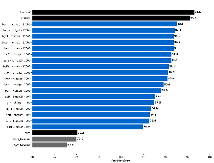
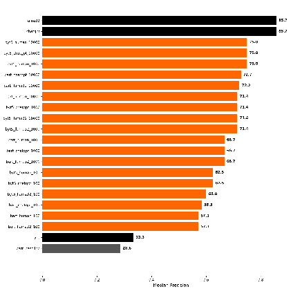
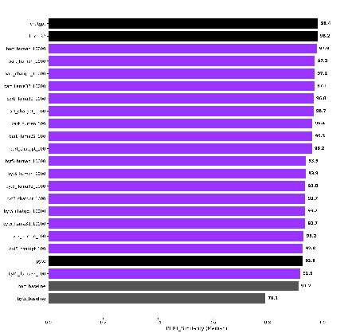

# Bootstrapping AI: Interdisciplinary Approaches to Assessing OCR Quality in English-Language Historical Documents

Samuel E. Backer The University of Maine samuel.backer@maine.edu

Louis Hyman Johns Hopkins University louishyman@jhu.edu

## Abstract

New LLM-based OCR and post-OCR correction methods promise to transform computational historical research, yet their efficacy remains contested. We compare multiple correction approaches, including methods for "bootstrapping" fine-tuning with LLM-generated data, and measure their effect on downstream tasks. Our results suggest that standard OCR metrics often underestimate performance gains for historical research, underscoring the need for discipline-driven evaluations that can better reflect the needs of computational humanists.

## 1 Introduction

Optical Character Recognition (OCR) has long posed challenges for large-scale computational analysis of historical documents, particularly those with difficult-to-parse text. While vision-to-text models such as ChatGPT-4o or LLaMA 3.2 increasingly outperform conventional methods like Tesseract, they remain financially or technically out of reach for many humanities institutions if used at scale. An alternative is to use generative AI for correcting baseline OCR output. While conventional NLP metrics show mixed levels of improvement from Large Language Model (LLM)based correction, historians report dramatic quality gains in anecdotal tests(Humphries, 2023). This discrepancy prompted two central questions: (1) How can we measure post-OCR correction in ways aligned with historians’ needs? (2) Do these methods substantially improve OCR sufficiently to alter downstream tasks? Through experiments on multiple post-OCR correction strategies, including fine-tuning with both human and LLM-generated transcription data, we evaluate standard metrics and explore discipline-specific alternatives.

ysis (Traub et al., 2015; Cordell, 2017; van Strien et al., 2020). Recent developments in large language models have spurred varied approaches to this issue (Rigaud et al., 2019). One body of work has focused on the possibility of using nonspecialized instruct models for improving OCR quality. Testing a wide variety of such models, (Boros et al., 2024) find little improvement and even mild degradation in output quality. However, studies such as Zhang et al. (2024); Kanerva et al. (2025); Bang (2024) challenge this conclusion, reporting substantive benefits, especially for printed, English-language texts from the last several centuries. The source of this discrepancy remains unclear—potential explanations include changes within the models or differences in the application of evaluation metrics. (Manrique-Gómez et al., 2024) expand on such research by incorporating extensive approaches for error identification and analysis in relation to historical Spanish, while (Bourne, 2024) experiments with prompt context, laying out a useful approach to evaluating downstream impact. Another approach, including work by (Booth et al., 2024), (Beshirov et al., 2024), (Hemmer et al., 2024), and (Debaene et al., 2025), has focused on developing methods for fine-tuning local models. Such research, which is often applied to lower-resourced languages or older historical texts, frequently grapples with a paucity of the gold-standard transcriptions necessary for training, requiring engagement with synthetic data that our materials enabled us to avoid. Finally, a set of more recent papers, including (Li, 2024), (Ghiriti et al., 2024) and (Kim et al., 2025) have explored the potential efficacy of vision-to-text models for historical OCR on both typed and hand-written documents.

## 2 Similar Work

Improving OCR accuracy remains a widelyacknowledged critical task for historical text anal-

251

Proceedings of the 5th International Conference on Natural Language Processing for Digital Humanities, pages 251–256 May 3-4, 2025 ©2025 Association for Computational Linguistics

## 3 Materials and Methods

- 3.1 Corpora

Our analysis draws on a collection of correspondence from American Federation of Labor founder, Samuel Gompers, held by the Library of Congress. The complete collection, the vast majority of which has not yet been processed with OCR, contains roughly 500,000 letters. The corpus consists of high-quality scans of low-quality documents initially preserved for office use in a letter-press book. From this collection, roughly 20,000 letters have been transcribed by volunteers from the Library’s “We The People” crowd-sourced project. These letters provided a large set of gold-quality data for testing and training (Library of Congress, Manuscript Division, n.d.). We used 10,000 of these documents as a training set and another 1,000 as a testing set. Each letter contained, on average, 134.4 words.

- 3.2 Methods

- 3.2.1 OCR

As a baseline for "conventional" OCR, we used Google’s Tesseract engine, running it over the entirety of both the training and testing sets (Smith, 2007). In addition, we applied the vision-to-text models LLaMA 3.2 and ChatGPT-4o, as well as a version of text-to-text ChatGPT-4o, over the same materials (Dubey et al., 2024; Achiam et al., 2023). We then trained local BART and ByT5 models using three different quantities of training data (100, 1,000, and 10,000 examples), with both "gold" (human) and "silver" (LLaMA/ChatGPT) transcriptions (Lewis, 2019; Xue et al., 2022). Each training pair consisted of Tesseract-generated OCR as input and either human, ChatGPT, or LLaMA transcription as the target. We then used these trained models to correct Tesseract OCR on the 1,000 test documents, comparing the results to gold-standard human transcriptions. Computation used 48 CPU nodes for PyTesseract, four NVIDIA A100 GPUs with 80 GB of memory for training, and one L40S GPU with 48 GB of memory for inference.

- 3.2.2 Measurement

In order to evaluate OCR improvement, we measured the accuracy of the new transcriptions using the standard metrics of Character Error Rate (CER) and Word Error Rate (WER). Both CER and WER are based on normalizing the Levenshtein distance between the output and reference against the length

of the reference (Neudecker et al., 2021).

Insertions + Deletions + Substitutions Total Reference Length

CER/WER =

(1) In addition, we also employed precision as a key

unordered metric, as discussed below.

True Positives True Positives + False Positives

Precision =

(2)

- 3.2.3 Downstream Tasks: Named Entity Recognition and Word Embeddings

To assess how OCR quality influenced downstream humanities tasks, we focused on Named Entity Recognition (NER) and word embeddings as representative examples. Using spaCy, we extracted named entities from both the human-transcribed and the AI-corrected OCR (Honnibal and Montani, 2017). To evaluate semantic change, we measured the cosine similarity between BERT embeddings as an indication of the relative difference between textual variants. All ground-truth texts and OCR outputs were tokenized using the Hugging Face BertTokenizerFast for the bert-large-uncased model (Devlin et al., 2019; Wolf et al., 2020) and evaluated using scikit-learn (Pedregosa et al., 2011).

cos(θ) =

A · B ∥A∥∥B∥

(3)

4 Results and Analysis

- 4.1 Basic OCR Evaluation

As can be seen in Table 1, the vision to text models employed were the clear leaders in both CER and WER, demonstrating a significant level of increased accuracy over both the baseline Tesseract and the post-OCR correction models. These results support a growing consensus from existing literature, while extending it to poorly printed correspondence rather than handwritten texts (Humphries et al., 2024). ChatGPT-4o likewise boasted a solid performance, marking a 42 percent improvement over the Tesseract WER average and 68 percent over the median. Similarly, it decreased the CER by 15 percent on average and 41 percent over the median. While this substantive improvement reflects the conclusions of some current scholarship, it pushes back against the conclusion of state-ofthe-field analysis such as that presented in (Boros

et al., 2024). Given that the most significant difference between our experiment and theirs was the change from ChatGPT-4 to ChatGPT-4o, this new finding illustrates the speed of improvement among state-of-the-art LLMs for such tasks.

### 4.2 Bootstrapped Fine Tuning

We also sought to explore the possibility of finetuning open-source BART and ByT5 model for the same type of post-OCR corrections. For such tuning, we used text transcribed by humans (gold) and multimodal large language models (MMLLM) (silver), repeating the experiment with 100, 1000, and 10,000 documents. In doing so, we sought to discern whether it might be possible to replace expensive human transcription with larger amounts of machine-generated data, "bootstrapping" finetuning while avoiding the computational expense of running an MMLLM against hundreds of thousands of documents. Exploratory qualitative assessments suggested impressive results. Despite this, standard NLP error metrics instead showed a significant decline in quality, not only when compared to other post-OCR correction methods but also against raw Tesseract output. As can be seen in Table 1, only the median WER of the three 10K models showed a modest improvement over the basic Tesseract output, an increase that ranged from 31 to 35 percent. Meanwhile, even the best ByT5 models had error rates of over 80 percent. Examined on its own terms however, the difference produced by using gold (human-transcribed) versus silver (MMLLM-generated) data for fine-tuning was relatively small. While the human-trained model outperformed the BART-LLaMA and BART-GPT trained models on average, the median CER and WER results were much closer. This was especially true for models trained on 10,000 documents, where both the median CER and WER of all three were within three percent. Importantly, using a larger amount of MMLLM-generated data allowed us to train models that outperformed human-trained models produced with less data.

### 4.3 Precision As Better Metric For Historians

Both WER and CER metrics emerged from the evaluation needs of speech recognition and machine translation. Historical inquiry, however, has a different set of requirements. Historical sources are usually incomplete. Absence (false negatives) is expected (Guldi, 2023). Historians—though they do not use such terminology—prioritize precision

over other measurements like recall or Levenshtein distance because the basic analytical methods of the discipline are built around the high likelihood of missing information (false negatives), but not fabrication (false positives). Precision, therefore, is the correct metric to emphasize true positives. As historians, precision, unlike other metrics, aligns more closely with our qualitative reading of the OCR corrections. Based on this distinction, we examined the precision of the top models from the previous experiment. As can be seen in Figure 1, the results are substantively different from CER/WER. Across all the models, as seen in Figure 1, training, of any sort, improved the models’ corrections over Tesseract, with the best fine-tuned models marking improvements of over 30 percent. Indeed, these open-source models are actually relatively competitive with the top vision-to-text models. The best model, a BART model trained on 10,000 examples of LLaMA data, delivered a precision of 92.6 compared to ChatGPT-4o (95.6) or LLaMA (96.5).

Figure 1: Median Precision OCR

### 4.4 Downstream Tasks

To further test the potential value of precision as an alternate metric, we examined how model outputs affected downstream humanistic tasks, using named entity recognition as a proxy for the basic interests of archival history. As seen in Figure 2, the two vision-to-text models are still superior, with a 157 percent increase over Tesseract, and a 14 percent gap with the nearest fine-tuned model. Once again, fine-tuning both the BART and ByT5 models marks a significant improvement over the baseline, with little difference between gold and silver quality training data. Finally, the ByT5 model, which was worse than the BART model in both error rates

Table 1: Standard OCR Performance Metrics—LLMs + Trained BART

Model Avg. WER (%) WER Std (%) Median WER (%) Avg. CER (%) CER Std (%) Median CER (%) Tesseract 35.6 51.5 23.9 20.1 35.2 9.4 ChatGPT Vision 12.0 18.5 5.8 9.2 18.0 3.5 Llama32 10.2 15.4 6.4 7.3 13.7 4.3 ChatGPT Text-To-Text 20.3 38.9 7.6 17.1 37.6 5.5 BART-Human 100 57.0 54.3 50.7 41.1 35.2 35.7 BART-Human 1000 40.1 52.7 29.4 31.7 36.0 22.4 BART-Human 10000 29.1 54.5 15.9 27.3 89.9 12.3 BART-LLaMA 100 58.9 54.6 51.9 42.7 34.9 37.8 BART-LLaMA 1000 48.3 47.2 40.8 37.2 32.6 30.1 BART-LLaMA 10000 34.7 90.5 15.5 30.3 84.6 10.8 BART-ChatGPT 100 57.2 54.4 51.0 41.1 35.0 35.8 BART-ChatGPT 1000 48.0 49.1 40.0 36.6 33.9 29.2 BART-ChatGPT 10000 40.9 90.0 16.4 38.5 107.2 13.2

Figure 2: Median Precision NER

Figure 3: Median BERT Similarity

and precision, turned out to be slightly better for NER, a result that might reflect the BART model’s propensity to hallucinate.

Beyond the simple metric of NER precision, we also sought to understand the semantic meaning of changes to the text created by OCR correction via word embeddings (Bourne, 2024). We used a BERT model to calculate the embeddings of text from the OCR and then compared that with embeddings from the human-annotated ground-truth. As seen in Figure 3, the median cosine similarity of the top trained models not only offers an increase in accuracy of 5 percent over Tesseract, but comes within 0.5 percent of a multimodal flagship model. While AI-corrected OCR might have higher word and character error rates, semantically they are nearly identical. Despite divergence in the

upstream data sources, the downstream tasks show less divergence in performance.

## 5 Conclusion

While these experiments show the efficacy of some forms of LLM-based OCR correction for improving OCR accuracy, our methods of fine-tuning BART and ByT5 models produced results close to, but not quite as good as, those of current stateof-the-art models. They did, however, demonstrate that fine-tuning with silver-quality OCR data produces results comparable to results with smaller quantities of human-generated text. This finding presents a path forward for lower-resourced researchers and institutions, while casting doubt on the continued necessity of large-scale human transcription through crowdsourcing. Trade-offs exist

between computational cost and accuracy, but the choice over those trade-offs should be made by informed researchers with a clear sense of their specific downstream tasks. With more optimized training techniques, we hope our results can be further refined, closing the gap between our low-cost method and the flagship multimodal large language models.

In addition, our comparison between the traditional metrics of CER/WER and a "historically specific" focus on precision indicates the importance of multiple, discipline-specific (or at least task-specific) frameworks for evaluating OCR quality. According to edit-distance-based metrics, even the best of our fine-tuned models underperformed the Tesseract baseline. However, when considering the impact of these same changes on downstream tasks, both NER precision and embedding similarity showed improvements, suggesting a significant semantic change not adequately captured by CER/WER. Ultimately, we believe that this work demonstrates the importance of a robust interdisciplinary conversation on how—and for what—NLP is being used within the humanities.

## Acknowledgements

We gratefully acknowledge the support of a seed grant from the Data Science and Artificial Intelligence Institute at Johns Hopkins University, as well as the Center for Economy and Society at Johns Hopkins University for supporting our computational costs.

## References

Josh Achiam, Steven Adler, Sandhini Agarwal, Lama Ahmad, Ilge Akkaya, Florencia Leoni Aleman, Diogo Almeida, Janko Altenschmidt, Sam Altman, Shyamal Anadkat, et al. 2023. Gpt-4 technical report. arXiv preprint arXiv:2303.08774.

Kunga Bang. 2024. Exploring generative large language models for post-ocr enhancement of historical texts.

Angel Beshirov, Milena Dobreva, Dimitar Dimitrov, Momchil Hardalov, Ivan Koychev, and Preslav Nakov. 2024. Post-ocr text correction for bulgarian historical documents. arXiv preprint arXiv:2409.00527.

Callum William Booth, Alan Thomas, and Robert Gaizauskas. 2024. Bln600: A parallel corpus of machine/human transcribed nineteenth century newspaper texts. In Proceedings of the 2024 Joint International Conference on Computational Linguistics, Language Resources and Evaluation (LRECCOLING 2024), pages 2440–2446.

Emanuela Boros, Maud Ehrmann, Matteo Romanello, Sven Najem-Meyer, and Frédéric Kaplan. 2024. Postcorrection of historical text transcripts with large language models: An exploratory study. LaTeCH-CLfL 2024, pages 133–159.

Jonathan Bourne. 2024. Clocr-c: Context leveraging ocr correction with pre-trained language models. arXiv preprint arXiv:2408.17428.

Ryan Cordell. 2017. " q i-jtb the raven": Taking dirty ocr seriously. Book History, 20(1):188–225.

Florian Debaene, Aaron Maladry, Els Lefever, and Veronique Hoste. 2025. Evaluating transformers for ocr post-correction in early modern dutch theatre. In Proceedings of the 31st International Conference on Computational Linguistics, pages 10367–10374.

Jacob Devlin, Ming-Wei Chang, Kenton Lee, and Kristina Toutanova. 2019. Bert: Pre-training of deep bidirectional transformers for language understanding. In Proceedings of the 2019 conference of the North American chapter of the association for computational linguistics: human language technologies, volume 1 (long and short papers), pages 4171–4186.

Abhimanyu Dubey, Abhinav Jauhri, Abhinav Pandey, Abhishek Kadian, Ahmad Al-Dahle, Aiesha Letman, Akhil Mathur, Alan Schelten, Amy Yang, Angela Fan, et al. 2024. The llama 3 herd of models. arXiv preprint arXiv:2407.21783.

Alex Ghiriti, Wolfgang Göderle, and Roman Kern. 2024. Exploring the capabilities of gpt4-vision as ocr engine. In International Conference on Theory and Practice of Digital Libraries, pages 3–12. Springer.

Jo Guldi. 2023. The dangerous art of text mining: A methodology for digital history. Cambridge University Press.

Arthur Hemmer, Mickaël Coustaty, Nicola Bartolo, and Jean-Marc Ogier. 2024. Confidence-aware document ocr error detection. In International Workshop on Document Analysis Systems, pages 213–228. Springer.

Matthew Honnibal and Ines Montani. 2017. spaCy 2: Natural language understanding with Bloom embeddings, convolutional neural networks and incremental parsing. To appear.

Mark Humphries. 2023. History and generative ai. Teaching History, 57(3):4–9.

Mark Humphries, Lianne C Leddy, Quinn Downton, Meredith Legace, John McConnell, Isabella Murray, and Elizabeth Spence. 2024. Unlocking the archives: Using large language models to transcribe handwritten historical documents. arXiv preprint arXiv:2411.03340.

Jenna Kanerva, Cassandra Ledins, Siiri Käpyaho, and Filip Ginter. 2025. Ocr error post-correction with llms in historical documents: No free lunches. arXiv preprint arXiv:2502.01205.

Seorin Kim, Julien Baudru, Wouter Ryckbosch, Hugues Bersini, and Vincent Ginis. 2025. Early evidence of how llms outperform traditional systems on ocr/htr tasks for historical records. arXiv preprint arXiv:2501.11623.

Mike Lewis. 2019. Bart: Denoising sequence-tosequence pre-training for natural language generation, translation, and comprehension. arXiv preprint arXiv:1910.13461.

Lucian Li. 2024. Handwriting recognition in historical documents with multimodal llm. arXiv preprint arXiv:2410.24034.

Library of Congress, Manuscript Division. n.d. American Federation of Labor Records. https://crowd. loc.gov/campaigns/afl/.

Laura Manrique-Gómez, Tony Montes, Arturo Rodríguez-Herrera, and Rubén Manrique. 2024. Historical ink: 19th century latin american spanish newspaper corpus with llm ocr correction. arXiv preprint arXiv:2407.12838.

Clemens Neudecker, Konstantin Baierer, Mike Gerber, Christian Clausner, Apostolos Antonacopoulos, and Stefan Pletschacher. 2021. A survey of ocr evaluation tools and metrics. In Proceedings of the 6th International Workshop on Historical Document Imaging and Processing, pages 13–18.

Fabian Pedregosa, Gaël Varoquaux, Alexandre Gramfort, Vincent Michel, Bertrand Thirion, Olivier Grisel, Mathieu Blondel, Peter Prettenhofer, Ron Weiss, Vincent Dubourg, et al. 2011. Scikit-learn: Machine learning in python. the Journal of machine Learning research, 12:2825–2830.

Christophe Rigaud, Antoine Doucet, Mickaël Coustaty, and Jean-Philippe Moreux. 2019. Icdar 2019 competition on post-ocr text correction. In 2019 international conference on document analysis and recognition (ICDAR), pages 1588–1593. IEEE.

Ray Smith. 2007. An overview of the tesseract ocr engine. In Ninth international conference on document analysis and recognition (ICDAR 2007), volume 2, pages 629–633. IEEE.

Myriam C Traub, Jacco Van Ossenbruggen, and Lynda Hardman. 2015. Impact analysis of ocr quality on research tasks in digital archives. In Research and Advanced Technology for Digital Libraries: 19th International Conference on Theory and Practice of Digital Libraries, TPDL 2015, Pozna´n, Poland, September 14-18, 2015, Proceedings 19, pages 252– 263. Springer.

Daniel van Strien, Kaspar Beelen, Mariona Coll Ardanuy, Kasra Hosseini, Barbara McGillivray, and Giovanni Colavizza. 2020. Assessing the impact of ocr quality on downstream nlp tasks. In Proceedings of the 12th International Conference on Agents and Artificial Intelligence - Volume 1: ARTIDIGH, pages 484–496. INSTICC, SciTePress.

Thomas Wolf, Lysandre Debut, Victor Sanh, Julien Chaumond, Clement Delangue, Anthony Moi, Pierric Cistac, Tim Rault, Rémi Louf, Morgan Funtowicz, et al. 2020. Transformers: State-of-the-art natural language processing. In Proceedings of the 2020 conference on empirical methods in natural language processing: system demonstrations, pages 38–45.

Linting Xue, Aditya Barua, Noah Constant, Rami AlRfou, Sharan Narang, Mihir Kale, Adam Roberts, and Colin Raffel. 2022. Byt5: Towards a token-free future with pre-trained byte-to-byte models. Transactions of the Association for Computational Linguistics, 10:291–306.

James Zhang, Wouter Haverals, Mary Naydan, and Brian W Kernighan. 2024. Post-ocr correction with openai’s gpt models on challenging english prosody texts. In Proceedings of the ACM Symposium on Document Engineering 2024, pages 1–4.

