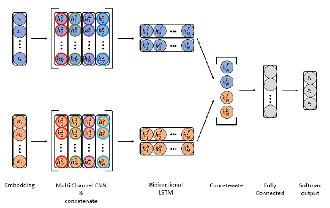
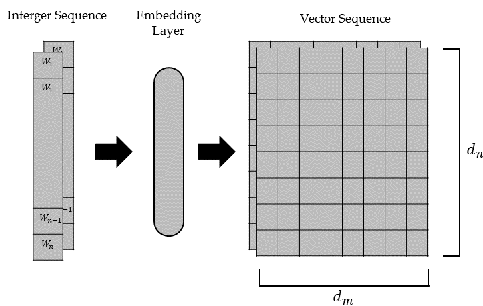
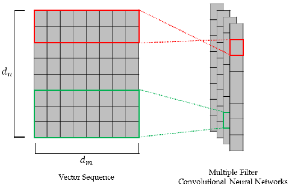
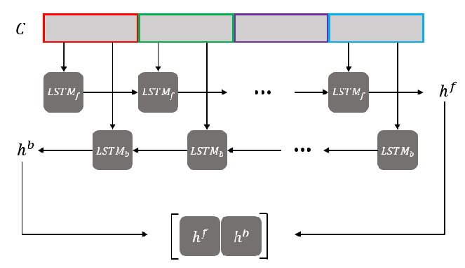

# applied sciences

Article

## Automatic Word Spacing of Korean Using Syllable and Morpheme

### Jeong-Myeong Choi 1,2 , Jong-Dae Kim 1,2, Chan-Young Park 1,2 and Yu-Seop Kim 1,2,*

Citation: Choi, J.-M.; Kim, J.-D.; Park, C.-Y.; Kim, Y.-S. Automatic Word Spacing of Korean Using Syllable and Morpheme. Appl. Sci. 2021, 11, 626. https://doi.org/ 10.3390/app11020626

Received: 8 December 2020 Accepted: 7 January 2021 Published: 11 January 2021

Publisher’s Note: MDPI stays neutral with regard to jurisdictional claims in published maps and institutional affiliations.

Copyright: © 2021 by the authors. Licensee MDPI, Basel, Switzerland. This article is an open access article distributed under the terms and conditions of the Creative Commons Attribution (CC BY) license (https:// creativecommons.org/licenses/by/ 4.0/).

- 1 Department of Convergence Software, Hallym University, Chuncheon-si, Gangwon-do 24252, Korea; M20042@hallym.ac.kr (J.-M.C.); kimjd@hallym.ac.kr (J.-D.K.); cypark@hallym.ac.kr (C.-Y.P.)
- 2 BIT Research Center, Hallym University, Chuncheon-si, Gangwon-do 24252, Korea

* Correspondence: yskim01@hallym.ac.kr; Tel.: +82-10-2901-7043

Abstract: In Korean, spacing is very important to understand the readability and context of sentences. In addition, in the case of natural language processing for Korean, if a sentence with an incorrect spacing is used, the structure of the sentence is changed, which affects performance. In the previous study, spacing errors were corrected using n-gram based statistical methods and morphological analyzers, and recently many studies using deep learning have been conducted. In this study, we try to solve the spacing error correction problem using both the syllable-level and morpheme-level. The proposed model uses a structure that combines the convolutional neural network layer that can learn syllable and morphological pattern information in sentences and the bidirectional long shortterm memory layer that can learn forward and backward sequence information. When evaluating the performance of the proposed model, the accuracy was evaluated at the syllable-level, and also precision, recall, and f1 score were evaluated at the word-level. As a result of the experiment, it was confirmed that performance was improved from the previous study.

Keywords: spacing correction; syllable embedding; morpheme embedding; convolutional neural network; bidirectional long short-term memory

### 1. Introduction

Word spacing is the boundary between words that construct a sentence. Text data with spacing errors can affect performance in various natural language processing (NLP) tasks. For example, two sentences, “abeoji-ga bang-e deuleoga-sin-da” (Father enters the room) and “abeoji gabang-e deuleoga-sin-da” (Father enters the bag), have only difference in word spacing, but the semantics of the two sentences are completely different. Therefore, it is important to reduce semantic ambiguity in the sentences by finding correct spaces before performing NLP tasks. Even in the case of speech-to-text, there are frequent spacing errors. A more complete sentence can be generated by performing spacing correction with speech-to-text post-processing.

Research on the correction of Korean word spacing is evolving from a rule-based, statisticalbased, and probability-based method [1–4] to a deep neural network method [5–13]. A word dictionary is constructed, and the word dictionary is searched by moving the sentence at the syllable level, and the spacing result is generated based on word score. In addition, this study proposed a method to improve performance by applying heuristic algorithms [1]. There was a study that corrected word spacing by using probability weights through the bi-gram and voting method to determine where to insert spacing [2]. There was a study that suggested a word spacing model using a structural support vector machine (SVM) by attaching syllable-based part-of-speech (POS) tags to sentences with no spacing [3]. The word spacing correction problem was defined as a sequence labeling problem, and a conditional random field (CRF), which has an excellent performance in solving the sequence labeling problem and was applied to the word spacing correction [4]. The data composed of morpheme-level was converted to a POS tag at the syllable-level, and the data were composed using syllable and noun unit n-gram and POS distribution vector

Appl. Sci. 2021, 11, 626. https://doi.org/10.3390/app11020626 https://www.mdpi.com/journal/applsci

Appl. Sci. 2021, 11, x FOR PEER REVIEW 2 of 10

Appl. Sci. 2021, 11, 626 2 of 10

[4]. The data composed of morpheme-level was converted to a POS tag at the syllablelevel, and the data were composed using syllable and noun unit n-gram and POS distribution vector as additional features. Then, a method of correcting the word spacing error was proposed through an architecture in which bidirectional LSTM (Bi-LSTM) and CRF were combined [6]. There was a study that proposed a method of correcting word spacing errors using a sequence-to-sequence model, specialized in processing complex and large sequence data by stacking LSTMs [9].

as additional features. Then, a method of correcting the word spacing error was proposed through an architecture in which bidirectional LSTM (Bi-LSTM) and CRF were combined [6]. There was a study that proposed a method of correcting word spacing errors using a sequence-to-sequence model, specialized in processing complex and large sequence data by stacking LSTMs [9].

Most previous studies construct the word spacing system using one of the features of syllables, words, and morphemes in sentences. In addition, the model of previous studies was constructed using convolutional neural networks (CNN), recurrent neural networks (RNN), and CRF. There are studies that show better performance using both CNN and LSTM in combination than to construct a model using them individually [10,11]. In addition, there is a study in which the structure that combines CNN and LSTM outperforms the structure that combined LSTM and CRF in the part-of-speech tagging task that detects metaphors in sentences [12]. Therefore, we constructed a model of the architecture that combines CNN and Bi-LSTM. We extracted local features of syllables and morphemes using multiple filter CNN and extracted order information through Bi-LSTM. It concatenates the LSTM output of syllables and morphemes information, passes through the fully connected layer, and finally outputs the space tag.

Most previous studies construct the word spacing system using one of the features of syllables, words, and morphemes in sentences. In addition, the model of previous studies was constructed using convolutional neural networks (CNN), recurrent neural networks (RNN), and CRF. There are studies that show better performance using both CNN and LSTM in combination than to construct a model using them individually [10,11]. In addition, there is a study in which the structure that combines CNN and LSTM outperforms the structure that combined LSTM and CRF in the part-of-speech tagging task that detects metaphors in sentences [12]. Therefore, we constructed a model of the architecture that combines CNN and Bi-LSTM. We extracted local features of syllables and morphemes using multiple filter CNN and extracted order information through Bi-LSTM. It concatenates the LSTM output of syllables and morphemes information, passes through the fully connected layer, and finally outputs the space tag.

The rest of this paper is organized as follows. Section 2 describes the characteristics, collection, and preprocessing of the Korean text dataset. In Section 3, we describe the model architecture used for word spacing correction. In Section 4, we compare the experimental results with the proposed model with existing studies. Finally, we present the conclusion and future work of this study in Section 5.

The rest of this paper is organized as follows. Section 2 describes the characteristics, collection, and preprocessing of the Korean text dataset. In Section 3, we describe the model architecture used for word spacing correction. In Section 4, we compare the experimental results with the proposed model with existing studies. Finally, we present the conclusion and future work of this study in Section 5.

#### 2. Data

### 2. Data

The text data are Korean sentences and are divided into three levels: Syllable, morpheme, and word. Table 1 is an example of dividing the sentence “abeoji-ga bang-e deuleoga-sin-da” (Father enters the room) in syllable, morpheme, and word. “/” means the delimiter separating each level. A syllable is a unit of speech that the speaker and listener think of as a bundle. It is larger than a phoneme and smaller than a word (morpheme). In Korean, syllables consist of consonants and vowels or a single vowel. In the Table 1 example sentence, syllables are [a, beo, ji, -ga, bang, -e, deul, eo, ga, sin, -da]. A morpheme is the smallest unit of speech that has meaning, and each separate morpheme has a meaning. Morphemes are [abeoji, -ga, bang, -e, deuleoga, sin-da]. Words (usually called eo-jeol in Korean) usually coincide with the unit of spacing and may be formed by attaching a josa to a che-on (noun, pronoun, number in English) or attaching an ending to the stem. Words are [abeoji-ga, bang-e, deuleoga-sin-da]. Syllable and morpheme level are used as input features. In addition, since word-level is a spacing unit, it is used to evaluate whether the word spacing is corrected.

The text data are Korean sentences and are divided into three levels: Syllable, morpheme, and word. Table 1 is an example of dividing the sentence “abeoji-ga bang-e deuleoga-sin-da” (Father enters the room) in syllable, morpheme, and word. “/” means the delimiter separating each level. A syllable is a unit of speech that the speaker and listener think of as a bundle. It is larger than a phoneme and smaller than a word (morpheme). In Korean, syllables consist of consonants and vowels or a single vowel. In the Table 1 example sentence, syllables are [a, beo, ji, -ga, bang, -e, deul, eo, ga, sin, -da]. A morpheme is the smallest unit of speech that has meaning, and each separate morpheme has a meaning. Morphemes are [abeoji, -ga, bang, -e, deuleoga, sin-da]. Words (usually called eo-jeol in Korean) usually coincide with the unit of spacing and may be formed by attaching a josa to a che-on (noun, pronoun, number in English) or attaching an ending to the stem. Words are [abeoji-ga, bang-e, deuleoga-sin-da]. Syllable and morpheme level are used as input features. In addition, since word-level is a spacing unit, it is used to evaluate whether the word spacing is corrected.

Table 1. Examples of Korean text levels. Level Example

Table 1. Examples of Korean text levels.

Level Example Sentence

아버지가 방에 들어가신다. (Father-nominative bang-locative enter-honorific-ending.) Pronunciation abeoji-ga bang-e deuleoga-sin-da.

.

Sentence

(Father-nominative bang-locative enter-honorific-ending.) Pronunciation abeoji-ga bang-e deuleoga-sin-da.

English Father enters the room

English Father enters the room Word abeoji-ga/bang-e/deuleoga-sin-da. Morpheme abeoji/-ga/bang/-e/deuleoga/sin-da/. Syllable a/beo/ji/-ga/bang/-e/deul/eo/ga/sin/-da/.

Word abeoji-ga/bang-e/deuleoga-sin-da. Morpheme abeoji/-ga/bang/-e/deuleoga/sin-da/.

Syllable a/beo/ji/-ga/bang/-e/deul/eo/ga/sin/-da/.

Most of the word spacing correction studies use Sejong corpus data. The Sejong corpus is data provided by the National Institute of Korean Language and has two categories,

Most of the word spacing correction studies use Sejong corpus data. The Sejong corpus is data provided by the National Institute of Korean Language and has two categories, written and spoken language [14]. The written language corpus consists of newspapers or magazines. Spelling and word spacing rules of sentences are relatively better than the

spoken language corpus. That is why the Sejong written language corpus is used in the study. In addition, we crawled and collected news articles with good spacing rules.

The collected Sejong corpus and news articles have HTML tags, special characters, etc., which are not necessary to process word spacing. We removed the HTML tags and special characters. We have not removed the frequently used special characters such as quotes, commas, periods, etc. The same preprocessing was applied to both data collected. After the preprocessing was completed, about 3 million sentences from the Sejong corpus and about 7 million sentences from collected news articles were combined to form a total of about 10 million sentences. The total number of words was about 12 million, and the number of syllables was about 46 million.

Table 2 is a statistical value of the number of syllables and words appearing in each preprocessed sentence. The maximum number of syllables in a sentence is 350, which is very different from the average number of syllables 39.183. If all sentences are padded with a maximum syllable length of 350 to be used as an input sentence of the model, a gradient vanishing problem may occur because the padding value occupies a large proportion of the sentence. Therefore, we reconstructed the sentences thus that they can have similar lengths. When deciding whether or not there is spacing, not all words in a sentence are needed, only 2–3 words before and after. Through this idea, we reconstructed the sentences thus that they could have 6 to 13 words to sample sentences of similar length. It was completed by slicing 6 to 13 words from the beginning of the document continuously. The maximum number of syllables in reconstructed sentences is 76. If the reconstructed sentences are padded with the same length, the proportion of the padding value is smaller than before, thus the gradient vanishing problem is partially compensated. In this way, the processing was performed by removing unnecessary elements from the sentence and sampling sentences with similar length. Finally, the number of sentences used in this study is 13 million.

Table 2. The average and maximum value of the number of syllables and words in each sentence.

Level Average Max syllable 39.183 350 word 9.333 79

### 3. Word Spacing Correction Model

In this Section, the input/output process of the model used for word spacing correction training is explained, and the overall architecture of the model is shown in Figure 1. We have shared the model structure used in this study on the github repository (https://github. com/JeongMyeong/KoAutoSpacing-KAS). Detailed model parameters are described in the experiment Section.

Appl. Sci. 2021, 11, x FOR PEER REVIEW 4 of 10

Figure 1. Word spacing correction model architecture.

Figure 1. Word spacing correction model architecture.

3.1. Integer Encoding

This study defined the problem of correcting Korean word spacing as a sequence labeling problem that sequentially attaches spacing tags to syllables in sentences. We used two input types of sequence information in sentences to train the word spacing correction model. The first is a sequence in which syllables in a sentence are encoded as integers, and the second is a sequence in which morphemes are encoded as integers. For example, “abeoji-ga bang-e deoleoga-sin-da.” (“Father entered the room”) when there is a sentence, Table 3 and Table 4 show examples of encoding sentences using syllable and morpheme encoding values. The maximum value of integer encoding of syllables is defined as the unique count of all syllables appearing in the training data. However, since the type of morphemes is limited according to the morpheme analyzer used, the number of unique integers is limited. We represented the morpheme sequence as an integer with the start, middle, and end of the morpheme. For example, if the start of the morpheme is an integer 𝑁, the middle is set to 𝑁, and the end is set to 𝑁 + 1. Therefore, the start and end of the morpheme can be known through the encoded integers.

- Table 3. Morpheme level encoding example. Morpheme Start Middle End

Common Noun 1 1 2 Nominative postposition 3 3 4

Adverbial postposition 5 5 6 Verb 7 7 8

Prefinal ending 9 9 10 Period 11 11 12

- Table 4. Example of converting sentences to encoding values.

###### Sentence a beo ji -ga bang -e deol eo ga -sin -da .

Syllable 1 2 3 4 5 6 7 8 4 9 10 11 Morpheme 1 1 2 4 2 6 7 7 8 9 10 12

3.2. Embedding

3.1. Integer Encoding

This study defined the problem of correcting Korean word spacing as a sequence labeling problem that sequentially attaches spacing tags to syllables in sentences. We used two input types of sequence information in sentences to train the word spacing correction model. The first is a sequence in which syllables in a sentence are encoded as integers, and the second is a sequence in which morphemes are encoded as integers. For example, “abeoji-ga bang-e deoleoga-sin-da.” (“Father entered the room”) when there is a sentence, Tables 3 and 4 show examples of encoding sentences using syllable and morpheme encoding values. The maximum value of integer encoding of syllables is defined as the unique count of all syllables appearing in the training data. However, since the type of morphemes is limited according to the morpheme analyzer used, the number of unique integers is limited. We represented the morpheme sequence as an integer with the start, middle, and end of the morpheme. For example, if the start of the morpheme is an integer N, the middle is set to N, and the end is set to N + 1. Therefore, the start and end of the morpheme can be known through the encoded integers.

- Table 3. Morpheme level encoding example. Morpheme Start Middle End

Common Noun 1 1 2 Nominative postposition 3 3 4

Adverbial postposition 5 5 6 Verb 7 7 8

Prefinal ending 9 9 10 Period 11 11 12

- Table 4. Example of converting sentences to encoding values.

Sentence a beo ji -ga bang -e deol eo ga -sin -da .

Syllable 1 2 3 4 5 6 7 8 4 9 10 11 Morpheme 1 1 2 4 2 6 7 7 8 9 10 12

3.2. Embedding

Methods of embedding elements in vector space include language model [15,16], word2vec [17,18], dependency-based context [19], global vectors of words [20], word representation through the artificial neural networks. In this study, syllables and morphemes were embedded in vector space using word representation through artificial neural networks. The embedding layer places elements in the vector space. Furthermore, as the model was trained, elements with similar roles are placed closer together in vector space. Figure 2 shows the conversion of an integer sequence to a vector sequence through an embedding layer. When the [w1, w2, . . . , wn−1, wn] integer sequence is input to the embedding layer, the wn values of the sequences are converted into the m-dimensional vector value, xn, and converted into a [x1, x2, . . . , xn−1, xn] vector sequence. The term w here means the integer value of a syllable or morpheme. After each integer value was converted to the m-dimensional value, the m × n sequence of vectors was made.

- Appl. Sci. 2021, 11, x FOR PEER REVIEW 5 of 10

Methods of embedding elements in vector space include language model [15,16], word2vec [17,18], dependency-based context [19], global vectors of words [20], word representation through the artificial neural networks. In this study, syllables and morphemes were embedded in vector space using word representation through artificial neural networks. The embedding layer places elements in the vector space. Furthermore, as the model was trained, elements with similar roles are placed closer together in vector space. Figure 2 shows the conversion of an integer sequence to a vector sequence through an embedding layer. When the [𝑤1,𝑤2,… ,𝑤𝑛−1,𝑤𝑛] integer sequence is input to the embedding layer, the 𝑤𝑛 values of the sequences are converted into the 𝑚-dimensional vector value, 𝑥𝑛, and converted into a [𝑥1,𝑥2,…,𝑥𝑛−1,𝑥𝑛] vector sequence. The term 𝑤 here means the integer value of a syllable or morpheme. After each integer value was converted to the 𝑚-dimensional value, the 𝑚 × 𝑛 sequence of vectors was made.

Figure 2. Embedding layer.

3.3. Multiple Filter 1-dimensional Convolutional Neural Networks

CNN is known to have excellent performance not only in image processing but also in NLP. The convolution layer in NLP is characterized by 1-dimension operation on text data [21–24]. Figure 3 describes the process of extracting local features from a vector sequence through multiple filter 1-dimensional CNN (1D-CNN). The vector sequence of syllables and morphemes is expressed as follows:

𝑥1:𝑛 = [𝑥1,𝑥2,𝑥3,… ,𝑥𝑛−1, 𝑥𝑛] (1) where 𝑥 is syllable or morpheme vector value and 𝑛 is the position of the element. The term 𝑥1:𝑛 here is the concatenation of elements from 1 to 𝑛. The convolution operation for each syllable or morpheme is expressed as follows:

𝑐𝑖 = 𝑓(𝑤 ∙ 𝑥𝑖:𝑖+ℎ−1 + 𝑏) (2) where 𝑓 is a non-linear function like 𝑅𝑒𝐿𝑈 and 𝑤 is the weight value. The term ℎ and 𝑏 is the filter window size and bias. The feature maps extracted by CNN is expressed as follows:

𝑐ℎ = [𝑐1,𝑐2,… ,𝑐𝑛−ℎ,𝑐𝑛−ℎ+1] (3) 𝐶 = [𝑐𝑎,𝑐𝑏,…,𝑐𝑘] (4)

where 𝑐ℎ is the feature map extracted by the filter window of size ℎ. 𝐶 is concatenated feature maps extracted with multiple filter sizes of {𝑎,𝑏, …,𝑘}. In this study, multiple 1D

Figure 2. Embedding layer.

3.3. Multiple Filter 1-dimensional Convolutional Neural Networks

CNN is known to have excellent performance not only in image processing but also in NLP. The convolution layer in NLP is characterized by 1-dimension operation on text data [21–24]. Figure 3 describes the process of extracting local features from a vector sequence through multiple filter 1-dimensional CNN (1D-CNN). The vector sequence of syllables and morphemes is expressed as follows:

x1:n = [x1, x2, x3, . . . , xn−1, xn] (1)

where x is syllable or morpheme vector value and n is the position of the element. The term x1:n here is the concatenation of elements from 1 to n. The convolution operation for each syllable or morpheme is expressed as follows:

ci = f(w·xi:i+h−1 + b) (2)

where f is a non-linear function like ReLU and w is the weight value. The term h and b is the filter window size and bias. The feature maps extracted by CNN is expressed as follows:

ch = [c1, c2, . . . , cn−h, cn−h+1] (3) C = ca, cb, . . . , ck (4)

where ch is the feature map extracted by the filter window of size h. C is concatenated feature maps extracted with multiple filter sizes of {a, b, . . . , k}. In this study, multiple 1D CNN extracted local features from syllable and morpheme sequences. Then these values were concatenated and passed to the next layer.

- Appl. Sci. 2021, 11, x FOR PEER REVIEW 6 of 10

Appl. Sci. 2021, 11, 626 5 of 10

CNN extracted local features from syllable and morpheme sequences. Then these values were concatenated and passed to the next layer.

Figure 3. Multiple filter one dimensional convolutional neural networks.

Figure 3. Multiple filter one dimensional convolutional neural networks.

3.4. Bidirectional Long Short-Term Memory

Long Short-Term Memory (LSTM) is a network that complements the gradient vanishing problem and long-term dependency problem in RNN. Figure 4 describes Bi-LSTM structure with LSTM operations forward and backward. Bi-LSTM has the advantage of being able to specify sentence information by training the forward and backward information of the sequence [1]. In the model proposed in this study, C, the output result of multiple filter 1D-CNN, was used as the input of Bi-LSTM. As the forward sequence, [𝐶𝑎,𝐶𝑏,…,𝐶𝑘] was used as the input of the forward LSTM, and backward, the reverse of the forward sequence, [𝐶𝑘,… ,𝐶𝑏,𝐶𝑎] was used as the input of the backward LSTM. ℎ𝑓 and ℎ𝑏 represent the forward and backward output values of LSTM respectively. Final outputs of Bi-LSTMs were [ℎ𝑓, ℎ𝑏], which concatenate ℎ𝑓 and ℎ𝑏. Equations (5)–(10) are an equation that derive the output of the LSTM. 𝑥𝑡, ℎ𝑡, 𝑐𝑡, 𝑓𝑡, 𝑖𝑡, 𝑜𝑡 mean input, output, cell state, forget gate, input gate, and output gate, respectively. Equation (5) shows what information is to be discarded from the cell state, and the weight is determined through the sigmoid layer. Equation (6) represents obtaining new information by deriving the input gate. The hidden state is derived through Equation (7). The cell state is derived through Equation (8), and the output gate is derived through Equation (9). Finally, the output is derived from Equation (10).

𝑓𝑡 = 𝜎(𝑊𝑓 ∙ [ℎ𝑡−1,𝑥𝑡 ] + 𝑏𝑓) (5)

𝑖𝑡 = 𝜎(𝑊𝑖 ∙ [ℎ𝑡−1,𝑥𝑡] + 𝑏𝑖) (6) 𝐶̃𝑡 = 𝑡𝑎𝑛ℎ (𝑊𝑐 ∙ [ℎ𝑡−1,𝑥𝑡] + 𝑏𝑐) (7)

𝐶𝑡 = 𝑓𝑡 ⊙ 𝐶𝑡−1 + 𝑖𝑡 ⊙ 𝐶̃𝑡 (8) 𝑜𝑡 = 𝜎(𝑊𝑜 ∙ [ℎ𝑡−1,𝑥𝑡] + 𝑏𝑜) (9)

ℎ𝑡 = 𝑜𝑡 ⊙ 𝑡𝑎𝑛ℎ(𝐶𝑡) (10)

In the proposed model, an integer sequence in levels of syllables and morphemes had passed through the embedding layer, multiple filter 1D-CNN and Bi-LSTM. Then, [ℎ𝑠𝑓,ℎ𝑠𝑏] and [ℎ𝑚𝑓 ,ℎ𝑚𝑏 ], the outputs of Bi-LSTM, are concatenates to combine syllables and morphemes weights to create [ℎ𝑠𝑓,ℎ𝑠𝑏,ℎ𝑚𝑓 ,ℎ𝑚𝑏 ]. ℎ is the output value of LSTM, and 𝑠,𝑚 is syllable and morpheme. The combined information passes through the fully connected

3.4. Bidirectional Long Short-Term Memory

Long Short-Term Memory (LSTM) is a network that complements the gradient vanishing problem and long-term dependency problem in RNN. Figure 4 describes Bi-LSTM structure with LSTM operations forward and backward. Bi-LSTM has the advantage of being able to specify sentence information by training the forward and backward information of the sequence [25]. In the model proposed in this study, C, the output result of multiple filter 1D-CNN, was used as the input of Bi-LSTM. As the forward sequence, Ca, Cb, . . . , Ck was used as the input of the forward LSTM, and backward, the reverse of the forward sequence, Ck, . . . , Cb, Ca was used as the input of the backward LSTM. hf and hb represent the forward and backward output values of LSTM respectively. Final outputs of Bi-LSTMs were [hf, hb], which concatenate hf and hb. Equations (5)–(10) are an equation that derive the output of the LSTM. xt, ht, ct, ft, it, ot mean input, output, cell state, forget gate, input gate, and output gate, respectively. Equation (5) shows what information is to be discarded from the cell state, and the weight is determined through the sigmoid layer. Equation (6) represents obtaining new information by deriving the input gate. The hidden state is derived through Equation (7). The cell state is derived through Equation (8), and the output gate is derived through Equation (9). Finally, the output is derived from Equation (10).

ft = σ Wf· [ht−1, xt ] + bf (5)

it = σ(Wi·[ht−1, xt] + bi) (6) Ct = tanh(Wc·[ht−1, xt] + bc) (7)

Appl. Sci. 2021, 11, x FOR PEER REVIEW 7 of 10

Ct = ft Ct−1 + it Ct (8) ot = σ(Wo·[ht−1, xt] + bo) (9)

layer and is finally output through the last output layer. The activation function of the output layer is softmax to indicate the probability value. There are three probability values: Spacing, non-spacing, and padding.

ht = ot tanh(Ct) (10)

Figure 4. Bidirectional long short-term memory.

Figure 4. Bidirectional long short-term memory.

In the proposed model, an integer sequence in levels of syllables and morphemes had passed through the embedding layer, multiple filter 1D-CNN and Bi-LSTM. Then,

#### 4. Experiment

hsf, hbs and hmf , hbm , the outputs of Bi-LSTM, are concatenates to combine syllables and

- 4.1. Labeling

Label sequences were created under the assumption that the spacing rules of the collected data were well followed. The rules for tagging spacing were as follows. If the spacing was required after the current syllable, it was tagged as 1, and all others were tagged as 2. Furthermore, the padding value to match all sentences with the same length was tagged as 0.

- 4.2. Data Feed

To train the spacing correction model, the Sejong corpus and the crawled news article sentences were preprocessed and approximately 13 million sentences were used. 1000 samples of the Sejong corpus were separated as test sentences to measure the final performance. For the remaining sentences, about 10.5 million training sentences and 2.5 million validation sentences were used at a 8:2 ratio. Since the Sejong corpus was used to measure the performance in previous studies, this study also used it separately from the Sejong corpus as the final performance test sentences. To accurately measure the final performance of word spacing correction, the spacing of the test sentences was reviewed and used.

- 4.3. Parameters

morphemes weights to create hsf, hbs, hmf , hbm . h is the output value of LSTM, and s, m is syllable and morpheme. The combined information passes through the fully connected layer and is finally output through the last output layer. The activation function of the

Syllable and morpheme-level sequences were padded to the same length by padding values for training. Among reconstructed sentences, the length of the sentence with the maximum length of syllables was 76. Therefore, we set the length of all sentences to 100, which was slightly larger than 76. The dimension of the embedding layer used to convert integer-encoded syllable and morpheme sequences into vector sequences was set to 128 and 64, respectively. Since there were fewer types of morpheme than syllables, we set it to 64 dimensions, which were smaller than 128 dimensions. The number of CNNs used in multiple filter 1D-CNN was 4. The filter size was set to 2, 3, 4, 5, respectively, and the filter unit was set to 64. In Bi-LSTM, the number of LSTM units was set to 128 thus that the forward and backward outputs were concatenated to have an output value of 256 sizes. The dropout of the LSTM was set to 0.5. The activation function of the multiple filter 1DCNNs was set to ELU, and the activation function of the LSTM was set to tanh. As an

output layer is softmax to indicate the probability value. There are three probability values: Spacing, non-spacing, and padding.

### 4. Experiment

- 4.1. Labeling

Label sequences were created under the assumption that the spacing rules of the collected data were well followed. The rules for tagging spacing were as follows. If the spacing was required after the current syllable, it was tagged as 1, and all others were tagged as 2. Furthermore, the padding value to match all sentences with the same length was tagged as 0.

- 4.2. Data Feed

To train the spacing correction model, the Sejong corpus and the crawled news article sentences were preprocessed and approximately 13 million sentences were used. 1000 samples of the Sejong corpus were separated as test sentences to measure the final performance. For the remaining sentences, about 10.5 million training sentences and 2.5 million validation sentences were used at a 8:2 ratio. Since the Sejong corpus was used to measure the performance in previous studies, this study also used it separately from the Sejong corpus as the final performance test sentences. To accurately measure the final performance of word spacing correction, the spacing of the test sentences was reviewed and used.

- 4.3. Parameters

Syllable and morpheme-level sequences were padded to the same length by padding values for training. Among reconstructed sentences, the length of the sentence with the maximum length of syllables was 76. Therefore, we set the length of all sentences to 100, which was slightly larger than 76. The dimension of the embedding layer used to convert integer-encoded syllable and morpheme sequences into vector sequences was set to 128 and 64, respectively. Since there were fewer types of morpheme than syllables, we set it to 64 dimensions, which were smaller than 128 dimensions. The number of CNNs used in multiple filter 1D-CNN was 4. The filter size was set to 2, 3, 4, 5, respectively, and the filter unit was set to 64. In Bi-LSTM, the number of LSTM units was set to 128 thus that the forward and backward outputs were concatenated to have an output value of 256 sizes. The dropout of the LSTM was set to 0.5. The activation function of the multiple filter 1D-CNNs was set to ELU, and the activation function of the LSTM was set to tanh. As an optimization function of the model, Adam was used, and the learning rate started from the initial value 1e-3 and gradually decreased to 1e-6, and a polynomial decay method was used.

- 4.4. Train

Three experiments were conducted: When only the syllable-level sequence was used, when only the morpheme-level sequence was used, and both the syllable and morphemelevel sequence were used as the spacing correction experiment. When using both syllable and morpheme-level, we trained the model structure in Figure 1. Each of only the syllable-level and only the morpheme-level model had no concatenation after Bi-LSTM in Figure 1.

- 4.5. Metric

To evaluate the performance of the spacing correction model, evaluate tag accuracy, word recall, precision, and f1 as follows:

the predicted correct tags

the actual entire tags × 100 (11)

Accuracytag =

the predicted correct words

the predicted entire words × 100 (12)

PrecisionWord =

the predicted correct words

the actual entire words × 100 (13) F1 scoreword = 2 ∗

RecallWord =

precisionword ∗ recallword precisionword + recallword

(14)

Equation (11) is a metric that measures whether tag classification is correct. Equations (12) and (14) are a metric that evaluates at word-level whether a sentence is correctly completed when a predicted tag is inserted into a sentence.

- 4.6. Evaluation and Result

Table 5 shows the spacing correction performance of the proposed model. According to experimental results, morpheme-level, syllable-level, and both syllable and morpheme-level were used in order of good performance. When both the syllable and morpheme were used, the advantages of syllable and morpheme were combined to achieve better performance.

- Table 5. Performance result of spacing correction. Marked in bold and underline is the best performance.

Input

Tag Word

Accuracy (%) Precision (%) Recall (%) F1 Score (%) Morpheme 98.29 93.00 92.96 92.98

Syllable 98.70 95.11 93.75 94.43 Syllable and morpheme 99.13 96.54 95.59 96.06

Table 6 shows the spacing correction performance of the proposed model. According to experimental results, morpheme-level, syllable-level, and both syllable and morpheme-level were used in order of good performance. When both the syllable and morpheme were used, the advantages of syllable and morpheme were combined to achieve better performance.

- Table 6. Comparison with previous spacing studies. Marked in bold and underline is the best performance.

Tag Word Accuracy (%) Precision (%) Recall (%) F1 Score (%)

Model

- 2015 [1] 98.06 92.27 94.15 93.20
- 2016 [13] 98.32 92.68 91.96 92.32

- 2018 [9] - 93.72 94.27 93.99
- 2019 [8] 98.53 95.06 93.46 94.26

Proposed model 99.13 96.54 95.59 96.06

Table 6 shows the performance of the previous study of spacing correction and the performance of the proposed model. Previous studies [1,8,9,13] used the Sejong corpus as test data to measure performance. In this study, the Sejong corpus was also used as test data. Reference [1] trained a spacing correction model using word frequency dictionary and syllable frequency dictionary-based word information and a morpheme analyzer, resulting in an f1 score of 93.2%. Reference [13] used a combination of unigram, bigram, trigram, and a noun dictionary. As a result of training a model combining gated recurrent unit (GRU) and CRF, an f1 score performance of 92.32% was achieved. Reference [9] constructed an encoder and a decoder using an LSTM-based sequence to sequence model. The attention mechanism technique was applied to the decoder, and the model was trained using sentence data limited to a maximum of 10 words. As a result, 2019 achieved an f1 score of 93.99%. Reference [8] created a feature vector through a Bi-LSTM encoder and constructed a model using a linear chain CRF. As a result of performance evaluation, an f1 score of 94.26% was achieved. In this study, a model was constructed with an architecture combining multiple filter 1D-CNN and Bi-LSTM, and a spacing correction model was trained by inputting two types of syllable-level and morpheme-level sequences. As a result, the performance of the

proposed spacing correction model was 96.06%, which was about 1.8% higher than the previous study.

### 5. Conclusions

This study proposed to use both the syllable level and morpheme level of Korean. A model with a structure combining multiple filter 1D-CNN and Bi-LSTM is used, and information of syllable-level and morpheme-level is combined in the second half of the model. Spacing correction performance is evaluated through the Sejong corpus. As a result of the performance evaluation, when both the syllable and morpheme level were used, better performance was achieved compared to when only the syllable or morpheme level was used. The combination of syllable level and morpheme level information in the second half of the model was an advantage for spacing correction. As future studies, we will compare and analyze how much performance changes before and after spacing correction in various NLP tasks.

Author Contributions: Conceptualization, J.-M.C. and Y.-S.K.; data curation, J.-M.C., J.-D.K. and C.-Y.P.; formal analysis, J.-M.C., J.-D.K. and C.-Y.P.; methodology, J.-M.C., J.-D.K. and C.-Y.P.; validation, J.-D.K., C.-Y.P.; resources, Y.-S.K.; visualization, J.-M.C. and J.-D.K.; writing—original draft preparation, J.-M.C.; writing—review and editing, Y.-S.K.; supervision, Y.-S.K.; project administration, Y.-S.K. All authors have read and agreed to the published version of the manuscript.

Funding: This work was supported by the National Research Foundation of Korea (NRF) grant funded by the Korea government (MSIT) (No. 2019R1A2C2006010).

Institutional Review Board Statement: Not applicable. Informed Consent Statement: Not applicable. Data Availability Statement: Publicly available datasets were analyzed in this study. This data can be found here: https://ithub.korean.go.kr.

Acknowledgments: Byoung-Doo Oh, who is pursuing a Ph.D. in convergence software at Hallym University, gave his knowledge about deep learning. Tak-Sung Heo, who is pursuing a M.S. in convergence software at Hallym University, helped about writing original draft and editing.

Conflicts of Interest: The authors declare no conflict of interest.

### References

- 1. Shim, K. Automatic Word Spacing Using Raw Corpus and a Morphological Analyzer. J. KIISE. 2015, 42, 68–75. [CrossRef]
- 2. Kang, S. Improvement of Automatic Word Segmentation of Korean by Simplifying Syllable Bigram. In Proceedings of the Annual Conference on Human and Language Technology, Seoul, Korea, 10–11 October 2003; pp. 227–231.
- 3. Lee, C. Joint models for Korean word spacing and POS tagging using structural SVM. J. KIISE: Softw. Appl. 2013, 40, 604–606.
- 4. Shim, K. Automatic Word Spacing based on Conditional Random Fields. Korean J. Cogn. Sci. 2011, 22, 217–233. [CrossRef]
- 5. Jang, J.; Wang, K.; Kang, S. Automatic Korean Word Spacing Using Bi-directional LSTM. In Proceedings of the KISS Conference, Jeju, Korea, 20–22 June 2018; pp. 2052–2053.
- 6. Kim, S.-W.; Choi, S.-P. Research on Joint Models for Korean Word Spacing and POS (Part-Of-Speech) Tagging based on Bidirectional LSTM-CRF. J. KIISE 2018, 45, 792–800. [CrossRef]
- 7. Hwang, T.; Jung, S. Automatic Korean word spacing using BERT. In Proceedings of the KISS Conference, Pyeongchang, Korea, 18–20 December 2019; pp. 374–376.
- 8. Lee, H.Y.; Kang, S.S. Automatic word spacing of the Korean sentences by using end-to-end deep neural network. KIPS Trans Softw. Data Eng. 2019, 8, 441–448.
- 9. Lee, T.S.; Kang, S.S. LSTM based sequence-to-sequence model for Korean automatic word-spacing. Korean Inst. Smart Media 2018, 7, 17–23.
- 10. She, X.; Zhang, D. Text Classification Based on Hybrid CNN-LSTM Hybrid Model. In Proceedings of the International Symposium on Computational Intelligence and Design, ISCID, Hangzhou, China, 8–9 December 2018; pp. 185–189.
- 11. Jang, B.; Kim, M.; Harerimana, G.; Kang, S.-u.; Kim, J.W. Bi-LSTM Model to Increase Accuracy in Text Classification: Combining Word2vec CNN and Attention Mechanism. Appl. Sci. 2020, 10, 5841. [CrossRef]
- 12. Wu, C.; Wu, F.; Chen, Y.; Wu, S.; Yuan, Z.; Huang, Y. Neural metaphor detecting with CNN-LSTM model. In Proceedings of the Workshop on Figurative Language Processing, New Orleans, Louisiana, 6 June 2018; pp. 110–114.

- 13. Hwang, H.; Lee, C. Automatic Korean Word Spacing using Deep Learning. In Proceedings of the Korea Computer Congress, Jeju, Korea, 29 June–1 July 2016; pp. 738–740.
- 14. National Institute of Korean Language. Available online: https://ithub.korean.go.kr/ (accessed on 27 December 2020).
- 15. Bengio, Y.; Ducharme, R.; Vincent, P.; Jauvin, C. A neural probabilistic language model. J. Mach. Learn. Res. 2003, 3, 1137–1155.
- 16. Kombrink, S.; Mikolov, T.; Karafiát, M.; Budget, L. Recurrent Neural Network Based Language Modeling in Meeting Recognition. In Proceedings of the Twelfth Annual Conference of the International Speech Communication Association, Florence, Italy, 28–31 August 2011; pp. 2877–2880.
- 17. Mikolov, T.; Chen, K.; Corrado, G.; Dean, J. Efficient estimation of word representations in vector space. arXiv 2013, arXiv:1301.3781.
- 18. Mikolov, T.; Sutskever, I.; Chen, K.; Corrado, G.; Dean, J. Distributed Representations of Words and Phrases and their Compositionality. In Proceedings of the Advances in Neural Information Processing Systems, Lake Tahoe, NV, USA, 5–8 December 2013; pp. 3111–3119.
- 19. Levy, O.; Goldbeg, Y. Dependency-based word embeddings. In Proceedings of the 52nd Annual Meeting of the Association for Computational Linguistics, Baltimore, MD, USA, 22–27 June 2014; pp. 302–308.
- 20. Pennington, J.; Socher, R.; Manning, C.D. GloVe: Global vectors for word representation. In Proceedings of the 2014 Conference on Empirical Methods in Natural Language Processing, Doha, Qatar, 25–29 October 2014; pp. 1532–1543.
- 21. Zhang, Y.; Wallace, B. A sensitivity analysis of (and Practitioners’ guide to) convolutional neural networks for sentence classification. arXiv 2015, arXiv:1510.03820.
- 22. Kim, Y. Convolutional neural networks for sentence classification. arXiv 2014, arXiv:1408.5882.
- 23. Kalchbrenner, N.; Grefenstette, E.; Blunsom, P. A convolutional neural network for modelling sentences. arXiv 2014, arXiv:1404.2188.
- 24. Zhang, X.; Zhao, J.; LeCun, Y. Character-level convolutional networks for text classification. In Proceedings of the Advances in Neural Information Processing Systems, Montreal, QC, Canada, 7–12 December 2015; pp. 649–657.
- 25. Schuster, M.; Paliwal, K.K. Bidirectional Recurrent Neural Networks. IEEE Trans. Signal Process. 1997, 45, 2673–2681. [CrossRef]

