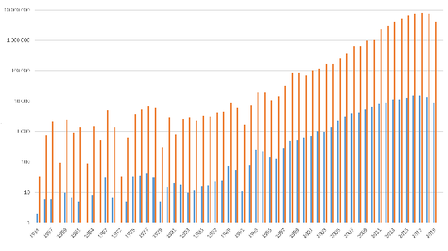

# Fine-Tuning OCR Error Detection and Correction in a Polish Corpus of Scientific Abstracts

Maciej Ogrodniczuk[0000−0002−3467−9424]

Institute of Computer Science, Polish Academy of Sciences

Abstract. The paper explores the idea of detecting and correcting postOCR errors in a corpus of Polish scientific abstracts by first evaluating several available spellchecking approaches and then reusing one of the rule-based solutions to eliminate frequent errors most likely resulting from technical problems of the OCR process. The fine-tuning consisted in removing word breaks, rejecting corrections which change the case of the output, removing unnecessary spaces between word segments and restoring Polish letters replaced with spaces whenever the correction resulted in a valid Polish word. The obtained system proved competitive with language model-based solutions.

Keywords: OCR post-correction POSMAC corpus Polish

## 1 Introduction

The process of OCR may result in errors — that’s a trivial observation. Lewandowski [4]1 mentions various factors contributing to unsatisfactory recognition rate of OCR, e.g. thinness of paper causing the contents of the back page to break through during scanning, imprecisions of print caused by the wear of the printing press or discontinuities in the letters, discolouration or damage caused during use. Various compensation mechanisms may be applied already at the stage of recognition but if the process is not supervised, many errors may remain.

This is also the case with The Polish Open Science Metadata Corpus (POSMAC) [6]2, a new source of scientific articles (abstract and full texts) acquired from the Polish Library of Science (LoS)3. The corpus contains over 142K files with over 55M words dated between 1934 and 2020 (with uneven distribution, see Figure 1 for details), coming from over 900 Polish scientific journals and books, in most cases scanned and OCR-ed. The nature of the process influenced the content: the texts have been recognized in various periods, by heterogeneous teams and using methods varying from journal to journal so the spectrum of encountered errors can be wide.

- 1 See also http://www.djvu.com.pl/galeria/UJ/Gazety_czasopisma.php
- 2 http://clip.ipipan.waw.pl/POSMAC
- 3 https://bibliotekanauki.pl/

Fig. 1. Document and word count per year in POSMAC

POSMAC is currently being included in the set of CURLICAT4 corpora [8] which motivates us to attempt to raise its quality by eliminating as many spelling errors as possible while trying not to introduce the new ones. This leads to our first conclusion that precision is what should matter most in the task while other measures such as recall are not that important (following the rule: “correct as much as you can but only when you are certain that the change will not result in an error”). Secondly, due to the large size of the corpus the corrections need to be applied in an automated manner.

These two requirements define our setup: we need to reuse or construct a precision-oriented non-interactive spellchecking tool for Polish which will be used to process the POSMAC corpus. To be able to select the tool we will be carrying out the small-scale evaluation on a manually corrected subset of the corpus.

## 2 Available Approaches

Since “most of the spelling approaches strongly depend on the specifics of the language and are hard to adapt to another language or a different application” [1], we decided to review several recent spellchecking initiatives specific to Polish and try to validate existing approaches before implementing a new one. Below we list the most available spellchecking tools reused in our experiment.

– LanguageTool is definitely the most popular error correction tool for Polish5. It is a multilingual grammar, style, and spell checker, recently made available in its non-interactive form as a CLARIN-PL service Speller6.

- 4 https://curlicat.eu/
- 5 https://languagetool.org/
- 6 https://ws.clarin-pl.eu/speller

Speller also claims to use spaCy7, a robust Python NLP library and AutoCorrect8, a spelling corrector in Python that currently supports 12 languages including Polish.

- – Symspell is another CLARIN-PL spellchecking service for Polish9, using a fast symmetric delete spelling correction algorithm which provides single word and compound word-aware multi-word spelling correction as well as word segmentation of noisy text. The service integrates the original solution by Wolf Garbe10 with the frequency dictionary generated from the KGR10 collection11.
- – ED 3 pl tool [13] has been developed for the most recent spellchecking task for Polish, i.e. PolEval 2021 Task 3: Post-correction of OCR results12 [3]. The solution was based on a sequence-to-sequence model using T5 architecture [7] and a publicly available plT5 Large language model for Polish13. ED 3 pl ranked second-best in the PolEval Task 3.
- – Another group of tools worth testing are popular grammar and spellcheckers integrated with office applications such as Microsoft Word or Google Docs. They are not intended for non-interactive use and they do not have an autocorrect feature integrated into their regular interfaces but such behaviour can be simulated with macros replacing each detected problem with the first available suggestion (if there is any). For Microsoft Word, we used a Jay Freedman’s macro14 replacing spelling errors with the first suggestion while for Google Docs the first suggestion was selected manually (see Figure 2).

## 3 Evaluation of the Out-of-the-Box Solutions

Several metrics have been proposed for the evaluation of spellcheckers, e.g. word error rate (WER), used to rank the submissions in the PolEval 2021 Task 3 (see. e.g. [2] for review of different methods). Still, according to [1], “the most common evaluation metric is classification accuracy”. The authors mention the fact that “only the best candidate from the suggestion list is considered, and order and count of the other proposed correction candidates are insignificant” as a disadvantage of this method and point out that “it is not suitable for evaluating an interactive system”. Since our setup is non-interactive and best-candidateonly, we decided to select the classification-based method as our main ranking

- 7 https://spacy.io/
- 8 https://github.com/filyp/autocorrect
- 9 https://ws.clarin-pl.eu/symspell
- 10 https://github.com/wolfgarbe/SymSpell
- 11 https://huggingface.co/clarin-pl/fastText-kgr10
- 12 http://2021.poleval.pl/tasks/task3
- 13 https://huggingface.co/allegro/plt5-large
- 14 https://answers.microsoft.com/en-us/msoffice/forum/ all/how-to-accept-all-autocorrect-suggestions-in/ e8de0d2c-5429-4a48-8f0c-c62c0f69c717.

Sub AcceptSpellingSuggestions() Dim er As Range For Each er In ActiveDocument.SpellingErrors

If er.GetSpellingSuggestions.Count > 0 Then

er.Text = er.GetSpellingSuggestions.Item(1).Name End If

Next End Sub

Fig. 2. Jay Freedman’s macro for simulating non-interactive spelling correction in Microsoft Word

criterion and perform a detailed investigation of precision, recall and accuracy of the systems evaluated on a subset of POSMAC corpus.

Even though “it is virtually impossible to compare the performance of stateof-the-art spelling correction systems”, as authors of [1] state, they report a range of results for various evaluation corpora and different languages. The best reported precision value is 97.8 for modern Greek, recall — 99.2 for Arabic Newspaper Corpora and accuracy — 95.72 for Chinese OCR Medical Records.

### 3.1 Development and Evaluation Sets

To prepare for the task, 1000 randomly selected sentences15 from the POSMAC corpus were reviewed. This resulted in the development of an initial categorization of errors, used in further annotation. The error types mostly concern spelling; punctuation errors were not intended to be corrected16.

For the evaluation, we randomly selected another set of sentences from the corpus and performed their manual correction. The annotator was instructed to mark error types with previously defined codes attached in square brackets to affected words. The process was supposed to finish after finding 500 errors which resulted in selecting 385 sentences. After carrying out the second pass to verify its results, several annotations were corrected (e.g. undetected missing diacritics in rare place names, missing error codes for corrections etc.) after consulting the PDF sources of articles from the Library of Science to resolve ambiguous interpretations. The final evaluation set eventually contains 10871 words and 517 errors. Table 1 presents the categorization of errors with examples and counts of each error type.

After the first pass, the code set contained one more mark, [?], used to signal „other errors”, unable to categorize by the annotator. There was only one instance marked, i.e. Saw1g which was resolved in the second pass to Sawąg

- 15 Detected automatically in the process of linguistic annotation with Concraft disambiguating tagger [9] which in some rare cases resulted in several true sentences treated as a single one.
- 16 Compare e.g. https://languagetool.org/development/api/org/languagetool/ rules/Categories.html.

Table 1. Error categorization

Code Explanation Example Correct form Count [D] diacritic missing sie się 272 [-] missing chracter dziaania działania 103 [+] extra character zajmniemy zajmiemy 46

- [S] unnecessary space oczyszczaln i oczyszczalni 45
- [T] typo zostaliWmy zostaliśmy 20 [G] words glued together któryw który 20 [C] uppercase instead of zamoyskim Zamoyskim 7

lowercase or vice versa [P] excessive punctuation uniwersalne, uniwersalne 2 narzędzie narzędzie

[M] metathesis, i.e. szkalnych szklanych 1 replacement of two adjacent letters

Any 517

(a typo in the name of the lake) by consulting the PDF source. Unclear cases, e.g. missing diacritics in proper names, as in Damieckiej (most likely Damięckiej), were intentionally kept consistent with the source.

- 3.2 Evaluation Method and Results As stated before, standard classification notions and metrics were used:

| |words changed|words left alone|
|---|---|---|
|words with incorrect spelling|tp (true positives: corrected errors)  |fn (false negatives: errors but not corrected)|
|words spelt correctly  |fp (false positives: not errors but corrected)  |tn (true negatives: not errors and not corrected)|

Precision = tp+tpfp Accuracy = tp+tntp++fptn+fn Recall = tp+tpfn F1 = 2·tp+2·fptp+fn

The calculations were performed by applying the Merge algorithm17 for threeway comparison of word-aligned ORIG (original sample), GOLD (manually corrected sample) and SYS (system output) files and interpreting its output by counting:

- 17 https://metacpan.org/pod/Algorithm::Merge

- – tp when ORIG != GOLD and SYSTEM = GOLD
- – fn when ORIG != GOLD and SYSTEM != GOLD
- – fp when ORIG = GOLD and SYSTEM != GOLD
- – tn when ORIG = GOLD and SYSTEM = GOLD

Table 2 presents the results of the evaluation. Even though the accuracy of most solutions seems sufficiently high, the precision is not satisfactory, most likely because of the scientific character of the texts. We will take a closer look at this issue in the next section. The low score of Symspell must result from its improper configuration since even a simple rule correcting just one error in the set can reach higher overall accuracy.

- Table 2. Error correction statistics for all investigated settings; bold means best

#### Tool name tp fp P R F1 A

Symspell 85 1136 6.96 14.78 9.47 85.79 Microsoft 298 436 40.60 56.87 47.38 93.98 Speller 310 243 56.06 59.50 57.73 95.87 Google 403 206 66.17 68.19 67.17 96.42 ED 3 pl 407 214 65.54 70.54 67.95 96.50

## 4 Qualitative Error Analysis

The specificity of scientific data defines several requirements for the correction process. The ideal system should not attempt to correct citations including person names, foreign words and symbols. It needs to keep brackets, dashes and quotation marks in place and should not replace the word with its edit-distantly equivalent. All these problems were observed with the reviewed systems in varied intensity. We present the most characteristic features of each system and some interpretations below. Table 3 presents selected results for various error types which illustrate the differences between various approaches.

### 4.1 Symspell

The particularly low score of the CLARIN-PL configuration of Symspell results mostly from unnecessary spaces introduced around quotation marks and brackets, e.g. (Kadrow 2010; Kadrow 2011a) → mężczyzn( Kadrow 2010; Kadrow 2011a ) or „trojki” → „ trojki ” but also in unexpected places such as date ranges, e.g. 330–347 → 330–3 47. Since brackets are frequently used to mark citations in scientific texts, the number of such errors is high.

While the solution was most effective in removing word-break hyphens, at the same time, it was wrongly removing minus characters used as dashes or properly

- Table 3. Sample error correction results for categories from Table 1; bold values are correct

Error Correct value Speller Symspell

zamoyskim Zamoyskim Zamoyskim zamoyskim poary pożary pory poary sie się się sie któryw który w który który w oczyszczaln i oczyszczalni oczyszczalń i oczyszczalni zostaliWmy zostaliśmy zostaliśmy zostali W my zajmniemy zajmiemy zajmiemy zajmniemy dzia a działań dnia a dzia a

Error ED 3 pl Google Microsoft

zamoyskim zamoyskim zamoyskim Zamoyskim poary poary pożary opary sie się się się któryw który w który w który oczyszczaln i oczyszczania i oczyszczalni oczyszczalń i zostaliWmy zostaliśmy zostaliŚmy zostaliśmy zajmniemy zajmniemy zajmiemy zajmiemy dzia a działania dzia a dziab a

used hyphens in compound words, e.g. bułgarsko-polskich → bułgarsko polskich or symbols, e.g. W(1-3) → W(13).

Symspell was also unnecessarily normalizing the case in acronyms, e.g. MChAT-u → Mchatu and was over creative in correcting proper names such as person names, again frequently used in citations, e.g. Januszko-Szkiel → Janusz koszkiel.

- 4.2 Microsoft spellchecker

Microsoft spellchecker seems not to take into account any context information (beyond the word boundaries) which results in prioritizing existing words over other corrections, e.g. wahan iami → wahań iłami. This also concerns wrongly hyphenated words, e.g. changing me-chanicznych → me-chemicznych while just removing the hyphen would result in a perfectly correct word (which all other solutions discovered). This also concerns splitting unknown words into in-vocabulary segments as in estymaty → estyma ty.

The method is not frequency-based since Krola (EN: the king without a diacritic) is corrected to Krolla (a rare inflected proper name) instead of Króla.

### 4.3 Speller

Similarly to Microsoft spellchecker, the CLARIN-PL configuration of Speller consequently searches for Polish words to replace the foreign ones, e.g. Polsk´a

Praha aneb Jak se z pu˚lky stala polka → Polsk´a Praha Anek Jak se z pułku stała polka and corrects out-of-vocabulary words by replacing them with invocabulary guesses, even in obvious cases e.g. nawią zując → nawie żyjąc. The model is capable of removing words, e.g. okazały się być bardzo trwałe → okazały się bardzo trwałe, usually resulting in errors.

### 4.4 Google spellchecker

Google model is most likely trained on a large corpus without a dictionary which results in replacing less frequent (and thus missing from its limited vocabulary) and unknown words with their similar equivalents, e.g. pielonych (a valid rare form) → zielonych. Unfortunately, this also leads to acronym-unfriendly behaviour, i.e. changing CMCU → MCU (while other models keep it unchanged).

Google model also seems to take into account the local context which sometimes results in errors, e.g. changing proper singular forms to plural ones when a closer word is plural: OkresSG, gdy Bałabanow zrealizował swoje pierwsze filmyPL, byłSG (EN: the periodSG when Balabanow completed his first filmsPL wasSG) → OkresPL, gdy Bałabanow zrealizował swoje pierwsze filmyPL, byłyPL (EN: the periodSG when Balabanow completed his first filmsPL werePL).

### 4.5 ED 3 pl

ED 3 pl, based on transformer architecture, was very effective in replacing out-of-word hyphens (wrongly used to indicate pauses) with proper dashes or correcting HTML character entities: J&oacute;zef → Józef (later removed from evaluation as an obvious conversion problem). The system (as the only one) could also effectively glue together words split into several segments, e.g. pod ję tą → podjętą.

The generative character of the system was sometimes creating unnecessary effects such as replacing correct words with their synonyms, e.g. zaprezentowano → przedstawiono (EN: present) but sometimes also fuzzynyms, e.g. studenci (EN: students) to absolwenci (graduates). In this first case, the behaviour of the system might not be perceived as invalid by a user while the second is obviously wrong. There were several similar cases of this type, e.g. 2002–2012 → 2002–12 which is another valid way of expressing the year range. At the same time the changes were often unpredictable and wrong, particularly concerning years in citations, e.g. (Pękala 1984) → (Pękala 1983). Some changes were also corrupting valid words, e.g. innowacyjności → innowacjości.

## 5 Reuse and Recycle

The solution we propose intends to build on the results of Speller by making several adjustments to its corrections to eliminate false positives based on the character of our corpus. Taking into account the specifics of scientific texts (see Section 4) and its OCR provenance, we intend to:

- 1. remove word breaks (surprisingly, still present)
- 2. reject corrections which change the case of the output
- 3. remove unnecessary spaces between word segments
- 4. restore Polish letters which were replaced with spaces due to potential technical problems.

The two first methods are language-independent while the other two require a dictionary lookup to verify whether the proposed correction results in an existing word. For this purpose, we used the list of Polish inflected word forms made available by the creators of the morphological analyser Morfeusz18 [10]. The dictionary comes in two flavours, based on PoliMorf [11] and The Grammatical Dictionary of Polish (SGJP) [12]. Each dictionary contains over 600K unique word forms absent from the other one (see Table 4) so a joint version was created to broaden the coverage.

Table 4. Counts of unique word forms in various dictionaries

Dictionary Word form count PoliMorf 2014 3 800 454 PoliMorf 2022 4 876 026 SGJP 2022 4 909 741 PoliMorf 2022 + SGJP 2022 5 336 228

- 5.1 Pre-processing

Since word breaks resulting from splitting the word between lines (e.g. jakości) still seem to appear in the Speller results and frequently result in changes applied to word segments independently, we decided to correct them in the preprocessing step.

Due to the high number of named entities in scientific texts (mostly person names in citations) it seemed worthwhile to test how keeping all words starting with an uppercase character would influence the results.

For cases when a word was split into two segments a mechanism glueing them together was applied when a resulting word was found in the joint dictionary of Polish word forms.

### 5.2 Adding Missing Polish Letters

Missing diacritics or in-word letters have already been added by existing rules of LanguageTool integrated with Speller. Still, there are cases when a Polish letter has been removed in the OCR process and space was output in its

- 18 http://morfeusz.sgjp.pl/download/, version 20220410.

place, e.g. wyznacza a instead of wyznaczała. Again, as with broken words, for LanguageTool this means applying separate correction mechanisms to each segment individually rather than guessing the missing letter and concatenating it with the segments in the text.

The correction procedure subsequently investigated all Polish letters and attempted to join two-word segments with each of them. When a resulting word was found in the joint dictionary, the correction was applied. The operation was limited to in-word Polish letters, without adding them before or after the word which could also be the case of an error. This idea was not tested because it would by all means result in many errors since e.g. Polish ę or ł correspond to inflectional patterns, e.g. robifin:sg:ter:imperf / robięfin:sg:pri:imperf / robiłpraet:sg:m1.m2.m3:ter:imperf.

### 5.3 Evaluation of the Proposed Solution

The proposed solution was evaluated in stages; the results of this process are presented in Table 5. Since each step is independent of the others, the influence of the underlying method on the obtained scores can be easily calculated. Values of the three best original systems are given for reference.

Table 5. Four-step improvement of Speller results

#### Tool name tp fp P R F1 A

Speller 310 243 56.06 59.50 57.73 95.87 Google 403 206 66.17 68.19 67.17 96.42 Ed 3 pl 407 214 65.54 70.54 67.95 96.50

Speller

+ preprocessing 328 235 58.26 62.00 60.07 96.03 + keep uppercase 325 179 64.48 60.63 62.50 96.45 + glue words 345 166 67.51 63.19 65.28 96.66 + add missing Polish letters 379 181 67.68 72.05 69.80 97.01

At the end of the day, the record number of hits still belongs to Ed 3 pl system, but all other scores were subsequently raised by each next variant of the corrector. What is particularly important is the lowest number of false alarms raised, yet still far from making the tool usable without supervision.

## 6 Conclusions and Future Work

The presented solution shows how rule-based systems can still compete with language model-based solutions in a specialised setting to reduce the number of false positives and raise the precision of the system. Since the nature of errors detected by these two types of solutions varies, one of the next steps could

be combining them in an ensemble or by creating a hybrid solution. But even with the current solution, several improvements can be made, e.g. detecting the language of the content to avoid correcting fragments in a foreign language or old Polish, paying attention to punctuation, dates and symbols.

What could also help analyse the results and fine-tune its subcomponents could be the calculation of our scores for each category of errors independently. Finer-grained categorization of errors could also be carried out, e.g. typos split into standard characters, Polish characters or frequent OCR errors such as confusing lowercase l with 1 and uppercase I or omitted characters into spaces vs. letters. In turn, standard measures could be calculated for each error subtype and the algorithm could be fine-tuned for different periods or scientific journals.

## Acknowledgements

The work reported here was supported by the European Commission in the CEF Telecom Programme (Action No: 2019-EU-IA-0034, Grant Agreement No: INEA/CEF/ICT/A2019/1926831) and the Polish Ministry of Science and Higher Education: research project 5103/CEF/2020/2, funds for 2020–2022).

We would like to thank Krzysztof Wróbel for his language model-based error candidate detection experiment using the ED 3 pl tool and Stanisław Lorys for first-pass manual correction of the evaluation data and proposing the classification of spelling errors.

## References

- 1. Hla´dek, D., Staˇs, J., Pleva, M.: Survey of Automatic Spelling Correction. Electronics 9(10) (2020). https://doi.org/https://doi.org/10.3390/electronics9101670, https://www.mdpi.com/2079-9292/9/10/1670
- 2. van Huyssteen, G.B., Eiselen, E.R., Puttkammer, M.J.: Evaluating Evaluation Metrics for Spelling Checker Evaluations. In: Proceedings of the First International Workshop on Proofing Tools and Language Technologies. pp. 91–99 (2004)
- 3. Kobyliński, Ł., Kieraś, W., Rynkun, S.: PolEval 2021 Task 3: Post-correction of OCR Results. In: Ogrodniczuk and Kobyliński [5], pp. 85–91, http://poleval. pl/files/poleval2021.pdf
- 4. Lewandowski, R.: Społeczna korekta post-OCR w bibliotekach cyfrowych. In: Ilona Koutny, P.N. (ed.) Język, Komunikacja, Informacja, pp. 123–134. Sorus

(2011), 5/2010–2011

- 5. Ogrodniczuk, M., Kobyliński, Ł. (eds.): Proceedings of the PolEval 2021 Workshop. Institute of Computer Science, Polish Academy of Sciences, Warsaw, Poland

- (2021), http://poleval.pl/files/poleval2021.pdf

6. Pęzik, P., Mikołajczyk, A., Wawrzyński, A., Nitoń, B., Ogrodniczuk, M.: Keyword Extraction from Short Texts with a Text-To-Text Transfer Transformer. In: Szczerbicki, E. (ed.) ACIIDS 2022 Proceedings. Springer Nature Switzerland AG

- (2022), (this volume)

- 7. Raffel, C., Shazeer, N., Roberts, A., Lee, K., Narang, S., Matena, M., Zhou, Y., Li, W., Liu, P.J.: Exploring the Limits of Transfer Learning with a Unified Text-toText Transformer. Journal of Machine Learning Research 21(140), 1–67 (2020), http://jmlr.org/papers/v21/20-074.html

- 8. Va´radi, T., Ny´eki, B., Koeva, S., Tadić, M., Stefanec,ˇ V., Ogrodniczuk, M., Ni-

toń, B., Pęzik, P., Mititelu, V.B., Irimia, E., Mitrofan, M., P˘ais,, V., Tufis,, D., Garabı´k, R., Krek, S., Repar, A.: Introducing the CURLICAT Corpora: Sevenlanguage Domain Specific Annotated Corpora from Curated Sources. In: Calzolari, N., Choukri, K., Cieri, C., Declerck, T., Goggi, S., Hasida, K., Isahara, H., Maegaard, B., Mariani, J., Mazo, H., Moreno, A., Odijk, J., Piperidis, S., Tokunaga, T. (eds.) Proceedings of the Thirteenth International Conference on Language Resources and Evaluation (LREC 2022). pp. 100–108. European Language Resources Association (ELRA), Marseille, France (2022), http://www.lrec-conf. org/proceedings/lrec2022/pdf/2022.lrec-1.11.pdf

- 9. Waszczuk, J., Kieraś, W., Woliński, M.: Morphosyntactic Disambiguation and Segmentation for Historical Polish with Graph-Based Conditional Random Fields. In: Sojka, P., Hor´ak, A., Kopecˇek, I., Pala, K. (eds.) Text, Speech, and Dialogue. pp. 188–196. Springer International Publishing, Cham (2018)
- 10. Woliński, M.: Morfeusz reloaded. In: Calzolari, N., Choukri, K., Declerck, T., Loftsson, H., Maegaard, B., Mariani, J., Moreno, A., Odijk, J., Piperidis, S. (eds.) Proceedings of the Ninth International Conference on Language Resources and Evaluation (LREC 2014). pp. 1106–1111. European Language Resources Association (ELRA), Reykjavı´k, Iceland (2014), http://www.lrec-conf.org/proceedings/ lrec2014/pdf/768_Paper.pdf
- 11. Woliński, M., Miłkowski, M., Ogrodniczuk, M., Przepiórkowski, A., Szałkiewicz, u.: PoliMorf: a (not so) new open morphological dictionary for Polish. In: Proceedings of the Eighth International Conference on Language Resources and Evaluation (LREC 2012). pp. 860–864. European Language Resources Association (ELRA), Istanbul, Turkey (2012), http://www.lrec-conf.org/proceedings/lrec2012/pdf/ 263_Paper.pdf
- 12. Woliński, M., Saloni, Z., Wołosz, R., Gruszczyński, W., Skowrońska, D., Bronk, Z.: Słownik gramatyczny języka polskiego (2020), http://sgjp.pl/, 4th edition, online
- 13. Wróbel, K.: OCR Correction with Encoder-Decoder Transformer. In: Ogrodniczuk and Kobyliński [5], pp. 97–102, http://poleval.pl/files/poleval2021.pdf

