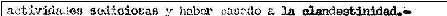
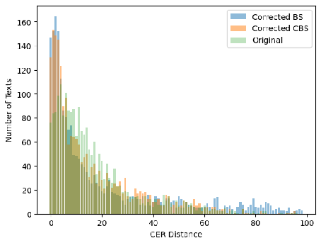
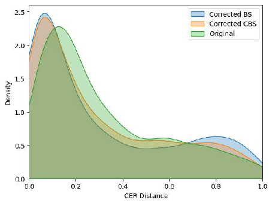

# Post-OCR Correction Using Large Language Models with Constrained Decoding

Ignacio Sastre

Facultad de Ingeniería - Universidad de la República Lorena Etcheverry

Facultad de Ingeniería - Universidad de la República Guillermo Rey

Facultad de Ingeniería - Universidad de la República Guillermo Moncecchi

Facultad de Ingeniería - Universidad de la República Aiala Rosá

Facultad de Ingeniería - Universidad de la República

Research Article

Keywords: Post-OCR Correction, Large Language Models, Fine-Tuning, Constrained Decoding, Beam Search

Posted Date: July 15th, 2025

DOI: https://doi.org/10.21203/rs.3.rs-6823036/v1

License:   This work is licensed under a Creative Commons Attribution 4.0 International License. Read Full License

Additional Declarations: No competing interests reported.

## Post-OCR Correction Using Large Language Models with Constrained Decoding

Ignacio Sastre1*, Lorena Etcheverry1, Guillermo Rey1, Guillermo Moncecchi1, Aiala Ros´a1*

1Instituto de Computaci´on, Facultad de Ingenierı´a - Universidad de la Repu´blica, Julio Herrera y Reissig 565, Montevideo, 11300, Montevideo, Uruguay.

*Corresponding author(s). E-mail(s): isastre@fing.edu.uy; aialar@fing.edu.uy; Contributing authors: lorenae@fing.edu.uy; grey@fing.edu.uy; gmonce@fing.edu.uy;

Abstract This article addresses the problem of correcting noisy Optical Character Recognition (OCR) outputs from digitized historical documents, specifically those from the Berrutti Archive related to Uruguay’s civic-military dictatorship. These documents—produced with typewriters, diverse layouts, and overlaid annotations—pose significant challenges for standard optical character recognition (OCR) tools, resulting in highly error-prone text. We present a novel post-OCR correction method that leverages fine-tuned open-source Large Language Models (LLMs) combined with a constrained decoding strategy. This strategy incorporates character-level similarity between the OCR input and the generated output at decoding time, steering the model toward corrections that closely preserve the original text structure. We evaluate our method on a gold-standard dataset of over 2000 annotated lines and show that it outperforms prompting and standard fine-tuning approaches, reducing both character error rate (CER) and word error rate (WER). The corrected outputs provide more accurate input for downstream tasks, such as named entity recognition, relation and event extraction, and knowledge graph construction, thereby supporting the broader goal of extracting knowledge from historically significant and sensitive archives.

Keywords: Post-OCR Correction, Large Language Models, Fine-Tuning, Constrained Decoding, Beam Search

### 1 Introduction

Between 1973 and 1985, Uruguay was governed by a civic-military dictatorship, which followed a period of state terrorism from 1968 to 1973. Systematic human rights violations, including torture, rape, kidnapping, and the forced disappearance of hundreds of Uruguayans, characterized this era. Investigating these crimes committed by the state has been hampered by an impunity law

and the military’s deliberate efforts to limit access to information from that time.

However, access to certain datasets has been made possible over the years. One notable resource is the Berrutti Archive, which contains approximately 3 million pages of material produced by security agencies during the dictatorship and the subsequent years. This collection comprises digital scans of microfilm reels containing the original paper documents. The documents in this archive are varied and include interrogation reports, press

- 001
- 002
- 003
- 004
- 005
- 006
- 007
- 008
- 009
- 010
- 011
- 012
- 013
- 014
- 015
- 016
- 017
- 018
- 019
- 020
- 021
- 022
- 023
- 024
- 025
- 026
- 027
- 028
- 029
- 030
- 031
- 032
- 033
- 034
- 035
- 036
- 037
- 038
- 039
- 040
- 041
- 042
- 043
- 044
- 045
- 046
- 047
- 048
- 049
- 050
- 051

052 053 054 055 056 057 058 059 060 061 062 063 064 065 066 067 068 069 070 071 072 073 074 075 076 077 078 079 080 081 082 083 084 085 086 087 088 089 090 091 092 093 094 095 096 097 098 099 100 101 102

clippings, lists of individuals and locations, personal records, photographs, passports, political affiliations, and any other background information deemed useful by the security agencies.

Project Cruzar [8] is a multidisciplinary initiative that analyzes documents produced during Uruguay’s authoritarian rule. Its objective is to develop tools and processes that systematize and extract knowledge from the archives of that period, helping to address many unresolved questions. The contents of these archives are invaluable for understanding this chapter of Uruguayan history. They assist in searching for missing persons, contribute to ongoing trials, and promote awareness and civic engagement regarding this historical period.

Due to legal restrictions, these documents are not part of the public domain, which prohibits the use of cloud-based OCR tools that require image sharing. Consequently, the Cruzar project has investigated OCR solutions that can be run on-premises, such as Calamari OCR [32] and Tesseract1. In addition, to improve the performance of these tools, we have trained them using a proprietary gold standard (GS) dataset. To create this dataset we relied on the collaboration of the community, collecting human-made transcriptions through the web application LUISA2.

LUISA is a web application developed by the Cruzar project. It uses a crowdsourcing approach to transcribe small segments of documents. These transcripts are then assembled into lines, and project team members carefully review the line transcripts for accuracy before being included in the GS. However, despite our efforts to improve the performance of the OCR tools, the resulting transcripts still contain numerous errors. This fact motivates us to explore additional approaches for post-processing the OCR results to improve the quality of the transcribed texts.

This paper focuses on correcting noisy OCR output from particularly challenging images within the previously described domain. We employ methods based on fine-tuned Large Language Models (LLMs), which are enhanced with various decoding strategies to prioritize outputs

1Tesseract OCR https://github.com/tesseract-ocr/tesseract 2You can access LUISA and contribute to the construction

of the Gold Standard here https://mh.udelar.edu.uy/luisa/

closely aligned with the input sentence at the character level. Figure 1 shows an example of this process.

|| |
|---|---|
| | |

OCR

|actividades sodiciosas y haber casado a la clandestinidad.-|
|---|

Fine-tuned LLM

+ constrained decoding

|actividades sediciosas y haber pasado a la clandestinidad.-|
|---|

Translation: seditious activities and having gone underground.-

Fig. 1 Example of noisy OCR correction using an LLM. The OCR output (middle) introduces errors such as ‘sodiciosas’ and ‘casado’, which are corrected by the LLM (bottom) to ‘sediciosas’ and ‘pasado’, preserving fidelity to the original text (top).

There are several reasons why LLMs are wellsuited for this task. First, the problem can be framed as a generation task, where n tokens are provided as input (the noisy OCR sequence), and m tokens are generated as output (the corrected sequence). This type of problem aligns well with the capabilities of autoregressive LLMs. Furthermore, the linguistic knowledge encoded in these models may be particularly effective for disambiguating and reducing noise in OCR sequences during correction. Finally, these models have demonstrated state-of-the-art performance across various Natural Language Processing (NLP) tasks, particularly generative ones [24, 27, 33].

However, several challenges arise when using LLMs in OCR correcction, including:

- • Specific Domains: The texts used in these experiments belong to a particular domain, featuring unique jargon and terminology.
- • Hallucinations: The tendency of LLMs to invent information or deviate from the specified task poses a serious challenge, as this task demands maintaining a high degree of fidelity to the original text.

To address these challenges, we propose the following approaches:

- • Fine-tuning LLMs: Fine-tuning open-source LLMs to improve their domain knowledge and understanding of the task.
- • Beam Search: Two decoding strategies based on Beam Search to reduce hallucinations and preserve fidelity to the original sequence.

- – Sequence-level similarity: Beam Search combined with sequence-level similarity metrics.
- – Token-level similarity: A Constrained Beam Search (CBS) approach using tokenlevel similarity metrics, applied at each decoding step.

The paper is structured as follows: Section

- 2 presents a review of related work. Section
- 3 describes Fine-tuning experiments. Section 4 explains the beam search and similarity metrics at the sequence-level approach. Section 5 explains the beam search approach combined with similarity metrics at the token level, known as constrained beam search. Section 6 presents the results and analysis. Section 7 presents some limitations of the work. Finally, Section 8 contains the conclusions and outlines future work.

### 2 Related Work

Concerning post-OCR correction, two important references are the competitions carried out at the International Conference on Document Analysis and Recognition (ICDAR) in its 2017 [3] and 2019 [22] editions. In 2017, the most effective systems integrated statistical machine translation and neural machine translation approaches. In 2019, a BERT-based method [7] achieved the best results. More recently, in 2021, a post-OCR processing survey [19] reviewed different datasets and methods, including some crowdsourcing approaches to create data for post-OCR processing. Some of them display entire documents that require manual correction by users [5, 13], while others show only single words [1, 4]. These approaches are similar to our project, where we created a crowd-sourced dataset using the LUISA web-app. However, in our case, segments with few words are shown to users for correction, and we add an image with a fragment of the text to provide more context.

As with most language processing problems, current work on post-OCR correction is based

on generative language models. In [28], experiments are described on a dataset of 19th-century English newspaper articles. They fine-tuned two transformer-based models: BART [16] and Llama 2 (7B and 13B) [29], the latter showing the best results. The authors mention that the most challenging problems faced were correcting named entities and hallucinations from Llama.

In [17], the T5 model [21] was fine-tuned for OCR error correction specifically in Hungarian scientific texts. This fine-tuning led to improvements in the Word Error Rate (WER) and Rouge metrics. However, a key distinction between their work and ours is that they started with sentences that had significantly lower error rates compared to ours —0.90 in Rouge and 0.23 in WER, as opposed to our scores of 0.505 in Rouge and 0.633 in WER. In another study [30], a T5 model was employed for correcting OCR errors. The author demonstrates that while effective results can be achieved with modern texts, the same cannot be said for the ICDAR2019 dataset, which comprises ancient texts. Additionally, experiments conducted using the Llama model revealed issues related to model hallucinations, particularly the generation of text that is not present in the original sequence.

A different approach is presented in [12]. They start from the outputs of several OCRs and combine them using different language models: three GPT models (GPT, GPT2, GPT2XL) [20] and a 3-gram model trained on Wikipedia. This method aims to control the generative potential of generative models. Experiments are conducted using both the original pre-trained models and the fine-tuned models.

In a very recent work [2], an approach based on fine-tuning LLMs using synthetic examples is presented. A character-level Markov corruption process is applied to the examples to simulate the noise present in the texts.

Our proposal for post-OCR correction is also based on LLMs, but constrains the model’s generation so that the generated corrections remain close to the original sequence. The main idea of this proposal is partly similar to what is mentioned in [31] as Controlled Generation: approaches based on the combination of the distribution generated by the model with some external criterion.

The concept of Constrained Decoding has been applied to various tasks, including the generation

103 104 105 106 107 108 109 110 111 112 113 114 115 116 117 118 119 120 121 122 123 124 125 126 127 128 129 130 131 132 133 134 135 136 137 138 139 140 141 142 143 144 145 146 147 148 149 150 151 152 153

154 155 156 157 158 159 160 161 162 163 164 165 166 167 168 169 170 171 172 173 174 175 176 177 178 179 180 181 182 183 184 185 186 187 188 189 190 191 192 193 194 195 196 197 198 199 200 201 202 203 204

of code or SQL queries [9, 23], as well as the generation of linguistic analyses for texts, such as parsing, semantic role labeling, and semantic parsing [6, 25]. In these applications, constraints specific to the type of output being generated are checked at each step of the generation process. Different methods for modeling these constraints include finite-state automata [6] and grammars [9, 10]. Constrained decoding requires access to model logits during the inference process. This means that while it can be implemented with open models, it is not feasible with larger commercial models. To address this limitation, [10] proposes using a commercial model to generate an initial output and then employing a smaller open model with constrained decoding to enforce specific restrictions on the output.

### 3 Fine-tuning LLMs

In this section, we describe the overall post-OCR correction pipeline using fine-tuned LLMs. Given an OCR-generated sequence as input, the model is trained to produce a corrected version that closely matches a human-validated ground truth. This approach aims to teach the model the linguistic patterns of the domain as well as the typical distortions introduced by OCR tools in the Berrutti Archive.

We opted to fine-tune open-source LLMs for the OCR correction task after initial experiments with prompting alone yielded suboptimal results. The following subsections describe the training dataset, present the results of the initial finetuning experiments, and discuss the challenges encountered, particularly the tendency of LLMs to produce semantically plausible but incorrect substitutions, which motivates the need to constrain their generative behavior.

We utilized a dataset comprising 21,611 lines of text generated from a subset of documents using the Calamari OCR, which was trained on data specific to our domain. For each of these lines, we created the ground truth (GT) using the LUISA web application, as previously described in Section 1. To fine-tune the LLMs, we transformed all pairs of ⟨ OCR output, GT transcription ⟩ into a string formatted as follows:

### ORIGINAL: {OCR output} ### CORRECTED: {GT transcription}

This format explicitly separates the OCR output (ORIGINAL) and the corrected transcription (CORRECTED), making it easier for the model to distinguish between the input and target text. We used those examples to fine-tune the Llama 2 model from Meta [29], employing cross-entropy loss as the loss function (the same loss function used during model pretraining). We explored both the 7 and 13 billion parameter versions to evaluate trade-offs between performance and resource usage.

For these experiments, we utilized the ClusterUY infrastructure [18], which, during the experiments, consisted of two servers equipped with NVIDIA A100 GPUs and 28 servers with NVIDIA P100 GPUs. Given our resource constraints, we employed the Low-Rank Adaptation (LoRA) technique [14], in which the model weights are frozen, and trainable rank decomposition matrices are injected into each layer of the model architecture. This method reduces the GPU memory requirements significantly because a much smaller number of weights are updated.

#### 3.1 Evaluation and Problems

We evaluated the fine-tuned model on a test set of 2,163 ⟨OCR output, GT transcription⟩ pairs. We evaluated the transcriptions using three metrics:

- 1. Ratio: This metric measures sequence similarity by computing 2M/T, where T is the total number of elements in both sequences and M is the number of matching elements. It is calculated using the SequenceMatcher.ratio function, provided by the difflib Python library3. The result is a value between 0 and 1, with higher values indicating greater similarity.
- 2. Character Error Rate (CER): This metric computes the Levenshtein distance (the minimum number of single-character edits needed to transform one sequence into the other) between two sequences. The CER is calculated by dividing the Levenshtein distance by the length of the longer sequence, ensuring the result lies between 0 and 1. A lower CER indicates better similarity between the sequences.

3SequenceMatcher documentation is available here: https://docs.python.org/3/library/difflib.html#difflib. SequenceMatcher.ratio

3. Word Error Rate (WER): Similar to CER, WER computes the Levenshtein distance but operates at the word level instead of the character level. The result is normalized by the total number of words in the reference sequence, yielding a value between 0 and 1. A lower WER indicates fewer word-level errors.

We used these metrics to compare the groundtruth transcriptions with the original OCR sequences (baseline), as well as with the corrected sequences produced by the adjusted models. Table 1 presents the average results for each metric under three conditions: (1) no corrections applied, (2) corrected using a prompting method with the Llama 2 13B model without fine-tuning, (3) corrected using our fine-tuned Llama 2 13B model.

|Method|ratio (↑)|CER (↓)  |WER (↓)|
|---|---|---|---|
|Original Prompting Fine-tuning  |0.730 0.673 0.727  |0,314 0.389 0.321  |0,633 0.687 0.821|

Table 1 Results for prompting and fine-tuning methods.

The results presented in Table 1 indicate that while fine-tuning improved character-level metrics compared to prompting, the overall performance still fell short of the OCR sequences without correction. Notably, the Word Error Rate (WER) increased significantly after fine-tuning, suggesting that the model occasionally introduced considerable errors during the correction process.

We primarily observed that the model tended to replace original words with semantically plausible but incorrect substitutions. These included synonyms or similar terms that did not align with the ground truth. This behavior contributed to a higher WER due to mismatches at the word level.

Figure 2 illustrates this type of error, where the word sediciosas (seditious) is replaced with subversivas (subversive). Although these words are semantically similar, this type of solution is not suitable for the correction task, where the aim is to preserve the exact wording of the original text.

These problems highlight the need for methods that explicitly incorporate the original OCR sequence into the decoding process to guide the model during correction. In the following sections,

###### Ground truth sequence:

|actividades sediciosas y haber pasado a la clandestinidad.-|
|---|

Translation: seditious activities and having gone underground.-

###### OCR sequence:

|actividades sodiciosas y haber casado a la clandestinidad.-|
|---|

Corrected sequence:

|actividades subversivas y haber pasado a la clandestinidad.-|
|---|

Translation: subversive activities and having gone underground.-

Fig. 2 Example of a semantically plausible but incorrect substitution (‘subversivas’ instead of ‘sediciosas’).

we propose alternative decoding strategies that utilize character-level metrics to address this issue.

### 4 Beam Search with sequence-level similarity

Beam search [11, 26] is a decoding strategy used in probabilistic models, including LLMs, as an alternative to greedy decoding or sampling decoding. Greedy decoding often fails to produce optimal sequences because it selects the most probable token at each step without considering future choices, which can lead to missing better overall sequences.

In contrast, beam search explores multiple candidate sequences simultaneously by maintaining a “beam” of the top k most promising sequences at each step. During the decoding process, all possible next tokens from the vocabulary are considered for each of the k beams, resulting in k×V possible extended sequences, where V is the size of the vocabulary. Only the k most probable sequences are selected after each step to prevent exponential growth and continue expanding. At the end of this process, the sequence with the highest probability is chosen as the final output. This process generates a tree-like structure, as illustrated in Figure 3.

As mentioned in the previous section, the fine-tuned model encountered issues, notably the tendency to introduce semantically plausible but incorrect substitutions when employing a greedy decoding strategy. To address these problems, we explored the use of beam search with a subtle modification to the standard process.

Once the decoding steps are completed, we evaluate the k candidate sequences against the noisy OCR output by using the Character Error Rate (CER) instead of simply selecting

205 206 207 208 209 210 211 212 213 214 215 216 217 218 219 220 221 222 223 224 225 226 227 228 229 230 231 232 233 234 235 236 237 238 239 240 241 242 243 244 245 246 247 248 249 250 251 252 253 254 255

256 257 258 259 260 261 262 263 264 265 266 267 268 269 270 271 272 273 274 275 276 277 278 279 280 281 282 283 284 285 286 287 288 289 290 291 292 293 294 295 296 297 298 299 300 301 302 303 304 305 306

clandestinidad.-

| |0.6|
|---|---|
| | |

|0.6|
|---|

clandestinidad.-

sediciosas

###### · · ·

|0.9| |0.3|
|---|---|---|
| | | |

| |0.8|
|---|---|
| | |

clandestinidad.-

|0.1|
|---|

| |0.7|
|---|---|
| | |

LLM Prompt

acciones

| | |0.080.08| |
|---|---|---|---|
| | | | |

[Pruned]

[Pruned]

|0.02| |
|---|---|
| | |

Fig. 3 Toy example illustrating beam search decoding with a beam width of three. Lower-probability branches (e.g., sequences derived from ‘acciones’ and ‘actividad’) are pruned to retain the three most promising candidate sequences at each step.

the sequence with the highest probability. The sequence that has the smallest CER distance is then chosen as the final output.

This approach helps reduce the model’s tendency to replace original words with semantically similar but incorrect alternatives. By aligning more closely with the original sequence, this method significantly enhances performance, as demonstrated in Section 6.

### 5 Constrained Beam Search with token-Level similarity

Although the previous method improved results across all metrics, the gains at the character level were modest compared to the OCR sequences. In contrast, the Word Error Rate (WER), which measures errors at the word level, remained worse than the OCR sequences on average (see Section 6 for details).

Since incorporating the CER distance at the end of Beam Search yielded noticeable improvements, we designed a Constrained Beam Search method to integrate character-level distance information throughout the decoding process of each step. Our approach incorporates character-level similarity not only at the end of decoding, but at each step of the sequence generation process.

The key idea is to guide the language model during decoding by combining its internal token probabilities with an external signal that measures how closely each partial sequence aligns with the original OCR input. By interpolating these two sources of information, the model is encouraged to make decisions that preserve fidelity to the input text.

OCR sequence

LLM

Truncated OCR sequence |V| vocab logits

| | |
|---|---|

| | | | | | |···| |
|---|---|---|---|---|---|---|---|

k most probable tokens

k candidates’ sequences

PD distribution PLM distribution

| | | | |
|---|---|---|---|

| | | | |
|---|---|---|---|

Final distribution

| | | | |
|---|---|---|---|

Fig. 4 Illustration of a step from the Constrained Beam Search (CBS) process. The k most probable tokens are selected and used for generating both PD and PLM distributions, which are then combined to obtain the final distribution.

Figure 4 illustrates this process: for each decoding step, the most probable tokens according to the language model are re-ranked using a similarity metric that compares the candidate partial output with the corresponding fragment of the OCR input. The result is a dynamic probability distribution that balances fluency and

fidelity, effectively restraining the model’s generative nature. The following paragraphs introduce the necessary notation to explain this method.

We will note the conditional probability of the next token wi given the preceding sequence w1,w2,...,wi−1, as provided by the language model, as:

PLM(wi|w1i−1) The probability of a sequence w1,w2,...,wn is then calculated as the product of the conditional probabilities of each token, given the preceding tokens:

PLM(w1,w2,...,wn) =

n

PLM(wi|w1i−1)

i=1

For correcting the OCR output, we denote the noisy output of the OCR as sn1 and the corrected sequence as w1m. In this context, we adapt the notation for the conditional probability of the next token wi to explicitly include its dependence on sn1:

PLM(wi|sn1,w1i−1)

We propose modifying the probabilities given by the language model at each step of the beam search process to account for the character-level distance between the generated sequence at that step and the noisy OCR output so far.

To achieve this, we define a probability distribution over the k most probable tokens at a given decoding step, denoted as PD. This distribution aims to capture whether a token is likely to be correct by considering only the character-level distance between the generated sequence (including the candidate token) and the noisy OCR output. The distance is computed by comparing the generated sequence of i tokens, consisting of j characters, with the first j characters of the OCR output.

The probability distribution for the next token in the corrected sequence is obtained by interpolating between PD and PLM, where α is a hyperparameter to adjust:

P(wi|sn1,w1i−1) = αPD(wi|si1,w1i−1) + (1 − α)PLM(wi|sn1,w1i−1)

This interpolated probability is used at each step of the beam search algorithm to adjust the sequence probabilities.

We apply the method described in the previous section to select the final sequence from the k candidate sequences generated at the end of the decoding process.

#### 5.1 Calculating PD

To calculate the PD distribution, the Ratio metric is employed. As Section 3.1 explains, this metric returns the similarity between two sequences as a value between 0 and 1.

To calculate PD(wi|si1,w1i−1), the first step is to compute the Ratio between w1i and si1, for each candidate token wi. Assuming we have k candidate tokens wi1,wi2,...,wik, we will compute k Ratios r1,r2,...,rk.

After the Ratios are computed, the Softmax function is applied to obtain a probability distribution between all candidate tokens based on the previously calculated Ratios.

##### 5.1.1 Dealing with close Ratios

Given that the candidate sequences being compared are generally very similar, the resulting Ratios are often close to each other and typically close to 1.

For example, let’s consider the following OCR output that needs correction (s) and two candidate corrected sequences, c1 and c2.

“actividades sodiciosas y haber casado a la clandestinidad.-” (s)

“actividades sediciosas y haber pasado a la clandestinidad.-” (c1)

“actividades subversivas y haber pasado a la clandestinidad.-” (c2)

The resulting Ratios are:

SequenceMatcher(c1,s).ratio() = 0.966 (r1) SequenceMatcher(c2,s).ratio() = 0.874 (r2)

When applying the Softmax function, we get: Softmax([0.966,0.874]) = [0.5230,0.4770]

The resulting probabilities are very close to each other, making the impact of PD almost

307 308 309 310 311 312 313 314 315 316 317 318 319 320 321 322 323 324 325 326 327 328 329 330 331 332 333 334 335 336 337 338 339 340 341 342 343 344 345 346 347 348 349 350 351 352 353 354 355 356 357

358 359 360 361 362 363 364 365 366 367 368 369 370 371 372 373 374 375 376 377 378 379 380 381 382 383 384 385 386 387 388 389 390 391 392 393 394 395 396 397 398 399 400 401 402 403 404 405 406 407 408

insignificant when the final interpolated distribution is calculated. However, c1 and c2 are rather different sequences, and this method’s objective is to influence the closest sequence to the OCR output (in this case, c1).

To mitigate this problem, we explored using the temperature hyperparameter τ in the softmax function. To do so, we divide the Ratios by τ, where τ ∈ (0,1] amplifies the probabilities of the closer candidates while diminishing those of the others [15].

When τ = 1, the probabilities remain unchanged. As τ approaches 0, the distribution becomes more concentrated on the closest sequence, assigning a probability close to 1 to the closest sequence and near 0 to the others. This occurs because smaller values of τ amplify the differences between Ratios, and the softmax function tends to assign higher probabilities to higher values and lower probabilities to lower values.

Continuing with the previous example, applying a temperature of 0.1 results in probabilities [0.715,0.285]. Reducing the temperature further, for instance to 0.05, makes the differences even more pronounced: [0.863,0.137].

##### 5.1.2 Choosing a value for α

As we already explained, the final distribution is obtained by interpolating the distributions PD and PLM:

P(wi|sn1,w1i−1) = αPD(wi|si1,w1i−1) + (1 − α)PLM(wi|sn1,w1i−1)

We explored several methods for choosing the hyperparameter α.

One straightforward approach is to choose a constant value for α. This value can be adjusted using a validation set.

We identified a limitation of this static approach: We may not always want to assign PD the same importance. More precisely, if the LLM is confident in one specific token over the others (i.e., the probability of a single token is much higher than the others), it would be convenient to prioritize the original model output even if the distance with the OCR output is high. On the other hand, if the LLM probabilities are not too conclusive (i.e.,

there are several tokens with non-negligible probabilities), then it would be desirable to prioritize the distance.

To better capture the level of uncertainty in PLM, we explored using the entropy of the distribution to infer a value for α. In this approach, the value of α changes dynamically at each step of the beam search algorithm.

The entropy of the distribution is given by:

H(PLM) = − kj=1 PLM(wij|sn1,w1i−1) log PLM(wij|sn1,w1i−1)

Since a value between 0 and 1 is needed, we normalize the entropy by dividing it by its maximum possible value, which is log k. Therefore, α is defined as:

H(PLM) log k

α =

The intuition behind using entropy to define a dynamic value for α is based on using the LLM’s confidence as a proxy for determining the relative importance of each distribution, since entropy measures the average level of uncertainty inherent in a probability distribution.

If the entropy is high, α will be close to 1, and more importance will be given to the distance. If the entropy is low, α will be close to zero, and more importance will be given to the LLM probabilities.

In the following section, we present and compare the results obtained using both beam search with CER selection and the Constrained Beam Search method explained in this section.

### 6 Results

This section presents the results of all previously described experiments. Subsection 6.1 provides a detailed explanation of the results obtained on a validation set of 283 examples. It includes the outcomes for all experiments using different hyperparameter configurations, such as the temperature values and methods for calculating α, as discussed in the previous section. Subsection 6.2 reports the results on the test set described in Section 3.1, using only the best-performing configuration identified through the validation experiments.

- 6.1 Results over the validation set

We conducted several experiments to select the best options among the alternatives discussed in Section 5. These experiments varied the transformations applied to the Ratio values (see Section 5.1.1) and the method for calculating the value of α (see Section 5.1.2).

In addition to using temperature, we explored two alternative transformations for the Ratio values: (1) Multiplying by 100, raising the result to a fixed exponent n, and normalizing by dividing by 100n. (2) Assigning a probability of one to the highest Ratio while setting all others to zero.

For the calculation of α, besides using entropy and a fixed value, we also experimented with a method using only the two largest probabilities, p1 and p2, defining α as 1 − (p1 − p2).

Table 2 presents the average results of the Ratio metric, including the counts of examples that improved, worsened, or remained equal compared to the original OCR sequences, and Table 3 reports the average results for word-level metrics, including WER, BLEU, and ROUGE.

The last five rows in both tables show the results obtained by varying the temperature between 0.01 and 0.1. The best character-level performance on the validation set is achieved with a temperature of 0.05.

Based on the results from the validation set, we concluded that the best approach is to use temperature for transforming the ratios and a dynamic α calculated using entropy.

6.2 Results over the test set

After selecting the best-performing method using the validation set, we evaluated it on the test set. Table 4 presents the average results of the Ratio metric, including the counts of examples that improved, worsened, or remained equal compared to the original OCR sequences. Table 5 provides the same analysis for the CER metric. Finally, Table 6 reports the average results for word-level metrics, including WER, BLEU, and ROUGE.

The first observation is that both methods improve performance across all metrics compared to the original OCR sequences without correction. The best results, on average, are obtained with the Constrained Beam Search (CBS) approach, with a temperature of 0.05, and the entropy-based

dynamic method for selecting α. It outperforms other methods in both character-level metrics (Ratio and CER) and word-level metrics (WER and BLEU).

A closer analysis of the improved and worsened examples in the character-level metrics reveals that the Beam Search (BS) method with final CER selection produces more improved examples than the CBS method. However, CBS reduces the number of worsened examples and the number of unchanged examples.

This observation suggests that the CBS method stays closer to the original OCR sequences, lowering recall (i.e., reducing the number of improved examples), but improving precision (i.e., reducing the number of worsened examples).

Figure 5 shows the distribution of examples across different Levenshtein distances (nonnormalized CER), while Figure 6 presents a KDE plot of CER distances.

Fig. 5 Distribution of texts over different Levenshtein distances, using Beam Search and Constrained Beam Search decoding methods compared with the original noisy output.

Both plots show that the number of perfect or nearly perfect sequences (i.e., low CER distance) doubles with both methods compared to the original OCR sequences. While BS with CER selection produces slightly more of these high-quality sequences, CBS significantly reduces the number of sequences with large distances, as observed in the graphs’ tails.

409 410 411 412 413 414 415 416 417 418 419 420 421 422 423 424 425 426 427 428 429 430 431 432 433 434 435 436 437 438 439 440 441 442 443 444 445 446 447 448 449 450 451 452 453 454 455 456 457 458 459

460 461 462 463 464 465 466 467 468 469 470 471 472 473 474 475 476 477 478 479 480 481 482 483 484 485 486 487 488 489 490 491 492 493 494 495 496 497 498 499 500 501 502 503 504 505 506 507 508 509 510

|Ratio transform.|α|Ratio (↑)|Better|Worse|Equal|
|---|---|---|---|---|---|
|- (No correction)|- (No correction)|0.825|0|0|283|
|- (BS w/CER selection)|- (BS w/CER selection)|0.813|127|62|94|
|None|0.9|0.783|22|231|30|
|Raise to 10|0.5|0.826|86|110|87|
|None Most similar Raise to 2 Raise to 10 Raise to 2|1 − (p1 − p2) 1 − (p1 − p2) 1 − (p1 − p2) 1 − (p1 − p2) Entropy|0.833 0.833 0.834 0.834 0.833|123 107 117 117 123|43 43  42 43 39 |117 133 124 123 121|
|Raise to 10|Entropy|0.835|119|47|117|
|Temp = 0.01|Entropy|0.835|119|31|133|
|Temp = 0.03|Entropy|0.837|126|35|122|
|Temp = 0.05|Entropy|0.838|126|39|118|
|Temp = 0.07|Entropy|0.835|123|44|116|
|Temp = 0.1|Entropy|0.835|126|47|110|

- Table 2 Validation results using Ratio as metric.

|Ratio transform.|α|WER|BLEU|RougeL|
|---|---|---|---|---|
|- (No correction)|- (No correction)|0.486|0.412|0.642|
|- (BS w/CER selection)|- (BS w/CER selection)|0.582|0.482|0.721|
|None|0.9|0.436|0.284|0.523|
|Raise to 10|0.5|0.492|0.425|0.659|
|None Most similar Raise to 2 Raise to 10 Raise to 2|1 − (p1 − p2) 1 − (p1 − p2) 1 − (p1 − p2) 1 − (p1 − p2) Entropy|0.430 0.448 0.433 0.433 0.429|0.491 0.477 0.489 0.489 0.494|0.702 0.692 0.700 0.700 0.707|
|Raise to 10|Entropy|0.431|0.490|0.703|
|Temp = 0.01|Entropy|0.423|0.501|0.714|
|Temp = 0.03|Entropy|0.414|0.514|0.724|
|Temp = 0.05|Entropy|0.414|0.515|0.725|
|Temp = 0.07|Entropy|0.413|0.517|0.730|
|Temp = 0.1|Entropy|0.414|0.518|0.731|

- Table 3 Validation results using word level metrics.

It is important to note that there are many cases where the noise in the OCR sequence is so significant that reconstructing the ground truth sequence is impossible, even for a human. In such cases, the CBS method typically preserves the OCR sequence unchanged, whereas the BS with the CER selection method may produce entirely hallucinated outputs.

Finally, it is worth noting that the CBS method significantly reduces the WER distance. This observation confirms that CBS effectively mitigates the tendency to introduce semantically plausible but incorrect word substitutions.

### 7 Limitations

In this work, we use datasets derived from documents containing sensitive information that are not publicly available. As a result, legal restrictions prevent us from making the datasets public, though we are in the process of obtaining permissions to release the gold standard. Additionally, these restrictions prohibit the use of cloud-hosted models, limiting our ability to compare results with leading closed-source LLMs.

|Method  |Ratio (↑)|Better|Worse|Equal|
|---|---|---|---|---|
|Original Finetuning with Beam Search decoding and CER selection Finetuning with CBS decoding and and CER selection  |0.730 0.735  0.750|0  1339  1299  |0 547  462  |2163 277 402|

- Table 4 Evaluation results using Ratio() as metric.

|Method  |CER (↓)|Better|Worse  |Equal|
|---|---|---|---|---|
|Original Finetuning with Beam Search decoding and CER selection Finetuning with CBS decoding and and CER selection  |0.314 0.307  0.298|0  1278  1184  |0 588  533|2163 297 446  |

- Table 5 Evaluation results using Character Error Rate as metric.

|Method|WER (↓)  |BLEU (↑)|RougeL (↑)|
|---|---|---|---|
|Original Finetuning with Beam Search decoding and CER selection Finetuning with CBS decoding and and CER selection  |0.633 0.776  0.508  |0.26 0.356  0.421|0.505  0.620  0.615|

- Table 6 Evaluation results using word level metrics.

Fig. 6 Kernel Density Estimation (KDE) plot of CER distances, using Beam Search and Constrained Beam Search decoding methods compared with the original noisy output.

The experiments conducted in this work are computationally expensive, as they require finetuning and running LLMs on thousands of examples. For this, we used the ClusterUY infrastructure, with limited access to two NVIDIA A100 GPUs and several NVIDIA P100 GPUs. Consequently, we were unable to run experiments with larger models beyond those presented in Section 3.

### 8 Conclusions and future work

In this work, we propose a method for correcting OCR outputs in a challenging domain by combining fine-tuned large language models (LLMs) with a constrained decoding strategy. This strategy incorporates the character-level distance between the generated sequences and the original OCR sequences at each step of the decoding process, ensuring a closer alignment with the original text.

We observe improvements when comparing this method to traditional decoding techniques that rely on prompting and fine-tuning. The results indicate that our approach significantly reduces both the average character and wordlevel distances from the ground truth, greatly enhancing the accuracy of the OCR outputs.

In future work, we plan to extend this decoding strategy to multimodal models, such as Llama 3.2, which include vision capabilities. By integrating image information as additional context alongside the OCR output, we believe it will be possible to disambiguate sequences that are otherwise nearly impossible to correct.

Acknowledgments

This work is part of the project “Inteligencia Artificial aplicada al procesamiento y la comprensio´n

511 512 513 514 515 516 517 518 519 520 521 522 523 524 525 526 527 528 529 530 531 532 533 534 535 536 537 538 539 540 541 542 543 544 545 546 547 548 549 550 551 552 553 554 555 556 557 558 559 560 561

562 563 564 565 566 567 568 569 570 571 572 573 574 575 576 577 578 579 580 581 582 583 584 585 586 587 588 589 590 591 592 593 594 595 596 597 598 599 600 601 602 603 604 605 606 607 608 609 610 611 612

de archivos documentales”, founded by the Agencia Nacional de Investigacio´n e Innovacio´n (ANII) from Uruguay, and the International Development Research Centre (IDRC) from Canada. We would like to thank the members of the Cruzar project who contributed to the development of this work: Elina Go´mez, Ignacio Ramı´rez, Fernando Carpani, Gregory Randall.

Author Contributions

All authors contributed to the study’s conception and design. Ignacio Sastre and Aiala Ros´a conceptualized the study and led the methodological design. Ignacio Sastre conducted the finetuning experiments and developed the constrained decoding strategy. The implementation of the constrained beam search algorithm and evaluation pipeline was carried out by Ignacio Sastre. All authors contributed to the construction of the gold standard dataset using the LUISA platform. The original draft was written by Ignacio Sastre with substantial revisions and feedback from all authors. All authors reviewed and approved the final manuscript.

Statements and Declarations

Data availability statements Data supporting the findings of this study are not openly available for reasons of sensitivity and are available from the corresponding author upon reasonable request. Data are stored in controlled access data storage at Facultad de Ingenierı´a - Udelar (https://nube.fing.edu.uy/).

Conflicts of Interest The authors declare that they have no conflict of interest.

### References

- [1] von Ahn L, Maurer B, McMillen C, et al

(2008) recaptcha: Human-based character recognition via web security measures. Science 321:1465 – 1468. URL https://api. semanticscholar.org/CorpusID:18371056

- [2] Bourne J (2025) Scrambled text: Fine-tuning language models for ocr error correction using synthetic data - international journal on document analysis and recognition (ijdar). IJDAR https://doi.org/https:

- //doi.org/10.1007/s10032-025-00522-0, URL https://link.springer.com/article/10.1007/ s10032-025-00522-0
- [3] Chiron G, Doucet A, Coustaty M, et al

(2017) Icdar2017 competition on post-ocr text correction. In: 2017 14th IAPR International Conference on Document Analysis and Recognition (ICDAR), IEEE, pp 1423–1428

- [4] Chrons O, Sundell S (2011) Digitalkoot: making old archives accessible using crowdsourcing. In: Proceedings of the 11th AAAI Conference on Human Computation. AAAI Press, AAAIWS’11-11, p 20–25
- [5] Clematide S, Furrer L, Volk M (2016) Crowdsourcing an OCR gold standard for a German and French heritage corpus. In: Calzolari N, Choukri K, Declerck T, et al (eds) Proceedings of the Tenth International Conference on Language Resources and Evaluation (LREC‘16). European Language Resources Association (ELRA), Portorozˇ, Slovenia, pp 975–982, URL https:// aclanthology.org/L16-1155/
- [6] Deutsch D, Upadhyay S, Roth D (2019) A general-purpose algorithm for constrained sequential inference. In: Bansal M, Villavicencio A (eds) Proceedings of the 23rd Conference on Computational Natural Language Learning (CoNLL). Association for Computational Linguistics, Hong Kong, China, pp 482–492, https://doi.org/10.18653/v1/ K19-1045, URL https://aclanthology.org/ K19-1045/
- [7] Devlin J, Chang MW, Lee K, et al

(2019) BERT: Pre-training of deep bidirectional transformers for language understanding. In: Burstein J, Doran C, Solorio T (eds) Proceedings of the 2019 Conference of the North American Chapter of the Association for Computational Linguistics: Human Language Technologies, Volume 1 (Long and Short Papers). Association for Computational Linguistics, Minneapolis, Minnesota, pp 4171–4186, https:// doi.org/10.18653/v1/N19-1423, URL https: //aclanthology.org/N19-1423/

- [8] Etcheverry L, Agorio L, Bacigalupe V, et al (2021) A computational framework for the analysis of the uruguayan dictatorship archives. In: Paschke A, Rehm G, Qundus JA, et al (eds) Proceedings of the Conference on Digital Curation Technologies (Qurator 2021), Berlin, Germany, February 8th - to - 12th, 2021, CEUR Workshop Proceedings, vol 2836. CEURWS.org, URL https://ceur-ws.org/Vol-2836/ qurator2021 paper 20.pdf

- [9] Geng S, Josifoski M, Peyrard M, et al

(2023) Grammar-constrained decoding for structured NLP tasks without finetuning. In: Bouamor H, Pino J, Bali K (eds) Proceedings of the 2023 Conference on Empirical Methods in Natural Language Processing. Association for Computational Linguistics, Singapore, pp 10932–10952, https://doi.org/10. 18653/v1/2023.emnlp-main.674, URL https: //aclanthology.org/2023.emnlp-main.674/

- [10] Geng S, D¨oner B, Wendler C, et al

(2024) Sketch-guided constrained decoding for boosting blackbox large language models without logit access. In: Ku LW, Martins A, Srikumar V (eds) Proceedings of the 62nd Annual Meeting of the Association for Computational Linguistics (Volume 2: Short Papers). Association for Computational Linguistics, Bangkok, Thailand, pp 234–245, https://doi.org/10.18653/v1/2024. acl-short.23, URL https://aclanthology.org/ 2024.acl-short.23/

- [11] Graves A (2012) Sequence transduction with recurrent neural networks. CoRR abs/1211.3711. URL http://arxiv.org/abs/ 1211.3711, 1211.3711
- [12] Gupta H, Del Corro L, Broscheit S, et al

(2021) Unsupervised multi-view post-OCR error correction with language models. In: Moens MF, Huang X, Specia L, et al (eds) Proceedings of the 2021 Conference on Empirical Methods in Natural Language Processing. Association for Computational Linguistics, Online and Punta Cana, Dominican Republic, pp 8647–8652, https://doi.org/10. 18653/v1/2021.emnlp-main.680, URL https:

//aclanthology.org/2021.emnlp-main.680

- [13] Holley R (2009) Many hands make light work: Public collaborative OCR text correction in Australian historic newspapers. Tech. rep., National Library of Australia, URL http://nla.gov.au/ndp/project details/ documents/ANDP ManyHands.pdf

- [14] Hu EJ, Shen Y, Wallis P, et al (2022) Lora: Low-rank adaptation of large language models. In: Tenth International Conference on Learning Representations (ICLR), URL https://arxiv.org/abs/2106.09685
- [15] Jurafsky D, Martin JH (2025) Speech and Language Processing: An Introduction to Natural Language Processing, Computational Linguistics, and Speech Recognition with Language Models, 3rd edn. URL https: //web.stanford.edu/∼jurafsky/slp3/, online manuscript released January 12, 2025
- [16] Lewis M, Liu Y, Goyal N, et al (2020) BART: Denoising sequence-to-sequence pretraining for natural language generation, translation, and comprehension. In: Jurafsky D, Chai J, Schluter N, et al (eds) Proceedings of the 58th Annual Meeting of the Association for Computational Linguistics. Association for Computational Linguistics, Online, pp 7871–7880, https://doi.org/ 10.18653/v1/2020.acl-main.703, URL https: //aclanthology.org/2020.acl-main.703/
- [17] Madara´sz G, Ligeti-Nagy N, Holl A, et al

(2024) Ocr cleaning of scientific texts with llms. In: Rehm G, Dietze S, Schimmler S, et al (eds) Natural Scientific Language Processing and Research Knowledge Graphs. Springer Nature Switzerland, Cham, pp 49– 58

- [18] Nesmachnow S, Iturriaga S (2019) Clusteruy: Collaborative scientific high performance computing in uruguay. In: Torres M, Klapp J (eds) Supercomputing. Springer International Publishing, Cham, pp 188–202
- [19] Nguyen TTH, Jatowt A, Coustaty M, et al (2021) Survey of post-ocr processing approaches. ACM Comput Surv 54(6). https:

613 614 615 616 617 618 619 620 621 622 623 624 625 626 627 628 629 630 631 632 633 634 635 636 637 638 639 640 641 642 643 644 645 646 647 648 649 650 651 652 653 654 655 656 657 658 659 660 661 662 663

664 665 666 667 668 669 670 671 672 673 674 675 676 677 678 679 680 681 682 683 684 685 686 687 688 689 690 691 692 693 694 695 696 697 698 699 700 701 702 703 704 705 706 707 708 709 710 711 712 713 714

//doi.org/10.1145/3453476, URL https:// doi.org/10.1145/3453476

- [20] Radford A, Wu J, Child R, et al (2019) Language models are unsupervised multitask learners. URL https://api.semanticscholar. org/CorpusID:160025533
- [21] Raffel C, Shazeer NM, Roberts A, et al (2019) Exploring the limits of transfer learning with a unified text-to-text transformer. J Mach Learn Res 21:140:1–140:67. URL https://api. semanticscholar.org/CorpusID:204838007
- [22] Rigaud C, Doucet A, Coustaty M, et al (2019) Icdar 2019 competition on post-ocr text correction. In: 2019 international conference on document analysis and recognition (ICDAR), IEEE, pp 1588–1593
- [23] Scholak T, Schucher N, Bahdanau D (2021) PICARD: Parsing incrementally for constrained auto-regressive decoding from language models. In: Moens MF, Huang X, Specia L, et al (eds) Proceedings of the 2021 Conference on Empirical Methods in Natural Language Processing. Association for Computational Linguistics, Online and Punta Cana, Dominican Republic, pp 9895–9901, https://doi.org/10. 18653/v1/2021.emnlp-main.779, URL https: //aclanthology.org/2021.emnlp-main.779/
- [24] Shardlow M, Alva-Manchego F, BatistaNavarro R, et al (2024) The BEA 2024 shared task on the multilingual lexical simplification pipeline. In: Kochmar E, Bexte M, Burstein J, et al (eds) Proceedings of the 19th Workshop on Innovative Use of NLP for Building Educational Applications (BEA 2024). Association for Computational Linguistics, Mexico City, Mexico, pp 571–589, URL https: //aclanthology.org/2024.bea-1.51
- [25] Shin R, Lin C, Thomson S, et al (2021) Constrained language models yield fewshot semantic parsers. In: Moens MF, Huang X, Specia L, et al (eds) Proceedings of the 2021 Conference on Empirical Methods in Natural Language Processing. Association for Computational Linguistics, Online and Punta Cana, Dominican

- Republic, pp 7699–7715, https://doi.org/10. 18653/v1/2021.emnlp-main.608, URL https: //aclanthology.org/2021.emnlp-main.608/
- [26] Sutskever I, Vinyals O, Le QV

(2014) Sequence to sequence learning with neural networks. In: Ghahramani Z, Welling M, Cortes C, et al (eds) Advances in Neural Information Processing Systems, vol 27. Curran Associates, Inc., URL https://proceedings. neurips.cc/paper files/paper/2014/file/ a14ac55a4f27472c5d894ec1c3c743d2-Paper. pdf

- [27] Tack A, Kochmar E, Yuan Z, et al (2023) The BEA 2023 shared task on generating AI teacher responses in educational dialogues. In: Kochmar E, Burstein J, Horbach A, et al (eds) Proceedings of the 18th Workshop on Innovative Use of NLP for Building Educational Applications (BEA 2023). Association for Computational Linguistics, Toronto, Canada, pp 785–795, https://doi. org/10.18653/v1/2023.bea-1.64, URL https: //aclanthology.org/2023.bea-1.64
- [28] Thomas A, Gaizauskas R, Lu H (2024) Leveraging LLMs for post-OCR correction of historical newspapers. In: Sprugnoli R, Passarotti M (eds) Proceedings of the Third Workshop on Language Technologies for Historical and Ancient Languages (LT4HALA) @ LREC-COLING-2024. ELRA and ICCL, Torino, Italia, pp 116–121, URL https:// aclanthology.org/2024.lt4hala-1.14
- [29] Touvron H, Martin L, Stone K, et al (2023) Llama 2: Open foundation and fine-tuned chat models. URL https://arxiv.org/abs/ 2307.09288, arXiv:2307.09288
- [30] Veninga M (2024) Llms for ocr postcorrection. URL http://essay.utwente.nl/ 102117/, master Thesis
- [31] Welleck S, Bertsch A, Finlayson M, et al

(2024) From decoding to meta-generation: Inference-time algorithms for large language models. Transactions on Machine Learning Research URL https://openreview.net/ forum?id=eskQMcIbMS, survey Certification

- [32] Wick C, Reul C, Puppe F (2020) Calamaria high-performance tensorflow-based deep learning package for optical character recognition. DHQ: Digital Humanities Quarterly 14(2)
- [33] Zhu W, Liu H, Dong Q, et al (2024) Multilingual machine translation with large language models: Empirical results and analysis. In: Duh K, Gomez H, Bethard S (eds) Findings of the Association for Computational Linguistics: NAACL 2024. Association for Computational Linguistics, Mexico City, Mexico, pp 2765–2781, https://doi.org/10.18653/ v1/2024.findings-naacl.176, URL https:// aclanthology.org/2024.findings-naacl.176

715 716 717 718 719 720 721 722 723 724 725 726 727 728 729 730 731 732 733 734 735 736 737 738 739 740 741 742 743 744 745 746 747 748 749 750 751 752 753 754 755 756 757 758 759 760 761 762 763 764 765

