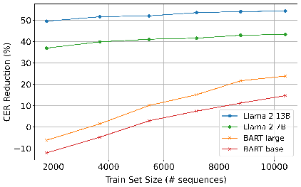

# Leveraging LLMs for Post-OCR Correction of Historical Newspapers

## Alan Thomas1, 2, Robert Gaizauskas2, Haiping Lu1, 2

1Centre for Machine Intelligence, The University of Sheffield 2Department of Computer Science, The University of Sheffield {alan.thomas, r.gaizauskas, h.lu}@sheffield.ac.uk

##### Abstract

Poor OCR quality continues to be a major obstacle for humanities scholars seeking to make use of digitised primary sources such as historical newspapers. Typical approaches to post-OCR correction employ sequence-to-sequence models for a neural machine translation task, mapping erroneous OCR texts to accurate reference texts. We shift our focus towards the adaptation of generative LLMs for a prompt-based approach. By instruction-tuning Llama 2 and comparing it to a fine-tuned BART on BLN600, a parallel corpus of 19th century British newspaper articles, we demonstrate the potential of a prompt-based approach in detecting and correcting OCR errors, even with limited training data. We achieve a significant enhancement in OCR quality with Llama 2 outperforming BART, achieving a 54.51% reduction in the character error rate against BART’s 23.30%. This paves the way for future work leveraging generative LLMs to improve the accessibility and unlock the full potential of historical texts for humanities research.

Keywords:ocr, large language model, newspaper, historical text, digital humanities

## 1. Introduction

Historical newspapers are crucial primary sources for humanities research, providing valuable insights into past events, cultural perspectives and societal changes. Significant digitisation efforts have been undertaken to enhance accessibility to these sources by scanning newspaper pages and utilising Optical Character Recognition (OCR) technology to convert images into text. This content is then stored in searchable online databases with a prominent example being British Library Newspapers (Gale, 2024), a collection spanning 300 years of newspaper publishing in the United Kingdom.

Unfortunately, the OCR quality frequently suffers due to the distinct challenges presented by historical newspapers, such as degradation over time (bleed-through, ink spills, fading), inferior print quality, outdated typefaces and complex newspaper layouts (Holley, 2009). This significantly hampers the effectiveness of text mining techniques and keyword searches, hindering humanities scholars’ ability to extract meaningful information. Addressing the issue of noisy OCR is crucial to unlocking the full potential of these primary sources. Post-OCR correction, which involves refining and enhancing the textual output generated by OCR technology, is a pivotal step in overcoming this challenge.

In recent years, the introduction of the Transformer model (Vaswani et al., 2017) has sparked a revolution in Natural Language Processing (NLP). Transformer-based architectures have consistently achieved state-of-the-art performance across a range of tasks, such as named entity recognition, sentiment analysis, question answering, and machine translation. Within this context, post-OCR

correction has often been framed as a sequenceto-sequence neural machine translation problem (Nguyen et al., 2021), with Transformer-based models trained to map erroneous OCR text to the accurate reference text.

The emergence of foundation models marks another significant milestone in NLP research. Generative large language models (LLMs), exemplified by GPT-3 (Brown et al., 2020), are trained on massive datasets and contain billions of parameters. This enables them to produce coherent and contextually relevant responses to a given prompt, showcasing remarkable language understanding capabilities and adaptability for downstream tasks across different domains. Given these factors, we believe it is worth exploring the potential of such models to perform post-OCR correction.

In this work, we focus on the post-OCR correction of BLN600, an open-source dataset of 19th century newspaper articles, written in English (Booth et al., 2024). This dataset contains OCR text sourced from British Library Newspapers along with manually re-keyed human transcriptions. We benchmark and compare two different approaches to post-OCR correction. Firstly, we adopt the prevalent approach in literature and fine-tune BART (Lewis et al., 2020), a sequence-to-sequence model, for a neural machine translation task. Secondly, we explore the potential of instruction-tuning Llama 2 (Touvron et al., 2023), an open-access foundation model, for a prompt-based approach. Through this comparison, we aim to demonstrate the capabilities of the latter approach for improving the OCR quality of digitised historical newspapers. Llama 2 outperforms BART, reducing the character error rate of our test set by 54.51% compared to 23.30%.

116

LT4HALA 2024@LREC-COLING-2024, pages 116–121 25 May, 2024. © 2024 ELRA Language Resources Association: CC BY-NC 4.0

## 2. Related Work

Since the development of OCR technology, postOCR correction has been a critical challenge. As outlined by Nguyen et al. (2021), post-OCR correction approaches can broadly be categorised into three main types: manual, isolated-word, and context-dependent. Manual approaches involve direct human intervention to correct errors in OCR generated text, achieving high accuracy at the cost of significant time and labour. Isolated-word approaches focus on examining each word separately through strategies such as merging outputs from different systems, modelling frequent errors made by OCR engines or dictionary-based correction. Context-dependent approaches consider the text around the error, typically outperforming isolatedword approaches with language models, featurebased methods and sequence-to-sequence models falling into this category.

Post-OCR correction of historical documents has seen recent coverage in literature after the International Conference on Document Analysis and Recognition (ICDAR) held two competitions on postOCR correction (Chiron et al., 2017; Rigaud et al., 2019), involving error detection and error correction tasks. The competitions introduced parallel corpora, with the ICDAR2017 corpus comprising 12M characters from English and French texts and the ICDAR2019 corpus expanding to 22M characters across multiple European languages. A key feature of the datasets is that the OCR text is aligned at character level with the ground truth using special symbols ("@" for padding, "#" for ignoring) to ensure they are of the same length.

The first competition was dominated by statistical and neural machine translation methods (Chiron et al., 2017), with Char-SMT/NMT emerging as the winner with an ensemble of character-level translation models (Amrhein and Clematide, 2018). In the second competition, Clova AI’s Context-based Character Correction method achieved the best performance (Rigaud et al., 2019), making use of a pre-trained multilingual BERT. Since the conclusion of the competitions, Ramirez-Orta et al. (2022) attained a new state-of-the-art performance on the ICDAR2019 corpus by combining corrections of character-level sequence-to-sequence models using a voting scheme. Soper et al. (2021) fine-tuned BART for sentence-level correction, achieving a comparable performance on the ICDAR2017 corpus with a simpler, single-step approach.

The works above indicate the prevalent approach to post-OCR correction is sequence-to-sequence neural machine translation, with pre-trained models being leveraged more recently. To our knowledge, we are the first to explore how generative LLMs can be prompted for post-OCR correction.

## 3. Methodology

In this section, we outline our methodology, providing background on the BLN600 dataset, as well as details of BART, Llama 2, and their respective training processes. We had planned to assess the effectiveness of our approach on the ICDAR corpora for post-OCR correction. However, these datasets contain excerpts from literary works that are available online and may be present in the training data of Llama 2, leading to potential data contamination and evaluation issues (Sainz et al., 2023).

### 3.1. BLN600

BLN600 is a parallel corpus of 19th century newspaper machine/human transcription (Booth et al., 2024). The dataset contains OCR excerpts from British Library Newspapers Parts I-II (1800-1900) (Gale, 2024), along with high-quality manually rekeyed human transcriptions from the source images. Comprising 600 samples, the articles are sourced from six different publications, published between the decades spanning the 1830s and 1890s, encapsulating a significant period of societal and cultural transformation.

Due to the acquisition process, BLN600 largely focuses on crime-related news from London publications, detailing criminal cases, court proceedings and punishments. The dataset notably reflects 19th century vocabulary and linguistic conventions, with abbreviations like "ult." (ultimo) and "inst." (instant), as well as old currency terms such as "£ s. d." (pounds, shillings, and pence). Additionally, changes in spelling conventions over time add another layer of complexity. In total, both the OCR text and ground truth contain around 300K tokens and 1.7M characters each.

|OCR Text: A Con RAGEOUS POLICENIAN.| |
|---|---|
| | |

|Ground Truth: A COURAGEOUS POLICEMAN.|
|---|

Figure 1: Example of input/output sequences

Unlike ICDAR, the OCR text and ground truth are not aligned at character level in BLN600 and can vary significantly in length, which affects how the data can be prepared as input to the model. We prepare a dataset of sequence pairs by splitting the ground truth into segments. These segments are usually individual sentences but can also be shorter article titles or longer passages like quotes. This approach allows our models to accommodate sequences of varying lengths. For each ground truth segment, the corresponding OCR text is then gathered using a search algorithm to create a dataset of source and target texts, as illustrated in Fig. 1 where the sequence is an article title.

After creating sequence pairs, we prepare training and evaluation sets, ensuring sequences from the same sample are kept in different sets. Table

- 1 provides a breakdown of the sets along with details of the mean µ and standard deviation σ in character error rate. Character error rate (CER) is used to evaluate the performance of text recognition systems such as OCR engines by computing the Levenshtein distance between the recognised text and the reference text and dividing it by the total number of characters in the reference text to provide a measure of accuracy. Levenshtein distance counts the number of edits required to transform one string into another with substitutions (replacing one character with another), insertions (adding a new character) and deletions (removing an existing character). We include 1968 perfectly correct sequence pairs with a CER of 0 (15% of the entire dataset) across our sets, such that our models learn to recognise and preserve accurate OCR outputs.

| |# sample|# sequence  |µ CER|σ CER|
|---|---|---|---|---|
|Total Train Test  |600 480 120  |13,192 10,400  2,792|0.0771 0.0753 0.0840  |0.1216 0.1175 0.1354|

Table 1: BLN600 breakdown with CER statistics

### 3.2. BART

BART (Bidirectional and Auto-Regressive Transformers) is a language model that is pre-trained on multiple denoising tasks, enabling it to reconstruct text from corrupted inputs (Lewis et al., 2020). This is achieved through pre-training tasks including token masking, token deletion, text infilling, sentence permutation and document rotation. BART uses a standard sequence-to-sequence architecture, combining BERT’s bidirectional encoder (Devlin et al., 2019) for language understanding and GPT’s autoregressive decoder (Radford et al., 2019) for generative tasks, making it particularly suited to summarisation and translation tasks.

As Soper et al. (2021) highlight, BART’s pretraining makes it well suited for post-OCR correction given the similarities between its denoising tasks and the correction of OCR errors. Additionally, the input to the encoder does not need to be aligned with the decoder output at character level, enabling it to deal with the unaligned OCR text and ground truth sequences in BLN600.

We train BART for a neural machine translation task, operating on sequence pairs as illustrated in Figure 1, where the OCR text is the input and the ground truth is the target. We make use of Hugging Face Transformers library (Wolf et al., 2020), fine-tuning both the ‘base’ (140M parameters) and ‘large’ (400M parameters) versions.

### 3.3. Llama 2

Llama 2 is a family of pre-trained and fine-tuned LLMs released by Meta AI (Touvron et al., 2023). It is a decoder-only, generative LLM with a context length of 4096, pre-trained on a mix of publicly available sources, comprising 2 trillion tokens. We opted to use Llama 2 due to its open-access nature and availability of various versions. The models come in three different parameter sizes (7B, 13B, 70B). The pre-trained model (‘base’) is a causal language model, designed to predict the next word in a sequence, which can be adapted for various natural language generation tasks. The fine-tuned model (‘chat’) is designed for assistant-like chat and optimised for dialogue applications through reinforcement learning from human feedback.

Using the sequence pairs in our train set, we create a new instruction-tuning dataset, following the Alpaca format with instruction, input and response fields (Taori et al., 2023), using a clear and simple prompt for correcting OCR errors, as illustrated in Fig. 2. We use Hugging Face Transformers to train LoRA (Hu et al., 2022) adaptors for both the 7B and 13B ‘base’ versions of Llama 2 on this instructiontuning dataset, reducing the number of trainable parameters to achieve efficient fine-tuning.

|### Instruction: Fix the OCR errors in the provided text.  ### Input: A Con RAGEOUS POLICENIAN.  ### Response: A COURAGEOUS POLICEMAN.|
|---|

Figure 2: Instruction-tuning dataset sample

## 4. Results

After training, we generate predictions over the test set. The OCR text is directly passed as input for BART. For Llama 2, we use the prompt shown in Fig. 2, excluding the response on the last line.

Table 2 illustrates some of the examples of corrections made by our top performing model, Llama 2 13B, across different error types. Substitutions and deletions are the most common type of error and easiest for our models to correct. Insertions are rarer, only occurring in cases of extreme fading in the source image, and more difficult to correct due to the dependence on the surrounding context. Correction of misnamed entities including names, locations and organisations is of particular interest to improve text mining results. The performance on these errors varies more, depending on the level of corruption. When OCR systems hallucinate and produce text that is unintelligible even to humans, it is understandable that our models struggle.

|Error Type  |OCR Text|Ground Truth  |Model Correction|
|---|---|---|---|
|Substitution  |CRUELTY TO A RACE HonsE.  |CRUELTY TO A RACE HORSE.  |CRUELTY TO A RACE HORSE.|
|Insertion|It vas impossible for a magitrate to adjtdiete in such  |It was impossible for a magistrate to adjudicate in such a matter.  |It was impossible for a magistrate to adjudicate in such a case.|
|Deletion|She spoke- T 5 once only, and that was while the doctor’s evidence p i was given.  |She spoke once only, and that was while the doctor’s evidence was given.|She spoke once only, and that was while the doctor’s evidence was given.|
|Misnamed Entity  |_ Mat. Teix TROuTr31accK, the coroner for Westminster,  |MR. JOHN TROUTBECK, the coroner for Westminster,  |MATTHEW RUTHVEN, the coroner for Westminster,|
|Hallucination  |A BAD , .0- ? aff-a. . t , -|A SAD CASE.  |A BAD AFFRAY.|

Table 2: Llama 2 13B corrections on different error types

We measure the performance of our models for post-OCR correction by computing the percentage reduction in CER, shown in Formula (1), where s is the source OCR text, t is the target ground truth and p is the model’s prediction. As shown in Table 3, we calculate the average percentage reduction in CER across our test set for BART and Llama 2. To account for variance, each value represents the mean across five training and evaluation iterations.

CERreduction =

CER(s,t) − CER(p,t)

CER(s,t) × 100 (1)

|Model|Size  |CER Reduction (%)|
|---|---|---|
|BART  |140M 400M|14.60 23.30  |
|Llama 2|7B 13B  |43.26 54.51|

Table 3: Comparison of model performance

BART achieves respectable results with its ‘large’ variant attaining a notable 23.30% reduction. Llama

- 2 significantly outperforms BART, particularly the 13B model, which is over twice as effective with a score of 54.51%. However, foundation models like Llama 2 are predominantly trained on English data and adapting such models for post-OCR correction in other languages presents an additional challenge. In contrast, multilingual sequence-tosequence models are widely available for this purpose including mBART (Liu et al., 2020).

Leveraging a generative LLM like Llama 2 also presents a notable advantage in its ability to adapt well to downstream tasks with a limited amount of instruction-tuning data (Zhou et al., 2023). On the contrary, machine translation models, including those that leverage pre-trained models like BART, are known to rely on large volumes of parallel data (Xu et al., 2024). We explore this phenomenon by dividing our original train set shown in Table 1 into six subsets of 80 samples. We evaluate the

performance of BART and Llama 2 six times, incorporating sequences from an additional subset each time to increase the amount of training data. As shown in Fig. 3, BART improves significantly with more training data whilst Llama 2 exhibits strong performance from the outset. When working with limited training data, foundation models offer a major advantage given their extensive pre-training.

Figure 3: Performance versus train set size

## 5. Conclusion

In this work, we performed post-OCR correction of BLN600, a dataset of 19th century British newspaper articles. We compared the performance of a neural machine translation method to a promptbased approach leveraging a generative LLM. We showcase Llama 2’s ability to detect and correct OCR errors, significantly outperforming BART.

Moving forward, we believe that post-OCR correction for digitisation projects should leverage foundation models fine-tuned on small, curated datasets of genre-adjacent and period-specific text. In future work, we intend to build an assistant model capable of explaining error corrections with the ‘chat’ version of Llama 2. This would enhance the model’s reliability and trustworthiness whilst enabling human verification and intervention for difficult errors. We plan to explore the possibility of quantifying the model’s confidence in its corrections, which could then be used to flag a correction for review.

## 6. Availability Statements

BLN600 is publicly accessible at https://doi.org/10. 15131/shef.data.25439023. The code is available on GitHub at https://github.com/alanbijuthomas. The fine-tuned models will be released on Hugging Face at https://huggingface.co/pykale.

## 7. Acknowledgments

This work was supported by the Centre for Machine Intelligence and the Digital Humanities Institute at the University of Sheffield. The authors would like to thank Callum Booth for his research into the OCR quality of British Library Newspapers and preparation of BLN600, which have enabled this work.

## 8. References

Chantal Amrhein and Simon Clematide. 2018. Supervised OCR Error Detection and Correction Using Statistical and Neural Machine Translation Methods. Journal for Language Technology and Computational Linguistics, 33(1):49–76.

Callum Booth, Alan Thomas, and Robert Gaizauskas. 2024. BLN600: A Parallel Corpus of Machine/Human Transcribed Nineteenth Century Newspaper Texts. In Proceedings of the Joint International Conference on Computational Linguistics, Language Resources and Evaluation (LREC-COLING 2024).

Tom Brown, Benjamin Mann, Nick Ryder, Melanie Subbiah, Jared D Kaplan, Prafulla Dhariwal, Arvind Neelakantan, Pranav Shyam, Girish Sastry, Amanda Askell, et al. 2020. Language Models are Few-Shot Learners. In Advances in Neural Information Processing Systems, volume 33, pages 1877–1901.

Guillaume Chiron, Antoine Doucet, Mickaël Coustaty, and Jean-Philippe Moreux. 2017. ICDAR2017 Competition on Post-OCR Text Correction. In 2017 14th IAPR International Conference on Document Analysis and Recognition (ICDAR), pages 1423–1428.

Jacob Devlin, Ming-Wei Chang, Kenton Lee, and Kristina Toutanova. 2019. BERT: Pre-training of Deep Bidirectional Transformers for Language Understanding. In Proceedings of the 2019 Conference of the North American Chapter of the Association for Computational Linguistics: Human Language Technologies, Volume 1 (Long and Short Papers), pages 4171–4186. Association for Computational Linguistics.

Gale. 2024. British Library Newspapers. https://www.gale.com/intl/primary-sources/ british-library-newspapers.

Rose Holley. 2009. How good can it get? Analysing and improving OCR accuracy in large scale historic newspaper digitisation programs. D-Lib Magazine, 15(3/4).

Edward J. Hu, Yelong Shen, Phillip Wallis, Zeyuan Allen-Zhu, Yuanzhi Li, Shean Wang, Lu Wang, and Weizhu Chen. 2022. LoRA: Low-Rank Adaptation of Large Language Models. In International Conference on Learning Representations.

Mike Lewis, Yinhan Liu, Naman Goyal, Marjan Ghazvininejad, Abdelrahman Mohamed, Omer Levy, Veselin Stoyanov, and Luke Zettlemoyer. 2020. BART: Denoising Sequence-to-Sequence Pre-training for Natural Language Generation, Translation, and Comprehension. In Proceedings of the 58th Annual Meeting of the Association for Computational Linguistics, pages 7871–7880. Association for Computational Linguistics.

Yinhan Liu, Jiatao Gu, Naman Goyal, Xian Li, Sergey Edunov, Marjan Ghazvininejad, Mike Lewis, and Luke Zettlemoyer. 2020. Multilingual Denoising Pre-training for Neural Machine Translation. Transactions of the Association for Computational Linguistics, 8:726–742.

Thi Tuyet Hai Nguyen, Adam Jatowt, Mickael Coustaty, and Antoine Doucet. 2021. Survey of PostOCR Processing Approaches. ACM Computing Surveys, 54(6):1–37.

Alec Radford, Jeffrey Wu, Rewon Child, David Luan, Dario Amodei, and Ilya Sutskever. 2019. Language Models are Unsupervised Multitask Learners. Technical report, OpenAI.

Juan Antonio Ramirez-Orta, Eduardo Xamena, Ana Maguitman, Evangelos Milios, and Axel J. Soto. 2022. Post-OCR Document Correction with Large Ensembles of Character Sequenceto-Sequence Models. In Proceedings of the AAAI Conference on Artificial Intelligence, volume 36, pages 11192–11199.

Christophe Rigaud, Antoine Doucet, Mickaël Coustaty, and Jean-Philippe Moreux. 2019. ICDAR 2019 Competition on Post-OCR Text Correction. In 2019 International Conference on Document Analysis and Recognition (ICDAR), pages 1588– 1593.

Oscar Sainz, Jon Campos, Iker García-Ferrero, Julen Etxaniz, Oier Lopez de Lacalle, and Eneko Agirre. 2023. NLP Evaluation in trouble: On the Need to Measure LLM Data Contamination for

each Benchmark. In Findings of the Association for Computational Linguistics: EMNLP 2023, pages 10776–10787. Association for Computational Linguistics.

Elizabeth Soper, Stanley Fujimoto, and Yen-Yun Yu. 2021. BART for Post-Correction of OCR Newspaper Text. In Proceedings of the Seventh Workshop on Noisy User-generated Text (W-NUT 2021), pages 284–290. Association for Computational Linguistics.

Rohan Taori, Ishaan Gulrajani, Tianyi Zhang, Yann Dubois, Xuechen Li, Carlos Guestrin, Percy Liang, and Tatsunori B. Hashimoto. 2023. Alpaca: A Strong, Replicable Instruction-Following Model. Technical report, Centre for Research on Foundation Models, Stanford University.

Hugo Touvron, Louis Martin, Kevin Stone, Peter Albert, Amjad Almahairi, Yasmine Babaei, Nikolay Bashlykov, Soumya Batra, Prajjwal Bhargava, Shruti Bhosale, et al. 2023. Llama 2: Open Foundation and Fine-Tuned Chat Models. Technical report, Meta AI.

Ashish Vaswani, Noam Shazeer, Niki Parmar, Jakob Uszkoreit, Llion Jones, Aidan N Gomez, Kaiser Łukasz, and Illia Polosukhin. 2017. Attention Is All You Need. In Advances in Neural Information Processing Systems, volume 30, page 5998–6008.

Thomas Wolf, Lysandre Debut, Victor Sanh, Julien Chaumond, Clement Delangue, Anthony Moi, Pierric Cistac, Tim Rault, Remi Louf, Morgan Funtowicz, et al. 2020. Transformers: State-ofthe-Art Natural Language Processing. In Proceedings of the 2020 Conference on Empirical Methods in Natural Language Processing: System Demonstrations, pages 38–45. Association for Computational Linguistics.

Haoran Xu, Young Jin Kim, Amr Sharaf, and Hany Hassan Awadalla. 2024. A Paradigm Shift in Machine Translation: Boosting Translation Performance of Large Language Models. In International Conference on Learning Representations.

Chunting Zhou, Pengfei Liu, Puxin Xu, Srini Iyer, Jiao Sun, Yuning Mao, Xuezhe Ma, Avia Efrat, Ping Yu, Lili Yu, et al. 2023. LIMA: Less Is More for Alignment. In Advances in Neural Information Processing Systems, volume 36, pages 55006– 55021.

