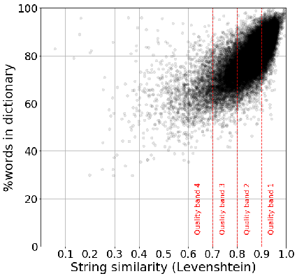
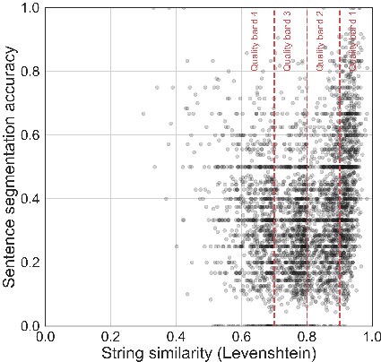
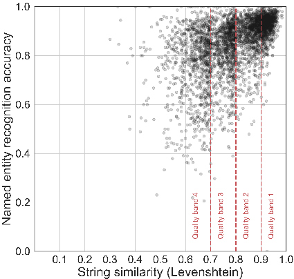
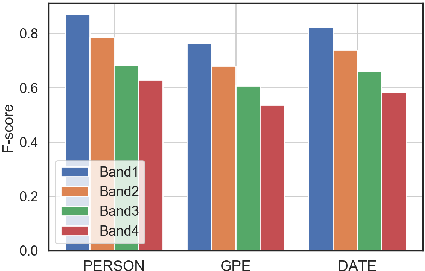
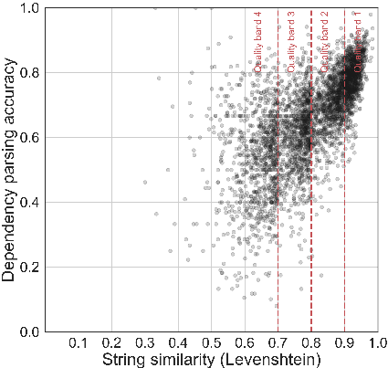
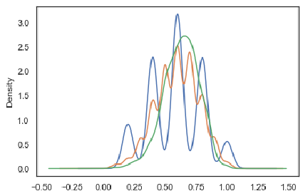
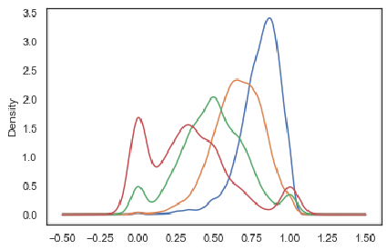
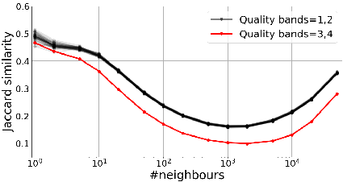

# Assessing the Impact of OCR Quality on Downstream NLP Tasks

Daniel van Strien3 a, Kaspar Beelen1 b, Mariona Coll Ardanuy1 c, Kasra Hosseini1 d, Barbara McGillivray1,4 e and Giovanni Colavizza1,2 f

1The Alan Turing Institute, London, U.K. 2University of Amsterdam, Amsterdam, The Netherlands 3The British Library, London, U.K. 4University of Cambridge, Cambridge, U.K.

daniel.van-strien@bl.uk

Keywords: Optical Character Recognition, OCR, Digital Humanities, Natural Language Processing, NLP, Information Retrieval.

Abstract: A growing volume of heritage data is being digitized and made available as text via optical character recognition (OCR). Scholars and libraries are increasingly using OCR-generated text for retrieval and analysis. However, the process of creating text through OCR introduces varying degrees of error to the text. The impact of these errors on natural language processing (NLP) tasks has only been partially studied. We perform a series of extrinsic assessment tasks — sentence segmentation, named entity recognition, dependency parsing, information retrieval, topic modelling and neural language model fine-tuning — using popular, out-of-the-box tools in order to quantify the impact of OCR quality on these tasks. We find a consistent impact resulting from OCR errors on our downstream tasks with some tasks more irredeemably harmed by OCR errors. Based on these results, we offer some preliminary guidelines for working with text produced through OCR.

## 1 INTRODUCTION

Heritage organizations are rapidly digitizing collections and making them available in a machine readable format through the use of optical character recognition (OCR) software (Terras, 2011). Text produced by OCR — referred to in this paper as OCR’d text — is used for a broad range of tasks including information retrieval and text analysis. Increasingly, these analyses are being carried out at scale.

The output of OCR software often contains errors where text has been incorrectly transcribed. Errors range from one character being incorrect, to entire words, and consequently sentences being incorrectly transcribed. Despite its central role in many tasks, the impact of using OCR’d text has only been partially explored (Smith and Cordell, 2018). This paper extends existing work by assessing the impact of OCR quality

- a https://orcid.org/0000-0003-1684-6556

- b https://orcid.org/0000-0001-7331-1174

- c https://orcid.org/0000-0001-8455-7196

- d https://orcid.org/0000-0003-4396-6019

- e https://orcid.org/0000-0003-3426-8200

- f https://orcid.org/0000-0002-9806-084X

on a range of NLP tasks common in digital libraries and digital humanities research.

## 2 RELATED WORK

Digitization efforts mainly focus on materials containing text. The ENUMERATE report for the year 2017 states that 89% of heritage institutions included in the survey possess analog text collections and 55% digital ones. For libraries these numbers go up to 91% and 75%, respectively (Nauta et al., 2017). In between the digitization and the use of textual collections, there is a critical step: OCR, or the extraction of text from images.

The importance of OCR cannot be understated. Most search and mining on digitized collections are performed using OCR’d texts. Unfortunately, OCR’d texts often contain errors. Particularly for historical texts and despite notable improvements over time (Smith and Cordell, 2018), error rates can be very high, with largely unknown biasing consequences for end users (Alex et al., 2012; Milligan, 2013; Strange et al., 2014; Cordell, 2017; Jarlbrink and Snickars, 2017;

Traub et al., 2018; Cordell, 2019). Consequently, assessing and improving OCR quality has been, and still is, a key area for research and development (Alex and Burns, 2014; Ehrmann et al., 2016; Smith and Cordell, 2018; Nguyen et al., 2019; Hakala et al., 2019).

Despite these known issues, there has been limited efforts to systematically evaluate “errorful OCR” and offer guidelines about “what kinds of research are possible within our current paradigm” (Smith and Cordell,

- 2018, 10). Only preliminary efforts have been made to assess the practical impact of OCR errors on the use of OCR’d corpora; efforts which would allow us to move beyond the dichotomy between “clean transcriptions” and “dirty OCR” (Smith and Cordell, 2018, 10-11) and to overcome the widespread lack of a quantified understanding of OCR quality (Traub et al., 2015).

Most OCR’d texts come with an estimation of their “quality”. Typically, this quality is assessed through an average confidence metric from the OCR software which was used to perform OCR. This is an instance of intrinsic OCR evaluation, where we only rely on the OCR model to assess it(self). Such assessments are unsatisfactory because they might not be comparable when the software/provider changes and provide no indication on how the OCR quality influences other tasks or is related to other, external data or systems (Hill and Hengchen, 2019). This is the broader scope of extrinsic OCR evaluations.

The simplest examples of extrinsic OCR evaluations are dictionary lookup and word-error rates. These methods are still popular (Pletschacher et al., 2014), yet they are often not optimal in the case of historical texts due to language change phenomena. More generally, extrinsic evaluations encompass any use of a task which takes as input the text output of an OCR model, in order to assess the impact of OCR quality on the task itself. We refer to these tasks as downstream tasks; examples include: information extraction (e.g., named entity recognition and detection), organization (e.g., document classification) and retrieval (e.g., document ranking). Extrinsic evaluations are more involved but also more informative, because they allow us to reason about the practical use of OCR outputs. They also require at least two versions of the same text: a clean or high-quality one, alongside its OCR’d version. Task results on the former are considered as “ideal” and are compared to task results on the latter version of the text.

Some work has been published on extrinsic OCR evaluations, with an almost exclusive focus on English and, to a lesser degree, French. Studies have considered information access and retrieval (Traub et al., 2018), authorship attribution (Franzini et al., 2018), named entity recognition (Hamdi et al., 2019), and

topic modelling (Nelson, 2020; Mutuvi et al., 2018). Recently (Hill and Hengchen, 2019) compared different tasks on a corpus in English: topic modelling, collocation analysis, authorship attribution and vector space modelling. From this study, a critical OCR quality threshold between 70 and 80% emerged, where most tasks perform very poorly below this threshold, good results are achieved above it, and varying results are achieved within, according to the task at hand.

There are many aspects of OCR’d texts and their impacts on downstream tasks that remain to be explored, in particular, results assessing a wider range of languages. Another element to be explored is the impact of time, and consequently of the combined effects of linguistic change and OCR quality on the application of tools usually trained on contemporary languages. Lastly, the range of tasks which are considered in previous work is limited, with comparisons across tasks attempted in a single, seminal paper (Hill and Hengchen, 2019). In this work, we start addressing these research questions by considering a larger set of tasks and utilizing text drawn from a source which poses many challenges for OCR: historic newspapers (Pletschacher et al., 2014).

## 3 DATA AND METHODS

Building on previous work, we perform an extrinsic assessment of the impact of OCR’d text via a number of downstream NLP tasks.1 We perform these tasks on two versions of the same text: one produced through OCR and one with human corrections. Through these assessments we quantify the impact of OCR errors on tasks which have a broad “real world” applicability. The motivation of the assessment is to see to what extent there is a degradation in the performance of these standard tools applied to OCR’d text as compared to human-corrected text. These tools have been chosen as they are used widely by scholars in the digital humanities and researchers they collaborate with, e.g., digital librarians and curators, data scientists and computational linguists.2 Our evaluation tasks address a number of use cases for working with digitized text, including text pre-processing, retrieval and analysis. The tasks work with text at different levels, from the token level to document and corpus level, allowing for a more comprehensive comparison of the impact of

- 1In this paper we do not assess the impact of different OCR software on the type of OCR error produced
- 2For example spaCy (Honnibal and Montani, 2017) a Python library for performing NLP tasks, is used in the pipeline for Defoe, a tool utilised in digital humanities research (Vicente et al., 2019).

OCR.

### 3.1 Available Data

There are a number of publicly available datasets which can be used in extrinsic assessment tasks. This includes two datasets produced as part of the 2017 and 2019 ICDAR Competitions on Post-OCR Text Correction (Rigaud et al., 2019; Chiron et al., 2017). These datasets consist of OCR’d texts and a corresponding gold standard.

Despite limitations we use the Overproof data which contains a wider distribution of OCR qualities in comparison to other datasets such as the ICDAR competition data. Project Computing, a software company which develops a post-OCR correction software service called ‘Overproof’, released data as part of a paper evaluating their approach. The Overproof team released three evaluation datasets (Evershed and Fitch, 2014). These datasets were drawn from a number of sources. The first dataset is drawn from newspaper text corrected from the National Library of Australia Trove digitized newspaper collection. The Trove website allows users to correct OCR errors as part of the browsing interface. Currently, there are 330,484,635 lines of corrected text. Overproof sought to leverage these corrections by identifying articles from the Sydney Morning Herald, 1842-1945 which had extensive corrections (at least 85% of the number of lines in the article) and through the correction history accessing the original uncorrected OCR’d text (Evershed and Fitch, 2014, Section 6). We treat data released by Overproof as a single dataset which we refer to in this paper as the ‘Overproof dataset’.3

### 3.2 Assessing OCR Quality

In order to quantify the impact of the OCR at a more granular level, we perform a number of steps to prepare our data. These include splitting the OCR portion of our data into different quality bands and performing token-level article alignment.4

#### 3.2.1 Word Error Rate

We calculate Levenshtein similarity (Levenshtein, 1966) between the two versions of the text calculated as (length−LD)/length in which length is the number of characters in a text, and LD is the Levenshtein

- 3Data available via http://overproof.projectcomputing. com/datasets. We use all available data to ensure a range of OCR quality is included in our evaluation.
- 4Code for processing data and performing the evaluation is available in a Zenodo repository via https://doi.org/10. 5281/zenodo.3611200.

- 0
- 1
- 2
- 3
- 4
- 5
- 6
- 7 Quality band 1

- Quality band 2

| |
|---|

- Quality band 3

| |
|---|

- Quality band 4

| |
|---|

0.0 0.2 0.4 0.6 0.8 1.0

Word-error rate (Jaccard similarity).

Figure 1: Distribution of word-error rates (calculated via Jaccard similarity) for articles in the four quality bands, established via Levenshtein similarity.

distance between “ground truth” and OCR’d texts for one article. If the lengths of “ground truth” and OCR’d texts differ, the length of the longer text is used instead. We treat a higher distance between the humancorrected text and the OCR version as an indication of lower quality OCR. We then use this score as a way of allocating the OCR’d texts into four quality bands using various thresholds of the Levenshtein score. Table 1 illustrates these thresholds and the number of articles into each quality band. In figure 1, we calculate the Jaccard similarity between the OCR’d and human-corrected version of the article using a bagof-words approach. The Jaccard similarity compares the text at the word level as opposed to the character level of Levenshtein similarity. When we plot the distribution of Jaccard similarity values across the OCR quality bounds we see that there is some overlap in distributions. However, we also see that the Jaccard similarity decreases as the quality band decreases, suggesting our approach is reasonable for determining OCR quality.

Table 1: Summary of Overproof data by quality band (based on human-corrected text).

|Quality band|Levenshtein Distance  |Articles  |Words|
|---|---|---|---|
|1|>0.9  |11,461|4,024,217|
|2  |>0.8  |13,953  |4,444,365|
|3  |>0.7  |3,600|1,019,422|
|4|0.7  |1,495  |404,054|
|Total|NA  |30,509|9,892,058|

In Table 1, we see that the majority of articles fall into quality band 2, with the worst OCR quality representing a smaller portion of the total data.

Figure 2: Percentage of words found in the dictionary, as a function of the Levenshtein similarity measure. Each point corresponds to one article.

#### 3.2.2 Dictionary Lookup

Another approach to evaluating OCR quality is to use a lookup of dictionary terms to count how many word tokens in the OCR’d text are found in a dictionary. This has the benefit of being possible without any externally corrected versions of the text. It removes reliance on the confidence measures from OCR software but has other potential challenges, including choice of dictionary, changing vocabulary, specialist vocabulary and spelling variations. A direct lookup of a dictionary will also provide an equal “score” to a word with one mistaken character as to a word with many mistakes.

To assess how well dictionary lookup performs as a proxy for OCR quality compared to a distance measure, we compared the percentage of words found in a dictionary for an article to the string similarity between OCR’d and human-corrected text. We used spaCy to perform our dictionary lookup.5 Figure 2 shows that there is a correlation between the percentage of words found in the dictionary and the string similarity measure. Therefore, although in this paper we use string similarity to establish four OCR quality bands, our results can be generalized due to its high correlation with alternative methods to assess OCR quality. This is particularly important when a ground truth is not available.

5Throughout this paper, we use the spaCy model for English en_core_web_lg, see: https://spacy.io/models.

#### 3.2.3 Text Alignment

The Overproof dataset aligns OCR’d and humancorrected texts at an article level and, to a certain degree, at a physical line level. Example 1 shows the first four lines of an OCR’d article, and example 2 shows the same four lines of its human-corrected version. For some of the tasks (e.g., linguistic processing tasks), it is crucial that the linear sequence of tokens is kept. With this in mind, we aligned the dataset, both at an article level and at a token level, by mapping tokens in the OCR’d text to their position in the human-corrected version of the text.

- (1) i NEW CALEDONIA. ’ Io the Editor of the Berala. SIB,-Enclosed is a letter \

ooncernlug the expedition of the

’ »Governor, M. de Siisseî, tbiough \ the north of Caledonia, which

- (2) NEW CALEDONIA. To the Editor of the Herald. SIR,-Enclosed is a letter \

concerning the expedition of the Governor, M. de Saisset, through \

the north of Caledonia, which

We have taken a heuristic and conservative approach to align the pairs of articles, by first mapping tokens we are more confident about, in terms of:

- • length of the token to map (longer tokens are mapped first),
- • string similarity between tokens (starting from 100% match and gradually decreasing to 70% match, calculated as 2M/T, where M is the number of matching characters and T is the total number of characters in both tokens), and
- • distance between the tokens’ first character positions in the texts.

We iteratively mapped the remaining tokens in order of decreasing confidence, making sure that, if a token’s position is between two aligned tokens in the humancorrected text, this token’s position in the OCR’d text should also be between the same two aligned tokens in the OCR’d text. Table 2 shows an example of alignment between the OCR’d and the human-corrected texts.

We have manually validated the alignments of 1266 tokens from articles from the four quality bands. 6 For the lowest quality band the accuracy of aligned tokens is 98.4%, for the second lowest quality band it

6We were unable to rely only on articles with additional corrections from the Overproof researchers(total 159), since this did not include a sufficient number of low OCR quality articles.

- Table 2: Alignment of the first tokens of examples 1 and 2. Uncertain elements are strings between aligned tokens that the algorithm could not align. The numbers in parenthesis correspond to the position of the first character of the string in the OCR’d text and in the human-corrected text.

| |OCR’d text  |Human correction|
|---|---|---|
|Uncertain Aligned Uncertain Aligned Aligned Aligned Aligned Aligned Aligned|i NEW (0)  CALEDONIA. (6)  ’ Io the (17)  Editor (26)  of (33)  the (36)  Berala. (40)  SIB, (48)  -Enclosed (53)|NEW (0)  CALEDONIA. (4)  To the (15) Editor (22) of (29)  the (32)  Herald. (36)  SIR, (44)  -Enclosed (49)  |

is 99.9%, and for the best two quality bands it is 100%. We have aimed at the highest precision possible even if that meant having consequently considerably smaller number of aligned tokens (from 30% in quality band 4 to 78% in quality band 1).

## 4 RESULTS

### 4.1 Linguistic Processing Tasks

We include a range of tasks which fall into common NLP pipelines and are often required for other downstream tasks. Due to space limitations, in this section we focus on just three tasks — sentence segmentation, named entity recognition, and dependency parsing — and we analyze the impact of OCR errors on spaCy. For each task, we consider spaCy’s output on the human-corrected text to be the ground truth against which we compare spaCy’s output on the OCR’d text, therefore assuming that the highest performance we can achieve on an OCR’d text is that which is achieved on its human-corrected counterpart. In order to have comparable quality bands, we have randomly downsampled the dataset to have the same number of articles (950) in each quality band.

Considering the pervasive presence of OCR errors, the comparison of the different methods’ performance on the OCR’d text with respect to its human-corrected counterpart is not straightforward. In the assessment of the following tasks, we only take into consideration those tokens which our algorithm has aligned between OCR’d and human-corrected text. We are aware that this approach neglects tokens containing a large amount of OCR errors, which our algorithm does not align. However, because linguistic processing is heavily sequential, it is not only the presence of OCR errors in the target token that has an impact on the performance. This is an assumption that would benefit

Figure 3: Sentence segmentation accuracy of OCR’d with respect to human-corrected articles, as a function of Levenshtein similarity. Each point corresponds to one article.

from further research.

#### 4.1.1 Sentence Segmentation

Sentence segmentation is the task of detecting sentence boundaries between the words in different sentences (Palmer, ). It is the basis for many NLP applications, and is often regarded as a solved task. However, performance of sentence segmentation methods has been shown to decrease when applied to noisy or less formal text (Read et al., 2012). To assess the impact of OCR errors on sentence splitting, we applied spaCy’s sentence segmentation module to both texts (human-corrected OCR’d text and original OCR’d text) and considered a sentence as being correctly split if both left and right boundaries enclose the exact same aligned tokens.

Figure 3 shows that OCR errors can have a huge impact on sentence segmentation. Indeed, a close exploration of the segmentation informs that even a one-character difference can trigger the splitting of a sentence into two sentences. This results in a surprisingly low performance of sentence segmentation, even for OCR’d texts that are mostly correct.

#### 4.1.2 Named Entity Recognition

Named entity recognition (NER) is the task of identifying mentions of entities in texts and classifying them into predefined entity types (such as ‘person’, ‘organization’, or ‘currency’). For many tasks, including information retrieval, named entities are arguably the most important of lexical classes: an analysis of

user queries on a historical corpus showed that most popular search keywords were entities, in particular of the location type (De Wilde and Hengchen, 2017). We have considered a true result when an aligned token has the same entity type tag and the same IOB tag, which indicates the position of the token in the case of a multi-token entity. Figure 4 shows the distribution of each article’s named entity recognition accuracy plotted against the string similarity between the OCR’d and the human-corrected text. OCR errors show to have a generally smaller impact in a named entity recognition task than they have in sentence segmentation.

Figure 4: Named entity recognition accuracy of OCR’d with respect to human-corrected articles, as a function of Levenshtein similarity. Each point corresponds to one article.

In figure 5, we focus on three particular entity types, namely person, GPE (geo-political entity), and date.7 We can observe that the impact on person entities (0.87 and 0.63 average f-score in quality bands 1 and 4, respectively) is less pronounced than on geo-political entities, which are greatly affected by noisy OCR’d text (0.76 and 0.54 average f-score in quality bands 1 and 4, respectively).

#### 4.1.3 Dependency Parsing

Dependency parsing is the last and typically the most complex of the linguistic processing tasks that we cover in this paper. It is the task of finding the grammatical structure underlying a text in terms of syntactic

7Person and GPE are arguably the most relevant entity types. The date entity type has very different characteristics with respect to the other two, as it captures time expressions, which are often sequences of several tokens, often non-capitalized and containing numerical expressions.

- Figure 5: Average f-scores for person, GPE, and date for each quality band.

dependencies (i.e., head-dependent relationships) between the tokens in a sentence. Dependency parsing is used in many downstream tasks, often for improving their performance (Jie et al., 2018; Xia et al., 2019).

- Figure 6 shows a clear impact of OCR errors in the performance of dependency parsing.

Looking in more detail, we observe that the length of the dependency relation is a very important factor, as dependency relations between neighboring tokens have an accuracy of 0.82 and 0.57 in quality band 1 and 4 respectively, whereas dependencies between tokens that are separated by more than five tokens have an accuracy of 0.57 and 0.09 in quality band 1 and 4 respectively. This is worth taking into account, because it means that dependency types that tend to be longer (such as the nominal subject nsubj dependency type) will perform worse.

This analysis shows that the presence of OCR errors in digitized text has different impact depending on the task, and points to the importance of understanding the data well and being cautious about the methods used. There is a need for further research to better understand how different tools cope with the presence of errors, and to expand the analysis to other tasks.

### 4.2 Information Retrieval

OCR errors can negatively affect search and information retrieval in digital collections. In this section, we gauge how article OCR quality impacts (a) the article ranking and (b) the retrievability of articles. For the first task we measure the difference between two rankings obtained by querying the same collection of texts but varying in OCR quality. In this scenario, we assume a user inspects the first n articles for a set of queries Q. For each query q we compute the overlap o(q) between the two rankings. rcorr(q,n) comprises the ranking over the first n articles for query q, retrieved from the set of corrected articles. The length

Figure 6: Dependency parsing accuracy of OCR’d with respect to human-corrected articles, as a function of Levenshtein similarity. Each point corresponds to one article.

of the intersection is furthermore divided by the size of rcorr(q,n).

o(q) = |rcorr(q,n)∩rocr(q,n)|

|rcorr(q,n)|

We indexed both the OCR’d and human-corrected articles with Elastic Search (using standard settings, which utilise Luce’s Practical Scoring Function). As in previous experiments, our choice was motivated by the popularity of this tool in digital humanities research.

We simulated realistic search scenarios by collecting query terms from two external resources: (a) 2,949 nouns collected from a sample of newspaper articles (b) 2,231 Australian toponyms obtained from WikiGazetteer (Ardanuy et al., 2019). This is a helpful approximation to understand how search for specific topics (nouns) or places (toponyms) might be hampered by OCR. Below, we mainly discuss results obtained using nouns as queries, but repeated all the experiments with the toponyms to ensure that our findings extend to other types of queries.

We first computed the o(q,n) based on the whole collection of OCR’d and human-corrected articles. On average, the size of the ranking (n) seems to slightly increase the ratio of overlapping items (from 0.57 for n=5 to 0.63 for n=25), but the differences remain minimal, as can be observed from Figure 7. Nonetheless, these numbers do suggest that the rankings change as a result of OCR error correction.

Figure 8 shows the average o(q,n) for different quality bands.8 The figure suggests a growing diver-

8Given the different number of articles in each quality

- Figure 7: Distribution of o(q,n). Distribution of o(q) scores for the ranking of size 5 (blue), 10 (orange) and 25 (green).

- Figure 8: Distribution of o(q,n) scores for different quality bands. n=25, blue=1, orange=2, green=3, red=4.

gence between the rankings as the quality decreases, while the size of the ranking has only a minimal effect. It seems reasonable to conclude that “bad” OCR produces “terrible” search results, but strictly speaking this is not what the figure says. The shrinking overlap doesn’t entail a loss in relevance, and in this sense, the decline doesn’t convey that the lower quality bands produce “worse” results. However, an inspection of the number of items found suggests that searching in bad quality text returns fewer articles. For a set of queries Q we calculated hdif f(Q) as hcorr(Q)/[hcorr(Q)+hocr(Q)]−0.5, with hc(Q) equal to the number of articles found in corpus c. Table 3 shows that searching in messy data yields less information. Similarly, we estimated the number of false positives when querying the OCR’d data, by subtracting (for each query) from the number of articles in the human-corrected data (hcorr(q)) those found in OCR’d

band, we replicated the result on a down-sampled corpus, which has ≈ 900 articles for each band. The trend is generally the same, but more volatile, as this measure is still dependent on the content of texts (even though we try to account for queries that fail to return a ranking by excluding those for which we can’t find any articles in the humancorrected corpus).

- Table 3: hdif f and f p scores based on a comparison of OCR’d versus human-corrected data.

|quality  |1|2|3|4|
|---|---|---|---|---|
|hdif f f p  |0.040 0.011|0.075 0.017  |0.129 0.029  |0.197 0.046|

- Table 4: Gini coefficients computed on the retrievability scores r(d).

|topn  |5|10|25|
|---|---|---|---|
|gocr gcorr|0.718 0.711  |0.592 0.579|0.432 0.413  |

texts (hocr(q)). The total number of false positives is then:

f p= ∑

min(hcorr(q)−hocr(q),0)

q∈Q

We divide the absolute value of f p by the total number of found articles and report the results in Table 3.

To summarize, we observe that as the quality of the data decreases, the rankings diverge, the number of hits decline and the portion of false positives increases. All combined, these indicators suggest that quality does negatively effect search.

To measure the retrievability of articles, we used the method proposed by (Azzopardi and Vinay, 2008). It scores each article r(d) by counting how often it occurs when inspecting the first n articles for queries Q. f(kd,q) is equal to 1 if article d appears within the ranking of length n for the search term q. Following (Traub et al., 2018), we treated all queries as equally probable (effectively setting the individual weight for each query (oq) to 1).

r(d) = ∑

oq · f(kdq,n)

q∈Q

Retrievability tracks how often articles are found for a given set of queries. Comparing the retrievability across quality bands is tricky, as the measure is influenced by both the content and the number of articles. However, we can assess the impact of the manual correction by comparing human-corrected to OCR’d articles. We report the Gini coefficients computed on the distribution of retrievability scores to assess any bias.

The results in Table 4 tie in with the findings of (Traub et al., 2018), who observed consistently higher Gini coefficients for the corrected articles, indicating that increases in quality data decreases the bias. Compared to them, however, we find that the differences are only minimal, which could be caused by the imbalance between the number of queries (ca. 2,000) and the size of the corpus (ca. 30,000): when inspecting the distribution of the retrievability scores on OCR’d text for

n = 25, only 29% of the articles are found more than once, and the maximum score is 12.9 Even though the impact of correction is small in our experiments, the overall trend does confirm the previously reported link between articles’ quality and retrievability bias.

### 4.3 Topic Modelling

We consider topic modelling next. Our experimental setup is the following: we use an established method, Latent Dirichlet Allocation (LDA) (Blei et al., 2003) in its by-now standard Gensim implementation (Re-ˇ hu˚ˇrek and Sojka, 2010). We find 15 to be a reasonable number of topics using a coherence measure on the human-corrected texts (Newman et al., 2010), for all quality bands and despite their difference in size (see Table 1). The comparison is made over four pairs of LDA models, one per quality band (one to four), and two per band (using human-corrected text, and its OCR’d version). No sampling is done, as we use all available articles to train each model.

We apply an aggressive clean-up to the texts before topic modelling, in order to attempt to minimize the impact of OCR quality as it would be done in a real use case. The same pre-processing pipeline is used for all corpora, both human and OCR and per quality band, in order:

- 1. Lowercasing, lemmatization and filtering of all non-alphabetical tokens and all English stopwords, replying on spaCy defaults.
- 2. Removal of tokens shorter than three characters.
- 3. Addition of bi-grams with minimum count of 25.
- 4. Removal of infrequent (fewer than 5 occurrences) or frequent words (appearing in more than half of the articles).

We then train LDA models using ten passes over the data and default parameters.10

Firstly, we perform an intrinsic evaluation by assessing each model’s perplexity and coherence (Newman et al., 2010; Mimno et al., 2011). In agreement with previous work (Mutuvi et al., 2018), we find that OCR models have slightly lower (hence better) perplexity scores but also slightly lower (hence worse) coherence scores. We do not find differences between quality bands in this respect.

Next, we consider a matching between humancorrected and OCR topics for every pair of models

- 9Contrary to (Traub et al., 2018), we did not find a correlation between article quality and retrievability, probably also because of the imbalance between queries and articles.
- 10The resulting vocabulary sizes are as follows. Quality band 1: 19,227 (human-corrected), 27,171 (OCR); band 2: 21,447, 33,702; band 3: 9,062, 11,250; band 4: 4,938, 4,635.

within each quality band. The goal is to match each OCR topic with its closest human-corrected topic (in word distribution). To accomplish this, we consider the 500 most distinctive (i.e., high probability) words per topic, and construct a fully connected bipartite graph between human-corrected and OCR topics respectively. Edge weights between a human-corrected topic i and OCR topic j are established as follows:

wij =1− ∑

pi(t)pj(t)

t∈Vi∩Vj

Where wij is the edge weight between topics i and j (the graph is bipartite, hence i and j must belong to the set of human-corrected and OCR topics respectively); Vi and Vj are the sets of 500 top words per topic; pi(t) is the probability of word t under topic model j, and similarly for pj(t). Note that the sum is capped above to 1, hence the weights of the graph take values between 0 and 1 and must be interpreted as distances, where 1 is maximum distance and 0 is minimum distance between any two topics. We then find a matching using Karp’s minimum weight algorithm as implemented in NetworkX (Hagberg et al., 2008). We find that topic matching is often imperfect, and degrades markedly with OCR quality. We assess it using the Kullback-Leibler (KL) divergence of OCR topics from human-corrected topics (Steyvers and Griffiths, 2007), whose distribution is shown in Figure 9; we also show the number of overlapping words in the top 500, as defined above, in Figure 10. As it can be seen, results degrade as the OCR quality lowers. A manual inspection of every match confirms that, while within quality bands 1 and, to a lesser degree, 2, most topics can still be matched, this is not the case for bands 3 and 4. We further confirm this result using a clustering approach. We assign an article to a cluster corresponding to its most probable topic. We then assess what is the proportion of articles which end in the matched clusters, i.e., which have as most probable OCR topic the one matched with their most probable human-corrected topic according to the procedure described above. We find that, while OCR quality always impacts clustering results negatively, for bands 4 only 20% (median 11%) of articles end up in the intended cluster, while the mean is up to 42% (median 46%) for band 1.

We conclude the assessment of topic models by considering the entropy of topic distributions over different top word vocabulary sizes.11 We show results for band 1 (Figure 11) and band 3 (Figure 12). As it can be seen, lower OCR quality has an impact on the top topic words. The impact increases from lower values of V (top words per topic), which likely contains

11Shannon’s entropy of topic i is defined as ei = −∑t∈Vi pi(t)log[pi(t)].

|Quality band 1  Quality band 2  Quality band 3  Quality band 4 |
|---|

- 0
- 1
- 2
- 3
- 4
- 5

0.0 0.2 0.4 0.6 0.8 1.0

KL divergence between topics, V=500.

- Figure 9: Per-quality band KL divergence of OCR topics from Human-corrected topics, using a vocabulary ofV =500 top words.

|Quality band 1  Quality band 2  Quality band 3  Quality band 4 |
|---|

0.0 0.2 0.4 0.6 0.8 1.0

- 0
- 1
- 2
- 3
- 4
- 5
- 6
- 7

- Figure 10: Per-quality overlap of top words (V = 500).

well-formed words, to the lower end of the topic’s probability distribution, which likely contains more OCR noise. OCR’d topics always have a higher entropy than Human-corrected topics.

In summary, we find that OCR has an impact on topic models, when compared to models trained on clean text. OCR topic models increasingly diverge from their human-corrected counterparts as the OCR quality lowers. We find that, while quality bands 1 and, to a lesser degree 2, still maintain a good fidelity with their human-corrected counterparts, this is not the case for bands 3 and, particularly, 4. The issue is not as much that OCR topic models became meaningless but, more subtly, that they retain their interpretability (Hill and Hengchen, 2019) while becoming substantially different from what they would be using clean texts. Furthermore, we note that intrinsic evaluations, such as perplexity and coherence, do not capture this effect, and should thus be avoided for the purpose of assessing the reliability of OCR topic models with respect to their similarity to models trained on clean texts. It is left for future work to study which countermeasures could be taken to minimize the impact of OCR noise on topic models, such as increasing the number of topics to separate noise from signal. In conclusion, we recommend to rely on topic modelling with OCR’d

|V = 500  V = 1000 V = 2000 V = 5000  | |
|---|
  Hum OCR|
|---|

- 0
- 1
- 2
- 3
- 4
- 5

5.0 5.5 6.0 6.5 7.0 7.5 8.0 8.5

Entropy of topic distributions.

- Figure 11: Quality band 1. Distribution of the entropy for the top V words per topic, at varying values of V.

|V = 500  V = 1000 V = 2000 V = 5000  | |
|---|
  Hum OCR|
|---|

5.0 5.5 6.0 6.5 7.0 7.5 8.0 8.5

Entropy of topic distributions.

- 0
- 1
- 2
- 3
- 4
- 5
- 6

- Figure 12: Quality band 3. Distribution of the entropy for the top V words per topic, at varying values of V. texts quality ideally above 90%, or at least above 80%. 4.4 Language Models

Language models (LMs) allow for the learning of a useful representation of text without annotations. LMs have resulted in massive gains in a broad range of tasks including text classification (Howard and Ruder, 2018) and NER (Yadav and Bethard, 2018). LMs, in particular Word2Vec, has also been directly used in many digital humanities projects (Leavy et al., 2018).

Though minor OCR errors should not affect the quality of LMs trained on a large corpus, poor quality texts may bias the LM in an irredeemable way. Here, we use OCR’d and human-corrected texts to quantify the impact of OCR errors on resulting LMs. The amount of training data determines the stability of LMs (i.e., small datasets result in unstable models). Therefore, in this task, we consider articles with high and low OCR qualities. The first group contains all the articles in quality bands 1-2 with ≈ 10.5M words. The second group is based on the articles in quality bands 3-4 with ≈ 1.9M words. To trace the changes introduced by OCR errors, we use human and OCR’d texts to fine-tune an existing pre-trained model, Word2Vec LM (Mikolov et al., 2013) using

Figure 13: Impact of OCR errors on fine-tuning neural network language models. The black and red lines correspond to the texts with quality bands 1-2 and bands 3-4, respectively. Fifty black lines for the high-quality group and one red line for the low-quality group are plotted. See text for discussion. Note that the x-axis is logarithmic.

the Gensim implementation. This skip-gram language model was pre-trained using ≈ 4.46 billion raw words from ≈ 49.4K historical books (1740-1900).12 For the low-quality group, we generated two new fine-tuned LMs using human-corrected and OCR’d text. The two models were then compared based on the similarity of word vectors. First, the most frequent 1000 words in the human-corrected text were selected, and for each word and each LM, we extracted its neighboring words as measured by cosine similarity. Next, we compared the two lists of neighboring words using the Jaccard similarity. The red line in Figure 13 shows the overlap between the two lists for different numbers of queried neighboring words. Interestingly, there is a high overlap between the two LMs for the closest neighbors. By increasing the number of queried neighboring words, the overlap decreases, and it reaches its lowest point at 1000 queried neighboring words. After this point, the overlap increases as expected. This trend shows the extent to which OCR’d text can affect the predicted word vectors in widely used Word2Vec LMs.

A similar trend emerges in the case of high-quality articles (black lines in Figure 13) but with higher Jaccard similarity measures (5-10% higher) in almost all the queries. We did not use all the 25,414 high-quality articles in fine-tuning. Instead, we sampled 5,095 articles to have a comparable number of articles with the low-quality group. We repeated the sub-sampling 50 times using random sampling with replacement, and for each sub-sample, we generated two new fine-tuned LMs using human-corrected and OCR’d texts. This resulted in 100 fine-tuned LMs and 50 measures of Jac-

12These books come from an open dataset of digitized books from the British Library, available via https://doi.org/ 10.21250/db14 (British Library Labs, 2014). The date range was chosen based on the availability of training data. This trained LM will be released alongside a forthcoming paper which will include a full evaluation of this LM.

card similarity. The results of all 50 comparisons are shown in Figure 13. All curves show a similar trend in #neighbors ≥ 5 which suggest a high-confidence in their Jaccard similarity measures. The most variable part of the trend is in the low number of queried neighbor words.

These preliminary results show that the generated word vectors by Word2Vec LMs can be substantially affected by OCR errors when OCR’d text are used for fine-tuning. However, LMs directly trained on large OCR’d corpora may still yield robust word vectors. They may even be able to position a word and its badly OCR’d variants nearby in the vector space (Hämäläinen and Hengchen, 2019). In such cases, LMs can be used to identify OCR errors and possibly provide a way to correct systematic OCR errors in a large corpus. Future work will be required to assess the impact of OCR on LMs at scale, as well as when LMs are used as features in other models.

## 5 DISCUSSION

The use of OCR’d text has an impact on all of our tasks, though the degree varies. OCR has an impact even on tasks which are considered “solved”, such as sentence segmentation. Though these pre-processing tasks are not usually the end goal per se, they are often required for other tasks in turn. NER progressively worsens as OCR quality decreases, with a stronger impact on the GPE entity type, followed by date and person. We suggest that this uneven impact on different entity types should be considered when using NER on OCR’d text. We observe that dependency parsing is impacted more severely as the length of the dependency grows. This suggests that we should be particularly cautious when applying dependency parsing on low quality OCR texts.

In information retrieval, decreasing OCR quality leads to a divergence in the ranking of retrieved articles compared to the human-corrected text with the number of hits declining and an increasing number of false positives. We find a smaller impact of improved OCR quality on retrievability bias though this may be as a result of the size of our data and number of queries. Our results accord with previous research on retrieval and OCR and suggest caution in “trusting” retrieval results on OCR’d text. This is particularly important when search results are directly used to make arguments, for example, by counting search results for a term over time in a OCR’d corpus, since the variation may be a proxy for OCR quality rather than a change in underlying usage of that term. This caution is particularly important when OCR quality is unknown.

We find that worsening OCR quality leads to a growing impact on topic models when compared to those trained on the human-corrected text. Of note is the subtle way in which topic models are impacted by OCR quality: topics do not become meaningless, but instead increasingly diverge from those trained on human-corrected text. This means that this effect will not be easily “spotted” when training topic models on poor quality OCR’d text, particularly since intrinsic evaluations do not capture this effect. From our results we recommend a preference for high quality OCR ideally above 90% and at least above 80%.

Lastly, our results suggest that the word vectors predicted by Word2Vec LMs can be significantly affected by OCR errors when OCR’d texts are used for finetuning. LMs directly trained on large OCR’d corpora may still yield robust word vectors though we have not fully test this assumption. The impact of OCR on LMs is an area with promising paths for further investigation which we partially outline below.

## 6 CONCLUSION

We have performed a large-scale analysis of the impact of OCR errors on several NLP tasks. Promising areas of future work include: using more data for performing assessment of OCR quality, establishing rigorous heuristics for measuring OCR quality without reliance on intrinsic confidence scores, and the post-correction of OCR errors.

Language models have had a major impact on a range of NLP tasks. However, whilst the impact of OCR errors on these models is poorly understood, it will be difficult for researchers and institutions working with OCR’d text to fully realize these benefits. This is work we plan to begin soon.

Establishing evidenced-based best practices for working with OCR’d will reap major benefits, particularly if these practices become more widely shared across all researchers working with OCR’d text. This is an area in which libraries and other heritage organizations play an important advocacy role.

## ACKNOWLEDGEMENTS

Work for this paper was produced as part of Living with Machines. This programme, funded by the UK Research and Innovation (UKRI) Strategic Priority Fund, is a multidisciplinary collaboration delivered by the Arts and Humanities Research Council (AHRC), with The Alan Turing Institute, the British Library and

the Universities of Cambridge, East Anglia, Exeter, and Queen Mary University of London.

## REFERENCES

Alex, B. and Burns, J. (2014). Estimating and rating the quality of optically character recognised text. In Proceedings of the First International Conference on Digital Access to Textual Cultural Heritage - DATeCH ’14, pages 97–102, Madrid, Spain. ACM Press.

Alex, B., Grover, C., Klein, E., and Tobin, R. (2012). Digitised Historical Text: Does It Have to Be MediOCRe? In Proceedings of the 9th Conference on Natural Language Processing (KONVENS 2012).

Ardanuy, M. C., McDonough, K., Krause, A., Wilson, D. C. S., Hosseini, K., and van Strien, D. (2019). Resolving places, past and present: Toponym resolution in historical british newspapers using multiple resources. In Proceedings of the 13th Workshop on Geographic Information Retrieval, GIR ’19, New York, NY, USA. Association for Computing Machinery.

Azzopardi, L. and Vinay, V. (2008). Retrievability: an evaluation measure for higher order information access tasks. In Proceedings of the 17th ACM conference on Information and knowledge management, pages 561–570. ACM.

Blei, D. M., Ng, A. Y., and Jordan, M. I. (2003). Latent dirichlet allocation. the Journal of machine Learning research, 3:993–1022.

British Library Labs (2014). Digitised Books. c. 1510 c. 1900. JSON (OCR derived text). Available via: https://doi.org/10.21250/db14.

Chiron, G., Doucet, A., Coustaty, M., and Moreux, J. (2017). Icdar2017 competition on post-ocr text correction. In 2017 14th IAPR International Conference on Document Analysis and Recognition (ICDAR), volume 01, pages 1423–1428.

Cordell, R. (2017). "Q i-jtb the Raven": Taking Dirty OCR Seriously. Book History, 20:188–225.

Cordell, R. (2019). Why You (A Humanist) Should Care About Optical Character Recognition. Blog available via https://ryancordell.org/research/why-ocr.

De Wilde, M. and Hengchen, S. (2017). Semantic enrichment of a multilingual archive with linked open data. Digital Humanities Quarterly, 11(4).

Ehrmann, M., Colavizza, G., Rochat, Y., and Kaplan, F. (2016). Diachronic Evaluation of NER Systems on Old Newspapers. Proceedings of the 13th Conference on Natural Language Processing (KONVENS 2016), pages 97–107.

Evershed, J. and Fitch, K. (2014). Correcting noisy OCR: Context beats confusion. In Proceedings of the First International Conference on Digital Access to Textual Cultural Heritage, pages 45–51. ACM.

Franzini, G., Kestemont, M., Rotari, G., Jander, M., Ochab, J. K., Franzini, E., Byszuk, J., and Rybicki, J. (2018). Attributing Authorship in the Noisy Digitized Correspondence of Jacob and Wilhelm Grimm. Frontiers in Digital Humanities, 5:4.

Hagberg, A. A., Schult, D. A., and Swart, P. J. (2008). Exploring network structure, dynamics, and function using networkx. In Varoquaux, G., Vaught, T., and Millman, J., editors, Proceedings of the 7th Python in Science Conference, pages 11 – 15, Pasadena, CA USA.

Hakala, K., Vesanto, A., Miekka, N., Salakoski, T., and Ginter, F. (2019). Leveraging Text Repetitions and Denoising Autoencoders in OCR Post-correction. arXiv:1906.10907 [cs]. arXiv: 1906.10907.

Hämäläinen, M. and Hengchen, S. (2019). From the paft to the fiiture: a fully automatic nmt and word embeddings method for ocr post-correction. arXiv preprint arXiv:1910.05535.

Hamdi, A., Jean-Caurant, A., Sidere, N., Coustaty, M., and Doucet, A. (2019). An Analysis of the Performance of Named Entity Recognition over OCRed Documents. In 2019 ACM/IEEE Joint Conference on Digital Libraries (JCDL), pages 333–334.

Hill, M. J. and Hengchen, S. (2019). Quantifying the impact of dirty OCR on historical text analysis: Eighteenth Century Collections Online as a case study. Digital Scholarship in the Humanities.

Honnibal, M. and Montani, I. (2017). spaCy: Natural language understanding with Bloom embeddings, convolutional neural networks and incremental parsing. To appear.

Howard, J. and Ruder, S. (2018). Universal language model fine-tuning for text classification. In Proceedings of the 56th Annual Meeting of the Association for Computational Linguistics (Volume 1: Long Papers), pages 328–339, Melbourne, Australia. Association for Computational Linguistics.

Jarlbrink, J. and Snickars, P. (2017). Cultural heritage as digital noise: nineteenth century newspapers in the digital archive. Journal of Documentation, 73(6):1228– 1243.

Jie, Z., Muis, A. O., and Lu, W. (2018). Efficient dependency-guided named entity recognition. CoRR, abs/1810.08436.

Leavy, S., Wade, K., Meaney, G., and Greene, D. (2018). Navigating Literary Text with Word Embeddings and Semantic Lexicons. In Workshop on Computational Methods in the Humanities 2018, address = Luasanne, Switzerland.

Levenshtein, V. I. (1966). Binary codes capable of correcting deletions, insertions, and reversals. In Soviet physics doklady, volume 10, pages 707–710.

Mikolov, T., Chen, K., Corrado, G., and Dean, J. (2013). Efficient Estimation of Word Representations in Vector Space. arXiv preprint.

Milligan, I. (2013). Illusionary Order: Online Databases, Optical Character Recognition, and Canadian History, 1997–2010. Canadian Historical Review, 94(4):540– 569.

Mimno, D., Wallach, H. M., Talley, E., Leenders, M., and McCallum, A. (2011). Optimizing semantic coherence in topic models. In Proceedings of the Conference on Empirical Methods in Natural Language Processing, EMNLP ’11, pages 262–272, Stroudsburg, PA, USA. Association for Computational Linguistics.

Mutuvi, S., Doucet, A., Odeo, M., and Jatowt, A. (2018). Evaluating the Impact of OCR Errors on Topic Modeling. In Dobreva, M., Hinze, A., and Zumer, M., editors, Maturity and Innovation in Digital Libraries, Lecture Notes in Computer Science, pages 3–14. Springer International Publishing.

Nauta, G. J., van den Heuvel, W., and Teunisse, S. (2017). Survey Report on Digitisation in European Cultural Heritage Institutions 2017. DEN Foundation (NL) on behalf of Europeana/ENUMERATE.

Nelson, L. K. (2020). Computational Grounded Theory: A Methodological Framework. Sociological Methods & Research, 49(1):3–42.

Newman, D., Lau, J. H., Grieser, K., and Baldwin, T. (2010). Automatic Evaluation of Topic Coherence. In Proceeding of the Human Language Technologies: The 2010 Annual Conference of the North American Chapter of the Association for Computational Linguistics, pages 100–108, Los Angeles, CA, USA. ACM.

Nguyen, T.-T.-H., Jatowt, A., Coustaty, M., Nguyen, N.V., and Doucet, A. (2019). Deep Statistical Analysis of OCR Errors for Effective Post-OCR Processing. In 2019 ACM/IEEE Joint Conference on Digital Libraries (JCDL), pages 29–38, Champaign, IL, USA. IEEE.

Palmer, D. D. A handbook of natural language processing. In Robert Dale, H. M. and Harold Somers, e., editors, Tokenisation and Sentence Segmentation. Marcel Dekker, New York, NY.

Pletschacher, S., Clausner, C., and Antonacopoulos, A. (2014). Europeana performance evaluation report. Available via http://www.europeananewspapers.eu/public-materials/deliverables/.

Read, J., Dridan, R., Oepen, S., and Solberg, L. J. (2012). Sentence boundary detection: A long solved problem? In Proceedings of COLING 2012: Posters, pages 985– 994, Mumbai, India. The COLING 2012 Organizing Committee.

Reh˚uˇˇ rek, R. and Sojka, P. (2010). Software Framework for Topic Modelling with Large Corpora. In Proceedings of the LREC 2010 Workshop on New Challenges for NLP Frameworks, pages 45–50, Valletta, Malta. ELRA.

Rigaud, C., Doucet, A., Coustaty, M., and Moreux, J.-P. (2019). ICDAR 2019 Competition on Post-OCR Text Correction. In 15th International Conference on Document Analysis and Recognition, Sydney, Australia.

Smith, D. A. and Cordell, R. (2018). A Research Agenda for Historical and Multilingual Optical Character Recognition. Report available via http://hdl.handle.net/2047/ D20297452.

Steyvers, M. and Griffiths, T. (2007). Probabilistic topic models. Handbook of latent semantic analysis, 427(7):424– 440.

Strange, C., McNamara, D., Wodak, J., and Wood, I. (2014). Mining for the Meanings of a Murder: The Impact of OCR Quality on the Use of Digitized Historical Newspapers. Digital Humanities Quarterly, 008(1).

Terras, M. M. (2011). The Rise of Digitization. In Rikowski, R., editor, Digitisation Perspectives, volume 39, pages 3–20. Sense Publishers, Rotterdam.

Traub, M. C., Samar, T., van Ossenbruggen, J., and Hardman, L. (2018). Impact of Crowdsourcing OCR Improvements on Retrievability Bias. In Proceedings of the 18th ACM/IEEE on Joint Conference on Digital Libraries, JCDL ’18, pages 29–36. ACM.

Traub, M. C., van Ossenbruggen, J., and Hardman, L. (2015). Impact Analysis of OCR Quality on Research Tasks in Digital Archives. In Kapidakis, S., Mazurek, C., and Werla, M., editors, Research and Advanced Technology for Digital Libraries, volume 9316, pages 252–263. Springer International Publishing, Cham.

Vicente, R. F., Jackson, M., Roubickova, A., Krause, A., Terras, M., Hauswedell, T., Nyhan, J., Beavan, D., Hobson, T., Ardanuy, M. C., Colavizza, G., Hetherington, J., and Ahnert, R. (2019). Defoe: A Spark-based Toolbox for Analysing Digital Historical Textual Data. In 2019 IEEE 15th International Conference on E-Science (eScience).

Xia, Q., Li, Z., Zhang, M., Zhang, M., Fu, G., Wang, R., and Si, L. (2019). Syntax-aware neural semantic role labeling. CoRR, abs/1907.09312.

Yadav, V. and Bethard, S. (2018). A survey on recent advances in named entity recognition from deep learning models. In Proceedings of the 27th International Conference on Computational Linguistics, pages 2145– 2158, Santa Fe, New Mexico, USA. Association for Computational Linguistics.

