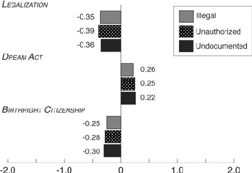
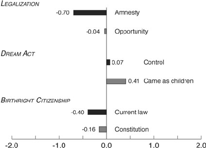

### Articles

# “Illegal,” “Undocumented,” or “Unauthorized”: Equivalency Frames, Issue Frames, and Public Opinion on Immigration

###### Jennifer Merolla, S. Karthick Ramakrishnan, and Chris Haynes

ImmigrationhasbeenasalientandcontentioustopicintheUnitedStates,withagreatdealofcongressionaldebate,advocacyefforts, and media coverage. Among conservative and liberal groups, there is a vigorous debate over the terms used to describe this population, such as “undocumented” or “illegal,” as both sides perceive significant consequences to public opinion that flow out of this choiceinequivalencyframes.Thesesamegroupsalsocompeteoverthewaysinwhichimmigrationpoliciesareframed.Here,forthe first time, we examine the use of both types of frames (of immigrants themselves, and the policies affecting them) in media coverage. Importantly, we also test for whether these various frames affect preferences on three different policies of legalization. Our results suggestthateffortstofocusonthetermsusedtodescribeimmigrantshavelimitedeffect,andthateffortstoframepolicyoffergreater promise in swaying public opinion on immigration.

T

immigrants.2 Even after the 1986 amnesty, the problem of illegal immigration continued apace due, in part, to weak provisions for employer sanctions, networks of recruitment among families and sending regions, and the ongoing economic and political power of the United States with respect to Mexico and other Central American countries.3

he problem of illegal immigration has been a prominent feature of immigration policy since 1965, when the United States ended its temporary worker pro-

gram for Mexican nationals and instituted a policy that favored skilled workers and those with family in the United States.1 With continuing demand for low-skilled Mexican labor, unauthorized immigration to the United States grew rapidly, and the United States has since engaged in various schemes of enforcement and legalization to solve the problem, including a 1986 law that legalized over 2.5 million

Today, there are an estimated 11 million unauthorized immigrants in the United States, most of whom are longterm residents of the United States and unlikely to return to their home countries in mass numbers.4 Even though there are other important aspects of immigration policy that vie for Congressional attention—such as the shortage of workers with advanced degrees in science and engineering and the need for improvements in temporary agricultural worker programs—much of the public’s attention has been focused on the problem of illegal immigration. Thus, even though legislative efforts such as the comprehensive immigration reform bills of 2006 and 2007 dealt with various topics such as refugees, asylum claims, family visas, and high-skilled workers, much of the floor debate and related media coverage centered on the issue of illegal immigration.5

A list of permanent links to supplementary materials provided by the authors precedes the references section.

Jennifer Merolla is Associate Professor of Political Science at Claremont Graduate University (Jennifer.Merolla@ cgu.edu). Karthick Ramakrishnan is Associate Professor of Political Science at the University of California–Riverside (karthick@ucr.edu). Chris Haynes is a doctoral candidate in Political Science at the University of California– Riverside (chrishaynes77@gmail.com). The authors are grateful for comments from the editor, anonymous reviewers, and colleagues at the Institute for Governmental Studies (University of California–Berkeley), Cornell University, Chapman University, the Russell Sage Foundation, the Western Political Science Association, the Midwest Political Science Association, and the Politics of Race, Immigration, and Ethnicity Consortium.

Amidst the policy debates, advocates and elected officials have attempted to shape public opinion and legislative outcomes in their favor, with increasing attention to the framing of policy in news coverage and popular discourse. For instance, when the U.S. Senate was wrangling over a comprehensive immigration reform measure in 2007

doi:10.1017/S1537592713002077

© American Political Science Association 2013 September 2013 | Vol. 11/No. 3 789

(widely referred to as the McCain-Kennedy bill) that included provisions for legalization for long-term residents without legal status, conservative advocates and media personalities were quick to brand it an “amnesty,” while the bill’s sponsors and liberal advocacy groups framed it as a “path to citizenship.”6 Similarly, when the U.S. Senate in 2010 considered the DREAM (Development, Relief, and Education for Alien Minors) Act, which would legalize immigrant students and those wishing to serve in the military, as an amendment to a defense authorization bill, proponents took great pains to show that the beneficiaries of the bill were children who had no choice in whether or not to come to the United States, while opponents sought to frame it as a bill that would open the door to a more general amnesty for the adult relatives of those children.7

lar instances such as the DREAM Act, frames favorable to pro-immigrant groups appear more frequently. We also find clear differences between the ways that mainstream, conservative, and liberal news media label immigrants and frame immigration policies. Finally, when it comes to swaying public opinion, we find that differences in issue frames, even when they involve varying only a few words, have a fairly strong effect on immigration policy preferences. By contrast, the fight over “illegal immigrants” versus “undocumented immigrants” seems to have little effect. The one exception to this pattern is among first- and secondgeneration immigrants, who react against the illegal frame and become even more supportive of legalization and the DREAM Act. Taken together these findings suggest that, if the primary goal of framing is to move public opinion on immigration policy, groups on either side of the issue divide would find it more effective to focus on efforts to frame policies rather than to battle over the terms used to describe those without legal status.13

In addition to disagreeing over policy framing, advocates have also fought over the terms used to describe the people themselves who may be affected by such policies. On the liberal side, advocates have preferred to use the term “undocumented” instead of “illegal,” arguing that the latter tilts the debate in favor of restriction. For example, Jose Antonio Vargas, a journalist and immigrant rights advocate, has campaigned against the use of the term “illegal immigrant” by news outlets, arguing that it “dehumanizes and marginalizes the people it seeks to describe.”8 At the same time, conservative advocates on immigration have long insisted on using the word “illegal,” arguing that alternative terms mask the fundamental legal violations committed by those who overstay their visas or enter the country without one.9 Finally, many policy analysts, demographers, and federal government agencies have preferred to use the term “unauthorized immigration,” opting for a more descriptively accurate, and perhaps politically less laden, term to refer to those who may be eligible for deportation.10

### From the Study of (Non)Citizenship to Unauthorized Immigration

Given the inordinate attention that U.S. elected officials and news media have accorded to unauthorized immigration over the past decade, how are scholars of U.S. politics making sense of these developments? In the scholarship on media coverage and public opinion, studies have found that news coverage of immigration tends to focus on illegality the closer that media markets are located to the United States–Mexico border,14 and that public attitudes towards illegal immigrants tend to be heavily racialized.15 Another strand of work examines public policy towards unauthorized immigrants in the United States, paying particular attention to new developments in immigration federalism as states and local governments enact policies to deter and expel unauthorized immigrants.16 Political theorists have also begun to re-examine previous positions on matters such as birthright citizenship ( jus soli),17 and some have drawn attention to military service ( jus meritum) and measured time ( jus temporis) as valid principles for immigrant legalization and naturalization.18 Finally, as illegal immigration becomes more salient in other advanced, industrialized countries, we see a corresponding rise in comparative studies of public attitudes towards unauthorized immigrants,19 immigration enforcement,20 and differential access to public benefits.21

All of these competing claims—on what terms should be used to describe immigration policy or the immigrants themselves—share one common feature: the belief that framing has important consequences in shaping public opinion on undocumented immigration. However, such claims have rarely been examined, either descriptively through media content analysis, or by causal tests through experimental methods.11 Here, we utilize both methods, to gauge the prevalence of these frames and to test hypotheses about their consequences on public opinion. We analyze the content of news stories in print media and cable news from the past several years.12 We also conducted a survey experiment, with an important and heretofore unique feature whereby we vary both the labels used to describe immigrants, as well as the frames used to depict immigration policies such as birthright citizenship and legalization. We characterize these efforts as equivalency frames and issue frames, respectively.

Importantly, many of these studies build on a foundation of prior scholarship on immigration and citizenship, on the question of what constitutes citizenship itself and the question of what rights and public benefits are granted to noncitizens versus citizens. Both of these questions are relevant to our inquiry because media coverage and public opiniontowardsunauthorizedimmigrantsareoftenshaped and constrained by dominant conceptions of who counts as a citizen, and for what purpose. In their review of

As we show, news coverage in general has tended to use the frames favored by restrictionists, although in particu-

immigrationandcitizenshipacrossvariouscountries,Irene Bloemraad, Anna Korteweg, and Gokce Yurdakul identify four major dimensions of citizenship that can be used to assess inequality between immigrants and the native-born: legalstatus,legalrights,politicalandcivicparticipation,and a sense of belonging.22 While it may be fruitful to conceive ofthesedimensionsasanalyticallydistinct,inpracticethey areofteninterdependent.Thus,forexample,asociety’sdetermination of a group as “belonging” often shapes the particularrightsitiswillingtograntthegroup.Andgroups,in turn,mayviewchangesinlegalstatusasanimportantmeans to gain legal rights and the ability to participate in politics. We explore variation in public opinion on one of these dimensions: legal rights and the extent to which residents ofaparticularlegalstatus—undocumentedimmigrantsand theirU.S.–bornchildren—areconsidereddeservingofcertain rights.When we examine the issue of providing a path to citizenship to unauthorized children, we also test for whether evoking a sense of belonging by making reference to children may influence the extent to which Americans accord rights to immigrants.

immigrants may be easier to achieve along the dimension of relative rights than autonomous rights.

### Framing Policies on Illegal Immigration in the News

While illegal immigration could simply be accepted as a permanent feature of U.S. immigration policy, advocates on the left and right have fought for different solutions to the problem—the former favoring various legalization schemes, and the latter favoring an enforcement-only approach. Perhaps not surprisingly, differences in issue frames have accompanied this divergence over policy solutions. Advocates for greater restriction and enforcement have sought to paint any effort at legalization as an “amnesty,” reminding issue activists and legislators alike about the 1986 law that many restrictionists deem a policy failure and a betrayal of the rule of law.24 At the same time, pro-legalization advocates and legislators have sought to avoid any reference to legalization or amnesty, opting instead for a new term “path to citizenship” that is free from the historical baggage of the 1986 law and its aftermath.25 As we have already noted, divergent framing efforts have emerged over other legalization programs such as the DREAM Act, as proponents seek political advantage by emphasizing that it would benefit those who arrived in the United States as young children, and who had no say in the migration decisions of their parents. By contrast, opponents seek to downplay the angle of “powerless children,” and instead seek to portray the DREAM Act as just another form of amnesty that would encourage further illegal immigration to the United States.26

Our expectations about the effects of framing efforts on the rights that Americans are willing to grant unauthorized immigrants are also informed by other work on citizenship that considers partial rights according to various types of groups. Elizabeth Cohen argues in her book SemiCitizenship in Democratic Politics that rights of democratic citizenship have two distinct dimensions: autonomous rights (such as free movement and expression), which are valuable regardless of their political context, and relative rights (such as the right to vote or retain property), which derive their meaning from specific political contexts.23 As Cohen notes, the particular configuration of rights varies across groups within any given nation-state, and our assessments must be established on the basis of empirical inquiry, not just normative statements derived from abstract ideals embodied in constitutions and founding philosophies. In the case of undocumented immigrants (or non-immigrant individuals) in the United States, Cohen argues that this population ranks low on both dimensions of rights, in contrast to groups such as ex-felons who have strong autonomous rights but weak relative rights. Given the doubly disadvantaged position in which unauthorized immigrants are located, we might expect that attempts to change public opinion towards those immigrants may have limited effect, especially when compared to groups that rank low on only one dimension. At the same time, we can also think of each of these two dimensions as corresponding to each type of framing strategy: policy frames as trying to move public opinion along the dimension of relative rights (i.e., what these persons are entitled to), and immigrant frames as seeking to move opinion primarily along the dimension of autonomous rights (i.e., trying to change public perception of who they fundamentally are). As we shall see, moving public attitudes towards unauthorized

The issue of birthright citizenship for children of illegal immigrants born in the United States has also prompted a contentious debate between restrictionists and pro-immigrant advocates.27 Restrictionists have argued that this policy creates “anchor babies” which keeps illegal immigrant parents in the country. Furthermore, advocates of immigration restriction have challenged the assumption that citizenship to these children is guaranteed by the Fourteenth Amendment to the U.S. Constitution, which provides that “all persons born or naturalized in the United States, and subject to the jurisdiction thereof, are citizens of the United States.” They have argued instead that illegal immigrants are not subject to the jurisdiction of the United States, and therefore, Congress can pass laws regarding their access to citizenship.28 Pro-immigrant advocates, on the other hand, frame the issue as a Constitutionally-guaranteed right, enshrined in the Fourteenth Amendment and affirmed by subsequent Supreme Court decisions.29 Thus, they argue, it would take a Constitutional amendment, and not an Act of Congress to change the status quo rules on citizenship eligibility.

So, on various policies relating to the legalization of unauthorized immigrants, liberal advocates have relied on issue frames such as “path to citizenship,” references

##### Table 1 Variations in policy frames by news source, 2007 to 2011

New York Post

New York

Washington Post

Washington Times

TOTAL

Times CNN FOX MSNBC Legalization

Amnesty 47% 28% 56% 43% 23% 64% 56% 49% Path to Citizenship 27% 26% 31% 21% 32% 26% 20% 29%

DREAM Act

Amnesty 18% 10% 23% 5% 10% 23% 32% 11% Children 86% 90% 70% 83% 91% 95% 75% 76%

Birthright Citizenship

Constitution 41% 35% 49% 0% 40% 38% 49% 60% Anchor baby 24% 23% 27% 16% 32% 15% 39% 34%

Note: Terms here are reported inclusive of each other, and may thus exceed 100% when combined.

to children (in the case of the DREAM Act), and references to the U.S. Constitution (in the case of birthright citizenship)—all with the goal of swaying opinion in favor of legalization. By contrast, opponents have painted legalization attempts, including the DREAM Act as an “amnesty,” and have framed the granting of citizenship as a legal precedent, and not a constitutional one—with the goal of tilting opinion away from legalization, and towards greater restriction.

We find that amnesty is mentioned far less frequently in news coverage of the DREAM Act than in coverage of comprehensive legalization programs (18 percent versus 47 percent, respectively). Again, there are considerable differences across news outlets, with Fox News (32 percent) and the Washington Times (23 percent) having the most frequent mentions. Surprisingly, the New York Post, a relatively conservative newspaper owned by Rupert Murdoch, had the fewest mentions of “amnesty,” lower than even the New York Times (10 percent) or MSNBC (11 percent). Mentions of children are high across all sources, although exclusive mention of children (i.e., without “amnesty) is relatively low for the conservative outlets, with the notable exception of the New York Post.

How do these divergent framing efforts correspond to news coverage? We analyzed the content of news stories on these three policy areas in mainstream and conservative daily newspapers in New York and Washington, DC (the New York Times and Washington Post on the mainstream side, and the New York Post and Washington Times on the conservative side), from 2007 through 2011. For this same time period, we also examined news shows on the three major cable news networks: Fox News, CNN, and MSNBC (refer to Table 1).30 On the issue of legalization, we found, overall, that mentions of amnesty (47 percent) were considerably more frequent than mentions of a “path to citizenship” (27 percent).31 Furthermore, conservative newspapers were far more likely to mention amnesty than their mainstream counterparts (56 percent versus 28 percent between the WashingtonTimes and Washington Post and 43 percent versus 23 percent in the New York Post and NewYorkTimes, respectively). Finally, among the cable news networks, CNN had the most mentions of amnesty in news stories on legalization (64 percent), followed by Fox News (56 percent) and MSNBC (49 percent). While the frequent mentions of “amnesty” on CNN may seem surprising, it was driven primarily by the high mentions of the term during the tenure of noted immigration restrictionist Lou Dobbs on the network. After Dobbs’ departure in late 2008, CNN (41 percent) occupies the midpoint between MSNBC (32 percent) and Fox News (52 percent) on the frequency with which the term is invoked.

Finally, in news coverage of birthright citizenship, we find that mentions of the Constitution or the Fourteenth Amendment are similar across news outlets (41 percent), with notably high mentions for MSNBC (60 percent), and low mentions in the NewYork Post (0 percent). Meanwhile, mentions of “anchor babies” are most frequent on Fox News (39 percent), but are also high for MSNBC (34 percent) and the New York Times (32 percent), further underscoring the lack of a clear relationship between ideology of news source and news coverage of the birthright citizenship issue.

To sum up, then, we find that the framing of policies of immigrant legalization varied according to the topic. On legalization, while mentions of “amnesty” were more frequent than mentions of “path to citizenship” across all media outlets, conservative outlets used the amnesty frame much more frequently than mainstream print media and some cable outlets. In the case of the DREAM Act, however, mainstream news outlets avoided mentions of “amnesty,” and were more likely to focus on the likely beneficiaries of the act, i.e. those who were brought to the United States as young children. Finally, there appear to be few differences across news outlets in coverage of birthright citizenship, though there were far fewer stories

recent efforts such as the “Drop the I-Word” campaign (droptheiword.com) have also sought to raise awareness among the general public, in addition to enlisting commitments from media organizations. As the campaign’s web site notes, many advocates consider the term illegal “a damaging word that divides and dehumanizes communities and is used to discriminate against immigrants and people of color. The I-Word is shorthand for illegal alien, illegal immigrant, and other harmful racially charged terms [original emphasis].”35 Prior to the November 2012 election, the list of media endorsements for the campaign only included a dozen or so explicitly liberal, and relatively small, media outlets such as Ms. Magazine, the Nation, and Yes! Magazine.

on birthright citizenship compared to the other two policies.

### Framing (Illegal) Immigrants in the News

In the fight over various policy solutions to illegal immigration, liberal and conservative advocates have sought rhetorical advantage, not only in the ways that each policy is framed, but also in the ways that immigrants themselves are labeled: as “illegal immigrants” or “undocumented immigrants.” The intuition behind the importance accorded to semantic differences between “illegal” and “undocumented” is the following: terms carry with them emotional affect and stereotypes, which in turn can mold impressions and sway public opinion. In many ways, concerns over the use of group labels echoes the debates over the terms used to describe blacks in the late 1960s and 1970s (including “Negroes,” “blacks,” and “African Americans”); those used to describe “affirmative action” in the 1980s and 1990s (including “affirmative action,” “quotas,” and “reverse discrimination”); and the stigma believed to be attached to the word “liberal” throughout the 1990s. It is important to note that these beliefs regarding the political power of labels are not just a matter of conjecture; a fair amount of scholarship supports the contention that using some terms over others makes a difference, particularly on matters of race and poverty.32

Meanwhile, advocates on the conservative side have continued to insist on using the terms “illegal alien” and “illegal immigrant,” arguing that they are accurate depictions of the ways in which people have either crossed the border or maintained their presence in the United States beyond the terms set by the country’s immigration laws. Indeed, one of the common phrases used by immigration conservatives—as emblazoned on t-shirts, bumper stickers, and in many blog postings and comments—is the question: “What part of illegal don’t you understand?” By framing the issue as entirely about legality, conservative groups have sought to direct attention primarily to policies of enforcement over more comprehensive solutions that include legalization. The frame of illegality also helps restrictionists deflect criticism that their movements have anything to do with racial prejudice or ethnocentrism.36 The defense of using the term “illegal” and the political implications of using that term over “undocumented” is perhaps best articulated by the editorial board of the Washington Times, an influential conservative daily:

On the liberal side of the immigration policy debate, advocates have long argued that conservatives use the term “illegal,” whether as an adjective to modify immigrant (i.e., “illegal immigrants”) or as a noun (“illegals”), to tilt policy debates in favor of immigration enforcement and restriction. The logic underlying opposition to the term “illegal” is perhaps best expressed in a New York Times column written in 2007 by a member of the newspaper’s editorial board:

The word “illegal” accurately describes the issue at the center of the controversy. A legal alien or immigrant is someone who has gone through the legal process for entry to the United States; an illegal alien or immigrant is someone who has not. This definition is enshrined in law—for example the “Illegal Immigration Reform and Immigrant Responsibility Act of 1996”—and in terminology used by the U.S. Citizenship and Immigration Services. . . .

Since the word [illegal] modifies not the crime but the whole person, it goes too far. It spreads, like a stain that cannot wash out. It leaves its target diminished as a human, a lifetime member of a presumptive criminal class. People are often surprised to learn that illegal immigrants have rights. Really? Constitutional rights? But aren’t they illegal? Of course they have rights: they have the presumption of innocence and the civil liberties that the Constitution wisely bestows on all people, not just citizens.

The term “illegal alien” is highly specific and accurately describes the problem, unlike “undocumented immigrant,” which purposefully removes a stigma that should rightly remain.37

Many people object to the alternate word “undocumented” as a politically correct euphemism, and they have a point. . . . But at least “undocumented”—and an even better word, “unauthorized”—contain the possibility of reparation and atonement, and allow for a sensible reaction proportional to the offense.33

Finally, many demographers, research organizations, and federal government agencies have chosen to use the term “unauthorized immigrants” instead of the other terms mentioned so far. As Bean and Lowell note in their chapter on unauthorized migration,

While much of the re-framing efforts of liberal advocacy organizations have been focused on elite-level discourse, such as the efforts of the National Association of Hispanic Journalists to get reporters to use the term “undocumented immigrants” or “undocumented workers,”34 more

the phrase “illegal immigrant” is arguably inaccurate when applied in the U.S. case. As an alternative, the term “unauthorized migrant” is employed here to refer to persons who reside in the U.S. but whose status is not that of U.S. citizens, permanent

##### Table 2 Variations in use of “illegal,” “undocumented,” and “unauthorized,” 2007 to 2011

Washington Post

Washington Times

New York Post

New York

Times CNN FOX MSNBC As proportion of all stories on immigration

TOTAL

Baseline N = 13,918 3,237 1,886 726 4,942 1,790 1,179 158 Illegal 41% 33% 75% 33% 22% 51% 72% 39% Undocumented 1% 4% 0% 0% 1% 1% 1% 1% Unauthorized 0.2% 0.2% 0.1% 0% 0.2% 0.1% 0% 0% As proportion of stories focusing on those without legal status

Baseline N = 5,851 1,197 1,411 238 1,158 932 852 63 Illegal 96.4% 89% 100% 100% 96% 98% 99% 97% Undocumented 3.2% 11% 0.1% 0% 3% 1% 1% 3% Unauthorized 0.4% 1% 0.1% 0% 0.9% 0.2% 0% 0%

mainstream ones. Among the print sources we examined, the differences were greatest between the Washington, DC papers, as the conservative Washington Times was more than twice as likely to focus on illegal immigrants in its coverage of immigration than the Washington Post (75 percent versus 37 percent). Between the New York Post and the New York Times, the difference was significant, albeit smaller than in the case of the Washington newspapers (33 percent versus 23 percent). Among cable news sources, too, there was a clear ideological divide: Fox News devoted the most coverage to illegal immigrants, accounting for 73 percent of all stories on immigration between 2007 and 2011. By contrast, 52 percent of immigration stories on CNN and only 40 percent of immigration stories on MSNBC dealt with illegal immigration.

residents, or other authorized visitors . . . . The term “undocumented” is not entirely appropriate, because many contemporary unauthorized migrants possess documents, although usually counterfeit ones. The term “illegal” does not exactly fit, because the U.S. expressly made it legal to hire such people before the Immigration Reform and Control Act (IRCA) was passed in 1986. Moreover, the federal government since then has not systematically enforced the provisions of IRCA that make it illegal to hire such workers.38

Given the care and attention that different actors devote to the terms used to describe immigrants without authorization, it is important to see how these terms map onto those utilized by news media. Our expectation, based on the way that the immigration debate has become polarized along party lines in the United States, is that explicitly conservative news outlets such as the WashingtonTimes and New York Post should use the terms “illegal immigrant” or “illegal alien” far more frequently in their coverage of immigration than mainstream newspapers such as the Washington Post and New York Times. Similarly, we would expect to see considerable differences between Fox News, CNN, and MSNBC in the frequency with which “illegal” and “undocumented” are used.

Interestingly, however, after taking into account differences in the frequency of attention to illegal immigration, there was little variation across news sources in the use of “illegal,” “undocumented,” or “unauthorized.”39 Liberal, conservative, and mainstream sources were all very likely to use the term “illegal” over the other alternatives, with the Washington Post at 89 percent, and all other sources at 96 percent or greater. The term “unauthorized” was used only 21 times in nearly 5,500 articles, and most of these instances were in the New York Times (10 stories) and the Washington Post (8 stories). Finally, the term “undocumented” was used in 11 percent of stories in the Washington Post, 3 percent of stories in the New York Times and on MSNBC, and in less than 1 percent of stories in all of the other sources we analyzed. The infrequent use of alternative terms to “illegal” in newspapers such as the New York Times is understandable, in keeping with its style guidelines. Indeed, in response to calls to “drop the I-word,” the public editor of the New York Times insisted in October 2012 that “[illegal immigrant] is clear and accurate; it gets its job done in two words that are easily understood.”40 Importantly, the appearance of alternative terms to “illegal” were much less common in news sections of

In Table 2, we present the incidence of these terms in these various news outlets. We conducted the analysis by searching all news stories where the terms “immigrant(s)” or “immigration” appeared in the headline or lead paragraph, and counting the number of stories from 2007 to 2011 where “illegal,” “undocumented,” or “unauthorized” appeared in the headline or lead paragraph when describing immigrants or immigration. In order to provide a standard measure across news outlets, we present each data point as a share of the total number of stories during the same time period that make reference to immigrants.

Overall, we find that 42 percent of all stories on immigration during this time period dealt with illegal, unauthorized, or undocumented immigrants, and this coverage was much more prevalent in conservative newspapers than

recently, survey approaches to public opinion have examined the effects of such factors as adherence to racial cues,46 various forms of economic threat,47 and legal status.48 And yet, few studies have examined how the use of different words describing legal status (i.e., legal, illegal, undocumented, unauthorized) can affect policy preferences. A recent survey wording experiment by Knoll et al. (2010) with a sample of Ohio voters did so, and found null effects between using the terms illegal or undocumented on support for various legalization programs.49 It is unclear, however, whether these results will generalize to the national electorate, to other types of immigration policies, as well to the unauthorized label favored by many social scientists.

these newspapers than in the editorial sections, which are less subject to a newspaper’s style guidelines.41

In both the newspaper data and the cable news data, a clear pattern emerges: in covering the general issue of immigration, conservative news outlets—whether on TV or in print—are more likely to focus on illegal immigrants and illegal immigration than their mainstream or liberal counterparts. Still, whenever major news sources mention those without legal status, they have generally continued to use the term “illegal immigrants,” regardless of whether or not these sources are conservative. Thus, while organizations such as the Society of Professional Journalists and efforts such as the Drop the I-Word Campaign have sought to encourage journalists to use terms such as “undocumented” and “unauthorized,” those terms make only rare appearances in our analysis of news coverage prior to 2012, even in more mainstream publications such as the Washington Post and the New York Times. In April 2013, however, the Associated Press and USA Today indicated that they would no longer use the word “illegal” to describe a person, although reporters could still continue to use the term to describe actions such as “illegal immigration” and “entering a country illegally.”42 It remains to be seen how often the term “illegal” continues to appear in news stories, particularly in large-circulation outlets such as the New York Times and Washington Post.

Perhaps most importantly, the scholarship has yet to look into the effects of varying policy frames (i.e, pathway to citizenship versus amnesty) as it relates to immigration. As Dennis Chong and Jamie Druckman note, “framing refers to the process by which people develop a particular conceptualization of an issue or reorient their thinking about an issue.”50 On any given issue, various considerations along different dimensions may influence an individual’s opinion. Elite decisions to frame issues in different ways can alter the weight that individuals give to some considerations, which can then lead to alternate responses. Furthermore, Druckman makes an important distinction between two types of frames: equivalency frames and issue frames.51

### Are These (Illegal) Immigrant Frames Consequential?

Equivalency framing effects occur when logically equivalent phrases with variations in wording cause individuals to alter their opinions. A classic example of an equivalency framing effect is the Asian Disease Problem in research by Tversky and Kahneman,52 where respondents are more likely to opt for a risk-averse choice of treatment when it is framed in the domain of gains (choosing, say, the certainty of 200 lives saved over a one-third chance of 600 lives saved), and the more risk-seeking choice when it is framed in the domain of losses (declining the certainty of 400 deaths over a one-third probability than none of 600 will die)—even though all have the same expected outcomes. By contrast, Druckman refers to issue framing as “situations where, by emphasizing a subset of potentially relevant considerations, a speaker leads individuals to focus on these considerations when constructing their opinions”.53 As he notes, one clear example of an issue framing effect relates to whether the KKK should be allowed to hold a rally. If the issue is framed as one of public safety, then people are less supportive of letting the KKK hold a rally; however, if the issue is framed as one of free speech, then people are more supportive.54

Recent stylebook decisions indicate that we might soon see a shift in news coverage on the relative use of terms such as “illegal” versus “undocumented.” It remains an open question, however, whether changing labels on “illegal immigrants” would be as consequential for public opinion as advocates and critics believe they might. Survey experiments provide a fruitful way to test for the potential importance of labels or frames used to describe immigrants. Here, we report the results of one such test, in which we exposed different groups of voters to the labels “illegal immigrant,” “undocumented immigrant,” and “unauthorized immigrant.” At the same time, we also explore the possibility that variations in policy frames may also help shape voter opinion, and we test for the relative importance of each type of frame.

Before discussing the potential effects of frames on immigration policy attitudes, it is important to situate this study in the larger public opinion literature on immigration in the United States, which is fairly vast, with studies growing in frequency since the early 1990s. Much of the early work in this area explained the public’s preference for allowing more immigrants or fewer immigrants into the United States, using measures standardized by the Gallup polling organization,43 a few studies have examined the salience of immigration as an issue,44 and others have studied voter opinion on illegal immigration in particular.45 More

In the case of this study, we look at some depictions that fit under equivalency frames and some that are more akin to issue frames. With respect to the former, does it matter if the term “illegal,” “undocumented,” or “unauthorized” is used? All of these terms are logically equivalent in the sense that they are referring to immigrants without

legal status. However, the term “illegal” carries with it more negative associations and may bring to mind negative stereotypes toward immigrants. We may therefore expect that attitudes on immigration policy will become more restrictive when the term illegal is used rather than undocumented or unauthorized.

The first policy we look at is legalization. For this question, we randomly assigned whether the policy was described as providing immigrants an opportunity to eventually become citizens or providing amnesty. Respondents were asked their level of agreement or disagreement with the following statement: “If we can seal our borders and enforce existing immigration laws, [illegal/ undocumented/ unauthorized] immigrants should be given [the opportunity to eventually become legal citizens/ amnesty].” Forty-eight percent of respondents were opposed to immigrant legalization in 2007, 31 percent were supportive, and 21 percent were neutral. We expect that respondents in the undocumented and unauthorized conditions will be more supportive of legalization compared to those in the illegal condition. As we discussed earlier, illegal connotes more negative associations than the alternative terms. Since amnesty has become a highly charged term often used by those on the right who oppose legalization, we expect that it will decrease support for citizenship relative to those who only read “an opportunity to eventually become legal citizens.” The latter statement is also ambiguous with respect to what needs to be done to become legal citizens.

We also introduce different ways of presenting immigration policies, and these types of frames are more akin to issue frames, in that the terms are not always logically equivalent. When dealing with legalization for example, as we noted earlier, restrictionists typically frame the issue

- as one of providing amnesty and couple that discussion with mention of disrespect for the rule of law and illegal immigrants. Meanwhile pro-legalization activists often discuss a path to citizenship in which individuals need to meet certain obligations to be considered for citizenship. This latter framing may evoke more positive associations of individuals working with the system to gain citizenship. This process known as competitive framing could successfully prime any of the previous representations even when just one of the terms is mentioned.55 Given the literature on issue framing across many different policy issues, we would also expect that slight variations in the framing of immigration policies should lead to different opinion reports. We will discuss our specific expectations for each policy in the next section.

Effects of Frames on Public Opinion

In order to explore the effect of different frames on immigration policy attitudes, we conducted a series of survey experiments embedded in the 2007 Cooperative Congressional Election Study (CCES), which was conducted online through YouGov, over the last two weeks of November 2007. The sample drawn for the CCES is a stratified national sample.56 There were 2,188 respondents in our module that included questions about immigration policy. The age and educational attainment of our survey respondents are fairly well aligned with those of the U.S. electorate, although the proportion of whites and males in the sample is higher than the U.S. average (refer to the Supplementary Materials, Table 1; permanent links to the supplementary materials provided by the authors are located

- at the end of our text).57 Still, it is important to note that our sample is considerably more representative of the U.S. electorate than student samples that form the basis of many experimental studies on public opinion, particularly with respect to educational attainment.58

The second policy question asks about support for provisions of the DREAM Act. Respondents were again randomly assigned to one of the three descriptions of legal status. They were also randomly assigned to receive a condition that provided additional information on when the children arrived in the United States. Respondents were asked for their level of agreement with the following statement: “[Illegal/ undocumented/ unauthorized] immigrants [none/ who came to the U.S. as young children] should be able to earn legal status if they graduated from a U.S. high school, have stayed out of trouble, and have enrolled in college or the military.” This time, there was far greater support (54 percent) than opposition to the policy (30 percent), and with only 16 percent taking a neutral stance. As with the first policy measure, we expect that the undocumented and unauthorized conditions should lead to more support for the DREAM Act relative to those in the illegal condition. We also expect a positive effect for the additional statement “who came to the U.S. as young children.” Numerous examples from the policy arena suggest that voters are sensitive to appeals that refer to the effects of policies on children, such as in the case of incarceration policy,59 public health measures to combat obesity,60 and gay rights.61

In the survey, respondents were asked the extent to which they agree or disagree on policies involving legalization, the DREAM Act provisions, and birthright citizenship. Across all three questions, we varied the terms that preceded the word “immigrant.” Subjects were randomly assigned to read illegal, undocumented, or unauthorized. For each policy question, we also varied something about the way in which we described the policy.

The final policy question focuses on whether the respondent supports changing the current policy that children born on U.S. soil to parents without legal status are granted citizenship. In addition to randomly assigning respondents to the terms that preceded the word immigrant, we randomly assigned respondents to different descriptions of the status quo: the current law or the Constitution. More specifically, we asked respondents for their level of

##### Figure 1Mean support for immigration policiesby experimental condition, illegal,undocumented, and unauthorized

agreement, respectively, with permissive policies. In all of the figures we present, if the average response is greater than zero, it indicates net support for policies favoring unauthorized immigrants, while negative values indicate net opposition to such policies.

As we can see from Figure 1, the differences in levels of policy support among those assigned to each of the three conditions that varied the terms used to describe those without legal status (illegal, undocumented, or unauthorized) are negligible. For instance, asking people about undocumented immigrants or unauthorized immigrants does not move opinion from opposition to support on legalization; indeed, there is even slightly less opposition among those asked about “illegal immigrants,” although these differences are not statistically significant.63 Similarly, we do not see the terms “undocumented” or “unauthorized” making any significant difference on opinion towards the DREAM Act, for which respondents are generally in favor,64 or on birthright citizenship, where respondents are generally inclined to change the policy.65

agreement on a five-point scale, with the following statement: “According to [current law/the Constitution] any child born in the U.S. is a citizen of the U.S. The [current law/Constitution] should be changed so that babies born to [illegal/ undocumented/ unauthorized] immigrants living in the U.S. do not automatically become U.S. citizens.” Here, a majority of respondents favored a policy change (53 percent) to restrict citizenship eligibility, 37 percent opposed a change, and 10 percent were neutral. For this policy issue, we expect that respondents in the undocumented and unauthorized conditions will be more opposed to changing the policy compared to those in the illegal condition. We also expect that framing the policy as the current law rather than the constitution will make individuals more supportive of changing the policy. We expect that individuals place more value in rights that are derived from the U.S. Constitution compared to those that are based on law, as public opinion on a Constitutional ban on gay marriage has shown.62

It does not appear, then, that the equivalency framesillegal, undocumented, or unauthorized—matter for public opinion on any of these three policy issues.These results also hold up if we run more complicated regression analyses controlling for the other experimental manipulations, as well as the few variables that were unevenly distributed across experimental conditions.66 Of course, it may be the case that responses to the immigrant frames are not the same across all individuals. Rather, some individuals may be more susceptible and some less susceptible to framing effects, while others may even reject framing effects.67 To explore this possibility, we looked at five individual-level factors for which we may expect different reactions to frames: partisan identification, the salience of immigration policy, Latinos, educational attainment, as well as the immigration history of one’s family.68 Prior studies have found differential reactions to immigration frames depending on an individual’s party identification and how much they care about the issue of immigration, and between Latinos and non-Latinos.69 To our knowledge, scholars have not yet considered how one’s generational status in the United States might affect whether individuals are more or less susceptible to framing effects.

##### Experimental Findings

We first explore whether support for the three policy areas varies depending on whether those without legal status are described as illegal, undocumented, or unauthorized. In

In only two cases do we find that reactions to immigrantrelated frames vary by individual characteristics, and they involve the migration history of one’s family on the DREAM Act and more general policies of legalization.70 InTable 3, we show the change in the probability of adopting the most permissive stance on the given policy for those in the undocumented and unauthorized conditions relative to the illegal condition by generational status (for the ordered probit analyses, refer to Table 4 in the Supplementary Materials). To summarize the results, we find that support for the DREAM Act and for legalization is significantly lower for first- and second-generation

- Figure 1, we present average levels of support for each policy among those in the three experimental conditions. For consistency of data presentation, we present all outcomes on a common scale of restrictive to permissive. Thus we recoded the policy measure birthright citizenship such that higher values indicate disagreement with changing the law or Constitution. Values of 1 and 2 indicate opposition and strong opposition, respectively, to permissive policies (or, conversely, support or strong support of restrictive policies). Zero indicates a neutral stance, and positive values 1 and 2 indicate agreement and strong

##### Table 3Change in the probability of adopting the most permissive stance across experimentalconditions, by generational status

DREAM Act: Change in the Probability of Adopting the Most Permissive Stance

Illegal to Undocumented Condition

Illegal to Unauthorized Condition

First generation −10.4%* −14.1%** Second generation −5.5%* −7.5%** Third generation −1.4% −1.7% Fourth and above 1.9% 3.1%*

Legalization: Change in the Probability of Adopting the Most Permissive Stance

Illegal to Undocumented Condition

Illegal to Unauthorized Condition

Opportunity to Amnesty Condition

First generation −6.9%* −6.1%* −4.8% Second generation −4.2%* −3.6% −6.7%** Third generation −1.4% −1.2% −7.8%** Fourth and above 1.3% 1.1% −8.3%**

**p .05 (two-tailed); *p .10 (two-tailed)

immigrants who receive the undocumented and unauthorized conditions versus the illegal immigrant condition. The only exception is in the case of legalization for secondgeneration respondents, where the difference is in the same direction but not statistically significant. Thus, even as immigrant rights advocates are pushing to reduce usage of the term “illegal” in news stories and public discourse, our findings suggest that usage of the term has its greatest impact on first- and second-generation immigrants who seem to react against the illegal label and become even more supportive of the policy than when the terms “unauthorized” or “undocumented” are used. For example, a first generation immigrant receiving the illegal con-

dition is 10.1 percentage points more likely to adopt the most permissive stance on the DREAM act compared to her counterpart receiving the undocumented condition. The comparable effect for those in the unauthorized condition relative to the illegal condition is 14.1 percentage points.The only other notable finding is that natives (fourth generation and beyond) are significantly more supportive of the DREAM Act when the term unauthorized is used compared to when the term illegal is used.

The findings for the terms used to describe those without legal status run contrary to our expectations, which are based in part on the framing activities of advocates on immigration policy. We expected that the term “illegal

##### Table 4Change in the probability of adopting the most permissive and most restrictive stanceacross experimental conditions, by partisanship

DREAM Act: Change in the probability of adopting the given stance moving from the control to “came as children” wording

Democrats Independents Republicans

Most restrictive −2.5%** −7.0%** −13.4%** Most permissive 6.2%** 6.8%** 5.4%**

Birthright Citizenship: change in the probability of adopting the given stance moving from the Constitution to current law wording

Democrats Independents Republicans

Most restrictive 6.6%** 6.2%** 2.4% Most permissive -10.8%** −4.7%** −0.8%

**p .05 (two-tailed); *p .10 (two-tailed)

##### Figure 2Mean support for immigration policies byexperimental condition, varying content ofpolicy description

framed as enshrined in the Constitution (mean 0.16), than if it is framed as part of current law (mean 0.4), and these differences are statistically significant.75 However, in neither case does opposition to the policy tip over the neutral point, meaning individuals on average in both frames support changing the current policy.

The strength of the issue frames are all the more remarkable, given that we varied only a few words, as opposed to providing rich vignettes with other supporting information. Also, all of these effects hold up if we run ordered probit analyses controlling for the other experimental conditions and the demographic variables that were unevenly distributed across conditions (refer to the Supplementary Materials Table 2).76 As with the previous analyses, we explored whether certain groups of individuals react differently to the policy frames, and again focused on issue salience, partisanship, identifying as Latino, educational attainment, and one’s generational status in the United States. We find some evidence of differential reactions to the amnesty frame depending on one’s immigration history, and find different reactions by partisans to the child frame for the DREAM Act and the current law/ Constitution frame for birthright citizenship.

immigrant” would lead to more restrictive immigration preferences compared to the terms “undocumented” and “unauthorized.” Instead we found largely null effects, similar to the findings obtained in the study by Knoll et al.71 We began to find some effects once we took into account one’s immigration history, but even here, we found that individuals with a more recent immigration history tend to react against the illegal frame. This finding is consistent with prior scholarship that suggests that individuals with strong predispositions may be able to resist framing effects that run counter to those predispositions.72 Immigrants and their children likely have stronger predispositions on policies related to immigration than those who have been in the United States for more generations.

In the bottom half of Table 3, we show the change in the probability of adopting the most permissive stance on Legalization moving from the opportunity to amnesty wording by generational status (for ordered probit results, refer to the Supplementary Materials, Table 4). We do not observe any differences in the effects of the amnesty frame verses opportunity frame on support for legalization among first generation immigrants. However, we begin to see effects among those in the second generation, who are 6.7 percentage points less likely to adopt the most permissive stance when in the amnesty frame compared to their counterparts exposed to the opportunity frame. The negative impact becomes more pronounced among those in later generations.

We now look at whether differences in issue frames influenced attitudes on the three policies considered. In

- Figure 2, we present mean support for each policy by the relevant experimental conditions.

In Table 4, we show the change in the probability of adopting the most permissive and most restrictive stance on the DREAM Act and birthright citizenship moving the policy frames for each partisan group (for ordered probit results, refer to the Supplemental Materials, Table 5). For the DREAM Act, the wording of “came as young children” similarly boosts support for the DREAM Act across all partisan groups, but has stronger effects on reducing opposition for Republicans. Republicans who received this treatment were 13.4 percentage points less likely to adopt the most restrictive stance relative to their counterparts in the control wording. On birthright citizenship, the current law frame (compared to the Constitution frame) makes individuals less supportive of keeping the law as it stands among Democrats and Independents, but it has no effect among Republicans. This is the only case where we find null effects for one of the issue frames. Finally, all partisan groups react similarly to the amnesty

In contrast to our general results for the ways in which immigrants are framed, we find meaningful differences with respect to the ways in which policies are framed. For instance, net opposition to legalization when the word “amnesty” is used virtually disappears when the phrase “opportunity to eventually become citizens” is used in its place. Not only is this difference statistically significant, its magnitude is also sizable, a 17 percent shift over the entire possible range of opinion on this issue.73 Similarly, when asking about opinion towards the DREAM Act, the mere mention of the fact that it would benefit those illegal immigrants “who came to the U.S. as young children” makes voter support much stronger than it would have been otherwise (a shift from 0.07 to 0.41, or a 9 percent shift over the entire range of opinion on this issue).74 Finally, with respect to birthright citizenship, we find that individuals are more supportive of existing policy if it is

v. opportunity frames for Legalization, with greater support for the latter than the former.

mation about particular policies, and the ways that immigration policies are framed can have a significant effect on opinion. By contrast, individuals may have a concrete image of an illegal or undocumented immigrant (given not only national news coverage of policy, but also local news coverage and everyday social interactions), and invoking different terms may make little difference in terms of the considerations that shape their expressed opinions. Indeed, other experimental research on racial and ethnic cues suggests that the default image of an “illegal immigrant” in the minds of U.S. voters is a Mexican immigrant,79 and that cueing Latino instead of European immigrant origins accentuates the restrictive opinions of American voters.80 While these ethnic cue manipulations are not part of this study, future research with sufficiently large sample sizes should examine whether ethnic cues interact in important ways with the equivalency and issues frames in our analysis.

### Why Do Issue Frames Matter, while Equivalency Frames Do Not?

Illegal or undocumented immigration in the United States is a contentious issue that is subject to framing by advocates and news organizations alike. Our analysis examines the ways in which undocumented immigrants and immigration policy are framed in the news, and the effects of such frames on public opinion. For all of the battles fought over the terms used to describe immigrants without legal status (illegal versus undocumented versus unauthorized), it does not appear that such frames make a perceptible difference for public opinion, at least with respect to the set of policy issues we examined.77

By contrast, we find relatively strong framing effects with respect to how immigration policies are described. For legalization, Americans had far more restrictive preferences when the policy was termed as an amnesty rather than as an opportunity to eventually become legal citizens, and the effect was similar among different partisan groups. Thus, whether or not “amnesty” becomes more or less prominent in media coverage will have a substantial effect on whether or not Americans support immigrant legalization. On the DREAM Act, including language that immigrants came over as young children led to less restrictive preferences, and even tilted support slightly in favor of the policy. The positive effect of adding this wording held for all registered voters, and had even stronger effects among Republicans. While it may seem surprising that conservatives are more amenable to the positive child frame, it is consistent with the broader literature on framing effects. As Chong and Druckman note, “even those with firm values are susceptible to framing on new issues that have yet to acquire a settled interpretation.”78 As we found in our content analysis, conservative media outlets have not yet provided their audiences much exposure to the frame of illegal immigrants coming to the United States as young children. Finally, birthright citizenship did not become nationally salient until late in 2010, so frames about the issue would have been very new to our survey respondents. Individuals were somewhat supportive of changing the policy given either frame, but were more supportive when the status quo was described as the current law rather than the constitution.

Another possible interpretation of the null findings is that terms such as undocumented and unauthorized are not very accessible to the public.The fact that mainstream news media outlets made little reference to undocumented immigrants (as opposed to illegal immigrants) may limit the extent to which the term resonates with the general public and is associated with more positive or neutral stances towards the group. This was even more true in 2007, the year of our survey experiment, when mentions of “undocumented immigrants” were even less common than during the overall period of our content analysis from 2007 through 2011 (refer to the Supplemental Materials, Table 7). In the past three years, news outlets such as National Public Radio and MSNBC have begun to intersperse usage of “undocumented” with “illegal,” and we can expect the undocumented frame to be more accessible to voters in the coming years.81

Still, prior studies of immigration and citizenship offer some caution about how amenable Americans and nativeborn residents of other countries may be to changing their impressions and opinions of noncitizens themselves as opposed to their opinions on policies affecting them. Borrowing from Elizabeth Cohen’s framework of rights and semi-citizenship, changing opinions about the fundamental worth of undocumented immigrants requires movement along the dimension of autonomous rights, which is likely more difficult to achieve than movement along the dimension of relative rights that are much more amenable to changes in government policies. In Europe, earlier work by Rogers Brubaker suggests that attempts to frame noncitizens as deserving of autonomous rights would rub against the inherent exclusionary tendencies of states to create markers of citizenship from which others are excluded.82 More recent scholarship on Europe may offer some hope, as a few exclusionary countries have changed their citizenship regimes, based in part on mobilization and contestation by immigrant groups themselves.83

Why do we see this divergence between the importance of how immigration policies are framed and the relative unimportance of how undocumented (or illegal or unauthorized) immigrants are framed? Part of the explanation likely centers around the fact that immigration policy is of relatively low salience to the American public, even in years such as 2007 when comprehensive immigration reform was hotly debated in Congress. Consequently, the public has relatively low levels of infor-

These changes in citizenship regimes require sustained social movement activity, and the framing of immigrants as “belonging” and deserving of rights can certainly play a role in the long term. Advocates in the United States may thus find it fruitful to go beyond simply trying to “drop the I-word” and attempt even more ambitious campaigns to reframe how undocumented immigrants are perceived, as equal members of society deserving of the same autonomous rights. Indeed, Jose Antonio Vargas, a leading advocate for newspapers to drop the term “illegal immigrant,” started a project in June 2011 called Define American, which seeks to frame undocumented immigrants foremost as Americans, and frames those advocating for immigrant rights as heroes akin to Harriet Tubman, building a “21st century Underground Railroad.”84

expanded sense of the fundamental or autonomous rights they deserve, remain out of reach.

Thisisparticularlytrueincontextswherevotershaverelativelylowlevelsofinformationaboutproposedlegislation or existing policy. With each new Congress and each new administrationcomenewproposalstoreformthecountry’s immigration system, ranging from legislation on border enforcementandemployersanctions,tohigh-skilledworkersandtemporaryagriculturalworkers,tomarkedlydifferent proposals on pathways to citizenship for different categoriesofunauthorizedimmigrants.88Theseprovidefresh opportunities for advocates to engage in issue framing, to inform and persuade the American public to expand or restrict rights, both large and small. And this, in turn, provides compelling reasons for scholars of politics and immigrant incorporation to continue paying attention to immigration-related frames, to understand their changing contours, and to study their likely effects.

Other strategies might include framing unauthorized immigrants as being brought here as a result of coercive U.S. government policies and corporate practices abroad. Indeed, Rogers Smith notes in a symposium on immigration in Perspectives on Politics, that the United States has a special obligation to increase the number of visas for Mexican nationals and assist them in the process of naturalization because the U.S. government “has coercively shaped their identities, aspirations, and opportunities . . . [making] it imperative for the United States to discern how it may fulfill its core commitments to respecting and advancing human dignity, rights, and freedom in general to all these people.”85 Rafael Alarcón, responding to Smith in the same symposium, argues that this frame of “special obligations” should extend to those already present in the United States, and to those from countries other than Mexico whose identities may nonetheless be coercively shaped by U.S. policies.86 Finally, theorists such as Joseph Carens have suggested introducing frames such as “statutes of limitation” to the notion of immigration enforcement, arguing that the United States loses the right to deport individuals who have lived for more than a few years in the country. These farreaching prescriptions may hold promise as long-term strategies of public persuasion, perhaps drawing the strongest support among first- and second-generation immigrants, as our findings already show in terms of reacting against the “illegal” label and becoming more supportive of legalization policies. However, these ambitious framing strategies may also spawn even greater attempts by nativists to portray undocumented immigrants as threats to homeland security and national solidarity.87

### Notes

- 1 Ngai 2004.
- 2 Kerwin 2010.
- 3 Massey et al. 2002; Smith 2011.
- 4 Jordan 2011.
- 5 Merolla, Ramakrishnan, and Haynes, n.d. Much of this paper relates to the use of terms used to describe immigrants without legal authorization to stay in the United States. We use these different terms interchangeably in our general descriptions of the affected group; however, we make reference to particular labels or frames used by particular groups or news sources through the use of quotations: “illegal,” “undocumented,” and “unauthorized.”
- 6 Inskeep 2007.
- 7 Cox 2010.
- 8 Vargas 2012.
- 9 Washington Times 2010.
- 10 Bean and Lowell 2007; Congressional Budget Office 2007; Passel and Cohn 2009.
- 11 A notable exception is an article by Knoll, Redlawsk, and Sanborn 2010, which compares the terms “undocumented immigrants” and “illegal immigrants” in a survey experiment among Iowa voters, although the authors do not provide any detailed examination of how, and why, the terms have taken on particular political connotations. Furthermore, their analysis of variation in policy framing is limited to various provisions of policy being debated over comprehensive immigration reform, and not particular frames such as “amnesty.”
- 12 We have also conducted this content analysis specifically for 2007, the year of our survey experiment (refer to the Supplementary Materials, tables 6 and 7).

Regardless of the potential promise or risk of these longterm strategies, our research suggests that there is room for change in the more immediate term—not as much in how immigrants themselves are perceived, but in how immigration policies are framed.Thus, voters can be moved to support particular policies that advance immigrant rights, even if the prospects for a more fundamental shift in the understanding of “who belongs” in a polity, and an

- 13 The latter may be important in other ways such as in the perceptions of self-worth among unauthorized immigrants themselves.
- 14 Branton and Dunaway 2009.
- 15 Ramakrishnan et al. 2010.
- 16 Varsanyi 2010; Ramakrishnan and Gulasekaram 2012.
- 17 Smith 2008.
- 18 Wong and Cho 2006; Carens 2010; Cohen 2011.
- 19 Berg 2009.
- 20 Ellermann 2009; Wong 2011.
- 21 Bloch and Levy 1999; Kofman 2002; Wright and Bloemraad 2012.
- 22 Bloemraad, Korteweg, and Yurdakul 2008.
- 23 Cohen 2009.
- 24 Rosenblum and Fein 2007.
- 25 Klein 2007.
- 26 Cox 2010. Indeed, conservatives often invoked terms such as “stealth amnesty” and “back door amnesty” when referring to the DREAM Act, while others argued that it is a “down payment for full amnesty”; O’Reilly 2010 and Ingraham 2010.
- 27 There is also an ongoing and evolving debate among political theorists on this topic, summarized in Cohen 2011.
- 28 Schuck 2010.
- 29 Preston 2010.
- 30 For more on our search methods, refer to the Supplementary Materials, Procedures for Content Analysis.
- 31 We present these terms inclusive of each other (i.e., amnesty can appear in a story with “path to citizenship” and vice versa). We also have data on the exclusive use of these terms, and the proportion of stories that mention “amnesty” is nearly three times as large as the proportion that mention “path to citizenship” (33 percent versus 12 percent, respectively).
- 32 Fine 1992; Gilens 1999; Schram 1995; Lakoff 2004; Moncrieffe and Eyben 2007.
- 33 Downes 2007.
- 34 National Association of Hispanic Journalists 2006.
- 35 ColorLines and Applied Research Center 2010.
- 36 Lelyveld 2006.
- 37 Washington Times 2010.
- 38 Bean and Lowell 2007.
- 39 One notable exception was the use of the term “illegal alien,” which accounted for a greater proportion of stories on illegal immigration in the explicitly conservative sources (36 percent for the Washington Times, 36 percent for the New York Post, and 26 percent for Fox News) than in the New York Times (1 percent) or Washington Post (2 percent). In another study, we find that distinctions between “illegal alien” and “illegal immigrant” make no

- difference in survey experiments of public opinion on various policies; Merolla, Ramakrishnan and Haynes, n.d.
- 40 Sullivan 2012. On April 23, 2013, the public editor of the New York Times tweeted that the newspaper had “tweaked” its stylebook on “illegal immigrant” to consider alternative terms when appropriate “without taking sides or resorting to euphemism” (Shapiro 2013).
- 41 For example, in the New York Times, 14 percent of editorial-page content on irregular immigrants between 2007 and 2011 used the term “undocumented,” while only 2 percent of news stories did so. The overall average in the New York Times is 3 percent, as news stories on immigration (968 articles) are so much more voluminous than editorialpage content on the issue (141 articles). In response to a 2012 campaign to get the Associated Press to “drop the I-word,” the organization noted that the term was no longer a “preferred term” starting in 2011, but was still part of its style guide; Weinger 2012.
- 42 Colford 2013; Rivas 2013.
- 43 Harwood 1986; Simon and Alexander 1993.
- 44 Dunaway, Branton, and Abrajano 2010.
- 45 Harwood 1986; Espenshade and Calhoun 1993. Some of the factors identified as shaping immigration attitudes included education (Espenshade and Calhoun 1993; Burns and Gimpel 2000), symbolic notions about Americanism (Citrin, Reingold, and Green 1990), cultural affinity between immigrants and respondents (Espenshade and Calhoun 1993), racial threat (Hood and Morris 1998), local contexts of racial contact (Oliver and Wong 2003), traditional American values (Pantoja 2006), gender (Hughes and Tuch 2003), age (Wilson 1996), and religiosity (Knoll, 2009).
- 46 Brader, Valentino, and Suhay 2008.
- 47 Citrin et al. 1997; Scheve and Slaughter 2001; Mayda 2011.
- 48 Pérez 2010.
- 49 Knoll, Redlawsk, and Sanborn 2010.
- 50 Chong and Druckman 2007, 104.
- 51 Druckman 2004/
- 52 Tversky and Kahneman 1981, 1987.
- 53 Druckman 2004, 672.
- 54 Druckman 2004.
- 55 Chong and Druckman 2007. Also, Brader, Valentino, and Suhay 2008 conducted an Internet-based experiment on the effect of a positive and negative media frame on immigration and found that opposition was higher when the frames were discussed with respect to Latino rather than White European immigrants, and when the description was consistent with stereotypes (low-wage jobs). They

- presented information in the form of a newspaper article and therefore did not look at minor variations in descriptions across different types of immigration policies.
- 56 As the sampling document for Cooperative Congressional Election Study notes, “there are three types of strata in the sample: Registered and Unregistered Voters, State Size, and Competitive and Uncompetitive Congressional Districts. The choice of strata guarantees that the study achieves adequate samples in all states and sufficient distribution across congressional districts to measure the differences between competitive and uncompetitive races . . . . Polimetrix further stratifies the sample on age, race, and gender.” (Ansolabehere 2006).
- 57 We analyze the full sample in our results, but the findings are similar if we limit our analysis to only non-Hispanic whites. The sample size for African Americans (n 80), Latinos (n 85), and Asians (n 18) is too small to have enough power to test experimental effects separately for each group.
- 58 Hafner-Burton, Hughes, and Victor 2013.
- 59 Cullen, Fisher, and Applegate 2000.
- 60 Oliver 2006; Zivkovic et al. 2010.
- 61 Miceli 2005.
- 62 Newport 2004. As is standard practice in analyzing experimental data, we first checked to make sure that randomization worked as intended such that subjectswereevenlydistributedacrossexperimentalconditionsonarangeofdemographic,socioeconomic, and political measures that may be relevant for attitudestowardimmigrationpolicy,includinggender,race and ethnicity, age, income, education, religious denomination, home ownership, marital status, politicalinterest,partisanship,ideology,andpoliticalinformation levels. We only found an imbalance on gender (p 0.096) across the descriptions of legal status. For the current law/Constitution manipulation, we found an imbalance on income (p 0.084), while for the opportunity/amnesty manipulation, there was an imbalance for religious denomination (p 0.07). We focus on the main experimental findings in the text, but report robustness checks of analyses that control for these imbalances in the text and in footnotes.
- 63 According to an ANOVA, the p-value is 0.78, meaning that we cannot reject the null hypothesis of no difference across the three conditions.
- 64 The p-value on the ANOVA test is 0.82.
- 65 The p-value on the ANOVA test is 0.82.
- 66 For full results, refer to the Supplementary Materials, Table 2. With respect to the variables that were unevenly distributed across experimental conditions, women are more supportive of the DREAM Act and legalization, which is consistent with some other work on immigration policy attitudes (see Burns and

- Gimpel 2000; Knoll, Redlawsk, and Sanborn 2010). For legalization, Protestants are less supportive than Catholics, while other Christians and those who do not have a religious denomination are more supportive than Catholics. The findings for the differences between Protestants and Catholics are in line with some prior studies on the role of the Catholic Church in immigration reform (Wong, Rim, and Perez 2008; Heredia 2011), although the public opinion findings have been more inconclusive (Knoll 2009).
- 67 For a review, see Chong and Druckman 2007.
- 68 For the analyses, we used a three point party identification scale in which 1 is Democrat, 2 is Independent, and 3 is Republican. For salience, we rely on a question that asks how serious of a problem the respondent thinks immigration is and combined the categories of most important and very important (equal to 1) and the remaining categories of somewhat important, not very important, and not at all important (equal to 0). We also tried an alternative measure of salience at the state level based on the number of newspaper articles in the state paper, split at the median. For one’s family immigration history, the options included self as an immigrant (1st generation), second generation (one or both parents were immigrants), third generation (one or both grandparents were immigrants), or fourth generation and beyond. For the analysis by Latino, we included a dummy variable for whether the respondent identified him or herself as Latino on a racial and ethnicity identity question. For educational attainment, we created a dummy variable for those low (less than a BA degree) and those high (BA or higher) in education. For each potential moderating variable, we ran an ordered probit analysis on each dependent variable including dummy variables for the experimental conditions, the given moderator, interactions between the two, as well as the variables that were unevenly distributed across experimental conditions.
- 69 Knoll, Redlawsk, and Sanborn 2010; Merolla, Pantoja, Cargile, and Mora 2013.
- 70 We gauge whether there was a moderating effect by looking at the significance of the interaction terms; Kam and Franzese 2007. We only present the results for the cases where we find significant moderating effects. One potential reason for the lack of moderating effects between Latinos and non-Latinos is that there is a relatively small number of Latinos in the sample (n 85).
- 71 Knoll, Redlawsk, and Sanborn 2010.
- 72 Druckman 2001; Peffley and Hurwitz 2007.
- 73 According to a difference in means test (p 0.00). These differences are also substantively meaningful,

### Supplementary Materials

- with a Cohen’s D value of .510, indicating a medium effect.
- 74 According to a difference in means test (p 0.00). The substantive effects are more modest than what we found for the previous issue, with a Cohen’s D of

.255, which is indicative of a small effect.

- 75 According to a difference in means test (p 0.00); the effect size is quite modest, with a Cohen’s D of

.153.

- 76 It could be that the ways of describing immigrants without legal status and the different types of policy frames intersect to influence policy preferences. We also ran models interacting the experimental conditions and did not find any evidence of a moderating effect between the two types of treatments. Refer to the Supplementary Materials, Table 3.
- 77 Our study was conducted in 2007, just after the highly salient marches surrounding the Sensenbrenner bill. We did not find evidence that individuals for whom the issue is highly salient or who live in states with higher levels of immigration media coverage react differently to the frames. However, framing effects may shift over time, particularly for those frames that are not yet accessible. Furthermore, while we did not find differences between Latinos and non-Latinos, we had a small sample of Latinos in the study, and we did find differences based on one’s family immigration history. It would be worthwhile in future research to run these types of experiments with more diverse populations.
- 78 Chong and Druckman 2007, 111–112.
- 79 Ramakrishnan et al. 2010.
- 80 Brader, Valentino, and Suhay 2008.
- 81 On accessibility, see Chong and Druckman 2007.
- 82 Brubaker 1992.
- 83 Koopmans et al. 2005.
- 84 Define American 2012.
- 85 Smith 2011.
- 86 Alarcón, 2011.
- 87 Howard 2009.
- 88 To take just one example, legislative and executive action on “DREAMers” continues to evolve. In spring 2012, Senator Marco Rubio sought to introduceabillthatwouldallowworkpermits,butnot“green cards” and a path to citizenship, for those who had undocumentedstatusaschildren.Themeasurereceived considerable media attention, but was never introducedintheU.S.Senate.Insummer2012,theObama administration announced a program, Deferred Action for Childhood Arrivals (or DACA), which would provide temporary work authorization to those who came to the United States before age 16; were under age 31 as of June 15, 2012; have completed high school; and have not been convicted of any felony or significant misdemeanor.

- • Explanatory File
- • Coding Procedures for Content Analysis
- • Appendix Tables 1–7
- • Select CCES 2007 Data
- • STATA code for replicating results http://dx.doi.org/10.1017/S1537592713002077

### References

Alarcón, Rafael. 2011. “U.S. Expansionism, Mexican Undocumented Migration, and American Obligations.” Perspectives on Politics 9(3): 563–65.

Ansolabehere, Stephen. 2006. Guide to the 2006 Cooperative Congressional Election Study. http://hdl.handle.net /1902.1/14002 [Accessed February 20, 2011]

Bean, Frank, and Lindsay Lowell. 2007. “Unauthorized Migration.” In The New Americans: A Guide to Immigration Since 1965, ed. Waters, Mary, Reed Ueda, and Helen B. Marrow. Cambridge, MA: Harvard University Press.

Berg, Justin Allen. 2009. “White Public Opinion toward Undocumented Immigrants: Threat and Interpersonal Environment.” Sociological Perspectives 52(1): 39–58.

Bloch, Alice, and Carl Levy, eds. 1999. Refugees, Citizenship, and Social Policy in Europe. Houndmills, Basingstoke, Hampshire: Macmillan Press; New York: St. Martin’s Press.

Bloemraad, Irene, Anna Korteweg, and Gökçe Yurdakul. 2008. “Citizenship and Immigration: Multiculturalism, Assimilation, and Challenges to the NationState.” Annual Review of Sociology 34(1): 153–79.

Brader, Ted, Nicholas A. Valentino, and Elizabeth Suhay. 2008. “What Triggers Public Opposition to Immigration? Anxiety, Group Cues, and Immigration Threat.” American Journal of Political Science 52(4): 959–78.

Branton, Regina P., and Johanna Dunaway. 2009. “Spatial Proximity to the U.S.—Mexico Border and Newspaper Coverage of Immigration Issues.” Political Research Quarterly 62(2): 289–302.

Brubaker, Rogers. 1992. Citizenship and Nationhood in France and Germany. Cambridge, MA: Harvard University Press.

Burns, Peter, and James G. Gimpel. 2000. “Economic Insecurity, Prejudicial Stereotypes, and Public Opinion on Immigration Policy.” Political Science Quarterly 115(2): 201–25.

Carens, Joseph H. 2010. Immigrants and the Right to Stay. Cambridge, MA: MIT Press.

Chong, Dennis, and James N. Druckman. 2007. “Framing Theory.” Annual Review of Political Science 10(1): 103–26.

Citrin, Jack, Donald P. Green, Christopher Muste, and Cara Wong. 1997. “Public Opinion toward Immigra-

tion Reform: The Role of Economic Motivations.” Journal of Politics 59(3): 858–81.

Gilens, Martin. 1999. Why Americans Hate Welfare: Race, Media, and the Politics of Antipoverty Policy. Chicago: University of Chicago Press.

Citrin, Jack, Beth Reingold, and Donald P. Green.

1990. “American Identity and the Politics of Ethnic Change.” Journal of Politics 52(4): 1124–54.

Hafner-Burton, Emilie M., D. Alex Hughes, and David G. Victor. 2013. “The Cognitive Revolution and the Political Psychology of Elite Decision Making.” Perspectives on Politics 11(2): 368–386.

Cohen, Elizabeth F. 2009. Semi-Citizenship in Democratic Politics. Cambridge and New York: Cambridge University Press.

Harwood, Edwin. 1986. “American Public Opinion and U. S. Immigration Policy.” Annals of the American Academy of Political and Social Science 487: 201–12.

_. 2011. “Reconsidering US Immigration Reform: The Temporal Principle of Citizenship.” Perspectives on Politics 9(03): 575–83.

Heredia, Luisa. 2011. “From Prayer to Protest: The Immigrant Rights Movement and the Catholic Church.” In Rallying for Immigrant Rights, ed. Kim Voss and Irene Bloemraad. Berkeley: University of California Press.

Colford, Paul. 2013. “ ‘Illegal Immigrant’ No More.” The Definitive Source: A Look Inside the World’s Most Trusted News Organization. [http://blog.ap.org/2013 /04/02/illegal-immigrant-no-more/].

ColorLines, and Applied Research Center. 2010. “Drop the I-Word: Don’t Call People ‘Illegals.’ ” http:// colorlines.com/droptheiword/#newsupdates [Accessed February 20, 2011].

Hood, M. V., and Irwin L. Morris. 1998. “Give Us Your Tired, Your Poor . . . But Make Sure They Have a Green Card: The Effects of Documented and Undocumented Migrant Context on Anglo Opinion Toward Immigration.” Political Behavior 20(1): 1–15.

Congressional Budget Office. 2007. The Impact of Unauthorized Immigrants on the Budgets of State and Local Governments. Washington: The Congress of the United States. http://www.cbo.gov/sites/default/files /cbofiles/ftpdocs/87xx/doc8711/12-6-immigration

Howard, Marc Morjé. 2009. The Politics of Citizenship in Europe. Cambridge and New York: Cambridge University Press.

Hughes, Michael, and Steven A. Tuch. 2003. “Gender Differences in Whites’ Racial Attitudes: Are Women’s Attitudes Really More Favorable?” Social Psychology Quarterly 66(4): 384–401.

.pdf [Accessed February 20, 2011]. Cox, Tony. 2010. “Center for Immigration Studies Wary of DREAM Act.” Tell Me More. June 22.

Cullen, Francis T., Bonnie S. Fisher, and Brandon K. Applegate. 2000. “Public Opinion about Punishment and Corrections.” Crime and Justice 27: 1–79. Define American. 2012. “About Define American.” http://www.defineamerican.com/ [Accessed December 8, 2012].

Ingraham, Laura. 2010. “Will Lame-Duck Congress Push Through Amnesty?” The O’Reilly Factor. November 18.

Inskeep, Steve. 2007. “Sen. Shelby Calls Immigration Bill ‘Amnesty’ ”?NPR. Morning Edition. May 22. Jordan, Miriam. 2011. “Number of Illegal Immigrants Holding Steady at 11 Million.” Wall Street Journal. February 1.

Downes, Lawrence. 2007. “What Part of ‘Illegal’ Don’t You Understand?” New York Times. October 28.

Druckman, James N. 2001. “Using Credible Advice to Overcome Framing Effects.” Journal of Law, Economics, and Organization 17(1): 62–82.

Kam, Cindy D., and Robert J. Franzese. 2007. Modeling and Interpreting Interactive Hypotheses in Regression Analysis. Ann Arbor: University of Michigan Press. Kerwin, Donald. 2010. More Than IRCA: U.S. Legalization Programs And The Current Policy Debate. Washington: Migration Policy Institute. http://www

_. 2004. “Political Preference Formation: Competition, Deliberation, and the (Ir)relevance of Framing Effects.”AmericanPoliticalScienceReview98(4):671–86.

Dunaway, Johanna, Regina P. Branton, and Marisa A. Abrajano. 2010. “Agenda Setting, Public Opinion, and the Issue of Immigration Reform.” Social Science Quarterly 91(2): 359–78.

.migrationpolicy.org/pubs/legalization-historical.pdf [Accessed May 31, 2013]

Klein, Rick. 2007. “Kennedy, McCain Try Again on Immigration: Bill Would Keep Fence, but Ease Way to Citizenship.” Boston Globe. February 28.

Ellermann, Antje. 2009. States against Migrants: Deportation in Germany and the United States. Cambridge and New York: Cambridge University Press.

Knoll, Benjamin R. 2009. “ ‘And Who Is My Neighbor?’ Religion and Immigration Policy Attitudes.” Journal for the Scientific Study of Religion 48(2): 313–31.

Espenshade, Thomas J., and Charles A. Calhoun. 1993. “An Analysis of Public Opinion toward Undocumented Immigration.” Population Research and Policy Review 12(3): 189–224.

Knoll, Benjamin R., David P. Redlawsk, and Howard Sanborn. 2010. “Framing Labels and Immigration Policy Attitudes in the Iowa Caucuses: ‘Trying to Out-Tancredo Tancredo’.” Political Behavior 33(3): 433–54.

Fine, Terri Susan. 1992. “The Impact of Issue Framing on Public Opinion: Toward Affirmative Action Programs.” Social Science Journal 29(3): 323–34.

Kofman, Eleonore. 2002. “Contemporary European Migrations, Civic Stratification and Citizenship.” Political Geography 21(8): 1035–54.

Oliver, J. Eric, and Janelle Wong. 2003. “Intergroup Prejudice in Multiethnic Settings.” American Journal of Political Science 47(4): 567–82.

Koopmans, Ruud, Paul Statham, Marco Giugni, and Florence Passy. 2005. Contested Citizenship: Immigration and Cultural Diversity in Europe. Minneapolis: University of Minnesota Press.

O’Reilly, Bill. 2010. “Personal Story.” The O’Reilly Factor. November 23.

Pantoja, Adrian D. 2006. “Against the Tide? Core American Values and Attitudes toward U.S. Immigration Policy in the Mid-1990s.” Journal of Ethnic & Migration Studies 32(3): 515–31.

Lakoff, George. 2004. Don’t Think of an Elephant! Know Your Values and Frame the Debate: The Essential Guide for Progressives. White River Junction, VT: Chelsea Green Publishing.

Passel, Jeffrey S., and D’Vera Cohn. 2009. A Portrait of Unauthorized Immigrants in the United States. Washington: Pew Hispanic Center.

Lelyveld, Joseph. 2006. “The Border Dividing Arizona.” New York Times Magazine. October 15.

Peffley, Mark, and Jon Hurwitz. 2007. “Persuasion and Resistance: Race and the Death Penalty in America.” American Journal of Political Science 51(4): 996–1012.

Massey, Douglas S., Jorge Durand, and Nolan J. Malone. 2002. Beyond Smoke and Mirrors: Mexican Immigration in an Era of Economic Integration. New York: Russell Sage Foundation.

Pérez, Efrén O. 2010. “Explicit Evidence on the Import of Implicit Attitudes: The IAT and Immigration Policy Judgments.” Political Behavior 32(4): 517–45.

Mayda, Anna Maria. 2011. “Who Is Against Immigration? A Cross-Country Investigation of Individual Attitudes Toward Immigrants.” Review of Economics and Statistics 88(3): 510–30.

Preston, Julia. 2010. “Citizenship from Birth Is Challenged on the Right.” New York Times. August 6.

Ramakrishnan, S. Karthick, Kevin M. Esterling, Michael Neblo,andDavidLazer.2010.“Illegality,NationalOrigin Cues, and Public Opinion on Immigration.” Paper presented at the Annual Meeting Of The Midwest Political Science Association, Chicago, IL.

Merolla, Jennifer L., Adrian D. Pantoja, Ivy A.M. Cargile, and Juana Mora. 2013. “From Coverage to Action: The Immigration Debate and its Effects on Participation.” Political Research Quarterly 66(2): 322–35.

Ramakrishnan, S. Karthick, and Pratheepan Gulasekaram. 2012. “The Importance of the Political in Immigration Federalism.” Arizona State Law Journal 44: 1431–1489.

Merolla, Jennifer, S. Karthick Ramakrishnan, and Chris Haynes. N.d. The Framing of Immigrants and Immigration Policy in News Media and Public Opinion. Unpublished book manuscript.

Rivas, Jorge. 2013. “USA Today ‘Will No Longer Use the Term Illegal Immigrant’.” COLORLINES. April

Miceli, Melinda S. 2005. “Morality Politics vs. Identity Politics: Framing Processes and Competition among Christian Right and Gay Social Movement Organizations.” Sociological Forum 20(4): 589–612.

11. http://colorlines.com/archives/2013/04/usa_today _will_no_longer_use_the_term_illegal_immigrant _outside_of_direct_quotes.html [Accessed May 31, 2013].

Moncrieffe, Joy and Rosalind Eyben. 2007. The Power of Labelling: How People Are Categorized and Why It Matters. New York: Routledge.

Rosenblum, Marc R., and Bruce Fein. 2007. “A ‘Path to Citizenship’ for Current Illegal Immigrants?” Council on Foreign Relations. April 6. http://www.cfr.org /immigration/path-citizenship-current-illegal

National Association of Hispanic Journalists. 2006. “NAHJ Urges News Media to Stop Using Dehumanizing Terms When Covering Immigration.” April 3. http://www.nahj.org/nahjnews/articles/2006/March /immigrationcoverage.shtml [Accessed February 20, 2011].

-immigrants/p12971 [Accessed May 31, 2013]. Scheve, Kenneth F., and Matthew J. Slaughter. 2001. “Labor Market Competition and Individual Preferences over Immigration Policy.” Review of Economics and Statistics 83(1): 133–45.

Newport, Frank. 2004. Americans Evenly Divided on Constitutional Marriage Amendment. Gallup. February

Schram, Sanford. 1995. Words of Welfare: The Poverty of Social Science and the Social Science of Poverty. Minneapolis: University of Minnesota Press.

11. http://www.gallup.com/poll/10585/americans

-evenly-divided-constitutional-marriage-amendment

Schuck, Peter H. 2010. “Birthright of a Nation.” New York Times. August 14.

.aspx [Accessed May 31, 2013].

Ngai, Mae M. 2004. Impossible Subjects: Illegal Aliens and the Making of Modern America. Princeton, NJ: Princeton University Press.

Shapiro, Rebecca. 2013. “NY Times Tweaks Entry On ‘Illegal Immigrant’,” Huffington Post. April 23. http://www.huffingtonpost.com/2013/04/23/ny

Oliver, J. Eric. 2006. Fat Politics: The Real Story behind America’s Obesity Epidemic. New York: Oxford University Press.

-times-illegal-immigrant_n_3141724.html [Accessed May 31, 2013].

Simon, Rita J, and Susan H Alexander. 1993. The Ambivalent Welcome: Print Media, Public Opinion, and Immigration. Westport, CT: Praeger.

.politico.com/blogs/media/2012/09/vargas-to-ap-nyt

-stop-using-illegal-immigrant-136338.html [Accessed May 31, 2013].

Smith, Rogers M. 2008. “Birthright Citizenship and the Fourteenth Amendment in 1868 and 2008.” University of Pennsylvania Journal of Constitutional Law 11: 1329.

Wilson, Thomas C. 1996. “Cohort and Prejudice: Whites’ Attitudes toward Blacks, Hispanics, Jews, and Asians.” Public Opinion Quarterly 60(2): 253–74.

Wong, Cara, and Grace Cho. 2006. “Jus Meritum: Citizenship for Service.” In Transforming Politics, Transforming America: The Political and Civic Incorporation of Immigrants in the United States, ed. Taeku Lee, S. Karthick Ramakrishnan, and Ricardo Ramírez. Charlottesville: University of Virginia Press.

_. 2011. “Living in a Promiseland? Mexican Immigration and American Obligations.” Perspectives on Politics 9(3): 545–57.

Sullivan, Margaret. 2012. “Readers Won’t Benefit If Times Bans the Term ‘Illegal Immigrant’.” New York

Times: The Public Editor’s Journal Blog. October 2. http://publiceditor.blogs.nytimes.com/2012/10/02 /readers-wont-benefit-if-times-bans-the-term-illegal

Wong, Tak Kei. 2011. “Immigration Control in the Age of Migration.” Riverside, CA: University of California, Riverside. Dissertation.

-immigrant/ [Accessed October 5, 2012].

Wong, Janelle, Kathy Rim, and Haven Perez. 2008. “Protestant Churches and Conservative Politics: Latinos and Asians in the United States.” In Civic Hopes and Political Realities: Immigrants, Community Organizations, and Political Engagement, ed. S. Karthick Ramakrishnan and Irene Bloemraad. New York: Russell Sage Foundation.

Tversky, Amos, and Daniel Kahneman. 1981. “The Framing of Decisions and the Psychology of Choice.” Science 211(4481): 453–58.

_. 1987. “Rational Choice and the Framing of Decisions.” In Rational Choice: The Contrast Between Economics and Psychology, eds. Robin M. Hogarth and Melvin Warren Reder. Chicago: University of Chicago Press.

Wright, Matthew, and Irene Bloemraad. 2012. “Is There a Trade-off Between Multiculturalism and SocioPolitical Integration? Policy Regimes and Immigrant Incorporation in Comparative Perspective.” Perspectives on Politics 10(1): 77–95.

Vargas, Jose Antonio. 2012. “Immigration Debate: The Problem with the Word Illegal.” Time. September 21.

Varsanyi, Monica, ed. 2010. Taking Local Control: Immigration Policy Activism in U.S. Cities and States. Stanford, CA: Stanford University Press.

Zivkovic, Tanya, Megan Warin, Michael Davies, and Vivienne Moore. 2010. “In the Name of the Child.” Journal of Sociology 46(4): 375–92.

Washington Times. 2010. “EDITORIAL: Illegal Aliens Are Illegal and Alien.” December 29. Weinger, Mackenzie. 2012. “Vargas to AP, NYT: End ‘Illegal Immigrant’.” POLITICO. http://www

