## Replication for Language Models Problems, Principles, and Best Practices for Political Science∗

##### Christopher Barrie† Alexis Palmer‡ Arthur Spirling§ November 4, 2025

###### Word count: 9941

###### Abstract

Large Language Models (LMs) are exciting tools: they require minimal researcher input but make it possible to annotate and generate large quantities of data. Yet there has been almost no systematic research into the reproducibility of research using LMs. This is a potential problem for scientific integrity. We give a theoretical framework for replication in the discipline and show that LM work is perhaps uniquely problematic. We demonstrate the problem empirically using a rolling iterated replication design in which we compare crowdsourcing and LMs on multiple repeated tasks, over many months. We find that LMs can be accurate, but the observed variance in performance is often unacceptably high. Strict “temperature” control does not resolve these issues. This affects downstream results. In many cases the LM findings cannot be re-run, let alone replicated. We conclude with recommendations for best practice, including the use of locally versioned ‘open’ LMs.

∗First draft: May 15, 2024. This draft: November 4, 2025. For helpful comments on earlier versions we thank: Ken Benoit, Jim Bisbee, Brenton Kenkel, Nick Pangakis, Adam Breuer, Scott de Marchi, Clara Suong, and audiences at APSA, MPSA, and the AI Social Science Workshop, Nuffield College. †Assistant Professor of Sociology, New York University (christopher.barrie@nyu.edu) ‡Teaching Fellow/Assistant Professor, Tulane University (apalmer@tulane.edu) §Professor of Politics, Princeton University (arthur.spirling@princeton.edu)

### 1 Introduction

Two intellectual currents capture an increasing share of political science attention: research transparency and (Large) Language Models (LMs).1 For the former, we mean the idea that scholars can understand precisely what a previous researcher did as a matter of science, and that they can subsequently reproduce or replicate that workflow or finding independently. By “language models” we mean “computational frameworks designed to predict the likelihood of a sequence of words” (Linegar et al., 2023) which can be used for many tasks, including generating human-like text or performing coding operations to a better-than-expert standard.2 Though neither current is truly new, their recent incarnations have already spawned large literatures on possibilities and best practices.

In the case of replication broadly construed, there have been numerous examples of work attempting to demarcate, both theoretically and empirically, the standards within the discipline (e.g. Alvarez and Heuberger, 2022; Brodeur et al., 2024; Gundersen, 2021). In the case of LMs, research describing their merits and how they might be incorporated into political science pipelines is abundant (e.g. Argyle et al., 2023; Gilardi et al., 2023; Mellon et al., 2024; Velez and Liu, 2024). But with rare exceptions (e.g. Bisbee et al., 2023), there is surprisingly little research in the obvious area of overlap between these literatures. That is: political science has almost no work on replication and research transparency with LMs. Collectively we lack an understanding about what it means for LM studies to “replicate”. Related, we are ignorant about whether LM-based studies do—as a matter of fact—replicate, or even the standards for what that replication might entail. This is concerning for scientific integrity, and leads to an odd and potentially unfair asymmetry of standards for researchers. Specifically, while we impose increasingly thorough (i.e. onerous) requirements on quantitative and qualitative scholars using “conventional” data setups, our instructions and norms for those

- 1We use “language model” rather than “large language model” in our treatment here, but this is a matter

of style not substance.

- 2We are concerned here with models that have decoder components, meaning they can generate text.

That is, we are not including BERT (Devlin et al., 2019) and related encoder-only models.

using LMs are ambiguous.

In this paper, we make two specific contributions. Our first contribution is to survey the state-of-the-art for LM replication requirements in political science and to provide a framework for discussing LMs with respect to commonly accepted ‘visions’ of replication. We show that current disciplinary requirements are either limited or non-existent. We then demonstrate that this situation contrasts markedly with long-standing practice in the discipline. Specifically, LMs typically do not share the optimal properties of the “data and code” replication arrangements (e.g. King, 1995) or more modern “stochastic” set ups common in crowdsourcing (e.g. Benoit et al., 2016). With respect to the former, LMs may not produce exactly the same results; with respect to the latter, they may not exhibit the same temporal consistency. This induces a tension between expectations and reality. Crudely, LMs have features that seem to facilitate replication in ways the discipline understands that term—yet in practice do not. This may be partly ameliorated by using open-weight, versionable models, but this is not yet common. This paper attempts to provide theoretical and empirical research to help steer the discipline through this potentially transformative change.

Our second contribution is to demonstrate the empirical nature of the problems to which this theoretical problem gives rise. Here we provide an innovative multi-task, multi-run, multi-time period replication exercise. To do so, we iterate a slew of similar labeling problems given to both (multiple) LMs (GPT4, Gemini, Llama) and crowdworkers over many months. These jobs range from coding the ideology of manifestos to identifying types of protest events to detecting certain political valences in speeches. The idea is to calibrate exactly how replicable one can expect machines to be in practice, and where (what types of tasks) we can expect better (lower variance, more replication) or worse performance. The workers provide a baseline comparison in terms of replicability.

At a high level, the news is troubling: while LMs can be (very) accurate relative to a gold standard, they also show considerable variance over time. And this is to say nothing of cases where they simply will not run at all, and thus fail the most basic requirement (see,

e.g., Benureau and Rougier, 2018) of computational replication. Contrary to popular belief, the problems do not go away even if one sets “temperatures” (or equivalent tunings) to zero. We show that this matters by replicating analysis in studies by Bor and Petersen (2022) and Hopkins et al. (2024) substituting LMs where those authors relied on humans. Specifically, we show that LM choices have downstream effects on both substantive results and statistical significance. We will argue that the research community should be wary of dismissing these problems as the “price of doing business” with top performing models: for one, open-weight models may provide a way forward. But more fundamentally, in line with broader trends, we deem replication standards to be a necessary condition for scientific progress. They should not be dismissed as an optional extra that is traded off against a desire to use a proprietary, albeit frontier, technique.

In the next section, we define what we mean by “replication” and why it is valuable. We then describe the scope of our efforts here and state-of-the-art practice for scientific transparency in political science LM work. In Section 3 we give some new ‘theory’ on replication, and describe where LMs awkwardly fit relative to traditional practice. We also explain the unique nature of the concerns their use raises. In Section 4 we give our research design: the tasks, comparisons, models and time periods for the study. Section 5 describes our results, including our partial replications of published studies. Section 6 offers some advice to practitioners before we conclude.

### 2 Definitions, Scope and Current Practice

There can be few terms as widely embraced, and as differentially defined, as “research transparency”—and by extension “replication” and “reproducibility” (see, e.g., Goodman et al., 2016). To fix ideas, we will define “replication” to be the idea that a scholar can take the materials from a given paper—its exact data, programming code, information on the operating system and environment used—and produce the same results as were reported in

that paper. This will be our focus. We will say that “reproducibility” is the broader enterprise of closely following the procedures of the original study on a new, independent sample or dataset and obtaining similar results in the second study relative to the first. We candidly acknowledge that some disciplines (including economics, e.g. Duvendack et al., 2017) and authorities (including the NSF, see Cacioppo et al., 2015) swap the definitions of these terms or add nuance (see e.g. Brodeur et al., 2024; Miguel et al., 2014; Gundersen, 2021). We are also aware that there is a more casual understanding of transparency to mean something akin to the “interpretability” or “explainability” of moving parts of complex machine learning models. But we seek to follow the recent practice of political science in our demarcation. In any case, we concur fully with Alvarez and Heuberger (2022, 149) that transparency—however defined—“strengthens the quality of research, heightens accountability, and increases trust in the discipline.”

Even more specifically, we are interested here in replication for data labeling tasks. By the latter we mean problems where the goal is to give numerical (“this military outcome was a 90% victory for A”) or categorical (“this manifesto is [Conservative/Liberal/Centrist]”) labels to items (conflicts, manifestos), based on their features (their words, their covariate values etc). We might be labeling because we want to measure a latent quantity, or simply to give prototypical examples of cases, or many problems in between.

Researchers have been quick to use LMs to perform such labeling tasks. For instance, Gilardi et al. (2023) use ChatGPT to, inter alia, label topics and frames of documents. Mellon et al. (2024) use multiple LMs to code open-ended responses in surveys. Of course, scholars have gone beyond these narrow tasks; they have used LMs to generate data (e.g. Argyle et al., 2023) or even as treatments in experiments (e.g. Argyle et al., 2023; Velez and Liu, 2024). Almost everything we say about replication for simple labeling problems will apply to those cases also. Indeed, precisely because those protocols have more complex moving parts we think the problems are likely deeper. We limit ourselves to the simpler, base tasks for exposition purposes and as a type of “best case” scenario.

#### 2.1 What is Replication for? Current Advice and State of theArt

Why do we seek replication at all—that is, what is the motivation, in general? Most narrowly, its function is to avoid fraud or basic but calamitous mistakes (see, e.g., Schmidt, 2009). Studies that cannot be replicated must have their results taken on trust. But this inability to verify findings (including ones that are in fact false) is not ideal for building on them. Most broadly, researchers provide and seek replication materials to assess how and in what specific ways findings are robust or not (see Ankel-Peters et al., 2024). In this case, there is no question of bad faith or error from the authors. The idea is to do more than simply run the files and check the results are as the researcher reported; rather, the goal is to understand how (potentially small) deviations from the original code/data could lead to different conclusions. This may yield new scientific findings per se but also allows for more confidence in designing policies for the noisy ‘real world’ based on such claims. A related idea is that requiring replication disciplines researchers to be clear about the motivations for the choices they made (in the sense of Gelman and Loken, 2014).3 Nothing that follows below requires commitment to a particular point between these extreme cases. But we would note that in practice, even the most basic requirement—that authors received the output they say they did—cannot be properly verified in many LM-use cases. Notions of “sensitivity” or “robustness” for LMs are even less observable.

We investigated the “advice to authors” (or equivalent) replication (typically called “Research Transparency”) documentation for the five journals on this list with the highest impact factors in 2023. These are: International Organization, American Political Science Review, American Journal of Political Science, Political Analysis and British Journal of Political Science. None of them mentioned “(large) language models” in particular, nor words to that effect. For completeness, we did the same for top journals in Economics and Sociology, and

3We note that this is more important for “reproducibility” than replicability in the sense we used those terms above.

found the same.4

This absence may be because LMs are still too niche a topic for specific instructions. With that in mind, we investigated the actual (that is, posted) replication materials for papers using LMs in recent times. Typically, these consist of the text of the prompt call(s) to the LM, plus information on the version/date of the model in question (e.g. Argyle et al., 2023; Gilardi et al., 2023; Palmer and Spirling, 2023). Researchers have provided tools to make this sort of workflow record more formal, integrated and “automatic”, though these generally assume one can query the same (online) product over multiple runs (e.g. Patel et al., 2024; Barrie et al., 2024). Of the limited research there is into replicating LM-based politics studies, the conclusions are not very encouraging. For instance, Bisbee et al. (2023) attempt a replication of Argyle et al. (2023). Specifically, they use the same LM prompts as Argyle et al. (2023) some months apart in the hopes of producing the same synthetic survey data as the earlier authors. They find exact replication to be “impossible”; nor could they determine “precisely why the responses changed” (Bisbee et al., 2023, 12–13).

Whether the current—too permissive in our view—standard for claiming that replication materials have been provided is “enough”, depends in part by what one means, exactly, by replication. And within that set of definitions, what one thinks the optimal tradeoff of standards versus costs (imposed on authors and others) should be. We now turn to that subject.

4Note that we conducted this search in August, 2024. We repeated it in August, 2025 and found that the journal Current Anthropology has provided guidelines for the use of “Artificial Intelligence” in manuscripts. See: https://www.journals.uchicago.edu/journals/ca/use-of-artificial-intelligence-tools?. This refers principally to LLMs and advises authors they must version carefully, declare the use of LMs and which LMs. Additionally, SAGE journals published over-arching guidelines here: https: //www.sagepub.com/journals/editorial-policies/artificial-intelligence-policy though it is unclear whether SAGE journals (under which e.g., American Sociological Review falls) are uniformly adopting these policies.

### 3 Three Visions: Deterministic, Stochastic and Rule-based Replication in Political Science

Broadly speaking, there are three different visions of replication for coding tasks in political science. First and perhaps the most common understanding as taught in modern graduate programs, is that exemplified by King (1995). There the idea is that a scholar provides the data and programming code that produces their (published) results; then another independent researcher can take those materials and obtain exactly the same outputs.5 Although the underlying estimation or calculation routine might involve some stochastic elements—for example, it might require Markov chain Monte Carlo methods to approximate an integralwe will denote this replication vision as deterministic. We use this term to connote the idea that the data and the code is generally fixed between runs of the replication. Where it does involve non-fixed elements, the variance of these can be reduced to zero by, for instance, setting a specific seed for random number generation. For example, in a topic model, we might fully control the possibilities by setting (fixing) the prior for the background Dirichlet distribution for a given run.

A special computational case of this vision is discussed by Benureau and Rougier (2018): those authors also refer to the above idea (same data, same code, producing same results) as a procedure being “reproducible” (“R3”). But they argue that this is predicated on two explicit building blocks: that code is “re-runnable” (“R1”) and “repeatable” (“R2”). A procedure is re-runnable if it can at least be executed, whether or not it returns the ‘same’ result. For example, if a program contains a line of code that is no longer grammatically part of the language of the system, it does not even meet the R1 standard.6 A computer procedure is repeatable if it produces the expected output over multiple runs of the program. As mentioned, this might require setting a seed for random number generation, but it is broader than that. For example, it might require the user has sufficient permissions to be

5Brodeur et al. (2024) call this “computational reproducibility”. 6For instance, unix.time is now a defunct function in Base R; it has been replaced by system.time.

able to run the code multiple times.7 Therefore it is only reproducible if the code meets both of these expectations. We will return to these issues below where we will show that many LM replication practices do not meet the repeatable, or even the re-runnable, sub-standards.

An alternative vision is exemplified by Benoit et al. (2016). In their own terms, those authors seek “reproducibility of the data” (Benoit et al., 2016, 278). They argue that the appropriate goal is to “replicate data production, not just data analysis.” And thus the key intellectual product should not be some specific data set the original researcher gathered but “the published and reproducible method by which the data were generated” (emphasis as original). Ultimately, those authors suggest crowdsourcing. They show that researchers can use online platforms such as Mechanical Turk to give crowdworkers coding tasks such as placing party manifesto sentences on a spectrum from left to right. Because this can be done cheaply, quickly and reliably, it allows a new type of replication relative to that described by King (1995). That is, to the extent that a researcher seeks to replicate coding decisions, they can give similar but not necessarily identical instructions to similar but not necessarily identical workers on similar but not necessarily identical platforms. This will produce a new and different data set in every case, with the hope—and indeed evidence that—the overall codings will remain the same. We call this vision stochastic replication. We use this term to connote the idea that the data is not generally fixed, but is by design changing—albeit not very much on average—between runs of the replication. The variance of the non-fixed elements, for instance because different workers have slightly different thresholds for saying a sentence is “liberal”, cannot be reduced to zero. Note there is nothing unique about online crowdsourcing—at least in terms of the replication itself. One could replicate the data by using off-line undergraduate research assistants, albeit they might be more expensive and slower.

A final and more traditional type of “replication” occurs more often in qualitative studies. We have in mind “rule-based” codings where the rule can be explicated fully in a simple

7This can be a problem when interacting with websites: anti-bot security may ban IPs that make too many consecutive requests

way, without any statistical machinery or estimation at all. Once known, the rule can be in principle manually applied by any scholar from simply reading previous encoding descriptions. That is, there is no (or very little) ambiguity over what a given coding decision should be. As an example, consider which states are denoted as being in the “South” when studying the United States. In his classic work on Southern politics, Key (1949) defines the subjects as being the eleven states that joined the Confederacy. This coding can be replicated by taking the same definition and applying it to other situations. We could also modify it; for instance, Bateman et al. (2015) add another 6 states to this number because their focus is the “seventeen states mandating racial segregation in schools before the Brown decision of 1954.” For a quantitative example, consider Hopkins (2010), where the aim is partly to chart the salience of immigration in the US over time. The author labels a given news article as relevant to the topic if it includes “immigration” or “immigrants” in the text. In practice, one would surely use a computer search function for this; but the point is that there is no model and nothing to estimate, yet items receive annotations with no variance. Note that rule-based replication could be conducted via human workers (and it was, historically). Human workers can complete rule-based replication tasks when the coding rules are fully explicit. But the reverse is not true: tasks that require some level of judgment from human coders cannot usually be reduced to simple, deterministic rules without losing validity.

#### 3.1 Strengths and Weaknesses of the Visions

None of these visions is axiomatically better than any other, and they have different strengths and weaknesses. In the case of deterministic replication, one obvious strength is that outcomes are, indeed, exactly replicated: the end-user sees the figures, tables, tests and p-values exactly as the original researcher did. Of course, this is predicated on the replicator having access to exactly the same resources as the original researcher. That is, they may need exactly the same versions of the same software, its libraries and routines as the original

researcher (in the sense of Benureau and Rougier, 2018). In this way, replication is “fragile” or “not robust” because it depends on specific instantiations of systems. We can perhaps take steps to make it less fragile by, for example, recording/providing a particular seed for the random number generation. At a higher level, we can “dockerize”—i.e. use products like Docker (see Boettiger, 2015). These allow us to place virtually all materials including specific software versions in single “containers” for others to use later. This vision of replication guards against simple fraud and catastrophic coding errors, but may not immediately lend itself to sensitivity assessment if the precise nature and motivation for underlying ‘deep’ coding decisions (e.g. what counts as an immigration story?) is not documented.

In the case of stochastic replication we do not necessarily need access to exactly the same “systems” to replicate the materials of interest—the data. That is, by design, crowdsourcing should work on different platforms and different people: we expect to get the same results, on average, for whether Labour is to the left of the Conservatives in their 1983 manifestos. This does not mean we cannot make a given data replication “better”. We could improve things by better documenting exactly what, how and when we did our coding: the platform, the nature of the workers, the training they were given, the tasks and attention checks etc. Still the point stands that it is not fragile as regards the systems being used. The price we pay, of course, is that we will not typically obtain exactly the same results. Because one typically provides prompts for workers, this vision allows for more in-depth assessment of the (potential) robustness of those instructions in terms of their underlying concepts. But fraud or human error may be harder to detect.

In the case of purely rule-based replication simplicity makes it almost foolproof. But this is also a limitation in terms of the types of problems—and their scale—that one can deal with. For example, it might be prohibitively difficult to produce rule-based metrics for interpreting the content of 19th Century landscape pictures; and even if one had such a rubric, applying, adjusting and reapplying it in a timely fashion to thousands of images would be difficult. Still, precisely because the set up is simple, fraud or error (e.g. denoting

Pennsylvania as a “southern” state) should be easy to spot. Checking robustness is perhaps harder than with stochastic methods (one cannot trivially run the analysis again, overnight), but easier than with deterministic ones (one has access to the motivation for the decisions made ‘pre-code’).

To be clear, these visions are ideal types; researchers might use methods somewhere between the visions in a given study, or have different parts of a study follow different visions. But ideal types are helpful to fix ideas when thinking about the nature of Language Model replication.

#### 3.2 The Problem with Language Model Replication

The central problem with replication for Language Models is that the process exhibits the weaknesses of deterministic, stochastic and rule-based replication, without the strengths of any of them. To make this point clear, consider Table 1. There we document replication practices as a typology. What defines the typology is first, whether exact replication is possible; second, whether replication is fragile in the sense we discussed above.

###### Exact Replication Possible?

Robust and/or

###### system independent?

No

Yes

No Yes

|(Proprietary)  Language Models|Deterministic Replication  - static code, static data - e.g. King (1989)  |
|---|---|
|Stochastic Replication  - crowdsourcing, undergrad RAs - e.g. Benoit et al (2016)|Simple, rule-based  - expert agreed standard  -e.g. Bateman et al (2015)   |

###### Table 1: Language Models present a replication problem: they do not allow exact replication, but they are also fragile and system-dependent.

###### Starting at the top right and moving clockwise:

- • Deterministic Replication (top right): exact replication is possible (yes), but one needs exactly the system/software that the original researcher had. So it is fragile rather than robust. This might include certain open-weight LMs.

- • Simple, rule based (bottom right): here we mean traditional coding in the sense of what constitutes the Southern states above. Clearly, exact replication is possible: a given state is either on the list provided by Key (1949) or Bateman et al. (2015) or it is not. It is also robust in terms of computational system requirements: there is no computation, and so long as we have access to the coding rule, we should be fine.

- • Stochastic Replication (bottom left): as noted, exact replication is not possible. We

cannot obtain—nor generally do we seek to obtain—precisely the same dataset that the original researcher used. On the other hand, the coding is generally robust because it does not (should not) rely on having raw materials (data and code) identical to that of the original researcher.

The top left cell of Table 1 contains our understanding of where Language Model replication sits conceptually. But here we underline a distinction between proprietary/closed-weight models and open-weight models. For proprietary cases, the tendency for entire models to be deprecated and no longer available means they are by definition highly system-dependent. They are therefore fragile. What is also true of proprietary/closed weight models is that they are (as we show below) resistant to ‘fixing’ outputs via temperature; this is to say nothing of any background updates to the model, which nullifies parameter tuning aimed at increasing stability.8 This is not the case with open-weight models where parameter tuning can permit exact replication. But even in this case there is currently no standard for future-proofing their use in a given pipeline. Some versionable product (e.g. Llama 3) may be ultimately difficult to find and use once it is superseded.9. And, especially for proprietary LMs, an independent version cannot be uploaded and kept in a container for others to use freely (Rogers et al., 2023). We think this fragility makes LMs unlike crowdsourcing. We recognize that the same human workers may not be available, and indeed, the platform on which their labor is provided may cease to exist. But the basic model—which we take to be the average human brain doing the task—is still typically available via some other service.

- 8We acknowledge if the rule to be applied is simple enough then LMs may give very (but not perfectly)

consistent results but this is not generally how people use LMs to add value: they use them precisely to replace complicated human-style “know it when I see it” judgements.

- 9We note creditable efforts by commercial organizations such as Jozu and KitOps (see: https://jozu.

com/) to properly archive models but note there exist no broader efforts internal to academia (comparable to e.g., the Dataverse) for model archiving

#### 3.3 Other perspectives and standards

Two important critiques here relate to the idea that we have misidentified the (correct) standard for replication. One counter is that we are imposing a new and arbitrarily higher standard for replication than has been used in the past. Specifically, a researcher might argue that so long as the replication materials include the actual annotations generated for the downstream analysis, it is immaterial whether they come from an LM or some undergraduate coders or an expert. A second critique is that our standard is simply wrong: that what matters for replication is that the basic substantive finding survives, not that the reported numbers are identical across replication attempts. Related, if the cost for zero output variance is a generally worse performing method (in terms of e.g. accuracy) then this implied tradeoff may be misguided. Put simply: why should we care about replication of a (much) worse than frontier technique over using the best tools available for a given problem?

Our rejoinder is three-fold. First, the direction of travel in the discipline is towards more complete replication with fewer user degrees-of-freedom. What we mean is that journals increasingly require whole pipelines from inputs to final outputs, which need little user input. It may be narrow, but this standard is deemed a necessary condition before we consider any broader notions of substantive similarity across studies. Owing to their prompt structure, LMs seem amenable to this standard but—outside of open-weights—we claim they are not. The push is not only from journals: for example, much of the impetus for embracing text-asdata methods for coding documents was precisely to ensure more transparency in that process (Grimmer and Stewart, 2013). We believe that general goal is a worthy one and would be loath to abandon it. Our second response is that these counters are typically predicated on the assumption of LMs having annotation variances on a par with other black box coding systems like crowdworkers. In other words: why should we care if there is variance in outputs when we already accept this with crowdworkers? This claim is, first, an empirical matter, and we will show this assumption does not hold. But even if we accept the position that it is preferable to have annotations that are not replicable but of higher quality, we would

still need to calibrate exactly how that choice could affect one’s substantive findings. That is something we turn to after introducing our main research design. Finally, and a point we will return to, it is not obvious whether for a given task a proprietary LM will always perform at a higher standard than a versionable, open-weight one—and if it can, what that trade-off looks like. We think the onus is on the researcher with the less replicable pipeline to make that case.

### 4 Main Research Design: Mimicking Replication OverMany Months

To fix ideas, consider a standard political science annotation task such as coding groups of consecutive sentences in hundreds of party manifestos. In particular, suppose these paragraphs connote positions that are either ‘left/liberal’ or ‘right/conservative’ and these are the only available bins. Importantly, we have a “gold standard” for this task, which lays out what are considered expert annotations from previous work. This gold standard will allow us to calibrate performance when we ask the crowd or an LM to code things for us. The point of the task may be descriptive—we would like to know whether a given party has become more or less liberal over time, say. Or it could be inferential—for instance, we would like to use the position of the party as a regressor or outcome in some downstream analysis. As an example, here is a paragraph from the 1983 UK Conservative Party manifesto:

The answer is not bogus social contracts and government overspending. Both, in the end, destroy jobs. The only way to a lasting reduction in unemployment is to make the right products at the right prices, supported by good services. The Government’s role is to keep inflation down and offer real incentives for enterprise.

We can imagine giving this paragraph as is to a crowdworker and asking them if it seems liberal or conservative; we can imagine giving this paragraph to an LM (via an API) and asking it—via a prompt—the same thing. We record the responses and compare them to

expert/prior judgements for this paragraph: either the coder (person or LM) gets their annotation “correct” (they match the previous expert judgement) or incorrect. We do this for many such paragraphs.

Now consider two types of procedures for this data. Every month, we could harvest a brand new sample of sentences (n = 1000) from our manifestos and ask that these be coded. We call that a “dynamic” sample. Alternatively, we could just give the coders—be they people or machines—exactly the same sentences (n = 1000) every month. We call that a “static” sample. The idea is that by repeating this process over many months, we are mimicking how replication works in practice: someone downloads the original manifesto data, and tries to re-annotate it, or a subsample of it, in a way the original researcher said they did. Of course, new research teams might do this just after the original study is released, or two months after, or nine months after etc. We are attempting to capture this real world variance and delay, and investigate how it affects the answers you can expect.

In practice, we gave the static and dynamic samples to the LM, but only the static sample to the crowd (whose identities changed every month, as new workers were referred to our task). The reasoning for our “static v dynamic” setup is two-fold. First, to determine how well an LM could reproduce findings using the exact same data (as would be the case for conventional code-only replication materials) and similar data (as would be the case were someone to try to replicate with a similar design but different data). Second, we wanted to test for any effect of data contamination or “leakage.”10 That is, we suspected that the LM might in some way “remember” (store) the original static data and task we gave it. It might then report the same answers with low variance (compared to the changing monthly sample)—we want to guard against this, or at least calibrate the extent of this effect. We compare the models by their accuracy, how close they were to the ground truth, and variance, how much they varied relative to themselves overtime. Therefore, the question is not just can the machine accomplish the task, but can they do so in a predictable way such that

10For an effective discussion of this problem, (see Dong et al., 2024).

another researcher could arrive at similar results.

#### 4.1 The Tasks

We selected two data sources for the main analyses, coding one or two outcome variables for each. These data sources were (originally) built using either crowdworkers or a large pool of expert coders. We designed the LM (and crowd) prompts to mimic as much as possible the prompts and examples provided to the original human coders.

- 1. Manifestos The first dataset (and general setup) is from Benoit et al. (2016) and consists of a series of short text sequences taken from the Manifesto Project. Specifically, we capitalized a section of text within its surrounding two sentences and prompted the LM to focus on this section. We then asked the LM to code whether the piece of text pertained to a particular (social v economic) subject matter and then into ideological bins (“Very left/liberal” to “Very right/conservative”). Crowdworkers must do the same.
- 2. Protest Events The second dataset is from the Dynamics of Collective Action dataset of events such as protests and strikes in the United States (Earl et al., 2003). We have the original PDF text sources from Stoltz et al. (2023). We elected to redo the optical character recognition (OCR) process for these news sources given the frequency of misrecognitions in the original data. To do this, and to simplify proceedings, we retained only observations coded as occurring in one state and organized by one main group from the original codings provided in Earl et al. (2003) and Stoltz et al. (2023). We then used GPT-4-vision to extract the text from the PDFs before manually inspecting the text returned.11 For the LM classification runs, we focus on participation (crowd

size) and form (type of protest) in the main analyses for reasons of parsimony.

11During manual inspection, we removed OCR attempts that still returned an error or truncated text after two retries. This resulted in a final dataset of 6581 observations.

#### 4.2 The Models (and Crowdworkers)

For our “main” analysis, we selected three LMs: two commercial (paid) LMs and one “openweight” LM.12 The full prompts we gave are detailed in SI A. The basic details of the models are:

- 1. GPT-4 from OpenAI (Bubeck et al., 2023). We connected to the OpenAI API, and also employed “function calling” code logics to force a specified output type: i.e., by specifying integer options, the model is “forced” to output a 0 or 1 for a simple binary annotation task. We used similar methods for the other two models. GPT-4 was subsequently deprecated meaning that we had to then use GPT-4o from the 11th run onwards.
- 2. Gemini from Google. For the first two months of the study we used gemini-1.0-pro (April and May); in subsequent months we used gemini-1.5-pro. When Gemini was updated, it was necessary to use the paid tier in order to code in the volume needed and use function calling.
- 3. Llama-2 from Meta, installed April 2024. This model is open-source and we ran it locally (as in, on our own computers, not querying the API). We used the version accessible through huggingface13 which has additional functionality over the base model, including integration with vllm which allows for faster responses.

We also gave the task to crowdworkers each month. To recruit them, we used Amazon MTurk with the restriction that the workers come from the United States. They were also required to be “Masters”—an internal quality constraint offered by the provider. Each worker coded 30 manifestos and/or 10 protests depending on task. . Given the higher cost of using crowdworkers as compared to LMs, especially when replicating across months, we

- 12We recognize that some do not characterize Llama as “open-source” due to lack of transparency about e.g., precise training data and licensing restrictions.
- 13https://huggingface.co/meta-llama/Llama-2-13b-chat-hf.

only showed them the static samples for each task. We used an app we designed for this purpose, screenshots of which can be found in SI B.

For each model, for each task, we aimed to repeat the coding procedures on the 25th day of each month, beginning April 2024. As detailed below for the Gemini model, there were delays to this due to changes in the API. For the months of October and November for the OpenAI runs, the models returned empty annotations meaning we reran both of these months in early December. As of 2025, we ran the tasks every two-three months.

### 5 Results

As of today (November 4, 2025) we have completed eleven iterations of the procedures above. We now detail both the quantitative top line results, and a qualitative case-study of our experience using a particular LM.

#### 5.1 Quantitative Results

For each of our datasets and each outcome, we calculate three test statistics: recall, precision, and F1 score. Recall measures how many of the positive class (sometimes referred to as the target class) observations were correctly identified as positive. Precision measures how many of the positive class items are actually positive. The F1 score is a metric that combines information from both precision and recall, calculated as the harmonic mean of the two. We display the results of these analyses in the two panels of Figure 1.

Because our principal focus in this section is on comparing LMs to the crowd, we display only the “static” monthly replications here. The results for the monthly runs are similar, and they can be found in SI E. Panel A (top) of Figure 1 has each of the LM/task combinations on the y-axis. When the dots are further right, this model is doing “well” on this task. For instance, gemini-protests and openai-protests are the highest performing model/task combination, with an F1 of 0.65-0.7. Meanwhile, the llama-protests—i.e. Llama coding

the protest sample—has the lowest average F1 of around 0.4. Note that, first, there is considerable variation in performance across models and tasks; second, there is considerable variation within models and tasks—as in, over time.

Panel B (bottom) makes this clearer. Here, we show the averaged (log) variance metrics for each of the outcomes combined for the Static samples. That is, for each outcome (e.g., “Economic” versus “Social” for the manifesto sentences), we calculate the variance for the recall, precision, and F1 for that month’s sample and average these. The figure is ordered from highest average variance at the top to lowest at the bottom. In SI F, we also include full tables of aggregate accuracy scores across the three metrics for each data type and source as well as the observed variance in each of these metrics.

From panel B, we see the rows for the crowd show lower variance than three of the four closed models (OpenAI and Gemini). This means that, for these tests, the variance in accuracy for the closed models is higher than for crowdworkers, on average. Of course, this does not mean the crowdworkers were more accurate, on average. In fact, the LMs are generally more accurate. In addition, some LMs are very consistent on some tasks. But our point is that LMs exhibit properties that make them much more vulnerable to failed (deterministic) replication than other forms of data annotation (i.e. crowdworkers).

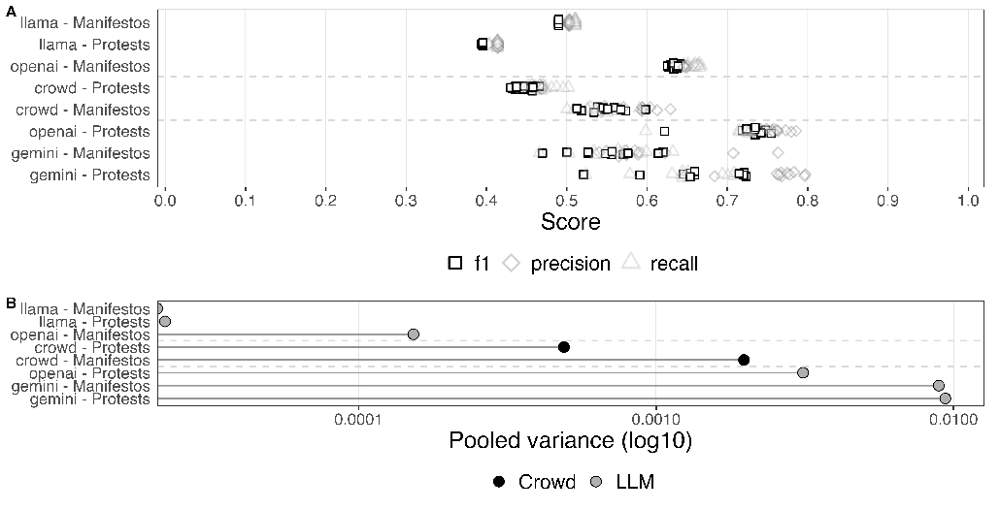

###### Figure 1: A, top: Accuracy metrics across all runs for each Static Source (LM or Crowd)-Dataset (Manifestos or Protests) pair with F1 score bolded for legibility ; B, bottom:Overall variance of accuracy scores across all outcomes and runs for each Static Source (LMor Crowd)-Dataset (Manifestos or Protests) pair.

Full results for each outcome and run are displayed in Figures 11 to 13 in SI E. To summarize our observations from the main analyses above:

- 1. For the manifestos, the crowdworkers perform very well (by LM standards) but the variance of the closed, OpenAI, model is lower than the crowd in this one instance.
- 2. For the protests crowdworkers are less accurate than the LMs, but very consistent in their performance.
- 3. Crowdworkers struggle in predictable ways: for example, they are least accurate when manifestos should have ‘extreme’ codings (far left/far right).
- 4. LMs struggle in unpredictable ways: for example, GPT made errors on more moderate (liberal) manifestos, but it is hard to know why.
- 5. Comparing across LMs, errors and performance appears to be idiosyncratic: for example, Llama has recall on some tasks on a par with GPT but generally much lower variance.
- 6. Open LMs have the best replication performance, at least in terms of low variance. For instance, on the static tasks, Llama has approximately zero variance in its coding performance.

To reiterate, crowdworkers are generally lower variance than LMs—the exception to this being open LMs (Llama)—for which the variance is approximately zero when re-coding the same data. Crowdworkers also fail in somewhat predictable ways: this is not true of the LMs. On this last point, we conduct an additional analysis of the within-document changes in model and crowdworker predictions across runs. We detail these tests in SI D and again note that the variance in LM performance—particularly when the researcher is forced to change model—is not comparable to crowdworkers.

Finally, in SI E, we also provide details of an additional test of model variance with a harder construct: populism. For this, we take (BERT) machine-annotated data from

Bonikowski et al. (2022) and re-annotate with LMs using the definitions in the original paper.

#### 5.2 Temperature and Model Settings Do Not Solve the Problem

One objection to these first experiments is that perhaps we did not properly specify model parameters. In particular, we see routine claims that setting a low or zero “temperature” for a model, and using nucleus sampling (“top p”) will (fully) mitigate concerns. It is true that these parameters control the “creativity” of the model by weighting the acceptable probability threshold for the next token in a sequence. For both parameters, “0” represents the lowest level of “creativity” and therefore the most “deterministic” setting for the model. But as we will see, this does not generally reduce variance to zero.

A second objection is that we did not properly specify the model date we are using. This critique begins by noting that developers like OpenAI periodically update their models with tweaks and other cosmetic changes and this, inevitably, leads to (small) changes in performance. Thus, if one specifies exactly which model—i.e. what dated version (e.g., gpt-4o-2024-08-06)—one used, future researchers can adopt the same model to achieve (more) similar results. From here, replication concerns are mitigated. Unfortunately this is also false.

In order to test whether adapting these parameters makes the models deterministic, we repeat the labeling process described above for the Manifestos, Protests, and Populism outcomes. We do so twenty times for each outcome. We first set the temperature to 0, then set the top p to 0 as well. We use the (at the time of writing) most up-to-date OpenAI models to reflect current practice. We also repeat this process for four (at the time of writing) of the most commonly used and powerful open-source models. For the OpenAI models, we specify the precise dated version of the model; for the open-source models we specify the precise version of the model we use.14

14To do so, we download the models locally using Ollama and specify the precise model version for each (i.e., the size of the model and version names instead of using the model with the “:latest” suffix.).

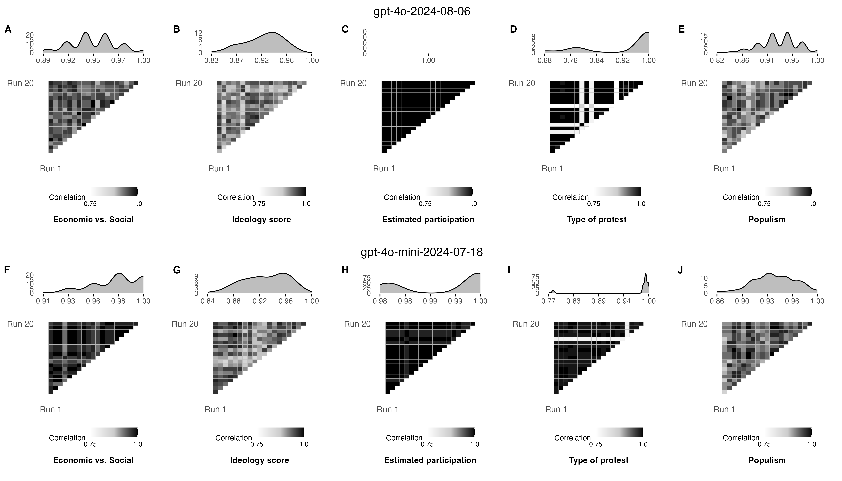

- Figure 2: A-E: Between-run correlation coefficients and coefficient distributions for each of the Manifestos, Protests and Populism outcomes for gpt-40-2024-08-06 with temperature set to 0; F-J: Between-run correlation coefficients and coefficient distributions for each of the Manifestos, Protests and Populism outcomes for gpt-40-mini-2024-07-18 with temperature set to 0.

We display the results for the OpenAI models in Figure 2. We see that setting the temperature to 0 does not render the model deterministic. Specifically, the correlations between runs are not necessarily zero: we see this from the fact that the triangular matrices are not completely blacked out (depending on task). The density plots at the top of each column summarize this fact: they are typically not spiked at zero, but vary from, say, 0.8 to 1.00. In some cases, for example the information retrieval problem for the participation task, we do see perfect replication between runs. But we would make the point that this is itself unpredictable, insofar as it is not obvious when this will be true of a given problem. In SI G we extend this analysis to setting both temperature and top P to 0. For tasks where the between run correlation is less than one, this problem continues for proprietary models there too. It is not an issue for versionable, open source models, however: setting the temperature to 0 renders replication perfect between runs.

Finally, in Figure 3 we look at the implied trade-off when specifying model temperature.

We do this for the two proprietary models we mentioned. We label each outcome over nine different temperatures ranging from 0 to 2. For each temperature, we label the same data ten times. We then calculate the F1 scores for each run. As expected, the variance in F1 scores increases at higher temperatures: i.e. setting a zero temperature may mean missing some performance (depending on the run). That said, the performance loss is not vast and risk aversion suggests setting temperature to zero as the least worst option when using a proprietary model.

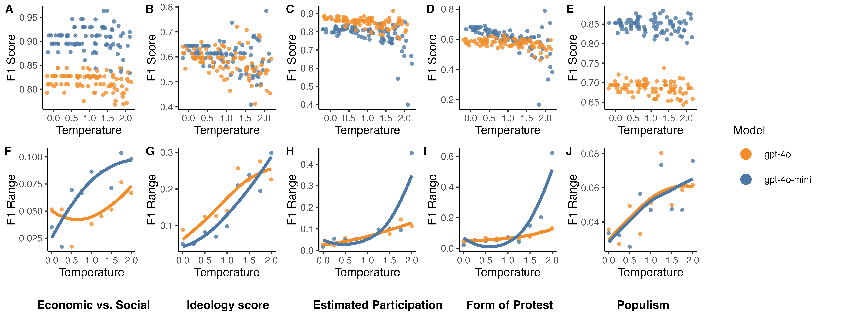

- Figure 3: A-E: Scatter plot of F1 scores versus temperature for each outcome (points jittered) ; F-J: Temperature against range of F1 scores for each outcome (line represents LOESS best fit). Note that higher temperatures allow for potentially better and worse coding performance.

#### 5.3 Downstream Consequences I: Bor & Petersen

We next show that the observed variance in LMs “matters” in a broad sense. Here, our setup was to replicate a study that used human workers to code a relatively unambiguous variable—except that we used LMs in the place of humans. Specifically, we used data from Studies 6 and 7 of Bor and Petersen (2022). Our rationale for carrying out this (and subsequent) replications is simple: many have claimed we may now be able to use LMs in the place of crowdworkers (Gilardi et al., 2023; Rathje et al., 2024; Ziems et al., 2024). Typically, these papers do demonstrate that LMs achieve human-level accuracy on given tasks. What we do not know is how, given the known stochasticity of models, the observed variation in

model outputs might affect downstream inferences. We give more details in SI H, but the key variable of interest in our first replication is the hostility of respondent comments on social media as predicted by several personality traits of the authors.

We follow the original crowdwork protocol as closely as possible with various LMs we had available—5 different OpenAI models in our case (GPT3.5 Turbo, 4, 4o, 4o mini, o1 mini). We then estimated the same regressions as in the original paper, but this time using the mean LM scores of comment hostility—instead of crowdworker codings—for each run. And we did this for each LM and each individual iteration. The results are in Figure 4. At the top (panel A) we see that while the crowd and the LMs agree in an overall sense (the loess lines have positive slope), the correlation is certainly not 1. Unsurprisingly, this has consequences for the estimated coefficients.

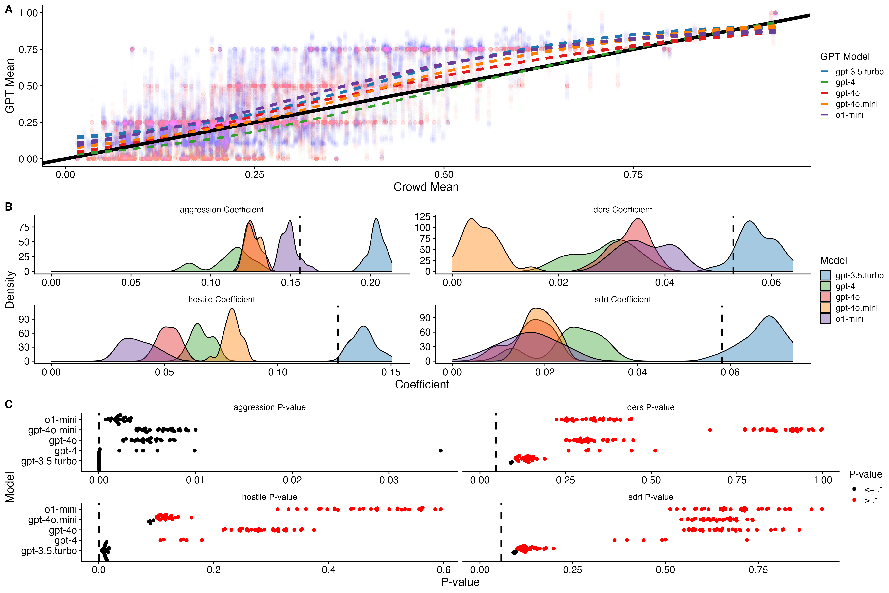

- Figure 4: A: Correlation between crowd mean and LM means of hostility ratings; B: Distribution of main independent variable coefficients across individual iterations of the same regression across LMs; C: P-values of coefficients for each iteration of each regression across LMs. The vertical line in Panel B indicates the original regression coefficient; the vertical line in Panel C indicates the original P-value.

We observe that for the key independent variables of interest (with the exception of aggression), all variables are now not statistically significant for the majority of regression estimates (in panel C, we see that the p-values have all moved right away from 0). This is, primarily, an issue of variance. But we can say more. First, as researchers update to newer and newer models, panel B (middle) makes clear that there is no reason for them to expect that effect sizes from earlier models will be preserved—e.g. GPT3.5 produces an entirely distinct set of coefficients as compared to the other models. We can see this by noting that the implied sampling distributions (the densities in Panel B) are centered somewhere other than the original work’s βˆs (the straight dotted lines). It is hard to know why this is true in a deep sense. Second, higher variance codings across runs yield higher variance coefficient estimates. We would expect this, but the converse is therefore (helpfully) true: more stable models produce more stable coefficients. Finally and unfortunately, there is not an obvious relationship between accuracy, variance and stability across models. That is, two different LMs can be similarly accurate overall (per panel A, they can have similar correlations with humans and each other), but yield very different coefficient estimates. This is generally bad news for replication efforts—and predicting how replicable a given task using LMs will be.

#### 5.4 Downstream Consequences II: Hopkins et al

We conducted a second replication with LMs for Hopkins et al. (2024). The original data for that paper is from Matias et al. (2021), and includes thousands of news headlines. For each news story, the data contain different versions of the headline, which were A/B tested on the Upworthy website. In Hopkins et al. (2024), the authors test if news headlines that cued identity groups were more likely to garner engagement (clicks). They hire crowdworkers to label whether or not a headline references a particular identity group (gender, race, religion, political). There are three outcomes in the data: clicks on a level scale, clicks logged, and clicks per 1000 impressions. These are referred to in the plot as “level,” “log,” and “ratio.”

To replicate this with LMs, we used three commonly-used OpenAI language models:

GPT3.5 Turbo, 4o, and 4o mini. We relabeled the Gender and Race coefficients, which were originally coded by crowdworkers.15 For each model, we code the full human-labeled data (∼6.6k rows) 10 times.

We then substituted in our LM labels for the original human labels in the regressions estimated in the original article. Thus, for each model, we have ten versions of the LM labels and ten regression coefficients. We provide full model specifications in SI I. We plot the results in Figure 5.

15In the original article, the results of these analyses are on the left hand side of Table 3.

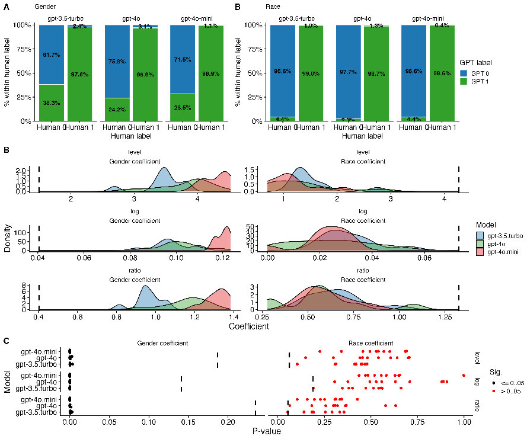

- Figure 5: A: Correlation between crowd labels and LM labels ; B: Distribution of main LMcoded independent variable coefficients across individual iterations of the same regression across LMs; C: P-values of coefficients for each iteration of each regression across LMs. The vertical line in Panel B indicates the original regression coefficient; the vertical line in Panel C indicates the original P-value.

We see first (panel A, top) that the gender labels produced by the LMs differ substantially from the original (human) labels: that is, there are off-diagonal masses in the plot. In Panel B, we see downstream results of this: across GPT-4o-mini and GPT-3.5, in particular, for the Gender coefficients there is an obvious gap between the distributions. Further, all of the Gender coefficients become significant (the dots in Panel C are now very close to zero), whereas none of them were so in the original article (the vertical bars). Therefore, the different LM codings not only produce different conclusions from the original article but also

from each other when comparing model versions.

In contrast, the correlation is much better for the model Race coding as compared to the original, and there is less between version variation in outcome coefficient and significance. However, there are two problems with this. First, despite this closer relationship to human coding, all of the Race coefficients are insignificant whereas one of them was significant in the original article. Second, it is unclear why the model performance varies for Race versus Gender, meaning it is difficult to know how replicable the task is ex ante.

To summarize: language model variability has material downstream consequences. It is not simply that LM codings differ from humans in an average accuracy sense; it is that they differ substantially across models. This implies that unless researchers have access to the same systems at the same time as the original researcher, they will struggle to replicate the earlier substantive results.16

#### 5.5 Usage Case Study: Gemini

Separate to performance variance, replication is obviously dependent on the ability to actually use the (same) model over time. Since Gemini was still being rolled out at the beginning of this study—and changes on the back-end were still being made—it is an ideal case for recording difficulties in employing a commercial LM. In SI J we give comments on our struggles with this model, its updates and other changes—including whole versions being suddenly retired. Our conclusion is that state-of-the-art products can be extremely fragile in replication terms and subject to forces beyond a given researcher’s power.

16If researchers have local and common expertise, then using something like Design-Based Supervised Learning (Egami et al., 2023) (see e.g. Rister Portinari Maranca et al., 2025) may reduce that variance in practice—but our focus here is on the general problem of trying to replicate findings as a function of LMs alone.

### 6 Advice to Practitioners

Articulating the general problems inherent in LM replication is helpful, in our view. But what practical steps follow? Here are our suggestions, from most abstract to most precise:

- 1. Take replication seriously, impose standards. Our most basic call is that researchers and their institutions—like journals—should be aware of the replication problems we discussed. This issue is unlikely to disappear (we think it will get worse), and needs action. Readers, referees and editors could down-weight—and perhaps not produce or publish—papers that rely on routines that are unlikely to replicate. Related, researchers might be compelled to report how much of a given pipeline is replicable and in what ways. The discipline might produce acceptable minimum standards for which to aim.
- 2. Be wary of false analogies: LMs are not just like crowdsourcing. LMs are like crowd workers in that they produce answers to questions and performs tasks, and a precise explanation of the mapping from machine (worker) to code may never be knowable. But LMs show more variance than crowdworkers and are more fragilespecific models can simply cease to exist. And LMs are unpredictable: their failure points surprise users in a way that is untrue of online workers and their capabilities. Advice to specify prompts more exactly or to experiment until responses are stable or to interrogate the LMs as to why they made decisions is ambiguous and ad hoc: it mostly restates the problems we are noting.
- 3. Use open models that allow offline versioning. We found that, uniquely, our open-weights implementations were replicable to a high standard if that standard is low variance. That is, if the goal is something approaching the Deterministic ‘code and data’ replication vision then local, versioned models are the way forward. These may not deliver frontier performance (though may be close) but should be checked as a first resort. There are caveats: for one, all LMs are inherently complicated and

- non-transparent in that sense. In addition, open LMs may not be trivial to run in coding or hardware terms. But they are a boon to replication insofar as being able to verify that the original researcher did indeed see the results they reported. Accessible weights may also help model understanding (Cunningham et al., 2023).
- 4. Justify closed models if they are to be permitted. Academic researchers use closed models typically for (claimed) performance reasons. This sacrifices replicabilitysometimes completely. This is reasonable in certain circumstances, but the trade-off should be acknowledged and justified (see Palmer et al., 2024). Of course, the idea that proprietary products in research pipelines can be a problem is not new, but the speed at which LMs change and/or cease to exist makes them a special case. In addition, the inherent black box nature of the underlying model means simply reading descriptions of what was done (cf. “ran a logistic regression”) may be far from enough.
- 5. Work in an anti-fragile way. If closed models are to be allowed, researchers should think carefully about ways to reduce the variances in their outputs. Setting parameters like temperatures and top p may help, but this is no panacea and in our view has led to some misleading claims. Similarly, prompt stability checks (e.g. Barrie et al., 2024) can be useful, though subject to our warnings about the implications of this process for closed models above.

- 6. Replicate Your Work. Researchers should run their own routines multiple times, preferably over multiple days or weeks or months—or whatever a reasonable period of stability should be for such models. They should report the variance they observe and comment on how “replicable” this suggests their efforts actually are.

### 7 Discussion

LMs are an extraordinary boon to the study of politics, but we contend they may also be a threat to broader notions of scientific transparency in the discipline. Our specific concern is the lack of attention paid to basic notions of replication in their deployment. We argued that LM work has some weaknesses of both traditional code-plus-data replication (it is fragile) and crowdsourcing (it is high variance). No temperature setting or well-written model specifications resolves the fundamental issue. We showed this empirically using an unusually long-running design with multiple tasks.

As always there are caveats to our conclusions: it could be that over time, as (even proprietary) LMs get larger, they become stable. And, of course, over the very long term we would expect crowdworkers to change in terms of preferences and behaviors. But as of today, when we do replace crowd workers with LMs, we demonstrated not only that they produce outputs very different from the original but that the choice of model will lead to different downstream inferences when these labels are used in e.g., a regression context.

We need more work on replication. It is not enough—and may be actively misleadingto just report what prompt was used for one particular run of the LM. We require clearer, common standards and practices. We leave such matters for future work.

### References

Alvarez, R. M. and S. Heuberger (2022). How (not) to reproduce: Practical considerations to improve research transparency in political science. PS: Political Science & Politics 55(1), 149–154.

Ankel-Peters, J., A. Brodeur, A. Dreber, M. Johannesson, F. Neubauer, and J. Rose (2024). A protocol for structured robustness reproductions and replicability assessments. Technical report, I4R Discussion Paper Series.

Argyle, L. P., C. A. Bail, E. C. Busby, J. R. Gubler, T. Howe, C. Rytting, T. Sorensen, and D. Wingate (2023). Leveraging ai for democratic discourse: Chat interventions can improve online political conversations at scale. Proceedings of the National Academy of Sciences 120(41), e2311627120.

Argyle, L. P., E. C. Busby, N. Fulda, J. R. Gubler, C. Rytting, and D. Wingate (2023). Out of one, many: Using language models to simulate human samples. Political Analysis 31(3), 337–351.

Barrie, C., E. Palaiologou, and P. To¨rnberg (2024). Prompt stability scoring for text annotation with large language models. arXiv preprint arXiv:2407.02039.

Bateman, D. A., I. Katznelson, and J. Lapinski (2015). Southern politics revisited: On vo key’s “south in the house”. Studies in American Political Development 29(2), 154–184.

Benoit, K., D. Conway, B. E. Lauderdale, M. Laver, and S. Mikhaylov (2016). Crowdsourced text analysis: Reproducible and agile production of political data. American Political Science Review 110(2), 278–295.

Benureau, F. C. and N. P. Rougier (2018). Re-run, repeat, reproduce, reuse, replicate: transforming code into scientific contributions. Frontiers in neuroinformatics 11, 69.

Bisbee, J., J. D. Clinton, C. Dorff, B. Kenkel, and J. M. Larson (2023). Synthetic replacements for human survey data? the perils of large language models. Political Analysis, 1–16.

Boettiger, C. (2015). An introduction to docker for reproducible research. ACM SIGOPS Operating Systems Review 49(1), 71–79.

Bonikowski, B., Y. Luo, and O. Stuhler (2022). Politics as usual? measuring populism, nationalism, and authoritarianism in us presidential campaigns (1952–2020) with neural language models. Sociological Methods & Research 51(4), 1721–1787.

Bor, A. and M. B. Petersen (2022). The psychology of online political hostility: A comprehensive, cross-national test of the mismatch hypothesis. American political science review 116(1), 1–18.

Brodeur, A., K. Esterling, J. Ankel-Peters, N. S. Bueno, S. Desposato, A. Dreber, F. Genovese, D. P. Green, M. Hepplewhite, F. Hoces de la Guardia, et al. (2024). Promoting reproducibility and replicability in political science. Research & Politics 11(1), 20531680241233439.

Bubeck, S., V. Chandrasekaran, R. Eldan, J. Gehrke, E. Horvitz, E. Kamar, P. Lee, Y. T. Lee, Y. Li, S. Lundberg, H. Nori, H. Palangi, M. T. Ribeiro, and Y. Zhang (2023). Sparks of artificial general intelligence: Early experiments with gpt-4.

Cacioppo, J. T., R. M. Kaplan, J. A. Krosnick, J. L. Olds, and H. Dean (2015). Social, behavioral, and economic sciences perspectives on robust and reliable science. Report of the Subcommittee on Replicability in Science Advisory Committee to the National Science Foundation Directorate for Social, Behavioral, and Economic Sciences 1.

Cunningham, H., A. Ewart, L. Riggs, R. Huben, and L. Sharkey (2023). Sparse autoencoders find highly interpretable features in language models. arXiv preprint arXiv:2309.08600.

Devlin, J., M.-W. Chang, K. Lee, and K. Toutanova (2019, June). BERT: Pre-training of deep bidirectional transformers for language understanding. In J. Burstein, C. Doran, and T. Solorio (Eds.), Proceedings of the 2019 Conference of the North American Chapter of the Association for Computational Linguistics: Human Language Technologies, Volume 1 (Long and Short Papers), Minneapolis, Minnesota. Association for Computational Linguistics.

Dong, Y., X. Jiang, H. Liu, Z. Jin, B. Gu, M. Yang, and G. Li (2024). Generalization or memorization: Data contamination and trustworthy evaluation for large language models. arXiv preprint arXiv:2402.15938.

Duvendack, M., R. Palmer-Jones, and W. R. Reed (2017). What is meant by “replication” and why does it encounter resistance in economics? American Economic Review 107(5), 46–51.

Earl, J., S. A. Soule, and J. D. McCarthy (2003). Protest under fire? explaining the policing of protest. American sociological review 68(4), 581–606.

Egami, N., M. Hinck, B. Stewart, and H. Wei (2023). Using imperfect surrogates for downstream inference: Design-based supervised learning for social science applications of large language models. Advances in Neural Information Processing Systems 36, 68589–68601.

Gelman, A. and E. Loken (2014). The statistical crisis in science. American Scientist 102(6), 460–465.

Gilardi, F., M. Alizadeh, and M. Kubli (2023). Chatgpt outperforms crowd workers for text-

annotation tasks. Proceedings of the National Academy of Sciences 120(30), e2305016120. Goodman, S. N., D. Fanelli, and J. P. Ioannidis (2016). What does research reproducibility

mean? Science translational medicine 8(341), 341ps12–341ps12.

Grimmer, J. and B. M. Stewart (2013). Text as data: The promise and pitfalls of automatic content analysis methods for political texts. Political analysis 21(3), 267–297.

Gundersen, O. E. (2021). The fundamental principles of reproducibility. Philosophical Transactions of the Royal Society A 379(2197), 20200210.

Hopkins, D. J. (2010). Politicized places: Explaining where and when immigrants provoke local opposition. American political science review 104(1), 40–60.

Hopkins, D. J., Y. Lelkes, and S. Wolken (2024). The rise of and demand for identity-oriented

media coverage. American Journal of Political Science. Key, V. (1949). Southern Politics in State and Nation. A. A. Knopf. King, G. (1995). Replication, replication. PS: Political Science & Politics 28(3), 444–452. Linegar, M., R. Kocielnik, and R. M. Alvarez (2023). Large language models and political

science. Frontiers in Political Science 5, 1257092. Matias, J. N., K. Munger, M. A. Le Quere, and C. Ebersole (2021). The upworthy research archive, a time series of 32,487 experiments in us media. Scientific Data 8(1), 195.

Mellon, J., J. Bailey, R. Scott, J. Breckwoldt, M. Miori, and P. Schmedeman (2024). Do ais know what the most important issue is? using language models to code open-text social survey responses at scale. Research & Politics 11(1), 20531680241231468.

Miguel, E., C. Camerer, K. Casey, J. Cohen, K. M. Esterling, A. Gerber, R. Glennerster,

- D. P. Green, M. Humphreys, G. Imbens, et al. (2014). Promoting transparency in social science research. Science 343(6166), 30–31.

Palmer, A., N. A. Smith, and A. Spirling (2024). Using proprietary language models in academic research requires explicit justification. Nature Computational Science 4(1), 2–3.

Palmer, A. and A. Spirling (2023). Large language models can argue in convincing ways about politics, but humans dislike ai authors: implications for governance. Political science 75(3), 281–291.

Patel, A., C. Raffel, and C. Callison-Burch (2024). Datadreamer: A tool for synthetic data generation and reproducible llm workflows. arXiv preprint arXiv:2402.10379.

Rathje, S., D.-M. Mirea, I. Sucholutsky, R. Marjieh, C. E. Robertson, and J. J. Van Bavel

(2024). Gpt is an effective tool for multilingual psychological text analysis. Proceedings of the National Academy of Sciences 121(34), e2308950121.

Rister Portinari Maranca, A., J. Chung, M. Hinck, A. D. Wolsky, N. Egami, and B. M. Stewart (2025). Correcting the measurement errors of ai-assisted labeling in image analysis using design-based supervised learning. Sociological Methods & Research, 00491241251333372.

Rogers, A., N. Balasubramanian, L. Derczynski, J. Dodge, A. Koller, S. Luccioni, M. Sap, R. Schwartz, N. A. Smith, and E. Strubell (2023). Closed ai models make bad baselines. Towards Data Science.

Schmidt, S. (2009). Shall we really do it again? the powerful concept of replication is neglected in the social sciences. Review of general psychology 13(2), 90–100.

Stoltz, D. S., M. A. Taylor, and J. S. Dudley (2023, October). The dynamics of collective action corpus.

Velez, Y. R. and P. Liu (2024). Confronting core issues: A critical assessment of attitude polarization using tailored experiments. American Political Science Review, 1–18.

Ziems, C., W. Held, O. Shaikh, J. Chen, Z. Zhang, and D. Yang (2024). Can large language models transform computational social science? Computational Linguistics 50(1), 237– 291.

# Online Supporting Information for Replication for Language Models

### Contents (Appendix)

- A Prompt Design 2
- B Crowdworker apps 4
- C Additional Populism task 5
- D Within-document prediction variance 6
- E Additional Main Experiment Figures 9 E.1 Descriptive Main Experiment Results . . . . . . . . . . . . . . . . . . . . . . 9
- F Additional Main Experiment Tables 13
- G Temperature and Top P Tests 14

- H Downstream Effects: Bor & Petersen ‘replication’ details 16
- I Downstream Effects: Hopkins et a. ‘replication’ details 17
- J Gemini case study 18

### A Prompt Design

In the below, we first detail the prompt designs and code used for each of our LMs for all of the analyses we describe in the main article.

Readers will note that, for the protest task, we classified more variables than we ended up displaying for our main results in the manuscript. For reasons of parsimony, we chose the two outcome variables that we did (participation and form) as these are among the most commonly coded in the literature. The full code for each prompt setup (including any additional libraries e.g., langchain or pydantic for forcing structured outputs) will also be included in replication materials.

- • Manifestos, Protests, and Populism OpenAI Analyses: The prompts are available at: https://tinyurl.com/mv7cx6y3.
- • Manifestos, Protests, and Populism Gemini Analyses: The prompts are available at: https://tinyurl.com/4eev5su4.
- • Manifestos, Protests, and Populism Llama Analyses: The prompts are available at: https://tinyurl.com/25um4hcd.
- • Manifestos, Protests, and Populism Ollama Temperature 0 Analyses: The prompts are available at: https://tinyurl.com/47w97rax.
- • Bor and Petersen (2022) Labelling for Downstream Analysis: The prompts are available at: https://tinyurl.com/52snxkuv.

###### • Hopkins et al. (2024) Labelling for Downstream Analysis: The prompts areavailable at: https://tinyurl.com/4j5t54r7.

### B Crowdworker apps

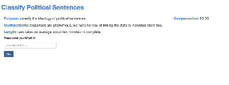

(a) Protest Crowd Screen 1 (b) Manifesto Crowd Screen 1

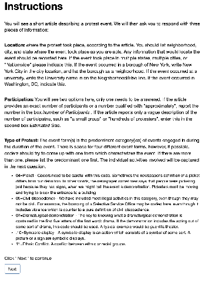

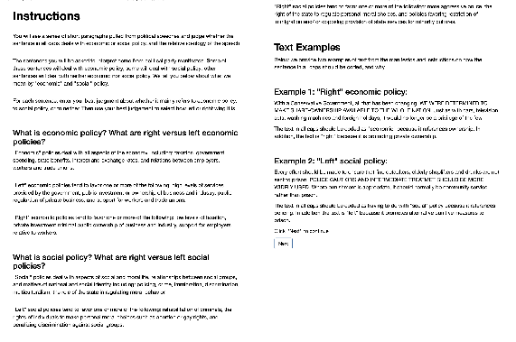

(c) Protest Crowd Screen 2 (d) Manifesto Crowd Screen 2

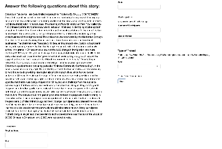

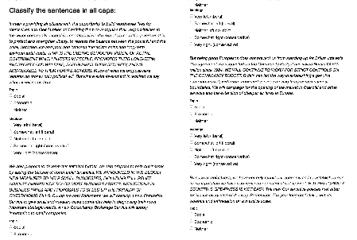

(e) Protest Crowd Screen 3 (f) Manifesto Crowd Screen 3

###### Figure 6: Combined screens for Manifesto and Protest crowdworker apps.

### C Additional Populism task

We also wanted to determine the stability of LM outputs when tasked with a more challenging construct to code: populist language. Here, we compared LM codings with the (BERT) machine-labeled data from Bonikowski et al. (2022), which consists of speeches by Democrat and Republican presidential nominees in the United States. The LM is required to code the texts as being “populist” or not, in line with a definition given by the original authors. Because these data were not labeled by crowdworkers in the original paper, we do not send these to the crowd as well. We display the results in Figure 7.

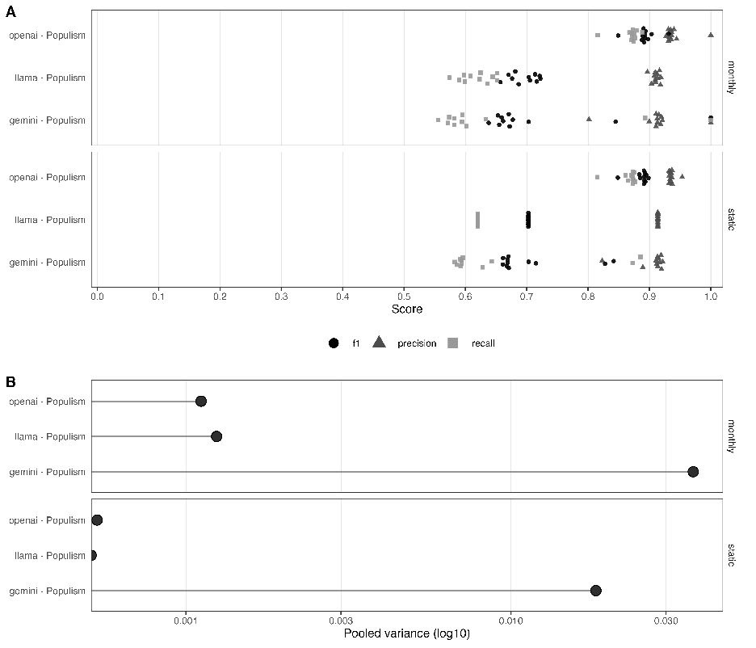

- Figure 7: A: Accuracy metrics across all runs for each Source (LM)-Type (monthly or static)Dataset (Populism) triplet; B: Overall variance of accuracy scores across all outcomes and runs for each Source (LM)-Type (monthly or static)-Dataset (Populism)) triplet.

We see that for some LMs—and Gemini in particular—the variance in accuracy metrics is particularly high. This provides some indication that for complex constructs like populism, the stability of LMs may be particularly poor. By extension, this makes any analysis using

LMs to classify this kind of data particularly vulnerable to failed replication.

### D Within-document prediction variance

We want to assess the stability of document-level codings over time. To do this we compute within-source flip rates and relate them to the change in F1 score (∆F1) across repeated runs. A ‘flip’ means that a document was previously in one category (and some specific time point) and is now another (and some later time). Note that it is possible for there to be minimal overall change in F1 score but considerable churn in the proportion of documents that move classes between runs. We are particularly interested in how observed variance between runs differs (if at all) when comparing LMs and crowdworkers. To conduct this analysis, we take every run (of the crowd and each LM) and compare it to every other run from the same source. We first align the identical static documents that appear in both runs and calculate the flip rate as the fraction of documents whose labels differ between the two runs. We then pair this with the absolute difference in F1 score between the same two runs, where F1 score is evaluated against a fixed “gold standard” taken from the original crowd codings. We report results separately for two outcomes in the Manifesto task (ideology score; economic vs. social) and for two outcomes in the Protest task (estimated participation; type). In the lower panel of each figure we also show kernel density estimates of flip rates by provider to summarize the distribution of observed variance in flip rates. The legend marks run pairs that straddle a model change (e.g., OpenAI deprecation; Gemini access changes) so readers can distinguish same-version from cross-version comparisons. We display results in Figures

- 8 and 9. Two patterns emerge. First, relatively high flip rates need not imply meaningful changes

in accuracy: across providers, many run pairs exhibit substantial item-level churn while ∆F1 remains small. This indicates that concerns about LM stability extend beyond average performance metrics. Second, flip-rate variation differs systematically across sources: the crowd displays relatively idiosyncratic spread, whereas LMs tend to produce either near-zero flips or a bimodal pattern. The latter is largely explained by model transitions; that is, run pairs that cross a version boundary (e.g., deprecation or access-tier changes) show markedly higher flip rates than same-version pairs, even when ∆F1 changes little. Together, these results underscore that (i) stability and accuracy are distinct properties and (ii) the nature of the error we observe with the crowd is obviously different to the nature of the error we observe with LMs.

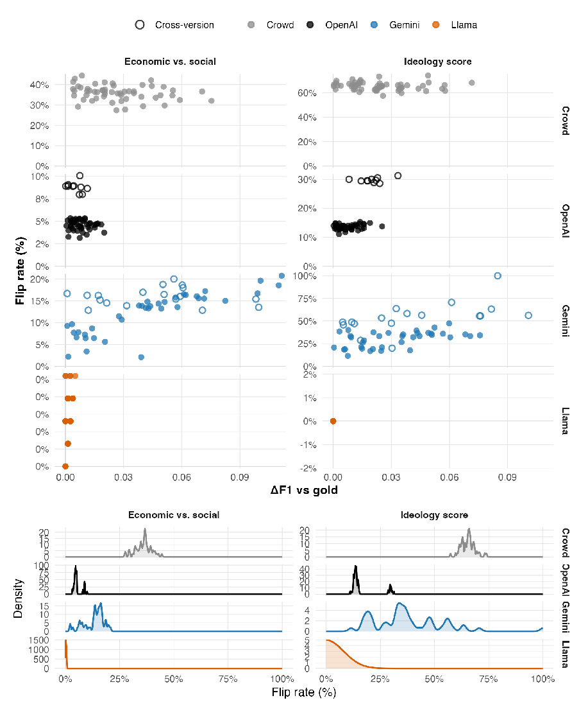

###### Figure 8: ∆F1 versus within-source flip rates; flip-rate densities (manifestos). Top:Scatterplots of within-source comparisons. Hollow markers indicate cross-version run pairs(i.e., spanning a model update), while solid markers indicate same-version pairs. Bottom:Kernel density estimates of flip rates for each provider and outcome.

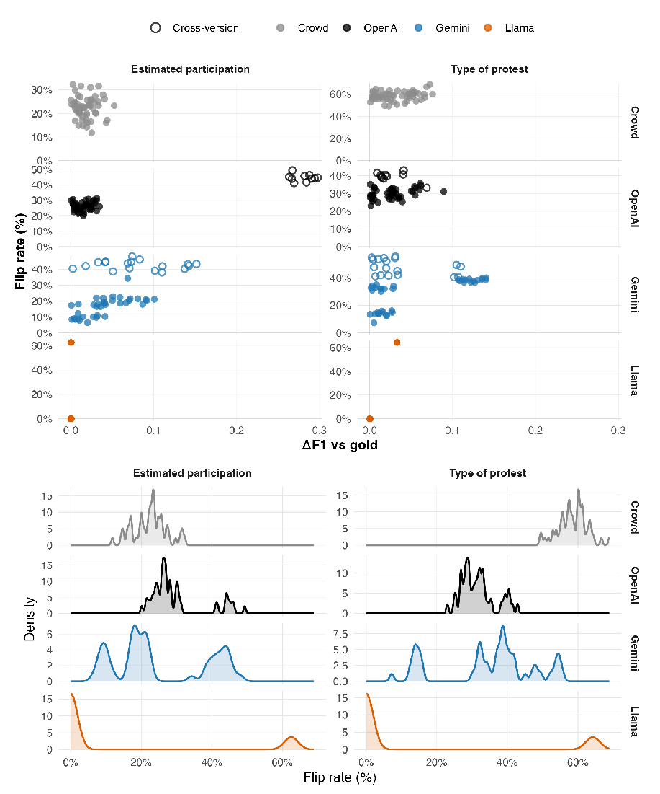

###### Figure 9: ∆F1 versus within-source flip rates; flip-rate densities (protests). Top:Scatterplots of ∆F1 versus flip rate, with hollow markers indicating cross-version pairs andsolid markers indicating same-version pairs. Bottom: Density plots showing the distributionof flip rates for each provider and outcome.

### E Additional Main Experiment Figures

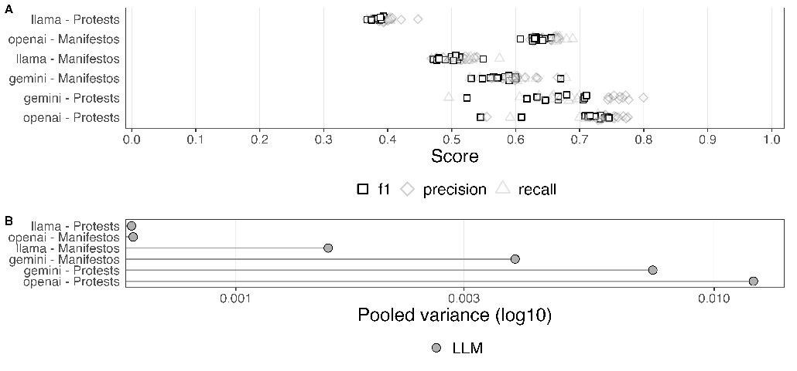

- Figure 10: A, top: Accuracy metrics across all runs for each Dynamic Source (LM or Crowd)-Dataset (Manifestos or Protests) pair with F1 score bolded for legibility; B, bottom: Overall variance of accuracy scores across all outcomes and runs for each Dynamic Source (LM or Crowd)-Dataset (Manifestos or Protests) pair.

#### E.1 Descriptive Main Experiment Results

For the manifestos, we see that accuracy is higher for the first task (differentiating between economic and social text) than the second task (estimating the ideological outlook of that text) across both the LM-coded and human-coded rounds. The OpenAI-coded data gives the highest accuracy scores overall and is the only LM to clearly outperform crowdworkers for the first task and match the crowdworkers for the second. Most notably, we see that the overall observed variance in these scores across rounds is markedly lower for the crowdworkers than it is for Gemini and similar to the other LMs.

For the protests data, we see a similar picture. Here, Gemini performs markedly better than other LMs in some rounds at classifying participation—and about as well as crowdworkers in this tasks for these rounds. But we also see that the variance of these metrics is substantially higher than for the crowdworkers. Due to poor performance of the OpenAI model in one round, the overall variance of these results for estimating participation is also substantially higher than the crowd. For the type of protest outcome, our crowdworkers perform generally more poorly than our LMs—but they do so a lot more consistently as the variance for the LMs is even higher for this outcome.

Finally, for our populism outcome that we did not ask crowdworkers to classify, we see that for the LMs—and Gemini in particular—the variance in accuracy metrics is particularly

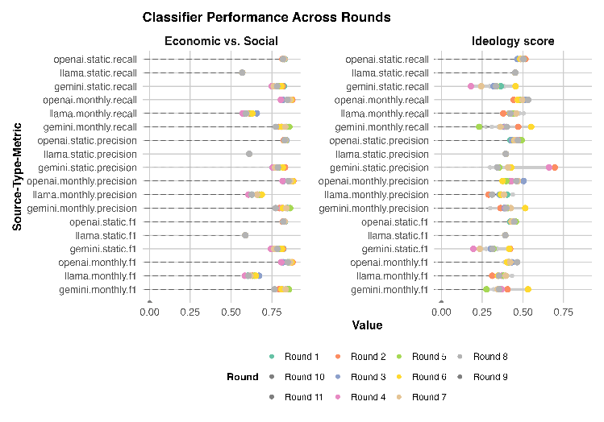

Figure 11: Manifestos

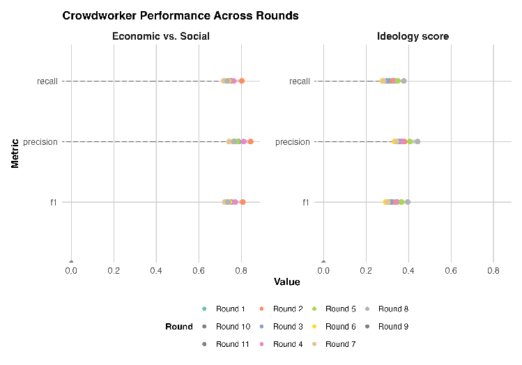

Figure 12: Manifestos Crowd

high. This may be because this is a difficult construct to annotate.

These differences in variance can be further broken down by model performance and model choice. Consider the task where coders are asked to determine the ideology of each

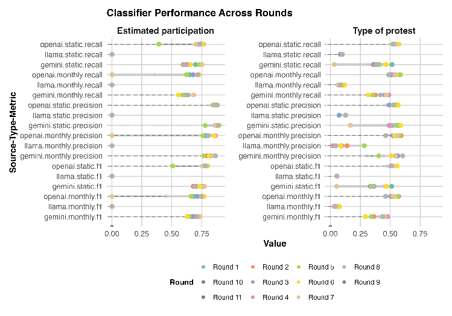

Figure 13: Protests

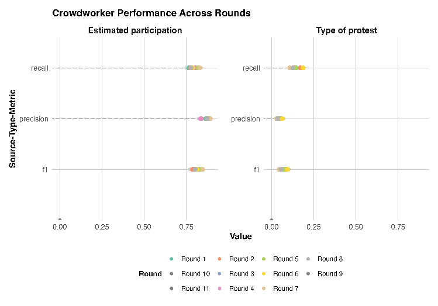

Figure 14: Protests Crowd

manifesto (from left to right). These values can be meaningfully ordered. Since we gave both the human coders and the LMs a static sample each month, and therefore have repeated

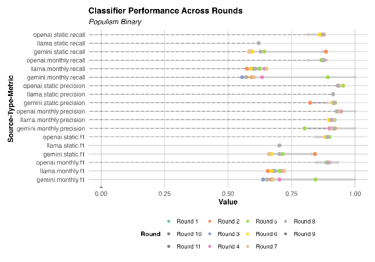

Figure 15: Populism

coding of the same manifestos, we can look at how those codings vary month over month.17 For OpenAI the ideology codings varied the most for manifestos with the ground truth of somewhat liberal, very liberal, and neither (in descending order). In contrast, the highest coding variance from crowdworkers came from manifestos that were very left or very right. The latter can be perhaps understood as crowdworkers struggling to commit to an extreme position (much like asking if you “strongly agree”). But we do not know whether OpenAI has trouble recognizing liberal ideology, or if the increased variance is random. In that sense, while there is some variance in both cases, using crowdworkers produces more predictable errors in coding.

Additionally, while OpenAI was consistently the best performer of the LMs in terms of the employed metrics, the variance of these outcomes is often comparable to the worst performer—Llama. There are two items of note here. First, averaged across all runs as they are in SI F Table 3, OpenAI consistently has the lowest average variation in precision of the LMs (with the partial exception of the estimated participation protest outcome due to poor performance in one round). However, Llama often outperforms (by a significant magnitude) or is close to OpenAI in terms of recall. This suggests different models have different idiosyncratic errors; for instance Llama has a much lower variance in recall for the populism task and it also codes many more observations as ‘1’ than OpenAI (with 1s being a relatively low occurrence in the data). Second, comparing the static and varying monthly runs, the variance for OpenAI and Gemini look similar. However, for Llama the static runs have a variance of (or close to) 0 for each performance metric and task. That is, using a model which is stored locally and re-coding the same data produces nearly identical coding

17Calculated as the variance for each given manifesto code averaged across manifestos.

results. This is much closer to the idea of true deterministic replication we discussed above.

### F Additional Main Experiment Tables

###### Table 2: Aggregated Results Table

Source Outcome Avg. f1 Avg. precision Avg. recall Range f1 Range precision Range recall Avg. Range

openai Economic vs. Social 0.443250 0.672465 0.505455 0.105181 0.172800 0.058000 0.111994 crowd Economic vs. Social 0.312158 0.339091 0.302604 0.062635 0.094979 0.048977 0.068864 llama Economic vs. Social 0.332253 0.410892 0.342455 0.048153 0.098103 0.046000 0.064086 gemini Economic vs. Social 0.425785 0.475865 0.454909 0.159649 0.154621 0.059000 0.124423 llama Ideology score 0.243500 0.328696 0.277455 0.050865 0.135856 0.041000 0.075907 gemini Ideology score 0.286631 0.354222 0.332455 0.104868 0.119232 0.228000 0.150700 openai Ideology score 0.281784 0.526338 0.328909 0.166208 0.179784 0.156000 0.167331 crowd Ideology score 0.341965 0.387047 0.323755 0.103502 0.108474 0.105275 0.105750 gemini Estimated participation 0.609619 0.674117 0.627091 0.341319 0.293854 0.274000 0.303057 crowd Estimated participation 0.557933 0.618648 0.566661 0.073708 0.079293 0.056021 0.069674 openai Estimated participation 0.534875 0.591693 0.545818 0.508077 0.558869 0.482000 0.516315 llama Estimated participation 0.232894 0.168685 0.376636 0.051102 0.045218 0.050000 0.048773 openai Type of protest 0.417046 0.535160 0.361818 0.200983 0.124906 0.258000 0.194630 llama Type of protest 0.032944 0.118781 0.037091 0.021138 0.274257 0.020000 0.105132 gemini Type of protest 0.325197 0.492880 0.313273 0.486205 0.452455 0.500000 0.479553 crowd Type of protest 0.067750 0.050561 0.115384 0.038992 0.031492 0.054198 0.041561 gemini Populism binary 0.708658 0.908011 0.652118 0.362043 0.198569 0.444444 0.335019 llama Populism binary 0.699223 0.912108 0.619168 0.065183 0.021877 0.077768 0.054943 openai Populism binary 0.890031 0.938442 0.867883 0.082994 0.072713 0.073733 0.076480

###### Table 3: Variance Table

Source Outcome f1 precision recall Average Variance

openai Economic vs. Social 0.000391 0.000376 0.000396 0.000388 crowd Economic vs. Social 0.000753 0.000987 0.000755 0.000832 llama Economic vs. Social 0.000777 0.000875 0.000778 0.000810 gemini Economic vs. Social 0.000819 0.000808 0.000805 0.000811 llama Ideology score 0.000648 0.001017 0.000590 0.000751 gemini Ideology score 0.005064 0.009893 0.006676 0.007211 openai Ideology score 0.000379 0.001033 0.000419 0.000611 crowd Ideology score 0.001128 0.001342 0.001228 0.001233 gemini Estimated participation 0.001583 0.001839 0.002557 0.001993 crowd Estimated participation 0.000585 0.000492 0.000794 0.000624 openai Estimated participation 0.031493 0.033492 0.032106 0.032364 llama Estimated participation 0.000000 0.000000 0.000000 0.000000 openai Type of protest 0.000677 0.001060 0.000612 0.000783 llama Type of protest 0.000123 0.002712 0.000192 0.001009 gemini Type of protest 0.009956 0.009936 0.009819 0.009904 crowd Type of protest 0.000319 0.000172 0.000755 0.000415 gemini Populism binary 0.007954 0.001364 0.016700 0.008673 llama Populism binary 0.000252 0.000023 0.000333 0.000203 openai Populism binary 0.000266 0.000217 0.000317 0.000266

### G Temperature and Top P Tests

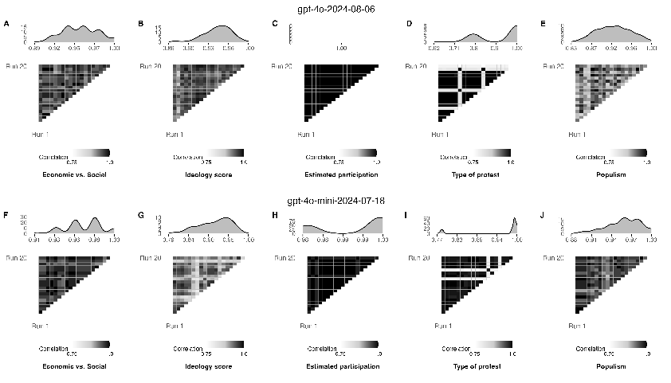

- Figure 16: A-E: Proprietary models, between-run correlation coefficients and coefficient distributions for each of the Manifestos, Protests and Populism outcomes for GPT-40-2024-08-06 with temperature and top P set to 0 ; F-J: Between-run correlation coefficients and coefficient distributions for each of the Manifestos, Protests and Populism outcomes for gpt-40-mini-2024-07-18 with temperature and top P set to 0.

- (a) deepseek-r1:8b

- (b) llama3.2:3b

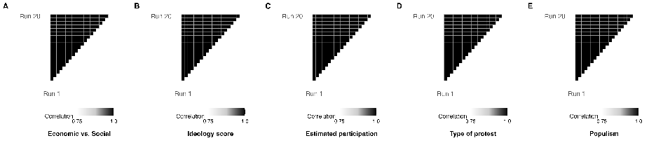

- (c) gemma3:4b

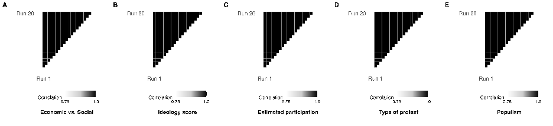

- (d) mistral:7b

###### Figure 17: A-E: Open models, between-run correlation coefficients for each of the Manifestos,Protests and Populism outcomes with temperature set to 0.

### H Downstream Effects: Bor & Petersen ‘replication’details

Here our basic setup was to replicate an analysis which used human workers, substituting LM coding for their efforts. Our requirement was that the human coded data referred to a construct that has a relatively unambiguous definition. This is important because it ensures that the task is straightforward, and that we can believe the original (human) labels are accurate as a baseline.

We used data from Studies 6 and 7 of Bor and Petersen (2022). Those authors investigate whether hostility observed in online platforms, such as social media, is a function of the medium or whether individuals with pre-existing hostile traits are more inclined to exhibit hostility online. Specifically, the paper aims to answer the question (quoted from the Appendix): “Do individuals with aggressive personality traits (as opposed to those without such traits) produce more hostile comments?”

To explore this, the authors:

- 1. Collect a set of Facebook comments related to immigration.
- 2. Ask participants to write a post in response to these comments.
- 3. Obtain crowdsourced ratings for the hostility of each respondent’s comment (on a 0-100 scale).

Subsequently, the mean hostility ratings of respondent comments, as determined by the crowd raters, are regressed on three personality measures known to be associated with hostility: status-driven risk-taking, difficulties in emotion regulation, and trait aggression. Additionally, the model includes the hostility of the original comment to which the respondent replied, alongside several other covariates of interest. The authors find significant associations between all three personality traits as well the hostility of the original comment (i.e., people respond in a more hostile way to comments that are originally hostile).

The mean hostility ratings of respondent comments, as determined by crowd raters, are regressed on three personality measures known to be associated with hostility—status-driven risk-taking, difficulties in emotion regulation, and trait aggression—alongside the hostility of the original comment and several covariates. Here, i indexes respondents, and the authors include random intercepts utarget(i) and uposition(i) for the original comment (target) and its position, respectively.

The regressions then take the following functional form:

#### Status-Driven Risk-Taking (SDRT) Regression

crowd.meani = β0 + β1 sdrti + β2 agei + β3 femalei

+ β4 partyidi + β5 higheredi + utarget(i) + uposition(i) + ϵi.

#### Difficulties in Emotion Regulation (DERS) Regression

crowd.meani = β0 + β1 dersi + β2 agei + β3 femalei

+ β4 partyidi + β5 higheredi + utarget(i) + uposition(i) + ϵi.

#### Trait Aggression Regression

crowd.meani = β0 + β1 aggressioni + β2 agei + β3 femalei

+ β4 partyidi + β5 higheredi + utarget(i) + uposition(i) + ϵi.

#### Hostility of Original Comment Regression

crowd.meani = β0 + β1 hostilei + β2 agei + β3 femalei

+ β4 partyidi + β5 higheredi + utarget(i) + uposition(i) + ϵi.

We use a set of LMs to annotate the comments in the study. Specifically, for each comment that had, for example, 7 crowd annotators, we provided 7 annotations using the LM; if it had 9 crowd annotations, we annotated 9 times, and so on. This procedure was repeated 30 times for each LM. In other words, we “replicated” the entire crowd annotation process 30 times for each LM. This process was conducted across 5 different OpenAI language models, resulting in a total of 1,174,750 annotations. Due to mounting costs, we conducted only 6 rounds with GPT-4.

We then estimated the same regressions as in the original paper, but this time using the mean LM scores for each run. And we did this for each LM and each individual iteration. Finally, we plotted the distribution of coefficients for each of the three personality traits, as well as the hostility level of the original comment in Figure 4.

We observe that for the key independent variables of interest (with the exception of aggression), all variables are now not statistically significant for the majority of regression estimates. Indeed, the earlier GPT-3.5 model is the only LM that retains statistical significance for some of the runs and delivers estimates relatively close to the originals for status-driven risk-taking, difficulties in emotion regulation, and original comment hostility. This is despite OpenAI explicitly advising users: “As of July 2024, gpt-4o-mini should be used in place of gpt-3.5-turbo, as it is cheaper, more capable, multimodal, and just as fast. gpt-3.5-turbo is still available for use in the API.”18

### I Downstream Effects: Hopkins et a. ‘replication’ de-tails

Here, we relabeled the human-labeled Upworthy news headlines provided by Matias et al. (2021) and used in Hopkins et al. (2024) to test the hypothesis that headlines cueing identity groups will gain more traction (clicks) than headlines about the same news story that do not cue identity groups.

In the original article, the authors estimate three regression that take the following form:

18Source: https://platform.openai.com/docs/models/o1. Last visited: October 31, 2024.

#### Click Level Regression

clicksi = β0 + β1 impressionsi + β2 RACEETHNICITYi + β3 GENDERi

+ β4 RELIGIONi + β5 POLITICALi + αj(i) + γk(i) + ϵi.

#### Click Log-Level Regression

clicks logi = β0 + β1 impressions logi + β2 RACEETHNICITYi + β3 GENDERi

+ β4 RELIGIONi + β5 POLITICALi + αj(i) + γk(i) + ϵi.

#### Click Ratio Regression

clicks per 1000 impressionsi = β0 + β1 RACEETHNICITYi + β2 GENDERi

+ β3 RELIGIONi + β4 POLITICALi + αj(i) + γk(i) + ϵi,

where i index observations. The story fixed effects are denoted by αj(i) and γk(i), respectively, where j(i) and k(i) indicate that each observation i belongs to a particular clickability test j and eyecatcher k. What the authors refer to as the click “level” is simply the number of clicks. The second operationalization is the logged number of clicks; and the third is the logged number of clicks per 1,000 impressions.

We choose to relabel two of the key independent variables of interest: RACEETHNICITY and GENDER. For all other variables, we use the original human labels. We do so by replicating the original codebook instructions as closely as possible with our prompt setup (see: Section A). We relabel all 6,633 headlines ten times for each GPT, resulting in 198,990 labels.

We plot the bivariate correlation between the original human labels, the distribution of the estimated coefficients, and the spread of the p-values for the key independent variables of interest in Figure 5. Similar to the findings in Section H, we find considerable betweenand within-model variance in the estimated coefficients downstream of the LM-annotated independent variables of interest.

### J Gemini case study

We began running replications for our three data sets in April 2024. In June 2024, Gemini pushed a number of updates as well as introduced a payment tier; customers were notified about the latter but not the former. Consequently, the code used for the first two months of this project is currently non-operational. The difficulties associated with this may prove instructive both for how to think about replication and initial LM choice.

The most notable effect of this change is that the initial (day 1 of our study) model used, Gemini 1.0-pro, no longer functioned. It literally could not be re-run for function calling. This is an extreme case of “fragility” in terms of our typology above: it is not (simply) a matter of needing to use an outdated or archived model to replicate, but of actually using a different machine altogether. The model that can accommodate the needed prompt design is now Gemini 1.5-pro (at a higher pricing tier).

Second, once the model itself was updated, the syntax of the code also needed to change. The previous versions of Gemini used the python package glm to enable function calling, with associated functions within the LM prompts. The updated Gemini uses a syntax similar, but not identical, to OpenAI’s GPT-419 and a different set of packages. In short: no part of the original set up or prompt code would replicate after this back-end change, despite the same models being nominally operational. In the sense of Benureau and Rougier (2018), that original code is not re-runnable, and certainly not repeatable or replicable.

We have several observations:

- 1. Simply maintaining a given model is not sufficient to ensure that code will produce the same (plus error) output or indeed be possible to run at all. Rather, significant changes can be made to models and their usage while still under the same name. This is different to something like updates to R packages, where the new release has a new number (at least).
- 2. While all commercial LMs require some form of authentication to use, usually in the form of an API key, Gemini added additional layers of verification with the update, only some of which were included in the model documentation.20 This is another oft neglected aspect of replication in which (unannounced) changes on the back-end require additional effort by a user. That is, it is not simply a matter of carefully checking which model the previous researcher used and accessing that one: there are extra steps to take.
- 3. Many changes are not even documented. In fact, when the Gemini models were initially updated, the documentation examples did not yet run on the published models. The documentation was both missing some pieces and ahead of the actual released code on others.
- 4. Separate to the statistical operations, there are business model issues that are confusing and troubling. For instance, despite claiming to allow 360 requests per minute on the paid tier, submitting only 12 requests a minute still generates “quota exceeded” errors. This is frustrating but also opens an additional complication of using commercial LMs—in the case of Gemini, users can only access support services if they buy into a subscription service. While this might seem minor, given the need to be able to adapt code and trouble-shoot problems in order to replicate this further limits who can replicate code or apply studied methods.

19There are some notable exceptions, such as it will not accept integers as forced outputs only strings 20Some requirements were discovered through error messages but not detailed on set-up pages

