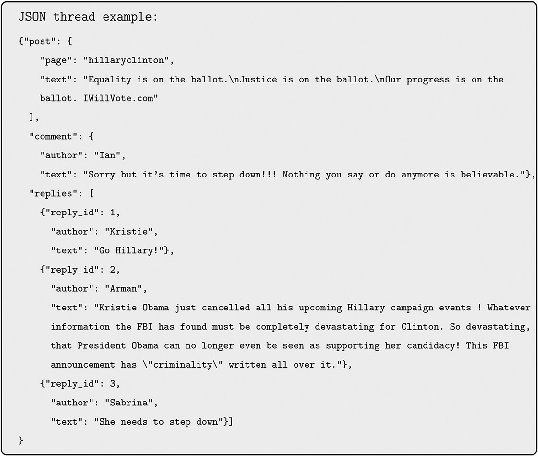
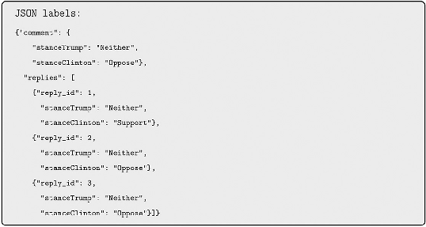
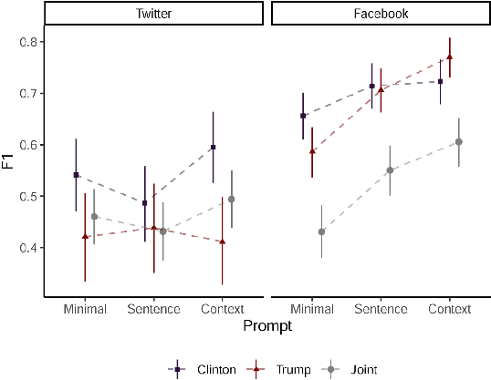
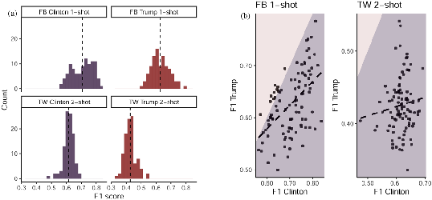
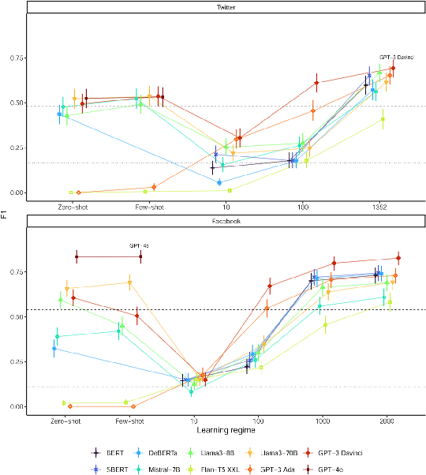
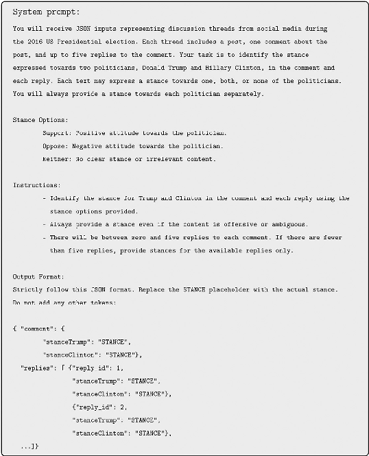
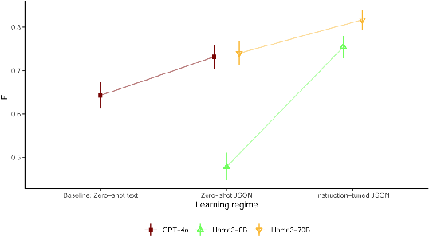
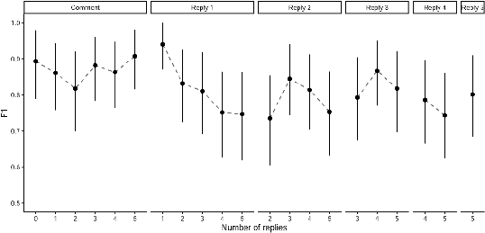
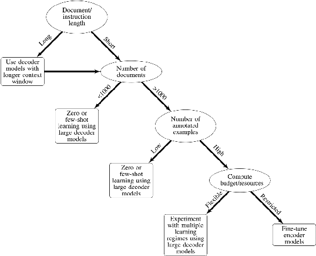

Original Article

Sociological Methods & Research 1–67

# Large Language Models for Text Classification: From Zero-Shot Learning to Instruction-Tuning

© The Author(s) 2025 Article reuse guidelines:

sagepub.com/journals-permissions DOI: 10.1177/00491241251325243 journals.sagepub.com/home/smr

## Youngjin Chae1 and Thomas Davidson1

Abstract

Large language models (LLMs) have tremendous potential for social science research as they are trained on vast amounts of text and can generalize to many tasks. We explore the use of LLMs for supervised text classification, specifically the application to stance detection, which involves detecting attitudes and opinions in texts. We examine the performance of these models across different architectures, training regimes, and task specifications. We compare 10 models ranging in size from tens of millions to hundreds of billions of parameters and test four distinct training regimes: Prompt-based zero-shot learning and few-shot learning, fine-tuning, and instruction-tuning, which combines prompting and fine-tuning. The largest, most powerful models generally offer the best predictive performance even with little or no training examples, but fine-tuning smaller models is a competitive solution due to their relatively high accuracy and low cost. Instruction-tuning the latest generative LLMs expands the scope of text classification, enabling applications to more complex tasks than previously feasible. We offer practical recommendations on the use of LLMs for text classification in sociological research and discuss their limitations and challenges. Ultimately, LLMs can make text classification and other text analysis methods more accurate,

1Department of Sociology, Rutgers University, New Brunswick, NJ, USA

Corresponding Author: Thomas Davidson, Department of Sociology, Rutgers University, New Brunswick, NJ, USA. thomas.davidson@rutgers.edu

Data Availability Statement included at the end of the article

accessible, and adaptable, opening new possibilities for computational social science.

Keywords stance detection, large language models, text classification, natural language processing, computational social science

## Introduction

The development of large language models (LLMs) has led to significant breakthroughs in many areas of natural language processing (NLP), and interest in artificial intelligence (AI) among academic researchers and the wider public has grown dramatically since the release of OpenAI’s LLM chatbot ChatGPT in late 2022. These technological innovations represent a paradigm shift in machine learning, as these technologies have evolved from being “narrow specialists” trained for specific tasks to “competent generalists” that can perform many tasks with little or no additional training (Radford et al. 2019). The text-to-text interface makes it relatively simple to use these technologies (Raffel et al. 2020) and enhancements that improve their capacity to follow instructions (Wei et al. 2022) enable LLMs to serve as a foundation for diverse downstream tasks (Bommasani et al. 2022). LLMs and other generative AI promise to transform many areas of social science methodology and research from text analysis and agent-based modeling to literature review and hypothesis generation (Bail 2024; Davidson 2024; Grossmann et al. 2023).

In this article, we evaluate the use of LLMs as a methodology for supervised text classification, a branch of machine learning focused on classifying texts using a predefined schema. We situate LLMs in the context of earlier developments in language modeling and provide a thorough overview of the recent developments in the field. Building on work showing that even relatively small language models can achieve impressive performance with limited training (Bonikowski et al. 2022; Do et al. 2024; Wankmüller 2024; Ziems et al. 2024), we examine how the predictive accuracy of LLMs compares to conventional machine learning techniques and varies across different model architectures and learning regimes. We also demonstrate how the generative capabilities of the latest models can be leveraged to analyze complex, structured data in new ways. We use the results from

these experiments to inform practical recommendations for the use of these techniques in sociological research.

As an empirical case, we use LLMs for stance detection, an application of supervised text classification to measure attitudes, opinions, and beliefs in observational text data (Mohammad et al. 2017; Sobhani et al. 2015; Somasundaran and Wiebe 2010). Sociologists have previously used sentiment analysis for such tasks (Felmlee et al. 2020; Flores 2017; Shor et al. 2015), but sentiment is a noisy proxy for these constructs, and stance detection can help researchers to obtain more reliable measurements that can be tailored to specific tasks (Bestvater and Monroe 2023). As a case study, we focus on stances expressed on social media toward the two leading candidates in the 2016 US presidential election. We analyze three different stance detection datasets consisting of a popular benchmark dataset from Twitter (Mohammad et al. 2016) and two new annotated Facebook datasets. These analyses allow us to triangulate the performance of LLMs across related tasks and to illustrate multiple approaches to text classification.

We begin by evaluating three distinct learning regimes that can be adopted when using LLMs for text classification. First, by leveraging the capacity of models to generalize based on large amounts of text consumed during pretraining, the most advanced LLMs can perform text classification without any additional training by using written instructions known as prompts (Radford et al. 2019). We evaluate the extent to which LLMs can detect stances based on instructions alone and assess how their performance varies depending on the prompt length and detail. Second, we consider whether labeled examples input alongside prompts result in improved performance (Brown et al. 2020) and conduct experiments to test the sensitivity to different examples. Finally, LLMs can be fine-tuned for specific tasks using larger sets of annotated training data, an approach more akin to conventional supervised learning. We conduct a series of evaluations to understand how predictive performance varies based on the model architecture and the amount of training data. Across these experiments, we test 10 different LLMs, ranging from relatively small models like Bidirectional Encoder Representations from Transformers (BERT) (Devlin et al. 2019) to OpenAI’s state-of-the-art GPT-4o (OpenAI 2023).

To highlight the capacity of LLMs to handle complex, structured data, we formulate a novel approach to modeling comment-reply threads. This analysis uses instruction-tuning, which combines the strengths of prompting and fine-tuning by training models with instructions and paired inputs and outputs (Wei et al. 2022). The task involves predicting the stance of a

comment along with the stances of any associated replies. This is a more challenging prediction problem, as there are multiple predictions for each thread, the number of which varies across threads. We show how the combination of structured data formats and detailed prompts can be used to classify threads using zero-shot learning and use instruction-tuning to further improve the predictive performance on this task. This analysis demonstrates the latest generative models can be used to study opinion dynamics in more realistic, conversational contexts and outlines a framework for using LLMs for tasks involving more complex data and coding schemes.

With sufficient training, most of the models evaluated substantially outperform conventional machine learning techniques, but there is considerable variability across architectures and learning regimes. Prompt-based learning regimes work best when using the largest, most powerful models, but predictive performance is sensitive to the composition of the prompt and training examples. The largest model evaluated, GPT-4o, outperforms fine-tuned models at predicting the stance of Facebook comments without any taskspecific training. When fine-tuning models using more training data, the largest models also achieve the best performance, but far smaller models can perform almost as accurately as their larger counterparts with sufficient annotated training data. The results from our thread-prediction task show how LLMs trained to predict multiple stances in comment-reply threads can achieve strong performance despite the difficulty of the task. Moreover, we find that cutting-edge open-weights models are becoming considerably more powerful, as Llama3-70B shows comparable performance to GPT-4o when predicting threads using prompts alone and exhibits further improvement after instruction-tuning.

Based on these results, we develop recommendations for social scientists interested in using LLMs for text classification. We discuss how the selection of models and learning regimes will vary depending on factors including the number of documents to be classified, the amount of annotated data available, and available computing resources. We also consider the limitations and challenges related to the use of these models, discussing issues including interpretability, reliability, bias, reproducibility, and privacy, as they pertain to our analyses and other applications, and discuss the trade-offs between proprietary models and open-weights alternatives in the context of these considerations. Overall, we anticipate that these experiments and recommendations will serve as a useful foundation for social scientists interested in using LLMs for text classification and related tasks.

## Background Language Models and Transfer Learning

A language model is a type of computational model that learns probabilistic representations of language from text corpora. The main objective of a language model is to predict the next word or set of words in a sequence, although there are many variations of this basic task. For example, what is the most likely word to end the sentence: “The cat caught a ···”? Each word in a vocabulary can be assigned a probability of appearing. In this case, a good model should assign a high probability to the word “mouse” and a much lower probability to words like “excavator” or “whale.” In a bi-gram model, the previous word in a sequence is used to predict the next word. More formally, a bi-gram language model is used to obtain P(wi|wi−1), the probability word wi is used given the previous word wi−1. Given a corpus of text, these probabilities can be calculated by counting the number of times a given pair of words co-occurs sequentially and normalizing by the frequency of wi−1 (Martin and Jurafsky 2024). N-gram language models extend this logic by using the previous n words in a sequence to predict the next word. Considering the example above, we should expect to make more accurate predictions if the model has more context (e.g., “cat caught a” versus “caught a” or “a”). The origins of language modeling date back to the early 20th century, when Andrey Markov used transition probabilities to model character sequences in literature, and the mathematical properties of these models were further developed by Claude Shannon (1948), who drew on statistical mechanics to study uncertainty in n-gram models (see Li 2022; Manning 2022; Martin and Jurafsky 2024 for further historical background). By the 1990s, computer scientists had developed techniques to compute probabilistic language models from larger corpora of text with applications to tasks including speech recognition, translation, and spelling correction (Bahl et al. 1983; Brown et al. 1990, 1992). However, n-gram models become intractable as n increases and are sensitive to the composition of the training corpus, making it difficult to generalize to new data. Despite these limitations, simple models can have useful applications for computational text analysis (Danescu-Niculescu-Mizil et al. 2013; Jensen et al. 2022).

More sophisticated language models based on neural network architectures that learn patterns through multiple interconnected layers of parameters were proposed in the early 2000s (Bengio et al. 2003), but computational constraints made these approaches challenging to operationalize beyond relatively simple tasks. By the early 2010s, the availability of large corpora of

online text and the development of neural networks optimized to run on graphics processing units (GPUs)—specialized processors originally designed for rendering graphics in video games—made it possible to train more powerful language models (Manning 2022). Notably, Mikolov et al. (2013a, 2013b) proposed the Word2vec architecture, using word prediction tasks to train neural networks as probabilistic language models. The language model itself was largely incidental, receiving less attention than rich semantic associations contained in internal weights, or embeddings, learned during training. These embeddings represent words as dense numeric vectors and have opened up new possibilities for the study of language and culture (Kozlowski et al. 2019; Rodriguez and Spirling 2022; Stoltz and Taylor

- 2021). Neural language models can be adapted to perform other types of NLP

tasks (Dai and Le 2015; Devlin et al. 2019; Howard and Ruder 2018; Radford et al. 2018) via a process known as transfer learning. A neural language model is first pre-trained using variants of the next-word prediction task, enabling the model to “learn” a general representation of language from a corpus. This pre-trained model can be modified to perform new tasks such as translation or question-answering by using a process known as fine-tuning. This works similarly to conventional supervised machine learning techniques by using training data to learn internal weights. The main difference is that rather than learning parameters from scratch, the existing weights in the pre-trained model are updated as a model continues to train on a new dataset. The technique was pioneered in computer vision, as models trained on diverse sets of images could be adapted to detect new, previously unseen imagery by making use of the generic representations they have already learned (Yosinski et al. 2014) (see Zhang and Pan 2019 for a sociological application). Transfer learning represents an important breakthrough in machine learning insofar as it alleviates the need to train a custom model for every new task.

## Large Language Models

The latest generation of neural language models are known as large language models, or LLMs, due to their size and the amount of text they are trained on. This label encompasses a wide variety of models, which we describe in further detail below. These models have grown in size following evidence of “scaling laws,” as they show improvement in performance on both language modeling and downstream tasks as they get larger (Brown et al. 2020; Kaplan et al. 2020; Raffel et al. 2020). To scale effectively, models

require concurrent increases in both the number of internal parameters and the amount of training data used (Hoffmann et al. 2022). The series of Generative Pre-trained Transformer (GPT) models from OpenAI illustrates this trajectory: The original GPT, released in 2018, had 117 million parameters and was trained on BookCorpus, a collection of 7,000 books (Radford et al.

- 2018); a year later, GPT-2 was released, with 1.5 billion parameters, trained on over 8 million web pages (Radford et al. 2019); its successor GPT-3—a version of which was released to the public as ChatGPT—was scaled up to 175 billion parameters and was trained on much of the open internet, including the Common Crawl dataset, digitized books, and all of Wikipedia (Brown et al. 2020); the exact details of the latest model, GPT-4, have not been disclosed (OpenAI 2023), but it was trained on texts and images and is rumored to contain 1.7 trillion parameters. The largest models excel at transfer learning, and the capacity to generalize well to many new tasks has led them to be termed “foundation models” (Bommasani et al. 2022). For example, GPT-4 not only achieved state-of-the-art performance on a variety of machine learning benchmarks but outscored the majority of people on standardized tests, including the Uniform Bar Exam, Advanced Placement Biology, and the Verbal GRE (OpenAI 2023).

While neural language models can have a variety of different formats (e.g., Howard and Ruder 2018; Jiang et al. 2024; Mikolov et al. 2013a), the most popular frameworks are based on an architecture known as the transformer. Proposed by Vaswani et al. (2017), the transformer consists of two key components, an encoder and a decoder, which were developed in earlier work in machine translation (Cho et al. 2014). The encoder takes in an input sequence of tokens x = x1, ..., xn, where each token may represent a word or a smaller linguistic unit, like a sequence of characters, and converts them into a sequence of continuous valued vectors, or embeddings, h = h1, ..., hn. The decoder then uses the continuous representation from the encoder to generate an output text. It works by mapping the embeddings from the encoder onto a conditional probability distribution of the next tokens and autoregressively generating the output tokens one by one from left to right. At each step, the previously generated tokens are recursively input into the decoder, providing context to predict the next token. Through this process, the model outputs a sequence of text tokens y = (y1, ..., ym), such as a translation from the original text into another language. The key innovation in the transformer architecture is the use of a self-attention mechanism, which enables the model to compute a weight for each token in the sequence based on its relevance to every other token. Martin and Jurafsky (2024: 214) describe

the self-attention mechanism as “a way to build contextual representations of a word’s meaning that integrate information from surrounding words, helping the model learn how words relate to each other over large spans of text.” This enables language models to capture long-range dependencies in texts, addressing the tractability issues that constrained n-gram language models. Transformer models typically consist of stacks of encoder and decoder blocks to progressively refine the representations and ultimately generate the final output (see Wankmüller 2024 and Martin and Jurafsky 2024 for further detail). The self-attention operation can also be parallelized during training (Vaswani et al. 2017), making it feasible to train on much larger corpora of text than earlier approaches, although this comes at the cost of increased memory complexity and necessitates the use of large amounts of computing power.

There are many different variants of the transformer architecture. Broadly, these architectures can be grouped into three categories, but all make use of the attention mechanism. Encoder-only models such as BERT (Devlin et al.

- 2019)—one of the most widely used transformer models1—only use the encoder component of the transformer. BERT is pre-trained using masked language modeling, where 15% of the input tokens are hidden, or masked, and must be predicted by the model. It uses bi-directional attention, parsing inputs in both directions, from left-to-right and right-to-left, using the surrounding context to predict the masked tokens.2 In contrast to word2vec, which assigns each word a single vector representation, this approach yields contextualized embeddings that adapt to surrounding text, capturing richer semantic information and improving performance across a variety of NLP tasks (Smith 2020). However, the masked language modeling pretraining task is inadequate for text generation. Decoder-only models, like those in OpenAI’s GPT family, are pre-trained using next token prediction tasks, more akin to earlier language models (Radford et al. 2018). Decoders are sometimes referred to as “causal” language models because masking is used to prevent the model from attending to later tokens in the input sequence3 so that the model cannot “see into the future” (Raffel et al. 2020: 17). When trained using large amounts of data, decoder-only models can generate high-quality texts. Finally, encoder-decoder systems such as Meta’s BART and Google’s FLAN-T5 retain a structure that more closely resembles the original transformer (Lewis et al. 2019; Raffel et al. 2020), based on the assumption that both modules are beneficial for various downstream tasks. We compare models with these different architectures to assess how they differ in performance on text classification tasks.

From Zero-shot Learning to Instruction-tuning. Perhaps the most notable feature of the most recent generation of LLMs is the capacity to interact with models using text. Almost any NLP problem can now be posed by providing a text as an input and generating a new text as an output (Radford et al. 2019; Raffel et al. 2020). For example, a model might take a sentence as input and yield a translation as its output. The text-to-text interface represents a fundamental shift from classical approaches to NLP, where the analyst manually converts texts into numeric vectors, often referred to as features, which are then input into a model. This involves decisions regarding how to tokenize the texts, such as whether to use words, n-grams, or character n-grams, and the type of vector representations, which vary from simple counts to embeddings derived from language models.4 Other features, such as non-textual information like follower counts on social media, can also be appended to the vector representation. Depending on the task, machine learning algorithms are then used to learn weights that map features onto labels, or, in unsupervised learning, to inductively summarize the data (Evans and Aceves 2016; Martin and Jurafsky 2024). In contrast, raw texts can be directly input to text-to-text LLMs, and tokenization and vectorization happen automatically, as the inputs are converted into the required format.5 Other contextual information can also be input alongside the texts, as we demonstrate in our final set of analyses. The decoder module then generates an output sequence based on the conditional probability distribution of next words given the input.

To control the way models convert inputs into outputs, written instructions known as prompts can be included alongside the inputs. Extending the potential of transfer learning, this affordance presents a more radical possibility: LLMs can generalize to new tasks without any additional task-specific training, known as zero-shot learning (Radford et al.

- 2019) For example, one could input a newspaper article and ask the model to determine whether it uses a certain kind of framing. The model might produce a reasonable answer, despite never having been explicitly trained to perform the task, because it has been pre-trained on vast amounts of text, including newspaper articles and other relevant material, allowing it to interpret the input text and how it relates to the prompt. Unlike earlier approaches to transfer learning, these techniques do not require that a model’s weights be updated using training data, and a single model can be prompted to perform many different tasks. A nascent field known as prompt engineering examines how variations in

wording, structure, and formatting can influence performance. For example, asking a model to write a short explanation for its reasoning, known as chain-of-thought prompting, can result in better accuracy (Wei et al. 2023a) and simply including the sentence “Let’s think step by step” at the end of the prompt can improve zero-shot performance (Kojima et al. 2024). One can also provide models with more guidance by including labeled examples along with the prompt, known as few-shot or in-context learning (Brown et al. 2020). The additional information contained in the examples can help to improve the quality of the output, particularly for difficult tasks where the prompt alone is insufficient. For instance, one could append some newspaper articles that have already been coded to the prompt to help guide the model to identify framing. When performing in-context learning, models use both the semantic information from the prompt and labels and the input-label mappings from the examples to make predictions (Wei et al. 2023b). Taken together, prompt-based learning regimes represent a paradigm shift in the way that we interact with language models, opening up new possibilities for sociological inquiry.

A shortcoming of prompting is that there are no guarantees that models will follow instructions or generate the desired outputs. In some sense, it is happenstance that the most likely tokens generated by the model often correspond to the outputs we are interested in. To enhance the capacity of LLMs to follow instructions, pre-trained models can be fine-tuned using large quantities of instruction and output pairs (Wei et al. 2022), known as instruction-tuning. This technique can improve performance on zeroshot and few-shot learning tasks and yield better quality text generations. Instruction-tuning the largest models can result in additional performance gains (Chung et al. 2022), further demonstrating the importance of scaling. LLMs can automatically improve their capacity to follow instructions via a process known as reinforcement learning with human feedback (RLHF) (Ziegler et al. 2020), which helps to align the outputs with user expectations and is central to the conversational capabilities of chatbots like ChatGPT. To perform RLHF, human raters select the best responses to queries from a set of possible candidates, and this information is used to train the model to optimize its generations to be more consistent with human preferences (Ouyang et al. 2022). Instruction-tuning can also improve efficiency by using outputs from larger “teacher” models as instructions to tune smaller models (Wang et al. 2023). For example, Taori et al. (2023) used 52k outputs from a 175B parameter GPT-3 model to fine-tune Llama 7B. Their model, dubbed Alpaca, is an order

of magnitude smaller but generates texts that are qualitatively similar to those from the teacher model. LLMs that have undergone these additional instruction-tuning techniques can serve as a strong foundation for subsequent tasks (Bommasani et al. 2022), and, as we explore below, instruction-tuning can be used to further adapt them for social science research (Wei et al. 2022).

New methodological challenges. LLMs have created many new opportunities for methodological advancement, but these technological innovations also raise several new challenges. Due to the cost of training LLMs (Strubell et al. 2019)—training the latest models can run into hundreds of millions of dollars considering hardware and electricity costsresearchers increasingly rely upon models trained by third parties. Some of these models, like BLOOM,6 are open-source, meaning that information on the training data, underlying code, and the models itself are public. Due to the resource investments needed to train these models, however, most have been developed by a handful of technology companies. Rather than open-sourcing their models, some companies have released open-weights models that anyone can use while keeping other proprietary details, such as the code and training data, private. Other models, particularly the largest state-of-the-art models, including Google’s Gemini, Anthropic’s Claude, and OpenAI’s GPT models, are only accessible using paid application programming interfaces (APIs), and the use of these closed models in academic research raises concerns about transparency, reproducibility, and privacy (Palmer et al. 2024; Spirling 2023). Others argue that LLMs will reproduce stereotypes and biases due to training on vast amounts of unvetted data (Bender et al. 2021; Weidinger et al. 2022). Several recent papers consider how these factors affect the use of LLMs in social science research (Bail 2024; Davidson 2024; Grossmann et al. 2023). Following our analyses, we return to these issues as they pertain to text classification and provide guidance to aid researchers in addressing various obstacles to using LLMs in sociological research.

## Text Classification Using Large Language Models

Unlike other machine learning algorithms, language models are not strictly supervised or unsupervised and can be used as a foundation for many downstream applications (Bommasani et al. 2022). We focus on the use of LLMs for text classification, an application of supervised

machine learning used to categorize texts into pre-determined classes. This task differs from unsupervised approaches such as topic modeling, which are used to inductively summarize and group texts (Evans and Aceves 2016; Molina and Garip 2019; Nelson 2020). Text classification is widely used in computer science for tasks such as spam filtering (Méndez et al. 2006), sentiment analysis (Pang and Lee 2008), and hate speech detection (Davidson et al. 2017). Over the past decade, the technique has been adopted by sociologists for a variety of tasks, including the analysis of activism on social media (Hanna 2013), coverage of inequality in newspaper articles (Nelson et al. 2021), and workplace feedback (Nelson et al. 2023). The capacity to perform new tasks with little or no additional training makes LLMs particularly promising for empirical research (Do et al. 2024). This lowers the bar for entry by reducing the costs associated with data annotation, making supervised text classification a more viable option for social scientists. Several studies show how transformer-based language models outperform conventional machine learning algorithms at various classification tasks, including the detection of emotional language (Widmann and Wich 2022), nationalist, populist, and authoritarian rhetoric (Bonikowski et al. 2022), and discussion of policy in news articles (Do et al. 2024).

Most existing work in the social sciences focuses on fine-tuning encoderonly models, but some recent scholarship applies zero- and few-shot learning, building upon studies by AI labs that demonstrate impressive performance of these techniques across a range of NLP tasks (e.g. Brown et al. 2020; Radford et al. 2019; Raffel et al. 2020). These studies have mixed findings regarding the efficacy of the latest innovations in language modeling. Wankmüller (2024) conducts experiments using variants of BERT, which can be adapted to perform rudimentary zero-shot learning, but finds they fare poorly at predicting political sentiments and toxicity compared to finetuned models. An analysis across 15 psychological constructs found that zero-shot GPT-3 and GPT-4 often performed equally or better than finetuned models, and the GPT-4 performed particularly well across multiple languages (Rathje et al. 2023). The most comprehensive analysis compares the performance of zero-shot FLAN and GPT models with a baseline encoder model, RoBERTa, which shares the BERT architecture but is trained on more data (Liu et al. 2019). Across 20 classification tasks, including emotion, misinformation, and ideology detection, Ziems et al. (2024) find that the larger generative models rarely outperform fine-tuned RoBERTa. Models with more parameters tend to perform better than smaller variants, consistent with other work (Brown et al. 2020; Raffel

et al. 2020). However, performance also varies by architecture: encoderdecoder FLAN models achieve the highest scores on nine tasks, while larger decoder-only GPT models perform best on the remainder. They also conduct few-shot learning using the FLAN models but see little evidence of improvement. Beyond size and architecture, the authors also point to the importance of subsequent training, showing that the variant of GPT-3 that had undergone RLHF outperformed the pre-trained version by an average of 3.5 points (based on F1 scores described below). Taken together, these studies show mixed evidence on the benefits of using more advanced LLMs and suggest that fine-tuning may still be a superior strategy to zeroand few-shot learning.

We build upon existing studies in several ways. In the following sections, we compare four different approaches to text classification using LLMs, ranging from zero-shot and few-shot learning to fine-tuning and instructiontuning. Across these learning regimes, we evaluate how common methodological decisions—including prompt construction, few-shot example selection, and the size of the training data—affect predictive accuracy. We consider a broader range of models than other studies, testing 10 LLMs that vary in size, architecture, and openness. Our goal is to consider how these factors impact predictive accuracy in order to identify the most effective approaches and to illuminate the trade-offs faced by researchers using these models.

## Stance Detection in Social Media Posts

We use stance detection as an application of supervised machine learning. The goal of stance detection is to identify attitudes, beliefs, or opinions expressed toward a target, such as a person, institution, or policy. The methodology was developed by computer scientists interested in studying online debates (Mohammad et al. 2017; Sobhani et al. 2015; Somasundaran and Wiebe 2010) and has become a popular approach for analyzing social media discourse (see Aldayel and Magdy 2021 and Küçük and Can 2020 for reviews). Neural networks can achieve competitive performance on stance detection benchmarks (Augenstein et al. 2016) and recent research finds that LLMs achieve reasonable accuracy in zero- and few-shot settings (Allaway and McKeown 2020; Burnham 2024; Ziems et al. 2024). We build upon these studies by considering how variation across models and learning regimes impacts the performance of stance detection classifiers and by considering how the generative capabilities of LLMs enable more sophisticated approaches to measuring stance in online discussions.

To perform stance detection, documents are annotated with labels like “Support/Oppose” or “Favor/Against,” typically with a third category, such as “Neither” or “Neutral” that captures ambivalent or irrelevant texts (Mohammad et al. 2016; Somasundaran and Wiebe 2010). Often, stance detection also involves the identification of the target towards which the stance is directed, known as “multi-target” stance detection (Sobhani et al. 2017). Many readers will be more familiar with a related technique known as sentiment analysis, which is used to categorize the valence or tone of a text (e.g., “Positive,” “Negative,” or “Neutral”), and has gained popularity among social scientists. Sociologists have used sentiment as a proxy for attitudes towards groups like immigrants (Flores 2017), women (Shor et al. 2015), and ethnic and racial minorities (Felmlee et al. 2020; Voyer et al.

- 2022). Following Bestvater and Monroe (2023), we contend that stance detection would have been a more suitable measurement strategy in these studies and similar applications. While stance and sentiment are often correlated (e.g., statements of support often use more positive sentiment) (Mohammad et al. 2017), it is common to observe mismatches. As Bestvater and Monroe (2023: 19) note, “political opinions are typically complex and multidimensional enough that it is trivial to express them either negatively or positively.” Using sentiment as a proxy for stance can result in substantial measurement error, particularly when the correlation between sentiment and stance is weak.7 We searched six generalist or methodology journals in sociology and found 20 articles that mentioned sentiment analysis and several applications of the technique, but no mention of stance detection.8 We suspect the neglect of stance detection in sociology stems from the fact that it has historically been difficult to implement because it requires the development of domain-specific annotated corpora and familiarity with supervised machine learning (Bestvater and Monroe 2023; Sen et al.

- 2020), whereas sentiment analysis can be performed using off-the-shelf lexicons or classifiers.9 We anticipate that stance detection will be a valuable methodology in many areas of sociological research since scholars are often interested in measuring attitudes, beliefs, and opinions expressed in texts.10

## Data

As a case study, we consider stances expressed in online political debates. Specifically, we use three datasets containing social media posts annotated for the stance towards the two leading candidates in the 2016 US Presidential election. This is an ideal case to explore because the election

was a classic example of what political scientist John Zaller (1992) calls a “two-message issue,” where most people tend to pick a particular side or, in this case, a candidate. By comparing two different social media platforms, we can assess how LLMs perform across different contexts and approaches to stance detection.

## Twitter Dataset

The first dataset consists of 1,691 tweets annotated for their stance towards Donald Trump or Hillary Clinton, derived from SemEval, a widely-used benchmark dataset (Mohammad et al. 2016).11 Each tweet corresponds to a single target, Trump or Clinton, and is labeled with one of three stances: “Favor,” “Against,” or “None.” Each stance annotation represents the majority label from 8 or more crowd workers. The target distribution is imbalanced, with 707 tweets mentioning Trump and 984 mentioning Clinton (see Table S1 in the Supplemental Materials). We hold out 339 tweets (20% in total) for testing, balanced evenly across the two candidates. There is also an imbalance with respect to the stances: Tweets mentioning Trump tend to favor his candidacy, whereas those mentioning Clinton tend to be against her. Across both targets, tweets with the Against label occur more than twice as often as those annotated as Favor. A potential issue with this dataset is that it may have been indirectly or directly incorporated into LLMs during pre-training, either through web pages scraped from the internet or through its use in instruction-tuning. This kind of data “contamination” undermines the principle that test data should be unseen during training. However, evidence suggests such contamination does not necessarily lead to perfect memorization, as models learn to generalize rather than memorize training data verbatim (Brown et al. 2020).

## Facebook Comments

The second dataset is a random sample of 2400 top-level comments (i.e., not replies to other comments) written on the Facebook pages of Donald Trump and Hillary Clinton from June 1, 2016, until the election on November 8. This is a novel dataset, so there is no risk that the data have already been seen during pre-training.12 Each comment was annotated by a single author with expertise in the topic. Following Do et al. (2024), we consider this to be a realistic setting for many applied researchers who may not have the resources to annotate large datasets, which often requires training research assistants or the use of crowdsourcing platforms. Moreover, prior work demonstrates that

larger corpora with a single annotation per example can be more efficient than using multiple annotations per example (Barberá et al. 2021). Unlike the SemEval dataset, which restricts each tweet to a single target, each comment was annotated for its stance towards Trump and Clinton. For consistency, we use a three-category annotation scheme similar to the previous task: “Favor,” “Against,” and “Neutral/None.”13 The stance labels are only used if a comment expresses a stance toward a target, meaning that we do not infer that an expression of support for Clinton implies opposition to Trump and vice versa. This process yields a tuple for each comment, such that a comment like “I’m never voting for Trump!” would be labeled {Against [Trump], Neutral/None [Clinton]}. There are 1200 comments from each Facebook page, but the distribution of the annotations is imbalanced in similar ways to the Twitter dataset (see Table S2 in the Supplemental Material). Comments favoring Trump outnumber those against him more than two-to-one, whereas the inverse is true for Clinton. Only a small fraction of comments, 7%, express a stance towards both candidates. The most frequent class is comments with no stance towards either candidate. We use 2000 comments for training and reserve 400 for testing.

## Facebook Comment-reply Threads

Our third set of analyses extends the stance detection task to longer comment-reply threads. To understand political debates on social media, we cannot simply consider individual tweets or comments but must investigate the threaded structure of online conversations (Backstrom et al. 2013; Berry and Taylor 2017; Shugars and Beauchamp 2019). In theory, threads furnish additional context that should help the model predict the stance expressed in comments, and it makes little sense to analyze replies abstracted from the conversational context (Murakami and Raymond 2010; Sridhar et al. 2015; Walker et al. 2012). Extending insights from multitask learning (Caruana 1997), we expect that models will predict stances expressed in comments and replies more accurately when they are situated in a thread rather than taken out of context. However, it is difficult to integrate this kind of structured information into conventional classification approaches. Generally, most models using thread data make inferences about entire threads, such as whether the conversation devolves into personal attacks (Zhang et al. 2018) or whether a comment promotes discussion (Naab et al. 2025). This typically involves the construction of hand-picked features to characterize the thread and its constituent texts that can be input alongside vectorized representations of texts. Graph-based methods have been proposed

for inferring stances of posts in reply threads, but these techniques also rely on hand-crafted features that are tedious to scale (Zubiaga et al. 2016). In contrast, text-to-text LLMs enable us to use the entire thread as input and for the model to automatically parse the information about each text. We can also request variable-length responses, such that models can return different predictions depending on the length of the thread. Our goal is to jointly classify comments and replies from different social media users using a single model.

We draw these threads from the same corpus as the previous Facebook task. While some comments can spawn extended discussions, the modal comment receives zero replies, and the modal number of replies among those with at least one reply is only two. Despite their sparsity at the comment level, 20.8% of the texts in the corpus are replies, so a substantial amount of discourse is missed if we only consider top-level comments. Each thread includes the page name, the original post text, and the text of any comments and replies, as well as pseudonyms for their authors.14 To avoid annotating excessively long threads, we restrict our analyses to the first five replies (0.56% of comments in the corpus have more than five replies). We construct balanced training (N = 1200 threads) and test (N = 300) datasets by randomly sampling threads from the corpus. In each case, there are equal numbers of threads with zero through five replies (including longer threads that are truncated to the first five replies). For each thread, we use the same annotation scheme as the Facebook task, labeling each comment and reply with a stance toward both Trump and Clinton. We use Support/Oppose rather than Favor/Against as the stance labels, as we consider these labels to be clearer, but we elected to retain the terminology used in the SemEval task (Mohammad et al. 2016) for the previous analyses for comparability.

An initial balanced set of threads (N = 36) was annotated by one of the authors and a graduate student with expertise in American politics. The annotators were instructed to take the entire thread into account when making decisions about the stance in each text. As such, the interpretation of a comment could be influenced by both the original post and any replies, and any replies could be understood in the context of the entire thread. In this initial evaluation, 90% of the stance labels were consistent across the two annotators. Nearly all disagreements related to whether a stance was present or not rather than the valence of the stance (e.g., one annotator rated a comment as Support and another Neutral rather than one Support and another Oppose). After discussing the discrepancies, the graduate student then annotated the remaining threads. These evaluation data were also used for prompt development to avoid overfitting the prompt to the training data during development.

Each thread is represented using JavaScript Object Notation (JSON), a common data format that allows us to represent threads in a nested structure. This format is well-suited for LLMs since they are often trained on large amounts of code and associated data structures (Ziems et al. 2024).15 The following example shows a comment with three replies on a post from Hillary Clinton’s Facebook page.

||
|---|

In this example, a commenter responded to Clinton’s post, expressing a negative stance by asking her to “step down” and questioning her honesty. Another Facebook user, Kristie (all names are pseudonyms), replied to this comment with a short supportive message, “Go Hillary!”. The reply is followed by a longer response, tagging Kristie and sharing a message insinuating that Clinton is a criminal. Finally, a fourth person enters the conversation, reiterating the claim from the original comment. The text below shows the labels corresponding to this thread, which are also stored in JSON format.

||
|---|

Thread prediction is a much more demanding prediction problem than predicting the stance for a single comment or tweet. Threads with one comment and five replies have 96 unique combinations of labels and, for any given input, there are 6n=1 9n ≈ 589k unique label permutations, assuming that a model must output not only the stance labels but the appropriate quantity of predictions. This task enables us to assess the capacity of LLMs to handle more complex data structures than traditional ML models and the extent to which they can analyze language use in a more realistic, conversational context.

## Models

We compare 10 language models of varying architecture, size, and openness to examine which factors have the greatest impact on the predictive performance. Broadly speaking, these models can be categorized into three groups: Small, encoder-only models that specialize in encoding semantic information; medium to large decoder-only and encoder-decoder models that are capable of autoregressive text generation; and large proprietary, decoder-only models that can only be run using third-party APIs. Table 1 gives an overview of each of the models, including the architecture, number of parameters, computing system, and whether or not they are open-weights.

The encoder-only models are all based on the BERT architecture (Devlin et al. 2019), which has been used in several recent sociological analyses (Bonikowski et al. 2022; Le Mens et al. 2023; Ren and Bloemraad 2022). BERT is a bi-directional encoder model trained on a masked language

- Table 1. Model Comparisons. Model Architecture Parameters System Open-weights

BERT Encoder 110M Personal computer

✓ SBERT Encoder 109M Personal

✓ DeBERTa Encoder 86M Personal

computer

✓ FLAN-T5 XXL

computer

Encoder-Decoder 11B HPC cluster ✓

Mistral-7B Decoder 7B HPC cluster ✓ Llama3-8B Decoder 8B HPC cluster ✓ Llama3-70B Decoder 70B HPC cluster ✓ GPT-3 Ada Decoder 350M API ✗

- GPT-3 Davinci Decoder 175B API ✗
- GPT-4o Decoder Undisclosed API ✗ Note. API = application programming interface; HPC = high-performance computing.

modeling task, where the objective is to predict one or more masked words in an input. For example, “[MASK] cat [MASK] a mouse.” We use the smallest bert-base-uncased version,16 which is modest in scale compared to more recent language models, with twelve layers of transformer modules that total 110 million parameters. We also evaluate two extensions of the architecture. SentenceBERT (SBERT) adds a pooling operation to output vectors (Reimers and Gurevych 2019) to produce fixed-size document-level embeddings. Decoding-enhanced BERT with disentangled attention (DeBERTa) incorporates two techniques that improve the attention mechanism and the encoding process. We use versions of SBERT and DeBERTa that are comparable to BERT in size, namely all-mpnet-base-v2 and deberta-v3-base, and are the most recent versions at the time of our analysis. All of these models are small enough to be used on a high-end personal computer (see Section C of the Supplemental Materials for further information).

The second medium-to-large family includes three different architectures, each with billions of parameters. These models are not only far larger than the encoder-only models but are also equipped with the autoregressive decoder component that allows for text generation and can be further fine-tuned to follow instructions in the prompts, making them ideal candidates for zero- and few-shot learning. FLAN-T5, developed by Google, uses the Text-to-Text Transfer Transformer (T5) architecture where both the input and the output

are natural language (Raffel et al. 2020). FLAN-T5 was created by instructiontuning T5 on more than a thousand distinct NLP tasks to improve its generalizability and instruction-following, including the use of chain-of-thought prompting (Chung et al. 2022). We use the largest variant, flan-t5-xxl, which achieved strong performance on a stance detection task derived from our Twitter dataset (Ziems et al. 2024). Next, Mistral, developed by French company Mistral AI, is a decoder-only architecture intended to balance performance and efficiency (Jiang et al. 2023). We use Mistral’s 7B parameter model, Mistral-7B-v0.3, released in May 2024. Finally, the Llama family of models developed by Meta have achieved competitive performance by training on more data without necessarily creating a larger model (Touvron et al. 2023). We use the two third-generation Llama models released in April 2024, Llama-3-8B, comparable in size to the other models in this category, and Llama-3-70B, the largest open-weights model evaluated. Both were trained on 15 trillion tokens of text from public sources, although the exact training data are not disclosed. These models are also decoder-only and incorporate modifications to the attention mechanism and embeddings that enhance performance. We used a high-performance computing (HPC) cluster with advanced GPUs to run these models (see Section C of the Supplemental Materials).

The final, large proprietary model family consists of several GPT variants released by OpenAI. GPT-3 is the third iteration of LLM developed by OpenAI and demonstrates strong performance in zero- and few-shot settings (Brown et al. 2020). We compare text-ada-001 and text-davinci-003—hereafter Ada and Davinci—released in November 2022.17 Ada, the smallest variant, has 350 millionparametersandwastrainedon40GBoftextdata(makingitmorecomparable in size to the encoder-only models described above). Davinci has 175 billion parameters and was trained on 45 TB of text. The version we use has undergone additional refinement using RLHF (Ouyang et al. 2022) and shows better performance on social science classification tasks compared to the standard pre-trained version (Ziems et al. 2024). A variant of this model was released as ChatGPT in late 2022. We compare these third-generation GPT models with GPT-4o, one of the most powerful language models at the time of writing, released in 2024. The technical details have not been made public, but it was trained on text, images, and audio and builds upon the GPT-4 architecture, which is rumored to have 1.7 trillion parameters.18 We were unable to fine-tune GPT-4o, so it is only used for the zero- and few-shot analyses.19 We use the OpenAI API to interact with the models running on their servers. Each query costs a small fee, and the larger, more computationally intensive versions are generally more expensive.20

## Baselines

Prior work finds that transformer-based models perform favorably compared with conventional machine learning algorithms across a range of tasks relevant to social scientists (Bonikowski et al. 2022; Wankmüller 2024; Widmann and Wich 2022). To assess how the LLMs evaluated here fare relative to earlier techniques, we calculate baseline scores for a subset of the specifications using four different approaches, varying the feature representation (bag-of-words vs. embeddings) and learning algorithm (support vector machine (SVM) vs. convolutional neural network (CNN)). These baseline models are described in further detail in the Supplemental Material (Section B). We also compare the results against a random baseline for each task. Our final thread prediction task is structured as a text-generation task and cannot be performed using classical algorithms. Instead, we use the best-performing LLM from our Facebook comment analyses to predict stances for each comment and reply separately.

## Experiments Zero-shot and Few-shot Learning

- Table 2 describes how each model is used in our analyses. We perform zeroshot learning for all three tasks. In each case, we provide a prompt and a test example as input and use the model output as a prediction. For the tweet and comment prediction tasks, we also implement few-shot learning. Since each tweet only includes a single target, we give one example for each target for the few-shot learning task (two-shot), whereas we use a single example for the Facebook comment task (one-shot). While more examples could theoretically be used—as many as fit into the context window, which defines the maximum number of tokens that can be input into a model at once (Brown et al. 2020)

—we restrict our focus to these simple cases to examine whether a modest amount of data can help to improve upon zero-shot learning.

Encoder-only models (BERT, SBERT, and DeBERTa) are not designed to be prompted using text inputs and thus cannot perform zero- or few-shot learning like the decoder models. However, it is possible to adapt these models to perform zero-shot classification by using fine-tuning (Laurer et al. 2024; Wankmüller 2024; Yin et al. 2019). To explore this possibility, we use DeBERTa-v3base-mnli-fever-anli, a version of DeBERTa fine-tuned for zero-shot classification (Laurer et al. 2024). The model is fine-tuned on 764k pairs of sentences from three datasets designed for natural language inference (NLI). The goal of

- Table 2. Learning Regimes by Model. Model Zero-shot Few-shot Fine-tuned Instruction-tuned

BERT ✓ SBERT ✓ DeBERTa ✓ ✓ FLAN-T5 XXL ✓ ✓ ✓ Mistral-7B ✓ ✓ ✓ Llama3-8B ✓ ✓ ✓ ✓ Llama3-70B ✓ ✓ ✓ ✓ GPT-3 Ada ✓ ✓ ✓

- GPT-3 Davinci ✓ ✓ ✓
- GPT-4o ✓ ✓

Note. The table lists the learning regimes used for each model across all tasks. We perform

zero-shot and few-shot learning and fine-tuning for the Twitter and Facebook tasks and zero-shot learning for the Facebook comment-reply task. Instruction-tuning is conducted on the Facebook comment-reply dataset using a subset of the decoder-only models that perform well in the other tasks.

NLI is to measure relationships between pairs of sentences, known as the “hypothesis” and the “premise.” In this case, we can consider the input text as the premise and the stance label as the hypothesis (Burnham 2024; Yin et al. 2019). For example, the premise “Hillary will be a great president” entails the hypothesis “Favors Clinton.” The model works by comparing the embeddings of the input text and stance labels, computing a similarity score to select the most likely label (see Laurer et al. 2024 for a more in-depth explanation). This procedure yields class predictions without additional training, even though the model lacks the generative decoder module.

The other models are all text-to-text and can process full prompts and other input examples. Where possible, we use variants of each model that have been instruction-tuned and optimized for conversation via RLHF and related techniques. Specifically, the models are Mistral-7B-Instruct-v0.3, Meta-Llama-3-8B-Instruct, and Meta-Llama-3-70B-Instruct. We use the standard version of FLAN-T5 XXL, flan-t5-xxl, which is designed to follow instructions. Regarding the OpenAI models, GPT-3 Ada has not undergone any instruction-tuning, whereas GPT-3 Davinci and GPT-4o have been optimized for instruction-following via RLHF.

Prompt Engineering. For zero- and few-shot learning, it is necessary to provide information to constrain the model to produce the desired output. Relatively

simple prompts can work for easy examples, but to achieve better performance, we must include more information about the task and the format of the output (Brown et al. 2020). To examine the impact of prompt engineering, we test three prompts that vary in length and the amount of information provided, discussed in further detail below. This allows us to assess trade-offs between prompt complexity, predictive accuracy, and economic costs (longer prompts consume more tokens). The best-performing prompts from these experiments are used in the main one- and few-shot prediction tasks.

For the few-shot models, we also evaluate the sensitivity to the examples included with the prompt, following evidence that performance can vary depending on the choice of examples (Zhao et al. 2021). Prior work on stance detection also finds that some test examples, particularly those that do not explicitly mention a target, are considerably harder to predict (Burnham 2024; Sen et al. 2020). In short, it is plausible that some examples will be more helpful than others when distinguishing between classes in few-shot settings. For each task, we conduct 100 replications using different examples from the training data. In each case, we take a random sample without replacement from the training data (stratified by the target for the two-shot task to ensure one example corresponding to each target is shown).21 Each example is concatenated to the prompt and used to predict the labels for all texts in the test dataset. These experiments enable us to measure how the predictive performance of few-shot learning varies according to the example(s) used.

## Fine-tuning

We evaluate how the performance of fine-tuning varies depending on the amount of data used. For the Twitter task, we compare models fine-tuned on 10, 100, and all training examples. We repeat the same for the Facebook comment task, additionally comparing models trained on 1000 comments and the full dataset, consisting of 2000 comments, enabling us to assess the relationship between training data size and performance for larger annotated samples.

The encoder-only models are fine-tuned by adding a layer known as a classification head to each neural network. This layer has randomly initialized weights, where each label is represented by a numeric parameter. The classification head consists of a fully connected layer that outputs a logit for each label and a softmax activation function that converts the logits into probabilities that sum to one. As the training examples are passed through the network, both the existing parameters and those in the classification head are updated through

backpropagation to minimize the cross-entropy between the predicted and true labels. Once trained, the test data are input into the fine-tuned models, which then output predicted probabilities for each class.

For the larger open-weights encoder-decoder and decoder-only models, the process differs in two ways. First, the language modeling head of each model, the final part of the decoder component that generates output tokens, is replaced entirely by the classification head. Fine-tuning thus curtails the generative capacity of these models as they are adapted to generate the stance labels. Second, due to the size of these models, it was necessary to use a technique known as QLoRA to perform fine-tuning efficiently (Dettmers et al. 2023). QLoRA enables us to update a low-rank approximation of the weight matrix and to store the numeric values in a compressed, quantized format, substantially reducing memory consumption and compute time (see Section C in the Supplemental Materials for further discussion). Fine-tuning of GPT-3 Ada and Davinci was performed using the OpenAI API.22 OpenAI does not reveal exactly how its fine-tuning system works, but the process appears to be similar, as fine-tuned GPT models appear to be constrained to produce the tokens corresponding to the class labels and lose their generative capabilities.

Each model has various hyperparameters that can be modified during finetuning. Systematically tuning these parameters would be computationally expensive (and financially, in the case of the GPT models), so we instead tried to maintain similar settings across all models and generally used defaults or those reported in previous literature. Further technical information on finetuning and hyperparameters is detailed in Section C of the Supplemental Materials.

## Instruction-tuning

We use instruction-tuning (Wei et al. 2022) for the thread prediction task. This generative approach allows us to incorporate a dynamic label structure rather than specifying the fixed number of labels in advance, as is required for standard fine-tuning (if there are k classes, then the classification head is a k-dimensional vector). Classification tasks can be framed as a variant of instruction-tuning where inputs are the texts to be classified, a set of instructions, and the labels. In our case, we give the instructions in a format known as a system prompt, which shapes the behavior of the model, and we continue to train on all Facebook thread JSONs and corresponding stance JSONs. When input with a new thread from the test set, the instruction-tuned model should generate a JSON object containing the predicted stances for each comment and reply. As

the Facebook threads in our data have zero to five replies, the model should be able to identify the number of replies in each thread and the correct stances, generating output text with appropriate headings like the numeric identifier for each reply. We discuss the prompt in more detail below. To perform these analyses, we instruction-tune the two Llama3 models, which have already undergone instruction-tuning and RLHF (Touvron et al. 2023). This process is implemented using the Supervised Fine-Tuning trainer from the Python library trl. We compare the performance of instruction-tuned models to a baseline model predicting comments and replies in isolation and zero-shot learning using the JSON inputs.

## Evaluation Metrics

All models are scored by calculating predictive performance on the held-out test data.23 For each class, precision is the number of true positives divided by the number of true positives and false positives, and recall is the number of true positives divided by the number of true positives and false negatives. Precision captures how accurately a classifier detects a particular class, whereas recall measures how many relevant examples were detected. Ideally, we want to achieve high precision and recall, although there are cases where it may be preferable to optimize for one over the other (e.g., Jensen et al. 2022: 46). The F1-score is used in machine learning to measure the predictive performance of each classifier. It is the harmonic mean of precision and recall. The F1 score for class k is defined as

precisionk · recallk precisionk + recallk

F1k = 2

We use a weighted F1 score to measure the performance across classes, F1w. This is calculated by taking a weighted average over each class, where K is the number of classes and Ntest

is the number of examples in the test set belonging to each class, and Ntest is the size of the test set:

k

K

Ntest

F1k ·

F1w =

k

Ntest

k=1

For example, F1Clinton is a weighted average of the F1 scores across three classes, “For,” “Against,” and “Neither/None.” We calculate several different versions of each score depending on the task. For Twitter, we score models separately for target and stance prediction. For Facebook, we calculate the accuracy for each target. We mostly focus on the strictest performance

metrics, which we term F1joint, which count a prediction as correct when it exactly matches the original annotation. For the Twitter task, this implies that both the target and stance are correctly predicted. In this case K = 6 because there are two possible targets and three stances for each target. For the Facebook task, the stances must be correct for both targets, thus K = 9, since there are three stance scores for each target and nine possible combinations of stance and target.24 Given the large label space for the thread prediction task, we calculate aggregate scores at the comment/reply level.

Since the test datasets are relatively small, it is possible that the scores on the held-out data do not adequately account for variation that would occur if the models were used on larger corpora of out-of-sample data. To account for this uncertainty, we calculate bootstrap confidence intervals for each metric (Efron and Tibshirani 1986). These are obtained by randomly drawing N predictions with replacement, where N is the size of the test data, and using these to calculate performance scores. The procedure is repeated 10,000 times, and the results are aggregated to obtain 95% percentile confidence intervals. These intervals capture variation due to the composition of the test data, accounting for uncertainty in the application of models to new data, but they do not capture other sources of uncertainty, such as the composition of the training data or stochastic variation in the models, which are much more computationally expensive to evaluate.

## Results Prompt Engineering and Zero-shot Learning

We created three different prompts for each task to assess the relationship between prompts and predictive performance. We begin with a simple prompt (Minimal) listing the basic information needed to perform the task, specifically, the stance options and format of the answer (see Table 3 for the full prompts). This information is critical to ensuring consistent outputs that map onto the label schema. If this works, we assume that the model uses existing semantic information from pre-training to interpret what target and stance mean and the relationship between these concepts and the input text. These prompts are extended by adding a short sentence describing the task more naturally (Sentence), which could be helpful for models that have been instruction-tuned in natural language. The final pair of prompts is more informative, describing how the statements refer to politicians and represent attitudes (Context). This allows us to assess the extent to which additional context enhances the accuracy of the predictions. Ceteris paribus, we

- Table 3. Prompt Variations. Prompt Type Tokensa

Twitter task Return the TARGET [Trump/Clinton] and STANCE [Favor/

Minimal 29

Against/None]. Answer: {TARGET, STANCE}

Sentence 43

This statement may express a STANCE about a TARGET. Return the TARGET [Trump/Clinton] and STANCE [Favor/ Against/None]. Answer: {TARGET, STANCE}

Context 60

This statement contains a TARGETand a STANCE. The target is a politician and the stance represents the attitude expressed about them. The target options are Trump or Clinton and stance options are Favor, Against or None. Provide the answer in the following format: {TARGET, STANCE}

Facebook task Return the STANCE [Favor/Against/None] for Trump and

Minimal 30 This statement may express a STANCE towards Trump,

Clinton. Answer: {Trump: STANCE, Clinton: STANCE}

Sentence 45

Clinton, or both. Return the STANCE [Favor/Against/None] for Trump and Clinton. Answer: {Trump: STANCE, Clinton: STANCE}

Context 54

This statement may express a STANCE towards two politicians, Trump and Clinton. Stance represents the attitude expressed towards them. The stance options are Favor, Against or None. Provide the answer in the following format: {Trump: STANCE, Clinton: STANCE}

aToken consumption for GPT-3 models calculated via OpenAI’s tokenizer: https://platform. openai.com/tokenizer

anticipate that more context will improve performance because the prompts will provide more information about the task to the model. At the same time, it is important to note that longer prompts consume more tokens, making them more computationally expensive to use.

The results are shown in Figure 1, which displays the target-specific and joint F1 scores for each prompt evaluated on the relevant test data. Overall, the more informative prompts tended to achieve the highest joint F1 score across both tasks. This pattern is clearest in the Facebook data, where the two longer prompts significantly outperform the minimal example. The fact that the second prompt performs better, despite lacking any information about key terminology, suggests that more complete sentences can be helpful. Looking at the target-specific scores, the results show that the

||
|---|

- Figure 1. Zero-shot F1 scores by prompt variations. This figure shows the test set F1 scores for zero-shot learning with GPT-3 Davinci using the three different prompts for each task, with Twitter on the left and Facebook on the right. Separate F1 scores for each candidate are shown, as well as the joint F1 score. The error bars are 95% bootstrap confidence intervals.

predictive performance for each candidate improves across the two prompts, particularly for the stance toward Trump. The results from Twitter are noisier, as the simple prompt seems to work better than the intermediate one, but the final prompt still performs better. Breaking the performance down by candidate shows that this is due to an increase in performance for Clinton and a small decline for Trump. In general, the labels in the Twitter dataset appear to be harder to predict, an issue we discuss further below. While we do not attempt to identify the best prompt exhaustively, these results demonstrate substantial variation across prompts, underscoring the importance of careful prompt construction for maximizing predictive accuracy.

## Example Selection for Few-shot Learning

The one- and two-shot analyses were performed using the most detailed prompts from the preceding analysis. Figure 2 shows the results of our

||
|---|

- Figure 2. Example variation and predictive performance. (a) F1 score distributions by target. The top row shows the results for the Facebook task, and the bottom row for the Twitter task. Dashed lines denote the mean F1 score across all few-shot examples; (b) Correlations between target-specific F1 scores. The left figure shows the results for the Facebook task, and the right figure shows the Twitter task. Shaded regions indicate when models perform better for Trump (light) or Clinton (dark). The trend line is indicated in black.

experiments analyzing how performance varies as a function of the examples provided along with the prompts. Across both datasets, there is substantial variability in predictive performance on the test data, highlighting sensitivity to the examples. The F1 scores for the Twitter task range from 0.33 to 0.69, and the scores for Facebook range from 0.50 to 0.84. In general, the models are more accurate at predicting the stance towards Clinton than Trump, perhaps because the stances expressed toward Clinton are more consistently negative and are thus easier to detect. For the one-shot Facebook model, we observe a positive correlation between the F1 scores for each target. This suggests that the best examples help improve predictions for both candidates. The correlation between the target-specific F1 scores is much weaker for the Twitter model, possibly due to the additional randomness induced by the two-shot setting since example texts were sampled independently for each target. The shaded regions further show how almost all models (all of those used on the Twitter test data) performed more accurately for Clinton than Trump. Overall, these results highlight how LLM classifiers using few-shot learning can be highly sensitive to the choice of examples, with evidence of wide variation in the out-of-sample F1 scores.

To better understand how the characteristics of the example texts impact performance, we estimated a series of regression models that use the

stances in the examples to predict the target-specific F1 scores, controlling for word count to account for the effect of example length. The full regression results are reported in the Supplemental Material in Tables S3 and S4 (Section D). We find that comments that favor one candidate over the other are associated with statistically significant increases in performance in the Facebook predictions: Comments supporting Clinton are associated with a 0.05 increase in the Clinton F1 score and a 0.07 increase in the Trump score compared to those with no stance towards Clinton; comments favoring Trump are associated with a 0.03 increase in the Trump F1 score. The R-squared statistics increase when the interaction between the stances toward the two candidates is added, and the stance interactions in the model predicting the accuracy for Trump are statistically significant. These findings indicate that the combination of stances expressed in the examples moderate predictive performance. The patterns in the Twitter predictions are less conclusive but suggest that longer tweets help to improve the Clinton predictions and that tweets opposing Trump negatively impact the Trump predictions. These results show how the qualities of the examples can impact the predictive performance of few-shot learning models. To account for this variability in our subsequent analyses, we use the modal prediction across all examples as our final prediction when using few-shot learning. Averaging across these prompts should help to improve robustness, similar to how a random forest model aggregates predictions across trees.

## Stance Detection Across Models and Learning Regimes

Figure 3 shows the main results for the tweet and comment prediction tasks. The points are the joint F1 scores, representing the accuracy of a model at predicting the target and stance of tweets and the stances for both targets in comments, along with 95% bootstrap confidence intervals. Tables S5 and S6 in the Supplemental Materials contain the F1 scores for all models, as well as the precision and recall metrics. In general, we observe significant variation in predictive performance across the different models and learning regimes. Starting with the zero-shot and few-shot models, the largest decoder-only models tend to perform best (Llama3-70B, GPT-3 Davinci, and GPT-4o) at predicting the stance and target for tweets. Indeed, zero-shot GPT-4o achieves the highest precision for both stance and target prediction of any of the models tested (Table S5). The encoder-only DeBERTa model finetuned for NLI performs comparably to the smaller Llama3-8B model at zeroshot learning, but both tend to underperform the best conventional baseline

||
|---|

- Figure 3. Predictive performance by learning regime and model. The top panel shows the scores for Twitter, where the F1 score represents the joint accuracy across both stance and target on the held-out test data. The bottom panel shows the scores for Facebook, where the F1 score represents the joint accuracy of the stance predictions for both targets on the held-out test data. The best model for each outcome is labeled in the figure. The dashed horizontal line in each panel represents the F1 score of the best-performing baseline model, and the dotted horizontal line represents the random baseline. Error bars are 95% bootstrap confidence intervals.

(both the CNN and SVM with bag-of-words features obtained a joint F1 score of 0.48). At the bottom of the figure, we find that the smaller GPT-3 Ada and the encoder-decoder FLAN-T5 XXL perform poorly for these prompt-based learning regimes, with lower accuracy than random guessing. Inspection of

(continued)

70B GPT-3

None N,N,NA,N,NN,AN,N

Against ,AC,A,C,AC,AC,A

Favor F,FA,FF,F,NN,FN,F

Against ,AT,A,T,AT,AT,A

None ,AT,A,FT,AT,AT,A

Ada

Favor ,FT,F,C,AT,FT,F

Zero-shotFine-tuned

XXL Llama3

Ada FLAN-T5

70B GPT-3

XXL Llama3

ExampleTextsandPredictionsfromZero-shotandFine-tunedModels.Table4.

TextLabel FLAN-T5

goFKhimself.∗∗ Clinton,

#Servergate?Buryenoughevidenceyet?#tcot Clinton,

platform. Trump,

#MakeAmericaGreatAgain Trump,

OurnextPresident! None,

canbebeaten. None,

HeyHillaryClintonHowsthingsworkingouton…’

us dragons exist,but because they tell us dragons

Watching what Donald Trump said about Mexicans

andIhavenothingelsetosayabouthim.Hecan

Fairy tales are more then true not because they tell

apologizeforthetruth.Peoplearetoosensitive.

wasshocking!Letsnotgivethisappallingmana’

ImwithherasPresidentObamasaysthemost’…“

DonaldTrumpisajoke.Hisasimplemindedidiot,

qualiedindividualevertorunfortheofce.fifi”

@GeraldoRivera@realDonaldTrumpDont’

Facebook

Twitter

was trained on the full training dataset. The Label column shows the true label for each text. The values underneath each model are the text output.

This tableshows the predictions forfour different examplesin the test datafor each task. For each example,thepredictionsfrom threemodelsare

Missing values indicate each model failed to generate the labels in the correct format. To conserve space, the labels have been abbreviated as follows:

shown: FLAN-T5 XXL, Llama3-70B, and GPT-3 Ada. Predictions are shown for the zero-shot andne-tuned versions of each model, where the latterfi

70B GPT-3

None A,A,NF,N,NA,NA,N

Ada

Against A,AA,AF,N,FN,AF,A

Zero-shotFine-tuned

XXL Llama3

Ada FLAN-T5

70B GPT-3

XXL Llama3

TextLabel FLAN-T5

Against,

Against,

about his beautiful wife, why in the hell isnt he in’

Tweetingat3 and4oclockinthe morningisthe“”’

signofasickandderangedindividual.Hebrags

=====CClinton,TTrump,FFavor,AAgainst,NNone.

IagreeTrumpisBad.ButYOUarebadtoo.Im’

NOTpickingbetweenthelesser oftwoevils.

#TrumpWILLbeatyou!Only#BernieCAN

defeatHim.#notwithher#bernieorbust

bedwithher?????????

ContinuedTable4.

the predictions shows that these models generally failed to return valid output, sometimes yielding only one portion of the answer or irrelevant text sequences,

- as illustrated by the examples displayed in Table 4. Turning to the Facebook task, GPT-4o outperforms the other models at both zero-shot and few-shot learning. Like the Twitter task, GPT-3 and the Llama3 models also outperform the baseline using zero-shot learning, whereas GPT-3 Ada and FLAN-T5 XXL exhibit worse-than-random performance. Across both tasks, adding the examples alongside the prompt results in improvement for some models but a decline in others. One-shot GPT-4o performs better than all of the fine-tuned models at predicting stances in Facebook comments, with a joint F1 score of 0.84, whereas Llama3-8B and GPT-3 Davinci substantially decline in accuracy on the Facebook task when few-shot learning is used. As such, it is not apparent that few-shot is superior to zero-shot learning, at least when only one or two examples are included.

The models fine-tuned on 10 examples perform uniformly poorly across both tasks, far below the simple baselines, and, at best, marginally better than random guessing. This further highlights the relative strength of prompt-based strategies, which can perform significantly better with little or no training data. Focusing on the Twitter task, most models still fare poorly when using 100 examples. The two GPT-3 models show the greatest upticks in performance, but only the larger Davinci model outperforms the conventional baseline. DeBERTa and FLAN-T5 XXL also show significant improvement, but their performance is still poor. All three encoderonly models perform comparably to random guessing when predicting targets and stances in tweets. Once fine-tuned on the entire dataset (N = 1352) all but one model significantly outperforms the baseline. The largest fine-tunable model, GPT-3 Davinci, has the best overall performance on the task (F1 = 0.69). However, the smaller GPT-3 Ada and Llama-3 8B also perform reasonably well, along with the other fine-tunable models, except for FLAN-T5 XXL. All predictions consist of valid targetstance pairs, as illustrated in Table 4 since fine-tuning constrains the output of the models to valid labels.

The patterns are similar for the Facebook task, with GPT-3 Davinci performing best when fine-tuned (F1 = 0.83), equaling the zero-shot performance of GPT-4o (Table S6 shows that the model was marginally worse at predicting the stances towards Trump). Ada and the encoder-only models all show improvement with more fine-tuning and achieve higher scores than most of the other decoder-only models. The two Llama models perform similarly, while Mistral-7B and FLAN-T5 XXL show less improvement. In general, finetuning on larger amounts of data tends to substantially improve performance

across both tasks. There are, of course, some exceptions. Llama3 70B shows strong performance on the prompt-based task but scores slightly worse on both tasks than its smaller sibling when fine-tuned. Its accuracy when finetuned on the full dataset is comparable to its few-shot performance. FLAN-T5 XXL shows consistent improvement as it is fine-tuned but still performs significantly worse than other models. Finally, the comparison between models fine-tuned on 1000 and all 2000 comments suggests evidence of diminishing returns to additional training data, as there are marginal improvements in the F1 scores despite a doubling in the size of the training data, consistent with earlier work (Do et al. 2024; Miller et al. 2020; Wankmüller 2024). In general, the fine-tuning results indicate roughly linear increases in accuracy as the number of training examples increases on a logarithmic scale.

The scores for the Facebook task are generally higher than those on Twitter, particularly for the zero-shot and few-shot models. This is despite the fact that Facebook comment prediction is a more complex task, with nine possible outcomes compared to 6 for the Twitter task and many tweets explicitly mentioning one of the two candidates, often making it easy to infer the target (GPT-3 Davinci achieves F1 = 0.89 for the target prediction component). We expect that these discrepancies are due to the composition of the two datasets. The Facebook comments are generally longer, providing more relevant information to the classifier. More critically, a closer inspection of the Twitter data reveals some data quality issues. For example, the second tweet in Table 4 is labeled as mentioning Clinton but not expressing a stance when the text clearly contains anti-Trump sentiment. All three fine-tuned models predicted what appears to be the correct label but are considered incorrect according to the labeled data. We identified other similar examples with inaccurate labels when inspecting the data. As such, the Twitter task scores may be an underestimate of the predictive accuracy of these models due to flaws in the evaluation metrics. Additionally, the fact that the Twitter predictions were worse—despite the training data being available online and thus potentially seen when these models were pre-trained—provides further evidence that data contamination does not lead to perfect memorization (Brown et al. 2020). Having established how different models and learning regimes perform on stance detection tasks, we now turn to a more complex scenario involving stance prediction in comment-reply threads.

## Stance Prediction in Facebook Comment-reply Threads

Each thread consists of a post by either Donald Trump or Hillary Clinton, followed by a comment, and between zero and five replies. The task is to predict

the stance towards the two candidates in the comment and every reply in each thread. The following prompt was constructed to describe the task and the format of the output.

||
|---|

The prompt contains several components. It begins with a paragraph describing the task, including the nature of the inputs and the general context. Next, the stance labels and short explanations are explained. Additional instructions are then listed in bullet points, including an emphasis that the model should return output even for “offensive or ambiguous” content since prompt engineering experiments using the evaluation dataset

||
|---|

- Figure 4. Aggregate thread prediction F1 scores by learning regime and model. The figure shows the aggregate F1 scores, representing the joint accuracy across both targets for all comments and replies in the held-out test data, for GPT-4o, Llama3-8B, and Llama3-70B. The baseline model uses the text only and the same prompt as the Facebook comment prediction task. The zero-shot JSON models use the prompt to classify each JSON input. The instruction-tuned models are fine-tuned on the training JSON data using the instructions as a system prompt. Error bars are 95% bootstrap confidence intervals.

showed that models sometimes refused to analyze texts including offensive language. The instructions also specify how to handle threads of different lengths. Finally, a truncated JSON is included to show exactly how the output should be formatted. We also included instructions not to return any other tokens. This is important because instruction-tuned models often include other text to make the responses more conversational (e.g., “I am happy to help with your request!”). While there is some redundancy in the prompt, we erred on the side of providing more detail and were satisfied that the prompt steered the model to produce the appropriately formatted output through tests on the evaluation data. Of course, further prompt engineering may result in additional improvement.

For the zero-shot models, we input this prompt along with each thread JSON in the test data and store the generated outputs. The instruction-tuning is performed by using the prompt as a system prompt and fine-tuning using the pairs of JSON inputs and outputs in the training data. The final model is then used to generate the outputs for each thread in the test data. As a baseline, we use GPT-4o and the prompt used in the previous task to classify each

comment and reply separately using the text alone. Across all three approaches, we calculate joint F1 scores over all comments and replies in the test data. The results for all three sets of models are shown in Figure 4.

The baseline model performs considerably worse than in the previous stance detection task (F1 0.64 versus 0.84). This discrepancy is likely attributable to the fact that the comments and replies in each thread were annotated in context, such that information in other texts was used to infer the stances but was not available to the classifier, whereas the previous dataset was annotated only using the text alone. When the new prompt and full JSON inputs are used, GPT-4o shows substantial improvement, demonstrating the importance of the information in the thread. The smaller Llama3-8B model performs poorly at the zero-shot task, with lower accuracy than the baseline, indicating that it cannot sufficiently parse the prompt and thread. The larger version, Llama3-70B, on the other hand, achieves slightly better performance than OpenAI’s state-of-the-art model, although the difference is not statistically significant. When instruction-tuned on 1200 annotated threads, both Llama3 models show significant improvement. The joint F1 score from Llama3-8B jumps from 0.48 to 0.75, marginally higher than the zero-shot scores of the larger models. This shows that even the smaller models can achieve competitive performance after undergoing task-specific instructiontuning. Llama3-70B achieves significantly better performance than all other models, with a joint F1 score of 0.82, only slightly below the 0.84 obtained by the best comment-level model in the earlier Facebook task, despite the increased complexity of the task. When the scores are split by candidate, we see the instruction-tuned model performs remarkably well for the individual predictions, achieving F1 scores of 0.89 and 0.90 for Clinton and Trump, respectively (see Table S7 in the Supplemental Materials). This demonstrates how the generative capacity of these models can be leveraged to perform complex, structured text classification tasks with high accuracy.

Figure 5 shows the joint F1 score broken down by the thread position and length. Due to the relatively small sample sizes in the test data (each position-length combination is observed at least fifty times), few differences are statistically significant, but there are some suggestive patterns. The first panel shows the performance across comments by the thread length. Comments with two replies appear to be more difficult to predict than others, but the differences are relatively small, with F1 scores ranging from 0.82 to 0.9. There is a clearer pattern when considering the initial replies. The stance expressed in replies that do not have any follow-up replies is the easiest text to predict, with an F1 score of 0.94, but the stance in the initial reply becomes harder to predict as the length of the

||
|---|

- Figure 5. F1 scores by thread position and length. The left-hand panel shows the held-out F1 scores for top-level comments, and each of the subsequent panels shows held-out scores for sequentially numbered replies. Scores within each panel are grouped based on the number of replies in the thread. Error bars are 95% bootstrap confidence intervals.

thread increases. Besides the initial replies, the accuracy ranges between 0.74 and 0.87 across all thread lengths and reply positions. For the second and third replies, the stance is predicted more accurately when at least one additional reply is included in the thread. These results thus demonstrate how some parts of the thread can be more challenging to predict than others. Nonetheless, the instruction-tuned model can predict the stance of both comments and replies with much higher accuracy than a baseline model using text alone and achieves accuracy comparable to models fine-tuned to predict stance in comments alone.

## Discussion Findings

LLMs are a groundbreaking methodological innovation that can make significant advances to the sociological study of texts. We examined the performance of LLMs for text classification, a form of supervised machine learning used to automatically classify texts into schema defined by the analyst. Our results show that LLMs outperform conventional supervised learning algorithms by a considerable margin and can identify stances with high accuracy. By experimenting with four different learning

regimes, we demonstrate the different ways in which these models can be deployed.

When provided with a prompt containing detailed instructions, the largest, most powerful model tested—OpenAI’s GPT-4o—can perform zero-shot text classification with high accuracy. Comparable performance was only achieved by fine-tuning its predecessor, GPT-3 Davinci, on thousands of labeled examples. This demonstrates how the most advanced LLMs can be adapted to new tasks without any task-specific training, representing a paradigm shift in the use of machine learning. While the closed, state-of-the-art models perform best, smaller, instruction-tuned openweights also show promising zero-shot performance. Both the 8B and 70B parameter variants of Llama3 outperform the conventional baseline when predicting the stance of Facebook comments. Moreover, we only tested a handful of prompts, so better performance may have been obtained by using newly developed prompting techniques (Kojima et al. 2024; Wei et al. 2023a) and leveraging LLMs to assist with prompt engineering (Khattab et al. 2023; Yuksekgonul et al. 2024; Zhou et al. 2022). Our evaluations of few-shot learning are less conclusive. Depending on the model, the addition of one or two examples along with the prompt can sometimes improve performance but can also result in significant declines. Nonetheless, we only considered minimal cases, and it is plausible that utilizing the full context windows would lead to substantial improvements (Brown et al. 2020), particularly for the larger models that can accommodate more examples. Overall, our experiments show that predictive performance is sensitive to both the wording of the prompt and the examples provided.

Regarding fine-tuning, models trained on only 10 examples tend to perform poorly, further highlighting how prompting can be more effective than simply providing task-specific data. A small number of examples is thus insufficient to enable meaningful updates to the classification heads. OpenAI’s models improve markedly with as few as one hundred fine-tuning examples, and after fine-tuning on one thousand or more texts, the smaller models begin to approach the performance of the largest LLMs. Indeed, all of the billion parameter scale models were rivaled by the smaller models after fine-tuning. Moreover, the largest open-weights models showed less improvement when fine-tuned: FLAN-T5 XXL models performed worse than other models on both tasks, and Llama3-70B was equaled or bettered by its 8B sibling. Fine-tuning smaller encoder models appears to be a much more efficient strategy than adapting larger generative models.

The thread prediction task demonstrates how the generative capability of LLMs can be leveraged to perform much more complex classification tasks than were previously possible (Wei et al. 2022). The largest models, GPT-4o and Llama3-70B, performed reasonably well at generating the JSON responses in a zero-shot setting, outperforming the baseline model by a considerable margin. The smaller Llama3-8B model fared relatively poorly at zero-shot thread classification but matched the zero-shot performance of these larger models after undergoing instruction-tuning. The larger 70B parameter variant showed even more improvement, demonstrating the returns to scale when instruction-tuning LLMs (Chung et al. 2022). When evaluated at the comment and reply level, this model often achieved comparable performance to the previous comment-level task, despite the additional complexities involved in jointly predicting the stances of multiple comments and replies. Contrasting with previ-

- ous work finding that LLMs can struggle with longer documents and conversational data (Ziems et al. 2024), our results show that structured inputs and instruction-tuning can enable these models to process complex sequences of information. This highlights how LLMs can be leveraged to perform difficult, multifaceted text classification tasks with high accuracy, opening up new possibilities for computational social science.

Stance detection is a particularly useful form of text classification for sociologists and other social scientists since we often want to use texts to infer attitudes, opinions, and beliefs (Bestvater and Monroe 2023). Our results have the most direct relevance to research in political sociology since our case study focuses on the stances expressed about candidates during an election campaign, but these techniques can easily be extended to other domains. LLMs can be adapted for any text classification task, and the capacity to perform zero- and few-shot learning makes it simple to experiment with the capabilities of these models across a range of different tasks (Davidson 2024). Nonetheless, it is important to note that there may be substantial variation in performance depending on factors such as the type of inputs, the complexity of the labeling scheme, and the degree to which the labeling involves either expert knowledge or subjective decision-making (Ziems et al. 2024). While we are confident that LLMs will work effectively for many types of text classification and other NLP tasks, our findings do not imply that they will be the most effective methodology for all tasks.

## Recommendations

We use the results of our experiments to develop a set of recommendations to assist researchers in selecting the appropriate strategy for using LLMs for text

||
|---|

Figure 6. Selecting a suitable approach to using large language models (LLMs) for text classification.

classification. Our main recommendations are summarized in Figure 6, which shows how to select the appropriate model architecture and learning regime given the parameters of a classification problem.

It is important to begin by considering the type of document that is being classified. The social media posts used in our initial experiments are mostly short, although some Facebook comments extend to several paragraphs. If the research necessitates analyzing long documents consisting of multiple pages, such as newspaper articles, academic papers, or legal filings, then it will be necessary to use models with longer context windows. The version of GPT-3 used here could handle just over 2k tokens (approximately 1500 words), so it would not be sufficient for processing long texts, but more recent models can accommodate considerably more information. For example, GPT-4o has a context window of 128k tokens and Google’s largest Gemini 1.5 Pro model can handle up to 2M tokens of input.25 These models can thus process long documents and handle long-range

dependencies like recognizing how repeated mentions of a character through-

- out a novel correspond to the same entity. Longer context windows can also be advantageous for few-shot learning since more training examples can be included along with the prompt and may be necessary to handle detailed guidelines for complex instruction-tuning tasks. Moreover, longer documents can also be more difficult to classify (Ziems et al. 2024), so using larger, more powerful models may also be desirable. Longer documents can, of course, often be broken down into shorter segments. In some cases, sentences or paragraphs may be more theoretically meaningful units than an entire document (Barberá et al. 2021; Bonikowski et al. 2022). Ultimately, the unit of analysis should depend on the research question and theoretical considerations.

The next consideration is the number of documents to be classified. Whereas conventional supervised learning typically requires relatively large sets of annotated training data, LLMs can perform text classification with far fewer annotated examples. If the sample is small, then zero- or few-shot learning is likely to be the preferred solution, as it will be relatively inexpensive to use an advanced model. Of course, one could also hand-code the data, but we expect these techniques will increasingly complement qualitative approaches by helping to validate or extend hand-coding (Ibrahim and Voyer 2024). We recommend experimenting with different prompts and examples to optimize these approaches, as our experiments demonstrate that both can have substantial impacts on predictive performance. Maximizing diversity by selecting a range of examples with a variation in both content and labels may be a promising strategy. If the number of documents is large—we use 1000 as a cut-off, but the number is arbitrary—the strategy will depend on the amount of annotated data available. If only a small number of annotated examples are available, we also recommend using zero or few-shot learning. If zero/few-shot models perform poorly or are too expensive to use, then it will be necessary to annotate more data to achieve a satisfactory result. In some cases, it is possible to fine-tune a state-of-the-art model with a modest amount of annotated data (Do et al. 2024). Our experiments show that GPT-3 Davinci performs reasonably well on both tasks when fine-tuned using only 100 labeled documents. The use of LLMs to augment annotations to help produce larger training datasets is also a promising avenue for making the development of training data corpora faster and cheaper (Gilardi et al. 2023; Heseltine and Clemm von Hohenberg 2024; Ziems et al. 2024). Regardless of the approach used, it is critical to annotate a sample of documents for testing and validating the performance of any classification model.

If the goal is to classify a large sample of documents and more plentiful labeled data are available or can be created then the choices are only constrained by compute budgets and infrastructure. In many settings, the goal of supervised text classification is to apply a trained model to a much larger unlabelled corpus. A realistic task might involve classifying a million or more comments on a social media platform. While the costs of using advanced models have decreased as the technologies have become more efficient, this can still be expensive when using commercial systems. As things stand, using commercial models at scale could easily cost hundreds, even thousands of dollars for the kinds of classification problems that arise in computational social science.26 The open-weights alternatives can be considerably cheaper, particularly if hardware is readily available. We used two university-owned Nvidia A100 GPUs to fine-tune Llama3-70B, which retailed for $12,995 at the time of writing, but similar hardware can be rented via cloud computing providers for a few dollars per hour.27 As compute costs continue to decline, we expect open-weights models will be a more economical solution for large-scale classification tasks. If advanced computing infrastructure or funding to pay for APIs and cloud computing are unavailable, the smaller encoder-only models that can be fine-tuned on a personal computer will be preferable for text classification tasks. Indeed, we expect many researchers will prefer to sacrifice some accuracy to use a smaller model at a fraction of the cost of a larger model. However, it will not be feasible to perform complex text generation tasks like instructiontuning at scale without larger decoder models and more sophisticated infrastructure.

Notwithstanding resource constraints, we encourage experimentation with larger generative models to identify the optimal approach for a specific task. Our results show that prompt-based learning strategies can be highly effective when using the largest models and that fine-tuning and instruction-tuning may lead to even better performance. For relatively simple prediction tasks, fine-tuning large models may offer some improvement compared to smaller encoder-only models or prompt-based strategies. However, both prompting-based learning and fine-tuning struggle for difficult prediction tasks that are commonly encountered in social science research (Ziems et al. 2024). Instruction-tuning (Wei et al. 2022) combines the instructional capabilities of prompt-based approaches with the customizability of fine-tuning, making it a powerful technique that can make supervised learning more applicable to a range of different areas of sociological research. We expect that instruction-tuning will be particularly helpful in cases where the number of labels is large, the

coding scheme is complex, multiple labels are needed, or the inputs are highly structured. But tasks can be challenging for a variety of reasons and this list is not exhaustive. While the largest decoder models are best suited for this task (Chung et al. 2022), our results show that competitive performance does not necessarily require the use of commercial models since open-weights models can perform capably when instruction-tuned.

Due to the complexities involved in working with LLMs, the choice of model will also depend on the technical expertise of the research team. The use of the more advanced open-weights models requires technical knowledge, including familiarity with Python and relevant packages like PyTorch and TensorFlow, command line programming, and the ability to work with hardware like HPCs and GPUs. The Hugging Face libraries make it relatively straightforward to interact with open-weight models with some basic Python experience, but there is a steeper learning curve concerning the infrastructure. Social scientists who do not have such training may find it easier to adopt API-based solutions that require minimal programming to operate. However, we expect that this gap will lessen as more interactive solutions and more advanced open-source models emerge.

Optimizing predictive accuracy is the end goal in much of the research in computer science (Molina and Garip 2019), but the development of an accurate classifier is typically only an intermediate goal in social scientific applications, where the objective is to use the model for measurement (Grimmer et al. 2022). Even when we are satisfied that a model performs accurately, it is critical to recognize that models cannot perfectly identify stances or any other attributes in texts. Indeed, human raters can be inaccurate and inconsistent

- at detecting stances (Joseph et al. 2021). Recent work highlights how errors in the classification process can introduce biases in downstream tasks like regression. We recommend using bias-correction procedures when using output from classifiers as either dependent or independent variables. These procedures work by adjusting the estimates using annotated data to correct for biases in the predictions from the classifier (Egami et al. 2023, 2024; TeBlunthuis et al. 2024). The combination of high-performance LLM classifiers and careful statistical adjustment procedures will allow social scientists to leverage machine learning classifiers to make valid measurements across a range of different domains.

## Limitations and Challenges

Beyond these technical and practical considerations, several limitations and challenges must be considered when using LLMs. We consider four issues

and their implications for text classification: (1) interpretability, transparency, and reliability; (2) bias and bias mitigation; (3) reproducibility; and (4) privacy and data leakage. We discuss each issue in turn but point interested readers to several recent works that address these topics more comprehensively in the context of social science research (see Bail 2024; Davidson 2024; Ziems et al. 2024) and related work that considers these and other challenges associated with these emerging technologies (see Bommasani et al. 2022; Weidinger et al. 2022).

Interpretability, Transparency, and reliability. Machine learning models are often considered “black boxes” (Pasquale 2015) that defy the kinds of interpretation social scientists typically seek from statistical models (Davidson 2019; Hofman et al. 2017; Mullainathan and Spiess 2017). Not only does the scale and complexity of LLMs make such interpretation even more challenging, but the lack of transparency regarding both open-weight and closedsource commercial models further complicates such efforts. We often do not know what texts were used for pre-training or the additional information used for RLHF and instruction-tuning. As such, it is exceedingly difficult to explain why a model generates a given output, both with respect to the weights in the model and the data used to train it. We thus caution researchers against using these tools in domains where interpretability or explainability are important (Rudin 2019). Reliability is also a related concern when using LLMs, as there is no guarantee that the outputs will be accurate. LLMs are prone to generating plausible sounding but incorrect responses, often referred to as “hallucinations.” In our experiments, we found that smaller models would often generate responses outside of the permitted answers when used for zero- or few-shot learning, showing how prompts cannot always constrain the outputs to the required labels. While researchers must be aware of these limitations, we think these issues pose a greater threat to tasks where explanation is critical and the reliability of the outputs is harder to measure. Since the objective of classification tasks is prediction, interpretability and transparency are not necessarily required, and the quality of the predictive model should always be evaluated using out-of-sample validation, so reliability issues can be readily identified.

Bias and bias mitigation. Bias in machine learning systems is welldocumented, as systems can learn and reproduce stereotypical associations and patterns from the data they are trained on (Noble 2018; O’Neil 2016). For example, hate speech detection models can be biased against African-Americans by disproportionately flagging their speech as hateful

and abusive due to biased annotations and skewed training examples (Davidson et al. 2019; Sap et al. 2019). The fact that LLMs are trained using enormous swathes of the internet amplifies these risks (Bender et al.

- 2021; Bommasani et al. 2022; Weidinger et al. 2022). These problems extend to multimodal models trained on text and images, which often generate stereotypical and offensive depictions of marginalized groups (Bianchi et al. 2023). Bias can have serious implications for the quality of downstream tasks when LLMs are used as foundation models. An audit of several BERT-based classifiers showed evidence of bias against members of marginalized groups and people with stigmatized conditions (Mei et al. 2023). Another study found that GPT-3 returned violent stereotypes casting Muslims as terrorists when completing innocuous prompts (Abid et al. 2021). Other work documents how political biases learned from training data can affect the performance for hate speech and misinformation detection (Feng et al. 2023).

Various strategies have been used to address bias and other problematic behaviors in LLMs, from removing offensive material from training data (Raffel et al. 2020) to instructing models to refuse certain requests (OpenAI 2023). While these efforts may make these models fairer, they can also be detrimental to sociological inquiry, where biases and stereotypical associations are the objects of interest (Argyle et al. 2023; Bail 2024; Davidson 2024). Researchers seeking to classify content that covers sensitive topics may thus face challenges, particularly when using the most powerful instruction-tuned models that have been adapted to avoid outputs related to various social issues and can often refuse completely innocuous queries (Röttger et al. 2024). In our evaluations, we found that zero- and few-shot classifiers sometimes refused to evaluate inputs containing contentious political claims. In some cases, it is possible to address this through prompting or instruction-tuning. In our thread-prediction task, we provided specific directions to process offensive content and did not encounter any refusals. But in other cases these moderation procedures cannot be circumvented. For example, we attempted to fine-tune GPT-4o but received a message that the operation was blocked by the moderation system because the training data “contains too many examples that violate OpenAI’s usage policies”, likely due to the political content and the presence of some offensive language in the texts. In this case, the company’s mitigation efforts prevented what we consider to be a legitimate use of these tools.

Efforts to better document training data and models will make it easier for researchers to understand the strengths and weaknesses of particular

models (Gebru et al. 2021; Mitchell et al. 2019), but such documentation gives little insight into how models generalize to specific tasks of interest to social scientists. We encourage practitioners to evaluate models to identify biases and scrutinize how they could affect performance. A straightforward approach to measuring bias in text classification is to use templates to evaluate responses under different inputs (Dixon et al. 2018; Röttger et al. 2021). We also encourage researchers to compare multiple models to see how they fare on the same task and to conduct audits to assess predictive differences across demographic subgroups or other relevant variables to assess whether model performance varies in ways that could bias downstream analyses (e.g., Buolamwini and Gebru 2018). If mitigation efforts impede legitimate research, we recommend the use of open-weights models that can be more readily modified, although instruction-tuned models can still sometimes refuse legitimate requests (Röttger et al. 2024).

Reproducibility. Due to the stochastic nature of neural network models, it can be difficult to obtain reproducible results (Liu and Salganik 2019), and this issue is magnified when considering the scale of LLMs. An identical query may yield multiple different results. Some decoder models have a “temperature” parameter that can be used to minimize the stochastic variability of the results, which is desirable for text classification (see Section C of the Supplemental Materials for further discussion), but there is no guarantee that the results will always be identical. Moreover, commercial models can be modified or deprecated without notice, making it impossible for other researchers to reproduce results (Spirling 2023). This is not merely a hypothetical. OpenAI withdrew a code-generation model used in hundreds of computer science publications from its API, later making it available upon request following backlash from researchers (Davidson 2024). This also impacts our analysis because the two versions of GPT-3 used in our experiments have since been replaced by more advanced models. If reproducibility is important, we concur with Spirling (2023) that researchers use open-weight models that can be stored on disk and re-used rather than relying on commercial APIs that are subject to change.

Privacy and data leakage. When using commercial models, the terms of service often mean that data input by users can be absorbed into the training data and used to improve these models, raising concerns that sensitive data are retained and could theoretically be extracted from the model (Weidinger et al. 2022). In some jurisdictions, the use of commercial models may fall afoul of data

protection policies. For example, scholars in Europe have noted that this would amount to data sharing that violates the European Union’s General Data Protection Regulation (Hacker et al. 2023). If performing classification using sensitive data, such as texts containing personally identifying information, we recommend using open-weights models on secure servers to minimize the risk of data leakage. Relatedly, data input into commercial models may also be used for additional training and instruction-tuning. This means that future versions of the model could perform well simply because they have already seen the test data, violating a core tenet of machine learning evaluation. In our case, it is unclear whether the data we input into GPT-3 was used to train GPT-4, potentially compromising our Facebook comment test data. While our Twitter results suggest this risk is low since the models do not perform noticeably better on this dataset even though it is available online, if this is a concern, it may be worthwhile creating a small set of new evaluation data to verify out-of-sample performance.

## Conclusion

Large language models are poised to revolutionize computational sociology. The release of ChatGPT has accelerated their adoption for text analysis and other tasks (Bail 2024; Davidson 2024; Grossmann et al. 2023; Ziems et al. 2024). As the capabilities of these tools continue to advance, their potential applications will multiply. Our analyses provide several insights that we anticipate will remain relevant despite the rapid pace of technological development. Consistent with prior work (Bonikowski et al.

- 2022; Do et al. 2024; Wankmüller 2024; Ziems et al. 2024), early generations of encoder models achieve competitive performance when fine-tuned to perform classification tasks. However, large decoder-only models consistently achieve the best accuracy with little or no additional training, demonstrating their potential to make supervised text classification more efficient. We encourage others to experiment with prompt engineering and learning regimes to identify the most effective ways to use LLMs for different applications. Our thread-prediction experiments demonstrate how instruction-tuning can be used to perform complex, structured forms of text classification. This technique offers a powerful way to transform rich coding schemes and theoretical frameworks into instructions that can help to adapt LLMs for sociological inquiry. Overall, LLMs constitute an accurate, accessible, and adaptable toolkit for text classification, far surpassing the capabilities of conventional machine learning techniques. These tools can be extended to other NLP tasks, such as question-answering,

named entity recognition, and summarization, while multimodal training (OpenAI 2023; Radford et al. 2021) opens the door to analyses of images and audiovisual data. This article is a step toward understanding how to integrate generative AI into sociological research, offering a foundation for future work to harness the transformative potential of these technologies.

Acknowledgments

We thank Daniel Karell, Laura Nelson, Eunkyung Song, and Josh Zhang for their comments and suggestions on an earlier version of the manuscript, as well as the anonymous reviewers and the editor Brandon Stewart for their extremely helpful feedback. This work was presented in the Text as Data session at the 2023 American Sociological Association Annual Meeting in Philadelphia and the AI and Social Sciences Seminar at the Institut Polytechnique de Paris. We thank Marina Rivera Ramos for research assistance, the Office of Advanced Research Computing at Rutgers University for providing access to the Amarel highperformance computing cluster, and OpenAI for GPT-4o credits through the Researcher Access Program.

Author’s Note

Data and code to replicate our analyses are available online at https://github.com/yjinchae/LLMs-for-text-classification.

Declaration of Conflicting Interests

The authors declared the following potential conflicts of interest with respect to the research, authorship, and/or publication of this article: This paper analyzes models developed by Meta, OpenAI, and other companies. Thomas Davidson has received research funding from Meta for unrelated research and was awarded compute credits by OpenAI.

Funding

The authors disclosed receipt of the following financial support for the research, authorship, and/or publication of this article: OpenAI provided compute credits via the Researcher Access Program that were used for the GPT-4o analyses. The authors received no other financial support for the research, authorship and/or publication of this article.

ORCID iDs

Youngjin Chae https://orcid.org/0000-0001-5074-9712 Thomas Davidson https://orcid.org/0000-0002-5947-7490

Data Availability Statement

The data used in this analysis are available on Github (Chae and Davidson 2025).

Supplemental Material

Supplemental material for this article is available online.

Notes

- 1. The original model was released by Google in late 2018, and the paper has over 100,000 citations on Google Scholar.
- 2. BERT was also trained using a next sentence prediction task, where the model was given a partial input sentence and had to select the correct second part of the sentence from several options (Devlin et al. 2019), but subsequent work found this training contributed little to the model’s performance (Liu et al. 2019).
- 3. Formally, the model masks inputs wi+1 : wm when generating the next token yi corresponding to input token wi, where m is the number of input tokens.
- 4. Some LLMs can be used similarly to earlier word embedding models, as texts can be converted into embeddings, which can be input as features in standard classifiers (Bonikowski et al. 2022; Rodriguez and Spirling 2022).
- 5. This does not preclude the analyst from conducting preliminary data cleaning and manipulation before the texts are input into the model.
- 6. https://huggingface.co/bigscience/bloom
- 7. Sociologists using sentiment analysis are not unaware of its limitations. Some have taken steps to improve measurement quality. For example, Flores (2017) weights sentiment keywords by their proximity to references to immigrants to help ensure that the keywords correspond to the target of interest. Nonetheless, a model trained to measure attitudes towards immigrants would enable a more direct measure of the quantity of interest.
- 8. A keyword search for “stance detection” and “sentiment analysis” in American Journal of Sociology, American Sociological Review, Social Forces, Socius, Sociological Methods & Research, and Sociological Methodology was performed in July 2024. Stance detection did not appear in any journals, but sentiment analysis was mentioned in 20 articles, at least once in every journal queried.
- 9. Sentiment can also be expressed in domain-specific ways, so generic tools are not always reliable ways to measure sentiment (Hamilton et al. 2016).
- 10. Stances inferred from social media are not necessarily equivalent to those obtained from surveys, nor can such approaches replace traditional opinion polls. Comparisons between human annotation of social media posts and survey responses by the same users show variation in the correspondence between the two sources (Joseph et al. 2021) due to differences in measurement

- and temporal resolution. Thus, stance detection represents a reliable way of measuring the qualities of digital communication and other texts but is not a substitute for survey research.
- 11. The full dataset and further information is available here: https://alt.qcri.org/ semeval2016/task6/
- 12. The only exception to this is GPT-4o. OpenAI has a policy that it no longer trains models using data passed through the API as of March 2023 (see https://platform. openai.com/docs/models/how-we-use-your-data), but some of our experiments were run in January 2023. As such, it is plausible that some data used in our GPT-3 analyses could have been used to train GPT-4o. Nonetheless, the test labels were never revealed to the model.
- 13. We do not distinguish between Neutral and None since our main interest is in whether an expression supports or opposes a candidate. An alternative approach is to use a two-stage classifier, first predicting whether or not a target is mentioned and then predicting the stance. However, this is more cumbersome and costly to implement as it requires training and evaluating multiple classifiers.
- 14. It is common for Facebook users to “tag” their friends in their comments and replies, meaning that the user’s name is included in the text. The corpus was anonymized by replacing all names with pseudonyms, ensuring that the names are constant within the thread (e.g., User A writes a comment, User B replies, then User A responds). Regular expressions were then used to identify any tags in the text and replace these with the corresponding pseudonyms.
- 15. There is no guarantee that a language model will return output in the required format. However, since completing this analysis, OpenAI has released a format called Structured Outputs that can help to ensure that the output is valid JSON, see https://platform.openai.com/docs/guides/structured-outputs.
- 16. The models listed correspond to either open-weights models available on Hugging Face, which can be downloaded at https://huggingface.co/models, or closed models in OpenAI’s API.
- 17. These models have been deprecated since the completion of our analyses. Ada has been replaced by babbage-002 and Davinci by gpt-3.5-turbo-instruct.
- 18. This number has been referenced in leaked materials and is cited in Ziems et al.

(2024).

- 19. Fine-tuning GPT-4o was enabled in OpenAI’s API in July 2024, but the new moderation policies blocked us from fine-tuning models on either dataset since the training data violated the usage policies. We contacted OpenAI about this problem but were unable to get a resolution. Many others have reported facing similar issues in a discussion thread we initiated: https://community.openai. com/t/fine-tuning-blocked-by-moderation-system/878133.

- 20. At the time of our experiments with GPT-3 in early 2023, for every 1000 tokens of input—equivalent to approximately 750 words—Ada cost $0.0004 and Davinci cost $0.02, but the fees have since decreased due to improved efficiency. The largest model, GPT-4o, cost $0.0025 per 1000 tokens of input at the time of writing (July 2024) when data were input into the API in batches.
- 21. We truncate any long Facebook comments to avoid excessive token consumption for GPT-3 Ada and GPT-3 Davinci. The mean comment length is 272 characters with a standard deviation of 604. We thus set the maximum allowed length to 876 characters (272 + 604), resulting in a total of 5 examples out of 100 being truncated.
- 22. The API endpoint we used for the original experiments has been deprecated and replaced with a new API that is capable of chat-styled instruction-tuning. See https://openai.com/index/gpt-3-5-turbo-fine-tuningand-api-updates/.
- 23. We do not perform cross-validation on the training data because it is computationally, and sometimes financially, costly when fine-tuning LLMs since k-fold crossvalidation requires k separate fine-tuning and prediction runs.
- 24. In practice, we never observe comments that favor both candidates, so there are only 8 combinations in the training and test data.
- 25. https://deepmind.google/technologies/gemini/pro/
- 26. Assuming a corpus of 1M documents, each consisting of 100 words, GPT-3 consumes approximately 1000 tokens for every 7.5 documents (∼100 tokens for 75 words), putting the total token consumption at approximately 133.3M. Based on OpenAI’s cheapest GPT-4o pricing ($2.5 per 1M tokens), the text alone would cost around $333.25 to input. If used for zero- or few-shot learning, the prompts and examples would also add a considerable number of additional tokens. Outputs are charged at a higher rate ($7.5 per 1M tokens). In the simple Twitter example above, the output with the format TARGET, STANCE uses five tokens. Thus, a million generations will consume 5M tokens, costing an additional $37.50 and bringing the total cost to $370.75. Text generation tasks can consume substantially more tokens. For example, in thread-prediction analysis, it takes up to 178 tokens to generate the output for the longest threads, consuming 36 times as many tokens as the simple prediction task. Given that researchers may experiment with multiple models and learning regimes, including analyses for sensitivity to prompts and examples, the true training cost may end up being multiples of the cost to fine-tune and deploy the final model.
- 27. For example, Lambda Labs charges $2.58 plus tax for the hourly usage of two A100 GPUs (July 2024), see https://lambdalabs.com/service/gpu-cloud.

References

Abid, A., M. Farooqi, and J. Zou 2021. “Persistent Anti-Muslim Bias in Large Language Models.” Pp. 298-306 in Proceedings of the 2021 AAAI/ACM Conference on AI, Ethics, and Society, Virtual Event USA: ACM.

Aldayel, A. and W. Magdy 2021. “Stance Detection on Social Media: State of the Art and Trends.” Information Processing & Management 58(4): 102597.

Allaway, E. and K. McKeown 2020. “Zero-Shot Stance Detection: A Dataset and Model using Generalized Topic Representations.” Pp. 8913-8931 in Proceedings of the 2020 Conference on Empirical Methods in Natural Language Processing (EMNLP), Online: Association for Computational Linguistics.

Argyle, L. P., E. C. Busby, N. Fulda, C. Rytting, and D. Wingate 2023. “Out of One, Many: Using Language Models to Simulate Human Samples.” Political Analysis 31(3):337–351.

Augenstein, I., T. Rocktäschel, A. Vlachos, and K. Bontcheva 2016. “Stance Detection with Bidirectional Conditional Encoding.” Pp. 876-885 in Proceedings of the 2016 Conference on Empirical Methods in Natural Language Processing, Austin, Texas: Association for Computational Linguistics.

Backstrom, L., J. Kleinberg, L. Lee, and C. Danescu-Niculescu-Mizil 2013. “Characterizing and Curating Conversation Threads: Expansion, Focus, Volume, Re-entry.” Pp. 13-22 in Proceedings of the Sixth ACM International Conference on Web Search and Data Mining, ACM.

Bahl, L. R., F. Jelinek, and R. L. Mercer 1983. “A Maximum Likelihood Approach to Continuous Speech Recognition.” IEEE Transactions on Pattern Analysis and Machine Intelligence PAMI-5(2): 179–190.

Bail, C. A. 2024. “Can Generative AI Improve Social Science?” Proceedings of the National Academy of Sciences 121(21): e2314021121. Publisher: Proceedings of the National Academy of Sciences.

Barberá, P., A. E. Boydstun, S. Linn, R. McMahon, and J. Nagler 2021. “Automated Text Classification of News Articles: A Practical Guide.” Political Analysis 29(1):19–42.

Bender, E. M., T. Gebru, A. McMillan-Major, and S. Shmitchell 2021. “On the Dangers of Stochastic Parrots: Can Language Models Be Too Big?” Pp. 610-623 in FAccT ’21: Proceedings of the 2021 ACM Conference on Fairness, Accountability, and Transparency, Canada: ACM.

Bengio, Y., R. Ducharme, P. Vincent, and C. Jauvin 2003. “A Neural Probabilistic Language Model.” Journal of Machine Learning Research 3: 1137–55.

Berry, G. and S. J. Taylor 2017. “Discussion Quality Diffuses in the Digital Public Square.” Pp. 1371-1380 in Proceedings of the 26th International Conference on World Wide Web - WWW ’17, Perth, Australia: ACM Press.

Bestvater, S. E. and B. L. Monroe 2023. “Sentiment is Not Stance: Target-Aware Opinion Classification for Political Text Analysis.” Political Analysis 31(2): 235–256.

Bianchi, F., P. Kalluri, E. Durmus, F. Ladhak, M. Cheng, D. Nozza, T. Hashimoto, D. Jurafsky, J. Zou, and A. Caliskan 2023. “Easily Accessible Text-to-Image Generation Amplifies Demographic Stereotypes at Large Scale.” Pp. 1493-1504 in Proceedings of the 2023 ACM Conference on Fairness, Accountability, and Transparency, FAccT ’23, New York, NY, USA: Association for Computing Machinery.

Bommasani, R., D. A. Hudson, E. Adeli, R. Altman, S. Arora, S. von Arx, M. S. Bernstein, J. Bohg, A. Bosselut, E. Brunskill, E. Brynjolfsson, S. Buch, D. Card, R. Castellon, N. Chatterji, A. Chen, K. Creel, J. Q. Davis, D. Demszky, C. Donahue, M. Doumbouya, E. Durmus, S. Ermon,

- J. Etchemendy, K. Ethayarajh, L. Fei-Fei, C. Finn, T. Gale, L. Gillespie,
- K. Goel, N. Goodman, S. Grossman, N. Guha, T. Hashimoto, P. Henderson, J. Hewitt, D. E. Ho, J. Hong, K. Hsu, J. Huang, T. Icard, S. Jain, D. Jurafsky, P. Kalluri, S. Karamcheti, G. Keeling, F. Khani, O. Khattab, P. W. Koh, M. Krass, R. Krishna, R. Kuditipudi, A. Kumar, F. Ladhak, M. Lee, T. Lee, J. Leskovec, I. Levent, X. L. Li, X. Li, T. Ma, A. Malik, C. D. Manning, S. Mirchandani, E. Mitchell, Z. Munyikwa, S. Nair, A. Narayan, D. Narayanan, B. Newman, A. Nie, J. C. Niebles, H. Nilforoshan, J. Nyarko, G. Ogut, L. Orr,

I. Papadimitriou, J. S. Park, C. Piech, E. Portelance, C. Potts, A. Raghunathan,

- R. Reich, H. Ren, F. Rong, Y. Roohani, C. Ruiz, J. Ryan, C. Ré, D. Sadigh,
- S. Sagawa, K. Santhanam, A. Shih, K. Srinivasan, A. Tamkin, R. Taori, A. W. Thomas, F. Tramèr, R. E. Wang, W. Wang, B. Wu, J. Wu, Y. Wu, S. M. Xie, M. Yasunaga, J. You, M. Zaharia, M. Zhang, T. Zhang, X. Zhang, Y. Zhang, L. Zheng, K. Zhou, and P. Liang 2022. “On the Opportunities and Risks of Foundation Models.” arXiv:2108.07258 [cs].

Bonikowski, B., Y. Luo, and O. Stuhler 2022. “Politics As Usual? Measuring Populism, Nationalism, and Authoritarianism in U.S. Presidential Campaigns (1952–2020) with Neural Language Models.” Sociological Methods & Research 51(4): 1721–87.

Brown, P. F., J. Cocke, S. A. Della Pietra, V. J. Della Pietra, F. Jelinek, J. D. Lafferty, R. L. Mercer, and P. S. Roossin 1990. “A Statistical Approach to Machine Translation.” Computational Linguistics 16(2): 79–85.

Brown, P. V., P. F. deSouza, R. L. Mercer, V. J. Della Pietra, and J. C. Lai 1992. “Class-Based N-gram Models of Natural Language.” Computational Linguistics 18(4): 14.

Brown, T., B. Mann, N. Ryder, M. Subbiah, J. D. Kaplan, P. Dhariwal, A. Neelakantan, P. Shyam, G. Sastry, A. Askell, S. Agarwal, A. Herbert-Voss,

G. Krueger, T. Henighan, R. Child, A. Ramesh, D. Ziegler, J. Wu, C. Winter, C. Hesse, M. Chen, E. Sigler, M. Litwin, S. Gray, B. Chess, J. Clark, C. Berner, S. McCandlish, A. Radford, I. Sutskever, and D. Amodei 2020. “Language Models are Few-Shot Learners.” Pp. 1877-1901 in Advances in Neural Information Processing Systems, volume 33.

Buolamwini, J. and T. Gebru. 2018. “Gender Shades: Intersectional Accuracy Disparities in Commercial Gender Classification.” Pp. 1-15 in Proceedings of Machine Learning Research, volume 81.

Burnham, M. 2024. “Stance Detection: A Practical Guide to Classifying Political

Beliefs in Text.” Political Science Research and Methods FirstView: 1–18. Caruana, R. 1997. “Multitask Learning.” Machine Learning 28(1): 41–75. Chae, Y. and T. Davidson. 2025. “Replication materials for Large Language Models

for Text Classification: From Zero-Shot Learning to Instruction-Tuning.” https:// github.com/yjin-chae/LLMs-for-text-classification.

Cho, K., B. van Merriënboer, C. Gulcehre, D. Bahdanau, F. Bougares, H. Schwenk, and Y. Bengio. 2014. “Learning Phrase Representations using RNN Encoder– Decoder for Statistical Machine Translation.” Pp. 1724-1734 in Proceedings of the 2014 Conference on Empirical Methods in Natural Language Processing (EMNLP), edited by A. Moschitti, B. Pang and W. Daelemans. Doha, Qatar: Association for Computational Linguistics.

Chung, H. W., L. Hou, S. Longpre, B. Zoph, Y. Tay, W. Fedus, Y. Li, X. Wang, M. Dehghani, S. Brahma, A. Webson, S. S. Gu, Z. Dai, M. Suzgun, X. Chen, A. Chowdhery, A. Castro-Ros, M. Pellat, K. Robinson, D. Valter, S. Narang, G. Mishra, A. Yu, V. Zhao, Y. Huang, A. Dai, H. Yu, S. Petrov, E. H. Chi, J. Dean, J. Devlin, A. Roberts, D. Zhou, Q. V. Le, and J. Wei. 2022. “Scaling Instruction-finetuned Language Models”.

Dai, A. M. and Q. V. Le 2015. “Semi-supervised Sequence Learning.” in Advances in Neural Information Processing Systems, volume 28, Curran Associates, Inc.

Danescu-Niculescu-Mizil, C., R. West, D. Jurafsky, J. Leskovec, and C. Potts. 2013. “No Country for Old Members: User Lifecycle and Linguistic Change in Online Communities.” Pp. 307-318 in Proceedings of the 22nd International Conference on World Wide Web, ACM.

Davidson, T. 2019. “Black-Box Models and Sociological Explanations: Predicting High School Grade Point Average Using Neural Networks.” Socius: Sociological Research for a Dynamic World 5: 237802311881770.

Davidson, T. 2024. “Start Generating: Harnessing Generative Artificial Intelligence for Sociological Research.” Socius: Sociological Research for a Dynamic World 10:1–17.

Davidson, T., D. Bhattacharya, and I. Weber. 2019. “Racial Bias in Hate Speech and Abusive Language Detection Datasets.” Pp. 25-35 in Proceedings of the Third Workshop on Abusive Language Online, Florence, Italy: ACL.

Davidson, T., D. Warmsley, M. Macy, and I. Weber. 2017. “Automated Hate Speech Detection and the Problem of Offensive Language.” Pp. 512-515 in Proceedings of the 11th International Conference on Web and Social Media (ICWSM).

Dettmers, T., A. Pagnoni, A. Holtzman, and L. Zettlemoyer 2023. “Qlora: Efficient Finetuning of Quantized LLMs”.

Devlin, J., M. -W. Chang, K. Lee, and K. Toutanova 2019. “BERT: Pre-training of Deep Bidirectional Transformers for Language Understanding.” Pp. 4171-4186 in Proceedings of NAACL-HLT 2019, ACL.

Dixon, L., J. Li, J. Sorensen, N. Thain, and L. Vasserman 2018. “Measuring and Mitigating Unintended Bias in Text Classification.” Pp. 67-73 in Proceedings of the 2018 Conference on AI, Ethics, and Society, ACM Press.

Do, S., É. Ollion, and R. Shen 2024. “The Augmented Social Scientist: Using Sequential Transfer Learning to Annotate Millions of Texts with Human-Level Accuracy.” Sociological Methods & Research 53(3):1167–1200.

Efron, B. and R. Tibshirani 1986. “Bootstrap Methods for Standard Errors, Confidence Intervals, and Other Measures of Statistical Accuracy.” Statistical Science 1(1): 54–75.

Egami, N., M. Hinck, B. Stewart, and H. Wei 2023. “Using Imperfect Surrogates for Downstream Inference: Design-based Supervised Learning for Social Science Applications of Large Language Models.” Advances in Neural Information Processing Systems 36: 68589–601.

Egami, N., M. Hinck, B. M. Stewart, and H. Wei 2024. “Using Large Language Model Annotations for the Social Sciences: A General Framework of Using Predicted Variables in Downstream Analyses”.

Evans, J. A. and P. Aceves 2016. “Machine Translation: Mining Text for Social Theory.” Annual Review of Sociology 42(1): 21–50.

Felmlee, D., D. DellaPosta, P. d. C. I. Rodis, and S. A. Matthews. 2020. “Can Social Media Anti-abuse Policies Work? A Quasi-experimental Study of Online Sexist and Racist Slurs.” Socius: Sociological Research for a Dynamic World 6: 237802312094871.

Feng, S., C. Y. Park, Y. Liu, and Y. Tsvetkov. 2023. “From Pretraining Data to Language Models to Downstream Tasks: Tracking the Trails of Political Biases Leading to Unfair NLP Models.” Pp. 11737-11762 in Proceedings of the 61st Annual Meeting of the Association for Computational Linguistics, volume Volume 1: Long Papers.

Flores, R. D. 2017. “Do Anti-immigrant Laws Shape Public Sentiment? A Study of Arizona’s SB 1070 Using Twitter Data.” American Journal of Sociology 123(2): 333–84.

Gebru, T., J. Morgenstern, B. Vecchione, J. W. Vaughan, H. Wallach, H. D. Iii, and K. Crawford. 2021. “Datasheets for Datasets.” Communications of the ACM 64(12): 86–92.

Gilardi, F., M. Alizadeh, and M. Kubli. 2023. “ChatGPT Outperforms Crowd Workers for Text-annotation Tasks.” Proceedings of the National Academy of Sciences 120(30): e2305016120. Publisher: Proceedings of the National Academy of Sciences.

Grimmer, J., M. E. Roberts, and B. M Stewart. 2022. Text As Data: A New Framework for Machine Learning and the Social Sciences. Princeton, NJ: Princeton University Press.

Grossmann, I., M. Feinberg, D. C. Parker, N. A. Christakis, P. E. Tetlock, and W. A. Cunningham 2023. “AI and the Transformation of Social Science Research.” Science (New York, N.Y.) 380(6650): 1108–1109. Publisher: American Association for the Advancement of Science.

Hacker, P., A. Engel, and M. Mauer. 2023. “Regulating ChatGPT and other Large Generative AI Models.” Pp. 1112-1123 in Proceedings of the 2023 ACM Conference on Fairness, Accountability, and Transparency, FAccT ’23, New York, NY, USA: Association for Computing Machinery.

Hamilton, W. L., K. Clark, J. Leskovec, and D. Jurafsky. 2016. “Inducing Domain-Specific Sentiment Lexicons from Unlabeled Corpora.” Pp. 595-605 in Proceedings of the 2016 Conference on Empirical Methods in Natural Language Processing, Association for Computational Linguistics.

Hanna, A. 2013. “Computer-aided Content Analysis of Digitally Enabled Movements.” Mobilization: An International Quarterly 18(4): 367–88.

Heseltine, M. and B. Clemm von Hohenberg 2024. “Large Language Models As a Substitute for Human Experts in Annotating Political Text.” Research & Politics 11(1): 20531680241236239. Publisher: SAGE Publications Ltd.

Hoffmann, J., S. Borgeaud, A. Mensch, E. Buchatskaya, T. Cai, E. Rutherford, D. de Las Casas, L. A. Hendricks, J. Welbl, A. Clark, T. Hennigan, E. Noland, K. Millican, G. van den Driessche, B. Damoc, A. Guy, S. Osindero, K. Simonyan, E. Elsen, O. Vinyals, J. Rae, and L. Sifre 2022. “An Empirical Analysis of Compute-optimal Large Language Model Training.” Pp. 30016-30030 in Advances in Neural Information Processing Systems, edited by S. Koyejo, S. Mohamed, A. Agarwal, D. Belgrave, K. Cho and A. Oh. volume 35, Curran Associates, Inc.

Hofman, J. M., A. Sharma, and D. J. Watts. 2017. “Prediction and Explanation in Social Systems.” Science (New York, N.Y.) 355(6324): 486–8.

Howard, J. and S. Ruder 2018. “Universal Language Model Fine-tuning for Text Classification.” Pp. 328-339 in Proceedings of the 56th Annual Meeting of the Association for Computational Linguistics (Volume 1: Long Papers), edited by

I. Gurevych and Y. Miyao. Melbourne, Australia: Association for Computational Linguistics.

Ibrahim, E. I. and A. Voyer 2024. “The Augmented Qualitative Researcher: Using Generative AI in Qualitative Text Analysis”.

Jensen, J. L., D. Karell, C. Tanigawa-Lau, N. Habash, M. Oudah, and D. Fairus Shofia Fani 2022. “Language Models in Sociological Research: An Application to Classifying Large Administrative Data and Measuring Religiosity.” Sociological Methodology 52(1): 30–52.

Jiang, A.Q., A. Sablayrolles, A. Mensch, C. Bamford, D. S. Chaplot, D. de las Casas, F. Bressand, G. Lengyel, G. Lample, L. Saulnier, L. R. Lavaud, M. -A. Lachaux, P. Stock, T. L. Scao, T. Lavril, T. Wang, T. Lacroix, and W. E. Sayed 2023. “Mistral 7b”.

Jiang, A. Q., A. Sablayrolles, A. Roux, A. Mensch, B. Savary, C. Bamford, D.S. Chaplot, D. d. l. Casas, E. B. Hanna, F. Bressand, G. Lengyel, G. Bour, G. Lample, L. R. Lavaud, L. Saulnier, M. -A. Lachaux, P. Stock, S. Subramanian, S. Yang, S. Antoniak, T. L. Scao, T. Gervet, T. Lavril, T. Wang, T. Lacroix, and W. E. Sayed 2024. “Mixtral of Experts.” arXiv:2401.04088 [cs].

Joseph, K., S. Shugars, R. Gallagher, J. Green, A. Quintana Mathé, Z. An, and D. Lazer 2021. “(Mis)alignment Between Stance Expressed in Social Media Data and Public Opinion Surveys.” Pp. 312-324 in Proceedings of the 2021 Conference on Empirical Methods in Natural Language Processing, Online and Punta Cana, Dominican Republic: Association for Computational Linguistics. Kaplan, J., S. McCandlish, T. Henighan, T. B. Brown, B. Chess, R. Child, S. Gray, A. Radford, J. Wu, and D. Amodei 2020. “Scaling Laws for Neural Language Models.” arXiv:2001.08361 [cs, stat].

Khattab, O., A. Singhvi, P. Maheshwari, Z. Zhang, K. Santhanam, S. Vardhamanan, S. Haq, A. Sharma, T.T. Joshi, H. Moazam, H. Miller, M. Zaharia, and C. Potts 2023. “DSPy: Compiling Declarative Language Model Calls into Self-Improving Pipelines.” arXiv:2310.03714 [cs].

Kojima, T., S. S. Gu, M. Reid, Y. Matsuo, and Y. Iwasawa 2024. “Large Language Models are Zero-shot Reasoners.” Pp. 22199-22213 in Proceedings of the 36th International Conference on Neural Information Processing Systems, NIPS ’22, Red Hook, NY, USA: Curran Associates Inc.

Kozlowski, A. C., M. Taddy, and J. A. Evans 2019. “The Geometry of Culture: Analyzing the Meanings of Class Through Word Embeddings.” American Sociological Review 84(5):905–949.

Küçük, D. and F. Can 2020. “Stance Detection: A Survey.” ACM Computing Surveys 53(1): 12:1–12:37.

Laurer, M., W. v. Casas, A. Atteveldt, and K. Welbers 2024. “Less Annotating, More Classifying: Addressing the Data Scarcity Issue of Supervised Machine Learning

with Deep Transfer Learning and BERT-NLI.” Political Analysis 32(1): 84–100. Publisher: Cambridge University Press.

Le Mens, G., B. Kovács, M. Hannan, and G. Pros 2023. “Using Machine Learning to Uncover the Semantics of Concepts: How Well Do Typicality Measures Extracted From a BERT Text Classifier Match Human Judgments of Genre Typicality?” Sociological Science 10: 82–117.

Lewis, M., Y. Liu, N. Goyal, M. Ghazvininejad, A. Mohamed, O. Levy, V. Stoyanov, and L. Zettlemoyer 2019. “Bart: Denoising Sequence-to-sequence Pre-training for Natural language Generation, Translation, and Comprehension”.

Li, H. 2022. “Language Models: Past, Present, and Future.” Communications of the ACM 65(7): 56–63.

Liu, Y., M. Ott, N. Goyal, J. Du, M. Joshi, D. Chen, O. Levy, M. Lewis, L. Zettlemoyer, and V. Stoyanov 2019. “RoBERTa: A Robustly Optimized BERT Pretraining Approach.” arXiv:1907.11692 [cs].

Liu, D. M. and M. J. Salganik 2019. “Successes and Struggles with Computational Reproducibility: Lessons From the Fragile Families Challenge.” Socius: Sociological Research for a Dynamic World 5: 1–21.

Manning, C. D. 2022. “Human Language Understanding & Reasoning.” Daedalus 151(2): 127–38.

Martin, J. H. and D. Jurafsky 2024. Speech and Language Processing: An Introduction to Natural Language Processing, Computational Linguistics, and Speech Recognition. 3rd ed. Upper Saddle River, NJ: Prentice Hall.

Mei, K., S. Fereidooni, and A. Caliskan 2023. “Bias Against 93 Stigmatized Groups in Masked Language Models and Downstream Sentiment Classification Tasks.” Pp. 1699-1710 in Proceedings of the 2023 ACM Conference on Fairness, Accountability, and Transparency, FAccT ’23, New York, NY, USA: Association for Computing Machinery.

Méndez, J. R., E. L. Iglesias, F. Fdez-Riverola, F. Díaz, and J. M. Corchado 2006. “Tokenising, Stemming and Stopword Removal on Anti-spam Filtering Domain.” Pp. 449-458 in Current Topics in Artificial Intelligence, Lecture Notes in Computer Science, edited by R. Marín, E. Onaindía, A. Bugarín and J. Santos Berlin, Heidelberg: Springer.

Mikolov, T., K. Chen, G. Corrado, and J. Dean 2013a. “Efficient Estimation of Word Representations in Vector Space.” arXiv preprint arXiv:1301.3781.

Mikolov, T., I. Sutskever, K. Chen, G. S. Corrado, and J. Dean 2013b. “Distributed Representations of Words and Phrases and Their Compositionality.” Pp. 3111-3119 in Advances in Neural Information Processing Systems.

Miller, B., F. Linder, and W. R. Mebane Jr. 2020. “Active Learning Approaches for Labeling Text: Review and Assessment of the Performance of Active Learning Approaches.” Political Analysis 28(4):532–551.

Mitchell, M., S. Wu, A. Zaldivar, P. Barnes, L. Vasserman, B. Hutchinson, E. Spitzer, I. D. Raji, and T. Gebru 2019. “Model Cards for Model Reporting.” Pp. 220-229 in Proceedings of the Conference on Fairness, Accountability, and Transparency, arXiv:1810.03993 [cs].

Mohammad, S., S. Kiritchenko, P. Sobhani, X. Zhu, and C. Cherry 2016. “SemEval-2016 Task 6: Detecting Stance in Tweets.” Pp. 31-41 in Proceedings of the 10th International Workshop on Semantic Evaluation (SemEval-2016), San Diego, California: Association for Computational Linguistics.

Mohammad, S. M., P. Sobhani, and S. Kiritchenko 2017. “Stance and Sentiment in Tweets.” ACM Transactions on Internet Technology 17(3): 26:1–26:23. Molina, M. and F. Garip 2019. “Machine Learning for Sociology.” Annual Review of Sociology 45: 27–45. Mullainathan, S. and J. Spiess 2017. “Machine Learning: An Applied Econometric Approach.” Journal of Economic Perspectives 31(2): 87–106.

Murakami, A. and R. Raymond 2010. “Support or Oppose? Classifying Positions in Online Debates from Reply Activities and Opinion Expressions.” Pp. 869-875 in Coling 2010: Posters, edited by C. -R. Huang and D. Jurafsky. Beijing, China: Coling 2010 Organizing Committee.

Naab, T. K., H. -S. Ruess, and C. Küchler 2025. “The Influence of the Deliberative Quality of User Comments on the Number and Quality of Their Reply Comments.” New Media & Society 27(1):62–83.

Nelson, L. K. 2020. “Computational Grounded Theory: A Methodological Framework.” Sociological Methods & Research 49(1):3–42.

Nelson, L. K., A. Brewer, A. S. Mueller, D. M. O’Connor, A. Dayal, and V. M. Arora 2023. “Taking the Time: The Implications of Workplace Assessment for Organizational Gender Inequality.” American Sociological Review 88(4): 627–55.

Nelson, L. K., D. Burk, M. Knudsen, and L. McCall 2021. “The Future of Coding: A Comparison of Hand-Coding and Three Types of Computer-Assisted Text Analysis Methods.” Sociological Methods & Research 50(1):202–237.

Noble, S. U. 2018. Algorithms of Oppression: How Search Engines Reinforce Racism. New York, NY: NYU Press. O’Neil, C. 2016. Weapons of Math Destruction: How Big Data Increases Inequality

and Threatens Democracy. New York, NY: Broadway Books. OpenAI. 2023. GPT-4 Technical Report. Technical report. Ouyang, L., J. Wu, X. Jiang, D. Almeida, C. L. Wainwright, P. Mishkin, C. Zhang, S. Agarwal, K. Slama, A. Ray, J. Schulman, J. Hilton, F. Kelton, L. Miller, M. Simens, A. Askell, P. Welinder, P. Christiano, J. Leike, and R. Lowe 2022. “Training Language Models to Follow Instructions with Human Feedback.” arXiv:2203.02155 [cs].

Palmer, A., N. A. Smith, and A. Spirling 2024. “Using Proprietary Language Models in Academic Research Requires Explicit Justification.” Nature Computational Science 4(1): 2–3. Publisher: Nature Publishing Group.

Pang, B. and L. Lee 2008. “Opinion Mining and Sentiment Analysis.” Foundations and Trends in Information Retrieval 2(1-2): 1–135. Pasquale, F. 2015. The Black Box Society. Cambridge, MA: Harvard University Press.

- Radford, A., J. W. Kim, C. Hallacy, A. Ramesh, G. Goh, S. Agarwal, G. Sastry, A. Askell, P. Mishkin, J. Clark, G. Krueger, and I. Sutskever. 2021. Learning Transferable Visual Models From Natural Language Supervision.” Proceedings of the 38th International Conference on Machine Learning.
- Radford, A., K. Narasimhan, T. Salimans, and I. Sutskever 2018. “Improving Language Understanding by Generative Pre-Training”.

Radford, A., J. Wu, R. Child, D. Luan, D. Amodei, and I. Sutskever 2019. “Language Models are Unsupervised Multitask Learners.” Technical report, OpenAI.

Raffel, C., N. Shazeer, A. Roberts, K. Lee, S. Narang, M. Matena, Y. Zhou, W. Li, and P. J. Liu 2020. “Exploring the Limits of Transfer Learning with a Unified Text-to-Text Transformer.” arXiv:1910.10683 [cs, stat].

Rathje,S.,D.-M.Mirea,I.Sucholutsky,R.Marjieh,C.Robertson,andJ.J.V.Bavel2023. “GPT is an Effective Tool for Multilingual Psychological Text Analysis.” OSF. Reimers, N. and I. Gurevych 2019. “Sentence-bert: Sentence Embeddings Using Siamese Bert-networks.

Ren, C. and I. Bloemraad 2022. “New Methods and the Study of Vulnerable Groups: Using Machine Learning to Identify Immigrant-Oriented Nonprofit Organizations.” Socius: Sociological Research for a Dynamic World 8: 237802312210769.

Rodriguez, P. L. and A. Spirling 2022. “Word Embeddings: What Works, What Doesn’t, and How to Tell the Difference for Applied Research.” The Journal of Politics 84(1): 101–15.

Röttger, P., H. Kirk, B. Vidgen, G. Attanasio, F. Bianchi, and D. Hovy 2024. “XSTest: A Test Suite for Identifying Exaggerated Safety Behaviours in Large Language Models.” Pp. 5377-5400 in Proceedings of the 2024 Conference of the North American Chapter of the Association for Computational Linguistics: Human Language Technologies (Volume 1: Long Papers), edited by K. Duh, H. Gomez and S. Bethard. Mexico City, Mexico: Association for Computational Linguistics.

Röttger, P., B. Vidgen, D. Nguyen, Z. Waseem, H. Margetts, and J. Pierrehumbert 2021. “HateCheck: Functional Tests for Hate Speech Detection Models.” Pp. 41-58 in Proceedings of the 59th Annual Meeting of the Association for Computational Linguistics and the 11th International Joint Conference on Natural Language Processing, ACL.

Rudin, C. 2019. “Stop Explaining Black Box Machine Learning Models for High Stakes Decisions and Use Interpretable Models Instead.” Nature Machine Intelligence 1(5): 206–15.

Sap, M., D. Card, S. Gabriel, Y. Choi, and N. A. Smith 2019. “The Risk of Racial Bias in Hate Speech Detection.” Pp. 1668-1678 in Proceedings of the 57th Annual Meeting of the Association for Computational Linguistics, ACL.

Sen, I., F. Flöck, and C. Wagner 2020. “On the Reliability and Validity of Detecting Approval of Political Actors in Tweets.” Pp. 1413-1426 in Proceedings of the 2020 Conference on Empirical Methods in Natural Language Processing (EMNLP), Online: Association for Computational Linguistics.

Shannon, C. E. 1948. “A Mathematical Theory of Communication.” The Bell System Technical Journal 27(3): 379–423. Publisher: Nokia Bell Labs.

Shor, E., A. Van De Rijt, A. Miltsov, V. Kulkarni, and S. Skiena 2015. “A Paper Ceiling: Explaining the Persistent Underrepresentation of Women in Printed News.” American Sociological Review 80(5): 960–84.

Shugars, S. and N. Beauchamp 2019. “Why Keep Arguing? Predicting Engagement in Political Conversations Online.” Sage Open 9(1): 2158244019828850. Publisher: SAGE Publications.

Smith, N. A. 2020. “Contextual Word Representations: Putting Words Into Computers.” Communications of the ACM 63(6): 66–74.

Sobhani, P., D. Inkpen, and S. Matwin 2015. “From Argumentation Mining to Stance Classification.” Pp. 67-77 in Proceedings of the 2nd Workshop on Argumentation Mining.

Sobhani, P., D. Inkpen, and X. Zhu 2017. “A Dataset for Multi-Target Stance Detection.” Pp. 551-557 in Proceedings of the 15th Conference of the European Chapter of the Association for Computational Linguistics: Volume 2, Short Papers, Valencia, Spain: Association for Computational Linguistics.

Somasundaran, S. and J. Wiebe 2010. “Recognizing Stances in Ideological On-Line Debates.” Pp. 116-124 in Proceedings of the NAACL HLT 2010 Workshop on Computational Approaches to Analysis and Generation of Emotion in Text.

Spirling, A. 2023. “Why Open-source Generative AI Models are An Ethical Way Forward for Science.” Nature 616(7957): 413.

Sridhar, D., J. Foulds, B. Huang, L. Getoor, and M. Walker 2015. “Joint Models of Disagreement and Stance in Online Debate.” Pp. 116-125 in Proceedings of the 53rd Annual Meeting of the Association for Computational Linguistics and the 7th International Joint Conference on Natural Language Processing (Volume 1: Long Papers), Beijing, China: Association for Computational Linguistics.

Stoltz, D. S. and M. A. Taylor 2021. “Cultural Cartography with Word Embeddings.” Poetics 88:101567.

Strubell, E., A. Ganesh, and A. McCallum 2019. “Energy and Policy Considerations for Deep Learning in NLP.” Pp. 3645-3650 in Proceedings of the 57th Annual Meeting of the Association for Computational Linguistics, Florence, Italy: Association for Computational Linguistics.

Taori, R., I. Gulrajani, T. Zhang, Y. Dubois, X. Li, C. Guestrin, P. Liang, and T. B. Hashimoto 2023. “Alpaca: A Strong, Replicable Instruction-following Model.” Stanford Center for Research on Foundation Models. https://crfm. stanford. edu/2023/03/13/alpaca. html 3(6): 7.

TeBlunthuis, N., V. Hase, and C. -H Chan. 2024. “Misclassification in Automated Content Analysis Causes Bias in Regression. Can We Fix It? Yes We Can!.” Communication Methods and Measures 0(0): 1–22. Publisher: Routledge _eprint: https://doi.org/10.1080/19312458.2023.2293713.

Touvron, H., T. Lavril, G. Izacard, X. Martinet, M. -A. Lachaux, T. Lacroix, B. Rozière, N. Goyal, E. Hambro, F. Azhar, A. Rodriguez, A. Joulin, E. Grave, and G. Lample 2023. “LLaMA: Open and Efficient Foundation Language Models.” arXiv:2302.13971 [cs].

Vaswani, A., N. Shazeer, N. Parmar, J. Uszkoreit, L. Jones, A. N. Gomez, Ł. Kaiser, and I. Polosukhin 2017. “Attention is All you Need.” P. 11 in NIPS, Long Beach, CA, USA.

Voyer, A., Z. D. Kline, M. Danton, and T. Volkova 2022. “From Strange to Normal: Computational Approaches to Examining Immigrant Incorporation Through Shifts in the Mainstream.” Sociological Methods & Research 51(4): 1540–1579. Publisher: SAGE Publications Inc.

Walker, M., P. Anand, R. Abbott, and R. Grant 2012. “Stance Classification using Dialogic Properties of Persuasion.” Pp. 592-596 in Proceedings of the 2012 Conference of the North American Chapter of the Association for Computational Linguistics: Human Language Technologies, edited by E. Fosler-Lussier, E. Riloff and S. Bangalore. Montréal, Canada: Association for Computational Linguistics.

Wang, Y., Y. Kordi, S. Mishra, A. Liu, N. A. Smith, D. Khashabi, and H. Hajishirzi 2023. “Self-Instruct: Aligning Language Models with Self-Generated Instructions.” Pp. 13484-13508 in Proceedings of the 61st Annual Meeting of the Association for Computational Linguistics (Volume 1: Long Papers), edited by A. Rogers, J. Boyd-Graber and N. Okazaki. Toronto, Canada: Association for Computational Linguistics.

Wankmüller, S. 2024. “Introduction to Neural Transfer Learning With Transformers for Social Science Text Analysis.” Sociological Methods & Research 53(4):1676–1752.

Wei, J., M. Bosma, V. Zhao, K. Guu, A. W. Yu, B. Lester, N. Du, A. M. Dai, and Q. V. Le 2022. “Finetuned Language Models are Zero-Shot Learners.” in International Conference on Learning Representations.

Wei, J., X. Wang, D. Schuurmans, M. Bosma, B. Ichter, F. Xia, E. Chi, Q. Le, and D. Zhou 2023a. “Chain-of-Thought Prompting Elicits Reasoning in Large Language Models.” arXiv:2201.11903 [cs].

Wei, J., J. Wei, Y. Tay, D. Tran, A. Webson, Y. Lu, X. Chen, H. Liu, D. Huang, D. Zhou, and T. Ma 2023b. “Larger Language Models Do In-context Learning Differently.” arXiv:2303.03846 [cs].

Weidinger, L., J. Uesato, M. Rauh, C. Griffin, P. -S. Huang, J. Mellor, A. Glaese, M. Cheng, B. Balle, A. Kasirzadeh, C. Biles, S. Brown, Z. Kenton, W. Hawkins, T. Stepleton, A. Birhane, L. A. Hendricks, L. Rimell, W. Isaac, J. Haas, S. Legassick, G. Irving, and I. Gabriel 2022. “Taxonomy of Risks posed by Language Models.” Pp. 214-229 in 2022 ACM Conference on Fairness, Accountability, and Transparency, Seoul Republic of Korea: ACM. Widmann, T. and M. Wich 2022. “Creating and Comparing Dictionary, Word Embedding, and Transformer-Based Models to Measure Discrete Emotions in German Political Text.” Political Analysis 31(4): 626–641.

Yin, W., J. Hay, and D. Roth 2019. “Benchmarking Zero-shot Text Classification: Datasets, Evaluation and Entailment Approach.” Pp. 3912-3921 in Proceedings of the 2019 Conference on Empirical Methods in Natural Language Processing and the 9th International Joint Conference on Natural Language Processing (EMNLP-IJCNLP), Hong Kong, China: Association for Computational Linguistics.

Yosinski, J., J. Clune, Y. Bengio, and H. Lipson 2014. “How Transferable are Features in Deep Neural Networks?” Pp. 3320-3328 in Proceedings of the 27th International Conference on Neural Information Processing Systems - Volume 2, NIPS’14, Cambridge, MA, USA: MIT Press.

Yuksekgonul, M., F. Bianchi, J. Boen, S. Liu, Z. Huang, C. Guestrin, and J. Zou 2024. “TextGrad: Automatic “Differentiation” via Text.” arXiv:2406.07496 [cs]. Zaller, J. R. 1992. The Nature and Origins of Mass Opinion. New York, NY: Cambridge University Press.

Zhang, J., J. Chang, C. Danescu-Niculescu-Mizil, L. Dixon, Y. Hua, D. Taraborelli, and N. Thain 2018. “Conversations Gone Awry: Detecting Early Signs of Conversational Failure.” Pp. 1350-1361 in Proceedings of the 56th Annual Meeting of the Association for Computational Linguistics (Volume 1: Long Papers), Melbourne, Australia: Association for Computational Linguistics.

Zhang, H. and J. Pan 2019. “CASM: A Deep-Learning Approach for Identifying Collective Action Events with Text and Image Data From Social Media.” Sociological Methodology 49(1): 1–57.

Zhao, Z., E. Wallace, S. Feng, D. Klein, and S. Singh 2021. “Calibrate Before Use: Improving Few-shot Performance of Language Models.” Pp. 12697-12706 in Proceedings of the 38th International Conference on Machine Learning, volume 139 of Proceedings of Machine Learning Research, edited by M. Meila and T. Zhang. PMLR.

Zhou, Y., A. I. Muresanu, Z. Han, K. Paster, S. Pitis, H. Chan, and J. Ba 2022. “Large Language Models are Human-Level Prompt Engineers.” in The Eleventh International Conference on Learning Representations.

Ziegler, D.M., N. Stiennon, J. Wu, T. B. Brown, A. Radford, D. Amodei, P. Christiano, and G. Irving 2020. “Fine-Tuning Language Models from Human Preferences”.

Ziems, C., W. Held, O. Shaikh, J. Chen, Z. Zhang, and D. Yang 2024. “Can Large Language Models Transform Computational Social Science?” Computational Linguistics 50(1): 237–291.

Zubiaga, A., E. Kochkina, M. Liakata, R. Procter, and M. Lukasik 2016. “Stance Classification in Rumours as a Sequential Task Exploiting the Tree Structure of Social Media Conversations.” Pp. 2438-2448 in Proceedings of COLING 2016, the 26th International Conference on Computational Linguistics: Technical Papers, edited by Y. Matsumoto and R. Prasad. Osaka, Japan: The COLING 2016 Organizing Committee.

Author Biographies

Youngjin Chae is a PhD student in the Department of Sociology at Rutgers University. He studies family instability, parenthood, and population health using causal inference and computational techniques.

Thomas Davidson is an Assistant Professor in the Department of Sociology at Rutgers University. He studies far-right activism, populism, and hate speech using a range of computational and statistical methods.

