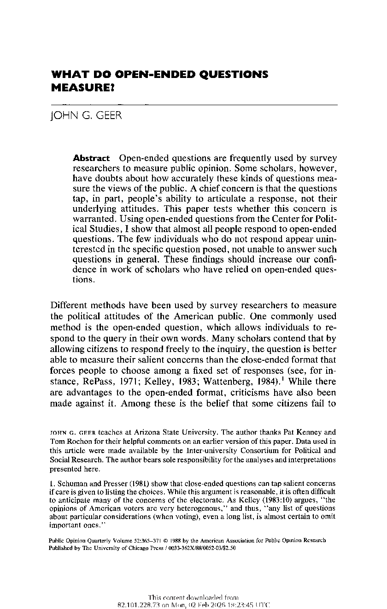
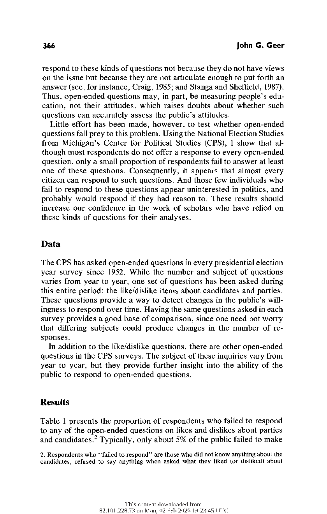
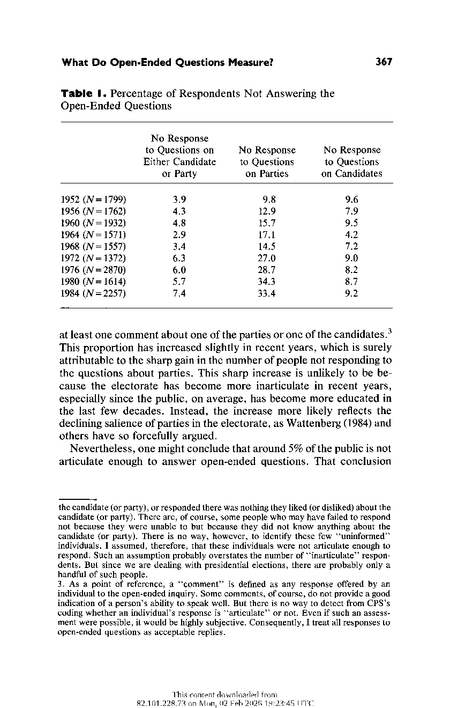
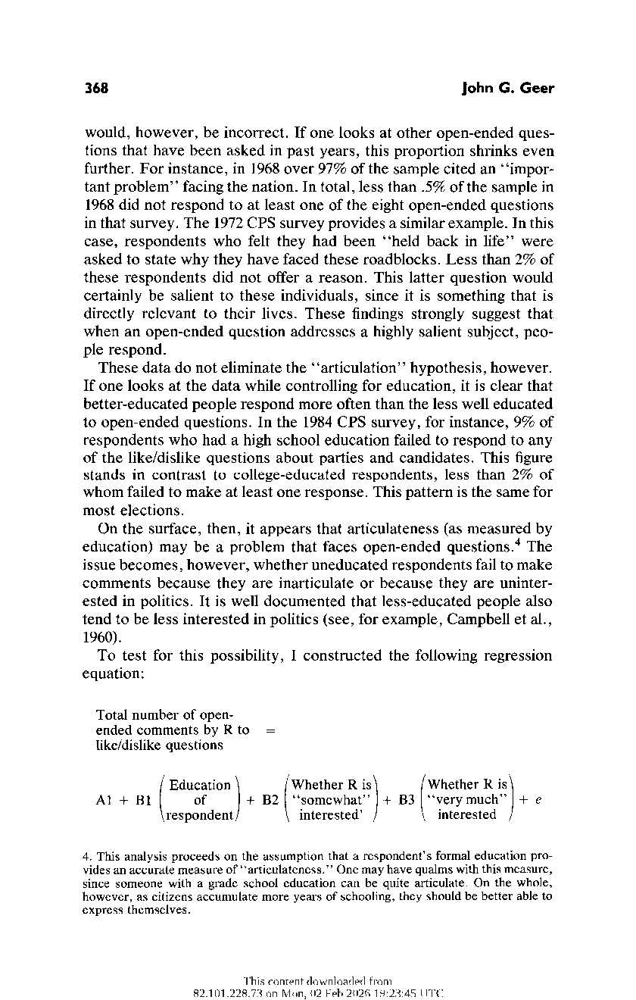
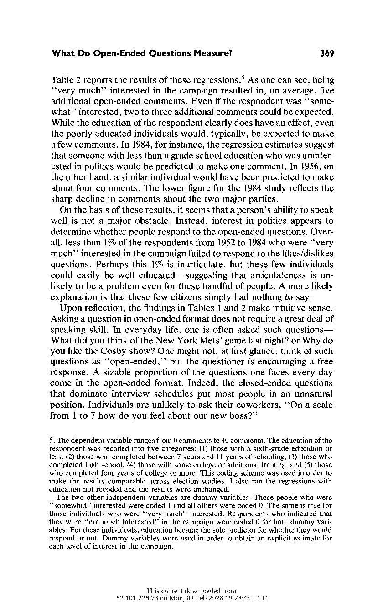
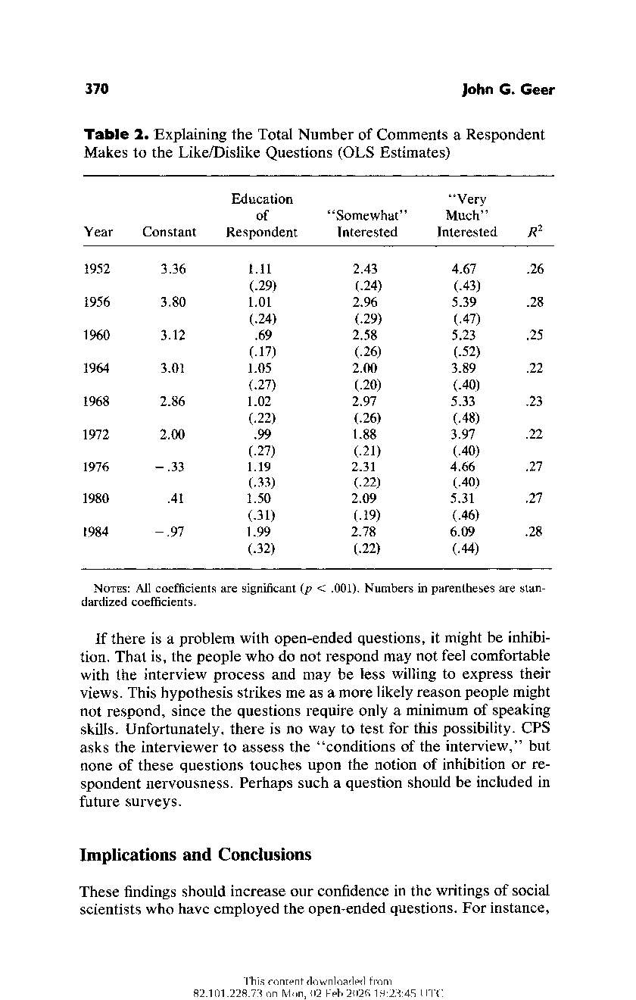
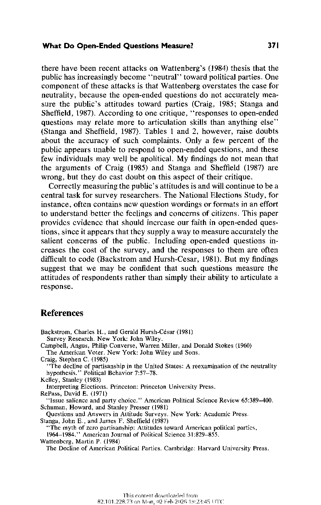

What Do Open-Ended Questions Measure? Author(s): John G. Geer Source: The Public Opinion Quarterly, Autumn, 1988, Vol. 52, No. 3 (Autumn, 1988), pp. 365-371 Published by: Oxford University Press on behalf of the American Association for Public Opinion Research Stable URL: https://www.jstor.org/stable/2749078

JSTOR is a not-for-profit service that helps scholars, researchers, and students discover, use, and build upon a wide range of content in a trusted digital archive. We use information technology and tools to increase productivity and facilitate new forms of scholarship. For more information about JSTOR, please contact support@jstor.org.

Your use of the JSTOR archive indicates your acceptance of the Terms & Conditions of Use, available at https://about.jstor.org/terms

and Oxford University Press are collaborating with JSTOR to digitize, preserve and extend access to The Public Opinion Quarterly

WHAT DO OPEN-ENDED QUESTIONS

MEASURE?

JOHN G. GEER

Abstract Open-ended questions are frequently used by survey

researchers to measure public opinion. Some scholars, however,

have doubts about how accurately these kinds of questions mea-

sure the views of the public. A chief concern is that the questions tap, in part, people's ability to articulate a response, not their underlying attitudes. This paper tests whether this concern is warranted. Using open-ended questions from the Center for Political Studies, I show that almost all people respond to open-ended

questions. The few individuals who do not respond appear unin-

terested in the specific question posed, not unable to answer such questions in general. These findings should increase our confidence in work of scholars who have relied on open-ended questions.

Different methods have been used by survey researchers to measure the political attitudes of the American public. One commonly used method is the open-ended question, which allows individuals to re-

spond to the query in their own words. Many scholars contend that by

allowing citizens to respond freely to the inquiry, the question is better able to measure their salient concerns than the close-ended format that

forces people to choose among a fixed set of responses (see, for in-

stance, RePass, 1971; Kelley, 1983; Wattenberg, 1984).1 While there

are advantages to the open-ended format, criticisms have also been made against it. Among these is the belief that some citizens fail to

JOHN G. GEER teaches at Arizona State University. The author thanks Pat Kenney and Tom Rochon for their helpful comments on an earlier version of this paper. Data used in this article were made available by the Inter-university Consortium for Political and Social Research. The author bears sole responsibility for the analyses and interpretations

presented here.

- 1. Schuman and Presser (1981) show that close-ended questions can tap salient concerns if care is given to listing the choices. While this argument is reasonable, it is often difficult to anticipate many of the concerns of the electorate. As Kelley (1983:10) argues, "the opinions of American voters are very heterogenous," and thus, "any list of questions about particular considerations (when voting), even a long list, is almost certain to omit important ones."

Public Opinion Quarterly Volume 52:365-371 ? 1988 by the American Association for Public Opinion Research Published by The University of Chicago Press / 0033-362X/88/0052-03/$2.50

366 John G. Geer

respond to these kinds of questions not because they do not have views on the issue but because they are not articulate enough to put forth an answer (see, for instance, Craig, 1985; and Stanga and Sheffield, 1987).

Thus, open-ended questions may, in part, be measuring people's edu-

cation, not their attitudes, which raises doubts about whether such

questions can accurately assess the public's attitudes.

Little effort has been made, however, to test whether open-ended

questions fall prey to this problem. Using the National Election Studies from Michigan's Center for Political Studies (CPS), I show that although most respondents do not offer a response to every open-ended question, only a small proportion of respondents fail to answer at least one of these questions. Consequently, it appears that almost every citizen can respond to such questions. And those few individuals who fail to respond to these questions appear uninterested in politics, and

probably would respond if they had reason to. These results should

increase our confidence in the work of scholars who have relied on these kinds of questions for their analyses.

Data

The CPS has asked open-ended questions in every presidential election year survey since 1952. While the number and subject of questions

varies from year to year, one set of questions has been asked during this entire period: the like/dislike items about candidates and parties.

These questions provide a way to detect changes in the public's will-

ingness to respond over time. Having the same questions asked in each survey provides a good base of comparison, since one need not worry that differing subjects could produce changes in the number of re-

sponses.

In addition to the like/dislike questions, there are other open-ended

questions in the CPS surveys. The subject of these inquiries vary from

year to year, but they provide further insight into the ability of the

public to respond to open-ended questions.

Results

Table 1 presents the proportion of respondents who failed to respond to any of the open-ended questions on likes and dislikes about parties

and candidates.2 Typically, only about 5% of the public failed to make

- 2. Respondents who "failed to respond" are those who did not know anything about the candidates, refused to say anything when asked what they liked (or disliked) about

What Do Open-Ended Questions Measure? 367

Table 1. Percentage of Respondents Not Answering the

Open-Ended Questions

No Response

to Questions on No Response No Response Either Candidate to Questions to Questions

or Party on Parties on Candidates

1952 (N=1799) 3.9 9.8 9.6

1956 (N=1762) 4.3 12.9 7.9

1960 (N= 1932) 4.8 15.7 9.5 1964 (N= 1571) 2.9 17.1 4.2

1968 (N= 1557) 3.4 14.5 7.2

1972 (N=1372) 6.3 27.0 9.0

1976 (N=2870) 6.0 28.7 8.2

1980 (N=1614) 5.7 34.3 8.7

1984 (N= 2257) 7.4 33.4 9.2

at least one comment about one of the parties or one of the candidates.3 This proportion has increased slightly in recent years, which is surely attributable to the sharp gain in the number of people not responding to the questions about parties. This sharp increase is unlikely to be because the electorate has become more inarticulate in recent years, especially since the public, on average, has become more educated in the last few decades. Instead, the increase more likely reflects the declining salience of parties in the electorate, as Wattenberg (1984) and others have so forcefully argued.

Nevertheless, one might conclude that around 5% of the public is not

articulate enough to answer open-ended questions. That conclusion

the candidate (or party), or responded there was nothing they liked (or disliked) about the

candidate (or party). There are, of course, some people who may have failed to respond not because they were unable to but because they did not know anything about the

candidate (or party). There is no way, however, to identify these few "uninformed"

individuals. I assumed, therefore, that these individuals were not articulate enough to

respond. Such an assumption probably overstates the number of "inarticulate" respondents. But since we are dealing with presidential elections, there are probably only a handful of such people.

- 3. As a point of reference, a "comment" is defined as any response offered by an individual to the open-ended inquiry. Some comments, of course, do not provide a good indication of a person's ability to speak well. But there is no way to detect from CPS's coding whether an individual's response is "articulate" or not. Even if such an assessment were possible, it would be highly subjective. Consequently, I treat all responses to open-ended questions as acceptable replies.

368 John G. Geer

would, however, be incorrect. If one looks at other open-ended ques-

tions that have been asked in past years, this proportion shrinks even

further. For instance, in 1968 over 97% of the sample cited an "important problem" facing the nation. In total, less than .5% of the sample in

1968 did not respond to at least one of the eight open-ended questions

in that survey. The 1972 CPS survey provides a similar example. In this

case, respondents who felt they had been "held back in life" were asked to state why they have faced these roadblocks. Less than 2% of

these respondents did not offer a reason. This latter question would

certainly be salient to these individuals, since it is something that is directly relevant to their lives. These findings strongly suggest that

when an open-ended question addresses a highly salient subject, people respond.

These data do not eliminate the "articulation" hypothesis, however.

If one looks at the data while controlling for education, it is clear that

better-educated people respond more often than the less well educated

to open-ended questions. In the 1984 CPS survey, for instance, 9% of

respondents who had a high school education failed to respond to any

of the like/dislike questions about parties and candidates. This figure

stands in contrast to college-educated respondents, less than 2% of whom failed to make at least one response. This pattern is the same for

most elections.

On the surface, then, it appears that articulateness (as measured by education) may be a problem that faces open-ended questions.4 The issue becomes, however, whether uneducated respondents fail to make comments because they are inarticulate or because they are uninterested in politics. It is well documented that less-educated people also tend to be less interested in politics (see, for example, Campbell et al., 1960).

To test for this possibility, I constructed the following regression equation:

Total number of openended comments by R to

like/dislike questions

Education Whether RisA (Whether R is

Al + B1 of + B2 "somewhat" |+ B 3 "very much " + e

respondent interested' I interested

- 4. This analysis proceeds on the assumption that a respondent's formal education provides an accurate measure of "articulateness." One may have qualms with this measure, since someone with a grade school education can be quite articulate. On the whole, however, as citizens accumulate more years of schooling, they should be better able to express themselves.

What Do Open-Ended Questions Measure? 369

Table 2 reports the results of these regressions.5 As one can see, being "very much" interested in the campaign resulted in, on average, five

additional open-ended comments. Even if the respondent was "some-

what" interested, two to three additional comments could be expected. While the education of the respondent clearly does have an effect, even the poorly educated individuals would, typically, be expected to make a few comments. In 1984, for instance, the regression estimates suggest

that someone with less than a grade school education who was uninter-

ested in politics would be predicted to make one comment. In 1956, on the other hand, a similar individual would have been predicted to make about four comments. The lower figure for the 1984 study reflects the sharp decline in comments about the two major parties.

On the basis of these results, it seems that a person's ability to speak

well is not a major obstacle. Instead, interest in politics appears to determine whether people respond to the open-ended questions. Over-

all, less than 1% of the respondents from 1952 to 1984 who were "very

much" interested in the campaign failed to respond to the likes/dislikes

questions. Perhaps this 1% is inarticulate, but these few individuals

could easily be well educated-suggesting that articulateness is un-

Likely to be a problem even for these handful of people. A more likely

explanation is that these few citizens simply had nothing to say.

Upon reflection, the findings in Tables 1 and 2 make intuitive sense.

Asking a question in open-ended format does not require a great deal of speaking skill. In everyday life, one is often asked such questionsWhat did you think of the New York Mets' game last night? or Why do

you like the Cosby show? One might not, at first glance, think of such

questions as "open-ended," but the questioner is encouraging a free response. A sizable proportion of the questions one faces every day come in the open-ended format. Indeed, the closed-ended questions

that dominate interview schedules put most people in an unnatural

position. Individuals are unlikely to ask their coworkers, "On a scale

from 1 to 7 how do you feel about our new boss?"

- 5. The dependent variable ranges from 0 comments to 40 comments. The education of the respondent was recoded into five categories: (1) those with a sixth-grade education or less, (2) those who completed between 7 years and 11 years of schooling, (3) those who completed high school, (4) those with some college or additional training, and (5) those who completed four years of college or more. This coding scheme was used in order to make the results comparable across election studies. I also ran the regressions with education not recoded and the results were unchanged.

The two other independent variables are dummy variables. Those people who were "somewhat" interested were coded 1 and all others were coded 0. The same is true for

those individuals who were "very much" interested. Respondents who indicated that

they were "not much interested" in the campaign were coded 0 for both dummy vari-

ables. For these individuals-, education became the sole predictor for whether they would

respond or not. Dummy variables were used in order to obtain an explicit estimate for each level of interest in the campaign.

370 John G. Geer

Table 2. Explaining the Total Number of Comments a Respondent Makes to the Like/Dislike Questions (OLS Estimates)

Education "Very of "Somewhat" Much"

Year Constant Respondent Interested Interested R2

1952 3.36 1.11 2.43 4.67 .26

(.29) (.24) (.43)

1956 3.80 1.01 2.96 5.39 .28

(.24) (.29) (.47)

1960 3.12 .69 2.58 5.23 .25

(.17) (.26) (.52)

1964 3.01 1.05 2.00 3.89 .22

(.27) (.20) (.40)

1968 2.86 1.02 2.97 5.33 .23

(.22) (.26) (.48)

1972 2.00 .99 1.88 3.97 .22 (.27) (.21) (.40) 1976 -.33 1.19 2.31 4.66 .27

(.33) (.22) (.40)

1980 .41 1.50 2.09 5.31 .27

- (.31) (.19) (.46)

1984 -.97 1.99 2.78 6.09 .28

- (.32) (.22) (.44)

NOTES: All coefficients are significant (p < .001). Numbers in parentheses are stan-

dardized coefficients.

If there is a problem with open-ended questions, it might be inhibi-

tion. That is, the people who do not respond may not feel comfortable

with the interview process and may be less willing to express their views. This hypothesis strikes me as a more likely reason people might not respond, since the questions require only a minimum of speaking

skills. Unfortunately, there is no way to test for this possibility. CPS

asks the interviewer to assess the "conditions of the interview," but

none of these questions touches upon the notion of inhibition or re-

spondent nervousness. Perhaps such a question should be included in

future surveys.

Implications and Conclusions

These findings should increase our confidence in the writings of social

scientists who have employed the open-ended questions. For instance,

What Do Open-Ended Questions Measure? 371

there have been recent attacks on Wattenberg's (1984) thesis that the public has increasingly become "neutral" toward political parties. One component of these attacks is that Wattenberg overstates the case for neutrality, because the open-ended questions do not accurately measure the public's attitudes toward parties (Craig, 1985; Stanga and Sheffield, 1987). According to one critique, "responses to open-ended questions may relate more to articulation skills than anything else"

(Stanga and Sheffield, 1987). Tables 1 and 2, however, raise doubts

about the accuracy of such complaints. Only a few percent of the

public appears unable to respond to open-ended questions, and these few individuals may well be apolitical. My findings do not mean that the arguments of Craig (1985) and Stanga and Sheffield (1987) are wrong, but they do cast doubt on this aspect of their critique.

Correctly measuring the public's attitudes is and will continue to be a

central task for survey researchers. The National Elections Study, for

instance, often contains new question wordings or formats in an effort to understand better the feelings and concerns of citizens. This paper provides evidence that should increase our faith in open-ended questions, since it appears that they supply a way to measure accurately the

salient concerns of the public. Including open-ended questions in-

creases the cost of the survey, and the responses to them are often difficult to code (Backstrom and Hursh-Cesar, 1981). But my findings

suggest that we may be confident that such questions measure the

attitudes of respondents rather than simply their ability to articulate a

response.

References

Backstrom, Charles H., and Gerald Hursh-Cesar (1981) Survey Research. New York: John Wiley. Campbell, Angus, Philip Converse, Warren Miller, and Donald Stokes (1960) The American Voter. New York: John Wiley and Sons.

Craig, Stephen C. (1985) "The decline of partisanship in the United States: A reexamination of the neutrality hypothesis." Political Behavior 7:57-78.

Kelley, Stanley (1983)

Interpreting Elections. Princeton: Princeton University Press. RePass, David E. (1971)

"Issue salience and party choice." American Political Science Review 65:389-400. Schuman, Howard, and Stanley Presser (1981)

Questions and Answers in Attitude Surveys. New York: Academic Press.

Stanga, John E., and James F. Sheffield (1987) "The myth of zero partisanship: Attitudes toward American political parties, 1964-1984." American Journal of Political Science 31:829-855.

Wattenberg, Martin P. (1984) The Decline of American Political Parties. Cambridge: Harvard University Press.

