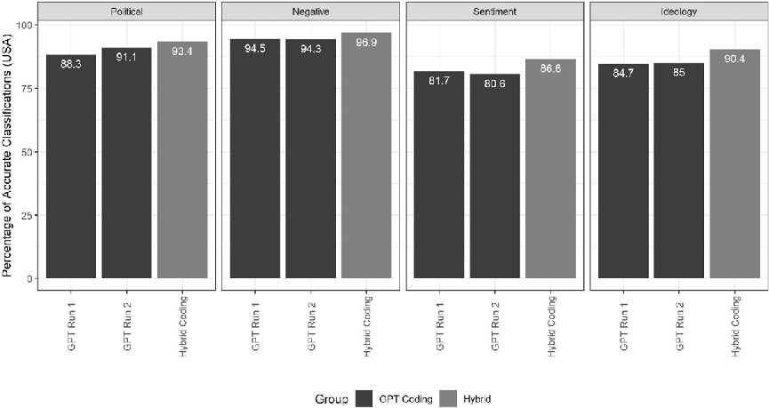
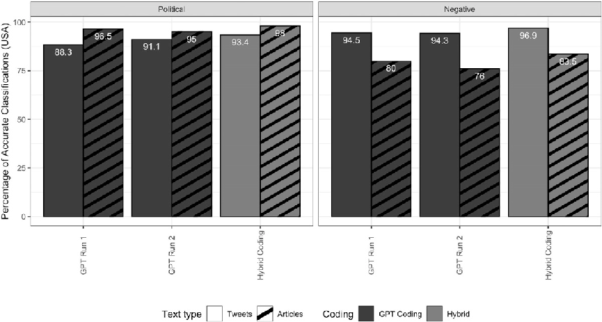
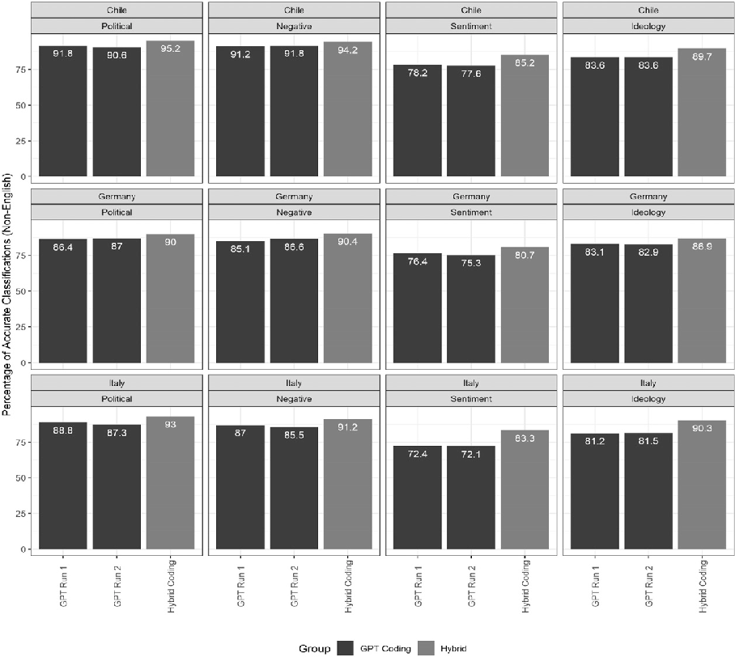
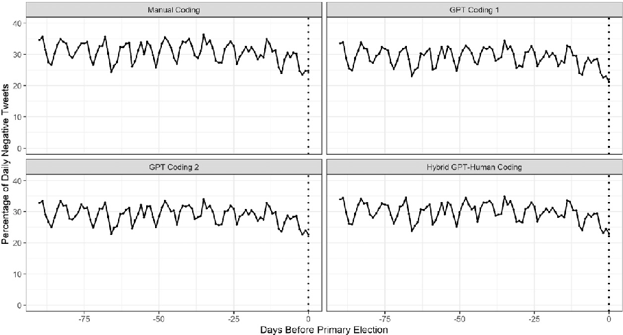
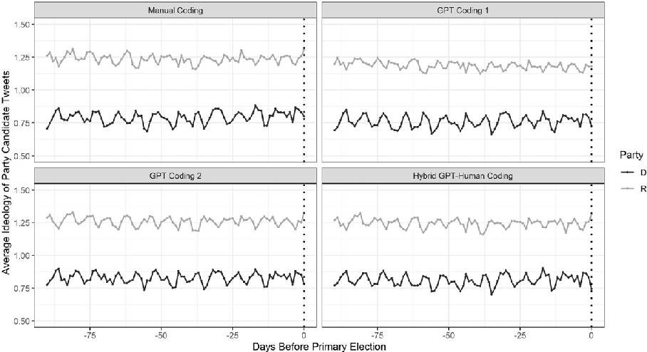
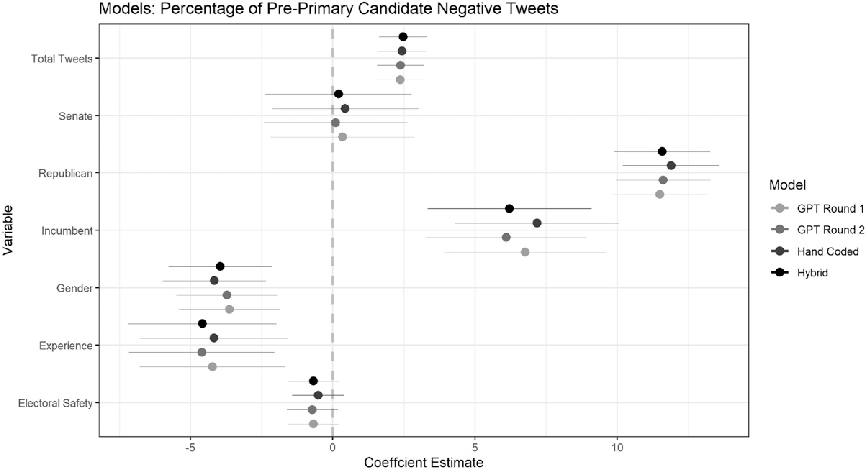
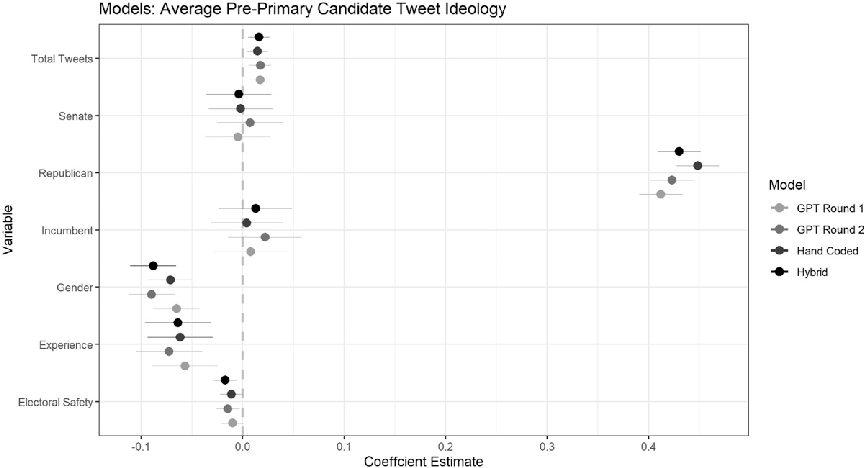

Research Article

# Large language models as a substitute for human experts in annotating political text

Research and Politics January-March 2024: 1–10 © The Author(s) 2024 Article reuse guidelines: sagepub.com/journals-permissions DOI: 10.1177/20531680241236239 journals.sagepub.com/home/rap

Michael Heseltine1 and Bernhard Clemm von Hohenberg2

Abstract

Large-scale text analysis has grown rapidly as a method in political science and beyond. To date, text-as-data methods rely on large volumes of human-annotated training examples, which place a premium on researcher resources. However, advances in large language models (LLMs) may make automated annotation increasingly viable. This paper tests the performance of GPT-4 across a range of scenarios relevant for analysis of political text. We compare GPT-4 coding with human expert coding of tweets and news articles across four variables (whether text is political, its negativity, its sentiment, and its ideology) and across four countries (the United States, Chile, Germany, and Italy). GPT-4 coding is highly accurate, especially for shorter texts such as tweets, correctly classifying texts up to 95% of the time. Performance drops for longer news articles, and very slightly for non-English text. We introduce a ‘hybrid’ coding approach, in which disagreements of multiple GPT-4 runs are adjudicated by a human expert, which boosts accuracy. Finally, we explore downstream effects, finding that transformer models trained on hand-coded or GPT-4-coded data yield almost identical outcomes. Our results suggest that LLM-assisted coding is a viable and cost-efficient approach, although consideration should be given to task complexity.

Keywords Large language models, GPT, machine learning, text analysis, text-as-data

Political science has increasingly embraced supervised machine learning as an accurate and cutting-edge tool in the large-scale analysis of political text, greatly supported by ready-to-use methods such as the transformer-based text classifier BERT. Existing applications range from analyses of elite rhetoric (Ballard et al., 2023), to classifications of news sentiment (Rozado et al., 2022), and the detection of hate speech (Mozafari et al., 2020). However, one central limitation of these methods is that each classification requires large amounts of human-annotated training data. Depending on the complexity of the task, reliable modelling requires training data ranging in the 1,000s to 10,000s of annotated text examples, often from multiple coders. This places severe financial and time constraints on researchers.

Recent works have, however, shown the potential for large language models (LLMs) such as the GPT family to perform a range of tasks in the social sciences, including ideological scaling (Wu et al., 2023), the classification of

legislation (Nay, 2023), and the detection of hate speech (Huang et al., 2023). LLM classification may therefore be a viable means of reducing manual annotation labour and cutting costs, while providing high levels of classification accuracy or even outperforming human coders (Gilardi et al., 2023; Ornstein et al., 2023; Tornberg, 2023). Additionally, LLMs have also shown the potential for the accurate classification of texts across languages (Kuzman

1Amsterdam School of Communication Research, University of Amsterdam, Amsterdam, Netherlands 2GESIS Leibniz Institute for the Social Sciences, Cologne, Germany

Corresponding author: Michael Heseltine, Amsterdam School of Communication Research, University of Amsterdam, Nieuwe Achtergracht 166, Amsterdam 1018 WV, Netherlands. Email: m.j.heseltine@uva.nl

Creative Commons Non Commercial CC BY-NC: This article is distributed under the terms of the Creative Commons Attribution-NonCommercial 4.0 License (https://creativecommons.org/licenses/by-nc/4.0/) which permits non-commercial use, reproduction and distribution of the work without further permission provided the original work is attributed as specified on the

SAGE and Open Access pages (https://us.sagepub.com/en-us/nam/open-access-at-sage).

et al., 2023), opening up avenues for research in languages not spoken by researchers.

With these developments in mind, this paper evaluates the potential for large language models to act as a substitute for manual text coding in political science (and potentially beyond). Since previous studies have focused primarily on single tasks (Huang et al., 2023; Kuzman et al., 2023; Tornberg, 2023) or single contexts (Gilardi et al., 2023; Nay and John, 2023; Ornstein et al., 2023) and do not test downstream effects, further exploration is warranted. We assess the accuracy of coding with GPT-4 – at the time of writing, the most up-to-date version of the GPT client1 – across a range of text annotation tasks ubiquitous in political science, namely, determining whether text is political, whether it transports negativity (both as a binary and a multi-category variable) and scaling its ideological leaning.

We offer several contributions to the fast-evolving literature on LLM-assisted methodology: First, as the bulk of extant evidence tests GPT’s coding performance on short text such as tweets (but Gilardi et al., 2023), we assess performance also for longer texts, that is, news articles. Second, few studies test GPT’s performance beyond the U.S., despite GPT’s known cultural bias (Johnson et al., 2022). We advance the literature by testing GPT-4 in three other languages and contexts, namely, Chile, Germany, and Italy. Third, we complement previous work by testing a ‘hybrid’ coding approach of humans supporting the machine, which is still substantially cheaper than human coding, but potentially more accurate. Fourth, we explore downstream impacts of differences between expert and GPT-4 coding using a case study of political rhetoric in the U.S. 2022 Congressional primary elections.

The results show, first, that GPT-4 coding can be highly accurate, achieving as much as 91% agreement with expert coding on the classification of political rhetoric, 95% agreement on the classification of negative rhetoric (binary), 82% on sentiment (three categories), and 85% on ideology. Through our hybrid approach, which includes minimal levels of hand-validation (typically less than 10% of the full training set), accuracy of all measures can be further improved. Second, GPT-4’s performance drops slightly for full news articles compared to tweets, suggesting potential limitations to automated classification depending on the specific text format. Third, promisingly, GPT-4 generally shows similar (though slightly lower) levels of accuracy in nonEnglish classification of tweets, suggesting that GPT-4 coding is a viable option for researchers working with data across languages. Last, downstream, the modelling based on manual and GPT-4 coding produces almost identical results, suggesting that the level of disagreement between human and GPT-4 coding may have minimal implications for substantive research. We consider the

limitations of our approach in more depth in the discussion.

Data and method

Our baseline test of accuracy is based on a sample of 635 tweets from Members of Congress in the United States, randomly chosen out of all their tweets from between 2009 and 2022. To test the effect of text length on classification accuracy, we also collected a random sample of 200 news articles from 2016 to 2017 across a range of U.S. news outlets (NYT, WaPo, Bloomberg, Breitbart, Vox, The Atlantic). To test accuracy across languages and contexts, we further selected a random sample of tweets from all tweets posted by members of parliament between 2009 and 2022 in Chile (330 tweets), Germany (700 tweets), and Italy (330 tweets).2 Although this selection of countries is by no means exhaustive and was influenced by our own expertise and access to expert coders, this multi-country approach still goes beyond existing U.S.-focused evidence.

Manual expert coding

Experts coded the sets of tweets (U.S., Chile, Germany, and Italy) across four dimensions, according to detailed instructions shown in SI C: (1) whether the text was political or not (binary); (2) whether the text contained negative messaging or not (binary); (3) whether the text contained negative, positive, or neutral messaging (three categories); (4) whether the text was ideologically left-wing, centrist, or right-wing (three categories). The U.S. data were coded by two coders, with any discrepancies then mutually resolved, with the final coding serving as ‘ground truth’ for our accuracy assessments. NonU.S. tweets were single-coded by an expert of the respective country, with a ‘ground truth’ review then conducted based on translation and confirmation with a second reviewer. For the test of varying text length, U.S. news articles were only coded for the binary political and negativity criteria.3

GPT-4 coding and performance assessment

For each of the four coding tasks, we prompted GPT-4 twice with coding instructions aligning with those given to the human experts (see SI C). For each concept, therefore, the data have scores from two GPT-4 ‘coders’, which we refer to as ‘GPT-4 first run’ and ‘GPT-4 second run’. In an alternative approach, we also try a simple prompt that just mentions the concept and gives no further explanations. Full comparisons with this ‘zero-shot’ approach are shown in SI F. Due to message length restrictions, tweets were classified in batches of 20, with each batch run in a fresh instance of the GPT-4 chat client to avoid any biasing from previous prompts. News articles were classified in batches of four. To quantify the accuracy of GPT-4 coding, we present the

percentage of classifications in each run which agree with the final expert coding (alternatively, results using F1 scores are also presented in SI D). For all four concepts, we start with a ‘baseline accuracy’ for U.S. tweets, before we move on to news articles, and then non-U.S. tweets.

Hybrid human-GPT-4 coding

We further exploit the fact that the two rounds of GPT-4 coding based on the exactly the same instructions and data will, due to randomness, yield slightly different results. This disagreement likely occurs on edge cases, which represent important nuance in any given concept. We therefore test a ‘hybrid’ model, where disagreements between the ‘GPT-4 first run’ and the ‘GPT-4 second run’ are adjudicated by a human expert. Of course, this adjudication process pushes the classification more towards the expert coding (although only for contested cases) and is therefore bound to improve the accuracy. However, the results illustrate that LLMassisted coding can be optimized through minimal additional human effort. In the results, we also report the frequency of disagreement between the two GPT-4 runs as an indicator of additionally required human input.

Downstream effects

Finally, we expert-coded, GPT-4-coded (twice), and hybridcoded a set of 3000 additional tweets from candidates in the 2022 U.S. Congressional elections for both negative messaging (binary concept) and political ideology. Based on these four codings, we fine-tuned four models of negative messaging and four models of ideology using BERTweet (Nguyen et al., 2020), a transformer package designed specifically for handling social media data. We use the trained classifiers to predict negativity and ideology in all tweets (excluding retweets) sent by candidates before their state primary in 2022. The resulting classifications are then compared side-by-side in both descriptive and predictive models to test for meaningful differences in the results.

Classification performance Baseline accuracy

Beginning with the U.S. tweets, Figure 1 below shows the percentage agreement between the expert coding and the two GPT-4 coding runs. We report F1 scores as an alternative measure in SI D, with substantively identical results. We also report full classification reports including precision, recall, and accuracy in SI E. Bars are colour-coded by classification approach, indicating whether the result is based purely on GPT-4 coding or also includes an expert reconciliation of disagreements between GPT-4 runs (i.e. the hybrid approach). All results are based on GPT-4

prompts using full coding instructions. In SI F, we also report results when prompting GPT-4 just with the concept of interest without defining the concept further. In most cases, including details improves accuracy.

The results, overall, show a relatively high degree of accuracy, but also highlight some important variance across classification tasks. Beginning with political classification, the two rounds of GPT-4 coding agreed with expert coding 88.3% and 91.1% of the time. When reconciling disagreements between GPT-4 rounds using human validation (7.6% of instances), this accuracy increases to 93.4%. For the binary negative classification task, accuracy is even higher, with the two coding rounds agreeing with the expert coding 94.5% and 94.3% of the time. The hybrid validation approach improves these results further to 96.9% agreement, based on 4.9% disagreement between GPT-4 rounds. In general, for these two binary classification tasks, GPT-4 results closely approximate human annotation.

Beyond the binary tasks, however, accuracy does drop. In the case of three-category sentiment coding, this decrease is particularly notable. The GPT-4 coding rounds were accurate 81.7% and 80.6% of time, with the hybrid approach then increasing this accuracy to a respectable 86.6% (based on 13.4% GPT-4 disagreement). For context, the rate of agreement between human coders on this concept was 87.2%, suggesting that GPT-4 does underperform human coding accuracy, but not to an extreme degree. For ideology, the level of accuracy (84.7% and 85%) is lower than in the binary tasks. With the hybrid approach, based on 10.6% disagreement between rounds, accuracy improves to over 90%. For reference, the baseline rate of agreement between human coders for the ideology classification was also 85%. Collectively, given the complexity of the task at hand, the results actually highlight the relative strength of GPT-4 in this particular coding task.

Accuracy for longer texts

Classification accuracy may change when applied to differing text types, especially in terms of the overall length of the text. Indeed, when classifying full news articles, some notable changes in accuracy occur. As illustrated by Figure 2, for the political classification, accuracy increases slightly to 96.5% and 95%, while the accuracy of negativity classification drops dramatically to 80% and 76%.4 Evaluating the divergences qualitatively, longer texts appear to be providing differing cues for the two types of classification task. For political classification, longer text provides greater context and more opportunities for political keywords. For negativity classifications, however, longer text provides more conflicting signals, with single articles often containing positive, neutral, and negative components. However, given the black-boxiness of LLMs, we ultimately do not know what the reason for the decrease in performance is. In any case, researchers should consider the

||
|---|

- Figure 1. Classification accuracy for U.S. tweets, by task and coding method.

||
|---|

- Figure 2. Classification accuracy for U.S. tweets and news articles, by task and coding method.

combination of text type and classification task when deciding about the viability of GPT-4 for their coding requirements.

Accuracy across languages

Having established performance levels on English-language data, the question is whether GPT-4 will perform

consistently in other languages. Figure 3 shows the percentage agreement of GPT-4 with expert coding of tweets by Italian, German, and Chilean politicians. Performance is very similar across languages. When classifying political tweets, accuracy is above or just below 90% across countries and runs, closely tracking accuracy rates in the U.S. context. In terms of negativity classification, accuracy

||
|---|

- Figure 3. Classification accuracy for tweets from Chile, Germany, and Italy, by task and coding method.

is still high, but somewhat lower in Germany and Italy, sitting just above 85% as opposed to above 90% in the U.S. Accuracy for the three-way sentiment classification again drops to below 80% in all countries, a potentially unsatisfactory result. For the ideology classification, results are between 81% and 84% across countries, but again, just below the level of accuracy seen in the U.S. Again, the hybrid coding approach increases overall accuracy, bringing accuracy in many contexts above or approaching 90%.

Based on these results, the simultaneous translation and classification of text is a particularly appealing opportunity for automated coding approaches. In some tasks, performance is marginally lower than in the U.S., although still strong, while in others (especially the classification of political content), results are largely

indistinguishable from the classifications in the U.S. context.

Downstream effects: Congressional primary Case study

Although the differences in annotation results may be minimal between GPT-4 and expert coders, they may still have significant downstream impacts on modelling and results, especially if GPT-4 coding is systemically biased. Therefore, to assess whether the differences are meaningful, we offer two insights from a U.S. case study, based on expert-coded and GPT-4-coded versions of the binary negativity classification, as well as the three-way ideology classification discussed above.

Our case study connects to long-running threads of research about negativity and ideological messaging during political campaigns. Studies have found that negativity fluctuates across the course of a campaign (Lau and Rovner, 2009), with negative messaging often increasing as the general election approaches (Hassell and Hans, 2021), while, conversely, decreasing prior to primary elections (Peterson and Djupe, 2005). Similarly, research has shown that candidates may be incentivized to vary their publicly presented ideology across different stages of a campaign (Brady et al., 2007).

For our case study, we trained a total of eight NLP models (four for each of the two variables of interest) based on the different classification approaches presented above. We use these models to test whether levels of negativity and the ideology in Congressional candidate messaging changes in the run-up to the U.S. 2022 congressional primary date, using tweets sent within the final 90 days of each campaign. To do this, we split a set of 3000 tweets (distinct from the set discussed above) into 2500 training and 500 test examples. We coded these for negativity and ideology, first, by hand, and second, with two GPT-4 runs. Where disagreement occurred between GPT-4 coding runs, an expert coder adjudicated the disagreement to create the fourth hybrid coding. We used the 600 tweets discussed above as a validation set. These data were then used to train four separate BERTweet (Nguyen et al., 2020) models for each classification task (GPT-4 Run 1; GPT-4 Run 2; manual coding; hybrid coding), each of which then predicted

negativity and ideology of all tweets sent by congressional candidates in the U.S. House and Senate primaries in 2022. The descriptives, trends, and modelling we present below are based on 391,973 tweets in total.

- Figure 4 below shows the daily percentages of tweets classified as negative in all four classifications side-by-side. Importantly, average negativity across the period is similar across all four methods: The manual coding classifies 31.1% of tweets as negative, the two pure GPT-4 runs classify 29.5% and 29.3% as negative, respectively, and the hybrid approach classifies 30.2% of tweets as negative. Additionally, the over-time trends are almost identical across all four models, with negativity being relatively steady in the run-up to the election with a perceptible slight decrease in the week before the election.
- Figure 5 shows the daily trends in tweet ideology, aggregated by political party, with results closer to 1 indicating more ideologically liberal content. Again, the results are almost identical across the four methods. The overall Democratic and Republican party averages, respectively, are 0.79 and 1.24 in the manual coding model, 0.75 and 1.19 in the first GPT-4 model, 0.82 and 1.26 in the second GPT-4 model, and 0.81 and 1.25 in the hybrid model. Over time, all models show identical trends, with no signs of any moderation or increased extremity directly before the primary.

Thus, the two over-time plots provide consistent evidence that across both measures of interest, central descriptive findings are independent of whether the training

||
|---|

- Figure 4. Daily trends in tweet negativity based on the four different classifiers.

data were manually coded, GPT-4-coded, or coded using our hybrid approach.

Moving beyond descriptive trends, we test the consistency of the methods when modelling the two concepts of

interest as a dependent variable. Figures 6 and 7 show, at the candidate level, linear regressions predicting the percentage of negativity and the average ideology of messages sent by a candidate in the pre-primary period, based on a set of key

||
|---|

- Figure 5. Daily trends in tweet ideology, by party, based on the four different classifiers.

||
|---|

- Figure 6. Coefficient estimates for predictors of percentage of negative Twitter messages.

||
|---|

- Figure 7. Coefficient estimates for predictors of the average ideology of Twitter messages.

covariates (see SI G for details). As can be seen, results across models based on the four different codings are almost identical, with no changes in significance of any predictors across models. As such, using either hand-coded, GPT4coded, or hybrid-coded training data to explore candidate messaging in the 2022 congressional primaries produces generally indistinguishable results.

Discussion and conclusion

In this study, we assessed the potential of GPT-4 (or similar LLMs) to accurately substitute for manual human text annotation, with a particular focus on applications in political science. The results show that GPT-4 coding, benchmarked against the ‘ground truth’ of expert coding, is highly accurate and demonstrates clear potential for use across a range of research scenarios. The edge of our hybrid coding approach over pure GPT-4 coding suggests the following three-stage process for researchers interested in LLM-supported coding: First, classify all training text at least twice using a LLM. Second, manually reconcile discrepancies between the two rounds of coding. Third, use this single reconciled training set for downstream tasks such as training transformer models. While this approach will not perfectly replicate an expert manual coding approach on all tasks, our results indicate that differences in downstream applications may be negligible.

One might also wonder why it is necessary to limit ourselves to using LLMs to merely classify training data

instead of all data, given the accuracy. Indeed, side-by-side comparisons suggest that ChatGPT and BERT models can produce similar classification results (Zhong et al., 2023). However, at present, the rate of classification through GPT-4 is considerably slower than, for example, a transformer model classifying data on a high-end GPU. Non-English GPT-4 coding in our project was even slower, given the integrated language detection and translation inherent in the classification process. Dependent on the size of complete classification task, costs for researchers may also begin to increase, but for smaller tasks complete LLM-coding may nonetheless be feasible.

Despite the promising results, our approach has important limitations. First, researchers should consider the complexity of the classification objects, as GPT-4 performed worse on longer, more complex texts. Second, it is also unclear how GPT-4 would perform for even more complex concepts. We noticed a performance drop for the more complex three-category classifications, compared to the binary concepts. However, we note that simple classifications such as whether content is ‘political’ or ‘negative’ are very common in the field, and even human experts do not always disagree on how to code text on more complex dimensions. Third, we cannot say how LLM-assisted coding would do in other, non-Western contexts. We already noticed a small drop in performance for non-English texts, although results remained satisfactory.

Finally, standard limitations in the everyday use of LLMs also apply to their usage for classification tasks. Biases

inherent in the training of these models (Bisbee et al., 2023; Motoki et al., 2024) may seep into text annotation, especially ones more specific or contentious than the classifications done here. Researchers should be mindful of these potential biases and carefully consider their impact on potential outcomes.

The implications of our findings are potentially substantial. All GPT-4 coding for this project was completed using a single $20 monthly subscription. Hence, financial disparities between researchers effectively evaporate for tasks where LLMs can substitute human labour. By achieving comparable results at a fraction of the time and cost, GPT-4 coding opens up machine learning applications to an incredibly diverse pool of researchers, benefiting the discipline through new perspectives, datasets, and areas of focus. High levels of cross-language accuracy provide significant opportunity and incentive for researchers to increase the levels of comparative studies. The field of political science may benefit from more generalizable, global work, with less of a targeted focus on single regions and countries (especially the United States).

Declaration of conflicting interests

The author(s) declared no potential conflicts of interest with respect to the research, authorship, and/or publication of this article.

Funding

The author(s) received no financial support for the research, authorship, and/or publication of this article.

ORCID iDs

Michael Heseltine  https://orcid.org/0000-0002-2943-4414 Bernhard Clemm von Hohenberg  https://orcid.org/0000-00026976-9745

Supplemental Material

Supplemental material for this article is available online.

Notes

- 1. While ChatGPT has been the recent focus of debate, the LLM space is fast-evolving, with ChatGPT (based on GPT v3.5) already superseded by GPT-4.
- 2. Some non-U.S. tweets were actually written in English, but these were left in as a test of how GPT-4 handled the annotation of multiple languages within a single batch. There appeared to be no issues.
- 3. News articles were deemed to be too rarely ‘positive’ for a multi-category sentiment classification and the ideological classification of primarily fact-based reporting was deemed to be unfeasible.

4. This decrease is not confined to just the misclassification of negative examples, with the precision and recall of both negative and non-negative coded articles dropping, as shown in SI E.

References

Ballard AO, DeTamble R, Dorsey S, et al. (2023) Dynamics of polarizing rhetoric in congressional tweets. Legislative Studies Quarterly 48(1): 105–144.

Bisbee J, Clinton J, Dorff C, et al. (2023) Artificially precise extremism: how internet-trained llms exaggerate our differences. SocArXiv. DOI: 10.31235/osf.io/5ecfa.

Brady DW, Han H and Pope JC (2007) Primary elections and candidate ideology: out of step with the primary electorate? Legislative Studies Quarterly 32(1): 79–105.

Gilardi F, Alizadeh M and Kubli M (2023) Chatgpt Outperforms Crowd-Workers for Textannotation Tasks. Ithaca, NY: arXiv. DOI: 10.48550/arXiv.2303.15056.

Hassell J and Hans (2021) Desperate times call for desperate measures: electoral competitiveness, poll position, and campaign negativity. Political Behavior 43: 1137–1159.

Huang F, Kwak H and An J (2023) Is chatgpt better than human annotators? potential and limitations of chatgpt in explaining implicit hate speech. Ithaca, NY: arXiv. DOI: 10.48550/arXiv. 2302.07736.

Johnson RL, Pistilli G, Men´edez-Gonz´alez N, et al. (2022) The Ghost in the Machine Has an American Accent: Value Conflict in Gpt-3. Ithaca, NY: arXiv.

Kuzman T, Mozetic I and Ljube sic N (2023) Chatgpt: Beginning of an End of Manual Linguistic Data Annotation? Use Case of Automatic Genre Identification. Ithaca, NY: arXiv.

Lau RR and Rovner IB (2009) Negative campaigning. Annual Review of Political Science 1: 285–306.

Motoki F, Neto VP and Rodrigues V (2024) More human than human: measuring chatgpt political bias. Public Choice 198: 3–23.

Mozafari M, Farahbakhsh R and Crespi N (2020) Hate speech detection and racial bias mitigation in social media based on bert model. PLoS One 8: e0237861.

Nay J and John (2023) Large Language Models as Corporate Lobbyists. Ithaca, NY: arXiv. DOI: 10.48550/arXiv.2301. 01181.

Nguyen DQ, Vu Tand Nguyen AT (2020) BERTweet: a pre-trained language model for English Tweets. In: Proceedings of the 2020 Conference on Empirical Methods in Natural Language Processing: System Demonstrations. Stroudsburg, PA: Association for Computational Linguistics, Vol. 9–14.

Ornstein JT, Blasingame EN and Truscott JS (2023) How to Train Your Stochastic Parrot: Large Language Models for Political Texts. Working Paper. Available at: https://joeornstein.github. io/publications/ornstein-blasingame-truscott.pdf.

Peterson DAM and Djupe PA (2005) When primary campaigns go negative: the determinants of campaign negativity. Political Research Quarterly 58(1): 45–54.

Rozado D, Hughes R and Halberstadt J (2022) Longitudinal analysis of sentiment and emotion in news media headlines using automated labelling with transformer language models. PLoS One 10: e0276367.

Tornberg P (2023) Chatgpt-4 Outperforms Experts and Crowd Workers in Annotating Political Twitter Messages with Zero-Shot Learning. Ithaca, NY: arXiv. DOI: 10.48550/arXiv. 2304.06588.

Wu PY, Tucker JA, Nagler J, et al. (2023) Large Language Models Can Be Used to Estimate the Ideologies of Politicians in a Zero-Shot Learning Setting. Ithaca, NY: arXiv. DOI: 10. 48550/arXiv.2303.12057.

Zhong Q, Ding L, Liu J, et al. (2023) Can Chatgpt Understand Too? a Comparative Study on Chatgpt and Fine-Tuned Bert. Ithaca, NY: arXiv. DOI: 10.48550/arXiv.2302. 10198.

