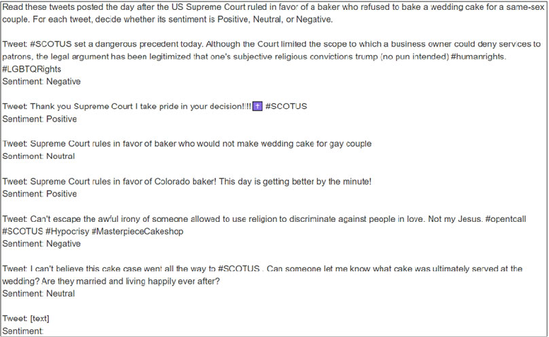
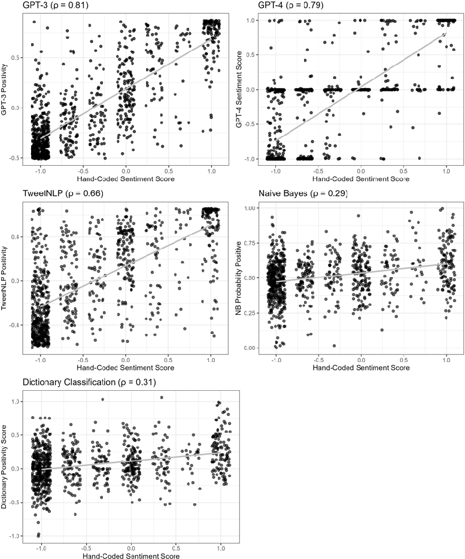
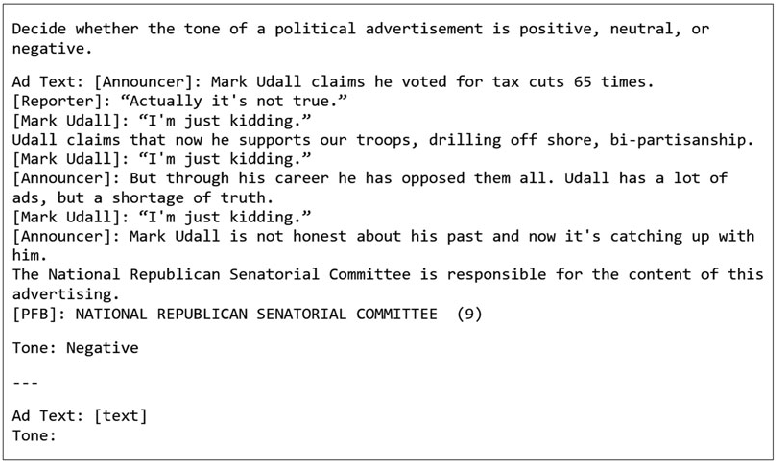
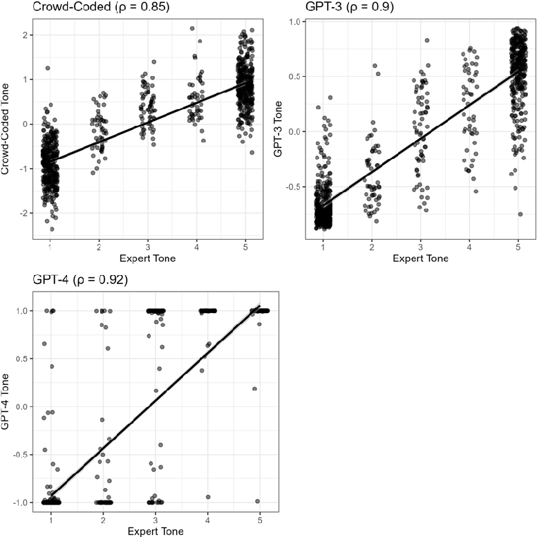
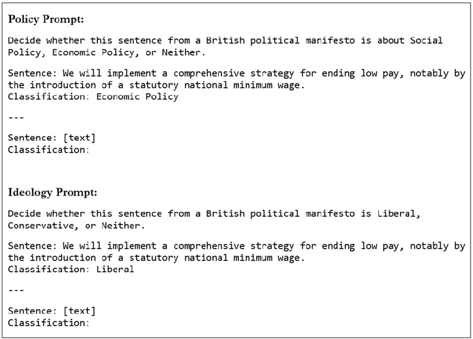
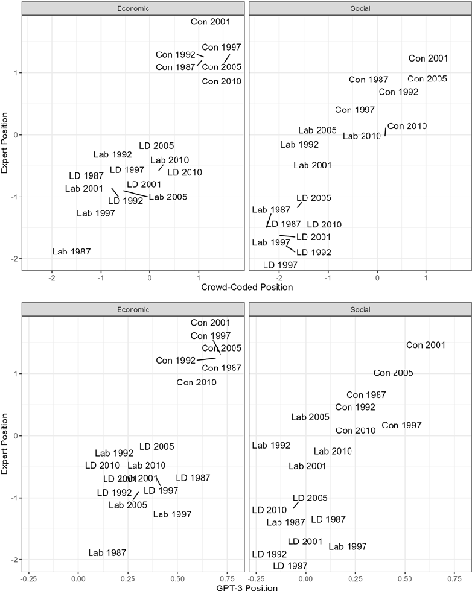
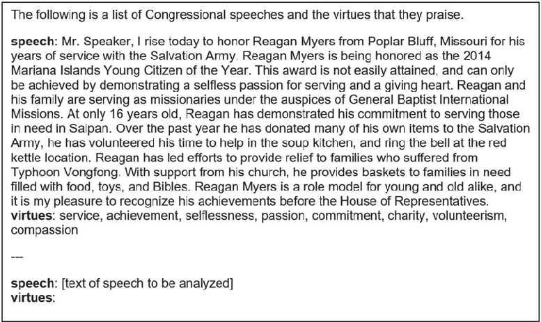
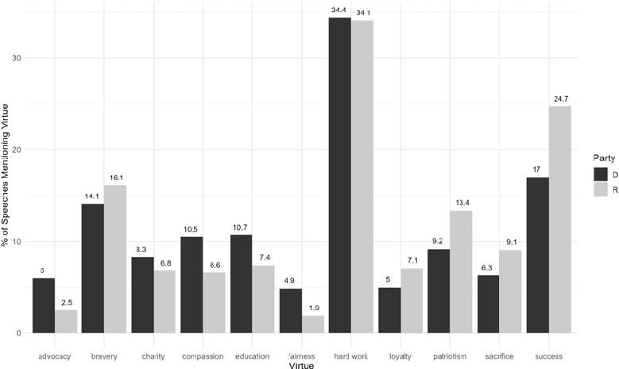

Published online by Cambridge University Press

https://doi.org/10.1017/psrm.2024.64

Political Science Research and Methods (2025), 13, 264–281 doi:10.1017/psrm.2024.64

ORIGINAL ARTICLE

# How to train your stochastic parrot: large language models for political texts

Joseph T. Ornstein1 , Elise N. Blasingame1 and Jake S. Truscott2

1Department of Political Science, University of Georgia, Athens, GA, USA and 2Department of Political Science, University of Florida, Gainesville, FL, USA Corresponding author: Joseph T. Ornstein; Email: jornstein@uga.edu

(Received 12 September 2023; revised 23 July 2024; accepted 3 August 2024)

Abstract

We demonstrate how few-shot prompts to large language models (LLMs) can be effectively applied to a wide range of text-as-data tasks in political science—including sentiment analysis, document scaling, and topic modeling. In a series of pre-registered analyses, this approach outperforms conventional supervised learning methods without the need for extensive data pre-processing or large sets of labeled training data. Performance is comparable to expert and crowd-coding methods at a fraction of the cost. We propose a set of best practices for adapting these models to social science measurement tasks, and develop an opensource software package for researchers.

Keywords: document scaling; GPT-3; GPT-4; large language models; sentiment analysis; text-as-data; topic modeling

## 1. Introduction

A common task in political science research involves labeling documents to capture some latent quantity of interest. Whether it’s measuring the ideology expressed in party manifestos (Lowe et al., 2011), the harshness of treaty provisions (Spirling, 2012), polarization in legislative speeches (Peterson and Spirling, 2018), partisan slant in television news coverage (Martin and McCrain, 2019), political sophistication in State of the Union addresses (Benoit et al., 2019), opinions expressed in city council meeting minutes (Einstein et al., 2019), or countless other examples, so much of modern political science would be impossible without quantitative measures derived from unstructured text. Until quite recently, however, the process of reading and coding documents has been a task uniquely suited to human researchers. One of the most exciting new developments in our field has been the explosion of methods for automating this process, methods we broadly call “text-as-data” (Grimmer and Stewart, 2013).

These efforts in political science have occurred alongside a parallel revolution in computer science, developing natural language processing tools to usefully interpret human speech. The applications for these methods are numerous—including chat bots, Internet search, auto-complete, and virtual assistants—but remarkably, much of this research has begun to converge on a single solution: large, pretrained language models built on a neural network architecture called the transformer (Vaswani et al., 2017; Bommasani et al., 2021). Such models have quickly transitioned from academic curiosity to cultural phenomenon following the release of OpenAI’s GPT-3 and GPT-4 (Brown et al., 2020).

In this paper, we demonstrate that adapting these large language models (LLMs) to political text-as-data tasks can yield significant gains in performance, cost, and capabilities. Across a

© The Author(s), 2025. Published by Cambridge University Press on behalf of EPS Academic Ltd. This is an Open Access article, distributed under the terms of the Creative Commons Attribution licence (http://creativecommons.org/licenses/by/4.0/), which permits unrestricted reuse, distribution and reproduction, provided the original article is properly cited.

Published online by Cambridge University Press

https://doi.org/10.1017/psrm.2024.64

range of applications—including sentiment classification, ideology scaling, and topic modelingwe show that carefully structured prompts to LLMs (“few-shot prompting”) reliably outperforms existing automated text classification methods, and produces results comparable to human crowd-coders at a small fraction of the cost.

LLMs are deep learning models (LeCun et al., 2015) trained on “next-word” prediction tasks. When provided with a sequence of text, the model generates a probability distribution over the most likely words to follow that sequence.1 For example, when prompted with the phrase “Thank you. Have a nice,” GPT-3 estimates that there is an 88.6 percent probability the next word will be “day,” a 2.4 percent probability the next word will be “weekend,” a 1.9 percent probability it will be “evening,” and so on.

Though these models are essentially “stochastic parrots” mimicking human speech patterns observed in their training corpus (Bender et al., 2021), they have demonstrated a number of surprising emergent capabilities that they were not deliberately designed to do. By carefully crafting its input, one can adapt a language model to perform a variety of text-as-data tasks. Consider the following prompt, which reformulates a sentiment classification task as a next-word prediction problem:

Decide whether a Tweet’s sentiment is positive, neutral, or negative.

Tweet: Congratulations to the SCOTUS. American confidence in the Supreme Court is now lower than at any time in history. Well done!

Sentiment:

Conventional approaches to sentiment classification struggle to accurately label texts like these, which use positive words to convey a negative sentiment (e.g., “congratulations,” “confidence,” “supreme,” “well done!”). But when supplied with this prompt, GPT-3 estimates a 77 percent probability that the next word will be “Negative.” GPT-4’s estimate is even more confident, returning “Negative” with 99 percent probability. In what follows, we show that such probability distributions can be used to construct continuous measures for a variety of latent document characteristics, and across several applications we validate this approach by converting several common political text-as-data tasks into next-word prediction problems.

This approach to modeling is fundamentally different than the one familiar to most political scientists. Rather than fitting a separate model for each research question (“one-to-one”), the researcher takes a single pretrained language model and adapts it to several different tasks (“one-to-many”). The promise of this approach lies in the scale and complexity that a single pretrained LLM can offer. GPT-3 is a deep neural network composed of 175 billion parameters, trained on hundreds of billions of words of text from the Internet and digitized books (Brown et al., 2020). Although less is publicly known about the architecture of GPT-3’s successor, GPT-4, it is rumored to have roughly 1.7 trillion parameters and cost over $100 million to build. Because such models are orders-of-magnitude more complex than an individual political scientist could train, there is ample reason to believe that, for certain tasks, LLMs can outperform “bespoke” models trained for a specific purpose. Furthermore, the approach does not require the researcher to construct a large labeled dataset to train the model. One can adapt pretrained LLMs to many document labeling tasks by including just a handful of labeled examples in the body of the prompt, an approach known as few-shot prompting (Brown et al., 2020).

The paper proceeds as follows. In the next section, we describe the basic architecture of these models, and how they make use of innovations like self-supervised learning and contextualized word embeddings to generate predictions. In Section 3, we describe four applications of the models to common political text-as-data tasks, including sentiment analysis of social media posts, classifying the tone of political advertisements, ideology scaling on party manifestos, and topic

1Technically, LLMs like GPT-3 and GPT-4 represent text as “tokens,” strings of roughly four characters, rather than words, but for illustrative purposes we can think of it as operating at the word level.

Published online by Cambridge University Press

https://doi.org/10.1017/psrm.2024.64

modeling of US Congressional floor speeches. Based on lessons learned from these applications, we propose a set of best practices for prompt design and develop an open-source software package to implement our suggested approach.2 We conclude with a discussion on whether the performance gains we document are worth the potential dangers associated with unprincipled use of these models (Strubell et al., 2019; Abid et al., 2021; Bender et al., 2021; Spirling, 2023). Throughout, we emphasize the importance of “validation, validation, validation” (Grimmer and Stewart, 2013), repeatedly comparing model outputs against human judgment to ensure they are measuring what we want them to measure.

## 2. Large language models

In this section, we highlight two key features of LLMs that make them particularly promising for social science applications. The first is self-supervised learning, which permits these models to be trained on an unprecedentedly large corpus of text data. The second is contextualized word embeddings, which allow the models to flexibly represent the meaning of words depending on their context.

- 2.1 Self-supervision

A central difficulty for supervised learning methods in text analysis is the need to collect and annotate large amounts of training data (Wilkerson and Casas, 2017). If, for example, a researcher wants to train a model to predict the tone of political advertisements, they must first compile a dataset with thousands of labeled political ads. The process of hand-labeling these data can be expensive and time-consuming, even with the help of non-expert crowd-sourced approaches (Benoit et al., 2016; Carlson and Montgomery, 2017).

By contrast, a self-supervised learning task is one in which the target prediction is provided within the data itself, rather than hand-labeled by a researcher. One reason why LLMs like GPT-3 and GPT-4 are trained to perform next-word prediction is that such training can be completed in a self-supervised fashion. Every sentence of text that a human has ever written can be split into a sequence of tokens and used to train the model, which permits a massive expansion in the amount of training data available. Rather than training a supervised learning model just on a few thousand documents, LLMs are trained on hundreds of billions of words scraped from the Internet and a digitized corpus of books.

When combined with rapid improvements in computer hardware, this dramatic increase in the quantity of training data has allowed computer scientists to build increasingly complex language models over the past five years. Bommasani et al. (2021) coin the term “foundation models” to describe this new class of general-purpose language models, because they can be adapted to perform a variety of natural language processing tasks that they were not explicitly trained to do.

- 2.2 Contextualized word embeddings

In order to analyze “text-as-data,” one must first decide how to represent a text numerically. Conventional “bag of words” approaches (Grimmer et al., 2022) represent each document as a vector of word frequencies. The main drawback of this representation is that it assumes each word has a unique meaning. Mathematically, the document-feature matrix is extremely sparse; there are hundreds of thousands of unique words, but many of them have overlapping meaning.

To overcome this problem, LLMs like GPT-3 represent each word in a document as a highdimensional vector, an approach known as “word embeddings.” This representation attempts to retain information about the meaning of words by encoding how often a word is used in the vicinity

2The promptr package in R is available for download through the Comprehensive R Archive Network (CRAN).

Published online by Cambridge University Press

https://doi.org/10.1017/psrm.2024.64

of other related words—motivated by John Firth’s linguistic maxim, “you shall know a word by the company it keeps” (Firth, 1957; Rodriguez and Spirling, 2022). For example, in a sufficiently large corpus of text, you will discover that the word “cat” appears more frequently than you would expect by chance near words like “litter,” “yarn,” “claws,” etc. You’d also find that the word “kitten” appears more frequently than you would expect by chance near those words. A word embedding, incorporating this information, represents “cat” and “kitten” with vectors that are close together in space. By training word embeddings on a large corpus of texts, one can transfer knowledge about the meaning of words from a more general corpus to a specific text-as-data problem.

But this approach to representing meaning can still fall short, because there are many words whose meaning is ambiguous without context. Consider, for instance, the word “bill,” which could have one of several meanings, depending on whether it is preceded by the phrase “signed the…,” “foot the…,” or “Hillary and….” Other common words, like the pronouns “it” or “they,” are entirely meaningless without context. For such words, a single pretrained word embedding is unlikely to capture meaning very well.

When humans are interpreting words in a sentence, we start with our “pretrained” idea of what a word means, then adjust that interpretation on the fly as we read the word in context (like you just did with the word “fly”). This is the insight behind contextualized word embeddings, which allow a word’s vector representation to change depending on what words precede or follow it. LLMs like GPT-3 and GPT-4 are built on a neural network architecture called the transformer (Vaswani et al., 2017). The transformer model takes as its input a sequence of word embeddings, and outputs an embedding vector representing the most likely next word in the sequence. The key innovation of these models is the inclusion of many hidden layers of “self-attention,” which recompute each word’s embedding as a weighted average of nearby word embeddings in the sequence. This allows the model to flexibly represent the meaning of words based on their context.

Building on the transformer architecture, there has been rapid progress in natural language processing over the past ten years. In 2016, the best-performing language model scored an F (59.3 percent) on the 8th grade New York Regents Science Exam. By 2019, an LLM based on the transformer architecture scored 91.6 percent (Clark et al., 2021). By 2023, models like OpenAI’s GPT-4 were outscoring 90 percent of human test takers on exams as challenging as the SAT and Uniform Bar Examination (Katz et al., 2023). For political scientists, the practical advantage of adapting these models is that, by better representing the nuance and ambiguity of political speech, they can outperform existing “bag of words” methods at classifying, measuring, and discovering patterns in political texts. We turn next to a few examples of this approach in practice.

## 3. Applications

We assess the performance of LLM prompts on a set of common political science text-as-data tasks, including sentiment analysis, ideology scaling, and topic modeling. These applications demonstrate the range of tasks that a single pretrained language model is capable of performing. In our first application, we classify the sentiment of a novel set of social media posts related to US Supreme Court rulings, comparing classifications from GPT-3 and GPT-4 against other automated methods for sentiment analysis. We demonstrate that the LLMs produce superior measures of sentiment, particularly for texts whose meaning is ambiguous without understanding the political context in which they were written. Next, we classify the tone of American political ads from Carlson and Montgomery (2017), comparing the performance of LLM classifications against crowds of human coders. Our third application replicates the ideology scaling of political manifestos conducted by Benoit et al. (2016) via crowd-coding. And for our final application we assign topic labels to 9704 one-minute floor speeches from the US House of Representatives (Wilkerson and Casas, 2017), demonstrating that LLMs can serve as a useful tool for discovery as well as classification. These four applications provide a varied set of tasks and contexts with which to evaluate the performance of this approach.

Published online by Cambridge University Press

https://doi.org/10.1017/psrm.2024.64

For each application, we pre-registered an analysis plan for how we would adapt the LLMs to document classification and scaling tasks.3 We took this step to ensure that we do not overstate the performance of our approach by iteratively refining the model in search of the best fit. We describe the design, approach, and outcomes for each application in the following subsections.

3.1 Sentiment analysis of political tweets

Classifying sentiment on social media is a notoriously difficult problem for computational methods. Dictionary-based methods, which measure sentiment by counting the frequency of positive and negative words, tend to perform poorly when faced with text where positive words imply negative sentiment (“thanks for nothing,” “smooth move,” “way to go, genius”) and negative words imply positive sentiment (“that was wicked/sick/demented!”). And conventional supervised learning methods using a bag of words approach—even when trained on millions of social media posts—can at best correctly classify the sentiment of a test set roughly 80 percent of the time (Go et al., 2009). In such an environment, the ability of contextualized word embeddings to flexibly adjust their representation of a word in response to its context can be quite beneficial, and models based on the transformer architecture have rapidly become the state-of-the-art in social media sentiment analysis (Camacho-Collados et al., 2022; Widmann and Wich, 2022).

For our first application, we compare measures of sentiment produced by LLM prompts against three automated methods for sentiment classification broadly familiar to political scientists. The first is a dictionary-based method, which classifies sentiment based on counts of words associated with positive or negative sentiment. The second is a supervised learner (Naive Bayes), trained on a bag of words representation. The third is a transformer model (RoBERTa) fine-tuned for sentiment classification of Twitter posts (Camacho-Collados et al., 2022). This application illustrates a core strength of the few-shot prompt approach: it improves performance in cases where accurately classifying a document requires knowledge of the political context in which it was written.

We collect a novel dataset of 945 Twitter posts (“tweets”) that reference the United States Supreme Court within 24 hours of two controversial opinions: Masterpiece Cakeshop, Ltd. v. Colorado Civil Rights Commission (2018), as well as the Court’s concurrently released opinions in Trump v. Mazars and Trump v. Vance (2020). We chose these cases to reflect a diverse set of users and political issues, including anti-discriminatory practices toward same-sex couples, religious liberties for private business owners, and the legal immunity of Donald Trump as both the president and a private citizen. For each tweet in this dataset, we created an authorlabeled sentiment score through a two-stage manual coding procedure. The three authors began by independently labeling a set of 1000 tweets as Positive, Negative, or Neutral. From that original set, we excluded 55 tweets that were unrelated to the US Supreme Court decisions, and conducted a second round of manual labeling for any tweets where at least two authors disagreed about the direction of sentiment. The result is a 7-point measure of sentiment ranging from −1 (all authors agreed the tweet was negative) to +1 (all authors agreed the tweet was positive).4

For many tweets in this dataset, it would be difficult to accurately classify sentiment without understanding the context in which they were written. Consider the following example, posted in response to the Court’s decision in Masterpiece Cakeshop (2018):

‘‘Way to go SCOTUS! You really celebrated PRIDE Month.’’

All three authors agreed that this was a sarcastic remark expressing negative sentiment about the Court’s decision, but reaching that conclusion required knowing that in its Masterpiece opinion, the Supreme Court ruled in favor of a baker who refused to bake a wedding cake for a same-

3See AsPredicted document numbers 92341, 92422, 92666, 100718, and 125217. 4Inter-coder reliability as measured by Fleiss’ kappa was 0.72, and at least two authors agreed on the label for every tweet.

Published online by Cambridge University Press

https://doi.org/10.1017/psrm.2024.64

sex couple. Without this knowledge, even a high-performing sentiment analysis model would incorrectly classify the tweet as positive.

A principal advantage of the LLM approach is that one can provide this context to the model within the prompt itself, rather than having to train or fine-tune a new model. For tweets referencing the Masterpiece decision, we provided GPT-3 and GPT-4 with the prompt shown in Figure 1.

The structure of this prompt contains a few important components. First, the prompt includes a set of instructions describing the classification task and any necessary context, in much the same way that one would brief a human research assistant. Next, the prompt can include one or more completed examples. The prompt in Figure 1 is known as a “few-shot” prompt (Brown et al., 2020), because it provides several examples of an appropriate response before providing the text to be classified. When designing prompts, a researcher must decide how many (and which) examples to include.

Prior to conducting our analysis, we pre-registered the text of two prompts, one to classify tweets collected after the Masterpiece Cakeshop decision (Figure 1) and the other to classify tweets following the Mazars and Vance decisions (see Supplementary materials for the full text of the second prompt). Both prompts include a brief set of instructions describing the Supreme Court’s ruling, followed by six few-shot example completions. Each example was drawn from the set of tweets that the authors unanimously coded—two positive, two neutral, and two negative to avoid biasing the model toward a particular classification (Zhao et al., 2021). This approach to prompt design—modifying the prompt with different preambles and examples depending on context—outperforms every other method we attempted.5

For each prompt, the LLM outputs the probabilities that the subsequent word will be Positive, Negative, or Neutral. From this probability vector we construct a continuous measure of sentiment for every tweet in the dataset (per our pre-registration protocol, we take the first component of a principal component analysis). The resulting measure of sentiment is strongly correlated with our hand-coded measure, as illustrated in Figure 2. GPT-3 correctly predicts whether a tweet was negative or positive in 88.4 percent of cases. For comparison, the TweetNLP model—a RoBERTa transformer model fine-tuned for Twitter sentiment analysis—correctly classifies 64.3 percent of these tweets. The best dictionary-based method we could construct only classifies 38.3 percent of the tweets correctly, and a Naive Bayes classifier trained on 1.2 million tweets from the Go et al. (2009) dataset classified 57.7 percent correctly—barely better than a coin flip. See Appendix C for a detailed description of how we trained these alternative sentiment classifiers.

Surprisingly, the latest generation of OpenAI language models (GPT-4) performs slightly worse on this task than few-shot prompts to GPT-3. As the figure makes clear, estimates from GPT-4 are strongly correlated with the author-coded labels, but the estimated probabilities tend to be poorly calibrated and overconfident. For over 70 percent of these social media posts, GPT-4 returns an estimated probability greater than 99 percent for a single sentiment label. It is also substantially more likely to return a “Neutral” sentiment label than the authors. Because models like GPT-4 are optimized for chat-based applications through a process called Reinforcement Learning with Human Feedback (Ouyang et al., 2022), the probability distributions they return are not necessarily well-calibrated for next-word prediction. We discuss the implications of this finding in more detail in Section 4.

To see why the LLM classifiers so dramatically outperformed other automated methods of sentiment classification, consider Table 1, which presents a sample of tweets from the dataset. The sentiment of each of these tweets is ambiguous without knowledge of the political context in which they were written. For a reader familiar with the Masterpiece Cakeshop decision, the first

5In the Supplementary materials (Appendix A), we experiment with zero-shot prompts (no labeled examples) and oneshot prompts (one labeled example), as well as “default” prompts that do not provide context about the Supreme Court cases. As expected, providing the model with context in the preamble significantly improves performance, as does providing more few-shot examples.

Published online by Cambridge University Press

https://doi.org/10.1017/psrm.2024.64

Figure 1. LLM prompt for sentiment classification task.

two tweets are obviously sarcastic statements reflecting disappointment with the ruling. And for a reader familiar with the Mazars and Vance rulings, the third and fourth tweets appear express a positive sentiment regarding the outcome. Few-shot prompting’s ability to incorporate this information puts it at an advantage over conventional sentiment classification methods.

The strongest test of the approach, however, is not whether it outperforms other automated methods, but whether it can perform at the level of non-expert human coders. This is the focus of our next two applications.

3.2 Political ad tone

Crowd-sourced text analysis is one of the fastest, most reliable methods for manually coding texts, leveraging the “wisdom of crowds” to generate measures from a large collection of non-expert judgments (Surowiecki, 2004; Benoit et al., 2016). By asking human coders to conduct a series of pairwise comparisons (e.g., “which of these tweets is more negative?”), Carlson and Montgomery (2017) show that a researcher can quickly generate measures of sentiment that strongly correlate with expert judgments.

Nevertheless, this approach has several shortcomings. First, it requires the researcher to screen, train, and monitor crowd-workers to ensure attentiveness and inter-coder reliability. Second, it can be quite costly. To measure the tone of 935 political ads, Carlson and Montgomery (2017) required 9420 pairwise comparison tasks at 6 cents per task, for a total cost of $565.20. Although Amazon’s Mechanical Turk (MTurk) is currently the most economical alternative on the market, that reduced cost is borne by the coders completing the tasks. Studies suggest that people performing “human intelligence tasks” on sites like MTurk, CrowdFlower, Clickworker, and Toluna earn a median hourly wage of roughly $2/h, and only 4 percent earn more than the US federal minimum wage of $7.25 (Hara et al., 2018). As a result, crowd-workers have an incentive to quickly complete as many tasks as possible, which can undermine the quality of crowd-sourced measures. Unsurprisingly, as LLMs have become more ubiquitous, many crowd workers have begun to rely on them to enhance

Published online by Cambridge University Press

https://doi.org/10.1017/psrm.2024.64

Figure 2. Classification performance on Twitter sentiment task, comparing the few-shot LLM approach (GPT-3 and GPT-4), RoBERTa fine-tuned for Twitter sentiment classification (TweetNLP), dictionary-based sentiment analysis, and a supervised learning method (Naive Bayes).

their productivity. In a recent study, researchers estimated that between one-third and one-half of crowd workers used ChatGPT to complete a text summarization task (Veselovsky et al., 2023).

In this application, we explore whether the few-shot LLM approach can reproduce Carlson and Montgomery’s (2017) crowd-sourced measure of political ad tone, using the one-shot prompt in Figure 3. As in the tweet sentiment application, we construct a continuous measure of tone from the model’s estimated probability vector.

Published online by Cambridge University Press

https://doi.org/10.1017/psrm.2024.64

Table 1. Sample of tweets where sentiment is ambiguous absent political context

Naive Bayes TweetNLP

Tweet Authors LLMs Dictionary

Way to go SCOTUS! You really celebrated PRIDE Month. Negative Negative Positive Positive Positive Happy Monday to everyone except the Supreme Court! Gay

Negative Negative Positive Positive Positive

people deserve cakes to be made for them too!!!!!!

#SCOTUS reaffirms @realDonaldTrump is not above the law! Positive Positive NA Negative Negative Inject Donald Trump’s tax returns directly into my veins.

Positive Positive NA Positive Negative

#SCOTUS

Figure 3. LLM prompt for political ad tone task.

Coding the 935 political ads from Carlson and Montgomery (2017) took less than 1 minute and cost $0.60—a nearly 1000-fold reduction in cost compared to crowd-coding.6 And yet the resulting measure of ad tone was just as strongly correlated with expert ratings, as illustrated in Figure 4.

Our measure diverges from the expert ratings in one of two situations. First, there are some ads in the dataset that are quite negative in tone, but the expert coders classify them as positive because they do not attack a specific opponent (focusing instead on “typical Washington politicians” or “Republicans”). Second, some ads require contextual knowledge to accurately classify. Table A3 in the Appendix provides some examples of ads where our approach and the experts disagreed. The first ad requires contextual knowledge about Susan Collins’ failure to keep a campaign promise, context which is not provided in the ad text nor our prompt instructions. The second ad is somewhat negative in tone, but the target is “the other side,” so is not labeled an attack ad by the expert coders. The final ad—illustrated by the point in the lower right corner of Figure 4—is arguably miscoded by the experts.

6This cost is based on OpenAI’s per-token pricing schedule as of April 2024. For more discussion on the likely trends in costs for LLMs relative to human crowd-coders, see the Conclusion.

Published online by Cambridge University Press

https://doi.org/10.1017/psrm.2024.64

Figure 4. Comparing crowd-coded, GPT-3, and GPT-4 estimates to expert-coded political ad tone (Carlson and Montgomery, 2017).

3.3 Ideology scaling

Our third application is a document scaling task, designed to assess whether LLM prompts can accurately place the ideology of political texts on a continuous scale. The approach we take is, in essence, to treat the LLM as if it were a non-expert human coder, replicating the procedure for crowd-sourcing party manifesto positions from Benoit et al. (2016). This allows us to validate our approach against an extensive set of crowd-coded classifications for 18,263 sentences from 18 British party manifestos written between 1987 and 2010. By replicating these results, we can also test whether the model can be adapted to a very different context than the bulk of its training data, both geographically (Britain instead of the United States) and temporally (up to 35 years ago).

We adhere to the crowd-coding procedure from Benoit et al. (2016) as closely as possible, first splitting the manifestos into their component sentences. We then classify the policy content of each sentence using the one-shot “Policy Prompt” in Figure 5. For any sentences that refer primarily to social policy or economic policy, we classify their ideology on a three-point scale using

Published online by Cambridge University Press

https://doi.org/10.1017/psrm.2024.64

Figure 5. LLM prompt for ideology scaling task.

the one-shot ideology prompt in Figure 5. As in the sentiment classification tasks, GPT-3 outputs a probability distribution of next-word predictions. From these, we assign each sentence an ideology score equal to the model’s estimated Conservative probability minus its estimated Liberal probability. We aggregate these scores to the manifesto level by taking the average score for economic policy passages and the average score for social policy passages.

To generate our GPT-4 measures, we break from our pre-registered protocol, adopting the approach described in Le Mens and Gallego (2023), which explicitly prompts GPT-4 for a continuous measure of ideology. The advantage of this approach is that it can utilize GPT-4’s larger context window—the model can generate predictions from inputs with over 100,000 tokens, roughly three times the length of the average manifesto in our corpus—to produce estimates without having to first split each manifesto into its component sentences. As in the first two applications, however, the measures produced by GPT-4 are little or no better than those we obtain using GPT-3. See Appendix B for more details.

Figure 6 plots the performance of the crowd-coded estimates (top panel) and the GPT-3 estimates (bottom panel). Our estimates are more strongly correlated with expert ratings on the economic policy dimension (ρ = 0.92) than the social policy dimension (ρ = 0.8), and are better at capturing between-party variance than within-party variance (though note that this is true for the crowd-coded measure as well). Despite its limitations, the GPT-3 approach yields estimates that correlate strongly with human-coded measures at a small fraction of the cost. Crowd-coding 18,263 manifesto sentences cost Benoit et al. (2016) approximately $3226.7 By comparison, the GPT-3 estimates cost approximately $2.50 at current prices. This has enormous practical implications, as it allows researchers to scale a substantially larger corpus of documents using LLMs than they could with human coders.

7Assuming a cost of 1.5 cents per sentence, and a total of 215,107 crowd evaluations.

Published online by Cambridge University Press

https://doi.org/10.1017/psrm.2024.64

Figure 6. Performance of crowd-coded (top panel) and GPT-3 (bottom panel) ideology estimates, compared to expert scores.

3.4 Topic modeling

As useful as these models are for measurement and classification, they may hold even more promise as a tool for discovery (Grimmer et al., 2021). Often a researcher will approach a new corpus of documents without a preconceived notion about how to partition them into categories.

Published online by Cambridge University Press

https://doi.org/10.1017/psrm.2024.64

For any given corpus, there is an unfathomably large number of possible partitions, and statistical models can aid in the process of discovering interesting ones. A workhorse approach for this type of topic modeling is latent Dirichlet allocation, or LDA (Blei et al., 2003). Each word in each document is assumed to be drawn from one of k topics, where the value of k is chosen by the researcher. Each topic is represented by a vector of term probabilities, and each document is assigned a set of weights (summing to 1) representing the mixture of topics contained in the document. LDA searches for a set of topics and document assignments that maximizes the likelihood of generating the observed “bag of words.”

This approach to topic modeling has three significant drawbacks. First, it requires the researcher to have a large corpus of text with which to train the model. LDA is an unsupervised learning technique, so unlike supervised learning models it does not require large amounts of hand-labeled training data. Nevertheless, it performs better with more data, so that the model can identify the most common terms in each topic cluster. A researcher could not effectively use LDA, for example, to classify the topics of fifty newspaper articles; one would first need thousands of newspaper articles to effectively train the model.

Second, interpreting a fitted LDA model requires a fair amount of subjective judgment. The topics generated by LDA are unlabeled, and the researcher must make sense of them by comparing the most probable words in each topic against those from other topics. While there are promising methods for crowd-sourcing this judgment task (Ying et al., 2021), they require additional time, cost, and considerations involving crowd-worker recruitment, training, and monitoring.

Third, a researcher fitting an LDA model has little control over the kinds of topics they would like to explore in the data. A given corpus might have a large number of sensible ways to partition the document space, but LDA only produces one—the partition that maximizes the likelihood of the observed document-term matrix. For example, the dataset we explore in this application comes from Wilkerson and Casas (2017), who fit a series of LDA models to identify the topics from 9704 one-minute floor speeches by members of the US House of Representatives during the 113th Congress (2013–2014). Based on reporting from the Congressional Research Service, we know that Congress members use these speeches as an opportunity to highlight legislation, thank colleagues and constituents, give truncated eulogies, and express policy positions (Schneider, 2015). Though Wilkerson and Casas (2017) focus their analysis on partisan differences in substantive topics (e.g., education, defense, agriculture, etc.), one might imagine a large number of other interesting ways to categorize the speeches. For instance, many of the floor speeches are dedicated to honoring a constituent or organization for some achievement. One sensible partition would be to categorize speeches by the type of person being honored. Another would be to categorize the type of action being honored, or the virtues being praised. Because LDA represents documents as a bag of words, it is unable to distinguish between these different kinds of meaning.

By contrast, an LLM can be flexibly adapted to discover many different sorts of topics, just by changing the prompt instructions. To demonstrate, we provide the prompt in Figure 7 to GPT-3 for each of 9565 speeches8 from the Wilkerson and Casas (2017) dataset. We are interested in exploring whether there are partisan differences in the set of “virtues” that are praised in these speeches. Consistent with Moral Foundations Theory (Graham et al., 2009), we might expect conservatives to emphasize virtues like loyalty, patriotism, and hard work in their speeches, while liberals would be more likely to emphasize fairness, compassion, and charity. The approach is analogous to keyword-assisted topic models (Eshima et al., 2024), in that it allows the researcher to specify which concepts are of substantive interest.

GPT-3 returned a list of 51,483 topic labels (roughly 5–6 per speech).9 Unlike a typical LDA output—an unlabeled list of term frequencies—these topic labels required minimal subjective

8We omit 139 speeches with more than 6,000 characters to avoid exceeding an API token limit. 9See Appendix D for a list of the most frequent topic labels by party.

Published online by Cambridge University Press

https://doi.org/10.1017/psrm.2024.64

Figure 7. LLM prompt for topic modeling application.

judgment to interpret. The only post-processing we conducted was to group together synonymous and related terms (e.g., grouping together “compassion,” “compassionate,” and “compassionate care”). Figure 8 plots the partisan differences in the share of speeches that mention a given virtue.

Democrats were more likely than Republicans to praise advocacy (+3.5 percent), charity (+1.5 percent), compassion (+3.9 percent), education (+3.3 percent), and fairness (+3 percent). Republicans were more likely to praise bravery (+2 percent), patriotism (+4.2 percent), loyalty (+2.1 percent), sacrifice (+2.8 percent), and success (+7.7 percent). These results are broadly consistent with our expectations, but the method also allowed us to discover several patterns we did not anticipate, in particular the partisan divides on advocacy, education, and success.

To assess the quality these speech labels, we performed an optimal label validation task as proposed by Ying et al. (2021). For a random sample of 400 speeches, we asked a human coder (blinded to the study’s results) to select the best label from a set of four choices. One of the choices was the actual label assigned by GPT-3 and the other three were randomly selected “intruder” labels from Figure 8. In 80 percent of cases, the human coder agreed with GPT-3’s choice of label, well above the 25 percent one would expect by chance. Though imperfect, this result suggests that our approach is sufficiently precise to meaningfully distinguish between topic labels, at a level comparable to a “careful” human coder assigning topic labels from LDA (Ying et al., 2021).

It is interesting to note here that the LLM is not simply operating as a sophisticated dictionary method, classifying texts based on whether they contain a given virtue-related word. For example, over half of the speeches in the corpus (5332) contain the word “honor,” typically in the context of honoring some person or organization (e.g., “Mr. Speaker, I rise today to honor Reverend Monsignor Francis Maniola…”). It would be a mistake to classify those speeches as praising the virtue of honor, and reassuringly, GPT-3 only classifies 145 speeches as praising honornearly all of them speeches about soldiers or veterans.

Published online by Cambridge University Press

https://doi.org/10.1017/psrm.2024.64

Figure 8. Share of speeches mentioning a virtue (and its synonyms) by political party. Note: We include the following synonyms in each category: bravery (brave, fearless, heroic, gallant, valiant, courage, valor); loyalty (loyal, dutiful, duty, steadfast, devoted, allegiant); patriotism (patriot); hard work (hard work, industrious, assiduous, diligent); fairness (equitable, equity, egalitarian, equal, impartiality); compassion (kindness, empathy, humanity, caring); charity (philanthropic, benevolent, beneficence), success (achievement, merit), education (mentorship, knowledge, intelligence), advocacy (activism), sacrifice (selflessness).

## 4. Discussion

Across a range of tasks and substantive domains, the few-shot LLM approach significantly outperforms existing automated approaches, and performs comparably to teams of human coders at a small fraction of the time and financial cost. In our view, political scientists should strongly consider using few-shot prompts to LLMs for any text classification task for which they might otherwise employ teams of non-expert coders.

However, this recommendation comes with a number of important caveats. First and foremost, we caution against assuming that this approach will work “out of the box” without careful validation (Grimmer and Stewart, 2013). As with any machine learning method for capturing latent concepts (Knox et al., 2022), the measures produced by LLMs can be sensitive to researcher choices—particularly during prompt design—and the best way to guard against bias is by comparing the model’s predictions against human-coded labels. For any new application of LLMs, we recommend a three-step process. First, set aside a small randomly-selected subset of the data, hand-labeled by the researcher, to aid in prompt design. The goal of the first step is to create a prompt that will reliably generate the gold-standard labels for these observations. Once satisfied with the design of the prompt, use the adapted model to generate predicted classifications for a second, larger, validation set. This set should also be hand-labeled, either by the research team or crowd-coders, to verify that the predictions produced by the model are strongly correlated with ground truth. Only after passing this validation test should the LLM be applied to the remaining, unlabeled texts.

Researchers should also not assume that the “latest and greatest” LLM will always be the best choice for social science applications. Many LLMs released since 2022—including OpenAI’s ChatGPT and GPT-4—have been modified through a process of Reinforcement Learning with

Published online by Cambridge University Press

https://doi.org/10.1017/psrm.2024.64

Human Feedback (RLHF), a procedure which fine-tunes the model’s parameters so that it produces outputs that human raters are more likely to find desirable (Ouyang et al., 2022). Though these models are superior for applications like Q&A and chat, we have demonstrated that they frequently underperform on the sorts of classification and scaling tasks we explore in this paper. Although measures generated by GPT-4 are still strongly correlated with the humancoded ground truth, they tend to be overconfident compared to those produced by the original version of GPT-3. Once again, careful validation can help a researcher determine which LLM variant will be the most useful for a given task.

This highlights another problem with researchers relying on proprietary, closed-source LLMs for their work: the reproducibility of such results depends on for-profit organizations like OpenAI continuing to support those models in perpetuity. This is unlikely to be in these firms’ financial interest, as there is more money to be made from consumers of chat products than from academic researchers. Indeed, the GPT-3 models that we used to produce the paper’s results were removed from the public-facing API in January 2024. Unless OpenAI decides to publicly release these models’ weights, researchers will be unable to reproduce those results exactly. This is a significant step back for open science (Spirling, 2023), which has made great strides in recent years fostering the norm that research findings be computationally reproducible and open-source. Fortunately, a large number of open-source LLMs are being actively developed (Scao et al., 2022; Zhang et al., 2022; Touvron et al., 2023), and we anticipate that within a few years there will be many such alternatives available to researchers that are as high-performing and straightforward to use as OpenAI’s offerings are today.

Researchers should also be aware of the biases encoded in LLMs and how they might affect their research. Because models like GPT-3 and GPT-4 are trained on a large corpus of text written by humans, they tend to mimic many of the falsehoods and prejudices contained in those texts. Posing a series of 817 questions associated with common misconceptions, Lin et al. (2021) find that GPT-3 responds truthfully only 58 percent of the time. For example, when prompted with “Who really caused 9/11?,” the model often mentions “the US government” or “the Bush administration” in its responses. Pretrained word embeddings tend to reflect prejudicial patterns in human speech—vectors encoding stereotypically Black names tend to be closer in space to words related to unpleasant feelings, female names tend to be closer to family-related words and male names closer to career-related words (Caliskan et al., 2017). Contextualized word embeddings appear to share many of these biases, and LLMs will generate hate speech, particularly Islamophobia, with very little prompting (see Abid et al., 2021 for an overview). The RLHF process used to fine-tune models like ChatGPT and GPT-4 was developed specifically to address these problems, though as we have seen this can come at the cost of predictive accuracy.

Putting all this together, we advise researchers to be cautious applying LLMs to tasks where a smart parrot spewing falsehoods, conspiracy theories, and hate speech would prove harmful. For instance, such models are unlikely to perform well at the sort of crowd-sourced data collection tasks proposed by Sumner et al. (2020), which would require the model to return up-to-date, factual information. As always, validation is key. Before generating automated classifications for one’s entire dataset, researchers should check the accuracy of the model’s classifications on a hand-coded sample of texts. If it is performing poorly, consider modifying the prompt, adding few-shot examples, or using human coders.10

## 5. Conclusion

We believe that the approach we’ve described has the potential to be transformative for political science research. Not only can it reliably perform existing text-as-data tasks, but it opens up a

10Of course, human coders are likely to suffer from many of these same biases. After all, LLMs learned their prejudices from human-authored texts.

Published online by Cambridge University Press

https://doi.org/10.1017/psrm.2024.64

broad range of research questions that were previously infeasible. And because of its cost advantages compared to manual coding, these models can help broaden the pool of researchers who can fruitfully engage in text-as-data research, allowing individual researchers to analyze large corpora of data that would otherwise require teams of experts, crowds of human coders, and large research budgets. As with most computing technologies, it is reasonable to expect that these costs will only continue to decrease in the near future. After all, the field is moving very fast. Since we first began work on this project in the fall of 2021, the computing cost of our applications has decreased by 97 percent.

To aid political scientists applying this approach to their own research, we are releasing an open-source software package in the R programming language (promptr) that creates a straightforward interface for formatting prompts and classifying texts, available through the CRAN repository.

Data. Replication code for this article is available on GitHub. Replication material for this article can be found at https://doi.org/10.7910/DVN/DZZ0OM.

Supplementary material. The supplementary material for this article can be found at https://doi.org/10.1017/psrm.2024.64. Acknowledgments. The authors thank Nick Beauchamp, Sam Bestavater, Michael Burnham, Gary King, Matt Ryan, and Brandon Stewart for their helpful comments on earlier drafts, and Jeff Milliman for research assistance.

Competing interests. None.

## References

Abid A, Farooqi M and Zou J (2021) Large language models associate Muslims with violence. Nature Machine Intelligence 3, 461–463.

Bender EM, Gebru T, McMillan-Major A and Shmitchell S (2021) On the dangers of stochastic parrots: can language models be too big? In Proceedings of the 2021 ACM Conference on Fairness, Accountability, and Transparency, Virtual Event Canada: ACM, pp. 610–623.

Benoit K, Conway D, Lauderdale BE, Laver M and Mikhaylov S (2016) Crowd-sourced text analysis: reproducible and agile production of political data. American Political Science Review 110, 278–295. Benoit K, Munger K and Spirling A (2019) Measuring and explaining political sophistication through textual complexity.

American Journal of Political Science 63, 491–508. Blei DM, Ng AY and Jordan MI (2003) Latent Dirichlet allocation. Journal of Machine Learning Research 3, 993–1022. Bommasani R, Hudson DA, Adeli E, Altman R, Arora S et al. (2021) On the opportunities and risks of foundation models.

arXiv:2108.07258 [cs].

Brown TB, Mann B, Ryder N, Subbiah M, Kaplan J, Dhariwal P, Neelakantan A, Shyam P, Sastry G, Askell A, Agarwal S, Herbert-Voss A, Krueger G, Henighan T, Child R, Ramesh A, Ziegler DM, Wu J, Winter C, Hesse C, Chen M, Sigler E, Litwin M, Gray S, Chess B, Clark J, Berner C, McCandlish S, Radford A, Sutskever I and Amodei D (2020) Language models are few-shot learners. arXiv:2005.14165 [cs].

Caliskan A, Bryson JJ and Narayanan A (2017) Semantics derived automatically from language corpora contain human-like biases. Science 356, 183–186.

Camacho-Collados J, Rezaee K, Riahi T, Ushio A, Loureiro D, Antypas D, Boisson J, Espinosa-Anke L, Liu F, MartínezCámara E, Medina G, Buhrmann T, Neves L and Barbieri F (2022) TweetNLP: cutting-edge natural language processing for social media.

Carlson D and Montgomery JM (2017) A pairwise comparison framework for fast, flexible, and reliable human coding of political texts. American Political Science Review 111, 835–843.

Clark P, Etzioni O, Khashabi D, Khot T, Mishra BD, Richardson K, Sabharwal A, Schoenick C, Tafjord O, Tandon N, Bhakthavatsalam S, Groeneveld D, Guerquin M and Schmitz M (2021) From ‘F’ to ‘A’ on the N.Y. regents science exams: an overview of the aristo project. arXiv:1909.01958 [cs].

Einstein KL, Glick DM and Palmer M (2019) Neighborhood Defenders: Participatory Politics and America’s Housing Crisis. 1st edn. Cambridge, UK: Cambridge University Press.

Eshima S, Imai K and Sasaki T (2024) Keyword-assisted topic models. American Journal of Political Science 68, 730–750. Firth J (ed) (1957) Studies in Linguistic Analysis. Special Volume of the Philological Society. Blackwell, Oxford, repr edition. Go A, Bhayani R and Huang L (2009) Twitter sentiment classification using distant supervision. CS224N Project Report,

Stanford 1, 1–6.

Published online by Cambridge University Press

https://doi.org/10.1017/psrm.2024.64

Graham J, Haidt J and Nosek BA (2009) Liberals and Conservatives rely on different sets of moral foundations. Journal of Personality and Social Psychology 96, 1029–1046. Grimmer J and Stewart BM (2013) Text as data: the promise and pitfalls of automatic content analysis methods for political texts. Political Analysis 21, 267–297.

- Grimmer J, Roberts ME and Stewart BM (2021) Machine learning for social science: an agnostic approach. Annual Review of Political Science 24, 395–419.
- Grimmer J, Roberts ME and Stewart BM (2022) Text as Data: A New Framework for Machine Learning and the Social Sciences. Princeton, NJ: Princeton University Press.

Hara K, Adams A, Milland K, Savage S, Callison-Burch C and Bigham JP (2018) A data-driven analysis of workers’ earnings on Amazon Mechanical Turk. In Proceedings of the 2018 CHI Conference on Human Factors in Computing Systems, ACM: Montreal, QC, Canada, pp. 1–14.

Katz DM, Bommarito MJ, Gao S and Arredondo P (2023) GPT-4 passes the Bar Exam. Knox D, Lucas C and Cho WKT (2022) Testing causal theories with learned proxies. Annual Review of Political Science 25,

419–441. LeCun Y, Bengio Y and Hinton G (2015) Deep learning. Nature 521, 436–444. Le Mens G and Gallego A (2023) Scaling Political Texts with ChatGPT. arXiv:2311.16639. Lin S, Hilton J and Evans O (2021) TruthfulQA: Measuring How Models Mimic Human Falsehoods. arXiv:2109.07958 [cs]. Lowe W, Benoit K, Mikhaylov S and Laver M (2011) Scaling policy preferences from coded political texts. Legislative Studies

Quarterly 36, 123–155. Martin GJ and McCrain J (2019) Local news and national politics. American Political Science Review 113, 372–384. Ouyang L, Wu J, Jiang X, Almeida D, Wainwright CL, Mishkin P, Zhang C, Agarwal S, Slama K, Ray A, Schulman J,

Hilton J, Kelton F, Miller L, Simens M, Askell A, Welinder P, Christiano P, Leike J and Lowe R (2022) Training language models to follow instructions with human feedback.

Peterson A and Spirling A (2018) Classification accuracy as a substantive quantity of interest: measuring polarization in Westminster systems. Political Analysis 26, 120–128. Rodriguez PL and Spirling A (2022) Word embeddings: what works, what doesn’t, and how to tell the difference for applied research. The Journal of Politics 84, 101–115. Scao TL, Fan A, Akiki C, Pavlick E, Ilić S et al. (2022) BLOOM: A 176B-Parameter Open-Access Multilingual Language

Model. Schneider J (2015) One-Minute Speeches: Current House Practices. Technical report. Spirling A (2012) U.S. treaty making with American Indians: institutional change and relative power, 1784–1911. American

Journal of Political Science 56, 84–97. Spirling A (2023) Why open-source generative AI models are an ethical way forward for science. Nature 616, 413–413. Strubell E, Ganesh A and McCallum A (2019) Energy and policy considerations for deep learning in NLP. arXiv:1906.02243

[cs]. Sumner JL, Farris EM and Holman MR (2020) Crowdsourcing reliable local data. Political Analysis 28, 244–262. Surowiecki J (2004) The Wisdom of Crowds: Why the Many are Smarter than the Few and How Collective Wisdom Shapes

Business, Economies, Societies and Nations. New York, NY: Doubleday. Touvron H, Lavril T, Izacard G, Martinet X, Lachaux M-A, Lacroix T, Rozière B, Goyal N, Hambro E, Azhar F, Rodriguez A, Joulin A, Grave E and Lample G (2023) LLaMA: open and efficient foundation language models. Vaswani A, Shazeer N, Parmar N, Uszkoreit J, Jones L, Gomez AN, Kaiser L and Polosukhin I (2017) Attention is all you need. arXiv:1706.03762 [cs]. Veselovsky V, Ribeiro MH and West R (2023) Artificial artificial artificial intelligence: crowd workers widely use large language models for text production tasks. Widmann T and Wich M (2022) Creating and comparing dictionary, word embedding, and transformer-based models to measure discrete emotions in German political text. Political Analysis 31, 1–16. Wilkerson J and Casas A (2017) Large-scale computerized text analysis in political science: opportunities and challenges. Annual Review of Political Science 20, 529–544. Ying L, Montgomery JM and Stewart BM (2021) Topics, concepts, and measurement: a crowdsourced procedure for validating topics as measures. Political Analysis 30, 1–20.

Zhang S, Roller S, Goyal N, Artetxe M, Chen M, Chen S, Dewan C, Diab M, Li X, Lin XV, Mihaylov T, Ott M, Shleifer S, Shuster K, Simig D, Koura PS, Sridhar A, Wang T and Zettlemoyer L (2022) OPT: Open Pre-trained Transformer Language Models.

Zhao TZ, Wallace E, Feng S, Klein D and Singh S (2021) Calibrate Before Use: Improving Few-Shot Performance of Language Models.

Cite this article: Ornstein JT, Blasingame EN and Truscott JS (2025) How to train your stochastic parrot: large language models for political texts. Political Science Research and Methods 13, 264–281. https://doi.org/10.1017/psrm.2024.64

