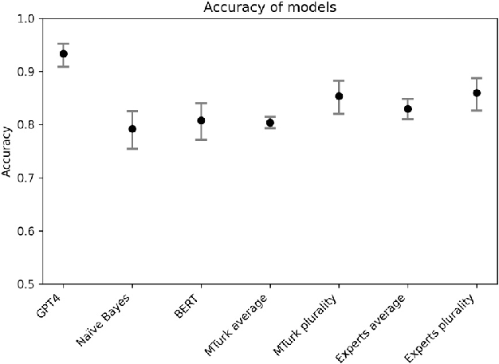
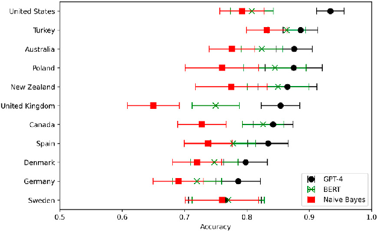

## UvA-DARE (Digital Academic Repository)

### Large Language Models Outperform Expert Coders and Supervised Classifiers at Annotating Political Social Media Messages

Törnberg, Petter DOI 10.1177/08944393241286471 Publication date 2025 Document Version Final published version Published in Social Science Computer Review License CC BY Link to publication

Citation for published version (APA): Törnberg, P. (2025). Large Language Models Outperform Expert Coders and Supervised Classifiers at Annotating Political Social Media Messages. Social Science Computer Review, 43(6), 1181-1195. https://doi.org/10.1177/08944393241286471

General rights It is not permitted to download or to forward/distribute the text or part of it without the consent of the author(s) and/or copyright holder(s), other than for strictly personal, individual use, unless the work is under an open content license (like Creative Commons).

Disclaimer/Complaints regulations If you believe that digital publication of certain material infringes any of your rights or (privacy) interests, please let the Library know, stating your reasons. In case of a legitimate complaint, the Library will make the material inaccessible and/or remove it from the website. Please Ask the Library: https://uba.uva.nl/en/contact, or a letter to: Library of the University of Amsterdam, Secretariat, P.O. Box 19185, 1000 GD Amsterdam, The Netherlands. You will be contacted as soon as possible.

UvA-DARE is a service provided by the library of the University of Amsterdam (https://dare.uva.nl)

Download date:18 Apr 2026

Article

# Large Language Models Outperform Expert Coders and Supervised Classifiers at Annotating Political Social Media Messages

Social Science Computer Review 2025, Vol. 43(6) 1181–1195 © The Author(s) 2024

Article reuse guidelines: sagepub.com/journals-permissions DOI: 10.1177/08944393241286471 journals.sagepub.com/home/ssc

Petter Tornberg¨ 1,2

Abstract

Instruction-tuned Large Language Models (LLMs) have recently emerged as a powerful new tool for text analysis. As these models are capable of zero-shot annotation based on instructions written in natural language, they obviate the need of large sets of training data—and thus bring potential paradigm-shifting implications for using text as data. While the models show substantial promise, their relative performance compared to human coders and supervised models remains poorly understood and subject to significant academic debate. This paper assesses the strengths and weaknesses of popular fine-tuned AI models compared to both conventional supervised classifiers and manual annotation by experts and crowd workers. The task used is to identify the political affiliation of politicians based on a single X/Twitter message, focusing on data from 11 different countries. The paper finds that GPT-4 achieves higher accuracy than both supervised models and human coders across all languages and country contexts. In the US context, it achieves an accuracy of 0.934 and an inter-coder reliability of 0.982. Examining the cases where the models fail, the paper finds that the LLM—unlike the supervised models—correctly annotates messages that require interpretation of implicit or unspoken references, or reasoning on the basis of contextual knowledge—capacities that have traditionally been understood to be distinctly human. The paper thus contributes to our understanding of the revolutionary implications of LLMs for text analysis within the social sciences.

Keywords text annotation, Large Language Models, text as data, Twitter, political messages

- 1ILLC, University of Amsterdam, Amsterdam, Netherlands
- 2Institut de Geographie,´ Universite´ de Neuchatel,ˆ Neuchatel,ˆ Switzerland

Corresponding Author: Petter Tornberg,¨ ILLC, University of Amsterdam, Science Park 107, Amsterdam, Netherlands. Email: p.tornberg@uva.nl

Introduction

Texts are culturally and socially situated within the ideas, values, and beliefs about the world within which humans operate. Their interpretation often requires deep contextual knowledge and the ability to “put ourselves in the shoes of others”—seen as distinctly human resources and capacities (Ramsay, 2011). While interpretation lies at the very heart of the social sciences, it has thus been seen as almost definitionally qualitative; “meaning has to be understood, it cannot be measured or counted, and hence there is always an interpretive or hermeneutic element in social science” (Sayer, 2000, p. 17).

While computational methods for analyzing and annotating textual data have evolved rapidly in recent years—enabling analysis of large-scale textual data (Eisenstein, 2019)—they have struggled with tasks requiring more complex interpretative capacities. Existing computational annotation methods often fall short when dealing with irony, metaphors, sarcasm, and implicit or unsaid meaning (Moretti, 2013; Ramsay, 2011; Tornberg & Uitermark, 2021¨ ). Supervised models, which are trained on a single classification task, face significant challenges in generalizing to data outside their training data, making them less useful for comparative research, and when robust and appropriate training data is unavailable. Moreover, these models typically require substantial amounts of training data, which means manual annotation remains necessary even with the use of supervised models. Consequently, manual annotation continues to be pervasive in social science research, relying on expert coders (e.g., colleagues, trained students, or research assistants) or online crowd workers. However, manual annotation is also not without its own issues (Murthy et al., 2019; Van Atteveldt et al., 2021), as humans can be slow, costly, biased, and prone to fatigue, all of which can undermine data quality and limit the scope of analysis (Grimmer & Stewart, 2013; Neuendorf, 2017). As a result, large-scale text analysis has remained a relatively costly and challenging endeavor.

The recent emergence of Large Language Models (LLMs) has however offered hopes of overcoming some of these limitations. LLMs such as GPT have shown the capacity for few-shot and zero-shot classification: by using carefully formulated natural language instructions, the LLMs can be used to directly annotate data—without the need for any manually labeled training data (Bail, 2024; Brown et al., 2020; Kojima et al., 2022; Tornberg, 2024a¨ ). The capacity for zeroshot learning means that no training data is provided, and that the model performs tasks or makes predictions on topics it has not been explicitly trained on, by leveraging its understanding of language patterns and context. As the LLMs are trained on truly massive datasets, they build extensive internal models of the world, allowing them to carry out virtually any coding task—and possibly allows them also to move beyond the limitations of previous generations of computational text analysis. Unlike traditional supervised models, LLMs like GPTare trained not only to classify text but also to understand context and provide accurate responses through techniques like Reinforcement Learning from Human Feedback (RLHF), enabling them to follow instructions more accurately and explain their reasoning (Ouyang et al., 2022; Chung et al., 2024).

While the models show substantial promise, the relative performance of zero-shot learning LLMs in comparison to conventional supervised models and manual coding remains poorly understood and subject to significant academic debate (Ding et al., 2023; Gilardi et al., 2023; He et al., 2023; Zhu et al., 2023; Ziems et al., 2024). There are several limitations in existing studies of the capacities of LLMs. First, we have limited knowledge when it comes to the models’ strengths and weakness in relation to specific interpretative capacities—such as understanding sarcasm and irony, subjective interpretation, identifying the unsaid and implicit, or making contextual inferences. Second, since research examining the capacities of the models tends to use human annotation as the ground truth, we have limited understanding how well the models fare relative to human coders. Using such manually coded data as ground truth is furthermore problematic when

comparing LLMs with supervised models, as the task then involves not only correct classification but also reproducing the errors of the human coders. This offers an intrinsic advantage for the supervised models, as these are trained on data produced by the same coders. Finally, little is known how well the models fare across language and national contexts, as research has focused primarily on evaluating their capacity on the English language and the US context. As the model training data also emphasizes this context, the models may perform substantially worse for other languages and cultural contexts.

This brief paper contributes to addressing these gaps. We focus on the task of coding the political party of a politician based on an X/Twitter message across 11 countries, with different languages and cultural contexts—a task for which ground truth is available, but which still requires challenging forms of interpretative skills that are common to annotation tasks within the social sciences. We compare zero-shot GPT-4 annotation with two supervised models—one Na¨ıve Bayes bag-of-words classifier model as a baseline and a BERT model—as well as crowd workers and expert human coders. We focus specifically on cases where the cases where the classifiers fail, to examine what type of interpretation appears particularly challenging for each type of model.

We find that the zero-shot GPT-4 outperforms all other methods—both the MTurk crowd workers and the expert human classifiers, as well as the supervised BERTclassifier and the Na¨ıve Bayes classifier. While the performance is lower outside the United States, the model still achieves relatively high accuracy across countries and languages—without the need for context-specific training data. The LLM is furthermore stable to variations in instructions for the given task. More interestingly, the LLM appears to operate according to a different logic than conventional computational models. While the supervised models struggle with certain interpretative tasks that are trivial for humans, the LLM solves these and appears to draw on interpretative skills that have previously been seen as distinctly human, such as making inferences based on contextual understanding.

While the findings of the paper contribute to the emerging view of LLMs as representing a paradigm shift in text-as-data, it should be noted that LLMs also pose significant challenges—not least epistemologically. LLMs require new ways of thinking of computational text annotation, calling for an annotation process that is in some ways more akin to conventional human text coding. We discuss the implications, risks, and limitations of using LLMs for text-as-data, as well as relevant pitfalls and best practices.

Large Language Models

Instruction-tuned LLMs have recently revolutionized the field of natural language processing. These models, brought to fame by OpenAI’s ChatGPT, employ deep learning to process and produce human-like text (Chung et al., 2024). While smaller versions of these transformer-based language models functioned like a form of sophisticated autocomplete, the larger models that are fed extensive corpora display capacities for which they were not explicitly trained. LLMs demonstrate a remarkable understanding of language nuances, context, and semantics (Brown et al., 2020; Ziegler et al., 2019), and capacities ranging from text generation and summarization to sentiment analysis and thematic categorization.

Studies have found that these models are also not only capable of text annotation, but that they have several potential advantages compared to conventional text annotation methods (Wei et al., 2022). Whereas supervised models must be specifically trained for each task, zero-shot learning models leverage their pre-trained knowledge to generalize across a multitude of tasks (Yin et al., 2019). While conventional supervised models thus require significant quantities of often manually labeled data, LLMs are capable of so-called “zero-shot learning”: they can execute annotation

tasks based on natural language instructions, without the need of task-specific training data (Brown et al., 2020).

Zero-shot learning has significant implications for text annotation in the social sciences, as it means that a single model can be used for a broad range of tasks, and since prompts are written in natural language, the process is simple and more akin to giving instructions to a human coder than training a complex computational model. This has significant democratizing implications for academic research, as it makes sophisticated text analysis available for scholars less experienced in computational methods, and to substantially lower costs than conventional supervised models, as it reduces the need for manually labeled training data. If LLMs indeed prove reliable for text annotation, the implications may thus be significant for the social sciences, as the models are easyto-use, relatively cheap, and highly versatile. However, our understanding of the strengths and limitations of these models remains limited, with studies finding conflicting levels of accuracy and reliability (Ding et al., 2023; Gilardi et al., 2023; He et al., 2023; Ollion et al., 2024; Zhu et al., 2023; Ziems et al., 2024).

Annotation Task

To examine the performance of LLMs, we will use the example task of annotating messages from the social media platform Twitter (now X) based on the political belonging of the poster. The data used were drawn from van Vliet et al.’s (2020) database of messages from parliamentarians across countries over several years. Using such messages has the advantage of offering a ground truth: we know the posters political affiliations and can therefore objectively assess the accuracy of GPT-4 compared to human coders. This bypasses the problems associated to the common practice of treating human annotation as the ground truth. (Supplementary Material S1 carries out a corresponding analysis on a sample of randomly selected users, to verify that the model achieves similar performance on users for which ground truth is not publicly available).

The task is furthermore rich in terms of the interpretative challenges that it involves. The messages in the dataset consist of a mix between expressions of view on particular policy positions, comments on recent political events, self-congratulatory messages for political victories, calls for campaign contributions, and the occasional personal news. Some of the messages can be easily classified—such as laudatory references to the party leader, or attacks against the opposing party. Others require parsing often implicit references and drawing on detailed contextual knowledge about politics (such as the US parties’ positions on the construction of a local airport in Oklahoma, or the Swedish parties’ views on the size of the arctic wolf population). Others still require the capacity to consider the author’s underlying intention and how they are communicating to their intended audience of voters. Finally, a significant share of the messages is nearly impossible to guess, such as birthday wishes to staff members, or messages with politically neutral content or even content associated with an opposing party. Accurately annotating the messages thus requires a broad range of interpretative skills, which allows us to use the messages to examine the respective strengths and weaknesses of the included methods. Even with such skills, complete accuracy should not be expected.

The LLM was run on all countries that had elections during the time period covered by the database and for which at least 100 messages were posted for each included party during the relevant period. The messages were generally written in the local language of the country, allowing us to test the model’s capacity across multiple languages. For these countries, the two largest parties in parliament prior to the election were selected. From this dataset, shares (“retweets”) and replies were removed, as were messages containing a URL and those shorter than 100 characters, since these were assumed to be too brief to contain meaningful political content. A random sample of 250 messages from each of the two major parties was selected, resulting in a

balanced sample of 500 messages. These relatively small datasets were chosen deliberately to allow for manual analysis of annotation failures and to evaluate the model’s performance under challenging conditions. For Sweden, New Zealand, and Poland, where fewer than 250 messages matched the criteria during the time period, 100 messages per party were used. Although bag-ofwords models tend to perform better with larger datasets, the smaller samples provide an opportunity to demonstrate the capacity of LLMs to handle classification tasks effectively even with limited data, highlighting their value as coding tools when human coding resources are constrained. The supervised models, by contrast, were trained on a larger sample of 5000 messages from each of the two parties across the entire time period covered by the dataset, excluding any messages in the test set. The task hence consisted of binary, balanced classification, allowing for easy interpretation and analysis.

Methods

For all the included countries, we compare the performance of the LLM with two supervised models: a simple Na¨ıve Bayes bag-of-words model and a BERT model. For the US case, we also use the crowd-work platform MTurk as well as human experts to enable comparing the LLM with the gold standard. We compare the models using the standard metrics for classification performance: accuracy and macro F1. Accuracy is simply the proportion of true results among the total number of cases examined. While accuracy is a poor measure when using imbalanced datasets, it works well for balanced and binary classification tasks such as this and has the advantage of being easy to interpret. The Macro F1 Score also takes into account how balanced the model is between the two classes, capturing whether the model is biased toward responding one party over the other. Macro F1 is the average of the individual F1 scores for the two classes and is more appropriate for binary classification tasks as it ensures that the model’s performance is assessed across both groups. The Krippendorf’s Alpha inter-coder reliability of the models was also calculated, to assess the stability of the model in relation to minor differences in the instructions. These results are provided in SI.2.

In addition to examining their performance, we also examine in detail all cases in which each model fails, in order to identify the interpretative strengths and weaknesses of the models. We seek to identify patterns in the cases for which the models fail and follow up the initial labeling with a request for the LLM to “motivate your response.” Such motivations can be highly useful for scoping the models’ contextual knowledge—however, some care must be taken regarding their interpretation, as these motivations should be considered a form of post-hoc rationalizations. (It should however be noted that psychological research suggests that this is not necessarily different from how humans motivate their decisions, see e.g., Nisbett & Wilson, 1977). Research furthermore has yet to examine the extent to which the models are consistent with their own explanations.

- Model 1: Zero-Shot GPT

We use OpenAI’s GPT-4 model, version gpt-4-0314, which at the time of writing is among the most sophisticated LLMs available (Achiam et al., 2023; OpenAI, 2023). While it is possible to fine-tune GPT models for classification task, we here seek to examine the zero-shot performance of the model. GPT-4 was used through the API to classify each message, provided in random order. When using LLMs, researchers provide a prompt written in plain language which guides the LLM annotation. The following prompt was used:

“You will be given a set of Twitter posts from different [country] politicians, sent during the two months preceding the [year] [country] election, that is, between [date], and [date]. Your task is to use your knowledge of [country] politics to make an educated guess on whether the poster is a [party1] or [party2]. Respond either ‘[party1]’ or ‘[party2]’. If the message does not have enough information for an educated guess, just make your best guess.”

The same procedure was used across countries and languages, and the prompt was not translated.

- Model 2: Supervised Na¨ıve Bayes Model

We use a Naive Bayes classifier as a baseline model—a staple in statistical classification techniques. The model operates under the assumption of feature independence given the class label, which often yields surprisingly robust results in text classification (Rish, 2001). Our implementation utilizes the bag-of-words representation, where documents are described by word occurrences while disregarding the order of words. This model transforms the text into fixedlength vectors of word counts, providing a straightforward yet effective approach to capture the textual information (Manning, 2009). The frequency of each word in the text serves as a feature for the Na¨ıve Bayes classifier, which then applies Bayes’ theorem to predict the probability of a document belonging to a particular class. The simplicity of the Na¨ıve Bayes classifier, combined with the high-dimensional feature space generated by the bag-of-words model, makes it a particularly attractive choice for large-scale text classification, offering a balance between computational efficiency and predictive performance (McCallum & Nigam, 1998). While the model is relatively simple, it is commonly used and relatively powerful, thus offering a useful baseline. The model was used via the scikit-learn package in Python (Pedregosa et al., 2011).

- Model 3: Fine-Tuned BERT Model

We furthermore use a fine-tuned BERT (Bidirectional Encoder Representations from Transformers) model. This is a state-of-the-art conventional supervised model with a deep contextual understanding and text representation (Devlin et al., 2019). Unlike conventional supervised models, BERT is pre-trained on a vast corpus of text, allowing it to internalize a broad understanding of language before any task-specific fine-tuning occurs. BERT furthermore uses the same Transformer architecture as the GPT model, allowing it to capture the context of words in sentences. The supervised nature of our BERT implementation ensures that the model’s predictions are directly influenced by the labeled data provided, making it capable of complex text classification challenges where nuance and context significantly impact the interpretation and annotation of text (Wang et al., 2019). BERT is here used via the simpletransformers and transformers packages in Python.

We implemented and fine-tuned a BERT (Bidirectional Encoder Representations from Transformers) model, a state-of-the-art supervised learning model with a deep contextual understanding of text (Devlin et al., 2019). BERT is pre-trained on a large corpus of text, which allows it to internalize broad language patterns and context before undergoing task-specific finetuning. This fine-tuning adapts the model to the specific task at hand by adjusting the pre-trained parameters to better predict labels in the new dataset (Wang et al., 2019).

For our implementation, we used the simpletransformers and transformers packages in Python, specifically leveraging the bert-base-uncased model. The fine-tuning process involved training the model on our dataset using 3 epochs, with a batch size of 16 for training and 64 for evaluation. The training utilized AdamWas the optimizer, with a warmup period of 500 steps and weight decay of

0.01 to prevent overfitting. The training process was accelerated by leveraging GPU hardware acceleration using MPS. The dataset was tokenized using the BERT tokenizer with truncation and padding to ensure that all inputs had a uniform length. We created a custom dataset class in PyTorch to handle the tokenized inputs and corresponding labels. Fine-tuning was carried out using the Trainer class from the transformers library, which handled the optimization and gradient updates. Given the relatively small size of our dataset, the fine-tuning process took approximately 3 hours on the provided hardware. Fine-tuning BERTallowed the model to leverage its pre-trained knowledge while adapting to the nuances of our specific text classification task, making it suitable for more complex tasks where context plays a critical role in interpreting and annotating text.

- Model 4: MTurk Crowd Workers

On the US case, we also compare to online crowd workers, using MTurk—an online platform for click-labor, which makes it easy to recruit a large number of workers. MTurk classification however varies significantly in quality depending on the details of how the tasks are implemented, making it perilous to compare models with MTurk accuracy without additional verification (Chmielewski & Kucker, 2020). To maximize accuracy of the MTurk predictions, best practices were thus used to ensure high quality responses: only Master Qualified workers (a special group of elite MTurk workers whose abilities have been verified) residing in the United States were allowed to respond. (Note that MTurk was run in early March 2023, before use of LLMs among crowd workers was widespread). The workers were given the questions in batches of 50, each with 4 control questions in which the author’s political affiliation was evident (e.g., “If one thing is certain, I am a Democrat!”). If the worker failed any of these questions, all their responses were automatically rejected. Each question was answered by 10 independent crowd workers. Statistical significance was assessed using Wilson’s method for calculating the confidence interval around the accuracy score, providing both lower and upper bounds for the confidence level. We show both the average performance of the workers and the performance of the plurality answer—which tends to be significantly higher due to the “wisdom of crowd” effect.

- Model 5: Expert Coders

On the US case, we also have three researchers with PhDs in political science or related disciplines classify all messages. These experts were given the 500 messages in random order and the same instructions as GPT. The purpose of using these expert coders was to offer a reasonable upper limit to the performance of human coders on the annotation task, as these scholars have deep knowledge and contextual understanding of politics. The use of human experts is also common for smaller coding tasks in the social sciences. The performance of the experts is likely higher than would be expected for realistic annotation projects, as the labeling material was relatively small, and the human coders were hence unlikely to lapse in attention through the process. For the human experts, we compare with both the individual performance and the majority vote (Table 1).

Results

We begin focusing on the US case, for which we have comparison also with crowd workers and human experts. Figure 1 presents the accuracy and macro F1 scores across the models and the human classifiers. As the table shows, GPT-4 has the highest accuracy and macro F1 score of all models.

As the table shows, GPT-4 has the by far highest accuracy of all models. The model in other words has the highest proportion of correct results out of all the cases. It also has the highest macro

Table 1. A Comparison of Accuracy and Macro F1 Between the Models for the US Case. The Macro F1 Score Captures How Balanced the Model Is Between the Two Categories, Thus Identifying Any Model Bias. As Can Be Seen, the LLMs Outperform All Other Classifiers.

Model Accuracy Macro F1

GPT-4 0.934 0.934 Na¨ıve Bayes 0.792 0.791 BERT 0.808 0.808 MTurk average 0.804 0.803 MTurk plurality 0.854 0.853 Experts average 0.830 0.830 Experts plurality 0.860 0.860

||
|---|

Figure 1. A comparison of accuracy between the models for the US case, with 95% confidence interval. As can be seen, the LLM statistically significantly outperforms all other classifiers in terms of accuracy.

F1 score, indicating that the response does not show a strong bias toward either class. This can also be seen in the balance score, which suggests that it deviates from the equal guessing only by a few percentages. As the figure shows, GPT-4 is statistically significantly better than all other models with 95% confidence.

As expected, the Na¨ıve Bayes has the worst performance of all models—but still achieves a respectable 79.2% accuracy, suggesting that there is quite strong association between words used and party belonging in the US context. As also expected, the expert plurality has the second highest accuracy, with 86%, but is closely matched by MTurk plurality. The supervised BERT model performs better than the average crowd worker but slightly worse than the average expert coder.

The model results were found to be stable to variations in the instructions (see Figure SI.2).

We next turn to examining the models’ performance across countries. We here focus on the accuracy measure, as it is a valid measure for balanced binary classification and easier to interpret than macro F1. Figure 2 shows the accuracy of GPT-4 and the supervised models across countries. While the difference between GPT-4 and the supervised models are not significant for all countries, the LLM has highest accuracy for all countries. This is significant, as it suggests that the model achieves high performance across languages and cultural contexts, despite its training data being dominated by English and the US context.

The reason that all models achieve lower accuracy outside the United States is likely that the annotation task is inherently more challenging in multi-party systems, as the language used may be very similar across parties. Sweden, for instance, has the lowest accuracy for all models, which fits the observation that Swedish politicians on Twitter rarely discuss politics, but rather stick to personal topics—making party annotation a highly challenging task (van Vliet et al., 2020; van Vliet et al., 2021).

The reduced accuracy for the LLM across countries does not seem to be fully explained by the language that is used, as the LLM accuracy is higher for both Turkey and Poland than for the United Kingdom. While the accuracies of the models are correlated—which is to be expectedthe difference between the supervised model and the LLM varies significantly across countries. For instance, the United Kingdom is the country for which the supervised models perform the worse, but GPT-4 shows relatively high accuracy. This suggests that the models are operating in different ways in identifying the parties and hence struggle with different interpretive tasks. This suggests the need for a more in-depth examination of the tasks for which each model tends to fail.

In-Depth Examination of Model Failures

To examine the specific weaknesses of each model, we manually examine all cases of failures for the models. The examination reveals clearly that the models display different patterns of failure.

||
|---|

Figure 2. Comparing the accuracy of the model across 11 countries. The LLM has the highest accuracy in the United States, but the LLM has the highest accuracy of all classifiers across all countries and languages. The graph shows the 95% confidence interval.

The supervised models follow a fundamentally different logic for annotation compared to human coders, as they are based on identifying words and phrases that are associated with a particular class. For the Na¨ıve Bayes model, specifically, the accuracy of the model is directly linked to how strongly the words used are associated to a certain party. This allows the model to complete tasks that are exceedingly challenging for human coders, by identifying latent patterns of language. For instance, the model can find that an ostensibly arbitrary word is strongly associated to one political party or that an obscure user handle that is exclusively mentioned by members of a particular party. However, the supervised models also fail on tasks that are trivial to human coders. For instance, both the BERT and the Na¨ıve Bayes models failed on the following messages:

“Wisconsin is on track to run out of ICU beds. @VP Pence held a superspreader event yesterday and @realDonaldTrump has one tomorrow. This is their response to Wisconsin hospitals filling up with #COVID19 patients. ⬇ฏ”

“I required the GOP to show up for a live quorum call—Senate can’t do business without quorum Then I forced us into closed session to talk face-to-face about this nomination & its impact on America But the GOP decided to keep forcing this nominee through an illegitimate process.”

These messages are challenging for the supervised models, as they do not contain words or phrasing that is associated with particular party. They are, however, trivial to link to a particular party if one is able to engage in even basic reasoning around their meaning: for instance, concluding that it is unlikely that a Republican would refer to a Trump rally as a “superspreader event.”

While the supervised models fail on such tasks, GPT-4 correctly responds to all identified cases of such interpretative tasks: there are no examples of cases where the human coders agree on a correct answer and the LLM is incorrect. Unlike the supervised models, the LLM thus appears able to carry out annotation tasks which require drawing inferences based on contextual knowledge.

To explore the potential reasoning underlying the LLM’s responses in relation to this type of interpretation, we follow up with a request for the LLM to motivate its answer and focus on some particularly challenging annotation tasks. For instance, we can take the task of parsing implicit references to contextual information, such as in the message: “A friend, a neighbor, a mom, who could soon serve on the highest court in the land.” While the supervised BERT model was incorrect, 7 of the MTurk workers were correct, and GPTcorrectly responded Republican with the following motivation:

“This tweet is likely referring to the nomination of Amy Coney Barrett to the Supreme Court, which took place during the specified time frame. Barrett was nominated by then-President Donald Trump, a Republican, and her nomination was supported by the Republican party. The positive tone of the tweet suggests that the poster is in favor of her nomination, which leads me to believe that the poster is a Republican.”

The LLM also correctly interprets messages that require making inferences based on the assumptions of the aims and intentions of the poster. As an example, we can take a message containing a Bible quote: “good indeed is the LORD, His mercy endures forever, his faithfulness lasts through every generation. Psalms 100:5.” The LLM and 9 out of 10 MTurk workers correctly guessed that the author was Republican:

“[…]While both Democrats and Republicans can be religious, Republicans are generally more likely to emphasize their religious beliefs and values in public statements, as they tend to have a stronger connection with conservative Christian voters.”

Finally, there are several examples of the LLM outperforming both MTurkers and experts on tasks involving subjective and contextual interpretation—seemingly as the LLM simply does a better job of scoping the motivations of the poster and making valid inductions. One example is the message:

“Down Syndrome Awareness Month helps raise awareness for what it means to have Down syndrome and how individuals with Down syndrome play a vital role in our lives and communities.”

2/3 experts and 8/10 MTurkers incorrectly guessed that this was written by a Democrat, likely due to Democrats being associated to support of the rights of minorities and disenfranchised groups. The LLM, however, correctly classified the user as Republican, motivating its response by suggesting that the support for individuals with Down syndrome is a coded expression of antiabortion positions:

“[…] Republicans often emphasize the importance of raising awareness for individuals with disabilities, such as Down syndrome, and their contributions to society. This is sometimes connected to their pro-life stance […]”

While the stringency of the reasoning can be questioned and it is not known whether this form of inference is in fact underlying the responses of the model, or they constitute merely post-hoc rationalizations of some unknown other process, the reasoning does appear plausible and convincing, and the model’s accuracy for this type of interpretive tasks is undeniable.

The examination of the failures of the models shows that zero-shot LLMs seem to solve its annotation tasks based on a different logic than conventional supervised models. The models appear to engage in forms of interpretation that are more akin to how human coders carry out coding tasks: not by identifying associations between particular phrases and the given category but by drawing inferences based on the content of a message and contextual knowledge, and identifying the purpose with which a message was written. This suggests that the models are capable of coding messages that have been previously outside the scope of computational methods.

Discussion

This brief paper has assessed LLM-based zero-shot learning text annotation for the task of identifying political affiliations based on social media messages—a deceptively simple task that requires complex interpretative skills. It found that LLMs outperform both state-of-the-art supervised models and human coders, offering higher accuracy across languages and country contexts. While the classifier’s accuracy was highest in the United States, it remained higher than the supervised models across all included countries and languages.

This paper has suggested that the LLMs achieve their high performance by operating according to a different logic than conventional supervised models. While supervised models identify latent associations between phrasings and given categories, the LLM appears to perform the annotation more akin to human coders—through inferences based on contextual understanding. The model can therefore achieve high accuracy also when the task requires skills that have conventionally been understood as distinctly human: implicit meanings, subjective interpretation, reasoning on the basis of contextual knowledge, or making assumptions of the author’s intentions (Moretti, 2013; Ramsay, 2011). This may explain why the literature has made conflicting findings when comparing LLMs to supervised models: the LLM coding follows a different logic compared to supervised models and will hence vary in performance depending on the specific coding task at

hand. The models are hence challenging conventional distinctions within the social sciences: between qualitative and quantitative studies, and between close and distant reading. LLMs may even open for new forms of large-scale inductive interpretative research, representing new methodological terrain on the interstices of the traditionally quantitative and qualitative realms.

These findings have substantial implications for use of textual data in the social sciences. By obviating the need for manually annotated training data, LLMs imply significantly reduced costs and complexity of text annotation. Using LLMs is furthermore orders of magnitude faster than manual coding. As a result, students and early career scholars with limited resources can now perform sophisticated analyses that would previously have required the funding and resources of a major research lab. Such growing availability is not to be taken lightly; as Kuhn (1962) argued, radical scientific advances stem not so much from accumulated facts and discoveries, as from the invention of new tools and methodologies that trigger paradigm shifts in scientific work.

The LLMs are fast and cheap enough to be used to directly annotate reasonably large datasets. However, while the models are orders of magnitude cheaper than human coders, platform-based models such as GPTcan still imply significant costs when directly applied to annotate truly largescale data. For such cases, it may be preferable to either use the LLM to annotate the training data of a conventional supervised model or to employ a locally run LLM.

The capacity of the model to annotate data across countries, regions, and languages furthermore has important implications for comparative research. Coding data across cultural contexts and languages has previously been exceedingly costly and challenging, as conventional supervised models require separate training data for each context (Raffel et al., 2020). By making crosscontext annotation easily accessible, LLMs open the door for new forms of comparative studies, with substantial implications for social scientific research.

At the same time, LLMs also raise both practical and epistemological challenges. When using platform-based services such as ChatGPT, in particular, there are important implications to consider for ethics, legality, and reproducibility. For instance, GDPR compliance requires signing a Data Processing Agreement (DPA) with the service provider, for example,, OpenAI. When dealing with proprietary, secret, confidential, or personal data, it can hence be advisable to use a model hosted on your own infrastructure rather than relying on cloud-based APIs (Ollion et al., 2024). While using stable versions of the models provided by platforms such as OpenAI offers some guarantee of future reproducibility, hosting the model yourself gives full control over the model version. It also allows the use of models that are more open in terms of their code, training data, model weights, licensing, and documentation (Liesenfeld et al., 2023). However, as always, any approach comes with its own upsides and downsides, and the model used must be chosen and motivated based on the characteristics of the project at hand.

Large Language Models (LLMs) also imply epistemic challenges to how we think about computational methods. Some scholars have argued that LLMs are inherently black-boxed, subjective, unreliable, prone to misunderstandings (Kristensen-McLachlan et al., 2023; Ollion et al., 2024), and potentially biased, as they embody and reproduce the prejudices of the texts on which they are trained (Lucy & Bamman, 2021). However, many of the same criticisms can also be leveraged against human coders—who, after all, are similarly black-boxed and subjective. The social sciences have met the limitations of human coders by establishing standards and best practices for text annotation, developing systematic coding procedures that seek to mitigate subjectivity and bias, while ensuring reliability. Importantly, validation remains crucial when using LLMs: while training the model on large sets of manually coded data may no longer be necessary, careful validation of the model’s performance on specific tasks remains essential (Grimmer & Stewart, 2013). Using LLMs through their interface is furthermore not generally recommended: the data are often used for model training, the interfaces offer limited control over the model version used, and the interfaces include system prompts which reduce reproducibility.

While LLMs are offering an exciting opportunity for powerful new forms of research, it is vital that the field develops standards and best practices for reliable, reproducible, and ethical use of LLMs in social scientific research (Tornberg,¨ 2024b).

Large Language Models (LLMs) appear to represent a qualitative shift in computational text analysis, achieving their annotation accuracy by drawing on capacities that appear akin to human interpretation. While such capacities do not necessarily supplant the role of interpretation in the social sciences, they do challenge the existing divide between quantitative and qualitative approaches. LLMs appear to have granted machines access to the realm of ideas, values, and beliefs about the world within which texts are culturally and socially situated—historically thought to be an exclusively human domain. In concrete terms, this means that powerful large-scale textual analysis is now available to nearly any scholar, suggesting an impending paradigm shift in text-asdata. Interpretation is inherently subjective and contested, and the models bring to the surface challenging questions of meaning, nuance, and ambiguity. More broadly, it urges us to not only examine the technical capabilities of these models but also to confront the deeper epistemological and meta-theoretical questions about the nature and role of interpretation in the social sciences, and to employ the models to explore the borderlands between conventional qualitative and quantitative approaches.

While this paper offers important evidence on the capacities of LLMs for zero-shot text annotation, some limitations should be mentioned. First, the task employed may be differently challenging across countries, due to, for instance, political differences. While the comparison between supervised and zero-shot models across regions is insightful, further research is needed to compare the capacity of the LLM across country contexts. Second, the capacity of the model on the specific task employed may not generalize to other text annotation tasks. Additional research is needed to scope the strengths and limitations of LLMs across diverse text annotation tasks.

Acknowledgements

Code and data for the paper can be found at: https://github.com/cssmodels/llm.

Declaration of Conflicting Interests

The author(s) declared no potential conflicts of interest with respect to the research, authorship, and/or publication of this article.

Funding

The author(s) disclosed receipt of the following financial support for the research, authorship, and/or publication of this article: This study is supported by Sociale en Geesteswetenschappen, NWO (VI.Veni.201S.006).

ORCID iD

Petter Tornberg¨  https://orcid.org/0000-0001-8722-8646

Supplemental Material

Supplemental material for this article is available online.

References

Achiam, J., Adler, S., Agarwal, S., Ahmad, L., Akkaya, I., Aleman, F. L., Almeida, D., Altenschmidt, J., Altman, S., Anadkat, S., Avila, R., Babuschkin, I., Balaji, S., Balcom, V., Baltescu, P., Bao, H., Bavarian, M., Belgum, J., & Zoph, B. (2023). GPT-4 technical report. arXiv preprint arXiv:2303.08774.

Bail, C. A. (2024). Can generative AI improve social science? Proceedings of the National Academy of Sciences, 121(21), Article e2314021121. https://doi.org/10.1073/pnas.2314021121

Brown, T., Mann, B., Ryder, N., Subbiah, M., Kaplan, J. D., Dhariwal, P., Neelakantan, A., Shyam, P., Sastry, G., & Askell, A. (2020). Language models are few-shot learners. Advances in Neural Information Processing Systems, 33(1), 1877–1901. https://doi.org/10.48550/arXiv.2005.14165

Chmielewski, M., & Kucker, S. C. (2020). An MTurk crisis? Shifts in data quality and the impact on study results. Social Psychological and Personality Science, 11(4), 464–473. https://doi.org/10.1177/ 1948550619875149

Chung, H. W., Hou, L., Longpre, S., Zoph, B., Tay, Y., Fedus, W., Li, Y., Wang, X., Dehghani, M., & Brahma, S. (2024). Scaling instruction-finetuned language models. Journal of Machine Learning Research, 25(70), 1–53. https://doi.org/10.48550/arXiv.2210.11416

Devlin, J., Chang, M.-W., Lee, K., & Toutanova, K. (2019). Bert: Pre-training of deep bidirectional transformers for language understanding. arXiv: 1810.04805. Ding, B., Qin, C., Liu, L., Ken Chia, Y., Joty, S., Li, B., & Bing, L.. 2023. “Is GPT-3 a good data annotator?”

arXiv 2212.10450. Eisenstein, J. (2019). Introduction to natural language processing. MIT press. Gilardi, F., Alizadeh, M., & Kubli, M. (2023). ChatGPToutperforms crowd workers for text-annotation tasks.

Proceedings of the National Academy of Sciences, 120(30), Article e2305016120. https://doi.org/10. 1073/pnas.2305016120

Grimmer, J., & Stewart, B. M. (2013). Text as data: The promise and pitfalls of automatic content analysis methods for political texts. Political Analysis, 21(3), 267–297. https://doi.org/10.1093/pan/mps028

He, X., Lin, Z., Gong, Y., Long Jin, A., Zhang, H., Lin, C., Jiao, J., Yiu, S. M., Duan, N., & Chen, W. (2023). AnnoLLM: Making large language models to be better crowdsourced annotators. arXiv 2303.16854.

Kojima, T., Gu, S. S., Reid, M., Matsuo, Y., & Iwasawa, Y. (2022). Large language models are zero-shot reasoners. Advances in Neural Information Processing Systems, 35(1), 22199–22213. https://doi.org/ 10.48550/arXiv.2205.11916

Kristensen-McLachlan, Deans, R., Canavan, M., Kardos, M., Jacobsen, M., & Aarøe, L. (2023). Chatbots are

not reliable text annotators. arXiv 2311.05769. Kuhn, T. S. (1962). The structure of scientific revolutions. University of Chicago Press. Liesenfeld, A., Lopez, A., & Dingemanse, M. (2023). Opening up ChatGPT: Tracking openness, trans-

parency, and accountability in instruction-tuned text generators. In Proceedings of the 5th international conference on conversational user interfaces (pp. 1–6). ACM.

Lucy, L., & Bamman, D. (2021). Gender and representation bias in GPT-3 generated stories. In Proceedings

of the Third workshop on narrative understanding (pp. 48–55). Manning, C. D. (2009). An introduction to information retrieval. Cambridge University Press. McCallum, A., & Nigam, K. (1998). A comparison of event models for naive Bayes text classification. AAAI-

98 workshop on learning for text categorization, 752(2), 41–48. Moretti, F. (2013). Distant reading. Verso Books. Murthy, J. S., Siddesh, G. M., & Srinivasa, K. G. (2019). TwitSenti: A real-time twitter sentiment analysis and

visualization framework. Journal of Information and Knowledge Management, 18(02), Article

1950013. https://doi.org/10.1142/s0219649219500138 Neuendorf, K. A. (2017). The content analysis guidebook. Sage. Nisbett, R. E., & Wilson, T. D. (1977). Telling more than we can know: Verbal reports on mental processes.

Psychological Review, 84(3), 231–259. https://doi.org/10.1037//0033-295x.84.3.231 Ollion, E.,´ Shen, R., Macanovic, A., & Chatelain, A. (2024). The dangers of using proprietary LLMs for research. Nature Machine Intelligence, 6(1), 4–5. https://doi.org/10.1038/s42256-023-00783-6 OpenAI. (2023). GPT-4 system card. https://cdn.openai.com/papers/gpt-4-system-card.pdf (Accessed on 28 August 2024).

Ouyang, L., Wu, J., Jiang, X., Almeida, D., Wainwright, C., Mishkin, P., Zhang, C., Agarwal, S., Slama, K., Ray, A., & Schulman, J. (2022). Training language models to follow instructions with human feedback. Advances in Neural Information Processing Systems, 35(1), 27730–27744. https://doi.org/10.48550/ arXiv.2203.02155

Pedregosa, F., Varoquaux, G., Gramfort, A., Michel, V., Thirion, B., Grisel, O., Blondel, M., Prettenhofer, P., Weiss, R., Dubourg, V., & Vanderplas, J. (2011). Scikit-learn: Machine learning in Python. The Journal of Machine Learning Research, 12(85), 2825–2830.

Raffel, C., Shazeer, N., Roberts, A., Lee, K., Narang, S., Matena, M., Zhou, Y., Li, W., & Liu, P. J. (2020). Exploring the limits of transfer learning with a unified text-to-text transformer. Journal of Machine Learning Research, 21(1), 5485–5551. https://doi.org/10.48550/arXiv.1910.10683

Ramsay, S. (2011). Reading machines: Toward and algorithmic criticism. University of Illinois Press. Rish, I. (2001). An empirical study of the naive Bayes classifier. IJCAI 2001 workshop on empirical methods

in artificial intelligence, 3(2), 41–46. Sayer, A. (2000). Realism and social science. Sage. Tornberg, P.¨ (2024a). How to use large-language models for text analysis. Sage Research Methods. Doing

Research Online. https://doi.org/10.4135/9781529683707 Tornberg,¨ P. (2024b). Best practices for text annotation with large language models. Sociologica. Forthcoming. Tornberg, P., & Uitermark, J. (2021). For a heterodox computational social science.¨ Big Data & Society, 8(2), Article 205395172110477. https://doi.org/10.1177/20539517211047725

Van Atteveldt, W., Van der Velden, M. A. C. G., & Boukes, M. (2021). The validity of sentiment analysis: Comparing manual annotation, crowd-coding, dictionary approaches, and machine learning algorithms. Communication Methods and Measures, 15(2), 121–140. https://doi.org/10.1080/19312458.2020.1869198

- van Vliet, L., Tornberg, P., & Uitermark, J. (2020). The twitter parliamentarian database: Analyzing twitter¨ politics across 26 countries. PLoS One, 15(9), Article e0237073. https://doi.org/10.1371/journal.pone. 0237073
- van Vliet, L., Tornberg, P., & Uitermark, J. (2021). Political systems and political networks: The structure of¨ parliamentarians’ retweet networks in 19 countries. International Journal of Communication, 15(1), 21. https://ijoc.org/index.php/ijoc/article/view/15867

Wang, A., Singh, A., Michael, J., Hill, F., Levy, O., & Bowman, S. R. (2019). Glue: A multi-task benchmark and analysis platform for natural language understanding. arXiv 1804.07461. Wei, J., Yi, T., Bommasani, R., Raffel, C., Zoph, B., Borgeaud, S., Yogatama, D., Bosma, M., Zhou, D., & Metzler, D. (2022). Emergent abilities of large language models. arXiv 2206.07682. Yin, W., Hay, J., & Roth, D. (2019). Benchmarking zero-shot text classification: Datasets, evaluation and entailment approach. arXiv 1909.00161. Zhu, Y., Zhang, P., Haq, E. -U., Hui, P., & Tyson, G. (2023). Can ChatGPT reproduce human-generated labels? A study of social computing tasks. arXiv 2304.10145. Ziegler, D. M., Stiennon, N., Wu, J., Brown, T. B., Radford, A., Amodei, D., Paul, C., & Irving, G. (2019). Fine-tuning language models from human preferences. arXiv 1909.08593. Ziems, C., Held, W., Shaikh, O., Chen, J., Zhang, Z., & Yang, D. (2024). “Can large language models transform computational social science?” arXiv 2305.03514.

Author Biography

Petter Tornberg¨ is Assistant Professor in Computational Social Science at the University of Amsterdam. He studies the intersection of AI, social media, and politics, using a critical computational approach. His recent books include “Intimate Communities of Hate: Why Social Media Fuels Far-Right Extremism” (with Anton Tornberg;¨ 2024) and “Seeing Like a Platform: An inquiry into the condition of digital modernity” (with Justus Uitermark; forthcoming.)

