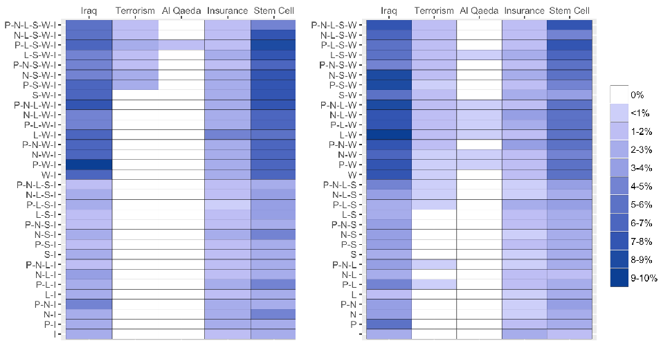

# Text Preprocessing For Unsupervised Learning: Why It Matters, When It Misleads, And What To Do About It∗

##### Matthew J. Denny† Arthur Spirling‡

###### Abstract

Despite the popularity of unsupervised techniques for political science text-as-data research, the importance and implications of preprocessing decisions in this domain have received scant systematic attention. Yet, as we show, such decisions have profound effects on the results of real models for real data. We argue that substantive theory is typically too vague to be of use for feature selection, and that the supervised literature is not necessarily a helpful source of advice. To aid researchers working in unsupervised settings, we introduce a statistical procedure and software that examines the sensitivity of findings under alternate preprocessing regimes. This approach complements a researcher’s substantive understanding of a problem by providing a characterization of the variability changes in preprocessing choices may induce when analyzing a particular dataset. In making scholars aware of the degree to which their results are likely to be sensitive to their preprocessing decisions, it aids replication efforts.

preText software available: github.com/matthewjdenny/preText

###### Word count: 10461 (excluding online appendices)

∗First version: September, 2016. This version: September 27, 2017. We thank Will Lowe and Brandon Stewart for comments on an earlier draft, and Pablo Barbera for providing the Twitter data used in this paper. Replication data for this paper are available on the Political Analysis Dataverse here: dx.doi.org/10.7910/DVN/XRR0HM.

†mdenny@psu.edu; 203 Pond Lab, Pennsylvania State University , University Park, PA 16802 ‡arthur.spirling@nyu.edu; Office 405, 19 West 4th St., New York University, New York, NY 10012

## 1 Introduction

Every quantitative study that uses text as data requires decisions about how words are to be converted into numbers. These decisions, known collectively as ‘preprocessing’, aim to make the inputs to a given analysis less complex in a way that does not aversely affect the interpretability or substantive conclusions of the subsequent model. In practice, perfecting this tradeoff—simpler data, but not too much information loss—is a non-trivial matter, and scholars have invested considerable energies in exploring the optimal way to proceed (see, e.g. Sebastiani, 2002, for a review). Unsurprisingly, such advice, which includes the merits of operations like decapitalization, pruning words back to their stems and removing very common words, can be found in textbooks for natural language processing and information retrieval (e.g. Jurafsky and Martin, 2008; Manning, Raghavan and Schu¨tze, 2008). Subsequently, political scientists have suggested scholars in their field employ similar steps (e.g. Grimmer and Stewart, 2013).

On its face, this technology transfer from computer science to political science has much to recommend it. Clearly, political texts—be they treaties, manifestos, speeches or press releases—are not so different in substance or style to non-political texts—such as product or movie reviews—as to imply that such advice is a priori inappropriate. And, models that employ such preprocessing steps have been successful insofar as they are very widely cited, provide valid measures, and produce findings in keeping with qualitative understandings of fundamental political processes (e.g. Monroe, Colaresi and Quinn, 2008; Slapin and Proksch, 2008; Quinn et al., 2010). But as we explain in this paper, there are reasons for extreme caution when moving from one field to another, completely separate to matters of different substantive focus.

Ideally, as in any scientific measurement problem, feature selection decisions in political science ought to be based on ‘theory’, broadly construed. That is, researchers should match their preprocessing choices to their knowledge—in terms of what is likely to be important for understanding the data generating process—of the substantive matter at hand.1 Our central contribution here recognizes, and is entirely compatible with, the primacy of this position. We note that in practice however, this is not how business is done. For one thing, faced with an area of study not yet widely examined with text analysis, scholars may have weak, possibly wrong, priors over what will be an important feature to include or discard, to weight up or to weight down. Thus, they simply follow and cite the extant literature, and the decisions taken there, with little understanding for how different preprocessing might affect their conclusions. Arguably worse, some may try a few specifications and report (only!) the one that returns results closest to their expectations, with the obvious consequences for reproducibility that such ‘cherry picking’ usually delivers.

This operating procedure may be innocuous if it were not for the fact that, ultimately, the providence of much preprocessing advice is the world of supervised techniques, yet it is applied in the world of unsupervised techniques. And there is worryingly little discussion about whether the shift from one form of learning, where effective classification is the goal, to another—where the goal is to reveal interesting latent structure—has consequences for the best approach to preprocessing. Because unsupervised learning typically requires careful and deep interpretation of results after a technique has been applied, scholars using such models have relatively little room—intellectually or physically in terms of time—to discuss what alternate specifications of the preprocessing steps would have suggested. The dimen-

1Consider a trivial case: one’s documents might contain no numbers, in which case it makes no practical difference whether one ‘removes’ them or not. More generally though, we may know from past experience of a document collection what is likely to reveal the structure we care about: an obvious example is the removal of certain words—like ‘Right Honourable’—which are essentially mandated and which we believe add nothing to our understanding of a speech’s content in the House of Commons.

sions of this problems are stark: notice that for just seven possible (binary) preprocessing steps, there would be 27 = 128 possible models to run and analyze (and that’s before any model parameters, such the number of clusters or topics, are adjusted).

Of course, in principle, it could be the case that what ‘works’ for supervised learning is fine for unsupervised problems, and that findings are anyway generally robust. Sadly, there is no a priori reason to believe this, and as we will show below, the idea that conclusions are not sensitive to perturbations of the preprocessing steps is wishful thinking. Curiously though, our paper is the first that we know of that explores exactly this question in the context of unsupervised approaches to social science text data.

By looking at two real datasets, we demonstrate that the inferences one draws can be extremely sensitive to the preprocessing choices the researcher makes. This ‘possibility result’

- means that otherwise diligent researchers are in danger of drawing highly variable lessons from their documents, depending on the particular specification of preprocessing steps they adopt. Further, by transforming their text data in a given way and then substantively interpreting their post-model results without considering the patterns and differences that would have emerged, scholars can find themselves heading down “forking paths” of inference based on early data coding—i.e. preprocessing—decisions (see Gelman and Loken, 2014, S3 for discussion of this idea). More worryingly, researchers with malfeasant intent are able to try multiple different specifications until they find one that fits their preference or theory (known elsewhere as ‘fishing’).

With the above in mind, our second contribution is to provide a convenient method for assessing the sensitivity of inference for unsupervised models in the face of a large number of possible preprocessing steps. We describe, design and implement a measure based on

the way that pairwise distances between documents move as one tries alternative specifications. Helpfully, this allows us to make some general comments about how harmful—in the sense of how ‘unusual’ the resulting document term matrix (DTM) is relative to all other possibilities—a given choice might be. To be very clear, we envision that the typical use case of our technique is as a complement, not a substitute, for researchers’ domain-specific understandings about their data. That is, if a researcher has ‘theory’ about what should or should not be done in terms of pre-processing which still allows for doubt over exactly what is an optimal specification—which we maintain is the case for the vast majority of practitioners—our method will allow them to see how robust their findings are likely to be to reasonable perturbations of those choices. To reiterate, it is neither our aim, nor a welldefined objective, to provide the ‘right answer’ for preprocessing decisions: instead, we show how researchers can avoid getting a possibly ‘wrong answer’ with a method that provides the equivalent of a warning. And if researchers follow the procedure we lay out—made simple via our software—they can feel considerably more confident about the robustness of their findings under different transformations of their DTMs.

In the next section, we review some common text preprocessing choices the consequences of which we will investigate in more detail. We then review the differences between supervised and unsupervised methods, and why advice from the former need not apply to the latter. Moving to more practical matters, we then briefly describe the (representative) data sets we will operate on for the rest of the paper. This is followed by our troubling examples, in which we show inference is highly variable depending on small differences in preprocessing. We then move to our more general testing approach and present some advice for practitioners working with unsupervised models. The final section concludes.

## 2 Words to Numbers: Text Preprocessing Choices

Quantitative analysis requires that we transform our texts into numerical data. Accepting the wisdom that word order may be disposed of with minimal costs for inference (see Grimmer and Stewart, 2013, for discussion)—and a ‘bag of words’ representation employedresearchers typically apply (some subset of) several further binary preprocessing steps in constructing the relevant document term matrix. We now describe these in some detail, since they are the focus of our efforts below.

P Punctuation: The first choice a researcher must make when deciding how to preprocess a corpus is what classes of characters and markup to consider as valid text. The most inclusive approach is simply to choose to preprocess all text, including numbers, any markup (html) or tags, punctuation, special characters ($, %, &, etc), and extra white-space characters. These non-letter characters and markup may be important in some analyses (e.g. hashtags that occur in Twitter data), but are considered uninformative in many applications. It is therefore standard practice to remove them. The most common of these character classes to remove is punctuation. The decision of whether to include or remove punctuation is the first preprocessing choice we consider.

N Numbers: While punctuation is often considered uninformative, there are certain domains where numbers may carry important information. For example, references to particular sections in the U.S. Code (“Section 423”, etc.) in a corpus of Congressional bills may be substantively meaningful regarding the content legislation. However, there are other applications where the inclusion of numbers may be less informative.

L Lowercasing: Another preprocessing step taken in most applications is the lowercasing of all letters in all words. The rationale for doing so is that that whether or not the first letter of a word is uppercase (such as when that words starts a sentence)

most often does not affect its meaning. For example, “Elephant” and “elephant” both refer to the same creature, so it would seem odd to count them as two separate word types for the sake of corpus analysis. However, there are some instances where a word with the same spelling may have two different meanings that are distinguished via capitalization, such as “rose” (the flower), and “Rose” the proper name.

S Stemming: The next choice a researcher is faced with in a standard text preprocessing pipeline is whether or not to stem words. Stemming refers to the process of reducing a word to its most basic form (Porter, 1980). For example the words “party”, “partying”, and “parties” all share a common stem “parti”. Stemming is often employed as a vocabulary reduction technique, as it combines different forms of a word together. However, stemming can sometimes combine together words with substantively different meanings (“college students partying”, and “political parties”), which might be misleading in practice.

W Stopword Removal: After tokenizing the text, the researcher is left with a vector of mostly meaningful tokens representing each document. However, some words, often referred to as “stop words”, are unlikely to convey much information. These consist of function words such as “the”, “it”, “and”, and “she”, and may also include some domain-specific examples such as “congress” in a corpus of U.S. legislative texts. There is no single gold-standard list of English stopwords, but most lists range between 100 and 1,000 terms.2 Most text analysis software packages make use of a default stopword list which the software authors have attempted to construct to provide “good performance” in most cases. There are an infinite number of potential stopword lists, so we restrict our attention to the choice of whether to remove words on the default list provided by the quanteda software package in R.

2See, for example: http://www.ranks.nl/stopwords

3 n-gram Inclusion: While it is most common to treat individual words as the unit of analysis, some words have a highly ambiguous meaning when taken out of context. For example the word “national” has substantially different interpretations when used in the multi-word expressions: “national defense”, and “national debt”. This has lead to a common practice of including n-grams from documents where an n-gram is a contiguous sequence of tokens of length n (Manning and Schu¨tze, 1999). For example, the multi-word expression “a common practice” from the previous sentence would be referred to as a 3-gram or tri-gram (assuming stopwords were not removed). Extracting n-grams and adding them to the DTM can improve the interpretability of bag-of-terms statistical analyses of text, but also tends to lead to an explosion in the vocabulary size, due to the combinatorial nature of n-grams. Previous research has tended to use 1,2,and 3-grams combined, because this combination offers a reasonable compromise between catching longer multi-word expressions and keeping the vocabulary relatively smaller. After extracting all n-grams from a document, a number of approaches have been proposed to filter the resulting n-grams (Justeson and Katz, 1995), but here we choose to focus only on the most basic case of considering all 1,2, and 3-grams together without any filtering. So, the decision of whether include 2 and 3-grams (along with unigrams, which are always included) is the sixth preprocessing choice we consider.

I Infrequently Used Terms: In addition to removing common stopwords, researchers often remove terms that appear very infrequently as part of corpus preprocessing. The rationale for this choice is often two-fold; (1) theoretically, if the researcher is interested in patterns of term usage across documents, very infrequently used terms will not contribute much information about document similarity. And (2) practically, this choice to discard infrequently used terms may greatly reduce the size of the vocabulary, which can dramatically speed up many corpus analysis tasks. A commonly used rule of thumb is to discard terms that appear in less than 0.5-1% of documents (Grimmer,

2010; Yano, Smith and Wilkerson, 2012; Grimmer and Stewart, 2013), however, there has been no systematic study of the effects this preprocessing choice has on downstream analyses. The decision of whether include or remove terms that appear in less than 1% of documents is the seventh and final preprocessing choice we consider.

For reasons of notational sanity, we will refer to these steps via the characters we use as bullet markers. In particular, a string of such characters will describe what has been done to a given set of documents. Thus, N-L-S-3-I means that numbers were removed, then the document was lower-cased, then stemmed, then bigrams and trigrams were included and then infrequent terms were removed. In this case, the document did not have punctuation removed, nor stop words. We note that the order in which these steps are applied can have a substantial effect on the final DTM (such as stemming before or after removing infrequent terms). Therefore, in practice we will always apply (or not apply) the steps in the order of the bulleted items though, as we will see, other authors proceed in different orders. Together, these seven binary preprocessing decisions3 lead to a total of 27 = 128 different possible combinations meaning a total of 128 DTMs, one of which is the original DTM with no preprocessing, and the other 127 involve at least one step.4

- 3Many of these decisions are, of course, not binary in the strictest sense. For example, there are an infinite number of ngram combinations one might consider (1 and 2 grams, 2 through 4 grams, etc.). We choose to treat these decisions as binary for practical reasons, and because most users of preprocessing software will select a binary argument to turn each of these steps on or off.
- 4Theoretically, if we were to permute the order in which the steps were applied, this would result in a much larger number of possible combinations. However, many of these permutations would be inconsequential (such as whether to remove punctuation or numbers first). We believe the correct approach in most cases (and the one we take) is to simply apply the steps in the default order of the preprocessing software one is using.

## 3 Text Preprocessing as Feature Selection: Supervisedvs Unsupervised Approaches

To reiterate a point we made above, whether one uses a particular preprocessing step or not should be guided by substantive knowledge. For instance, if one is working with legal data, there may be a strong a priori justification for using bigrams and trigrams such that, e.g., “Roe v. Wade” is regarded as a unified token worth counting. In practice, we observe scholars following previous work, without much theoretical basis to form an independent justification for the case at hand. And to the extent that the much emulated (see Table 1) pioneering pieces in the discipline justify their own decisions, it is typically via experiences from one set of supervised techniques that do not necessarily apply to another set—unsupervised. In the supervised case, which is relatively rare in political science applications (though see e.g. Laver, Benoit and Garry, 2003; Hopkins and King, 2010; Diermeier et al., 2011; D’Orazio et al., 2014; King, Lam and Roberts, 2017), researchers have a set of hand-labeled training documents and they wish to learn the relationship between the features (e.g. terms) those texts contain and the labels they were given.5 This is helpful because it allows scholars to automatically and rapidly classify new documents into the classes they care about. By contrast, unsupervised methods—for example topic models—do not require the researcher to provide pre-labeled documents. Instead, the model or technique reveals hidden structure within and between documents, and it is the job of the analyst to then interpret that information in a way that is substantively informative.

In the supervised context, preprocessing—more commonly referred as ‘feature selection’—is done for three primary reasons (Manning, Raghavan and Sch¨utze, 2008; James et al., 2013):

5For a further discussion of the use of supervised and unsupervised methods for text analysis, see Online Appendix A.

first, because it reduces the size and complexity of the vocabulary which will act as input to the prediction process. This can substantially cut the computational time it takes to learn a relationship in the data for obvious reasons: for a given number of documents, learning how their class is predicted from the 10,000 different terms they contain is likely to be slower than understanding the relationship between their class and, say, 100 different terms. Sec-

- ond, preprocessing reduces the number of irrelevant (‘noise’) features, the presence of which can make classification actively worse. The particular threat here is the inclusion of ‘unhelpful’ (often rare) terms will mean that new documents will be misclassified as a product of the technique ‘overfitting’ to such words in the training set. Thirdly, preprocessing makes models easier to interpret substantively because not only is the number of predictors reduced (mechanically lessening the workload for the researcher), but those that do remain are the more important ones for the problem at hand.

There are numerous feature selection methods in this literature, including mutual information and various χ2 procedures along with more elaborate regularization procedures. Regardless of the method, in the supervised context, notice that whether or not a given preprocessing step is merited can be evaluated in a well-defined way. For example, applying a given transformation to the document vectors might improve or reduce the accuracy of a classifier—literally, the proportion of cases that the learner places in the correct class. This applies similarly to other measures of classifier effectiveness, including precision, recall or F1 score. Indeed, scholarly accounts of various areas of supervised learning include discussions of optimal feature selection on such grounds (see, e.g., Sebastiani, 2002, for a comprehensive review). In given substantive domains, such work allows researchers to conclude that, for example, “bigram information does not improve performance beyond that of unigram presence”, when classifying movie reviews in terms of their sentiment (Pang, Lee and Vaithyanathan, 2002, 6).

The principle that one should seek to preserve what is informative while jettisoning what is redundant or irrelevant is a sensible one. But the way that this principle ought to be applied in an unsupervised setting is far from obvious.6 This is because, for a start, we do not typically evaluate our unsupervised models in sharp, statistical effectiveness terms. While there are ways to determine the best fitting model from a set of candidates—for example, via a perplexity measure for topic modeling (e.g. Wallach et al., 2009)—they are predicated on, and have nothing directly to say about the merits of, a given set of preprocessing decisions which determine the precise format of the data to be fed to the algorithm. Instead, whether an unsupervised model is useful is typically a matter of determining whether the latent patterns it uncovers in otherwise complex data are interesting or substantively informative. For example, the model results might help us understand how legislators’ attention to issues varies over time (Quinn et al., 2010), how Senators vary in their priorities and credit claiming (Grimmer, 2010), how Japanese politicians increasingly focus on foreign policy (Catalinac, 2016) or how citizens differ in terms of the themes they emphasize in open-ended survey questions (Roberts et al., 2014). And this is not simply a matter for approaches, like topic models, that treat documents as a mixture of discrete elements or that assign texts to clusters. Indeed, unsupervised scaling models attempt to reveal latent traits or positions on a continuum without training on a subset of documents: thus, for example, Proksch and Slapin (2010) examine the changing ideological nature of German politics over time. In all cases, some form of validation is required (see Quinn et al., 2010, for an overview of methods); that is, scholars should carefully examine the output of their models and be sure it makes sense substantively and intuitively. But to underline the point, when undertaking such a task, there is no simple analogy to the fit statistics or effectiveness measures we mentioned above. Furthermore, specifically in the case of topic models, there is some evidence that what is

6To see why preprocessing matters at all, Online Appendix B gives some basic intuition.

|Citation  |Steps|Cites|
|---|---|---|
|Slapin and Proksch (2008) Grimmer (2010) Quinn et al. (2010) Grimmer and King (2011) Roberts et al. (2014)  |P-S-L-N-W L-P-S-I-W P-L-S-I L-P-S-I P-L-S-W|427 258 275 109 117  |

- Table 1: Preprocessing steps taken/suggested in recent notable papers that deal with unsupervised learning methods. The cite total is taken from Google Scholar at the time of writing. In the case of Slapin and Proksch (2008), we consulted their Wordfish manual (version 1.3). In the case of Roberts et al. (2014), the authors suggest further steps might be appropriate for a given application.

deemed to be a model that fits well statistically need not be one that is easily or sensibly interpretable (Chang et al., 2009).

Given this ambiguity, it is not surprising that scholars use (and by implication suggest) different steps in practice. In Table 1, we report the steps taken in some notable recent papers that use unsupervised learning methods. Clearly authors do different things (and in different orders) meaning that, for example, it is hard to know a priori whether one should or should not remove stop words, or whether one should or should not remove infrequent terms. Theoretically at least, one could imagine trying multiple different specifications and verifying that the substantive inferences (their usefulness and sensibleness) one draws are similar. In practice, with 128 different transformations at a minimum, this is no easy task especially considering that various other options (such as numbers of topics) would increase the implied model space significantly and prohibitively. Of course, it might be that such choices are generally inconsequential for the conclusions we would draw from typical social science datasets. In that context, inference would be consistent across specifications, and there is neither a danger that a researcher stumbles on to a transformation that is unrepresentative nor could they deliberately manipulate their results via such choices. Sadly, as we show shortly, this is false. Before doing that, we briefly describe the data we will use in the

rest of the paper.

## 4 Description of Datasets Used in Analyses

We make use of eight corpora in the analyses and examples presented in this study: they are described in Table 2, and are representative of data commonly used in the discipline.7 The ‘UK Manifestos’ are the 69 manifestos released by the Conservative, Labour and Liberal party for every general election in the United Kingdom, 1918–2001. The ‘State of the Union Speeches’ are by the President of the United States and generally given annually, 1790–2016. They can be found on numerous websites. The ‘Death Row Statements’ are transcriptions of the last words recorded by the Texas Department of Criminal Justice for 439 inmates executed by the state between 1982 and 2009. They are available on the official website of that bureau. The ‘Indian Treaties’ are historic treaties signed between the United States government and various Indian tribes between 1784 and 1911 which fall into the categories “Valid and Operable”, “Ratified Agreements”, “Rejected by Congress” and “Unratified Treaties” as described by Spirling (2012). We then make use of a sample of 1,000 Senate press releases originally compiled by Grimmer (2010). The full dataset contains 72,785 press releases8 which makes it prohibitively computationally costly to preprocess 128 different ways, so we randomly selected 10 Senators, and their 100 most recent press releases as our corpus. The ‘Congressional Bills’ are a sample of 300 bills introduced in the U.S. House of Representatives during the 113th session of Congress and originally collected by Handler et al. (2016). The ‘New York Times’ corpus comprises 494 articles of varying length, published between 1987 and 2007, sampled from the digital NYT archive. The Trump Campaign Tweets dataset contains 2,000 tweets written by Donald Trump between April and June 2015.9

7Replication data for this paper are available on the Political Analysis Dataverse here: dx.doi.org/10.7910/DVN/XRR0HM.

- 8The data are available for download here: github.com/lintool/GrimmerSenatePressReleases
- 9This dataset was originally compiled by Pablo Barbera and is [available here]

|Corpus|Num. Docs|Word Types|Total Tokens|Tokens/Doc.|
|---|---|---|---|---|
|UK Manifestos|69|17,136|570,658|8,270|
|State of The Union Speeches|230|32,321|1,960,304|8,523|
|Death Row Statements|331|3,296|40,332|122|
|Indian Treaties|596|18,181|987,659|1,657|
|Congressional Press Releases|1,000|178,044|432,686|433|
|Congressional Bills|300|17,829|653,366|2,178|
|New York Times|494|30,759|312,389|632|
|Trump Campaign Tweets|2,000|7,466|46,056|23|

- Table 2: Corpus descriptive statistics for the five corpora used in our analyses. The number of word types, total tokens, and tokens per document were calculated using the no preprocessing specification.

## 5 What Could Possibly Go Wrong?

Our first claim is that while theory should guide our preprocessing choices, in practice, there is little concrete guidance for those embarking on an unsupervised analysis of a fresh dataset. Second, those choices are consequential for the inferences that can be made in terms of both substance and model fit. Here we provide evidence of these claims. In particular, we consider two small datasets and two extremely well-known and well-used techniques. We show that depending on the steps a researcher undertakes, their model results may differ in ways that could lead an honest researcher down forking paths of inference or allow a malfeasant researcher to support a range of hypotheses that may not be reflective of the universe of results.

#### 5.1 Unsupervised Scaling: An Application of Wordfish

The Wordfish model of Slapin and Proksch (2008) has proved both popular and valuable for assessing the positions of parties in terms of their manifesto output, their positions in parliament (Proksch and Slapin, 2010) and other related matters (see, e.g., Lauderdale and Herzog, 2016, for a recent extension). Derivation and explication can be found in the original article, but it suffices to note that the core of the approach is based on a Poisson

model of word use rates, with an unknown (latent) ideological position for the text (or text author) being the crucial estimand. In our current toy example, we apply the model to UK Conservative and Labour manifestos over a 15 year, four general election period: 1983, 1987, 1992, 1997. We thus have eight texts. Importantly, since this period of British history is well studied (see, e.g., Jones, 1996; Kavanagh, 1997; Pugh, 2011), we have strong priors over the relative ideological positions of at least some of the documents. Famously the “longest suicide note in history”10, the 1983 Labour manifesto put forward a heady and unpopular brew of unilateral nuclear disarmament, higher taxes, withdrawal from the European Economic Community and substantial (re)nationalization of industry. Meanwhile, the 1997 Labour manifesto extolled what came to be seen as the ‘third way’ position which combined social democracy with more right-wing economic policies. This was in keeping with a Labour party that had subsequently ditched ‘Clause IV’ of its constitution (formally committing it to nationalization) and clawed its way back to the center of British politics.

Taking into account reviews of Conservative positions over the same time, a reasonable observer might place the documents, left to right (with conservative documents being associated with higher latent positions), as follows:

|Lab 1983 < Lab 1987 < Lab 1992 < Lab 1997 < Con 1992 < Con 1997 < Con 1987 < Con 1983.|
|---|

In practice, we do not require readers agree with this rank ordering to make our main point, though it will help to set expectations.

Recall that we have a total of 128 different preprocessing possibilities for the document term matrix, where 127 of them are something other than the original DTM for which we

10An epithet attributed to Gerald Kaufman, MP.

|Specification|Most Left|Most Right|
|---|---|---|
|P-N-S-W-3-I N-S-W-3 N-L-3 N-L-S|Lab 1983 Lab 1987 Lab 1992 Lab 1983  |Cons 1983 Cons 1987 Cons 1987 Cons 1992|

- Table 3: Some example specifications which differ in terms of the manifestos they place on the (far) left and (far) right under the Wordfish model.

have undertaken no preprocessing steps. Thus, we have 128 DTMs to pass to the Wordfish software.11 Our interest here is the different rank orders the model suggests (again, in terms of the latent positions of the parties). In Figure 1 we report the results in a single plot, with 128 rows. Each row of the plot represents a different specification. A white bar implies that the manifesto for that year is in the correct place as regards our priors. A black bar implies it was misplaced. Thus, at the top of the plot we have specifications which placed the parties in the ‘correct’ order in terms of our priors. At the bottom we have specifications which were almost completely ‘wrong’ (no parties in the correct slot). An immediate observation is that different specifications produce different orderings. Indeed, there were a total of twelve unique orderings of the manifestos from the 128 possible preprocessing steps. Furthermore, the substantive differences between at least some of the specifications are quite stark. Consider Table 3, where we consider the ‘most left’ and ‘most right’ manifestos under some different specifications of the preprocessing steps. Clearly, depending on the particular choices the researcher makes, the poles of British politics move substantially: under P-N-SW-3-I the manifestos are as expected, with Labour’s 1983 effort on the far left, and the Tory document of the same year on the far right. Meanwhile, under N-L-3, the researcher would be able to conclude that in fact Labour’s manifesto of 1992 marked the high watermark for socialism, while the Conservatives’ 1987 manifesto was the most extreme right-wing document for this period. To underline the main point here, none of these specifications are

11We use the standard defaults in quanteda::textmodel wordfish, with the Labour and Conservative manifestos from 1983 as the anchors.

### Lab1983Lab1987Lab1992Lab1997Con1992Con1997Con1987Con1983

- Figure 1: Wordfish results for the 128 different preprocessing possibilities. Each row of the plot represents a different specification. A white bar implies that the manifesto for that year is in the correct place as regards our priors. A black bar implies it was misplaced.

unreasonable a priori, but they yield very different conclusions. And this is true regardless of the strength of ones priors about the ‘correct’ rank ordering. In a more cynical light, our results suggest that a malfeasant researcher could, by fitting and refitting under different specifications, support an extremely diverse array of theories. They could conclude, for example, that Michael Foot as leader in 1983 was not especially left wing, and that it was Neil Kinnock (who lead the party to election defeat in 1992) that had to go before the party was electable.

#### 5.2 Topic Modeling: An Application of LDA

In order to evaluate the effects of the preprocessing decisions we consider in topic modelling applications, we conducted a relatively simple experiment. We made use of the Congressional Press Releases corpus, which contains 1,000 documents written by ten different members of congress (100 each) for this experiment. For each preprocessing specification, we determined the optimal number of topics to characterize that specification using a perplexity criterion, which is discussed below. Note that we only consider the 64 specifications that do not include trigrams in this application, due to the very large computational costs associated with fitting topic models to corpora with large vocabularies. We then fit a topic model with the optimal number of topics to each DTM. Afterward, we looked at the top twenty terms associated with each topic and picked out a series of five “key terms” that strongly anchored our interpretation of the meaning of a topic in at least one of the preprocessing specifications. We then looked for the prevalence of these key terms in topics across all specifications. We found that the proportion of topics in which they appear varies dramatically across preprocessing specifications, likely leading a practitioner to draw different substantive conclusions.

A standard metric for evaluating a particular set of parameters for a probabilistic model is to measure the log-likelihood of a held-out test set under those parameters. In the topic model

| |W|P−WL−WL−S|N−S−WL−S−W P−S−WN−L−W P−N−WP−L−WP−N−SP−L−S|N−L−S−W  P−N−S−W| | | |
|---|---|---|---|---|---|---|---|
| |S  N P|S−W  N−WN−SP−NP−S|P−N−L|P−N−L−WP−L−S−W|P−N−L−S−W| | |
| |L|N−LP−L| |N−L−S−I  P−N−L−S| | | |
| | | |N−L−S|P−L−S−I| | | |
| | | |N−L−I| | | | |
| |I|S−I  L−I|L−W−I L−S−I P−S−I|P−N−S−I|P−L−S−W−I  P−N−L−S−I| | |
| | |P−I|N−W−IS−W−IP−W−I P−L−I P−N−I|L−S−W−I  N−L−W−IP−L−W−I  P−N−W−I  P−N−L−I|P−N−S−W−IN−L−S−W−I|P−N−L−S−W−I| |
| | |W−IN−I|N−S−I|N−S−W−I  P−S−W−I|P−N−L−W−I| | |

200

Optimal Number of Topics

150

100

50

0 2 4 6

Number of Preprocessing Steps

- Figure 2: Plot depicting the optimal number of topics (as selected via perplexity) for each of 64 preprocessing specifications not including trigrams. On the x-axis is the number of preprocessing steps, and the y-axis is the number of topics. Each point is labeled according to its specification.

context, the most commonly used metric is a normalization of the held-out log-likelihood known as perplexity—and that is what we used to determine the optimal number of topics, k for a model fit to each preprocessing specification.12

In particular, to determine the optimal number of topics for a given combination of steps, we conducted a grid search over k = {25,50,75,100,125,150,175,200} topics and calculated the perplexity for each choice of k using a 10-fold cross-validation procedure.13 All topic

12See Online Appendix C for more details on held-out likelihood and perplexity.

- 13More specifically, for each preprocessing specification, we formed ten random splits of input documents

into train and test sets. Each training set contained 800 documents (80%) and each test set contained 200 documents (20%). We used the same ten test-train splits for each specification. Then for each choice of k we fit a topic model to each of the ten training sets using that value of k as the number of topics. Each of the resulting ten fitted models was then used to calculate the perplexity of the corresponding test set, and these perplexities were averaged across splits. We note that the choice of ten splits is considered to be best practice in the machine learning literature (Jensen and Cohen, 2000). Thus, for each preprocessing

models were fit using the original variational inference algorithm for LDA, as proposed by Blei, Ng and Jordan (2003). The optimal number of topics associated with each specification is depicted in Figure 2: clearly k has a very large range, right across the different possibilities. Thus it as low as 50 topics in the case of P-N-L-W-I, but as high as 200 in the case of P-N-L-S-W. Similar results can be seen for N-S-I vs L-S-W. To underline the point here: the objectively ‘best’ topic model—by the industry standard measure14—varies widely and unpredictably, and depends very heavily on minor perturbations of preprocessing choices.

After determining the optimal k for each preprocessing specification, we then fit a single topic model to the entire corpus (1,000 documents) for each preprocessing specification, using the optimal number of topics.15 A common substantive analysis step after fitting a topic model is to look a the top t terms associated with each topic. We chose to extract t = 20 top terms associated with each topic, across all specifications. Examination of a sample of these topic-top words across several specifications revealed some “key terms” which in our evaluation anchor a particular topic. This means that when we looked at the top twenty words in the topic, those terms tended to provide substantial information as to what the topic is about. For example “stem” and “cell” anchor topics that relate to press releases about stem cell research, while “Iraq” anchors topics that relate to press releases about the war in Iraq. We do not claim that these are the only important terms in the results we looked at, but only that as well intentioned researchers, these terms tended to consistently

specification and each choice of k, we arrived at a perplexity score. Topic models were fit using the the LDA() function from the topicmodels (v.0.2-4) R package. The held out document perplexities were calculated using the topicmodels::perplexity() function. More information on the method by which perplexity is calculated in the topicmodels package can be found in section 2.4 of the package vignette cran.r-project.org/web/packages/topicmodels/vignettes/topicmodels.pdf

- 14We recognize that there are other measures of topic model “quality” that seek to evaluate linguistic characteristics of a given set of topics, and might yield substantively different results. We choose to focus on perplexity in this application because it makes the least assumptions about the importance of including different kinds of features (numbers, punctuation, etc.) in determining the optimal number of topics.
- 15These results were generated using the default parameters (except for number of topics) for the LDA() function from the topicmodels (v.0.2-4) R package.

and strongly influence our evaluations as to what a topic was about.

To see if these prominent anchor terms appear in topic top-twenty terms across our preprocessing specifications, we performed a case-insensitive search for the stem of each of five key terms {“iraq”, “terror”(ism), (al) “qaeda”, “insur”(ance), “stem” (cell)} in all topics across all specifications. We then calculated the proportion of topics each key word appeared in, for each specification.16 These results are presented in Figure 3.

As we can see, there is a great deal of variation in the proportion of topics each key

- Figure 3: Plots depicting the percentage of topic top-20-terms which contain the stem of each of five keywords, for each of 64 preprocessing steps (thus excluding those which include trigrams). The number of topics for specifications fit to each of the 64 DFMs were determined through ten-fold cross validation, minimizing the model perplexity.

16While we focus on variation in the proportion of topics each key word appeared in, our basic findings are not changed by simply comparing the raw number of topics each key term appears in. We chose to focus on the proportion of topics each key word appeared in because the denominator (total number of topics) changes for each specification, making the raw number more difficult to compare across specifications.

word appeared in. To verify that this variation is not simply being driven by the instability of LDA, we replicated our analysis with forty different initializations, and the average outcomes remain strikingly similar (see Online Appendix D). These results illustrate two related issues. First, some key terms do not appear at all in the top terms for some preprocessing specifications. This means that upon inspection of the topic model results, a researcher might be unaware that there were any press releases discussing some of these key issues such as “terrorism” or “Al Qaeda”. Thus the researcher could draw different substantive conclusions about what legislators have public views on, depending on which preprocessing specification they select. Second, for some key terms such as “Iraq” or “Stem Cell”, there is about an order of magnitude difference in the proportion of topics in which a term appears, depending on the specification. This could similarly lead a researcher to different conclusions about the partisan valence or salience of these issues to members of Congress. For example, a single topic related to “stem cells” might combine together different partisan terms related to the issue in the same topic, whereas these terms might separate into several topics in an alternate specification. However, there are also some key terms (such as “insurance”) which do not exhibit the same degree of variation in their prevalence across preprocessing specifications.

To reiterate a point we alluded to above, an experienced practitioner of topic modelling might not find the results presented here especially troubling. This is because the careful use of hyperparameter optimization, asymmetric priors, or an alternate estimation method might make the results look more similar across preprocessing specifications. Furthermore, they might deliberately employ a specific set of preprocessing steps to highlight certain types of terms in topic model results. However, the vast majority of social scientists engaged in exploratory analysis of topic top terms are unlikely to be aware of the current state of the art. Our main point then remains: it is possible that a well intentioned researcher could be

lead to radically different conclusions depending on how they preprocess their data.

## 6 preText: a new method for assessing sensitivity

In the previous section, we showed that even ‘reasonable’ preprocessing decisions can have large and unexpected consequences for both substantive inferences and the appropriate model specification for the data. In this section, we turn to ways that researchers might assess how their preprocessing decisions are likely to affect their results, and try to offer some general advice about how to proceed. As always, we would suggest that researchers should first consult theory, and our approach here is intended to complement that crucial step. Putting that point aside for now, we need to arrive at a basic metric by which to measure how different

- one DTM is from another.

As we noted above, researchers undertaking unsupervised analyses are typically looking to explore or describe somewhat complex datasets, and to throw (possibly hidden, latent) relationships between observations into starker relief than as they originally appear. With that in mind, we claim that what matters to researchers who are seeking to see these new patterns is how documents ‘move’ relative to one another when they apply some transformation to the DTM, be it a topic model, scaling routine or some decomposition. One of the simplest operations a researcher can undertake—and indeed, one that forms the basis for many more complicated approaches such as principal components analysis—is to generate pairwise distances between documents. It is this very basic step that we focus on here.

To fix ideas, consider the following toy example. A researcher has three documents, doc1, doc2 and doc3. These might be single texts, or three sets of multiple texts where each set is written by a different author. The distance, say measured in Euclidean or cosine terms,

between any two of the documents indexed by i and j is d(i,j). When using the original document term matrix, for which the researcher has undertaken no preprocessing at all, the distances are d(1,2) = 1 while d(1,3) = 3 and d(2,3) = 2. So, relatively speaking, doc1 and doc3 are far apart. Suppose now we impose a particular preprocessing step, such as the removal of stop words and rerun our similarity analysis. On inspection we see that now,

- d(1,2) = 2 while d(1,3) = 6 and d(2,3) = 4. While all the distances have been doubled, the ranking of pairwise distances has remained the same: d(1,3) > d(2,3) > d(1,2). In this context, we suspect that a researcher would think these specifications are equivalent (in substance terms): things are (up to a constant) as they were previously.

By contrast, suppose that a given preprocessing step altered the distances as follows: d(1,2) =

- 4 while d(1,3) = 1 and d(2,3) = 6. Now, the distance between documents 2 and 3 has grown in relative terms, while doc1 and doc3 are more similar than previously thought. Most importantly, the order of the distances is different: d(2,3) > d(1,2) > d(1,3). This would imply a new substantive conclusion, or at least provide an opening for one.

Given that researchers in the social sciences typically do more than inspect similarities, why focus our concerns on pairwise distances? First, as we noted above, changing distances between documents have mechanical, ‘knock on’ consequences for the data fed to a more complex technique and thus the (substantive) conclusions that may be drawn from them. Second, specifically on the issue of the importance of pairwise comparisons, we would contend that as a behavioral regularity, researchers—either implicitly or explicitly—commonly use them to validate and interpret their findings. This is because scholars typically have strong priors about (only) one or two or a few particular units, be they manifestos (e.g. Labour 1983 v Labour 1997), or Senators (Elizabeth Warren vs Marco Rubio), or parties (Front National vs Parti socialiste in France) in terms of where they lie in some space. If

such ‘landmark’ distances change rapidly and unpredictably between specifications of preprocessing steps, we claim that researchers would (or should!) regard this fact as concerning. For example, if removing punctuation meant that the distance between the Labour 1983 manifesto and Conservative 1983 manifesto was the largest pairwise distance observed in the DTM (something which makes substantive sense), but removing punctuation and numbers

- meant that this pairwise distance was the fifth largest observed (which makes little sense), red flags should be raised. Put very crudely, our logic is as follows: pairwise distance changes are not all that matters, but if they don’t matter, it’s not clear what does.

To begin to formalize our intuition here, consider a researcher starting with the original DTM, and considering one specification, denoted M1 of the possible 127 preprocessing specifications we identified. They apply the specification in question and ask themselves “when I use this preprocessing step, which document pair changes the most in rank order terms?” Just assuming away ties for the moment, one pair of document must move up or down (i.e. in absolute terms) the rank order more than any other. In the running example above, d(1,3) moved from third to first place in rank terms, relative to d(2,3) and d(1,2). Thus d(1,3) was the biggest mover. Suppose now that the researcher asks whether d(1,3) is the biggest mover (again in rank order terms) when going from the original DTM to the next preprocessing option (of the 126 remaining), which we denote as M2. She finds that it was not: now, it is d(2,3) that changes the most. Similarly, for the third possible preprocessing step M3 (of 125 remaining) she finds that d(2,3) is the biggest mover. And, in fact, for every other one of the 124 remaining preprocessing specifications M3,...,M127, the researcher finds that

- d(2,3) moves most. What this implies is that the first preprocessing specification, M1, was something of an ‘outlier’—it moved d(1,3) the most, but every other specification did not. Those other specifications favored a different pair in terms of top mover.

We can make this idea more helpful by switching the focus from pairwise distances to the specifications themselves. Again, consider M1 and suppose there were now 6 documents in the corpus (meaning there are 15 pairwise distances). As we saw, a given specification, like M1, will rank a particular distance at ‘number 1’ in absolute terms of its movement. Now consider seeing where specification M2 ranks that largest mover from M1, and where M3 ranks that largest mover from M1 and so on through all the specifications. For 127 different specifications, we will have vector of length 126 for M1, looking something like this

vM

1

###### = (2M

###### ,14M

###### ,2M

2

3

4

###### ,3M

###### ,8M

###### ,7M

###### ,...,15M

).

5

6

7

127

In this particular example, the pairwise distance most affected by M1 was only the second most affected under M2 (thus 2M

) while it was the 14th most affected under M3 (thus

2

- 14M

), the second most affected under M4 and so on down to the 127 specification where, in fact, that pairwise distance was the smallest mover as one went from the original DTM to M127. In principle, the researcher could undertake this exercise for every single one of the specifications. In the limit, a vector of ones, i.e. vM

3

= (1,1,...,1) implies that the given specification Mi gives similar results—at least in terms of the largest pairwise distance mover—to all other specifications. By contrast, a vector of n(n2−1) where n is the size of the corpus (in the example here, 52·6 = 15) implies that, in terms of what it suggests is the largest mover, this specification is completely dissimilar to every other one (they rank that pair last in terms of absolute distance movement).

i

#### 6.1 preText Scores

Of course, it may be misleading to only look at the single pair that is induced to change most in rank order terms. A more general approach is to look at the top k pairs which change the most in rank order terms. Then for each of these pairs we can calculate vM(k)

—the rank

i

difference for pair k between specification i and all others—and take the average of these differences across the top k pairs. Doing so gives us a more general sense of the degree to which a particular preprocessing specification is unusual compared to others, as it is less likely to be affected by any one unusual document pair. One question is why not compare the rank orders of all document pairs, and the answer is primarily a practical one: this is incredibly computationally intensive, to the point where it is impractical for even moderately sized corpora. However, in practice, we have found that setting k = 50 provides results which are stable to increasing the value of k. As an example, we calculated the average difference in pairwise rank orderings for k = 100 for our Indian Treaties corpus. Cosine distance was used as the underlying distance metric in this example (and all others in this study), but the results were not particularly sensitive to using Euclidean distance as an alternative measure. The results are illustrated in Figure 4, with each row on the y-axis corresponding to one of the 128 choice combinations, and each point on the x-axis being the mean rank difference for every one of the top-100 pairs as we move across specifications. The plot suggests that these differences can vary about three-fold in magnitude.

In order to make these rank differences comparable across corpora (and to look for common trends), we normalize the rank differences for each preprocessing specification. This is accomplished by dividing the rank differences by the maximal possible rank difference for that corpus. For example, a preprocessing specification whose average rank difference was 17,000 in our Indian Treaties corpus would be normalized to:

17,000 177,309 ≈ 0.0959 (1)

because the maximal difference in rank orderings for this corpus is 177,309. We call this normalized average rank order difference the preText score ∈ [0,1] for that particular pre-

Preprocessing Combination

0 10000 20000 30000 40000

Rank Difference

Figure 4: Rank test average difference results for k = 100 for the Indian Treaties corpus (n = 596). The maximum possible rank difference for a given document pair, for this corpus, is 177,309.

processing combination. The lower the score for a particular preprocessing specification, the more ‘usual’ it is, while higher scores denote an ‘unusual’ preprocessing specification.

While finding a preprocessing specification with minimal preText score for a particular corpus is a valuable diagnostic tool, we also want to understand the impact of each particular preprocessing decision conditional on all other decisions. We can do this by specifying a linear regression with the preText score for a particular preprocessing specification as the dependent variable, and dummy variables for each preprocessing decision as predictors. The parameter estimate associated with each preprocessing step will thus tell us that on average, performing that step (controlling for all other steps), has the following marginal effect on

the mean movement of the preText score.

preText scorei =β0 + β1Punctuationi + β2Numbersi + β3Lowercasei + β4Stemi+ β5Stop Wordsi + β6N-Gramsi + β7Infrequent Termsi + εi (2)

We performed this regression analysis for each of these corpora, and results are presented in Figure 5. We replicated our analysis using the top 10, 50, and 100 maximally different pairs as a basis for preText scores, in order to assess the degree to which the number of top pairs we examine affects our analysis. The R2 for these regressions (for 100 maximally different pairs) range between 0.4 and 0.82.17

The interpretation of these regression results is as follows: a negative parameter estimate for a particular preprocessing step for a given corpus indicates that it tends to reduce the preText score for a given specification, thus reducing the risk of drawing unusual conclusions from an analysis with that preprocessing specification applied. A positive parameter implies the opposite: that performing the preprocessing step increases the risk of drawing unusual conclusions from an analysis with that preprocessing specification applied. Just as an example, consider the fourth column of results in Figure 5, which deals with the Death Row Statements. In the first, second and third subfigure, we see that the coefficient on using n-grams (‘3’) is negative, as is the coefficient on removing punctuation (P), while the coefficient on removing infrequent terms (I) is positive. This implies that, for this corpus, the choices of whether to add n-grams, remove punctuation, or remove infrequent terms may have a significant influence on the DTM.

More generally, for a given corpus, if all regression parameter estimates are not significantly

17The R2 statistics for each corpus are as follows. UK Manifestos: 0.5, State of The Union Speeches: 0.399, Death Row Statements : 0.764, Indian Treaties: 0.7, Congressional Press Releases: 0.828.

different from zero, then any given preprocessing choice is unlikely to be overly important for the substantive conclusions drawn. Therefore, even if the researcher’s theory about which preprocessing specification is most appropriate is not particularly strong, the conclusions they draw from the analysis of their data (under their favored preprocessing specification) are not likely to be sensitive to their choice of preprocessing specification. If, however, a number of regression parameter estimates are significantly different from zero, then the conclusions they draw from the analysis of their data are likely to be particularly sensitive to their choice of preprocessing specification. In the first case, theoretical certainty about the correct preprocessing specification is less important, while in the second case, it is imperative.

| | | | | | | | |
|---|---|---|---|---|---|---|---|
| | | | | | | | |
| | | | | | | | |
| | | | | | | | |
| | | | | | | | |
| | | | | | | | |

| | | | | | | | |
|---|---|---|---|---|---|---|---|
| | | | | | | | |
| | | | | | | | |
| | | | | | | | |
| | | | | | | | |
| | | | | | | | |
| | | | | | | | |

| | | | | | | | |
|---|---|---|---|---|---|---|---|
| | | | | | | | |
| | | | | | | | |
| | | | | | | | |
| | | | | | | | |
| | | | | | | | |

0.10

0.04

UK ManifestosSOTU SpeechesIndian TreatiesDeath Row StatementsPress ReleasesNYT ArticlesHouse BillsTrump Tweets

UK ManifestosSOTU SpeechesIndian TreatiesDeath Row StatementsPress ReleasesNYT ArticlesHouse BillsTrump Tweets

UK ManifestosSOTU SpeechesIndian TreatiesDeath Row StatementsPress ReleasesNYT ArticlesHouse BillsTrump Tweets

0.1

0.05

0.00

0.00

−0.04

0.0

- −0.01

0.00

- −0.02

- −0.01

0.00

0.01

- −0.05

0.00

- −0.06

−0.03

0.00

0.03

−0.10

- −0.05

0.00

0.05

−0.075

−0.050

−0.025

0.000

0.025

0.050

- −0.06

−0.04

- −0.02

- −0.05

−0.08

| | | | | | | | |
|---|---|---|---|---|---|---|---|
| | | | | | | | |
| | | | | | | | |
| | | | | | | | |
| | | | | | | | |
| | | | | | | | |

| | | | | | | | |
|---|---|---|---|---|---|---|---|
| | | | | | | | |
| | | | | | | | |
| | | | | | | | |
| | | | | | | | |
| | | | | | | | |
| | | | | | | | |

| | | | | | | | |
|---|---|---|---|---|---|---|---|
| | | | | | | | |
| | | | | | | | |
| | | | | | | | |
| | | | | | | | |
| | | | | | | | |
| | | | | | | | |

0.000

0.00

0.00

−0.025

- −0.01

0.00

0.01

−0.050

−0.025

0.000

0.025

−0.075

−0.050

−0.025

0.000

0.025

−0.15

−0.10

−0.05

0.00

0.05

- −0.05

0.00

0.05

- −0.06

−0.04

- −0.02

−0.050

0.05

| | | | | | | | |
|---|---|---|---|---|---|---|---|
| | | | | | | | |
| | | | | | | | |
| | | | | | | | |
| | | | | | | | |

| | | | | | | | |
|---|---|---|---|---|---|---|---|
| | | | | | | | |
| | | | | | | | |
| | | | | | | | |
| | | | | | | | |
| | | | | | | | |
| | | | | | | | |

| | | | | | | | |
|---|---|---|---|---|---|---|---|
| | | | | | | | |
| | | | | | | | |
| | | | | | | | |
| | | | | | | | |
| | | | | | | | |

0.00

- −0.03

−0.02

- −0.01

0.00

0.01

0.02

- −0.02

−0.01

0.00

0.01

0.02

0.03

−0.10

−0.05

0.00

−0.10

−0.05

0.00

−0.08

- −0.04

0.00

0.04

−0.10

- −0.05

| | | | | | | | |
|---|---|---|---|---|---|---|---|
| | | | | | | | |
| | | | | | | | |
| | | | | | | | |
| | | | | | | | |
| | | | | | | | |

| | | | | | | | |
|---|---|---|---|---|---|---|---|
| | | | | | | | |
| | | | | | | | |
| | | | | | | | |
| | | | | | | | |
| | | | | | | | |

| | | | | | | | |
|---|---|---|---|---|---|---|---|
| | | | | | | | |
| | | | | | | | |
| | | | | | | | |
| | | | | | | | |
| | | | | | | | |

Regression Coefficient

Regression Coefficient

Regression Coefficient

| | | | | | | | |
|---|---|---|---|---|---|---|---|
| | | | | | | | |
| | | | | | | | |
| | | | | | | | |
| | | | | | | | |
| | | | | | | | |
| | | | | | | | |

| | | | | | | | |
|---|---|---|---|---|---|---|---|
| | | | | | | | |
| | | | | | | | |
| | | | | | | | |
| | | | | | | | |
| | | | | | | | |

| | | | | | | | |
|---|---|---|---|---|---|---|---|
| | | | | | | | |
| | | | | | | | |
| | | | | | | | |
| | | | | | | | |

| | | | | | | | |
|---|---|---|---|---|---|---|---|
| | | | | | | | |
| | | | | | | | |
| | | | | | | | |
| | | | | | | | |
| | | | | | | | |

| | | | | | | | |
|---|---|---|---|---|---|---|---|
| | | | | | | | |
| | | | | | | | |
| | | | | | | | |

| | | | | | | | |
|---|---|---|---|---|---|---|---|
| | | | | | | | |
| | | | | | | | |
| | | | | | | | |
| | | | | | | | |
| | | | | | | | |
| | | | | | | | |
| | | | | | | | |

| | | | | | | | |
|---|---|---|---|---|---|---|---|
| | | | | | | | |
| | | | | | | | |
| | | | | | | | |

| | | | | | | | |
|---|---|---|---|---|---|---|---|
| | | | | | | | |
| | | | | | | | |
| | | | | | | | |
| | | | | | | | |
| | | | | | | | |

| | | | | | | | |
|---|---|---|---|---|---|---|---|
| | | | | | | | |
| | | | | | | | |
| | | | | | | | |
| | | | | | | | |
| | | | | | | | |

- −0.01

0.00

- −0.02

| | | | | | | | |
|---|---|---|---|---|---|---|---|
| | | | | | | | |
| | | | | | | | |
| | | | | | | | |
| | | | | | | | |

| | | | | | | | |
|---|---|---|---|---|---|---|---|
| | | | | | | | |
| | | | | | | | |
| | | | | | | | |
| | | | | | | | |

| | | | | | | | |
|---|---|---|---|---|---|---|---|
| | | | | | | | |
| | | | | | | | |
| | | | | | | | |

−0.02

Remove Stopwords Stemming

Remove Stopwords Stemming

Remove Stopwords Stemming

Remove Numbers Remove Punctuation

Remove Numbers Remove Punctuation

Remove Numbers Remove Punctuation

Use NGrams

Use NGrams

Use NGrams

Lowercase Remove Infrequent Terms

Lowercase Remove Infrequent Terms

Lowercase Remove Infrequent Terms

Top 10 Pairs

Top 50 Pairs

Top 100 Pairs

Figure5:RegressionresultsdepictingtheeffectsofeachofthesevenpreprocessingstepsonthescoreforthatpreText

preprocessingcombination.

#### 6.2 Advice for Practitioners

We suggest the following workflow for researchers seeking to draw conclusions from the analysis of DTM that are robust to their choice of preprocessing specification.

- 1. Use theory, to the extent it exists for the problem, to choose potential preprocessing steps on the basis that the information this removes or preserves is reasonable for the application.
- 2. Having carefully selected a theoretically motivated preprocessing specification, generate preText score regression results similar to those in Figure 5 for a random sample of up to 500-1,000 documents from the corpus. Such a sample size balances the goals of accurately approximating the entire corpus with keeping runtime under 24 hours so as not to slow down the analysis process too much.
- 3. Examine the preText score regression results. Depending on the nature of these results and the strength of the researcher’s theory about their specification, we advocate for one of three courses of action:

- (a) All Parameter Estimates Are Not Significantly Different From Zero: In this case, the researcher’s conclusions are unlikely to be highly sensitive to their choice of preprocessing specification, and it is therefore reasonable to proceed with the analysis.
- (b) Strong Theory, Some Parameter Estimates Are Significantly Different From Zero: In this case, assess which parameter estimates are different from zero. If there is a strong theoretical reason to prefer a particular choice on each of those preprocessing steps, then (cautiously) proceed with the analysis. However, a more conservative approach would be to replicate the analysis across all combinations of preprocessing steps whose parameter estimates are significantly

- different from zero, and include these results as a robustness check in an appendix.
- (c) Weak Theory, Some Parameter Estimates Are Significantly Different From Zero: Again, assess which parameter estimates are different from zero. If there is not a strong theoretical justification for the preferred choices of these preprocessing steps, the appropriate course of action is to replicate the analysis across all combinations of preprocessing steps whose parameter estimates are significantly different from zero, and then to average or otherwise aggregate over those results in their final analysis.

Taking the steps described above may increase analysis time, but if the researcher is guided by strong theoretical expectations about the appropriate preprocessing specification for their dataset, then replication across some steps may be reasonably avoided. However, in general, the most conservative approach is simply to replicate one’s analysis across all steps with preText score regression parameters that are significantly different from zero, and include the results of those analyses as a robustness check for one’s preferred preprocessing specification.

As an illustration, we apply the approach outlined above to the Wordfish example from Section 5.1. We selected a “theoretically motivated” preprocessing specification of P-N-L-SW-I, following Grimmer and Stewart (2013) and based on our expectations about what will and will not matter for the application. The Wordfish scores (with 95% confidence intervals) are presented in the left panel in Figure 6. Next, we averaged the Wordfish scores of eight models using every combination of the three preprocessing steps with significant parameter estimates in Figure 5: stemming (or not), stopping (or not) and removing punctuation (or not). The average Wordfish scores for these specifications, along with the appropriately adjusted 95% confidence intervals (Buckland, Burnham and Augustin, 1997), are displayed in the right panel of Figure 6.

Documents are ordered from top to bottom based on our theoretical ranking, going from most conservative to most liberal. As we can see, while both our theoretically selected and the averaged results produce the “correct” order for Labour manifestos, in both cases, Wordfish places the Conservative manifestos in the theoretically incorrect order. Looking at our theoretically selected specification (left panel), we would conclude that there is a clear ordering of:

|Con 1992 < Con 1987 ∼ Con 1983 < Con 1997|
|---|

where Con 1997 is significantly more conservative than Con 1987 or Con 1983. However, when we incorporate the additional uncertainty from averaging across the eight possible preprocessing specifications representing the three preprocessing steps with significant parameter estimates in Figure 5, we can no longer distinguish between Con 1997, Con 1987 and Con 1983 (right panel). We note that even without model averaging we could not statistically distinguish between Con 1987 and Con 1983. Such estimation uncertainty may mean that model averaging does not make a practical difference, in some cases. However, this can only be verified through comparison to the averaged results, so we recommend performing this procedure even when there is relatively substantial estimation uncertainty.

|Con 1992 < Con 1997 ∼ Con 1987 ∼ Con 1983|
|---|

Coming back to our general argument, the preText score regression results for the UK manifestos provided guidance regarding which preprocessing steps to focus on in order to assess the robustness of our results in this context. By focussing on three likely-consequential preprocessing decisions and averaging across those eight specifications, our results changed substantively–to be closer to the “ground truth” we identified in our example earlier.

P−N−L−S−W−I Averaged

| | | | | | | | | | | | |
|---|---|---|---|---|---|---|---|---|---|---|---|
| | | | | | | | | | | | |
| | | | | | | | | | | | |
| | | | | | | | | | | | |
| | | | | | | | | | | | |
| | | | | | | | | | | | |
| | | | | | | | | | | | |
| | | | | | | | | | | | |
| | | | | | | | | | | | |

| | | | | | | | | | | | |
|---|---|---|---|---|---|---|---|---|---|---|---|
| | | | | | | | | | | | |
| | | | | | | | | | | | |
| | | | | | | | | | | | |
| | | | | | | | | | | | |
| | | | | | | | | | | | |
| | | | | | | | | | | | |
| | | | | | | | | | | | |
| | | | | | | | | | | | |

Con1983

Con1987

Con1997

Con1992

Lab1997

Lab1992

Lab1987

Lab1983

−1.5 −1.0 −0.5 0.0 0.5 1.0 −1.5 −1.0 −0.5 0.0 0.5 1.0

Wordfish Score

Figure 6: Wordfish scores for eight UK party manifestos generated using a theoretically selected preprocessing specification (P-N-L-S-W-I), and averaged across the eight possible DTMs generated using stemming (or not), stopping (or not) and removing punctuation (or not). These choices correspond to he choices with parameter estimates that were significantly different from zero in Figure 5

While we believe our working example using the UK Manifestos corpus is compelling, it is reasonable to wonder whether the issues we raise are a peculiarity of the example we selected, or whether they actually effect published findings. To examine this possibility, we replicated the Wordfish analysis in Lowe and Benoit (2013) using their theoretical preprocessing specification, and model averaging implied by preText regression results. Lowe and Benoit were primarily interested in comparing human coding and Wordfish scores, but we find that it is possible to arrive at a substantively different interpretation of the Wordfish results when we use model averaging. Our replication is detailed in Online Appendix E, and we feel that it highlights the value of model averaging when the researcher does not have strong theoretical reasons for selecting a particular preprocessing specification.

## 7 Discussion

It is hard to deny that the quantitative analysis of text is now a force to be reckoned with in political science: our leading journals devote special issues to its developments, scholars design easy-to-use software for its processing, and recent innovations in modeling documents

rack up thousands of citations. Unsupervised methods have played a key part in this growing interest, not least because scholars often find themselves in situations where they suspect a latent structure or continuum in their data, and need some exploratory technique to help

- them uncover it. Indeed, outside of some very specific applications, political scientists have made relatively little use of supervised techniques—especially ‘off the shelf’ machine learning tools. This may be because the output of those models does not easily lend itself to answering substantive questions (see, e.g. Monroe, Colaresi and Quinn, 2008) or perhaps because the assumptions underlying those techniques are both consequential, and non-trivial to fully understand (see, e.g. Lowe, 2008).

Despite this ambivalence about supervised approaches for inference, political scientists have been very happy to import advice about preprocessing steps from that literature. This is sometimes done knowingly, but more often in a way that substitutes ‘theory’ on a given problem with citation of current—though unexamined—practice in previous studies. To reiterate, we can find little discussion of, or evidence for, whether those preprocessing choices ‘work’ or are optimal for the question under consideration. With that in mind, our paper makes sobering reading. Above we took two real data sets and showed that under relatively small perturbations of preprocessing decisions—none of which were a priori unreasonablevery different substantive interpretations would emerge. Furthermore, we showed that other modeling choices, such as the optimal number of topics, were also startlingly dependent on one’s earlier preprocessing decisions. Our specific examples were of scaling and topic modeling, but we have no reason to believe it would be not be true for larger data sets where priors on what ‘should’ be seen are more diffuse.

But all is not doom and gloom. A further contribution of our paper was the proposal of a new procedure to analyze the sensitivity of results to preprocessing decisions. Our method

essentially compares the relative movement of pairwise document distances under different preprocessing specifications. Our approach is built on what we believe to be a reasonable theoretical base, and we outline a conservative approach to applying it which we believe is likely to minimize the risk of a researcher drawing conclusions which are sensitive to poorly motivated preprocessing choices, while balancing the additional analysis time needed to determine the robustness of their results. Our more general point stands, though: it is not generally appropriate to arbitrarily pick one particular preprocessing combination and just hope for the best.

To underline our philosophical point here, note that the issue is not simply that dishonest researchers might cynically pick a specification they like and run with it, to the detriment

- of scientific inquiry. The more subtle problem is that well-meaning scholars would have no idea of the truth value of their findings. A particular feature of unsupervised models of text is that there are typically many possible specifications, and many plausible ‘stories’ about politics that can be fit to them, and validated, after estimation. Fundamentally then, a lack of attention to preprocessing produces a potentially virulent set of “forking paths” (in the sense of Gelman and Loken, 2014) along which researchers interpret their results and

- then suggest further cuts, tests and validation checks without realizing that they would have updated had they preprocessed their documents differently.

Clearly, we believe that being systematic and transparent about how preprocessing choices affect inferences is important. We are certainly not alone in this broad concern: scholars in psychology, for example, have recently mooted the idea of running a given regression analysis on every possible data set that emerges from coding variables differently, and then comparing the resulting p-values (Steegen et al., 2016).18 In line with that paper, we would hope

18See also Moore, Powell and Reeves (2013), Appendix 3, for a political science example

that, ideally, researchers would motivate their specification choices from theory and their substantive understanding of a given area. Typically in unsupervised work, however, they do not—or perhaps cannot—and it is to that scenario that we speak here. For those working specifically with texts, we hope this paper and its attendant software helps brings research using unsupervised models into line with efforts to further replication and the permanence of findings elsewhere in the discipline (see, e.g., Gelman, 2013, on preregistration). Nonetheless, we make no claims that our method is the last word: we have not been encyclopedic in checking all possible text datasets, or in deriving formal properties of our approach, or in exploring the multiple other steps scholars might take in preparing their data. We leave such efforts for future work.

## References

Blei, David M., Andrew Y. Ng and Michael I. Jordan. 2003. “Latent Dirichlet Allocation.” The Journal of Machine Learning Research 3:993–1022.

Buckland, S. T., K. P. Burnham and N. H. Augustin. 1997. “Model Selection: An Integral Part of Inference.” Biometrics 53(2):603–618. URL: http://www.jstor.org/stable/2533961

Catalinac, Amy. 2016. “Pork to Policy: The Rise of Programmatic Campaigning in Japanese Elections.” Journal of Politics 78(1):1–18.

Chang, Jonathan, Jordan Boyd-Graber, Chong Wang, Sean Gerrish and David M. Blei.

2009. Reading Tea Leaves: How Humans Interpret Topic Models. In Neural Information Processing Systems.

Diermeier, Daniel, Jean-Fran¸cois Godbout, Bei Yu and Stefan Kaufmann. 2011. “Language and Ideology in Congress.” British Journal of Political Science 42(01):31–55.

D’Orazio, Vito, Steven Landis, Glenn Palmer and Philip Schrodt. 2014. “Separating the Wheat from the Chaff: Applications of Automated Document Classification Using Support Vector Machines.” Political Analysis 22(2).

Gelman, Andrew. 2013. “Preregistration of Studies and Mock Reports.” Political Analysis 21(1):40–41.

Gelman, Andrew and Eric Loken. 2014. “The Statistical Crisis in Science.” American Scientist 102(6):460–465.

Grimmer, J. 2010. “A Bayesian hierarchical topic model for political texts: Measuring expressed agendas in Senate press releases.” Political Analysis 18(1):1.

Grimmer, Justin and Brandon M. Stewart. 2013. “Text as Data: The Promise and Pitfalls of Automatic Content Analysis Methods for Political Texts.” Political Analysis 21(3):267– 297.

Grimmer, Justin and Gary King. 2011. “General purpose computer-assisted clustering and conceptualization.” Proceedings of the National Academy of Sciences of the United States of America 108(7):2643–50.

Handler, Abram, Matthew J. Denny, Hanna Wallach and Brendan O’Connor. 2016. Bag of What? Simple Noun Phrase Extraction for Text Analysis. In Proceedings of the Workshop on Natural Language Processing and Computational Social Science at the 2016 Conference on Empirical Methods in Natural Language Processing.

URL: https://brenocon.com/handler2016phrases.pdf

Hopkins, Daniel and Gary King. 2010. “A Method of Automated Nonparametric Content Analysis for Social Science.” American Journal of Political Science 54(1):229–247.

James, Gareth, Daniela Witten, Trevor Hastie and Robert Tibshirani. 2013. An Introduction to Statistical Learning. New York: Springer.

Jensen, David D. and Paul R. Cohen. 2000. “Multiple Comparisons in Induction Algorithms.” Machine Learning 38:309–338.

Jones, Tudor. 1996. Remaking the Labour Party: From Gaitskell to Blair. New York: Routledge.

Jurafsky, Daniel and James H. Martin. 2008. Speech and Language Processing: An Introduction to Natural Language Processing Computational Linguistics and Speech Recognition. Prentice Hall.

Justeson, John S. and Slava M. Katz. 1995. “Technical terminology: some linguistic properties and an algorithm for identification in text.” Natural Language Engineering 1(01).

Kavanagh, Dennis. 1997. The Reordering of British Politics: Politics after Thatcher. Oxford University Press.

King, Gary, Patrick Lam and Margaret E Roberts. 2017. “Computer-Assisted Keyword and Document Set Discovery from Unstructured Text.” American Journal of Political Science 00(00):1–18. URL: http://onlinelibrary.wiley.com/doi/10.1111/ajps.12291/abstract

Lauderdale, Benjamin and Alexander Herzog. 2016. “Measuring Political Positions from Legislative Speech.” Political Analysis 24(2):1–21.

Laver, Michael, Kenneth Benoit and John Garry. 2003. “Extracting Policy Positions from Political Texts Using Words as Data.” American Political Science Review 97(2):311–331.

Lowe, Will. 2008. “Understanding wordscores.” Political Analysis 16(4 SPEC. ISS.):356–371.

Lowe, Will and Kenneth Benoit. 2013. “Validating Estimates of Latent Traits from Textual Data Using Human Judgment as a Benchmark.” Political Analysis 21(3):298–313.

Manning, Christopher D and Hinrich Schu¨tze. 1999. Foundations of statistical natural language processing. MIT press.

Manning, Christopher D, Prabhakar Raghavan and Hinrich Sch¨utze. 2008. An Introduction to Information Retrieval. Cambridge: Cambridge University Press.

Monroe, Burt L., Michael P. Colaresi and Kevin M. Quinn. 2008. “Fightin’ words: Lexical feature selection and evaluation for identifying the content of political conflict.” Political Analysis 16:372–403.

Moore, Ryan, Elinor Powell and Andrew Reeves. 2013. “Driving support: workers, PACs, and congressional support of the auto industry.” Business and Politics 15(2):137–162.

Pang, Bo, Lillian Lee and Shivakumar Vaithyanathan. 2002. “Thumbs up? Sentiment classification using machine learning techniques.” Proceedings of the Conference on Empirical Methods in Natural Language Processing (EMNLP) pp. 79–86.

Porter, M.F. 1980. An algorithm for suffix stripping. In Program: electronic library and information systems. Vol. 14 pp. 130–137.

Proksch, Sven-Oliver and Jonathan B. Slapin. 2010. “Position Taking in European Parliament Speeches.” British Journal of Political Science 40(03):587–611.

Pugh, Martin. 2011. Speak for Britain!: A New History of the Labour Party. New York: Random House.

Quinn, Kevin M., Burt L. Monroe, Michael Colaresi, Michael H. Crespin and Dragomir R. Radev. 2010. “How to analyze political attention with minimal assumptions and costs.” American Journal of Political Science 54(1):209–228.

Roberts, Margaret E., Brandon M. Stewart, Dustin Tingley, Christopher Lucas, Jetson Leder-Luis, Shana Kushner Gadarian, Bethany Albertson and David G. Rand. 2014. “Structural topic models for open-ended survey responses.” American Journal of Political Science 58(4):1064–1082.

Sebastiani, Fabrizio. 2002. “Machine learning in automated text categorization.” ACM Computing Surveys 34(1):1–47.

Slapin, Jonathan B. and Sven-Oliver Proksch. 2008. “A Scaling Model for Estimating TimeSeries Party Positions from Texts.” American Journal of Political Science 52.

Spirling, Arthur. 2012. “U.S. treaty making with American Indians: Institutional change and relative power, 1784-1911.” American Journal of Political Science 56(1):84–97.

Steegen, Sara, Francis Tuerlinckx, Andrew Gelman and Wolf Vanpaemel. 2016. “Increasing Transparency through a Multiverse Analysis.” Perspectives on Psychological Science 11(5):702–712.

Wallach, Hanna M., Iain Murray, Ruslan Salakhutdinov and David Mimno. 2009. “Evaluation methods for topic models.” Proceedings of the 26th Annual International Conference on Machine Learning - ICML ’09 (4):1–8.

Yano, Tae, Noah a Smith and John D Wilkerson. 2012. “Textual Predictors of Bill Survival in Congressional Committees.” Conference of the North American Chapter of the Association for Computational Linguistics pp. 793–802.

## Online Appendix A Google Scholar Results

To investigate the use of supervised and unsupervised methods for text analysis in Political Science over time, we collected data from Google Scholar. Google Scholar allows users to search for the number of results containing a key term in a particular year, thus giving us a sense of the use of a term in academic research over time. We collected data on five search terms over the past 9 years (since the first Wordfish results appeared on Google Scholar)

- to examine trends related to supervised and unsupervised learning. Figure 7 depicts the relative increase in the number of results returned by Google Scholar (with the number of results for each term in 2008 used as the baseline for that term) over time between 2008 and 2016.

We included three general terms in our search (“Supervised Learning”, “Unsupervised Learning”, and “Text Analysis”). As we can see from Figure 7, the growth in the use of these three terms tracked closely together over time. While these terms appear in papers published in a wide range of fields, they serve as a good baseline against which to compare changes in the political science literature. To examine that field specific part, we selected two unsupervised models prominent in the Political Science literature (“Topic Model”, and “Wordfish”). As we can see, the use of these key terms increased at a much higher rate over the time period than the baseline terms. These results are far from exhaustive, but they demonstrate the growth in importance of unsupervised methods in Political Science and in text analysis more broadly. We feel that they highlight the importance of taking preprocessing seriously.

| | | | | | | | | | | | | | | | | | |
|---|---|---|---|---|---|---|---|---|---|---|---|---|---|---|---|---|---|
| | | | | | | | | | | | | | | | | | |
| | | | | | | | | | | | | | | | | | |
| | | | | | | | | | | | | | | | | | |
| | | | | | | | | | | | | | | | | | |
| | | | | | | | | | | | | | | | | | |
| | | | | | | | | | | | | | | | | | |

Google Scholar Results (Relative to Base)

10.0

Querry

7.5

Supervised Learning (base = 10,400) Text Analysis (base = 6,860) Topic Model (base = 419) Unsupervised Learning (base = 6,750) Wordfish (base = 23)

5.0

| | |
|---|---|
| | |

| |
|---|
| |

2.5

2008 2009 2010 2011 2012 2013 2014 2015 2016

Year

###### Figure 7: Google scholar results.

## Online Appendix B Why Preprocessing Matters: Anexample and Intuition

To see why preprocessing matters, consider the following sentences dealing with Britain’s nuclear defence system, Trident. The first is from the UK Labour manifesto in 1983:

The next Labour government will cancel the Trident programme. The second is from the same party in 1997:

A new Labour government will retain Trident.

Clearly, these represent very different positions. The question though, is in what ways preprocessing might affect our sense of how different they are. We note, to begin, that the cosine similarity of these snippets is 0.51. The relevant document frequency matrix looks as that in Table 4 (assuming we only lowercase words)

| |the|next  |labour|government  |will  |cancel|trident|programme  |.|a|new  |retain|
|---|---|---|---|---|---|---|---|---|---|---|---|---|
|1983 1997  |2 0|1 0  |1 1  |1 1  |1 1|1 0  |1 1|1 0  |1 1  |0  1   |0 1 |0  1 |

Table 4: Document frequency matrix with stop words retained, no stemming.

Consider two researchers, A and B. Researcher A decides to remove stop words from the documents—‘and’, ‘the’ and so on—while Researcher B keeps stop words in, but decides to stem the words back to their ‘roots’. In this particular case, Researcher B’s decision has zero effect on the distance between the documents: this is because, the words that were stemmed (‘government’, ‘programme’) were common to both documents. Table 5 shows the relevant document term matrix: with minor column name changes, it is identical to Table 4.

| |the|next  |labour  |govern|will|cancel|trident  |programm|.  |a  |new|retain|
|---|---|---|---|---|---|---|---|---|---|---|---|---|
|1983 1997|2 0  |1 0|1 1  |1 1  |1 1|1 0  |1 1|1 0  |1 1|0  1   |0 1 |0  1 |

Table 5: Document frequency matrix with stop words retained, and stemming.

What about Researcher A? In practice, removing stop words changes the documents in different ways. In particular, the 1983 manifesto had more incidences of ‘the’. With those removed—as pictured in Table —the documents now look more similar than before. Indeed, the cosine distance between them rises from 0.51 to 0.62. Thus, when Researcher A and Researcher B are asked how similar the documents are, their conclusions differ. This matters because document similarity is not some abstruse property: in various forms, it is at the core of almost all unsupervised techniques—be they scaling or clustering or something else.

| |next|labour|govern  |cancel  |trident  |programm  |.|new  |retain|
|---|---|---|---|---|---|---|---|---|---|
|1983 1997|1 0  |1 1  |1 1|1 0  |1 1  |1 0|1 1  |0 1 |0  1 |

Table 6: Document frequency matrix with stop words removed, no stemming.

## Online Appendix C Held-out likelihood and Perplex-ity

Consider a split of documents in a corpus into a training set w, and a test set w . In the case of LDA (Blei, Ng and Jordan, 2003), the predictive distribution for the model is characterized by the document-topic probability matrix Φ, and hyperparameter α (controlling documenttopic distributions). The log-likelihood of the held out test set is thus:

L(w ) = log p(w |Φ,α) =

d

log p(w d|Φ,α). (3)

This log-likelihood of unseen documents can thus be used to compare models, with a higher log-likelihood implying a “better” model. The perplexity of a test set is a closely related to its log-likelihood and is defined as:

L(w ) count of tokens in w

perplexity(w ) = exp −

(4)

which is essentially a normalization of the held-out log-likelihood. Perplexity is the most commonly used metric for evaluating topic model fit. It is intractable because calculating L(w ) is intractable, however approximation methods have been developed (Wallach et al., 2009) and implemented in numerous software packages.

## Online Appendix D Replication of Topic Model Re-sults

Figure 8 displays the average percentage of topic top-20-terms which contain the stem of each of five keywords across 40 different initializations of LDA. Comparison to Figure 3 illustrates highly similar results, indicating that the potential instability of LDA is unlikely to be driving our results.

Iraq Terrorism Al Qaeda Insurance Stem Cell

Iraq Terrorism Al Qaeda Insurance Stem Cell

| | | | | | |
|---|---|---|---|---|---|
| | | | | | |
| | | | | | |
| | | | | | |
| | | | | | |
| | | | | | |
| | | | | | |
| | | | | | |
| | | | | | |
| | | | | | |
| | | | | | |
| | | | | | |
| | | | | | |
| | | | | | |
| | | | | | |
| | | | | | |
| | | | | | |
| | | | | | |
| | | | | | |
| | | | | | |
| | | | | | |
| | | | | | |
| | | | | | |
| | | | | | |
| | | | | | |
| | | | | | |
| | | | | | |
| | | | | | |
| | | | | | |
| | | | | | |
| | | | | | |
| | | | | | |
| | | | | | |

| | | | | | |
|---|---|---|---|---|---|
| | | | | | |
| | | | | | |
| | | | | | |
| | | | | | |
| | | | | | |
| | | | | | |
| | | | | | |
| | | | | | |
| | | | | | |
| | | | | | |
| | | | | | |
| | | | | | |
| | | | | | |
| | | | | | |
| | | | | | |
| | | | | | |
| | | | | | |
| | | | | | |
| | | | | | |
| | | | | | |
| | | | | | |
| | | | | | |
| | | | | | |
| | | | | | |
| | | | | | |
| | | | | | |
| | | | | | |
| | | | | | |
| | | | | | |
| | | | | | |
| | | | | | |
| | | | | | |

P−N−L−S−W−I

P−N−L−S−W

N−L−S−W−I

N−L−S−W

P−L−S−W−I

P−L−S−W

L−S−W−I

L−S−W

P−N−S−W−I

P−N−S−W

N−S−W−I

N−S−W

P−S−W−I

P−S−W

0% <1%

S−W−I

S−W

P−N−L−W−I

P−N−L−W

N−L−W−I

N−L−W

- 1−2%
- 2−3%
- 3−4%
- 4−5%
- 5−6%
- 6−7%
- 7−8%
- 8−9%
- 9−10% 10%+

P−L−W−I

P−L−W

L−W−I

L−W

P−N−W−I

P−N−W

N−W−I

N−W

P−W−I

P−W

W−I

W

P−N−L−S−I

P−N−L−S

N−L−S−I

N−L−S

P−L−S−I

P−L−S

L−S−I

L−S

P−N−S−I

P−N−S

N−S−I

N−S

P−S−I

P−S

S−I

S

P−N−L−I

P−N−L

N−L−I

N−L

P−L−I

P−L

L−I

L

P−N−I

P−N

N−I

N

P−I

P

I

- Figure 8: Plots depicting the average percentage of topic top-20-terms which contain the stem of each of five keywords, for each of 64 preprocessing steps (thus excluding those which include trigrams) across 40 different initializations of LDA. The number of topics for specifications fit to each of the 64 DFMs were determined through ten-fold cross validation, minimizing the model perplexity.

## Online Appendix E Applying preText to Lowe and Benoit

## (2013)

In this Appendix, we replicate the Wordfish scaling results from Lowe and Benoit (2013) using the author’s preferred preprocessing specification, as well as model averaging suggested by preText regression results. Lowe and Benoit apply a Wordfish scaling model to 14 Irish parliamentary budget debate speeches from 2009, and then compare the results of their analysis to human expert coding results. The authors are very careful throughout the paper, and place a strong emphasis on validating their results.

The authors selected a relatively standard preprocessing specification of removing all punctuation, numbers, and lowercasing all text (P-N-L). The authors did not stem, or remove stopwords or infrequently occurring words, and did not include n-grams in their analysis. They also noted that they replicated their results with stemming, but this did not change their substantive conclusions at all (something that is backed up by our results). Furthermore, the authors note that they did not remove stopwords or infrequently occurring terms primarily because they did not have a-priori information about which terms might be important to their analysis. We feel that this study represents a case where conscientious and

###### experienced authors used their best judgement in preprocessing, but did not have the luxury of obvious theoretical guidance for all of their preprocessing decisions.

Irish Budget Debate

| | | | | | | | |
|---|---|---|---|---|---|---|---|
| | | | | | | | |
| | | | | | | | |
| | | | | | | | |
| | | | | | | | |
| | | | | | | | |
| | | | | | | | |
| | | | | | | | |

Use NGrams

Stemming

Remove Stopwords

Remove Punctuation

Remove Numbers

Remove Infrequent Terms

Lowercase

−0.03 −0.02 −0.01 0.00

Regression Coefficient

- Figure 9: PreText results for 14 Irish parliamentary budget debate speeches from Lowe and Benoit (2013)

To assess the sensitivity of the findings of Lowe and Benoit (2013) to their preprocessing specification, we performed a preText regression analysis of the corpus. Regression results are displayed in Figure 9, and indicate that the choices of whether to use ngrams, remove stopwords, and remove punctuation all had significant effects on preText scores. While there was a significant effect of including ngrams (or not), we decided to focus our attention on stopwords and punctuation. The choice to include ngrams has not been standard in the literature using Wordfish, and should be further explored in terms of its consequences for the estimation procedure.

Following our own advice to practitioners (see Section 6.2), we averaged Wordfish estimation results over four possible combinations of preprocessing steps (P-N-L, P-N-L-W, N-L, N-LW) implied by the preText regression analysis (excluding ngrams). The averaged parameter estimates are compared to those from the theoretically justified specification of Lowe and Benoit (2013) in Figure 10. Going by point estimates, we can see that the median legislator is somewhere between OCaolain and ODonnell for both the theoretical and averaged results. But, once we look at the confidence intervals, life is more interesting: for Lowe and Benoit, Gilmore is almost certainly to the ‘left’ of OCaolain, and Ryan is almost certainly to the ‘right’ of Morgan (the confidence intervals do not overlap). But using the averaged results, this need not be the case—because we can switch people’s point estimates around based on uncertainty bands: now Gilmore and OCaolain overlap, as do Ryan and Morgan. While Lowe and Benoit were primarily interested in comparing these Wordfish estimates to human

###### coding, our results suggest that a researcher could be led to different conclusions from the averaged Wordfish results.

P−N−L Averaged

| | | | | | | |
|---|---|---|---|---|---|---|
| | | | | | | |
| | | | | | | |
| | | | | | | |
| | | | | | | |
| | | | | | | |
| | | | | | | |
| | | | | | | |
| | | | | | | |
| | | | | | | |
| | | | | | | |
| | | | | | | |
| | | | | | | |
| | | | | | | |
| | | | | | | |

| | | | | | | | | |
|---|---|---|---|---|---|---|---|---|
| | | | | | | | | |
| | | | | | | | | |
| | | | | | | | | |
| | | | | | | | | |
| | | | | | | | | |
| | | | | | | | | |
| | | | | | | | | |
| | | | | | | | | |
| | | | | | | | | |
| | | | | | | | | |
| | | | | | | | | |
| | | | | | | | | |
| | | | | | | | | |
| | | | | | | | | |

FF Cowen

FF Lenihan

Green Gormley

Green Cuffe

Green Ryan

SF Morgan

SF OCaolain

FG ODonnell

FG Bruton

LAB Gilmore

FG Kenny

LAB Quinn

LAB Higgins

LAB Burton

−1 0 1 −1 0 1 2

Wordfish Score

###### Figure 10: Wordfish scores for 14 Irish parliamentary budget debate speeches from Lowe andBenoit (2013), generated using the authors’ selected preprocessing specification (P-N-L), andaveraged across the four possible DTMs generated using stopping (or not), and removingpunctuation (or not). These choices correspond to he choices with parameter estimates thatwere significantly different from zero in Figure 9, but exclude n-grams.

