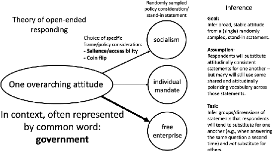
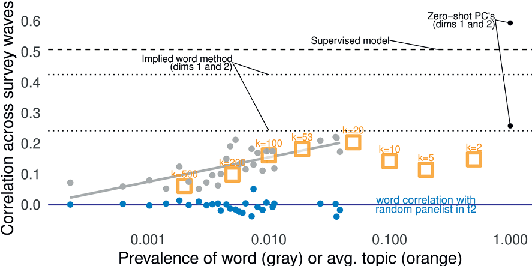
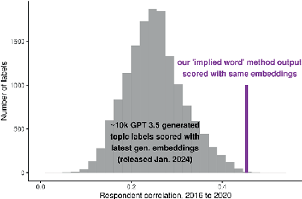

Published online by Cambridge University Press

https://doi.org/10.1017/pan.2024.23

Political Analysis (2025), 33, 231–251 doi:10.1017/pan.2024.23

ARTICLE

# Categorizing Topics Versus Inferring Attitudes: A Theory and Method for Analyzing Open-ended Survey Responses

William Hobbs1 and Jon Green2

1Department of Psychology and Department of Government, Cornell University, Ithaca, NY, USA; 2Department of Political Science, Duke University, Durham, NC, USA

Corresponding author: William Hobbs; Email: hobbs@cornell.edu (Received 25 July 2023; revised 14 April 2024; accepted 25 June 2024; published online 24 January 2025)

#### Abstract

Past work on closed-ended survey responses demonstrates that inferring stable political attitudes requires separating signal from noise in “top of the head” answers to researchers’ questions. We outline a corresponding theory of the open-ended response, in which respondents make narrow, stand-in statements to convey more abstract, general attitudes. We then present a method designed to infer those attitudes. Our approach leverages co-variation with words used relatively frequently across respondents to infer what else theycouldhavesaidwithoutsubstantivelychangingwhattheymeant—linkingnarrowthemestoeachother throughassociationswithcontextuallyprevalentwords.Thisreflectstheintuitionthatarespondentmayuse differentspecificstatementsatdifferentpointsintimetoconveysimilarmeaning.Wevalidatethisapproach using panel data in which respondents answer the same open-ended questions (concerning healthcare policy, most important problems, and evaluations of political parties) at multiple points in time, showing that our method’s output consistently exhibits higher within-subject correlations than hand-coding of narrow response categories, topic modeling, and large language model output. Finally, we show how large language models can be used to complement—but not, at present, substitute—our “implied word” method.

Keywords: text as data; word embeddings; automated content analysis; measurement error; political psychology Edited by: Jeff Gill

1. Introduction

Classic theories of the survey response in political science (Zaller 1992; Zaller and Feldman 1992) hold that most people have weak preferences on specific policy proposals and so give unstable responses to closed-ended items based on what happens to be at the “top of the head.” Partly due to concerns about top-of-the-head respondingandother responseartifacts,open-endeditems canbeausefulcomplement to their restricted, closed-ended counterparts. They allow for broader reflections of how respondents think about politics and their own beliefs (Feldman and Zaller 1992; Kraft 2024; Schuman and Scott 1987) andcan sometimes beusedtosidestepclosed-endedresponsestyleeffects (HobbsandOng 2023).

Open-ended responses have until recently been difficult to analyze at scale, though recent advances in natural language processing now allow for efficient document classification and categorization—with or without supervision from human labels (Gilardi, Alizadeh, and Kubli 2023; Mellon et al. 2024; Miller, Linder, and Mebane 2020; Yin, Hay, and Roth 2019). However, these advances have been concentrated in applications where researchers know how documents ought to be evaluated in advance—whether they reference specific constructs or meet specific criteria of interest1 —or in supervised settings where

1Recent work using LLMs for text scaling, for example, prompts the model to compare documents with respect to a researcher-supplied construct such as left/right ideology (Wu et al. 2023).

© The Author(s), 2025. Published by Cambridge University Press on behalf of The Society for Political Methodology. ThisisanOpenAccessarticle,distributedunderthetermsoftheCreativeCommonsAttributionlicence(https://creativecommons.org/licenses/by/4.0), which permits unrestricted re-use, distribution and reproduction, provided the original article is properly cited.

Published online by Cambridge University Press

https://doi.org/10.1017/pan.2024.23

differences in word use can be directly linked to an observed outcome such as respondent partisanship. Furthermore, methodological advances do not by themselves address deeper theoretical questions regarding the relationship between the respondent’s underlying attitudes and what they express on a survey. If capturing stable expressions of political attitudes is the goal—which can then inform researchers’ choices regarding what to label—methods for analyzing open-ended responses must be grounded in a theory of the open-ended survey response.

We argue that open-ended survey responses represent top-of-the-head expressions of more general attitudes—muchlikeclosed-endedresponses.Inourtheoryoftheopen-endedsurveyresponse,respondents first choose a high-level attitude to express in their answer. Because that general attitude may be abstract and difficult to express in words, they then come up with a more specific statement that is easier to communicate. This statement is an incomplete stand-in for a broader attitude—in the language of the closed-ended survey response, a sampled consideration from a underlying attitudinal distribution. Importantly, this means that the ability to accurately and narrowly classify what a respondent happened to say in anopen-ended responsewill notnecessarily be the same thing ascapturing the broader attitude theyexpressed(orarelikelytoexpressagain).Thelatterrequiresinferringthemoregeneraldistributions from which specific statements were sampled—an inherently unsupervised task toward which pretrained language models have not thus far been oriented. Practically speaking, this involves inferring a range of statements that could be substituted for what someone happened to say without changing what they generally mean—such that we can predict what they are likely to express in response to the same question later on.

With our theory in mind, we show that it is possible to use text data to infer which elements of openendedresponsesaremorelikelytoreflectstableresponsepatternsand,inlinewithlongstandingtheories of the survey response in political science, are more likely to reflect the range of political attitudes expressed in a corpus (though not guaranteed to, as we’ll discuss and evaluate). If many respondents use the same words when giving statements, and those words are associated with relatively polarizing sets of less frequently-used words, then those “contextually common” words may provide useful signals of the attitudes being expressed—even if they’d appear vague in more general contexts. In this, we leverage two premises about words used unusually frequently in political contexts: 1) they are re-used across a broad range of more narrow political statements that respondents tend to substitute for each other (and so they can be used to link those statements) and 2) when these words are used in politically distinct ways, they can take on symbolic and polarized meanings. For example, the average meaning of the word “people” in a focused political context may be closer to meanings like “the people”, “working people”, or “ordinary people” than its more general meaning—implying senses of the word that exclude (and place “the people” against) “politicians” and “the rich” (or, in some cases, out-partisans and racial out-groups). Using such a word can both convey meaningful political attitudes and also bridge sets of less common statements.

It is important to clarify that our claim is that contextually common words are particularly useful for inferring distributions of attitudes at the corpus level. At the document level, a person using common rather than rare words to express the same attitude does not necessarily mean that they have a more stable underlying attitude (they might, but that is unrelated). Three different respondents who strongly disapprove of the Affordable Care Act may articulate this disapproval using different specific terms (such as “free enterprise,” “individual mandate,” or “socialism”). We can infer that they intend to convey similarmeaningthroughtheseterms’co-occurrencewithwordsusedacrossmultiplerespondents(such as “government”, as in “big government”).

The usefulness of contextually common2 words may seem counter-intuitive to many text-as-data practitioners. There are almost certainly more rare words that are predictive of attitudes, and in a supervised setting these could be used to classify many specific outcomes. However, this can be easily driven by the far greater number of unique rare words compared to common ones overall (i.e., Zipf’s

2By contextually common we mean words that are often used to answer a specific prompt (e.g., “government”), which are far more informative in open-ended settings than words used frequently across all contexts (e.g, “I”).

Published online by Cambridge University Press

https://doi.org/10.1017/pan.2024.23

law) and a resulting base rate fallacy in evaluating the average importance of contextually common versus rare words. It is easy to identify a small number of rare words that are highly correlated with an outcome of interest, even when they are the exception rather than the norm. Without a known filter for uninformative rare words—and (in line with our goals here) a reliable means to link informative terms to more abstract concepts—many rare words will reflect a variety of idiosyncratic considerations that happened to be salient for the respondent at the time (i.e., what a respondent happened to think of when they answered the question), in addition to a core attitude that is more likely to be expressed in repeated measures.

Consistent with this theory, we show that 1) words commonly used to answer a focused openendedprompt—aswellasmoreprevalenthuman-codedcategories—tendtobemorestronglycorrelated over survey waves than rare ones; and 2) a method explicitly leveraging variation in contextually common word use to infer distributions of (polarized) statements provides efficient quantitative representationsofopen-endedresponses.Ourmethodoutperformsothertools,especiallytopicmodels, in terms of both test-retest reliability and in predicting high-level groupings of hand labeled political content.

After showing this performance, we provide recommendations for use of our approach—and words of caution. Although the method returns stable dimensions of responses, these dimensions are not guaranteed to conform to researcher expectations (such as recovering a left/right dimension, as many alternate scaling methods for behavioral data aim to—often by training on a subset of a data set that is more likely to be driven by left/right ideology). For example, it is possible for the primary variation in an open-ended response to be communication style, just as a closed-ended responses can be dominated by social desirability or acquiescence bias. As with any automated text method, ours requires in-depth validation of its output. The method also does not reveal all topics that can be labeled in a data set—just the ones that tend to be the most stable over time. As Grimmer, Roberts, and Stewart (2022) note, there is no globally optimal method when it comes to analyzing text as data.

Finally, we extend our method to demonstrate its practical usefulness in tandem and in comparison with common alternatives. We first provide a technique to describe the context-specific and potentially symbolic meanings of common words. We then demonstrate how our method’s output relates to that of tools like topic models and principal component analysis on the latest generation of contextualized embeddings. We find that these off-the-shelf methods —at times and under favorable conditions—recover similar information as ours. However, in our analyses, the most reliable means to find topics and embeddings dimensions with high test-retest reliability and the strongest correspondence with sets of hand labels is to assess correlations with the top dimension of our method’s output.

2. Background

Representative democracy assumes that citizens have meaningful attitudes on political matters that can be communicated to and considered by their representatives (Mansbridge 2003; Pitkin 1967). Without attitudes, and the ability to identify them with some degree of regularity, “democratic theory loses its starting point” (Achen 1975).

Early scholars of U.S. public opinion were skeptical that most citizens held political attitudes at all (Converse 1964, 1970). However, subsequent work (e.g., Achen 1975) salvaged the attitude in political science by highlighting a distinction between attitudes in survey respondents’ minds and attitudes measured with (hopefully random) error in surveys. Rather than expecting a one-to-one correspondence between attitudes and survey responses, it is more useful to consider attitudes as unobserved, probabilisticdistributionsandsurveyresponsesasdrawsfromthosedistributions.Statisticaltechniques that account for the measurement error inherent to the individual survey response, often by leveraging responses from multiple related items, allow us to learn more about the latent distributions of attitudes that produced them (Ansolabehere, Rodden, and Snyder 2008; Fowler et al. 2023).

Published online by Cambridge University Press

https://doi.org/10.1017/pan.2024.23

## 2.1. The (Closed-Ended) Survey Response

The dominant model of the survey response in political science, (Zaller’s 1992) Receive, Accept, Sample (RAS) model, incorporates these perspectives to account for empirical regularities in mass opinion research. In this model, individuals receive varying amounts of information about political matters, accept or reject that information based on their political predispositions, and sample from “considerations”—or discrete elements of relevant information—that they have previously accepted when they encounter questions on surveys. The survey response is interpreted as an average of the considerations that were accessible to the respondent when they answered.

Especially for the majority of citizens who do not pay close attention to politics, responses are often constructed on the fly, and based on whichever considerations happen to be available when questions are posed. As many citizens hold considerations that carry divergent implications for matters of public policy—they may, for example, value both freedom and equality (Feldman and Zaller 1992) or civil rights and public safety (Nelson, Clawson, and Oxley 1997) —contextual factors that influence which considerations are made salient can alter responses to similar or even identical questions (Asch 1940; Wilson and Hodges 1992).

## 2.2. Open-Ended Responses

The typical mass opinion survey, for which the RAS model was designed, involves closed-ended survey items in which the respondent selects from a pre-determined list of potential answers to each question. Open-ended responses do not similarity limit response options, but the task of mapping articulated responses to underlying attitudes remains challenging. Qualitative categorization of openended responses often do not match closed-ended responses to otherwise similar questions (Schuman and Presser 1979; Schuman and Scott 1987), and researchers’ interpretations of respondents’ answers can differ from those of the respondents themselves (Glazier, Boydstun, and Feezell 2021).

Nonetheless, past (largely qualitative) work on open-ended responses suggests that this mapping is in principle feasible. When posing obscure and almost certainly unfamiliar policy proposals to respondents, Schuman and Presser (1980) found that many who could not be said to have a preference on the specific proposal nevertheless tried to use the opportunity to convey a more general attitude.3 In their analyses of open-ended responses, Zaller and Feldman (1992) identified a dizzying number of different “frames of reference” respondents used to approach different policy proposals, but the vast majority of responses had a clearly-identifiable “directional thrust” that reflected their more general disposition.

## 3. Theory of the Open-ended Survey Response

Our theory of the open-ended response broadly follows the RAS model (Zaller 1992) in that we assume responses represent top-of-the-head expressions of accessible considerations when evaluating the “attitude object” given by a prompt, but differs in the relationship between sampled considerations and the eventual response. In closed-ended responses, some considerations may be more accessible than others, but respondents still average across those that come to mind before selecting a response option. For open-ended responses, we argue that 1) some parts of the responses reflect considerations that are more chronically accessible, and are therefore likely to have served as the starting point for the respondent; 2) it is possible infer these more accessible parts of responses when studying text (even without panel data, though it’s better to have it); and 3) these more accessible considerations better reflect what could be recognized as stable attitudes.

In our model, the respondent begins with an initially drawn directional thrust. They then sample specific, related considerations in order to satisfy the expectations of a composed response, and to

3Schuman and Presser (1980) analyzed closed-ended responses in combination with interviewers’ records of comments respondents made when answering them.

Published online by Cambridge University Press

https://doi.org/10.1017/pan.2024.23

Figure 1. Inferring broad, stable attitudes from respondents’ individually sampled, stand-in statements. Vocabulary shared across many statements will become contextually common, and some subset will also be attitudinally polarizing. We argue that we can use these words to infer broad, stable attitudes. In doing so, we discount relationships among rare words, but still leverage rare words’ corpus-level associations with more contextually common words.

communicate their attitude sincerely and efficiently. While some respondents may have more to say than others, they will still not cover every topic they could have discussed and may elaborate on a single, sampled topic consistent with the thrust of their attitude.

In this setting, we expect that words used relatively frequently in the context of the survey prompt (though not necessarily words used frequently across all contexts; see Figure F.1, which shows that these wordsaremoderatelycommoninAmericanEnglish)arelikelierthanrarewordstoreflectthedirectional thrust of responses. This is at least in part because contextually common words are likelier to reflect symbolic language, which allows the respondent to efficiently convey a large amount of topic-dependent meaning.Symboliclanguageisextremelycommoninpolitics,aspoliticalelitesandthecitizenswhotake cues from them contest and reshape the meaning of particular words and phrases in specific political contexts (Edelman 1985; Lasswell, Lerner, and de Sola Pool 1952; Neuman, Just, and Crigler 1992). For example, when someone asked to explain why they oppose the Affordable Care Act says that they object to “big government,” we do not necessarily expect that they are articulating a broadly libertarian ideology that would extend to other issue contexts such as military spending. We instead understand their use of the term to symbolize objections to redistribution and new government interventions into the private health insurance market—and we can do so because “government” is mentioned relatively frequently when people express their (negative) attitude toward the Affordable Care Act. There are a variety of different ways people express this more general attitude, and in context we would understand any of these specific expressions to convey a similar meaning.

Especially in short text settings, such as open-ended survey responses, we expect people to rely on symbolic language to express their attitudes efficiently. For example, even if respondents would have troublepreciselydefining“biggovernment,”wecanstillinferwhattheymeanbasedonhowotherpeople tend to use it in similar contexts. Frequently used words that have many context-specific associations, both in terms of words they regularly appear with and words they consistently do not appear with, are therefore likelier to reflect general political attitudes. This intuition is reflected in Figure 1, where multiple related terms are linked through their shared relationship with the word “government”, and we provide example responses in Supplementary Information (SI) Section G.

4. Scoring Common Words

Our approach to inferring attitudes boils down to calculating a score that measures whether a document is ‘about’ a contextually common word—whether or not the word was itself used—and then applying

Published online by Cambridge University Press

https://doi.org/10.1017/pan.2024.23

dimensionality reduction to summarize covariation in those “implied word” scores. The goal is to estimate the extent to which one could substitute what the respondent happened to say with other statements without changing what they meant—and through this, infer what statements a respondent could have made consistent with the same general attitude.

Importantly, and in contrast with common practice in many text analysis approaches (e.g., tf-idf weighting), this approach works in part by discarding some information—particularly associations among rare words—that is on average likely to reflect noise rather than signal with respect to stable attitudes. As with most common approaches, including topic models and sentiment analyses, our approach produces a list of words and associated scores on a dimension. It differs in attempting to estimate dimensions and word scores that better reflect stable responses and the underlying attitudes that produced them. Although we develop this theory and method with the English language in mind (and our tests are limited to the US political context), we believe that it can be readily extended, with appropriate validation, to other languages and applied to non-US contexts.4

We begin with a fully in-sample method to illustrate our broader points about measurement error and the context-specific and symbolic meanings of common words. We then in Section 7 demonstrate how it can be augmented with pre-trained embeddings to improve both performance and interpretability. It is likely that large language models will eventually outperform methods that rely on in-sample data. However, at present, large language models on their own are unlikely to account for symbolic uses of words that are relatively common across respondents in a fully unsupervised setting—without the researcher providing relevant context and guidance. To maintain our substantive focus, full details of this method are included in the SI (Section B.6, which is an unabridged version of this text; and Appendix Section C, which is an explanation with annotated R code).

We compare a document-term matrix to a matrix that stands in for the respondent sampling distribution (the range of considerations to sample from) when a document is about an implied word. That matrix contains conditional distributions of co-ocurring words in all responses to the same or closely related promptsi.e., across documents that contain the word “people”, what fraction of (unique) words in those documents was the word x.

To compare documents’ stated words to the implied words’ sampling distributions, we use Bhattacharyyacoefficients(whichmeasureoverlapinprobabilitydistributions)foreverywordinthecorpus. Regardless of whether a document uses the word “people”, we still calculate whether the distribution of words in the document resembles the distribution of words for all other documents in the corpus that did use the word “people.”

Concretely,foradocumenti,statedword(s)j,andimpliedwordk,thefollowingcalculationproduces a document similarity score for word k in document i (a word that the document might be “about”):

p

gjk ∑pj=1(gjk)

dij ∑pj=1(dij)

mik = BC(di,gk)ik =

∑

j=1

where dij is an element in the original document-term matrix (whether word j was used in document i), gjk is an element in the corpus conditional word co-occurrence matrix (approximately: of respondents who used the word k, the fraction who also used the word j), and mik an element in the transformed document-term matrix (whether document i appears to be “about” word k).

In Table 1, we illustrate this process for a document that states: “they spend too much”. We compare this document to the conditional distributions of common words in the corpus, using the words people, issues, beliefs, candidates, help, and waste as these words (in our later analyses, we exclude stop words like “they” and “the”). This calculation shows that, although this document does not explicitly use the word waste, the method identifies waste as the most likely “topic” of the sentence.

4The method’s performance may depend more heavily on pre-processing steps to convert responses to a document-term matrix for some languages (e.g., word segmentation algorithms for Chinese), and the performance of extensions using large language models in other languages may depend on the quality of the training data for those models.

Published online by Cambridge University Press

https://doi.org/10.1017/pan.2024.23

Table 1. We illustrate calculations for the transformed document-term matrix. Each row of the transformed matrix is standardized (see text) prior to singular value decomposition. The leading dimension of this method will capture the number of words and use of more common words across documents, and the next will be the first substantive dimension.

they spend too much [ ]

√ dij

∑pj=1(dij) = 0.5 0.5 0.5 0.5

j′s ↓ k′s → people issues beliefs candidates help waste ⎡

⎤

they 0.17 0.16 0.15 0.16 0.18 0.16 √ gjk

∑pj=1(gjk) = spend 0.03 0.03 0.02 0.02 0.03 0.08 too 0.06 0.08 0.05 0.07 0.06 0.11 much 0.06 0.06 0.06 0.07 0.06 0.11

⎢ ⎣

⎥ ⎦

people issues beliefs candidates help waste

⎡ ⎢ ⎣

⎤ ⎥ ⎦

they spend too much 0.16 0.16 0.14 0.16 0.17 0.23 they represent the middle class 0.23 0.19 0.18 0.18 0.24 0.17 their stance on abortion 0.11 0.19 0.18 0.14 0.10 0.12

Importantly,thisapproachwillmoreheavilyweightcommonwordsthanrarewordsanddosoacross all of the comparisons (see SI Figure B.2)

To better understand the broad associations of different common words across a corpus, we need to usesome form of dimensionality reduction. We usesingular value decomposition. Because this captures dominant sources of variation in the data, the singular vectors from this provide the top candidate dimensions that could represent (polarization in) attitudes (after the leading dimension, which captures overall prevalence).

Prior to applying SVD, we standardize the data, weight training data so that each survey wave is treated equally (in the ANES, recent waves are far larger with added online samples), and run SVD only on theqmostcommon wordsinthe corpus.Forouranalysesbelow,werestrictqtothenumber ofwords whose squared frequency is greater than the average squared frequency. We show in the appendix that we see the same results for word frequencies simply greater than the average frequency. However, with that setting, the dimensions are sometimes highly correlated with each other, which could exaggerate the reliability of the findings.

Resulting word scores are G⊺V. Document scores are produced from the matrix multiplication D(G⊺V) and then standardized so that each observation has a Euclidean norm of one. In this, D represents the document-term matrix, G the standardized word co-occurrence matrix/sampling distribution matrix (truncated to all words’ co-occurrences with common words—so that, after the multiplication G⊺V, we are able to score uncommon words in our document-term matrix), and V the right singular vectors of singular value decomposition of M, the transformed document-term/“implied word” matrix. We illustrate this process with (working) R code in SI Section C.

When listing keywords, we multiply word scores by the square root of words’ frequencies and then report the top words with the largest values on each side of the scale. This multiplication ensures that the keywords reflect the influence of common words on the scaling process, as illustrated in Figure B.2—we treat common and rare words equally when assigning document scores.

4.1. Scoring Common Words with Large Language Models?

It is possible to create a version of the transformed document-term matrix we described in the previous section—whether a document is “about” a common word—using large language model based zeroshot classification. We evaluate the out-of-the-box performance of zero-shot classification by classifying

Published online by Cambridge University Press

https://doi.org/10.1017/pan.2024.23

whether a text is “about” the top 1,000 words in each corpus. For this, we use the BART language model (Lewis et al. 2020) fine-tuned on the MNLI corpus, as described in Yin et al. (2019) and implemented in the python package “ktrain” (Maiya 2022).5 To match the numbering of the implied word method, we label principal components starting at 0—across these methods, the dimension with the largest variance typically captures some form of prevalence. In the SI, we show that using PCA on the last layer of BERT sentence embeddings (Devlin et al. 2018) performs notably worse than zero-shot classification for this purpose.

In the SI, we contrast the common word approach with an approach that emphasizes “response distinctiveness”,meaningresponsescategorizedbyhowdifferenttheyseemcomparedtootherresponses in a corpus.

## 4.2. Topic Model Comparison

We compare our method to topic models across many settings of k (the number of topics), since many topic model users will try multiple specifications before settling on a preferred model and, unlike our scaling method, topics are unordered. With this output, we assess the fraction of topics that match the performance of the implied word method on test-retest reliability and hand label correspondence, as well as the extent to which a topic’s correlation with the top dimension of our implied word method predicts the topic’s performance. This evaluates whether topic models tend to produce more unstable outputs than stable ones, and whether our method can be used to improve the selection of more stable topics.

## 4.3. Hand Label Comparison

If more frequently-used words (for a given prompt) are likelier to reflect the directional thrust of an attitude, text labels corresponding with those words should also be more likely than labels for lessfrequent words to be attitude-like. If a hand labeling codebook is iteratively expanded to include more infrequent and narrow statements, which we argue are often randomly selected by respondents to convey a broader directional thrust, this expansion is unlikely to reflect attitudes. Given this, we assess whether common labels are relatively strongly correlated over time than more rare and fine-grained ones.

## 4.4. Supervised Comparison

To contextualize our results, we compare test-retest reliability and associations with hand labels for the unsupervised method outputs described above with supervised text classifiers. These supervised benchmarks are trained on closed-ended ACA favorability (for the ACA attitudes analyses) and partisanship (for the ANES analyses). For these models, we use a ridge regression on document-term matrices, with lambda selected by cross-validation using the ‘glmnet’ package in R (Friedman et al. 2021).

## 4.5. Using Embeddings to Describe Dimensions and Add Rare Words Back in

After we use common words to identify stable attitudes overall, we can then use recently-developed embeddings to better score individual documents (e.g., more accurately placing uses of rare words on the identified dimension). See Section 7 for details on how we embed the implied word method.

5Using ChatGPT to produce the 96 million total annotations in this way would currently be prohibitively expensive. While it was possible to drastically reduce the cost by returning multiple labels for multiple responses at once Mellon et al. (2024) and sampling documents, we found that ChatGPT returned labels that were far too narrow (e.g., only a handful of related terms out of hundreds for each document, even when using model log probabilities). We abandoned this effort when we found that the latest generation of embeddings, also from OpenAI, worked much more reliably.

Published online by Cambridge University Press

https://doi.org/10.1017/pan.2024.23

5. Tests and Data

We have proposed a theory of open-ended survey responses and argued that this theory can help us infer attitudes in open-ended survey data. We present multiple tests of this theory, and further consider whether our approach complements rather than solely duplicates closed-ended responses.

First, we compare within-subject response stability over time for common words and the top dimensions of our implied word method to that of rare words and topics. This evaluates whether we have succeeded in identifying broad topics and concepts that respondents will tend to substitute for each other because they are consistent with the same underlying attitude.

Second, we assess whether automated methods that perform well on response stability also capture the political topics chosen by survey administrators, as labeled by human coders. This test, in addition to our analysis connecting our results to past literature, is intended to rule out the possibility that unsupervised outputs that are highly correlated over time merely reflect communication style rather than variation in political content. Qualitative labels were presumably considered politically relevant, potentially important, and not merely a reflection of communication style. In this, we evaluate whether there is an organization of these labels that predict common words’ directional thrust, rather than attemptingtopredictthemlabelbylabel.Relevanttoourtheory,wehavearguedthattheexactstatement willoftennotreflectunderlyingandstableattitudes,whichweillustratebyassessingtest-retestreliability of human-coded labels.

Finally, and connecting the findings to past literature in political science, we demonstrate that our method recovers substantively meaningful variation in responses, even in cases where it does not reproduce a closed-ended stance (such as partisanship). If open-ended responses merely reflected closed-ended responses, there would be little point to including them in surveys.

After these tests, we provide an additional analysis that combines our approach with embeddings, and also provide techniques and guidance on how to better describe the content of a dimension, more accuratelyscoredocumentsonthatdimension,andassesspotentialproblemsintheuseofthemethodincluding outliers, corpus “context size”, and potential response style effects.

5.0.1. Data

Weusethreeopen-endedsurveyquestionsfrommajorU.S.surveysforourprimaryanalyses,inaddition to social media posts from Twitter for an auxiliary analysis in the SI (Figures D.1 and D.2). These questions are particularly useful for three reasons. First, panel data is available for all of them. Second, most include qualitative hand-labels chosen by the survey administrators. Third, they each appear in a large number of studies over time.

Specifically, these questions are:

- • 1) “Could you tell me in your own words what is the main reason you have (a favorable/unfavorable) opinion of the health reform law?” (2009–2018—14,278 responses) For 2009, this question was “What would you say is the main reason you (favor/oppose) the health care proposals being discussed in Congress?”
- • 2) “Is there anything in particular that you (like/dislike) about the (Democratic/Republican) party? What is that?” (1984–2020—62,798 responses)
- • 3) “What do you think is the most important problem facing this country today?” (1984–201622,983 responses)

The panel data for the two ANES questions come from the small 1992 to 1996 panel study and the much larger 2016 to 2020 panel study. We also have a large sample for the open-ended question about the Affordable Care Act—a panel of respondents in the ISCAP study (Hopkins and Mutz 2022) for the 2016 through 2018 period. However, for the ACA panel and the 2016 to 2020 ANES panel, we do not have hand labels. More details on these data sets and coverage years can be found in Section A.2 of the appendix.

From the available ANES data, we excluded most important problem data from 2020. In 2020, many responses mentioned the COVID-19 pandemic, and, because of the uniqueness of those responses (i.e.,

Published online by Cambridge University Press

https://doi.org/10.1017/pan.2024.23

little overlap in vocabulary with other years) automated methods assign unique dimensions and topics to 2020 content. Meaning, automated methods produce dimensions and topics that capture whether a response comes from the year 2020. We return to this 2020 data in Sections 7 and 8, however, where we explore extensions and limitations of the method, including a means to assess when an open-ended corpus (or other text corpus) may be too broad for our method to work well.

6. Results 6.1. Correlation Over Time

Attitudesreflectgeneraldispositionsthatpeopleapplyrepeatedlywhenthinkingaboutpoliticalmatters. Our first tests consider the accessibility of common words and the tendency of respondents to re-use common words, above and beyond what we would expect based on their frequencies. We then evaluate whether common human-coded labels and the common-word based dimensions are more strongly correlated over time than less common labels and topics from topic models.

6.1.1. The Affordable Care Act

The left panel of Figure 2 displays correlations across the 2016 and 2018 waves of the ISCAP study. It compares correlations for specific words, topics, and the top dimensions of our implied word method. We conduct a permutation test (in blue—word correlation with a random panelist in t2) to show that higher overall frequency does not mechanically produce a stronger correlation.

The figure shows that usage of common words, prevalent topics, and the top dimensions of our implied word method are more strongly correlated across waves than rarer words and less prevalent topics. Further, prevalent topics (averaged here, but separated in SI Section E.1 and in ANES analyses below) are on average as correlated within-user as the most common words.

Figure 2. Top: Correlation in word use, topics, and document scores over time in open-ended survey responses. On average, contextually common words and topics are more correlated than rare words over time. Dotted lines are from unsupervised model dimensioncorrelations.Npanelists=1,094.Bottom:Keywordsfromfirstsubstantivedimensionforco-occurrencebasedimpliedword method and zero-shot principal components.

Published online by Cambridge University Press

https://doi.org/10.1017/pan.2024.23

| | | |
|---|---|---|

| | | |
|---|---|---|

| | | |
|---|---|---|

| | | |
|---|---|---|

| | | |
|---|---|---|

Figure 3. Each measure is ordered by prevalence (hand labels), correlation with the implied word method (topics), or variance explained (automated methods). 1992–1996: N panelists = 193 (party likes/dislikes); N panelists = 270 (most important problem). 2016-2020: N panelists = 2,053 (party likes/dislikes).

Promisingly, the first substantive dimension from PCA on the zero-shot “implied word” matrix outperforms all other approaches in test-retest reliability. However, as shown in the keywords table below in Figure 2, this performance appears to be driven by the zero-shot model’s ability to detect sentimentreflecting generally positive or negative words that we would not expect to vary across political contexts. Recall that this open-ended question followed a closed-ended question regarding favorability toward the ACA. Reproducing this sentiment adds little additional information to the closed-ended response. By contrast, the first dimension that emerges in our approach recovers substantive differences in how respondents think about the Affordable Care Act—spanning concerns about the role of government, on the one hand, and access to affordable health care on the other.

6.1.2. The “Most Important Problem”’ and Partisan Likes/Dislikes

We next compare approaches using open-ended responses that are less strongly related to partisanship than the ACA.6

Figure 3 displays within-subject correlations in the 1992–1996 and 2016–2020 ANES panels for a supervised text model, the most frequent human-coded categories ordered by prevalence, the implied word method, zero-shot principal components, and topics from several models with different settings of k (the number of topics). ‘Keywords’ in the 2016–2020 panel combined multiple search termse.g., abortion represents a search for “abortion—prolife—prochoice—pro-choice—pro-life—right to choose—roe.” We were able to analyze these keywords in this 2016-2020 analysis because the 2016– 2020 panel is much larger than the 1992–1996 panel. There are no hand labels for years 2016 and 2020.

6In our data, closed-ended ACA attitudes and partisanship are correlated at about 0.6.

Published online by Cambridge University Press

https://doi.org/10.1017/pan.2024.23

These comparisons illustrate two key points. First, the principal components from zero-shot classification are less reliable than the most prevalent labels and the top dimension of the implied word method. This method appears to discover variation in responses that might be meaningful in more general contexts, but that does not predict re-use across survey waves. Keyword tables for zero-shot PCA output are in SI Tables E.4 and E.6. Second, the most strongly correlated dimensions from our (unsupervised) implied word method are on par with a supervised text model trained to predict 7 point partisan identification. In the comparison to topics models, a few of the topics perform as well as the impliedwordmethod,buttheyarerareandtendtothosemosthighlycorrelatedwiththefirstdimension of the implied word method.

In SI Section E.3, we further illustrate our topic model findings using a subset of topics, from a model with 69 topics, that we deemed to be especially coherent. There, again, we show that topics—whether or not they have coherent sets of keywords—are often not very strongly correlated within-individual over time.

6.2. Higher Order Structure for Coding Schemes

We next consider associations with human-coded labels of political content. This assesses whether the implied (common) word dimensions and other unsupervised outputs might merely reflect communication style, rather than both being highly correlated over time while also reflecting structured variation in substantive political content.

We do not assess whether we can automate the hand labeling of responses. We have already evaluated whether hand labels themselves were highly correlated over time. For those tests, most of the texts were already hand labeled and a perfect supervised method would merely reproduce those labels.

- 6.2.1. The Affordable Care Act In Figure E.1 in the appendix, we show that the ACA attitude text dimensions with high test-retest reliability (from both our implied word method and its zero-shot analog) also correspond with labels assigned by survey administrators. They do not merely reflect writing styles.
- 6.2.2. The “Most Important Problem” and Partisan Likes/Dislikes Figure 4 displays the multiple R (the bootstrapped 95% confidence interval) for each dimension of each measure studied in the test-retest analysis. This assesses whether we can predict the automated measure using the human-coded labels, restricted to labels that appear at least 10 times and over 8 waves (leaving theremaininglabelsasareferencegroup).Weconsiderwhetherthecombinationofhuman-codedlabels is likely to be politically meaningful in the next section.

This figure shows that, again, the top dimensions produced by the implied word method tend to be strongly correlated with the human-coded labels, and at a level on par with a supervised model using the text to predict party identification. Similar to the test-retest analysis, some topics also carry relatively strong associations with the human-coded labels, although this pattern is less consistent and tends to appear for topics more strongly correlated with the first dimension of the implied word method.

We supplement these tests ruling out mere communication style effects in Section 8.

- 6.3. Novelty, Correspondence with Political Science Theory, and Political Context

We now turn to the question of whether dimensions of the method that are correlated over time and that can be predicted by human-coded labels are a) politically meaningful and b) “novel”.

In Table 5, we show the associations between the first dimension and the non-collapsed ANES human-coded labels of the likes and dislikes open-ended responses. The first dimension reflects issuebased versus group-based justifications for party likes and dislikes. These labels are from the same

Published online by Cambridge University Press

https://doi.org/10.1017/pan.2024.23

| | | |
|---|---|---|

| | | |
|---|---|---|

| | | |
|---|---|---|

| | | |
|---|---|---|

| | | |
|---|---|---|

| | | |
|---|---|---|

Figure 4. Do more prevalent topics and the top implied word dimensions merely reflect communication style? Or do they reflect variation in politically meaningful content? This analysis tests correspondence between automated methods and combinations of ANES hand labels for categories of political content—multiple R (bootstrapped 95% confidence interval) for each dimension of each measure studied in the test-retest analysis. In each regression, the dependent variable is the automated text analysis output and dependent variables are dummies for hand labels. N respondents = 8,787 (party likes/dislikes, 1984–2004); N respondents = 11,776 (most important problem, 1984–2000). Figure E.5 further shows strong associations between issue preferences and the top implied word dimension, with divergence from party-line stances on social versus economic issues.

analysis as in Figure 4, where the dependent variable was the text measure and the independent variable was an indicator representing each label. These are ordered by the value of their regression coefficients.

This is notable because it closely corresponds with the higher “levels of conceptualization” Converse (1964)identifiedinqualitativeinterviewswithmembersofthemasspublicregardingthebasesonwhich they evaluated political objects. In analyzing these interviews, Converse differentiated “ideologues” and “near-ideologues” who referenced abstract concepts along the liberal-conservative spectrum when articulating their likes and dislikes of parties and candidates from those who evaluated these objects with respect to particular social groups. Here, the first dimension of the likes and dislikes differentiates respondents who reference policy issues with clear ideological valence (abortion, gun control, immigration, e.g.,) and ideological concepts themselves (conservative) from those who reference more general class distinctions and distributive politics (rich, poor, working/middle class, help).

InFigure5,weshowthatresponsesintheANEShaveshiftedonthisdimensionovertime.Compared to responses from 1984 through 1992, open-ended responses about party likes and dislikes in 2012 through 2020 were far more likely to mention issue-based/ideological likes and dislikes over group (in this data, largely based on income), performance, and candidate-based concerns. This is consistent

Published online by Cambridge University Press

https://doi.org/10.1017/pan.2024.23

Figure 5. Average party likes/dislikes response in the ANES over time—first dimension of the implied word method. More negative is more issue focused and more positive is more group focused. Hand labels are largest magnitude coefficients from the regression analysis in Figure 4. Responses have become more issue focused over time, in line with research on partisan polarization (Webster and Abramowitz 2017) and issue constraint (Hare 2022).

with work showing increases in issue-based polarization (Webster and Abramowitz 2017) and issue constraint (Hare 2022) over this time period, and extends these findings to suggest that a greater share of citizens are evaluating political parties and candidates in ideological terms.

7. Using LLM’s to Better Describe Dimensions and Score Documents

Our “implied word” method identifies dimensions in text that tend to be highly correlated over timeconsistent with a method that identifies topics/concepts that can be substituted for each other in an attitudinally consistent way. However, without pre-existing hand labels, it may be challenging to efficiently describe the contents of a dimension to the reader of an article who may not have access to many of the texts to read themselves, since our method relies on context-specific and potentially symbolic meanings of words.

Given this problem, we developed a generative AI and embedding technique for generating more descriptive labels for dimensions. We use generative AI to produce labels for each document in our corpus, prompting ChatGPT 3.5 (through an institutional account on the Microsoft Azure platform, which provides greater data privacy assurances than OpenAI’s platform) to provide a few topical categories for each open-ended response (see SI Section H.1 for prompt). From there, we used OpenAI’s v3largeembeddings(throughAzure),whichtheyreleasedinJanuary2024(duringreviewofthispaper), to embed each of those topical categories – submitting each open-ended response and a prompt (see SI Section H.2 for prompt) to the embedding API for a document-level embedding.

Published online by Cambridge University Press

https://doi.org/10.1017/pan.2024.23

Figure 6. The top panels of this figure display the topic labels with the largest positive and negative cosine similarities for the embedding of our implied word method’s first dimension, sized by relative cosine similarity. These labels are useful because our method relies on context-specific and potentially symbolic meanings of words, and lists of those words can be difficult to interpret in isolation. The bottom panel of this figure displays 2016-2020 respondent correlations for scores of approximately 10,000 topic labels generatedby GPT 3.5 on the party likes anddislikes data, andthe correspondingcorrelationfor the embeddedversionof our method. Because these labels’ embedding scores are not stochastic, lower correlations reflect changes in the respondents’ answers across waves.

To embed the open-ended responses on our implied word dimension, we multiply the centered document implied word scores by the document embeddings and then average the embeddings (i.e., an average for each 3,072 embedding dimensions) across all documents for an embedded version of our implied word scores. We then calculate the cosine similarity for each category embedding and the implied word embedding vector. The labels for each dimension are then those with the top 100 most positive and most negative cosine similarities. We provide R code to reproduce this process at the end of our code walk-through in SI Section C.

We illustrate these categories for the first dimension of the party likes and dislikes data in the top panels of Figure 6. These are consistent with hand labels, though with more labels differing on social versus economic dimensions than the hand labels and with less of a candidate focus on the representation side of the output. The candidate focus is prominent in the embedded output again in the 2016 re-analysis described below, as shown in the labels in top panels of SI Figure H.2.

7.1. Using Embeddings to Better Score Implied Words Dimensions at the Document Level

Once we have embedded our implied word dimension, it is straightforward to then ask whether this embeddedversionhasthesameorbetterperformancethantheoriginal.Thismattersbecausewechange the meaning of a dimension somewhat after this embedding process, but we are likely to have more

Published online by Cambridge University Press

https://doi.org/10.1017/pan.2024.23

accurately scored documents on the implied word dimensions (i.e., our method focuses on finding a reliable dimension in aggregate, but may exhibit high variance at the document-level). With the implied word embedding described above, we then score each document on that embedded dimension by calculating each document embedding’s cosine similarity with the implied word embedding (a separate embedding for each dimension of the implied word method output—though we focus in the main text on dimension 1).

We test this in Figure 7, where we find equal or improved performance for the latest generation embeddings (and much poorer performance for the older generation, represented by BERT). Further, when the embedding process is successful, PCA on those embeddings tends to perform relatively welland not very far below the performance of the embedded implied word method in terms of test-retest reliability. Unfortunately, we cannot verify that these embeddings will work well across all contexts, however—and this may be difficult to assess ahead of time, since training data details are not public for these models, even to our knowledge the latest generation of “open-source” models. We suspect that the data sets we analyze here, or online conversations closely related to them, are now relatively likely to be included in LLM training data.

For the test in 2020, the most important problem question was challenging to analyze because so many responses mentioned the COVID-19 pandemic. It was excluded from our earlier analyses and training data for the most important problem because of this. However, we discovered that over a shorter 4 year interval (rather than close to 40 years), even with a pandemic, the difference between 2016 (only) and 2020 in terms of common word use (i.e., correlation in square root word frequencies) was no larger than other 4 year periods (bottom panels of Figure7—seenextsection formorediscussion of this test). Given this, we retrained our implied word method using just 2016 as training data for both ANES questions. This gave us an extra test for our added, latest generation embedding analyses, and also allowed us to better compare test-retest reliability with cross question test-retest reliability (see below).

8. Evaluating Style Effects, Corpus Context Size, and Outliers

Below, we use the two open-ended questions in the ANES to further assess possible style effects. If our first dimensions represent communication style only, then we might observe strong correlations over time between different questions. Figure 8 shows that high test-retest reliability across our first dimensions applies only to test-retest on the same open-ended question. In the 2016–2020 panel, the second dimension of the most important problem implied word scores is more strongly correlated with the first dimension of the likes/dislikes scores (slightly over 0.1 and higher than the null of 0.02).

This test is not definitive—ideally, we would have a method that would be able to capture shared politicalcontentacrossmultiplequestions,includingthesequestions.Wethankareviewerforthisbroad recommendation, although we recognize that completely unrelated questions or a political versus nonpolitical question would be preferable.

Next, because the method relies on uses of common words and associations between rare words and common words, we can end up with rare terms that have not been very accurately scored on our dimensions, leading to outliers in the document-level scores. This issue can be corrected by using embeddings (if we are willing to trust the performance of often opaque embeddings)—or we can simply assess potential outliers visually by plotting and looking for outlying observations in word scores and document scores.

Last, the context covered in some corpora may be too large for our method to work well—for example, when what is contextually common for one subset of the data is not contextually common for the other. For this, we can split the data on some variable that may drive overly large context size (and a contrastthatweknowwedonotwantthemethodtoidentify—e.g.,pandemicversusnon-pandemicyears) and assess the correlation in word frequencies across that contrast. We showed this in Figure 7 where, indeed, we find that 2020 is dramatically different from other years in the most important problem data set.

Published online by Cambridge University Press

https://doi.org/10.1017/pan.2024.23

| | | |
|---|---|---|
| | | |
| | | |

Figure 7. In the top panels of this figure, we display test-retest correlations for the first dimension of our embedded version of our method,alongwiththefirstPCAdimensiononBERTandOpenAIv3embeddings(top10dimensionsandhandlabelanalysesshownin SI Sections H.5 and H.6). In the bottom panel of this figure, correlations in square root word frequencies, and so contextually common wordsandtheirassociates,divergein2020forthemostimportantproblemquestion,butarestillsimilartothosein2016.Blackcircles around the points indicate survey waves that are 4 years or fewer apart.

Published online by Cambridge University Press

https://doi.org/10.1017/pan.2024.23

Figure 8. Within-question and cross-question wave-to-wave correlation coefficients. N 1992 post-election most important problem to 1996 pre-election party likes/dislikes: 217. N 2016 post-election most important problem to 2020 pre-election party likes/dislikes: 2306.2016-2020.Notethatthe2016–2020analysisisbasedontheimpliedwordmethodtrainedon2016(seetexton“contextwindow” andpandemicrelatedissuesinthemostimportantproblemanalyses).Thedottedlineindicatesthenullvalueofanormedcorrelation coefficient Green et al. (2024).

9. Discussion

Advances in natural language processing have made it possible to organize and code open-ended survey responses inexpensively at scale. However, improvements in the speed and accuracy with which researcherscanlabeltexts(andinmanydifferentways)aremoreusefulforsometasksthanothers.These tools can be transformative if and when they allow researchers to tackle more fundamental challenges in measurement.

Toward this goal, we suggest that the key insights of studies on attitudes in closed-ended responses (Achen 1975; Ansolabehere et al. 2008; Converse 1964; Zaller 1992) should be applied to the study of open-ended responses. Respondents have many different, narrow ways to express a broad attitude regarding a specific prompt. This being the case, the ability to efficiently categorize what was said in a single document—i.e. the task for which off-the-shelf large language models are extremely useful at present—is not the same thing as capturing the underlying attitude that document is expressing (and thatarespondentislikelytoexpressagain),whichisoftenwhatresearchersaremoreinterestedindoing.

However, we argue that this task is not wholly intractable. Despite randomness in parts of their answers, if respondents start with a directional thrust, we still expect them to choose some words that reflect more generalizable meaning. This has two key implications for future work concerning attitudes in short text documents such as open-ended survey responses. First, observing how multiple respondents respond to the same prompt is important for capturing the symbolic elements of language that can be used to communicate attitudes. Second, contextually common words (and, more abstractly, common concepts used when responding to a prompt) will be more useful than rare words for inferring distributions of attitudes.

Our tests support this argument. Contextually common words and text dimensions summarizing variation in how much texts are (symbolically) “about” common words show high within-subject correlation over time and can be predicted by human-labeled categories. Without fine-tuning to better capture the symbolic meanings of words in local (i.e., in-sample) context, the output of large language models is less informative of attitudes—even for dimensions of such output that capture a large amount ofbetween-subjectvariation.Incontrast,theoutputfromourimpliedwordmethod—whichcanthenbe augmented with pre-trained embeddings—efficiently accomplishes this unsupervised inferential task, reproducing findings (such as Converse’s “levels of conceptualization”) that would otherwise require

Published online by Cambridge University Press

https://doi.org/10.1017/pan.2024.23

labor-intensive qualitative analyses of open-ended responses, and would be difficult to elicit in either a closed-ended setting or by using standard topic modeling approaches.

Reducing the costs (in both time and financial expense) of analyzing open-ended responses is important given their usefulness for understanding political attitudes. In studying attitudes, we are interested in understanding how some attitude object, like an issue or party, is represented in the mind of a respondent. Issues and parties change over time, both in terms of their content and members but also in what they represent to the public. If we use only closed-ended questions to ask about them, then the same responses, especially at different time points, can mean very different things. The Democratic and Republican parties in the 1980’s had different platforms and priorities than they do today—and someone who voted for a party then was voting for a different type of representation than they are now. Open-ended questions allow us to extract evaluations of attitude objects that are broader than closedended ones in the sense that we can understand both whether a person supports or opposes an issue or party and also what that issue or party means to them.

Open-ended responses are also useful relative to other forms of free form text because, in principle, studying attitudes in the open-ended survey setting should be much more straightforward than in general text. The open-ended question prompt provides a common attitude object for respondents to evaluate. Without a prompt to focus responses, we would need to first identify an attitude object (whatever someone chooses to discuss and evaluate in a document) and then attempt to infer their corresponding attitude. Even beyond that, there can be substantial selection bias in who chooses to publicly articulate their political views (e.g., on social media), including why they like or dislike a political party.

A primary recommendation for developing qualitative codebooks is that researchers should read eitherallorarelativelylarge,randomsampleofthetextstobetterunderstandthein-contextassociations of common words. And, although crowd-sourced ratings of topic/keyword cluster quality based on the (potentially out-of-context) semantic coherence of cluster keywords (Ying, Montgomery, and Stewart 2022) can be helpful, coherence ratings can still be unrelated to the usefulness of a topic as a measure of a stable attitude. Similarly because of respondent-driven measurement error that can lead to high coherence without high response stability, we suggest striking a balance between inter-rater reliability and observed or anticipated test-retest reliability.

Last, we cannot over-emphasize the importance of high-quality data—especially panel data. More panel data will be needed to further advance our understanding of open-ended survey responses, and panel data built on probability samples is usually extremely expensive. The need to ensure that written responses are not produced by AI only increases their cost. We hope that the framework provided here can help justify that expense.

Acknowledgments. We thank Dan Hopkins, Connor Jerzak, Kenny Joseph, Jen Pan, and Molly Roberts for their helpful feedback on this project.

Competing Interests. The authors have no competing interests to report.

Funding Statement Data collection for the ISCAP panel was supported by the Russell Sage Foundation (awards 94-17-01 and 94-18-07—PI Hopkins, co-PI Hobbs).

Data Availability Statement. Replication code for this article has been published in Code Ocean, a computational reproducibilityplatformthatenablesuserstorunthecode,andcanbeviewedinteractivelyathttps://doi.org/10.24433/CO.1205164.v1 Hobbs and Green (2024a). A preservation copy of the same code and data can also be accessed via Dataverse at https://doi.org/10.7910/DVN/FSK6NZ Hobbs and Green (2024b).

Ethical Standards. Data collection for the ISCAP panel was evaluated by the Cornell University IRB (protocol 1809008257, exempt).

Supplementary Material. For supplementary material accompanying this paper, please visit https://doi.org/10.1017/ pan.2024.23.

Published online by Cambridge University Press

https://doi.org/10.1017/pan.2024.23

## References

Achen, C. H. 1975. “Mass Political Attitudes and the Survey Response.” The American Political Science Review 69 (4): 1218– 1231. Ansolabehere, S., J. Rodden, and J. M. Snyder. (2008). “The Strength of Issues: Using Multiple Measures to Gauge Preference Stability, Ideological Constraint, and Issue Voting.” American Political Science Review 102 (2): 215–232. Asch, S. (1940). “Studies in the Principles of Judgments and Attitudes: II. Determination of Judgments by Group and by Ego Standards.” The Journal of Social Psychology, S.P.S.S.I. Bulletin 12: 433–465. Converse, P. E. (1964). “The Nature of Belief Systems in Mass Publics.” In Ideology and Discontent, edited by D. Apter, 207–261. New York, NY: The Free Press of Glencoe. Converse, P. E. (1970). “Attitudes and Non-Attitudes: A Continuation of a Dialogue.” In The Quantitative Analysis of Social Problems, edited by E. Tufte, 168–189. Boston, MA: Addison-Wesley. Devlin, J., M.-W. Chang, K. Lee, and K. Toutanova. (2018). “BERT: Pre-training of Deep Bidirectional Transformers for

Language Understanding.” Proceedings of NAACL-HLT, 4171–4186. Edelman, M. (1985). The Symbolic Uses of Politics. Champaign, IL: University of Illinois Press. Feldman, S., and J. Zaller. (1992). “The Political Culture of Ambivalence: Ideological Responses to the Welfare State.” American

Journal of Political Science 36 (1): 268–307. Fowler, A., S. J. Hill, J. B. Lewis, C. Tausanovitch, L. Vavreck, and C. Warshaw. (2023). “Moderates.” American Political Science

Review 117 (2): 643–660. Friedman, J., et al. (2021). “Package ‘glmnet’.” CRAN R Repositary. Gilardi, F., M. Alizadeh, and M. Kubli. (2023). “Chatgpt Outperforms Crowd Workers for Text-Annotation Tasks.” Proceedings

of the National Academy of Sciences 120 (30): e2305016120. Glazier, R., A. Boydstun, and J. Feezell. (2021). “Self-Coding: A Method to Assess Semantic Validity and Bias When Coding Open-Ended Responses.” Research & Politics 8: 1–8.

Green, B., W. Hobbs, S. Avila, P. Rodriguez, A. Spirling, and B. Stewart. (2024). “Measuring Distances in High Dimensional Spaces: Why Average Group Vector Comparisons Exhibit Bias, And What to Do About it .” Conditionally accepted, Political Analysis. https://osf.io/preprints/socarxiv/g8hxt

Grimmer, J., M. E. Roberts, and B. M. Stewart. (2022). Text as Data: A New Framework for Machine Learning and the Social Sciences. Princeton, NJ: Princeton University Press. Hare, C. (2022). “Constrained Citizens? Ideological Structure and Conflict Extension in the US Electorate, 1980–2016.” British Journal of Political Science 52: 1602–1621. Hobbs, W. and J. Green. (2024a). “Replication Materials for: Categorizing Topics versus Inferring Attitudes: A Theory and Method for Analyzing Open-Ended Survey Responses.” Code Ocean. https://doi.org/10.24433/CO.1205164.v1 Hobbs, W., and J. Green. (2024b). “Replication Materials for: Categorizing Topics versus Inferring Attitudes: A Theory and Method for Analyzing Open-Ended Survey Responses.” Harvard Dataverse, https://doi.org/10.7910/DVN/FSK6NZ Hobbs, W. R., and A. D. Ong. (2023). “For Living Well, Behaviors and Circumstances Matter Just as Much as Psychological Traits.” Proceedings of the National Academy of Sciences 120 (12): e2212867120. Hopkins, D. J., and D. C. Mutz. (2022). “Institute for the Study of Citizens and Politics Panel.” Harvard Dataverse. https://doi.org/10.7910/DVN/CYISG1. Kraft, P. (2024). “Women also Know Stuff: Challenging the Gender Gap in Political Sophistication.” American Political Science Review 118 (2): 903–921. Lasswell, H., D. Lerner, and I. de Sola Pool. (1952). The Comparative Study of Symbols: An Introduction. Redwood City, CA: Stanford University Press.

Lewis, M., et al. (2020). “BART: Denoising Sequence-to-Sequence Pre-training for Natural Language Generation, Translation, and Comprehension.” In Proceedings of the 58th Annual Meeting of the Association for Computational Linguistics, 7871–7880. Association for Computational Linguistics.

Maiya, A. S. (2022). “Ktrain: A Low-Code Library for Augmented Machine Learning.” Journal of Machine Learning Research

23 (158): 1–6. Mansbridge, J. (2003). “Rethinking Representation.” American Political Science Review 97 (4): 515–528. Mellon, J., J. Bailey, R. Scott, J. Breckwoldt, M. Miori, and P. Schmedeman. (2024). “Do AIs know what the most important

issue is? Using language models to code open-text social survey responses at scale.” Research & Politics 11 (1): 1–7. Miller, B., F. Linder, and W. R. Mebane. (2020). “Active Learning Approaches for Labeling Text: Review and Assessment of the Performance of Active Learning Approaches.” Political Analysis 28 (4): 532–551. Nelson, T. E., R. A. Clawson, and Z. M. Oxley. (1997). “Media Framing of a Civil Liberties Conflict and its Effect on Tolerance.” The American Political Science Review 91 (3): 567–583. Neuman, W. R., M. Just, and A. Crigler. (1992). Common Knowledge: News and the Construction of Political Meaning. Chicago,

IL: University of Chicago Press. Pitkin, H. (1967). The Concept of Representation. Berkeley, CA: University of California Press. Schuman, H., and S. Presser. (1979). “The Open and Closed Question.” American Sociological Review 44 (5): 692–712.

Schuman, H., and S. Presser. (1980). “Public Opinion and Public Ignorance: The Fine Line Between Attitudes and Nonattitudes.” American Journal of Sociology 85 (5): 1214–1225. Schuman, H., and J. Scott. (1987). “Problems in the Use of Survey Questions to Measure Public Opinion.” Science 236 (4804): 957–959. Webster, S., and A. Abramowitz. (2017). “The Ideological Foundations of Affective Polarization in the U.S. Electorate.” American Politics Research 45: 621–647. Wilson, T., and S. Hodges (1992). “Attitudes as Temporary Constructions.” In The Construction of Social Judgments, edited by L. Martin and A. Tesser, 37–65. East Sussex: Psychology Press. Wu, P. Y., J. Nagler, J. A. Tucker, and S. Messing. (2023). “Concept-Guided Chain-of-Thought Prompting for Pairwise Comparison Scaling of Texts with Large Language Models.” Working Paper. https://arxiv.org/abs/2310.12049. Yin, W., J. Hay, and D. Roth. (2019). “Benchmarking Zero-shot Text Classification: Datasets, Evaluation and Entailment Approach.” EMNLP 3914–3923. Ying, L., J. M. Montgomery, and B. M. Stewart. (2022). “Topics, Concepts, and Measurement: A Crowdsourced Procedure for

Validating Topics as Measures.” Political Analysis 30 (4): 570–589. Zaller, J. (1992). The Nature and Origins of Mass Opinion. Cambridge: Cambridge University Press. Zaller, J., and S. Feldman. (1992). “A Simple Theory of the Survey Response: Answering Questions Versus Revealing

Preferences.” American Journal of Political Science 36 (3): 579–616.

Published online by Cambridge University Press

https://doi.org/10.1017/pan.2024.23

Cite this article: Hobbs, W. and Green, J. (2025). Categorizing Topics Versus Inferring Attitudes: A Theory and Method for Analyzing Open-ended Survey Responses. Political Analysis, 231–251. https://doi.org/10.1017/pan.2024.23

