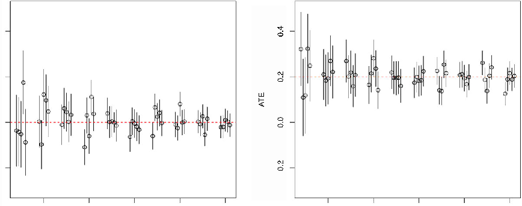
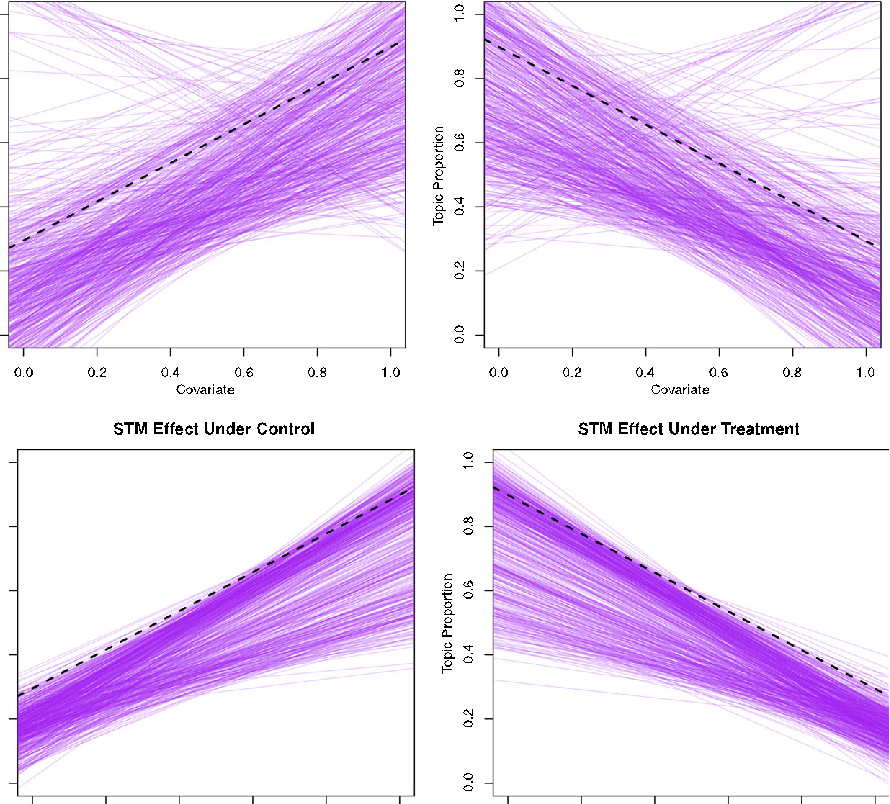

## Structural Topic Models for Open-Ended Survey Responses

Margaret E. Roberts University of California, San Diego Brandon M. Stewart Harvard University Dustin Tingley Harvard University Christopher Lucas Harvard University Jetson Leder-Luis California Institute of Technology Shana Kushner Gadarian Syracuse University Bethany Albertson University of Texas at Austin David G. Rand Yale University

Collection and especially analysis of open-ended survey responses are relatively rare in the discipline and when conducted are almost exclusively done through human coding. We present an alternative, semiautomated approach, the structural topic model (STM) (Roberts, Stewart, and Airoldi 2013; Roberts et al. 2013), that draws on recent developments in machine learning based analysis of textual data. A crucial contribution of the method is that it incorporates information about the document, such as the author’s gender, political affiliation, and treatment assignment (if an experimental study). This articlefocusesonhowtheSTMishelpfulforsurveyresearchersandexperimentalists.TheSTMmakesanalyzingopen-ended responses easier, more revealing, and capable of being used to estimate treatment effects. We illustrate these innovations with analysis of text from surveys and experiments.

# D

espite broad use of surveys and survey experiments within political science, the vast majority of analysis deals with responses to options along

a scale or from preestablished categories. Yet, in most areas of life, individuals communicate either by writing or by speaking, a fact reflected in earlier debates about

open-and closed-ended survey questions. Collection and especiallyanalysisofopen-endeddataarerelativelyrarein the discipline and when conducted are almost exclusively done through human coding. We present an alternative, semiautomatedapproach,thestructuraltopicmodel (STM) (Roberts, Stewart, and Airoldi 2013; Roberts et al.

Margaret E. Roberts is Assistant Professor, Department of Political Science, University of California, San Diego, 9500 Gilman Dr., La Jolla, CA 92093 (molly.e.roberts@gmail.com). Brandon M. Stewart is a PhD Student, Department of Government and Institute for Quantitative Social Science, Harvard University, 1737 Cambridge St., Cambridge, MA 02138 (bstewart@fas.harvard.edu). Dustin Tingley is Paul Sack Associate Professor of Political Economy, Department of Government and Institute for Quantitative Social Science, Harvard University, 1737 Cambridge St., Cambridge, MA 02138 (dtingley@gov.harvard.edu). Christopher Lucas is a PhD Candidate, Department of Government and Institute for Quantitative Social Science, Harvard University, 1737 Cambridge St., Cambridge, MA 02138 (clucas@fas.harvard.edu). Jetson Leder-Luis is an Undergraduate, Division of the Humanities and Social Sciences, California Institute of Technology, Caltech MSC 462, Pasadena, CA 91126 (jetson@caltech.edu). Shana Kushner Gadarian is Assistant Professor, Department of Political Science, Maxwell School of Citizenship and Public Affairs, Syracuse University, 100 Eggers Hall, Syracuse, NY 13244 (sgadaria@maxwell.syr.edu). Bethany Albertson is Assistant Professor, Department of Government, University of Texas at Austin, Mailcode A1800, Austin, TX 78712 (balberts@austin.utexas.edu). David G. Rand is Assistant Professor, Departments of Psychology and Economics, Yale University, 2 Hillhouse Rd, New Haven, CT 06511 (david.rand@yale.edu). Questions or comments can be sent to corresponding author at dtingley@gov.harvard.edu.

Our thanks to the Caltech SURF program, IQSS’s Program on Text Analysis, and Dustin Tingley’s dean support for supporting Jetson’s initial participation during the summer of 2012. Brandon Stewart gratefully acknowledges funding from a National Science Foundation Graduate Research Fellowship. Alex Storer helped get computers to do their job. We thank the following for helpful comments and suggestions: Neal Beck, Justin Grimmer, Jennifer Jerit, Luke Keele, Gary King, Mik Laver, Rose McDermott, Helen Milner, Rich Nielsen, Brendan O’Connor, Mike Tomz, and participants in the Harvard Political Economy and Applied Statistics Workshops, UT Austin Government Department IR Seminar, Visions in Methodology 2013, and Stanford Methods Seminar. Replication files are available in the AJPS Data Archive on Dataverse (http://dvn.iq.harvard.edu/dvn/dv/ajps). The supplementary appendix is available at https://scholar.harvard.edu/files/dtingley/files/ajpsappendix.pdf.

American Journal of Political Science, Vol. 58, No. 4, October 2014, Pp. 1064–1082 C 2014, Midwest Political Science Association DOI: 10.1111/ajps.12103

1064

2013), that draws on recent developments in machine learning based analysis of textual data. A crucial contribution of the method is that it incorporates information aboutthe document,suchas the author’sgender,political affiliation, and treatment assignment (if an experimental study). Elsewhere, we demonstrate its usefulness for analyzing other sources of text of interest across political science (Lucas et al. 2013). This article focuses on how the STM is helpful for survey researchers and experimentalists. The STM makes analyzing open-ended responses easier, more revealing, and capable of being used to estimate treatment effects. We illustrate these innovations with several experiments and an analysis of open-ended data in the American National Election Study (ANES).

In practice, we believe that many survey researchers and experimentalistsavoid open-ended response data because they are costly to analyze in a systematic way. There are also debates about the desirability of using openandclosed-endedresponseformats.Weproviderelatively low-cost solutions that occupy a middle ground in these debates and innovate in two ways. First, we show how survey researchers and experimentalists can efficiently analyze open-ended data alongside a variety of common closed-ended data, such as a subject’s party preferences or assignment to an experimental condition. Second, we provide a suite of tools that enable preprocessing of textual data, model selection, and visualization. We also discuss best practices and tools for human intervention in what otherwise is an unsupervised learning model, such as how a researcher could implement pre-analysis plans, as well as a discussion of limitations to the unsupervised learning model1 at the foundation of our research strategy.

We proceed by first laying out the advantages and limitations of incorporating open-ended responses into research designs. Next, we present our estimation strategy and quantities of interest, as well as contrast our approach to existing methodologies. Having set up our research strategy, we analyze open-ended data from a survey experiment on immigration preferences and a laboratory experiment on public goods provision. We also analyze the “most important problem” data from the ANES. In each example, we showcase both our methodology for including covariates as well as the software tools we make available to researchers. Finally, we conclude with a discussion of future research possibilities.2

- 1As opposed to supervised models that require a hand-coded training set; see Grimmer and Stewart (2013) for details.
- 2All methods in this article are implemented in the R package stm, available at www.structuraltopicmodel.com. The supplemental ap-

###### Why Open-Ended Responses?

There was a point at which research on survey methodology actively debated whether questions should be open or closed in form (Geer 1991; Krosnick 1999; Lazarsfeld 1944). Today, the majority of survey analyses are composed predominately of closed-ended questions, and open-ended questions are rarely analyzed. This is despite thefactthatprominentscholarswritingonthetopicidentified advantages with each methodology (Krosnick 1999; Lazarsfeld 1944).

There are advantages and disadvantages to both closed- and open-ended data. One view of open-ended responses is that they provide a direct view into a respondent’s own thinking. For example, RePass (1971, 391) argues that open-ended questions query attitudes that “are ontherespondent’smindatthetimeoftheinterview,”attitudes that were presumably salient before the question and remain so afterward. Similarly Iyengar (1996, 64) notes that open-ended questions have the advantage of “nonreactivity.” That is, unlike closed-ended questions, “open-ended questions do not cue respondents to think of particular causes or treatments.”3

A major concern about open-ended questions is that open-ended questions chiefly require that subjects “articulate a response, not their underlying attitudes” (Geer 1988, 365). Furthermore, nonresponses to open-ended questions may stem from ineloquence rather than indifference; subjects may not respond to open-ended questions because they lack the necessary rhetorical device (Geer 1988). A related concern is that open-ended questions may give respondents too little of a frame of reference in order to form a coherent response (Schuman 1966).

Open-ended responses have traditionally been considered more difficult to analyze than their closed counterparts (Schuman and Presser 1996), as human coding is almost always used. The use of human coders typically involves several steps. First, the researcher needs to define the dimensions on which open-ended data will be codedbyhumansandgenerateexamplesinordertoguide the coders. This is typically guided by the researcher’s own prior theoretical expectations and potentially reading of some examples. Next, human coders are unleashed on the data and numerical estimates for each document

pendix includes estimation details, a comparison to alternative models, a range of simulation studies, and additional tools for applied users.

3On this point, Kelley (1983, 10) notes that the opinions of the American electorate are so wide ranging that any closed list is bound to omit good opinions.

15405907, 2014, 4, Downloaded from https://onlinelibrary.wiley.com/doi/10.1111/ajps.12103 by Leiden University Library, Wiley Online Library on [02/02/2026]. See the Terms and Conditions (https://onlinelibrary.wiley.com/terms-and-conditions) on Wiley Online Library for rules of use; OA articles are governed by the applicable Creative Commons License

compared across coders (Artstein and Poesio 2008; Lombard , Snyder-Duch, and Bracken 2006).

Our view is that while such pragmatic concerns are reasonable, they ought not be our ultimate consideration, and instead what is crucial is whether open-ended questions give real insights (Geer 1991, 360). Rarely have survey researchers/experimentalists used automated text analysis procedures, and when they have, covariate information, either in the form of randomized treatment conditions or pretreatment covariates (e.g., gender or political ideology), is not used in the textual analysis (Simon and Xenos 2004). Researchers still might have good reason to use human coders, but we believe adoption of our methods at a minimum will assist them in using human coders more effectively.

###### Our Contributions

The model below has a number of advantages over only using human coders. First, it allows the researcher to discover topics from the data, rather than assume them. These topics may or may not correspond to a researcher’s theoretical expectations. When they do correspond, researchers can leverage the wide variety of quantities of interest that the STM generates. When they do not correspond, researchers may consider revising their theoretical model for future work or retain their model and turn to standard human coding procedures.

Second, it allows analysts to do this while studying how the prevalence and content of topics change with information that is particular to each respondent (e.g., whether the respondent received the treatment or background demographic data). We argue our model can fruitfully be used at either an exploratory stage prior to using human coders or as part of making credible inferences about the effect of treatments/frames/covariates on thecontentofopen-endedresponses.Thus,ourapproach can serve a variety of purposes. The next sections demonstrate the usefulness of text analysis tools for analyzing open-ended responses.

###### Statistical Models of Text

The core innovation of the article is to bridge survey and experimental techniques, which include randomization of frames or encouragements to adopt a particular emotional status or way of looking at political issues, with new techniques in text analysis. Our approach also allows the analyst to incorporate covariates (e.g. attributes

of the respondent, treatment condition), with a model of the topics that are inferred directly from the written text. For experimental applications, this enables us to calculate treatment effects and uncertainty estimates on open-ended textual data. We believe that we are the first to do so in a way that builds in the structural information about the experiment, though we share similar motivations with Simon and Xenos (2004) and Hopkins (2010). In this section, we outline the notation and core ideas for statistical topic models; then we overview the STM, including quantities of interest, and conclude by discussing extensive material available in the supplemental appendix.

###### A Heuristic Understanding of Statistical Topic Models

Statistical topic models allow for rich latent topics to be automatically inferred from text. Topic models are often referred to as “unsupervised” methods because they infer rather than assume the content of the topics under study, andtheyhavebeenusedacrossavarietyoffields(Blei,Ng, andJordan2003;Grimmer2010;Quinnet al.2010;Wang and Blei 2011). We emphasize that this is conceptually different from “supervised” methods where the analyst defines the topics ex ante, usually by hand-coding a set of documents into preestablished categories (e.g., Laver, Benoit, and Garry 2003).

Within the class of unsupervised statistical topic models, topics are defined as distributions over a vocabulary of words that represent semantically interpretable “themes.” Topic models come in two varieties: singlemembership models and mixed-membership models. Previous work in political science has focused on singlemembership models which have emphasized document meta-data (Grimmer 2010; Quinn et al. 2010, see also Grimmer and Stewart 2013 for a general review). In mixed-membership models, the most notable of which is latent Dirichlet allocation (LDA; Blei 2012; Blei, Ng, and Jordan 2003), a document is represented as a mixture of topics, with each word within a given document belonging to exactly one topic; thus, each document can be represented as a vector of proportions that denote what fraction of the words belong to each topic. In singlemembership models, each document is restricted to only one topic, so all words within it are generated from the samedistribution.Wefocusonmixed-membershipmodels, highlighting the comparison to single-membership alternatives in the appendix.

In mixed-membership models, each document (indexed by d) is assumed to be generated as follows. First, a

15405907, 2014, 4, Downloaded from https://onlinelibrary.wiley.com/doi/10.1111/ajps.12103 by Leiden University Library, Wiley Online Library on [02/02/2026]. See the Terms and Conditions (https://onlinelibrary.wiley.com/terms-and-conditions) on Wiley Online Library for rules of use; OA articles are governed by the applicable Creative Commons License

distribution over topics ( d) is drawn from a global prior distribution. Then, for each word in the document (indexed by n), we draw a topic for that word from a multinomial distribution based on its distribution over topics (zd,n ∼Mult( d)). Conditional on the topic selected, the observed word wd,n is drawn from a distribution over the vocabulary wd,n ∼Mult( z

) where k,v is the probability of drawing the v-th word in the vocabulary for topic k. So, for example, our article (the one you are reading), which is just one article among all journal articles ever written, might be represented as a mixture over three topics that we might describe as survey analysis, text analysis, and experiments. Each of these topics is actually a distribution over words with high-frequency words associated with that topic (e.g., the experiment’s topic might have “experiment, treatment, control, effect” as high-probability words). LDA, the model described above, is completed by assuming a Dirichlet prior for the topic proportions such that d ∼Dirichlet( ).4

d,n

The expressive power of statistical topics models to discover topics comes at a price. The resulting posterior distributions have many local modes, meaning that different initializations can produce different solutions. This can arise even in simple mixture models in very low dimensions (Anandkumar et al. 2012; Buot and Richards, 2006; Sontag and Roy 2009). Later in this section, we present a framework for model evaluation focused on semantic interpretability as well as robustness checks.

###### Structural Topic Model

The STM innovates on the models just described by allowing for the inclusion of covariates of interest into the prior distributions for document-topic proportions and topic-word distributions. The result is a model where each open-ended response is a mixture of topics. Rather than assume that topical prevalence (i.e., the frequency with which a topic is discussed) and topical content (i.e., the words used to discuss a topic) are constant across all participants, the analyst can incorporate covariates over which we might expect to see variance.

We explain the core concept of the model here (complete details in the appendix. As in LDA, each document arises as a mixture over K topics. In the STM, topic

4Estimation for LDA in Blei, Ng, and Jordan (2003) proceeds by variational expectation-maximization (EM), where the local variables d, zd are estimatedforeach documentintheE-step,followed by maximization of global parameters , 1:K. Variational EM uses a tractable factorized approximation to the posterior. See Grimmer (2011).

proportions ( ) can be correlated, and the prevalence of those topics can be influenced by some set of covariates X through a standard regression model with covariates

∼LogisticNormal(X , ).Foreachword(w)intheresponse,atopic(z)isdrawnfromtheresponse-specificdistribution, and conditional on that topic, a word is chosen from a multinomial distribution over words parameterizedby ,whichisformedbydeviationsfromthebaseline word frequencies (m) in log space ( k ∝ exp(m + k)). This distribution can include a second set of covariates U (allowing, for example, Democrats to use the word “estate” more frequently than Republicans while discussing taxation). We discuss the difference between the two sets of covariates in more detail in the next subsection.

Thus,therearethreecriticaldifferencesintheSTMas compared to the LDA model described above: (1) topics can be correlated; (2) each document has its own prior distribution over topics, defined by covariate X rather than sharing a global mean; and (3) word use within a topic can vary by covariateU. These additional covariates provide a way of “structuring” the prior distributions in the topic model, injecting valuable information into the inference procedure.5

The STM provides fast, transparent, replicable analyses that require few a priori assumptions about the texts under study. Yet it is a computer-assisted method, and the researcher is still a vital part of understanding the texts, as we describe in the examples section. The analyst’s interpretive efforts are guided by the model and the texts themselves. But as we show, the STM can relieve the analyst of the burden of trying to develop a categorization scheme from scratch (Grimmer and King 2011) and perform the often mundane work of associating the documents with those categories.

###### Estimating Quantities of Interest

A central advantage to our framework for open-ended survey response analysis is the variety of interpretable quantities of interest beyond what is available from LDA. In all topic models, the analyst estimates for each document the proportion of words attributable to each topic, providing a measure of topic prevalence. The model also calculates the words most likely to be generated by each

5We estimate the model using semi-collapsed variational EM. In the E-step, we solve for the joint optimum of the document’s topic proportions ( ) and the token-level assignments (z). Then in the M-step, we infer the global parameters , , , which control the priors on topical prevalence and content. The STM prior is not conjugate to the likelihood and thus does not enjoy some of the theoretical guarantees associated with mean-field variational inference in the conjugate exponential family.

15405907, 2014, 4, Downloaded from https://onlinelibrary.wiley.com/doi/10.1111/ajps.12103 by Leiden University Library, Wiley Online Library on [02/02/2026]. See the Terms and Conditions (https://onlinelibrary.wiley.com/terms-and-conditions) on Wiley Online Library for rules of use; OA articles are governed by the applicable Creative Commons License

topic, which provides a measure of topical content. However, in standard LDA, the document collection is assumed to be unstructured; that is, each document is assumed to arise from the same data-generating process irrespective of additional information the analyst might possess. By contrast, our framework is designed to incorporate additional information about the document or its author into the estimation process. This allows us to measure systematic changes in topical prevalence and topical content over the conditions in our experiment, as measured by the X covariates for prevalence and the U covariates for content. Thus, for example, we can easily obtain measures of how our treatment condition affects both how often a topic is discussed (prevalence) and the language used to discuss the topic (content). Using our variational approximation to the posterior distribution, we can propagate our uncertainty in the estimation of the topic proportions through our analysis.6

The inference on the STM quantities of interest is best understood by reference to the familiar regression framework. For example, consider topical prevalence; if we observed the topics for each survey response, we could generate a regression where the topic is the outcome variable, and the treatment condition or other respondent controls (e.g., gender, income, party affiliation), along with any interactions, are the explanatory variables. This regression would give us insight into whether our treatment condition caused respondents to spend a larger portion of their written response discussing a particular topic. In our framework for analysis, we conduct this sameregression,whilesimultaneouslyestimatingthetopics. This framework builds on recent work in political science on single-membership models, specifically Quinn et al. (2010) and Grimmer (2010), which allow topical prevalence to vary over time and author, respectively. Our model extends this framework by allowing topical prevalence to vary with any user-specified covariate. We also extend the framework to topical content. Word use within a particular topic comes from a regression, in this case a multinomial logistic regression, where the treatment condition and other covariates can change the rate of use for individual words within a topic.

In addition to these corpus-level changes, we also get an estimate of the proportion of words in each survey response attributable to a particular topic. Thus, we can retrieve the same types of quantities that would arise from human coding without the need to construct a codingschemeinadvance.Thesedocument-level parameters

6We include uncertainty by integrating over the approximate posterior using the method of composition. See the appendix for more details.

can be used to construct useful summaries such as most representativedocumentsforeachtopic,mostrepresentativedocumentsforeachtreatmentcondition,orvariation in topic use across other covariates not in the model.

We can also use the model to summarize the semantic meaning of a topic. Generally, these summaries are the highest probability words within a topic; however, this tends to prioritize words that have high frequency overall but may not be semantically interesting. Following the insights of Bischof and Airoldi (2012), who demonstrate the value of exclusivity in summary words for topics, we label topics using simplified frequencyexclusivity (FREX) scoring (Roberts, Stewart, and Airoldi 2013; Roberts et al. 2013). This summarizes words with the harmonic mean of the probability of appearance under a topic and the exclusivity to that topic. These words provide more semantically intuitive representations of topics.

In Figure 1, we list some of the quantities of interest withasimpleinterpretation.Thesequantitiescanbecombined to create more complex aggregates, but we expect these summaries will suffice for most applications.

###### Model Specification and Selection

Researchers must make important model specification and selection decisions. We briefly discuss the choice of covariates and the number of topics. We discuss theoretical implications of model specification choices, quantitative metrics, and methods for semiautomated model evaluation and selection.7

Choices in Model Specification. In the STM framework, the researcher has the option to choose covariates to incorporate in the model. These covariates inform either the topic prevalence or the topical content latent variables with observed information about the respondent. The analyst will want to include a covariate in the topical prevalence portion of the model (X) when she believes that the observed covariate will affect how much the respondent is to discuss a particular topic. The analyst also has the option to include a covariate in the topical content portion of the model (U) when she believes that the observed covariate will affect the words which a respondent uses to discuss a particular topic. These two sets of covariates can overlap, suggesting that the topic proportion and the way the topic is discussed change with

7Weusestandardtextpreprocessingconventions,suchasstemming (Manning, Raghavan, and Schutze¨ 2008). The appendix provides complete details along with software to help users manage and preprocess their collections of texts.

15405907, 2014, 4, Downloaded from https://onlinelibrary.wiley.com/doi/10.1111/ajps.12103 by Leiden University Library, Wiley Online Library on [02/02/2026]. See the Terms and Conditions (https://onlinelibrary.wiley.com/terms-and-conditions) on Wiley Online Library for rules of use; OA articles are governed by the applicable Creative Commons License

###### FIGURE 1 Quantities of Interest from STM

- 1. QOI: Topical Prevalence Covariate Effects

- • Level of Analysis: Corpus
- • Part of the Model: θ,γ,X
- • Description: Degree of association between a document covariate X and the average proportion of a document discussing each topic.
- • Example Finding: Subjects receiving the treatment on average devote twice as many words to Topic 2 as control subjects.

- 2. QOI: Topical Content Covariate Effects

- • Level of Analysis: Corpus
- • Part of the Model: κ,U
- • Description: Degree of association between a document covariate U and the rate of word use within a particular topic.
- • Example Finding: Subjects receiving the treatment are twice as likely to use the word “worry” when writing on the immigration topic as control subjects.

- 3. QOI: Document-Topic Proportions

- • Level of Analysis: Document
- • Part of the Model: θ
- • Description: Proportion of words in a given document about each topic.
- • Example Use: Can be used to identify the documents that devote the highest or lowest proportion of words to a particular topic. Those with the highest proportion of words are often called “exemplar” documents and can be used to validate that the topic has the meaning the analyst assigns to it.

- 4. QOI: Topic-Word Proportions

- • Level of Analysis: Corpus
- • Part of the Model: κ,β
- • Description: Probability of observing each word in the vocabulary under a given topic. Alternatively, the analyst can use the FREX scoring method described above.
- • Example Use: The top 10 most probable words under a given topic are often used as a summary of the topic’s content and help inform the user-generated label.

particular covariate values. The STM includes shrinkage priors or regularization, which draws the covariate effects toward zero. An analyst concerned about overfitting to the covariates can increase the degree of regularization.

The analyst must also choose the number of topics. There is no “right” answer to this choice. Varying the number of topics varies the level of granularity of the view into the data. Therefore, the choice will be dependent both on the nature of the documents under study and the goals of the analysis. While some corpora like academic journal articles might be analyzed with 50–100 topics (Blei 2012) due to the wide variety in their content, survey responses to focused questions may only consider a few topics. The appropriateness of particular levels of aggregation will vary with the research question.

Model Selection Methods. It would be useful if all of these choices could be evaluated using a simple diagnostic. It is tempting to compute an approximation to the marginal likelihood and calculate a model selection statistic,butweechopreviousstudiesinemphasizingthat this maximizes model fit and not substantive interpretation(Changetal.2009).Instead,weadvocatequantitative evaluations of properties of the topic-word distributions. Specifically, we argue that a semantically interpretable topic has two qualities: (1) it is cohesive in the sense that high-probability words for the topic tend to co-occur within documents, and (2) it is exclusive in the sense that the top words for that topic are unlikely to appear within top words of other topics.

These two qualities are closely related to Gerring’s (2001) “consistency” and “differentiation” criteria for

15405907, 2014, 4, Downloaded from https://onlinelibrary.wiley.com/doi/10.1111/ajps.12103 by Leiden University Library, Wiley Online Library on [02/02/2026]. See the Terms and Conditions (https://onlinelibrary.wiley.com/terms-and-conditions) on Wiley Online Library for rules of use; OA articles are governed by the applicable Creative Commons License

concepts in empirical social science.8 Semantic cohesion has previously been studied by Mimno et al. (2011) who develop a criterion based on co-occurence of top topic words and show that it corresponds with human evaluation by subject matter experts.9 While semantic coherence is a useful criterion, it only addresses whether a topic is internally consistent; it does not, for example, penalize topics that are alike. From the standpoint of social science inference, we want to be sure both that we are evaluating a well-defined concept and that our measure captures all incidence of the concept in the survey responses.

For this, we turn to the exclusivity of topic words, drawing on previous work on exclusivity and diversity in topic models (Bischof and Airoldi 2012; Eisenstein, Ahmed, and Xing 2011; Zou and Adams 2012). If words with high probability under topic i have low probabilities under other topics, then we say that topic i is exclusive. A topic that is both cohesive and exclusive is more likely to be semantically useful.

In order to select an appropriate model, we generate a set of candidate models (generated by differing initializations, tuning parameters, or processing of the texts) and then discard results that have the lowest value for the bound.10 We then plot the exclusivity and semantic coherence of the remaining models and select a model on the semantic coherence-exclusivity “frontier,” that is, where no model strictly dominates another in terms of semantic coherence and exclusivity. We then either randomly select a model or manually examine the remainder and select the model most appropriate to our particular research question. We provide methods for calculating exclusivity and semantic cohesion with our estimation software.

While this simple measure is computationally efficient and interpretable, it cannot replace human judgment. The insight of the investigator is paramount here, and we strongly suggest careful reading of example texts. In these cases, the STM can direct the reader to the most useful documents to evaluate by providing a list of ex-

- 8Thesequalitiesalsoappearintheevaluationofsingle-membership clustering algorithms (Jain 2010). We speculate these qualities are implicitly central to many conceptual paradigms, both in quantitative as well as qualitative political science.
- 9Newman et al. (2010) first proposed the idea of using pointwise mutual information to evaluate topic quality. Mimno et al. (2011) then proposed a closely related measure, which they named semanticcoherence,demonstratingthatitcorrespondedwithexpert judgments of National Institutes of Health (NIH) officials on a corpus of NIH grants as well as human judgmnts gathered through Amazon’s Mechanical Turk.
- 10The number of models retained can be set by the researcher.

emplar texts for each topic. An intermediate step between automated diagnostics and judgement of the principal investigator is to use human evaluations on tasks for cluster quality. Chang et al. (2009) and Grimmer and King (2011) describe human evaluation protocols for testing topic quality that can easily be applied to our setting. Of course, researchers are free to not use these selection methods, or to create other methods. Researchers might also incorporate pre-analysis plans, which specify sets of words they expect to appear together in topics of interest and select based upon those criteria.

###### Validating the Model: Simulations Tests and Examples

When introducing any new method, it is important to test the model in order to validate that it performs as expected. Specifically, we were driven to answer two critical questions about the performance of the structural topic model:

- 1. Does the model recover treatment effects correctly (i.e., low false positives and low false negatives)?
- 2. How does analysis compare to first estimating topics with LDA and then relating the topics to covariates?

In the supplemental appendix, we address both of these questions in turn using a battery of tests that range from Monte Carlo experiments on purely simulated data through applied comparisons of the examples presented inthenextsection.Here,webrieflyaddresseachquestion, providing an overview of our simulations and deferring the details to the appendix.

As shown in Figure 2, the model recovers the effect of interest when it exists, and it does not induce a spurious effect when the effect is actually zero (false positives). A separate, but related, concern is the effects of multiple testing. While our simulation results demonstrate that STM does not systematically overestimate treatment effects, it does not address concerns of accurate p-values in the presence of multiple testing. In the appendix, we discuss how false discovery rate methods and preexperiment planapproachescanbeincorporatedintothetopicmodel framework to address these concerns. In the appendix, we also show results of a permutation test on one of our applied examples. In this test, we randomly permute the treatment variable across documents and refit the model, showing that we do not find spurious treatment effects.

15405907, 2014, 4, Downloaded from https://onlinelibrary.wiley.com/doi/10.1111/ajps.12103 by Leiden University Library, Wiley Online Library on [02/02/2026]. See the Terms and Conditions (https://onlinelibrary.wiley.com/terms-and-conditions) on Wiley Online Library for rules of use; OA articles are governed by the applicable Creative Commons License

###### FIGURE 2

ATE

###### No Treatment Effect

###### Treatment Effect

−0.20.00.20.4

−0.20.00.20.4

ATE

200 400 600 800 1000

200 400 600 800 1000

Number of Documents

Number of Documents

Note: Estimated average treatment effect (ATE) with 95% confidence intervals, holding expected number of words per document fixed at 40 and the concentration parameter fixed at 1/3. The STM is able to recover the true ATE both in cases where there is no treatment effect (left) and cases with a sizable treatment effect (right). As expected, inferences improve as sample sizes increase.

Comparison to LDA and Other Alternate Models. Statistical methods for the measurement of political quantities from text have already seen widespread use in political science, and the number of available methods is growing at a rapid rate. How does analysis with the STM compare to existing unsupervised models? In the appendix, we contrast our approach with three prominent alternative models in the literature, focusing on the advantages of including covariates. Specifically, we contrast the benefits of the STM with vanilla LDA (Blei 2012), factor analysis (Simon and Xenos 2004), and single-membership models (Grimmer 2010; Quinn et al. 2010). Both LDA and factor analysis provide the mixedmembership structure, which allows responses to discuss multiple topics, but cannot incorporate the rich covariate information we often have available, whereas the single-membership models developed in political science can incorporate a narrow set of covariate types and are limited to a single topic per document, which may be too restrictive for our application. Compared to other unsupervised techniques, we believe the STM provides the most versatility for survey researchers and experimentalists.

In the appendix, we provide an extensive comparison to LDA, which shows that the STM provides more accurate estimation of quantities of interest when comparedtousingLDAwithcovariatesinatwo-stageprocess. We show Monte Carlo simulations consistent with the

theoretical expectation that LDA will tend to attenuate continuous covariate relationships on topical prevalence. Figure 3 shows one such simulation for the case of a continuous covariate that operates differently under the treatment and control conditions. LDA is unable to capture the dynamics of the effect in many of the simulated data sets. The appendix also overviews some diagnostics for LDA models that indicate when the inclusion of additional structure as in the STM is useful for inference. Finally, we provide an analysis of actual documents from the immigration experiment discussed below using LDA and characterize the differences between those solutions and the ones attained by the STM.

In a companion paper, we provide a thorough contrast of our method to supervised learning techniques (Lucas et al. 2013). Supervised methods provide a complement to unsupervised methods and can be used when ananalystisinterestedinaspecific,knownquantityinthe text. Thus, supervised methods can be seen as occupying a place on the spectrum between closed-ended questions, which provide an a priori, analyst-specified assessment of the quantities of interest, and the unsupervised analysis of open-ended responses which provide a data-driven assessment of the quantities of interest with post hoc analyst assessment. We provide an implicit comparison to supervised approaches by comparing our unsupervised methods to human coders in the ANES data analysis section below and the appendix.

15405907, 2014, 4, Downloaded from https://onlinelibrary.wiley.com/doi/10.1111/ajps.12103 by Leiden University Library, Wiley Online Library on [02/02/2026]. See the Terms and Conditions (https://onlinelibrary.wiley.com/terms-and-conditions) on Wiley Online Library for rules of use; OA articles are governed by the applicable Creative Commons License

###### FIGURE 3 STM versus LDA Recovery of Treatment Effects.

###### LDA Effect Under Control

###### LDA Effect Under Treatment

0.40.60.81.00.00.2

0.40.00.20.60.81.0

Topic Proportion

Topic Proportion

0.0 0.2 0.4 0.6 0.8 1.0

0.0 0.2 0.4 0.6 0.8 1.0

Covariate

Covariate

###### STM Effect Under Control

###### STM Effect Under Treatment

0.20.40.60.81.00.0

0.20.40.00.60.81.0

Topic Proportion

Topic Proportion

0.0 0.2 0.4 0.6 0.8 1.0

0.0 0.2 0.4 0.6 0.8 1.0

Covariate

Covariate

Note: Each line represents the estimated effect from a separate simulation, with the bold line indicating the true data-generating process. While the two-stage LDA process often captures the approximate effect, it exhibits considerably higher variance.

Additional Material. The appendix provides a number of additional details which we split into three major sections:

- 1. ModelEstimationgivesdetails,onthevariational expectation maximization-based approach to optimization of the model parameters.
- 2. Model Validation tests includes simulations mentioned above as well myriad other validations.

3. Getting Started overviews two additional software tools that we provide (i.e., txtorg, a tool for preprocessing and handling large bodies of text with extensive non-English language support, and a topic visualization tool for helping users browse their documents and assess modelresults)anddiscussionsofcommonquestions that might arise and how they connect to the topic modeling framework, including multiple testing, mediation analysis, and pre-analysis plans.

15405907, 2014, 4, Downloaded from https://onlinelibrary.wiley.com/doi/10.1111/ajps.12103 by Leiden University Library, Wiley Online Library on [02/02/2026]. See the Terms and Conditions (https://onlinelibrary.wiley.com/terms-and-conditions) on Wiley Online Library for rules of use; OA articles are governed by the applicable Creative Commons License

###### Data Analysis

The purpose of this section is to illustrate the application ofthemethodtoactualdata.Weshowhowtoestimatethe relationships between covariates and topics with corresponding uncertainty estimates, how to interpret model parameters, and how to automatically identify passages that are the best representations of certain topics. To illustrate these concepts, we rely on several recent studies that recorded open-ended text as well as recently released data from the ANES.

###### Public Views of Immigration

Gadarian and Albertson (forthcoming) examine how negatively valanced emotions influence political behavior and attitudes. In one of their surveys, they focus on immigration preferences by using an experimental design that in the treatment encourages some subjects to become worried about immigration and in control to simply think about immigration. To categorize these openended responses, they turned to human coders who were instructed to code each response along the dimensions of enthusiasm,concern,fear,andanger,eachalonga3-point scale.

Topic Analysis. To estimate the STM, we use an indicator variable for the treatment condition, a 7-point party identification self-report, and an interaction between party identification and treatment condition as covariates. The interaction term lets us examine whether individuals who are Republican respond to the treatment condition differently from those who are Democrats. In this particular application, the influence of these parameters was estimated on topic proportions (“prevalence”) within responses. To address multi-modality, we estimated our model 50 times, with 50 different starting values, and applied the model selection procedure described in earlier. This left us with 10 models, from which we selected one based on exclusivity and semantic coherence criterion. However, a close examination of these ten models indicates that all have very similar results in terms of the topics discovered and differences in topic proportions across treatment conditions.

We estimated three topics in total in our analysis. The twotopicsmostassociatedwiththetreatmentandcontrol groups, respectively, are presented in Figure 4. Topic 1 is the “crime” and “welfare” or “fear” topic, and Topic 2 emphasizes the human elements of immigrants, such as “worker” and “mexican.” To get an intuitive sense of the

###### FIGURE 4 Vocabulary Associated withTopics 1 and 2

| |Topic 1:  illeg, job, immigr, tax, pai, american, care, welfar, crime, system, secur, social, cost, health, servic, school, languag, take, us, free| |
|---|---|---|
| |Topic 2:  immigr, illeg, legal, border, need, worri, mexico, think, countri, law, mexican, make, america, worker, those, american, fine, concern, long, fenc| |

###### FIGURE 5 A Representative Response fromTopic 1

problems caused by the influx of illegal immigrants who are crowding our schools and hospitals, lowering the level

of education and the quality of care in hospitals.

crime lost jobs benefits paid to illegals health care and food....we cannot feed the world when we have americans starving, etc.

###### FIGURE 6 A Representative Response fromTopic 2

i worry about the republican party doing something very stupid. this country was built on immigration, to deny anyone access to citizenship is unconstitutional. what happened to give me your poor, sick, and tired?

border control, certain illegal immigrants tolerated, and others immediately deported.

topics, Figures 5 and 6 plot representative responses for topic 1 and 2.11

11Thepredictedprobabilityofthatresponsebeinginthegiventopic is high relative to other responses within the corpus for Topics 1 and 2.

15405907, 2014, 4, Downloaded from https://onlinelibrary.wiley.com/doi/10.1111/ajps.12103 by Leiden University Library, Wiley Online Library on [02/02/2026]. See the Terms and Conditions (https://onlinelibrary.wiley.com/terms-and-conditions) on Wiley Online Library for rules of use; OA articles are governed by the applicable Creative Commons License

###### FIGURE 7 Words and Treatment Effect Associated with Topic 1

Topic 1:

illeg, job, immigr, tax, pai, american, care, welfar, crime, system, secur, social, cost, health, servic, school, languag, take, us, free

Topic 1

Topic 2:

immigr, illeg, legal, border, need, worri, mexico, think, countri, law, mexican, make, america, worker, those, american, fine, concern, long, fenc

Topic 2

−0.4 −0.3 −0.2 −0.1 0.0 0.1 0.2 0.3 Difference in Topic Proportions (Treated-Control)

###### FIGURE 8 Party Identification, Treatment, and the Predicted Proportion in Topic 1

0.00.20.40.6 Mean Topic Proportions

Treated

Control

Strong Democrat

Strong Republican

Moderate

CovariateAnalysis. Next, we move to differences across the treatment groups. On average, the difference between the proportion of a treated response that discusses Topic 1 and the proportion of an untreated response that discusses Topic 1 is .28 (.23, .33).12 This shows that the study’s encouragement to express worries about immigration was effective. In addition, on average over both treatment and control, Republicans talk about fear and anger toward immigrants much more than Democrats do: By our estimates, the difference between the proportion of a Republican response that talked about Topic 1 and the proportion of a Democrat response that talked about Topic 1 was .09 (.04, .14).

12Estimates within the parentheses represent a 90% confidence interval.

###### FIGURE 9 Fearful Response with High Topic 1

''welfare, schools, medical expenses, jobs,

crime, housing, driving no insurance or license.,''

The ability to estimate moderating effects on the treatment/control differences is a key contribution of our technique. The interaction between party identification and treatment also heavily influences topics. The difference between the proportion of a treated Republican response that talked about Topic 1 and the proportion of an untreated Democrat response that talked about Topic 1 is very large: .33 (.28, .39). What does this mean? An untreated Democrat will talk about Topic 1 20% of the time and Topic 2 40% of the time. A treated Republican will talk about Topic 1 54% of the time and Topic 2 20% of the time.13

Words associated with the topic and topic proportions by treatment are displayed graphically in Figure 7. The second plot in Figure 7 shows a treatment effect of response proportions in Topics 1 and 2, comparing treated to untreated. Figure 8 shows a Loess-smoothed line of the proportion of each response in Topic 1 on party identification, where 7 is a strong Republican and 0 is a strong Democrat. In general, these accord with our expectations

13Words that do not fall into Topic 1 or Topic 2 fall into Topic 3, a topic we do not discuss here because it is least associated with treatment.

15405907, 2014, 4, Downloaded from https://onlinelibrary.wiley.com/doi/10.1111/ajps.12103 by Leiden University Library, Wiley Online Library on [02/02/2026]. See the Terms and Conditions (https://onlinelibrary.wiley.com/terms-and-conditions) on Wiley Online Library for rules of use; OA articles are governed by the applicable Creative Commons License

###### FIGURE 10 Fearful Response with Low Topic 1

''border control, certain illegal immigrants tolerated, and others immediately deported.''

about how the treatment and party identification should be associated with the responses.

Aggregate Comparison with Human Coders. The traditional way text has been analyzed in survey or experimental settings is to have human coders code each response based on a set of coding instructions. Fortunately, in this example, Gadarian and Albertson (forthcoming) did just this, using two research assistants. How do our results compare with those of the coders? The comparison between the hand coding and the results from our algorithm is described in detail in the appendix. In summary, the results from the STM and the hand coding are similar, and both methods find a treatment effect. In addition, there is significant correlation between the hand coding of individual responses and the predicted topic proportions from our unsupervised learning model.

Of course, since our model is unsupervised, the topics discovered by our model does not perfectly match the topics the coders were instructed to use. The coders categorized the vast majority of responses into fear and anger, but because the topic model by design tries to distinguish betweendocuments,itsdefinitionoftopicsdoesnotalign directly with fear and anger, and some documents with a low proportion of Topic 1 from our analysis are also hand-coded with fear and anger. We would expect that the documents with low predicted proportion of Topic 1 but hand-coded as fear and anger would have fewer characteristics associated with Topic 1; for example, they might talk about crime and Social Security less relative to other reasons for being fearful of or angry at immigrants. Figure 9 presents a document that has a high predicted proportion of Topic 1 that the coders both agree includes fear or anger, whereas Figure 10 presents a response with low relation to Topic 1 but still coded to be of high fear.

It is clear from these responses that both are somewhat fearful of illegal immigrants, but the reasoning behind their emotion is different. In addition, these two may have a very different view of legal immigration in general. One advantage of the topic model is that even if the overwhelming majority of people are either fearful of

or angry at illegal immigrants, it will refine the topics in order to distinguish between documents, so even if a category predetermined by the researcher applies to almost all responses, the topic model can find a finer distinction between them.

###### Intuition versus Reflection in Public Goods Games

Rand, Greene, and Nowak (2012) study how intuitive versus reflective reasoning influences decision making in public goods games using a number of experimental conditions. In the “free-write” experimental contrast, subjects were primed to consider a time when they have acted out of intuition in a situation where their action worked out well or a time when they reflected and carefullyreasonedinasituationwheretheiractionworkedout well. After this encouragement, everyone played a single incentivized, one-shot public goods game. In the “time” experimentalcontrast,subjectswereeitherforcedtomake a decision quickly or encouraged to take their time, after which all players participated in the same public goods game. Rand, Greene, and Nowak (2012) find that subjects contribute more under the treatments where subjects are primed for intuition or are under time pressure, concluding that cooperation is intuitive. After both the free-write and time experiments, subjects were asked to writeaboutthestrategytheyusedwhileplayingthepublic goods game. We analyze the players’ descriptions of their strategies and their relationship to game contributions.

Decision Explanations across Treatment Conditions. We contrast the topics present in the strategy descriptions across the different treatment conditions.14 The topic model reflects how the experimentalconditions influence strategy descriptions. In the free-write experimental contrast, respondents primed to think intuitively talk about their strategyvery differentlyfromthosewho received the reflection priming. Listed in Figure 11, Topic 1 is associated with the intuitive priming, and Topic 4 is associated with the reflection priming. Topic 1 has words that reflect intuition, for example, “good,” “feel,” “chance,” “felt,” and “believ.” Topic 4, on the other hand, includes words such as “want,” “money,” “more,” and “myself.” The estimated topical difference between the two treatments is shown in the second graph of Figure 11.

In the time experimental contrast, people who are given less time to think about their decision in the public goods game use more feeling and trusting words to

14We estimated a five-topic model with intuition or time pressure as the treatment.

15405907, 2014, 4, Downloaded from https://onlinelibrary.wiley.com/doi/10.1111/ajps.12103 by Leiden University Library, Wiley Online Library on [02/02/2026]. See the Terms and Conditions (https://onlinelibrary.wiley.com/terms-and-conditions) on Wiley Online Library for rules of use; OA articles are governed by the applicable Creative Commons License

###### FIGURE 11 Topics from Intuition vs. Reflection Priming and Intuition TreatmentEffect

Topic 1:

believ, good, feel, felt, go, chanc, right, god, decis, life, greater, reason, base, more, profit, fact, out, get, answer, plai

Topic 1

Topic 4:

Topic 4

want, monei, more, keep, give, myself, make, gave, group, greedi, put, littl, lose, need, figur, even, gain, kept, less, left

−0.20 −0.10 0.00 0.05 0.10 0.15 Difference in Topic Proportions (Treated-Control)

###### FIGURE 12 Topics from Time Pressure Experiment and Time Pressure TreatmentEffect

Topic 1:

monei, out, risk, will, take, time, probabl, seem, put, figur, want, more, someth, pai, half, other, left, give, same, wai

Topic 1

Topic 5:

Topic 5

other, much, hope, felt, believ, give, good, chose, feel, well, god, up, though, even, on, cash, reason, benefit, work, question

−0.15 −0.10 −0.05 0.00 0.05 0.10 0.15 Difference in Topic Proportions (Treated-Control)

describe their decisions, as shown in Topic 5 on the lefthand side of Figure 12. Words in this topic reflect concern over morality and feeling, with reference to words like “believe,” “felt,” “hope,” and “god.” In contrast, people who are given more time to think about their decision of whether or not to contribute use a more calculating vocabulary to describe their decision, with words like “money,” “risk,” and “figure.” This topic is shown below in Topic 1 of Figure 12. The treatment effect for both of these topics is shown on the right-hand side of Figure 12.

The topics in the intuition priming experiment and the time pressure experiment show some similarities.

- Topic 1 and 5, respectively, use words associated with feeling and trusting. Topic 2 and Topic 1, respectively, are

more related to thinking, maximizing payoff, and making choices. These results show a nice coherence in the experimental design and shows how topic models can directly connect to the theoretical model, where the intuitivecooperation theory expects these exact distinctions to be important.

RespondentsWhoTalkaboutTheirIntuitionCooperate More. We also examine the relationship between references to a topic and contributions in the game. As Rand, Greene, and Nowak (2012) find, forcing people to think quickly increases contributions, and priming people to think intuitively also increases contributions. We expect, therefore, that people who talk about intuition, or whose

15405907, 2014, 4, Downloaded from https://onlinelibrary.wiley.com/doi/10.1111/ajps.12103 by Leiden University Library, Wiley Online Library on [02/02/2026]. See the Terms and Conditions (https://onlinelibrary.wiley.com/terms-and-conditions) on Wiley Online Library for rules of use; OA articles are governed by the applicable Creative Commons License

###### FIGURE 13 Intuition Topics andContributions

Mean Normalized Contributions

0.60.20.40.81.0

Topic 4 Topic 1

0.1 0.2 0.3 0.4 0.5 0.6

Mean Topic Proportions

###### FIGURE 15 Intuitive Topic Allowing for Different Vocabularies Based on Gender

interest

selfisht

greatest

eatliflifeatife

peoplwaio l

##### knownow

nnoeoeoo

half

ppeoppeogiveeopiooppp

###### gg ee

reason

god

make

###### lesswant

logic

playerlot

###### good

believ

ngreatermyselfmyselmyseyseele

y

certain

fair

dddecidt dd

ddec dc d

feelfeeeee

### t

### g

gambl

rightkept

kkparticipptt

artiarticepe

#### p

t

take

chose

choo

ground

o

ounbonu

contributcontr

went

middl

doubt chang

Male Female

###### FIGURE 14 Time Pressure Versus DelayTopics and Contributions

−0.20.00.20.40.60.81.01.2

Topic 5 Topic 1

Mean Contributions

0.1 0.2 0.3 0.4 0.5 0.6

Mean Topic Proportions

responses are more in line with Topic 1 in the intuition priming and Topic 5 in the time pressure experiment, will also contribute more, but that people who talk about strategy and maximizing their profits, more in line with

- Topic 2 in the intuition priming and Topic 1 in the time pressure experiment, will contribute less.

In both cases, respondents with a higher predicted proportion of the intuitive topic in their response are more likely to contribute. Figure 13 and Figure 14 plot a Loess, smoothed line of contributions plotted with 90% confidence intervals on the predicted topic proportions for each document. For each of the experiments, responses with a higher predicted proportion of the intuitive topic have overall higher contribution. However,

- as the predicted proportion of the reasoning topic in-

###### FIGURE 16 Comparison of Women and Men’s Vocabulary After Intuition Treatment

|Female|Male|
|---|---|
|Topic 3:  keep, peopl, give, know, myself, good, decid, god, thing, feel, go, more, right, well, logic, greater, want, monei, someon, less, kept, cent, other, awai, sure, believ, amount, benefit, doubt, chang, hope, best, make, greatest, worri, much, chose, figur, same, thought  |Topic 3:  good, keep, peopl, give, know, myself, decid, thing, feel, go, more, right, well, greater, want, monei, less, someon, kept, cent, other, awai, sure, amount, believ, benefit, hope, best, god, greatest, worri, much, reason, figur, thought, same, ground, gambl, guess, wai|
| | |
|reases, the overall level of c|ontributions falls. Therefore,|

c people who talk more about intuition, trust, and their feelings, are more likely to contribute. People who talk more about strategy and maximizing profits are less likely to contribute.

Using Covariates for the Vocabulary: Gender. The topic model is not only able to assess the influence of covariates on the topic proportions, but it is also able to use covariates to show how different types of respondents use different vocabulary to talk about the same topic. A researcher might be interested in how women

15405907, 2014, 4, Downloaded from https://onlinelibrary.wiley.com/doi/10.1111/ajps.12103 by Leiden University Library, Wiley Online Library on [02/02/2026]. See the Terms and Conditions (https://onlinelibrary.wiley.com/terms-and-conditions) on Wiley Online Library for rules of use; OA articles are governed by the applicable Creative Commons License

###### FIGURE 17 STM Topics from ANES Most Important Problem

###### Top Topics

|corrupt  american , unit , back  global , environ , imag  everyth  guess , new , polit  lose , peopl , home  good , along , get  obama , barack , control  probabl , give , futur  busi , liber , mean  market , stock  republican , democrat , troop  terrorist  healthcar  everyon , bodi , organ  noth , done  right , now  immigr , sure  militari , politician  tax , thing  honesti , safeti  anyth  relat , nation , defens  togeth , work  need  go  bail , out , divis  foreign , polici  debt , parti  get  financ , keep , nationalsecur  bipartisan , person , problem  financi  view , world , around  think , econom  affair , foreign  countri  crisi  unemploy  none  deficit  govern  terror  monei  budget , peopl  job  donotknow  war  iraq , war  economi| | | | | | | | |
|---|---|---|---|---|---|---|---|---|
| | | | | | | | | |

0.00 0.05 0.10 0.15 0.20 0.25 0.30 0.35

Expected Topic Proportions

talk about their strategy when primed with an intuition treatment, compared to how men talk about their strategy when primed with intuition. Figure 15 shows a word cloud of the intuition topic where the word size represents the frequency with which a word is used. We find that men talk about their intuition with certainty, whereas women describe their intuition with doubt and in terms of their morality. On the left side of the plot are words that men use more frequently within the intuition topic, including “interest,” “gamble,” and “certain.” On the right side of the plot are words that women use more frequently within the intuition topic, including “god”, “middle”, and “doubt”, words associated with morality and uncertainty. Figure 16 also shows the most frequent words for the intuition topic specific to men and women.

By allowing topics to vary in vocabulary by gender, we expect that we will also better be able to measure treatment effects. If women and men simply explain their intuitiondifferently,weshouldnottreatthesetwoslightly

different vocabularies as completely different topics. By allowing flexibility in the topics, we expect that we can more precisely measure the prevalence of topics within documents. Future research will explore the relationship between better estimated vocabularies and more precise treatment effects on topic proportions.

###### ANES

Our model has more general applications to open-ended survey questions even when no treatment condition is included in the study. In this section, we apply the structural topic model to analyze open-ended responses from theAmericanNationalElectionSurvey(ANES).Asample of 2,323 respondents was interviewed after the 2008 presidential election. Each respondent was asked to identify the most important and second most important political problem facing the United States, as well as the most important and second most important personal issue in the

15405907, 2014, 4, Downloaded from https://onlinelibrary.wiley.com/doi/10.1111/ajps.12103 by Leiden University Library, Wiley Online Library on [02/02/2026]. See the Terms and Conditions (https://onlinelibrary.wiley.com/terms-and-conditions) on Wiley Online Library for rules of use; OA articles are governed by the applicable Creative Commons License

###### TABLE 1 Comparison of STM to Hand Coding

###### STM Topic STM Count ANES Topic Hand-Coding Count

Economy 891 The Economy 653 War or Iraq War 151 War, or Iraq War 189 Don’t Know 53 Don’t Know 72 Unemployment and Job 61 Employment 83

election. The original data were recently recoded by the ANES into a set of stable categories using human coding. We show that the STM is consistent with the human coding of the open-ended responses, while also uncovering new categories that are specific to the 2008 election.

We analyze open-ended responses that identify the most important political problem for each individual and use party identification, education, age, and an interaction between party identification and education as the covariates. Figure 17 displays the top topics from a 60topic model and the frequency of these topics within our data.15 The topics correspond closely to general topics we would expect: High-frequency topics include “econ,” “iraq, war,” “war,” “donotknow,” and “job.”

The ANES hired human coders to code each of the open-ended responses into one of 69 categories.16 Table 1 compares the aggregate categorization of the top categories between the STM and hand coding. The aggregate numbers of responses coded into each category are very similar across the STM and the ANES hand-coded data, even though the topic categories are not perfectly aligned between the STM and the pre-determined human categories. The major difference in the aggregate numbers is between the “Economy” categories. This difference is becausetheANEShasmanycategoriesrelatedtotheeconomy,includingacatch-all“Economics”category,separate from “The Economy,” “Budget,” and “Unemployment” categories.

Not only are the aggregate numbers similar, but also many of the individual responses coded by the STM are similarly coded by the hand-coding scheme. For example,wecompareresponsesthattheSTMestimatedtohave more than 20% of the topic “terror” with responses that were hand-coded to be at least partially in the topic “Terrorism.”OftheresponsesthatwerecodedbytheSTMinto “terror,”onlythreeofthemwerenotalsohand-codedinto

- 15Wordsusedtolabelthetopicsarethemostlikelywordswithinthat topic. The number of words printed is determined by an algorithm that calculates the gap between the probability of the last word printed and the probability of the next most likely word.
- 16Some responses were placed into multiple categories if the coders determined that the response included multiple topics.

“Terrorism.” These three had to do with prices of natural resources, oil in particular, which is often associated with terrorism and the Middle East. Of the responses that were hand-coded into “Terror,” 20% of them were not coded by the STM into “terror.” These responses usually included the word “terrorist,” which the STM found to be a separate category from “terror.”

While most of the responses in the ANES were placed into one category, the human coding did allow an individual response to fall into multiple categories. Overall, about 19% of responses were hand-coded into multiple categories. Whereas Table 1 shows that the STM is consistent with the hand coding in putting responses into categories, a comparison of multiple categories provides yet another dimensionalong which we can comparehand coding to the STM because the STM also allows responses tobeamixtureovertopics.Wewouldexpect,forexample, that responses that the ANES coded into a single category wouldalsobeheavilycenteredoveronetopicintheresults from the STM.

For each response, we use the STM to calculate the number of topics that contribute to at least 20% of the individual’s response. Using this method of comparison, wefindhighcorrelationbetweenthenumberoftopicsthe STM assigns to a response and the hand coding assigned to a response. Of the responses the hand coding coded into only one category, 80% were also coded by the STM into only one category. Of the responses that the STM coded into one category, 81% were also hand-coded into one category. Overall, 94% of the responses were coded either in the same number of categories between the STM and hand coding or only had one category difference. To consider a specific example, of the responses that were hand-coded into the “Economy” and “Unemployment” categories, the two most prevalent topics from the STM were also “econ” and “unemployment.”

The STM recovers covariate relationships very similar to those discovered by the ANES hand coders. Figure 18 shows the relationship between party identification, education, and the “Iraq War” topic in each case. The relationship between the covariates and the “Iraq War” topic look very similar between the two different models; Democrats write more about the Iraq War than

15405907, 2014, 4, Downloaded from https://onlinelibrary.wiley.com/doi/10.1111/ajps.12103 by Leiden University Library, Wiley Online Library on [02/02/2026]. See the Terms and Conditions (https://onlinelibrary.wiley.com/terms-and-conditions) on Wiley Online Library for rules of use; OA articles are governed by the applicable Creative Commons License

###### FIGURE 18 Comparison of Covariate Relationships

###### ANES War Topic and Education

0.000.040.08

Democrat

Probability of Topic

Republican

13 14 15 16 17

Years of Education

Probability of Topic

0.000.040.08

###### STM War Topic and Education

|Democrat  Republican| | | | | |
|---|---|---|---|---|---|
| | | | | | |

13 14 15 16 17

Years of Education

Republicans, especially at higher levels of education. One benefit of the STM is that it produces a continuous measure of topics within each document, whereas the handcoded data produces only a categorization. The continuous measure is much easier to work with when looking

- at covariate relationships, which is one advantage of using the topic model in place of, or in addition to, human coding.

An additional advantage of using the unsupervised approach to categorize open-ended responses in the ANESdataisthatcategoriesarespecifictothetimeperiod in which the survey was administered. Since this survey was administered directly after the 2008 election, many respondents indicated that their most important problem was “Obama,” the “democrats,” or “republicans,” none of which are categories within the ANES handcoding scheme.17 Categorizations can change quickly with time period, and researchers might be interested in these changes. Thus, with respect to categorization, the STM allows for flexibility and adaptability that is difficult with human coding.

Of course, there are disadvantages to using the unsupervised approach to the categorization of these openended responses. In particular, predetermined categories that have a low incidence rate within the open-ended responses are unlikely to show up within the STM. For example, human coders assigned one response to the category “China.” Since very few responses mention China, the STM does not discover a topic related to China, and thereforethiscategorizationwouldbelostusingtheunsupervised approach. Due to low-frequency responses like

17The ANES has a general category for “Politicians,” but it does not include categories for specific politicians.

the one response to China, there are also some topics recovered by the STM that are not particularly meaningful, with most frequent words like “get” or “go,” which represent a hodgepodge of low-frequency responses. These topics would become better defined with more data.

However, the costs of human coding thousands of responses may balance out downsides associated with the unsupervised approach. Indeed, as the number of responses increases, the STM becomes more accurate and human coding becomes more unwieldy. At minimum, the ANES could use this unsupervised method in conjunction with human coding. This approach would save significant time and money, would allow for the discovery of topics specific to the survey time period, and would point human coders to ambiguous responses where human classification is more important.

###### Conclusion

Spurred by recent efforts in digitalization of text, researchers are rapidly reinventing the evidence base of the social sciences by introducing new measures of political and social behavior constructed from large text archives (Grimmer and Stewart 2013; Hopkins and King 2012; King 2009; Lazer et al. 2009). At the same time, political science has shown increasing interest in survey experiments, merging the discipline’s long-standing use of surveys with the inferential strengths of the experimental framework (Druckman et al. 2006). Yet, interestingly, these two trends have been remarkably

15405907, 2014, 4, Downloaded from https://onlinelibrary.wiley.com/doi/10.1111/ajps.12103 by Leiden University Library, Wiley Online Library on [02/02/2026]. See the Terms and Conditions (https://onlinelibrary.wiley.com/terms-and-conditions) on Wiley Online Library for rules of use; OA articles are governed by the applicable Creative Commons License

distinct, and analyses of textual data from surveys and experiments are rare. We show how the structural topic model recently introduced by Roberts and colleagues (Roberts, Stewart, and Airoldi 2013; Roberts et al. 2013) provides a unified approach that enables scholars to take advantage of recent advances in automated text analysis. Crucially, it enables the analysis to investigate a range of interesting quantities of interest while incorporating information like a respondent’s experimental condition or other covariates like partisan affiliation or gender. This in turn enables the estimation of standard quantities of interest while incorporating measurement uncertainty. Furthermore, this approach is suitable for other sources of text, not just open-ended responses in surveys (e.g., Lucas et al. 2013).

While the model can dramatically simplify the analysis of open-ended responses, the proposed methodology is not without limitations. In some cases, the flexibility of the model comes at the cost of complicating the survey analysis process. We highlight two such areas and detail the tools we provide to help alleviate these difficulties.

Model Selection. Analysts may be unaccustomed to the model selection issues that arise from the multi-modal objective function. We address these concerns through a principled, semiautomated model selection procedure that helps to guide analysts towards automated solutions. In the supplemental appendix, we engage with a range of potential criticisms that arise as a consequence of the subjective model choice, such as concerns about false positives arising from the use of treatment assignment for both measurement and effect estimation. As with any research design, best practices will depend on the inferential goals and criteria within a research field.

Power Calculations. In planning a survey experiment, researchers often turn to power calculations for anticipating the number of respondents necessary to recover an effect of a given size. These calculations quickly become quite complicated in the case of the STM due to the introduction of the uncertainty in the measurement model. We note that traditional power calculations provide a lower bound on the number of respondents necessary to identify an effect. The looseness of the bound is determined by how well differentiated the language is within the outcome categories. The data for both survey experiments discussed here are included within the stm package, which should provide some intuition for the necessary sample sizes.

The STM can be used for exploration of a corpus about which little is known ex ante, or along with rig-

orous preanalysis plans that define clear prior predictions of expected topics. When the researcher has a body of text with metadata where the documents take on a mixture of documents, the STM can be useful for exploration, description, and prediction. Opportunities for future research are immense, including new substantive applications, incorporation of respondent ranking in text (e.g., denote one problem the “first” most important problem and another the “second”), and technical extensions like techniques for nonparametric selection of the number of topics (Paisley, Wang, and Blei 2012).

###### References

Anandkumar, Anima, Dean Foster, Daniel Hsu, Sham Kakade, and Yi-Kai Liu. 2012. “A Spectral Algorithm for Latent Dirichlet Allocation.” Advances in Neural Information Processing Systems 25: 926–34.

Artstein, R., and M. Poesio. 2008. “Inter-Coder Agreement for Computational Linguistics.” Computational Linguistics 34(4): 555–96.

Bischof, Jonathan, and Edoardo Airoldi. 2012. “Summarizing topicalcontentwithwordfrequencyandexclusivity.”InProceedings of the 29th International Conference on Machine Learning (ICML-12), eds John Langford and Joelle Pineau. New York, NY: Omnipress, 201–208.

Blei, David M. 2012. “Probabilistic Topic Models.” Communications of the ACM 55(4): 77–84.

Blei, David M., Andrew Ng, and Michael Jordan. 2003. “Latent Dirichlet Allocation.” Journal of Machine Learning Research 3(Jan): 993–1022, 2003.

Buot, M. L. G., and D. S. P. Richards. 2006. “Counting and Locating the Solutions of Polynomial Systems of Maximum Likelihood Equations, I.” Journal of Symbolic Computation 41(2): 234–44.

Chang,Jonathan,JordanBoyd-Graber,ChongWang,SeanGerrish, and David M. Blei. 2009. “Reading Tea Leaves: How Humans Interpret Topic Models.” Advances in Neural Information Processing Systems, 288–296.

Druckman, James N., Donald P. Green, James H. Kuklinski, and Arthur Lupia. 2006. “The Growth and Development of Experimental Research in Political Science.” American Political Science Review 100(4): 627–35.

Eisenstein, Jacob, Amr Ahmed, and Eric P. Xing. 2011. “Sparse Additive Generative Models of Text.” Proceedings of the 28th International Conference on Machine Learning 1041–48.

Gadarian, Shana, and Bethany Albertson. forthcoming. “Anxiety, Immigration, and the Search for Information.” Political Psychology.

Geer, John G. 1988. “What Do Open-Ended Questions Measure?” Public Opinion Quarterly 52(3): 365–71.

Geer, John G. 1991. “Do Open-Ended Questions Measure ‘Salient’ Issues?” Public Opinion Quarterly 55(3): 360–70.

15405907, 2014, 4, Downloaded from https://onlinelibrary.wiley.com/doi/10.1111/ajps.12103 by Leiden University Library, Wiley Online Library on [02/02/2026]. See the Terms and Conditions (https://onlinelibrary.wiley.com/terms-and-conditions) on Wiley Online Library for rules of use; OA articles are governed by the applicable Creative Commons License

Gerring, John. 2001. Social Science Methodology: A Unified Framework. Cambridge: Cambridge University Press.

- Grimmer, Justin. 2010. “A Bayesian Hierarchical Topic Model for Political Texts: Measuring Expressed Agendas in Senate Press Releases.” Political Analysis 18(1): 1–35.
- Grimmer, Justin. 2011. “An Introduction to Bayesian Inference via Variational Approximations.” Political Analysis 19(1): 32–47.

Grimmer, Justin, and Gary King. 2011. “General Purpose Computer-AssistedClusteringandConceptualization.”ProceedingsoftheNationalAcademyofSciences108(7):2643–50.

Grimmer, Justin, and Brandon M. Stewart. 2013. “Text as Data: The Promise and Pitfalls of Automatic Content Analysis Methods for Political Texts.” Political Analysis 21(3): 267– 97.

Hopkins, Daniel, and Gary King. 2010. “A Method of Automated Nonparametric Content Analysis for Social Science.” American Journal of Political Science 54(1): 229–47.

Hopkins, Daniel. 2013. “The Exaggerated Life of Death Panels: The Limits of Framing Effects in the 2009-2012 Health Care Debate.” Working Paper. Georgetown University.

Iyengar, Shanto. 1996. “Framing Responsibility for Political Issues.” Annals of the American Academy of Political and Social Science 546(1): 59–70.

Jain, A. K. 2010. “Data Clustering: 50 Years beyond K-Means.” Pattern Recognition Letters 31(8): 651–66. Kelley, Stanley. 1983. Interpreting Elections. Princeton, NJ: Princeton University Press.

King, Gary. 2009. “The Changing Evidence Base of Social Science Research.” In The Future of Political Science, 100 Perspectives, eds. Gary King, Kay Schlozman, and Norman Nie, New York: Routledge Press, 91–93.

Krosnick, Jon A. 1999. “Survey Research.” Annual Review of Psychology 50: 537–67.

Laver, M., K. Benoit, and J. Garry. 2003. “Extracting Policy Positions from Political Texts Using Words as Data.” American Political Science Review 97(2): 311–31.

Lazarsfeld, Paul F. 1944. “The Controversy over Detailed Interviews–An Offer for Negotiation.” Public Opinion Quarterly 8(1): 38–60.

Lazer, David, Alex Pentland, Lada Adamic, Sinan Aral, AlbertLaszlo Barabasi, Devon Brewer, et al. 2009. “Computational Social Science.” Science 323(5915): 721–23.

Lombard, M., J. Snyder-Duch, and C. C. Bracken. 2006. “Content Analysis in Mass Communication: Assessment and Reporting of Intercoder Reliability.” Human Communication Research 28(4): 587–604.

Lucas, Christopher, Richard Nielsen, Margaret Roberts, Brandon Stewart, Alex Storer, and Dustin Tingley. 2013. “Computer Assisted Text Analysis for Comparative Politics.” Working paper.

Manning, Christopher D., Prahakar Raghavan, and Hinrich Schutze.¨ 2008. An Introduction to Information Retrieval. Cambridge: Cambridge University Press.

Mimno, David, Hanna M. Wallach, Edmund Talley, Miriam Leenders, and Andrew McCallum. 2011. “Optimizing Semantic Coherence in Topic Models.” In Proceedings of the Conference on Empirical Methods in Natural Language Processing. Stroudsburg, PA: Association for Computational Linguistics, 262–72.

Newman, David, Jey Han Lau, Karl Grieser, and Timothy Baldwin. 2010. “Automatic Evaluation of Topic Coherence.” In Human Language Technologies: The 2010 Annual Conference of the North American Chapter of the Association for Computational Lin- guistics. Stroudsburg, PA: Association for Computational Linguistics, 100–108.

Paisley, John, Chong Wang, and Blei, David. M. 2012. “The discrete infinite logistic normal distribution.” Bayesian Analysis, 7(4): 997–1034.

Quinn, Kevin M., Burt L. Monroe, Michael Colaresi, Michael H. Crespin, and Dragomir R. Radev. 2010. “How to Analyze Political Attention with Minimal Assumptions and Costs.” American Journal of Political Science 54(1): 209–28.

Rand, David G., Joshua D. Greene, and Martin A. Nowak.

2012. “Spontaneous Giving and Calculated Greed.” Nature 489(7416): 427–30.

RePass,DavidE.1971.“IssueSalienceandPartyChoice.”American Political Science Review 65(2): 389–400.

Roberts, Margaret E., Brandon M. Stewart, and Edoardo M. Airoldi. 2013. “Structural Topic Models.” Working paper.

Roberts, Margaret E., Brandon M. Stewart, Dustin Tingley, and Edoardo M. Airoldi. 2013. “The Structural Topic Model and AppliedSocialScience.”AdvancesinNeuralInformationProcessing Systems Workshop on Topic Models: Computation, Application, and Evaluation.

Schuman, Howard. 1966. “The Random Probe: A Technique for Evaluating the Validity of Closed Questions.” American Sociological Review 31(2): 218–22.

Schuman, Howard, and Stanley Presser. 1996. Questions and Answers in Attitude Surveys: Experiments on Question Form, Wording, and Context. Thousand Oaks, CA: Sage.

Simon, A. F., and M. Xenos. 2004. “Dimensional Reduction of Word-Frequency Data as a Substitute for Intersubjective Content Analysis.” Political Analysis 12(1): 63–75.

Sontag, D., and D. M. Roy. 2009. “Complexity of Inference in Topic Models.” Advances in Neural Information Processing: Workshop on Applications for Topic Models: Text and Beyond.

Wang, Chong, and David M. Blei. 2011. “Collaborative Topic Modeling for Recommending Scientific Articles.” In Proceedings of the 17th ACM SIGKDD International Conference on Knowledge Discovery and Data Mining. ACM, 448–56.

Zou, James, and Ryan Adams. 2012. “Priors for Diversity in Generative Latent Variable Models.” Advances in Neural Information Processing Systems 25: 3005–13.

15405907, 2014, 4, Downloaded from https://onlinelibrary.wiley.com/doi/10.1111/ajps.12103 by Leiden University Library, Wiley Online Library on [02/02/2026]. See the Terms and Conditions (https://onlinelibrary.wiley.com/terms-and-conditions) on Wiley Online Library for rules of use; OA articles are governed by the applicable Creative Commons License

