JSS

# Journal of Statistical Software

October 2019, Volume 91, Issue 2. doi:10.18637/jss.v091.i02

#### stm: An R Package for Structural Topic Models

###### Margaret E. Roberts

University of California, San Diego

###### Brandon M. Stewart

Princeton University

###### Dustin Tingley

Harvard University

Abstract

This paper demonstrates how to use the R package stm for structural topic modeling. The structural topic model allows researchers to flexibly estimate a topic model that includes document-level metadata. Estimation is accomplished through a fast variational approximation. The stm package provides many useful features, including rich ways to explore topics, estimate uncertainty, and visualize quantities of interest.

Keywords: structural topic model, text analysis, LDA, stm, R.

###### 1. Introduction

Text data is ubiquitous in social science research: traditional media, social media, survey data, and numerous other sources contribute to the massive quantity of text in the modern information age. The mounting availability of, and interest in, text data has led to the development of a variety of statistical approaches for analyzing these data. We focus on the structural topic model (STM), and its implementation in the stm R (R Core Team 2019) package (Roberts, Stewart, and Tingley 2019), which provides tools for machine-assisted reading of text corpora and is available from the Comprehensive R Archive Network (CRAN) at https://CRAN.R-project.org/package=stm. Building off of the tradition of probabilistic topic models, such as the latent Dirichlet allocation model (LDA; Blei, Ng, and Jordan 2003), the correlated topic model (CTM; Blei and Lafferty 2007), and other topic models that have extended these (Mimno and McCallum 2008; Socher, Gershman, Perotte, Sederberg, Blei, and Norman 2009; Eisenstein, O’Connor, Smith, and Xing 2010; Rosen-Zvi, Chemudugunta, Griffiths, Smyth, and Steyvers 2010; Quinn, Monroe, Colaresi, Crespin, and Radev 2010; Ahmed and Xing 2010; Grimmer 2010; Eisenstein, Ahmed, and Xing 2011; Gerrish and Blei 2012; Foulds, Kumar, and Getoor 2015; Paul and Dredze 2015), the structural topic model’s key innovation is that it permits users to incorporate arbitrary metadata, defined as infor-

mation about each document, into the topic model. With the STM, users can model the framing of international newspapers (Roberts, Stewart, and Airoldi 2016b), open-ended survey responses in the American National Election Study (Roberts et al. 2014), online class forums (Reich, Tingley, Leder-Luis, Roberts, and Stewart 2015), Twitter feeds and religious statements (Lucas, Nielsen, Roberts, Stewart, Storer, and Tingley 2015), lobbying reports (Milner and Tingley 2015) and much more.1

The goal of the structural topic model is to allow researchers to discover topics and estimate their relationship to document metadata. Outputs of the model can be used to conduct hypothesis testing about these relationships. This of course mirrors the type of analysis that social scientists perform with other types of data, where the goal is to discover relationships between variables and test hypotheses. Thus the methods implemented in this paper help to build a bridge between statistical techniques and research goals. The stm package also provides tools to facilitate the work flow associated with analyzing textual data. The design of the package is such that users have a broad array of options to process raw text data, explore and analyze the data, and present findings using a variety of plotting tools.

The outline of this paper is as follows. In Section 2 we introduce the technical aspects of the STM, including the data generating process and an overview of estimation. In Section 3 we provide examples of how to use the model and the package stm, including implementing the model and plots to visualize model output. Sections 4 and 5 cover settings to control details of estimation. Section 6 demonstrates the superior performance of our implementation over related alternatives. Section 7 concludes and Appendix A discusses several more advanced features.

###### 2. The structural topic model

We begin by providing a technical overview of the STM model. Like other topic models, the STM is a generative model of word counts. That means we define a data generating process for each document and then use the data to find the most likely values for the parameters within the model. Figure 1 provides a graphical representation of the model. The generative model begins at the top, with document-topic and topic-word distributions generating documents that have metadata associated with them (Xd, where d indexes the documents). Within this framework (which is the same as other topic models like LDA absent the metadata), a topic is defined as a mixture over words where each word has a probability of belonging to a topic. And a document is a mixture over topics, meaning that a single document can be composed of multiple topics. As such, the sum of the topic proportions across all topics for a document is one, and the sum of the word probabilities for a given topic is one.

Figure 1 and the statement below of the document generative process highlight the case where topical prevalence and topical content can be a function of document metadata. Topical prevalence refers to how much of a document is associated with a topic (described on the left hand side) and topical content refers to the words used within a topic (described on the right hand side). Hence metadata that explain topical prevalence are referred to as topical prevalence covariates, and variables that explain topical content are referred to as topical content covariates. It is important to note, however, that the model allows using

1A fast growing range of other papers also utilize the model in a variety of ways. We maintain a list of papers using the software that we are aware of on our website https://www.structuraltopicmodel.com/.

topical prevalence covariates, a topical content covariate, both, or neither. In the case of no covariates, the model reduces to a (fast) implementation of the correlated topic model (Blei and Lafferty 2007).

The generative process for each document (indexed by d) with vocabulary of size V for a STM model with K topics can be summarized as:

- 1. Draw the document-level attention to each topic from a logistic-normal generalized linear model based on a vector of document covariates Xd.

θd|Xdγ,Σ ∼ LogisticNormal(µ = Xdγ,Σ) (1)

where Xd is a 1-by-p vector, γ is a p-by-(K − 1) matrix of coefficients and Σ is a (K − 1)-by-(K − 1) covariance matrix.

- 2. Given a document-level content covariate yd, form the document-specific distribution over words representing each topic (k) using the baseline word distribution (m), the topic specific deviation κ(t)k , the covariate group deviation κ(c)yd and the interaction between

the two κ(i)y

d,k.

βd,k ∝ exp(m + κ(t)k + κ(c)y

d

+ κ(i)y

d,k) (2) m, and each κ(t)k , κ(c)yd and κ(i)y

d,k are V -length vectors containing one entry per word in the vocabulary. When no convent covariate is present β can be formed as βd,k ∝ exp(m + κ(t)k ) or simply point estimated (this latter behavior is the default).

- 3. For each word in the document, (n ∈ {1,...,Nd}):

- • Draw word’s topic assignment based on the document-specific distribution over topics.

zd,n| θd ∼ Multinomial( θd) (3)

- • Conditional on the topic chosen, draw an observed word from that topic.

wd,n|zd,n,βd,k=zd,n ∼ Multinomial(βd,k=zd,n) (4)

Our approach to estimation builds on prior work in variational inference for topic models (Blei and Lafferty 2007; Ahmed and Xing 2007; Wang and Blei 2013). We develop a partiallycollapsed variational expectation-maximization algorithm which upon convergence gives us estimates of the model parameters. Regularizing prior distributions are used for γ,κ, and (optionally) Σ, which helps to enhance interpretation and prevent overfitting. We note that within the object that stm produces, the names correspond with the notation used here (i.e., the list element named theta contains θ, the N by K matrix where θi,j denotes the proportion of document i allocated to topic j). Further technical details are provided in Roberts et al. (2016b). In this paper, we provide brief interpretations of results, and we direct readers to the companion papers (Roberts, Stewart, Tingley, and Airoldi 2013; Roberts et al. 2014; Lucas et al. 2015) for complete applications.

||  ?|?|?|?|
|---|---|---|---|
|?|?|?|?|
  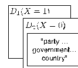  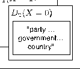    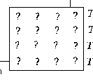    Generative Model  ? ?  ? ?  ? ?  ? ?  ? ? ? ? ? ? ? ?  "party … government… country"  D1 D2  T1 T2 T3 T4  T1 T2 T3 T4   w1 w2 w3 w4  X = 0  X = 1  D1(X = 1) D2(X = 0) θd βx|
|---|
|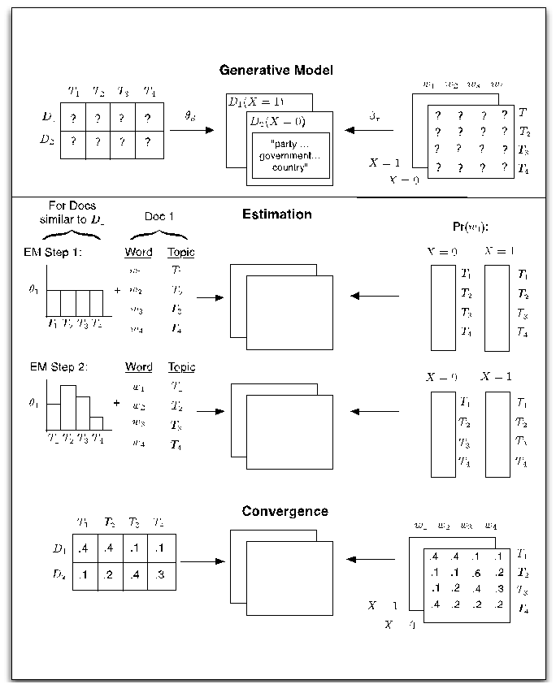  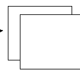    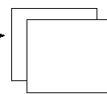    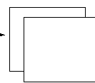    |.4|.4|.1|.1|
|---|---|---|---|
|.1|.2|.4|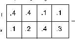  .3|
    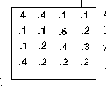      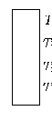    Estimation  EM Step 1: EM Step 2:   Convergence  For Docs similar to D1  Word Topic  Word Topic  +  +  .4 .4 .1 .1  .1 .2 .4 .3 .4 .2 .2 .2  Pr(w1):  .1 .1 .6 .2  z}|{ z}|{  Doc 1  D1 D2  T1 T2   T2  T1 T2 T3 T4  T1 T3 T4  T1 T2 T3 T4  T3 T4   T1 T2 T3 T4   T1 T2 T3 T4   T1 T2 T3 T4   T1 T2 T3 T4   w1 w2 w3 w4  θ1  θ1  w1 w2 w3 w4   w1 w2 w3 w4   T1 T2 T3 T4   T1 T2 T3 T4   X = 0  X = 0  X = 0  X = 1  X = 1  X = 1|

Figure 1: Heuristic description of generative process and estimation of the STM.

###### 3. Using the structural topic model

In this section we demonstrate the basics of using the package.2 Figure 2 presents a heuristic overview of the package, which parallels a typical workflow. For each step we list different functions in the stm package that accomplish each task. First users ingest the data and

2The stm package leverages functions from a variety of other packages. Key computations in the main function use Rcpp (Eddelbuettel and François 2011), RcppArmadillo (Eddelbuettel and Sanderson 2014), MatrixStats (Bengtsson 2018), slam (Hornik, Meyer, and Buchta 2019), lda (Chang 2015), splines and glmnet (Friedman, Hastie, and Tibshirani 2010). Supporting functions use a wide array of other packages including: quanteda (Benoit et al. 2018), tm (Feinerer, Hornik, and Meyer 2008), stringr (Wickham 2019), SnowballC (Bouchet-Valat, Porter, and Boulton 2019), igraph (Csardi and Nepusz 2006), huge (Zhao, Liu, Roeder, Lafferty, and Wasserman 2012), clue (Hornik 2005), wordcloud (Fellows 2018), KernSmooth (Wand 2015), geometry (Habel, Grasman, Stahel, Stahel, and Sterratt 2019), Rtsne (Krijthe and Van der Maaten 2018) and others.

{ { {

|textProcessor|
|---|

Ingest

|readCorpus|
|---|

|prepDocuments|
|---|

Prepare

|plotRemoved|
|---|

Estimate

|stm|
|---|

###### Evaluate Understand Visualize

|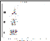|
|---|

|plot.STM|
|---|

|searchK|
|---|

|labelTopics|
|---|

|manyTopics|
|---|

|findThoughts|
|---|

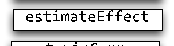

|multiSTM|
|---|

|estimateEffect|
|---|

|cloud|
|---|

||
|---|

|selectModel|
|---|

|topicCorr|
|---|

|permutationTest|
|---|

||
|---|

|plotQuote|
|---|

###### Extensions

|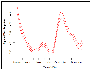|
|---|

|plot.estimateEffect|
|---|

stmBrowser

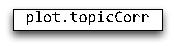

|plot.topicCorr|
|---|

|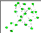|
|---|

stmCorrViz

###### ...

Figure 2: Heuristic description of selected stm package features.

prepare it for analysis. Next a structural topic model is estimated. As we discuss below, the ability to estimate the structural topic model quickly allows for the evaluation, understanding, and visualization of results. For each of these steps we provide examples of some of the functions that are in the package and discussed in this paper. All of the functions come with help files, and examples, that can be accessed by typing ? and then the function’s name.3

###### 3.1. Ingest: Reading and processing text data

The first step is to load data into R. The stm package represents a text corpus in three parts: a documents list containing word indices and their associated counts,4 a vocab character vector

- 3Using the underlying function name plot.estimateEffect the help page for the plot method for ‘estimateEffect’ objects can be accessed. We emphasize for those new to R that these functions can be accessed by using the generic function (in this case plot) on an object of the type ‘estimateEffect’.
- 4A full description of the sparse list format can be found in the help file for stm.

containing the words associated with the word indices, and a metadata matrix containing document covariates. For illustration purposes, we print an example of two short documents from a larger corpus below. The first document contains five words (which would appear at positions 21, 23, 87, 98 and 112 of the vocab vector) and each word appears once except the 21st word which appears twice.

- [[1]] [,1] [,2] [,3] [,4] [,5]

- [1,] 21 23 87 98 112
- [2,] 2 1 1 1 1

- [[2]] [,1] [,2] [,3]

- [1,] 16 61 90
- [2,] 1 1 1

In this section, we describe utility functions for reading text data into R or converting from a variety of common formats that text data may come in. Note that particular care must be taken to ensure that documents and their vocabularies are properly aligned with the metadata. In the sections below we describe some tools internal and external to the package that can be useful in this process.

###### Reading in data from a “spreadsheet”

The stm package provides a simple tool to quickly get started for a common use case: The researcher has stored text data alongside covariates related to the text in a spreadsheet, such as a .csv file that contains textual data and associated metadata. If the researcher reads this data into a R data frame, then the stm package’s function textProcessor can conveniently convert and processes the data to make it ready for analysis in the stm package. For example, users would first read in a .csv file that contains the textual data and associated metadata using native R functions, or load a pre-prepared data frame as we do below.5 Next, they would pass this object through the textProcessor function.

To illustrate how to use the stm package, we will use a collection of blogposts about American politics that were written in 2008, from the CMU 2008 Political Blog Corpus (Eisenstein and Xing 2010).6 The blogposts were gathered from six different blogs: American Thinker, Digby, Hot Air, Michelle Malkin, Think Progress, and Talking Points Memo. Each blog has its own particular political bent. The day within 2008 when each blog was written was also recorded. Thus for each blogpost, there is metadata available on the day it was written and the political ideology of the blog for which it was written. In this case, each blog post is a row in a .csv file, with the text contained in a variable called documents.

5Note that the model does not permit estimation when there are variables used in the model that have missing values. As such, it can be helpful to subset data to observations that do not have missing values for metadata that will be used in the STM model.

- 6The set of blogs is available at http://sailing.cs.cmu.edu/socialmedia/blog2008.html and documen-

tation on the blogs is available at http://www.sailing.cs.cmu.edu/socialmedia/blog2008.pdf. You can find the cleaned version of the data we used for this vignette here: http://scholar.princeton.edu/sites/ default/files/bstewart/files/poliblogs2008.csv as well as part of the supplementary material. The saved workspace containing the models we use here is also provided as supplementary material.

R> data <- read.csv("poliblogs2008.csv") R> processed <- textProcessor(data$documents, metadata = data) R> out <- prepDocuments(processed$documents, processed$vocab,

+ processed$meta) R> docs <- out$documents R> vocab <- out$vocab R> meta <- out$meta

The saved workspace with an estimated model that can be used to follow the examples in this manuscript is also contained in the supplementary material.

###### Using the quanteda package

A useful external tool for handling text processing is the quanteda package (Benoit et al. 2018), which makes it easy to import text and associated metadata, prepare the texts for processing, and convert the documents into a document-term matrix. In quanteda, documents can be added to a corpus object using the corpus constructor function, which holds both the texts and the associated covariates in the form of document-level metadata. The readtext package (Benoit and Obeng 2019) contains very flexible tools for reading many formats of texts, such as plain text, XML, and JSON formats and for easily creating a corpus from

- them. The function dfm from the quanteda package creates a document-term matrix that can be supplied directly to the stm model fitting function. quanteda offers a much richer set of functions than the built-in textProcessor function and so can be particularly useful when more customization is required.

###### Reading in data from other text processing programs

Sometimes researchers will encounter data that is not in a spreadsheet format. Function readCorpus is capable of loading data from a wide variety of formats, including the standard R matrix class along with the sparse matrices from the packages slam and Matrix (Bates and Maechler 2019). Document-term matrices created by the popular package tm are inherited from the slam sparse matrix format and thus are included as a special case.

Another program that is helpful for setting up and processing text data with document metadata, is tstorg available from https://www.txtorg.org (Lucas et al. 2015). The txtorg program generates three separate files: a metadata file, a vocabulary file, and a file with the original documents. The default export format for txtorg is the LDA-C sparse matrix format popularized by David Blei’s implementation of LDA. The readCorpus() function can read in data of this type using the "ldac" option.

Finally the corpus package (Perry 2017) provides another fast method for creating a corpus from raw text inputs.

###### Pre-processing text content

It is often useful to engage in some processing of the text data before modeling it. The most common processing steps are stemming (reducing words to their root form), dropping punctuation and stop word removal (e.g., the, is, at). The textProcessor function implements each of these steps across multiple languages by using the tm package.7

- 7The tm package has numerous additional features that are not included in textProcessor which is intended

only to wrap a useful set of common defaults.

###### 3.2. Prepare: Associating text with metadata

After reading in the data, we suggest using the utility function prepDocuments to process the loaded data to make sure it is in the right format. prepDocuments also removes infrequent terms depending on the user-set parameter lower.thresh. The utility function plotRemoved will plot the number of words and documents removed for different thresholds. For example, the user can use:

R> plotRemoved(processed$documents, lower.thresh = seq(1, 200, by = 100)) R> out <- prepDocuments(processed$documents, processed$vocab,

+ processed$meta, lower.thresh = 15)

to evaluate how many words and documents would be removed from the data set at each word threshold, which is the minimum number of documents a word needs to appear in order for the word to be kept within the vocabulary. Then the user can select their preferred threshold within prepDocuments.

Importantly, prepDocuments will also re-index all metadata/document relationships if any changes occur due to processing. If a document is completely removed due to pre-processing (for example because it contained only rare words), then prepDocuments will drop the corresponding row in the metadata as well. After reading in and processing the text data, it is important to inspect features of the documents and the associated vocabulary list to make sure they have been correctly pre-processed.

From here, researchers are ready to estimate a structural topic model.

###### 3.3. Estimate: Estimating the structural topic model

The data import process will output documents, vocabulary and metadata that can be used for an analysis. In this section we illustrate how to estimate the STM. Next we move to a range of functions to evaluate, understand, and visualize the fitted model object.

The key innovation of the STM is that it incorporates metadata into the topic modeling framework. In STM, metadata can be entered in the topic model in two ways: topical prevalence and topical content. Metadata covariates for topical prevalence allow the observed metadata to affect the frequency with which a topic is discussed. Covariates in topical content allow the observed metadata to affect the word rate use within a given topic – that is, how a particular topic is discussed. Estimation for both topical prevalence and content proceeds via the workhorse stm function.

###### Estimation with topical prevalence parameter

In this example, we use the ratings variable (blog ideology) as a covariate in the topic prevalence portion of the model with the CMU Poliblog data described above. Each document is modeled as a mixture of multiple topics. Topical prevalence captures how much each topic contributes to a document. Because different documents come from different sources, it is natural to want to allow this prevalence to vary with metadata that we have about document sources.

We will let prevalence be a function of the “rating” variable, which is coded as either “Liberal” or “Conservative,” and the variable “day” which is an integer measure of days running from

the first to the last day of 2008. To illustrate, we now estimate a 20 topic STM model. The user can then pass the output from the model, poliblogPrevFit, through the various functions we discuss below (e.g., the plot method for ‘STM’ objects) to inspect the results.

If a user wishes to specify additional prevalence covariates, she would do so using the standard formula notation in R which we discuss at greater length below. A feature of the stm function is that “prevalence” can be expressed as a formula that can include multiple covariates and factorial or continuous covariates. For example, by using the formula setup we can enter other covariates additively. Additionally users can include more flexible functional forms of continuous covariates, including standard transforms like log(), as well as ns() or bs() from the splines package. The stm package also includes a convenience function s(), which selects a fairly flexible b-spline basis. In the current example we allow for the variable day to be estimated with a spline. As we show later in the paper, interactions between covariates can also be added using the standard notation for R formulas. In the example below, we enter in the variables additively, by allowing for the day variable, an integer variable measuring which day the blog was posted, to have a non-linear relationship in the topic estimation stage.

R> poliblogPrevFit <- stm(documents = out$documents, vocab = out$vocab,

+ K = 20, prevalence =~ rating + s(day), max.em.its = 75,

+ data = out$meta, init.type = "Spectral")

The model is set to run for a maximum of 75 EM iterations (controlled by max.em.its). Convergence is monitored by the change in the approximate variational lower bound. Once the bound has a small enough change between iterations, the model is considered converged. To reduce compiling time, in this paper we do not run the models and instead load a workspace with the models already estimated.8

R> load("results.rda")

###### 3.4. Evaluate: Model selection and search

###### Model initialization for a fixed number of topics

As with all mixed-membership topic models, the posterior is intractable and non-convex, which creates a multi-modal estimation problem that can be sensitive to initialization. Put differently, the answers the estimation procedure comes up with may depend on starting values of the parameters (e.g., the distribution over words for a particular topic). There are two approaches to dealing with this that the stm package facilitates. The first is to use an initialization based on the method of moments, which is deterministic and globally consistent under reasonable conditions (Arora et al. 2013; Roberts et al. 2016a). This is known as a spectral initialization because it uses a spectral decomposition (non-negative matrix factorization) of the word co-occurrence matrix. In practice we have found this initialization to be very helpful. This can be chosen by setting init.type = "Spectral" in the stm function. We use this option in the above example. This means that no matter the seed that

8We note that due to differences across versions of the software the code above may not exactly replicate the models we use below. We have analyzed the Poliblog data in other papers including Roberts, Stewart, and Tingley (2016a) and Romney, Stewart, and Tingley (2015).

is set, the same results will be generated.9 When the vocabulary is larger than 10,000 words, the function will temporarily subset the vocabulary size for the duration of the initialization. The second approach is to initialize the model with a short run of a collapsed Gibbs sampler for LDA. For completeness researchers can also initialize the model randomly, but this is generally not recommended. In practice, we generally recommend using the spectral initialization as we have found it to produce the best results consistently (Roberts et al. 2016a).10

###### Model selection for a fixed number of topics

When not using the spectral initialization, the analyst should estimate many models, each from different initializations, and then evaluate each model according to some separate standard (we provide several below). The function selectModel automates this process to facilitate finding a model with desirable properties. Users specify the number of “runs,” which in the example below is set to 20. selectModel first casts a net where “run” (below 10) models are run for two EM steps, and then models with low likelihoods are discarded. Next, the default returns the 20% of models with the highest likelihoods, which are then run until convergence or the EM iteration maximum is reached. Notice that options for the stm function can be passed to selectModel, such as max.em.its. If users would like to select a larger number of models to be run completely, this can also be set with an option specified in the help file for this function.

R> poliblogSelect <- selectModel(out$documents, out$vocab, K = 20,

+ prevalence =~ rating + s(day), max.em.its = 75, data = out$meta,

+ runs = 20, seed = 8458159)

In order to select a model for further investigation, users must choose one of the candidate models’ outputs from selectModel. To do this, plotModels can be used to plot two scores: semantic coherence and exclusivity for each model and topic.

Semantic coherence is a criterion developed by Mimno, Wallach, Talley, Leenders, and McCallum (2011) and is closely related to pointwise mutual information (Newman, Lau, Grieser, and Baldwin 2010): It is maximized when the most probable words in a given topic frequently co-occur together. Mimno et al. (2011) show that the metric correlates well with human judgment of topic quality. Formally, let D(v,v ) be the number of times that words v and v appear together in a document. Then for a list of the M most probable words in topic k, the semantic coherence for topic k is given as

- i−1
- j=1

M

Ck =

log

i=2

D(vi,vj) + 1 D(vj)

. (5)

In Roberts et al. (2014) we noted that attaining high semantic coherence was relatively easy by having a few topics dominated by very common words. We thus propose to measure topic quality through a combination of semantic coherence and exclusivity of words to topics. We use the FREX metric (Bischof and Airoldi 2012; Airoldi and Bischof 2016) to measure

- 9While the initialization is deterministic, we have observed in some circumstances it may not produce exactly the same results across machines due to differences in numerical precision. It will, however, always produce the same result within a machine for a given version of stm.
- 10Starting with version 1.3.0 the default initialization strategy was changed to "Spectral" from "LDA".

exclusivity in a way that balances word frequency.11 FREX is the weighted harmonic mean of the word’s rank in terms of exclusivity and frequency.

−1

1 − ω ECDF(βk,v)

ω ECDF(βk,v/ Kj=1 βj,v)

FREXk,v =

+

, (6)

where ECDF is the empirical CDF and ω is the weight which we set to 0.7 here to favor exclusivity.12

Each of these criteria are calculated for each topic within a model run. The plotModels function calculates the average across all topics for each run of the model and plots these by labeling the model run with a numeral. Often users will select a model with desirable properties in both dimensions (i.e., models with average scores towards the upper right side of the plot). As shown in Figure 3, the plotModels function also plots each topic’s values, which helps give a sense of the variation in these parameters. For a given model, the user can plot the semantic coherence and exclusivity scores with the topicQuality function.

R> plotModels(poliblogSelect, pch = c(1, 2, 3, 4),

+ legend.position = "bottomright")

Next the user would want to select one of these models to work with. For example, the third model could be extracted from the object that is outputted by selectModel.

R> selectedmodel <- poliblogSelect$runout[[3]]

Alternatively, as discussed in Appendix A, the user can evaluate the stability of particular topics across models.

###### Model search across numbers of topics

STM assumes a fixed user-specified number of topics. There is not a “right” answer to the number of topics that are appropriate for a given corpus (Grimmer and Stewart 2013), but the function searchK uses a data-driven approach to selecting the number of topics. The function will perform several automated tests to help choose the number of topics including calculating the held-out log-likelihood (Wallach, Murray, Salakhutdinov, and Mimno 2009) and performing a residual analysis (Taddy 2012). For example, one could estimate a STM model for 7 and 10 topics and compare the results along each of the criteria. The default initialization is the spectral initialization due to its stability. This function will also calculate a range of quantities of interest, including the average exclusivity and semantic coherence.

R> storage <- searchK(out$documents, out$vocab, K = c(7, 10),

+ prevalence =~ rating + s(day), data = meta)

There is another more preliminary selection strategy based on work by Lee and Mimno (2014). When initialization type is set to "Spectral" the user can specify K = 0 to use the algorithm

- 11We use the FREX framework from Airoldi and Bischof (2016) to develop a score based on our model’s parameters, but do not run the more complicated hierarchical Poisson convolution model developed in that work.
- 12Both functions are also each documented with keyword internal and can be accessed by ?semanticCoherence and ?exclusivity.

Exclusivity

- 1
- 2
- 3
- 4 1

2

43

8.59.09.5

−120 −100 −80 −60 −40

Semantic Coherence

Figure 3: Plot of selectModel results. Numerals represent the average for each model, and dots represent topic specific scores.

of Lee and Mimno (2014) to select the number of topics. The core idea of the spectral initialization is to approximately find the vertices of the convex hull of the word co-occurrences. The algorithm of Lee and Mimno (2014) projects the matrix into a low dimensional space using t-distributed stochastic neighbor embedding (Van der Maaten 2014) and then exactly solves for the convex hull. This has the advantage of automatically selecting the number of topics. The added randomness from the projection means that the algorithm is not deterministic like the standard "Spectral" initialization type. Running it with a different seed can result in not only different results but a different number of topics. We emphasize that this procedure has no particular statistical guarantees and should not be seen as estimating the “true” number of topics. However it can be useful to start and has the computational advantage that it only needs to be run once.

There are several other functions for evaluation shown in Figure 2, and we discuss these in more detail in Appendix A so we can proceed with how to understand and visualize STM results.

###### 3.5. Understand: Interpreting the STM by plotting and inspecting results

After choosing a model, the user must next interpret the model results. There are many ways to investigate the output, such as inspecting the words associated with topics or the relationship between metadata and topics. To investigate the output of the model, the stm

package provides a number of options.

- 1. Displaying words associated with topics (labelTopics, plot method for ‘STM’ objects with argument type = "labels", sageLabels, plot method for ‘STM’ objects with argument type = "perspectives") or documents highly associated with particular topics (findThoughts, plotQuote).
- 2. Estimating relationships between metadata and topics as well as topical content (estimateEffect).
- 3. Calculating topic correlations (topicCorr).

###### Understanding topics through words and example documents

We next describe two approaches for users to explore the topics that have been estimated. The first approach is to look at collections of words that are associated with topics. The second approach is to examine actual documents that are estimated to be highly associated with each topic. Both of these approaches should be used. Below, we use the 20 topic model estimated with the spectral initialization.

To explore the words associated with each topic we can use the labelTopics function. For models where a content covariate is included sageLabels can also be used. Both these functions will print words associated with each topic to the console. The function by default prints several different types of word profiles, including highest probability words and FREX words. FREX weights words by their overall frequency and how exclusive they are to the topic (calculated as given in Equation 6).13 Lift weights words by dividing by their frequency in other topics, therefore giving higher weight to words that appear less frequently in other topics. For more information on lift, see Taddy (2013). Similar to lift, score divides the log frequency of the word in the topic by the log frequency of the word in other topics. For more information on score, see the lda R package. In order to translate these results to a format that can easily be used within a paper, the plot method for ‘STM’ objects with argument type = "labels" will print topic words to a graphic device. Notice that in this case, the labels option is specified as the plot method for ‘STM’ objects has several functionalities that we describe below (the options for "perspectives" and "summary").

R> labelTopics(poliblogPrevFit, c(6, 13, 18))

Topic 6 Top Words: Highest Prob: obama, mccain, campaign, barack, john, said, say FREX: mccain, wright, obama, mccain’, barack, debat, john Lift: goolsbe, oct, schieffer, mcsame, austan, town-hal, wright Score: mccain, obama, oct, campaign, wright, barack, mccain’

Topic 13 Top Words: Highest Prob: palin, obama, biden, sarah, governor, joe, state FREX: palin, blagojevich, biden, sarah, palin’, rezko, governor

13In practice when using FREX for labeling we regularize our estimate of the topic-specific distribution over words using a James-Stein shrinkage estimator (Hausser and Strimmer 2009). More details are available in the documentation.

Lift: blago, monegan, wasilla, blagojevich, palin, “palin, “sarah Score: palin, blagojevich, sarah, biden, palin’, alaska, rezko

Topic 18 Top Words: Highest Prob: bush, said, presid, hous, sen, white, administr FREX: cheney, bush’, r-az, rove, perino, digg, waterboard Lift: perino, addington, fratto, information”, mcclellan,

torture”, cia’ Score: addington, perino, bush, sen, cia, rove, bush’

To examine documents that are highly associated with topics the findThoughts function can be used. This function will print the documents highly associated with each topic.14 Reading these documents is helpful for understanding the content of a topic and interpreting its meaning. Using syntax from data.table (Dowle and Srinivasan 2017) the user can also use findThoughts to make complex queries from the documents on the basis of topic proportions. In our example, for expositional purposes, we restrict the length of the document to the first 200 characters.15 We see that Topic 6 describes discussions of the Obama and McCain campaigns during the 2008 presidential election. Topic 18 discusses the Bush administration. To print example documents to a graphics device, plotQuote can be used. The results are displayed in Figure 4.

R> thoughts3 <- findThoughts(poliblogPrevFit, texts = shortdoc, n = 2,

+ topics = 6)$docs[[1]] R> thoughts20 <- findThoughts(poliblogPrevFit, texts = shortdoc, n = 2,

+ topics = 18)$docs[[1]] R> par(mfrow = c(1, 2), mar = c(0.5, 0.5, 1, 0.5)) R> plotQuote(thoughts3, width = 30, main = "Topic 6") R> plotQuote(thoughts20, width = 30, main = "Topic 18")

###### Estimating metadata/topic relationships

Estimating the relationship between metadata and topics is a core feature of the stm package. These relationships can also play a key role in validating the topic model’s usefulness (Grimmer 2010; Grimmer and Stewart 2013). While stm estimates the relationship for the (K − 1) simplex, the workhorse function for extracting the relationships and associated uncertainty on all K topics is estimateEffect. This function simulates a set of parameters which can

- then be plotted (which we discuss in great detail below). Typically, users will pass the same model of topical prevalence used in estimating the STM to the estimateEffect function. The syntax of the estimateEffect function is designed so users specify the set of topics they wish to use for estimation, and then a formula for metadata of interest. Different estimation strategies and standard plot design features can be used by calling the plot method for ‘estimateEffect’ objects.

estimateEffect can calculate uncertainty in several ways. The default is "Global", which will incorporate estimation uncertainty of the topic proportions into the uncertainty estimates

- 14The theta object in the stm model output has the posterior probability of a topic given a document that

this function uses.

- 15This uses the object shortdoc contained in the workspace loaded above, which is the first 200 characters

of original text.

Topic 6

|Oh, this is fun. Today the McCain campaign held a conference call unveiling a new "truth squad" Web site designed to defend McCain from attacks on his military record. This was in response to Wes Cl  As noted here and elsewhere, the words "William Ayers" appeared nowhere in yesterday's debate, despite the fact that the McCain campaign hinted for days that McCain would go hard at Obama's associatio|
|---|

Topic 18

|Perino Dismisses Pre−War Downing Street Memo: ...It...s Been Debunked By Me... Earlier this week, Karl Rove said that President Bush would not have invaded Iraq if he knew there were no WMD. In today...  McClellan: Bush ...secrectly declassified... 2002 NIE on Iraq to selectively leak to reporters. During his ...Today... show appearance this morning with host Meredith Viera, former press secretary Scott|
|---|

Figure 4: Example documents highly associated with Topics 6 and 18.

using the method of composition. If users do not propagate the full amount of uncertainty, e.g., in order to speed up computational time, they can choose uncertainty = "None", which will generally result in narrower confidence intervals because it will not include the additional estimation uncertainty. Calling summary on the ‘estimateEffect’ object will generate a regression table.

R> out$meta$rating <- as.factor(out$meta$rating) R> prep <- estimateEffect(1:20 ~ rating + s(day), poliblogPrevFit,

+ meta = out$meta, uncertainty = "Global") R> summary(prep, topics = 1)

Call: estimateEffect(formula = 1:20 ~ rating + s(day), stmobj = poliblogPrevFit,

metadata = out$meta, uncertainty = "Global")

Topic 1:

Coefficients:

Estimate Std. Error t value Pr(>|t|) (Intercept) 0.067611 0.010896 6.205 5.64e-10 *** ratingLiberal -0.002387 0.002711 -0.880 0.37864

- s(day)1 -0.006096 0.021106 -0.289 0.77272

- s(day)2 -0.034730 0.012826 -2.708 0.00678 **
- s(day)3 -0.001829 0.015155 -0.121 0.90394
- s(day)4 -0.030650 0.012784 -2.398 0.01652 *
- s(day)5 -0.025525 0.013896 -1.837 0.06626 .
- s(day)6 -0.009910 0.013681 -0.724 0.46886
- s(day)7 -0.004124 0.013375 -0.308 0.75780
- s(day)8 0.043311 0.016395 2.642 0.00826 **
- s(day)9 -0.100047 0.016886 -5.925 3.20e-09 ***
- s(day)10 -0.022109 0.015601 -1.417 0.15647

--Signif. codes: 0 ‘***’ 0.001 ‘**’ 0.01 ‘*’ 0.05 ‘.’ 0.1 ‘ ’ 1

###### 3.6. Visualize: Presenting STM results

The functions we described previously to understand STM results can be leveraged to visualize results for formal presentation. In this section we focus on several of these visualization tools.

###### Summary visualization

Corpus level visualization can be done in several different ways. The first relates to the expected proportion of the corpus that belongs to each topic. This can be plotted using the plot method for ‘STM’ objects with argument type = "summary". An example from the political blogs data is given in Figure 5. We see, for example, that the Sarah Palin/vice president Topic 13 is actually a relatively minor proportion of the discourse. The most common topic is a general topic full of words that bloggers commonly use, and therefore is not very interpretable. The words listed in the figure are the top three words associated with the topic.

R> plot(poliblogPrevFit, type = "summary", xlim = c(0, 0.3))

In order to plot features of topics in greater detail, there are a number of options in the plot method for ‘STM’ objects, such as plotting larger sets of words highly associated with a topic or words that are exclusive to the topic. Furthermore, the cloud function will plot a standard word cloud of words in a topic16 and the plotQuote function provides an easy

- to use graphical wrapper such that complete examples of specific documents can easily be included in the presentation of results.

###### Metadata/topic relationship visualization

We now discuss plotting metadata/topic relationships, as the ability to estimate these relationships is a core advantage of the STM model. The core plotting function is the plot method for ‘estimateEffect’ objects, which handles the output of estimateEffect.

First, users must specify the variable that they wish to use for calculating an effect. If there are multiple variables specified in estimateEffect, then all other variables are held at their sample median. These parameters include the expected proportion of a document that belongs to a topic as a function of a covariate, or a first difference type estimate, where topic

16This uses the wordcloud package (Fellows 2018).

###### Top Topics

Topic 4: one, like, get

Topic 2: think, peopl, like

Topic 6: obama, mccain, campaign

Topic 7: media, time, news

Topic 3: tax, will, econom

Topic 10: law, court, case

- Topic 18: bush, said, presid

- Topic 19: clinton, hillari, will

Topic 1: obama, poll, mccain

- Topic 14: terrorist, attack, israel

Topic 16: iraq, war, iraqi

- Topic 15: american, america, school

Topic 8: democrat, senat, republican

Topic 11: million, money, campaign

Topic 12: iran, nuclear, world

Topic 9: oil, energi, will

Topic 13: palin, obama, biden

Topic 5: vote, elect, voter

Topic 17: global, warm, abort

Topic 20: church, will, christian

0.00 0.05 0.10 0.15 0.20 0.25 0.30

Expected Topic Proportions

Figure 5: Graphical display of estimated topic proportions.

prevalence for a particular topic is contrasted for two groups (e.g., liberal versus conservative). estimateEffect should be run and the output saved before plotting when it is time intensive to calculate uncertainty estimates and/or because users might wish to plot different quantities of interest using the same simulated parameters from estimateEffect.17 The output can then be plotted.

When the covariate of interest is binary, or users are interested in a particular contrast, the method = "difference" option will plot the change in topic proportion shifting from one specific value to another. Figure 6 gives an example. For factor variables, users may wish to plot the marginal topic proportion for each of the levels ("pointestimate").

R> plot(prep, covariate = "rating", topics = c(6, 13, 18),

+ model = poliblogPrevFit, method = "difference", cov.value1 = "Liberal",

+ cov.value2 = "Conservative",

+ xlab = "More Conservative ... More Liberal",

+ main = "Effect of Liberal vs. Conservative", xlim = c(-0.1, 0.1),

+ labeltype = "custom", custom.labels = c("Obama/McCain", "Sarah Palin",

+ "Bush Presidency"))

17The help file for this function describes several different ways for uncertainty estimate calculation, some of which are much faster than others.

###### Effect of Liberal vs. Conservative

Obama/McCain

Sarah Palin

Bush Presidency

−0.10 −0.05 0.00 0.05 0.10

More Conservative ... More Liberal

Figure 6: Graphical display of topical prevalence contrast.

We see Topic 6 is strongly used slightly more by liberals as compared to conservatives, while Topic 13 is close to the middle but still conservative-leaning. Topic 18, the discussion of Bush, was largely associated with liberal writers, which is in line with the observed trend of conservatives distancing from Bush after his presidency.

Notice how the function makes use of standard labeling options available in the native plot() function. This allows the user to customize labels and other features of their plots. We note that in the package we leverage generics for the plot functions. As such, one can simply use plot and rely on method dispatch.

When users have variables that they want to treat continuously, users can choose between assuming a linear fit or using splines. In the previous example, we allowed for the day variable to have a non-linear relationship in the topic estimation stage. We can then plot its effect on topics. In Figure 7, we plot the relationship between time and the vice president topic, Topic 13. The topic peaks when Sarah Palin became John McCain’s running mate at the end of August in 2008.

R> plot(prep, "day", method = "continuous", topics = 13,

+ model = z, printlegend = FALSE, xaxt = "n", xlab = "Time (2008)") R> monthseq <- seq(from = as.Date("2008-01-01"),

+ to = as.Date("2008-12-01"), by = "month")

Expected Topic Proportion

0.000.020.040.060.080.100.12

January March May July September December

Time (2008)

Figure 7: Graphical display of topic prevalence. Topic 13 prevalence is plotted as a smooth function of day, holding rating at sample median, with 95% confidence intervals.

R> monthnames <- months(monthseq) R> axis(1,at = as.numeric(monthseq) - min(as.numeric(monthseq)),

+ labels = monthnames)

###### Topical content

We can also plot the influence of a topical content covariate. A topical content variable allows for the vocabulary used to talk about a particular topic to vary. First, the STM must be fit with a variable specified in the content option. In the below example, the variable rating serves this purpose. It is important to note that this is a completely new model, and so the actual topics may differ in both content and numbering compared to the previous example where no content covariate was used.

R> poliblogContent <- stm(out$documents, out$vocab, K = 20,

+ prevalence =~ rating + s(day), content =~ rating,

+ max.em.its = 75, data = out$meta, init.type = "Spectral")

Next, the results can be plotted using the plot method for ‘STM objects with argument type = "perspectives". This function shows which words within a topic are more associated with one covariate value versus another. In Figure 8, vocabulary differences by rating is

state

### rightcourt

immigrilleg

prison

###### legal

justic said

will

case

rule

law

constitut

govern

enforc

use

###### tortur

Conservative (Topic 10)

Liberal (Topic 10)

Figure 8: Graphical display of topical perspectives.

plotted for Topic 10. Topic 10 is related to Guantanamo. Its top FREX words were “detaine, prison, court, illeg, tortur, enforc, guantanamo”. However, Figure 8 indicates how liberals and conservatives talk about this topic differently. In particular, liberals emphasized “torture” whereas conservatives emphasized typical court language such as “illegal” and “law.”18

R> plot(poliblogContent, type = "perspectives", topics = 10)

This function can also be used to plot the contrast in words across two topics.19 To show this we go back to our original model that did not include a content covariate and we contrast Topic 16 (Iraq war) and 18 (Bush presidency). We plot the results in Figure 9.

R> plot(poliblogPrevFit, type = "perspectives", topics = c(16, 18))

Plotting covariate interactions

Another modification that is possible in this framework is to allow for interactions between covariates such that one variable may “moderate” the effect of another variable. In this example, we re-estimated the STM to allow for an interaction between day (entered linearly) and rating. Then in estimateEffect() we include the same interaction. This allows us in

- 18At this point you can only have a single variable as a content covariate, although that variable can have any number of groups. It cannot be continuous. Note that the computational cost of this type of model rises quickly with the number of groups and so it may be advisable to keep it small.
- 19This plot calculates the difference in probability of a word for the two topics, normalized by the maximum difference in probability of any word between the two topics.

### iraq

forc

will

secur

year

militari

american

iraqi

war

armi

afghanistan

hous

report

white

administr

presid

say

sen

said

watch know

bush

think

troop

##### Topic 16 Topic 18

Figure 9: Graphical display of topical contrast between Topics 16 and 18.

the plot method for ‘estimateEffect’ objects to have this interaction plotted. We display the results in Figure 10 for Topic 20 (Bush administration). We observe that conservatives never wrote much about this topic, whereas liberals discussed this topic a great deal, but over time the topic diminished in salience.

R> poliblogInteraction <- stm(out$documents, out$vocab, K = 20,

+ prevalence =~ rating * day, max.em.its = 75, data = out$meta,

+ init.type = "Spectral")

We have chosen to enter the day variable here linearly for simplicity; however, we note that you can use the software to estimate interactions with non-linear variables such as splines. However, the plot method for ‘estimateEffect’ objects only supports interactions with at least one binary effect modification covariate.

R> prep <- estimateEffect(c(16) ~ rating * day, poliblogInteraction,

+ metadata = out$meta, uncertainty = "None") R> plot(prep, covariate = "day", model = poliblogInteraction,

+ method = "continuous", xlab = "Days", moderator = "rating",

+ moderator.value = "Liberal", linecol = "blue", ylim = c(0, 0.12),

+ printlegend = FALSE) R> plot(prep, covariate = "day", model = poliblogInteraction,

+ method = "continuous", xlab = "Days", moderator = "rating",

+ moderator.value = "Conservative", linecol = "red", add = TRUE,

+ printlegend = FALSE)

Expected Topic Proportion

||Liberal Conservative|
|---|
| | | | |
|---|---|---|---|---|
| | | | | |

0.000.020.040.060.080.100.12

0 100 200 300

Days

Figure 10: Graphical display of topical content. This plots the interaction between time (day of blog post) and rating (liberal versus conservative). Topic 16 prevalence is plotted as linear function of time, holding the rating at either 0 (Liberal) or 1 (Conservative). Were other variables included in the model, they would be held at their sample medians.

R> legend(0, 0.06, c("Liberal", "Conservative"), lwd = 2,

+ col = c("blue", "red")) More details are available in the help file for this function.20

###### 3.7. Extend: Additional tools for interpretation and visualization

There are multiple other ways to visualize results from a STM model. Topics themselves may be nicely presented as a word cloud. For example, Figure 11 uses the cloud function to plot a word cloud of the words most likely to occur in blog posts related to the vice president topic in the 2008 election.

R> cloud(poliblogPrevFit, topic = 13, scale = c(2, 0.25))

In addition, the structural topic model permits correlations between topics. Positive correlations between topics indicate that both topics are likely to be discussed within a document.

20An additional option is the use of local regression (loess). In this case, because multiple covariates are not possible a separate function is required, plotTopicLoess, which contains a help file for interested users.

## palin

state

appoint

elect vice

report

gov

deal

time

execut

just

get

serv

choic

chicago

barack

said

staff

job

run

public

republican

scandal

steven

will

want

presid

presidenti

new

ticket

select

rahm

two

may

meet

chief

ask

come

record

obama...

investig democrat

seat

nation

interview

illinoilook

well

candid

year

day

make team

plumber

much

first

transit

even

announc

say

emanuel

palin...

washington

pick

fitzgerald

corrupt

got

governor

former

name

now

joe

like

offic

jindal

peopl

one

polit

spitzer

also

alaska

obama

sarah

week

rod

rezko

mate

experi

bridg

senat mayor inaugur

resign

press

president−elect

today kennedi

question

biden

blagojevich

- Figure 11: Word cloud display of vice president topic.

These can be visualized using the plot method for ‘topicCorr’ objects. The user can specify a correlation threshold. If two topics are correlated above that threshold, then those two topics are considered to be linked. After calculating which topics are correlated with one another, the plot method for ‘topicCorr’ objects produces a layout of topic correlations using a force-directed layout algorithm, which we present in Figure 12. We can use the correlation graph to observe the connection between Topics 12 (Iraq War) and 20 (Bush administration). The plot method for ‘topicCorr’ objects has several options that are described in the help file.

R> mod.out.corr <- topicCorr(poliblogPrevFit) R> plot(mod.out.corr)

Finally, there are several add-on packages that take output from a structural topic model and produce additional visualizations. In particular, the stmBrowser package (Freeman, Chuang, Roberts, Stewart, and Tingley 2015) contains functions to write out the results of a structural topic model to a d3 based web browser. The browser facilitates comparing topics, analyzing relationships between metadata and topics, and reading example documents. The stmCorrViz package (Coppola, Roberts, Stewart, and Tingley 2016) provides a different d3 visualization environment that focuses on visualizing topic correlations using a hierarchical clustering approach that groups topics together. The function toLDAvis enables export to the LDAvis package (Sievert and Shirley 2015) which helps view topic-word distributions. Additional packages have been developed by the community to support use of STM including tidystm (Johannesson 2018a), a package for making ggplot2 (Wickham 2016) graphics with STM output, stminsights (Schwemmer 2018), a graphical user interface for exploring a fitted model, and stmprinter (Johannesson 2018b), a way to create automated reports of multiple stm runs.

Customizing visualizations

The plotting functions invisibly return the calculations necessary to produce the plots. Thus by saving the result of a plot function to an object, the user can gain access to the necessary data to make plots of their own. We also provide the thetaPosterior function which allows the user to simulate draws of the document-topic proportions from the variational posterior.

Topic 19

Topic 1

Topic 5

Topic 13

Topic 6

- Topic 11
- Topic 12

Topic 4

Topic 7

Topic 3 Topic 2

Topic 9

Topic 15

Topic 17

Topic 8

Topic 20

Topic 10

Topic 18

Topic 14

Topic 16

- Figure 12: Graphical display of topic correlations.

This can be used to include uncertainty in any calculation that the user might want to perform on the topics.

###### 4. Changing basic estimation defaults

In this section, we explain how to change default settings in the stm package’s estimation commands. We start by discussing how to choose among different methods for initializing model parameters. We then discuss how to set and evaluate convergence criteria. Next we describe a method for accelerating convergence when the analysis includes tens of thousands of documents or more. Finally we discuss some variations on content covariate models which allow the user to control model complexity.

###### 4.1. Initialization

As with most topic models, the objective function maximized by STM is multi-modal. This means that the way we choose the starting values for the variational EM algorithm can affect our final solution. We provide four methods of initialization that are accessed using the argument init.type: Latent Dirichlet allocation via collapsed Gibbs sampling (init.type = "LDA"); a spectral algorithm for latent Dirichlet allocation (init.type = "Spectral"); random starting values (init.type = "Random"); and user-specified values (init.type = "Custom").

Spectral is the default option and initializes parameters using a moment-based estimator for LDA due to Arora et al. (2013). LDA uses several passes of collapsed Gibbs sampling to

initialize the algorithm. The exact parameters for this initialization can be set using the argument control. Finally, the random algorithm draws the initial state from a Dirichlet distribution. The random initialization strategy is included primarily for completeness; in general, the other two strategies should be preferred. Roberts et al. (2016a) provide details on these initialization methods and a study of their performance. In general, the spectral initialization outperforms LDA which in turn outperforms random initialization.

Each time the model is run, the random seed is saved under settings$seed in the output object. This can be passed to the seed argument of stm to replicate the same starting values.

###### 4.2. Convergence criteria

Estimation in the STM proceeds by variational EM. Convergence is controlled by relative change in the variational objective. Denoting by t the approximate variational objective at time t, convergence is declared when the quantity ( t − t−1)/abs( t−1) drops below tolerance. The default tolerance is 1e-5 and can be changed using the emtol argument.

The argument max.em.its sets the maximum number of iterations. If this threshold is reached before convergence is reached a message will be printed to the screen. The default of 500 iterations is simply a general guideline. A model that fails to converge can be restarted using the model argument in stm. See the documentation for stm for more information.

The default is to have the status of iterations print to the screen. The verbose option turns printing to the screen on and off.

During the E-step, the algorithm prints one dot for every 1% of the corpus it completes and announces completion along with timing information. Printing for the M-step depends on the algorithm being used. For models without content covariates or other changes to the topic-word distribution, M-step estimation should be nearly instantaneous. For models with content covariates, the algorithm is set to print dots to indicate progress. The exact interpretation of the dots differs with the choice of model (see the help file for more details). By default every 5th iteration will print a report of top topic and covariate words. The reportevery option sets how often these reports are printed.

Once a model has been fitted, convergence can easily be assessed by plotting the variational bound as in Figure 13.

R> plot(poliblogPrevFit$convergence$bound, type = "l",

+ ylab = "Approximate Objective", main = "Convergence")

###### 4.3. Accelerating convergence

When the number of documents is large, convergence in topic models can be slow. This is because each iteration requires a complete pass over all the documents before updating the global parameters. To accelerate convergence we can split the documents into several equal-sized blocks and update the global parameters after each block.21 The option ngroups

21This is related to and inspired by the work of Hughes and Sudderth (2013) on memoized online variational inference for the Dirichlet process mixture model. This is still a batch algorithm because every document in the corpus is used in the global parameter updates, but we update the global parameters several times between the update of any particular document.

###### Convergence

Approximate Objective

−23000000−22800000−22600000−22400000

0 10 20 30 40

Index

Figure 13: Graphical display of convergence.

specifies the number of blocks, and setting it equal to an integer greater than one turns on this functionality.

Note that increasing the ngroups value can dramatically increase the memory requirements of the function because a sufficient statistics matrix for β must be maintained for every block. Thus as the number of blocks is increased we are trading off memory for computational efficiency. While theoretically this approach should increase the speed of convergence it need not do so in any particular case. Also because the updates occur in a different order, the model is likely to converge to a different solution.

###### 4.4. Sparse additive generative model (SAGE)

The sparse additive generative (SAGE) model conceptualizes topics as sparse deviations from a corpus-wide baseline (Eisenstein et al. 2011). While computationally more expensive, this can sometimes produce higher quality topics . Whereas LDA tends to assign many rare words (words that appear only a few times in the corpus) to a topic, the regularization of the SAGE model ensures that words load onto topics only when they have sufficient counts to overwhelm the prior. In general, this means that SAGE topics have fewer unique words that distinguish one topic from another, but those words are more likely to be meaningful. Importantly for our purposes, the SAGE framework makes it straightforward to add covariate effects into the content portion of the model.

Covariate-free SAGE. While SAGE topics are enabled automatically when using a covariate in the content model, they can also be used even without covariates. To activate SAGE topics simply set the option LDAbeta = FALSE.

Covariate-topic interactions. By default when a content covariate is included in the model, we also include covariate-topic interactions. In our political blog corpus for example this means that the probability of observing a word from a Conservative blog in Topic 1 is formed by combining the baseline probability, the Topic 1 component, the Conservative component and the Topic 1-Conservative interaction component.

Users can turn off interactions by specifying the option interactions = FALSE. This can be helpful in settings where there is not sufficient data to make reasonably inferences about all the interaction parameters. It also reduces the computational intensity of the model.

###### 5. Alternate priors

In this section we review options for altering the prior structure in the stm function. We highlight the alternatives and provide intuition for the properties of each option. We chose default settings that we expect will perform the best in the majority of cases and thus changing these settings should only be necessary if the defaults are not performing well.

###### 5.1. Changing estimation of prevalence covariate coefficients

The user can choose between two options: "Pooled" and "L1". The difference between these two is that the "L1" option can induce sparsity in the coefficients (i.e., many are set exactly to zero) while the "Pooled" estimator is computationally more efficient. "Pooled" is the default option and estimates a model where the coefficients on topic prevalence have a zeromean Normal prior with variance given a Half-Cauchy(1, 1) prior. This provides moderate shrinkage towards zero but does not induce sparsity. In practice we recommend the default "Pooled" estimator unless the prevalence covariates are very high dimensional (such as a factor with hundreds of categories).

You can also choose gamma.prior = "L1" which uses the glmnet package (Friedman et al. 2010) to allow for grouped penalties between the L1 and L2 norm. In these settings we estimate a regularization path and then select the optimal shrinkage parameter using a usertunable information criterion. By default selecting the L1 option will apply the L1 penalty by selecting the optimal shrinkage parameter using AIC. The defaults have been specifically tuned for the STM but almost all the relevant arguments can be changed through the control argument. Changing the gamma.enet parameter by specifying control = list(gamma.enet = 0.5) allows the user to choose a mix between the L1 and L2 norms. When set to 1 (as by default) this is the lasso penalty, when set to 0 it is the ridge penalty. Any value in between is a mixture called the elastic net. Using some version of gamma.prior = "L1" is particularly computationally efficient when the prevalence covariate design matrix is highly sparse, for example because there is a factor variable with hundreds or thousands of levels.

- 5.2. Changing the covariance matrix prior The sigma.prior argument is a value between 0 and 1; by default, it is set to 0. The update

for the covariance matrix is formed by taking the convex combination of the diagonalized covariance and the MLE with weight given by the prior (Roberts et al. 2016b). Thus by default we are simply maximizing the likelihood. When sigma.prior = 1 this amounts to setting a diagonal covariance matrix. This argument can be useful in settings where topics are at risk of becoming too highly correlated. However, in extensive testing we have come across very few cases where this was needed.

###### 5.3. Changing the content covariate prior

The kappa.prior option provides two sparsity promoting priors for the content covariates. The default is kappa.prior = "L1" and uses glmnet and the distributed multinomial formulation of Taddy (2015). The core idea is to decouple the update into a sequence of independent L1-regularized Poisson models with plugin estimators for the document level shared effects. See Roberts et al. (2016b) for more details on the estimation procedure. The regularization parameter is set automatically as detailed in the stm help file.

To maintain backwards compatibility we also provide estimation using a scale mixture of Normals where the precisions τ are given improper Jeffreys priors 1/τ. This option can be accessed by setting kappa.prior = "Jeffreys". We caution that this can be much slower than the default option.

There are over twenty additional options accessible through the control argument and documented in stm for altering additional components of the prior. Essentially every aspect of the priors for the content covariate and prevalence covariate specifications can be specified.

6. Performance and design

The primary reason to use the stm package is the rich feature set summarized in Figure 2. However, a key part of making the tool practical for every day use is increasing the speed of estimation. Due to the non-conjugate model structure, Bayesian inference for the structural topic model is challenging and computationally intensive. Over the course of developing the stm package we have continually introduced new methods to make estimating the model faster. In this section, we demonstrate large performance gains over the closest analog accessible through R and then detail some of the approaches that make those gains possible.

###### 6.1. Benchmarks

Without the inclusion of covariates, STM reduces to a logistic-normal topic model, often called the correlated topic model (CTM; Blei and Lafferty 2007). The topicmodels package in R provides an interface to David Blei’s original C code to estimate the CTM (Grün and Hornik 2011). This provides us with the opportunity to produce a direct comparison to a comparable model. While the generative models are the same, the variational approximations to the posterior are distinct. Our code uses an approximation which builds off of later work by Blei’s group (Wang and Blei 2013).

In order to provide a direct comparison we use a set of 5000 randomly sampled documents from the poliblog2008 corpus described above. This set of documents is included as poliblog5k in the stm package. We want to evaluate both the speed with which the model is estimated as well as the quality of the solution. Due to the differences in the variational approximation

CTM CTM (alt) STM STM (alt) # of iterations 34 15 21 6 Total time 96.7 min 6.1 min 0.7 min 0.3 min Time per iteration* 170.7 sec 24.3 sec 1.9 sec 2.7 sec Held-out log-likelihood −6.935 −7.040 −6.900 −6.905

Table 1: Performance benchmarks. Models marked with “(alt)” are alternate specifications with different convergence thresholds as defined in the text. *Time per iteration was calculated by dividing the total run time by the number of iterations. For CTM this is a good estimate of the average time per iteration, whereas for STM this distributes the cost of initialization across the iterations.

the objective functions are not directly comparable so we use an estimate of the expected per-document held-out log-likelihood. With the built-in function make.heldout we construct a dataset in which 10% of documents have half of their words removed. We can then evaluate the quality of inferred topics on the same evaluation set across all models.

R> set.seed(2138) R> heldout <- make.heldout(poliblog5k.docs, poliblog5k.voc)

We arbitrarily decided to evaluate performance using K = 20 topics. The function CTM in the topicmodels package uses different default settings than the original Blei code. Thus we present results using both sets of settings. We start by converting our document format to the simple triplet matrix format used by the topicmodels package: R> slam <- convertCorpus(heldout$documents, heldout$vocab, type = "slam") We then estimate the model with both sets of defaults

R> mod1 <- CTM(slam, k = 20, control=list(seed = as.integer(2138)) R> control_CTM_VEM <- list(estimate.beta = TRUE, verbose = 1,

+ seed = as.integer(2138), nstart = 1L, best = TRUE,

+ var = list(iter.max = 20, tol = 1e-6),

+ em = list(iter.max = 1000, tol = 1e-3),

+ initialize = "random", cg = list(iter.max = -1, tol = 1e-6)) R> mod2 <- CTM(slam, k = 100, control = control_CTM_VEM)

For the STM we estimate two versions, one with default convergence settings and one with emtol = 1e-3 to match the Blei convergence tolerance. In both cases we use the spectral initialization method which we generally recommend.

R> stm.mod1 <- stm(heldout$documents, heldout$vocab, K = 20,

+ init.type = "Spectral") R> stm.mod2 <- stm(heldout$documents, heldout$vocab, K = 20,

+ init.type = "Spectral", emtol = 1e-3)

We report the results in Table 1. The results clearly demonstrate the superior performance of the stm implementation of the correlated topic model. Better solutions (as measured by higher

held-out log-likelihood) are found with fewer iterations and a faster runtime per iteration. In fact, comparing comparable convergence thresholds the stm is able to run completely to convergence before the CTM has made a single pass through the data.22

These results are particularly surprising given that the variational approximation used by STM is more involved than the one used in Blei and Lafferty (2007) and implemented in topicmodels. Rather than use a set of univariate Normals to represent the variational distribution, STM uses a Laplace approximation to the variational objective as in Wang and Blei (2013) which requires a full covariance matrix for each document. Nevertheless, through a series of design decisions which we highlight next we have been able to speed up the code considerably.

###### 6.2. Design

In Blei and Lafferty (2007) and topicmodels, the inference procedure for each document involves iterating over four blocks of variational parameters which control the mean of the topic proportions, the variance of the topic proportions, the individual token assignments and an ancillary parameter which handles the non-conjugacy. Two of these parameter blocks have no closed form updates and require numerical optimization. This in turn makes the sequence of updates very slow.

By contrast in STM we combine the Laplace approximate variational inference scheme of Wang and Blei (2013) with a partially collapsed strategy inspired by Khan and Bouchard (2009) in which we analytically integrate out the token-level parameters. This allows us to perform one numerical optimization which optimizes the variational mean of the topic proportions (λ) and then solves in closed form for the variance and the implied token assignments. This removes iteration between blocks of parameters within each document dramatically speeding up convergence. Details can be found in Roberts et al. (2016b).

We use quasi-Newton methods to optimize λ, initialized at the previous iteration’s estimate. This process of warm-starting the optimization process means that the cost of inference per iteration often drops considerably as the model approaches convergence. Because this optimization step is the main bottleneck for performance we code the objective function, gradient in the fast C++ library Armadillo using the RcppArmadillo package (Eddelbuettel and Sanderson 2014). After computing the optimal λ we calculate the variance of the variational posterior by analytically computing the Hessian (also implemented in C++) and efficiently inverting it via the Cholesky decomposition.

The stm implementation also benefits from better model initialization strategies. topicmodels only allows for a model to be initialized randomly or by a pre-existing model. By contrast stm provides two powerful and fast initialization strategies as described above in Section 4.1. Numerous optimizations have been made to address models with covariates as well. Of particular note is the use of the distributed multinomial regression framework (Taddy 2015) in settings with content covariates and an L1 penalty. This approach can often be orders of magnitude faster than the alternative.

22To even more closely mirror the CTM code we ran STM using a random initialization (which we do not typically recommend). Under default convergence settings the expected held-out log-likelihood was −6.92; better than the CTM implementation. It took 7.2 minutes and 280 iterations to converge, averaging less than 1.5 seconds per iteration. Despite taking many more iterations, this is still dramatically faster in total time than the CTM.

###### 6.3. Access to underlying functions

We also provide the function optimizeDocument which performs the E-step optimization for a single document so that users who may wish to extend the package can access the core optimization functionality.23 For users who simply want to find topic proportions for previously unseen documents we have the easier to use fitNewDocuments function. In order to use fitNewDocuments the vocabularies between the new documents and old must be aligned which can be accomplished through the helper function alignCorpus.

###### 7. Conclusion

The stm package provides a powerful and flexible environment to perform text analysis that integrates both document metadata and topic modeling. In doing so it allows researchers understand which variables are linked with different features of text within the topic modeling framework. This paper provides an overview of how to use some of the features of the stm package, starting with ingestion, preparation, and estimation, and leading up to evaluation, understanding, and visualization. We encourage users to consult the extensive help files for more details and additional functionality. On our website https: //www.structuraltopicmodel.com/ we also provide the companion papers that illustrate the application of this method. We invite users to write their own add-on packages such as the tidystm (Johannesson 2018a) and stminsights (Schwemmer 2018) packages.

Furthermore, there are always gains in efficiency to be had, both in theoretical optimality and in applied programming practice. The STM is undergoing constant streamlining and revision towards faster, more optimal computation. This includes an ongoing project on parallel computation of the STM. As corpus sizes increase, the STM will also increase in the capacity to handle more documents and more varied metadata.

###### Acknowledgments

We thank Antonio Coppola, Jetson Leder-Luis, Christopher Lucas, and Alex Storer for various assistance in the construction of this package. We also thank the many package users who have contributed through bug reports and feature requests. We extend particular gratitude to users on Github who have contributed code via pull requests including Ken Benoit, Patrick Perry, Chris Baker, Jeffrey Arnold, Thomas Leeper, Vincent Arel-Bundock, Santiago Castro, Rose Hartman, Vineet Bansal and Github user sw1. We gratefully acknowledge grant support from the Spencer Foundation’s New Civics initiative, the Hewlett Foundation, a National Science Foundation grant under the Resource Implementations for Data Intensive Research program, Princeton’s Center for Statistics and Machine Learning, and The Eunice Kennedy Shriver National Institute of Child Health & Human Development of the National Institutes of Health under Award Number P2CHD047879. The content is solely the responsibility of the authors and does not necessarily represent the official views of any of the funding institutions. Additional details and the development version are available at https://www. structuraltopicmodel.com/.

23For example, this function would be helpful in developing new approaches to modeling the metadata or implementations that parallelize over documents.

###### References

Ahmed A, Xing EP (2007). “Seeking the Truly Correlated Topic Posterior – On Tight Approximate Inference of Logistic-Normal Admixture Model.” In M Meila, X Shen (eds.), Proceedings of the Eleventh International Conference on Artificial Intelligence and Statistics, volume 2 of Proceedings of Machine Learning Research, pp. 19–26. PMLR, San Juan, Puerto Rico. URL http://proceedings.mlr.press/v2/ahmed07a.html.

Ahmed A, Xing EP (2010). “Timeline: A Dynamic Hierarchical Dirichlet Process Model for Recovering Birth/Death and Evolution of Topics in Text Stream.” In Proceedings of the 26th International Conference on Conference on Uncertainty in Artificial Intelligence, pp. 20–29.

Airoldi EM, Bischof JM (2016). “Improving and Evaluating Topic Models and Other Models of Text.” Journal of the American Statistical Association, 111(516), 1381–1403. doi: 10.1080/01621459.2015.1051182.

Arora S, Ge R, Halpern Y, Mimno D, Moitra A, Sontag D, Wu Y, Zhu M (2013). “A Practical Algorithm for Topic Modeling with Provable Guarantees.” In S Dasgupta, D McAllester (eds.), Proceedings of the 30th International Conference on Machine Learning, volume 28 of Proceedings of Machine Learning Research, pp. 280–288. PMLR, Atlanta. URL http: //proceedings.mlr.press/v28/arora13.html.

Asuncion A, Welling M, Smyth P, Teh YW (2009). “On Smoothing and Inference for Topic Models.” In Proceedings of the Twenty-Fifth Conference on Uncertainty in Artificial Intelligence, UAI ’09, pp. 27–34. AUAI Press, Arlington. URL http://dl.acm.org/citation. cfm?id=1795114.1795118.

Bates D, Maechler M (2019). Matrix: Sparse and Dense Matrix Classes and Methods. R package version 1.2-17, URL https://CRAN.R-project.org/package=Matrix.

Bengtsson H (2018). matrixStats: Functions That Apply to Rows and Columns of Matrices (and to Vectors). R package version 0.54.0, URL https://CRAN.R-project.org/package= matrixStats.

Benoit K, Obeng A (2019). readtext: Import and Handling for Plain and Formatted Text Files. R package version 0.74, URL https://CRAN.R-project.org/package=readtext.

Benoit K, Watanabe K, Wang H, Nulty P, Obeng A, Müller S, Matsuo A (2018). “quanteda: An R Package for the Quantitative Analysis of Textual Data.” Journal of Open Source Software, 3(30), 774. doi:10.21105/joss.00774.

Bischof J, Airoldi E (2012). “Summarizing Topical Content with Word Frequency and Exclusivity.” In J Langford, J Pineau (eds.), Proceedings of the 29th International Conference on Machine Learning, ICML ’12, pp. 201–208. Omnipress, New York.

Blei DM, Lafferty JD (2007). “A Correlated Topic Model of Science.” The Annals of Applied Statistics, 1(1), 17–35. doi:10.1214/07-aoas114.

Blei DM, Ng A, Jordan M (2003). “Latent Dirichlet Allocation.” Journal of Machine Learning Research, 3, 993–1022.

Bouchet-Valat M, Porter M, Boulton R (2019). SnowballC: Snowball Stemmers Based on the C libstemmer UTF-8 Library. R package version 0.6.0, URL https://CRAN.R-project. org/package=SnowballC.

Chang J (2015). lda: Collapsed Gibbs Sampling Methods for Topic Models. R package version 1.4.2, URL https://CRAN.R-project.org/package=lda.

Coppola A, Roberts M, Stewart B, Tingley D (2016). stmCorrViz: A Tool for Structural Topic Model Visualizations. R package version 1.3, URL https://CRAN.R-project.org/ package=stmCorrViz.

Csardi G, Nepusz T (2006). “The igraph Software Package for Complex Network Research.” InterJournal, Complex Systems, 1695(5), 1–9. URL http://igraph.org.

Dowle M, Srinivasan A (2017). data.table: Extension of data.frame. R package version 1.10.4, URL https://CRAN.R-project.org/package=data.table.

Eddelbuettel D, François R (2011). “Rcpp: Seamless R and C++ Integration.” Journal of Statistical Software, 40(8), 1–18. doi:10.18637/jss.v040.i08.

Eddelbuettel D, Sanderson C (2014). “RcppArmadillo: Accelerating R with High-Performance C++ Linear Algebra.” Computational Statistics & Data Analysis, 71, 1054–1063. doi: 10.1016/j.csda.2013.02.005.

Eisenstein J, Ahmed A, Xing EP (2011). “Sparse Additive Generative Models of Text.” In Proceedings of the 28th International Conference on Machine Learning, pp. 1041–1048.

Eisenstein J, O’Connor B, Smith NA, Xing EP (2010). “A Latent Variable Model for Geographic Lexical Variation.” In Proceedings of the 2010 Conference on Empirical Methods in Natural Language Processing, pp. 1277–1287. Association for Computational Linguistics.

Eisenstein J, Xing E (2010). The CMU 2008 Political Blog Corpus. Carnegie Mellon University.

Feinerer I, Hornik K, Meyer D (2008). “Text Mining Infrastructure in R.” Journal of Statistical Software, 25(5), 1–54. doi:10.18637/jss.v025.i05.

Fellows I (2018). wordcloud: Word Clouds. R package version 2.6, URL https://CRAN. R-project.org/package=wordcloud.

Foulds J, Kumar S, Getoor L (2015). “Latent Topic Networks: A Versatile Probabilistic Programming Framework for Topic Models.” In International Conference on Machine Learning, pp. 777–786.

Freeman MK, Chuang J, Roberts ME, Stewart BM, Tingley D (2015). stmBrowser: Structural Topic Model Browser. R package version 1.0, URL https://github.com/mroberts/ stmBrowser.

Friedman J, Hastie T, Tibshirani R (2010). “Regularization Paths for Generalized Linear Models via Coordinate Descent.” Journal of Statistical Software, 33(1), 1–22. doi:10. 18637/jss.v033.i01.

Gerrish S, Blei D (2012). “How They Vote: Issue-Adjusted Models of Legislative Behavior.” In Advances in Neural Information Processing Systems 25, pp. 2762–2770.

Grimmer J (2010). “A Bayesian Hierarchical Topic Model for Political Texts: Measuring Expressed Agendas in Senate Press Releases.” Political Analysis, 18(1), 1–35. doi:10. 1093/pan/mpp034.

Grimmer J, Stewart BM (2013). “Text as Data: The Promise and Pitfalls of Automatic Content Analysis Methods for Political Texts.” Political Analysis, 21(3), 267–297. doi: 10.1093/pan/mps028.

Grün B, Hornik K (2011). “topicmodels: An R Package for Fitting Topic Models.” Journal of Statistical Software, 40(13), 1–30. doi:10.18637/jss.v040.i13.

Habel K, Grasman R, Stahel A, Stahel A, Sterratt DC (2019). geometry: Mesh Generation and Surface Tesselation. R package version 0.4-1, URL https://CRAN.R-project.org/ package=geometry.

Hausser J, Strimmer K (2009). “Entropy Inference and the James-Stein Estimator, with Application to Nonlinear Gene Association Networks.” Journal of Machine Learning Research, 10, 1469–1484.

Hoffman MD, Blei DM, Wang C, Paisley JW (2013). “Stochastic Variational Inference.” Journal of Machine Learning Research, 14(1), 1303–1347.

Hornik K (2005). “A CLUE for CLUster Ensembles.” Journal of Statistical Software, 14(12), 1–25. doi:10.18637/jss.v014.i12.

Hornik K, Meyer D, Buchta C (2019). slam: Sparse Lightweight Arrays and Matrices. R package version 0.1-45, URL https://CRAN.R-project.org/package=slam.

Hughes MC, Sudderth E (2013). “Memoized Online Variational Inference for Dirichlet Process Mixture Models.” In CJC Burges, L Bottou, M Welling, Z Ghahramani, KQ Weinberger (eds.), Advances in Neural Information Processing Systems 26, pp. 1133–1141. Curran Associates.

Johannesson M (2018a). tidystm: Extract Effect from estimateEffect in the stm Package. R package version 0.0.0.9000, URL https://github.com/mikajoh/tidystm.

Johannesson MP (2018b). stmprinter: Print Multiple STM Models to a File for Inspection. R package version 0.0.0.9000, URL https://github.com/mikajoh/stmprinter.

Khan ME, Bouchard G (2009). “Variational EM Algorithms for Correlated Topic Models.” Technical report, University of British Columbia.

Krijthe JH, Van der Maaten L (2018). Rtsne: t-Distributed Stochastic Neighbor Embedding Using Barnes-Hut Implementation. R package version 0.15, URL https://CRAN. R-project.org/package=Rtsne.

Lee M, Mimno D (2014). “Low-Dimensional Embeddings for Interpretable Anchor-Based Topic Inference.” In Proceedings of the 2014 Conference on Empirical Methods in Natural Language Processing, pp. 1319–1328. Association for Computational Linguistics, Doha, Qatar. URL http://www.aclweb.org/anthology/D14-1138.

Lucas C, Nielsen R, Roberts M, Stewart B, Storer A, Tingley D (2015). “Computer Assisted Text Analysis for Comparative Politics.” Political Analysis, 23(2), 254–277. doi:10.1093/ pan/mpu019.

Milner HV, Tingley DH (2015). Sailing the Water’s Edge: Domestic Politics and American Foreign Policy. Princeton University Press.

Mimno D, McCallum A (2008). “Topic Models Conditioned on Arbitrary Features with Dirichlet-Multinomial Regression.” In Proceedings of the Twenty-Fourth Conference Annual Conference on Uncertainty in Artificial Intelligence, pp. 411–418. AUAI Press.

Mimno D, Wallach HM, Talley E, Leenders M, McCallum A (2011). “Optimizing Semantic Coherence in Topic Models.” In Proceedings of the Conference on Empirical Methods in Natural Language Processing, EMNLP ’11, pp. 262–272. Association for Computational Linguistics, Stroudsburg. URL http://dl.acm.org/citation.cfm?id=2145432.2145462.

Newman D, Lau JH, Grieser K, Baldwin T (2010). “Automatic Evaluation of Topic Coherence.” In Human Language Technologies: The 2010 Annual Conference of the North American Chapter of the Association for Computational Linguistics, pp. 100–108. Association for Computational Linguistics.

Paul M, Dredze M (2015). “SPRITE: Generalizing Topic Models with Structured Priors.” Transactions of the Association of Computational Linguistics, 3(1), 43–57. doi:10.1162/ tacl_a_00121.

Perry PO (2017). corpus: Text Corpus Analysis. R package version 0.10.0, URL https: //CRAN.R-project.org/package=corpus.

Quinn KM, Monroe BL, Colaresi M, Crespin MH, Radev DR (2010). “How to Analyze Political Attention with Minimal Assumptions and Costs.” American Journal of Political Science, 54(1), 209–228. doi:10.1111/j.1540-5907.2009.00427.x.

R Core Team (2019). R: A Language and Environment for Statistical Computing. R Foundation for Statistical Computing, Vienna, Austria. URL https://www.R-project.org/.

Reich J, Tingley D, Leder-Luis J, Roberts ME, Stewart BM (2015). “Computer Assisted Reading and Discovery for Student Generated Text in Massive Open Online Courses.” Journal of Learning Analytics, 2(1), 156–184. doi:10.18608/jla.2015.21.8.

Roberts M, Stewart B, Tingley D (2016a). “Navigating the Local Modes of Big Data: The Case of Topic Models.” In Computational Social Science: Discovery and Prediction. Cambridge University Press, New York.

Roberts ME, Stewart BM, Airoldi E (2016b). “A Model of Text for Experimentation in the Social Sciences.” Journal of the American Statistical Association, 111(515), 988–1003. doi:10.1080/01621459.2016.1141684.

Roberts ME, Stewart BM, Tingley D (2019). stm: R Package for Structural Topic Models. R package version 1.3.4, URL https://CRAN.R-project.org/package=stm.

Roberts ME, Stewart BM, Tingley D, Airoldi EM (2013). “The Structural Topic Model and Applied Social Science.” In Advances in Neural Information Processing Systems Workshop on Topic Models: Computation, Application, and Evaluation. Neural Information Processing Society.

Roberts ME, Stewart BM, Tingley D, Lucas C, Leder-Luis J, Gadarian SK, Albertson B, Rand DG (2014). “Structural Topic Models for Open-Ended Survey Responses.” American Journal of Political Science, 58(4), 1064–1082. doi:10.1111/ajps.12103.

Romney D, Stewart B, Tingley D (2015). “Plain Text: Transparency in Computer-Assisted Text Analysis.” Qualitative & Multi-Method Research, 13(1), 32–37.

Rosen-Zvi M, Chemudugunta C, Griffiths T, Smyth P, Steyvers M (2010). “Learning AuthorTopic Models from Text Corpora.” ACM Transactions on Information Systems, 28(1), 4. doi:10.1145/1658377.1658381.

Schwemmer C (2018). stminsights: A shiny Application for Inspecting Structural Topic Mod-

els. R package version 0.3.0, URL https://CRAN.R-project.org/package=stminsights. Sievert C, Shirley K (2015). LDAvis: Interactive Visualization of Topic Models. R package

version 0.3.2, URL https://CRAN.R-project.org/package=LDAvis.

Socher R, Gershman S, Perotte A, Sederberg P, Blei D, Norman K (2009). “A Bayesian Analysis of Dynamics in Free Recall.” Advances in Neural Information Processing Systems, 22, 1714–1722.

Taddy M (2013). “Multinomial Inverse Regression for Text Analysis.” Journal of the American Statistical Association, 108(503), 755–770. doi:10.1080/01621459.2012.734168.

Taddy M (2015). “Distributed Multinomial Regression.” The Annals of Applied Statistics,

9(3), 1394–1414. doi:10.1214/15-aoas831.

Taddy MA (2012). “On Estimation and Selection for Topic Models.” In Proceedings of the 15th International Conference on Artificial Intelligence and Statistics.

Van der Maaten L (2014). “Accelerating t-SNE Using Tree-Based Algorithms.” The Journal of Machine Learning Research, 15(1), 3221–3245.

Wallach HM, Murray I, Salakhutdinov R, Mimno D (2009). “Evaluation Methods for Topic Models.” In Proceedings of the 26th Annual International Conference on Machine Learning, pp. 1105–1112.

Wand M (2015). KernSmooth: Functions for Kernel Smoothing Supporting Wand and Jones (1995). R package version 2.23-15, URL https://CRAN.R-project.org/package= KernSmooth.

Wang C, Blei DM (2013). “Variational Inference in Nonconjugate Models.” The Journal of Machine Learning Research, 14(1), 1005–1031. doi:10.1049/pbhe002e_ch9.

Wickham H (2016). ggplot2: Elegant Graphics for Data Analysis. Springer-Verlag. doi: 10.1007/978-3-319-24277-4.

Wickham H (2019). stringr: Simple, Consistent Wrappers for Common String Operations. R package version 1.4.0, URL https://CRAN.R-project.org/package=stringr.

Zhao T, Liu H, Roeder K, Lafferty J, Wasserman L (2012). “The huge Package for HighDimensional Undirected Graph Estimation in R.” The Journal of Machine Learning Research, 13(1), 1059–1062.

###### A. Additional evaluation tools

In this appendix we discuss several more advanced features of the stm package. Topic estimation is fundamentally imprecise, as estimation in topic model space requires both an a priori number of topics input by the user, and furthermore an optimization in a space with multiple solutions. Due to the intractability underlying the computation of topic models, we rely on external analytics of our model to understand its unique tradeoffs between competing parameters. The stm package contains a variety of tools that can be used to evaluate the quality of the model as well as the user’s choice of number of topics and of metadata selected for inclusion.

###### A.1. Held-out likelihood estimation

Sometimes users will want to compare model specifications to see how well each model does in predicting words within the document. The stm package contains two different functions to aid with held-out likelihood estimation. We use the document-completion held-out likelihood method which is the estimation of the probability of words appearing within a document when those words have been removed from the document in the estimation step (Asuncion, Welling, Smyth, and Teh 2009; Wallach et al. 2009; Hoffman, Blei, Wang, and Paisley 2013). Similar to cross-validation, when some of the data is removed from estimation and then later used for validation, the held-out likelihood helps the user assess the model’s prediction performance.

We provide two different functions for the user to complete held-out log-likelihood estimation. The first, make.heldout, produces a document set where some of the words within the documents have been removed. The user can then run a STM model on the documents with missing words. The second, eval.heldout, evaluates the held-out log-likelihood for missing words based on the model run on the held-out documents.

If users want to fit a previously unseen document that was not part of a held-out set created using make.heldout they can use the fitNewDocuments function.

###### A.2. Residuals checks

Users can also test the assumptions of the model within the package through the function residuals. This function implements residual checks described in Section 4.2 of Taddy (2012), testing for overdispersion of the variance of the multinomial within the data generating process of STM. As described in Taddy (2012), if the residuals are overdispersed, it could be that more topics are needed to soak up some of the extra variance. While no fool-proof method has been developed to choose the number of topics, both the residual checks and held-out likelihood estimation are useful indicators of the number of topics that should be chosen.24

###### A.3. Checks for multi-modality

Another diagnostic that should be completed while running the STM when not using the spectral based initializations is checking to see how multi-modal the model of interest is. We provide a suite of methods to assess multi-modality, and we refer the reader to Roberts et al.

24In addition to these functions one can also explore if there are words that are extremely highly associated with a single topic via the checkBeta function.

(2016a) for an explanation of all of them. The function multiSTM aligns topics across models. The plot method for ‘MultimodDiagnostic objects plots the effects across topics and models. Both enable the researcher to investigate how different solutions lead to different inferences about the data.

###### A.4. Post-estimation permutation checks

Any statistical procedure can be abused and STM is no different. One concern is that users will simply search out covariate topic relationships that are the strongest. A related concern is that by combining the measurement model with the estimation of an effect, the user is “baking in” the conclusion. In the appendix of Roberts et al. (2014) we address this concern using both a simulation and a permutation test approach. We have built in a function for conducting permutation tests using binary prevalence covariates.25 The permutationTest function takes a formula containing a single binary covariate (and optionally other controls) and runs a permutation test where, rather than using the true assignment, the covariate is randomly assigned to a document with probability equal to its empirical probability in the data.

After each shuffle of the covariate the same STM model is estimated at different starting values using the same initialization procedure as the original model, and the effect of the covariate across topics is calculated. Next the function records two quantities of interest across this set of “runs” of the model. The first quantity reports the absolute maximum effect of the permuted covariate across all topics. The second quantity reports the effect of the (permuted) covariate on the topic in each additional STM run which is estimated to be the topic closest to the topic of interest. The object returned from permutationTest can then be passed to the plot method for ‘STMpermute’ objects for plotting.

###### Affiliation:

Margaret E. Roberts Department of Political Science University of California, San Diego Social Sciences Building 301 9500 Gillman Drive, 0521, La Jolla, CA, 92093-0521, United States of America E-mail: meroberts@ucsd.edu URL: http://www.margaretroberts.net/

Brandon M. Stewart Department of Sociology Princeton University 149 Wallace Hall, Princeton, NJ 08544, United States of America E-mail: bms4@princeton.edu URL: http://www.brandonstewart.org/

25Future work could extend this to other types of covariates.

Dustin Tingley Department of Government Harvard University 1737 Cambridge St, Cambridge, MA, United States of America E-mail: dtingley@gov.harvard.edu URL: http://scholar.harvard.edu/dtingley

Journal of Statistical Software http://www.jstatsoft.org/ published by the Foundation for Open Access Statistics http://www.foastat.org/

October 2019, Volume 91, Issue 2 Submitted: 2016-01-19 doi:10.18637/jss.v091.i02 Accepted: 2018-09-03

