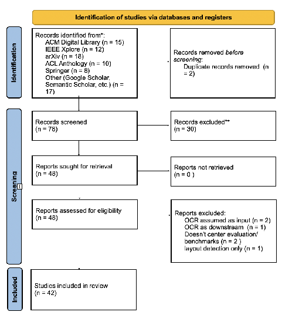
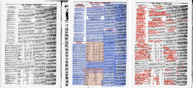

# arXiv:2603.25761v1[cs.CV]26 Mar 2026

## A Survey of OCR Evaluation Methods and Metrics and the Invisibility of Historical Documents

Fitsum Sileshi Beyene

fsb5110@psu.edu The Pennsylvania State University University Park, Pennsylvania, USA

Christopher L. Dancy

cdancy@psu.edu The Pennsylvania State University University Park, Pennsylvania, USA

### Abstract

Optical character recognition (OCR) and document understanding systems increasingly rely on large vision and vision-language models, yet evaluation remains centered on modern, Western, and institutional documents. This emphasis masks system behavior in historical and marginalized archives, where layout, typography, and material degradation shape interpretation. This study examines how OCR and document understanding systems are evaluated, with particular attention to Black historical newspapers. We review OCR and document understanding papers, as well as benchmark datasets, which are published between 2006 and 2025 using the PRISMA framework. We look into how the studies report training data, benchmark design, and evaluation metrics for vision transformer and multimodal OCR systems. During the review, we found that Black newspapers and other community-produced historical documents rarely appear in reported training data or evaluation benchmarks. Most evaluations emphasize character accuracy and task success on modern layouts. They rarely capture structural failures common in historical newspapers, including column collapse, typographic errors, and hallucinated text. To put these findings into perspective, we use previous empirical studies and archival statistics from significant Black press collections to show how evaluation gaps lead to structural invisibility and representational harm. We propose that these gaps occur due to organizational (meso) and institutional (macro) behaviors and structure, shaped by benchmark incentives and data governance decisions.

### CCS Concepts

• Computing methodologies → Artificial intelligence; Machine learning; • Information systems → Information retrieval; • Applied computing → Arts and humanities.

### Keywords

OCR evaluation, Document understanding, Historical documents, Benchmarks, Layout analysis, Computer Vision

Permission to make digital or hard copies of all or part of this work for personal or classroom use is granted without fee provided that copies are not made or distributed for profit or commercial advantage and that copies bear this notice and the full citation on the first page. Copyrights for components of this work owned by others than the author(s) must be honored. Abstracting with credit is permitted. To copy otherwise, or republish, to post on servers or to redistribute to lists, requires prior specific permission and/or a fee. Request permissions from permissions@acm.org.

FAccT ’26, Montréal, Ca © 2026 Copyright held by the owner/author(s). Publication rights licensed to ACM. ACM ISBN 978-x-xxxx-xxxx-x/YYYY/MM https://doi.org/XXXXXXX.XXXXXXX

### 1 Introduction

The design of evaluation techniques does more than just measure machine learning systems; it shapes what such systems are built to see. Indeed, connections between representations of what is acceptable according to standards and dominant genres of the human are often implicit in AI/ML system engineering processes [53]. In optical character recognition (OCR) and document understanding, the standards, metrics, and the (generated and managed) datasets all contribute to determining which documents are legible and whose histories get to be computed [37]. We argue that present OCR evaluation systems consistently fail to identify culturally relevant failure modes, essentially making entire classes of historical texts inaccessible to systems trained to read them.

Over the last decade, OCR has progressed from more characterlevel recognition to full integrated document understanding. Visionlanguagemodels(VLMs)and transformer-based architectures promise to extract not only the text but also semantic structure, spatial relationships, and contextual meaning from document images [21, 28, 54]. However, their evaluation techniques have not kept up with this development. The dominating metrics used to evaluate these systems, such as Character Error Rate (CER) and Word Error Rate (WER), reduce document fidelity to just string-edit distancetreating document understanding as a strictly sequential transcribing activity— which blurs the boundary between a misread character and a misread column, or a transcription error and a layout erasure [37]. Additionally, top benchmarks such as OCRBench, OmniDocBench, and DocVQA [32, 33, 39] rely heavily on scientific papers, corporate forms, and current digital PDFs, which leaves historical and community archives systematically underrepresented [32, 39]. Though one may argue the advantages of escaping legibility given the problematic values implicit to the development of some VLMs, critical engagement with this part of the AI engineering life-cycle does present an opportunity to creating new critical, liberatory systems for culturally relevant digital archives.

In this review, we deliberately focus on Black digital archives, rather than attempting to cover digital archives more broadly. Beyond the important socio-technical considerations related to the ways in which these archives reflect a different set of socio-physical constraints, the early Black press digital archives we focus on are important for the current sociopolitical moment. A greater (critical, responsible) legibility and accessibility of these archives presents opportunities for use in our current moment by a wider audience (e.g., see Supreme Court Justice Ketanji Jackson’s use of the Colored Conventions Project [11] in a recent dissent [22] as an important example of the power of the legible digitization of these documents). These documents include historical newspapers like Freedom’s Journal (1827), The North Star (1847), and the Chicago

Defender (1905), which, beyond just being interesting records of historical context, are important archives of American political, social, and cultural history. As noted by Benjamin Talton, “You can’t tell the story of Black America without the Black press, because the Black press was covering things that weren’t in the mainstream white newspapers and really respecting the humanity of Black people [8].” These newspapers present precisely the challenges that current evaluation systems ignore such as degraded scans from microfilm preservation, Victorian and Gothic typefaces missing from modern training corpora, and complex multicolumn layouts in which spatial arrangement carries rhetorical and political meaning [3, 17, 25].

The consequence is a systematic blindness built into the evaluating system itself — models deemed state-of-the-art that are trained on datasets like PubLayNet [56], DocBank [29], and DocLayNet [41] show inconsistent results when used with Black historical newspapers, partially because the evaluation systems used do not require success with these materials, which have particular sociocultural contexts that impact how their physical instantiations, digitization, and any related metadata are generated and recorded. Even if standard accuracy metrics may show satisfactory CER [37], the models often silently eliminate the multi-column structure that editors used to accentuate rhetoric, promote social cohesion, and assert political identity. This error is more than just a technical problem, but also epistemological.

In this paper, we provide three contributions to the study of fairness, accountability, and transparency in document understanding:

- • A systematic analysis of OCR and document understanding evaluation systems, focusing on how their training data, benchmarks, and metrics are presented and implemented.
- • An argument that current evaluation systems often fail to detect structural and layout errors common in historical newspapers, despite reporting a strong character-level accuracy and support for that argument.
- • A case study on historical Black press materials that shows how these evaluation blind spots can result in a structurally significant errors that continue to be unreported under commonly accepted evaluation techniques.

Perhaps simpler than conversations around AI ethics, we argue that the key iterative step of evaluation for OCR systems should be revisited; though see [5, 53] for pertinent discussion around AI Ethics and the higher-level AI engineering process. The challenge is not technical per se, but rather resource allocation, dataset diversity, and recognizing cultural significance — which may also be understood as a challenge in values [4]. By demonstrating how evaluation choices reflect assumptions about which documents matter, we hope to provide ML researchers with a vocabulary for critiquing their own benchmarks as well as a template that extends beyond Black newspapers to other important, culturally relevant digital archives such as community-supported indigenous archives and other domains where standard evaluation practices silently fail.

### 2 Related work

This work follows from a constellation of previous research from fields such as computer vision (for OCR) and the digital humanities. We survey previous work within four interconnected research areas:

the evolution of OCR systems and document understanding architectures, the development of evaluation metrics and benchmarks, studies on historical document digitization, and critical work on bias and representation in machine learning.

### 2.1 From Character Recognition to DocumentUnderstanding

The direction of OCR research over the last decade shows a fundamental transition from single character recognition to full document understanding. Traditional OCR systems, such as Tesseract, consider text extraction as a pipeline that comprises binarization, segmentation, and character classification, with layout analysis used as a preprocessing intermediate step [46].

Following these important systems, the LayoutLM model family represented an architectural shift by modeling text, layout, and visual aspects all within the same transformer architecture [54]. LayoutLMv2 included cross-modal pre-training objectives that merged spatial and textual representations [55], whereas LayoutLMv3 combined text and picture masking to learn the document structure without relying on pre-extracted OCR features [21]. These models showed that treating layout as semantically important, rather than just positional, can improve the results on document understanding tasks.

Recently most of the work is towards end-to-end systems that bypass traditional OCR pipelines. For instance, TrOCR showed that transformer encoder-decoder models pre-trained on synthetic data could achieve adequate handwritten text recognition results without making other task-specific architecture alterations [28]. This technique for document parsing was then extended by Donut [23] and Nougat [6], which used vision transformers to generate a structured output directly from the document images. The GOT-OCR 2.0 model combined several OCR modalities, including scene text, documents, and mathematical notation, into a single architecture, yet with noticeably insufficient results on historical materials [52].

It’s clear that the development of vision-language models (VLMs) represents the current edge of OCR system research. Systems like Qwen2.5-VL and PaddleOCR-VL use large-scale, multimodal pretraining to do OCR as part of the larger visual reasoning pipeline [1, 13]. Furthermore, the olmOCR project has focused on PDF interpretation at scale by using Internet Archive content to provide training data that includes some older texts [42]. However, as shown in the next section, the shift toward document comprehension has not been accompanied by equivalent changes in how we evaluate these systems.

### 2.2 Evaluation Metrics: The edit distance

Historically the evaluation of OCR systems has been based on the Character Error Rate (CER) and Word Error Rate (WER), which are both from the Levenshtein edit distance between anticipated and ground truth strings. These metrics are computationally simple and intuitive to interpret; a CER of 5% means that one out of every twenty characters requires correction. CER/WER is almost universally used in OCR studies, with many systems reporting only these metrics [37, 41]. These constraints matter because the edit-distance algorithms treat all errors the same, whether a substitution happens within a word or a line break interrupts paragraph structure. They

don’t have the mechanism for penalizing layout errors and if a model successfully transcribes every character but scrambles the column order it still achieves flawless CER while providing poor results.

Even with improved metrics that begin to address some of the socially, culturally contextualized differences in historical digital archives, evaluations of various OCR systems can run into the issue of a lack of ground truth. Given the difficulty in getting many of these archives digitized, lack of such related data and metadata to provide a supervised evaluation is unsurprising. Beyene and Dancy [3] introduce an unsupervised evaluation framework to potentially use for some assessments in the absence of ground-truth transcriptions of digitized archives. The authors used a combination of semantic coherence score, region entropy divergence, and textual redundancy score as a way to evaluate the performance of various OCR systems on a historical digital archive that did not have an accompanying ground truth. Though only a part of what is needed for evaluation practices that are better equipped to handle the realities of culturally relevant digital historical archives, the work does provide a useful tool given the individual, organizational, and institutional context of these digital archives (including the typical reduced resources to transcribe Black digital historical archives.)

Despite this progress, metric pluralism remains the exception instead of the standard. According to our survey, only few systems reporting OCR results contain any structural metric in addition to CER/WER, and very few particularly address layout preservation for historical texts.

### 2.3 Benchmarking and Pre-Training Data

The benchmarks that are used to evaluate document understanding systems also set the expectations about which texts are valuable. The IIT-CDIP, which is a primary pre-training corpus for many current systems, is comprised of approximately 7 million documents, containing roughly 42 million scanned pages (images) which are collected through tobacco litigation discovery [27]. While IIT-CDIP provides size and diversity across document categories (letters, forms, memorandum, and reports), it is a niche institutional format (i.e., mid-to-late twentieth century American business papers) affecting the type of visual and linguistic patterns to be adopted by the models as a "standard". Modern benchmarks have increased coverage while still keeping certain gaps. OCRBench v2 has 11,500 photos from 31 contexts, including a large sum of scientific notation and scene text, but no historical document category [32]. OmniDocBench [39] offers 1,355 annotated PDFs with attributebased evaluation of degradation factors such as blur and watermarks, however it is clearly aimed for "modern-era documents" rather than historical ones. The recently released (and still growing) olmOCR-Bench has 7,010 unit tests that emphasize layout fidelity and include some digitized print materials [42], which makes it the closest to historical coverage among the major benchmarks, though it still lacks targeted representation of community or culturally relevant archives from marginalized communities.

Several benchmarks focus on document question-answering rather than OCR accuracy itself. DocVQA [33], DUDE [51], and DUE [7] evaluate models’ ability to extract specific information from the documents, with OCR being used as an intermediary upstream

component. While these standards evaluate practical utility, they can hide OCR flaws when correct responses have been generated from the incomplete or degraded text.

Recently, KITAB-Bench was created specifically for Arabic documentary heritage, such as manuscripts and historical administrative documents, and improved by human-in-the-loop evaluation [18]. The Newspapers Navigator dataset extracted visual content from Chronicling America’s historical newspaper archive, with an emphasis on image classification [24]. The American Stories research dataset provides structured article text from pre-1920 US newspapers on a large scale, showing that historical newspaper processing can be feasible [15].

Given the archival value of Black newspapers, their absence from evaluation benchmarks is notable. Chronicling America now includes 344 African American newspaper publications from 1777 to 1963 [30]. While previous OCR error rates for these collections averaged 18% [9], the Library of Congress initiated an OCR reprocessing method in 2025 to reduce noise in early digital batches[31]. Howard University’s Black Press Archives have over 2,000 titles and 100,000 issues on 2,847 microfilm reels [20]; but, as of late 2025, a major amount of these archives are still being digitized as part of a multi-year project with the goal of bringing 60% [35] of the collection online [50]. The benchmark systems used thus reflect choices at several (individual, organizational, and institutional) levels, including institutional and financing decisions that impact which histories can become computationally legible.

### 2.4 Historical Document Digitization

Researchers studying historical document digitalization have for years recognized the challenges that mainstream OCR evaluations miss. Holley’s [19] seminal work on crowd-sourcing OCR correction for Australian newspapers showed how standard methods failed on historical typography, involving human oversight at scale. More recent surveys of historical document datasets have identified the various deterioration factors such as foxing, bleed-through, uneven illumination, and physical damage that distinguishes archive materials from modern records [36].

Despite these potential roadblocks, specialized systems have proven that historical OCR is technically achievable with a proper training. OCR4all achieved 84% error reduction on 19th-century Gothic typefaces by fine-tuning on a domain-specific ground truth [43]. The fact that 80% of German documents from 1800-1941 used Blackletter fonts and that modern systems still fail terribly on such materials without specialized training (50-70% CER) shows how training data composition directly determines which historical periods are accessible [47]. Post-OCR correction has emerged as a complementary approach. Nguyen et al. [37] ran a survey that documented solutions ranging from rule-based pattern matching to neural sequence-to-sequence models, with T5-based approaches achieving 28-40% improvement in error reduction on historical materials [44]. Beshirov et al. [2] also showed language specific post-correction for Bulgarian historical records, indicating how linguistic resources limit the historical traditions that gain from correction pipelines. This group of work establishes that there are technical capacities to process historical documents. The continuing gap in this capacity and typical system performance is due to

prioritization embedded in the training dataset and the evaluation benchmarks rather than technological limitations.

### 2.5 Bias, Representation, and Cultural Erasure

In the digital humanities, researchers have explored how algorithmic systems interact with archival gaps. Gallon’s [16] appeal for a "Black digital humanities" emphasizes the importance of accounting for the particular conditions under which Black cultural assets have been generated, preserved, and made available. The Black press, in particular, faced economic hardship and political persecution, influencing both documentation practices and archive survival conditions that typicaly deployed OCR systems have not been engineered to handle. Related recent work has started to relate these critical perspectives to technological practice. Smith et al. [45] look at text reuse in historical newspapers showing how OCR quality affects which texts can be computationally traced and which are invisible to algorithmic analysis. Casey [10] pushed for "hemispheric" approaches to newspaper digitization with an emphasis on transnational Black press networks rather than treating publications on their own. Taurino and Smith’s [48] definition of "machine learning as archival science" highlights that the training data curation in itself is a type of archival practice that can impact what computational systems can learn about the past. Indeed, some current (especially generative) machine learning systems are treated as definitive forms of historical knowledge systems, continuing potentially problematic central points of information that reinforce both problematic social structures (see also [14, 38]) and probabilistically produce false sequences of information, making the critical consideration of this archival practice important.

Compounding the importance of understanding this archivalengineering practice within the context of machine learning with archives is the issue referred to as "over-historicization," in which VLMs generate historically appropriate but inaccurate characters, links these concerns to current model behavior. The study on GPT4o Vision processing of 18th–19th century Russian manuscripts discovered that 59% of errors involved anachronistic character insertions, implying that the models learn to perform "historicalness" instead of accurately transcribing historical documents [26]. This failure shows a digital archival distortion that is enabled by generative AI, which can lead to the creation of plausible but false historical records.

We build on these foundations using a systematic review that connects evaluation metrics to representational outcomes. We show not only that Black newspapers are underrepresented in benchmarks, but also how this under-representation is structured by the metric choices that ignore layout, training datasets that exclude historical typography, and institutional structures that completely exclude community archives from the process of evaluation. This exclusion both hinders opportunities to gain insight into digitized archives while critically using potential OCR tools, and raises an increased possibility of encountering issues such as the previously mentioned over-historicization [26].

### 3 Systematic Review Methodology

We conducted a systematic survey and review of OCR evaluation methods using PRISMA 2020 principles [40]; Figure 1 shows

the workflow for this survey. Our analysis ranges from the years 2006–2025, covering the transformer revolution in document understanding through the current vision-language models, and applies PRISMA to provide transparent inclusion, exclusion, and reporting criteria for evaluation-focused machine learning studies. The study is shaped by three research questions:

- (1) On what data are state-of-the-art OCR systems trained, and how is this data reported in evaluation studies?
- (2) What failure modes develop when SOTA OCR systems are applied on Black historical typography and layout?
- (3) What evaluations, data, and resource shifts are needed to ensure preservation of cultural structure and accuracy?

- 3.1 Search and Selection

We retrieved 80 papers after searching six databases: ACM Digital Library (n=15), IEEE Xplore (n=12), arXiv (n=18), ACL Anthology (n=10), Springer (n=8), and Other (Google Scholar, Semantic Scholar, etc.) (n=17). We classified the search queries used into four categories: primary evaluation (e.g., "OCR evaluation metrics document understanding," "document AI benchmark evaluation"), historical and bias-aware (e.g., "historical document OCR evaluation," "newspaper digitization OCR evaluation"), model-specific (e.g., "vision transformer OCR evaluation"), and negative control (validation); see Appendix A for a full list of the search queries used. After removing 2 duplicates, 78 unique records remained for screening.

Following screening, the inclusion criteria was applied to keep papers which (1) presented or evaluated OCR systems using quantitative metrics as a key contribution, (2) introduced or analyzed evaluation benchmarks, or (3) provided an overview of OCR evaluation processes.

- 3.2 Data Extraction

For each system, we extracted the model architecture, training data sources, data size and transparency, language coverage, and historical document coverage. Table 1 shows this analysis for 13 major systems, showing the variation in reporting transparency that many systems only describe training data as "undisclosed" or "web-scale." For each benchmarks, we recorded supported languages, document types, historical coverage, degradation testing, and whether underrepresented or community archives were explicitly included. Table

- 3 summarizes the major benchmarks and identifies gaps between benchmark scope and the requirements of historical archives.
- 4 Systematic Review Results

4.1 What Current OCR Evaluation Measures and What It Misses

Table 1 provides the training sources for the 13 OCR systems where six of the models rely on the IIT-CDIP database of 42 million tobacco litigation documents from the mid-twentieth century. The rest use synthetic data, scientific PDFs (PubMed Central), or webscale corpora of varying composition. OlmOCR 2 uses a specialized data mix known as olmOCR-mix-1025, that combines broad data from the Internet Archive and S2PDF with a set of 20,000 historical and handwritten documents. The model is optimized to handle the complex and degraded scans found in archival materials, such as

#### Table 1: Training Data Sources and Historical Coverage ofMajor OCR Systems (2021–2025)

Model Year Training Source Scale Params Scripts Historical Cover-

age olmOCR 2 2025 Web PDFs & Internet

260K pgs 7B EN+ Substantial (IA scans; no curation)

Archive

PaddleOCRVL

2025 Synthetic & web corpora

Undisclosed 0.9B 109+ Limited (no histori-

cal eval) Qwen2.5-VL 2025 Web multimodal cor-

Web-scale 7B/72B Multi None reported

pora

GOT-OCR 2.0

2024 Synthetic + modern web

5M pairs 580M EN None (synthetic fo-

cus) Surya 2024 Scanned document

Undisclosed Undiscl. 90+ Limited (no benchmarks)

images

EN None reported Nougat 2023 PubMed Central

11M imgs 200– 500M

DocFormer v2

2024 Document imgs (IITCDIP)

1M docs 350M EN None (academic

PDFs) UDoc 2021 IIT-CDIP regions Undisclosed Undiscl. EN None LayoutLMv3 2022 IIT-CDIP 11M docs 133/368M EN Partial (litigation

PDFs

docs) DiT 2022 IIT-CDIP 42M imgs 33–

EN Partial (structure fo-

cus) Donut 2022 IIT-CDIP + Synth-

675M

13M imgs 200M 4 langs

None (synthetic)

DoG

TrOCR 2021 Synthetic + IAM Undisclosed 558M EN Fine-tuning only Tesseract v5 2021 Synthetic fonts Varies N/A 100+ Custom training re-

quired

#### Table 2: Comparative Evaluation of Critical DocumentAnalysis Systems (2025)

#### Figure 1: PRISMA 2020 flow diagram for the systematic re-view of OCR evaluation methods and metrics in documentunderstanding (2006–2025).

19th-century correspondence from the Library of Congress, using Reinforcement Learning with Verifiable Rewards (RLVR). The training data reported includes scientific publications (360K+), corporate and legal documents (42M pages), and modern digital PDFs. From this distribution of data sources, it’s clear that Historical Black newspapers, community publications, Gothic and Blackletter typefaces, and non-Western document layouts are examples of missing or unreported model training data.

- Table 2 shows uneven evaluation coverage as only three systems report quantitative results for historical scans. For example, olmOCR 2 reports 82.3% accuracy on old math scans, but this drops to 47.7% for general historical scans. In contrast, GOT-OCR 2.0 achieves only 22.1% on the same olmOCR-Bench, while TrOCR reports 5.7% CER even after fine-tuning. Most historical typography entries are "Not evaluated" or "Requires fine-tuning," whereas modern capabilities are more thoroughly documented.
- Table 3 summarizes seven benchmarks, which are organized

by language coverage, document type, historical inclusion, and degradation testing, highlighting their limited engagement with historical and community-produced documents. CC-OCR (ICCV 2025), for instance, supports over 28 languages and focuses on modern applications, while OmniDocBench (CVPR 2025) evaluates blur, rotation, and watermarks without archival focus. KITAB-Bench is unique in that it explicitly includes historical Arabic documents with human-in-the-loop review.

System Architecture Historical Scans Historical Typography

Complex Layouts

Handwriting

Generative / VLM (End-to-End Text Generation) olmOCR 2 VLM (7B) 82.3% (Math)

Supported 83.7% (Multicol)

Supported (20k pages)

47.7% (General)

VLM (7B+) 65.5% (Bench) High (Gen. Cap.)

Strong Remarkable (Scriptagnostic)

Qwen2.5VL

Not evaluated Nougat Transformer Poor (Hallucinates) N/A Academic

EncoderDec.

22.1% (Fail on noise) Poor Poor (reported)

GOT-OCR 2.0

Poor

Only

Donut Transformer Poor Poor Poor Weak TrOCR (L) Transformer 5–7% CER (FT) Fine-

N/A (Linelevel)

###### 2.89% CER (IAM)

tunable

Discriminative / Hybrid (Detection & Recognition) Surya Hybrid

81% (Hist. Tamil)† Moderate Moderate Not evaluated

(Seg.)

2-Stage Moderate (Modern) Moderate Good (Tables) High (82–89% Acc.)

PaddleOCR v5

LSTM High WER (Degraded) Requires Fine-tune

Poor Poor

Tesseract v5

Visual Document Understanding (Requires External OCR)

Moderate N/A LayoutLMv3 Multimodal Dep. on Input OCR Dep. on In-

Multimodal Dep. on Input OCR Dep. on Input OCR

DocFormer v2

SOTA N/A

put OCR

Image Trans.

Strong N/A

UDoc / DiT

Dep. on Input OCR Dep. on Input OCR

†"Dep. on Input OCR" indicates models that classify layout but do not generate text themselves.

### 4.2 Black Press as a Case Study

To further test the gaps in OCR system development for culturally relevant digitized historical archives, we compared three of the models found in our review to parse a page from The Weekly Advocate (1837), one of the first African American newspapers

- Table 3: Evaluation Coverage of Major OCR and Document Understanding Benchmarks

Benchmark Languages Document Types

Annotation Paradigm

Hist. / Archival Coverage

Underrep. Archives

CC-OCR Multi (28+) Web PDF,

scene, docs

Plain Text None (modern web-crawl)

No targeted focus

OmniDoc EN, ZH Academic,

slides, books

Detection & Text Modern-era (Borndigital)

No targeted focus

OCRBench EN, ZH 31 scenarios

(mixed)

VQA / Key-Value Limited (Isolated IAM/HKR)

No explicit focus

DUDE Prim. EN Multi-page

business

QA Pairs Contemporary (Scanned)

No targeted focus

DUE English Tables, graphs QA / Classif. None No targeted focus DocVQA English Industry forms

(Tobacco)

QA Pairs (ANLS) Legacy Litigation (20th C.)

Single-domain

KITAB* Arabic Manuscripts,

Chronicles

Transcription High (Primary Focus)

Arabic Heritage

*Refers to OpenITI/KITAB project evaluation subsets for classical Arabic texts.

published in New York City. Here, we use this case study to go beyond aggregate benchmark scores and observe how evaluation gaps result in specific issues with how the archive may be automatically transcribed and interpreted by these OCR systems. We tested three systems from those listed in Table 2: Tesseract v5 (a traditional hybrid pipeline), Surya (a layout-centric modern system), and olmOCR 2 (a state-of-the-art VLM). We observed a different failure pattern for each system through these tests, which are described in Table 4.

- Table 4: Failure patterns from the The Weekly Advocate

(1837)

Error Regime

Model Technical Failure Archival Consequence

Tesseract v5 Misinterpreted vertical column rules as text; defaulted to left-toright “Z-pattern” reading order

Semantic merging of distinct content (editorial poetry conflated with civic reports); granular search rendered ineffective

Geometric Collapse (Linearity Bias)

Surya High-contrast 19th-c. fonts triggered token collapse; generative repetition of character sequences

Introduction of “garbage tokens”

Decoding Instability

olmOCR 2 (SOTA VLM)

Overwrote a visual evidence with high-probability tokens (“knowledge bleed?”)

Entities were replaced with a fabricated text;

Corrective Hallucination

- Figure 2: Original vs Surya Layout analysis vs Tesseract

Our analyses show a significant gap between the performance of the reported state-of-the-art (SOTA) OCR systems and the usefulness of these systems for historical archival documents that represent the social, cultural, and physical realities shown with those such as historical Black newspapers. We show that the "metric pluralism" needed to capture the accuracy of historical documents is largely missing from current evaluation practice. Although layoutaware models and task-specific layout evaluations exist, they are typically trained on web-scale or corporate collections, such as IIT-CDIP, and then compared to benchmarks that prioritize modern layouts and visually obvious degradations over historical structure and reading order. Our case study shows that while models report satisfactory character recognition scores, they often produce hallucinated content or fail to retain the reading order of multicolumn Black newspapers. Current evaluation methods, which fail to identify representational harm, allow models to be deemed "successful" while ignoring the social and physical constraints shaped by historical Black print culture.

5 Discussion

- 5.1 Evaluation gap

Currently available evaluation pipelines suffer from algorithmic invisibility, where failure modes particular to historically underrepresented documents are not reported by existing benchmarks. Even though Chronicling America explicitly focuses on digital archives in the United States, it still remains underutilized in favor of benchmarks such as DocVQA. Our case study supports this observation by evaluating a newspaper from the Black Digital Archives, The Weekly Advocate, which displays varied layouts and typography and how the failures exhibited by the OCR models remains overlooked. Therefore, without deliberate inclusion of such documents for evaluation systems and training loops, these systems will continue to regard Black cultural heritage as an outlier rather than a core domain.

- 5.2 Synthetic vs Real Dataset

There is a major difference between a synthetic data augmentation and a historical degradation. It is very common to see OCR models handling synthetic perturbations such as Gaussian noise or artificial speckle really well. In contrast, the Early Black Press is characterized by materially specific artifacts including micro-film lighting gradients, physical warping, and irreversible binarization loss. As shown from our case study, models that seem robust under synthetic noise often collapse under such structural degradations by creating a misleading sense of reliability that can not be applied to the real-world archival digitization.

- 5.3 Technical accuracy vs Preserving culture & history

We observed that the standard OCR criteria can create an unresolved tension between optimizing for textual "accuracy" or "cleanliness" and preserving the historical documents as cultural archives. Thishistoricaldocument’slayoutcontain their editorial logic through complex, multi-column designs that maximize the scarce print space usage and can convey additional meaning [25]. SOTA systems then

#### Table 5: Structural, temporal, and archival characteristics of some Black press documents.

Publication / Series Years Layout Topology Masthead / Header Non-Text Elements Typography Complexity Scan Degradation

1837–1841 4 columns, standard grid frequently interrupted by advertisements & spanning headers

High complexity, ribbon banners with multiple embedded text (e.g., “Established for ...” & bold serif headers with sub-text

High variance, heavy horizontal rules, woodcut engraving of the U.S. Capitol, & iconographic glyphs in advertisements

Moderate–high, modern serif (Didone), tight leading, archaic ligatures

bleed-through

The Weekly Advocate & The Colored American (Transitional newspapers)

1838–1841 2 columns, wider column width, magazine aspect ratio

Mirror of Liberty (Quarterly magazine)

Low complexity, simple typographic header, outline block type

Minimal, primarily textheavy, sparse rules

Moderate, larger point size, clear typographic hierarchy

low contrast, character dropout

The North Star (Abolitionist) 1847–1851 7 columns, extremely dense

Moderate, typographic masthead often obscured by scan artifacts

Structural emphasis, thin and broken vertical rules

Very high, minimal point size, dense setting, italics for emphasis

blur, speckle noise, skew

layout

The Impartial Citizen 1861–1864 5 columns, dense grid with

High, Gothic/Blackletter masthead distinct from Roman body text

Standard, vertical column rules

High, dense text blocks challenge line segmentation

lighting gradients from microfilm

slightly wider margins

The Weekly Anglo-African 1859–1861 7 columns, header-centered

Moderate, detailed masthead with integrated text

Integrated artwork, motto embedded in engraving

Mixed, display fonts in header vs. standard body text

cleaner lines than other samples

structure

enforce linear reading orders or try to reduce "noise" like marginalia to improve character level accuracy while erasing the sematic structure of the papers. Therefore, future benchmarks must consider beyond Word Error Rate (WER) to include layout-aware and fidelity oriented evaluation criteria that will be able to respect the integrity of the archival record.

### 6 Limitations and Future Work

Our study used a small, particular case study aiming to highlight the structural diversity, rather than statistical accuracy. We focused on a qualitative failure analysis instead of ground-truth transcriptions, which also reflects the constraints of historical archives limiting the direct comparison using character level accuracy metrics. We also focused on nineteenth-century Black newspapers in the United States and their specific degradations and typographic patterns, which may not generalize to other historical or linguistic contexts. Finally, our evaluation prioritized archival implications above task specific performance, which leaves the development of layout and fidelity-aware metrics to future work.

Additionally, there remains a critical question of the best ways to encourage engagement with such important historical archives. Though it is important and indeed useful to be able to understand both the content of these archives and the implications of this content (see [22]), the question of how accessible to make such archives in the face of possible problematic use of those archives remains, including potential issues such as over-historicization [26]. As we navigate these potential critical questions for various Black Liberatory collections [12], we hope to keep in mind the ways meaning has been communicated across time with a mind for the ways in which meaning was purposefully obscured [34] and how one may continue such traditions in this work (and the limitations thereof).

### 7 Conclusion

A major challenge to effective OCR systems for the Early Black Press, moves beyond technical capability, to questions of resource allocation, dataset diversity, and recognition of cultural significance. Though modern systems can parse complex historical layouts, they are rarely evaluated against such varied typographic and document

conditions of Black newspapers, which leads to the erasure of editorial logic, and questions community priorities. This paper argues for evaluation practices to treat Black digital archives not as edge cases, but as a part of the main test dataset for a critical, culturally responsible OCR evaluation and benchmark systems. Though there are limitations to inclusion (which in of itself can be predatory [14, 49]), such a change could prove important for key understanding of such historical archives towards different futures.

### 8 Generative AI usage statement

Though generative AI systems are part of the subject of this article (for OCR systems), the authors did not make any use of generative AI to write this paper in any way of which they are aware.

### References

- [1] Shuai Bai, Kai Chen, Xiaohui Liu, Jianfeng Wang, Wenqi Ge, Shiqi Song, and Jingdong Lin. 2025. Qwen2.5-VL Technical Report. arXiv (2025). https://arxiv. org/abs/2502.13923
- [2] Aleksandar Beshirov, Siyana Hadzhieva, Ivan Koychev, and Milena Dobreva.

2022. DuoSearch: A Novel Search Engine for Bulgarian Historical Documents. In Proceedings of the 44th European Conference on Information Retrieval (ECIR 2022). Springer, Cham, Switzerland, 265–269. doi:10.1007/978-3-030-99739-7_31

- [3] Fitsum Sileshi Beyene and Christopher L. Dancy. 2025. Layout-Aware OCR for Black Digital Archives with Unsupervised Evaluation. In Proceedings of the IEEE International Symposium on Technology and Society (ISTAS 2025). IEEE, 1–5. doi:10.1109/ISTAS65609.2025.11269615
- [4] Abeba Birhane, Pratyusha Kalluri, Dallas Card, William Agnew, Ravit Dotan, and Michelle Bao. 2022. The Values Encoded in Machine Learning Research. In Proceedings of the 2022 ACM Conference on Fairness, Accountability, and Transparency (Seoul, Republic of Korea) (FAccT ’22). Association for Computing Machinery, New York, NY, USA, 173–184. doi:10.1145/3531146.3533083
- [5] Abeba Birhane, Elayne Ruane, Thomas Laurent, Matthew S. Brown, Johnathan Flowers, Anthony Ventresque, and Christopher L. Dancy. 2022. The Forgotten Margins of AI Ethics. In Proceedings of the 2022 ACM Conference on Fairness, Accountability, and Transparency (Seoul, Republic of Korea) (FAccT ’22). Association for Computing Machinery, New York, NY, USA, 948–958. doi:10.1145/3531146.3533157
- [6] Lukas Blecher and Graham Neubig. 2023. Nougat: Neural Optical Understanding for Academic Documents. arXiv (2023). https://arxiv.org/abs/2308.13418
- [7] Łukasz Borchmann, Michał Pietruszka, Tomasz Stanisławek, Dawid Jurkiewicz, Michał Turski, Karolina Szyndler, and Filip Graliński. 2021. DUE: Endto-End Document Understanding Benchmark. In Proceedings of the NeurIPS Datasets and Benchmarks Track. Neural Information Processing Systems Foundation. https://datasetsbenchmarksproceedings.neurips.cc/paper/2021/file/ 069059b7ef840f0c74a814ec9237b6ec-Paper.pdf
- [8] Curtis M. Bunn. 2024. Howard University Is Digitizing Thousands of Black Newspapers. https://www.nbcnews.com/news/nbcblk/howard-university-digitizearchive-thousands-black-newspapers-rcna17185 Retrieved January 14, 2026.
- [9] Jørgen Burchardt. 2023. Are Searches in OCR-generated Archives Trustworthy? An Analysis of Digital Newspaper Archives. Jahrbuch für Wirtschaftsgeschichte / Economic History Yearbook 64, 1 (2023), 31–54. doi:10.1515/jbwg-2023-0003
- [10] John Casey. 2022. “We Need a Press—a Press of Our Own”: The Black Press beyond Abolition. Civil War History 68, 2 (2022), 117–130. doi:10.1353/cwh.2022.0010
- [11] Colored Conventions Project. [n.d.]. About the Colored Conventions Project. https://omeka.coloredconventions.org/about Retrieved January 14, 2026.
- [12] Payton Croskey, Fabian Offert, Jennifer Jacobs, and Kai M. Thaler. 2025. Liberatory Collections and Ethical AI: Reimagining AI Development from Black Community Archives and Datasets. In Proceedings of the 2025 ACM Conference on Fairness, Accountability, and Transparency (FAccT ’25). Association for Computing Machinery, New York, NY, USA, 900–913. doi:10.1145/3715275.3732058
- [13] Cheng Cui, Tianxiang Sun, Shiyao Liang, Tao Gao, Zhe Zhang, Jiajun Liu, and Yu Ma. 2025. PaddleOCR-VL: Boosting Multilingual Document Parsing via a 0.9B Ultra-Compact Vision-Language Model. arXiv (2025). https://arxiv.org/abs/2510. 14528
- [14] C. L. Dancy and P. K. Saucier. 2022. AI and Blackness: Towards moving beyond bias and representation. IEEE Transactions on Technology and Society 3, 1 (2022), 31–40. doi:10.1109/TTS.2021.3125998
- [15] Melissa Dell, Jacob Carlson, Tom Bryan, Emily Silcock, Abhishek Arora, Zejiang Shen, Luca D’Amico-Wong, Quan Le, Pablo Querubin, and Leander Heldring. 2023. American Stories: A Large-Scale Structured Text Dataset of Historical U.S. Newspapers. In Proceedings of the NeurIPS Datasets and Benchmarks Track. Neural Information Processing Systems Foundation. https://proceedings.neurips.cc/paper_files/paper/2023/file/ ffeb860479ccae44d84c0de32acd693d-Paper-Datasets_and_Benchmarks.pdf
- [16] Kim Gallon. 2016. Making a Case for the Black Digital Humanities. https://dhdebates.gc.cuny.edu/read/untitled/section/fa10e2e1-0c3d-4519a958-d823aac989eb In *Debates in the Digital Humanities*.
- [17] Kim Gallon. 2021. The Black Press. https://oxfordre.com/americanhistory/view/ 10.1093/acrefore/9780199329175.001.0001/acrefore-9780199329175-e-851 Retrieved January 14, 2026.
- [18] Ahmed Heakl, Muhammad Abdullah Sohail, Mukul Ranjan, Rania Elbadry, Ghazi Shazan Ahmad, Mohamed El-Geish, Omar Maher, Zhiqiang Shen, Fahad Shahbaz Khan, and Salman Khan. 2025. KITAB-Bench: A Comprehensive Multi-Domain Benchmark for Arabic OCR and Document Understanding. In Findings of the Association for Computational Linguistics: ACL 2025. Association for Computational Linguistics, 22006–22024. doi:10.18653/v1/2025.findings-acl.1135
- [19] Rose Holley. 2009. How Good Can It Get? Analysing and Improving OCR Accuracy in Large Scale Historic Newspaper Digitisation Programs. D Lib Mag. 15

(2009). https://api.semanticscholar.org/CorpusID:2568435

- [20] Howard University Moorland-Spingarn Research Center. 2025. Black Press Archives. https://msrc.howard.edu/black-press-archive. Collection includes over

- 2,000 newspaper titles, 100,000 issues, and 2,847 microfilm reels.
- [21] Yupan Huang, Tengchao Lv, Lei Cui, Yutong Lu, and Furu Wei. 2022. LayoutLMv3: Pre-training for Document AI with Unified Text and Image Masking. In Proceedings of the 30th ACM International Conference on Multimedia (MM ’22). Association for Computing Machinery, New York, NY, USA, 4083–4091. doi:10.1145/3503161.3548112
- [22] Jackson, Ketanji Brown. 2024. Dissenting Opinion in Case No. 23–1275. Supreme Court of the United States. https://www.supremecourt.gov/opinions/24pdf/231275_e2pg.pdf Dissenting opinion.
- [23] Geewook Kim, Teakgyu Hong, Moonbin Yim, JeongYeon Nam, Jinyoung Park, Jinyeong Yim, Wonseok Hwang, Sangdoo Yun, Dongyoon Han, and Seunghyun Park. 2022. OCR-Free Document Understanding Transformer. In Computer Vision

– ECCV 2022: 17th European Conference, Tel Aviv, Israel, October 23–27, 2022, Proceedings, Part XXVIII (Tel Aviv, Israel). Springer-Verlag, Berlin, Heidelberg, 498–517. doi:10.1007/978-3-031-19815-1_29

- [24] Benjamin Charles Germain Lee, Jaime Mears, Eileen Jakeway, Meghan Ferriter, Chris Adams, Nathan Yarasavage, Deborah Thomas, Kate Zwaard, and Daniel S. Weld. 2020. The Newspaper Navigator Dataset: Extracting Headlines and Visual Content from 16 Million Historic Newspaper Pages in Chronicling America. In Proceedings of the 29th ACM International Conference on Information & Knowledge Management (CIKM ’20). Association for Computing Machinery, 3055–3062. doi:10.1145/3340531.3412767
- [25] B. C. G. Lee, J. Ortiz Baco, S. H. Salter, and J. Casey. 2021. Navigating the Mise-en-Page: Interpretive Machine Learning Approaches to the Visual Layouts of Multi-Ethnic Periodicals. In CHR 2021: Computational Humanities Research Conference,.
- [26] Maria Levchenko. 2024. Building Historical Corpora with Multimodal LLMs: Epistemic Gaps and Misreadings in 18th-Century Russian Books. In ACH Anthology. Association for Computers and the Humanities, United States. https: //doi.org/10.63744/SKoZVUHQbtE7/
- [27] David Lewis, Gady Agam, Shlomo Argamon, Ophir Frieder, David Grossman, and Jonathan Heard. 2006. Building a Test Collection for Complex Document Information Processing. In Proceedings of the 29th Annual International ACM SIGIR Conference on Research and Development in Information Retrieval (Seattle, Washington, USA) (SIGIR ’06). Association for Computing Machinery, New York, NY, USA, 665–666. doi:10.1145/1148170.1148307
- [28] Minghao Li, Tengchao Lv, Jingye Chen, Lei Cui, Yijuan Lu, Dinei Florencio, Cha Zhang, Zhoujun Li, and Furu Wei. 2023. TrOCR: Transformer-Based Optical Character Recognition with Pre-trained Models. In Proceedings of the ThirtySeventh AAAI Conference on Artificial Intelligence (AAAI’23). AAAI Press, Article 1469, 9 pages. doi:10.1609/aaai.v37i11.26538
- [29] Minghao Li, Yiheng Xu, Lei Cui, Shaohan Huang, Furu Wei, Zhoujun Li, and Ming Zhou. 2020. DocBank: A Benchmark Dataset for Document Layout Analysis. In Proceedings of the 28th International Conference on Computational Linguistics (COLING 2020). International Committee on Computational Linguistics, Barcelona, Spain (Online), 949–960. doi:10.18653/v1/2020.coling-main.82
- [30] Library of Congress. 2025. Chronicling America: African American Newspapers. https://www.loc.gov/collections/chronicling-america/titles/. Filtered by subject ethnicity: African American; publications dated 1777–1963.
- [31] Library of Congress. 2025. Improving Search through OCR Reprocessing in Chronicling America. https://blogs.loc.gov/headlinesandheroes/2025/04/ocrreprocessing/.
- [32] Yuhang Liu, Zhe Li, Minghao Huang, et al. 2024. OCRBench: On the Hidden Mystery of OCR in Large Multimodal Models. Science China Information Sciences 67, Article 220102 (2024). doi:10.1007/s11432-024-4235-6
- [33] Minesh Mathew, Dimosthenis Karatzas, and C. V. Jawahar. 2021. DocVQA: A Dataset for VQA on Document Images. In Proceedings of the IEEE Winter Conference on Applications of Computer Vision (WACV 2021). IEEE, 2199–2208. doi:10.1109/WACV48630.2021.00225
- [34] R. Morrison. 2022. Voluptuous Disintegration: A Future History of Black Computational Thought. DHQ: Digital Humanities Quarterly 16, 3 (2022).
- [35] NBC News via BET Staff. 2022. Howard University Receives Grant To Archive Black Newspapers. https://www.bet.com/article/u49dcv/howard-universityreceives-grant-to-archive-black-newspapers. Report on Howard University’s $2M grant to digitize 60% Black Press Archives, based on NBC News coverage.
- [36] Clemens Neudecker, Konstantin Baierer, Mike Gerber, Christian Clausner, Apostolos Antonacopoulos, and Stefan Pletschacher. 2021. A Survey of OCR Evaluation Tools and Metrics. In Proceedings of the 6th International Workshop on Historical Document Imaging and Processing (Lausanne, Switzerland) (HIP ’21). Association for Computing Machinery, New York, NY, USA, 13–18. doi:10.1145/3476887.3476888
- [37] Thi Tuyet Hai Nguyen, Adam Jatowt, Mickael Coustaty, and Antoine Doucet.

2021. Survey of Post-OCR Processing Approaches. ACM Comput. Surv. 54, 6, Article 124 (July 2021), 37 pages. doi:10.1145/3453476

- [38] S. U. Noble. 2018. Algorithms of oppression: How search engines reinforce racism. NYU Press, New York, NY, USA.
- [39] Linke Ouyang, Yuan Qu, Hongbin Zhou, Jiawei Zhu, Rui Zhang, Qunshu Lin, Bin Wang, Zhiyuan Zhao, Man Jiang, Xiaomeng Zhao, Jin Shi, Fan Wu, Pei Chu,

- Minghao Liu, Zhenxiang Li, Chao Xu, Bo Zhang, Botian Shi, Zhongying Tu, and Conghui He. 2025. OmniDocBench: Benchmarking Diverse PDF Document Parsing with Comprehensive Annotations. In Proceedings of the IEEE/CVF Conference on Computer Vision and Pattern Recognition (CVPR 2025). IEEE, 24838–24848. doi:10.1109/CVPR52734.2025.02313
- [40] Matthew J. Page, Joanne E. McKenzie, Patrick M. Bossuyt, Isabelle Boutron, Tammy C. Hoffmann, Cynthia D. Mulrow, Larissa Shamseer, Jennifer M. Tetzlaff, Elie A. Akl, Sue E. Brennan, Roger Chou, Julie Glanville, Jeremy M. Grimshaw, Asbjørn Hróbjartsson, Manoj M. Lalu, Tianjing Li, Elizabeth W. Loder, Evan MayoWilson, Steve McDonald, Luke A. McGuinness, Lesley A. Stewart, James Thomas, Andrea C. Tricco, Vivian A. Welch, Penny Whiting, and David Moher. 2021. The PRISMA 2020 Statement: An Updated Guideline for Reporting Systematic Reviews. BMJ 372, Article n71 (2021). doi:10.1136/bmj.n71
- [41] Birgit Pfitzmann, Christoph Auer, Michele Dolfi, Ahmed S. Nassar, and Peter Staar.

2022. DocLayNet: A Large Human-Annotated Dataset for Document-Layout Segmentation. In Proceedings of the 28th ACM SIGKDD Conference on Knowledge Discovery and Data Mining (KDD ’22). Association for Computing Machinery, New York, NY, USA, 3743–3751. doi:10.1145/3534678.3539043

- [42] Adam Poznanski et al. 2025. olmOCR: Scaling PDF Understanding with Internet Archive Data. arXiv (2025). https://arxiv.org/abs/2502.18443
- [43] Christian Reul, Dennis Christ, Alexander Hartelt, Nico Balbach, Maximilian Wehner, Christoph Wick, Christine Grundig, Andreas Büttner, and Frank Puppe.

2019. OCR4all—An Open-Source Tool Providing a (Semi-)Automatic OCR Workflow for Historical Printings. Applied Sciences 9, 22, Article 4853 (2019). doi:10.3390/app9224853

- [44] Shruti Rijhwani, Antonios Anastasopoulos, and Graham Neubig. 2020. OCR PostCorrection for Endangered Language Texts. In Proceedings of the 2020 Conference on Empirical Methods in Natural Language Processing. Association for Computational Linguistics, Online, 5931–5942. doi:10.18653/v1/2020.emnlp-main.478
- [45] David A. Smith, Ryan Cordell, and Elizabeth Maddock Dillon. 2013. Infectious Texts: Modeling Text Reuse in Nineteenth-Century Newspapers. In Proceedings of the 2013 IEEE International Conference on Big Data. IEEE, 86–94. doi:10.1109/ BigData.2013.6691675
- [46] R. Smith. 2007. An Overview of the Tesseract OCR Engine. In Ninth International Conference on Document Analysis and Recognition (ICDAR 2007), Vol. 2. 629–633. doi:10.1109/ICDAR.2007.4376991
- [47] Uwe Springmann, Christian Reul, Stefanie Dipper, and Johannes Baiter. 2018. Ground Truth for Training OCR Engines on Historical Documents in German Fraktur and Early Modern Latin. arXiv (2018). https://arxiv.org/abs/1809.05501
- [48] Giulia Taurino and David A. Smith. 2022. Machine Learning as an Archival Science: Narratives behind Artificial Intelligence, Cultural Data, and Archival Remediation. In NeurIPS Workshop on AI Cultures. https://ai-cultures.github.io/ papers/machine_learning_as_an_archiva.pdf
- [49] K.-Y. Taylor. 2019. Race for profit: How banks and the real estate industry undermined black homeownership. UNC Press, Chapel Hill, NC.
- [50] The Crowley Company. 2024. Preserving Voices: Digitizing Howard University’s Black Newspaper Collection. https://thecrowleycompany.com/preserving-voicesdigitizing-howard-universitys-black-newspaper-collection/. Describes multiyear digitization efforts for the Black Press Archives.
- [51] Jordy Van Landeghem, Rafał Powalski, Rubèn Tito, Dawid Jurkiewicz, Matthew Blaschko, Łukasz Borchmann, Mickaël Coustaty, Sien Moens, Michał Pietruszka, Bertrand Ackaert, Tomasz Stanisławek, Paweł Józiak, and Ernest Valveny. 2023. Document Understanding Dataset and Evaluation (DUDE). In Proceedings of the IEEE/CVF International Conference on Computer Vision. IEEE, 19471–19483. doi:10.1109/ICCV51070.2023.01789
- [52] Hao Wei, Chao Liu, Jingye Chen, Jianfeng Wang, Lingpeng Kong, Yiheng Xu, and Xiaohui Zhang. 2024. General OCR Theory: Towards OCR-2.0 via a Unified End-to-End Model. arXiv (2024). https://arxiv.org/abs/2409.01704
- [53] Deja Workman and Christopher L. Dancy. 2023. Identifying Potential Inlets of Man in the Artificial Intelligence Development Process: Man and Antiblackness in AI Development. In Companion Publication of the 2023 Conference on Computer Supported Cooperative Work and Social Computing (CSCW ’23 Companion). Association for Computing Machinery, New York, NY, USA, 348–353. doi:10.1145/3584931.3606981
- [54] Yiheng Xu, Minghao Li, Lei Cui, Shaohan Huang, Furu Wei, and Ming Zhou. 2020. LayoutLM: Pre-training of Text and Layout for Document Image Understanding. In Proceedings of the 26th ACM SIGKDD International Conference on Knowledge Discovery & Data Mining (KDD ’20). Association for Computing Machinery, New York, NY, USA, 1192–1200. doi:10.1145/3394486.3403172
- [55] Yang Xu, Yiheng Xu, Tengchao Lv, Lei Cui, Furu Wei, Guoxin Wang, Yijuan Lu, Dinei Florencio, Cha Zhang, Wanxiang Che, Min Zhang, and Lidong Zhou.

2021. LayoutLMv2: Multi-Modal Pre-Training for Visually-Rich Document Understanding. In Proceedings of the 59th Annual Meeting of the Association for Computational Linguistics and the 11th International Joint Conference on Natural Language Processing (ACL-IJCNLP 2021). Association for Computational Linguistics. doi:10.18653/v1/2021.acl-long.201

- [56] Xingjiao Zhong, Jianbin Tang, and Antonio Jimeno Yepes. 2019. PubLayNet: Largest Dataset Ever for Document Layout Analysis. In Proceedings

of the 15th International Conference on Document Analysis and Recognition (ICDAR 2019). IEEE. https://conferences.computer.org/icdar/2019/ pdfs/ICDAR2019-5vPIU32iQjjaLtHlc8g8pO/7doDqZ3WIuLF2RHKwraE4k/ 1rPcoTBWZJldKF8sPWivxO.pdf

### A Appendix A: Search Queries Used for PRISMA 2020 Review

Table 6: Search queries used in the PRISMA 2020 systematic review of OCR evaluation literature.

Query Category Search Query Primary evaluation queries

“OCR evaluation metrics document understanding” “document AI benchmark evaluation” “OCR benchmark dataset peer reviewed” “document layout analysis benchmark” “vision language model OCR evaluation”

Historical & bias-aware queries

“historical document OCR evaluation” “OCR bias historical documents” “newspaper digitization OCR evaluation” “layout preservation OCR evaluation” “cultural heritage document analysis OCR”

Model-class specific queries

“vision transformer OCR evaluation” “multimodal document understanding benchmark” “end-to-end document understanding evaluation”

Exclusion / sanitycheck queries

“synthetic document OCR benchmark” “handwritten text recognition evaluation dataset”

