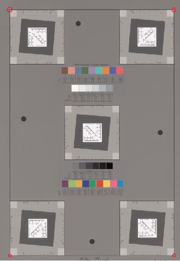
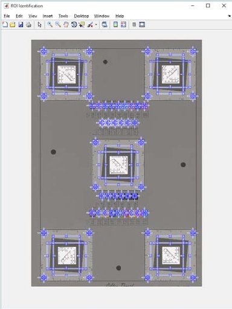
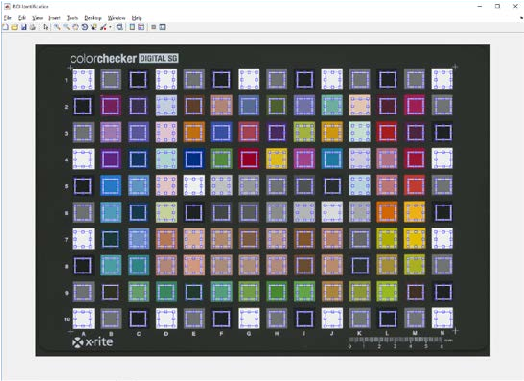
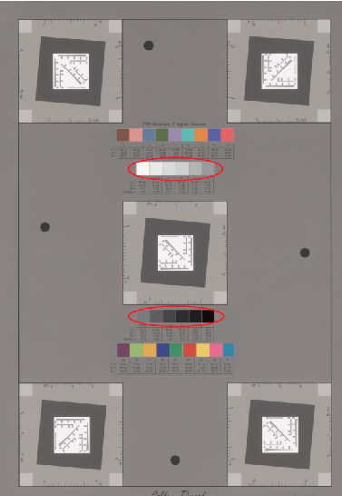
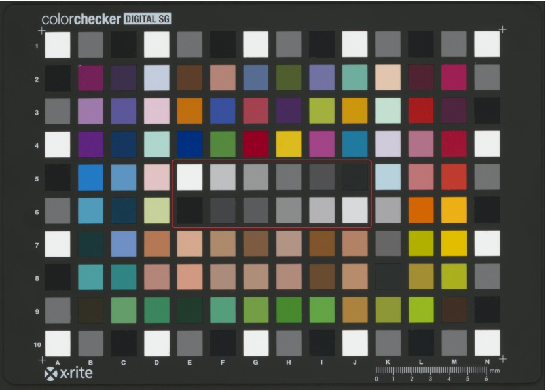
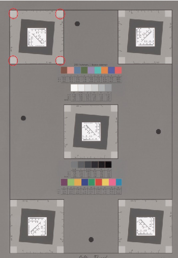
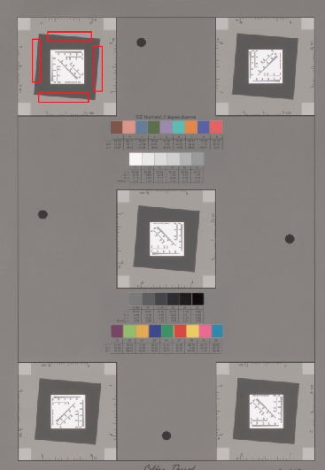

September 2016

# Technical Guidelines for Digitizing Cultural Heritage Materials

Creation of Raster Image Files

i

Document Information

|Title|Editor|
|---|---|
|Technical Guidelines for Digitizing Cultural Heritage Materials: Creation of Raster Image Files|Thomas Rieger|
|Document Type|Technical Guidelines|
|Publication Date|September 2016|

Source Documents

|Title|Editors|
|---|---|
|Technical Guidelines for Digitizing Cultural Heritage Materials: Creation of Raster Image Master Files http://www.digitizationguidelines.gov/guidelines/FADGI_Still_ImageTech_Guidelines_2010-08-24.pdf|Don Williams and Michael Stelmach|
|Document Type|Technical Guidelines|
|Publication Date|August 2010|
| | |
|Title|Authors|
|Technical Guidelines for Digitizing Archival Records for Electronic Access: Creation of Production Master Files – Raster Images http://www.archives.gov/preservation/technical/guidelines.pdf|Steven Puglia, Jeffrey Reed, and Erin Rhodes U.S. National Archives and Records Administration|
|Document Type|Technical Guidelines|
|Publication Date|June 2004|

##### This work is available for worldwide use and reuse under CC0 1.0 Universal.

ii

## Table of Contents

INTRODUCTION........................................................................................................................................... 7

SCOPE.......................................................................................................................................................... 7

THE FADGI STAR SYSTEM ........................................................................................................................ 9

THE FADGI CONFORMANCE PROGRAM...............................................................................................10

DIGITAL IMAGING CONFORMANCE EVALUATION (DICE) PROCESS MONITORING .......................10

DICE EVALUATION PARAMETERS.........................................................................................................10 Sampling Frequency...............................................................................................................................10 Tone Response (OECF).........................................................................................................................10 White Balance Error................................................................................................................................10 Illuminance Non-Uniformity.....................................................................................................................11 Color Accuracy........................................................................................................................................11 Color Channel Mis-Registration..............................................................................................................11 MTF/SFR (Modulation Transfer Function / Spatial Frequency Response) ............................................11 Reproduction Scale Accuracy (Future Implementation).........................................................................11 Sharpening..............................................................................................................................................11 Noise.......................................................................................................................................................12 Skew (Future Implementation)................................................................................................................12 Field Artifacts (Future Implementation) ..................................................................................................12 Geometric Distortion (Future Implementation) .......................................................................................12

FILE FORMATS..........................................................................................................................................12 Master File Format ....................................................................................................................................12 Access File Formats .................................................................................................................................13 File Compression ......................................................................................................................................14 File Format Comparison...........................................................................................................................14 FADGI GLOSSARY....................................................................................................................................14 LIMITATIONS OF THE GUIDELINES........................................................................................................14 PHYSICAL ENVIRONMENT ......................................................................................................................14

Room ......................................................................................................................................................14 Monitor, Light Boxes, and Viewing Booths .............................................................................................15 Cleanliness of Work Area .......................................................................................................................16

Vibration..................................................................................................................................................16 Flare........................................................................................................................................................16 Lighting ...................................................................................................................................................16 Accessories.............................................................................................................................................16

BOUND VOLUMES: RARE AND SPECIAL MATERIALS ........................................................................18

BOUND VOLUMES: GENERAL COLLECTIONS .....................................................................................21

DOCUMENTS (UNBOUND): MANUSCRIPTS AND OTHER RARE AND SPECIAL MATERIALS.........23

DOCUMENTS (UNBOUND): GENERAL COLLECTIONS .......................................................................26

OVERSIZE ITEMS: MAPS, POSTERS, AND OTHER MATERIALS .......................................................28

NEWSPAPERS...........................................................................................................................................31

PRINTS AND PHOTOGRAPHS.................................................................................................................33

PHOTOGRAPHIC TRANSPARENCIES: 35MM TO 4”X5”......................................................................36

PHOTOGRAPHIC TRANSPARENCIES LARGER THAN 4” X 5”............................................................38

PHOTOGRAPHIC NEGATIVES: 35MM TO 4”X5” ..................................................................................40

PHOTOGRAPHIC NEGATIVES LARGER THAN 4” X 5” ........................................................................43

PAINTINGS AND OTHER TWO-DIMENSIONAL ART (OTHER THAN PRINTS) ....................................46

X-RAY FILM (RADIOGRAPHS) .................................................................................................................48

PRINTED MATTER, MANUSCRIPTS, AND OTHER DOCUMENTS ON MICROFILM............................50

DIGITIZATION EQUIPMENT......................................................................................................................52 Camera ...................................................................................................................................................52 Scanner...................................................................................................................................................52 Planetary Scanner ..................................................................................................................................52 Flatbed Scanner .....................................................................................................................................52 Lens ........................................................................................................................................................53 Film Scanner...........................................................................................................................................53 Drum Scanner.........................................................................................................................................53 Selection of Digitization Equipment ........................................................................................................53

IMAGING WORKFLOW .............................................................................................................................54 Overview.................................................................................................................................................54 Define the Requirement..........................................................................................................................54 Assess Organizational Capabilities ........................................................................................................54

Insource vs. Outsource...........................................................................................................................54 Project Management...............................................................................................................................54 Workflow Plan.........................................................................................................................................54 Large scale project workflow ..................................................................................................................55 Small scale project workflow...................................................................................................................60

ADJUSTING IMAGE FILES .......................................................................................................................63 Color Management .................................................................................................................................64 Color Correction and Tonal Adjustments................................................................................................66 Cropping .................................................................................................................................................67 Compensating for Minor Deficiencies.....................................................................................................67 Stitching ..................................................................................................................................................67 Scanning Text.........................................................................................................................................67 Optical Character Recognition................................................................................................................68

TECHNICAL OVERVIEW...........................................................................................................................69 Spatial Resolution...................................................................................................................................69 Signal Resolution....................................................................................................................................69 Color Mode .............................................................................................................................................70 Quantifying Scanner/Digital Camera Performance.................................................................................71 Test Frequency and Equipment Variability.............................................................................................72 Reference Targets ..................................................................................................................................72

METADATA ................................................................................................................................................74 Application Profiles .................................................................................................................................74 Data or Information Models ....................................................................................................................74 Levels of Description ..............................................................................................................................74

Common Metadata Types.........................................................................................................................75 Descriptive ..............................................................................................................................................75 Administrative .........................................................................................................................................76 Rights......................................................................................................................................................76 Technical.................................................................................................................................................77 Embedded Metadata ..............................................................................................................................78 Structural.................................................................................................................................................78 Behavior..................................................................................................................................................79 Preservation............................................................................................................................................79 Tracking ..................................................................................................................................................79 Meta-Metadata........................................................................................................................................80

Assessment of Metadata Needs for Imaging Projects ..........................................................................80 Relationships ..........................................................................................................................................83 Permanent and Temporary Metadata.....................................................................................................83

IDENTIFIERS AND FILE NAMING ............................................................................................................83 File Naming.............................................................................................................................................83 Directory Structure..................................................................................................................................85 Versioning...............................................................................................................................................85

Naming Derivative Files..........................................................................................................................85

QUALITY MANAGEMENT .........................................................................................................................85 Inspection of Digital Image Files.............................................................................................................86 File Related.............................................................................................................................................86 Original/Document Related.....................................................................................................................86 Image Quality Related ............................................................................................................................87 Quality Control of Metadata....................................................................................................................88 Testing Results and Acceptance/Rejection ............................................................................................89

###### STORAGE RECOMMENDATIONS............................................................................................................90 Digital Repositories and the Long-Term Management of Files and Metadata .......................................90

RESOURCES .............................................................................................................................................90 Introduction .............................................................................................................................................90 Metadata.................................................................................................................................................91 Technical Overview ................................................................................................................................92 Color Management .................................................................................................................................94 Digitization Specifications.......................................................................................................................94

###### APPENDIX:.................................................................................................................................................96

## INTRODUCTION

The Technical Guidelines for Digitizing Cultural Heritage Materials: Creation of Raster Image Files represents shared best practices followed by agencies participating in the Federal Agencies Digital Guidelines Initiative (FADGI) Still Image Working Group for digitization of cultural heritage materials. This group is involved in a cooperative effort to develop common digitization guidelines for still image materials (such as textual content, maps, and photographic prints and negatives) found in cultural heritage institutions.

This revision of the 2010 FADGI Guidelines incorporates new material reflecting the advances in imaging science and cultural heritage imaging best practice, and adds a section on newspaper digitization. The format has changed. Relevant information specific to defined imaging tasks has been grouped into individual chapters, along with guidance on how to apply FADGI to specific tasks. These Guidelines are intended to be used in conjunction with the DICE (Digital Imaging Conformance Environment) targets and software developed by the Federal Agencies Digital Guidelines Initiative and the Library of Congress. Together, these Guidelines and the DICE testing and monitoring system provide the foundation for a FADGI compliant digitization program.

This revision also recognizes and is compatible with the Metamorfoze guidelines, released in January 2012, and is consistent with ISO standards currently under development.

## SCOPE

The focus of the Guidelines is on historical, cultural and archival materials. The scope is limited to digitization practices for materials that can be reproduced as still images, e.g., printed matter, manuscripts, maps, and photographic prints, negatives and transparencies.

The Guidelines are intended to be informative, not prescriptive. We acknowledge that this document does not address the entire range of image quality parameters, but these topics will be incorporated as the Still Image Working Group identifies recommendations in these areas. The Working Group has produced a “Gap Analysis” document that identifies and prioritizes digitization activities that are not currently defined within existing agency guidelines, or are not adequately addressed by existing guidelines. The Gap Analysis contains topics that the Working Group intends to investigate and provide as updates and recommendations in future versions of these Guidelines.

The current Gap Analysis can be found on the FADGI website at: http://www.digitizationguidelines.gov/guidelines/Gap_Analysis.pdf

We hope to provide a technical foundation for digitization activities, but further research will be necessary to make informed decisions regarding all aspects of administrative, operational, and technical issues surrounding the creation of digital images. These Guidelines provide a range of options for various technical aspects of digitization, primarily relating to image capture, but do not recommend a single approach.

The following topics are addressed in this document:

- • Digital image capture for still images – creation of raster image files, image parameters, digitization environment, color management, etc.
- • Color encoding accuracy – color space, color temperature for imaging and viewing, quality of linear vs. area arrays, and quality of different interpolation algorithms.
- • Digital image performance – development of operational metrics and criteria for evaluating digital image characteristics for purposes of investigation or for quality control purposes, including metrics and criteria for resolution, noise, color encoding, mis-registration, etc., and for measuring system performance capabilities.
- • Example workflow processes – includes guidelines for image processing, sharpening, etc.

- • Minimum metadata – we have included a discussion of metadata to ensure a minimum complement is collected/created so master image files are renderable, findable, and useable.
- • File formats – recommended formats, encodings of master and derivative files.
- • Approaches to file naming.
- • Basic storage recommendations.
- • Quality management – quality assurance and quality control of images and metadata, image inspection, acceptance and rejection, and metrology (ensuring devices used to measure quality or performance are giving accurate and precise readings) among others.
- • Optical character recognition.

The following aspects of digitization projects are not discussed in these Guidelines:

- • Project scope – defining goals and requirements, evaluation of user needs, identification and evaluation of options, cost-benefit analysis, etc.
- • Selection – criteria, process, approval, etc.
- • Preparation – archival/curatorial assessment and prep, records description, preservation/conservation assessment and prep, etc.
- • Descriptive systems – data standards, metadata schema, encoding schema, controlled vocabularies, etc.
- • Project management – plan of work, budget, staffing, training, records handling guidelines, work done in-house vs. contractors, work space, oversight and coordination of all aspects, etc.
- • Access to digital resources – web delivery system, migrating images and metadata to web, etc.
- • Legal issues – access restrictions, copyright, rights management, etc.
- • IT infrastructure – determine system performance requirements, hardware, software, database design, networking, data/disaster recovery, etc.
- • Project assessment – project evaluation, monitoring and evaluation of use of digital assets created, etc.
- • Digital preservation – long-term management and maintenance of images and metadata, etc.
- • Digitization of audio/visual and moving image materials.
- • Management of “born-digital” materials.

A companion FADGI document, Digitization Activities – Project Planning and Management Outline, provides a conceptual outline of general steps for the planning and management of digitization projects, and addresses some of the topics listed above. This document is available at

http://www.digitizationguidelines.gov/guidelines/DigActivities-FADGI-v1-20091104.pdf

The intended audience for these Guidelines includes those who will be planning, managing, and approving digitization projects, such as archivists, librarians, curators, managers, and others, as well as practitioners directly involved in scanning and digital capture, such as technicians and photographers. The topics in these Guidelines are inherently technical in nature. For those working on digital image capture and quality control for images, a basic foundation in photography and imaging is essential. Generally, without staff with a good technical foundation, achieving the appropriate level of quality as defined in these Guidelines is problematic. Cultural heritage digitization is a specialization within the imaging field that requires specific skills and experience. The FADGI has compiled these specific recommendations and best practices as they are practiced at participating institutions. Implementation of these recommendations should be accomplished by personnel with appropriate experience or in consultation with institutions or experts experienced in implementation of FADGI compliant digitization programs.

Revisions: These Guidelines reflect current best practices shared by members of FADGI. We anticipate they will change as technology and industry standards, as well as institutional approaches, improve over time. As the technical arenas of conversion, imaging, and metadata are highly specialized and constantly evolving, we envision these Guidelines to be a continually evolving document as well. The Guidelines will be collectively reviewed by participating agencies at regular intervals and updated as necessary. We welcome your comments and suggestions. Please note that the online version of the Guidelines is considered to be the official document.

## The FADGI Star System

FADGI defines four quality levels of imaging, from 1 star to 4 star. Higher star ratings relate to more consistent image quality, but require greater technical performance of both operator and imaging system to achieve. The appropriate star performance level for a particular project should be carefully considered in the planning stage of the project.

Conceptually the FADGI four star system aligns with the Metamorfoze1 three tier system, with a fourth tier (1 star) on the lower end of the performance scale. Both FADGI and Metamorfoze trace their metrics to emerging ISO standards efforts. While similar, there are differences.

This revision of the Guidelines more fully expands the use of colorimetric measures like L*a*b* color and ∆E(a*b*) 2000 measurements. These changes align FADGI with ISO TC42/WG18 protocols and Metamorfoze guidelines. Count values metrics (e.g. white balance +/- 3 counts) shown are for reference to the original FADGI specifications and are not precisely matched to the new values.

The star system ratings are summarized below. It is important to understand that the star ratings system is an indicator of acceptability of higher error relative to an aim value (i.e. accuracy). Four star requires much less error tolerance relative to an aim than a one star requirement.

- • One star imaging should only be considered informational, in that images are not of a sufficient quality to be useful for optical character recognition or other information processing techniques. One star imaging is appropriate for applications where the intent is to provide a reference to locate the original, or the intent is textual only with no repurposing of the content.
- • Two star imaging is appropriate where there is no reasonable expectation of having the capability of achieving three or four star performance. These images will have informational value only, and may or may not be suitable for OCR.
- • Three star imaging defines a very good professional image capable of serving for almost all uses.
- • Four star defines the best imaging practical today. Images created to a four star level represent the state of the art in image capture and are suitable for almost any use.

Our mission is to define what is practical and achievable today, and provide you with the knowledge and the tools to achieve your intended FADGI compliance level.

Generally, in order to avoid future rescanning and given the high costs and effort for digitization projects, FADGI does not recommend digitizing to less than three-star. This assumes availability of suitable highquality digitization equipment that meets the assessment criteria described (see the section on Quantifying Scanner/Digital Camera Performance), and produces image files that meet the minimum quality described in the Technical Guidelines. If digitization equipment fails any of the assessment criteria or is unable to produce image files of minimum quality, then it may be desirable to invest in better equipment or to contract with a vendor for digitization services.

- 1 http://www.metamorfoze.com/english/digitization

## The FADGI Conformance Program

The FADGI digitization program consists of three elements:

- • Technical Guidelines and Parameters
- • Best Practices
- • Digital Imaging Conformance Evaluation (DICE)

These three elements, when implemented together, form a FADGI compliant digitization environment. FADGI conformance is a process of continuous validation to known and accepted standards, best practices, and adhering to the technical guidelines as detailed in this document. While it is possible to create FADGI compliant images in a physical environment that does not conform to the recommendations in this document, conformance to FADGI recommendations related to the physical environment is highly recommended.

## Digital Imaging Conformance Evaluation (DICE) Process Monitoring

The Digital Imaging Conformance Evaluation program (DICE) provides the measurement and monitoring component of a FADGI compliant digitization program. DICE consists of two components:

- • Image Targets, both reflective and transmissive
- • Analysis Software

The DICE targets have been designed to comply with various ISO specifications, and the parameters as defined in the FADGI program have been validated through years of use at participating Federal agencies.

There are other targets and measurement programs available, but these have not been evaluated and cannot be substituted for use in a FADGI compliant environment.

Certification of FADGI conformance must be measured using DICE targets and analysis software.

## DICE Evaluation Parameters

The FADGI guidelines establish quality and performance goals for the four levels of the star ranking system. The DICE conformance testing tool, when used with appropriate testing targets, provides the user with a precise and repeatable analysis of the imaging variables that comprise FADGI star ratings.

The following parameters are evaluated by the DICE program2:

#### Sampling Frequency

This parameter measures the imaging spatial resolution, and is computed as the physical pixel count in pixels per inch (ppi), pixels per mm, etc. This parameter informs us about the size of the original and also provides part of the data needed to determine the level of detail recorded in the file. ISO 12233:2014 defines the resolution measurements.

#### Tone Response (OECF)

Opto-Electronic Conversion Function (OECF) is a measure of how accurately the digital imaging system converts light levels into digital pixels. ISO 14524:2009 defines the OECF measurement.

#### White Balance Error

This is a measurement of the color neutrality of the digital file. Ideally, an image of a white reflective object would be recorded digitally as even values across red, green and blue channels, with a value

- 2 The implementations can be seen in Appendix A.

approaching the limit of the file format to define white. These specific values are defined in each section of the guidelines.

#### Illuminance Non-Uniformity

Both lighting and lens performance contribute to this measurement. Ideally, there should be a perfectly even recording of a neutral reference from center to edge and between points within the image. ISO 17957:2015 defines the shading measurements. Specific values are defined in each section of the guidelines.

#### Color Accuracy

There is no perfect imaging system or perfect method of color evaluation. Color accuracy is measured in DICE by computing the color difference (ΔE2000) between the imaging results of the standard target patches and their pre-measured color values. By imaging the DICE target and evaluating through the DICE software, variances from known values can be determined, which is a good indicator of how accurate the system is recording color. Dice measures the average deviation of all color patches measured (the mean). Refer to ISO 13658:2000 for additional documentation on color accuracy measurement.

#### Color Channel Mis-Registration

All lenses focus red, green, and blue light slightly imperfectly. This parameter measures the spread of red, green, and blue light in terms of pixels of mis-registration. This parameter is used in the evaluation of lens performance.

#### MTF/SFR (Modulation Transfer Function / Spatial Frequency Response)

Modulation Transfer Function is a measurement of the contrast difference between the original image and the digital image. MTF is defined as the modulation ratio of the output image and the ideal image. Spatial Frequency Response measures the imaging systems ability to maintain contrast between increasingly smaller image details. Using these two functions, an accurate determination of resolution can be made

- as it relates to sampling frequency. ISO 12233:2000, ISO 16067-1:2003, and ISO 16067-2:2004 define MTF/SFR measurement.

#### Reproduction Scale Accuracy (Future Implementation)

This parameter measures the relationship between the size of the original object to the size of that object in the digital image. This parameter is measured in relation to the pixels per inch (ppi) or pixels per mm (ppmm) of the original digital capture. For example, capturing an image of a ruler at 400 ppi will digitally render at the correct size when displayed or printed at 400 ppi. It is critically important in cultural heritage imaging to maintain the relationship to the original size of the object.

The original size of microfilmed documents can only be determined if the filming “reduction ratio” is known. The scale is referred to as 8x or 10x (or other) reduction, indicating that the magnification of the image on the microfilm is 1/8th or 1/10th the size of the original document. This may or may not be known when digitizing microfilm. Unless noted in metadata, the scale of the original will be lost when microfilm is digitized. Microfilm is digitized at the same ppi resolution, regardless of the original “reduction ratio.”

Photographic film cannot be related to a reproduction scale, unless there is a physical measurement in the image to scale to. Photographic film is digitized to appropriate resolutions relative to the size of the film.

#### Sharpening

Almost all digital imaging systems apply sharpening, often at a point where the user has no control over the process. Sharpening artificially enhances details to create the illusion of greater definition. DICE

testing quantifies the level of sharpening present. There are three major sharpening processes in a typical imaging pipeline: capture sharpening (through camera setting adjustment), image sharpening in post processing, and output sharpening for print or display purposes. Sharpening is usually implemented through image edge enhancement, such as filtering techniques using unsharp masks and inverse image diffusion.

#### Noise

Digital images contain artifacts that do not relate to the original image, in much the same way that photographic film grain did not relate to the original scene. There are many sources for digital image noise. DICE measures all visible noise and provides a single measurement value.

#### Skew (Future Implementation)

This parameter measures how straight the image is in the file. This is important because rotating an image by anything other than 90 degree increments involves interpolating every pixel in the image, reducing the effective spatial resolution and integrity of the file.

#### Field Artifacts (Future Implementation)

Ideally, digitization should only capture what is in the original. However, dust, dirt and scratches almost inevitably find their way into digital files. This parameter quantifies the physical non-image artifacts in a digitization system.

#### Geometric Distortion (Future Implementation)

Critically important to faithful reproduction of an original is the management of geometric distortion in image capture. Typical camera taking lenses are poorly corrected for this, and create images which exhibit significant distortion even under ideal conditions. If the imaging system is not correctly aligned, other distortions are introduced to the image as well. Cultural heritage imaging requires high quality optics designed for close imaging applications. Typically, these are identified as macro lenses, although that term more correctly refers to their close focus ability. Recently digital correction processes have been created to “correct” for the distortions created by lenses from many manufacturers. While these software approaches are interesting and often effective, they interpolate pixels which cause significant loss of image integrity. High quality lenses designed for copy work will generally have very well controlled geometric distortion, and should not be corrected further through software for master files. ISO 17850:2015 defines the geometric distortion measurements for digital cameras.

## File Formats

#### Master File Format

The choice of master file format is a decision which affects how digitized materials can be used and managed. There is no one correct master file format for all applications, all format choices involve compromises between quality, access and lifecycle management. The FADGI star system tables list the most appropriate master file formats for each imaging project type. Selection of the most appropriate format within these recommended choices is an important decision that should be consistent with a long term archive strategy.

One or more digital master files can be created depending on the nature of the originals and the intended purpose of digitization. Digitization should be done in a “use-neutral” manner, and should not be geared for any specific output. If digitization is done to meet the recommended image parameters and all other

requirements as described in these Guidelines, we believe the master image files produced should be usable for a wide variety of applications and outputs.

FADGI defines two master file types. Archival Master: Archival master files represent the best copy produced by a digitizing organization, with best defined as meeting the objectives of a particular project or program and being suitable for the generation of production master files and derivative files. In some cases, an archive may produce more than one

archival master file. Archival masters should have a long tonal scale, wide color gamut, and be minimally adjusted to be use-neutral. Archival masters should have a linear gamma, which displays as visually flat. A gamma corrected master file would be considered a production master. The terms used to name types of files vary within the digital library and digital archiving communities. In many cases, the best copies are called preservation master files rather than archival master files

Archival master files represent digital content that the organization intends to maintain for the long term without loss of essential features. Digital formats for archival master files must meet the requirements of the sustainability factors. If the existing format is deemed sustainable for the long term, the files are retained as-is and called archival masters. If the existing format is deemed unsuitable for long-term retention, e.g., it is an obsolescent format, then the content may be transcoded and the new version retained as the archival master. If there is risk of data loss from the transcoding, files in the existing format may also be retained for possible future reference.

Production Master: Production master files are produced by processing the content in one or more archival master files, resulting in a new file or files with levels of quality that rival those of the archival master. One type of processing consists of the assembly of a set of segments into a unified reproduction of an item. For example, an image of a large map may be produced by stitching together a set of image tiles, each representing a portion of the original paper item. Other processes that may be applied include aesthetic or other technical corrections to the original file. When both the uncorrected and corrected representations are retained, the uncorrected files are archival master files and the corrected versions are production master files. For most preservation-oriented

archives, aesthetic changes will be modest. For images, aesthetic changes may include such things as adjusting tonality. Certain technical changes may be more significant. For example, the archival master version of a pictorial image may employ a linear representation of light intensity (see the explanation in gamma), while the production master may employ gamma correction. The transformation from linear to gamma-corrected is not reversible in a mathematically exact manner.

Master files of all types have permanent value for the digitizing organization and should be managed in an appropriate environment, e.g., one in which read and write executions are minimized and other preservation-oriented data management actions are applied. In contrast, derivative files are frequently accessed by end-users and are typically stored in systems that see repeated read and write executions.

Detail on master formats can be found here: http://www.digitizationguidelines.gov/guidelines/raster_stillImage_compare.html

### Access File Formats

FADGI anticipates continual evolution in the availability of access file formats, each new format designed to provide specific advantages over others for a specific application. These guidelines provide recommendations for a few of the most appropriate for cultural heritage imaging. Note that many access formats are no longer in use and content created with them may be no longer accessible. Care should be taken when selecting access formats to insure long term viability.

Often called service, access, delivery, viewing, or output files, derivative files are by their nature secondary items, generally not considered to be permanent parts of an archival collection. To produce derivative files, organizations use the archival master file or the production master file as a data source and produce one or more derivatives, each optimized for a particular use. Typical uses (each of which may require a different optimization) include the provision of end-user access; high quality reproduction;

or the creation of textual representations via OCR. In many cases, the derivatives intended to serve enduser access employ lossy compression, e.g., JPEG-formatted images. The formats selected for derivative files may become obsolete in a relatively short time.

### File Compression

Compression may be appropriate for both master and derivative files. Significant benefits can result from the appropriate use of file compression. Lossless compression such as LZW and JPEG 2000 (wavelet) are approved for all uses. Lossy compression may be appropriate for specific uses. In considering the use of compression, the combination of the file format and the compression should be evaluated for long term sustainability as a system. Compression techniques using patented or proprietary programs should be avoided due to long term sustainability concerns.

### File Format Comparison

The choice of file format has a direct effect on the performance of the digital image as well as implications for long term management of the image.

Additional information on file formats and format selection can be found here: http://www.digitalpreservation.gov/formats/index.shtml

## FADGI Glossary

Please refer to the FADGI Glossary for more extensive definitions of digitization terminology. http://www.digitizationguidelines.gov/glossary.php

## Limitations of the Guidelines

These guidelines are specific to imaging to the four quality levels defined in this document. It is possible to digitize to higher than four star specifications, which may be appropriate for specific applications that demand exceptional quality. Specifications for imaging projects that demand higher than four star performance should be determined after considering the end use of the digital image and the original to be digitized.

The FADGI four star system defines quality standards appropriate for most cultural heritage imaging projects, and takes into consideration the competing requirements of quality, speed of production, and cost. FADGI does not provide recommendations for applications that are either below one star or above four star requirements.

These guidelines do not address archiving/preservation of born-digital materials.

## Physical Environment

Standardization of the digitization environment creates a workspace where the variables of visual perception can be controlled. Without standardization, perception of image quality may vary dramatically. In an imaging environment where human judgement is a factor, standardization of the physical environment is critically important to maintaining consistency. The recommendations that follow address the most common issues related to a proper physical environment for digitization. FADGI recommends the following:

#### Room

The working environment should be painted/decorated a neutral, matte gray with a 60% reflectance or less to minimize flare and perceptual biases.

Monitors should be positioned to avoid reflections and direct illumination on the screen.

ISO 12646 requires the room illumination be less than 32 lux when measured anywhere between the monitor and the observer, and the light a color temperature of approximately 5000K with a CRI above 90. Consistent room illumination is a fundamental element of best practice in imaging. Changes in color temperature or light level from a window, for example, can dramatically affect the perception of an image displayed on a monitor.

Each digitization station should be in a separate room, or separated from each other by sufficient space and with screening to minimize the light from one station affecting another. It is critically important to maintain consistent environmental conditions within the working environment.

Care should be taken to maintain the work environment at the same temperature and humidity in which the objects being imaged are normally kept. Variations can cause stress to some materials and in severe cases may damage the originals. The use of a datalogger in both imaging and storage areas is highly recommended. While specific temperature and humidity recommendations are beyond the scope of this document, adherence to American Institute for Conservation of Historic and Artistic Works (AIC) Guidelines is recommended.

http://www.conservation-us.org

#### Monitor, Light Boxes, and Viewing Booths

The trio of monitor, reflection viewing booth, and transmission light box can provide a calibrated reference viewing environment to accurately portray physical objects and their digital representation. If designed correctly, these create an environment suitable for cultural heritage digitization.

The lighting parameters described above are too dim to properly evaluate an original against the digital representation on a monitor. For reflective originals, a 5000k viewing booth with a CRI of 90 or better should be placed in proximity to the monitor to provide adequate illumination for comparison. For viewing transparencies, a 5000k transmissive light box, with a CRI of better than 90 should be used.3 For both reflective and transmissive viewing, the luminance of the light box should be adjusted to match the luminance of the monitor. Viewing of color and black and white negatives does not require a color accurate since no color comparisons can be made with these materials. Areas beyond the reflective or transmissive image should be masked off with neutral material to prevent stray light from altering perception of the originals.

Images must be viewed in the color space in which they will be saved, and the monitor must be capable of displaying that color space. The illuminance of the monitor must be set to a brightness that produces a good white match to the viewing environment for the originals. The graphic card in the computer must be capable of displaying 24 bit color and set to a gamma of 2.2.

The appropriate color temperature and illumination level of the monitor may vary based on a number of uncontrollable factors. Adjust the illumination and color temperature of the monitor to provide the best approximation of white in the viewing environment to the digital representation of white on the monitor. Refer to ISO 12646 and 3664 for additional documentation if needed. Be careful not to offset the monitor to compensate for a poor working environment.

The color of the monitor desktop should be set to L*50, a*0, b*0. This establishes a visually neutral midgray monitor background.

Careful attention must be paid to the selection of monitors for professional digital imaging. Most monitors in the marketplace cannot display Adobe 1998, ProPhoto or ECIRGBv2 color spaces. Digital images cannot be viewed accurately on a monitor that cannot display the range of color that these color spaces include. The sRGB color space is viewable on most current color monitors. Care must be taken as well in monitor selection to assure that the selected monitor provides an adequate viewing angle without perceptible image change.

In order to meet and maintain the monitor settings summarized above, it is recommended that professional LCD monitors designed for the graphic arts, photography, or multimedia markets be used. A color calibrator and appropriate software (either bundled with the monitor or a third party application) should be used to calibrate the monitor to Adobe 1998, ProPhoto, ECIRGBv2 or sRGB color space as

- 3 https://en.wikipedia.org/wiki/Color_rendering_index

appropriate. This is to ensure desired color temperature, luminance level, neutral color balance, and linearity of the red, green, and blue representations on the monitor are achieved and maintained.

An ICC profile should be created after monitor calibration for correct rendering of images, and the monitor calibration should be verified weekly, preferably at the beginning of the week’s imaging.

Using a monitor calibrator, however, does not always ensure monitors are calibrated well. Practical experience has shown calibrators and calibration software may not work accurately or consistently. After calibration, it is important to assess the monitor visually to make sure that the monitor is adjusted appropriately. Assess overall brightness, and color neutrality of the gray desktop. Then assess a monitor calibration reference image for color, tone scale, and contrast. The use of a monitor calibration reference image is an essential element of creating and maintaining a proper digitization environment.

#### Cleanliness of Work Area

Keep the work area clean. Scanners, platens, and copy boards will have to be cleaned on a routine basis to eliminate the introduction of extraneous dirt and dust to the digital images. Many old documents tend to be dirty and will leave dirt in the work area and on scanning equipment.

See, for example, NARA’s Preservation Guidelines for Vendors Handling Records and Historical Material

- at http://www.archives.gov/preservation/technical/vendor-training.html for safe and appropriate handling of originals. Photographic originals may need to be carefully dusted with a lint-free, soft-bristle brush to minimize extraneous dust.

#### Vibration

Sources include cooling fans on an imaging sensor, or movement of the sensor/original in a scanner. Even the slightest vibration will have a dramatic effect on image quality. If vibration is determined to be an issue, remedial efforts including changing the scanning speed or adding vibration dampening materials to the scanner may be helpful. For instant capture camera systems, the use of electronic flash lighting can effectively reduce the effects of vibration on image quality.

#### Flare

Stray light entering a lens can create flare, a condition where the purity of image forming light is degraded by unwanted extraneous light. This can also be caused by lens elements that have hazed over time and either require cleaning or replacement. Check lens condition by looking through the lens at a bright light source (not the sun) and observe the clarity of the glass. While simple, this test is quite effective. The use of a lens hood is highly recommended. Reduction of stray light around the original will considerably reduce flare.

#### Lighting

All light sources have variations in their spectral distribution. Light sources that have serious deficiencies in their spectral distribution are unsuitable for use in a cultural heritage imaging environment. This parameter is generally measured by the Color Rendering Index, which is a measure of how close the spectral distribution is to the reference (the sun). A CRI above 90 is generally accepted as appropriate for most cultural heritage imaging.

Another consideration for lighting is how diffuse the source is. Highly diffuse light sources provide a soft, shadowless wash of light, but this comes at the expense of clear delineation of detail and can reduce color accuracy. On the other extreme, highly collimated, or “point” light creates a harsh rendition which can be just as undesirable. Selection of appropriate lighting is as much art as science, and is highly application specific.

#### Accessories

A series of specialized aids are useful for cultural heritage digitization. System alignment tools lead the list. An imaging system must be parallel at the sensor, lens, and object planes. There are many aids on

the market to accomplish this, the simplest of which is a spirit level, or the electronic level incorporated into many smart phones. A more accurate method involves bouncing light from an emitter device off of a reflector placed over the lens and using the reflection to measure deflection. This method allows very precise alignment with an easy to accomplish process. Proper system alignment is essential for quality imaging.

A tool kit consisting of gloves, spatulas, thin mylar strips, weighted hold down aids, lens wipes, air duster, soft brushes, etc. should be available at each imaging station. The contents can be refined for the specifics of each digitization activity.

Performance Level:

1 Star 2 Star 3 Star 4 Star

|Master File Format| |TIFF, JPEG 2000, PDF/A  |TIFF, JPEG 2000, PDF/A  |TIFF, JPEG 2000, PDF/A  |
|---|---|---|---|---|
|Access File Formats  | |All|All|All|
|Resolution| |300 ppi|300 ppi|400 ppi|
|Bit Depth| |8|8 or 16|16|
|Color Space| |Adobe 1998, ProPhoto, ECIRGBv2  |Adobe 1998, ProPhoto, ECIRGBv2  |Adobe 1998, ProPhoto, ECIRGBv2  |
|Color| |Color|Color|Color|
|Measurement Parameters| | | | |
|Tone Response (OECF) (Luminance)  | |+ 9 count levels ≤ 8  |+ 6 count levels ≤ 5  |+ 3 count levels ≤ 2  |
|White Balance Error (Luminance)  | |+ 6 counts levels ≤ 6  |+ 4 count levels ≤ 4  |+ 3 count levels ≤ 2  |
|Illuminance NonUniformity  | |<5%|<3%|<1%|
|Color Accuracy (Mean ΔE2000)  | |<8|<5|<3|
|Color Channel Misregistration  | |<.80 pixel|<.50 pixel|<.33 pixel|
|MTF10 (10% SFR)  | |sampling efficiency > 70% and SFR response at half sampling frequency < 0.4  |sampling efficiency > 80% and SFR response at half sampling frequency < 0.3  |sampling efficiency > 90% and SFR response at half sampling frequency < 0.2  |
|MTF50 (50% SFR)| |50% of half sampling frequency: [25%,85%]  |50% of half sampling frequency: [35%,75%]  |50% of half sampling frequency: [45%,65%]  |
|Reproduction Scale Accuracy  | |<+/- 3% of AIM|<+/- 2% of AIM|<+/- 1% of AIM|
|Sharpening (Maximum MTF)  | |<1.2|<1.1|<=1.0|
|Noise ΔL* St. Dev (Luminance)  | |<5 count levels < 3  |<4 count levels < 2  |<3 count levels < 1  |

Count values are expressed as 8 bit equivalents

Rare and special bound materials represent various types ranging from illuminated manuscripts, incunabula, works that feature illustrations of special artistic or graphic interest, e.g., intaglios, gravures, or inset photographs; also bound documents with poor legibility or diffuse characters, e.g., carbon copies, Thermofax, etc.

###### Recommended Imaging Technologies

- • Manually operated planetary book scanners without glass or plastic platens
- • Digital cameras with book cradles without glass or plastic platens

###### Not Recommended Imaging Technologies

- • Flatbed scanners
- • Automated page turning book scanners
- • Lighting systems that raise the surface temperature of the original more than 4 degrees F (2 degrees C) in the total imaging process
- • Linear scanning processes (digital scanning back cameras) are not appropriate because of the potential for the original to flex during the scanning process, producing artifacts that cannot be corrected in post processing and that may not be seen in QC.

###### Notes

- • To be FADGI compliant, all imaging performed on special collections materials must be done by personnel with advanced training and experienced in the handling and care of special collections materials. FADGI compliance requires proper staff qualifications in addition to achieving the performance levels defined in this document. It is out of the scope of this document to define proper staff qualifications for cultural heritage imaging.
- • If a volume is dis-bound, the FADGI recommendations apply as if the volume was intact.
- • Special collections materials will often contain colors that are outside of the gamut of current color reproduction systems, and will require special imaging techniques to approximate the original in digital form. Alternative imaging techniques, including but not limited to texture lighting, multiple light source exposure, and multispectral/hyperspectral imaging may be used to best reproduce the original. These techniques should be accomplished as single exposures, not blends of multiple exposures. An “image cube” of multiple single exposures may be considered an archival master file, but a single base image must meet the specifications in the chart above for FADGI compliance in all respects. Note that color accuracy is measured against the color test target, not the artifact. This topic will be addressed in more detail in future revisions of these Guidelines.
- • If a backing sheet is used, it must extend beyond the edge of the page to the end of the image on all open sides of the page.
- • Single exposure total area capture scanning systems are considered the most appropriate technologies when imaging special collections materials. However, FADGI permits the use of other technologies that may be appropriate as long as none of the stated restrictions are compromised by the use of that technology.
- • When imaging materials that are sensitive to rapid moisture absorption, matching temperature and humidity between storage and imaging conditions is critical.
- • Special collections materials should not be placed in contact with glass or other materials in an effort to hold originals flat while imaging without the approval of a paper or book conservator. This technique can lead to physical damage to the original. Spatulas or other implements to assist in holding pages flat for imaging may be used, but must not obscure informational content. If used, these should not be edited out of master files.

- • Holding down an original with the use of a vacuum board should also be approved by a paper or book conservator. Air forced through the original over the vacuum ports can permanently degrade some originals.
- • No image retouching is permitted to master files.
- • Image processing techniques may be used for the creation of access files in FADGI.
- • Bound materials must not be opened beyond the point where the binding is stressed. In some cases, that may mean that the volume cannot be opened sufficiently to image.

###### Aimpoint Variability

Reference color calibration targets are surrogates for the colors in the actual collections. While current color management systems do well in connecting target colors to actual object colors, inaccuracies are inevitable due to metamerism4 and other factors. Careful calibration of a digitization system using a DICE reference target (for reflection copy), or an appropriate color target for transmission originals, provides a best compromise calibration for most digitization.

- 4 https://en.wikipedia.org/wiki/Metamerism_(color)

## Bound Volumes: General Collections

Performance Level:

1 Star 2 Star 3 Star 4 Star

|Master File Format|TIFF, JPEG 2000, PDF/A  |TIFF, JPEG 2000, PDF/A  |TIFF, JPEG 2000, PDF/A  |TIFF, JPEG 2000, PDF/A  |
|---|---|---|---|---|
|Access File Formats  |All|All|All|All|
|Resolution|150 ppi|300 ppi|300 ppi|400 ppi|
|Bit Depth|8|8|8 or 16|8 or 16|
|Color Space|Grey Gamma 2.2 SRGB  |Grey Gamma 2.2 SRGB Adobe 1998 ProPhoto ECIRGBv2  |Grey Gamma 2.2 SRGB Adobe 1998 ProPhoto ECIRGBv2  |SRGB Adobe 1998 ProPhoto ECIRGBv2  |
|Color|Grayscale or Color|Grayscale or Color|Grayscale or Color|Color|
|Measurement Parameters| | | | |
|Tone Response (OECF) (Luminance)  |+ 9 count levels ≤ 8  |+ 9 count levels ≤ 8  |+ 6 count levels ≤ 5  |+ 3 count levels ≤ 2  |
|White Balance Error (Luminance)  |+ 8 count levels ≤ 8  |+ 6 count levels ≤ 6  |+ 4 count levels ≤ 4  |+ 3 count levels ≤ 2  |
|Illuminance NonUniformity  |<8%|<5%|<3%|<1%|
|Color Accuracy (Mean ΔE 2000)  |<10|<8|<5|<4|
|Color Channel Misregistration  |<1.2 pixel|<.80 pixel|<.50 pixel|<.33 pixel|
|MTF10 (10% SFR)  |sampling efficiency > 60% and SFR response at half sampling frequency < 0.4  |sampling efficiency > 70% and SFR response at half sampling frequency < 0.4  |sampling efficiency > 80% and SFR response at half sampling frequency < 0.3  |sampling efficiency > 90% and SFR response at half sampling frequency < 0.2  |
|MTF50 (50% SFR)|50% of half sampling frequency: [25%,95%]  |50% of half sampling frequency: [30%,85%]  |50% of half sampling frequency: [35%,75%]  |50% of half sampling frequency: [40%,65%]  |
|Reproduction Scale Accuracy  |<+/- 5% of AIM|<+/- 3% of AIM|<+/- 2% of AIM|<+/- 1% of AIM|
|Sharpening (Maximum MTF)  |<1.3|<1.2|<1.1|<=1.0|
|Noise ΔL* St. Dev (Luminance)  |<6 count levels < 4  |<5 count levels < 3  |<4 count levels < 2  |<3 count levels < 1  |

Count values are expressed as 8 bit equivalents

## Bound Volumes: General Collections

Textual and illustrated bound printed matter (books, journals) generally represent clean, high-contrast book pages with clearly legible type, e.g., evenly printed typeset or laser printed pages without background discoloration. Visual-arts elements of limited significance and generally consisting of printed halftones, line art, explanatory tables and drawings, and the like are often included.

###### Recommended Imaging Technologies

- • Planetary book scanners with or without glass platens
- • Digital cameras

###### Not Recommended Imaging Technologies

- • Flatbed scanners
- • Lighting systems that raise the surface temperature of the original more than 6 degrees F (3 degrees C) in the total imaging process
- • Linear scanning processes without glass or plastic platens (scanners and digital scanning back cameras) are not appropriate because of the potential for the original to flex during the scanning process, producing artifacts that cannot be corrected.

###### Notes

- • If a volume is dis-bound, FADGI recommendations apply as if the volume was intact.
- • If a book is “guillotined” for the purpose of scanning, it is no longer considered to be a book for the purposes of FADGI compliance. Refer to the section on document scanning.
- • For master files, pages should be imaged to include the entire area of the page. The digital image should capture as far into the gutter as practical but must include all of the content that is visible to the eye.
- • If a backing sheet is used, it must extend to the end of the image on all open sides of the page.
- • No image retouching is permitted to master files.
- • Books may be imaged in contact with glass or other materials in an effort to hold originals flat while imaging. However, the binding of the book must not be stressed in the process. The use of spatulas or other implements to assist in holding pages flat for imaging is approved, but must not obscure any informational content. If used, these must not be removed in master files.
- • Bound materials must not be opened beyond the point where the binding is stressed. In some cases, that may mean that the volume cannot be opened sufficiently to image.

###### Aimpoint Variability

Reference color calibration targets are surrogates for the colors in the actual collections. While current color management systems do well in connecting target colors to actual object colors, inaccuracies are inevitable due to metamerism5 and other factors. Careful calibration of a digitization system using a DICE reference target (for reflection copy), or an appropriate color target for transmission originals, provides a best compromise calibration for most digitization.

- 5 https://en.wikipedia.org/wiki/Metamerism_(color)

Performance Level:

1 Star 2 Star 3 Star 4 Star

|Master File Format| |TIFF, JPEG 2000, PDF/A  |TIFF, JPEG 2000, PDF/A  |TIFF, JPEG 2000, PDF/A  |
|---|---|---|---|---|
|Access File Formats  | |All|All|All|
|Resolution| |300 ppi|300 ppi|400 ppi|
|Bit Depth| |8|8 or 16|16|
|Color Space| |Adobe 1998, ProPhoto, ECIRGBv2  |Adobe 1998, ProPhoto, ECIRGBv2  |Adobe 1998, ProPhoto, ECIRGBv2  |
|Color| |Color|Color|Color|
|Measurement Parameters| | | | |
|Tone Response (OECF) (Luminance)  | |+ 9 count levels ≤ 8  |+ 6 count levels ≤ 5  |+ 3 count levels ≤ 2  |
|White Balance Error (Luminance)  | |+ 6 count levels ≤ 6  |+ 4 count levels ≤ 4  |+ 3 count levels ≤ 2  |
|Illuminance NonUniformity  | |<5%|<3%|<1%|
|Color Accuracy (Mean ΔE 2000)  | |<8|<5|<3|
|Color Channel Misregistration  | |<.80 pixel|<.50 pixel|<.33 pixel|
|MTF10 (10% SFR)  | |sampling efficiency > 70% and SFR response at half sampling frequency < 0.4  |sampling efficiency > 80% and SFR response at half sampling frequency < 0.3  |sampling efficiency > 90% and SFR response at half sampling frequency < 0.2  |
|MTF50 (50% SFR)| |50% of half sampling frequency: [30%,85%]  |50% of half sampling frequency: [35%,75%]  |50% of half sampling frequency: [40%,65%]  |
|Reproduction Scale Accuracy  | |<+/- 3% of AIM|<+/- 2% of AIM|<+/- 1% of AIM|
|Sharpening (Maximum MTF)  | |<1.2|<1.1|<=1.0|
|Noise ΔL* St. Dev (Luminance)  | |<5 count levels < 3  |<4 count levels < 2  |<3 count levels < 1  |

Count values are expressed as 8 bit equivalents

Rare and special materials represent manuscripts, illustrations of special artistic or graphic interest; also documents with poor legibility or diffuse characters, e.g., carbon copies, Thermofax, etc.

###### Recommended Technologies

- • Planetary scanners – manually operated
- • Digital cameras

###### Not Recommended Technologies

- • Lighting systems that raise the surface temperature of the original more than 4 degrees F (2 degrees C) in the total imaging process.
- • Sheet fed scanning systems that contact the recto (face) or verso (back) of the original in any way.

###### Notes

- • To be FADGI compliant, all imaging performed on special collections materials must be done by personnel with advanced training and experienced in the handling and care of special collections materials. FADGI compliance requires proper staff qualifications in addition to achieving the performance levels defined in this document. It is out of the scope of this document to define proper staff qualifications for cultural heritage imaging.
- • Special collections materials will often contain colors that are outside of the gamut of current color reproduction systems and will require special imaging techniques to approximate the original in digital form. Alternative imaging techniques, including but not limited to texture lighting, multiple light source exposure, and multispectral/hyperspectral imaging may be used to best reproduce the original. These techniques should be accomplished as single exposures, not blends of multiple exposures. An “image cube” of multiple single exposures may be considered an archival master file, but a single base image must meet the specifications in the chart above for FADGI compliance in all respects. Note that color accuracy is measured against the color test target, not the artifact. This topic will be addressed in more detail in future revisions of these guidelines.
- • If a backing sheet is used, it must extend beyond the edge of the page to the end of the image on all sides of the page.
- • Single exposure total area capture scanning systems are considered the most appropriate technologies when imaging special collections materials. However, FADGI permits the use of other technologies that may be appropriate as long as none of the stated restrictions are compromised by the use of that technology.
- • When imaging materials that are sensitive to rapid moisture absorption, matching temperature and humidity between storage and imaging conditions is critical.
- • Special collections materials should not be placed in contact with glass or other materials in an effort to hold originals flat while imaging, without the approval of a paper or book conservator. This technique can lead to physical damage to the original. Spatulas or other implements to assist in holding pages flat for imaging may be used, but must not obscure informational content. If used, these should not be edited out of master files.
- • Holding down an original with the use of a vacuum board should also be approved by a paper or book conservator. Air forced through the original over the vacuum ports can permanently degrade some originals.
- • No image retouching is permitted to master files.
- • Image processing techniques are approved for the creation of access files in FADGI.

- • For master files, documents should be imaged to include the entire area and a small amount beyond to define the area. Access files may be cropped.
- • At 4*, no software de-skew is permitted. Images must be shot to a +/- 1 degree tolerance.
- • Image capture resolutions above 400 ppi may be appropriate for some materials, but imaging at higher resolutions is not required to achieve 4* compliance.
- • Single exposure total area capture scanning systems are considered the most appropriate technologies when imaging special collections materials, including documents. However, FADGI permits the use of other technologies that may be appropriate as long as none of the stated restrictions are compromised by the use of that technology.

###### Aimpoint Variability

Reference color calibration targets are surrogates for the colors in the actual collections. While current color management systems do well in connecting target colors to actual object colors, inaccuracies are inevitable due to metamerism6 and other factors. Careful calibration of a digitization system using a DICE reference target (for reflection copy), or an appropriate color target for transmission originals, provides a best compromise calibration for most digitization.

- 6 https://en.wikipedia.org/wiki/Metamerism_(color)

## Documents (Unbound): General Collections

Performance Level:

1 Star 2 Star 3 Star 4 Star

|Master File Format|TIFF, JPEG 2000, PDF/A  |TIFF, JPEG 2000, PDF/A  |TIFF, JPEG 2000, PDF/A  |TIFF, JPEG 2000, PDF/A  |
|---|---|---|---|---|
|Access File Formats  |All|All|All|All|
|Resolution|150 ppi|300 ppi|300 ppi|400 ppi|
|Bit Depth|8|8|8 or 16|16|
|Color Space|Grey Gamma 2.2 SRGB  |Adobe 1998 SRGB ProPhoto ECIRGBv2  |Adobe 1998 SRGB ProPhoto ECIRGBv2  |Adobe 1998 SRGB ProPhoto ECIRGBv2  |
|Color|Greyscale or Color|Color|Color|Color|
|Measurement Parameters| | | | |
|Tone Response (OECF) (Luminance)  |+ 9 count levels ≤ 8  |+ 9 count levels ≤ 8  |+ 6 count levels ≤ 5  |+ 3 count levels ≤ 2  |
|White Balance Error (Luminance)  |+ 8 count levels ≤ 8  |+ 6 count levels ≤ 6  |+ 4 count levels ≤ 4  |+ 3 count levels ≤ 2  |
|Illuminance NonUniformity  |<8%|<5%|<3%|<1%|
|Color Accuracy (Mean ΔE2000)  |<10|<8|<5|<4|
|Color Channel Misregistration  |<1.2 pixel|<.80 pixel|<.50 pixel|<.33 pixel|
|MTF10 (10% SFR)|sampling efficiency > 60% and SFR response at half sampling frequency < 0.4  |sampling efficiency > 70% and SFR response at half sampling frequency < 0.4  |sampling efficiency > 80% and SFR response at half sampling frequency < 0.4  |sampling efficiency > 90% and SFR response at half sampling frequency < 0.4  |
|MTF50 (50% SFR)|50% of half sampling frequency: [30%,85%]  |50% of half sampling frequency: [30%,85%]  |50% of half sampling frequency: [35%,75%]  |50% of half sampling frequency: [40%,65%]  |
|Reproduction Scale Accuracy  |<+/- 5% of AIM|<+/- 3% of AIM|<+/- 2% of AIM|<+/- 1% of AIM|
|Sharpening Maximum MTF)  |<1.3|<1.2|<1.1|<=1.0|
|Noise ΔL* St. Dev (Luminance)  |>6 count levels < 4  |>5 count levels < 3  |>4 count levels < 2  |>3 count levels < 1  |

Count values are expressed as 8 bit equivalents

## Documents (Unbound) General Collections

Textual and illustrated materials generally represent clean, high-contrast book pages and documents with clearly legible type, e.g., evenly printed typeset or laser printed pages without background discoloration. This includes visual-arts elements of limited significance and generally consisting of printed halftones, line art, explanatory tables and drawings.

###### Recommended Technologies

- • Planetary scanners with or without glass platens
- • Digital cameras
- • Pass through manual or automatically fed document scanners
- • Flatbed scanners

###### Not Recommended Technologies

• Lighting systems that raise the surface temperature of the original more than 6 degrees F (3 degrees C) in the total imaging process

###### Notes

- • For master files, documents should be imaged to include the entire area of the page and a small amount beyond to define the page area.
- • At 4 star, no software de-skew is permitted. Images must be shot to a +/- 1 degree tolerance.
- • Care must be taken to use an appropriate solid backing color when imaging documents if needed. Any color may be used as appropriate, but if used must extend beyond the original on all sides.
- • Image capture resolutions above 400 ppi may be appropriate for some materials, but imaging at higher resolutions is not required to achieve 4 star compliance.

###### Aimpoint Variability

Reference color calibration targets are surrogates for the colors in the actual collections. While current color management systems do well in connecting target colors to actual object colors, inaccuracies are inevitable due to metamerism7 and other factors. Careful calibration of a digitization system using a DICE reference target (for reflection copy), or an appropriate color target for transmission originals, provides a best compromise calibration for most digitization.

- 7 https://en.wikipedia.org/wiki/Metamerism_(color)

## Oversize Items: Maps, Posters, and Other Materials

Performance Level:

1 Star 2 Star 3 Star 4 Star

|Master File Format|TIFF, JPEG 2000,|TIFF, JPEG 2000,|TIFF, JPEG 2000,|TIFF, JPEG 2000|
|---|---|---|---|---|
|Access File Formats  |All|All|All|All|
|Resolution|150 ppi|300 ppi|300 ppi|400 ppi|
|Bit Depth|8|8|8 or 16|8 or 16|
|Color Space 1|Gray Gamma 2.2 SRGB  |Grey Gamma 2.2, SRGB Adobe 1998 ProPhoto, ECIRGBv2  |Grey Gamma 2.2, SRGB Adobe 1998 ProPhoto, ECIRGBv2  |Grey Gamma 2.2, SRGB Adobe 1998 ProPhoto, ECIRGBv2  |
|Color 2|Grayscale or Color|Grayscale or Color|Grayscale or Color|Grayscale or Color|
|Measurement Parameters| | | | |
|Tone Response (OECF) (Luminance)  |+ 9 count levels ≤ 8  |+ 9 count levels ≤ 8  |+ 6 count levels ≤ 5  |+ 3 count levels ≤ 2  |
|White Balance Error (Luminance)  |+ 8 count levels ≤ 8  |+ 6 count levels ≤ 6  |+ 4 count levels ≤ 4  |+ 3 count levels ≤ 2  |
|Illuminance NonUniformity  |>8%|<5%|<3%|<1%|
|Color Accuracy (Mean ΔE2000)  |<10|<8|<5|<4|
|Color Channel Misregistration  |<1.2 pixel|<.80 pixel|<.50 pixel|<.33 pixel|
|MTF10 (10% SFR|sampling efficiency > 60% and SFR response at half sampling frequency < 0.4  |sampling efficiency > 70% and SFR response at half sampling frequency < 0.4  |sampling efficiency > 80% and SFR response at half sampling frequency < 0.3  |sampling efficiency > 90% and SFR response at half sampling frequency < 0.2  |
|MTF50 (50% SFR)|50% of half sampling frequency: [25%,95%]  |50% of half sampling frequency: [30%,85%]  |50% of half sampling frequency: [35%,75%]  |50% of half sampling frequency: [40%,65%]  |
|Reproduction Scale Accuracy  |<+/- 3% of AIM|<+/- 3% of AIM|<+/- 2% of AIM|<+/- 1% of AIM|
|Sharpening (Maximum MTF)  |<1.3|<1.2|<1.1|<=1.0|
|Noise ΔL* St. Dev (Luminance)  |<6 count levels < 4  |<5 count levels < 3  |<4 count levels < 2  |<3 count levels < 1  |

Gray Gamma 2.2 color space is only appropriate for monochrome originals

## Oversize Items: Maps, Posters, and Other Materials with Challenging Features That Will Benefit from High Resolution Reproduction

###### Recommended Technologies

- • Planetary scanners
- • Digital cameras
- • Flatbed scanners
- • Sheet fed scanners

###### Not Recommended Technologies

- • Pass through style scanning systems that contact the recto or verso of the original in any way
- • Lighting systems that raise the surface temperature of the original more than 4 degrees F (2 degrees C) in the total imaging process

There are three basic methods used in scanning large format materials, all of which have limitations. The first involves capturing the whole original in a single capture. Using the best sensors and lenses, this approach can provide high quality results for relatively small originals, but is inadequate for larger originals.

The second approach involves using a linear scanning system which acquires the image one line at a time, assembling the final image from these lines of image data in sequence. This approach can deliver higher resolution images than the first approach, but is limited by the size of the sensor and/or available lenses.

The third approach involves capturing the image in small sections or tiles, and stitching the tiles together to form the final image using specialized software. This approach has no limitation to resolution or original size, and is only limited by the file size limit of the master file format. Care must be taken to assure that the images captured in each of the tiles are identical in all respects to allow proper stitching and image reassembly.

In all three approaches, geometric accuracy can vary dramatically based on the approach taken and the specific imaging systems used. All three can produce highly accurate images, and all three can deliver poor accuracy. FADGI does not endorse any one of these approaches over another. Each has their appropriate use.

###### Notes

- • For master files, documents should be imaged to include the entire area of the original and a small amount beyond to define the area.
- • At 4 star, no software de-skew is permitted. Images must be shot to a +/- 1 degree tolerance. Rotation at only 90 degree increments is permitted.
- • Care must be taken to use an appropriate solid backing color when imaging, if needed. Any color may be used as appropriate, but if used must extend beyond the original. The backing material should not be used to set the tonal range or analyzed as a part of the tonal response.
- • Image capture resolutions above 400 ppi may be appropriate for some materials, and should be considered as appropriate to the original being imaged. Very fine detailed engravings, for example, may require 800 ppi or higher to image properly.
- • Large originals at high ppi resolutions will exceed the maximum file size allowed in the TIFF format. If necessary, saving the master file as tiles is acceptable.

- • If the image capture is made in sections, the files must be related by file naming and embedded metadata. As the group of files as a whole is considered the archival master file, a folder containing all files should be retained for archival purposes.
- • If the sections of a multiple scan item are compiled into a single image, the combined image is considered the production master.

###### Aimpoint Variability

Reference color calibration targets are surrogates for the colors in the actual collections. While current color management systems do well in connecting target colors to actual object colors, inaccuracies are inevitable due to metamerism8 and other factors. Careful calibration of a digitization system using a DICE reference target (for reflection copy), or an appropriate color target for transmission originals, provides a best compromise calibration for most digitization

- 8 https://en.wikipedia.org/wiki/Metamerism_(color)

1 Star 2 Star 3 Star 4 Star

|Master File Format|TIFF, JPEG 2000, PDF/A  |TIFF, JPEG 2000, PDF/A  |TIFF, JPEG 2000, PDF/A  |TIFF, JPEG 2000, PDF/A  |
|---|---|---|---|---|
|Access File Formats  |All|All|All|All|
|Resolution|150 ppi|300 ppi|300 ppi|400 ppi|
|Bit Depth|8|8|8|8|
|Color Space|Grey Gamma 2.2 SRGB  |Grey Gamma 2.2 SRGB  |Grey Gamma 2.2 SRGB  |Grey Gamma 2.2 SRGB  |
|Color|Grayscale or Color|Grayscale or Color|Grayscale or Color|Color|
|Measurement Parameters| | | | |
|Tone Response (OECF) (Luminance)  |+ 9 count levels ≤ 8  |+ 9 count levels ≤ 8  |+ 6 count levels ≤ 5  |+ 3 count levels ≤ 2  |
|White Balance Error (Luminance)  |+ 8 count levels ≤ 8  |+ 6 count levels ≤ 6  |+ 4 count levels ≤ 4  |+ 3 count levels ≤ 2  |
|Illuminance NonUniformity  |<8%|<5%|<3%|<1%|
|Color Accuracy (Mean ΔE 2000)  |<10|<8|<5|<4|
|Color Channel Misregistration  |<1.2 pixel|<.80 pixel|<.50 pixel|<.33 pixel|
|MTF10 (10% SFR)  |sampling efficiency > 60% and SFR response at half sampling frequency < 0.4  |sampling efficiency > 70% and SFR response at half sampling frequency < 0.4  |sampling efficiency > 80% and SFR response at half sampling frequency < 0.3  |sampling efficiency > 90% and SFR response at half sampling frequency < 0.2  |
|MTF50 (50% SFR)|50% of half sampling frequency: [25%,95%]  |50% of half sampling frequency: [30%,85%]  |50% of half sampling frequency: [35%,75%]  |50% of half sampling frequency: [40%,65%]  |
|Reproduction Scale Accuracy  |<+/- 5% of AIM|<+/- 3% of AIM|<+/- 2% of AIM|<+/- 1% of AIM|
|Sharpening (Maximum MTF)  |<1.3|<1.2|<1.1|<=1.0|
|Noise ΔL* St. Dev (Luminance)  |<6 count levels < 4  |<5 count levels < 3  |<4 count levels < 2  |<3 count levels < 1  |

Count values are expressed as 8 bit equivalents

###### Recommended Technologies

- • Planetary scanners
- • Digital cameras
- • Flatbed scanners
- • Sheet fed scanners

###### Not Recommended Technologies

• None

Three-star performance specifications are recommended for newspaper digitization. This performance level has been tested with OCR and found to provide excellent results with a variety of languages and conditions of the newspaper.

JPEG 2000 is recommended as a master format, using lossy compression. The following settings have been tested and found to be optimal:

Compression rate: 20 (maximum) Quality layer: 1 Reduction level: 8 Tile size: full image size Progression order: RLCP

Newspaper digitization spans the range from extremely fragile documents to modern paper which can be handled easily when new, but ages quickly. The specific techniques needed to successfully digitize newspapers will vary with the collections and the institutions. Fragile newspapers should only be imaged on scanners that do not stress the paper. Modern newspapers may be suitable for scanning through pass through scanners.

Newspaper digitization is a unique application best done using dedicated hardware and software systems designed specifically for newspaper digitization.

1 Star 2 Star 3 Star 4 Star

|Master File Format|TIFF|TIFF|TIFF|TIFF|
|---|---|---|---|---|
|Access File Formats  |All|All|All|All|
|Resolution|100 ppi|200 ppi|400 ppi|600 ppi1|
|Bit Depth|8|8|8 or 16|16|
|Color Space|Grey Gamma 2.2 SRGB Adobe 1998 ProPhoto ECIRGBv2  |Grey Gamma 2.2 SRGB Adobe 1998 ProPhoto ECIRGBv2  |Adobe 1998 ProPhoto, ECIRGBv2  |Adobe 1998 ProPhoto, ECIRGBv2  |
|Color|Grayscale or Color|Grayscale or Color|Color|Color|
|Measurement Parameters| | | | |
|Tone Response (OECF) (Luminance)  |+ 9 count levels ≤ 8  |+ 7 count levels ≤ 6  |+ 5 count levels ≤ 4  |+ 3 count levels ≤ 2  |
|White Balance Error (Luminance)  |+ 8 counts ≤ 8  |+ 6 counts ≤ 6  |+ 4 count levels ≤ 4  |+ 3 count levels ≤ 2  |
|Illuminance NonUniformity  |<8%|<5%|<3%|<1%|
|Color Accuracy (Mean ΔE 2000)  |<10|<6|<4|<2|
|Color Channel Misregistration  |<1.2 pixel|<.80 pixel|<.50 pixel|<.33 pixel|
|MTF10 (10% SFR)|sampling efficiency > 60% and SFR response at half sampling frequency < 0.4  |sampling efficiency > 70% and SFR response at half sampling frequency < 0.4  |sampling efficiency > 80% and SFR response at half sampling frequency < 0.3  |sampling efficiency > 90% and SFR response at half sampling frequency < 0.2  |
|MTF50 (50% SFR)|50% of half sampling frequency: [25%,95%]  |50% of half sampling frequency: [30%,85%]  |50% of half sampling frequency: [35%,75%]  |50% of half sampling frequency: [40%,65%]  |
|Reproduction Scale Accuracy  |<+/- 3% of AIM|<+/- 3% of AIM|<+/- 2% of AIM|<+/- 1% of AIM|
|Sharpening (Maximum MTF)  |<1.3|<1.2|<1.1|<=1.0|
|Noise ΔL* St. Dev (Luminance)  |>6 count levels < 4  |>5 count levels < 3  |>4 count levels < 2  |>3 count levels < 1  |

1. In rare cases, resolutions higher than 600 ppi may be needed to resolve fine details.

Includes photographic prints, graphic-arts prints (intaglio, lithographs, etc.), drawings, some paintings, (e.g., water colors), and some maps.

###### Recommended Technologies

- • Planetary scanners
- • Digital cameras
- • Flatbed scanners

###### Not Recommended Technologies

- • Drum scanners
- • Lighting systems that raise the surface temperature of the original more than 4 degrees F (2 degrees C) in the total imaging process

The intent in scanning photographs is to maintain the smallest significant details. Resolution requirements for photographs are often difficult to determine because there is no obvious fixed metric for measuring detail such as quality index. Additionally, accurate tone and color reproduction in the scan play an equal, if not more, important role in assessing the quality of a scan of a photograph.

The recommended scanning specifications for photographs take into account the intended uses of the four star levels. In general, 300 ppi at the original size is considered minimum to reproduce the photograph well at the size of the original. For photographic formats in particular, it is important to carefully analyze the material prior to scanning. Because every generation of photographic copying involves some quality loss, using intermediates, duplicates, or copies inherently implies some decrease in quality and may also be accompanied by other problems (such as improper orientation, low or high contrast, uneven lighting, etc.).

###### Notes

- • “Prints and Photographs” encompass a wide range of technologies and processes that have been used to create reflective images. For many of these, subtle texture, tone and color differences are an essential part of their character. While it is not possible to preserve all of these subtle physical differences in digital form, we can approximate some of their unique qualities. It is for this reason that all master files from both color and black and white originals are to be imaged in 16 bit color at or above 3 star performance.
- • The use of glass or other materials to hold an image flat during capture is allowed, but only when the original will not be harmed by doing so. Care must be taken to assure that flattening a photograph will not result in emulsion cracking, or the base material being damaged. Tightly curled materials must not be forced to lay flat.
- • There are a variety of visible degradations that occur with photographs, many of which can be minimized using special imaging techniques. The application and use of these techniques are beyond the scope of this document but can be found in contemporary photography literature. Alternate imaging techniques are approved for FADGI imaging. The use of these techniques can result in multiple images of the same photograph. These images must be referenced as a group in file naming and embedded metadata. The group of files is considered the master image.
- • If alternate lighting techniques are used and the resulting master file is a single image, the alternate imaging technique must conform to the FADGI specifications. If using alternate imaging techniques results in multiple files of the same original, one of the images must conform to the FADGI specifications, and this image must be identified as the base.
- • FADGI allows the use of flatbed scanners when imaging photographs, but the user should be aware that images may render differently on a flatbed scanner than if imaged using a camera or

- planetary scanner and traditional copy lighting. Additionally, when using a flatbed scanner, dust and dirt on the scanner glass and optical system can result in dust and dirt in the file.
- • Dust removal is not allowed on master images, and digital dust removal techniques during the scanning process are also not approved.
- • Color, tone enhancement or restoration is not allowed on master images.
- • Photographic print processes vary widely in their response to digital sensors. A reference target should be imaged with each exposure and retained in the master file. Color and tone adjustments must be made to the target data, not the photograph.
- • Adjustments to correct or enhance the image may be made to access versions, and noted as such in embedded metadata and file naming.

|Master File Format|TIFF|TIFF|TIFF|TIFF|
|---|---|---|---|---|
|Access File Formats  |All|All|All|All|
|Resolution|1000 ppi1|2000 ppi1|3000 ppi1|4000 ppi1|
|Bit Depth|8|8|16|16|
|Color Space|Grey Gamma 2.2 SRGB Adobe 1998 ProPhoto ECIRGBv2  |Grey Gamma 2.2 SRGB Adobe 1998 ProPhoto, ECIRGBv2  |Grey Gamma 2.2 Adobe 1998 ProPhoto, ECIRGBv2  |Grey Gamma 2.2 Adobe 1998 ProPhoto ECIRGBv2  |
|Color|Grayscale or Color as appropriate  |Grayscale or Color as appropriate  |Grayscale or Color as appropriate  |Grayscale or Color as appropriate  |
|Measurement Parameters| | | | |
|Highlight/Shadow Density  |245/10, + - 5|245/10, + - 5|245/10, + - 5|245/10, + - 5|
|Dynamic Range|3.5|3.8|3.9|4.0|
|Illuminance NonUniformity  |<8%|<5%|<3%|<1%|
|Color Channel Misregistration  |<1.2 pixel|<.80 pixel|<.50 pixel|<.33 pixel|
|MTF10 (10% SFR)  |sampling efficiency > 60% and SFR response at half sampling frequency <0.4  |sampling efficiency > 70% and SFR response at half sampling frequency < 0.4  |sampling efficiency > 80% and SFR response at half sampling frequency < 0.3  |sampling efficiency > 90% and SFR response at half sampling frequency < 0.2  |
|MTF50 (50% SFR)|50% of half sampling frequency: [25%,95%]  |50% of half sampling frequency: [30%,85%]  |50% of half sampling frequency: [35%,75%]  |50% of half sampling frequency: [40%,65%]  |
|Reproduction Scale Accuracy  |<+/- 3% of AIM|<+/- 3% of AIM|<+/- 2% of AIM|<+/- 1% of AIM|
|Sharpening (Maximum MTF)  |<1.3|<1.2|<1.1|<=1.0|

Black-and-white or color (positive) transparencies that can be captured without the need for post-capture assembly of tiles to produce a complete image.

###### Recommended Technologies

- • Film scanners
- • Planetary scanners
- • Digital cameras
- • Flatbed scanners

###### Not Recommended Technologies

• Drum scanners

###### Notes.

- • Transparency films can have a d-max approaching 4.0. Additionally, this high d-max may be adjacent to d-min areas of about .05 density. This wide density range challenges the best optics and the best imaging sensors. The lack of dynamic range in a scanning system will result in poor highlight and shadow detail and poor color reproduction. Lens flare will reduce the purity of color reproduction and distort the tonality of an image. Very high quality lenses designed for specific reproduction ratios will reduce flare and improve SFR. Working in a dimly lit environment will reduce the effect of ambient light on the image capture.
- • Appropriate lens selection for film scanning is critical. Lenses designed for general imaging are not appropriate for close focusing film scanning applications. Lenses must be of a flat field design and have the ability to focus all colors at the same plane (APO).
- • Sufficient illumination intensity must be available to image at the best performance level for the imaging system. The optimum aperture should be determined through testing, and is generally one to two f stops from maximum aperture. Exposure time should be short enough to eliminate the possibility of vibration affecting resolution.
- • Profiling a scanner will not assure FADGI compliance or accurate color reproduction. Profiling can only work with the image as it was captured. Profiling cannot restore color or detail that was lost in the digital capture process. Films should be profiled with the closest available Q60-IT8 target. The best workflow may be to capture raw, adjust in a calibrated environment, and tag the corrected file with the appropriate color profile.
- • For original color transparencies, the tonal scale and color balance of the digital image should match the original transparency being scanned to provide accurate representation of the image.
- • The use of a 5000k light box and a calibrated viewing environment is critical.

###### Aimpoint Variability

Reference color calibration targets are surrogates for the colors in the actual collections. While current color management systems do well in connecting target colors to actual object colors, inaccuracies are inevitable due to metamerism9 and other factors. Careful calibration of a digitization system using a DICE reference target (for reflection copy), or an appropriate color target for transmission originals, provides a best compromise calibration for most digitization.

- 9 https://en.wikipedia.org/wiki/Metamerism_(color)

|Master File Format|TIFF|TIFF|TIFF|TIFF|
|---|---|---|---|---|
|Access File Formats  |All|All|All|All|
|Resolution|500 ppi|1000 ppi|1500 ppi|2000 ppi1|
|Bit Depth|8|8|16|16|
|Color Space|Grey Gamma 2.2 SRGB Adobe 1998 ProPhoto ECIRGBv2  |Grey Gamma 2.2 SRGB Adobe 1998 ProPhoto ECIRGBv2  |Grey Gamma 2.2 Adobe 1998 ProPhoto ECIRGBv2  |Grey Gamma 2.2 Adobe 1998 ProPhoto ECIRGBv2  |
|Color|Grayscale or Color as appropriate  |Grayscale or Color as appropriate  |Grayscale or Color as appropriate  |Grayscale or Color as appropriate  |
|Measurement Parameters| | | | |
|Highlight/Shadow Density  |245/10 > + - 5|245/10 > + - 5|245/10 > + - 5|245/10 > + - 5|
|Dynamic Range|3.5|3.8|3.9|4.0|
|Illuminance NonUniformity  |<8%|<5%|<3%|<1%|
|Color Channel Misregistration  |<1.2 pixel|<.80 pixel|<.50 pixel|<.33 pixel|
|MTF10 (10% SFR)  |sampling efficiency > 60% and SFR response at half sampling frequency < 0.4  |sampling efficiency > 60% and SFR response at half sampling frequency < 0.4  |sampling efficiency > 80% and SFR response at half sampling frequency < 0.3  |sampling efficiency > 90% and SFR response at half sampling frequency < 0.2  |
|MTF50 (50% SFR)|50% of half sampling frequency: [25%,95%]  |50% of half sampling frequency: [30%,85%]  |50% of half sampling frequency: [35%,75%]  |50% of half sampling frequency: [40%,65%]  |
|Reproduction Scale Accuracy  |<+/- 3% of AIM|<+/- 3% of AIM|<+/- 2% of AIM|<+/- 1% of AIM|
|Sharpening (Maximum MTF)  |<1.3|<1.2|<1.1|<=1.0|

###### 1. Large format films may have actual resolutions that exceed this specification, but imaging at higher resolutions may exceed practical file sizes.

Black-and-white or color (positive) transparencies that are likely to require post-capture assembly of tiles to produce a complete image.

###### Recommended Technologies

- • Film scanners
- • Planetary scanners
- • Digital cameras
- • Flatbed scanners

###### Not Recommended Technologies

• Drum scanners

###### Notes.

- • Transparency films can have a d-max approaching 4.0. Additionally, this high d-max may be adjacent to d-min areas of about .05 density. This wide density range challenges the best optics and the best imaging sensors. The lack of dynamic range in a scanning system will result in poor highlight and shadow detail and poor color reproduction. Lens flare will reduce the purity of color reproduction and distort the tonality of an image. Very high quality lenses designed for specific reproduction ratios will reduce flare and improve SFR. Working in a dimly lit environment will reduce the effect of ambient light on the image capture.
- • Appropriate lens selection for film scanning is critical. Lenses designed for general imaging are not appropriate for close focusing film scanning applications. Lenses must be of a flat field design and have the ability to focus all colors at the same plane (APO).
- • Sufficient illumination intensity must be available to image at the best performance level for the imaging system. The optimum aperture should be determined through testing, and is generally one to two f stops from maximum aperture. Exposure time should be short enough to eliminate the possibility of vibration affecting resolution.
- • Profiling a scanner will not assure FADGI compliance or accurate color reproduction. Profiling can only work with the image as it was captured. Profiling cannot restore color or detail that was lost in the digital capture process. Films should be profiled with the closest available Q60-IT8 target. The best workflow may be to capture raw, adjust in a calibrated environment, and tag the corrected file with the appropriate color profile.
- • For original color transparencies, the tonal scale and color balance of the digital image should match the original transparency being scanned to provide accurate representation of the image.
- • The use of a 5000k light box, in a calibrated viewing environment is critical.
- • It may be necessary to capture large format transparencies in multiple tiles and “stitch” the multiple images back together to capture all of the detail in an original transparency. If “stitching” is needed, the completed “stitched” file may be considered the archival master.

###### Aimpoint Variability

Reference color calibration targets are surrogates for the colors in the actual collections. While current color management systems do well in connecting target colors to actual object colors, inaccuracies are inevitable due to metamerism10 and other factors. Careful calibration of a digitization system using a DICE reference target (for reflection copy), or an appropriate color target for transmission originals, provides a best compromise calibration for most digitization.

- 10 https://en.wikipedia.org/wiki/Metamerism_(color)

## Photographic Negatives: 35mm to 4”x5”

Performance Level:

1 Star 2 Star 3 Star 4 Star

|Master File Format|TIFF|TIFF|TIFF|TIFF|
|---|---|---|---|---|
|Access File Formats  |All|All|All|All|
|Resolution|1000 ppi|2000 ppi|3000 ppi|4000 ppi|
|Bit Depth|8|8|16|16|
|Color Space|Gray Gamma 2.2 SRGB Adobe 1998 ProPhoto ECIRGBv2  |Gray Gamma 2.2 SRGB Adobe 1998 ProPhoto ECIRGBv2  |Gray Gamma 2.2 Adobe 1998 ProPhoto ECIRGBv2  |Gray Gamma 2.2 Adobe 1998 ProPhoto ECIRGBv2  |
|Color|Grayscale or Color as appropriate  |Grayscale or Color as appropriate  |Grayscale or Color as appropriate  |Grayscale or Color as appropriate  |
|Measurement Parameters| | | | |
|Highlight/Shadow Density  |245/10, + - 5|245/10, + - 5|245/10, + - 5|245/10, + - 5|
|Dynamic Range|3.5|3.8|3.9|4.0|
|Illuminance NonUniformity  |<8%|<5%|<3%|<1%|
|Color Channel Misregistration  |<1.2 pixel|<.80 pixel|<.50 pixel|<.33 pixel|
|MTF10 (10% SFR)  |sampling efficiency > 60% and SFR response at half sampling frequency < 0.4  |sampling efficiency > 70% and SFR response at half sampling frequency < 0.4  |sampling efficiency > 80% and SFR response at half sampling frequency < 0.3  |sampling efficiency > 90% and SFR response at half sampling frequency < 0.2  |
|MTF50 (50% SFR)|50% of half sampling frequency: [25%,95%]  |50% of half sampling frequency: [30%,85%]  |50% of half sampling frequency: [35%,75%]  |50% of half sampling frequency: [40%,65%]  |
|Reproduction Scale Accuracy  |<+/- 3% of AIM|<+/- 3% of AIM|<+/- 2% of AIM|<+/- 1% of AIM|
|Sharpening (Maximum MTF)  |<1.3|<1.2|<1.1|<=1.0|

## Photographic Negatives 35mm to 4”x5”

Black-and white or color negatives that can be captured without need for post capture assembly of tiles to produce a complete image.

###### Recommended Technologies

- • Film scanners
- • Planetary scanners
- • Digital cameras
- • Flatbed scanners

###### Not Recommended Technologies

• Drum scanners

The tone scale of a photographic negative is non-linear, with a relatively linear mid-section and lower contrast at both the high and low density parts of the film image. If measured and graphed, the values would look somewhat like an “S.” This is commonly known as an H&D curve. This curve is different for each film type and each printing media. The pair of negative film and negative photographic print media produces the print image. A photographer would choose between a wide array of options in the creation of a print from the negative. Follow the link below for a more detailed overview.

https://en.wikipedia.org/wiki/Sensitometry

Given the many combinations of film processes and print media used over time, there is no way to reliably create a digital image from a negative that is a faithful reproduction of how the image may have looked if printed with the original materials and processes of the era. With this fundamental limitation, we are concerned that modern sensibilities of what an image should look like will lead to scans which loose the authenticity of the original in the quest for good looking images.

Photographic negatives may also suffer from degradation, especially color films. It is impossible to visualize the correct color of a color negative, as the orange or red appearance of the film is primarily a dye mask “filter” setting the appropriate color quality for the color print media it would eventually be printed to. Both this dye and the color dye layers in the film itself fade over time and are influenced by a variety of factors including exposure to heat and improper processing. The current practice of scanning the color negative, inverting the image, and color correcting the positive image does not produce an accurate representation of the original image as it would have looked if printed to photographic paper. Additionally, color negative films produced prior to 1975 (C22 process) do not scan well. Films produced after 1995 were designed to be scanned on the sophisticated digital photographic systems used just prior to the digital camera era.

This link provides an overview of photographic film: https://en.wikipedia.org/wiki/Photographic_film

The following methodology is recommended for negative scanning, with the limitations and concerns expressed above.

Scan the negative as if it is a transparency, taking care to assure that both highlights and shadows are not clipped. Values as measured on an 8 bit scale should not be less than 5 in the shadows or more than 250 in the highlights. Adjust the midtone of the curve if needed to produce an image with a reasonable distribution of tone as viewed on the histogram. This curve adjustment should be made using the scanner controls before scanning the image. Save this image as the archival master.

To create a production master from the above, invert the image to produce a positive image. The resulting image will need to be adjusted to produce a visually pleasing representation. Digitizing negatives

is analogous to printing negatives in a darkroom and it is very dependent on the photographer’s or technician’s skill and visual literacy to produce a good image.

It is often better to scan older black-and-white negatives in color (to produce an initial RGB image) because negatives frequently have staining, discolored film base, retouching, intensification, or other discolorations (both intentional and the result of deterioration) that can be minimized by scanning in color, and performing an appropriate conversion to grayscale. Evaluate each color channel individually to determine which channel minimizes the appearance of any deterioration and optimizes the monochrome image quality, and use that channel for the conversion to a grayscale image. These adjustments should only be made to the production master.

When working with scans from negatives, care is needed to avoid clipping image detail and to maintain highlight and shadow detail. The actual brightness range and levels for images from negatives vary with each negative, and images may or may not have a full tonal range.

###### Notes.

- • Negative films generally have a short dynamic range, but vary widely in both density and contrast. Lens flare will reduce the purity of color reproduction and distort the tonality of an image. Very high quality lenses designed for specific reproduction ratios will reduce flare and improve SFR. Working in a dimly lit environment will reduce the effect of ambient light on the image capture.
- • Appropriate lens selection for film scanning is critical. Lenses designed for general imaging are not appropriate for close focusing film scanning applications. Lenses must be of a flat field design and have the ability to focus all colors at the same plane (apochromatic).
- • Sufficient illumination intensity must be available to image at the best performance level for the imaging system. The optimum aperture should be determined through testing, and is generally one to two f stops from maximum aperture. Exposure time should be short enough to eliminate the possibility of vibration affecting resolution and minimize flare from non-image sources.
- • Given the lack of calibration targets available for negative films, and appropriate software with which to create calibrations, it is recommended to manually establish scan settings based on highlight, shadow, and midtone measurements of the image being scanned. These settings may need to be changed with every scan, based on the original.

Performance Level:

1 Star 2 Star 3 Star 4 Star

|Master File Format|TIFF|TIFF|TIFF|TIFF|
|---|---|---|---|---|
|Access File Formats  |All|All|All|All|
|Resolution|500 ppi|1000 ppi|1500 ppi|2000 ppi1|
|Bit Depth|8|8|16|16|
|Color Space|Gray Gamma 2.2 SRGB Adobe 1998 ProPhoto ECIRGBv2  |Gray Gamma 2.2 SRGB Adobe 1998 ProPhoto ECIRGBv2  |Gray Gamma 2.2 Adobe 1998 ProPhoto ECIRGBv2  |Gray Gamma 2.2 Adobe 1998 ProPhoto ECIRGBv2  |
|Color|Greyscale or Color as appropriate  |Greyscale or Color as appropriate  |Greyscale or Color as appropriate  |Greyscale or Color as appropriate  |
|Measurement Parameters| | | | |
|Highlight/Shadow Density  |245/10 > + - 5|245/10 > + - 4|245/10 > + - 3|245/10 > + - 2|
|Dynamic Range|3.5|3.8|3.9|4.0|
|Illuminance NonUniformity  |>5%|<5%|<3%|<1%|
|Color Channel Misregistration  |>.80 pixel|<.80 pixel|<.50 pixel|<.33 pixel|
|MTF10 (10% SFR)  |sampling efficiency > 60% and SFR response at half sampling frequency < 0.4  |sampling efficiency > 70% and SFR response at half sampling frequency < 0.35  |sampling efficiency > 80% and SFR response at half sampling frequency < 0.3  |sampling efficiency > 90% and SFR response at half sampling frequency < 0.2  |
|MTF50 (50% SFR)|50% of half sampling frequency: [25%,95%]  |50% of half sampling frequency: [30%,85%]  |50% of half sampling frequency: [35%,75%]  |50% of half sampling frequency: [40%,65%]  |
|Reproduction Scale Accuracy  |>+/- 3% of AIM|>+/- 3% of AIM|>+/- 2% of AIM|>+/- 1% of AIM|
|Sharpening (Maximum MTF)  |>1.2|<1.2|<1.1|<=1.0|

1. Large format films may have actual resolutions that exceed this specification, but imaging at higher resolutions may exceed practical file sizes

Recommended Technologies • Planetary scanners

- • Digital cameras
- • Flatbed scanners

###### Not Recommended Technologies

• Drum scanners

The tone scale of a photographic negative is non-linear, with a relatively linear mid-section and lower contrast at both the high and low density parts of the film image. If measured and graphed, the values would look somewhat like an “S.” This is commonly known as an H&D curve. This curve is different for each film type and each printing media. The pair of negative film and negative photographic print media produces the print image. A photographer would choose between a wide array of options in the creation of a print from the negative. Follow the link below for a more detailed overview.

https://en.wikipedia.org/wiki/Sensitometry

Given the many combinations of film processes and print media used over time, there is no way to reliably create a digital image from a negative that is a faithful reproduction of how the image may have looked if printed with the original materials and processes of the era. With this fundamental limitation, we are concerned that modern sensibilities of what an image should look like will lead to scans which loose the authenticity of the original in the quest for good looking images.

Photographic negatives may also suffer from degradation, especially color films. It is impossible to visualize the correct color of a color negative, as the orange or red appearance of the film is primarily a dye mask “filter” setting the appropriate color quality for the color print media it would eventually be printed to. Both this dye and the color dye layers in the film itself fade over time and are influenced by a variety of factors including exposure to heat and improper processing. The current practice of scanning the color negative, inverting the image, and color correcting the positive image does not produce an accurate representation of the original image as it would have looked if printed to photographic paper. Additionally, color negative films produced prior to 1975 (C22 process) do not scan well. Films produced after 1995 were designed to be scanned on the sophisticated digital photographic systems used just prior to the digital camera era.

This link provides an overview of photographic film: https://en.wikipedia.org/wiki/Photographic_film

The following methodology is recommended for negative scanning, with the limitations and concerns expressed above.

Scan the negative as if it is a transparency, taking care to assure that both highlights and shadows are not clipped. Values as measured on an 8 bit scale should not be less than 5 in the shadows or more than 250 in the highlights. Adjust the midtone of the curve if needed to produce an image with a reasonable distribution of tone as viewed on the histogram. This curve adjustment should be made using the scanner controls before scanning the image. Save this image as the archival master.

To create a production master from the above, invert the image to produce a positive image. The resulting image will need to be adjusted to produce a visually pleasing representation. Digitizing negatives is analogous to printing negatives in a darkroom and it is very dependent on the photographer’s or technician’s skill and visual literacy to produce a good image.

It is often better to scan older black-and-white negatives in color (to produce an initial RGB image) because negatives frequently have staining, discolored film base, retouching, intensification, or other discolorations (both intentional and the result of deterioration) that can be minimized by scanning in color, and performing an appropriate conversion to grayscale. Evaluate each color channel individually to determine which channel minimizes the appearance of any deterioration and optimizes the monochrome image quality, and use that channel for the conversion to a grayscale image. These adjustments should only be made to the production master.

When working with scans from negatives, care is needed to avoid clipping image detail and to maintain highlight and shadow detail. The actual brightness range and levels for images from negatives vary with each negative, and images may or may not have a full tonal range.

###### Notes.

- • Negative films generally have a short dynamic range, but vary widely in both density and contrast. Lens flare will reduce the purity of color reproduction and distort the tonality of an image. Very high quality lenses designed for specific reproduction ratios will reduce flare and improve SFR. Working in a dimly lit environment will reduce the effect of ambient light on the image capture.
- • Appropriate lens selection for film scanning is critical. Lenses designed for general imaging are not appropriate for close focusing film scanning applications. Lenses must be of a flat field design and have the ability to focus all colors at the same plane (apochromatic).
- • Sufficient illumination intensity must be available to image at the best performance level for the imaging system. The optimum aperture should be determined through testing, and is generally one to two f stops from maximum aperture. Exposure time should be short enough to eliminate the possibility of vibration affecting resolution and minimize flare from non-image sources.
- • Given the lack of calibration targets available for negative films, and appropriate software with which to create calibrations,, it is recommended to manually establish scan settings based on highlight, shadow, and midtone measurements of the image being scanned. These settings may need to be changed with every scan, based on the original.
- • It may be necessary to capture large format transparencies in multiple tiles and “stitch” the multiple images back together to capture all of the detail in an original transparency. If “stitching” is needed, the completed “stitched” file may be considered the archival master.

## Paintings and Other Two-Dimensional Art (Other Than Prints)

Performance Level:

1 Star 2 Star 3 Star 4 Star

|Master File Format|JPEG 2000, TIFF|JPEG 2000, TIFF|TIFF|TIFF|
|---|---|---|---|---|
|Access File Formats  |All|All|All|All|
|Resolution|3000 Pixels on long dimension  |5000 Pixels on long dimension or  Minimum 600 ppi of physical object  |10,000 Pixels on long dimension or  Minimum 600 ppi of physical object  |12,000 Pixels on long dimension or  Minimum 600 ppi of physical object  |
|Bit Depth|8|8|16|16|
|Color Space|SRGB Adobe 1998 ProPhoto ECIRGBv2  |SRGB Adobe 1998 ProPhoto ECIRGBv2  |Adobe 1998 ProPhoto ECIRGBv2  |Adobe 1998 ProPhoto ECIRGBv2  |
|Color|Greyscale or Color as appropriate  |Greyscale or Color as appropriate  |Color|Color|
|Measurement Parameters| | | | |
|Tone Response (OECF)  |≤ 8|≤ 8|≤ 5|≤ 2|
|White Balance Error  |≤ 8|≤ 6|≤ 4|≤ 2|
|Illuminance NonUniformity  |>8%|<5%|<3%|<1%|
|Color Accuracy Mean (ΔE2000)  |<10|<6|<4|<2|
|Color Channel Misregistration  |>1.2 pixel|<.80 pixel|<.50 pixel|<.33 pixel|
|MTF10 (10% SFR)  |sampling efficiency > 60% and SFR response at half sampling frequency < 0.4  |sampling efficiency > 70% and SFR response at half sampling frequency < 0.4  |sampling efficiency > 80% and SFR response at half sampling frequency < 0.3  |sampling efficiency > 90% and SFR response at half sampling frequency < 0.2  |
|MTF50 (50% SFR)|50% of half sampling frequency: [25%,95%]  |50% of half sampling  frequency [30%,85%]  |50% of half sampling  frequency [35%,75%]  |50% of half sampling  frequency [40%,65%]  |
|Reproduction Scale Accuracy  |<+/- 3% of AIM|<+/- 3% of AIM|<+/- 2% of AIM|<+/- 1% of AIM|
|Sharpening (Maximum MTF)  |>1.3|<1.2|<1.1|<=1.0|
|Noise ΔL* St. Dev (Luminance)  |>6 count levels ΔL* St. Dev < 4  |>5 count levels ΔL* St. Dev < 3  |>4 count levels ΔL* St. Dev < 2  |>3 count levels ΔL* St. Dev < 1  |

## Paintings and Other Two-Dimensional Art (Other Than Prints)

Provisional

###### Recommended Technologies

- • Planetary scanners
- • Digital cameras

###### Not Recommended Technologies

- • Drum scanners
- • Flatbed scanners

The current best practice often involves color-managed workflows using ICC profiles, but for certain artworks, it may involve extensive experimentation and trial and error to find the most appropriate reproduction process for a given object. These experiments attempt to balance visual inspection on a reference calibrator monitor and data measurements of the original and digital file. Current technology does not permit truly accurate reproduction of many artworks.

###### Notes

- • Artwork reproduction is a unique variant of cultural heritage imaging which tests the limits of imaging science as it exists today. There are many issues that defy solutions:

- o The human eye is able to distinguish a far wider color gamut than is displayable in most ICC profiled environments.
- o The color models used to contain the image data do not match the perception of the human eye.
- o The dynamic range from highlight to shadow can be extreme.
- o Specular highlight reflections obscure detail.
- o Texture may be important to the character of the art.

- • Additionally, for certain artworks there can be little practical value to working in a standard ICC profiled environment, given the fact that the profile target colors have little relevance to the colors used by some artists in certain media.
- • Artwork is rarely truly two dimensional, the third dimensional aspect may be critically important. If the texture of the original is important, image capture may be limited to the single image capture ability of the camera or scanner. Acquiring the image in tiles changes the rendering of the 3D information, making reassembly into one image unreliable. Large single pass slit scanners currently offer the best technology approach for the 3D aspect of artwork imaging.
- • Artwork that does not have a dimensional aspect may be captured in multiple tiles and “stitched.” The set of tiles is considered the archival master and the “stitched” version is the production master.

###### Aimpoint Variability

Digitization based on calibration to values in a reference target is inherently inaccurate, in that the response of the digital sensor to the target will be different than the response of the sensor to the object being digitized. Careful calibration of a digitization system using a DICE reference target (for reflection copy), or an appropriate color target for transmission originals, provides a best compromise calibration for most digitization.

Performance Level:

1 Star 2 Star 3 Star 4 Star

|Master File Format|TIFF, DICOM, JPEG 2000  |TIFF, DICOM, JPEG 2000  |TIFF, DICOM, JPEG 2000  |TIFF, DICOM, JPEG 2000  |
|---|---|---|---|---|
|Access File Formats  |All|All|All|All|
|Resolution|300 ppi|400 ppi|500 ppi|500 ppi|
|Bit Depth|8|8|16|16|
|Color Space|Gray Gamma 2.2|Gray Gamma 2.2|Gray Gamma 2.2|Gray Gamma 2.2|
|Color|Grayscale|Grayscale|Grayscale|Grayscale|
|Measurement Parameters| | | | |
|Dynamic Range|3.50|3.6|3.9|4.2|
|Highlight/Shadow Density  |245/10 > + - 5|245/10 > + - 5|245/10 > + - 5|245/10 > + - 5|
|MTF10 (10% SFR)|sampling efficiency > 60% and SFR response at half sampling frequency < 0.4  |sampling efficiency > 70% and SFR response at half sampling frequency < 0.4  |sampling efficiency > 80% and SFR response at half sampling frequency < 0.3  |sampling efficiency > 90% and SFR response at half sampling frequency < 0.2  |
|MTF50 (50% SFR)|50% of half sampling frequency [25%,95%]  |50% of half sampling  frequency [30%,85%]  |50% of half sampling  frequency [35%,75%]  |50% of half sampling frequency: [40%,65%]  |
|Reproduction Scale Accuracy  |<+/- 3% of AIM|<+/- 3% of AIM|<+/- 2% of AIM|<+/- 1% of AIM|
|Sharpening (Maximum MTF)  |<1.3|<1.2|<1.1|<=1.0|
|Noise ΔL* St. Dev (Luminance)  |>6 count levels ΔL* St. Dev < 4  |>6 count levels ΔL* St. Dev < 3  |>4 count levels ΔL* St. Dev < 2  |>3 count levels ΔL* St. Dev < 1  |

###### Recommended Technologies

- • Specialized x-ray film scanners
- • Flatbed scanners with high d-max capability

###### Not recommended Technologies

• Digital cameras • Drum scanners

Few scanners are capable of imaging radiographs properly due to their very wide density range and large size. There are specialized film scanners built for this application. These are generally the most appropriate. For other capture systems, blending multiple captures commonly referred to as HDR imaging, may be beneficial in capturing the wide tonal range present in the films.

For an overview of HDR imaging: https://en.wikipedia.org/wiki/High-dynamic-range_imaging

###### Notes

- • Radiographs have a very high d-max, often exceeding 4.0, with detail over the entire range from about .10. Few scanners can accurately image this range in one pass, and few can save in the DICOM format that is standard for this image type.
- • Industry standard specifications for these film scanners is 500 ppi. FADGI conforms to this convention.
- • The DICOM format originates in the medical imaging world, and has been adopted in cultural heritage. Either DICOM or TIFF is appropriate as a master format. DICOM is preferred, being essentially a raw format which allows the user to adjust the rendering of the image to examine an area of interest by changing the rendering parameters.

More about DICOM: https://en.wikipedia.org/wiki/DICOM

Performance Level:

1 Star 2 Star 3 Star 4 Star

|Master File Format| |TIFF, JPEG2000|TIFF, JPEG2000|TIFF, JPEG2000|
|---|---|---|---|---|
|Access File Formats  | |All|All|All|
|Resolution*| |3500 ppi|4000 ppi|4000 ppi|
|Bit Depth| |8|8|8|
|Color Space| |Gray Gamma 2.2|Gray Gamma 2.2|Gray Gamma 2.2|
|Color| |Grayscale|Grayscale|Grayscale|
|Measurement Parameters| | | | |
|Reproduction Scale Accuracy  | |<+/- 3% of AIM|<+/- 2% of AIM|<+/- 1% of AIM|
|MTF10 (10% SFR)  | |sampling efficiency > 80% and SFR response at half sampling frequency < 0.4  |sampling efficiency > 85% and SFR response at half sampling frequency < 0.3  |sampling efficiency > 90% and SFR response at half sampling frequency < 0.2  |
|MTF50 (50% SFR)| |50% of half sampling  frequency [30%,85%]  |50% of half sampling  frequency [35%,75%]  |50% of half sampling  frequency [40%,65%]  |
|Highlight/Shadow Density  | |245/10 , + - 5|245/10 , + - 5|245/10 , + - 5|
|Skew| |No deskew|Deskew if greater than 3 degrees  |Deskew if greater than 3 degrees  |

These guidelines apply to monochrome 16mm, 35mm, and microfiche. Color microfilm and microfiche are out of the scope of these recommendations.

When scanning microfilm, often the desire is to produce images with legible text. Due to photographic limitations of microfilm and the variable quality of older microfilm, it may not be possible to produce what would normally be considered reproduction quality image files. The choice of scanning approach may vary from the recommendations cited here for textual records, and may be more focused on creating digital images with reasonable legibility.

###### Notes

- • Digital reproductions should be made from a preservation copy of microfilm, if available.
- • Crop to include the visible edge of pages.
- • Image standard targets at the start and end of each session.
- • The reduction scale of the microfilm may be unknown, given that there is no way to confirm the original imaging parameters. These Guidelines refer to ppi resolution of the microfilm, not the original documents.

## Digitization Equipment

It is beyond the scope of this document to provide recommendations on specific digitization equipment, and such advice would quickly become obsolete if we did. However, it is within the scope to discuss classes of digitization equipment and their application to cultural heritage digitization.

#### Camera

Digital cameras have become first line digitization tools in the cultural heritage community in the past few years. It is common to have digital cameras with 50 to 80 MP sensors coupled with very high quality lenses that together provide a fast and high quality digitization system. However, digital cameras have limitations.

The principal limitation is the imaging sensor. The sensors generally used in digital cameras cannot “see” color. To solve this problem micro color filters are coated on each pixel site of the sensors in what is known as the Bayer filter pattern. Each block of four pixels is arrayed to resolve one color, using one red, two green, and one blue filter. Inevitably this leads to reduced resolution and imperfect color. Very sophisticated algorithms translate the information and interpolate full color data for each of the four pixels. In essence, the true resolution is far less than the stated resolution, and the color is interpolated from the data from four pixels.

However, the results are compelling and the cultural heritage community has embraced professional digital cameras. Given the complexity of these imaging systems, it is essential to test the entire imaging system for performance.

A few digital cameras use monochrome sensors, without the Bayer filter. These specialty cameras may be appropriate when imaging monochrome materials, and may be incorporated into digitization systems that use multi-exposure processes to achieve color, hyper-spectral and multi-spectral images.

#### Scanner

Digital scanners use several different technologies to capture images. The oldest of these is the photomultiplier tube (PMT) used primarily in drum scanners. To this day, drum scanners provide the highest image quality of all imaging devices, but due to the risk of damage to originals and inherently slow speed, they are inappropriate for most cultural heritage digitization.

The predominate technology used in scanners today is the linear, or tri-linear array. This is a one pixel line of sensors the length of the device, sensing only one color through a solid filter, or gray without a color filter. Linear scanners can image both reflective and transmissive, depending on the design of the scanner. These scanners rely on very precise movement of either the original or sensor in relation to the original, capturing data one line at a time as the system “scans” across the object. In a tri-color configuration, there is a distance gap between the three rows of sensors, which is compensated for as the image is constructed in software.

#### Planetary Scanner

This class of scanner uses one of two methods to capture an image. Either the sensor moves in the camera head capturing the image one line at a time or the sensor remains stationary and the object moves under the camera, again capturing the image one line at a time. Beyond this difference, there is great similarity to a digital camera on a copy stand. Planetary scanners have the advantage of being able to capture images in very high resolution, due to the very long high resolution linear sensors available, and the unlimited ability to add rows of scans in one dimension if the system moves the original under the camera. However, they take time to capture an image and are only efficient for original materials that can be held flat during the long exposure cycle.

#### Flatbed Scanner

The flatbed scanner has found a home in almost every digitization facility in the world. They can be fast, very high resolution, easy to use and versatile, scanning everything from film to documents. Few of this

breed, though, have a place in a cultural heritage digitization effort. Perhaps the best policy to adopt in considering flatbed scanners is you get what you pay for. Beware of fantastic claims of resolution or dynamic range. Rely on DICE testing to verify the results. For almost every application where a flatbed scanner might be used, there is a better solution using other tools. However, FADGI recognizes that flatbed scanners have their place and may be appropriate for some applications.

#### Lens

High quality optics are critically important in cultural heritage imaging. All lenses are designed and optimized for specific applications, and there may be significant variability in the performance of two identical lenses. DICE testing will validate performance specifications of the lens as integrated in the total imaging system. Generally, apochromatic and macro lenses outperform other lenses for cultural heritage close focusing applications, and lenses designed specifically for digital flat field imaging are best. It is important to assure that the image circle of the lens is appropriate for the imaging sensor used and that the lens is designed to be used at the working magnifications needed.

As digital sensors become available in ever higher pixel counts, the quality of the lens becomes a critical factor in actual system resolution. It has reached the point where the resolution of digital cameras and scanners may be limited by the performance of the lens, and in some cases a theoretically perfect lens cannot match the resolution capability of available digital sensors. More pixels on the sensor may not relate to increased resolution in the digital file.

#### Film Scanner

Film scanners are perhaps the least understood class of digitization equipment. Under the hood they are really either a planetary scanner or digital camera, with the exception of true drum scanners, which are single point acquisition devices. What makes film scanners unique is the software designed to interpret the film image and convert the digital data into an image file that resembles the final original image, which is a generation away from the film itself in the case of either a color or black and white negative. This is an especially difficult task for negatives since they lack a visual reference, and rely on an operator interpretation of the digitized negative.

#### Drum Scanner

Drum scanners function by securing either reflection or transmission originals to the surface of a “drum,” generally with tape. The drum then spins at high speed and individual pixels are acquired through a focused lens one at a time as the drum spins. Very high quality scans can be produced from high quality drum scanners, but there is risk to the original as it spins attached to the drum. These systems are also quite slow. Given the risk to the original and the method of attachment, these scanners have very limited application in cultural heritage imaging.

#### Selection of Digitization Equipment

Proper selection of digitization equipment is an essential element of a successful digitization program. Factors to consider are:

- • Type of materials to be digitized
- • Size of the originals
- • Quantity of each type of original
- • Condition of the materials and how they can be handled during scanning
- • Staff digitization experience and quantity
- • Budget
- • Physical space available
- • Duration of the project

## Imaging Workflow

#### Overview

Digitization workflow planning follows the steps outlined below. It is a balancing act – each part needs to be designed to work with the other, and function at the same capacity. If designed and implemented properly, digitization can be a smooth and efficient process. If any one element of the process is not designed and/or implemented correctly, the whole system can become inefficient and wasteful.

Follow these steps in designing a digitization workflow correct for your project.

#### Define the Requirement

Planning begins with an evaluation of the requirement. These questions need to be answered:

- • What is the scope of the requirement?
- • What is the timeframe required for completion?
- • What types of materials are involved?
- • What is the expected result?

#### Assess Organizational Capabilities

Once the project is defined, review the capabilities of the organization to accomplish the goal defined above. Questions to answer:

- • What staff resources are available?
- • What are the digitization skills of the available staff?
- • What physical space is available to devote to the effort?
- • What digitization equipment is available?
- • What new digitization equipment is needed?
- • What level of funding/resources is available?

#### Insource vs. Outsource

If the capabilities of the organization are determined to not be equal to the requirement, the issue needs to be addressed, or the decision to outsource the project needs to be made.

The answer to this question may determine the success or failure of the program. A project with inadequate resources may produce results with little or no long term value, and could even result in damage or loss of the collections. A well planned and executed effort will save time, effort, and resources.

Resist the temptation to dive into a digitization project without proper resources. If the organization does not have the resources, it may be best to outsource the project. Also, avoid the trap of assuming doing the work in-house will cost less. Insourcing may cost more than outsourcing.

#### Project Management

Critically important to the success of any project is project management. Set target production goals and establish a system to measure progress. Establish a quality monitoring system based on the DICE system to verify the results and inform if adjustments are needed. Keep records of both quality and quantity.

#### Workflow Plan

Once the project is defined and decisions concerning project management and insourcing vs. outsourcing have been made, a workflow plan needs to be developed.

The workflow plan takes into account the flow from ingest through archive, which includes the following steps:

- • Selection of materials
- • Condition evaluation
- • Cataloging
- • Metadata creation
- • Production scheduling
- • Digitization prep
- • Digitization
- • Post processing
- • Quality review
- • Archiving
- • Publishing

#### Large scale project workflow

Selection of Materials Project workflow plans are unique to each situation, but all follow the same logic. Starting with the selection of the materials, decisions need to be made about the types of materials that will be digitized, and in what sequence. Grouping like materials together can create efficiencies in acquisition process, but may create organizational challenges. Switching back and forth among digitization setups is time consuming and disruptive. Production planning is necessary to balance the competing elements to achieve the most efficient production.

Condition Evaluation All materials to be digitized should be evaluated for their condition, and appropriate steps taken if problems are discovered. Materials may have mold issues, which present health risks, or may suffer any number of other issues that should be evaluated before digitization.

Metadata Metadata should generally be acquired before digitization begins. Technical metadata should be generated during digitization.

Production Scheduling Selection, condition evaluation and metadata creation should be designed to fit efficiently with later processing actions. The process should be designed to have a buffer of project work ready for digitization to permit flexibility in scheduling. If the project involves multiple scanners and material types, buffers for each imaging task should be maintained. Production scheduling is the essence of an efficient project.

Digitization Prep Materials are assembled in the workspace and made ready to digitize. Information about file naming, shoot order, project specifications, etc., should be clearly organized. Art conservation treatment should be completed, and special handling needs addressed in advance.

Digitization

The actual digitization process will vary dramatically based on the type of materials being digitized and the scale of the effort. FADGI does not provide recommendations on the specific design of digitization projects.

Post Processing This process is highly specific to the project goals, but in general involves adjustment of the files to a common standard image specification and project specific requirements. It may or may not involve the generation of derivative files and the creation of file folder structures and metadata.

Quality Review Separate from the post process step is quality review. This process may involve automated inspection for conformance to technical specifications, followed by physical inspection, where an inspector reviews a representative sample of the project to verify conformance to the project specifications. The size of the sample is determined in the project planning stage. Automated tools such as JHOVE can assist in verification of the files.

Archiving Once the project, or segment of the project if appropriate, has passed quality review, it is passed on to be archived. Additional testing for file integrity may be done at this stage. Refer to the section on storage options for additional information.

Publishing Master files are not suitable for presentation, except in unusual circumstances. For publishing or presentation, derivative files are created in an appropriate format for the application. These can be created as a structured process in post processing, or dynamically as needed. Care must be taken to assure that color transformations are done correctly as appropriate for each application.

The following section outlines – in broad strokes – the workflows that have been perfected in several Federal agencies. They are presented for reference and as a guide to designing workflows.

- Example Workflow #1

The following is an example of a project that has a distinct goal and end point. There is a collection of paper materials that needs to be digitized in its entirety.

- • Selection of material

- o All objects are of various sizes and materials but the overall project is so vast that the determination is to scan everything in the same manner on the same device.

 All objects are scanned with the same resolution

- o Materials are in the same location and stored in the same manner. Therefore, organization is uncomplicated as long as it is tracked through the use of databases amongst staff.
- o Some material throughout the collection has already been scanned. Items that have been digitized previously are reviewed, and it is determined by staff whether or not to rescan based on the quality of digitized file.

- • Condition evaluation

- o Objects are pulled and reviewed by conservation staff to determine whether or not digitization is safe for each object.
- o Some objects need to be rehoused or unfolded in order for digitization to occur safely.
- o Special handling may be required for oversized objects (i.e., need at least two people to handle the item) or for extremely fragile items like onion skin maps.

- o Many objects are housed in Mylar and some of them are too fragile to remove from the housing. This determines how the items need to be scanned in order to avoid unnecessary reflections and distortions.

- • Cataloging

- o The number of materials in the collection is unknown at the beginning of a project. The digitization process will determine the actual number of items, and limit the amount of handling required.
- o Many objects have not been cataloged to date.

 Recording as much information about the object into the database for future cataloging is critical.

- • Metadata creation

- o Objects that are ready for digitization are reviewed and named with a specific digital filename. The filename is recorded into a database with the corresponding call number, unique data about the item, and information about the digitization including: what date it was scanned, who scanned it, and what equipment scanned it.
- o For objects that have been previously cataloged, the LCCN is also recorded.
- o Filenames contain both letters and numbers and will signify both the abbreviated collection name and a unique number. Copy number and/or bibliography numbers have also been appropriated within the digital filename.
- o At the time of the scan, a signifying character is appended to each filename indicating that the scan is an “unprocessed” scan.
- o Because many items are oversized and cannot be scanned in one image, a grid pattern is determined and carried out with letter or character identifiers appended to the unprocessed filename.
- o Technical metadata is created and saved from the time of the scan.

- • Production scheduling

- o Staff resources are limited and the digitization process is largely handled by one person.
- o After a group of objects are pulled, one person names it, digitizes it, and performs postprocessing as needed.
- o Most items are fragile and although an extra hand would be helpful during the handling of the item, the process is mainly individual.
- o Other digitization efforts are recorded into the same databases, and having one person responsible for the majority of the digitization of the specific object limits confusion and mistakes.

- • Digitization prep

- o Filenames are created and recorded into both the database and onto the storage housing of the object.
- o Because items are scanned at the same resolution, grouping of objects may occur due to type of material.

-  Example – there are multiple onion skin objects that need a backing while scanned.
-  Example – different collections are being scanned in the same session and are therefore grouped according to filename.

- • Digitization

- o Determine the appropriate spatial resolution for the project.
- o Determine the appropriate ICC color space (sRGB, Adobe 1998, etc.).
- o Small targets are placed within each unprocessed scan to monitor and track the color accuracy of each image. This target will be cropped out of the final image in order to ensure no confusion for the end-user. These targets measure the digitizing environment of the actual material and not the equipment.
- o Once a day, a target used to measure the equipment is also scanned. This is used by digitization staff to track and monitor the scanning equipment’s performance through time. Results from testing are used to create custom color profiles, to fine-tune sharpening and resolution settings, and to monitor any variances in quality.
- o Items are generally scanned in the numerical order that they are named to streamline the process.
- o Many of the items are housed in Mylar and need to be positioned accordingly on the scanner bed to avoid glare and unwanted reflections.

- o Processes of digitization are grouped together (i.e., all naming and inputting into database at once, and then all scanning) for efficiency.
- o Once object has been scanned, the housing folder will be labeled with a “scanned” label to alert all future staff and patrons of an already digitized object.
- o Post-processing includes cropping and de-skewing as well as minimal tonal adjustment, done within the lightness channel in L*a*b* mode.
- o Minimal sharpening is done within the scanner software at the time of scanning and not applied in post-processing.
- o The ability to read information accurately and in the way that the original is represented is the main concern here.
- o Since many objects are so large and cannot be scanned in one image, multi-part scans also need to be combined into a presentation file.

-  Merging files is unacceptable because of the inevitable loss of information.
-  Files are generally “placed” next to their counterparts allowing blank space to occur between each part and therefore alerting the user that the files have been combined.

- • Quality review

- o All images are reviewed as thumbnails in Adobe Bridge.
- o Selected images are reviewed 1:1 in Photoshop, and metadata verified.
- o Review is done on color calibrated monitors.

- • Archiving

- o Archiving digitized material is done both on a personal staff-member’s level as well as on the Library level.
- o Much of the scanning equipment does not have access to the local intranet and shared drives

-  Images will be scanned to a staff-member’s portable hard drive.
-  Images are also copied to the staff-member’s computer.
-  As both an extra back-up copy and also an access copy, the images are copied to the library’s processing space.

- o Because little processing has been done to the images, the processed version of the scanned image is an archival copy.

 The un-processed version is usually saved until the processed image is reviewed and published.

- • Publishing o Different versions and file types of the same image are created in order to be accessible

to all patrons and users.

-  These derivatives include thumbnail JPEG, TIFF, and GIF.
-  Only the processed copy (with minor adjustments and combined when necessary) is published.

- Example Workflow #2

The following is an example of digitizing “on-demand.” When there is a group of objects that needs to be digitized (either for an internal or external request), scanning requirements and goals are specially created. There is no distinct end point and the project always varies in terms of materials and goals.

- • Selection of material

- o Objects range in size and material and different resolutions, lighting set-ups, and/or equipment are needed to capture both detail and color accurately.

-  Example – engravings need to be digitized at higher resolutions in order to avoid moiré.
-  Example – negatives and other transmissive materials will need backlighting either with a light box on a copy stand or a particular setting on a flatbed scanner.
-  Example – stereographs cannot be scanned on a flatbed scanner because of the curve and must be scanned on a copy stand set-up. They may also require special lighting set-ups to avoid distracting shadows and reflections.

- o Similar materials are sorted into groups to be scanned at the same time with the appropriate device.
- o Objects are reviewed individually to determine appropriate resolution and equipment setup.

- • Condition evaluation

- o Objects have been requested for digitizing and have therefore been reviewed by reference or curatorial staff beforehand.
- o A “shooting list” of needed materials is created, alerting the digitization specialist of specific details regarding each object (i.e., resolution, cropping).

- • Cataloging o Most objects are cataloged ahead of time.
- • Metadata creation o The “shooting list” is referred to again for specific digital filenames (digital ID’s). o All digital ID’s are unique to the division and may contain specific information about the

type of file, the collection that the file is in, or even the bit-depth of the file. o Technical metadata is created and saved from the time of the scan.

- • Production scheduling

- o Some materials warrant a helper to assist with handling items.

 This allows the scanner to input filenames and focus on image quality.

- o Many other materials are scanned and post-processed by the same individual.
- o Other processes such as file naming, quality review, derivative making and publishing can be done for multiple files and groups of objects by one individual.

- • Digitization prep o Items from shooting list are pulled and grouped into “like objects.”

-  Example – all prints that need to be scanned at 300ppi are grouped together and all engravings that need to be scanned at 600ppi are grouped together.
-  Example – photographic prints that are highly reflective and need special lighting set-ups to avoid glare are grouped together.

- • Digitization

- o Once every scan session (or when a resolution is changed), a target used to measure the equipment is scanned. This is used by digitization staff to track and monitor the scanning equipment’s performance. Results from testing are used to create custom color profiles and to fine-tune sharpening and resolution settings.
- o If digitization allows for downtime, operator can complete other tasks simultaneously, such as metadata input or post processing.
- o Post-processing includes cropping and de-skewing as well as minimal tonal adjustment.
- o Color accuracy and likeness to the original, in its current state, is the main concern in scanning here.
- o Minimal sharpening is done within the scanner software at the time of scanning and not applied in post-processing.
- o If a material “helper” is available, the scanner can focus on operating the software and appropriately changing quality settings.
- o Some objects are too large to be captured in one scan

 These files can be merged with a process like Photomerge in Photoshop.

- • Quality review o Materials that have been scanned in various sessions are reviewed by other staff

members on color calibrated monitors.

-  Aspects such as excess dust and hair, skew, improper cropping and poor tonal quality are all reviewed.
-  The goal is only to show the material in its true form and not to improve upon the material. (i.e. removing permanent dust and hair)

- • Archiving

- o Archiving digitized material is done both on a personal staff-member’s level as well as on the Library level.
- o Much of the scanning equipment does not have access to the local intranet and shared drives

-  Images will be scanned to a staff-member’s portable hard drive.
-  Images are also copied to the staff-member’s computer.
-  As both an extra back-up copy and also an access copy, the images are copied to the Library’s processing space.

- o Because little processing has been done to the images, the processed version of the scanned image is an archival copy.

 The un-processed version is usually saved until the processed image is reviewed and published.

- • Publishing o Different versions and file types of the same image are created in order to be accessible

to all patrons and users.

-  These derivatives include thumbnail JPEG, TIFF, and GIF.
-  Only the processed copy (with minor adjustments) is published.
-  In some cases, merged files are presented as the final copy along with its various uncombined parts, making file sizes more manageable when needed.

#### Small scale project workflow

Small scale projects follow the same steps defined above, but are adjusted to fit the realities of a smaller project. Generally, that means there may be only one person tasked with performing all of the steps, on one computer and with limited resources. Production efficiency that comes with the use of expensive digitization equipment is traded for the affordability of lesser, or slower equipment, and the realization that some digitization tasks cannot be done. In minimalist form, this might be a flatbed scanner and a single operator working with free software on a single computer. This entire system can be assembled for a few hundred dollars, even less with creative acquisition strategies.

Stepping up to a digital camera moves the cost of a workable system to a few thousand dollars, but opens up many more possibilities for digitization of various materials, including dimensional objects.

Small scale projects using basic tools should easily achieve FADGI level 2, and may achieve higher FADGI levels. Scanners and cameras vary dramatically in their capabilities. Careful selection and implementation, using DICE testing as a guide, can reward you with a high quality capability at very low cost.

Sample Image Processing Workflow The following provides a general approach to image processing that should help minimize potential image quality defects due to various digital image processing limitations and errors. Depending on the scanner/digital camera, scan/capture software, scanner/digital camera calibration, and image processing software used for post-scan adjustment and/or correction, not all steps may be required and the sequence may need to be modified. Fewer steps may be used in a high-volume scanning environment to enhance productivity, although this may result in less accurate tone and color reproduction. Scan a target, adjust controls based on the scan of the target, and then use the same settings for all scans - this approach should work reasonably well for reflection scanning, but will be much harder to do when scanning copy negatives, copy transparencies, original negatives, and original slides/transparencies.

Consider working in high-bit mode (48-bit RGB or 16-bit grayscale) for as much of the workflow as possible if the scanner/digital camera and software is high-bit capable, and the computer used has enough memory and speed to work with the larger files. Conversion to 24-bit RGB or 8-bit grayscale should be done at the end of the sequence.

Scanning

- • Adjust size, scaling, and spatial resolution.
- • Color correction and tone adjustment
- • Follow established aimpoint guidance – remember there are always exceptions and you may need to deviate from the recommended aimpoints, or to adjust image based on a visual assessment and operator judgment.
- • Recommended – use precision controls in conjunction with color management to achieve the most accurate capture in terms of tone and color reproduction.
- • Alternative – if only global controls are available, adjust overall color balance and compress tonal scale to minimize clipping.

- o No sharpening or minimal sharpening (unsharp mask, applied to luminosity preferred).
- o Color profile conversion (might not be possible at this point, depends on scanner and software).

- • Convert from scanner space to Adobe RGB 1998 for color images or Gray Gamma 2.2 for grayscale images.
- • Generally, for color image profile conversion, use relative colorimetric rendering intent for nearneutral images (like most text documents), and perceptual rendering intent for photographic and other wide-gamut, high-saturation images.

Check the accuracy of the scan. You may need to adjust scanner calibration and control settings through trial-and-error testing to achieve best results.

Post-Scan Adjustment/Correction Color profile assignment or conversion (if not done during scanning)

- • Either assign the desired color space or convert the image from scanner space. Use the approach that provides best color and tone accuracy.

o Adobe RGB 1998 for color images or Gray Gamma 2.2 for grayscale images.

- • Generally for color image profile conversion, use relative colorimetric rendering intent for nearneutral images (like most text documents), and perceptual rendering intent for photographic and other wide-gamut, high-saturation images.

Color correction

- • Follow aimpoint guidance - remember that there are always exceptions and you may need to deviate from the recommended aimpoints, or adjust the image based on a visual assessment and operator judgment.
- • Use precision controls (levels recommended, curves alternative) to place and neutralize the black-point, place and neutralize the white-point, and to neutralize the mid-point. When color correcting photographic images, levels and curves may both be used.
- • Alternative – if only global controls are available, adjust the overall color balance.

Tone adjustment

- • Use precision controls (levels recommended, curves alternative) to adjust all three aimpoints in an iterative process. There are always exceptions and you may need to deviate from the recommended aimpoints, or adjust the image based on a visual assessment and operator judgment.
- • Alternative – if only global controls are available, adjust contrast and brightness.

Crop and/or de-skew

Check image dimensions and resize

Sharpen

For color files, apply unsharp mask to luminosity information only. Version CS of Photoshop has the ability to apply unsharp mask to luminosity in high-bit mode. Sharpening should be done prior to the final conversion to 8-bits per channel.

Save file

The actual image processing workflow for small scale projects will depend on the originals being digitized, the equipment and software being used, the desired image parameters, and the desired productivity.

## Adjusting Image Files

There is a common misconception that image files saved directly from a scanner or a digital camera are pristine or unmolested in terms of image processing. Even “raw” files from scanners or digital cameras are adjusted. All digital image files have a range of image processing applied during scanning, and prior to saving, in order to produce digital images with good image quality.

Because of that misconception, many people argue that one should not perform any post-scan or postcapture adjustments on image files because the image quality might be degraded. We disagree. The only time we would recommend saving unadjusted files is if they meet the exact tone and color reproduction, sharpness, and other image quality parameters that are required. Otherwise, we recommend doing minor post-scan adjustment to optimize image quality and bring all images to a common rendition. Adjusting master files to a common rendition provides significant benefits in terms of being able to batch process and treat all images in the same manner. Well-designed and calibrated scanners and digital cameras can produce image files that require little or no adjustment. However, based on our practical experience, there are very few scanners/cameras that are this well designed and calibrated.

Also, some people suggest that it is best to save raw image files, because no “bad” image processing has been applied. This assumes that one can do a better job adjusting for the deficiencies of a scanner or digital camera than the manufacturer, and that one has a lot of time to adjust each image. Raw image files will not look good on screen, nor will they match the appearance of originals. Raw image files cannot be used easily; this is true for inaccurate unadjusted files as well. Every image, or batch of images, will have to be evaluated and adjusted individually. This level of effort will be significant, making both raw files and inaccurate unadjusted files inappropriate for master image files.

We believe that the benefits of adjusting images to produce the most accurate visual representation of the original outweigh the insignificant data loss (when processed appropriately), and this avoids leaving images in a raw unedited state. If an unadjusted/raw scan is saved, future image processing can be hindered by unavailability of the original for comparison. If more than one version is saved (unadjusted/raw and adjusted), storage costs may be prohibitive for some organizations, and additional metadata elements would be needed. In the future, unadjusted or raw images will need to be processed to be used and to achieve an accurate representation of the originals, and this will be difficult to do.

Overview We recommend using the scanner/camera controls to produce the most accurate digital images possible for a specific scanner or digital camera. Minor post-scan/post-capture adjustments are acceptable using an appropriate image processing workflow that will not significantly degrade image quality.

We feel that the following goals and tools are listed in priority order of importance.

- 1. Accurate imaging - use scanner controls and reference targets to create grayscale and color images that are:

- • Reasonably accurate in terms of tone and color reproduction.
- • Consistent in terms of tone and color reproduction, both image-to-image consistency and batch-to-batch consistency.
- • Reasonably matched to an appropriate use-neutral common rendering for all images.

- 2. Color management – as a supplement to accurate imaging, use color management to compensate for differences between devices and color spaces:

- • If needed to achieve best accuracy in terms of tone, color, and saturation, use custom profiles for capture devices, and convert images to a common wide-gamut color space to be used as the working space for final image adjustment.
- • Color transformation can be performed at time of digitization or as a post scan/digitization adjustment.

- 3. Post scan/digitization adjustment - use appropriate image processing tools to:

- • Achieve final color balance and eliminate color biases (color images).
- • Achieve desired tone distribution (grayscale and color images).

- • Sharpen images to match the appearance of the originals, and compensate for variations in originals and the digitization process (grayscale and color images).

The following sections address various types of image adjustments that we feel are often needed and are appropriate. The amount of adjustment needed to bring images to a common rendition will vary depending on the original, on the scanner/digital camera used, and on the image processing applied during digitization (the specific scanner or camera settings).

#### Color Management

Digitization is the conversion of analog color and brightness values to discrete numeric values. A number, or set of numbers, designates the color and brightness of each pixel in a raster image. The rendering of these numerical values, however, is dependent on the device used for capture, display, or printing. Color management provides a context for objective interpretation of these numeric values, and helps to compensate for differences between devices in their ability to render or display these values, within the many limitations inherent in the reproduction of color and tone.

Color management does not guarantee the accuracy of tone and color reproduction. Color management cannot compensate for poor imaging and/or improper device calibration.

Every effort should be made to calibrate imaging devices and to adjust scanner/digital camera controls to produce the most accurate images possible in regard to tone and color. Calibration will not only improve accuracy of capture, but will also ensure the consistency required for color management systems to function by bringing a device to a stable, optimal state. Methods for calibrating hardware vary from device to device, and are beyond the scope of this guidance.

International Color Consortium (ICC) Color Management System ICC-based color management is the most widely implemented approach. It consists of four components that are integrated into software (both the operating system and applications).

-  PCS (Profile Connection Space)

• Typically, end users have little direct interaction with the PCS. It is one of two deviceindependent measuring systems for describing color based on human vision, and is usually determined automatically by the source profile. The PCS will not be discussed further.

-  Profile

• A profile defines how the numeric values that describe the pixels in images are to be

interpreted, by describing the behavior of a device or the shape and size of a color space.

-  Rendering Intent

• Rendering intents determine how out-of-gamut colors will be treated in color space

transformations.

-  CMM (Color Management Module)

• The CMM performs the calculations that transform color descriptions between color spaces.

Profiles Profiles are sets of numbers, either a matrix or look up table (LUT), that describe a color space (the continuous spectrum of colors within the gamut, or outer limits, of the colors available to a device) by relating color descriptions specific to that color space to a PCS. Although files can be saved with any ICC-compliant profile that describes an input device, output device or color space (or with no profile at all), it is best practice to adjust the color and tone of an image to achieve an accurate rendition of the original in a common, well-described, standard color space. This minimizes future effort needed to transform collections of images, as well as streamlines the workflow for repurposing images by promoting consistency. Although there may be working spaces that match more

efficiently with the gamut of a particular original, maintaining a single universal working space that covers most input and output devices has additional benefits. Should the profile tag be lost from an image or set of images, the proper profile can be correctly assumed within the digitizing organization, and outside the digitizing organization it can be reasonably found through trial and error testing of the small set of standard workspaces.

Some have argued that saving unedited image files in the input device space (profile of the capture device) provides the least compromised data, and allows a wide range of processing options in the future; but these files may not be immediately usable and may require individual or small batch transformations. The data available from the scanner has often undergone some amount of adjusting beyond the operator’s control, and may not be the best representation of the original. We recommend the creation of master image files using a standard color space that will be accurate in terms of color and tone reproduction when compared to the original.

The RGB color space for master files should be gray-balanced, perceptually uniform, and sufficiently large to encompass most input and output devices. Color spaces that describe neutral gray with equal amounts of red, green, and blue are considered to be gray-balanced. A gamma of 2.2 is considered perceptually uniform because it approximates the human visual response to stimuli.

The Adobe RGB 1998, ProPhoto and ECIRGBv2 color space profiles adequately meet these criteria and are recommended for storing RGB image files. These color spaces have reasonably large color gamuts, sufficient for most purposes when saving as 48-bit RGB files. Using these large gamut color spaces with low-bit (8 bit per channel) files can cause quantization errors, therefore wide gamut color spaces may be more appropriate when saving high-bit or 48-bit RGB files. Gray Gamma 2.2 (16 bit) is recommended for grayscale images.

An ideal workflow would be to scan originals with a calibrated and characterized device, assign the profile of that device to the image file, and convert the file to the chosen workspace. Not all hardware and software combinations produce the same color and tonal conversion, and even this workflow will not always produce the best results possible for a particular device or original. Different scanning, image processing, and printing applications have their own interpretation of the ICC color management system, and have varying controls that produce different levels of quality. It may be necessary to deviate from the normal, simple color managed workflow to achieve the best results. There are many options possible to achieve the desired results, many of which are not discussed here because they depend on the hardware and software available.

Rendering Intents When converting images from one color space to another, one of four rendering intents must be designated to indicate how the mismatch of size and shape of source and destination color spaces is to be resolved during color transformations: perceptual, saturation, relative colorimetric, or absolute colorimetric. Of the four, perceptual and relative colorimetric intents are most appropriate for creation of master files and their derivatives. In general, we have found that perceptual intent works best for photographic images, while relative colorimetric works best for images of text documents and graphics. It may be necessary to try both rendering intents to determine which will work best for a specific image or group of images. When perceptual intent is selected during a color transformation, the visual relationships between colors are maintained in a manner that looks natural, but the appearance of specific colors is not necessarily maintained. As an example, when printing, the software will adjust all colors described by the source color space to fit within a smaller destination space (printing spaces are smaller than most source or working spaces). For images with significant colors that are out of the gamut of the destination space (usually highly saturated colors), perceptual rendering intent often works best. Relative colorimetric intent attempts to maintain the appearance of all colors that fall within the destination space, and to adjust out-of-gamut colors to close, in-gamut replacements. In contrast to absolute colorimetric, relative colorimetric intent includes a comparison of the white points of the source and destination spaces and shifts all colors accordingly to match the brightness ranges while maintaining the color appearance of all in-gamut colors. This can minimize the loss of detail that may occur with absolute colorimetric in saturated colors if two different colors are mapped to the same location in the destination space. For images that do not contain significant out of gamut colors (such as near-neutral images of historic paper documents), relative colorimetric intent usually works best.

Color Management Module The CMM uses the source and destination profiles and the rendering intent to transform individual color descriptions between color spaces. There are several CMMs from which to select, and each can interact differently with profiles generated from different manufacturers’ software packages. Because profiles cannot provide an individual translation between every possible color, the CMM interpolates values using algorithms determined by the CMM manufacturer and each will give varying results. Profiles can contain a preference for the CMM to be used by default. Some operating systems allow users to designate a CMM to be used for all color transformations that will override the profile tag. Both methods can be superseded by choosing a CMM in the image processing application at the time of conversion. We recommend that a CMM that produces acceptable results for project-specific imaging requirements be chosen, and switched only when unexpected transformations occur.

Image Processing After capture and transformation into one of the recommended color spaces (referred to as a “working space” at this point in the digitization process), most images require at least some image processing to produce the best digital rendition of the original. The most significant adjustments are color correction, tonal adjustment, and sharpening. These processes involve data loss and should be undertaken carefully since they are irreversible once the file is saved. Images should initially be captured as accurately as possible. Image processing should be reserved for optimizing an image, rather than for overcoming poor imaging.

#### Color Correction and Tonal Adjustments

Many tools exist within numerous applications for correcting image color and adjusting the tonal scale. The actual techniques of using them are described in many excellent texts entirely devoted to the subject. There are, however, some general principles that should be followed.

Properly calibrated systems for reflective capture should require little post-scan correction. This guidance would always apply to color and b&w film negatives for appropriate rendering.

-  As much as possible, depending on hardware and software available, images should be captured and color corrected in high bit depth.
-  Images should be adjusted to render correct highlights and shadows usually neutral (but not always) of appropriate brightness, and without clipping detail. Also, other neutral colors in the image should not have a color cast (see aimpoint discussion above).
-  Avoid tools with less control that act globally, such as brightness and contrast, and that are more likely to compromise data, such as clipping tones.
-  Use tools with more control and numeric feedback, such as levels and curves.
-  Despite the desire and all technological efforts to base adjustments on objective measurements, some amount of subjective evaluation may be necessary, and will depend upon operator skill and experience.
-  Do not rely on “auto correct” features. Most automatic color correction tools are designed to work with color photographic images and the programmers assumed a standard tone and color distribution that is not likely to match your images. This is particularly true for scans of text documents, maps, plans, etc.
-  Color correction and tonal adjustments can only be accurately performed on a graphic workstation with a calibrated monitor capable of displaying the appropriate color space, and under controlled environmental conditions.

#### Cropping

We recommend the entire object be scanned, without cropping. A small border should be visible around the entire document or photographic image. Placement of documents on flatbed scanners will require the originals to be away from platen edge. Including the edge of the object in the digital image provides an assurance that the entire image was scanned.

For photographic records - If there is important information on a mount or in the border of a negative, then scan the entire mount and the entire negative including the full border. Notch codes in sheet film are often considered important to retain. Typical film carriers cover a small portion of the film area, ruling out imaging all the way to the edge of the film. The alternate approach is to image between sheets of glass, introducing the possibility of Newton’s rings, dust and other artifacts. Imaging without glass generally will result in a superior scan, and is therefore preferred if possible.

#### Compensating for Minor Deficiencies

Scanning at higher than the desired resolution and resampling to the final resolution can minimize certain types of minor imaging deficiencies such as minor color channel mis-registration, minor chromatic aberration, and low to moderate levels of image noise. Conceptually, the idea is to bury the defects in the fine detail of the higher resolution scan, which are then averaged out when the pixels are resampled to a lower resolution. This approach should not be used as a panacea for poorly performing scanners/digital cameras. Generally it is better to invest in higher quality digitization equipment. Before using this approach in production, tests should be run to determine if there is sufficient improvement in the final image quality to justify the extra time and effort. Similarly, for some flatbed and planetary scanners, it can be better to find and utilize the sweet spots for resolution, where the mechanics of the system operate at peak capability.

#### Stitching

Often originals cannot be captured at the desired resolution with one capture, even with the highest resolution devices. In addition, lenses have limited resolving capability when tasked with imaging very large and detailed materials like maps. The practical answer is to capture the image in multiple overlapping sections, imaging small areas of the original with the full area of the sensor. The image segments are then reassembled in software that “stitches” the segments back together. This technique can achieve images with resolution limited only by the limits of digital file sizes. Even this limit can be extended by breaking up the files to logical segments appropriate for the final output device.

This technique requires stability of all elements of the imaging system including even lighting, precise movement and positioning of the image between segments, and consistent exposure. When done properly, the results can be exceptional and reveal every detail in the original without breaking up under magnification. This technique is not new, it traces its roots to optical techniques used in the film era. In the era before digital printing, extreme enlargements were made in mural strip sections, each with their own large format negative of just the area related to that segment. This technique reduced the magnification required, and also reduced the grain of the film on the final mural. In the digital era, the highest resolution scan devices also use this technique. Drum scanners capture one pixel at a time and place them next to each other in columns and rows. The highest resolution professional flatbed scanners focus their sensors on a small section of the image and capture the whole in a series of tiles that are then stitched together in the scanner software.

This same technique can be accomplished using a digital camera, capturing small portions of an original a section at a time, and reassembling the whole in software.

When using stitching, the set of individual stitches should be considered the archival master. The assembled version is considered the production master.

#### Scanning Text

Guidelines have been established in the digital library community that address the most basic requirements for preservation digitization of text-based materials. This level of reproduction is defined as a “faithful rendering of the underlying source document” as long as the images meet certain criteria. These criteria include completeness, image quality (tonality and color), and the ability to reproduce pages

in their correct (original) sequence. As a faithful rendering, a digital master will also support production of a printed page facsimile that is a legible facsimile when produced in the same size as the original (that is 1:1). See the Digital Library Federation’s Benchmark for Faithful Digital Reproductions of Monographs

and Serials at http://www.diglib.org/standards/bmarkfin.htm for a detailed discussion. The Quality Index (QI) measurement was designed for printed text where character height represents the measure of detail. Cornell University has developed a formula for QI based on translating the Quality Index method developed for preservation microfilming standards to the digital world. The QI formula for scanning text relates quality (QI) to character size (h) in mm and resolution (dpi). As in the preservation microfilming standard, the digital QI formula forecasts levels of image quality: barely legible (3.0), marginal (3.6), good (5.0), and excellent (8.0). However, manuscripts and other non-textual material representing distinct edge-based graphics, such as maps, sketches, and engravings, offer no equivalent fixed metric. For many such documents, a better representation of detail would be the width of the finest line, stroke, or marking that must be captured in the digital surrogate. To fully represent such a detail, at least 2 pixels should cover it. (From Moving Theory into Practice: Digital Imaging for Libraries and Archives, Anne R. Kenney and Oya Y. Rieger, editors and principal authors. Research Libraries Group, Mountain View, CA: 2000). Optical character recognition, the process of converting a raster image of text into searchable ASCII data, is not addressed in this document. Digital images should be created to a quality level that will facilitate OCR conversion to a specified accuracy level. This should not, however, compromise the quality of the images to meet the quality index as stated in this document.

#### Optical Character Recognition

Optical Character Recognition (OCR) is the process of converting a raster image of text into searchable ASCII data. FADGI three star imaging generally produces image files capable of high quality conversion, but given the variety of OCR software available and the variability of source materials, testing should be done to determine the most efficient imaging settings.

## TECHNICAL OVERVIEW

#### Spatial Resolution

Spatial resolution determines the amount of information in a raster image file in terms of the number of picture elements or pixels per unit of measurement, but it does not define or guarantee the quality of the information. Spatial resolution defines how finely or widely spaced the individual pixels are from each other. The higher the spatial resolution, the more finely pixels are spaced and the higher the number of pixels overall. The lower the spatial resolution, the more widely pixels are spaced and the fewer the number of pixels overall.

Spatial resolution is measured as pixels per inch or PPI; pixels per millimeter or pixels per centimeter are also used. Resolution is often referred to as dots per inch or DPI. In common usage, the terms PPI and DPI are used interchangeably. Since raster image files are composed of pixels, technically PPI is a more accurate term and is used in this document (one example in support of using the PPI term is that Adobe Photoshop software uses the pixels per inch terminology). DPI is the appropriate term for describing printer resolution (actual dots vs. pixels); however, DPI is often used in scanning and image processing software to refer to spatial resolution and this usage is an understandable convention.

The spatial resolution and the image dimensions determine the total number of pixels in the image; an 8”x10” photograph scanned at 100 ppi produces an image that has 800 pixels by 1000 pixels or a total of 800,000 pixels. The numbers of rows and columns of pixels, or the height and width of the image in pixels

- as described in the previous sentence, is known as the pixel array. When specifying a desired file size, it is always necessary to provide both the resolution and the image dimensions; for example 300 ppi at 8”x10” or even 300 ppi at original size.

The image file size, in terms of data storage, is proportional to the spatial resolution (the higher the resolution, the larger the file size for a set document size) and to the size of the document being scanned (the larger the document, the larger the file size for a set spatial resolution). Increasing resolution increases the total number of pixels, resulting in a larger image file. Scanning larger documents produces more pixels resulting in larger image files.

Higher spatial resolution provides more pixels, and generally will render more fine detail of the original in the digital image, but not always. The actual rendition of fine detail is more dependent on the spatial frequency response (SFR) of the scanner or digital camera (see Quantifying Scanner/Digital Camera Performance below), the image processing applied, and the characteristics of the item being scanned.

#### Signal Resolution

Bit-depth or signal resolution, sometimes called tonal resolution, defines the maximum number of shades and/or colors in a digital image file, but does not define or guarantee the quality of the information.

In a 1-bit file each pixel is represented by a single binary digit (either a 0 or 1), so the pixel can be either black or white. There are only two possible combinations or 2¹ = 2.

A common standard for grayscale and color images is to use 8 bits (eight binary digits representing each pixel) of data per channel and this provides a maximum of 256 shades per channel ranging from black to white; 28 = 256 possible combinations of zeroes and ones. High-bit or 16-bits (16 binary digits representing each pixel) per channel images can have a greater number of shades compared to 8-bit per channel images, a maximum of over 65,000 shades vs. 256 shades; 216 - 65,536 possible combinations of zeroes and ones. Well done 8 bits per channel imaging will meet most needs - with a limited ability for major corrections, transformations, and re-purposing. Gross corrections of 8-bit per channel images may cause shades to drop out of the image, creating a posterization effect due to the limited number of shades.

High-bit images can match the effective shading and density range of photographic originals (assuming the scanner is actually able to capture the information), and, due to the greater shading (compared to 8

bits per channel), may be beneficial when re-purposing images and when working with images that need major or excessive adjustments to the tone distribution and/or color balance.

#### Color Mode

Grayscale image files consist of a single channel, commonly either 8 bits (256 levels) or 16 bits (65,536 levels) per pixel with the tonal values ranging from black to white. Color images consist of three or more grayscale channels that represent color and brightness information. Common color modes include RGB (red, green, blue), CMYK (cyan, magenta, yellow, black), and L*a*b* (lightness, red-green, blue-yellow). The channels in color files may be either 8- bits (256 levels) or 16-bits (65,536 levels). Display and output devices mathematically combine the numeric values from the multiple channels to form full color pixels, ranging from black to white and to full colors.

RGB represents an additive color process: red, green, and blue light are combined to form white light. This is the approach commonly used by computer monitors and televisions, film recorders that image onto photographic film, and digital printers/enlargers that print to photographic paper. RGB files have three color channels: 3 channels x 8- bits = 24-bit color file or 3 channels x 16-bits = 48-bit color. All scanners and digital cameras create RGB files by sampling for each pixel the amount of light passing through red, green, and blue filters that is being reflected or transmitted by the item or scene being digitized. Black is represented by combined RGB levels of 0-0-0, and white is represented by combined RGB levels of 255-255-255. This is based on 8-bit imaging and 256 levels from 0 to 255; this convention is used for 16-bit imaging as well, despite the greater number of shades. All neutral colors have equal levels in all three color channels. A pure red color is represented by levels of 255-0-0, pure green by 0255-0, and pure blue by 0-0-255.

CMYK files are an electronic representation of a subtractive process: cyan (C), magenta (M), and yellow (Y) are combined to form black. CMYK mode files are used for prepress work and include a fourth channel representing black ink (K). The subtractive color approach is used in printing presses (four color printing), color inkjet, and laser printers (four color inks, many photo inkjet printers now have more colors), and almost all traditional color photographic processes (red, green, and blue sensitive layers that form cyan, magenta, and yellow dyes).

L*a*b* color mode is a device independent color space that is matched to human perception: three channels representing lightness (L, equivalent to a grayscale version of the image), red and green information (A), and blue and yellow information (B). One benefit of L*a*b* mode is that it is matched to human perception, and also L*a*b* mode does not require color profiles (see section on color management). Disadvantages of L*a*b* include the potential loss of information in the conversion from the RGB mode files from scanners and digital cameras, the need to have high-bit data, and the fact that few applications and file formats support it.

Avoid saving files in CMYK mode. CMYK files have a significantly reduced color gamut (see section on color management) and are not suitable for master image files for digital imaging projects involving holdings/collections in cultural institutions. The conversion from RGB to CMYK involves the replacement of a portion of the neutral color with black (K). This conversion is not reversible back to RGB without the loss of color accuracy.

While theoretically L*a*b* may have benefits, at this time we feel that RGB files produced to the color and tone reproduction described in these Guidelines and saved with an appropriate ICC profile, are the most practical option for master files and are relatively device independent. We acknowledge that the workflow described in these Guidelines to produce RGB master files may incur some level of loss of data; however, we believe the benefits of using RGB files brought to a common rendering outweigh the minor loss.

#### Quantifying Scanner/Digital Camera Performance

Much effort has gone into quantifying the performance of scanners and digital cameras in an objective manner. The following tests are used to check the capabilities of digitization equipment, and provide information on how to best use the equipment.

Even when digitization equipment is assessed as described below, it is still necessary to have knowledgeable and experienced staff to evaluate images visually. At this time, it is not possible to rely entirely on the objective test measurements to ensure optimum image quality. It is still necessary to have staff with the visual literacy and technical expertise to do a good job with digitization and to perform quality control for digital images. This is true for the digitization of all types of original materials, but very critical for the digitization of photographic images in particular.

Also, these tests are useful when evaluating and comparing scanners and digital cameras prior to purchase. Ask manufacturers and vendors for actual test results, rather than relying on the specifications provided in product literature, as performance claims in product literature are often overstated. If test results are not available, then try to scan test targets during a demonstration and analyze the target files with DICE or have them reviewed by an analysis service.

During digitization projects, tests should be performed on a routine basis to ensure scanners and digital cameras/copy systems are performing optimally. Again, if it is not possible to analyze the tests in-house, then consider having a service perform the analyses on the resulting image files.

The following standards either are available or are in development. DICE covers all of these elements. These are noted only as a reference for those who are interested in an advanced understanding of the standards.

Terminology ISO 12231 Opto-Electronic Conversion Function ISO 14524 Resolution: Still Picture Cameras ISO 12233 Resolution: Print Scanners ISO 16067-1 Resolution: Film Scanners ISO 16067-2 Noise: Still Picture Cameras ISO 15739 Dynamic Range: Film Scanners ISO 21550 Best Practices for Digital Image Capture of Cultural Heritage Materials ISO 19263 Image Quality Analysis –Part 1 Reflective Originals ISO 19264

These standards can be purchased from ISO at http://www.iso.ch or from IHS Global at http://global.ihs.com. At this time, test methods and standards do not exist for all testing and device combinations. However, many tests are applicable across the range of capture device types and are cited in the existing standards as normative references.

Other test methods may be used to quantify scanner/digital camera performance. We anticipate there will be additional standards and improved test methods developed by the group working on the above standards.

No digitization equipment or system is perfect. They all have trade-offs in image quality, speed, and cost. The engineering of scanners and digital cameras represents a compromise, and for many markets image quality is sacrificed for higher speed and lower cost of equipment. Many document and book scanners, office scanners (particularly inexpensive ones), and high-speed scanners (all types) may not meet the limits specified, particularly for properties like image noise. Also, many office and document scanners are set at the default to force the paper of the original document to pure white in the image, clipping all the texture and detail in the paper (not desirable for most originals in collections of cultural institutions). These scanners will not be able to meet the desired tone reproduction without recalibration (which may not be possible), without changing the scanner settings (which may not overcome the problem), or without modification of the scanner and/or software (not easily done).

#### Test Frequency and Equipment Variability

After equipment installation and familiarization with the hardware and software, an initial performance capability evaluation should be conducted using the DICE system to establish a baseline for each specific digitization device.

Many scanners can be used both with the software/device drivers provided by the manufacturer and with third-party software/device drivers. However, it is best to characterize the device using the specific software/device drivers to be used for production digitization. Also, performance can change dramatically (and not always for the better) when software/device drivers are updated; therefore, it is best to characterize the device after every update.

DICE testing should be performed at the beginning of each work day, or at the start of each batch, whichever comes first. Testing at the beginning and at the end of each batch to confirm that digitization was consistent for the entire batch is desirable. Scanner/digital camera performance will vary based on actual operational settings. Tests can be used to optimize the scanner/camera settings. The performance of individual scanners and digital cameras will vary over time. Also, the performance of different units of the same model scanner/camera will vary. Test every individual scanner/camera with the specific software/device driver combination(s) used for production. Perform DICE test(s) any time there is an indication of a problem. Compare these results to past performance through a cumulative database. If large variability is noted from one session to the next for given scanner/camera settings, attempt to rule out operator error first.

#### Reference Targets

FADGI Recommendations Include reference targets in each image of originals being scanned including, at a minimum, a gray scale, color reference, and an accurate dimensional scale.

- • If a target is included in each image, consider making access derivatives from the production masters that have the reference target(s) cropped out. This will reduce file size for the access files and present an uncluttered appearance to the images presented.
- • All types of tone and color targets should be replaced on a routine basis. As the targets are used they will accumulate dirt, scratches, and other surface marks that reduce their usability.
- • Transmission targets are available from a variety of sources for color references, but only B&W targets are currently available for analysis with DICE.

Alternative Approach In a high production environment, it may be more efficient to scan targets separately and do it once for each batch of originals.

- • The one target per batch approach is acceptable as long as all settings and operation of the equipment remains consistent for the entire batch, and any image processing is applied consistently to all the images.
- • For scanners and digital cameras that have an “auto range” function, the single target per batch approach may not work because the tone and color settings will vary due to the auto range function, depending on the density and color of each original.

Placement of Target Position the target close to, but clearly separated from, the originals being scanned. There should be enough separation to allow easy cropping of the image of the original to remove the target(s) if desired, but not so much separation between the original and target(s) that it dramatically increases the file size.

- • If it fits, orient the target(s) along the short dimension of originals. That will produce smaller file sizes compared to having the target(s) along the long dimension. For the same document, a more rectangular shaped image file is smaller than a squarer image.

- • Smaller versions of targets can be created by cutting down the full-size targets. Do not make the tone and color targets so small that it is difficult to see and use the targets during scanning. That is particularly important when viewing and working with low resolution image previews within scanning software.
- • For digital copy photography set-ups using digital cameras when digitizing items that have depth, it is important to make sure all reference targets are on the same level as the image plane. For example, when digitizing a page in a thick book, make sure the reference targets are at the same height/level as the page being scanned.

Illumination Make sure that the illumination on the targets is uniform in comparison to the lighting of the item being scanned. Avoid hot spots and/or shadows on the targets. Position targets to avoid reflections.

- • If the originals are digitized under glass, place the tone and color reference targets under the glass as well.
- • If originals are encapsulated or sleeved with polyester film, place the tone and color reference targets into a polyester sleeve.

## METADATA

This section of the Guidelines serves as a general discussion of metadata rather than a recommendation of specific metadata element sets.

Although there are many technical parameters discussed in these Guidelines that define a high-quality master image file, we do not consider an image to be of high quality unless metadata is associated with the file. Metadata makes possible several key functions: the identification, management, access, use, and preservation of a digital resource, and is therefore directly associated with most of the steps in a digital imaging project workflow. Although it can be costly and time-consuming to produce, metadata adds value to master image files. Images without sufficient metadata are at greater risk of being lost.

#### Application Profiles

No single metadata element set or standard will be suitable for all projects or all collections. Likewise, different original source formats (text, image, audio, video, etc.) and different digital file formats may require varying metadata sets and depths of description. Element sets should be adapted to fit requirements for particular materials, business processes, and system capabilities.

Because no single element set will be optimal for all projects, implementations of metadata in digital projects are beginning to reflect the use of “application profiles,” defined as metadata sets that consist of data elements drawn from different metadata schemes, which are combined, customized, and optimized for a particular local application or project. This “mixing and matching” of elements from different schemas allows for more useful metadata to be implemented at the local level while adherence to standard data values and structures is still maintained. Locally created elements may be added as extensions to the profile, data elements from existing schemas might be modified for specific interpretations or purposes, or existing elements may be mapped to terminology used locally.

#### Data or Information Models

Because of the likelihood that heterogeneous metadata element sets, data values, encoding schemes, and content information (different source and file formats) will need to be managed within a digital project, it is good practice to put all of these pieces into a broader context at the outset of any project in the form of a data or information model. A model can help to define the types of objects involved and how and at what level they will be described (i.e., are descriptions hierarchical in nature, will digital objects be described at the file or item level as well as at an higher aggregate level, how are objects and files related, what kinds of metadata will be needed for the system, for retrieval and use, for management, etc.), as well as document the rationale behind the different types of metadata sets and encodings used. A data model informs the choice of metadata element sets, which determine the content values, which are then encoded in a specific way (in relational database tables or an XML document, for example).

#### Levels of Description

Although there is benefit to recording metadata on the item level to facilitate more precise retrieval of images within and across collections, we realize that this level of description is not always practical. Different projects and collections may warrant more in-depth metadata capture than others. A deep level of description at the item level, for example, is not usually accommodated by traditional archival descriptive practices. The functional purpose of metadata often determines the amount of metadata that is needed. Identification and retrieval of digital images may be accomplished using a very small amount of metadata. However, management of and preservation services performed on digital images will require more finely detailed metadata – particularly at the technical level, in order to render the file; and at the structural level, in order to describe the relationships among different files and versions of files.

Metadata creation requires careful analysis of the resource at hand. Although there are current initiatives aimed at automatically capturing a given set of values, we believe that metadata input is still largely a manual process, and will require human intervention at many points in the object’s lifecycle to assess the quality and relevance of metadata associated with it.

### Common Metadata Types

Several categories of metadata are associated with the creation and management of master image files. The following metadata types are the ones most commonly implemented in imaging projects. Although these categories are defined separately below, there is not always an obvious distinction between them, since each type contains elements that are both descriptive and administrative in nature. These types are commonly broken down by what functions the metadata supports. In general, the types of metadata listed below, except for descriptive, are usually found “behind the scenes” in databases rather than in public access systems. As a result, these types of metadata tend to be less standardized and more aligned with local requirements. For an overview of different metadata types, standards, and applications, see the Diane Hillmann’s presentations, available at http://managemetadata.org/msa_r2/

#### Descriptive

Descriptive metadata refers to information that supports discovery and identification of a resource (the who, what, when, and where of a resource). It describes the content of the resource, associates various access points, and describes how the resource is related to other resources intellectually or within an hierarchy. In addition to bibliographic information, it may also describe physical attributes of the resource such as media type, dimension, and condition. Descriptive metadata is usually highly structured and often conforms to one or more standardized, published schemes such as Dublin Core or MARC. Controlled vocabularies, thesauri, or authority files are commonly used to maintain consistency across the assignment of access points. Descriptive information is usually stored outside of the image file, often in separate catalogs or databases from technical information about the image file.

Although descriptive metadata may be stored elsewhere, it is recommended that some basic descriptive metadata (such as a caption or title) accompany the structural and technical metadata captured during production. The inclusion of this metadata can be useful for identification of files or groups of related files during quality review and other parts of the workflow, or for tracing the image back to the original.

Descriptive metadata is not specified in detail in this document. However, we recommend the use of the Dublin Core Metadata Element111 set to capture minimal descriptive metadata information where metadata in another formal data standard does not exist. Metadata should be collected directly in Dublin Core. If it is not used for direct data collection, a mapping to Dublin Core elements is recommended. A mapping to Dublin Core from a richer, local metadata scheme already in use may also prove helpful for data exchange across other projects utilizing Dublin Core. Not all Dublin Core elements are required in order to create a valid Dublin Core record.

Any local fields that are important within the context of a particular project should also be captured to supplement Dublin Core fields so that valuable information is not lost. We anticipate that selection of metadata elements will come from more than one preexisting element set – elements can always be tailored to specific formats or local needs. Projects should support a modular approach to designing metadata to fit the specific requirements of the project. Standardizing on Dublin Core supplies baseline metadata that provides access to files, but this should not exclude richer metadata that extends beyond the Dublin Core set, if available.

For large-scale digitization projects, only minimal metadata may be affordable to record during capture, and is likely to consist of linking image identifiers to page numbers and indicating major structural divisions or anomalies of the resource (if applicable) for text documents. For photographs, capturing caption information or keywords, if any, and a local identifier for the original photograph, is ideal. For other non-textual materials, such as posters and maps, descriptive information taken directly from the item being scanned as well as a local identifier should be captured. If keying of captions into a database is prohibitive, if possible scan captions as part of the image itself. Although this information will not be searchable, it will serve to provide some basis of identification for the subject matter of the photograph. Recording of identifiers is important for uniquely identifying resources, and is necessary for locating and managing them. It is likely that digital images will be associated with more than one identifier – for the image itself, for metadata or database records that describe the image, and for reference back to the original.

11 Dublin Core Metadata Initiative, (http:/ /dublincore.org/usage/terms/dc/current-elements/). The Dublin Core element set is characterized by simplicity in creation of records, flexibility, and extensibility. It facilitates description of all types of resources and is intended to be used in conjunction with other standards that may offer fuller descriptions in their respective domains.

#### Administrative

The Dublin Core set does not provide for administrative, technical, or highly structured metadata about different document types. Administrative metadata comprises both technical and preservation metadata, and is generally used for internal management of digital resources. Administrative metadata may include information about rights and reproduction or other access requirements, selection criteria or archiving policy for digital content, audit trails or logs created by a digital asset management system, persistent identifiers, methodology or documentation of the imaging process, or information about the source materials being scanned. In general, administrative metadata is informed by the local needs of the project or institution and is defined by project-specific workflows. Administrative metadata may also encompass repository-like information, such as billing information or contractual agreements for deposit of digitized resources into a repository.

For additional information, see Harvard University Library’s Digital Repository Services (DRS) User Manual for Data Loading, Version 2.04 at http://library.harvard.edu/lts, particularly Section 5.0, “DTD Element Descriptions” for application of administrative metadata in a repository setting; also the California Digital Library’s Guidelines for Digital Objects at http://www.cdlib.org/inside/diglib/guidelines/. The Library of Congress has defined a data dictionary for various formats in the context of METS, Data Dictionary for Administrative Metadata for Audio, Image, Text, and Video Content to Support the Revision of Extension Schemas for METS, available at http://lcweb.loc.gov/rr/mopic/avprot/extension2.html.

#### Rights

Although metadata regarding rights management information is briefly mentioned above, it encompasses an important piece of administrative metadata that deserves further discussion. Rights information plays a key role in the context of digital imaging projects and will become more and more prominent in the context of preservation repositories, as strategies to act upon digital resources in order to preserve them may involve changing their structure, format, and properties. Rights metadata will be used both by humans to identify rights holders and legal status of a resource, and also by systems that implement rights management functions in terms of access and usage restrictions.

Because rights management and copyright are complex legal topics, legal counsel should be consulted for specific guidance and assistance. The following discussion is provided for informational purposes only and should not be considered specific legal advice.

Metadata element sets for intellectual property and rights information are still in development, but they will be much more detailed than statements that define reproduction and distribution policies. At a minimum, rights-related metadata should include: the legal status of the record; a statement on who owns the physical and intellectual aspects of the record; contact information for these rights holders; as well as any restrictions associated with the copying, use, and distribution of the record. To facilitate bringing digital copies into future repositories, it is desirable to collect appropriate rights management metadata at the time of creation of the digital copies. At the very least, digital versions should be identified with a designation of copyright status, such as: “public domain;” “copyrighted” (and whether clearance/permissions from rights holder has been secured); “unknown;” “donor agreement/ contract;” etc.

Preservation metadata dealing with rights management in the context of digital repositories will likely include detailed information on the types of actions that can be performed on data objects for preservation purposes and information on the agents or rights holders that authorize such actions or events.

For an example of rights metadata in the context of libraries and archives, a rights extension schema has also been added to the Metadata Encoding and Transmission Standard (METS), which documents metadata about the intellectual rights associated with a digital object. This extension schema contains three components: a rights declaration statement; detailed information about rights holders; and context information, which is defined as “who has what permissions and constraints within a specific set of circumstances.” The schema is available at: https://www.loc.gov/standards/rights/METSRights.xsd.

For additional information on rights management, see: Peter B. Hirtle, “Archives or Assets?” at http://www.archivists.org/governance/presidential/hirtle.asp;

June M. Besek, Copyright Issues Relevant to the Creation of a Digital Archive: A Preliminary Assessment, January 2003 at http://www.clir.org/pubs/reports/pub112/contents.html;

Karen Coyle, Rights Expression Languages, A Report to the Library of Congress, February 2004, available at http://www.loc.gov/standards/relreport.pdf;

MPEG-21 Overview v.5 contains a discussion on intellectual property and rights at http://www.chiariglione.org/mpeg/standards/mpeg-21/mpeg-21.htm;

Mary Minow, “Library Digitization Projects: Copyrighted Works that have Expired into the Public Domain”

- at http://www.librarylaw.com/DigitizationTable.htm;

For a comprehensive discussion on libraries and copyright, see: Mary Minow, Library Digitization Projects and Copyright at http://www.llrx.com/features/digitization.htm.

#### Technical

Technical metadata refers to information that describes attributes of the digital image (not the analog source of the image), and helps to ensure that images will be rendered accurately. It supports content preservation by providing information needed by applications to use the file and to successfully control the transformation or migration of images across or between file formats. Technical metadata also describes the image capture process and technical environment, such as hardware and software used to scan images, as well as file format-specific information, image quality, and information about the source object being scanned, which may influence scanning decisions. Technical metadata helps to ensure consistency across a large number of files by enforcing standards for their creation. At a minimum, technical metadata should capture the information necessary to render, display, and use the resource. Technical metadata is characterized by information that is both objective and subjective – attributes of image quality that can be measured using objective tests as well as information that may be used in a subjective assessment of an image’s value. Although tools for automatic creation and capture of many objective components are badly needed, it is important to determine what metadata should be highly structured and useful to machines, as opposed to what metadata would be better served in an unstructured, free-text note format. The more subjective data is intended to assist researchers in the analysis of a digital resource, or imaging specialists and preservation administrators in determining longterm value of a resource. In addition to the digital image, technical metadata will also need to be supplied for the metadata record itself if the metadata is formatted as a text file or XML document or METS document, for example. In this sense, technical metadata is highly recursive, but necessary for keeping both images and metadata understandable over time. Requirements for technical metadata will differ for various media formats. For digital still images, we refer to the ANSI/NISO Z39.87 Data Dictionary - Technical Metadata for Digital Still Images available from the NISO website http://www.niso.org/home. It is a comprehensive technical metadata set based on the Tagged Image File Format specification, and makes use of the data that is already captured in file headers. It also contains metadata elements important to the management of image files that are not present in header information, but that could potentially be automated from scanner/camera software applications. An XML schema for the NISO technical metadata has been developed at the Library of Congress called MIX (Metadata in XML), which is available at http://www.loc.gov/standards/mix/. See also the TIFF 6.0 Specification at http://partners.adobe.com/public/developer/en/tiff/TIFF6.pdf as well as the Digital Imaging Group’s DIG 35 metadata element set at http://www.bgbm.fuberlin.de/TDWG/acc/Documents/DIG35-v1.1WD-010416.pdf; and Harvard University Library’s Administrative Metadata for Digital Still Images data dictionary at http://preserve.harvard.edu/resources/imagemetadata.pdf.

Initiatives such as the Global Digital Format Registry (http://hul.harvard.edu/gdfr/) could potentially help in reducing the number of metadata elements that need to be recorded about a file or group of files regarding file format information necessary for preservation functions. Information maintained in the Registry could be pointed to instead of recorded for each file or batch of files.

#### Embedded Metadata

Although embedded metadata is mostly about “where” metadata is stored, it seems in some ways to be a subset of technical metadata as it primarily refers to attributes about the digital image and the creation of the digital image. See http://www.digitizationguidelines.gov/guidelines/digitize-tiff.html.

#### Structural

Structural metadata describes the relationships between different components of a digital resource. It ties the various parts of a digital resource together in order to make a useable, understandable whole. One of the primary functions of structural metadata is to enable display and navigation, usually via a page-turning application, by indicating the sequence of page images or the presence of multiple views of a multi-part item. In this sense, structural metadata is closely related to the intended behaviors of an object. Structural metadata is very much informed by how the images will be delivered to the user as well as how they will be stored in a repository system in terms of how relationships among objects are expressed.

Structural metadata often describes the significant intellectual divisions of an item (such as chapter, issue, illustration, etc.), and correlates these divisions to specific image files. These explicitly labeled access points help to represent the organization of the original object in digital form. This does not imply, however, that the digital form must always imitate the organization of the original – especially for nonlinear items, such as folded pamphlets. Structural metadata also associates different representations of the same resource together, such as master image files with their derivatives, or different sizes, views, or formats of the resource.

Example structural metadata might include whether the resource is simple or complex (multi-page, multivolume, has discrete parts, contains multiple views); what the major intellectual divisions of a resource are (table of contents, chapter, musical movement); identification of different views (double-page spread, cover, detail); the extent (in files, pages, or views) of a resource and the proper sequence of files, pages and views; as well as different technical (file formats, size), visual (pre- or post-conservation treatment), intellectual (part of a larger collection or work), and use (all instances of a resource in different formats – TIFF files for display, PDF files for printing, OCR file for full text searching) versions.

File names and organization of files in system directories comprise structural metadata in its barest form. Since meaningful structural metadata can be embedded in file and directory names, consideration of where and how structural metadata is recorded should be done upfront.

No widely adopted standards for structural metadata exist since most implementations of structural metadata are at the local level, and are very dependent on the object being scanned and the desired functionality in using the object. Most structural metadata is implemented in file naming schemes and/or in spreadsheets or databases that record the order and hierarchy of the parts of an object so that they can be identified and reassembled into their original form.

The Metadata Encoding and Transmission Standard (METS) is often discussed in the context of structural metadata, although it is inclusive of other types of metadata as well. METS provides a way to associate metadata with the digital files it describes, and to encode the metadata and the files in a standardized manner using XML. METS requires structural information about the location and organization of related digital files to be included in the METS document. Relationships between different representations of an object as well as relationships between different hierarchical parts of an object can be expressed. METS brings together a variety of metadata about an object all into one place by allowing the encoding of descriptive, administrative, and structural metadata. Metadata and content information can either be wrapped together within the METS document, or pointed to from the METS document if they exist in externally disparate systems. METS also supports extension schemas for descriptive and administrative metadata to accommodate a wide range of metadata implementations. Beyond associating metadata with digital files, METS can be used as a data transfer syntax so objects can easily be shared; as a Submission Information Package, an Archival Information Package, and a Dissemination Information Package in an OAIS-compliant repository (see below); and also as a driver for applications, such as a page turner, by associating certain behaviors with digital files so that they can be viewed, navigated, and used. Because METS is primarily concerned with structure, it works best with “library-like” objects in establishing relationships among multi-page or multi-part objects, but it does not apply as well to hierarchical relationships that exist in collections within an archival context.

See http://www.loc.gov/standards/mets/ for more information on METS.

#### Behavior

Behavior metadata is often referred to in the context of a METS object. It associates executable behaviors with content information that define how a resource should be utilized or presented. Specific behaviors might be associated with different genres of materials (books, photographs, Powerpoint presentations) as well as with different file formats. Behavior metadata contains a component that abstractly defines a set of behaviors associated with a resource as well as a “mechanism” component that points to executable code (software applications) that then performs a service according to the defined behavior. The ability to associate behaviors or services with digital resources is one of the attributes of a METS object and is also part of the “digital object architecture” of the Fedora digital repository system. See http://www.fedora.info/ for discussion of Fedora and digital object behaviors.

#### Preservation

Preservation metadata encompasses all information necessary to manage and preserve digital assets over time. Preservation metadata is usually defined in the context of the OAIS reference model (Open Archival Information System), and is often linked to the functions and activities of a repository. It differs from technical metadata in that it documents processes performed over time (events or actions taken to preserve data and the outcomes of these events) as opposed to explicitly describing provenance (how a digital resource was created) or file format characteristics, but it does encompass all types of the metadata mentioned above, including rights information. Although preservation metadata draws on information recorded earlier (technical and structural metadata would be necessary to render and reassemble the resource into an understandable whole), it is most often associated with analysis of and actions performed on a resource after submission to a repository. Preservation metadata might include a record of changes to the resource, such as transformations or conversions from format to format, or indicate the nature of relationships among different resources.

Preservation metadata is information that will assist in preservation decision-making regarding the longterm value of a digital resource and the cost of maintaining access to it, and will help to both facilitate archiving strategies for digital images as well as support and document these strategies over time. Preservation metadata is commonly linked with digital preservation strategies such as migration and emulation, as well as more “routine” system-level actions such as copying, backup, or other automated processes carried out on large numbers of objects. These strategies will rely on all types of pre-existing metadata and will also generate and record new metadata about the object. It is likely that this metadata will be both machine-processible and “human-readable” at different levels to support repository functions as well as preservation policy decisions related to these objects.

In its close link to repository functionality, preservation metadata may reflect or even embody the policy decisions of a repository; but these are not necessarily the same policies that apply to preservation and reformatting in a traditional context. The extent of metadata recorded about a resource will likely have an impact on future preservation options to maintain it. Current implementations of preservation metadata are repository- or institution-specific. A digital asset management system may provide some basic starter functionality for low-level preservation metadata implementation, but not to the level of a repository modeled on the OAIS.

See also A Metadata Framework to Support the Preservation of Digital Objects at http://www.oclc.org/research/projects/pmwg/pm_framework.pdf and

Preservation Metadata for Digital Objects: A Review of the State of the Art at http://www.oclc.org/research/projects/pmwg/presmeta_wp.pdf, both by the OCLC/RLG Working Group on Preservation Metadata, for excellent discussions of preservation metadata in the context of the OAIS model. The international working group behind PREMIS, or “Preservation Metadata: Implementation Strategies,” has developed best practices for implementing preservation metadata and has published a recommended core set of preservation metadata in their Data Dictionary for Preservation Metadata, as well as an XML schema. Their work can be found at http://www.loc.gov/standards/premis/.

#### Tracking

Tracking metadata is used to control or facilitate the particular workflow of an imaging project during different stages of production. Elements might reflect the status of digital images as they go through

different stages of the workflow (batch information and automation processes, capture, processing parameters, quality control, archiving, identification of where/media on which files are stored). This is primarily internally-defined metadata that serves as documentation of the project and may also serve also serve as a statistical source of information to track and report on progress of image files. Tracking metadata may exist in a database or via a directory/folder system.

#### Meta-Metadata

Although this information is difficult to codify, it usually refers to metadata that describes the metadata record itself, rather than the object it is describing, or to high-level information about metadata “policy” and procedures, most often on the project level. Meta-metadata documents information such as who records the metadata, when and how it gets recorded, where it is located, what standards are followed, and who is responsible for modification of metadata and under what circumstances.

It is important to note that metadata files yield “master” records as well. These non-image assets are subject to the same rigor of quality control and storage as master image files. Provisions should be made for the appropriate storage and management of the metadata files over the long term.

### Assessment of Metadata Needs for Imaging Projects

Before beginning any scanning, it is important to conduct an assessment both of existing metadata and metadata that will be needed in order to develop data sets that fit the needs of the project. The following questions frame some of the issues to consider:

 Does metadata already exist in other systems (database, bibliographic record, finding aid, on item itself) or in structured formats (Dublin Core, local database)?

If metadata already exists, can it be automatically derived from these systems, pointed to from new metadata gathered during scanning, or does it require manual input? Efforts to incorporate existing metadata should be pursued. It is also extremely beneficial if existing metadata in other systems can be exported to populate a production database prior to scanning. This can be used as base information needed in production tracking, or to link item level information collected at the time of scanning to metadata describing the content of the resource. An evaluation of the completeness and quality of existing metadata may need to be made to make it useful (e.g., what are the characteristics of the data content, how is it structured, can it be easily transformed?)

It is likely that different data sets with different functions will be developed, and these sets will exist in different systems. However, efforts to link together metadata in disparate systems should be made so that it can be reassembled into something like a METS document, an Archival XML file for preservation, or a Presentation XML file for display, depending on what is needed. Metadata about digital images should be integrated into peer systems that already contain metadata about both digital and analog materials. By their nature, digital collections should not be viewed as something separate from non-digital collections. Access should be promoted across existing systems rather than building a separate standalone system.

 Who will capture metadata?

Metadata is captured by systems or by humans, and is intended for system or for human use. For example, certain preservation metadata might be generated by system-level activities such as data backup or copying. Certain technical metadata is used by applications to accurately render an image. In determining the function of metadata elements, it is important to establish whether this information is important for use by machines or by people. If it is information that is used and/or generated by systems, is it necessary to explicitly record it as metadata? What form of metadata is most useful for people? Most metadata element sets include less structured, note or comment-type fields that are intended for use by administrators and curators as data necessary for assessment of the provenance, risk of obsolescence, and value inherent to a particular class of objects. Any data, whether generated by systems or people, that is necessary to understand a digital object, should be considered as metadata that may be necessary to formally record. But because of the high costs of manually generating metadata and tracking system-level information, the use and function of metadata elements should be carefully considered. Although some metadata can be automatically captured, there is no guarantee that this data will be valuable over the long term.

 How will metadata be captured?

Metadata capture will likely involve a mix of manual and automated entry. Descriptive and structural metadata creation is largely manual; some may be automatically generated through OCR processes to create indexes or full text; some technical metadata may be captured automatically from imaging software and devices; more sophisticated technical metadata, such as metadata that will be used to inform preservation decisions, will require visual analysis and manual input.

An easy-to-use and customizable database or asset management system with a graphical and intuitive front end, preferably structured to mimic a project’s particular metadata workflow, is desirable and will make for more efficient metadata creation.

 When will metadata be collected?

Metadata is usually collected incrementally during the scanning process and will likely be modified over time. At least, start with a minimal element set that is known to be needed, and add additional elements later if necessary.

Assignment of unique identifier or naming scheme should occur upfront. We also recommend that descriptive metadata be gathered prior to capture to help streamline the scanning process. It is usually much more difficult to add new metadata later on, without consultation of the originals. The unique file identifier can then be associated with a descriptive record identifier if necessary.

A determination of what structural metadata elements to record should also occur prior to capture, preferably during the preparation of materials for capture or during collation of individual items. Information about the hierarchy of the collection, the object types, and the physical structure of the objects should be recorded in a production database prior to scanning. The structural parts of the object can be linked to actual content files during capture. Most technical metadata is gathered at the time of scanning. Preservation metadata is likely to be recorded later on, upon ingest into a repository.

 Where will the metadata be stored?

Metadata can be embedded within the resource (such as an image header or file name), or can reside in a system external to the resource (such as a database), or both. Metadata can be also encapsulated with the file itself, such as with the Metadata Encoded Transmission Standard (METS). The choice of location of metadata should encourage optimal functionality and long-term management of the data.

Header data consists of information necessary to decode the image, and has somewhat limited flexibility in terms of data values that can be put into the fields. Header information accommodates more technical than descriptive metadata (but richer sets of header data can be defined depending on the image file format). The advantage is that metadata remains with the file, which may result in more streamlined management of content and metadata over time. Several tags are saved automatically as part of the header during processing, such as dimensions, date, and color profile information, which can serve as base-level technical metadata requirements. However, methods for storing information in file format headers are very format-specific and data may be lost in conversions from one format to another. Also, not all applications may be able to read the data in headers. Information in headers should be manually checked to see if data has transferred correctly or has not been overwritten during processing. Just because data exists in headers does not guarantee that it has not been altered or has been used as intended. Information in headers should be evaluated to determine if it has value. Data from image headers can be extracted and imported into a database; a relationship between the metadata and the image must then be established and maintained.

Storing metadata externally to the image in a database provides more flexibility in managing, using, and transforming it and also supports multi-user access to the data, advanced indexing, sorting, filtering, and querying. It can better accommodate hierarchical descriptive information and structural information about multi-page or complex objects, as well as importing, exporting, and harvesting of data to external systems or other formats, such as XML. Because metadata records are resources that need to be managed in their own right, there is certainly benefit to maintaining metadata separately from file content in a managed system. Usually a unique identifier or the image file name is used to link metadata in an external system to image files in a directory.

We recommend that metadata be stored both in image headers as well as in an external database to facilitate migration and repurposing of the metadata. References between the metadata and the image files can be maintained via persistent identifiers. A procedure for synchronization of changes to metadata in both locations is also recommended, especially for any duplicated fields. This approach allows for metadata redundancy in different locations and at different levels of the digital object for ease of use

(image file would not have to be accessed to get information; most header information would be extracted and added into an external system). Not all metadata should be duplicated in both places (internal and external to the file). Specific metadata is required in the header so that applications can interpret and render the file; additionally, minimal descriptive metadata such as a unique identifier or short description of the content of the file should be embedded in header information in case the file becomes disassociated from the tracking system or repository. Some applications and file formats offer a means to store metadata within the file in an intellectually structured manner, or allow the referencing of standardized schemes, such as Adobe XMP or the XML metadata boxes in the JPEG 2000 format. Otherwise, most metadata will reside in external databases, systems, or registries.

 How will the metadata be stored?

Metadata schemes and data dictionaries define the content rules for metadata creation, but not the format in which metadata should be stored. Format may be determined partially by where the metadata is stored (file headers, relational databases, spreadsheets) as well as the intended use of the metadata – does it need to be human-readable, or indexed, searched, shared, and managed by machines? How the metadata is stored or encoded is usually a local decision. Metadata might be stored in a relational database or encoded in XML, such as in a METS document, for example.

Adobe’s Extensible Metadata Platform (XMP) is another emerging, standardized format for describing where metadata can be stored and how it can be encoded, thus facilitating exchange of metadata across applications. The XMP specification provides both a data model and a storage model. Metadata can be embedded in the file in header information or stored in XML “packets” (these describe how the metadata is embedded in the file). XMP supports the capture of (primarily technical) metadata during content creation and modification and embeds this information in the file, which can then be extracted later into a digital asset management system or database or as an XML file. If an application is XMP enabled or aware (most Adobe products are), this information can be retained across multiple applications and workflows. XMP supports customization of metadata to allow for local field implementation using their Custom File Info Panels application. XMP supports a number of internal schemas, such as Dublin Core and EXIF (a metadata standard used for image files, particularly by digital cameras), as well as a number of external extension schemas. XMP does not guarantee the automatic entry of all necessary metadata (several fields will still require manual entry, especially local fields), but allows for more complete customized and accessible metadata about the file.

See http://www.adobe.com/products/xmp/index.html for more detailed information on the XMP specification and other related documents.

 Will the metadata need to interact or be exchanged with other systems?

This requirement reinforces the need for standardized ways of recording metadata so that it will meet the requirements of other systems. Mapping from an element in one scheme to an analogous element in another scheme will require that the meaning and structure of the data is shareable between the two schemes in order to ensure usability of the converted metadata. Metadata will also have to be stored in or assembled into a document format, such as XML, that promotes easy exchange of data. METScompliant digital objects, for example, promote interoperability by virtue of their standardized, “packaged” format.

 At what level of granularity will the metadata be recorded?

Will metadata be collected at the collection level, the series level, the imaging project level, the item (digital object) level, or file level? Although the need for more precise description of digital resources exists so that they can be searched and identified, for many large-scale digitization projects, this is not realistic. Most archival or special collections, for example, are neither organized around nor described at the individual item level, and cannot be without significant investment of time and cost. Detailed description of records materials is often limited by the amount of information known about each item, which may require significant research into identification of subject matter of a photograph, for example, or even what generation of media format is selected for scanning. Metadata will likely be derived from and exist on a variety of levels, both logical and file, although not all levels will be relevant for all materials. Certain information required for preservation management of the files will be necessary at the individual file level. An element indicating level of aggregation (e.g., item, file, series, collection) at which metadata applies can be incorporated, or the relational design of the database may reflect the hierarchical structure of the materials being described.

We recommend that standards, if they exist and apply, be followed for the use of data elements, data values, and data encoding. Attention should be paid to how data is entered into fields and whether controlled vocabularies have been used, in case transformation is necessary to normalize the data.

#### Relationships

Often basic relationships among multi-page or multi-part files are documented in a file naming scheme, where metadata is captured as much as possible in the surrounding file structure (names, directories, headers). However, we consider that simple, unique, meaningless names for file identifiers, coupled with more sophisticated metadata describing relationships across files stored in an external database, is the preferred way forward to link files together. This metadata might include file identifiers and metadata record identifiers and a codified or typed set of relationships that would help define the associations between digital files and between different representations of the same resource. (Relationships between the digital object and the analog source object or the place of the digital object in a larger collection hierarchy would be documented elsewhere in descriptive metadata). Possible relationship types include identification of principal or authoritative version (for master image file); derivation relationships indicating what files come from what files; whether the images were created in-house or come from outside sources; structural relationships (for multi-page or –part objects); sibling relationships (images of the same intellectual resource, but perhaps scanned from different source formats).

#### Permanent and Temporary Metadata

When planning for a digital imaging project, it may not be necessary to save all metadata created and used during the digitization phase of the project. For example, some tracking data may not be needed once all quality control and redo work has been completed. It may not be desirable, or necessary, to bring all metadata into a digital repository. An institution may decide not to explicitly record metadata that can easily be recalculated in the future from other information, such as image dimensions if resolution and pixel dimensions are known, or certain file format properties that might be derived directly from the file itself through an application such as JHOVE. Also, it may not be desirable or necessary to provide access to all metadata that is maintained within a system to all users. Most administrative and technical metadata will need to be accessible to administrative users to facilitate managing the digital assets, but does not need to be made available to general users searching the digital collections.

## Identifiers and File Naming

#### File Naming

A file-naming scheme should be established prior to capture. The development of a file naming system should take into account whether the identifier requires machine- or human-indexing (or both – in which case, the image may have multiple identifiers). File names can either be meaningful (such as the adoption of an existing identification scheme which correlates the digital file with the source material), or non-descriptive (such as a sequential numerical string). Meaningful file names contain metadata that is self-referencing; non-descriptive file names are associated with metadata stored elsewhere that serves to identify the file. In general, smaller-scale projects may design descriptive file names that facilitate browsing and retrieval; large-scale projects may use machine-generated names and rely on the database for sophisticated searching and retrieval of associated metadata.

A file naming system based on non-descriptive, non-mnemonic, unique identifiers usually requires a limited amount of metadata to be embedded within the file header, as well as an external database which would include descriptive, technical, and administrative metadata from the source object and the related digital files.

One advantage of a non-descriptive file naming convention is that it eliminates non-unique and changeable descriptive data and provides each file with a non-repeating and sustainable identifier in a form that is not content-dependent. T his allows much greater flexibility for automated data processing and migration into future systems. Other benefits of a non-descriptive file naming convention include the ability to compensate for multiple object identifiers and the flexibility of an external database, which can

accommodate structural metadata including parts and related objects, as well as avoiding any pitfalls associated with legacy file identifiers.

Recommended Characteristics of File Names

-  Are unique - no other digital resource should duplicate or share the same identifier as another resource. In a meaningful file-naming scheme, names of related resources may be similar, but will often have different characters, prefixes, or suffixes appended to delineate certain characteristics of the file. An attempt to streamline multiple versions and/or copies should be made.
-  Are consistently structured - file names should follow a consistent pattern and contain consistent information to aid in identification of the file as well as management of all digital resources in a similar manner. All files created in digitization projects should contain this same information in the same defined sequence.
-  Are well-defined - a well-defined rationale for how/why files are named assists with standardization and consistency in naming and will ease in identification of files during the digitization process and long afterwards. An approach to file naming should be formalized for digitization projects and integrated into systems that manage digital resources.
-  Are persistent – files should be named in a manner that has relevance over time and is not tied to any one process or system. Information represented in a file name should not refer to anything that might change over time. The concept of persistent identifiers is often linked to file names in an online environment that remain persistent and relevant across location changes or changes in protocols to access the file.
-  Observant of any technical restrictions – file names should be compliant with any character restrictions (such as the use of special characters, spaces, or periods in the name, except in front of the file extension), as well as with any limitations on character length. Ideally, file names should not contain too many characters. Most current operating systems can handle long file names, although some applications will truncate file names in order to open the file, and certain types of networking protocols and file directory systems will shorten file names during transfer. Best practice is to limit character length to no more than 32 characters per file name.

General Guidelines for Creating File Names

-  We recommend using a period followed by a three-character file extension at the end of all file names for identification of data format (for example, .tif, .jpg, .gif, .pdf, .wav, .mpg, etc.) A file format extension must always be present.
-  Take into account the maximum number of items to be scanned and reflect that in the number of digits used (if following a numerical scheme).
-  Use leading 0’s to facilitate sorting in numerical order (if following a numerical scheme).
-  Do not use an overly complex or lengthy naming scheme that is susceptible to human error during manual input.
-  Use lowercase characters and file extensions.
-  Record metadata embedded in file names (such as scan date, page number, etc.) in another location in addition to the file name. This provides a safety net for moving files across systems in the future, in the event that they must be renamed.
-  In particular, sequencing information and major structural divisions of multi-part objects should be explicitly recorded in the structural metadata and not only embedded in filenames.
-  Although it is not recommended to embed too much information into the file name, a certain amount of information can serve as minimal descriptive metadata for the file, as an economical alternative to the provision of richer data elsewhere.
-  Alternatively, if meaning is judged to be temporal, it may be more practical to use a simple numbering system. An intellectually meaningful name will then have to be correlated with the digital resource in an external database.

#### Directory Structure

Regardless of file name, files will likely be organized in some kind of file directory system that will link to metadata stored elsewhere in a database. Master files might be stored separately from derivative files, or directories may have their own organization independent of the image files, such as folders arranged by date or collection identifier, or they may replicate the physical or logical organization of the originals being scanned.

The files themselves can also be organized solely by directory structure and folders rather than embedding meaning in the file name. This approach generally works well for multi-page items. Images are uniquely identified and aggregated at the level of the logical object (i.e., a book, a chapter, an issue, etc.), which requires that the folders or directories be named descriptively. The file names of the individual images themselves are unique only within each directory, but not across directories. For example, book 0001 contains image files 001.tif, 002.tif, 003.tif, etc. Book 0002 contains image files 001.tif, 002.tif, and 003.tif. The danger with this approach is that if individual images are separated from their parent directory, they will be indistinguishable from images in a different directory.

#### Versioning

For various reasons, a single scanned object may have multiple but differing versions associated with it (for example, the same image prepped for different output intents, versions with additional edits, layers, or alpha channels that are worth saving, versions scanned on different scanners, scanned from different original media, scanned at different times by different scanner operators, etc.). Ideally, the description and intent of different versions should be reflected in the metadata; but if the naming convention is consistent, distinguishing versions in the file name will allow for quick identification of a particular image. Like derivative files, this usually implies the application of a qualifier to part of the file name. The reason to use qualifiers rather than entirely new names is to keep all versions associated with a logical object under the same identifier. An approach to naming versions should be well thought out; adding 001, 002, etc. to the base file name to indicate different versions is an option; however, if 001 and 002 already denote page numbers, a different approach will be required.

#### Naming Derivative Files

The file naming system should also take into account the creation of derivative image files made from the master files. In general, derivative file names are inherited from the masters, usually with a qualifier added on to distinguish the role of the derivative from other files (i.e., “pr” for printing version, “t” for thumbnail, etc.) Derived files usually imply a change in image dimensions, image resolution, and/or file format from the master. Derivative file names do not have to be descriptive as long as they can be linked back to the master file.

For derivative files intended primarily for Web display, one consideration for naming is that images may need to be cited by users in order to retrieve other higher-quality versions. If so, the derivative file name should contain enough descriptive or numerical meaning to allow for easy retrieval of the original or other digital versions.

## Quality Management

Quality control (QC) and quality assurance (QA) are the processes used to ensure digitization and metadata creation are done properly. QC/QA plans and procedures should be initiated, documented and maintained throughout all phases of digital conversion. The plan should address all specifications and reporting requirements associated with each phase of the conversion project, including issues relating to the image files, the associated metadata, and the storage of both (file transfer, data integrity). Also, QC/QA plans should address accuracy requirements for and acceptable error rates for all aspects evaluated. For large digitization projects it may be appropriate to use a statistically valid sampling procedure to inspect files and metadata. In most situations QC/QA are done in a 2-step process- the scanning technician will do initial quality checks during production followed by a second check by another person.

#### Inspection of Digital Image Files

Inspection of image files involves two processes. The first is a technical inspection of the file assuring correct imaging parameters were used when imaging, and that the file is valid. JHOVE is a software tool widely used by cultural heritage institutions to validate conformance to image technical specifications. The use of this tool is highly recommended as a part of an inspection program.

Information about JHOVE can be found here: http://jhove.openpreservation.org/

Image quality must then be visually inspected on a profiled graphics workstation by a trained technician, using the following procedure:

A visual review of thumbnails of all images should be done to assure completeness and consistency of the imaging. The initial review is followed by a detailed examination of a subset of the project. This visual evaluation of the images shall be conducted while viewing the images at a 1 to 1 pixel ratio or 100% magnification on the monitor.

We recommend, at a minimum, 10 images or 10 % of each batch of digital images, whichever quantity is larger, should be inspected for compliance with the digital imaging specifications and for defects in the following areas:

#### File Related

-  Files open and display
-  Proper format

• TIFF, JPEG 2000

-  Compression

- • Compressed if desired
- • Proper encoding (LZW, ZIP)

-  Color mode

- • RGB
- • Grayscale
- • Bitonal

-  Bit depth

- • 24-bits or 48-bits for RGB
- • 8-bits or 16-bits for grayscale
- • 1-bit for bitonal

-  Color profile (missing or incorrect)
-  Paths, channels, and layers (present if desired)

#### Original/Document Related

-  Correct dimensions
-  Spatial resolution

- • Correct resolution
- • Correct units (inches or cm)

-  Orientation

- • Document- portrait/vertical, landscape/horizontal
- • Image- horizontally or vertically flipped

-  Proportions/Distortion

- • Distortion of the aspect ratio

- • Distortion of or within individual channels

-  Image skew
-  Cropping

- • Image completeness
- • Targets included

-  Scale reference (if present, such as engineering scale or ruler)
-  Missing pages or images

#### Metadata Related - see below for additional inspection requirements relating to metadata

-  Named properly
-  Data in header tags (complete and accurate)
-  Descriptive metadata (complete and accurate)
-  Technical metadata (complete and accurate)
-  Administrative metadata (complete and accurate)

#### Image Quality Related

-  Tone

- • Brightness
- • Contrast
- • Target assessment – aimpoints
- • Clipping – detail lost in high values (highlights) or dark values (shadows) – not applicable to 1-bit images

-  Color

- • Accuracy
- • Target assessment – aimpoints
- • Clipping – detail lost in individual color channels

-  Aimpoint variability
-  Saturation
-  Channel registration

- • Misregistration
- • Inconsistencies within individual channels

-  Quantization errors

- • Banding
- • Posterization

-  Noise

- • Overall
- • In individual channels
- • In areas that correspond to the high density areas of the original
- • In images produced using specific scanner or camera modes

-  Artifacts

- • Defects
- • Dust
- • Newton’s rings
- • Missing scan lines, discontinuities, or dropped-out pixels

-  Detail

- • Loss of fine detail
- • Loss of texture

-  Sharpness

- • Lack of sharpness

- • Over-sharpened
- • Inconsistent sharpness

-  Flare
-  Evenness of tonal values, of illumination, and vignetting or lens fall-off (with digital cameras)

This list has been provided as a starting point, it should not be considered comprehensive.

#### Quality Control of Metadata

Quality control of metadata should be integrated into the workflow of any digital imaging project. Because metadata is critical to the identification, discovery, management, access, preservation, and use of digital resources, it should be subject to quality control procedures similar to those used for verifying the quality of digital images. Since metadata is often created and modified at many points during an image’s life cycle, metadata review should be an ongoing process that extends across all phases of an imaging project and beyond.

As with image quality control, a formal review process should also be designed for metadata. The same questions should be asked regarding who will review the metadata, the scope of the review, and how great a tolerance is allowed for errors (if any, as errors can have a deleterious effect on the proper discovery and retrieval of digital resources).

Practical approaches to metadata review may depend on how and where the metadata is stored, as well as the extent of metadata recorded. It is less likely that automated techniques will be as effective in assessing the accuracy, completeness, and utility of metadata content (depending on its complexity), which will require some level of manual analysis. Metadata quality assessment will likely require skilled human evaluation rather than machine evaluation. However, some aspects of managing metadata stored within a system can be monitored using automated system tools (for example, a digital asset management system might handle verification of relationships between different versions of an image, produce transaction logs of changes to data, produce derivative images and record information about the conversion process, run error detection routines, etc.). Tools such as checksums (for example, the MD5 Message-Digest Algorithm) can be used to assist in the verification of data that is transferred or archived.

Although there are no clearly defined metrics for evaluating metadata quality, the areas listed below can serve as a starting point for metadata review. Good practice is to review metadata at the time of image quality review. In general, we consider:

 Adherence to standards set by institutional policy or by the requirements of the imaging project.

Conformance to a recognized standard, such as Dublin Core for descriptive metadata and the NISO Data Dictionary – Technical Metadata for Digital Still Images for technical and production metadata, is recommended and will allow for better exchange of files and more straightforward interpretation of the data. Metadata stored in encoded schemes such as XML can be parsed and validated using automated tools. However, these tools do not verify accuracy of the content, only accurate syntax. We recommend the use of controlled vocabulary fields or authority files whenever possible to eliminate ambiguous terms, or the use of a locally created standardized terms list.

 Procedures for accommodating images with incomplete metadata.

Procedures for dealing with images with incomplete metadata should be in place. The minimal amount of metadata that is acceptable for managing images (such as a unique identifier, or a brief descriptive title or caption, etc.) should be determined. If there is no metadata associated with an image, does this preclude the image from being maintained over time?

 Relevancy and accuracy of metadata.

How are data input errors handled? Poor quality metadata means that a resource is essentially invisible and cannot be tracked or used. Check for correct grammar, spelling, and punctuation, especially for manually keyed data.

 Consistency in the creation of metadata and in interpretation of metadata.

Data should conform to the data constraints of header or database fields, which should be well defined. Values entered into fields should not be ambiguous. Limit the number of free text fields. Documentation such as a data dictionary can provide further clarification on acceptable field values.

 Consistency and completeness in the level at which metadata is applied.

Metadata is collected on many hierarchical levels (file, item, series, collection, etc.), across many versions (format, size, quality), and applies to different logical parts (item or document level, page level, etc.). Information may be mandatory at some levels and not at others. Data constants can be applied at higher levels and inherited down if they apply to all images in a set.

 Evaluation of the usefulness of the metadata being collected.

Is the information being recorded useful for resource discovery or management of image files over time? This is an ongoing process that should allow for new metadata to be collected as necessary.

 Synchronization of metadata stored in more than one location.

Procedures should be in place to make sure metadata is updated across more than one location. Information related to the image might be stored in the TIFF header, the digital asset management system, and other databases, for example.

 Representation of different types of metadata.

Has sufficient descriptive, technical, and administrative metadata been provided? All types must be present to ensure preservation of and access to a resource. All mandatory fields should be complete.

 Mechanics of the metadata review process.

A system to track the review process itself is helpful. This could be tracked using a database or a folder system that indicates status.

Specifically, we consider:

 Verifying accuracy of file identifier.

File names should consistently and uniquely identify both the digital resource and the metadata record (if it exists independently of the file). File identifiers will likely exist for the metadata record itself in addition to identifiers for the digitized resource, which may embed information such as page or piece number, date, project or institution identifier, among others. Information embedded in file identifiers for the resource should parallel metadata stored in a database record or header. Identifiers often serve as the link from the file to information stored in other databases and must be accurate to bring together distributed metadata about a resource. Verification of identifiers across metadata in disparate locations should be made.

 Verifying accuracy and completeness of information in image header tags.

The application Bridge in Adobe Photoshop CS can be used to display some of the default header fields and IPTC fields for quick review of data in the header. However, the tool does not allow for the creation or editing of header information. Special software is required for editing header tags. The following link provides a comparison of metadata editors.

https://en.wikipedia.org/wiki/Comparison_of_metadata_editors

 Verifying the correct sequence and completeness of multi-page items.

Pages should be in the correct order with no missing pages. If significant components of the resource are recorded in the metadata, such as chapter headings or other intellectual divisions of a resource, they should match up with the actual image files. For complex items such as folded pamphlets or multiple views of an item (a double page spread, each individual page, and a close-up section of a page, for example), a convention for describing these views should be followed and should match with the actual image files.

 Adherence to agreed-upon conventions and terminology.

Descriptions of components of multi-page pieces (i.e., is “front” and “back” or “recto” and “verso” used?) or descriptions of source material, for example, should follow a pre-defined, shared vocabulary.

#### Testing Results and Acceptance/Rejection

If more than 1% of the total number of images and associated metadata in a batch, based on the randomly selected sampling, are found to be defective for any of the reasons listed above, the entire batch should be re-inspected. Any specific errors found in the random sampling and any additional errors found in the re-inspection should be corrected. If less than 1% of the batch is found to be defective, then only the specific defective images and metadata that are found should be redone.

## Storage Recommendations

We recommend that master image files be stored on hard drive systems with a level of data redundancy, such as RAID drives, rather than on optical media, such as CD-R or DVD. An additional set of images with metadata stored on an open standard tape format (such as LTO) is recommended (CD-R or DVD as backup is a less desirable option), and a backup copy should be stored offsite. Regular backups of the images onto tape from the RAID drives are also recommended. A checksum should be generated and should be stored with the image files. We do not recommend that CD-ROMs or DVDs be used as a long-term storage medium. However, if images are stored on these media, we recommend using high quality or “archival” quality media that has passed ISO 10995 certification. The term “archival” indicates the materials used to manufacture the CD or DVD (usually the dye layer where the data is recording, a protective gold layer to prevent pollutants from attacking the dye, or a physically durable top-coat to protect the surface of the disk) are reasonably stable and have good durability, but this will not guarantee the longevity of the media itself. All disks need to be stored and handled properly. We do not recommend using inexpensive or non-brand name CDs or DVDs, because generally they will be less stable, less durable, and more prone to recording problems. All disks need to be stored and handled properly. Two (or more) copies should be made. One copy should not be handled, and should be stored offsite. Most importantly, a procedure for migration of the files off of the disks should be in place. In addition, all copies of the CDs or DVDs should be periodically checked using a metric such as a CRC (cyclic redundancy checksum) for data integrity. For large-scale projects or for projects that create very large image files, the limited capacity of CD storage will be problematic. DVDs may be considered for large projects, however, DVD formats are not as standardized as the lower-capacity CD formats, and compatibility and obsolescence is likely to be a problem.

#### Digital Repositories and the Long-Term Management of Files and Metadata

Digitization of archival records and creation of metadata represent a significant investment in terms of time and money. It is important to realize that the protection of these investments will require the active management of both the image files and the associated metadata. Storing files to CD or DVD and putting them on a shelf will not ensure the long-term viability of the digital images or the continuing access to them. We recommend digital image files and associated metadata be stored and managed in an ISO 16363 compliant digital repository, see https://en.wikipedia.org/wiki/Trustworthy_Repositories_Audit_%26_Certification.

## Resources

#### Introduction

General Resources Moving Theory into Practice, Cornell University Library, http://www.library.cornell.edu/preservation/tutorial

The NINCH Guide to Good Practice in the Digital Representation and Management of Cultural Heritage Materials, Humanities Advanced Technology and Information Institute, University of Glasgow, and National Initiative for a Networked Cultural Heritage, available at http://www.ninch.org/guide.pdf

Project Management Outlines “NDLP Project Planning Checklist,” Library of Congress, http://lcweb2.loc.gov/ammem/prjplan.html

###### DPC Digital Preservation Handbook 2.0

http://www.dpconline.org/advice/preservationhandbook

#### Metadata

###### Common Metadata Types

Dublin Core Metadata Initiative http://dublincore.org/documents/dces/

Official EAD site at the Library of Congress http://lcweb.loc.gov/ead/

Research Library Group’s Best Practices Guidelines for EAD http://www.oclc.org/programs/ourwork/past/ead/bpg.pdf

Harvard University Library’s Digital Repository Services (DRS) User Manual for Data Loading, Version 2.04 http://library.harvard.edu/lts

California Digital Library Guidelines for Digital Objects http://www.cdlib.org/services/access_publishing/dsc/contribute/docs/GDO.pdf

Data Dictionary for Administrative Metadata for Audio, Image, Text, and Video Content to Support the Revision of Extension Schemas for METS http://lcweb.loc.gov/rr/mopic/avprot/extension2.html

Peter B. Hirtle, “Archives or Assets?” http://www.archivists.org/governance/presidential/hirtle.asp

June M. Besek, Copyright Issues Relevant to the Creation of a Digital Archive: A Preliminary Assessment, January 2003 – http://www.clir.org/pubs/reports/pub112/contents.html

Karen Coyle, Rights Expression Languages, A Report to the Library of Congress, February 2004, http://www.loc.gov/standards/Coylereport_final1single.pdf

MPEG-21 Overview v.5 contains a discussion on intellectual property and rights http://www.chiariglione.org/mpeg/standards/mpeg-21/mpeg-21.htm

Mary Minow, “Library Digitization Projects: Copyrighted Works that have Expired into the Public Domain” http://www.librarylaw.com/DigitizationTable.htm

Mary Minow, Library Digitization Projects and Copyright http://www.llrx.com/features/digitization.htm

NISO Data Dictionary - Technical Metadata for Digital Still Images http://www.niso.org/

Metadata for Images in XML (MIX) http://www.loc.gov/standards/mix/

TIFF 6.0 Specification http://partners.adobe.com/public/developer/en/tiff/TIFF6.pdf

Harvard University Library’s Administrative Metadata for Digital Still Images data dictionary http://preserve.harvard.edu/resources/imagemetadata.pdf

Research Library Group’s “Automatic Exposure” Initiative http://www.oclc.org/programs/ourwork/past/automaticexposure/ae_whitepaper_2003.pdf

Metadata Encoding Transmission Standard (METS) http://www.loc.gov/standards/mets/

A Metadata Framework to Support the Preservation of Digital Objects http://www.oclc.org/research/projects/pmwg/pm_framework.pdf

Preservation Metadata for Digital Objects: A Review of the State of the Art http://www.oclc.org/research/projects/pmwg/presmeta_wp.pdf

PREMIS (Preservation Metadata Implementation Strategies) http://www.loc.gov/standards/premis/

National Library of Medicine Permanence Ratings http://www.nlm.nih.gov/psd/pcm/devpermanence.html

###### Assessment of Metadata Needs for Imaging Projects Guidelines for implementing Dublin Core in XML

http://dublincore.org/documents/2002/09/09/dc-xml-guidelines

#### Technical Overview

Glossaries of Technical Terms JISC Digital Media (formerly TASI) http://www.jiscdigitalmedia.ac.uk/glossary/glossary_technical.html

###### Raster Image Characteristics

“Introduction to Imaging (Getty Standards Program),” Getty Information Institute http://www.getty.edu/research/conducting_research/standards/introimages/

###### Digitization Environment

Standards ISO 3664 Viewing Conditions - For Graphic Technology and Photography ISO 12646 Graphic Technology – Displays for Colour Proofing – Characteristics and Viewing Conditions (currently a draft international standard or DIS) These standards can be purchased from ISO at http://www.iso.ch or from IHS Global at http://global.ihs.com.

“Digital Imaging Production Services at the Harvard College Library,” by Stephen Chapman and William Comstock, DigiNews, Vol. 4, No. 6, Dec. 15, 2000 http://worldcat.org:80/arcviewer/1/OCC/2007/08/08/0000070519/viewer/file868.html

Quantifying Scanner/Digital Camera Performance Standards -

ISO 12231 Terminology ISO 14524 Opto-Electronic Conversion Function ISO 12233 Resolution: Still Picture Cameras ISO 16067-1 Resolution: Print Scanners ISO 16067-2 Resolution: Film Scanners ISO 15739 Noise: Still Picture Cameras ISO 21550 Dynamic Range: Film Scanners

These standards can be purchased from ISO at http://www.iso.ch or from IHS Global http://global.ihs.com

“Debunking Specsmanship” by Don Williams, Eastman Kodak, in RLG DigiNews, Vol. 7, No. 1, Feb. 15, 2003 http://worldcat.org:80/arcviewer/1/OCC/2007/08/08/0000070519/viewer/file2003.html

“Image Quality Metrics” by Don Williams, Eastman Kodak, in RLG DigiNews, Vol. 4, No. 4, Aug. 15, 2000

http://worldcat.org:80/arcviewer/1/OCC/2007/08/08/0000070519/viewer/file476.html

“What is an MTF…and Why Should You Care” by Don Williams, Eastman Kodak, in RLG DigiNews, Vol. 2, No. 1, Feb. 15, 1998 http://worldcat.org:80/arcviewer/1/OCC/2007/08/08/0000070519/viewer/file900.html

Guides to Quality in Visual Resource Imaging, Digital Library Federation and Research Libraries Group, July 2000 http://www.diglib.org/pubs/dlf091/dlf091.htm Guide 2 – “Selecting a Scanner” by Don Williams

-  Guide 3 – “Imaging Systems: the Range of Factors Affecting Image Quality” by Donald D’Amato
-  Guide 4 – “Measuring Quality of Digital Masters” by Franziska Frey

“Digital Imaging for Photographic Collections” by Franziska Frey and James Reilly, Image Permanence Institute, 1999

http://www.imagepermanenceinstitute.org/shtml_sub/digibook.pdf

“Image Capture Beyond 24-bit RGB” by Donald Brown, Eastman Kodak, in RLG DigiNews, Vol. 3, No. 5, Oct. 15, 1999, http://worldcat.org:80/arcviewer/1/OCC/2007/08/08/0000070519/viewer/file1215.html

#### Color Management

Real World Color Management, 2nd Edition, by Bruce Fraser, Chris Murphy, and Fred Bunting, Peachpit Press, Berkeley, CA, 2004 http://www.peachpit.com/store/product.aspx?isbn=0321267222

Image Processing Workflow Adobe Photoshop CS Studio Techniques, by Ben Willmore, Adobe Press, Berkeley, CA, 2004 http://www.adobepress.com/authors/bio.asp?a=5ea7f8b1-ff2e-4fec-98fa-5c928ca56e75

“Digital Imaging for Photographic Collections” by Franziska Frey and James Reilly, Image Permanence Institute, 1999

http://www.imagepermanenceinstitute.org/shtml_sub/digibook.pdf

Digitization in Production Environments “Imaging Production Systems at Corbis Corporation,” by Sabine Süsstrunk, DigiNews, Vol. 2, No. 4, August 15, 1998 http://worldcat.org:80/arcviewer/1/OCC/2007/08/08/0000070519/viewer/file37.html

“Imaging Pictorial Collections at the Library of Congress,” by John Stokes, DigiNews, Vol. 3, No. 2, April 15, 1999 http://worldcat.org:80/arcviewer/1/OCC/2007/08/08/0000070519/viewer/file648.html

#### Digitization Specifications

Image Guidelines Benchmark for Faithful Digital Reproductions of Monographs and Serials, Digital Library Federation

http://www.diglib.org/standards/bmarkfin.htm

###### Storage and Digital Preservation

Digital Preservation Coalition, http://www.dpconline.org/graphics/index.html

Digital Curation Centre, http://www.dcc.ac.uk/

Preserving Access to Digital Information, http://www.nla.gov.au/padi/

National Digital Information Infrastructure and Preservation Program, Library of Congress, http://www.digitalpreservation.gov/

NARA‘s Electronic Records Archive project http://www.archives.gov/electronic_records_archives/index.html

Digital Preservation, Digital Library Federation, http://www.diglib.org/preserve.htm

“Trusted Digital Repositories: Attributes and Responsibilities,” Research Libraries Group and OCLC, May 2002

http://www.oclc.org/programs/ourwork/past/trustedrep/repositories.pdf

## Appendix:

This appendix describes the implementation details of the imaging quality measurements in OpenDICE. Sampling frequency

With an input target image, OpenDICE identifies the feature points, for example, the four border corners of the DICE target and the white cross points at the corners of the ColorChecker SG target (see the red circles in Figure 1), based on which the Euclidean distance (number of pixels) between two feature points can be calculated. The sampling frequency is then computed as the ratio of the pixel number to the premeasured distance (inches) on the target board.

Using the feature points as the reference, OpenDICE identifies the regions of interest (ROI); see Figure 2, including the color and gray patches, and the edge patches.

- Figure 1. Feature points identified by OpenDICE to measure the sampling frequency

- Figure 2. Target regions of interest for imaging quality factor measurements

Tone Response (Opto-Electronic Conversion Function)

Given the input target gray patch (DICE target patches 10 – 21, Colorchecker SG target patches E5 – J6, see Figure 2) density values, OpenDICE draws the OECF curves for each of the RGB and luminance channels. The patch density values may be obtained from the manufacturer’s specifications or measured by the users. The desired intensity values are computed as I = 255*(10-D/γ - b)/a. OpenDICE provides the interface for users to change the parameter settings. The default values are γ (gamma) = 2.2, gain (a) = 1, and offset (b) = 0.

The imaging intensity values are then compared with the desired values for the difference, which is drawn according to the user pre-selection of the FADGI criteria level.

- Figure 3. Target gray patches for OECF, white balance, and noise measurements

###### White Balance Error

- Given the input target gray patch (Figure 3) intensity values, OpenDICE computes the channel differences as the white balance error, i.e., B – R, G – R, and G – B.

Illuminance Non-uniformity

- Given the input target gray patch (Figure 4) intensity values, OpenDICE computes the non-uniformity metric as: (maxI – minI)/meanI, where the maximum, minimum, and mean intensity values are obtained separately for different locations on the target image. For example, DICE target uses the light gray patches at the top left, top right, center, bottom left, and bottom right locations to compute this metric (see Figure 4), which are different from the gray patches used for tone response, noise, and white balance error computation. The Colorchecker SG target does not support this function.

- Figure 4. ROIs for the illuminance non-uniformity computation (top left)

###### Color Accuracy

Given the input target color and gray patch RGB values (DICE target patches 1 – 30 and all the Colorchecker SG target patches), OpenDICE computes the color difference (CIE ΔE2000) between the imaging results and the true color of the patches. Similar to the target gray patch density values, the true color (L*a*b* values) can be obtained from the manufacturer specification or measured by the users. OpenDICE first applies the image ICC profile to transform the RGB values to the profile connection space (PCS) (XYZ or L*a*b* space). If the PCS is the XYZ space, then another conversion is conducted to transform the color to the L*a*b* space. The ΔE2000 values are then computed12 for each patch and the statistics (maximum, minimum, mean and median) are presented.

###### Color Channel Mis-Registration

Given the detected edge regions on the target image, OpenDICE fits the edges in these ROIs using Hough transform. For each color channels of the RGB, the edge lines are fitted. The line intercept differences are computed as the color channel mis-registration, i.e., G – B, G – R, and B – R.

###### SFR/MTF

Given the detected edge regions (Figure 5) on the target image, OpenDICE derives the MTF magnitude values and draws the SFR curves for each channel of the RGB components. ISO 12233:2000 gives the implementation details. The computation steps are summarized as: 1) locate the slanted edge regions; 2) compute the corresponding ESF (the profile across the edges) and LSF (the derivative of the ESF); 3) conduct the Fourier transform of the LSF to derive the SFR. On the figures presenting the SFR curves, OpenDICE draws the FADGI criteria lines (both MTF10 and MTF50) according to the user pre-selection.

12 http://www.brucelindbloom.com/index.html?Eqn_DeltaE_CIE2000.html

- Figure 5. ROIs for the SFR/MTF computation (top left)

###### Sharpening

After deriving the SFR curves, OpenDICE presents the maximum MTF magnitude values as the oversharpening measurements. The value is 1 if no over-sharpening is added by the lens or imaging software.

###### Noise

Given the input target gray patch (Figure 3) intensity values, OpenDICE computes the standard deviation for each channel of the RGB components as the noise measurement.

